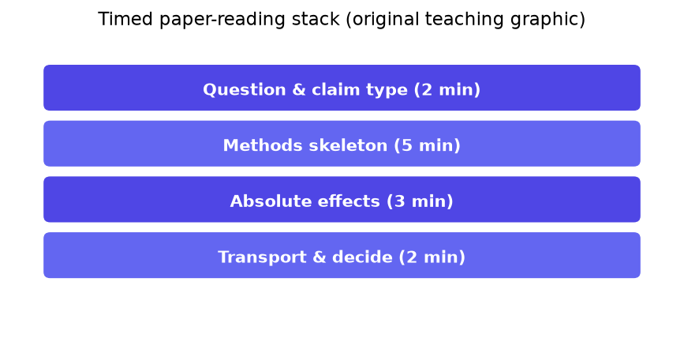
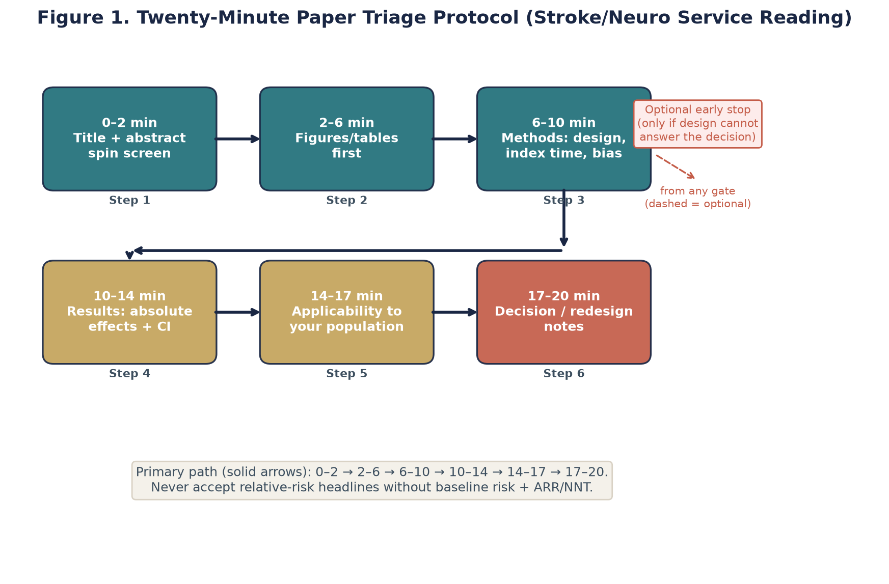
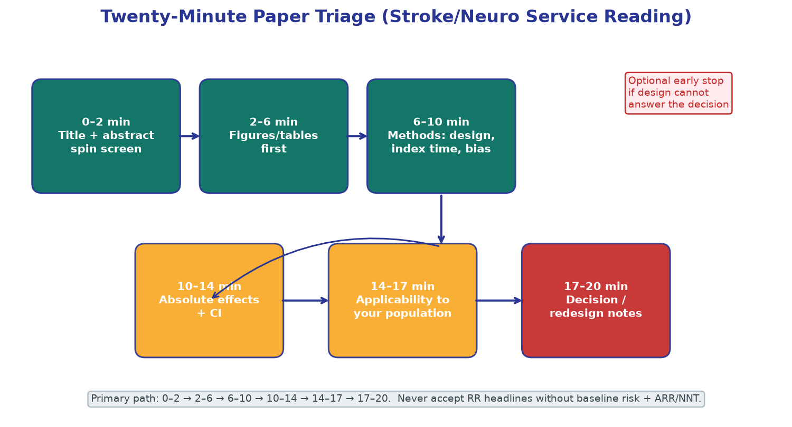

# Chapter 2. How to Read a Paper Under Time Pressure

## Opening

*A short reading session pays off only when it targets the decision — the estimand, the absolute effect, and the largest validity threat — extracted before the discussion's spin.*

You have eleven minutes before rounds. The abstract says practice-changing. This curriculum treats that claim as a hypothesis to pressure-test—validity and transport first, celebration later.

## The Conceptual Core: Speed as a Methodologic Discipline

The realistic unit of reading is twelve to twenty-five minutes: between consults, before a case conference, or right after a fellow forwards a manuscript that "might change practice." Without a method, short sessions produce one of two failures — false confidence, where the reader adopts the abstract's conclusion without appraising the methods, or false modesty, where the reader ignores the literature for lack of time. Disciplined speed is not the enemy of rigor; unstructured thoroughness is. Reading front to back spends scarce attention on rhetorical motivation and mechanistic background that stroke clinicians already know, while neglecting the supplementary table that defines the analytic sample or the exact timing of the intervention. A method directs attention to where truth resides — the methods, the flow diagram, and the primary outcome tables — and away from where marketing resides. IMRaD navigation, abstract triage, figures-and-tables-first extraction, and the timed protocol are complementary instruments for that redirection.

Treat each section by its function: the abstract compresses and frames the report, the introduction supplies rationale, the methods define what was done, the results report analyses, and the discussion interprets them. No section is automatically truthful or misleading. Intentional, recorded skipping can be appropriate when aligned with the decision. During an acute emergency, use current approved pathways, guidelines, and responsible clinical judgment rather than improvising eligibility from a newly opened paper; rapid appraisal belongs upstream of the immediate case.

## Named Frameworks: IMRaD Navigation and Abstract Triage

*A decision-focused route through a paper when time is limited.*

Most clinical research papers follow the IMRaD structure: Introduction, Methods, Results, and Discussion. Treat IMRaD as a spatial map of information density, not as a chronological reading order. The conventional front-to-back sequence optimizes narrative flow for the journal's editors, not decision extraction for clinicians. Your default extraction order under time pressure should strictly be: title and metadata, abstract triage, figures and tables, methods critical path, selected high-yield results text, and finally, the discussion only for the authors' explicitly stated limitations and a spin check.

- Title/metadata: Extract the design label (RCT, cohort, case-control, meta-analysis), the population hint (acute ischemic stroke, ICH, TIA), and the intervention/exposure hint (endovascular therapy, tenecteplase, dual antiplatelet therapy).
- Abstract: Identify the claim type (causal vs. predictive), primary endpoint, direction and magnitude of effect, major safety signals, and obvious applicability limits.
- Figures/tables: Locate the CONSORT or flow diagram, the baseline characteristics table, the primary outcome display, subgroup forest plots, and the safety or adverse events table.
- Methods critical path: Isolate eligibility criteria, index time definition, treatment/exposure definition, comparator, outcome ascertainment, analysis set (e.g., intention-to-treat), and missing data approach.
- Results text: Scan for numbers that clarify tables, primary absolute risk differences, sensitivity analyses, and protocol deviations.
- Discussion: Extract the authors' limitations (often useful), flag overclaim sentences, and cross-check unregistered endpoints if time permits.

Introductions are typically the least efficient place to spend early minutes. They restate the burden of stroke and the historical development of guidelines. Skim introductions only when you are completely outside your subspecialty domain or when evaluating the rationale reveals a fundamental mismatch in the estimand—for example, when the authors use aggressive causal rhetoric to justify a purely predictive machine learning model. Methods and data displays carry exponentially more decision weight per word.

Abstract triage is a focused 90- to 180-second filter. Its purpose is not to appraise the paper fully, but to dictate the next action: execute the full 20-minute protocol now, schedule a deep read later, extract for teaching purposes only, or ignore entirely. A rigorous abstract triage answers five strict questions: What is the question type? Who was studied? What was done or observed? What happened in absolute terms? Why might this fail to apply to my next patient?

- Question type: Causal treatment effect, prognosis/prediction, diagnostic accuracy, etiology, or evidence synthesis.
- Population: Acute large vessel occlusion (LVO), minor non-cardioembolic stroke, spontaneous intracerebral hemorrhage, AF-related stroke.
- Intervention/exposure and comparator: Specific drug dose, device class, active control, usual care, or historical control.
- Primary outcome and horizon: 90-day modified Rankin Scale (mRS) ordinal shift, 30-day readmission, symptomatic ICH, recurrent ischemic stroke.
- Effect sketch: Direction of association, approximate magnitude, statistical precision, and any glaring harm signals.
- Hard stop flags: Surrogate-only primary endpoints for a practice-change claim (e.g., recanalization without clinical mRS); no concurrent control for a causal claim; abstract-only relative effects with no baseline absolute risk provided.

Abstracts can emphasize favorable relative, surrogate, or early outcomes while giving less space to absolute harms or later patient-centered outcomes. Compare the abstract with prespecified outcomes, full tables, and supplement rather than inferring intent from emphasis alone. In observational EHR or claims reports, the phrase 'real-world effectiveness' does not establish causal identification. Scrutinize verbs: 'reduces', 'improves', and 'prevents' usually express causal claims, whereas 'associated with', 'correlated with', and 'predicts' do not.

## Named Frameworks: The Figures-and-Tables-First Extraction (F&T-First)

The figures-and-tables-first (F&T-First) method is an efficient entry point for time-pressured appraisal. Data displays can expose enrollment, exclusions, absolute outcomes, missingness, and unstable subgroup estimates, but they can also omit or frame information selectively. In a stroke RCT, inspect the participant flow diagram, baseline characteristics, primary efficacy display, and safety summary. In an observational cohort, add the cohort flow, exposure timing relative to index, crude and adjusted estimates, and quantitative sensitivity analyses.

Participant flow diagrams reveal selection dynamics. How many patients were screened, enrolled, randomized, treated, and followed? Why were patients excluded? In thrombectomy trials, examine the gap between the imaging-eligible screening pool and randomized participants. The trial provides direct randomized evidence for its enrolled population; excluded groups require separate evidence and transportability reasoning rather than an automatic assumption of benefit or no benefit.

Baseline tables describe prognostic factors and help judge applicability; they do not prove whether randomization succeeded. Assess sequence generation and allocation concealment directly. Chance imbalances can occur after valid randomization, so focus on their clinical implications and any prespecified covariate adjustment rather than baseline significance tests. Age, admission NIHSS, baseline ASPECTS, occlusion site, premorbid mRS, comorbidities, transfer status, and onset-to-treatment time help determine whether the enrolled sample resembles the target population.

- Extract control and intervention event counts for the primary clinical outcome; compute the Absolute Risk Reduction (ARR) manually if it is suppressed.
- Note the analysis set indicated in the figure (Intention-to-Treat [ITT], modified ITT, per-protocol) and verify if it matches the abstract's claim.
- Scan safety tables aggressively for symptomatic ICH, any ICH, 90-day mortality, major systemic bleeding, and procedural complications.
- Treat decorative 3D charts and truncated axes as warning signs because they can distort perceived differences; recover the underlying counts and scales before interpreting them.
- In meta-analyses, inspect forest plots for statistical heterogeneity (I-squared), small-study effect patterns, and ascertain which single trial dominates the weighting.

Subgroup forest plots require careful skepticism. Many trials have limited power for interactions, and multiplicity can generate unstable signals. A difference between a significant result in one subgroup and a nonsignificant result in another is not itself evidence of interaction. Before a subgroup claim influences practice, inspect the interaction estimate and interval, scale, prespecification, multiplicity strategy, plausibility, precision, and replication. Interpret the primary estimate within the trial’s eligibility and treatment conditions while recognizing that a credible interaction can sometimes modify that average.

For diagnostic and imaging papers, seek 2x2 tables or reconstructable counts, ROC curves with clinically relevant operating points, and any calibration assessment appropriate to the output. For prediction models, identify whether evaluation is internal, temporal, geographic, or otherwise external and whether any decision analysis matches the intended action. Missing calibration evidence is an important reporting and appraisal gap, but it does not by itself diagnose the mechanism or prove poor clinical utility.

## Named Frameworks: The 20-Minute Action Protocol

*A timed sequence for moving from claim classification to a defensible stop-or-use decision.*

The 20-minute protocol is engineered for a single original research paper with immediate decision relevance. It is not designed for drafting a formal peer-review referee report, nor for leisurely academic reading. It is designed to produce an actionable, documented extract that can guide a departmental protocol update. Times are approximate; the strict sequence of extraction matters significantly more than the stopwatch. If you have only ten minutes, compress the duration of each block rather than omitting the final action formulation.

- Minutes 0–2 (Triage & Context): Evaluate the title, design label, trial registration ID, and funding/conflicts of interest. Complete abstract triage. Write the exact clinical decision at stake in one sentence.
- Minutes 2–8 (Data Displays): Execute figures-and-tables-first. Assess patient flow, baseline characteristics, primary efficacy outcome, and safety data. Jot down absolute effects (ARR, NNT, NNH) and population boundaries.
- Minutes 8–13 (Methods Critical Path): Isolate strict eligibility criteria, index time definition, intervention/exposure delivery, comparator definition, precise outcome ascertainment, analysis set, and missing data handling.
- Minutes 13–17 (Threat Scan): Systematically scan for selection bias, confounding (essential if observational), information/measurement bias, reporting bias, and transportability limits. Document the top three threats.
- Minutes 17–20 (Action Formulation): Record a provisional evidence disposition—consider for authorized review, adapt and evaluate, await further evidence, or do not use for the proposed claim. State uncertainty, document what was skipped, and keep clinical or policy authority separate from this rapid appraisal.

For an acute EVT or thrombolysis trial that proposes a change to tonight's emergency pathway, invite a second reader for minutes 13–20, or double the allocation for the methods block. For an observational claims association paper, allocate extra minutes to scrutinizing exposure timing, index date definitions, and confounding control, while spending zero minutes celebrating a tiny p-value driven purely by massive sample size. For a secondary-prevention meta-analysis, spend the bulk of your time evaluating the eligibility criteria of the included trials and reconstructing absolute risks.

The protocol ends with an action formulation, even if the action is to wait for more information. A complete ending might be: 'Do not alter the dual-antiplatelet duration protocol based on this retrospective claims study; classifying exposure using a future prescription while starting follow-up at discharge creates immortal person-time unless the analysis handles exposure as time-varying or otherwise realigns time zero.' State what remains uncertain and what evidence would change the decision.

Clinical teams can execute the protocol as a relay: one clinician owns the tables and absolute risks, another owns the methods and bias threats, and a third synthesizes the action sentence. Relay reading can accelerate the process and train a shared epidemiologic vocabulary, provided the team reconciles disagreements and one person owns the documented synthesis.

## Quantitative Reasoning: Estimands, Absolute Effects, and Uncertainty

Rigorous appraisal demands a shift from passive reading of p-values to active calculation of absolute effects. The distinction between relative risk and absolute risk is not academic; it is the mathematical foundation of clinical harm and benefit. A relative risk reduction may be approximately stable across risk strata in some datasets, but that stability is an empirical and modeling assumption—not a mathematical guarantee. Even when a common risk ratio is plausible, the same relative effect produces a smaller absolute benefit in a lower-risk population.

Define your symbols and calculations explicitly. Let $E(Y|A=1)$ be the expected rate of the outcome $Y$ under the intervention $A=1$. Let $E(Y|A=0)$ be the expected rate of the outcome under the control condition $A=0$. The Absolute Risk Reduction (ARR) is $E(Y|A=0) - E(Y|A=1)$ for a bad outcome. The Number Needed to Treat (NNT) is strictly defined as $1 / ARR$. The Number Needed to Harm (NNH) is defined as $1 / ARI$ (Absolute Risk Increase), where $ARI = E(Y_{harm}|A=1) - E(Y_{harm}|A=0)$.

Consider a synthetic fixed-horizon risk-ratio example. Suppose a trial reports a 90-day risk ratio (RR) of 0.70 for recurrent stroke. If the control risk is 10%, applying that RR gives a treated risk of 7%, an ARR of 3 percentage points, and an NNT of 34 after conventional rounding up. If the same RR were transportable to a lower-risk population with a 2% control risk, the treated risk would be 1.4%, the ARR 0.6 percentage points, and the NNT 167. If major hemorrhage instead increased by 1 percentage point, the NNH would be 100. These numbers are illustrative and depend on the assumed transportability of both benefit and harm. Do not perform this calculation by multiplying a cumulative risk by a hazard ratio: an HR is not a risk ratio. Derive fixed-horizon absolute effects from reported event risks, survival or cumulative-incidence curves, or an appropriate model.

Quantify uncertainty rather than reporting only a point estimate. If an ARR is 4% with a 95% CI of 0.5% to 7.5%, the reciprocal point estimate is 25 and the reciprocal of the lower benefit limit is 200. That does not make 200 a literal worst case or determine acceptability; the interval is model-based, and decisions also depend on harm estimates and uncertainty, outcome importance, applicability, burden, and preferences. Use the prespecified interval level and inspect clinically important thresholds.

An estimand is the precise target of inference. In the ICH E9(R1) framework it specifies the treatment conditions being compared, the target population, the outcome variable, the strategy for handling intercurrent events, and the population-level summary measure (for example, a risk difference or difference in means). A serious error in rapid reading is accepting an estimate without defining that target. For example, if a paper claims 'thrombectomy is superior to medical management', but the estimand actually specifies 'thrombectomy among patients with small core infarcts (ASPECTS > 5) treated within 6 hours', the broad claim outruns the population and treatment conditions studied. Always evaluate the estimand before evaluating the estimate.

A critical rule: Prediction does not equal causation everywhere. In predictive modeling (e.g., predicting hemorrhagic transformation after tPA), the variables are selected for their correlation with the outcome, not their causal effect. If a model finds that elevated blood glucose predicts hemorrhage, it does not mean that aggressively lowering blood glucose will prevent hemorrhage. Misinterpreting predictive features as causal therapeutic targets is a severe epidemiologic error. During abstract triage, strictly separate papers into predictive (who is at risk) versus causal (what interventions alter the risk). Never apply causal verbs to predictive models.

## Fully Worked Example: A 20-Minute Appraisal of a Dual Antiplatelet Trial

Suppose a neurology fellow sends you a newly published, multicenter randomized controlled trial comparing a short-course dual antiplatelet therapy (DAPT) regimen versus aspirin alone following high-risk TIA or minor ischemic stroke. Your stroke center standardized on a 21-day DAPT regimen several years ago based on prior landmark trials. The new paper explores a slightly different duration (14 days) and a modified risk score entry criterion. You have exactly twenty minutes before afternoon clinic begins to decide if the clinical pathway requires immediate modification.

This is a fictional teaching trial; all sample sizes, event rates, and eligibility details below are invented.

Minutes 0–2 (Triage & Context). The title confirms it is an RCT. You skim the abstract: the primary endpoint is recurrent ischemic stroke at 90 days. The DAPT arm demonstrates lower recurrence rates but a higher rate of moderate-to-severe bleeding. The enrolled population is restricted to low NIHSS (<=3) and high ABCD2 score patients. The decision at stake is clear: whether to change the DAPT duration or the eligibility criteria in the outpatient protocol. Triage decision: proceed with the full 20-minute protocol.

Minutes 2–8 (Data Displays). You turn immediately to the CONSORT flow diagram. Out of 10,000 screened patients, 6,000 were randomized. Notably, thousands were excluded due to an indication for anticoagulation (e.g., atrial fibrillation) or an NIHSS > 3. This confirms the target population is strictly non-cardioembolic minor stroke. You review Table 1 (Baseline Characteristics). The mean age, hypertension prevalence, and index event types align with your clinic's population. You turn to Table 2 (Primary Outcome). Ischemic stroke occurred in 5.0% of the DAPT arm versus 7.0% in the aspirin arm. You calculate the ARR: 2.0% (NNT = 50). You turn to Table 3 (Safety). Major hemorrhage occurred in 1.5% of the DAPT arm versus 0.5% in the aspirin arm. You calculate the ARI: 1.0% (NNH = 100). You have secured the absolute tradeoff without reading a single word of the authors' narrative.

Minutes 8–13 (Methods Critical Path). You search the methods section for the index time definition. The protocol mandated randomization and first dose within 24 hours of symptom onset. This is a critical transportability constraint; patients referred to your clinic three days after a TIA do not match this index time. You verify the analysis set is intention-to-treat. You confirm the outcome adjudication was blinded. Missing data at 90 days was less than 2%, which is excellent and unlikely to introduce meaningful bias.

Minutes 13–17 (Threat Scan). The randomization and concealment methods appear credible; outcome assessment is blinded and missing data are limited. Baseline differences are interpreted as chance unless the process or enrollment pattern provides evidence of subversion. Transportability is limited for patients presenting beyond the 24-hour window and for adults older than 85 years, who were excluded. The observed bleeding risk may therefore differ in frailer local patients; this requires confirmation rather than a numeric extrapolation from the trial.

Minutes 17–20 (Action Formulation). You are ready to document a decision. Action: Do not expand DAPT to unselected, late-presenting stroke clinic patients. Maintain the current DAPT protocol for early presenters (within 24 hours) matching the trial criteria. Do not change the duration from 21 to 14 days based on this single trial without a formal meta-analysis of all short-course regimens. You assign a team member to update the standard counseling script to include the absolute numbers: 'Treatment prevents 1 stroke in 50 patients, but causes 1 major bleed in 100 patients.' Your confidence is high for the restricted population, but very low for extrapolation. You note that you skipped the detailed subgroup forest plots and the secondary functional endpoints.

You draft the final one-sentence summary for the fictional exercise: 'In the trial-defined population, the estimated 90-day effects were ARR 2 percentage points and ARI 1 percentage point; the study does not directly support late initiation or establish that changing our existing duration improves net outcomes.' The rapid review produces a bounded extract and a reason to seek the full evidence and local pathway review, not an independent treatment directive.

## Pitfalls and Failure Modes in Rapid Appraisal

Rapid appraisal becomes unsafe when an abstract or narrative conclusion substitutes for methods and results. Abstracts are compressed and may omit eligibility, missingness, absolute harms, estimand details, and analysis changes. They can support triage, but consequential implementation requires the full report, protocol or registration where relevant, the broader evidence, and local review.

The second failure mode is conflating prediction or association with causation. An electronic-health-record study might find that early rehabilitation is associated with improved 90-day mRS. Treatment timing can be confounded by severity, stability, goals of care, access, and survival to rehabilitation. The association may still contain information, but it does not identify the effect of assigning early rehabilitation without a defensible causal design and assumptions.

The third failure mode is interpreting secondary, changed, or unregistered endpoints without their hierarchy and multiplicity context. A primary estimate compatible with benefit and harm is not rescued by selecting one favorable secondary result. Some prespecified secondary outcomes can still be informative, but appraisers should examine the testing strategy, estimand, interval, missingness, and consistency with the total evidence rather than applying a blanket label to the entire trial.

The fourth failure mode involves surrogate endpoints. In stroke research, angiographic recanalization (TICI 2b/3), reduction in MRI infarct volume, and early neurological improvement are surrogates. The clinical outcomes that matter to patients are functional independence (mRS 0-2), survival, and time at home. A trial demonstrating superior infarct volume reduction but null functional outcomes does not mandate a practice change. Do not allow surrogate efficacy to substitute for clinical efficacy under time pressure.

The fifth failure mode is missing an index-time mismatch in observational pharmacoepidemiology. If follow-up begins at discharge but exposure is classified using a prescription filled during the next 30 days, people assigned to the exposed group must remain observable long enough to fill it. Crediting the preceding event-free time to exposure creates immortal-time bias unless the design and analysis align assignment and follow-up appropriately. Identifying the mismatch diagnoses the threat; it does not itself correct the estimate.

## Clinical and Epidemiologic Notes

Time pressure is itself a pervasive epidemiologic exposure in modern clinical systems. Rushed, uncritical adoption of incompletely transported evidence generates massive, unwarranted practice variation. These transient practice patterns subsequently appear in large observational datasets as 'era effects' or 'center effects', severely confusing future comparative effectiveness research. Disciplined, structured short reads possess second-order scientific value: they act as a buffer against hype cycles, ensuring that practice variation is driven by genuine patient heterogeneity rather than by the chaotic spread of unappraised abstracts.

From a strict measurement perspective, the figures-and-tables-first method is a powerful partial antidote to narrative spin, but it is not foolproof. Tables can also manifest spin via selective reporting, unusual scales, truncated axes, or the complete suppression of absolute risks. Always ask what table is conspicuously missing: Is there a safety table? Is there a protocol-deviations table? Is there a comparison of baseline characteristics between those who completed follow-up and those who were lost? In clinical epidemiology, the absence of data is itself data.

In the hyper-acute phases of stroke care, reading under time pressure must never be confused with making clinical decisions under time pressure for an individual patient. If a patient with an LVO is currently on the angiography table, you utilize pre-appraised, departmental clinical pathways. You do not open a brand-new PDF. The 20-minute protocol is exclusively for updating those pathways between clinical cases, not for improvising eligibility criteria during an emergency. Robust appraisal infrastructure must sit far upstream of hyper-acute decisions.

Observational studies leveraging claims data or electronic health records require a modified emphasis within the 20-minute protocol. The flow diagram and the precise coding definitions dominate the appraisal because misclassification of the stroke phenotype (e.g., using broad ICD-10 codes) and exposure windows can entirely invert the conclusions. A highly precise, adjusted hazard ratio is completely irrelevant if 'statin exposure' is defined incorrectly. Focus aggressively on index time, exposure definition, and confounding control. Methodologic errors in these domains are epidemic and often completely invisible in the abstract.

Programs can evaluate whether journal-club extracts record the estimand, absolute effects where appropriate, uncertainty, and a bounded next step. Process measurement can reveal omissions, but metrics can also be gamed or add burden; assess whether the intervention actually improves reasoning or decisions rather than assuming measurement guarantees improvement.

## Cross-Links to Other Chapters

The rapid extraction of the PICO/PECO elements and the exact definition of the estimand discussed in this chapter serves as the practical prerequisite for Chapter 3, which provides a rigorous, formal mathematical treatment of causal estimands and target trial emulation.

The threat scan executed during minutes 13-17 relies heavily on the comprehensive bias taxonomy (selection bias, information bias, and confounding) detailed extensively in Chapter 4.

The specific application of the figures-first method to observational claims data and the detection of immortal time bias are expanded into a full methodologic review in Chapter 7 (Observational Effectiveness and Confounding Control).

The critical distinction between prediction and causation, introduced during abstract triage, forms the conceptual core of Chapter 9, which dissects predictive modeling, machine learning, and the TRIPOD reporting guidelines.

## Chapter summary

Time pressure is unavoidable in clinical evidence work. A structured rapid read can reduce omissions but cannot replace a full appraisal for high-impact decisions. Use the paper's sections as an information map, identify the claim type, inspect data displays and methods, record unread material, and state a provisional evidence disposition. Translate relative effects into compatible absolute probabilities or differences when the decision requires them, with endpoint, horizon, and uncertainty. Emergency care should rely on current approved pathways and responsible clinical judgment; this protocol is an upstream evidence-maintenance tool, not a bedside eligibility algorithm.

## Practice and reflection

1. Execute the 20-minute protocol on a recent endovascular thrombectomy (EVT) trial. Calculate the ARR and NNT for 90-day functional independence, and the ARI and NNH for symptomatic ICH.
2. Perform abstract triage on five sequential abstracts from a leading stroke journal. Classify each as a causal claim, a predictive model, or a descriptive association.
3. Locate a secondary-prevention trial reporting a highly significant relative risk reduction. Without reading the text, use the primary outcome table to calculate the absolute risk reduction and NNT.
4. Review a recently published observational study utilizing electronic health records. Identify the exact index time. Does the exposure definition introduce immortal time bias?
5. Draft a formal, one-sentence action formulation for a trial whose primary clinical endpoint was null, but whose authors emphasized a significant surrogate endpoint (e.g., recanalization) in the discussion.
6. Compare the baseline characteristics table of a major acute stroke trial to the demographics of your local stroke registry. List the top three variables that threaten transportability to your center.
7. Identify a paper where a predictive machine learning model uses causal language (e.g., 'modifying this feature improves outcome') in the abstract. Rewrite the abstract sentence to reflect pure prediction.
8. Run the 20-minute protocol in a team relay format: Assign one resident to tables, one to methods, and one to the action sentence. Enforce a strict 20-minute limit.
9. Create a personal extraction checklist template in your note-taking application. Ensure it mandates the calculation of absolute effects and a definitive 'Adopt/Reject/Wait' decision.
10. Review a paper you previously read front-to-back. Re-read it using the figures-and-tables-first method. Note any discrepancies between your initial impression and the raw absolute data.

---

*Figures and tables in this chapter are Teaching materials for CRIT-APP unless a caption explicitly states otherwise. Methods standards are cited by name only.*
