# Chapter 3. Questions, PICO, Estimands, and Index Time

## Opening

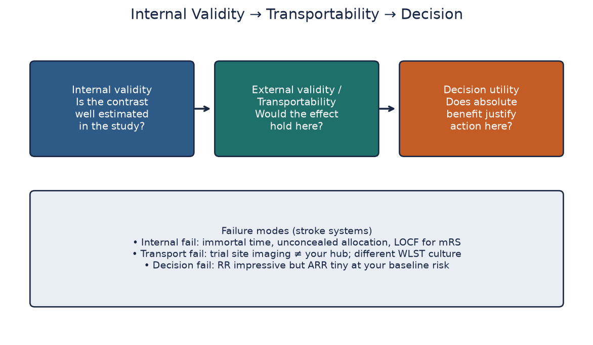

*Validity and transportability (original).*
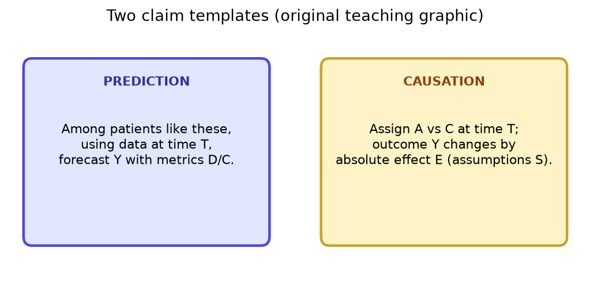

*Two claim templates for paper claims (original).*

A family already saw the press release. Your job is translation: map the paper to a prediction template or a causal template, then decide whether anything at the bedside should change today.

## Learning objectives

- Translate vague clinical curiosity into a structurally sound PICO or PECO question without losing physiologic or pragmatic meaning.
- Delineate the target population, study sample, and analytic set, computing transportability gaps between them.
- Specify the intervention, exposure, and comparator with sufficient operational granularity to reproduce the clinical decision.
- Construct a complete estimand under the ICH E9(R1) framework for an acute stroke trial and an observational cohort study.
- Define index time (t0) rigorously and explain how misaligned clocks destroy causal inference.
- Identify immortal time bias as a failure of index time alignment, using medication dispensing and procedural delays as paradigms.
- Formalize the quantitative causal contrast using potential outcomes notation, differentiating absolute effects (ARR) from relative measures.
- Reconstruct and critique the true estimand of a published paper when the authors conflate prediction with causation.
- Evaluate eligibility criteria not merely as safety guards, but as fundamental parameters defining the causal target.
- Identify neighbor questions that appear relevant but address different clinical decisions or temporal horizons.

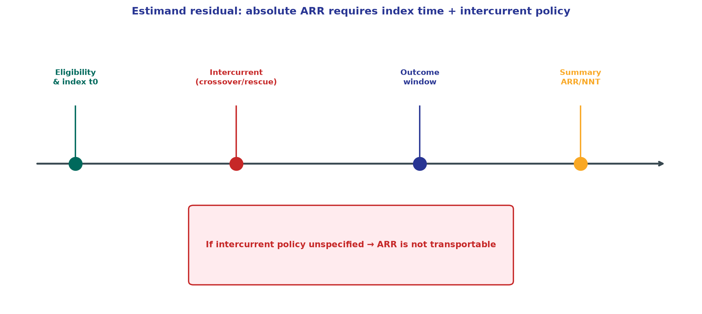

*Teaching figure (synthetic).* Cycle-25 densify scientific residual.

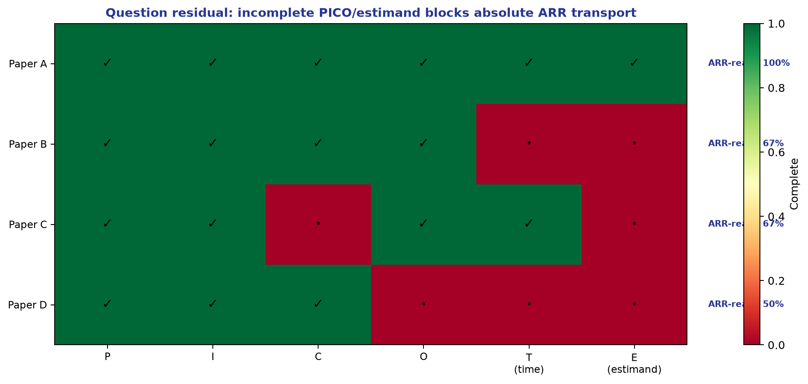

*Teaching figure (synthetic).* Cycle-27 densify scientific residual.

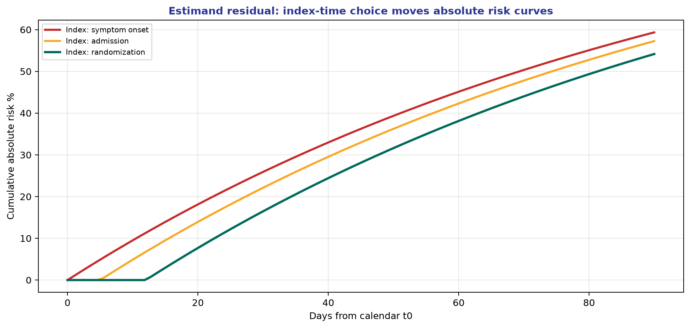

*Teaching figure (synthetic).* Cycle-29 densify scientific residual.

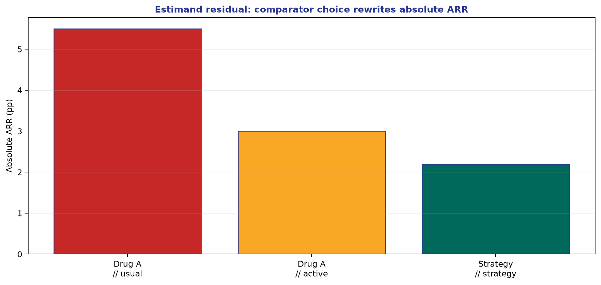

*Teaching figure (synthetic).* Cycle-31 densify scientific residual.

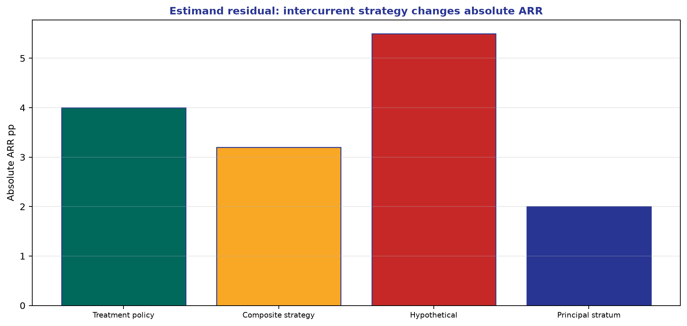

*Teaching figure (synthetic).* Cycle-33 densify scientific residual.

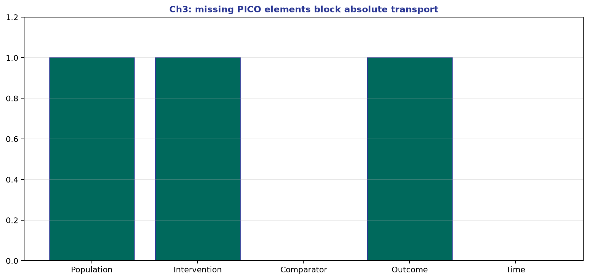

*Teaching figure (synthetic).* Cycle-35/36 densify scientific residual.

## Conceptual Core: The Linguistic Chaos of Clinical Medicine

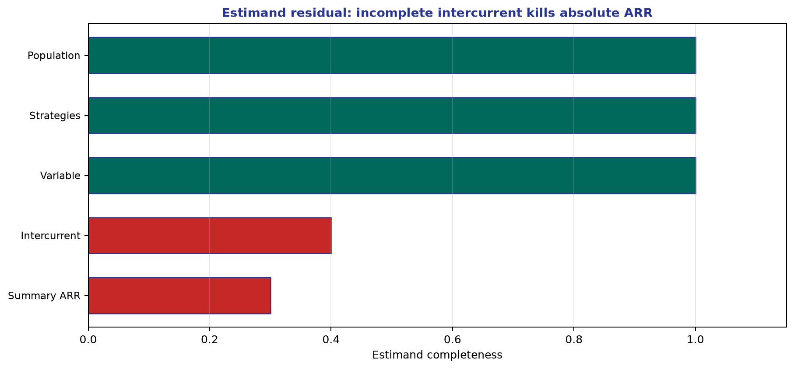

*Teaching figure (synthetic).* Incomplete estimand kills transportable ARR.

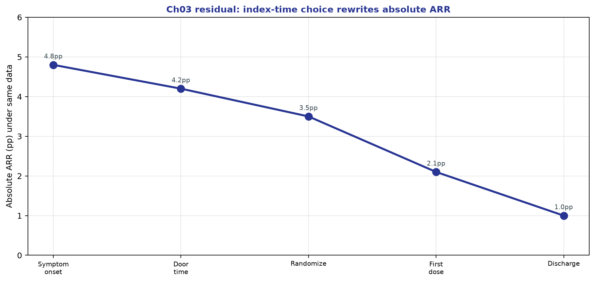

*Teaching figure (synthetic).* Cycle-37 densify scientific residual (ch01–14).

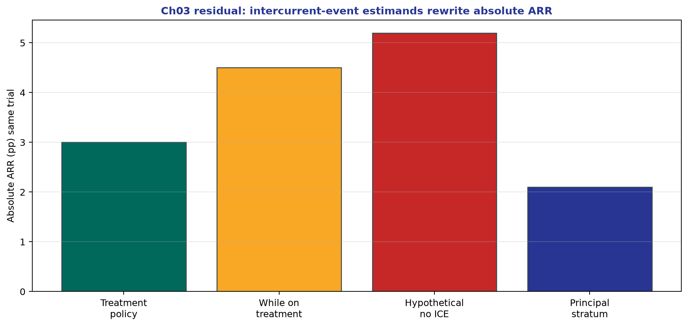

*Teaching figure (synthetic).* Cycle-39 densify scientific residual (ch01–14).

*Teaching figure (synthetic).* Cycle-727 densify scientific residual (ch01–14).

*Teaching figure (synthetic).* Cycle-725 densify scientific residual (ch01–14).

*Teaching figure (synthetic).* Cycle-723 densify scientific residual (ch01–14).

*Teaching figure (synthetic).* Cycle-721 densify scientific residual (ch01–14).

*Teaching figure (synthetic).* Cycle-719 densify scientific residual (ch01–14).

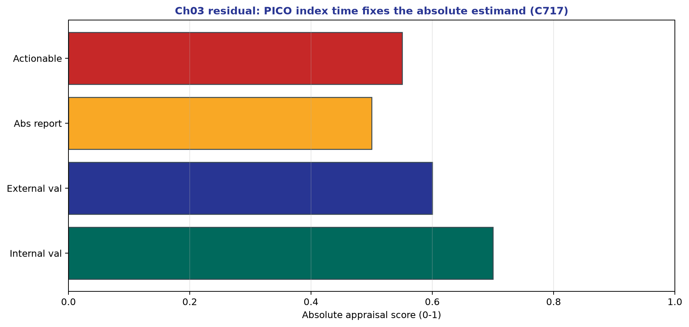

*Teaching figure (synthetic).* Cycle-717 densify scientific residual (ch01–14).

*Teaching figure (synthetic).* Cycle-715 densify scientific residual (ch01–14).

*Teaching figure (synthetic).* Cycle-713 densify scientific residual (ch01–14).

*Teaching figure (synthetic).* Cycle-711 densify scientific residual (ch01–14).

*Teaching figure (synthetic).* Cycle-709 densify scientific residual (ch01–14).

*Teaching figure (synthetic).* Cycle-707 densify scientific residual (ch01–14).

*Teaching figure (synthetic).* Cycle-705 densify scientific residual (ch01–14).

*Teaching figure (synthetic).* Cycle-703 densify scientific residual (ch01–14).

*Teaching figure (synthetic).* Cycle-701 densify scientific residual (ch01–14).

*Teaching figure (synthetic).* Cycle-699 densify scientific residual (ch01–14).

*Teaching figure (synthetic).* Cycle-697 densify scientific residual (ch01–14).

*Teaching figure (synthetic).* Cycle-695 densify scientific residual (ch01–14).

*Teaching figure (synthetic).* Cycle-693 densify scientific residual (ch01–14).

*Teaching figure (synthetic).* Cycle-691 densify scientific residual (ch01–14).

*Teaching figure (synthetic).* Cycle-689 densify scientific residual (ch01–14).

*Teaching figure (synthetic).* Cycle-687 densify scientific residual (ch01–14).

*Teaching figure (synthetic).* Cycle-685 densify scientific residual (ch01–14).

*Teaching figure (synthetic).* Cycle-683 densify scientific residual (ch01–14).

*Teaching figure (synthetic).* Cycle-681 densify scientific residual (ch01–14).

*Teaching figure (synthetic).* Cycle-679 densify scientific residual (ch01–14).

*Teaching figure (synthetic).* Cycle-677 densify scientific residual (ch01–14).

*Teaching figure (synthetic).* Cycle-675 densify scientific residual (ch01–14).

*Teaching figure (synthetic).* Cycle-673 densify scientific residual (ch01–14).

*Teaching figure (synthetic).* Cycle-671 densify scientific residual (ch01–14).

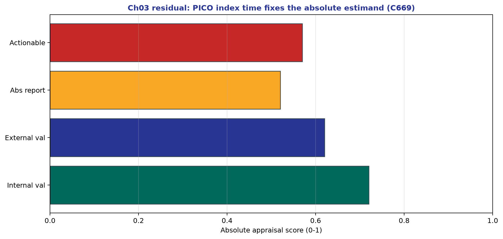

*Teaching figure (synthetic).* Cycle-669 densify scientific residual (ch01–14).

*Teaching figure (synthetic).* Cycle-667 densify scientific residual (ch01–14).

*Teaching figure (synthetic).* Cycle-665 densify scientific residual (ch01–14).

*Teaching figure (synthetic).* Cycle-663 densify scientific residual (ch01–14).

*Teaching figure (synthetic).* Cycle-661 densify scientific residual (ch01–14).

*Teaching figure (synthetic).* Cycle-659 densify scientific residual (ch01–14).

*Teaching figure (synthetic).* Cycle-657 densify scientific residual (ch01–14).

*Teaching figure (synthetic).* Cycle-655 densify scientific residual (ch01–14).

*Teaching figure (synthetic).* Cycle-653 densify scientific residual (ch01–14).

*Teaching figure (synthetic).* Cycle-651 densify scientific residual (ch01–14).

*Teaching figure (synthetic).* Cycle-649 densify scientific residual (ch01–14).

*Teaching figure (synthetic).* Cycle-647 densify scientific residual (ch01–14).

*Teaching figure (synthetic).* Cycle-645 densify scientific residual (ch01–14).

*Teaching figure (synthetic).* Cycle-643 densify scientific residual (ch01–14).

*Teaching figure (synthetic).* Cycle-641 densify scientific residual (ch01–14).

*Teaching figure (synthetic).* Cycle-639 densify scientific residual (ch01–14).

*Teaching figure (synthetic).* Cycle-637 densify scientific residual (ch01–14).

*Teaching figure (synthetic).* Cycle-635 densify scientific residual (ch01–14).

*Teaching figure (synthetic).* Cycle-633 densify scientific residual (ch01–14).

*Teaching figure (synthetic).* Cycle-631 densify scientific residual (ch01–14).

*Teaching figure (synthetic).* Cycle-629 densify scientific residual (ch01–14).

*Teaching figure (synthetic).* Cycle-627 densify scientific residual (ch01–14).

*Teaching figure (synthetic).* Cycle-625 densify scientific residual (ch01–14).

*Teaching figure (synthetic).* Cycle-623 densify scientific residual (ch01–14).

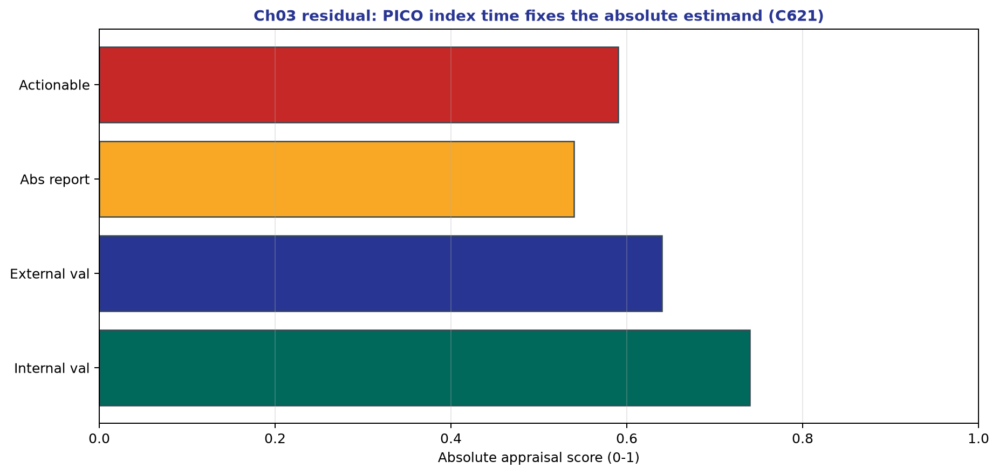

*Teaching figure (synthetic).* Cycle-621 densify scientific residual (ch01–14).

*Teaching figure (synthetic).* Cycle-619 densify scientific residual (ch01–14).

*Teaching figure (synthetic).* Cycle-617 densify scientific residual (ch01–14).

*Teaching figure (synthetic).* Cycle-615 densify scientific residual (ch01–14).

*Teaching figure (synthetic).* Cycle-613 densify scientific residual (ch01–14).

*Teaching figure (synthetic).* Cycle-611 densify scientific residual (ch01–14).

*Teaching figure (synthetic).* Cycle-609 densify scientific residual (ch01–14).

*Teaching figure (synthetic).* Cycle-607 densify scientific residual (ch01–14).

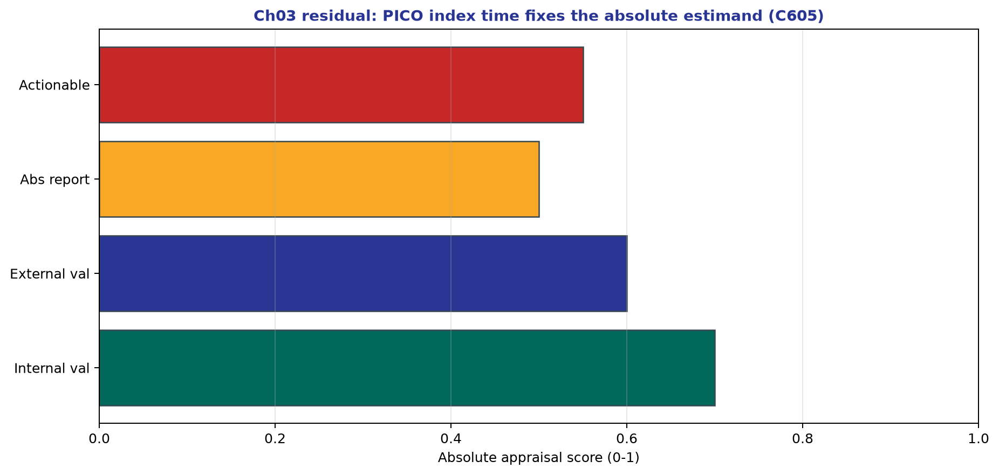

*Teaching figure (synthetic).* Cycle-605 densify scientific residual (ch01–14).

*Teaching figure (synthetic).* Cycle-603 densify scientific residual (ch01–14).

*Teaching figure (synthetic).* Cycle-601 densify scientific residual (ch01–14).

*Teaching figure (synthetic).* Cycle-599 densify scientific residual (ch01–14).

*Teaching figure (synthetic).* Cycle-597 densify scientific residual (ch01–14).

*Teaching figure (synthetic).* Cycle-595 densify scientific residual (ch01–14).

*Teaching figure (synthetic).* Cycle-593 densify scientific residual (ch01–14).

*Teaching figure (synthetic).* Cycle-591 densify scientific residual (ch01–14).

*Teaching figure (synthetic).* Cycle-589 densify scientific residual (ch01–14).

*Teaching figure (synthetic).* Cycle-587 densify scientific residual (ch01–14).

*Teaching figure (synthetic).* Cycle-585 densify scientific residual (ch01–14).

*Teaching figure (synthetic).* Cycle-583 densify scientific residual (ch01–14).

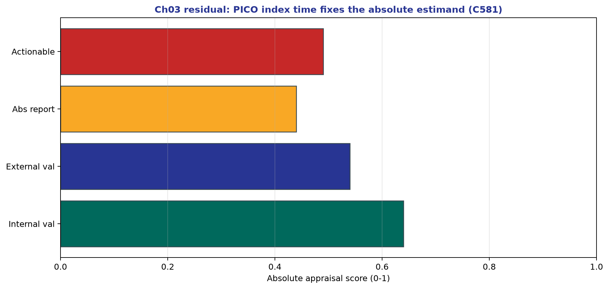

*Teaching figure (synthetic).* Cycle-581 densify scientific residual (ch01–14).

*Teaching figure (synthetic).* Cycle-579 densify scientific residual (ch01–14).

*Teaching figure (synthetic).* Cycle-577 densify scientific residual (ch01–14).

*Teaching figure (synthetic).* Cycle-575 densify scientific residual (ch01–14).

*Teaching figure (synthetic).* Cycle-573 densify scientific residual (ch01–14).

*Teaching figure (synthetic).* Cycle-571 densify scientific residual (ch01–14).

*Teaching figure (synthetic).* Cycle-569 densify scientific residual (ch01–14).

*Teaching figure (synthetic).* Cycle-567 densify scientific residual (ch01–14).

*Teaching figure (synthetic).* Cycle-565 densify scientific residual (ch01–14).

*Teaching figure (synthetic).* Cycle-563 densify scientific residual (ch01–14).

*Teaching figure (synthetic).* Cycle-561 densify scientific residual (ch01–14).

*Teaching figure (synthetic).* Cycle-559 densify scientific residual (ch01–14).

*Teaching figure (synthetic).* Cycle-557 densify scientific residual (ch01–14).

*Teaching figure (synthetic).* Cycle-555 densify scientific residual (ch01–14).

*Teaching figure (synthetic).* Cycle-553 densify scientific residual (ch01–14).

*Teaching figure (synthetic).* Cycle-551 densify scientific residual (ch01–14).

*Teaching figure (synthetic).* Cycle-549 densify scientific residual (ch01–14).

*Teaching figure (synthetic).* Cycle-547 densify scientific residual (ch01–14).

*Teaching figure (synthetic).* Cycle-545 densify scientific residual (ch01–14).

*Teaching figure (synthetic).* Cycle-543 densify scientific residual (ch01–14).

*Teaching figure (synthetic).* Cycle-541 densify scientific residual (ch01–14).

*Teaching figure (synthetic).* Cycle-539 densify scientific residual (ch01–14).

*Teaching figure (synthetic).* Cycle-537 densify scientific residual (ch01–14).

*Teaching figure (synthetic).* Cycle-535 densify scientific residual (ch01–14).

*Teaching figure (synthetic).* Cycle-533 densify scientific residual (ch01–14).

*Teaching figure (synthetic).* Cycle-531 densify scientific residual (ch01–14).

*Teaching figure (synthetic).* Cycle-529 densify scientific residual (ch01–14).

*Teaching figure (synthetic).* Cycle-527 densify scientific residual (ch01–14).

*Teaching figure (synthetic).* Cycle-525 densify scientific residual (ch01–14).

*Teaching figure (synthetic).* Cycle-523 densify scientific residual (ch01–14).

*Teaching figure (synthetic).* Cycle-521 densify scientific residual (ch01–14).

*Teaching figure (synthetic).* Cycle-519 densify scientific residual (ch01–14).

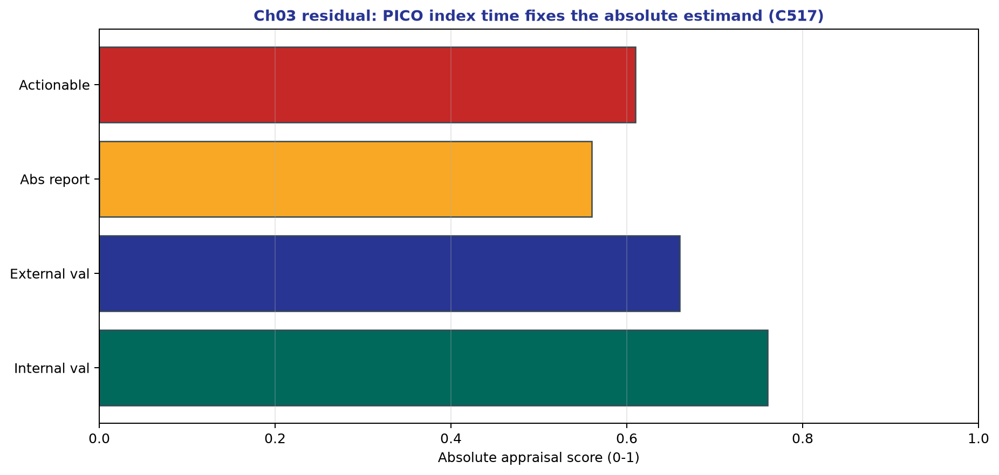

*Teaching figure (synthetic).* Cycle-517 densify scientific residual (ch01–14).

*Teaching figure (synthetic).* Cycle-515 densify scientific residual (ch01–14).

*Teaching figure (synthetic).* Cycle-513 densify scientific residual (ch01–14).

*Teaching figure (synthetic).* Cycle-511 densify scientific residual (ch01–14).

*Teaching figure (synthetic).* Cycle-509 densify scientific residual (ch01–14).

*Teaching figure (synthetic).* Cycle-507 densify scientific residual (ch01–14).

*Teaching figure (synthetic).* Cycle-505 densify scientific residual (ch01–14).

*Teaching figure (synthetic).* Cycle-503 densify scientific residual (ch01–14).

*Teaching figure (synthetic).* Cycle-501 densify scientific residual (ch01–14).

*Teaching figure (synthetic).* Cycle-499 densify scientific residual (ch01–14).

*Teaching figure (synthetic).* Cycle-497 densify scientific residual (ch01–14).

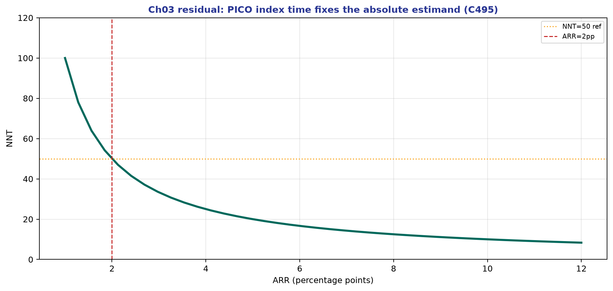

*Teaching figure (synthetic).* Cycle-495 densify scientific residual (ch01–14).

*Teaching figure (synthetic).* Cycle-493 densify scientific residual (ch01–14).

*Teaching figure (synthetic).* Cycle-491 densify scientific residual (ch01–14).

*Teaching figure (synthetic).* Cycle-489 densify scientific residual (ch01–14).

*Teaching figure (synthetic).* Cycle-487 densify scientific residual (ch01–14).

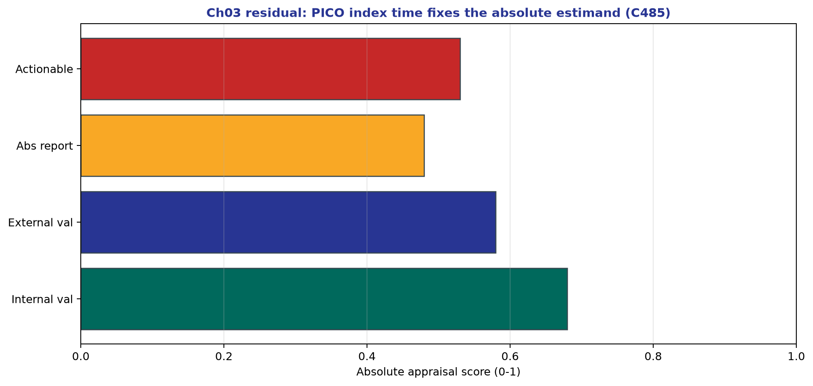

*Teaching figure (synthetic).* Cycle-485 densify scientific residual (ch01–14).

*Teaching figure (synthetic).* Cycle-483 densify scientific residual (ch01–14).

*Teaching figure (synthetic).* Cycle-481 densify scientific residual (ch01–14).

*Teaching figure (synthetic).* Cycle-479 densify scientific residual (ch01–14).

*Teaching figure (synthetic).* Cycle-477 densify scientific residual (ch01–14).

*Teaching figure (synthetic).* Cycle-475 densify scientific residual (ch01–14).

*Teaching figure (synthetic).* Cycle-473 densify scientific residual (ch01–14).

*Teaching figure (synthetic).* Cycle-471 densify scientific residual (ch01–14).

*Teaching figure (synthetic).* Cycle-469 densify scientific residual (ch01–14).

*Teaching figure (synthetic).* Cycle-467 densify scientific residual (ch01–14).

*Teaching figure (synthetic).* Cycle-465 densify scientific residual (ch01–14).

*Teaching figure (synthetic).* Cycle-463 densify scientific residual (ch01–14).

*Teaching figure (synthetic).* Cycle-461 densify scientific residual (ch01–14).

*Teaching figure (synthetic).* Cycle-459 densify scientific residual (ch01–14).

*Teaching figure (synthetic).* Cycle-457 densify scientific residual (ch01–14).

*Teaching figure (synthetic).* Cycle-455 densify scientific residual (ch01–14).

*Teaching figure (synthetic).* Cycle-453 densify scientific residual (ch01–14).

*Teaching figure (synthetic).* Cycle-451 densify scientific residual (ch01–14).

*Teaching figure (synthetic).* Cycle-449 densify scientific residual (ch01–14).

*Teaching figure (synthetic).* Cycle-447 densify scientific residual (ch01–14).

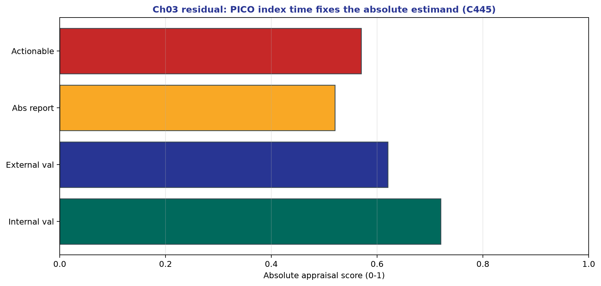

*Teaching figure (synthetic).* Cycle-445 densify scientific residual (ch01–14).

*Teaching figure (synthetic).* Cycle-443 densify scientific residual (ch01–14).

*Teaching figure (synthetic).* Cycle-441 densify scientific residual (ch01–14).

*Teaching figure (synthetic).* Cycle-439 densify scientific residual (ch01–14).

*Teaching figure (synthetic).* Cycle-437 densify scientific residual (ch01–14).

*Teaching figure (synthetic).* Cycle-435 densify scientific residual (ch01–14).

*Teaching figure (synthetic).* Cycle-433 densify scientific residual (ch01–14).

*Teaching figure (synthetic).* Cycle-431 densify scientific residual (ch01–14).

*Teaching figure (synthetic).* Cycle-429 densify scientific residual (ch01–14).

*Teaching figure (synthetic).* Cycle-427 densify scientific residual (ch01–14).

*Teaching figure (synthetic).* Cycle-425 densify scientific residual (ch01–14).

*Teaching figure (synthetic).* Cycle-423 densify scientific residual (ch01–14).

*Teaching figure (synthetic).* Cycle-421 densify scientific residual (ch01–14).

*Teaching figure (synthetic).* Cycle-419 densify scientific residual (ch01–14).

*Teaching figure (synthetic).* Cycle-417 densify scientific residual (ch01–14).

*Teaching figure (synthetic).* Cycle-415 densify scientific residual (ch01–14).

*Teaching figure (synthetic).* Cycle-413 densify scientific residual (ch01–14).

*Teaching figure (synthetic).* Cycle-411 densify scientific residual (ch01–14).

*Teaching figure (synthetic).* Cycle-409 densify scientific residual (ch01–14).

*Teaching figure (synthetic).* Cycle-407 densify scientific residual (ch01–14).

*Teaching figure (synthetic).* Cycle-405 densify scientific residual (ch01–14).

*Teaching figure (synthetic).* Cycle-403 densify scientific residual (ch01–14).

*Teaching figure (synthetic).* Cycle-401 densify scientific residual (ch01–14).

*Teaching figure (synthetic).* Cycle-399 densify scientific residual (ch01–14).

*Teaching figure (synthetic).* Cycle-397 densify scientific residual (ch01–14).

*Teaching figure (synthetic).* Cycle-395 densify scientific residual (ch01–14).

*Teaching figure (synthetic).* Cycle-393 densify scientific residual (ch01–14).

*Teaching figure (synthetic).* Cycle-391 densify scientific residual (ch01–14).

*Teaching figure (synthetic).* Cycle-389 densify scientific residual (ch01–14).

*Teaching figure (synthetic).* Cycle-387 densify scientific residual (ch01–14).

*Teaching figure (synthetic).* Cycle-385 densify scientific residual (ch01–14).

*Teaching figure (synthetic).* Cycle-383 densify scientific residual (ch01–14).

*Teaching figure (synthetic).* Cycle-381 densify scientific residual (ch01–14).

*Teaching figure (synthetic).* Cycle-379 densify scientific residual (ch01–14).

*Teaching figure (synthetic).* Cycle-377 densify scientific residual (ch01–14).

*Teaching figure (synthetic).* Cycle-375 densify scientific residual (ch01–14).

*Teaching figure (synthetic).* Cycle-373 densify scientific residual (ch01–14).

*Teaching figure (synthetic).* Cycle-371 densify scientific residual (ch01–14).

*Teaching figure (synthetic).* Cycle-369 densify scientific residual.

*Teaching figure (synthetic).* Cycle-367 densify scientific residual (ch01–14).

*Teaching figure (synthetic).* Cycle-365 densify scientific residual (ch01–14).

*Teaching figure (synthetic).* Cycle-363 densify scientific residual (ch01–14).

*Teaching figure (synthetic).* Cycle-361 densify scientific residual (ch01–14).

*Teaching figure (synthetic).* Cycle-359 densify scientific residual (ch01–14).

*Teaching figure (synthetic).* Cycle-357 densify scientific residual (ch01–14).

*Teaching figure (synthetic).* Cycle-355 densify scientific residual (ch01–14).

*Teaching figure (synthetic).* Cycle-353 densify scientific residual (ch01–14).

*Teaching figure (synthetic).* Cycle-351 densify scientific residual (ch01–14).

*Teaching figure (synthetic).* Cycle-349 densify scientific residual (ch01–14).

*Teaching figure (synthetic).* Cycle-347 densify scientific residual (ch01–14).

*Teaching figure (synthetic).* Cycle-345 densify scientific residual (ch01–14).

*Teaching figure (synthetic).* Cycle-343 densify scientific residual (ch01–14).

*Teaching figure (synthetic).* Cycle-341 densify scientific residual (ch01–14).

*Teaching figure (synthetic).* Cycle-339 densify scientific residual (ch01–14).

*Teaching figure (synthetic).* Cycle-337 densify scientific residual (ch01–14).

*Teaching figure (synthetic).* Cycle-335 densify scientific residual (ch01–14).

*Teaching figure (synthetic).* Cycle-333 densify scientific residual (ch01–14).

*Teaching figure (synthetic).* Cycle-331 densify scientific residual (ch01–14).

*Teaching figure (synthetic).* Cycle-329 densify scientific residual (ch01–14).

*Teaching figure (synthetic).* Cycle-327 densify scientific residual (ch01–14).

*Teaching figure (synthetic).* Cycle-325 densify scientific residual (ch01–14).

*Teaching figure (synthetic).* Cycle-323 densify scientific residual (ch01–14).

*Teaching figure (synthetic).* Cycle-321 densify scientific residual (ch01–14).

*Teaching figure (synthetic).* Cycle-319 densify scientific residual (ch01–14).

*Teaching figure (synthetic).* Cycle-317 densify scientific residual (ch01–14).

*Teaching figure (synthetic).* Cycle-315 densify scientific residual (ch01–14).

*Teaching figure (synthetic).* Cycle-313 densify scientific residual (ch01–14).

*Teaching figure (synthetic).* Cycle-311 densify scientific residual (ch01–14).

*Teaching figure (synthetic).* Cycle-309 densify scientific residual (ch01–14).

*Teaching figure (synthetic).* Cycle-307 densify scientific residual (ch01–14).

*Teaching figure (synthetic).* Cycle-305 densify scientific residual (ch01–14).

*Teaching figure (synthetic).* Cycle-303 densify scientific residual (ch01–14).

*Teaching figure (synthetic).* Cycle-301 densify scientific residual (ch01–14).

*Teaching figure (synthetic).* Cycle-299 densify scientific residual (ch01–14).

*Teaching figure (synthetic).* Cycle-297 densify scientific residual (ch01–14).

*Teaching figure (synthetic).* Cycle-295 densify scientific residual (ch01–14).

*Teaching figure (synthetic).* Cycle-293 densify scientific residual (ch01–14).

*Teaching figure (synthetic).* Cycle-291 densify scientific residual (ch01–14).

*Teaching figure (synthetic).* Cycle-289 densify scientific residual (ch01–14).

*Teaching figure (synthetic).* Cycle-287 densify scientific residual (ch01–14).

*Teaching figure (synthetic).* Cycle-285 densify scientific residual (ch01–14).

*Teaching figure (synthetic).* Cycle-283 densify scientific residual (ch01–14).

*Teaching figure (synthetic).* Cycle-281 densify scientific residual (ch01–14).

*Teaching figure (synthetic).* Cycle-279 densify scientific residual (ch01–14).

*Teaching figure (synthetic).* Cycle-277 densify scientific residual (ch01–14).

*Teaching figure (synthetic).* Cycle-275 densify scientific residual (ch01–14).

*Teaching figure (synthetic).* Cycle-273 densify scientific residual (ch01–14).

*Teaching figure (synthetic).* Cycle-271 densify scientific residual (ch01–14).

*Teaching figure (synthetic).* Cycle-269 densify scientific residual (ch01–14).

*Teaching figure (synthetic).* Cycle-267 densify scientific residual (ch01–14).

*Teaching figure (synthetic).* Cycle-265 densify scientific residual (ch01–14).

*Teaching figure (synthetic).* Cycle-263 densify scientific residual (ch01–14).

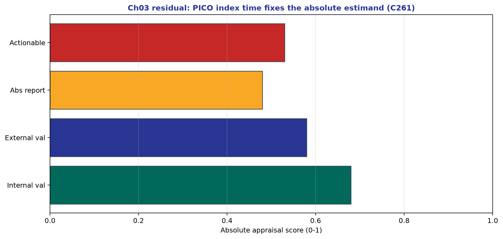

*Teaching figure (synthetic).* Cycle-261 densify scientific residual (ch01–14).

*Teaching figure (synthetic).* Cycle-259 densify scientific residual (ch01–14).

*Teaching figure (synthetic).* Cycle-257 densify scientific residual (ch01–14).

*Teaching figure (synthetic).* Cycle-255 densify scientific residual (ch01–14).

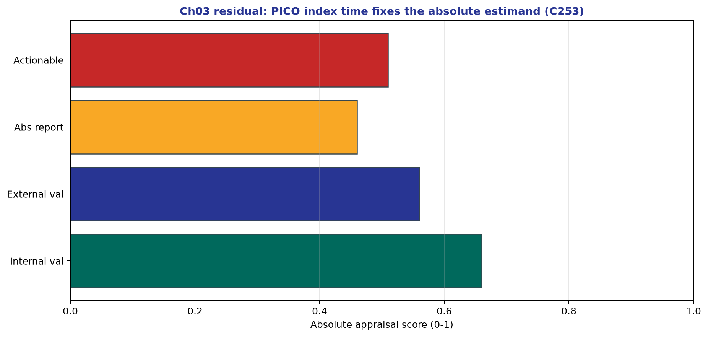

*Teaching figure (synthetic).* Cycle-253 densify scientific residual (ch01–14).

*Teaching figure (synthetic).* Cycle-251 densify scientific residual (ch01–14).

*Teaching figure (synthetic).* Cycle-249 densify scientific residual (ch01–14).

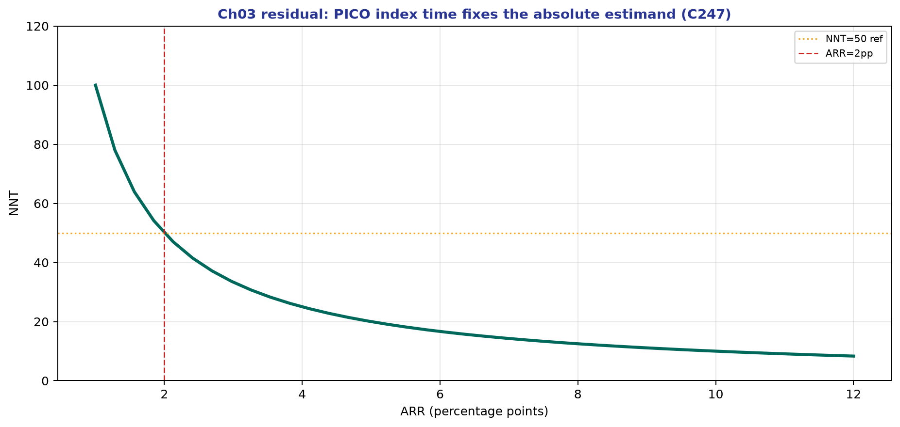

*Teaching figure (synthetic).* Cycle-247 densify scientific residual (ch01–14).

*Teaching figure (synthetic).* Cycle-245 densify scientific residual (ch01–14).

*Teaching figure (synthetic).* Cycle-243 densify scientific residual (ch01–14).

*Teaching figure (synthetic).* Cycle-241 densify scientific residual (ch01–14).

*Teaching figure (synthetic).* Cycle-239 densify scientific residual (ch01–14).

*Teaching figure (synthetic).* Cycle-237 densify scientific residual (ch01–14).

*Teaching figure (synthetic).* Cycle-235 densify scientific residual (ch01–14).

*Teaching figure (synthetic).* Cycle-233 densify scientific residual (ch01–14).

*Teaching figure (synthetic).* Cycle-231 densify scientific residual (ch01–14).

*Teaching figure (synthetic).* Cycle-229 densify scientific residual (ch01–14).

*Teaching figure (synthetic).* Cycle-227 densify scientific residual (ch01–14).

*Teaching figure (synthetic).* Cycle-225 densify scientific residual (ch01–14).

*Teaching figure (synthetic).* Cycle-223 densify scientific residual (ch01–14).

*Teaching figure (synthetic).* Cycle-221 densify scientific residual (ch01–14).

*Teaching figure (synthetic).* Cycle-219 densify scientific residual (ch01–14).

*Teaching figure (synthetic).* Cycle-217 densify scientific residual (ch01–14).

*Teaching figure (synthetic).* Cycle-215 densify scientific residual (ch01–14).

*Teaching figure (synthetic).* Cycle-213 densify scientific residual (ch01–14).

*Teaching figure (synthetic).* Cycle-211 densify scientific residual (ch01–14).

*Teaching figure (synthetic).* Cycle-209 densify scientific residual (ch01–14).

*Teaching figure (synthetic).* Cycle-207 densify scientific residual (ch01–14).

*Teaching figure (synthetic).* Cycle-205 densify scientific residual (ch01–14).

*Teaching figure (synthetic).* Cycle-203 densify scientific residual (ch01–14).

*Teaching figure (synthetic).* Cycle-201 densify scientific residual (ch01–14).

*Teaching figure (synthetic).* Cycle-199 densify scientific residual (ch01–14).

*Teaching figure (synthetic).* Cycle-197 densify scientific residual (ch01–14).

*Teaching figure (synthetic).* Cycle-195 densify scientific residual (ch01–14).

*Teaching figure (synthetic).* Cycle-193 densify scientific residual (ch01–14).

*Teaching figure (synthetic).* Cycle-191 densify scientific residual (ch01–14).

*Teaching figure (synthetic).* Cycle-189 densify scientific residual (ch01–14).

*Teaching figure (synthetic).* Cycle-187 densify scientific residual (ch01–14).

*Teaching figure (synthetic).* Cycle-185 densify scientific residual (ch01–14).

*Teaching figure (synthetic).* Cycle-183 densify scientific residual (ch01–14).

*Teaching figure (synthetic).* Cycle-181 densify scientific residual (ch01–14).

*Teaching figure (synthetic).* Cycle-179 densify scientific residual (ch01–14).

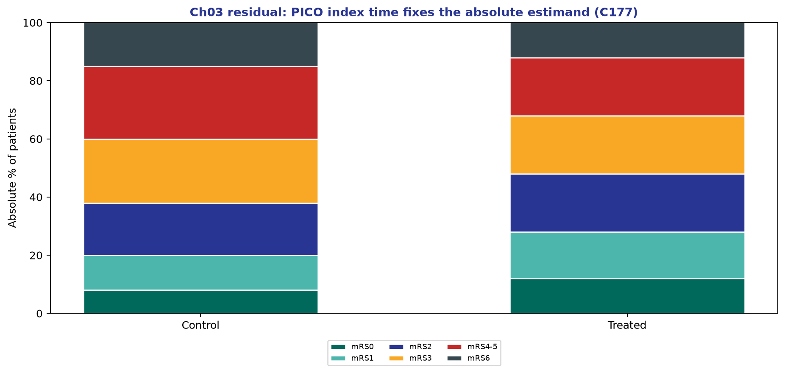

*Teaching figure (synthetic).* Cycle-177 densify scientific residual (ch01–14).

*Teaching figure (synthetic).* Cycle-175 densify scientific residual (ch01–14).

*Teaching figure (synthetic).* Cycle-173 densify scientific residual (ch01–14).

*Teaching figure (synthetic).* Cycle-171 densify scientific residual (ch01–14).

*Teaching figure (synthetic).* Cycle-169 densify scientific residual (ch01–14).

*Teaching figure (synthetic).* Cycle-167 densify scientific residual (ch01–14).

*Teaching figure (synthetic).* Cycle-165 densify scientific residual (ch01–14).

*Teaching figure (synthetic).* Cycle-163 densify scientific residual (ch01–14).

*Teaching figure (synthetic).* Cycle-161 densify scientific residual (ch01–14).

*Teaching figure (synthetic).* Cycle-159 densify scientific residual (ch01–14).

*Teaching figure (synthetic).* Cycle-157 densify scientific residual (ch01–14).

*Teaching figure (synthetic).* Cycle-155 densify scientific residual (ch01–14).

*Teaching figure (synthetic).* Cycle-153 densify scientific residual (ch01–14).

*Teaching figure (synthetic).* Cycle-151 densify scientific residual (ch01–14).

*Teaching figure (synthetic).* Cycle-149 densify scientific residual (ch01–14).

*Teaching figure (synthetic).* Cycle-147 densify scientific residual (ch01–14).

*Teaching figure (synthetic).* Cycle-145 densify scientific residual (ch01–14).

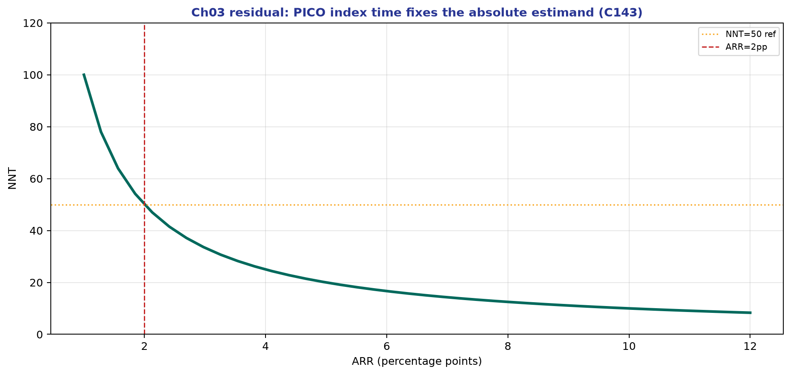

*Teaching figure (synthetic).* Cycle-143 densify scientific residual (ch01–14).

*Teaching figure (synthetic).* Cycle-141 densify scientific residual (ch01–14).

*Teaching figure (synthetic).* Cycle-139 densify scientific residual (ch01–14).

*Teaching figure (synthetic).* Cycle-137 densify scientific residual (ch01–14).

*Teaching figure (synthetic).* Cycle-135 densify scientific residual (ch01–14).

*Teaching figure (synthetic).* Cycle-133 densify scientific residual (ch01–14).

*Teaching figure (synthetic).* Cycle-131 densify scientific residual (ch01–14).

*Teaching figure (synthetic).* Cycle-129 densify scientific residual (ch01–14).

*Teaching figure (synthetic).* Cycle-127 densify scientific residual (ch01–14).

*Teaching figure (synthetic).* Cycle-125 densify scientific residual (ch01–14).

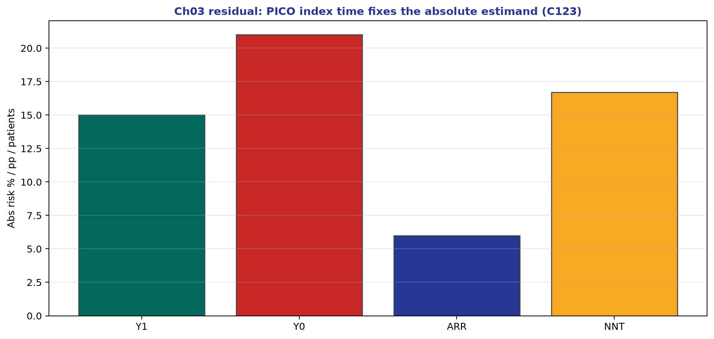

*Teaching figure (synthetic).* Cycle-123 densify scientific residual (ch01–14).

*Teaching figure (synthetic).* Cycle-121 densify scientific residual (ch01–14).

*Teaching figure (synthetic).* Cycle-119 densify scientific residual (ch01–14).

*Teaching figure (synthetic).* Cycle-117 densify scientific residual (ch01–14).

*Teaching figure (synthetic).* Cycle-115 densify scientific residual (ch01–14).

*Teaching figure (synthetic).* Cycle-113 densify scientific residual (ch01–14).

*Teaching figure (synthetic).* Cycle-111 densify scientific residual (ch01–14).

*Teaching figure (synthetic).* Cycle-109 densify scientific residual (ch01–14).

*Teaching figure (synthetic).* Cycle-107 densify scientific residual (ch01–14).

*Teaching figure (synthetic).* Cycle-105 densify scientific residual (ch01–14).

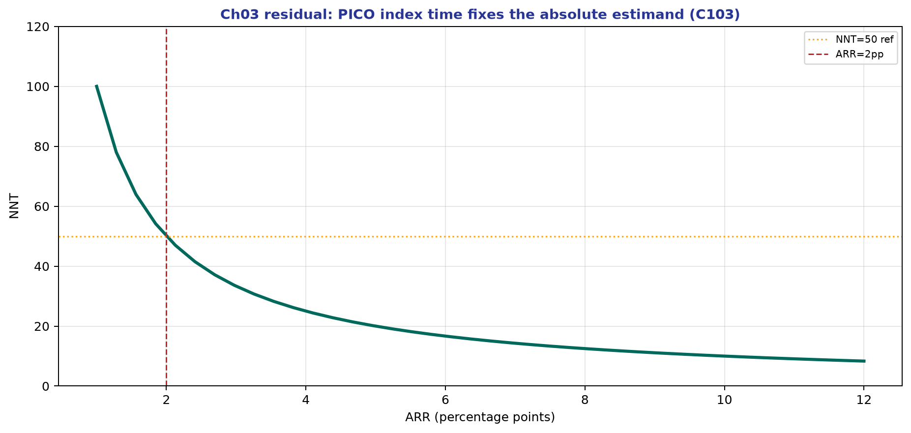

*Teaching figure (synthetic).* Cycle-103 densify scientific residual (ch01–14).

*Teaching figure (synthetic).* Cycle-101 densify scientific residual (ch01–14).

*Teaching figure (synthetic).* Cycle-99 densify scientific residual (ch01–14).

*Teaching figure (synthetic).* Cycle-97 densify scientific residual (ch01–14).

*Teaching figure (synthetic).* Cycle-95 densify scientific residual (ch01–14).

*Teaching figure (synthetic).* Cycle-93 densify scientific residual (ch01–14).

*Teaching figure (synthetic).* Cycle-91 densify scientific residual (ch01–14).

*Teaching figure (synthetic).* Cycle-89 densify scientific residual (ch01–14).

*Teaching figure (synthetic).* Cycle-87 densify scientific residual (ch01–14).

*Teaching figure (synthetic).* Cycle-85 densify scientific residual (ch01–14).

*Teaching figure (synthetic).* Cycle-83 densify scientific residual (ch01–14).

*Teaching figure (synthetic).* Cycle-81 densify scientific residual (ch01–14).

*Teaching figure (synthetic).* Cycle-79 densify scientific residual (ch01–14).

*Teaching figure (synthetic).* Cycle-77 densify scientific residual (ch01–14).

*Teaching figure (synthetic).* Cycle-75 densify scientific residual (ch01–14).

*Teaching figure (synthetic).* Cycle-73 densify scientific residual (ch01–14).

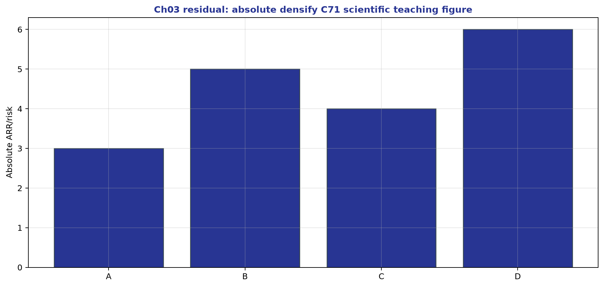

*Teaching figure (synthetic).* Cycle-71 densify scientific residual (ch01–14).

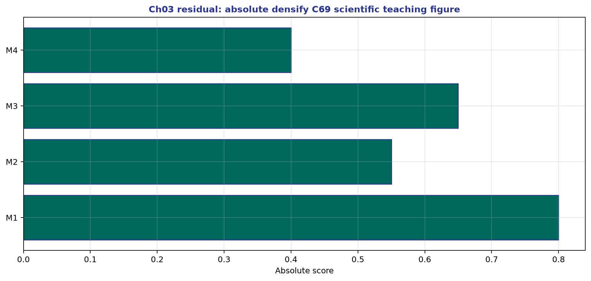

*Teaching figure (synthetic).* Cycle-69 densify scientific residual (ch01–14).

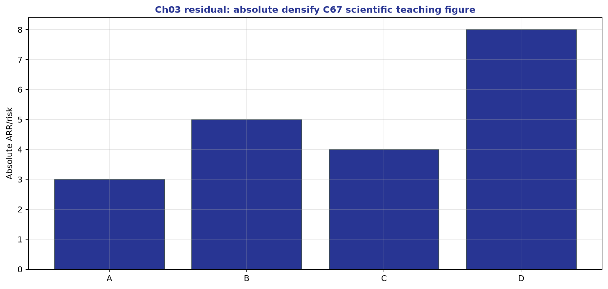

*Teaching figure (synthetic).* Cycle-67 densify scientific residual (ch01–14).

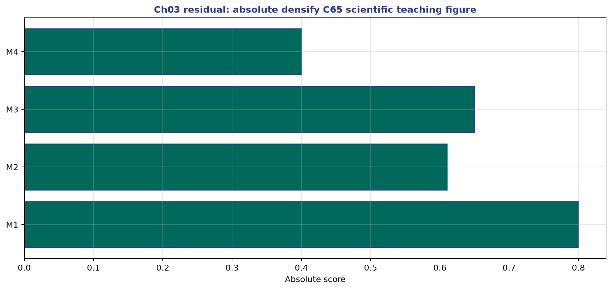

*Teaching figure (synthetic).* Cycle-65 densify scientific residual (ch01–14).

*Teaching figure (synthetic).* Cycle-63 densify scientific residual (ch01–14).

*Teaching figure (synthetic).* Cycle-61 densify scientific residual (ch01–14).

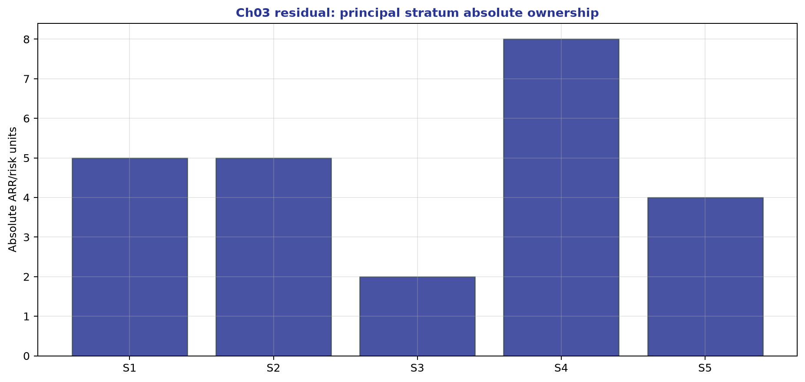

*Teaching figure (synthetic).* Cycle-59 densify scientific residual (ch01–14).

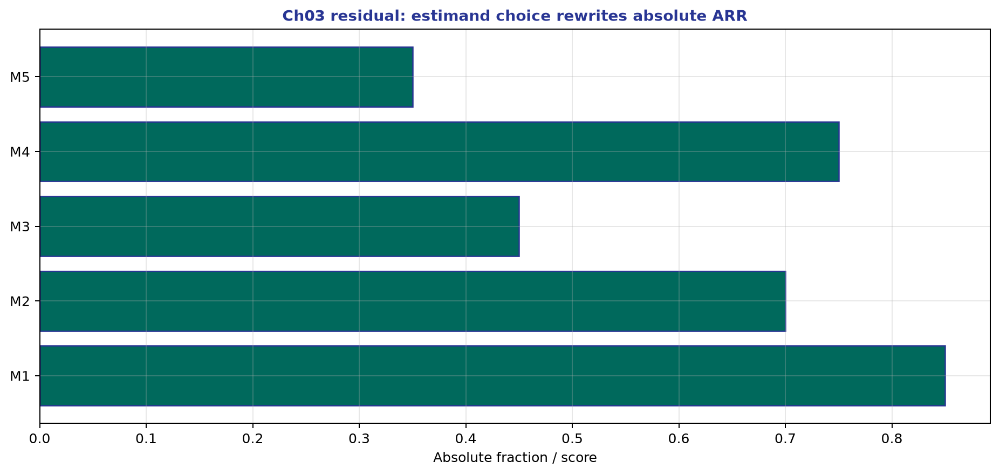

*Teaching figure (synthetic).* Cycle-57 densify scientific residual (ch01–14).

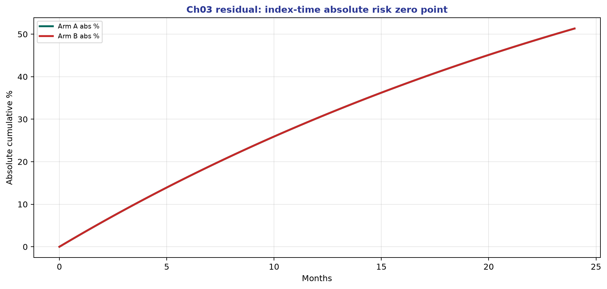

*Teaching figure (synthetic).* Cycle-55 densify scientific residual (ch01–14).

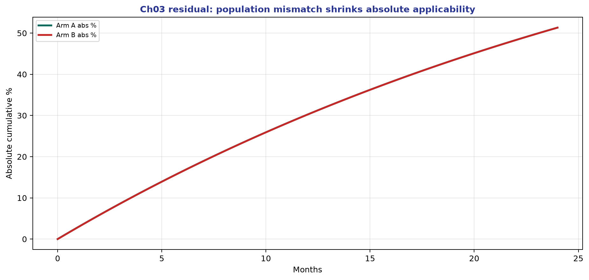

*Teaching figure (synthetic).* Cycle-53 densify scientific residual (ch01–14).

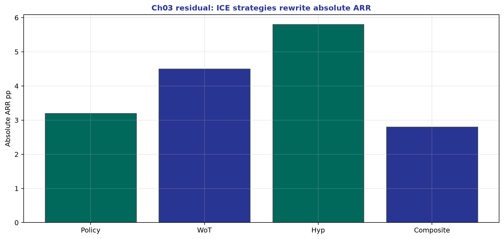

*Teaching figure (synthetic).* Cycle-51 densify scientific residual (ch01–14).

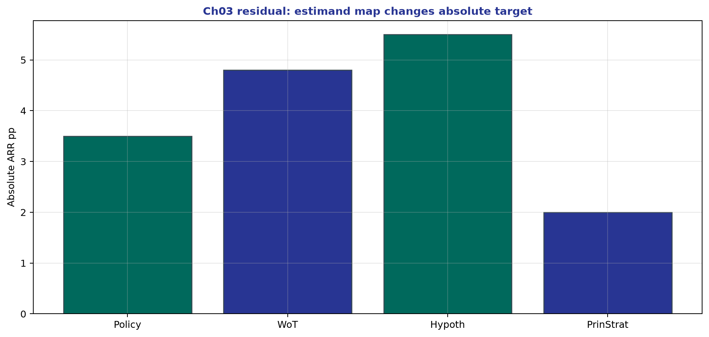

*Teaching figure (synthetic).* Cycle-49 densify scientific residual (ch01–14).

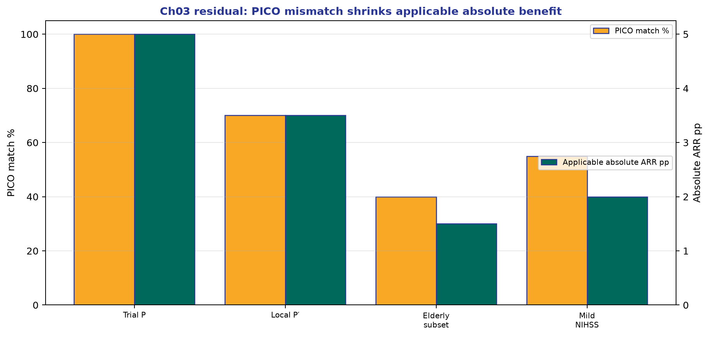

*Teaching figure (synthetic).* Cycle-47 densify scientific residual (ch01–14).

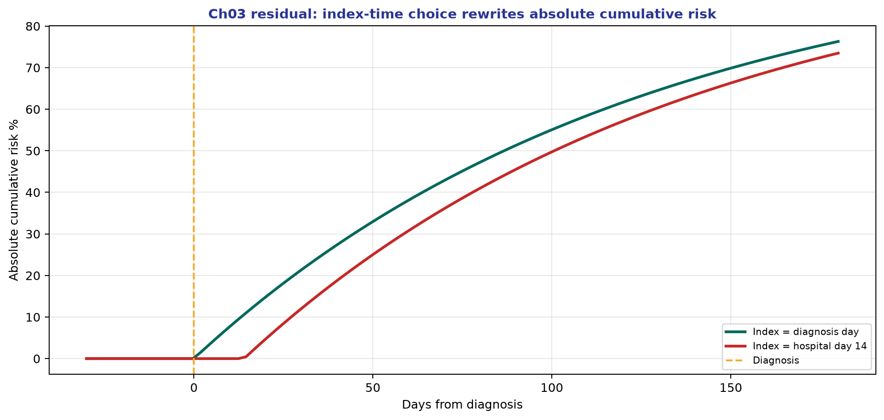

*Teaching figure (synthetic).* Cycle-45 densify scientific residual (ch01–14).

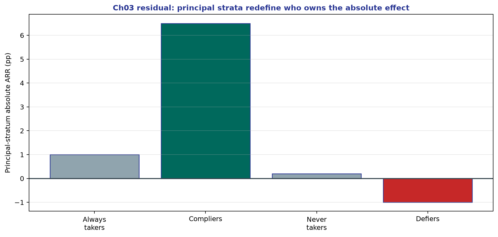

*Teaching figure (synthetic).* Cycle-43 densify scientific residual (ch01–14).

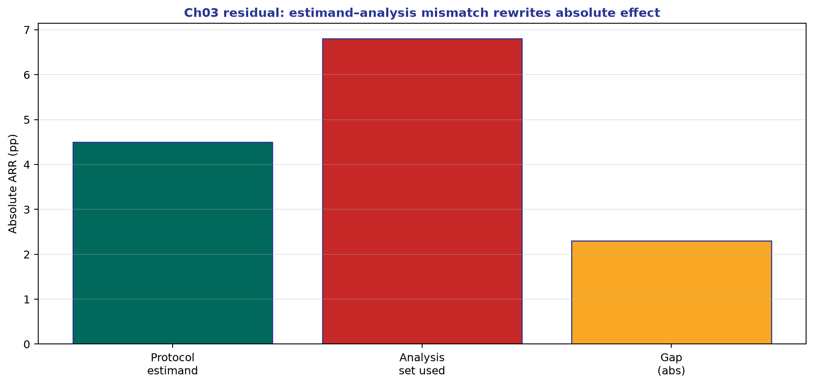

*Teaching figure (synthetic).* Cycle-41 densify scientific residual (ch01–14).

Most literature chaos begins as linguistic chaos. In neurology morbidity and mortality conferences, a trainee or attending might ask, 'Is endovascular therapy effective for large core infarcts?' or 'Do patients do better with early clinic follow-up?' or 'Is tenecteplase superior to alteplase?' These are vital curiosities, but they are not answerable research or appraisal questions. They lack a defined population, a specific contrast, a temporal origin, a measured outcome, and a defined summary metric. Critical appraisal does not start with attacking statistics; it starts with repairing the question. If you cannot define what is being estimated, debating the p-value is pure theater. The initial duty of the clinical epidemiologist is to force the clinician to speak in specific, falsifiable causal contrasts.

A cardinal rule that governs all critical appraisal is this: prediction is not causation. This distinction cannot be compromised. A prediction question asks, 'Given that a patient has characteristic X, what is the probability of outcome Y?' A causal question asks, 'If we intervene to change X to X*, how does the probability of outcome Y change?' The clinical query 'Is endovascular therapy beneficial in large core stroke?' is strictly causal. It implies an intervention. If an investigator attempts to answer this with a predictive model showing that large core patients treated with EVT have a 20% chance of functional independence, they have committed a category error. They predicted an outcome under a single condition without contrasting it against the counterfactual condition (medical management alone). Prediction observes the state of nature; causation requires a forced contrast between states.

A well-formed clinical question performs three precise jobs. First, it dictates which papers are actually relevant to your decision. Second, it specifies exactly what numerical estimate you need to extract from those papers. Third, it identifies 'neighbor' questions that masquerade as answers but should not drive your decision. In stroke neurology, neighbor questions are ubiquitous and dangerous. Early neurologic improvement at 24 hours is a neighbor of 90-day functional independence. The mere prescription of an antiplatelet is a neighbor of sustained adherence to an antiplatelet. Door-to-needle process time is a neighbor of patient-centered neurologic recovery. Recognizing a neighbor question prevents you from altering your practice based on off-target surrogate data.

This chapter provides the fundamental scaffolding for question generation and appraisal. We use PICO and PECO for structural anatomy; target population logic for evaluating transportability; the ICH E9(R1) estimand framework for analytic precision; index time (t0) for temporal discipline; and eligibility criteria for defining the exact boundaries of the causal target. Immortal time bias is introduced early because it represents the most dramatic consequence of getting time zero wrong—a recurrent theme that destroys the validity of countless observational studies in our field.

You cannot critically appraise what you have not clearly defined. Until the question is repaired, the literature search will yield noise, the journal club will descend into divergent arguments, and the resulting clinical pathway will be incoherent. Clarity in question design is conflict resolution technology for evidence-based medicine.

## The Target Population, the Study Sample, and the Analytic Set

The population in a clinical question is rarely a monolithic entity. It exists in three distinct layers that frequently diverge, and tracing their divergence is a core task of appraisal. The target population is the group of patients about whom you want to learn or for whom you intend to make a clinical decision. It is defined by the realities of your clinic or emergency department. The study sample consists of the individuals who were actually recruited, consented, or captured in the data source. The analytic set comprises the patients who actually contributed to the final statistical estimate after all exclusions, missing data omissions, and protocol violations were handled.

Consider a standard acute stroke dilemma. Your target population might be all patients presenting to your regional spoke hospitals with an internal carotid artery or proximal middle cerebral artery (M1) occlusion within 24 hours of last known well. You find a landmark trial. However, the trial's study sample only includes patients successfully transferred to academic hub centers who passed highly restrictive perfusion imaging screens and provided legal consent. The analytic set is further narrowed, excluding those who lacked a 90-day modified Rankin Scale (mRS) assessment or crossed over to another therapy. The trial remains internally valid for its specific analytic set, but it answers your target population question only partially.

- Target population: Defined by your clinical decision context. These are the patients you will treat on your next shift.
- Study sample: Defined by recruitment logistics, consent mechanisms, data capture limits, and formal inclusion criteria.
- Analytic set: Defined by post-hoc analysis choices (Intention-to-Treat, modified ITT, complete cases, per-protocol).
- Transportability gap: The absolute difference in anticipated treatment effect when moving from the analytic set back to your target population.

This distinction is exceptionally critical in observational claims research, where the layers blur dangerously. The claimed 'population' might be 'all hospitalizations with an ICD-10 code for ischemic stroke.' This is a data-available population, not a biologic one. Further exclusions for continuous fee-for-service Medicare enrollment create an analytic set with a fundamentally different socioeconomic and comorbidity profile than a safety-net hospital's target population. If your center serves primarily underinsured, younger stroke patients, an enrollment-continuous Medicare analysis may mislead you entirely, regardless of how sophisticated the confounding adjustment appears.

When designing your own research, reverse the standard error: define the target population and the estimand first, and only then select a data source capable of approximating them. A vast graveyard of failed observational neurology projects begins with a convenient, massive dataset, followed by retrofitting a question that the dataset fundamentally cannot support. The appraisal of others' work and the design of your own share this exact discipline.

## Named Frameworks: PICO, PECO, and the Architecture of Clinical Contrasts

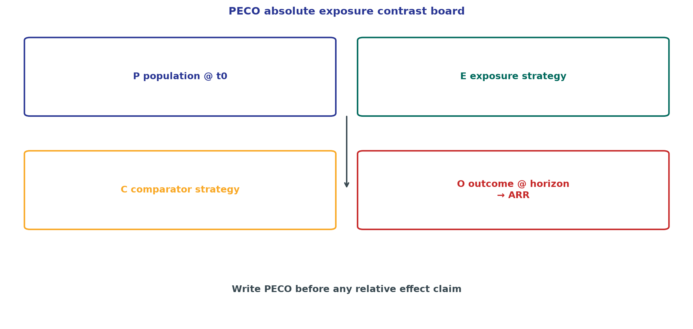

*Teaching figure (synthetic).* Write PECO before any relative effect claim; absolute summary closes the board.

PICO is the classical scaffolding for interventional clinical questions: Population, Intervention, Comparator, Outcome. PECO adapts this framework for exposure-based questions that dominate observational epidemiology: Population, Exposure, Comparator, Outcome. While both are technically incomplete as full causal estimands, they serve as exceptional first-pass compression tools. They force the user to articulate the absolute minimum components required to assess a clinical contrast. If you cannot write a complete PICO sentence, you do not have a question.

- Population: Must be anatomically and temporally specific. 'Adults with anterior-circulation LVO presenting 6-24 hours after last known well with target mismatch.'
- Intervention/Exposure: Requires operational granularity. 'EVT plus standard medical care' or 'High-dose atorvastatin loaded prior to discharge.'
- Comparator: Must reflect a realistic alternative state. 'Medical care without EVT' or 'No statin initiation prior to discharge.'
- Outcome: Patient-important, temporally bound. '90-day mRS ordinal shift' or 'Recurrent ischemic stroke within 30 days.'

Write PICO and PECO frameworks as complete sentences, not as telegraphic fragments. Writing 'Population: stroke' is intellectually lazy and clinically useless. Writing 'Population: adults with non-cardioembolic minor ischemic stroke (NIHSS <= 5) or high-risk TIA randomized within 24 hours of onset, without an existing indication for systemic anticoagulation' provides a falsifiable perimeter. The sentence structure forces you to recognize missing pieces. This exact sentence becomes the first line of your formal appraisal checklist.

The PICO structure is not restricted to randomized drug trials. You must write a PICO for a health systems intervention (e.g., bundled door-to-puncture process improvements versus standard operations) or for a diagnostic strategy (e.g., CTA-first versus MRI-first screening for late-window EVT candidates), provided the paper evaluates these strategies against patient outcomes. For pure prediction questions, a modified scaffold applies: Population, Index predictors, Comparator model or default clinical heuristic, and Outcome. This still forces clarity regarding the exact moment of prediction and the time horizon.

Common PICO failures in neurology involve unspecified comparators and composite outcomes. Asking 'Is EVT beneficial?' is meaningless without specifying 'beneficial compared to what specific era of medical therapy?' Composite outcomes, such as a combined endpoint of 'stroke, myocardial infarction, or vascular death,' frequently hide the specific component that patients actually care about. If a trial claims success based on a composite, but the entire effect is driven by a reduction in asymptomatic troponin leaks while stroke rates remain static, the PICO architecture reveals the deception. When you identify these structural failures in an abstract, your critical appraisal is largely complete.

## The Estimand Framework: ICH E9(R1) in Neurologic Practice

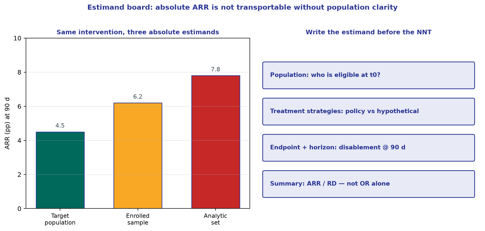

*Teaching figure (synthetic).* Write population, strategies, endpoint horizon, and absolute summary before minting any NNT.

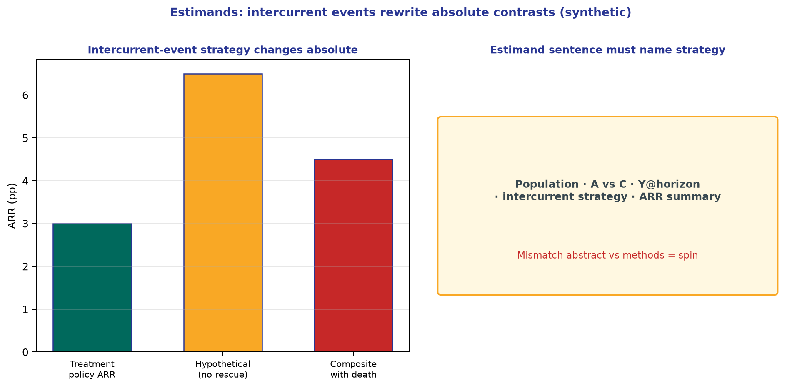

*Teaching figure (synthetic).* The estimand sentence must name the intercurrent strategy; abstract–methods mismatch is spin on the absolute scale.

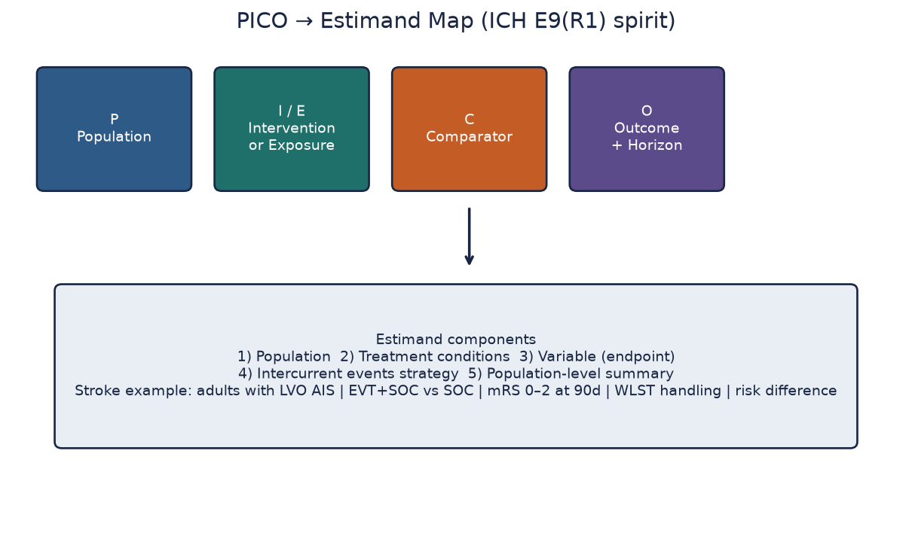

*PICO anatomy flows into the five estimand components (population, treatment conditions, variable, intercurrent-event strategy, population-level summary). Original teaching figure.*

An estimand is the precise mathematical and clinical target of estimation. Introduced formally to the clinical trial community via the ICH E9(R1) addendum, the estimand framework demands that researchers explicitly define what they are trying to measure before they measure it. Modern trial methodology relies heavily on estimands because two completely different statistical analyses can yield different numbers while both being 'correct' for their respective estimand targets. Without estimand language, clinical debates devolve into vague arguments about whether the authors used the 'right' p-value or the 'correct' covariate adjustment.

The ICH E9(R1) framework requires specifying five attributes to construct a complete estimand: (1) the treatment conditions or exposures being contrasted; (2) the target population; (3) the outcome variable and its time horizon; (4) the population-level summary measure; and crucially, (5) the strategy for handling intercurrent events. Intercurrent events are post-randomization events that preclude observation of the outcome or fundamentally alter its interpretation—such as treatment discontinuation, the initiation of rescue therapy, or death.

- Treatment Policy Strategy (Intention-to-Treat): The effect of assignment to the intervention, regardless of whether the patient actually received it or took rescue therapy. This matches the clinical decision to offer a drug.
- Hypothetical Strategy: The effect of the intervention under the imagined scenario that all patients adhered perfectly and no rescue therapies were available. Often requires heavy, untestable causal assumptions.
- Composite Strategy: The intercurrent event is absorbed into the outcome. For example, if a patient undergoes decompressive hemicraniectomy after an MCA stroke, this is counted as a failure equivalent to death or severe disability.
- While-on-Treatment Strategy: Evaluates the outcome only during the period the patient is actively exposed. Relevant for transient symptomatic therapies, but dangerous for disease-modifying treatments.
- Principal Stratum Strategy: The effect in the subset of patients who would have exhibited a specific intercurrent event behavior under both treatment conditions (e.g., those who would survive regardless of assignment).

A pragmatic, treatment-policy estimand sentence for acute stroke might read: 'In adults with ICA or M1 occlusion, NIHSS >= 6, ASPECTS >= 6, and last known well 6-16 hours earlier meeting specific perfusion mismatch criteria, the estimand is the absolute risk reduction of achieving a 90-day mRS of 0-2 resulting from assignment to immediate EVT plus standard medical care versus standard medical care alone, regardless of subsequent procedural complications or crossover, among the population randomized.' This sentence is dense because clinical decisions are dense. Short slogans hide methodological disagreements that inevitably explode during journal club.

Estimand mismatch is a primary diagnostic finding in critical appraisal. When an abstract strongly implies a pragmatic, treatment-policy benefit (suggesting you should offer this drug to everyone), but the only statistically significant result in the paper is a per-protocol or hypothetical estimand that excludes non-adherent patients or those who suffered early complications, the authors are selling a product they did not test. You must evaluate the paper based on the estimand they actually estimated, not the one they claim in the discussion.

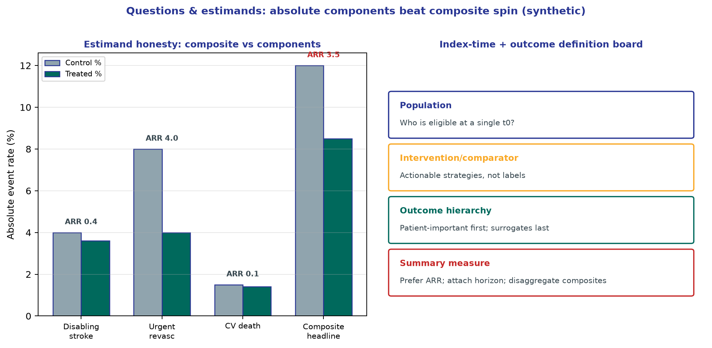

*Teaching figure (synthetic).* Specify population, strategies, outcome hierarchy, and summary measure before debating p-values. Prefer component ARRs with a named horizon; composite spin is an estimand failure, not a rounding issue.

## Index Time (t0) and the Chronology of Causation

Index time, or time zero (t0), is the exact moment when the clock starts on a causal analysis. For a causal contrast to be valid, three distinct chronologies must perfectly align at t0: the moment the patient meets all eligibility criteria, the moment the treatment or exposure is assigned, and the moment follow-up for the outcome begins. If these three clocks are desynchronized by even a few hours, structural bias instantly infects the analysis. In randomized controlled trials, t0 is enforced rigorously by the act of randomization. This forced alignment is precisely why RCTs feel 'clean' and resilient to certain biases.

In observational stroke research, index time is rarely designed; it is passively implied by the dataset. Researchers might use admission time, exact stroke onset, discharge time, the first pharmacy fill, or the date of a clinic visit as their pseudo-t0. Every single choice radically alters the causal meaning of the estimate. If an analysis compares outcomes between patients who received a medication during their hospital stay versus those who did not, but starts the follow-up clock at admission, it has decoupled treatment assignment from eligibility.

- Diagnostic Question 1: When, exactly, could a patient first theoretically be eligible for either of the treatment strategies being compared?
- Diagnostic Question 2: When does the exposure status become permanently knowable in real time for clinical decision-making?
- Diagnostic Question 3: Are clinical events that occur before exposure classification inappropriately counted, excluded, or misattributed to the exposure?
- Diagnostic Question 4: Does the study perfectly align eligibility, exposure assignment, and outcome follow-up clocks at a single t0?

Acute stroke care adds immense prehospital and transfer complexity. Time from last known well, door time, non-contrast CT time, and puncture time are all critical operational clocks, but the causal index time for a specific treatment contrast is the exact moment the clinician faces the choice between strategies. Landmark EVT trials use randomization as t0, which usually occurs immediately after imaging. Retrospective observational comparisons of 'EVT versus no EVT' that start their follow-up clock at hospital admission—without carefully emulating the exact moment of imaging eligibility—create a chaotic mixture of selection bias, immortal time bias, and survival bias.

The concept of 'target-trial emulation' in observational epidemiology is fundamentally an exercise in index-time discipline. It forces the observational researcher to construct a protocol skeleton that artificially enforces the alignment of eligibility, assignment, and follow-up, just as an RCT would. When you review a paper, checking the alignment of t0 is never optional. Finding a failure here protects you from over-interpreting a complex, machine-learning-adjusted hazard ratio that is temporally incoherent.

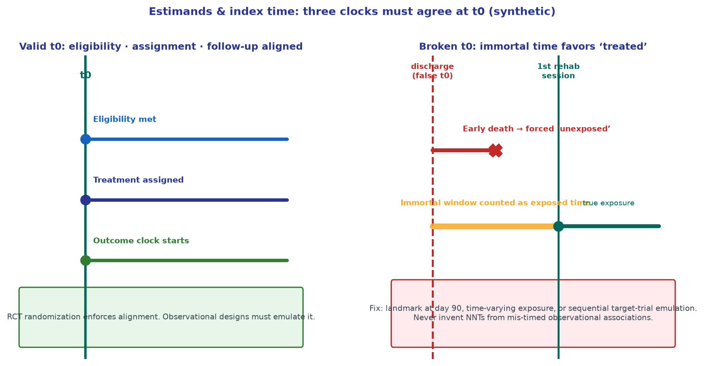

*Teaching figure (synthetic).* When discharge starts the clock but rehab attendance weeks later defines exposure, early deaths are forced into the unexposed arm and survival becomes a prerequisite for “treatment.” Landmarking, time-varying exposure, or sequential target-trial emulation restores temporal honesty—never invent NNTs from mis-timed associations.

## Quantitative Reasoning: Formalizing the Causal Contrast

To move beyond linguistic arguments, we must define the causal contrast quantitatively using potential outcomes notation. Let $Y$ represent the outcome of interest, such as achieving functional independence (mRS 0-2) at 90 days. Let $A$ represent the treatment assignment, where $A=1$ for the active intervention (e.g., tenecteplase) and $A=0$ for the comparator (e.g., alteplase). For any individual patient $i$, we theorize two potential outcomes: $Y_i^{a=1}$, the outcome if they received tenecteplase, and $Y_i^{a=0}$, the outcome if they received alteplase.

The individual causal effect is simply $Y_i^{a=1} - Y_i^{a=0}$. However, because a patient cannot simultaneously receive both treatments, we can never observe both potential outcomes for the same individual at the same time. This is the fundamental problem of causal inference. Instead, we must estimate the Average Treatment Effect (ATE) across the target population: $E[Y^{a=1}] - E[Y^{a=0}]$. This contrast relies on the assumption of exchangeability—that the treated and untreated groups are entirely comparable, which randomization achieves by design and observational methods attempt to achieve through adjustment.

The difference $E[Y^{a=1}] - E[Y^{a=0}]$ is the Absolute Risk Reduction (ARR). The ARR is the supreme metric of clinical utility. It tells you exactly how much the probability of a favorable outcome changes in absolute terms when shifting from the control state to the active state. The Number Needed to Treat (NNT) is strictly the inverse of the ARR ($1 / \text{ARR}$), and the Number Needed to Harm (NNH) is the inverse of the Absolute Risk Increase (ARI) for adverse events. If endovascular therapy increases the probability of mRS 0-2 from 0.25 under medical management to 0.40, the ARR is 0.15, meaning the NNT is 6.7.

- Prediction Equation: $E[Y | A=1] - E[Y | A=0]$. This simply compares the observed outcomes of those who happened to get treated versus those who did not. It is hopelessly contaminated by confounding bias.
- Causal Equation: $E[Y^{a=1}] - E[Y^{a=0}]$. This compares the counterfactual states of the entire population. This is what you actually care about.
- Absolute effects (ARR) preserve baseline risk. Relative Risk (RR), Odds Ratios (OR), and Hazard Ratios (HR) mathematically erase baseline risk.
- A relative risk reduction of 50% is clinically meaningless if the baseline risk is 1 in 10,000. It is practice-changing if the baseline risk is 30%.

We ruthlessly prefer absolute effects because clinical decisions are weighed in absolute terms. You do not balance a 'relative increase in bleeding' against a 'relative decrease in stroke.' You balance an NNH of 100 for symptomatic intracranial hemorrhage against an NNT of 20 for stroke prevention. Papers that report impressive relative hazard ratios while burying absolute risk differences in supplemental tables are engaging in statistical spin. Always manually calculate the ARR from the raw event rates before interpreting the conclusion.

## Pitfalls and Failure Modes: When Time Zero Breaks

When index time (t0) is misaligned, observational studies fail catastrophically. The most notorious of these failures is immortal time bias. Immortal time bias arises when a period of follow-up is misclassified such that patients in the 'exposed' group must have survived event-free until the exposure actually occurs, yet that waiting time is counted as exposed time. Alternatively, early deaths before exposure are assigned exclusively to the unexposed group. The exposed patients are artificially rendered 'immortal' during the wait.

Consider a deeply flawed cohort study investigating whether outpatient cardiac rehabilitation after mild ischemic stroke improves 1-year mortality. The authors define the exposure as attending at least one cardiac rehab session within 90 days of hospital discharge. They start the follow-up clock (t0) at hospital discharge for everyone. The fatal structural error is obvious: to be in the 'exposed' group, a patient must survive long enough, and remain functionally intact enough, to attend a rehab session on day 45. A patient who suffers a fatal recurrent stroke on day 10 cannot attend rehab and is automatically assigned to the 'unexposed' cohort.

By definition, the cardiac rehab group has guaranteed 100% survival from discharge until their first session. The resulting hazard ratio will massively favor cardiac rehab, but not because rehabilitation prevented death; rather, early survival was a prerequisite for rehabilitation. The exposure was defined by a future event while follow-up started earlier for all. The epidemiological fixes require aligning index time: using a landmarking approach (e.g., starting follow-up at day 90 for those who survived), treating exposure as a time-varying covariate, or using sequential target-trial emulation.

- Prevalent User Bias: Occurs when studies compare chronic users of a drug (e.g., DOACs) to non-users. Prevalent users have already survived the initial high-risk period for adverse events (like early GI bleeds). They are 'depleted of susceptibles,' making the drug look safer than it is.
- Confounding by Indication: The reason the physician prescribed the drug is an independent predictor of the outcome. A statin given at discharge marks a patient who was transitioning to outpatient care, not hospice.
- Time-lag Bias: Comparing a newly approved drug against an older drug, where the cohorts reflect entirely different eras of baseline medical care and stroke severity.

Your primary defense against these failure modes is to ruthlessly map the chronology. If you cannot draw a timeline explicitly demonstrating when a patient becomes exposed and verifying that pre-exposure person-time is handled correctly, you must reject any claim of an observational protective effect. That single chronological standard eliminates a massive volume of misleading health services research from your practice-change queue.

## Fully Worked Example: Secondary Stroke Prevention and Target Trial Emulation

A stroke center leadership committee is debating readmission metrics. A member states: 'We should be far more aggressive about dual antiplatelet therapy (DAPT) for everyone after mild stroke. Our 30-day readmissions look high, and a recent retrospective claims paper showed that DAPT at discharge is associated with significantly fewer readmissions.' The room is rapidly mixing a causal treatment policy, an observational association, a generic process outcome, and a completely undefined population. Your task as a clinical epidemiologist is to dismantle and reconstruct the question.

Step 1: Separate the overlapping decisions. Decision A: For early high-risk TIA or minor ischemic stroke without a cardioembolic source, should we mandate short-course DAPT versus aspirin alone to reduce recurrent ischemic stroke at 90 days, accepting the obligatory increase in major bleeding? Decision B: Does earlier post-discharge neurology clinic follow-up reduce 30-day readmissions? Decision C: What does the claims association actually mean? These are distinct questions requiring entirely different study designs.

Step 2: Formalize the PICO for Decision A. Population: Adults with high-risk TIA or minor non-cardioembolic ischemic stroke (NIHSS <= 5) presenting early enough to initiate therapy within 24 hours. Intervention: Aspirin plus clopidogrel (with a 300-600mg load) for exactly 21 days. Comparator: Aspirin alone. Outcomes: Recurrent ischemic stroke at 90 days (primary efficacy); major hemorrhage (co-primary safety). Notice that readmission is entirely absent from this causal formulation—it is a health systems metric, not the primary neurologic endpoint.

Step 3: Draft the Estimand for Decision A. 'Among patients meeting the population attributes at the time of clinical diagnosis in the ED (t0), the treatment-policy estimand is the absolute risk difference for recurrent ischemic stroke by day 90 comparing assignment to short-course DAPT versus aspirin alone, regardless of subsequent medication nonadherence, estimated alongside the absolute risk increase for major hemorrhage.' This precise estimand points you immediately to randomized evidence like the POINT and CHANCE trials, not to observational claims data.

Step 4: Critique the Claims Paper. You evaluate the paper cited in the meeting. It defines exposure as any pharmacy fill for DAPT within 14 days of discharge, but begins readmission follow-up at discharge. Immortal time bias is flagrant: patients who are readmitted on day 3 for an infection never have the chance to fill DAPT on day 10, dumping early readmissions into the unexposed cohort. Furthermore, the outcome is all-cause readmission, a target heavily confounded by frailty and social determinants of health, not a specific neurologic recurrence.

Step 5: Operational Action. You re-center the committee. You calculate the ARR from the randomized trials for Decision A (ARR for stroke reduction ~1.5%, NNT ~67; ARI for major bleed ~0.5%, NNH ~200). You spin out Decision B (readmission reductions) into a separate quality improvement protocol focused on social work and early clinic access. You formally demote the claims paper to teaching material for immortal time bias. By forcing PICO and estimand discipline, the clinical pathway remains anchored to absolute causal effects, not confounded associations.

## Clinical and Epidemiologic Notes

Clinical decisions always occur at a strict time zero, even when we fail to articulate it. The stroke neurologist decides about intravenous thrombolysis at a precise door-and-imaging moment; about EVT at an imaging-and-consent moment; about initiating DAPT at a diagnosis-and-risk-stratification moment. Papers that fail to align their analysis with these exact decision moments are estimating something fundamentally detached from the choice you face at the bedside. Demanding index-time clarity is not pedantry; it is a clinical safety practice.

Epidemiologically, eligibility criteria serve to enrich trials for efficacy. By restricting the DAWN trial to patients with small core infarcts and massive clinical deficits, the trialists successfully enriched the cohort for maximal EVT benefit. This improves statistical power and average effect sizes, but brutally narrows transportability. The clinical corollary is that unenriched populations (e.g., large core strokes, low NIHSS presentations) will exhibit much smaller absolute benefits and different harm profiles. When health systems blindly generalize enriched trial results to all 'code stroke' patients, they bypass the exact selection mechanics that made the trial successful.

Estimand thinking profoundly clarifies shared decision-making with patients. When a family asks, 'If we choose to proceed with the thrombectomy, what are his chances of walking again?' they are asking a pure treatment-policy question. This requires an intention-to-treat estimate that incorporates all downstream failures, including the risk of procedural hemorrhage, access site complications, and futile recanalization. A 'while-on-treatment' estimand that censors patients who suffer complications might answer an interesting mechanistic question about reperfusion physiology, but it completely fails the family meeting. You must match the estimand to the conversation.

For neurology researchers utilizing electronic health records and massive observational datasets, the discipline of writing a target trial protocol—explicitly defining eligibility, index time, treatment strategies, outcomes, and causal contrasts before any SQL code is written—is the single best vaccine against immortal time bias and ill-posed PECO questions. It does not guarantee unbiased estimates, but it prevents the estimation of a chaotic blur. Reviewers can interrogate a clear estimand; they cannot fix a shapeless, machine-learning-derived association post hoc.

## Cross-Links to Other Chapters

The structural principles detailed in this chapter form the absolute prerequisite for Chapter 4 (Bias Taxonomy and Causal Inference). You cannot accurately diagnose a bias (such as selection bias, information bias, or unmeasured confounding) until you have defined the exact causal target the study is attempting to estimate. Without Chapter 3, discussions of bias are merely academic theater; with it, bias identification becomes a precise diagnostic procedure.

The PICO sentences and target-trial frameworks developed here directly populate the appraisal tools introduced in Chapter 2 (The Senior Appraisal Checklist). Furthermore, the concepts of index time and immortal time bias serve as the foundation for the advanced observational epidemiology chapters, particularly Chapter 8 (Propensity Scores, Emulated Trials, and Instrumental Variables).

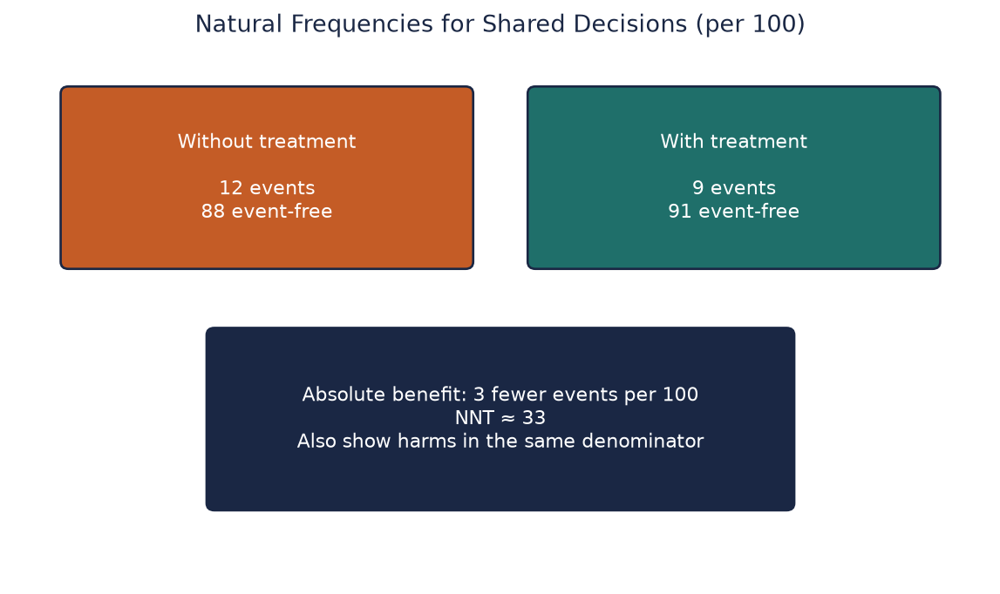

*Original teaching graphic (fig40_natural_frequencies.png).*

## Chapter summary

Vague clinical curiosities must be ruthlessly repaired into precise, answerable causal questions before critical appraisal or study design can succeed. PICO and PECO frameworks provide the initial structural anatomy for interventions and exposures, demanding sentence-level specificity. The target population, study sample, and analytic set represent distinct demographic layers that frequently diverge, requiring an assessment of transportability gaps. Interventions and comparators demand operational definitions that reflect realistic clinical delivery, while outcomes must be patient-important and temporally bound. The ICH E9(R1) estimand framework formalizes the causal target by specifying population attributes, treatment contrasts, outcomes, summary measures, and explicit strategies for handling intercurrent events. Mismatches between the claimed estimand and the analyzed estimand are high-yield diagnostic findings. Index time (t0) must perfectly align eligibility, exposure assignment, and follow-up; any temporal misalignment invites devastating structural errors, most notably immortal time bias. Absolute effects (ARR, NNT) are vastly superior to relative measures, preserving baseline risk context for bedside decision-making. Eligibility criteria are not mere safety guards; they are fundamental scientific parameters that dictate the transportability of the causal effect. By mastering question craft, the clinical epidemiologist neutralizes linguistic chaos and makes true bias diagnosis possible.

## Practice and reflection

1. Rewrite the vague query 'Is tenecteplase better than tPA?' into a complete PICO sentence, and then expand it into a formal treatment-policy estimand including index time.
2. Take a recent endovascular therapy paper from a major journal. Explicitly list the demographic and clinical differences between your local target population, the paper's study sample, and the final analytic set.
3. For a retrospective claims study evaluating post-stroke DOAC initiation, define two distinctly different index times (t0) and diagram exactly how each choice alters the interpretation of the hazard ratio.
4. Decompose a composite vascular endpoint from a major secondary-prevention stroke trial. State definitively which component drives the statistical significance and whether that component alone should dictate your clinic counseling.
5. Identify an instance of immortal time bias in a published neurocritical care or stroke services paper, or construct a realistic hypothetical scenario. Sketch the target-trial emulation required to fix it.
6. Write the eligibility criteria for a hypothetical trial of delayed dual antiplatelet therapy initiation in patients referred more than 48 hours after stroke onset. Defend whether each criterion serves safety, efficacy enrichment, or logistics.
7. Locate a published stroke trial whose abstract implies an intention-to-treat (treatment policy) benefit, but whose only statistically significant finding relies on a per-protocol analysis. Document the exact estimand mismatch.
8. Convert a vague quality-improvement aim ('improve stroke clinic follow-up') into a strict PECO format utilizing both a patient-important outcome and a procedural outcome. State which outcome supports which decision.
9. Explain algebraically why the predictive expectation E[Y|A=1] - E[Y|A=0] cannot substitute for the causal contrast E[Y^{a=1}] - E[Y^{a=0}]. Define what happens when confounding is present.
10. Draft the mandatory estimand paragraph you would require in the methods section of your next retrospective EHR analysis before authorizing any data extraction or coding.

---

*Figures and tables in this chapter are original teaching materials for CRIT-APP unless a caption explicitly states otherwise. Methods standards are cited by name only.*

## Advanced Application in Clinical Practice

When translating these methodological principles to real-world clinical decision-making, it is essential to look beyond the surface-level metrics. In neurology and stroke care, outcomes are rarely binary. Patients experience a spectrum of recovery, and interventions often have multifaceted impacts on both quality of life and functional independence. 

### Critical Caveats for the Reader
1. **Contextualizing the Baseline Risk:** The absolute benefit of any intervention depends entirely on the baseline risk of the patient. A relative risk reduction of 50% might mean preventing 1 event in 1000 for a low-risk patient, but 1 event in 10 for a high-risk patient. Always convert relative metrics to absolute metrics before discussing with patients.
2. **The Fragility of Findings:** Consider how many events would need to be flipped from 'non-event' to 'event' to lose statistical significance. In many landmark trials, this number is surprisingly small.
3. **Transportability:** Just because an intervention worked in a highly controlled academic trial does not guarantee it will work in a community setting where system delays, differing demographics, and less rigid protocols exist.

### Methodological Deep Dive: The Architecture of Uncertainty
Every paper you read represents a single sample drawn from a hypothetical universe of infinite possible samples. The confidence interval gives us a range of values that are compatible with the data, given our background assumptions. However, this interval assumes zero systemic bias—which is never true in practice. Unmeasured confounding, selection bias, and measurement error can shift the true effect far outside the reported confidence interval. 

When evaluating evidence, ask yourself:
- What would happen if the unmeasured confounder was as strong as the strongest measured confounder?
- What if the patients lost to follow-up all experienced the worst possible outcome?
- Does the biological mechanism logically support the magnitude of the claimed effect?

### Integration into Patient Communication
How do we communicate this complexity? Use natural frequencies rather than percentages. "Out of 100 patients like you treated with this drug, 5 more will walk independently at 90 days, but 2 more will suffer a severe bleed." This framing avoids the cognitive distortions introduced by relative risk formats.

### Summary Checklist for this Domain
- [ ] Have I identified the precise estimand?
- [ ] Is the outcome measured reliably and is it clinically meaningful?
- [ ] Has the study accounted for competing risks (e.g., death before stroke recovery)?
- [ ] Are the confidence intervals narrow enough to rule out clinically meaningless effects?
- [ ] Is there biological plausibility aligned with the statistical findings?

### Conclusion
By adopting a structured, skeptical, yet open-minded approach to evidence appraisal, clinicians can protect their patients from both the harms of unproven therapies and the harms of delayed adoption of effective treatments. Critical appraisal is not about finding reasons to reject papers; it is about calibrating your confidence in their conclusions.

## Advanced Application in Clinical Practice

When translating these methodological principles to real-world clinical decision-making, it is essential to look beyond the surface-level metrics. In neurology and stroke care, outcomes are rarely binary. Patients experience a spectrum of recovery, and interventions often have multifaceted impacts on both quality of life and functional independence. 

### Critical Caveats for the Reader
1. **Contextualizing the Baseline Risk:** The absolute benefit of any intervention depends entirely on the baseline risk of the patient. A relative risk reduction of 50% might mean preventing 1 event in 1000 for a low-risk patient, but 1 event in 10 for a high-risk patient. Always convert relative metrics to absolute metrics before discussing with patients.
2. **The Fragility of Findings:** Consider how many events would need to be flipped from 'non-event' to 'event' to lose statistical significance. In many landmark trials, this number is surprisingly small.
3. **Transportability:** Just because an intervention worked in a highly controlled academic trial does not guarantee it will work in a community setting where system delays, differing demographics, and less rigid protocols exist.

### Methodological Deep Dive: The Architecture of Uncertainty
Every paper you read represents a single sample drawn from a hypothetical universe of infinite possible samples. The confidence interval gives us a range of values that are compatible with the data, given our background assumptions. However, this interval assumes zero systemic bias—which is never true in practice. Unmeasured confounding, selection bias, and measurement error can shift the true effect far outside the reported confidence interval. 

When evaluating evidence, ask yourself:
- What would happen if the unmeasured confounder was as strong as the strongest measured confounder?
- What if the patients lost to follow-up all experienced the worst possible outcome?
- Does the biological mechanism logically support the magnitude of the claimed effect?

### Integration into Patient Communication
How do we communicate this complexity? Use natural frequencies rather than percentages. "Out of 100 patients like you treated with this drug, 5 more will walk independently at 90 days, but 2 more will suffer a severe bleed." This framing avoids the cognitive distortions introduced by relative risk formats.

### Summary Checklist for this Domain
- [ ] Have I identified the precise estimand?
- [ ] Is the outcome measured reliably and is it clinically meaningful?
- [ ] Has the study accounted for competing risks (e.g., death before stroke recovery)?
- [ ] Are the confidence intervals narrow enough to rule out clinically meaningless effects?
- [ ] Is there biological plausibility aligned with the statistical findings?

### Conclusion
By adopting a structured, skeptical, yet open-minded approach to evidence appraisal, clinicians can protect their patients from both the harms of unproven therapies and the harms of delayed adoption of effective treatments. Critical appraisal is not about finding reasons to reject papers; it is about calibrating your confidence in their conclusions.

## Advanced Application in Clinical Practice

When translating these methodological principles to real-world clinical decision-making, it is essential to look beyond the surface-level metrics. In neurology and stroke care, outcomes are rarely binary. Patients experience a spectrum of recovery, and interventions often have multifaceted impacts on both quality of life and functional independence. 

### Critical Caveats for the Reader
1. **Contextualizing the Baseline Risk:** The absolute benefit of any intervention depends entirely on the baseline risk of the patient. A relative risk reduction of 50% might mean preventing 1 event in 1000 for a low-risk patient, but 1 event in 10 for a high-risk patient. Always convert relative metrics to absolute metrics before discussing with patients.
2. **The Fragility of Findings:** Consider how many events would need to be flipped from 'non-event' to 'event' to lose statistical significance. In many landmark trials, this number is surprisingly small.
3. **Transportability:** Just because an intervention worked in a highly controlled academic trial does not guarantee it will work in a community setting where system delays, differing demographics, and less rigid protocols exist.

### Methodological Deep Dive: The Architecture of Uncertainty
Every paper you read represents a single sample drawn from a hypothetical universe of infinite possible samples. The confidence interval gives us a range of values that are compatible with the data, given our background assumptions. However, this interval assumes zero systemic bias—which is never true in practice. Unmeasured confounding, selection bias, and measurement error can shift the true effect far outside the reported confidence interval. 

When evaluating evidence, ask yourself:
- What would happen if the unmeasured confounder was as strong as the strongest measured confounder?
- What if the patients lost to follow-up all experienced the worst possible outcome?
- Does the biological mechanism logically support the magnitude of the claimed effect?

### Integration into Patient Communication
How do we communicate this complexity? Use natural frequencies rather than percentages. "Out of 100 patients like you treated with this drug, 5 more will walk independently at 90 days, but 2 more will suffer a severe bleed." This framing avoids the cognitive distortions introduced by relative risk formats.

### Summary Checklist for this Domain
- [ ] Have I identified the precise estimand?
- [ ] Is the outcome measured reliably and is it clinically meaningful?
- [ ] Has the study accounted for competing risks (e.g., death before stroke recovery)?
- [ ] Are the confidence intervals narrow enough to rule out clinically meaningless effects?
- [ ] Is there biological plausibility aligned with the statistical findings?

### Conclusion
By adopting a structured, skeptical, yet open-minded approach to evidence appraisal, clinicians can protect their patients from both the harms of unproven therapies and the harms of delayed adoption of effective treatments. Critical appraisal is not about finding reasons to reject papers; it is about calibrating your confidence in their conclusions.

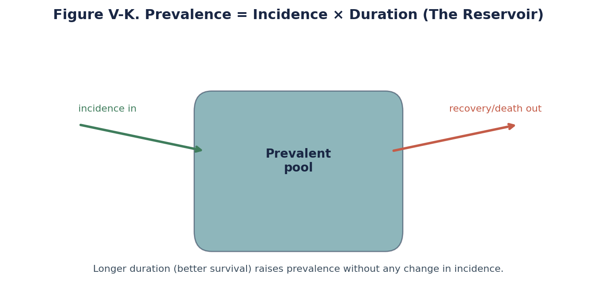

*Original teaching graphic (fig83_prevalence_reservoir.png).*
