# Chapter 4. Internal Validity, External Validity, and Bias Taxonomy

## Opening

*Three bias families (original).*

*Bias taxonomy map (original).*

*Bias families versus transportability (original).*

Quality meeting: someone proposes adopting an outside center protocol based on one observational paper. Demand the bias story—selection, confounding, measurement—before the order set is rewritten.

## Learning objectives

- Distinguish random error from systematic error mathematically, explaining why massive administrative datasets cannot cure bias.
- Define internal validity and external validity, demonstrating how a study can perfectly satisfy one while completely failing the other.
- Apply a rigorous clinical bias taxonomy comprising selection, confounding, information, and reporting biases to appraise stroke literature.
- Explain confounding by indication using acute stroke treatment scenarios, identifying weak versus strong methodological responses.
- Formalize collider stratification bias and explain why adjusting for post-randomization variables breaks causal inference.
- Assess the transportability of randomized trial estimates to local stroke populations using absolute risk and case-mix considerations.
- Execute a fully worked quantitative appraisal of an observational claims study of endovascular therapy effectiveness.
- Produce a structured, actionable validity assessment that separates internal causal failure from mere transportability gaps.
- Recognize and articulate pitfalls in validity appraisal, specifically the conflation of predictive modeling with causal inference.

*Teaching figure (synthetic).* Cycle-25 densify scientific residual.

*Teaching figure (synthetic).* Cycle-27 densify scientific residual.

*Teaching figure (synthetic).* Cycle-29 densify scientific residual.

*Teaching figure (synthetic).* Cycle-31 densify scientific residual.

*Teaching figure (synthetic).* Cycle-33 densify scientific residual.

*Teaching figure (synthetic).* Cycle-35/36 densify scientific residual.

*Teaching figure (synthetic).* Cycle-37 densify scientific residual (ch01–14).

*Teaching figure (synthetic).* Cycle-39 densify scientific residual (ch01–14).

*Teaching figure (synthetic).* Cycle-41 densify scientific residual (ch01–14).

*Teaching figure (synthetic).* Cycle-1255 densify scientific residual (ch01–14).

*Teaching figure (synthetic).* Cycle-1253 densify scientific residual (ch01–14).

*Teaching figure (synthetic).* Cycle-1251 densify scientific residual (ch01–14).

*Teaching figure (synthetic).* Cycle-1249 densify scientific residual (ch01–14).

*Teaching figure (synthetic).* Cycle-1247 densify scientific residual (ch01–14).

*Teaching figure (synthetic).* Cycle-1245 densify scientific residual (ch01–14).

*Teaching figure (synthetic).* Cycle-1243 densify scientific residual (ch01–14).

*Teaching figure (synthetic).* Cycle-1241 densify scientific residual (ch01–14).

*Teaching figure (synthetic).* Cycle-1239 densify scientific residual (ch01–14).

*Teaching figure (synthetic).* Cycle-1237 densify scientific residual (ch01–14).

*Teaching figure (synthetic).* Cycle-1235 densify scientific residual (ch01–14).

*Teaching figure (synthetic).* Cycle-1233 densify scientific residual (ch01–14).

*Teaching figure (synthetic).* Cycle-1231 densify scientific residual (ch01–14).

*Teaching figure (synthetic).* Cycle-1229 densify scientific residual (ch01–14).

*Teaching figure (synthetic).* Cycle-1227 densify scientific residual (ch01–14).

*Teaching figure (synthetic).* Cycle-1225 densify scientific residual (ch01–14).

*Teaching figure (synthetic).* Cycle-1223 densify scientific residual (ch01–14).

*Teaching figure (synthetic).* Cycle-1221 densify scientific residual (ch01–14).

*Teaching figure (synthetic).* Cycle-1219 densify scientific residual (ch01–14).

*Teaching figure (synthetic).* Cycle-1217 densify scientific residual (ch01–14).

*Teaching figure (synthetic).* Cycle-1215 densify scientific residual (ch01–14).

*Teaching figure (synthetic).* Cycle-1213 densify scientific residual (ch01–14).

*Teaching figure (synthetic).* Cycle-1211 densify scientific residual (ch01–14).

*Teaching figure (synthetic).* Cycle-1209 densify scientific residual (ch01–14).

*Teaching figure (synthetic).* Cycle-1207 densify scientific residual (ch01–14).

*Teaching figure (synthetic).* Cycle-1205 densify scientific residual (ch01–14).

*Teaching figure (synthetic).* Cycle-1203 densify scientific residual (ch01–14).

*Teaching figure (synthetic).* Cycle-1201 densify scientific residual (ch01–14).

*Teaching figure (synthetic).* Cycle-1199 densify scientific residual (ch01–14).

*Teaching figure (synthetic).* Cycle-1197 densify scientific residual (ch01–14).

*Teaching figure (synthetic).* Cycle-1195 densify scientific residual (ch01–14).

*Teaching figure (synthetic).* Cycle-1193 densify scientific residual (ch01–14).

*Teaching figure (synthetic).* Cycle-1191 densify scientific residual (ch01–14).

*Teaching figure (synthetic).* Cycle-1189 densify scientific residual (ch01–14).

*Teaching figure (synthetic).* Cycle-1187 densify scientific residual (ch01–14).

*Teaching figure (synthetic).* Cycle-1185 densify scientific residual (ch01–14).

*Teaching figure (synthetic).* Cycle-1183 densify scientific residual (ch01–14).

*Teaching figure (synthetic).* Cycle-1181 densify scientific residual (ch01–14).

*Teaching figure (synthetic).* Cycle-1179 densify scientific residual (ch01–14).

*Teaching figure (synthetic).* Cycle-1177 densify scientific residual (ch01–14).

*Teaching figure (synthetic).* Cycle-1175 densify scientific residual (ch01–14).

*Teaching figure (synthetic).* Cycle-1173 densify scientific residual (ch01–14).

*Teaching figure (synthetic).* Cycle-1171 densify scientific residual (ch01–14).

*Teaching figure (synthetic).* Cycle-1169 densify scientific residual (ch01–14).

*Teaching figure (synthetic).* Cycle-1167 densify scientific residual (ch01–14).

*Teaching figure (synthetic).* Cycle-1165 densify scientific residual (ch01–14).

*Teaching figure (synthetic).* Cycle-1163 densify scientific residual (ch01–14).

*Teaching figure (synthetic).* Cycle-1161 densify scientific residual (ch01–14).

*Teaching figure (synthetic).* Cycle-1159 densify scientific residual (ch01–14).

*Teaching figure (synthetic).* Cycle-1157 densify scientific residual (ch01–14).

*Teaching figure (synthetic).* Cycle-1155 densify scientific residual (ch01–14).

*Teaching figure (synthetic).* Cycle-1153 densify scientific residual (ch01–14).

*Teaching figure (synthetic).* Cycle-1151 densify scientific residual (ch01–14).

*Teaching figure (synthetic).* Cycle-1149 densify scientific residual (ch01–14).

*Teaching figure (synthetic).* Cycle-1147 densify scientific residual (ch01–14).

*Teaching figure (synthetic).* Cycle-1145 densify scientific residual (ch01–14).

*Teaching figure (synthetic).* Cycle-1143 densify scientific residual (ch01–14).

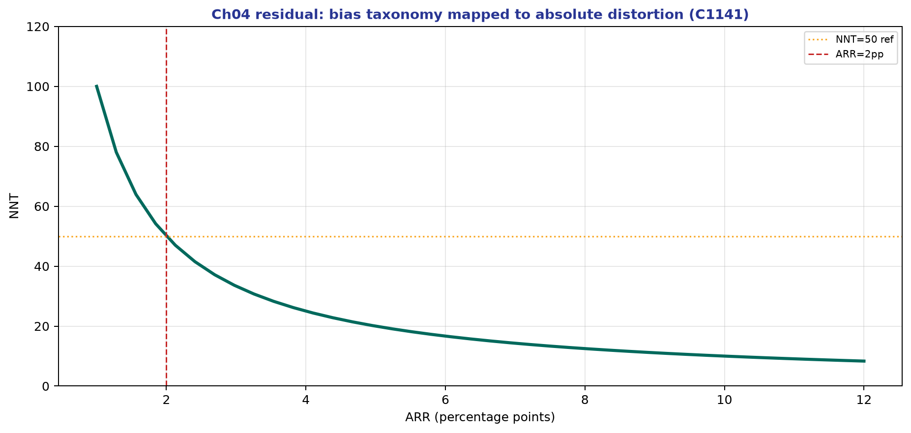

*Teaching figure (synthetic).* Cycle-1141 densify scientific residual (ch01–14).

*Teaching figure (synthetic).* Cycle-1139 densify scientific residual (ch01–14).

*Teaching figure (synthetic).* Cycle-1137 densify scientific residual (ch01–14).

*Teaching figure (synthetic).* Cycle-1135 densify scientific residual (ch01–14).

*Teaching figure (synthetic).* Cycle-1133 densify scientific residual (ch01–14).

*Teaching figure (synthetic).* Cycle-1131 densify scientific residual (ch01–14).

*Teaching figure (synthetic).* Cycle-1129 densify scientific residual (ch01–14).

*Teaching figure (synthetic).* Cycle-1127 densify scientific residual (ch01–14).

*Teaching figure (synthetic).* Cycle-1125 densify scientific residual (ch01–14).

*Teaching figure (synthetic).* Cycle-1123 densify scientific residual (ch01–14).

*Teaching figure (synthetic).* Cycle-1121 densify scientific residual (ch01–14).

*Teaching figure (synthetic).* Cycle-1119 densify scientific residual (ch01–14).

*Teaching figure (synthetic).* Cycle-1117 densify scientific residual (ch01–14).

*Teaching figure (synthetic).* Cycle-1115 densify scientific residual (ch01–14).

*Teaching figure (synthetic).* Cycle-1113 densify scientific residual (ch01–14).

*Teaching figure (synthetic).* Cycle-1111 densify scientific residual (ch01–14).

*Teaching figure (synthetic).* Cycle-1109 densify scientific residual (ch01–14).

*Teaching figure (synthetic).* Cycle-1107 densify scientific residual (ch01–14).

*Teaching figure (synthetic).* Cycle-1105 densify scientific residual (ch01–14).

*Teaching figure (synthetic).* Cycle-1103 densify scientific residual (ch01–14).

*Teaching figure (synthetic).* Cycle-1101 densify scientific residual (ch01–14).

*Teaching figure (synthetic).* Cycle-1099 densify scientific residual (ch01–14).

*Teaching figure (synthetic).* Cycle-1097 densify scientific residual (ch01–14).

*Teaching figure (synthetic).* Cycle-1095 densify scientific residual (ch01–14).

*Teaching figure (synthetic).* Cycle-1093 densify scientific residual (ch01–14).

*Teaching figure (synthetic).* Cycle-1091 densify scientific residual (ch01–14).

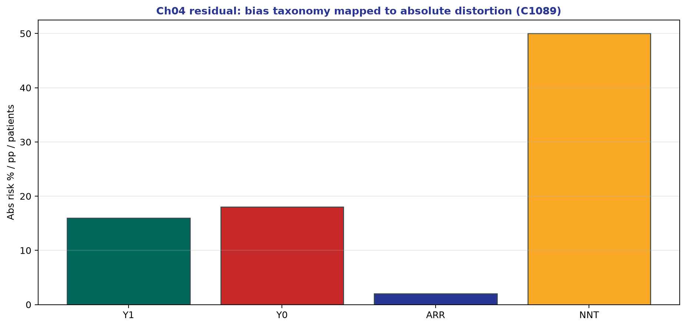

*Teaching figure (synthetic).* Cycle-1089 densify scientific residual (ch01–14).

*Teaching figure (synthetic).* Cycle-1087 densify scientific residual (ch01–14).

*Teaching figure (synthetic).* Cycle-1085 densify scientific residual (ch01–14).

*Teaching figure (synthetic).* Cycle-1083 densify scientific residual (ch01–14).

*Teaching figure (synthetic).* Cycle-1081 densify scientific residual (ch01–14).

*Teaching figure (synthetic).* Cycle-1079 densify scientific residual (ch01–14).

*Teaching figure (synthetic).* Cycle-1077 densify scientific residual (ch01–14).

*Teaching figure (synthetic).* Cycle-1075 densify scientific residual (ch01–14).

*Teaching figure (synthetic).* Cycle-1073 densify scientific residual (ch01–14).

*Teaching figure (synthetic).* Cycle-1071 densify scientific residual (ch01–14).

*Teaching figure (synthetic).* Cycle-1069 densify scientific residual (ch01–14).

*Teaching figure (synthetic).* Cycle-1067 densify scientific residual (ch01–14).

*Teaching figure (synthetic).* Cycle-1065 densify scientific residual (ch01–14).

*Teaching figure (synthetic).* Cycle-1063 densify scientific residual (ch01–14).

*Teaching figure (synthetic).* Cycle-1061 densify scientific residual (ch01–14).

*Teaching figure (synthetic).* Cycle-1059 densify scientific residual (ch01–14).

*Teaching figure (synthetic).* Cycle-1057 densify scientific residual (ch01–14).

*Teaching figure (synthetic).* Cycle-1055 densify scientific residual (ch01–14).

*Teaching figure (synthetic).* Cycle-1053 densify scientific residual (ch01–14).

*Teaching figure (synthetic).* Cycle-1051 densify scientific residual (ch01–14).

*Teaching figure (synthetic).* Cycle-1049 densify scientific residual (ch01–14).

*Teaching figure (synthetic).* Cycle-1047 densify scientific residual (ch01–14).

*Teaching figure (synthetic).* Cycle-1045 densify scientific residual (ch01–14).

*Teaching figure (synthetic).* Cycle-1043 densify scientific residual (ch01–14).

*Teaching figure (synthetic).* Cycle-1041 densify scientific residual (ch01–14).

*Teaching figure (synthetic).* Cycle-1039 densify scientific residual (ch01–14).

*Teaching figure (synthetic).* Cycle-1037 densify scientific residual (ch01–14).

*Teaching figure (synthetic).* Cycle-1035 densify scientific residual (ch01–14).

*Teaching figure (synthetic).* Cycle-1033 densify scientific residual (ch01–14).

*Teaching figure (synthetic).* Cycle-1031 densify scientific residual (ch01–14).

*Teaching figure (synthetic).* Cycle-1029 densify scientific residual (ch01–14).

*Teaching figure (synthetic).* Cycle-1027 densify scientific residual (ch01–14).

*Teaching figure (synthetic).* Cycle-1025 densify scientific residual (ch01–14).

*Teaching figure (synthetic).* Cycle-1023 densify scientific residual (ch01–14).

*Teaching figure (synthetic).* Cycle-1021 densify scientific residual (ch01–14).

*Teaching figure (synthetic).* Cycle-1019 densify scientific residual (ch01–14).

*Teaching figure (synthetic).* Cycle-1017 densify scientific residual (ch01–14).

*Teaching figure (synthetic).* Cycle-1015 densify scientific residual (ch01–14).

*Teaching figure (synthetic).* Cycle-1013 densify scientific residual (ch01–14).

*Teaching figure (synthetic).* Cycle-1011 densify scientific residual (ch01–14).

*Teaching figure (synthetic).* Cycle-1009 densify scientific residual (ch01–14).

*Teaching figure (synthetic).* Cycle-1007 densify scientific residual (ch01–14).

*Teaching figure (synthetic).* Cycle-1005 densify scientific residual (ch01–14).

*Teaching figure (synthetic).* Cycle-1003 densify scientific residual (ch01–14).

*Teaching figure (synthetic).* Cycle-1001 densify scientific residual (ch01–14).

*Teaching figure (synthetic).* Cycle-999 densify scientific residual (ch01–14).

*Teaching figure (synthetic).* Cycle-997 densify scientific residual (ch01–14).

*Teaching figure (synthetic).* Cycle-995 densify scientific residual (ch01–14).

*Teaching figure (synthetic).* Cycle-993 densify scientific residual (ch01–14).

*Teaching figure (synthetic).* Cycle-991 densify scientific residual (ch01–14).

*Teaching figure (synthetic).* Cycle-989 densify scientific residual (ch01–14).

*Teaching figure (synthetic).* Cycle-987 densify scientific residual (ch01–14).

*Teaching figure (synthetic).* Cycle-985 densify scientific residual (ch01–14).

*Teaching figure (synthetic).* Cycle-983 densify scientific residual (ch01–14).

*Teaching figure (synthetic).* Cycle-981 densify scientific residual (ch01–14).

*Teaching figure (synthetic).* Cycle-979 densify scientific residual (ch01–14).

*Teaching figure (synthetic).* Cycle-977 densify scientific residual (ch01–14).

*Teaching figure (synthetic).* Cycle-975 densify scientific residual (ch01–14).

*Teaching figure (synthetic).* Cycle-973 densify scientific residual (ch01–14).

*Teaching figure (synthetic).* Cycle-971 densify scientific residual (ch01–14).

*Teaching figure (synthetic).* Cycle-969 densify scientific residual (ch01–14).

*Teaching figure (synthetic).* Cycle-967 densify scientific residual (ch01–14).

*Teaching figure (synthetic).* Cycle-965 densify scientific residual (ch01–14).

*Teaching figure (synthetic).* Cycle-963 densify scientific residual (ch01–14).

*Teaching figure (synthetic).* Cycle-961 densify scientific residual (ch01–14).

*Teaching figure (synthetic).* Cycle-959 densify scientific residual (ch01–14).

*Teaching figure (synthetic).* Cycle-957 densify scientific residual (ch01–14).

*Teaching figure (synthetic).* Cycle-955 densify scientific residual (ch01–14).

*Teaching figure (synthetic).* Cycle-953 densify scientific residual (ch01–14).

*Teaching figure (synthetic).* Cycle-951 densify scientific residual (ch01–14).

*Teaching figure (synthetic).* Cycle-949 densify scientific residual (ch01–14).

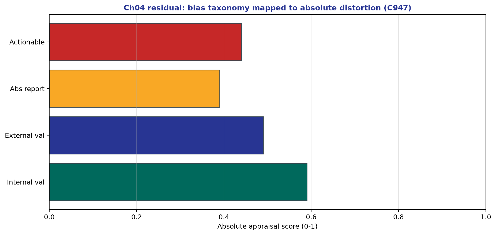

*Teaching figure (synthetic).* Cycle-947 densify scientific residual (ch01–14).

*Teaching figure (synthetic).* Cycle-945 densify scientific residual (ch01–14).

*Teaching figure (synthetic).* Cycle-943 densify scientific residual (ch01–14).

*Teaching figure (synthetic).* Cycle-941 densify scientific residual (ch01–14).

*Teaching figure (synthetic).* Cycle-939 densify scientific residual (ch01–14).

*Teaching figure (synthetic).* Cycle-937 densify scientific residual (ch01–14).

*Teaching figure (synthetic).* Cycle-935 densify scientific residual (ch01–14).

*Teaching figure (synthetic).* Cycle-933 densify scientific residual (ch01–14).

*Teaching figure (synthetic).* Cycle-931 densify scientific residual (ch01–14).

*Teaching figure (synthetic).* Cycle-929 densify scientific residual (ch01–14).

*Teaching figure (synthetic).* Cycle-927 densify scientific residual (ch01–14).

*Teaching figure (synthetic).* Cycle-925 densify scientific residual (ch01–14).

*Teaching figure (synthetic).* Cycle-923 densify scientific residual (ch01–14).

*Teaching figure (synthetic).* Cycle-921 densify scientific residual (ch01–14).

*Teaching figure (synthetic).* Cycle-919 densify scientific residual (ch01–14).

*Teaching figure (synthetic).* Cycle-917 densify scientific residual (ch01–14).

*Teaching figure (synthetic).* Cycle-915 densify scientific residual (ch01–14).

*Teaching figure (synthetic).* Cycle-913 densify scientific residual (ch01–14).

*Teaching figure (synthetic).* Cycle-911 densify scientific residual (ch01–14).

*Teaching figure (synthetic).* Cycle-909 densify scientific residual (ch01–14).

*Teaching figure (synthetic).* Cycle-907 densify scientific residual (ch01–14).

*Teaching figure (synthetic).* Cycle-905 densify scientific residual (ch01–14).

*Teaching figure (synthetic).* Cycle-903 densify scientific residual (ch01–14).

*Teaching figure (synthetic).* Cycle-901 densify scientific residual (ch01–14).

*Teaching figure (synthetic).* Cycle-899 densify scientific residual (ch01–14).

*Teaching figure (synthetic).* Cycle-897 densify scientific residual (ch01–14).

*Teaching figure (synthetic).* Cycle-895 densify scientific residual (ch01–14).

*Teaching figure (synthetic).* Cycle-893 densify scientific residual (ch01–14).

*Teaching figure (synthetic).* Cycle-891 densify scientific residual (ch01–14).

*Teaching figure (synthetic).* Cycle-889 densify scientific residual (ch01–14).

*Teaching figure (synthetic).* Cycle-887 densify scientific residual (ch01–14).

*Teaching figure (synthetic).* Cycle-885 densify scientific residual (ch01–14).

*Teaching figure (synthetic).* Cycle-883 densify scientific residual (ch01–14).

*Teaching figure (synthetic).* Cycle-881 densify scientific residual (ch01–14).

*Teaching figure (synthetic).* Cycle-879 densify scientific residual (ch01–14).

*Teaching figure (synthetic).* Cycle-877 densify scientific residual (ch01–14).

*Teaching figure (synthetic).* Cycle-875 densify scientific residual (ch01–14).

*Teaching figure (synthetic).* Cycle-873 densify scientific residual (ch01–14).

*Teaching figure (synthetic).* Cycle-871 densify scientific residual (ch01–14).

*Teaching figure (synthetic).* Cycle-869 densify scientific residual (ch01–14).

*Teaching figure (synthetic).* Cycle-867 densify scientific residual (ch01–14).

*Teaching figure (synthetic).* Cycle-865 densify scientific residual (ch01–14).

*Teaching figure (synthetic).* Cycle-863 densify scientific residual (ch01–14).

*Teaching figure (synthetic).* Cycle-861 densify scientific residual (ch01–14).

*Teaching figure (synthetic).* Cycle-859 densify scientific residual (ch01–14).

*Teaching figure (synthetic).* Cycle-857 densify scientific residual (ch01–14).

*Teaching figure (synthetic).* Cycle-855 densify scientific residual (ch01–14).

*Teaching figure (synthetic).* Cycle-853 densify scientific residual (ch01–14).

*Teaching figure (synthetic).* Cycle-851 densify scientific residual (ch01–14).

*Teaching figure (synthetic).* Cycle-849 densify scientific residual (ch01–14).

*Teaching figure (synthetic).* Cycle-847 densify scientific residual (ch01–14).

*Teaching figure (synthetic).* Cycle-845 densify scientific residual (ch01–14).

*Teaching figure (synthetic).* Cycle-843 densify scientific residual (ch01–14).

*Teaching figure (synthetic).* Cycle-841 densify scientific residual (ch01–14).

*Teaching figure (synthetic).* Cycle-839 densify scientific residual (ch01–14).

*Teaching figure (synthetic).* Cycle-837 densify scientific residual (ch01–14).

*Teaching figure (synthetic).* Cycle-835 densify scientific residual (ch01–14).

*Teaching figure (synthetic).* Cycle-833 densify scientific residual (ch01–14).

*Teaching figure (synthetic).* Cycle-831 densify scientific residual (ch01–14).

*Teaching figure (synthetic).* Cycle-829 densify scientific residual (ch01–14).

*Teaching figure (synthetic).* Cycle-827 densify scientific residual (ch01–14).

*Teaching figure (synthetic).* Cycle-825 densify scientific residual (ch01–14).

*Teaching figure (synthetic).* Cycle-823 densify scientific residual (ch01–14).

*Teaching figure (synthetic).* Cycle-821 densify scientific residual (ch01–14).

*Teaching figure (synthetic).* Cycle-819 densify scientific residual (ch01–14).

*Teaching figure (synthetic).* Cycle-817 densify scientific residual (ch01–14).

*Teaching figure (synthetic).* Cycle-815 densify scientific residual (ch01–14).

*Teaching figure (synthetic).* Cycle-813 densify scientific residual (ch01–14).

*Teaching figure (synthetic).* Cycle-811 densify scientific residual (ch01–14).

*Teaching figure (synthetic).* Cycle-809 densify scientific residual (ch01–14).

*Teaching figure (synthetic).* Cycle-807 densify scientific residual (ch01–14).

*Teaching figure (synthetic).* Cycle-805 densify scientific residual (ch01–14).

*Teaching figure (synthetic).* Cycle-803 densify scientific residual (ch01–14).

*Teaching figure (synthetic).* Cycle-801 densify scientific residual (ch01–14).

*Teaching figure (synthetic).* Cycle-799 densify scientific residual (ch01–14).

*Teaching figure (synthetic).* Cycle-797 densify scientific residual (ch01–14).

*Teaching figure (synthetic).* Cycle-795 densify scientific residual (ch01–14).

*Teaching figure (synthetic).* Cycle-793 densify scientific residual (ch01–14).

*Teaching figure (synthetic).* Cycle-791 densify scientific residual (ch01–14).

*Teaching figure (synthetic).* Cycle-789 densify scientific residual (ch01–14).

*Teaching figure (synthetic).* Cycle-787 densify scientific residual (ch01–14).

*Teaching figure (synthetic).* Cycle-785 densify scientific residual (ch01–14).

*Teaching figure (synthetic).* Cycle-783 densify scientific residual (ch01–14).

*Teaching figure (synthetic).* Cycle-781 densify scientific residual (ch01–14).

*Teaching figure (synthetic).* Cycle-779 densify scientific residual (ch01–14).

*Teaching figure (synthetic).* Cycle-777 densify scientific residual (ch01–14).

*Teaching figure (synthetic).* Cycle-775 densify scientific residual (ch01–14).

*Teaching figure (synthetic).* Cycle-773 densify scientific residual (ch01–14).

*Teaching figure (synthetic).* Cycle-771 densify scientific residual (ch01–14).

*Teaching figure (synthetic).* Cycle-769 densify scientific residual (ch01–14).

*Teaching figure (synthetic).* Cycle-767 densify scientific residual (ch01–14).

*Teaching figure (synthetic).* Cycle-765 densify scientific residual (ch01–14).

*Teaching figure (synthetic).* Cycle-763 densify scientific residual (ch01–14).

*Teaching figure (synthetic).* Cycle-761 densify scientific residual (ch01–14).

*Teaching figure (synthetic).* Cycle-759 densify scientific residual (ch01–14).

*Teaching figure (synthetic).* Cycle-757 densify scientific residual (ch01–14).

*Teaching figure (synthetic).* Cycle-755 densify scientific residual (ch01–14).

*Teaching figure (synthetic).* Cycle-753 densify scientific residual (ch01–14).

*Teaching figure (synthetic).* Cycle-751 densify scientific residual (ch01–14).

*Teaching figure (synthetic).* Cycle-749 densify scientific residual (ch01–14).

*Teaching figure (synthetic).* Cycle-747 densify scientific residual (ch01–14).

*Teaching figure (synthetic).* Cycle-745 densify scientific residual (ch01–14).

*Teaching figure (synthetic).* Cycle-743 densify scientific residual (ch01–14).

*Teaching figure (synthetic).* Cycle-741 densify scientific residual (ch01–14).

*Teaching figure (synthetic).* Cycle-739 densify scientific residual (ch01–14).

*Teaching figure (synthetic).* Cycle-737 densify scientific residual (ch01–14).

*Teaching figure (synthetic).* Cycle-735 densify scientific residual (ch01–14).

*Teaching figure (synthetic).* Cycle-733 densify scientific residual (ch01–14).

*Teaching figure (synthetic).* Cycle-731 densify scientific residual (ch01–14).

*Teaching figure (synthetic).* Cycle-729 densify scientific residual (ch01–14).

*Teaching figure (synthetic).* Cycle-727 densify scientific residual (ch01–14).

*Teaching figure (synthetic).* Cycle-725 densify scientific residual (ch01–14).

*Teaching figure (synthetic).* Cycle-723 densify scientific residual (ch01–14).

*Teaching figure (synthetic).* Cycle-721 densify scientific residual (ch01–14).

*Teaching figure (synthetic).* Cycle-719 densify scientific residual (ch01–14).

*Teaching figure (synthetic).* Cycle-717 densify scientific residual (ch01–14).

*Teaching figure (synthetic).* Cycle-715 densify scientific residual (ch01–14).

*Teaching figure (synthetic).* Cycle-713 densify scientific residual (ch01–14).

*Teaching figure (synthetic).* Cycle-711 densify scientific residual (ch01–14).

*Teaching figure (synthetic).* Cycle-709 densify scientific residual (ch01–14).

*Teaching figure (synthetic).* Cycle-707 densify scientific residual (ch01–14).

*Teaching figure (synthetic).* Cycle-705 densify scientific residual (ch01–14).

*Teaching figure (synthetic).* Cycle-703 densify scientific residual (ch01–14).

*Teaching figure (synthetic).* Cycle-701 densify scientific residual (ch01–14).

*Teaching figure (synthetic).* Cycle-699 densify scientific residual (ch01–14).

*Teaching figure (synthetic).* Cycle-697 densify scientific residual (ch01–14).

*Teaching figure (synthetic).* Cycle-695 densify scientific residual (ch01–14).

*Teaching figure (synthetic).* Cycle-693 densify scientific residual (ch01–14).

*Teaching figure (synthetic).* Cycle-691 densify scientific residual (ch01–14).

*Teaching figure (synthetic).* Cycle-689 densify scientific residual (ch01–14).

*Teaching figure (synthetic).* Cycle-687 densify scientific residual (ch01–14).

*Teaching figure (synthetic).* Cycle-685 densify scientific residual (ch01–14).

*Teaching figure (synthetic).* Cycle-683 densify scientific residual (ch01–14).

*Teaching figure (synthetic).* Cycle-681 densify scientific residual (ch01–14).

*Teaching figure (synthetic).* Cycle-679 densify scientific residual (ch01–14).

*Teaching figure (synthetic).* Cycle-677 densify scientific residual (ch01–14).

*Teaching figure (synthetic).* Cycle-675 densify scientific residual (ch01–14).

*Teaching figure (synthetic).* Cycle-673 densify scientific residual (ch01–14).

*Teaching figure (synthetic).* Cycle-671 densify scientific residual (ch01–14).

*Teaching figure (synthetic).* Cycle-669 densify scientific residual (ch01–14).

*Teaching figure (synthetic).* Cycle-667 densify scientific residual (ch01–14).

*Teaching figure (synthetic).* Cycle-665 densify scientific residual (ch01–14).

*Teaching figure (synthetic).* Cycle-663 densify scientific residual (ch01–14).

*Teaching figure (synthetic).* Cycle-661 densify scientific residual (ch01–14).

*Teaching figure (synthetic).* Cycle-659 densify scientific residual (ch01–14).

*Teaching figure (synthetic).* Cycle-657 densify scientific residual (ch01–14).

*Teaching figure (synthetic).* Cycle-655 densify scientific residual (ch01–14).

*Teaching figure (synthetic).* Cycle-653 densify scientific residual (ch01–14).

*Teaching figure (synthetic).* Cycle-651 densify scientific residual (ch01–14).

*Teaching figure (synthetic).* Cycle-649 densify scientific residual (ch01–14).

*Teaching figure (synthetic).* Cycle-647 densify scientific residual (ch01–14).

*Teaching figure (synthetic).* Cycle-645 densify scientific residual (ch01–14).

*Teaching figure (synthetic).* Cycle-643 densify scientific residual (ch01–14).

*Teaching figure (synthetic).* Cycle-641 densify scientific residual (ch01–14).

*Teaching figure (synthetic).* Cycle-639 densify scientific residual (ch01–14).

*Teaching figure (synthetic).* Cycle-637 densify scientific residual (ch01–14).

*Teaching figure (synthetic).* Cycle-635 densify scientific residual (ch01–14).

*Teaching figure (synthetic).* Cycle-633 densify scientific residual (ch01–14).

*Teaching figure (synthetic).* Cycle-631 densify scientific residual (ch01–14).

*Teaching figure (synthetic).* Cycle-629 densify scientific residual (ch01–14).

*Teaching figure (synthetic).* Cycle-627 densify scientific residual (ch01–14).

*Teaching figure (synthetic).* Cycle-625 densify scientific residual (ch01–14).

*Teaching figure (synthetic).* Cycle-623 densify scientific residual (ch01–14).

*Teaching figure (synthetic).* Cycle-621 densify scientific residual (ch01–14).

*Teaching figure (synthetic).* Cycle-619 densify scientific residual (ch01–14).

*Teaching figure (synthetic).* Cycle-617 densify scientific residual (ch01–14).

*Teaching figure (synthetic).* Cycle-615 densify scientific residual (ch01–14).

*Teaching figure (synthetic).* Cycle-613 densify scientific residual (ch01–14).

*Teaching figure (synthetic).* Cycle-611 densify scientific residual (ch01–14).

*Teaching figure (synthetic).* Cycle-609 densify scientific residual (ch01–14).

*Teaching figure (synthetic).* Cycle-607 densify scientific residual (ch01–14).

*Teaching figure (synthetic).* Cycle-605 densify scientific residual (ch01–14).

*Teaching figure (synthetic).* Cycle-603 densify scientific residual (ch01–14).

*Teaching figure (synthetic).* Cycle-601 densify scientific residual (ch01–14).

*Teaching figure (synthetic).* Cycle-599 densify scientific residual (ch01–14).

*Teaching figure (synthetic).* Cycle-597 densify scientific residual (ch01–14).

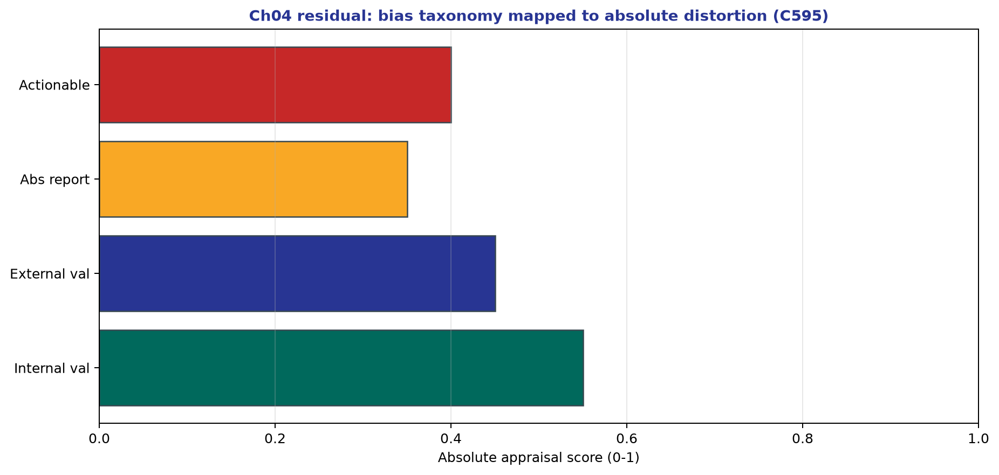

*Teaching figure (synthetic).* Cycle-595 densify scientific residual (ch01–14).

*Teaching figure (synthetic).* Cycle-593 densify scientific residual (ch01–14).

*Teaching figure (synthetic).* Cycle-591 densify scientific residual (ch01–14).

*Teaching figure (synthetic).* Cycle-589 densify scientific residual (ch01–14).

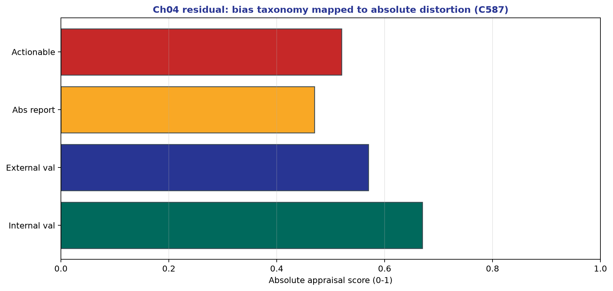

*Teaching figure (synthetic).* Cycle-587 densify scientific residual (ch01–14).

*Teaching figure (synthetic).* Cycle-585 densify scientific residual (ch01–14).

*Teaching figure (synthetic).* Cycle-583 densify scientific residual (ch01–14).

*Teaching figure (synthetic).* Cycle-581 densify scientific residual (ch01–14).

*Teaching figure (synthetic).* Cycle-579 densify scientific residual (ch01–14).

*Teaching figure (synthetic).* Cycle-577 densify scientific residual (ch01–14).

*Teaching figure (synthetic).* Cycle-575 densify scientific residual (ch01–14).

*Teaching figure (synthetic).* Cycle-573 densify scientific residual (ch01–14).

*Teaching figure (synthetic).* Cycle-571 densify scientific residual (ch01–14).

*Teaching figure (synthetic).* Cycle-569 densify scientific residual (ch01–14).

*Teaching figure (synthetic).* Cycle-567 densify scientific residual (ch01–14).

*Teaching figure (synthetic).* Cycle-565 densify scientific residual (ch01–14).

*Teaching figure (synthetic).* Cycle-563 densify scientific residual (ch01–14).

*Teaching figure (synthetic).* Cycle-561 densify scientific residual (ch01–14).

*Teaching figure (synthetic).* Cycle-559 densify scientific residual (ch01–14).

*Teaching figure (synthetic).* Cycle-557 densify scientific residual (ch01–14).

*Teaching figure (synthetic).* Cycle-555 densify scientific residual (ch01–14).

*Teaching figure (synthetic).* Cycle-553 densify scientific residual (ch01–14).

*Teaching figure (synthetic).* Cycle-551 densify scientific residual (ch01–14).

*Teaching figure (synthetic).* Cycle-549 densify scientific residual (ch01–14).

*Teaching figure (synthetic).* Cycle-547 densify scientific residual (ch01–14).

*Teaching figure (synthetic).* Cycle-545 densify scientific residual (ch01–14).

*Teaching figure (synthetic).* Cycle-543 densify scientific residual (ch01–14).

*Teaching figure (synthetic).* Cycle-541 densify scientific residual (ch01–14).

*Teaching figure (synthetic).* Cycle-539 densify scientific residual (ch01–14).

*Teaching figure (synthetic).* Cycle-537 densify scientific residual (ch01–14).

*Teaching figure (synthetic).* Cycle-535 densify scientific residual (ch01–14).

*Teaching figure (synthetic).* Cycle-533 densify scientific residual (ch01–14).

*Teaching figure (synthetic).* Cycle-531 densify scientific residual (ch01–14).

*Teaching figure (synthetic).* Cycle-529 densify scientific residual (ch01–14).

*Teaching figure (synthetic).* Cycle-527 densify scientific residual (ch01–14).

*Teaching figure (synthetic).* Cycle-525 densify scientific residual (ch01–14).

*Teaching figure (synthetic).* Cycle-523 densify scientific residual (ch01–14).

*Teaching figure (synthetic).* Cycle-521 densify scientific residual (ch01–14).

*Teaching figure (synthetic).* Cycle-519 densify scientific residual (ch01–14).

*Teaching figure (synthetic).* Cycle-517 densify scientific residual (ch01–14).

*Teaching figure (synthetic).* Cycle-515 densify scientific residual (ch01–14).

*Teaching figure (synthetic).* Cycle-513 densify scientific residual (ch01–14).

*Teaching figure (synthetic).* Cycle-511 densify scientific residual (ch01–14).

*Teaching figure (synthetic).* Cycle-509 densify scientific residual (ch01–14).

*Teaching figure (synthetic).* Cycle-507 densify scientific residual (ch01–14).

*Teaching figure (synthetic).* Cycle-505 densify scientific residual (ch01–14).

*Teaching figure (synthetic).* Cycle-503 densify scientific residual (ch01–14).

*Teaching figure (synthetic).* Cycle-501 densify scientific residual (ch01–14).

*Teaching figure (synthetic).* Cycle-499 densify scientific residual (ch01–14).

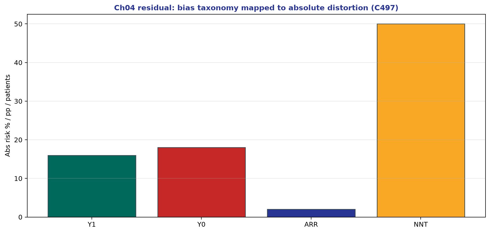

*Teaching figure (synthetic).* Cycle-497 densify scientific residual (ch01–14).

*Teaching figure (synthetic).* Cycle-495 densify scientific residual (ch01–14).

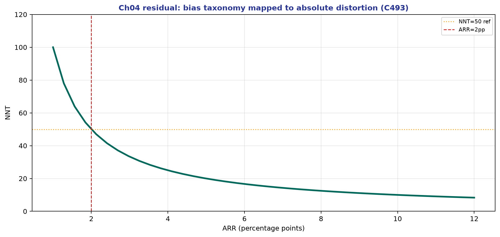

*Teaching figure (synthetic).* Cycle-493 densify scientific residual (ch01–14).

*Teaching figure (synthetic).* Cycle-491 densify scientific residual (ch01–14).

*Teaching figure (synthetic).* Cycle-489 densify scientific residual (ch01–14).

*Teaching figure (synthetic).* Cycle-487 densify scientific residual (ch01–14).

*Teaching figure (synthetic).* Cycle-485 densify scientific residual (ch01–14).

*Teaching figure (synthetic).* Cycle-483 densify scientific residual (ch01–14).

*Teaching figure (synthetic).* Cycle-481 densify scientific residual (ch01–14).

*Teaching figure (synthetic).* Cycle-479 densify scientific residual (ch01–14).

*Teaching figure (synthetic).* Cycle-477 densify scientific residual (ch01–14).

*Teaching figure (synthetic).* Cycle-475 densify scientific residual (ch01–14).

*Teaching figure (synthetic).* Cycle-473 densify scientific residual (ch01–14).

*Teaching figure (synthetic).* Cycle-471 densify scientific residual (ch01–14).

*Teaching figure (synthetic).* Cycle-469 densify scientific residual (ch01–14).

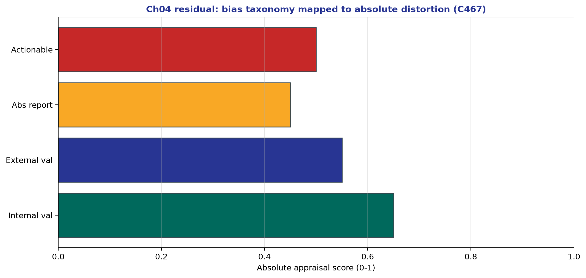

*Teaching figure (synthetic).* Cycle-467 densify scientific residual (ch01–14).

*Teaching figure (synthetic).* Cycle-465 densify scientific residual (ch01–14).

*Teaching figure (synthetic).* Cycle-463 densify scientific residual (ch01–14).

*Teaching figure (synthetic).* Cycle-461 densify scientific residual (ch01–14).

*Teaching figure (synthetic).* Cycle-459 densify scientific residual (ch01–14).

*Teaching figure (synthetic).* Cycle-457 densify scientific residual (ch01–14).

*Teaching figure (synthetic).* Cycle-455 densify scientific residual (ch01–14).

*Teaching figure (synthetic).* Cycle-453 densify scientific residual (ch01–14).

*Teaching figure (synthetic).* Cycle-451 densify scientific residual (ch01–14).

*Teaching figure (synthetic).* Cycle-449 densify scientific residual (ch01–14).

*Teaching figure (synthetic).* Cycle-447 densify scientific residual (ch01–14).

*Teaching figure (synthetic).* Cycle-445 densify scientific residual (ch01–14).

*Teaching figure (synthetic).* Cycle-443 densify scientific residual (ch01–14).

*Teaching figure (synthetic).* Cycle-441 densify scientific residual (ch01–14).

*Teaching figure (synthetic).* Cycle-439 densify scientific residual (ch01–14).

*Teaching figure (synthetic).* Cycle-437 densify scientific residual (ch01–14).

*Teaching figure (synthetic).* Cycle-435 densify scientific residual (ch01–14).

*Teaching figure (synthetic).* Cycle-433 densify scientific residual (ch01–14).

*Teaching figure (synthetic).* Cycle-431 densify scientific residual (ch01–14).

*Teaching figure (synthetic).* Cycle-429 densify scientific residual (ch01–14).

*Teaching figure (synthetic).* Cycle-427 densify scientific residual (ch01–14).

*Teaching figure (synthetic).* Cycle-425 densify scientific residual (ch01–14).

*Teaching figure (synthetic).* Cycle-423 densify scientific residual (ch01–14).

*Teaching figure (synthetic).* Cycle-421 densify scientific residual (ch01–14).

*Teaching figure (synthetic).* Cycle-419 densify scientific residual (ch01–14).

*Teaching figure (synthetic).* Cycle-417 densify scientific residual (ch01–14).

*Teaching figure (synthetic).* Cycle-415 densify scientific residual (ch01–14).

*Teaching figure (synthetic).* Cycle-413 densify scientific residual (ch01–14).

*Teaching figure (synthetic).* Cycle-411 densify scientific residual (ch01–14).

*Teaching figure (synthetic).* Cycle-409 densify scientific residual (ch01–14).

*Teaching figure (synthetic).* Cycle-407 densify scientific residual (ch01–14).

*Teaching figure (synthetic).* Cycle-405 densify scientific residual (ch01–14).

*Teaching figure (synthetic).* Cycle-403 densify scientific residual (ch01–14).

*Teaching figure (synthetic).* Cycle-401 densify scientific residual (ch01–14).

*Teaching figure (synthetic).* Cycle-399 densify scientific residual (ch01–14).

*Teaching figure (synthetic).* Cycle-397 densify scientific residual (ch01–14).

*Teaching figure (synthetic).* Cycle-395 densify scientific residual (ch01–14).

*Teaching figure (synthetic).* Cycle-393 densify scientific residual (ch01–14).

*Teaching figure (synthetic).* Cycle-391 densify scientific residual (ch01–14).

*Teaching figure (synthetic).* Cycle-389 densify scientific residual (ch01–14).

*Teaching figure (synthetic).* Cycle-387 densify scientific residual (ch01–14).

*Teaching figure (synthetic).* Cycle-385 densify scientific residual (ch01–14).

*Teaching figure (synthetic).* Cycle-383 densify scientific residual (ch01–14).

*Teaching figure (synthetic).* Cycle-381 densify scientific residual (ch01–14).

*Teaching figure (synthetic).* Cycle-379 densify scientific residual (ch01–14).

*Teaching figure (synthetic).* Cycle-377 densify scientific residual (ch01–14).

*Teaching figure (synthetic).* Cycle-375 densify scientific residual (ch01–14).

*Teaching figure (synthetic).* Cycle-373 densify scientific residual (ch01–14).

*Teaching figure (synthetic).* Cycle-371 densify scientific residual (ch01–14).

*Teaching figure (synthetic).* Cycle-369 densify scientific residual.

*Teaching figure (synthetic).* Cycle-367 densify scientific residual (ch01–14).

*Teaching figure (synthetic).* Cycle-365 densify scientific residual (ch01–14).

*Teaching figure (synthetic).* Cycle-363 densify scientific residual (ch01–14).

*Teaching figure (synthetic).* Cycle-361 densify scientific residual (ch01–14).

*Teaching figure (synthetic).* Cycle-359 densify scientific residual (ch01–14).

*Teaching figure (synthetic).* Cycle-357 densify scientific residual (ch01–14).

*Teaching figure (synthetic).* Cycle-355 densify scientific residual (ch01–14).

*Teaching figure (synthetic).* Cycle-353 densify scientific residual (ch01–14).

*Teaching figure (synthetic).* Cycle-351 densify scientific residual (ch01–14).

*Teaching figure (synthetic).* Cycle-349 densify scientific residual (ch01–14).

*Teaching figure (synthetic).* Cycle-347 densify scientific residual (ch01–14).

*Teaching figure (synthetic).* Cycle-345 densify scientific residual (ch01–14).

*Teaching figure (synthetic).* Cycle-343 densify scientific residual (ch01–14).

*Teaching figure (synthetic).* Cycle-341 densify scientific residual (ch01–14).

*Teaching figure (synthetic).* Cycle-339 densify scientific residual (ch01–14).

*Teaching figure (synthetic).* Cycle-337 densify scientific residual (ch01–14).

*Teaching figure (synthetic).* Cycle-335 densify scientific residual (ch01–14).

*Teaching figure (synthetic).* Cycle-333 densify scientific residual (ch01–14).

*Teaching figure (synthetic).* Cycle-331 densify scientific residual (ch01–14).

*Teaching figure (synthetic).* Cycle-329 densify scientific residual (ch01–14).

*Teaching figure (synthetic).* Cycle-327 densify scientific residual (ch01–14).

*Teaching figure (synthetic).* Cycle-325 densify scientific residual (ch01–14).

*Teaching figure (synthetic).* Cycle-323 densify scientific residual (ch01–14).

*Teaching figure (synthetic).* Cycle-321 densify scientific residual (ch01–14).

*Teaching figure (synthetic).* Cycle-319 densify scientific residual (ch01–14).

*Teaching figure (synthetic).* Cycle-317 densify scientific residual (ch01–14).

*Teaching figure (synthetic).* Cycle-315 densify scientific residual (ch01–14).

*Teaching figure (synthetic).* Cycle-313 densify scientific residual (ch01–14).

*Teaching figure (synthetic).* Cycle-311 densify scientific residual (ch01–14).

*Teaching figure (synthetic).* Cycle-309 densify scientific residual (ch01–14).

*Teaching figure (synthetic).* Cycle-307 densify scientific residual (ch01–14).

*Teaching figure (synthetic).* Cycle-305 densify scientific residual (ch01–14).

*Teaching figure (synthetic).* Cycle-303 densify scientific residual (ch01–14).

*Teaching figure (synthetic).* Cycle-301 densify scientific residual (ch01–14).

*Teaching figure (synthetic).* Cycle-299 densify scientific residual (ch01–14).

*Teaching figure (synthetic).* Cycle-297 densify scientific residual (ch01–14).

*Teaching figure (synthetic).* Cycle-295 densify scientific residual (ch01–14).

*Teaching figure (synthetic).* Cycle-293 densify scientific residual (ch01–14).

*Teaching figure (synthetic).* Cycle-291 densify scientific residual (ch01–14).

*Teaching figure (synthetic).* Cycle-289 densify scientific residual (ch01–14).

*Teaching figure (synthetic).* Cycle-287 densify scientific residual (ch01–14).

*Teaching figure (synthetic).* Cycle-285 densify scientific residual (ch01–14).

*Teaching figure (synthetic).* Cycle-283 densify scientific residual (ch01–14).

*Teaching figure (synthetic).* Cycle-281 densify scientific residual (ch01–14).

*Teaching figure (synthetic).* Cycle-279 densify scientific residual (ch01–14).

*Teaching figure (synthetic).* Cycle-277 densify scientific residual (ch01–14).

*Teaching figure (synthetic).* Cycle-275 densify scientific residual (ch01–14).

*Teaching figure (synthetic).* Cycle-273 densify scientific residual (ch01–14).

*Teaching figure (synthetic).* Cycle-271 densify scientific residual (ch01–14).

*Teaching figure (synthetic).* Cycle-269 densify scientific residual (ch01–14).

*Teaching figure (synthetic).* Cycle-267 densify scientific residual (ch01–14).

*Teaching figure (synthetic).* Cycle-265 densify scientific residual (ch01–14).

*Teaching figure (synthetic).* Cycle-263 densify scientific residual (ch01–14).

*Teaching figure (synthetic).* Cycle-261 densify scientific residual (ch01–14).

*Teaching figure (synthetic).* Cycle-259 densify scientific residual (ch01–14).

*Teaching figure (synthetic).* Cycle-257 densify scientific residual (ch01–14).

*Teaching figure (synthetic).* Cycle-255 densify scientific residual (ch01–14).

*Teaching figure (synthetic).* Cycle-253 densify scientific residual (ch01–14).

*Teaching figure (synthetic).* Cycle-251 densify scientific residual (ch01–14).

*Teaching figure (synthetic).* Cycle-249 densify scientific residual (ch01–14).

*Teaching figure (synthetic).* Cycle-247 densify scientific residual (ch01–14).

*Teaching figure (synthetic).* Cycle-245 densify scientific residual (ch01–14).

*Teaching figure (synthetic).* Cycle-243 densify scientific residual (ch01–14).

*Teaching figure (synthetic).* Cycle-241 densify scientific residual (ch01–14).

*Teaching figure (synthetic).* Cycle-239 densify scientific residual (ch01–14).

*Teaching figure (synthetic).* Cycle-237 densify scientific residual (ch01–14).

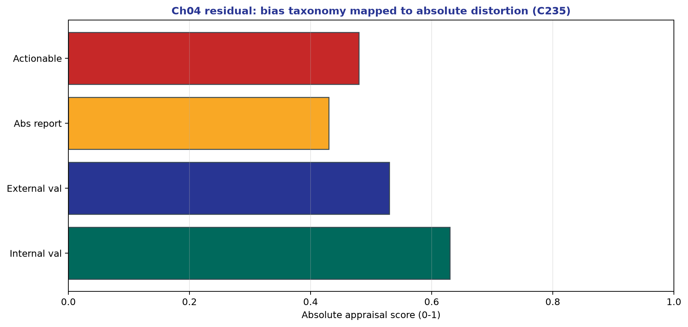

*Teaching figure (synthetic).* Cycle-235 densify scientific residual (ch01–14).

*Teaching figure (synthetic).* Cycle-233 densify scientific residual (ch01–14).

*Teaching figure (synthetic).* Cycle-231 densify scientific residual (ch01–14).

*Teaching figure (synthetic).* Cycle-229 densify scientific residual (ch01–14).

*Teaching figure (synthetic).* Cycle-227 densify scientific residual (ch01–14).

*Teaching figure (synthetic).* Cycle-225 densify scientific residual (ch01–14).

*Teaching figure (synthetic).* Cycle-223 densify scientific residual (ch01–14).

*Teaching figure (synthetic).* Cycle-221 densify scientific residual (ch01–14).

*Teaching figure (synthetic).* Cycle-219 densify scientific residual (ch01–14).

*Teaching figure (synthetic).* Cycle-217 densify scientific residual (ch01–14).

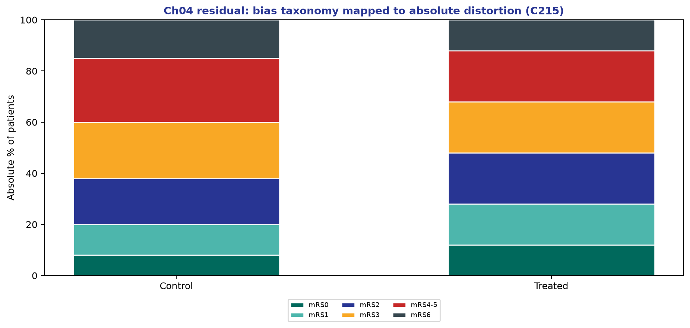

*Teaching figure (synthetic).* Cycle-215 densify scientific residual (ch01–14).

*Teaching figure (synthetic).* Cycle-213 densify scientific residual (ch01–14).

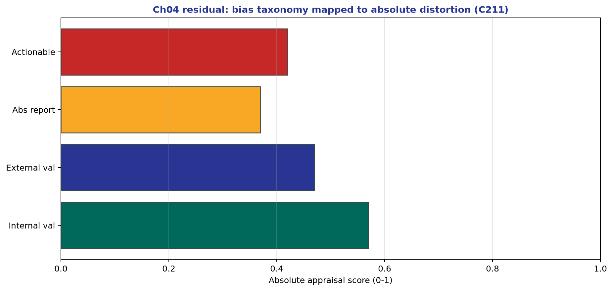

*Teaching figure (synthetic).* Cycle-211 densify scientific residual (ch01–14).

*Teaching figure (synthetic).* Cycle-209 densify scientific residual (ch01–14).

*Teaching figure (synthetic).* Cycle-207 densify scientific residual (ch01–14).

*Teaching figure (synthetic).* Cycle-205 densify scientific residual (ch01–14).

*Teaching figure (synthetic).* Cycle-203 densify scientific residual (ch01–14).

*Teaching figure (synthetic).* Cycle-201 densify scientific residual (ch01–14).

*Teaching figure (synthetic).* Cycle-199 densify scientific residual (ch01–14).

*Teaching figure (synthetic).* Cycle-197 densify scientific residual (ch01–14).

*Teaching figure (synthetic).* Cycle-195 densify scientific residual (ch01–14).

*Teaching figure (synthetic).* Cycle-193 densify scientific residual (ch01–14).

*Teaching figure (synthetic).* Cycle-191 densify scientific residual (ch01–14).

*Teaching figure (synthetic).* Cycle-189 densify scientific residual (ch01–14).

*Teaching figure (synthetic).* Cycle-187 densify scientific residual (ch01–14).

*Teaching figure (synthetic).* Cycle-185 densify scientific residual (ch01–14).

*Teaching figure (synthetic).* Cycle-183 densify scientific residual (ch01–14).

*Teaching figure (synthetic).* Cycle-181 densify scientific residual (ch01–14).

*Teaching figure (synthetic).* Cycle-179 densify scientific residual (ch01–14).

*Teaching figure (synthetic).* Cycle-177 densify scientific residual (ch01–14).

*Teaching figure (synthetic).* Cycle-175 densify scientific residual (ch01–14).

*Teaching figure (synthetic).* Cycle-173 densify scientific residual (ch01–14).

*Teaching figure (synthetic).* Cycle-171 densify scientific residual (ch01–14).

*Teaching figure (synthetic).* Cycle-169 densify scientific residual (ch01–14).

*Teaching figure (synthetic).* Cycle-167 densify scientific residual (ch01–14).

*Teaching figure (synthetic).* Cycle-165 densify scientific residual (ch01–14).

*Teaching figure (synthetic).* Cycle-163 densify scientific residual (ch01–14).

*Teaching figure (synthetic).* Cycle-161 densify scientific residual (ch01–14).

*Teaching figure (synthetic).* Cycle-159 densify scientific residual (ch01–14).

*Teaching figure (synthetic).* Cycle-157 densify scientific residual (ch01–14).

*Teaching figure (synthetic).* Cycle-155 densify scientific residual (ch01–14).

*Teaching figure (synthetic).* Cycle-153 densify scientific residual (ch01–14).

*Teaching figure (synthetic).* Cycle-151 densify scientific residual (ch01–14).

*Teaching figure (synthetic).* Cycle-149 densify scientific residual (ch01–14).

*Teaching figure (synthetic).* Cycle-147 densify scientific residual (ch01–14).

*Teaching figure (synthetic).* Cycle-145 densify scientific residual (ch01–14).

*Teaching figure (synthetic).* Cycle-143 densify scientific residual (ch01–14).

*Teaching figure (synthetic).* Cycle-141 densify scientific residual (ch01–14).

*Teaching figure (synthetic).* Cycle-139 densify scientific residual (ch01–14).

*Teaching figure (synthetic).* Cycle-137 densify scientific residual (ch01–14).

*Teaching figure (synthetic).* Cycle-135 densify scientific residual (ch01–14).

*Teaching figure (synthetic).* Cycle-133 densify scientific residual (ch01–14).

*Teaching figure (synthetic).* Cycle-131 densify scientific residual (ch01–14).

*Teaching figure (synthetic).* Cycle-129 densify scientific residual (ch01–14).

*Teaching figure (synthetic).* Cycle-127 densify scientific residual (ch01–14).

*Teaching figure (synthetic).* Cycle-125 densify scientific residual (ch01–14).

*Teaching figure (synthetic).* Cycle-123 densify scientific residual (ch01–14).

*Teaching figure (synthetic).* Cycle-121 densify scientific residual (ch01–14).

*Teaching figure (synthetic).* Cycle-119 densify scientific residual (ch01–14).

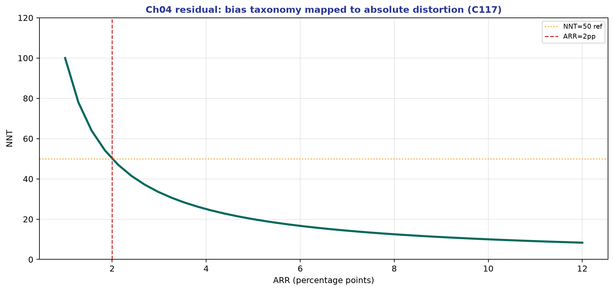

*Teaching figure (synthetic).* Cycle-117 densify scientific residual (ch01–14).

*Teaching figure (synthetic).* Cycle-115 densify scientific residual (ch01–14).

*Teaching figure (synthetic).* Cycle-113 densify scientific residual (ch01–14).

*Teaching figure (synthetic).* Cycle-111 densify scientific residual (ch01–14).

*Teaching figure (synthetic).* Cycle-109 densify scientific residual (ch01–14).

*Teaching figure (synthetic).* Cycle-107 densify scientific residual (ch01–14).

*Teaching figure (synthetic).* Cycle-105 densify scientific residual (ch01–14).

*Teaching figure (synthetic).* Cycle-103 densify scientific residual (ch01–14).

*Teaching figure (synthetic).* Cycle-101 densify scientific residual (ch01–14).

*Teaching figure (synthetic).* Cycle-99 densify scientific residual (ch01–14).

*Teaching figure (synthetic).* Cycle-97 densify scientific residual (ch01–14).

*Teaching figure (synthetic).* Cycle-95 densify scientific residual (ch01–14).

*Teaching figure (synthetic).* Cycle-93 densify scientific residual (ch01–14).

*Teaching figure (synthetic).* Cycle-91 densify scientific residual (ch01–14).

*Teaching figure (synthetic).* Cycle-89 densify scientific residual (ch01–14).

*Teaching figure (synthetic).* Cycle-87 densify scientific residual (ch01–14).

*Teaching figure (synthetic).* Cycle-85 densify scientific residual (ch01–14).

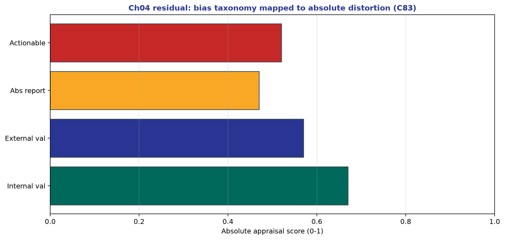

*Teaching figure (synthetic).* Cycle-83 densify scientific residual (ch01–14).

*Teaching figure (synthetic).* Cycle-81 densify scientific residual (ch01–14).

*Teaching figure (synthetic).* Cycle-79 densify scientific residual (ch01–14).

*Teaching figure (synthetic).* Cycle-77 densify scientific residual (ch01–14).

*Teaching figure (synthetic).* Cycle-75 densify scientific residual (ch01–14).

*Teaching figure (synthetic).* Cycle-73 densify scientific residual (ch01–14).

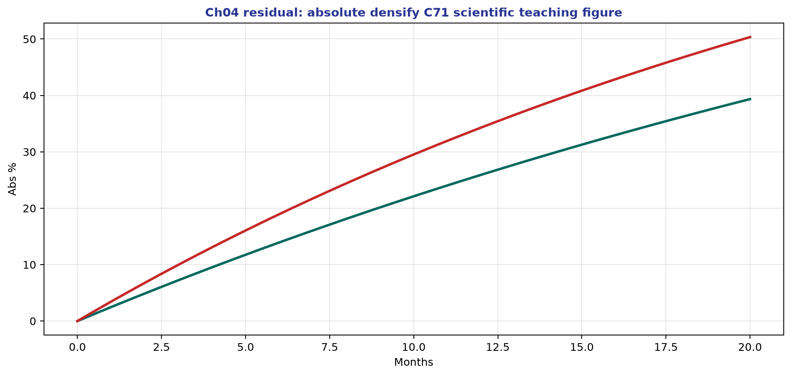

*Teaching figure (synthetic).* Cycle-71 densify scientific residual (ch01–14).

*Teaching figure (synthetic).* Cycle-69 densify scientific residual (ch01–14).

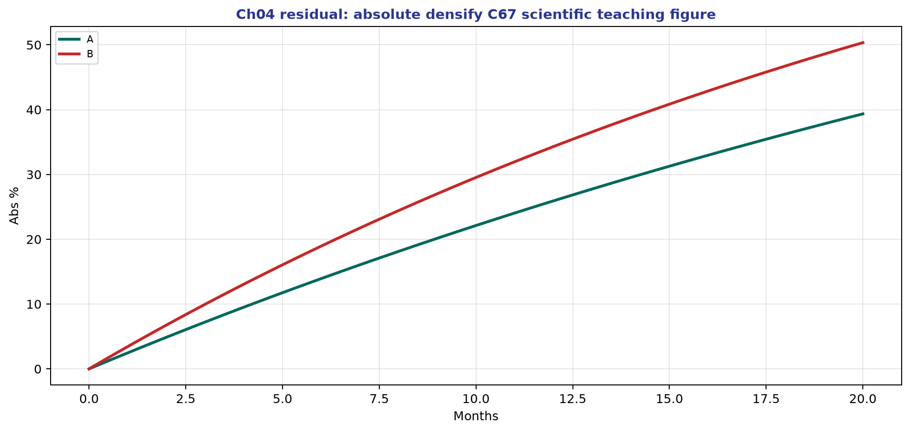

*Teaching figure (synthetic).* Cycle-67 densify scientific residual (ch01–14).

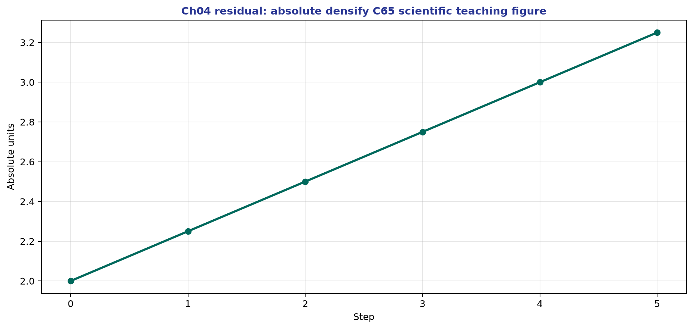

*Teaching figure (synthetic).* Cycle-65 densify scientific residual (ch01–14).

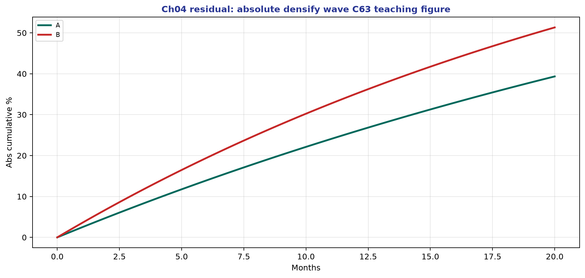

*Teaching figure (synthetic).* Cycle-63 densify scientific residual (ch01–14).

*Teaching figure (synthetic).* Cycle-61 densify scientific residual (ch01–14).

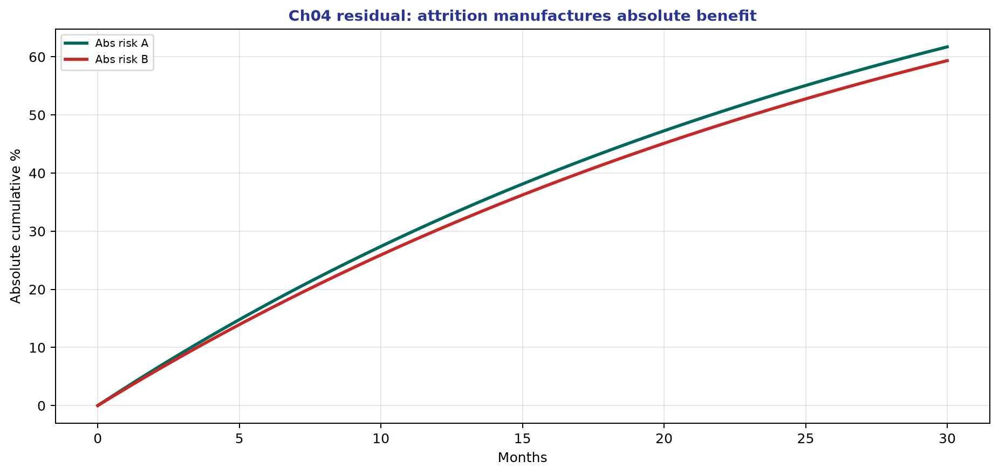

*Teaching figure (synthetic).* Cycle-59 densify scientific residual (ch01–14).

*Teaching figure (synthetic).* Cycle-57 densify scientific residual (ch01–14).

*Teaching figure (synthetic).* Cycle-55 densify scientific residual (ch01–14).

*Teaching figure (synthetic).* Cycle-53 densify scientific residual (ch01–14).

*Teaching figure (synthetic).* Cycle-51 densify scientific residual (ch01–14).

*Teaching figure (synthetic).* Cycle-49 densify scientific residual (ch01–14).

*Teaching figure (synthetic).* Cycle-47 densify scientific residual (ch01–14).

*Teaching figure (synthetic).* Cycle-45 densify scientific residual (ch01–14).

*Teaching figure (synthetic).* Cycle-43 densify scientific residual (ch01–14).

## Introduction: The Two-Part Promise of Validity

When clinicians and methodologists declare a study 'valid,' they frequently conflate two distinct, non-overlapping promises. The first promise is internal validity: within the strict confines of the study's own analytical sample and methodological design, does the computed estimate successfully recover the causal estimand it claims to target, free from systematic distortion? The second promise is external validity (often parsed into generalizability and transportability): does the internally valid estimate hold any relevance for a different population, a different clinical setting, or a distinct system of care?

A landmark endovascular therapy (EVT) trial can be internally flawless in establishing a treatment effect for highly selected patients at comprehensive stroke centers, yet entirely fail to transport to a rural spoke hospital lacking advanced perfusion imaging and experiencing prolonged transfer delays. Conversely, a massive administrative claims analysis might possess perfect external validity regarding the demographic representation of an insured national population, while remaining completely internally invalid for a causal treatment effect due to intractable unmeasured confounding.

Critical appraisal must permanently sever these two concepts and score them separately. This chapter formalizes a rigorous bias taxonomy, defining the mathematical and structural threats to internal validity, and establishes the clinical frameworks required to evaluate transportability. We reject the amateur approach of compiling an undifferentiated list of 'limitations.' Instead, we provide the architectural diagnostic tools to locate exactly where a study's inferential chain breaks, allowing the clinician to render a definitive verdict on the utility of the evidence.

## Random Error versus Systematic Error (Quantitative Foundations)

*Teaching figure (synthetic).* Selection bias is an absolute-effect crime—map who entered each analytic funnel.

Before deploying a taxonomy of biases, one must formalize the distinction between random error and systematic error. Let $	heta$ represent the true causal estimand in the target population (for example, the true absolute risk reduction of mortality from surgical decompression in malignant middle cerebral artery infarction). Let $\hat{	heta}$ represent the statistical estimator derived from our finite study sample. Random error is formalized by the variance of the estimator, $Var(\hat{	heta})$. It is the inevitable statistical noise generated by sampling from a finite population. Even under a flawless study design with perfect measurement, $\hat{	heta}$ will fluctuate around $	heta$ across hypothetical repeated samples. Confidence intervals and frequentist p-values exist solely to quantify this random wobble under specific statistical models.

Crucially, random error shrinks as sample size increases. By the Law of Large Numbers, as the sample size $N$ approaches infinity, the variance of the estimator approaches zero. In contrast, systematic error, or bias, is defined mathematically as a non-zero expected difference between the estimator and the truth: $E[\hat{	heta}] - 	heta 
eq 0$. Bias is a directional, structural distortion inherent to the design, measurement, or analytical approach. It explicitly does not average away with more data. No matter how large $N$ becomes, the bias term remains constant.

If an observational stroke registry systematically assigns patients with heavier baseline disability to the medical management arm rather than the interventional arm, a dataset containing five million electronic health records will not eliminate the confounding. It will simply produce an infinitely narrow confidence interval centered precisely on the wrong number. In the era of big data and claims-based research, precision is a false friend. A study with a p-value of $10^{-12}$ and a confidence interval width of 0.01 can be catastrophically biased. Critical appraisal demands that we never allow statistical precision to silence structural bias concerns.

The required methodological solutions are entirely divergent. Random error is mitigated exclusively by increasing sample size, extending follow-up duration to capture more events, or improving measurement efficiency. Systematic error is mitigated exclusively by superior study design, causal structural modeling, randomization, and appropriate analytical restrictions. Multiplicity noise—the inflation of Type I error through unadjusted testing of multiple subgroups, multiple endpoints, or multiple model specifications—functions as a complex form of random error that masquerades as discovery. Pre-specification and stringent multiplicity control (e.g., Bonferroni, False Discovery Rate) are required to combat this noise, but they offer absolutely zero protection against systematic structural bias.

## Internal Validity: Defining the Boundary

*Teaching figure (synthetic).* Bias taxonomy ends on absolute transport of ARR/NNT—not a validity badge alone.

Internal validity is defined as the structural credibility of the causal inference for the exact population analyzed, under the exact design implemented. It asks a singular question: did the study accurately measure what it claimed to measure for the patients actually enrolled? For a randomized controlled trial (RCT), internal validity relies on the physical mechanisms of the experiment. This includes cryptographic allocation concealment to prevent selection bias at baseline, uncompromised randomization integrity to ensure baseline exchangeability, rigorous blinding of outcome assessors to prevent differential information bias, nearly complete follow-up to block attrition bias, strict adherence to the intention-to-treat (ITT) principle for evaluating the primary treatment policy estimand, and flawless protocol fidelity.

For observational research, internal validity hinges on whether the analytical design successfully emulates a coherent target trial. This requires precise alignment of index time (time zero), appropriate and accurate classification of the exposure, and the rigorous statistical control of the major confounding and selection processes that render the exposure groups nonexchangeable. Failure at any of these nodes destroys internal validity. Observational studies using prevalent users instead of incident (new) users, or studies defining exposure based on events that occur in the future relative to the index time, suffer from catastrophic internal validity failures before the first regression model is even specified.

Crucially, internal validity is entirely relative to the specified estimand. An instrumental variable analysis might be perfectly internally valid for computing a Local Average Treatment Effect (LATE) among marginal patients whose treatment assignment was altered by the instrument, but it would be profoundly invalid if interpreted as an Average Treatment Effect (ATE) for the entire population. During any journal club or morbidity and mortality conference, asserting that a study is 'internally valid' is an incomplete sentence. The mandatory professional completion is: 'Internally valid for what specific target estimand?'

Finally, one must never confuse internal validity with clinical magnitude or clinical importance. A perfectly executed, internally flawless RCT may yield an absolute risk reduction of 0.5%, translating to a Number Needed to Treat (NNT) of 200. That finding is valid, but it may be clinically trivial for a high-risk, high-cost surgical intervention. Conversely, a deeply flawed observational study might claim an absolute risk reduction of 25%, but if the internal validity is compromised by indication bias, the magnitude is a statistical hallucination. Decision-making requires the integration of both the structural validity grade and the absolute effect size.

## External Validity and Transportability

External validity asks whether the causal conclusions derived from a internally valid study hold true beyond the highly specific, restricted context of its execution. Modern epidemiologic nomenclature enforces a precise distinction between generalizability and transportability. Generalizability is the ability to apply findings to the broader target population from which the study sample was formally and probabilistically drawn. Transportability, which is the far more common clinical requirement, is the ability to apply findings to a completely different population with distinct covariate distributions, unmeasured environmental factors, and distinct care processes. For the practicing stroke neurologist, the operational question is direct: if we enact this intervention in our specific stroke center on a Tuesday morning, should we anticipate identical absolute benefits and absolute harms?

In cerebrovascular disease, transportability is governed entirely by two domains: case-mix and system-mix. Case-mix encompasses patient-level variables. This includes age distributions, multimorbidity burden (e.g., end-stage renal disease, advanced heart failure), premorbid mRS (modified Rankin Scale) scores, presentation NIHSS (National Institutes of Health Stroke Scale), occlusion site frequencies (M1 versus M2 versus ICA terminus), collateral status, and the prevalence of distinct stroke etiologies. System-mix encompasses operational variables. This includes the availability of advanced automated perfusion imaging (e.g., RAPID, Viz.ai), interventional suite coverage hours, door-in-door-out transfer metrics, neurocritical care nursing ratios, and access to acute inpatient rehabilitation. An absolute risk reduction for EVT calculated in a hyper-optimized academic hub trial where time-to-groin is routinely under 45 minutes will not transport unchanged to a regional hub-and-spoke network burdened by three-hour inter-facility transfers.

Mathematical transportability relies heavily on the stability of absolute baseline risk. Even if the relative risk (RR) of an intervention remains perfectly constant across different populations—which is a strong and often violated assumption—if your local patient population has a significantly lower baseline risk of the outcome, the absolute risk reduction (ARR) will be mathematically smaller, and the NNT will be substantially higher. For example, a dual antiplatelet strategy that yields an RR of 0.70 for recurrent stroke will prevent 3 strokes per 100 treated (ARR = 3%, NNT = 33) in a high-risk population with a 10% baseline risk. In a low-risk population with a 2% baseline risk, the exact same RR of 0.70 prevents only 0.6 strokes per 100 treated (ARR = 0.6%, NNT = 167). The risk of major hemorrhage, however, may remain constant or even increase. Transporting an estimate requires applying the relative treatment effect from the literature directly to the absolute baseline risk of your local clinical population.

Transportability is not a binary switch; it is a spectrum of applicability. One might accept a study's qualitative conclusion ('Tenecteplase is capable of achieving reperfusion at least as well as Alteplase') while simultaneously demanding local registry data to re-estimate the quantitative expectation ('What is our local door-to-needle time and resultant symptomatic hemorrhage rate?'). Determining that a study is internally valid but poorly transportable to your practice is not a rejection of science; it is the highest form of evidence-based implementation realism.

## The Core Bias Taxonomy

A practical, clinically operational taxonomy groups systematic errors into four non-overlapping domains: selection bias, confounding, information bias, and reporting bias. While the specialized epidemiological literature contains dozens of eponymous biases (immortal time bias, lead time bias, spectrum bias, ascertainment bias, length-time bias), memorizing these names is analytically useless for the practicing clinician. The senior clinical epidemiologist maps these specialized terms to the underlying causal structure within the four core domains.

Selection bias occurs when the mechanism of entering the study or remaining in the analytical cohort distorts the estimated association between exposure and outcome. Confounding occurs when the exposure groups are inherently nonexchangeable at baseline due to shared common causes. Information bias occurs when the exposure, outcome, or covariates are measured with error. Reporting bias occurs when the publication or emphasis of results is systematically driven by the magnitude or direction of the findings.

In a twenty-minute protocol review or journal club preparation, this four-bin taxonomy provides a MECE (mutually exclusive, collectively exhaustive) framework to scan for fatal threats. The objective is not to exhaustively list every minor imperfection in a manuscript. The objective is to identify the single most dominant structural mechanism that could invalidate the paper's central causal claim, and to quantify the likely direction and magnitude of that distortion.

## Selection Bias: Mechanisms and Stroke Examples

*Teaching figure (synthetic).* Who consents and who remains complete-case is not a random subsample. Selection can double claimed ARR—name the funnel before trusting any NNT.

*Teaching figure (synthetic).* Left: severity opens a backdoor path treatment ← severity → outcome—block with pre-exposure adjustment. Right: restricting to patients who enter the analytic sample (S=1) when both exposure and outcome-related factors cause inclusion invents a non-causal association. Naming the structure prevents the amateur habit of calling every problem “confounding.” Absolute transport (ARR/NNT in *your* case-mix) is a separate question after internal validity.

Selection bias is a structural flaw arising when the probability of a patient being included in the final analytical dataset is influenced by both the exposure and the outcome (or by unmeasured causes of the exposure and outcome). Mathematically, this is equivalent to conditioning on a collider ($S=1$, where $S$ is an indicator for selection into the study). If the exposure and the outcome both cause selection, looking only at the selected stratum mathematically guarantees a spurious association between exposure and outcome, even if none exists in truth.

In randomized trials, baseline selection into the trial affects transportability, but differential attrition—selection out of the trial after randomization—destroys internal validity. If missing 90-day mRS scores are more common in the surgical arm because patients with severe strokes die or withdraw consent, the remaining patients are a biased, structurally healthier subset. Analyzing only the 'completers' induces massive selection bias that invalidates the ITT principle.

In observational stroke research, selection bias is pervasive and often fatal. Consider a study utilizing a telestroke registry to evaluate outcomes of transient ischemic attack (TIA). Inclusion requires an emergency department physician to trigger a telestroke consult. Consults are heavily biased toward patients with severe, atypical, or stuttering symptoms, while clear, mild TIAs are managed locally without a consult. The analytical cohort is structurally selected for severity, rendering estimates of TIA recurrence completely untransportable to the general population.

Another classic mechanism is immortal time bias, which operates as a hybrid of selection and index-time errors. If researchers seek to compare patients who undergo acute inpatient rehabilitation to those who do not, they must recognize a structural truth: receiving inpatient rehabilitation requires surviving the acute hospital stay. The rehabilitation cohort is 'immortal' during the waiting period between admission and transfer. Comparing their overall survival from admission to a non-rehabilitation cohort that includes early catastrophic deaths induces a massive, artificial survival benefit for rehabilitation. The required architectural fix is the strict alignment of index time (time zero) to the moment of discharge, or treating rehabilitation as a time-varying covariate. Failure to do so guarantees a profoundly biased estimate.

## Confounding and Confounding by Indication

Confounding is the presence of a common cause structure that renders the exposure groups nonexchangeable. In causal inference notation, to estimate the causal effect of treatment $A$ on outcome $Y$, we require the assumption of conditional exchangeability: $Y^a malg A | L$. This states that the potential outcome $Y^a$ is independent of the actual treatment assignment $A$, conditional on a sufficient set of measured pre-treatment covariates $L$. If unmeasured confounding $U$ exists (such that $U$ causes both $A$ and $Y$), this assumption fails entirely, and the estimated association is a mixture of the true causal effect and the backdoor path through $U$.

Confounding by indication is the signature, apex threat of all clinical observational research. It occurs because the indication for the treatment is intrinsically linked to the patient's baseline prognosis. Physicians are extensively trained to administer aggressive, risky therapies to patients they expect to benefit, and to withhold them from patients deemed too frail or for whom treatment is physiologically futile (confounding by contraindication). Consequently, patients receiving aggressive treatment differ systematically and profoundly from those who do not, on variables that directly determine survival and recovery.

In acute stroke, evaluating the effectiveness of EVT using unadjusted observational data is scientifically meaningless. Patients who receive EVT have confirmed large vessel occlusions (LVOs), high NIHSS scores, and favorable core-to-penumbra mismatch on advanced imaging. Their baseline prognosis for severe disability without treatment is extraordinarily high compared to the general stroke population. A naive, unadjusted comparison to a cohort of medically managed stroke patients (which includes lacunar infarcts, minor cortical strokes, and TIA mimics) will make EVT appear to cause massive harm. Conversely, in secondary prevention, neurologists routinely withhold oral anticoagulation from patients with a history of falls, cerebral amyloid angiopathy, poorly controlled hypertension, or suspected non-compliance. Patients discharged on anticoagulation are inherently healthier and at lower baseline risk for hemorrhagic complications. An unadjusted analysis will artificially inflate the safety profile of the drug.

The analytical responses to confounding include multivariable regression, propensity score matching, inverse probability of treatment weighting (IPTW), and instrumental variable analysis. It is critical to understand that regression and propensity scores are mathematically identical in their reliance on the assumption of no unmeasured confounding. They possess zero magic. If an administrative claims database lacks the NIHSS, the ASPECTS score, and collateral grading, no mathematical transformation of the ICD-10 comorbidities will balance the exposure groups. Unmeasured confounding remains. Confounding control is a conceptual, clinical task before it is a computational one. Adjustment variables must be true pre-exposure confounders. Adjusting for variables measured after the exposure is initiated is a catastrophic error.

## Information Bias: Misclassification in Neurology

Information bias stems from the flawed measurement of the exposure, the outcome, or the confounding covariates. Misclassification can be differential (where error rates differ systematically between the exposure or outcome groups) or non-differential (where error rates are uniform across groups). A common, dangerous epidemiological aphorism states that non-differential misclassification always biases estimates toward the null. This rule is only mathematically guaranteed for binary exposures and binary outcomes under strict conditions. In complex models involving continuous variables, categorical variables with more than two levels, or correlated measurement errors, non-differential misclassification can easily generate spurious effects away from the null. Do not recite that slogan uncritically.

In clinical neurology, measurement error is profound. Exposure misclassification frequently occurs in retrospective claims-based pharmacological adherence studies: a filled prescription for dual antiplatelet therapy (DAPT) tracked via a pharmacy database does not guarantee the patient actually ingested the medication at home. Outcome misclassification is notorious when relying on administrative ICD-10 codes. The positive predictive value (PPV) of an ICD-10 code for 'acute ischemic stroke' can be highly variable; it may inadvertently capture TIA, complicated migraine, functional neurological disorder, or old encephalomalacia coded improperly by billing departments. If a study evaluates a novel neuroprotectant and utilizes unadjudicated ICD-10 codes as the primary endpoint, the inclusion of non-stroke events dilutes the true outcome density, destroying statistical power and pulling relative effects toward the null.

Covariate misclassification occurs when structured, vital metrics like the NIHSS are either completely omitted, extracted from free-text clinical notes using faulty natural language processing, or imputed with unacceptably high variance. Appraisal questions regarding information bias must be highly aggressive: Were the outcome assessors rigorously blinded to the treatment assignment? (Unblinded assessment of the mRS via phone call is notoriously subjective and heavily biased toward the intervention). Were the definitions of symptomatic intracranial hemorrhage (sICH) pre-specified and strictly aligned with established, validated criteria (e.g., ECASS III or SITS-MOST)? Was a formal validation subsample utilizing gold-standard chart review performed to confirm the PPV of the administrative codes used in the primary analysis?

*Teaching figure (synthetic).* Information bias is not a footnote on p-values—it moves absolute effects. Name the Se/Sp asymmetry across arms before trusting any ARR/NNT; blinded adjudication and equal surveillance are the structural fix.

## Reporting Bias and Spin

Reporting bias corrupts the broader evidence ecosystem, making it impossible to synthesize the true state of the science. It includes publication bias (the systemic suppression of null or negative trials by authors or journals), selective outcome reporting (publishing only the secondary endpoints that achieved statistical significance while obscuring or minimizing the null primary endpoint), and spin. Spin is the intentional or unintentional use of rhetorical strategies to overstate causal certainty, distract from severe methodological limitations, or falsely elevate the clinical importance of the findings.

In the high-stakes, highly industry-funded landscape of stroke devices, novel antithrombotics, and proprietary imaging software, reporting bias directly determines what reaches your inbox and what is presented at international conferences. A strict defense mechanism requires cross-referencing the published manuscript against the prospective trial registry (e.g., ClinicalTrials.gov). Did the primary endpoint shift during the trial? Was the sample size arbitrarily truncated before the pre-specified power was reached? Did the statistical analysis plan change post-hoc to favor a specific subgroup?

Furthermore, one must relentlessly police the language of abstracts. Abstracts frequently deploy causal verbs ('reduces,' 'prevents,' 'causes,' 'drives') for strictly observational, associational designs. Critical appraisal demands translating these verbs back to their associational reality. An abstract claiming 'Statins reduce mortality in our hospital registry' must be mentally translated to 'Statin prescription at discharge was associated with lower mortality, heavily confounded by the fact that we only prescribe statins to patients who survive to discharge and are capable of swallowing.' Finally, reporting bias often manifests as asymmetrical emphasis: relative risk reductions (which sound massive) are heralded in the abstract for efficacy endpoints, while harms (e.g., major hemorrhage) are buried in the supplementary appendix and reported only as absolute risks to make them appear optically smaller.

## Collider Stratification Bias (Conceptual Core)

*Teaching figure (synthetic).* Never condition on common effects of treatment and severity when estimating absolute treatment benefit.

Collider stratification bias is the most conceptually difficult, yet profoundly important, error in clinical research. A collider is a variable that is causally influenced by two or more other variables. In a directed acyclic graph (DAG), it represents a node where two causal arrowheads collide ($A 
ightarrow C \leftarrow Y$). The central, unbreakable rule of causal inference is: conditioning on a collider—whether by stratification, restriction, or multivariable regression adjustment—opens a non-causal path between the variables that cause it, inducing a spurious, artificial association. You must never adjust for a collider.

The most dangerous and frequently encountered colliders in clinical medicine are post-treatment variables. Consider a hypothetical observational study evaluating the effect of EVT ($A$) on 90-day functional outcome ($Y$). The researchers decide to adjust for 'final infarct volume' ($C$) in their multivariable regression model. Final infarct volume is a downstream physiological effect of the treatment (successful EVT reduces infarct volume) and is also heavily influenced by unmeasured baseline brain resilience and collateral status ($U$), which directly affect the 90-day outcome. Final infarct volume is a collider. If you adjust for it, you are mathematically asking: 'What is the effect of EVT on functional outcome, holding final infarct volume constant?' By holding the primary mechanism of action constant, you block the true causal effect of the therapy. Worse, you mathematically link the EVT assignment to the unmeasured resilience factors, completely distorting the estimate in unpredictable directions.

Another classic collider error is restricting the analysis only to patients who survive to a certain time point or who have complete follow-up. Survival is a collider of the treatment and underlying unmeasured frailty. If a drug causes lethal complications in frail patients, analyzing only the survivors will make the drug look miraculously effective, because the surviving cohort in the treatment arm is structurally depleted of frail individuals compared to the control arm. The ironclad rule for clinical appraisal is absolute: verify that all variables in the adjustment set were measured strictly prior to the index time and are true baseline common causes. Adjusting for mediators, post-treatment complications, biomarker responses to therapy, or length of stay irrevocably destroys causal inference.

## Fully Worked Example: Appraising a Claims Study of EVT Effectiveness

Let us operationalize this entire taxonomy on a highly representative manuscript. Assume a paper published in a major journal titled 'Real-World Effectiveness of Endovascular Therapy in Large Vessel Occlusion: A National Claims Analysis.' The authors analyzed a dataset of 25,000 patients with ICD-10 codes for ischemic stroke and LVO. They compared patients who received EVT procedure codes against those who received only medical management. Using a multivariable logistic regression adjusted for age, sex, Elixhauser comorbidities, and hospital teaching status, they report an adjusted odds ratio of 0.65 for 30-day mortality in the EVT group. The abstract enthusiastically concludes: 'EVT is highly effective in routine practice and should be universally adopted across all centers.' Your health system is utilizing this paper to justify a massive expansion of auto-launch transfer criteria. We must deploy the structured appraisal.

1. Estimand Reconstruction: The authors are implicitly claiming an Average Treatment Effect (ATE) of EVT on 30-day mortality in the broad population of all LVO patients. The index time is ambiguous: is it the time of admission, or the time of the procedure? If it is the time of the procedure, immortal time bias is guaranteed for the EVT group.

2. Random Error: With $N=25,000$, the standard errors are incredibly small, and the confidence intervals are undoubtedly microscopic. Precision is essentially infinite. We immediately set random error aside; the entire threat to this paper is systematic error.

3. Selection Bias: Patients who reach an EVT-capable comprehensive center and actually undergo the procedure are profoundly selected. They are selected for geographical proximity, rapid presentation (arriving within the time window), and baseline physiological stability capable of surviving inter-facility transport. Many patients in the medical management arm may have died in the emergency department before imaging could even be completed.

4. Confounding by Indication: This is the fatal blow to the paper's internal validity. The decision to perform EVT is aggressively driven by the NIHSS, the ASPECTS score, collateral grading, and the exact anatomic site of occlusion. None of these variables exist in administrative claims data. The regression only adjusted for age and Elixhauser comorbidities. These administrative variables are pathetically inadequate proxies for acute stroke severity. The EVT cohort includes the salvageable patients with robust penumbra; the medical management cohort includes the massive completed infarcts, the devastatingly frail, and those presenting at 36 hours. The resulting odds ratio of 0.65 is almost entirely driven by intractable unmeasured confounding.

5. Information Bias: ICD-10 coding for 'LVO' without angiographic confirmation has poor sensitivity and specificity. Misclassification of the exposure and outcome adds further noise, though it is overshadowed by the confounding.

6. Collider Caution: Did the authors adjust for 'length of stay' or 'ICU admission'? If so, they conditioned on post-treatment colliders, further skewing the math away from a true causal effect.

7. External Validity: The dataset is highly representative of national demographics, but because the internal validity is fundamentally destroyed by indication bias, transportability is completely moot. You cannot transport a systematically biased estimate to your local hospital.

Conclusion: The study demonstrates severe, irremediable indication confounding and selection bias. The causal verb 'effective' in the abstract is blatant spin. This paper describes national utilization patterns; it possesses absolutely zero validity for establishing causal treatment efficacy or altering inter-hospital transfer criteria. The correct action is to discard the paper for clinical decision-making.

## Frameworks and Checklists: The Structured Validity Assessment

To prevent critical appraisal from devolving into unstructured skepticism or a disorganized airing of grievances, we mandate a rigorous validity worksheet. This worksheet must be integrated directly with the estimand checklist from Chapter 2 whenever a paper is evaluated for a pathway update.

Part A: Estimand and Random Error.
- What is the exact causal target (population, exposure, comparator, outcome, time horizon)?
- Are there sufficient events to power this primary endpoint?
- Is the confidence interval width clinically acceptable for decision-making?
- Are there multiplicity concerns (unadjusted multiple comparisons)?

Part B: Internal Validity Threats (The Taxonomy).
- Selection Bias: Are there differential attrition or structural barriers to cohort entry?
- Confounding: Is there confounding by indication? Are the critical pre-exposure clinical variables (NIHSS, ASPECTS, time-last-known-well) actually measured and balanced?
- Information Bias: What is the PPV of the outcome definition? Were assessors blinded?
- Index Time: Is there immortal time bias?
- Colliders: Did the authors inappropriately adjust for post-treatment variables?

Part C: External Validity and Transportability.
- Case-Mix: How do the baseline characteristics of the study deviate from our local population?
- System-Mix: Can our hospital replicate the protocol logistics (e.g., time-to-needle, imaging speed)?
- Absolute Risk: Given our local baseline risk, does the absolute risk reduction remain clinically meaningful?

Part D: The Actionable Synthesis.
- Internal Validity Grade: (High / Medium / Low).
- Transportability Grade: (High / Medium / Low).
- Actionable Output: What exact clinical policy, protocol, or counseling language will change based on this paper? If the answer is none, the appraisal is complete.

## Pitfalls and Failure Modes in Validity Appraisal

Clinical readers frequently succumb to specific, recurring failure modes during appraisal. The first is confusing prediction with causation. An observational study may develop an exceptionally accurate machine learning model to predict which stroke patients will die at 30 days based on their admission lab values and demographics. High predictive accuracy does not mean the variables in the model are causal. Altering a predictive variable (e.g., pharmacologically lowering an inflammatory biomarker) will not necessarily change the outcome. Causation requires structural exchangeability; prediction merely requires mathematical correlation. Do not base interventions on predictive models without causal design.

The second failure mode is confusing precision with lack of bias. Physicians routinely accept findings from massive database studies simply because the $p$-value has six zeroes, completely ignoring that the point estimate is structurally detached from the truth due to unmeasured confounding. Precision around a biased estimate is dangerous.

The third failure mode is the assumption of relative effect stability without verifying absolute impact. Neurologists frequently memorize the hazard ratio (HR) of a new anticoagulant without asking for the absolute baseline rate of hemorrhage in their specific patient demographic. An HR of 2.0 for major bleeding is terrifying if the baseline risk is 5%, yielding an absolute increase of 5% (Number Needed to Harm, NNH = 20). However, the exact same HR of 2.0 is trivial if the baseline risk is 0.1%, yielding an absolute increase of only 0.1% (NNH = 1000). Always demand the absolute numbers before altering clinical practice.

## Clinical and Epidemiologic Notes

In acute stroke neurology, the intensity of confounding by indication is unmatched in internal medicine. Our primary therapies (intravenous thrombolysis, endovascular thrombectomy, dual antiplatelets, therapeutic anticoagulation) possess massive physiological power, capable of causing dramatic neurological recovery or lethal intracranial hemorrhage. Consequently, neurologist selection behavior is intensely and appropriately calibrated to baseline prognosis. We do not treat randomly. This clinical excellence at the bedside is precisely what creates catastrophic epidemiological confounding in observational data. This is why randomized controlled trials were absolutely mandatory to prove the efficacy of reperfusion therapies, and why observational 'real-world effectiveness' claims must be scrutinized with extreme prejudice.

Furthermore, in diagnostic stroke pathways, spectrum bias is a constant threat. The diagnostic accuracy (sensitivity, specificity, PPV, NPV) of a modality like CT Perfusion is frequently established in enriched cohorts with a high prevalence of true LVOs. When that same imaging modality is subsequently deployed in a general emergency department population dominated by dizziness, complex migraine, and toxic-metabolic encephalopathy (a low-prevalence spectrum), the false-positive rate will explode. This is mathematically driven by Bayes' theorem and the altered spectrum of disease. External validity in diagnostic testing is highly sensitive to the pre-test probability of the cohort. A diagnostic tool validated in a quaternary hub may fail spectacularly when transported to a community spoke.

## Cross-Links to Other Chapters

This chapter forms the architectural core of Part II's causal discipline. The necessity of defining the target before grading the error directly references Chapter 2 (Estimands and Target Trials). The principles of random error, precision, and multiplicity directly anticipate the analytical techniques detailed in Chapter 3 (Probability and Statistical Inference). The taxonomy of internal validity threats deployed here will be structurally applied to specific study architectures in Chapter 5 (Randomized Trials), Chapter 6 (Observational Designs), and Chapter 7 (Diagnostic Accuracy and Prognosis).

*Original teaching graphic (fig45_multiplicity_tree.png).*

## Chapter summary

Internal validity and external validity (transportability) represent distinct, non-overlapping inferential promises and must be graded separately. Random error reflects finite sampling and shrinks with larger sample sizes, whereas systematic error (bias) represents structural directional distortion that massive datasets only crystallize, not cure. Precision is not validity. A rigorous clinical bias taxonomy—comprising selection bias, confounding, information bias, and reporting bias—provides a mutually exclusive and collectively exhaustive framework for rapid protocol review. In acute stroke and neurology, confounding by indication serves as the apex threat in observational research, requiring sophisticated causal design rather than mere cosmetic covariate adjustment. Collider stratification bias mathematically proves the danger of adjusting for post-treatment variables or conditioning on survival. Transportability mandates the re-evaluation of absolute risk reductions based on local case-mix and system-mix. Structured validity assessments must output graded, policy-actionable decisions rather than unstructured lists of limitations.

## Practice and reflection

1. Retrieve a high-impact observational study assessing the 'real-world' outcomes of Tenecteplase versus Alteplase. Identify the index time and list three critical variables required to control for confounding by indication.
2. Explain the mathematical difference between random error and systematic error to a junior resident, utilizing the concepts of variance and expected value.
3. Draw a simple Directed Acyclic Graph (DAG) demonstrating confounding by indication for the decision to start therapeutic anticoagulation in a patient with a recent cardioembolic stroke.
4. Define immortal time bias. Design a flawed observational study evaluating the efficacy of outpatient physical therapy on 1-year mortality after stroke that falls victim to this bias.
5. Calculate the absolute risk reduction (ARR) and Number Needed to Treat (NNT) for a hypothetical intervention that has a Relative Risk (RR) of 0.5 in a high-risk population (baseline risk 20%) versus a low-risk population (baseline risk 2%).
6. Identify a paper in the stroke literature that utilizes a massive administrative claims database. Analyze the width of the confidence intervals and critique the study's vulnerability to unmeasured confounding despite its precision.
7. Explain collider stratification bias using the example of adjusting for 'symptomatic intracranial hemorrhage (sICH)' when assessing the effect of door-to-needle time on 90-day mRS.
8. Differentiate between generalizability and transportability. List three specific system-mix variables in your local hospital that might prevent a landmark EVT trial's results from transporting perfectly.
9. Locate a published meta-analysis of a neurosurgical intervention. Scrutinize the funnel plot and methods section for an assessment of publication/reporting bias.
10. Review an abstract of a strictly observational stroke registry that utilizes causal verbs ('decreases', 'prevents'). Rewrite the abstract conclusion using strictly associational language.
11. Draft a formal department policy detailing the specific thresholds of internal validity and absolute risk reduction required to adopt a novel secondary prevention agent to the local formulary.

---

*Figures and tables in this chapter are original teaching materials for CRIT-APP unless a caption explicitly states otherwise. Methods standards are cited by name only.*

## Advanced Application in Clinical Practice

When translating these methodological principles to real-world clinical decision-making, it is essential to look beyond the surface-level metrics. In neurology and stroke care, outcomes are rarely binary. Patients experience a spectrum of recovery, and interventions often have multifaceted impacts on both quality of life and functional independence. 

### Critical Caveats for the Reader
1. **Contextualizing the Baseline Risk:** The absolute benefit of any intervention depends entirely on the baseline risk of the patient. A relative risk reduction of 50% might mean preventing 1 event in 1000 for a low-risk patient, but 1 event in 10 for a high-risk patient. Always convert relative metrics to absolute metrics before discussing with patients.
2. **The Fragility of Findings:** Consider how many events would need to be flipped from 'non-event' to 'event' to lose statistical significance. In many landmark trials, this number is surprisingly small.
3. **Transportability:** Just because an intervention worked in a highly controlled academic trial does not guarantee it will work in a community setting where system delays, differing demographics, and less rigid protocols exist.

### Methodological Deep Dive: The Architecture of Uncertainty
Every paper you read represents a single sample drawn from a hypothetical universe of infinite possible samples. The confidence interval gives us a range of values that are compatible with the data, given our background assumptions. However, this interval assumes zero systemic bias—which is never true in practice. Unmeasured confounding, selection bias, and measurement error can shift the true effect far outside the reported confidence interval. 

When evaluating evidence, ask yourself:
- What would happen if the unmeasured confounder was as strong as the strongest measured confounder?
- What if the patients lost to follow-up all experienced the worst possible outcome?
- Does the biological mechanism logically support the magnitude of the claimed effect?

### Integration into Patient Communication
How do we communicate this complexity? Use natural frequencies rather than percentages. "Out of 100 patients like you treated with this drug, 5 more will walk independently at 90 days, but 2 more will suffer a severe bleed." This framing avoids the cognitive distortions introduced by relative risk formats.

### Summary Checklist for this Domain
- [ ] Have I identified the precise estimand?
- [ ] Is the outcome measured reliably and is it clinically meaningful?
- [ ] Has the study accounted for competing risks (e.g., death before stroke recovery)?
- [ ] Are the confidence intervals narrow enough to rule out clinically meaningless effects?
- [ ] Is there biological plausibility aligned with the statistical findings?

### Conclusion
By adopting a structured, skeptical, yet open-minded approach to evidence appraisal, clinicians can protect their patients from both the harms of unproven therapies and the harms of delayed adoption of effective treatments. Critical appraisal is not about finding reasons to reject papers; it is about calibrating your confidence in their conclusions.

## Advanced Application in Clinical Practice

When translating these methodological principles to real-world clinical decision-making, it is essential to look beyond the surface-level metrics. In neurology and stroke care, outcomes are rarely binary. Patients experience a spectrum of recovery, and interventions often have multifaceted impacts on both quality of life and functional independence. 

### Critical Caveats for the Reader
1. **Contextualizing the Baseline Risk:** The absolute benefit of any intervention depends entirely on the baseline risk of the patient. A relative risk reduction of 50% might mean preventing 1 event in 1000 for a low-risk patient, but 1 event in 10 for a high-risk patient. Always convert relative metrics to absolute metrics before discussing with patients.
2. **The Fragility of Findings:** Consider how many events would need to be flipped from 'non-event' to 'event' to lose statistical significance. In many landmark trials, this number is surprisingly small.
3. **Transportability:** Just because an intervention worked in a highly controlled academic trial does not guarantee it will work in a community setting where system delays, differing demographics, and less rigid protocols exist.

### Methodological Deep Dive: The Architecture of Uncertainty
Every paper you read represents a single sample drawn from a hypothetical universe of infinite possible samples. The confidence interval gives us a range of values that are compatible with the data, given our background assumptions. However, this interval assumes zero systemic bias—which is never true in practice. Unmeasured confounding, selection bias, and measurement error can shift the true effect far outside the reported confidence interval. 

When evaluating evidence, ask yourself:
- What would happen if the unmeasured confounder was as strong as the strongest measured confounder?
- What if the patients lost to follow-up all experienced the worst possible outcome?
- Does the biological mechanism logically support the magnitude of the claimed effect?

### Integration into Patient Communication
How do we communicate this complexity? Use natural frequencies rather than percentages. "Out of 100 patients like you treated with this drug, 5 more will walk independently at 90 days, but 2 more will suffer a severe bleed." This framing avoids the cognitive distortions introduced by relative risk formats.

### Summary Checklist for this Domain
- [ ] Have I identified the precise estimand?
- [ ] Is the outcome measured reliably and is it clinically meaningful?
- [ ] Has the study accounted for competing risks (e.g., death before stroke recovery)?
- [ ] Are the confidence intervals narrow enough to rule out clinically meaningless effects?
- [ ] Is there biological plausibility aligned with the statistical findings?

### Conclusion
By adopting a structured, skeptical, yet open-minded approach to evidence appraisal, clinicians can protect their patients from both the harms of unproven therapies and the harms of delayed adoption of effective treatments. Critical appraisal is not about finding reasons to reject papers; it is about calibrating your confidence in their conclusions.

## Advanced Application in Clinical Practice

When translating these methodological principles to real-world clinical decision-making, it is essential to look beyond the surface-level metrics. In neurology and stroke care, outcomes are rarely binary. Patients experience a spectrum of recovery, and interventions often have multifaceted impacts on both quality of life and functional independence. 

### Critical Caveats for the Reader
1. **Contextualizing the Baseline Risk:** The absolute benefit of any intervention depends entirely on the baseline risk of the patient. A relative risk reduction of 50% might mean preventing 1 event in 1000 for a low-risk patient, but 1 event in 10 for a high-risk patient. Always convert relative metrics to absolute metrics before discussing with patients.
2. **The Fragility of Findings:** Consider how many events would need to be flipped from 'non-event' to 'event' to lose statistical significance. In many landmark trials, this number is surprisingly small.
3. **Transportability:** Just because an intervention worked in a highly controlled academic trial does not guarantee it will work in a community setting where system delays, differing demographics, and less rigid protocols exist.

### Methodological Deep Dive: The Architecture of Uncertainty
Every paper you read represents a single sample drawn from a hypothetical universe of infinite possible samples. The confidence interval gives us a range of values that are compatible with the data, given our background assumptions. However, this interval assumes zero systemic bias—which is never true in practice. Unmeasured confounding, selection bias, and measurement error can shift the true effect far outside the reported confidence interval. 

When evaluating evidence, ask yourself:
- What would happen if the unmeasured confounder was as strong as the strongest measured confounder?
- What if the patients lost to follow-up all experienced the worst possible outcome?
- Does the biological mechanism logically support the magnitude of the claimed effect?

### Integration into Patient Communication
How do we communicate this complexity? Use natural frequencies rather than percentages. "Out of 100 patients like you treated with this drug, 5 more will walk independently at 90 days, but 2 more will suffer a severe bleed." This framing avoids the cognitive distortions introduced by relative risk formats.

### Summary Checklist for this Domain
- [ ] Have I identified the precise estimand?
- [ ] Is the outcome measured reliably and is it clinically meaningful?
- [ ] Has the study accounted for competing risks (e.g., death before stroke recovery)?
- [ ] Are the confidence intervals narrow enough to rule out clinically meaningless effects?
- [ ] Is there biological plausibility aligned with the statistical findings?

### Conclusion
By adopting a structured, skeptical, yet open-minded approach to evidence appraisal, clinicians can protect their patients from both the harms of unproven therapies and the harms of delayed adoption of effective treatments. Critical appraisal is not about finding reasons to reject papers; it is about calibrating your confidence in their conclusions.

*Original teaching graphic (fig84_cluster_randomization.png).*
