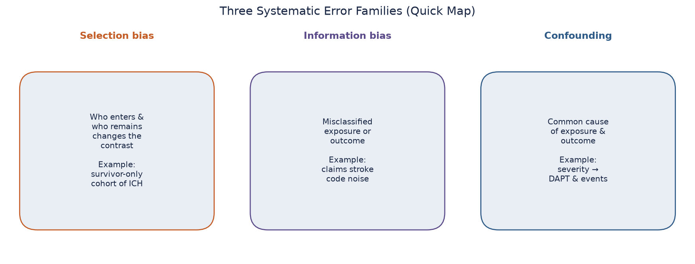
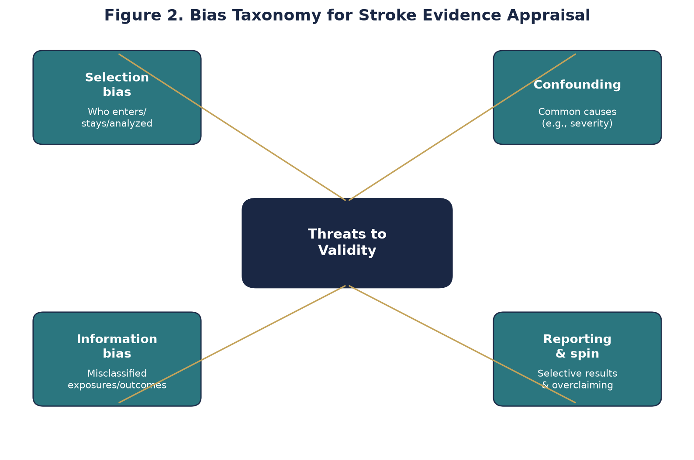
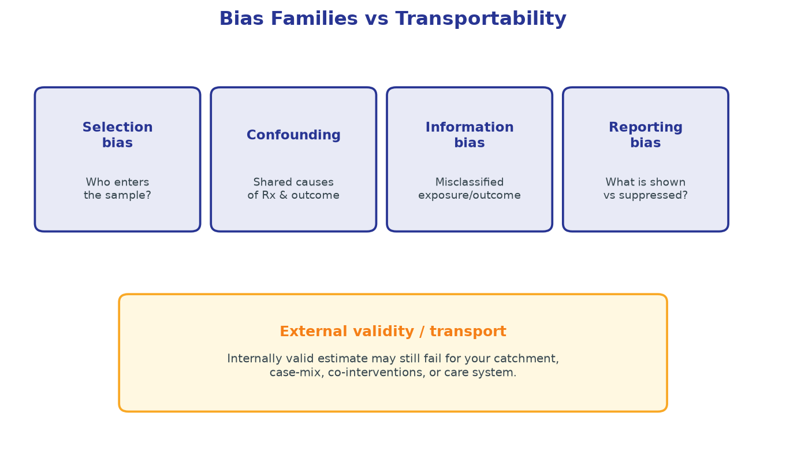
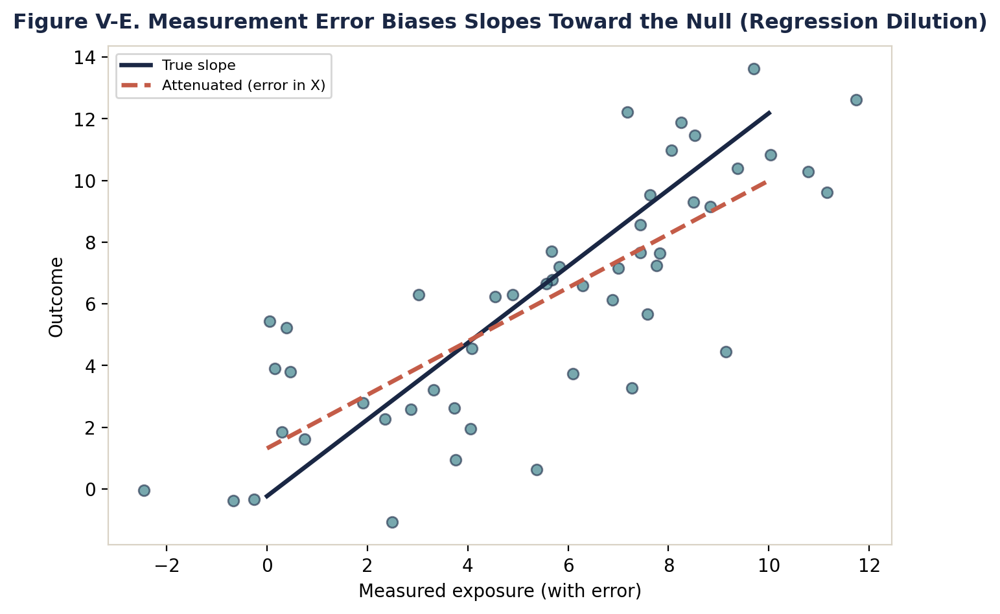
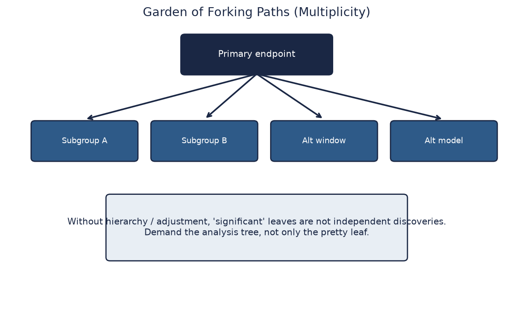

# Chapter 4. Internal Validity, External Validity, and Bias Taxonomy

## Opening

*Selection, confounding, and measurement are the three bias families to name for any study before debating its statistics.*

*A map of where each bias enters — at enrollment, in the exposure–outcome comparison, or during measurement.*

*Internal bias corrupts the estimate itself; limited transportability only restricts how far a valid estimate travels — keep the two axes distinct.*

Quality meeting: someone proposes adopting an outside center protocol based on one observational paper. Demand the bias story—selection, confounding, measurement—before the order set is rewritten.

## Introduction: The Two-Part Promise of Validity

When clinicians and methodologists declare a study 'valid,' they frequently conflate two distinct questions. Internal validity asks whether the design and analysis identify the target estimand in the study population without important systematic distortion. External validity (often parsed into generalizability and transportability) asks whether an internally valid estimate is relevant to a different population, setting, or system of care. Design, measurement, and effect heterogeneity can affect both questions, so distinct does not mean wholly non-overlapping.

A well-conducted EVT trial can have strong internal validity for its enrolled population yet limited transportability to a rural spoke hospital with different imaging and transfer workflows. Conversely, a large claims analysis may represent an insured national population demographically while still provide weak identification of a causal treatment effect because severity, eligibility, timing, and other confounders are inadequately measured. Representativeness alone is not external validity for every estimand.

Internal validity and transportability should be assessed separately while recognizing that design and measurement can affect both. This chapter organizes selection, confounding, information, and reporting mechanisms so the appraiser can connect each concern to a target estimand, likely direction where defensible, and consequence for the claim. The goal is a graded judgment, not a pejorative label or an undifferentiated list of limitations.

## Random Error versus Systematic Error (Quantitative Foundations)

Before deploying a taxonomy of biases, distinguish sampling variation from systematic error. Let $\theta$ represent the target estimand and $\hat{\theta}$ an estimator computed from a sample. Under a specified sampling and statistical model, repeated samples produce a distribution of $\hat{\theta}$ with variance $Var(\hat{\theta})$. Confidence intervals and p-values summarize particular features of that distribution under their assumptions; they do not measure design validity or every source of uncertainty.

For many well-behaved estimators, sampling variance decreases as effective sample size and event information increase, but this is estimator- and design-dependent and is not guaranteed merely by invoking the Law of Large Numbers. Bias can be expressed as $E[\hat{\theta}] - \theta$ for a specified data-generating process. Some finite-sample bias shrinks with sample size; a fixed identification failure from confounding, selection, or measurement can persist even as the interval becomes narrow. More observations do not by themselves repair a structurally unidentified contrast.

If an observational stroke registry systematically assigns patients with heavier baseline disability to the medical management arm rather than the interventional arm, a dataset containing five million electronic health records will not eliminate the confounding. It may produce a very narrow confidence interval centered on a biased estimate. In the era of big data and claims-based research, precision is a false friend. A study with a p-value of $10^{-12}$ and a confidence interval width of 0.01 can still be seriously biased. Critical appraisal must not allow statistical precision to silence structural bias concerns.

Different problems require different remedies, but the categories are not operationally exclusive. More informative sampling and measurement can improve precision and sometimes reduce estimable measurement error; design, data collection, causal assumptions, and analysis determine whether the target is identified. Uncontrolled multiplicity raises the probability of selective false-positive claims across a family of analyses. Prespecification and an error-rate procedure appropriate to that family address this selection problem, but they do not correct confounding, selection bias, or outcome mismeasurement.

## Internal Validity: Defining the Boundary

Internal validity is the credibility of an estimate for its stated population, contrast, outcome, and estimand under the implemented design. In a randomized trial, relevant domains include sequence generation, allocation concealment, deviations from assigned intervention, missing outcomes, outcome measurement, and selective reporting. Blinding and assignment-based analysis can protect particular estimands, but their importance and implementation depend on the question; no trial requires “flawless” execution to be informative, and no single design label establishes low risk of bias.

For an observational intervention-effect study, internal validity depends on a coherent causal target and defensible identification strategy. Time zero, eligibility, treatment strategies, follow-up, outcome measurement, confounding, selection, and missing data all matter. Prevalent-user designs can answer continuation questions but are often unsuitable for initiation effects. Defining baseline exposure with future information can create immortal-time bias unless the estimand and analysis account for treatment timing.

Internal validity is relative to a specified estimand. Under strong relevance, independence, exclusion, and monotonicity assumptions, an instrumental-variable analysis may identify a local average treatment effect for people whose treatment is changed by the instrument; that quantity is not automatically the population average treatment effect. Complete the phrase “internally valid” by naming the target estimand and the assumptions supporting it.

Internal validity is distinct from effect magnitude and clinical importance. A credible trial may estimate an ARR of 0.5 percentage points (reciprocal NNT 200 over the stated horizon), which could be important or unimportant depending on outcome severity, harms, costs, and patient values. A large observational association can still be seriously confounded. Decision-making requires both validity assessment and endpoint-specific absolute effects with uncertainty.

## External Validity and Transportability

External validity asks how an estimate relates to a target setting beyond the study sample. Terminology varies, but “generalizability” often refers to a target population related to the sampling frame, while “transportability” emphasizes a target population or system with different distributions or treatment delivery. The practical question is not whether local absolute effects will be identical, but which differences in case mix, treatment version, timing, expertise, co-interventions, and outcome risk could change them.

Case-mix and system-mix are two useful domains for transportability. Case-mix includes distributions of prognostic factors and effect modifiers; system-mix includes treatment versions, expertise, timing, co-interventions, and access. An absolute effect from a rapid academic-hub workflow should not be assumed unchanged in a network with long transfers, but the transported effect requires data or an explicit model rather than a qualitative penalty alone.

Mathematical transportability depends on both baseline risk and effect stability. If an RR of 0.70 were justified and transportable, a 10% control risk would imply a 7% treated risk, ARR 3 points, reciprocal 33.3, and a rounded-up NNT of 34. At a 2% control risk, it would imply a 1.4% treated risk, ARR 0.6 points, and NNT 167. Harm may follow a different pattern. These are projections under assumptions, not a license to apply a published RR directly without checking effect modifiers, outcome definitions, and local risk estimation.

Transportability is not a binary switch. For example, [EXTEND-IA TNK](https://www.nejm.org/doi/full/10.1056/NEJMoa1716405) found more substantial reperfusion before thrombectomy with tenecteplase 0.25 mg/kg than with alteplase 0.9 mg/kg (22% vs 10%) among thrombectomy-eligible large-vessel occlusions treated within 4.5 hours. That result should not be rewritten as generic equivalence or superiority across every dose, population, endpoint, and workflow. Local implementation also requires auditing treatment times, eligibility, and hemorrhage outcomes.

## The Core Bias Taxonomy

A practical first-pass taxonomy groups threats into partially overlapping domains such as selection, confounding, information or measurement, and reporting. Eponymous labels are useful only when they clarify the underlying mechanism, its relationship to the estimand, and the likely direction or magnitude of error.

Selection bias occurs when the mechanism of entering the study or remaining in the analytical cohort distorts the estimated association between exposure and outcome. Confounding occurs when the exposure groups are inherently nonexchangeable at baseline due to shared common causes. Information bias occurs when the exposure, outcome, or covariates are measured with error. Reporting bias occurs when the publication or emphasis of results is systematically driven by the magnitude or direction of the findings.

In a twenty-minute protocol review or journal club preparation, this four-bin taxonomy provides a practical first-pass framework for scanning major threats. The bins can overlap—for example, selection can also alter measurement or reporting—and they are not collectively exhaustive for every estimand. The objective is to identify the dominant mechanisms that could materially distort the central claim and to assess their likely direction and magnitude.

## Selection Bias: Mechanisms and Stroke Examples

*Teaching figure (synthetic).* Left: severity opens a backdoor path treatment ← severity → outcome—block with pre-exposure adjustment. Right: restricting to patients who enter the analytic sample (S=1) when both exposure and outcome-related factors cause inclusion invents a non-causal association. Naming the structure prevents the amateur habit of calling every problem “confounding.” Absolute transport (ARR/NNT in *your* case-mix) is a separate question after internal validity.

Selection bias is a structural flaw that can arise when inclusion in the analyzed dataset is influenced by exposure- and outcome-related causes. In a causal graph, conditioning on a selected stratum can amount to conditioning on a collider. If exposure and outcome-related causes both influence selection, that conditioning can open a noncausal path and induce an exposure–outcome association. Its magnitude and direction depend on the causal structure and parameter values; it is not guaranteed in every numerical configuration.

In randomized trials, selection into enrollment primarily affects applicability, while post-randomization missing outcomes can bias assignment-based estimates. If 90-day mRS is differentially missing for reasons related to prognosis and treatment, a complete-case analysis may compare selected subsets. Appraise the amount, reasons, timing, and sensitivity of results to plausible missing outcomes.

In observational stroke research, selection mechanisms can be substantial. A telestroke registry includes only patients for whom a consultation is triggered; those patients can differ from locally managed patients in severity, symptom pattern, access, and clinician uncertainty. Recurrence estimates from that cohort therefore describe the selected consultation population unless a defensible transport analysis supports a broader target.

Immortal-time bias can arise when future rehabilitation receipt defines a baseline exposure while follow-up begins at admission. People eventually classified as rehabilitated must survive until transfer; assigning that preceding time to the exposed group can bias the comparison toward benefit. Possible redesigns include an aligned discharge-time estimand, a prespecified landmark, or an appropriate time-varying strategy. Each answers a different question and retains other confounding assumptions.

## Confounding and Confounding by Indication

Confounding is the presence of a common cause structure that renders the exposure groups nonexchangeable. In causal inference notation, to estimate the causal effect of treatment $A$ on outcome $Y$, we require the assumption of conditional exchangeability: $Y^a \perp A \mid L$. This states that the potential outcome $Y^a$ is independent of the actual treatment assignment $A$, conditional on a sufficient set of measured pre-treatment covariates $L$. If unmeasured confounding $U$ exists (such that $U$ causes both $A$ and $Y$), this assumption fails entirely, and the estimated association is a mixture of the true causal effect and the backdoor path through $U$.

Confounding by indication is a central threat in observational treatment comparisons because clinical reasons for selecting or withholding therapy often predict outcome. Prognosis, contraindications, expected benefit, frailty, and goals of care can differ between treatment groups and may be incompletely measured.

An unadjusted EVT comparison can mix patients with different occlusion anatomy, severity, imaging selection, time, and treatment eligibility, so the association does not estimate assignment to EVT in a common target population. Anticoagulation comparisons can likewise reflect bleeding risk, frailty, contraindications, adherence, and goals of care. The direction of confounding is not guaranteed because multiple selection mechanisms can oppose one another; reconstruct the treatment decision and target trial before interpreting the estimate.

Analytical approaches include outcome regression, propensity-score methods, weighting, g-methods, and—under additional assumptions—instrumental-variable analyses. Regression and propensity-score approaches both require an adequate set of measured pre-exposure common causes, correct time ordering, positivity, and suitable models. Claims data that omit key severity and imaging variables may not support conditional exchangeability. Post-treatment variables should not be added routinely: whether they are mediators, colliders, or time-varying confounders depends on the graph and estimand.

## Information Bias: Misclassification in Neurology

Information bias stems from error in measuring exposure, outcome, covariates, or inclusion. Misclassification can be differential or nondifferential with respect to other variables. The slogan that nondifferential misclassification “always biases toward the null” holds only in restricted settings; direction depends on what is misclassified, category structure, dependence among errors, and the effect measure.

In clinical neurology, a filled prescription does not establish ingestion, and an administrative diagnosis code may not match an adjudicated clinical phenotype. The PPV and sensitivity of a stroke-code algorithm vary by setting and specification. Outcome misclassification can attenuate, exaggerate, or otherwise distort an effect depending on the error process; do not assume it only reduces power or moves estimates toward the null.

Covariate error can arise when NIHSS is omitted, extracted imperfectly from text, or imputed under unsupported assumptions. Ask whether outcome assessment could be influenced by treatment knowledge, which symptomatic-intracranial-hemorrhage definition was prespecified, and whether the administrative phenotype was validated in a representative subsample against a credible reference process. Blinding reduces some differential measurement threats but is not a substitute for reliable definitions and follow-up.

*Under a simple classical-error model, nondifferential error in a continuous exposure often attenuates a linear slope toward the null. This is a schematic tendency, not a universal direction-of-bias rule.*

## Reporting Bias and Spin

Reporting bias can distort the available evidence. It includes publication bias, selective outcome or analysis reporting, and emphasis that overstates certainty or clinical importance. Intent should not be inferred from text alone; compare the report with registrations, protocols, analysis plans, and available results.

For stroke devices, antithrombotics, and proprietary software, compare reports with prospective registrations and protocols where available. Ask whether outcomes, sample size, stopping rules, and subgroup analyses changed, whether changes were dated and explained, and whether unavailable results could affect interpretation. Funding and conflicts are relevant context but do not determine validity by themselves.

Check whether causal verbs are supported by the design and assumptions. An abstract claiming “statins reduce mortality in our hospital registry” may need to be restated as an adjusted association conditional on survival, prescribing, measurement, and modeled covariates. Also compare how benefits and harms are reported: both deserve compatible absolute and relative measures, endpoints, horizons, and uncertainty.

*Each additional endpoint, subgroup, time point, and model creates another opportunity for a chance-positive result unless the analysis plan and multiplicity control constrain the search.*

## Collider Stratification Bias (Conceptual Core)

Collider stratification bias is a conceptually difficult but important error in clinical research. A collider is a variable that is causally influenced by two or more other variables. In a directed acyclic graph (DAG), it represents a node where two causal arrowheads collide ($A \rightarrow C \leftarrow Y$). Conditioning on a collider—by stratification, restriction, or regression—can open a noncausal path between its causes and induce an association. Whether that conditioning biases a particular estimate depends on the full graph and target estimand; do not add a collider to an adjustment set merely because it predicts the outcome.

Post-treatment variables require particular care because their role depends on the graph and target effect. Consider a hypothetical observational study evaluating EVT ($A$) and 90-day functional outcome ($Y$). Final infarct volume ($C$) may mediate part of EVT's effect and may also be affected by unmeasured baseline brain resilience or collateral status ($U$), which affects outcome. Adjusting for final infarct volume therefore changes the question away from the total effect; in this graph it can also open the path $A \rightarrow C \leftarrow U \rightarrow Y$. A mediation or controlled-direct-effect analysis needs a corresponding estimand and additional identification assumptions rather than routine covariate adjustment.

Restriction to survivors or complete cases can create a related problem when inclusion is affected by treatment and prognostic factors. In the stated drug example, analyzing survivors alone may select different frailty distributions across treatment groups. For a total-effect analysis, construct the baseline adjustment set from the causal graph and avoid routine adjustment for variables caused by treatment. Baseline prognostic variables need not all be common causes, and specialized longitudinal, mediation, or principal-stratification methods can sometimes address post-treatment variables under explicit assumptions. The adjustment set must match the estimand; a blanket 'adjust for every predictor' rule is not valid.

## Fully Worked Example: Appraising a Claims Study of EVT Effectiveness

Let us operationalize this entire taxonomy on a highly representative manuscript. Assume a paper published in a major journal titled 'Real-World Effectiveness of Endovascular Therapy in Large Vessel Occlusion: A National Claims Analysis.' The authors analyzed a dataset of 25,000 patients with ICD-10 codes for ischemic stroke and LVO. They compared patients who received EVT procedure codes against those who received only medical management. Using a multivariable logistic regression adjusted for age, sex, Elixhauser comorbidities, and hospital teaching status, they report an adjusted odds ratio of 0.65 for 30-day mortality in the EVT group. The abstract enthusiastically concludes: 'EVT is highly effective in routine practice and should be universally adopted across all centers.' Your health system is utilizing this paper to justify a massive expansion of auto-launch transfer criteria. We must deploy the structured appraisal.

1. Estimand Reconstruction: The authors are implicitly claiming an Average Treatment Effect (ATE) of EVT on 30-day mortality in the broad population of all LVO patients. The index time is ambiguous: is it the time of admission, or the time of the procedure? If eligibility and follow-up begin at admission but the EVT group is defined by a later procedure, the pre-procedure interval is at risk of being misclassified as immortal time unless treatment timing is handled explicitly.

2. Random Error: With $N=25,000$, sampling error may be smaller than in a modest cohort, but precision depends on event counts, model specification, clustering, missingness, and effective sample size. Inspect the reported interval rather than assuming it is microscopic. Large samples reduce some random error; they do not eliminate it or rescue systematic bias.

3. Selection Bias: Patients who reach an EVT-capable comprehensive center and actually undergo the procedure are profoundly selected. They are selected for geographical proximity, rapid presentation (arriving within the time window), and baseline physiological stability capable of surviving inter-facility transport. Many patients in the medical management arm may have died in the emergency department before imaging could even be completed.

4. Confounding by Indication: EVT selection depends on NIHSS, ASPECTS, collateral status, occlusion anatomy, time, frailty, and goals of care—variables that a claims-only analysis may not capture. Age and comorbidity codes are unlikely to form a sufficient adjustment set. Residual confounding could be large and its direction depends on competing selection mechanisms, so the odds ratio of 0.65 cannot identify the causal EVT effect in the stated broad population.

5. Information Bias: The validity of the specified ICD-10 LVO phenotype is not reported. Without a matched validation study, its sensitivity, PPV, and error dependence are unknown; exposure and outcome misclassification could further distort the estimate.

6. Post-treatment-variable caution: Length of stay or ICU admission can be affected by treatment and prognosis. Adjusting for them while targeting a total effect may block mediation or open a noncausal path, depending on the graph.

7. External Validity: National coverage does not make the causal estimate representative. First establish whether the broad treatment effect is identified; only then assess transport to a local population and system.

Conclusion: As described, the claims-only adjustment set does not identify the broad causal EVT effect because treatment selection depends on major unmeasured clinical variables and time zero is ambiguous. The study may still describe coded utilization or associations, but it should not independently justify changing transfer criteria. A pathway decision should rely on the relevant randomized evidence, current guidance, local performance, and a separately governed implementation review.

## Frameworks and Checklists: The Structured Validity Assessment

To prevent critical appraisal from devolving into unstructured skepticism or a disorganized airing of grievances, use a rigorous validity worksheet. Integrate it with the estimand framework in Chapter 3 whenever a paper is evaluated for a pathway update.

Part A: Estimand and Random Error.
- What is the exact causal target (population, exposure, comparator, outcome, time horizon)?
- Are there sufficient events to power this primary endpoint?
- Is the confidence interval width clinically acceptable for decision-making?
- Are there multiplicity concerns (unadjusted multiple comparisons)?

Part B: Internal Validity Threats (The Taxonomy).
- Selection Bias: Are there differential attrition or structural barriers to cohort entry?
- Confounding: Is there confounding by indication? Are the critical pre-exposure clinical variables (NIHSS, ASPECTS, time-last-known-well) actually measured and balanced?
- Information Bias: What is the PPV of the outcome definition? Were assessors blinded?
- Index Time: Is there immortal time bias?
- Colliders: Did the authors inappropriately adjust for post-treatment variables?

Part C: External Validity and Transportability.
- Case-Mix: How do the baseline characteristics of the study deviate from our local population?
- System-Mix: Can our hospital replicate the protocol logistics (e.g., time-to-needle, imaging speed)?
- Absolute Risk: Given our local baseline risk, does the absolute risk reduction remain clinically meaningful?

Part D: The Actionable Synthesis.
- Internal Validity Grade: (High / Medium / Low).
- Transportability Grade: (High / Medium / Low).
- Actionable Output: What exact clinical policy, protocol, or counseling language will change based on this paper? If the answer is none, the appraisal is complete.

## Pitfalls and Failure Modes in Validity Appraisal

Clinical readers frequently succumb to specific, recurring failure modes during appraisal. The first is confusing prediction with causation. An observational study may develop an exceptionally accurate machine learning model to predict which stroke patients will die at 30 days based on their admission lab values and demographics. High predictive accuracy does not mean the variables in the model are causal. Altering a predictive variable (e.g., pharmacologically lowering an inflammatory biomarker) will not necessarily change the outcome. Causation requires structural exchangeability; prediction merely requires mathematical correlation. Do not base interventions on predictive models without causal design.

The second failure mode is confusing precision with lack of bias. Physicians routinely accept findings from massive database studies simply because the $p$-value has six zeroes, completely ignoring that the point estimate is structurally detached from the truth due to unmeasured confounding. Precision around a biased estimate is dangerous.

The third failure mode is assuming relative-effect stability without verifying absolute impact. If a fixed-horizon risk ratio of 2.0 were justified and transportable, raising major bleeding from 5% to 10% gives an ARI of 5 percentage points (NNH 20), whereas raising it from 0.1% to 0.2% gives an ARI of 0.1 point (NNH 1,000). A hazard ratio of 2.0 does not support this arithmetic; use group-specific fixed-horizon risks or cumulative-incidence estimates.

## Clinical and Epidemiologic Notes

Acute stroke treatments are selected using severity, imaging, time, contraindications, prognosis, and goals of care, so confounding by indication can be large in observational comparisons. Randomized trials provide the strongest evidence for assignment effects when feasible; observational data can then address implementation, rare harms, underrepresented populations, and treatment versions if their questions and assumptions are explicit. “Real-world effectiveness” is not a design label and should not be interpreted causally without an identification strategy.

Furthermore, in diagnostic stroke pathways, spectrum effects are a constant threat. The diagnostic accuracy of a modality such as CT perfusion is frequently established in enriched cohorts with a high prevalence of true LVOs. When the same modality is deployed in a general emergency population dominated by dizziness, complex migraine, and toxic-metabolic encephalopathy, the proportion of positive results that are false can rise sharply as prevalence falls and PPV declines. Sensitivity and specificity can also change when disease severity, mimics, acquisition, and interpretation differ across settings. External validity therefore depends on both pre-test probability and spectrum; a tool validated in a quaternary hub may perform poorly when transported to a community spoke.

## Cross-Links to Other Chapters

This chapter's validity framework assumes that the target question and estimand have first been defined in Chapter 3. Chapter 5 develops causal diagrams and target-trial thinking; Chapters 6 and 7 apply the framework to randomized and observational designs; Chapters 8 and 9 apply related validity questions to diagnosis and prediction. Chapter 19 returns to random error, estimation, and uncertainty.

## Chapter summary

Internal validity and external validity (transportability) answer distinct inferential questions and should be graded separately, even though some design and measurement choices affect both. Random error reflects finite sampling and generally shrinks with larger effective sample sizes, whereas systematic error can persist in massive datasets. Precision is not validity. A practical taxonomy comprising selection, confounding, information, and reporting mechanisms supports rapid review without claiming that the bins are mutually exclusive or exhaustive. Collider stratification explains one way that conditioning on selected post-treatment variables or survival can open noncausal paths; the consequence depends on the graph and estimand. Transportability requires reassessing absolute effects for the target case-mix, treatment delivery, and system of care. Structured validity assessments should yield graded, policy-relevant conclusions rather than unstructured lists of limitations.

## Practice and reflection

1. Retrieve a high-impact observational study assessing the 'real-world' outcomes of Tenecteplase versus Alteplase. Identify the index time and list three critical variables required to control for confounding by indication.
2. Explain the mathematical difference between random error and systematic error to a junior resident, utilizing the concepts of variance and expected value.
3. Draw a simple Directed Acyclic Graph (DAG) demonstrating confounding by indication for the decision to start therapeutic anticoagulation in a patient with a recent cardioembolic stroke.
4. Define immortal time bias. Design a flawed observational study evaluating the efficacy of outpatient physical therapy on 1-year mortality after stroke that falls victim to this bias.
5. Calculate the absolute risk reduction (ARR) and Number Needed to Treat (NNT) for a hypothetical intervention that has a Relative Risk (RR) of 0.5 in a high-risk population (baseline risk 20%) versus a low-risk population (baseline risk 2%).
6. Identify a paper in the stroke literature that utilizes a massive administrative claims database. Analyze the width of the confidence intervals and critique the study's vulnerability to unmeasured confounding despite its precision.
7. Explain collider stratification bias using the example of adjusting for 'symptomatic intracranial hemorrhage (sICH)' when assessing the effect of door-to-needle time on 90-day mRS.
8. Differentiate between generalizability and transportability. List three specific system-mix variables in your local hospital that might prevent a landmark EVT trial's results from transporting perfectly.
9. Locate a published meta-analysis of a neurosurgical intervention. Scrutinize the funnel plot and methods section for an assessment of publication/reporting bias.
10. Review an abstract of a strictly observational stroke registry that utilizes causal verbs ('decreases', 'prevents'). Rewrite the abstract conclusion using strictly associational language.
11. Draft a formal department policy detailing the specific thresholds of internal validity and absolute risk reduction required to adopt a novel secondary prevention agent to the local formulary.

---

*Figures and tables in this chapter are Teaching materials for CRIT-APP unless a caption explicitly states otherwise. Methods standards are cited by name only.*
