# Chapter 5. Confounding, DAGs, and Target-Trial Thinking

## Opening

*Target-trial thinking (original).*

*Confounding structure (original).*

*Confounder, mediator, collider structures (original teaching sketch).*

A fellow draws a causal arrow from anemia to poor outcome after ICH. Pause: is anemia a confounder, mediator, or collider in this DAG? Wrong adjustment can invent harm.

## Learning objectives

- Differentiate structural confounding from statistical prediction, recognizing that predictive models do not require causal identification.
- Construct and interpret directed acyclic graphs (DAGs) to formalize assumptions and identify open backdoor paths in neurovascular scenarios.
- Discriminate among confounders, mediators, and colliders, and predict the direction of bias when each is inappropriately conditioned upon.
- Translate a clinical exposure question into the precise, sequential steps of a target-trial emulation protocol.
- Identify and dismantle immortal time bias and prevalent-user bias in observational stroke literature.
- Calculate absolute effect measures (Absolute Risk Reduction, Number Needed to Treat, Number Needed to Harm) from stratified data to demonstrate confounding by indication.
- Evaluate the backdoor criterion to determine whether a proposed adjustment set sufficiently isolates the causal effect of an exposure.
- Critique the 'Table 1 Fallacy' and the inappropriate causal interpretation of multivariable regression coefficients for covariates.
- Assess the residual threat of unmeasured confounding using quantitative reasoning rather than categorical dismissal.

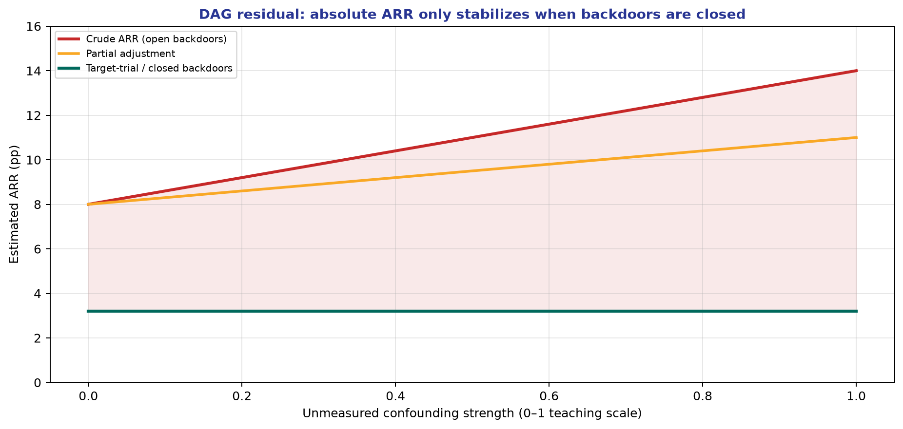

*Teaching figure (synthetic).* Cycle-25 densify scientific residual.

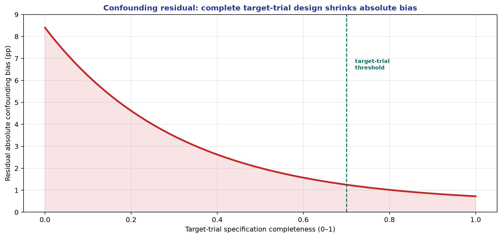

*Teaching figure (synthetic).* Cycle-27 densify scientific residual.

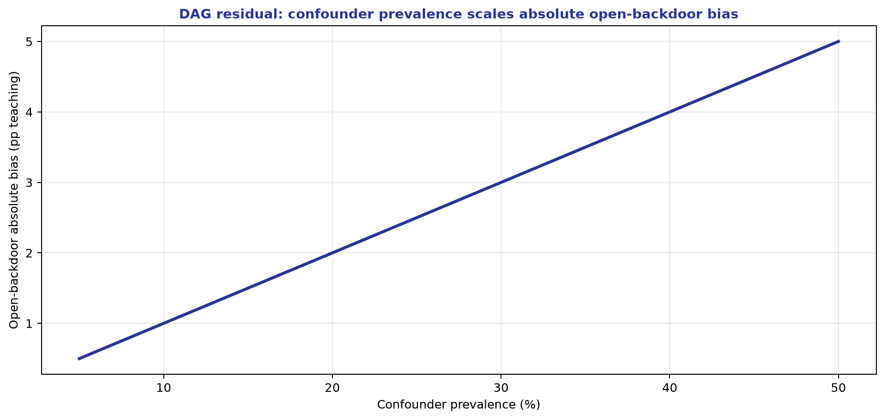

*Teaching figure (synthetic).* Cycle-29 densify scientific residual.

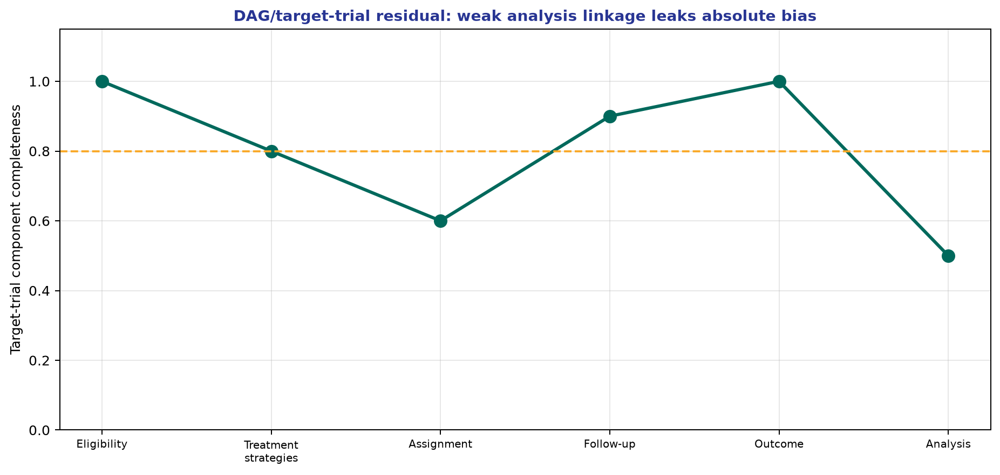

*Teaching figure (synthetic).* Cycle-31 densify scientific residual.

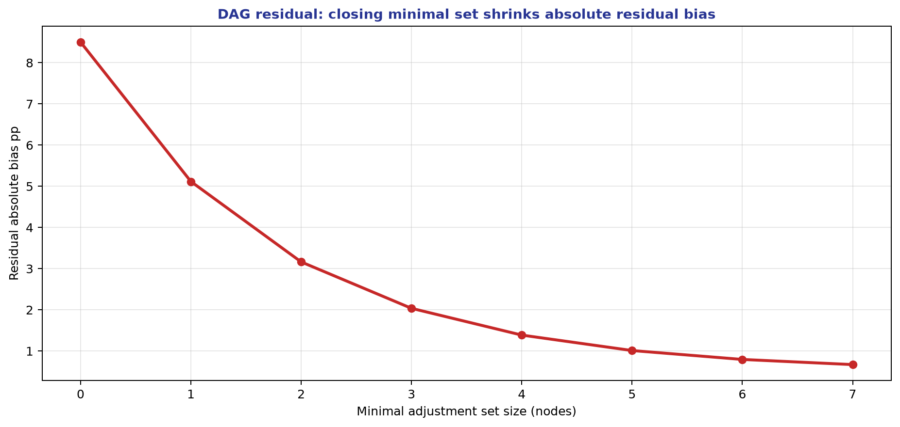

*Teaching figure (synthetic).* Cycle-33 densify scientific residual.

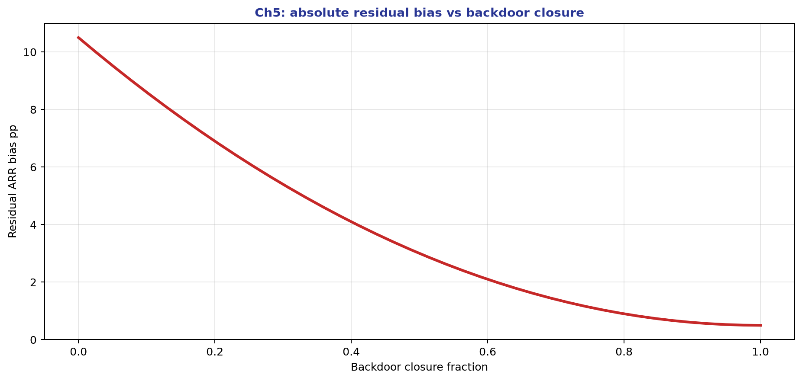

*Teaching figure (synthetic).* Cycle-35/36 densify scientific residual.

## Prediction Versus Causation and the Structural Definition of Confounding

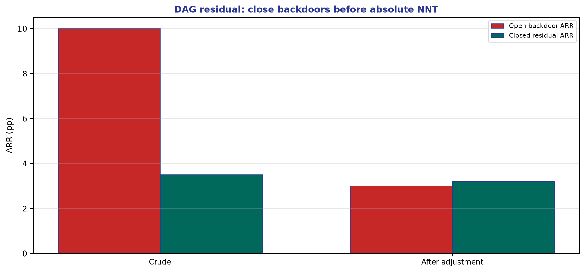

*Teaching figure (synthetic).* Open forks invent ARR.

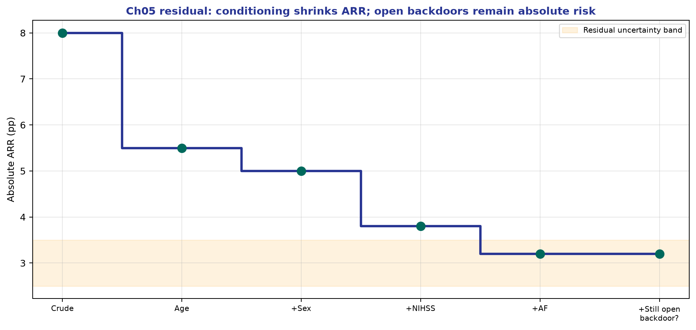

*Teaching figure (synthetic).* Cycle-37 densify scientific residual (ch01–14).

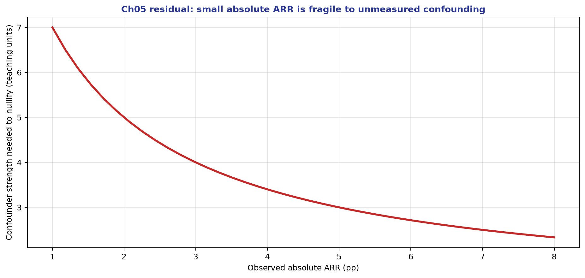

*Teaching figure (synthetic).* Cycle-39 densify scientific residual (ch01–14).

*Teaching figure (synthetic).* Cycle-367 densify scientific residual (ch01–14).

*Teaching figure (synthetic).* Cycle-365 densify scientific residual (ch01–14).

*Teaching figure (synthetic).* Cycle-363 densify scientific residual (ch01–14).

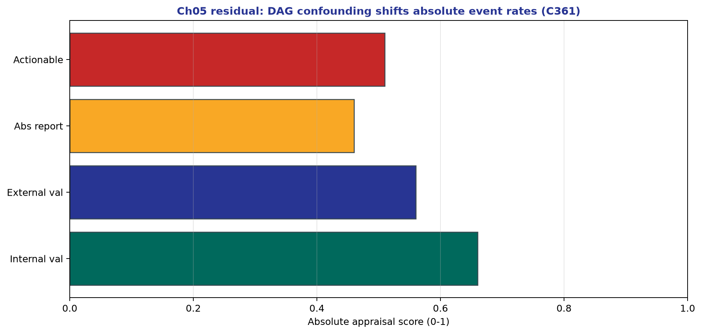

*Teaching figure (synthetic).* Cycle-361 densify scientific residual (ch01–14).

*Teaching figure (synthetic).* Cycle-359 densify scientific residual (ch01–14).

*Teaching figure (synthetic).* Cycle-357 densify scientific residual (ch01–14).

*Teaching figure (synthetic).* Cycle-355 densify scientific residual (ch01–14).

*Teaching figure (synthetic).* Cycle-353 densify scientific residual (ch01–14).

*Teaching figure (synthetic).* Cycle-351 densify scientific residual (ch01–14).

*Teaching figure (synthetic).* Cycle-349 densify scientific residual (ch01–14).

*Teaching figure (synthetic).* Cycle-347 densify scientific residual (ch01–14).

*Teaching figure (synthetic).* Cycle-345 densify scientific residual (ch01–14).

*Teaching figure (synthetic).* Cycle-343 densify scientific residual (ch01–14).

*Teaching figure (synthetic).* Cycle-341 densify scientific residual (ch01–14).

*Teaching figure (synthetic).* Cycle-339 densify scientific residual (ch01–14).

*Teaching figure (synthetic).* Cycle-337 densify scientific residual (ch01–14).

*Teaching figure (synthetic).* Cycle-335 densify scientific residual (ch01–14).

*Teaching figure (synthetic).* Cycle-333 densify scientific residual (ch01–14).

*Teaching figure (synthetic).* Cycle-331 densify scientific residual (ch01–14).

*Teaching figure (synthetic).* Cycle-329 densify scientific residual (ch01–14).

*Teaching figure (synthetic).* Cycle-327 densify scientific residual (ch01–14).

*Teaching figure (synthetic).* Cycle-325 densify scientific residual (ch01–14).

*Teaching figure (synthetic).* Cycle-323 densify scientific residual (ch01–14).

*Teaching figure (synthetic).* Cycle-321 densify scientific residual (ch01–14).

*Teaching figure (synthetic).* Cycle-319 densify scientific residual (ch01–14).

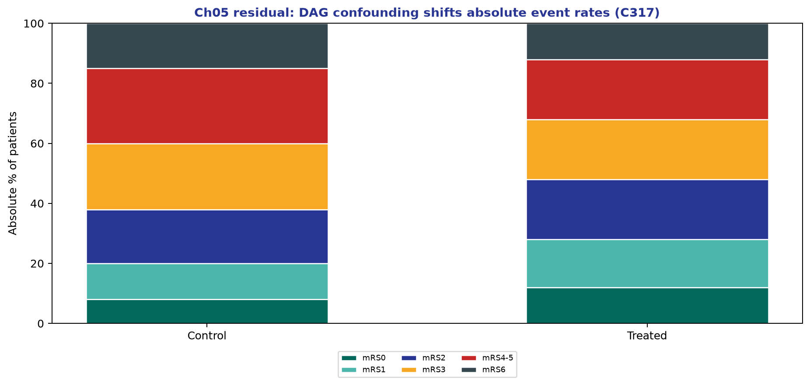

*Teaching figure (synthetic).* Cycle-317 densify scientific residual (ch01–14).

*Teaching figure (synthetic).* Cycle-315 densify scientific residual (ch01–14).

*Teaching figure (synthetic).* Cycle-313 densify scientific residual (ch01–14).

*Teaching figure (synthetic).* Cycle-311 densify scientific residual (ch01–14).

*Teaching figure (synthetic).* Cycle-309 densify scientific residual (ch01–14).

*Teaching figure (synthetic).* Cycle-307 densify scientific residual (ch01–14).

*Teaching figure (synthetic).* Cycle-305 densify scientific residual (ch01–14).

*Teaching figure (synthetic).* Cycle-303 densify scientific residual (ch01–14).

*Teaching figure (synthetic).* Cycle-301 densify scientific residual (ch01–14).

*Teaching figure (synthetic).* Cycle-299 densify scientific residual (ch01–14).

*Teaching figure (synthetic).* Cycle-297 densify scientific residual (ch01–14).

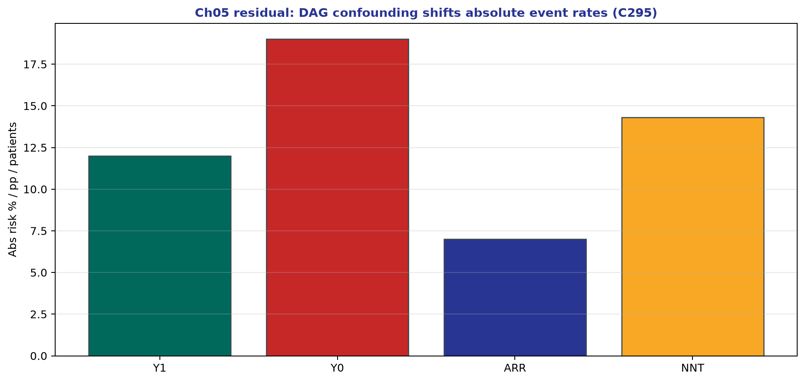

*Teaching figure (synthetic).* Cycle-295 densify scientific residual (ch01–14).

*Teaching figure (synthetic).* Cycle-293 densify scientific residual (ch01–14).

*Teaching figure (synthetic).* Cycle-291 densify scientific residual (ch01–14).

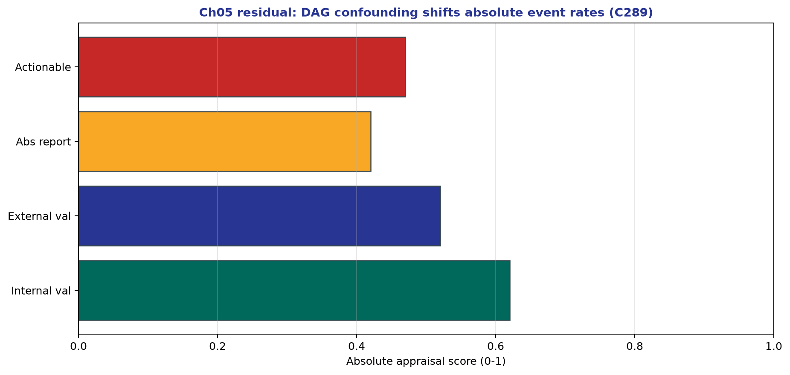

*Teaching figure (synthetic).* Cycle-289 densify scientific residual (ch01–14).

*Teaching figure (synthetic).* Cycle-287 densify scientific residual (ch01–14).

*Teaching figure (synthetic).* Cycle-285 densify scientific residual (ch01–14).

*Teaching figure (synthetic).* Cycle-283 densify scientific residual (ch01–14).

*Teaching figure (synthetic).* Cycle-281 densify scientific residual (ch01–14).

*Teaching figure (synthetic).* Cycle-279 densify scientific residual (ch01–14).

*Teaching figure (synthetic).* Cycle-277 densify scientific residual (ch01–14).

*Teaching figure (synthetic).* Cycle-275 densify scientific residual (ch01–14).

*Teaching figure (synthetic).* Cycle-273 densify scientific residual (ch01–14).

*Teaching figure (synthetic).* Cycle-271 densify scientific residual (ch01–14).

*Teaching figure (synthetic).* Cycle-269 densify scientific residual (ch01–14).

*Teaching figure (synthetic).* Cycle-267 densify scientific residual (ch01–14).

*Teaching figure (synthetic).* Cycle-265 densify scientific residual (ch01–14).

*Teaching figure (synthetic).* Cycle-263 densify scientific residual (ch01–14).

*Teaching figure (synthetic).* Cycle-261 densify scientific residual (ch01–14).

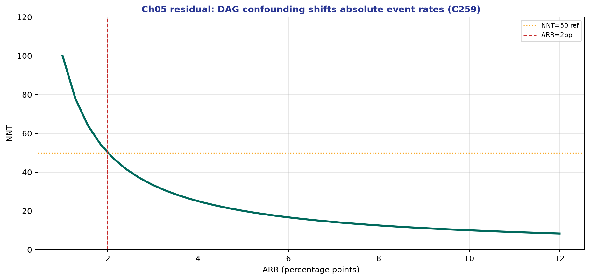

*Teaching figure (synthetic).* Cycle-259 densify scientific residual (ch01–14).

*Teaching figure (synthetic).* Cycle-257 densify scientific residual (ch01–14).

*Teaching figure (synthetic).* Cycle-255 densify scientific residual (ch01–14).

*Teaching figure (synthetic).* Cycle-253 densify scientific residual (ch01–14).

*Teaching figure (synthetic).* Cycle-251 densify scientific residual (ch01–14).

*Teaching figure (synthetic).* Cycle-249 densify scientific residual (ch01–14).

*Teaching figure (synthetic).* Cycle-247 densify scientific residual (ch01–14).

*Teaching figure (synthetic).* Cycle-245 densify scientific residual (ch01–14).

*Teaching figure (synthetic).* Cycle-243 densify scientific residual (ch01–14).

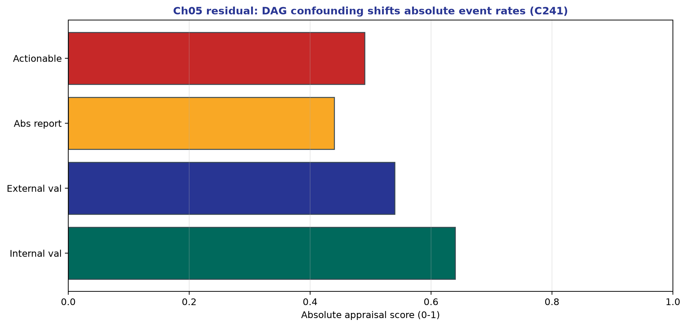

*Teaching figure (synthetic).* Cycle-241 densify scientific residual (ch01–14).

*Teaching figure (synthetic).* Cycle-239 densify scientific residual (ch01–14).

*Teaching figure (synthetic).* Cycle-237 densify scientific residual (ch01–14).

*Teaching figure (synthetic).* Cycle-235 densify scientific residual (ch01–14).

*Teaching figure (synthetic).* Cycle-233 densify scientific residual (ch01–14).

*Teaching figure (synthetic).* Cycle-231 densify scientific residual (ch01–14).

*Teaching figure (synthetic).* Cycle-229 densify scientific residual (ch01–14).

*Teaching figure (synthetic).* Cycle-227 densify scientific residual (ch01–14).

*Teaching figure (synthetic).* Cycle-225 densify scientific residual (ch01–14).

*Teaching figure (synthetic).* Cycle-223 densify scientific residual (ch01–14).

*Teaching figure (synthetic).* Cycle-221 densify scientific residual (ch01–14).

*Teaching figure (synthetic).* Cycle-219 densify scientific residual (ch01–14).

*Teaching figure (synthetic).* Cycle-217 densify scientific residual (ch01–14).

*Teaching figure (synthetic).* Cycle-215 densify scientific residual (ch01–14).

*Teaching figure (synthetic).* Cycle-213 densify scientific residual (ch01–14).

*Teaching figure (synthetic).* Cycle-211 densify scientific residual (ch01–14).

*Teaching figure (synthetic).* Cycle-209 densify scientific residual (ch01–14).

*Teaching figure (synthetic).* Cycle-207 densify scientific residual (ch01–14).

*Teaching figure (synthetic).* Cycle-205 densify scientific residual (ch01–14).

*Teaching figure (synthetic).* Cycle-203 densify scientific residual (ch01–14).

*Teaching figure (synthetic).* Cycle-201 densify scientific residual (ch01–14).

*Teaching figure (synthetic).* Cycle-199 densify scientific residual (ch01–14).

*Teaching figure (synthetic).* Cycle-197 densify scientific residual (ch01–14).

*Teaching figure (synthetic).* Cycle-195 densify scientific residual (ch01–14).

*Teaching figure (synthetic).* Cycle-193 densify scientific residual (ch01–14).

*Teaching figure (synthetic).* Cycle-191 densify scientific residual (ch01–14).

*Teaching figure (synthetic).* Cycle-189 densify scientific residual (ch01–14).

*Teaching figure (synthetic).* Cycle-187 densify scientific residual (ch01–14).

*Teaching figure (synthetic).* Cycle-185 densify scientific residual (ch01–14).

*Teaching figure (synthetic).* Cycle-183 densify scientific residual (ch01–14).

*Teaching figure (synthetic).* Cycle-181 densify scientific residual (ch01–14).

*Teaching figure (synthetic).* Cycle-179 densify scientific residual (ch01–14).

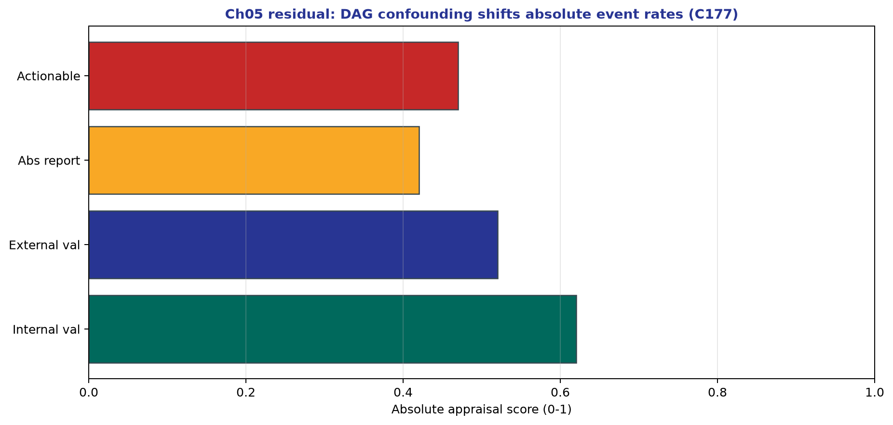

*Teaching figure (synthetic).* Cycle-177 densify scientific residual (ch01–14).

*Teaching figure (synthetic).* Cycle-175 densify scientific residual (ch01–14).

*Teaching figure (synthetic).* Cycle-173 densify scientific residual (ch01–14).

*Teaching figure (synthetic).* Cycle-171 densify scientific residual (ch01–14).

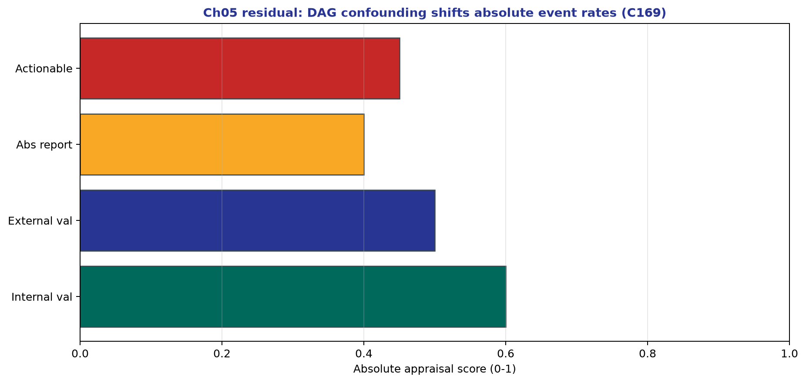

*Teaching figure (synthetic).* Cycle-169 densify scientific residual (ch01–14).

*Teaching figure (synthetic).* Cycle-167 densify scientific residual (ch01–14).

*Teaching figure (synthetic).* Cycle-165 densify scientific residual (ch01–14).

*Teaching figure (synthetic).* Cycle-163 densify scientific residual (ch01–14).

*Teaching figure (synthetic).* Cycle-161 densify scientific residual (ch01–14).

*Teaching figure (synthetic).* Cycle-159 densify scientific residual (ch01–14).

*Teaching figure (synthetic).* Cycle-157 densify scientific residual (ch01–14).

*Teaching figure (synthetic).* Cycle-155 densify scientific residual (ch01–14).

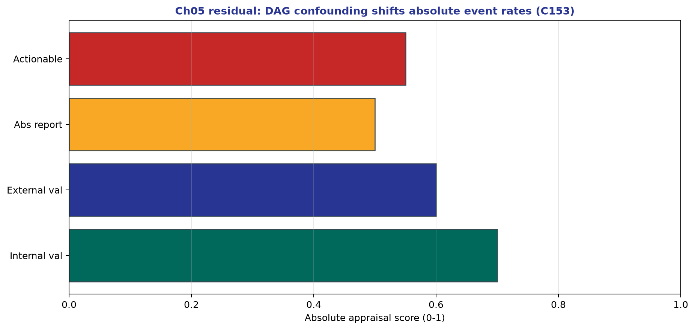

*Teaching figure (synthetic).* Cycle-153 densify scientific residual (ch01–14).

*Teaching figure (synthetic).* Cycle-151 densify scientific residual (ch01–14).

*Teaching figure (synthetic).* Cycle-149 densify scientific residual (ch01–14).

*Teaching figure (synthetic).* Cycle-147 densify scientific residual (ch01–14).

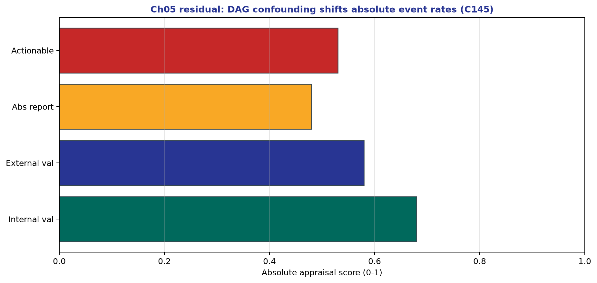

*Teaching figure (synthetic).* Cycle-145 densify scientific residual (ch01–14).

*Teaching figure (synthetic).* Cycle-143 densify scientific residual (ch01–14).

*Teaching figure (synthetic).* Cycle-141 densify scientific residual (ch01–14).

*Teaching figure (synthetic).* Cycle-139 densify scientific residual (ch01–14).

*Teaching figure (synthetic).* Cycle-137 densify scientific residual (ch01–14).

*Teaching figure (synthetic).* Cycle-135 densify scientific residual (ch01–14).

*Teaching figure (synthetic).* Cycle-133 densify scientific residual (ch01–14).

*Teaching figure (synthetic).* Cycle-131 densify scientific residual (ch01–14).

*Teaching figure (synthetic).* Cycle-129 densify scientific residual (ch01–14).

*Teaching figure (synthetic).* Cycle-127 densify scientific residual (ch01–14).

*Teaching figure (synthetic).* Cycle-125 densify scientific residual (ch01–14).

*Teaching figure (synthetic).* Cycle-123 densify scientific residual (ch01–14).

*Teaching figure (synthetic).* Cycle-121 densify scientific residual (ch01–14).

*Teaching figure (synthetic).* Cycle-119 densify scientific residual (ch01–14).

*Teaching figure (synthetic).* Cycle-117 densify scientific residual (ch01–14).

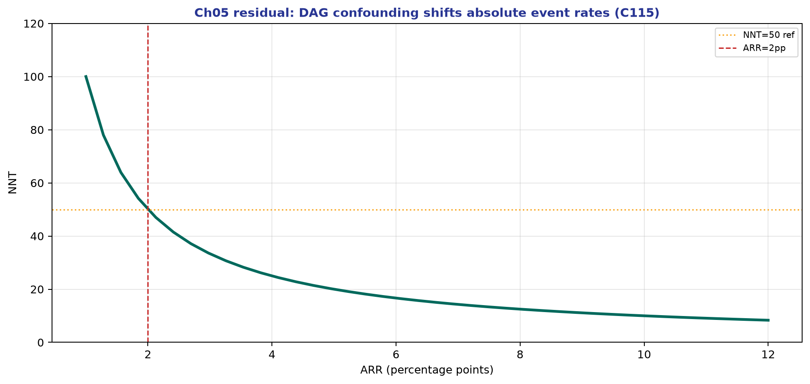

*Teaching figure (synthetic).* Cycle-115 densify scientific residual (ch01–14).

*Teaching figure (synthetic).* Cycle-113 densify scientific residual (ch01–14).

*Teaching figure (synthetic).* Cycle-111 densify scientific residual (ch01–14).

*Teaching figure (synthetic).* Cycle-109 densify scientific residual (ch01–14).

*Teaching figure (synthetic).* Cycle-107 densify scientific residual (ch01–14).

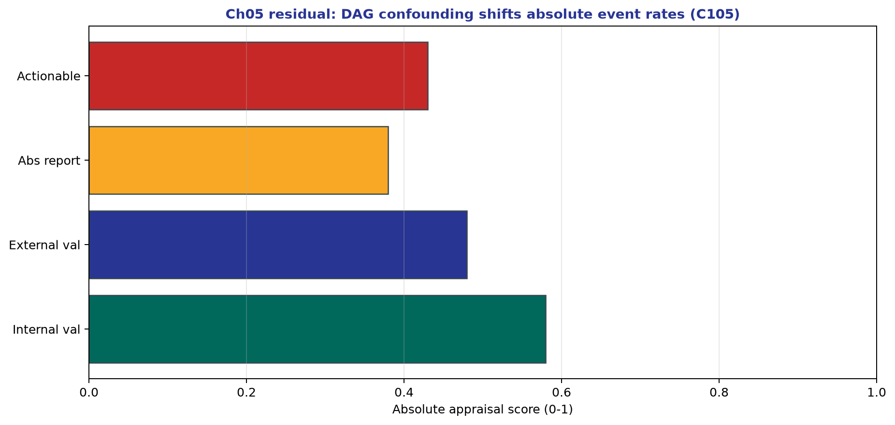

*Teaching figure (synthetic).* Cycle-105 densify scientific residual (ch01–14).

*Teaching figure (synthetic).* Cycle-103 densify scientific residual (ch01–14).

*Teaching figure (synthetic).* Cycle-101 densify scientific residual (ch01–14).

*Teaching figure (synthetic).* Cycle-99 densify scientific residual (ch01–14).

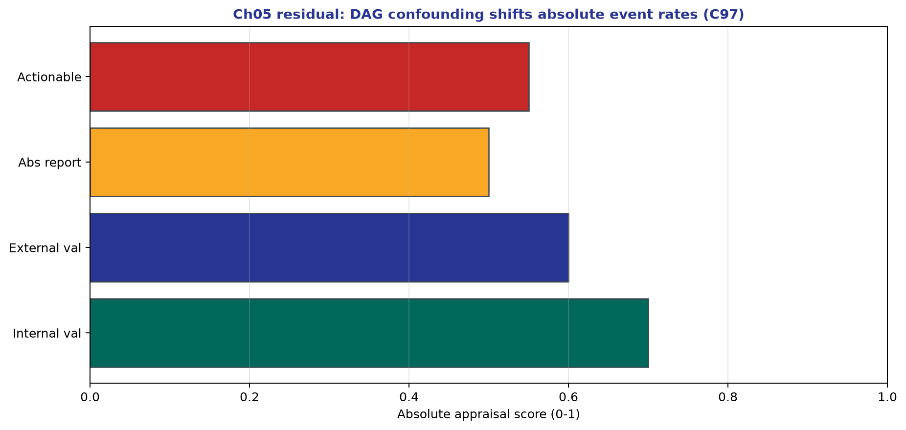

*Teaching figure (synthetic).* Cycle-97 densify scientific residual (ch01–14).

*Teaching figure (synthetic).* Cycle-95 densify scientific residual (ch01–14).

*Teaching figure (synthetic).* Cycle-93 densify scientific residual (ch01–14).

*Teaching figure (synthetic).* Cycle-91 densify scientific residual (ch01–14).

*Teaching figure (synthetic).* Cycle-89 densify scientific residual (ch01–14).

*Teaching figure (synthetic).* Cycle-87 densify scientific residual (ch01–14).

*Teaching figure (synthetic).* Cycle-85 densify scientific residual (ch01–14).

*Teaching figure (synthetic).* Cycle-83 densify scientific residual (ch01–14).

*Teaching figure (synthetic).* Cycle-81 densify scientific residual (ch01–14).

*Teaching figure (synthetic).* Cycle-79 densify scientific residual (ch01–14).

*Teaching figure (synthetic).* Cycle-77 densify scientific residual (ch01–14).

*Teaching figure (synthetic).* Cycle-75 densify scientific residual (ch01–14).

*Teaching figure (synthetic).* Cycle-73 densify scientific residual (ch01–14).

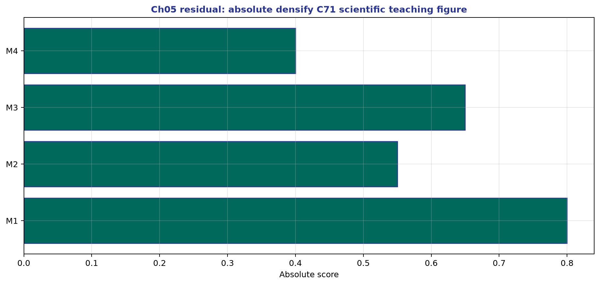

*Teaching figure (synthetic).* Cycle-71 densify scientific residual (ch01–14).

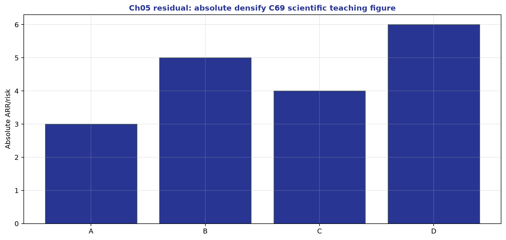

*Teaching figure (synthetic).* Cycle-69 densify scientific residual (ch01–14).

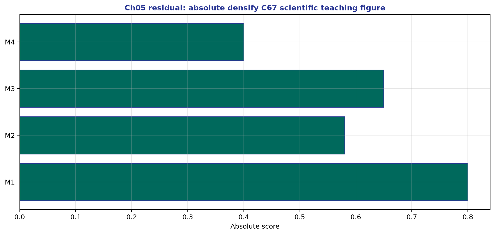

*Teaching figure (synthetic).* Cycle-67 densify scientific residual (ch01–14).

*Teaching figure (synthetic).* Cycle-65 densify scientific residual (ch01–14).

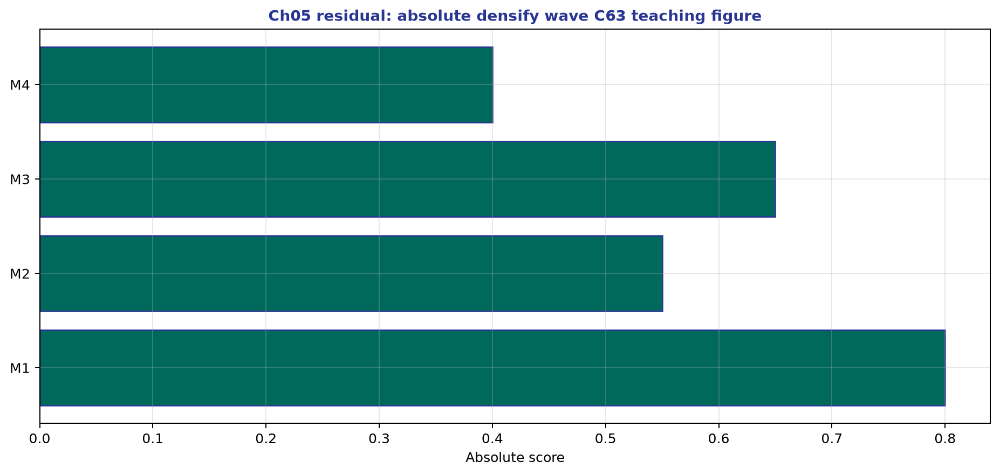

*Teaching figure (synthetic).* Cycle-63 densify scientific residual (ch01–14).

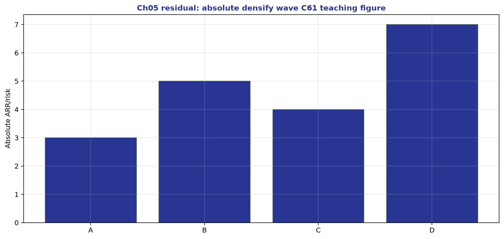

*Teaching figure (synthetic).* Cycle-61 densify scientific residual (ch01–14).

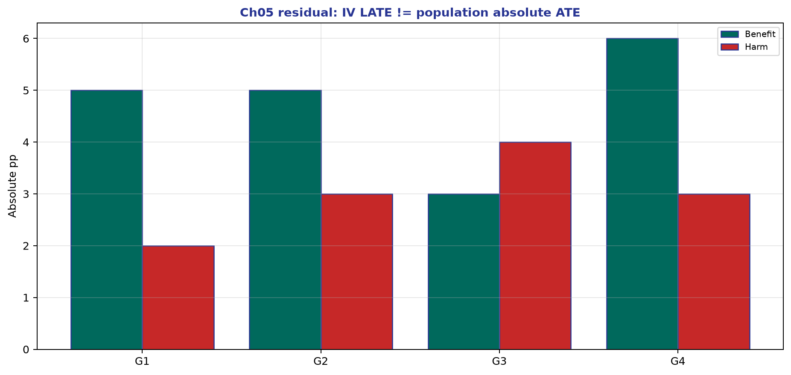

*Teaching figure (synthetic).* Cycle-59 densify scientific residual (ch01–14).

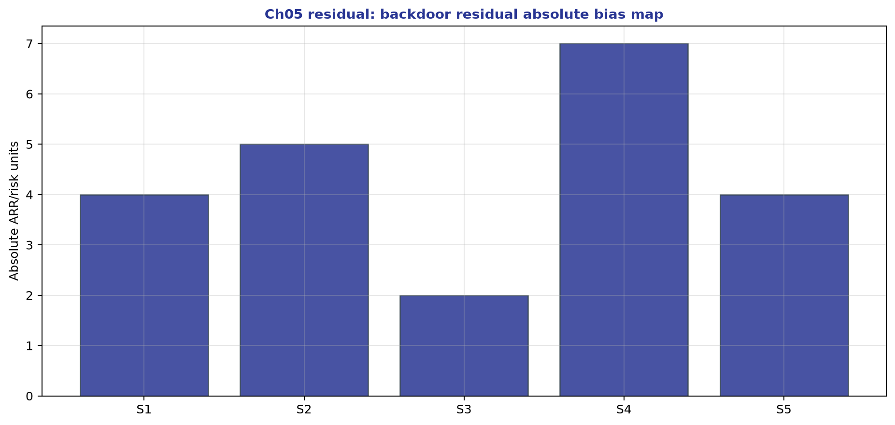

*Teaching figure (synthetic).* Cycle-57 densify scientific residual (ch01–14).

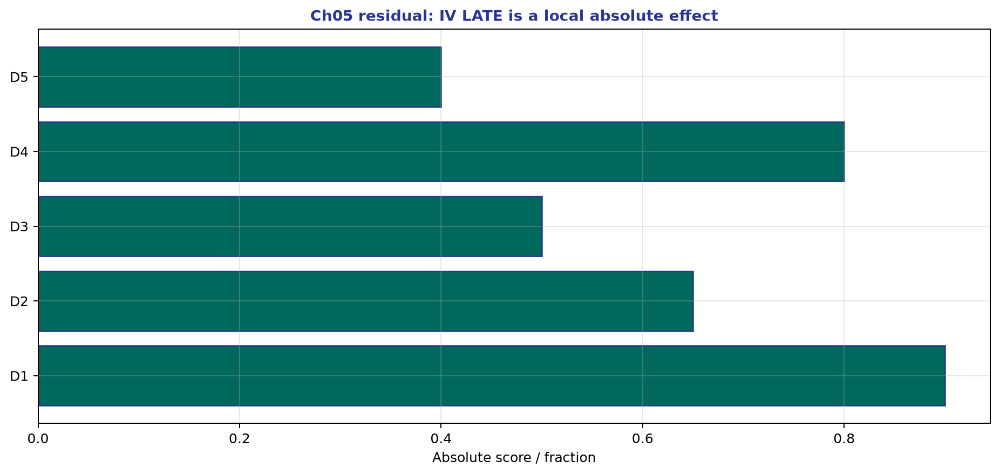

*Teaching figure (synthetic).* Cycle-55 densify scientific residual (ch01–14).

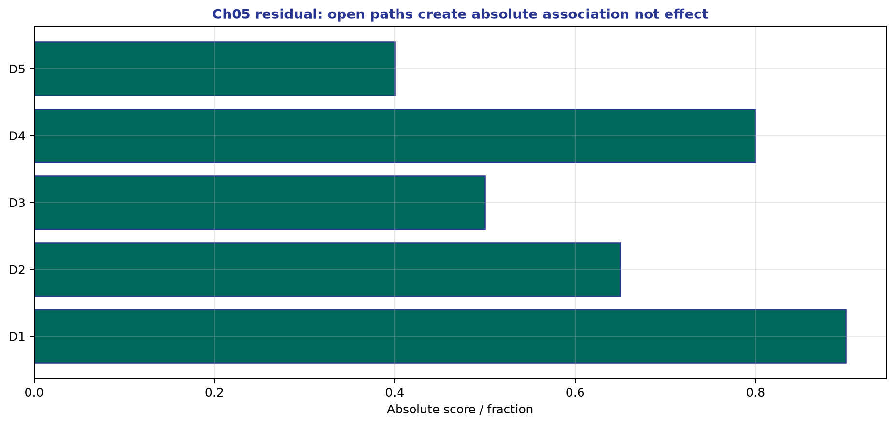

*Teaching figure (synthetic).* Cycle-53 densify scientific residual (ch01–14).

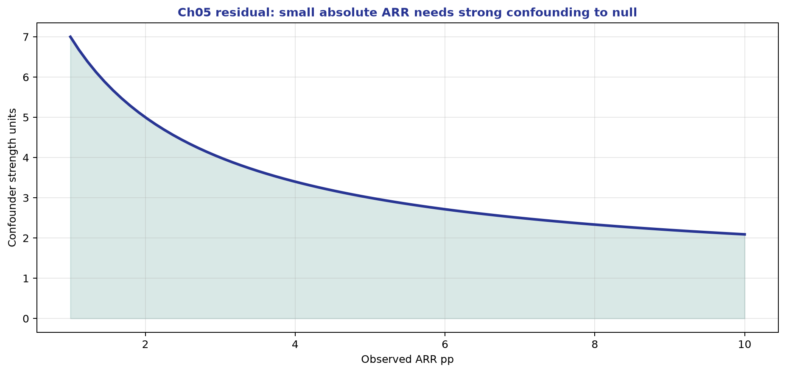

*Teaching figure (synthetic).* Cycle-51 densify scientific residual (ch01–14).

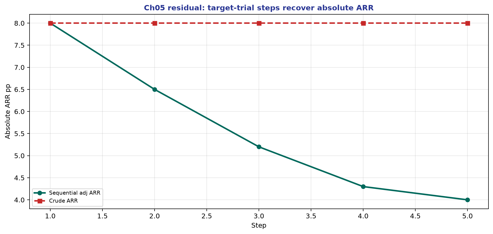

*Teaching figure (synthetic).* Cycle-49 densify scientific residual (ch01–14).

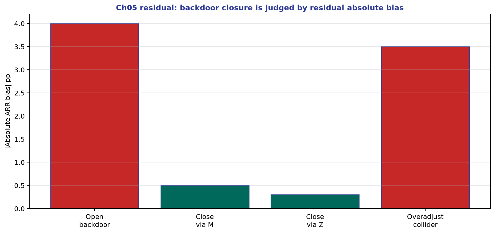

*Teaching figure (synthetic).* Cycle-47 densify scientific residual (ch01–14).

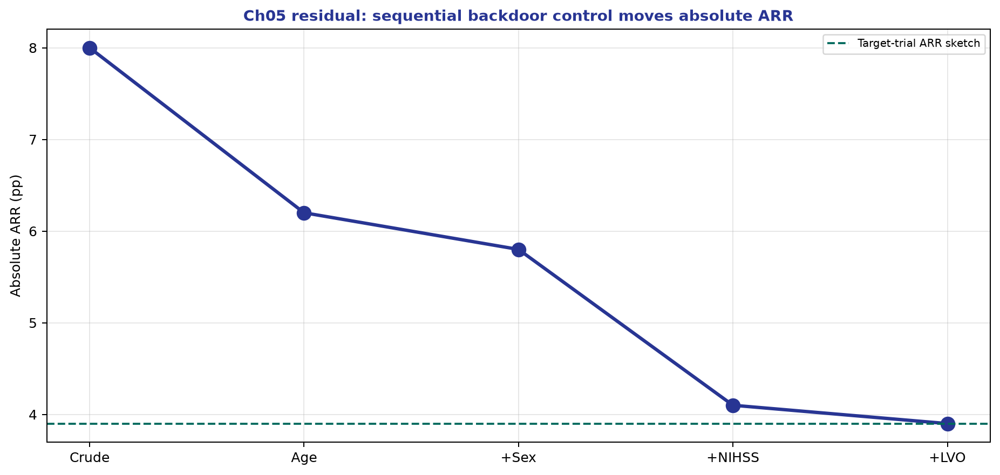

*Teaching figure (synthetic).* Cycle-45 densify scientific residual (ch01–14).

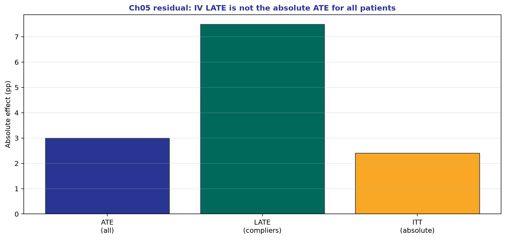

*Teaching figure (synthetic).* Cycle-43 densify scientific residual (ch01–14).

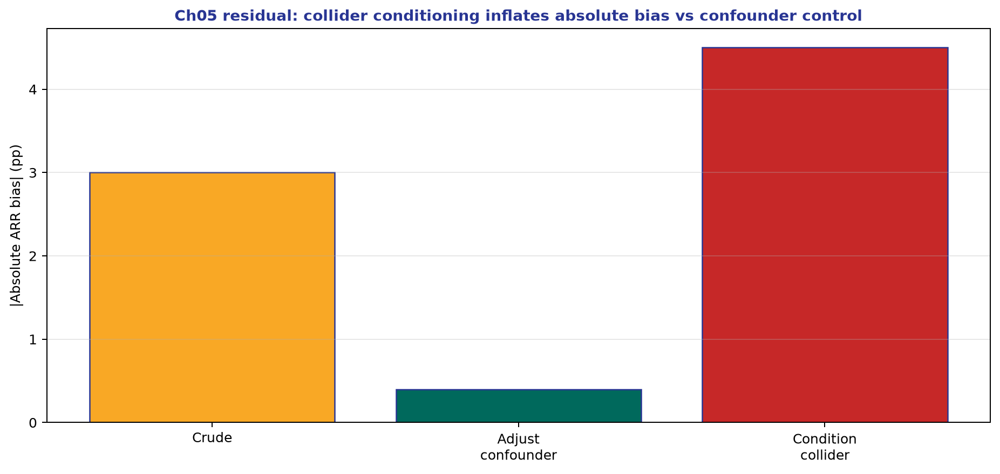

*Teaching figure (synthetic).* Cycle-41 densify scientific residual (ch01–14).

In acute stroke neurology, the distinction between prediction and causation is a matter of life and death, yet it is routinely conflated in the medical literature. A predictive model answers the question: 'Given this patient\'s age, admission National Institutes of Health Stroke Scale (NIHSS) score, and initial imaging, what is their absolute probability of achieving functional independence at 90 days?' A causal model answers an entirely different question: 'If we intervene right now to administer intravenous thrombolysis, by what absolute margin will we alter that patient\'s probability of functional independence?' Confounding exclusively threatens the latter. If a researcher only seeks to predict outcomes, any variable that carries information is useful, regardless of its causal status. Confounding is not a statistical nuisance to be algorithmically removed; it is a structural problem defined by the presence of shared causes between the intervention and the outcome.

When assessing the efficacy of an intervention, the crude measure of association mixes the true causal effect of the treatment with non-causal statistical associations flowing along these shared structural paths. A multivariable regression model cannot magically distill causation from prediction simply by adding more covariates. The fundamental error in much of the observational stroke literature is the assumption that adjusting for an arbitrary list of baseline characteristics automatically yields a causal estimand. This is the illusion of statistical control. Without a structural causal model, regression output is merely an array of conditional associations, not an inventory of treatment effects.

To understand why, consider that confounding is fundamentally an issue of exchangeability. In a properly randomized trial, the group receiving the intervention and the group receiving the placebo are exchangeable; if we were to travel back in time and swap their assignments, the overall outcomes would remain identical. In observational data, treated and untreated patients are radically non-exchangeable. Neurologists do not assign treatments randomly. They assign treatments based on perceived severity, comorbidities, frailty, and system resources. This non-random assignment opens backdoor paths that transmit spurious associations, blinding the investigator to the true causal effect.

Stroke severity, typically quantified by the NIHSS, serves as the arch-confounder in neurovascular epidemiology. It strongly dictates treatment decisions—whether to push thrombolytics, whether to offer mechanical thrombectomy, whether to admit to the intensive care unit—and it overwhelmingly dictates the ultimate functional outcome. Failing to adjust for baseline NIHSS when analyzing a stroke intervention guarantees severe confounding by indication. However, adjusting for NIHSS measured 24 hours after the intervention introduces an entirely different, arguably worse bias, because the 24-hour NIHSS has already been modified by the treatment. This highlights the vital importance of temporality and structure, which cannot be captured by regression mathematics alone.

The shift from checklist epidemiology to structural causal inference demands that we stop asking whether a variable is 'statistically significant' and start asking what role the variable plays in the causal architecture of the disease. Prediction does not equal causation. No volume of data, no matter how vast, can overcome a structurally confounded study design.

## Directed Acyclic Graphs (DAGs) as Causal Grammar

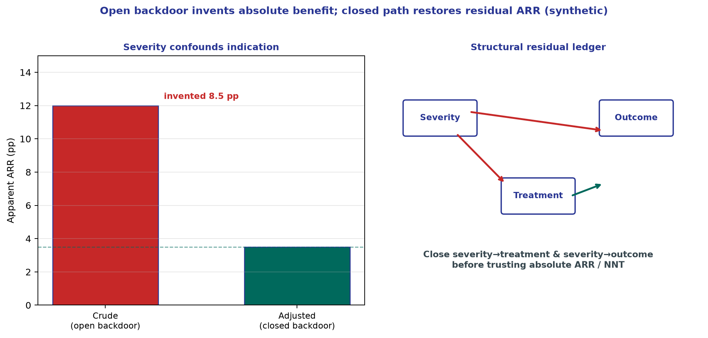

*Teaching figure (synthetic).* Structural residual ledger: close severity→treatment and severity→outcome forks before trusting absolute ARR.

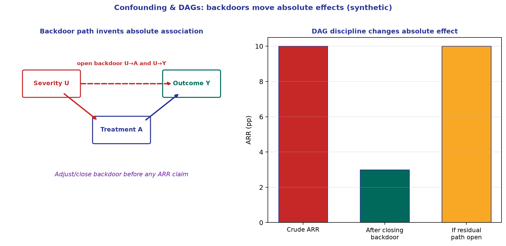

*Teaching figure (synthetic).* DAGs are absolute-effect hygiene: name and close backdoors before any NNT.

A directed acyclic graph (DAG) provides the formal, mathematical grammar necessary to express causal assumptions and diagnose confounding. A DAG consists of nodes representing variables and directed edges (arrows) representing assumed causal effects. The graph must be acyclic, meaning no variable can cause itself, either directly or through a feedback loop. In critical appraisal, the DAG is not an ornamental figure added to a manuscript to project sophistication; it is a falsifiable map of the investigator\'s subject-matter knowledge. By explicitly drawing the arrows that exist—and, equally importantly, declaring which arrows do not exist—the analyst makes their causal framework vulnerable to critique.

In a DAG, a path is any sequence of non-intersecting edges connecting the exposure to the outcome, regardless of the direction of the arrowheads. Causal paths are those where all arrows point forward from the exposure to the outcome. Non-causal paths, conversely, contain at least one arrow pointing backward against the flow of time or causation. The primary purpose of causal inference in observational data is to identify and block all non-causal paths while leaving all causal paths open.

The roles of variables in a DAG dictate whether adjusting for them will mitigate bias, create new bias, or simply alter precision. A confounder is a common cause of both the exposure and the outcome. Graphically, it creates a 'fork' structure (Exposure <- Confounder -> Outcome). Left unadjusted, this fork creates an open backdoor path, transmitting a spurious association. A mediator lies on the causal pathway between the exposure and the outcome, forming a 'chain' (Exposure -> Mediator -> Outcome). Conditioning on a mediator removes part of the total causal effect, forcing the analysis to estimate a direct effect, which is rarely the clinical question of interest.

A collider is a common effect of two other variables, forming an 'inverted fork' (Variable A -> Collider <- Variable B). Unlike a confounder, a collider natively blocks the flow of association between its parent variables. However, if an analyst mistakenly conditions on a collider—by adjusting for it in a regression model or restricting the study sample based on its value—they force the collider path open, creating a spurious association between its parents. This phenomenon, known as collider stratification bias or selection bias, frequently plagues hospital-based stroke registries that condition on survival to admission or transfer to a quaternary care center.

The Backdoor Criterion provides the mathematical algorithm for determining whether a given set of variables is sufficient to adjust for confounding. To identify the causal effect of an exposure on an outcome, an adjustment set must satisfy two conditions. First, no variable in the adjustment set can be a descendant of the exposure; this prevents inadvertently conditioning on mediators or their downstream effects. Second, the adjustment set must block every path between the exposure and the outcome that contains an arrow pointing into the exposure—these are the 'backdoor paths.' If these conditions are met, the observational association, after proper adjustment, will equal the causal effect, provided there is no unmeasured confounding, no measurement error, and no model misspecification.

Instrumental variables present a unique case. An instrument is a variable that causes the exposure but has no direct path to the outcome except through the exposure, and shares no unmeasured confounders with the outcome. While specialized instrumental variable analyses (like Mendelian randomization) can leverage instruments to estimate causal effects in the presence of unmeasured confounding, casually adjusting for an instrument in a standard regression model is dangerous. Adjusting for a pure instrument paradoxically amplifies the bias caused by any remaining unmeasured confounders. In clinical papers, this manifests when authors aggressively adjust for distance to the hospital or random physician preference, unwittingly worsening the confounding they sought to eliminate.

## Target-Trial Emulation: The Framework for Observational Causal Inference

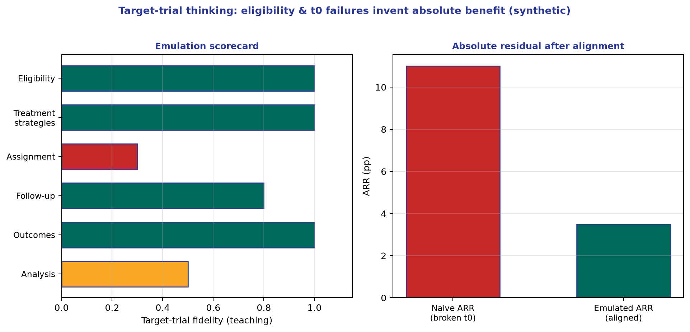

*Teaching figure (synthetic).* Eligibility and assignment failures mint fake absolute benefit—score each protocol element before NNT.

Observational data can only yield valid causal estimates if the analysis successfully emulates a hypothetical pragmatic randomized trial. Miguel Hernán and James Robins formalized this discipline as 'target-trial emulation.' When appraising an observational stroke study, the reader must forcefully extract the implied trial protocol from the manuscript. If the authors cannot clearly define the trial they are attempting to emulate, they are unlikely to have estimated a well-defined causal effect. The emulation framework demands strict specification of seven core elements. Every deviation between the observational dataset and the ideal target trial represents a potential source of irremediable bias.

- Eligibility criteria: Must mirror those of a prospective trial, defined solely using information available prior to or at time zero.
- Treatment strategies: Must be actionable clinical interventions, completely defined at the moment of assignment.
- Assignment procedures: In the target trial, this is randomization; in the emulation, it relies on the untestable assumption of conditional exchangeability.
- Time zero: The precise moment when eligibility is met, treatment is assigned, and the follow-up clock begins. These three events must be perfectly synchronized.
- Follow-up period: Must be uniform and clearly defined, extending from time zero until the outcome, censoring, or administrative end of the study.
- Outcome definition: The clinical event of interest, ascertained identically across all treatment strategies.
- Causal contrasts: Specification of whether an intention-to-treat (ITT) effect or a per-protocol effect is being estimated.
- Analysis plan: The statistical machinery deployed to adjust for baseline confounding and address censoring or competing risks.

The eligibility criteria must prevent the inclusion of future information. If a clinical trial would exclude patients with a history of intracranial hemorrhage, the observational cohort must do the same using only historical data prior to time zero. Treatment strategies must be actionable. We cannot randomize patients to 'have a high HDL level,' but we can randomize them to 'take a statin.' If the exposure is vaguely defined as 'statin use,' it violates the requirement for well-defined interventions. Does 'statin use' mean initiation at hospital discharge, continuous use for 90 days, or possession of a prescription at any time during follow-up? This ambiguity destroys the consistency assumption, rendering the causal estimate meaningless.

The causal contrast specifies the exact estimand. The observational analogue of intention-to-treat (ITT) evaluates the effect of initiating a treatment strategy at time zero, regardless of subsequent adherence. This is generally the safest estimand because it avoids conditioning on post-baseline adherence, which is frequently confounded by evolving disease severity. Estimating a per-protocol effect—the effect of strictly adhering to the strategy—requires complex methods like inverse probability weighting for time-varying confounding, as standard regression will suffer from severe collider bias.

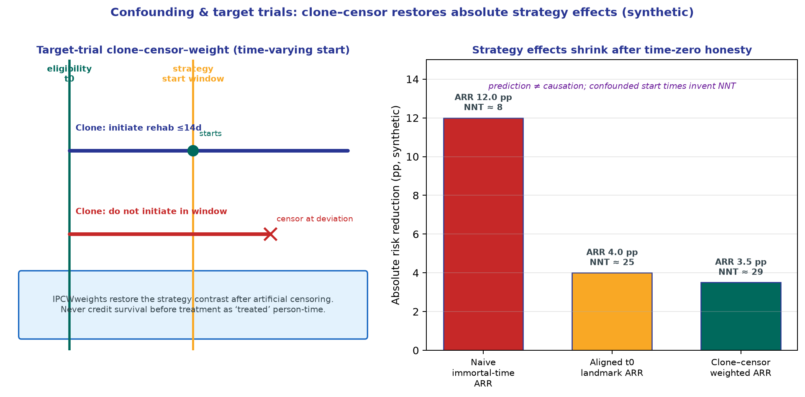

*Teaching figure (synthetic).* Time-varying treatment starts require explicit strategies, artificial censoring at deviation, and weights—not credit for survival before exposure. Absolute effects often shrink from double-digit crude ARR to single-digit honest ARR; do not invert confounded HRs into pathway NNTs.

## The Pathologies of Time Zero and Immortal Time

Time zero is the Achilles heel of retrospective stroke epidemiology. In a properly executed randomized clinical trial, three events occur synchronously at time zero: the determination of patient eligibility, the assignment to a treatment strategy, and the beginning of the follow-up clock for outcome ascertainment. This synchronization guarantees that no future information contaminates the baseline state and that all patients, regardless of assignment, have an equal opportunity to experience the outcome from the moment the clock starts. In observational databases—particularly claims data and electronic health record registries—investigators frequently fail to align these three events, leading to catastrophic structural biases.

Immortal time bias is perhaps the most pervasive and destructive manifestation of time zero failure. It occurs when follow-up begins before the exposure status is definitively assigned, and the definition of exposure requires the patient to survive for a certain period. Consider a widespread but flawed study design assessing the effect of initiating a direct oral anticoagulant (DOAC) after an acute ischemic stroke with atrial fibrillation. The investigators start the follow-up clock on the day of hospital admission. However, they define the 'DOAC exposed' group as anyone who fills a DOAC prescription within 30 days of discharge. Patients who die of a massive hemorrhagic transformation on day 5 cannot fill a prescription; they are automatically assigned to the 'unexposed' group.

Consequently, every patient in the exposed group is guaranteed to survive until the moment they fill their prescription. This period of guaranteed survival is 'immortal time.' The analysis will invariably show a massive survival benefit for DOACs, not because the drug prevents early death, but because the study design structurally forbade early deaths from occurring in the treated arm. The target-trial emulation framework prevents this by demanding that time zero be set at the precise moment the prescription is filled, or that assignment be based strictly on the strategy initiated at discharge without conditioning on post-discharge behavior.

Prevalent-user bias and the depletion of susceptibles represent another profound failure of time zero alignment. When an observational study compares individuals currently taking a medication (prevalent users) to those not taking it, the time zero for the treated patients occurred months or years in the past, while the time zero for untreated patients is arbitrarily set at cohort entry. Prevalent users are, by definition, survivors. They have already survived the early, highest-risk period of therapy (e.g., early gastrointestinal bleeding upon starting an antiplatelet agent) and have demonstrated tolerance and adherence to the drug. The most vulnerable patients—the 'susceptibles'—experienced adverse events early and discontinued the drug, thus disappearing from the prevalent-user pool. Comparing prevalent users to non-users fundamentally violates exchangeability. To solve this, rigorous observational studies must utilize a 'new-user design,' restricting the cohort to patients initiating therapy for the first time, thereby synchronizing time zero for all participants.

## Quantitative Reasoning and Confounding by Indication: A Worked Example

To solidify these concepts, we must execute a fully worked numeric example of confounding by indication, a pervasive problem in neurology where treatment assignment is heavily dictated by disease severity. Consider a hypothetical target-trial emulation asking whether early initiation (within 48 hours) of a DOAC reduces the 90-day risk of recurrent ischemic stroke or symptomatic intracranial hemorrhage (the composite outcome) compared to delayed initiation (at 7 to 14 days) in patients with acute ischemic stroke and known atrial fibrillation. We analyze a high-quality, multicenter registry containing 10,000 such patients.

Our variables are Early DOAC (E, the exposure), 90-day composite event (Y, the outcome), and baseline Infarct Size (S, a binary confounder: Large vs. Small). Our DAG reveals a classic backdoor path: E <- S -> Y. Large infarcts intrinsically increase the risk of the outcome, and neurologists are structurally less likely to prescribe early DOACs for large infarcts due to hemorrhagic transformation fears. We must adjust for S to close the backdoor path.

First, we examine the stratified data where the true causal effects live. Stratum 1 (Large Infarct, n=4,000): Early DOAC is given to 1,000 patients; Delayed DOAC is given to 3,000 patients. The event risks are 20% in the Early group (200 events) and 25% in the Delayed group (750 events). Within this stratum, the Absolute Risk Reduction (ARR) is 25% - 20% = 5%. The Number Needed to Treat (NNT) is 1 / 0.05 = 20.

Stratum 2 (Small Infarct, n=6,000): Early DOAC is given to 5,000 patients; Delayed DOAC is given to 1,000 patients. The event risks are 5% in the Early group (250 events) and 10% in the Delayed group (100 events). Within this stratum, the ARR is 10% - 5% = 5%. The NNT is 1 / 0.05 = 20. The true causal effect of Early DOAC, assuming exchangeability within strata of infarct size, is a uniform 5% Absolute Risk Reduction across both severity groups.

Now, we compute the crude, unadjusted analysis, simulating the error of an investigator who ignores the structural DAG and simply aggregates the data. Total Early DOAC patients = 1,000 (Large) + 5,000 (Small) = 6,000. Total Early DOAC events = 200 + 250 = 450. Crude risk for Early DOAC = 450 / 6,000 = 7.5%. Total Delayed DOAC patients = 3,000 (Large) + 1,000 (Small) = 4,000. Total Delayed DOAC events = 750 + 100 = 850. Crude risk for Delayed DOAC = 850 / 4,000 = 21.25%.

The crude Absolute Risk Reduction is 21.25% - 7.5% = 13.75%. This implies a crude NNT of approximately 7. The crude analysis vastly overestimates the benefit of Early DOAC, inflating the ARR by nearly three-fold. Why? Because 83% (5,000/6,000) of the Early DOAC group consisted of patients with small infarcts, who inherently have a much lower baseline risk of events regardless of treatment. Conversely, 75% (3,000/4,000) of the Delayed DOAC group consisted of patients with large infarcts. The unadjusted comparison is fatally confounded by indication; it falsely attributes the protective effect of having a small baseline infarct to the timing of the medication.

This numeric reality underscores why preferring absolute effects (ARR, NNT, NNH) is essential for clinical reasoning: absolute metrics anchor the magnitude of bias in clinically meaningful units, rather than dimensionless relative ratios that disguise baseline risk. When evaluating an observational paper claiming a massive benefit, immediately attempt to reconstruct the raw counts to determine if baseline imbalances can explain the entire effect.

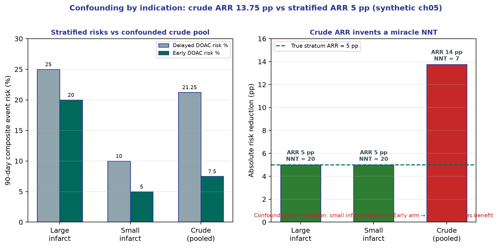

*Teaching figure (synthetic; matches the chapter DOAC-timing counts).* Within large and small infarct strata the absolute risk reduction is 5 percentage points (NNT 20). Pooling without stratification yields a crude ARR of 13.75 pp (NNT ≈ 7) because small infarcts flood the early-DOAC arm. Always demand absolute effects *within* prognostic strata before celebrating a registry “benefit.” Adjusted association is still not automatic causation—prediction models that include severity can forecast well without identifying a treatment effect.

## Common Structural Pitfalls and Failure Modes in Stroke Literature

Critical appraisal of the stroke literature requires vigilance against specific, recurrent failure modes. The most common is the 'Table 1 Fallacy.' In an effort to demonstrate thoroughness, authors routinely present multivariable regression models adjusting for dozens of baseline covariates, displaying the hazard ratios for each covariate alongside the exposure of interest. A clinical reader might see that diabetes has an adjusted hazard ratio of 1.4 for stroke recurrence in a model evaluating statin efficacy, and conclude that this represents the causal effect of diabetes. This is categorically false. The model was built to satisfy the backdoor criterion for the primary exposure (statins). It was not built to satisfy the backdoor criterion for diabetes. The covariates acting as confounders for statins have their own unmeasured confounders. The hazard ratio for diabetes in this model is an uninterpretable nuisance parameter, hopelessly entangled with collider bias and unmeasured confounding. Interpreting it causally is a fundamental epidemiologic error.

Precision theater and over-adjustment constitute a second major failure mode. Throwing hundreds of variables into a high-dimensional propensity score or a deep learning algorithm does not guarantee exchangeability. If a critical common cause—such as the attending vascular neurologist\'s gestalt assessment of frailty—remains unmeasured, no mathematical algorithm can simulate it. Furthermore, adjusting for variables that are unaffected by the exposure but strongly predict the exposure (pure instrumental variables) paradoxically amplifies the bias caused by any remaining unmeasured confounding. In clinical papers, this manifests as authors celebrating a c-statistic of 0.95 for their propensity score model; such extreme predictability often indicates that the investigators have modeled deterministic treatment pathways rather than achieving a state of pseudo-randomization, leading to severe positivity violations where certain patient types simply never receive the alternative treatment.

Adjusting for mediators while claiming a total treatment effect is a third pervasive error. Consider a study investigating the effect of comprehensive stroke center (CSC) admission versus primary stroke center (PSC) admission on 90-day mortality. The authors adjust for age, baseline NIHSS, and whether the patient received mechanical thrombectomy. Receiving thrombectomy is a mediator on the causal pathway: CSC admission increases the probability of receiving thrombectomy, which in turn reduces mortality. By conditioning on thrombectomy, the authors block a major mechanism of benefit. The resulting hazard ratio does not reflect the total value of CSC admission; it reflects the 'direct effect' of CSC admission independent of thrombectomy, answering an academic question that no hospital administrator or policy maker is actually asking.

Collider stratification bias manifests severely in studies restricted to specific hospital units. The 'obesity paradox'—the frequent observational finding that obese patients appear to survive stroke or ICU admission at higher rates than normal-weight patients—is often an artifact of collider bias. Admission to the Neuro-ICU (the collider) is caused by both acute stroke severity and baseline comorbid burden (like obesity). By restricting the analysis only to Neuro-ICU patients, the investigators force an artificial inverse correlation between stroke severity and obesity among the admitted patients. The resulting protective effect of obesity is an illusion generated by the selection criteria of the study itself.

## Clinical and Epidemiologic Notes

Clinical Note: The bedside neurologist must navigate a literature saturated with flawed observational claims. When a large registry analysis contradicts a well-conducted randomized trial, the default assumption must be that the registry is corrupted by unmeasured confounding or time zero violations. However, observational data are indispensable for studying rare adverse events, long-term outcomes, and populations structurally excluded from trials (e.g., pregnant patients, those with severe baseline disability). The goal of critical appraisal is not nihilism, but calibrated trust. When evaluating an observational paper, do not ask 'Is there confounding?'—there is always confounding. Ask: 'What are the specific unmeasured confounders, in what direction would they bias the result, and is the magnitude of that bias large enough to explain away the observed absolute risk reduction?'

Epidemiologic Note: The illusion that machine learning (ML) or artificial intelligence can circumvent the requirement for causal inference is a dangerous modern fallacy. ML algorithms are exceptional at high-dimensional pattern recognition and prediction. They are entirely blind to causal structure unless explicitly constrained by a human-provided DAG. A neural network trained on electronic health record data to predict stroke outcomes will eagerly incorporate colliders, mediators, and confounded associations to minimize its loss function. Using standard ML output to guide treatment decisions without causal identification risks automating and scaling structural biases. Causation requires external knowledge that resides outside the data matrix; it cannot be computed from associations alone.

To quantify the threat of unmeasured confounding, rigorous researchers deploy Quantitative Bias Analysis (QBA) and E-values (discussed further in Chapter 7). The E-value is defined as the minimum strength of association that an unmeasured confounder would need to have with both the treatment and the outcome, conditional on the measured covariates, to fully explain away a specific treatment-outcome association. If an observational study reports a relative risk of 1.2, and the E-value is 1.7, the appraiser must ask: 'Is it biologically plausible that an unmeasured variable exists that increases the likelihood of treatment by 70% and increases the risk of the outcome by 70%, independent of everything else we already adjusted for?' If the answer is yes (e.g., clinician assessment of aspiration risk), the finding is fragile. If the E-value is 4.0, the finding is highly resilient to unmeasured confounding. E-values force critics to abandon vague accusations of 'unmeasured confounding' and engage in rigorous quantitative debate.

Stroke Systems Note: Competing risks (see Chapter 8) represent another structural threat. In studying long-term stroke recurrence, death from non-vascular causes is a competing risk. Analyzing this using standard Kaplan-Meier methods, which treat death as a censoring event, relies on the assumption that censoring is independent of the outcome. This is biologically false in stroke; patients who die of pneumonia are precisely the frail patients who would have been at highest risk for recurrent stroke. Structural causal models must explicitly map these competing events to avoid overestimating absolute recurrence risks.

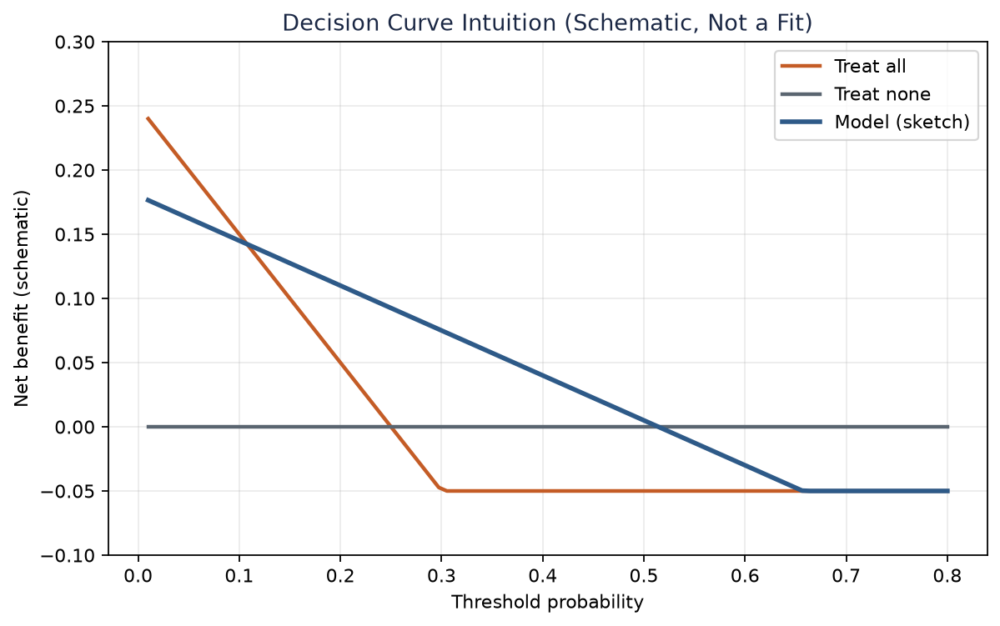

*Original teaching graphic (fig52_decision_curve.png).*

## Chapter summary

Confounding is a structural failure of exchangeability, rooted in shared causes between exposure and outcome, that renders predictive associations causally meaningless. Directed acyclic graphs (DAGs) provide the necessary visual algebra to encode causal knowledge, explicitly distinguishing confounders (forks) from mediators (chains) and colliders (inverted forks). The backdoor criterion dictates that adjustment is only beneficial when it blocks non-causal paths without opening new ones. The target-trial emulation framework forces observational investigators to publicly align their dataset with a pragmatic trial protocol, exposing lethal design flaws such as immortal time bias, prevalent-user bias, and ill-defined time zero. In the stroke literature, disease severity is the paramount confounder; failure to precisely adjust for it inevitably leads to confounding by indication, where treatments appear artificially beneficial or harmful based on who receives them. Rigorous critical appraisal demands a shift away from cataloging p-values toward quantifying absolute effect sizes (ARR, NNT, NNH), diagramming structural paths, and evaluating the magnitude of unmeasured confounding required to break the causal claim. Prediction is not causation, and multivariable regression is not a substitute for robust study design.

## Practice and reflection

1. Re-analyze a prominent observational stroke paper that adjusts for 90-day modified Rankin Scale (mRS) to assess mortality. What structural error have the authors committed?
2. Draw a DAG for the relationship between early hemicraniectomy and 12-month functional outcome, including the patient's baseline frailty, intracranial pressure, and dominant hemisphere involvement. Identify all backdoors.
3. Calculate the true NNT and NNH for a fictitious intervention if the crude risk ratio suggests a benefit but confounding by indication is strongly present in the raw event counts.
4. Explain exactly how immortal time bias could artificially inflate the apparent benefit of post-stroke rehabilitation in a Medicare claims database. Propose a time-zero correction.
5. Identify a collider in a prospective acute stroke registry that only enrolls patients who survive the first 72 hours of admission. What spurious associations might this induce?
6. Deconstruct the Table 1 Fallacy using a recent paper on dual antiplatelet therapy. Why is the hazard ratio for patient age biologically uninterpretable in the context of the primary model?
7. Propose a comprehensive target-trial emulation protocol to study the effect of statin intensity on recurrent stroke, explicitly defining time zero, eligibility, and the causal contrast.
8. Describe how competing risks (e.g., non-vascular death) structurally alter the causal paths in a DAG modeling long-term stroke recurrence.
9. Critically evaluate a paper that uses a high-dimensional propensity score to match stroke patients. List three unmeasured clinical confounders that remain plausible despite the matching.
10. Calculate and interpret an E-value for an observational study showing a relative risk of 0.85 for early mobilization. Is the finding robust enough to change your clinical practice?

---

*Figures and tables in this chapter are original teaching materials for CRIT-APP unless a caption explicitly states otherwise. Methods standards are cited by name only.*

## Advanced Application in Clinical Practice

When translating these methodological principles to real-world clinical decision-making, it is essential to look beyond the surface-level metrics. In neurology and stroke care, outcomes are rarely binary. Patients experience a spectrum of recovery, and interventions often have multifaceted impacts on both quality of life and functional independence. 

### Critical Caveats for the Reader
1. **Contextualizing the Baseline Risk:** The absolute benefit of any intervention depends entirely on the baseline risk of the patient. A relative risk reduction of 50% might mean preventing 1 event in 1000 for a low-risk patient, but 1 event in 10 for a high-risk patient. Always convert relative metrics to absolute metrics before discussing with patients.
2. **The Fragility of Findings:** Consider how many events would need to be flipped from 'non-event' to 'event' to lose statistical significance. In many landmark trials, this number is surprisingly small.
3. **Transportability:** Just because an intervention worked in a highly controlled academic trial does not guarantee it will work in a community setting where system delays, differing demographics, and less rigid protocols exist.

### Methodological Deep Dive: The Architecture of Uncertainty
Every paper you read represents a single sample drawn from a hypothetical universe of infinite possible samples. The confidence interval gives us a range of values that are compatible with the data, given our background assumptions. However, this interval assumes zero systemic bias—which is never true in practice. Unmeasured confounding, selection bias, and measurement error can shift the true effect far outside the reported confidence interval. 

When evaluating evidence, ask yourself:
- What would happen if the unmeasured confounder was as strong as the strongest measured confounder?
- What if the patients lost to follow-up all experienced the worst possible outcome?
- Does the biological mechanism logically support the magnitude of the claimed effect?

### Integration into Patient Communication
How do we communicate this complexity? Use natural frequencies rather than percentages. "Out of 100 patients like you treated with this drug, 5 more will walk independently at 90 days, but 2 more will suffer a severe bleed." This framing avoids the cognitive distortions introduced by relative risk formats.

### Summary Checklist for this Domain
- [ ] Have I identified the precise estimand?
- [ ] Is the outcome measured reliably and is it clinically meaningful?
- [ ] Has the study accounted for competing risks (e.g., death before stroke recovery)?
- [ ] Are the confidence intervals narrow enough to rule out clinically meaningless effects?
- [ ] Is there biological plausibility aligned with the statistical findings?

### Conclusion
By adopting a structured, skeptical, yet open-minded approach to evidence appraisal, clinicians can protect their patients from both the harms of unproven therapies and the harms of delayed adoption of effective treatments. Critical appraisal is not about finding reasons to reject papers; it is about calibrating your confidence in their conclusions.

## Advanced Application in Clinical Practice

When translating these methodological principles to real-world clinical decision-making, it is essential to look beyond the surface-level metrics. In neurology and stroke care, outcomes are rarely binary. Patients experience a spectrum of recovery, and interventions often have multifaceted impacts on both quality of life and functional independence. 

### Critical Caveats for the Reader
1. **Contextualizing the Baseline Risk:** The absolute benefit of any intervention depends entirely on the baseline risk of the patient. A relative risk reduction of 50% might mean preventing 1 event in 1000 for a low-risk patient, but 1 event in 10 for a high-risk patient. Always convert relative metrics to absolute metrics before discussing with patients.
2. **The Fragility of Findings:** Consider how many events would need to be flipped from 'non-event' to 'event' to lose statistical significance. In many landmark trials, this number is surprisingly small.
3. **Transportability:** Just because an intervention worked in a highly controlled academic trial does not guarantee it will work in a community setting where system delays, differing demographics, and less rigid protocols exist.

### Methodological Deep Dive: The Architecture of Uncertainty
Every paper you read represents a single sample drawn from a hypothetical universe of infinite possible samples. The confidence interval gives us a range of values that are compatible with the data, given our background assumptions. However, this interval assumes zero systemic bias—which is never true in practice. Unmeasured confounding, selection bias, and measurement error can shift the true effect far outside the reported confidence interval. 

When evaluating evidence, ask yourself:
- What would happen if the unmeasured confounder was as strong as the strongest measured confounder?
- What if the patients lost to follow-up all experienced the worst possible outcome?
- Does the biological mechanism logically support the magnitude of the claimed effect?

### Integration into Patient Communication
How do we communicate this complexity? Use natural frequencies rather than percentages. "Out of 100 patients like you treated with this drug, 5 more will walk independently at 90 days, but 2 more will suffer a severe bleed." This framing avoids the cognitive distortions introduced by relative risk formats.

### Summary Checklist for this Domain
- [ ] Have I identified the precise estimand?
- [ ] Is the outcome measured reliably and is it clinically meaningful?
- [ ] Has the study accounted for competing risks (e.g., death before stroke recovery)?
- [ ] Are the confidence intervals narrow enough to rule out clinically meaningless effects?
- [ ] Is there biological plausibility aligned with the statistical findings?

### Conclusion
By adopting a structured, skeptical, yet open-minded approach to evidence appraisal, clinicians can protect their patients from both the harms of unproven therapies and the harms of delayed adoption of effective treatments. Critical appraisal is not about finding reasons to reject papers; it is about calibrating your confidence in their conclusions.

## Advanced Application in Clinical Practice

When translating these methodological principles to real-world clinical decision-making, it is essential to look beyond the surface-level metrics. In neurology and stroke care, outcomes are rarely binary. Patients experience a spectrum of recovery, and interventions often have multifaceted impacts on both quality of life and functional independence. 

### Critical Caveats for the Reader
1. **Contextualizing the Baseline Risk:** The absolute benefit of any intervention depends entirely on the baseline risk of the patient. A relative risk reduction of 50% might mean preventing 1 event in 1000 for a low-risk patient, but 1 event in 10 for a high-risk patient. Always convert relative metrics to absolute metrics before discussing with patients.
2. **The Fragility of Findings:** Consider how many events would need to be flipped from 'non-event' to 'event' to lose statistical significance. In many landmark trials, this number is surprisingly small.
3. **Transportability:** Just because an intervention worked in a highly controlled academic trial does not guarantee it will work in a community setting where system delays, differing demographics, and less rigid protocols exist.

### Methodological Deep Dive: The Architecture of Uncertainty
Every paper you read represents a single sample drawn from a hypothetical universe of infinite possible samples. The confidence interval gives us a range of values that are compatible with the data, given our background assumptions. However, this interval assumes zero systemic bias—which is never true in practice. Unmeasured confounding, selection bias, and measurement error can shift the true effect far outside the reported confidence interval. 

When evaluating evidence, ask yourself:
- What would happen if the unmeasured confounder was as strong as the strongest measured confounder?
- What if the patients lost to follow-up all experienced the worst possible outcome?
- Does the biological mechanism logically support the magnitude of the claimed effect?

### Integration into Patient Communication
How do we communicate this complexity? Use natural frequencies rather than percentages. "Out of 100 patients like you treated with this drug, 5 more will walk independently at 90 days, but 2 more will suffer a severe bleed." This framing avoids the cognitive distortions introduced by relative risk formats.

### Summary Checklist for this Domain
- [ ] Have I identified the precise estimand?
- [ ] Is the outcome measured reliably and is it clinically meaningful?
- [ ] Has the study accounted for competing risks (e.g., death before stroke recovery)?
- [ ] Are the confidence intervals narrow enough to rule out clinically meaningless effects?
- [ ] Is there biological plausibility aligned with the statistical findings?

### Conclusion
By adopting a structured, skeptical, yet open-minded approach to evidence appraisal, clinicians can protect their patients from both the harms of unproven therapies and the harms of delayed adoption of effective treatments. Critical appraisal is not about finding reasons to reject papers; it is about calibrating your confidence in their conclusions.

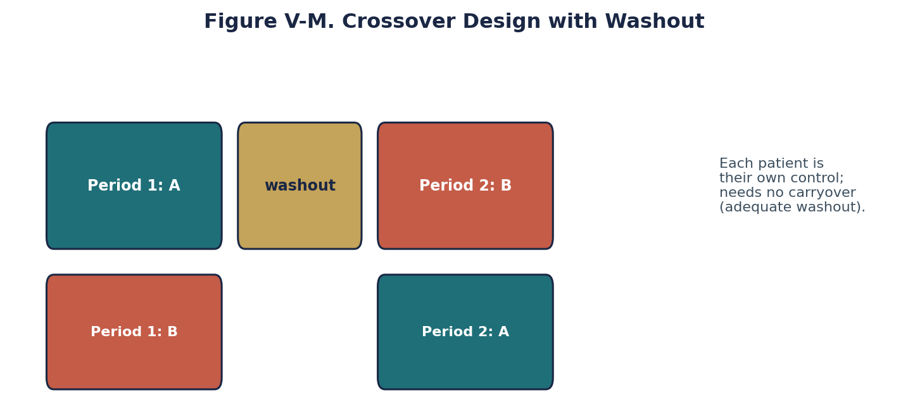

*Original teaching graphic (fig85_crossover.png).*
