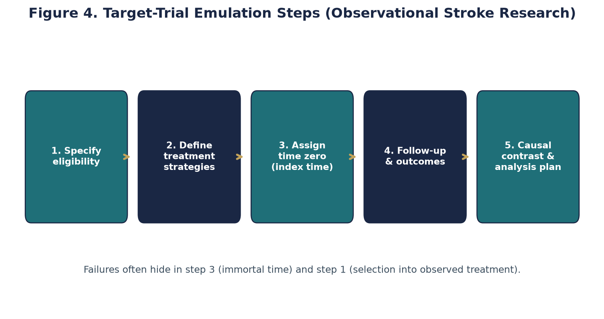
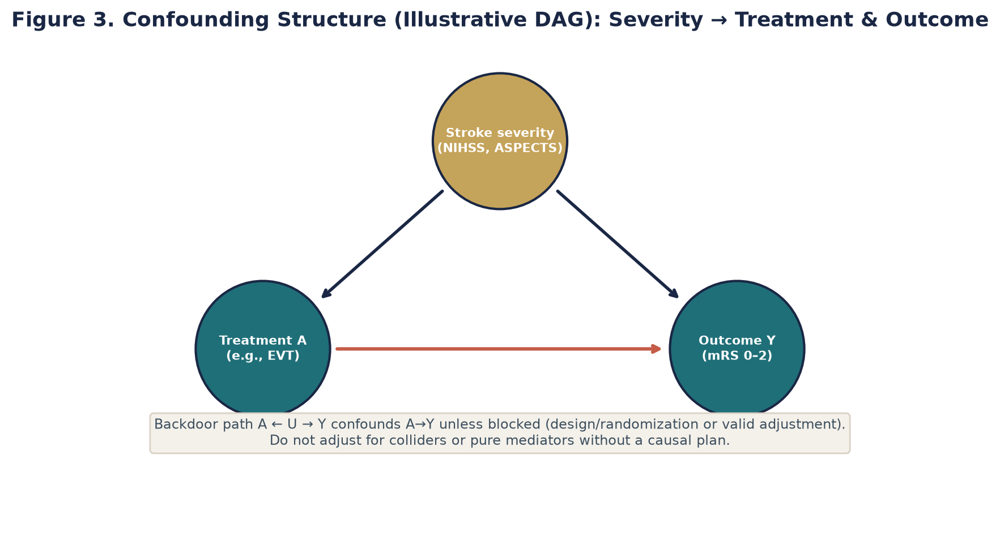
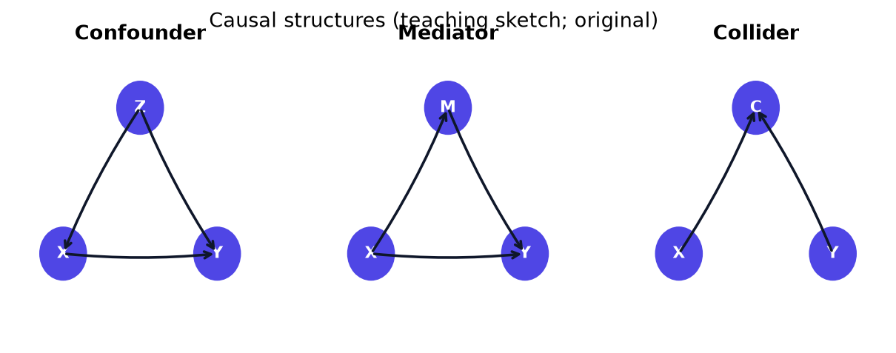

# Chapter 5. Confounding, DAGs, and Target-Trial Thinking

## Opening

*Target-trial thinking forces an observational question into the trial it emulates: eligibility, assignment, and start of follow-up defined up front.*

*A common cause of both exposure and outcome opens a back-door path that biases the crude association until it is blocked.*

*Confounders, mediators, and colliders look alike on a graph but demand opposite handling; adjusting for the wrong one invents or hides an effect.*

A fellow draws a causal arrow from anemia to poor outcome after ICH. Pause: is anemia a confounder, mediator, or collider in this DAG? Wrong adjustment can invent harm.

## Prediction Versus Causation and the Structural Definition of Confounding

In acute stroke neurology, the distinction between prediction and causation is a matter of life and death, yet it is routinely conflated in the medical literature. A predictive model answers the question: 'Given this patient\'s age, admission National Institutes of Health Stroke Scale (NIHSS) score, and initial imaging, what is their absolute probability of achieving functional independence at 90 days?' A causal model answers an entirely different question: 'If we intervene right now to administer intravenous thrombolysis, by what absolute margin will we alter that patient\'s probability of functional independence?' Confounding exclusively threatens the latter. If a researcher only seeks to predict outcomes, any variable that carries information is useful, regardless of its causal status. Confounding is not a statistical nuisance to be algorithmically removed; it is a structural problem defined by the presence of shared causes between the intervention and the outcome.

When assessing the efficacy of an intervention, the crude measure of association mixes the true causal effect of the treatment with non-causal statistical associations flowing along these shared structural paths. A multivariable regression model cannot magically distill causation from prediction simply by adding more covariates. The fundamental error in much of the observational stroke literature is the assumption that adjusting for an arbitrary list of baseline characteristics automatically yields a causal estimand. This is the illusion of statistical control. Without a structural causal model, regression output is merely an array of conditional associations, not an inventory of treatment effects.

To understand why, consider that confounding is fundamentally an issue of exchangeability. In a properly randomized trial, the group receiving the intervention and the group receiving the placebo are exchangeable; if we were to travel back in time and swap their assignments, the overall outcomes would remain identical. In observational data, treated and untreated patients are radically non-exchangeable. Neurologists do not assign treatments randomly. They assign treatments based on perceived severity, comorbidities, frailty, and system resources. This non-random assignment opens backdoor paths that transmit spurious associations, blinding the investigator to the true causal effect.

Baseline stroke severity is often a major common cause of treatment choice and outcome. If it is inadequately measured or controlled in an observational treatment comparison, important confounding by indication is likely, though the exact magnitude and direction depend on the treatment mechanism and selection process. NIHSS measured after treatment is a post-treatment variable and cannot simply substitute for baseline severity in a total-effect adjustment set.

The shift from checklist epidemiology to structural causal inference demands that we stop asking whether a variable is 'statistically significant' and start asking what role the variable plays in the causal architecture of the disease. Prediction does not equal causation. No volume of data, no matter how vast, can overcome a structurally confounded study design.

## Directed Acyclic Graphs (DAGs) as Causal Grammar

A directed acyclic graph (DAG) provides the formal, mathematical grammar necessary to express causal assumptions and diagnose confounding. A DAG consists of nodes representing variables and directed edges (arrows) representing assumed causal effects. The graph must be acyclic, meaning no variable can cause itself, either directly or through a feedback loop. In critical appraisal, the DAG is not an ornamental figure added to a manuscript to project sophistication; it is a falsifiable map of the investigator\'s subject-matter knowledge. By explicitly drawing the arrows that exist—and, equally importantly, declaring which arrows do not exist—the analyst makes their causal framework vulnerable to critique.

In a DAG, a path is any sequence of non-intersecting edges connecting the exposure to the outcome, regardless of the direction of the arrowheads. Causal paths are those where all arrows point forward from the exposure to the outcome. Non-causal paths, conversely, contain at least one arrow pointing backward against the flow of time or causation. The primary purpose of causal inference in observational data is to identify and block all non-causal paths while leaving all causal paths open.

The roles of variables in a DAG dictate whether adjusting for them will mitigate bias, create new bias, or simply alter precision. A confounder is a common cause of both the exposure and the outcome. Graphically, it creates a 'fork' structure (Exposure <- Confounder -> Outcome). Left unadjusted, this fork creates an open backdoor path, transmitting a spurious association. A mediator lies on the causal pathway between the exposure and the outcome, forming a 'chain' (Exposure -> Mediator -> Outcome). Conditioning on a mediator removes part of the total causal effect, forcing the analysis to estimate a direct effect, which is rarely the clinical question of interest.

A collider is a common effect of two other variables, forming an 'inverted fork' (Variable A -> Collider <- Variable B). Unlike a confounder, a collider natively blocks the flow of association between its parent variables. However, if an analyst mistakenly conditions on a collider—by adjusting for it in a regression model or restricting the study sample based on its value—they force the collider path open, creating a spurious association between its parents. This phenomenon, known as collider stratification bias or selection bias, frequently plagues hospital-based stroke registries that condition on survival to admission or transfer to a quaternary care center.

The Backdoor Criterion provides the mathematical algorithm for determining whether a given set of variables is sufficient to adjust for confounding. To identify the causal effect of an exposure on an outcome, an adjustment set must satisfy two conditions. First, no variable in the adjustment set can be a descendant of the exposure; this prevents inadvertently conditioning on mediators or their downstream effects. Second, the adjustment set must block every path between the exposure and the outcome that contains an arrow pointing into the exposure—these are the 'backdoor paths.' If these conditions are met, the observational association, after proper adjustment, will equal the causal effect, provided there is no unmeasured confounding, no measurement error, and no model misspecification.

Instrumental variables present a unique case. An instrument is a variable that causes the exposure but has no direct path to the outcome except through the exposure, and shares no unmeasured confounders with the outcome. While specialized instrumental variable analyses (like Mendelian randomization) can leverage instruments to estimate causal effects in the presence of unmeasured confounding, casually adjusting for an instrument in a standard regression model is dangerous. Adjusting for a pure instrument paradoxically amplifies the bias caused by any remaining unmeasured confounders. In clinical papers, this manifests when authors aggressively adjust for distance to the hospital or random physician preference, unwittingly worsening the confounding they sought to eliminate.

## Target-Trial Emulation: The Framework for Observational Causal Inference

Observational data can only yield valid causal estimates if the analysis successfully emulates a hypothetical pragmatic randomized trial. Miguel Hernán and James Robins formalized this discipline as 'target-trial emulation.' When appraising an observational stroke study, the reader must forcefully extract the implied trial protocol from the manuscript. If the authors cannot clearly define the trial they are attempting to emulate, they are unlikely to have estimated a well-defined causal effect. The emulation framework demands strict specification of seven core elements. Every deviation between the observational dataset and the ideal target trial represents a potential source of irremediable bias.

- Eligibility criteria: Must mirror those of a prospective trial, defined solely using information available prior to or at time zero.
- Treatment strategies: Must be actionable clinical interventions, completely defined at the moment of assignment.
- Assignment procedures: In the target trial, this is randomization; in the emulation, it relies on the untestable assumption of conditional exchangeability.
- Time zero: The common decision point anchoring eligibility, strategy assignment, and follow-up; any grace period or time-varying treatment must be represented explicitly.
- Follow-up period: Must be uniform and clearly defined, extending from time zero until the outcome, censoring, or administrative end of the study.
- Outcome definition: The clinical event of interest, ascertained identically across all treatment strategies.
- Causal contrasts: Specification of whether an intention-to-treat (ITT) effect or a per-protocol effect is being estimated.
- Analysis plan: The statistical machinery deployed to adjust for baseline confounding and address censoring or competing risks.

The eligibility criteria must prevent the inclusion of future information. If a clinical trial would exclude patients with a history of intracranial hemorrhage, the observational cohort must do the same using only historical data prior to time zero. Treatment strategies must be actionable. We cannot randomize patients to 'have a high HDL level,' but we can randomize them to 'take a statin.' If the exposure is vaguely defined as 'statin use,' it violates the requirement for well-defined interventions. Does 'statin use' mean initiation at hospital discharge, continuous use for 90 days, or possession of a prescription at any time during follow-up? This ambiguity destroys the consistency assumption, rendering the causal estimate meaningless.

The causal contrast specifies the exact estimand. The observational analogue of intention-to-treat (ITT) evaluates the effect of initiating a treatment strategy at time zero, regardless of subsequent adherence. This is generally the safest estimand because it avoids conditioning on post-baseline adherence, which is frequently confounded by evolving disease severity. Estimating a per-protocol effect—the effect of strictly adhering to the strategy—requires complex methods like inverse probability weighting for time-varying confounding, as standard regression will suffer from severe collider bias.

## The Pathologies of Time Zero and Immortal Time

Time zero is a high-yield vulnerability in retrospective stroke epidemiology. Conventional randomization anchors eligibility, assignment, and follow-up without using future treatment information, although later missingness and deviations still matter. Observational studies can emulate that alignment or use explicit methods for grace periods and time-varying strategies; classifying exposure using future information while starting follow-up earlier creates avoidable structural bias.

Immortal time bias is perhaps the most pervasive and destructive manifestation of time zero failure. It occurs when follow-up begins before the exposure status is definitively assigned, and the definition of exposure requires the patient to survive for a certain period. Consider a widespread but flawed study design assessing the effect of initiating a direct oral anticoagulant (DOAC) after an acute ischemic stroke with atrial fibrillation. The investigators start the follow-up clock on the day of hospital admission. However, they define the 'DOAC exposed' group as anyone who fills a DOAC prescription within 30 days of discharge. Patients who die of a massive hemorrhagic transformation on day 5 cannot fill a prescription; they are automatically assigned to the 'unexposed' group.

Consequently, membership in the exposed group requires survival until prescription fill. If that waiting period is credited to exposure or early deaths are assigned only to non-fillers, the comparison is biased in favor of the exposed strategy. Valid options include assigning discharge strategies at a common time zero or using methods that represent a prespecified initiation grace period without using future survival to classify baseline exposure.

Prevalent-user bias and the depletion of susceptibles represent another profound failure of time zero alignment. When an observational study compares individuals currently taking a medication (prevalent users) to those not taking it, the time zero for the treated patients occurred months or years in the past, while the time zero for untreated patients is arbitrarily set at cohort entry. Prevalent users are, by definition, survivors. They have already survived the early, highest-risk period of therapy (e.g., early gastrointestinal bleeding upon starting an antiplatelet agent) and have demonstrated tolerance and adherence to the drug. The most vulnerable patients—the 'susceptibles'—experienced adverse events early and discontinued the drug, thus disappearing from the prevalent-user pool. Comparing prevalent users to non-users fundamentally violates exchangeability. To solve this, rigorous observational studies must utilize a 'new-user design,' restricting the cohort to patients initiating therapy for the first time, thereby synchronizing time zero for all participants.

## Quantitative Reasoning and Confounding by Indication: A Worked Example

To solidify these concepts, we must execute a fully worked numeric example of confounding by indication, a pervasive problem in neurology where treatment assignment is heavily dictated by disease severity. Consider a hypothetical target-trial emulation asking whether early initiation (within 48 hours) of a DOAC reduces the 90-day risk of recurrent ischemic stroke or symptomatic intracranial hemorrhage (the composite outcome) compared to delayed initiation (at 7 to 14 days) in patients with acute ischemic stroke and known atrial fibrillation. We analyze a high-quality, multicenter registry containing 10,000 such patients.

Our variables are Early DOAC (E, the exposure), 90-day composite event (Y, the outcome), and baseline Infarct Size (S, a binary confounder: Large vs. Small). Our DAG reveals a classic backdoor path: E <- S -> Y. Large infarcts intrinsically increase the risk of the outcome, and neurologists are structurally less likely to prescribe early DOACs for large infarcts due to hemorrhagic transformation fears. We must adjust for S to close the backdoor path.

First, we examine the stratified data where the true causal effects live. Stratum 1 (Large Infarct, n=4,000): Early DOAC is given to 1,000 patients; Delayed DOAC is given to 3,000 patients. The event risks are 20% in the Early group (200 events) and 25% in the Delayed group (750 events). Within this stratum, the Absolute Risk Reduction (ARR) is 25% - 20% = 5%. The Number Needed to Treat (NNT) is 1 / 0.05 = 20.

Stratum 2 (Small Infarct, n=6,000): Early DOAC is given to 5,000 patients; Delayed DOAC is given to 1,000 patients. The event risks are 5% in the Early group (250 events) and 10% in the Delayed group (100 events). Within this stratum, the ARR is 10% - 5% = 5%. The NNT is 1 / 0.05 = 20. The true causal effect of Early DOAC, assuming exchangeability within strata of infarct size, is a uniform 5% Absolute Risk Reduction across both severity groups.

Now, we compute the crude, unadjusted analysis, simulating the error of an investigator who ignores the structural DAG and simply aggregates the data. Total Early DOAC patients = 1,000 (Large) + 5,000 (Small) = 6,000. Total Early DOAC events = 200 + 250 = 450. Crude risk for Early DOAC = 450 / 6,000 = 7.5%. Total Delayed DOAC patients = 3,000 (Large) + 1,000 (Small) = 4,000. Total Delayed DOAC events = 750 + 100 = 850. Crude risk for Delayed DOAC = 850 / 4,000 = 21.25%.

The crude Absolute Risk Reduction is 21.25% - 7.5% = 13.75%. This implies a crude NNT of approximately 7. The crude analysis vastly overestimates the benefit of Early DOAC, inflating the ARR by nearly three-fold. Why? Because 83% (5,000/6,000) of the Early DOAC group consisted of patients with small infarcts, who inherently have a much lower baseline risk of events regardless of treatment. Conversely, 75% (3,000/4,000) of the Delayed DOAC group consisted of patients with large infarcts. The unadjusted comparison is fatally confounded by indication; it falsely attributes the protective effect of having a small baseline infarct to the timing of the medication.

This numeric reality underscores why preferring absolute effects (ARR, NNT, NNH) is essential for clinical reasoning: absolute metrics anchor the magnitude of bias in clinically meaningful units, rather than dimensionless relative ratios that disguise baseline risk. When evaluating an observational paper claiming a massive benefit, immediately attempt to reconstruct the raw counts to determine if baseline imbalances can explain the entire effect.

*Teaching figure (synthetic; matches the chapter DOAC-timing counts).* Within large and small infarct strata the absolute risk reduction is 5 percentage points (NNT 20). Pooling without stratification yields a crude ARR of 13.75 pp (NNT ≈ 7) because small infarcts flood the early-DOAC arm. Always demand absolute effects *within* prognostic strata before celebrating a registry “benefit.” Adjusted association is still not automatic causation—prediction models that include severity can forecast well without identifying a treatment effect.

## Common Structural Pitfalls and Failure Modes in Stroke Literature

Critical appraisal of the stroke literature requires vigilance against recurrent failure modes. One is the 'Table 2 fallacy': interpreting every adjusted coefficient in a multivariable results table as a causal effect even though the model and adjustment set were designed for a different exposure. A diabetes coefficient in a model built to estimate a statin contrast is an adjusted association; it is not automatically the causal effect of diabetes because the model may omit causes of diabetes and outcome, include variables with different causal roles for diabetes, or impose a misspecified functional form. Each causal exposure requires its own estimand, graph, and identification strategy.

Precision theater and over-adjustment constitute a second major failure mode. Throwing hundreds of variables into a high-dimensional propensity score or a deep learning algorithm does not guarantee exchangeability. If a critical common cause—such as the attending vascular neurologist\'s gestalt assessment of frailty—remains unmeasured, no mathematical algorithm can simulate it. Furthermore, adjusting for variables that are unaffected by the exposure but strongly predict the exposure (pure instrumental variables) paradoxically amplifies the bias caused by any remaining unmeasured confounding. In clinical papers, this manifests as authors celebrating a c-statistic of 0.95 for their propensity score model; such extreme predictability often indicates that the investigators have modeled deterministic treatment pathways rather than achieving a state of pseudo-randomization, leading to severe positivity violations where certain patient types simply never receive the alternative treatment.

Adjusting for mediators while claiming a total treatment effect is a third pervasive error. Consider a study investigating the effect of comprehensive stroke center (CSC) admission versus primary stroke center (PSC) admission on 90-day mortality. The authors adjust for age, baseline NIHSS, and whether the patient received mechanical thrombectomy. Receiving thrombectomy is a mediator on the causal pathway: CSC admission increases the probability of receiving thrombectomy, which in turn reduces mortality. By conditioning on thrombectomy, the authors block a major mechanism of benefit. The resulting hazard ratio does not reflect the total value of CSC admission; it reflects the 'direct effect' of CSC admission independent of thrombectomy, answering an academic question that no hospital administrator or policy maker is actually asking.

Collider stratification bias manifests severely in studies restricted to specific hospital units. The 'obesity paradox'—the frequent observational finding that obese patients appear to survive stroke or ICU admission at higher rates than normal-weight patients—is often an artifact of collider bias. Admission to the Neuro-ICU (the collider) is caused by both acute stroke severity and baseline comorbid burden (like obesity). By restricting the analysis only to Neuro-ICU patients, the investigators force an artificial inverse correlation between stroke severity and obesity among the admitted patients. The resulting protective effect of obesity is an illusion generated by the selection criteria of the study itself.

## Clinical and Epidemiologic Notes

Clinical Note: The bedside neurologist must navigate a literature saturated with flawed observational claims. When a large registry analysis contradicts a well-conducted randomized trial targeting a comparable question, first compare population, treatment version, follow-up, adherence, measurement, and estimand; then assess residual confounding and time-zero violations in the registry. Observational data remain indispensable for rare harms, long-term outcomes, and populations excluded from trials. Ask which unmeasured common causes remain plausible, their likely direction, and whether sensitivity analyses suggest they could explain the observed contrast.

Epidemiologic Note: Machine learning does not by itself turn prediction into causal identification. A standard predictive model trained on electronic health record data can use colliders, mediators, and confounded associations whenever they improve prediction. Causal ML methods exist, but they still require a well-defined estimand, a defensible design, identification assumptions, and subject-matter knowledge. Using ordinary predictive output to choose treatments risks automating and scaling structural biases.

To quantify one threat from unmeasured confounding, researchers may use quantitative bias analysis or an E-value. For a risk-ratio estimate, the E-value is the minimum association strength, on the risk-ratio scale, that an unmeasured confounder would need with both exposure and outcome—conditional on measured covariates—to move the estimate to the null under the method's assumptions. A larger E-value means stronger confounder associations would be required on that scale, but it does not address selection bias, measurement error, model misspecification, or whether such a confounder is plausible. It is a sensitivity analysis, not a certificate of causal validity.

Stroke Systems Note: Competing risks (see Chapter 11) alter the estimand for long-term stroke recurrence. Treating death as ordinary independent censoring in a Kaplan–Meier risk calculation estimates a hypothetical net risk and generally overestimates the real-world cumulative incidence when death precludes recurrence. Use a competing-risk estimand and methods such as the Aalen–Johansen cumulative incidence estimator when the question concerns observed event probability in the presence of death.

## Chapter summary

Confounding is a failure of exchangeability for a causal contrast. DAGs distinguish common causes, mediators, and colliders and help select variables that block biasing paths without opening new ones. Target-trial emulation makes eligibility, strategies, time zero, follow-up, outcomes, and estimand explicit; it does not itself guarantee identification. In stroke comparisons, baseline severity is frequently a major confounder, and residual severity differences can distort effects in either direction. Appraisal should pair causal design with absolute effects and sensitivity analysis rather than treating multivariable regression as a substitute for identification.

## Practice and reflection

1. Re-analyze a prominent observational stroke paper that adjusts for 90-day modified Rankin Scale (mRS) to assess mortality. What structural error have the authors committed?
2. Draw a DAG for the relationship between early hemicraniectomy and 12-month functional outcome, including the patient's baseline frailty, intracranial pressure, and dominant hemisphere involvement. Identify all backdoors.
3. Calculate the true NNT and NNH for a fictitious intervention if the crude risk ratio suggests a benefit but confounding by indication is strongly present in the raw event counts.
4. Explain exactly how immortal time bias could artificially inflate the apparent benefit of post-stroke rehabilitation in a Medicare claims database. Propose a time-zero correction.
5. Identify a collider in a prospective acute stroke registry that only enrolls patients who survive the first 72 hours of admission. What spurious associations might this induce?
6. Deconstruct the Table 2 fallacy using a recent paper on dual antiplatelet therapy. Why is an adjusted coefficient for patient age not automatically a causal effect in a model designed for the treatment contrast?
7. Propose a comprehensive target-trial emulation protocol to study the effect of statin intensity on recurrent stroke, explicitly defining time zero, eligibility, and the causal contrast.
8. Describe how competing risks (e.g., non-vascular death) structurally alter the causal paths in a DAG modeling long-term stroke recurrence.
9. Critically evaluate a paper that uses a high-dimensional propensity score to match stroke patients. List three unmeasured clinical confounders that remain plausible despite the matching.
10. Calculate and interpret an E-value for an observational study showing a relative risk of 0.85 for early mobilization. Is the finding robust enough to change your clinical practice?

---

*Figures and tables in this chapter are Teaching materials for CRIT-APP unless a caption explicitly states otherwise. Methods standards are cited by name only.*
