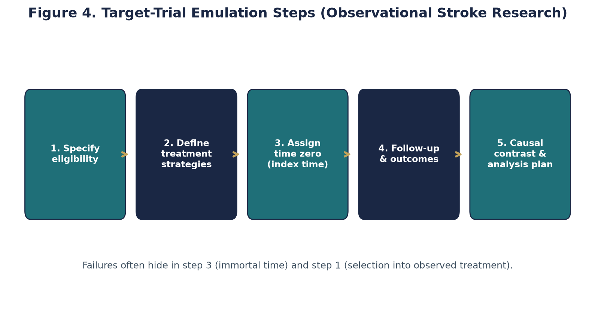
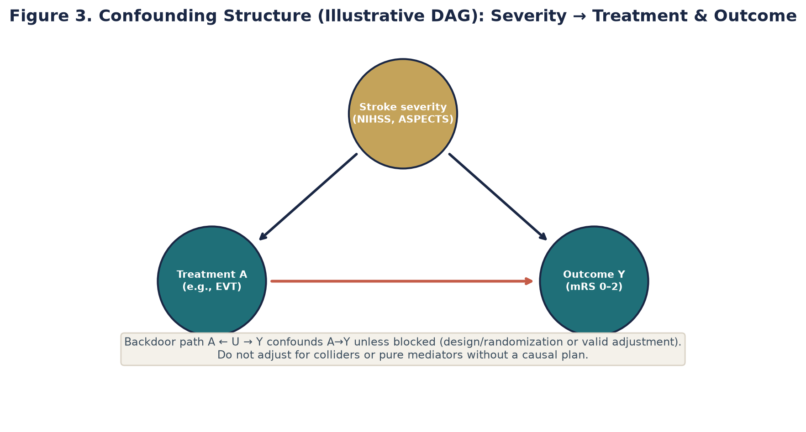
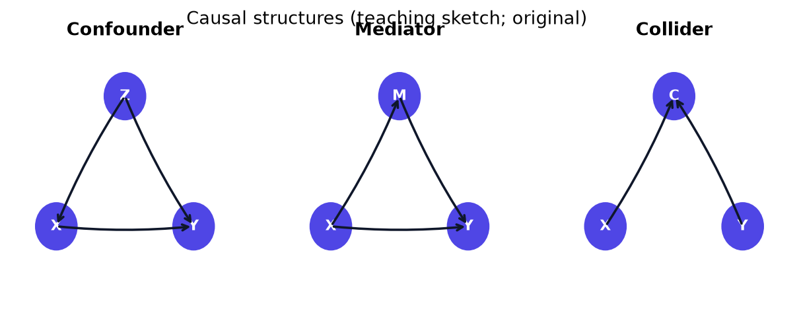

# Chapter 5. Confounding, DAGs, and Target-Trial Thinking

## Opening

*Target-trial thinking forces an observational question into the trial it emulates: eligibility, assignment, and start of follow-up defined up front.*

*A common cause of both exposure and outcome opens a back-door path that biases the crude association until it is blocked.*

*Confounders, mediators, and colliders look alike on a graph but demand opposite handling; adjusting for the wrong one invents or hides an effect.*

A fellow draws a causal arrow from anemia to poor outcome after ICH. Pause: is anemia a confounder, mediator, or collider in this DAG? Wrong adjustment can invent harm.

## Prediction Versus Causation and the Structural Definition of Confounding

In acute stroke neurology, prediction and causation answer different questions that are often conflated. A predictive model asks: 'Given age, admission NIHSS, and initial imaging, how well can we estimate 90-day functional outcome in a defined setting?' A causal analysis asks: 'How would assigning intravenous thrombolysis rather than its comparator change 90-day outcome in an eligible population?' Confounding is a threat to causal contrasts. Prediction has different threats—including leakage, measurement drift, selection, overfitting, and dataset shift—and a predictor can be useful without being causal.

When assessing the efficacy of an intervention, the crude measure of association mixes the true causal effect of the treatment with non-causal statistical associations flowing along these shared structural paths. A multivariable regression model cannot magically distill causation from prediction simply by adding more covariates. The fundamental error in much of the observational stroke literature is the assumption that adjusting for an arbitrary list of baseline characteristics automatically yields a causal estimand. This is the illusion of statistical control. Without a structural causal model, regression output is merely an array of conditional associations, not an inventory of treatment effects.

To understand why, consider that confounding is fundamentally an issue of exchangeability. In a properly randomized trial, the group receiving the intervention and the group receiving the placebo are exchangeable; if we were to travel back in time and swap their assignments, the overall outcomes would remain identical. In observational data, treated and untreated patients are radically non-exchangeable. Neurologists do not assign treatments randomly. They assign treatments based on perceived severity, comorbidities, frailty, and system resources. This non-random assignment opens backdoor paths that transmit spurious associations, blinding the investigator to the true causal effect.

Baseline stroke severity is often a major common cause of treatment choice and outcome. If it is inadequately measured or controlled in an observational treatment comparison, important confounding by indication is likely, though the exact magnitude and direction depend on the treatment mechanism and selection process. NIHSS measured after treatment is a post-treatment variable and cannot simply substitute for baseline severity in a total-effect adjustment set.

The shift from checklist epidemiology to structural causal inference demands that we stop asking whether a variable is 'statistically significant' and start asking what role the variable plays in the causal architecture of the disease. Prediction does not equal causation. No volume of data, no matter how vast, can overcome a structurally confounded study design.

## Directed Acyclic Graphs (DAGs) as Causal Grammar

A directed acyclic graph (DAG) provides a formal grammar for expressing causal assumptions and diagnosing open biasing paths. Nodes represent variables and arrows represent assumed causal relations. The graph is acyclic, so feedback over time must be represented with time-indexed nodes rather than a directed cycle. A DAG is an explicit, contestable map of assumptions; not every missing or present arrow is empirically testable from the study data alone.

In a DAG, a path is any sequence of non-intersecting edges connecting the exposure to the outcome, regardless of the direction of the arrowheads. Causal paths are those where all arrows point forward from the exposure to the outcome. Non-causal paths, conversely, contain at least one arrow pointing backward against the flow of time or causation. The primary purpose of causal inference in observational data is to identify and block all non-causal paths while leaving all causal paths open.

The roles of variables in a DAG dictate whether adjusting for them will mitigate bias, create new bias, or simply alter precision. A confounder is a common cause of both the exposure and the outcome. Graphically, it creates a 'fork' structure (Exposure <- Confounder -> Outcome). Left unadjusted, this fork creates an open backdoor path, transmitting a spurious association. A mediator lies on the causal pathway between the exposure and the outcome, forming a 'chain' (Exposure -> Mediator -> Outcome). Conditioning on a mediator removes part of the total causal effect, forcing the analysis to estimate a direct effect, which is rarely the clinical question of interest.

A collider is a common effect of two other variables, forming an 'inverted fork' (Variable A -> Collider <- Variable B). Unlike a confounder, a collider natively blocks the flow of association between its parent variables. However, if an analyst mistakenly conditions on a collider—by adjusting for it in a regression model or restricting the study sample based on its value—they force the collider path open, creating a spurious association between its parents. This phenomenon, known as collider stratification bias or selection bias, frequently plagues hospital-based stroke registries that condition on survival to admission or transfer to a quaternary care center.

In a correctly specified causal DAG, the backdoor criterion gives a sufficient graphical condition for identifying an effect by covariate adjustment: select no descendants of the exposure and block every path that enters the exposure through an incoming arrow. This criterion does not verify the graph or data. Identification and estimation also require well-defined treatment versions, consistency, positivity, adequate measurement, no relevant selection or interference problems for the estimand, and an appropriate statistical model.

Instrumental-variable analyses rely on relevance to treatment, independence from unmeasured causes of the outcome, and an exclusion restriction that the instrument affects the outcome only through treatment; the estimand may require additional assumptions such as monotonicity. Candidate instruments such as distance or clinician preference rarely satisfy these conditions by label alone. Including a strong treatment predictor that is otherwise unrelated to the outcome can amplify bias from residual unmeasured confounding in some settings, so its role should follow the causal model rather than an automatic adjustment rule.

## Target-Trial Emulation: The Framework for Observational Causal Inference

Target-trial emulation is one powerful framework for observational causal questions; other designs, such as valid natural experiments or instrumental-variable studies, target causal effects through different identification strategies. For treatment comparisons that can be framed as hypothetical interventions, extract the target protocol from the manuscript. The framework specifies eight core elements, and mismatches between the observational implementation and target trial should be evaluated for their likely effect rather than labeled automatically irremediable.

- Eligibility criteria: Define the target-trial population using information available by time zero.
- Treatment strategies: Define actionable interventions or dynamic strategies, including permitted timing and versions.
- Assignment procedures: In the target trial, this is randomization; in the emulation, it relies on the untestable assumption of conditional exchangeability.
- Time zero: The common decision point anchoring eligibility, strategy assignment, and follow-up; any grace period or time-varying treatment must be represented explicitly.
- Follow-up period: Define its origin and end, including outcome events, competing events, censoring, and administrative closure.
- Outcome definition: The clinical event of interest, ascertained identically across all treatment strategies.
- Causal contrasts: Specification of whether an intention-to-treat (ITT) effect or a per-protocol effect is being estimated.
- Analysis plan: The statistical machinery deployed to adjust for baseline confounding and address censoring or competing risks.

Eligibility should not depend on information that occurs after time zero. Treatment strategies also need enough detail to distinguish relevant versions: 'statin use' could mean initiation at discharge, sustained use for 90 days, or any fill during follow-up. Without that detail, the intervention and consistency assumptions are ambiguous and the resulting causal contrast may not map to a clinical action.

The causal contrast specifies the estimand. An observational analogue of an assignment effect may compare initiation strategies at time zero regardless of subsequent adherence. A sustained-strategy or per-protocol effect can be more relevant for another decision, but requires longitudinal treatment and confounder data plus methods that address time-varying confounding, selection, and censoring. Neither estimand has automatic priority.

## The Pathologies of Time Zero and Immortal Time

Time zero is a high-yield vulnerability in retrospective stroke epidemiology. Conventional randomization anchors eligibility, assignment, and follow-up without using future treatment information, although later missingness and deviations still matter. Observational studies can emulate that alignment or use explicit methods for grace periods and time-varying strategies; classifying exposure using future information while starting follow-up earlier creates avoidable structural bias.

Immortal time bias is perhaps the most pervasive and destructive manifestation of time zero failure. It occurs when follow-up begins before the exposure status is definitively assigned, and the definition of exposure requires the patient to survive for a certain period. Consider a widespread but flawed study design assessing the effect of initiating a direct oral anticoagulant (DOAC) after an acute ischemic stroke with atrial fibrillation. The investigators start the follow-up clock on the day of hospital admission. However, they define the 'DOAC exposed' group as anyone who fills a DOAC prescription within 30 days of discharge. Patients who die of a massive hemorrhagic transformation on day 5 cannot fill a prescription; they are automatically assigned to the 'unexposed' group.

Consequently, membership in the exposed group requires survival until prescription fill. If that waiting period is credited to exposure or early deaths are assigned only to non-fillers, the comparison is biased in favor of the exposed strategy. Valid options include assigning discharge strategies at a common time zero or using methods that represent a prespecified initiation grace period without using future survival to classify baseline exposure.

Comparing prevalent users with non-users can introduce survivor and depletion-of-susceptibles bias when the intended question concerns treatment initiation. Current users have already survived and tolerated an earlier treatment period, whereas non-users may include people who stopped after adverse events. A new-user, active-comparator design often better aligns time zero for an initiation effect. A prevalent-user design can still answer a carefully defined continuation question, but it should not be interpreted as an initiation effect without additional assumptions.

## Quantitative Reasoning and Confounding by Indication: A Worked Example

To solidify these concepts, we must execute a fully worked numeric example of confounding by indication, a pervasive problem in neurology where treatment assignment is heavily dictated by disease severity. Consider a hypothetical target-trial emulation asking whether early initiation (within 48 hours) of a DOAC reduces the 90-day risk of recurrent ischemic stroke or symptomatic intracranial hemorrhage (the composite outcome) compared to delayed initiation (at 7 to 14 days) in patients with acute ischemic stroke and known atrial fibrillation. We analyze a high-quality, multicenter registry containing 10,000 such patients.

Our variables are Early DOAC (E, the exposure), 90-day composite event (Y, the outcome), and baseline Infarct Size (S, a binary confounder: Large vs. Small). Our DAG reveals a classic backdoor path: E <- S -> Y. Large infarcts intrinsically increase the risk of the outcome, and neurologists are structurally less likely to prescribe early DOACs for large infarcts due to hemorrhagic transformation fears. We must adjust for S to close the backdoor path.

First, examine the synthetic stratum-specific associations. Stratum 1 (Large Infarct, n=4,000): Early DOAC is given to 1,000 patients; Delayed DOAC is given to 3,000 patients. The event risks are 20% in the Early group (200 events) and 25% in the Delayed group (750 events). Within this stratum, the risk difference is 5 percentage points and its reciprocal is 20. It represents a causal effect only under the stated assumption that stratifying on infarct size is sufficient for exchangeability and that the other identification assumptions hold.

Stratum 2 (Small Infarct, n=6,000): Early DOAC is given to 5,000 patients; Delayed DOAC is given to 1,000 patients. The event risks are 5% in the Early group (250 events) and 10% in the Delayed group (100 events). The stratum-specific risk difference is again 5 points. Under the synthetic assumption of conditional exchangeability within infarct-size strata, this would correspond to a uniform causal risk difference across the two strata; the table itself cannot verify that assumption.

Now, we compute the crude, unadjusted analysis, simulating the error of an investigator who ignores the structural DAG and simply aggregates the data. Total Early DOAC patients = 1,000 (Large) + 5,000 (Small) = 6,000. Total Early DOAC events = 200 + 250 = 450. Crude risk for Early DOAC = 450 / 6,000 = 7.5%. Total Delayed DOAC patients = 3,000 (Large) + 1,000 (Small) = 4,000. Total Delayed DOAC events = 750 + 100 = 850. Crude risk for Delayed DOAC = 850 / 4,000 = 21.25%.

The crude Absolute Risk Reduction is 21.25% - 7.5% = 13.75%. This implies a crude NNT of approximately 7. The crude analysis vastly overestimates the benefit of Early DOAC, inflating the ARR by nearly three-fold. Why? Because 83% (5,000/6,000) of the Early DOAC group consisted of patients with small infarcts, who inherently have a much lower baseline risk of events regardless of treatment. Conversely, 75% (3,000/4,000) of the Delayed DOAC group consisted of patients with large infarcts. The unadjusted comparison is fatally confounded by indication; it falsely attributes the protective effect of having a small baseline infarct to the timing of the medication.

This numeric reality underscores why preferring absolute effects (ARR, NNT, NNH) is essential for clinical reasoning: absolute metrics anchor the magnitude of bias in clinically meaningful units, rather than dimensionless relative ratios that disguise baseline risk. When evaluating an observational paper claiming a massive benefit, immediately attempt to reconstruct the raw counts to determine if baseline imbalances can explain the entire effect.

*Teaching figure (synthetic; matches the chapter DOAC-timing counts).* Within each infarct-size stratum the observed risk difference is 5 percentage points (reciprocal 20). Pooling yields a crude difference of 13.75 points because small infarcts are more common in the early-DOAC arm. Examine standardized or appropriately stratified absolute effects and their assumptions before interpreting a registry benefit. Adjustment is not automatic causation—prediction models that include severity can forecast well without identifying a treatment effect.

## Common Structural Pitfalls and Failure Modes in Stroke Literature

Critical appraisal of the stroke literature requires vigilance against recurrent failure modes. One is the 'Table 2 fallacy': interpreting every adjusted coefficient in a multivariable results table as a causal effect even though the model and adjustment set were designed for a different exposure. A diabetes coefficient in a model built to estimate a statin contrast is an adjusted association; it is not automatically the causal effect of diabetes because the model may omit causes of diabetes and outcome, include variables with different causal roles for diabetes, or impose a misspecified functional form. Each causal exposure requires its own estimand, graph, and identification strategy.

High-dimensional adjustment does not guarantee exchangeability. If a common cause such as frailty is inadequately measured, an algorithm cannot recover it merely by adding proxies. Including strong treatment predictors that do not help explain outcome can increase variance and, in some settings, amplify residual confounding. A high c-statistic for a propensity model is not a balance diagnostic: it may accompany poor overlap, but the overlap and positivity problem should be examined directly through propensity distributions, weights, effective sample size, and covariate balance.

Adjusting for mediators while claiming a total treatment effect is a third pervasive error. Consider a study investigating the effect of comprehensive stroke center (CSC) admission versus primary stroke center (PSC) admission on 90-day mortality. The authors adjust for age, baseline NIHSS, and whether the patient received mechanical thrombectomy. Receiving thrombectomy is a mediator on the causal pathway: CSC admission increases the probability of receiving thrombectomy, which in turn reduces mortality. By conditioning on thrombectomy, the authors block a major mechanism of benefit. The resulting hazard ratio does not reflect the total value of CSC admission; it reflects the 'direct effect' of CSC admission independent of thrombectomy, answering an academic question that no hospital administrator or policy maker is actually asking.

Collider stratification bias manifests severely in studies restricted to specific hospital units. The 'obesity paradox'—the frequent observational finding that obese patients appear to survive stroke or ICU admission at higher rates than normal-weight patients—is often an artifact of collider bias. Admission to the Neuro-ICU (the collider) is caused by both acute stroke severity and baseline comorbid burden (like obesity). By restricting the analysis only to Neuro-ICU patients, the investigators force an artificial inverse correlation between stroke severity and obesity among the admitted patients. The resulting protective effect of obesity is an illusion generated by the selection criteria of the study itself.

## Clinical and Epidemiologic Notes

Clinical Note: Observational evidence varies widely in design and target question. When a registry analysis differs from a well-conducted randomized trial, first compare population, treatment versions, follow-up, adherence, measurement, and estimand; then assess residual confounding, selection, and time alignment. Observational data remain important for rare harms, long-term outcomes, implementation, and populations underrepresented in trials.

Epidemiologic Note: Machine learning does not by itself turn prediction into causal identification. A standard predictive model trained on electronic health record data can use colliders, mediators, and confounded associations whenever they improve prediction. Causal ML methods exist, but they still require a well-defined estimand, a defensible design, identification assumptions, and subject-matter knowledge. Using ordinary predictive output to choose treatments risks automating and scaling structural biases.

To quantify one threat from unmeasured confounding, researchers may use quantitative bias analysis or an E-value. For a risk-ratio estimate, the E-value is the minimum association strength, on the risk-ratio scale, that an unmeasured confounder would need with both exposure and outcome—conditional on measured covariates—to move the estimate to the null under the method's assumptions. A larger E-value means stronger confounder associations would be required on that scale, but it does not address selection bias, measurement error, model misspecification, or whether such a confounder is plausible. It is a sensitivity analysis, not a certificate of causal validity.

Stroke Systems Note: Competing risks (see Chapter 11) alter the estimand for long-term stroke recurrence. Treating death as ordinary independent censoring in a Kaplan–Meier risk calculation estimates a hypothetical net risk and generally overestimates the real-world cumulative incidence when death precludes recurrence. Use a competing-risk estimand and methods such as the Aalen–Johansen cumulative incidence estimator when the question concerns observed event probability in the presence of death.

## Chapter summary

Confounding is a failure of exchangeability for a causal contrast. DAGs distinguish common causes, mediators, and colliders and help select variables that block biasing paths without opening new ones. Target-trial emulation makes eligibility, strategies, time zero, follow-up, outcomes, and estimand explicit; it does not itself guarantee identification. In stroke comparisons, baseline severity is frequently a major confounder, and residual severity differences can distort effects in either direction. Appraisal should pair causal design with absolute effects and sensitivity analysis rather than treating multivariable regression as a substitute for identification.

## Practice and reflection

1. Re-analyze a prominent observational stroke paper that adjusts for 90-day modified Rankin Scale (mRS) to assess mortality. What structural error have the authors committed?
2. Draw a DAG for the relationship between early hemicraniectomy and 12-month functional outcome, including the patient's baseline frailty, intracranial pressure, and dominant hemisphere involvement. Identify all backdoors.
3. Calculate the true NNT and NNH for a fictitious intervention if the crude risk ratio suggests a benefit but confounding by indication is strongly present in the raw event counts.
4. Explain exactly how immortal time bias could artificially inflate the apparent benefit of post-stroke rehabilitation in a Medicare claims database. Propose a time-zero correction.
5. Identify a collider in a prospective acute stroke registry that only enrolls patients who survive the first 72 hours of admission. What spurious associations might this induce?
6. Deconstruct the Table 2 fallacy using a recent paper on dual antiplatelet therapy. Why is an adjusted coefficient for patient age not automatically a causal effect in a model designed for the treatment contrast?
7. Propose a comprehensive target-trial emulation protocol to study the effect of statin intensity on recurrent stroke, explicitly defining time zero, eligibility, and the causal contrast.
8. Describe how competing risks (e.g., non-vascular death) structurally alter the causal paths in a DAG modeling long-term stroke recurrence.
9. Critically evaluate a paper that uses a high-dimensional propensity score to match stroke patients. List three unmeasured clinical confounders that remain plausible despite the matching.
10. Calculate and interpret an E-value for an observational study showing a relative risk of 0.85 for early mobilization. Is the finding robust enough to change your clinical practice?

---

*Figures and tables in this chapter are Teaching materials for CRIT-APP unless a caption explicitly states otherwise. Methods standards are cited by name only.*
