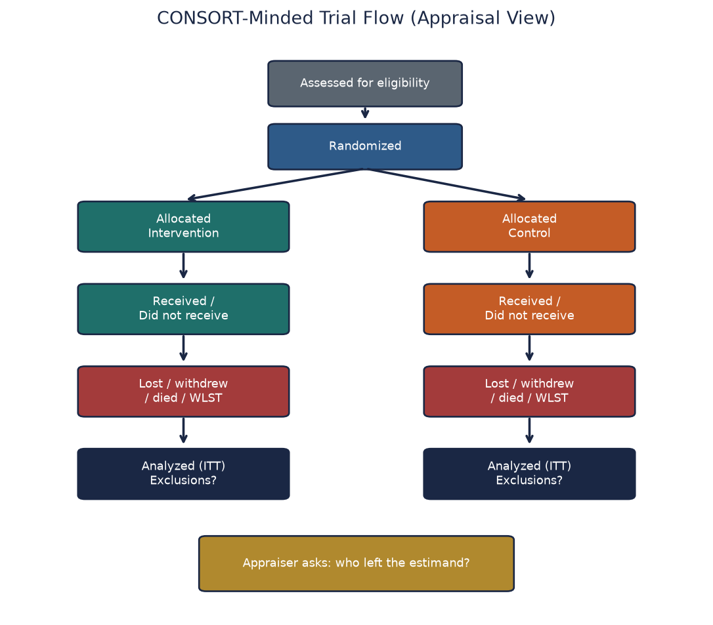
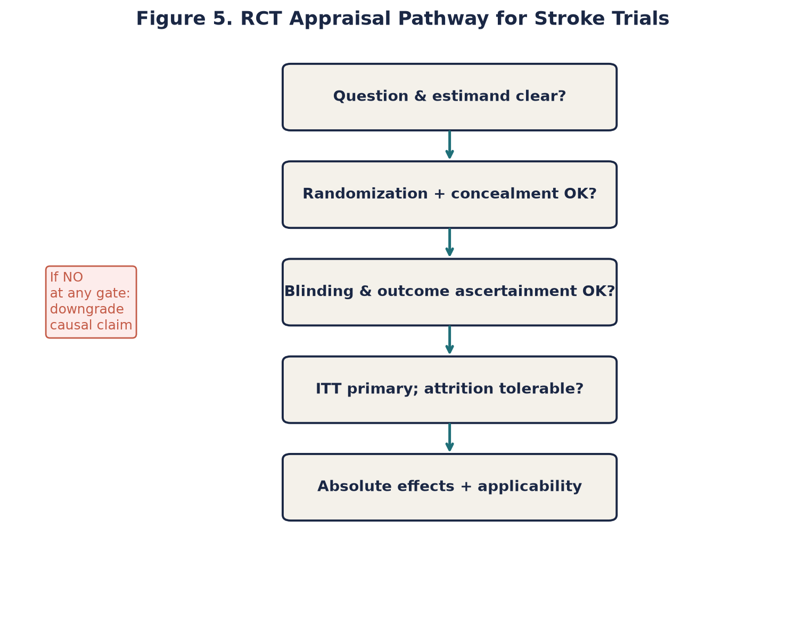
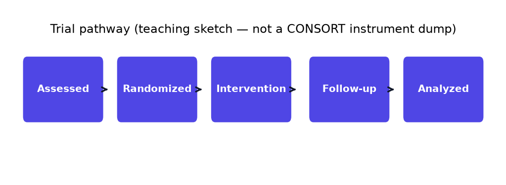
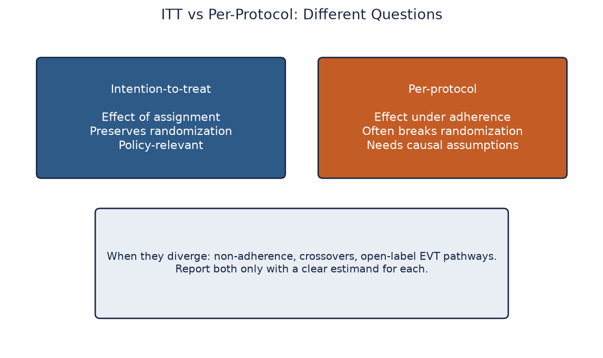
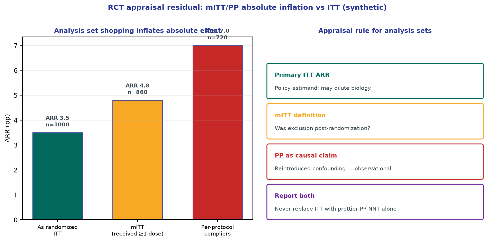
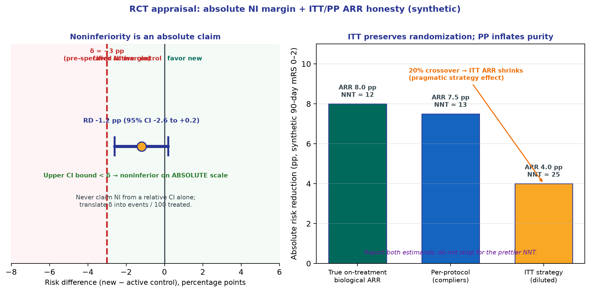
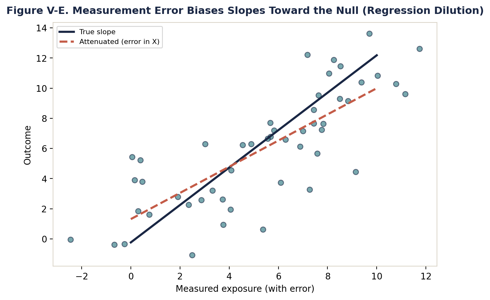
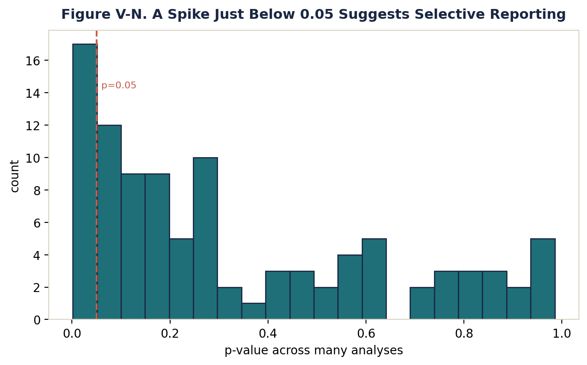

# Chapter 6. Appraising Randomized Trials in Stroke and Neurology

## Opening



*CONSORT-minded flow (teaching sketch; original).*



*Trial pathway overview (original).*


*Trial pathway teaching sketch (original; not a checklist dump).*


Journal club is an EVT RCT with beautiful Kaplan–Meier curves. Ask allocation concealment, crossover, and absolute functional gains before declaring a new standard for your ED.


## Learning objectives

- 1. Construct a structural causal model demonstrating how randomization severs the incoming arrows of unmeasured confounding, while identifying the post-randomization pathways that reintroduce it.
- 2. Differentiate sequence generation from allocation concealment, auditing hyperacute stroke workflows for vulnerabilities that permit clinician prediction of assignments.
- 3. Map blinding status across all trial stakeholders (participants, clinicians, endpoint assessors, adjudicators) and specify the causal pathway by which each unmasked role biases the estimand.
- 4. Contrast intention-to-treat (ITT), modified ITT, per-protocol, and as-treated estimands, proving mathematically why post-randomization exclusions condition on colliders and reintroduce confounding.
- 5. Extract raw event counts from trial appendices to independently calculate absolute risk reduction (ARR), number needed to treat (NNT), and number needed to harm (NNH), rejecting relative effect inflation.
- 6. Evaluate the structural impact of competing risks, differential attrition, and unblinded withdrawal of life-sustaining therapy on ordinal modified Rankin Scale outcomes.
- 7. Detect and neutralize statistical threats from multiplicity, including interim stopping boundaries, unadjusted multiple testing, and biologically implausible post-hoc subgroup fishing.
- 8. Appraise the evolution of the comparator arm, judging how historical shifts in baseline secondary prevention and reperfusion alter the transportability of legacy trial findings to contemporary practice.
- 9. Execute a formal, CONSORT-minded structured appraisal of published stroke randomized controlled trials to determine true bedside readiness.

## The Epistemology of the Randomized Trial in Stroke

The randomized controlled trial sits atop the evidence hierarchy not by historical tradition or arbitrary consensus, but due to a singular mathematical property: when executed flawlessly, randomization balances both measured and unmeasured baseline prognostic factors in expectation. This is the exclusive mechanism in clinical epidemiology that breaks the causal arrow between patient characteristics and treatment assignment. In observational data, a patient receives a therapy because a clinician predicted they would benefit, or because they were deemed physiologically capable of tolerating the intervention. This generates intractable confounding by indication, meaning the treatment assignment is hopelessly entangled with the underlying baseline risk of the outcome. Prediction is not causation. A machine learning model might flawlessly predict that stroke patients receiving mechanical ventilation have astronomically higher mortality rates, but that associational correlation contains zero causal information regarding the efficacy of the ventilator itself. Randomization replaces clinician intent and predictive assignment with a stochastic, mathematical coin flip.

By forcing the treatment assignment to be unconditionally independent of all baseline covariates, randomization isolates the specific causal effect of the assigned strategy. It permits the computation of the Average Treatment Effect (ATE) by simply subtracting the mean outcome of the control group from the mean outcome of the intervention group. The math relies on the premise that the two groups are exchangeable; had the treatment group instead received the control intervention, their outcomes would be perfectly identical to the actual control group. However, this epistemological purity is fragile and temporary. It exists for exactly one millisecond: the moment of sequence generation and randomization. Every event that occurs after that moment—unblinded co-interventions, differential loss to follow-up, selective crossover, and unstandardized outcome ascertainment—threatens to reintroduce the very confounding that randomization was deployed to eliminate.

The task of clinical appraisal is not to automatically accept the results simply because the word 'randomized' appears in the title. The task is to trace the causal architecture from the sequence generation all the way to the final intention-to-treat analysis, interrogating every phase where bias might have leaked back into the trial execution. Consider a surgical trial comparing early versus late decompressive hemicraniectomy for malignant middle cerebral artery infarction. Observational registries are fundamentally biased because neurosurgeons only operate on patients they predict will survive the procedure. Randomization removes this prediction-based assignment, but if surgical patients receive disproportionately intensive care unit rehabilitation while medical patients receive palliation, confounding has re-entered through the backdoor of co-interventions. True appraisal requires absolute skepticism of the post-randomization timeline.

## The Mechanics of Randomization: Breaking the Confounding Arrow

The physical mechanics of randomization dictate the structural integrity of the trial. Simple randomization assigns treatments entirely at random, identical to flipping a coin. While mathematically pure, simple randomization can produce severe imbalances in sample size and prognostic covariates in smaller trials. To prevent this, trialists use permuted block randomization, which forces equal allocation within fixed block sizes (e.g., blocks of four ensuring two active and two control assignments). Stratified randomization goes a step further, generating separate randomization blocks for critical prognostic variables. In acute stroke reperfusion trials, stratification by clinical center, baseline National Institutes of Health Stroke Scale (NIHSS) severity bands, and baseline ASPECTS is standard protocol. This guarantees that the active and control arms have identical proportions of severe strokes and large core infarcts.

The fundamental goal of stratification is to ensure precision and balance on highly prognostic covariates. However, chance imbalances inevitably occur across dozens of unstratified variables. A frequent failure mode in journal clubs is declaring a trial 'flawed' because Table 1 shows the intervention group was, by chance, two years older or had a marginally higher rate of baseline atrial fibrillation. If the randomization sequence was secure and generated properly, baseline imbalance is a precision issue, not a structural bias issue. It does not invalidate the trial mechanism. The appropriate analytical response is precision-enhancing covariate adjustment using multivariable regression, which adjusts for the baseline imbalance and narrows the confidence interval of the treatment effect. True randomization guarantees exchangeability in expectation across repeated samples, not identical point estimates in a single realization.

Appraisers must explicitly differentiate true stochastic randomization from deterministic alternation. Assigning treatments based on alternate days of the week, odd or even hospital record numbers, or odd or even birth years is not randomization. These are entirely predictable, deterministic sequences. They fail the fundamental requirement of randomness and are acutely vulnerable to selection bias, as clinicians can easily predict the assignment and selectively enroll or exclude patients.

## Allocation Concealment: The Final Mile of Randomization

Allocation concealment protects the randomization sequence before the assignment occurs. Blinding protects the trial after the assignment is made. These are distinct concepts with distinct failure modes. Allocation concealment answers a singular question: could the enrolling investigator predict the next assignment before deciding to enroll the patient? If an investigator knows the next assignment is the active therapy, and they strongly predict a specific patient will benefit, they will aggressively enroll them. If they know the next assignment is the control, they might delay enrollment or find a trivial exclusion criterion to exclude a highly viable patient. This destroys the exchangeability of the groups.

Subversion is highly prevalent in hyperacute stroke trial workflows where time pressure is extreme. When investigators face a critical three-minute window to administer a thrombolytic, the logistical friction of randomization is high. Historically, trials utilizing opaque, sealed envelopes stored in the emergency department were frequently subverted; investigators could hold envelopes to the light, open them prematurely, or skip sequences. A trial utilizing unblinded blocks of four allows the investigator to perfectly deduce the fourth assignment if they track the previous three. Secure allocation concealment requires centralized, web-based, third-party randomization systems where the assignment is irreversibly generated only after the patient is permanently registered and eligibility is confirmed in the database.

Inspect the baseline characteristics table specifically looking for imbalances that defy statistical probability. If a trial utilizes inadequate concealment (e.g., decentralized envelopes) and presents a Table 1 where the intervention arm is miraculously five years younger and has a significantly lower baseline NIHSS, you are likely observing the mathematical footprint of subversion. The investigators cracked the sequence and selectively routed predicted good-prognosis patients into the active arm. The trial is fatally compromised.

## Blinding: A Stakeholder-Specific Matrix

Blinding (or masking) is rarely a binary grade of 'double-blind' or 'open-label.' It is a highly specific matrix of stakeholders. Appraisers must explicitly define the blinding status of the patient, the treating clinician, the endpoint assessor, the adverse event adjudicator, the statistician, and the manuscript writer. Each unblinded role introduces a highly specific, mechanistically distinct bias pathway. You must specify how the lack of blinding in each role corrupts the specific estimand of interest.

Unblinded patients report systematically worse subjective outcomes in the control arm due to disappointment and lack of placebo effect. Unblinded clinicians provide differential co-interventions. If a clinician knows a patient received mechanical thrombectomy, they may target stricter blood pressure parameters, pursue more aggressive intensive care support, and order earlier physical therapy consultations. This performance bias conflates the isolated effect of the endovascular procedure with the unmeasured package of superior supportive care. Unblinded assessors systematically rate the intervention group more favorably on subjective scales like the modified Rankin Scale (mRS), subconsciously shifting borderline cases into favorable categories based on their belief in the treatment.

In mechanical thrombectomy and neurosurgical trials, blinding the proceduralist is structurally impossible. A neurosurgeon cannot be blinded to performing a craniectomy. This structural limitation does not doom the trial, but it exponentially heightens the strict requirement for blinded outcome assessors, highly objective endpoints, and rigidly protocolized, standardized co-intervention guidelines for both arms. The inability to blind the treating physician mandates zero tolerance for unblinded endpoint ascertainment.

## PROBE Designs and Adjudication Committees in Neurology

The Prospective Randomized Open-label Blinded-Endpoint (PROBE) design is highly prevalent in vascular neurology. Due to the logistical impossibility of blinding procedural interventions, trials heavily utilize PROBE frameworks. The entire validity of a PROBE trial rests upon the absolute insulation of the outcome assessor. If the assessor is unmasked, the trial functionally degrades into an observational cohort study with extreme ascertainment bias.

Unblinding occurs rapidly via physical cues. In an endovascular trial, groin hematomas from arterial puncture, alopecia from fluoroscopic radiation, or visible craniectomy defects immediately unmask the supposedly blinded bedside assessor. Even without physical cues, patients frequently reveal their treatment assignment during standard conversation. Mitigation strategies must be aggressive. Centralized, blinded telephone assessments by personnel strictly segregated from the hospital, or structured video interviews evaluated by independent core labs, are mandatory structural defenses against unblinding.

Independent adjudication committees evaluate secondary endpoints and critical safety events, such as symptomatic intracranial hemorrhage (sICH) or cause-specific mortality. Adjudicators reviewing neuroimaging must view scans that are completely scrubbed of treatment indicators. If an adjudicator reviewing a CT scan for hemorrhage can visualize a hyperdense middle cerebral artery stent retriever, they are unblinded, and their assessment of hemorrhage severity will systematically bias toward the null or against the intervention depending on their priors.

## Estimands and Analysis Sets: ITT, Modified ITT, and the Per-Protocol Illusion



*Intention-to-treat answers the effect of assignment and preserves randomization; per-protocol answers an adherence-conditional question and often reintroduces confounding. Original teaching figure.*


The estimand framework formally defines the target of estimation: the population, the strategies compared, the precise variable of interest, the handling of intercurrent events, and the population-level summary metric. In stroke trials, intercurrent events—such as crossover to rescue therapy, protocol non-adherence, or withdrawal of consent—are inevitable. How the analysis handles these events defines the fundamental causal meaning of the result.

Intention-to-treat (ITT) dictates that patients are analyzed in the exact group to which they were randomized, regardless of whether they received the drug, crossed over, or violated the protocol. ITT isolates the exact causal effect of the assignment itself. It answers the critical clinical policy question: what is the net effect of deciding to prescribe this therapy? ITT provides a strict mathematical guarantee against post-randomization selection bias. While ITT may dilute the maximal biological efficacy of a drug if adherence is poor, this dilution is a feature, not a bug, for real-world policy translation. It accurately reflects the friction of clinical implementation.

Modified ITT (mITT) and Per-Protocol (PP) analyses execute post-randomization exclusions. They might exclude patients who did not receive the study drug, who crossed over, or who were later deemed ineligible. This is structurally catastrophic. Post-randomization adherence is conditional on unmeasured physiological variables. By excluding non-adherent patients, the analysis conditions on a collider, instantly reintroducing confounding by indication. A naive per-protocol analysis that drops non-adherers is strictly observational data masquerading as randomized data. A positive per-protocol analysis paired with a null ITT analysis provides exactly zero causal evidence of efficacy; it merely proves that healthier, compliant patients have better outcomes.



*Teaching figure (synthetic).* Primary policy estimand stays ITT. Report mITT/PP as sensitivity only—never replace the ITT NNT with a prettier complier absolute effect.

## Attrition, Missing Data, and Loss to Follow-Up

Randomization successfully balances baseline covariates, but it possesses zero capacity to salvage differential missingness at the 90-day endpoint. If the intervention arm loses 10% of its patients to follow-up, and the control arm loses 2%, the Average Treatment Effect is hopelessly biased. The exchangeability assumption is severed. A highly significant p-value calculated on the remaining, highly selected cohort is mathematically meaningless regarding the original randomized population.

Missingness in stroke neurology is rarely, if ever, Missing Completely At Random (MCAR). Patients who are lost to follow-up are typically those who discharge to long-term skilled nursing facilities, hospice care, or experience severe cognitive decline. These patients are much harder to reach for phone interviews and possess systematically worse mRS scores. Discarding these patients (complete-case analysis) artificially inflates the apparent success rate of both arms, and if missingness is differential, it massively biases the treatment effect.

Rigorous analytical solutions are required. Multiple imputation (MI) utilizes baseline covariates to predict missing outcomes, assuming data is Missing At Random (MAR) conditional on those covariates. Tipping point analyses and best-case/worst-case bounding scenarios force the investigator to prove that even if all missing intervention patients died, and all missing control patients recovered perfectly, the trial results would still hold. A trial reporting a 5% absolute risk reduction with 10% unaccounted missing data and zero sensitivity analyses is fundamentally inconclusive.

## Competing Risks and Withdrawal of Life-Sustaining Therapy

Early mortality operates as a terminal competing risk for 90-day functional assessment. A patient physically cannot achieve an mRS of 3 at 90 days if they suffer catastrophic herniation and expire on day 4. Standard logistic regression fails to differentiate between a patient who is alive with severe disability versus a patient who is deceased, unless explicitly modeled. Analyses must clearly report the distribution of mortality prior to interpreting functional endpoints.

Withdrawal of Life-Sustaining Therapy (WLST) acts as a highly volatile post-randomization mediator. If an experimental intervention causes early cerebral edema, unblinded clinicians may pursue WLST aggressively, assuming neurological futility. This actively shifts the mortality outcome. Conversely, if clinicians possess therapeutic optimism for the active arm, they may delay WLST, artificially preserving life but shifting the cohort into severe disability states (mRS 5). If WLST protocols are unblinded and unstandardized, self-fulfilling prophecies will entirely dictate the outcome distribution.

Advanced trial protocols demand rigid, pre-specified WLST guidelines to eliminate physician-level variability. When appraising, you must evaluate whether mortality differences are biologically mediated by the drug's effect on tissue survival, or driven by unblinded clinician pessimism altering the threshold for palliation.

## Endpoints: The Modified Rankin Scale and Beyond

The modified Rankin Scale (mRS) is the dominant functional endpoint in acute stroke research. It is a strictly ordinal scale from 0 (no symptoms) to 6 (death). Historically, trials relied on dichotomizing the mRS, typically at 0-2 (functional independence) versus 3-6. Dichotomization discards immense statistical power and willfully ignores massive clinical shifts. A treatment that moves a patient from mRS 5 (bedbound, requiring constant nursing) to mRS 3 (requiring help with complex tasks but walking independently) is a profound clinical victory, yet it registers as a total failure in a 0-2 dichotomized analysis.

To capture full spectrum efficacy, modern trials utilize ordinal logistic regression and shift analysis. This approach assesses the probability of shifting one point better across the entire scale. However, it relies entirely on the proportional odds assumption, which dictates that the treatment effect (the odds ratio) is perfectly identical across all possible cut-points of the mRS. Biologically, this is frequently false. A drug might excel at preventing death (shifting 6 to 5) but possess zero capability of restoring perfect normalcy (shifting 1 to 0). Violating the proportional odds assumption renders the single ordinal odds ratio mathematically incoherent.

Utility-weighted mRS assigns patient-centered, continuous numerical values to each discrete state, acknowledging that the utility drop between mRS 3 and 4 is exponentially larger than the drop between mRS 1 and 2. Time horizons are equally critical. Assessing outcomes at 90 days captures acute stabilization, but assessing at one year captures long-term neuroplasticity and rehabilitation effects. You must verify that the endpoint timeframe aligns with the biological mechanism of the intervention.

## Multiplicity, Interim Looks, and Early Stopping

The family-wise error rate represents the probability of making at least one Type I error (false positive) when conducting multiple hypothesis tests. Testing five secondary endpoints, three timepoints, and four anatomical subgroups inflates the false positive probability far beyond the nominal alpha of 0.05. Statistical rigor demands alpha-splitting techniques (e.g., Bonferroni correction) or strict hierarchical testing sequences, where the trial is only permitted to test mortality if, and only if, it first achieves significance on the primary mRS shift endpoint.

Interim analyses executed by a Data and Safety Monitoring Board (DSMB) are ethical requirements to prevent ongoing exposure to harmful or futile interventions. However, peaking at the data inflates alpha. Stopping for efficacy requires extremely strict boundaries (e.g., O'Brien-Fleming boundaries) that require massive p-values (p < 0.001) at early looks to justify halting the trial.

The peril of early stopped trials cannot be overstated. Trials stopped early for benefit almost uniformly overestimate the true, long-term treatment effect. This occurs because the DSMB tends to halt the trial at a random high-water mark in statistical noise. If the trial had continued, regression to the mean would dictate that the effect size shrinks. Clinical guideline committees and practitioners must heavily discount the massive effect sizes reported by truncated trials, recognizing them as mathematically inflated.

## Subgroup Fishing and the Illusion of Heterogeneity

Subgroup fishing is the desperate search for a 'responder' population in a trial that failed its primary endpoint. Investigators will execute post-hoc slicing of the cohort by age, sex, baseline ASPECTS cutoffs, precise occlusion sites, and arbitrary onset-to-treatment time windows until a nominal p < 0.05 is achieved. This is data dredging. Without pre-specification, these findings are completely invalid and represent nothing more than the exploitation of random variance.

The only statistically valid method to claim a differential subgroup effect is a pre-specified formal interaction test. An interaction p-value assesses whether the magnitude of the treatment effect significantly differs between the strata (e.g., does the drug work significantly better in males than females?). Even when pre-specified, trials are almost never powered to detect interaction effects, rendering subgroup analyses strictly exploratory.

Lack of interaction evidence is binding. If the confidence intervals for the treatment effect within specific subgroups overlap broadly with the overall trial point estimate, the perceived heterogeneity is an illusion. It is a severe clinical error to withhold a proven, efficacious therapy from a specific demographic based on an underpowered, post-hoc null result in that specific stratum. The correct default is to assume the overall Average Treatment Effect applies to all enrolled subgroups unless compelling, replicated interaction evidence proves otherwise.

## Quantitative Reasoning: Absolute Effects and the 2x2 Table

Relative risks (RR) and odds ratios (OR) mathematically obscure baseline risk and consistently exaggerate the clinical magnitude of benefit. If a drug reduces a catastrophic event from 2 occurrences per 10,000 patients down to 1 occurrence per 10,000 patients, the relative risk is 0.5. The pharmaceutical marketing will boldly claim a '50% reduction in catastrophe.' However, the absolute risk reduction (ARR) is 0.0001, requiring 10,000 patients to be treated to prevent a single event. Relative risk theater is actively deployed to manipulate perception.

Senior clinical appraisal requires independent computation from raw data. Define the baseline risk of the control group (P0) and the risk in the treated group (P1). The Risk Difference (RD), or ARR, is precisely P0 - P1 (or P1 - P0, depending on the outcome valence). The Number Needed to Treat (NNT) is the inverse of the absolute risk difference: NNT = 1 / RD. The Number Needed to Harm (NNH) is calculated identically using the absolute increase in adverse events.

In stroke neurology, absolute effects must dictate all bedside decision making. A reperfusion strategy possessing an NNT of 10 for achieving functional independence, paired with an NNH of 100 for fatal intracranial hemorrhage, provides a mathematically transparent, easily communicated net clinical benefit. An odds ratio of 1.8 provides zero actionable data for informed consent without the anchoring baseline probability.

## Fully Worked Example: Deconstructing a Reperfusion Trial

To demonstrate absolute quantitation, consider a hypothetical, large-scale, multicenter trial randomizing 1,200 patients with anterior circulation large vessel occlusion presenting at 6-24 hours. The trial compares Endovascular Thrombectomy (EVT) plus best medical therapy against best medical therapy alone. The primary endpoint is functional independence (mRS 0-2) at 90 days. We extract the raw event counts from the primary publication appendix to compute absolute metrics, bypassing the abstract's relative odds ratios.

```
Hypothetical Reperfusion Trial: Primary Endpoint (mRS 0–2 at 90 days)
                             mRS 0–2     mRS 3–6     Total
EVT + Medical Therapy          528         672      1,200
Medical Therapy Alone          384         816      1,200

Risk in Treated (P1) = 528 / 1200 = 0.440
Risk in Control (P0) = 384 / 1200 = 0.320
Risk Difference (RD) = 0.440 − 0.320 = 0.120 (12.0 absolute percentage points)
Number Needed to Treat (NNT) = 1 / 0.120 = 8.33
Risk Ratio (RR) = 0.440 / 0.320 = 1.375
Odds Ratio (OR) = (528/672) / (384/816) = 0.7857 / 0.4705 = 1.669
```

Clinical translation: The relative risk increase is 37.5%, and the odds ratio approaches 1.7. However, the actionable absolute risk difference is 12.0 percentage points. We must treat approximately 8.3 (round to 9) patients with EVT to yield one additional functionally independent survivor who would have otherwise remained disabled. Simultaneously, we evaluate harms. Assume symptomatic intracranial hemorrhage (sICH) occurred in 5.0% of the EVT arm and 2.0% of the control arm. The absolute risk increase for sICH is 3.0 percentage points. The NNH is 1 / 0.03 = 33.3. The net clinical translation for the family is absolute transparency: 'For every 100 patients treated with this procedure, we secure functional independence for an additional 12 people, while causing a severe hemorrhage in 3 people who would not have otherwise bled.'

## Harms, Co-Interventions, and the Evolving Medical Comparator

Evaluating benefit without meticulously quantifying absolute harm is incomplete and unethical appraisal. Harm definitions must be intensely scrutinized. Symptomatic intracranial hemorrhage (sICH) possesses fiercely competing definitions across major stroke trials. The NINDS definition requires any hemorrhage associated with any clinical worsening (>= 1 point on the NIHSS). The ECASS III definition is far more restrictive, requiring hemorrhage associated with a severe >= 4 point NIHSS worsening. Applying the ECASS III definition mathematically shrinks the reported sICH rate, artificially inflating the apparent safety profile of the drug. Comparing harms across trials requires harmonized definitions.

Differential co-interventions operate as silent confounders. If the treating critical care teams are unblinded to assignment, they may subconsciously push aggressive normoglycemia protocols, strict temperature management, and intensive physical therapy exclusively for patients in the active surgical arm, while relegating the control arm to standard floor care. This pervasive performance bias conflates the isolated efficacy of the tested drug with the unmeasured, massive benefit of superior supportive care.

The comparator arm constitutes exactly half of the trial's validity. 'Best medical therapy' is a moving target. A control arm defined by 2013 standards is clinically obsolete in 2026. Evaluating legacy trials requires explicitly assessing whether the incremental benefit of the tested intervention would survive if tested on top of modern, optimized secondary prevention, intensive statin therapy, and contemporary blood pressure control. A highly positive historical trial against an obsolete control arm drastically overstates the incremental value of the intervention today.

## Advanced Designs: Non-Inferiority and Adaptive Trials

Non-inferiority trials do not attempt to prove a new drug is better. They ask whether a new treatment is 'not unacceptably worse' than the standard, typically because the new treatment offers profound logistical, financial, or safety advantages (e.g., tenecteplase administered as a rapid single bolus versus a prolonged alteplase infusion). The entire validity of a non-inferiority trial rests on the non-inferiority margin. This margin must be rigorously justified based on historical placebo-controlled data. If investigators set the margin too wide, a demonstrably inferior drug will be falsely declared 'non-inferior'.

The ITT paradox governs non-inferiority trials. In standard superiority trials, intention-to-treat is statistically conservative; protocol violations and poor adherence blur the distinction between groups, driving the result toward the null hypothesis (no effect). In non-inferiority trials, the null hypothesis is that the drugs are different. Blurring the distinction between groups through poor adherence artificially makes the drugs look identical. Therefore, in non-inferiority designs, ITT is dangerously anti-conservative. Rigorous non-inferiority trials must demonstrate equivalence in both the ITT and the Per-Protocol populations to ensure assay sensitivity.



*Teaching figure (synthetic).* Pre-specify δ in percentage points and judge the entire CI of the risk difference—not a relative margin alone. Crossover shrinks the pragmatic ITT ARR (and inflates NNT) while PP can reintroduce selection; report both estimands and never shop for the prettier absolute effect.

Adaptive platform trials utilize response-adaptive randomization and continuous arm-dropping to maximize efficiency and minimize patient exposure to futile treatments. While statistically brilliant, they introduce complex temporal confounding if the background standard of care shifts during the prolonged enrollment period. Validity depends entirely on ironclad pre-specified adaptation rules and transparent preservation of the family-wise error rate.

## Checklists and Frameworks: The CONSORT-Minded Sequence

Memorizing the 25-item CONSORT checklist numbers is pedagogical waste. Advanced clinicians must instead internalize the structural causal sequence. When dissecting a publication, enforce this chronological framework:

- 1. Target Population & Setting: Who was excluded? Does the strict eligibility criteria match the physiology of the patient in your ED?
- 2. Assignment & Concealment: Was sequence generation mathematically stochastic? Was allocation concealment cryptographically secure from ED prediction?
- 3. Strategies & Co-interventions: What precise protocols dictated the comparator arm? Were unblinded rescue therapies permitted differentially?
- 4. Blinding Matrix: Construct the grid. Who knew the assignment, when did they know it, and exactly how could that knowledge alter the measurement?
- 5. Analysis Sets & Estimands: Is the primary p-value strictly generated from an intention-to-treat population? Are missing data bounded by imputation?
- 6. Absolute Quantitation: Ignore the abstract. Extract the raw counts. Compute RD, NNT, NNH, and place the trade-off in plain language.

## Pitfalls and Failure Modes in Trial Appraisal

The landscape of trial appraisal is saturated with specific failure modes that trap junior clinicians. The primary failure mode is conflating 'randomized' with 'unbiased'. Assuming that a pristine sequence generation immunizes the trial from the devastation of differential attrition, unblinded assessment, and outcome reporting bias is a catastrophic analytical error.

The second failure mode is the Per-Protocol Apology. This occurs when a clinician accepts a null ITT primary analysis, but eagerly adopts the therapy into practice based on a highly positive per-protocol or as-treated secondary analysis. This selectively ignores the massive, intractable confounding introduced by conditioning on adherence.

The third failure mode is Subgroup Hallucination. This involves declaring that a drug 'works brilliantly in severe strokes' based entirely on a post-hoc, exploratory subgroup analysis yielding a nominal p-value of 0.04, completely lacking a formal test for interaction. It represents the total surrender of statistical discipline.

The fourth failure mode is Relative Risk Theater. Communicating a '50% reduction in stroke mortality' to a patient's family without explicitly disclosing that the absolute baseline risk dropped from 2 in 10,000 to 1 in 10,000. It is statistically accurate but ethically manipulative.

## Clinical and Epidemiologic Notes

Clinical Note: When reading a newly published stroke trial, draft the clinical summary sentence before looking at the author's abstract conclusions. Compute the NNT and NNH independently from the raw event counts in the appendix. Formulate the precise absolute trade-off. Never adopt an abstract conclusion that you cannot mathematically reconstruct and defend with raw data.

Epidemiologic Note: Internal validity is fundamentally distinct from external transportability. A perfectly executed, internally flawless trial in highly selected patients (e.g., DAWN criteria utilizing advanced perfusion imaging to select tiny core infarcts) provides a mathematically unbiased estimate for that exact, narrow population. Extrapolating that positive estimate to patients with massive established core infarcts is not an internal bias issue; it is a severe transportability error. The effect modifier distribution in the target population does not match the trial.

Industry Note: Scrutinize the data sharing statement and the precise role of the commercial sponsor. When the sponsor holds exclusive access to the raw data, dictates the statistical analysis plan, and authors the first draft of the manuscript without independent academic verification, the threshold for adopting marginal or subgroup-driven findings must rise exponentially. Methodological skepticism must scale with financial conflict.




*Original teaching graphic (fig77_regression_dilution.png).*

## Chapter summary

Randomized controlled trials occupy the pinnacle of clinical epistemology solely because sequence generation breaks the causal arrow of unmeasured confounding, guaranteeing exchangeability at baseline. However, this mathematical purity is intensely fragile, existing only at the moment of randomization. Post-randomization events—including subverted allocation concealment, unblinded co-interventions, differential missingness, and competing risks—constantly threaten to reintroduce selection bias. The estimand framework clarifies that strictly intention-to-treat (ITT) analyses answer initiation-policy questions without bias, while per-protocol and as-treated exclusions condition on colliders and destroy randomization. PROBE designs, ubiquitous in vascular neurology, survive only through the absolute insulation of the blinded outcome assessor. Multiplicity, interim stopping boundaries, and post-hoc subgroup fishing frequently manufacture statistical illusions of efficacy. Advanced quantitative reasoning demands the total rejection of relative risk theater in favor of independently calculating the absolute risk difference, NNT, and NNH. Finally, integrating a CONSORT-minded chronological sequence protects the clinician from adopting abstract spin, ensuring that only transparent, absolute net clinical benefits reach the patient bedside.

## Practice and reflection

1. 1. Extract the raw 2x2 event counts from the primary publication of the MR CLEAN or DAWN trial. Independently compute the Risk Difference, Relative Risk, Odds Ratio, and NNT for functional independence.
2. 2. Diagram a causal Directed Acyclic Graph (DAG) demonstrating how executing a per-protocol analysis (excluding non-adherent patients) conditions on a collider and opens a backdoor path of unmeasured confounding.
3. 3. Select a recent Prospective Randomized Open-label Blinded-Endpoint (PROBE) trial in neurology. Map the blinding matrix for all stakeholders and identify the specific physical cues that could unmask the outcome assessor.
4. 4. Locate a stroke trial that was stopped early for efficacy by a DSMB. Explain mathematically why the reported treatment effect size is highly likely to be an overestimate of the true population parameter.
5. 5. Contrast the NINDS and ECASS III definitions for symptomatic intracranial hemorrhage (sICH). Calculate how applying the more restrictive ECASS III definition mathematically alters the Number Needed to Harm (NNH).
6. 6. Identify a trial that failed its primary intention-to-treat endpoint but highlights a 'positive' finding in a specific subgroup in the abstract. Determine if a formal interaction p-value was reported and interpret its validity.
7. 7. Analyze a non-inferiority stroke trial (e.g., comparing tenecteplase to alteplase). State the non-inferiority margin in absolute terms and evaluate whether that exact margin is clinically acceptable in your local practice.
8. 8. Explain the ITT paradox in non-inferiority trials. Detail why poor adherence makes the experimental and control arms appear statistically equivalent, driving an anti-conservative false conclusion.
9. 9. Evaluate a trial comparing a surgical intervention to 'best medical therapy' from a decade ago. Define the exact components of that historical medical therapy and argue whether the trial results remain transportable to modern optimized care.
10. 10. Draft a standardized, 3-sentence informed consent script for a patient eligible for acute endovascular reperfusion, communicating the efficacy and safety profiles strictly using absolute frequencies (e.g., 'X out of 100') rather than relative percentages.

---

*Figures and tables in this chapter are original teaching materials for CRIT-APP unless a caption explicitly states otherwise. Methods standards are cited by name only.*


## Advanced Application in Clinical Practice

When translating these methodological principles to real-world clinical decision-making, it is essential to look beyond the surface-level metrics. In neurology and stroke care, outcomes are rarely binary. Patients experience a spectrum of recovery, and interventions often have multifaceted impacts on both quality of life and functional independence. 

### Critical Caveats for the Reader
1. **Contextualizing the Baseline Risk:** The absolute benefit of any intervention depends entirely on the baseline risk of the patient. A relative risk reduction of 50% might mean preventing 1 event in 1000 for a low-risk patient, but 1 event in 10 for a high-risk patient. Always convert relative metrics to absolute metrics before discussing with patients.
2. **The Fragility of Findings:** Consider how many events would need to be flipped from 'non-event' to 'event' to lose statistical significance. In many landmark trials, this number is surprisingly small.
3. **Transportability:** Just because an intervention worked in a highly controlled academic trial does not guarantee it will work in a community setting where system delays, differing demographics, and less rigid protocols exist.

### Methodological Deep Dive: The Architecture of Uncertainty
Every paper you read represents a single sample drawn from a hypothetical universe of infinite possible samples. The confidence interval gives us a range of values that are compatible with the data, given our background assumptions. However, this interval assumes zero systemic bias—which is never true in practice. Unmeasured confounding, selection bias, and measurement error can shift the true effect far outside the reported confidence interval. 

When evaluating evidence, ask yourself:
- What would happen if the unmeasured confounder was as strong as the strongest measured confounder?
- What if the patients lost to follow-up all experienced the worst possible outcome?
- Does the biological mechanism logically support the magnitude of the claimed effect?

### Integration into Patient Communication
How do we communicate this complexity? Use natural frequencies rather than percentages. "Out of 100 patients like you treated with this drug, 5 more will walk independently at 90 days, but 2 more will suffer a severe bleed." This framing avoids the cognitive distortions introduced by relative risk formats.

### Summary Checklist for this Domain
- [ ] Have I identified the precise estimand?
- [ ] Is the outcome measured reliably and is it clinically meaningful?
- [ ] Has the study accounted for competing risks (e.g., death before stroke recovery)?
- [ ] Are the confidence intervals narrow enough to rule out clinically meaningless effects?
- [ ] Is there biological plausibility aligned with the statistical findings?

### Conclusion
By adopting a structured, skeptical, yet open-minded approach to evidence appraisal, clinicians can protect their patients from both the harms of unproven therapies and the harms of delayed adoption of effective treatments. Critical appraisal is not about finding reasons to reject papers; it is about calibrating your confidence in their conclusions.


## Advanced Application in Clinical Practice

When translating these methodological principles to real-world clinical decision-making, it is essential to look beyond the surface-level metrics. In neurology and stroke care, outcomes are rarely binary. Patients experience a spectrum of recovery, and interventions often have multifaceted impacts on both quality of life and functional independence. 

### Critical Caveats for the Reader
1. **Contextualizing the Baseline Risk:** The absolute benefit of any intervention depends entirely on the baseline risk of the patient. A relative risk reduction of 50% might mean preventing 1 event in 1000 for a low-risk patient, but 1 event in 10 for a high-risk patient. Always convert relative metrics to absolute metrics before discussing with patients.
2. **The Fragility of Findings:** Consider how many events would need to be flipped from 'non-event' to 'event' to lose statistical significance. In many landmark trials, this number is surprisingly small.
3. **Transportability:** Just because an intervention worked in a highly controlled academic trial does not guarantee it will work in a community setting where system delays, differing demographics, and less rigid protocols exist.

### Methodological Deep Dive: The Architecture of Uncertainty
Every paper you read represents a single sample drawn from a hypothetical universe of infinite possible samples. The confidence interval gives us a range of values that are compatible with the data, given our background assumptions. However, this interval assumes zero systemic bias—which is never true in practice. Unmeasured confounding, selection bias, and measurement error can shift the true effect far outside the reported confidence interval. 

When evaluating evidence, ask yourself:
- What would happen if the unmeasured confounder was as strong as the strongest measured confounder?
- What if the patients lost to follow-up all experienced the worst possible outcome?
- Does the biological mechanism logically support the magnitude of the claimed effect?

### Integration into Patient Communication
How do we communicate this complexity? Use natural frequencies rather than percentages. "Out of 100 patients like you treated with this drug, 5 more will walk independently at 90 days, but 2 more will suffer a severe bleed." This framing avoids the cognitive distortions introduced by relative risk formats.

### Summary Checklist for this Domain
- [ ] Have I identified the precise estimand?
- [ ] Is the outcome measured reliably and is it clinically meaningful?
- [ ] Has the study accounted for competing risks (e.g., death before stroke recovery)?
- [ ] Are the confidence intervals narrow enough to rule out clinically meaningless effects?
- [ ] Is there biological plausibility aligned with the statistical findings?

### Conclusion
By adopting a structured, skeptical, yet open-minded approach to evidence appraisal, clinicians can protect their patients from both the harms of unproven therapies and the harms of delayed adoption of effective treatments. Critical appraisal is not about finding reasons to reject papers; it is about calibrating your confidence in their conclusions.


## Advanced Application in Clinical Practice

When translating these methodological principles to real-world clinical decision-making, it is essential to look beyond the surface-level metrics. In neurology and stroke care, outcomes are rarely binary. Patients experience a spectrum of recovery, and interventions often have multifaceted impacts on both quality of life and functional independence. 

### Critical Caveats for the Reader
1. **Contextualizing the Baseline Risk:** The absolute benefit of any intervention depends entirely on the baseline risk of the patient. A relative risk reduction of 50% might mean preventing 1 event in 1000 for a low-risk patient, but 1 event in 10 for a high-risk patient. Always convert relative metrics to absolute metrics before discussing with patients.
2. **The Fragility of Findings:** Consider how many events would need to be flipped from 'non-event' to 'event' to lose statistical significance. In many landmark trials, this number is surprisingly small.
3. **Transportability:** Just because an intervention worked in a highly controlled academic trial does not guarantee it will work in a community setting where system delays, differing demographics, and less rigid protocols exist.

### Methodological Deep Dive: The Architecture of Uncertainty
Every paper you read represents a single sample drawn from a hypothetical universe of infinite possible samples. The confidence interval gives us a range of values that are compatible with the data, given our background assumptions. However, this interval assumes zero systemic bias—which is never true in practice. Unmeasured confounding, selection bias, and measurement error can shift the true effect far outside the reported confidence interval. 

When evaluating evidence, ask yourself:
- What would happen if the unmeasured confounder was as strong as the strongest measured confounder?
- What if the patients lost to follow-up all experienced the worst possible outcome?
- Does the biological mechanism logically support the magnitude of the claimed effect?

### Integration into Patient Communication
How do we communicate this complexity? Use natural frequencies rather than percentages. "Out of 100 patients like you treated with this drug, 5 more will walk independently at 90 days, but 2 more will suffer a severe bleed." This framing avoids the cognitive distortions introduced by relative risk formats.

### Summary Checklist for this Domain
- [ ] Have I identified the precise estimand?
- [ ] Is the outcome measured reliably and is it clinically meaningful?
- [ ] Has the study accounted for competing risks (e.g., death before stroke recovery)?
- [ ] Are the confidence intervals narrow enough to rule out clinically meaningless effects?
- [ ] Is there biological plausibility aligned with the statistical findings?

### Conclusion
By adopting a structured, skeptical, yet open-minded approach to evidence appraisal, clinicians can protect their patients from both the harms of unproven therapies and the harms of delayed adoption of effective treatments. Critical appraisal is not about finding reasons to reject papers; it is about calibrating your confidence in their conclusions.




*Original teaching graphic (fig86_pcurve.png).*
