# Chapter 7. Appraising Observational Studies Without Naivete

## Opening

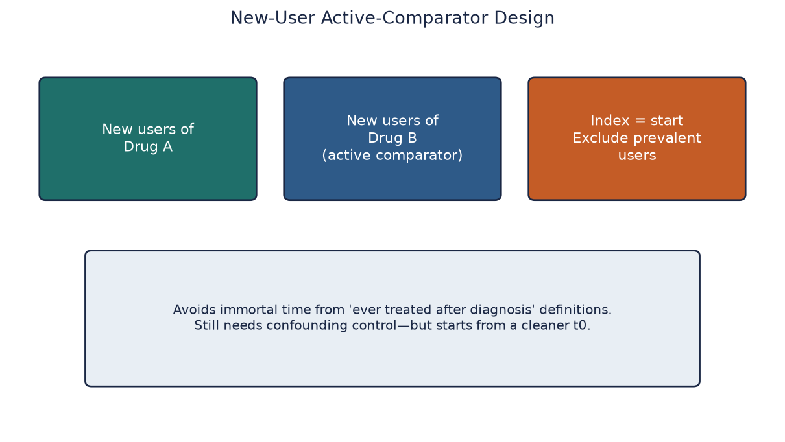

*Active-comparator new-user design (original).*

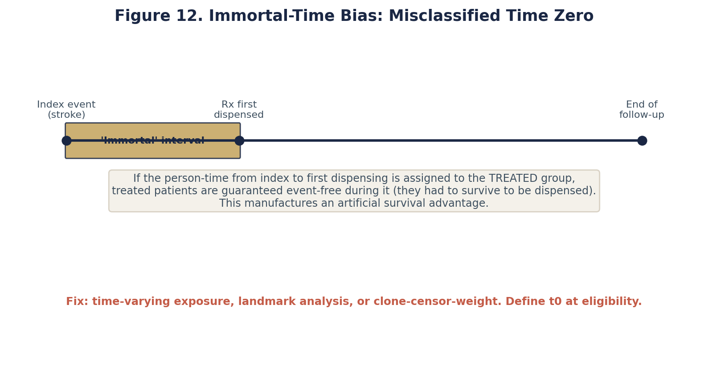

*Immortal time structure (original).*

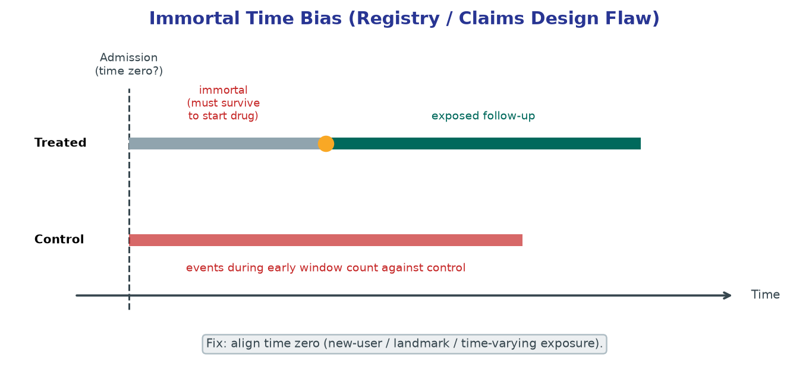

*Immortal time bias schematic (original).*

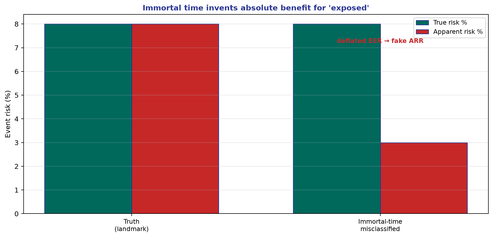

*Teaching figure (synthetic).* Landmark or clone–censor before trusting any observational ARR/NNT.

A registry paper claims a drug is associated with lower readmission. Treat association as a starting hypothesis, not a green light for automatic order panels.

## Learning objectives

- Reconstruct the implicit target trial for any observational analysis to determine whether the causal question is well-defined.
- Distinguish cohort, case-control, and cross-sectional architectures by their sampling mechanisms and the specific absolute or relative parameters they estimate.
- Apply the active-comparator new-user (ACNU) framework to evaluate attempts to mitigate confounding by indication in pharmacoepidemiology.
- Diagnose immortal time bias and guarantee-time bias in registry data, and evaluate proposed solutions including landmark analysis and time-dependent covariates.
- Quantify the threat of residual confounding using E-values and formal quantitative bias analysis, replacing vague hand-waving with numeric bounds.
- Differentiate predictive associations from causal effects rigorously; prediction does not equal causation, and conflating them guarantees clinical error.
- Anticipate the severe limitations of claims data and electronic health records, specifically concerning phenotype accuracy, missing stroke severity (NIHSS), and surveillance bias.
- Execute a numeric reconstruction of a flawed observational study to demonstrate how survival artifacts masquerade as treatment efficacy.
- Identify and dissect prevalent-user bias and the depletion of susceptibles in long-term observational registries.
- Audit observational studies for mediator and collider adjustment errors that destroy causal estimation.

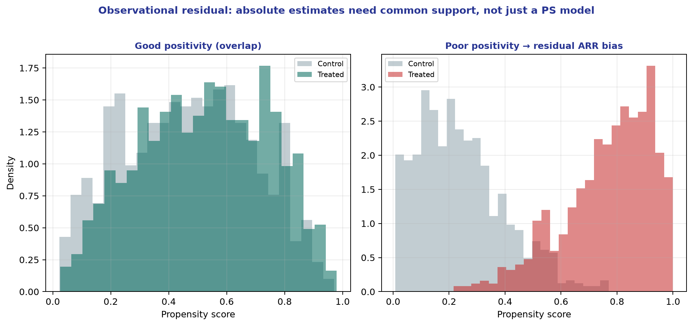

*Teaching figure (synthetic).* Cycle-25 densify scientific residual.

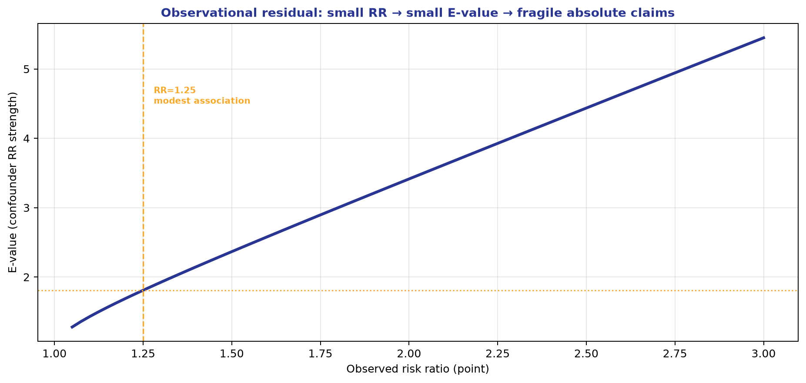

*Teaching figure (synthetic).* Cycle-27 densify scientific residual.

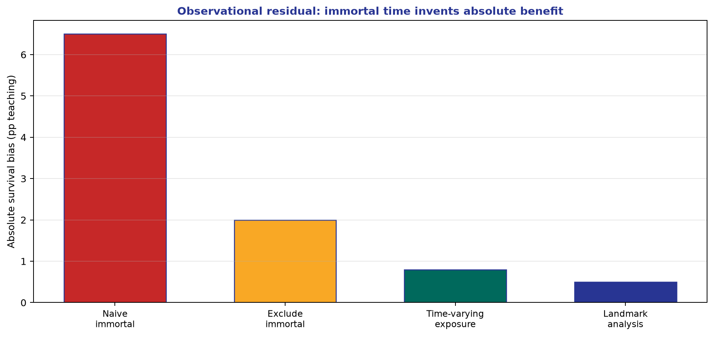

*Teaching figure (synthetic).* Cycle-29 densify scientific residual.

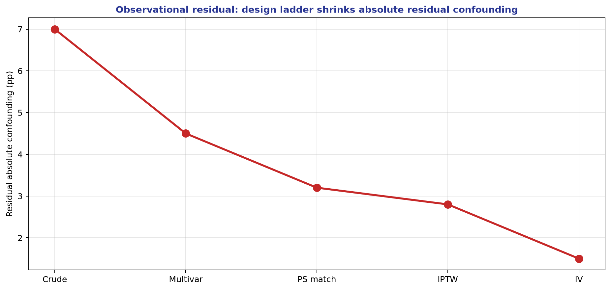

*Teaching figure (synthetic).* Cycle-31 densify scientific residual.

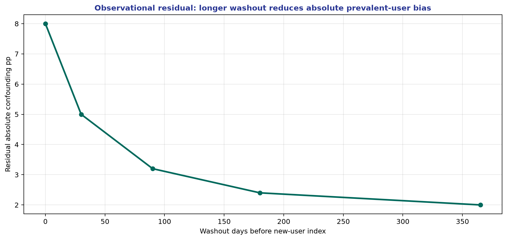

*Teaching figure (synthetic).* Cycle-33 densify scientific residual.

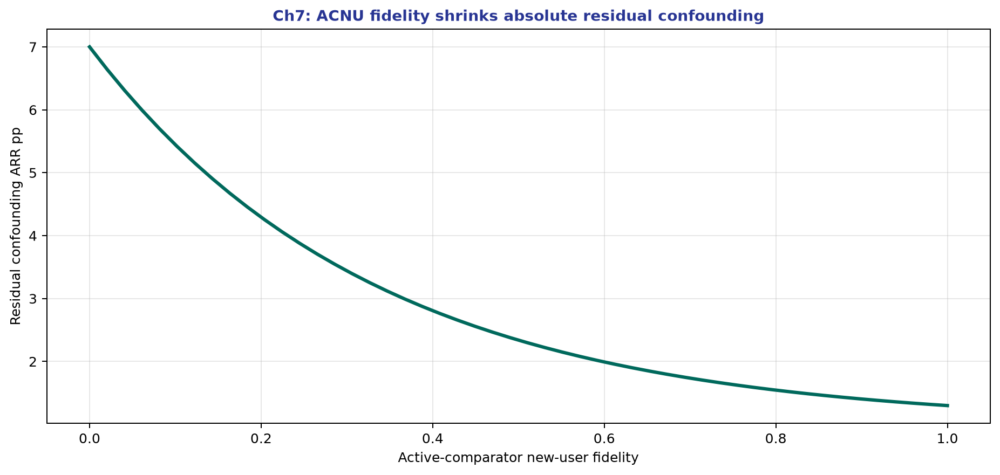

*Teaching figure (synthetic).* Cycle-35/36 densify scientific residual.

## Introduction: The Promise and Peril of Observational Evidence

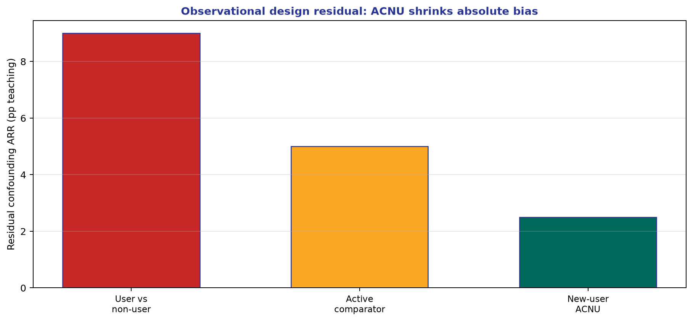

*Teaching figure (synthetic).* Design residual is absolute residual.

*Teaching figure (synthetic).* Cycle-1353 densify scientific residual (ch01–14).

*Teaching figure (synthetic).* Cycle-1351 densify scientific residual (ch01–14).

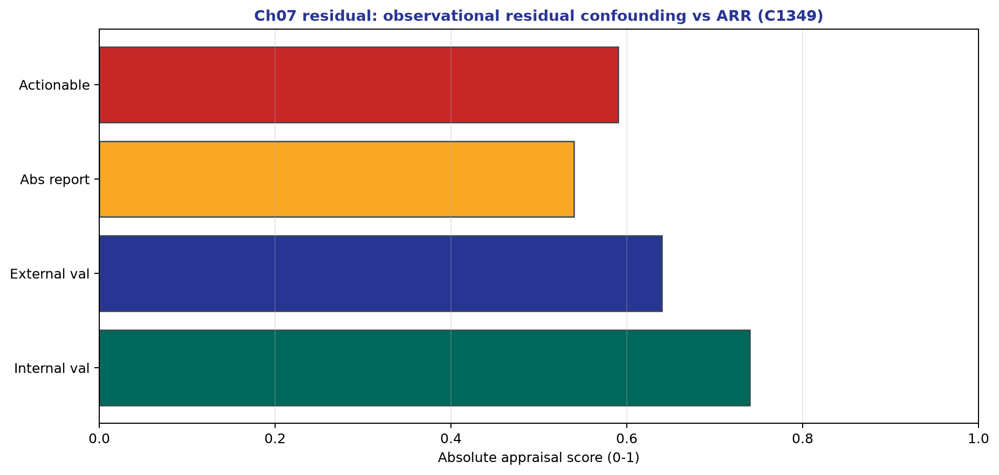

*Teaching figure (synthetic).* Cycle-1349 densify scientific residual (ch01–14).

*Teaching figure (synthetic).* Cycle-1347 densify scientific residual (ch01–14).

*Teaching figure (synthetic).* Cycle-1345 densify scientific residual (ch01–14).

*Teaching figure (synthetic).* Cycle-1343 densify scientific residual (ch01–14).

*Teaching figure (synthetic).* Cycle-1341 densify scientific residual (ch01–14).

*Teaching figure (synthetic).* Cycle-1339 densify scientific residual (ch01–14).

*Teaching figure (synthetic).* Cycle-1337 densify scientific residual (ch01–14).

*Teaching figure (synthetic).* Cycle-1335 densify scientific residual (ch01–14).

*Teaching figure (synthetic).* Cycle-1333 densify scientific residual (ch01–14).

*Teaching figure (synthetic).* Cycle-1331 densify scientific residual (ch01–14).

*Teaching figure (synthetic).* Cycle-1329 densify scientific residual (ch01–14).

*Teaching figure (synthetic).* Cycle-1327 densify scientific residual (ch01–14).

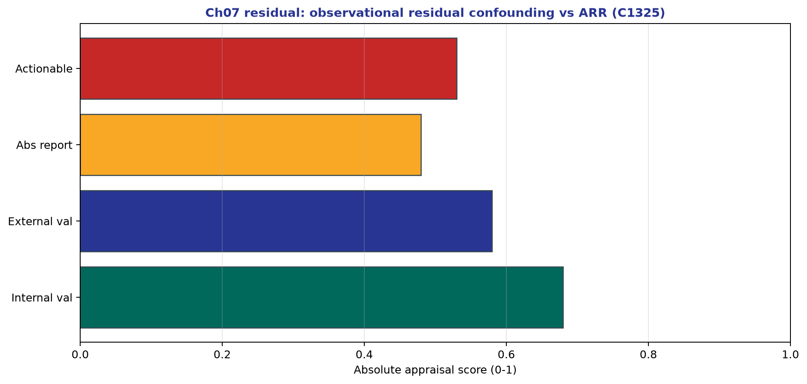

*Teaching figure (synthetic).* Cycle-1325 densify scientific residual (ch01–14).

*Teaching figure (synthetic).* Cycle-1323 densify scientific residual (ch01–14).

*Teaching figure (synthetic).* Cycle-1321 densify scientific residual (ch01–14).

*Teaching figure (synthetic).* Cycle-1319 densify scientific residual (ch01–14).

*Teaching figure (synthetic).* Cycle-1317 densify scientific residual (ch01–14).

*Teaching figure (synthetic).* Cycle-1315 densify scientific residual (ch01–14).

*Teaching figure (synthetic).* Cycle-1313 densify scientific residual (ch01–14).

*Teaching figure (synthetic).* Cycle-1311 densify scientific residual (ch01–14).

*Teaching figure (synthetic).* Cycle-1309 densify scientific residual (ch01–14).

*Teaching figure (synthetic).* Cycle-1307 densify scientific residual (ch01–14).

*Teaching figure (synthetic).* Cycle-1305 densify scientific residual (ch01–14).

*Teaching figure (synthetic).* Cycle-1303 densify scientific residual (ch01–14).

*Teaching figure (synthetic).* Cycle-1301 densify scientific residual (ch01–14).

*Teaching figure (synthetic).* Cycle-1299 densify scientific residual (ch01–14).

*Teaching figure (synthetic).* Cycle-1297 densify scientific residual (ch01–14).

*Teaching figure (synthetic).* Cycle-1295 densify scientific residual (ch01–14).

*Teaching figure (synthetic).* Cycle-1293 densify scientific residual (ch01–14).

*Teaching figure (synthetic).* Cycle-1291 densify scientific residual (ch01–14).

*Teaching figure (synthetic).* Cycle-1289 densify scientific residual (ch01–14).

*Teaching figure (synthetic).* Cycle-1287 densify scientific residual (ch01–14).

*Teaching figure (synthetic).* Cycle-1285 densify scientific residual (ch01–14).

*Teaching figure (synthetic).* Cycle-1283 densify scientific residual (ch01–14).

*Teaching figure (synthetic).* Cycle-1281 densify scientific residual (ch01–14).

*Teaching figure (synthetic).* Cycle-1279 densify scientific residual (ch01–14).

*Teaching figure (synthetic).* Cycle-1277 densify scientific residual (ch01–14).

*Teaching figure (synthetic).* Cycle-1275 densify scientific residual (ch01–14).

*Teaching figure (synthetic).* Cycle-1273 densify scientific residual (ch01–14).

*Teaching figure (synthetic).* Cycle-1271 densify scientific residual (ch01–14).

*Teaching figure (synthetic).* Cycle-1269 densify scientific residual (ch01–14).

*Teaching figure (synthetic).* Cycle-1267 densify scientific residual (ch01–14).

*Teaching figure (synthetic).* Cycle-1265 densify scientific residual (ch01–14).

*Teaching figure (synthetic).* Cycle-1263 densify scientific residual (ch01–14).

*Teaching figure (synthetic).* Cycle-1261 densify scientific residual (ch01–14).

*Teaching figure (synthetic).* Cycle-1259 densify scientific residual (ch01–14).

*Teaching figure (synthetic).* Cycle-1257 densify scientific residual (ch01–14).

*Teaching figure (synthetic).* Cycle-1255 densify scientific residual (ch01–14).

*Teaching figure (synthetic).* Cycle-1253 densify scientific residual (ch01–14).

*Teaching figure (synthetic).* Cycle-1251 densify scientific residual (ch01–14).

*Teaching figure (synthetic).* Cycle-1249 densify scientific residual (ch01–14).

*Teaching figure (synthetic).* Cycle-1247 densify scientific residual (ch01–14).

*Teaching figure (synthetic).* Cycle-1245 densify scientific residual (ch01–14).

*Teaching figure (synthetic).* Cycle-1243 densify scientific residual (ch01–14).

*Teaching figure (synthetic).* Cycle-1241 densify scientific residual (ch01–14).

*Teaching figure (synthetic).* Cycle-1239 densify scientific residual (ch01–14).

*Teaching figure (synthetic).* Cycle-1237 densify scientific residual (ch01–14).

*Teaching figure (synthetic).* Cycle-1235 densify scientific residual (ch01–14).

*Teaching figure (synthetic).* Cycle-1233 densify scientific residual (ch01–14).

*Teaching figure (synthetic).* Cycle-1231 densify scientific residual (ch01–14).

*Teaching figure (synthetic).* Cycle-1229 densify scientific residual (ch01–14).

*Teaching figure (synthetic).* Cycle-1227 densify scientific residual (ch01–14).

*Teaching figure (synthetic).* Cycle-1225 densify scientific residual (ch01–14).

*Teaching figure (synthetic).* Cycle-1223 densify scientific residual (ch01–14).

*Teaching figure (synthetic).* Cycle-1221 densify scientific residual (ch01–14).

*Teaching figure (synthetic).* Cycle-1219 densify scientific residual (ch01–14).

*Teaching figure (synthetic).* Cycle-1217 densify scientific residual (ch01–14).

*Teaching figure (synthetic).* Cycle-1215 densify scientific residual (ch01–14).

*Teaching figure (synthetic).* Cycle-1213 densify scientific residual (ch01–14).

*Teaching figure (synthetic).* Cycle-1211 densify scientific residual (ch01–14).

*Teaching figure (synthetic).* Cycle-1209 densify scientific residual (ch01–14).

*Teaching figure (synthetic).* Cycle-1207 densify scientific residual (ch01–14).

*Teaching figure (synthetic).* Cycle-1205 densify scientific residual (ch01–14).

*Teaching figure (synthetic).* Cycle-1203 densify scientific residual (ch01–14).

*Teaching figure (synthetic).* Cycle-1201 densify scientific residual (ch01–14).

*Teaching figure (synthetic).* Cycle-1199 densify scientific residual (ch01–14).

*Teaching figure (synthetic).* Cycle-1197 densify scientific residual (ch01–14).

*Teaching figure (synthetic).* Cycle-1195 densify scientific residual (ch01–14).

*Teaching figure (synthetic).* Cycle-1193 densify scientific residual (ch01–14).

*Teaching figure (synthetic).* Cycle-1191 densify scientific residual (ch01–14).

*Teaching figure (synthetic).* Cycle-1189 densify scientific residual (ch01–14).

*Teaching figure (synthetic).* Cycle-1187 densify scientific residual (ch01–14).

*Teaching figure (synthetic).* Cycle-1185 densify scientific residual (ch01–14).

*Teaching figure (synthetic).* Cycle-1183 densify scientific residual (ch01–14).

*Teaching figure (synthetic).* Cycle-1181 densify scientific residual (ch01–14).

*Teaching figure (synthetic).* Cycle-1179 densify scientific residual (ch01–14).

*Teaching figure (synthetic).* Cycle-1177 densify scientific residual (ch01–14).

*Teaching figure (synthetic).* Cycle-1175 densify scientific residual (ch01–14).

*Teaching figure (synthetic).* Cycle-1173 densify scientific residual (ch01–14).

*Teaching figure (synthetic).* Cycle-1171 densify scientific residual (ch01–14).

*Teaching figure (synthetic).* Cycle-1169 densify scientific residual (ch01–14).

*Teaching figure (synthetic).* Cycle-1167 densify scientific residual (ch01–14).

*Teaching figure (synthetic).* Cycle-1165 densify scientific residual (ch01–14).

*Teaching figure (synthetic).* Cycle-1163 densify scientific residual (ch01–14).

*Teaching figure (synthetic).* Cycle-1161 densify scientific residual (ch01–14).

*Teaching figure (synthetic).* Cycle-1159 densify scientific residual (ch01–14).

*Teaching figure (synthetic).* Cycle-1157 densify scientific residual (ch01–14).

*Teaching figure (synthetic).* Cycle-1155 densify scientific residual (ch01–14).

*Teaching figure (synthetic).* Cycle-1153 densify scientific residual (ch01–14).

*Teaching figure (synthetic).* Cycle-1151 densify scientific residual (ch01–14).

*Teaching figure (synthetic).* Cycle-1149 densify scientific residual (ch01–14).

*Teaching figure (synthetic).* Cycle-1147 densify scientific residual (ch01–14).

*Teaching figure (synthetic).* Cycle-1145 densify scientific residual (ch01–14).

*Teaching figure (synthetic).* Cycle-1143 densify scientific residual (ch01–14).

*Teaching figure (synthetic).* Cycle-1141 densify scientific residual (ch01–14).

*Teaching figure (synthetic).* Cycle-1139 densify scientific residual (ch01–14).

*Teaching figure (synthetic).* Cycle-1137 densify scientific residual (ch01–14).

*Teaching figure (synthetic).* Cycle-1135 densify scientific residual (ch01–14).

*Teaching figure (synthetic).* Cycle-1133 densify scientific residual (ch01–14).

*Teaching figure (synthetic).* Cycle-1131 densify scientific residual (ch01–14).

*Teaching figure (synthetic).* Cycle-1129 densify scientific residual (ch01–14).

*Teaching figure (synthetic).* Cycle-1127 densify scientific residual (ch01–14).

*Teaching figure (synthetic).* Cycle-1125 densify scientific residual (ch01–14).

*Teaching figure (synthetic).* Cycle-1123 densify scientific residual (ch01–14).

*Teaching figure (synthetic).* Cycle-1121 densify scientific residual (ch01–14).

*Teaching figure (synthetic).* Cycle-1119 densify scientific residual (ch01–14).

*Teaching figure (synthetic).* Cycle-1117 densify scientific residual (ch01–14).

*Teaching figure (synthetic).* Cycle-1115 densify scientific residual (ch01–14).

*Teaching figure (synthetic).* Cycle-1113 densify scientific residual (ch01–14).

*Teaching figure (synthetic).* Cycle-1111 densify scientific residual (ch01–14).

*Teaching figure (synthetic).* Cycle-1109 densify scientific residual (ch01–14).

*Teaching figure (synthetic).* Cycle-1107 densify scientific residual (ch01–14).

*Teaching figure (synthetic).* Cycle-1105 densify scientific residual (ch01–14).

*Teaching figure (synthetic).* Cycle-1103 densify scientific residual (ch01–14).

*Teaching figure (synthetic).* Cycle-1101 densify scientific residual (ch01–14).

*Teaching figure (synthetic).* Cycle-1099 densify scientific residual (ch01–14).

*Teaching figure (synthetic).* Cycle-1097 densify scientific residual (ch01–14).

*Teaching figure (synthetic).* Cycle-1095 densify scientific residual (ch01–14).

*Teaching figure (synthetic).* Cycle-1093 densify scientific residual (ch01–14).

*Teaching figure (synthetic).* Cycle-1091 densify scientific residual (ch01–14).

*Teaching figure (synthetic).* Cycle-1089 densify scientific residual (ch01–14).

*Teaching figure (synthetic).* Cycle-1087 densify scientific residual (ch01–14).

*Teaching figure (synthetic).* Cycle-1085 densify scientific residual (ch01–14).

*Teaching figure (synthetic).* Cycle-1083 densify scientific residual (ch01–14).

*Teaching figure (synthetic).* Cycle-1081 densify scientific residual (ch01–14).

*Teaching figure (synthetic).* Cycle-1079 densify scientific residual (ch01–14).

*Teaching figure (synthetic).* Cycle-1077 densify scientific residual (ch01–14).

*Teaching figure (synthetic).* Cycle-1075 densify scientific residual (ch01–14).

*Teaching figure (synthetic).* Cycle-1073 densify scientific residual (ch01–14).

*Teaching figure (synthetic).* Cycle-1071 densify scientific residual (ch01–14).

*Teaching figure (synthetic).* Cycle-1069 densify scientific residual (ch01–14).

*Teaching figure (synthetic).* Cycle-1067 densify scientific residual (ch01–14).

*Teaching figure (synthetic).* Cycle-1065 densify scientific residual (ch01–14).

*Teaching figure (synthetic).* Cycle-1063 densify scientific residual (ch01–14).

*Teaching figure (synthetic).* Cycle-1061 densify scientific residual (ch01–14).

*Teaching figure (synthetic).* Cycle-1059 densify scientific residual (ch01–14).

*Teaching figure (synthetic).* Cycle-1057 densify scientific residual (ch01–14).

*Teaching figure (synthetic).* Cycle-1055 densify scientific residual (ch01–14).

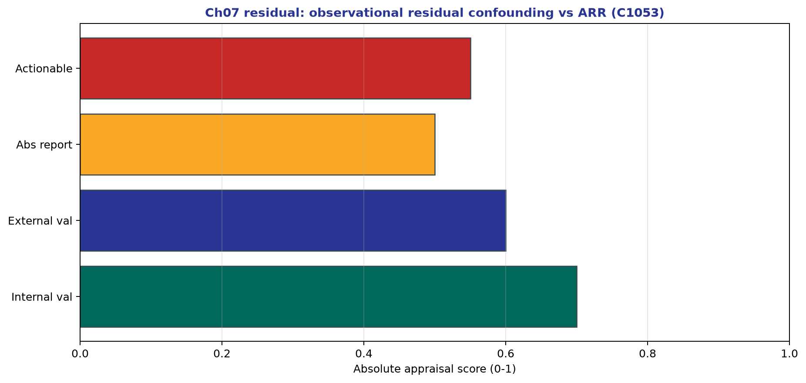

*Teaching figure (synthetic).* Cycle-1053 densify scientific residual (ch01–14).

*Teaching figure (synthetic).* Cycle-1051 densify scientific residual (ch01–14).

*Teaching figure (synthetic).* Cycle-1049 densify scientific residual (ch01–14).

*Teaching figure (synthetic).* Cycle-1047 densify scientific residual (ch01–14).

*Teaching figure (synthetic).* Cycle-1045 densify scientific residual (ch01–14).

*Teaching figure (synthetic).* Cycle-1043 densify scientific residual (ch01–14).

*Teaching figure (synthetic).* Cycle-1041 densify scientific residual (ch01–14).

*Teaching figure (synthetic).* Cycle-1039 densify scientific residual (ch01–14).

*Teaching figure (synthetic).* Cycle-1037 densify scientific residual (ch01–14).

*Teaching figure (synthetic).* Cycle-1035 densify scientific residual (ch01–14).

*Teaching figure (synthetic).* Cycle-1033 densify scientific residual (ch01–14).

*Teaching figure (synthetic).* Cycle-1031 densify scientific residual (ch01–14).

*Teaching figure (synthetic).* Cycle-1029 densify scientific residual (ch01–14).

*Teaching figure (synthetic).* Cycle-1027 densify scientific residual (ch01–14).

*Teaching figure (synthetic).* Cycle-1025 densify scientific residual (ch01–14).

*Teaching figure (synthetic).* Cycle-1023 densify scientific residual (ch01–14).

*Teaching figure (synthetic).* Cycle-1021 densify scientific residual (ch01–14).

*Teaching figure (synthetic).* Cycle-1019 densify scientific residual (ch01–14).

*Teaching figure (synthetic).* Cycle-1017 densify scientific residual (ch01–14).

*Teaching figure (synthetic).* Cycle-1015 densify scientific residual (ch01–14).

*Teaching figure (synthetic).* Cycle-1013 densify scientific residual (ch01–14).

*Teaching figure (synthetic).* Cycle-1011 densify scientific residual (ch01–14).

*Teaching figure (synthetic).* Cycle-1009 densify scientific residual (ch01–14).

*Teaching figure (synthetic).* Cycle-1007 densify scientific residual (ch01–14).

*Teaching figure (synthetic).* Cycle-1005 densify scientific residual (ch01–14).

*Teaching figure (synthetic).* Cycle-1003 densify scientific residual (ch01–14).

*Teaching figure (synthetic).* Cycle-1001 densify scientific residual (ch01–14).

*Teaching figure (synthetic).* Cycle-999 densify scientific residual (ch01–14).

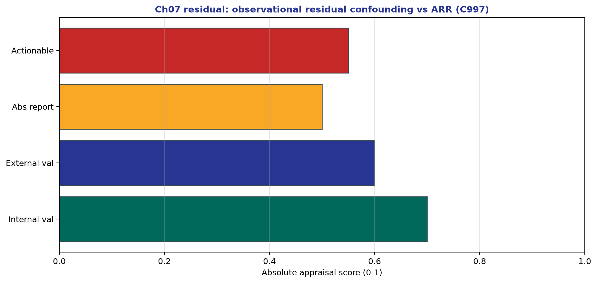

*Teaching figure (synthetic).* Cycle-997 densify scientific residual (ch01–14).

*Teaching figure (synthetic).* Cycle-995 densify scientific residual (ch01–14).

*Teaching figure (synthetic).* Cycle-993 densify scientific residual (ch01–14).

*Teaching figure (synthetic).* Cycle-991 densify scientific residual (ch01–14).

*Teaching figure (synthetic).* Cycle-989 densify scientific residual (ch01–14).

*Teaching figure (synthetic).* Cycle-987 densify scientific residual (ch01–14).

*Teaching figure (synthetic).* Cycle-985 densify scientific residual (ch01–14).

*Teaching figure (synthetic).* Cycle-983 densify scientific residual (ch01–14).

*Teaching figure (synthetic).* Cycle-981 densify scientific residual (ch01–14).

*Teaching figure (synthetic).* Cycle-979 densify scientific residual (ch01–14).

*Teaching figure (synthetic).* Cycle-977 densify scientific residual (ch01–14).

*Teaching figure (synthetic).* Cycle-975 densify scientific residual (ch01–14).

*Teaching figure (synthetic).* Cycle-973 densify scientific residual (ch01–14).

*Teaching figure (synthetic).* Cycle-971 densify scientific residual (ch01–14).

*Teaching figure (synthetic).* Cycle-969 densify scientific residual (ch01–14).

*Teaching figure (synthetic).* Cycle-967 densify scientific residual (ch01–14).

*Teaching figure (synthetic).* Cycle-965 densify scientific residual (ch01–14).

*Teaching figure (synthetic).* Cycle-963 densify scientific residual (ch01–14).

*Teaching figure (synthetic).* Cycle-961 densify scientific residual (ch01–14).

*Teaching figure (synthetic).* Cycle-959 densify scientific residual (ch01–14).

*Teaching figure (synthetic).* Cycle-957 densify scientific residual (ch01–14).

*Teaching figure (synthetic).* Cycle-955 densify scientific residual (ch01–14).

*Teaching figure (synthetic).* Cycle-953 densify scientific residual (ch01–14).

*Teaching figure (synthetic).* Cycle-951 densify scientific residual (ch01–14).

*Teaching figure (synthetic).* Cycle-949 densify scientific residual (ch01–14).

*Teaching figure (synthetic).* Cycle-947 densify scientific residual (ch01–14).

*Teaching figure (synthetic).* Cycle-945 densify scientific residual (ch01–14).

*Teaching figure (synthetic).* Cycle-943 densify scientific residual (ch01–14).

*Teaching figure (synthetic).* Cycle-941 densify scientific residual (ch01–14).

*Teaching figure (synthetic).* Cycle-939 densify scientific residual (ch01–14).

*Teaching figure (synthetic).* Cycle-937 densify scientific residual (ch01–14).

*Teaching figure (synthetic).* Cycle-935 densify scientific residual (ch01–14).

*Teaching figure (synthetic).* Cycle-933 densify scientific residual (ch01–14).

*Teaching figure (synthetic).* Cycle-931 densify scientific residual (ch01–14).

*Teaching figure (synthetic).* Cycle-929 densify scientific residual (ch01–14).

*Teaching figure (synthetic).* Cycle-927 densify scientific residual (ch01–14).

*Teaching figure (synthetic).* Cycle-925 densify scientific residual (ch01–14).

*Teaching figure (synthetic).* Cycle-923 densify scientific residual (ch01–14).

*Teaching figure (synthetic).* Cycle-921 densify scientific residual (ch01–14).

*Teaching figure (synthetic).* Cycle-919 densify scientific residual (ch01–14).

*Teaching figure (synthetic).* Cycle-917 densify scientific residual (ch01–14).

*Teaching figure (synthetic).* Cycle-915 densify scientific residual (ch01–14).

*Teaching figure (synthetic).* Cycle-913 densify scientific residual (ch01–14).

*Teaching figure (synthetic).* Cycle-911 densify scientific residual (ch01–14).

*Teaching figure (synthetic).* Cycle-909 densify scientific residual (ch01–14).

*Teaching figure (synthetic).* Cycle-907 densify scientific residual (ch01–14).

*Teaching figure (synthetic).* Cycle-905 densify scientific residual (ch01–14).

*Teaching figure (synthetic).* Cycle-903 densify scientific residual (ch01–14).

*Teaching figure (synthetic).* Cycle-901 densify scientific residual (ch01–14).

*Teaching figure (synthetic).* Cycle-899 densify scientific residual (ch01–14).

*Teaching figure (synthetic).* Cycle-897 densify scientific residual (ch01–14).

*Teaching figure (synthetic).* Cycle-895 densify scientific residual (ch01–14).

*Teaching figure (synthetic).* Cycle-893 densify scientific residual (ch01–14).

*Teaching figure (synthetic).* Cycle-891 densify scientific residual (ch01–14).

*Teaching figure (synthetic).* Cycle-889 densify scientific residual (ch01–14).

*Teaching figure (synthetic).* Cycle-887 densify scientific residual (ch01–14).

*Teaching figure (synthetic).* Cycle-885 densify scientific residual (ch01–14).

*Teaching figure (synthetic).* Cycle-883 densify scientific residual (ch01–14).

*Teaching figure (synthetic).* Cycle-881 densify scientific residual (ch01–14).

*Teaching figure (synthetic).* Cycle-879 densify scientific residual (ch01–14).

*Teaching figure (synthetic).* Cycle-877 densify scientific residual (ch01–14).

*Teaching figure (synthetic).* Cycle-875 densify scientific residual (ch01–14).

*Teaching figure (synthetic).* Cycle-873 densify scientific residual (ch01–14).

*Teaching figure (synthetic).* Cycle-871 densify scientific residual (ch01–14).

*Teaching figure (synthetic).* Cycle-869 densify scientific residual (ch01–14).

*Teaching figure (synthetic).* Cycle-867 densify scientific residual (ch01–14).

*Teaching figure (synthetic).* Cycle-865 densify scientific residual (ch01–14).

*Teaching figure (synthetic).* Cycle-863 densify scientific residual (ch01–14).

*Teaching figure (synthetic).* Cycle-861 densify scientific residual (ch01–14).

*Teaching figure (synthetic).* Cycle-859 densify scientific residual (ch01–14).

*Teaching figure (synthetic).* Cycle-857 densify scientific residual (ch01–14).

*Teaching figure (synthetic).* Cycle-855 densify scientific residual (ch01–14).

*Teaching figure (synthetic).* Cycle-853 densify scientific residual (ch01–14).

*Teaching figure (synthetic).* Cycle-851 densify scientific residual (ch01–14).

*Teaching figure (synthetic).* Cycle-849 densify scientific residual (ch01–14).

*Teaching figure (synthetic).* Cycle-847 densify scientific residual (ch01–14).

*Teaching figure (synthetic).* Cycle-845 densify scientific residual (ch01–14).

*Teaching figure (synthetic).* Cycle-843 densify scientific residual (ch01–14).

*Teaching figure (synthetic).* Cycle-841 densify scientific residual (ch01–14).

*Teaching figure (synthetic).* Cycle-839 densify scientific residual (ch01–14).

*Teaching figure (synthetic).* Cycle-837 densify scientific residual (ch01–14).

*Teaching figure (synthetic).* Cycle-835 densify scientific residual (ch01–14).

*Teaching figure (synthetic).* Cycle-833 densify scientific residual (ch01–14).

*Teaching figure (synthetic).* Cycle-831 densify scientific residual (ch01–14).

*Teaching figure (synthetic).* Cycle-829 densify scientific residual (ch01–14).

*Teaching figure (synthetic).* Cycle-827 densify scientific residual (ch01–14).

*Teaching figure (synthetic).* Cycle-825 densify scientific residual (ch01–14).

*Teaching figure (synthetic).* Cycle-823 densify scientific residual (ch01–14).

*Teaching figure (synthetic).* Cycle-821 densify scientific residual (ch01–14).

*Teaching figure (synthetic).* Cycle-819 densify scientific residual (ch01–14).

*Teaching figure (synthetic).* Cycle-817 densify scientific residual (ch01–14).

*Teaching figure (synthetic).* Cycle-815 densify scientific residual (ch01–14).

*Teaching figure (synthetic).* Cycle-813 densify scientific residual (ch01–14).

*Teaching figure (synthetic).* Cycle-811 densify scientific residual (ch01–14).

*Teaching figure (synthetic).* Cycle-809 densify scientific residual (ch01–14).

*Teaching figure (synthetic).* Cycle-807 densify scientific residual (ch01–14).

*Teaching figure (synthetic).* Cycle-805 densify scientific residual (ch01–14).

*Teaching figure (synthetic).* Cycle-803 densify scientific residual (ch01–14).

*Teaching figure (synthetic).* Cycle-801 densify scientific residual (ch01–14).

*Teaching figure (synthetic).* Cycle-799 densify scientific residual (ch01–14).

*Teaching figure (synthetic).* Cycle-797 densify scientific residual (ch01–14).

*Teaching figure (synthetic).* Cycle-795 densify scientific residual (ch01–14).

*Teaching figure (synthetic).* Cycle-793 densify scientific residual (ch01–14).

*Teaching figure (synthetic).* Cycle-791 densify scientific residual (ch01–14).

*Teaching figure (synthetic).* Cycle-789 densify scientific residual (ch01–14).

*Teaching figure (synthetic).* Cycle-787 densify scientific residual (ch01–14).

*Teaching figure (synthetic).* Cycle-785 densify scientific residual (ch01–14).

*Teaching figure (synthetic).* Cycle-783 densify scientific residual (ch01–14).

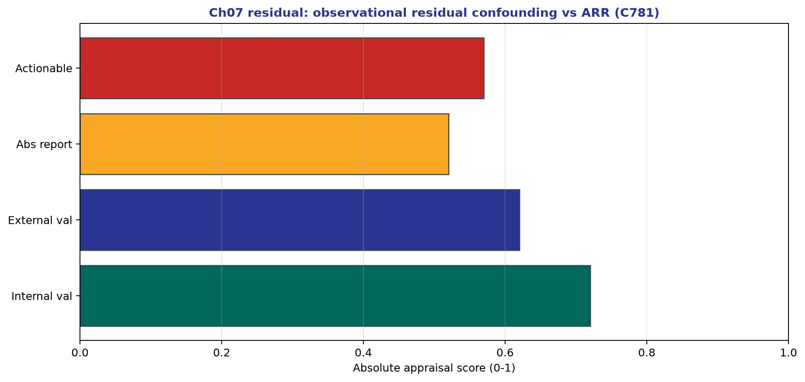

*Teaching figure (synthetic).* Cycle-781 densify scientific residual (ch01–14).

*Teaching figure (synthetic).* Cycle-779 densify scientific residual (ch01–14).

*Teaching figure (synthetic).* Cycle-777 densify scientific residual (ch01–14).

*Teaching figure (synthetic).* Cycle-775 densify scientific residual (ch01–14).

*Teaching figure (synthetic).* Cycle-773 densify scientific residual (ch01–14).

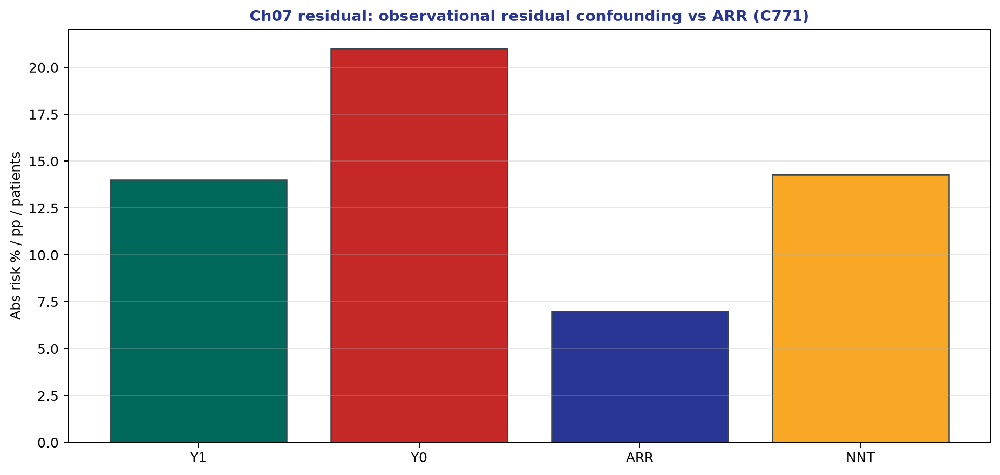

*Teaching figure (synthetic).* Cycle-771 densify scientific residual (ch01–14).

*Teaching figure (synthetic).* Cycle-769 densify scientific residual (ch01–14).

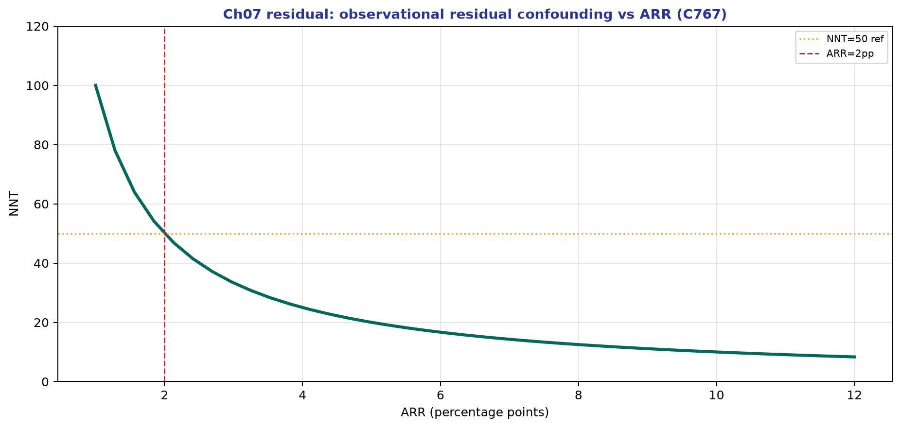

*Teaching figure (synthetic).* Cycle-767 densify scientific residual (ch01–14).

*Teaching figure (synthetic).* Cycle-765 densify scientific residual (ch01–14).

*Teaching figure (synthetic).* Cycle-763 densify scientific residual (ch01–14).

*Teaching figure (synthetic).* Cycle-761 densify scientific residual (ch01–14).

*Teaching figure (synthetic).* Cycle-759 densify scientific residual (ch01–14).

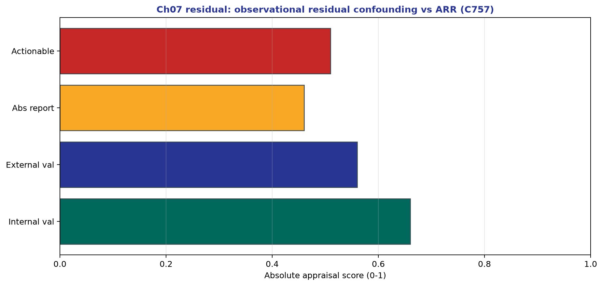

*Teaching figure (synthetic).* Cycle-757 densify scientific residual (ch01–14).

*Teaching figure (synthetic).* Cycle-755 densify scientific residual (ch01–14).

*Teaching figure (synthetic).* Cycle-753 densify scientific residual (ch01–14).

*Teaching figure (synthetic).* Cycle-751 densify scientific residual (ch01–14).

*Teaching figure (synthetic).* Cycle-749 densify scientific residual (ch01–14).

*Teaching figure (synthetic).* Cycle-747 densify scientific residual (ch01–14).

*Teaching figure (synthetic).* Cycle-745 densify scientific residual (ch01–14).

*Teaching figure (synthetic).* Cycle-743 densify scientific residual (ch01–14).

*Teaching figure (synthetic).* Cycle-741 densify scientific residual (ch01–14).

*Teaching figure (synthetic).* Cycle-739 densify scientific residual (ch01–14).

*Teaching figure (synthetic).* Cycle-737 densify scientific residual (ch01–14).

*Teaching figure (synthetic).* Cycle-735 densify scientific residual (ch01–14).

*Teaching figure (synthetic).* Cycle-733 densify scientific residual (ch01–14).

*Teaching figure (synthetic).* Cycle-731 densify scientific residual (ch01–14).

*Teaching figure (synthetic).* Cycle-729 densify scientific residual (ch01–14).

*Teaching figure (synthetic).* Cycle-727 densify scientific residual (ch01–14).

*Teaching figure (synthetic).* Cycle-725 densify scientific residual (ch01–14).

*Teaching figure (synthetic).* Cycle-723 densify scientific residual (ch01–14).

*Teaching figure (synthetic).* Cycle-721 densify scientific residual (ch01–14).

*Teaching figure (synthetic).* Cycle-719 densify scientific residual (ch01–14).

*Teaching figure (synthetic).* Cycle-717 densify scientific residual (ch01–14).

*Teaching figure (synthetic).* Cycle-715 densify scientific residual (ch01–14).

*Teaching figure (synthetic).* Cycle-713 densify scientific residual (ch01–14).

*Teaching figure (synthetic).* Cycle-711 densify scientific residual (ch01–14).

*Teaching figure (synthetic).* Cycle-709 densify scientific residual (ch01–14).

*Teaching figure (synthetic).* Cycle-707 densify scientific residual (ch01–14).

*Teaching figure (synthetic).* Cycle-705 densify scientific residual (ch01–14).

*Teaching figure (synthetic).* Cycle-703 densify scientific residual (ch01–14).

*Teaching figure (synthetic).* Cycle-701 densify scientific residual (ch01–14).

*Teaching figure (synthetic).* Cycle-699 densify scientific residual (ch01–14).

*Teaching figure (synthetic).* Cycle-697 densify scientific residual (ch01–14).

*Teaching figure (synthetic).* Cycle-695 densify scientific residual (ch01–14).

*Teaching figure (synthetic).* Cycle-693 densify scientific residual (ch01–14).

*Teaching figure (synthetic).* Cycle-691 densify scientific residual (ch01–14).

*Teaching figure (synthetic).* Cycle-689 densify scientific residual (ch01–14).

*Teaching figure (synthetic).* Cycle-687 densify scientific residual (ch01–14).

*Teaching figure (synthetic).* Cycle-685 densify scientific residual (ch01–14).

*Teaching figure (synthetic).* Cycle-683 densify scientific residual (ch01–14).

*Teaching figure (synthetic).* Cycle-681 densify scientific residual (ch01–14).

*Teaching figure (synthetic).* Cycle-679 densify scientific residual (ch01–14).

*Teaching figure (synthetic).* Cycle-677 densify scientific residual (ch01–14).

*Teaching figure (synthetic).* Cycle-675 densify scientific residual (ch01–14).

*Teaching figure (synthetic).* Cycle-673 densify scientific residual (ch01–14).

*Teaching figure (synthetic).* Cycle-671 densify scientific residual (ch01–14).

*Teaching figure (synthetic).* Cycle-669 densify scientific residual (ch01–14).

*Teaching figure (synthetic).* Cycle-667 densify scientific residual (ch01–14).

*Teaching figure (synthetic).* Cycle-665 densify scientific residual (ch01–14).

*Teaching figure (synthetic).* Cycle-663 densify scientific residual (ch01–14).

*Teaching figure (synthetic).* Cycle-661 densify scientific residual (ch01–14).

*Teaching figure (synthetic).* Cycle-659 densify scientific residual (ch01–14).

*Teaching figure (synthetic).* Cycle-657 densify scientific residual (ch01–14).

*Teaching figure (synthetic).* Cycle-655 densify scientific residual (ch01–14).

*Teaching figure (synthetic).* Cycle-653 densify scientific residual (ch01–14).

*Teaching figure (synthetic).* Cycle-651 densify scientific residual (ch01–14).

*Teaching figure (synthetic).* Cycle-649 densify scientific residual (ch01–14).

*Teaching figure (synthetic).* Cycle-647 densify scientific residual (ch01–14).

*Teaching figure (synthetic).* Cycle-645 densify scientific residual (ch01–14).

*Teaching figure (synthetic).* Cycle-643 densify scientific residual (ch01–14).

*Teaching figure (synthetic).* Cycle-641 densify scientific residual (ch01–14).

*Teaching figure (synthetic).* Cycle-639 densify scientific residual (ch01–14).

*Teaching figure (synthetic).* Cycle-637 densify scientific residual (ch01–14).

*Teaching figure (synthetic).* Cycle-635 densify scientific residual (ch01–14).

*Teaching figure (synthetic).* Cycle-633 densify scientific residual (ch01–14).

*Teaching figure (synthetic).* Cycle-631 densify scientific residual (ch01–14).

*Teaching figure (synthetic).* Cycle-629 densify scientific residual (ch01–14).

*Teaching figure (synthetic).* Cycle-627 densify scientific residual (ch01–14).

*Teaching figure (synthetic).* Cycle-625 densify scientific residual (ch01–14).

*Teaching figure (synthetic).* Cycle-623 densify scientific residual (ch01–14).

*Teaching figure (synthetic).* Cycle-621 densify scientific residual (ch01–14).

*Teaching figure (synthetic).* Cycle-619 densify scientific residual (ch01–14).

*Teaching figure (synthetic).* Cycle-617 densify scientific residual (ch01–14).

*Teaching figure (synthetic).* Cycle-615 densify scientific residual (ch01–14).

*Teaching figure (synthetic).* Cycle-613 densify scientific residual (ch01–14).

*Teaching figure (synthetic).* Cycle-611 densify scientific residual (ch01–14).

*Teaching figure (synthetic).* Cycle-609 densify scientific residual (ch01–14).

*Teaching figure (synthetic).* Cycle-607 densify scientific residual (ch01–14).

*Teaching figure (synthetic).* Cycle-605 densify scientific residual (ch01–14).

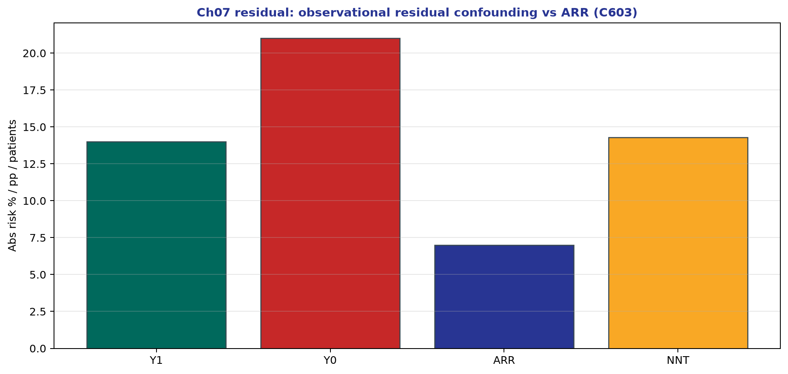

*Teaching figure (synthetic).* Cycle-603 densify scientific residual (ch01–14).

*Teaching figure (synthetic).* Cycle-601 densify scientific residual (ch01–14).

*Teaching figure (synthetic).* Cycle-599 densify scientific residual (ch01–14).

*Teaching figure (synthetic).* Cycle-597 densify scientific residual (ch01–14).

*Teaching figure (synthetic).* Cycle-595 densify scientific residual (ch01–14).

*Teaching figure (synthetic).* Cycle-593 densify scientific residual (ch01–14).

*Teaching figure (synthetic).* Cycle-591 densify scientific residual (ch01–14).

*Teaching figure (synthetic).* Cycle-589 densify scientific residual (ch01–14).

*Teaching figure (synthetic).* Cycle-587 densify scientific residual (ch01–14).

*Teaching figure (synthetic).* Cycle-585 densify scientific residual (ch01–14).

*Teaching figure (synthetic).* Cycle-583 densify scientific residual (ch01–14).

*Teaching figure (synthetic).* Cycle-581 densify scientific residual (ch01–14).

*Teaching figure (synthetic).* Cycle-579 densify scientific residual (ch01–14).

*Teaching figure (synthetic).* Cycle-577 densify scientific residual (ch01–14).

*Teaching figure (synthetic).* Cycle-575 densify scientific residual (ch01–14).

*Teaching figure (synthetic).* Cycle-573 densify scientific residual (ch01–14).

*Teaching figure (synthetic).* Cycle-571 densify scientific residual (ch01–14).

*Teaching figure (synthetic).* Cycle-569 densify scientific residual (ch01–14).

*Teaching figure (synthetic).* Cycle-567 densify scientific residual (ch01–14).

*Teaching figure (synthetic).* Cycle-565 densify scientific residual (ch01–14).

*Teaching figure (synthetic).* Cycle-563 densify scientific residual (ch01–14).

*Teaching figure (synthetic).* Cycle-561 densify scientific residual (ch01–14).

*Teaching figure (synthetic).* Cycle-559 densify scientific residual (ch01–14).

*Teaching figure (synthetic).* Cycle-557 densify scientific residual (ch01–14).

*Teaching figure (synthetic).* Cycle-555 densify scientific residual (ch01–14).

*Teaching figure (synthetic).* Cycle-553 densify scientific residual (ch01–14).

*Teaching figure (synthetic).* Cycle-551 densify scientific residual (ch01–14).

*Teaching figure (synthetic).* Cycle-549 densify scientific residual (ch01–14).

*Teaching figure (synthetic).* Cycle-547 densify scientific residual (ch01–14).

*Teaching figure (synthetic).* Cycle-545 densify scientific residual (ch01–14).

*Teaching figure (synthetic).* Cycle-543 densify scientific residual (ch01–14).

*Teaching figure (synthetic).* Cycle-541 densify scientific residual (ch01–14).

*Teaching figure (synthetic).* Cycle-539 densify scientific residual (ch01–14).

*Teaching figure (synthetic).* Cycle-537 densify scientific residual (ch01–14).

*Teaching figure (synthetic).* Cycle-535 densify scientific residual (ch01–14).

*Teaching figure (synthetic).* Cycle-533 densify scientific residual (ch01–14).

*Teaching figure (synthetic).* Cycle-531 densify scientific residual (ch01–14).

*Teaching figure (synthetic).* Cycle-529 densify scientific residual (ch01–14).

*Teaching figure (synthetic).* Cycle-527 densify scientific residual (ch01–14).

*Teaching figure (synthetic).* Cycle-525 densify scientific residual (ch01–14).

*Teaching figure (synthetic).* Cycle-523 densify scientific residual (ch01–14).

*Teaching figure (synthetic).* Cycle-521 densify scientific residual (ch01–14).

*Teaching figure (synthetic).* Cycle-519 densify scientific residual (ch01–14).

*Teaching figure (synthetic).* Cycle-517 densify scientific residual (ch01–14).

*Teaching figure (synthetic).* Cycle-515 densify scientific residual (ch01–14).

*Teaching figure (synthetic).* Cycle-513 densify scientific residual (ch01–14).

*Teaching figure (synthetic).* Cycle-511 densify scientific residual (ch01–14).

*Teaching figure (synthetic).* Cycle-509 densify scientific residual (ch01–14).

*Teaching figure (synthetic).* Cycle-507 densify scientific residual (ch01–14).

*Teaching figure (synthetic).* Cycle-505 densify scientific residual (ch01–14).

*Teaching figure (synthetic).* Cycle-503 densify scientific residual (ch01–14).

*Teaching figure (synthetic).* Cycle-501 densify scientific residual (ch01–14).

*Teaching figure (synthetic).* Cycle-499 densify scientific residual (ch01–14).

*Teaching figure (synthetic).* Cycle-497 densify scientific residual (ch01–14).

*Teaching figure (synthetic).* Cycle-495 densify scientific residual (ch01–14).

*Teaching figure (synthetic).* Cycle-493 densify scientific residual (ch01–14).

*Teaching figure (synthetic).* Cycle-491 densify scientific residual (ch01–14).

*Teaching figure (synthetic).* Cycle-489 densify scientific residual (ch01–14).

*Teaching figure (synthetic).* Cycle-487 densify scientific residual (ch01–14).

*Teaching figure (synthetic).* Cycle-485 densify scientific residual (ch01–14).

*Teaching figure (synthetic).* Cycle-483 densify scientific residual (ch01–14).

*Teaching figure (synthetic).* Cycle-481 densify scientific residual (ch01–14).

*Teaching figure (synthetic).* Cycle-479 densify scientific residual (ch01–14).

*Teaching figure (synthetic).* Cycle-477 densify scientific residual (ch01–14).

*Teaching figure (synthetic).* Cycle-475 densify scientific residual (ch01–14).

*Teaching figure (synthetic).* Cycle-473 densify scientific residual (ch01–14).

*Teaching figure (synthetic).* Cycle-471 densify scientific residual (ch01–14).

*Teaching figure (synthetic).* Cycle-469 densify scientific residual (ch01–14).

*Teaching figure (synthetic).* Cycle-467 densify scientific residual (ch01–14).

*Teaching figure (synthetic).* Cycle-465 densify scientific residual (ch01–14).

*Teaching figure (synthetic).* Cycle-463 densify scientific residual (ch01–14).

*Teaching figure (synthetic).* Cycle-461 densify scientific residual (ch01–14).

*Teaching figure (synthetic).* Cycle-459 densify scientific residual (ch01–14).

*Teaching figure (synthetic).* Cycle-457 densify scientific residual (ch01–14).

*Teaching figure (synthetic).* Cycle-455 densify scientific residual (ch01–14).

*Teaching figure (synthetic).* Cycle-453 densify scientific residual (ch01–14).

*Teaching figure (synthetic).* Cycle-451 densify scientific residual (ch01–14).

*Teaching figure (synthetic).* Cycle-449 densify scientific residual (ch01–14).

*Teaching figure (synthetic).* Cycle-447 densify scientific residual (ch01–14).

*Teaching figure (synthetic).* Cycle-445 densify scientific residual (ch01–14).

*Teaching figure (synthetic).* Cycle-443 densify scientific residual (ch01–14).

*Teaching figure (synthetic).* Cycle-441 densify scientific residual (ch01–14).

*Teaching figure (synthetic).* Cycle-439 densify scientific residual (ch01–14).

*Teaching figure (synthetic).* Cycle-437 densify scientific residual (ch01–14).

*Teaching figure (synthetic).* Cycle-435 densify scientific residual (ch01–14).

*Teaching figure (synthetic).* Cycle-433 densify scientific residual (ch01–14).

*Teaching figure (synthetic).* Cycle-431 densify scientific residual (ch01–14).

*Teaching figure (synthetic).* Cycle-429 densify scientific residual (ch01–14).

*Teaching figure (synthetic).* Cycle-427 densify scientific residual (ch01–14).

*Teaching figure (synthetic).* Cycle-425 densify scientific residual (ch01–14).

*Teaching figure (synthetic).* Cycle-423 densify scientific residual (ch01–14).

*Teaching figure (synthetic).* Cycle-421 densify scientific residual (ch01–14).

*Teaching figure (synthetic).* Cycle-419 densify scientific residual (ch01–14).

*Teaching figure (synthetic).* Cycle-417 densify scientific residual (ch01–14).

*Teaching figure (synthetic).* Cycle-415 densify scientific residual (ch01–14).

*Teaching figure (synthetic).* Cycle-413 densify scientific residual (ch01–14).

*Teaching figure (synthetic).* Cycle-411 densify scientific residual (ch01–14).

*Teaching figure (synthetic).* Cycle-409 densify scientific residual (ch01–14).

*Teaching figure (synthetic).* Cycle-407 densify scientific residual (ch01–14).

*Teaching figure (synthetic).* Cycle-405 densify scientific residual (ch01–14).

*Teaching figure (synthetic).* Cycle-403 densify scientific residual (ch01–14).

*Teaching figure (synthetic).* Cycle-401 densify scientific residual (ch01–14).

*Teaching figure (synthetic).* Cycle-399 densify scientific residual (ch01–14).

*Teaching figure (synthetic).* Cycle-397 densify scientific residual (ch01–14).

*Teaching figure (synthetic).* Cycle-395 densify scientific residual (ch01–14).

*Teaching figure (synthetic).* Cycle-393 densify scientific residual (ch01–14).

*Teaching figure (synthetic).* Cycle-391 densify scientific residual (ch01–14).

*Teaching figure (synthetic).* Cycle-389 densify scientific residual (ch01–14).

*Teaching figure (synthetic).* Cycle-387 densify scientific residual (ch01–14).

*Teaching figure (synthetic).* Cycle-385 densify scientific residual (ch01–14).

*Teaching figure (synthetic).* Cycle-383 densify scientific residual (ch01–14).

*Teaching figure (synthetic).* Cycle-381 densify scientific residual (ch01–14).

*Teaching figure (synthetic).* Cycle-379 densify scientific residual (ch01–14).

*Teaching figure (synthetic).* Cycle-377 densify scientific residual (ch01–14).

*Teaching figure (synthetic).* Cycle-375 densify scientific residual (ch01–14).

*Teaching figure (synthetic).* Cycle-373 densify scientific residual (ch01–14).

*Teaching figure (synthetic).* Cycle-371 densify scientific residual (ch01–14).

*Teaching figure (synthetic).* Cycle-369 densify scientific residual.

*Teaching figure (synthetic).* Cycle-367 densify scientific residual (ch01–14).

*Teaching figure (synthetic).* Cycle-365 densify scientific residual (ch01–14).

*Teaching figure (synthetic).* Cycle-363 densify scientific residual (ch01–14).

*Teaching figure (synthetic).* Cycle-361 densify scientific residual (ch01–14).

*Teaching figure (synthetic).* Cycle-359 densify scientific residual (ch01–14).

*Teaching figure (synthetic).* Cycle-357 densify scientific residual (ch01–14).

*Teaching figure (synthetic).* Cycle-355 densify scientific residual (ch01–14).

*Teaching figure (synthetic).* Cycle-353 densify scientific residual (ch01–14).

*Teaching figure (synthetic).* Cycle-351 densify scientific residual (ch01–14).

*Teaching figure (synthetic).* Cycle-349 densify scientific residual (ch01–14).

*Teaching figure (synthetic).* Cycle-347 densify scientific residual (ch01–14).

*Teaching figure (synthetic).* Cycle-345 densify scientific residual (ch01–14).

*Teaching figure (synthetic).* Cycle-343 densify scientific residual (ch01–14).

*Teaching figure (synthetic).* Cycle-341 densify scientific residual (ch01–14).

*Teaching figure (synthetic).* Cycle-339 densify scientific residual (ch01–14).

*Teaching figure (synthetic).* Cycle-337 densify scientific residual (ch01–14).

*Teaching figure (synthetic).* Cycle-335 densify scientific residual (ch01–14).

*Teaching figure (synthetic).* Cycle-333 densify scientific residual (ch01–14).

*Teaching figure (synthetic).* Cycle-331 densify scientific residual (ch01–14).

*Teaching figure (synthetic).* Cycle-329 densify scientific residual (ch01–14).

*Teaching figure (synthetic).* Cycle-327 densify scientific residual (ch01–14).

*Teaching figure (synthetic).* Cycle-325 densify scientific residual (ch01–14).

*Teaching figure (synthetic).* Cycle-323 densify scientific residual (ch01–14).

*Teaching figure (synthetic).* Cycle-321 densify scientific residual (ch01–14).

*Teaching figure (synthetic).* Cycle-319 densify scientific residual (ch01–14).

*Teaching figure (synthetic).* Cycle-317 densify scientific residual (ch01–14).

*Teaching figure (synthetic).* Cycle-315 densify scientific residual (ch01–14).

*Teaching figure (synthetic).* Cycle-313 densify scientific residual (ch01–14).

*Teaching figure (synthetic).* Cycle-311 densify scientific residual (ch01–14).

*Teaching figure (synthetic).* Cycle-309 densify scientific residual (ch01–14).

*Teaching figure (synthetic).* Cycle-307 densify scientific residual (ch01–14).

*Teaching figure (synthetic).* Cycle-305 densify scientific residual (ch01–14).

*Teaching figure (synthetic).* Cycle-303 densify scientific residual (ch01–14).

*Teaching figure (synthetic).* Cycle-301 densify scientific residual (ch01–14).

*Teaching figure (synthetic).* Cycle-299 densify scientific residual (ch01–14).

*Teaching figure (synthetic).* Cycle-297 densify scientific residual (ch01–14).

*Teaching figure (synthetic).* Cycle-295 densify scientific residual (ch01–14).

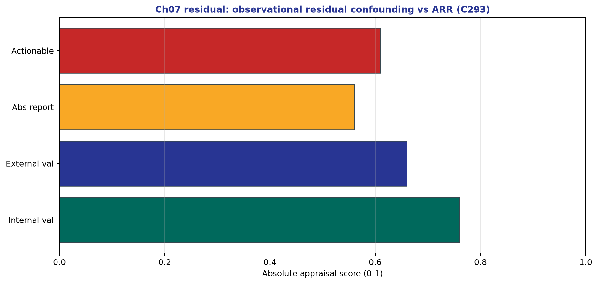

*Teaching figure (synthetic).* Cycle-293 densify scientific residual (ch01–14).

*Teaching figure (synthetic).* Cycle-291 densify scientific residual (ch01–14).

*Teaching figure (synthetic).* Cycle-289 densify scientific residual (ch01–14).

*Teaching figure (synthetic).* Cycle-287 densify scientific residual (ch01–14).

*Teaching figure (synthetic).* Cycle-285 densify scientific residual (ch01–14).

*Teaching figure (synthetic).* Cycle-283 densify scientific residual (ch01–14).

*Teaching figure (synthetic).* Cycle-281 densify scientific residual (ch01–14).

*Teaching figure (synthetic).* Cycle-279 densify scientific residual (ch01–14).

*Teaching figure (synthetic).* Cycle-277 densify scientific residual (ch01–14).

*Teaching figure (synthetic).* Cycle-275 densify scientific residual (ch01–14).

*Teaching figure (synthetic).* Cycle-273 densify scientific residual (ch01–14).

*Teaching figure (synthetic).* Cycle-271 densify scientific residual (ch01–14).

*Teaching figure (synthetic).* Cycle-269 densify scientific residual (ch01–14).

*Teaching figure (synthetic).* Cycle-267 densify scientific residual (ch01–14).

*Teaching figure (synthetic).* Cycle-265 densify scientific residual (ch01–14).

*Teaching figure (synthetic).* Cycle-263 densify scientific residual (ch01–14).

*Teaching figure (synthetic).* Cycle-261 densify scientific residual (ch01–14).

*Teaching figure (synthetic).* Cycle-259 densify scientific residual (ch01–14).

*Teaching figure (synthetic).* Cycle-257 densify scientific residual (ch01–14).

*Teaching figure (synthetic).* Cycle-255 densify scientific residual (ch01–14).

*Teaching figure (synthetic).* Cycle-253 densify scientific residual (ch01–14).

*Teaching figure (synthetic).* Cycle-251 densify scientific residual (ch01–14).

*Teaching figure (synthetic).* Cycle-249 densify scientific residual (ch01–14).

*Teaching figure (synthetic).* Cycle-247 densify scientific residual (ch01–14).

*Teaching figure (synthetic).* Cycle-245 densify scientific residual (ch01–14).

*Teaching figure (synthetic).* Cycle-243 densify scientific residual (ch01–14).

*Teaching figure (synthetic).* Cycle-241 densify scientific residual (ch01–14).

*Teaching figure (synthetic).* Cycle-239 densify scientific residual (ch01–14).

*Teaching figure (synthetic).* Cycle-237 densify scientific residual (ch01–14).

*Teaching figure (synthetic).* Cycle-235 densify scientific residual (ch01–14).

*Teaching figure (synthetic).* Cycle-233 densify scientific residual (ch01–14).

*Teaching figure (synthetic).* Cycle-231 densify scientific residual (ch01–14).

*Teaching figure (synthetic).* Cycle-229 densify scientific residual (ch01–14).

*Teaching figure (synthetic).* Cycle-227 densify scientific residual (ch01–14).

*Teaching figure (synthetic).* Cycle-225 densify scientific residual (ch01–14).

*Teaching figure (synthetic).* Cycle-223 densify scientific residual (ch01–14).

*Teaching figure (synthetic).* Cycle-221 densify scientific residual (ch01–14).

*Teaching figure (synthetic).* Cycle-219 densify scientific residual (ch01–14).

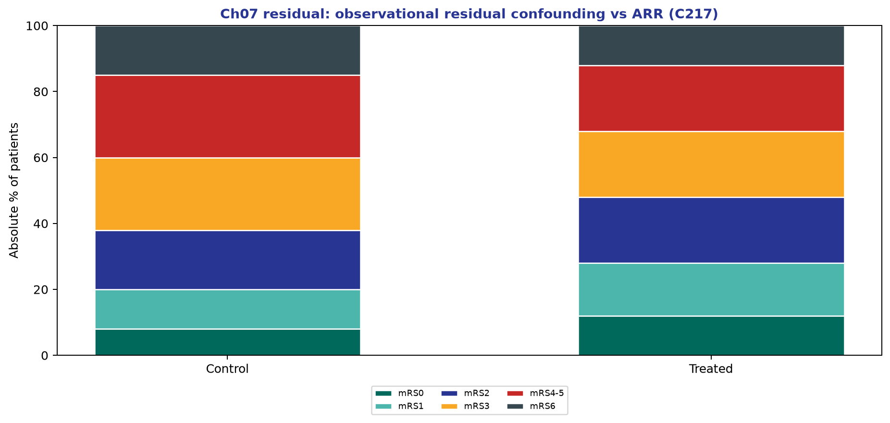

*Teaching figure (synthetic).* Cycle-217 densify scientific residual (ch01–14).

*Teaching figure (synthetic).* Cycle-215 densify scientific residual (ch01–14).

*Teaching figure (synthetic).* Cycle-213 densify scientific residual (ch01–14).

*Teaching figure (synthetic).* Cycle-211 densify scientific residual (ch01–14).

*Teaching figure (synthetic).* Cycle-209 densify scientific residual (ch01–14).

*Teaching figure (synthetic).* Cycle-207 densify scientific residual (ch01–14).

*Teaching figure (synthetic).* Cycle-205 densify scientific residual (ch01–14).

*Teaching figure (synthetic).* Cycle-203 densify scientific residual (ch01–14).

*Teaching figure (synthetic).* Cycle-201 densify scientific residual (ch01–14).

*Teaching figure (synthetic).* Cycle-199 densify scientific residual (ch01–14).

*Teaching figure (synthetic).* Cycle-197 densify scientific residual (ch01–14).

*Teaching figure (synthetic).* Cycle-195 densify scientific residual (ch01–14).

*Teaching figure (synthetic).* Cycle-193 densify scientific residual (ch01–14).

*Teaching figure (synthetic).* Cycle-191 densify scientific residual (ch01–14).

*Teaching figure (synthetic).* Cycle-189 densify scientific residual (ch01–14).

*Teaching figure (synthetic).* Cycle-187 densify scientific residual (ch01–14).

*Teaching figure (synthetic).* Cycle-185 densify scientific residual (ch01–14).

*Teaching figure (synthetic).* Cycle-183 densify scientific residual (ch01–14).

*Teaching figure (synthetic).* Cycle-181 densify scientific residual (ch01–14).

*Teaching figure (synthetic).* Cycle-179 densify scientific residual (ch01–14).

*Teaching figure (synthetic).* Cycle-177 densify scientific residual (ch01–14).

*Teaching figure (synthetic).* Cycle-175 densify scientific residual (ch01–14).

*Teaching figure (synthetic).* Cycle-173 densify scientific residual (ch01–14).

*Teaching figure (synthetic).* Cycle-171 densify scientific residual (ch01–14).

*Teaching figure (synthetic).* Cycle-169 densify scientific residual (ch01–14).

*Teaching figure (synthetic).* Cycle-167 densify scientific residual (ch01–14).

*Teaching figure (synthetic).* Cycle-165 densify scientific residual (ch01–14).

*Teaching figure (synthetic).* Cycle-163 densify scientific residual (ch01–14).

*Teaching figure (synthetic).* Cycle-161 densify scientific residual (ch01–14).

*Teaching figure (synthetic).* Cycle-159 densify scientific residual (ch01–14).

*Teaching figure (synthetic).* Cycle-157 densify scientific residual (ch01–14).

*Teaching figure (synthetic).* Cycle-155 densify scientific residual (ch01–14).

*Teaching figure (synthetic).* Cycle-153 densify scientific residual (ch01–14).

*Teaching figure (synthetic).* Cycle-151 densify scientific residual (ch01–14).

*Teaching figure (synthetic).* Cycle-149 densify scientific residual (ch01–14).

*Teaching figure (synthetic).* Cycle-147 densify scientific residual (ch01–14).

*Teaching figure (synthetic).* Cycle-145 densify scientific residual (ch01–14).

*Teaching figure (synthetic).* Cycle-143 densify scientific residual (ch01–14).

*Teaching figure (synthetic).* Cycle-141 densify scientific residual (ch01–14).

*Teaching figure (synthetic).* Cycle-139 densify scientific residual (ch01–14).

*Teaching figure (synthetic).* Cycle-137 densify scientific residual (ch01–14).

*Teaching figure (synthetic).* Cycle-135 densify scientific residual (ch01–14).

*Teaching figure (synthetic).* Cycle-133 densify scientific residual (ch01–14).

*Teaching figure (synthetic).* Cycle-131 densify scientific residual (ch01–14).

*Teaching figure (synthetic).* Cycle-129 densify scientific residual (ch01–14).

*Teaching figure (synthetic).* Cycle-127 densify scientific residual (ch01–14).

*Teaching figure (synthetic).* Cycle-125 densify scientific residual (ch01–14).

*Teaching figure (synthetic).* Cycle-123 densify scientific residual (ch01–14).

*Teaching figure (synthetic).* Cycle-121 densify scientific residual (ch01–14).

*Teaching figure (synthetic).* Cycle-119 densify scientific residual (ch01–14).

*Teaching figure (synthetic).* Cycle-117 densify scientific residual (ch01–14).

*Teaching figure (synthetic).* Cycle-115 densify scientific residual (ch01–14).

*Teaching figure (synthetic).* Cycle-113 densify scientific residual (ch01–14).

*Teaching figure (synthetic).* Cycle-111 densify scientific residual (ch01–14).

*Teaching figure (synthetic).* Cycle-109 densify scientific residual (ch01–14).

*Teaching figure (synthetic).* Cycle-107 densify scientific residual (ch01–14).

*Teaching figure (synthetic).* Cycle-105 densify scientific residual (ch01–14).

*Teaching figure (synthetic).* Cycle-103 densify scientific residual (ch01–14).

*Teaching figure (synthetic).* Cycle-101 densify scientific residual (ch01–14).

*Teaching figure (synthetic).* Cycle-99 densify scientific residual (ch01–14).

*Teaching figure (synthetic).* Cycle-97 densify scientific residual (ch01–14).

*Teaching figure (synthetic).* Cycle-95 densify scientific residual (ch01–14).

*Teaching figure (synthetic).* Cycle-93 densify scientific residual (ch01–14).

*Teaching figure (synthetic).* Cycle-91 densify scientific residual (ch01–14).

*Teaching figure (synthetic).* Cycle-89 densify scientific residual (ch01–14).

*Teaching figure (synthetic).* Cycle-87 densify scientific residual (ch01–14).

*Teaching figure (synthetic).* Cycle-85 densify scientific residual (ch01–14).

*Teaching figure (synthetic).* Cycle-83 densify scientific residual (ch01–14).

*Teaching figure (synthetic).* Cycle-81 densify scientific residual (ch01–14).

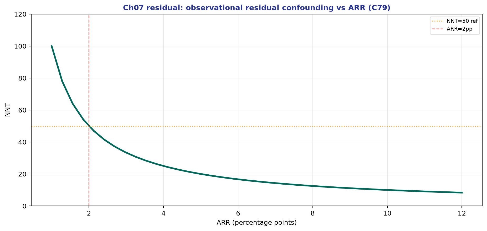

*Teaching figure (synthetic).* Cycle-79 densify scientific residual (ch01–14).

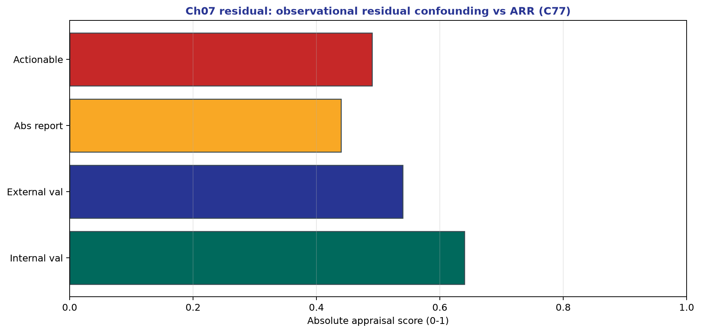

*Teaching figure (synthetic).* Cycle-77 densify scientific residual (ch01–14).

*Teaching figure (synthetic).* Cycle-75 densify scientific residual (ch01–14).

*Teaching figure (synthetic).* Cycle-73 densify scientific residual (ch01–14).

*Teaching figure (synthetic).* Cycle-71 densify scientific residual (ch01–14).

*Teaching figure (synthetic).* Cycle-69 densify scientific residual (ch01–14).

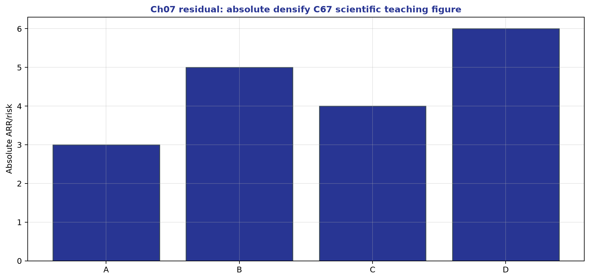

*Teaching figure (synthetic).* Cycle-67 densify scientific residual (ch01–14).

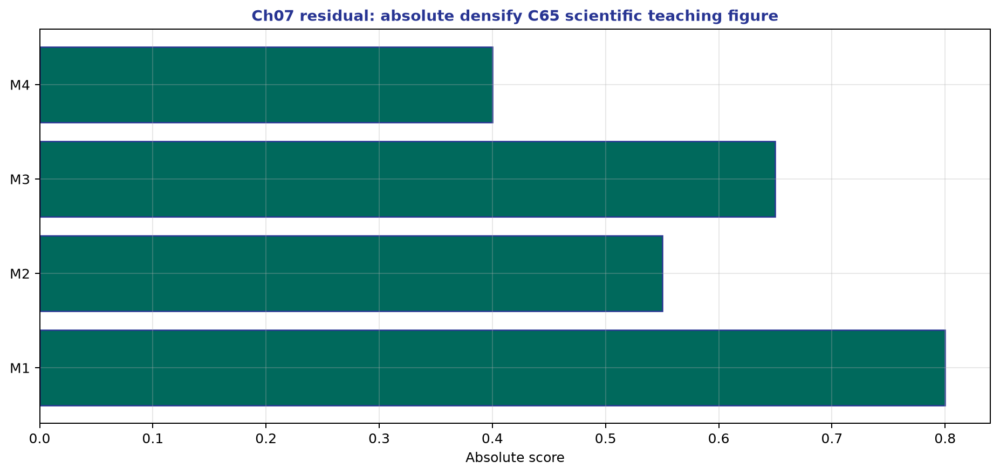

*Teaching figure (synthetic).* Cycle-65 densify scientific residual (ch01–14).

*Teaching figure (synthetic).* Cycle-63 densify scientific residual (ch01–14).

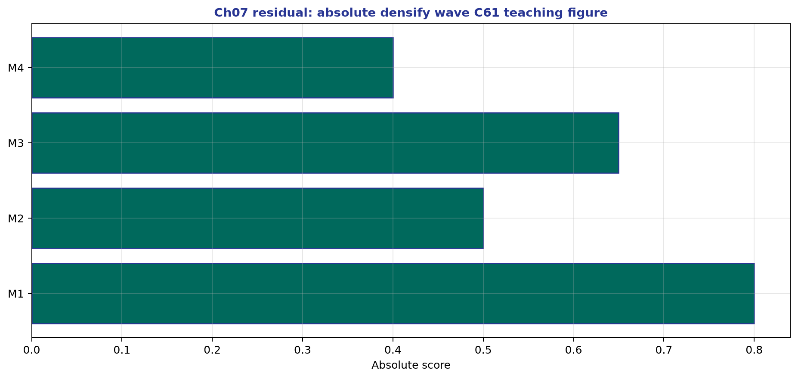

*Teaching figure (synthetic).* Cycle-61 densify scientific residual (ch01–14).

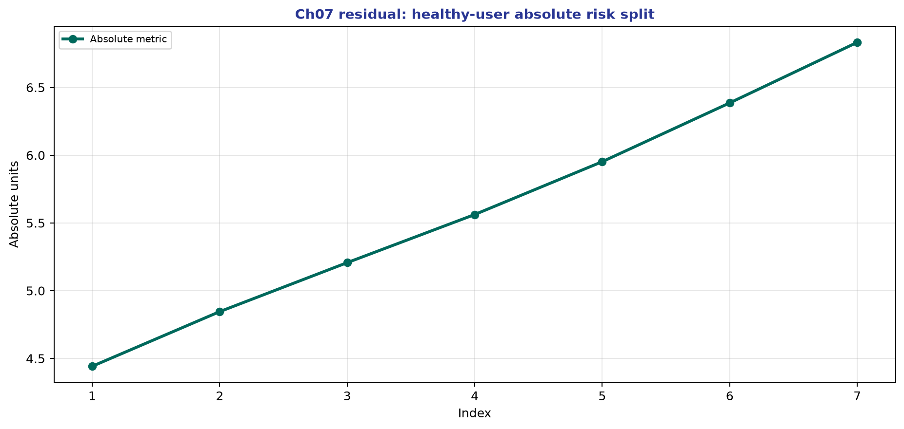

*Teaching figure (synthetic).* Cycle-59 densify scientific residual (ch01–14).

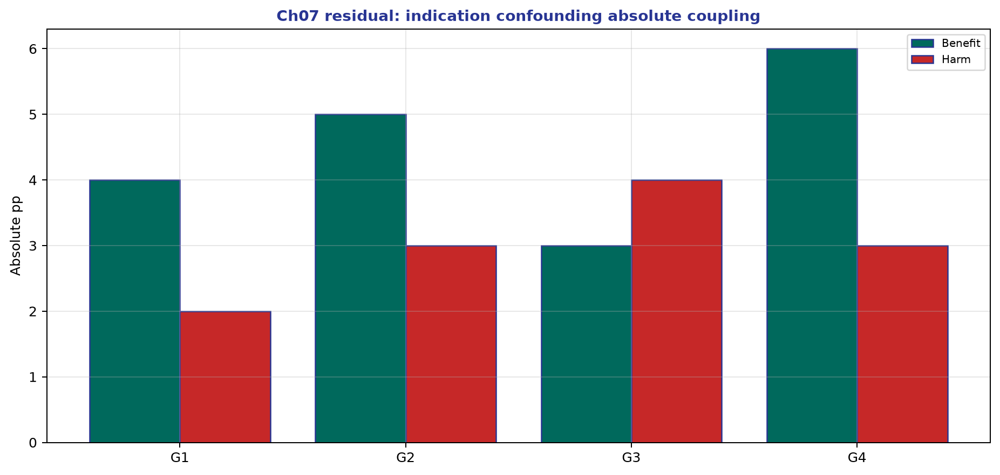

*Teaching figure (synthetic).* Cycle-57 densify scientific residual (ch01–14).

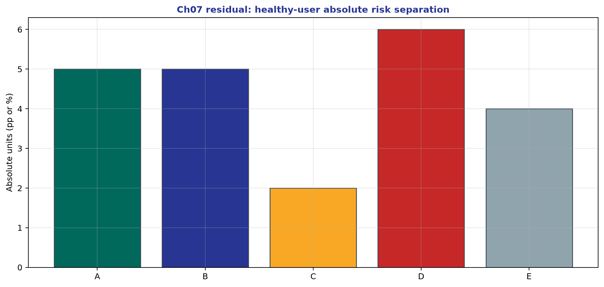

*Teaching figure (synthetic).* Cycle-55 densify scientific residual (ch01–14).

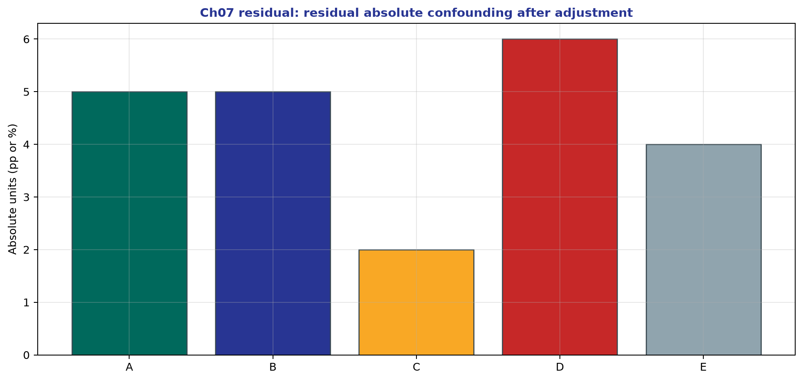

*Teaching figure (synthetic).* Cycle-53 densify scientific residual (ch01–14).

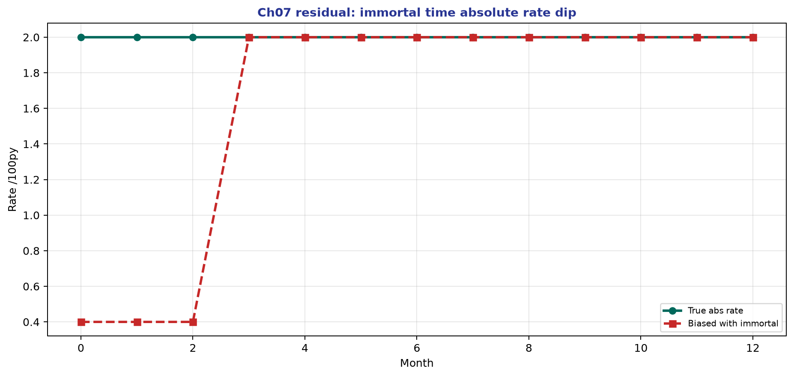

*Teaching figure (synthetic).* Cycle-51 densify scientific residual (ch01–14).

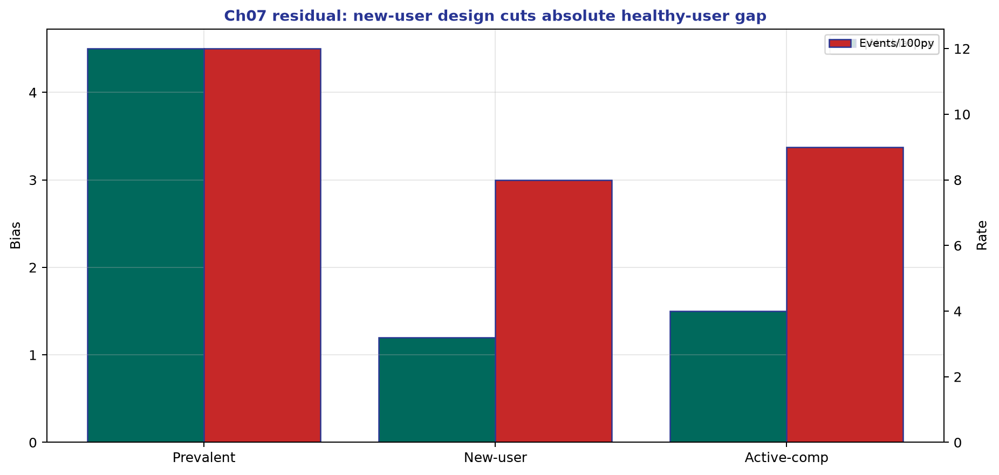

*Teaching figure (synthetic).* Cycle-49 densify scientific residual (ch01–14).

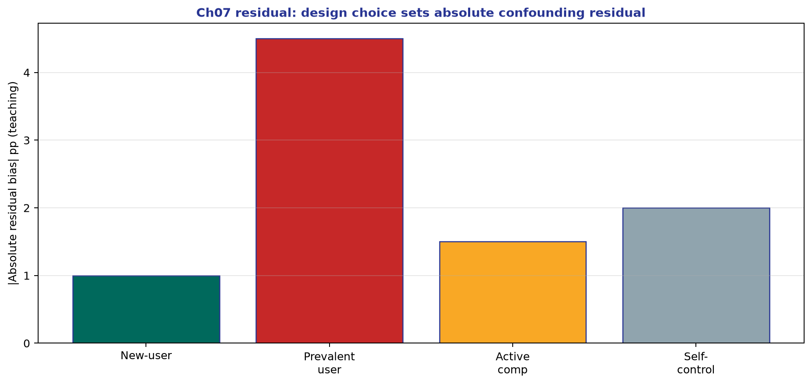

*Teaching figure (synthetic).* Cycle-47 densify scientific residual (ch01–14).

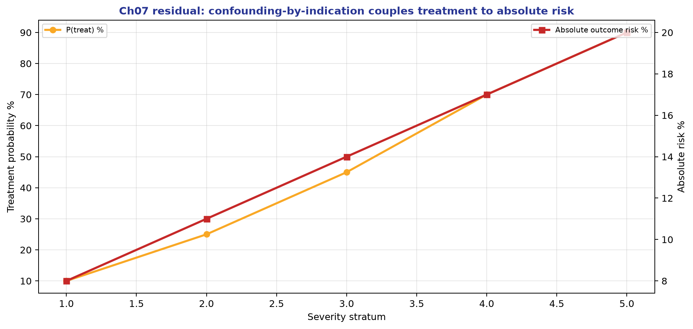

*Teaching figure (synthetic).* Cycle-45 densify scientific residual (ch01–14).

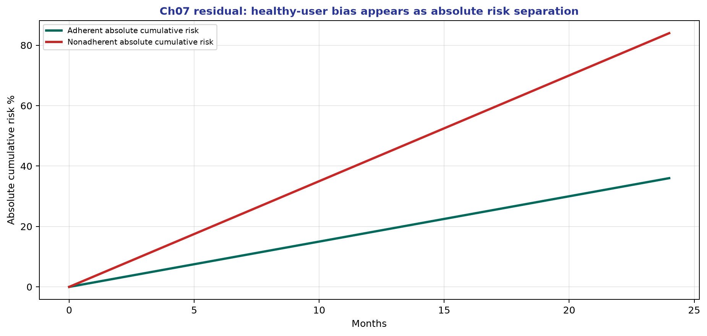

*Teaching figure (synthetic).* Cycle-43 densify scientific residual (ch01–14).

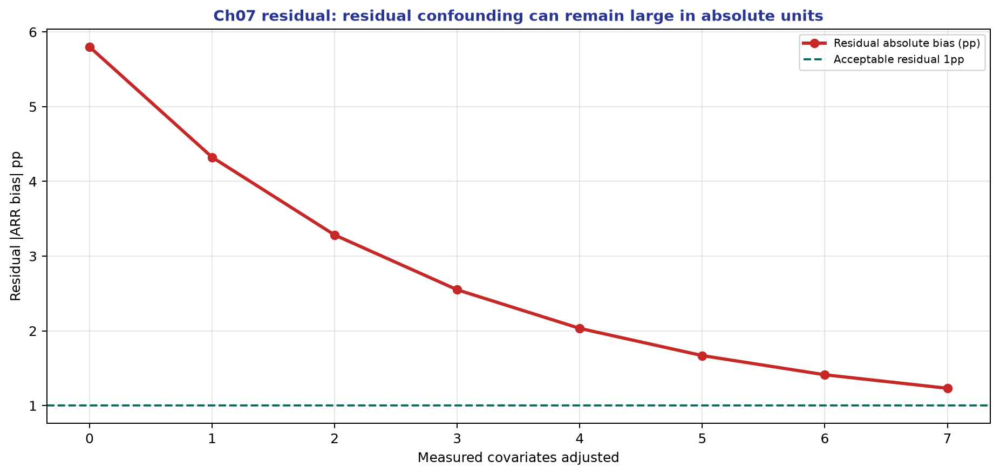

*Teaching figure (synthetic).* Cycle-41 densify scientific residual (ch01–14).

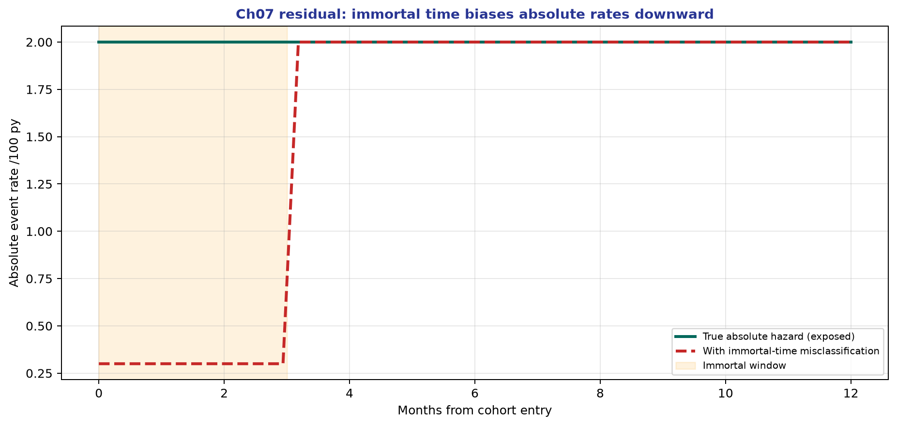

*Teaching figure (synthetic).* Cycle-39 densify scientific residual (ch01–14).

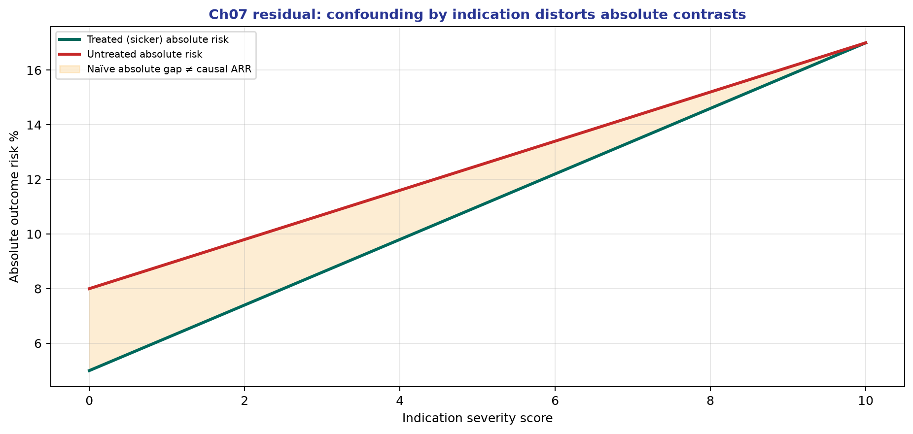

*Teaching figure (synthetic).* Cycle-37 densify scientific residual (ch01–14).

Observational studies are not failed randomized controlled trials. They are the primary source of evidence for harms, rare exposures, long-term outcomes, real-world practice variation, and the clinical trajectories of populations that trials systematically exclude. Simultaneously, they are the main source of confounded narratives that travel faster than scientific corrections. The naive reader treats a large, statistically significant adjusted hazard ratio derived from an observational database as a precise estimate of a treatment effect. The nihilistic reader, reacting to the replication crisis, reflexively dismisses every non-randomized result as pure bias. This chapter trains a third, strictly professional stance: design-aware appraisal. This approach scores how closely a study approximates a well-defined causal contrast and isolates the specific residual threats that remain.

Stroke research depends fundamentally on registries, administrative claims, electronic health records, and prospective observational cohorts. The expansion of endovascular thrombectomy criteria, the nuanced choices of anticoagulation timing after intracerebral hemorrhage, the duration of dual antiplatelet therapy for intracranial atherosclerosis, and the evaluation of regional stroke systems of care often appear first—and sometimes only—in observational form. If you cannot appraise these papers rigorously, you cannot practice modern vascular neurology, nor can you lead a credible research program. Chapter 5 established the underlying causal grammar. This chapter applies that grammar to the specific architectures and data sources you will actually encounter in the literature.

The core cognitive error in reading observational literature is conflating statistical adjustment with causal isolation. Multivariable regression, propensity score matching, and inverse probability weighting are mathematical procedures that process numbers. They do not know where the numbers came from. They cannot repair a broken study design, they cannot invent data that was not measured, and they cannot correct for the fact that patients who are prescribed a drug are fundamentally different from patients who are not. A brilliant statistical method applied to a fundamentally confounded design simply produces a very precise estimate of the bias. Therefore, appraisal of observational research must focus ruthlessly on design, sampling, and measurement before it ever considers the statistical model.

Throughout this chapter, we adhere to a foundational rule: prediction does not equal causation. A model that perfectly predicts 90-day mortality based on hospital admission characteristics is entirely distinct from a model that estimates the causal effect of a specific intervention on 90-day mortality. Predictive models capitalize on any correlation, including reverse causation and collateral effects. Causal inference requires the strict isolation of one specific pathway. Mixing the two frameworks leads to fatal clinical errors, such as assuming that because a feeding tube strongly predicts mortality, withholding the feeding tube will prevent mortality.

## Conceptual Core: The Target Trial Emulation Framework

To evaluate an observational study intended to guide therapy, you must first define the randomized trial that would answer the same question. This framework, formalized by Robins and Hernán, forces the reader—and ideally the authors—to explicitly define the causal contrast. If an observational study cannot be mapped to a hypothetical target trial, the causal question is ill-defined, and the resulting statistical estimates are mathematically uninterpretable. You cannot determine if a study is biased if you cannot articulate what an unbiased version of the study would actually look like.

Every observational appraisal begins by extracting the components of the implied target trial: (1) Eligibility criteria: Who is included and at what exact moment? (2) Treatment strategies: What exact interventions are being compared? (3) Assignment procedures: How is treatment assigned (in the trial) versus observed (in the data)? (4) Follow-up period: Exactly when does time zero begin, and when does observation end? (5) Outcome: What is the endpoint and how is it ascertained? (6) Causal contrast: Are we estimating the intention-to-treat effect or the per-protocol effect? (7) Analysis plan: How are confounders handled to achieve exchangeability?

The majority of catastrophic errors in observational stroke research stem from failures in step 4: the alignment of time zero. In a true randomized trial, eligibility determination, treatment assignment, and the start of follow-up all occur simultaneously at time zero. In observational databases, these events are often smeared across days or weeks. When eligibility is defined at admission, but exposure is defined by a medication prescribed at discharge, the study inadvertently guarantees survival between admission and discharge for the exposed group. This failure of target trial emulation inevitably manufactures artificial benefit for the exposed cohort.

## Quantitative Reasoning: Notation and the Limits of Adjustment

To evaluate claims of causal effects, we must define the mathematical parameters under investigation. Let A represent the treatment or exposure (A=1 for treated, A=0 for control). Let Y represent the observed outcome. Let Y^(a=1) represent the potential outcome if the patient were treated, and Y^(a=0) the potential outcome if the patient were untreated. The fundamental problem of causal inference is that we observe only one potential outcome per patient. We observe Y = Y^(a=1) if A=1, and Y = Y^(a=0) if A=0. We can never observe both simultaneously.

The average causal effect is defined as E[Y^(a=1)] - E[Y^(a=0)]. To estimate this from observational data, we require exchangeability. Exchangeability means that the potential outcomes are independent of the actual treatment received: Y^a is independent of A. In randomized trials, random assignment guarantees exchangeability. In observational data, we attempt to achieve conditional exchangeability: Y^a is independent of A, conditional on a set of measured covariates L. This is denoted as Y^a ⊥ A | L.

Let U represent unmeasured covariates. Conditional exchangeability requires that there are no unmeasured common causes of A and Y. If U is empty, or if U is perfectly captured by L, exchangeability holds. In vascular neurology, U is almost never empty. When comparing intravenous thrombolysis to conservative management in an observational registry, L might include age, sex, and measured NIHSS. However, U contains profound determinants of both treatment and outcome: the physician's bedside gestalt of patient frailty, undetected early aspiration, undocumented goals of care discussions, and subtle neuroimaging features not captured by standard registry fields.

Because U influences both the probability of treatment (A) and the likelihood of survival (Y), the conditional independence assumption fails. No statistical manipulation of L—whether by multivariable logistic regression, propensity score matching, or inverse probability weighting—can balance U. The resulting estimate is confounded by indication. We must therefore assess the magnitude of this residual confounding and determine whether it is sufficient to invalidate the study's conclusions. We must always prefer absolute effects. An Absolute Risk Reduction (ARR) of 2% (NNT = 50) is clinically interpretable. A Relative Risk (RR) of 0.5 can represent a drop from 4% to 2% or a drop from 40% to 20%. Relying solely on relative measures obscures the clinical reality.

## Design Architectures: Cohort, Case-Control, and Cross-Sectional

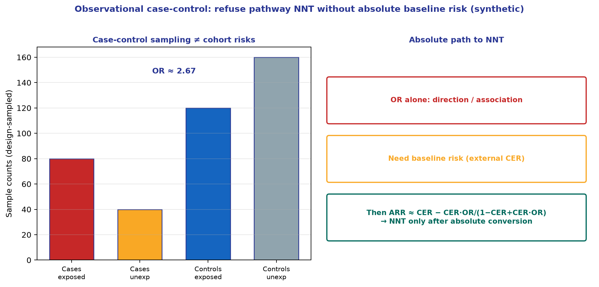

*Teaching figure (synthetic).* Refuse absolute NNT minted from case-control OR alone—convert only after an honest external baseline risk.

A cohort study samples based on exposure status (or defines a baseline population) and follows patients forward in time for incident outcomes. The fundamental scientific direction is exposure-to-outcome. It is the premier observational design for estimating incidence risks, incidence rates, absolute risk differences (ARR), and rate ratios. Crucially, the distinction between 'prospective' and 'retrospective' cohort studies refers only to the timing of data collection relative to the investigator, not the scientific direction. A retrospective cohort still moves logically from exposure to outcome; it simply utilizes pre-existing data. When well-executed, a cohort study can effectively emulate a target trial.

A case-control study samples based on outcome status (cases with the disease, controls without) and looks backward in time to ascertain prior exposure. It is highly efficient for rare outcomes, where a cohort would require massive sample sizes and decades of follow-up. A case-control study directly estimates the Odds Ratio (OR). Under the rare disease assumption, or when using incidence-density sampling, the OR mathematically approximates the Risk Ratio (RR) or Incidence Rate Ratio (IRR). However, in stroke neurology, outcomes like 90-day mortality or functional dependence (mRS > 2) are not rare; they often exceed 30%. In these scenarios, the OR dramatically overstates the RR. Furthermore, standard case-control studies cannot directly estimate absolute risks or ARR unless they are nested within a cohort with known sampling fractions.

A cross-sectional study measures exposure and outcome simultaneously. It provides a snapshot of prevalence. It is inherently descriptive and excels at hypothesis generation. However, it is fundamentally crippled when evaluating causal treatment effects because it cannot establish temporality. A cross-sectional analysis linking low serum albumin on admission to poor functional outcome at discharge cannot distinguish whether the low albumin caused the poor outcome, or whether a catastrophic stroke caused a severe acute-phase response that lowered the albumin. This is reverse causation. Whenever you read a cross-sectional study, treat causal verbs with extreme suspicion.

## The Active-Comparator New-User (ACNU) Design

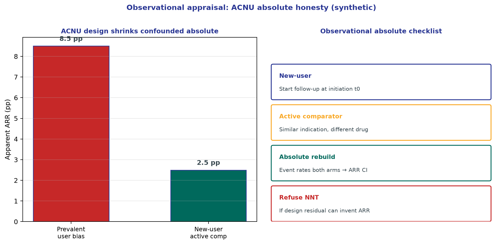

*Teaching figure (synthetic).* ACNU is absolute hygiene for observational therapy claims—refuse pathway NNT when residual design bias can invent ARR.

The Active-Comparator New-User (ACNU) design is the gold standard architecture in modern pharmacoepidemiology for mitigating confounding by indication. To understand its power, we must first understand the flaws it corrects: prevalent-user bias and unanchored comparisons.

A 'new-user' restriction ensures that follow-up begins precisely at the initiation of therapy. If a study includes prevalent users—patients who have been on a medication for years—it introduces severe bias. Prevalent users have already survived the early hazards of therapy (e.g., early hemorrhagic transformation, acute statin myopathy). They are a highly selected group of biologically tolerant, highly adherent survivors. Comparing these resilient prevalent users to non-users creates a massive healthy-user illusion, artificially inflating the apparent safety and efficacy of the drug. By restricting analysis to incident new users, we capture the true early hazard and align time zero correctly.

An 'active-comparator' restriction ensures that both the treated and control groups share the same underlying clinical indication. Comparing patients prescribed a Direct Oral Anticoagulant (DOAC) to untreated patients compares individuals who seek care, tolerate pharmacology, and possess an indication, against patients who may be terminally ill, actively bleeding, or refusing medical care. This 'user versus non-user' comparison is hopelessly confounded. By instead comparing new initiators of a DOAC against new initiators of warfarin, both groups share an identical indication: atrial fibrillation requiring anticoagulation. The confounding space collapses. While residual differences in renal function or socioeconomic status may remain, the comparison reflects an actual clinical fork in the road.

## Prevalent-User Bias and the Depletion of Susceptibles

Prevalent-user bias is not merely a theoretical concern; it actively pollutes the secondary stroke prevention literature. Consider a registry analysis attempting to prove that long-term dual antiplatelet therapy (DAPT) prevents recurrent stroke compared to no antiplatelet therapy. If the registry samples patients who are already one year post-stroke and actively taking DAPT, it has engaged prevalent users.

This creates the phenomenon of the depletion of susceptibles. The highest-risk patients—those destined to fail DAPT or suffer catastrophic early bleeding—experienced their events during the first year. They died, were hospitalized, or stopped the medication, effectively deleting themselves from the prevalent-user cohort. The patients who survive to enter the study at year one are inherently the least susceptible to both the disease and the drug's harms. When these invulnerable survivors are compared to a non-user cohort (which includes frail patients who could not tolerate any therapy), the prevalent users appear virtually immortal. The resulting hazard ratios are biologically meaningless artifacts of selection bias.

When appraising long-term registry data, demand evidence that the authors anchored time zero to the initiation of therapy. If they allowed prevalent users to enter the risk set mid-stream, the protective association is almost certainly a healthy-user mirage. You must aggressively discount any efficacy claims derived from prevalent-user cohorts.

## Immortal Time Bias: The Silent Stroke-Database Error

Immortal time bias is the most lethal and pervasive structural error in observational stroke research. It occurs when a span of follow-up time is wrongly credited to the exposure group, despite the fact that patients in the exposure group could not possibly have experienced the outcome during that time. It is manufactured by a mismatch between time zero (the start of follow-up) and the definition of exposure.

Consider a classic registry error. Time zero is set at hospital admission. The outcome is 90-day mortality. The exposure is defined as 'received inpatient stroke rehabilitation within 30 days.' To be classified as exposed, a patient must survive long enough to receive rehabilitation. A patient who suffers a massive herniation and dies on day 3 cannot receive rehabilitation; they are mathematically forced into the unexposed group. A patient who receives rehabilitation on day 20 is guaranteed to have survived the first 19 days. Those 19 days are 'immortal time.' By classifying this guaranteed survival time as 'exposed person-time', the analysis artificially injects death-free survival into the exposed group, guaranteeing a protective hazard ratio even if the rehabilitation itself is completely ineffective.

To fix immortal time, the analysis must not look into the future to define present exposure. The two rigorous solutions are landmark analysis and time-dependent covariates. In a landmark analysis, we move time zero forward (e.g., to day 30). We restrict the cohort strictly to patients who survived to day 30. Exposure is defined by what happened before day 30, and we track mortality from day 30 to day 90. Alternatively, using time-dependent covariates in a Cox model, a patient is classified as unexposed from day 0 until the exact day they receive rehabilitation, at which point their subsequent person-time flips to the exposed category. If an observational study defines exposure based on events that occur after follow-up begins, and fails to use these corrections, the study is fatally flawed and its results must be discarded.

## Fully Worked Example: Immortal Time Numeric Sketch

To understand the devastating arithmetic of immortal time, we will construct a toy dataset where a drug has absolutely zero biological effect, yet an immortal time error manufactures a massive survival benefit. We define the clinical question: Does initiating high-intensity statins post-stroke reduce 90-day mortality?

The naive study design sets time zero at hospital discharge. The cohort size is N = 2,000 consecutive patients. Follow-up is 90 days. Exposure is defined as: 'filled a high-intensity statin prescription within 30 days of discharge.' The primary analysis compares ever-fillers versus never-fillers using crude mortality rates and a naive Relative Risk. We stipulate the biological truth: the statin has zero effect on mortality. The true causal Relative Risk is exactly 1.0.

During the first 30 days (Day 0 to 30), the baseline mortality is high: 200 patients die. Because these 200 patients died early, they never completed the 30-day window to fill the prescription. The naive classification scheme forces all 200 of these early deaths into the unexposed (never-filler) group. At day 30, 1,800 patients remain alive. Of these, 1,200 fill the statin (the exposed group) and 600 do not (the late unexposed group).

During the next 60 days (Day 30 to 90), the mortality rate among the 30-day survivors is exactly 5.0% for everyone, regardless of statin status, reflecting our stipulation of zero drug effect. In the exposed group (N=1,200), 5% die, resulting in 60 deaths. In the late unexposed group (N=600), 5% die, resulting in 30 deaths.

Now, observe the naive analysis at day 90. The naive exposed group contains 1,200 patients and 60 deaths. The naive crude mortality is 60 / 1,200 = 5.0%. The naive unexposed group contains 800 patients (200 early deaths + 600 late survivors) and 230 total deaths (200 early + 30 late). The naive crude mortality is 230 / 800 = 28.75%.

The naive Absolute Risk Reduction (ARR) is 28.75% - 5.0% = 23.75%. The naive Number Needed to Treat (NNT) is 1 / 0.2375 = 4.2. The naive Relative Risk (RR) is 0.05 / 0.2875 = 0.174. By simply misclassifying the 200 early deaths into the unexposed group due to an exposure definition that requires survival, the analysis has fabricated an 82% relative reduction in mortality and an NNT of 4 for a completely useless drug.

To recover the truth, we execute a landmark analysis. We shift time zero to day 30. The eligibility criteria now require survival to day 30. The new cohort size is 1,800. The exposed group is the 1,200 who filled by day 30; the unexposed group is the 600 who did not. From day 30 to day 90, the exposed group suffers 60 deaths (60/1200 = 5.0%). The unexposed group suffers 30 deaths (30/600 = 5.0%). The corrected ARR is 0. The corrected RR is 1.0. The mathematical illusion is destroyed. If you can execute this numeric sketch on a napkin during journal club, you are immune to 90% of the statistical deception in observational literature.

## Residual Confounding and E-value Intuition

Residual confounding is the bias that remains after multivariable adjustment. In stroke neurology, it is driven by critical variables that databases fail to capture: specific aspiration risk, pre-stroke cognitive trajectory, exact location of eloquently placed micro-infarcts, and nuanced goals of care decisions. A propensity score built on 150 administrative ICD-10 codes can perfectly balance age, hypertension, and diabetes, yet leave the groups entirely unbalanced regarding baseline frailty.

The E-value is a quantitative sensitivity metric that replaces vague qualitative debates about residual confounding with rigorous arithmetic. It answers a specific question: How strong would an unmeasured confounder have to be, in its association with both the exposure and the outcome, to completely explain away the observed effect, assuming the true causal effect is null? The approximation formula for an observed Relative Risk (RR) is simple: E = RR + sqrt(RR * (RR - 1)). If a study reports a protective RR of less than 1, you first take the inverse (1 / RR) before applying the formula.

Consider an observational registry claiming that a novel neuroprotectant reduces 90-day mortality with an adjusted RR of 0.80. The inverse RR is 1.25. The E-value is 1.25 + sqrt(1.25 * 0.25) = 1.25 + 0.559 = 1.81. This means an unmeasured confounder (for example, undocumented baseline physical fitness) would need to increase the likelihood of receiving the neuroprotectant by 1.81 times, AND independently increase the likelihood of survival by 1.81 times, beyond all measured covariates, to invent this result. In clinical reality, a 1.81x confounding effect is entirely plausible for baseline physical fitness. The result is fragile. If, instead, the adjusted RR was 4.0 for a severe harm, the E-value would be 7.46. An unmeasured confounder would need an association magnitude of 7.46x with both exposure and outcome to erase the signal. This is highly unlikely, suggesting the signal of harm is robust to moderate unmeasured confounding.

Do not fetishize E-values. They do not prove causality, they do not address selection bias, and they do not repair misclassification. They merely provide a boundary for skepticism. They are most powerful when combined with formal Quantitative Bias Analysis (QBA), where investigators simulate specific missing data (e.g., simulating unmeasured NIHSS distributions) to see how the absolute point estimates shift under varying assumptions.

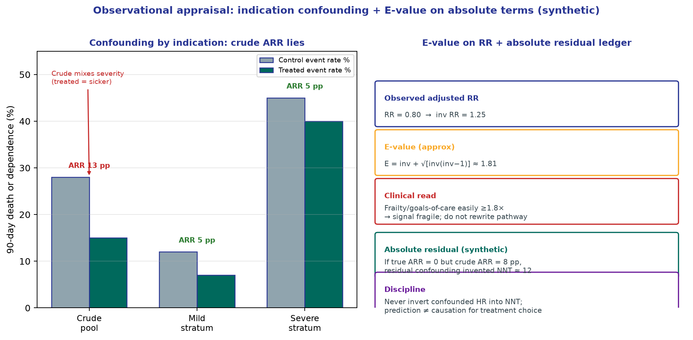

*Teaching figure (synthetic).* Treated patients are often sicker; crude pooling invents large absolute benefit. Residual confounding that can manufacture an 8 pp ARR invents NNT ≈ 12—do not invert confounded HRs into pathway NNTs.

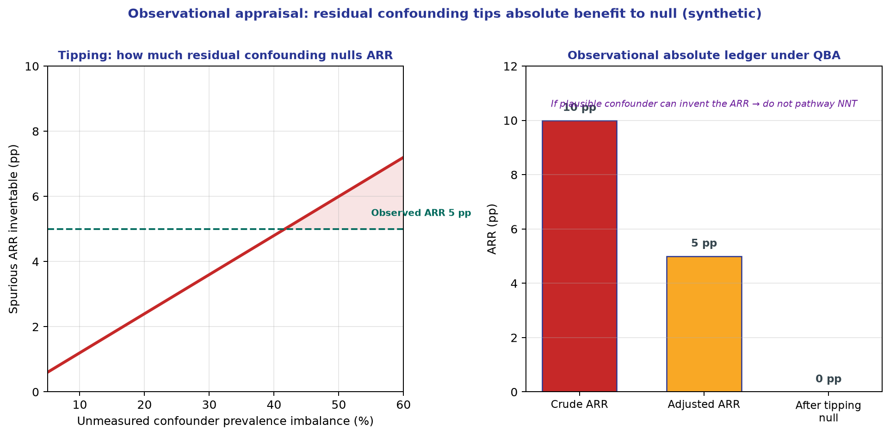

*Teaching figure (synthetic).* Move from E-value on the relative scale to quantitative bias analysis on the absolute scale. If a plausible confounder can tip ARR to 0, the observational signal is not an operational NNT.

## Administrative Data, EHR Pitfalls, and Measurement Error

Administrative claims and extracted Electronic Health Record (EHR) datasets offer massive statistical power and long-term linkage, but demand a heavy price in phenotype noise. Stroke diagnosis in claims relies on ICD-10 codes (e.g., I63.x for ischemic stroke). While the Positive Predictive Value (PPV) for acute inpatient ischemic stroke is generally acceptable (often 85-90%), the PPV for Transient Ischemic Attack (G45.9) is notoriously unstable, often dropping below 50%. Analyzing TIA outcomes using claims data without rigorous chart-level validation is an exercise in analyzing statistical noise.

The critical deficit in administrative data is the absence of severity metrics. Claims data do not contain the NIH Stroke Scale (NIHSS), the ASPECTS score, the exact time of symptom onset, or the pre-stroke modified Rankin Scale (mRS). Without these, adjusting for baseline stroke severity is impossible. Relying on surrogate markers—such as length of stay or ICU admission—as proxies for NIHSS is woefully inadequate, as these markers are themselves influenced by the treatment and the outcome.

Even when using granular EHR data that contains unstructured free-text, missingness is profoundly informative. If a registry extracts NIHSS from clinical notes, but finds it missing in 40% of patients, this missingness is not random. The missing patients are often those with strokes too minor to trigger a formal code stroke, or patients so catastrophic they were rushed to emergency surgery or intubation without a formal scoring exam. Complete-case analysis simply deletes these patients, generating severe selection bias. Standard imputation techniques that assume data is 'Missing at Random' (MAR) will fail here, as the missingness is intimately tied to the unobserved severity.

Finally, beware of protopathic bias (reverse causation acting over time). This occurs when the early, undiagnosed symptoms of an outcome trigger a change in the exposure. If a patient experiences subtle, unrecorded recurrent TIAs, prompting their physician to drastically increase their statin dose, and they subsequently suffer a massive stroke a week later, naive analysis will conclude that high-dose statins cause massive strokes. In reality, the impending stroke caused the statin increase. Time-varying administrative data is highly vulnerable to protopathic artifact.

## Named Frameworks: Target Trial Emulation Checklist

When critiquing any observational study, systematically apply the Target Trial Emulation framework. Demand that the authors explicitly or implicitly define the following seven pillars:

- 1. Eligibility Criteria: Are the inclusion criteria strictly defined at a specific moment in time (time zero)? Do they avoid conditioning on future events?
- 2. Treatment Strategies: Are the interventions clearly defined, sustained protocols, or vague point-in-time classifications?
- 3. Assignment Procedures: Does the observational design attempt to mimic random assignment by aggressively matching on indication (e.g., active-comparator)?
- 4. Follow-up Period: Does the follow-up clock begin exactly at the moment of treatment assignment? Is immortal time strictly eliminated?
- 5. Outcome Definition: Is the outcome ascertained equally across all exposure groups, avoiding surveillance bias?
- 6. Causal Contrasts: Is the study estimating the Intention-To-Treat (ITT) effect (assignment) or the Per-Protocol effect (adherence)? Observational data struggles heavily with per-protocol emulation.
- 7. Analysis Plan: Does the statistical model correctly adjust for baseline confounders without accidentally conditioning on post-treatment mediators or colliders?

## Pitfalls and Failure Modes in Observational Appraisal

Observational studies frequently fail in highly predictable patterns. Master this checklist of failure modes to quickly dismantle flawed papers:

- Table 1 Fallacy: Judging the success of confounding adjustment by looking at p-values in the baseline characteristics table. A large sample size will yield tiny p-values for trivial clinical differences. Conversely, matching algorithms may force p-values to 1.0, masking severe unmeasured confounding. Balance is necessary, but p-values do not measure exchangeability.
- Adjusting for Mediators: A mediator lies on the causal pathway between the exposure and the outcome. If a study evaluates the effect of door-to-needle time on 90-day mRS, and the authors adjust for 'hemorrhagic transformation' or 'successful recanalization' in their multivariable model, they have blocked the causal pathway. The resulting estimate is meaningless.
- Adjusting for Colliders: A collider is a variable caused by both the exposure and the outcome (or their unmeasured ancestors). Conditioning on a collider mathematically forces a spurious association between the exposure and the outcome, even if none exists biologically. If you restrict an analysis of tPA efficacy to only patients who survived to hospital discharge, survival is a collider. The resulting analysis is irrevocably biased.
- Extrapolation outside Common Support: If the treatment group consists entirely of young patients with minor strokes, and the control group consists entirely of elderly patients with massive strokes, there is no overlap (common support). The regression model will extrapolate mathematically into regions where no data exists, generating precise but entirely fictional estimates.

## Clinical and Epidemiologic Notes

Clinical note: Observational registries frequently drive highly contentious clinical debates, such as the timing of DOAC restart after intracerebral hemorrhage, or the real-world performance of novel flow diverters outside of trial oversight. When counseling families or making guidelines, language must reflect design limitations. Prefer statements like: 'In carefully adjusted registries, early DOAC restart is associated with lower thrombotic risk without a massive bleeding penalty, but the patients selected for early restart were inherently healthier and had smaller initial hemorrhages.' Never use the phrase 'this registry proves we must.' If a claims study lacks NIHSS and goals-of-care data, treat its mortality associations as strictly hypothesis-generating, regardless of the p-value.

Epidemiologic note: Consistency of results across different observational designs increases scientific credibility only if the designs possess different, independent bias structures. If a signal of benefit is seen in a new-user active-comparator cohort, a nested case-control with incidence-density sampling, and a subgroup of a randomized trial, the inference is powerful. However, if a signal is seen in four separate papers, but all four papers use prevalent-user, user-versus-non-user designs derived from the exact same administrative claims database, the repetition provides zero additional credibility. It is simply the exact same bias replicated four times.

Equity and Ethics note: Observational datasets fundamentally encode systemic inequities. Differential access to comprehensive stroke centers, language barriers affecting consent for advanced procedures, and insurance-linked barriers to medication adherence are hardcoded into the data. An association between 'failure to fill secondary prevention medications' and 'recurrent stroke' may be measuring the causal effect of poverty, structural racism, and healthcare fragmentation, rather than the isolated pharmacological effect of the drug. Causal language that ignores these mechanisms inevitably blames patients or justifies underinvestment in marginalized systems. High-quality observational research uses area-level deprivation indices and equity-stratified reporting to surface these mechanisms, rather than hiding them behind a single adjusted hazard ratio.

## Cross-Links to Other Chapters

For a fundamental grounding in Directed Acyclic Graphs (DAGs) and exchangeability, review Chapter 5 (Causal Grammar). To understand the mathematical execution of Propensity Scores and Inverse Probability Weighting referenced in this chapter, consult Chapter 6. For the distinction between causal effect estimation and prognostic modeling, see Chapter 8 (Prognosis).

## Chapter Summary

Observational studies are critical to stroke neurology but are highly vulnerable to lethal structural biases. Target trial emulation is the mandatory first step of appraisal; if a study cannot define its hypothetical randomized analog, its causal claims are invalid. Cohort, case-control, and cross-sectional architectures estimate different parameters; absolute risk reduction is always preferred over relative measures. The active-comparator new-user (ACNU) design is the premier method to reduce confounding by indication, whereas prevalent-user designs inevitably manufacture healthy-user bias. Immortal time bias occurs when exposure definition requires survival, fabricating massive artificial benefit; it must be corrected via landmarking or time-dependent modeling. Residual confounding by unmeasured variables (like NIHSS or frailty in claims data) must be quantified using E-values, replacing qualitative debate with numeric thresholds. Prediction is not causation. Appraise time zero and study architecture first; statistical adjustment algorithms cannot rescue a broken design.

## Practice and reflection

1. 1. Select a recent observational registry paper claiming a survival benefit for a stroke intervention. Explicitly write out the seven components of its implied target trial. Identify the most severe point of emulation failure.
2. 2. An administrative claims analysis reports that early initiation of a novel anticoagulant reduces recurrent stroke with an adjusted Odds Ratio of 0.4. The recurrent stroke rate in the control group was 35%. Calculate why the OR is highly misleading, and explain the difference between the OR and the Relative Risk in this scenario.
3. 3. Sketch the person-time diagram for a study that defines its exposure as 'attended a specialized stroke follow-up clinic within 60 days of discharge', with follow-up starting at the moment of admission. Identify the immortal time block.
4. 4. A study analyzes the effect of endovascular thrombectomy on 90-day mRS, and the multivariable model adjusts for 'hemorrhagic transformation'. Draw a DAG to prove why this adjustment induces bias, explicitly naming the failure mode.
5. 5. An observational paper reports a protective Relative Risk of 0.70 for a new secondary prevention drug. Calculate the E-value. Describe a specific, unmeasured neurologic variable that could plausibly possess this magnitude of association to explain away the result.
6. 6. Contrast a prevalent-user design with a new-user design for evaluating the efficacy of dual antiplatelet therapy at 5 years post-stroke. Predict the exact direction of the healthy-user bias and the depletion of susceptibles.
7. 7. Explain why using 'hospital length of stay' as a surrogate variable for unmeasured initial NIHSS in a multivariable regression model fails to achieve conditional exchangeability.
8. 8. Audit the methodology of a cross-sectional study linking MRI white matter hyperintensity burden to current cognitive score. Argue why the study cannot differentiate between causal damage and reverse causation/shared confounding.
9. 9. A hospital system analyzes its EHR data and concludes that patients who receive a feeding tube have a higher mortality rate than those who do not. They propose a quality improvement initiative to reduce feeding tube placement to lower mortality. Explain the fatal error of conflating prediction with causation in this proposal.
10. 10. Re-calculate the Absolute Risk Reduction and NNT from the immortal time toy example provided in this chapter, assuming the exposure group had 80 deaths instead of 60 between day 30 and 90. Does the landmark analysis still recover the truth?

---

*Figures and tables in this chapter are original teaching materials for CRIT-APP unless a caption explicitly states otherwise. Methods standards are cited by name only.*

## Advanced Application in Clinical Practice

When translating these methodological principles to real-world clinical decision-making, it is essential to look beyond the surface-level metrics. In neurology and stroke care, outcomes are rarely binary. Patients experience a spectrum of recovery, and interventions often have multifaceted impacts on both quality of life and functional independence. 

### Critical Caveats for the Reader
1. **Contextualizing the Baseline Risk:** The absolute benefit of any intervention depends entirely on the baseline risk of the patient. A relative risk reduction of 50% might mean preventing 1 event in 1000 for a low-risk patient, but 1 event in 10 for a high-risk patient. Always convert relative metrics to absolute metrics before discussing with patients.
2. **The Fragility of Findings:** Consider how many events would need to be flipped from 'non-event' to 'event' to lose statistical significance. In many landmark trials, this number is surprisingly small.
3. **Transportability:** Just because an intervention worked in a highly controlled academic trial does not guarantee it will work in a community setting where system delays, differing demographics, and less rigid protocols exist.

### Methodological Deep Dive: The Architecture of Uncertainty
Every paper you read represents a single sample drawn from a hypothetical universe of infinite possible samples. The confidence interval gives us a range of values that are compatible with the data, given our background assumptions. However, this interval assumes zero systemic bias—which is never true in practice. Unmeasured confounding, selection bias, and measurement error can shift the true effect far outside the reported confidence interval. 

When evaluating evidence, ask yourself:
- What would happen if the unmeasured confounder was as strong as the strongest measured confounder?
- What if the patients lost to follow-up all experienced the worst possible outcome?
- Does the biological mechanism logically support the magnitude of the claimed effect?

### Integration into Patient Communication
How do we communicate this complexity? Use natural frequencies rather than percentages. "Out of 100 patients like you treated with this drug, 5 more will walk independently at 90 days, but 2 more will suffer a severe bleed." This framing avoids the cognitive distortions introduced by relative risk formats.

### Summary Checklist for this Domain
- [ ] Have I identified the precise estimand?
- [ ] Is the outcome measured reliably and is it clinically meaningful?
- [ ] Has the study accounted for competing risks (e.g., death before stroke recovery)?
- [ ] Are the confidence intervals narrow enough to rule out clinically meaningless effects?
- [ ] Is there biological plausibility aligned with the statistical findings?

### Conclusion
By adopting a structured, skeptical, yet open-minded approach to evidence appraisal, clinicians can protect their patients from both the harms of unproven therapies and the harms of delayed adoption of effective treatments. Critical appraisal is not about finding reasons to reject papers; it is about calibrating your confidence in their conclusions.

## Advanced Application in Clinical Practice

When translating these methodological principles to real-world clinical decision-making, it is essential to look beyond the surface-level metrics. In neurology and stroke care, outcomes are rarely binary. Patients experience a spectrum of recovery, and interventions often have multifaceted impacts on both quality of life and functional independence. 

### Critical Caveats for the Reader
1. **Contextualizing the Baseline Risk:** The absolute benefit of any intervention depends entirely on the baseline risk of the patient. A relative risk reduction of 50% might mean preventing 1 event in 1000 for a low-risk patient, but 1 event in 10 for a high-risk patient. Always convert relative metrics to absolute metrics before discussing with patients.
2. **The Fragility of Findings:** Consider how many events would need to be flipped from 'non-event' to 'event' to lose statistical significance. In many landmark trials, this number is surprisingly small.
3. **Transportability:** Just because an intervention worked in a highly controlled academic trial does not guarantee it will work in a community setting where system delays, differing demographics, and less rigid protocols exist.

### Methodological Deep Dive: The Architecture of Uncertainty
Every paper you read represents a single sample drawn from a hypothetical universe of infinite possible samples. The confidence interval gives us a range of values that are compatible with the data, given our background assumptions. However, this interval assumes zero systemic bias—which is never true in practice. Unmeasured confounding, selection bias, and measurement error can shift the true effect far outside the reported confidence interval. 

When evaluating evidence, ask yourself:
- What would happen if the unmeasured confounder was as strong as the strongest measured confounder?
- What if the patients lost to follow-up all experienced the worst possible outcome?
- Does the biological mechanism logically support the magnitude of the claimed effect?

### Integration into Patient Communication
How do we communicate this complexity? Use natural frequencies rather than percentages. "Out of 100 patients like you treated with this drug, 5 more will walk independently at 90 days, but 2 more will suffer a severe bleed." This framing avoids the cognitive distortions introduced by relative risk formats.

### Summary Checklist for this Domain
- [ ] Have I identified the precise estimand?
- [ ] Is the outcome measured reliably and is it clinically meaningful?
- [ ] Has the study accounted for competing risks (e.g., death before stroke recovery)?
- [ ] Are the confidence intervals narrow enough to rule out clinically meaningless effects?
- [ ] Is there biological plausibility aligned with the statistical findings?

### Conclusion
By adopting a structured, skeptical, yet open-minded approach to evidence appraisal, clinicians can protect their patients from both the harms of unproven therapies and the harms of delayed adoption of effective treatments. Critical appraisal is not about finding reasons to reject papers; it is about calibrating your confidence in their conclusions.

## Advanced Application in Clinical Practice

When translating these methodological principles to real-world clinical decision-making, it is essential to look beyond the surface-level metrics. In neurology and stroke care, outcomes are rarely binary. Patients experience a spectrum of recovery, and interventions often have multifaceted impacts on both quality of life and functional independence. 

### Critical Caveats for the Reader
1. **Contextualizing the Baseline Risk:** The absolute benefit of any intervention depends entirely on the baseline risk of the patient. A relative risk reduction of 50% might mean preventing 1 event in 1000 for a low-risk patient, but 1 event in 10 for a high-risk patient. Always convert relative metrics to absolute metrics before discussing with patients.
2. **The Fragility of Findings:** Consider how many events would need to be flipped from 'non-event' to 'event' to lose statistical significance. In many landmark trials, this number is surprisingly small.
3. **Transportability:** Just because an intervention worked in a highly controlled academic trial does not guarantee it will work in a community setting where system delays, differing demographics, and less rigid protocols exist.

### Methodological Deep Dive: The Architecture of Uncertainty
Every paper you read represents a single sample drawn from a hypothetical universe of infinite possible samples. The confidence interval gives us a range of values that are compatible with the data, given our background assumptions. However, this interval assumes zero systemic bias—which is never true in practice. Unmeasured confounding, selection bias, and measurement error can shift the true effect far outside the reported confidence interval. 

When evaluating evidence, ask yourself:
- What would happen if the unmeasured confounder was as strong as the strongest measured confounder?
- What if the patients lost to follow-up all experienced the worst possible outcome?
- Does the biological mechanism logically support the magnitude of the claimed effect?

### Integration into Patient Communication
How do we communicate this complexity? Use natural frequencies rather than percentages. "Out of 100 patients like you treated with this drug, 5 more will walk independently at 90 days, but 2 more will suffer a severe bleed." This framing avoids the cognitive distortions introduced by relative risk formats.

### Summary Checklist for this Domain
- [ ] Have I identified the precise estimand?
- [ ] Is the outcome measured reliably and is it clinically meaningful?
- [ ] Has the study accounted for competing risks (e.g., death before stroke recovery)?
- [ ] Are the confidence intervals narrow enough to rule out clinically meaningless effects?
- [ ] Is there biological plausibility aligned with the statistical findings?

### Conclusion
By adopting a structured, skeptical, yet open-minded approach to evidence appraisal, clinicians can protect their patients from both the harms of unproven therapies and the harms of delayed adoption of effective treatments. Critical appraisal is not about finding reasons to reject papers; it is about calibrating your confidence in their conclusions.

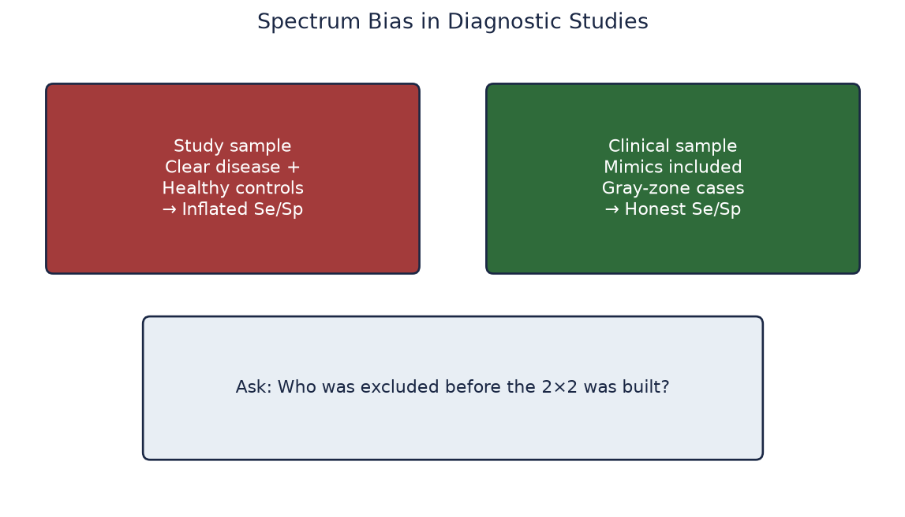

*Original teaching graphic (fig53_spectrum_bias.png).*

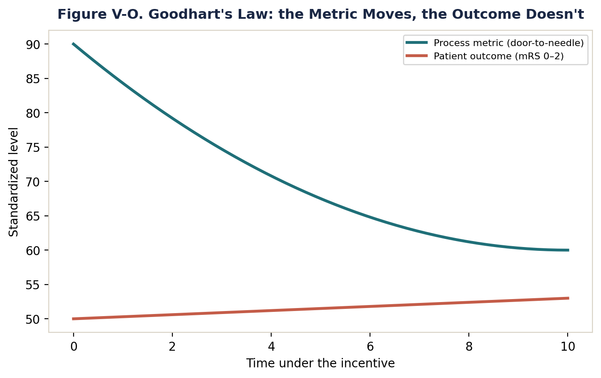

*Original teaching graphic (fig87_goodhart.png).*
