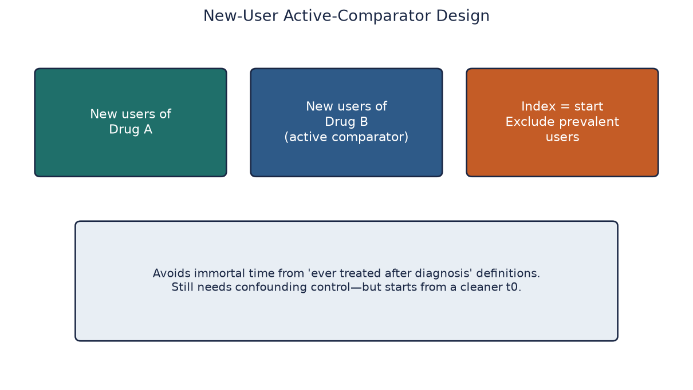
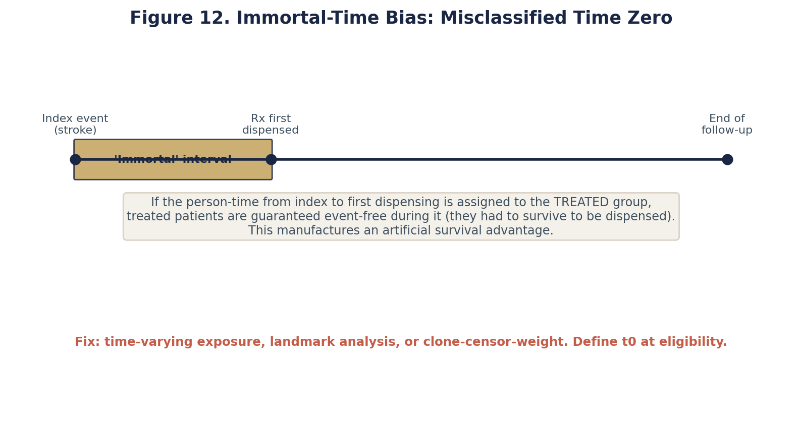
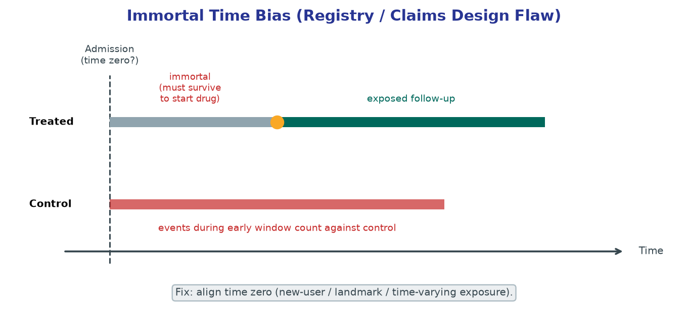

# Chapter 7. Appraising Observational Studies Without Naivete

## Opening

*An active-comparator, new-user design compares two treatments started fresh, removing prevalent-user and healthy-adherer distortions.*

*Immortal time is the span in which an "exposed" patient could not yet have had the outcome, and it manufactures a spurious survival advantage.*

*Misclassifying that guaranteed event-free interval as exposed time makes a drug look protective when the design, not the drug, created the gap.*

A registry paper claims a drug is associated with lower readmission. Treat association as a starting hypothesis, not a green light for automatic order panels.

## Introduction: The Promise and Peril of Observational Evidence

Observational studies are not failed randomized controlled trials. They are the primary source of evidence for harms, rare exposures, long-term outcomes, real-world practice variation, and the clinical trajectories of populations that trials systematically exclude. Simultaneously, they are the main source of confounded narratives that travel faster than scientific corrections. The naive reader treats a large, statistically significant adjusted hazard ratio derived from an observational database as a precise estimate of a treatment effect. The nihilistic reader, reacting to the replication crisis, reflexively dismisses every non-randomized result as pure bias. A third, strictly professional stance is design-aware appraisal: score how closely a study approximates a well-defined causal contrast and isolate the specific residual threats that remain.

Stroke research depends fundamentally on registries, administrative claims, electronic health records, and prospective observational cohorts. The expansion of endovascular thrombectomy criteria, the nuanced choices of anticoagulation timing after intracerebral hemorrhage, the duration of dual antiplatelet therapy for intracranial atherosclerosis, and the evaluation of regional stroke systems of care often appear first—and sometimes only—in observational form. If you cannot appraise these papers rigorously, you cannot practice modern vascular neurology, nor can you lead a credible research program. Chapter 5 established the underlying causal grammar. This chapter applies that grammar to the specific architectures and data sources you will actually encounter in the literature.

The core cognitive error in reading observational literature is conflating statistical adjustment with causal isolation. Multivariable regression, propensity score matching, and inverse probability weighting are mathematical procedures that process numbers. They do not know where the numbers came from. They cannot repair a broken study design, they cannot invent data that was not measured, and they cannot correct for the fact that patients who are prescribed a drug are fundamentally different from patients who are not. A brilliant statistical method applied to a fundamentally confounded design simply produces a very precise estimate of the bias. Therefore, appraisal of observational research must focus ruthlessly on design, sampling, and measurement before it ever considers the statistical model.

Throughout this chapter, prediction does not equal causation. A model that predicts 90-day mortality from admission characteristics answers a different question from a design estimating the effect of an intervention. Predictive models may exploit confounded associations, reverse timing, or proxies whenever they improve forecasts. Causal inference instead requires a defined intervention contrast and identification assumptions appropriate to the target estimand. A feeding tube can strongly predict mortality because it marks severe illness; that association does not imply that withholding the tube prevents death.

## Conceptual Core: The Target Trial Emulation Framework

For an observational study intended to estimate an intervention effect, specify the target trial that would answer the closest well-defined question. The framework associated with Robins and Hernán makes eligibility, strategies, assignment, time zero, follow-up, outcome, causal contrast, and analysis explicit. Not every observational question is an intervention effect, but a causal treatment claim that cannot state these elements lacks a clear target for bias assessment.

Every observational appraisal begins by extracting the components of the implied target trial: (1) Eligibility criteria: Who is included and at what exact moment? (2) Treatment strategies: What exact interventions are being compared? (3) Assignment procedures: How is treatment assigned (in the trial) versus observed (in the data)? (4) Follow-up period: Exactly when does time zero begin, and when does observation end? (5) Outcome: What is the endpoint and how is it ascertained? (6) Causal contrast: Are we estimating the intention-to-treat effect or the per-protocol effect? (7) Analysis plan: How are confounders handled to achieve exchangeability?

Time-zero misalignment is a common and consequential error. In a randomized trial, eligibility, assignment, and follow-up are aligned by design; observational data often record analogous events on different days. If eligibility and follow-up begin at admission but exposure is defined by a discharge medication, people classified as exposed necessarily survived to discharge. Crediting that earlier survival to the exposure can create immortal-time bias, with direction and magnitude depending on the classification and event process.

## Quantitative Reasoning: Notation and the Limits of Adjustment

To evaluate claims of causal effects, we must define the mathematical parameters under investigation. Let A represent the treatment or exposure (A=1 for treated, A=0 for control). Let Y represent the observed outcome. Let Y^(a=1) represent the potential outcome if the patient were treated, and Y^(a=0) the potential outcome if the patient were untreated. The fundamental problem of causal inference is that we observe only one potential outcome per patient. We observe Y = Y^(a=1) if A=1, and Y = Y^(a=0) if A=0. We can never observe both simultaneously.

The average causal effect is E[Y^(1)] − E[Y^(0)]. Identification requires exchangeability: the relevant potential outcomes are independent of treatment assignment. Proper random assignment makes assignment independent of baseline potential outcomes under the randomized allocation mechanism, but it does not guarantee identical observed covariates or remove bias from post-randomization missingness or measurement. Observational analyses instead assume conditional exchangeability, Y^a ⊥ A | L, given a sufficient set of measured pre-exposure covariates.

Let U represent unmeasured covariates. Conditional exchangeability requires that no unmeasured common causes of A and Y remain after conditioning on L. In vascular neurology, residual common causes are often plausible. When comparing intravenous thrombolysis with conservative management in an observational registry, L might include age, sex, and measured NIHSS, while frailty, aspiration risk, goals of care, or imaging features may be incompletely recorded.

If U is a common cause of treatment and outcome, adjustment using only L cannot remove that part of confounding. Assess its plausible direction and magnitude rather than assuming either perfect control or inevitable invalidity. Report both relative and absolute effects when the design and data permit: an RR of 0.5 can correspond to a risk change from 4% to 2% or from 40% to 20%, which have very different absolute implications.

## Design Architectures: Cohort, Case-Control, and Cross-Sectional

A cohort study defines a baseline population and follows exposure groups over time for incident outcomes. It can estimate incidence risks, rates, risk differences, and rate ratios when sampling and follow-up support those quantities. “Prospective” and “retrospective” describe when data are collected relative to the research plan, not whether the analysis has a valid time order. A well-designed retrospective cohort can emulate specified components of a target trial using existing data, subject to identification and measurement assumptions.

A case-control study samples based on outcome status and ascertains prior exposure. It is efficient for rare outcomes. Depending on the sampling design, the odds ratio can estimate an exposure odds ratio, a rate ratio under incidence-density sampling, or approximate a risk ratio when the outcome is rare. When outcomes are common, an OR farther from 1 than the corresponding RR must not be interpreted as that RR. Absolute risks usually require a defined source population and sampling fractions or additional external information.

A cross-sectional study measures variables at one assessment window and commonly estimates prevalence or associations. When exposure and outcome timing cannot be ordered, causal treatment claims are especially vulnerable to reverse causation and shared causes. A study linking low albumin with contemporaneous stroke severity, for example, cannot determine from that association alone whether albumin affects outcome or severe illness affects albumin.

## The Active-Comparator New-User (ACNU) Design

The Active-Comparator New-User (ACNU) design is a strong pharmacoepidemiologic pattern for reducing confounding by indication and aligning time zero, though it does not eliminate residual confounding or measurement error.

A new-user restriction begins eligibility and follow-up at treatment initiation. Including prevalent users can select people who tolerated and remained on therapy while excluding early discontinuations or harms. Restricting to initiators better captures early risk and aligns treatment classification with time zero, but the comparison still requires valid eligibility, measurement, and confounding control.

An active comparator can make treatment groups more similar in indication and health-care engagement than a user-versus-non-user comparison. Comparing new DOAC initiators with new warfarin initiators may therefore reduce confounding, but the groups need not have identical indications or prognoses; renal function, contraindications, access, and clinician preference can still differ.

## Prevalent-User Bias and the Depletion of Susceptibles

Prevalent-user bias is a practical concern in secondary-prevention research. Consider a registry comparing patients already taking long-term dual antiplatelet therapy one year after stroke with non-users. Eligibility at that point conditions on treatment history, survival, tolerance, adherence, and access before cohort entry.

This can produce depletion of susceptibles: people with early adverse events or intolerance may stop treatment or never enter the prevalent-user cohort. Those remaining on therapy are selected survivors, while non-users may differ in frailty, contraindications, care access, or prognosis. The resulting comparison can understate early harms or exaggerate benefit unless treatment history and selection into ongoing use are addressed.

When appraising long-term registry data, determine whether time zero aligns with treatment eligibility and classification. Prevalent-user designs can be appropriate for some continuation estimands, but efficacy claims require careful handling of depletion of susceptibles, treatment history, and selection into ongoing use.

## Immortal Time Bias: The Silent Stroke-Database Error

Immortal time bias is a consequential error that occurs when follow-up time during which the outcome could not occur under the eventual exposure classification is credited to that exposure group. It reflects misalignment among eligibility, treatment assignment, and the start of follow-up.

Consider a registry with admission as time zero, 90-day mortality as the outcome, and exposure defined as receiving rehabilitation within 30 days. A person classified as exposed must survive until rehabilitation; assigning the preceding interval to the exposed group credits guaranteed survival to exposure and generally biases the comparison toward apparent benefit.

Avoid using future information to classify earlier person-time. Options include a prespecified landmark estimand, a correctly specified time-varying exposure analysis, or target-trial methods that align eligibility, assignment, and follow-up; each answers a different question and has its own assumptions. If future exposure information is assigned to baseline without correction, the resulting estimate is at high risk of immortal-time bias.

## Fully Worked Example: Immortal Time Numeric Sketch

To understand the devastating arithmetic of immortal time, we will construct a toy dataset where a drug has absolutely zero biological effect, yet an immortal time error manufactures a massive survival benefit. We define the clinical question: Does initiating high-intensity statins post-stroke reduce 90-day mortality?

The naive study design sets time zero at hospital discharge. The cohort size is N = 2,000 consecutive patients. Follow-up is 90 days. Exposure is defined as: 'filled a high-intensity statin prescription within 30 days of discharge.' The primary analysis compares ever-fillers versus never-fillers using crude mortality rates and a naive Relative Risk. We stipulate the biological truth: the statin has zero effect on mortality. The true causal Relative Risk is exactly 1.0.

During the first 30 days (Day 0 to 30), the baseline mortality is high: 200 patients die. Because these 200 patients died early, they never completed the 30-day window to fill the prescription. The naive classification scheme forces all 200 of these early deaths into the unexposed (never-filler) group. At day 30, 1,800 patients remain alive. Of these, 1,200 fill the statin (the exposed group) and 600 do not (the late unexposed group).

During the next 60 days (Day 30 to 90), the mortality rate among the 30-day survivors is exactly 5.0% for everyone, regardless of statin status, reflecting our stipulation of zero drug effect. In the exposed group (N=1,200), 5% die, resulting in 60 deaths. In the late unexposed group (N=600), 5% die, resulting in 30 deaths.

Now, observe the naive analysis at day 90. The naive exposed group contains 1,200 patients and 60 deaths. The naive crude mortality is 60 / 1,200 = 5.0%. The naive unexposed group contains 800 patients (200 early deaths + 600 late survivors) and 230 total deaths (200 early + 30 late). The naive crude mortality is 230 / 800 = 28.75%.

The naive Absolute Risk Reduction (ARR) is 28.75% - 5.0% = 23.75%. The naive Number Needed to Treat (NNT) is 1 / 0.2375 = 4.2. The naive Relative Risk (RR) is 0.05 / 0.2875 = 0.174. By simply misclassifying the 200 early deaths into the unexposed group due to an exposure definition that requires survival, the analysis has fabricated an 82% relative reduction in mortality and an NNT of 4 for a completely useless drug.

For one alternative estimand, execute a day-30 landmark analysis. Eligibility now requires survival to day 30, so the target population changes. Among 1,800 survivors, 1,200 filled by day 30 and 600 did not. From day 30 to day 90, mortality is 60/1,200 = 5.0% versus 30/600 = 5.0%, yielding risk difference 0 and RR 1.0 in this constructed example. The landmark removes the built-in immortal period for this estimand but does not generally eliminate confounding or answer the effect of initiating treatment at discharge.

## Residual Confounding and E-value Intuition

Residual confounding is the bias that remains after multivariable adjustment. In stroke neurology, it is driven by critical variables that databases fail to capture: specific aspiration risk, pre-stroke cognitive trajectory, exact location of eloquently placed micro-infarcts, and nuanced goals of care decisions. A propensity score built on 150 administrative ICD-10 codes can perfectly balance age, hypertension, and diabetes, yet leave the groups entirely unbalanced regarding baseline frailty.

The E-value is one quantitative sensitivity metric for unmeasured confounding on the risk-ratio scale. Under its assumptions, it summarizes the minimum strength of association that an unmeasured confounder would need with both exposure and outcome, above measured covariates, to move the observed association to the null. For an RR above 1, E = RR + sqrt(RR * (RR - 1)); for a protective RR, apply the formula to its inverse. It does not identify the confounder or its plausibility.

Consider an observational registry reporting an adjusted mortality RR of 0.80. For a protective estimate, use the inverse RR, 1.25: E-value = 1.25 + sqrt(1.25 × 0.25) = 1.81. Under the E-value assumptions, an unmeasured confounder associated with both exposure and outcome by risk ratios of at least 1.81 each, above the measured covariates, could move the point estimate to the null. Whether that is plausible requires clinical knowledge; the metric does not address selection or measurement error. For an observed harmful RR of 4.0, the corresponding E-value is 7.46. The larger value indicates greater robustness to this specific confounding sensitivity analysis, not proof that the association is causal.

E-values do not establish causality, address selection bias, or repair misclassification. Interpret them alongside clinically plausible confounders and, when useful, quantitative bias analyses that specify distributions or parameters for missing severity and other biases.

## Administrative Data, EHR Pitfalls, and Measurement Error

Administrative claims and extracted electronic-health-record datasets can provide large samples and longitudinal linkage but may have substantial phenotype error. The validity of an ICD-10 code for ischemic stroke or TIA varies by code set, position, care setting, outcome definition, and validation method. Use a validation study matched to the actual algorithm and population, report predictive values with uncertainty, and perform sensitivity analyses when misclassification could change the conclusion.

Administrative claims alone typically lack granular NIHSS, ASPECTS, exact onset time, and pre-stroke mRS, although linked registries or extracted clinical data may supply some of them. In claims-only analyses, adequate control of baseline stroke severity is often implausible. Post-treatment proxies such as length of stay or ICU admission can introduce additional bias because treatment and evolving outcome affect them.

Even granular EHR data can have informative missingness. If NIHSS is absent for 40% of records, missingness may relate to workflow, severity, transfer, intubation, or whether a formal stroke assessment occurred. Complete-case analysis then targets a selected subset. A missing-at-random analysis requires defensible conditioning variables and remains untestable from observed data alone; report missingness patterns and use sensitivity analyses for plausible departures.

Finally, consider protopathic bias, in which early manifestations of an outcome prompt a change in the exposure. Unrecorded transient symptoms might lead to a statin-dose change shortly before a stroke; a naive analysis could then attribute the subsequent event to the dose change. Lagged analyses can help probe this mechanism but must be tied to plausible latency and do not automatically solve confounding.

## Named Frameworks: Target Trial Emulation Checklist

When critiquing any observational study, systematically apply the Target Trial Emulation framework. Demand that the authors explicitly or implicitly define the following seven pillars:

- 1. Eligibility Criteria: Are the inclusion criteria strictly defined at a specific moment in time (time zero)? Do they avoid conditioning on future events?
- 2. Treatment Strategies: Are the interventions clearly defined, sustained protocols, or vague point-in-time classifications?
- 3. Assignment Procedures: Does the design make treatment groups comparable on measured causes of treatment and outcome, for example through an appropriate active comparator and prespecified adjustment?
- 4. Follow-up Period: Are eligibility, treatment assignment, and follow-up aligned for the chosen estimand? Is any immortal person-time identified and handled?
- 5. Outcome Definition: Is the outcome ascertained equally across all exposure groups, avoiding surveillance bias?
- 6. Causal Contrasts: Is the study estimating the Intention-To-Treat (ITT) effect (assignment) or the Per-Protocol effect (adherence)? Observational data struggles heavily with per-protocol emulation.
- 7. Analysis Plan: Does the statistical model correctly adjust for baseline confounders without accidentally conditioning on post-treatment mediators or colliders?

## Pitfalls and Failure Modes in Observational Appraisal

Observational studies frequently fail in highly predictable patterns. Master this checklist of failure modes to quickly dismantle flawed papers:

- Table 1 Fallacy: Judging the success of confounding adjustment by looking at p-values in the baseline characteristics table. A large sample size will yield tiny p-values for trivial clinical differences. Conversely, matching algorithms may force p-values to 1.0, masking severe unmeasured confounding. Balance is necessary, but p-values do not measure exchangeability.
- Adjusting for mediators: A mediator lies on a causal pathway between exposure and outcome. Adjusting for hemorrhagic transformation or recanalization while claiming a total effect of treatment timing can block part of that effect and may introduce additional bias. The resulting coefficient targets a different—and not necessarily identified—quantity.
- Adjusting for colliders: Conditioning on a common effect of exposure and outcome-related causes can open a noncausal path. Restricting an analysis to hospital survivors, for example, may select on causes of survival related to both treatment and prognosis. Whether and how much bias results depends on the causal structure and parameters, so draw the graph and state the selection mechanism.
- Extrapolation outside Common Support: If the treatment group consists entirely of young patients with minor strokes, and the control group consists entirely of elderly patients with massive strokes, there is no overlap (common support). The regression model will extrapolate mathematically into regions where no data exists, generating precise but entirely fictional estimates.

## Clinical and Epidemiologic Notes

Clinical note: Observational registries inform debates such as anticoagulant restart after intracerebral hemorrhage or device performance outside trials, but language must reflect the design. Report the actual adjusted association and interval, then state the major selection mechanisms—for example, that patients selected for earlier treatment may differ in hemorrhage size, stability, frailty, and goals of care. A claims-only mortality association without severity and goals-of-care data should not be presented as proof that clinicians must adopt the exposure strategy.

Epidemiologic note: Replication is more informative when studies use different populations, measurements, and bias structures. Similar estimates from multiple analyses of the same database and design are correlated evidence and may reproduce the same error. Triangulation asks whether results persist across designs whose major biases would be expected to differ in direction or magnitude.

Equity and Ethics note: Observational datasets fundamentally encode systemic inequities. Differential access to comprehensive stroke centers, language barriers affecting consent for advanced procedures, and insurance-linked barriers to medication adherence are hardcoded into the data. An association between 'failure to fill secondary prevention medications' and 'recurrent stroke' may be measuring the causal effect of poverty, structural racism, and healthcare fragmentation, rather than the isolated pharmacological effect of the drug. Causal language that ignores these mechanisms inevitably blames patients or justifies underinvestment in marginalized systems. High-quality observational research uses area-level deprivation indices and equity-stratified reporting to surface these mechanisms, rather than hiding them behind a single adjusted hazard ratio.

## Cross-Links to Other Chapters

For a fundamental grounding in directed acyclic graphs and exchangeability, review Chapter 5. Chapter 20 provides regression and survival-model literacy for reading adjusted estimates, while this chapter retains the design-specific cautions for propensity scores and weighting. For the distinction between causal effect estimation and prognostic modeling, see Chapter 9.

## Chapter Summary

Observational studies are indispensable but require explicit attention to the causal question, eligibility, treatment strategies, time zero, follow-up, outcomes, and confounding. Cohort, case-control, and cross-sectional designs identify different quantities. Active-comparator new-user designs can reduce—but not eliminate—confounding and selection. Future exposure information must not be credited to earlier person-time; landmark, time-varying, or target-trial methods should match the estimand. Report relative and absolute effects when identifiable, and use sensitivity analyses such as E-values only for the biases they address. Prediction is not causation, and no adjustment algorithm repairs a design whose target or timeline is incoherent.

## Practice and reflection

1. Select a recent observational registry paper claiming a survival benefit for a stroke intervention. Explicitly write out the seven components of its implied target trial. Identify the most severe point of emulation failure.
2. An administrative claims analysis reports that early initiation of a novel anticoagulant reduces recurrent stroke with an adjusted Odds Ratio of 0.4. The recurrent stroke rate in the control group was 35%. Calculate why the OR is highly misleading, and explain the difference between the OR and the Relative Risk in this scenario.
3. Sketch the person-time diagram for a study that defines its exposure as 'attended a specialized stroke follow-up clinic within 60 days of discharge', with follow-up starting at the moment of admission. Identify the immortal time block.
4. A study analyzes the total effect of endovascular thrombectomy on 90-day mRS and adjusts for post-treatment hemorrhagic transformation. Draw plausible DAGs showing when this adjustment blocks mediation, opens selection bias, or could belong to a different estimand; state which assumptions drive each conclusion.
5. An observational paper reports a protective Relative Risk of 0.70 for a new secondary prevention drug. Calculate the E-value. Describe a specific, unmeasured neurologic variable that could plausibly possess this magnitude of association to explain away the result.
6. Contrast a prevalent-user design with a new-user design for evaluating the efficacy of dual antiplatelet therapy at 5 years post-stroke. Predict the exact direction of the healthy-user bias and the depletion of susceptibles.
7. Explain why using 'hospital length of stay' as a surrogate variable for unmeasured initial NIHSS in a multivariable regression model fails to achieve conditional exchangeability.
8. Audit the methodology of a cross-sectional study linking MRI white matter hyperintensity burden to current cognitive score. Argue why the study cannot differentiate between causal damage and reverse causation/shared confounding.
9. A hospital system finds higher mortality among patients who receive feeding tubes and proposes reducing placement to lower mortality. Explain why confounding by illness severity and treatment indication prevent that association from identifying the effect of a feeding-tube strategy.
10. Re-calculate the Absolute Risk Reduction and NNT from the immortal time toy example provided in this chapter, assuming the exposure group had 80 deaths instead of 60 between day 30 and 90. Does the landmark analysis still recover the truth?

---

*Figures and tables in this chapter are Teaching materials for CRIT-APP unless a caption explicitly states otherwise. Methods standards are cited by name only.*
