# Chapter 8. Diagnostic Accuracy Studies: From Sensitivity to Decisions

## Opening

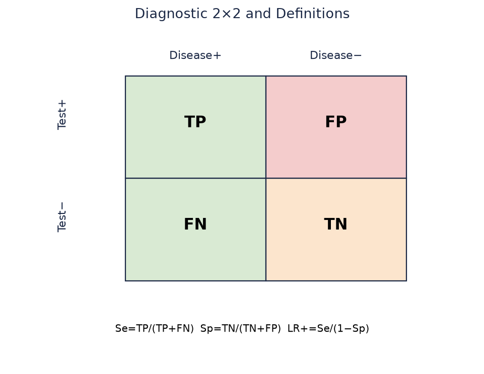

*Diagnostic 2×2 (original).*

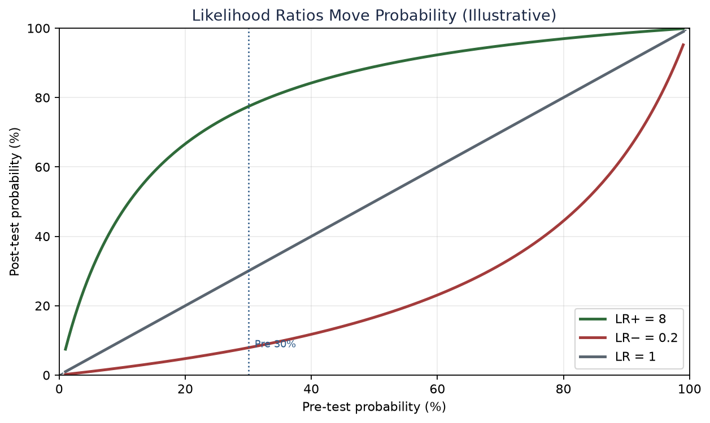

*Likelihood-ratio / Bayes curves (original).*
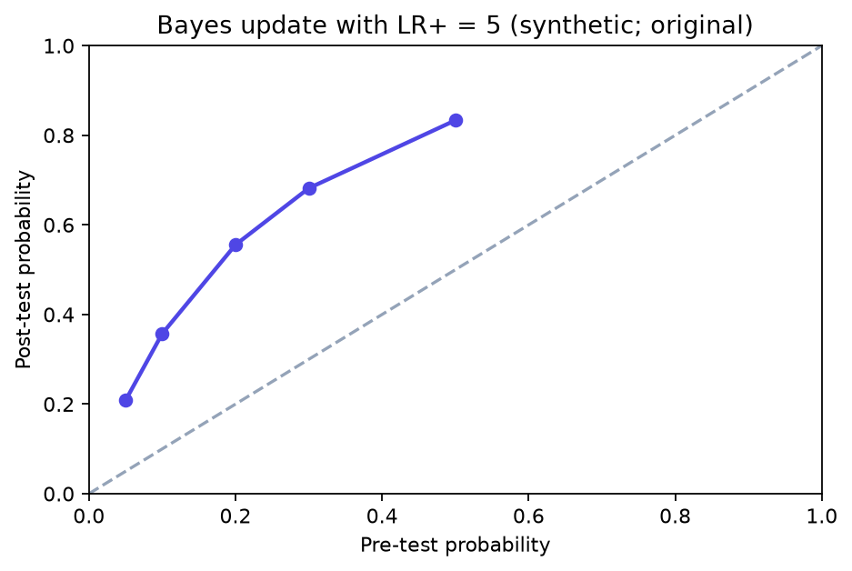

*Bayes update with LR+ = 5 on synthetic priors (original).*

A new CTA LVO detector advertises 98% sensitivity. Without spectrum and verification design, that number can be theater. Work the 2x2 before the purchase order.

## Learning objectives

- Define sensitivity, specificity, predictive values, and likelihood ratios, and mathematically compute them from a diagnostic 2×2 table.
- Demonstrate how positive and negative predictive values intrinsically depend on prevalence, whereas sensitivity and specificity are conceptually conditional on the reference standard.
- Execute simple Bayes updating using likelihood ratios and pre-test odds to calculate post-test probabilities in neurologic scenarios.
- Identify and dissect spectrum bias, verification bias, and imperfect reference standards within stroke imaging and clinical assessment scales.
- Appraise multivariable diagnostic models by distinguishing between discrimination (AUC) and calibration, avoiding the trap of threshold-blind metrics.
- Apply the QUADAS-2 framework to systematically evaluate the risk of bias and applicability of a diagnostic accuracy study.
- Translate diagnostic test metrics into decision thresholds, explicitly linking test results to absolute effects of downstream therapeutic actions.
- Critique diagnostic machine learning or AI literature for overfitting, incorporation bias, and failure to report intent-to-diagnose metrics.

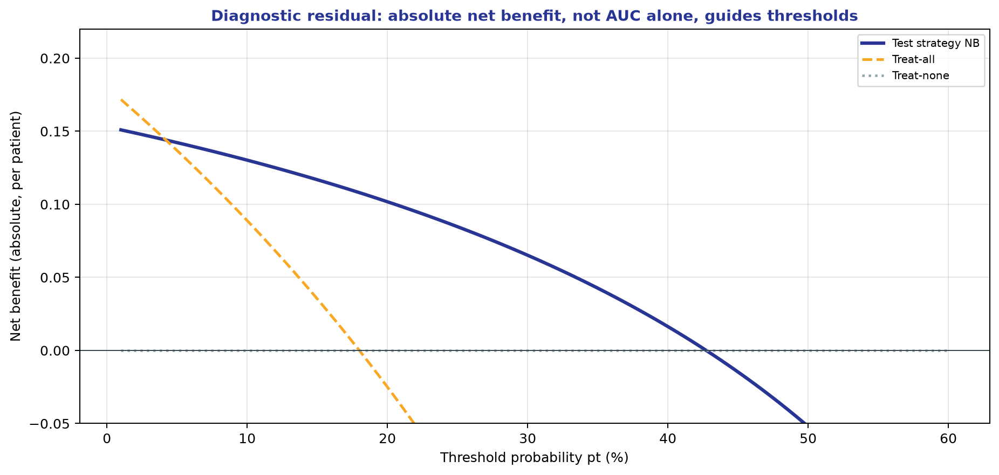

*Teaching figure (synthetic).* Cycle-25 densify scientific residual.

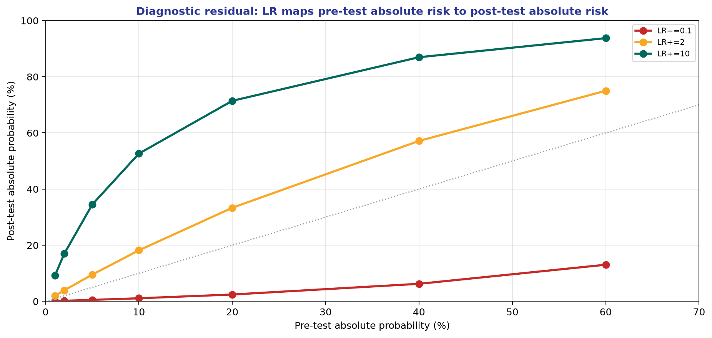

*Teaching figure (synthetic).* Cycle-27 densify scientific residual.

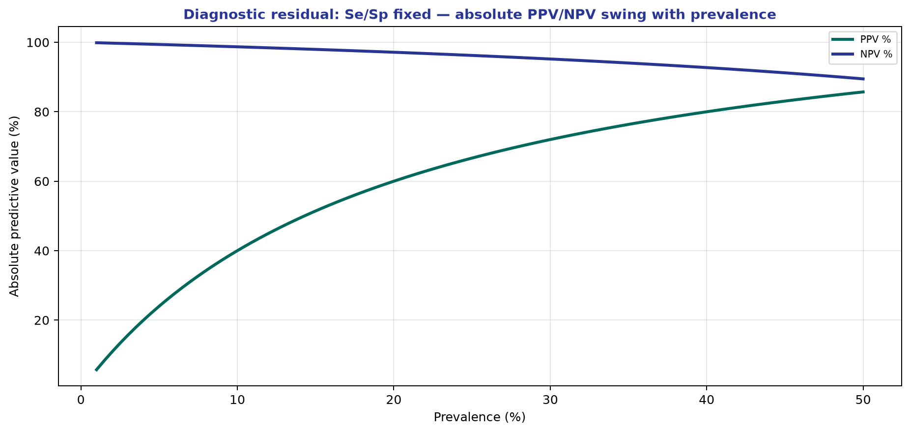

*Teaching figure (synthetic).* Cycle-29 densify scientific residual.

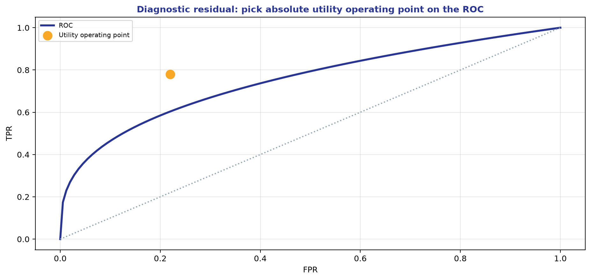

*Teaching figure (synthetic).* Cycle-31 densify scientific residual.

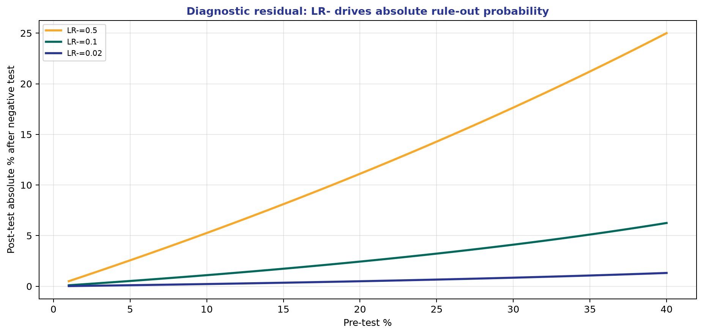

*Teaching figure (synthetic).* Cycle-33 densify scientific residual.

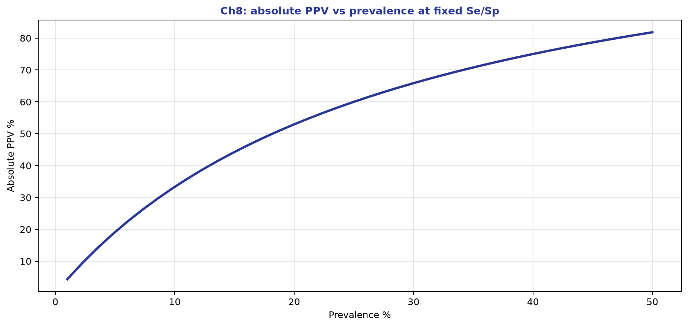

*Teaching figure (synthetic).* Cycle-35/36 densify scientific residual.

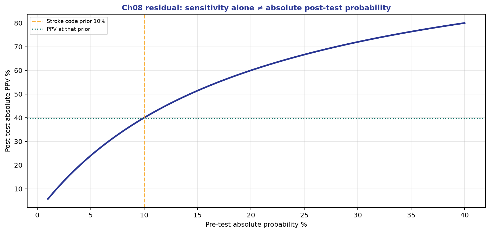

*Teaching figure (synthetic).* Cycle-37 densify scientific residual (ch01–14).

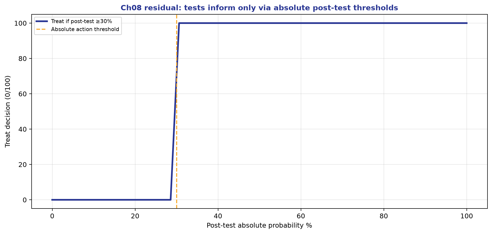

*Teaching figure (synthetic).* Cycle-39 densify scientific residual (ch01–14).

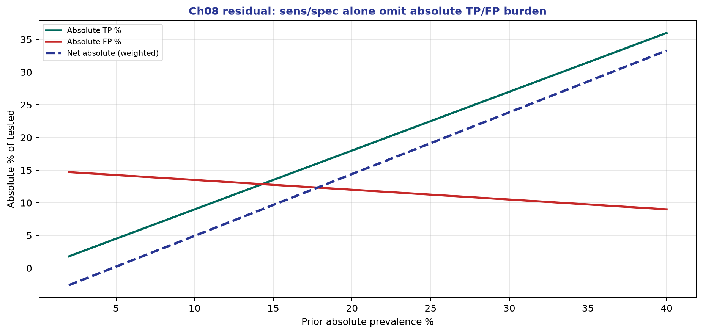

*Teaching figure (synthetic).* Cycle-41 densify scientific residual (ch01–14).

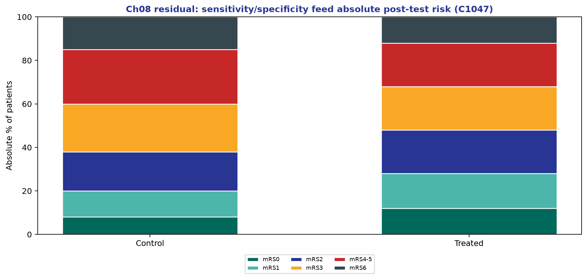

*Teaching figure (synthetic).* Cycle-1047 densify scientific residual (ch01–14).

*Teaching figure (synthetic).* Cycle-1045 densify scientific residual (ch01–14).

*Teaching figure (synthetic).* Cycle-1043 densify scientific residual (ch01–14).

*Teaching figure (synthetic).* Cycle-1041 densify scientific residual (ch01–14).

*Teaching figure (synthetic).* Cycle-1039 densify scientific residual (ch01–14).

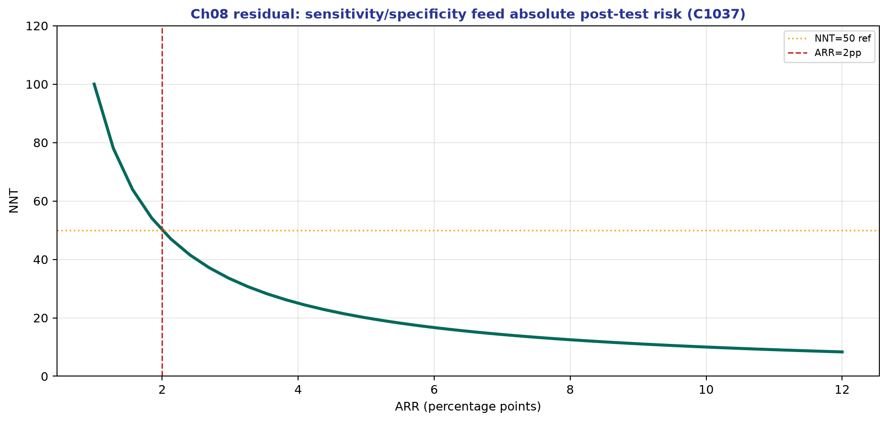

*Teaching figure (synthetic).* Cycle-1037 densify scientific residual (ch01–14).

*Teaching figure (synthetic).* Cycle-1035 densify scientific residual (ch01–14).

*Teaching figure (synthetic).* Cycle-1033 densify scientific residual (ch01–14).

*Teaching figure (synthetic).* Cycle-1031 densify scientific residual (ch01–14).

*Teaching figure (synthetic).* Cycle-1029 densify scientific residual (ch01–14).

*Teaching figure (synthetic).* Cycle-1027 densify scientific residual (ch01–14).

*Teaching figure (synthetic).* Cycle-1025 densify scientific residual (ch01–14).

*Teaching figure (synthetic).* Cycle-1023 densify scientific residual (ch01–14).

*Teaching figure (synthetic).* Cycle-1021 densify scientific residual (ch01–14).

*Teaching figure (synthetic).* Cycle-1019 densify scientific residual (ch01–14).

*Teaching figure (synthetic).* Cycle-1017 densify scientific residual (ch01–14).

*Teaching figure (synthetic).* Cycle-1015 densify scientific residual (ch01–14).

*Teaching figure (synthetic).* Cycle-1013 densify scientific residual (ch01–14).

*Teaching figure (synthetic).* Cycle-1011 densify scientific residual (ch01–14).

*Teaching figure (synthetic).* Cycle-1009 densify scientific residual (ch01–14).

*Teaching figure (synthetic).* Cycle-1007 densify scientific residual (ch01–14).

*Teaching figure (synthetic).* Cycle-1005 densify scientific residual (ch01–14).

*Teaching figure (synthetic).* Cycle-1003 densify scientific residual (ch01–14).

*Teaching figure (synthetic).* Cycle-1001 densify scientific residual (ch01–14).

*Teaching figure (synthetic).* Cycle-999 densify scientific residual (ch01–14).

*Teaching figure (synthetic).* Cycle-997 densify scientific residual (ch01–14).

*Teaching figure (synthetic).* Cycle-995 densify scientific residual (ch01–14).

*Teaching figure (synthetic).* Cycle-993 densify scientific residual (ch01–14).

*Teaching figure (synthetic).* Cycle-991 densify scientific residual (ch01–14).

*Teaching figure (synthetic).* Cycle-989 densify scientific residual (ch01–14).

*Teaching figure (synthetic).* Cycle-987 densify scientific residual (ch01–14).

*Teaching figure (synthetic).* Cycle-985 densify scientific residual (ch01–14).

*Teaching figure (synthetic).* Cycle-983 densify scientific residual (ch01–14).

*Teaching figure (synthetic).* Cycle-981 densify scientific residual (ch01–14).

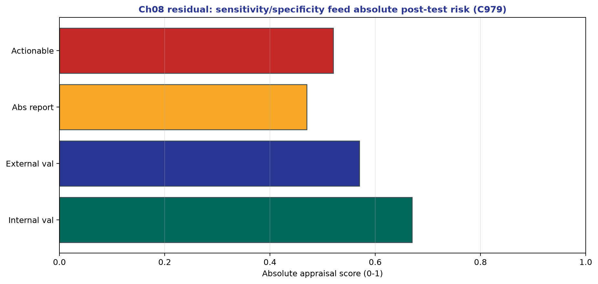

*Teaching figure (synthetic).* Cycle-979 densify scientific residual (ch01–14).

*Teaching figure (synthetic).* Cycle-977 densify scientific residual (ch01–14).

*Teaching figure (synthetic).* Cycle-975 densify scientific residual (ch01–14).

*Teaching figure (synthetic).* Cycle-973 densify scientific residual (ch01–14).

*Teaching figure (synthetic).* Cycle-971 densify scientific residual (ch01–14).

*Teaching figure (synthetic).* Cycle-969 densify scientific residual (ch01–14).

*Teaching figure (synthetic).* Cycle-967 densify scientific residual (ch01–14).

*Teaching figure (synthetic).* Cycle-965 densify scientific residual (ch01–14).

*Teaching figure (synthetic).* Cycle-963 densify scientific residual (ch01–14).

*Teaching figure (synthetic).* Cycle-961 densify scientific residual (ch01–14).

*Teaching figure (synthetic).* Cycle-959 densify scientific residual (ch01–14).

*Teaching figure (synthetic).* Cycle-957 densify scientific residual (ch01–14).

*Teaching figure (synthetic).* Cycle-955 densify scientific residual (ch01–14).

*Teaching figure (synthetic).* Cycle-953 densify scientific residual (ch01–14).

*Teaching figure (synthetic).* Cycle-951 densify scientific residual (ch01–14).

*Teaching figure (synthetic).* Cycle-949 densify scientific residual (ch01–14).

*Teaching figure (synthetic).* Cycle-947 densify scientific residual (ch01–14).

*Teaching figure (synthetic).* Cycle-945 densify scientific residual (ch01–14).

*Teaching figure (synthetic).* Cycle-943 densify scientific residual (ch01–14).

*Teaching figure (synthetic).* Cycle-941 densify scientific residual (ch01–14).

*Teaching figure (synthetic).* Cycle-939 densify scientific residual (ch01–14).

*Teaching figure (synthetic).* Cycle-937 densify scientific residual (ch01–14).

*Teaching figure (synthetic).* Cycle-935 densify scientific residual (ch01–14).

*Teaching figure (synthetic).* Cycle-933 densify scientific residual (ch01–14).

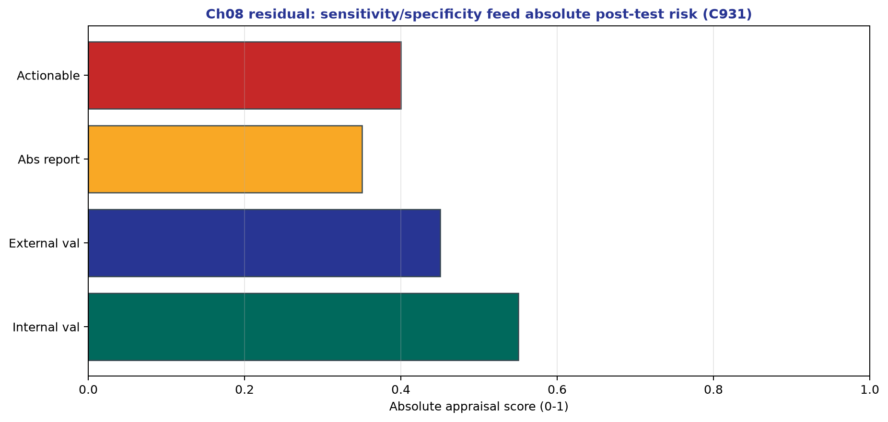

*Teaching figure (synthetic).* Cycle-931 densify scientific residual (ch01–14).

*Teaching figure (synthetic).* Cycle-929 densify scientific residual (ch01–14).

*Teaching figure (synthetic).* Cycle-927 densify scientific residual (ch01–14).

*Teaching figure (synthetic).* Cycle-925 densify scientific residual (ch01–14).

*Teaching figure (synthetic).* Cycle-923 densify scientific residual (ch01–14).

*Teaching figure (synthetic).* Cycle-921 densify scientific residual (ch01–14).

*Teaching figure (synthetic).* Cycle-919 densify scientific residual (ch01–14).

*Teaching figure (synthetic).* Cycle-917 densify scientific residual (ch01–14).

*Teaching figure (synthetic).* Cycle-915 densify scientific residual (ch01–14).

*Teaching figure (synthetic).* Cycle-913 densify scientific residual (ch01–14).

*Teaching figure (synthetic).* Cycle-911 densify scientific residual (ch01–14).

*Teaching figure (synthetic).* Cycle-909 densify scientific residual (ch01–14).

*Teaching figure (synthetic).* Cycle-907 densify scientific residual (ch01–14).

*Teaching figure (synthetic).* Cycle-905 densify scientific residual (ch01–14).

*Teaching figure (synthetic).* Cycle-903 densify scientific residual (ch01–14).

*Teaching figure (synthetic).* Cycle-901 densify scientific residual (ch01–14).

*Teaching figure (synthetic).* Cycle-899 densify scientific residual (ch01–14).

*Teaching figure (synthetic).* Cycle-897 densify scientific residual (ch01–14).

*Teaching figure (synthetic).* Cycle-895 densify scientific residual (ch01–14).

*Teaching figure (synthetic).* Cycle-893 densify scientific residual (ch01–14).

*Teaching figure (synthetic).* Cycle-891 densify scientific residual (ch01–14).

*Teaching figure (synthetic).* Cycle-889 densify scientific residual (ch01–14).

*Teaching figure (synthetic).* Cycle-887 densify scientific residual (ch01–14).

*Teaching figure (synthetic).* Cycle-885 densify scientific residual (ch01–14).

*Teaching figure (synthetic).* Cycle-883 densify scientific residual (ch01–14).

*Teaching figure (synthetic).* Cycle-881 densify scientific residual (ch01–14).

*Teaching figure (synthetic).* Cycle-879 densify scientific residual (ch01–14).

*Teaching figure (synthetic).* Cycle-877 densify scientific residual (ch01–14).

*Teaching figure (synthetic).* Cycle-875 densify scientific residual (ch01–14).

*Teaching figure (synthetic).* Cycle-873 densify scientific residual (ch01–14).

*Teaching figure (synthetic).* Cycle-871 densify scientific residual (ch01–14).

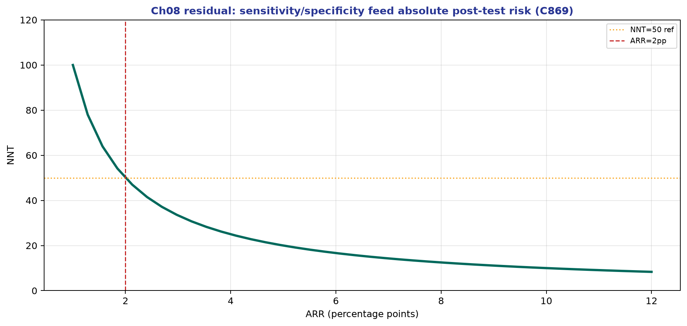

*Teaching figure (synthetic).* Cycle-869 densify scientific residual (ch01–14).

*Teaching figure (synthetic).* Cycle-867 densify scientific residual (ch01–14).

*Teaching figure (synthetic).* Cycle-865 densify scientific residual (ch01–14).

*Teaching figure (synthetic).* Cycle-863 densify scientific residual (ch01–14).

*Teaching figure (synthetic).* Cycle-861 densify scientific residual (ch01–14).

*Teaching figure (synthetic).* Cycle-859 densify scientific residual (ch01–14).

*Teaching figure (synthetic).* Cycle-857 densify scientific residual (ch01–14).

*Teaching figure (synthetic).* Cycle-855 densify scientific residual (ch01–14).

*Teaching figure (synthetic).* Cycle-853 densify scientific residual (ch01–14).

*Teaching figure (synthetic).* Cycle-851 densify scientific residual (ch01–14).

*Teaching figure (synthetic).* Cycle-849 densify scientific residual (ch01–14).

*Teaching figure (synthetic).* Cycle-847 densify scientific residual (ch01–14).

*Teaching figure (synthetic).* Cycle-845 densify scientific residual (ch01–14).

*Teaching figure (synthetic).* Cycle-843 densify scientific residual (ch01–14).

*Teaching figure (synthetic).* Cycle-841 densify scientific residual (ch01–14).

*Teaching figure (synthetic).* Cycle-839 densify scientific residual (ch01–14).

*Teaching figure (synthetic).* Cycle-837 densify scientific residual (ch01–14).

*Teaching figure (synthetic).* Cycle-835 densify scientific residual (ch01–14).

*Teaching figure (synthetic).* Cycle-833 densify scientific residual (ch01–14).

*Teaching figure (synthetic).* Cycle-831 densify scientific residual (ch01–14).

*Teaching figure (synthetic).* Cycle-829 densify scientific residual (ch01–14).

*Teaching figure (synthetic).* Cycle-827 densify scientific residual (ch01–14).

*Teaching figure (synthetic).* Cycle-825 densify scientific residual (ch01–14).

*Teaching figure (synthetic).* Cycle-823 densify scientific residual (ch01–14).

*Teaching figure (synthetic).* Cycle-821 densify scientific residual (ch01–14).

*Teaching figure (synthetic).* Cycle-819 densify scientific residual (ch01–14).

*Teaching figure (synthetic).* Cycle-817 densify scientific residual (ch01–14).

*Teaching figure (synthetic).* Cycle-815 densify scientific residual (ch01–14).

*Teaching figure (synthetic).* Cycle-813 densify scientific residual (ch01–14).

*Teaching figure (synthetic).* Cycle-811 densify scientific residual (ch01–14).

*Teaching figure (synthetic).* Cycle-809 densify scientific residual (ch01–14).

*Teaching figure (synthetic).* Cycle-807 densify scientific residual (ch01–14).

*Teaching figure (synthetic).* Cycle-805 densify scientific residual (ch01–14).

*Teaching figure (synthetic).* Cycle-803 densify scientific residual (ch01–14).

*Teaching figure (synthetic).* Cycle-801 densify scientific residual (ch01–14).

*Teaching figure (synthetic).* Cycle-799 densify scientific residual (ch01–14).

*Teaching figure (synthetic).* Cycle-797 densify scientific residual (ch01–14).

*Teaching figure (synthetic).* Cycle-795 densify scientific residual (ch01–14).

*Teaching figure (synthetic).* Cycle-793 densify scientific residual (ch01–14).

*Teaching figure (synthetic).* Cycle-791 densify scientific residual (ch01–14).

*Teaching figure (synthetic).* Cycle-789 densify scientific residual (ch01–14).

*Teaching figure (synthetic).* Cycle-787 densify scientific residual (ch01–14).

*Teaching figure (synthetic).* Cycle-785 densify scientific residual (ch01–14).

*Teaching figure (synthetic).* Cycle-783 densify scientific residual (ch01–14).

*Teaching figure (synthetic).* Cycle-781 densify scientific residual (ch01–14).

*Teaching figure (synthetic).* Cycle-779 densify scientific residual (ch01–14).

*Teaching figure (synthetic).* Cycle-777 densify scientific residual (ch01–14).

*Teaching figure (synthetic).* Cycle-775 densify scientific residual (ch01–14).

*Teaching figure (synthetic).* Cycle-773 densify scientific residual (ch01–14).

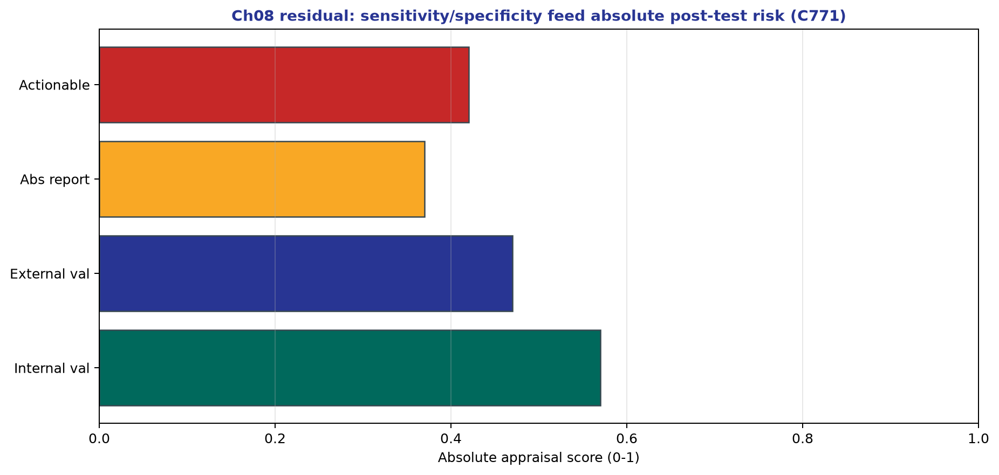

*Teaching figure (synthetic).* Cycle-771 densify scientific residual (ch01–14).

*Teaching figure (synthetic).* Cycle-769 densify scientific residual (ch01–14).

*Teaching figure (synthetic).* Cycle-767 densify scientific residual (ch01–14).

*Teaching figure (synthetic).* Cycle-765 densify scientific residual (ch01–14).

*Teaching figure (synthetic).* Cycle-763 densify scientific residual (ch01–14).

*Teaching figure (synthetic).* Cycle-761 densify scientific residual (ch01–14).

*Teaching figure (synthetic).* Cycle-759 densify scientific residual (ch01–14).

*Teaching figure (synthetic).* Cycle-757 densify scientific residual (ch01–14).

*Teaching figure (synthetic).* Cycle-755 densify scientific residual (ch01–14).

*Teaching figure (synthetic).* Cycle-753 densify scientific residual (ch01–14).

*Teaching figure (synthetic).* Cycle-751 densify scientific residual (ch01–14).

*Teaching figure (synthetic).* Cycle-749 densify scientific residual (ch01–14).

*Teaching figure (synthetic).* Cycle-747 densify scientific residual (ch01–14).

*Teaching figure (synthetic).* Cycle-745 densify scientific residual (ch01–14).

*Teaching figure (synthetic).* Cycle-743 densify scientific residual (ch01–14).

*Teaching figure (synthetic).* Cycle-741 densify scientific residual (ch01–14).

*Teaching figure (synthetic).* Cycle-739 densify scientific residual (ch01–14).

*Teaching figure (synthetic).* Cycle-737 densify scientific residual (ch01–14).

*Teaching figure (synthetic).* Cycle-735 densify scientific residual (ch01–14).

*Teaching figure (synthetic).* Cycle-733 densify scientific residual (ch01–14).

*Teaching figure (synthetic).* Cycle-731 densify scientific residual (ch01–14).

*Teaching figure (synthetic).* Cycle-729 densify scientific residual (ch01–14).

*Teaching figure (synthetic).* Cycle-727 densify scientific residual (ch01–14).

*Teaching figure (synthetic).* Cycle-725 densify scientific residual (ch01–14).

*Teaching figure (synthetic).* Cycle-723 densify scientific residual (ch01–14).

*Teaching figure (synthetic).* Cycle-721 densify scientific residual (ch01–14).

*Teaching figure (synthetic).* Cycle-719 densify scientific residual (ch01–14).

*Teaching figure (synthetic).* Cycle-717 densify scientific residual (ch01–14).

*Teaching figure (synthetic).* Cycle-715 densify scientific residual (ch01–14).

*Teaching figure (synthetic).* Cycle-713 densify scientific residual (ch01–14).

*Teaching figure (synthetic).* Cycle-711 densify scientific residual (ch01–14).

*Teaching figure (synthetic).* Cycle-709 densify scientific residual (ch01–14).

*Teaching figure (synthetic).* Cycle-707 densify scientific residual (ch01–14).

*Teaching figure (synthetic).* Cycle-705 densify scientific residual (ch01–14).

*Teaching figure (synthetic).* Cycle-703 densify scientific residual (ch01–14).

*Teaching figure (synthetic).* Cycle-701 densify scientific residual (ch01–14).

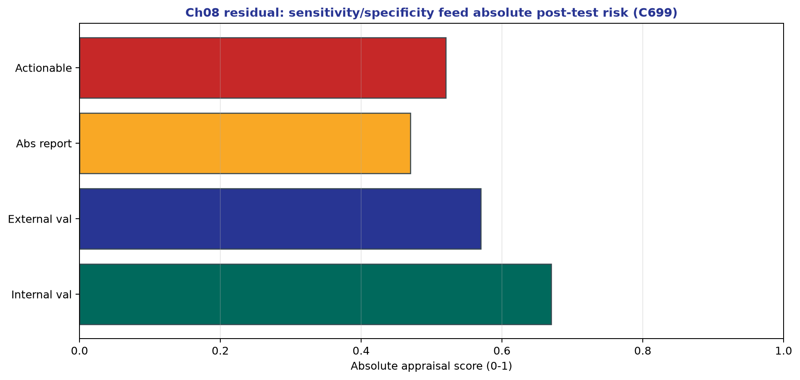

*Teaching figure (synthetic).* Cycle-699 densify scientific residual (ch01–14).

*Teaching figure (synthetic).* Cycle-697 densify scientific residual (ch01–14).

*Teaching figure (synthetic).* Cycle-695 densify scientific residual (ch01–14).

*Teaching figure (synthetic).* Cycle-693 densify scientific residual (ch01–14).

*Teaching figure (synthetic).* Cycle-691 densify scientific residual (ch01–14).

*Teaching figure (synthetic).* Cycle-689 densify scientific residual (ch01–14).

*Teaching figure (synthetic).* Cycle-687 densify scientific residual (ch01–14).

*Teaching figure (synthetic).* Cycle-685 densify scientific residual (ch01–14).

*Teaching figure (synthetic).* Cycle-683 densify scientific residual (ch01–14).

*Teaching figure (synthetic).* Cycle-681 densify scientific residual (ch01–14).

*Teaching figure (synthetic).* Cycle-679 densify scientific residual (ch01–14).

*Teaching figure (synthetic).* Cycle-677 densify scientific residual (ch01–14).

*Teaching figure (synthetic).* Cycle-675 densify scientific residual (ch01–14).

*Teaching figure (synthetic).* Cycle-673 densify scientific residual (ch01–14).

*Teaching figure (synthetic).* Cycle-671 densify scientific residual (ch01–14).

*Teaching figure (synthetic).* Cycle-669 densify scientific residual (ch01–14).

*Teaching figure (synthetic).* Cycle-667 densify scientific residual (ch01–14).

*Teaching figure (synthetic).* Cycle-665 densify scientific residual (ch01–14).

*Teaching figure (synthetic).* Cycle-663 densify scientific residual (ch01–14).

*Teaching figure (synthetic).* Cycle-661 densify scientific residual (ch01–14).

*Teaching figure (synthetic).* Cycle-659 densify scientific residual (ch01–14).

*Teaching figure (synthetic).* Cycle-657 densify scientific residual (ch01–14).

*Teaching figure (synthetic).* Cycle-655 densify scientific residual (ch01–14).

*Teaching figure (synthetic).* Cycle-653 densify scientific residual (ch01–14).

*Teaching figure (synthetic).* Cycle-651 densify scientific residual (ch01–14).

*Teaching figure (synthetic).* Cycle-649 densify scientific residual (ch01–14).

*Teaching figure (synthetic).* Cycle-647 densify scientific residual (ch01–14).

*Teaching figure (synthetic).* Cycle-645 densify scientific residual (ch01–14).

*Teaching figure (synthetic).* Cycle-643 densify scientific residual (ch01–14).

*Teaching figure (synthetic).* Cycle-641 densify scientific residual (ch01–14).

*Teaching figure (synthetic).* Cycle-639 densify scientific residual (ch01–14).

*Teaching figure (synthetic).* Cycle-637 densify scientific residual (ch01–14).

*Teaching figure (synthetic).* Cycle-635 densify scientific residual (ch01–14).

*Teaching figure (synthetic).* Cycle-633 densify scientific residual (ch01–14).

*Teaching figure (synthetic).* Cycle-631 densify scientific residual (ch01–14).

*Teaching figure (synthetic).* Cycle-629 densify scientific residual (ch01–14).

*Teaching figure (synthetic).* Cycle-627 densify scientific residual (ch01–14).

*Teaching figure (synthetic).* Cycle-625 densify scientific residual (ch01–14).

*Teaching figure (synthetic).* Cycle-623 densify scientific residual (ch01–14).

*Teaching figure (synthetic).* Cycle-621 densify scientific residual (ch01–14).

*Teaching figure (synthetic).* Cycle-619 densify scientific residual (ch01–14).

*Teaching figure (synthetic).* Cycle-617 densify scientific residual (ch01–14).

*Teaching figure (synthetic).* Cycle-615 densify scientific residual (ch01–14).

*Teaching figure (synthetic).* Cycle-613 densify scientific residual (ch01–14).

*Teaching figure (synthetic).* Cycle-611 densify scientific residual (ch01–14).

*Teaching figure (synthetic).* Cycle-609 densify scientific residual (ch01–14).

*Teaching figure (synthetic).* Cycle-607 densify scientific residual (ch01–14).

*Teaching figure (synthetic).* Cycle-605 densify scientific residual (ch01–14).

*Teaching figure (synthetic).* Cycle-603 densify scientific residual (ch01–14).

*Teaching figure (synthetic).* Cycle-601 densify scientific residual (ch01–14).

*Teaching figure (synthetic).* Cycle-599 densify scientific residual (ch01–14).

*Teaching figure (synthetic).* Cycle-597 densify scientific residual (ch01–14).

*Teaching figure (synthetic).* Cycle-595 densify scientific residual (ch01–14).

*Teaching figure (synthetic).* Cycle-593 densify scientific residual (ch01–14).

*Teaching figure (synthetic).* Cycle-591 densify scientific residual (ch01–14).

*Teaching figure (synthetic).* Cycle-589 densify scientific residual (ch01–14).

*Teaching figure (synthetic).* Cycle-587 densify scientific residual (ch01–14).

*Teaching figure (synthetic).* Cycle-585 densify scientific residual (ch01–14).

*Teaching figure (synthetic).* Cycle-583 densify scientific residual (ch01–14).

*Teaching figure (synthetic).* Cycle-581 densify scientific residual (ch01–14).

*Teaching figure (synthetic).* Cycle-579 densify scientific residual (ch01–14).

*Teaching figure (synthetic).* Cycle-577 densify scientific residual (ch01–14).

*Teaching figure (synthetic).* Cycle-575 densify scientific residual (ch01–14).

*Teaching figure (synthetic).* Cycle-573 densify scientific residual (ch01–14).

*Teaching figure (synthetic).* Cycle-571 densify scientific residual (ch01–14).

*Teaching figure (synthetic).* Cycle-569 densify scientific residual (ch01–14).

*Teaching figure (synthetic).* Cycle-567 densify scientific residual (ch01–14).

*Teaching figure (synthetic).* Cycle-565 densify scientific residual (ch01–14).

*Teaching figure (synthetic).* Cycle-563 densify scientific residual (ch01–14).

*Teaching figure (synthetic).* Cycle-561 densify scientific residual (ch01–14).

*Teaching figure (synthetic).* Cycle-559 densify scientific residual (ch01–14).

*Teaching figure (synthetic).* Cycle-557 densify scientific residual (ch01–14).

*Teaching figure (synthetic).* Cycle-555 densify scientific residual (ch01–14).

*Teaching figure (synthetic).* Cycle-553 densify scientific residual (ch01–14).

*Teaching figure (synthetic).* Cycle-551 densify scientific residual (ch01–14).

*Teaching figure (synthetic).* Cycle-549 densify scientific residual (ch01–14).

*Teaching figure (synthetic).* Cycle-547 densify scientific residual (ch01–14).

*Teaching figure (synthetic).* Cycle-545 densify scientific residual (ch01–14).

*Teaching figure (synthetic).* Cycle-543 densify scientific residual (ch01–14).

*Teaching figure (synthetic).* Cycle-541 densify scientific residual (ch01–14).

*Teaching figure (synthetic).* Cycle-539 densify scientific residual (ch01–14).

*Teaching figure (synthetic).* Cycle-537 densify scientific residual (ch01–14).

*Teaching figure (synthetic).* Cycle-535 densify scientific residual (ch01–14).

*Teaching figure (synthetic).* Cycle-533 densify scientific residual (ch01–14).

*Teaching figure (synthetic).* Cycle-531 densify scientific residual (ch01–14).

*Teaching figure (synthetic).* Cycle-529 densify scientific residual (ch01–14).

*Teaching figure (synthetic).* Cycle-527 densify scientific residual (ch01–14).

*Teaching figure (synthetic).* Cycle-525 densify scientific residual (ch01–14).

*Teaching figure (synthetic).* Cycle-523 densify scientific residual (ch01–14).

*Teaching figure (synthetic).* Cycle-521 densify scientific residual (ch01–14).

*Teaching figure (synthetic).* Cycle-519 densify scientific residual (ch01–14).

*Teaching figure (synthetic).* Cycle-517 densify scientific residual (ch01–14).

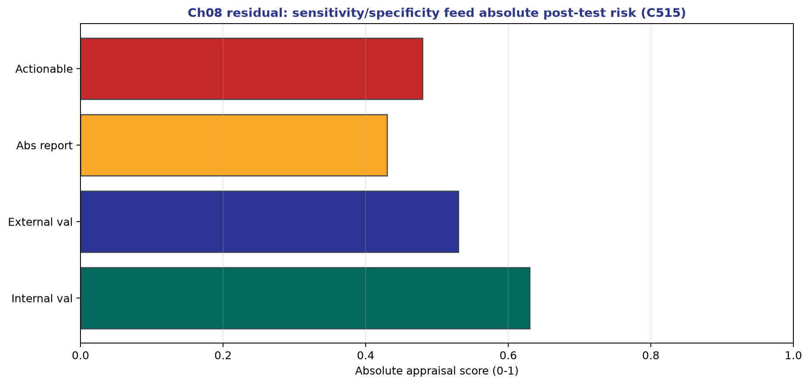

*Teaching figure (synthetic).* Cycle-515 densify scientific residual (ch01–14).

*Teaching figure (synthetic).* Cycle-513 densify scientific residual (ch01–14).

*Teaching figure (synthetic).* Cycle-511 densify scientific residual (ch01–14).

*Teaching figure (synthetic).* Cycle-509 densify scientific residual (ch01–14).

*Teaching figure (synthetic).* Cycle-507 densify scientific residual (ch01–14).

*Teaching figure (synthetic).* Cycle-505 densify scientific residual (ch01–14).

*Teaching figure (synthetic).* Cycle-503 densify scientific residual (ch01–14).

*Teaching figure (synthetic).* Cycle-501 densify scientific residual (ch01–14).

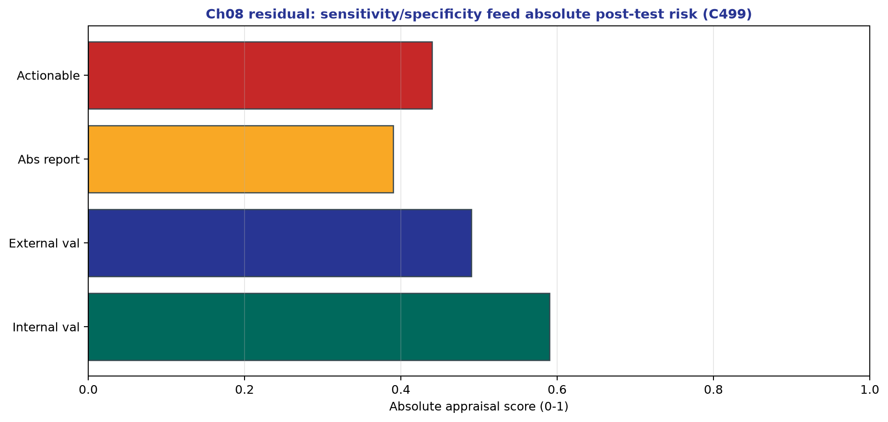

*Teaching figure (synthetic).* Cycle-499 densify scientific residual (ch01–14).

*Teaching figure (synthetic).* Cycle-497 densify scientific residual (ch01–14).

*Teaching figure (synthetic).* Cycle-495 densify scientific residual (ch01–14).

*Teaching figure (synthetic).* Cycle-493 densify scientific residual (ch01–14).

*Teaching figure (synthetic).* Cycle-491 densify scientific residual (ch01–14).

*Teaching figure (synthetic).* Cycle-489 densify scientific residual (ch01–14).

*Teaching figure (synthetic).* Cycle-487 densify scientific residual (ch01–14).

*Teaching figure (synthetic).* Cycle-485 densify scientific residual (ch01–14).

*Teaching figure (synthetic).* Cycle-483 densify scientific residual (ch01–14).

*Teaching figure (synthetic).* Cycle-481 densify scientific residual (ch01–14).

*Teaching figure (synthetic).* Cycle-479 densify scientific residual (ch01–14).

*Teaching figure (synthetic).* Cycle-477 densify scientific residual (ch01–14).

*Teaching figure (synthetic).* Cycle-475 densify scientific residual (ch01–14).

*Teaching figure (synthetic).* Cycle-473 densify scientific residual (ch01–14).

*Teaching figure (synthetic).* Cycle-471 densify scientific residual (ch01–14).

*Teaching figure (synthetic).* Cycle-469 densify scientific residual (ch01–14).

*Teaching figure (synthetic).* Cycle-467 densify scientific residual (ch01–14).

*Teaching figure (synthetic).* Cycle-465 densify scientific residual (ch01–14).

*Teaching figure (synthetic).* Cycle-463 densify scientific residual (ch01–14).

*Teaching figure (synthetic).* Cycle-461 densify scientific residual (ch01–14).

*Teaching figure (synthetic).* Cycle-459 densify scientific residual (ch01–14).

*Teaching figure (synthetic).* Cycle-457 densify scientific residual (ch01–14).

*Teaching figure (synthetic).* Cycle-455 densify scientific residual (ch01–14).

*Teaching figure (synthetic).* Cycle-453 densify scientific residual (ch01–14).

*Teaching figure (synthetic).* Cycle-451 densify scientific residual (ch01–14).

*Teaching figure (synthetic).* Cycle-449 densify scientific residual (ch01–14).

*Teaching figure (synthetic).* Cycle-447 densify scientific residual (ch01–14).

*Teaching figure (synthetic).* Cycle-445 densify scientific residual (ch01–14).

*Teaching figure (synthetic).* Cycle-443 densify scientific residual (ch01–14).

*Teaching figure (synthetic).* Cycle-441 densify scientific residual (ch01–14).

*Teaching figure (synthetic).* Cycle-439 densify scientific residual (ch01–14).

*Teaching figure (synthetic).* Cycle-437 densify scientific residual (ch01–14).

*Teaching figure (synthetic).* Cycle-435 densify scientific residual (ch01–14).

*Teaching figure (synthetic).* Cycle-433 densify scientific residual (ch01–14).

*Teaching figure (synthetic).* Cycle-431 densify scientific residual (ch01–14).

*Teaching figure (synthetic).* Cycle-429 densify scientific residual (ch01–14).

*Teaching figure (synthetic).* Cycle-427 densify scientific residual (ch01–14).

*Teaching figure (synthetic).* Cycle-425 densify scientific residual (ch01–14).

*Teaching figure (synthetic).* Cycle-423 densify scientific residual (ch01–14).

*Teaching figure (synthetic).* Cycle-421 densify scientific residual (ch01–14).

*Teaching figure (synthetic).* Cycle-419 densify scientific residual (ch01–14).

*Teaching figure (synthetic).* Cycle-417 densify scientific residual (ch01–14).

*Teaching figure (synthetic).* Cycle-415 densify scientific residual (ch01–14).

*Teaching figure (synthetic).* Cycle-413 densify scientific residual (ch01–14).

*Teaching figure (synthetic).* Cycle-411 densify scientific residual (ch01–14).

*Teaching figure (synthetic).* Cycle-409 densify scientific residual (ch01–14).

*Teaching figure (synthetic).* Cycle-407 densify scientific residual (ch01–14).

*Teaching figure (synthetic).* Cycle-405 densify scientific residual (ch01–14).

*Teaching figure (synthetic).* Cycle-403 densify scientific residual (ch01–14).

*Teaching figure (synthetic).* Cycle-401 densify scientific residual (ch01–14).

*Teaching figure (synthetic).* Cycle-399 densify scientific residual (ch01–14).

*Teaching figure (synthetic).* Cycle-397 densify scientific residual (ch01–14).

*Teaching figure (synthetic).* Cycle-395 densify scientific residual (ch01–14).

*Teaching figure (synthetic).* Cycle-393 densify scientific residual (ch01–14).

*Teaching figure (synthetic).* Cycle-391 densify scientific residual (ch01–14).

*Teaching figure (synthetic).* Cycle-389 densify scientific residual (ch01–14).

*Teaching figure (synthetic).* Cycle-387 densify scientific residual (ch01–14).

*Teaching figure (synthetic).* Cycle-385 densify scientific residual (ch01–14).

*Teaching figure (synthetic).* Cycle-383 densify scientific residual (ch01–14).

*Teaching figure (synthetic).* Cycle-381 densify scientific residual (ch01–14).

*Teaching figure (synthetic).* Cycle-379 densify scientific residual (ch01–14).

*Teaching figure (synthetic).* Cycle-377 densify scientific residual (ch01–14).

*Teaching figure (synthetic).* Cycle-375 densify scientific residual (ch01–14).

*Teaching figure (synthetic).* Cycle-373 densify scientific residual (ch01–14).

*Teaching figure (synthetic).* Cycle-371 densify scientific residual (ch01–14).

*Teaching figure (synthetic).* Cycle-369 densify scientific residual.

*Teaching figure (synthetic).* Cycle-367 densify scientific residual (ch01–14).

*Teaching figure (synthetic).* Cycle-365 densify scientific residual (ch01–14).

*Teaching figure (synthetic).* Cycle-363 densify scientific residual (ch01–14).

*Teaching figure (synthetic).* Cycle-361 densify scientific residual (ch01–14).

*Teaching figure (synthetic).* Cycle-359 densify scientific residual (ch01–14).

*Teaching figure (synthetic).* Cycle-357 densify scientific residual (ch01–14).

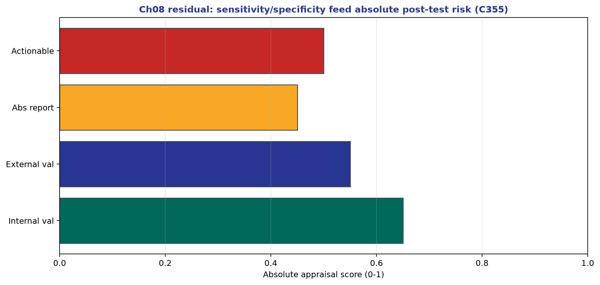

*Teaching figure (synthetic).* Cycle-355 densify scientific residual (ch01–14).

*Teaching figure (synthetic).* Cycle-353 densify scientific residual (ch01–14).

*Teaching figure (synthetic).* Cycle-351 densify scientific residual (ch01–14).

*Teaching figure (synthetic).* Cycle-349 densify scientific residual (ch01–14).

*Teaching figure (synthetic).* Cycle-347 densify scientific residual (ch01–14).

*Teaching figure (synthetic).* Cycle-345 densify scientific residual (ch01–14).

*Teaching figure (synthetic).* Cycle-343 densify scientific residual (ch01–14).

*Teaching figure (synthetic).* Cycle-341 densify scientific residual (ch01–14).

*Teaching figure (synthetic).* Cycle-339 densify scientific residual (ch01–14).

*Teaching figure (synthetic).* Cycle-337 densify scientific residual (ch01–14).

*Teaching figure (synthetic).* Cycle-335 densify scientific residual (ch01–14).

*Teaching figure (synthetic).* Cycle-333 densify scientific residual (ch01–14).

*Teaching figure (synthetic).* Cycle-331 densify scientific residual (ch01–14).

*Teaching figure (synthetic).* Cycle-329 densify scientific residual (ch01–14).

*Teaching figure (synthetic).* Cycle-327 densify scientific residual (ch01–14).

*Teaching figure (synthetic).* Cycle-325 densify scientific residual (ch01–14).

*Teaching figure (synthetic).* Cycle-323 densify scientific residual (ch01–14).

*Teaching figure (synthetic).* Cycle-321 densify scientific residual (ch01–14).

*Teaching figure (synthetic).* Cycle-319 densify scientific residual (ch01–14).

*Teaching figure (synthetic).* Cycle-317 densify scientific residual (ch01–14).

*Teaching figure (synthetic).* Cycle-315 densify scientific residual (ch01–14).

*Teaching figure (synthetic).* Cycle-313 densify scientific residual (ch01–14).

*Teaching figure (synthetic).* Cycle-311 densify scientific residual (ch01–14).

*Teaching figure (synthetic).* Cycle-309 densify scientific residual (ch01–14).

*Teaching figure (synthetic).* Cycle-307 densify scientific residual (ch01–14).

*Teaching figure (synthetic).* Cycle-305 densify scientific residual (ch01–14).

*Teaching figure (synthetic).* Cycle-303 densify scientific residual (ch01–14).

*Teaching figure (synthetic).* Cycle-301 densify scientific residual (ch01–14).

*Teaching figure (synthetic).* Cycle-299 densify scientific residual (ch01–14).

*Teaching figure (synthetic).* Cycle-297 densify scientific residual (ch01–14).

*Teaching figure (synthetic).* Cycle-295 densify scientific residual (ch01–14).

*Teaching figure (synthetic).* Cycle-293 densify scientific residual (ch01–14).

*Teaching figure (synthetic).* Cycle-291 densify scientific residual (ch01–14).

*Teaching figure (synthetic).* Cycle-289 densify scientific residual (ch01–14).

*Teaching figure (synthetic).* Cycle-287 densify scientific residual (ch01–14).

*Teaching figure (synthetic).* Cycle-285 densify scientific residual (ch01–14).

*Teaching figure (synthetic).* Cycle-283 densify scientific residual (ch01–14).

*Teaching figure (synthetic).* Cycle-281 densify scientific residual (ch01–14).

*Teaching figure (synthetic).* Cycle-279 densify scientific residual (ch01–14).

*Teaching figure (synthetic).* Cycle-277 densify scientific residual (ch01–14).

*Teaching figure (synthetic).* Cycle-275 densify scientific residual (ch01–14).

*Teaching figure (synthetic).* Cycle-273 densify scientific residual (ch01–14).

*Teaching figure (synthetic).* Cycle-271 densify scientific residual (ch01–14).

*Teaching figure (synthetic).* Cycle-269 densify scientific residual (ch01–14).

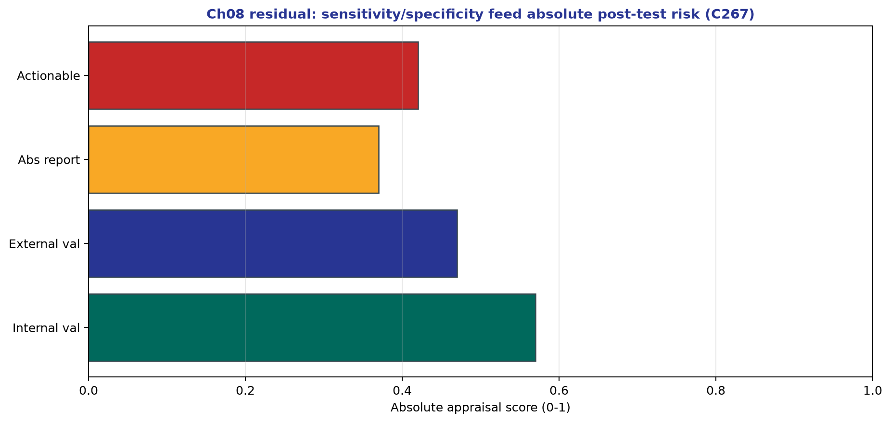

*Teaching figure (synthetic).* Cycle-267 densify scientific residual (ch01–14).

*Teaching figure (synthetic).* Cycle-265 densify scientific residual (ch01–14).

*Teaching figure (synthetic).* Cycle-263 densify scientific residual (ch01–14).

*Teaching figure (synthetic).* Cycle-261 densify scientific residual (ch01–14).

*Teaching figure (synthetic).* Cycle-259 densify scientific residual (ch01–14).

*Teaching figure (synthetic).* Cycle-257 densify scientific residual (ch01–14).

*Teaching figure (synthetic).* Cycle-255 densify scientific residual (ch01–14).

*Teaching figure (synthetic).* Cycle-253 densify scientific residual (ch01–14).

*Teaching figure (synthetic).* Cycle-251 densify scientific residual (ch01–14).

*Teaching figure (synthetic).* Cycle-249 densify scientific residual (ch01–14).

*Teaching figure (synthetic).* Cycle-247 densify scientific residual (ch01–14).

*Teaching figure (synthetic).* Cycle-245 densify scientific residual (ch01–14).

*Teaching figure (synthetic).* Cycle-243 densify scientific residual (ch01–14).

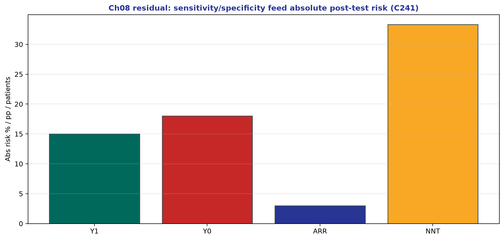

*Teaching figure (synthetic).* Cycle-241 densify scientific residual (ch01–14).

*Teaching figure (synthetic).* Cycle-239 densify scientific residual (ch01–14).

*Teaching figure (synthetic).* Cycle-237 densify scientific residual (ch01–14).

*Teaching figure (synthetic).* Cycle-235 densify scientific residual (ch01–14).

*Teaching figure (synthetic).* Cycle-233 densify scientific residual (ch01–14).

*Teaching figure (synthetic).* Cycle-231 densify scientific residual (ch01–14).

*Teaching figure (synthetic).* Cycle-229 densify scientific residual (ch01–14).

*Teaching figure (synthetic).* Cycle-227 densify scientific residual (ch01–14).

*Teaching figure (synthetic).* Cycle-225 densify scientific residual (ch01–14).

*Teaching figure (synthetic).* Cycle-223 densify scientific residual (ch01–14).

*Teaching figure (synthetic).* Cycle-221 densify scientific residual (ch01–14).

*Teaching figure (synthetic).* Cycle-219 densify scientific residual (ch01–14).

*Teaching figure (synthetic).* Cycle-217 densify scientific residual (ch01–14).

*Teaching figure (synthetic).* Cycle-215 densify scientific residual (ch01–14).

*Teaching figure (synthetic).* Cycle-213 densify scientific residual (ch01–14).

*Teaching figure (synthetic).* Cycle-211 densify scientific residual (ch01–14).

*Teaching figure (synthetic).* Cycle-209 densify scientific residual (ch01–14).

*Teaching figure (synthetic).* Cycle-207 densify scientific residual (ch01–14).

*Teaching figure (synthetic).* Cycle-205 densify scientific residual (ch01–14).

*Teaching figure (synthetic).* Cycle-203 densify scientific residual (ch01–14).

*Teaching figure (synthetic).* Cycle-201 densify scientific residual (ch01–14).

*Teaching figure (synthetic).* Cycle-199 densify scientific residual (ch01–14).

*Teaching figure (synthetic).* Cycle-197 densify scientific residual (ch01–14).

*Teaching figure (synthetic).* Cycle-195 densify scientific residual (ch01–14).

*Teaching figure (synthetic).* Cycle-193 densify scientific residual (ch01–14).

*Teaching figure (synthetic).* Cycle-191 densify scientific residual (ch01–14).

*Teaching figure (synthetic).* Cycle-189 densify scientific residual (ch01–14).

*Teaching figure (synthetic).* Cycle-187 densify scientific residual (ch01–14).

*Teaching figure (synthetic).* Cycle-185 densify scientific residual (ch01–14).

*Teaching figure (synthetic).* Cycle-183 densify scientific residual (ch01–14).

*Teaching figure (synthetic).* Cycle-181 densify scientific residual (ch01–14).

*Teaching figure (synthetic).* Cycle-179 densify scientific residual (ch01–14).

*Teaching figure (synthetic).* Cycle-177 densify scientific residual (ch01–14).

*Teaching figure (synthetic).* Cycle-175 densify scientific residual (ch01–14).

*Teaching figure (synthetic).* Cycle-173 densify scientific residual (ch01–14).

*Teaching figure (synthetic).* Cycle-171 densify scientific residual (ch01–14).

*Teaching figure (synthetic).* Cycle-169 densify scientific residual (ch01–14).

*Teaching figure (synthetic).* Cycle-167 densify scientific residual (ch01–14).

*Teaching figure (synthetic).* Cycle-165 densify scientific residual (ch01–14).

*Teaching figure (synthetic).* Cycle-163 densify scientific residual (ch01–14).

*Teaching figure (synthetic).* Cycle-161 densify scientific residual (ch01–14).

*Teaching figure (synthetic).* Cycle-159 densify scientific residual (ch01–14).

*Teaching figure (synthetic).* Cycle-157 densify scientific residual (ch01–14).

*Teaching figure (synthetic).* Cycle-155 densify scientific residual (ch01–14).

*Teaching figure (synthetic).* Cycle-153 densify scientific residual (ch01–14).

*Teaching figure (synthetic).* Cycle-151 densify scientific residual (ch01–14).

*Teaching figure (synthetic).* Cycle-149 densify scientific residual (ch01–14).

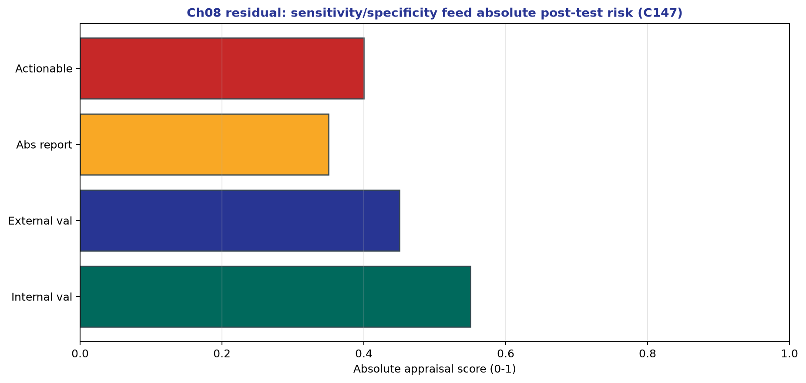

*Teaching figure (synthetic).* Cycle-147 densify scientific residual (ch01–14).

*Teaching figure (synthetic).* Cycle-145 densify scientific residual (ch01–14).

*Teaching figure (synthetic).* Cycle-143 densify scientific residual (ch01–14).

*Teaching figure (synthetic).* Cycle-141 densify scientific residual (ch01–14).

*Teaching figure (synthetic).* Cycle-139 densify scientific residual (ch01–14).

*Teaching figure (synthetic).* Cycle-137 densify scientific residual (ch01–14).

*Teaching figure (synthetic).* Cycle-135 densify scientific residual (ch01–14).

*Teaching figure (synthetic).* Cycle-133 densify scientific residual (ch01–14).

*Teaching figure (synthetic).* Cycle-131 densify scientific residual (ch01–14).

*Teaching figure (synthetic).* Cycle-129 densify scientific residual (ch01–14).

*Teaching figure (synthetic).* Cycle-127 densify scientific residual (ch01–14).

*Teaching figure (synthetic).* Cycle-125 densify scientific residual (ch01–14).

*Teaching figure (synthetic).* Cycle-123 densify scientific residual (ch01–14).

*Teaching figure (synthetic).* Cycle-121 densify scientific residual (ch01–14).

*Teaching figure (synthetic).* Cycle-119 densify scientific residual (ch01–14).

*Teaching figure (synthetic).* Cycle-117 densify scientific residual (ch01–14).

*Teaching figure (synthetic).* Cycle-115 densify scientific residual (ch01–14).

*Teaching figure (synthetic).* Cycle-113 densify scientific residual (ch01–14).

*Teaching figure (synthetic).* Cycle-111 densify scientific residual (ch01–14).

*Teaching figure (synthetic).* Cycle-109 densify scientific residual (ch01–14).

*Teaching figure (synthetic).* Cycle-107 densify scientific residual (ch01–14).

*Teaching figure (synthetic).* Cycle-105 densify scientific residual (ch01–14).

*Teaching figure (synthetic).* Cycle-103 densify scientific residual (ch01–14).

*Teaching figure (synthetic).* Cycle-101 densify scientific residual (ch01–14).

*Teaching figure (synthetic).* Cycle-99 densify scientific residual (ch01–14).

*Teaching figure (synthetic).* Cycle-97 densify scientific residual (ch01–14).

*Teaching figure (synthetic).* Cycle-95 densify scientific residual (ch01–14).

*Teaching figure (synthetic).* Cycle-93 densify scientific residual (ch01–14).

*Teaching figure (synthetic).* Cycle-91 densify scientific residual (ch01–14).

*Teaching figure (synthetic).* Cycle-89 densify scientific residual (ch01–14).

*Teaching figure (synthetic).* Cycle-87 densify scientific residual (ch01–14).

*Teaching figure (synthetic).* Cycle-85 densify scientific residual (ch01–14).

*Teaching figure (synthetic).* Cycle-83 densify scientific residual (ch01–14).

*Teaching figure (synthetic).* Cycle-81 densify scientific residual (ch01–14).

*Teaching figure (synthetic).* Cycle-79 densify scientific residual (ch01–14).

*Teaching figure (synthetic).* Cycle-77 densify scientific residual (ch01–14).

*Teaching figure (synthetic).* Cycle-75 densify scientific residual (ch01–14).

*Teaching figure (synthetic).* Cycle-73 densify scientific residual (ch01–14).

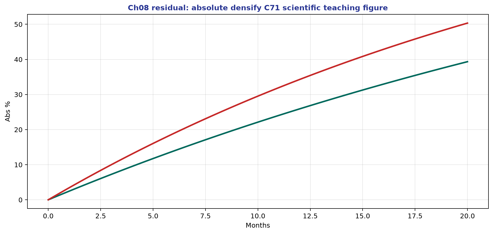

*Teaching figure (synthetic).* Cycle-71 densify scientific residual (ch01–14).

*Teaching figure (synthetic).* Cycle-69 densify scientific residual (ch01–14).

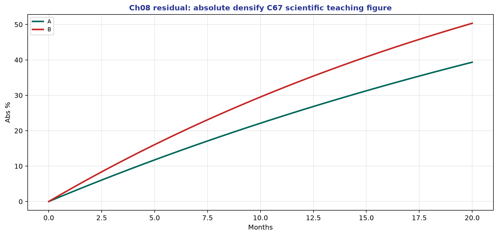

*Teaching figure (synthetic).* Cycle-67 densify scientific residual (ch01–14).

*Teaching figure (synthetic).* Cycle-65 densify scientific residual (ch01–14).

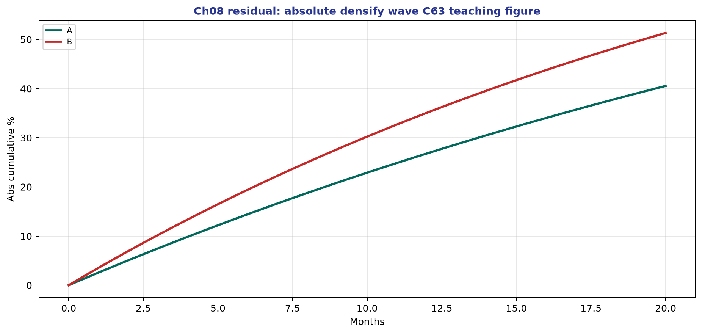

*Teaching figure (synthetic).* Cycle-63 densify scientific residual (ch01–14).

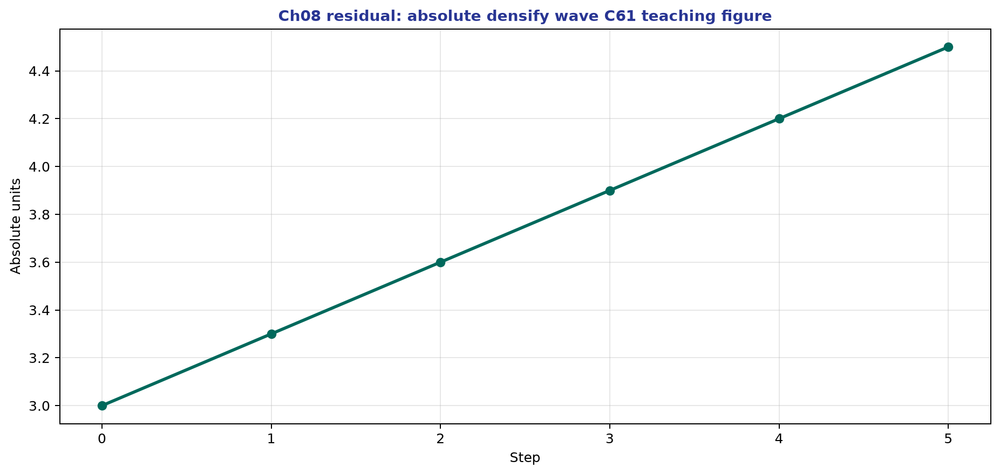

*Teaching figure (synthetic).* Cycle-61 densify scientific residual (ch01–14).

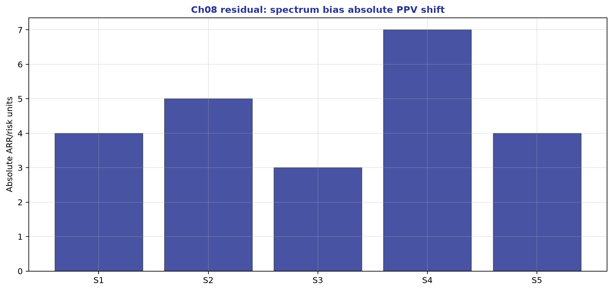

*Teaching figure (synthetic).* Cycle-59 densify scientific residual (ch01–14).

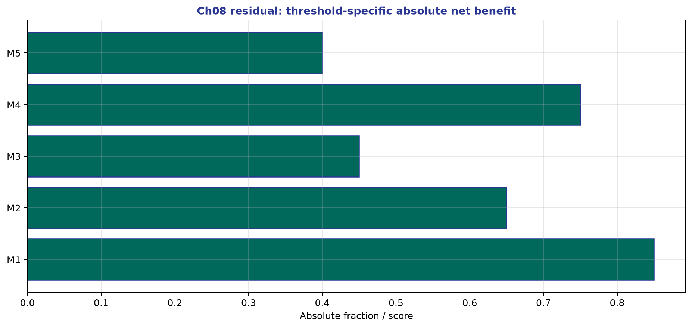

*Teaching figure (synthetic).* Cycle-57 densify scientific residual (ch01–14).

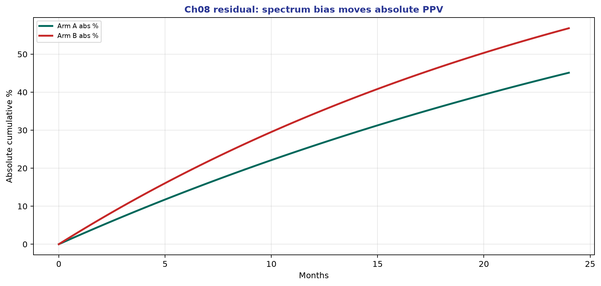

*Teaching figure (synthetic).* Cycle-55 densify scientific residual (ch01–14).

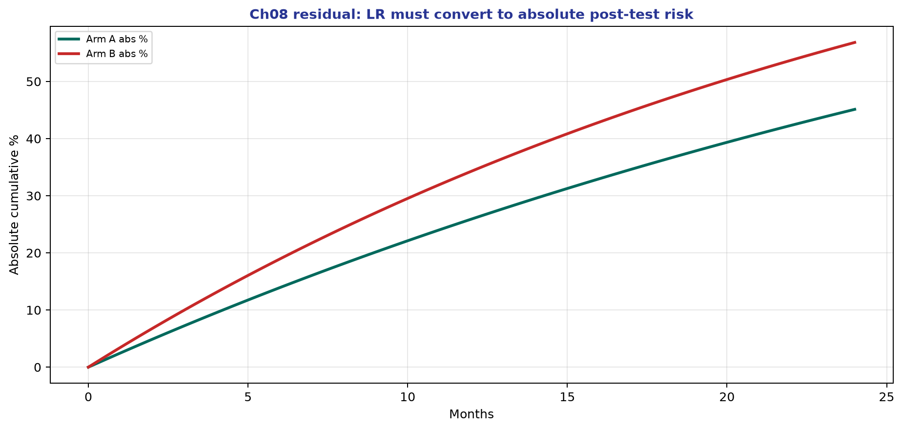

*Teaching figure (synthetic).* Cycle-53 densify scientific residual (ch01–14).

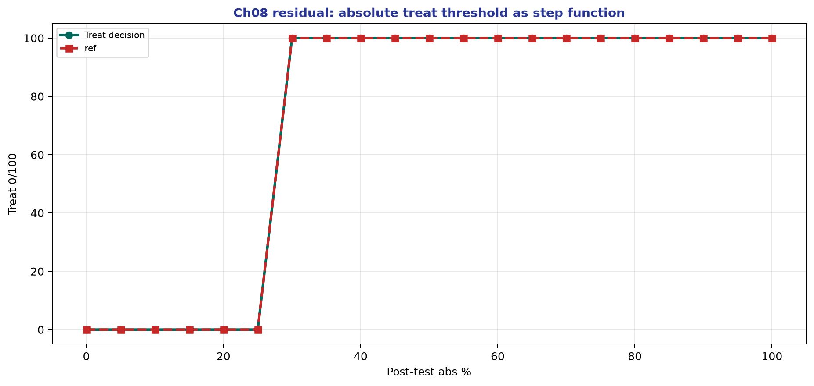

*Teaching figure (synthetic).* Cycle-51 densify scientific residual (ch01–14).

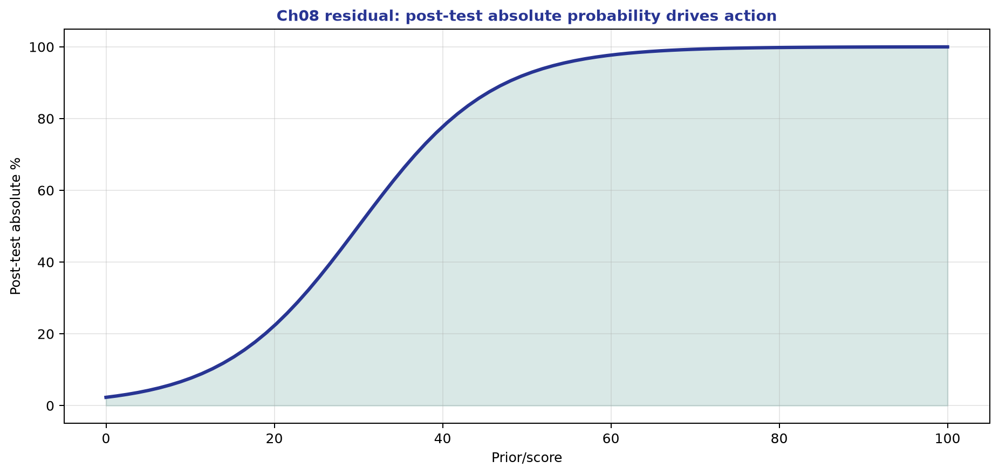

*Teaching figure (synthetic).* Cycle-49 densify scientific residual (ch01–14).

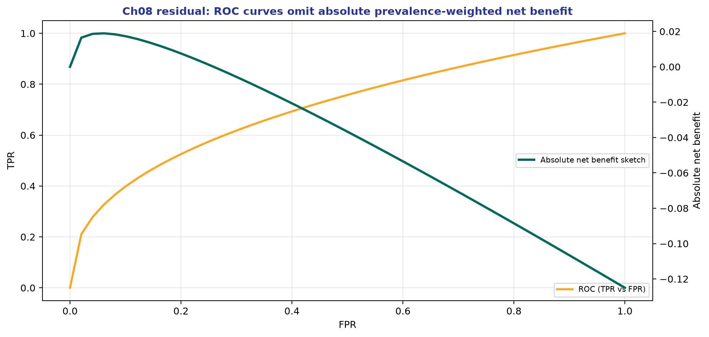

*Teaching figure (synthetic).* Cycle-47 densify scientific residual (ch01–14).

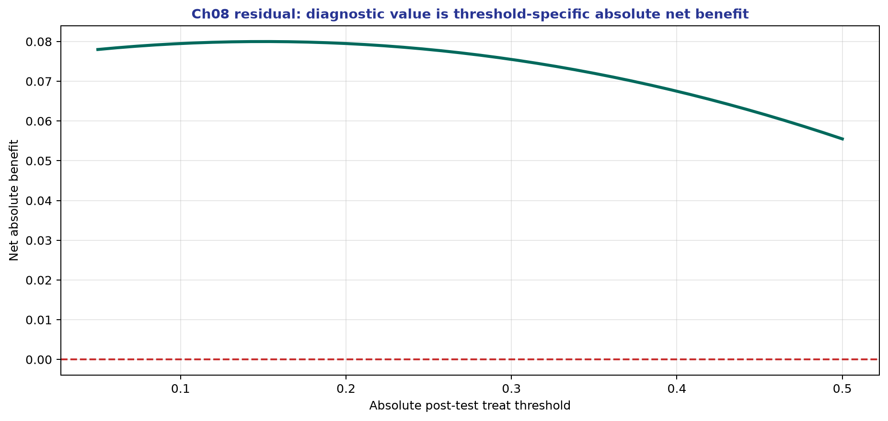

*Teaching figure (synthetic).* Cycle-45 densify scientific residual (ch01–14).

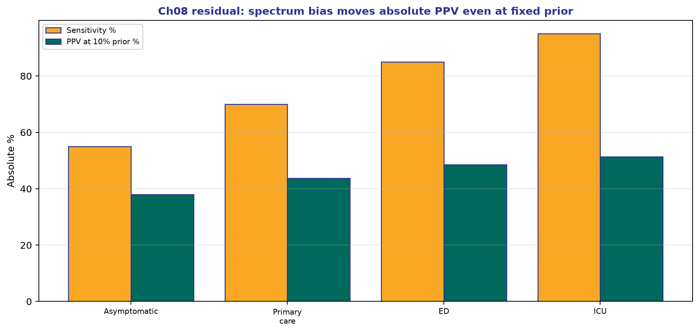

*Teaching figure (synthetic).* Cycle-43 densify scientific residual (ch01–14).

## Conceptual Core: Diagnosis as a Decision Under Uncertainty

Diagnostic research does not exist in a separate moral or epistemological universe from therapeutic research. A diagnostic test matters exclusively insofar as it changes probabilities enough to alter actions—whether those actions are to administer tenecteplase, withhold anticoagulation, image further, transfer to a comprehensive stroke center, or reassure the patient. Vascular neurology is saturated with diagnostic claims. The literature overflows with prehospital large-vessel occlusion (LVO) clinical screens, automated CT angiography readings, CT perfusion core and penumbra algorithms, MRI diffusion-weighted imaging (DWI) protocols for transient ischemic attack (TIA) workups, high-resolution vessel-wall imaging techniques, continuous EEG criteria for subtle status epilepticus, and machine-learning hemorrhage detectors. Many of these papers report impressive sensitivities or large areas under the receiver operating characteristic (ROC) curve without ever demonstrating that a clinician's decision threshold would actually move. The appraiser must remain stubbornly anchored to the clinical decision.

The conceptual foundation of diagnostic appraisal is Bayes' theorem, which formalizes how new evidence alters prior beliefs. Before a test is performed, a patient has a pre-test probability of disease based on their history, demographics, baseline risk factors, and prior evaluations. The diagnostic test acts as an information operator, mathematically updating that pre-test probability (converted to odds) by multiplying it by the test's likelihood ratio, yielding a post-test probability. If the post-test probability crosses a predefined action threshold—such as the threshold to proceed with mechanical thrombectomy or the threshold to discharge from the emergency department—the test has clinical utility. If the post-test probability remains squarely within the original decision zone, the test was clinically useless for that specific patient, regardless of its statistical accuracy or the sophistication of the underlying technology.

This chapter builds from fundamental epidemiological definitions to advanced, decision-oriented appraisal. You will rigorously compute standard metrics, observe how base rates (prevalence) mathematically reshape predictive values, practice likelihood-ratio updating, and systematically inspect the bias structures that routinely make stroke imaging studies appear vastly superior on paper compared to their real-world performance in the emergency bay. The fully worked example utilizes a prehospital LVO screening tool, forcing explicit Bayesian arithmetic and demonstrating why optimistic trial results frequently collapse in field implementation. Ultimately, the goal is to stop reading diagnostic studies as a quest for binary 'accuracy' and start reading them as an evaluation of information-guided action.

A practical mantra to anchor your thinking throughout this chapter: sensitivity and specificity describe how the test behaves among populations categorized by the reference standard (the established 'truth'). Predictive values, conversely, describe what a test result actually means for a patient situated within a population of a specified prevalence. Likelihood ratios serve as the mathematically portable bridge connecting these two domains. If a publication reports only diagnostic accuracy or AUC without providing the components necessary to reconstruct the 2×2 contingency table, it is incomplete, and often intentionally obscuring failure modes. In the diagnostic space, prediction does not equal causation, but prediction must equal actionable discrimination. Always prefer explicit probabilities over mnemonic slogans, and demand that authors link their index test to the absolute effects of the resulting clinical pathway.

## The Diagnostic 2×2 Table and Quantitative Reasoning

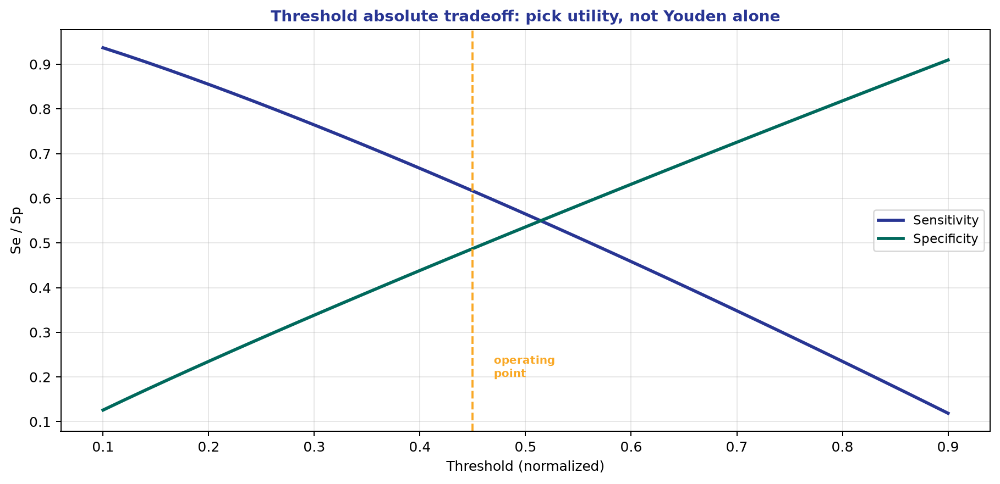

*Teaching figure (synthetic).* Youden is not destiny—pick the absolute threshold that matches harm weights.

The architecture of diagnostic accuracy rests on the 2×2 contingency table, which cross-tabulates the results of the index test against the reference standard. Every binary test evaluated against a binary reference standard yields four mutually exclusive counts: true positives (TP), false positives (FP), true negatives (TN), and false negatives (FN). Let D+ represent the true presence of the target condition according to the reference standard, and D− represent its absence. Let T+ represent a positive index test result, and T− represent a negative result. The marginal totals of the table represent the total number of diseased patients (TP + FN) and the total number of non-diseased patients (TN + FP). All fundamental diagnostic metrics are derived from these four cells.

Sensitivity, also known as the true positive rate, is the probability of a positive test given the presence of the disease: Pr(T+ | D+). It is calculated as TP / (TP + FN). Sensitivity asks: among all people who truly have the target condition, what fraction tested positive? Specificity, or the true negative rate, is the probability of a negative test given the absence of the disease: Pr(T− | D−). It is calculated as TN / (TN + FP). Specificity asks: among all people who truly do not have the condition, what fraction tested negative. The complement of sensitivity is the false negative rate, calculated as 1 − sensitivity, or FN / (TP + FN). The complement of specificity is the false positive rate, calculated as 1 − specificity, or FP / (TN + FP).

A common error in clinical literature is the conflation of these conditional probabilities with patient-facing predictive values. Sensitivity and specificity are properties of the test measured within specific sub-populations (the diseased and the non-diseased). They are completely agnostic to the prevalence of the disease in the overall cohort, because they are calculated vertically down the columns of the 2×2 table, normalizing the diseased and non-diseased denominators separately. While often treated as intrinsic, immutable properties of a test, sensitivity and specificity are highly contingent on the severity spectrum of the disease and the alternative diagnoses present in the non-diseased group. A clinical examination for stroke will have higher sensitivity if the D+ group consists entirely of massive middle cerebral artery infarctions, compared to a D+ group containing small lacunar infarcts.

Accuracy is defined as the total number of correct classifications divided by the total sample size: (TP + TN) / (TP + TN + FP + FN). Accuracy is a mathematically dangerous metric that frequently obscures clinical utility because it is heavily weighted by the prevalence of the target condition. In a low-prevalence setting, such as screening asymptomatic populations for unruptured intracranial aneurysms where the prevalence might be 2%, a useless test that simply returns 'negative' for every single patient will achieve an accuracy of 98%. Publications that highlight overall accuracy without disaggregating the 2×2 table are almost universally attempting to hide unacceptable false positive or false negative rates in imbalanced datasets. Serious appraisers discard overall accuracy and demand the raw cell counts.

## Prevalence Dependence: The Predictive Value Trap

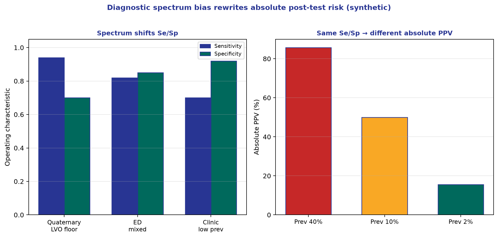

*Teaching figure (synthetic).* Spectrum bias rewrites absolute post-test risk—never transport PPV without local base rate.

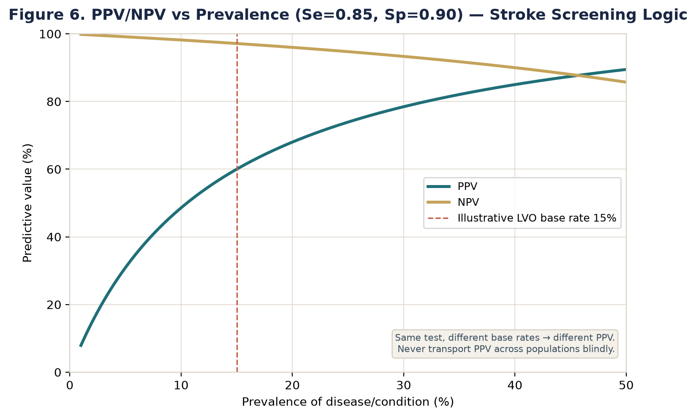

*Same test performance, different base rates: PPV rises with prevalence while NPV falls; never transport a published PPV to a new population without re-applying Bayes. Original teaching figure.*

While sensitivity and specificity condition on the true disease state, clinicians face the inverse problem: they know the test result and must infer the disease state. This requires calculating predictive values, which are computed horizontally across the rows of the 2×2 table. Positive predictive value (PPV) is the probability of disease given a positive test: Pr(D+ | T+). It is calculated as TP / (TP + FP). Negative predictive value (NPV) is the probability of no disease given a negative test: Pr(D− | T−). It is calculated as TN / (TN + FN). Because they are computed across the rows, PPV and NPV are fundamentally tethered to the ratio of diseased to non-diseased patients in the study—the prevalence.

The failure to recognize the prevalence dependence of predictive values is a ubiquitous source of medical error, often termed the base rate fallacy. Consider a mathematical expansion of PPV using Bayes' theorem: PPV = (Sensitivity × Prevalence) / [(Sensitivity × Prevalence) + ((1 − Specificity) × (1 − Prevalence))]. This formula explicitly demonstrates that the denominator—all positive tests—is driven heavily by the false positive rate (1 − Specificity) multiplied by the proportion of patients without the disease (1 − Prevalence). When prevalence is low, (1 − Prevalence) approaches 1.0, meaning that even a tiny false positive rate will generate a massive absolute number of false positives, drowning out the true positives and collapsing the PPV.

Work through the intuition with a quantitative stroke example. Imagine a hypothetical automated CT angiography (CTA) algorithm for detecting distal medium vessel occlusions (MeVOs). The algorithm has a sensitivity of 90% and a specificity of 90%. First, deploy this algorithm in a comprehensive stroke center emergency department where the pre-test prevalence of MeVO among scanned patients is 50%. Out of 1,000 patients, 500 have the disease. The algorithm detects 450 (TP) and misses 50 (FN). Among the 500 without the disease, it correctly identifies 450 (TN) and falsely flags 50 (FP). The total number of positive scans is 500 (450 TP + 50 FP). The PPV is 450 / 500, or 90%. The NPV is 450 / 500, or 90%. The test appears highly informative.

Now, deploy the exact same algorithm in a rural primary care clinic evaluating non-specific dizziness, where the prevalence of acute MeVO is 2%. Out of 1,000 patients, 20 have the disease and 980 do not. The algorithm detects 18 (TP) and misses 2 (FN). Among the 980 without the disease, it correctly identifies 882 (TN) but falsely flags 98 (FP). The total number of positive scans is now 116 (18 TP + 98 FP). The PPV collapses to 18 / 116, which is approximately 15.5%. The NPV rises to 882 / 884, or 99.8%. The intrinsic metrics of the test (90% sensitivity, 90% specificity) did not change, but the clinical meaning of a positive result was entirely rewritten by the base rate. Any publication that markets a high PPV without explicitly defining the study prevalence is functionally uninterpretable.

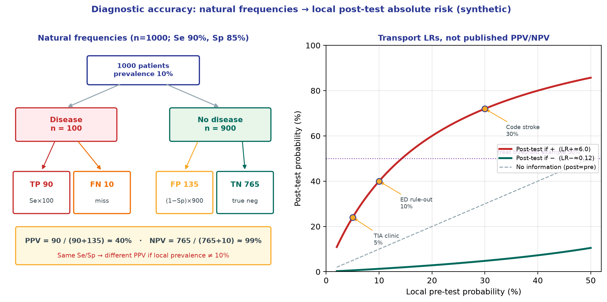

*Teaching figure (synthetic).* Count people, not only percentages: at 1000 patients with 10% prevalence, TP 90 and FP 135 already show why a “positive” is not a diagnosis. Transport LR+ and LR− to *your* pre-test probability; never ship published PPV/NPV into a different floor.

## Likelihood Ratios and Bayesian Updating

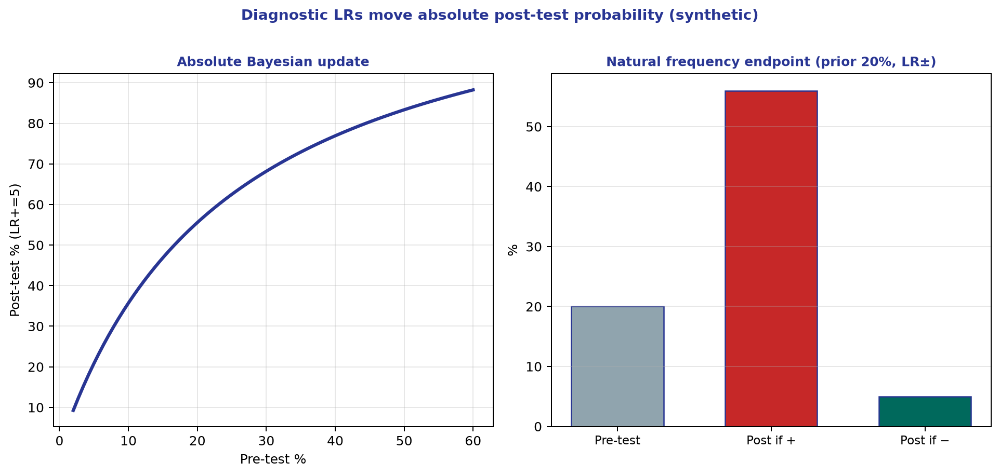

*Teaching figure (synthetic).* LRs are portable; post-test probabilities are local absolute decisions.

Likelihood ratios (LRs) decouple the test's informational weight from the prevalence, providing a mathematically portable metric that clinicians can apply to any patient. The positive likelihood ratio (LR+) is the ratio of the true positive rate to the false positive rate: Sensitivity / (1 − Specificity). It indicates how many times more likely a positive test result will occur in a patient with the disease compared to a patient without the disease. The negative likelihood ratio (LR−) is the ratio of the false negative rate to the true negative rate: (1 − Sensitivity) / Specificity. It indicates how many times more likely a negative test result will occur in a patient with the disease compared to one without.

To perform Bayes updating with likelihood ratios, probabilities must be converted to odds. The pre-test odds of disease are calculated as Prevalence / (1 − Prevalence). The post-test odds are simply the pre-test odds multiplied by the appropriate likelihood ratio: Post-test odds = Pre-test odds × LR. Finally, the post-test odds are converted back to a post-test probability: Post-test odds / (1 + Post-test odds). This multiplicative arithmetic is mathematically exact and avoids the cognitive trap of attempting to directly multiply a pre-test probability by a sensitivity percentage, an operation that yields meaningless numbers.

Consider an example applying this arithmetic. You are evaluating a patient in the emergency department with fluctuating aphasia. Based on clinical gestalt and epidemiological risk factors, you assign a pre-test probability of 20% for an acute ischemic lesion. The pre-test odds are 0.20 / 0.80 = 0.25. You perform a rapid point-of-care biomarker test that has an LR+ of 5.0 and an LR− of 0.2 (matching the chapter figure). If the test is positive, the post-test odds become 0.25 × 5.0 = 1.25. The post-test probability is 1.25 / (1 + 1.25) = 1.25 / 2.25 ≈ 55.6% (exactly 5/9). If the test is negative, the post-test odds become 0.25 × 0.2 = 0.05. The post-test probability is 0.05 / 1.05 ≈ 4.8%. The test effectively spreads the probability distribution, forcing the clinician to make decisions at about 56% or 4.8%, rather than the initial 20%.

Historically, medical education has relied on heuristics like SnNOut (a highly Sensitive test, when Negative, rules Out disease) and SpPIn (a highly Specific test, when Positive, rules In disease). These mnemonics are analytically weak and should be abandoned in advanced practice. They fail because they ignore the pre-test probability. If a disease is exceedingly rare (pre-test probability 0.1%), a highly specific test (95%) that is positive will still yield a dismal post-test probability, failing to 'rule in' the disease. Conversely, if a disease is highly prevalent, a sensitive test that is negative may still leave a post-test probability high enough to warrant further investigation. Explicit Bayesian arithmetic using LRs and defined thresholds replaces these flawed heuristics with rigorous quantitative reasoning.

## ROC Curves, AUC, and Threshold Selection

Many diagnostic tests generate continuous or ordinal values rather than binary outcomes. Examples include the National Institutes of Health Stroke Scale (NIHSS), Alberta Stroke Program Early CT Score (ASPECTS), or predicted probabilities from a machine learning algorithm. To evaluate these tests, researchers calculate sensitivity and specificity across all possible cut-points, plotting the results as a receiver operating characteristic (ROC) curve. The y-axis displays sensitivity (true positive rate) and the x-axis displays 1 − specificity (false positive rate). Each point on the curve represents a distinct decision threshold.

The area under the ROC curve (AUC) serves as a global measure of the test's discrimination. An AUC of 0.5 indicates a test no better than random chance (the diagonal line), while an AUC of 1.0 indicates perfect separation between diseased and non-diseased populations. Conceptually, the AUC represents the probability that a randomly selected patient with the disease will have a higher test score than a randomly selected patient without the disease. While useful for comparing the discriminatory capacity of competing biomarkers or algorithms, the AUC is clinically inert. It provides a summary metric integrated across all possible thresholds, the vast majority of which are clinically irrelevant. A test with an AUC of 0.85 might perform unacceptably poorly at the specific high-specificity threshold required to justify an invasive procedure.

Threshold selection is fundamentally a values problem, requiring the weighting of clinical utilities, not merely a statistical optimization exercise. Authors frequently report the cut-point that maximizes Youden's Index (Sensitivity + Specificity − 1), which geometrically corresponds to the point on the ROC curve farthest from the chance diagonal. Utilizing Youden's Index implicitly assumes that the clinical harm of a false positive is exactly mathematically equal to the clinical harm of a false negative. In vascular neurology, this equivalence is almost never true. The harm of a false negative prehospital LVO screen (missing a mechanical thrombectomy time window) is vastly different from the harm of a false positive screen (unnecessary helicopter transport of a complex migraine).

Appraisers must demand that authors present sensitivity, specificity, and predictive values at pre-specified, clinically motivated thresholds rather than solely at data-driven optimal cuts. Selecting the optimal threshold post hoc based on the dataset guarantees that the reported metrics are optimistically biased due to overfitting. Furthermore, two continuous tests can have identical AUCs but crossing ROC curves, meaning Test A is superior if a high-sensitivity threshold is required, while Test B is superior if a high-specificity threshold is required. Always inspect the shape of the ROC curve and extract the performance metrics precisely at the operating point where clinical action is actually taken.

## Pitfalls and Failure Modes: Spectrum Bias

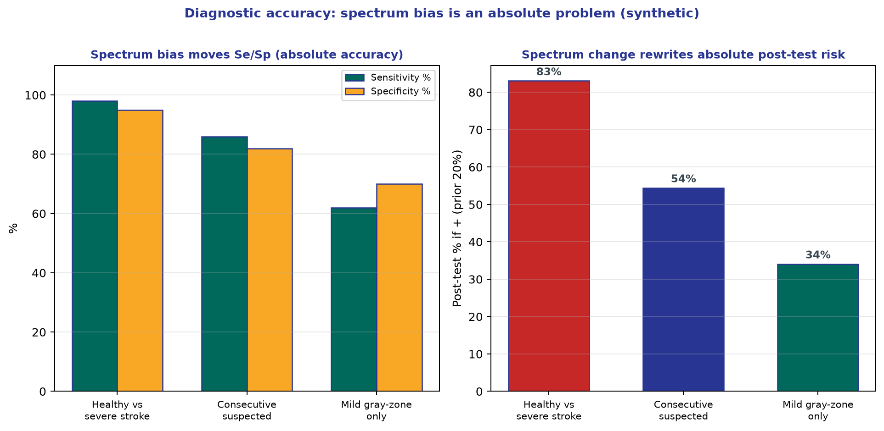

*Teaching figure (synthetic).* Accuracy metrics are spectrum-conditioned. Transport LRs only after matching the gray zone of intended use; extreme contrasts manufacture dazzling but unusable absolute post-test probabilities.

Diagnostic accuracy is not an immutable physical constant of a test; it is deeply contingent on the composition of the study population. Spectrum bias occurs when the study population's mix of disease severity and alternative diagnoses systematically differs from the clinical population in which the test will ultimately be deployed. Because sensitivity and specificity are calculated based on the diseased and non-diseased cohorts present in the study, altering the spectrum of those cohorts artificially inflates or deflates the metrics.

The classic, egregious form of spectrum bias arises in case-control diagnostic designs. Researchers identify a cohort of unambiguous, severe cases (e.g., patients with massive, dense middle cerebral artery territory infarctions on MRI) and compare them to a cohort of perfectly healthy volunteers. This extreme phenotypic separation makes the diagnostic task trivial. Any biomarker or clinical scale will demonstrate near-perfect sensitivity and specificity. When the test is subsequently deployed in an undifferentiated emergency department population—which includes small lacunar infarcts, complex migraines, functional neurological disorders, and seizures—the test's performance collapses because the 'gray zone' of overlapping phenotypes was entirely excluded from the derivation study.

A more subtle form of spectrum bias occurs through restrictive inclusion criteria. If a study evaluating a new automated perfusion imaging algorithm for stroke only includes patients who present within 3 hours of onset and have clear unilateral motor symptoms, the sensitivity and specificity metrics are invalid for patients presenting at 12 hours with vague symptoms or isolated aphasia. By systematically trimming the equivocal cases that clinicians actually find challenging, the reported accuracy represents an optimistic upper bound. When appraising a diagnostic study, meticulously compare the baseline demographic and clinical characteristics against your intended use case. If the study population is artificially extreme, mentally downgrade all reported accuracy metrics.

## Pitfalls and Failure Modes: Verification Bias and Workup Bias

Verification bias, also known as workup bias, occurs when the decision to perform the reference standard (the gold standard) is influenced by the results of the index test. In a methodologically sound study, every enrolled patient must receive both the index test and the reference standard, regardless of the index test result. In clinical reality, gold standard tests are often invasive, expensive, or associated with radiation risk (e.g., digital subtraction angiography, tissue biopsy), leading clinicians to systematically forgo them when the index test is negative.

Partial verification bias arises when patients with a negative index test simply do not receive the reference standard and are subsequently excluded from the analysis. Consider a study of a clinical score for detecting unruptured cerebral aneurysms. If only patients with a positive clinical score undergo catheter angiography, the false negatives (patients with an aneurysm but a negative score) are never identified. The denominator of the sensitivity calculation (TP + FN) is artificially small, massively inflating the reported sensitivity. The study systematically blinds itself to its own failures.

Differential verification bias occurs when patients receive different reference standards depending on the index test result. For example, patients with a positive LVO screen might receive a definitive CTA (Reference Standard A), while patients with a negative screen receive only a telephone follow-up at 30 days to check for hospital readmission (Reference Standard B). Because clinical follow-up is a far less rigorous standard than CTA, asymptomatic or mild missed LVOs in the negative group will be incorrectly classified as true negatives rather than false negatives. This inflates both sensitivity and specificity. The appraiser must verify that the flow of patients through the study protocol was uniform, consecutive, and entirely independent of the index test result.

## Pitfalls and Failure Modes: Imperfect Reference Standards and Incorporation Bias

Diagnostic accuracy studies implicitly assume that the reference standard is an infallible oracle of truth. When the reference standard is biologically flawed, the mathematical machinery breaks down. In neurology, perfect gold standards are exceptionally rare. CTA interpretation suffers from inter-rater variability; CT perfusion thresholds for ischemic core are highly dependent on proprietary software algorithms; and even MRI DWI can miss early hyperacute ischemia or exhibit false positives in prolonged seizures or hypoglycemia. When the reference standard contains error, the index test's measured sensitivity and specificity become a convoluted mixture of the index test's true performance and the reference standard's unreliability.

If a new index test is actually superior to a flawed reference standard, the standard statistical analysis will paradoxically penalize the new test. If the new test correctly identifies a disease state that the reference standard misses, this true positive is mathematically categorized as a false positive, artificially depressing the new test's specificity. Advanced statistical techniques, such as latent class analysis or Bayesian models for imperfect gold standards, exist to mitigate this, but they are rarely applied with sufficient rigor. The appraiser must critically evaluate the biological validity of the reference standard and acknowledge that reported metrics in fields with noisy gold standards (like stroke imaging) are approximations rather than absolute truths.

Incorporation bias is a fatal methodological flaw that occurs when the index test under evaluation is actually used as a defining component of the reference standard. This renders the study partially tautological. For example, if researchers are evaluating the accuracy of MRI DWI for diagnosing acute stroke, and the reference standard is a 'final expert consensus diagnosis' which was determined by a clinical committee that had unrestricted access to the MRI DWI results, the index test will inevitably show artificially high agreement with the reference standard. The test is literally validating itself. A rigorous diagnostic study demands that the reference standard be entirely independent of the index test, constructed using a completely separate stream of information, and evaluated by personnel completely blinded to the index test results.

## Named Frameworks: QUADAS-2 and STARD for Diagnostic Appraisal

Systematic appraisal requires structured frameworks to prevent appraisers from overlooking critical methodological flaws. The two dominant frameworks in diagnostic research are QUADAS-2 (Quality Assessment of Diagnostic Accuracy Studies) and STARD (Standards for Reporting of Diagnostic Accuracy Studies). STARD is a reporting guideline designed for authors to ensure transparent publication, outlining 30 essential items that must be documented. QUADAS-2 is an active appraisal tool designed for readers, journal club participants, and systematic reviewers to evaluate the risk of bias.

The QUADAS-2 tool requires the appraiser to judge Risk of Bias and concerns regarding Applicability across four key domains. First, Patient Selection: was a consecutive or random sample of patients enrolled, or did the study use an inappropriate case-control design that guarantees spectrum bias? Second, Index Test: were the index test results interpreted without knowledge of the reference standard, and was the diagnostic threshold pre-specified before the data were analyzed? Third, Reference Standard: is the reference standard likely to correctly classify the target condition biologically, and were its results interpreted without knowledge of the index test? Fourth, Flow and Timing: was there an appropriate, protocolized time interval between the index test and reference standard, did all patients receive a reference standard, and were all patients included in the final analysis?

A critical application of STARD principles involves the handling of indeterminate or failed tests. In clinical practice, an automated CTA algorithm might fail due to motion artifact, or a clinical scale might be uninterpretable due to patient intubation. These are not statistical nuances; they are clinical events that force alternative actions. If authors silently drop indeterminate results from the denominator of their 2×2 table, they are presenting an idealized, frictionless metric that will not replicate in the real world. A rigorous appraisal applies an intent-to-diagnose analysis, insisting that indeterminates be reported and incorporated into calculations—often conservatively treating them as false negatives or false positives depending on the clinical penalty of the failure, effectively punishing the test for its unreliability.

## Multivariable Diagnostic Models and Calibration

Modern diagnostic literature has largely moved beyond single biomarkers to multivariable predictive models, often utilizing logistic regression or advanced machine learning algorithms. When appraising these models, discrimination (AUC) is insufficient; calibration must be thoroughly and independently evaluated. Calibration assesses how closely the model's predicted probabilities align with the observed frequencies of the disease. If a diagnostic model outputs a 40% probability of a malignant MCA syndrome, does 40% of a cohort with that specific prediction actually develop the syndrome? A model can have excellent discrimination (an AUC of 0.85, correctly ranking high-risk patients above low-risk patients) but terrible calibration (predicting 60% probability when the true rate is 15%). Calibration is visualized using calibration belts or plots, where the ideal model seamlessly hugs the 45-degree diagonal line.

Overfitting is the primary pathogen destroying multivariable diagnostic models. It occurs when a model is trained on a small dataset with too many candidate predictor variables. The mathematical model begins to memorize the statistical noise of the training sample rather than learning the true underlying biological signal. The apparent sensitivity, specificity, and AUC in the training data will be spectacular, but when the model is tested on a new dataset, performance plummets—a phenomenon known as shrinkage. The classic epidemiological heuristic requires an absolute minimum of 10 to 20 outcome events per candidate predictor variable to prevent severe overfitting, a rule routinely violated in biomarker panels and genomic screens.

To combat overfitting, appraisers must demand out-of-sample validation. Internal validation (such as bootstrapping or k-fold cross-validation) provides a mathematical estimate of optimism but is insufficient for clinical adoption. True credibility requires temporal external validation (a completely new consecutive cohort from the same institution at a later date) or, preferably, geographic external validation (a cohort from a completely different hospital system). If a machine learning diagnostic paper presents an AUC of 0.95 derived solely from a retrospective, single-center database with no external validation cohort, the appropriate clinical response is profound skepticism. The model is merely a hypothesis, not a validated tool ready for deployment.

## Moving from Diagnosis to Decisions: Action Thresholds and Absolute Effects

The ultimate objective of diagnostic appraisal is not merely to classify the test's performance, but to classify the patient for appropriate therapeutic action. Diagnostic tests are information gateways to downstream interventions. Therefore, the clinical value of a diagnostic test is inextricably linked to the absolute effects (Absolute Risk Reduction, ARR; Number Needed to Treat, NNT; Number Needed to Harm, NNH) of the treatment that follows a positive result, and the natural history of the disease that follows a negative result. A test with brilliant statistical accuracy is entirely useless if the downstream treatment has an ARR of zero.

The classic Pauker and Kassirer threshold model defines two critical points on the probability continuum. The test threshold is the probability below which the disease is so unlikely that testing is unwarranted and treatment is withheld. The treatment threshold is the probability above which the disease is so likely that testing is unnecessary and treatment is empirically initiated. A diagnostic test is only useful if the patient's pre-test probability lies strictly between these two thresholds, and the test's likelihood ratios are mathematically powerful enough to push the post-test probability across one of the thresholds, thereby altering the decision.

If a diagnostic paper never explicitly states the intended decision, the appraiser must invent one. For example, if a study evaluates a new blood biomarker for identifying cardioembolic stroke mechanisms, the implicit decision is whether to initiate therapeutic anticoagulation. The appraiser must ask: does this biomarker alter my probability of atrial fibrillation enough to justify the absolute risk of major hemorrhage (NNH) associated with a direct oral anticoagulant? An AUC of 0.75 is meaningless without this context. A superior paradigm in modern diagnostic literature is decision curve analysis (DCA), which mathematically integrates the clinical consequences of false positives and false negatives, plotting the 'net benefit' of the test across a range of realistic threshold probabilities. Always seek out decision-analytic results rather than relying solely on raw diagnostic accuracy metrics.

## Fully Worked Example: Appraising a Prehospital LVO Screening Tool

Consider a fully worked appraisal of a hypothetical prehospital clinical scale designed to detect large vessel occlusions (LVO) for EMS routing. The study enrolled 1,000 consecutive EMS patients with suspected stroke in an urban regional network. The index test is the clinical scale, dichotomized as positive or negative based on a pre-specified clinical cut-point. The reference standard is CTA or catheter angiography performed within 24 hours, interpreted by core lab neuroradiologists strictly blinded to the prehospital scale scores.

The study reports the following 2×2 table: Total patients = 1,000. Among these, 150 had an LVO confirmed by the reference standard (D+), and 850 did not (D−). The prevalence is therefore 150/1,000 = 15%. Among the 150 LVO cases, the scale was positive in 120 (TP) and negative in 30 (FN). Sensitivity = 120/150 = 80%. Among the 850 non-LVO cases, the scale was negative in 690 (TN) and positive in 160 (FP). Specificity = 690/850 = 81.2%. The overall accuracy is (120+690)/1,000 = 81%. Based on the study prevalence of 15%, the PPV is 120 / (120+160) = 120/280 = 42.9%. The NPV is 690 / (690+30) = 690/720 = 95.8%. The LR+ is Sensitivity / (1−Specificity) = 0.80 / 0.188 = 4.26. The LR− is (1−Sensitivity) / Specificity = 0.20 / 0.812 = 0.25.

At the study prevalence of 15%, a positive screen raises the probability of LVO to roughly 43%. This is useful triage information, but it is unequivocally not a definitive diagnosis—more than half of the patients transferred based on a positive scale will not have an LVO. A negative screen lowers the probability to roughly 4%, meaning there is a 4% miss rate among patients triaged to primary, non-thrombectomy centers. The stroke system must explicitly decide if a 43% probability justifies the massive cost and risk of helicopter bypass, and if a 4% miss rate is clinically and legally acceptable.

Now, apply Bayes' theorem to transport this scale to a low-prevalence rural service line where the pre-test LVO probability is only 5% (due to older populations with high rates of toxic/metabolic encephalopathy masquerading as stroke). The pre-test odds are 0.05 / 0.95 = 0.0526. If the screen is positive, the post-test odds are 0.0526 × 4.26 = 0.224. The post-test probability is 0.224 / (1 + 0.224) = 18.3%. If the screen is negative, the post-test odds are 0.0526 × 0.25 = 0.013. The post-test probability is 0.013 / (1 + 0.013) = 1.3%. If authors claim the tool has a 43% PPV based on their urban trial, applying it to the rural network is a catastrophic epidemiological error. The identical test in the rural setting yields a positive result that means only an 18% chance of LVO, which likely falls far below the threshold required to justify extreme transport protocols.

Finally, apply a bias stress test. Did verification bias occur? If patients with negative screens were taken to primary centers and rarely received CTA, the 30 false negatives are a massive undercount, meaning the true sensitivity is significantly lower than 80%. Did spectrum bias occur? If the authors excluded patients with posterior circulation syndromes because the scale is motor-focused, the scale's performance will degrade significantly in undifferentiated field use. This explicit, quantitative, and bias-adjusted arithmetic forms the absolute core of rigorous journal club facilitation.

## Clinical and Epidemiologic Notes

Clinical Note: Bedside communication should utilize post-test probabilities directly tied to impending actions, completely discarding diagnostic jargon. Instead of stating, 'This MRI has a 90% sensitivity for stroke,' state, 'Given your examination and this scan, the probability of an active stroke is roughly one in ten, which means we can safely transition you to outpatient therapy.' Patients and families intuitively grasp probabilities linked to concrete next steps, whereas metrics like sensitivity and AUC are functionally opaque outside of statistical circles.

Epidemiologic Note: Diagnostic accuracy studies are fundamentally cross-sectional in their design logic, even if embedded within longitudinal cohorts. The time interval between the index test and the reference standard is a critical vulnerability. Biological evolution—such as spontaneous recanalization of an occlusion or the maturation of ischemic penumbra into core infarction—can create apparent false positives or false negatives that are actually artifacts of time. For a fluctuating syndrome, a clinical scale performed at first contact and a CTA performed two hours later are measuring a moving target. Appraisers must verify strict protocolized time intervals between tests.

Systems Note: The value of a diagnostic tool, particularly in prehospital triage, is a property of the broader health system, not just the test itself. High false-positive transfer rates from an overly sensitive LVO screen can congest comprehensive stroke center emergency departments, delaying care for other critical emergencies like subarachnoid hemorrhage. Conversely, high false-negative rates strand mechanical thrombectomy candidates at non-interventional centers. Diagnostic appraisal that ignores system capacity, transfer distances, and resource constraints represents incomplete, flawed health-services reasoning.

Equity Note: Diagnostic algorithms trained and validated in one demographic, language, or socioeconomic context routinely degrade when exported. Clinical scales that weight aphasia heavily will behave erratically across language barriers and in patients with baseline cognitive impairment. Machine learning imaging algorithms trained on one vendor's high-resolution scanners may systematically misclassify artifacts on another vendor's older machines. Appraisers must demand transparent subgroup performance reporting and explicit failure mode analysis before endorsing system-wide operational mandates.

## Cross-Links to Other Chapters

To fully master diagnostic appraisal, this chapter must be explicitly integrated with the broader epidemiological curriculum. The concepts of absolute effects and clinical thresholds discussed here rely on the randomized controlled trial data architectures detailed in Chapter 4 (Therapeutic Trials and Absolute Effects). The mathematical structures of prognostic modeling, which share distinct similarities with multivariable diagnostic modeling (including critical evaluation of calibration and overfitting), are exhaustively explored in Chapter 9 (Prognostic Research and Risk Scores). Finally, the specific pathologies and deployment hazards of artificial intelligence in radiology and clinical prediction are deeply investigated in Chapter 14 (Machine Learning and Clinical AI).

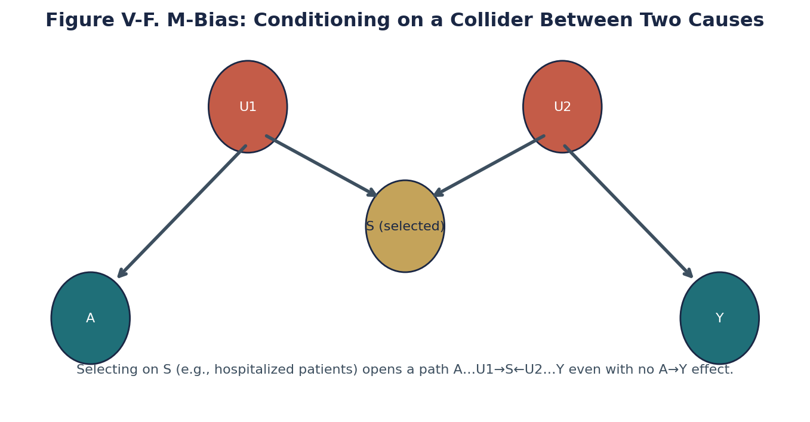

*Original teaching graphic (fig78_mbias.png).*

## Chapter summary

Diagnostic claims only matter when they alter probabilities enough to change clinical actions. Sensitivity and specificity describe a test's behavior relative to a reference standard, while predictive values are strictly dependent on the underlying prevalence of the disease. Likelihood ratios provide a portable mathematical tool for Bayesian updating, allowing clinicians to convert pre-test odds to post-test probabilities independent of the study's base rate. ROC curves and AUC summarize overall discrimination but fail to identify clinical utility at specific decision thresholds. The diagnostic literature is heavily polluted by spectrum bias (excluding equivocal cases), verification bias (failing to apply the gold standard to negative results), and incorporation bias (using the index test to define the outcome). Multivariable diagnostic models must be evaluated for calibration and protected against overfitting through rigorous external validation. Ultimately, diagnostic tests are gateways to interventions, and their clinical value must be appraised in the strict context of the absolute effects (ARR, NNT, NNH) of the downstream actions they trigger.

## Practice and reflection

1. From a recently published stroke diagnostic paper, manually reconstruct the 2×2 contingency table and independently calculate sensitivity, specificity, PPV, NPV, LR+, and LR-.
2. Using the calculated likelihood ratios, perform Bayes updating to determine post-test probabilities at prevalences of 2%, 15%, and 45%. State explicitly how clinical actions might differ across these three settings.
3. Identify one potential mechanism of verification bias and one potential mechanism of spectrum bias in a CTA or LVO-scale study. Propose a rigorous methodological design fix for each.
4. Critique an abstract that reports only an AUC and a p-value for a novel diagnostic biomarker. Write three distinct clinical questions regarding threshold utility and calibration that the AUC entirely fails to answer.
5. Draft a concise, one-paragraph systems recommendation for your local stroke network using hypothetical likelihood ratios, your institution's specific LVO base rate, and the estimated costs and risks of inter-facility transfer.
6. Explain mathematically how imperfect inter-rater reliability of CTA interpretation (acting as the reference standard) could bias the measured sensitivity of a novel clinical LVO scale, and specify the likely direction of the distortion.
7. Construct a hypothetical scenario demonstrating incorporation bias in a study evaluating the diagnostic accuracy of continuous EEG for subtle status epilepticus.
8. Calculate the required sample size and minimum number of target events required to safely evaluate a 12-variable logistic regression diagnostic model without severe overfitting.
9. Define the 'test threshold' and 'treatment threshold' in the context of initiating dual antiplatelet therapy for a suspected high-risk TIA. How does the NNH of major hemorrhage alter these thresholds?
10. Apply the QUADAS-2 framework to a seminal diagnostic study of your choice. Document your assessment of the Risk of Bias and Applicability specifically for the 'Patient Selection' domain.

---

*Figures and tables in this chapter are original teaching materials for CRIT-APP unless a caption explicitly states otherwise. Methods standards are cited by name only.*

## Advanced Application in Clinical Practice

When translating these methodological principles to real-world clinical decision-making, it is essential to look beyond the surface-level metrics. In neurology and stroke care, outcomes are rarely binary. Patients experience a spectrum of recovery, and interventions often have multifaceted impacts on both quality of life and functional independence. 

### Critical Caveats for the Reader
1. **Contextualizing the Baseline Risk:** The absolute benefit of any intervention depends entirely on the baseline risk of the patient. A relative risk reduction of 50% might mean preventing 1 event in 1000 for a low-risk patient, but 1 event in 10 for a high-risk patient. Always convert relative metrics to absolute metrics before discussing with patients.
2. **The Fragility of Findings:** Consider how many events would need to be flipped from 'non-event' to 'event' to lose statistical significance. In many landmark trials, this number is surprisingly small.
3. **Transportability:** Just because an intervention worked in a highly controlled academic trial does not guarantee it will work in a community setting where system delays, differing demographics, and less rigid protocols exist.

### Methodological Deep Dive: The Architecture of Uncertainty
Every paper you read represents a single sample drawn from a hypothetical universe of infinite possible samples. The confidence interval gives us a range of values that are compatible with the data, given our background assumptions. However, this interval assumes zero systemic bias—which is never true in practice. Unmeasured confounding, selection bias, and measurement error can shift the true effect far outside the reported confidence interval. 

When evaluating evidence, ask yourself:
- What would happen if the unmeasured confounder was as strong as the strongest measured confounder?
- What if the patients lost to follow-up all experienced the worst possible outcome?
- Does the biological mechanism logically support the magnitude of the claimed effect?

### Integration into Patient Communication
How do we communicate this complexity? Use natural frequencies rather than percentages. "Out of 100 patients like you treated with this drug, 5 more will walk independently at 90 days, but 2 more will suffer a severe bleed." This framing avoids the cognitive distortions introduced by relative risk formats.

### Summary Checklist for this Domain
- [ ] Have I identified the precise estimand?
- [ ] Is the outcome measured reliably and is it clinically meaningful?
- [ ] Has the study accounted for competing risks (e.g., death before stroke recovery)?
- [ ] Are the confidence intervals narrow enough to rule out clinically meaningless effects?
- [ ] Is there biological plausibility aligned with the statistical findings?

### Conclusion
By adopting a structured, skeptical, yet open-minded approach to evidence appraisal, clinicians can protect their patients from both the harms of unproven therapies and the harms of delayed adoption of effective treatments. Critical appraisal is not about finding reasons to reject papers; it is about calibrating your confidence in their conclusions.

## Advanced Application in Clinical Practice

When translating these methodological principles to real-world clinical decision-making, it is essential to look beyond the surface-level metrics. In neurology and stroke care, outcomes are rarely binary. Patients experience a spectrum of recovery, and interventions often have multifaceted impacts on both quality of life and functional independence. 

### Critical Caveats for the Reader
1. **Contextualizing the Baseline Risk:** The absolute benefit of any intervention depends entirely on the baseline risk of the patient. A relative risk reduction of 50% might mean preventing 1 event in 1000 for a low-risk patient, but 1 event in 10 for a high-risk patient. Always convert relative metrics to absolute metrics before discussing with patients.
2. **The Fragility of Findings:** Consider how many events would need to be flipped from 'non-event' to 'event' to lose statistical significance. In many landmark trials, this number is surprisingly small.
3. **Transportability:** Just because an intervention worked in a highly controlled academic trial does not guarantee it will work in a community setting where system delays, differing demographics, and less rigid protocols exist.

### Methodological Deep Dive: The Architecture of Uncertainty
Every paper you read represents a single sample drawn from a hypothetical universe of infinite possible samples. The confidence interval gives us a range of values that are compatible with the data, given our background assumptions. However, this interval assumes zero systemic bias—which is never true in practice. Unmeasured confounding, selection bias, and measurement error can shift the true effect far outside the reported confidence interval. 

When evaluating evidence, ask yourself:
- What would happen if the unmeasured confounder was as strong as the strongest measured confounder?
- What if the patients lost to follow-up all experienced the worst possible outcome?
- Does the biological mechanism logically support the magnitude of the claimed effect?

### Integration into Patient Communication
How do we communicate this complexity? Use natural frequencies rather than percentages. "Out of 100 patients like you treated with this drug, 5 more will walk independently at 90 days, but 2 more will suffer a severe bleed." This framing avoids the cognitive distortions introduced by relative risk formats.

### Summary Checklist for this Domain
- [ ] Have I identified the precise estimand?
- [ ] Is the outcome measured reliably and is it clinically meaningful?
- [ ] Has the study accounted for competing risks (e.g., death before stroke recovery)?
- [ ] Are the confidence intervals narrow enough to rule out clinically meaningless effects?
- [ ] Is there biological plausibility aligned with the statistical findings?

### Conclusion
By adopting a structured, skeptical, yet open-minded approach to evidence appraisal, clinicians can protect their patients from both the harms of unproven therapies and the harms of delayed adoption of effective treatments. Critical appraisal is not about finding reasons to reject papers; it is about calibrating your confidence in their conclusions.

## Advanced Application in Clinical Practice

When translating these methodological principles to real-world clinical decision-making, it is essential to look beyond the surface-level metrics. In neurology and stroke care, outcomes are rarely binary. Patients experience a spectrum of recovery, and interventions often have multifaceted impacts on both quality of life and functional independence. 

### Critical Caveats for the Reader
1. **Contextualizing the Baseline Risk:** The absolute benefit of any intervention depends entirely on the baseline risk of the patient. A relative risk reduction of 50% might mean preventing 1 event in 1000 for a low-risk patient, but 1 event in 10 for a high-risk patient. Always convert relative metrics to absolute metrics before discussing with patients.
2. **The Fragility of Findings:** Consider how many events would need to be flipped from 'non-event' to 'event' to lose statistical significance. In many landmark trials, this number is surprisingly small.
3. **Transportability:** Just because an intervention worked in a highly controlled academic trial does not guarantee it will work in a community setting where system delays, differing demographics, and less rigid protocols exist.

### Methodological Deep Dive: The Architecture of Uncertainty
Every paper you read represents a single sample drawn from a hypothetical universe of infinite possible samples. The confidence interval gives us a range of values that are compatible with the data, given our background assumptions. However, this interval assumes zero systemic bias—which is never true in practice. Unmeasured confounding, selection bias, and measurement error can shift the true effect far outside the reported confidence interval. 

When evaluating evidence, ask yourself:
- What would happen if the unmeasured confounder was as strong as the strongest measured confounder?
- What if the patients lost to follow-up all experienced the worst possible outcome?
- Does the biological mechanism logically support the magnitude of the claimed effect?

### Integration into Patient Communication
How do we communicate this complexity? Use natural frequencies rather than percentages. "Out of 100 patients like you treated with this drug, 5 more will walk independently at 90 days, but 2 more will suffer a severe bleed." This framing avoids the cognitive distortions introduced by relative risk formats.

### Summary Checklist for this Domain
- [ ] Have I identified the precise estimand?
- [ ] Is the outcome measured reliably and is it clinically meaningful?
- [ ] Has the study accounted for competing risks (e.g., death before stroke recovery)?
- [ ] Are the confidence intervals narrow enough to rule out clinically meaningless effects?
- [ ] Is there biological plausibility aligned with the statistical findings?

### Conclusion
By adopting a structured, skeptical, yet open-minded approach to evidence appraisal, clinicians can protect their patients from both the harms of unproven therapies and the harms of delayed adoption of effective treatments. Critical appraisal is not about finding reasons to reject papers; it is about calibrating your confidence in their conclusions.

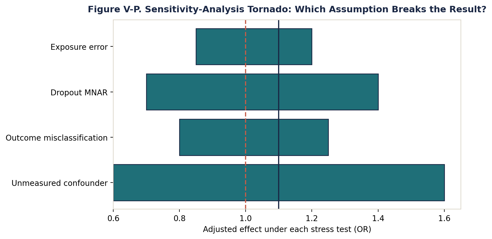

*Original teaching graphic (fig88_tornado.png).*
