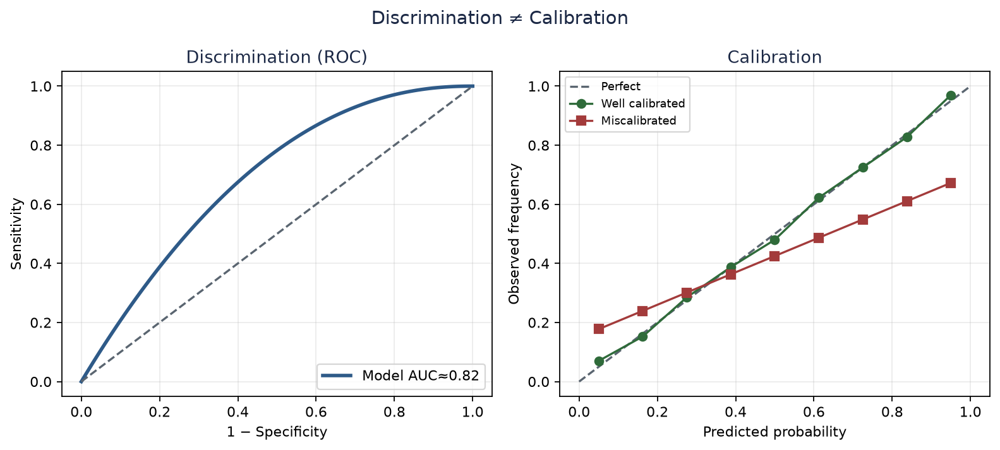
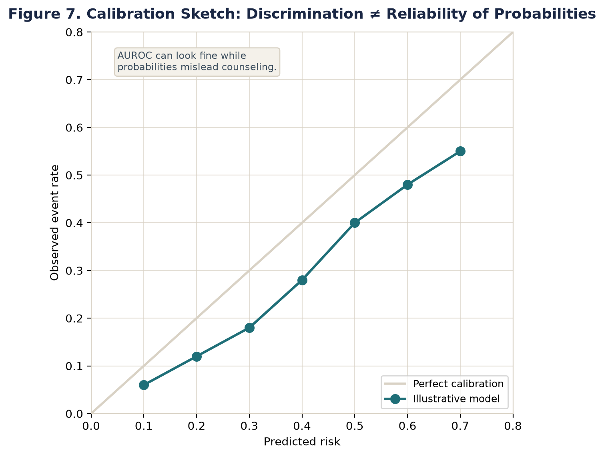
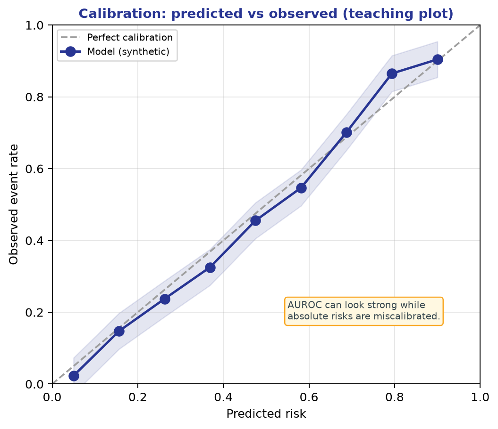
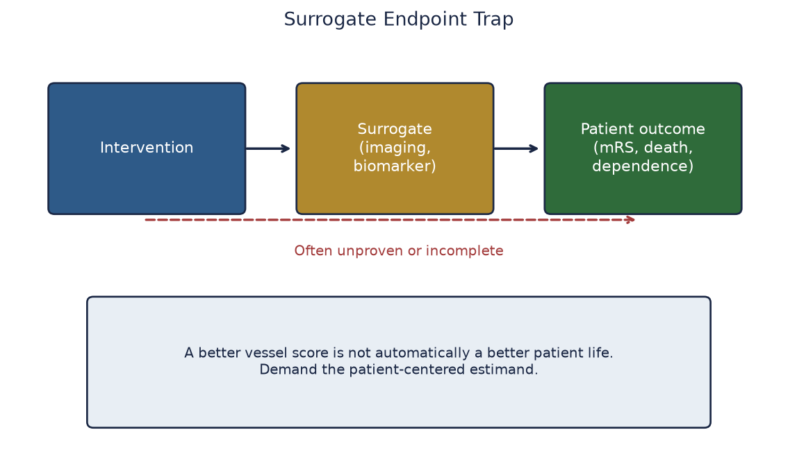
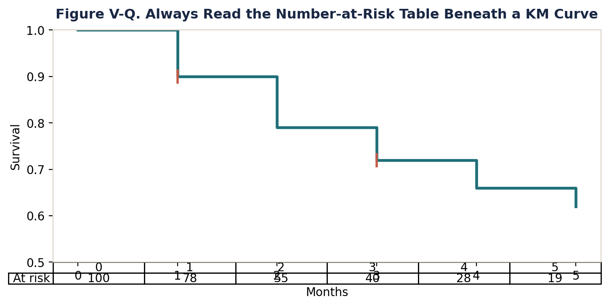

# Chapter 9. Prognosis, Risk Scores, and Prediction Models

## Opening

*ROC versus calibration (original).*

*Calibration plot concept (original).*

*Calibration of predicted versus observed risk (original).*

A prognostic score promises discharge planning precision. Demand calibration in patients like yours, not only a shiny C-statistic from the derivation sample.

## Learning objectives

- Distinguish prognosis, prediction, and diagnosis as separate scientific claims with distinct validity threats.
- Dismantle the conflation of predictive models and causal inference, recognizing that predicting an outcome does not identify treatment effect modifiers.
- Calculate and interpret calibration metrics, including observed-to-expected (O/E) ratios, calibration-in-the-large, and calibration slope, rejecting reliance on discrimination alone.
- Quantify discrimination using the c-statistic (AUROC) and recognize its insensitivity to absolute risk and extreme outcome imbalances.
- Evaluate internal validation methodologies (split-sample, cross-validation, bootstrapping) and identify pre-selection leakage.
- Appraise external validation for temporal drift, geographical variation, and case-mix shifts, requiring rigid adherence to the original mathematical equation.
- Execute decision curve analysis (DCA) mathematically to determine Net Benefit at clinical threshold probabilities.
- Apply the PROBAST risk of bias framework to detect index-time leakage, immortal time bias, and improper handling of missing data.
- Navigate stroke-specific prediction controversies, including the self-fulfilling prophecy of the ICH Score and the diagnostic drift of ABCD2.
- Formulate patient counseling strategies that rely on calibrated absolute risk rather than relative risk or odds ratios.

## The Demarcation of Prediction from Causal Inference

Clinical neurology generates scoring systems at a relentless pace. The National Institutes of Health Stroke Scale (NIHSS) originated as a reproducible severity measure but rapidly mutated into a prognostic heuristic. The ICH Score predicts thirty-day mortality after intracerebral hemorrhage. The ABCD2 score stratifies the short-term probability of stroke following a transient ischemic attack. Modern machine learning algorithms digest raw non-contrast computed tomography images to predict large vessel occlusion, while others aggregate electronic health record data to forecast malignant cerebral edema. Despite this saturation, the fundamental error committed by clinicians and researchers alike is conflating a prediction model with a causal model. This conflation routinely poisons journal clubs and distorts clinical guidelines.

A prediction paper claims that a mathematical function of inputs, measured at a strict index time, maps to the probability of a future state with a quantified degree of accuracy. It operates entirely within the domain of joint probability distributions. It does not claim that intervening on those input variables will change the outcome. A causal treatment paper, by contrast, claims that changing an exposure directly alters the trajectory of the outcome, operating within the domain of counterfactuals (as established in Chapter 3). The distinction is absolute and non-negotiable.

If an observational stroke registry derives a multivariable logistic regression model for ninety-day functional independence and reports that statin use at admission carries an odds ratio of 1.4, this constitutes a predictive association. It indicates that statin users, within the specific context and confounding structure of that dataset, possess a higher probability of a favorable outcome. It explicitly does not mean that initiating a statin in the emergency department causes the good outcome. The statin variable acts as a proxy; it likely identifies patients who have consistent primary care access, fewer swallowing deficits, or lower baseline frailty. When audiences pivot seamlessly from an impressive area under the receiver operating characteristic curve (AUROC) to concluding 'we should treat these patients differently based on these variables,' they commit a severe category error. Prediction tools rank patients by risk; they do not identify which patients benefit from a specific intervention. Identifying benefit requires treatment effect heterogeneity analysis within a causal framework.

This chapter establishes a rigorous critical appraisal framework for prognosis and prediction literature. It dismantles the false idol of discrimination (AUROC), elevating calibration and clinical utility as the definitive measures of a prediction model's worth. It enforces strict time zero discipline, penalizes algorithmic overfitting, demands stringent validation structures, and applies the TRIPOD reporting guidelines alongside the PROBAST risk of bias tool. By the end of this chapter, you will possess the quantitative vocabulary to dismantle flawed predictive claims and implement mathematically sound decision analysis at the bedside.

## Taxonomy of Claims: Prognosis, Prediction, and Diagnosis

Scientific claims in the medical literature divide into diagnostic, prognostic, and causal categories. Diagnosis asks: What is the true state of the patient right now? Diagnostic accuracy models (detailed in Chapter 4) classify current, unseen states by referencing a gold standard. Does this specific patient have a large vessel occlusion? Is this lobar hemorrhage secondary to cerebral amyloid angiopathy? The dominant threats to validity in diagnostic modeling center on the reference standard itself—specifically verification bias, spectrum bias, and the use of imperfect or subjective gold standards. In diagnostic studies, the predictor and the outcome occur synchronously.

Prognosis asks: What will happen to this patient in the future under a defined, existing clinical care pathway? What is the probability of symptomatic intracranial hemorrhage after the administration of intravenous alteplase? What is the chance of regaining independent ambulation at six months post-stroke? Prognosis inherently involves the forward passage of time. Consequently, its primary validity threats involve longitudinal mechanics: loss to follow-up (informative censoring), competing risks (such as death occurring prior to the planned functional assessment), and secular changes in the standard of care over the follow-up period.

Prediction refers to the statistical machinery utilized to estimate individualized probabilities. Modern literature uses the term 'prediction model' loosely to encompass both diagnostic classifiers and prognostic risk scores. This conflation is problematic because time enforces a strict logic on prognostic prediction that diagnostic modeling lacks. A diagnostic algorithm for large vessel occlusion on CT angiography evaluates synchronous pixels. A prognostic algorithm for ninety-day modified Rankin Scale (mRS) must strictly segregate data available at the exact moment of prediction from events that unfold subsequently. Your first task as an appraiser is forcing clarity: Is the model estimating a concurrent state or forecasting a future event?

Crucially, prognosis is not equivalent to the natural history of a disease under a state of therapeutic nihilism. Modern neurological care is intensely interventional. Prognostic models estimated in the era of mechanical thrombectomy describe outcomes under that specific prevailing care regime. They are valid for counseling only if the patient receives that standard of care. If authors imply their prognostic model identifies patients who 'need' thrombectomy without formally estimating the interaction between the baseline features and the treatment effect (a causal claim), they have overstepped the mathematical boundaries of their design.

## Anatomy of a Prediction Model: Time Zero, Predictors, and Horizon

The structural integrity of a prediction model rests on three pillars: time zero, the predictor set, and the prediction horizon. Time zero (or index time) is the precise, definable moment in the clinical workflow when the model is intended to be executed. A model's validity hinges entirely on uncompromising adherence to time zero discipline. If a tool is designed to guide emergency department triage prior to advanced neuroimaging, its time zero is the moment of emergency department arrival. At that precise second, age, vital signs, and baseline NIHSS are knowable. Final infarct volume, door-to-needle time, and hospital-acquired complications are not.

Index-time leakage constitutes a fatal flaw in predictive modeling. Leakage occurs when information from the future—or information generated as a consequence of the outcome pathway—surreptitiously bleeds into the predictor set. A classic failure mode in the stroke literature involves predicting ninety-day functional outcome using 'final infarct volume on day 3 MRI' or 'discharge disposition' as baseline features for an admission model. These variables correlate massively with the outcome precisely because they are intermediate steps on the causal pathway to that outcome. Incorporating them inflates apparent accuracy to near-perfect levels, but renders the model clinically useless. A clinician cannot input a discharge disposition on day one.

Electronic health record models are uniquely vulnerable to stealth leakage. A billing code for 'cerebral edema' might be timestamped at hospital day three, but if the researcher crudely pulls all codes associated with the encounter into a 'baseline' matrix, the future has leaked into the past. Clinical notes utilized for natural language processing routinely contain trailing information; an admission note dictated twelve hours after arrival may casually reference the patient's subsequent deterioration or response to initial therapy. Timestamp discipline must be absolute. The appraiser must ask: Could a conscientious clinician, standing at time zero, execute this equation using only data mathematically confirmed to exist at that moment?

The prediction horizon is the specific future time point at which the outcome is ascertained. A prediction of mortality at seven days represents a fundamentally different biological construct than mortality at one year. The horizon must align with the clinical decision being made at time zero. Furthermore, the predictors (features) must be rigidly defined, reproducible across different health systems, and measured without knowledge of the future outcome. When dealing with continuous predictors such as age, systolic blood pressure, or glucose, categorization (e.g., dichotomizing age at 80 years) is a destructive practice. It discards immense amounts of information, slashes statistical power, and enforces a biologically implausible assumption of a flat risk profile on either side of the arbitrary threshold. Continuous relationships must be modeled using splines or fractional polynomials to preserve the natural density of the clinical data.

## Quantitative Reasoning: Discrimination

Discrimination quantifies a prediction model's ability to separate patients who experience the outcome from those who do not. It asks a strictly relative question: Does the algorithm consistently assign higher predicted probabilities to the cohort of patients who actually suffer the event compared to those who remain event-free?

For binary outcomes, discrimination is almost universally quantified by the c-statistic (concordance statistic), which is mathematically equivalent to the Area Under the Receiver Operating Characteristic curve (AUROC). To comprehend the c-statistic precisely, consider all possible pairs of patients in a dataset where exactly one patient experienced the event and the other did not. A pair is deemed 'concordant' if the model assigned a higher predicted probability to the patient who had the event. The c-statistic is simply the proportion of these pairs that are concordant. The formula is: c = (Number of concordant pairs + 0.5 * Number of tied pairs) / (Total discordant and concordant pairs).

An AUROC of 0.50 indicates random guessing; the model is equally likely to assign a higher probability to the non-event patient. An AUROC of 1.0 indicates flawless mathematical separation. An AUROC of 0.75 means that if you randomly select one patient who died and one who lived, there is a 75% probability the model assigned a higher mortality risk to the patient who died. In survival analysis scenarios—where time-to-event data is subject to censoring—Harrell's C-index serves as the standard analog, calculating concordance only among pairs of patients whose temporal ordering of events is definitively knowable.

The neurology literature systematically fetishizes AUROC, treating it as the ultimate proxy for clinical value. This is a profound analytic error. AUROC measures rank-order separation only; it contains exactly zero information regarding absolute risk accuracy. A model could assign probabilities of 0.001 and 0.002 to two patients, or alternatively 0.98 and 0.99. If the higher numerical risk is always assigned to the patient with the event, the AUROC remains a perfect 1.0, even if the absolute values are absurdly detached from clinical reality. A model that perfectly ranks patients but tells them all they have a 99% chance of death is useless for counseling.

Furthermore, AUROC is perilously insensitive to localized performance and highly vulnerable to dataset imbalance. In scenarios with extremely rare outcomes (e.g., predicting an event that occurs in 1% of the cohort), Precision-Recall curves are vastly superior to ROC curves. The standard ROC curve plots Sensitivity (True Positive Rate) against 1 - Specificity (False Positive Rate). Because True Negatives massively dominate the denominator of the False Positive Rate in rare events, the ROC curve is pulled artificially high, presenting a deceptively excellent profile. The Precision-Recall curve, conversely, plots Positive Predictive Value (Precision) against Sensitivity (Recall), mercilessly exposing the model's struggle to identify true positives amid a crushing volume of false alarms.

## Quantitative Reasoning: Calibration

Calibration measures the degree of agreement between estimated probabilities and the actual observed frequencies of the outcome. It asks the definitive absolute question: If the model dictates that a patient has a 20% risk of symptomatic intracerebral hemorrhage, and we assemble 100 identical patients, do approximately 20 of them actually bleed?

Calibration is the single most critical metric for any prediction model intended to guide clinical decision-making, direct resource allocation, or facilitate patient counseling. A poorly calibrated model with a high AUROC is actively dangerous; it dispenses incorrect absolute risks with unwarranted mathematical confidence. Calibration must be assessed across multiple dimensions.

Calibration-in-the-large compares the overall mean predicted probability to the overall observed event rate in the entire dataset. If the model predicts an average cohort risk of 15%, but the actual observed event rate is 30%, the model is systematically underpredicting. The simplest summary of calibration-in-the-large is the Observed/Expected (O/E) ratio: Total Observed Events divided by Total Expected Events (the sum of all predicted probabilities). The ideal O/E ratio is exactly 1.0.

Calibration curves (calibration plots) provide a granular visualization of this relationship across the entire risk spectrum. Patients are grouped by their predicted probability (e.g., into deciles, or utilizing smoothing techniques such as loess regression). The mean predicted probability within each group (plotted on the x-axis) is graphed against the observed proportion of events in that same group (plotted on the y-axis). The ideal calibration curve aligns perfectly with the 45-degree line of identity (y = x). A calibration plot is mathematically summarized by a calibration intercept and a calibration slope, derived by fitting a logistic regression of the observed binary outcome on the log-odds of the predicted probability. The calibration intercept reflects calibration-in-the-large; an ideal intercept is 0. An intercept of -0.5 indicates the model systematically overpredicts risk across the entire cohort. The calibration slope indicates the spread or extremeness of the predictions. The ideal slope is 1.0. A slope less than 1.0 signifies that the predictions are too extreme (high risks are overestimated, low risks are underestimated), which is the classic, unassailable signature of model overfitting. A slope greater than 1.0 indicates predictions are too narrow, suffering from excessive regression to the mean.

The Brier Score provides an omnibus measure of predictive accuracy, inextricably blending both discrimination and calibration. It is calculated as the mean squared difference between the predicted probability and the actual outcome (coded strictly as 1 for an event and 0 for no event). The formula is: Brier Score = (1/N) * sum(predicted_i - observed_i)^2. For a model predicting an event with a 50% baseline prevalence, blind random guessing yields a Brier score of 0.25. Lower Brier scores indicate superior overall performance, but a low Brier score does not absolve the researcher from presenting a detailed calibration plot.

## Development, Overfitting, and Optimism

When researchers feed a dataset containing 200 acute stroke patients and 40 baseline clinical variables into a multivariable logistic regression or a random forest algorithm, the mathematical machinery will aggressively fit the data. It will inevitably locate patterns that appear to predict the outcome with extraordinary precision. Unfortunately, the vast majority of what it discovers is noise—random statistical fluctuations idiosyncratic to those specific 200 patients.

This phenomenon is overfitting. Apparent performance (the AUROC and calibration metrics calculated on the exact same dataset utilized to train the model) is systematically and severely biased upward. It is an optimistic mathematical illusion. Optimism is defined as the quantitative difference between the apparent performance on the training data and the true performance expected when the model is applied to unseen, exchangeable patients. The primary driver of optimism is a low number of Events Per Variable (EPV). Historical rules of thumb mandated a minimum of 10 events per candidate predictor, though modern simulation studies demonstrate even this is frequently insufficient. While modern penalization methods (like Ridge or Lasso regression) mitigate this, extreme feature-to-event ratios remain computationally fatal. Critically, 'variable' refers to all candidate variables evaluated at any point during the modeling process, not merely the final variables surviving in the published equation. If authors tested 50 variables univariately to identify the 5 that 'worked,' they have spent 50 degrees of freedom, guaranteeing massive optimism.

Internal validation is the statistical methodology employed to quantify and correct for this optimism without requiring a separate external dataset. There are three primary approaches. First, split-sample validation (e.g., randomly holding out 30% of the data for testing) is historically common but statistically indefensible in small datasets. It squanders valuable training data, and the final evaluation relies entirely on a single, potentially anomalous holdout set. Second, cross-validation (e.g., 10-fold) partitions the data into 10 groups, training the model on 9 and testing on 1, iterating this process until all groups have served as the test set. This provides a more stable estimate of performance. Third, bootstrapping serves as the statistical gold standard for internal validation. It involves drawing hundreds of random samples (with replacement) from the original dataset, each exactly the same size as the original. The entire modeling process is executed on each bootstrap sample, and the resulting model is evaluated on the original dataset to calculate the optimism. This optimism is averaged across all bootstrap iterations and subtracted from the apparent performance to yield the optimism-corrected AUROC or C-statistic.

Crucially, internal validation is entirely worthless unless it wraps the entire modeling pipeline. If investigators perform univariable screening, select the significant variables, and then perform cross-validation or bootstrapping only on the final multivariable equation, they have committed 'pre-selection leakage.' The validation step fails to penalize the model for the massive optimism induced by the initial univariable screening, rendering the internal validation performative theater rather than rigorous science.

## External Validation and Transportability

Internal validation proves only that the mathematics are sound within the source population. External validation tests whether the underlying clinical biology transports to a new population. Without strict external validation, a prediction model is merely a localized hypothesis. External validation demands testing the model on a dataset collected by entirely different investigators, at a different institution, or in a distinctly different time period. The original model equation—complete with the exact intercept and unmodified beta coefficients—must be applied blindly to the new data. Re-estimating the coefficients on the new data is not validation; it is model updating.

Prediction models fail external validation for three primary reasons. First, True Overfitting: The original model captured statistical noise rather than biological signal, which obviously fails to replicate in new patients. Second, Case-mix variation: The external cohort possesses a different distribution of predictor variables or a different baseline risk. If a prediction tool for malignant middle cerebral artery syndrome is developed in a tertiary referral center (which receives a high prevalence of massive, catastrophic strokes) and tested in a community hospital (which sees a lower prevalence), the discrimination might remain stable, but the calibration will systematically drift, rendering absolute risk predictions inaccurate.

Third, Temporal drift: Medical care is not static. The ASTRAL score, developed in the early 2010s to predict 90-day outcomes after acute ischemic stroke, assigns points for time delay and initial severity. In the modern era of endovascular thrombectomy, the prognostic implications of a proximal large vessel occlusion have been radically altered. A model developed in 2012 will systematically overpredict catastrophic outcomes for thrombectomy-eligible patients in 2026. This phenomenon is temporal drift driven by a changing interventional regime. It necessitates formal recalibration (adjusting the intercept and slope to fit the new treatment era) or continuous algorithmic updating. An uncalibrated legacy score is a clinical hazard.

## Decision Curve Analysis and Clinical Utility

Calibration links theoretical probabilities to biological reality. Decision Curve Analysis (DCA) links those probabilities to actionable clinical utility. An AUROC of 0.85 cannot, under any circumstances, tell you if a model is useful to a clinician. Consider a predictive model designed to identify patients requiring a decompressive hemicraniectomy. Should we deploy it? That depends entirely on the threshold at which surgeons act, the profound harm of a false positive (inflicting an unnecessary craniectomy and resulting massive morbidity), and the fatal harm of a false negative (missed opportunity, resulting in herniation and death).

DCA requires the explicit definition of a Threshold Probability (Pt). Pt is the specific risk level at which a clinician is perfectly indifferent between taking the action and withholding it. If you decide to order a high-risk CT angiogram for a patient with a transient ischemic attack only if the probability of an underlying severe stenosis exceeds 10%, your Pt is 10%. This threshold inherently encodes the clinician's judgment regarding the relative harm of a false positive versus a false negative. Specifically, the harm ratio is calculated as Pt / (1 - Pt). At a 10% threshold, you are mathematically stating that missing a true positive is 9 times worse than enduring a false positive (0.10 / 0.90 = 1/9).

Decision Curve Analysis calculates the Net Benefit of using the prediction model across a continuous range of plausible threshold probabilities. The formula for Net Benefit is: Net Benefit = (True Positives / N) - (False Positives / N) * (Pt / (1 - Pt)). The subtraction of the weighted false positives ensures that the model is penalized according to the specific clinical harms defined by the threshold.

In a standard DCA plot, the Net Benefit of the prediction model (y-axis) is graphed against the Threshold Probability (x-axis). Crucially, the model is compared simultaneously against two default clinical strategies: 1) Treat All (acting as if everyone has the outcome). The Net Benefit line for 'Treat All' slopes downward as the threshold increases, crossing zero exactly at the overall prevalence of the disease in the cohort. 2) Treat None (acting as if nobody has the outcome). The Net Benefit for 'Treat None' is exactly zero across all thresholds.

A prediction model demonstrates genuine clinical utility if, and only if, its Net Benefit curve lies above both the 'Treat All' and 'Treat None' lines across a clinically reasonable range of thresholds. If a stroke model only demonstrates positive Net Benefit at thresholds of 80-90% for a highly consequential surgical intervention, but neurosurgeons actually intervene at a 20% threshold, the model is entirely useless in clinical practice, regardless of its statistical significance or AUROC. DCA forces prediction research out of the realm of abstract mathematics and into the brutal reality of clinical tradeoffs.

## Named Frameworks: TRIPOD and PROBAST

TRIPOD (Transparent Reporting of a multivariable prediction model for Individual Prognosis Or Diagnosis) serves as the definitive EQUATOR network guideline for reporting prediction research. It acts as a defense against opaque methodology. TRIPOD demands explicit detailing of the study setting, inclusion criteria, rigorous definitions of predictors and outcomes, the explicit handling of missing data (differentiating biased complete-case deletion from multiple imputation), complete model specification, and the transparent reporting of both discrimination and calibration measures with confidence intervals.

PROBAST (Prediction model Risk Of Bias Assessment Tool) is the corresponding appraisal instrument used to evaluate the methodological quality of the published model. PROBAST forces the appraiser to evaluate Risk of Bias systematically across four critical domains: Participants (detecting inappropriate exclusions or highly selected cohorts), Predictors (identifying predictors defined using knowledge from the future), Outcome (flagging subjective outcomes adjudicated with unblinded knowledge of the predictors), and Analysis.

The Analysis domain in PROBAST is particularly unforgiving. It flags continuous variables that have been inappropriately dichotomized, models that ignore competing risks in survival data, studies suffering from insufficient events per variable, and pipelines that lack rigorous optimism correction. When reviewing a prediction paper, the clinical epidemiologist must mentally execute the PROBAST checklist. If the authors discard 40% of their cohort because of a missing NIHSS subscore (complete-case analysis), they have introduced severe selection bias. If they test 100 variables on a dataset with 50 events using automated stepwise selection and report an AUROC of 0.92 without bootstrapping, the model is hallucinating. PROBAST provides the vocabulary to reject these papers unequivocally.

## A Fully Worked Example: Evaluating a Post-Thrombectomy Prognostic Score

Scenario: A recent publication proposes the 'REPERFUSE-3' score to predict 90-day catastrophic outcome (defined as mRS 5-6) following mechanical thrombectomy. The authors develop the score on a cohort of 1,000 patients, observing 270 events (27% baseline prevalence). They assign points as follows: Age > 75 (1 point), Admission NIHSS > 15 (1 point), and Core Volume > 50cc (1 point). The maximum score is 3. They report an AUROC of 0.75 and conclude the model 'can guide aggressive end-of-life decision making in the neuro-ICU.' They provide the following raw validation data: Score 0 (N=300, Predicted Risk 0.05, Observed Events 15); Score 1 (N=400, Predicted Risk 0.15, Observed Events 80); Score 2 (N=200, Predicted Risk 0.40, Observed Events 90); Score 3 (N=100, Predicted Risk 0.85, Observed Events 85).

Step 1: Appraisal of the Claim and Time Zero. The proposed clinical action is 'end-of-life decision making.' The predictors (age, NIHSS, core volume) are available at admission, prior to thrombectomy. However, the score is named 'REPERFUSE' and the cohort consists exclusively of post-thrombectomy patients. Did the modeling process include final reperfusion status (e.g., TICI score)? If so, time zero is post-procedure, and the tool cannot be used for pre-procedure counseling. If not, time zero is pre-procedure, but the model is conditioned on the patient actually undergoing the procedure.

Step 2: Calibration Check via O/E Ratios. Let us manually calculate the Observed/Expected (O/E) ratio for Score 3. The Expected number of events = N * Predicted Risk = 100 * 0.85 = 85. The Observed number of events is 85. The O/E ratio = 85 / 85 = 1.0. At the extreme high end, calibration is perfect. Now analyze Score 0: Expected events = 300 * 0.05 = 15. Observed events = 15. The O/E ratio = 15 / 15 = 1.0. The calibration is remarkably precise across the risk spectrum, indicating the authors have likely performed rigorous penalization or recalibration. The absolute risks are trustworthy.

Step 3: Calculating Discrimination Intuition. The absolute risk difference between a maximum score of 3 (85% observed risk) and a minimum score of 0 (5% observed risk) is 80%. The model clearly separates the highest and lowest risk groups effectively, which mathematically aligns with the reported AUROC of 0.75. However, separating extremes is easy; the clinical challenge lies in managing the intermediate groups.

Step 4: Net Benefit at a Clinical Threshold. Suppose an attending physician would formally consider palliation (the action) only if the risk of mRS 5-6 exceeds 50%. This defines the Threshold Probability (Pt = 0.50). The harm ratio is Pt / (1 - Pt) = 0.50 / 0.50 = 1. This equates to a clinical judgment that inappropriately withdrawing care (a false positive) is exactly equal in harm to prolonging intensive care in a patient destined for a catastrophic outcome (a false negative). To calculate Net Benefit for the model at this threshold, we act (palliate) only if the Score is 3 (since its Predicted Risk of 0.85 > 0.50).

True Positives (TP) = patients with Score 3 who actually achieved mRS 5-6 = 85. False Positives (FP) = patients with Score 3 who did NOT achieve mRS 5-6 = 100 - 85 = 15. Total N = 1000. Model Net Benefit = (TP / N) - (FP / N) * Harm Ratio = (85 / 1000) - (15 / 1000) * 1 = 0.085 - 0.015 = 0.070.

Step 5: Comparing to Default Strategies. We must compare this Model Net Benefit to the default strategies. Treat All (palliate everyone in the cohort): TP = all 270 events. FP = all 730 non-events. Net Benefit (Treat All) = (270 / 1000) - (730 / 1000) * 1 = 0.270 - 0.730 = -0.460. Treat None (palliate no one): Net Benefit is exactly 0. Because the Model Net Benefit (0.070) is greater than both Treat None (0) and Treat All (-0.460), the model demonstrates mathematical clinical utility at a 50% threshold. The value 0.070 indicates that utilizing the model is equivalent to identifying 7 additional true positive catastrophic outcomes per 100 patients, with no false positive penalty.

Step 6: Sensitivity to Thresholds. What if the clinician requires a much higher certainty to palliate, setting the Threshold Probability at 90%? At Pt = 0.90, the Harm Ratio is 0.90 / 0.10 = 9 (inappropriately withdrawing care is 9 times worse). Under this strict threshold, no score category exceeds the 90% predicted risk mark (Score 3 maxes out at 85%). Therefore, the model never triggers the action. The True Positives are 0, False Positives are 0, and the Model Net Benefit becomes 0, rendering it perfectly equivalent to the 'Treat None' strategy. The model is completely useless for a clinician operating at a 90% threshold. This dynamic vividly illustrates why AUROC is clinically blind; utility is inextricably bound to the clinician's threshold for action.

## Pitfalls and Failure Modes in Neurologic Prediction

- Dichotomania: Taking an information-dense, continuous variable—such as exact systolic blood pressure, core volume in milliliters, or chronological age—and brutally severing it into binary categories ('Hypertension Yes/No' or 'Age > 65'). This destructive practice forces the model to assume that all patients aged 66 are biologically identical to patients aged 95, while simultaneously assuming they are radically different from a patient aged 64. It obliterates statistical power, ensures miscalibration at the extremes, and represents a profound failure of quantitative reasoning.
- The Immortal Time Fallacy in Prediction: Defining a study cohort strictly as 'patients who underwent a 90-day follow-up MRI.' This inclusion criterion guarantees that any patient who died prior to day 90 is systematically excluded from the dataset. If the researcher subsequently builds a model predicting 90-day functional independence, the resulting algorithm is entirely conditional on survival. It cannot be applied to a newly admitted patient in the emergency department, because the clinician at time zero does not possess the future knowledge of whether the patient will survive to day 90.
- Competing Risks Ignored: Attempting to predict the risk of a recurrent stroke over a 5-year horizon in an elderly, highly comorbid population without accounting for the competing risk of non-stroke cardiovascular death. Standard Kaplan-Meier methodologies will systematically overestimate the probability of recurrent stroke because they falsely assume that censored patients (e.g., those who died of a myocardial infarction in year 2) still possessed the biological capacity to experience a stroke in year 4. Cumulative incidence functions must be utilized to calculate accurate absolute risks in the presence of competing events (detailed in Chapter 11).
- Uncalibrated Machine Learning: Modern complex algorithms—such as deep neural networks and extreme gradient boosting machines—frequently achieve exceptionally high AUROC scores by meticulously mapping highly non-linear feature spaces. However, their raw outputs are often non-calibrated pseudo-probabilities that do not align with true event rates. They require secondary, post-hoc calibration layers (utilizing techniques like Platt scaling or isotonic regression) to transform their outputs into trustworthy absolute risks. If a paper boasts a random forest with an AUROC of 0.92 but fails to provide a calibration plot, the absolute percentages output by the model must be treated as mathematically suspect.

## Clinical and Epidemiologic Notes

- Clinical Note — The CHADS-VASc vs HAS-BLED Illusion: Clinicians frequently calculate the CHADS-VASc score to estimate stroke risk and the HAS-BLED score to estimate hemorrhage risk when deciding on anticoagulation for atrial fibrillation. This ritual feels like precision medicine, but it ignores a fundamental epidemiologic reality: the risk factors heavily overlap. Age, hypertension, and prior stroke increase both scores simultaneously. A patient with a high stroke risk almost invariably has a high bleeding risk. Furthermore, neither score predicts the treatment effect of anticoagulants; they are pure prognostic scores for outcomes under natural history or usual care. Using them as causal effect modifiers—assuming that a high CHADS-VASc score mathematically guarantees a massive relative risk reduction from direct oral anticoagulants—is a conceptual leap not proven by the prediction models themselves. They calculate baseline risk, not treatment benefit.
- Epidemiologic Note — The ABCD2 Score and Diagnostic Drift: The ABCD2 score was rigorously designed to predict the short-term risk of stroke following a transient ischemic attack. Initial internal validations demonstrated excellent discrimination. However, subsequent independent external validations in real-world emergency departments often revealed catastrophic drops in performance (e.g., AUROCs plummeting from 0.80 to 0.60). The failure was epidemiologic. The original derivation cohorts were heavily enriched with true, neurologically confirmed TIAs. The independent, real-world validation cohorts included massive numbers of TIA mimics (migraines, focal seizures, functional presentations). The model failed transportability due to diagnostic case-mix variation. A tool intended to triage undifferentiated ED patients must be validated on a cohort of undifferentiated ED patients, not a curated registry.
- Clinical Note — Algorithmic Nihilism and the ICH Score: The ICH Score is deeply embedded in the culture of neurocritical care. It functions as a prognostic score predicting 30-day mortality. However, if clinicians utilize a high ICH Score (e.g., a 4 or 5) as the primary justification to withdraw life-sustaining therapy on hospital day one, the predictive model transforms into a lethal self-fulfilling prophecy. The patients die primarily because aggressive care is withdrawn, which then seamlessly reinforces the model's high mortality prediction when the data is added to subsequent registries. This 'algorithmic nihilism' requires prediction researchers to rigorously segregate mortality occurring under maximal aggressive care from mortality directly resulting from the withdrawal of care. Failure to do so corrupts the prediction.
- Research Design Note — Absolute Effects over Relative Risks: When evaluating a prognostic model for clinical application, the appraiser must ignore the odds ratios and hazard ratios generated for individual predictors. An odds ratio of 4.0 for a specific biomarker is clinically useless if the baseline absolute risk of the event is 0.1%. Patients do not conceptualize their lives in odds ratios; they require their risk expressed on the absolute probability scale. Always demand that models generate absolute probabilities, which translate directly into Absolute Risk Reduction (ARR) and Number Needed to Treat (NNT) if an intervention with a known relative efficacy is subsequently applied. The mathematical relationship is unbreakable: ARR = Absolute Risk * Relative Risk Reduction, and NNT = 1 / ARR. Absolute risk is the only currency that matters at the bedside.

*Original teaching graphic (fig54_surrogate_trap.png).*

## Chapter summary

Prognosis and prediction models execute a fundamentally different scientific task than randomized trials or diagnostic accuracy studies; they forecast future probabilities based on present data, without making causal claims about treatment effects. Rigorous appraisal requires absolute adherence to a defined time zero, ensuring no future data leaks into the predictor set. Discrimination (AUROC) merely ranks patients, while calibration provides the absolute risk accuracy essential for clinical counseling and bedside decision-making. Overfitting must be neutralized through internal validation techniques like bootstrapping, while external validation remains mandatory to detect temporal drift and case-mix variation. Ultimately, models must move beyond probabilities; Decision Curve Analysis translates risk accuracy into clinical utility by quantifying Net Benefit across the spectrum of clinician thresholds. Applying the PROBAST framework protects the clinician from adopting mathematically optimistic, uncalibrated models that fail at the bedside.

## Practice and reflection

1. Select a recent stroke risk score publication. Write a single sentence strictly defining the intended population, the precise time zero, the predictor set, the outcome, and the prediction horizon. Flag any predictor that violates time zero discipline.
2. Explain to a junior resident, utilizing plain language, how a prediction model can achieve an AUROC of 0.85 yet be actively dangerous for counseling patients regarding absolute risk.
3. Using a hypothetical dataset of 1000 patients with a 20% baseline prevalence of poor outcome, calculate the Net Benefit of a 'Treat All' strategy at a threshold probability of 30%.
4. Outline a comprehensive external validation protocol for an admission ICH expansion model, explicitly addressing the threats of geographical case-mix variation and temporal changes in blood pressure management.
5. Identify a published neurology paper that relies entirely on split-sample internal validation for a multivariable model. Describe how executing bootstrap validation on the full pipeline would likely alter their reported performance.
6. Review the PROBAST criteria. Explain why discarding 20% of a cohort due to missing continuous predictor data (complete-case analysis) introduces an unacceptable risk of bias.
7. Contrast the clinical utility of the ICH Score when used to stratify patients for a clinical trial versus when used to guide the withdrawal of life-sustaining therapy on hospital day one.
8. A paper reports an odds ratio of 3.5 for a novel biomarker predicting 90-day stroke recurrence. The baseline risk of recurrence is 2%. Calculate the absolute risk for a patient with the biomarker, and determine the Number Needed to Treat if an intervention reduces the relative risk by 30%.

---

*Figures and tables in this chapter are original teaching materials for CRIT-APP unless a caption explicitly states otherwise. Methods standards are cited by name only.*

## Advanced Application in Clinical Practice

When translating these methodological principles to real-world clinical decision-making, it is essential to look beyond the surface-level metrics. In neurology and stroke care, outcomes are rarely binary. Patients experience a spectrum of recovery, and interventions often have multifaceted impacts on both quality of life and functional independence. 

### Critical Caveats for the Reader
1. **Contextualizing the Baseline Risk:** The absolute benefit of any intervention depends entirely on the baseline risk of the patient. A relative risk reduction of 50% might mean preventing 1 event in 1000 for a low-risk patient, but 1 event in 10 for a high-risk patient. Always convert relative metrics to absolute metrics before discussing with patients.
2. **The Fragility of Findings:** Consider how many events would need to be flipped from 'non-event' to 'event' to lose statistical significance. In many landmark trials, this number is surprisingly small.
3. **Transportability:** Just because an intervention worked in a highly controlled academic trial does not guarantee it will work in a community setting where system delays, differing demographics, and less rigid protocols exist.

### Methodological Deep Dive: The Architecture of Uncertainty
Every paper you read represents a single sample drawn from a hypothetical universe of infinite possible samples. The confidence interval gives us a range of values that are compatible with the data, given our background assumptions. However, this interval assumes zero systemic bias—which is never true in practice. Unmeasured confounding, selection bias, and measurement error can shift the true effect far outside the reported confidence interval. 

When evaluating evidence, ask yourself:
- What would happen if the unmeasured confounder was as strong as the strongest measured confounder?
- What if the patients lost to follow-up all experienced the worst possible outcome?
- Does the biological mechanism logically support the magnitude of the claimed effect?

### Integration into Patient Communication
How do we communicate this complexity? Use natural frequencies rather than percentages. "Out of 100 patients like you treated with this drug, 5 more will walk independently at 90 days, but 2 more will suffer a severe bleed." This framing avoids the cognitive distortions introduced by relative risk formats.

### Summary Checklist for this Domain
- [ ] Have I identified the precise estimand?
- [ ] Is the outcome measured reliably and is it clinically meaningful?
- [ ] Has the study accounted for competing risks (e.g., death before stroke recovery)?
- [ ] Are the confidence intervals narrow enough to rule out clinically meaningless effects?
- [ ] Is there biological plausibility aligned with the statistical findings?

### Conclusion
By adopting a structured, skeptical, yet open-minded approach to evidence appraisal, clinicians can protect their patients from both the harms of unproven therapies and the harms of delayed adoption of effective treatments. Critical appraisal is not about finding reasons to reject papers; it is about calibrating your confidence in their conclusions.

## Advanced Application in Clinical Practice

When translating these methodological principles to real-world clinical decision-making, it is essential to look beyond the surface-level metrics. In neurology and stroke care, outcomes are rarely binary. Patients experience a spectrum of recovery, and interventions often have multifaceted impacts on both quality of life and functional independence. 

### Critical Caveats for the Reader
1. **Contextualizing the Baseline Risk:** The absolute benefit of any intervention depends entirely on the baseline risk of the patient. A relative risk reduction of 50% might mean preventing 1 event in 1000 for a low-risk patient, but 1 event in 10 for a high-risk patient. Always convert relative metrics to absolute metrics before discussing with patients.
2. **The Fragility of Findings:** Consider how many events would need to be flipped from 'non-event' to 'event' to lose statistical significance. In many landmark trials, this number is surprisingly small.
3. **Transportability:** Just because an intervention worked in a highly controlled academic trial does not guarantee it will work in a community setting where system delays, differing demographics, and less rigid protocols exist.

### Methodological Deep Dive: The Architecture of Uncertainty
Every paper you read represents a single sample drawn from a hypothetical universe of infinite possible samples. The confidence interval gives us a range of values that are compatible with the data, given our background assumptions. However, this interval assumes zero systemic bias—which is never true in practice. Unmeasured confounding, selection bias, and measurement error can shift the true effect far outside the reported confidence interval. 

When evaluating evidence, ask yourself:
- What would happen if the unmeasured confounder was as strong as the strongest measured confounder?
- What if the patients lost to follow-up all experienced the worst possible outcome?
- Does the biological mechanism logically support the magnitude of the claimed effect?

### Integration into Patient Communication
How do we communicate this complexity? Use natural frequencies rather than percentages. "Out of 100 patients like you treated with this drug, 5 more will walk independently at 90 days, but 2 more will suffer a severe bleed." This framing avoids the cognitive distortions introduced by relative risk formats.

### Summary Checklist for this Domain
- [ ] Have I identified the precise estimand?
- [ ] Is the outcome measured reliably and is it clinically meaningful?
- [ ] Has the study accounted for competing risks (e.g., death before stroke recovery)?
- [ ] Are the confidence intervals narrow enough to rule out clinically meaningless effects?
- [ ] Is there biological plausibility aligned with the statistical findings?

### Conclusion
By adopting a structured, skeptical, yet open-minded approach to evidence appraisal, clinicians can protect their patients from both the harms of unproven therapies and the harms of delayed adoption of effective treatments. Critical appraisal is not about finding reasons to reject papers; it is about calibrating your confidence in their conclusions.

## Advanced Application in Clinical Practice

When translating these methodological principles to real-world clinical decision-making, it is essential to look beyond the surface-level metrics. In neurology and stroke care, outcomes are rarely binary. Patients experience a spectrum of recovery, and interventions often have multifaceted impacts on both quality of life and functional independence. 

### Critical Caveats for the Reader
1. **Contextualizing the Baseline Risk:** The absolute benefit of any intervention depends entirely on the baseline risk of the patient. A relative risk reduction of 50% might mean preventing 1 event in 1000 for a low-risk patient, but 1 event in 10 for a high-risk patient. Always convert relative metrics to absolute metrics before discussing with patients.
2. **The Fragility of Findings:** Consider how many events would need to be flipped from 'non-event' to 'event' to lose statistical significance. In many landmark trials, this number is surprisingly small.
3. **Transportability:** Just because an intervention worked in a highly controlled academic trial does not guarantee it will work in a community setting where system delays, differing demographics, and less rigid protocols exist.

### Methodological Deep Dive: The Architecture of Uncertainty
Every paper you read represents a single sample drawn from a hypothetical universe of infinite possible samples. The confidence interval gives us a range of values that are compatible with the data, given our background assumptions. However, this interval assumes zero systemic bias—which is never true in practice. Unmeasured confounding, selection bias, and measurement error can shift the true effect far outside the reported confidence interval. 

When evaluating evidence, ask yourself:
- What would happen if the unmeasured confounder was as strong as the strongest measured confounder?
- What if the patients lost to follow-up all experienced the worst possible outcome?
- Does the biological mechanism logically support the magnitude of the claimed effect?

### Integration into Patient Communication
How do we communicate this complexity? Use natural frequencies rather than percentages. "Out of 100 patients like you treated with this drug, 5 more will walk independently at 90 days, but 2 more will suffer a severe bleed." This framing avoids the cognitive distortions introduced by relative risk formats.

### Summary Checklist for this Domain
- [ ] Have I identified the precise estimand?
- [ ] Is the outcome measured reliably and is it clinically meaningful?
- [ ] Has the study accounted for competing risks (e.g., death before stroke recovery)?
- [ ] Are the confidence intervals narrow enough to rule out clinically meaningless effects?
- [ ] Is there biological plausibility aligned with the statistical findings?

### Conclusion
By adopting a structured, skeptical, yet open-minded approach to evidence appraisal, clinicians can protect their patients from both the harms of unproven therapies and the harms of delayed adoption of effective treatments. Critical appraisal is not about finding reasons to reject papers; it is about calibrating your confidence in their conclusions.

*Original teaching graphic (fig89_km_atrisk.png).*
