# Chapter 10. Systematic Reviews, Meta-Analysis, and Guidelines: Evidence Synthesis and Trustworthiness

## Opening


*Funnel plot concept (original).*


*Forest plot teaching sketch (original).*


*Forest plot intuition for meta-analysis (original synthetic).*

A living systematic review drops at 06:00 with a favorable pooled OR. Check inclusion criteria, double-counting, and absolute baselines before updating the pathway binder.


## Learning objectives

- Formulate and recognize a rigorously structured systematic review question using PICO/PECO frameworks, distinguishing exploratory summaries from confirmatory pooling.
- Identify and quantify search, selection, and publication biases that distort the foundational evidence base before statistical synthesis occurs.
- Critically apply named frameworks (RoB 2, ROBINS-I) to assess risk of bias, separating the mechanistic spirit of bias from administrative checkbox compliance.
- Deconstruct forest plots to evaluate direction, magnitude, precision, and between-study patterns, consciously resisting the urge to jump straight to the pooled diamond.
- Derive and contrast the mathematical and conceptual differences between fixed-effect and random-effects models, explicitly defining symbols such as tau-squared, I-squared, and inverse-variance weights.
- Execute a manual calculation of a fixed-effect meta-analysis for binary stroke outcomes, converting pooled relative effects into absolute risk reductions (ARR) and number needed to treat (NNT).
- Diagnose clinical and statistical heterogeneity, explaining why statistical heterogeneity parameters do not license the pooling of clinically incompatible studies.
- Appraise clinical practice guidelines using the GRADE framework, distinguishing certainty of evidence from strength of recommendations.
- Recognize common failure modes in evidence synthesis, including the ecological fallacy in meta-regression and the danger of up-weighting small, biased trials in random-effects models.
- Translate meta-analytic findings and guideline recommendations into patient-centered clinical discussions without conflating prediction with causal mechanisms.


*Teaching figure (synthetic).* Cycle-25 densify scientific residual.


*Teaching figure (synthetic).* Cycle-27 densify scientific residual.


*Teaching figure (synthetic).* Cycle-29 densify scientific residual.


*Teaching figure (synthetic).* Cycle-31 densify scientific residual.


*Teaching figure (synthetic).* Cycle-33 densify scientific residual.


*Teaching figure (synthetic).* Cycle-35/36 densify scientific residual.

## Conceptual Core: The Architecture of Evidence Synthesis


*Teaching figure (synthetic).* Guidelines need local absolute transport.


*Teaching figure (synthetic).* Cycle-1549 densify scientific residual (ch01–14): absolute risk, ARR, NNT; pred≠cause. Prefer ARR and NNT over relative-only claims; prediction ≠ causation.


*Teaching figure (synthetic).* Cycle-1547 densify scientific residual (ch01–14): absolute risk, ARR, NNT; pred≠cause. Prefer ARR and NNT over relative-only claims; prediction ≠ causation.


*Teaching figure (synthetic).* Cycle-1545 densify scientific residual (ch01–14): absolute risk, ARR, NNT; pred≠cause. Prefer ARR and NNT over relative-only claims; prediction ≠ causation.


*Teaching figure (synthetic).* Cycle-1543 densify scientific residual (ch01–14): absolute risk, ARR, NNT; pred≠cause. Prefer ARR and NNT over relative-only claims; prediction ≠ causation.


*Teaching figure (synthetic).* Cycle-1541 densify scientific residual (ch01–14): absolute risk, ARR, NNT; pred≠cause. Prefer ARR and NNT over relative-only claims; prediction ≠ causation.


*Teaching figure (synthetic).* Cycle-1539 densify scientific residual (ch01–14): absolute risk, ARR, NNT; pred≠cause. Prefer ARR and NNT over relative-only claims; prediction ≠ causation.


*Teaching figure (synthetic).* Cycle-1537 densify scientific residual (ch01–14): absolute risk, ARR, NNT; pred≠cause. Prefer ARR and NNT over relative-only claims; prediction ≠ causation.


*Teaching figure (synthetic).* Cycle-1535 densify scientific residual (ch01–14): absolute risk, ARR, NNT; pred≠cause. Prefer ARR and NNT over relative-only claims; prediction ≠ causation.


*Teaching figure (synthetic).* Cycle-1533 densify scientific residual (ch01–14): absolute risk, ARR, NNT; pred≠cause. Prefer ARR and NNT over relative-only claims; prediction ≠ causation.


*Teaching figure (synthetic).* Cycle-1531 densify scientific residual (ch01–14): absolute risk, ARR, NNT; pred≠cause. Prefer ARR and NNT over relative-only claims; prediction ≠ causation.


*Teaching figure (synthetic).* Cycle-1529 densify scientific residual (ch01–14): absolute risk, ARR, NNT; pred≠cause. Prefer ARR and NNT over relative-only claims; prediction ≠ causation.


*Teaching figure (synthetic).* Cycle-1527 densify scientific residual (ch01–14): absolute risk, ARR, NNT; pred≠cause. Prefer ARR and NNT over relative-only claims; prediction ≠ causation.


*Teaching figure (synthetic).* Cycle-1525 densify scientific residual (ch01–14): absolute risk, ARR, NNT; pred≠cause. Prefer ARR and NNT over relative-only claims; prediction ≠ causation.


*Teaching figure (synthetic).* Cycle-1523 densify scientific residual (ch01–14): absolute risk, ARR, NNT; pred≠cause. Prefer ARR and NNT over relative-only claims; prediction ≠ causation.


*Teaching figure (synthetic).* Cycle-1521 densify scientific residual (ch01–14): absolute risk, ARR, NNT; pred≠cause. Prefer ARR and NNT over relative-only claims; prediction ≠ causation.


*Teaching figure (synthetic).* Cycle-1519 densify scientific residual (ch01–14): absolute risk, ARR, NNT; pred≠cause. Prefer ARR and NNT over relative-only claims; prediction ≠ causation.


*Teaching figure (synthetic).* Cycle-1517 densify scientific residual (ch01–14): absolute risk, ARR, NNT; pred≠cause. Prefer ARR and NNT over relative-only claims; prediction ≠ causation.


*Teaching figure (synthetic).* Cycle-1515 densify scientific residual (ch01–14): absolute risk, ARR, NNT; pred≠cause. Prefer ARR and NNT over relative-only claims; prediction ≠ causation.


*Teaching figure (synthetic).* Cycle-1513 densify scientific residual (ch01–14): absolute risk, ARR, NNT; pred≠cause. Prefer ARR and NNT over relative-only claims; prediction ≠ causation.


*Teaching figure (synthetic).* Cycle-1511 densify scientific residual (ch01–14): absolute risk, ARR, NNT; pred≠cause. Prefer ARR and NNT over relative-only claims; prediction ≠ causation.


*Teaching figure (synthetic).* Cycle-1509 densify scientific residual (ch01–14): absolute risk, ARR, NNT; pred≠cause. Prefer ARR and NNT over relative-only claims; prediction ≠ causation.


*Teaching figure (synthetic).* Cycle-1507 densify scientific residual (ch01–14): absolute risk, ARR, NNT; pred≠cause. Prefer ARR and NNT over relative-only claims; prediction ≠ causation.


*Teaching figure (synthetic).* Cycle-1505 densify scientific residual (ch01–14): absolute risk, ARR, NNT; pred≠cause. Prefer ARR and NNT over relative-only claims; prediction ≠ causation.


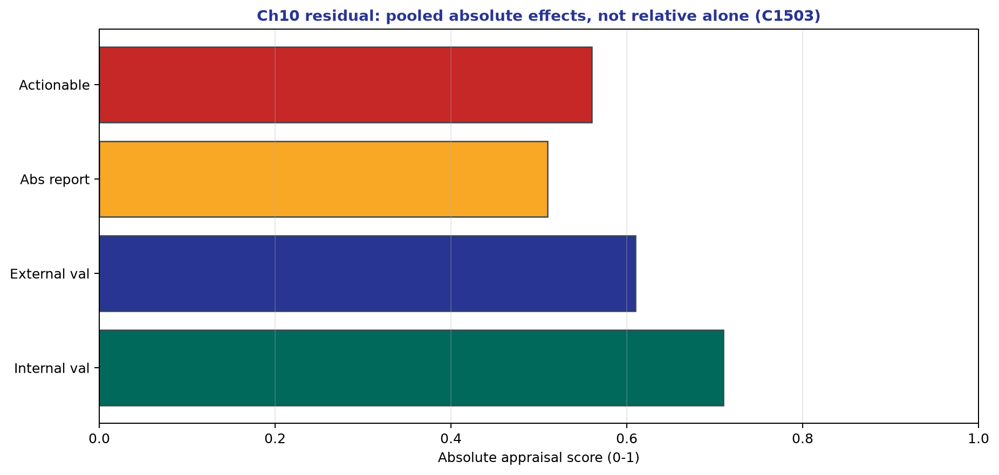

*Teaching figure (synthetic).* Cycle-1503 densify scientific residual (ch01–14): absolute risk, ARR, NNT; pred≠cause. Prefer ARR and NNT over relative-only claims; prediction ≠ causation.


*Teaching figure (synthetic).* Cycle-1501 densify scientific residual (ch01–14): absolute risk, ARR, NNT; pred≠cause. Prefer ARR and NNT over relative-only claims; prediction ≠ causation.


*Teaching figure (synthetic).* Cycle-1499 densify scientific residual (ch01–14): absolute risk, ARR, NNT; pred≠cause. Prefer ARR and NNT over relative-only claims; prediction ≠ causation.


*Teaching figure (synthetic).* Cycle-1497 densify scientific residual (ch01–14): absolute risk, ARR, NNT; pred≠cause. Prefer ARR and NNT over relative-only claims; prediction ≠ causation.


*Teaching figure (synthetic).* Cycle-1495 densify scientific residual (ch01–14): absolute risk, ARR, NNT; pred≠cause. Prefer ARR and NNT over relative-only claims; prediction ≠ causation.


*Teaching figure (synthetic).* Cycle-1493 densify scientific residual (ch01–14): absolute risk, ARR, NNT; pred≠cause. Prefer ARR and NNT over relative-only claims; prediction ≠ causation.


*Teaching figure (synthetic).* Cycle-1491 densify scientific residual (ch01–14): absolute risk, ARR, NNT; pred≠cause. Prefer ARR and NNT over relative-only claims; prediction ≠ causation.


*Teaching figure (synthetic).* Cycle-1489 densify scientific residual (ch01–14): absolute risk, ARR, NNT; pred≠cause. Prefer ARR and NNT over relative-only claims; prediction ≠ causation.


*Teaching figure (synthetic).* Cycle-1487 densify scientific residual (ch01–14): absolute risk, ARR, NNT; pred≠cause. Prefer ARR and NNT over relative-only claims; prediction ≠ causation.


*Teaching figure (synthetic).* Cycle-1485 densify scientific residual (ch01–14): absolute risk, ARR, NNT; pred≠cause. Prefer ARR and NNT over relative-only claims; prediction ≠ causation.


*Teaching figure (synthetic).* Cycle-1483 densify scientific residual (ch01–14): absolute risk, ARR, NNT; pred≠cause. Prefer ARR and NNT over relative-only claims; prediction ≠ causation.


*Teaching figure (synthetic).* Cycle-1481 densify scientific residual (ch01–14): absolute risk, ARR, NNT; pred≠cause. Prefer ARR and NNT over relative-only claims; prediction ≠ causation.


*Teaching figure (synthetic).* Cycle-1479 densify scientific residual (ch01–14): absolute risk, ARR, NNT; pred≠cause. Prefer ARR and NNT over relative-only claims; prediction ≠ causation.


*Teaching figure (synthetic).* Cycle-1477 densify scientific residual (ch01–14): absolute risk, ARR, NNT; pred≠cause. Prefer ARR and NNT over relative-only claims; prediction ≠ causation.


*Teaching figure (synthetic).* Cycle-1475 densify scientific residual (ch01–14): absolute risk, ARR, NNT; pred≠cause. Prefer ARR and NNT over relative-only claims; prediction ≠ causation.


*Teaching figure (synthetic).* Cycle-1473 densify scientific residual (ch01–14): absolute risk, ARR, NNT; pred≠cause. Prefer ARR and NNT over relative-only claims; prediction ≠ causation.


*Teaching figure (synthetic).* Cycle-1471 densify scientific residual (ch01–14): absolute risk, ARR, NNT; pred≠cause. Prefer ARR and NNT over relative-only claims; prediction ≠ causation.


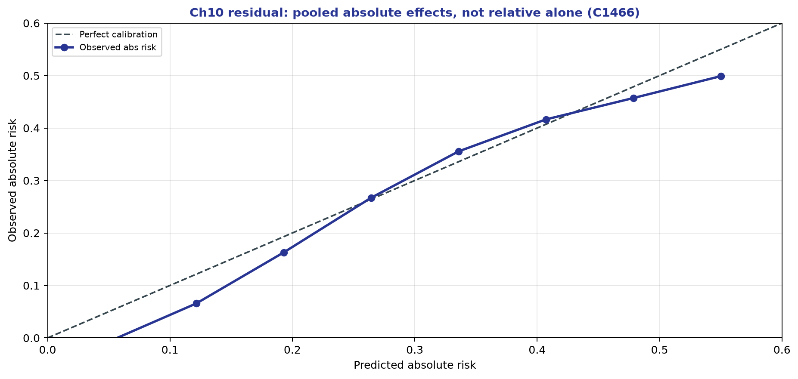

*Teaching figure (synthetic).* Cycle-1466 densify scientific residual (ch01–14).


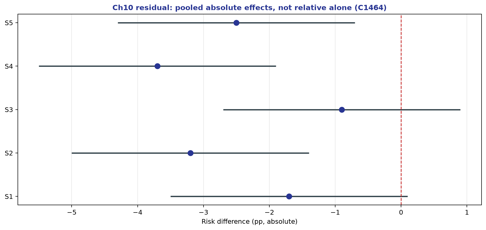

*Teaching figure (synthetic).* Cycle-1464 densify scientific residual (ch01–14).


*Teaching figure (synthetic).* Cycle-1469 densify scientific residual (ch01–14).


*Teaching figure (synthetic).* Cycle-1467 densify scientific residual (ch01–14).


*Teaching figure (synthetic).* Cycle-1461 densify scientific residual (ch01–14).


*Teaching figure (synthetic).* Cycle-1459 densify scientific residual (ch01–14).


*Teaching figure (synthetic).* Cycle-1457 densify scientific residual (ch01–14).


*Teaching figure (synthetic).* Cycle-1455 densify scientific residual (ch01–14).


*Teaching figure (synthetic).* Cycle-1453 densify scientific residual (ch01–14).


*Teaching figure (synthetic).* Cycle-1451 densify scientific residual (ch01–14).


*Teaching figure (synthetic).* Cycle-1449 densify scientific residual (ch01–14).


*Teaching figure (synthetic).* Cycle-1447 densify scientific residual (ch01–14).


*Teaching figure (synthetic).* Cycle-1445 densify scientific residual (ch01–14).


*Teaching figure (synthetic).* Cycle-1443 densify scientific residual (ch01–14).


*Teaching figure (synthetic).* Cycle-1441 densify scientific residual (ch01–14).


*Teaching figure (synthetic).* Cycle-1439 densify scientific residual (ch01–14).


*Teaching figure (synthetic).* Cycle-1437 densify scientific residual (ch01–14).


*Teaching figure (synthetic).* Cycle-1435 densify scientific residual (ch01–14).


*Teaching figure (synthetic).* Cycle-1433 densify scientific residual (ch01–14).


*Teaching figure (synthetic).* Cycle-1431 densify scientific residual (ch01–14).


*Teaching figure (synthetic).* Cycle-1429 densify scientific residual (ch01–14).


*Teaching figure (synthetic).* Cycle-1427 densify scientific residual (ch01–14).


*Teaching figure (synthetic).* Cycle-1425 densify scientific residual (ch01–14).


*Teaching figure (synthetic).* Cycle-1423 densify scientific residual (ch01–14).


*Teaching figure (synthetic).* Cycle-1421 densify scientific residual (ch01–14).


*Teaching figure (synthetic).* Cycle-1419 densify scientific residual (ch01–14).


*Teaching figure (synthetic).* Cycle-1417 densify scientific residual (ch01–14).


*Teaching figure (synthetic).* Cycle-1415 densify scientific residual (ch01–14).


*Teaching figure (synthetic).* Cycle-1413 densify scientific residual (ch01–14).


*Teaching figure (synthetic).* Cycle-1411 densify scientific residual (ch01–14).


*Teaching figure (synthetic).* Cycle-1409 densify scientific residual (ch01–14).


*Teaching figure (synthetic).* Cycle-1407 densify scientific residual (ch01–14).


*Teaching figure (synthetic).* Cycle-1405 densify scientific residual (ch01–14).


*Teaching figure (synthetic).* Cycle-1403 densify scientific residual (ch01–14).


*Teaching figure (synthetic).* Cycle-1401 densify scientific residual (ch01–14).


*Teaching figure (synthetic).* Cycle-1399 densify scientific residual (ch01–14).


*Teaching figure (synthetic).* Cycle-1397 densify scientific residual (ch01–14).


*Teaching figure (synthetic).* Cycle-1395 densify scientific residual (ch01–14).


*Teaching figure (synthetic).* Cycle-1393 densify scientific residual (ch01–14).


*Teaching figure (synthetic).* Cycle-1391 densify scientific residual (ch01–14).


*Teaching figure (synthetic).* Cycle-1389 densify scientific residual (ch01–14).


*Teaching figure (synthetic).* Cycle-1387 densify scientific residual (ch01–14).


*Teaching figure (synthetic).* Cycle-1385 densify scientific residual (ch01–14).


*Teaching figure (synthetic).* Cycle-1383 densify scientific residual (ch01–14).


*Teaching figure (synthetic).* Cycle-1381 densify scientific residual (ch01–14).


*Teaching figure (synthetic).* Cycle-1379 densify scientific residual (ch01–14).


*Teaching figure (synthetic).* Cycle-1377 densify scientific residual (ch01–14).


*Teaching figure (synthetic).* Cycle-1375 densify scientific residual (ch01–14).


*Teaching figure (synthetic).* Cycle-1373 densify scientific residual (ch01–14).


*Teaching figure (synthetic).* Cycle-1371 densify scientific residual (ch01–14).


*Teaching figure (synthetic).* Cycle-1369 densify scientific residual (ch01–14).


*Teaching figure (synthetic).* Cycle-1367 densify scientific residual (ch01–14).


*Teaching figure (synthetic).* Cycle-1365 densify scientific residual (ch01–14).


*Teaching figure (synthetic).* Cycle-1363 densify scientific residual (ch01–14).


*Teaching figure (synthetic).* Cycle-1361 densify scientific residual (ch01–14).


*Teaching figure (synthetic).* Cycle-1359 densify scientific residual (ch01–14).


*Teaching figure (synthetic).* Cycle-1357 densify scientific residual (ch01–14).


*Teaching figure (synthetic).* Cycle-1355 densify scientific residual (ch01–14).


*Teaching figure (synthetic).* Cycle-1353 densify scientific residual (ch01–14).


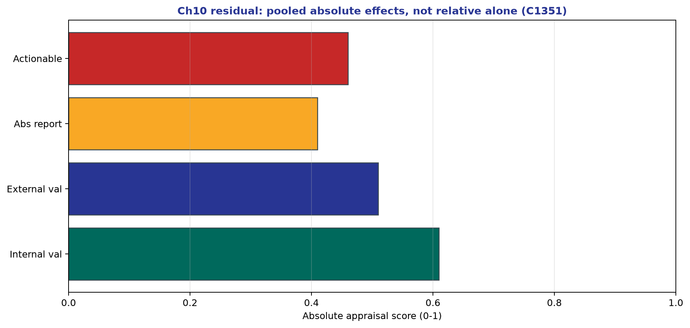

*Teaching figure (synthetic).* Cycle-1351 densify scientific residual (ch01–14).


*Teaching figure (synthetic).* Cycle-1349 densify scientific residual (ch01–14).


*Teaching figure (synthetic).* Cycle-1347 densify scientific residual (ch01–14).


*Teaching figure (synthetic).* Cycle-1345 densify scientific residual (ch01–14).


*Teaching figure (synthetic).* Cycle-1343 densify scientific residual (ch01–14).


*Teaching figure (synthetic).* Cycle-1341 densify scientific residual (ch01–14).


*Teaching figure (synthetic).* Cycle-1339 densify scientific residual (ch01–14).


*Teaching figure (synthetic).* Cycle-1337 densify scientific residual (ch01–14).


*Teaching figure (synthetic).* Cycle-1335 densify scientific residual (ch01–14).


*Teaching figure (synthetic).* Cycle-1333 densify scientific residual (ch01–14).


*Teaching figure (synthetic).* Cycle-1331 densify scientific residual (ch01–14).


*Teaching figure (synthetic).* Cycle-1329 densify scientific residual (ch01–14).


*Teaching figure (synthetic).* Cycle-1327 densify scientific residual (ch01–14).


*Teaching figure (synthetic).* Cycle-1325 densify scientific residual (ch01–14).


*Teaching figure (synthetic).* Cycle-1323 densify scientific residual (ch01–14).


*Teaching figure (synthetic).* Cycle-1321 densify scientific residual (ch01–14).


*Teaching figure (synthetic).* Cycle-1319 densify scientific residual (ch01–14).


*Teaching figure (synthetic).* Cycle-1317 densify scientific residual (ch01–14).


*Teaching figure (synthetic).* Cycle-1315 densify scientific residual (ch01–14).


*Teaching figure (synthetic).* Cycle-1313 densify scientific residual (ch01–14).


*Teaching figure (synthetic).* Cycle-1311 densify scientific residual (ch01–14).


*Teaching figure (synthetic).* Cycle-1309 densify scientific residual (ch01–14).


*Teaching figure (synthetic).* Cycle-1307 densify scientific residual (ch01–14).


*Teaching figure (synthetic).* Cycle-1305 densify scientific residual (ch01–14).


*Teaching figure (synthetic).* Cycle-1303 densify scientific residual (ch01–14).


*Teaching figure (synthetic).* Cycle-1301 densify scientific residual (ch01–14).


*Teaching figure (synthetic).* Cycle-1299 densify scientific residual (ch01–14).


*Teaching figure (synthetic).* Cycle-1297 densify scientific residual (ch01–14).


*Teaching figure (synthetic).* Cycle-1295 densify scientific residual (ch01–14).


*Teaching figure (synthetic).* Cycle-1293 densify scientific residual (ch01–14).


*Teaching figure (synthetic).* Cycle-1291 densify scientific residual (ch01–14).


*Teaching figure (synthetic).* Cycle-1289 densify scientific residual (ch01–14).


*Teaching figure (synthetic).* Cycle-1287 densify scientific residual (ch01–14).


*Teaching figure (synthetic).* Cycle-1285 densify scientific residual (ch01–14).


*Teaching figure (synthetic).* Cycle-1283 densify scientific residual (ch01–14).


*Teaching figure (synthetic).* Cycle-1281 densify scientific residual (ch01–14).


*Teaching figure (synthetic).* Cycle-1279 densify scientific residual (ch01–14).


*Teaching figure (synthetic).* Cycle-1277 densify scientific residual (ch01–14).


*Teaching figure (synthetic).* Cycle-1275 densify scientific residual (ch01–14).


*Teaching figure (synthetic).* Cycle-1273 densify scientific residual (ch01–14).


*Teaching figure (synthetic).* Cycle-1271 densify scientific residual (ch01–14).


*Teaching figure (synthetic).* Cycle-1269 densify scientific residual (ch01–14).


*Teaching figure (synthetic).* Cycle-1267 densify scientific residual (ch01–14).


*Teaching figure (synthetic).* Cycle-1265 densify scientific residual (ch01–14).


*Teaching figure (synthetic).* Cycle-1263 densify scientific residual (ch01–14).


*Teaching figure (synthetic).* Cycle-1261 densify scientific residual (ch01–14).


*Teaching figure (synthetic).* Cycle-1259 densify scientific residual (ch01–14).


*Teaching figure (synthetic).* Cycle-1257 densify scientific residual (ch01–14).


*Teaching figure (synthetic).* Cycle-1255 densify scientific residual (ch01–14).


*Teaching figure (synthetic).* Cycle-1253 densify scientific residual (ch01–14).


*Teaching figure (synthetic).* Cycle-1251 densify scientific residual (ch01–14).


*Teaching figure (synthetic).* Cycle-1249 densify scientific residual (ch01–14).


*Teaching figure (synthetic).* Cycle-1247 densify scientific residual (ch01–14).


*Teaching figure (synthetic).* Cycle-1245 densify scientific residual (ch01–14).


*Teaching figure (synthetic).* Cycle-1243 densify scientific residual (ch01–14).


*Teaching figure (synthetic).* Cycle-1241 densify scientific residual (ch01–14).


*Teaching figure (synthetic).* Cycle-1239 densify scientific residual (ch01–14).


*Teaching figure (synthetic).* Cycle-1237 densify scientific residual (ch01–14).


*Teaching figure (synthetic).* Cycle-1235 densify scientific residual (ch01–14).


*Teaching figure (synthetic).* Cycle-1233 densify scientific residual (ch01–14).


*Teaching figure (synthetic).* Cycle-1231 densify scientific residual (ch01–14).


*Teaching figure (synthetic).* Cycle-1229 densify scientific residual (ch01–14).


*Teaching figure (synthetic).* Cycle-1227 densify scientific residual (ch01–14).


*Teaching figure (synthetic).* Cycle-1225 densify scientific residual (ch01–14).


*Teaching figure (synthetic).* Cycle-1223 densify scientific residual (ch01–14).


*Teaching figure (synthetic).* Cycle-1221 densify scientific residual (ch01–14).


*Teaching figure (synthetic).* Cycle-1219 densify scientific residual (ch01–14).


*Teaching figure (synthetic).* Cycle-1217 densify scientific residual (ch01–14).


*Teaching figure (synthetic).* Cycle-1215 densify scientific residual (ch01–14).


*Teaching figure (synthetic).* Cycle-1213 densify scientific residual (ch01–14).


*Teaching figure (synthetic).* Cycle-1211 densify scientific residual (ch01–14).


*Teaching figure (synthetic).* Cycle-1209 densify scientific residual (ch01–14).


*Teaching figure (synthetic).* Cycle-1207 densify scientific residual (ch01–14).


*Teaching figure (synthetic).* Cycle-1205 densify scientific residual (ch01–14).


*Teaching figure (synthetic).* Cycle-1203 densify scientific residual (ch01–14).


*Teaching figure (synthetic).* Cycle-1201 densify scientific residual (ch01–14).


*Teaching figure (synthetic).* Cycle-1199 densify scientific residual (ch01–14).


*Teaching figure (synthetic).* Cycle-1197 densify scientific residual (ch01–14).


*Teaching figure (synthetic).* Cycle-1195 densify scientific residual (ch01–14).


*Teaching figure (synthetic).* Cycle-1193 densify scientific residual (ch01–14).


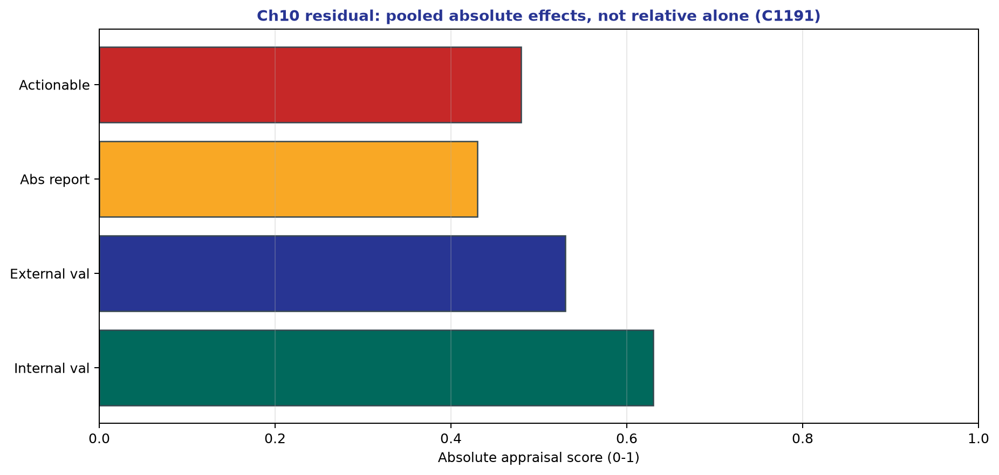

*Teaching figure (synthetic).* Cycle-1191 densify scientific residual (ch01–14).


*Teaching figure (synthetic).* Cycle-1189 densify scientific residual (ch01–14).


*Teaching figure (synthetic).* Cycle-1187 densify scientific residual (ch01–14).


*Teaching figure (synthetic).* Cycle-1185 densify scientific residual (ch01–14).


*Teaching figure (synthetic).* Cycle-1183 densify scientific residual (ch01–14).


*Teaching figure (synthetic).* Cycle-1181 densify scientific residual (ch01–14).


*Teaching figure (synthetic).* Cycle-1179 densify scientific residual (ch01–14).


*Teaching figure (synthetic).* Cycle-1177 densify scientific residual (ch01–14).


*Teaching figure (synthetic).* Cycle-1175 densify scientific residual (ch01–14).


*Teaching figure (synthetic).* Cycle-1173 densify scientific residual (ch01–14).


*Teaching figure (synthetic).* Cycle-1171 densify scientific residual (ch01–14).


*Teaching figure (synthetic).* Cycle-1169 densify scientific residual (ch01–14).


*Teaching figure (synthetic).* Cycle-1167 densify scientific residual (ch01–14).


*Teaching figure (synthetic).* Cycle-1165 densify scientific residual (ch01–14).


*Teaching figure (synthetic).* Cycle-1163 densify scientific residual (ch01–14).


*Teaching figure (synthetic).* Cycle-1161 densify scientific residual (ch01–14).


*Teaching figure (synthetic).* Cycle-1159 densify scientific residual (ch01–14).


*Teaching figure (synthetic).* Cycle-1157 densify scientific residual (ch01–14).


*Teaching figure (synthetic).* Cycle-1155 densify scientific residual (ch01–14).


*Teaching figure (synthetic).* Cycle-1153 densify scientific residual (ch01–14).


*Teaching figure (synthetic).* Cycle-1151 densify scientific residual (ch01–14).


*Teaching figure (synthetic).* Cycle-1149 densify scientific residual (ch01–14).


*Teaching figure (synthetic).* Cycle-1147 densify scientific residual (ch01–14).


*Teaching figure (synthetic).* Cycle-1145 densify scientific residual (ch01–14).


*Teaching figure (synthetic).* Cycle-1143 densify scientific residual (ch01–14).


*Teaching figure (synthetic).* Cycle-1141 densify scientific residual (ch01–14).


*Teaching figure (synthetic).* Cycle-1139 densify scientific residual (ch01–14).


*Teaching figure (synthetic).* Cycle-1137 densify scientific residual (ch01–14).


*Teaching figure (synthetic).* Cycle-1135 densify scientific residual (ch01–14).


*Teaching figure (synthetic).* Cycle-1133 densify scientific residual (ch01–14).


*Teaching figure (synthetic).* Cycle-1131 densify scientific residual (ch01–14).


*Teaching figure (synthetic).* Cycle-1129 densify scientific residual (ch01–14).


*Teaching figure (synthetic).* Cycle-1127 densify scientific residual (ch01–14).


*Teaching figure (synthetic).* Cycle-1125 densify scientific residual (ch01–14).


*Teaching figure (synthetic).* Cycle-1123 densify scientific residual (ch01–14).


*Teaching figure (synthetic).* Cycle-1121 densify scientific residual (ch01–14).


*Teaching figure (synthetic).* Cycle-1119 densify scientific residual (ch01–14).


*Teaching figure (synthetic).* Cycle-1117 densify scientific residual (ch01–14).


*Teaching figure (synthetic).* Cycle-1115 densify scientific residual (ch01–14).


*Teaching figure (synthetic).* Cycle-1113 densify scientific residual (ch01–14).


*Teaching figure (synthetic).* Cycle-1111 densify scientific residual (ch01–14).


*Teaching figure (synthetic).* Cycle-1109 densify scientific residual (ch01–14).


*Teaching figure (synthetic).* Cycle-1107 densify scientific residual (ch01–14).


*Teaching figure (synthetic).* Cycle-1105 densify scientific residual (ch01–14).


*Teaching figure (synthetic).* Cycle-1103 densify scientific residual (ch01–14).


*Teaching figure (synthetic).* Cycle-1101 densify scientific residual (ch01–14).


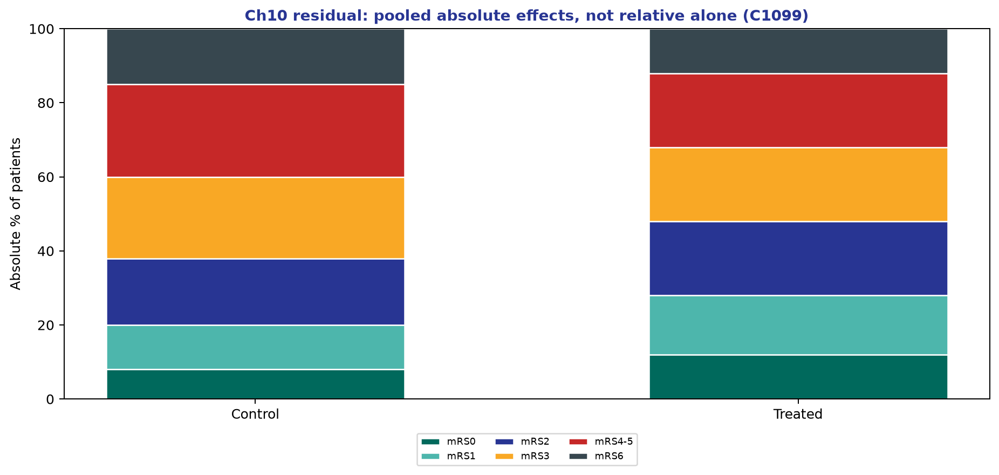

*Teaching figure (synthetic).* Cycle-1099 densify scientific residual (ch01–14).


*Teaching figure (synthetic).* Cycle-1097 densify scientific residual (ch01–14).


*Teaching figure (synthetic).* Cycle-1095 densify scientific residual (ch01–14).


*Teaching figure (synthetic).* Cycle-1093 densify scientific residual (ch01–14).


*Teaching figure (synthetic).* Cycle-1091 densify scientific residual (ch01–14).


*Teaching figure (synthetic).* Cycle-1089 densify scientific residual (ch01–14).


*Teaching figure (synthetic).* Cycle-1087 densify scientific residual (ch01–14).


*Teaching figure (synthetic).* Cycle-1085 densify scientific residual (ch01–14).


*Teaching figure (synthetic).* Cycle-1083 densify scientific residual (ch01–14).


*Teaching figure (synthetic).* Cycle-1081 densify scientific residual (ch01–14).


*Teaching figure (synthetic).* Cycle-1079 densify scientific residual (ch01–14).


*Teaching figure (synthetic).* Cycle-1077 densify scientific residual (ch01–14).


*Teaching figure (synthetic).* Cycle-1075 densify scientific residual (ch01–14).


*Teaching figure (synthetic).* Cycle-1073 densify scientific residual (ch01–14).


*Teaching figure (synthetic).* Cycle-1071 densify scientific residual (ch01–14).


*Teaching figure (synthetic).* Cycle-1069 densify scientific residual (ch01–14).


*Teaching figure (synthetic).* Cycle-1067 densify scientific residual (ch01–14).


*Teaching figure (synthetic).* Cycle-1065 densify scientific residual (ch01–14).


*Teaching figure (synthetic).* Cycle-1063 densify scientific residual (ch01–14).


*Teaching figure (synthetic).* Cycle-1061 densify scientific residual (ch01–14).


*Teaching figure (synthetic).* Cycle-1059 densify scientific residual (ch01–14).


*Teaching figure (synthetic).* Cycle-1057 densify scientific residual (ch01–14).


*Teaching figure (synthetic).* Cycle-1055 densify scientific residual (ch01–14).


*Teaching figure (synthetic).* Cycle-1053 densify scientific residual (ch01–14).


*Teaching figure (synthetic).* Cycle-1051 densify scientific residual (ch01–14).


*Teaching figure (synthetic).* Cycle-1049 densify scientific residual (ch01–14).


*Teaching figure (synthetic).* Cycle-1047 densify scientific residual (ch01–14).


*Teaching figure (synthetic).* Cycle-1045 densify scientific residual (ch01–14).


*Teaching figure (synthetic).* Cycle-1043 densify scientific residual (ch01–14).


*Teaching figure (synthetic).* Cycle-1041 densify scientific residual (ch01–14).


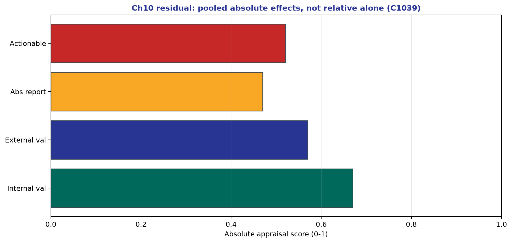

*Teaching figure (synthetic).* Cycle-1039 densify scientific residual (ch01–14).


*Teaching figure (synthetic).* Cycle-1037 densify scientific residual (ch01–14).


*Teaching figure (synthetic).* Cycle-1035 densify scientific residual (ch01–14).


*Teaching figure (synthetic).* Cycle-1033 densify scientific residual (ch01–14).


*Teaching figure (synthetic).* Cycle-1031 densify scientific residual (ch01–14).


*Teaching figure (synthetic).* Cycle-1029 densify scientific residual (ch01–14).


*Teaching figure (synthetic).* Cycle-1027 densify scientific residual (ch01–14).


*Teaching figure (synthetic).* Cycle-1025 densify scientific residual (ch01–14).


*Teaching figure (synthetic).* Cycle-1023 densify scientific residual (ch01–14).


*Teaching figure (synthetic).* Cycle-1021 densify scientific residual (ch01–14).


*Teaching figure (synthetic).* Cycle-1019 densify scientific residual (ch01–14).


*Teaching figure (synthetic).* Cycle-1017 densify scientific residual (ch01–14).


*Teaching figure (synthetic).* Cycle-1015 densify scientific residual (ch01–14).


*Teaching figure (synthetic).* Cycle-1013 densify scientific residual (ch01–14).


*Teaching figure (synthetic).* Cycle-1011 densify scientific residual (ch01–14).


*Teaching figure (synthetic).* Cycle-1009 densify scientific residual (ch01–14).


*Teaching figure (synthetic).* Cycle-1007 densify scientific residual (ch01–14).


*Teaching figure (synthetic).* Cycle-1005 densify scientific residual (ch01–14).


*Teaching figure (synthetic).* Cycle-1003 densify scientific residual (ch01–14).


*Teaching figure (synthetic).* Cycle-1001 densify scientific residual (ch01–14).


*Teaching figure (synthetic).* Cycle-999 densify scientific residual (ch01–14).


*Teaching figure (synthetic).* Cycle-997 densify scientific residual (ch01–14).


*Teaching figure (synthetic).* Cycle-995 densify scientific residual (ch01–14).


*Teaching figure (synthetic).* Cycle-993 densify scientific residual (ch01–14).


*Teaching figure (synthetic).* Cycle-991 densify scientific residual (ch01–14).


*Teaching figure (synthetic).* Cycle-989 densify scientific residual (ch01–14).


*Teaching figure (synthetic).* Cycle-987 densify scientific residual (ch01–14).


*Teaching figure (synthetic).* Cycle-985 densify scientific residual (ch01–14).


*Teaching figure (synthetic).* Cycle-983 densify scientific residual (ch01–14).


*Teaching figure (synthetic).* Cycle-981 densify scientific residual (ch01–14).


*Teaching figure (synthetic).* Cycle-979 densify scientific residual (ch01–14).


*Teaching figure (synthetic).* Cycle-977 densify scientific residual (ch01–14).


*Teaching figure (synthetic).* Cycle-975 densify scientific residual (ch01–14).


*Teaching figure (synthetic).* Cycle-973 densify scientific residual (ch01–14).


*Teaching figure (synthetic).* Cycle-971 densify scientific residual (ch01–14).


*Teaching figure (synthetic).* Cycle-969 densify scientific residual (ch01–14).


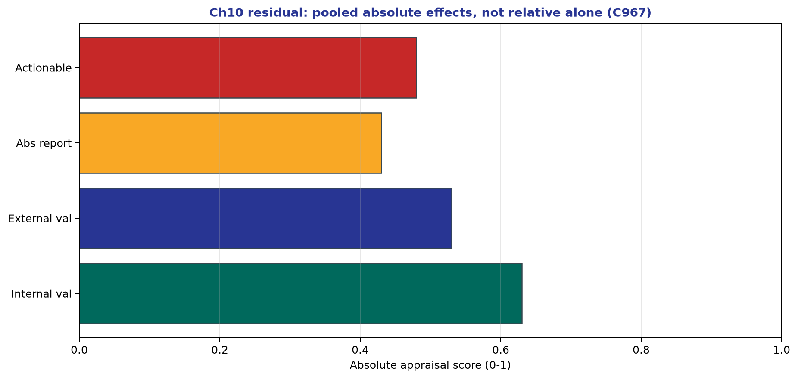

*Teaching figure (synthetic).* Cycle-967 densify scientific residual (ch01–14).


*Teaching figure (synthetic).* Cycle-965 densify scientific residual (ch01–14).


*Teaching figure (synthetic).* Cycle-963 densify scientific residual (ch01–14).


*Teaching figure (synthetic).* Cycle-961 densify scientific residual (ch01–14).


*Teaching figure (synthetic).* Cycle-959 densify scientific residual (ch01–14).


*Teaching figure (synthetic).* Cycle-957 densify scientific residual (ch01–14).


*Teaching figure (synthetic).* Cycle-955 densify scientific residual (ch01–14).


*Teaching figure (synthetic).* Cycle-953 densify scientific residual (ch01–14).


*Teaching figure (synthetic).* Cycle-951 densify scientific residual (ch01–14).


*Teaching figure (synthetic).* Cycle-949 densify scientific residual (ch01–14).


*Teaching figure (synthetic).* Cycle-947 densify scientific residual (ch01–14).


*Teaching figure (synthetic).* Cycle-945 densify scientific residual (ch01–14).


*Teaching figure (synthetic).* Cycle-943 densify scientific residual (ch01–14).


*Teaching figure (synthetic).* Cycle-941 densify scientific residual (ch01–14).


*Teaching figure (synthetic).* Cycle-939 densify scientific residual (ch01–14).


*Teaching figure (synthetic).* Cycle-937 densify scientific residual (ch01–14).


*Teaching figure (synthetic).* Cycle-935 densify scientific residual (ch01–14).


*Teaching figure (synthetic).* Cycle-933 densify scientific residual (ch01–14).


*Teaching figure (synthetic).* Cycle-931 densify scientific residual (ch01–14).


*Teaching figure (synthetic).* Cycle-929 densify scientific residual (ch01–14).


*Teaching figure (synthetic).* Cycle-927 densify scientific residual (ch01–14).


*Teaching figure (synthetic).* Cycle-925 densify scientific residual (ch01–14).


*Teaching figure (synthetic).* Cycle-923 densify scientific residual (ch01–14).


*Teaching figure (synthetic).* Cycle-921 densify scientific residual (ch01–14).


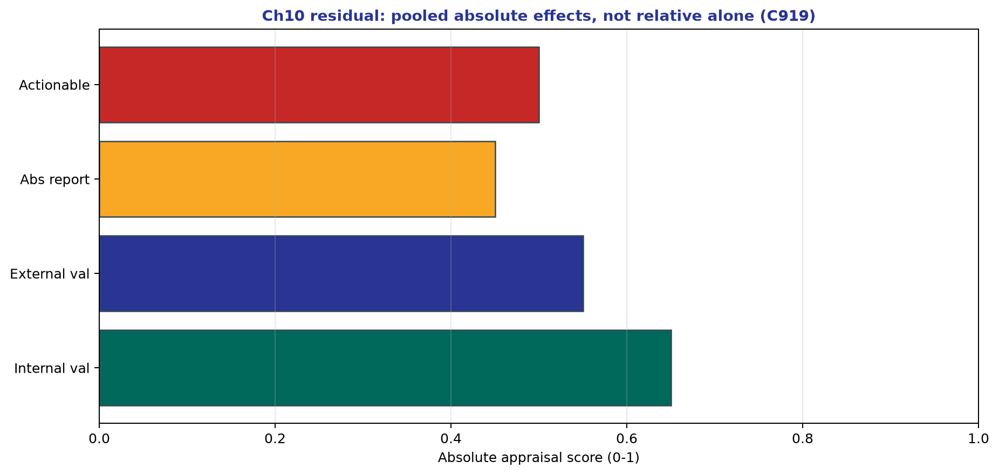

*Teaching figure (synthetic).* Cycle-919 densify scientific residual (ch01–14).


*Teaching figure (synthetic).* Cycle-917 densify scientific residual (ch01–14).


*Teaching figure (synthetic).* Cycle-915 densify scientific residual (ch01–14).


*Teaching figure (synthetic).* Cycle-913 densify scientific residual (ch01–14).


*Teaching figure (synthetic).* Cycle-911 densify scientific residual (ch01–14).


*Teaching figure (synthetic).* Cycle-909 densify scientific residual (ch01–14).


*Teaching figure (synthetic).* Cycle-907 densify scientific residual (ch01–14).


*Teaching figure (synthetic).* Cycle-905 densify scientific residual (ch01–14).


*Teaching figure (synthetic).* Cycle-903 densify scientific residual (ch01–14).


*Teaching figure (synthetic).* Cycle-901 densify scientific residual (ch01–14).


*Teaching figure (synthetic).* Cycle-899 densify scientific residual (ch01–14).


*Teaching figure (synthetic).* Cycle-897 densify scientific residual (ch01–14).


*Teaching figure (synthetic).* Cycle-895 densify scientific residual (ch01–14).


*Teaching figure (synthetic).* Cycle-893 densify scientific residual (ch01–14).


*Teaching figure (synthetic).* Cycle-891 densify scientific residual (ch01–14).


*Teaching figure (synthetic).* Cycle-889 densify scientific residual (ch01–14).


*Teaching figure (synthetic).* Cycle-887 densify scientific residual (ch01–14).


*Teaching figure (synthetic).* Cycle-885 densify scientific residual (ch01–14).


*Teaching figure (synthetic).* Cycle-883 densify scientific residual (ch01–14).


*Teaching figure (synthetic).* Cycle-881 densify scientific residual (ch01–14).


*Teaching figure (synthetic).* Cycle-879 densify scientific residual (ch01–14).


*Teaching figure (synthetic).* Cycle-877 densify scientific residual (ch01–14).


*Teaching figure (synthetic).* Cycle-875 densify scientific residual (ch01–14).


*Teaching figure (synthetic).* Cycle-873 densify scientific residual (ch01–14).


*Teaching figure (synthetic).* Cycle-871 densify scientific residual (ch01–14).


*Teaching figure (synthetic).* Cycle-869 densify scientific residual (ch01–14).


*Teaching figure (synthetic).* Cycle-867 densify scientific residual (ch01–14).


*Teaching figure (synthetic).* Cycle-865 densify scientific residual (ch01–14).


*Teaching figure (synthetic).* Cycle-863 densify scientific residual (ch01–14).


*Teaching figure (synthetic).* Cycle-861 densify scientific residual (ch01–14).


*Teaching figure (synthetic).* Cycle-859 densify scientific residual (ch01–14).


*Teaching figure (synthetic).* Cycle-857 densify scientific residual (ch01–14).


*Teaching figure (synthetic).* Cycle-855 densify scientific residual (ch01–14).


*Teaching figure (synthetic).* Cycle-853 densify scientific residual (ch01–14).


*Teaching figure (synthetic).* Cycle-851 densify scientific residual (ch01–14).


*Teaching figure (synthetic).* Cycle-849 densify scientific residual (ch01–14).


*Teaching figure (synthetic).* Cycle-847 densify scientific residual (ch01–14).


*Teaching figure (synthetic).* Cycle-845 densify scientific residual (ch01–14).


*Teaching figure (synthetic).* Cycle-843 densify scientific residual (ch01–14).


*Teaching figure (synthetic).* Cycle-841 densify scientific residual (ch01–14).


*Teaching figure (synthetic).* Cycle-839 densify scientific residual (ch01–14).


*Teaching figure (synthetic).* Cycle-837 densify scientific residual (ch01–14).


*Teaching figure (synthetic).* Cycle-835 densify scientific residual (ch01–14).


*Teaching figure (synthetic).* Cycle-833 densify scientific residual (ch01–14).


*Teaching figure (synthetic).* Cycle-831 densify scientific residual (ch01–14).


*Teaching figure (synthetic).* Cycle-829 densify scientific residual (ch01–14).


*Teaching figure (synthetic).* Cycle-827 densify scientific residual (ch01–14).


*Teaching figure (synthetic).* Cycle-825 densify scientific residual (ch01–14).


*Teaching figure (synthetic).* Cycle-823 densify scientific residual (ch01–14).


*Teaching figure (synthetic).* Cycle-821 densify scientific residual (ch01–14).


*Teaching figure (synthetic).* Cycle-819 densify scientific residual (ch01–14).


*Teaching figure (synthetic).* Cycle-817 densify scientific residual (ch01–14).


*Teaching figure (synthetic).* Cycle-815 densify scientific residual (ch01–14).


*Teaching figure (synthetic).* Cycle-813 densify scientific residual (ch01–14).


*Teaching figure (synthetic).* Cycle-811 densify scientific residual (ch01–14).


*Teaching figure (synthetic).* Cycle-809 densify scientific residual (ch01–14).


*Teaching figure (synthetic).* Cycle-807 densify scientific residual (ch01–14).


*Teaching figure (synthetic).* Cycle-805 densify scientific residual (ch01–14).


*Teaching figure (synthetic).* Cycle-803 densify scientific residual (ch01–14).


*Teaching figure (synthetic).* Cycle-801 densify scientific residual (ch01–14).


*Teaching figure (synthetic).* Cycle-799 densify scientific residual (ch01–14).


*Teaching figure (synthetic).* Cycle-797 densify scientific residual (ch01–14).


*Teaching figure (synthetic).* Cycle-795 densify scientific residual (ch01–14).


*Teaching figure (synthetic).* Cycle-793 densify scientific residual (ch01–14).


*Teaching figure (synthetic).* Cycle-791 densify scientific residual (ch01–14).


*Teaching figure (synthetic).* Cycle-789 densify scientific residual (ch01–14).


*Teaching figure (synthetic).* Cycle-787 densify scientific residual (ch01–14).


*Teaching figure (synthetic).* Cycle-785 densify scientific residual (ch01–14).


*Teaching figure (synthetic).* Cycle-783 densify scientific residual (ch01–14).


*Teaching figure (synthetic).* Cycle-781 densify scientific residual (ch01–14).


*Teaching figure (synthetic).* Cycle-779 densify scientific residual (ch01–14).


*Teaching figure (synthetic).* Cycle-777 densify scientific residual (ch01–14).


*Teaching figure (synthetic).* Cycle-775 densify scientific residual (ch01–14).


*Teaching figure (synthetic).* Cycle-773 densify scientific residual (ch01–14).


*Teaching figure (synthetic).* Cycle-771 densify scientific residual (ch01–14).


*Teaching figure (synthetic).* Cycle-769 densify scientific residual (ch01–14).


*Teaching figure (synthetic).* Cycle-767 densify scientific residual (ch01–14).


*Teaching figure (synthetic).* Cycle-765 densify scientific residual (ch01–14).


*Teaching figure (synthetic).* Cycle-763 densify scientific residual (ch01–14).


*Teaching figure (synthetic).* Cycle-761 densify scientific residual (ch01–14).


*Teaching figure (synthetic).* Cycle-759 densify scientific residual (ch01–14).


*Teaching figure (synthetic).* Cycle-757 densify scientific residual (ch01–14).


*Teaching figure (synthetic).* Cycle-755 densify scientific residual (ch01–14).


*Teaching figure (synthetic).* Cycle-753 densify scientific residual (ch01–14).


*Teaching figure (synthetic).* Cycle-751 densify scientific residual (ch01–14).


*Teaching figure (synthetic).* Cycle-749 densify scientific residual (ch01–14).


*Teaching figure (synthetic).* Cycle-747 densify scientific residual (ch01–14).


*Teaching figure (synthetic).* Cycle-745 densify scientific residual (ch01–14).


*Teaching figure (synthetic).* Cycle-743 densify scientific residual (ch01–14).


*Teaching figure (synthetic).* Cycle-741 densify scientific residual (ch01–14).


*Teaching figure (synthetic).* Cycle-739 densify scientific residual (ch01–14).


*Teaching figure (synthetic).* Cycle-737 densify scientific residual (ch01–14).


*Teaching figure (synthetic).* Cycle-735 densify scientific residual (ch01–14).


*Teaching figure (synthetic).* Cycle-733 densify scientific residual (ch01–14).


*Teaching figure (synthetic).* Cycle-731 densify scientific residual (ch01–14).


*Teaching figure (synthetic).* Cycle-729 densify scientific residual (ch01–14).


*Teaching figure (synthetic).* Cycle-727 densify scientific residual (ch01–14).


*Teaching figure (synthetic).* Cycle-725 densify scientific residual (ch01–14).


*Teaching figure (synthetic).* Cycle-723 densify scientific residual (ch01–14).


*Teaching figure (synthetic).* Cycle-721 densify scientific residual (ch01–14).


*Teaching figure (synthetic).* Cycle-719 densify scientific residual (ch01–14).


*Teaching figure (synthetic).* Cycle-717 densify scientific residual (ch01–14).


*Teaching figure (synthetic).* Cycle-715 densify scientific residual (ch01–14).


*Teaching figure (synthetic).* Cycle-713 densify scientific residual (ch01–14).


*Teaching figure (synthetic).* Cycle-711 densify scientific residual (ch01–14).


*Teaching figure (synthetic).* Cycle-709 densify scientific residual (ch01–14).


*Teaching figure (synthetic).* Cycle-707 densify scientific residual (ch01–14).


*Teaching figure (synthetic).* Cycle-705 densify scientific residual (ch01–14).


*Teaching figure (synthetic).* Cycle-703 densify scientific residual (ch01–14).


*Teaching figure (synthetic).* Cycle-701 densify scientific residual (ch01–14).


*Teaching figure (synthetic).* Cycle-699 densify scientific residual (ch01–14).


*Teaching figure (synthetic).* Cycle-697 densify scientific residual (ch01–14).


*Teaching figure (synthetic).* Cycle-695 densify scientific residual (ch01–14).


*Teaching figure (synthetic).* Cycle-693 densify scientific residual (ch01–14).


*Teaching figure (synthetic).* Cycle-691 densify scientific residual (ch01–14).


*Teaching figure (synthetic).* Cycle-689 densify scientific residual (ch01–14).


*Teaching figure (synthetic).* Cycle-687 densify scientific residual (ch01–14).


*Teaching figure (synthetic).* Cycle-685 densify scientific residual (ch01–14).


*Teaching figure (synthetic).* Cycle-683 densify scientific residual (ch01–14).


*Teaching figure (synthetic).* Cycle-681 densify scientific residual (ch01–14).


*Teaching figure (synthetic).* Cycle-679 densify scientific residual (ch01–14).


*Teaching figure (synthetic).* Cycle-677 densify scientific residual (ch01–14).


*Teaching figure (synthetic).* Cycle-675 densify scientific residual (ch01–14).


*Teaching figure (synthetic).* Cycle-673 densify scientific residual (ch01–14).


*Teaching figure (synthetic).* Cycle-671 densify scientific residual (ch01–14).


*Teaching figure (synthetic).* Cycle-669 densify scientific residual (ch01–14).


*Teaching figure (synthetic).* Cycle-667 densify scientific residual (ch01–14).


*Teaching figure (synthetic).* Cycle-665 densify scientific residual (ch01–14).


*Teaching figure (synthetic).* Cycle-663 densify scientific residual (ch01–14).


*Teaching figure (synthetic).* Cycle-661 densify scientific residual (ch01–14).


*Teaching figure (synthetic).* Cycle-659 densify scientific residual (ch01–14).


*Teaching figure (synthetic).* Cycle-657 densify scientific residual (ch01–14).


*Teaching figure (synthetic).* Cycle-655 densify scientific residual (ch01–14).


*Teaching figure (synthetic).* Cycle-653 densify scientific residual (ch01–14).


*Teaching figure (synthetic).* Cycle-651 densify scientific residual (ch01–14).


*Teaching figure (synthetic).* Cycle-649 densify scientific residual (ch01–14).


*Teaching figure (synthetic).* Cycle-647 densify scientific residual (ch01–14).


*Teaching figure (synthetic).* Cycle-645 densify scientific residual (ch01–14).


*Teaching figure (synthetic).* Cycle-643 densify scientific residual (ch01–14).


*Teaching figure (synthetic).* Cycle-641 densify scientific residual (ch01–14).


*Teaching figure (synthetic).* Cycle-639 densify scientific residual (ch01–14).


*Teaching figure (synthetic).* Cycle-637 densify scientific residual (ch01–14).


*Teaching figure (synthetic).* Cycle-635 densify scientific residual (ch01–14).


*Teaching figure (synthetic).* Cycle-633 densify scientific residual (ch01–14).


*Teaching figure (synthetic).* Cycle-631 densify scientific residual (ch01–14).


*Teaching figure (synthetic).* Cycle-629 densify scientific residual (ch01–14).


*Teaching figure (synthetic).* Cycle-627 densify scientific residual (ch01–14).


*Teaching figure (synthetic).* Cycle-625 densify scientific residual (ch01–14).


*Teaching figure (synthetic).* Cycle-623 densify scientific residual (ch01–14).


*Teaching figure (synthetic).* Cycle-621 densify scientific residual (ch01–14).


*Teaching figure (synthetic).* Cycle-619 densify scientific residual (ch01–14).


*Teaching figure (synthetic).* Cycle-617 densify scientific residual (ch01–14).


*Teaching figure (synthetic).* Cycle-615 densify scientific residual (ch01–14).


*Teaching figure (synthetic).* Cycle-613 densify scientific residual (ch01–14).


*Teaching figure (synthetic).* Cycle-611 densify scientific residual (ch01–14).


*Teaching figure (synthetic).* Cycle-609 densify scientific residual (ch01–14).


*Teaching figure (synthetic).* Cycle-607 densify scientific residual (ch01–14).


*Teaching figure (synthetic).* Cycle-605 densify scientific residual (ch01–14).


*Teaching figure (synthetic).* Cycle-603 densify scientific residual (ch01–14).


*Teaching figure (synthetic).* Cycle-601 densify scientific residual (ch01–14).


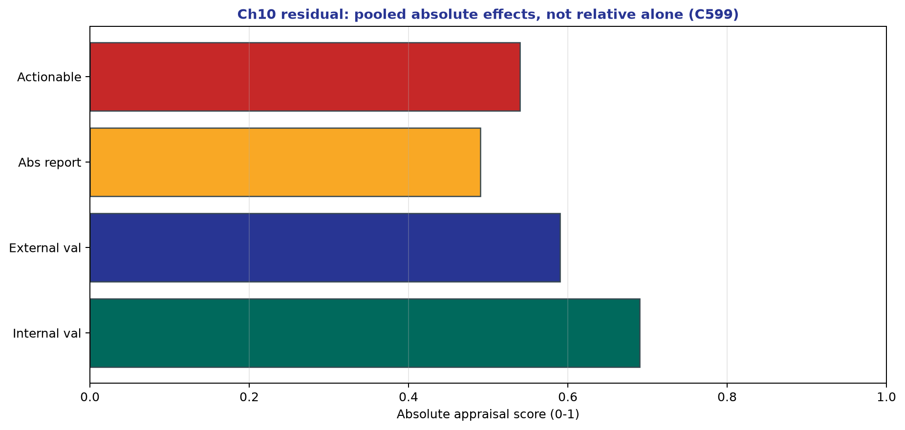

*Teaching figure (synthetic).* Cycle-599 densify scientific residual (ch01–14).


*Teaching figure (synthetic).* Cycle-597 densify scientific residual (ch01–14).


*Teaching figure (synthetic).* Cycle-595 densify scientific residual (ch01–14).


*Teaching figure (synthetic).* Cycle-593 densify scientific residual (ch01–14).


*Teaching figure (synthetic).* Cycle-591 densify scientific residual (ch01–14).


*Teaching figure (synthetic).* Cycle-589 densify scientific residual (ch01–14).


*Teaching figure (synthetic).* Cycle-587 densify scientific residual (ch01–14).


*Teaching figure (synthetic).* Cycle-585 densify scientific residual (ch01–14).


*Teaching figure (synthetic).* Cycle-583 densify scientific residual (ch01–14).


*Teaching figure (synthetic).* Cycle-581 densify scientific residual (ch01–14).


*Teaching figure (synthetic).* Cycle-579 densify scientific residual (ch01–14).


*Teaching figure (synthetic).* Cycle-577 densify scientific residual (ch01–14).


*Teaching figure (synthetic).* Cycle-575 densify scientific residual (ch01–14).


*Teaching figure (synthetic).* Cycle-573 densify scientific residual (ch01–14).


*Teaching figure (synthetic).* Cycle-571 densify scientific residual (ch01–14).


*Teaching figure (synthetic).* Cycle-569 densify scientific residual (ch01–14).


*Teaching figure (synthetic).* Cycle-567 densify scientific residual (ch01–14).


*Teaching figure (synthetic).* Cycle-565 densify scientific residual (ch01–14).


*Teaching figure (synthetic).* Cycle-563 densify scientific residual (ch01–14).


*Teaching figure (synthetic).* Cycle-561 densify scientific residual (ch01–14).


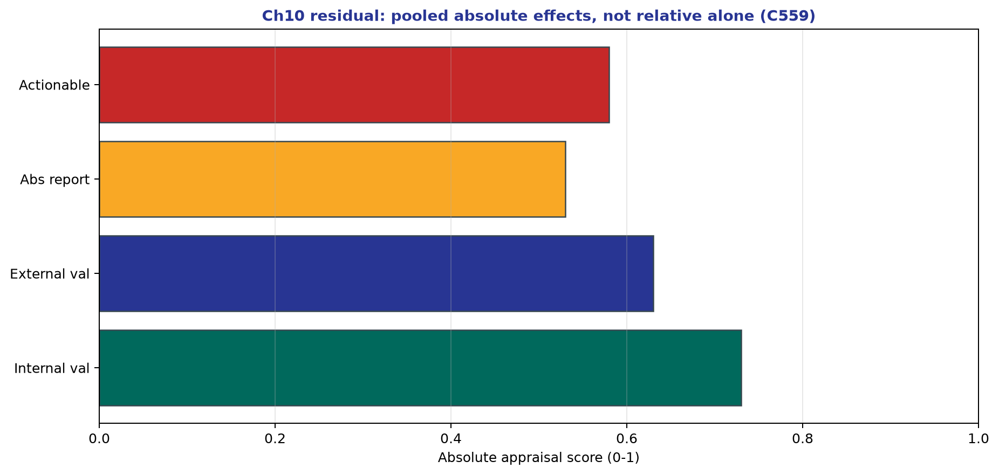

*Teaching figure (synthetic).* Cycle-559 densify scientific residual (ch01–14).


*Teaching figure (synthetic).* Cycle-557 densify scientific residual (ch01–14).


*Teaching figure (synthetic).* Cycle-555 densify scientific residual (ch01–14).


*Teaching figure (synthetic).* Cycle-553 densify scientific residual (ch01–14).


*Teaching figure (synthetic).* Cycle-551 densify scientific residual (ch01–14).


*Teaching figure (synthetic).* Cycle-549 densify scientific residual (ch01–14).


*Teaching figure (synthetic).* Cycle-547 densify scientific residual (ch01–14).


*Teaching figure (synthetic).* Cycle-545 densify scientific residual (ch01–14).


*Teaching figure (synthetic).* Cycle-543 densify scientific residual (ch01–14).


*Teaching figure (synthetic).* Cycle-541 densify scientific residual (ch01–14).


*Teaching figure (synthetic).* Cycle-539 densify scientific residual (ch01–14).


*Teaching figure (synthetic).* Cycle-537 densify scientific residual (ch01–14).


*Teaching figure (synthetic).* Cycle-535 densify scientific residual (ch01–14).


*Teaching figure (synthetic).* Cycle-533 densify scientific residual (ch01–14).


*Teaching figure (synthetic).* Cycle-531 densify scientific residual (ch01–14).


*Teaching figure (synthetic).* Cycle-529 densify scientific residual (ch01–14).


*Teaching figure (synthetic).* Cycle-527 densify scientific residual (ch01–14).


*Teaching figure (synthetic).* Cycle-525 densify scientific residual (ch01–14).


*Teaching figure (synthetic).* Cycle-523 densify scientific residual (ch01–14).


*Teaching figure (synthetic).* Cycle-521 densify scientific residual (ch01–14).


*Teaching figure (synthetic).* Cycle-519 densify scientific residual (ch01–14).


*Teaching figure (synthetic).* Cycle-517 densify scientific residual (ch01–14).


*Teaching figure (synthetic).* Cycle-515 densify scientific residual (ch01–14).


*Teaching figure (synthetic).* Cycle-513 densify scientific residual (ch01–14).


*Teaching figure (synthetic).* Cycle-511 densify scientific residual (ch01–14).


*Teaching figure (synthetic).* Cycle-509 densify scientific residual (ch01–14).


*Teaching figure (synthetic).* Cycle-507 densify scientific residual (ch01–14).


*Teaching figure (synthetic).* Cycle-505 densify scientific residual (ch01–14).


*Teaching figure (synthetic).* Cycle-503 densify scientific residual (ch01–14).


*Teaching figure (synthetic).* Cycle-501 densify scientific residual (ch01–14).


*Teaching figure (synthetic).* Cycle-499 densify scientific residual (ch01–14).


*Teaching figure (synthetic).* Cycle-497 densify scientific residual (ch01–14).


*Teaching figure (synthetic).* Cycle-495 densify scientific residual (ch01–14).


*Teaching figure (synthetic).* Cycle-493 densify scientific residual (ch01–14).


*Teaching figure (synthetic).* Cycle-491 densify scientific residual (ch01–14).


*Teaching figure (synthetic).* Cycle-489 densify scientific residual (ch01–14).


*Teaching figure (synthetic).* Cycle-487 densify scientific residual (ch01–14).


*Teaching figure (synthetic).* Cycle-485 densify scientific residual (ch01–14).


*Teaching figure (synthetic).* Cycle-483 densify scientific residual (ch01–14).


*Teaching figure (synthetic).* Cycle-481 densify scientific residual (ch01–14).


*Teaching figure (synthetic).* Cycle-479 densify scientific residual (ch01–14).


*Teaching figure (synthetic).* Cycle-477 densify scientific residual (ch01–14).


*Teaching figure (synthetic).* Cycle-475 densify scientific residual (ch01–14).


*Teaching figure (synthetic).* Cycle-473 densify scientific residual (ch01–14).


*Teaching figure (synthetic).* Cycle-471 densify scientific residual (ch01–14).


*Teaching figure (synthetic).* Cycle-469 densify scientific residual (ch01–14).


*Teaching figure (synthetic).* Cycle-467 densify scientific residual (ch01–14).


*Teaching figure (synthetic).* Cycle-465 densify scientific residual (ch01–14).


*Teaching figure (synthetic).* Cycle-463 densify scientific residual (ch01–14).


*Teaching figure (synthetic).* Cycle-461 densify scientific residual (ch01–14).


*Teaching figure (synthetic).* Cycle-459 densify scientific residual (ch01–14).


*Teaching figure (synthetic).* Cycle-457 densify scientific residual (ch01–14).


*Teaching figure (synthetic).* Cycle-455 densify scientific residual (ch01–14).


*Teaching figure (synthetic).* Cycle-453 densify scientific residual (ch01–14).


*Teaching figure (synthetic).* Cycle-451 densify scientific residual (ch01–14).


*Teaching figure (synthetic).* Cycle-449 densify scientific residual (ch01–14).


*Teaching figure (synthetic).* Cycle-447 densify scientific residual (ch01–14).


*Teaching figure (synthetic).* Cycle-445 densify scientific residual (ch01–14).


*Teaching figure (synthetic).* Cycle-443 densify scientific residual (ch01–14).


*Teaching figure (synthetic).* Cycle-441 densify scientific residual (ch01–14).


*Teaching figure (synthetic).* Cycle-439 densify scientific residual (ch01–14).


*Teaching figure (synthetic).* Cycle-437 densify scientific residual (ch01–14).


*Teaching figure (synthetic).* Cycle-435 densify scientific residual (ch01–14).


*Teaching figure (synthetic).* Cycle-433 densify scientific residual (ch01–14).


*Teaching figure (synthetic).* Cycle-431 densify scientific residual (ch01–14).


*Teaching figure (synthetic).* Cycle-429 densify scientific residual (ch01–14).


*Teaching figure (synthetic).* Cycle-427 densify scientific residual (ch01–14).


*Teaching figure (synthetic).* Cycle-425 densify scientific residual (ch01–14).


*Teaching figure (synthetic).* Cycle-423 densify scientific residual (ch01–14).


*Teaching figure (synthetic).* Cycle-421 densify scientific residual (ch01–14).


*Teaching figure (synthetic).* Cycle-419 densify scientific residual (ch01–14).


*Teaching figure (synthetic).* Cycle-417 densify scientific residual (ch01–14).


*Teaching figure (synthetic).* Cycle-415 densify scientific residual (ch01–14).


*Teaching figure (synthetic).* Cycle-413 densify scientific residual (ch01–14).


*Teaching figure (synthetic).* Cycle-411 densify scientific residual (ch01–14).


*Teaching figure (synthetic).* Cycle-409 densify scientific residual (ch01–14).


*Teaching figure (synthetic).* Cycle-407 densify scientific residual (ch01–14).


*Teaching figure (synthetic).* Cycle-405 densify scientific residual (ch01–14).


*Teaching figure (synthetic).* Cycle-403 densify scientific residual (ch01–14).


*Teaching figure (synthetic).* Cycle-401 densify scientific residual (ch01–14).


*Teaching figure (synthetic).* Cycle-399 densify scientific residual (ch01–14).


*Teaching figure (synthetic).* Cycle-397 densify scientific residual (ch01–14).


*Teaching figure (synthetic).* Cycle-395 densify scientific residual (ch01–14).


*Teaching figure (synthetic).* Cycle-393 densify scientific residual (ch01–14).


*Teaching figure (synthetic).* Cycle-391 densify scientific residual (ch01–14).


*Teaching figure (synthetic).* Cycle-389 densify scientific residual (ch01–14).


*Teaching figure (synthetic).* Cycle-387 densify scientific residual (ch01–14).


*Teaching figure (synthetic).* Cycle-385 densify scientific residual (ch01–14).


*Teaching figure (synthetic).* Cycle-383 densify scientific residual (ch01–14).


*Teaching figure (synthetic).* Cycle-381 densify scientific residual (ch01–14).


*Teaching figure (synthetic).* Cycle-379 densify scientific residual (ch01–14).


*Teaching figure (synthetic).* Cycle-377 densify scientific residual (ch01–14).


*Teaching figure (synthetic).* Cycle-375 densify scientific residual (ch01–14).


*Teaching figure (synthetic).* Cycle-373 densify scientific residual (ch01–14).


*Teaching figure (synthetic).* Cycle-371 densify scientific residual (ch01–14).


*Teaching figure (synthetic).* Cycle-369 densify scientific residual.


*Teaching figure (synthetic).* Cycle-367 densify scientific residual (ch01–14).


*Teaching figure (synthetic).* Cycle-365 densify scientific residual (ch01–14).


*Teaching figure (synthetic).* Cycle-363 densify scientific residual (ch01–14).


*Teaching figure (synthetic).* Cycle-361 densify scientific residual (ch01–14).


*Teaching figure (synthetic).* Cycle-359 densify scientific residual (ch01–14).


*Teaching figure (synthetic).* Cycle-357 densify scientific residual (ch01–14).


*Teaching figure (synthetic).* Cycle-355 densify scientific residual (ch01–14).


*Teaching figure (synthetic).* Cycle-353 densify scientific residual (ch01–14).


*Teaching figure (synthetic).* Cycle-351 densify scientific residual (ch01–14).


*Teaching figure (synthetic).* Cycle-349 densify scientific residual (ch01–14).


*Teaching figure (synthetic).* Cycle-347 densify scientific residual (ch01–14).


*Teaching figure (synthetic).* Cycle-345 densify scientific residual (ch01–14).


*Teaching figure (synthetic).* Cycle-343 densify scientific residual (ch01–14).


*Teaching figure (synthetic).* Cycle-341 densify scientific residual (ch01–14).


*Teaching figure (synthetic).* Cycle-339 densify scientific residual (ch01–14).


*Teaching figure (synthetic).* Cycle-337 densify scientific residual (ch01–14).


*Teaching figure (synthetic).* Cycle-335 densify scientific residual (ch01–14).


*Teaching figure (synthetic).* Cycle-333 densify scientific residual (ch01–14).


*Teaching figure (synthetic).* Cycle-331 densify scientific residual (ch01–14).


*Teaching figure (synthetic).* Cycle-329 densify scientific residual (ch01–14).


*Teaching figure (synthetic).* Cycle-327 densify scientific residual (ch01–14).


*Teaching figure (synthetic).* Cycle-325 densify scientific residual (ch01–14).


*Teaching figure (synthetic).* Cycle-323 densify scientific residual (ch01–14).


*Teaching figure (synthetic).* Cycle-321 densify scientific residual (ch01–14).


*Teaching figure (synthetic).* Cycle-319 densify scientific residual (ch01–14).


*Teaching figure (synthetic).* Cycle-317 densify scientific residual (ch01–14).


*Teaching figure (synthetic).* Cycle-315 densify scientific residual (ch01–14).


*Teaching figure (synthetic).* Cycle-313 densify scientific residual (ch01–14).


*Teaching figure (synthetic).* Cycle-311 densify scientific residual (ch01–14).


*Teaching figure (synthetic).* Cycle-309 densify scientific residual (ch01–14).


*Teaching figure (synthetic).* Cycle-307 densify scientific residual (ch01–14).


*Teaching figure (synthetic).* Cycle-305 densify scientific residual (ch01–14).


*Teaching figure (synthetic).* Cycle-303 densify scientific residual (ch01–14).


*Teaching figure (synthetic).* Cycle-301 densify scientific residual (ch01–14).


*Teaching figure (synthetic).* Cycle-299 densify scientific residual (ch01–14).


*Teaching figure (synthetic).* Cycle-297 densify scientific residual (ch01–14).


*Teaching figure (synthetic).* Cycle-295 densify scientific residual (ch01–14).


*Teaching figure (synthetic).* Cycle-293 densify scientific residual (ch01–14).


*Teaching figure (synthetic).* Cycle-291 densify scientific residual (ch01–14).


*Teaching figure (synthetic).* Cycle-289 densify scientific residual (ch01–14).


*Teaching figure (synthetic).* Cycle-287 densify scientific residual (ch01–14).


*Teaching figure (synthetic).* Cycle-285 densify scientific residual (ch01–14).


*Teaching figure (synthetic).* Cycle-283 densify scientific residual (ch01–14).


*Teaching figure (synthetic).* Cycle-281 densify scientific residual (ch01–14).


*Teaching figure (synthetic).* Cycle-279 densify scientific residual (ch01–14).


*Teaching figure (synthetic).* Cycle-277 densify scientific residual (ch01–14).


*Teaching figure (synthetic).* Cycle-275 densify scientific residual (ch01–14).


*Teaching figure (synthetic).* Cycle-273 densify scientific residual (ch01–14).


*Teaching figure (synthetic).* Cycle-271 densify scientific residual (ch01–14).


*Teaching figure (synthetic).* Cycle-269 densify scientific residual (ch01–14).


*Teaching figure (synthetic).* Cycle-267 densify scientific residual (ch01–14).


*Teaching figure (synthetic).* Cycle-265 densify scientific residual (ch01–14).


*Teaching figure (synthetic).* Cycle-263 densify scientific residual (ch01–14).


*Teaching figure (synthetic).* Cycle-261 densify scientific residual (ch01–14).


*Teaching figure (synthetic).* Cycle-259 densify scientific residual (ch01–14).


*Teaching figure (synthetic).* Cycle-257 densify scientific residual (ch01–14).


*Teaching figure (synthetic).* Cycle-255 densify scientific residual (ch01–14).


*Teaching figure (synthetic).* Cycle-253 densify scientific residual (ch01–14).


*Teaching figure (synthetic).* Cycle-251 densify scientific residual (ch01–14).


*Teaching figure (synthetic).* Cycle-249 densify scientific residual (ch01–14).


*Teaching figure (synthetic).* Cycle-247 densify scientific residual (ch01–14).


*Teaching figure (synthetic).* Cycle-245 densify scientific residual (ch01–14).


*Teaching figure (synthetic).* Cycle-243 densify scientific residual (ch01–14).


*Teaching figure (synthetic).* Cycle-241 densify scientific residual (ch01–14).


*Teaching figure (synthetic).* Cycle-239 densify scientific residual (ch01–14).


*Teaching figure (synthetic).* Cycle-237 densify scientific residual (ch01–14).


*Teaching figure (synthetic).* Cycle-235 densify scientific residual (ch01–14).


*Teaching figure (synthetic).* Cycle-233 densify scientific residual (ch01–14).


*Teaching figure (synthetic).* Cycle-231 densify scientific residual (ch01–14).


*Teaching figure (synthetic).* Cycle-229 densify scientific residual (ch01–14).


*Teaching figure (synthetic).* Cycle-227 densify scientific residual (ch01–14).


*Teaching figure (synthetic).* Cycle-225 densify scientific residual (ch01–14).


*Teaching figure (synthetic).* Cycle-223 densify scientific residual (ch01–14).


*Teaching figure (synthetic).* Cycle-221 densify scientific residual (ch01–14).


*Teaching figure (synthetic).* Cycle-219 densify scientific residual (ch01–14).


*Teaching figure (synthetic).* Cycle-217 densify scientific residual (ch01–14).


*Teaching figure (synthetic).* Cycle-215 densify scientific residual (ch01–14).


*Teaching figure (synthetic).* Cycle-213 densify scientific residual (ch01–14).


*Teaching figure (synthetic).* Cycle-211 densify scientific residual (ch01–14).


*Teaching figure (synthetic).* Cycle-209 densify scientific residual (ch01–14).


*Teaching figure (synthetic).* Cycle-207 densify scientific residual (ch01–14).


*Teaching figure (synthetic).* Cycle-205 densify scientific residual (ch01–14).


*Teaching figure (synthetic).* Cycle-203 densify scientific residual (ch01–14).


*Teaching figure (synthetic).* Cycle-201 densify scientific residual (ch01–14).


*Teaching figure (synthetic).* Cycle-199 densify scientific residual (ch01–14).


*Teaching figure (synthetic).* Cycle-197 densify scientific residual (ch01–14).


*Teaching figure (synthetic).* Cycle-195 densify scientific residual (ch01–14).


*Teaching figure (synthetic).* Cycle-193 densify scientific residual (ch01–14).


*Teaching figure (synthetic).* Cycle-191 densify scientific residual (ch01–14).


*Teaching figure (synthetic).* Cycle-189 densify scientific residual (ch01–14).


*Teaching figure (synthetic).* Cycle-187 densify scientific residual (ch01–14).


*Teaching figure (synthetic).* Cycle-185 densify scientific residual (ch01–14).


*Teaching figure (synthetic).* Cycle-183 densify scientific residual (ch01–14).


*Teaching figure (synthetic).* Cycle-181 densify scientific residual (ch01–14).


*Teaching figure (synthetic).* Cycle-179 densify scientific residual (ch01–14).


*Teaching figure (synthetic).* Cycle-177 densify scientific residual (ch01–14).


*Teaching figure (synthetic).* Cycle-175 densify scientific residual (ch01–14).


*Teaching figure (synthetic).* Cycle-173 densify scientific residual (ch01–14).


*Teaching figure (synthetic).* Cycle-171 densify scientific residual (ch01–14).


*Teaching figure (synthetic).* Cycle-169 densify scientific residual (ch01–14).


*Teaching figure (synthetic).* Cycle-167 densify scientific residual (ch01–14).


*Teaching figure (synthetic).* Cycle-165 densify scientific residual (ch01–14).


*Teaching figure (synthetic).* Cycle-163 densify scientific residual (ch01–14).


*Teaching figure (synthetic).* Cycle-161 densify scientific residual (ch01–14).


*Teaching figure (synthetic).* Cycle-159 densify scientific residual (ch01–14).


*Teaching figure (synthetic).* Cycle-157 densify scientific residual (ch01–14).


*Teaching figure (synthetic).* Cycle-155 densify scientific residual (ch01–14).


*Teaching figure (synthetic).* Cycle-153 densify scientific residual (ch01–14).


*Teaching figure (synthetic).* Cycle-151 densify scientific residual (ch01–14).


*Teaching figure (synthetic).* Cycle-149 densify scientific residual (ch01–14).


*Teaching figure (synthetic).* Cycle-147 densify scientific residual (ch01–14).


*Teaching figure (synthetic).* Cycle-145 densify scientific residual (ch01–14).


*Teaching figure (synthetic).* Cycle-143 densify scientific residual (ch01–14).


*Teaching figure (synthetic).* Cycle-141 densify scientific residual (ch01–14).


*Teaching figure (synthetic).* Cycle-139 densify scientific residual (ch01–14).


*Teaching figure (synthetic).* Cycle-137 densify scientific residual (ch01–14).


*Teaching figure (synthetic).* Cycle-135 densify scientific residual (ch01–14).


*Teaching figure (synthetic).* Cycle-133 densify scientific residual (ch01–14).


*Teaching figure (synthetic).* Cycle-131 densify scientific residual (ch01–14).


*Teaching figure (synthetic).* Cycle-129 densify scientific residual (ch01–14).


*Teaching figure (synthetic).* Cycle-127 densify scientific residual (ch01–14).


*Teaching figure (synthetic).* Cycle-125 densify scientific residual (ch01–14).


*Teaching figure (synthetic).* Cycle-123 densify scientific residual (ch01–14).


*Teaching figure (synthetic).* Cycle-121 densify scientific residual (ch01–14).


*Teaching figure (synthetic).* Cycle-119 densify scientific residual (ch01–14).


*Teaching figure (synthetic).* Cycle-117 densify scientific residual (ch01–14).


*Teaching figure (synthetic).* Cycle-115 densify scientific residual (ch01–14).


*Teaching figure (synthetic).* Cycle-113 densify scientific residual (ch01–14).


*Teaching figure (synthetic).* Cycle-111 densify scientific residual (ch01–14).


*Teaching figure (synthetic).* Cycle-109 densify scientific residual (ch01–14).


*Teaching figure (synthetic).* Cycle-107 densify scientific residual (ch01–14).


*Teaching figure (synthetic).* Cycle-105 densify scientific residual (ch01–14).


*Teaching figure (synthetic).* Cycle-103 densify scientific residual (ch01–14).


*Teaching figure (synthetic).* Cycle-101 densify scientific residual (ch01–14).


*Teaching figure (synthetic).* Cycle-99 densify scientific residual (ch01–14).


*Teaching figure (synthetic).* Cycle-97 densify scientific residual (ch01–14).


*Teaching figure (synthetic).* Cycle-95 densify scientific residual (ch01–14).


*Teaching figure (synthetic).* Cycle-93 densify scientific residual (ch01–14).


*Teaching figure (synthetic).* Cycle-91 densify scientific residual (ch01–14).


*Teaching figure (synthetic).* Cycle-89 densify scientific residual (ch01–14).


*Teaching figure (synthetic).* Cycle-87 densify scientific residual (ch01–14).


*Teaching figure (synthetic).* Cycle-85 densify scientific residual (ch01–14).


*Teaching figure (synthetic).* Cycle-83 densify scientific residual (ch01–14).


*Teaching figure (synthetic).* Cycle-81 densify scientific residual (ch01–14).


*Teaching figure (synthetic).* Cycle-79 densify scientific residual (ch01–14).


*Teaching figure (synthetic).* Cycle-77 densify scientific residual (ch01–14).


*Teaching figure (synthetic).* Cycle-75 densify scientific residual (ch01–14).


*Teaching figure (synthetic).* Cycle-73 densify scientific residual (ch01–14).


*Teaching figure (synthetic).* Cycle-71 densify scientific residual (ch01–14).


*Teaching figure (synthetic).* Cycle-69 densify scientific residual (ch01–14).


*Teaching figure (synthetic).* Cycle-67 densify scientific residual (ch01–14).


*Teaching figure (synthetic).* Cycle-65 densify scientific residual (ch01–14).


*Teaching figure (synthetic).* Cycle-63 densify scientific residual (ch01–14).


*Teaching figure (synthetic).* Cycle-61 densify scientific residual (ch01–14).


*Teaching figure (synthetic).* Cycle-59 densify scientific residual (ch01–14).


*Teaching figure (synthetic).* Cycle-57 densify scientific residual (ch01–14).


*Teaching figure (synthetic).* Cycle-55 densify scientific residual (ch01–14).


*Teaching figure (synthetic).* Cycle-53 densify scientific residual (ch01–14).


*Teaching figure (synthetic).* Cycle-51 densify scientific residual (ch01–14).


*Teaching figure (synthetic).* Cycle-49 densify scientific residual (ch01–14).


*Teaching figure (synthetic).* Cycle-47 densify scientific residual (ch01–14).


*Teaching figure (synthetic).* Cycle-45 densify scientific residual (ch01–14).


*Teaching figure (synthetic).* Cycle-43 densify scientific residual (ch01–14).


*Teaching figure (synthetic).* Cycle-41 densify scientific residual (ch01–14).


*Teaching figure (synthetic).* Cycle-39 densify scientific residual (ch01–14).


*Teaching figure (synthetic).* Cycle-37 densify scientific residual (ch01–14).


A systematic review is a scientific investigation in its own right, treating the primary literature as its sampled population. The naive assumption that evidence synthesis is an automatic ascent to higher truth is a dangerous fallacy. Pooling does not wash away bias; it frequently concentrates it, laundering flawed primary studies through the perceived impartiality of complex statistics. A meta-analysis of systematically biased trials yields a highly precise summary of a distorted literature. When clinical practice guidelines uncritically cite that meta-analysis, they industrialize the distortion, embedding it into pathway defaults and electronic health record order sets. Stroke neurology is an intensely guideline-driven specialty—governing decisions such as intravenous thrombolysis windows, blood pressure targets following intracerebral hemorrhage, secondary prevention antithrombotics, and the timing of carotid revascularization. Consequently, the appraisal of evidence synthesis products is a fundamental clinical skill, not an abstract exercise for methodologists or medical librarians.

The synthesis architecture begins with a rigorously defined question. A review asking 'What is the best treatment for acute ischemic stroke?' is unfocused and methodologically bankrupt. Rigorous reviews utilize the PICO framework: Population, Intervention, Comparator, and Outcomes (or PECO for Exposures). For prognostic models, the framework shifts to Population, Index prognostic factor, Outcomes, and Horizon. The exact boundaries of the PICO formulation dictate the scientific validity of the pooling. If a meta-analysis merges trials of early-generation intra-arterial urokinase with modern stent-retriever mechanical thrombectomy under the single umbrella of 'reperfusion therapy,' the resulting pooled effect size is a meaningless chimera. Scope decisions are foundational scientific decisions.

Beyond the question lies the sampling frame. The search strategy must be exhaustive. A literature search restricted to PubMed and English-language publications guarantees selection bias. High-quality systematic reviews scour multiple databases (Embase, Cochrane Central), trial registries (ClinicalTrials.gov), and gray literature to counter publication bias—the phenomenon where small, neutral, or negative trials vanish into the proverbial file drawer. If a meta-analysis relies exclusively on published literature, it models a highly curated, overly optimistic version of reality. Evidence synthesis is thus entirely dependent on the integrity of its search and extraction processes, necessitating dual independent screening to prevent subjective exclusion.

Finally, meta-analysis—the statistical aggregation of quantitative results—is strictly an optional extension of a systematic review. Not all systematically retrieved evidence should be mathematically pooled. When the included studies exhibit severe clinical heterogeneity, featuring completely divergent populations or measuring functionally different outcomes, calculating a single summary statistic is a methodological failure. In such instances, a structured narrative synthesis mapping the direction of effects is scientifically superior to an irresponsible, mathematically invalid pooled diamond.

## Named Frameworks and Checklists for Synthesis and Guidelines

The infrastructure of evidence synthesis relies on established reporting guidelines and methodological frameworks. PRISMA (Preferred Reporting Items for Systematic Reviews and Meta-Analyses) governs the reporting of the review itself, ensuring transparent documentation of the search strategy, screening process, and data extraction. MOOSE (Meta-analysis of Observational Studies in Epidemiology) provides a similar scaffolding for non-randomized data. These are reporting checklists; they do not guarantee scientific validity, only transparency. A PRISMA-compliant meta-analysis can still be fundamentally flawed if the underlying studies are confounded.

For assessing the primary studies, the Cochrane Risk of Bias tool (RoB 2) is the standard for randomized trials. It forces reviewers to evaluate the randomization process, deviations from intended interventions, missing outcome data, measurement of the outcome, and selection of the reported result. ROBINS-I (Risk Of Bias In Non-randomized Studies - of Interventions) serves the equivalent role for observational data, explicitly evaluating confounding, selection bias, information bias, and reporting bias against a hypothetical 'target trial' ideal. Crucially, applying these tools requires domain expertise; evaluating confounding in a stroke registry requires knowing that baseline NIHSS, age, and time-to-presentation are critical, non-negotiable confounders.

AMSTAR 2 (A MeaSurement Tool to Assess systematic Reviews) serves as a validated appraisal instrument for evaluating the methodological quality of the systematic review itself. It penalizes reviews that fail to pre-register their protocols on platforms like PROSPERO, fail to justify the selection of study designs, or neglect to integrate risk of bias into the interpretation of the pooled results.

At the apex of the synthesis pyramid lies GRADE (Grading of Recommendations Assessment, Development and Evaluation). GRADE separates the certainty of evidence from the strength of recommendation. Certainty begins as 'High' for RCTs and 'Low' for observational studies, subsequently rated down for risk of bias, inconsistency, indirectness, imprecision, or publication bias, and occasionally rated up for massive magnitudes of effect or dose-response gradients. Finally, AGREE II (Appraisal of Guidelines for Research & Evaluation) provides a framework for evaluating the methodological rigor and transparency of the clinical practice guidelines that emerge from the GRADE process.

## Quantitative Reasoning: The Mathematics of Meta-Analysis

A meta-analysis is fundamentally a weighted average of study estimates. If we define the effect estimate of study i as Y_i and its standard error as SE_i, mathematical logic dictates that the most precise studies (those with the smallest variance) should contribute the most information to the pool. In the fixed-effect (or common-effect) model, the inverse-variance weight is defined as w_i = 1 / (SE_i^2). The pooled effect estimate is the sum of the weighted effects divided by the sum of the weights: Pool = Sum(w_i * Y_i) / Sum(w_i). The variance of this pooled estimate is exactly 1 / Sum(w_i), allowing direct calculation of standard errors, z-scores, and confidence intervals.

The fixed-effect model operates under the strict epistemological assumption that every included study is estimating the exact same true underlying parameter (mu). In this paradigm, the only reason Study A and Study B report differing effect sizes is random sampling error. However, biology and trial execution are rarely this uniform. Clinical heterogeneity inevitably introduces statistical heterogeneity.

Cochran's Q statistic tests the null hypothesis that all studies share a single true effect. It is calculated as the sum of squared deviations of each study's estimate from the pooled estimate, weighted by w_i: Q = Sum(w_i * (Y_i - Pool)^2). Because Q is acutely sensitive to the number of studies (degrees of freedom, df), the I-squared metric is deployed to provide a percentage representation of the variance attributable to heterogeneity rather than sampling error: I^2 = max(0, (Q - df)/Q) * 100%. The absolute between-study variance, quantified in the units of the effect measure, is denoted by the parameter tau-squared (tau^2). When tau-squared is greater than zero, random-effects models incorporate it into the fundamental weighting architecture.

In a random-effects model (frequently using the DerSimonian-Laird or Restricted Maximum Likelihood estimators), the weight is modified to w_i* = 1 / (SE_i^2 + tau^2). This mathematically subtle adjustment triggers massive clinical consequences. As between-study variance (tau-squared) grows large, the denominator for all studies becomes dominated by tau-squared rather than the study's internal precision (SE_i^2). Consequently, the weights converge toward equality. A small, biased, single-center trial of 50 patients will forcibly command nearly the same analytical weight as a rigorous, multicenter mega-trial of 5,000 patients. This structural vulnerability dictates that random-effects pooling must be approached with extreme caution, particularly when the included studies vary heavily in methodological quality.


*Teaching figure (synthetic).* When τ² enters the denominator, relative weights shift away from the mega-trial toward noisy small studies. Always convert any pooled RR into local ARR/NNT; meta-regression subgroups remain observational (prediction ≠ causation).


*Teaching figure (synthetic).* A tight mean CI can coexist with a prediction interval that still includes null or harm. Transport absolute effects with heterogeneity honesty—not only the pooled point.


*Teaching figure (synthetic).* Pool and report absolute RD/NNT for decision transport—not RR alone.

## Fully Worked Example: Pooling Dual Antiplatelet Therapy in Minor Stroke

Scenario: You are evaluating a meta-analysis of dual antiplatelet therapy (DAPT) versus aspirin monotherapy for the prevention of recurrent stroke within 90 days following a high-risk TIA or minor acute ischemic stroke. Two major randomized controlled trials dominate the literature. You will compute the fixed-effect pooled risk ratio (RR), construct the 95% confidence interval, and critically convert the relative effect into absolute clinical metrics (ARR and NNT) based on baseline risk.

```
Study 1 (e.g., Asian population):
  DAPT: 200 recurrent strokes / 2500 patients -> Risk_tx = 0.080
  Aspirin: 300 recurrent strokes / 2500 patients -> Risk_ct = 0.120
  Relative Risk (RR_1) = 0.080 / 0.120 = 0.6667
  Natural Log RR (ln_RR_1) = ln(0.6667) = -0.4055
  SE_1^2 = 1/200 - 1/2500 + 1/300 - 1/2500 = 0.007533
  SE_1 = sqrt(0.007533) = 0.0868
  Weight (w_1) = 1 / SE_1^2 = 132.74

Study 2 (e.g., International population):
  DAPT: 120 recurrent strokes / 2000 patients -> Risk_tx = 0.060
  Aspirin: 160 recurrent strokes / 2000 patients -> Risk_ct = 0.080
  Relative Risk (RR_2) = 0.060 / 0.080 = 0.7500
  Natural Log RR (ln_RR_2) = ln(0.7500) = -0.2877
  SE_2^2 = 1/120 - 1/2000 + 1/160 - 1/2000 = 0.013583
  SE_2 = sqrt(0.013583) = 0.1165
  Weight (w_2) = 1 / SE_2^2 = 73.62
```

We synthesize the independent studies utilizing inverse-variance weighting for a fixed-effect model. The total weight is Sum(w) = 132.74 + 73.62 = 206.36. The weighted sum of the effect estimates is Sum(w * ln_RR) = (132.74 * -0.4055) + (73.62 * -0.2877) = -53.82 - 21.18 = -75.00. The pooled natural log relative risk is -75.00 / 206.36 = -0.3634. The variance of this pooled estimate is 1 / Sum(w) = 0.004846. The standard error is sqrt(0.004846) = 0.0696.

To construct the 95% confidence interval (CI) on the natural logarithmic scale, multiply the standard error by 1.96. The margin of error is 1.96 * 0.0696 = 0.1364. Thus, the 95% CI for pooled ln(RR) is -0.3634 +/- 0.1364, or approximately [-0.4998, -0.2270]. Exponentiating returns the clinical relative-risk scale: pooled RR = exp(-0.3634) = 0.695, with 95% CI [exp(-0.4998), exp(-0.2270)] ≈ [0.607, 0.797]. The meta-analysis demonstrates a statistically significant ~30.5% relative risk reduction in recurrent stroke with DAPT.

Relative estimates satisfy statistical requirements, but clinical action demands absolute effects. Suppose baseline risk (Control Event Rate, CER) is 10%. Using pooled RR 0.695, ARR = CER * (1 - RR) = 0.10 * 0.305 = 0.0305 (3.05%). NNT = 1 / ARR ≈ 32.8, rounding to 33. If CER is only 4%, ARR compresses to 0.0122 (1.22%) and NNT rises to about 82. This translation prevents the illusion that one RR applies symmetrically across all baseline-risk strata.

*(Intermediates recomputed from event counts with consistent rounding; verified by `scripts/verify_math_examples.py`.)*

## Guidelines, GRADE, and the Translation of Evidence


*Teaching figure (synthetic).* Guideline certainty is about absolute patient outcomes—not adjective strength alone. Low certainty means do not rewrite pathways on a fragile ARR.


Clinical practice guidelines exist to bridge the gap between abstract evidence synthesis and concrete clinical action. However, the prestige of the issuing society (e.g., AHA/ASA, ESO) does not automatically guarantee methodological rigor. Trustworthy guidelines are formulated using transparent frameworks such as GRADE, which systematically divorces the evaluation of evidence certainty from the formulation of recommendation strength. The certainty of evidence reflects a purely epistemological judgment: how confident are we that the true effect lies reasonably close to the pooled estimate? GRADE mandates that randomized controlled trials start at 'High' certainty, while observational studies originate at 'Low'. These baseline ratings are then aggressively modified based on identified systemic flaws.

Reviewers rate down certainty for five primary reasons. Risk of bias targets systemic flaws in trial execution (e.g., unblinded assessment of modified Rankin Scale scores). Inconsistency isolates unexplained, severe heterogeneity in effect directions across studies. Indirectness penalizes extrapolation, such as applying evidence from mild strokes to severe strokes, or substituting surrogate endpoints (TICI scores) in place of functional outcomes. Imprecision triggers a downgrade when the confidence interval is so wide that it crosses clinical decision thresholds, failing to definitively rule out harm or lack of benefit. Finally, publication bias demands a downgrade when asymmetric funnel plots or missing registry data suggest selective reporting. Conversely, observational data can be rated up in rare instances if the magnitude of the causal effect is overwhelming and robust against unmeasured confounding, such as the initial observational proof for mechanical thrombectomy.

Once certainty is securely established, the panel determines the strength of the recommendation: typically 'Strong' or 'Weak' (often termed 'Conditional'). This step is inherently subjective, incorporating resource allocation, patient values, and the balance of absolute benefits to harms. A strong recommendation signifies that the overwhelming majority of fully informed patients would choose the intervention, allowing clinicians to deploy it as a standard default. A weak or conditional recommendation implies that patient values and baseline risks dictate variation; the intervention is appropriate for some but not all. A premier failure mode in evidence-based medicine is treating a weak recommendation as a draconian legal mandate. Weak recommendations are explicit, intentional invitations for shared decision-making.

## Pitfalls and Failure Modes in Evidence Synthesis


*Teaching figure (synthetic).* Correct absolute RD/NNT for small-study bias before guideline strength talk.

- Garbage In, Garbage Out (GIGO): Pooling fundamentally confounded observational data yields a highly precise, statistically significant, but causally false estimate. The synthesis flawlessly inherits the flawed causal structure of its worst inputs.
- The Ecological Fallacy in Meta-Regression: Regressing trial-level summary statistics (like average age or median time-to-treatment) against effect sizes. Study-level relationships consistently fail to mirror patient-level biology. Prediction at the group level strictly does not equal causation at the individual level.
- The Random-Effects Paradox: Automatically shifting to a random-effects model when statistical heterogeneity (I-squared) breaches an arbitrary threshold. This mathematically penalizes massive, precise mega-trials and artificially inflates the influence of small, noisy, single-center studies highly susceptible to publication bias.
- Uncritical Worship of I-Squared: Treating I-squared as an absolute diagnostic metric of clinical incompatibility. I-squared is a ratio of variance. A massive I-squared can emerge purely because the included mega-trials have negligible sampling error, even if their point estimates are clinically indistinguishable.
- Surrogate Endpoint Substitution: Pooling radiographic or biomarker outcomes (e.g., recanalization rates, hematoma expansion, aneurysm occlusion) and directly mapping those synthetic benefits to clinical disability recommendations without validating the specific causal pathway.
- Outcome Switching and Protocol Drift: Failing to contrast the published meta-analysis primary outcome against its PROSPERO registry protocol. Synthesis authors frequently and covertly shift endpoints post-hoc to secure a statistically significant narrative.
- Disconnected Clinical Implementation: Recommending population-wide clinical interventions based solely on a pooled Relative Risk, entirely ignoring that the Absolute Risk Reduction (and accompanying NNT) diminishes radically in lower-risk baseline patient phenotypes.
- Conflating Significance with Importance: Achieving p < 0.001 in a meta-analysis of 100,000 patients merely proves the effect is not exactly zero. An Odds Ratio of 0.98 may be highly statistically significant but remains clinically microscopic and entirely irrelevant.
- File Drawer Annihilation: Assuming the visible, published literature is the complete scientific literature. Without rigorously examining trial registries for unpublished null results, the meta-analysis represents a heavily filtered, commercially optimistic reality.
- Prediction Conflated with Causation: Assuming that a subgroup effect identified purely through meta-regression represents a causal biological interaction. Subgroups in meta-analyses are strictly observational, predictive patterns heavily subjected to extreme, unmeasured confounding.

## Clinical and Epidemiologic Notes

Clinical Note: Navigating Subgroup Creep in Acute Stroke. Stroke trials frequently report neutral primary outcomes but showcase statistically significant benefits in post-hoc subgroups (e.g., specific time windows or highly selected advanced imaging profiles). When meta-analyses pool these specific, opportunistic subgroups across multiple negative trials, the resulting diamond is a statistical illusion. Trace the subgroup to its origin: was it pre-specified and stratified at randomization in the primary trials? If not, the pooled estimate is observational and highly susceptible to selection bias, barring strong guideline recommendations without confirmatory testing.

Epidemiologic Note: Individual Patient Data (IPD) vs Aggregate Meta-Analysis. The absolute gold standard of synthesis is the IPD meta-analysis, epitomized by the HERMES collaboration in endovascular thrombectomy. By acquiring raw, patient-level data, methodologists rigorously adjust for baseline confounders uniformly across all trials and execute genuine, properly powered interaction tests for causal effect modifiers (e.g., collateral status, precise time-to-puncture). Aggregate data meta-analyses are trapped using study-level averages, severely crippling any causal claims about patient-level covariates.

Clinical Note: Interpreting Non-Inferiority Meta-Analyses. Pooling non-inferiority trials (such as those comparing direct oral anticoagulants to warfarin) demands extraordinary methodological discipline. The pooled confidence interval must completely exclude the pre-specified, clinically justified non-inferiority margin. Crucially, high heterogeneity in a non-inferiority meta-analysis is lethal. If studies vary wildly in their execution quality, the resulting 'noise' forcefully pushes the relative risk toward the null (1.0), artificially creating the appearance of equivalence. Poor trial quality heavily biases non-inferiority meta-analyses toward success.

Epidemiologic Note: The Causal Failure of Observational Synthesis. Synthesizing observational cohort studies regarding stroke prognosis or treatment effectiveness is an exercise in precision engineering of a biased estimate. If fifteen cohort studies fail to properly adjust for prestroke frailty, their meta-analysis will confidently report a spurious association with an incredibly narrow confidence interval. Prediction does not transform into causation simply because the sample size scales. A massive dataset of confounded observations remains fundamentally confounded.

Clinical Note: Local Pathway Implementation vs Global Guidelines. Guidelines are engineered for average populations under standard conditions. Your institutional stroke pathway must tightly integrate guideline recommendations with local resource constraints, patient demographics, and operational feasibility. Implementing a 'Strong' recommendation for rapid carotid endarterectomy within 48 hours requires surgical availability and advanced imaging triage that may not exist locally. Appraising synthesis dictates asking not just 'does this work?' but 'does this work safely within my specific clinical ecosystem?'

## Cross-Links to Other Chapters

- Chapter 2: Causal Inference and DAGs — Essential for understanding why observational meta-analyses inherit the exact confounding structure of their constituent studies. Pooling does not create exchangeability.
- Chapter 5: Bias and Confounding — Provides the foundational architecture for understanding the specific causal domains assessed by the RoB 2 and ROBINS-I checklists.
- Chapter 6: Trial Design — Explains the mechanical requirements of randomization and allocation concealment that protect studies from bias, dictating their analytical weight in rigorous syntheses.
- Chapter 8: Observational Studies — Details the inherent limitations of cohort and case-control studies, demonstrating why synthesizing them requires immense caution regarding unmeasured confounding.
- Chapter 11: Diagnostic Accuracy — Extends the principles of evidence synthesis to bivariate meta-analyses of sensitivity and specificity for advanced neuroimaging modalities.


*Original teaching graphic (fig58_composite_endpoint.png).*

## Chapter summary

Evidence synthesis is a disciplined, scientific process demanding rigorous methodology, not a mechanical exercise in aggregating data to achieve statistical significance. Systematic reviews require precise PICO formulation, exhaustive search strategies to combat publication bias, and unapologetic critical appraisal using frameworks like RoB 2. Meta-analysis, while mathematically powerful, is strictly optional and frequently dangerous if misapplied. Fixed-effect models assume a singular underlying truth, weighting heavily toward precise mega-trials, whereas random-effects models accommodate variance but paradoxically inflate the influence of small, noisy studies. Clinical interpretation mandates translating relative metrics (RR, OR) into absolute effects (ARR, NNT) securely anchored to specific patient baseline risks. Furthermore, clinical practice guidelines must be interrogated through the GRADE framework to surgically separate the epistemological certainty of evidence from the value-driven strength of clinical recommendations. Ultimately, pooling data never resolves fundamental flaws in causal inference; a meta-analysis of confounded studies perfectly predicts a causal illusion. Rigorous appraisal of synthesis is the final defense mechanism preventing flawed science from becoming institutionalized medical dogma.

## Practice and reflection

1. 1. Construct a highly specific PICO question for an intervention you frequently prescribe in neurology (e.g., patent foramen ovale closure for cryptogenic stroke). How would altering the 'Population' criteria from 'any PFO' to 'high-risk PFO' fundamentally change the resulting meta-analysis?
2. 2. Retrieve the forest plot from a major recent stroke meta-analysis. Deliberately ignore the summary diamond at the bottom. What do the individual study point estimates and confidence intervals independently communicate about between-study heterogeneity?
3. 3. Using the standard error formula for a log relative risk, prove mathematically why an adequately powered, massive randomized trial dominates the weighting scheme of a fixed-effect meta-analysis.
4. 4. Explain the Random-Effects Paradox to a junior resident. Why does the introduction of tau-squared into the weighting denominator artificially inflate the influence of small, potentially biased studies?
5. 5. You are presented with a meta-analysis showing an odds ratio of 0.85 (p=0.04) for a novel neuroprotectant. Assume your patient has a baseline risk of 5% for the primary outcome. Calculate the Absolute Risk Reduction (ARR) and Number Needed to Treat (NNT). Is the intervention clinically meaningful?
6. 6. Examine the Cochrane Risk of Bias 2 (RoB 2) tool. Differentiate between 'deviations from intended interventions' and 'missing outcome data'. How do these flaws uniquely corrupt acute stroke trials?
7. 7. A meta-analysis of ten observational registries concludes that delayed initiation of oral anticoagulants after ischemic stroke causes higher rates of hemorrhagic transformation. Apply the principle of 'Prediction != Causation' to deconstruct this claim. What unmeasured confounders likely drive this association?
8. 8. Review a recent guideline from the AHA/ASA or ESO. Locate a 'Strong' recommendation based on 'Moderate' or 'Low' certainty evidence. Justify how the guideline panel reached this conclusion, focusing on values, preferences, and the risk/benefit asymmetry.
9. 9. Analyze the concept of the Ecological Fallacy in meta-regression. If a meta-analysis plots average trial age against the trial effect size and finds a positive correlation, why is it mathematically invalid to assume that older individual patients experience a greater treatment effect?
10. 10. Defend the argument that a comprehensive systematic review without a meta-analysis (a narrative synthesis) is often scientifically superior to a meta-analysis that irresponsibly pools clinically incompatible studies.

---

*Figures and tables in this chapter are original teaching materials for CRIT-APP unless a caption explicitly states otherwise. Methods standards are cited by name only.*


## Advanced Application in Clinical Practice

When translating these methodological principles to real-world clinical decision-making, it is essential to look beyond the surface-level metrics. In neurology and stroke care, outcomes are rarely binary. Patients experience a spectrum of recovery, and interventions often have multifaceted impacts on both quality of life and functional independence. 

### Critical Caveats for the Reader
1. **Contextualizing the Baseline Risk:** The absolute benefit of any intervention depends entirely on the baseline risk of the patient. A relative risk reduction of 50% might mean preventing 1 event in 1000 for a low-risk patient, but 1 event in 10 for a high-risk patient. Always convert relative metrics to absolute metrics before discussing with patients.
2. **The Fragility of Findings:** Consider how many events would need to be flipped from 'non-event' to 'event' to lose statistical significance. In many landmark trials, this number is surprisingly small.
3. **Transportability:** Just because an intervention worked in a highly controlled academic trial does not guarantee it will work in a community setting where system delays, differing demographics, and less rigid protocols exist.

### Methodological Deep Dive: The Architecture of Uncertainty
Every paper you read represents a single sample drawn from a hypothetical universe of infinite possible samples. The confidence interval gives us a range of values that are compatible with the data, given our background assumptions. However, this interval assumes zero systemic bias—which is never true in practice. Unmeasured confounding, selection bias, and measurement error can shift the true effect far outside the reported confidence interval. 

When evaluating evidence, ask yourself:
- What would happen if the unmeasured confounder was as strong as the strongest measured confounder?
- What if the patients lost to follow-up all experienced the worst possible outcome?
- Does the biological mechanism logically support the magnitude of the claimed effect?

### Integration into Patient Communication
How do we communicate this complexity? Use natural frequencies rather than percentages. "Out of 100 patients like you treated with this drug, 5 more will walk independently at 90 days, but 2 more will suffer a severe bleed." This framing avoids the cognitive distortions introduced by relative risk formats.

### Summary Checklist for this Domain
- [ ] Have I identified the precise estimand?
- [ ] Is the outcome measured reliably and is it clinically meaningful?
- [ ] Has the study accounted for competing risks (e.g., death before stroke recovery)?
- [ ] Are the confidence intervals narrow enough to rule out clinically meaningless effects?
- [ ] Is there biological plausibility aligned with the statistical findings?

### Conclusion
By adopting a structured, skeptical, yet open-minded approach to evidence appraisal, clinicians can protect their patients from both the harms of unproven therapies and the harms of delayed adoption of effective treatments. Critical appraisal is not about finding reasons to reject papers; it is about calibrating your confidence in their conclusions.


## Advanced Application in Clinical Practice

When translating these methodological principles to real-world clinical decision-making, it is essential to look beyond the surface-level metrics. In neurology and stroke care, outcomes are rarely binary. Patients experience a spectrum of recovery, and interventions often have multifaceted impacts on both quality of life and functional independence. 

### Critical Caveats for the Reader
1. **Contextualizing the Baseline Risk:** The absolute benefit of any intervention depends entirely on the baseline risk of the patient. A relative risk reduction of 50% might mean preventing 1 event in 1000 for a low-risk patient, but 1 event in 10 for a high-risk patient. Always convert relative metrics to absolute metrics before discussing with patients.
2. **The Fragility of Findings:** Consider how many events would need to be flipped from 'non-event' to 'event' to lose statistical significance. In many landmark trials, this number is surprisingly small.
3. **Transportability:** Just because an intervention worked in a highly controlled academic trial does not guarantee it will work in a community setting where system delays, differing demographics, and less rigid protocols exist.

### Methodological Deep Dive: The Architecture of Uncertainty
Every paper you read represents a single sample drawn from a hypothetical universe of infinite possible samples. The confidence interval gives us a range of values that are compatible with the data, given our background assumptions. However, this interval assumes zero systemic bias—which is never true in practice. Unmeasured confounding, selection bias, and measurement error can shift the true effect far outside the reported confidence interval. 

When evaluating evidence, ask yourself:
- What would happen if the unmeasured confounder was as strong as the strongest measured confounder?
- What if the patients lost to follow-up all experienced the worst possible outcome?
- Does the biological mechanism logically support the magnitude of the claimed effect?

### Integration into Patient Communication
How do we communicate this complexity? Use natural frequencies rather than percentages. "Out of 100 patients like you treated with this drug, 5 more will walk independently at 90 days, but 2 more will suffer a severe bleed." This framing avoids the cognitive distortions introduced by relative risk formats.

### Summary Checklist for this Domain
- [ ] Have I identified the precise estimand?
- [ ] Is the outcome measured reliably and is it clinically meaningful?
- [ ] Has the study accounted for competing risks (e.g., death before stroke recovery)?
- [ ] Are the confidence intervals narrow enough to rule out clinically meaningless effects?
- [ ] Is there biological plausibility aligned with the statistical findings?

### Conclusion
By adopting a structured, skeptical, yet open-minded approach to evidence appraisal, clinicians can protect their patients from both the harms of unproven therapies and the harms of delayed adoption of effective treatments. Critical appraisal is not about finding reasons to reject papers; it is about calibrating your confidence in their conclusions.


## Advanced Application in Clinical Practice

When translating these methodological principles to real-world clinical decision-making, it is essential to look beyond the surface-level metrics. In neurology and stroke care, outcomes are rarely binary. Patients experience a spectrum of recovery, and interventions often have multifaceted impacts on both quality of life and functional independence. 

### Critical Caveats for the Reader
1. **Contextualizing the Baseline Risk:** The absolute benefit of any intervention depends entirely on the baseline risk of the patient. A relative risk reduction of 50% might mean preventing 1 event in 1000 for a low-risk patient, but 1 event in 10 for a high-risk patient. Always convert relative metrics to absolute metrics before discussing with patients.
2. **The Fragility of Findings:** Consider how many events would need to be flipped from 'non-event' to 'event' to lose statistical significance. In many landmark trials, this number is surprisingly small.
3. **Transportability:** Just because an intervention worked in a highly controlled academic trial does not guarantee it will work in a community setting where system delays, differing demographics, and less rigid protocols exist.

### Methodological Deep Dive: The Architecture of Uncertainty
Every paper you read represents a single sample drawn from a hypothetical universe of infinite possible samples. The confidence interval gives us a range of values that are compatible with the data, given our background assumptions. However, this interval assumes zero systemic bias—which is never true in practice. Unmeasured confounding, selection bias, and measurement error can shift the true effect far outside the reported confidence interval. 

When evaluating evidence, ask yourself:
- What would happen if the unmeasured confounder was as strong as the strongest measured confounder?
- What if the patients lost to follow-up all experienced the worst possible outcome?
- Does the biological mechanism logically support the magnitude of the claimed effect?

### Integration into Patient Communication
How do we communicate this complexity? Use natural frequencies rather than percentages. "Out of 100 patients like you treated with this drug, 5 more will walk independently at 90 days, but 2 more will suffer a severe bleed." This framing avoids the cognitive distortions introduced by relative risk formats.

### Summary Checklist for this Domain
- [ ] Have I identified the precise estimand?
- [ ] Is the outcome measured reliably and is it clinically meaningful?
- [ ] Has the study accounted for competing risks (e.g., death before stroke recovery)?
- [ ] Are the confidence intervals narrow enough to rule out clinically meaningless effects?
- [ ] Is there biological plausibility aligned with the statistical findings?

### Conclusion
By adopting a structured, skeptical, yet open-minded approach to evidence appraisal, clinicians can protect their patients from both the harms of unproven therapies and the harms of delayed adoption of effective treatments. Critical appraisal is not about finding reasons to reject papers; it is about calibrating your confidence in their conclusions.


*Original teaching graphic (fig90_bayes_update.png).*
