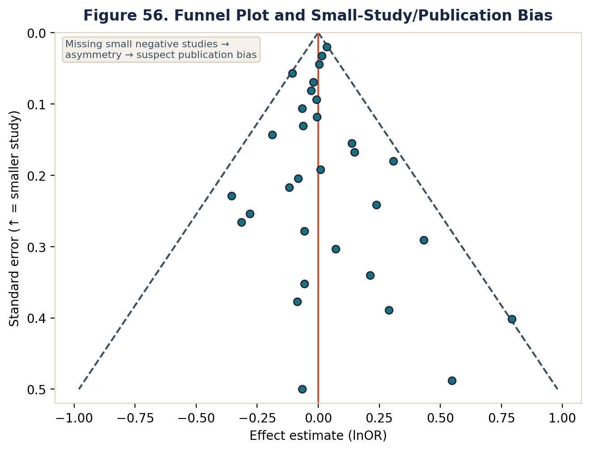
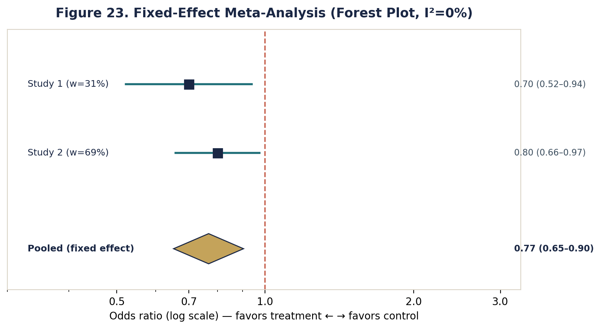
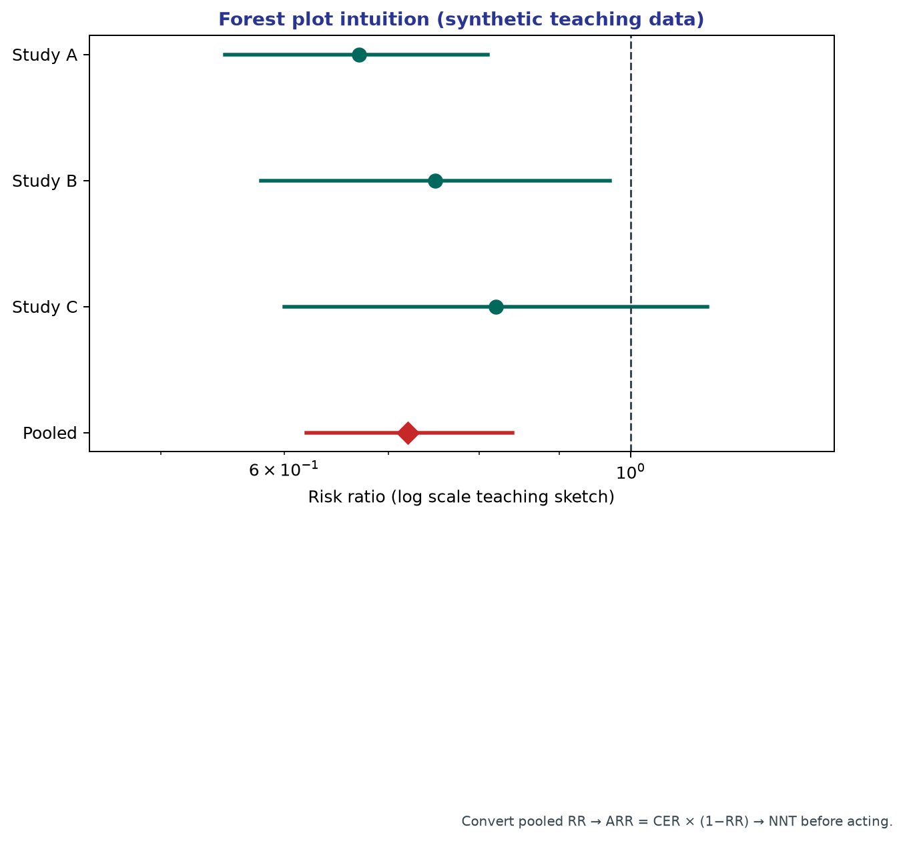
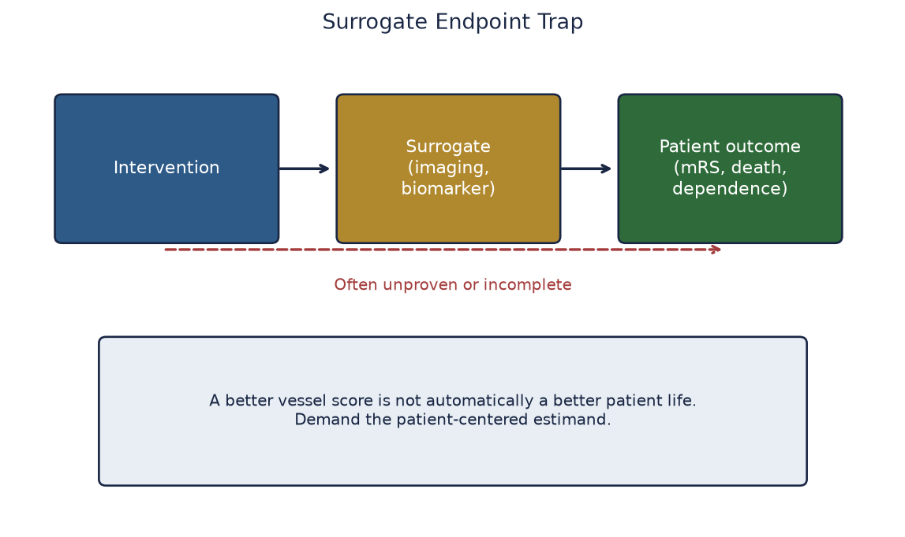

# Chapter 10. Systematic Reviews, Meta-Analysis, and Guidelines: Evidence Synthesis and Trustworthiness

## Opening



*A funnel plot screens for small-study effects and publication bias; asymmetry is a warning, not proof, and it is underpowered with few trials.*



*A forest plot shows each trial's estimate and weight around a pooled effect; check which single trial dominates before trusting the diamond.*



*Pooling narrows the interval but cannot fix incompatible populations or missing trials; read heterogeneity and inclusion criteria first.*

A living systematic review drops at 06:00 with a favorable pooled OR. Check inclusion criteria, double-counting, and absolute baselines before updating the pathway binder.


## Conceptual Core: The Architecture of Evidence Synthesis

A systematic review is a scientific investigation in its own right, treating the primary literature as its sampled population. The naive assumption that evidence synthesis is an automatic ascent to higher truth is a dangerous fallacy. Pooling does not wash away bias; it frequently concentrates it, laundering flawed primary studies through the perceived impartiality of complex statistics. A meta-analysis of systematically biased trials yields a highly precise summary of a distorted literature. When clinical practice guidelines uncritically cite that meta-analysis, they industrialize the distortion, embedding it into pathway defaults and electronic health record order sets. Stroke neurology is an intensely guideline-driven specialty—governing decisions such as intravenous thrombolysis windows, blood pressure targets following intracerebral hemorrhage, secondary prevention antithrombotics, and the timing of carotid revascularization. Consequently, the appraisal of evidence synthesis products is a fundamental clinical skill, not an abstract exercise for methodologists or medical librarians.

Evidence synthesis begins with a defined question. 'What is the best treatment for acute ischemic stroke?' is too broad for a single interpretable pooled effect without further population, strategy, outcome, and horizon definitions. PICO or PECO provides a first scaffold; prediction reviews require model role, intended use, outcome, and horizon as well. Pooling early intra-arterial thrombolysis with modern stent-retriever thrombectomy under a single undifferentiated effect may not answer a clinically coherent question. Scope decisions are therefore part of the scientific inference, not administrative preliminaries.

Beyond the question lies the sampling frame. No search can prove that it found every eligible study, so the strategy should be sensitive, reproducible, and proportionate to the question. Restricting a search to one database or one language can increase language and indexing bias; it does not guarantee a particular direction or magnitude. Use relevant bibliographic databases, trial registries, citation searching, and other sources, document the complete strategy, and assess missing-results bias. Independent duplicate screening and extraction can reduce errors and subjective exclusions, with any deviations and reconciliation process reported.

Meta-analysis—the statistical aggregation of quantitative results—is an optional extension of a systematic review. Not all systematically retrieved evidence supports one coherent pooled estimand. When studies address materially different populations, interventions, outcomes, time horizons, or effect measures, reviewers should justify whether and how synthesis remains meaningful. A structured synthesis without a pooled effect can be more informative than a summary number whose interpretation is unclear.

## Named Frameworks and Checklists for Synthesis and Guidelines

The infrastructure of evidence synthesis includes established reporting guidelines and methodological frameworks. PRISMA (Preferred Reporting Items for Systematic Reviews and Meta-Analyses) guides complete reporting of the question, search, screening, synthesis, and other review methods. MOOSE provides reporting guidance for meta-analyses of observational studies. Reporting checklists support transparency; they are not themselves risk-of-bias judgments or guarantees of scientific validity.

RoB 2 is a widely used domain-based tool for assessing risk of bias in randomized-trial results, covering the randomization process, deviations from intended interventions, missing outcome data, outcome measurement, and selection of the reported result. ROBINS-I provides a structured approach for non-randomized intervention studies using a target-trial comparison. Applying either tool requires design and domain expertise. In a stroke registry, baseline NIHSS, age, and time-to-presentation are often important, but the sufficient adjustment set depends on the causal question, time zero, data-generating process, and measurement quality.

AMSTAR 2 is a critical-appraisal tool for systematic reviews of randomized or non-randomized intervention studies. It asks whether review methods were established in advance, study-design choices were explained, risk of bias was assessed appropriately, and those judgments informed interpretation. Its overall ratings should follow the tool’s critical-domain rules rather than an improvised numeric score.

GRADE separates certainty of evidence for a specified outcome and comparison from recommendation strength. In the conventional intervention framework, randomized and non-randomized evidence begin at different initial certainty levels and are then assessed across risk of bias, inconsistency, indirectness, imprecision, and publication bias, with specified rating-up considerations for eligible observational evidence. AGREE II evaluates guideline-development rigor and transparency; guidelines need not all use GRADE.

## Quantitative Reasoning: The Mathematics of Meta-Analysis

A common-effect inverse-variance meta-analysis forms a weighted average of compatible study estimates. With independent approximately normal estimates $Y_i$ and treated-as-known within-study variances $SE_i^2$, the conventional weight is $w_i = 1/SE_i^2$, the pooled estimate is $\sum w_iY_i/\sum w_i$, and its model-based variance is $1/\sum w_i$. Correlated estimates, estimated standard errors, sparse data, and alternative effect measures require corresponding methods rather than automatic use of this formula.

A common-effect model assumes that every included study estimates the same true underlying parameter (mu), so observed differences among study estimates arise from sampling error under that model. Biology and trial execution are rarely uniform. Clinical heterogeneity can produce between-study effect heterogeneity, but it neither guarantees different true effects nor guarantees that a heterogeneity test will detect them.

Cochran's Q statistic tests a model in which dispersion is compatible with a common effect plus sampling error. It is calculated as the weighted sum of squared deviations from the pooled estimate: Q = Sum(w_i * (Y_i - Pool)^2). The conventional I-squared statistic is I^2 = max(0, (Q - df)/Q) * 100%. It estimates the proportion of observed dispersion beyond sampling error under the model; it is not the percentage of biological variation explained and can be imprecise with few studies. Tau-squared (tau^2) estimates between-study variance in the units of the chosen effect scale. Random-effects models incorporate an estimate of that variance and should report its uncertainty and clinical meaning.

In a conventional random-effects inverse-variance model, the weight is w_i* = 1 / (SE_i^2 + tau^2). As estimated between-study variance grows relative to within-study variances, study weights become more similar, so smaller studies can receive more relative influence than under a common-effect model. Statistical weighting does not encode study validity: a biased study is not repaired by either model. Reviewers should therefore examine risk of bias, the plausibility and uncertainty of tau-squared, prediction intervals where appropriate, and whether a pooled mean is clinically interpretable.

## Fully Worked Synthetic Example: Pooling Dual Antiplatelet Therapy in Minor Stroke

Scenario: A fictional two-study meta-analysis compares DAPT with aspirin after high-risk TIA or minor ischemic stroke. The counts below are invented to make the arithmetic transparent; they are not CHANCE or POINT data. The calculation produces a common-effect pooled risk ratio and 95% confidence interval, then converts the synthetic relative effect into ARR and NNT at a specified baseline risk.

```
Synthetic Study 1:
  DAPT: 200 recurrent strokes / 2500 patients -> Risk_tx = 0.080
  Aspirin: 300 recurrent strokes / 2500 patients -> Risk_ct = 0.120
  Relative Risk (RR_1) = 0.080 / 0.120 = 0.6667
  Natural Log RR (ln_RR_1) = ln(0.6667) = -0.4055
  SE_1^2 = 1/200 - 1/2500 + 1/300 - 1/2500 = 0.007533
  SE_1 = sqrt(0.007533) = 0.0868
  Weight (w_1) = 1 / SE_1^2 = 132.74

Synthetic Study 2:
  DAPT: 120 recurrent strokes / 2000 patients -> Risk_tx = 0.060
  Aspirin: 160 recurrent strokes / 2000 patients -> Risk_ct = 0.080
  Relative Risk (RR_2) = 0.060 / 0.080 = 0.7500
  Natural Log RR (ln_RR_2) = ln(0.7500) = -0.2877
  SE_2^2 = 1/120 - 1/2000 + 1/160 - 1/2000 = 0.013583
  SE_2 = sqrt(0.013583) = 0.1165
  Weight (w_2) = 1 / SE_2^2 = 73.62
```

We synthesize the independent studies utilizing inverse-variance weighting for a fixed-effect model. The total weight is Sum(w) = 132.74 + 73.62 = 206.36. The weighted sum of the effect estimates is Sum(w * ln_RR) = (132.74 * -0.4055) + (73.62 * -0.2877) = -53.82 - 21.18 = -75.00. The pooled natural log relative risk is -75.00 / 206.36 = -0.3634. The variance of this pooled estimate is 1 / Sum(w) = 0.004846. The standard error is sqrt(0.004846) = 0.0696.

To construct the model-based 95% confidence interval (CI) on the natural logarithmic scale, multiply the standard error by 1.96. The margin is 1.96 * 0.0696 = 0.1364. Thus, the 95% CI for pooled ln(RR) is approximately [-0.4998, -0.2270]. Exponentiating gives pooled RR = 0.695 with 95% CI approximately [0.607, 0.797]. In this synthetic example, the interval excludes RR = 1 under the stated common-effect assumptions; it does not address bias, heterogeneity, transportability, or the certainty of real clinical evidence.

Clinical interpretation also needs absolute effects. If the pooled RR of 0.695 were transportable and the untreated risk were 10%, ARR = 0.10 * (1 - 0.695) = 0.0305 (3.05%) and NNT ≈ 32.8, conventionally rounded to 33. At a 4% untreated risk, the same assumed RR gives ARR 1.22% and NNT about 82. These are conditional translations, not proof that the relative effect is constant across risk strata or settings.

*(Intermediates recomputed from event counts with consistent rounding; verified by `scripts/verify_math_examples.py`.)*

## Guidelines, GRADE, and the Translation of Evidence

Clinical practice guidelines connect evidence with recommendations. The prestige of an issuing society does not by itself establish methodological rigor. Frameworks such as GRADE explicitly separate certainty in an effect estimate from recommendation strength. In the conventional GRADE approach for intervention effects, randomized evidence begins at high certainty and non-randomized evidence at low certainty, followed by transparent rating-down and, in eligible circumstances, rating-up judgments. The unit of judgment is a specified outcome and comparison, not a study label in the abstract.

Reviewers rate down certainty for five primary reasons. Risk of bias targets systemic flaws in trial execution (e.g., unblinded assessment of modified Rankin Scale scores). Inconsistency isolates unexplained, severe heterogeneity in effect directions across studies. Indirectness penalizes extrapolation, such as applying evidence from mild strokes to severe strokes, or substituting surrogate endpoints (TICI scores) in place of functional outcomes. Imprecision triggers a downgrade when the confidence interval is so wide that it crosses clinical decision thresholds, failing to definitively rule out harm or lack of benefit. Finally, publication bias demands a downgrade when asymmetric funnel plots or missing registry data suggest selective reporting. Observational evidence may occasionally be rated up when prespecified GRADE criteria are met—for example, a very large, consistent effect for which plausible residual bias would not readily explain the finding—but this is uncommon and does not substitute for randomized evidence when a credible trial is feasible.

After rating certainty, a panel considers benefit-harm balance, values, resources, equity, acceptability, and feasibility to determine recommendation strength. A strong recommendation generally means the panel expects most informed people to choose the recommended course, while a conditional recommendation anticipates more variation. Neither category is a universal legal rule; clinicians and institutions should use the guideline's wording, jurisdiction, current evidence, individual circumstances, and applicable policy rather than converting a methods label into a legal conclusion.

## Pitfalls and Failure Modes in Evidence Synthesis

- Bias is not averaged away: Pooling confounded or selectively reported estimates can produce a precise summary of biased inputs. Synthesis should preserve design-specific risk-of-bias judgments and avoid converting an association into a causal effect merely by increasing sample size.
- The ecological fallacy in meta-regression: A relationship between study-level averages (such as mean age) and study effects need not represent the corresponding participant-level interaction. Aggregate meta-regression is exploratory unless its assumptions and limitations are addressed.
- Automatic model switching: Choosing a random-effects model only because I-squared crosses an arbitrary threshold is not a principled response to heterogeneity. Random-effects weighting gives smaller studies more relative influence than common-effect weighting and still does not account for study validity or missing results.
- Uncritical Worship of I-Squared: Treating I-squared as an absolute diagnostic metric of clinical incompatibility. I-squared is a ratio of variance. A massive I-squared can emerge purely because the included mega-trials have negligible sampling error, even if their point estimates are clinically indistinguishable.
- Surrogate Endpoint Substitution: Pooling radiographic or biomarker outcomes (e.g., recanalization rates, hematoma expansion, aneurysm occlusion) and directly mapping those synthetic benefits to clinical disability recommendations without validating the specific causal pathway.



*An intervention can improve a surrogate while off-pathway effects, toxicity, or an invalid causal assumption leave the patient-important outcome unchanged.*

- Outcome switching and protocol drift: Compare registered or protocol-specified outcomes and methods with the completed review. Explain amendments rather than inferring intent from discrepancies alone.
- Disconnected clinical implementation: A pooled relative effect does not supply the target population’s untreated risk, absolute benefit, harms, feasibility, or preferences. Translate to absolute effects only under explicit transport assumptions.
- Conflating statistical compatibility with importance: A very small p-value is not proof that an effect is nonzero, unbiased, or clinically important. Interpret the estimated magnitude and interval on a patient-relevant scale.
- Missing-results bias: Published studies may be an incomplete, selected sample of conducted analyses. Search registries and regulatory sources where relevant and assess how missing results could affect conclusions.
- Prediction conflated with causation: A study-level subgroup pattern from meta-regression does not by itself identify a participant-level biological interaction.

## Clinical and Epidemiologic Notes

Clinical Note: Navigating Subgroup Creep in Acute Stroke. Stroke trials frequently report neutral primary outcomes but showcase statistically significant benefits in post-hoc subgroups (e.g., specific time windows or highly selected advanced imaging profiles). When meta-analyses pool these specific, opportunistic subgroups across multiple negative trials, the resulting diamond is a statistical illusion. Trace the subgroup to its origin: was it pre-specified and stratified at randomization in the primary trials? If not, the pooled estimate is observational and highly susceptible to selection bias, barring strong guideline recommendations without confirmatory testing.

Epidemiologic Note: Individual Participant Data (IPD) vs Aggregate Meta-Analysis. IPD meta-analysis can harmonize definitions, standardize analyses, and estimate participant-level interactions more efficiently than aggregate meta-regression. It does not randomize subgroup membership, however. Effect-modifier claims still require prespecification, valid within-trial contrasts, multiplicity control, adequate power, and cautious external interpretation.

Clinical Note: Interpreting Non-Inferiority Meta-Analyses. Pooling non-inferiority trials requires consistent, clinically justified margins, estimands, comparators, and assay sensitivity. Heterogeneity and imprecision widen uncertainty; they do not by themselves force an estimate toward the null. Apparent non-inferiority can instead be favored by nonadherence, treatment switching, weak execution, or combining incompatible margins and analysis sets, so both intention-to-treat and appropriately defined per-protocol evidence should be examined.

Epidemiologic Note: Limits of Observational Synthesis. A meta-analysis cannot repair a common identification failure shared by its component studies. If many cohorts omit an important common cause such as prestroke frailty, the pooled association can remain confounded even with a narrow interval. Observational synthesis can still be valuable when the target, design, assumptions, bias assessments, and sensitivity analyses are explicit; larger sample size alone does not establish causation.

Clinical Note: Local Pathway Implementation vs Global Guidelines. Guideline recommendations apply to defined populations and assumptions and may require adaptation for local resources, access, case mix, and operational feasibility. A pathway should preserve the recommendation’s clinical intent while documenting any local constraints, equity effects, and escalation options. Ask not only whether an intervention works in the evidence base, but whether the local system can deliver the relevant version safely and reliably.

## Cross-Links to Other Chapters

- Chapter 5: Confounding, DAGs, and Target-Trial Thinking — Essential for understanding why pooling observational associations does not create exchangeability.
- Chapter 4: Internal Validity, External Validity, and Bias Taxonomy — Provides the validity architecture underlying design-specific risk-of-bias judgments.
- Chapter 6: Randomized Trials — Explains randomization, allocation concealment, estimands, and missing outcomes that inform risk-of-bias judgments and certainty assessments; methodological quality should not be converted mechanically into inverse-variance weight.
- Chapter 7: Appraising Observational Studies — Details confounding, time-zero, and measurement threats that persist when observational estimates are synthesized.
- Chapter 8: Diagnostic Accuracy Studies — Supplies the paired sensitivity/specificity concepts needed before appraising diagnostic-test meta-analysis.


## Chapter summary

Evidence synthesis requires a precise question, a sensitive and reproducible search, transparent selection and extraction, and design-specific risk-of-bias assessment. Meta-analysis is optional: a common-effect model assumes one target effect for the included studies, while a random-effects model estimates a distribution and can give small studies relatively more weight than a common-effect analysis. Neither model repairs biased inputs. Translate relative effects into absolute effects only with an explicit target baseline risk and horizon. GRADE separates certainty of evidence from recommendation strength, which also incorporates values, resources, equity, acceptability, and feasibility. Pooling improves synthesis only to the extent that the question, studies, assumptions, and reporting support the target inference.

## Practice and reflection

1. Construct a highly specific PICO question for an intervention you frequently prescribe in neurology (e.g., patent foramen ovale closure for cryptogenic stroke). How would altering the 'Population' criteria from 'any PFO' to 'high-risk PFO' fundamentally change the resulting meta-analysis?
2. Retrieve the forest plot from a major recent stroke meta-analysis. Deliberately ignore the summary diamond at the bottom. What do the individual study point estimates and confidence intervals independently communicate about between-study heterogeneity?
3. Using the standard error formula for a log relative risk, prove mathematically why an adequately powered, massive randomized trial dominates the weighting scheme of a fixed-effect meta-analysis.
4. Explain the Random-Effects Paradox to a junior resident. Why does the introduction of tau-squared into the weighting denominator artificially inflate the influence of small, potentially biased studies?
5. You are presented with a meta-analysis showing an odds ratio of 0.85 (p=0.04) for a novel neuroprotectant. Assume your patient has a baseline risk of 5% for the primary outcome. Calculate the Absolute Risk Reduction (ARR) and Number Needed to Treat (NNT). Is the intervention clinically meaningful?
6. Examine the Cochrane Risk of Bias 2 (RoB 2) tool. Differentiate between 'deviations from intended interventions' and 'missing outcome data'. How do these flaws uniquely corrupt acute stroke trials?
7. A meta-analysis of ten observational registries concludes that delayed initiation of oral anticoagulants after ischemic stroke causes higher rates of hemorrhagic transformation. Apply the principle of 'Prediction != Causation' to deconstruct this claim. What unmeasured confounders likely drive this association?
8. Review a recent guideline from the AHA/ASA or ESO. Locate a 'Strong' recommendation based on 'Moderate' or 'Low' certainty evidence. Justify how the guideline panel reached this conclusion, focusing on values, preferences, and the risk/benefit asymmetry.
9. Analyze the concept of the Ecological Fallacy in meta-regression. If a meta-analysis plots average trial age against the trial effect size and finds a positive correlation, why is it mathematically invalid to assume that older individual patients experience a greater treatment effect?
10. Defend the argument that a comprehensive systematic review without a meta-analysis (a narrative synthesis) is often scientifically superior to a meta-analysis that irresponsibly pools clinically incompatible studies.

---

*Figures and tables in this chapter are Teaching materials for CRIT-APP unless a caption explicitly states otherwise. Methods standards are cited by name only.*
