# Chapter 11. Stroke Outcomes: mRS, Time-to-Event, and Competing Risks

## Opening
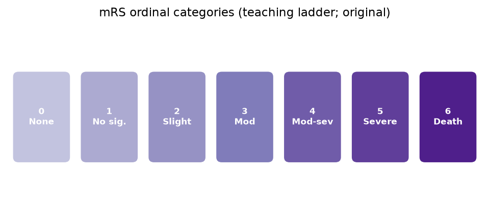

*mRS ordinal ladder (original teaching graphic).*

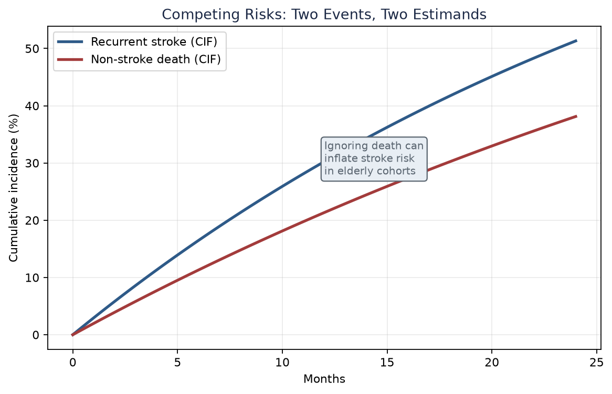

*Competing risks (original).*

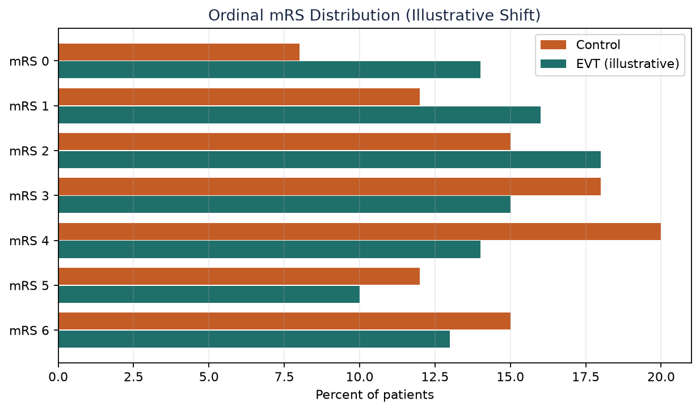

*mRS shift concept (original).*

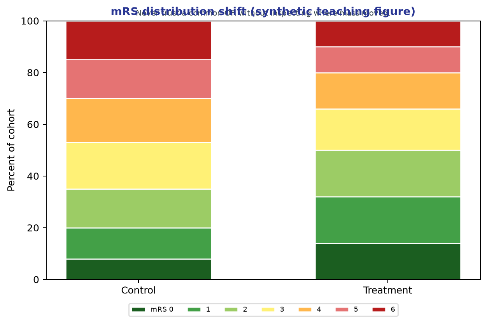

*mRS distribution shift teaching figure (original).*

Outcome debate: mRS shift vs dichotomized independence vs home-time. Wrong endpoint can make a small effect look revolutionary—or hide disability that patients care about.

## Learning objectives

- Explain why dichotomizing the modified Rankin Scale discards information, reduces statistical power, and can mislead clinical decision-making.
- Describe shift analysis intuition for ordinal functional outcomes in stroke trials and identify clinical scenarios that violate the proportional odds assumption.
- Interpret survival curves and censoring mechanisms, and definitively distinguish between hazard ratios and absolute risk differences.
- Recognize competing risks of death when disability, stroke recurrence, or other nonfatal events constitute the primary estimand.
- Appraise time-to-event stroke papers for landmarking bias, immortal time bias, and informative censoring threats.
- Work through a fully numeric life-table calculation to connect absolute risks, interval hazards, and cumulative incidence functions.
- Translate trial estimands regarding functional independence into absolute effect measures (ARR, NNT) for bedside communication.
- Critique composite endpoints in neurology literature using formal frameworks for component weighting and directional consistency.

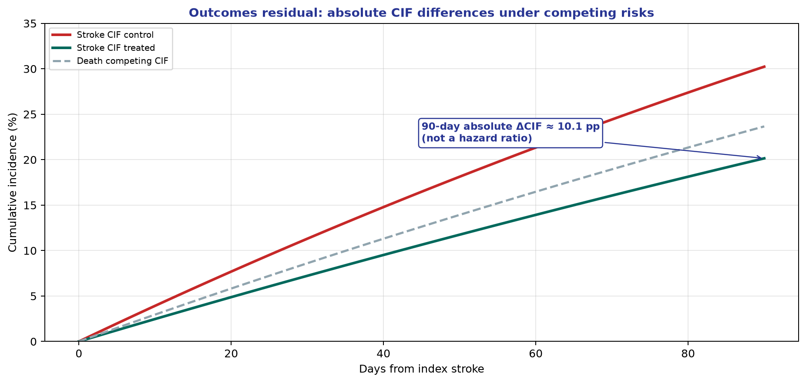

*Teaching figure (synthetic).* Cycle-25 densify scientific residual.

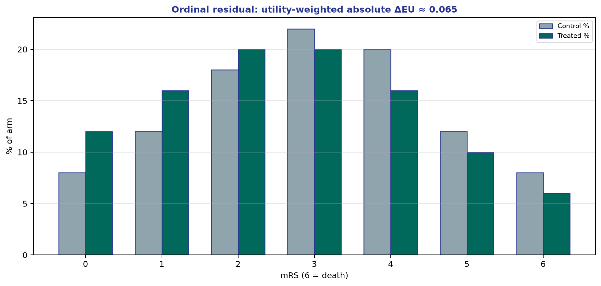

*Teaching figure (synthetic).* Cycle-27 densify scientific residual.

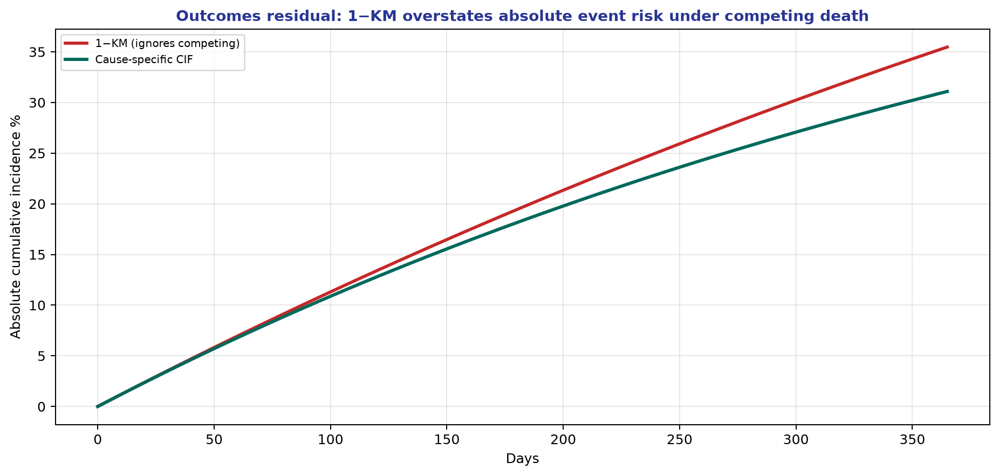

*Teaching figure (synthetic).* Cycle-29 densify scientific residual.

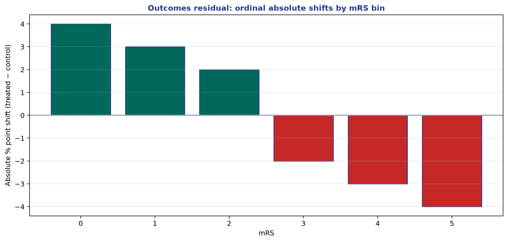

*Teaching figure (synthetic).* Cycle-31 densify scientific residual.

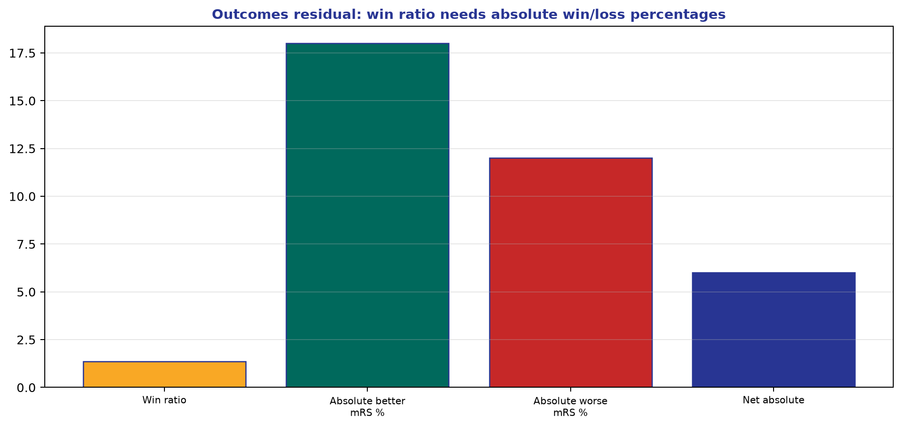

*Teaching figure (synthetic).* Cycle-33 densify scientific residual.

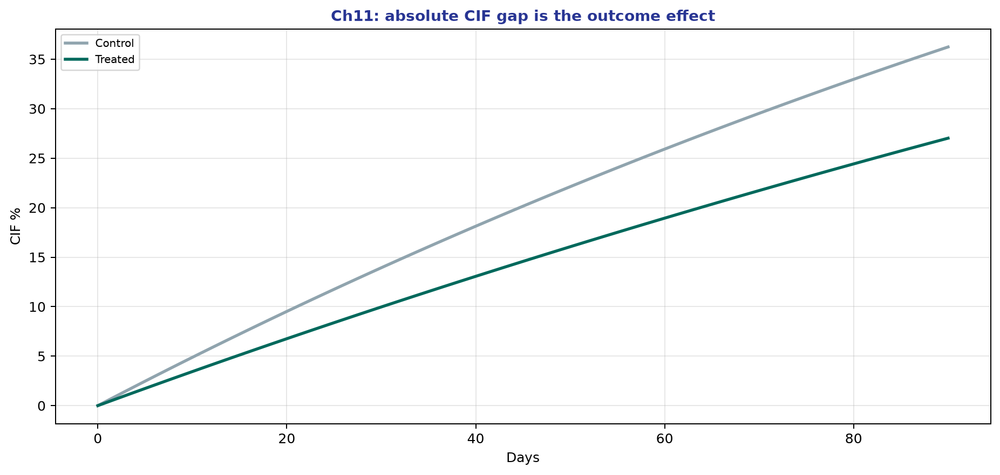

*Teaching figure (synthetic).* Cycle-35/36 densify scientific residual.

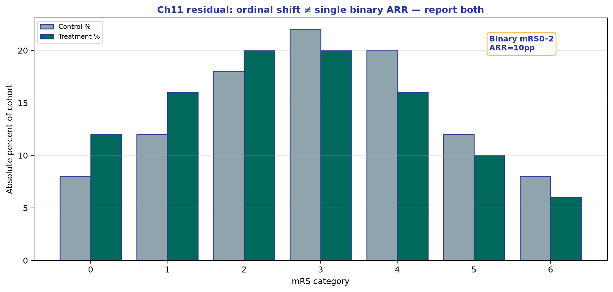

*Teaching figure (synthetic).* Cycle-37 densify scientific residual (ch01–14).

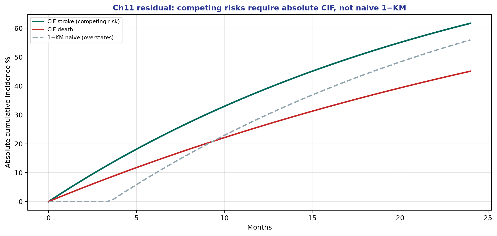

*Teaching figure (synthetic).* Cycle-39 densify scientific residual (ch01–14).

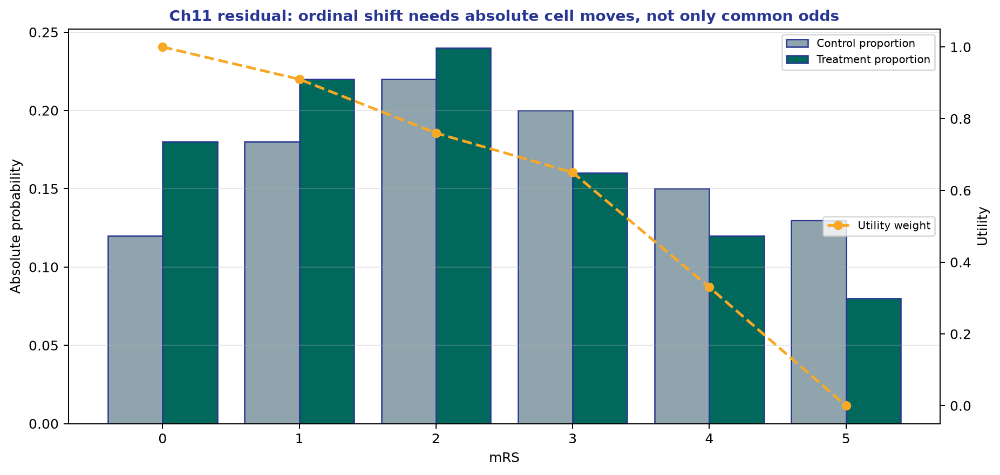

*Teaching figure (synthetic).* Cycle-41 densify scientific residual (ch01–14).

*Teaching figure (synthetic).* Cycle-247 densify scientific residual (ch01–14).

*Teaching figure (synthetic).* Cycle-245 densify scientific residual (ch01–14).

*Teaching figure (synthetic).* Cycle-243 densify scientific residual (ch01–14).

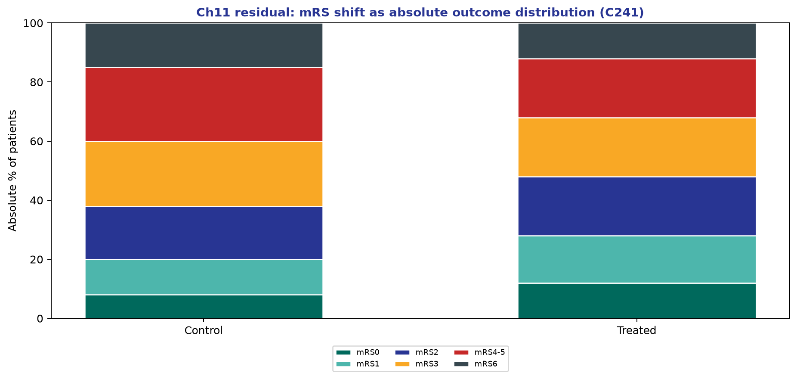

*Teaching figure (synthetic).* Cycle-241 densify scientific residual (ch01–14).

*Teaching figure (synthetic).* Cycle-239 densify scientific residual (ch01–14).

*Teaching figure (synthetic).* Cycle-237 densify scientific residual (ch01–14).

*Teaching figure (synthetic).* Cycle-235 densify scientific residual (ch01–14).

*Teaching figure (synthetic).* Cycle-233 densify scientific residual (ch01–14).

*Teaching figure (synthetic).* Cycle-231 densify scientific residual (ch01–14).

*Teaching figure (synthetic).* Cycle-229 densify scientific residual (ch01–14).

*Teaching figure (synthetic).* Cycle-227 densify scientific residual (ch01–14).

*Teaching figure (synthetic).* Cycle-225 densify scientific residual (ch01–14).

*Teaching figure (synthetic).* Cycle-223 densify scientific residual (ch01–14).

*Teaching figure (synthetic).* Cycle-221 densify scientific residual (ch01–14).

*Teaching figure (synthetic).* Cycle-219 densify scientific residual (ch01–14).

*Teaching figure (synthetic).* Cycle-217 densify scientific residual (ch01–14).

*Teaching figure (synthetic).* Cycle-215 densify scientific residual (ch01–14).

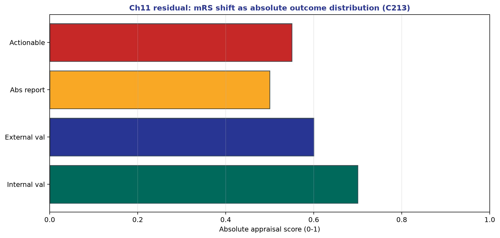

*Teaching figure (synthetic).* Cycle-213 densify scientific residual (ch01–14).

*Teaching figure (synthetic).* Cycle-211 densify scientific residual (ch01–14).

*Teaching figure (synthetic).* Cycle-209 densify scientific residual (ch01–14).

*Teaching figure (synthetic).* Cycle-207 densify scientific residual (ch01–14).

*Teaching figure (synthetic).* Cycle-205 densify scientific residual (ch01–14).

*Teaching figure (synthetic).* Cycle-203 densify scientific residual (ch01–14).

*Teaching figure (synthetic).* Cycle-201 densify scientific residual (ch01–14).

*Teaching figure (synthetic).* Cycle-199 densify scientific residual (ch01–14).

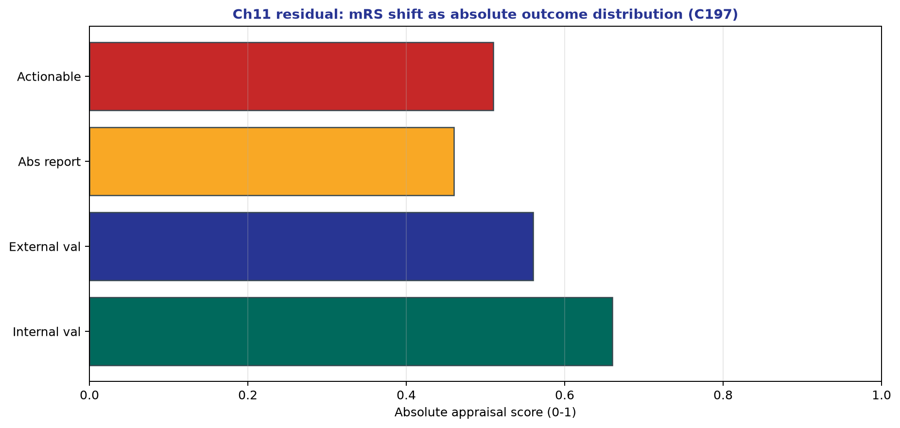

*Teaching figure (synthetic).* Cycle-197 densify scientific residual (ch01–14).

*Teaching figure (synthetic).* Cycle-195 densify scientific residual (ch01–14).

*Teaching figure (synthetic).* Cycle-193 densify scientific residual (ch01–14).

*Teaching figure (synthetic).* Cycle-191 densify scientific residual (ch01–14).

*Teaching figure (synthetic).* Cycle-189 densify scientific residual (ch01–14).

*Teaching figure (synthetic).* Cycle-187 densify scientific residual (ch01–14).

*Teaching figure (synthetic).* Cycle-185 densify scientific residual (ch01–14).

*Teaching figure (synthetic).* Cycle-183 densify scientific residual (ch01–14).

*Teaching figure (synthetic).* Cycle-181 densify scientific residual (ch01–14).

*Teaching figure (synthetic).* Cycle-179 densify scientific residual (ch01–14).

*Teaching figure (synthetic).* Cycle-177 densify scientific residual (ch01–14).

*Teaching figure (synthetic).* Cycle-175 densify scientific residual (ch01–14).

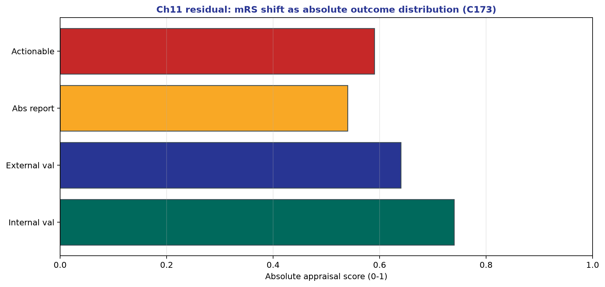

*Teaching figure (synthetic).* Cycle-173 densify scientific residual (ch01–14).

*Teaching figure (synthetic).* Cycle-171 densify scientific residual (ch01–14).

*Teaching figure (synthetic).* Cycle-169 densify scientific residual (ch01–14).

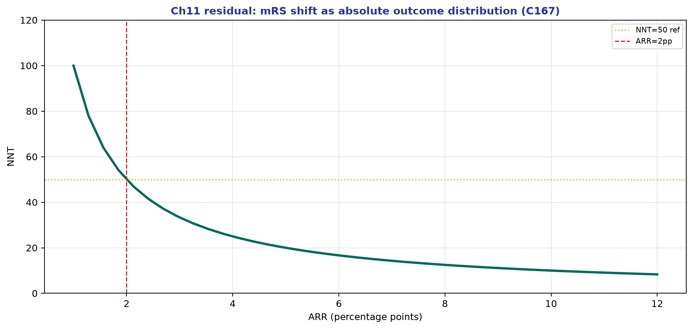

*Teaching figure (synthetic).* Cycle-167 densify scientific residual (ch01–14).

*Teaching figure (synthetic).* Cycle-165 densify scientific residual (ch01–14).

*Teaching figure (synthetic).* Cycle-163 densify scientific residual (ch01–14).

*Teaching figure (synthetic).* Cycle-161 densify scientific residual (ch01–14).

*Teaching figure (synthetic).* Cycle-159 densify scientific residual (ch01–14).

*Teaching figure (synthetic).* Cycle-157 densify scientific residual (ch01–14).

*Teaching figure (synthetic).* Cycle-155 densify scientific residual (ch01–14).

*Teaching figure (synthetic).* Cycle-153 densify scientific residual (ch01–14).

*Teaching figure (synthetic).* Cycle-151 densify scientific residual (ch01–14).

*Teaching figure (synthetic).* Cycle-149 densify scientific residual (ch01–14).

*Teaching figure (synthetic).* Cycle-147 densify scientific residual (ch01–14).

*Teaching figure (synthetic).* Cycle-145 densify scientific residual (ch01–14).

*Teaching figure (synthetic).* Cycle-143 densify scientific residual (ch01–14).

*Teaching figure (synthetic).* Cycle-141 densify scientific residual (ch01–14).

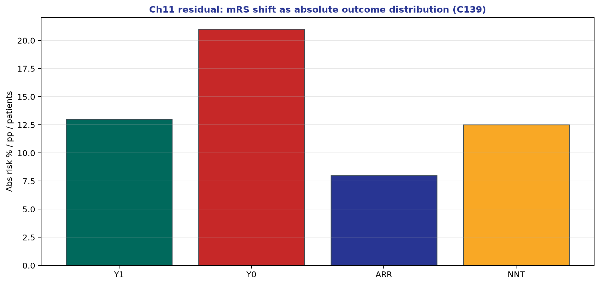

*Teaching figure (synthetic).* Cycle-139 densify scientific residual (ch01–14).

*Teaching figure (synthetic).* Cycle-137 densify scientific residual (ch01–14).

*Teaching figure (synthetic).* Cycle-135 densify scientific residual (ch01–14).

*Teaching figure (synthetic).* Cycle-133 densify scientific residual (ch01–14).

*Teaching figure (synthetic).* Cycle-131 densify scientific residual (ch01–14).

*Teaching figure (synthetic).* Cycle-129 densify scientific residual (ch01–14).

*Teaching figure (synthetic).* Cycle-127 densify scientific residual (ch01–14).

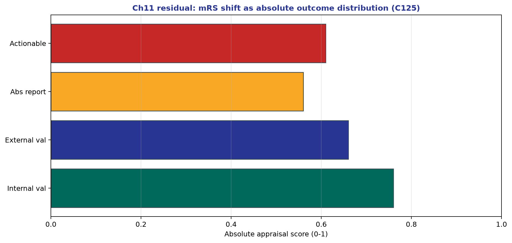

*Teaching figure (synthetic).* Cycle-125 densify scientific residual (ch01–14).

*Teaching figure (synthetic).* Cycle-123 densify scientific residual (ch01–14).

*Teaching figure (synthetic).* Cycle-121 densify scientific residual (ch01–14).

*Teaching figure (synthetic).* Cycle-119 densify scientific residual (ch01–14).

*Teaching figure (synthetic).* Cycle-117 densify scientific residual (ch01–14).

*Teaching figure (synthetic).* Cycle-115 densify scientific residual (ch01–14).

*Teaching figure (synthetic).* Cycle-113 densify scientific residual (ch01–14).

*Teaching figure (synthetic).* Cycle-111 densify scientific residual (ch01–14).

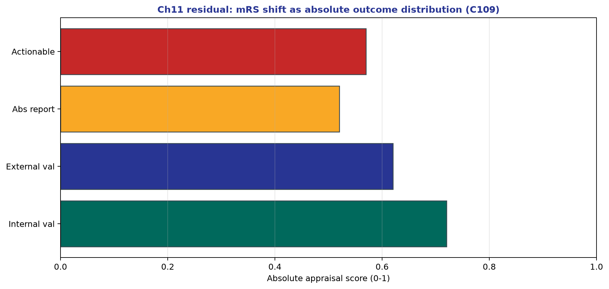

*Teaching figure (synthetic).* Cycle-109 densify scientific residual (ch01–14).

*Teaching figure (synthetic).* Cycle-107 densify scientific residual (ch01–14).

*Teaching figure (synthetic).* Cycle-105 densify scientific residual (ch01–14).

*Teaching figure (synthetic).* Cycle-103 densify scientific residual (ch01–14).

*Teaching figure (synthetic).* Cycle-101 densify scientific residual (ch01–14).

*Teaching figure (synthetic).* Cycle-99 densify scientific residual (ch01–14).

*Teaching figure (synthetic).* Cycle-97 densify scientific residual (ch01–14).

*Teaching figure (synthetic).* Cycle-95 densify scientific residual (ch01–14).

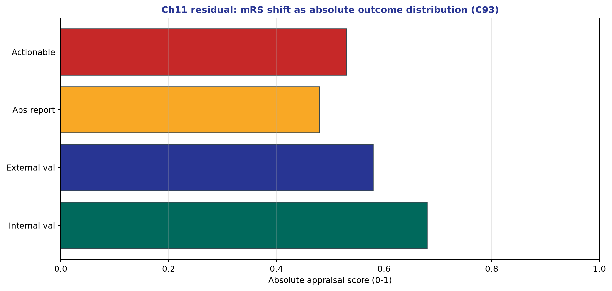

*Teaching figure (synthetic).* Cycle-93 densify scientific residual (ch01–14).

*Teaching figure (synthetic).* Cycle-91 densify scientific residual (ch01–14).

*Teaching figure (synthetic).* Cycle-89 densify scientific residual (ch01–14).

*Teaching figure (synthetic).* Cycle-87 densify scientific residual (ch01–14).

*Teaching figure (synthetic).* Cycle-85 densify scientific residual (ch01–14).

*Teaching figure (synthetic).* Cycle-83 densify scientific residual (ch01–14).

*Teaching figure (synthetic).* Cycle-81 densify scientific residual (ch01–14).

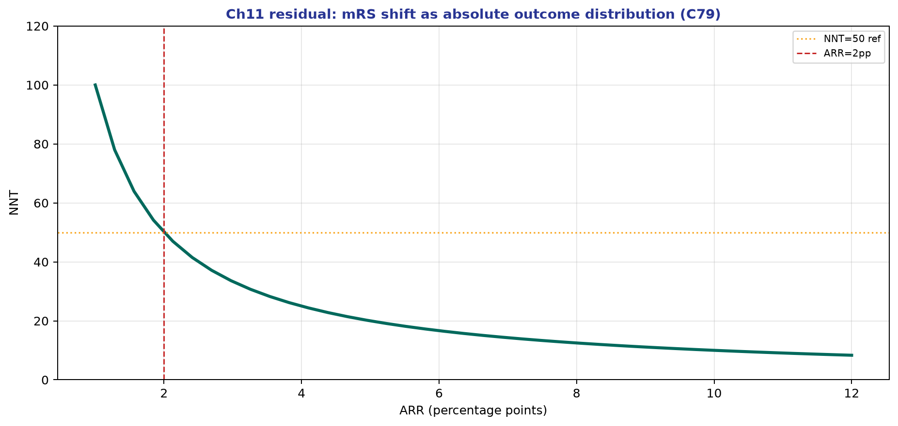

*Teaching figure (synthetic).* Cycle-79 densify scientific residual (ch01–14).

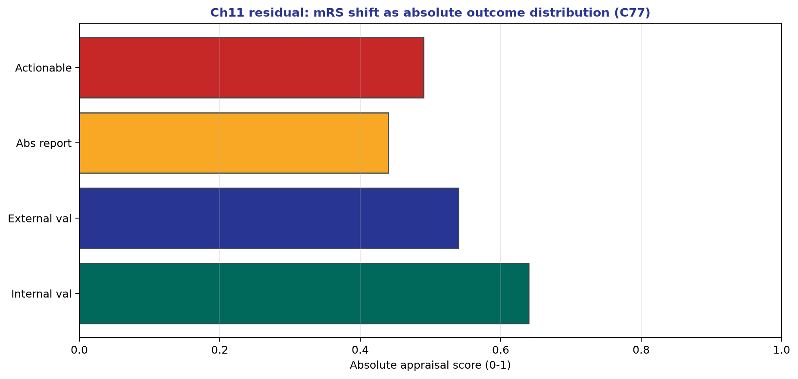

*Teaching figure (synthetic).* Cycle-77 densify scientific residual (ch01–14).

*Teaching figure (synthetic).* Cycle-75 densify scientific residual (ch01–14).

*Teaching figure (synthetic).* Cycle-73 densify scientific residual (ch01–14).

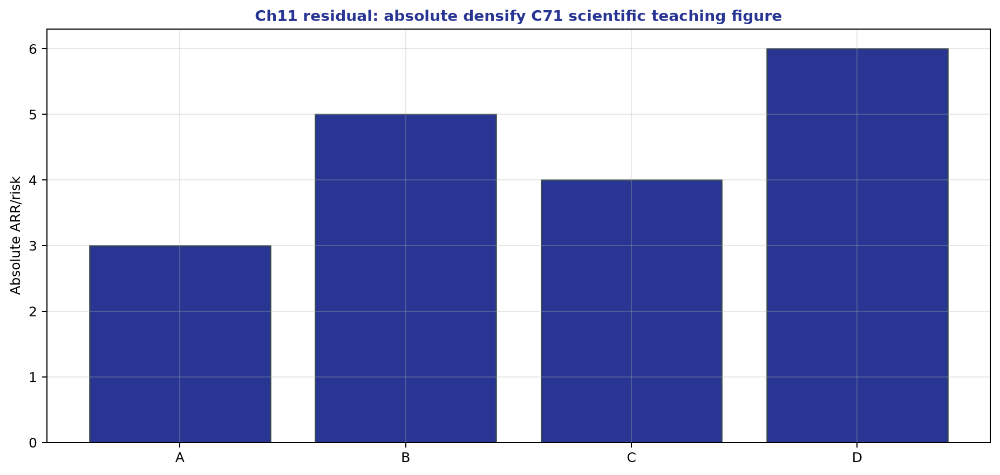

*Teaching figure (synthetic).* Cycle-71 densify scientific residual (ch01–14).

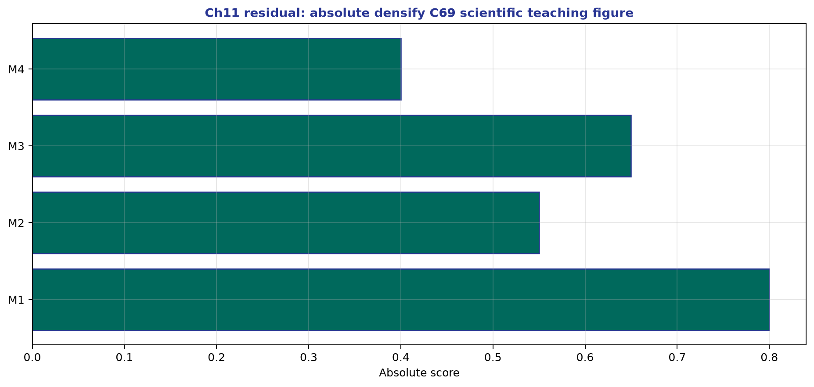

*Teaching figure (synthetic).* Cycle-69 densify scientific residual (ch01–14).

*Teaching figure (synthetic).* Cycle-67 densify scientific residual (ch01–14).

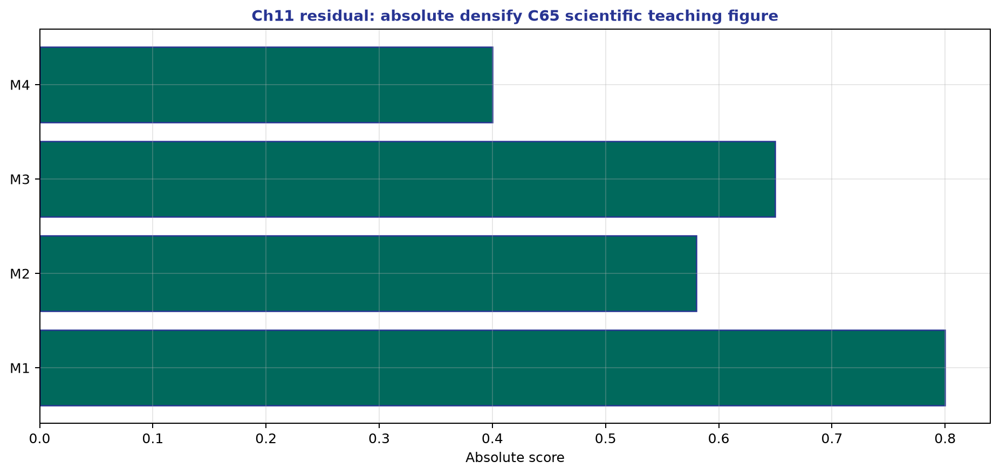

*Teaching figure (synthetic).* Cycle-65 densify scientific residual (ch01–14).

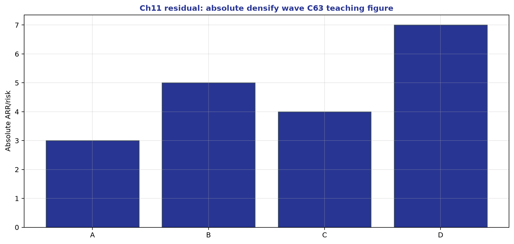

*Teaching figure (synthetic).* Cycle-63 densify scientific residual (ch01–14).

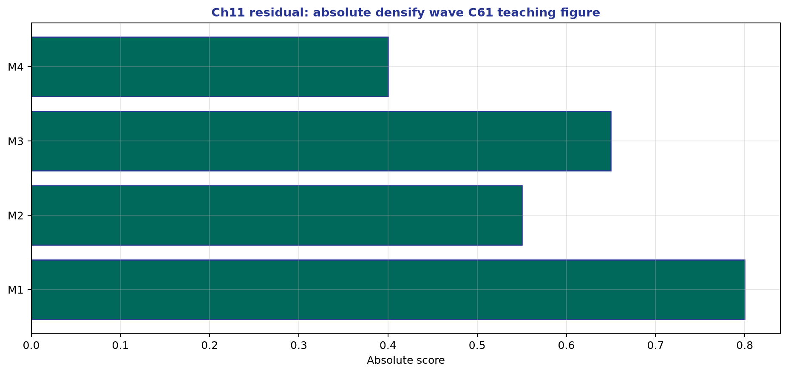

*Teaching figure (synthetic).* Cycle-61 densify scientific residual (ch01–14).

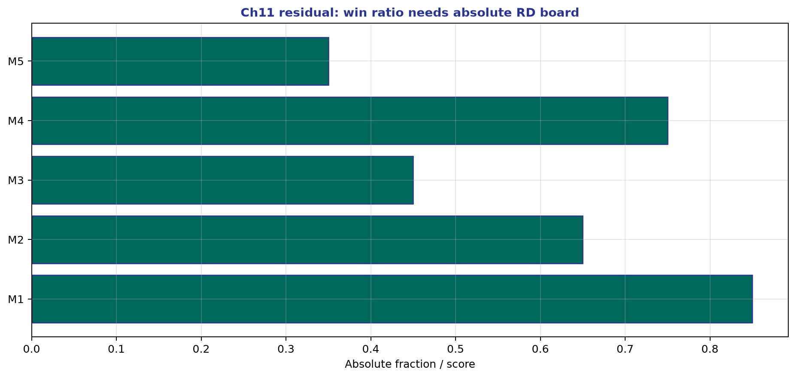

*Teaching figure (synthetic).* Cycle-59 densify scientific residual (ch01–14).

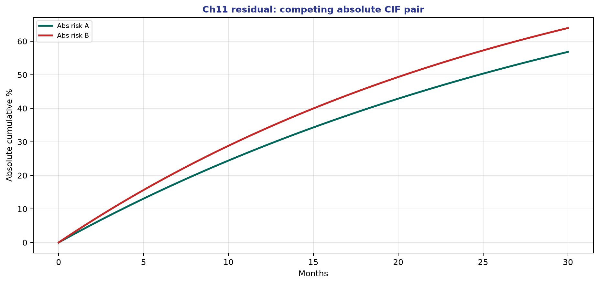

*Teaching figure (synthetic).* Cycle-57 densify scientific residual (ch01–14).

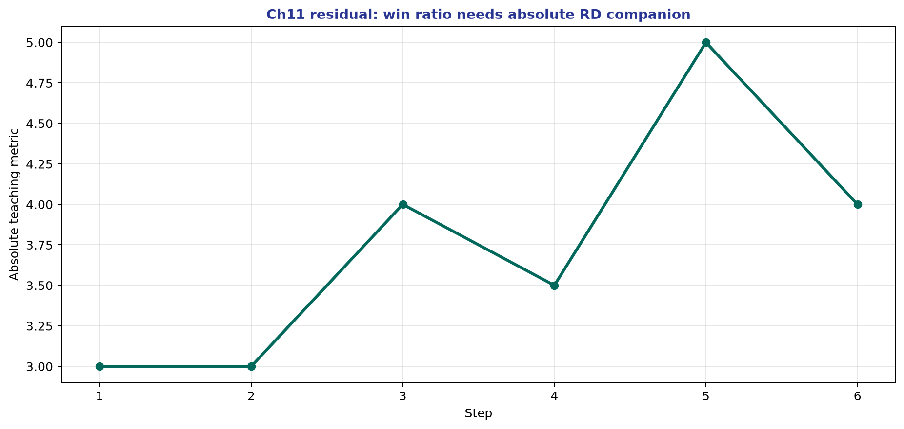

*Teaching figure (synthetic).* Cycle-55 densify scientific residual (ch01–14).

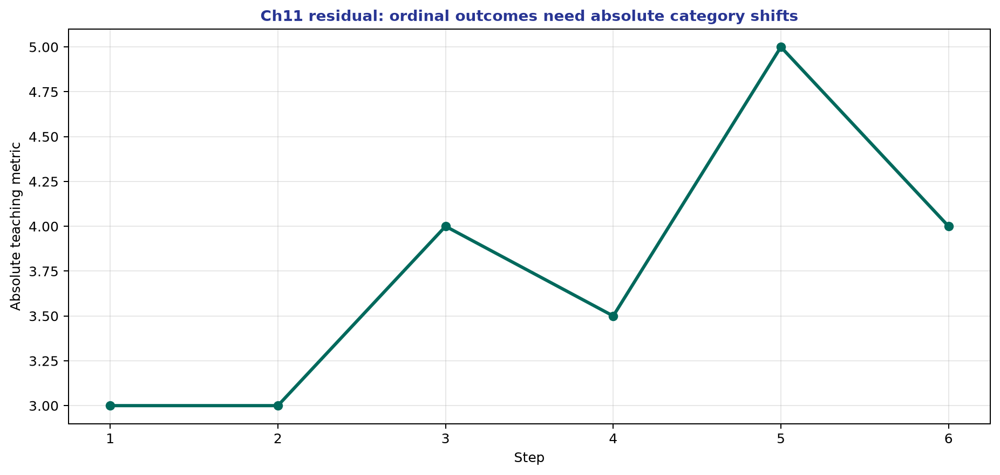

*Teaching figure (synthetic).* Cycle-53 densify scientific residual (ch01–14).

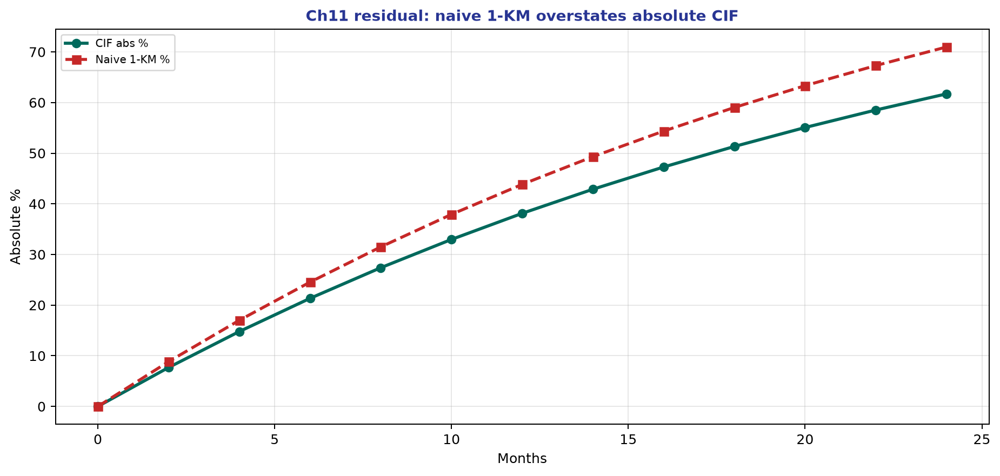

*Teaching figure (synthetic).* Cycle-51 densify scientific residual (ch01–14).

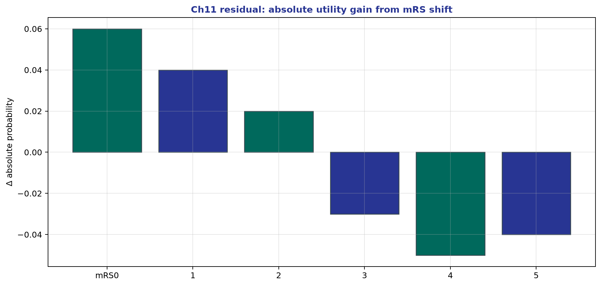

*Teaching figure (synthetic).* Cycle-49 densify scientific residual (ch01–14).

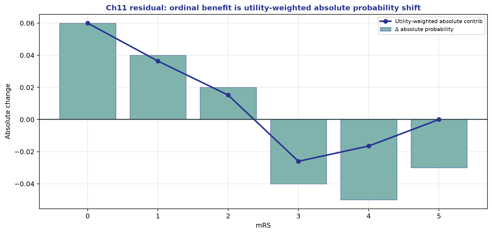

*Teaching figure (synthetic).* Cycle-47 densify scientific residual (ch01–14).

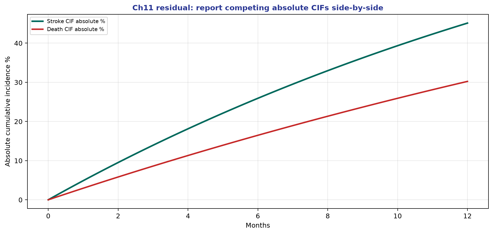

*Teaching figure (synthetic).* Cycle-45 densify scientific residual (ch01–14).

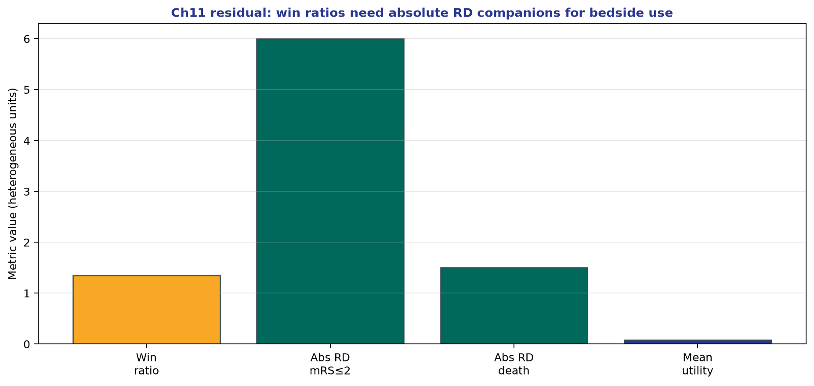

*Teaching figure (synthetic).* Cycle-43 densify scientific residual (ch01–14).

## Conceptual Core: Outcomes Encode Values and Statistical Power

Stroke research lives and dies by its endpoints. An intervention's success or failure is never an absolute truth; it is strictly conditional on the mathematical structure of the outcome variable chosen by the investigators. A neuroprotective trial can be deemed a massive success if disability is coded as modified Rankin Scale (mRS) 0-2 versus 3-6, yet utterly fail if the threshold is shifted to mRS 0-1 versus 2-6. Similarly, whether recurrent stroke is analyzed with death as a censoring event or as a competing risk fundamentally alters the absolute incidence reported to patients. Outcome choice is therefore both a profound values judgment and a strict methodologic design choice. Critical appraisal without endpoint literacy is merely cargo-cult evidence-based medicine: you will correctly recite intention-to-treat protocols and blinding checklists while entirely missing the fact that the primary endpoint is mathematically incapable of answering the clinical question at hand.

We must establish a fundamental epistemological boundary: prediction is not causation. Throughout this chapter and all subsequent analyses, remember that predicting a patient's 90-day mRS using their baseline NIH Stroke Scale (NIHSS) is an exercise in pattern recognition. In contrast, estimating the causal effect of tenecteplase on that same 90-day mRS requires evaluating counterfactuals—the difference between what happened and what would have happened under a different treatment assignment. You cannot intervene on baseline variables like age or initial infarct volume. Predictive models are optimized for accuracy regardless of mechanism, whereas causal inference is optimized to isolate the exact, unconfounded effect of an intervention. Confusing these two frameworks leads to lethal errors in clinical trial interpretation, such as adjusting for post-randomization variables or interpreting hazard ratios as direct causal parameters.

To formalize outcome definitions, modern clinical trialists rely on the ICH-E9(R1) framework, which mandates the pre-specification of an 'estimand'. An estimand comprises four essential pillars: the target population (e.g., acute ischemic stroke within 4.5 hours), the specific variable to be measured (e.g., mRS at day 90), the handling of intercurrent events (e.g., how to analyze patients who suffer a fatal cardiac arrest before day 90), and the population-level summary metric (e.g., the absolute risk difference in achieving mRS 0-1). If a paper lacks clarity on any of these four pillars, the statistical analysis plan is fundamentally incomplete. This chapter will dissect the three dominant outcome paradigms in neurology: ordinal functional scales, time-to-event survival models, and competing risk frameworks.

## The Modified Rankin Scale: Psychometrics, Measurement, and Hiding the Truth

The modified Rankin Scale (mRS) is the dominant functional outcome measure in stroke neurology. It ranges from 0 (no symptoms) through 5 (severe disability, bedridden, requiring continuous nursing care) to 6 (death). It is critical to understand that the mRS is a global scale of disability and societal participation, not a pure neurological impairment scale like the NIHSS. A patient with a devastating hemianopia might score a 2 or 3 on the mRS if they adapt and successfully manage their affairs, whereas the NIHSS would strictly penalize the visual field deficit. The strengths of the mRS are its global clinical interpretability, its historical continuity across decades of major trial programs (from NINDS rt-PA to the modern endovascular thrombectomy era), and its focus on holistic patient independence rather than isolated neuroanatomical deficits.

However, the mathematical properties of the mRS are fraught. The mRS is an ordinal scale, not an interval scale. The psychometric, economic, and human 'distance' between mRS 1 and 2 is not equivalent to the distance between mRS 4 and 5. Patients and families place radically different utility weights on these transitions. Some patients view a transition from mRS 5 to mRS 4 as a massive victory, allowing them to communicate and receive care at home rather than a skilled nursing facility, while others view any state worse than mRS 2 as unacceptable. Utility-weighted mRS approaches attempt to assign continuous numerical values to these states (e.g., anchoring mRS 0 at 1.0 and mRS 6 at 0.0), but these weights are inherently subjective, culturally bound, and often derived from healthy populations who systematically underestimate the quality of life associated with disability.

Furthermore, incorporating death as category 6 creates a statistical singularity. Death is an absorbing state that permanently terminates all functional assessment. Placing it on the identical continuum as functional disability forces the scale to model a joint distribution of survival and morbidity. A therapy that successfully prevents death but leaves all salvaged survivors bedridden (mRS 5) shifts the distribution from 6 to 5. Mathematically, this is an improvement on the ordinal scale. Clinically and ethically, many families would view prolonged survival in a permanently bedridden state as a fate equal to or worse than death. You must always inspect the mortality rate independently of the functional shift.

Ascertainment bias is the final peril of the mRS. Unstructured bedside interviews yield dismal inter-rater reliability, with kappa statistics frequently hovering around 0.4. Blinding is absolutely essential. In open-label endovascular or surgical trials, unblinded assessors frequently, albeit unconsciously, nudge patients across the primary dichotomy boundary (e.g., from an mRS 3 to an mRS 2) based on implicit therapeutic optimism. Rigorous trials must utilize structured instruments like the mRS-9q or the Rankin Focused Assessment (RFA) and employ central adjudication of video-recorded interviews to defend against systemic detection bias.

## Dichotomized mRS: Mathematical and Clinical Casualties

Historically, stroke trials collapsed the 7-level ordinal mRS into a binary outcome—most commonly 'good' (0-1 or 0-2) versus 'poor' (2-6 or 3-6) recovery. The advantages of this approach are simplicity of communication and the ability to easily calculate absolute risk reductions and Numbers Needed to Treat (NNT). The disadvantages are severe. Dichotomization throws away immense amounts of statistical variance. Mathematically, dichotomizing a continuous or finely graded ordinal variable at the median discards approximately 36 percent of the statistical information, which is computationally equivalent to throwing away a third of your enrolled patients. If the cutpoint is extreme (e.g., mRS 0-1), the power loss is even more catastrophic in severe stroke cohorts.

Cutpoint arbitrariness is a direct threat to clinical translation. Is a successful outcome mRS 0-1 (excellent recovery) or mRS 0-2 (functional independence)? Consider a novel neuroprotectant that shifts a massive swath of patients from mRS 4 to mRS 3. This transition is clinically monumental—it represents the difference between total dependence in a nursing facility and the ability to walk and live at home with assistance. However, if the trial pre-specified an mRS 0-2 dichotomy, this transformative drug will register an absolute risk reduction of exactly zero. The drug would be falsely declared a failure, and clinical development would halt.

Using Odds Ratios (OR) for dichotomized outcomes when the event is common drastically overstates the clinical effect. If the control group achieves mRS 0-2 at a rate of 30 percent, and the treatment group achieves it at 40 percent, the Absolute Risk Reduction (ARR) is 10 percent, yielding an NNT of 10. The Risk Ratio (RR) is 40/30 = 1.33, a 33 percent relative increase in good outcomes. However, the Odds Ratio is (0.4/0.6) / (0.3/0.7) = 1.55. If this OR is naively communicated to the press or a patient as a '55 percent relative improvement in risk', it constitutes statistical malpractice. Always prefer absolute effects (ARR, NNT, NNH) over relative effects. Relative measures mask the baseline risk, making a 1 percent vs 2 percent difference look identical to a 40 percent vs 80 percent difference.

Finally, dichotomy shopping is a fatal threat to type I error control. If investigators pre-specify mRS 0-1, review the data, fail to achieve statistical significance, and subsequently publish the trial highlighting mRS 0-2 as a 'post-hoc responder analysis', they have invalidated the trial's inferential integrity. Rigorous appraisal requires verifying that the published primary endpoint matches the clinicaltrials.gov registration exactly.

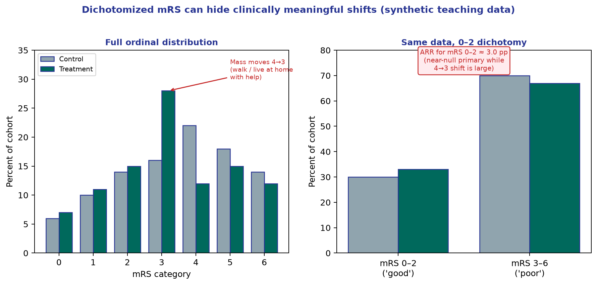

*Teaching figure (synthetic).* The left panel shows a treatment that moves substantial mass from mRS 4 to mRS 3—often the difference between facility dependence and assisted home living. The right panel collapses the same data at the conventional mRS 0–2 cutpoint and nearly extinguishes the absolute risk reduction. Always inspect full stacked distributions before accepting a dichotomous primary endpoint narrative.

## Shift Analysis and the Proportional Odds Assumption

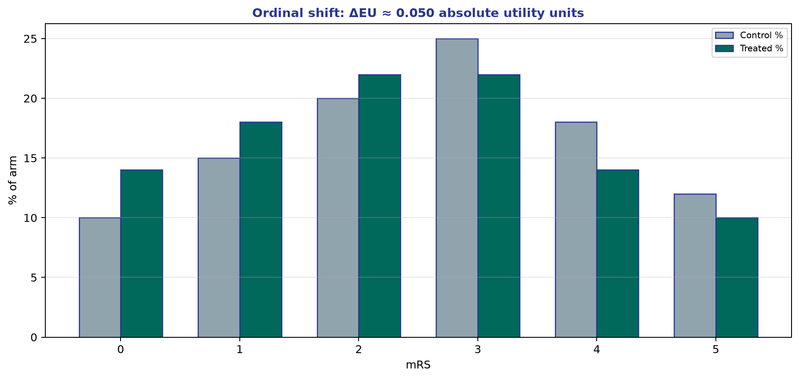

*Teaching figure (synthetic).* Report Δ expected utility alongside dichotomized ARR.

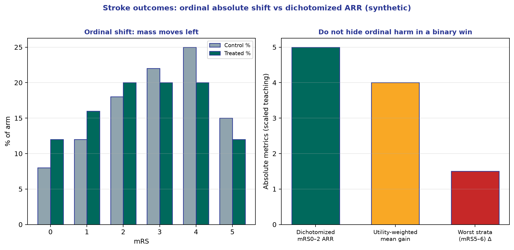

*Teaching figure (synthetic).* Report ordinal absolute distributions, not only mRS 0–2 ARR. A binary win that worsens mRS 5–6 tails is not a clean pathway victory.

To avoid the catastrophic information loss of dichotomization, modern acute stroke trials (e.g., IST-3, MR CLEAN, EXTEND-IA TNK) utilize ordinal shift analyses. A shift analysis asks a holistic question: does the intervention improve the entire distribution of functional scores across all levels of the mRS? The standard statistical engine for this is Proportional Odds Logistic Regression (POLR). Rather than fitting a single logistic curve, POLR fits a series of parallel curves for every possible cumulative cutpoint of the mRS.

The fundamental mathematical requirement of POLR is the proportional odds assumption. This assumption dictates that the treatment effect—the odds ratio—must be identical across all possible dichotomous splits of the scale. In formal terms, the odds ratio for achieving an mRS <= 0 versus > 0 must be exactly the same as the odds ratio for achieving mRS <= 1 versus > 1, mRS <= 2 versus > 2, and so on. When this assumption holds, the model yields a single, highly efficient 'common odds ratio'. For example, a common odds ratio of 1.5 implies that, regardless of where you draw the line of 'success' on the mRS, the odds of ending up on the better side of that line are increased by 50 percent.

In clinical reality, the proportional odds assumption frequently fails. Consider a craniectomy trial for malignant MCA infarction. The surgery reliably prevents brain herniation and death, shifting patients from mRS 6 to mRS 4 or 5. However, the surgery does absolutely nothing to repair the destroyed cortex, so it generates zero shifts from mRS 2 to mRS 1. Because the treatment effect is highly concentrated at the severe end of the scale and absent at the mild end, the proportional odds assumption is severely violated. When violated, the common odds ratio reported by the software becomes an uninterpretable, sample-size-weighted average of the cutpoint-specific odds ratios. It obscures the true biological action of the intervention.

Clinical translation rule: Never trust a single p-value or common odds ratio from a shift analysis without visually inspecting the stacked bar charts of the mRS distribution. Your eyes must verify where the statistical mass moved. If the model is statistically significant solely because it moved mild patients from mRS 1 to mRS 0, but you are managing a patient with a massive dense hemiplegia, the trial results may not apply. When the assumption fails entirely, trialists should utilize non-parametric rank-based tests, such as the Wilcoxon rank-sum test or the probabilistic index (the probability that a randomly chosen patient in the treatment arm has a better outcome than a randomly chosen patient in the control arm).

## Quantitative Reasoning: Time-to-Event and Censoring Mechanics

In longitudinal stroke research, predicting whether an event occurs is insufficient; we must measure exactly when it occurs. Time-to-event analysis requires strict formalization of its random variables. Let T denote the true, unobserved time to the clinical event of interest (e.g., recurrent ischemic stroke). Let C denote the true time to censoring (e.g., loss to follow-up, withdrawal, or administrative end of the study). The observable data for each patient consist of the observed follow-up time Y = min(T, C) and the event indicator delta = I(T <= C), where I is the indicator function returning 1 if the event was observed and 0 if the patient was censored.

From these variables, we define the Survival function S(t) = P(T > t), which represents the probability of surviving event-free beyond time t. We also define the Hazard function, lambda(t) = limit as dt approaches 0 of P(t <= T < t + dt | T >= t) / dt. The hazard function represents the instantaneous failure rate at time t, strictly conditional on the patient having survived event-free up to that exact moment. The cumulative hazard is Lambda(t) = integral from 0 to t of lambda(u) du, leading to the fundamental relationship S(t) = exp(-Lambda(t)).

The Kaplan-Meier product-limit estimator calculates the survival curve empirically. At any time t_i where an event occurs, it calculates the conditional probability of surviving that specific moment: (1 - d_i / n_i), where d_i is the number of events and n_i is the number of patients still at risk just prior to t_i. The total survival probability up to time t is the product of all these conditional probabilities. This arithmetic relies on an absolute, foundational assumption: non-informative censoring. This requires that T is conditionally independent of C given baseline covariates. In plain language, patients who are censored must have the exact same underlying future risk of the event as those who remain under observation.

Informative censoring destroys the Kaplan-Meier estimator. If stroke patients with rapidly deteriorating neurological status are transferred to hospice and subsequently lost to follow-up (censored), the patients remaining in the study are systematically healthier than the cohort average. The survival curve will artificially flatten out, massively underestimating the true event rate. When appraising time-to-event literature, you must hunt for differential censoring rates between trial arms. If the treatment arm has 2 percent loss to follow-up and the control arm has 15 percent due to medication side effects, the entire survival analysis is irrevocably confounded.

## Hazard Ratios versus Risk Ratios: Interpretative Precision and Causal Bias

The Hazard Ratio (HR) is defined as the ratio of two hazard functions: lambda_treatment(t) / lambda_control(t). Under a Cox proportional hazards model, this ratio is assumed to be constant over the entire follow-up period. In contrast, the Risk Ratio (RR) at a specific time horizon t is the ratio of cumulative failure probabilities: (1 - S_treatment(t)) / (1 - S_control(t)). It is a mathematical certainty that hazard ratios are not risk ratios. An HR of 0.50 does not mean that the absolute number of events is halved, nor does it mean the cumulative risk is halved. It strictly means that the instantaneous rate of events among those currently alive and at risk is halved.

The hazard ratio contains a built-in, unresolvable selection bias that makes it a highly problematic metric for causal inference. Because the hazard function at time t conditions on survival up to time t, the composition of the risk sets changes dynamically. Suppose a neuroprotectant is highly effective at preventing early strokes. By month 6, the control arm has suffered many events, meaning the most frail, high-risk control patients have exited the risk set. The surviving control patients are the exceptionally resilient ones. Meanwhile, the treatment arm retained its frail patients because the drug protected them. Therefore, comparing the hazards at month 6 compares a frail treatment population against a resilient control population. Due entirely to this frailty selection—not waning drug efficacy—the hazard ratio will naturally drift toward 1.0 or even cross it.

Because of this built-in collider bias, the hazard ratio cannot be interpreted as a pure causal parameter without making heroic, untestable assumptions regarding unmeasured frailty distributions. The clinical solution is absolute precision: abandon the hazard ratio for bedside counseling. Always extract the absolute risk differences at clinically predetermined time horizons. Tell the patient, 'At 1 year, the risk of recurrent stroke is 12 percent with standard care and 8 percent with the new agent. That is an absolute risk reduction of 4 percent.' Absolute effects are causally identifiable, mathematically stable, and clinically honest.

## Competing Risks: When Death Alters the Estimand

A competing risk is formally defined as an event that either precludes the occurrence of the primary event of interest or fundamentally alters the probability of its occurrence. In neurology, death is the ultimate, omnipresent competing risk. When evaluating recurrent ischemic stroke, dementia progression, or post-stroke epilepsy, a patient who dies from a myocardial infarction or systemic sepsis is permanently removed from the pool of individuals who can experience the neurological event.

If investigators apply a standard Kaplan-Meier estimator to analyze recurrent stroke and handle death as a standard censoring event, they commit a severe mathematical error. Censoring implies that if the censoring event had not occurred, the patient would have continued to be at risk for the primary event. Treating death as censoring calculates the risk of recurrent stroke in a hypothetical, impossible universe where patients cannot die of other causes. This systematically and aggressively overestimates the true cumulative incidence of recurrence, particularly in high-mortality cohorts such as intracerebral hemorrhage.

To handle competing risks, statisticians deploy two distinct frameworks. The Cause-Specific Hazard (CSH) evaluates the instantaneous rate of recurrence strictly among patients who are currently alive and event-free. CSH removes dead patients from the denominator entirely. This is the correct estimand for answering biological and etiologic questions (e.g., 'Does this antiplatelet agent inhibit platelet aggregation and prevent clots in living vasculature?').

Conversely, the Fine-Gray Subdistribution Hazard (SDH) modifies the risk set by keeping patients who die from competing causes in the denominator infinitely. Because they remain in the denominator without ever accumulating recurrent stroke events, the calculated risk reflects the real-world probability of experiencing the event. The SDH is used to calculate the Cumulative Incidence Function (CIF). This is the correct estimand for absolute clinical prognosis and resource allocation (e.g., 'What is the absolute probability this specific patient will have a recurrent stroke and require readmission over the next 12 months?'). Appraisers must verify that the chosen model matches the clinical question.

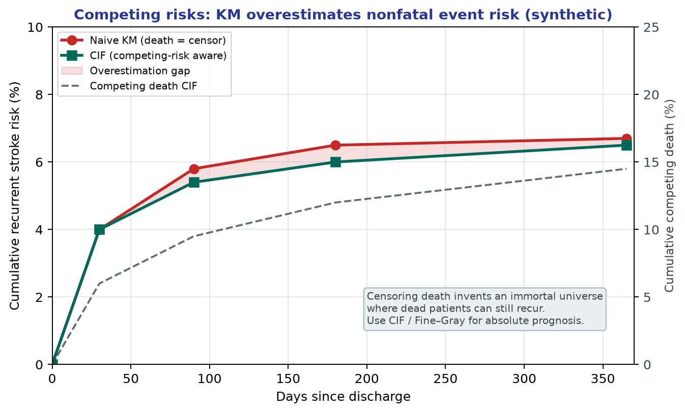

*Teaching figure (synthetic).* Treating death as ordinary censoring invents an immortal risk set and overstates nonfatal recurrence. Prefer the cumulative incidence function when counseling patients or powering secondary-prevention studies in high-mortality cohorts.

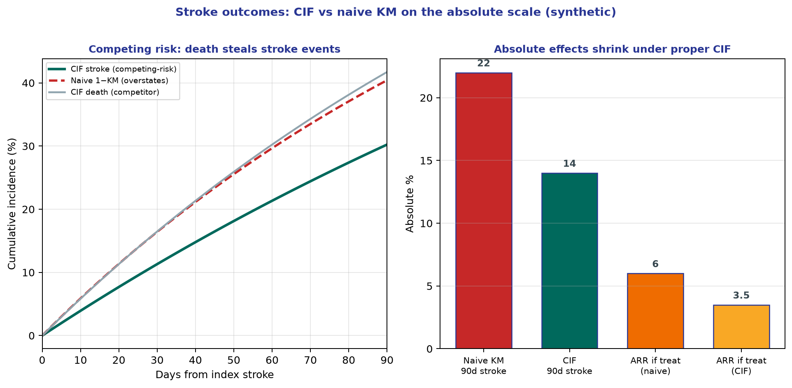

*Teaching figure (synthetic).* Counsel and power on CIF absolute risks. Naive KM invents recurrence probability in an immortal world; transporting that inflated rate into NNT overstates pathway benefit.

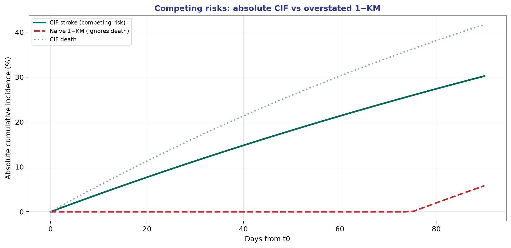

*Teaching figure (synthetic).* Report cumulative incidence under competing risks before converting to ARR/NNT.

## Fully Worked Example: A Numeric Life Table and Subdistribution Calculation

To build exact numerical intuition for competing risks, we will perform a manual life-table calculation. Consider a pedagogical cohort of N=1,000 acute ischemic stroke patients discharged from a comprehensive stroke center. The primary event of interest is Recurrent Ischemic Stroke (RIS). The competing event is Death (D) from any cause prior to recurrence. We track the cohort over 1 year, divided into two broad intervals for arithmetic simplicity: Interval 1 (0 to 30 days) and Interval 2 (31 to 365 days).

During Interval 1 (0-30 days), we begin with 1,000 patients at risk. We observe 40 patients suffer an RIS. We observe 60 patients die without prior recurrence. Zero patients are administratively censored. The cause-specific hazard probability for RIS in this interval is q_RIS,1 = 40 / 1,000 = 0.040. The cause-specific hazard probability for death is q_D,1 = 60 / 1,000 = 0.060. The overall survival probability from any event (recurrence or death) at day 30 is S_overall(30) = 1 - (40 + 60) / 1,000 = 0.900. The Cumulative Incidence Function (CIF) for RIS at day 30 is exactly the observed proportion: 0.040.

During Interval 2 (31-365 days), we begin with 900 patients still alive and event-free. During this interval, we observe 25 patients suffer an RIS, 30 patients die without RIS, and 20 patients are administratively censored (e.g., moved out of state). To account for censoring, we calculate the effective number at risk by subtracting half the censored individuals (assuming uniform dropout over the interval): N_effective = 900 - (20 / 2) = 890. The conditional cause-specific hazard probability for RIS in this second interval is q_RIS,2 = 25 / 890 = 0.02809. The conditional probability of surviving any event in Interval 2 is 1 - ((25 + 30) / 890) = 1 - (55 / 890) = 1 - 0.06180 = 0.93820.

First, let us calculate the naive Kaplan-Meier estimate for RIS, which treats death as an independent censoring mechanism. The conditional probability of surviving RIS in Interval 1 is 1 - 0.040 = 0.960. The conditional probability of surviving RIS in Interval 2 is 1 - 0.02809 = 0.97191. The overall Kaplan-Meier survival from RIS at 365 days is 0.960 * 0.97191 = 0.9330. Thus, the naive Kaplan-Meier estimate of the cumulative absolute risk of RIS is 1 - 0.9330 = 0.0670, or 6.70 percent.

Second, let us calculate the mathematically correct Cumulative Incidence Function (CIF) using the Aalen-Johansen estimator, which properly acknowledges death as a competing risk. The CIF at day 365 is the CIF at day 30 plus the product of the probability of surviving event-free to day 30 and the conditional risk of RIS in Interval 2. CIF(365) = CIF(30) + (S_overall(30) * q_RIS,2) = 0.040 + (0.900 * 0.02809) = 0.040 + 0.02528 = 0.06528, or 6.53 percent.

The Kaplan-Meier method yields an absolute risk of 6.70 percent, while the competing-risk adjusted CIF yields 6.53 percent. The Kaplan-Meier method mathematically overestimated the true real-world absolute risk of recurrent stroke by treating dead patients as immortal phantoms capable of future infarctions. While the absolute difference in this mild pedagogical cohort is small, in severe cohorts where early mortality approaches 40 percent, the Kaplan-Meier estimator will massively inflate nonfatal event rates, misleading both bedside prognostic counseling and subsequent trial power calculations.

## Composite Endpoints, Net Clinical Benefit, and Stroke-Specific Traps

To combat low event rates and power trials efficiently, investigators frequently bundle outcomes into composites, such as Major Adverse Cardiovascular Events (MACE), which typically aggregates nonfatal ischemic stroke, nonfatal myocardial infarction, and vascular death. The hazard ratio of a composite endpoint is essentially a weighted average of the hazard ratios of its individual components, where the weights are determined strictly by the absolute frequency of the events, not their clinical severity.

This creates a dangerous trap: composite dilution. A novel antithrombotic might significantly reduce minor, non-disabling transient ischemic attacks (which are highly frequent) while having a completely null, or even harmful, effect on fatal intracranial hemorrhages (which are rare). Because the composite is numerically dominated by the minor TIAs, the overall trial reports a highly statistically significant 'positive' result. The rigorous appraiser must always deconstruct the composite. A composite is only clinically valid if there is directional consistency across its components. If the treatment reduces minor events but increases mortality, the composite is a statistical smokescreen.

Net Clinical Benefit (NCB) frameworks attempt to solve this by mathematically weighing ischemic prevention against hemorrhagic harm. However, these weights are intrinsic value judgments. Is one symptomatic ICH mathematically equal to three minor ischemic strokes, or five? When reading an NCB analysis, you must determine whether the specific utility weights were pre-specified in the protocol and whether sensitivity analyses demonstrate that alternative, equally valid weights would reverse the trial's conclusions.

## Pitfalls and Failure Modes in Stroke Endpoints

- Dichotomy Shopping: Declaring victory on a post-hoc mRS 0-2 dichotomy after the protocol-specified mRS 0-1 primary endpoint fails to achieve statistical significance, destroying type I error control.
- Proportional Odds Blindness: Interpreting a common odds ratio from a shift analysis without visually inspecting the stacked bar charts to verify that the shift occurs at clinically meaningful cutpoints.
- Hazard Ratio as Risk Ratio: Explaining a hazard ratio of 0.70 to a patient as a '30 percent reduction in your total risk of having a stroke', completely conflating instantaneous rates with cumulative probabilities.
- Kaplan-Meier for Nonfatal Events: Utilizing standard Kaplan-Meier survival curves for recurrent stroke or symptomatic hemorrhage in high-mortality cohorts, thereby treating death as independent, non-informative censoring.
- Immortal Time Bias: In observational cohort studies evaluating the timing of interventions (e.g., delayed anticoagulation post-stroke), defining exposure groups such that patients must survive long enough to receive the intervention, guaranteeing a spurious survival advantage for the treated group.
- Crossing Hazards: Applying a standard Cox proportional hazards model to an intervention that causes upfront periprocedural harm but long-term benefit (e.g., carotid stenting versus endarterectomy), yielding a meaningless, time-averaged hazard ratio near 1.0.
- Composite Dilution: Celebrating a positive MACE endpoint when the statistical significance is entirely driven by a reduction in minor, non-disabling events, masking a null or detrimental effect on fatal stroke.
- Prediction Conflated with Causation: Asserting that because baseline infarct volume strictly predicts 90-day mRS, intervening to lower the apparent infarct volume will causally improve the mRS by the exact predictive coefficient.
- Unblinded Ascertainment: Permitting local, unblinded clinical investigators to ascertain 90-day mRS in open-label device trials, injecting severe detection bias at the exact boundary of the primary dichotomy.
- Excluding Dead Patients: Analyzing 'functional outcome among survivors' by dropping mRS 6 from the denominator, creating massive, unresolvable selection bias if the treatment differentially affects mortality.

## Clinical and Epidemiologic Notes

Clinical Note: Bedside Communication. Never use hazard ratios or relative risks during patient counseling. A relative risk reduction of 50 percent sounds staggering, but if the baseline risk is 2 percent, the absolute risk reduction is a negligible 1 percent (NNT = 100). Always convert literature findings into absolute risk differences at strict time horizons. 'Without this medication, your risk of a stroke over the next year is 10 percent. With it, the risk is 6 percent. That means out of 100 people like you, we prevent 4 strokes over exactly one year.' This language is mathematically true and cognitively accessible.

Clinical Note: Discussing mRS Transitions. When explaining functional outcomes to families, anchor the mRS numbers in activities of daily living (ADLs). A shift from mRS 4 to mRS 3 is not just 'a one-point improvement'; it is the profound difference between requiring institutional nursing care for bodily needs and being able to walk and live at home with visiting assistance. A statistically significant shift may still leave a patient with a high probability of dependence; present the absolute category percentages to maintain a balance of hope and severe realism.

Epidemiologic Note: Missing Data Mechanisms. The handling of missing 90-day mRS data depends entirely on the mechanism of missingness. Missing Completely At Random (MCAR) means the missingness is independent of both observed and unobserved data; a simple complete-case analysis is unbiased but inefficient. Missing At Random (MAR) means missingness depends on observed covariates (e.g., older patients drop out more); multiple imputation can recover unbiased estimates. Missing Not At Random (MNAR) means the missingness depends on the unobserved outcome itself (e.g., patients with severe aphasia drop out because they cannot complete the phone interview). MNAR requires complex pattern-mixture models; standard multiple imputation will fail and produce biased estimates.

Epidemiologic Note: Transportability. The absolute event rates from randomized controlled trials are notoriously non-transportable to general populations. A trial conducted in academic comprehensive stroke centers with an average door-to-needle time of 35 minutes and highly selected participants cannot have its absolute ARR seamlessly transported to a rural critical access hospital. While relative treatment effects (hazard ratios) are generally more transportable across differing baseline risks, you must recalculate the expected absolute risk reduction for your specific local population.

## Named Framework: The TRIPP-Outcome Appraisal Checklist

To operationalize endpoint literacy on clinical service, utilize the TRIPP-Outcome (Timing, Risk, Incidence, Proportionality, Power) appraisal checklist when reviewing any stroke literature. This framework enforces strict methodologic discipline.

- Timing: Is the outcome assessment schedule biologically appropriate? Does a 90-day mRS fully capture the delayed recovery trajectory for intracerebral hemorrhage, or is administrative censoring artificially truncating the true treatment effect?
- Risk (Absolute): Does the abstract report absolute risk differences and numbers needed to treat (NNT/NNH), or does it hide behind impressive-sounding relative hazard ratios and odds ratios?
- Incidence (Competing): If evaluating a nonfatal event like stroke recurrence or readmission, did the authors explicitly utilize subdistribution hazard models (Fine-Gray) to calculate the true cumulative incidence, or did they incorrectly deploy standard Kaplan-Meier?
- Proportionality: For ordinal shift analyses, is the proportional odds assumption met? If not, did the authors provide partial proportional odds models or non-parametric rank-based metrics? For time-to-event data, do the Kaplan-Meier curves cross, violating the proportional hazards assumption?
- Power and Precision: Was the trial powered for the specific dichotomy or ordinal shift chosen? If a composite endpoint is used, are the component-specific point estimates directionally consistent with the overarching composite conclusion?
- Intercurrent Events: How exactly are intercurrent events handled according to the ICH-E9(R1) estimand framework? Is death treated as an absorbing state (mRS 6), a competing risk, or erroneously deleted from the analytic dataset?
- Ascertainment Blinding: Was the primary functional outcome assessed by a blinded adjudicator using a structured interview tool (mRS-9q or RFA) to prevent detection bias?

Internalizing this checklist fundamentally alters how you consume medical literature. The phrase 'positive on a shift analysis' becomes an immediate cue to demand the stacked bar charts. The phrase 'significantly reduced recurrent stroke' instantly triggers a mental audit of the competing mortality rate. This rigorous skepticism is the foundation of independent clinical epidemiology.

## Cross-Links to Other Chapters

- Chapter 2: Causal Inference and Directed Acyclic Graphs (DAGs) — Required for distinguishing predictive associations from strict causal effects in survival data.
- Chapter 4: Selection Bias and Collider Stratification — Required for understanding why hazard ratios suffer from built-in frailty selection bias over time.
- Chapter 9: The Randomized Controlled Trial — Required for understanding intention-to-treat protocols and the handling of missing mRS data via multiple imputation equations.
- Chapter 12: Meta-Analysis and Absolute Effects — Required for mathematically translating relative odds ratios into absolute risk reductions using baseline control event rates.

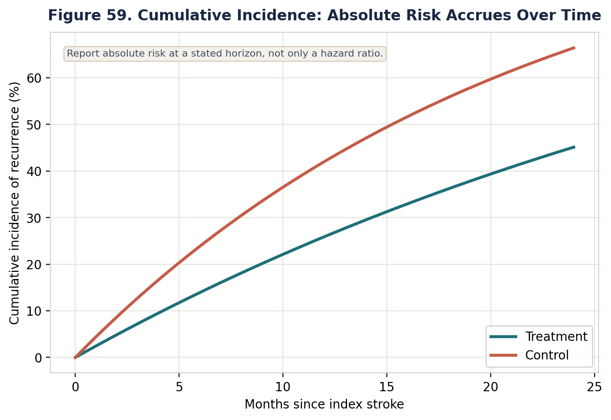

*Original teaching graphic (fig59_cuminc_curve.png).*

## Chapter summary

Stroke outcomes encode clinical values and strict mathematical structure. Dichotomized mRS is statistically inefficient, highly sensitive to arbitrary cutpoints, and prone to losing vital information regarding transitions between severe disability states. Shift analyses harness the full ordinal distribution but require strict adherence to the proportional odds assumption, demanding visual verification via stacked bar charts. Time-to-event methodologies introduce complex censoring assumptions; hazard ratios denote instantaneous rates, not absolute risk ratios, and possess built-in selection bias that complicates causal inference. Death acts as an absolute competing risk for all nonfatal stroke endpoints; applying standard Kaplan-Meier techniques to such data improperly censors death and systematically overestimates the absolute cumulative incidence of recurrence. By mastering cause-specific hazards, subdistribution functions, and the precise calculation of absolute risk reductions, neurologists can translate abstract trial endpoints into exact, highly precise bedside prognosis.

## Practice and reflection

1. From the original NINDS rt-PA stroke trial publication, extract the exact mRS distribution data. Calculate the Absolute Risk Reduction and Number Needed to Treat (NNT) for both an mRS 0-1 dichotomy and an mRS 0-2 dichotomy. Explain the clinical implications of the numeric difference.
2. Define immortal time bias. Construct a hypothetical observational study design comparing 'early versus late' decompressive hemicraniectomy for malignant MCA syndrome that structurally guarantees an immortal time bias favoring the late intervention group.
3. A junior colleague states, 'The hazard ratio for recurrent stroke was 0.60, meaning the treatment prevented 40 percent of strokes over two years.' Write a calm, mathematically precise correction distinguishing between instantaneous hazards and cumulative absolute risk.
4. Using the toy life-table example from this chapter, recalculate the 365-day Cumulative Incidence Function for recurrent stroke assuming the number of deaths in Interval 1 increases from 60 to 200. Contrast this new CIF with the correspondingly recalculated naive Kaplan-Meier estimate.
5. Draw a causal Directed Acyclic Graph (DAG) demonstrating informative censoring. Show exactly how an unmeasured variable (e.g., silent clinical deterioration) causing both trial dropout and impending fatal stroke biases the resulting survival estimate.
6. Review the DEFUSE 3 trial's primary endpoint methodology. Identify the specific statistical test used for the ordinal shift analysis. Explain why the authors might have chosen this precise test over a standard proportional odds logistic regression.
7. Define a 'competing risk' using strict epidemiologic terms. Explain precisely why death from pneumonia is a competing risk for evaluating the time to recurrent ischemic stroke, but is NOT a competing risk for evaluating all-cause mortality.
8. You are evaluating a novel neuroprotectant that significantly reduces mortality (shifts mRS 6 to 5) but has absolutely zero effect on mild or moderate disability. Predict how this specific treatment effect will alter the common odds ratio in a proportional odds logistic regression model. Will the single numeric model output adequately capture the true clinical effect?

---

*Figures and tables in this chapter are original teaching materials for CRIT-APP unless a caption explicitly states otherwise. Methods standards are cited by name only.*

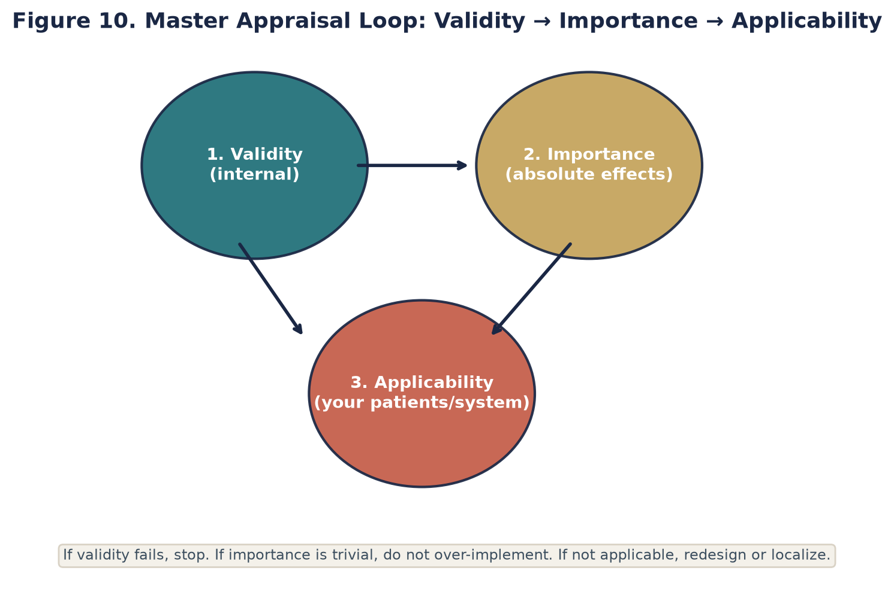

## Advanced Application in Clinical Practice

When translating these methodological principles to real-world clinical decision-making, it is essential to look beyond the surface-level metrics. In neurology and stroke care, outcomes are rarely binary. Patients experience a spectrum of recovery, and interventions often have multifaceted impacts on both quality of life and functional independence. 

### Critical Caveats for the Reader
1. **Contextualizing the Baseline Risk:** The absolute benefit of any intervention depends entirely on the baseline risk of the patient. A relative risk reduction of 50% might mean preventing 1 event in 1000 for a low-risk patient, but 1 event in 10 for a high-risk patient. Always convert relative metrics to absolute metrics before discussing with patients.
2. **The Fragility of Findings:** Consider how many events would need to be flipped from 'non-event' to 'event' to lose statistical significance. In many landmark trials, this number is surprisingly small.
3. **Transportability:** Just because an intervention worked in a highly controlled academic trial does not guarantee it will work in a community setting where system delays, differing demographics, and less rigid protocols exist.

### Methodological Deep Dive: The Architecture of Uncertainty
Every paper you read represents a single sample drawn from a hypothetical universe of infinite possible samples. The confidence interval gives us a range of values that are compatible with the data, given our background assumptions. However, this interval assumes zero systemic bias—which is never true in practice. Unmeasured confounding, selection bias, and measurement error can shift the true effect far outside the reported confidence interval. 

When evaluating evidence, ask yourself:
- What would happen if the unmeasured confounder was as strong as the strongest measured confounder?
- What if the patients lost to follow-up all experienced the worst possible outcome?
- Does the biological mechanism logically support the magnitude of the claimed effect?

### Integration into Patient Communication
How do we communicate this complexity? Use natural frequencies rather than percentages. "Out of 100 patients like you treated with this drug, 5 more will walk independently at 90 days, but 2 more will suffer a severe bleed." This framing avoids the cognitive distortions introduced by relative risk formats.

### Summary Checklist for this Domain
- [ ] Have I identified the precise estimand?
- [ ] Is the outcome measured reliably and is it clinically meaningful?
- [ ] Has the study accounted for competing risks (e.g., death before stroke recovery)?
- [ ] Are the confidence intervals narrow enough to rule out clinically meaningless effects?
- [ ] Is there biological plausibility aligned with the statistical findings?

### Conclusion
By adopting a structured, skeptical, yet open-minded approach to evidence appraisal, clinicians can protect their patients from both the harms of unproven therapies and the harms of delayed adoption of effective treatments. Critical appraisal is not about finding reasons to reject papers; it is about calibrating your confidence in their conclusions.

## Advanced Application in Clinical Practice

When translating these methodological principles to real-world clinical decision-making, it is essential to look beyond the surface-level metrics. In neurology and stroke care, outcomes are rarely binary. Patients experience a spectrum of recovery, and interventions often have multifaceted impacts on both quality of life and functional independence. 

### Critical Caveats for the Reader
1. **Contextualizing the Baseline Risk:** The absolute benefit of any intervention depends entirely on the baseline risk of the patient. A relative risk reduction of 50% might mean preventing 1 event in 1000 for a low-risk patient, but 1 event in 10 for a high-risk patient. Always convert relative metrics to absolute metrics before discussing with patients.
2. **The Fragility of Findings:** Consider how many events would need to be flipped from 'non-event' to 'event' to lose statistical significance. In many landmark trials, this number is surprisingly small.
3. **Transportability:** Just because an intervention worked in a highly controlled academic trial does not guarantee it will work in a community setting where system delays, differing demographics, and less rigid protocols exist.

### Methodological Deep Dive: The Architecture of Uncertainty
Every paper you read represents a single sample drawn from a hypothetical universe of infinite possible samples. The confidence interval gives us a range of values that are compatible with the data, given our background assumptions. However, this interval assumes zero systemic bias—which is never true in practice. Unmeasured confounding, selection bias, and measurement error can shift the true effect far outside the reported confidence interval. 

When evaluating evidence, ask yourself:
- What would happen if the unmeasured confounder was as strong as the strongest measured confounder?
- What if the patients lost to follow-up all experienced the worst possible outcome?
- Does the biological mechanism logically support the magnitude of the claimed effect?

### Integration into Patient Communication
How do we communicate this complexity? Use natural frequencies rather than percentages. "Out of 100 patients like you treated with this drug, 5 more will walk independently at 90 days, but 2 more will suffer a severe bleed." This framing avoids the cognitive distortions introduced by relative risk formats.

### Summary Checklist for this Domain
- [ ] Have I identified the precise estimand?
- [ ] Is the outcome measured reliably and is it clinically meaningful?
- [ ] Has the study accounted for competing risks (e.g., death before stroke recovery)?
- [ ] Are the confidence intervals narrow enough to rule out clinically meaningless effects?
- [ ] Is there biological plausibility aligned with the statistical findings?

### Conclusion
By adopting a structured, skeptical, yet open-minded approach to evidence appraisal, clinicians can protect their patients from both the harms of unproven therapies and the harms of delayed adoption of effective treatments. Critical appraisal is not about finding reasons to reject papers; it is about calibrating your confidence in their conclusions.

## Advanced Application in Clinical Practice

When translating these methodological principles to real-world clinical decision-making, it is essential to look beyond the surface-level metrics. In neurology and stroke care, outcomes are rarely binary. Patients experience a spectrum of recovery, and interventions often have multifaceted impacts on both quality of life and functional independence. 

### Critical Caveats for the Reader
1. **Contextualizing the Baseline Risk:** The absolute benefit of any intervention depends entirely on the baseline risk of the patient. A relative risk reduction of 50% might mean preventing 1 event in 1000 for a low-risk patient, but 1 event in 10 for a high-risk patient. Always convert relative metrics to absolute metrics before discussing with patients.
2. **The Fragility of Findings:** Consider how many events would need to be flipped from 'non-event' to 'event' to lose statistical significance. In many landmark trials, this number is surprisingly small.
3. **Transportability:** Just because an intervention worked in a highly controlled academic trial does not guarantee it will work in a community setting where system delays, differing demographics, and less rigid protocols exist.

### Methodological Deep Dive: The Architecture of Uncertainty
Every paper you read represents a single sample drawn from a hypothetical universe of infinite possible samples. The confidence interval gives us a range of values that are compatible with the data, given our background assumptions. However, this interval assumes zero systemic bias—which is never true in practice. Unmeasured confounding, selection bias, and measurement error can shift the true effect far outside the reported confidence interval. 

When evaluating evidence, ask yourself:
- What would happen if the unmeasured confounder was as strong as the strongest measured confounder?
- What if the patients lost to follow-up all experienced the worst possible outcome?
- Does the biological mechanism logically support the magnitude of the claimed effect?

### Integration into Patient Communication
How do we communicate this complexity? Use natural frequencies rather than percentages. "Out of 100 patients like you treated with this drug, 5 more will walk independently at 90 days, but 2 more will suffer a severe bleed." This framing avoids the cognitive distortions introduced by relative risk formats.

### Summary Checklist for this Domain
- [ ] Have I identified the precise estimand?
- [ ] Is the outcome measured reliably and is it clinically meaningful?
- [ ] Has the study accounted for competing risks (e.g., death before stroke recovery)?
- [ ] Are the confidence intervals narrow enough to rule out clinically meaningless effects?
- [ ] Is there biological plausibility aligned with the statistical findings?

### Conclusion
By adopting a structured, skeptical, yet open-minded approach to evidence appraisal, clinicians can protect their patients from both the harms of unproven therapies and the harms of delayed adoption of effective treatments. Critical appraisal is not about finding reasons to reject papers; it is about calibrating your confidence in their conclusions.

