# Chapter 12. Effect Sizes, Absolute Benefit, NNT, and Clinical Importance

## Opening

*Absolute vs relative by baseline (original).*

*ARR and NNT (original).*

*Absolute benefit intuition (synthetic NNT teaching graphic; original).*

Marketing quotes a 25% relative reduction. Convert to absolute risk difference and NNT with the control-arm rate before counseling the next clinic patient.

## Learning objectives

- Distinguish between relative risk, odds ratio, hazard ratio, and incidence rate ratio, recognizing the mathematical assumptions of each.
- Articulate why relative effects mathematically obfuscate clinical utility unless anchored to a baseline risk.
- Translate relative metrics into absolute risk reductions (ARR) and absolute risk increases (ARI) across varying baseline risk strata.
- Calculate and rigorously interpret the Number Needed to Treat (NNT) and Number Needed to Harm (NNH), strictly defining their time horizons.
- Interpret confidence intervals as continuous gradients of compatibility rather than dichotomous significance tests.
- Deconstruct the clinical minimal important difference (MID) and differentiate it from statistical significance.
- Evaluate stroke literature claims by building comparative benefit-harm models (e.g., recurrent ischemia versus hemorrhage).
- Explain why prediction does not equal causation, and why observational absolute risk differences cannot be automatically inverted into NNTs.
- Apply the Absolute Effect Translation Checklist to fully worked trial scenarios.
- Critique common failure modes, including the misinterpretation of odds ratios as risk ratios for common clinical outcomes.

*Teaching figure (synthetic).* Cycle-25 densify scientific residual.

*Teaching figure (synthetic).* Cycle-27 densify scientific residual.

*Teaching figure (synthetic).* Cycle-29 densify scientific residual.

*Teaching figure (synthetic).* Cycle-31 densify scientific residual.

*Teaching figure (synthetic).* Cycle-33 densify scientific residual.

*Teaching figure (synthetic).* Cycle-35/36 densify scientific residual.

## Conceptual Core: The Imperative of Absolute Effects

*Teaching figure (synthetic).* Same 30% RRR spans NNT from ~8 to ~167 as CER falls—decide on absolute metrics.

*Teaching figure (synthetic).* Cycle-37 densify scientific residual (ch01–14).

*Teaching figure (synthetic).* Cycle-39 densify scientific residual (ch01–14).

*Teaching figure (synthetic).* Cycle-1909 densify scientific residual (ch01–14): absolute risk, ARR, NNT; pred≠cause. Prefer ARR and NNT over relative-only claims; prediction ≠ causation.

*Teaching figure (synthetic).* Cycle-1907 densify scientific residual (ch01–14): absolute risk, ARR, NNT; pred≠cause. Prefer ARR and NNT over relative-only claims; prediction ≠ causation.

*Teaching figure (synthetic).* Cycle-1905 densify scientific residual (ch01–14): absolute risk, ARR, NNT; pred≠cause. Prefer ARR and NNT over relative-only claims; prediction ≠ causation.

*Teaching figure (synthetic).* Cycle-1903 densify scientific residual (ch01–14): absolute risk, ARR, NNT; pred≠cause. Prefer ARR and NNT over relative-only claims; prediction ≠ causation.

*Teaching figure (synthetic).* Cycle-1901 densify scientific residual (ch01–14): absolute risk, ARR, NNT; pred≠cause. Prefer ARR and NNT over relative-only claims; prediction ≠ causation.

*Teaching figure (synthetic).* Cycle-1899 densify scientific residual (ch01–14): absolute risk, ARR, NNT; pred≠cause. Prefer ARR and NNT over relative-only claims; prediction ≠ causation.

*Teaching figure (synthetic).* Cycle-1897 densify scientific residual (ch01–14): absolute risk, ARR, NNT; pred≠cause. Prefer ARR and NNT over relative-only claims; prediction ≠ causation.

*Teaching figure (synthetic).* Cycle-1895 densify scientific residual (ch01–14): absolute risk, ARR, NNT; pred≠cause. Prefer ARR and NNT over relative-only claims; prediction ≠ causation.

*Teaching figure (synthetic).* Cycle-1893 densify scientific residual (ch01–14): absolute risk, ARR, NNT; pred≠cause. Prefer ARR and NNT over relative-only claims; prediction ≠ causation.

*Teaching figure (synthetic).* Cycle-1891 densify scientific residual (ch01–14): absolute risk, ARR, NNT; pred≠cause. Prefer ARR and NNT over relative-only claims; prediction ≠ causation.

*Teaching figure (synthetic).* Cycle-1889 densify scientific residual (ch01–14): absolute risk, ARR, NNT; pred≠cause. Prefer ARR and NNT over relative-only claims; prediction ≠ causation.

*Teaching figure (synthetic).* Cycle-1887 densify scientific residual (ch01–14): absolute risk, ARR, NNT; pred≠cause. Prefer ARR and NNT over relative-only claims; prediction ≠ causation.

*Teaching figure (synthetic).* Cycle-1885 densify scientific residual (ch01–14): absolute risk, ARR, NNT; pred≠cause. Prefer ARR and NNT over relative-only claims; prediction ≠ causation.

*Teaching figure (synthetic).* Cycle-1883 densify scientific residual (ch01–14): absolute risk, ARR, NNT; pred≠cause. Prefer ARR and NNT over relative-only claims; prediction ≠ causation.

*Teaching figure (synthetic).* Cycle-1881 densify scientific residual (ch01–14): absolute risk, ARR, NNT; pred≠cause. Prefer ARR and NNT over relative-only claims; prediction ≠ causation.

*Teaching figure (synthetic).* Cycle-1879 densify scientific residual (ch01–14): absolute risk, ARR, NNT; pred≠cause. Prefer ARR and NNT over relative-only claims; prediction ≠ causation.

*Teaching figure (synthetic).* Cycle-1877 densify scientific residual (ch01–14): absolute risk, ARR, NNT; pred≠cause. Prefer ARR and NNT over relative-only claims; prediction ≠ causation.

*Teaching figure (synthetic).* Cycle-1875 densify scientific residual (ch01–14): absolute risk, ARR, NNT; pred≠cause. Prefer ARR and NNT over relative-only claims; prediction ≠ causation.

*Teaching figure (synthetic).* Cycle-1873 densify scientific residual (ch01–14): absolute risk, ARR, NNT; pred≠cause. Prefer ARR and NNT over relative-only claims; prediction ≠ causation.

*Teaching figure (synthetic).* Cycle-1871 densify scientific residual (ch01–14): absolute risk, ARR, NNT; pred≠cause. Prefer ARR and NNT over relative-only claims; prediction ≠ causation.

*Teaching figure (synthetic).* Cycle-1869 densify scientific residual (ch01–14): absolute risk, ARR, NNT; pred≠cause. Prefer ARR and NNT over relative-only claims; prediction ≠ causation.

*Teaching figure (synthetic).* Cycle-1867 densify scientific residual (ch01–14): absolute risk, ARR, NNT; pred≠cause. Prefer ARR and NNT over relative-only claims; prediction ≠ causation.

*Teaching figure (synthetic).* Cycle-1865 densify scientific residual (ch01–14): absolute risk, ARR, NNT; pred≠cause. Prefer ARR and NNT over relative-only claims; prediction ≠ causation.

*Teaching figure (synthetic).* Cycle-1863 densify scientific residual (ch01–14): absolute risk, ARR, NNT; pred≠cause. Prefer ARR and NNT over relative-only claims; prediction ≠ causation.

*Teaching figure (synthetic).* Cycle-1861 densify scientific residual (ch01–14): absolute risk, ARR, NNT; pred≠cause. Prefer ARR and NNT over relative-only claims; prediction ≠ causation.

*Teaching figure (synthetic).* Cycle-1859 densify scientific residual (ch01–14): absolute risk, ARR, NNT; pred≠cause. Prefer ARR and NNT over relative-only claims; prediction ≠ causation.

*Teaching figure (synthetic).* Cycle-1857 densify scientific residual (ch01–14): absolute risk, ARR, NNT; pred≠cause. Prefer ARR and NNT over relative-only claims; prediction ≠ causation.

*Teaching figure (synthetic).* Cycle-1855 densify scientific residual (ch01–14): absolute risk, ARR, NNT; pred≠cause. Prefer ARR and NNT over relative-only claims; prediction ≠ causation.

*Teaching figure (synthetic).* Cycle-1853 densify scientific residual (ch01–14): absolute risk, ARR, NNT; pred≠cause. Prefer ARR and NNT over relative-only claims; prediction ≠ causation.

*Teaching figure (synthetic).* Cycle-1851 densify scientific residual (ch01–14): absolute risk, ARR, NNT; pred≠cause. Prefer ARR and NNT over relative-only claims; prediction ≠ causation.

*Teaching figure (synthetic).* Cycle-1849 densify scientific residual (ch01–14): absolute risk, ARR, NNT; pred≠cause. Prefer ARR and NNT over relative-only claims; prediction ≠ causation.

*Teaching figure (synthetic).* Cycle-1847 densify scientific residual (ch01–14): absolute risk, ARR, NNT; pred≠cause. Prefer ARR and NNT over relative-only claims; prediction ≠ causation.

*Teaching figure (synthetic).* Cycle-1845 densify scientific residual (ch01–14): absolute risk, ARR, NNT; pred≠cause. Prefer ARR and NNT over relative-only claims; prediction ≠ causation.

*Teaching figure (synthetic).* Cycle-1843 densify scientific residual (ch01–14): absolute risk, ARR, NNT; pred≠cause. Prefer ARR and NNT over relative-only claims; prediction ≠ causation.

*Teaching figure (synthetic).* Cycle-1841 densify scientific residual (ch01–14): absolute risk, ARR, NNT; pred≠cause. Prefer ARR and NNT over relative-only claims; prediction ≠ causation.

*Teaching figure (synthetic).* Cycle-1839 densify scientific residual (ch01–14): absolute risk, ARR, NNT; pred≠cause. Prefer ARR and NNT over relative-only claims; prediction ≠ causation.

*Teaching figure (synthetic).* Cycle-1837 densify scientific residual (ch01–14): absolute risk, ARR, NNT; pred≠cause. Prefer ARR and NNT over relative-only claims; prediction ≠ causation.

*Teaching figure (synthetic).* Cycle-1835 densify scientific residual (ch01–14): absolute risk, ARR, NNT; pred≠cause. Prefer ARR and NNT over relative-only claims; prediction ≠ causation.

*Teaching figure (synthetic).* Cycle-1833 densify scientific residual (ch01–14): absolute risk, ARR, NNT; pred≠cause. Prefer ARR and NNT over relative-only claims; prediction ≠ causation.

*Teaching figure (synthetic).* Cycle-1831 densify scientific residual (ch01–14): absolute risk, ARR, NNT; pred≠cause. Prefer ARR and NNT over relative-only claims; prediction ≠ causation.

*Teaching figure (synthetic).* Cycle-1829 densify scientific residual (ch01–14): absolute risk, ARR, NNT; pred≠cause. Prefer ARR and NNT over relative-only claims; prediction ≠ causation.

*Teaching figure (synthetic).* Cycle-1827 densify scientific residual (ch01–14): absolute risk, ARR, NNT; pred≠cause. Prefer ARR and NNT over relative-only claims; prediction ≠ causation.

*Teaching figure (synthetic).* Cycle-1825 densify scientific residual (ch01–14): absolute risk, ARR, NNT; pred≠cause. Prefer ARR and NNT over relative-only claims; prediction ≠ causation.

*Teaching figure (synthetic).* Cycle-1823 densify scientific residual (ch01–14): absolute risk, ARR, NNT; pred≠cause. Prefer ARR and NNT over relative-only claims; prediction ≠ causation.

*Teaching figure (synthetic).* Cycle-1821 densify scientific residual (ch01–14): absolute risk, ARR, NNT; pred≠cause. Prefer ARR and NNT over relative-only claims; prediction ≠ causation.

*Teaching figure (synthetic).* Cycle-1819 densify scientific residual (ch01–14): absolute risk, ARR, NNT; pred≠cause. Prefer ARR and NNT over relative-only claims; prediction ≠ causation.

*Teaching figure (synthetic).* Cycle-1817 densify scientific residual (ch01–14): absolute risk, ARR, NNT; pred≠cause. Prefer ARR and NNT over relative-only claims; prediction ≠ causation.

*Teaching figure (synthetic).* Cycle-1815 densify scientific residual (ch01–14): absolute risk, ARR, NNT; pred≠cause. Prefer ARR and NNT over relative-only claims; prediction ≠ causation.

*Teaching figure (synthetic).* Cycle-1813 densify scientific residual (ch01–14): absolute risk, ARR, NNT; pred≠cause. Prefer ARR and NNT over relative-only claims; prediction ≠ causation.

*Teaching figure (synthetic).* Cycle-1811 densify scientific residual (ch01–14): absolute risk, ARR, NNT; pred≠cause. Prefer ARR and NNT over relative-only claims; prediction ≠ causation.

*Teaching figure (synthetic).* Cycle-1809 densify scientific residual (ch01–14): absolute risk, ARR, NNT; pred≠cause. Prefer ARR and NNT over relative-only claims; prediction ≠ causation.

*Teaching figure (synthetic).* Cycle-1807 densify scientific residual (ch01–14): absolute risk, ARR, NNT; pred≠cause. Prefer ARR and NNT over relative-only claims; prediction ≠ causation.

*Teaching figure (synthetic).* Cycle-1805 densify scientific residual (ch01–14): absolute risk, ARR, NNT; pred≠cause. Prefer ARR and NNT over relative-only claims; prediction ≠ causation.

*Teaching figure (synthetic).* Cycle-1803 densify scientific residual (ch01–14): absolute risk, ARR, NNT; pred≠cause. Prefer ARR and NNT over relative-only claims; prediction ≠ causation.

*Teaching figure (synthetic).* Cycle-1801 densify scientific residual (ch01–14): absolute risk, ARR, NNT; pred≠cause. Prefer ARR and NNT over relative-only claims; prediction ≠ causation.

*Teaching figure (synthetic).* Cycle-1799 densify scientific residual (ch01–14): absolute risk, ARR, NNT; pred≠cause. Prefer ARR and NNT over relative-only claims; prediction ≠ causation.

*Teaching figure (synthetic).* Cycle-1797 densify scientific residual (ch01–14): absolute risk, ARR, NNT; pred≠cause. Prefer ARR and NNT over relative-only claims; prediction ≠ causation.

*Teaching figure (synthetic).* Cycle-1795 densify scientific residual (ch01–14): absolute risk, ARR, NNT; pred≠cause. Prefer ARR and NNT over relative-only claims; prediction ≠ causation.

*Teaching figure (synthetic).* Cycle-1793 densify scientific residual (ch01–14): absolute risk, ARR, NNT; pred≠cause. Prefer ARR and NNT over relative-only claims; prediction ≠ causation.

*Teaching figure (synthetic).* Cycle-1791 densify scientific residual (ch01–14): absolute risk, ARR, NNT; pred≠cause. Prefer ARR and NNT over relative-only claims; prediction ≠ causation.

*Teaching figure (synthetic).* Cycle-1789 densify scientific residual (ch01–14): absolute risk, ARR, NNT; pred≠cause. Prefer ARR and NNT over relative-only claims; prediction ≠ causation.

*Teaching figure (synthetic).* Cycle-1787 densify scientific residual (ch01–14): absolute risk, ARR, NNT; pred≠cause. Prefer ARR and NNT over relative-only claims; prediction ≠ causation.

*Teaching figure (synthetic).* Cycle-1785 densify scientific residual (ch01–14): absolute risk, ARR, NNT; pred≠cause. Prefer ARR and NNT over relative-only claims; prediction ≠ causation.

*Teaching figure (synthetic).* Cycle-1783 densify scientific residual (ch01–14): absolute risk, ARR, NNT; pred≠cause. Prefer ARR and NNT over relative-only claims; prediction ≠ causation.

*Teaching figure (synthetic).* Cycle-1781 densify scientific residual (ch01–14): absolute risk, ARR, NNT; pred≠cause. Prefer ARR and NNT over relative-only claims; prediction ≠ causation.

*Teaching figure (synthetic).* Cycle-1779 densify scientific residual (ch01–14): absolute risk, ARR, NNT; pred≠cause. Prefer ARR and NNT over relative-only claims; prediction ≠ causation.

*Teaching figure (synthetic).* Cycle-1777 densify scientific residual (ch01–14): absolute risk, ARR, NNT; pred≠cause. Prefer ARR and NNT over relative-only claims; prediction ≠ causation.

*Teaching figure (synthetic).* Cycle-1775 densify scientific residual (ch01–14): absolute risk, ARR, NNT; pred≠cause. Prefer ARR and NNT over relative-only claims; prediction ≠ causation.

*Teaching figure (synthetic).* Cycle-1773 densify scientific residual (ch01–14): absolute risk, ARR, NNT; pred≠cause. Prefer ARR and NNT over relative-only claims; prediction ≠ causation.

*Teaching figure (synthetic).* Cycle-1771 densify scientific residual (ch01–14): absolute risk, ARR, NNT; pred≠cause. Prefer ARR and NNT over relative-only claims; prediction ≠ causation.

*Teaching figure (synthetic).* Cycle-1769 densify scientific residual (ch01–14): absolute risk, ARR, NNT; pred≠cause. Prefer ARR and NNT over relative-only claims; prediction ≠ causation.

*Teaching figure (synthetic).* Cycle-1767 densify scientific residual (ch01–14): absolute risk, ARR, NNT; pred≠cause. Prefer ARR and NNT over relative-only claims; prediction ≠ causation.

*Teaching figure (synthetic).* Cycle-1765 densify scientific residual (ch01–14): absolute risk, ARR, NNT; pred≠cause. Prefer ARR and NNT over relative-only claims; prediction ≠ causation.

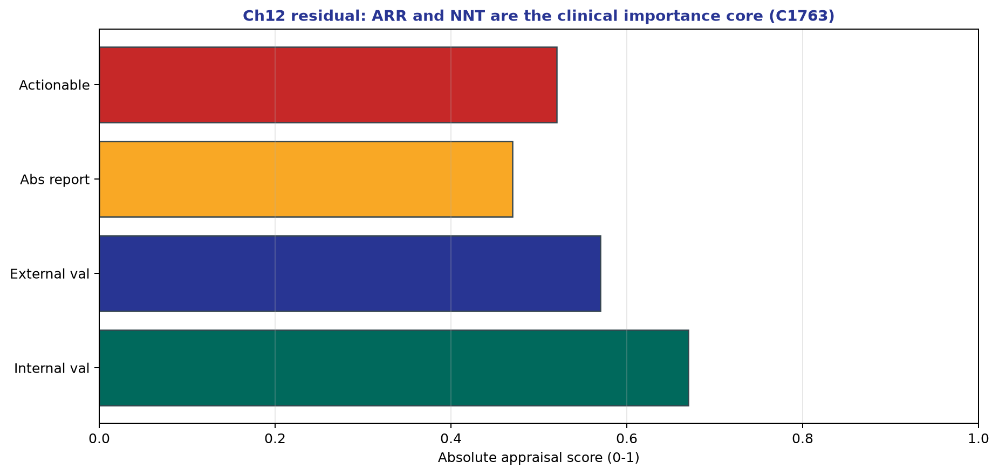

*Teaching figure (synthetic).* Cycle-1763 densify scientific residual (ch01–14): absolute risk, ARR, NNT; pred≠cause. Prefer ARR and NNT over relative-only claims; prediction ≠ causation.

*Teaching figure (synthetic).* Cycle-1761 densify scientific residual (ch01–14): absolute risk, ARR, NNT; pred≠cause. Prefer ARR and NNT over relative-only claims; prediction ≠ causation.

*Teaching figure (synthetic).* Cycle-1759 densify scientific residual (ch01–14): absolute risk, ARR, NNT; pred≠cause. Prefer ARR and NNT over relative-only claims; prediction ≠ causation.

*Teaching figure (synthetic).* Cycle-1757 densify scientific residual (ch01–14): absolute risk, ARR, NNT; pred≠cause. Prefer ARR and NNT over relative-only claims; prediction ≠ causation.

*Teaching figure (synthetic).* Cycle-1755 densify scientific residual (ch01–14): absolute risk, ARR, NNT; pred≠cause. Prefer ARR and NNT over relative-only claims; prediction ≠ causation.

*Teaching figure (synthetic).* Cycle-1753 densify scientific residual (ch01–14): absolute risk, ARR, NNT; pred≠cause. Prefer ARR and NNT over relative-only claims; prediction ≠ causation.

*Teaching figure (synthetic).* Cycle-1751 densify scientific residual (ch01–14): absolute risk, ARR, NNT; pred≠cause. Prefer ARR and NNT over relative-only claims; prediction ≠ causation.

*Teaching figure (synthetic).* Cycle-1749 densify scientific residual (ch01–14): absolute risk, ARR, NNT; pred≠cause. Prefer ARR and NNT over relative-only claims; prediction ≠ causation.

*Teaching figure (synthetic).* Cycle-1747 densify scientific residual (ch01–14): absolute risk, ARR, NNT; pred≠cause. Prefer ARR and NNT over relative-only claims; prediction ≠ causation.

*Teaching figure (synthetic).* Cycle-1745 densify scientific residual (ch01–14): absolute risk, ARR, NNT; pred≠cause. Prefer ARR and NNT over relative-only claims; prediction ≠ causation.

*Teaching figure (synthetic).* Cycle-1743 densify scientific residual (ch01–14): absolute risk, ARR, NNT; pred≠cause. Prefer ARR and NNT over relative-only claims; prediction ≠ causation.

*Teaching figure (synthetic).* Cycle-1741 densify scientific residual (ch01–14): absolute risk, ARR, NNT; pred≠cause. Prefer ARR and NNT over relative-only claims; prediction ≠ causation.

*Teaching figure (synthetic).* Cycle-1739 densify scientific residual (ch01–14): absolute risk, ARR, NNT; pred≠cause. Prefer ARR and NNT over relative-only claims; prediction ≠ causation.

*Teaching figure (synthetic).* Cycle-1737 densify scientific residual (ch01–14): absolute risk, ARR, NNT; pred≠cause. Prefer ARR and NNT over relative-only claims; prediction ≠ causation.

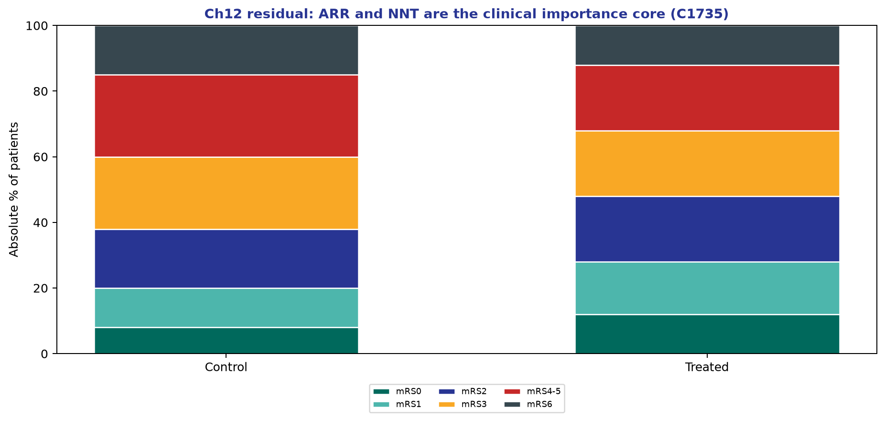

*Teaching figure (synthetic).* Cycle-1735 densify scientific residual (ch01–14): absolute risk, ARR, NNT; pred≠cause. Prefer ARR and NNT over relative-only claims; prediction ≠ causation.

*Teaching figure (synthetic).* Cycle-1733 densify scientific residual (ch01–14): absolute risk, ARR, NNT; pred≠cause. Prefer ARR and NNT over relative-only claims; prediction ≠ causation.

*Teaching figure (synthetic).* Cycle-1731 densify scientific residual (ch01–14): absolute risk, ARR, NNT; pred≠cause. Prefer ARR and NNT over relative-only claims; prediction ≠ causation.

*Teaching figure (synthetic).* Cycle-1729 densify scientific residual (ch01–14): absolute risk, ARR, NNT; pred≠cause. Prefer ARR and NNT over relative-only claims; prediction ≠ causation.

*Teaching figure (synthetic).* Cycle-1727 densify scientific residual (ch01–14): absolute risk, ARR, NNT; pred≠cause. Prefer ARR and NNT over relative-only claims; prediction ≠ causation.

*Teaching figure (synthetic).* Cycle-1725 densify scientific residual (ch01–14): absolute risk, ARR, NNT; pred≠cause. Prefer ARR and NNT over relative-only claims; prediction ≠ causation.

*Teaching figure (synthetic).* Cycle-1723 densify scientific residual (ch01–14): absolute risk, ARR, NNT; pred≠cause. Prefer ARR and NNT over relative-only claims; prediction ≠ causation.

*Teaching figure (synthetic).* Cycle-1721 densify scientific residual (ch01–14): absolute risk, ARR, NNT; pred≠cause. Prefer ARR and NNT over relative-only claims; prediction ≠ causation.

*Teaching figure (synthetic).* Cycle-1719 densify scientific residual (ch01–14): absolute risk, ARR, NNT; pred≠cause. Prefer ARR and NNT over relative-only claims; prediction ≠ causation.

*Teaching figure (synthetic).* Cycle-1717 densify scientific residual (ch01–14): absolute risk, ARR, NNT; pred≠cause. Prefer ARR and NNT over relative-only claims; prediction ≠ causation.

*Teaching figure (synthetic).* Cycle-1715 densify scientific residual (ch01–14): absolute risk, ARR, NNT; pred≠cause. Prefer ARR and NNT over relative-only claims; prediction ≠ causation.

*Teaching figure (synthetic).* Cycle-1713 densify scientific residual (ch01–14): absolute risk, ARR, NNT; pred≠cause. Prefer ARR and NNT over relative-only claims; prediction ≠ causation.

*Teaching figure (synthetic).* Cycle-1711 densify scientific residual (ch01–14): absolute risk, ARR, NNT; pred≠cause. Prefer ARR and NNT over relative-only claims; prediction ≠ causation.

*Teaching figure (synthetic).* Cycle-1709 densify scientific residual (ch01–14): absolute risk, ARR, NNT; pred≠cause. Prefer ARR and NNT over relative-only claims; prediction ≠ causation.

*Teaching figure (synthetic).* Cycle-1707 densify scientific residual (ch01–14): absolute risk, ARR, NNT; pred≠cause. Prefer ARR and NNT over relative-only claims; prediction ≠ causation.

*Teaching figure (synthetic).* Cycle-1705 densify scientific residual (ch01–14): absolute risk, ARR, NNT; pred≠cause. Prefer ARR and NNT over relative-only claims; prediction ≠ causation.

*Teaching figure (synthetic).* Cycle-1703 densify scientific residual (ch01–14): absolute risk, ARR, NNT; pred≠cause. Prefer ARR and NNT over relative-only claims; prediction ≠ causation.

*Teaching figure (synthetic).* Cycle-1701 densify scientific residual (ch01–14): absolute risk, ARR, NNT; pred≠cause. Prefer ARR and NNT over relative-only claims; prediction ≠ causation.

*Teaching figure (synthetic).* Cycle-1699 densify scientific residual (ch01–14): absolute risk, ARR, NNT; pred≠cause. Prefer ARR and NNT over relative-only claims; prediction ≠ causation.

*Teaching figure (synthetic).* Cycle-1697 densify scientific residual (ch01–14): absolute risk, ARR, NNT; pred≠cause. Prefer ARR and NNT over relative-only claims; prediction ≠ causation.

*Teaching figure (synthetic).* Cycle-1695 densify scientific residual (ch01–14): absolute risk, ARR, NNT; pred≠cause. Prefer ARR and NNT over relative-only claims; prediction ≠ causation.

*Teaching figure (synthetic).* Cycle-1693 densify scientific residual (ch01–14): absolute risk, ARR, NNT; pred≠cause. Prefer ARR and NNT over relative-only claims; prediction ≠ causation.

*Teaching figure (synthetic).* Cycle-1691 densify scientific residual (ch01–14): absolute risk, ARR, NNT; pred≠cause. Prefer ARR and NNT over relative-only claims; prediction ≠ causation.

*Teaching figure (synthetic).* Cycle-1689 densify scientific residual (ch01–14): absolute risk, ARR, NNT; pred≠cause. Prefer ARR and NNT over relative-only claims; prediction ≠ causation.

*Teaching figure (synthetic).* Cycle-1687 densify scientific residual (ch01–14): absolute risk, ARR, NNT; pred≠cause. Prefer ARR and NNT over relative-only claims; prediction ≠ causation.

*Teaching figure (synthetic).* Cycle-1685 densify scientific residual (ch01–14): absolute risk, ARR, NNT; pred≠cause. Prefer ARR and NNT over relative-only claims; prediction ≠ causation.

*Teaching figure (synthetic).* Cycle-1683 densify scientific residual (ch01–14): absolute risk, ARR, NNT; pred≠cause. Prefer ARR and NNT over relative-only claims; prediction ≠ causation.

*Teaching figure (synthetic).* Cycle-1681 densify scientific residual (ch01–14): absolute risk, ARR, NNT; pred≠cause. Prefer ARR and NNT over relative-only claims; prediction ≠ causation.

*Teaching figure (synthetic).* Cycle-1679 densify scientific residual (ch01–14): absolute risk, ARR, NNT; pred≠cause. Prefer ARR and NNT over relative-only claims; prediction ≠ causation.

*Teaching figure (synthetic).* Cycle-1677 densify scientific residual (ch01–14): absolute risk, ARR, NNT; pred≠cause. Prefer ARR and NNT over relative-only claims; prediction ≠ causation.

*Teaching figure (synthetic).* Cycle-1675 densify scientific residual (ch01–14): absolute risk, ARR, NNT; pred≠cause. Prefer ARR and NNT over relative-only claims; prediction ≠ causation.

*Teaching figure (synthetic).* Cycle-1673 densify scientific residual (ch01–14): absolute risk, ARR, NNT; pred≠cause. Prefer ARR and NNT over relative-only claims; prediction ≠ causation.

*Teaching figure (synthetic).* Cycle-1671 densify scientific residual (ch01–14): absolute risk, ARR, NNT; pred≠cause. Prefer ARR and NNT over relative-only claims; prediction ≠ causation.

*Teaching figure (synthetic).* Cycle-1669 densify scientific residual (ch01–14): absolute risk, ARR, NNT; pred≠cause. Prefer ARR and NNT over relative-only claims; prediction ≠ causation.

*Teaching figure (synthetic).* Cycle-1667 densify scientific residual (ch01–14): absolute risk, ARR, NNT; pred≠cause. Prefer ARR and NNT over relative-only claims; prediction ≠ causation.

*Teaching figure (synthetic).* Cycle-1665 densify scientific residual (ch01–14): absolute risk, ARR, NNT; pred≠cause. Prefer ARR and NNT over relative-only claims; prediction ≠ causation.

*Teaching figure (synthetic).* Cycle-1663 densify scientific residual (ch01–14): absolute risk, ARR, NNT; pred≠cause. Prefer ARR and NNT over relative-only claims; prediction ≠ causation.

*Teaching figure (synthetic).* Cycle-1661 densify scientific residual (ch01–14): absolute risk, ARR, NNT; pred≠cause. Prefer ARR and NNT over relative-only claims; prediction ≠ causation.

*Teaching figure (synthetic).* Cycle-1659 densify scientific residual (ch01–14): absolute risk, ARR, NNT; pred≠cause. Prefer ARR and NNT over relative-only claims; prediction ≠ causation.

*Teaching figure (synthetic).* Cycle-1657 densify scientific residual (ch01–14): absolute risk, ARR, NNT; pred≠cause. Prefer ARR and NNT over relative-only claims; prediction ≠ causation.

*Teaching figure (synthetic).* Cycle-1655 densify scientific residual (ch01–14): absolute risk, ARR, NNT; pred≠cause. Prefer ARR and NNT over relative-only claims; prediction ≠ causation.

*Teaching figure (synthetic).* Cycle-1653 densify scientific residual (ch01–14): absolute risk, ARR, NNT; pred≠cause. Prefer ARR and NNT over relative-only claims; prediction ≠ causation.

*Teaching figure (synthetic).* Cycle-1651 densify scientific residual (ch01–14): absolute risk, ARR, NNT; pred≠cause. Prefer ARR and NNT over relative-only claims; prediction ≠ causation.

*Teaching figure (synthetic).* Cycle-1649 densify scientific residual (ch01–14): absolute risk, ARR, NNT; pred≠cause. Prefer ARR and NNT over relative-only claims; prediction ≠ causation.

*Teaching figure (synthetic).* Cycle-1647 densify scientific residual (ch01–14): absolute risk, ARR, NNT; pred≠cause. Prefer ARR and NNT over relative-only claims; prediction ≠ causation.

*Teaching figure (synthetic).* Cycle-1645 densify scientific residual (ch01–14): absolute risk, ARR, NNT; pred≠cause. Prefer ARR and NNT over relative-only claims; prediction ≠ causation.

*Teaching figure (synthetic).* Cycle-1643 densify scientific residual (ch01–14): absolute risk, ARR, NNT; pred≠cause. Prefer ARR and NNT over relative-only claims; prediction ≠ causation.

*Teaching figure (synthetic).* Cycle-1641 densify scientific residual (ch01–14): absolute risk, ARR, NNT; pred≠cause. Prefer ARR and NNT over relative-only claims; prediction ≠ causation.

*Teaching figure (synthetic).* Cycle-1639 densify scientific residual (ch01–14): absolute risk, ARR, NNT; pred≠cause. Prefer ARR and NNT over relative-only claims; prediction ≠ causation.

*Teaching figure (synthetic).* Cycle-1637 densify scientific residual (ch01–14): absolute risk, ARR, NNT; pred≠cause. Prefer ARR and NNT over relative-only claims; prediction ≠ causation.

*Teaching figure (synthetic).* Cycle-1635 densify scientific residual (ch01–14): absolute risk, ARR, NNT; pred≠cause. Prefer ARR and NNT over relative-only claims; prediction ≠ causation.

*Teaching figure (synthetic).* Cycle-1633 densify scientific residual (ch01–14): absolute risk, ARR, NNT; pred≠cause. Prefer ARR and NNT over relative-only claims; prediction ≠ causation.

*Teaching figure (synthetic).* Cycle-1631 densify scientific residual (ch01–14): absolute risk, ARR, NNT; pred≠cause. Prefer ARR and NNT over relative-only claims; prediction ≠ causation.

*Teaching figure (synthetic).* Cycle-1629 densify scientific residual (ch01–14): absolute risk, ARR, NNT; pred≠cause. Prefer ARR and NNT over relative-only claims; prediction ≠ causation.

*Teaching figure (synthetic).* Cycle-1627 densify scientific residual (ch01–14): absolute risk, ARR, NNT; pred≠cause. Prefer ARR and NNT over relative-only claims; prediction ≠ causation.

*Teaching figure (synthetic).* Cycle-1625 densify scientific residual (ch01–14): absolute risk, ARR, NNT; pred≠cause. Prefer ARR and NNT over relative-only claims; prediction ≠ causation.

*Teaching figure (synthetic).* Cycle-1623 densify scientific residual (ch01–14): absolute risk, ARR, NNT; pred≠cause. Prefer ARR and NNT over relative-only claims; prediction ≠ causation.

*Teaching figure (synthetic).* Cycle-1621 densify scientific residual (ch01–14): absolute risk, ARR, NNT; pred≠cause. Prefer ARR and NNT over relative-only claims; prediction ≠ causation.

*Teaching figure (synthetic).* Cycle-1619 densify scientific residual (ch01–14): absolute risk, ARR, NNT; pred≠cause. Prefer ARR and NNT over relative-only claims; prediction ≠ causation.

*Teaching figure (synthetic).* Cycle-1617 densify scientific residual (ch01–14): absolute risk, ARR, NNT; pred≠cause. Prefer ARR and NNT over relative-only claims; prediction ≠ causation.

*Teaching figure (synthetic).* Cycle-1615 densify scientific residual (ch01–14): absolute risk, ARR, NNT; pred≠cause. Prefer ARR and NNT over relative-only claims; prediction ≠ causation.

*Teaching figure (synthetic).* Cycle-1613 densify scientific residual (ch01–14): absolute risk, ARR, NNT; pred≠cause. Prefer ARR and NNT over relative-only claims; prediction ≠ causation.

*Teaching figure (synthetic).* Cycle-1611 densify scientific residual (ch01–14): absolute risk, ARR, NNT; pred≠cause. Prefer ARR and NNT over relative-only claims; prediction ≠ causation.

*Teaching figure (synthetic).* Cycle-1609 densify scientific residual (ch01–14): absolute risk, ARR, NNT; pred≠cause. Prefer ARR and NNT over relative-only claims; prediction ≠ causation.

*Teaching figure (synthetic).* Cycle-1607 densify scientific residual (ch01–14): absolute risk, ARR, NNT; pred≠cause. Prefer ARR and NNT over relative-only claims; prediction ≠ causation.

*Teaching figure (synthetic).* Cycle-1605 densify scientific residual (ch01–14): absolute risk, ARR, NNT; pred≠cause. Prefer ARR and NNT over relative-only claims; prediction ≠ causation.

*Teaching figure (synthetic).* Cycle-1603 densify scientific residual (ch01–14): absolute risk, ARR, NNT; pred≠cause. Prefer ARR and NNT over relative-only claims; prediction ≠ causation.

*Teaching figure (synthetic).* Cycle-1601 densify scientific residual (ch01–14): absolute risk, ARR, NNT; pred≠cause. Prefer ARR and NNT over relative-only claims; prediction ≠ causation.

*Teaching figure (synthetic).* Cycle-1599 densify scientific residual (ch01–14): absolute risk, ARR, NNT; pred≠cause. Prefer ARR and NNT over relative-only claims; prediction ≠ causation.

*Teaching figure (synthetic).* Cycle-1597 densify scientific residual (ch01–14): absolute risk, ARR, NNT; pred≠cause. Prefer ARR and NNT over relative-only claims; prediction ≠ causation.

*Teaching figure (synthetic).* Cycle-1595 densify scientific residual (ch01–14): absolute risk, ARR, NNT; pred≠cause. Prefer ARR and NNT over relative-only claims; prediction ≠ causation.

*Teaching figure (synthetic).* Cycle-1593 densify scientific residual (ch01–14): absolute risk, ARR, NNT; pred≠cause. Prefer ARR and NNT over relative-only claims; prediction ≠ causation.

*Teaching figure (synthetic).* Cycle-1591 densify scientific residual (ch01–14): absolute risk, ARR, NNT; pred≠cause. Prefer ARR and NNT over relative-only claims; prediction ≠ causation.

*Teaching figure (synthetic).* Cycle-1589 densify scientific residual (ch01–14): absolute risk, ARR, NNT; pred≠cause. Prefer ARR and NNT over relative-only claims; prediction ≠ causation.

*Teaching figure (synthetic).* Cycle-1587 densify scientific residual (ch01–14): absolute risk, ARR, NNT; pred≠cause. Prefer ARR and NNT over relative-only claims; prediction ≠ causation.

*Teaching figure (synthetic).* Cycle-1585 densify scientific residual (ch01–14): absolute risk, ARR, NNT; pred≠cause. Prefer ARR and NNT over relative-only claims; prediction ≠ causation.

*Teaching figure (synthetic).* Cycle-1583 densify scientific residual (ch01–14): absolute risk, ARR, NNT; pred≠cause. Prefer ARR and NNT over relative-only claims; prediction ≠ causation.

*Teaching figure (synthetic).* Cycle-1581 densify scientific residual (ch01–14): absolute risk, ARR, NNT; pred≠cause. Prefer ARR and NNT over relative-only claims; prediction ≠ causation.

*Teaching figure (synthetic).* Cycle-1579 densify scientific residual (ch01–14): absolute risk, ARR, NNT; pred≠cause. Prefer ARR and NNT over relative-only claims; prediction ≠ causation.

*Teaching figure (synthetic).* Cycle-1577 densify scientific residual (ch01–14): absolute risk, ARR, NNT; pred≠cause. Prefer ARR and NNT over relative-only claims; prediction ≠ causation.

*Teaching figure (synthetic).* Cycle-1575 densify scientific residual (ch01–14): absolute risk, ARR, NNT; pred≠cause. Prefer ARR and NNT over relative-only claims; prediction ≠ causation.

*Teaching figure (synthetic).* Cycle-1573 densify scientific residual (ch01–14): absolute risk, ARR, NNT; pred≠cause. Prefer ARR and NNT over relative-only claims; prediction ≠ causation.

*Teaching figure (synthetic).* Cycle-1571 densify scientific residual (ch01–14): absolute risk, ARR, NNT; pred≠cause. Prefer ARR and NNT over relative-only claims; prediction ≠ causation.

*Teaching figure (synthetic).* Cycle-1569 densify scientific residual (ch01–14): absolute risk, ARR, NNT; pred≠cause. Prefer ARR and NNT over relative-only claims; prediction ≠ causation.

*Teaching figure (synthetic).* Cycle-1567 densify scientific residual (ch01–14): absolute risk, ARR, NNT; pred≠cause. Prefer ARR and NNT over relative-only claims; prediction ≠ causation.

*Teaching figure (synthetic).* Cycle-1565 densify scientific residual (ch01–14): absolute risk, ARR, NNT; pred≠cause. Prefer ARR and NNT over relative-only claims; prediction ≠ causation.

*Teaching figure (synthetic).* Cycle-1563 densify scientific residual (ch01–14): absolute risk, ARR, NNT; pred≠cause. Prefer ARR and NNT over relative-only claims; prediction ≠ causation.

*Teaching figure (synthetic).* Cycle-1561 densify scientific residual (ch01–14): absolute risk, ARR, NNT; pred≠cause. Prefer ARR and NNT over relative-only claims; prediction ≠ causation.

*Teaching figure (synthetic).* Cycle-1559 densify scientific residual (ch01–14): absolute risk, ARR, NNT; pred≠cause. Prefer ARR and NNT over relative-only claims; prediction ≠ causation.

*Teaching figure (synthetic).* Cycle-1557 densify scientific residual (ch01–14): absolute risk, ARR, NNT; pred≠cause. Prefer ARR and NNT over relative-only claims; prediction ≠ causation.

*Teaching figure (synthetic).* Cycle-1555 densify scientific residual (ch01–14): absolute risk, ARR, NNT; pred≠cause. Prefer ARR and NNT over relative-only claims; prediction ≠ causation.

*Teaching figure (synthetic).* Cycle-1553 densify scientific residual (ch01–14): absolute risk, ARR, NNT; pred≠cause. Prefer ARR and NNT over relative-only claims; prediction ≠ causation.

*Teaching figure (synthetic).* Cycle-1551 densify scientific residual (ch01–14): absolute risk, ARR, NNT; pred≠cause. Prefer ARR and NNT over relative-only claims; prediction ≠ causation.

*Teaching figure (synthetic).* Cycle-1549 densify scientific residual (ch01–14): absolute risk, ARR, NNT; pred≠cause. Prefer ARR and NNT over relative-only claims; prediction ≠ causation.

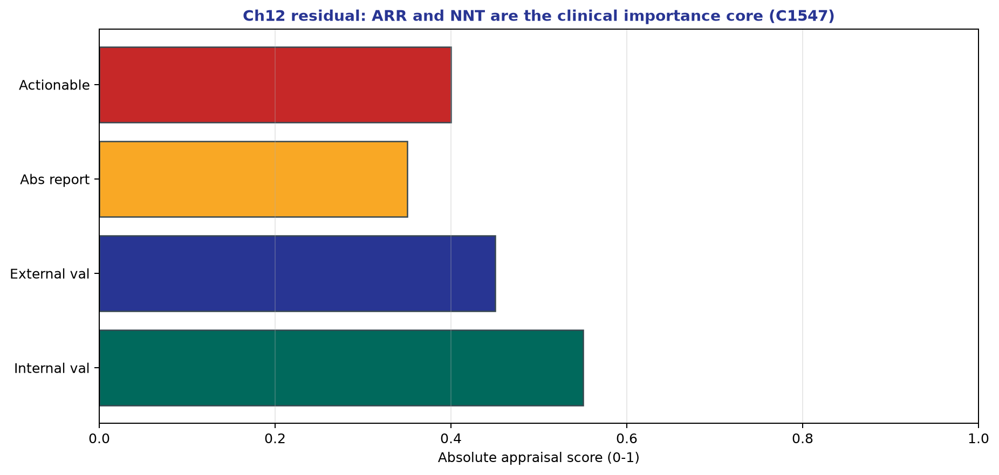

*Teaching figure (synthetic).* Cycle-1547 densify scientific residual (ch01–14): absolute risk, ARR, NNT; pred≠cause. Prefer ARR and NNT over relative-only claims; prediction ≠ causation.

*Teaching figure (synthetic).* Cycle-1545 densify scientific residual (ch01–14): absolute risk, ARR, NNT; pred≠cause. Prefer ARR and NNT over relative-only claims; prediction ≠ causation.

*Teaching figure (synthetic).* Cycle-1543 densify scientific residual (ch01–14): absolute risk, ARR, NNT; pred≠cause. Prefer ARR and NNT over relative-only claims; prediction ≠ causation.

*Teaching figure (synthetic).* Cycle-1541 densify scientific residual (ch01–14): absolute risk, ARR, NNT; pred≠cause. Prefer ARR and NNT over relative-only claims; prediction ≠ causation.

*Teaching figure (synthetic).* Cycle-1539 densify scientific residual (ch01–14): absolute risk, ARR, NNT; pred≠cause. Prefer ARR and NNT over relative-only claims; prediction ≠ causation.

*Teaching figure (synthetic).* Cycle-1537 densify scientific residual (ch01–14): absolute risk, ARR, NNT; pred≠cause. Prefer ARR and NNT over relative-only claims; prediction ≠ causation.

*Teaching figure (synthetic).* Cycle-1535 densify scientific residual (ch01–14): absolute risk, ARR, NNT; pred≠cause. Prefer ARR and NNT over relative-only claims; prediction ≠ causation.

*Teaching figure (synthetic).* Cycle-1533 densify scientific residual (ch01–14): absolute risk, ARR, NNT; pred≠cause. Prefer ARR and NNT over relative-only claims; prediction ≠ causation.

*Teaching figure (synthetic).* Cycle-1531 densify scientific residual (ch01–14): absolute risk, ARR, NNT; pred≠cause. Prefer ARR and NNT over relative-only claims; prediction ≠ causation.

*Teaching figure (synthetic).* Cycle-1529 densify scientific residual (ch01–14): absolute risk, ARR, NNT; pred≠cause. Prefer ARR and NNT over relative-only claims; prediction ≠ causation.

*Teaching figure (synthetic).* Cycle-1527 densify scientific residual (ch01–14): absolute risk, ARR, NNT; pred≠cause. Prefer ARR and NNT over relative-only claims; prediction ≠ causation.

*Teaching figure (synthetic).* Cycle-1525 densify scientific residual (ch01–14): absolute risk, ARR, NNT; pred≠cause. Prefer ARR and NNT over relative-only claims; prediction ≠ causation.

*Teaching figure (synthetic).* Cycle-1523 densify scientific residual (ch01–14): absolute risk, ARR, NNT; pred≠cause. Prefer ARR and NNT over relative-only claims; prediction ≠ causation.

*Teaching figure (synthetic).* Cycle-1521 densify scientific residual (ch01–14): absolute risk, ARR, NNT; pred≠cause. Prefer ARR and NNT over relative-only claims; prediction ≠ causation.

*Teaching figure (synthetic).* Cycle-1519 densify scientific residual (ch01–14): absolute risk, ARR, NNT; pred≠cause. Prefer ARR and NNT over relative-only claims; prediction ≠ causation.

*Teaching figure (synthetic).* Cycle-1517 densify scientific residual (ch01–14): absolute risk, ARR, NNT; pred≠cause. Prefer ARR and NNT over relative-only claims; prediction ≠ causation.

*Teaching figure (synthetic).* Cycle-1515 densify scientific residual (ch01–14): absolute risk, ARR, NNT; pred≠cause. Prefer ARR and NNT over relative-only claims; prediction ≠ causation.

*Teaching figure (synthetic).* Cycle-1513 densify scientific residual (ch01–14): absolute risk, ARR, NNT; pred≠cause. Prefer ARR and NNT over relative-only claims; prediction ≠ causation.

*Teaching figure (synthetic).* Cycle-1511 densify scientific residual (ch01–14): absolute risk, ARR, NNT; pred≠cause. Prefer ARR and NNT over relative-only claims; prediction ≠ causation.

*Teaching figure (synthetic).* Cycle-1509 densify scientific residual (ch01–14): absolute risk, ARR, NNT; pred≠cause. Prefer ARR and NNT over relative-only claims; prediction ≠ causation.

*Teaching figure (synthetic).* Cycle-1507 densify scientific residual (ch01–14): absolute risk, ARR, NNT; pred≠cause. Prefer ARR and NNT over relative-only claims; prediction ≠ causation.

*Teaching figure (synthetic).* Cycle-1505 densify scientific residual (ch01–14): absolute risk, ARR, NNT; pred≠cause. Prefer ARR and NNT over relative-only claims; prediction ≠ causation.

*Teaching figure (synthetic).* Cycle-1503 densify scientific residual (ch01–14): absolute risk, ARR, NNT; pred≠cause. Prefer ARR and NNT over relative-only claims; prediction ≠ causation.

*Teaching figure (synthetic).* Cycle-1501 densify scientific residual (ch01–14): absolute risk, ARR, NNT; pred≠cause. Prefer ARR and NNT over relative-only claims; prediction ≠ causation.

*Teaching figure (synthetic).* Cycle-1499 densify scientific residual (ch01–14): absolute risk, ARR, NNT; pred≠cause. Prefer ARR and NNT over relative-only claims; prediction ≠ causation.

*Teaching figure (synthetic).* Cycle-1497 densify scientific residual (ch01–14): absolute risk, ARR, NNT; pred≠cause. Prefer ARR and NNT over relative-only claims; prediction ≠ causation.

*Teaching figure (synthetic).* Cycle-1495 densify scientific residual (ch01–14): absolute risk, ARR, NNT; pred≠cause. Prefer ARR and NNT over relative-only claims; prediction ≠ causation.

*Teaching figure (synthetic).* Cycle-1493 densify scientific residual (ch01–14): absolute risk, ARR, NNT; pred≠cause. Prefer ARR and NNT over relative-only claims; prediction ≠ causation.

*Teaching figure (synthetic).* Cycle-1491 densify scientific residual (ch01–14): absolute risk, ARR, NNT; pred≠cause. Prefer ARR and NNT over relative-only claims; prediction ≠ causation.

*Teaching figure (synthetic).* Cycle-1489 densify scientific residual (ch01–14): absolute risk, ARR, NNT; pred≠cause. Prefer ARR and NNT over relative-only claims; prediction ≠ causation.

*Teaching figure (synthetic).* Cycle-1487 densify scientific residual (ch01–14): absolute risk, ARR, NNT; pred≠cause. Prefer ARR and NNT over relative-only claims; prediction ≠ causation.

*Teaching figure (synthetic).* Cycle-1485 densify scientific residual (ch01–14): absolute risk, ARR, NNT; pred≠cause. Prefer ARR and NNT over relative-only claims; prediction ≠ causation.

*Teaching figure (synthetic).* Cycle-1483 densify scientific residual (ch01–14): absolute risk, ARR, NNT; pred≠cause. Prefer ARR and NNT over relative-only claims; prediction ≠ causation.

*Teaching figure (synthetic).* Cycle-1481 densify scientific residual (ch01–14): absolute risk, ARR, NNT; pred≠cause. Prefer ARR and NNT over relative-only claims; prediction ≠ causation.

*Teaching figure (synthetic).* Cycle-1479 densify scientific residual (ch01–14): absolute risk, ARR, NNT; pred≠cause. Prefer ARR and NNT over relative-only claims; prediction ≠ causation.

*Teaching figure (synthetic).* Cycle-1477 densify scientific residual (ch01–14): absolute risk, ARR, NNT; pred≠cause. Prefer ARR and NNT over relative-only claims; prediction ≠ causation.

*Teaching figure (synthetic).* Cycle-1475 densify scientific residual (ch01–14): absolute risk, ARR, NNT; pred≠cause. Prefer ARR and NNT over relative-only claims; prediction ≠ causation.

*Teaching figure (synthetic).* Cycle-1473 densify scientific residual (ch01–14): absolute risk, ARR, NNT; pred≠cause. Prefer ARR and NNT over relative-only claims; prediction ≠ causation.

*Teaching figure (synthetic).* Cycle-1471 densify scientific residual (ch01–14): absolute risk, ARR, NNT; pred≠cause. Prefer ARR and NNT over relative-only claims; prediction ≠ causation.

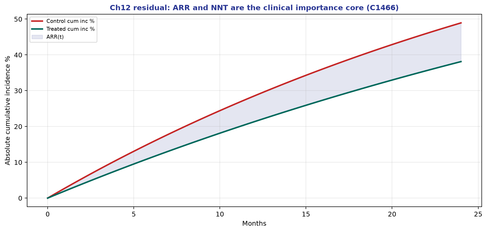

*Teaching figure (synthetic).* Cycle-1466 densify scientific residual (ch01–14).

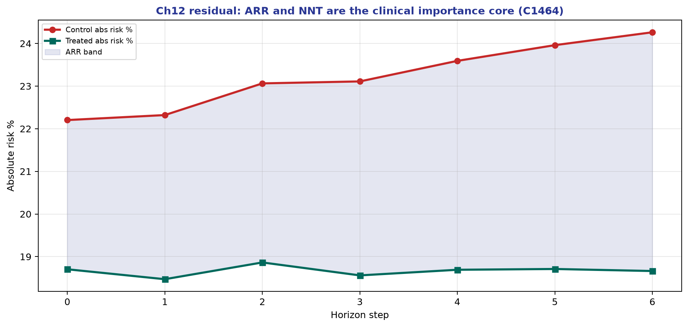

*Teaching figure (synthetic).* Cycle-1464 densify scientific residual (ch01–14).

*Teaching figure (synthetic).* Cycle-1469 densify scientific residual (ch01–14).

*Teaching figure (synthetic).* Cycle-1467 densify scientific residual (ch01–14).

*Teaching figure (synthetic).* Cycle-1461 densify scientific residual (ch01–14).

*Teaching figure (synthetic).* Cycle-1459 densify scientific residual (ch01–14).

*Teaching figure (synthetic).* Cycle-1457 densify scientific residual (ch01–14).

*Teaching figure (synthetic).* Cycle-1455 densify scientific residual (ch01–14).

*Teaching figure (synthetic).* Cycle-1453 densify scientific residual (ch01–14).

*Teaching figure (synthetic).* Cycle-1451 densify scientific residual (ch01–14).

*Teaching figure (synthetic).* Cycle-1449 densify scientific residual (ch01–14).

*Teaching figure (synthetic).* Cycle-1447 densify scientific residual (ch01–14).

*Teaching figure (synthetic).* Cycle-1445 densify scientific residual (ch01–14).

*Teaching figure (synthetic).* Cycle-1443 densify scientific residual (ch01–14).

*Teaching figure (synthetic).* Cycle-1441 densify scientific residual (ch01–14).

*Teaching figure (synthetic).* Cycle-1439 densify scientific residual (ch01–14).

*Teaching figure (synthetic).* Cycle-1437 densify scientific residual (ch01–14).

*Teaching figure (synthetic).* Cycle-1435 densify scientific residual (ch01–14).

*Teaching figure (synthetic).* Cycle-1433 densify scientific residual (ch01–14).

*Teaching figure (synthetic).* Cycle-1431 densify scientific residual (ch01–14).

*Teaching figure (synthetic).* Cycle-1429 densify scientific residual (ch01–14).

*Teaching figure (synthetic).* Cycle-1427 densify scientific residual (ch01–14).

*Teaching figure (synthetic).* Cycle-1425 densify scientific residual (ch01–14).

*Teaching figure (synthetic).* Cycle-1423 densify scientific residual (ch01–14).

*Teaching figure (synthetic).* Cycle-1421 densify scientific residual (ch01–14).

*Teaching figure (synthetic).* Cycle-1419 densify scientific residual (ch01–14).

*Teaching figure (synthetic).* Cycle-1417 densify scientific residual (ch01–14).

*Teaching figure (synthetic).* Cycle-1415 densify scientific residual (ch01–14).

*Teaching figure (synthetic).* Cycle-1413 densify scientific residual (ch01–14).

*Teaching figure (synthetic).* Cycle-1411 densify scientific residual (ch01–14).

*Teaching figure (synthetic).* Cycle-1409 densify scientific residual (ch01–14).

*Teaching figure (synthetic).* Cycle-1407 densify scientific residual (ch01–14).

*Teaching figure (synthetic).* Cycle-1405 densify scientific residual (ch01–14).

*Teaching figure (synthetic).* Cycle-1403 densify scientific residual (ch01–14).

*Teaching figure (synthetic).* Cycle-1401 densify scientific residual (ch01–14).

*Teaching figure (synthetic).* Cycle-1399 densify scientific residual (ch01–14).

*Teaching figure (synthetic).* Cycle-1397 densify scientific residual (ch01–14).

*Teaching figure (synthetic).* Cycle-1395 densify scientific residual (ch01–14).

*Teaching figure (synthetic).* Cycle-1393 densify scientific residual (ch01–14).

*Teaching figure (synthetic).* Cycle-1391 densify scientific residual (ch01–14).

*Teaching figure (synthetic).* Cycle-1389 densify scientific residual (ch01–14).

*Teaching figure (synthetic).* Cycle-1387 densify scientific residual (ch01–14).

*Teaching figure (synthetic).* Cycle-1385 densify scientific residual (ch01–14).

*Teaching figure (synthetic).* Cycle-1383 densify scientific residual (ch01–14).

*Teaching figure (synthetic).* Cycle-1381 densify scientific residual (ch01–14).

*Teaching figure (synthetic).* Cycle-1379 densify scientific residual (ch01–14).

*Teaching figure (synthetic).* Cycle-1377 densify scientific residual (ch01–14).

*Teaching figure (synthetic).* Cycle-1375 densify scientific residual (ch01–14).

*Teaching figure (synthetic).* Cycle-1373 densify scientific residual (ch01–14).

*Teaching figure (synthetic).* Cycle-1371 densify scientific residual (ch01–14).

*Teaching figure (synthetic).* Cycle-1369 densify scientific residual (ch01–14).

*Teaching figure (synthetic).* Cycle-1367 densify scientific residual (ch01–14).

*Teaching figure (synthetic).* Cycle-1365 densify scientific residual (ch01–14).

*Teaching figure (synthetic).* Cycle-1363 densify scientific residual (ch01–14).

*Teaching figure (synthetic).* Cycle-1361 densify scientific residual (ch01–14).

*Teaching figure (synthetic).* Cycle-1359 densify scientific residual (ch01–14).

*Teaching figure (synthetic).* Cycle-1357 densify scientific residual (ch01–14).

*Teaching figure (synthetic).* Cycle-1355 densify scientific residual (ch01–14).

*Teaching figure (synthetic).* Cycle-1353 densify scientific residual (ch01–14).

*Teaching figure (synthetic).* Cycle-1351 densify scientific residual (ch01–14).

*Teaching figure (synthetic).* Cycle-1349 densify scientific residual (ch01–14).

*Teaching figure (synthetic).* Cycle-1347 densify scientific residual (ch01–14).

*Teaching figure (synthetic).* Cycle-1345 densify scientific residual (ch01–14).

*Teaching figure (synthetic).* Cycle-1343 densify scientific residual (ch01–14).

*Teaching figure (synthetic).* Cycle-1341 densify scientific residual (ch01–14).

*Teaching figure (synthetic).* Cycle-1339 densify scientific residual (ch01–14).

*Teaching figure (synthetic).* Cycle-1337 densify scientific residual (ch01–14).

*Teaching figure (synthetic).* Cycle-1335 densify scientific residual (ch01–14).

*Teaching figure (synthetic).* Cycle-1333 densify scientific residual (ch01–14).

*Teaching figure (synthetic).* Cycle-1331 densify scientific residual (ch01–14).

*Teaching figure (synthetic).* Cycle-1329 densify scientific residual (ch01–14).

*Teaching figure (synthetic).* Cycle-1327 densify scientific residual (ch01–14).

*Teaching figure (synthetic).* Cycle-1325 densify scientific residual (ch01–14).

*Teaching figure (synthetic).* Cycle-1323 densify scientific residual (ch01–14).

*Teaching figure (synthetic).* Cycle-1321 densify scientific residual (ch01–14).

*Teaching figure (synthetic).* Cycle-1319 densify scientific residual (ch01–14).

*Teaching figure (synthetic).* Cycle-1317 densify scientific residual (ch01–14).

*Teaching figure (synthetic).* Cycle-1315 densify scientific residual (ch01–14).

*Teaching figure (synthetic).* Cycle-1313 densify scientific residual (ch01–14).

*Teaching figure (synthetic).* Cycle-1311 densify scientific residual (ch01–14).

*Teaching figure (synthetic).* Cycle-1309 densify scientific residual (ch01–14).

*Teaching figure (synthetic).* Cycle-1307 densify scientific residual (ch01–14).

*Teaching figure (synthetic).* Cycle-1305 densify scientific residual (ch01–14).

*Teaching figure (synthetic).* Cycle-1303 densify scientific residual (ch01–14).

*Teaching figure (synthetic).* Cycle-1301 densify scientific residual (ch01–14).

*Teaching figure (synthetic).* Cycle-1299 densify scientific residual (ch01–14).

*Teaching figure (synthetic).* Cycle-1297 densify scientific residual (ch01–14).

*Teaching figure (synthetic).* Cycle-1295 densify scientific residual (ch01–14).

*Teaching figure (synthetic).* Cycle-1293 densify scientific residual (ch01–14).

*Teaching figure (synthetic).* Cycle-1291 densify scientific residual (ch01–14).

*Teaching figure (synthetic).* Cycle-1289 densify scientific residual (ch01–14).

*Teaching figure (synthetic).* Cycle-1287 densify scientific residual (ch01–14).

*Teaching figure (synthetic).* Cycle-1285 densify scientific residual (ch01–14).

*Teaching figure (synthetic).* Cycle-1283 densify scientific residual (ch01–14).

*Teaching figure (synthetic).* Cycle-1281 densify scientific residual (ch01–14).

*Teaching figure (synthetic).* Cycle-1279 densify scientific residual (ch01–14).

*Teaching figure (synthetic).* Cycle-1277 densify scientific residual (ch01–14).

*Teaching figure (synthetic).* Cycle-1275 densify scientific residual (ch01–14).

*Teaching figure (synthetic).* Cycle-1273 densify scientific residual (ch01–14).

*Teaching figure (synthetic).* Cycle-1271 densify scientific residual (ch01–14).

*Teaching figure (synthetic).* Cycle-1269 densify scientific residual (ch01–14).

*Teaching figure (synthetic).* Cycle-1267 densify scientific residual (ch01–14).

*Teaching figure (synthetic).* Cycle-1265 densify scientific residual (ch01–14).

*Teaching figure (synthetic).* Cycle-1263 densify scientific residual (ch01–14).

*Teaching figure (synthetic).* Cycle-1261 densify scientific residual (ch01–14).

*Teaching figure (synthetic).* Cycle-1259 densify scientific residual (ch01–14).

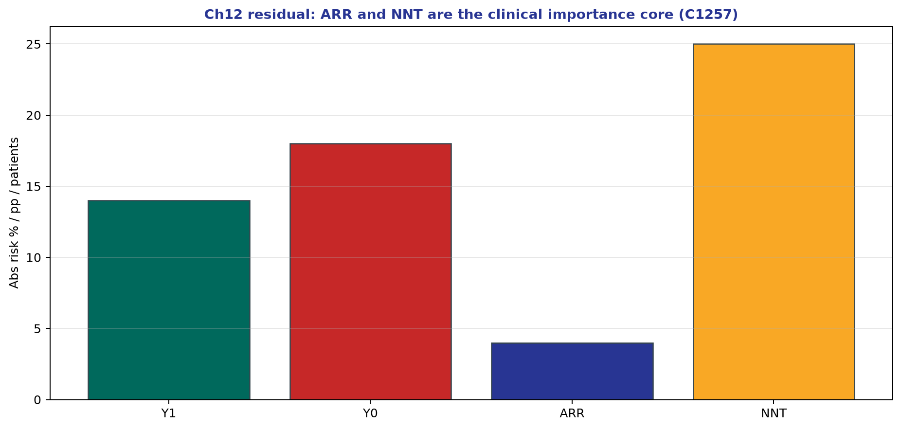

*Teaching figure (synthetic).* Cycle-1257 densify scientific residual (ch01–14).

*Teaching figure (synthetic).* Cycle-1255 densify scientific residual (ch01–14).

*Teaching figure (synthetic).* Cycle-1253 densify scientific residual (ch01–14).

*Teaching figure (synthetic).* Cycle-1251 densify scientific residual (ch01–14).

*Teaching figure (synthetic).* Cycle-1249 densify scientific residual (ch01–14).

*Teaching figure (synthetic).* Cycle-1247 densify scientific residual (ch01–14).

*Teaching figure (synthetic).* Cycle-1245 densify scientific residual (ch01–14).

*Teaching figure (synthetic).* Cycle-1243 densify scientific residual (ch01–14).

*Teaching figure (synthetic).* Cycle-1241 densify scientific residual (ch01–14).

*Teaching figure (synthetic).* Cycle-1239 densify scientific residual (ch01–14).

*Teaching figure (synthetic).* Cycle-1237 densify scientific residual (ch01–14).

*Teaching figure (synthetic).* Cycle-1235 densify scientific residual (ch01–14).

*Teaching figure (synthetic).* Cycle-1233 densify scientific residual (ch01–14).

*Teaching figure (synthetic).* Cycle-1231 densify scientific residual (ch01–14).

*Teaching figure (synthetic).* Cycle-1229 densify scientific residual (ch01–14).

*Teaching figure (synthetic).* Cycle-1227 densify scientific residual (ch01–14).

*Teaching figure (synthetic).* Cycle-1225 densify scientific residual (ch01–14).

*Teaching figure (synthetic).* Cycle-1223 densify scientific residual (ch01–14).

*Teaching figure (synthetic).* Cycle-1221 densify scientific residual (ch01–14).

*Teaching figure (synthetic).* Cycle-1219 densify scientific residual (ch01–14).

*Teaching figure (synthetic).* Cycle-1217 densify scientific residual (ch01–14).

*Teaching figure (synthetic).* Cycle-1215 densify scientific residual (ch01–14).

*Teaching figure (synthetic).* Cycle-1213 densify scientific residual (ch01–14).

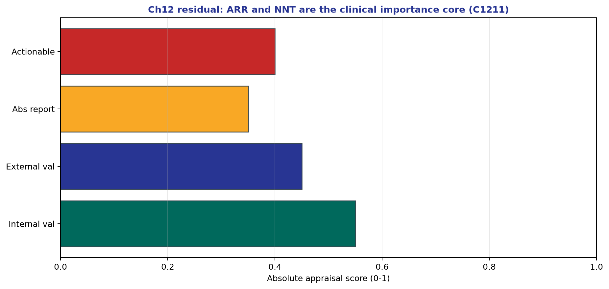

*Teaching figure (synthetic).* Cycle-1211 densify scientific residual (ch01–14).

*Teaching figure (synthetic).* Cycle-1209 densify scientific residual (ch01–14).

*Teaching figure (synthetic).* Cycle-1207 densify scientific residual (ch01–14).

*Teaching figure (synthetic).* Cycle-1205 densify scientific residual (ch01–14).

*Teaching figure (synthetic).* Cycle-1203 densify scientific residual (ch01–14).

*Teaching figure (synthetic).* Cycle-1201 densify scientific residual (ch01–14).

*Teaching figure (synthetic).* Cycle-1199 densify scientific residual (ch01–14).

*Teaching figure (synthetic).* Cycle-1197 densify scientific residual (ch01–14).

*Teaching figure (synthetic).* Cycle-1195 densify scientific residual (ch01–14).

*Teaching figure (synthetic).* Cycle-1193 densify scientific residual (ch01–14).

*Teaching figure (synthetic).* Cycle-1191 densify scientific residual (ch01–14).

*Teaching figure (synthetic).* Cycle-1189 densify scientific residual (ch01–14).

*Teaching figure (synthetic).* Cycle-1187 densify scientific residual (ch01–14).

*Teaching figure (synthetic).* Cycle-1185 densify scientific residual (ch01–14).

*Teaching figure (synthetic).* Cycle-1183 densify scientific residual (ch01–14).

*Teaching figure (synthetic).* Cycle-1181 densify scientific residual (ch01–14).

*Teaching figure (synthetic).* Cycle-1179 densify scientific residual (ch01–14).

*Teaching figure (synthetic).* Cycle-1177 densify scientific residual (ch01–14).

*Teaching figure (synthetic).* Cycle-1175 densify scientific residual (ch01–14).

*Teaching figure (synthetic).* Cycle-1173 densify scientific residual (ch01–14).

*Teaching figure (synthetic).* Cycle-1171 densify scientific residual (ch01–14).

*Teaching figure (synthetic).* Cycle-1169 densify scientific residual (ch01–14).

*Teaching figure (synthetic).* Cycle-1167 densify scientific residual (ch01–14).

*Teaching figure (synthetic).* Cycle-1165 densify scientific residual (ch01–14).

*Teaching figure (synthetic).* Cycle-1163 densify scientific residual (ch01–14).

*Teaching figure (synthetic).* Cycle-1161 densify scientific residual (ch01–14).

*Teaching figure (synthetic).* Cycle-1159 densify scientific residual (ch01–14).

*Teaching figure (synthetic).* Cycle-1157 densify scientific residual (ch01–14).

*Teaching figure (synthetic).* Cycle-1155 densify scientific residual (ch01–14).

*Teaching figure (synthetic).* Cycle-1153 densify scientific residual (ch01–14).

*Teaching figure (synthetic).* Cycle-1151 densify scientific residual (ch01–14).

*Teaching figure (synthetic).* Cycle-1149 densify scientific residual (ch01–14).

*Teaching figure (synthetic).* Cycle-1147 densify scientific residual (ch01–14).

*Teaching figure (synthetic).* Cycle-1145 densify scientific residual (ch01–14).

*Teaching figure (synthetic).* Cycle-1143 densify scientific residual (ch01–14).

*Teaching figure (synthetic).* Cycle-1141 densify scientific residual (ch01–14).

*Teaching figure (synthetic).* Cycle-1139 densify scientific residual (ch01–14).

*Teaching figure (synthetic).* Cycle-1137 densify scientific residual (ch01–14).

*Teaching figure (synthetic).* Cycle-1135 densify scientific residual (ch01–14).

*Teaching figure (synthetic).* Cycle-1133 densify scientific residual (ch01–14).

*Teaching figure (synthetic).* Cycle-1131 densify scientific residual (ch01–14).

*Teaching figure (synthetic).* Cycle-1129 densify scientific residual (ch01–14).

*Teaching figure (synthetic).* Cycle-1127 densify scientific residual (ch01–14).

*Teaching figure (synthetic).* Cycle-1125 densify scientific residual (ch01–14).

*Teaching figure (synthetic).* Cycle-1123 densify scientific residual (ch01–14).

*Teaching figure (synthetic).* Cycle-1121 densify scientific residual (ch01–14).

*Teaching figure (synthetic).* Cycle-1119 densify scientific residual (ch01–14).

*Teaching figure (synthetic).* Cycle-1117 densify scientific residual (ch01–14).

*Teaching figure (synthetic).* Cycle-1115 densify scientific residual (ch01–14).

*Teaching figure (synthetic).* Cycle-1113 densify scientific residual (ch01–14).

*Teaching figure (synthetic).* Cycle-1111 densify scientific residual (ch01–14).

*Teaching figure (synthetic).* Cycle-1109 densify scientific residual (ch01–14).

*Teaching figure (synthetic).* Cycle-1107 densify scientific residual (ch01–14).

*Teaching figure (synthetic).* Cycle-1105 densify scientific residual (ch01–14).

*Teaching figure (synthetic).* Cycle-1103 densify scientific residual (ch01–14).

*Teaching figure (synthetic).* Cycle-1101 densify scientific residual (ch01–14).

*Teaching figure (synthetic).* Cycle-1099 densify scientific residual (ch01–14).

*Teaching figure (synthetic).* Cycle-1097 densify scientific residual (ch01–14).

*Teaching figure (synthetic).* Cycle-1095 densify scientific residual (ch01–14).

*Teaching figure (synthetic).* Cycle-1093 densify scientific residual (ch01–14).

*Teaching figure (synthetic).* Cycle-1091 densify scientific residual (ch01–14).

*Teaching figure (synthetic).* Cycle-1089 densify scientific residual (ch01–14).

*Teaching figure (synthetic).* Cycle-1087 densify scientific residual (ch01–14).

*Teaching figure (synthetic).* Cycle-1085 densify scientific residual (ch01–14).

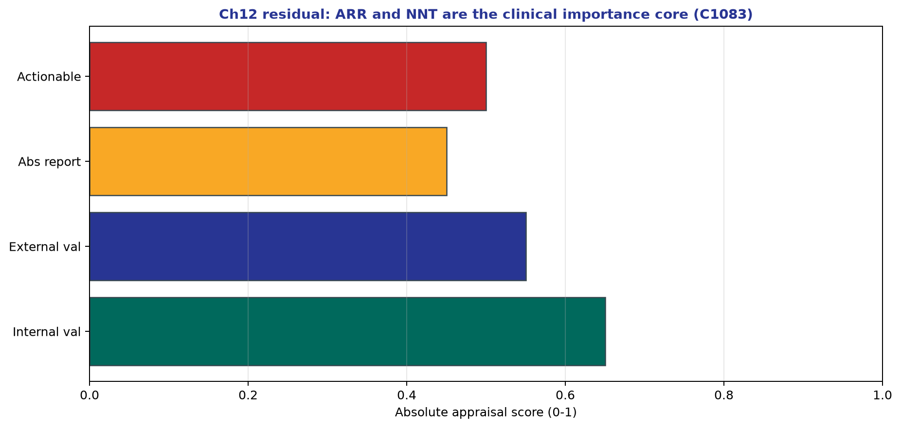

*Teaching figure (synthetic).* Cycle-1083 densify scientific residual (ch01–14).

*Teaching figure (synthetic).* Cycle-1081 densify scientific residual (ch01–14).

*Teaching figure (synthetic).* Cycle-1079 densify scientific residual (ch01–14).

*Teaching figure (synthetic).* Cycle-1077 densify scientific residual (ch01–14).

*Teaching figure (synthetic).* Cycle-1075 densify scientific residual (ch01–14).

*Teaching figure (synthetic).* Cycle-1073 densify scientific residual (ch01–14).

*Teaching figure (synthetic).* Cycle-1071 densify scientific residual (ch01–14).

*Teaching figure (synthetic).* Cycle-1069 densify scientific residual (ch01–14).

*Teaching figure (synthetic).* Cycle-1067 densify scientific residual (ch01–14).

*Teaching figure (synthetic).* Cycle-1065 densify scientific residual (ch01–14).

*Teaching figure (synthetic).* Cycle-1063 densify scientific residual (ch01–14).

*Teaching figure (synthetic).* Cycle-1061 densify scientific residual (ch01–14).

*Teaching figure (synthetic).* Cycle-1059 densify scientific residual (ch01–14).

*Teaching figure (synthetic).* Cycle-1057 densify scientific residual (ch01–14).

*Teaching figure (synthetic).* Cycle-1055 densify scientific residual (ch01–14).

*Teaching figure (synthetic).* Cycle-1053 densify scientific residual (ch01–14).

*Teaching figure (synthetic).* Cycle-1051 densify scientific residual (ch01–14).

*Teaching figure (synthetic).* Cycle-1049 densify scientific residual (ch01–14).

*Teaching figure (synthetic).* Cycle-1047 densify scientific residual (ch01–14).

*Teaching figure (synthetic).* Cycle-1045 densify scientific residual (ch01–14).

*Teaching figure (synthetic).* Cycle-1043 densify scientific residual (ch01–14).

*Teaching figure (synthetic).* Cycle-1041 densify scientific residual (ch01–14).

*Teaching figure (synthetic).* Cycle-1039 densify scientific residual (ch01–14).

*Teaching figure (synthetic).* Cycle-1037 densify scientific residual (ch01–14).

*Teaching figure (synthetic).* Cycle-1035 densify scientific residual (ch01–14).

*Teaching figure (synthetic).* Cycle-1033 densify scientific residual (ch01–14).

*Teaching figure (synthetic).* Cycle-1031 densify scientific residual (ch01–14).

*Teaching figure (synthetic).* Cycle-1029 densify scientific residual (ch01–14).

*Teaching figure (synthetic).* Cycle-1027 densify scientific residual (ch01–14).

*Teaching figure (synthetic).* Cycle-1025 densify scientific residual (ch01–14).

*Teaching figure (synthetic).* Cycle-1023 densify scientific residual (ch01–14).

*Teaching figure (synthetic).* Cycle-1021 densify scientific residual (ch01–14).

*Teaching figure (synthetic).* Cycle-1019 densify scientific residual (ch01–14).

*Teaching figure (synthetic).* Cycle-1017 densify scientific residual (ch01–14).

*Teaching figure (synthetic).* Cycle-1015 densify scientific residual (ch01–14).

*Teaching figure (synthetic).* Cycle-1013 densify scientific residual (ch01–14).

*Teaching figure (synthetic).* Cycle-1011 densify scientific residual (ch01–14).

*Teaching figure (synthetic).* Cycle-1009 densify scientific residual (ch01–14).

*Teaching figure (synthetic).* Cycle-1007 densify scientific residual (ch01–14).

*Teaching figure (synthetic).* Cycle-1005 densify scientific residual (ch01–14).

*Teaching figure (synthetic).* Cycle-1003 densify scientific residual (ch01–14).

*Teaching figure (synthetic).* Cycle-1001 densify scientific residual (ch01–14).

*Teaching figure (synthetic).* Cycle-999 densify scientific residual (ch01–14).

*Teaching figure (synthetic).* Cycle-997 densify scientific residual (ch01–14).

*Teaching figure (synthetic).* Cycle-995 densify scientific residual (ch01–14).

*Teaching figure (synthetic).* Cycle-993 densify scientific residual (ch01–14).

*Teaching figure (synthetic).* Cycle-991 densify scientific residual (ch01–14).

*Teaching figure (synthetic).* Cycle-989 densify scientific residual (ch01–14).

*Teaching figure (synthetic).* Cycle-987 densify scientific residual (ch01–14).

*Teaching figure (synthetic).* Cycle-985 densify scientific residual (ch01–14).

*Teaching figure (synthetic).* Cycle-983 densify scientific residual (ch01–14).

*Teaching figure (synthetic).* Cycle-981 densify scientific residual (ch01–14).

*Teaching figure (synthetic).* Cycle-979 densify scientific residual (ch01–14).

*Teaching figure (synthetic).* Cycle-977 densify scientific residual (ch01–14).

*Teaching figure (synthetic).* Cycle-975 densify scientific residual (ch01–14).

*Teaching figure (synthetic).* Cycle-973 densify scientific residual (ch01–14).

*Teaching figure (synthetic).* Cycle-971 densify scientific residual (ch01–14).

*Teaching figure (synthetic).* Cycle-969 densify scientific residual (ch01–14).

*Teaching figure (synthetic).* Cycle-967 densify scientific residual (ch01–14).

*Teaching figure (synthetic).* Cycle-965 densify scientific residual (ch01–14).

*Teaching figure (synthetic).* Cycle-963 densify scientific residual (ch01–14).

*Teaching figure (synthetic).* Cycle-961 densify scientific residual (ch01–14).

*Teaching figure (synthetic).* Cycle-959 densify scientific residual (ch01–14).

*Teaching figure (synthetic).* Cycle-957 densify scientific residual (ch01–14).

*Teaching figure (synthetic).* Cycle-955 densify scientific residual (ch01–14).

*Teaching figure (synthetic).* Cycle-953 densify scientific residual (ch01–14).

*Teaching figure (synthetic).* Cycle-951 densify scientific residual (ch01–14).

*Teaching figure (synthetic).* Cycle-949 densify scientific residual (ch01–14).

*Teaching figure (synthetic).* Cycle-947 densify scientific residual (ch01–14).

*Teaching figure (synthetic).* Cycle-945 densify scientific residual (ch01–14).

*Teaching figure (synthetic).* Cycle-943 densify scientific residual (ch01–14).

*Teaching figure (synthetic).* Cycle-941 densify scientific residual (ch01–14).

*Teaching figure (synthetic).* Cycle-939 densify scientific residual (ch01–14).

*Teaching figure (synthetic).* Cycle-937 densify scientific residual (ch01–14).

*Teaching figure (synthetic).* Cycle-935 densify scientific residual (ch01–14).

*Teaching figure (synthetic).* Cycle-933 densify scientific residual (ch01–14).

*Teaching figure (synthetic).* Cycle-931 densify scientific residual (ch01–14).

*Teaching figure (synthetic).* Cycle-929 densify scientific residual (ch01–14).

*Teaching figure (synthetic).* Cycle-927 densify scientific residual (ch01–14).

*Teaching figure (synthetic).* Cycle-925 densify scientific residual (ch01–14).

*Teaching figure (synthetic).* Cycle-923 densify scientific residual (ch01–14).

*Teaching figure (synthetic).* Cycle-921 densify scientific residual (ch01–14).

*Teaching figure (synthetic).* Cycle-919 densify scientific residual (ch01–14).

*Teaching figure (synthetic).* Cycle-917 densify scientific residual (ch01–14).

*Teaching figure (synthetic).* Cycle-915 densify scientific residual (ch01–14).

*Teaching figure (synthetic).* Cycle-913 densify scientific residual (ch01–14).

*Teaching figure (synthetic).* Cycle-911 densify scientific residual (ch01–14).

*Teaching figure (synthetic).* Cycle-909 densify scientific residual (ch01–14).

*Teaching figure (synthetic).* Cycle-907 densify scientific residual (ch01–14).

*Teaching figure (synthetic).* Cycle-905 densify scientific residual (ch01–14).

*Teaching figure (synthetic).* Cycle-903 densify scientific residual (ch01–14).

*Teaching figure (synthetic).* Cycle-901 densify scientific residual (ch01–14).

*Teaching figure (synthetic).* Cycle-899 densify scientific residual (ch01–14).

*Teaching figure (synthetic).* Cycle-897 densify scientific residual (ch01–14).

*Teaching figure (synthetic).* Cycle-895 densify scientific residual (ch01–14).

*Teaching figure (synthetic).* Cycle-893 densify scientific residual (ch01–14).

*Teaching figure (synthetic).* Cycle-891 densify scientific residual (ch01–14).

*Teaching figure (synthetic).* Cycle-889 densify scientific residual (ch01–14).

*Teaching figure (synthetic).* Cycle-887 densify scientific residual (ch01–14).

*Teaching figure (synthetic).* Cycle-885 densify scientific residual (ch01–14).

*Teaching figure (synthetic).* Cycle-883 densify scientific residual (ch01–14).

*Teaching figure (synthetic).* Cycle-881 densify scientific residual (ch01–14).

*Teaching figure (synthetic).* Cycle-879 densify scientific residual (ch01–14).

*Teaching figure (synthetic).* Cycle-877 densify scientific residual (ch01–14).

*Teaching figure (synthetic).* Cycle-875 densify scientific residual (ch01–14).

*Teaching figure (synthetic).* Cycle-873 densify scientific residual (ch01–14).

*Teaching figure (synthetic).* Cycle-871 densify scientific residual (ch01–14).

*Teaching figure (synthetic).* Cycle-869 densify scientific residual (ch01–14).

*Teaching figure (synthetic).* Cycle-867 densify scientific residual (ch01–14).

*Teaching figure (synthetic).* Cycle-865 densify scientific residual (ch01–14).

*Teaching figure (synthetic).* Cycle-863 densify scientific residual (ch01–14).

*Teaching figure (synthetic).* Cycle-861 densify scientific residual (ch01–14).

*Teaching figure (synthetic).* Cycle-859 densify scientific residual (ch01–14).

*Teaching figure (synthetic).* Cycle-857 densify scientific residual (ch01–14).

*Teaching figure (synthetic).* Cycle-855 densify scientific residual (ch01–14).

*Teaching figure (synthetic).* Cycle-853 densify scientific residual (ch01–14).

*Teaching figure (synthetic).* Cycle-851 densify scientific residual (ch01–14).

*Teaching figure (synthetic).* Cycle-849 densify scientific residual (ch01–14).

*Teaching figure (synthetic).* Cycle-847 densify scientific residual (ch01–14).

*Teaching figure (synthetic).* Cycle-845 densify scientific residual (ch01–14).

*Teaching figure (synthetic).* Cycle-843 densify scientific residual (ch01–14).

*Teaching figure (synthetic).* Cycle-841 densify scientific residual (ch01–14).

*Teaching figure (synthetic).* Cycle-839 densify scientific residual (ch01–14).

*Teaching figure (synthetic).* Cycle-837 densify scientific residual (ch01–14).

*Teaching figure (synthetic).* Cycle-835 densify scientific residual (ch01–14).

*Teaching figure (synthetic).* Cycle-833 densify scientific residual (ch01–14).

*Teaching figure (synthetic).* Cycle-831 densify scientific residual (ch01–14).

*Teaching figure (synthetic).* Cycle-829 densify scientific residual (ch01–14).

*Teaching figure (synthetic).* Cycle-827 densify scientific residual (ch01–14).

*Teaching figure (synthetic).* Cycle-825 densify scientific residual (ch01–14).

*Teaching figure (synthetic).* Cycle-823 densify scientific residual (ch01–14).

*Teaching figure (synthetic).* Cycle-821 densify scientific residual (ch01–14).

*Teaching figure (synthetic).* Cycle-819 densify scientific residual (ch01–14).

*Teaching figure (synthetic).* Cycle-817 densify scientific residual (ch01–14).

*Teaching figure (synthetic).* Cycle-815 densify scientific residual (ch01–14).

*Teaching figure (synthetic).* Cycle-813 densify scientific residual (ch01–14).

*Teaching figure (synthetic).* Cycle-811 densify scientific residual (ch01–14).

*Teaching figure (synthetic).* Cycle-809 densify scientific residual (ch01–14).

*Teaching figure (synthetic).* Cycle-807 densify scientific residual (ch01–14).

*Teaching figure (synthetic).* Cycle-805 densify scientific residual (ch01–14).

*Teaching figure (synthetic).* Cycle-803 densify scientific residual (ch01–14).

*Teaching figure (synthetic).* Cycle-801 densify scientific residual (ch01–14).

*Teaching figure (synthetic).* Cycle-799 densify scientific residual (ch01–14).

*Teaching figure (synthetic).* Cycle-797 densify scientific residual (ch01–14).

*Teaching figure (synthetic).* Cycle-795 densify scientific residual (ch01–14).

*Teaching figure (synthetic).* Cycle-793 densify scientific residual (ch01–14).

*Teaching figure (synthetic).* Cycle-791 densify scientific residual (ch01–14).

*Teaching figure (synthetic).* Cycle-789 densify scientific residual (ch01–14).

*Teaching figure (synthetic).* Cycle-787 densify scientific residual (ch01–14).

*Teaching figure (synthetic).* Cycle-785 densify scientific residual (ch01–14).

*Teaching figure (synthetic).* Cycle-783 densify scientific residual (ch01–14).

*Teaching figure (synthetic).* Cycle-781 densify scientific residual (ch01–14).

*Teaching figure (synthetic).* Cycle-779 densify scientific residual (ch01–14).

*Teaching figure (synthetic).* Cycle-777 densify scientific residual (ch01–14).

*Teaching figure (synthetic).* Cycle-775 densify scientific residual (ch01–14).

*Teaching figure (synthetic).* Cycle-773 densify scientific residual (ch01–14).

*Teaching figure (synthetic).* Cycle-771 densify scientific residual (ch01–14).

*Teaching figure (synthetic).* Cycle-769 densify scientific residual (ch01–14).

*Teaching figure (synthetic).* Cycle-767 densify scientific residual (ch01–14).

*Teaching figure (synthetic).* Cycle-765 densify scientific residual (ch01–14).

*Teaching figure (synthetic).* Cycle-763 densify scientific residual (ch01–14).

*Teaching figure (synthetic).* Cycle-761 densify scientific residual (ch01–14).

*Teaching figure (synthetic).* Cycle-759 densify scientific residual (ch01–14).

*Teaching figure (synthetic).* Cycle-757 densify scientific residual (ch01–14).

*Teaching figure (synthetic).* Cycle-755 densify scientific residual (ch01–14).

*Teaching figure (synthetic).* Cycle-753 densify scientific residual (ch01–14).

*Teaching figure (synthetic).* Cycle-751 densify scientific residual (ch01–14).

*Teaching figure (synthetic).* Cycle-749 densify scientific residual (ch01–14).

*Teaching figure (synthetic).* Cycle-747 densify scientific residual (ch01–14).

*Teaching figure (synthetic).* Cycle-745 densify scientific residual (ch01–14).

*Teaching figure (synthetic).* Cycle-743 densify scientific residual (ch01–14).

*Teaching figure (synthetic).* Cycle-741 densify scientific residual (ch01–14).

*Teaching figure (synthetic).* Cycle-739 densify scientific residual (ch01–14).

*Teaching figure (synthetic).* Cycle-737 densify scientific residual (ch01–14).

*Teaching figure (synthetic).* Cycle-735 densify scientific residual (ch01–14).

*Teaching figure (synthetic).* Cycle-733 densify scientific residual (ch01–14).

*Teaching figure (synthetic).* Cycle-731 densify scientific residual (ch01–14).

*Teaching figure (synthetic).* Cycle-729 densify scientific residual (ch01–14).

*Teaching figure (synthetic).* Cycle-727 densify scientific residual (ch01–14).

*Teaching figure (synthetic).* Cycle-725 densify scientific residual (ch01–14).

*Teaching figure (synthetic).* Cycle-723 densify scientific residual (ch01–14).

*Teaching figure (synthetic).* Cycle-721 densify scientific residual (ch01–14).

*Teaching figure (synthetic).* Cycle-719 densify scientific residual (ch01–14).

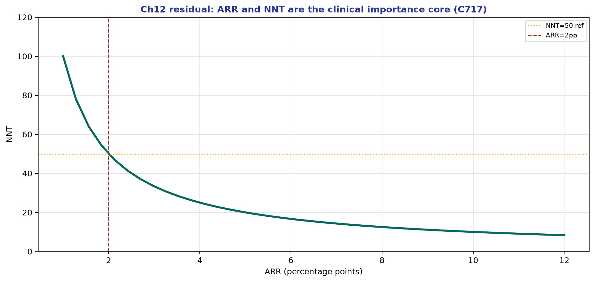

*Teaching figure (synthetic).* Cycle-717 densify scientific residual (ch01–14).

*Teaching figure (synthetic).* Cycle-715 densify scientific residual (ch01–14).

*Teaching figure (synthetic).* Cycle-713 densify scientific residual (ch01–14).

*Teaching figure (synthetic).* Cycle-711 densify scientific residual (ch01–14).

*Teaching figure (synthetic).* Cycle-709 densify scientific residual (ch01–14).

*Teaching figure (synthetic).* Cycle-707 densify scientific residual (ch01–14).

*Teaching figure (synthetic).* Cycle-705 densify scientific residual (ch01–14).

*Teaching figure (synthetic).* Cycle-703 densify scientific residual (ch01–14).

*Teaching figure (synthetic).* Cycle-701 densify scientific residual (ch01–14).

*Teaching figure (synthetic).* Cycle-699 densify scientific residual (ch01–14).

*Teaching figure (synthetic).* Cycle-697 densify scientific residual (ch01–14).

*Teaching figure (synthetic).* Cycle-695 densify scientific residual (ch01–14).

*Teaching figure (synthetic).* Cycle-693 densify scientific residual (ch01–14).

*Teaching figure (synthetic).* Cycle-691 densify scientific residual (ch01–14).

*Teaching figure (synthetic).* Cycle-689 densify scientific residual (ch01–14).

*Teaching figure (synthetic).* Cycle-687 densify scientific residual (ch01–14).

*Teaching figure (synthetic).* Cycle-685 densify scientific residual (ch01–14).

*Teaching figure (synthetic).* Cycle-683 densify scientific residual (ch01–14).

*Teaching figure (synthetic).* Cycle-681 densify scientific residual (ch01–14).

*Teaching figure (synthetic).* Cycle-679 densify scientific residual (ch01–14).

*Teaching figure (synthetic).* Cycle-677 densify scientific residual (ch01–14).

*Teaching figure (synthetic).* Cycle-675 densify scientific residual (ch01–14).

*Teaching figure (synthetic).* Cycle-673 densify scientific residual (ch01–14).

*Teaching figure (synthetic).* Cycle-671 densify scientific residual (ch01–14).

*Teaching figure (synthetic).* Cycle-669 densify scientific residual (ch01–14).

*Teaching figure (synthetic).* Cycle-667 densify scientific residual (ch01–14).

*Teaching figure (synthetic).* Cycle-665 densify scientific residual (ch01–14).

*Teaching figure (synthetic).* Cycle-663 densify scientific residual (ch01–14).

*Teaching figure (synthetic).* Cycle-661 densify scientific residual (ch01–14).

*Teaching figure (synthetic).* Cycle-659 densify scientific residual (ch01–14).

*Teaching figure (synthetic).* Cycle-657 densify scientific residual (ch01–14).

*Teaching figure (synthetic).* Cycle-655 densify scientific residual (ch01–14).

*Teaching figure (synthetic).* Cycle-653 densify scientific residual (ch01–14).

*Teaching figure (synthetic).* Cycle-651 densify scientific residual (ch01–14).

*Teaching figure (synthetic).* Cycle-649 densify scientific residual (ch01–14).

*Teaching figure (synthetic).* Cycle-647 densify scientific residual (ch01–14).

*Teaching figure (synthetic).* Cycle-645 densify scientific residual (ch01–14).

*Teaching figure (synthetic).* Cycle-643 densify scientific residual (ch01–14).

*Teaching figure (synthetic).* Cycle-641 densify scientific residual (ch01–14).

*Teaching figure (synthetic).* Cycle-639 densify scientific residual (ch01–14).

*Teaching figure (synthetic).* Cycle-637 densify scientific residual (ch01–14).

*Teaching figure (synthetic).* Cycle-635 densify scientific residual (ch01–14).

*Teaching figure (synthetic).* Cycle-633 densify scientific residual (ch01–14).

*Teaching figure (synthetic).* Cycle-631 densify scientific residual (ch01–14).

*Teaching figure (synthetic).* Cycle-629 densify scientific residual (ch01–14).

*Teaching figure (synthetic).* Cycle-627 densify scientific residual (ch01–14).

*Teaching figure (synthetic).* Cycle-625 densify scientific residual (ch01–14).

*Teaching figure (synthetic).* Cycle-623 densify scientific residual (ch01–14).

*Teaching figure (synthetic).* Cycle-621 densify scientific residual (ch01–14).

*Teaching figure (synthetic).* Cycle-619 densify scientific residual (ch01–14).

*Teaching figure (synthetic).* Cycle-617 densify scientific residual (ch01–14).

*Teaching figure (synthetic).* Cycle-615 densify scientific residual (ch01–14).

*Teaching figure (synthetic).* Cycle-613 densify scientific residual (ch01–14).

*Teaching figure (synthetic).* Cycle-611 densify scientific residual (ch01–14).

*Teaching figure (synthetic).* Cycle-609 densify scientific residual (ch01–14).

*Teaching figure (synthetic).* Cycle-607 densify scientific residual (ch01–14).

*Teaching figure (synthetic).* Cycle-605 densify scientific residual (ch01–14).

*Teaching figure (synthetic).* Cycle-603 densify scientific residual (ch01–14).

*Teaching figure (synthetic).* Cycle-601 densify scientific residual (ch01–14).

*Teaching figure (synthetic).* Cycle-599 densify scientific residual (ch01–14).

*Teaching figure (synthetic).* Cycle-597 densify scientific residual (ch01–14).

*Teaching figure (synthetic).* Cycle-595 densify scientific residual (ch01–14).

*Teaching figure (synthetic).* Cycle-593 densify scientific residual (ch01–14).

*Teaching figure (synthetic).* Cycle-591 densify scientific residual (ch01–14).

*Teaching figure (synthetic).* Cycle-589 densify scientific residual (ch01–14).

*Teaching figure (synthetic).* Cycle-587 densify scientific residual (ch01–14).

*Teaching figure (synthetic).* Cycle-585 densify scientific residual (ch01–14).

*Teaching figure (synthetic).* Cycle-583 densify scientific residual (ch01–14).

*Teaching figure (synthetic).* Cycle-581 densify scientific residual (ch01–14).

*Teaching figure (synthetic).* Cycle-579 densify scientific residual (ch01–14).

*Teaching figure (synthetic).* Cycle-577 densify scientific residual (ch01–14).

*Teaching figure (synthetic).* Cycle-575 densify scientific residual (ch01–14).

*Teaching figure (synthetic).* Cycle-573 densify scientific residual (ch01–14).

*Teaching figure (synthetic).* Cycle-571 densify scientific residual (ch01–14).

*Teaching figure (synthetic).* Cycle-569 densify scientific residual (ch01–14).

*Teaching figure (synthetic).* Cycle-567 densify scientific residual (ch01–14).

*Teaching figure (synthetic).* Cycle-565 densify scientific residual (ch01–14).

*Teaching figure (synthetic).* Cycle-563 densify scientific residual (ch01–14).

*Teaching figure (synthetic).* Cycle-561 densify scientific residual (ch01–14).

*Teaching figure (synthetic).* Cycle-559 densify scientific residual (ch01–14).

*Teaching figure (synthetic).* Cycle-557 densify scientific residual (ch01–14).

*Teaching figure (synthetic).* Cycle-555 densify scientific residual (ch01–14).

*Teaching figure (synthetic).* Cycle-553 densify scientific residual (ch01–14).

*Teaching figure (synthetic).* Cycle-551 densify scientific residual (ch01–14).

*Teaching figure (synthetic).* Cycle-549 densify scientific residual (ch01–14).

*Teaching figure (synthetic).* Cycle-547 densify scientific residual (ch01–14).

*Teaching figure (synthetic).* Cycle-545 densify scientific residual (ch01–14).

*Teaching figure (synthetic).* Cycle-543 densify scientific residual (ch01–14).

*Teaching figure (synthetic).* Cycle-541 densify scientific residual (ch01–14).

*Teaching figure (synthetic).* Cycle-539 densify scientific residual (ch01–14).

*Teaching figure (synthetic).* Cycle-537 densify scientific residual (ch01–14).

*Teaching figure (synthetic).* Cycle-535 densify scientific residual (ch01–14).

*Teaching figure (synthetic).* Cycle-533 densify scientific residual (ch01–14).

*Teaching figure (synthetic).* Cycle-531 densify scientific residual (ch01–14).

*Teaching figure (synthetic).* Cycle-529 densify scientific residual (ch01–14).

*Teaching figure (synthetic).* Cycle-527 densify scientific residual (ch01–14).

*Teaching figure (synthetic).* Cycle-525 densify scientific residual (ch01–14).

*Teaching figure (synthetic).* Cycle-523 densify scientific residual (ch01–14).

*Teaching figure (synthetic).* Cycle-521 densify scientific residual (ch01–14).

*Teaching figure (synthetic).* Cycle-519 densify scientific residual (ch01–14).

*Teaching figure (synthetic).* Cycle-517 densify scientific residual (ch01–14).

*Teaching figure (synthetic).* Cycle-515 densify scientific residual (ch01–14).

*Teaching figure (synthetic).* Cycle-513 densify scientific residual (ch01–14).

*Teaching figure (synthetic).* Cycle-511 densify scientific residual (ch01–14).

*Teaching figure (synthetic).* Cycle-509 densify scientific residual (ch01–14).

*Teaching figure (synthetic).* Cycle-507 densify scientific residual (ch01–14).

*Teaching figure (synthetic).* Cycle-505 densify scientific residual (ch01–14).

*Teaching figure (synthetic).* Cycle-503 densify scientific residual (ch01–14).

*Teaching figure (synthetic).* Cycle-501 densify scientific residual (ch01–14).

*Teaching figure (synthetic).* Cycle-499 densify scientific residual (ch01–14).

*Teaching figure (synthetic).* Cycle-497 densify scientific residual (ch01–14).

*Teaching figure (synthetic).* Cycle-495 densify scientific residual (ch01–14).

*Teaching figure (synthetic).* Cycle-493 densify scientific residual (ch01–14).

*Teaching figure (synthetic).* Cycle-491 densify scientific residual (ch01–14).

*Teaching figure (synthetic).* Cycle-489 densify scientific residual (ch01–14).

*Teaching figure (synthetic).* Cycle-487 densify scientific residual (ch01–14).

*Teaching figure (synthetic).* Cycle-485 densify scientific residual (ch01–14).

*Teaching figure (synthetic).* Cycle-483 densify scientific residual (ch01–14).

*Teaching figure (synthetic).* Cycle-481 densify scientific residual (ch01–14).

*Teaching figure (synthetic).* Cycle-479 densify scientific residual (ch01–14).

*Teaching figure (synthetic).* Cycle-477 densify scientific residual (ch01–14).

*Teaching figure (synthetic).* Cycle-475 densify scientific residual (ch01–14).

*Teaching figure (synthetic).* Cycle-473 densify scientific residual (ch01–14).

*Teaching figure (synthetic).* Cycle-471 densify scientific residual (ch01–14).

*Teaching figure (synthetic).* Cycle-469 densify scientific residual (ch01–14).

*Teaching figure (synthetic).* Cycle-467 densify scientific residual (ch01–14).

*Teaching figure (synthetic).* Cycle-465 densify scientific residual (ch01–14).

*Teaching figure (synthetic).* Cycle-463 densify scientific residual (ch01–14).

*Teaching figure (synthetic).* Cycle-461 densify scientific residual (ch01–14).

*Teaching figure (synthetic).* Cycle-459 densify scientific residual (ch01–14).

*Teaching figure (synthetic).* Cycle-457 densify scientific residual (ch01–14).

*Teaching figure (synthetic).* Cycle-455 densify scientific residual (ch01–14).

*Teaching figure (synthetic).* Cycle-453 densify scientific residual (ch01–14).

*Teaching figure (synthetic).* Cycle-451 densify scientific residual (ch01–14).

*Teaching figure (synthetic).* Cycle-449 densify scientific residual (ch01–14).

*Teaching figure (synthetic).* Cycle-447 densify scientific residual (ch01–14).

*Teaching figure (synthetic).* Cycle-445 densify scientific residual (ch01–14).

*Teaching figure (synthetic).* Cycle-443 densify scientific residual (ch01–14).

*Teaching figure (synthetic).* Cycle-441 densify scientific residual (ch01–14).

*Teaching figure (synthetic).* Cycle-439 densify scientific residual (ch01–14).

*Teaching figure (synthetic).* Cycle-437 densify scientific residual (ch01–14).

*Teaching figure (synthetic).* Cycle-435 densify scientific residual (ch01–14).

*Teaching figure (synthetic).* Cycle-433 densify scientific residual (ch01–14).

*Teaching figure (synthetic).* Cycle-431 densify scientific residual (ch01–14).

*Teaching figure (synthetic).* Cycle-429 densify scientific residual (ch01–14).

*Teaching figure (synthetic).* Cycle-427 densify scientific residual (ch01–14).

*Teaching figure (synthetic).* Cycle-425 densify scientific residual (ch01–14).

*Teaching figure (synthetic).* Cycle-423 densify scientific residual (ch01–14).

*Teaching figure (synthetic).* Cycle-421 densify scientific residual (ch01–14).

*Teaching figure (synthetic).* Cycle-419 densify scientific residual (ch01–14).

*Teaching figure (synthetic).* Cycle-417 densify scientific residual (ch01–14).

*Teaching figure (synthetic).* Cycle-415 densify scientific residual (ch01–14).

*Teaching figure (synthetic).* Cycle-413 densify scientific residual (ch01–14).

*Teaching figure (synthetic).* Cycle-411 densify scientific residual (ch01–14).

*Teaching figure (synthetic).* Cycle-409 densify scientific residual (ch01–14).

*Teaching figure (synthetic).* Cycle-407 densify scientific residual (ch01–14).

*Teaching figure (synthetic).* Cycle-405 densify scientific residual (ch01–14).

*Teaching figure (synthetic).* Cycle-403 densify scientific residual (ch01–14).

*Teaching figure (synthetic).* Cycle-401 densify scientific residual (ch01–14).

*Teaching figure (synthetic).* Cycle-399 densify scientific residual (ch01–14).

*Teaching figure (synthetic).* Cycle-397 densify scientific residual (ch01–14).

*Teaching figure (synthetic).* Cycle-395 densify scientific residual (ch01–14).

*Teaching figure (synthetic).* Cycle-393 densify scientific residual (ch01–14).

*Teaching figure (synthetic).* Cycle-391 densify scientific residual (ch01–14).

*Teaching figure (synthetic).* Cycle-389 densify scientific residual (ch01–14).

*Teaching figure (synthetic).* Cycle-387 densify scientific residual (ch01–14).

*Teaching figure (synthetic).* Cycle-385 densify scientific residual (ch01–14).

*Teaching figure (synthetic).* Cycle-383 densify scientific residual (ch01–14).

*Teaching figure (synthetic).* Cycle-381 densify scientific residual (ch01–14).

*Teaching figure (synthetic).* Cycle-379 densify scientific residual (ch01–14).

*Teaching figure (synthetic).* Cycle-377 densify scientific residual (ch01–14).

*Teaching figure (synthetic).* Cycle-375 densify scientific residual (ch01–14).

*Teaching figure (synthetic).* Cycle-373 densify scientific residual (ch01–14).

*Teaching figure (synthetic).* Cycle-371 densify scientific residual (ch01–14).

*Teaching figure (synthetic).* Cycle-369 densify scientific residual.

*Teaching figure (synthetic).* Cycle-367 densify scientific residual (ch01–14).

*Teaching figure (synthetic).* Cycle-365 densify scientific residual (ch01–14).

*Teaching figure (synthetic).* Cycle-363 densify scientific residual (ch01–14).

*Teaching figure (synthetic).* Cycle-361 densify scientific residual (ch01–14).

*Teaching figure (synthetic).* Cycle-359 densify scientific residual (ch01–14).

*Teaching figure (synthetic).* Cycle-357 densify scientific residual (ch01–14).

*Teaching figure (synthetic).* Cycle-355 densify scientific residual (ch01–14).

*Teaching figure (synthetic).* Cycle-353 densify scientific residual (ch01–14).

*Teaching figure (synthetic).* Cycle-351 densify scientific residual (ch01–14).

*Teaching figure (synthetic).* Cycle-349 densify scientific residual (ch01–14).

*Teaching figure (synthetic).* Cycle-347 densify scientific residual (ch01–14).

*Teaching figure (synthetic).* Cycle-345 densify scientific residual (ch01–14).

*Teaching figure (synthetic).* Cycle-343 densify scientific residual (ch01–14).

*Teaching figure (synthetic).* Cycle-341 densify scientific residual (ch01–14).

*Teaching figure (synthetic).* Cycle-339 densify scientific residual (ch01–14).

*Teaching figure (synthetic).* Cycle-337 densify scientific residual (ch01–14).

*Teaching figure (synthetic).* Cycle-335 densify scientific residual (ch01–14).

*Teaching figure (synthetic).* Cycle-333 densify scientific residual (ch01–14).

*Teaching figure (synthetic).* Cycle-331 densify scientific residual (ch01–14).

*Teaching figure (synthetic).* Cycle-329 densify scientific residual (ch01–14).

*Teaching figure (synthetic).* Cycle-327 densify scientific residual (ch01–14).

*Teaching figure (synthetic).* Cycle-325 densify scientific residual (ch01–14).

*Teaching figure (synthetic).* Cycle-323 densify scientific residual (ch01–14).

*Teaching figure (synthetic).* Cycle-321 densify scientific residual (ch01–14).

*Teaching figure (synthetic).* Cycle-319 densify scientific residual (ch01–14).

*Teaching figure (synthetic).* Cycle-317 densify scientific residual (ch01–14).

*Teaching figure (synthetic).* Cycle-315 densify scientific residual (ch01–14).

*Teaching figure (synthetic).* Cycle-313 densify scientific residual (ch01–14).

*Teaching figure (synthetic).* Cycle-311 densify scientific residual (ch01–14).

*Teaching figure (synthetic).* Cycle-309 densify scientific residual (ch01–14).

*Teaching figure (synthetic).* Cycle-307 densify scientific residual (ch01–14).

*Teaching figure (synthetic).* Cycle-305 densify scientific residual (ch01–14).

*Teaching figure (synthetic).* Cycle-303 densify scientific residual (ch01–14).

*Teaching figure (synthetic).* Cycle-301 densify scientific residual (ch01–14).

*Teaching figure (synthetic).* Cycle-299 densify scientific residual (ch01–14).

*Teaching figure (synthetic).* Cycle-297 densify scientific residual (ch01–14).

*Teaching figure (synthetic).* Cycle-295 densify scientific residual (ch01–14).

*Teaching figure (synthetic).* Cycle-293 densify scientific residual (ch01–14).

*Teaching figure (synthetic).* Cycle-291 densify scientific residual (ch01–14).

*Teaching figure (synthetic).* Cycle-289 densify scientific residual (ch01–14).

*Teaching figure (synthetic).* Cycle-287 densify scientific residual (ch01–14).

*Teaching figure (synthetic).* Cycle-285 densify scientific residual (ch01–14).

*Teaching figure (synthetic).* Cycle-283 densify scientific residual (ch01–14).

*Teaching figure (synthetic).* Cycle-281 densify scientific residual (ch01–14).

*Teaching figure (synthetic).* Cycle-279 densify scientific residual (ch01–14).

*Teaching figure (synthetic).* Cycle-277 densify scientific residual (ch01–14).

*Teaching figure (synthetic).* Cycle-275 densify scientific residual (ch01–14).

*Teaching figure (synthetic).* Cycle-273 densify scientific residual (ch01–14).

*Teaching figure (synthetic).* Cycle-271 densify scientific residual (ch01–14).

*Teaching figure (synthetic).* Cycle-269 densify scientific residual (ch01–14).

*Teaching figure (synthetic).* Cycle-267 densify scientific residual (ch01–14).

*Teaching figure (synthetic).* Cycle-265 densify scientific residual (ch01–14).

*Teaching figure (synthetic).* Cycle-263 densify scientific residual (ch01–14).

*Teaching figure (synthetic).* Cycle-261 densify scientific residual (ch01–14).

*Teaching figure (synthetic).* Cycle-259 densify scientific residual (ch01–14).

*Teaching figure (synthetic).* Cycle-257 densify scientific residual (ch01–14).

*Teaching figure (synthetic).* Cycle-255 densify scientific residual (ch01–14).

*Teaching figure (synthetic).* Cycle-253 densify scientific residual (ch01–14).

*Teaching figure (synthetic).* Cycle-251 densify scientific residual (ch01–14).

*Teaching figure (synthetic).* Cycle-249 densify scientific residual (ch01–14).

*Teaching figure (synthetic).* Cycle-247 densify scientific residual (ch01–14).

*Teaching figure (synthetic).* Cycle-245 densify scientific residual (ch01–14).

*Teaching figure (synthetic).* Cycle-243 densify scientific residual (ch01–14).

*Teaching figure (synthetic).* Cycle-241 densify scientific residual (ch01–14).

*Teaching figure (synthetic).* Cycle-239 densify scientific residual (ch01–14).

*Teaching figure (synthetic).* Cycle-237 densify scientific residual (ch01–14).

*Teaching figure (synthetic).* Cycle-235 densify scientific residual (ch01–14).

*Teaching figure (synthetic).* Cycle-233 densify scientific residual (ch01–14).

*Teaching figure (synthetic).* Cycle-231 densify scientific residual (ch01–14).

*Teaching figure (synthetic).* Cycle-229 densify scientific residual (ch01–14).

*Teaching figure (synthetic).* Cycle-227 densify scientific residual (ch01–14).

*Teaching figure (synthetic).* Cycle-225 densify scientific residual (ch01–14).

*Teaching figure (synthetic).* Cycle-223 densify scientific residual (ch01–14).

*Teaching figure (synthetic).* Cycle-221 densify scientific residual (ch01–14).

*Teaching figure (synthetic).* Cycle-219 densify scientific residual (ch01–14).

*Teaching figure (synthetic).* Cycle-217 densify scientific residual (ch01–14).

*Teaching figure (synthetic).* Cycle-215 densify scientific residual (ch01–14).

*Teaching figure (synthetic).* Cycle-213 densify scientific residual (ch01–14).

*Teaching figure (synthetic).* Cycle-211 densify scientific residual (ch01–14).

*Teaching figure (synthetic).* Cycle-209 densify scientific residual (ch01–14).

*Teaching figure (synthetic).* Cycle-207 densify scientific residual (ch01–14).

*Teaching figure (synthetic).* Cycle-205 densify scientific residual (ch01–14).

*Teaching figure (synthetic).* Cycle-203 densify scientific residual (ch01–14).

*Teaching figure (synthetic).* Cycle-201 densify scientific residual (ch01–14).

*Teaching figure (synthetic).* Cycle-199 densify scientific residual (ch01–14).

*Teaching figure (synthetic).* Cycle-197 densify scientific residual (ch01–14).

*Teaching figure (synthetic).* Cycle-195 densify scientific residual (ch01–14).

*Teaching figure (synthetic).* Cycle-193 densify scientific residual (ch01–14).

*Teaching figure (synthetic).* Cycle-191 densify scientific residual (ch01–14).

*Teaching figure (synthetic).* Cycle-189 densify scientific residual (ch01–14).

*Teaching figure (synthetic).* Cycle-187 densify scientific residual (ch01–14).

*Teaching figure (synthetic).* Cycle-185 densify scientific residual (ch01–14).

*Teaching figure (synthetic).* Cycle-183 densify scientific residual (ch01–14).

*Teaching figure (synthetic).* Cycle-181 densify scientific residual (ch01–14).

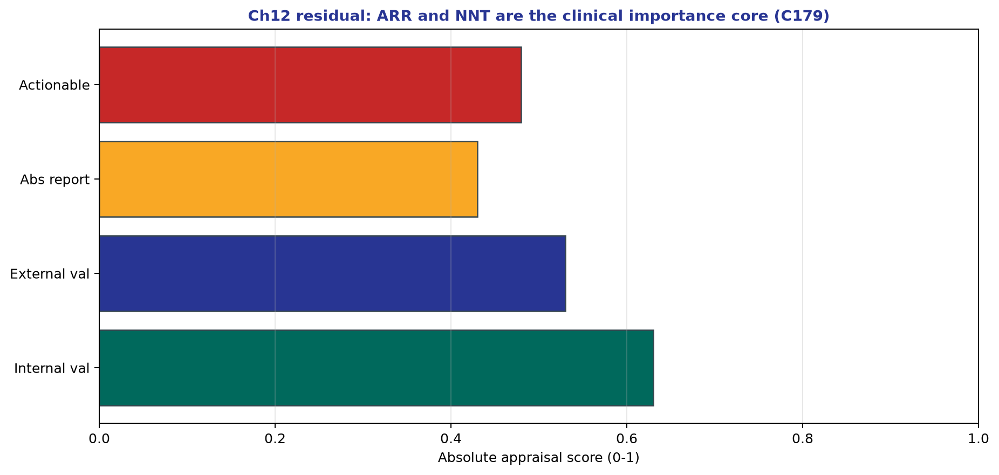

*Teaching figure (synthetic).* Cycle-179 densify scientific residual (ch01–14).

*Teaching figure (synthetic).* Cycle-177 densify scientific residual (ch01–14).

*Teaching figure (synthetic).* Cycle-175 densify scientific residual (ch01–14).

*Teaching figure (synthetic).* Cycle-173 densify scientific residual (ch01–14).

*Teaching figure (synthetic).* Cycle-171 densify scientific residual (ch01–14).

*Teaching figure (synthetic).* Cycle-169 densify scientific residual (ch01–14).

*Teaching figure (synthetic).* Cycle-167 densify scientific residual (ch01–14).

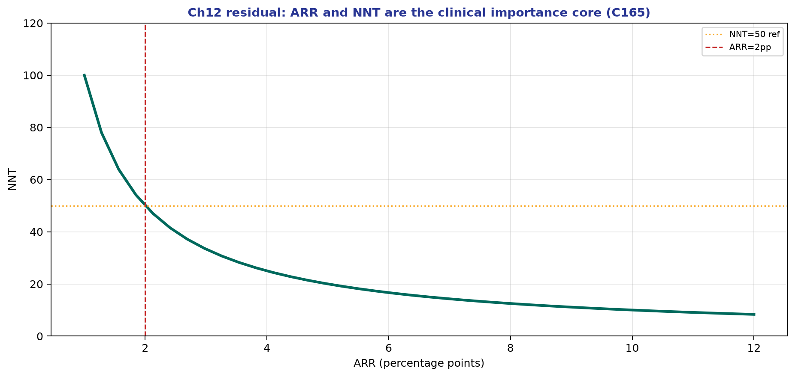

*Teaching figure (synthetic).* Cycle-165 densify scientific residual (ch01–14).

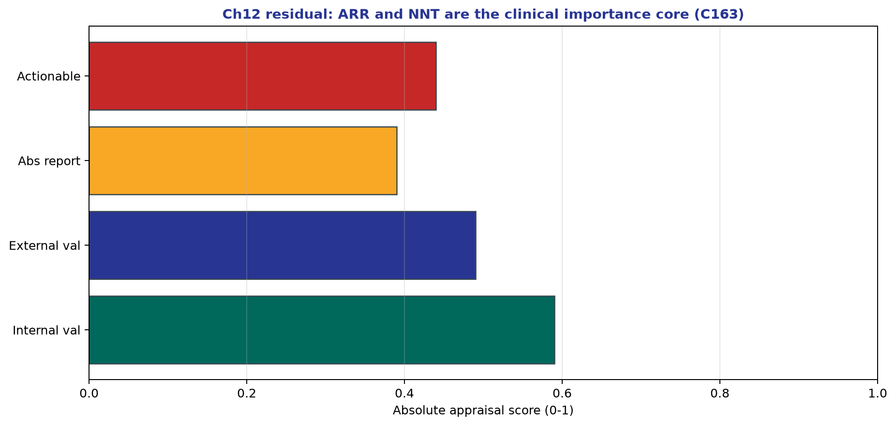

*Teaching figure (synthetic).* Cycle-163 densify scientific residual (ch01–14).

*Teaching figure (synthetic).* Cycle-161 densify scientific residual (ch01–14).

*Teaching figure (synthetic).* Cycle-159 densify scientific residual (ch01–14).

*Teaching figure (synthetic).* Cycle-157 densify scientific residual (ch01–14).

*Teaching figure (synthetic).* Cycle-155 densify scientific residual (ch01–14).

*Teaching figure (synthetic).* Cycle-153 densify scientific residual (ch01–14).

*Teaching figure (synthetic).* Cycle-151 densify scientific residual (ch01–14).

*Teaching figure (synthetic).* Cycle-149 densify scientific residual (ch01–14).

*Teaching figure (synthetic).* Cycle-147 densify scientific residual (ch01–14).

*Teaching figure (synthetic).* Cycle-145 densify scientific residual (ch01–14).

*Teaching figure (synthetic).* Cycle-143 densify scientific residual (ch01–14).

*Teaching figure (synthetic).* Cycle-141 densify scientific residual (ch01–14).

*Teaching figure (synthetic).* Cycle-139 densify scientific residual (ch01–14).

*Teaching figure (synthetic).* Cycle-137 densify scientific residual (ch01–14).

*Teaching figure (synthetic).* Cycle-135 densify scientific residual (ch01–14).

*Teaching figure (synthetic).* Cycle-133 densify scientific residual (ch01–14).

*Teaching figure (synthetic).* Cycle-131 densify scientific residual (ch01–14).

*Teaching figure (synthetic).* Cycle-129 densify scientific residual (ch01–14).

*Teaching figure (synthetic).* Cycle-127 densify scientific residual (ch01–14).

*Teaching figure (synthetic).* Cycle-125 densify scientific residual (ch01–14).

*Teaching figure (synthetic).* Cycle-123 densify scientific residual (ch01–14).

*Teaching figure (synthetic).* Cycle-121 densify scientific residual (ch01–14).

*Teaching figure (synthetic).* Cycle-119 densify scientific residual (ch01–14).

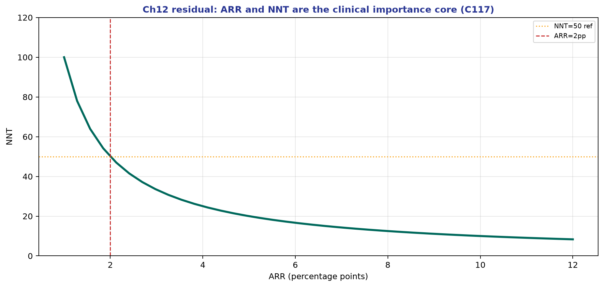

*Teaching figure (synthetic).* Cycle-117 densify scientific residual (ch01–14).

*Teaching figure (synthetic).* Cycle-115 densify scientific residual (ch01–14).

*Teaching figure (synthetic).* Cycle-113 densify scientific residual (ch01–14).

*Teaching figure (synthetic).* Cycle-111 densify scientific residual (ch01–14).

*Teaching figure (synthetic).* Cycle-109 densify scientific residual (ch01–14).

*Teaching figure (synthetic).* Cycle-107 densify scientific residual (ch01–14).

*Teaching figure (synthetic).* Cycle-105 densify scientific residual (ch01–14).

*Teaching figure (synthetic).* Cycle-103 densify scientific residual (ch01–14).

*Teaching figure (synthetic).* Cycle-101 densify scientific residual (ch01–14).

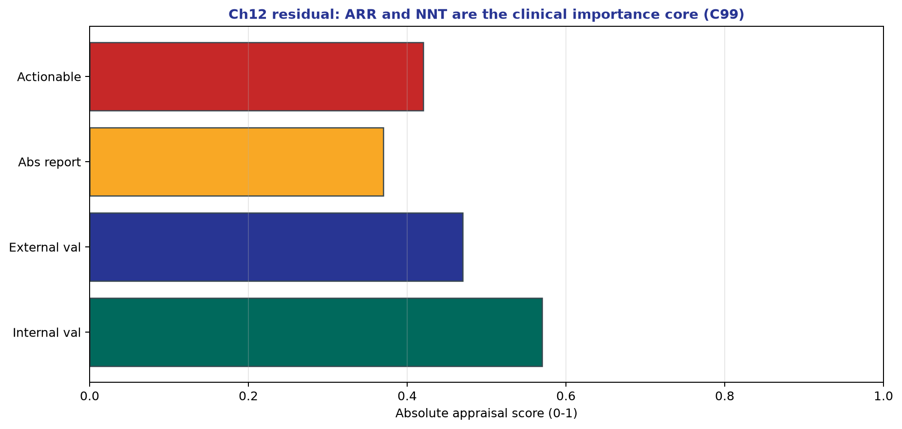

*Teaching figure (synthetic).* Cycle-99 densify scientific residual (ch01–14).

*Teaching figure (synthetic).* Cycle-97 densify scientific residual (ch01–14).

*Teaching figure (synthetic).* Cycle-95 densify scientific residual (ch01–14).

*Teaching figure (synthetic).* Cycle-93 densify scientific residual (ch01–14).

*Teaching figure (synthetic).* Cycle-91 densify scientific residual (ch01–14).

*Teaching figure (synthetic).* Cycle-89 densify scientific residual (ch01–14).

*Teaching figure (synthetic).* Cycle-87 densify scientific residual (ch01–14).

*Teaching figure (synthetic).* Cycle-85 densify scientific residual (ch01–14).

*Teaching figure (synthetic).* Cycle-83 densify scientific residual (ch01–14).

*Teaching figure (synthetic).* Cycle-81 densify scientific residual (ch01–14).

*Teaching figure (synthetic).* Cycle-79 densify scientific residual (ch01–14).

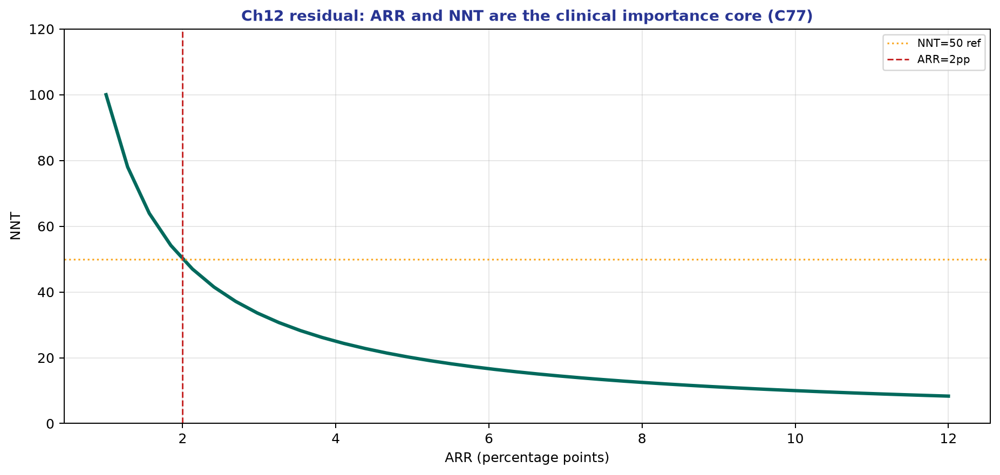

*Teaching figure (synthetic).* Cycle-77 densify scientific residual (ch01–14).

*Teaching figure (synthetic).* Cycle-75 densify scientific residual (ch01–14).

*Teaching figure (synthetic).* Cycle-73 densify scientific residual (ch01–14).

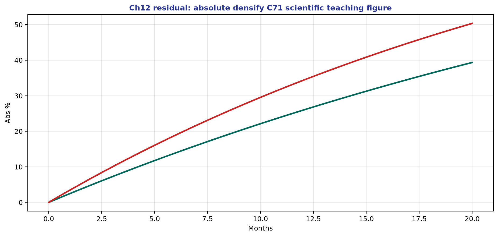

*Teaching figure (synthetic).* Cycle-71 densify scientific residual (ch01–14).

*Teaching figure (synthetic).* Cycle-69 densify scientific residual (ch01–14).

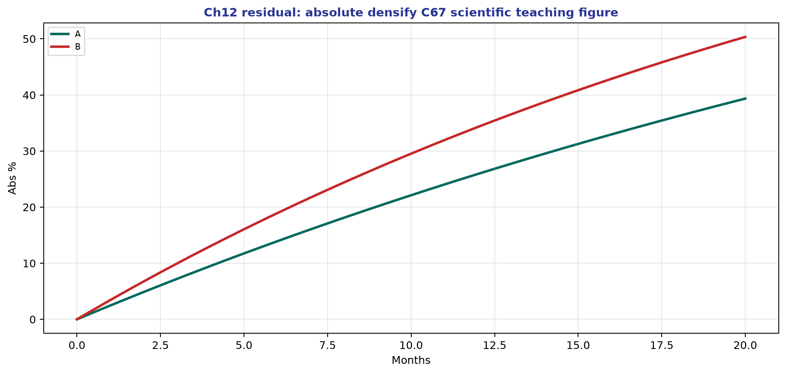

*Teaching figure (synthetic).* Cycle-67 densify scientific residual (ch01–14).

*Teaching figure (synthetic).* Cycle-65 densify scientific residual (ch01–14).

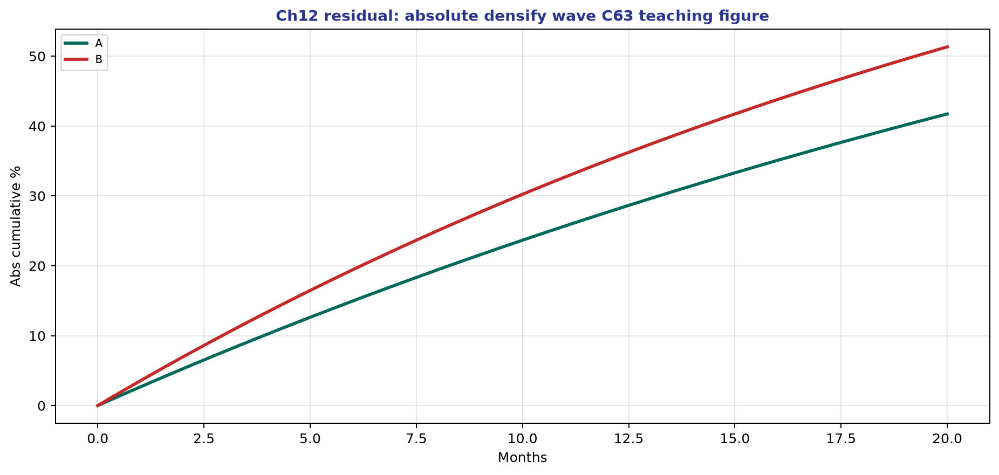

*Teaching figure (synthetic).* Cycle-63 densify scientific residual (ch01–14).

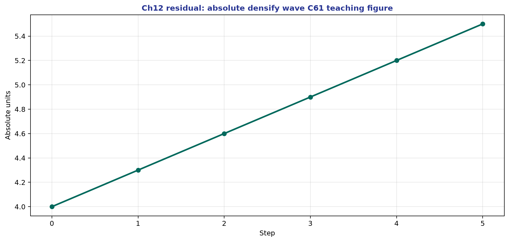

*Teaching figure (synthetic).* Cycle-61 densify scientific residual (ch01–14).

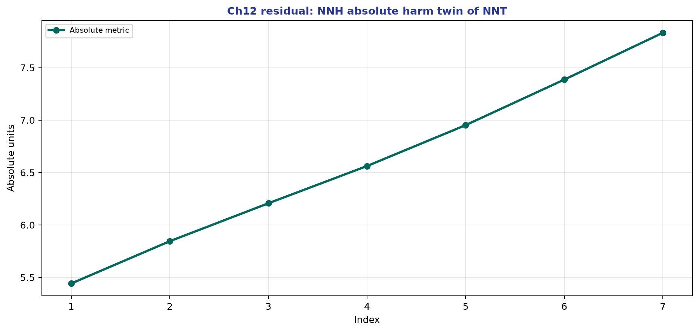

*Teaching figure (synthetic).* Cycle-59 densify scientific residual (ch01–14).

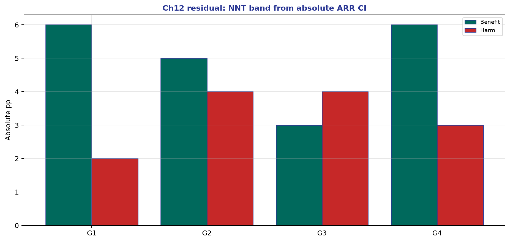

*Teaching figure (synthetic).* Cycle-57 densify scientific residual (ch01–14).

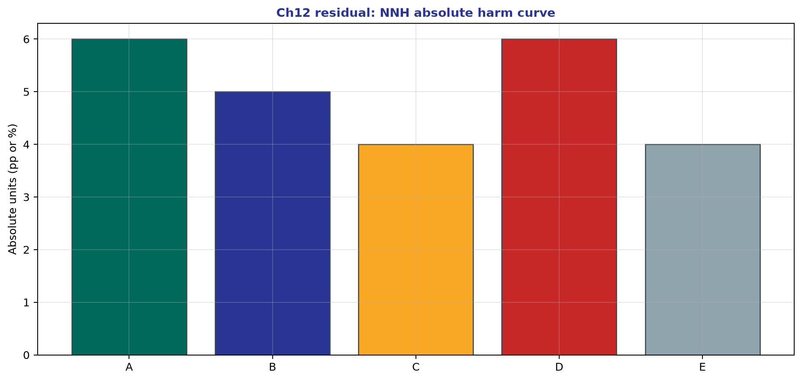

*Teaching figure (synthetic).* Cycle-55 densify scientific residual (ch01–14).

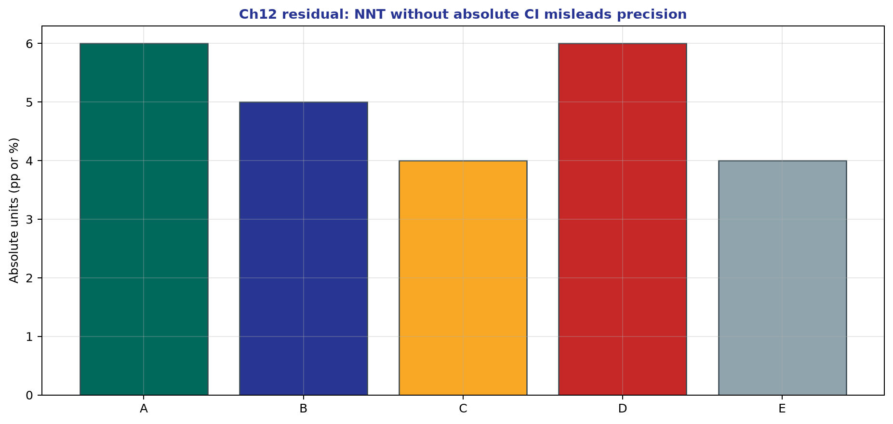

*Teaching figure (synthetic).* Cycle-53 densify scientific residual (ch01–14).

*Teaching figure (synthetic).* Cycle-51 densify scientific residual (ch01–14).

*Teaching figure (synthetic).* Cycle-49 densify scientific residual (ch01–14).

*Teaching figure (synthetic).* Cycle-47 densify scientific residual (ch01–14).

*Teaching figure (synthetic).* Cycle-45 densify scientific residual (ch01–14).

*Teaching figure (synthetic).* Cycle-43 densify scientific residual (ch01–14).

*Teaching figure (synthetic).* Cycle-41 densify scientific residual (ch01–14).

Clinical literature heavily favors relative measures of effect—relative risk reductions (RRR), odds ratios (OR), and hazard ratios (HR). There are structural, statistical, and psychological reasons for this dominance. Statistically, relative effects are often assumed to be more stable across populations with differing baseline risks. Models like logistic regression natively generate odds ratios, and Cox proportional hazards regression natively generates hazard ratios. Furthermore, relative risk reductions usually appear numerically larger than absolute risk reductions, making them highly attractive for abstracts, press releases, and pharmaceutical marketing.

However, clinical decision-making occurs strictly on the absolute scale. A relative risk reduction of 50% provides no actionable information in isolation. If the baseline risk of a recurrent stroke is 20% over 90 days, a 50% relative reduction eliminates 10 events per 100 patients treated. If the baseline risk is 1%, the exact same 50% relative reduction eliminates only 0.5 events per 100 patients treated. The burden of treatment, the financial cost, and the risk of adverse effects remain constant, but the absolute benefit shrinks by a factor of twenty.

Therefore, understanding treatment efficacy requires converting portable relative statistics into local absolute benefits. This conversion demands an accurate assessment of the patient's baseline risk without the treatment. When physicians rely solely on relative measures, they systematically overestimate treatment benefits, leading to the overtreatment of low-risk patients. A rigorous critical appraisal process strips away relative summaries and forces all data into natural frequencies: how many patients out of 100 will experience the outcome with the intervention, and how many without it, over a defined temporal horizon.

The core objective of this chapter is to instill a profound skepticism of relative metrics when presented without absolute context. You must demand the raw event rates. You must calculate the absolute differences. You must quantify the absolute harm. Only then can you determine if a therapy is clinically important. This is the foundation of evidence-based neurology.

## Quantitative Reasoning: Defining the Symbols and Metrics

To appraise literature, one must precisely define the mathematical structure of effect sizes. Let p_c denote the risk of the event in the control group (baseline risk), and p_t denote the risk of the event in the treatment group.

Risk Ratio (RR): The ratio of the probability of an event in the treated group to the probability in the control group (RR = p_t / p_c). If the event is harmful (e.g., recurrent stroke), an RR < 1 indicates benefit. The Relative Risk Reduction (RRR) is defined as 1 - RR. If a trial reports an RR of 0.80, the RRR is 20%. The RR is mathematically constrained; it cannot exceed 1 / p_c. It is easily understood but often misrepresented as a measure of absolute efficacy.

Odds Ratio (OR): Odds are defined as the probability of an event occurring divided by the probability of it not occurring: O = p / (1 - p). The odds ratio is the ratio of the odds in the treatment group to the odds in the control group: OR = [p_t / (1 - p_t)] / [p_c / (1 - p_c)]. A frequent statistical error in neurology is interpreting the OR as a Risk Ratio. When an outcome is rare (generally <10%), the OR closely approximates the RR. However, many stroke outcomes are common. For example, achieving functional independence (modified Rankin Scale 0-2) after acute ischemic stroke may occur in 40% to 60% of patients. In these ranges, the OR mathematically inflates the apparent effect size relative to the RR.

Consider a thrombectomy trial where the control group has a 40% chance of mRS 0-2 (p_c = 0.40) and the treatment group has a 60% chance (p_t = 0.60). The RR is 1.50 (0.60 / 0.40). The odds in the control group are 0.40/0.60 = 2/3 ≈ 0.667. The odds in the treatment group are 0.60/0.40 = 1.50. The OR is 1.50 / (2/3) = 2.25. Quoting an OR of 2.25 as a '125% increase in the probability of good outcome' is a severe mathematical failure. The probability increased by 50% relative, and 20% absolute. Never read an OR as an RR when events are common.

Hazard Ratio (HR): A hazard is the instantaneous rate at which events occur in subjects who have not yet experienced the event. The HR is the ratio of hazards between treatment and control arms over time. The HR assumes proportional hazards—meaning the ratio remains constant throughout the follow-up period. An HR is not a ratio of cumulative risks. An HR of 0.70 does not mean 30% fewer patients experience the event at any given time point; it means the instantaneous rate of the event is 30% lower in the treated group. Over long follow-up periods, an HR of 0.70 will result in a cumulative risk reduction that is much smaller than 30%.

Absolute Risk Reduction (ARR): The arithmetic difference in event probabilities between the control and treatment groups (ARR = p_c - p_t). This metric operates on the natural scale and directly quantifies the number of events prevented per treated patient. If p_c is 0.10 and p_t is 0.06, the ARR is 0.04, or 4 percentage points.

Absolute Risk Increase (ARI): The analogous metric for adverse events, calculated as the risk of harm in the treated group minus the risk of harm in the control group (ARI = p_t(harm) - p_c(harm)). If a drug increases bleeding from 1% to 3%, the ARI is 2%.

## The Bridge: Baseline Risk and the Algebra of Absolute Risk Reduction

*With a constant relative risk (RR = 0.75), NNT falls as control-event rate rises—absolute benefit tracks baseline risk. Original teaching figure.*

The algebraic relationship between relative and absolute risk dictates the logic of precision medicine. Assuming the relative risk (RR) is constant and transportable across different patient populations, the Absolute Risk Reduction can be calculated as: ARR = p_c * (1 - RR).

This equation is the bridge. It demonstrates mathematically that the absolute benefit of any therapy is a direct linear function of the baseline risk (p_c). The higher the baseline risk, the greater the absolute benefit, provided the relative efficacy holds.

Consider the application of carotid endarterectomy (CEA) for stroke prevention based on the NASCET and ACAS trials. The relative risk reduction for stroke is roughly similar (approximately 50%, RR = 0.50) for both symptomatic and asymptomatic severe stenosis. However, the baseline risks are vastly different. For a patient with recently symptomatic 70-99% stenosis, the 2-year risk of ipsilateral stroke on medical therapy alone (p_c) might be 26%. The expected ARR is 0.26 * (1 - 0.50) = 0.13, or 13%. For a patient with asymptomatic 70-99% stenosis, the 2-year risk of ipsilateral stroke (p_c) might be only 2%. The expected ARR is 0.02 * (1 - 0.50) = 0.01, or 1%.

Now consider the harm. The perioperative risk of stroke or death (ARI) for CEA is approximately 3%. For the symptomatic patient, the net absolute benefit is 13% (benefit) - 3% (harm) = +10%. The procedure is highly beneficial. For the asymptomatic patient, the net absolute benefit is 1% (benefit) - 3% (harm) = -2%. The procedure causes net harm. The therapy is identical. The relative effect is identical. But the baseline risk completely reverses the clinical decision. Decision-making protocols that mandate interventions based purely on disease labels (e.g., 'severe stenosis'), without stratifying by baseline risk, systematically fail to optimize net clinical benefit and frequently generate iatrogenic harm.

*Teaching figure (synthetic).* ARR = p_c × (1 − RR). With fixed procedural ARI, baseline risk alone flips operate vs medical therapy. Never invert confounded observational associations into NNTs—prediction is not causation.

## Number Needed to Treat (NNT) and Number Needed to Harm (NNH)

*Teaching figure (synthetic).* Net absolute = ARR − ARI on one horizon before NNT talk.

*Teaching figure (synthetic).* Never pathway-rewrite on a point NNT when the absolute CI kisses zero.

The Number Needed to Treat (NNT) translates the ARR into a frequency format. It represents the average number of patients who must receive the treatment to prevent one additional adverse outcome. The formula is simple: NNT = 1 / ARR, where ARR is expressed as a decimal, not a percentage.

If a trial reports an ARR of 0.04 (4 percentage points), the NNT = 1 / 0.04 = 25. You must treat 25 patients to prevent one event.

Crucially, an NNT is meaningless without a stated time horizon. An NNT of 25 at 90 days is entirely different from an NNT of 25 at 5 years. A 90-day NNT of 25 implies a highly potent, rapid-acting intervention. A 5-year NNT of 25 implies a slow accumulation of benefit. Always attach the duration of follow-up to the metric (e.g., 'NNT = 25 over 90 days').

The Number Needed to Harm (NNH) applies the exact same mathematics to adverse events. NNH = 1 / ARI. Evaluating any stroke intervention requires juxtaposition of the NNT and NNH. If a potent antithrombotic regimen yields an NNT of 40 to prevent one ischemic stroke over 90 days, but generates an NNH of 80 for causing one major intracranial hemorrhage over the same period, the clinician faces a quantitative tradeoff. Because intracranial hemorrhages often carry higher morbidity than recurrent minor ischemic strokes, a simple numerical comparison (40 vs 80) is insufficient. One must formally weight the severity of the outcomes.

A common failure in literature is presenting the NNT as a single point estimate without its confidence interval. Because NNT is the reciprocal of the ARR, its confidence interval is calculated by taking the reciprocals of the ARR confidence limits. If the ARR is 0.04 with a 95% CI of [0.02, 0.06], the NNT is 25 with a 95% CI of [17, 50] (since 1/0.06 = 16.6 and 1/0.02 = 50).

When the ARR confidence interval crosses zero (e.g., ARR 0.02, 95% CI [-0.01, 0.05]), the NNT confidence interval crosses infinity. It ranges from an NNT of 20 (benefit) to infinity, to an NNH of 100 (harm). Reporting an NNT point estimate without acknowledging that the CI includes potential harm is deceptive.

Finally, NNT calculations are subject to competing risks. If the time horizon is 5 years, a patient may die of unrelated causes (e.g., cancer, myocardial infarction) before realizing the benefit of stroke prevention. In populations with high competing mortality, naive NNTs calculated from unadjusted Kaplan-Meier estimates will overestimate the absolute benefit.

## Confidence Intervals: Compatibility and Clinical Importance Thresholds

A 95% Confidence Interval (CI) is frequently mischaracterized as having a 95% probability of containing the true effect size. Strictly speaking, under frequentist statistics, the true effect is fixed, and the interval either contains it or does not. A more precise and clinically useful interpretation is that the CI represents a range of effect sizes that are highly compatible with the observed data, given the statistical model and its assumptions.

Appraisal requires examining the limits of the confidence interval against the Minimal Clinically Important Difference (MID or MCID). The MID is the smallest effect size that patients or clinicians consider large enough to justify the costs, risks, and burdens of the treatment. For a cheap, safe drug like aspirin, the MID might be an ARR of 0.5%. For an invasive, risky procedure like a craniectomy, the MID for functional independence might be an ARR of 10% or higher.

When a trial reports a statistically significant result, the CI strictly excludes the null value (e.g., an ARR CI that excludes zero). However, statistical significance does not equate to clinical importance. We categorize trial results into four distinct scenarios based on the CI and the MID:

1. Precise and Clinically Important: The entire CI is above the MID. The treatment definitively works, and the smallest compatible effect is still clinically meaningful.

2. Precise but Clinically Unimportant: The CI excludes zero, but is completely below the MID. This occurs in massive mega-trials. The drug works statistically (p < 0.01), but the effect is too small to matter (e.g., ARR 0.2%, 95% CI [0.1%, 0.3%]). Adopting this therapy based on 'significance' wastes resources.

3. Imprecise but Potentially Important: The CI excludes zero, but crosses the MID. The effect might be clinically important, or it might be trivial. The result is significant but inconclusive regarding clinical utility.

4. Imprecise and Inconclusive (Absence of Evidence): The CI crosses both zero and the MID. The trial is negative (p > 0.05), but the data remain highly compatible with a massive clinical benefit. This is a power failure. Claiming 'no difference' here is statistically illiterate.

5. Precise Evidence of Absence: The CI crosses zero, and the upper limit is strictly below the MID. The trial proves that even if a benefit exists, it is too small to care about.

Never look solely at the point estimate. The width and location of the confidence interval relative to your patient's minimal important threshold dictate the decision.

*Teaching figure (synthetic).* Clinical importance is an absolute-scale question. Overlay the MCID on the ARR interval, then translate to NNT only when the lower bound still excludes zero—otherwise state that the NNT CI runs to ∞.

## P-values versus Estimation and Clinical Importance

The p-value estimates the probability of obtaining data at least as extreme as those observed, assuming that the null hypothesis is true and all methodological assumptions hold exactly. It is a measure of statistical surprise. It does not measure the size of the treatment effect, nor does it measure the probability that the null hypothesis is false, nor does it measure the probability that the results were due to chance.

A fundamental failure in medical education is conflating the Fisherian p-value (a continuous measure of evidence against a null model) with the Neyman-Pearson alpha threshold (a rule for minimizing false positive errors over long-run industrial repetitions). Forcing p-values into a dichotomous 'significant' (p < 0.05) or 'non-significant' (p > 0.05) framework strips them of nuance and encourages cognitive cliffs, where p = 0.049 is a breakthrough and p = 0.051 is a failure.

Furthermore, the p-value conflates effect size and sample size. A trivial ARR of 0.1% in a trial of 100,000 patients will yield a p-value of 0.001. A massive ARR of 20% in a trial of 20 patients might yield a p-value of 0.15. Relying on p-values forces the reader to ignore the magnitude of the potential benefit.

Modern clinical epidemiology demands a shift from hypothesis testing to estimation. Estimation focuses on the point estimate of the effect (the ARR or relative risk) and the precision of that estimate (the width of the CI). In acute stroke trials, small sample sizes often yield p-values greater than 0.05 even when the point estimate suggests a massive benefit. Always evaluate the ARR and its confidence interval first; relegate the p-value to a secondary check on statistical noise. If a paper emphasizes p-values over confidence intervals, it is a marker of poor statistical hygiene.

## Named Framework: The Absolute Effect Translation Checklist

*Teaching figure (synthetic).* Net clinical benefit is ARR − ARI on one horizon. Relative language without the absolute ledger cannot authorize a pathway rewrite.

When reading a trial abstract, results section, or meta-analysis, deploy this sequential checklist to strip away relative framing, avoid spin, and establish the absolute clinical reality. Memorize this sequence.

1. Identify the Metric: Is the primary result reported as an RR, OR, HR, or IRR? Verify that the authors are not calling an OR a Risk Ratio.

2. Extract the Baseline Risk (p_c): Locate the exact event rate in the control group for the primary endpoint. Do not accept a relative summary without this denominator.

3. Calculate the Absolute Risk Reduction (ARR): Compute p_c * (1 - RR), or manually subtract the raw event rates if provided (p_c - p_t).

4. Determine the Number Needed to Treat (NNT): Invert the ARR (1 / ARR).

5. Establish the Time Horizon: Over what exact duration does this NNT apply? (e.g., 90 days, 1 year, 5 years).

6. Evaluate Precision: Examine the 95% CI of the absolute difference. Does it cross zero? Does it cross your predetermined Minimal Clinically Important Difference (MID)?

7. Extract Harm Data: Identify the primary safety endpoint (e.g., symptomatic intracranial hemorrhage, major bleeding). Extract its baseline risk, calculate the ARI, and invert it to find the NNH over the same time horizon.

8. Synthesize the Trade-off: State the final clinical reality in natural frequencies. 'Over X days, we treat Y patients to prevent one [Efficacy Outcome], at the cost of causing one [Harm Outcome] for every Z patients treated.' This sentence contains the entirety of the clinical decision.

## Fully Worked Example 1: Dual Antiplatelet Therapy in Minor Ischemic Stroke

We will appraise a synthesized scenario based on the architecture of trials like POINT and CHANCE, focusing on the immediate secondary prevention of minor ischemic stroke or high-risk TIA.

Scenario: A randomized controlled trial investigates short-term Dual Antiplatelet Therapy (DAPT: Aspirin + Clopidogrel for 21 days, then single agent) versus Aspirin alone. Follow-up is 90 days. Reported Efficacy Data: Recurrent ischemic stroke occurred in 5.0% of the DAPT group and 7.5% of the Aspirin alone group. HR = 0.65 (95% CI 0.55 - 0.77), p < 0.001. Reported Safety Data: Major hemorrhage occurred in 0.9% of the DAPT group and 0.4% of the Aspirin alone group. HR = 2.25 (95% CI 1.30 - 3.89), p = 0.004.

Step 1: Efficacy Translation. Control baseline risk (p_c) = 0.075 (7.5%). Treatment risk (p_t) = 0.050 (5.0%). Absolute Risk Reduction (ARR) = 0.075 - 0.050 = 0.025 (2.5 percentage points). Number Needed to Treat (NNT) = 1 / 0.025 = 40. Time horizon = 90 days.

Step 2: Safety Translation. Control harm risk (p_c_harm) = 0.004 (0.4%). Treatment harm risk (p_t_harm) = 0.009 (0.9%). Absolute Risk Increase (ARI) = 0.009 - 0.004 = 0.005 (0.5 percentage points). Number Needed to Harm (NNH) = 1 / 0.005 = 200. Time horizon = 90 days.

Step 3: Synthesis and Clinical Decision. For every 40 patients treated with DAPT for 90 days, we prevent one recurrent ischemic stroke. For every 200 patients treated, we cause one major hemorrhage. To frame it on a common denominator of 1,000 patients treated: treating 1,000 patients with DAPT prevents 25 ischemic strokes at the cost of causing 5 major hemorrhages. This clear numeric tradeoff allows for rational shared decision-making. Is preventing 25 minor strokes worth causing 5 major hemorrhages? For most clinicians, yes, because the ischemic burden outweighs the bleeding burden by a factor of 5. The absolute numbers make this obvious; the relative numbers (HR 0.65 vs HR 2.25) make it look like the harms outpace the benefits.

Step 4: Baseline Risk Stratification (Advanced). Suppose you see a patient with a minor stroke, but they have an exceptionally low expected baseline risk of recurrence—estimated at 2.0% at 90 days. Applying the trial's relative effect (assume RR roughly equals HR = 0.65): New expected ARR = 0.02 * (1 - 0.65) = 0.007. New expected NNT = 1 / 0.007 = 143. Assuming their bleeding risk remains constant at 0.4% baseline (or increases due to unmeasured frailty), the NNH remains 200. The net clinical benefit has completely vanished. The ratio is now preventing 7 strokes per 1000 at the cost of 5 major bleeds. This demonstrates why applying an average trial result to a definitively low-risk patient constitutes a failure of clinical epidemiology.

## Fully Worked Example 2: Thrombolysis in Acute Ischemic Stroke

Consider the appraisal of intravenous alteplase in the 3 to 4.5 hour window (e.g., ECASS III). The primary endpoint is functional independence (mRS 0-1) at 90 days.

Reported Efficacy: mRS 0-1 achieved in 52.4% of the alteplase group and 45.2% of the placebo group. OR = 1.34 (95% CI 1.02 - 1.76), p = 0.04. Reported Harm: Symptomatic Intracranial Hemorrhage (sICH) occurred in 2.4% of the alteplase group and 0.2% of the placebo group. OR = 11.4.

Notice that the outcome is common. Using the OR of 1.34 as a relative risk is a trap. Control baseline probability of good outcome (p_c) = 0.452. Treatment probability of good outcome (p_t) = 0.524. The true Relative Risk of good outcome is 0.524 / 0.452 = 1.16. The OR (1.34) inflates the RR (1.16). Absolute Benefit (Absolute Increase in Good Outcome) = 0.524 - 0.452 = 0.072 (7.2 percentage points). NNT for one additional patient to achieve mRS 0-1 = 1 / 0.072 = 14.

Safety Translation: Control harm risk (p_c_harm) = 0.002. Treatment harm risk (p_t_harm) = 0.024. Absolute Risk Increase (ARI) for sICH = 0.024 - 0.002 = 0.022 (2.2 percentage points). NNH for sICH = 1 / 0.022 = 45.

Synthesis: Treating 100 patients with alteplase between 3 and 4.5 hours results in approximately 7 extra patients achieving an excellent functional outcome, at the cost of causing approximately 2 symptomatic intracranial hemorrhages. The clinician must judge whether the 7:2 ratio represents an acceptable trade. Furthermore, because the effect of reperfusion therapies decays rapidly with time, the ARR at 3.1 hours is larger than the ARR at 4.4 hours. The NNT of 14 is an average across the window; the NNT at the end of the window approaches infinity as the ARR approaches zero.

## Pitfalls and Failure Modes

Failure Mode 1: Reporting RRR without control risks. Abstracts frequently declare a '33% reduction in stroke.' Without the baseline risk, this is a mathematically void statement designed for marketing. A 33% reduction from 3% to 2% yields an ARR of 1% (NNT 100). A 33% reduction from 30% to 20% yields an ARR of 10% (NNT 10). Reject any presentation or protocol that relies solely on relative percentages.

Failure Mode 2: Misinterpreting Odds Ratios as Risk Ratios. As detailed heavily in this chapter, this error structurally exaggerates efficacy when outcomes are common (such as mRS 0-2). Always verify the metric. If an OR is provided for an outcome with an incidence >10%, extract the raw counts and calculate the absolute risk difference directly.

Failure Mode 3: Prediction is not Causation. You cannot calculate an actionable NNT from an observational registry simply by taking the absolute risk difference between treated and untreated groups. Observational data encode confounding. The treated group may have a lower risk because they were younger, had less severe strokes, or had better baseline collateral flow (confounding by indication). Unless robust causal inference techniques (e.g., inverse probability weighting, instrumental variables, target trial emulation) have successfully isolated the causal effect, an observational ARR is merely an association. Inverting an observational association yields a mathematically invalid NNT.

Failure Mode 4: Ignorance of Time Horizons. Cox models generate Hazard Ratios that integrate the effect over the entire follow-up period. Generating an ARR by subtracting cumulative Kaplan-Meier estimates at a specific landmark (e.g., 5 years) requires understanding that the NNT applies strictly to that 5-year boundary. Extrapolating NNTs assuming linear risk accumulation over time is flawed because neurological hazard functions are non-linear (e.g., stroke recurrence is heavily front-loaded in the first 14 days).

## Clinical and Epidemiologic Notes in Stroke Neurology

Note 1: The Illusion of Constant Relative Effects. Epidemiologists model relative risk as constant across subgroups out of mathematical convenience, not biological certainty. When calculating local ARRs based on trial RRs, we assume the RR is transportable. If the biological mechanism of effect differs in your local population (e.g., treating intracranial atherosclerosis versus extracranial cardioembolism), the RR itself may shift, invalidating the ARR calculation.

Note 2: Interaction on Additive versus Multiplicative Scales. Subgroup analysis frequently relies on testing for statistical interaction. Most software tests for interaction on the multiplicative scale (checking if the RR differs between groups). However, for clinical practice, interaction on the additive scale (checking if the ARR differs between groups) is far more important. Two subgroups can have identical RRs but drastically different ARRs if their baseline risks differ. A non-significant multiplicative interaction test does not mean the absolute benefits are identical across subgroups. Always evaluate subgroup differences based on absolute risk reductions.

Note 3: Thrombectomy and the NNT. Endovascular thrombectomy for large vessel occlusion (LVO) possesses some of the most dramatic ARRs in modern medicine. In highly selected populations (e.g., small core, early window, good collaterals), the NNT for functional independence is often between 2.5 and 4. However, it is a severe epidemiologic error to transport this NNT to a less selected population (e.g., massive core, late window, poor collaterals) without recalibrating both the baseline risk of independence and the relative efficacy of the intervention in that specific physiological state. High efficacy in a narrow population does not grant permission to extrapolate broadly without adjusting the math.

## Cross-Links to Other Chapters

Chapter 9 (Prediction Models): Details how to calculate personalized baseline risks (p_c) using validated scoring systems, which serves as the foundation for individualized ARR calculations.

Chapter 10 (Systematic Reviews and Meta-Analysis): Discusses how to pool relative effects across multiple trials while recognizing heterogeneity and transportability limits.

Chapter 11 (Outcomes and Time-to-Event Data): Provides a deeper dive into the mechanics of the Cox proportional hazards model, the proportional hazards assumption, and Kaplan-Meier estimation.

## Chapter Summary

Relative measures of effect (RR, OR, HR) describe proportional associations. While mathematically convenient and statistically stable, they obfuscate clinical reality by hiding the baseline risk. A relative risk reduction of 50% is clinically meaningless until applied to a specific baseline risk. Absolute measures (ARR, ARI) quantify the exact difference in event probabilities, operating on the natural scale. The formula ARR = p_c * (1 - RR) bridges the two, proving that absolute benefit scales with baseline risk. The Number Needed to Treat (NNT = 1 / ARR) and Number Needed to Harm (NNH) provide a frequency framework for comparing efficacy against toxicity, but require strict adherence to a defined time horizon.

Confidence intervals must be interpreted as continuous gradients of data compatibility, evaluated against a Minimal Clinically Important Difference (MID), rather than dichotomized around zero. P-values measure statistical surprise, not effect size, and should be relegated below point estimates and precision in any serious appraisal. Mastering the translation of relative metrics into absolute, time-bound natural frequencies is the defining skill of a mathematically literate neurologist.

## Practice & Reflection Prompts

1. Select a recent randomized trial evaluating a novel antithrombotic in stroke. Identify the primary efficacy HR. Extract the control baseline risk. Calculate the ARR and NNT at the end of follow-up.

2. Using the same trial, calculate the ARI and NNH for major hemorrhage. Draft a two-sentence natural frequency statement comparing the absolute benefits and harms.

3. Explain mathematically why an Odds Ratio of 0.65 for a common outcome (e.g., 50% baseline incidence) cannot be interpreted as a 35% relative risk reduction.

4. A trial reports an ARR of 1.5% with a 95% CI of [0.1%, 2.9%]. If your clinical MID for this costly intervention is 3.0%, how do you interpret these results? Is the trial 'positive'?

5. Why does an NNT of 15 for endovascular thrombectomy in a late-window trial not apply to a patient with a baseline ASPECTS of 2?

6. Describe a scenario where interaction exists on the additive scale (different ARRs) but not on the multiplicative scale (same RR).

7. A registry study reports an absolute risk reduction of 4% for a new procedure compared to medical management. Why can you not invert this to an NNT of 25?

8. Find a trial where the p-value is > 0.05, but the upper limit of the confidence interval includes a massive absolute benefit. Why is it incorrect to conclude the treatment is ineffective?

---

*Figures and tables in this chapter are original teaching materials for CRIT-APP unless a caption explicitly states otherwise. Methods standards are cited by name only.*

## Advanced Application in Clinical Practice

When translating these methodological principles to real-world clinical decision-making, it is essential to look beyond the surface-level metrics. In neurology and stroke care, outcomes are rarely binary. Patients experience a spectrum of recovery, and interventions often have multifaceted impacts on both quality of life and functional independence. 

### Critical Caveats for the Reader
1. **Contextualizing the Baseline Risk:** The absolute benefit of any intervention depends entirely on the baseline risk of the patient. A relative risk reduction of 50% might mean preventing 1 event in 1000 for a low-risk patient, but 1 event in 10 for a high-risk patient. Always convert relative metrics to absolute metrics before discussing with patients.
2. **The Fragility of Findings:** Consider how many events would need to be flipped from 'non-event' to 'event' to lose statistical significance. In many landmark trials, this number is surprisingly small.
3. **Transportability:** Just because an intervention worked in a highly controlled academic trial does not guarantee it will work in a community setting where system delays, differing demographics, and less rigid protocols exist.

### Methodological Deep Dive: The Architecture of Uncertainty
Every paper you read represents a single sample drawn from a hypothetical universe of infinite possible samples. The confidence interval gives us a range of values that are compatible with the data, given our background assumptions. However, this interval assumes zero systemic bias—which is never true in practice. Unmeasured confounding, selection bias, and measurement error can shift the true effect far outside the reported confidence interval. 

When evaluating evidence, ask yourself:
- What would happen if the unmeasured confounder was as strong as the strongest measured confounder?
- What if the patients lost to follow-up all experienced the worst possible outcome?
- Does the biological mechanism logically support the magnitude of the claimed effect?

### Integration into Patient Communication
How do we communicate this complexity? Use natural frequencies rather than percentages. "Out of 100 patients like you treated with this drug, 5 more will walk independently at 90 days, but 2 more will suffer a severe bleed." This framing avoids the cognitive distortions introduced by relative risk formats.

### Summary Checklist for this Domain
- [ ] Have I identified the precise estimand?
- [ ] Is the outcome measured reliably and is it clinically meaningful?
- [ ] Has the study accounted for competing risks (e.g., death before stroke recovery)?
- [ ] Are the confidence intervals narrow enough to rule out clinically meaningless effects?
- [ ] Is there biological plausibility aligned with the statistical findings?

### Conclusion
By adopting a structured, skeptical, yet open-minded approach to evidence appraisal, clinicians can protect their patients from both the harms of unproven therapies and the harms of delayed adoption of effective treatments. Critical appraisal is not about finding reasons to reject papers; it is about calibrating your confidence in their conclusions.

## Advanced Application in Clinical Practice

When translating these methodological principles to real-world clinical decision-making, it is essential to look beyond the surface-level metrics. In neurology and stroke care, outcomes are rarely binary. Patients experience a spectrum of recovery, and interventions often have multifaceted impacts on both quality of life and functional independence. 

### Critical Caveats for the Reader
1. **Contextualizing the Baseline Risk:** The absolute benefit of any intervention depends entirely on the baseline risk of the patient. A relative risk reduction of 50% might mean preventing 1 event in 1000 for a low-risk patient, but 1 event in 10 for a high-risk patient. Always convert relative metrics to absolute metrics before discussing with patients.
2. **The Fragility of Findings:** Consider how many events would need to be flipped from 'non-event' to 'event' to lose statistical significance. In many landmark trials, this number is surprisingly small.
3. **Transportability:** Just because an intervention worked in a highly controlled academic trial does not guarantee it will work in a community setting where system delays, differing demographics, and less rigid protocols exist.

### Methodological Deep Dive: The Architecture of Uncertainty
Every paper you read represents a single sample drawn from a hypothetical universe of infinite possible samples. The confidence interval gives us a range of values that are compatible with the data, given our background assumptions. However, this interval assumes zero systemic bias—which is never true in practice. Unmeasured confounding, selection bias, and measurement error can shift the true effect far outside the reported confidence interval. 

When evaluating evidence, ask yourself:
- What would happen if the unmeasured confounder was as strong as the strongest measured confounder?
- What if the patients lost to follow-up all experienced the worst possible outcome?
- Does the biological mechanism logically support the magnitude of the claimed effect?

### Integration into Patient Communication
How do we communicate this complexity? Use natural frequencies rather than percentages. "Out of 100 patients like you treated with this drug, 5 more will walk independently at 90 days, but 2 more will suffer a severe bleed." This framing avoids the cognitive distortions introduced by relative risk formats.

### Summary Checklist for this Domain
- [ ] Have I identified the precise estimand?
- [ ] Is the outcome measured reliably and is it clinically meaningful?
- [ ] Has the study accounted for competing risks (e.g., death before stroke recovery)?
- [ ] Are the confidence intervals narrow enough to rule out clinically meaningless effects?
- [ ] Is there biological plausibility aligned with the statistical findings?

### Conclusion
By adopting a structured, skeptical, yet open-minded approach to evidence appraisal, clinicians can protect their patients from both the harms of unproven therapies and the harms of delayed adoption of effective treatments. Critical appraisal is not about finding reasons to reject papers; it is about calibrating your confidence in their conclusions.

## Advanced Application in Clinical Practice

When translating these methodological principles to real-world clinical decision-making, it is essential to look beyond the surface-level metrics. In neurology and stroke care, outcomes are rarely binary. Patients experience a spectrum of recovery, and interventions often have multifaceted impacts on both quality of life and functional independence. 

### Critical Caveats for the Reader
1. **Contextualizing the Baseline Risk:** The absolute benefit of any intervention depends entirely on the baseline risk of the patient. A relative risk reduction of 50% might mean preventing 1 event in 1000 for a low-risk patient, but 1 event in 10 for a high-risk patient. Always convert relative metrics to absolute metrics before discussing with patients.
2. **The Fragility of Findings:** Consider how many events would need to be flipped from 'non-event' to 'event' to lose statistical significance. In many landmark trials, this number is surprisingly small.
3. **Transportability:** Just because an intervention worked in a highly controlled academic trial does not guarantee it will work in a community setting where system delays, differing demographics, and less rigid protocols exist.

### Methodological Deep Dive: The Architecture of Uncertainty
Every paper you read represents a single sample drawn from a hypothetical universe of infinite possible samples. The confidence interval gives us a range of values that are compatible with the data, given our background assumptions. However, this interval assumes zero systemic bias—which is never true in practice. Unmeasured confounding, selection bias, and measurement error can shift the true effect far outside the reported confidence interval. 

When evaluating evidence, ask yourself:
- What would happen if the unmeasured confounder was as strong as the strongest measured confounder?
- What if the patients lost to follow-up all experienced the worst possible outcome?
- Does the biological mechanism logically support the magnitude of the claimed effect?

### Integration into Patient Communication
How do we communicate this complexity? Use natural frequencies rather than percentages. "Out of 100 patients like you treated with this drug, 5 more will walk independently at 90 days, but 2 more will suffer a severe bleed." This framing avoids the cognitive distortions introduced by relative risk formats.

### Summary Checklist for this Domain
- [ ] Have I identified the precise estimand?
- [ ] Is the outcome measured reliably and is it clinically meaningful?
- [ ] Has the study accounted for competing risks (e.g., death before stroke recovery)?
- [ ] Are the confidence intervals narrow enough to rule out clinically meaningless effects?
- [ ] Is there biological plausibility aligned with the statistical findings?

### Conclusion
By adopting a structured, skeptical, yet open-minded approach to evidence appraisal, clinicians can protect their patients from both the harms of unproven therapies and the harms of delayed adoption of effective treatments. Critical appraisal is not about finding reasons to reject papers; it is about calibrating your confidence in their conclusions.

*Original teaching graphic (fig79_dose_response.png).*
