# Chapter 12. Effect Sizes, Absolute Benefit, NNT, and Clinical Importance

## Opening

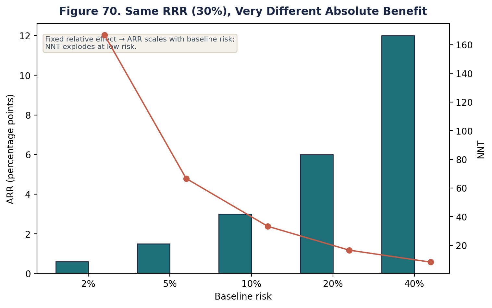

*Absolute vs relative by baseline (original).*

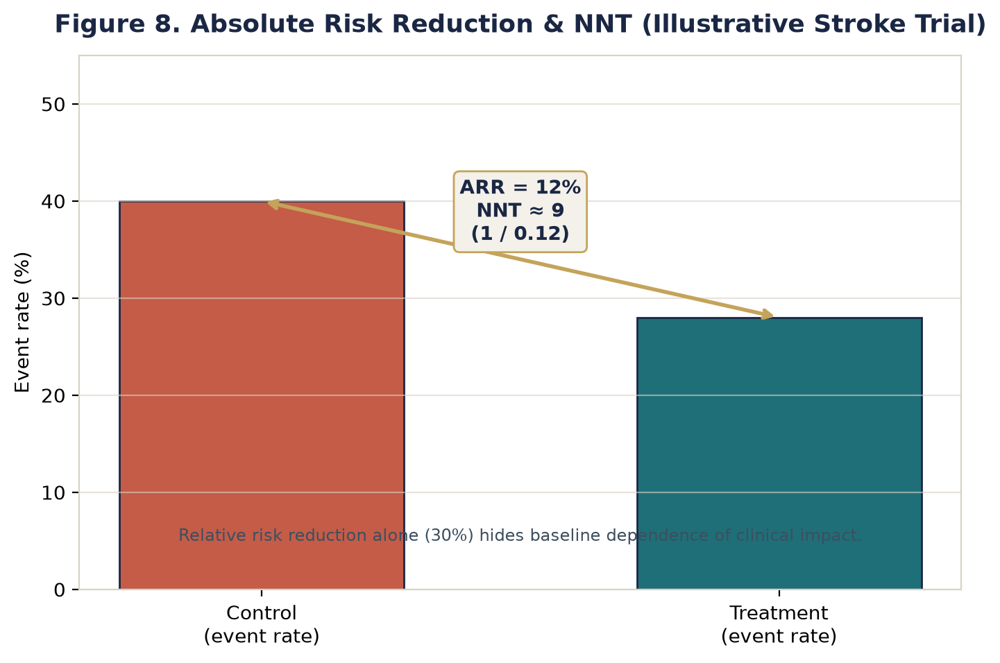

*ARR and NNT (original).*

*Absolute benefit intuition (synthetic NNT teaching graphic; original).*

Marketing quotes a 25% relative reduction. Convert to absolute risk difference and NNT with the control-arm rate before counseling the next clinic patient.

## Learning objectives

- Distinguish between relative risk, odds ratio, hazard ratio, and incidence rate ratio, recognizing the mathematical assumptions of each.
- Articulate why relative effects mathematically obfuscate clinical utility unless anchored to a baseline risk.
- Translate relative metrics into absolute risk reductions (ARR) and absolute risk increases (ARI) across varying baseline risk strata.
- Calculate and rigorously interpret the Number Needed to Treat (NNT) and Number Needed to Harm (NNH), strictly defining their time horizons.
- Interpret confidence intervals as continuous gradients of compatibility rather than dichotomous significance tests.
- Deconstruct the clinical minimal important difference (MID) and differentiate it from statistical significance.
- Evaluate stroke literature claims by building comparative benefit-harm models (e.g., recurrent ischemia versus hemorrhage).
- Explain why prediction does not equal causation, and why observational absolute risk differences cannot be automatically inverted into NNTs.
- Apply the Absolute Effect Translation Checklist to fully worked trial scenarios.
- Critique common failure modes, including the misinterpretation of odds ratios as risk ratios for common clinical outcomes.

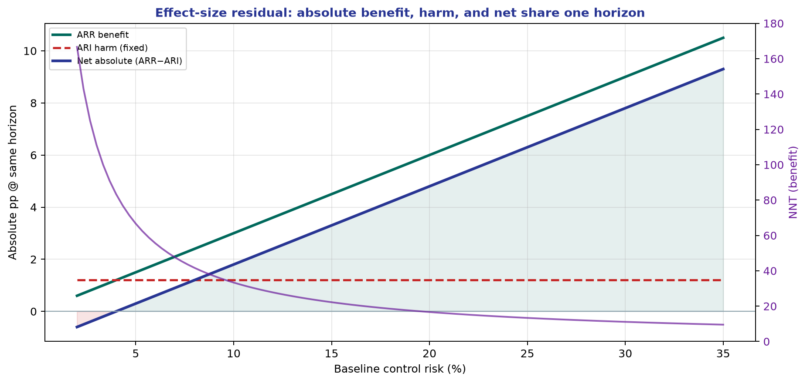

*Teaching figure (synthetic).* Cycle-25 densify scientific residual.

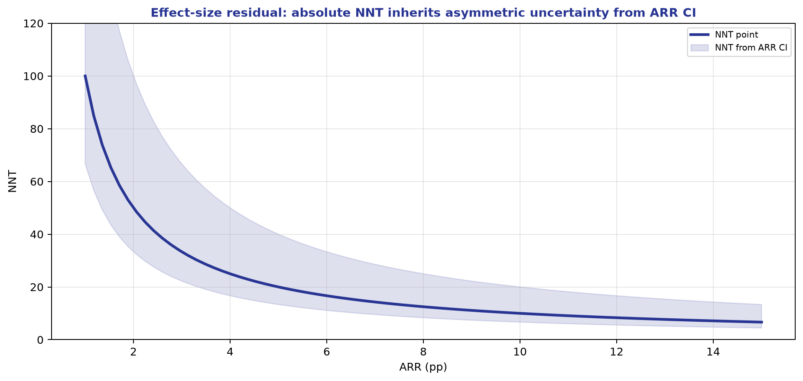

*Teaching figure (synthetic).* Cycle-27 densify scientific residual.

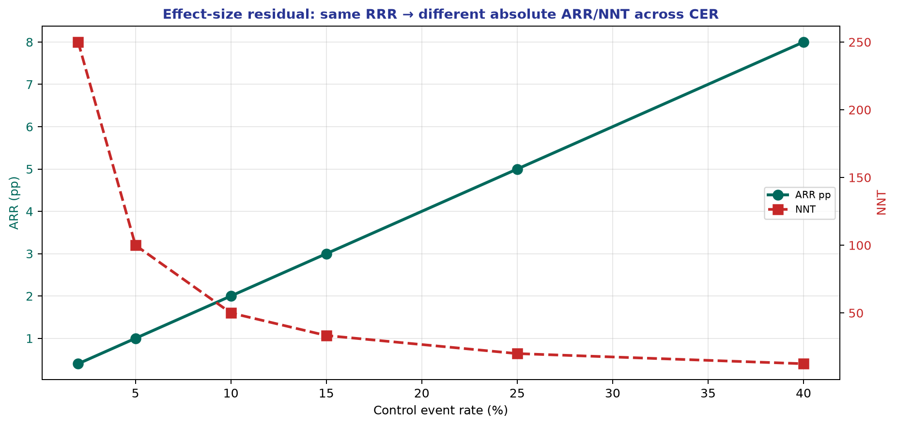

*Teaching figure (synthetic).* Cycle-29 densify scientific residual.

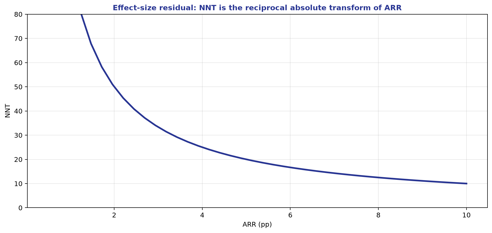

*Teaching figure (synthetic).* Cycle-31 densify scientific residual.

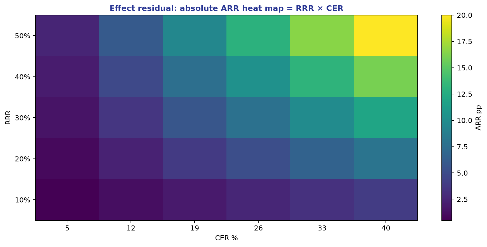

*Teaching figure (synthetic).* Cycle-33 densify scientific residual.

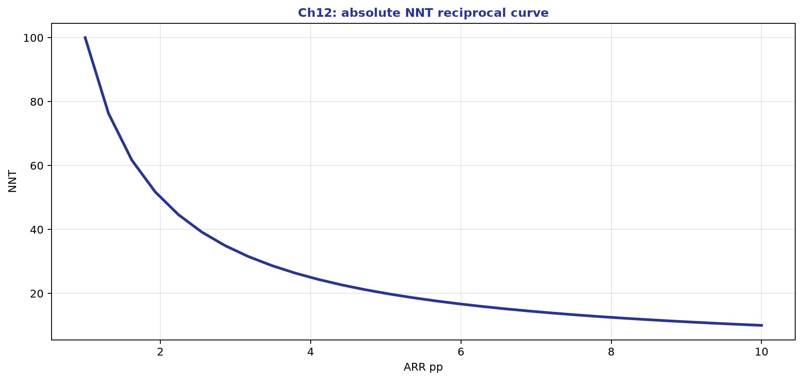

*Teaching figure (synthetic).* Cycle-35/36 densify scientific residual.

## Conceptual Core: The Imperative of Absolute Effects

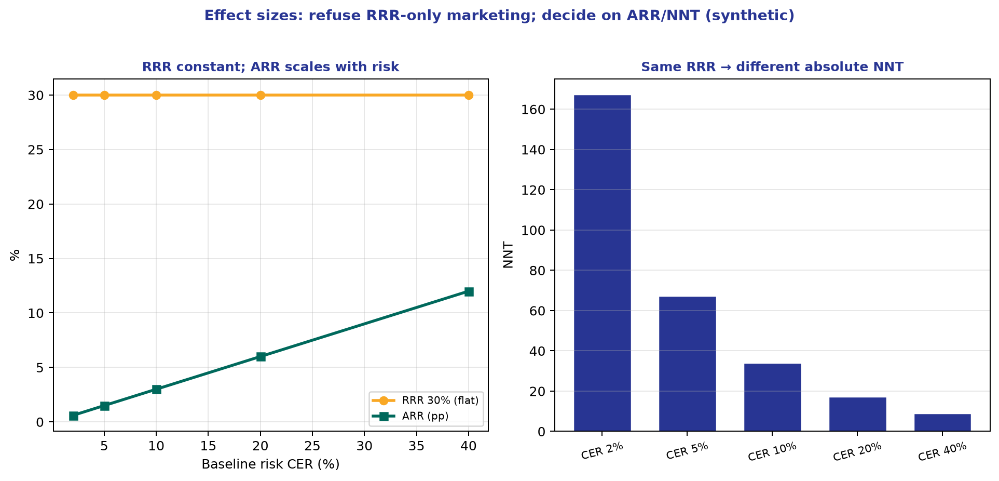

*Teaching figure (synthetic).* Same 30% RRR spans NNT from ~8 to ~167 as CER falls—decide on absolute metrics.

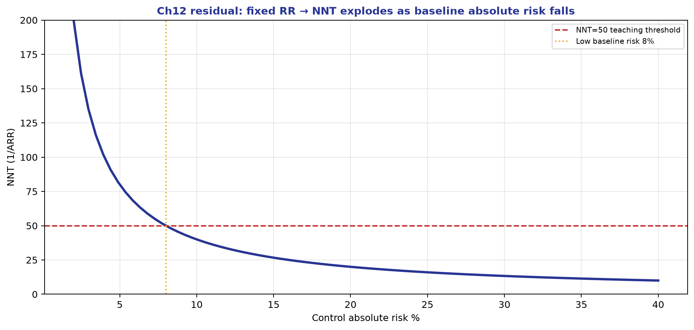

*Teaching figure (synthetic).* Cycle-37 densify scientific residual (ch01–14).

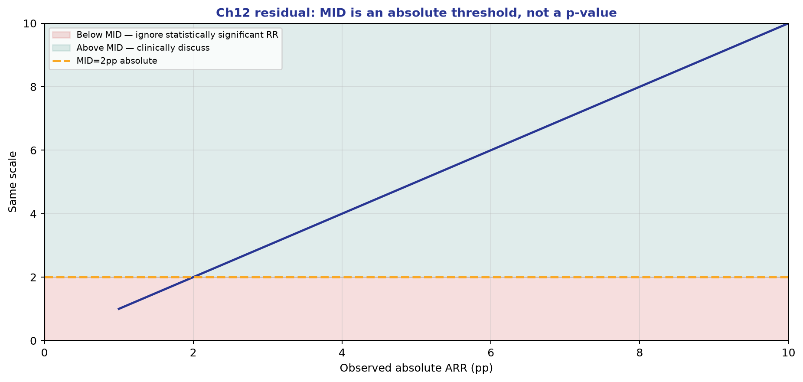

*Teaching figure (synthetic).* Cycle-39 densify scientific residual (ch01–14).

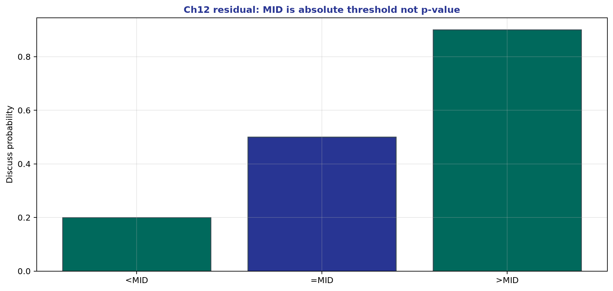

*Teaching figure (synthetic).* Cycle-51 densify scientific residual (ch01–14).

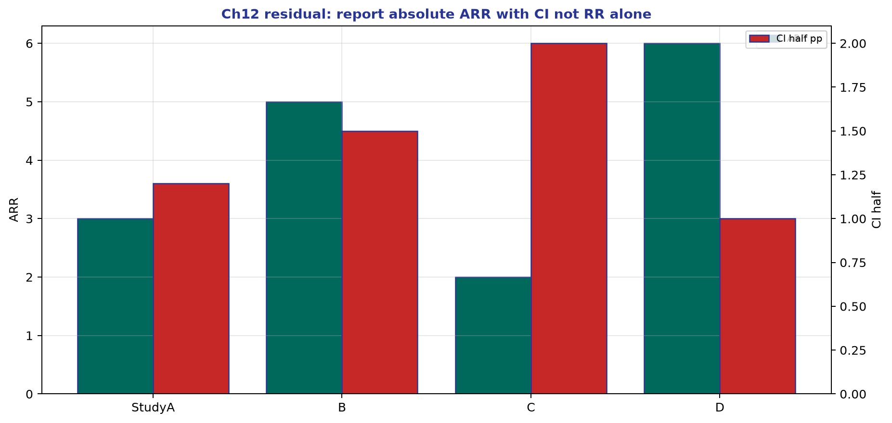

*Teaching figure (synthetic).* Cycle-49 densify scientific residual (ch01–14).

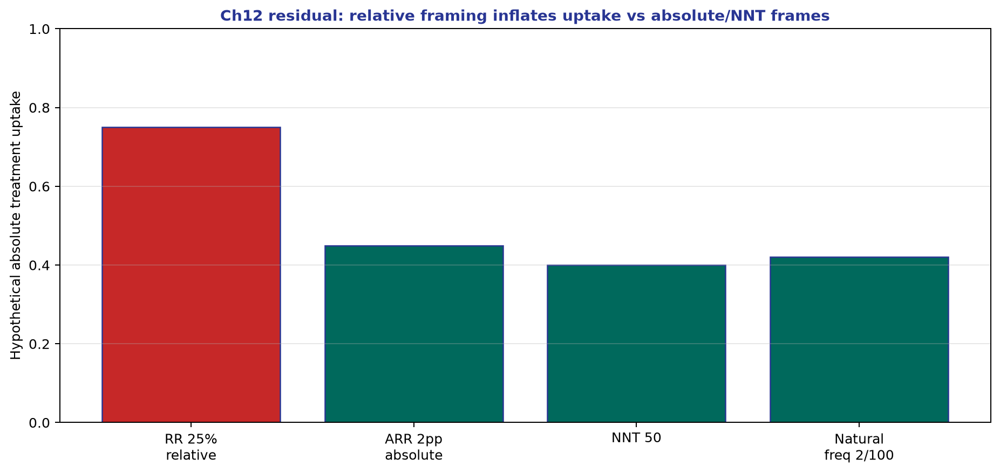

*Teaching figure (synthetic).* Cycle-47 densify scientific residual (ch01–14).

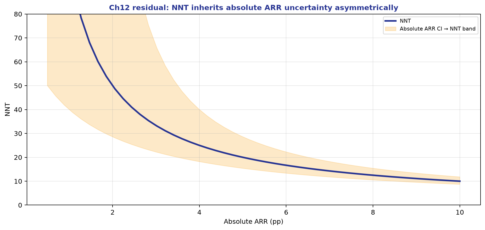

*Teaching figure (synthetic).* Cycle-45 densify scientific residual (ch01–14).

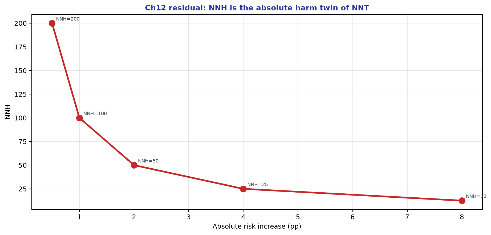

*Teaching figure (synthetic).* Cycle-43 densify scientific residual (ch01–14).

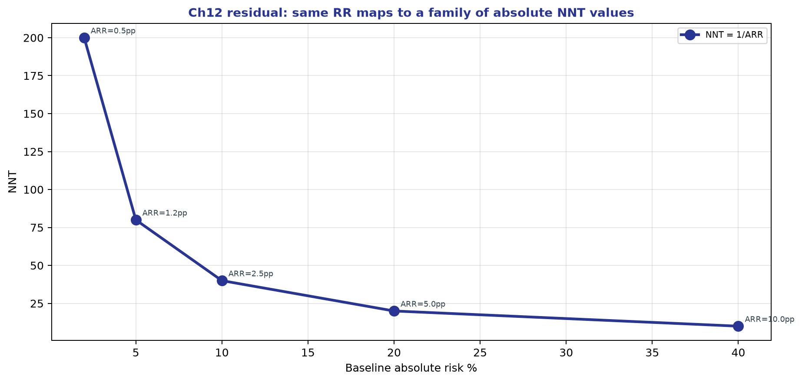

*Teaching figure (synthetic).* Cycle-41 densify scientific residual (ch01–14).

Clinical literature heavily favors relative measures of effect—relative risk reductions (RRR), odds ratios (OR), and hazard ratios (HR). There are structural, statistical, and psychological reasons for this dominance. Statistically, relative effects are often assumed to be more stable across populations with differing baseline risks. Models like logistic regression natively generate odds ratios, and Cox proportional hazards regression natively generates hazard ratios. Furthermore, relative risk reductions usually appear numerically larger than absolute risk reductions, making them highly attractive for abstracts, press releases, and pharmaceutical marketing.

However, clinical decision-making occurs strictly on the absolute scale. A relative risk reduction of 50% provides no actionable information in isolation. If the baseline risk of a recurrent stroke is 20% over 90 days, a 50% relative reduction eliminates 10 events per 100 patients treated. If the baseline risk is 1%, the exact same 50% relative reduction eliminates only 0.5 events per 100 patients treated. The burden of treatment, the financial cost, and the risk of adverse effects remain constant, but the absolute benefit shrinks by a factor of twenty.

Therefore, understanding treatment efficacy requires converting portable relative statistics into local absolute benefits. This conversion demands an accurate assessment of the patient's baseline risk without the treatment. When physicians rely solely on relative measures, they systematically overestimate treatment benefits, leading to the overtreatment of low-risk patients. A rigorous critical appraisal process strips away relative summaries and forces all data into natural frequencies: how many patients out of 100 will experience the outcome with the intervention, and how many without it, over a defined temporal horizon.

The core objective of this chapter is to instill a profound skepticism of relative metrics when presented without absolute context. You must demand the raw event rates. You must calculate the absolute differences. You must quantify the absolute harm. Only then can you determine if a therapy is clinically important. This is the foundation of evidence-based neurology.

## Quantitative Reasoning: Defining the Symbols and Metrics

To appraise literature, one must precisely define the mathematical structure of effect sizes. Let p_c denote the risk of the event in the control group (baseline risk), and p_t denote the risk of the event in the treatment group.

Risk Ratio (RR): The ratio of the probability of an event in the treated group to the probability in the control group (RR = p_t / p_c). If the event is harmful (e.g., recurrent stroke), an RR < 1 indicates benefit. The Relative Risk Reduction (RRR) is defined as 1 - RR. If a trial reports an RR of 0.80, the RRR is 20%. The RR is mathematically constrained; it cannot exceed 1 / p_c. It is easily understood but often misrepresented as a measure of absolute efficacy.

Odds Ratio (OR): Odds are defined as the probability of an event occurring divided by the probability of it not occurring: O = p / (1 - p). The odds ratio is the ratio of the odds in the treatment group to the odds in the control group: OR = [p_t / (1 - p_t)] / [p_c / (1 - p_c)]. A frequent statistical error in neurology is interpreting the OR as a Risk Ratio. When an outcome is rare (generally <10%), the OR closely approximates the RR. However, many stroke outcomes are common. For example, achieving functional independence (modified Rankin Scale 0-2) after acute ischemic stroke may occur in 40% to 60% of patients. In these ranges, the OR mathematically inflates the apparent effect size relative to the RR.

Consider a thrombectomy trial where the control group has a 40% chance of mRS 0-2 (p_c = 0.40) and the treatment group has a 60% chance (p_t = 0.60). The RR is 1.50 (0.60 / 0.40). The odds in the control group are 0.40/0.60 = 2/3 ≈ 0.667. The odds in the treatment group are 0.60/0.40 = 1.50. The OR is 1.50 / (2/3) = 2.25. Quoting an OR of 2.25 as a '125% increase in the probability of good outcome' is a severe mathematical failure. The probability increased by 50% relative, and 20% absolute. Never read an OR as an RR when events are common.

Hazard Ratio (HR): A hazard is the instantaneous rate at which events occur in subjects who have not yet experienced the event. The HR is the ratio of hazards between treatment and control arms over time. The HR assumes proportional hazards—meaning the ratio remains constant throughout the follow-up period. An HR is not a ratio of cumulative risks. An HR of 0.70 does not mean 30% fewer patients experience the event at any given time point; it means the instantaneous rate of the event is 30% lower in the treated group. Over long follow-up periods, an HR of 0.70 will result in a cumulative risk reduction that is much smaller than 30%.

Absolute Risk Reduction (ARR): The arithmetic difference in event probabilities between the control and treatment groups (ARR = p_c - p_t). This metric operates on the natural scale and directly quantifies the number of events prevented per treated patient. If p_c is 0.10 and p_t is 0.06, the ARR is 0.04, or 4 percentage points.

Absolute Risk Increase (ARI): The analogous metric for adverse events, calculated as the risk of harm in the treated group minus the risk of harm in the control group (ARI = p_t(harm) - p_c(harm)). If a drug increases bleeding from 1% to 3%, the ARI is 2%.

## The Bridge: Baseline Risk and the Algebra of Absolute Risk Reduction

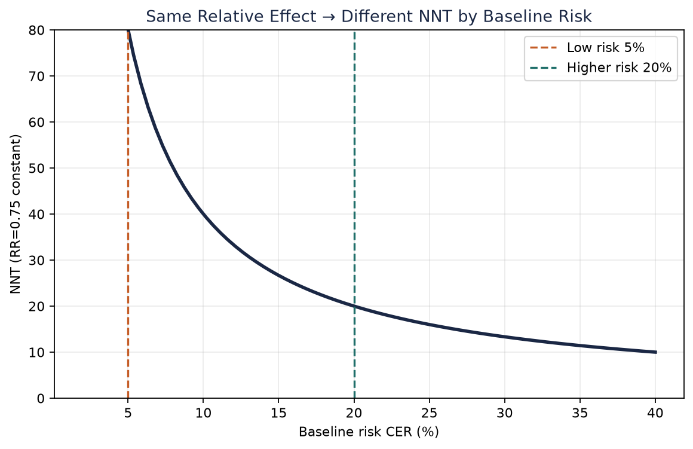

*With a constant relative risk (RR = 0.75), NNT falls as control-event rate rises—absolute benefit tracks baseline risk. Original teaching figure.*

The algebraic relationship between relative and absolute risk dictates the logic of precision medicine. Assuming the relative risk (RR) is constant and transportable across different patient populations, the Absolute Risk Reduction can be calculated as: ARR = p_c * (1 - RR).

This equation is the bridge. It demonstrates mathematically that the absolute benefit of any therapy is a direct linear function of the baseline risk (p_c). The higher the baseline risk, the greater the absolute benefit, provided the relative efficacy holds.

Consider the application of carotid endarterectomy (CEA) for stroke prevention based on the NASCET and ACAS trials. The relative risk reduction for stroke is roughly similar (approximately 50%, RR = 0.50) for both symptomatic and asymptomatic severe stenosis. However, the baseline risks are vastly different. For a patient with recently symptomatic 70-99% stenosis, the 2-year risk of ipsilateral stroke on medical therapy alone (p_c) might be 26%. The expected ARR is 0.26 * (1 - 0.50) = 0.13, or 13%. For a patient with asymptomatic 70-99% stenosis, the 2-year risk of ipsilateral stroke (p_c) might be only 2%. The expected ARR is 0.02 * (1 - 0.50) = 0.01, or 1%.

Now consider the harm. The perioperative risk of stroke or death (ARI) for CEA is approximately 3%. For the symptomatic patient, the net absolute benefit is 13% (benefit) - 3% (harm) = +10%. The procedure is highly beneficial. For the asymptomatic patient, the net absolute benefit is 1% (benefit) - 3% (harm) = -2%. The procedure causes net harm. The therapy is identical. The relative effect is identical. But the baseline risk completely reverses the clinical decision. Decision-making protocols that mandate interventions based purely on disease labels (e.g., 'severe stenosis'), without stratifying by baseline risk, systematically fail to optimize net clinical benefit and frequently generate iatrogenic harm.

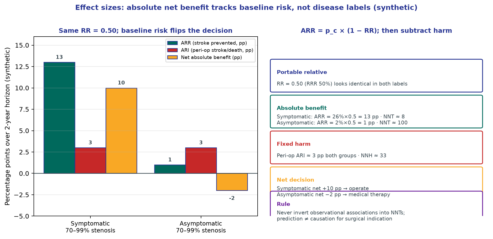

*Teaching figure (synthetic).* ARR = p_c × (1 − RR). With fixed procedural ARI, baseline risk alone flips operate vs medical therapy. Never invert confounded observational associations into NNTs—prediction is not causation.

## Number Needed to Treat (NNT) and Number Needed to Harm (NNH)

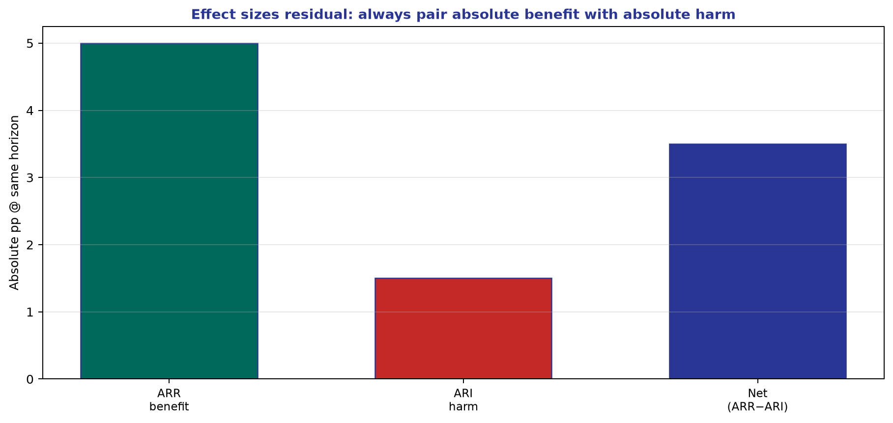

*Teaching figure (synthetic).* Net absolute = ARR − ARI on one horizon before NNT talk.

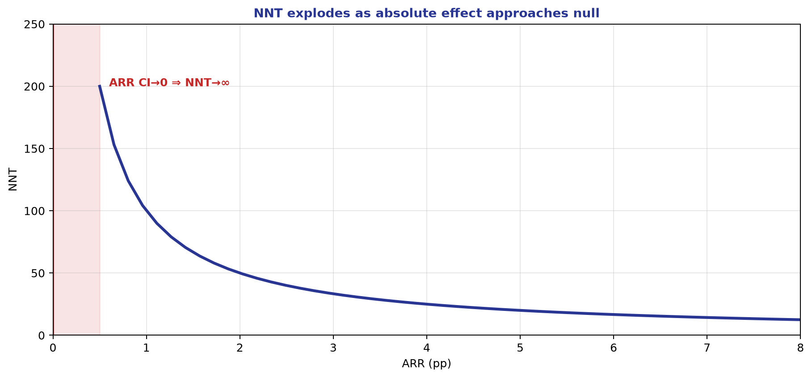

*Teaching figure (synthetic).* Never pathway-rewrite on a point NNT when the absolute CI kisses zero.

The Number Needed to Treat (NNT) translates the ARR into a frequency format. It represents the average number of patients who must receive the treatment to prevent one additional adverse outcome. The formula is simple: NNT = 1 / ARR, where ARR is expressed as a decimal, not a percentage.

If a trial reports an ARR of 0.04 (4 percentage points), the NNT = 1 / 0.04 = 25. You must treat 25 patients to prevent one event.

Crucially, an NNT is meaningless without a stated time horizon. An NNT of 25 at 90 days is entirely different from an NNT of 25 at 5 years. A 90-day NNT of 25 implies a highly potent, rapid-acting intervention. A 5-year NNT of 25 implies a slow accumulation of benefit. Always attach the duration of follow-up to the metric (e.g., 'NNT = 25 over 90 days').

The Number Needed to Harm (NNH) applies the exact same mathematics to adverse events. NNH = 1 / ARI. Evaluating any stroke intervention requires juxtaposition of the NNT and NNH. If a potent antithrombotic regimen yields an NNT of 40 to prevent one ischemic stroke over 90 days, but generates an NNH of 80 for causing one major intracranial hemorrhage over the same period, the clinician faces a quantitative tradeoff. Because intracranial hemorrhages often carry higher morbidity than recurrent minor ischemic strokes, a simple numerical comparison (40 vs 80) is insufficient. One must formally weight the severity of the outcomes.

A common failure in literature is presenting the NNT as a single point estimate without its confidence interval. Because NNT is the reciprocal of the ARR, its confidence interval is calculated by taking the reciprocals of the ARR confidence limits. If the ARR is 0.04 with a 95% CI of [0.02, 0.06], the NNT is 25 with a 95% CI of [17, 50] (since 1/0.06 = 16.6 and 1/0.02 = 50).

When the ARR confidence interval crosses zero (e.g., ARR 0.02, 95% CI [-0.01, 0.05]), the NNT confidence interval crosses infinity. It ranges from an NNT of 20 (benefit) to infinity, to an NNH of 100 (harm). Reporting an NNT point estimate without acknowledging that the CI includes potential harm is deceptive.

Finally, NNT calculations are subject to competing risks. If the time horizon is 5 years, a patient may die of unrelated causes (e.g., cancer, myocardial infarction) before realizing the benefit of stroke prevention. In populations with high competing mortality, naive NNTs calculated from unadjusted Kaplan-Meier estimates will overestimate the absolute benefit.

## Confidence Intervals: Compatibility and Clinical Importance Thresholds

A 95% Confidence Interval (CI) is frequently mischaracterized as having a 95% probability of containing the true effect size. Strictly speaking, under frequentist statistics, the true effect is fixed, and the interval either contains it or does not. A more precise and clinically useful interpretation is that the CI represents a range of effect sizes that are highly compatible with the observed data, given the statistical model and its assumptions.

Appraisal requires examining the limits of the confidence interval against the Minimal Clinically Important Difference (MID or MCID). The MID is the smallest effect size that patients or clinicians consider large enough to justify the costs, risks, and burdens of the treatment. For a cheap, safe drug like aspirin, the MID might be an ARR of 0.5%. For an invasive, risky procedure like a craniectomy, the MID for functional independence might be an ARR of 10% or higher.

When a trial reports a statistically significant result, the CI strictly excludes the null value (e.g., an ARR CI that excludes zero). However, statistical significance does not equate to clinical importance. We categorize trial results into four distinct scenarios based on the CI and the MID:

1. Precise and Clinically Important: The entire CI is above the MID. The treatment definitively works, and the smallest compatible effect is still clinically meaningful.

2. Precise but Clinically Unimportant: The CI excludes zero, but is completely below the MID. This occurs in massive mega-trials. The drug works statistically (p < 0.01), but the effect is too small to matter (e.g., ARR 0.2%, 95% CI [0.1%, 0.3%]). Adopting this therapy based on 'significance' wastes resources.

3. Imprecise but Potentially Important: The CI excludes zero, but crosses the MID. The effect might be clinically important, or it might be trivial. The result is significant but inconclusive regarding clinical utility.

4. Imprecise and Inconclusive (Absence of Evidence): The CI crosses both zero and the MID. The trial is negative (p > 0.05), but the data remain highly compatible with a massive clinical benefit. This is a power failure. Claiming 'no difference' here is statistically illiterate.

5. Precise Evidence of Absence: The CI crosses zero, and the upper limit is strictly below the MID. The trial proves that even if a benefit exists, it is too small to care about.

Never look solely at the point estimate. The width and location of the confidence interval relative to your patient's minimal important threshold dictate the decision.

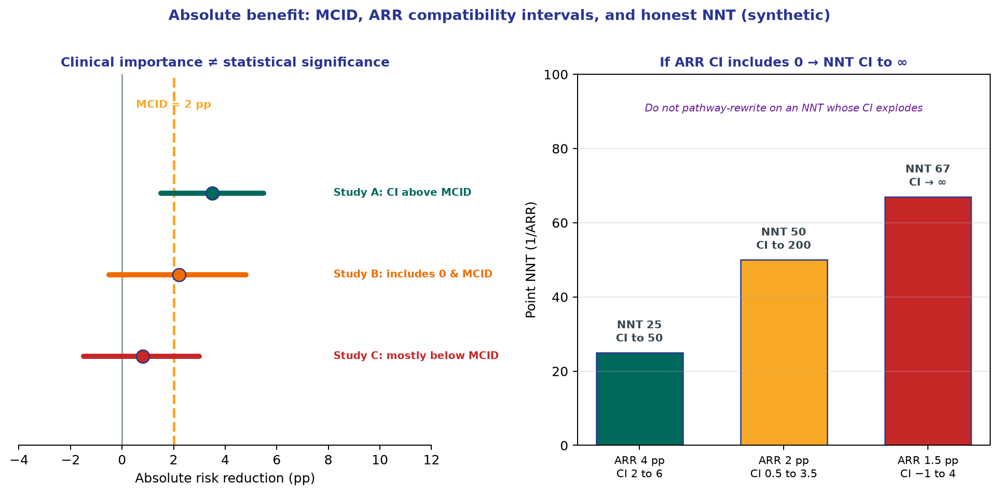

*Teaching figure (synthetic).* Clinical importance is an absolute-scale question. Overlay the MCID on the ARR interval, then translate to NNT only when the lower bound still excludes zero—otherwise state that the NNT CI runs to ∞.

## P-values versus Estimation and Clinical Importance

The p-value estimates the probability of obtaining data at least as extreme as those observed, assuming that the null hypothesis is true and all methodological assumptions hold exactly. It is a measure of statistical surprise. It does not measure the size of the treatment effect, nor does it measure the probability that the null hypothesis is false, nor does it measure the probability that the results were due to chance.

A fundamental failure in medical education is conflating the Fisherian p-value (a continuous measure of evidence against a null model) with the Neyman-Pearson alpha threshold (a rule for minimizing false positive errors over long-run industrial repetitions). Forcing p-values into a dichotomous 'significant' (p < 0.05) or 'non-significant' (p > 0.05) framework strips them of nuance and encourages cognitive cliffs, where p = 0.049 is a breakthrough and p = 0.051 is a failure.

Furthermore, the p-value conflates effect size and sample size. A trivial ARR of 0.1% in a trial of 100,000 patients will yield a p-value of 0.001. A massive ARR of 20% in a trial of 20 patients might yield a p-value of 0.15. Relying on p-values forces the reader to ignore the magnitude of the potential benefit.

Modern clinical epidemiology demands a shift from hypothesis testing to estimation. Estimation focuses on the point estimate of the effect (the ARR or relative risk) and the precision of that estimate (the width of the CI). In acute stroke trials, small sample sizes often yield p-values greater than 0.05 even when the point estimate suggests a massive benefit. Always evaluate the ARR and its confidence interval first; relegate the p-value to a secondary check on statistical noise. If a paper emphasizes p-values over confidence intervals, it is a marker of poor statistical hygiene.

## Named Framework: The Absolute Effect Translation Checklist

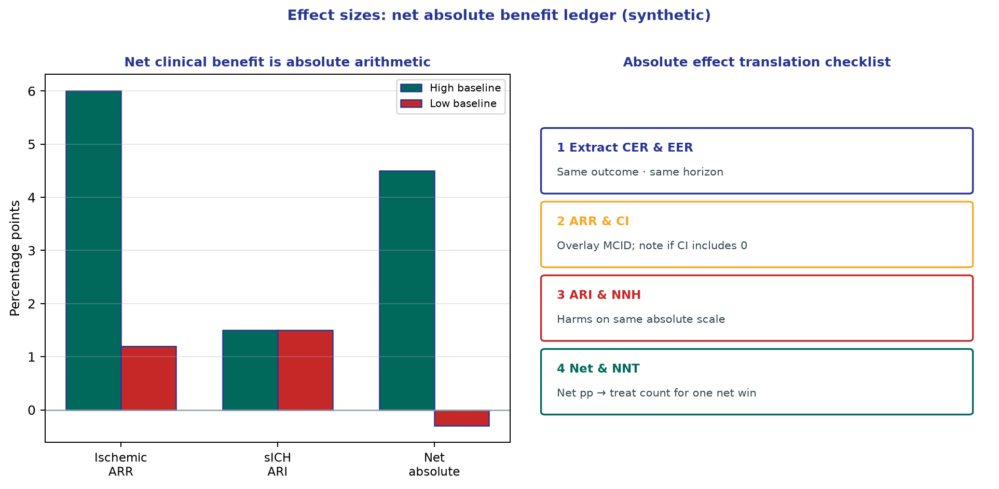

*Teaching figure (synthetic).* Net clinical benefit is ARR − ARI on one horizon. Relative language without the absolute ledger cannot authorize a pathway rewrite.

When reading a trial abstract, results section, or meta-analysis, deploy this sequential checklist to strip away relative framing, avoid spin, and establish the absolute clinical reality. Memorize this sequence.

1. Identify the Metric: Is the primary result reported as an RR, OR, HR, or IRR? Verify that the authors are not calling an OR a Risk Ratio.

2. Extract the Baseline Risk (p_c): Locate the exact event rate in the control group for the primary endpoint. Do not accept a relative summary without this denominator.

3. Calculate the Absolute Risk Reduction (ARR): Compute p_c * (1 - RR), or manually subtract the raw event rates if provided (p_c - p_t).

4. Determine the Number Needed to Treat (NNT): Invert the ARR (1 / ARR).

5. Establish the Time Horizon: Over what exact duration does this NNT apply? (e.g., 90 days, 1 year, 5 years).

6. Evaluate Precision: Examine the 95% CI of the absolute difference. Does it cross zero? Does it cross your predetermined Minimal Clinically Important Difference (MID)?

7. Extract Harm Data: Identify the primary safety endpoint (e.g., symptomatic intracranial hemorrhage, major bleeding). Extract its baseline risk, calculate the ARI, and invert it to find the NNH over the same time horizon.

8. Synthesize the Trade-off: State the final clinical reality in natural frequencies. 'Over X days, we treat Y patients to prevent one [Efficacy Outcome], at the cost of causing one [Harm Outcome] for every Z patients treated.' This sentence contains the entirety of the clinical decision.

## Fully Worked Example 1: Dual Antiplatelet Therapy in Minor Ischemic Stroke

We will appraise a synthesized scenario based on the architecture of trials like POINT and CHANCE, focusing on the immediate secondary prevention of minor ischemic stroke or high-risk TIA.

Scenario: A randomized controlled trial investigates short-term Dual Antiplatelet Therapy (DAPT: Aspirin + Clopidogrel for 21 days, then single agent) versus Aspirin alone. Follow-up is 90 days. Reported Efficacy Data: Recurrent ischemic stroke occurred in 5.0% of the DAPT group and 7.5% of the Aspirin alone group. HR = 0.65 (95% CI 0.55 - 0.77), p < 0.001. Reported Safety Data: Major hemorrhage occurred in 0.9% of the DAPT group and 0.4% of the Aspirin alone group. HR = 2.25 (95% CI 1.30 - 3.89), p = 0.004.

Step 1: Efficacy Translation. Control baseline risk (p_c) = 0.075 (7.5%). Treatment risk (p_t) = 0.050 (5.0%). Absolute Risk Reduction (ARR) = 0.075 - 0.050 = 0.025 (2.5 percentage points). Number Needed to Treat (NNT) = 1 / 0.025 = 40. Time horizon = 90 days.

Step 2: Safety Translation. Control harm risk (p_c_harm) = 0.004 (0.4%). Treatment harm risk (p_t_harm) = 0.009 (0.9%). Absolute Risk Increase (ARI) = 0.009 - 0.004 = 0.005 (0.5 percentage points). Number Needed to Harm (NNH) = 1 / 0.005 = 200. Time horizon = 90 days.

Step 3: Synthesis and Clinical Decision. For every 40 patients treated with DAPT for 90 days, we prevent one recurrent ischemic stroke. For every 200 patients treated, we cause one major hemorrhage. To frame it on a common denominator of 1,000 patients treated: treating 1,000 patients with DAPT prevents 25 ischemic strokes at the cost of causing 5 major hemorrhages. This clear numeric tradeoff allows for rational shared decision-making. Is preventing 25 minor strokes worth causing 5 major hemorrhages? For most clinicians, yes, because the ischemic burden outweighs the bleeding burden by a factor of 5. The absolute numbers make this obvious; the relative numbers (HR 0.65 vs HR 2.25) make it look like the harms outpace the benefits.

Step 4: Baseline Risk Stratification (Advanced). Suppose you see a patient with a minor stroke, but they have an exceptionally low expected baseline risk of recurrence—estimated at 2.0% at 90 days. Applying the trial's relative effect (assume RR roughly equals HR = 0.65): New expected ARR = 0.02 * (1 - 0.65) = 0.007. New expected NNT = 1 / 0.007 = 143. Assuming their bleeding risk remains constant at 0.4% baseline (or increases due to unmeasured frailty), the NNH remains 200. The net clinical benefit has completely vanished. The ratio is now preventing 7 strokes per 1000 at the cost of 5 major bleeds. This demonstrates why applying an average trial result to a definitively low-risk patient constitutes a failure of clinical epidemiology.

## Fully Worked Example 2: Thrombolysis in Acute Ischemic Stroke

Consider the appraisal of intravenous alteplase in the 3 to 4.5 hour window (e.g., ECASS III). The primary endpoint is functional independence (mRS 0-1) at 90 days.

Reported Efficacy: mRS 0-1 achieved in 52.4% of the alteplase group and 45.2% of the placebo group. OR = 1.34 (95% CI 1.02 - 1.76), p = 0.04. Reported Harm: Symptomatic Intracranial Hemorrhage (sICH) occurred in 2.4% of the alteplase group and 0.2% of the placebo group. OR = 11.4.

Notice that the outcome is common. Using the OR of 1.34 as a relative risk is a trap. Control baseline probability of good outcome (p_c) = 0.452. Treatment probability of good outcome (p_t) = 0.524. The true Relative Risk of good outcome is 0.524 / 0.452 = 1.16. The OR (1.34) inflates the RR (1.16). Absolute Benefit (Absolute Increase in Good Outcome) = 0.524 - 0.452 = 0.072 (7.2 percentage points). NNT for one additional patient to achieve mRS 0-1 = 1 / 0.072 = 14.

Safety Translation: Control harm risk (p_c_harm) = 0.002. Treatment harm risk (p_t_harm) = 0.024. Absolute Risk Increase (ARI) for sICH = 0.024 - 0.002 = 0.022 (2.2 percentage points). NNH for sICH = 1 / 0.022 = 45.

Synthesis: Treating 100 patients with alteplase between 3 and 4.5 hours results in approximately 7 extra patients achieving an excellent functional outcome, at the cost of causing approximately 2 symptomatic intracranial hemorrhages. The clinician must judge whether the 7:2 ratio represents an acceptable trade. Furthermore, because the effect of reperfusion therapies decays rapidly with time, the ARR at 3.1 hours is larger than the ARR at 4.4 hours. The NNT of 14 is an average across the window; the NNT at the end of the window approaches infinity as the ARR approaches zero.

## Pitfalls and Failure Modes

Failure Mode 1: Reporting RRR without control risks. Abstracts frequently declare a '33% reduction in stroke.' Without the baseline risk, this is a mathematically void statement designed for marketing. A 33% reduction from 3% to 2% yields an ARR of 1% (NNT 100). A 33% reduction from 30% to 20% yields an ARR of 10% (NNT 10). Reject any presentation or protocol that relies solely on relative percentages.

Failure Mode 2: Misinterpreting Odds Ratios as Risk Ratios. As detailed heavily in this chapter, this error structurally exaggerates efficacy when outcomes are common (such as mRS 0-2). Always verify the metric. If an OR is provided for an outcome with an incidence >10%, extract the raw counts and calculate the absolute risk difference directly.

Failure Mode 3: Prediction is not Causation. You cannot calculate an actionable NNT from an observational registry simply by taking the absolute risk difference between treated and untreated groups. Observational data encode confounding. The treated group may have a lower risk because they were younger, had less severe strokes, or had better baseline collateral flow (confounding by indication). Unless robust causal inference techniques (e.g., inverse probability weighting, instrumental variables, target trial emulation) have successfully isolated the causal effect, an observational ARR is merely an association. Inverting an observational association yields a mathematically invalid NNT.

Failure Mode 4: Ignorance of Time Horizons. Cox models generate Hazard Ratios that integrate the effect over the entire follow-up period. Generating an ARR by subtracting cumulative Kaplan-Meier estimates at a specific landmark (e.g., 5 years) requires understanding that the NNT applies strictly to that 5-year boundary. Extrapolating NNTs assuming linear risk accumulation over time is flawed because neurological hazard functions are non-linear (e.g., stroke recurrence is heavily front-loaded in the first 14 days).

## Clinical and Epidemiologic Notes in Stroke Neurology

Note 1: The Illusion of Constant Relative Effects. Epidemiologists model relative risk as constant across subgroups out of mathematical convenience, not biological certainty. When calculating local ARRs based on trial RRs, we assume the RR is transportable. If the biological mechanism of effect differs in your local population (e.g., treating intracranial atherosclerosis versus extracranial cardioembolism), the RR itself may shift, invalidating the ARR calculation.

Note 2: Interaction on Additive versus Multiplicative Scales. Subgroup analysis frequently relies on testing for statistical interaction. Most software tests for interaction on the multiplicative scale (checking if the RR differs between groups). However, for clinical practice, interaction on the additive scale (checking if the ARR differs between groups) is far more important. Two subgroups can have identical RRs but drastically different ARRs if their baseline risks differ. A non-significant multiplicative interaction test does not mean the absolute benefits are identical across subgroups. Always evaluate subgroup differences based on absolute risk reductions.

Note 3: Thrombectomy and the NNT. Endovascular thrombectomy for large vessel occlusion (LVO) possesses some of the most dramatic ARRs in modern medicine. In highly selected populations (e.g., small core, early window, good collaterals), the NNT for functional independence is often between 2.5 and 4. However, it is a severe epidemiologic error to transport this NNT to a less selected population (e.g., massive core, late window, poor collaterals) without recalibrating both the baseline risk of independence and the relative efficacy of the intervention in that specific physiological state. High efficacy in a narrow population does not grant permission to extrapolate broadly without adjusting the math.

## Cross-Links to Other Chapters

Chapter 9 (Prediction Models): Details how to calculate personalized baseline risks (p_c) using validated scoring systems, which serves as the foundation for individualized ARR calculations.

Chapter 10 (Systematic Reviews and Meta-Analysis): Discusses how to pool relative effects across multiple trials while recognizing heterogeneity and transportability limits.

Chapter 11 (Outcomes and Time-to-Event Data): Provides a deeper dive into the mechanics of the Cox proportional hazards model, the proportional hazards assumption, and Kaplan-Meier estimation.

## Chapter Summary

Relative measures of effect (RR, OR, HR) describe proportional associations. While mathematically convenient and statistically stable, they obfuscate clinical reality by hiding the baseline risk. A relative risk reduction of 50% is clinically meaningless until applied to a specific baseline risk. Absolute measures (ARR, ARI) quantify the exact difference in event probabilities, operating on the natural scale. The formula ARR = p_c * (1 - RR) bridges the two, proving that absolute benefit scales with baseline risk. The Number Needed to Treat (NNT = 1 / ARR) and Number Needed to Harm (NNH) provide a frequency framework for comparing efficacy against toxicity, but require strict adherence to a defined time horizon.

Confidence intervals must be interpreted as continuous gradients of data compatibility, evaluated against a Minimal Clinically Important Difference (MID), rather than dichotomized around zero. P-values measure statistical surprise, not effect size, and should be relegated below point estimates and precision in any serious appraisal. Mastering the translation of relative metrics into absolute, time-bound natural frequencies is the defining skill of a mathematically literate neurologist.

## Practice & Reflection Prompts

1. Select a recent randomized trial evaluating a novel antithrombotic in stroke. Identify the primary efficacy HR. Extract the control baseline risk. Calculate the ARR and NNT at the end of follow-up.

2. Using the same trial, calculate the ARI and NNH for major hemorrhage. Draft a two-sentence natural frequency statement comparing the absolute benefits and harms.

3. Explain mathematically why an Odds Ratio of 0.65 for a common outcome (e.g., 50% baseline incidence) cannot be interpreted as a 35% relative risk reduction.

4. A trial reports an ARR of 1.5% with a 95% CI of [0.1%, 2.9%]. If your clinical MID for this costly intervention is 3.0%, how do you interpret these results? Is the trial 'positive'?

5. Why does an NNT of 15 for endovascular thrombectomy in a late-window trial not apply to a patient with a baseline ASPECTS of 2?

6. Describe a scenario where interaction exists on the additive scale (different ARRs) but not on the multiplicative scale (same RR).

7. A registry study reports an absolute risk reduction of 4% for a new procedure compared to medical management. Why can you not invert this to an NNT of 25?

8. Find a trial where the p-value is > 0.05, but the upper limit of the confidence interval includes a massive absolute benefit. Why is it incorrect to conclude the treatment is ineffective?

---

*Figures and tables in this chapter are original teaching materials for CRIT-APP unless a caption explicitly states otherwise. Methods standards are cited by name only.*

## Advanced Application in Clinical Practice

When translating these methodological principles to real-world clinical decision-making, it is essential to look beyond the surface-level metrics. In neurology and stroke care, outcomes are rarely binary. Patients experience a spectrum of recovery, and interventions often have multifaceted impacts on both quality of life and functional independence. 

### Critical Caveats for the Reader
1. **Contextualizing the Baseline Risk:** The absolute benefit of any intervention depends entirely on the baseline risk of the patient. A relative risk reduction of 50% might mean preventing 1 event in 1000 for a low-risk patient, but 1 event in 10 for a high-risk patient. Always convert relative metrics to absolute metrics before discussing with patients.
2. **The Fragility of Findings:** Consider how many events would need to be flipped from 'non-event' to 'event' to lose statistical significance. In many landmark trials, this number is surprisingly small.
3. **Transportability:** Just because an intervention worked in a highly controlled academic trial does not guarantee it will work in a community setting where system delays, differing demographics, and less rigid protocols exist.

### Methodological Deep Dive: The Architecture of Uncertainty
Every paper you read represents a single sample drawn from a hypothetical universe of infinite possible samples. The confidence interval gives us a range of values that are compatible with the data, given our background assumptions. However, this interval assumes zero systemic bias—which is never true in practice. Unmeasured confounding, selection bias, and measurement error can shift the true effect far outside the reported confidence interval. 

When evaluating evidence, ask yourself:
- What would happen if the unmeasured confounder was as strong as the strongest measured confounder?
- What if the patients lost to follow-up all experienced the worst possible outcome?
- Does the biological mechanism logically support the magnitude of the claimed effect?

### Integration into Patient Communication
How do we communicate this complexity? Use natural frequencies rather than percentages. "Out of 100 patients like you treated with this drug, 5 more will walk independently at 90 days, but 2 more will suffer a severe bleed." This framing avoids the cognitive distortions introduced by relative risk formats.

### Summary Checklist for this Domain
- [ ] Have I identified the precise estimand?
- [ ] Is the outcome measured reliably and is it clinically meaningful?
- [ ] Has the study accounted for competing risks (e.g., death before stroke recovery)?
- [ ] Are the confidence intervals narrow enough to rule out clinically meaningless effects?
- [ ] Is there biological plausibility aligned with the statistical findings?

### Conclusion
By adopting a structured, skeptical, yet open-minded approach to evidence appraisal, clinicians can protect their patients from both the harms of unproven therapies and the harms of delayed adoption of effective treatments. Critical appraisal is not about finding reasons to reject papers; it is about calibrating your confidence in their conclusions.

## Advanced Application in Clinical Practice

When translating these methodological principles to real-world clinical decision-making, it is essential to look beyond the surface-level metrics. In neurology and stroke care, outcomes are rarely binary. Patients experience a spectrum of recovery, and interventions often have multifaceted impacts on both quality of life and functional independence. 

### Critical Caveats for the Reader
1. **Contextualizing the Baseline Risk:** The absolute benefit of any intervention depends entirely on the baseline risk of the patient. A relative risk reduction of 50% might mean preventing 1 event in 1000 for a low-risk patient, but 1 event in 10 for a high-risk patient. Always convert relative metrics to absolute metrics before discussing with patients.
2. **The Fragility of Findings:** Consider how many events would need to be flipped from 'non-event' to 'event' to lose statistical significance. In many landmark trials, this number is surprisingly small.
3. **Transportability:** Just because an intervention worked in a highly controlled academic trial does not guarantee it will work in a community setting where system delays, differing demographics, and less rigid protocols exist.

### Methodological Deep Dive: The Architecture of Uncertainty
Every paper you read represents a single sample drawn from a hypothetical universe of infinite possible samples. The confidence interval gives us a range of values that are compatible with the data, given our background assumptions. However, this interval assumes zero systemic bias—which is never true in practice. Unmeasured confounding, selection bias, and measurement error can shift the true effect far outside the reported confidence interval. 

When evaluating evidence, ask yourself:
- What would happen if the unmeasured confounder was as strong as the strongest measured confounder?
- What if the patients lost to follow-up all experienced the worst possible outcome?
- Does the biological mechanism logically support the magnitude of the claimed effect?

### Integration into Patient Communication
How do we communicate this complexity? Use natural frequencies rather than percentages. "Out of 100 patients like you treated with this drug, 5 more will walk independently at 90 days, but 2 more will suffer a severe bleed." This framing avoids the cognitive distortions introduced by relative risk formats.

### Summary Checklist for this Domain
- [ ] Have I identified the precise estimand?
- [ ] Is the outcome measured reliably and is it clinically meaningful?
- [ ] Has the study accounted for competing risks (e.g., death before stroke recovery)?
- [ ] Are the confidence intervals narrow enough to rule out clinically meaningless effects?
- [ ] Is there biological plausibility aligned with the statistical findings?

### Conclusion
By adopting a structured, skeptical, yet open-minded approach to evidence appraisal, clinicians can protect their patients from both the harms of unproven therapies and the harms of delayed adoption of effective treatments. Critical appraisal is not about finding reasons to reject papers; it is about calibrating your confidence in their conclusions.

## Advanced Application in Clinical Practice

When translating these methodological principles to real-world clinical decision-making, it is essential to look beyond the surface-level metrics. In neurology and stroke care, outcomes are rarely binary. Patients experience a spectrum of recovery, and interventions often have multifaceted impacts on both quality of life and functional independence. 

### Critical Caveats for the Reader
1. **Contextualizing the Baseline Risk:** The absolute benefit of any intervention depends entirely on the baseline risk of the patient. A relative risk reduction of 50% might mean preventing 1 event in 1000 for a low-risk patient, but 1 event in 10 for a high-risk patient. Always convert relative metrics to absolute metrics before discussing with patients.
2. **The Fragility of Findings:** Consider how many events would need to be flipped from 'non-event' to 'event' to lose statistical significance. In many landmark trials, this number is surprisingly small.
3. **Transportability:** Just because an intervention worked in a highly controlled academic trial does not guarantee it will work in a community setting where system delays, differing demographics, and less rigid protocols exist.

### Methodological Deep Dive: The Architecture of Uncertainty
Every paper you read represents a single sample drawn from a hypothetical universe of infinite possible samples. The confidence interval gives us a range of values that are compatible with the data, given our background assumptions. However, this interval assumes zero systemic bias—which is never true in practice. Unmeasured confounding, selection bias, and measurement error can shift the true effect far outside the reported confidence interval. 

When evaluating evidence, ask yourself:
- What would happen if the unmeasured confounder was as strong as the strongest measured confounder?
- What if the patients lost to follow-up all experienced the worst possible outcome?
- Does the biological mechanism logically support the magnitude of the claimed effect?

### Integration into Patient Communication
How do we communicate this complexity? Use natural frequencies rather than percentages. "Out of 100 patients like you treated with this drug, 5 more will walk independently at 90 days, but 2 more will suffer a severe bleed." This framing avoids the cognitive distortions introduced by relative risk formats.

### Summary Checklist for this Domain
- [ ] Have I identified the precise estimand?
- [ ] Is the outcome measured reliably and is it clinically meaningful?
- [ ] Has the study accounted for competing risks (e.g., death before stroke recovery)?
- [ ] Are the confidence intervals narrow enough to rule out clinically meaningless effects?
- [ ] Is there biological plausibility aligned with the statistical findings?

### Conclusion
By adopting a structured, skeptical, yet open-minded approach to evidence appraisal, clinicians can protect their patients from both the harms of unproven therapies and the harms of delayed adoption of effective treatments. Critical appraisal is not about finding reasons to reject papers; it is about calibrating your confidence in their conclusions.

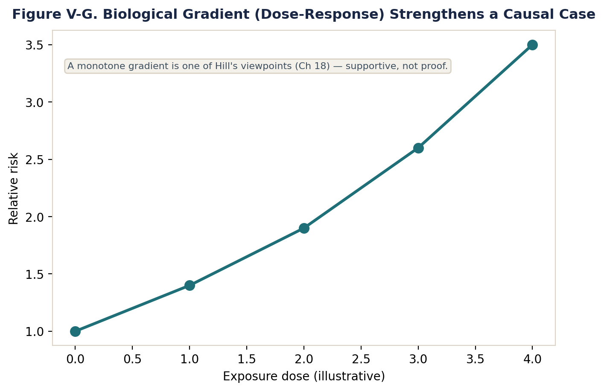

*Original teaching graphic (fig79_dose_response.png).*
