# Chapter 13. Subgroups, Heterogeneity of Treatment Effect, and Spin

## Opening


*Subgroup credibility probes (original).*


*Spin detector checklist graphic (original).*


*HTE credibility (original).*


*Spin patterns to force into the open (original teaching graphic).*


A slide claims benefit only in women under 70. Subgroup forests invite storytelling. Require pre-specification, interaction tests, and biological credibility.


## Learning objectives

- Distinguish pre-specified from post-hoc subgroup analyses and articulate the epistemic collapse induced by data-driven subgroup selection.
- Differentiate a formal statistical interaction test from a within-subgroup main-effect p-value, and mathematically demonstrate why comparing adjacent confidence intervals on a forest plot is invalid.
- Calculate and interpret heterogeneity of treatment effect (HTE) on both absolute (risk difference) and relative (risk ratio) scales, proving why constant relative effects guarantee HTE on the absolute scale when baseline risk varies.
- Define and quantify the penalty of multiplicity when evaluating multiple subgroups, applying family-wise error rate principles to stroke trial appendices.
- Enforce strict credibility criteria (e.g., the SUN framework) before accepting HTE claims, separating hypothesis-generating signals from actionable clinical rules.
- Diagnose spin in abstracts, press releases, and discussion sections, specifically targeting secondary endpoint elevation and suppression of absolute effect sizes.
- Evaluate the structural impact of industry funding, trial sponsorship, and author conflicts of interest on the presentation and selective reporting of subgroups.
- Appraise preprints safely by identifying absent peer-review filters for multiple testing, spin, and unsupported causal language.
- Deconstruct a fully worked numerical example of a false-positive subgroup finding, translating the statistical artifact into a bedside decision-making caveat.
- Apply the rule that prediction is not causation when analyzing baseline subgroups, and recognize how conditioning on post-randomization variables induces collider stratification bias.

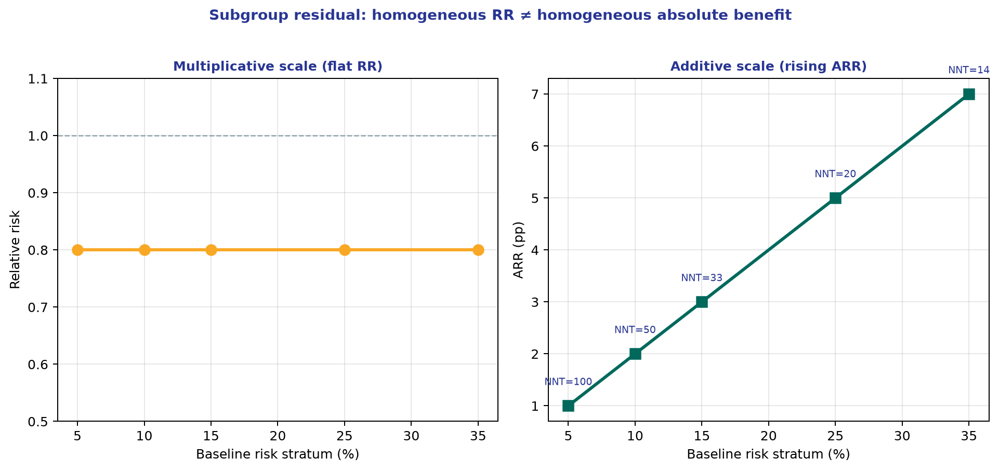

*Teaching figure (synthetic).* Cycle-25 densify scientific residual.

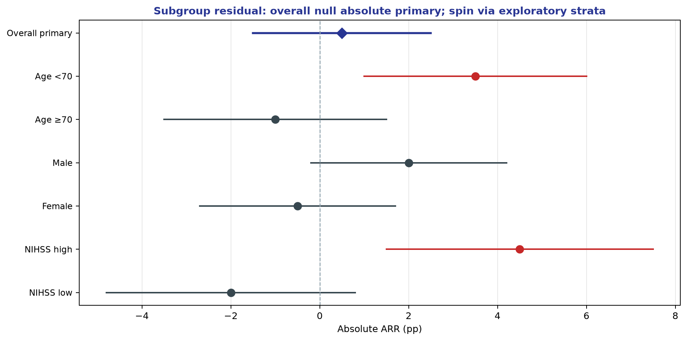

*Teaching figure (synthetic).* Cycle-27 densify scientific residual.

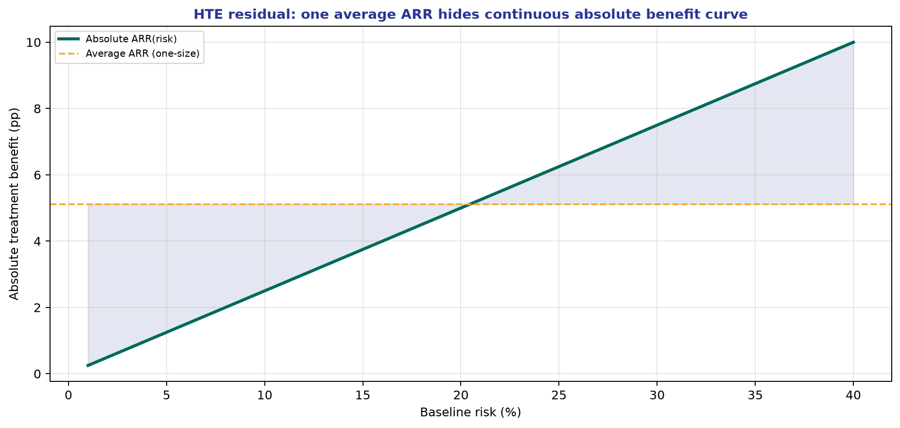

*Teaching figure (synthetic).* Cycle-29 densify scientific residual.

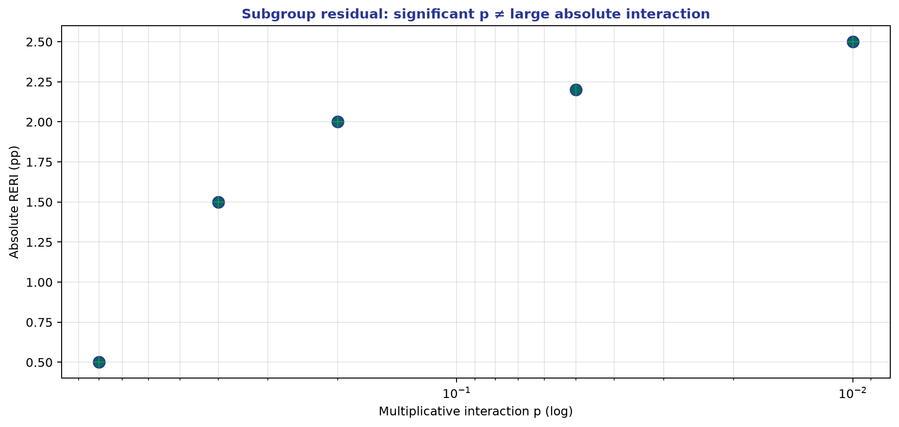

*Teaching figure (synthetic).* Cycle-31 densify scientific residual.

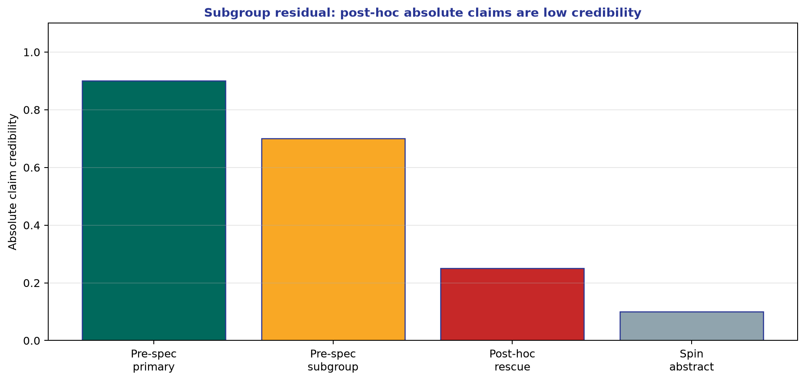

*Teaching figure (synthetic).* Cycle-33 densify scientific residual.

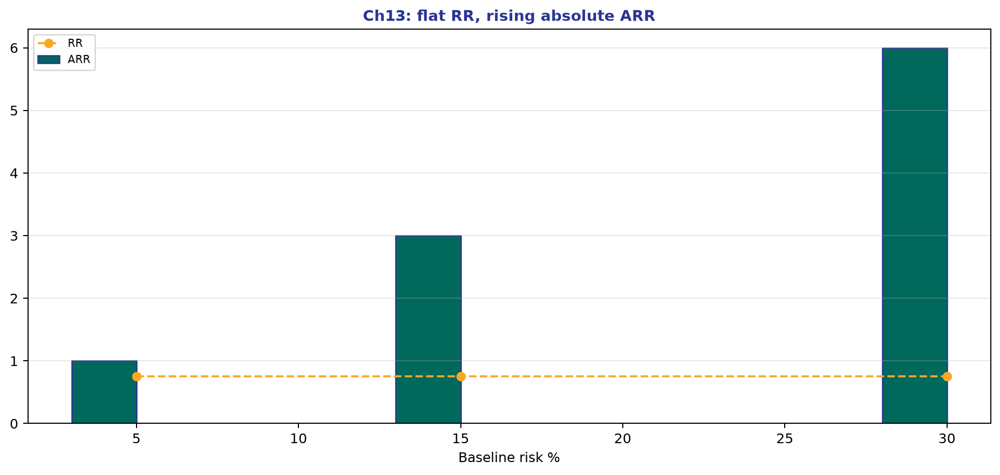

*Teaching figure (synthetic).* Cycle-35/36 densify scientific residual.

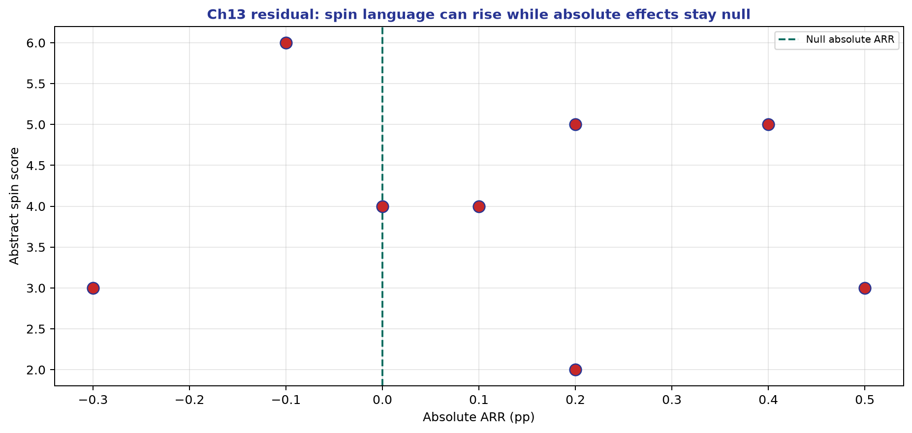

*Teaching figure (synthetic).* Cycle-43 densify scientific residual (ch01–14).


*Teaching figure (synthetic).* Cycle-695 densify scientific residual (ch01–14).


*Teaching figure (synthetic).* Cycle-693 densify scientific residual (ch01–14).


*Teaching figure (synthetic).* Cycle-691 densify scientific residual (ch01–14).


*Teaching figure (synthetic).* Cycle-689 densify scientific residual (ch01–14).


*Teaching figure (synthetic).* Cycle-687 densify scientific residual (ch01–14).


*Teaching figure (synthetic).* Cycle-685 densify scientific residual (ch01–14).


*Teaching figure (synthetic).* Cycle-683 densify scientific residual (ch01–14).


*Teaching figure (synthetic).* Cycle-681 densify scientific residual (ch01–14).


*Teaching figure (synthetic).* Cycle-679 densify scientific residual (ch01–14).


*Teaching figure (synthetic).* Cycle-677 densify scientific residual (ch01–14).


*Teaching figure (synthetic).* Cycle-675 densify scientific residual (ch01–14).


*Teaching figure (synthetic).* Cycle-673 densify scientific residual (ch01–14).


*Teaching figure (synthetic).* Cycle-671 densify scientific residual (ch01–14).


*Teaching figure (synthetic).* Cycle-669 densify scientific residual (ch01–14).


*Teaching figure (synthetic).* Cycle-667 densify scientific residual (ch01–14).


*Teaching figure (synthetic).* Cycle-665 densify scientific residual (ch01–14).


*Teaching figure (synthetic).* Cycle-663 densify scientific residual (ch01–14).


*Teaching figure (synthetic).* Cycle-661 densify scientific residual (ch01–14).


*Teaching figure (synthetic).* Cycle-659 densify scientific residual (ch01–14).


*Teaching figure (synthetic).* Cycle-657 densify scientific residual (ch01–14).


*Teaching figure (synthetic).* Cycle-655 densify scientific residual (ch01–14).


*Teaching figure (synthetic).* Cycle-653 densify scientific residual (ch01–14).


*Teaching figure (synthetic).* Cycle-651 densify scientific residual (ch01–14).


*Teaching figure (synthetic).* Cycle-649 densify scientific residual (ch01–14).


*Teaching figure (synthetic).* Cycle-647 densify scientific residual (ch01–14).


*Teaching figure (synthetic).* Cycle-645 densify scientific residual (ch01–14).


*Teaching figure (synthetic).* Cycle-643 densify scientific residual (ch01–14).


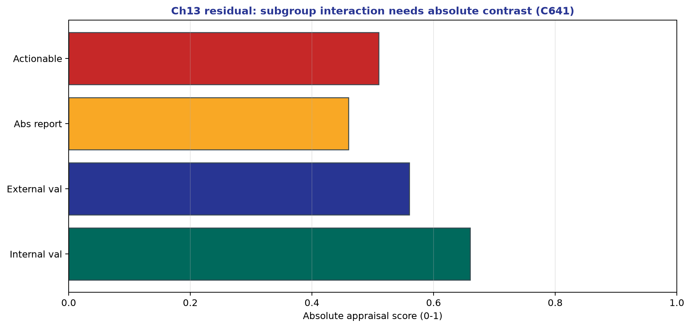

*Teaching figure (synthetic).* Cycle-641 densify scientific residual (ch01–14).


*Teaching figure (synthetic).* Cycle-639 densify scientific residual (ch01–14).


*Teaching figure (synthetic).* Cycle-637 densify scientific residual (ch01–14).


*Teaching figure (synthetic).* Cycle-635 densify scientific residual (ch01–14).


*Teaching figure (synthetic).* Cycle-633 densify scientific residual (ch01–14).


*Teaching figure (synthetic).* Cycle-631 densify scientific residual (ch01–14).


*Teaching figure (synthetic).* Cycle-629 densify scientific residual (ch01–14).


*Teaching figure (synthetic).* Cycle-627 densify scientific residual (ch01–14).


*Teaching figure (synthetic).* Cycle-625 densify scientific residual (ch01–14).


*Teaching figure (synthetic).* Cycle-623 densify scientific residual (ch01–14).


*Teaching figure (synthetic).* Cycle-621 densify scientific residual (ch01–14).


*Teaching figure (synthetic).* Cycle-619 densify scientific residual (ch01–14).


*Teaching figure (synthetic).* Cycle-617 densify scientific residual (ch01–14).


*Teaching figure (synthetic).* Cycle-615 densify scientific residual (ch01–14).


*Teaching figure (synthetic).* Cycle-613 densify scientific residual (ch01–14).


*Teaching figure (synthetic).* Cycle-611 densify scientific residual (ch01–14).


*Teaching figure (synthetic).* Cycle-609 densify scientific residual (ch01–14).


*Teaching figure (synthetic).* Cycle-607 densify scientific residual (ch01–14).


*Teaching figure (synthetic).* Cycle-605 densify scientific residual (ch01–14).


*Teaching figure (synthetic).* Cycle-603 densify scientific residual (ch01–14).


*Teaching figure (synthetic).* Cycle-601 densify scientific residual (ch01–14).


*Teaching figure (synthetic).* Cycle-599 densify scientific residual (ch01–14).


*Teaching figure (synthetic).* Cycle-597 densify scientific residual (ch01–14).


*Teaching figure (synthetic).* Cycle-595 densify scientific residual (ch01–14).


*Teaching figure (synthetic).* Cycle-593 densify scientific residual (ch01–14).


*Teaching figure (synthetic).* Cycle-591 densify scientific residual (ch01–14).


*Teaching figure (synthetic).* Cycle-589 densify scientific residual (ch01–14).


*Teaching figure (synthetic).* Cycle-587 densify scientific residual (ch01–14).


*Teaching figure (synthetic).* Cycle-585 densify scientific residual (ch01–14).


*Teaching figure (synthetic).* Cycle-583 densify scientific residual (ch01–14).


*Teaching figure (synthetic).* Cycle-581 densify scientific residual (ch01–14).


*Teaching figure (synthetic).* Cycle-579 densify scientific residual (ch01–14).


*Teaching figure (synthetic).* Cycle-577 densify scientific residual (ch01–14).


*Teaching figure (synthetic).* Cycle-575 densify scientific residual (ch01–14).


*Teaching figure (synthetic).* Cycle-573 densify scientific residual (ch01–14).


*Teaching figure (synthetic).* Cycle-571 densify scientific residual (ch01–14).


*Teaching figure (synthetic).* Cycle-569 densify scientific residual (ch01–14).


*Teaching figure (synthetic).* Cycle-567 densify scientific residual (ch01–14).


*Teaching figure (synthetic).* Cycle-565 densify scientific residual (ch01–14).


*Teaching figure (synthetic).* Cycle-563 densify scientific residual (ch01–14).


*Teaching figure (synthetic).* Cycle-561 densify scientific residual (ch01–14).


*Teaching figure (synthetic).* Cycle-559 densify scientific residual (ch01–14).


*Teaching figure (synthetic).* Cycle-557 densify scientific residual (ch01–14).


*Teaching figure (synthetic).* Cycle-555 densify scientific residual (ch01–14).


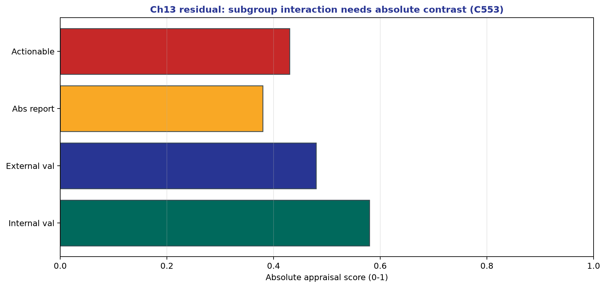

*Teaching figure (synthetic).* Cycle-553 densify scientific residual (ch01–14).


*Teaching figure (synthetic).* Cycle-551 densify scientific residual (ch01–14).


*Teaching figure (synthetic).* Cycle-549 densify scientific residual (ch01–14).


*Teaching figure (synthetic).* Cycle-547 densify scientific residual (ch01–14).


*Teaching figure (synthetic).* Cycle-545 densify scientific residual (ch01–14).


*Teaching figure (synthetic).* Cycle-543 densify scientific residual (ch01–14).


*Teaching figure (synthetic).* Cycle-541 densify scientific residual (ch01–14).


*Teaching figure (synthetic).* Cycle-539 densify scientific residual (ch01–14).


*Teaching figure (synthetic).* Cycle-537 densify scientific residual (ch01–14).


*Teaching figure (synthetic).* Cycle-535 densify scientific residual (ch01–14).


*Teaching figure (synthetic).* Cycle-533 densify scientific residual (ch01–14).


*Teaching figure (synthetic).* Cycle-531 densify scientific residual (ch01–14).


*Teaching figure (synthetic).* Cycle-529 densify scientific residual (ch01–14).


*Teaching figure (synthetic).* Cycle-527 densify scientific residual (ch01–14).


*Teaching figure (synthetic).* Cycle-525 densify scientific residual (ch01–14).


*Teaching figure (synthetic).* Cycle-523 densify scientific residual (ch01–14).


*Teaching figure (synthetic).* Cycle-521 densify scientific residual (ch01–14).


*Teaching figure (synthetic).* Cycle-519 densify scientific residual (ch01–14).


*Teaching figure (synthetic).* Cycle-517 densify scientific residual (ch01–14).


*Teaching figure (synthetic).* Cycle-515 densify scientific residual (ch01–14).


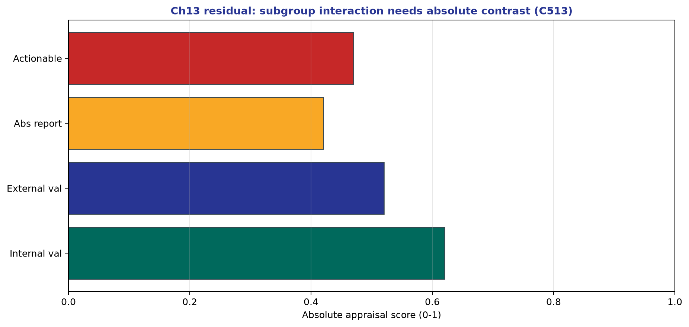

*Teaching figure (synthetic).* Cycle-513 densify scientific residual (ch01–14).


*Teaching figure (synthetic).* Cycle-511 densify scientific residual (ch01–14).


*Teaching figure (synthetic).* Cycle-509 densify scientific residual (ch01–14).


*Teaching figure (synthetic).* Cycle-507 densify scientific residual (ch01–14).


*Teaching figure (synthetic).* Cycle-505 densify scientific residual (ch01–14).


*Teaching figure (synthetic).* Cycle-503 densify scientific residual (ch01–14).


*Teaching figure (synthetic).* Cycle-501 densify scientific residual (ch01–14).


*Teaching figure (synthetic).* Cycle-499 densify scientific residual (ch01–14).


*Teaching figure (synthetic).* Cycle-497 densify scientific residual (ch01–14).


*Teaching figure (synthetic).* Cycle-495 densify scientific residual (ch01–14).


*Teaching figure (synthetic).* Cycle-493 densify scientific residual (ch01–14).


*Teaching figure (synthetic).* Cycle-491 densify scientific residual (ch01–14).


*Teaching figure (synthetic).* Cycle-489 densify scientific residual (ch01–14).


*Teaching figure (synthetic).* Cycle-487 densify scientific residual (ch01–14).


*Teaching figure (synthetic).* Cycle-485 densify scientific residual (ch01–14).


*Teaching figure (synthetic).* Cycle-483 densify scientific residual (ch01–14).


*Teaching figure (synthetic).* Cycle-481 densify scientific residual (ch01–14).


*Teaching figure (synthetic).* Cycle-479 densify scientific residual (ch01–14).


*Teaching figure (synthetic).* Cycle-477 densify scientific residual (ch01–14).


*Teaching figure (synthetic).* Cycle-475 densify scientific residual (ch01–14).


*Teaching figure (synthetic).* Cycle-473 densify scientific residual (ch01–14).


*Teaching figure (synthetic).* Cycle-471 densify scientific residual (ch01–14).


*Teaching figure (synthetic).* Cycle-469 densify scientific residual (ch01–14).


*Teaching figure (synthetic).* Cycle-467 densify scientific residual (ch01–14).


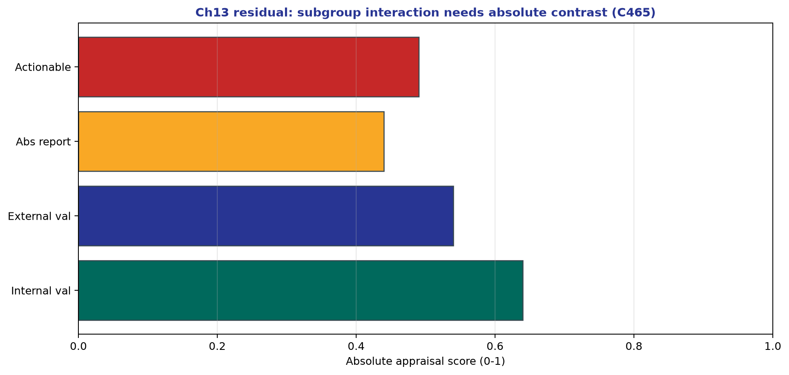

*Teaching figure (synthetic).* Cycle-465 densify scientific residual (ch01–14).


*Teaching figure (synthetic).* Cycle-463 densify scientific residual (ch01–14).


*Teaching figure (synthetic).* Cycle-461 densify scientific residual (ch01–14).


*Teaching figure (synthetic).* Cycle-459 densify scientific residual (ch01–14).


*Teaching figure (synthetic).* Cycle-457 densify scientific residual (ch01–14).


*Teaching figure (synthetic).* Cycle-455 densify scientific residual (ch01–14).


*Teaching figure (synthetic).* Cycle-453 densify scientific residual (ch01–14).


*Teaching figure (synthetic).* Cycle-451 densify scientific residual (ch01–14).


*Teaching figure (synthetic).* Cycle-449 densify scientific residual (ch01–14).


*Teaching figure (synthetic).* Cycle-447 densify scientific residual (ch01–14).


*Teaching figure (synthetic).* Cycle-445 densify scientific residual (ch01–14).


*Teaching figure (synthetic).* Cycle-443 densify scientific residual (ch01–14).


*Teaching figure (synthetic).* Cycle-441 densify scientific residual (ch01–14).


*Teaching figure (synthetic).* Cycle-439 densify scientific residual (ch01–14).


*Teaching figure (synthetic).* Cycle-437 densify scientific residual (ch01–14).


*Teaching figure (synthetic).* Cycle-435 densify scientific residual (ch01–14).


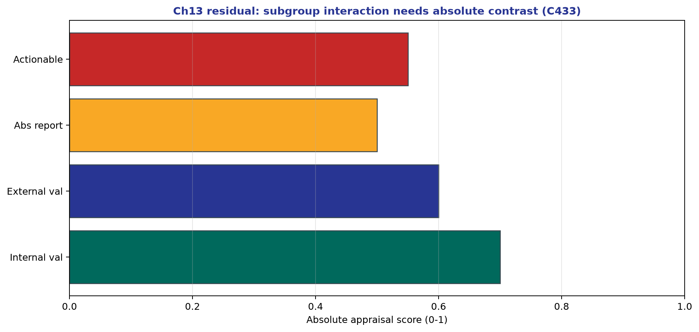

*Teaching figure (synthetic).* Cycle-433 densify scientific residual (ch01–14).


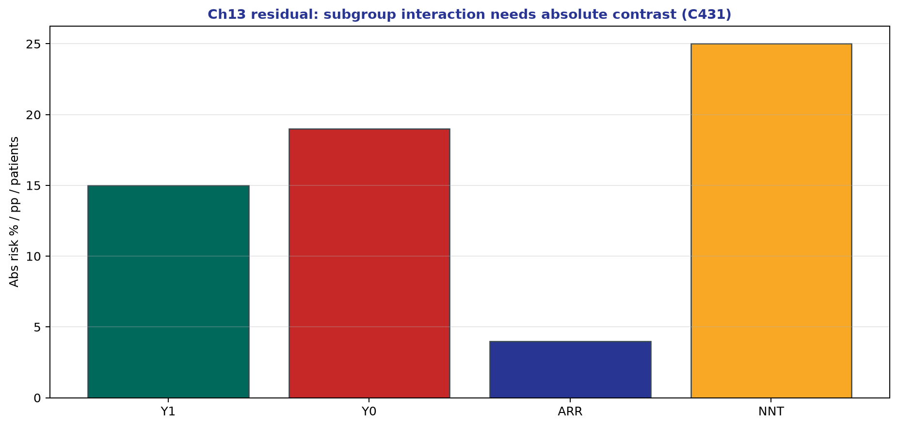

*Teaching figure (synthetic).* Cycle-431 densify scientific residual (ch01–14).


*Teaching figure (synthetic).* Cycle-429 densify scientific residual (ch01–14).


*Teaching figure (synthetic).* Cycle-427 densify scientific residual (ch01–14).


*Teaching figure (synthetic).* Cycle-425 densify scientific residual (ch01–14).


*Teaching figure (synthetic).* Cycle-423 densify scientific residual (ch01–14).


*Teaching figure (synthetic).* Cycle-421 densify scientific residual (ch01–14).


*Teaching figure (synthetic).* Cycle-419 densify scientific residual (ch01–14).


*Teaching figure (synthetic).* Cycle-417 densify scientific residual (ch01–14).


*Teaching figure (synthetic).* Cycle-415 densify scientific residual (ch01–14).


*Teaching figure (synthetic).* Cycle-413 densify scientific residual (ch01–14).


*Teaching figure (synthetic).* Cycle-411 densify scientific residual (ch01–14).


*Teaching figure (synthetic).* Cycle-409 densify scientific residual (ch01–14).


*Teaching figure (synthetic).* Cycle-407 densify scientific residual (ch01–14).


*Teaching figure (synthetic).* Cycle-405 densify scientific residual (ch01–14).


*Teaching figure (synthetic).* Cycle-403 densify scientific residual (ch01–14).


*Teaching figure (synthetic).* Cycle-401 densify scientific residual (ch01–14).


*Teaching figure (synthetic).* Cycle-399 densify scientific residual (ch01–14).


*Teaching figure (synthetic).* Cycle-397 densify scientific residual (ch01–14).


*Teaching figure (synthetic).* Cycle-395 densify scientific residual (ch01–14).


*Teaching figure (synthetic).* Cycle-393 densify scientific residual (ch01–14).


*Teaching figure (synthetic).* Cycle-391 densify scientific residual (ch01–14).


*Teaching figure (synthetic).* Cycle-389 densify scientific residual (ch01–14).


*Teaching figure (synthetic).* Cycle-387 densify scientific residual (ch01–14).


*Teaching figure (synthetic).* Cycle-385 densify scientific residual (ch01–14).


*Teaching figure (synthetic).* Cycle-383 densify scientific residual (ch01–14).


*Teaching figure (synthetic).* Cycle-381 densify scientific residual (ch01–14).


*Teaching figure (synthetic).* Cycle-379 densify scientific residual (ch01–14).


*Teaching figure (synthetic).* Cycle-377 densify scientific residual (ch01–14).


*Teaching figure (synthetic).* Cycle-375 densify scientific residual (ch01–14).


*Teaching figure (synthetic).* Cycle-373 densify scientific residual (ch01–14).


*Teaching figure (synthetic).* Cycle-371 densify scientific residual (ch01–14).


*Teaching figure (synthetic).* Cycle-369 densify scientific residual.


*Teaching figure (synthetic).* Cycle-367 densify scientific residual (ch01–14).


*Teaching figure (synthetic).* Cycle-365 densify scientific residual (ch01–14).


*Teaching figure (synthetic).* Cycle-363 densify scientific residual (ch01–14).


*Teaching figure (synthetic).* Cycle-361 densify scientific residual (ch01–14).


*Teaching figure (synthetic).* Cycle-359 densify scientific residual (ch01–14).


*Teaching figure (synthetic).* Cycle-357 densify scientific residual (ch01–14).


*Teaching figure (synthetic).* Cycle-355 densify scientific residual (ch01–14).


*Teaching figure (synthetic).* Cycle-353 densify scientific residual (ch01–14).


*Teaching figure (synthetic).* Cycle-351 densify scientific residual (ch01–14).


*Teaching figure (synthetic).* Cycle-349 densify scientific residual (ch01–14).


*Teaching figure (synthetic).* Cycle-347 densify scientific residual (ch01–14).


*Teaching figure (synthetic).* Cycle-345 densify scientific residual (ch01–14).


*Teaching figure (synthetic).* Cycle-343 densify scientific residual (ch01–14).


*Teaching figure (synthetic).* Cycle-341 densify scientific residual (ch01–14).


*Teaching figure (synthetic).* Cycle-339 densify scientific residual (ch01–14).


*Teaching figure (synthetic).* Cycle-337 densify scientific residual (ch01–14).


*Teaching figure (synthetic).* Cycle-335 densify scientific residual (ch01–14).


*Teaching figure (synthetic).* Cycle-333 densify scientific residual (ch01–14).


*Teaching figure (synthetic).* Cycle-331 densify scientific residual (ch01–14).


*Teaching figure (synthetic).* Cycle-329 densify scientific residual (ch01–14).


*Teaching figure (synthetic).* Cycle-327 densify scientific residual (ch01–14).


*Teaching figure (synthetic).* Cycle-325 densify scientific residual (ch01–14).


*Teaching figure (synthetic).* Cycle-323 densify scientific residual (ch01–14).


*Teaching figure (synthetic).* Cycle-321 densify scientific residual (ch01–14).


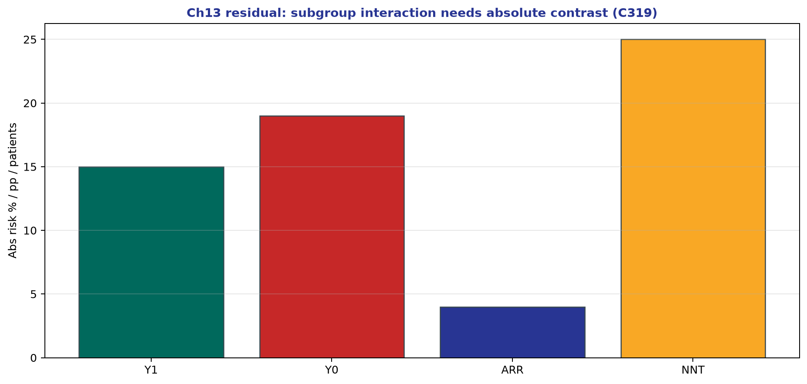

*Teaching figure (synthetic).* Cycle-319 densify scientific residual (ch01–14).


*Teaching figure (synthetic).* Cycle-317 densify scientific residual (ch01–14).


*Teaching figure (synthetic).* Cycle-315 densify scientific residual (ch01–14).


*Teaching figure (synthetic).* Cycle-313 densify scientific residual (ch01–14).


*Teaching figure (synthetic).* Cycle-311 densify scientific residual (ch01–14).


*Teaching figure (synthetic).* Cycle-309 densify scientific residual (ch01–14).


*Teaching figure (synthetic).* Cycle-307 densify scientific residual (ch01–14).


*Teaching figure (synthetic).* Cycle-305 densify scientific residual (ch01–14).


*Teaching figure (synthetic).* Cycle-303 densify scientific residual (ch01–14).


*Teaching figure (synthetic).* Cycle-301 densify scientific residual (ch01–14).


*Teaching figure (synthetic).* Cycle-299 densify scientific residual (ch01–14).


*Teaching figure (synthetic).* Cycle-297 densify scientific residual (ch01–14).


*Teaching figure (synthetic).* Cycle-295 densify scientific residual (ch01–14).


*Teaching figure (synthetic).* Cycle-293 densify scientific residual (ch01–14).


*Teaching figure (synthetic).* Cycle-291 densify scientific residual (ch01–14).


*Teaching figure (synthetic).* Cycle-289 densify scientific residual (ch01–14).


*Teaching figure (synthetic).* Cycle-287 densify scientific residual (ch01–14).


*Teaching figure (synthetic).* Cycle-285 densify scientific residual (ch01–14).


*Teaching figure (synthetic).* Cycle-283 densify scientific residual (ch01–14).


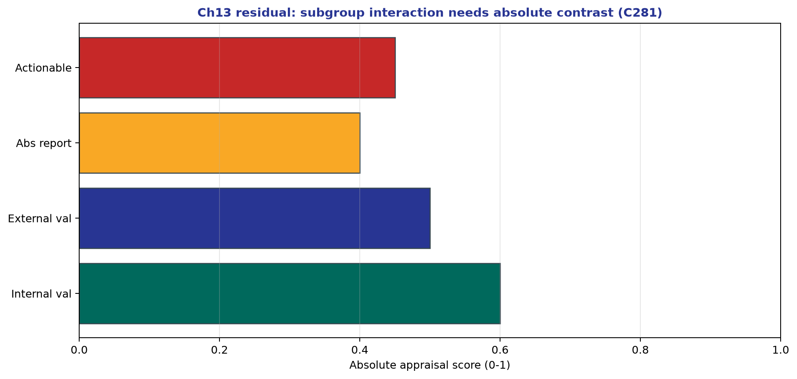

*Teaching figure (synthetic).* Cycle-281 densify scientific residual (ch01–14).


*Teaching figure (synthetic).* Cycle-279 densify scientific residual (ch01–14).


*Teaching figure (synthetic).* Cycle-277 densify scientific residual (ch01–14).


*Teaching figure (synthetic).* Cycle-275 densify scientific residual (ch01–14).


*Teaching figure (synthetic).* Cycle-273 densify scientific residual (ch01–14).


*Teaching figure (synthetic).* Cycle-271 densify scientific residual (ch01–14).


*Teaching figure (synthetic).* Cycle-269 densify scientific residual (ch01–14).


*Teaching figure (synthetic).* Cycle-267 densify scientific residual (ch01–14).


*Teaching figure (synthetic).* Cycle-265 densify scientific residual (ch01–14).


*Teaching figure (synthetic).* Cycle-263 densify scientific residual (ch01–14).


*Teaching figure (synthetic).* Cycle-261 densify scientific residual (ch01–14).


*Teaching figure (synthetic).* Cycle-259 densify scientific residual (ch01–14).


*Teaching figure (synthetic).* Cycle-257 densify scientific residual (ch01–14).


*Teaching figure (synthetic).* Cycle-255 densify scientific residual (ch01–14).


*Teaching figure (synthetic).* Cycle-253 densify scientific residual (ch01–14).


*Teaching figure (synthetic).* Cycle-251 densify scientific residual (ch01–14).


*Teaching figure (synthetic).* Cycle-249 densify scientific residual (ch01–14).


*Teaching figure (synthetic).* Cycle-247 densify scientific residual (ch01–14).


*Teaching figure (synthetic).* Cycle-245 densify scientific residual (ch01–14).


*Teaching figure (synthetic).* Cycle-243 densify scientific residual (ch01–14).


*Teaching figure (synthetic).* Cycle-241 densify scientific residual (ch01–14).


*Teaching figure (synthetic).* Cycle-239 densify scientific residual (ch01–14).


*Teaching figure (synthetic).* Cycle-237 densify scientific residual (ch01–14).


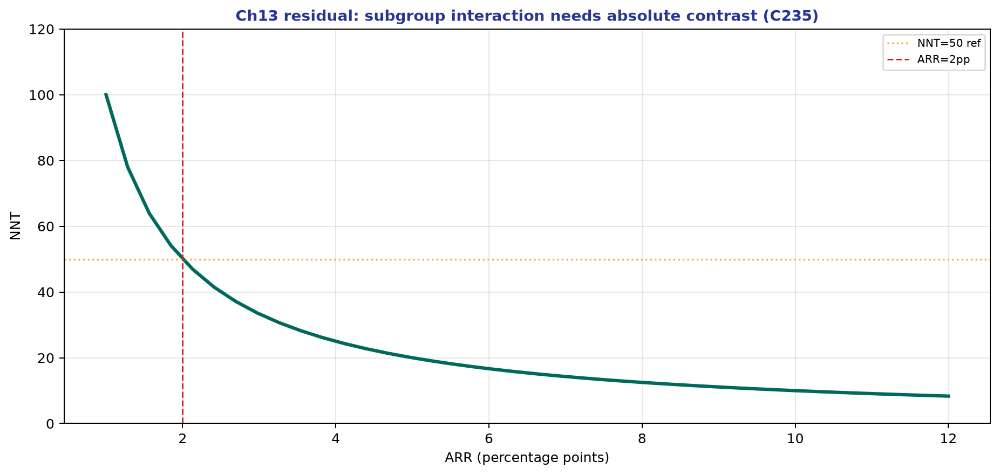

*Teaching figure (synthetic).* Cycle-235 densify scientific residual (ch01–14).


*Teaching figure (synthetic).* Cycle-233 densify scientific residual (ch01–14).


*Teaching figure (synthetic).* Cycle-231 densify scientific residual (ch01–14).


*Teaching figure (synthetic).* Cycle-229 densify scientific residual (ch01–14).


*Teaching figure (synthetic).* Cycle-227 densify scientific residual (ch01–14).


*Teaching figure (synthetic).* Cycle-225 densify scientific residual (ch01–14).


*Teaching figure (synthetic).* Cycle-223 densify scientific residual (ch01–14).


*Teaching figure (synthetic).* Cycle-221 densify scientific residual (ch01–14).


*Teaching figure (synthetic).* Cycle-219 densify scientific residual (ch01–14).


*Teaching figure (synthetic).* Cycle-217 densify scientific residual (ch01–14).


*Teaching figure (synthetic).* Cycle-215 densify scientific residual (ch01–14).


*Teaching figure (synthetic).* Cycle-213 densify scientific residual (ch01–14).


*Teaching figure (synthetic).* Cycle-211 densify scientific residual (ch01–14).


*Teaching figure (synthetic).* Cycle-209 densify scientific residual (ch01–14).


*Teaching figure (synthetic).* Cycle-207 densify scientific residual (ch01–14).


*Teaching figure (synthetic).* Cycle-205 densify scientific residual (ch01–14).


*Teaching figure (synthetic).* Cycle-203 densify scientific residual (ch01–14).


*Teaching figure (synthetic).* Cycle-201 densify scientific residual (ch01–14).


*Teaching figure (synthetic).* Cycle-199 densify scientific residual (ch01–14).


*Teaching figure (synthetic).* Cycle-197 densify scientific residual (ch01–14).


*Teaching figure (synthetic).* Cycle-195 densify scientific residual (ch01–14).


*Teaching figure (synthetic).* Cycle-193 densify scientific residual (ch01–14).


*Teaching figure (synthetic).* Cycle-191 densify scientific residual (ch01–14).


*Teaching figure (synthetic).* Cycle-189 densify scientific residual (ch01–14).


*Teaching figure (synthetic).* Cycle-187 densify scientific residual (ch01–14).


*Teaching figure (synthetic).* Cycle-185 densify scientific residual (ch01–14).


*Teaching figure (synthetic).* Cycle-183 densify scientific residual (ch01–14).


*Teaching figure (synthetic).* Cycle-181 densify scientific residual (ch01–14).


*Teaching figure (synthetic).* Cycle-179 densify scientific residual (ch01–14).


*Teaching figure (synthetic).* Cycle-177 densify scientific residual (ch01–14).


*Teaching figure (synthetic).* Cycle-175 densify scientific residual (ch01–14).


*Teaching figure (synthetic).* Cycle-173 densify scientific residual (ch01–14).


*Teaching figure (synthetic).* Cycle-171 densify scientific residual (ch01–14).


*Teaching figure (synthetic).* Cycle-169 densify scientific residual (ch01–14).


*Teaching figure (synthetic).* Cycle-167 densify scientific residual (ch01–14).


*Teaching figure (synthetic).* Cycle-165 densify scientific residual (ch01–14).


*Teaching figure (synthetic).* Cycle-163 densify scientific residual (ch01–14).


*Teaching figure (synthetic).* Cycle-161 densify scientific residual (ch01–14).


*Teaching figure (synthetic).* Cycle-159 densify scientific residual (ch01–14).


*Teaching figure (synthetic).* Cycle-157 densify scientific residual (ch01–14).


*Teaching figure (synthetic).* Cycle-155 densify scientific residual (ch01–14).


*Teaching figure (synthetic).* Cycle-153 densify scientific residual (ch01–14).


*Teaching figure (synthetic).* Cycle-151 densify scientific residual (ch01–14).


*Teaching figure (synthetic).* Cycle-149 densify scientific residual (ch01–14).


*Teaching figure (synthetic).* Cycle-147 densify scientific residual (ch01–14).


*Teaching figure (synthetic).* Cycle-145 densify scientific residual (ch01–14).


*Teaching figure (synthetic).* Cycle-143 densify scientific residual (ch01–14).


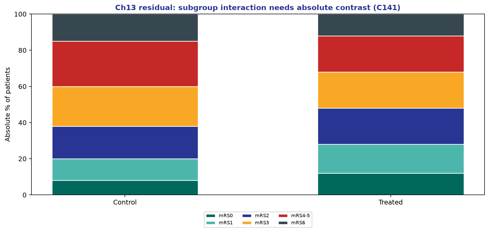

*Teaching figure (synthetic).* Cycle-141 densify scientific residual (ch01–14).


*Teaching figure (synthetic).* Cycle-139 densify scientific residual (ch01–14).


*Teaching figure (synthetic).* Cycle-137 densify scientific residual (ch01–14).


*Teaching figure (synthetic).* Cycle-135 densify scientific residual (ch01–14).


*Teaching figure (synthetic).* Cycle-133 densify scientific residual (ch01–14).


*Teaching figure (synthetic).* Cycle-131 densify scientific residual (ch01–14).


*Teaching figure (synthetic).* Cycle-129 densify scientific residual (ch01–14).


*Teaching figure (synthetic).* Cycle-127 densify scientific residual (ch01–14).


*Teaching figure (synthetic).* Cycle-125 densify scientific residual (ch01–14).


*Teaching figure (synthetic).* Cycle-123 densify scientific residual (ch01–14).


*Teaching figure (synthetic).* Cycle-121 densify scientific residual (ch01–14).


*Teaching figure (synthetic).* Cycle-119 densify scientific residual (ch01–14).


*Teaching figure (synthetic).* Cycle-117 densify scientific residual (ch01–14).


*Teaching figure (synthetic).* Cycle-115 densify scientific residual (ch01–14).


*Teaching figure (synthetic).* Cycle-113 densify scientific residual (ch01–14).


*Teaching figure (synthetic).* Cycle-111 densify scientific residual (ch01–14).


*Teaching figure (synthetic).* Cycle-109 densify scientific residual (ch01–14).


*Teaching figure (synthetic).* Cycle-107 densify scientific residual (ch01–14).


*Teaching figure (synthetic).* Cycle-105 densify scientific residual (ch01–14).


*Teaching figure (synthetic).* Cycle-103 densify scientific residual (ch01–14).


*Teaching figure (synthetic).* Cycle-101 densify scientific residual (ch01–14).


*Teaching figure (synthetic).* Cycle-99 densify scientific residual (ch01–14).


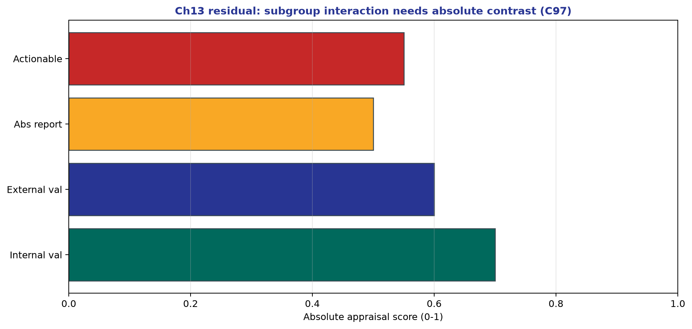

*Teaching figure (synthetic).* Cycle-97 densify scientific residual (ch01–14).


*Teaching figure (synthetic).* Cycle-95 densify scientific residual (ch01–14).


*Teaching figure (synthetic).* Cycle-93 densify scientific residual (ch01–14).


*Teaching figure (synthetic).* Cycle-91 densify scientific residual (ch01–14).


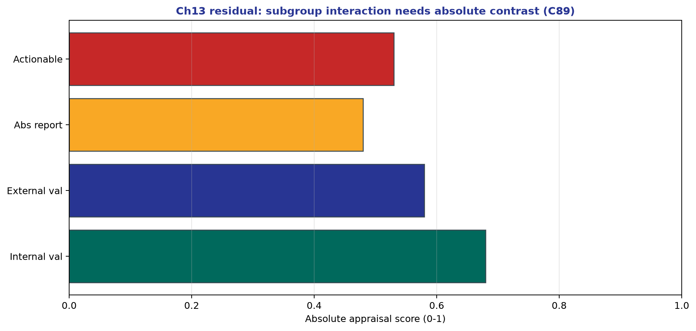

*Teaching figure (synthetic).* Cycle-89 densify scientific residual (ch01–14).


*Teaching figure (synthetic).* Cycle-87 densify scientific residual (ch01–14).


*Teaching figure (synthetic).* Cycle-85 densify scientific residual (ch01–14).


*Teaching figure (synthetic).* Cycle-83 densify scientific residual (ch01–14).


*Teaching figure (synthetic).* Cycle-81 densify scientific residual (ch01–14).


*Teaching figure (synthetic).* Cycle-79 densify scientific residual (ch01–14).


*Teaching figure (synthetic).* Cycle-77 densify scientific residual (ch01–14).


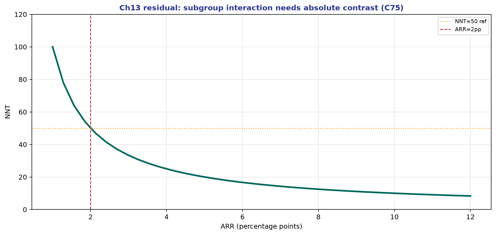

*Teaching figure (synthetic).* Cycle-75 densify scientific residual (ch01–14).


*Teaching figure (synthetic).* Cycle-73 densify scientific residual (ch01–14).


*Teaching figure (synthetic).* Cycle-71 densify scientific residual (ch01–14).


*Teaching figure (synthetic).* Cycle-69 densify scientific residual (ch01–14).


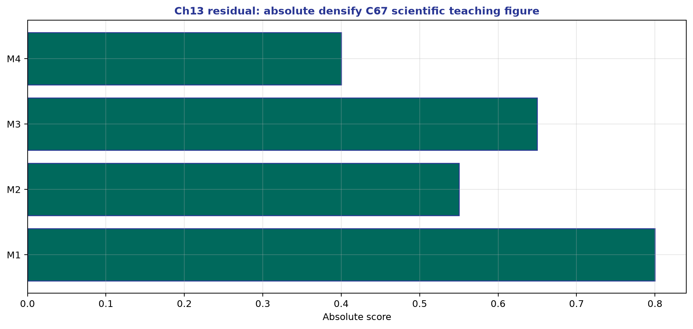

*Teaching figure (synthetic).* Cycle-67 densify scientific residual (ch01–14).


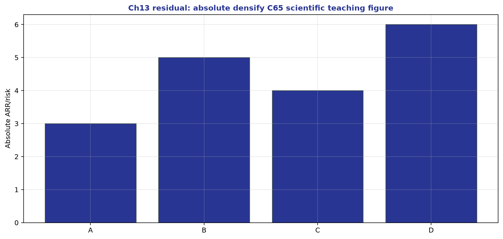

*Teaching figure (synthetic).* Cycle-65 densify scientific residual (ch01–14).


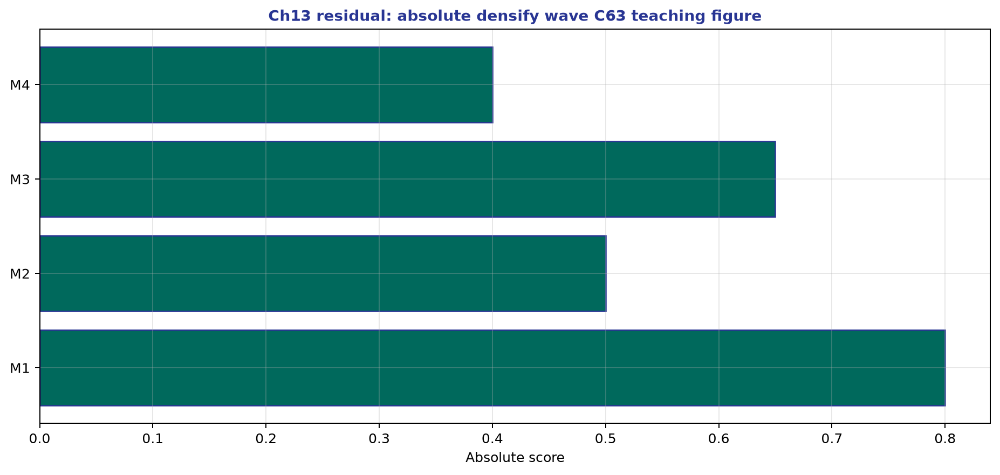

*Teaching figure (synthetic).* Cycle-63 densify scientific residual (ch01–14).


*Teaching figure (synthetic).* Cycle-61 densify scientific residual (ch01–14).


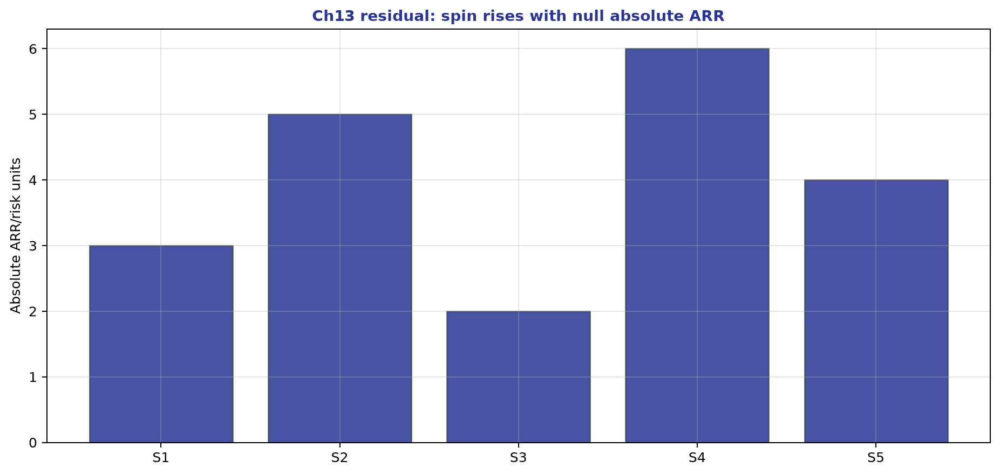

*Teaching figure (synthetic).* Cycle-59 densify scientific residual (ch01–14).


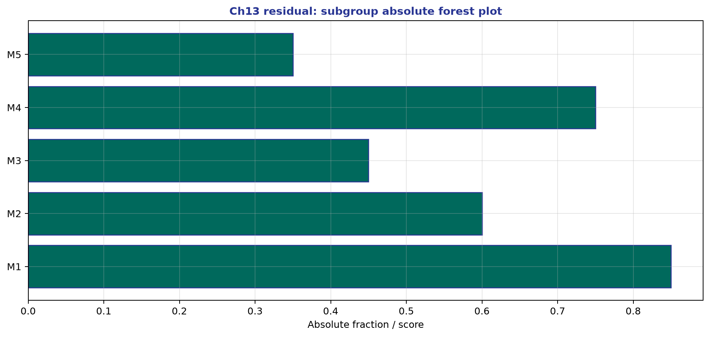

*Teaching figure (synthetic).* Cycle-57 densify scientific residual (ch01–14).


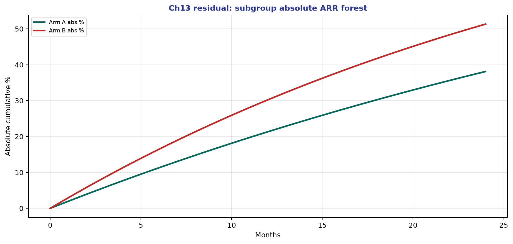

*Teaching figure (synthetic).* Cycle-55 densify scientific residual (ch01–14).


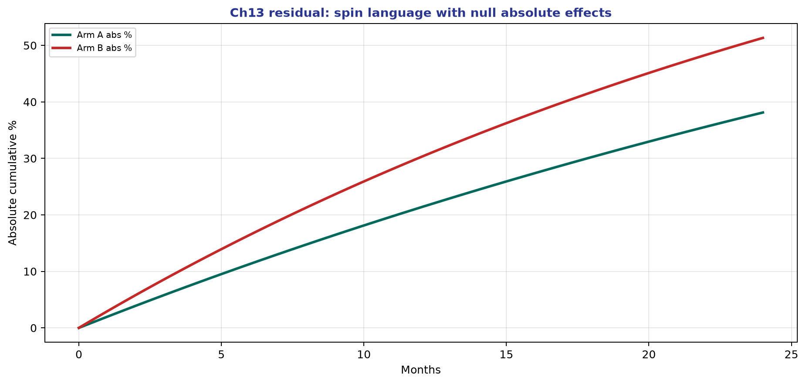

*Teaching figure (synthetic).* Cycle-53 densify scientific residual (ch01–14).


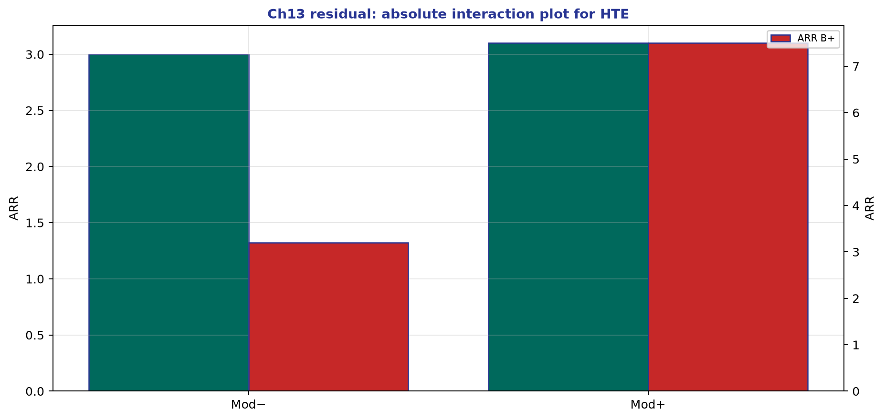

*Teaching figure (synthetic).* Cycle-51 densify scientific residual (ch01–14).


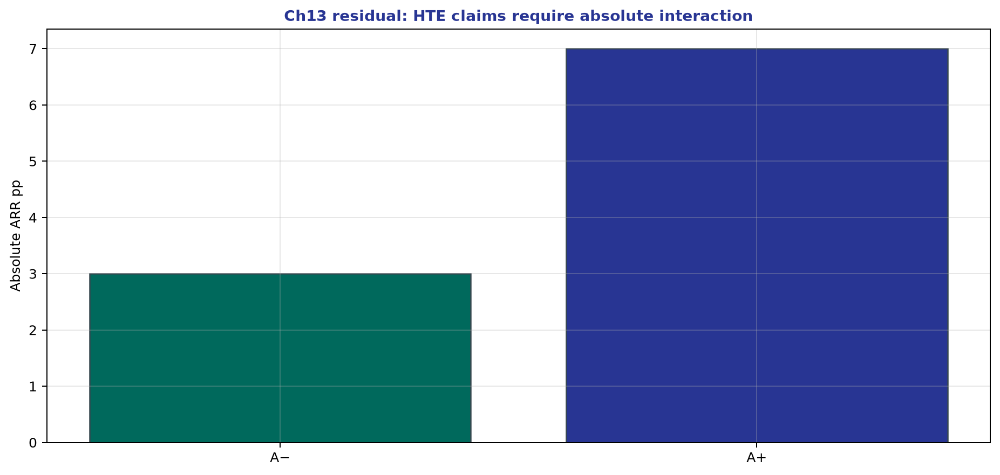

*Teaching figure (synthetic).* Cycle-49 densify scientific residual (ch01–14).


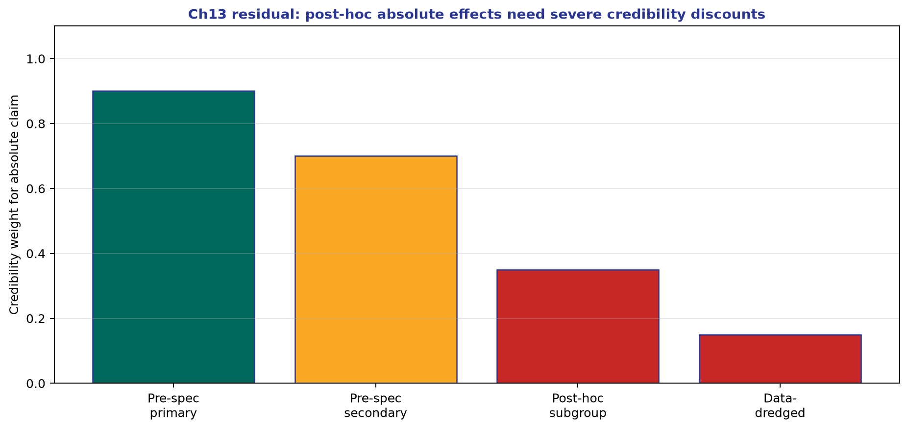

*Teaching figure (synthetic).* Cycle-47 densify scientific residual (ch01–14).


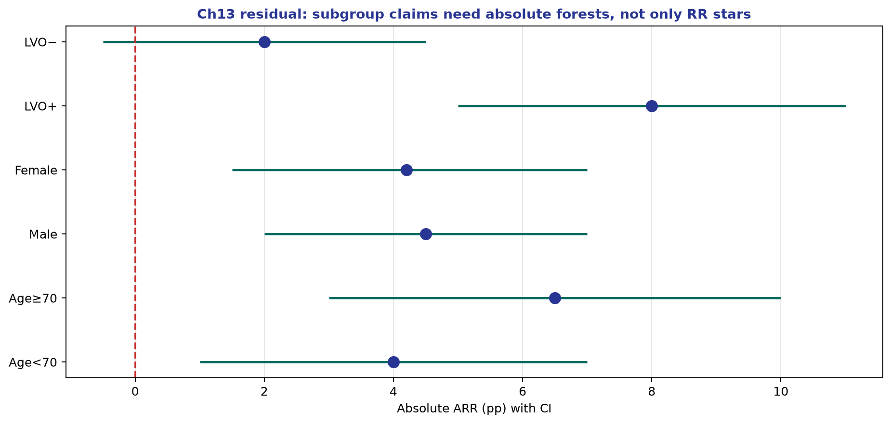

*Teaching figure (synthetic).* Cycle-45 densify scientific residual (ch01–14).


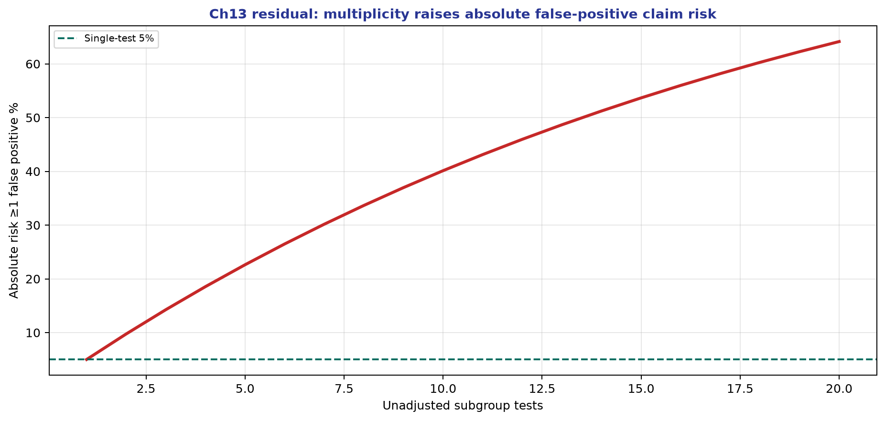

*Teaching figure (synthetic).* Cycle-41 densify scientific residual (ch01–14).


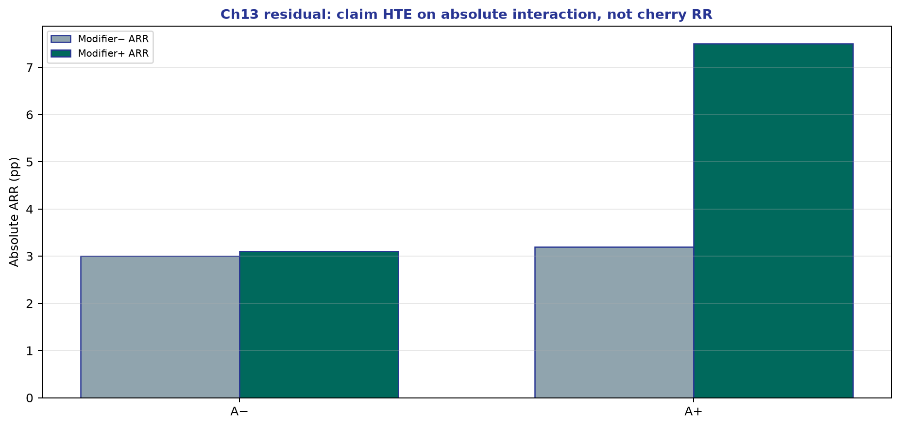

*Teaching figure (synthetic).* Cycle-39 densify scientific residual (ch01–14).


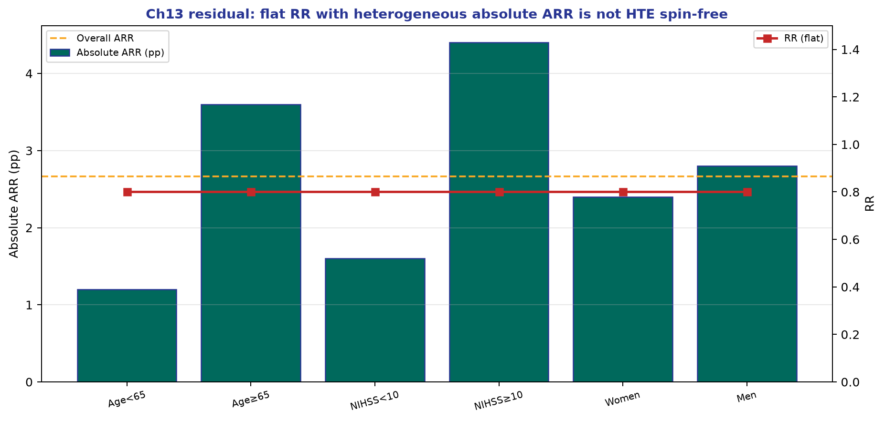

*Teaching figure (synthetic).* Cycle-37 densify scientific residual (ch01–14).


## The Epistemology of Subgroups in Neurological Trials

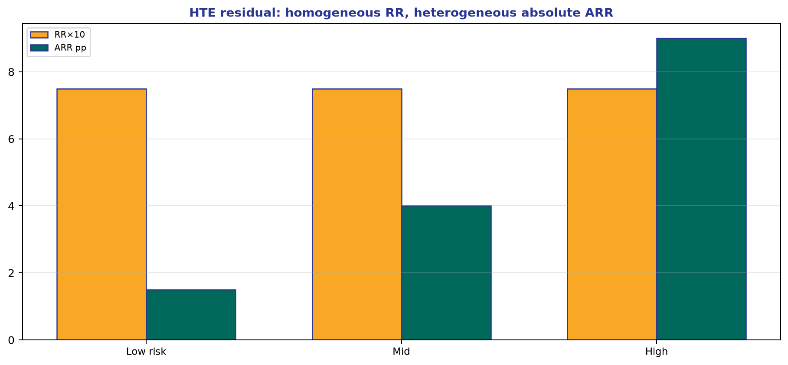

*Teaching figure (synthetic).* HTE for decisions is absolute-first.

Stroke trials enroll heterogeneous cohorts by design. An endovascular thrombectomy (EVT) trial mixes proximal M1 occlusions with tandem lesions, varying core volumes, differing collateral grades, and highly variable times from last known well. Secondary stroke prevention trials aggregate large artery atherosclerosis, lacunar infarcts, and cardioembolic sources into single massive cohorts. When clinicians read the primary results of these trials, the immediate instinct is to ask: 'Does this average treatment effect apply to the specific patient in front of me?' The instinct to individualize care is clinically correct. However, the mechanism by which the medical literature attempts to answer this question—subgroup analysis—is fundamentally flawed by statistical noise, unpenalized multiplicity, and motivated reasoning.

Heterogeneity of treatment effect (HTE) refers to non-random, genuine differences in the magnitude or direction of a treatment's effect across different patient populations. When real, HTE is critical for targeting therapies to those who benefit most and sparing those who only incur harm or financial toxicity. When false, HTE leads to devastating clinical errors: either denying life-saving therapy to a subgroup that falsely appeared to have no benefit (a false negative), or exposing a subgroup to dangerous interventions based on a statistical fluke (a false positive). The history of neurology is littered with treatments delayed or denied because a subgroup analysis suggested futility in a specific demographic, only for subsequent trials to prove the effect was uniform.

The epistemic gap in subgroup analysis arises from the fundamental difference between deduction and induction. A randomized controlled trial is powered and designed to deductively test a primary hypothesis on a specific, rigorously defined population. The p-value for the primary endpoint has mathematical validity because the hypothesis was singular and pre-specified. When researchers slice the population into subgroups, they break the randomization stratification, drastically reduce the sample size within each stratum, and vastly increase the number of hypotheses being tested. What began as a deductive test of an intervention degenerates into an inductive trawl for patterns. The statistical machinery of p-values and confidence intervals, which assumes a single pre-specified hypothesis, breaks down completely in this high-dimensional environment. We must approach subgroups not as established facts, but as highly suspect claims demanding external validation.

## The Mathematics of Heterogeneity of Treatment Effect (HTE)

To rigorously appraise subgroup claims, we must define the parameters formally. Let Y(1) represent the potential outcome for a patient if they receive the treatment, and Y(0) represent their potential outcome if they receive the control. The individual treatment effect is Y(1) - Y(0). Because we can never observe both potential outcomes simultaneously for the same patient, we rely on randomized trials to estimate the Average Treatment Effect (ATE), defined as E[Y(1) - Y(0)].

A subgroup is defined by a conditioning variable X, which represents a baseline characteristic such as age, sex, or baseline NIHSS. The effect of the treatment within this specific stratum is the Conditional Average Treatment Effect (CATE), defined as E[Y(1) - Y(0) | X = x]. Heterogeneity of treatment effect exists strictly when the CATE varies across different values of the conditioning variable X. If CATE is identical for all values of X, there is absolute homogeneity.

However, the presence and magnitude of HTE depend entirely on the mathematical scale used to measure the effect. This is the concept of scale dependence. Consider a stroke intervention that reduces the relative risk of mortality by exactly 20% across all patients. The Relative Risk (RR) is fixed at 0.80. On the multiplicative scale, there is zero HTE; the treatment is perfectly homogeneous.

Now translate this constant relative effect into absolute clinical outcomes for two distinct subgroups. Subgroup A (severe strokes) has a baseline mortality risk under control of 50%. Applying the constant RR of 0.80, their risk under treatment drops to 40%. The Absolute Risk Reduction (ARR) is 10%, translating to a Number Needed to Treat (NNT) of 10. Subgroup B (mild strokes) has a baseline mortality risk under control of 5%. Applying the identical RR of 0.80, their risk under treatment drops to 4%. The ARR is a mere 1%, translating to an NNT of 100. On the absolute scale—the additive scale—there is massive heterogeneity of treatment effect. Because clinical decision-making relies on weighing the absolute benefits against fixed absolute harms, absolute HTE is what ultimately dictates bedside practice. Trialists often report no HTE because their logistic regression models (multiplicative scale) show no interaction, blinding the reader to the critical variance in absolute benefit driven by baseline risk.

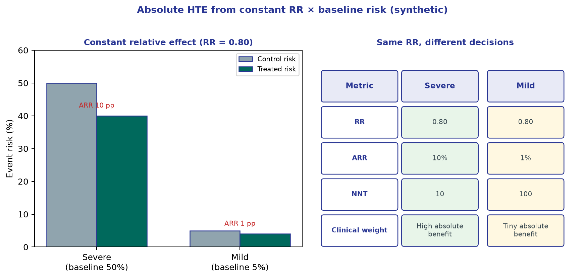

*Teaching figure (synthetic).* Multiplicative homogeneity (RR 0.80 everywhere) coexists with NNT 10 versus NNT 100. Bedside decisions track absolute effects; demand ARR stratified by baseline risk even when interaction tests on the relative scale are null.

## Interaction Tests vs. Stratum-Specific Inference

The single most pervasive statistical error in the neurology literature is the assertion of heterogeneity based on comparing stratum-specific p-values. Investigators will routinely claim that a treatment is effective in males but not females because the male subgroup showed a statistically significant benefit (p = 0.03) while the female subgroup did not (p = 0.15). This is a profound mathematical fallacy. It is the error of testing whether the effect differs from zero within each group, rather than testing whether the effects differ from each other.

To formally test for HTE, the investigator must perform an interaction test. In a linear regression framework, if the outcome is Y, the treatment is T (0 or 1), and the baseline subgroup is X (0 or 1), the model is specified as: Y = B0 + B1(T) + B2(X) + B3(T * X). The coefficient B1 represents the treatment effect when X=0. The coefficient B2 represents the prognostic effect of the baseline variable X when T=0. The critical coefficient is B3, the interaction term. It quantifies the difference in the treatment effect between X=1 and X=0. The interaction test is a direct statistical evaluation of the null hypothesis that B3 = 0. If the p-value for the interaction term is not significant, there is insufficient statistical evidence to claim that the treatment effect differs between the subgroups.

Why is examining stratum-specific p-values so deceptive? Consider a trial evaluating a novel antiplatelet agent in 1000 patients, yielding an overall significant benefit. The cohort is split by biological sex: 750 men and 250 women. Assume the true underlying treatment effect (Risk Ratio) is perfectly identical in both sexes at RR = 0.75. Because the male subgroup possesses three times the sample size, its confidence interval is narrow and excludes 1.0, generating a significant p-value. The female subgroup, severely underpowered, generates a wide confidence interval that crosses 1.0, yielding a non-significant p-value. The point estimates are identical. The formal interaction p-value is 1.0. Yet, authors and clinicians routinely commit the 'Significance Fallacy' by concluding the drug only works in men. The difference in significance is entirely an artifact of sample size and statistical power, not biological reality.

A forest plot is a visual trap for this exact error. Readers visually scan down the right margin of the plot, hunting for any confidence interval that crosses the vertical line of null effect. When they locate one, they immediately label that subgroup a 'non-responder' population. This is statistically illiterate. Wide confidence intervals in small subgroups are mathematically guaranteed to cross the null line regardless of the true underlying treatment effect. The absence of evidence within an underpowered stratum is not evidence of the absence of an effect.

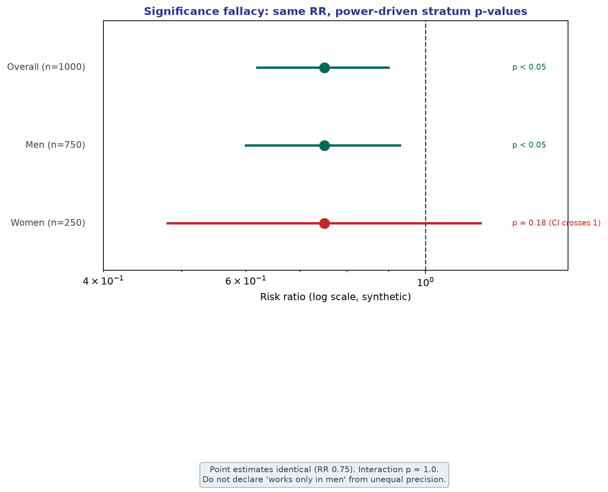

*Teaching figure (synthetic).* Men and women share RR 0.75; only sample size differs. Declaring sex-specific efficacy from divergent stratum p-values without a significant interaction term is a power artifact, not biology.

## Multiplicity and the Garden of Forking Paths

If an investigator tests a single pre-specified hypothesis at a significance level of alpha = 0.05, they accept a 5% risk of a false positive error (Type I error) assuming the null hypothesis is true. If they independently test 10 subgroup hypotheses, the probability of encountering at least one false positive—known as the family-wise error rate (FWER)—escalates dramatically. Assuming independence, the FWER is calculated as 1 - (1 - alpha)^k, where k is the number of tests. For 10 subgroups, the FWER is 40%. For 20 subgroups, it reaches 64%.

Stroke trial appendices frequently feature massive forest plots enumerating 15 to 20 baseline variables: age, sex, admission NIHSS, time to treatment, baseline glucose, systolic blood pressure, prior statin use, stroke etiology, ASPECTS, site of arterial occlusion, and collateral grading. For each of these variables, there may be multiple arbitrary cut-points evaluated (e.g., age > 80, age > 75, age quartiles). Furthermore, these subgroups can be tested across multiple definitions of the outcome (mRS 0-1, mRS 0-2, ordinal shift, 90-day mortality). This combinatorial explosion is what statistician Andrew Gelman terms the 'garden of forking paths.'

Even if investigators refrain from explicitly calculating an interaction p-value for every conceivable combination, the reader implicitly performs this multiple testing by scanning the forest plot for the most extreme or 'interesting' result. When a randomized trial is entirely neutral on its primary endpoint, any subgroup that magically appears statistically significant is overwhelmingly likely to be a false positive generated by random noise. The mathematics are unforgiving: if an intervention is biologically inert, but it is tested across 20 distinct subgroups, statistical theory guarantees that one of them will demonstrate 'efficacy' with a p-value < 0.05 purely by chance. Publishing that specific subgroup as a 'targeted therapy breakthrough' represents a severe epistemic failure.

To rigorously defend against multiplicity, trialists must specify a hierarchical testing strategy or mathematically penalize their interaction tests using methods like the Bonferroni correction or False Discovery Rate (FDR) control procedures. When reading the literature, clinicians must intuitively apply a massive Bayesian penalty to any surprising subgroup finding that emerges unpenalized from a lengthy catalog of uncorrected tests. A p-value of 0.04 in the 14th row of a forest plot is mathematically meaningless.

## Pre-Specification vs. Post-Hoc: The Credibility Hierarchy

The primary institutional defense against the garden of forking paths is strict pre-specification. A pre-specified subgroup analysis is one that is comprehensively detailed in the trial protocol or the Statistical Analysis Plan (SAP) long before the data is unblinded or any outcome analysis commences. A credible SAP must explicitly state the conditioning variable, the exact numerical cut-points to be utilized, the specific primary outcome measure, and the direction of the anticipated interaction. It must be timestamped and publicly available.

Conversely, a post-hoc analysis is invented after the investigators have observed the data. Post-hoc analyses are deeply contaminated by motivated reasoning and subconscious bias. An investigator might notice a faint trend in a specific age demographic, adjust the age cut-point by two or three years to artificially maximize the p-value, and subsequently draft a highly persuasive, biologically plausible narrative in the discussion section to justify the retrofitted cut-point.

However, the binary classification of pre-specified versus post-hoc is insufficient for rigorous appraisal. A forest plot listing 20 variables that were technically 'pre-specified' in the SAP still suffers from catastrophic multiplicity if no statistical penalties are applied. For a subgroup hypothesis to achieve high credibility and directly influence clinical pathways, it must clear a much higher bar. It must be pre-specified as one of a very small number (e.g., 1 to 3) of primary HTE hypotheses. It must be strongly motivated by preexisting biological or epidemiological evidence, rather than mechanical data-dredging. Finally, it must be adequately powered. Powering for an interaction test generally requires a sample size roughly four times larger than that required for the main trial if the goal is to detect an interaction of the identical magnitude as the main effect.

If a subgroup claim fails to meet these stringent criteria, it must be rigidly classified as hypothesis-generating only. It is a suggestion for the design of the next randomized trial, not a mandate for rewriting the current acute stroke protocol.

## Absolute vs. Relative Scales for Effect Modification

As previously established, the detection of heterogeneity of treatment effect depends intimately on the statistical scale employed. For clinical decision-making, the absolute scale is supreme. The absolute risk reduction (ARR) determines the Number Needed to Treat (NNT = 1 / ARR), which clinicians must immediately weigh against the absolute risk of harm (Number Needed to Harm, NNH) to derive the net clinical benefit for the individual patient.

When interpreting a subgroup claim presented in relative terms, you must forcefully convert the numbers back into absolute natural frequencies. Consider a paper asserting: 'The intervention is highly effective in patients with severe white matter disease (Hazard Ratio 0.50) but provides marginal benefit in those without (Hazard Ratio 0.90).' To appraise this, extract the baseline event rates. Assume the baseline event rate without treatment in the severe white matter disease cohort is 20%. The HR of 0.50 reduces the treated rate to 10%. The ARR is 10%, yielding an NNT of 10. Assume the baseline event rate in the cohort without white matter disease is 4%. The HR of 0.90 reduces the treated rate to 3.6%. The ARR is a clinically negligible 0.4%, yielding an NNT of 250. In this instance, the qualitative claim is supported, but transforming the data into absolute terms makes the clinical mandate undeniable.

Crucially, even if the relative effects are perfectly constant, massive absolute HTE will naturally arise from variations in baseline risk. If the relative risk reduction is a constant 20% (RR 0.80) across all patients, the severe cohort (baseline 20%) secures an ARR of 4% (NNT 25), while the mild cohort (baseline 4%) secures an ARR of only 0.8% (NNT 125). Trialists frequently and erroneously claim 'greater biological efficacy' in severe disease when the underlying relative mechanism is perfectly homogeneous. The arithmetic of baseline risk guarantees greater absolute benefit. Clinicians must expect this baseline-driven absolute HTE. The fundamental rule applies: prediction is not causation. A baseline variable predicts the underlying risk, which mechanically dictates the absolute magnitude of a constant relative causal effect.

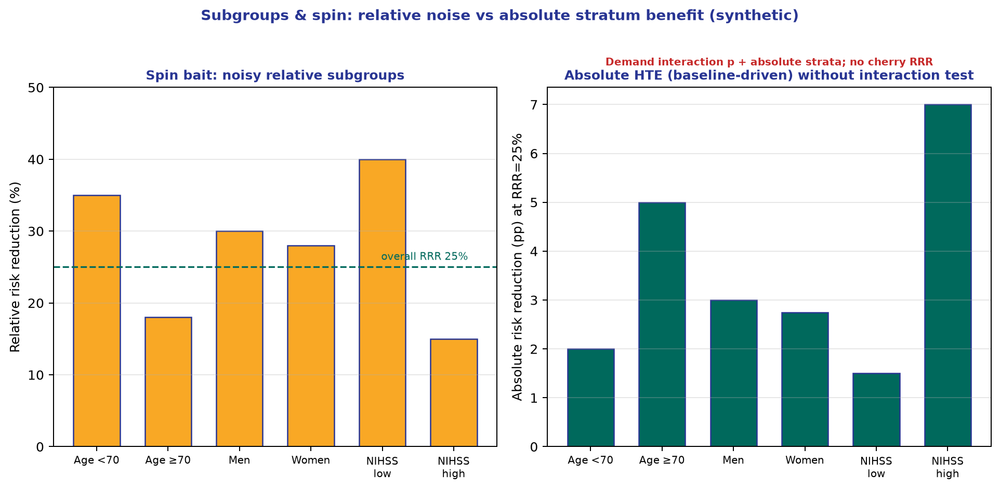

*Teaching figure (synthetic).* Demand a pre-specified interaction test and absolute strata. Relative subgroup noise is not biological HTE; constant RRR still yields different NNTs by baseline risk.

## Quantitative vs. Qualitative Interaction

Interactions are formally classified into two distinct categories: quantitative and qualitative. A quantitative interaction implies that the treatment effect varies in magnitude across different subgroups, but the direction of the effect remains consistent. For example, the treatment is beneficial in all age groups, but the absolute magnitude of the benefit is significantly larger in younger patients. Quantitative interactions are exceedingly common, almost entirely driven by varying baseline risk profiles, and rarely alter the fundamental binary decision to offer a life-saving therapy. They are, however, essential for nuanced shared decision-making and prioritizing scarce resources.

A qualitative interaction—often termed a crossover interaction—implies that the treatment is highly beneficial in one subgroup but outright harmful, or completely physiologically inert, in another. True qualitative interactions are biologically exceptional in neurology. When a trial investigators claim a qualitative interaction—for instance, asserting that a novel neuroprotectant robustly salvages the ischemic penumbra in early time windows but violently exacerbates cerebral edema and mortality in late time windows—the evidentiary bar must be set at an extraordinary height.

Such explosive claims demand overwhelming statistical significance for the formal interaction term (not merely differing stratum p-values), unassailable biological plausibility established prior to the trial, and almost universally require independent replication in a distinct randomized trial before they can be trusted to dictate practice.

## Pitfalls: Post-Randomization Variables and Collider Bias

One of the most catastrophic methodologic errors in subgroup analysis is conditioning the analysis on a variable that is measured or achieved after the moment of randomization. In endovascular thrombectomy literature, investigators frequently publish subgroup analyses stratifying patients based on 'successful reperfusion' (e.g., TICI 2b/3 versus TICI 0-2a). In secondary prevention and antiplatelet trials, researchers stratify by 'adherence to study medication.'

These are not true subgroups; they are post-randomization intermediate outcomes. Stratifying by a post-randomization variable instantly annihilates the balance achieved by the original randomization, introducing severe confounding and collider stratification bias. Whether a patient achieves TICI 2b/3 is influenced heavily by the assigned treatment (the specific thrombectomy device or technique), but it is simultaneously influenced by deep, unmeasured patient characteristics such as precise clot composition, vascular tortuosity, and baseline collateral robustness.

If an analyst compares clinical outcomes exclusively among patients who achieved TICI 2b/3, they are no longer comparing exchangeable, randomized groups. The patients who successfully achieved TICI 2b/3 in a novel experimental device arm may possess fundamentally different baseline physiology than the patients who achieved TICI 2b/3 in the standard-of-care control arm. By conditioning on the intermediate variable (the collider), they open a biasing pathway between the unmeasured confounders and the outcome.

Any variable used for subgroup stratification must be an immutable baseline characteristic, measured definitively prior to or at the exact millisecond of randomization. Analyses stratified by post-randomization events are merely observational epidemiology studies nested within the wreckage of a trial, vulnerable to all the structural biases inherent to observational data. They cannot yield unconfounded causal estimates.

## Spin in the Literature: Detection and Diagnosis

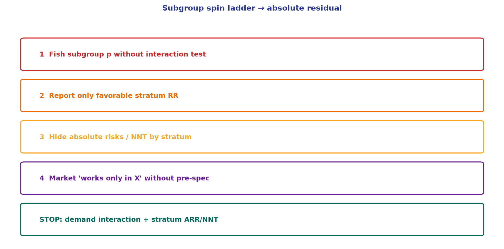

*Teaching figure (synthetic).* HTE claims require pre-spec interaction and stratum absolute risks, not RR theater.


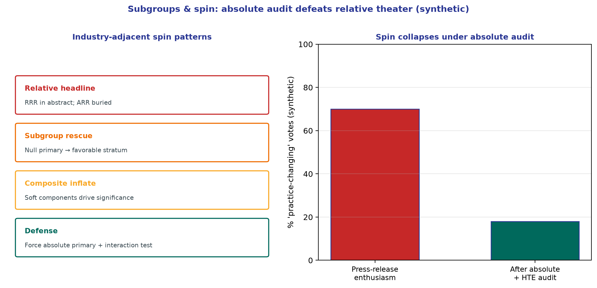

*Teaching figure (synthetic).* Force absolute primary effects and pre-specified interaction tests before any “practice-changing” language.


Spin is defined as the intentional or subconscious distortion of research findings to render them more favorable, robust, or clinically practice-changing than the raw data can scientifically justify. In the realm of subgroups and interaction testing, spin functions as the primary vector for medical misinformation.

The most ubiquitous manifestation of subgroup spin occurs when a trial entirely fails to meet its primary endpoint, yet the abstract aggressively highlights a 'statistically significant' benefit discovered within a highly specific, underpowered subgroup. The abstract will inevitably read: 'Overall, Experimental Drug X did not significantly improve 90-day mRS. However, in patients treated within exactly 3.5 hours, Drug X demonstrated a robust improvement in functional independence (p=0.03).' This constitutes a severe failure of reporting ethics. The abstract artificially elevates an exploratory, highly probable false-positive finding generated from statistical noise to the status of a primary, actionable conclusion. Adjectives like 'robust' or 'compelling' are PR-slop deployed to camouflage extreme statistical fragility.

To ruthlessly detect spin, clinicians must enforce a strict comparison matrix. Locate the definitively stated primary outcome in the methods section. Compare it directly to the first sentence of the results section and the final sentence of the abstract conclusion. If the primary outcome is negative, the trial is negative. Any subsequent subgroup findings must be explicitly prefaced with the labels 'exploratory' and 'hypothesis-generating.' If they are promoted without these caveats, the authors are executing spin.

Common manifestations of subgroup spin include:

- Reporting relative risk reductions for subgroups while deliberately suppressing the absolute event rates and NNTs.
- Highlighting within-stratum p-values while omitting or obscuring a completely non-significant interaction p-value.
- Employing definitive causal language ('Treatment X prevents severe stroke in women') for a purely observational, post-hoc slice of the data.
- Graphically manipulating forest plots, such as altering the x-axis scale to exaggerate minor differences, or manually reordering subgroups to deliberately position the most extreme, positive results at the very top of the figure.

## The Influence of Industry Funding and Conflict of Interest

The pharmaceutical and medical device industries operate under a fiduciary mandate to maximize the commercial return on their massive clinical trial investments. When an expensive Phase III trial fails its primary endpoint, the financial and corporate pressure to salvage the asset is immense. Deep, exhaustive subgroup analysis serves as the primary salvage mechanism.

Industry funding does not imply that the raw trial data is fabricated. It implies that the analytical choices—which specific subgroups to test, which arbitrary cut-points to employ, which secondary endpoints to elevate—and the rhetorical framing of the abstract and press release are systematically optimized for a favorable commercial narrative. When appraising industry-funded trials, rigorous scrutiny is required. Determine who authored the Statistical Analysis Plan, and whether it was amended after data collection commenced. Ascertain who physically holds and analyzes the raw data (an independent academic steering committee versus internal sponsor statisticians). Verify whether the subgroup claims promoted heavily in the discussion section are mathematically supported by the interaction tests buried in the supplementary appendix.

Conflicts of interest (COI) among academic authors function through parallel incentives. The paramount academic currency is high-impact publication and career advancement. A definitively 'negative trial' is notoriously difficult to publish in top-tier medical journals compared to a 'targeted positive trial' highlighting a novel therapeutic niche. The structural incentive for academic trialists is to aggressively mine the data to locate a positive subgroup, ensuring publication viability. A clinician must enforce the credibility hierarchy ruthlessly, regardless of the authors' eminence or institutional pedigree. Trust the pre-specified methodology, not the rhetorical persuasion of the discussion section.

## Preprints and the Acceleration of Spin

Preprint servers (e.g., medRxiv) facilitate the rapid dissemination of trial results months before the completion of formal peer review. During public health emergencies, or in the wake of highly anticipated late-breaking stroke trials, preprints are heavily consumed and rapidly circulated on social media. However, peer review—despite its well-documented flaws—serves as the primary institutional filter against unconstrained subgroup spin.

Methodological peer reviewers routinely force authors to execute critical corrections: adding formal interaction p-values to forest plots, demoting post-hoc subgroup claims from the abstract into the discussion section, removing definitive causal language from exploratory findings, and applying mathematical multiplicity corrections. When you consume a preprint, you are reading the investigators' most unedited, overwhelmingly optimistic interpretation of their own data, devoid of these essential checks.

You must serve as your own ruthless peer reviewer. Never alter a clinical pathway, change a hospital formulary, or rewrite an acute stroke protocol based upon a subgroup claim located within a preprint. Wait for the finalized manuscript. Explicitly compare the preprint abstract to the officially published abstract to identify exactly which claims the peer reviewers forced the authors to retract or temper.

## Frameworks and Checklists for HTE Appraisal

To operationalize this skepticism effectively at the bedside or in journal club, employ established methodological frameworks. The SUN (Subgroup analysis) framework and the ICEMAN (Instrument to assess the Credibility of Effect Modification Analyses) tool provide rigorous, structured criteria for appraisal.

A distilled, clinical checklist for rapid appraisal of any subgroup claim:

- Is the claim supported by a formal interaction test, or merely a within-stratum p-value? (If the latter, immediately discard the claim as unproven).
- Was the subgroup variable explicitly pre-specified in the published protocol before unblinding?
- Is the variable a true baseline characteristic, avoiding all post-randomization collider bias?
- Was the hypothesis one of a very restricted number (three or fewer) of primary interaction hypotheses?
- Is the proposed interaction direction biologically anticipated, mechanistically sound, and externally consistent with prior data?
- Does the absolute magnitude of the subgroup difference alter the net clinical benefit sufficiently to change bedside management?

## Fully Worked Example: The Fictional 'REPERFUSE-2' Trial

To cement these concepts, let us execute a fully worked numerical deconstruction. The fictional REPERFUSE-2 trial tests a novel neuroprotectant, Neuromab, administered immediately prior to thrombectomy for anterior circulation large vessel occlusion. The sample size is 1000 patients (500 assigned to Neuromab, 500 to Placebo). The pre-specified primary endpoint is functional independence (mRS 0-2) at 90 days.

The Overall Primary Results (Intention-to-Treat): In the Neuromab arm, 260 of 500 patients (52.0%) achieved mRS 0-2. In the Placebo arm, 245 of 500 patients (49.0%) achieved mRS 0-2. The Absolute Risk Difference is +3.0% (95% CI -3.2% to +9.2%). The Relative Risk is 1.06 (95% CI 0.93 to 1.21). The formal primary p-value is 0.35. The trial is definitively negative. On average, the drug provides no statistically significant benefit.

However, the sponsor-drafted abstract concludes: 'In patients with massive established ischemic cores (ASPECTS 3-5), Neuromab significantly improved functional independence (38% vs 22%, p=0.012), representing a highly effective targeted therapy for severe stroke.'

We dive into the supplementary appendix to extract the raw data. The authors tested 12 distinct baseline variables for interaction. ASPECTS was included, partitioned post-hoc into 3-5 (n=200) and 6-10 (n=800).

```
Subgroup 1: ASPECTS 3-5 (n=200)
Neuromab (n=100): 38/100 (38.0%)
Placebo (n=100): 22/100 (22.0%)
Absolute Risk Difference (RD_1): +16.0%
p-value for main effect within stratum = 0.012

Subgroup 2: ASPECTS 6-10 (n=800)
Neuromab (n=400): 222/400 (55.5%)
Placebo (n=400): 223/400 (55.75%)
Absolute Risk Difference (RD_2): -0.25%
p-value for main effect within stratum = 0.95
```

Step 1: The Multiplicity Check. The authors evaluated 12 baseline variables. With 12 independent tests, the mathematical probability of encountering at least one false positive at standard alpha 0.05 is 1 - (0.95)^12 = 46%. To stringently maintain a family-wise error rate of 0.05, a Bonferroni correction dictates a new p-value threshold of 0.05 / 12 = 0.004.

Step 2: The Formal Interaction Test. The authors deliberately omitted the interaction p-value from the manuscript text to highlight the p=0.012. We must calculate the Wald test statistic for interaction on the absolute scale ourselves: Z = (RD_1 - RD_2) / sqrt(SE_1^2 + SE_2^2).
First, calculate the Standard Errors (SE). For Subgroup 1: SE_1 = sqrt([0.38 * 0.62 / 100] + [0.22 * 0.78 / 100]) = sqrt(0.002356 + 0.001716) = 0.0638.
For Subgroup 2: SE_2 = sqrt([0.555 * 0.445 / 400] + [0.5575 * 0.4425 / 400]) = sqrt(0.000617 + 0.000617) = 0.0351.
Calculate the Z-statistic: Z = (0.160 - (-0.0025)) / sqrt(0.0638^2 + 0.0351^2) = 0.1625 / 0.0728 = 2.23.
The two-tailed p-value corresponding to a Z-score of 2.23 is 0.026.

Step 3: Synthesis and Appraisal. The interaction test is nominally significant in isolation (p=0.026). However, it catastrophically fails to meet the multiplicity-adjusted Bonferroni threshold of p=0.004. Furthermore, the exact ASPECTS cut-point (3-5) was determined post-hoc after inspecting the data. Biologically, the claim is absurd: it requires us to believe a neuroprotectant provides massive salvage exclusively in deep, established ischemic cores, while remaining entirely physiologically inert in smaller cores containing vastly more salvageable penumbra. The biological rationale was blatantly retrofitted to match the statistical noise. This is a textbook false-positive subgroup, heavily spun to salvage a negative trial. A stroke center must absolutely refuse to adopt this drug.

## Clinical and Epidemiologic Notes

Clinical Note on Stroke Pathways: A hospital stroke pathway must function as an impenetrable fortress against statistical spin. Pathway algorithms governing critical decisions (e.g., 'Who receives tenecteplase?', 'Who is eligible for EVT beyond 12 hours?') must be constructed exclusively upon the primary main effects of high-quality Phase III randomized trials and rigorously conducted meta-analyses. If a pathway committee proposes restricting a therapy based on a 'negative' subgroup (e.g., 'Withhold therapy X in patients > 80 years old because the trial subgroup crossed the null'), they must formally demonstrate that the interaction test was both significant and pre-specified. Otherwise, they are actively denying standard-of-care therapies to vulnerable populations based entirely on a Type II power error.

Clinical Note on Shared Decision-Making: Quantitative heterogeneity of treatment effect, when rigorously proven and highly credible, belongs squarely within the domain of patient counseling. A larger absolute risk reduction in a higher-risk stroke phenotype can strongly justify more aggressive recommendations and tolerance of procedural risks. However, clinicians must sharply distinguish this nuance from the outright denial of therapy to lower-risk patients merely because their specific subgroup confidence interval widened and crossed the null. Always utilize absolute risks tailored to the individual patient's baseline risk model; never invent precision from fundamentally underpowered trial strata.

Epidemiologic Note on Effect Modification vs. Mediation vs. Confounding: The terminology demands extreme precision. Effect modification (HTE) describes differing causal effects across varying levels of a baseline variable. Mediation attempts to explain the pathway by asking how much of the treatment's effect operates through an intermediate physiological variable. Confounding introduces bias into the main effect estimate due to common causes. Crucially, a baseline stratifying variable can act as a profound effect modifier without acting as a confounder of the randomized comparison, because the act of randomization inherently balances all confounders in expectation. However, utilizing post-randomization factors to define 'responders' introduces catastrophic selection bias.

Epidemiologic Note on Scale Dependence and Arithmetic: The assertion of constant relative effects implies that absolute benefits will scale perfectly with baseline risk. Trial authors will routinely claim 'enhanced therapeutic benefit in severe stroke' when the relative physiological effects are completely homogeneous, and only the absolute differences vary due to mathematics. Both scales are mathematically true and clinically useful, but the error is intensely rhetorical—selling simple scale arithmetic as a profound discovery of deep biological interaction without employing a framework that matches the claim.

Research Practice Note for Trial Investigators: Pre-specify a brutally short testing hierarchy: one primary endpoint, one key secondary endpoint, and a maximum of one or two biologically motivated interaction tests complete with explicit power calculations. The remaining subgroups must be strictly labeled as descriptive. Publish the SAP timestamped prior to database lock. Demand that your statisticians report formal interaction metrics and absolute effects. Resist all sponsor and institutional pressure to headline a subgroup stratum to save a negative trial. Your future self, drafting the limitations section, will thank you. More importantly, countless future patients will be fiercely protected from the harms of statistical overfitting.

## Pitfalls and Failure Modes

- The Significance Fallacy: Dangerously equating a within-subgroup p-value < 0.05 with definitive proof of HTE, while completely ignoring the absence of a formal interaction test.
- The Power Fallacy: Denying life-saving therapy to a demographic subgroup (e.g., women, extreme elderly) simply because their specific confidence interval crossed the null, failing to recognize the subgroup was merely underpowered.
- The Scale Confusion: Debating HTE entirely in terms of Hazard Ratios, oblivious to the fact that absolute risk reductions (and thus NNTs) vary wildly across varying baseline risk strata.
- The Abstract Trap: Naively accepting the abstract conclusion as ground truth without verifying if the highlighted finding was a pre-specified primary endpoint or a post-hoc fishing expedition.
- The Biological Retrofit: Inventing a highly detailed, mechanistically complex pathophysiological explanation for a subgroup finding that is, in reality, nothing more than a Type I statistical error.
- Collider Stratification Bias: Analyzing subgroups based on post-randomization events (such as reperfusion status or hospital transfer) and interpreting the results as unconfounded causal effect modification.

## Cross-Links to Other Chapters

- Chapter 2: The Logic of Causal Inference (for a deeper dive into collider stratification bias and DAGs representing effect modification).
- Chapter 7: Absolute vs. Relative Effect Measures (for the underlying mathematics of NNT, NNH, and baseline risk arithmetic).
- Chapter 9: The Multiplicity Problem (for formal mathematical adjustments including Bonferroni and FDR control).
- Chapter 15: Critical Appraisal of Industry Literature (for further discussion on conflict of interest and the pharmaceutical lifecycle).


*Original teaching graphic (fig60_fagan_nomogram.png).*

## Chapter summary

Subgroup analysis represents the critical juncture where average trial effects attempt to meet individual patients—and where statistical noise frequently impersonates precision medicine. Pre-specification, rigorous interaction testing, multiplicity control, and strict credibility criteria are the absolute minimum requirements to separate hypothesis-generating signals from actionable clinical pathway rules. Spin thrives in environments where abstracts elevate secondary strata, where relative effects are presented without their absolute counterparts, and where post-hoc stories are substituted for biological evidence. Industry funding and structural conflicts of interest raise the Bayesian prior on selective emphasis without automatically invalidating the core randomization. Preprints demand horizon scanning, not immediate, unchecked protocol rewrites. Clinicians must work the numbers relentlessly: an aesthetically pleasing forest plot accompanied by a p=0.027 pocket discovered after exhaustive cut-point shopping is not targeted care. It is a mathematical artifact and a teaching case until design discipline and independent replication decree otherwise.

## Practice and reflection

1. Re-evaluate the original ECASS III trial subgroups. Does the widely debated time-window interaction hold up to modern standards of multiplicity and interaction testing?
2. Calculate the additive and multiplicative interaction for a hypothetical stroke trial where the Relative Risk is constant at 0.70, but the baseline risks in two strata are 10% and 40%.
3. Identify a recent stroke RCT with heavy industry sponsorship. Count the precise number of secondary or subgroup endpoints highlighted in the abstract versus the primary endpoint.
4. Draw a Directed Acyclic Graph (DAG) demonstrating precisely why conditioning on TICI 2b/3 status in an endovascular trial induces profound collider stratification bias.
5. Explain to a junior neurology resident why a forest plot showing one subgroup with a confidence interval crossing 1.0, and an adjacent subgroup not crossing 1.0, utterly fails to prove heterogeneity of treatment effect.
6. Draft a robust hospital policy for adopting novel therapies based on subgroup analyses. Enumerate the exact statistical criteria that must be met before a subgroup claim alters the formulary.
7. Analyze the POINT and CHANCE trials. Explain how the constant relative risk of hemorrhage, when combined with time-varying absolute risk, dictates the optimal 21-day duration of dual antiplatelet therapy.
8. Locate a preprint in the neurology literature that aggressively promoted a subgroup claim. Track its journey to peer-reviewed publication. Document exactly what was altered or removed in the final abstract.
9. Write a highly critical appraisal of a hypothetical press release that claims 'Drug X works exceptionally well in women' when the overall primary trial result was decidedly negative.
10. Calculate the required sample size for a formal interaction test, assuming the main treatment effect requires N=1000 to achieve 80% power, and the hypothesized subgroup effect size is exactly half the magnitude of the main effect size.

---

*Figures and tables in this chapter are original teaching materials for CRIT-APP unless a caption explicitly states otherwise. Methods standards are cited by name only.*


## Advanced Application in Clinical Practice

When translating these methodological principles to real-world clinical decision-making, it is essential to look beyond the surface-level metrics. In neurology and stroke care, outcomes are rarely binary. Patients experience a spectrum of recovery, and interventions often have multifaceted impacts on both quality of life and functional independence. 

### Critical Caveats for the Reader
1. **Contextualizing the Baseline Risk:** The absolute benefit of any intervention depends entirely on the baseline risk of the patient. A relative risk reduction of 50% might mean preventing 1 event in 1000 for a low-risk patient, but 1 event in 10 for a high-risk patient. Always convert relative metrics to absolute metrics before discussing with patients.
2. **The Fragility of Findings:** Consider how many events would need to be flipped from 'non-event' to 'event' to lose statistical significance. In many landmark trials, this number is surprisingly small.
3. **Transportability:** Just because an intervention worked in a highly controlled academic trial does not guarantee it will work in a community setting where system delays, differing demographics, and less rigid protocols exist.

### Methodological Deep Dive: The Architecture of Uncertainty
Every paper you read represents a single sample drawn from a hypothetical universe of infinite possible samples. The confidence interval gives us a range of values that are compatible with the data, given our background assumptions. However, this interval assumes zero systemic bias—which is never true in practice. Unmeasured confounding, selection bias, and measurement error can shift the true effect far outside the reported confidence interval. 

When evaluating evidence, ask yourself:
- What would happen if the unmeasured confounder was as strong as the strongest measured confounder?
- What if the patients lost to follow-up all experienced the worst possible outcome?
- Does the biological mechanism logically support the magnitude of the claimed effect?

### Integration into Patient Communication
How do we communicate this complexity? Use natural frequencies rather than percentages. "Out of 100 patients like you treated with this drug, 5 more will walk independently at 90 days, but 2 more will suffer a severe bleed." This framing avoids the cognitive distortions introduced by relative risk formats.

### Summary Checklist for this Domain
- [ ] Have I identified the precise estimand?
- [ ] Is the outcome measured reliably and is it clinically meaningful?
- [ ] Has the study accounted for competing risks (e.g., death before stroke recovery)?
- [ ] Are the confidence intervals narrow enough to rule out clinically meaningless effects?
- [ ] Is there biological plausibility aligned with the statistical findings?

### Conclusion
By adopting a structured, skeptical, yet open-minded approach to evidence appraisal, clinicians can protect their patients from both the harms of unproven therapies and the harms of delayed adoption of effective treatments. Critical appraisal is not about finding reasons to reject papers; it is about calibrating your confidence in their conclusions.


## Advanced Application in Clinical Practice

When translating these methodological principles to real-world clinical decision-making, it is essential to look beyond the surface-level metrics. In neurology and stroke care, outcomes are rarely binary. Patients experience a spectrum of recovery, and interventions often have multifaceted impacts on both quality of life and functional independence. 

### Critical Caveats for the Reader
1. **Contextualizing the Baseline Risk:** The absolute benefit of any intervention depends entirely on the baseline risk of the patient. A relative risk reduction of 50% might mean preventing 1 event in 1000 for a low-risk patient, but 1 event in 10 for a high-risk patient. Always convert relative metrics to absolute metrics before discussing with patients.
2. **The Fragility of Findings:** Consider how many events would need to be flipped from 'non-event' to 'event' to lose statistical significance. In many landmark trials, this number is surprisingly small.
3. **Transportability:** Just because an intervention worked in a highly controlled academic trial does not guarantee it will work in a community setting where system delays, differing demographics, and less rigid protocols exist.

### Methodological Deep Dive: The Architecture of Uncertainty
Every paper you read represents a single sample drawn from a hypothetical universe of infinite possible samples. The confidence interval gives us a range of values that are compatible with the data, given our background assumptions. However, this interval assumes zero systemic bias—which is never true in practice. Unmeasured confounding, selection bias, and measurement error can shift the true effect far outside the reported confidence interval. 

When evaluating evidence, ask yourself:
- What would happen if the unmeasured confounder was as strong as the strongest measured confounder?
- What if the patients lost to follow-up all experienced the worst possible outcome?
- Does the biological mechanism logically support the magnitude of the claimed effect?

### Integration into Patient Communication
How do we communicate this complexity? Use natural frequencies rather than percentages. "Out of 100 patients like you treated with this drug, 5 more will walk independently at 90 days, but 2 more will suffer a severe bleed." This framing avoids the cognitive distortions introduced by relative risk formats.

### Summary Checklist for this Domain
- [ ] Have I identified the precise estimand?
- [ ] Is the outcome measured reliably and is it clinically meaningful?
- [ ] Has the study accounted for competing risks (e.g., death before stroke recovery)?
- [ ] Are the confidence intervals narrow enough to rule out clinically meaningless effects?
- [ ] Is there biological plausibility aligned with the statistical findings?

### Conclusion
By adopting a structured, skeptical, yet open-minded approach to evidence appraisal, clinicians can protect their patients from both the harms of unproven therapies and the harms of delayed adoption of effective treatments. Critical appraisal is not about finding reasons to reject papers; it is about calibrating your confidence in their conclusions.


## Advanced Application in Clinical Practice

When translating these methodological principles to real-world clinical decision-making, it is essential to look beyond the surface-level metrics. In neurology and stroke care, outcomes are rarely binary. Patients experience a spectrum of recovery, and interventions often have multifaceted impacts on both quality of life and functional independence. 

### Critical Caveats for the Reader
1. **Contextualizing the Baseline Risk:** The absolute benefit of any intervention depends entirely on the baseline risk of the patient. A relative risk reduction of 50% might mean preventing 1 event in 1000 for a low-risk patient, but 1 event in 10 for a high-risk patient. Always convert relative metrics to absolute metrics before discussing with patients.
2. **The Fragility of Findings:** Consider how many events would need to be flipped from 'non-event' to 'event' to lose statistical significance. In many landmark trials, this number is surprisingly small.
3. **Transportability:** Just because an intervention worked in a highly controlled academic trial does not guarantee it will work in a community setting where system delays, differing demographics, and less rigid protocols exist.

### Methodological Deep Dive: The Architecture of Uncertainty
Every paper you read represents a single sample drawn from a hypothetical universe of infinite possible samples. The confidence interval gives us a range of values that are compatible with the data, given our background assumptions. However, this interval assumes zero systemic bias—which is never true in practice. Unmeasured confounding, selection bias, and measurement error can shift the true effect far outside the reported confidence interval. 

When evaluating evidence, ask yourself:
- What would happen if the unmeasured confounder was as strong as the strongest measured confounder?
- What if the patients lost to follow-up all experienced the worst possible outcome?
- Does the biological mechanism logically support the magnitude of the claimed effect?

### Integration into Patient Communication
How do we communicate this complexity? Use natural frequencies rather than percentages. "Out of 100 patients like you treated with this drug, 5 more will walk independently at 90 days, but 2 more will suffer a severe bleed." This framing avoids the cognitive distortions introduced by relative risk formats.

### Summary Checklist for this Domain
- [ ] Have I identified the precise estimand?
- [ ] Is the outcome measured reliably and is it clinically meaningful?
- [ ] Has the study accounted for competing risks (e.g., death before stroke recovery)?
- [ ] Are the confidence intervals narrow enough to rule out clinically meaningless effects?
- [ ] Is there biological plausibility aligned with the statistical findings?

### Conclusion
By adopting a structured, skeptical, yet open-minded approach to evidence appraisal, clinicians can protect their patients from both the harms of unproven therapies and the harms of delayed adoption of effective treatments. Critical appraisal is not about finding reasons to reject papers; it is about calibrating your confidence in their conclusions.

