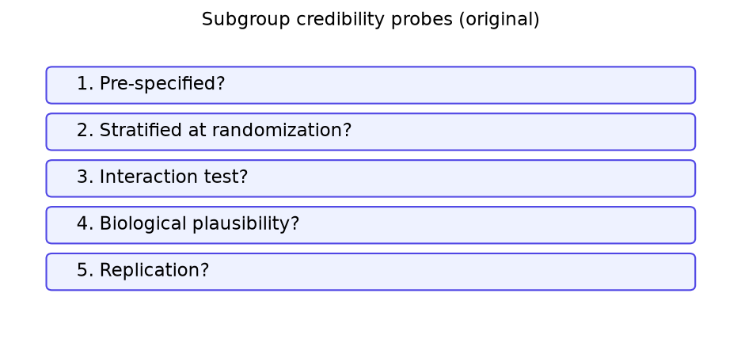
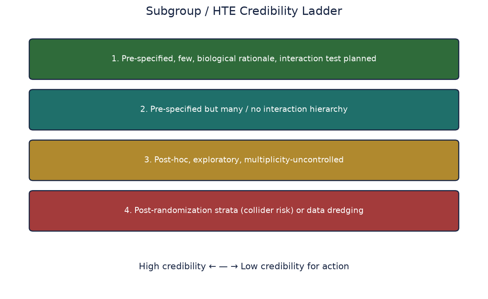
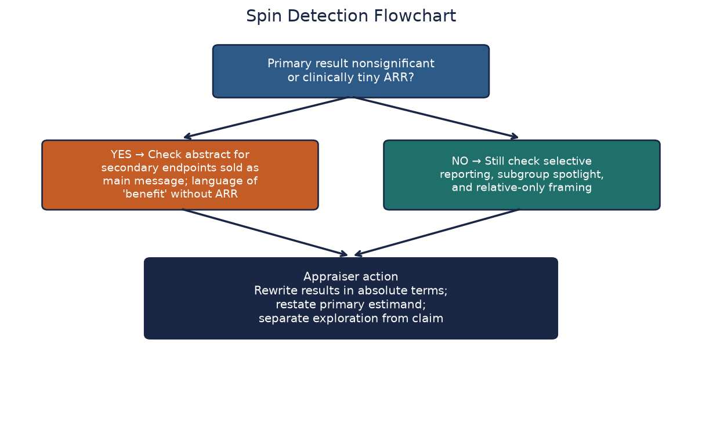
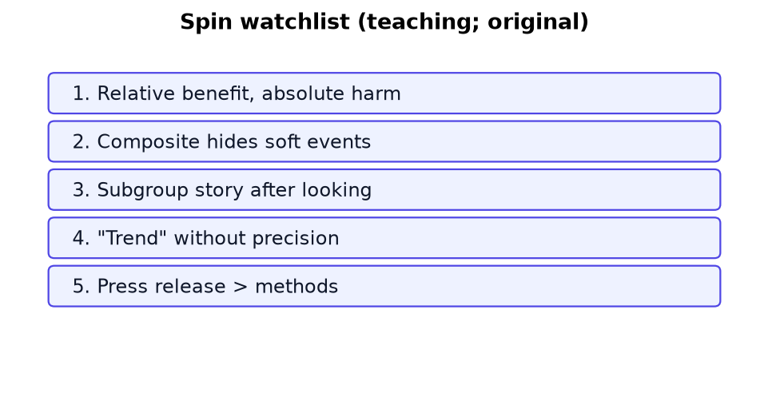

# Chapter 13. Subgroups, Heterogeneity of Treatment Effect, and Spin

## Opening


*Before believing a subgroup effect, run the credibility probes: pre-specification, a significant interaction test, biological plausibility, and consistency across trials.*


A slide claims benefit only in women under 70. Subgroup forests invite storytelling. Require pre-specification, interaction tests, and biological credibility.


## The Epistemology of Subgroups in Neurological Trials

Stroke trials enroll heterogeneous cohorts by design. An endovascular thrombectomy (EVT) trial mixes proximal M1 occlusions with tandem lesions, varying core volumes, differing collateral grades, and highly variable times from last known well. Secondary stroke prevention trials aggregate large artery atherosclerosis, lacunar infarcts, and cardioembolic sources into single massive cohorts. When clinicians read the primary results of these trials, the immediate instinct is to ask: 'Does this average treatment effect apply to the specific patient in front of me?' The instinct to individualize care is clinically correct. However, the mechanism by which the medical literature attempts to answer this question—subgroup analysis—is fundamentally flawed by statistical noise, unpenalized multiplicity, and motivated reasoning.

Heterogeneity of treatment effect (HTE) refers to non-random, genuine differences in the magnitude or direction of a treatment's effect across different patient populations. When real, HTE is critical for targeting therapies to those who benefit most and sparing those who only incur harm or financial toxicity. When false, HTE leads to devastating clinical errors: either denying life-saving therapy to a subgroup that falsely appeared to have no benefit (a false negative), or exposing a subgroup to dangerous interventions based on a statistical fluke (a false positive). The history of neurology is littered with treatments delayed or denied because a subgroup analysis suggested futility in a specific demographic, only for subsequent trials to prove the effect was uniform.

Subgroup analysis moves from an average effect toward more granular contrasts. Baseline subgrouping does not itself break randomization, but smaller strata have less precision, chance imbalances become more visible, and examining many modifiers creates a selection and multiplicity problem. P-values and confidence intervals remain mathematically defined, yet nominal coverage or error rates do not protect a selectively highlighted result across a large family of analyses. Interpret subgroup claims through prespecification, an explicit interaction contrast and scale, multiplicity strategy, precision, plausibility, consistency, and external evidence.

## The Mathematics of Heterogeneity of Treatment Effect (HTE)



*Credible HTE claims need more than different within-stratum p-values.*

To rigorously appraise subgroup claims, we must define the parameters formally. Let Y(1) represent the potential outcome for a patient if they receive the treatment, and Y(0) represent their potential outcome if they receive the control. The individual treatment effect is Y(1) - Y(0). Because we can never observe both potential outcomes simultaneously for the same patient, we rely on randomized trials to estimate the Average Treatment Effect (ATE), defined as E[Y(1) - Y(0)].

A subgroup is defined by a conditioning variable X, which represents a baseline characteristic such as age, sex, or baseline NIHSS. The effect of the treatment within this specific stratum is the Conditional Average Treatment Effect (CATE), defined as E[Y(1) - Y(0) | X = x]. Heterogeneity of treatment effect exists strictly when the CATE varies across different values of the conditioning variable X. If CATE is identical for all values of X, there is absolute homogeneity.

However, the presence and magnitude of HTE depend entirely on the mathematical scale used to measure the effect. This is the concept of scale dependence. Consider a stroke intervention that reduces the relative risk of mortality by exactly 20% across all patients. The Relative Risk (RR) is fixed at 0.80. On the multiplicative scale, there is zero HTE; the treatment is perfectly homogeneous.

Now translate this constant relative effect into absolute clinical outcomes for two distinct subgroups. Subgroup A (severe strokes) has a baseline mortality risk under control of 50%. Applying the constant RR of 0.80, their risk under treatment drops to 40%. The Absolute Risk Reduction (ARR) is 10%, translating to a Number Needed to Treat (NNT) of 10. Subgroup B (mild strokes) has a baseline mortality risk under control of 5%. Applying the identical RR of 0.80, their risk under treatment drops to 4%. The ARR is a mere 1%, translating to an NNT of 100. On the absolute scale—the additive scale—there is massive heterogeneity of treatment effect. Because clinical decision-making relies on weighing the absolute benefits against fixed absolute harms, absolute HTE is what ultimately dictates bedside practice. Trialists often report no HTE because their logistic regression models (multiplicative scale) show no interaction, blinding the reader to the critical variance in absolute benefit driven by baseline risk.

*Teaching figure (synthetic).* Multiplicative homogeneity (RR 0.80 everywhere) coexists with NNT 10 versus NNT 100. Bedside decisions track absolute effects; demand ARR stratified by baseline risk even when interaction tests on the relative scale are null.

## Interaction Tests vs. Stratum-Specific Inference

The single most pervasive statistical error in the neurology literature is the assertion of heterogeneity based on comparing stratum-specific p-values. Investigators will routinely claim that a treatment is effective in males but not females because the male subgroup showed a statistically significant benefit (p = 0.03) while the female subgroup did not (p = 0.15). This is a profound mathematical fallacy. It is the error of testing whether the effect differs from zero within each group, rather than testing whether the effects differ from each other.

To formally test for HTE, the investigator must perform an interaction test. In a linear regression framework, if the outcome is Y, the treatment is T (0 or 1), and the baseline subgroup is X (0 or 1), the model is specified as: Y = B0 + B1(T) + B2(X) + B3(T * X). The coefficient B1 represents the treatment effect when X=0. The coefficient B2 represents the prognostic effect of the baseline variable X when T=0. The critical coefficient is B3, the interaction term. It quantifies the difference in the treatment effect between X=1 and X=0. The interaction test is a direct statistical evaluation of the null hypothesis that B3 = 0. If the p-value for the interaction term is not significant, there is insufficient statistical evidence to claim that the treatment effect differs between the subgroups.

Why is comparing stratum-specific p-values invalid? In a synthetic trial, suppose the estimated RR is 0.75 in both sex strata, but one stratum is three times larger. The larger stratum may have a narrower interval excluding 1 while the smaller stratum's interval crosses 1. With identical point estimates, the interaction estimate is null even though the within-stratum labels differ. Concluding that the drug works only in the larger stratum would confuse differing precision with effect heterogeneity.

A forest plot invites the incorrect comparison of 'significant here' with 'not significant there.' Small subgroups often have wide intervals that may cross the null even when their point estimates resemble the overall effect, but crossing is not mathematically guaranteed. Estimate the between-subgroup interaction directly; lack of evidence within one stratum is not evidence that its effect is zero.

*Teaching figure (synthetic).* Men and women share RR 0.75; only sample size differs. Declaring sex-specific efficacy from divergent stratum p-values without a significant interaction term is a power artifact, not biology.

## Multiplicity and the Garden of Forking Paths

If an investigator tests a single pre-specified hypothesis at a significance level of alpha = 0.05, they accept a 5% risk of a false positive error (Type I error) assuming the null hypothesis is true. If they independently test 10 subgroup hypotheses, the probability of encountering at least one false positive—known as the family-wise error rate (FWER)—escalates dramatically. Assuming independence, the FWER is calculated as 1 - (1 - alpha)^k, where k is the number of tests. For 10 subgroups, the FWER is 40%. For 20 subgroups, it reaches 64%.

Stroke trial appendices frequently feature massive forest plots enumerating 15 to 20 baseline variables: age, sex, admission NIHSS, time to treatment, baseline glucose, systolic blood pressure, prior statin use, stroke etiology, ASPECTS, site of arterial occlusion, and collateral grading. For each of these variables, there may be multiple arbitrary cut-points evaluated (e.g., age > 80, age > 75, age quartiles). Furthermore, these subgroups can be tested across multiple definitions of the outcome (mRS 0-1, mRS 0-2, ordinal shift, 90-day mortality). This combinatorial explosion is what statistician Andrew Gelman terms the 'garden of forking paths.'

Even if investigators refrain from explicitly calculating an interaction p-value for every conceivable combination, the reader can recreate the selection problem by scanning the forest plot for the most extreme or “interesting” result. When a randomized trial is neutral on its primary endpoint, an isolated nominally significant subgroup warrants strong skepticism. Under 20 independent true-null tests at alpha = 0.05, the probability of at least one p-value below 0.05 is about 64%; it is not a guarantee, and dependence among tests changes that probability. Promoting the selected subgroup as a “targeted therapy breakthrough” without a credible interaction test, pre-specification, multiplicity control, and replication is an epistemic failure.

To rigorously defend against multiplicity, trialists should specify a hierarchical testing strategy or adjust their interaction analyses using methods such as family-wise error-rate or false-discovery-rate control. When reading the literature, clinicians should discount a surprising subgroup finding that emerges unadjusted from a lengthy catalog of tests. A p-value of 0.04 in the 14th row is not meaningless, but it is weak evidence unless interpreted with the interaction test, multiplicity plan, prior plausibility, and independent replication.

## Pre-Specification vs. Post-Hoc: The Credibility Hierarchy

The primary institutional defense against the garden of forking paths is strict pre-specification. A pre-specified subgroup analysis is one that is comprehensively detailed in the trial protocol or the Statistical Analysis Plan (SAP) long before the data is unblinded or any outcome analysis commences. A credible SAP must explicitly state the conditioning variable, the exact numerical cut-points to be utilized, the specific primary outcome measure, and the direction of the anticipated interaction. It must be timestamped and publicly available.

Conversely, a post-hoc analysis is invented after the investigators have observed the data. Post-hoc analyses are deeply contaminated by motivated reasoning and subconscious bias. An investigator might notice a faint trend in a specific age demographic, adjust the age cut-point by two or three years to artificially maximize the p-value, and subsequently draft a highly persuasive, biologically plausible narrative in the discussion section to justify the retrofitted cut-point.

However, the binary classification of pre-specified versus post-hoc is insufficient for rigorous appraisal. A forest plot listing 20 variables that were technically 'pre-specified' in the SAP still suffers from catastrophic multiplicity if no statistical penalties are applied. For a subgroup hypothesis to achieve high credibility and directly influence clinical pathways, it must clear a much higher bar. It must be pre-specified as one of a very small number (e.g., 1 to 3) of primary HTE hypotheses. It must be strongly motivated by preexisting biological or epidemiological evidence, rather than mechanical data-dredging. Finally, it must be adequately powered. Powering for an interaction test generally requires a sample size roughly four times larger than that required for the main trial if the goal is to detect an interaction of the identical magnitude as the main effect.

If a subgroup claim fails to meet these stringent criteria, it must be rigidly classified as hypothesis-generating only. It is a suggestion for the design of the next randomized trial, not a mandate for rewriting the current acute stroke protocol.

## Absolute vs. Relative Scales for Effect Modification

Heterogeneity depends on the statistical scale. Absolute effects are important for decisions, but NNT and NNH do not by themselves derive individual net benefit: they summarize different outcomes over specified horizons and require uncertainty, severity or utility, competing events, burden, and patient preferences. Report both prespecified relative and absolute subgroup effects when each serves the decision.

When interpreting a subgroup claim presented in relative terms, convert fixed-horizon risks into absolute natural frequencies only when the effect measure supports that calculation. Consider a synthetic paper asserting: 'At the specified horizon, the intervention has a risk ratio (RR) of 0.50 in patients with severe white matter disease and an RR of 0.90 in those without.' If the untreated fixed-horizon risks are 20% and 4%, respectively, the corresponding modeled treated risks are 10% and 3.6%. The ARRs are therefore 10 percentage points (NNT 10) and 0.4 percentage points (reciprocal 250). These calculations are valid for the stated fixed horizon and assumptions; a hazard ratio cannot be substituted for an RR or multiplied directly by a cumulative risk.

Even with a constant causal risk ratio of 0.80, absolute benefit varies with untreated risk: a 20% baseline risk gives a 4-point reduction, while a 4% baseline risk gives a 0.8-point reduction. Under that stated model, higher baseline risk produces greater absolute benefit; in real data, constancy and transportability of the risk ratio are empirical assumptions. Do not relabel this scale-dependent arithmetic as proven biological interaction.

## Quantitative vs. Qualitative Interaction

Interactions are formally classified into two distinct categories: quantitative and qualitative. A quantitative interaction implies that the treatment effect varies in magnitude across different subgroups, but the direction of the effect remains consistent. For example, the treatment is beneficial in all age groups, but the absolute magnitude of the benefit is significantly larger in younger patients. Quantitative interactions are exceedingly common, almost entirely driven by varying baseline risk profiles, and rarely alter the fundamental binary decision to offer a life-saving therapy. They are, however, essential for nuanced shared decision-making and prioritizing scarce resources.

A qualitative or crossover interaction means the estimated effect changes direction across subgroups on a named scale. Such claims have major clinical consequences and therefore require especially careful assessment of interaction uncertainty, multiplicity, prespecification, measurement, biologic rationale, and replication. Their frequency cannot be assumed from rhetoric alone.

A small interaction p-value alone is insufficient. Credibility depends on the effect estimates and intervals, prespecified scale and direction, multiplicity, data quality, prior rationale, consistency, and independent evidence proportionate to the consequence of acting on the claim.

## Pitfalls: Post-Randomization Variables and Collider Bias

One of the most catastrophic methodologic errors in subgroup analysis is conditioning the analysis on a variable that is measured or achieved after the moment of randomization. In endovascular thrombectomy literature, investigators frequently publish subgroup analyses stratifying patients based on 'successful reperfusion' (e.g., TICI 2b/3 versus TICI 0-2a). In secondary prevention and antiplatelet trials, researchers stratify by 'adherence to study medication.'

These are post-randomization states, not baseline effect modifiers. A naive comparison within levels of such a variable no longer enjoys the original randomized comparison. In the example, reperfusion is affected by assigned treatment and by patient or procedural factors that also predict outcome; conditioning on it can block mediated treatment effects and open a treatment–prognostic-factor path. The exact bias depends on the causal graph rather than on post-randomization timing alone.

If an analyst compares clinical outcomes exclusively among patients who achieved TICI 2b/3, they are no longer comparing exchangeable, randomized groups. The patients who successfully achieved TICI 2b/3 in a novel experimental device arm may possess fundamentally different baseline physiology than the patients who achieved TICI 2b/3 in the standard-of-care control arm. By conditioning on the intermediate variable (the collider), they open a biasing pathway between the unmeasured confounders and the outcome.

Conventional treatment-effect subgroup analyses should generally use prespecified baseline variables measured without knowledge of post-randomization outcomes. Baseline variables need not be literally immutable, but their measurement must precede treatment assignment for this purpose. Post-randomization causal questions may be studied with mediation, principal-stratification, or longitudinal methods under additional assumptions; a naive within-state comparison is not an unconfounded randomized effect.

## Spin in the Literature: Detection and Diagnosis



*Look for selective emphasis, causal overreach, and conclusions that outrun the interaction evidence.*



*A second-pass watchlist for language that converts exploratory findings into unwarranted certainty.*

Spin is selective reporting, interpretation, or framing that makes findings appear more favorable, certain, or clinically actionable than the evidence warrants. It may be intentional or unintentional, and intent usually cannot be inferred from the paper alone. Appraisal should therefore focus on the observable mismatch between the prespecified question, the reported results, and the conclusion.

A common pattern occurs when a trial does not meet its primary endpoint but the abstract foregrounds a nominally significant result from a narrow, underpowered subgroup. A synthetic abstract might read: 'Overall, Experimental Drug X did not significantly improve 90-day mRS. However, in patients treated within exactly 3.5 hours, Drug X demonstrated a robust improvement in functional independence (p=0.03).' Unless that subgroup hypothesis was prespecified, supported by an interaction test, and protected by the testing hierarchy, the result is exploratory and vulnerable to chance. Adjectives such as 'robust' or 'compelling' cannot convert it into confirmatory evidence.

To detect spin, compare the prespecified primary outcome with the first sentence of the results and the final sentence of the abstract conclusion. If the primary result does not support the primary claim, a secondary or subgroup finding does not rescue that claim. A separate claim may be credible when the finding was prespecified, supported by the appropriate contrast, and protected by the testing hierarchy; otherwise, label it exploratory and hypothesis-generating.

Common manifestations of subgroup spin include:

- Reporting relative risk reductions for subgroups without the absolute event rates and NNTs needed to judge clinical importance.
- Highlighting within-stratum p-values while omitting or obscuring a completely non-significant interaction p-value.
- Employing definitive causal language ('Treatment X prevents severe stroke in women') for a purely observational, post-hoc slice of the data.
- Using forest-plot scales or subgroup ordering that visually exaggerate small or selected differences.

## The Influence of Industry Funding and Conflict of Interest

Commercial sponsors have legitimate scientific and regulatory roles as well as a financial stake in the products they study. Empirical meta-research summarized in a [Cochrane review](https://doi.org/10.1002/14651858.MR000033.pub3) found that industry-sponsored drug and device studies more often reported sponsor-favorable efficacy results and conclusions than studies with other sponsorship. That association does not establish bias or misconduct in any individual trial, identify a single mechanism, or justify discounting a study solely because of its funding source.

Industry funding neither implies fabrication nor proves that analytical choices were optimized for a commercial narrative. It should prompt transparent examination of who designed the trial and Statistical Analysis Plan, when amendments occurred, who held and analyzed the data, what publication rights investigators retained, and whether promoted subgroup claims are supported by prespecified interaction analyses. Apply the same checks to independently funded studies rather than treating sponsorship as a substitute for methods appraisal.

Academic investigators can also face publication, career, intellectual, and reputational incentives. These pressures vary and do not establish that an author mined data or committed misconduct. Record disclosed interests and investigator control, then judge each claim against the protocol, prespecified analysis plan, complete results, interaction evidence, and uncertainty rather than the authors' prestige or rhetoric.

## Preprints and the Acceleration of Spin

Preprint servers (e.g., medRxiv) facilitate rapid dissemination before formal peer review. During public health emergencies or after highly anticipated late-breaking stroke trials, preliminary reports can circulate widely before methods and claims receive independent editorial scrutiny. Peer review may detect subgroup-reporting problems, but it is neither uniform nor a guarantee of validity.

Reviewers may request interaction tests, clearer multiplicity handling, demotion of post-hoc claims, or less causal language. A published article can still retain spin, and a preprint is not necessarily optimistic; compare both versions with the registry, protocol, analysis plan, and complete result set rather than treating publication status as a validity test.

Do not alter a clinical pathway, formulary, or acute stroke protocol solely on an unreviewed subgroup claim. If an urgent safety signal requires action before final publication, use formal governance, independent extraction, the totality of available evidence, and a prespecified reassessment date. When both versions exist, compare the preprint and final report with the protocol to identify changes in analyses, emphasis, and uncertainty.

## Frameworks and Checklists for HTE Appraisal

To operationalize this skepticism effectively at the bedside or in journal club, employ established methodological frameworks. The SUN (Subgroup analysis) framework and the ICEMAN (Instrument to assess the Credibility of Effect Modification Analyses) tool provide rigorous, structured criteria for appraisal.

A distilled, clinical checklist for rapid appraisal of any subgroup claim:

- Is the claim supported by a formal interaction test, or merely a within-stratum p-value? If the latter, treat heterogeneity as unsupported rather than inferring a between-subgroup difference.
- Was the subgroup variable explicitly pre-specified in the published protocol before unblinding?
- Is the variable a true baseline characteristic, avoiding all post-randomization collider bias?
- Was the hypothesis part of a small, prespecified set with multiplicity addressed?
- Was the proposed direction supported by a prespecified rationale and externally consistent evidence rather than a mechanism invented after seeing the data?
- Does the absolute magnitude of the subgroup difference alter the net clinical benefit sufficiently to change bedside management?

## Fully Worked Example: The Fictional 'REPERFUSE-2' Trial

To cement these concepts, let us execute a fully worked numerical deconstruction. The fictional REPERFUSE-2 trial tests a novel neuroprotectant, Neuromab, administered immediately prior to thrombectomy for anterior circulation large vessel occlusion. The sample size is 1000 patients (500 assigned to Neuromab, 500 to Placebo). The pre-specified primary endpoint is functional independence (mRS 0-2) at 90 days.

The Overall Primary Results (Intention-to-Treat): In the Neuromab arm, 260 of 500 patients (52.0%) achieved mRS 0-2. In the Placebo arm, 245 of 500 patients (49.0%) achieved mRS 0-2. The risk difference is +3.0% (95% CI −3.2% to +9.2%), the relative risk is 1.06 (95% CI 0.93 to 1.21), and the primary p-value is 0.35. The primary analysis did not meet its prespecified significance criterion. The interval is compatible with modest harm, no effect, or a potentially important benefit; interpret it against the prespecified clinical threshold and do not rescue the result with exploratory subgroups.

However, the sponsor-drafted abstract concludes: 'In patients with massive established ischemic cores (ASPECTS 3-5), Neuromab significantly improved functional independence (38% vs 22%, p=0.012), representing a highly effective targeted therapy for severe stroke.'

We dive into the supplementary appendix to extract the raw data. The authors tested 12 distinct baseline variables for interaction. ASPECTS was included, partitioned post-hoc into 3-5 (n=200) and 6-10 (n=800).

```
Subgroup 1: ASPECTS 3-5 (n=200)
Neuromab (n=100): 38/100 (38.0%)
Placebo (n=100): 22/100 (22.0%)
Absolute Risk Difference (RD_1): +16.0%
p-value for main effect within stratum = 0.012

Subgroup 2: ASPECTS 6-10 (n=800)
Neuromab (n=400): 222/400 (55.5%)
Placebo (n=400): 223/400 (55.75%)
Absolute Risk Difference (RD_2): -0.25%
p-value for main effect within stratum = 0.95
```

Step 1: The Multiplicity Check. The authors evaluated 12 baseline variables. With 12 independent tests, the mathematical probability of encountering at least one false positive at standard alpha 0.05 is 1 - (0.95)^12 = 46%. To stringently maintain a family-wise error rate of 0.05, a Bonferroni correction dictates a new p-value threshold of 0.05 / 12 = 0.004.

Step 2: The Formal Interaction Test. The authors deliberately omitted the interaction p-value from the manuscript text to highlight the p=0.012. We must calculate the Wald test statistic for interaction on the absolute scale ourselves: Z = (RD_1 - RD_2) / sqrt(SE_1^2 + SE_2^2).
First, calculate the Standard Errors (SE). For Subgroup 1: SE_1 = sqrt([0.38 * 0.62 / 100] + [0.22 * 0.78 / 100]) = sqrt(0.002356 + 0.001716) = 0.0638.
For Subgroup 2: SE_2 = sqrt([0.555 * 0.445 / 400] + [0.5575 * 0.4425 / 400]) = sqrt(0.000617 + 0.000617) = 0.0351.
Calculate the Z-statistic: Z = (0.160 - (-0.0025)) / sqrt(0.0638^2 + 0.0351^2) = 0.1625 / 0.0728 = 2.23.
The two-tailed p-value corresponding to a Z-score of 2.23 is 0.026.

Step 3: Synthesis and Appraisal. The interaction test is nominally significant in isolation (p=0.026) but does not meet the prespecified illustrative Bonferroni threshold of p=0.004, and the ASPECTS cut-point was selected after inspecting the data. The proposed mechanism was not prespecified and appears difficult to reconcile with the stated penumbral rationale. These facts do not prove the interaction is false or establish author intent, but they make it an exploratory signal. This subgroup result alone does not justify adopting or withholding the fictional drug; any policy decision should rely on the primary evidence, total benefit-harm profile, independent confirmation, and authorized review.

## Clinical and Epidemiologic Notes

Clinical Note on Stroke Pathways: Pathway committees should anchor restrictions to the totality of evidence, including trial estimands, replicated interaction evidence, harms, applicability, guidelines, and patient values. A subgroup confidence interval crossing the null does not show absence of benefit, and separate within-stratum p-values do not establish heterogeneity. Prespecification and a formal interaction estimate strengthen credibility, but decisions should also consider uncertainty, replication, biological rationale, and whether the proposed restriction changes net benefit.

Clinical Note on Shared Decision-Making: Credible effect heterogeneity can inform counseling, but a larger estimated absolute benefit does not automatically determine the recommendation or tolerance of harm. Present subgroup-specific absolute outcomes and uncertainty when validated, and do not deny an otherwise indicated therapy merely because one underpowered stratum's interval crosses the null. Individualized estimates also inherit model and transportability uncertainty.

Epidemiologic Note on Effect Modification vs. Mediation vs. Confounding: Effect modification describes different causal contrasts across levels of a variable on a named scale. Mediation concerns pathways through post-treatment variables. Confounding reflects open noncausal paths. A baseline variable can modify an effect without confounding a concealed randomized comparison. Defining responder subgroups by post-randomization variables can break exchangeability through selection or conditioning, but the direction and magnitude depend on the causal structure.

Epidemiologic Note on Scale Dependence and Arithmetic: The assertion of constant relative effects implies that absolute benefits will scale perfectly with baseline risk. Trial authors will routinely claim 'enhanced therapeutic benefit in severe stroke' when the relative physiological effects are completely homogeneous, and only the absolute differences vary due to mathematics. Both scales are mathematically true and clinically useful, but the error is intensely rhetorical—selling simple scale arithmetic as a profound discovery of deep biological interaction without employing a framework that matches the claim.

Research Practice Note for Trial Investigators: Pre-specify a brutally short testing hierarchy: one primary endpoint, one key secondary endpoint, and a maximum of one or two biologically motivated interaction tests complete with explicit power calculations. The remaining subgroups must be strictly labeled as descriptive. Publish the SAP timestamped prior to database lock. Demand that your statisticians report formal interaction metrics and absolute effects. Resist all sponsor and institutional pressure to headline a subgroup stratum to save a negative trial. Your future self, drafting the limitations section, will thank you. More importantly, countless future patients will be fiercely protected from the harms of statistical overfitting.

## Pitfalls and Failure Modes

- The Significance Fallacy: Dangerously equating a within-subgroup p-value < 0.05 with definitive proof of HTE, while completely ignoring the absence of a formal interaction test.
- The Power Fallacy: Denying life-saving therapy to a demographic subgroup (e.g., women, extreme elderly) simply because their specific confidence interval crossed the null, failing to recognize the subgroup was merely underpowered.
- The Scale Confusion: Debating HTE entirely in terms of Hazard Ratios, oblivious to the fact that absolute risk reductions (and thus NNTs) vary wildly across varying baseline risk strata.
- The Abstract Trap: Naively accepting the abstract conclusion as ground truth without verifying if the highlighted finding was a pre-specified primary endpoint or a post-hoc fishing expedition.
- The Biological Retrofit: Inventing a highly detailed, mechanistically complex pathophysiological explanation for a subgroup finding that is, in reality, nothing more than a Type I statistical error.
- Collider Stratification Bias: Analyzing subgroups based on post-randomization events (such as reperfusion status or hospital transfer) and interpreting the results as unconfounded causal effect modification.

## Cross-Links to Other Chapters

- Chapter 5: Confounding, DAGs, and Target-Trial Thinking, including collider structures and adjustment sets.
- Chapter 12: Effect Sizes, Absolute Benefit, and NNT, including baseline-risk arithmetic.
- Chapter 27: Missing Data, Multiplicity, Interim Analyses, and Fragility.
- Chapter 15: Journal Club Architecture, including a structured process for challenging subgroup spin.


## Chapter summary

Subgroup analysis is where average effects meet heterogeneous populations—and where selection can impersonate precision. Prespecification, an explicit interaction estimand and scale, multiplicity control, uncertainty, and credibility criteria help separate exploratory signals from pathway rules. Funding and other conflicts warrant transparent examination of design, data access, amendments, analysis, and publication rights, but do not establish selective emphasis or invalidate randomization. A visually striking forest-plot pocket discovered after cut-point searching remains exploratory until supported by design discipline and independent evidence.

## Practice and reflection

1. Re-evaluate the original ECASS III trial subgroups. Does the widely debated time-window interaction hold up to modern standards of multiplicity and interaction testing?
2. Calculate the additive and multiplicative interaction for a hypothetical stroke trial where the Relative Risk is constant at 0.70, but the baseline risks in two strata are 10% and 40%.
3. Identify a recent stroke RCT with heavy industry sponsorship. Count the precise number of secondary or subgroup endpoints highlighted in the abstract versus the primary endpoint.
4. Draw a Directed Acyclic Graph (DAG) demonstrating precisely why conditioning on TICI 2b/3 status in an endovascular trial induces profound collider stratification bias.
5. Explain to a junior neurology resident why a forest plot showing one subgroup with a confidence interval crossing 1.0, and an adjacent subgroup not crossing 1.0, utterly fails to prove heterogeneity of treatment effect.
6. Draft a robust hospital policy for adopting novel therapies based on subgroup analyses. Enumerate the exact statistical criteria that must be met before a subgroup claim alters the formulary.
7. Analyze the POINT and CHANCE trials. Explain how a roughly constant relative risk of hemorrhage, combined with a time-varying absolute risk of recurrent ischemia, bears on how long to continue dual antiplatelet therapy — and why the duration decision stays tied to the trial regimens and current guidance rather than to the mechanism alone.
8. Locate a preprint in the neurology literature that aggressively promoted a subgroup claim. Track its journey to peer-reviewed publication. Document exactly what was altered or removed in the final abstract.
9. Write a highly critical appraisal of a hypothetical press release that claims 'Drug X works exceptionally well in women' when the overall primary trial result was decidedly negative.
10. Calculate the required sample size for a formal interaction test, assuming the main treatment effect requires N=1000 to achieve 80% power, and the hypothesized subgroup effect size is exactly half the magnitude of the main effect size.

---

*Figures and tables in this chapter are Teaching materials for CRIT-APP unless a caption explicitly states otherwise. Methods standards are cited by name only.*
