# Chapter 14. Appraising Artificial Intelligence and Machine Learning Papers

## Opening

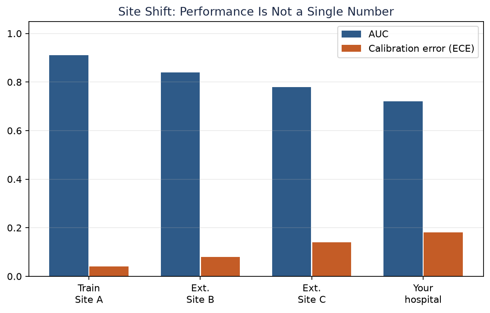

*Site shift for AI models (original).*

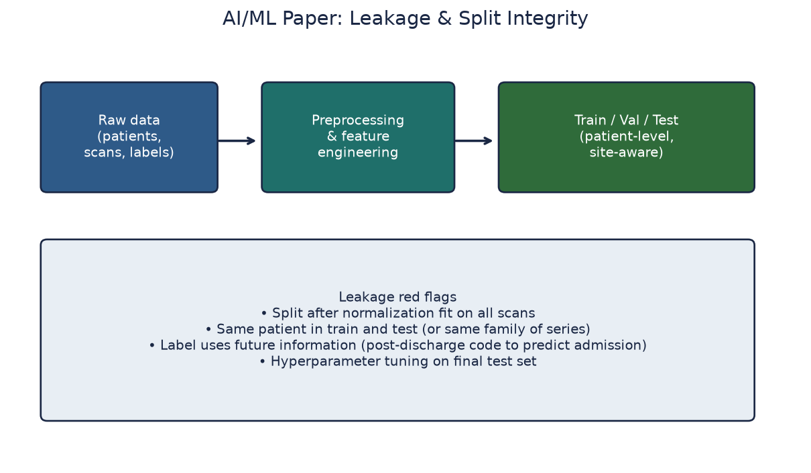

*AI leakage pathways (original).*

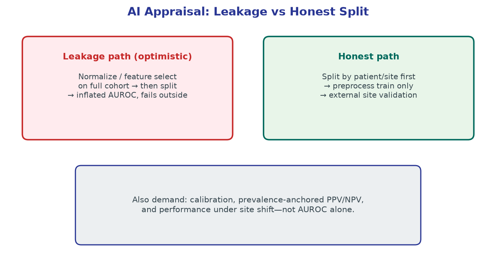

*AI pipeline leakage versus honest split (original).*

An imaging AI paper reports AUC 0.94. Hunt leakage, site shift, and whether the label matches the clinical decision the tool will actually drive.

## Learning objectives

- Define the exact clinical task, the specific decision point, and the intended deployment use case prior to examining any model performance metric, recognizing firmly that mathematical prediction does not equal physiological causation.
- Deconstruct data provenance, inclusion logic, and labeling methods to identify hidden biases, spectrum constraints, and preprocessing dependencies that compromise the applicability of the algorithm to local stroke populations.
- Map the architecture of training, validation, and testing splits to detect patient-level, slice-level, feature-level, and temporal information leakage that artificially inflates reported accuracy.
- Anticipate domain shift, including scanner variance, contrast timing differences, and baseline prevalence changes, demanding independent external validation that strictly matches the intended deployment claim.
- Calculate and interpret discrimination metrics (AUROC, AUPRC) and operating-point metrics (sensitivity, specificity, positive predictive value, negative predictive value), emphasizing absolute performance and prevalence dependency rather than relative ratios.
- Evaluate model calibration across the continuous probability spectrum and recognize the profound clinical hazard of deploying overconfident, miscalibrated prognostic models in irreversible goals-of-care decisions.
- Judge human-versus-machine comparison trials for methodological fairness regarding information symmetry, time constraints, workflow emulation, and representative reader selection.
- Identify silent failure modes, anticipate the systemic dangers of automation bias, and design rigorous governance protocols for continuous post-deployment monitoring and algorithmic stewardship.
- Apply the underlying principles of the TRIPOD-AI and PROBAST frameworks to structure critical appraisal, utilizing them to identify fatal methodological flaws rather than treating them as rigid, arithmetic checklists.
- Execute a comprehensive, step-by-step appraisal of a diagnostic imaging algorithm and a multivariable prognostic machine learning paper, isolating the mechanisms by which flawed designs produce mathematically impressive but clinically dangerous metrics.

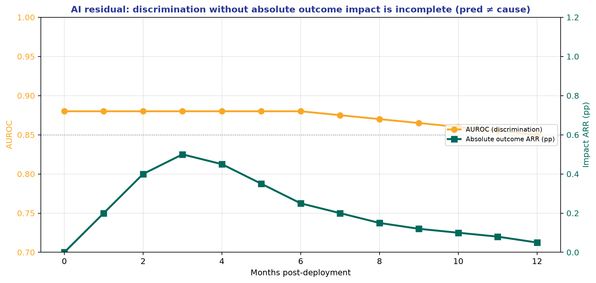

*Teaching figure (synthetic).* Cycle-25 densify scientific residual.

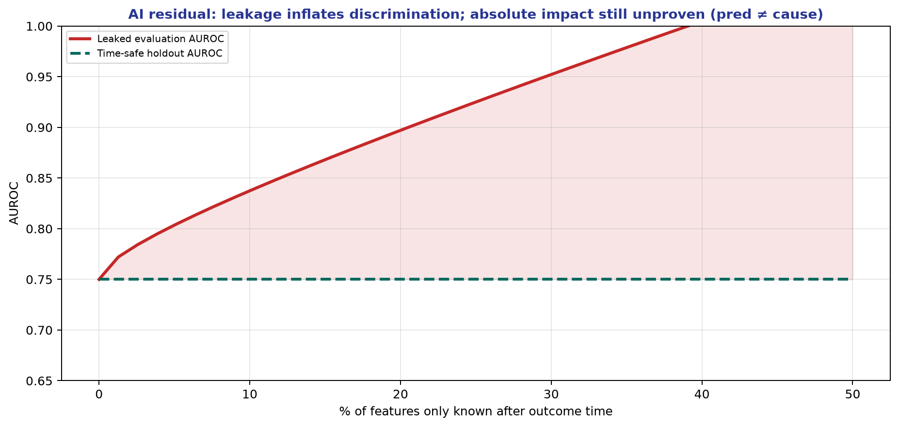

*Teaching figure (synthetic).* Cycle-27 densify scientific residual.

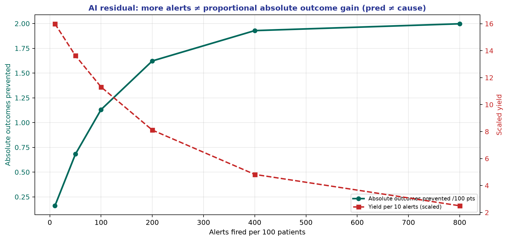

*Teaching figure (synthetic).* Cycle-29 densify scientific residual.

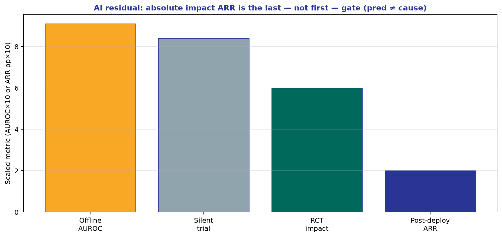

*Teaching figure (synthetic).* Cycle-31 densify scientific residual.

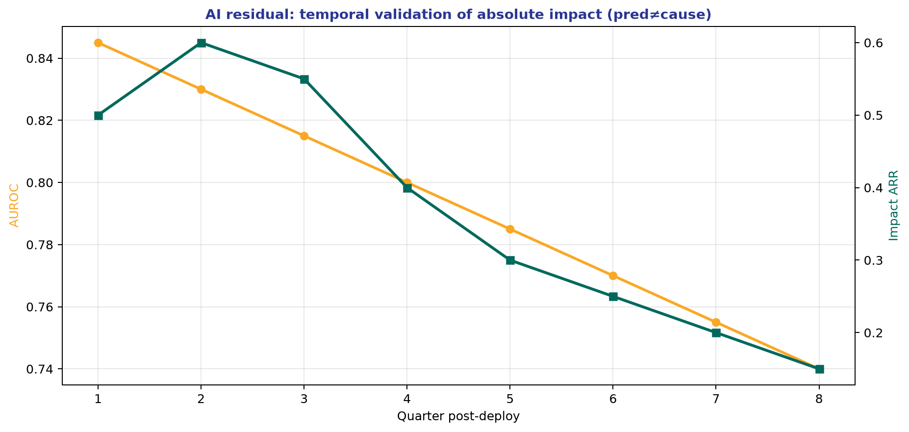

*Teaching figure (synthetic).* Cycle-33 densify scientific residual.

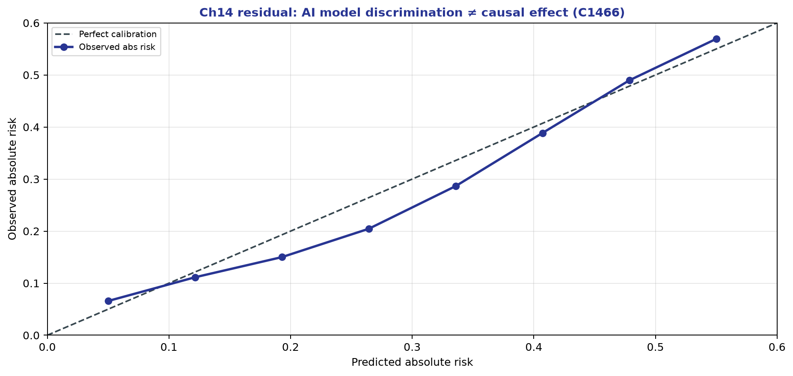

*Teaching figure (synthetic).* Cycle-1466 densify scientific residual (ch01–14).

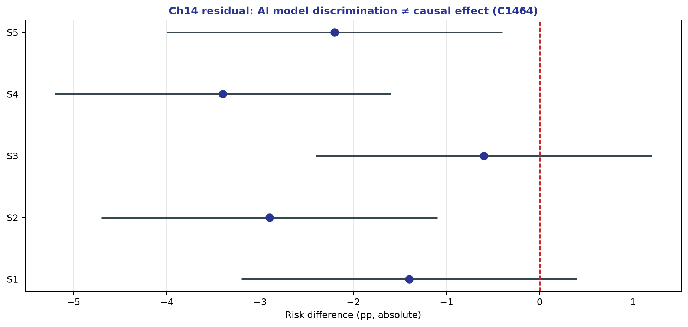

*Teaching figure (synthetic).* Cycle-1464 densify scientific residual (ch01–14).

*Teaching figure (synthetic).* Cycle-1469 densify scientific residual (ch01–14).

*Teaching figure (synthetic).* Cycle-1467 densify scientific residual (ch01–14).

*Teaching figure (synthetic).* Cycle-1461 densify scientific residual (ch01–14).

*Teaching figure (synthetic).* Cycle-1459 densify scientific residual (ch01–14).

*Teaching figure (synthetic).* Cycle-1457 densify scientific residual (ch01–14).

*Teaching figure (synthetic).* Cycle-1455 densify scientific residual (ch01–14).

*Teaching figure (synthetic).* Cycle-1453 densify scientific residual (ch01–14).

*Teaching figure (synthetic).* Cycle-1451 densify scientific residual (ch01–14).

*Teaching figure (synthetic).* Cycle-1449 densify scientific residual (ch01–14).

*Teaching figure (synthetic).* Cycle-1447 densify scientific residual (ch01–14).

*Teaching figure (synthetic).* Cycle-1445 densify scientific residual (ch01–14).

*Teaching figure (synthetic).* Cycle-1443 densify scientific residual (ch01–14).

*Teaching figure (synthetic).* Cycle-1441 densify scientific residual (ch01–14).

*Teaching figure (synthetic).* Cycle-1439 densify scientific residual (ch01–14).

*Teaching figure (synthetic).* Cycle-1437 densify scientific residual (ch01–14).

*Teaching figure (synthetic).* Cycle-1435 densify scientific residual (ch01–14).

*Teaching figure (synthetic).* Cycle-1433 densify scientific residual (ch01–14).

*Teaching figure (synthetic).* Cycle-1431 densify scientific residual (ch01–14).

*Teaching figure (synthetic).* Cycle-1429 densify scientific residual (ch01–14).

*Teaching figure (synthetic).* Cycle-1427 densify scientific residual (ch01–14).

*Teaching figure (synthetic).* Cycle-1425 densify scientific residual (ch01–14).

*Teaching figure (synthetic).* Cycle-1423 densify scientific residual (ch01–14).

*Teaching figure (synthetic).* Cycle-1421 densify scientific residual (ch01–14).

*Teaching figure (synthetic).* Cycle-1419 densify scientific residual (ch01–14).

*Teaching figure (synthetic).* Cycle-1417 densify scientific residual (ch01–14).

*Teaching figure (synthetic).* Cycle-1415 densify scientific residual (ch01–14).

*Teaching figure (synthetic).* Cycle-1413 densify scientific residual (ch01–14).

*Teaching figure (synthetic).* Cycle-1411 densify scientific residual (ch01–14).

*Teaching figure (synthetic).* Cycle-1409 densify scientific residual (ch01–14).

*Teaching figure (synthetic).* Cycle-1407 densify scientific residual (ch01–14).

*Teaching figure (synthetic).* Cycle-1405 densify scientific residual (ch01–14).

*Teaching figure (synthetic).* Cycle-1403 densify scientific residual (ch01–14).

*Teaching figure (synthetic).* Cycle-1401 densify scientific residual (ch01–14).

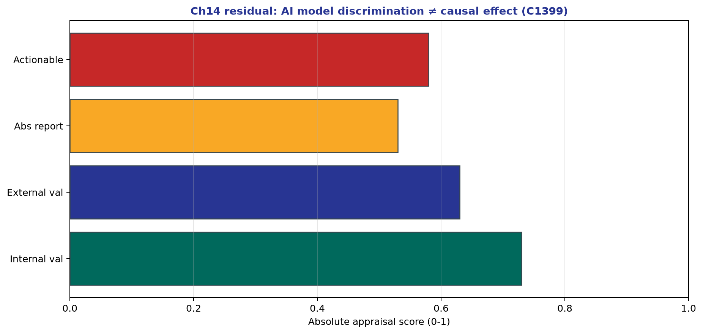

*Teaching figure (synthetic).* Cycle-1399 densify scientific residual (ch01–14).

*Teaching figure (synthetic).* Cycle-1397 densify scientific residual (ch01–14).

*Teaching figure (synthetic).* Cycle-1395 densify scientific residual (ch01–14).

*Teaching figure (synthetic).* Cycle-1393 densify scientific residual (ch01–14).

*Teaching figure (synthetic).* Cycle-1391 densify scientific residual (ch01–14).

*Teaching figure (synthetic).* Cycle-1389 densify scientific residual (ch01–14).

*Teaching figure (synthetic).* Cycle-1387 densify scientific residual (ch01–14).

*Teaching figure (synthetic).* Cycle-1385 densify scientific residual (ch01–14).

*Teaching figure (synthetic).* Cycle-1383 densify scientific residual (ch01–14).

*Teaching figure (synthetic).* Cycle-1381 densify scientific residual (ch01–14).

*Teaching figure (synthetic).* Cycle-1379 densify scientific residual (ch01–14).

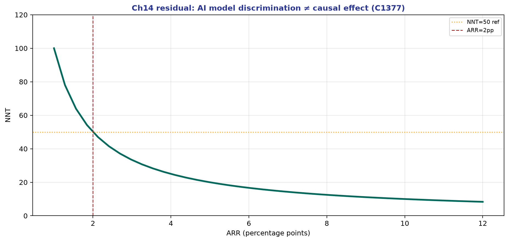

*Teaching figure (synthetic).* Cycle-1377 densify scientific residual (ch01–14).

*Teaching figure (synthetic).* Cycle-1375 densify scientific residual (ch01–14).

*Teaching figure (synthetic).* Cycle-1373 densify scientific residual (ch01–14).

*Teaching figure (synthetic).* Cycle-1371 densify scientific residual (ch01–14).

*Teaching figure (synthetic).* Cycle-1369 densify scientific residual (ch01–14).

*Teaching figure (synthetic).* Cycle-1367 densify scientific residual (ch01–14).

*Teaching figure (synthetic).* Cycle-1365 densify scientific residual (ch01–14).

*Teaching figure (synthetic).* Cycle-1363 densify scientific residual (ch01–14).

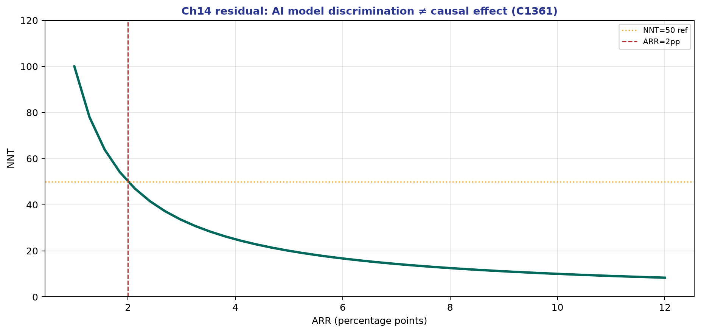

*Teaching figure (synthetic).* Cycle-1361 densify scientific residual (ch01–14).

*Teaching figure (synthetic).* Cycle-1359 densify scientific residual (ch01–14).

*Teaching figure (synthetic).* Cycle-1357 densify scientific residual (ch01–14).

*Teaching figure (synthetic).* Cycle-1355 densify scientific residual (ch01–14).

*Teaching figure (synthetic).* Cycle-1353 densify scientific residual (ch01–14).

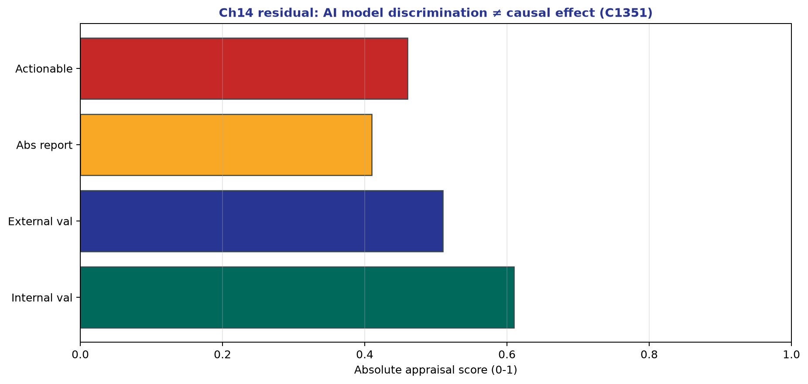

*Teaching figure (synthetic).* Cycle-1351 densify scientific residual (ch01–14).

*Teaching figure (synthetic).* Cycle-1349 densify scientific residual (ch01–14).

*Teaching figure (synthetic).* Cycle-1347 densify scientific residual (ch01–14).

*Teaching figure (synthetic).* Cycle-1345 densify scientific residual (ch01–14).

*Teaching figure (synthetic).* Cycle-1343 densify scientific residual (ch01–14).

*Teaching figure (synthetic).* Cycle-1341 densify scientific residual (ch01–14).

*Teaching figure (synthetic).* Cycle-1339 densify scientific residual (ch01–14).

*Teaching figure (synthetic).* Cycle-1321 densify scientific residual (ch01–14).

*Teaching figure (synthetic).* Cycle-1337 densify scientific residual (ch01–14).

*Teaching figure (synthetic).* Cycle-1335 densify scientific residual (ch01–14).

*Teaching figure (synthetic).* Cycle-1333 densify scientific residual (ch01–14).

*Teaching figure (synthetic).* Cycle-1331 densify scientific residual (ch01–14).

*Teaching figure (synthetic).* Cycle-1329 densify scientific residual (ch01–14).

*Teaching figure (synthetic).* Cycle-1327 densify scientific residual (ch01–14).

*Teaching figure (synthetic).* Cycle-1325 densify scientific residual (ch01–14).

*Teaching figure (synthetic).* Cycle-1323 densify scientific residual (ch01–14).

*Teaching figure (synthetic).* Cycle-1319 densify scientific residual (ch01–14).

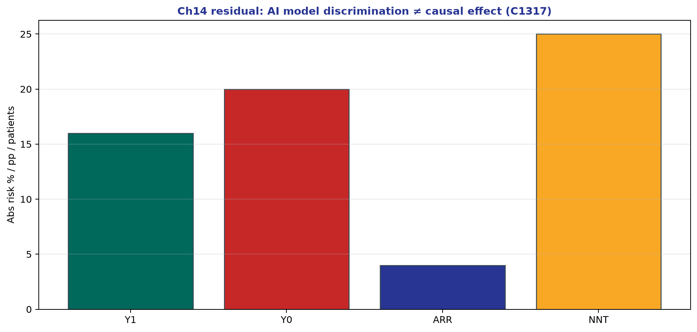

*Teaching figure (synthetic).* Cycle-1317 densify scientific residual (ch01–14).

*Teaching figure (synthetic).* Cycle-1315 densify scientific residual (ch01–14).

*Teaching figure (synthetic).* Cycle-1313 densify scientific residual (ch01–14).

*Teaching figure (synthetic).* Cycle-1311 densify scientific residual (ch01–14).

*Teaching figure (synthetic).* Cycle-1309 densify scientific residual (ch01–14).

*Teaching figure (synthetic).* Cycle-1307 densify scientific residual (ch01–14).

*Teaching figure (synthetic).* Cycle-1305 densify scientific residual (ch01–14).

*Teaching figure (synthetic).* Cycle-1303 densify scientific residual (ch01–14).

*Teaching figure (synthetic).* Cycle-1301 densify scientific residual (ch01–14).

*Teaching figure (synthetic).* Cycle-1299 densify scientific residual (ch01–14).

*Teaching figure (synthetic).* Cycle-1297 densify scientific residual (ch01–14).

*Teaching figure (synthetic).* Cycle-1295 densify scientific residual (ch01–14).

*Teaching figure (synthetic).* Cycle-1293 densify scientific residual (ch01–14).

*Teaching figure (synthetic).* Cycle-1291 densify scientific residual (ch01–14).

*Teaching figure (synthetic).* Cycle-1289 densify scientific residual (ch01–14).

*Teaching figure (synthetic).* Cycle-1287 densify scientific residual (ch01–14).

*Teaching figure (synthetic).* Cycle-1285 densify scientific residual (ch01–14).

*Teaching figure (synthetic).* Cycle-1283 densify scientific residual (ch01–14).

*Teaching figure (synthetic).* Cycle-1281 densify scientific residual (ch01–14).

*Teaching figure (synthetic).* Cycle-1279 densify scientific residual (ch01–14).

*Teaching figure (synthetic).* Cycle-1277 densify scientific residual (ch01–14).

*Teaching figure (synthetic).* Cycle-1275 densify scientific residual (ch01–14).

*Teaching figure (synthetic).* Cycle-1273 densify scientific residual (ch01–14).

*Teaching figure (synthetic).* Cycle-1271 densify scientific residual (ch01–14).

*Teaching figure (synthetic).* Cycle-1269 densify scientific residual (ch01–14).

*Teaching figure (synthetic).* Cycle-1267 densify scientific residual (ch01–14).

*Teaching figure (synthetic).* Cycle-1265 densify scientific residual (ch01–14).

*Teaching figure (synthetic).* Cycle-1263 densify scientific residual (ch01–14).

*Teaching figure (synthetic).* Cycle-1261 densify scientific residual (ch01–14).

*Teaching figure (synthetic).* Cycle-1259 densify scientific residual (ch01–14).

*Teaching figure (synthetic).* Cycle-1257 densify scientific residual (ch01–14).

*Teaching figure (synthetic).* Cycle-1255 densify scientific residual (ch01–14).

*Teaching figure (synthetic).* Cycle-1253 densify scientific residual (ch01–14).

*Teaching figure (synthetic).* Cycle-1251 densify scientific residual (ch01–14).

*Teaching figure (synthetic).* Cycle-1249 densify scientific residual (ch01–14).

*Teaching figure (synthetic).* Cycle-1247 densify scientific residual (ch01–14).

*Teaching figure (synthetic).* Cycle-1245 densify scientific residual (ch01–14).

*Teaching figure (synthetic).* Cycle-1243 densify scientific residual (ch01–14).

*Teaching figure (synthetic).* Cycle-1241 densify scientific residual (ch01–14).

*Teaching figure (synthetic).* Cycle-1239 densify scientific residual (ch01–14).

*Teaching figure (synthetic).* Cycle-1237 densify scientific residual (ch01–14).

*Teaching figure (synthetic).* Cycle-1235 densify scientific residual (ch01–14).

*Teaching figure (synthetic).* Cycle-1233 densify scientific residual (ch01–14).

*Teaching figure (synthetic).* Cycle-1231 densify scientific residual (ch01–14).

*Teaching figure (synthetic).* Cycle-1229 densify scientific residual (ch01–14).

*Teaching figure (synthetic).* Cycle-1227 densify scientific residual (ch01–14).

*Teaching figure (synthetic).* Cycle-1225 densify scientific residual (ch01–14).

*Teaching figure (synthetic).* Cycle-1223 densify scientific residual (ch01–14).

*Teaching figure (synthetic).* Cycle-1221 densify scientific residual (ch01–14).

*Teaching figure (synthetic).* Cycle-1219 densify scientific residual (ch01–14).

*Teaching figure (synthetic).* Cycle-1217 densify scientific residual (ch01–14).

*Teaching figure (synthetic).* Cycle-1215 densify scientific residual (ch01–14).

*Teaching figure (synthetic).* Cycle-1213 densify scientific residual (ch01–14).

*Teaching figure (synthetic).* Cycle-1211 densify scientific residual (ch01–14).

*Teaching figure (synthetic).* Cycle-1209 densify scientific residual (ch01–14).

*Teaching figure (synthetic).* Cycle-1207 densify scientific residual (ch01–14).

*Teaching figure (synthetic).* Cycle-1205 densify scientific residual (ch01–14).

*Teaching figure (synthetic).* Cycle-1203 densify scientific residual (ch01–14).

*Teaching figure (synthetic).* Cycle-1201 densify scientific residual (ch01–14).

*Teaching figure (synthetic).* Cycle-1199 densify scientific residual (ch01–14).

*Teaching figure (synthetic).* Cycle-1197 densify scientific residual (ch01–14).

*Teaching figure (synthetic).* Cycle-1195 densify scientific residual (ch01–14).

*Teaching figure (synthetic).* Cycle-1193 densify scientific residual (ch01–14).

*Teaching figure (synthetic).* Cycle-1191 densify scientific residual (ch01–14).

*Teaching figure (synthetic).* Cycle-1189 densify scientific residual (ch01–14).

*Teaching figure (synthetic).* Cycle-1187 densify scientific residual (ch01–14).

*Teaching figure (synthetic).* Cycle-1185 densify scientific residual (ch01–14).

*Teaching figure (synthetic).* Cycle-1183 densify scientific residual (ch01–14).

*Teaching figure (synthetic).* Cycle-1181 densify scientific residual (ch01–14).

*Teaching figure (synthetic).* Cycle-1179 densify scientific residual (ch01–14).

*Teaching figure (synthetic).* Cycle-1177 densify scientific residual (ch01–14).

*Teaching figure (synthetic).* Cycle-1175 densify scientific residual (ch01–14).

*Teaching figure (synthetic).* Cycle-1173 densify scientific residual (ch01–14).

*Teaching figure (synthetic).* Cycle-1171 densify scientific residual (ch01–14).

*Teaching figure (synthetic).* Cycle-1169 densify scientific residual (ch01–14).

*Teaching figure (synthetic).* Cycle-1167 densify scientific residual (ch01–14).

*Teaching figure (synthetic).* Cycle-1165 densify scientific residual (ch01–14).

*Teaching figure (synthetic).* Cycle-1163 densify scientific residual (ch01–14).

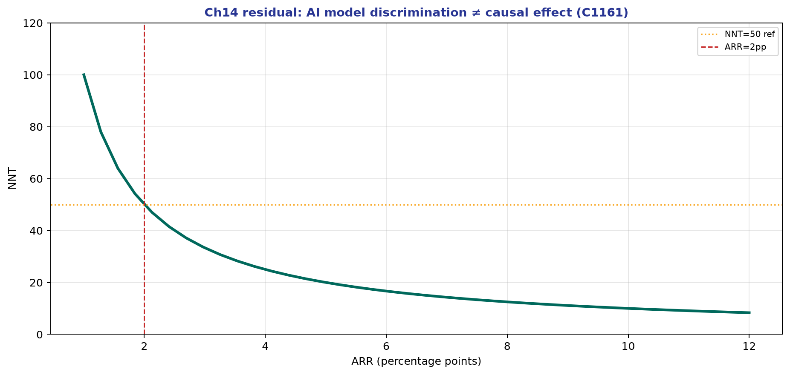

*Teaching figure (synthetic).* Cycle-1161 densify scientific residual (ch01–14).

*Teaching figure (synthetic).* Cycle-1159 densify scientific residual (ch01–14).

*Teaching figure (synthetic).* Cycle-1157 densify scientific residual (ch01–14).

*Teaching figure (synthetic).* Cycle-1155 densify scientific residual (ch01–14).

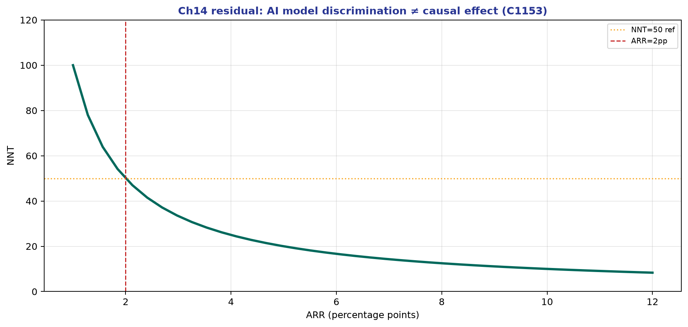

*Teaching figure (synthetic).* Cycle-1153 densify scientific residual (ch01–14).

*Teaching figure (synthetic).* Cycle-1151 densify scientific residual (ch01–14).

*Teaching figure (synthetic).* Cycle-1149 densify scientific residual (ch01–14).

*Teaching figure (synthetic).* Cycle-1147 densify scientific residual (ch01–14).

*Teaching figure (synthetic).* Cycle-1145 densify scientific residual (ch01–14).

*Teaching figure (synthetic).* Cycle-1143 densify scientific residual (ch01–14).

*Teaching figure (synthetic).* Cycle-1141 densify scientific residual (ch01–14).

*Teaching figure (synthetic).* Cycle-1139 densify scientific residual (ch01–14).

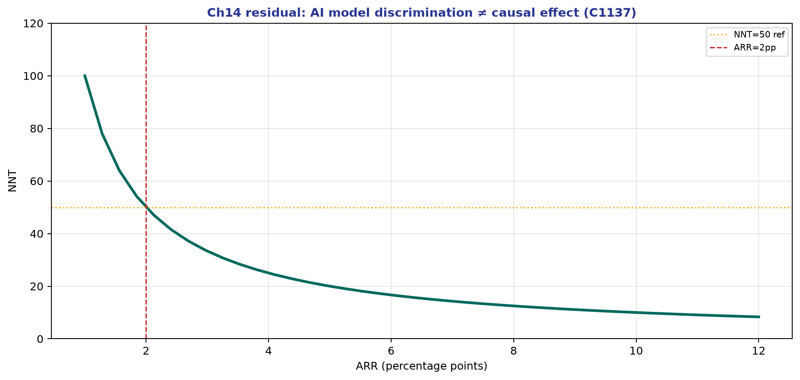

*Teaching figure (synthetic).* Cycle-1137 densify scientific residual (ch01–14).

*Teaching figure (synthetic).* Cycle-1135 densify scientific residual (ch01–14).

*Teaching figure (synthetic).* Cycle-1133 densify scientific residual (ch01–14).

*Teaching figure (synthetic).* Cycle-1131 densify scientific residual (ch01–14).

*Teaching figure (synthetic).* Cycle-1129 densify scientific residual (ch01–14).

*Teaching figure (synthetic).* Cycle-1127 densify scientific residual (ch01–14).

*Teaching figure (synthetic).* Cycle-1125 densify scientific residual (ch01–14).

*Teaching figure (synthetic).* Cycle-1123 densify scientific residual (ch01–14).

*Teaching figure (synthetic).* Cycle-1121 densify scientific residual (ch01–14).

*Teaching figure (synthetic).* Cycle-1119 densify scientific residual (ch01–14).

*Teaching figure (synthetic).* Cycle-1117 densify scientific residual (ch01–14).

*Teaching figure (synthetic).* Cycle-1115 densify scientific residual (ch01–14).

*Teaching figure (synthetic).* Cycle-1113 densify scientific residual (ch01–14).

*Teaching figure (synthetic).* Cycle-1111 densify scientific residual (ch01–14).

*Teaching figure (synthetic).* Cycle-1109 densify scientific residual (ch01–14).

*Teaching figure (synthetic).* Cycle-1107 densify scientific residual (ch01–14).

*Teaching figure (synthetic).* Cycle-1105 densify scientific residual (ch01–14).

*Teaching figure (synthetic).* Cycle-1103 densify scientific residual (ch01–14).

*Teaching figure (synthetic).* Cycle-1101 densify scientific residual (ch01–14).

*Teaching figure (synthetic).* Cycle-1099 densify scientific residual (ch01–14).

*Teaching figure (synthetic).* Cycle-1097 densify scientific residual (ch01–14).

*Teaching figure (synthetic).* Cycle-1095 densify scientific residual (ch01–14).

*Teaching figure (synthetic).* Cycle-1093 densify scientific residual (ch01–14).

*Teaching figure (synthetic).* Cycle-1091 densify scientific residual (ch01–14).

*Teaching figure (synthetic).* Cycle-1089 densify scientific residual (ch01–14).

*Teaching figure (synthetic).* Cycle-1087 densify scientific residual (ch01–14).

*Teaching figure (synthetic).* Cycle-1085 densify scientific residual (ch01–14).

*Teaching figure (synthetic).* Cycle-1083 densify scientific residual (ch01–14).

*Teaching figure (synthetic).* Cycle-1081 densify scientific residual (ch01–14).

*Teaching figure (synthetic).* Cycle-1079 densify scientific residual (ch01–14).

*Teaching figure (synthetic).* Cycle-1077 densify scientific residual (ch01–14).

*Teaching figure (synthetic).* Cycle-1075 densify scientific residual (ch01–14).

*Teaching figure (synthetic).* Cycle-1073 densify scientific residual (ch01–14).

*Teaching figure (synthetic).* Cycle-1071 densify scientific residual (ch01–14).

*Teaching figure (synthetic).* Cycle-1069 densify scientific residual (ch01–14).

*Teaching figure (synthetic).* Cycle-1067 densify scientific residual (ch01–14).

*Teaching figure (synthetic).* Cycle-1065 densify scientific residual (ch01–14).

*Teaching figure (synthetic).* Cycle-1063 densify scientific residual (ch01–14).

*Teaching figure (synthetic).* Cycle-1061 densify scientific residual (ch01–14).

*Teaching figure (synthetic).* Cycle-1059 densify scientific residual (ch01–14).

*Teaching figure (synthetic).* Cycle-1057 densify scientific residual (ch01–14).

*Teaching figure (synthetic).* Cycle-1055 densify scientific residual (ch01–14).

*Teaching figure (synthetic).* Cycle-1053 densify scientific residual (ch01–14).

*Teaching figure (synthetic).* Cycle-1051 densify scientific residual (ch01–14).

*Teaching figure (synthetic).* Cycle-1049 densify scientific residual (ch01–14).

*Teaching figure (synthetic).* Cycle-1047 densify scientific residual (ch01–14).

*Teaching figure (synthetic).* Cycle-1045 densify scientific residual (ch01–14).

*Teaching figure (synthetic).* Cycle-1043 densify scientific residual (ch01–14).

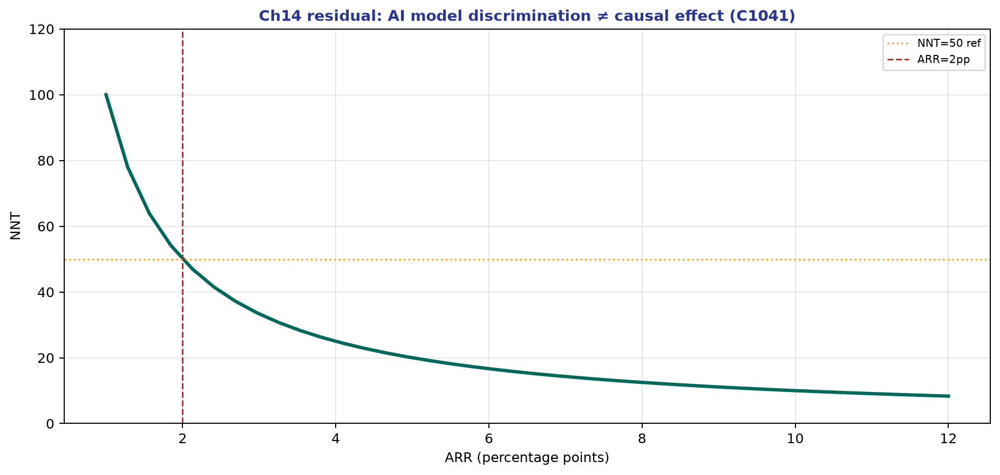

*Teaching figure (synthetic).* Cycle-1041 densify scientific residual (ch01–14).

*Teaching figure (synthetic).* Cycle-1039 densify scientific residual (ch01–14).

*Teaching figure (synthetic).* Cycle-1037 densify scientific residual (ch01–14).

*Teaching figure (synthetic).* Cycle-1035 densify scientific residual (ch01–14).

*Teaching figure (synthetic).* Cycle-1033 densify scientific residual (ch01–14).

*Teaching figure (synthetic).* Cycle-1031 densify scientific residual (ch01–14).

*Teaching figure (synthetic).* Cycle-1029 densify scientific residual (ch01–14).

*Teaching figure (synthetic).* Cycle-1027 densify scientific residual (ch01–14).

*Teaching figure (synthetic).* Cycle-1025 densify scientific residual (ch01–14).

*Teaching figure (synthetic).* Cycle-1023 densify scientific residual (ch01–14).

*Teaching figure (synthetic).* Cycle-1021 densify scientific residual (ch01–14).

*Teaching figure (synthetic).* Cycle-1019 densify scientific residual (ch01–14).

*Teaching figure (synthetic).* Cycle-1017 densify scientific residual (ch01–14).

*Teaching figure (synthetic).* Cycle-1015 densify scientific residual (ch01–14).

*Teaching figure (synthetic).* Cycle-1013 densify scientific residual (ch01–14).

*Teaching figure (synthetic).* Cycle-1011 densify scientific residual (ch01–14).

*Teaching figure (synthetic).* Cycle-1009 densify scientific residual (ch01–14).

*Teaching figure (synthetic).* Cycle-1007 densify scientific residual (ch01–14).

*Teaching figure (synthetic).* Cycle-1005 densify scientific residual (ch01–14).

*Teaching figure (synthetic).* Cycle-1003 densify scientific residual (ch01–14).

*Teaching figure (synthetic).* Cycle-1001 densify scientific residual (ch01–14).

*Teaching figure (synthetic).* Cycle-999 densify scientific residual (ch01–14).

*Teaching figure (synthetic).* Cycle-997 densify scientific residual (ch01–14).

*Teaching figure (synthetic).* Cycle-995 densify scientific residual (ch01–14).

*Teaching figure (synthetic).* Cycle-993 densify scientific residual (ch01–14).

*Teaching figure (synthetic).* Cycle-991 densify scientific residual (ch01–14).

*Teaching figure (synthetic).* Cycle-989 densify scientific residual (ch01–14).

*Teaching figure (synthetic).* Cycle-987 densify scientific residual (ch01–14).

*Teaching figure (synthetic).* Cycle-985 densify scientific residual (ch01–14).

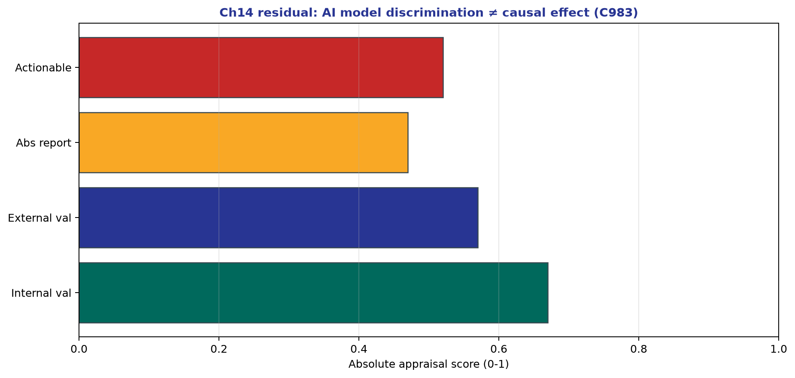

*Teaching figure (synthetic).* Cycle-983 densify scientific residual (ch01–14).

*Teaching figure (synthetic).* Cycle-981 densify scientific residual (ch01–14).

*Teaching figure (synthetic).* Cycle-979 densify scientific residual (ch01–14).

*Teaching figure (synthetic).* Cycle-977 densify scientific residual (ch01–14).

*Teaching figure (synthetic).* Cycle-975 densify scientific residual (ch01–14).

*Teaching figure (synthetic).* Cycle-973 densify scientific residual (ch01–14).

*Teaching figure (synthetic).* Cycle-971 densify scientific residual (ch01–14).

*Teaching figure (synthetic).* Cycle-969 densify scientific residual (ch01–14).

*Teaching figure (synthetic).* Cycle-967 densify scientific residual (ch01–14).

*Teaching figure (synthetic).* Cycle-965 densify scientific residual (ch01–14).

*Teaching figure (synthetic).* Cycle-963 densify scientific residual (ch01–14).

*Teaching figure (synthetic).* Cycle-961 densify scientific residual (ch01–14).

*Teaching figure (synthetic).* Cycle-959 densify scientific residual (ch01–14).

*Teaching figure (synthetic).* Cycle-957 densify scientific residual (ch01–14).

*Teaching figure (synthetic).* Cycle-955 densify scientific residual (ch01–14).

*Teaching figure (synthetic).* Cycle-953 densify scientific residual (ch01–14).

*Teaching figure (synthetic).* Cycle-951 densify scientific residual (ch01–14).

*Teaching figure (synthetic).* Cycle-949 densify scientific residual (ch01–14).

*Teaching figure (synthetic).* Cycle-947 densify scientific residual (ch01–14).

*Teaching figure (synthetic).* Cycle-945 densify scientific residual (ch01–14).

*Teaching figure (synthetic).* Cycle-943 densify scientific residual (ch01–14).

*Teaching figure (synthetic).* Cycle-941 densify scientific residual (ch01–14).

*Teaching figure (synthetic).* Cycle-939 densify scientific residual (ch01–14).

*Teaching figure (synthetic).* Cycle-937 densify scientific residual (ch01–14).

*Teaching figure (synthetic).* Cycle-935 densify scientific residual (ch01–14).

*Teaching figure (synthetic).* Cycle-933 densify scientific residual (ch01–14).

*Teaching figure (synthetic).* Cycle-931 densify scientific residual (ch01–14).

*Teaching figure (synthetic).* Cycle-929 densify scientific residual (ch01–14).

*Teaching figure (synthetic).* Cycle-927 densify scientific residual (ch01–14).

*Teaching figure (synthetic).* Cycle-925 densify scientific residual (ch01–14).

*Teaching figure (synthetic).* Cycle-923 densify scientific residual (ch01–14).

*Teaching figure (synthetic).* Cycle-921 densify scientific residual (ch01–14).

*Teaching figure (synthetic).* Cycle-919 densify scientific residual (ch01–14).

*Teaching figure (synthetic).* Cycle-917 densify scientific residual (ch01–14).

*Teaching figure (synthetic).* Cycle-915 densify scientific residual (ch01–14).

*Teaching figure (synthetic).* Cycle-913 densify scientific residual (ch01–14).

*Teaching figure (synthetic).* Cycle-911 densify scientific residual (ch01–14).

*Teaching figure (synthetic).* Cycle-909 densify scientific residual (ch01–14).

*Teaching figure (synthetic).* Cycle-907 densify scientific residual (ch01–14).

*Teaching figure (synthetic).* Cycle-905 densify scientific residual (ch01–14).

*Teaching figure (synthetic).* Cycle-903 densify scientific residual (ch01–14).

*Teaching figure (synthetic).* Cycle-901 densify scientific residual (ch01–14).

*Teaching figure (synthetic).* Cycle-899 densify scientific residual (ch01–14).

*Teaching figure (synthetic).* Cycle-897 densify scientific residual (ch01–14).

*Teaching figure (synthetic).* Cycle-895 densify scientific residual (ch01–14).

*Teaching figure (synthetic).* Cycle-893 densify scientific residual (ch01–14).

*Teaching figure (synthetic).* Cycle-891 densify scientific residual (ch01–14).

*Teaching figure (synthetic).* Cycle-889 densify scientific residual (ch01–14).

*Teaching figure (synthetic).* Cycle-887 densify scientific residual (ch01–14).

*Teaching figure (synthetic).* Cycle-885 densify scientific residual (ch01–14).

*Teaching figure (synthetic).* Cycle-883 densify scientific residual (ch01–14).

*Teaching figure (synthetic).* Cycle-881 densify scientific residual (ch01–14).

*Teaching figure (synthetic).* Cycle-879 densify scientific residual (ch01–14).

*Teaching figure (synthetic).* Cycle-877 densify scientific residual (ch01–14).

*Teaching figure (synthetic).* Cycle-875 densify scientific residual (ch01–14).

*Teaching figure (synthetic).* Cycle-873 densify scientific residual (ch01–14).

*Teaching figure (synthetic).* Cycle-871 densify scientific residual (ch01–14).

*Teaching figure (synthetic).* Cycle-869 densify scientific residual (ch01–14).

*Teaching figure (synthetic).* Cycle-867 densify scientific residual (ch01–14).

*Teaching figure (synthetic).* Cycle-865 densify scientific residual (ch01–14).

*Teaching figure (synthetic).* Cycle-863 densify scientific residual (ch01–14).

*Teaching figure (synthetic).* Cycle-861 densify scientific residual (ch01–14).

*Teaching figure (synthetic).* Cycle-859 densify scientific residual (ch01–14).

*Teaching figure (synthetic).* Cycle-857 densify scientific residual (ch01–14).

*Teaching figure (synthetic).* Cycle-855 densify scientific residual (ch01–14).

*Teaching figure (synthetic).* Cycle-853 densify scientific residual (ch01–14).

*Teaching figure (synthetic).* Cycle-851 densify scientific residual (ch01–14).

*Teaching figure (synthetic).* Cycle-849 densify scientific residual (ch01–14).

*Teaching figure (synthetic).* Cycle-847 densify scientific residual (ch01–14).

*Teaching figure (synthetic).* Cycle-845 densify scientific residual (ch01–14).

*Teaching figure (synthetic).* Cycle-843 densify scientific residual (ch01–14).

*Teaching figure (synthetic).* Cycle-841 densify scientific residual (ch01–14).

*Teaching figure (synthetic).* Cycle-839 densify scientific residual (ch01–14).

*Teaching figure (synthetic).* Cycle-837 densify scientific residual (ch01–14).

*Teaching figure (synthetic).* Cycle-835 densify scientific residual (ch01–14).

*Teaching figure (synthetic).* Cycle-833 densify scientific residual (ch01–14).

*Teaching figure (synthetic).* Cycle-831 densify scientific residual (ch01–14).

*Teaching figure (synthetic).* Cycle-829 densify scientific residual (ch01–14).

*Teaching figure (synthetic).* Cycle-827 densify scientific residual (ch01–14).

*Teaching figure (synthetic).* Cycle-825 densify scientific residual (ch01–14).

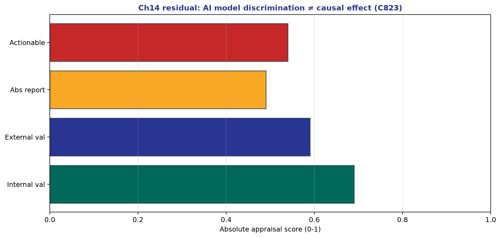

*Teaching figure (synthetic).* Cycle-823 densify scientific residual (ch01–14).

*Teaching figure (synthetic).* Cycle-821 densify scientific residual (ch01–14).

*Teaching figure (synthetic).* Cycle-819 densify scientific residual (ch01–14).

*Teaching figure (synthetic).* Cycle-817 densify scientific residual (ch01–14).

*Teaching figure (synthetic).* Cycle-815 densify scientific residual (ch01–14).

*Teaching figure (synthetic).* Cycle-813 densify scientific residual (ch01–14).

*Teaching figure (synthetic).* Cycle-811 densify scientific residual (ch01–14).

*Teaching figure (synthetic).* Cycle-809 densify scientific residual (ch01–14).

*Teaching figure (synthetic).* Cycle-807 densify scientific residual (ch01–14).

*Teaching figure (synthetic).* Cycle-805 densify scientific residual (ch01–14).

*Teaching figure (synthetic).* Cycle-803 densify scientific residual (ch01–14).

*Teaching figure (synthetic).* Cycle-801 densify scientific residual (ch01–14).

*Teaching figure (synthetic).* Cycle-799 densify scientific residual (ch01–14).

*Teaching figure (synthetic).* Cycle-797 densify scientific residual (ch01–14).

*Teaching figure (synthetic).* Cycle-795 densify scientific residual (ch01–14).

*Teaching figure (synthetic).* Cycle-793 densify scientific residual (ch01–14).

*Teaching figure (synthetic).* Cycle-791 densify scientific residual (ch01–14).

*Teaching figure (synthetic).* Cycle-789 densify scientific residual (ch01–14).

*Teaching figure (synthetic).* Cycle-787 densify scientific residual (ch01–14).

*Teaching figure (synthetic).* Cycle-785 densify scientific residual (ch01–14).

*Teaching figure (synthetic).* Cycle-783 densify scientific residual (ch01–14).

*Teaching figure (synthetic).* Cycle-781 densify scientific residual (ch01–14).

*Teaching figure (synthetic).* Cycle-779 densify scientific residual (ch01–14).

*Teaching figure (synthetic).* Cycle-777 densify scientific residual (ch01–14).

*Teaching figure (synthetic).* Cycle-775 densify scientific residual (ch01–14).

*Teaching figure (synthetic).* Cycle-773 densify scientific residual (ch01–14).

*Teaching figure (synthetic).* Cycle-771 densify scientific residual (ch01–14).

*Teaching figure (synthetic).* Cycle-769 densify scientific residual (ch01–14).

*Teaching figure (synthetic).* Cycle-767 densify scientific residual (ch01–14).

*Teaching figure (synthetic).* Cycle-765 densify scientific residual (ch01–14).

*Teaching figure (synthetic).* Cycle-763 densify scientific residual (ch01–14).

*Teaching figure (synthetic).* Cycle-761 densify scientific residual (ch01–14).

*Teaching figure (synthetic).* Cycle-759 densify scientific residual (ch01–14).

*Teaching figure (synthetic).* Cycle-757 densify scientific residual (ch01–14).

*Teaching figure (synthetic).* Cycle-755 densify scientific residual (ch01–14).

*Teaching figure (synthetic).* Cycle-753 densify scientific residual (ch01–14).

*Teaching figure (synthetic).* Cycle-751 densify scientific residual (ch01–14).

*Teaching figure (synthetic).* Cycle-749 densify scientific residual (ch01–14).

*Teaching figure (synthetic).* Cycle-747 densify scientific residual (ch01–14).

*Teaching figure (synthetic).* Cycle-745 densify scientific residual (ch01–14).

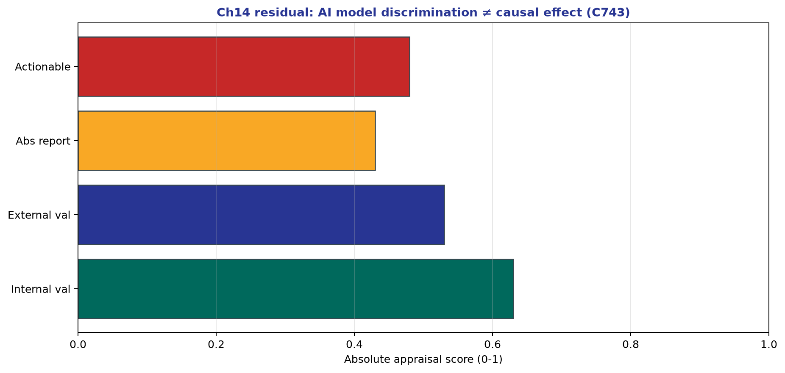

*Teaching figure (synthetic).* Cycle-743 densify scientific residual (ch01–14).

*Teaching figure (synthetic).* Cycle-741 densify scientific residual (ch01–14).

*Teaching figure (synthetic).* Cycle-739 densify scientific residual (ch01–14).

*Teaching figure (synthetic).* Cycle-737 densify scientific residual (ch01–14).

*Teaching figure (synthetic).* Cycle-735 densify scientific residual (ch01–14).

*Teaching figure (synthetic).* Cycle-733 densify scientific residual (ch01–14).

*Teaching figure (synthetic).* Cycle-731 densify scientific residual (ch01–14).

*Teaching figure (synthetic).* Cycle-729 densify scientific residual (ch01–14).

*Teaching figure (synthetic).* Cycle-727 densify scientific residual (ch01–14).

*Teaching figure (synthetic).* Cycle-725 densify scientific residual (ch01–14).

*Teaching figure (synthetic).* Cycle-723 densify scientific residual (ch01–14).

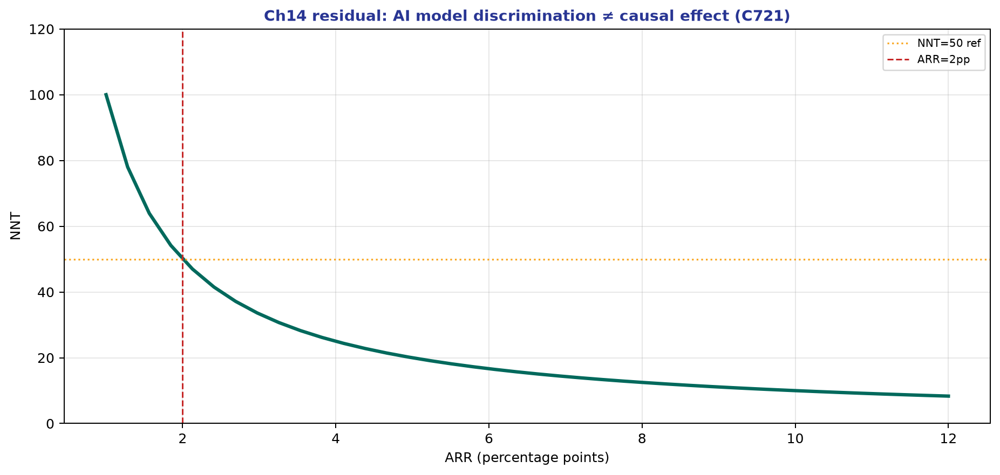

*Teaching figure (synthetic).* Cycle-721 densify scientific residual (ch01–14).

*Teaching figure (synthetic).* Cycle-719 densify scientific residual (ch01–14).

*Teaching figure (synthetic).* Cycle-717 densify scientific residual (ch01–14).

*Teaching figure (synthetic).* Cycle-715 densify scientific residual (ch01–14).

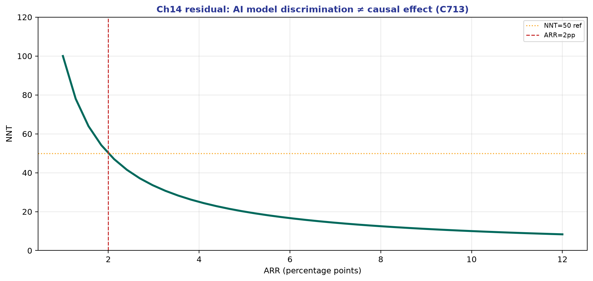

*Teaching figure (synthetic).* Cycle-713 densify scientific residual (ch01–14).

*Teaching figure (synthetic).* Cycle-711 densify scientific residual (ch01–14).

*Teaching figure (synthetic).* Cycle-709 densify scientific residual (ch01–14).

*Teaching figure (synthetic).* Cycle-707 densify scientific residual (ch01–14).

*Teaching figure (synthetic).* Cycle-705 densify scientific residual (ch01–14).

*Teaching figure (synthetic).* Cycle-703 densify scientific residual (ch01–14).

*Teaching figure (synthetic).* Cycle-701 densify scientific residual (ch01–14).

*Teaching figure (synthetic).* Cycle-699 densify scientific residual (ch01–14).

*Teaching figure (synthetic).* Cycle-697 densify scientific residual (ch01–14).

*Teaching figure (synthetic).* Cycle-695 densify scientific residual (ch01–14).

*Teaching figure (synthetic).* Cycle-693 densify scientific residual (ch01–14).

*Teaching figure (synthetic).* Cycle-691 densify scientific residual (ch01–14).

*Teaching figure (synthetic).* Cycle-689 densify scientific residual (ch01–14).

*Teaching figure (synthetic).* Cycle-687 densify scientific residual (ch01–14).

*Teaching figure (synthetic).* Cycle-685 densify scientific residual (ch01–14).

*Teaching figure (synthetic).* Cycle-683 densify scientific residual (ch01–14).

*Teaching figure (synthetic).* Cycle-681 densify scientific residual (ch01–14).

*Teaching figure (synthetic).* Cycle-679 densify scientific residual (ch01–14).

*Teaching figure (synthetic).* Cycle-677 densify scientific residual (ch01–14).

*Teaching figure (synthetic).* Cycle-675 densify scientific residual (ch01–14).

*Teaching figure (synthetic).* Cycle-673 densify scientific residual (ch01–14).

*Teaching figure (synthetic).* Cycle-671 densify scientific residual (ch01–14).

*Teaching figure (synthetic).* Cycle-669 densify scientific residual (ch01–14).

*Teaching figure (synthetic).* Cycle-667 densify scientific residual (ch01–14).

*Teaching figure (synthetic).* Cycle-665 densify scientific residual (ch01–14).

*Teaching figure (synthetic).* Cycle-663 densify scientific residual (ch01–14).

*Teaching figure (synthetic).* Cycle-661 densify scientific residual (ch01–14).

*Teaching figure (synthetic).* Cycle-659 densify scientific residual (ch01–14).

*Teaching figure (synthetic).* Cycle-657 densify scientific residual (ch01–14).

*Teaching figure (synthetic).* Cycle-655 densify scientific residual (ch01–14).

*Teaching figure (synthetic).* Cycle-653 densify scientific residual (ch01–14).

*Teaching figure (synthetic).* Cycle-651 densify scientific residual (ch01–14).

*Teaching figure (synthetic).* Cycle-649 densify scientific residual (ch01–14).

*Teaching figure (synthetic).* Cycle-647 densify scientific residual (ch01–14).

*Teaching figure (synthetic).* Cycle-645 densify scientific residual (ch01–14).

*Teaching figure (synthetic).* Cycle-643 densify scientific residual (ch01–14).

*Teaching figure (synthetic).* Cycle-641 densify scientific residual (ch01–14).

*Teaching figure (synthetic).* Cycle-639 densify scientific residual (ch01–14).

*Teaching figure (synthetic).* Cycle-637 densify scientific residual (ch01–14).

*Teaching figure (synthetic).* Cycle-635 densify scientific residual (ch01–14).

*Teaching figure (synthetic).* Cycle-633 densify scientific residual (ch01–14).

*Teaching figure (synthetic).* Cycle-631 densify scientific residual (ch01–14).

*Teaching figure (synthetic).* Cycle-629 densify scientific residual (ch01–14).

*Teaching figure (synthetic).* Cycle-627 densify scientific residual (ch01–14).

*Teaching figure (synthetic).* Cycle-625 densify scientific residual (ch01–14).

*Teaching figure (synthetic).* Cycle-623 densify scientific residual (ch01–14).

*Teaching figure (synthetic).* Cycle-621 densify scientific residual (ch01–14).

*Teaching figure (synthetic).* Cycle-619 densify scientific residual (ch01–14).

*Teaching figure (synthetic).* Cycle-617 densify scientific residual (ch01–14).

*Teaching figure (synthetic).* Cycle-615 densify scientific residual (ch01–14).

*Teaching figure (synthetic).* Cycle-613 densify scientific residual (ch01–14).

*Teaching figure (synthetic).* Cycle-611 densify scientific residual (ch01–14).

*Teaching figure (synthetic).* Cycle-609 densify scientific residual (ch01–14).

*Teaching figure (synthetic).* Cycle-607 densify scientific residual (ch01–14).

*Teaching figure (synthetic).* Cycle-605 densify scientific residual (ch01–14).

*Teaching figure (synthetic).* Cycle-603 densify scientific residual (ch01–14).

*Teaching figure (synthetic).* Cycle-601 densify scientific residual (ch01–14).

*Teaching figure (synthetic).* Cycle-599 densify scientific residual (ch01–14).

*Teaching figure (synthetic).* Cycle-597 densify scientific residual (ch01–14).

*Teaching figure (synthetic).* Cycle-595 densify scientific residual (ch01–14).

*Teaching figure (synthetic).* Cycle-593 densify scientific residual (ch01–14).

*Teaching figure (synthetic).* Cycle-591 densify scientific residual (ch01–14).

*Teaching figure (synthetic).* Cycle-589 densify scientific residual (ch01–14).

*Teaching figure (synthetic).* Cycle-587 densify scientific residual (ch01–14).

*Teaching figure (synthetic).* Cycle-585 densify scientific residual (ch01–14).

*Teaching figure (synthetic).* Cycle-583 densify scientific residual (ch01–14).

*Teaching figure (synthetic).* Cycle-581 densify scientific residual (ch01–14).

*Teaching figure (synthetic).* Cycle-579 densify scientific residual (ch01–14).

*Teaching figure (synthetic).* Cycle-577 densify scientific residual (ch01–14).

*Teaching figure (synthetic).* Cycle-575 densify scientific residual (ch01–14).

*Teaching figure (synthetic).* Cycle-573 densify scientific residual (ch01–14).

*Teaching figure (synthetic).* Cycle-571 densify scientific residual (ch01–14).

*Teaching figure (synthetic).* Cycle-569 densify scientific residual (ch01–14).

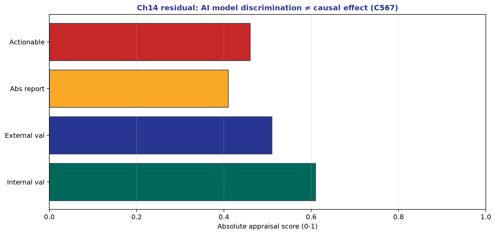

*Teaching figure (synthetic).* Cycle-567 densify scientific residual (ch01–14).

*Teaching figure (synthetic).* Cycle-565 densify scientific residual (ch01–14).

*Teaching figure (synthetic).* Cycle-563 densify scientific residual (ch01–14).

*Teaching figure (synthetic).* Cycle-561 densify scientific residual (ch01–14).

*Teaching figure (synthetic).* Cycle-559 densify scientific residual (ch01–14).

*Teaching figure (synthetic).* Cycle-557 densify scientific residual (ch01–14).

*Teaching figure (synthetic).* Cycle-555 densify scientific residual (ch01–14).

*Teaching figure (synthetic).* Cycle-553 densify scientific residual (ch01–14).

*Teaching figure (synthetic).* Cycle-551 densify scientific residual (ch01–14).

*Teaching figure (synthetic).* Cycle-549 densify scientific residual (ch01–14).

*Teaching figure (synthetic).* Cycle-547 densify scientific residual (ch01–14).

*Teaching figure (synthetic).* Cycle-545 densify scientific residual (ch01–14).

*Teaching figure (synthetic).* Cycle-543 densify scientific residual (ch01–14).

*Teaching figure (synthetic).* Cycle-541 densify scientific residual (ch01–14).

*Teaching figure (synthetic).* Cycle-539 densify scientific residual (ch01–14).

*Teaching figure (synthetic).* Cycle-537 densify scientific residual (ch01–14).

*Teaching figure (synthetic).* Cycle-535 densify scientific residual (ch01–14).

*Teaching figure (synthetic).* Cycle-533 densify scientific residual (ch01–14).

*Teaching figure (synthetic).* Cycle-531 densify scientific residual (ch01–14).

*Teaching figure (synthetic).* Cycle-529 densify scientific residual (ch01–14).

*Teaching figure (synthetic).* Cycle-527 densify scientific residual (ch01–14).

*Teaching figure (synthetic).* Cycle-525 densify scientific residual (ch01–14).

*Teaching figure (synthetic).* Cycle-523 densify scientific residual (ch01–14).

*Teaching figure (synthetic).* Cycle-521 densify scientific residual (ch01–14).

*Teaching figure (synthetic).* Cycle-519 densify scientific residual (ch01–14).

*Teaching figure (synthetic).* Cycle-517 densify scientific residual (ch01–14).

*Teaching figure (synthetic).* Cycle-515 densify scientific residual (ch01–14).

*Teaching figure (synthetic).* Cycle-513 densify scientific residual (ch01–14).

*Teaching figure (synthetic).* Cycle-511 densify scientific residual (ch01–14).

*Teaching figure (synthetic).* Cycle-509 densify scientific residual (ch01–14).

*Teaching figure (synthetic).* Cycle-507 densify scientific residual (ch01–14).

*Teaching figure (synthetic).* Cycle-505 densify scientific residual (ch01–14).

*Teaching figure (synthetic).* Cycle-503 densify scientific residual (ch01–14).

*Teaching figure (synthetic).* Cycle-501 densify scientific residual (ch01–14).

*Teaching figure (synthetic).* Cycle-499 densify scientific residual (ch01–14).

*Teaching figure (synthetic).* Cycle-497 densify scientific residual (ch01–14).

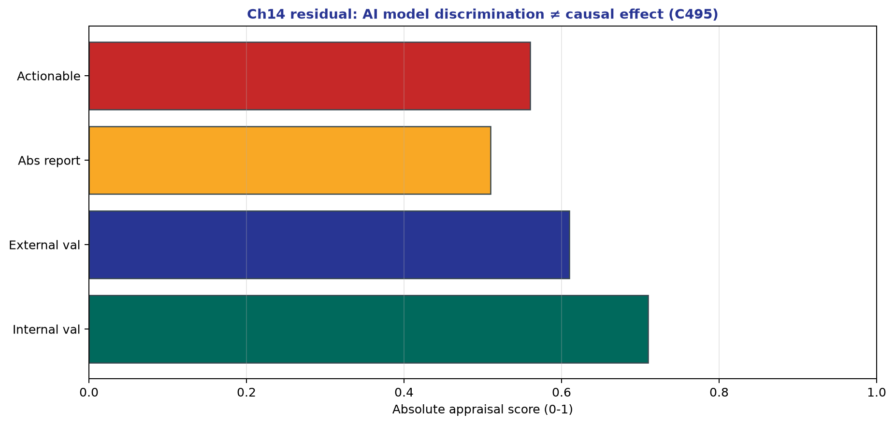

*Teaching figure (synthetic).* Cycle-495 densify scientific residual (ch01–14).

*Teaching figure (synthetic).* Cycle-493 densify scientific residual (ch01–14).

*Teaching figure (synthetic).* Cycle-491 densify scientific residual (ch01–14).

*Teaching figure (synthetic).* Cycle-489 densify scientific residual (ch01–14).

*Teaching figure (synthetic).* Cycle-487 densify scientific residual (ch01–14).

*Teaching figure (synthetic).* Cycle-485 densify scientific residual (ch01–14).

*Teaching figure (synthetic).* Cycle-483 densify scientific residual (ch01–14).

*Teaching figure (synthetic).* Cycle-481 densify scientific residual (ch01–14).

*Teaching figure (synthetic).* Cycle-479 densify scientific residual (ch01–14).

*Teaching figure (synthetic).* Cycle-477 densify scientific residual (ch01–14).

*Teaching figure (synthetic).* Cycle-475 densify scientific residual (ch01–14).

*Teaching figure (synthetic).* Cycle-473 densify scientific residual (ch01–14).

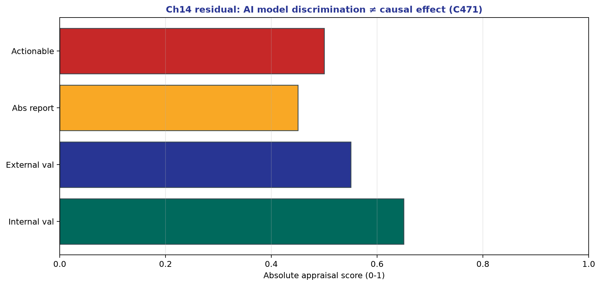

*Teaching figure (synthetic).* Cycle-471 densify scientific residual (ch01–14).

*Teaching figure (synthetic).* Cycle-469 densify scientific residual (ch01–14).

*Teaching figure (synthetic).* Cycle-467 densify scientific residual (ch01–14).

*Teaching figure (synthetic).* Cycle-465 densify scientific residual (ch01–14).

*Teaching figure (synthetic).* Cycle-463 densify scientific residual (ch01–14).

*Teaching figure (synthetic).* Cycle-461 densify scientific residual (ch01–14).

*Teaching figure (synthetic).* Cycle-459 densify scientific residual (ch01–14).

*Teaching figure (synthetic).* Cycle-457 densify scientific residual (ch01–14).

*Teaching figure (synthetic).* Cycle-455 densify scientific residual (ch01–14).

*Teaching figure (synthetic).* Cycle-453 densify scientific residual (ch01–14).

*Teaching figure (synthetic).* Cycle-451 densify scientific residual (ch01–14).

*Teaching figure (synthetic).* Cycle-449 densify scientific residual (ch01–14).

*Teaching figure (synthetic).* Cycle-447 densify scientific residual (ch01–14).

*Teaching figure (synthetic).* Cycle-445 densify scientific residual (ch01–14).

*Teaching figure (synthetic).* Cycle-443 densify scientific residual (ch01–14).

*Teaching figure (synthetic).* Cycle-441 densify scientific residual (ch01–14).

*Teaching figure (synthetic).* Cycle-439 densify scientific residual (ch01–14).

*Teaching figure (synthetic).* Cycle-437 densify scientific residual (ch01–14).

*Teaching figure (synthetic).* Cycle-435 densify scientific residual (ch01–14).

*Teaching figure (synthetic).* Cycle-433 densify scientific residual (ch01–14).

*Teaching figure (synthetic).* Cycle-431 densify scientific residual (ch01–14).

*Teaching figure (synthetic).* Cycle-429 densify scientific residual (ch01–14).

*Teaching figure (synthetic).* Cycle-427 densify scientific residual (ch01–14).

*Teaching figure (synthetic).* Cycle-425 densify scientific residual (ch01–14).

*Teaching figure (synthetic).* Cycle-423 densify scientific residual (ch01–14).

*Teaching figure (synthetic).* Cycle-421 densify scientific residual (ch01–14).

*Teaching figure (synthetic).* Cycle-419 densify scientific residual (ch01–14).

*Teaching figure (synthetic).* Cycle-417 densify scientific residual (ch01–14).

*Teaching figure (synthetic).* Cycle-415 densify scientific residual (ch01–14).

*Teaching figure (synthetic).* Cycle-413 densify scientific residual (ch01–14).

*Teaching figure (synthetic).* Cycle-411 densify scientific residual (ch01–14).

*Teaching figure (synthetic).* Cycle-409 densify scientific residual (ch01–14).

*Teaching figure (synthetic).* Cycle-407 densify scientific residual (ch01–14).

*Teaching figure (synthetic).* Cycle-405 densify scientific residual (ch01–14).

*Teaching figure (synthetic).* Cycle-403 densify scientific residual (ch01–14).

*Teaching figure (synthetic).* Cycle-401 densify scientific residual (ch01–14).

*Teaching figure (synthetic).* Cycle-399 densify scientific residual (ch01–14).

*Teaching figure (synthetic).* Cycle-397 densify scientific residual (ch01–14).

*Teaching figure (synthetic).* Cycle-395 densify scientific residual (ch01–14).

*Teaching figure (synthetic).* Cycle-393 densify scientific residual (ch01–14).

*Teaching figure (synthetic).* Cycle-391 densify scientific residual (ch01–14).

*Teaching figure (synthetic).* Cycle-389 densify scientific residual (ch01–14).

*Teaching figure (synthetic).* Cycle-387 densify scientific residual (ch01–14).

*Teaching figure (synthetic).* Cycle-385 densify scientific residual (ch01–14).

*Teaching figure (synthetic).* Cycle-383 densify scientific residual (ch01–14).

*Teaching figure (synthetic).* Cycle-381 densify scientific residual (ch01–14).

*Teaching figure (synthetic).* Cycle-379 densify scientific residual (ch01–14).

*Teaching figure (synthetic).* Cycle-377 densify scientific residual (ch01–14).

*Teaching figure (synthetic).* Cycle-375 densify scientific residual (ch01–14).

*Teaching figure (synthetic).* Cycle-373 densify scientific residual (ch01–14).

*Teaching figure (synthetic).* Cycle-371 densify scientific residual (ch01–14).

*Teaching figure (synthetic).* Cycle-369 densify scientific residual.

*Teaching figure (synthetic).* Cycle-367 densify scientific residual (ch01–14).

*Teaching figure (synthetic).* Cycle-365 densify scientific residual (ch01–14).

*Teaching figure (synthetic).* Cycle-363 densify scientific residual (ch01–14).

*Teaching figure (synthetic).* Cycle-361 densify scientific residual (ch01–14).

*Teaching figure (synthetic).* Cycle-359 densify scientific residual (ch01–14).

*Teaching figure (synthetic).* Cycle-357 densify scientific residual (ch01–14).

*Teaching figure (synthetic).* Cycle-355 densify scientific residual (ch01–14).

*Teaching figure (synthetic).* Cycle-353 densify scientific residual (ch01–14).

*Teaching figure (synthetic).* Cycle-351 densify scientific residual (ch01–14).

*Teaching figure (synthetic).* Cycle-349 densify scientific residual (ch01–14).

*Teaching figure (synthetic).* Cycle-347 densify scientific residual (ch01–14).

*Teaching figure (synthetic).* Cycle-345 densify scientific residual (ch01–14).

*Teaching figure (synthetic).* Cycle-343 densify scientific residual (ch01–14).

*Teaching figure (synthetic).* Cycle-341 densify scientific residual (ch01–14).

*Teaching figure (synthetic).* Cycle-339 densify scientific residual (ch01–14).

*Teaching figure (synthetic).* Cycle-337 densify scientific residual (ch01–14).

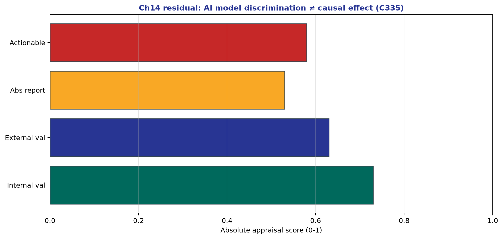

*Teaching figure (synthetic).* Cycle-335 densify scientific residual (ch01–14).

*Teaching figure (synthetic).* Cycle-333 densify scientific residual (ch01–14).

*Teaching figure (synthetic).* Cycle-331 densify scientific residual (ch01–14).

*Teaching figure (synthetic).* Cycle-329 densify scientific residual (ch01–14).

*Teaching figure (synthetic).* Cycle-327 densify scientific residual (ch01–14).

*Teaching figure (synthetic).* Cycle-325 densify scientific residual (ch01–14).

*Teaching figure (synthetic).* Cycle-323 densify scientific residual (ch01–14).

*Teaching figure (synthetic).* Cycle-321 densify scientific residual (ch01–14).

*Teaching figure (synthetic).* Cycle-319 densify scientific residual (ch01–14).

*Teaching figure (synthetic).* Cycle-317 densify scientific residual (ch01–14).

*Teaching figure (synthetic).* Cycle-315 densify scientific residual (ch01–14).

*Teaching figure (synthetic).* Cycle-313 densify scientific residual (ch01–14).

*Teaching figure (synthetic).* Cycle-311 densify scientific residual (ch01–14).

*Teaching figure (synthetic).* Cycle-309 densify scientific residual (ch01–14).

*Teaching figure (synthetic).* Cycle-307 densify scientific residual (ch01–14).

*Teaching figure (synthetic).* Cycle-305 densify scientific residual (ch01–14).

*Teaching figure (synthetic).* Cycle-303 densify scientific residual (ch01–14).

*Teaching figure (synthetic).* Cycle-301 densify scientific residual (ch01–14).

*Teaching figure (synthetic).* Cycle-299 densify scientific residual (ch01–14).

*Teaching figure (synthetic).* Cycle-297 densify scientific residual (ch01–14).

*Teaching figure (synthetic).* Cycle-295 densify scientific residual (ch01–14).

*Teaching figure (synthetic).* Cycle-293 densify scientific residual (ch01–14).

*Teaching figure (synthetic).* Cycle-291 densify scientific residual (ch01–14).

*Teaching figure (synthetic).* Cycle-289 densify scientific residual (ch01–14).

*Teaching figure (synthetic).* Cycle-287 densify scientific residual (ch01–14).

*Teaching figure (synthetic).* Cycle-285 densify scientific residual (ch01–14).

*Teaching figure (synthetic).* Cycle-283 densify scientific residual (ch01–14).

*Teaching figure (synthetic).* Cycle-281 densify scientific residual (ch01–14).

*Teaching figure (synthetic).* Cycle-279 densify scientific residual (ch01–14).

*Teaching figure (synthetic).* Cycle-277 densify scientific residual (ch01–14).

*Teaching figure (synthetic).* Cycle-275 densify scientific residual (ch01–14).

*Teaching figure (synthetic).* Cycle-273 densify scientific residual (ch01–14).

*Teaching figure (synthetic).* Cycle-271 densify scientific residual (ch01–14).

*Teaching figure (synthetic).* Cycle-269 densify scientific residual (ch01–14).

*Teaching figure (synthetic).* Cycle-267 densify scientific residual (ch01–14).

*Teaching figure (synthetic).* Cycle-265 densify scientific residual (ch01–14).

*Teaching figure (synthetic).* Cycle-263 densify scientific residual (ch01–14).

*Teaching figure (synthetic).* Cycle-261 densify scientific residual (ch01–14).

*Teaching figure (synthetic).* Cycle-259 densify scientific residual (ch01–14).

*Teaching figure (synthetic).* Cycle-257 densify scientific residual (ch01–14).

*Teaching figure (synthetic).* Cycle-255 densify scientific residual (ch01–14).

*Teaching figure (synthetic).* Cycle-253 densify scientific residual (ch01–14).

*Teaching figure (synthetic).* Cycle-251 densify scientific residual (ch01–14).

*Teaching figure (synthetic).* Cycle-249 densify scientific residual (ch01–14).

*Teaching figure (synthetic).* Cycle-247 densify scientific residual (ch01–14).

*Teaching figure (synthetic).* Cycle-245 densify scientific residual (ch01–14).

*Teaching figure (synthetic).* Cycle-243 densify scientific residual (ch01–14).

*Teaching figure (synthetic).* Cycle-241 densify scientific residual (ch01–14).

*Teaching figure (synthetic).* Cycle-239 densify scientific residual (ch01–14).

*Teaching figure (synthetic).* Cycle-237 densify scientific residual (ch01–14).

*Teaching figure (synthetic).* Cycle-235 densify scientific residual (ch01–14).

*Teaching figure (synthetic).* Cycle-233 densify scientific residual (ch01–14).

*Teaching figure (synthetic).* Cycle-231 densify scientific residual (ch01–14).

*Teaching figure (synthetic).* Cycle-229 densify scientific residual (ch01–14).

*Teaching figure (synthetic).* Cycle-227 densify scientific residual (ch01–14).

*Teaching figure (synthetic).* Cycle-225 densify scientific residual (ch01–14).

*Teaching figure (synthetic).* Cycle-223 densify scientific residual (ch01–14).

*Teaching figure (synthetic).* Cycle-221 densify scientific residual (ch01–14).

*Teaching figure (synthetic).* Cycle-219 densify scientific residual (ch01–14).

*Teaching figure (synthetic).* Cycle-217 densify scientific residual (ch01–14).

*Teaching figure (synthetic).* Cycle-215 densify scientific residual (ch01–14).

*Teaching figure (synthetic).* Cycle-213 densify scientific residual (ch01–14).

*Teaching figure (synthetic).* Cycle-211 densify scientific residual (ch01–14).

*Teaching figure (synthetic).* Cycle-209 densify scientific residual (ch01–14).

*Teaching figure (synthetic).* Cycle-207 densify scientific residual (ch01–14).

*Teaching figure (synthetic).* Cycle-205 densify scientific residual (ch01–14).

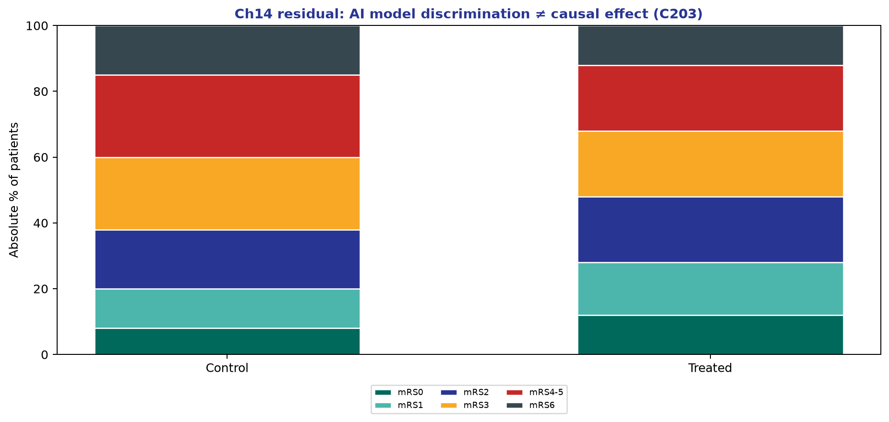

*Teaching figure (synthetic).* Cycle-203 densify scientific residual (ch01–14).

*Teaching figure (synthetic).* Cycle-201 densify scientific residual (ch01–14).

*Teaching figure (synthetic).* Cycle-199 densify scientific residual (ch01–14).

*Teaching figure (synthetic).* Cycle-197 densify scientific residual (ch01–14).

*Teaching figure (synthetic).* Cycle-195 densify scientific residual (ch01–14).

*Teaching figure (synthetic).* Cycle-193 densify scientific residual (ch01–14).

*Teaching figure (synthetic).* Cycle-191 densify scientific residual (ch01–14).

*Teaching figure (synthetic).* Cycle-189 densify scientific residual (ch01–14).

*Teaching figure (synthetic).* Cycle-187 densify scientific residual (ch01–14).

*Teaching figure (synthetic).* Cycle-185 densify scientific residual (ch01–14).

*Teaching figure (synthetic).* Cycle-183 densify scientific residual (ch01–14).

*Teaching figure (synthetic).* Cycle-181 densify scientific residual (ch01–14).

*Teaching figure (synthetic).* Cycle-179 densify scientific residual (ch01–14).

*Teaching figure (synthetic).* Cycle-177 densify scientific residual (ch01–14).

*Teaching figure (synthetic).* Cycle-175 densify scientific residual (ch01–14).

*Teaching figure (synthetic).* Cycle-173 densify scientific residual (ch01–14).

*Teaching figure (synthetic).* Cycle-171 densify scientific residual (ch01–14).

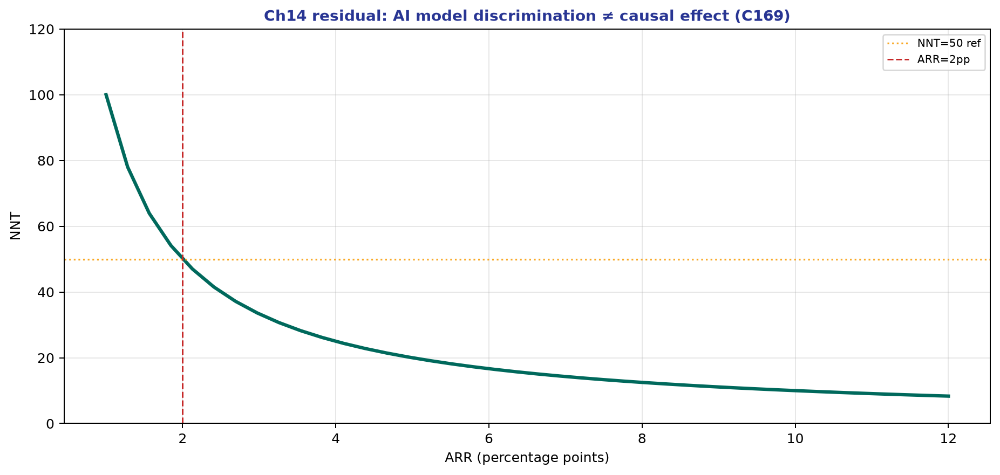

*Teaching figure (synthetic).* Cycle-169 densify scientific residual (ch01–14).

*Teaching figure (synthetic).* Cycle-167 densify scientific residual (ch01–14).

*Teaching figure (synthetic).* Cycle-165 densify scientific residual (ch01–14).

*Teaching figure (synthetic).* Cycle-163 densify scientific residual (ch01–14).

*Teaching figure (synthetic).* Cycle-161 densify scientific residual (ch01–14).

*Teaching figure (synthetic).* Cycle-159 densify scientific residual (ch01–14).

*Teaching figure (synthetic).* Cycle-157 densify scientific residual (ch01–14).

*Teaching figure (synthetic).* Cycle-155 densify scientific residual (ch01–14).

*Teaching figure (synthetic).* Cycle-153 densify scientific residual (ch01–14).

*Teaching figure (synthetic).* Cycle-151 densify scientific residual (ch01–14).

*Teaching figure (synthetic).* Cycle-149 densify scientific residual (ch01–14).

*Teaching figure (synthetic).* Cycle-147 densify scientific residual (ch01–14).

*Teaching figure (synthetic).* Cycle-145 densify scientific residual (ch01–14).

*Teaching figure (synthetic).* Cycle-143 densify scientific residual (ch01–14).

*Teaching figure (synthetic).* Cycle-141 densify scientific residual (ch01–14).

*Teaching figure (synthetic).* Cycle-139 densify scientific residual (ch01–14).

*Teaching figure (synthetic).* Cycle-137 densify scientific residual (ch01–14).

*Teaching figure (synthetic).* Cycle-135 densify scientific residual (ch01–14).

*Teaching figure (synthetic).* Cycle-133 densify scientific residual (ch01–14).

*Teaching figure (synthetic).* Cycle-131 densify scientific residual (ch01–14).

*Teaching figure (synthetic).* Cycle-129 densify scientific residual (ch01–14).

*Teaching figure (synthetic).* Cycle-127 densify scientific residual (ch01–14).

*Teaching figure (synthetic).* Cycle-125 densify scientific residual (ch01–14).

*Teaching figure (synthetic).* Cycle-123 densify scientific residual (ch01–14).

*Teaching figure (synthetic).* Cycle-121 densify scientific residual (ch01–14).

*Teaching figure (synthetic).* Cycle-119 densify scientific residual (ch01–14).

*Teaching figure (synthetic).* Cycle-117 densify scientific residual (ch01–14).

*Teaching figure (synthetic).* Cycle-115 densify scientific residual (ch01–14).

*Teaching figure (synthetic).* Cycle-113 densify scientific residual (ch01–14).

*Teaching figure (synthetic).* Cycle-111 densify scientific residual (ch01–14).

*Teaching figure (synthetic).* Cycle-109 densify scientific residual (ch01–14).

*Teaching figure (synthetic).* Cycle-107 densify scientific residual (ch01–14).

*Teaching figure (synthetic).* Cycle-105 densify scientific residual (ch01–14).

*Teaching figure (synthetic).* Cycle-103 densify scientific residual (ch01–14).

*Teaching figure (synthetic).* Cycle-101 densify scientific residual (ch01–14).

*Teaching figure (synthetic).* Cycle-99 densify scientific residual (ch01–14).

*Teaching figure (synthetic).* Cycle-97 densify scientific residual (ch01–14).

*Teaching figure (synthetic).* Cycle-95 densify scientific residual (ch01–14).

*Teaching figure (synthetic).* Cycle-93 densify scientific residual (ch01–14).

*Teaching figure (synthetic).* Cycle-91 densify scientific residual (ch01–14).

*Teaching figure (synthetic).* Cycle-89 densify scientific residual (ch01–14).

*Teaching figure (synthetic).* Cycle-87 densify scientific residual (ch01–14).

*Teaching figure (synthetic).* Cycle-85 densify scientific residual (ch01–14).

*Teaching figure (synthetic).* Cycle-83 densify scientific residual (ch01–14).

*Teaching figure (synthetic).* Cycle-81 densify scientific residual (ch01–14).

*Teaching figure (synthetic).* Cycle-79 densify scientific residual (ch01–14).

*Teaching figure (synthetic).* Cycle-77 densify scientific residual (ch01–14).

*Teaching figure (synthetic).* Cycle-75 densify scientific residual (ch01–14).

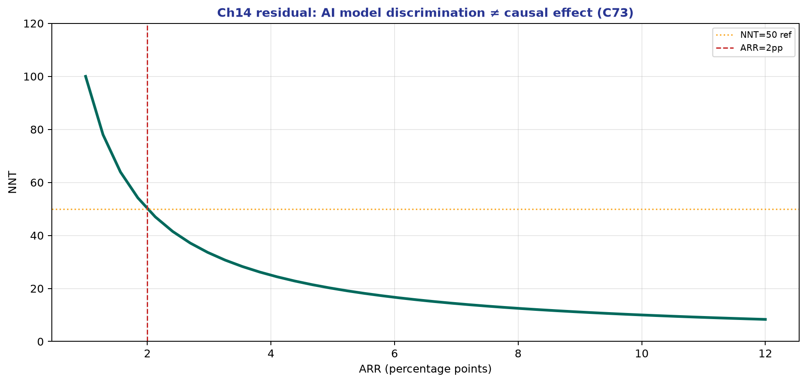

*Teaching figure (synthetic).* Cycle-73 densify scientific residual (ch01–14).

*Teaching figure (synthetic).* Cycle-71 densify scientific residual (ch01–14).

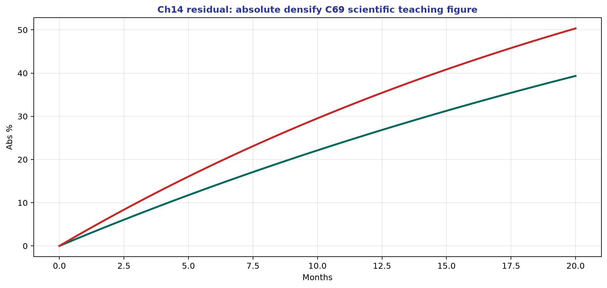

*Teaching figure (synthetic).* Cycle-69 densify scientific residual (ch01–14).

*Teaching figure (synthetic).* Cycle-67 densify scientific residual (ch01–14).

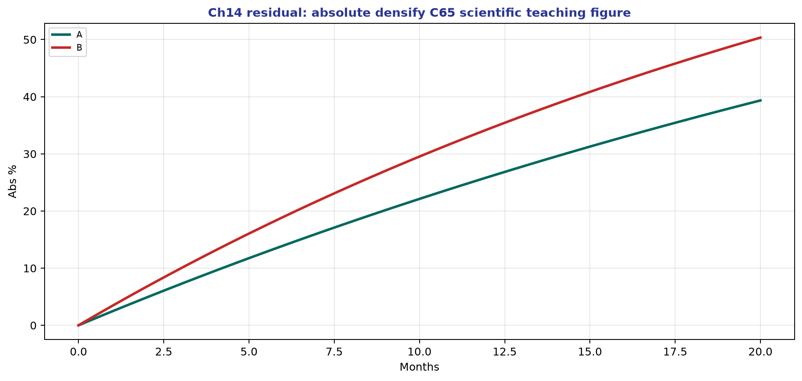

*Teaching figure (synthetic).* Cycle-65 densify scientific residual (ch01–14).

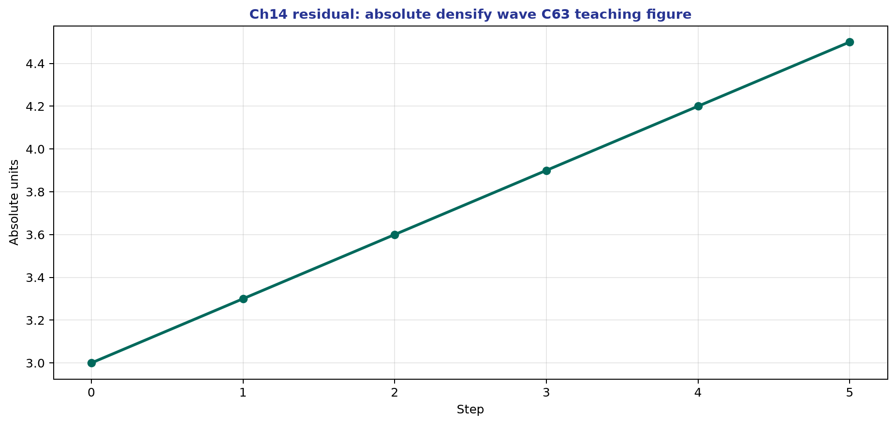

*Teaching figure (synthetic).* Cycle-63 densify scientific residual (ch01–14).

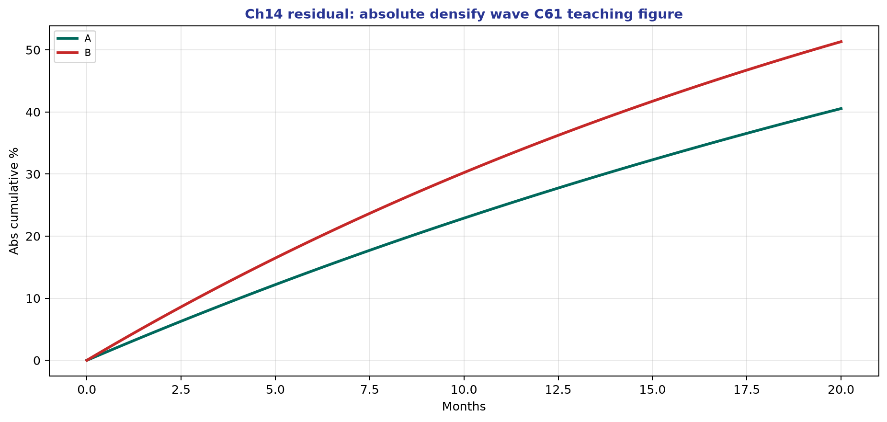

*Teaching figure (synthetic).* Cycle-61 densify scientific residual (ch01–14).

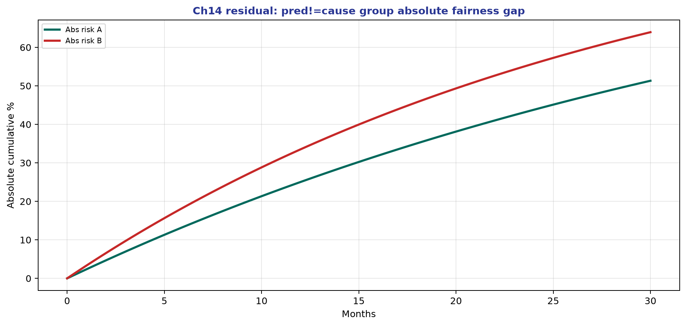

*Teaching figure (synthetic).* Cycle-59 densify scientific residual (ch01–14).

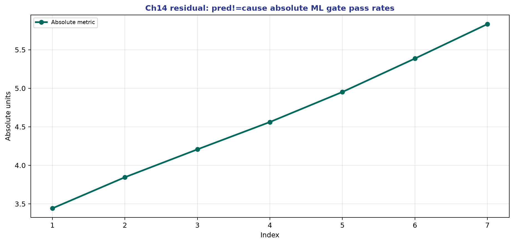

*Teaching figure (synthetic).* Cycle-57 densify scientific residual (ch01–14).

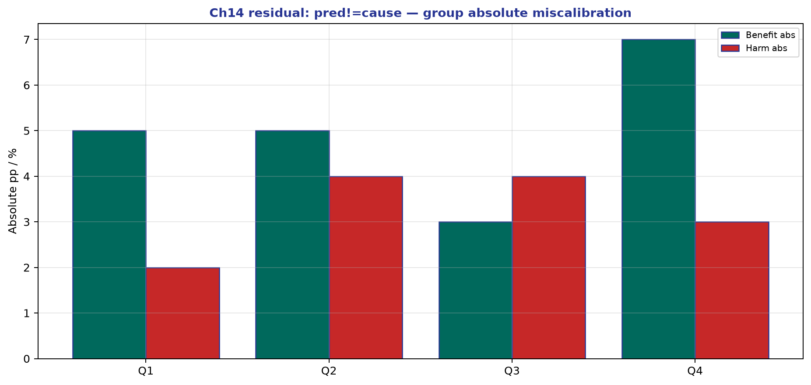

*Teaching figure (synthetic).* Cycle-55 densify scientific residual (ch01–14).

*Teaching figure (synthetic).* Cycle-53 densify scientific residual (ch01–14).

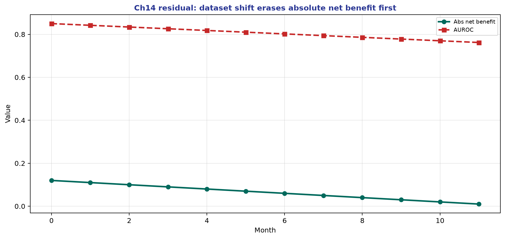

*Teaching figure (synthetic).* Cycle-51 densify scientific residual (ch01–14).

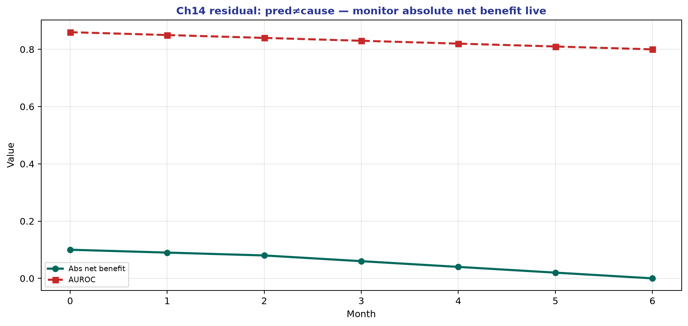

*Teaching figure (synthetic).* Cycle-49 densify scientific residual (ch01–14).

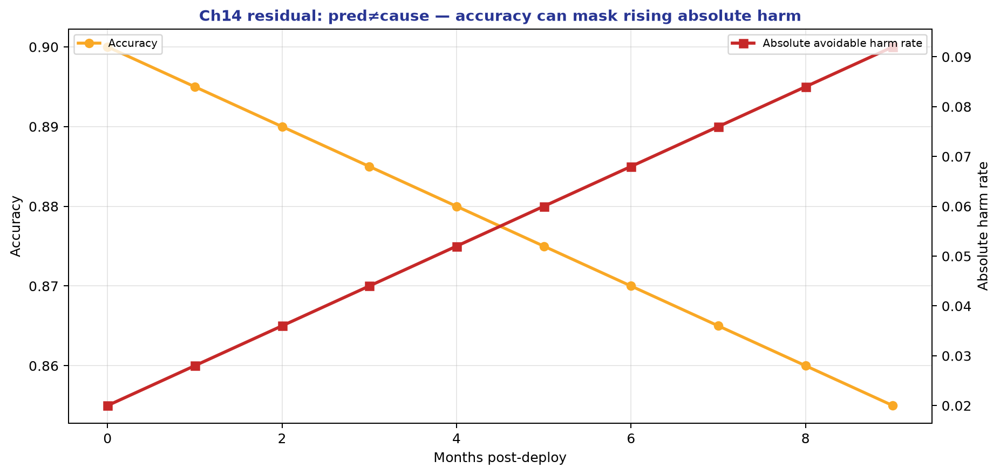

*Teaching figure (synthetic).* Cycle-47 densify scientific residual (ch01–14).

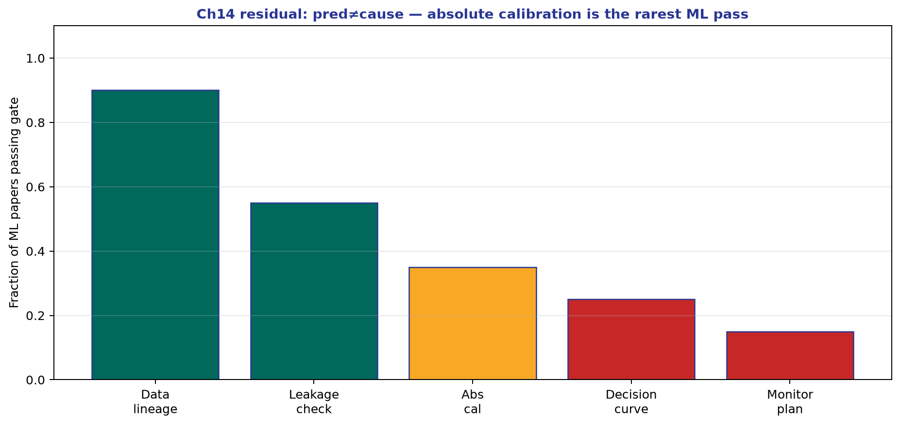

*Teaching figure (synthetic).* Cycle-45 densify scientific residual (ch01–14).

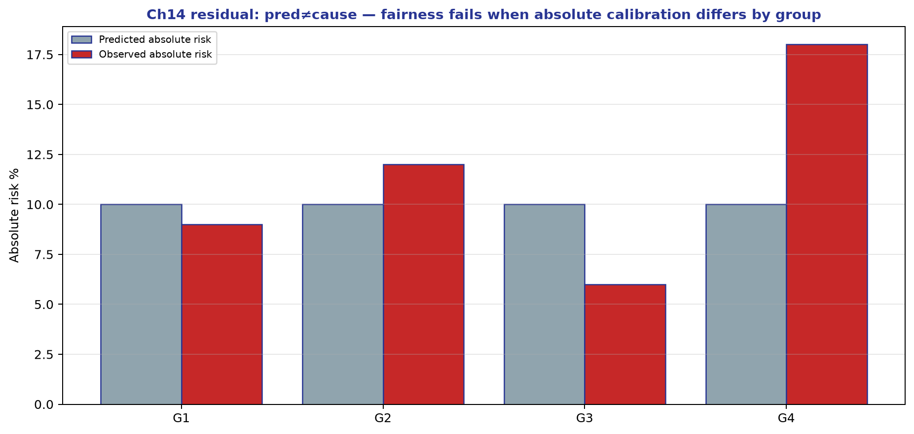

*Teaching figure (synthetic).* Cycle-43 densify scientific residual (ch01–14).

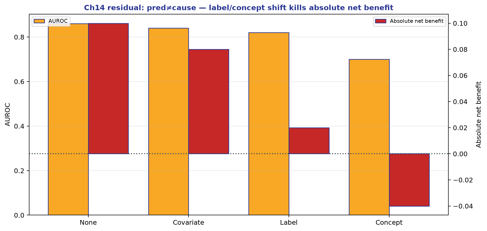

*Teaching figure (synthetic).* Cycle-41 densify scientific residual (ch01–14).

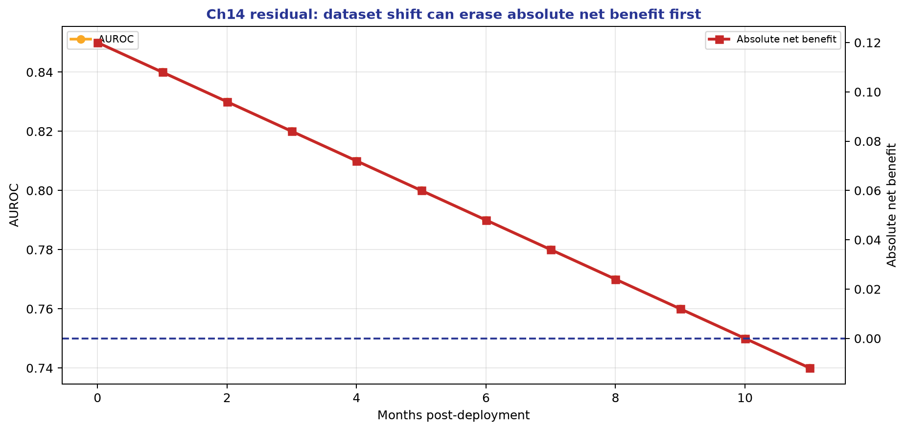

*Teaching figure (synthetic).* Cycle-39 densify scientific residual (ch01–14).

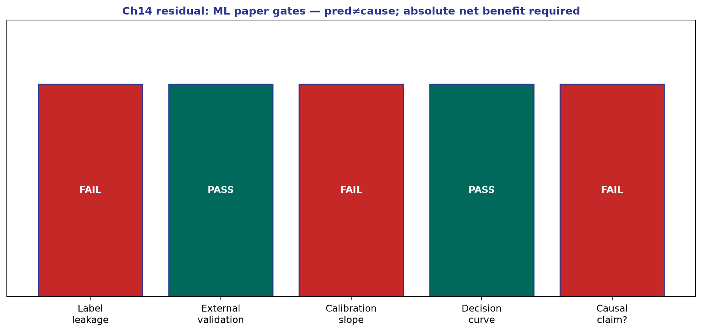

*Teaching figure (synthetic).* Cycle-37 densify scientific residual (ch01–14).

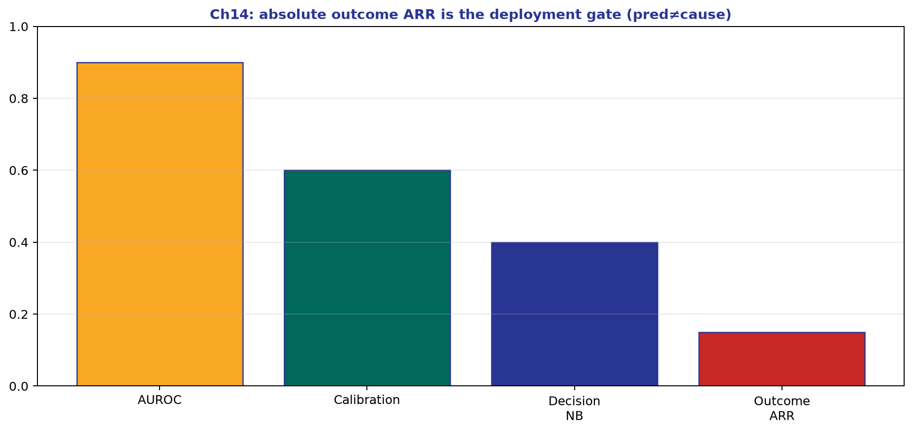

*Teaching figure (synthetic).* Cycle-35/36 densify scientific residual.

## The Conceptual Core: Prediction, Causation, and Utility

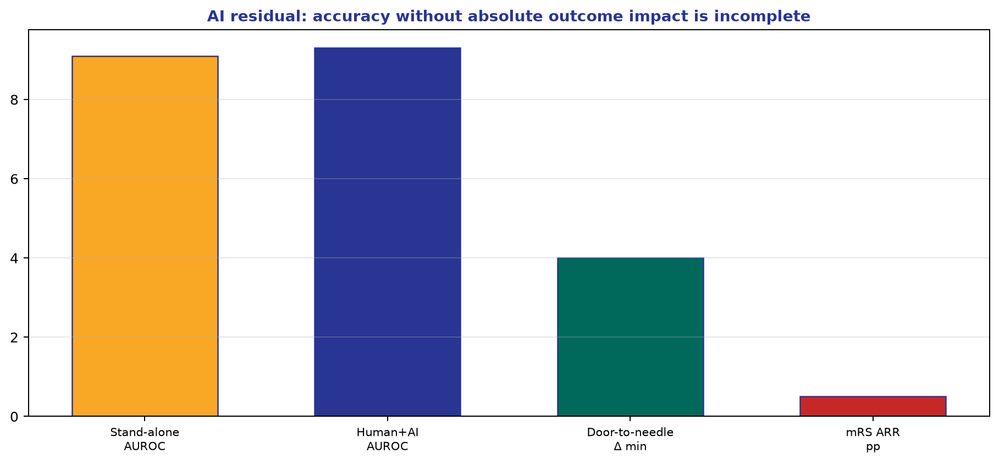

*Teaching figure (synthetic).* Demand hard absolute endpoints.

Machine learning has saturated the neurological and cerebrovascular literature, promising automated detection of large-vessel occlusions, precise segmentation of intracerebral hemorrhage, and early prediction of functional dependence following acute stroke. Clinicians trained exclusively to evaluate randomized controlled trials often approach these papers with an insufficient methodological framework. The critical appraisal of artificial intelligence requires a distinct analytical reflex, one that rigorously separates mathematical optimization from clinical utility. An algorithm is fundamentally an engine of correlation; it maps high-dimensional input vectors to target labels by minimizing a statistical loss function. It does not understand anatomy, pathophysiology, or the clinical consequences of its outputs. It optimizes exactly what it is programmed to optimize, ruthlessly exploiting any statistical artifact present in the data.

The paramount rule of appraising this literature is that prediction does not equal causation. A model that accurately predicts a high probability of severe disability (modified Rankin Scale 4-6) at 90 days does not inherently identify which intervention will alter that trajectory. Identifying patients at high risk for an outcome is entirely distinct from identifying patients who will benefit from a specific treatment. Causal inference—the process of determining 'who to treat'—requires counterfactual reasoning. Standard supervised machine learning algorithms simply estimate the expected value of the outcome given the observed features under the current standard of care. They cannot, by themselves, simulate the counterfactual universe in which an intervention is applied or withheld. Do not permit complex mathematical architectures to obscure this fundamental epistemological limit.

Furthermore, algorithmic performance metrics are not equivalent to clinical impact. An area under the receiver operating characteristic curve (AUROC) of 0.94 is a descriptive statistical property of the model's ability to rank cases within a specific, controlled, and often artificial dataset. It does not mean the algorithm improves patient outcomes. A tool that perfectly segments an unruptured intracranial aneurysm provides zero clinical utility if the segmentation requires 45 minutes of manual preprocessing and ultimately does not alter the neurosurgeon's operative approach or the absolute risk of rupture. In clinical epidemiology, we demand evidence of absolute clinical effects—absolute reductions in door-to-puncture times, absolute increases in the rate of functional independence, or clearly defined numbers needed to treat (NNT) and numbers needed to harm (NNH). A paper that concludes with a high AUROC has merely completed the engineering phase; it has not demonstrated medical value.

The critical appraisal of an AI paper is therefore an exercise in clinical mapping. The reader must map the algorithm's specific inputs to the information actually available at the bedside during the acute encounter, map the algorithm's probabilistic outputs to a discrete and actionable clinical decision, and map the study's reported statistical metrics to the mathematical realities of their own patient population. Failure to complete this mapping guarantees the deployment of ineffective or harmful technology. An algorithm that performs flawlessly in silico can systematically degrade patient care in vivo if it targets the wrong decision point or introduces unmeasured delays.

## Task Definition: Formalizing the Clinical Decision Point

Before examining the architecture of a neural network or the statistical significance of its metrics, the clinician must force the authors' claims into a highly specific task statement. This statement must define what the algorithm actually measures, as opposed to the clinical concept the authors claim it addresses. A model trained to segment hyperdense middle cerebral artery signs on non-contrast computed tomography (NCCT) is not a 'stroke triage' model; it is strictly a hyperdense artery segmentation tool. Conflating the measurement of a radiographic sign with the complex clinical task of triage introduces immediate spectrum bias and workflow failure. The former is a pixel-classification problem; the latter is a systems-engineering problem.

A rigorous task statement takes the following form: 'In [target population], using [inputs strictly available at time T], the algorithm outputs [prediction/classification] to support [specific clinical action], optimized for [defined utility metric].' If a paper cannot be distilled into this sentence, its performance metrics float completely free of clinical reality. First, specify the input horizon. If a model predicts 90-day modified Rankin Scale but requires input features derived from a 72-hour magnetic resonance imaging (MRI) scan, it is entirely useless for the admission thrombolysis decision. Models that incorporate variables generated after the intended decision point are exhibiting a form of temporal feature leakage, utilizing 'crystal-ball' variables to artificially inflate accuracy.

Next, define the target label exactly. Was a 'large-vessel occlusion' defined by the consensus of three fellowship-trained neurointerventionalists reviewing digital subtraction angiography, or was it defined by natural language processing (NLP) algorithms scraping the free-text of preliminary overnight radiology reports? The algorithm learns exactly what it is trained on. If it is trained on preliminary reports, it does not learn to detect vascular occlusion; it learns to predict the dictation habits, hedging language, and systematic errors of the local radiology group. The algorithm acts as a mirror, reflecting the flaws of its training data with perfect fidelity.

Finally, specify the intended human operator and the decision. A tool designed to assist general emergency physicians in a critical access hospital requires fundamentally different validation than a tool designed to prioritize the workflow queue of a subspecialty neuroradiologist at a comprehensive stroke center. The clinical decision must be explicit. Does the tool trigger an automatic angiography suite activation, or does it merely reorder a list on a screen? The penalty for a false positive differs drastically between these two actions, which must in turn dictate the mathematical threshold chosen for the model. An algorithm evaluated for queue prioritization cannot be seamlessly repurposed for autonomous activation of interventional teams.

## Data Provenance, Labels, and Representativeness

Artificial intelligence models possess no intrinsic medical knowledge; they are entirely bound and constrained by the distribution of their training data. You must ruthlessly interrogate where every row in the dataset originated. If a study predicting hemorrhage expansion derives its cohort exclusively from patients who survived long enough to undergo a 24-hour follow-up scan, it suffers from profound survivor bias. The model will fail completely when applied to the most severe hemorrhages presenting in the emergency department, as those patients die before meeting the study's implicit inclusion criteria. Data provenance dictates algorithmic destiny.

Evaluate the explicit and implicit exclusion criteria. Did the authors exclude motion-degraded scans, incomplete fields of view, or patients with prior massive infarcts? If a commercial LVO detector excludes scans with movement artifact to achieve a higher AUROC in publication, it fundamentally abdicates responsibility for the exact patients—the aphasic, agitated, neglected, and critically ill—who most require rapid, automated triage. Cleaning the dataset for publication destroys the clinical applicability of the resulting algorithm. Real clinical data is messy, artifact-laden, and incomplete; models must be evaluated in this native hostility.

Label fidelity is the ceiling of algorithm performance. If the target labels are derived from ICD-10 billing codes, the model learns the institutional billing patterns and reimbursement incentives, not the underlying pathophysiology. Demand a clear, reproducible reference-standard protocol. If humans generated the labels, the paper must report inter-rater reliability (e.g., Cohen's kappa or Gwet's AC1). An algorithm cannot logically exceed the reliability of the ground truth upon which it was trained. If two neuroradiologists agree on the presence of an M2 occlusion only 80% of the time, an algorithm claiming 99% accuracy is either overfit, evaluated against a flawed gold standard, or has discovered a trivial surrogate variable.

Examine demographic and structural representation. If an algorithm is trained predominantly on data from young, affluent, white patients at an academic tertiary care center, applying it to an older, diverse population at an under-resourced safety-net hospital invites systemic failure. Baseline severities, imaging protocols, and time-to-presentation differ radically across these environments. Furthermore, detail the preprocessing dependencies. Image normalization, affine registration, skull stripping algorithms, and specific slice thickness requirements must be documented. An algorithm dependent on a proprietary, non-standardized preprocessing pipeline is non-portable to a standard clinical PACS environment. Portability is a prerequisite for utility.

## Information Leakage and the Integrity of Data Splits

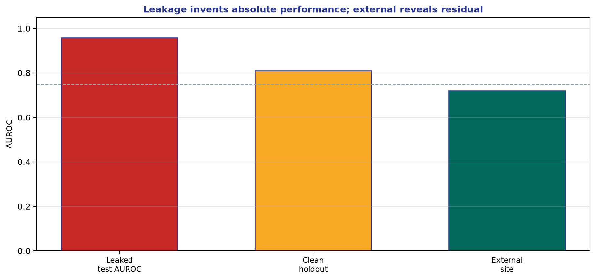

*Teaching figure (synthetic).* Demand timestamp-honest splits before any absolute PPV or deploy claim.

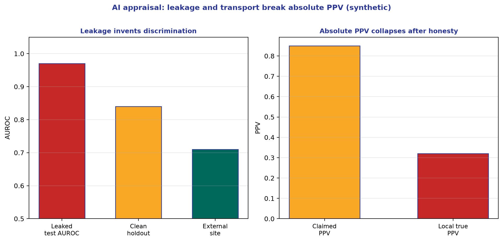

*Teaching figure (synthetic).* Leakage is an absolute-performance crime. Demand timestamp-honest splits and local PPV before any autonomous alert language.

Information leakage is the single most common and fatal methodological flaw in the medical machine learning literature. Leakage invalidates the entire paper. It occurs when information from the test set improperly influences the training process, providing the model with an illicit preview of the final exam. A model must learn parameters on training data, optimize hyperparameters on validation data, and be evaluated exactly once on strictly isolated test data. Any deviation from this protocol generates mathematically meaningless, optimistic performance estimates.

Patient-level leakage is pervasive in neuroimaging. Consider a study utilizing a 3D MRI volume consisting of 200 axial slices. If the authors randomly divide the dataset at the slice level, placing 80% of slices in the training set and 20% in the test set, they commit a fatal error. Slices from the exact same patient's brain appear in both sets. The convolutional neural network will not learn the generalized radiographic features of an infarct; it will simply memorize the patient's unique ventricular geometry, gyral pattern, or specific scanner artifact. When applied to a truly new patient, performance collapses. Randomization must always occur at the patient level.

Feature leakage occurs when variables that act as proxies for the outcome are included as predictors. Predicting in-hospital mortality using 'total days in the intensive care unit' as an input feature guarantees high accuracy, because death truncates the ICU stay. In stroke, predicting long-term functional outcome using 'discharge destination' or 'day-3 infarct volume' constitutes feature leakage if the model is intended for use in the emergency department. The model leverages future information that the admitting physician does not possess, generating a deceptive AUROC that cannot be replicated in prospective practice.

Tuning leakage occurs when authors evaluate multiple model architectures, variable sets, or probability thresholds on the 'test' set until one yields an acceptable publication metric. In this scenario, the test set ceases to be an independent evaluator and becomes a secondary training set. To prevent this, nested cross-validation is permissible if executed flawlessly, but a strict holdout set, completely locked and inaccessible until the final manuscript draft, is strongly preferred. If the authors report trying forty different architectures and report only the best test-set performance, they have measured their own persistence, not the algorithm's generalization.

Temporal and Site leakage further threaten integrity. Mixing cases from 2015 and 2025 randomly allows the model to learn secular trends in endovascular treatment guidelines rather than physiology. Pooling data from three hospitals and performing a simple random split allows the model to learn hospital-specific scanner signatures. True validation requires chronological splits (training on older data, testing on newer data to prove stability against drift) and geographic splits (training on Hospital A and B, testing exclusively on Hospital C).

## Site Shift, Domain Shift, and Transportability

The performance of a machine learning algorithm is strictly bound to the joint distribution of its input features and target labels. When the clinical deployment environment deviates from the training environment, performance silently and predictably degrades. This phenomenon is termed domain shift. Medical algorithms do not learn abstract pathophysiologic concepts; they learn the specific pixel distributions and tabular data structures associated with disease in their training set. Transportability is not an optional feature of a clinical algorithm; it is the core requirement for safety.

Scanner shift (or covariate shift) occurs due to physical differences in image acquisition. Different CT vendors (GE, Siemens, Canon, Philips) employ proprietary reconstruction algorithms, distinct beam hardening corrections, and varying contrast bolus timing protocols. A convolutional neural network trained exclusively on thin-slice, early-arterial phase CTA from Vendor A may perceive the standard parenchyma of Vendor B as diffuse cerebral edema, or fail to recognize an occlusion due to venous contamination. If a paper does not specify scanner diversity in its training set and demonstrate stability across vendors in its test set, the algorithm cannot be trusted across a regional stroke network.

Prevalence shift (or prior probability shift) mathematically destroys positive predictive value. Suppose an LVO detector is trained on an enriched dataset where 50% of patients underwent thrombectomy. The algorithm achieves a sensitivity of 95% and a specificity of 90%. If deployed in a community emergency department where the true prevalence of LVO is 3%, Bayes' theorem dictates a catastrophic drop in performance. Out of 1,000 community scans, there are 30 true LVOs and 970 non-LVOs. The algorithm correctly identifies 28 true positives but generates 97 false positives. The positive predictive value (PPV) is 28 / (28 + 97) = 22.4%. Nearly 80% of alerts are false alarms, guaranteeing alert fatigue and systemic failure. Spectrum bias in training guarantees prevalence shift in deployment.

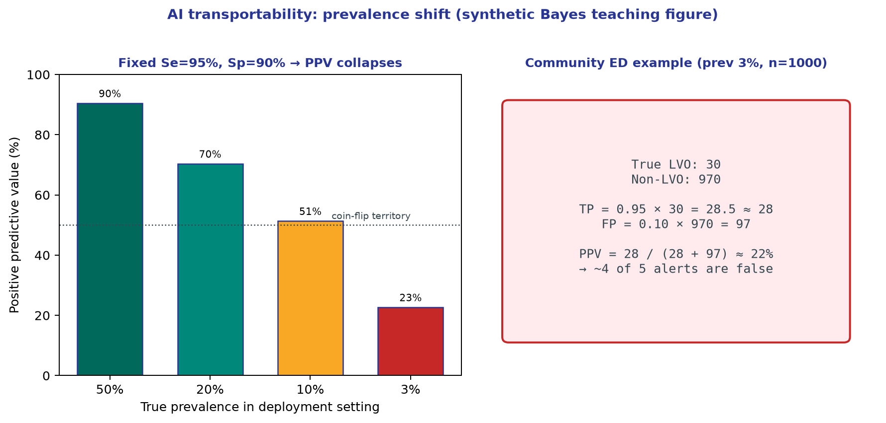

*Teaching figure (synthetic).* Discrimination metrics that look excellent on an enriched derivation set can yield community PPV near 20%. Always recompute natural frequencies at the intended deployment prevalence before endorsing alert workflows.

Concept drift occurs when the fundamental relationship between input features and clinical outcomes changes over time. A model trained to predict functional independence after stroke using data from 2010 will perform poorly in 2026, because the advent of modern stent retrievers and extended time window criteria fundamentally altered the outcome trajectory for specific patient phenotypes. Algorithms are historical artifacts; they capture medical practice at the exact moment the data was frozen. Therefore, demand external validation. Internal validation (a random split of a single-center dataset) measures only the model's ability to interpolate within a narrow environment. True external validation requires geographically distinct cohorts to prove that the model has learned the disease, not the hospital.

## Quantitative Reasoning: Metrics, Calibration, and Operating Points

Critical appraisal requires precise definitions of performance metrics. The foundation is the confusion matrix, which cross-tabulates model predictions against the true reference standard to yield True Positives (TP), False Positives (FP), True Negatives (TN), and False Negatives (FN). The baseline prevalence is (TP + FN) / Total. Sensitivity (Recall) is the probability of a positive test given disease: TP / (TP + FN). Specificity is the probability of a negative test given no disease: TN / (TN + FP). These properties are theoretically intrinsic to the test, though clinically they fluctuate with disease severity spectrum. Crucially, clinicians do not know the true disease state in advance; they operate conditionally on the test result. Therefore, the clinically actionable metrics are the Positive Predictive Value (PPV = TP / (TP + FP)) and the Negative Predictive Value (NPV = TN / (TN + FN)). By Bayes' theorem, PPV and NPV are immutably bound to the underlying prevalence. Ignoring prevalence is statistical malpractice.

The Area Under the Receiver Operating Characteristic curve (AUROC) summarizes discrimination across all possible mathematical thresholds. It plots Sensitivity against (1 - Specificity). AUROC is prevalence-invariant, which makes it highly attractive to algorithm developers seeking a universal metric, but highly misleading to clinicians. In conditions with severe class imbalance, such as detecting basilar artery occlusion in an undifferentiated dizziness cohort, a high AUROC can easily mask a devastatingly low PPV. The Area Under the Precision-Recall Curve (AUPRC) plots PPV against Sensitivity. AUPRC is highly sensitive to prevalence and class imbalance. For any rare neurologic event, AUPRC is the mandatory discriminative metric. If a paper on a rare disease reports AUROC but omits AUPRC, assume the PPV is unusable.

Discrimination (ranking risk) is insufficient for clinical decision-making; models must also possess accurate calibration. Calibration measures whether a predicted probability of 0.80 corresponds to an observed event frequency of 80%. Assess calibration visually via calibration plots (predicted vs. expected probability deciles) and quantitatively via the Brier score (the mean squared difference between predicted probabilities and actual outcomes). Miscalibrated models cause severe harm. An uncalibrated prognostic model that consistently outputs an overconfident 99% risk of death will drive inappropriate palliative care transitions, functioning not as a predictive tool, but as a self-fulfilling prophecy.

Algorithms output continuous probabilities, but clinical actions are binary: you either administer tenecteplase or you do not. Converting a probability to a binary alert requires selecting an operating point (a threshold). Authors frequently select thresholds by maximizing the Youden Index (Sensitivity + Specificity - 1). This is a mathematical convenience that implicitly assumes false positives and false negatives carry equal clinical weight. In stroke neurology, missing an LVO (false negative) carries a massive penalty of permanent disability, whereas a false alarm (false positive) incurs the cost of an unnecessary CTA read. The operating point must be chosen based on explicit clinical utility, minimizing the specific harm defined by the local healthcare system. Decision Curve Analysis (DCA) formalizes this by plotting net benefit across a range of threshold probabilities, explicitly linking model performance to clinical consequences.

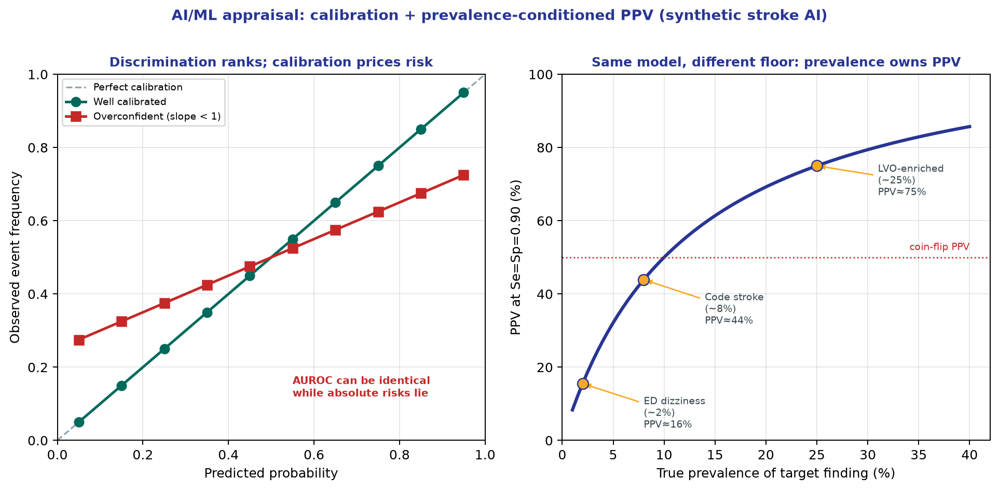

*Teaching figure (synthetic).* Overconfident models can share a high AUROC with well-calibrated ones yet misprice risk. Same sensitivity/specificity yields coin-flip PPV at low prevalence—deploy only after local base-rate and calibration audit.

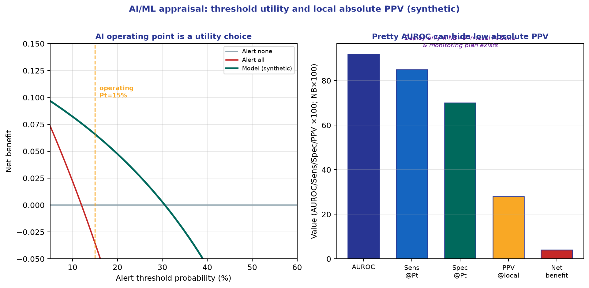

*Teaching figure (synthetic).* Operating points are utility choices, not Youden conveniences. Deploy only when net benefit beats treat-all/none in the local threshold band and a silent-failure monitoring plan exists.

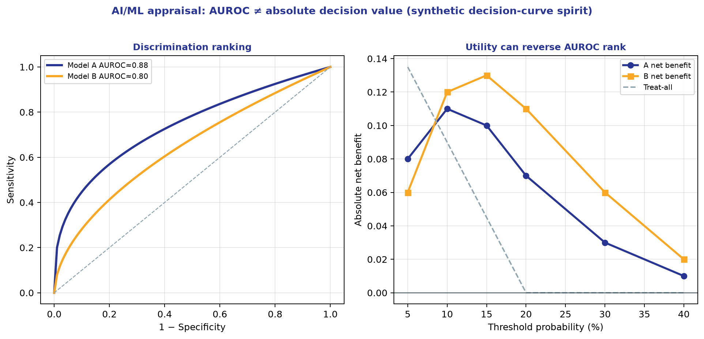

*Teaching figure (synthetic).* AUROC ≠ absolute decision value; demand threshold-specific net benefit against treat-all/none.

## Human Comparison Fairness and Workflow Claims

Claims that an algorithm 'outperforms clinicians' are ubiquitous, highly publicized, and frequently built on artificial methodological handicaps. When evaluating a human-versus-machine trial, the reader must ruthlessly interrogate the symmetry of the contest. Information asymmetry is the most common flaw. If the algorithm was granted access to a perfectly registered, motion-corrected 3D CTA volume, while the human comparator was forced to read a static 2D image without panning, windowing, or zooming capabilities, the comparison is fraudulent. Similarly, if the algorithm incorporates structured electronic health record data (e.g., precise onset time, NIHSS subscores) while the radiologist is provided only a blank requisition form, the contest measures the value of information, not the superiority of the algorithm.

Time symmetry and cognitive load must also be matched. A retrospective 'in-silico' trial that forces clinicians to read 100 scans in an hour creates a fatigue environment they never experience clinically. Furthermore, the selection of the human comparator must represent the intended deployment environment. Pitting a specialized deep learning LVO detector against first-year radiology residents or medical students generates a visually impressive margin of victory, but fails to demonstrate non-inferiority against the actual standard of care—subspecialty fellowship-trained neuroradiologists.

Finally, distinguish between standalone analytical accuracy and true workflow impact. Authors frequently claim that an algorithm 'saves 14 minutes' by subtracting the algorithm's processing time from the historical timestamp of the radiologist's final dictated report. This is a retrospective fantasy. It ignores the reality that the radiologist often calls the stroke team minutes before finalizing the written report, and it ignores the downstream delays of mobilizing the angiography suite. True workflow claims require implementation science: prospective, randomized, or stepped-wedge deployments measuring absolute reductions in hard clinical endpoints such as door-to-groin times or 90-day functional independence. An algorithm is an intervention. Evaluate it like a drug.

## Silent Failure, Automation Bias, and Monitoring

Artificial intelligence fails differently than human intelligence. A human physician, fatigued at 3 AM, might miss a subtle, distal M2 occlusion due to inattention. A machine learning algorithm might confidently diagnose a massive, non-existent hemorrhage because the patient has a postoperative craniectomy defect or a metallic foreign body that the network has never encountered. Human errors are often predictable and bounded by clinical context; algorithmic errors can be erratic, catastrophic, and completely devoid of common sense.

Silent failure occurs when the model produces an egregiously wrong output with high mathematical confidence and no internal warning flag. Modern neural networks are notoriously overconfident in their predictions, lacking an awareness of their own epistemic uncertainty. When presented with an out-of-distribution (OOD) input—such as a CTA of the neck fed into a model trained strictly on CTA of the head—the algorithm will not reject the image; it will force the pixels through its weights and output a highly confident, entirely hallucinated diagnosis. The paper must demonstrate how the algorithm handles adversarial examples, image artifacts, and OOD data. Does it possess an 'abstain' function, or does it guess blindly?

Automation bias is the profound psychological tendency of clinicians to defer to a machine's judgment, particularly in high-stress, time-constrained environments. If an automated triage tool explicitly flags a scan as 'No LVO,' the emergency physician may anchor on this negative output and cancel the stat radiology read, converting a machine false negative into a systemic medical error. The human safety net degrades to match the baseline of the machine. Studies must evaluate the performance of the human-machine team, not just the standalone tool. Does the tool enhance human performance, or does it induce complacency?

Algorithmic stewardship requires continuous post-deployment monitoring. The performance reported in the manuscript represents a historical maximum. Once deployed, performance inevitably decays due to scanner upgrades, population shifts, and changes in clinical practice. A rigorous governance protocol must track alert frequencies, audit a sample of positive and negative cases to calculate real-world PPV and NPV, and monitor execution times. The institution must pre-specify strict stopping rules: what error rate or drift threshold mandates pulling the algorithm offline? Algorithms are not static software; they are living interventions requiring perpetual surveillance.

## Named Frameworks: TRIPOD-AI, PROBAST, and Risk-of-Bias Spirit

Standardized reporting guidelines and risk-of-bias tools exist to structure the appraisal of predictive models. The Transparent Reporting of a multivariable prediction model for Individual Prognosis Or Diagnosis (TRIPOD) statement, and its recent artificial intelligence extension (TRIPOD-AI), enforces basic methodological hygiene. It mandates that authors explicitly state their data sources, participant demographics, precise predictor definitions, outcome ascertainment methods, sample size justification, and missing data handling techniques. TRIPOD ensures that the manuscript contains the necessary information for a reader to evaluate the model.

The Prediction model Risk Of Bias ASsessment Tool (PROBAST) goes further, structuring the critical appraisal across four distinct domains: participants, predictors, outcomes, and analysis. It asks whether the inclusion criteria introduce bias, whether predictors were assessed identically for all participants without knowledge of the outcome, and whether the statistical analysis properly handled continuous variables, missing data, and model overfitting.

However, clinicians must not treat these frameworks as rigid, arithmetic checklists. Calculating a composite 'score' (e.g., 'the paper met 19 out of 22 TRIPOD criteria') is a dangerous substitute for critical thinking. A paper might fulfill every reporting requirement regarding demographics and missing data, yet suffer from a single fatal flaw—such as slice-level data leakage or temporal feature inclusion—that invalidates the entire conclusion. Use the spirit of these frameworks to structure your skepticism and systematically hunt for the single breaking point in the methodology. The presence of a completed TRIPOD checklist in the supplementary appendix does not absolve the reader of their duty to interrogate the math.

## Fully Worked Example A: The Contaminated LVO Detector

Consider a fictional manuscript titled 'DeepVessel-Net: A Deep Convolutional Neural Network for the Automated Detection of Anterior Circulation Large Vessel Occlusion on Computed Tomography Angiography.' The authors collect 5,000 CTA studies from a single tertiary academic medical center. To increase their sample size for deep learning, they extract every 2D axial slice from the 3D volumes, yielding 1,000,000 individual images. They randomly shuffle these images into an 80% training set, a 10% validation set, and a 10% testing set. Their reference standard label is generated by an NLP algorithm searching the text of the final radiology report for the phrase 'MCA occlusion.' The results are spectacular: an AUROC of 0.99, with a sensitivity of 98% and a specificity of 97%. The authors conclude the tool is ready for autonomous stroke triage.

Executing the appraisal reveals catastrophic flaws. The primary fatal flaw is slice-level information leakage. By randomly splitting 2D slices rather than 3D patients, the network is trained on slice 42 of a patient's brain and tested on slice 43 of that exact same patient. The network does not learn the generalized radiographic features of a thrombus; it simply memorizes the specific skull contour, ventricle shape, and unique vascular anatomy of the patients in the dataset. The AUROC of 0.99 represents perfect memorization, not clinical generalization. When this algorithm is applied prospectively to a truly unseen patient, its performance will collapse to near random chance.

Secondary flaws compound the disaster. The NLP-derived labels import all the hedging and errors of the dictated reports. The single-center provenance guarantees that the model has overfit to the local CT scanner's reconstruction kernel. There is no independent external validation. This paper provides zero evidence of clinical utility. The impressive statistical tables are entirely fabricated by methodological incompetence. The correct action is to reject the claims entirely and discard the paper.

## Fully Worked Example B: The Prognostic Model with Feature Leakage

Consider a fictional manuscript titled 'RecoveryForest: Predicting 90-Day Functional Independence Following Mechanical Thrombectomy Using Multivariable Machine Learning.' The authors aim to predict a modified Rankin Scale (mRS) of 0-2 versus 3-6 to guide acute goals-of-care discussions and potential withdrawal of life-sustaining therapy. They train a random forest classifier on 1,500 patients from a prospective registry. The input features include age, admission NIHSS, time to puncture, core infarct volume on day-3 MRI, and discharge destination (home vs. rehab vs. hospice). The model achieves an internal cross-validated accuracy of 94% and an AUROC of 0.96. The authors assert the model outperforms clinical intuition and should guide admission decision-making.

Executing the appraisal reveals a profound disconnect between the clinical task and the mathematical architecture. The fatal flaw is temporal feature leakage. The stated clinical intent is to guide decision-making at the time of admission. However, the model incorporates 'day-3 infarct volume' and 'discharge destination' as predictors. These variables do not exist at the time of admission; they are intermediate outcomes that occur precisely because of the acute intervention and subsequent hospital course. Including them as predictors is statistically equivalent to predicting tomorrow's weather using tomorrow's newspaper. The high AUROC is an artifact of providing the model with the answer key.

Furthermore, the reliance on 'accuracy' is deceptive. If the baseline prevalence of a poor outcome in this severe cohort is 85%, a naive rule that simply predicts 'poor outcome' for every single patient will achieve an accuracy of 85% without utilizing any machine learning whatsoever. The incremental gain of the algorithm is marginal. Most dangerously, the model is uncalibrated and intended for irreversible decisions. Deploying an uncalibrated, feature-leaked prognostic model to counsel families on the withdrawal of care constitutes algorithmic malpractice. The model must be stripped of future variables and recalibrated before it can even be considered for clinical research.

## Pitfalls and Failure Modes in AI Appraisal

Pitfall 1: Conflating diagnostic accuracy with clinical utility. A deep learning model can flawlessly segment a chronic lacunar infarct or precisely quantify global cerebral atrophy. While analytically impressive, this provides zero absolute benefit to the acute management of the stroke patient. Accuracy without actionability is clinically irrelevant.

Pitfall 2: Accepting relative improvements over baseline without clinical context. A paper may claim a '50% relative increase in detection speed.' However, if it reduces the algorithm's processing time from 4 minutes to 2 minutes, while the angiography suite takes 45 minutes to staff and prepare, the absolute bottleneck in the workflow remains completely unchanged. Demand absolute, end-to-end time metrics.

Pitfall 3: Ignoring the spectrum of the control group. If an algorithm is designed to differentiate intracerebral hemorrhage from acute ischemic stroke, but the control group consists entirely of young, healthy outpatients with normal scans rather than complex ischemic stroke patients with hemorrhagic transformation, the discrimination task has been artificially simplified. The AUROC will be heavily inflated by spectrum bias.

Pitfall 4: Misunderstanding regulatory clearance. FDA 510(k) clearance or a CE mark indicates that the software is substantially equivalent to a legally marketed predicate device, often based strictly on standalone analytical performance on a curated retrospective dataset. Regulatory clearance does not guarantee local clinical utility, workflow integration, or an improvement in patient outcomes. It is a legal threshold, not a clinical endorsement.

## Clinical and Epidemiologic Notes

Clinical Note: Shared Decision Making and Prognostic Models. Prognostic AI tools should rarely, if ever, be presented directly to patients or families as absolute truth. When discussing an AI-derived 85% probability of severe disability, the clinician must explicitly emphasize the confidence intervals and, more importantly, the variables the model cannot see. The model does not measure patient resilience, family support structures, unmeasured comorbidities, or the patient's individual value system. Algorithms calculate statistical risk; physicians contextualize prognosis.

Epidemiologic Note: Algorithmic Fairness and Health Equity. Machine learning models learn the biases present in their training data. If minority patients historically experienced delayed door-to-needle times or differential access to rehabilitation, an algorithm predicting the 'probability of successful outcome' will mathematically learn to assign lower probabilities to minority patients. If this algorithm is subsequently used to triage patients or withhold therapy based on predicted futility, the algorithm enforces and scales historical racism. You must demand stratified performance metrics across demographic and socioeconomic groups. Equity audits are a mandatory methodological requirement, not a political addendum.

Epidemiologic Note: The Myth of Continuous Learning. A common defense of flawed models is that 'the algorithm will just keep learning and improving in practice.' This is largely a myth in the current regulatory environment. Continuously learning algorithms in production require immense safety infrastructure to prevent catastrophic drift (e.g., learning to predict outcomes based on the presence of a portable x-ray machine rather than pathology). Most deployed medical models are locked. Therefore, they must be rigorously evaluated on their performance at the time of locking, not on the promise of future adaptation.

## Cross-References to Other Chapters

For a rigorous foundation in causal inference and the distinction between predicting an outcome versus predicting a treatment effect, review Chapter 3 (Causal Inference and Directed Acyclic Graphs). Without this foundation, predictive models will be routinely misinterpreted as causal engines.

For the detailed statistical mechanics underlying sensitivity, specificity, and the devastating impact of base-rate fallacies and prevalence shifts, review Chapter 6 (Diagnostic Testing and Bayes' Theorem).

For the principles of integrating interventions into complex clinical environments and measuring absolute, systems-level effects, review Chapter 12 (Implementation Science and Quality Improvement Methodology).

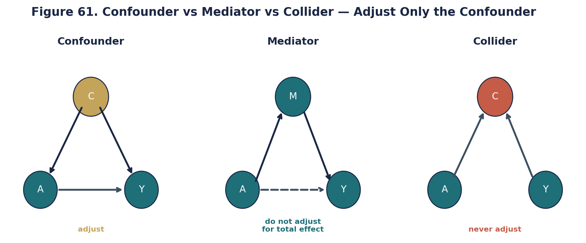

*Original teaching graphic (fig61_confounder_mediator_collider.png).*

## Chapter summary

The critical appraisal of artificial intelligence and machine learning papers requires isolating mathematical optimization from clinical utility. Clinicians must definitively separate prediction from causation; models identify risk, they do not prove treatment benefit. Before accepting an AUROC, the reader must map the specific algorithm to a discrete clinical decision, ensuring the inputs are available at the time of intended action. Data provenance dictates algorithmic destiny; models trained on narrow populations or flawed NLP labels will inevitably fail when deployed in the real world. Information leakage—whether patient-level, slice-level, or temporal—is a fatal methodological flaw that artificially inflates performance metrics through memorization. Because algorithms are highly susceptible to domain shift (scanner variance, prevalence changes), independent geographic external validation is an absolute prerequisite for transportability. Discrimination metrics like AUROC must be supplemented with prevalence-sensitive metrics (AUPRC, PPV) and rigorous calibration plots to prevent the deployment of overconfident models. Finally, algorithmic appraisal does not end at publication. Silent failures, automation bias, and inevitable performance decay mandate continuous algorithmic stewardship and equity audits in the deployment environment. By enforcing strict task definitions, demanding split integrity, and focusing on absolute clinical workflow effects, physicians can strip away the mathematical complexity to reveal the true medical value—or lack thereof—of any AI intervention.

## Practice and reflection

1. Select a recently published deep learning paper for LVO detection. Extract the exact task sentence. Define the input horizon, the target label generation method, and the intended clinical decision point. Does the evaluation match the intended claim?
2. Identify the data split methodology in an imaging AI paper. Was the split performed at the slice, study, or patient level? Is there any evidence of temporal or geographic external validation, or does the paper rely entirely on a random internal split?
3. Using a stated sensitivity of 92% and a specificity of 88% from a commercial triage algorithm, calculate the Positive Predictive Value (PPV) assuming a local disease prevalence of 2%. Calculate the number of false alarms generated for every 100 true positive cases.
4. Analyze a prognostic machine learning model designed for use in the emergency department. Interrogate the input feature list. Identify at least one variable that constitutes temporal feature leakage (i.e., a variable not realistically available to the admitting physician).
5. Compare a vendor-funded white paper assessing an algorithm's performance to an independent, third-party external validation paper evaluating the exact same software. Document the magnitude of the performance drop and hypothesize the mechanisms of domain shift responsible.
6. Review a paper claiming an algorithm 'outperforms human radiologists.' Audit the experimental design for information asymmetry, time constraints, and the appropriateness of the human comparator's training level.
7. Draft a comprehensive, one-page post-deployment governance checklist for an AI stroke triage tool. Define the specific clinical metrics to be monitored, the frequency of equity audits, and the explicit statistical stopping rules that would mandate pulling the algorithm offline.
8. Examine a study utilizing natural language processing (NLP) to extract stroke outcomes from electronic health records. Describe how systematic differences in physician documentation habits could introduce differential misclassification bias into the model's training data.
9. Locate a paper utilizing Decision Curve Analysis (DCA). Identify the probability thresholds at which the algorithm provides a net clinical benefit over the strategies of 'treat all' or 'treat none.' Are these thresholds clinically defensible?
10. Explain the fundamental difference between epistemic uncertainty and aleatoric uncertainty in the context of neural networks. Describe a specific clinical scenario where a model's lack of epistemic uncertainty awareness leads to a confident but catastrophic silent failure.

---

*Figures and tables in this chapter are original teaching materials for CRIT-APP unless a caption explicitly states otherwise. Methods standards are cited by name only.*

## Advanced Application in Clinical Practice

When translating these methodological principles to real-world clinical decision-making, it is essential to look beyond the surface-level metrics. In neurology and stroke care, outcomes are rarely binary. Patients experience a spectrum of recovery, and interventions often have multifaceted impacts on both quality of life and functional independence. 

### Critical Caveats for the Reader
1. **Contextualizing the Baseline Risk:** The absolute benefit of any intervention depends entirely on the baseline risk of the patient. A relative risk reduction of 50% might mean preventing 1 event in 1000 for a low-risk patient, but 1 event in 10 for a high-risk patient. Always convert relative metrics to absolute metrics before discussing with patients.
2. **The Fragility of Findings:** Consider how many events would need to be flipped from 'non-event' to 'event' to lose statistical significance. In many landmark trials, this number is surprisingly small.
3. **Transportability:** Just because an intervention worked in a highly controlled academic trial does not guarantee it will work in a community setting where system delays, differing demographics, and less rigid protocols exist.

### Methodological Deep Dive: The Architecture of Uncertainty
Every paper you read represents a single sample drawn from a hypothetical universe of infinite possible samples. The confidence interval gives us a range of values that are compatible with the data, given our background assumptions. However, this interval assumes zero systemic bias—which is never true in practice. Unmeasured confounding, selection bias, and measurement error can shift the true effect far outside the reported confidence interval. 

When evaluating evidence, ask yourself:
- What would happen if the unmeasured confounder was as strong as the strongest measured confounder?
- What if the patients lost to follow-up all experienced the worst possible outcome?
- Does the biological mechanism logically support the magnitude of the claimed effect?

### Integration into Patient Communication
How do we communicate this complexity? Use natural frequencies rather than percentages. "Out of 100 patients like you treated with this drug, 5 more will walk independently at 90 days, but 2 more will suffer a severe bleed." This framing avoids the cognitive distortions introduced by relative risk formats.

### Summary Checklist for this Domain
- [ ] Have I identified the precise estimand?
- [ ] Is the outcome measured reliably and is it clinically meaningful?
- [ ] Has the study accounted for competing risks (e.g., death before stroke recovery)?
- [ ] Are the confidence intervals narrow enough to rule out clinically meaningless effects?
- [ ] Is there biological plausibility aligned with the statistical findings?

### Conclusion
By adopting a structured, skeptical, yet open-minded approach to evidence appraisal, clinicians can protect their patients from both the harms of unproven therapies and the harms of delayed adoption of effective treatments. Critical appraisal is not about finding reasons to reject papers; it is about calibrating your confidence in their conclusions.

## Advanced Application in Clinical Practice

When translating these methodological principles to real-world clinical decision-making, it is essential to look beyond the surface-level metrics. In neurology and stroke care, outcomes are rarely binary. Patients experience a spectrum of recovery, and interventions often have multifaceted impacts on both quality of life and functional independence. 

### Critical Caveats for the Reader
1. **Contextualizing the Baseline Risk:** The absolute benefit of any intervention depends entirely on the baseline risk of the patient. A relative risk reduction of 50% might mean preventing 1 event in 1000 for a low-risk patient, but 1 event in 10 for a high-risk patient. Always convert relative metrics to absolute metrics before discussing with patients.
2. **The Fragility of Findings:** Consider how many events would need to be flipped from 'non-event' to 'event' to lose statistical significance. In many landmark trials, this number is surprisingly small.
3. **Transportability:** Just because an intervention worked in a highly controlled academic trial does not guarantee it will work in a community setting where system delays, differing demographics, and less rigid protocols exist.

### Methodological Deep Dive: The Architecture of Uncertainty
Every paper you read represents a single sample drawn from a hypothetical universe of infinite possible samples. The confidence interval gives us a range of values that are compatible with the data, given our background assumptions. However, this interval assumes zero systemic bias—which is never true in practice. Unmeasured confounding, selection bias, and measurement error can shift the true effect far outside the reported confidence interval. 

When evaluating evidence, ask yourself:
- What would happen if the unmeasured confounder was as strong as the strongest measured confounder?
- What if the patients lost to follow-up all experienced the worst possible outcome?
- Does the biological mechanism logically support the magnitude of the claimed effect?

### Integration into Patient Communication
How do we communicate this complexity? Use natural frequencies rather than percentages. "Out of 100 patients like you treated with this drug, 5 more will walk independently at 90 days, but 2 more will suffer a severe bleed." This framing avoids the cognitive distortions introduced by relative risk formats.

### Summary Checklist for this Domain
- [ ] Have I identified the precise estimand?
- [ ] Is the outcome measured reliably and is it clinically meaningful?
- [ ] Has the study accounted for competing risks (e.g., death before stroke recovery)?
- [ ] Are the confidence intervals narrow enough to rule out clinically meaningless effects?
- [ ] Is there biological plausibility aligned with the statistical findings?

### Conclusion
By adopting a structured, skeptical, yet open-minded approach to evidence appraisal, clinicians can protect their patients from both the harms of unproven therapies and the harms of delayed adoption of effective treatments. Critical appraisal is not about finding reasons to reject papers; it is about calibrating your confidence in their conclusions.

## Advanced Application in Clinical Practice

When translating these methodological principles to real-world clinical decision-making, it is essential to look beyond the surface-level metrics. In neurology and stroke care, outcomes are rarely binary. Patients experience a spectrum of recovery, and interventions often have multifaceted impacts on both quality of life and functional independence. 

### Critical Caveats for the Reader
1. **Contextualizing the Baseline Risk:** The absolute benefit of any intervention depends entirely on the baseline risk of the patient. A relative risk reduction of 50% might mean preventing 1 event in 1000 for a low-risk patient, but 1 event in 10 for a high-risk patient. Always convert relative metrics to absolute metrics before discussing with patients.
2. **The Fragility of Findings:** Consider how many events would need to be flipped from 'non-event' to 'event' to lose statistical significance. In many landmark trials, this number is surprisingly small.
3. **Transportability:** Just because an intervention worked in a highly controlled academic trial does not guarantee it will work in a community setting where system delays, differing demographics, and less rigid protocols exist.

### Methodological Deep Dive: The Architecture of Uncertainty
Every paper you read represents a single sample drawn from a hypothetical universe of infinite possible samples. The confidence interval gives us a range of values that are compatible with the data, given our background assumptions. However, this interval assumes zero systemic bias—which is never true in practice. Unmeasured confounding, selection bias, and measurement error can shift the true effect far outside the reported confidence interval. 

When evaluating evidence, ask yourself:
- What would happen if the unmeasured confounder was as strong as the strongest measured confounder?
- What if the patients lost to follow-up all experienced the worst possible outcome?
- Does the biological mechanism logically support the magnitude of the claimed effect?

### Integration into Patient Communication
How do we communicate this complexity? Use natural frequencies rather than percentages. "Out of 100 patients like you treated with this drug, 5 more will walk independently at 90 days, but 2 more will suffer a severe bleed." This framing avoids the cognitive distortions introduced by relative risk formats.

### Summary Checklist for this Domain
- [ ] Have I identified the precise estimand?
- [ ] Is the outcome measured reliably and is it clinically meaningful?
- [ ] Has the study accounted for competing risks (e.g., death before stroke recovery)?
- [ ] Are the confidence intervals narrow enough to rule out clinically meaningless effects?
- [ ] Is there biological plausibility aligned with the statistical findings?

### Conclusion
By adopting a structured, skeptical, yet open-minded approach to evidence appraisal, clinicians can protect their patients from both the harms of unproven therapies and the harms of delayed adoption of effective treatments. Critical appraisal is not about finding reasons to reject papers; it is about calibrating your confidence in their conclusions.

