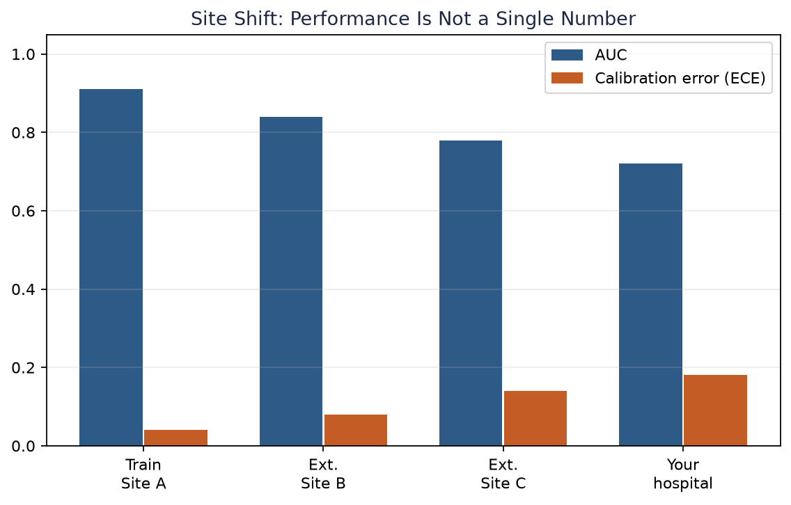
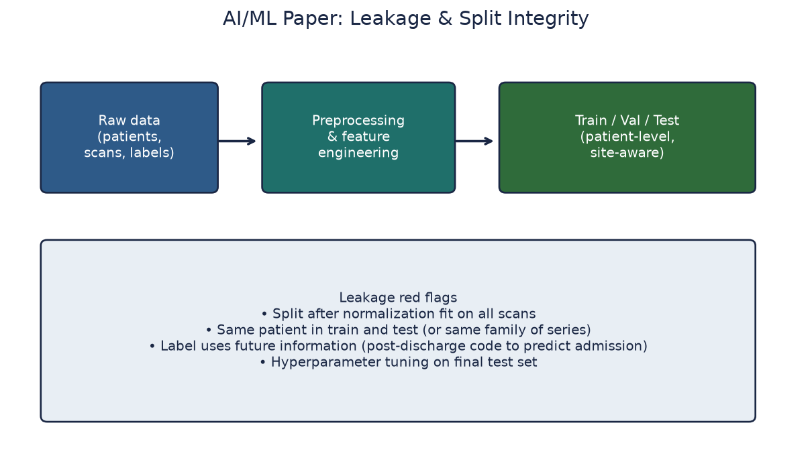
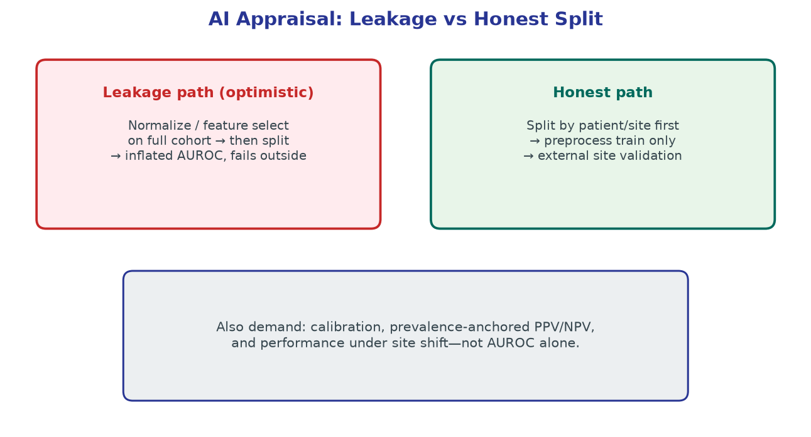

# Chapter 14. Appraising Artificial Intelligence and Machine Learning Papers

## Opening

*A model tuned to one hospital's scanners and case mix can lose accuracy at the next site. Validation designed around the intended setting is needed to assess transportability; internal accuracy alone is insufficient.*

*Information that leaks from the outcome into the features — through shared preprocessing, patient overlap, or post-baseline variables — inflates accuracy that no honest split can reproduce.*

*A leaky pipeline lets test data touch training; an honest split isolates the test set end to end, so the reported metric can estimate held-out performance in the sampled setting. Estimating deployment performance additionally requires an evaluation design representative of the intended population, time, site, and workflow.*

An imaging AI paper reports AUC 0.94. Hunt leakage, site shift, and whether the label matches the clinical decision the tool will actually drive.

## The Conceptual Core: Prediction, Causation, and Utility

Machine learning has saturated the neurological and cerebrovascular literature, promising automated detection of large-vessel occlusions, precise segmentation of intracerebral hemorrhage, and early prediction of functional dependence following acute stroke. Clinicians trained exclusively to evaluate randomized controlled trials often approach these papers with an insufficient methodological framework. The critical appraisal of artificial intelligence requires a distinct analytical reflex, one that rigorously separates mathematical optimization from clinical utility. An algorithm maps high-dimensional input vectors to target labels by minimizing a statistical loss function; it does not understand anatomy, pathophysiology, or the clinical consequences of its outputs. Unless design and evaluation prevent it, optimization can exploit artifacts in the data rather than the intended clinical signal.

The paramount rule of appraising this literature is that prediction does not equal causation. A model that accurately predicts a high probability of severe disability (modified Rankin Scale 4-6) at 90 days does not inherently identify which intervention will alter that trajectory. Identifying patients at high risk for an outcome is entirely distinct from identifying patients who will benefit from a specific treatment. Causal inference—the process of determining 'who to treat'—requires counterfactual reasoning. Standard supervised machine learning algorithms simply estimate the expected value of the outcome given the observed features under the current standard of care. They cannot, by themselves, simulate the counterfactual universe in which an intervention is applied or withheld. Do not permit complex mathematical architectures to obscure this fundamental epistemological limit.

Furthermore, algorithmic performance metrics are not equivalent to clinical impact. An area under the receiver operating characteristic curve (AUROC) of 0.94 is a descriptive statistical property of the model's ability to rank cases within a specific, controlled, and often artificial dataset. It does not mean the algorithm improves patient outcomes. A tool that perfectly segments an unruptured intracranial aneurysm provides zero clinical utility if the segmentation requires 45 minutes of manual preprocessing and ultimately does not alter the neurosurgeon's operative approach or the absolute risk of rupture. In clinical epidemiology, we demand evidence of absolute clinical effects—absolute reductions in door-to-puncture times, absolute increases in the rate of functional independence, or clearly defined numbers needed to treat (NNT) and numbers needed to harm (NNH). A paper that concludes with a high AUROC has merely completed the engineering phase; it has not demonstrated medical value.

The critical appraisal of an AI paper is therefore an exercise in clinical mapping. The reader must map the algorithm's specific inputs to information available at the intended decision time, map its probabilistic outputs to a discrete and actionable decision, and map reported metrics to the target population. Failure to complete this mapping raises the risk of ineffective or harmful deployment. An algorithm that performs flawlessly in silico can degrade patient care in vivo if it targets the wrong decision point or introduces unmeasured delays.

## Task Definition: Formalizing the Clinical Decision Point

Before examining the architecture of a neural network or the statistical significance of its metrics, the clinician must force the authors' claims into a highly specific task statement. This statement must define what the algorithm actually measures, as opposed to the clinical concept the authors claim it addresses. A model trained to segment hyperdense middle cerebral artery signs on non-contrast computed tomography (NCCT) is not a 'stroke triage' model; it is strictly a hyperdense artery segmentation tool. Conflating the measurement of a radiographic sign with the complex clinical task of triage introduces immediate spectrum bias and workflow failure. The former is a pixel-classification problem; the latter is a systems-engineering problem.

A rigorous task statement takes the following form: 'In [target population], using [inputs strictly available at time T], the algorithm outputs [prediction/classification] to support [specific clinical action], optimized for [defined utility metric].' If a paper cannot be distilled into this sentence, its performance metrics are difficult to map to clinical use. First, specify the input horizon. If a model predicts 90-day modified Rankin Scale but requires input features derived from a 72-hour magnetic resonance imaging (MRI) scan, it cannot inform an admission thrombolysis decision. Models that incorporate variables generated after the intended decision point exhibit temporal feature leakage when evaluated for that earlier use, using 'crystal-ball' variables to inflate apparent accuracy.

Next, define the target label exactly. Was a 'large-vessel occlusion' defined by the consensus of three fellowship-trained neurointerventionalists reviewing digital subtraction angiography, or was it defined by natural language processing (NLP) algorithms processing the free text of preliminary overnight radiology reports? The fitted model targets the operational label supplied during development. If that label comes from preliminary reports, performance may partly reflect local dictation habits, hedging language, and systematic reporting errors rather than vascular occlusion against an independent reference standard.

Finally, specify the intended human operator and the decision. A tool designed to assist general emergency physicians in a critical access hospital requires fundamentally different validation than a tool designed to prioritize the workflow queue of a subspecialty neuroradiologist at a comprehensive stroke center. The clinical decision must be explicit. Does the tool trigger an automatic angiography suite activation, or does it merely reorder a list on a screen? The penalty for a false positive differs drastically between these two actions, which must in turn dictate the mathematical threshold chosen for the model. An algorithm evaluated for queue prioritization cannot be seamlessly repurposed for autonomous activation of interventional teams.

## Data Provenance, Labels, and Representativeness

Artificial intelligence models possess no intrinsic medical knowledge; their behavior is shaped by the distribution of their training data. Every row's provenance therefore matters. If a hemorrhage-expansion study includes only patients who survived long enough for a 24-hour follow-up scan, it suffers from survivor selection. Performance in the full emergency population—especially among the most severe hemorrhages—is then unknown and may be poor because those patients were underrepresented or absent. Data provenance constrains the claims the evaluation can support.

Evaluate the explicit and implicit exclusion criteria. Did the authors exclude motion-degraded scans, incomplete fields of view, or patients with prior massive infarcts? If an LVO detector excludes scans with movement artifact, its reported AUROC does not describe performance for those excluded cases, including aphasic, agitated, neglected, or critically ill patients who may be difficult to scan. Systematically removing difficult inputs narrows the supported population and can conceal operational failure modes. Evaluation should include or explicitly characterize the artifact-laden and incomplete inputs expected in the intended workflow.

Label quality constrains evaluation validity but does not impose a simple numerical ceiling on model accuracy. If target labels come from ICD-10 billing codes, the model may learn billing and workflow patterns rather than underlying pathophysiology. Demand a clear, reproducible reference-standard protocol. When humans generate labels, report adjudication, label uncertainty, and inter-rater agreement, then evaluate against an independent or adjudicated reference where possible. A model can outperform an individual noisy rater against that reference; a claim of 99% accuracy is credible only if the reference and evaluation design support it.

Examine demographic and structural representation. If an algorithm is trained predominantly on data from young, affluent, white patients at an academic tertiary care center, performance in an older, more diverse population at an under-resourced safety-net hospital is uncertain and could differ materially. Baseline severities, imaging protocols, and time-to-presentation may differ across these environments. Furthermore, detail the preprocessing dependencies. Image normalization, affine registration, skull stripping algorithms, and slice-thickness requirements should be documented. Dependence on a proprietary or unavailable preprocessing pipeline can prevent use in a standard clinical PACS environment; operational compatibility is part of the intended-use evaluation.

## Information Leakage and the Integrity of Data Splits

Information leakage occurs when information unavailable at the intended prediction point, or information from evaluation cases, influences model development or inputs. Leakage can invalidate the claimed out-of-sample performance for the intended use, although the report may still contain useful descriptive or methodological information. Valid evaluation requires separation at the correct unit—often patient, site, or time—and a development process that does not adapt to the final evaluation data. Nested resampling, external validation, or a locked test set can each be appropriate when implemented and reported correctly.

Patient-level leakage is a major threat in neuroimaging. If slices from one 3D MRI volume are divided between training and test sets, the test set is not independent at the patient level and apparent performance can exploit patient- or acquisition-specific similarity. It cannot estimate performance in new patients. Split or resample at the intended unit of generalization—usually the patient—and keep all encounters and images from that unit in one partition.

Feature leakage occurs when variables that act as proxies for the outcome are included as predictors. Predicting in-hospital mortality using 'total days in the intensive care unit' can produce deceptively strong apparent accuracy because death truncates the ICU stay. In stroke, predicting long-term functional outcome using 'discharge destination' or 'day-3 infarct volume' constitutes feature leakage if the model is intended for use in the emergency department. The model leverages future information that the admitting physician does not possess, so retrospective performance does not estimate prospective use at the intended time.

Tuning leakage occurs when model architectures, variables, or thresholds are repeatedly selected using the designated test set. The resulting performance is adaptively biased and needs a fresh evaluation set or appropriately nested resampling. A locked holdout is one option, but can be statistically inefficient in smaller datasets; properly nested cross-validation is not an inferior exception. If many architectures are tried and only the best test-set result is reported, the stated uncertainty and generalization estimate do not account for that selection.

Random splitting across calendar time or sites can estimate performance within that mixture but conceal poor transport to a future period or a new hospital. Site-specific scanner signatures and secular treatment changes may be predictive without being stable. Use patient-grouped internal validation for optimism, then temporal and/or geographic validation that matches the intended deployment claim; no single split can prove stability against every drift mechanism.

## Site Shift, Domain Shift, and Transportability

The performance of a machine-learning algorithm depends on the joint distribution of its input features and target labels. When deployment differs from training, performance can change—sometimes silently—through domain shift. A model may learn a mixture of pathophysiologic signal, acquisition patterns, workflow artifacts, and site-specific proxies. Transportability must therefore be measured in the intended clinical environment rather than inferred from internal performance.

Scanner shift (or covariate shift) occurs due to physical differences in image acquisition. Different CT vendors (GE, Siemens, Canon, Philips) employ proprietary reconstruction algorithms, distinct beam hardening corrections, and varying contrast bolus timing protocols. A convolutional neural network trained exclusively on thin-slice, early-arterial phase CTA from Vendor A may perceive the standard parenchyma of Vendor B as diffuse cerebral edema, or fail to recognize an occlusion due to venous contamination. If a paper does not specify scanner diversity in development and evaluate performance across relevant vendors, it does not support a regional-network transportability claim.

Predictive values change with prevalence even if sensitivity and specificity remain fixed. Suppose an LVO detector is evaluated in an enriched dataset with 50% LVO prevalence and has sensitivity 95% and specificity 90%. At 3% LVO prevalence, 1,000 scans would yield about 28–29 true-positive and 97 false-positive alerts, for PPV about 23% under the fixed-performance assumption. That alert burden may or may not be acceptable depending on workflow and consequences. A spectrum shift can also change sensitivity and specificity; prevalence shift and spectrum effects should be evaluated separately rather than assumed to occur together.

*Teaching figure (synthetic).* Discrimination metrics that look excellent on an enriched derivation set can yield community PPV near 20%. Estimate natural frequencies using the intended-use prevalence and justified transport assumptions before evaluating an alert workflow.

Concept drift occurs when the relationship between input features and outcomes changes over time. A model trained on 2010 stroke data may miscalibrate or otherwise perform differently in 2026 because stent retrievers, extended-window selection, and care pathways altered outcome trajectories for some phenotypes. Algorithms are historical artifacts, so contemporary validation is necessary. A random split from one center primarily tests interpolation within that environment. External validation should match the intended claim and may be temporal, geographic, vendor-specific, or workflow-specific; it measures transport performance but does not prove that a model learned disease mechanisms rather than hospital-specific proxies.

## Quantitative Reasoning: Metrics, Calibration, and Operating Points

The confusion matrix cross-tabulates model classifications against the study reference standard to yield true positives, false positives, true negatives, and false negatives relative to that standard. Sensitivity and specificity depend on threshold, target-condition spectrum, measurement, and workflow; they are not immutable properties. PPV and NPV depend on prevalence as well as sensitivity and specificity, so predictive values from an enriched study sample should not be copied to a lower-prevalence deployment population without justified transport assumptions.

The Area Under the Receiver Operating Characteristic curve (AUROC) summarizes discrimination across thresholds by plotting sensitivity against 1 − specificity. Although AUROC does not algebraically depend on prevalence for a fixed score distribution, it can obscure false-alarm burden in severely imbalanced settings, such as detecting basilar occlusion in an undifferentiated dizziness cohort. The precision-recall curve plots PPV (precision) against sensitivity (recall), and its area is prevalence-sensitive. For rare neurologic events, report precision-recall performance alongside threshold-specific sensitivity, specificity, PPV, NPV, calibration, and natural frequencies. Omitting AUPRC is a reporting limitation, but threshold-specific PPV can still be interpretable when prevalence and the evaluation design are appropriate and explicit.

Discrimination (ranking risk) is insufficient for probability-based decisions; calibration asks whether predicted risks agree with observed frequencies in the evaluated setting. Assess it with a flexible calibration curve and quantitative summaries such as calibration-in-the-large (or intercept) and calibration slope, with uncertainty. The Brier score is the mean squared difference between predicted probabilities and outcomes and summarizes overall probabilistic accuracy; it combines calibration and resolution rather than isolating calibration. Material miscalibration can cause harm when probabilities influence care. For example, an overconfident prognostic estimate could bias discussions or treatment decisions if users treat it as certain, so impact studies and safeguards must evaluate how estimates are communicated and used.

Many algorithms output scores or probabilities that must be connected to an action, alert, or queue position through a threshold or policy. Maximizing Youden's J weights sensitivity and specificity equally on that scale and does not encode prevalence or the actual consequences of errors. For an LVO alert, false negatives can forgo time-sensitive opportunities, while false positives can create imaging, transfer, alarm, or capacity burdens; their magnitude is setting-specific. Choose and validate operating points against explicit intended-use consequences. Decision-curve analysis is one model-based approach, but it does not replace workflow and impact evaluation.

## Human Comparison Fairness and Workflow Claims

Claims that an algorithm 'outperforms clinicians' are common and can be distorted by asymmetric study conditions. When evaluating a human-versus-machine comparison, interrogate the symmetry of the contest. If the algorithm receives a registered, motion-corrected 3D CTA volume while the human comparator sees only static 2D images without ordinary viewing controls, the comparison cannot isolate algorithm superiority. Likewise, if the algorithm incorporates structured electronic health record data (e.g., onset time and NIHSS subscores) while the radiologist receives only a blank requisition, the contrast partly measures unequal information access.

Time symmetry and cognitive load should also approximate the intended deployment setting. A retrospective 'in-silico' trial that asks clinicians to read 100 scans in an hour may create an artificial fatigue environment. The human comparator should represent the intended use case: comparison with trainees may answer a training-specific question but does not establish performance against a subspecialty neuroradiology standard.

Finally, distinguish standalone analytical accuracy from workflow impact. Estimating time saved by comparing algorithm processing time with a historical final-report timestamp is a retrospective proxy that may miss earlier clinician communication and downstream delays. Strong workflow claims are better supported by prospective, randomized, or stepped-wedge implementation studies using endpoints aligned with the claim, such as notification time, door-to-groin time, treatment delivery, safety, or functional outcome. An algorithm is an intervention; evaluate its effect in the workflow where it will be used.

## Silent Failure, Automation Bias, and Monitoring

Human and model errors can have different patterns. A fatigued physician might miss a subtle distal M2 occlusion, while a model might produce a confident false result when postoperative anatomy, artifact, or acquisition conditions differ from its development data. Both can fail systematically; the safety question is whether likely failure modes are characterized, detectable, and recoverable in the intended workflow.

Silent failure occurs when a model produces a materially wrong output without a useful warning. Some neural networks are poorly calibrated or overconfident under distribution shift, but behavior depends on the model, validation, input controls, and deployment safeguards. A system given an out-of-scope input—such as neck CTA when it was developed only for head CTA—may reject it, abstain, flag uncertainty, or still emit a confident prediction. Appraise which behaviors were tested for artifacts, adversarial or corrupted inputs, and clinically relevant out-of-distribution data, and whether the deployed system validates inputs and fails safely.

Automation bias is the tendency to defer excessively to automated output, particularly in high-stress, time-constrained environments. A 'No LVO' flag could anchor clinicians, delay independent review, or otherwise amplify a model false negative. Studies should therefore evaluate the human-machine team and the surrounding escalation process, not only standalone accuracy: does the tool improve performance, leave it unchanged, or create new failure modes?

Algorithmic stewardship requires post-deployment monitoring. Reported study performance is a historical estimate from a defined population and workflow, not a guaranteed maximum or future baseline. Performance may remain stable, improve after controlled updates, or degrade with scanner changes, population shift, workflow changes, or software drift. Governance should track alert frequency, failures, execution time, and performance in sampled positive and negative cases; prespecified escalation, review, and pause criteria should reflect clinical severity and uncertainty. Monitoring intensity and duration should match the model's risk and change process rather than assume either stability or inevitable decay.

## Named Frameworks: TRIPOD+AI, PROBAST+AI, and Risk-of-Bias Judgment

Reporting guidance and risk-of-bias tools serve different purposes. The [TRIPOD+AI statement](https://doi.org/10.1136/bmj-2023-078378) asks authors to report the data sources, participants, predictors, outcomes, sample-size rationale, missing-data methods, model development, evaluation, and other details needed to interpret prediction-model research. It improves the reporting target but does not enforce adherence, verify what authors report, or ensure that a study is unbiased or reproducible.

The updated [PROBAST+AI tool](https://doi.org/10.1136/bmj-2024-082505) structures judgments about methodological quality, risk of bias, and applicability for prediction models using regression or AI methods. Its domains address participants and data sources, predictors, outcome, and analysis. Signaling questions support transparent judgment about issues such as selection, predictor and outcome assessment, missing data, overfitting, evaluation, and applicability; the tool does not convert those judgments into proof that a model is safe for clinical deployment.

Do not reduce these frameworks to an arithmetic score. A paper might report demographics and missing-data methods completely yet retain a consequential flaw, such as patient-level leakage or use of information unavailable at the intended prediction time. Use the reporting checklist to locate the necessary information and the risk-of-bias tool to make domain-specific judgments. A completed checklist supports transparency; it does not substitute for appraisal of the design, analysis, calibration, validation, and intended use.

## Fully Worked Example A: The Contaminated LVO Detector

Consider a fictional manuscript titled 'DeepVessel-Net: A Deep Convolutional Neural Network for the Automated Detection of Anterior Circulation Large Vessel Occlusion on Computed Tomography Angiography.' The authors collect 5,000 CTA studies from a single tertiary academic medical center. To increase their sample size for deep learning, they extract every 2D axial slice from the 3D volumes, yielding 1,000,000 individual images. They randomly shuffle these images into an 80% training set, a 10% validation set, and a 10% testing set. Their reference standard label is generated by an NLP algorithm searching the text of the final radiology report for the phrase 'MCA occlusion.' The results are spectacular: an AUROC of 0.99, with a sensitivity of 98% and a specificity of 97%. The authors conclude the tool is ready for autonomous stroke triage.

Executing the appraisal reveals a release-blocking flaw: slice-level splitting places images from the same patient in training and test sets. The AUROC of 0.99 therefore estimates neither independent patient-level performance nor clinical generalization. The model may exploit anatomy, acquisition, or adjacent-slice similarity; the direction and magnitude of performance in truly unseen patients cannot be recovered from this contaminated test set. Rebuild the split at patient level and repeat the full training and evaluation pipeline.

Additional threats include noisy NLP-derived report labels, single-center provenance, and no independent external validation. Single-center data raise—but do not prove—scanner or workflow overfitting. Because the patient-level test set is contaminated and no clinical-impact study was performed, the paper does not establish deployable accuracy or clinical utility. The appropriate action is to reject the deployment claim pending leakage-free validation, not to infer author intent or competence.

## Fully Worked Example B: The Prognostic Model with Feature Leakage

Consider a fictional manuscript titled 'RecoveryForest: Predicting 90-Day Functional Independence Following Mechanical Thrombectomy Using Multivariable Machine Learning.' The authors aim to predict a modified Rankin Scale (mRS) of 0-2 versus 3-6 to guide acute goals-of-care discussions and potential withdrawal of life-sustaining therapy. They train a random forest classifier on 1,500 patients from a prospective registry. The input features include age, admission NIHSS, time to puncture, core infarct volume on day-3 MRI, and discharge destination (home vs. rehab vs. hospice). The model achieves an internal cross-validated accuracy of 94% and an AUROC of 0.96. The authors assert the model outperforms clinical intuition and should guide admission decision-making.

Executing the appraisal reveals a mismatch between the stated admission-time task and the predictors. Day-3 infarct volume and discharge destination are unavailable at admission and reflect events later in the care pathway. Their inclusion creates temporal leakage: the reported internal performance does not estimate performance using information available at the intended decision time. A leakage-free model must define the prediction time first, restrict inputs to information available then, and repeat the entire validation process.

Accuracy is also incomplete here. If poor outcome prevalence is 85%, an always-poor prediction has 85% accuracy; the reported 94% does not reveal class-specific errors, threshold utility, uncertainty, or whether predictions are well calibrated. Calibration was not reported, so it is unknown rather than demonstrated to be poor. Using this feature-leaked model for irreversible care decisions would be unsupported and unsafe. Further research would require leakage-free development and validation, class-specific and threshold-based performance, calibration assessment, external validation, and evaluation of clinical consequences.

## Pitfalls and Failure Modes in AI Appraisal

Pitfall 1: Conflating diagnostic accuracy with clinical utility. A deep learning model may segment a chronic lacunar infarct or quantify global cerebral atrophy accurately without changing an acute decision. Analytical performance alone does not establish patient benefit, workflow value, or actionability.

Pitfall 2: Accepting relative improvements over baseline without clinical context. A paper may claim a '50% relative increase in detection speed.' If processing falls from 4 minutes to 2 while another pathway step takes 45 minutes, the end-to-end effect may be small. Examine absolute, end-to-end time metrics and where the actual bottlenecks occur.

Pitfall 3: Ignoring the spectrum of the control group. If an algorithm is designed to differentiate intracerebral hemorrhage from acute ischemic stroke, but the control group consists entirely of young, healthy outpatients with normal scans rather than clinically relevant alternatives, the study estimates performance for an easier and less applicable contrast. The direction of bias is often optimistic, but its magnitude cannot be inferred without appropriate validation.

Pitfall 4: Treating regulatory status as proof of local impact. An [FDA 510(k)](https://www.fda.gov/medical-devices/premarket-submissions-selecting-and-preparing-correct-submission/premarket-notification-510k) determination evaluates substantial equivalence for the device's intended use using the performance evidence appropriate to that submission; the evidence may include nonclinical and clinical data. Clearance does not by itself establish improved outcomes, workflow fit, or performance in a particular local population. Verify the exact pathway, intended use, labeling, and public decision summary rather than generalizing from the word “cleared.”

## Clinical and Epidemiologic Notes

Clinical Note: Shared Decision Making and Prognostic Models. Prognostic AI tools should rarely, if ever, be presented directly to patients or families as absolute truth. When discussing an AI-derived 85% probability of severe disability, the clinician must explicitly emphasize the confidence intervals and, more importantly, the variables the model cannot see. The model does not measure patient resilience, family support structures, unmeasured comorbidities, or the patient's individual value system. Algorithms calculate statistical risk; physicians contextualize prognosis.

Epidemiologic Note: Algorithmic Fairness and Health Equity. Models can encode or amplify inequity through target construction, predictor choice, sampling, missingness, treatment patterns, access differences, and model design. If historical care differed across groups, a prognostic model may partly learn those care patterns rather than an invariant biological risk. When the model could affect triage or treatment, evaluate subgroup and intersectional calibration, error rates, thresholds, and clinical utility with adequate sample sizes; investigate observed disparities rather than treating protected characteristics as sufficient explanations.

Epidemiologic Note: Continuous Learning Requires Governance. A promise that an algorithm will improve in practice is not evidence of safety or benefit. Updating models need prespecified change control, representative monitoring data, drift and failure detection, validation after material changes, rollback capability, and accountable human oversight. Evaluate the version actually studied and deployed; treat future adaptation as a separate lifecycle claim requiring evidence.

## Cross-References to Other Chapters

For the distinction between prediction and a causal treatment contrast, review Chapter 3; Chapter 5 develops directed acyclic graphs and causal identification.

For sensitivity, specificity, likelihood ratios, prevalence, and diagnostic thresholds, review Chapter 8.

For absolute treatment effects, review Chapter 12; for pathway implementation, transportability, and policy communication, review Chapter 28.

## Chapter summary

Critical appraisal of AI and machine-learning papers separates optimization performance from clinical utility and prediction from causation. Map the algorithm to a named decision and verify that every input is available at the intended action time. Narrow samples, weak labels, leakage, and domain shift can make internal performance fail to transport. Evaluate patient-level split integrity, discrimination, prevalence-sensitive predictive values or precision-recall performance, calibration, threshold-specific errors, and external validation relevant to the intended setting. Publication is not the endpoint: deployment requires prospective workflow evaluation, monitoring, change control, equity assessment, and a safe response to performance drift. These checks establish bounded evidence for use; they do not convert a predictive model into proof that an intervention benefits patients.

## Practice and reflection

1. Select a recently published deep learning paper for LVO detection. Extract the exact task sentence. Define the input horizon, the target label generation method, and the intended clinical decision point. Does the evaluation match the intended claim?
2. Identify the data split methodology in an imaging AI paper. Was the split performed at the slice, study, or patient level? Is there any evidence of temporal or geographic external validation, or does the paper rely entirely on a random internal split?
3. Using a stated sensitivity of 92% and a specificity of 88% from a commercial triage algorithm, calculate the Positive Predictive Value (PPV) assuming a local disease prevalence of 2%. Calculate the number of false alarms generated for every 100 true positive cases.
4. Analyze a prognostic machine learning model designed for use in the emergency department. Interrogate the input feature list. Identify at least one variable that constitutes temporal feature leakage (i.e., a variable not realistically available to the admitting physician).
5. Compare a vendor-funded white paper assessing an algorithm's performance to an independent, third-party external validation paper evaluating the exact same software. Document the magnitude of the performance drop and hypothesize the mechanisms of domain shift responsible.
6. Review a paper claiming an algorithm 'outperforms human radiologists.' Audit the experimental design for information asymmetry, time constraints, and the appropriateness of the human comparator's training level.
7. Draft a comprehensive, one-page post-deployment governance checklist for an AI stroke triage tool. Define the specific clinical metrics to be monitored, the frequency of equity audits, and the explicit statistical stopping rules that would mandate pulling the algorithm offline.
8. Examine a study utilizing natural language processing (NLP) to extract stroke outcomes from electronic health records. Describe how systematic differences in physician documentation habits could introduce differential misclassification bias into the model's training data.
9. Locate a paper utilizing Decision Curve Analysis (DCA). Identify the probability thresholds at which the algorithm provides a net clinical benefit over the strategies of 'treat all' or 'treat none.' Are these thresholds clinically defensible?
10. Explain the fundamental difference between epistemic uncertainty and aleatoric uncertainty in the context of neural networks. Describe a specific clinical scenario where a model's lack of epistemic uncertainty awareness leads to a confident but catastrophic silent failure.

---

*Figures and tables in this chapter are Teaching materials for CRIT-APP unless a caption explicitly states otherwise. Methods standards are cited by name only.*
