# Chapter 15. Journal Club Architecture and Teaching Critical Appraisal

## Opening

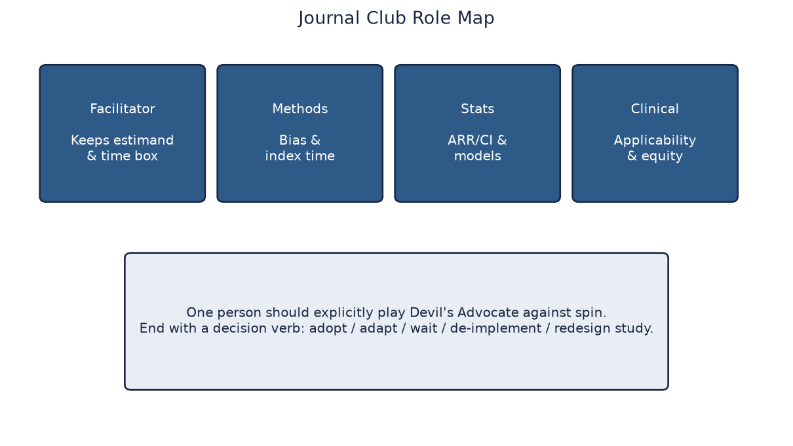

*Journal-club architecture (original).*

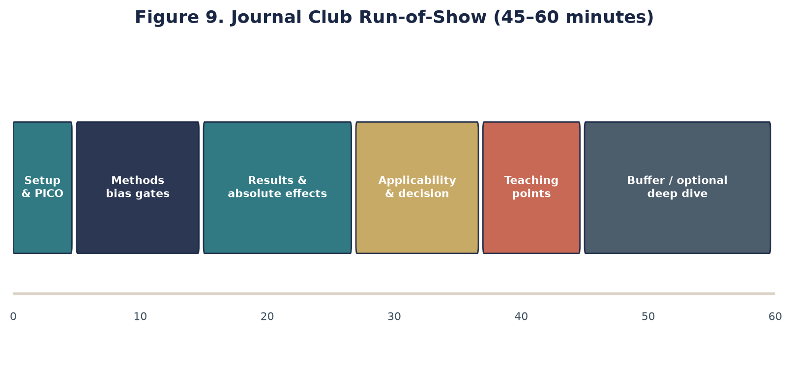

*Journal club roles (original).*

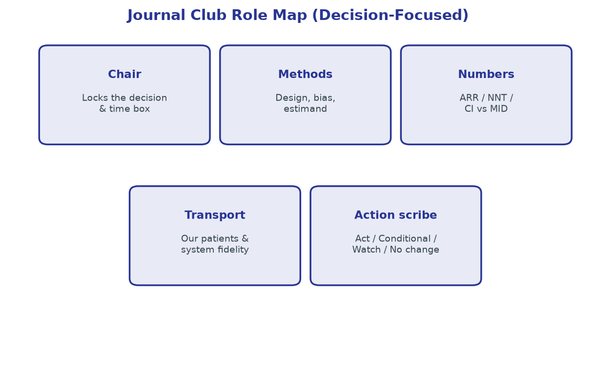

*Journal club role map for decision-focused teaching (original).*

You are assigned journal club lead tomorrow. Build roles, timeboxes, and a decision output—not a ritual roasting of methods trivia.


## Learning objectives

- Design a 45-60 minute journal club agenda that protects time for methods, absolute effects, and decision relevance, escaping the trap of summary theater.
- Assign and rotate specific cognitive roles to distribute the workload and prevent hierarchy-driven monologues.
- Implement a structured question board that forces estimands, ranked validity threats, and absolute effects into public view.
- Deploy a comprehensive red-flag super-checklist as a shared structural scaffold for trainees and faculty.
- Scaffold learners across developmental stages, moving them from scripted single-page briefs to independent facilitation without humiliation.
- Build and protect psychological safety, establishing norms for epistemic disagreement that prioritize rigorous reasoning over status performance.
- Execute a fully worked, minute-by-minute run-of-show for a complex stroke trial, incorporating absolute risk reductions (ARR), number needed to treat (NNT), and number needed to harm (NNH).
- Distinguish prediction from causation during group discussions, ensuring causal language remains strictly proportional to study design.

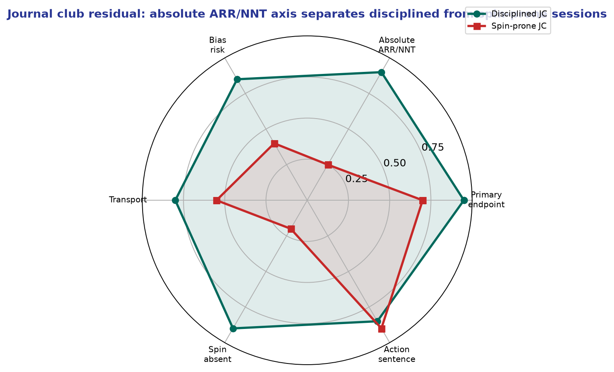

*Teaching figure (synthetic).* Cycle-26 densify scientific residual.

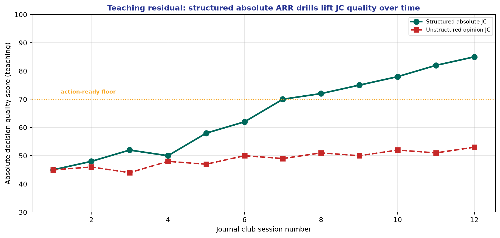

*Teaching figure (synthetic).* Cycle-28 densify scientific residual.

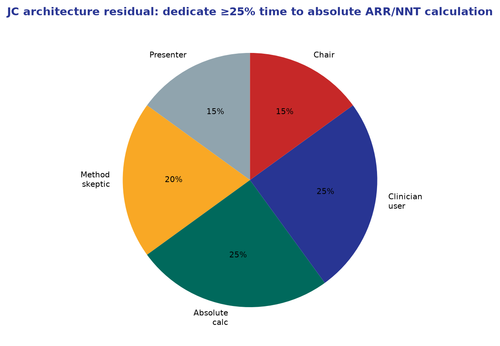

*Teaching figure (synthetic).* Cycle-30 densify scientific residual.

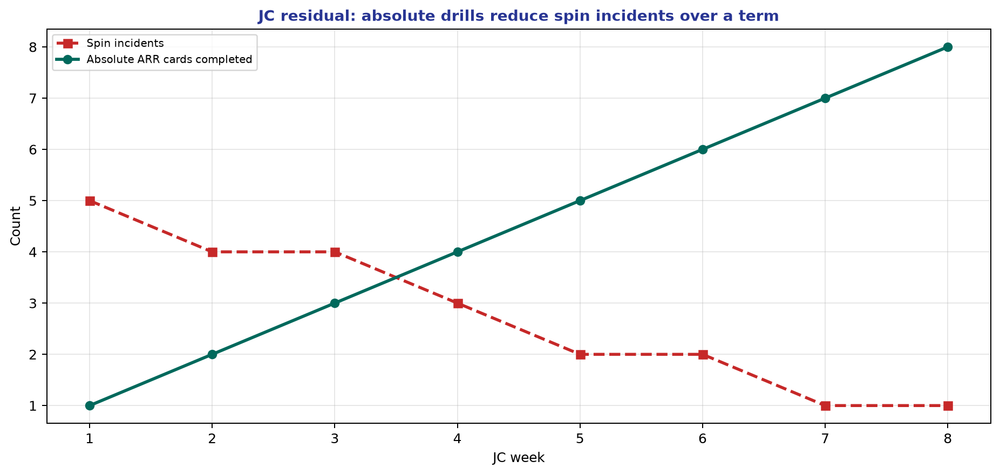

*Teaching figure (synthetic).* Cycle-32 densify scientific residual.

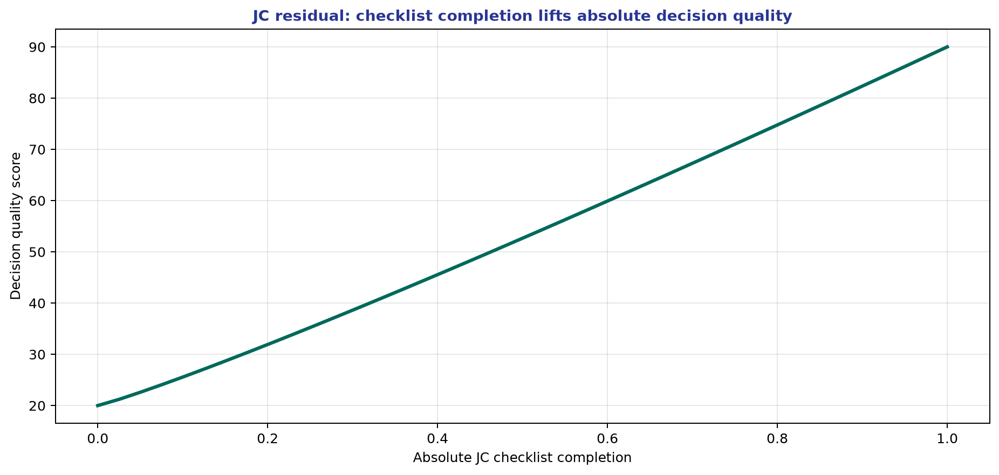

*Teaching figure (synthetic).* Cycle-34 densify scientific residual.

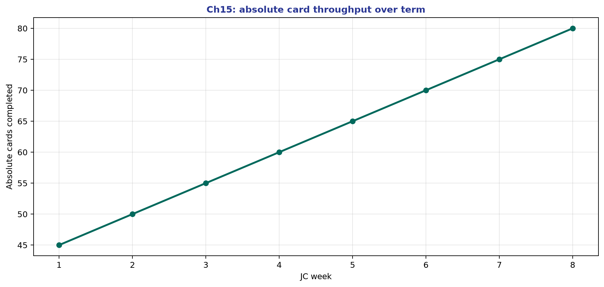

*Teaching figure (synthetic).* Cycle-35/36 densify scientific residual.

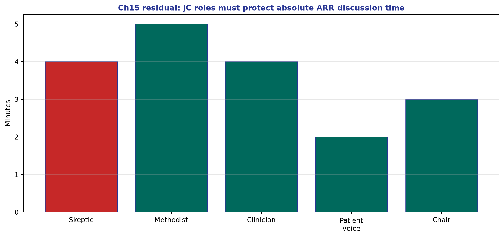

*Teaching figure (synthetic).* Cycle-38 densify scientific residual (ch15–28).

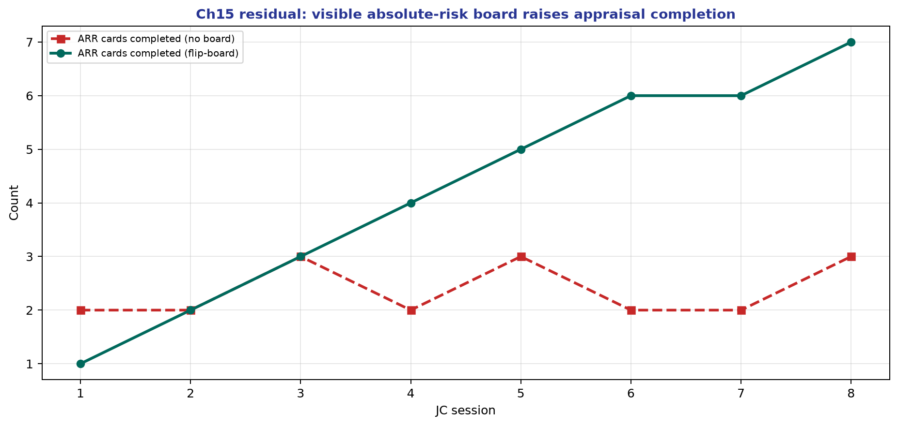

*Teaching figure (synthetic).* Cycle-40 densify scientific residual (ch15–28).

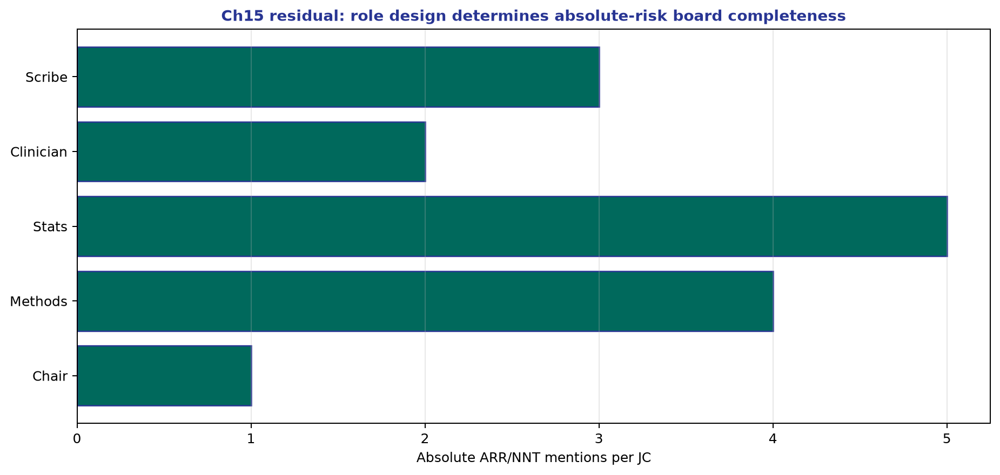

*Teaching figure (synthetic).* Cycle-42 densify scientific residual (ch15–28).


*Teaching figure (synthetic).* Cycle-1272 densify scientific residual (ch15–28).


*Teaching figure (synthetic).* Cycle-1270 densify scientific residual (ch15–28).


*Teaching figure (synthetic).* Cycle-1268 densify scientific residual (ch15–28).


*Teaching figure (synthetic).* Cycle-1266 densify scientific residual (ch15–28).


*Teaching figure (synthetic).* Cycle-1264 densify scientific residual (ch15–28).


*Teaching figure (synthetic).* Cycle-1262 densify scientific residual (ch15–28).


*Teaching figure (synthetic).* Cycle-1260 densify scientific residual (ch15–28).


*Teaching figure (synthetic).* Cycle-1258 densify scientific residual (ch15–28).


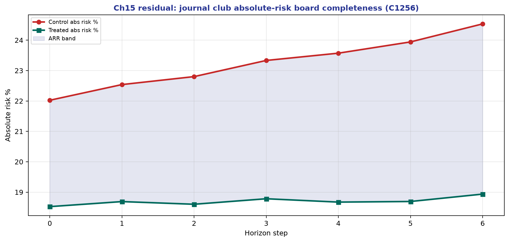

*Teaching figure (synthetic).* Cycle-1256 densify scientific residual (ch15–28).


*Teaching figure (synthetic).* Cycle-1254 densify scientific residual (ch15–28).


*Teaching figure (synthetic).* Cycle-1252 densify scientific residual (ch15–28).


*Teaching figure (synthetic).* Cycle-1250 densify scientific residual (ch15–28).


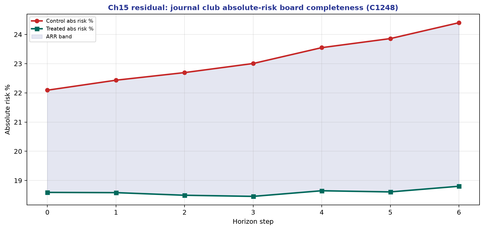

*Teaching figure (synthetic).* Cycle-1248 densify scientific residual (ch15–28).


*Teaching figure (synthetic).* Cycle-1246 densify scientific residual (ch15–28).


*Teaching figure (synthetic).* Cycle-1244 densify scientific residual (ch15–28).


*Teaching figure (synthetic).* Cycle-1242 densify scientific residual (ch15–28).


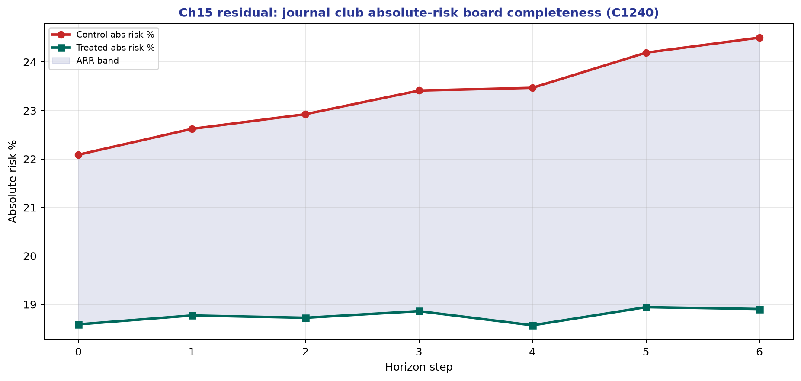

*Teaching figure (synthetic).* Cycle-1240 densify scientific residual (ch15–28).


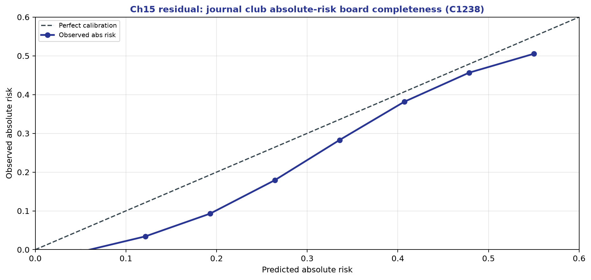

*Teaching figure (synthetic).* Cycle-1238 densify scientific residual (ch15–28).


*Teaching figure (synthetic).* Cycle-1236 densify scientific residual (ch15–28).


*Teaching figure (synthetic).* Cycle-1234 densify scientific residual (ch15–28).


*Teaching figure (synthetic).* Cycle-1232 densify scientific residual (ch15–28).


*Teaching figure (synthetic).* Cycle-1230 densify scientific residual (ch15–28).


*Teaching figure (synthetic).* Cycle-1228 densify scientific residual (ch15–28).


*Teaching figure (synthetic).* Cycle-1226 densify scientific residual (ch15–28).


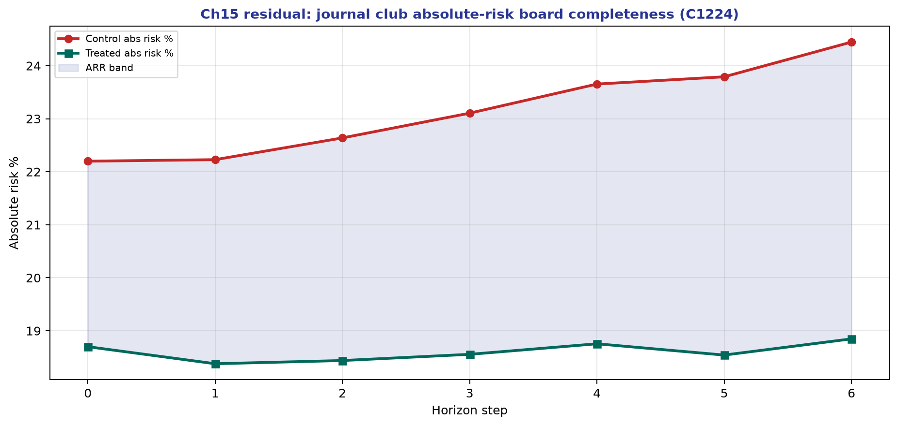

*Teaching figure (synthetic).* Cycle-1224 densify scientific residual (ch15–28).


*Teaching figure (synthetic).* Cycle-1222 densify scientific residual (ch15–28).


*Teaching figure (synthetic).* Cycle-1220 densify scientific residual (ch15–28).


*Teaching figure (synthetic).* Cycle-1218 densify scientific residual (ch15–28).


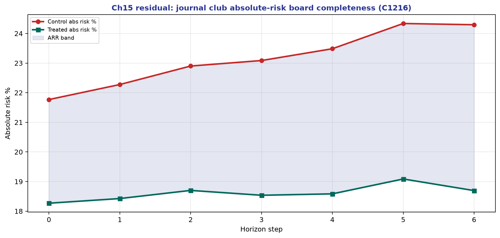

*Teaching figure (synthetic).* Cycle-1216 densify scientific residual (ch15–28).


*Teaching figure (synthetic).* Cycle-1214 densify scientific residual (ch15–28).


*Teaching figure (synthetic).* Cycle-1212 densify scientific residual (ch15–28).


*Teaching figure (synthetic).* Cycle-1210 densify scientific residual (ch15–28).


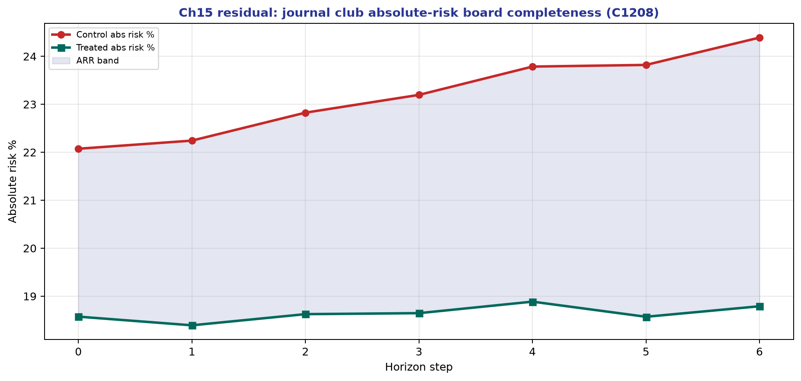

*Teaching figure (synthetic).* Cycle-1208 densify scientific residual (ch15–28).


*Teaching figure (synthetic).* Cycle-1206 densify scientific residual (ch15–28).


*Teaching figure (synthetic).* Cycle-1204 densify scientific residual (ch15–28).


*Teaching figure (synthetic).* Cycle-1202 densify scientific residual (ch15–28).


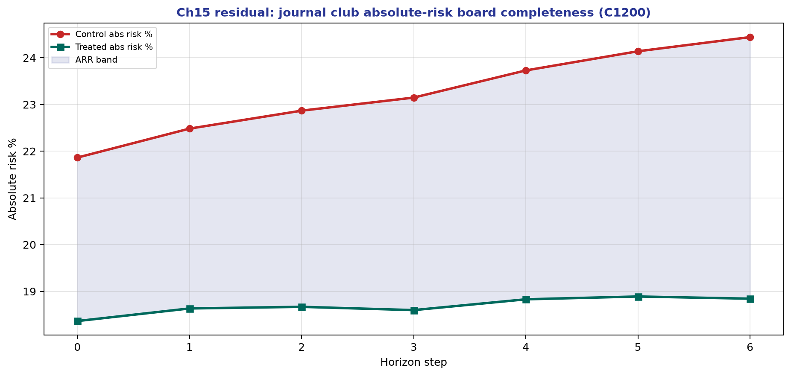

*Teaching figure (synthetic).* Cycle-1200 densify scientific residual (ch15–28).


*Teaching figure (synthetic).* Cycle-1198 densify scientific residual (ch15–28).


*Teaching figure (synthetic).* Cycle-1196 densify scientific residual (ch15–28).


*Teaching figure (synthetic).* Cycle-1194 densify scientific residual (ch15–28).


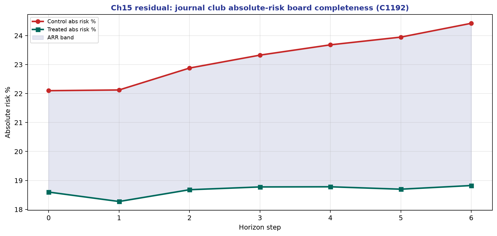

*Teaching figure (synthetic).* Cycle-1192 densify scientific residual (ch15–28).


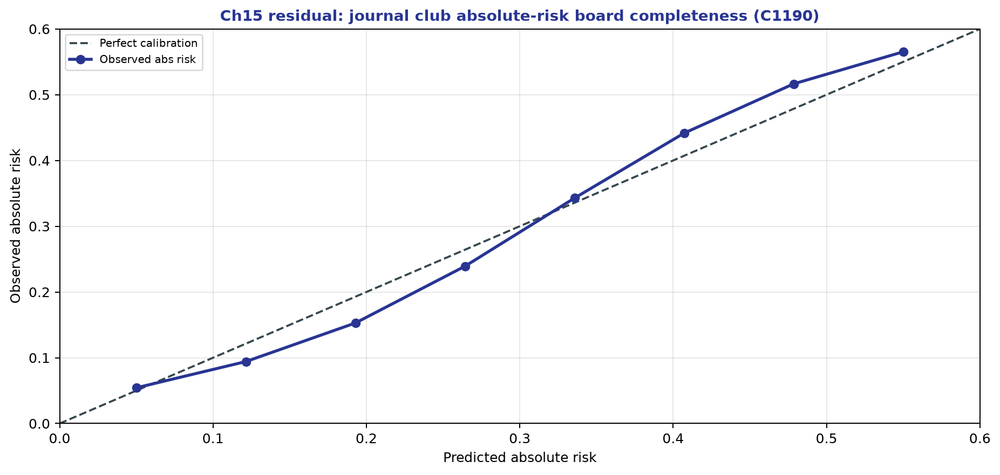

*Teaching figure (synthetic).* Cycle-1190 densify scientific residual (ch15–28).


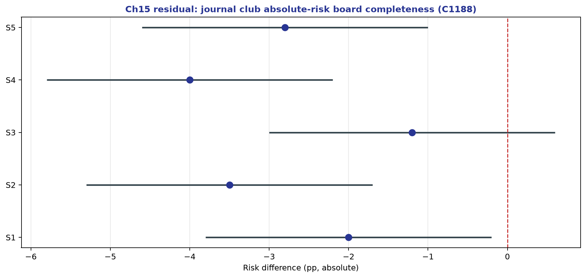

*Teaching figure (synthetic).* Cycle-1188 densify scientific residual (ch15–28).


*Teaching figure (synthetic).* Cycle-1186 densify scientific residual (ch15–28).


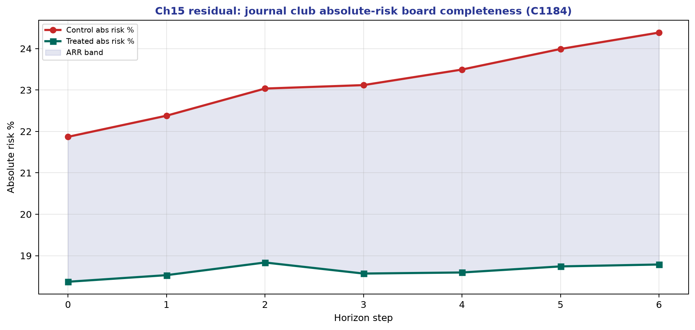

*Teaching figure (synthetic).* Cycle-1184 densify scientific residual (ch15–28).


*Teaching figure (synthetic).* Cycle-1182 densify scientific residual (ch15–28).


*Teaching figure (synthetic).* Cycle-1180 densify scientific residual (ch15–28).


*Teaching figure (synthetic).* Cycle-1178 densify scientific residual (ch15–28).


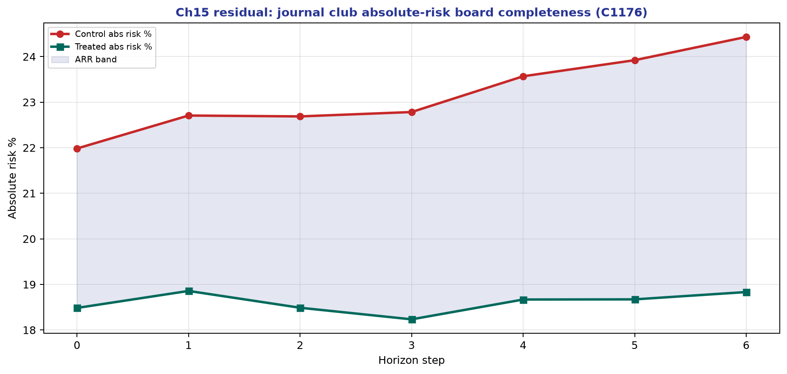

*Teaching figure (synthetic).* Cycle-1176 densify scientific residual (ch15–28).


*Teaching figure (synthetic).* Cycle-1174 densify scientific residual (ch15–28).


*Teaching figure (synthetic).* Cycle-1172 densify scientific residual (ch15–28).


*Teaching figure (synthetic).* Cycle-1170 densify scientific residual (ch15–28).


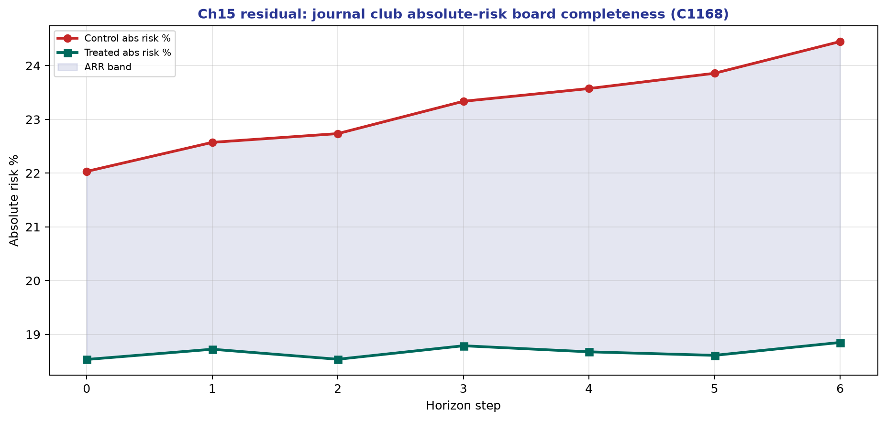

*Teaching figure (synthetic).* Cycle-1168 densify scientific residual (ch15–28).


*Teaching figure (synthetic).* Cycle-1166 densify scientific residual (ch15–28).


*Teaching figure (synthetic).* Cycle-1164 densify scientific residual (ch15–28).


*Teaching figure (synthetic).* Cycle-1162 densify scientific residual (ch15–28).


*Teaching figure (synthetic).* Cycle-1160 densify scientific residual (ch15–28).


*Teaching figure (synthetic).* Cycle-1158 densify scientific residual (ch15–28).


*Teaching figure (synthetic).* Cycle-1156 densify scientific residual (ch15–28).


*Teaching figure (synthetic).* Cycle-1154 densify scientific residual (ch15–28).


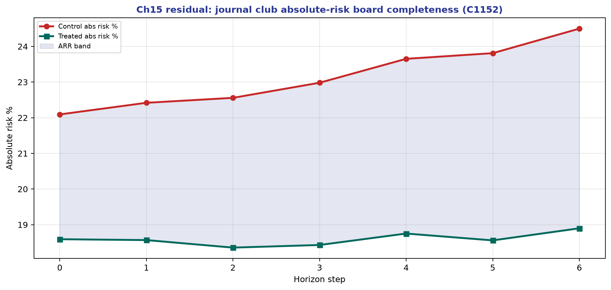

*Teaching figure (synthetic).* Cycle-1152 densify scientific residual (ch15–28).


*Teaching figure (synthetic).* Cycle-1150 densify scientific residual (ch15–28).


*Teaching figure (synthetic).* Cycle-1148 densify scientific residual (ch15–28).


*Teaching figure (synthetic).* Cycle-1146 densify scientific residual (ch15–28).


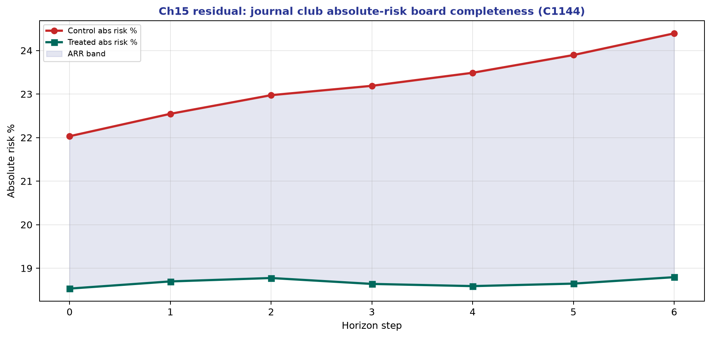

*Teaching figure (synthetic).* Cycle-1144 densify scientific residual (ch15–28).


*Teaching figure (synthetic).* Cycle-1142 densify scientific residual (ch15–28).


*Teaching figure (synthetic).* Cycle-1140 densify scientific residual (ch15–28).


*Teaching figure (synthetic).* Cycle-1138 densify scientific residual (ch15–28).


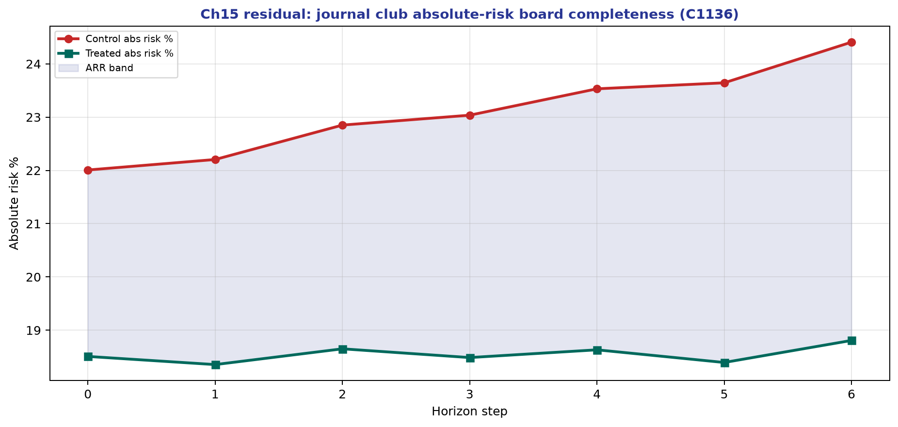

*Teaching figure (synthetic).* Cycle-1136 densify scientific residual (ch15–28).


*Teaching figure (synthetic).* Cycle-1134 densify scientific residual (ch15–28).


*Teaching figure (synthetic).* Cycle-1132 densify scientific residual (ch15–28).


*Teaching figure (synthetic).* Cycle-1130 densify scientific residual (ch15–28).


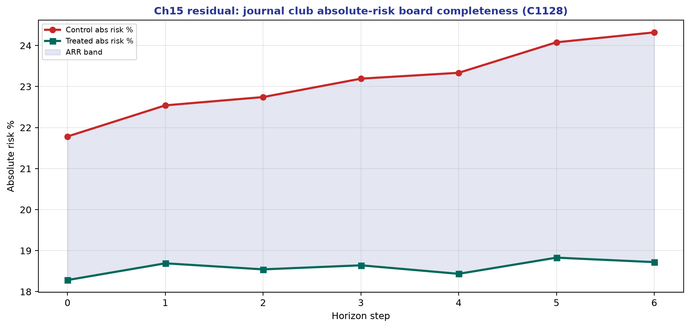

*Teaching figure (synthetic).* Cycle-1128 densify scientific residual (ch15–28).


*Teaching figure (synthetic).* Cycle-1126 densify scientific residual (ch15–28).


*Teaching figure (synthetic).* Cycle-1124 densify scientific residual (ch15–28).


*Teaching figure (synthetic).* Cycle-1122 densify scientific residual (ch15–28).


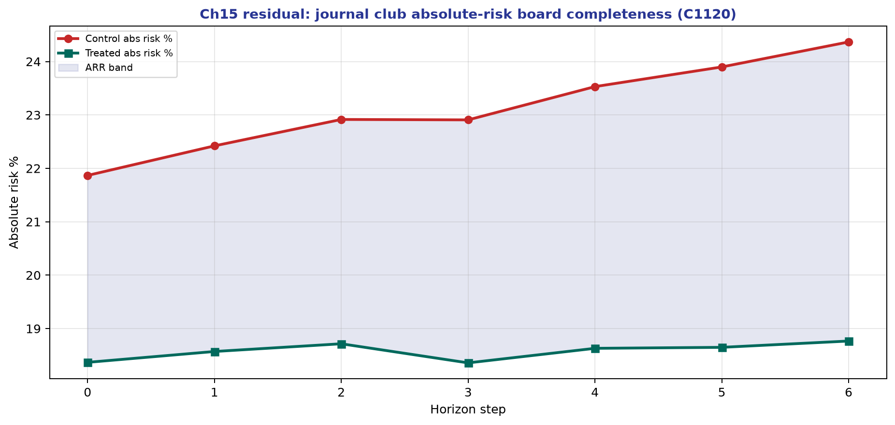

*Teaching figure (synthetic).* Cycle-1120 densify scientific residual (ch15–28).


*Teaching figure (synthetic).* Cycle-1118 densify scientific residual (ch15–28).


*Teaching figure (synthetic).* Cycle-1116 densify scientific residual (ch15–28).


*Teaching figure (synthetic).* Cycle-1114 densify scientific residual (ch15–28).


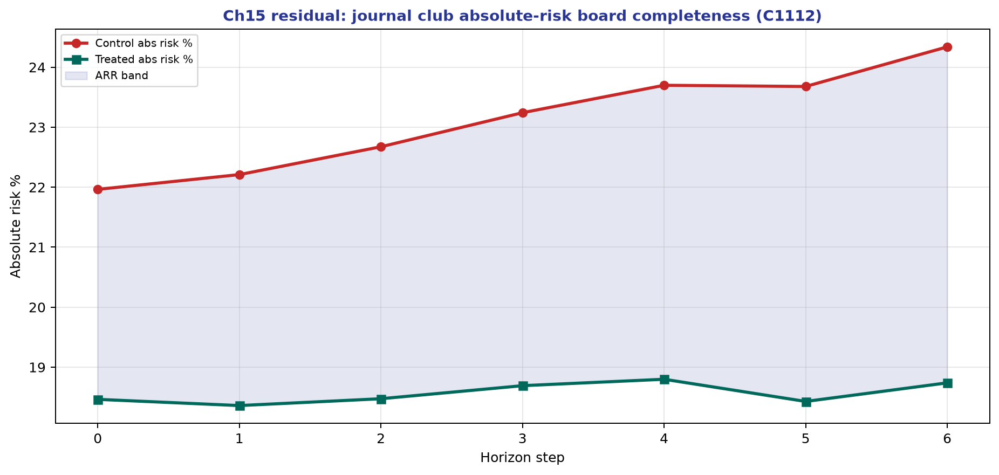

*Teaching figure (synthetic).* Cycle-1112 densify scientific residual (ch15–28).


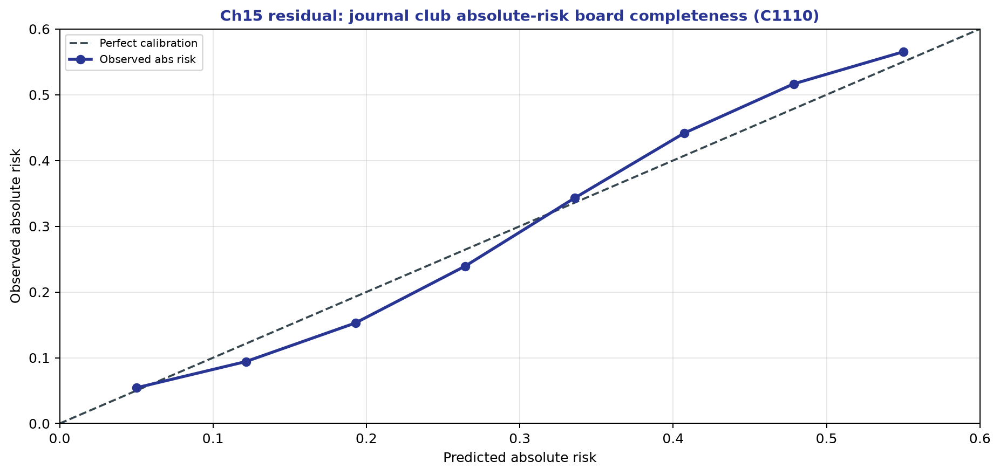

*Teaching figure (synthetic).* Cycle-1110 densify scientific residual (ch15–28).


*Teaching figure (synthetic).* Cycle-1108 densify scientific residual (ch15–28).


*Teaching figure (synthetic).* Cycle-1106 densify scientific residual (ch15–28).


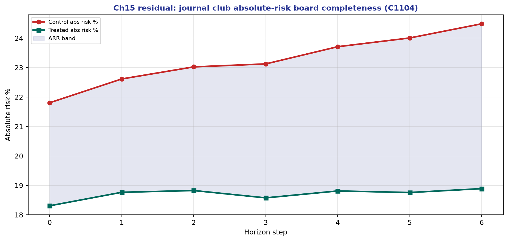

*Teaching figure (synthetic).* Cycle-1104 densify scientific residual (ch15–28).


*Teaching figure (synthetic).* Cycle-1102 densify scientific residual (ch15–28).


*Teaching figure (synthetic).* Cycle-1100 densify scientific residual (ch15–28).


*Teaching figure (synthetic).* Cycle-1098 densify scientific residual (ch15–28).


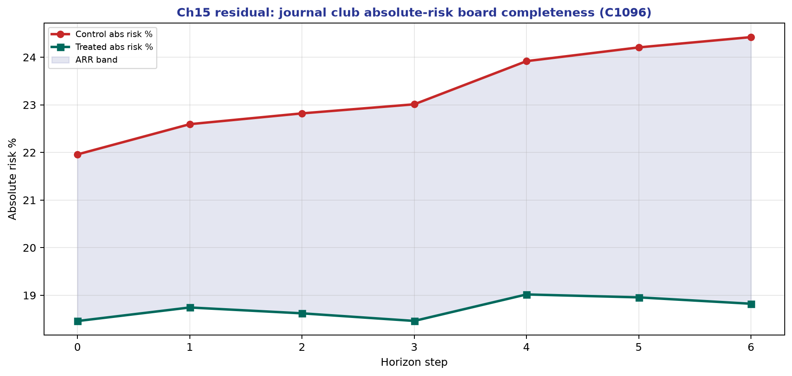

*Teaching figure (synthetic).* Cycle-1096 densify scientific residual (ch15–28).


*Teaching figure (synthetic).* Cycle-1094 densify scientific residual (ch15–28).


*Teaching figure (synthetic).* Cycle-1092 densify scientific residual (ch15–28).


*Teaching figure (synthetic).* Cycle-1090 densify scientific residual (ch15–28).


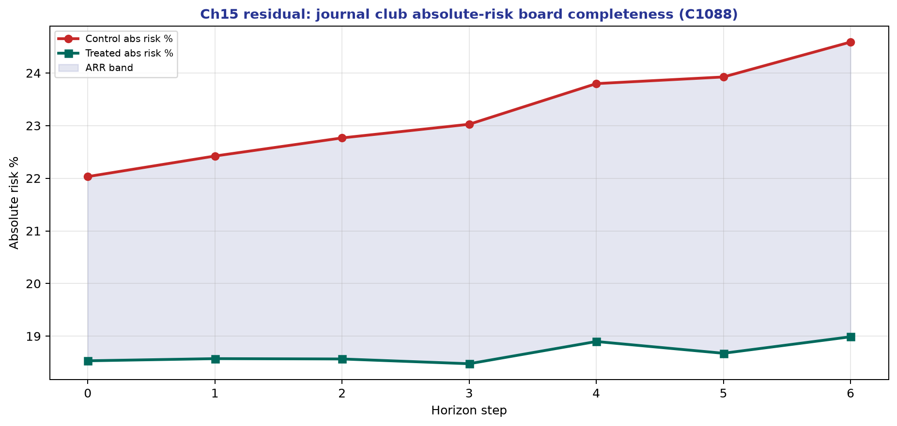

*Teaching figure (synthetic).* Cycle-1088 densify scientific residual (ch15–28).


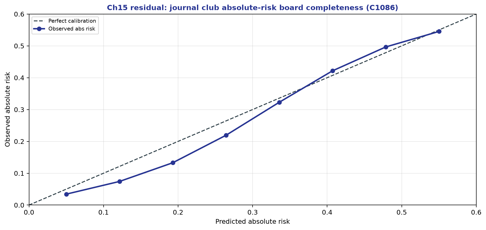

*Teaching figure (synthetic).* Cycle-1086 densify scientific residual (ch15–28).


*Teaching figure (synthetic).* Cycle-1084 densify scientific residual (ch15–28).


*Teaching figure (synthetic).* Cycle-1082 densify scientific residual (ch15–28).


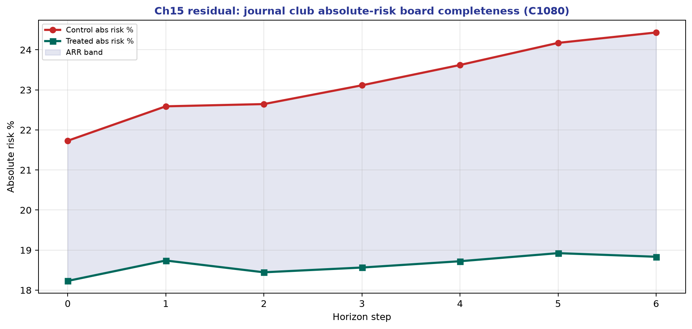

*Teaching figure (synthetic).* Cycle-1080 densify scientific residual (ch15–28).


*Teaching figure (synthetic).* Cycle-1078 densify scientific residual (ch15–28).


*Teaching figure (synthetic).* Cycle-1076 densify scientific residual (ch15–28).


*Teaching figure (synthetic).* Cycle-1074 densify scientific residual (ch15–28).


*Teaching figure (synthetic).* Cycle-1072 densify scientific residual (ch15–28).


*Teaching figure (synthetic).* Cycle-1070 densify scientific residual (ch15–28).


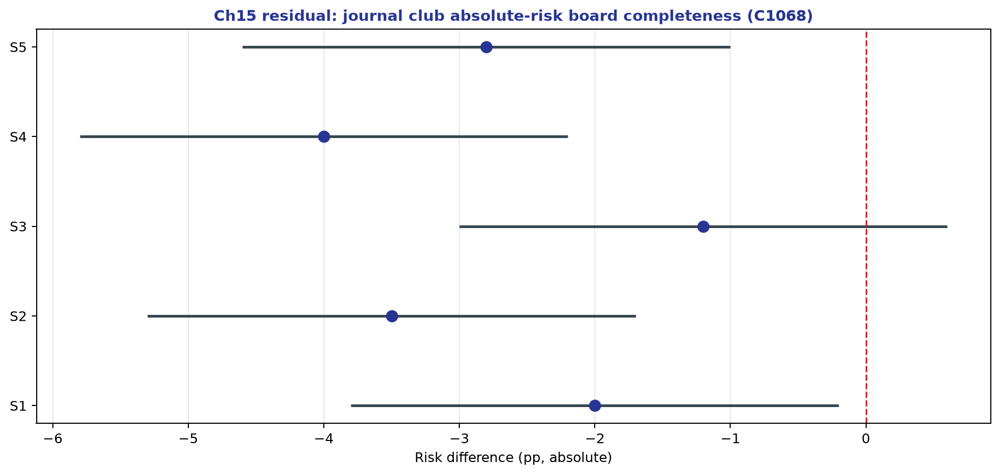

*Teaching figure (synthetic).* Cycle-1068 densify scientific residual (ch15–28).


*Teaching figure (synthetic).* Cycle-1066 densify scientific residual (ch15–28).


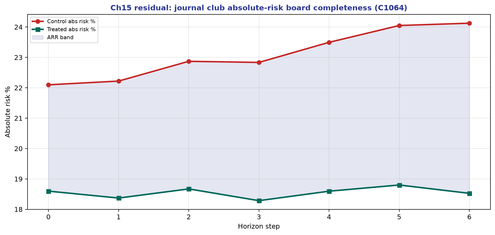

*Teaching figure (synthetic).* Cycle-1064 densify scientific residual (ch15–28).


*Teaching figure (synthetic).* Cycle-1062 densify scientific residual (ch15–28).


*Teaching figure (synthetic).* Cycle-1060 densify scientific residual (ch15–28).


*Teaching figure (synthetic).* Cycle-1058 densify scientific residual (ch15–28).


*Teaching figure (synthetic).* Cycle-1056 densify scientific residual (ch15–28).


*Teaching figure (synthetic).* Cycle-1054 densify scientific residual (ch15–28).


*Teaching figure (synthetic).* Cycle-1052 densify scientific residual (ch15–28).


*Teaching figure (synthetic).* Cycle-1050 densify scientific residual (ch15–28).


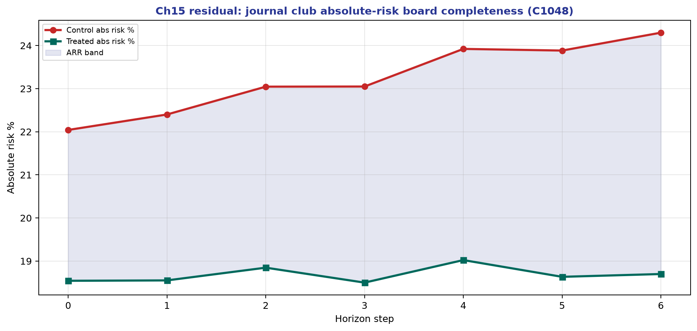

*Teaching figure (synthetic).* Cycle-1048 densify scientific residual (ch15–28).


*Teaching figure (synthetic).* Cycle-1046 densify scientific residual (ch15–28).


*Teaching figure (synthetic).* Cycle-1044 densify scientific residual (ch15–28).


*Teaching figure (synthetic).* Cycle-1042 densify scientific residual (ch15–28).


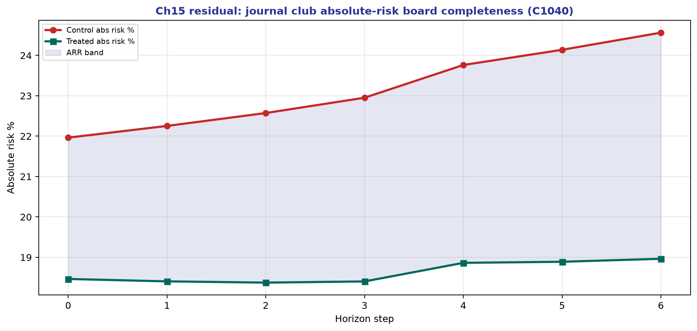

*Teaching figure (synthetic).* Cycle-1040 densify scientific residual (ch15–28).


*Teaching figure (synthetic).* Cycle-1038 densify scientific residual (ch15–28).


*Teaching figure (synthetic).* Cycle-1036 densify scientific residual (ch15–28).


*Teaching figure (synthetic).* Cycle-1034 densify scientific residual (ch15–28).


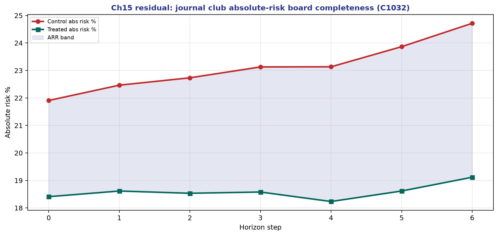

*Teaching figure (synthetic).* Cycle-1032 densify scientific residual (ch15–28).


*Teaching figure (synthetic).* Cycle-1030 densify scientific residual (ch15–28).


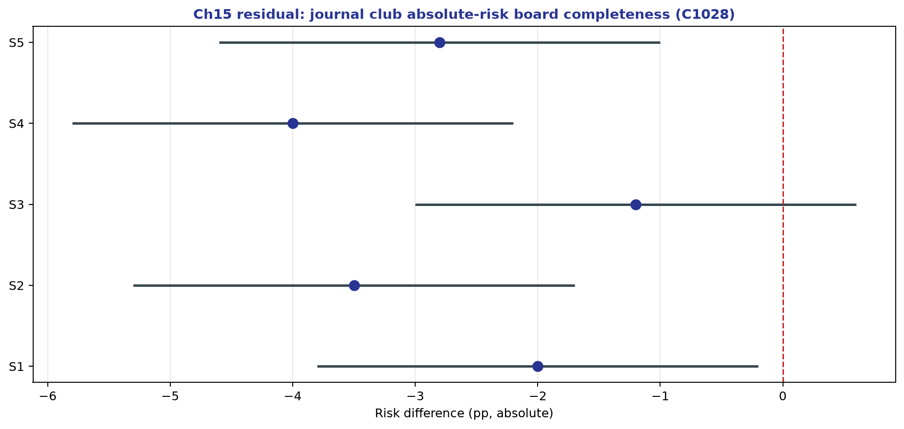

*Teaching figure (synthetic).* Cycle-1028 densify scientific residual (ch15–28).


*Teaching figure (synthetic).* Cycle-1026 densify scientific residual (ch15–28).


*Teaching figure (synthetic).* Cycle-1024 densify scientific residual (ch15–28).


*Teaching figure (synthetic).* Cycle-1022 densify scientific residual (ch15–28).


*Teaching figure (synthetic).* Cycle-1020 densify scientific residual (ch15–28).


*Teaching figure (synthetic).* Cycle-1018 densify scientific residual (ch15–28).


*Teaching figure (synthetic).* Cycle-1016 densify scientific residual (ch15–28).


*Teaching figure (synthetic).* Cycle-1014 densify scientific residual (ch15–28).


*Teaching figure (synthetic).* Cycle-1012 densify scientific residual (ch15–28).


*Teaching figure (synthetic).* Cycle-1010 densify scientific residual (ch15–28).


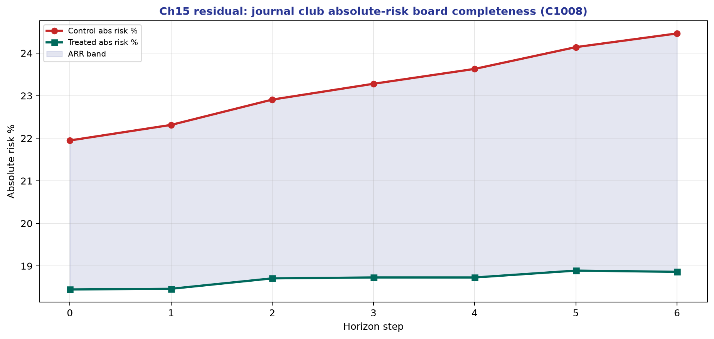

*Teaching figure (synthetic).* Cycle-1008 densify scientific residual (ch15–28).


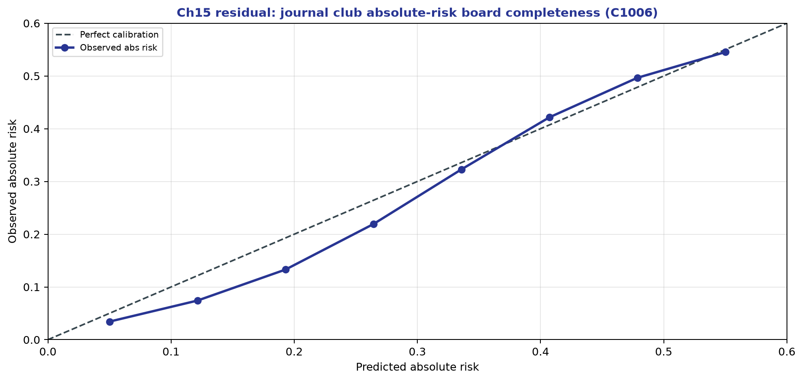

*Teaching figure (synthetic).* Cycle-1006 densify scientific residual (ch15–28).


*Teaching figure (synthetic).* Cycle-1004 densify scientific residual (ch15–28).


*Teaching figure (synthetic).* Cycle-1002 densify scientific residual (ch15–28).


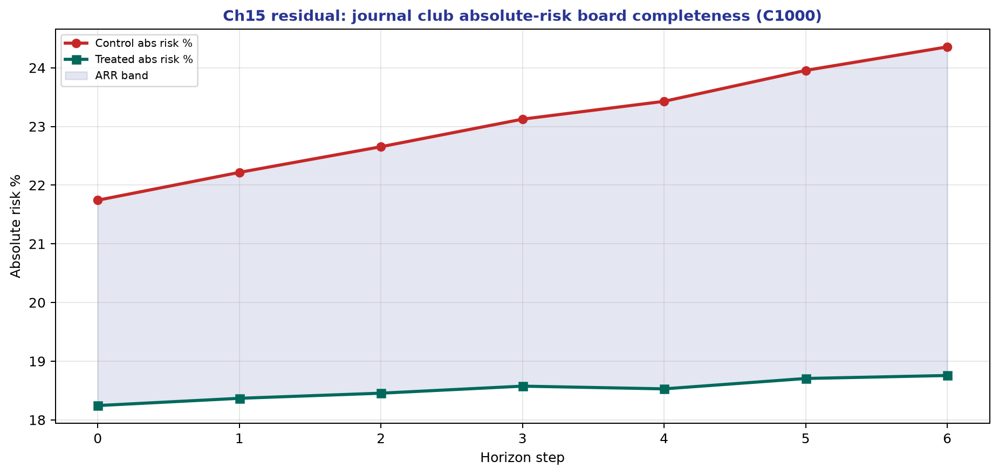

*Teaching figure (synthetic).* Cycle-1000 densify scientific residual (ch15–28).


*Teaching figure (synthetic).* Cycle-998 densify scientific residual (ch15–28).


*Teaching figure (synthetic).* Cycle-996 densify scientific residual (ch15–28).


*Teaching figure (synthetic).* Cycle-994 densify scientific residual (ch15–28).


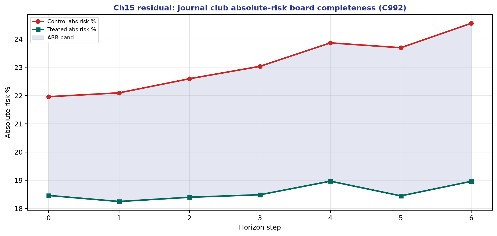

*Teaching figure (synthetic).* Cycle-992 densify scientific residual (ch15–28).


*Teaching figure (synthetic).* Cycle-990 densify scientific residual (ch15–28).


*Teaching figure (synthetic).* Cycle-988 densify scientific residual (ch15–28).


*Teaching figure (synthetic).* Cycle-986 densify scientific residual (ch15–28).


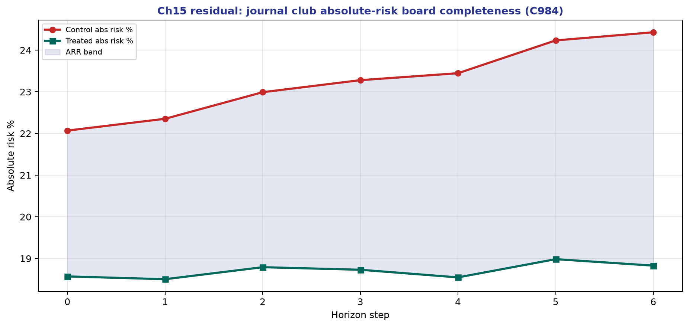

*Teaching figure (synthetic).* Cycle-984 densify scientific residual (ch15–28).


*Teaching figure (synthetic).* Cycle-982 densify scientific residual (ch15–28).


*Teaching figure (synthetic).* Cycle-980 densify scientific residual (ch15–28).


*Teaching figure (synthetic).* Cycle-978 densify scientific residual (ch15–28).


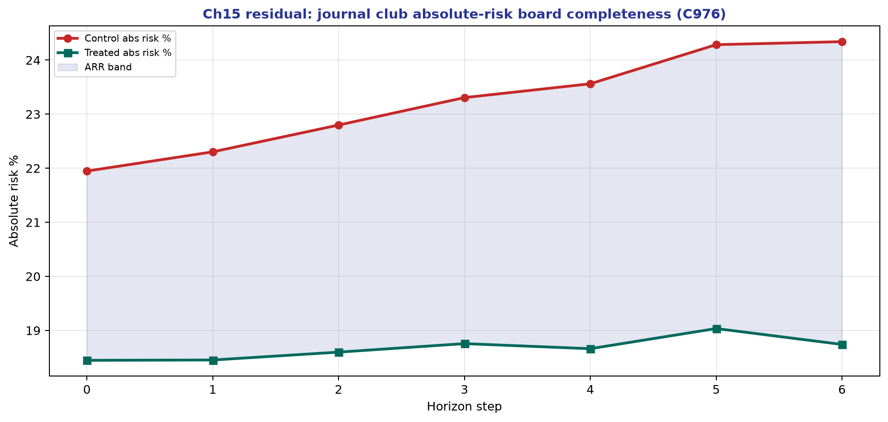

*Teaching figure (synthetic).* Cycle-976 densify scientific residual (ch15–28).


*Teaching figure (synthetic).* Cycle-974 densify scientific residual (ch15–28).


*Teaching figure (synthetic).* Cycle-972 densify scientific residual (ch15–28).


*Teaching figure (synthetic).* Cycle-970 densify scientific residual (ch15–28).


*Teaching figure (synthetic).* Cycle-968 densify scientific residual (ch15–28).


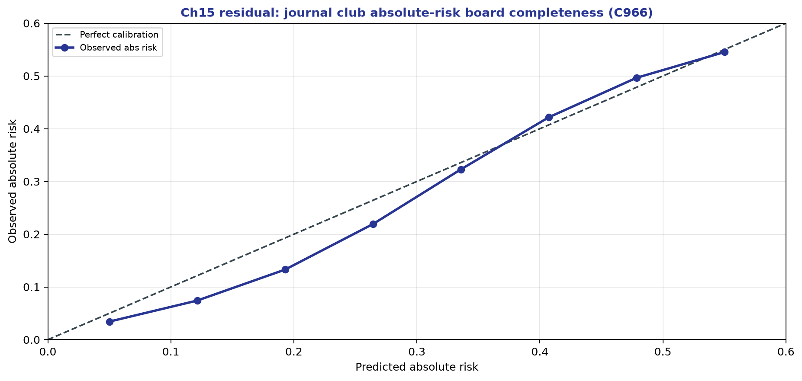

*Teaching figure (synthetic).* Cycle-966 densify scientific residual (ch15–28).


*Teaching figure (synthetic).* Cycle-964 densify scientific residual (ch15–28).


*Teaching figure (synthetic).* Cycle-962 densify scientific residual (ch15–28).


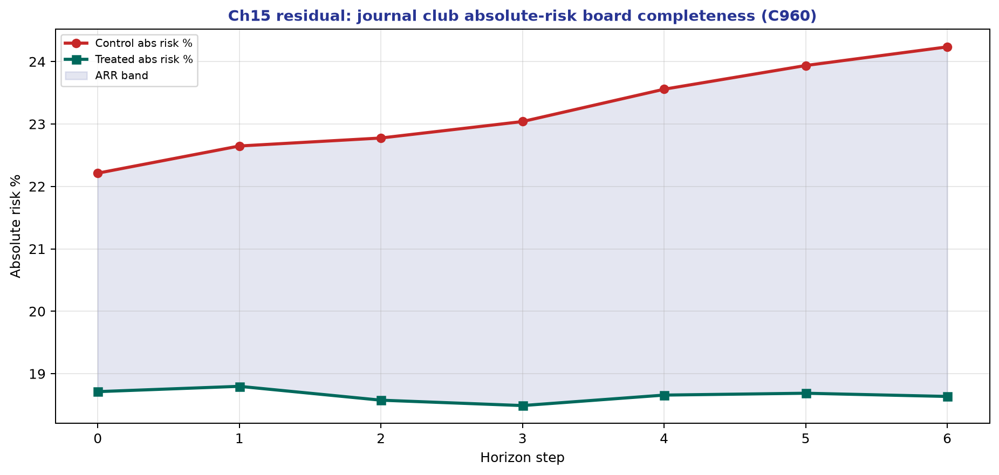

*Teaching figure (synthetic).* Cycle-960 densify scientific residual (ch15–28).


*Teaching figure (synthetic).* Cycle-958 densify scientific residual (ch15–28).


*Teaching figure (synthetic).* Cycle-956 densify scientific residual (ch15–28).


*Teaching figure (synthetic).* Cycle-954 densify scientific residual (ch15–28).


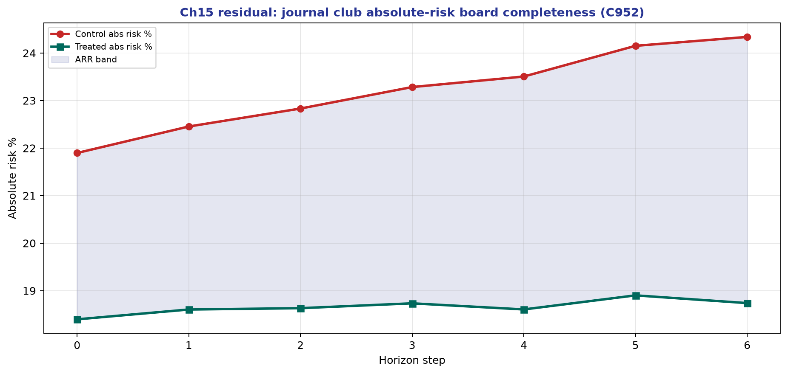

*Teaching figure (synthetic).* Cycle-952 densify scientific residual (ch15–28).


*Teaching figure (synthetic).* Cycle-950 densify scientific residual (ch15–28).


*Teaching figure (synthetic).* Cycle-948 densify scientific residual (ch15–28).


*Teaching figure (synthetic).* Cycle-946 densify scientific residual (ch15–28).


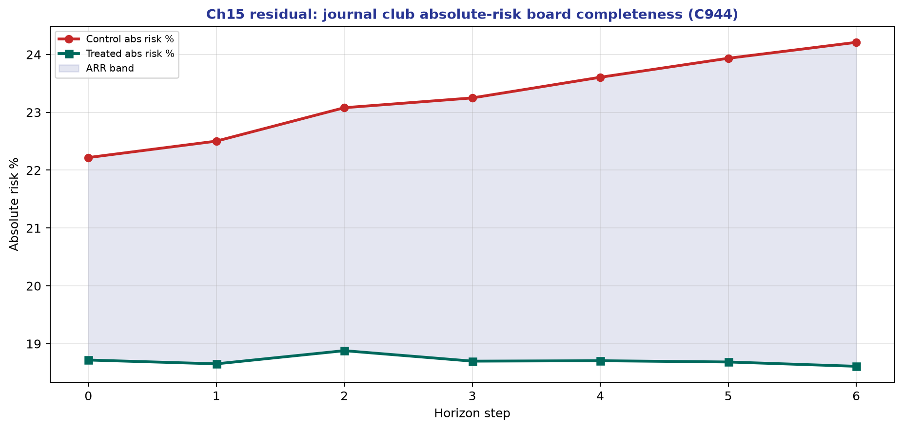

*Teaching figure (synthetic).* Cycle-944 densify scientific residual (ch15–28).


*Teaching figure (synthetic).* Cycle-942 densify scientific residual (ch15–28).


*Teaching figure (synthetic).* Cycle-940 densify scientific residual (ch15–28).


*Teaching figure (synthetic).* Cycle-938 densify scientific residual (ch15–28).


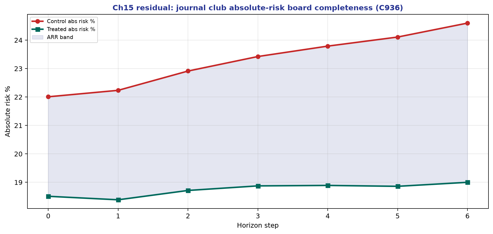

*Teaching figure (synthetic).* Cycle-936 densify scientific residual (ch15–28).


*Teaching figure (synthetic).* Cycle-934 densify scientific residual (ch15–28).


*Teaching figure (synthetic).* Cycle-932 densify scientific residual (ch15–28).


*Teaching figure (synthetic).* Cycle-930 densify scientific residual (ch15–28).


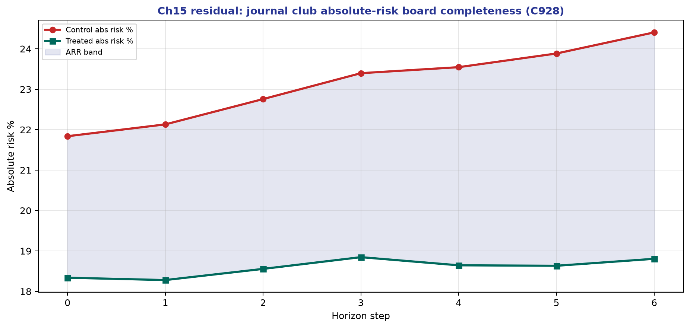

*Teaching figure (synthetic).* Cycle-928 densify scientific residual (ch15–28).


*Teaching figure (synthetic).* Cycle-926 densify scientific residual (ch15–28).


*Teaching figure (synthetic).* Cycle-924 densify scientific residual (ch15–28).


*Teaching figure (synthetic).* Cycle-922 densify scientific residual (ch15–28).


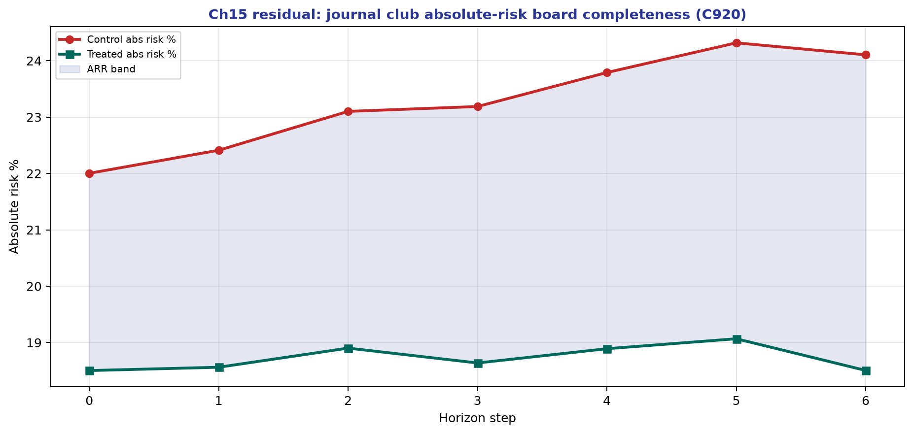

*Teaching figure (synthetic).* Cycle-920 densify scientific residual (ch15–28).


*Teaching figure (synthetic).* Cycle-918 densify scientific residual (ch15–28).


*Teaching figure (synthetic).* Cycle-916 densify scientific residual (ch15–28).


*Teaching figure (synthetic).* Cycle-914 densify scientific residual (ch15–28).


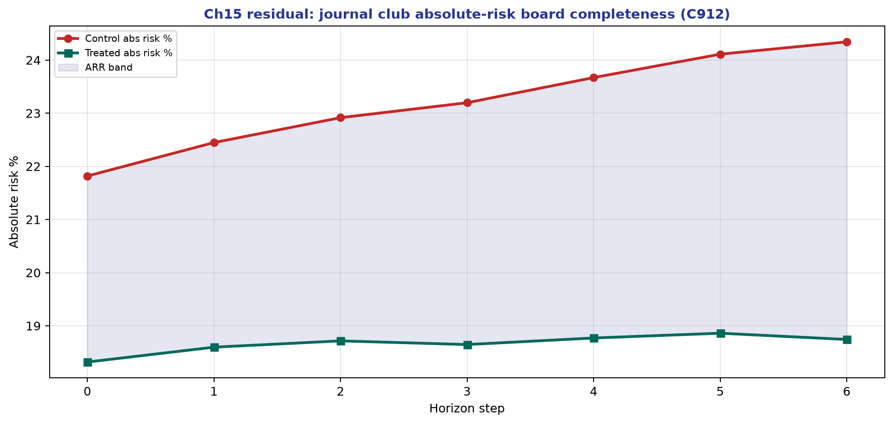

*Teaching figure (synthetic).* Cycle-912 densify scientific residual (ch15–28).


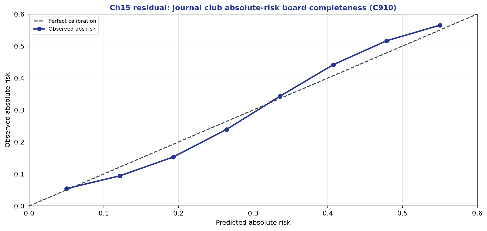

*Teaching figure (synthetic).* Cycle-910 densify scientific residual (ch15–28).


*Teaching figure (synthetic).* Cycle-908 densify scientific residual (ch15–28).


*Teaching figure (synthetic).* Cycle-906 densify scientific residual (ch15–28).


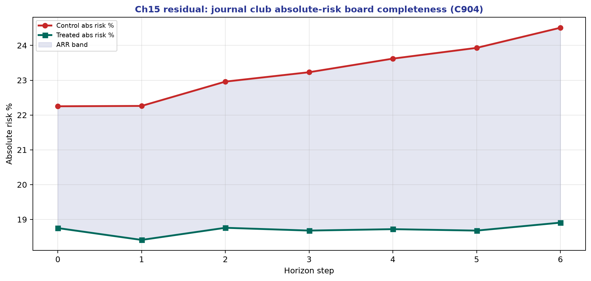

*Teaching figure (synthetic).* Cycle-904 densify scientific residual (ch15–28).


*Teaching figure (synthetic).* Cycle-902 densify scientific residual (ch15–28).


*Teaching figure (synthetic).* Cycle-900 densify scientific residual (ch15–28).


*Teaching figure (synthetic).* Cycle-898 densify scientific residual (ch15–28).


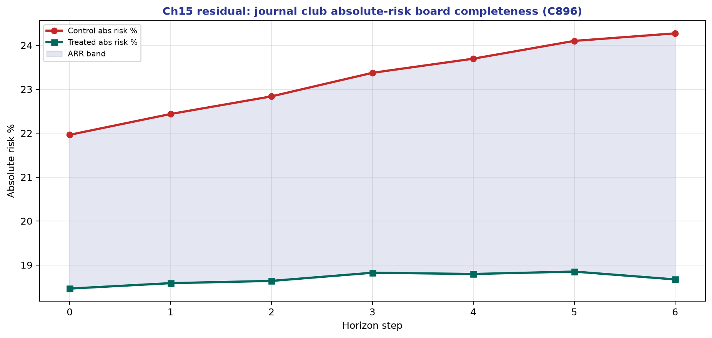

*Teaching figure (synthetic).* Cycle-896 densify scientific residual (ch15–28).


*Teaching figure (synthetic).* Cycle-894 densify scientific residual (ch15–28).


*Teaching figure (synthetic).* Cycle-892 densify scientific residual (ch15–28).


*Teaching figure (synthetic).* Cycle-890 densify scientific residual (ch15–28).


*Teaching figure (synthetic).* Cycle-888 densify scientific residual (ch15–28).


*Teaching figure (synthetic).* Cycle-886 densify scientific residual (ch15–28).


*Teaching figure (synthetic).* Cycle-884 densify scientific residual (ch15–28).


*Teaching figure (synthetic).* Cycle-882 densify scientific residual (ch15–28).


*Teaching figure (synthetic).* Cycle-880 densify scientific residual (ch15–28).


*Teaching figure (synthetic).* Cycle-878 densify scientific residual (ch15–28).


*Teaching figure (synthetic).* Cycle-876 densify scientific residual (ch15–28).


*Teaching figure (synthetic).* Cycle-874 densify scientific residual (ch15–28).


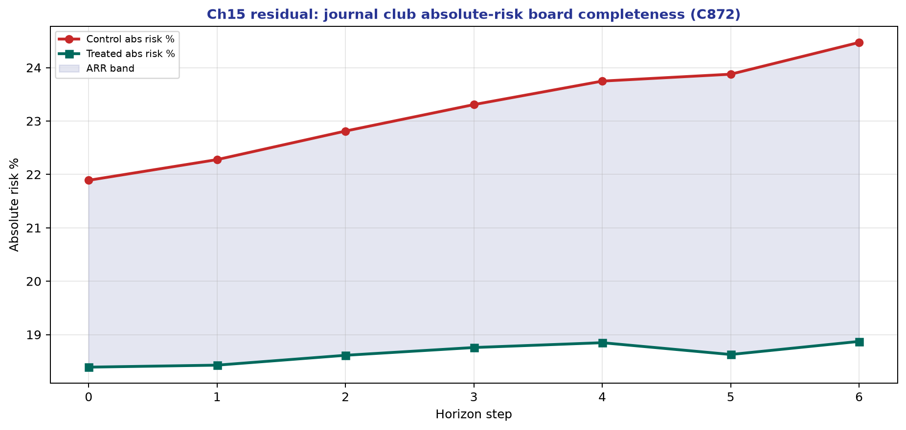

*Teaching figure (synthetic).* Cycle-872 densify scientific residual (ch15–28).


*Teaching figure (synthetic).* Cycle-870 densify scientific residual (ch15–28).


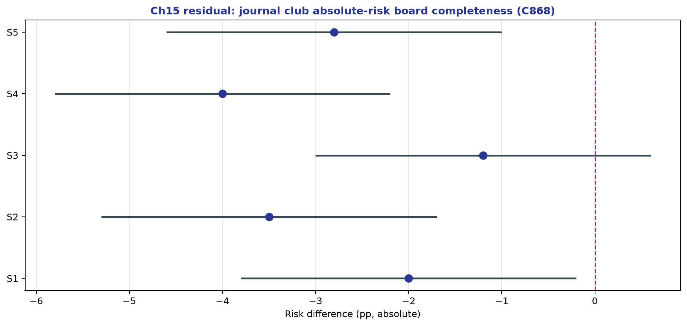

*Teaching figure (synthetic).* Cycle-868 densify scientific residual (ch15–28).


*Teaching figure (synthetic).* Cycle-866 densify scientific residual (ch15–28).


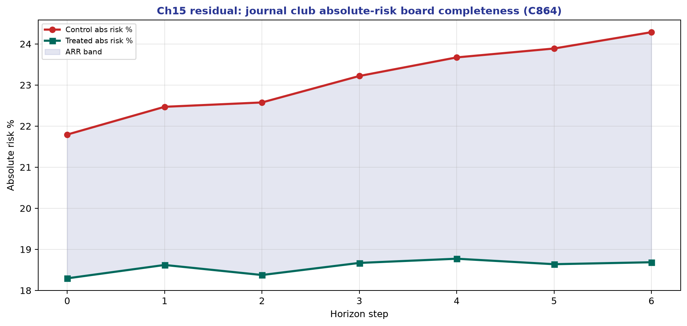

*Teaching figure (synthetic).* Cycle-864 densify scientific residual (ch15–28).


*Teaching figure (synthetic).* Cycle-862 densify scientific residual (ch15–28).


*Teaching figure (synthetic).* Cycle-860 densify scientific residual (ch15–28).


*Teaching figure (synthetic).* Cycle-858 densify scientific residual (ch15–28).


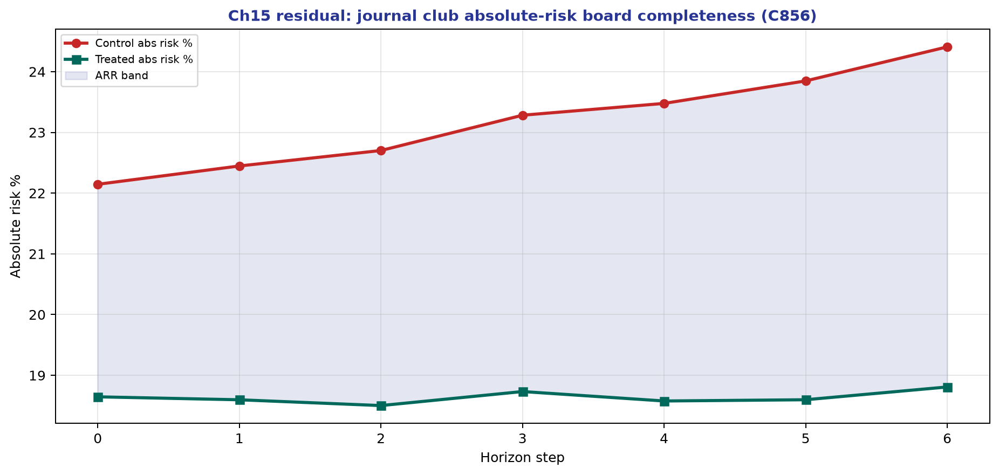

*Teaching figure (synthetic).* Cycle-856 densify scientific residual (ch15–28).


*Teaching figure (synthetic).* Cycle-854 densify scientific residual (ch15–28).


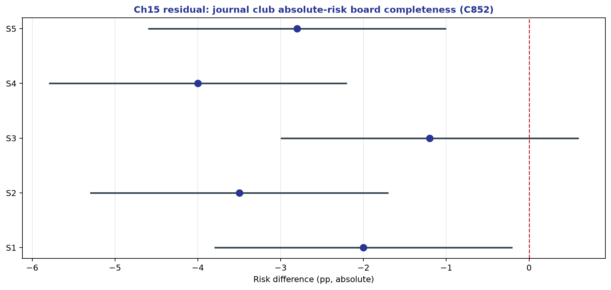

*Teaching figure (synthetic).* Cycle-852 densify scientific residual (ch15–28).


*Teaching figure (synthetic).* Cycle-850 densify scientific residual (ch15–28).


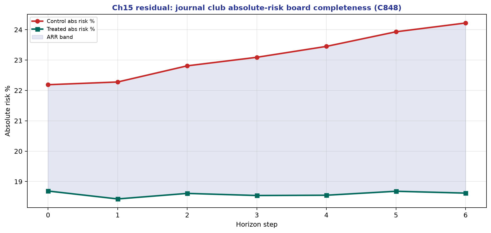

*Teaching figure (synthetic).* Cycle-848 densify scientific residual (ch15–28).


*Teaching figure (synthetic).* Cycle-846 densify scientific residual (ch15–28).


*Teaching figure (synthetic).* Cycle-844 densify scientific residual (ch15–28).


*Teaching figure (synthetic).* Cycle-842 densify scientific residual (ch15–28).


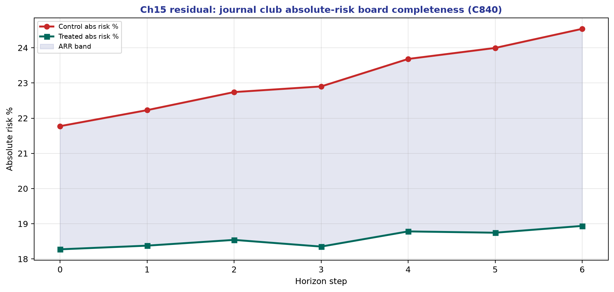

*Teaching figure (synthetic).* Cycle-840 densify scientific residual (ch15–28).


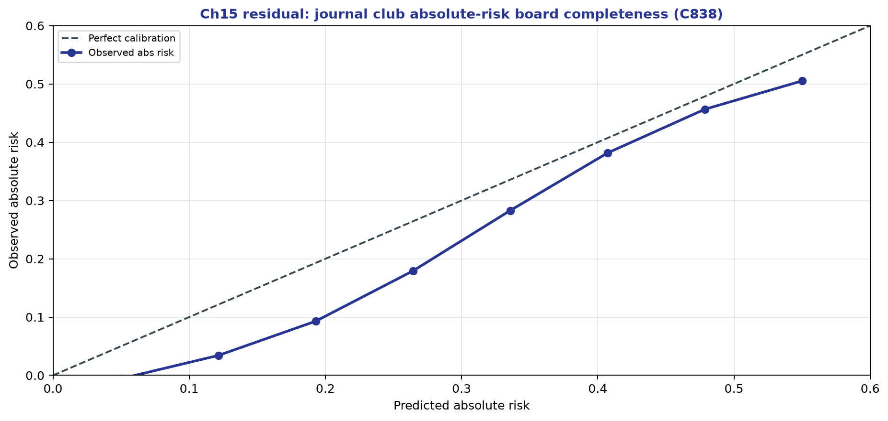

*Teaching figure (synthetic).* Cycle-838 densify scientific residual (ch15–28).


*Teaching figure (synthetic).* Cycle-836 densify scientific residual (ch15–28).


*Teaching figure (synthetic).* Cycle-834 densify scientific residual (ch15–28).


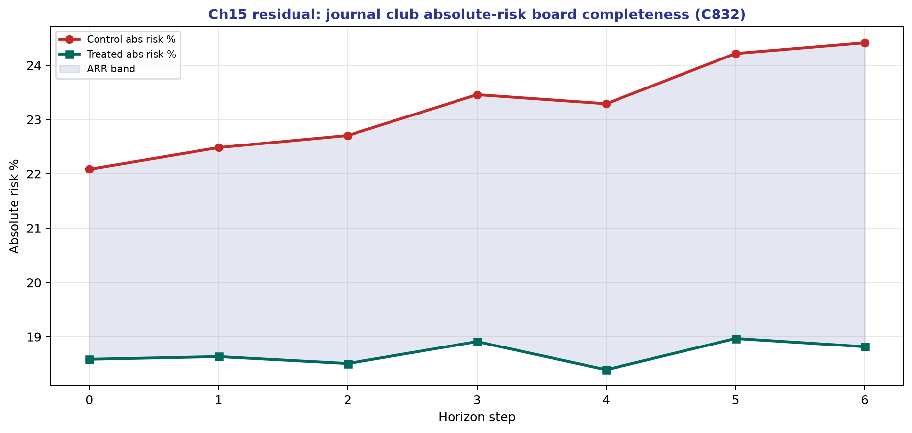

*Teaching figure (synthetic).* Cycle-832 densify scientific residual (ch15–28).


*Teaching figure (synthetic).* Cycle-830 densify scientific residual (ch15–28).


*Teaching figure (synthetic).* Cycle-828 densify scientific residual (ch15–28).


*Teaching figure (synthetic).* Cycle-826 densify scientific residual (ch15–28).


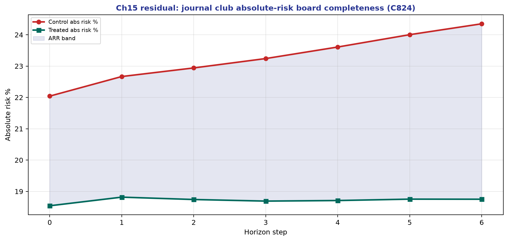

*Teaching figure (synthetic).* Cycle-824 densify scientific residual (ch15–28).


*Teaching figure (synthetic).* Cycle-822 densify scientific residual (ch15–28).


*Teaching figure (synthetic).* Cycle-820 densify scientific residual (ch15–28).


*Teaching figure (synthetic).* Cycle-818 densify scientific residual (ch15–28).


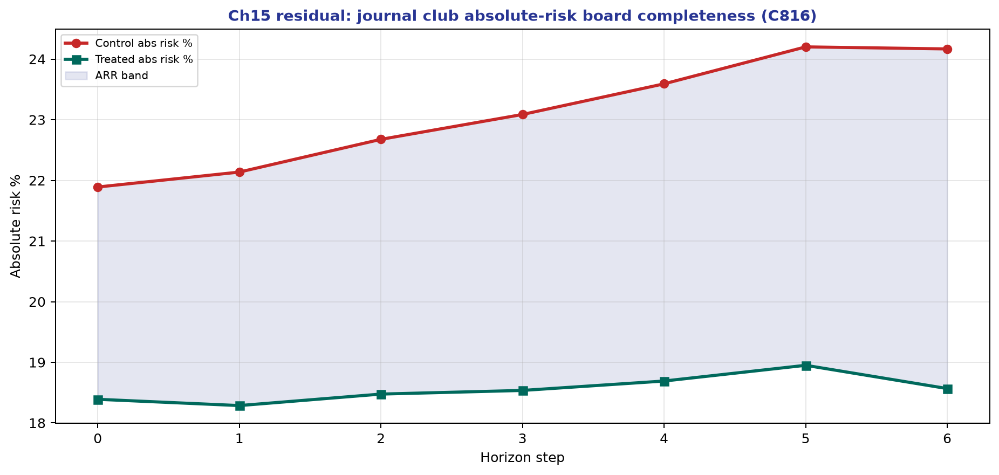

*Teaching figure (synthetic).* Cycle-816 densify scientific residual (ch15–28).


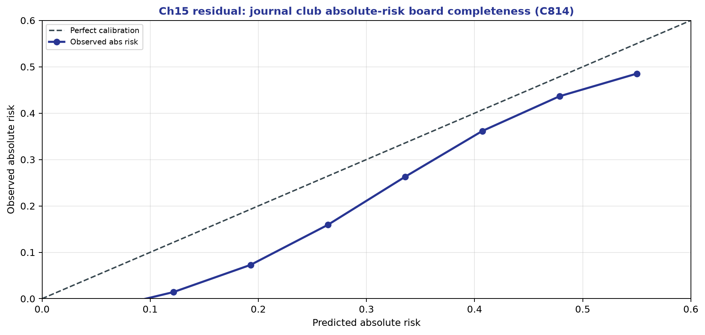

*Teaching figure (synthetic).* Cycle-814 densify scientific residual (ch15–28).


*Teaching figure (synthetic).* Cycle-812 densify scientific residual (ch15–28).


*Teaching figure (synthetic).* Cycle-810 densify scientific residual (ch15–28).


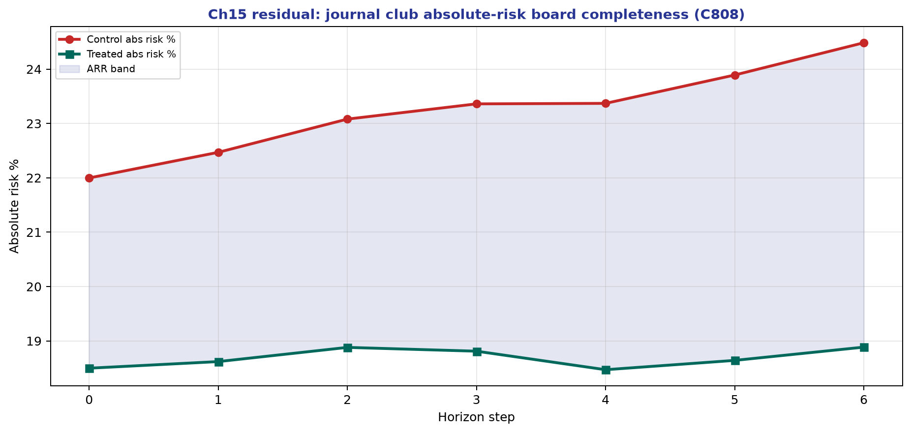

*Teaching figure (synthetic).* Cycle-808 densify scientific residual (ch15–28).


*Teaching figure (synthetic).* Cycle-806 densify scientific residual (ch15–28).


*Teaching figure (synthetic).* Cycle-804 densify scientific residual (ch15–28).


*Teaching figure (synthetic).* Cycle-802 densify scientific residual (ch15–28).


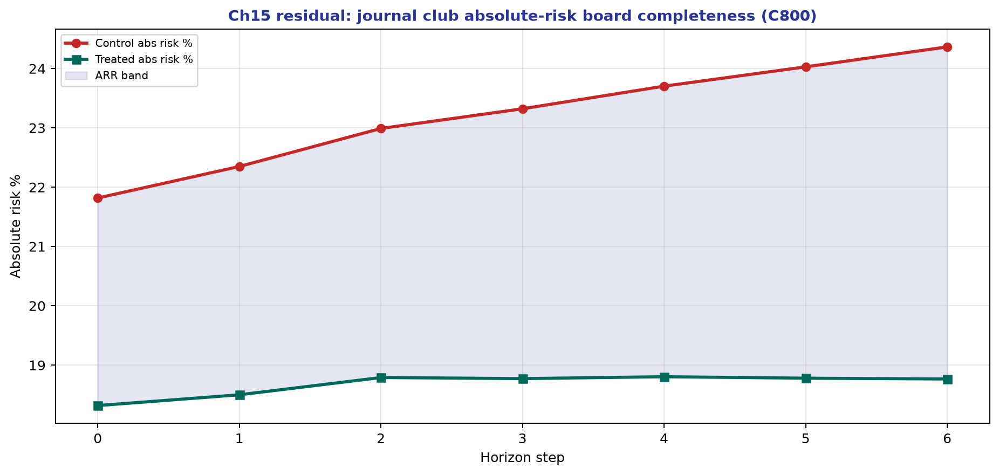

*Teaching figure (synthetic).* Cycle-800 densify scientific residual (ch15–28).


*Teaching figure (synthetic).* Cycle-798 densify scientific residual (ch15–28).


*Teaching figure (synthetic).* Cycle-796 densify scientific residual (ch15–28).


*Teaching figure (synthetic).* Cycle-794 densify scientific residual (ch15–28).


*Teaching figure (synthetic).* Cycle-792 densify scientific residual (ch15–28).


*Teaching figure (synthetic).* Cycle-790 densify scientific residual (ch15–28).


*Teaching figure (synthetic).* Cycle-788 densify scientific residual (ch15–28).


*Teaching figure (synthetic).* Cycle-786 densify scientific residual (ch15–28).


*Teaching figure (synthetic).* Cycle-784 densify scientific residual (ch15–28).


*Teaching figure (synthetic).* Cycle-782 densify scientific residual (ch15–28).


*Teaching figure (synthetic).* Cycle-780 densify scientific residual (ch15–28).


*Teaching figure (synthetic).* Cycle-778 densify scientific residual (ch15–28).


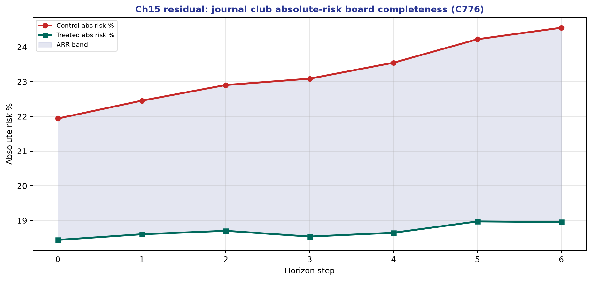

*Teaching figure (synthetic).* Cycle-776 densify scientific residual (ch15–28).


*Teaching figure (synthetic).* Cycle-774 densify scientific residual (ch15–28).


*Teaching figure (synthetic).* Cycle-772 densify scientific residual (ch15–28).


*Teaching figure (synthetic).* Cycle-770 densify scientific residual (ch15–28).


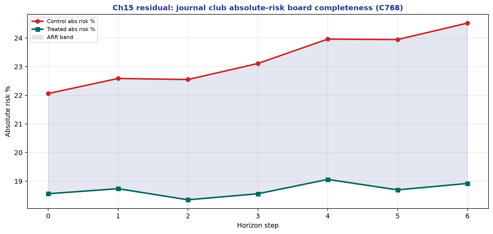

*Teaching figure (synthetic).* Cycle-768 densify scientific residual (ch15–28).


*Teaching figure (synthetic).* Cycle-766 densify scientific residual (ch15–28).


*Teaching figure (synthetic).* Cycle-764 densify scientific residual (ch15–28).


*Teaching figure (synthetic).* Cycle-762 densify scientific residual (ch15–28).


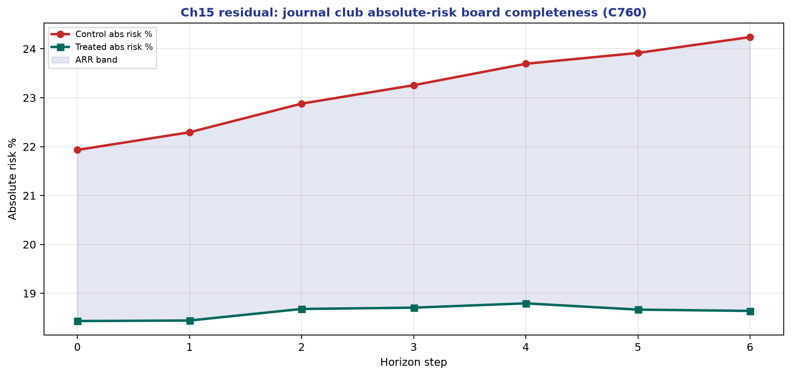

*Teaching figure (synthetic).* Cycle-760 densify scientific residual (ch15–28).


*Teaching figure (synthetic).* Cycle-758 densify scientific residual (ch15–28).


*Teaching figure (synthetic).* Cycle-756 densify scientific residual (ch15–28).


*Teaching figure (synthetic).* Cycle-754 densify scientific residual (ch15–28).


*Teaching figure (synthetic).* Cycle-752 densify scientific residual (ch15–28).


*Teaching figure (synthetic).* Cycle-750 densify scientific residual (ch15–28).


*Teaching figure (synthetic).* Cycle-748 densify scientific residual (ch15–28).


*Teaching figure (synthetic).* Cycle-746 densify scientific residual (ch15–28).


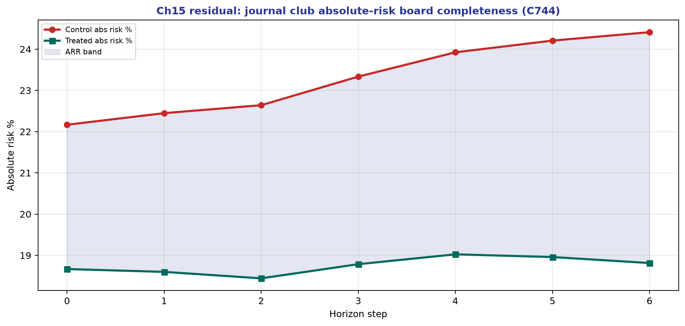

*Teaching figure (synthetic).* Cycle-744 densify scientific residual (ch15–28).


*Teaching figure (synthetic).* Cycle-742 densify scientific residual (ch15–28).


*Teaching figure (synthetic).* Cycle-740 densify scientific residual (ch15–28).


*Teaching figure (synthetic).* Cycle-738 densify scientific residual (ch15–28).


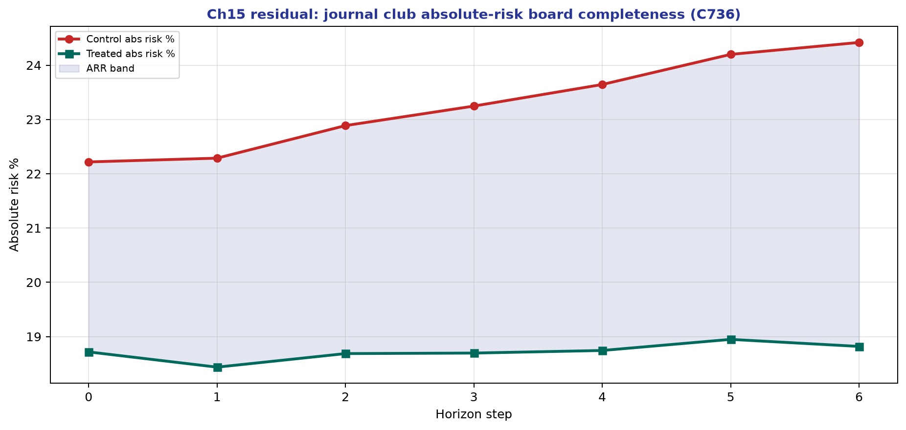

*Teaching figure (synthetic).* Cycle-736 densify scientific residual (ch15–28).


*Teaching figure (synthetic).* Cycle-734 densify scientific residual (ch15–28).


*Teaching figure (synthetic).* Cycle-732 densify scientific residual (ch15–28).


*Teaching figure (synthetic).* Cycle-730 densify scientific residual (ch15–28).


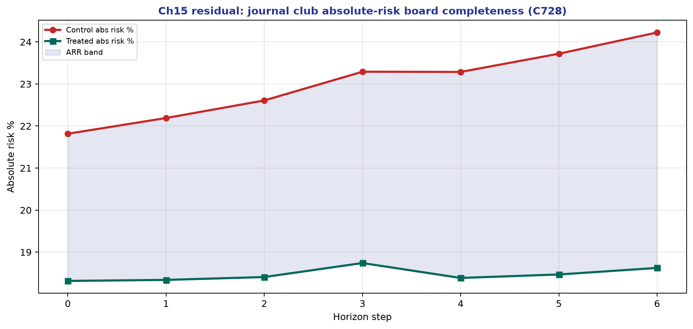

*Teaching figure (synthetic).* Cycle-728 densify scientific residual (ch15–28).


*Teaching figure (synthetic).* Cycle-726 densify scientific residual (ch15–28).


*Teaching figure (synthetic).* Cycle-724 densify scientific residual (ch15–28).


*Teaching figure (synthetic).* Cycle-722 densify scientific residual (ch15–28).


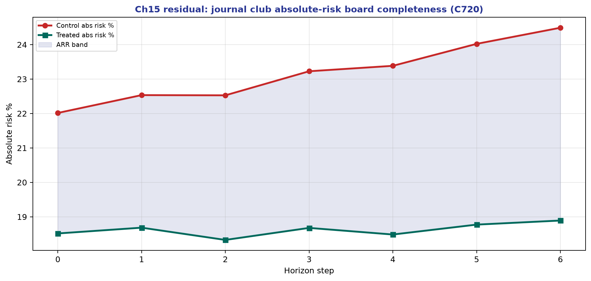

*Teaching figure (synthetic).* Cycle-720 densify scientific residual (ch15–28).


*Teaching figure (synthetic).* Cycle-718 densify scientific residual (ch15–28).


*Teaching figure (synthetic).* Cycle-716 densify scientific residual (ch15–28).


*Teaching figure (synthetic).* Cycle-714 densify scientific residual (ch15–28).


*Teaching figure (synthetic).* Cycle-712 densify scientific residual (ch15–28).


*Teaching figure (synthetic).* Cycle-710 densify scientific residual (ch15–28).


*Teaching figure (synthetic).* Cycle-708 densify scientific residual (ch15–28).


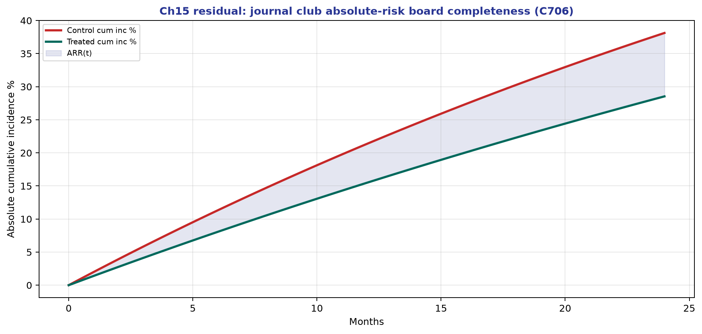

*Teaching figure (synthetic).* Cycle-706 densify scientific residual (ch15–28).


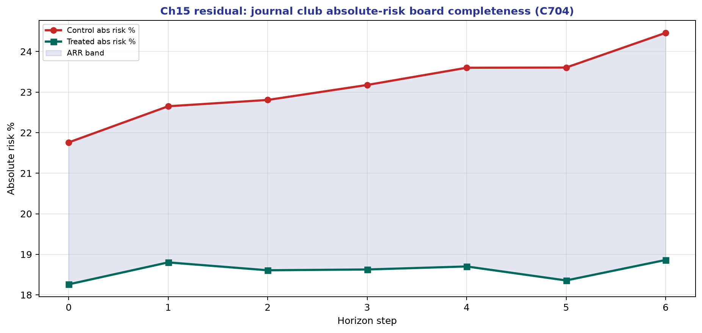

*Teaching figure (synthetic).* Cycle-704 densify scientific residual (ch15–28).


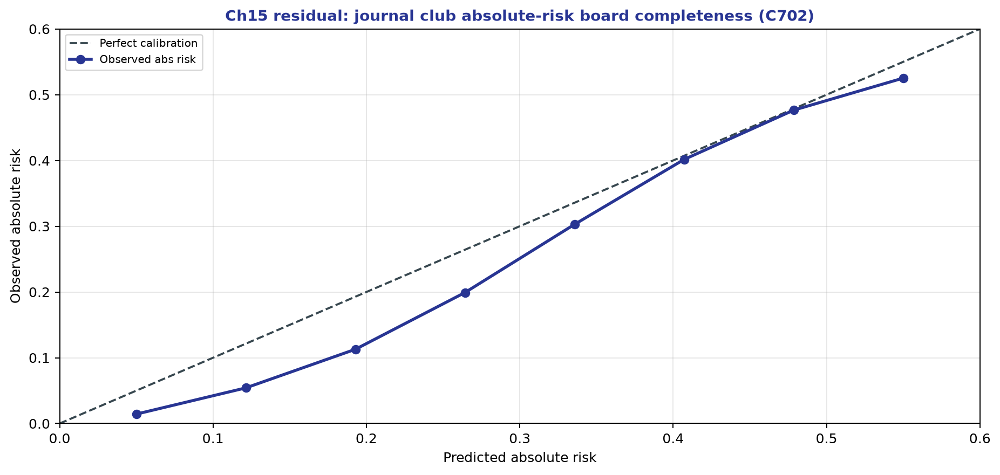

*Teaching figure (synthetic).* Cycle-702 densify scientific residual (ch15–28).


*Teaching figure (synthetic).* Cycle-700 densify scientific residual (ch15–28).


*Teaching figure (synthetic).* Cycle-698 densify scientific residual (ch15–28).


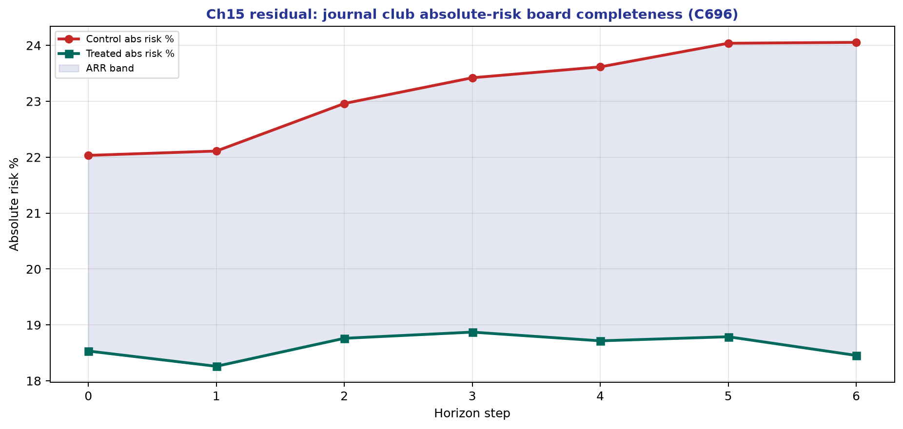

*Teaching figure (synthetic).* Cycle-696 densify scientific residual (ch15–28).


*Teaching figure (synthetic).* Cycle-694 densify scientific residual (ch15–28).


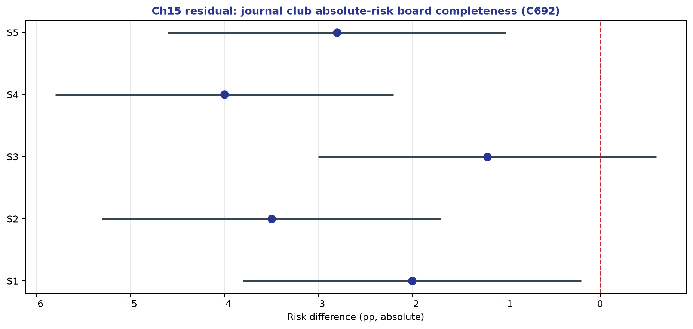

*Teaching figure (synthetic).* Cycle-692 densify scientific residual (ch15–28).


*Teaching figure (synthetic).* Cycle-690 densify scientific residual (ch15–28).


*Teaching figure (synthetic).* Cycle-688 densify scientific residual (ch15–28).


*Teaching figure (synthetic).* Cycle-686 densify scientific residual (ch15–28).


*Teaching figure (synthetic).* Cycle-684 densify scientific residual (ch15–28).


*Teaching figure (synthetic).* Cycle-682 densify scientific residual (ch15–28).


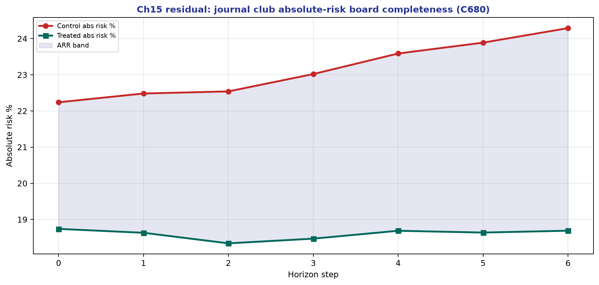

*Teaching figure (synthetic).* Cycle-680 densify scientific residual (ch15–28).


*Teaching figure (synthetic).* Cycle-678 densify scientific residual (ch15–28).


*Teaching figure (synthetic).* Cycle-676 densify scientific residual (ch15–28).


*Teaching figure (synthetic).* Cycle-674 densify scientific residual (ch15–28).


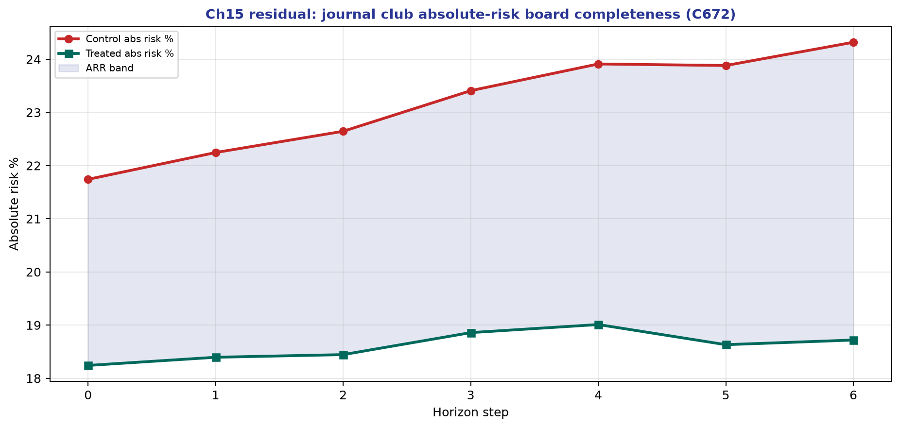

*Teaching figure (synthetic).* Cycle-672 densify scientific residual (ch15–28).


*Teaching figure (synthetic).* Cycle-670 densify scientific residual (ch15–28).


*Teaching figure (synthetic).* Cycle-668 densify scientific residual (ch15–28).


*Teaching figure (synthetic).* Cycle-666 densify scientific residual (ch15–28).


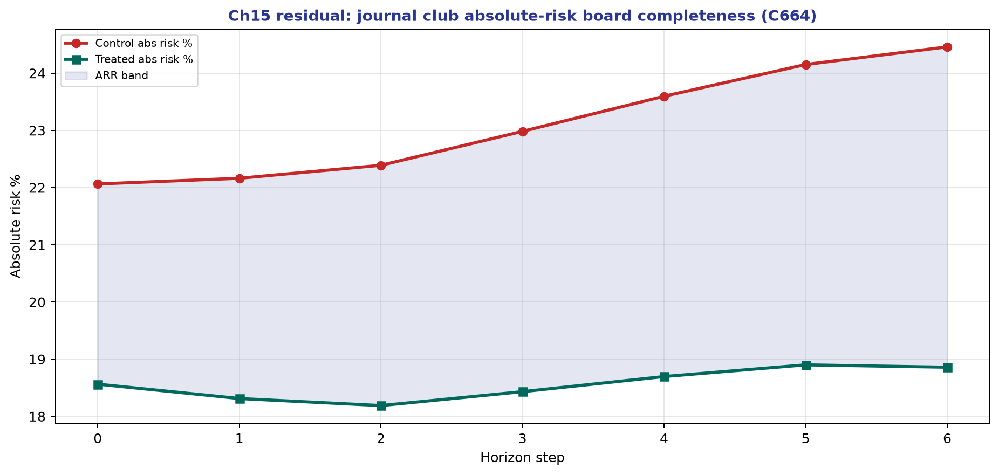

*Teaching figure (synthetic).* Cycle-664 densify scientific residual (ch15–28).


*Teaching figure (synthetic).* Cycle-662 densify scientific residual (ch15–28).


*Teaching figure (synthetic).* Cycle-660 densify scientific residual (ch15–28).


*Teaching figure (synthetic).* Cycle-658 densify scientific residual (ch15–28).


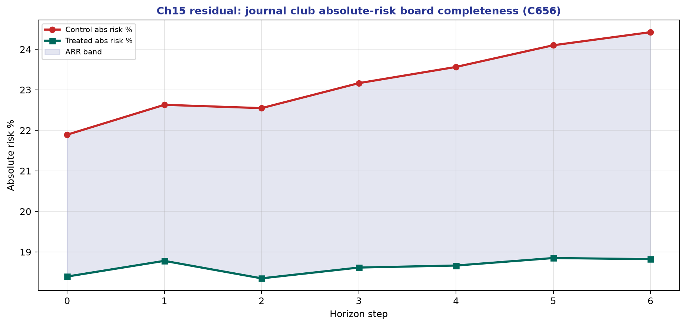

*Teaching figure (synthetic).* Cycle-656 densify scientific residual (ch15–28).


*Teaching figure (synthetic).* Cycle-654 densify scientific residual (ch15–28).


*Teaching figure (synthetic).* Cycle-652 densify scientific residual (ch15–28).


*Teaching figure (synthetic).* Cycle-650 densify scientific residual (ch15–28).


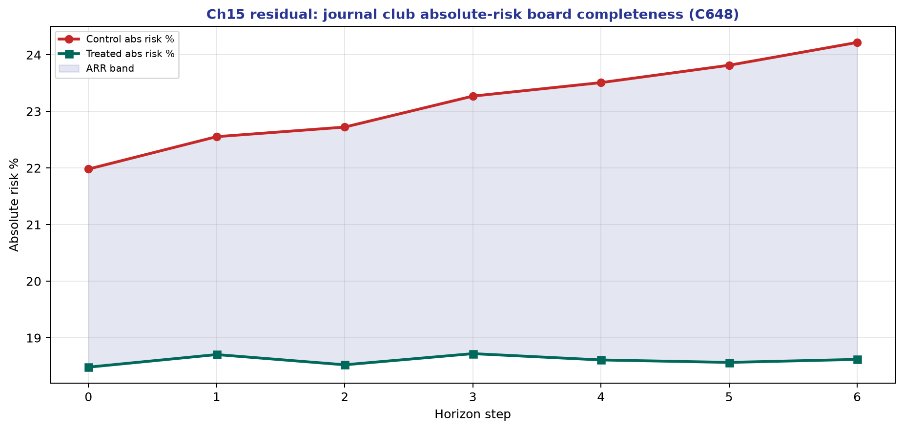

*Teaching figure (synthetic).* Cycle-648 densify scientific residual (ch15–28).


*Teaching figure (synthetic).* Cycle-646 densify scientific residual (ch15–28).


*Teaching figure (synthetic).* Cycle-644 densify scientific residual (ch15–28).


*Teaching figure (synthetic).* Cycle-642 densify scientific residual (ch15–28).


*Teaching figure (synthetic).* Cycle-640 densify scientific residual (ch15–28).


*Teaching figure (synthetic).* Cycle-638 densify scientific residual (ch15–28).


*Teaching figure (synthetic).* Cycle-636 densify scientific residual (ch15–28).


*Teaching figure (synthetic).* Cycle-634 densify scientific residual (ch15–28).


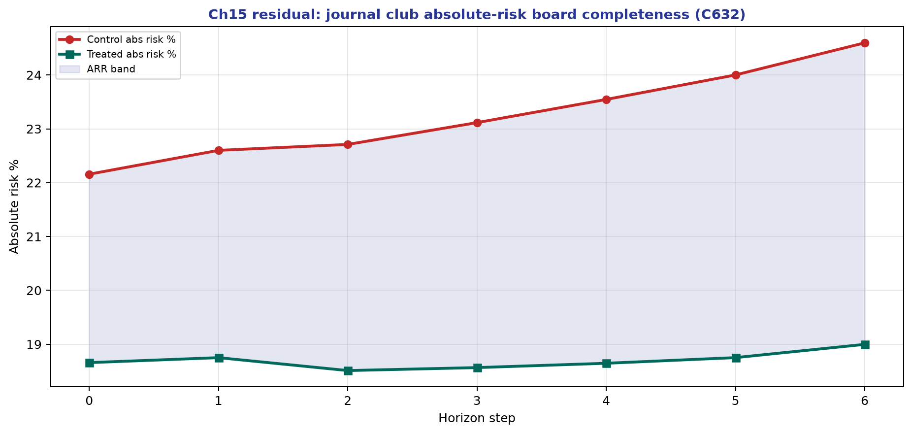

*Teaching figure (synthetic).* Cycle-632 densify scientific residual (ch15–28).


*Teaching figure (synthetic).* Cycle-630 densify scientific residual (ch15–28).


*Teaching figure (synthetic).* Cycle-628 densify scientific residual (ch15–28).


*Teaching figure (synthetic).* Cycle-626 densify scientific residual (ch15–28).


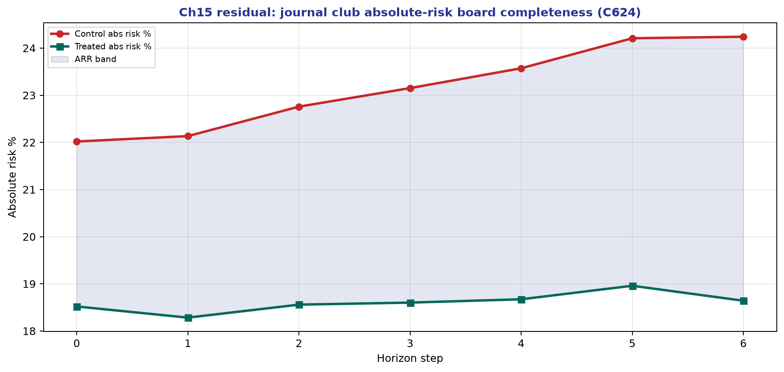

*Teaching figure (synthetic).* Cycle-624 densify scientific residual (ch15–28).


*Teaching figure (synthetic).* Cycle-622 densify scientific residual (ch15–28).


*Teaching figure (synthetic).* Cycle-620 densify scientific residual (ch15–28).


*Teaching figure (synthetic).* Cycle-618 densify scientific residual (ch15–28).


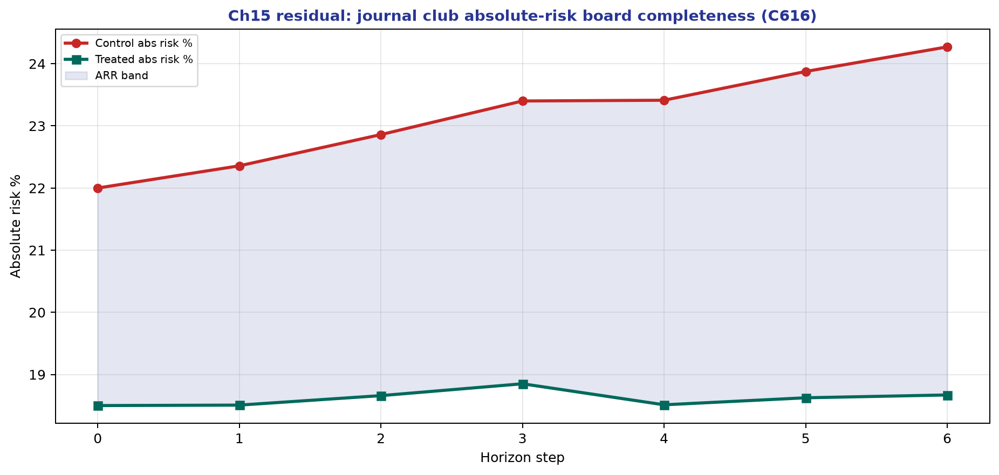

*Teaching figure (synthetic).* Cycle-616 densify scientific residual (ch15–28).


*Teaching figure (synthetic).* Cycle-614 densify scientific residual (ch15–28).


*Teaching figure (synthetic).* Cycle-612 densify scientific residual (ch15–28).


*Teaching figure (synthetic).* Cycle-610 densify scientific residual (ch15–28).


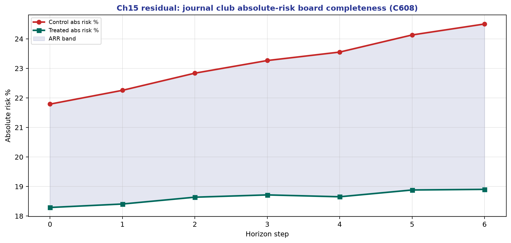

*Teaching figure (synthetic).* Cycle-608 densify scientific residual (ch15–28).


*Teaching figure (synthetic).* Cycle-606 densify scientific residual (ch15–28).


*Teaching figure (synthetic).* Cycle-604 densify scientific residual (ch15–28).


*Teaching figure (synthetic).* Cycle-602 densify scientific residual (ch15–28).


*Teaching figure (synthetic).* Cycle-600 densify scientific residual (ch15–28).


*Teaching figure (synthetic).* Cycle-598 densify scientific residual (ch15–28).


*Teaching figure (synthetic).* Cycle-596 densify scientific residual (ch15–28).


*Teaching figure (synthetic).* Cycle-594 densify scientific residual (ch15–28).


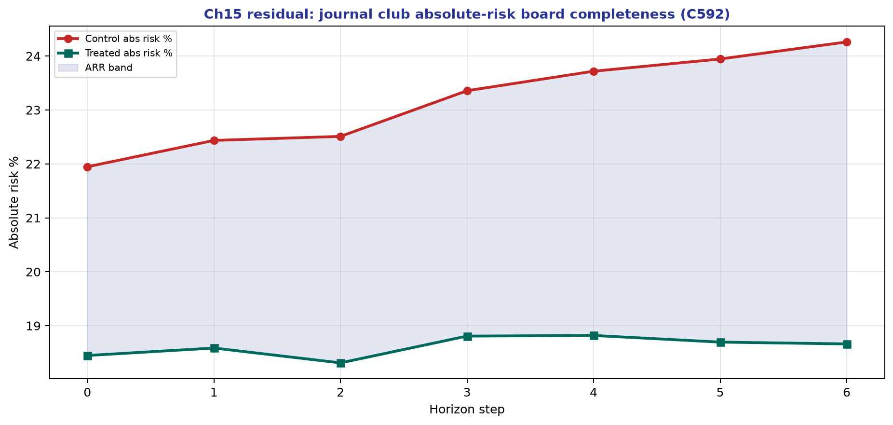

*Teaching figure (synthetic).* Cycle-592 densify scientific residual (ch15–28).


*Teaching figure (synthetic).* Cycle-590 densify scientific residual (ch15–28).


*Teaching figure (synthetic).* Cycle-588 densify scientific residual (ch15–28).


*Teaching figure (synthetic).* Cycle-586 densify scientific residual (ch15–28).


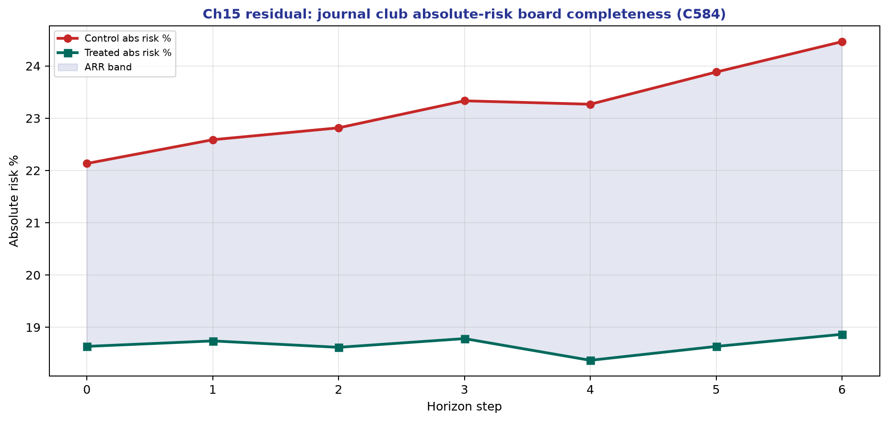

*Teaching figure (synthetic).* Cycle-584 densify scientific residual (ch15–28).


*Teaching figure (synthetic).* Cycle-582 densify scientific residual (ch15–28).


*Teaching figure (synthetic).* Cycle-580 densify scientific residual (ch15–28).


*Teaching figure (synthetic).* Cycle-578 densify scientific residual (ch15–28).


*Teaching figure (synthetic).* Cycle-576 densify scientific residual (ch15–28).


*Teaching figure (synthetic).* Cycle-574 densify scientific residual (ch15–28).


*Teaching figure (synthetic).* Cycle-572 densify scientific residual (ch15–28).


*Teaching figure (synthetic).* Cycle-570 densify scientific residual (ch15–28).


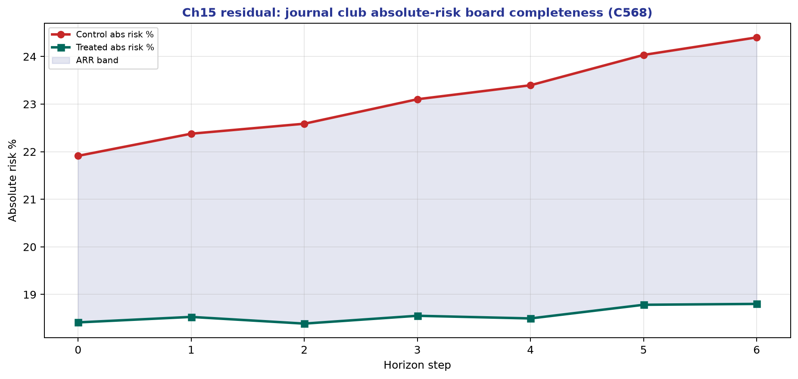

*Teaching figure (synthetic).* Cycle-568 densify scientific residual (ch15–28).


*Teaching figure (synthetic).* Cycle-566 densify scientific residual (ch15–28).


*Teaching figure (synthetic).* Cycle-564 densify scientific residual (ch15–28).


*Teaching figure (synthetic).* Cycle-562 densify scientific residual (ch15–28).


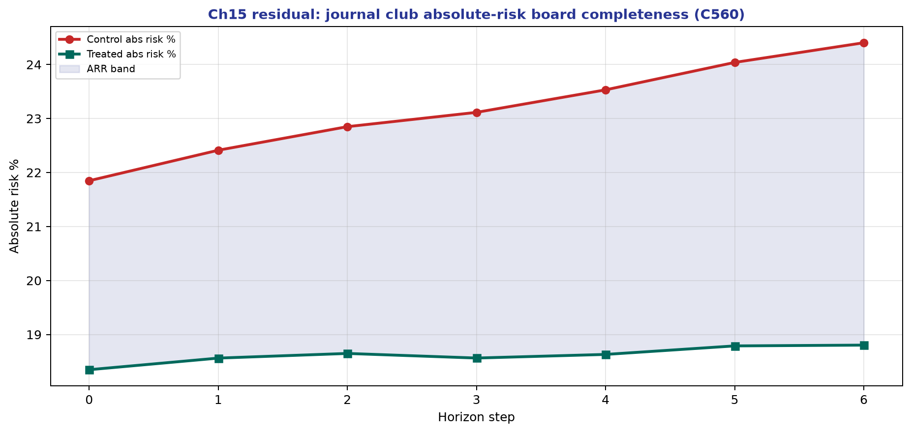

*Teaching figure (synthetic).* Cycle-560 densify scientific residual (ch15–28).


*Teaching figure (synthetic).* Cycle-558 densify scientific residual (ch15–28).


*Teaching figure (synthetic).* Cycle-556 densify scientific residual (ch15–28).


*Teaching figure (synthetic).* Cycle-554 densify scientific residual (ch15–28).


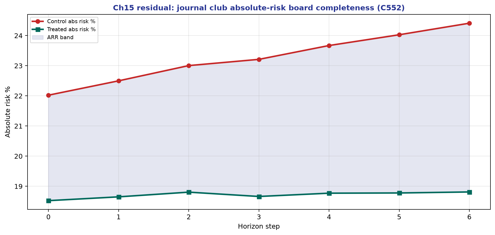

*Teaching figure (synthetic).* Cycle-552 densify scientific residual (ch15–28).


*Teaching figure (synthetic).* Cycle-550 densify scientific residual (ch15–28).


*Teaching figure (synthetic).* Cycle-548 densify scientific residual (ch15–28).


*Teaching figure (synthetic).* Cycle-546 densify scientific residual (ch15–28).


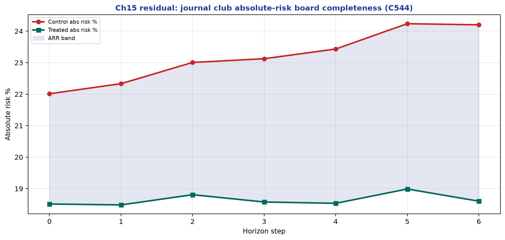

*Teaching figure (synthetic).* Cycle-544 densify scientific residual (ch15–28).


*Teaching figure (synthetic).* Cycle-542 densify scientific residual (ch15–28).


*Teaching figure (synthetic).* Cycle-540 densify scientific residual (ch15–28).


*Teaching figure (synthetic).* Cycle-538 densify scientific residual (ch15–28).


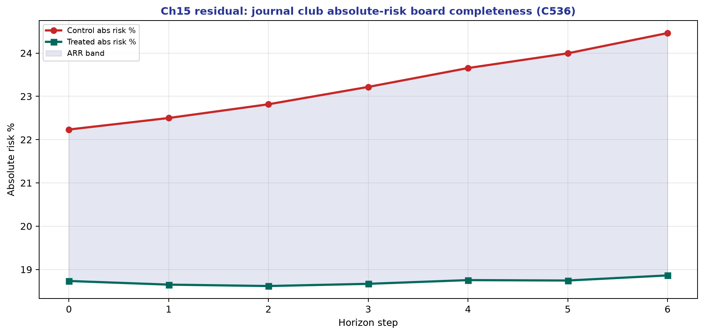

*Teaching figure (synthetic).* Cycle-536 densify scientific residual (ch15–28).


*Teaching figure (synthetic).* Cycle-534 densify scientific residual (ch15–28).


*Teaching figure (synthetic).* Cycle-532 densify scientific residual (ch15–28).


*Teaching figure (synthetic).* Cycle-530 densify scientific residual (ch15–28).


*Teaching figure (synthetic).* Cycle-528 densify scientific residual (ch15–28).


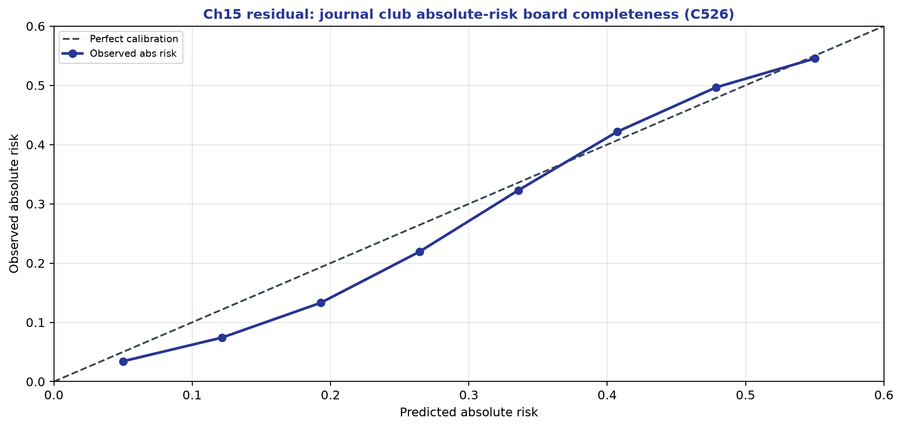

*Teaching figure (synthetic).* Cycle-526 densify scientific residual (ch15–28).


*Teaching figure (synthetic).* Cycle-524 densify scientific residual (ch15–28).


*Teaching figure (synthetic).* Cycle-522 densify scientific residual (ch15–28).


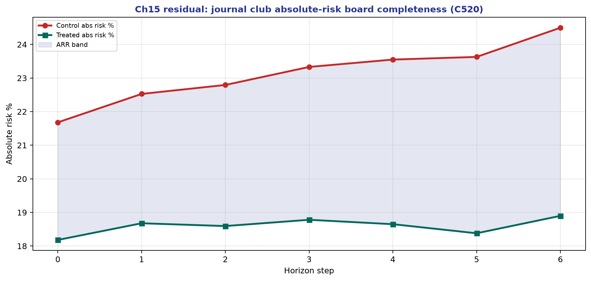

*Teaching figure (synthetic).* Cycle-520 densify scientific residual (ch15–28).


*Teaching figure (synthetic).* Cycle-518 densify scientific residual (ch15–28).


*Teaching figure (synthetic).* Cycle-516 densify scientific residual (ch15–28).


*Teaching figure (synthetic).* Cycle-514 densify scientific residual (ch15–28).


*Teaching figure (synthetic).* Cycle-512 densify scientific residual (ch15–28).


*Teaching figure (synthetic).* Cycle-510 densify scientific residual (ch15–28).


*Teaching figure (synthetic).* Cycle-508 densify scientific residual (ch15–28).


*Teaching figure (synthetic).* Cycle-506 densify scientific residual (ch15–28).


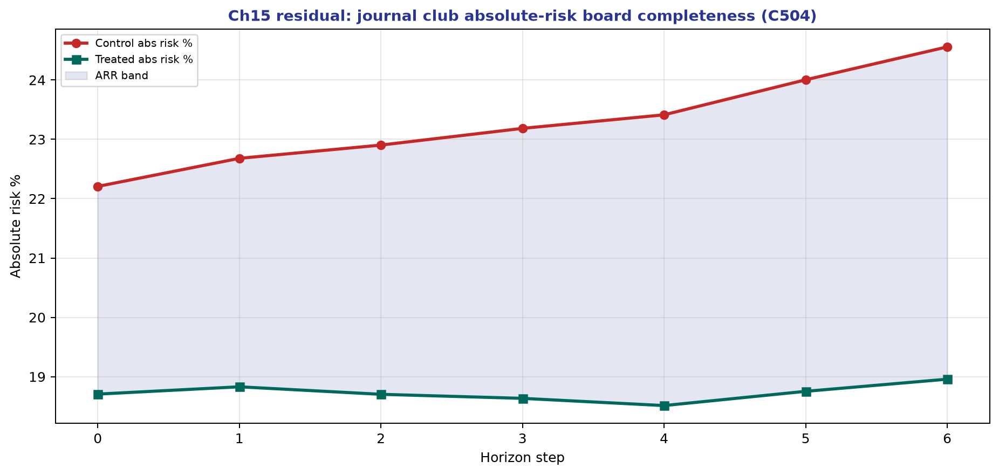

*Teaching figure (synthetic).* Cycle-504 densify scientific residual (ch15–28).


*Teaching figure (synthetic).* Cycle-502 densify scientific residual (ch15–28).


*Teaching figure (synthetic).* Cycle-500 densify scientific residual (ch15–28).


*Teaching figure (synthetic).* Cycle-498 densify scientific residual (ch15–28).


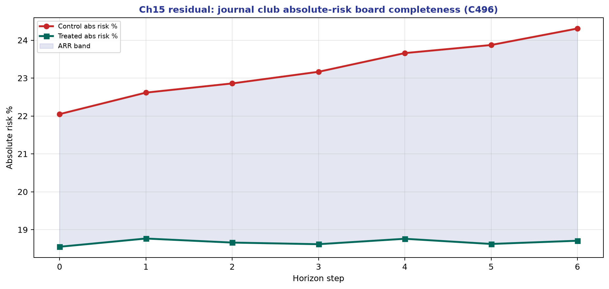

*Teaching figure (synthetic).* Cycle-496 densify scientific residual (ch15–28).


*Teaching figure (synthetic).* Cycle-494 densify scientific residual (ch15–28).


*Teaching figure (synthetic).* Cycle-492 densify scientific residual (ch15–28).


*Teaching figure (synthetic).* Cycle-490 densify scientific residual (ch15–28).


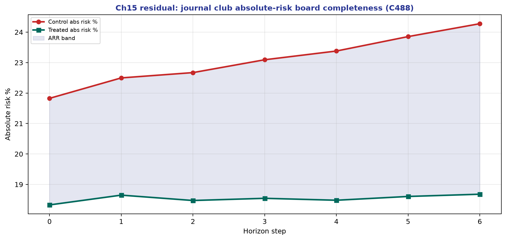

*Teaching figure (synthetic).* Cycle-488 densify scientific residual (ch15–28).


*Teaching figure (synthetic).* Cycle-486 densify scientific residual (ch15–28).


*Teaching figure (synthetic).* Cycle-484 densify scientific residual (ch15–28).


*Teaching figure (synthetic).* Cycle-482 densify scientific residual (ch15–28).


*Teaching figure (synthetic).* Cycle-480 densify scientific residual (ch15–28).


*Teaching figure (synthetic).* Cycle-478 densify scientific residual (ch15–28).


*Teaching figure (synthetic).* Cycle-476 densify scientific residual (ch15–28).


*Teaching figure (synthetic).* Cycle-474 densify scientific residual (ch15–28).


*Teaching figure (synthetic).* Cycle-472 densify scientific residual (ch15–28).


*Teaching figure (synthetic).* Cycle-470 densify scientific residual (ch15–28).


*Teaching figure (synthetic).* Cycle-468 densify scientific residual (ch15–28).


*Teaching figure (synthetic).* Cycle-466 densify scientific residual (ch15–28).


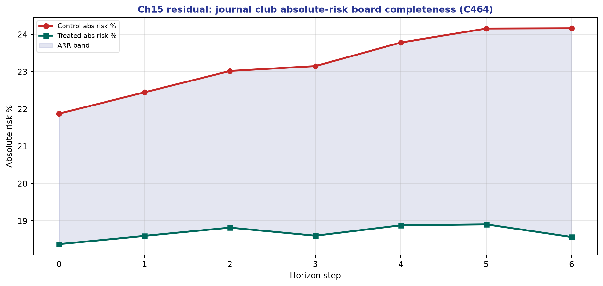

*Teaching figure (synthetic).* Cycle-464 densify scientific residual (ch15–28).


*Teaching figure (synthetic).* Cycle-462 densify scientific residual (ch15–28).


*Teaching figure (synthetic).* Cycle-460 densify scientific residual (ch15–28).


*Teaching figure (synthetic).* Cycle-458 densify scientific residual (ch15–28).


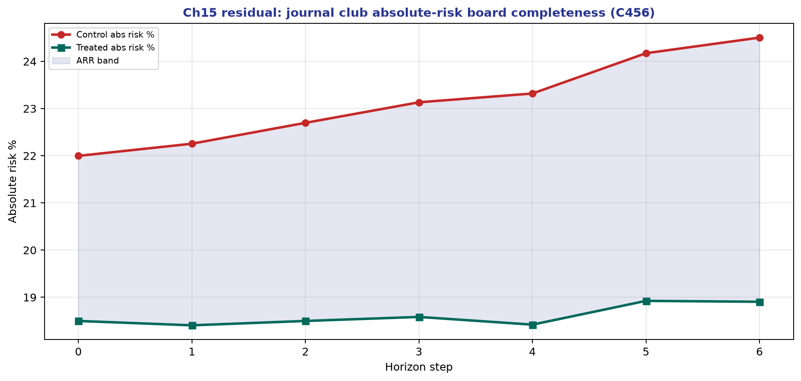

*Teaching figure (synthetic).* Cycle-456 densify scientific residual (ch15–28).


*Teaching figure (synthetic).* Cycle-454 densify scientific residual (ch15–28).


*Teaching figure (synthetic).* Cycle-452 densify scientific residual (ch15–28).


*Teaching figure (synthetic).* Cycle-450 densify scientific residual (ch15–28).


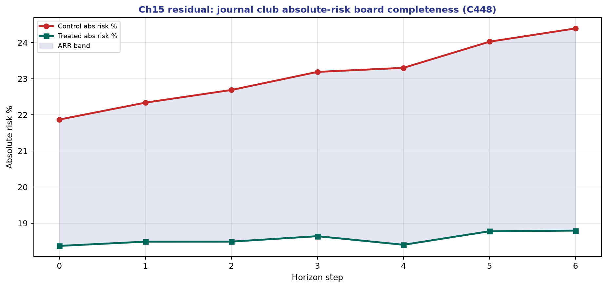

*Teaching figure (synthetic).* Cycle-448 densify scientific residual (ch15–28).


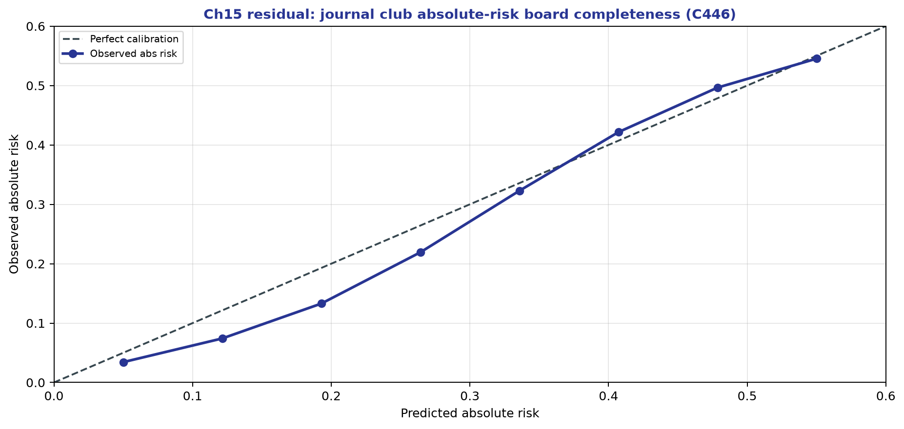

*Teaching figure (synthetic).* Cycle-446 densify scientific residual (ch15–28).


*Teaching figure (synthetic).* Cycle-444 densify scientific residual (ch15–28).


*Teaching figure (synthetic).* Cycle-442 densify scientific residual (ch15–28).


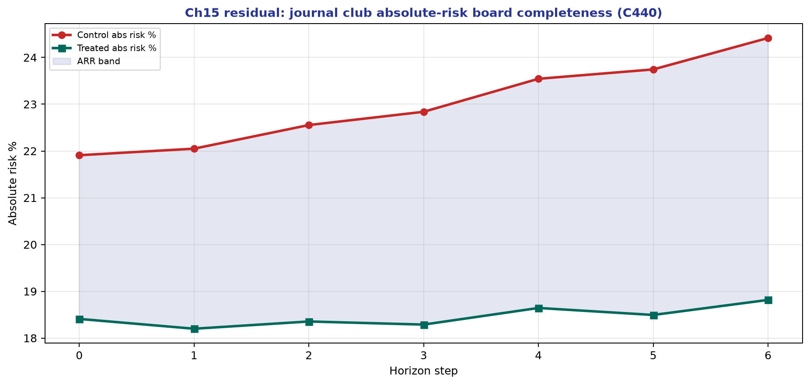

*Teaching figure (synthetic).* Cycle-440 densify scientific residual (ch15–28).


*Teaching figure (synthetic).* Cycle-438 densify scientific residual (ch15–28).


*Teaching figure (synthetic).* Cycle-436 densify scientific residual (ch15–28).


*Teaching figure (synthetic).* Cycle-434 densify scientific residual (ch15–28).


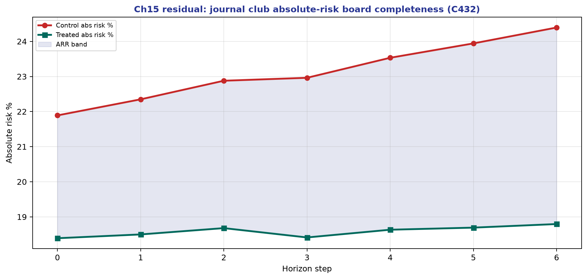

*Teaching figure (synthetic).* Cycle-432 densify scientific residual (ch15–28).


*Teaching figure (synthetic).* Cycle-430 densify scientific residual (ch15–28).


*Teaching figure (synthetic).* Cycle-428 densify scientific residual (ch15–28).


*Teaching figure (synthetic).* Cycle-426 densify scientific residual (ch15–28).


*Teaching figure (synthetic).* Cycle-424 densify scientific residual (ch15–28).


*Teaching figure (synthetic).* Cycle-422 densify scientific residual (ch15–28).


*Teaching figure (synthetic).* Cycle-420 densify scientific residual (ch15–28).


*Teaching figure (synthetic).* Cycle-418 densify scientific residual (ch15–28).


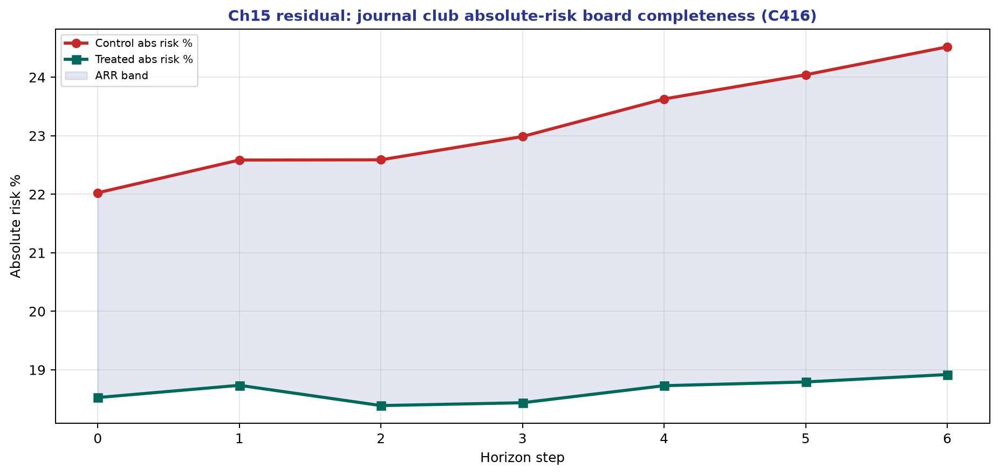

*Teaching figure (synthetic).* Cycle-416 densify scientific residual (ch15–28).


*Teaching figure (synthetic).* Cycle-414 densify scientific residual (ch15–28).


*Teaching figure (synthetic).* Cycle-412 densify scientific residual (ch15–28).


*Teaching figure (synthetic).* Cycle-410 densify scientific residual (ch15–28).


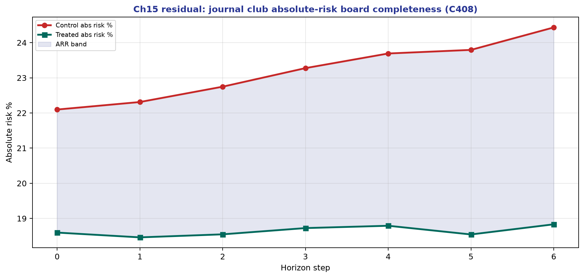

*Teaching figure (synthetic).* Cycle-408 densify scientific residual (ch15–28).


*Teaching figure (synthetic).* Cycle-406 densify scientific residual (ch15–28).


*Teaching figure (synthetic).* Cycle-404 densify scientific residual (ch15–28).


*Teaching figure (synthetic).* Cycle-402 densify scientific residual (ch15–28).


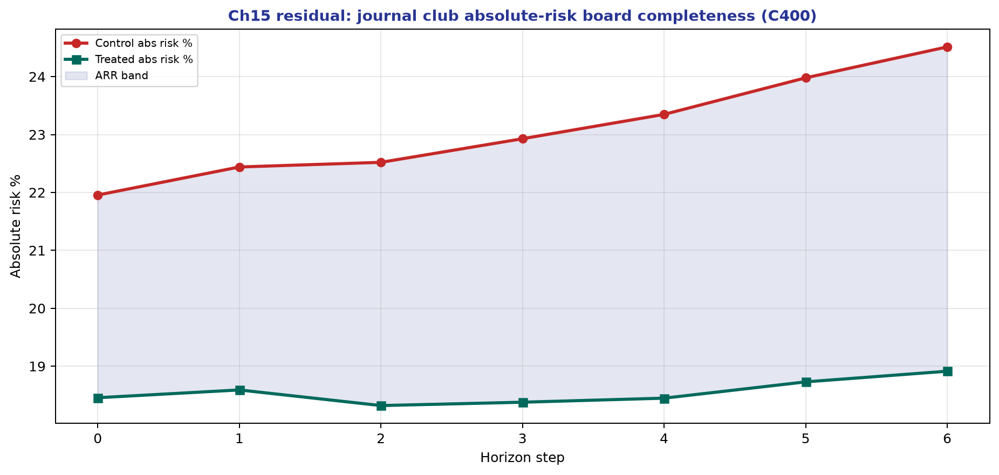

*Teaching figure (synthetic).* Cycle-400 densify scientific residual (ch15–28).


*Teaching figure (synthetic).* Cycle-398 densify scientific residual (ch15–28).


*Teaching figure (synthetic).* Cycle-396 densify scientific residual (ch15–28).


*Teaching figure (synthetic).* Cycle-394 densify scientific residual (ch15–28).


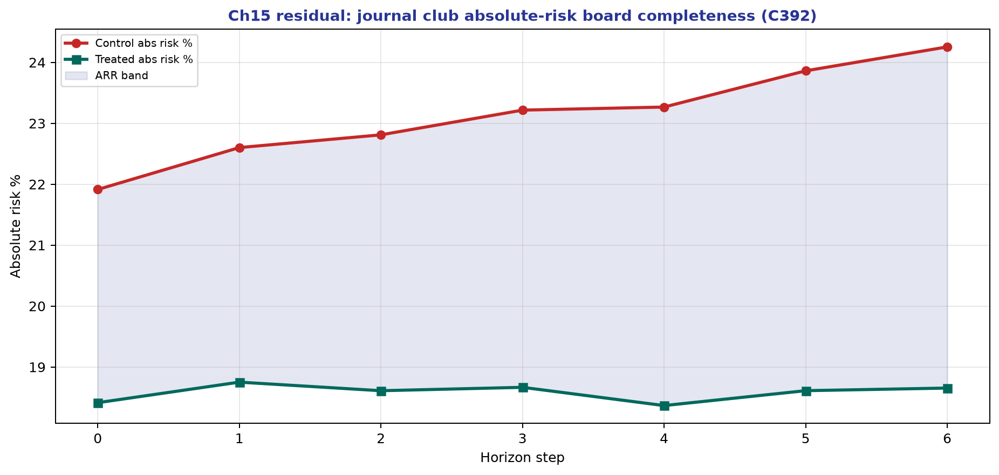

*Teaching figure (synthetic).* Cycle-392 densify scientific residual (ch15–28).


*Teaching figure (synthetic).* Cycle-390 densify scientific residual (ch15–28).


*Teaching figure (synthetic).* Cycle-388 densify scientific residual (ch15–28).


*Teaching figure (synthetic).* Cycle-386 densify scientific residual (ch15–28).


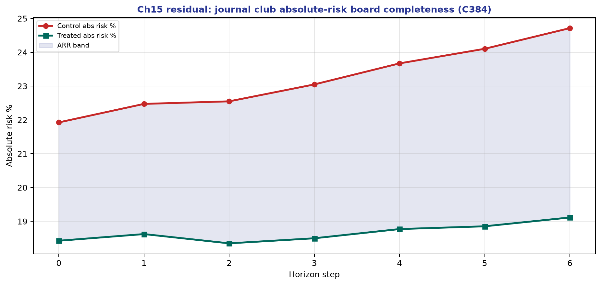

*Teaching figure (synthetic).* Cycle-384 densify scientific residual (ch15–28).


*Teaching figure (synthetic).* Cycle-382 densify scientific residual (ch15–28).


*Teaching figure (synthetic).* Cycle-380 densify scientific residual (ch15–28).


*Teaching figure (synthetic).* Cycle-378 densify scientific residual (ch15–28).


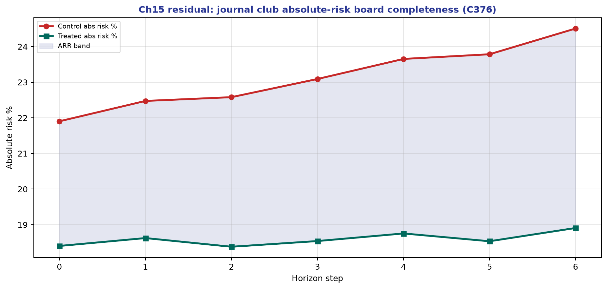

*Teaching figure (synthetic).* Cycle-376 densify scientific residual (ch15–28).


*Teaching figure (synthetic).* Cycle-374 densify scientific residual (ch15–28).


*Teaching figure (synthetic).* Cycle-372 densify scientific residual (ch15–28).


*Teaching figure (synthetic).* Cycle-370 densify scientific residual (ch15–28).


*Teaching figure (synthetic).* Cycle-368 densify scientific residual (ch15–28).


*Teaching figure (synthetic).* Cycle-366 densify scientific residual (ch15–28).


*Teaching figure (synthetic).* Cycle-364 densify scientific residual (ch15–28).


*Teaching figure (synthetic).* Cycle-362 densify scientific residual (ch15–28).


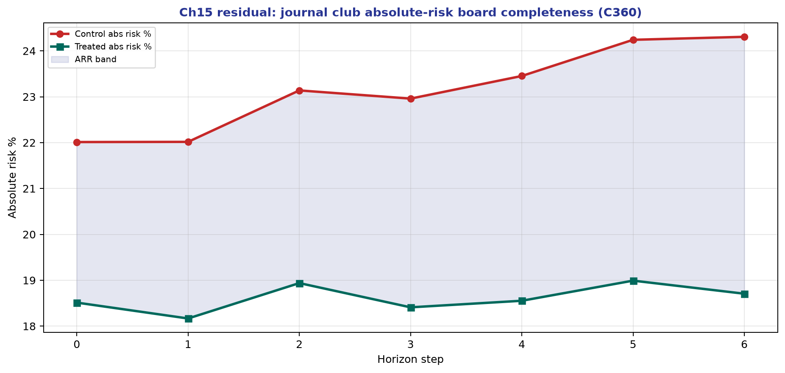

*Teaching figure (synthetic).* Cycle-360 densify scientific residual (ch15–28).


*Teaching figure (synthetic).* Cycle-358 densify scientific residual (ch15–28).


*Teaching figure (synthetic).* Cycle-356 densify scientific residual (ch15–28).


*Teaching figure (synthetic).* Cycle-354 densify scientific residual (ch15–28).


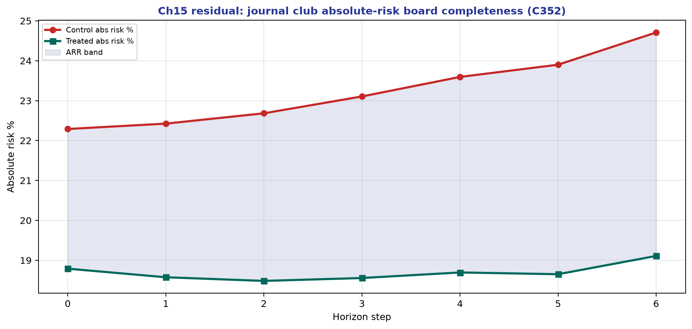

*Teaching figure (synthetic).* Cycle-352 densify scientific residual (ch15–28).


*Teaching figure (synthetic).* Cycle-350 densify scientific residual (ch15–28).


*Teaching figure (synthetic).* Cycle-348 densify scientific residual (ch15–28).


*Teaching figure (synthetic).* Cycle-346 densify scientific residual (ch15–28).


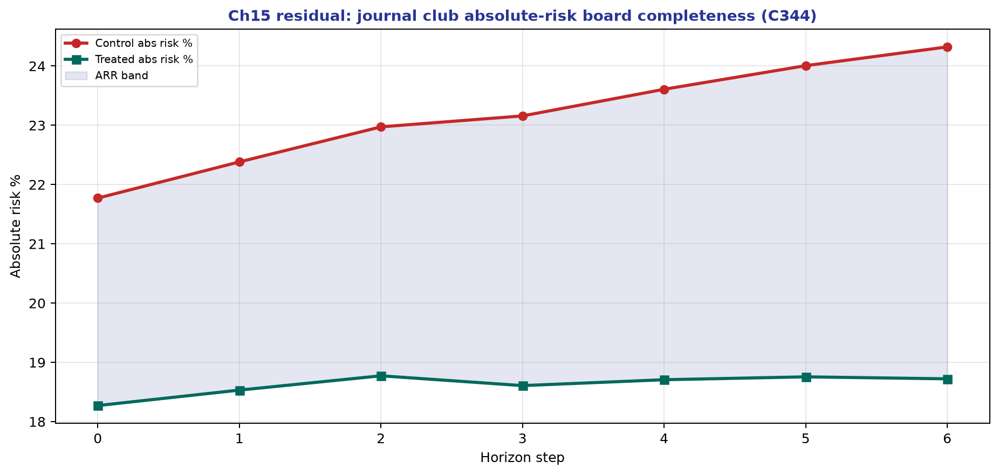

*Teaching figure (synthetic).* Cycle-344 densify scientific residual (ch15–28).


*Teaching figure (synthetic).* Cycle-342 densify scientific residual (ch15–28).


*Teaching figure (synthetic).* Cycle-340 densify scientific residual (ch15–28).


*Teaching figure (synthetic).* Cycle-338 densify scientific residual (ch15–28).


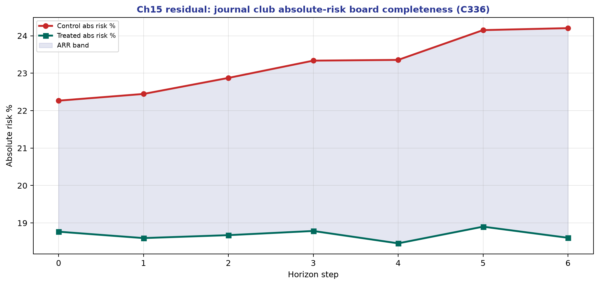

*Teaching figure (synthetic).* Cycle-336 densify scientific residual (ch15–28).


*Teaching figure (synthetic).* Cycle-334 densify scientific residual (ch15–28).


*Teaching figure (synthetic).* Cycle-332 densify scientific residual (ch15–28).


*Teaching figure (synthetic).* Cycle-330 densify scientific residual (ch15–28).


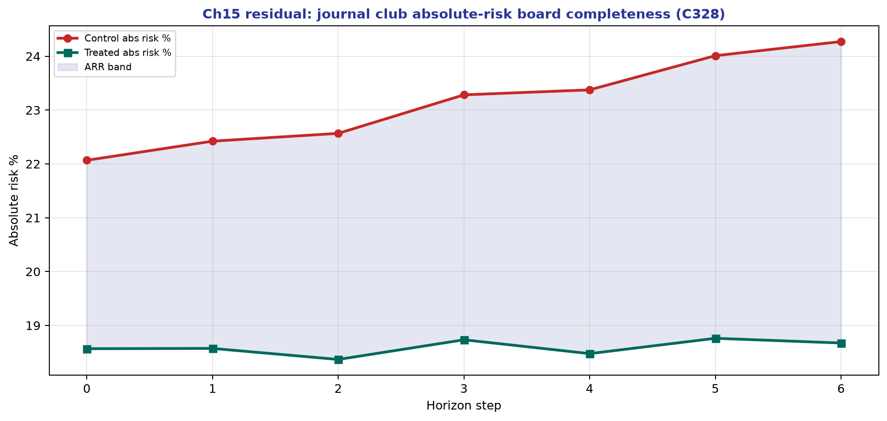

*Teaching figure (synthetic).* Cycle-328 densify scientific residual (ch15–28).


*Teaching figure (synthetic).* Cycle-326 densify scientific residual (ch15–28).


*Teaching figure (synthetic).* Cycle-324 densify scientific residual (ch15–28).


*Teaching figure (synthetic).* Cycle-322 densify scientific residual (ch15–28).


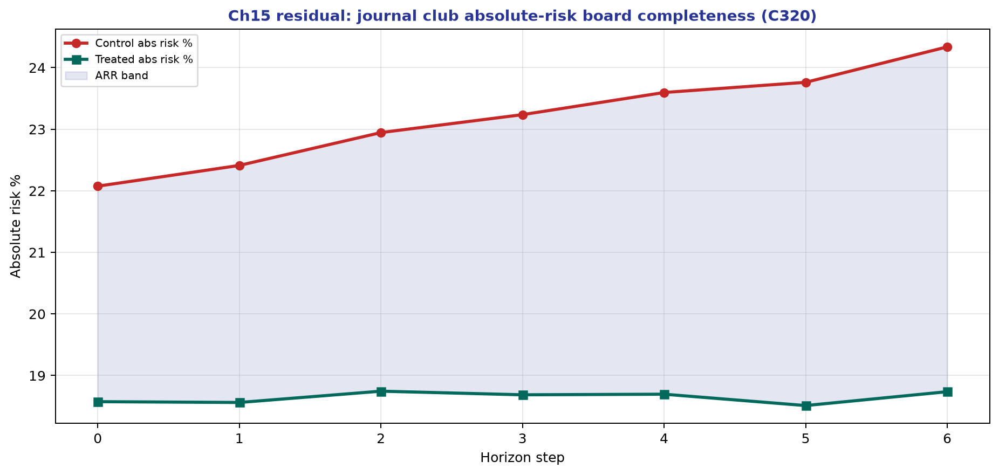

*Teaching figure (synthetic).* Cycle-320 densify scientific residual (ch15–28).


*Teaching figure (synthetic).* Cycle-318 densify scientific residual (ch15–28).


*Teaching figure (synthetic).* Cycle-316 densify scientific residual (ch15–28).


*Teaching figure (synthetic).* Cycle-314 densify scientific residual (ch15–28).


*Teaching figure (synthetic).* Cycle-312 densify scientific residual (ch15–28).


*Teaching figure (synthetic).* Cycle-310 densify scientific residual (ch15–28).


*Teaching figure (synthetic).* Cycle-308 densify scientific residual (ch15–28).


*Teaching figure (synthetic).* Cycle-306 densify scientific residual (ch15–28).


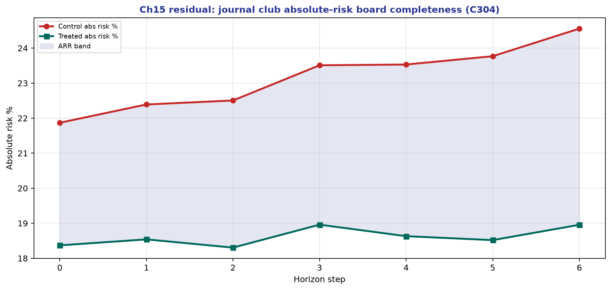

*Teaching figure (synthetic).* Cycle-304 densify scientific residual (ch15–28).


*Teaching figure (synthetic).* Cycle-302 densify scientific residual (ch15–28).


*Teaching figure (synthetic).* Cycle-300 densify scientific residual (ch15–28).


*Teaching figure (synthetic).* Cycle-298 densify scientific residual (ch15–28).


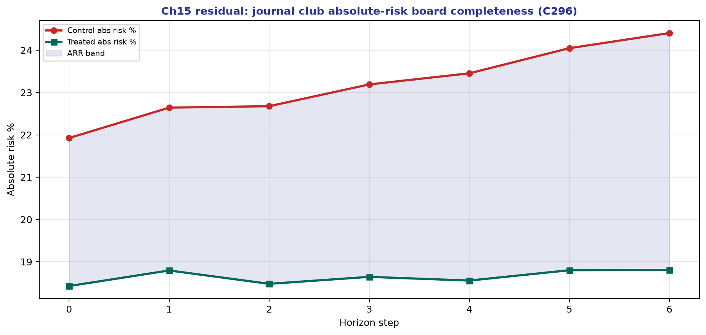

*Teaching figure (synthetic).* Cycle-296 densify scientific residual (ch15–28).


*Teaching figure (synthetic).* Cycle-294 densify scientific residual (ch15–28).


*Teaching figure (synthetic).* Cycle-292 densify scientific residual (ch15–28).


*Teaching figure (synthetic).* Cycle-290 densify scientific residual (ch15–28).


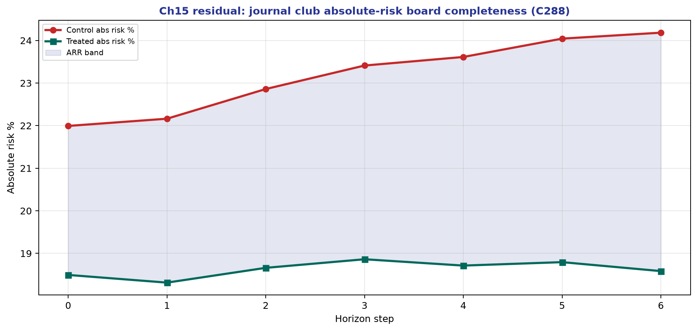

*Teaching figure (synthetic).* Cycle-288 densify scientific residual (ch15–28).


*Teaching figure (synthetic).* Cycle-286 densify scientific residual (ch15–28).


*Teaching figure (synthetic).* Cycle-284 densify scientific residual (ch15–28).


*Teaching figure (synthetic).* Cycle-282 densify scientific residual (ch15–28).


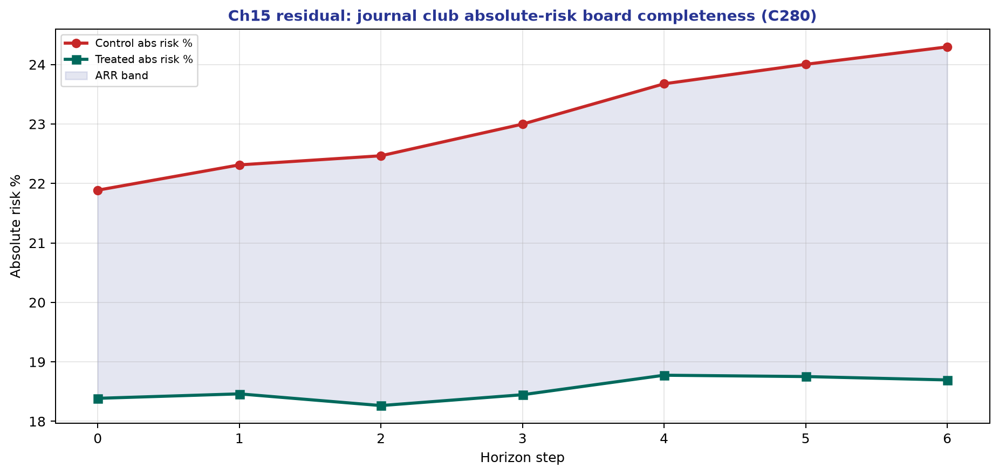

*Teaching figure (synthetic).* Cycle-280 densify scientific residual (ch15–28).


*Teaching figure (synthetic).* Cycle-278 densify scientific residual (ch15–28).


*Teaching figure (synthetic).* Cycle-276 densify scientific residual (ch15–28).


*Teaching figure (synthetic).* Cycle-274 densify scientific residual (ch15–28).


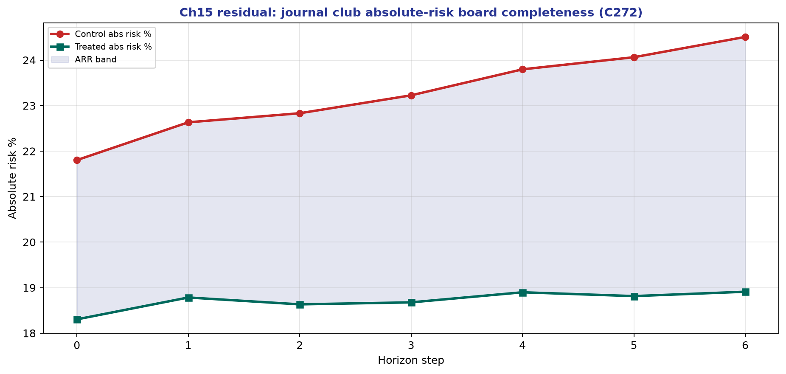

*Teaching figure (synthetic).* Cycle-272 densify scientific residual (ch15–28).


*Teaching figure (synthetic).* Cycle-270 densify scientific residual (ch15–28).


*Teaching figure (synthetic).* Cycle-268 densify scientific residual (ch15–28).


*Teaching figure (synthetic).* Cycle-266 densify scientific residual (ch15–28).


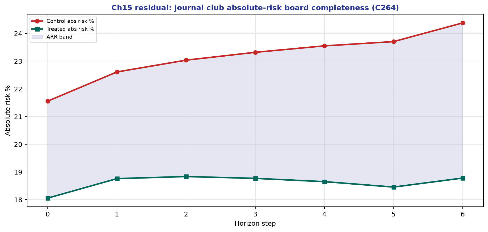

*Teaching figure (synthetic).* Cycle-264 densify scientific residual (ch15–28).


*Teaching figure (synthetic).* Cycle-262 densify scientific residual (ch15–28).


*Teaching figure (synthetic).* Cycle-260 densify scientific residual (ch15–28).


*Teaching figure (synthetic).* Cycle-258 densify scientific residual (ch15–28).


*Teaching figure (synthetic).* Cycle-256 densify scientific residual (ch15–28).


*Teaching figure (synthetic).* Cycle-254 densify scientific residual (ch15–28).


*Teaching figure (synthetic).* Cycle-252 densify scientific residual (ch15–28).


*Teaching figure (synthetic).* Cycle-250 densify scientific residual (ch15–28).


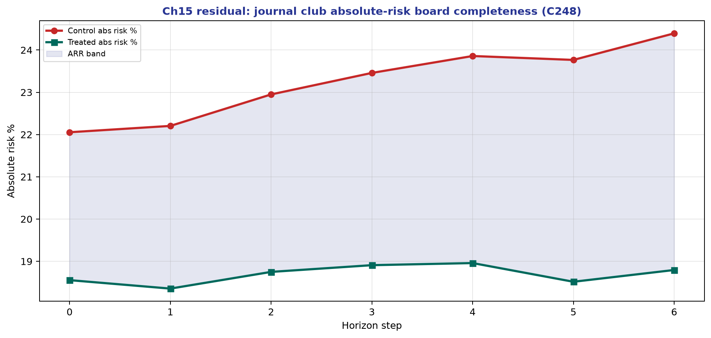

*Teaching figure (synthetic).* Cycle-248 densify scientific residual (ch15–28).


*Teaching figure (synthetic).* Cycle-246 densify scientific residual (ch15–28).


*Teaching figure (synthetic).* Cycle-244 densify scientific residual (ch15–28).


*Teaching figure (synthetic).* Cycle-242 densify scientific residual (ch15–28).


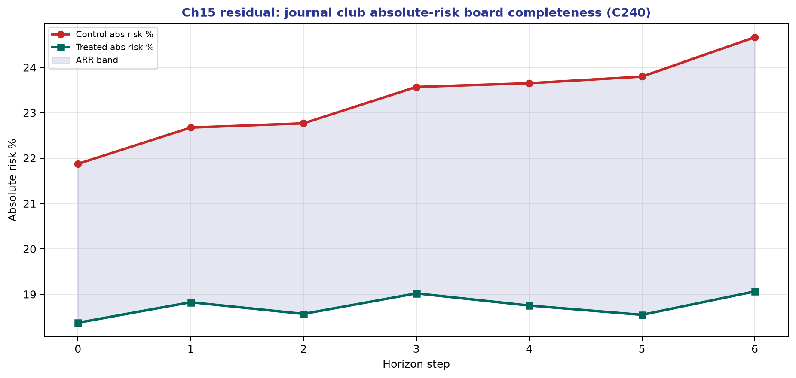

*Teaching figure (synthetic).* Cycle-240 densify scientific residual (ch15–28).


*Teaching figure (synthetic).* Cycle-238 densify scientific residual (ch15–28).


*Teaching figure (synthetic).* Cycle-236 densify scientific residual (ch15–28).


*Teaching figure (synthetic).* Cycle-234 densify scientific residual (ch15–28).


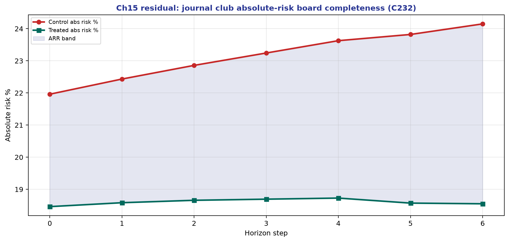

*Teaching figure (synthetic).* Cycle-232 densify scientific residual (ch15–28).


*Teaching figure (synthetic).* Cycle-230 densify scientific residual (ch15–28).


*Teaching figure (synthetic).* Cycle-228 densify scientific residual (ch15–28).


*Teaching figure (synthetic).* Cycle-226 densify scientific residual (ch15–28).


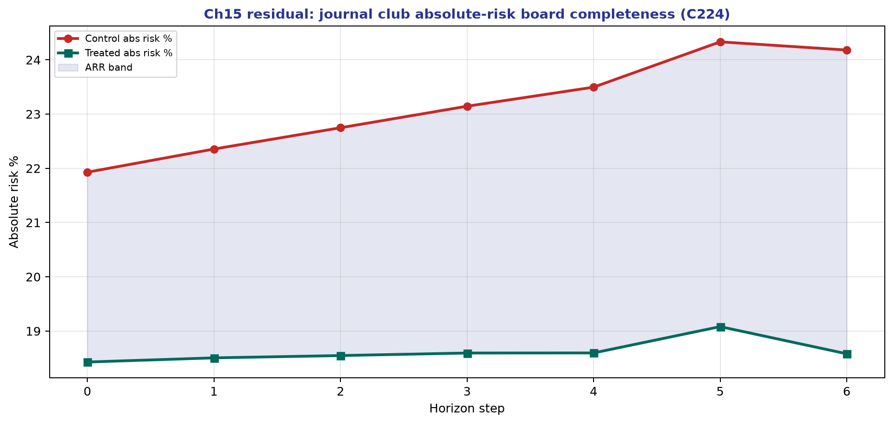

*Teaching figure (synthetic).* Cycle-224 densify scientific residual (ch15–28).


*Teaching figure (synthetic).* Cycle-222 densify scientific residual (ch15–28).


*Teaching figure (synthetic).* Cycle-220 densify scientific residual (ch15–28).


*Teaching figure (synthetic).* Cycle-218 densify scientific residual (ch15–28).


*Teaching figure (synthetic).* Cycle-216 densify scientific residual (ch15–28).


*Teaching figure (synthetic).* Cycle-214 densify scientific residual (ch15–28).


*Teaching figure (synthetic).* Cycle-212 densify scientific residual (ch15–28).


*Teaching figure (synthetic).* Cycle-210 densify scientific residual (ch15–28).


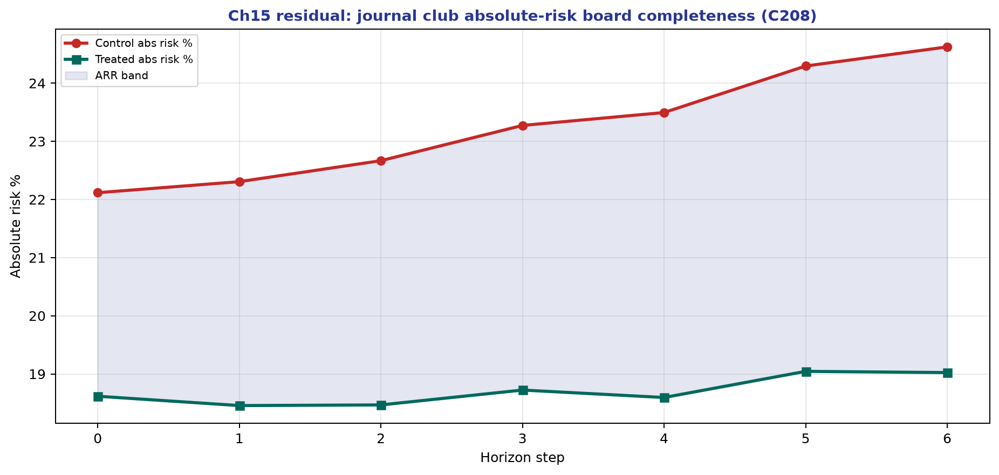

*Teaching figure (synthetic).* Cycle-208 densify scientific residual (ch15–28).


*Teaching figure (synthetic).* Cycle-206 densify scientific residual (ch15–28).


*Teaching figure (synthetic).* Cycle-204 densify scientific residual (ch15–28).


*Teaching figure (synthetic).* Cycle-202 densify scientific residual (ch15–28).


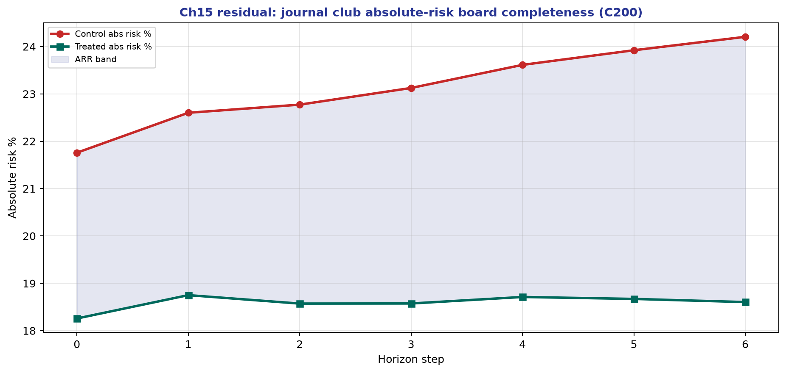

*Teaching figure (synthetic).* Cycle-200 densify scientific residual (ch15–28).


*Teaching figure (synthetic).* Cycle-198 densify scientific residual (ch15–28).


*Teaching figure (synthetic).* Cycle-196 densify scientific residual (ch15–28).


*Teaching figure (synthetic).* Cycle-194 densify scientific residual (ch15–28).


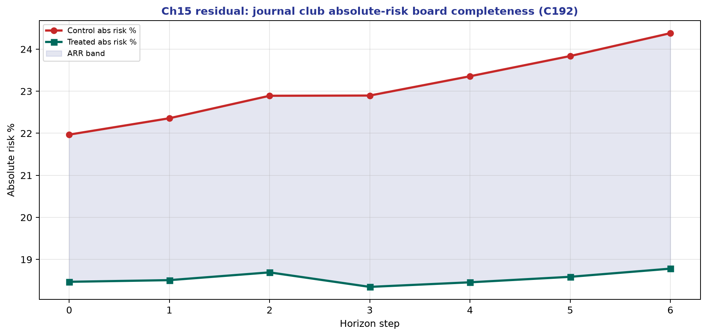

*Teaching figure (synthetic).* Cycle-192 densify scientific residual (ch15–28).


*Teaching figure (synthetic).* Cycle-190 densify scientific residual (ch15–28).


*Teaching figure (synthetic).* Cycle-188 densify scientific residual (ch15–28).


*Teaching figure (synthetic).* Cycle-186 densify scientific residual (ch15–28).


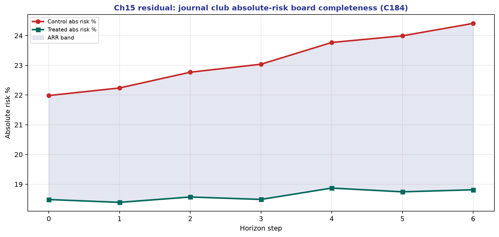

*Teaching figure (synthetic).* Cycle-184 densify scientific residual (ch15–28).


*Teaching figure (synthetic).* Cycle-182 densify scientific residual (ch15–28).


*Teaching figure (synthetic).* Cycle-180 densify scientific residual (ch15–28).


*Teaching figure (synthetic).* Cycle-178 densify scientific residual (ch15–28).


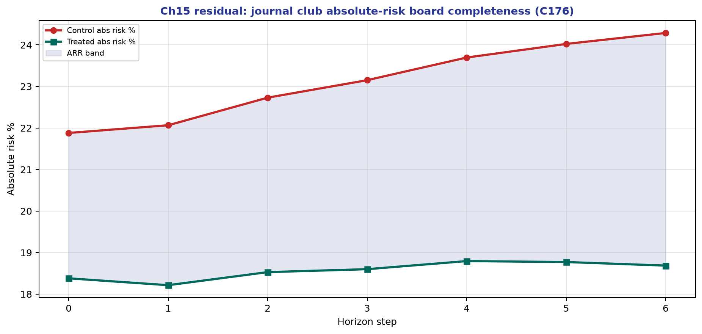

*Teaching figure (synthetic).* Cycle-176 densify scientific residual (ch15–28).


*Teaching figure (synthetic).* Cycle-174 densify scientific residual (ch15–28).


*Teaching figure (synthetic).* Cycle-172 densify scientific residual (ch15–28).


*Teaching figure (synthetic).* Cycle-170 densify scientific residual (ch15–28).


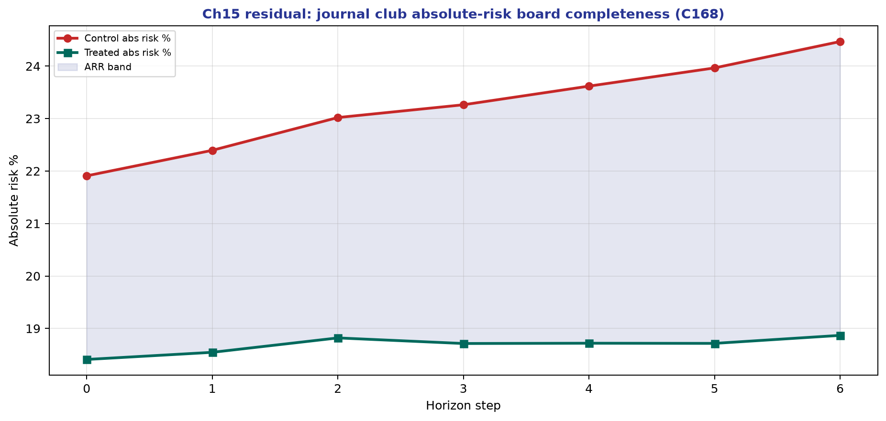

*Teaching figure (synthetic).* Cycle-168 densify scientific residual (ch15–28).


*Teaching figure (synthetic).* Cycle-166 densify scientific residual (ch15–28).


*Teaching figure (synthetic).* Cycle-164 densify scientific residual (ch15–28).


*Teaching figure (synthetic).* Cycle-162 densify scientific residual (ch15–28).


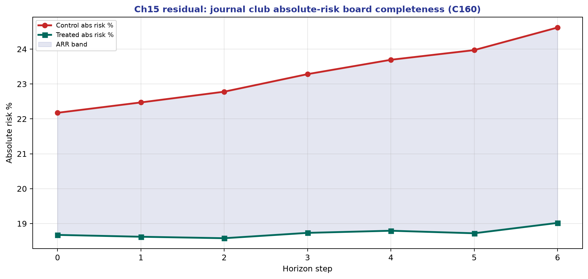

*Teaching figure (synthetic).* Cycle-160 densify scientific residual (ch15–28).


*Teaching figure (synthetic).* Cycle-158 densify scientific residual (ch15–28).


*Teaching figure (synthetic).* Cycle-156 densify scientific residual (ch15–28).


*Teaching figure (synthetic).* Cycle-154 densify scientific residual (ch15–28).


*Teaching figure (synthetic).* Cycle-152 densify scientific residual (ch15–28).


*Teaching figure (synthetic).* Cycle-150 densify scientific residual (ch15–28).


*Teaching figure (synthetic).* Cycle-148 densify scientific residual (ch15–28).


*Teaching figure (synthetic).* Cycle-146 densify scientific residual (ch15–28).


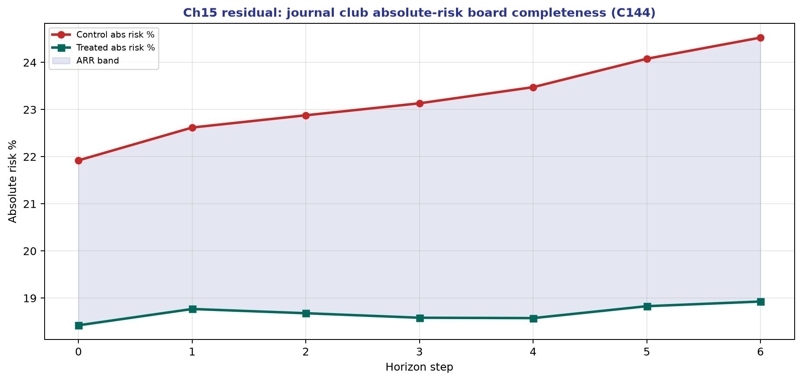

*Teaching figure (synthetic).* Cycle-144 densify scientific residual (ch15–28).


*Teaching figure (synthetic).* Cycle-142 densify scientific residual (ch15–28).


*Teaching figure (synthetic).* Cycle-140 densify scientific residual (ch15–28).


*Teaching figure (synthetic).* Cycle-138 densify scientific residual (ch15–28).


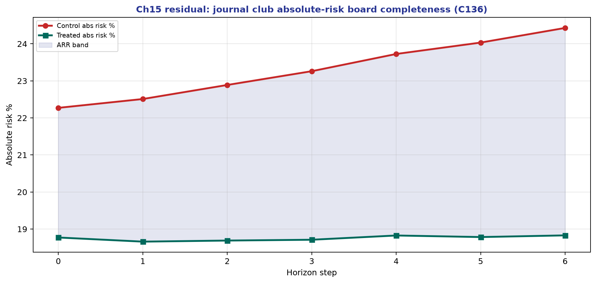

*Teaching figure (synthetic).* Cycle-136 densify scientific residual (ch15–28).


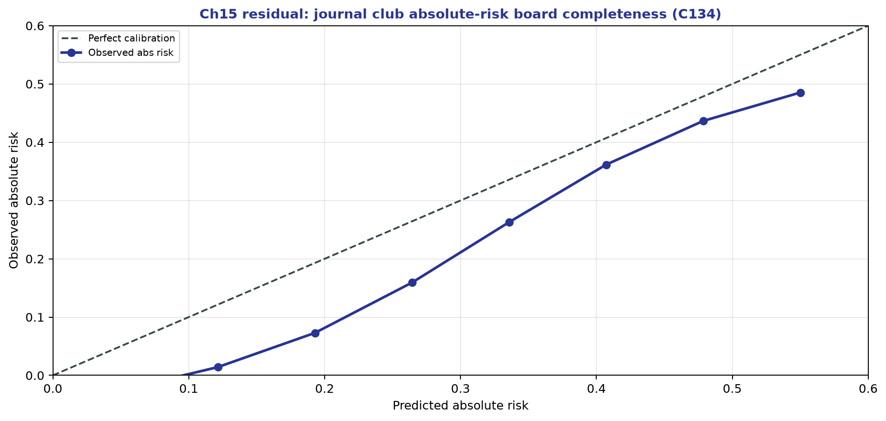

*Teaching figure (synthetic).* Cycle-134 densify scientific residual (ch15–28).


*Teaching figure (synthetic).* Cycle-132 densify scientific residual (ch15–28).


*Teaching figure (synthetic).* Cycle-130 densify scientific residual (ch15–28).


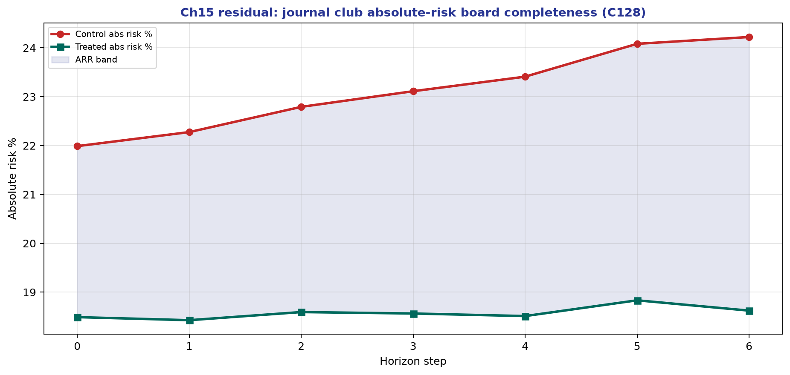

*Teaching figure (synthetic).* Cycle-128 densify scientific residual (ch15–28).


*Teaching figure (synthetic).* Cycle-126 densify scientific residual (ch15–28).


*Teaching figure (synthetic).* Cycle-124 densify scientific residual (ch15–28).


*Teaching figure (synthetic).* Cycle-122 densify scientific residual (ch15–28).


*Teaching figure (synthetic).* Cycle-120 densify scientific residual (ch15–28).


*Teaching figure (synthetic).* Cycle-118 densify scientific residual (ch15–28).


*Teaching figure (synthetic).* Cycle-116 densify scientific residual (ch15–28).


*Teaching figure (synthetic).* Cycle-114 densify scientific residual (ch15–28).


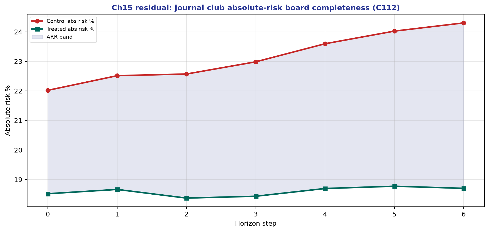

*Teaching figure (synthetic).* Cycle-112 densify scientific residual (ch15–28).


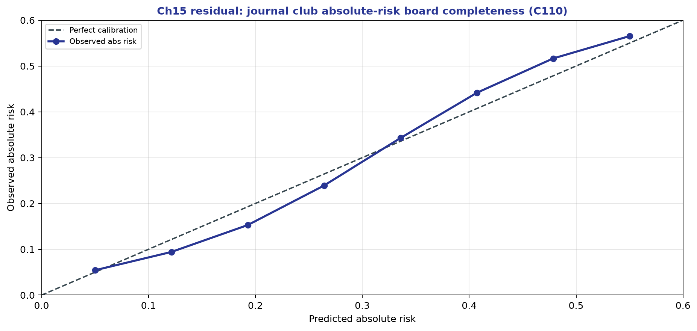

*Teaching figure (synthetic).* Cycle-110 densify scientific residual (ch15–28).


*Teaching figure (synthetic).* Cycle-108 densify scientific residual (ch15–28).


*Teaching figure (synthetic).* Cycle-106 densify scientific residual (ch15–28).


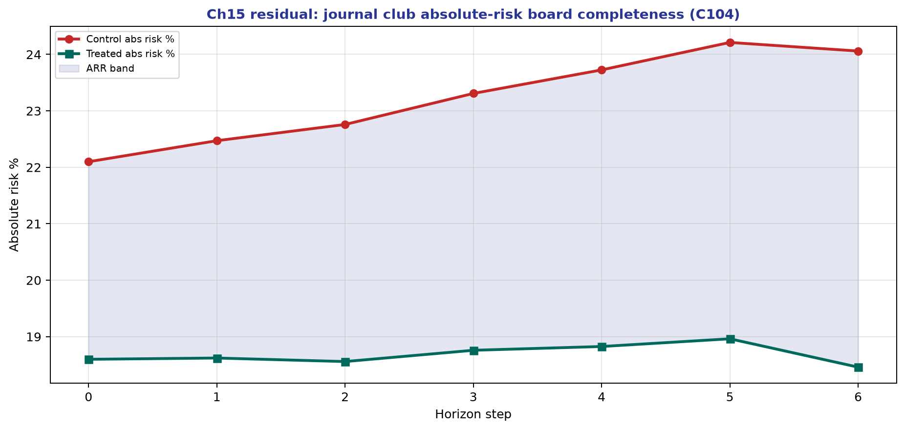

*Teaching figure (synthetic).* Cycle-104 densify scientific residual (ch15–28).


*Teaching figure (synthetic).* Cycle-102 densify scientific residual (ch15–28).


*Teaching figure (synthetic).* Cycle-100 densify scientific residual (ch15–28).


*Teaching figure (synthetic).* Cycle-98 densify scientific residual (ch15–28).


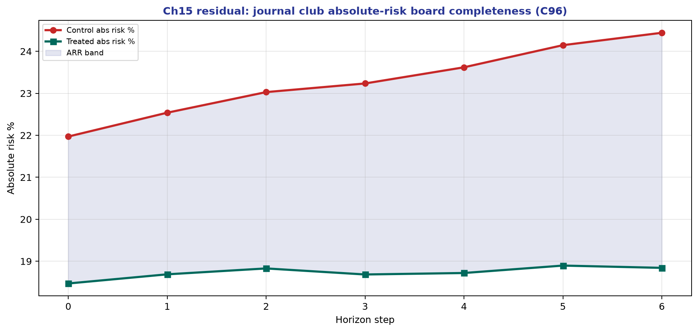

*Teaching figure (synthetic).* Cycle-96 densify scientific residual (ch15–28).


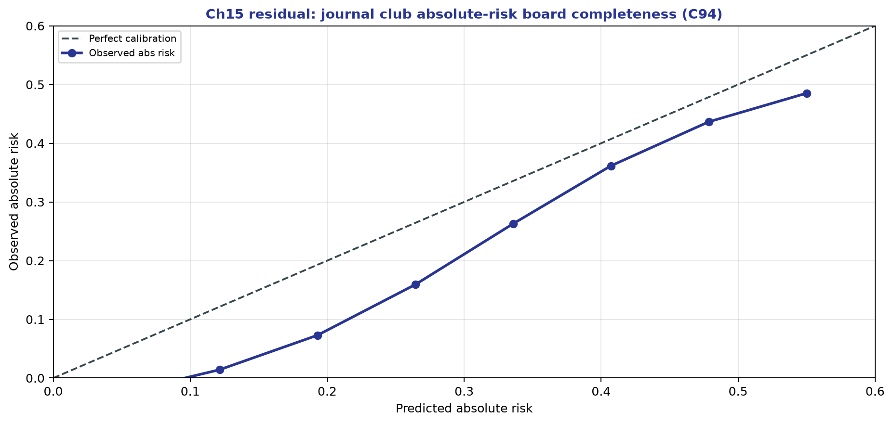

*Teaching figure (synthetic).* Cycle-94 densify scientific residual (ch15–28).


*Teaching figure (synthetic).* Cycle-92 densify scientific residual (ch15–28).


*Teaching figure (synthetic).* Cycle-90 densify scientific residual (ch15–28).


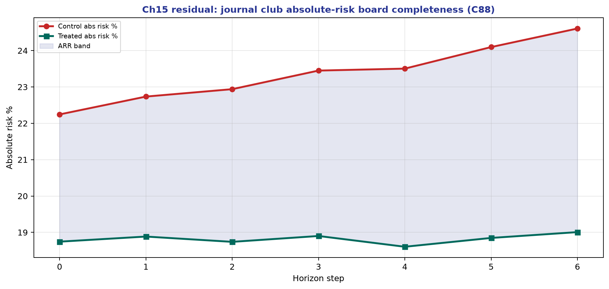

*Teaching figure (synthetic).* Cycle-88 densify scientific residual (ch15–28).


*Teaching figure (synthetic).* Cycle-86 densify scientific residual (ch15–28).


*Teaching figure (synthetic).* Cycle-84 densify scientific residual (ch15–28).


*Teaching figure (synthetic).* Cycle-82 densify scientific residual (ch15–28).


*Teaching figure (synthetic).* Cycle-80 densify scientific residual (ch15–28).


*Teaching figure (synthetic).* Cycle-78 densify scientific residual (ch15–28).


*Teaching figure (synthetic).* Cycle-76 densify scientific residual (ch15–28).


*Teaching figure (synthetic).* Cycle-74 densify scientific residual (ch15–28).


*Teaching figure (synthetic).* Cycle-72 densify scientific residual (ch15–28).


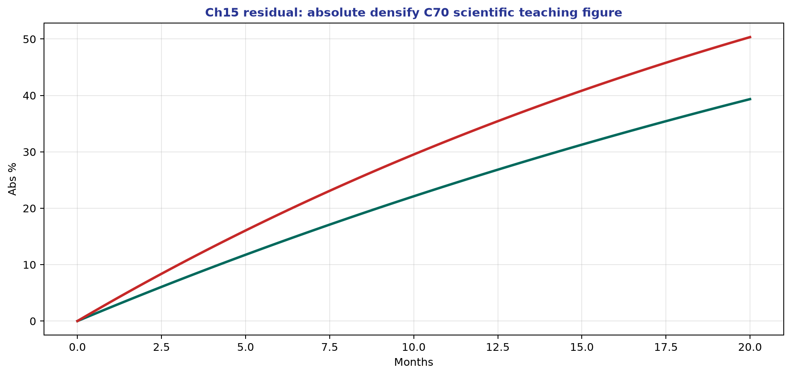

*Teaching figure (synthetic).* Cycle-70 densify scientific residual (ch15–28).


*Teaching figure (synthetic).* Cycle-68 densify scientific residual (ch15–28).


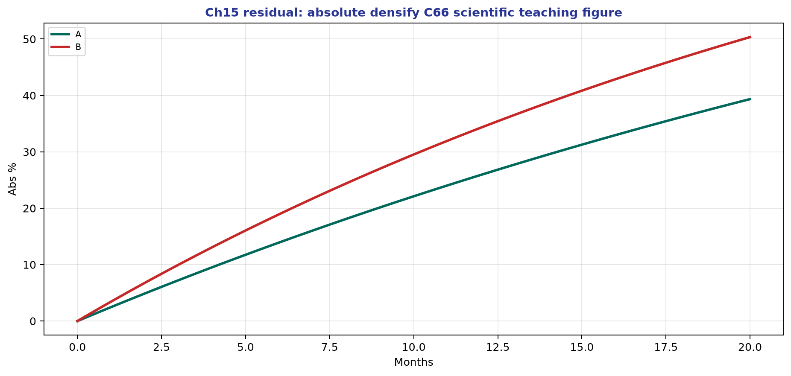

*Teaching figure (synthetic).* Cycle-66 densify scientific residual (ch15–28).


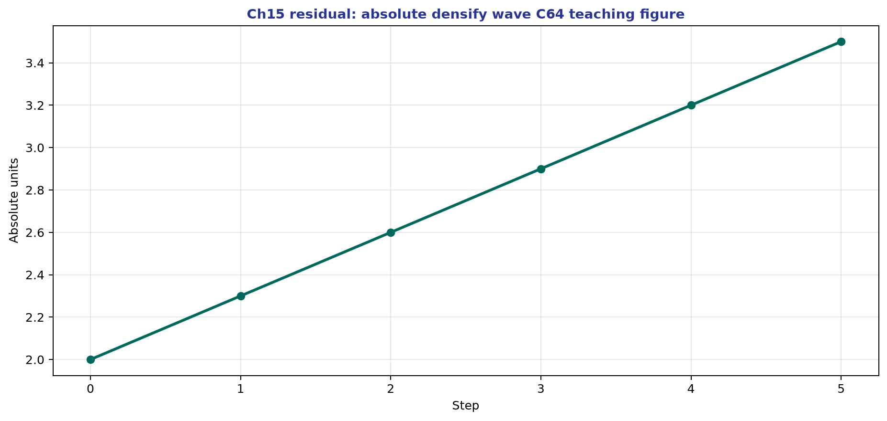

*Teaching figure (synthetic).* Cycle-64 densify scientific residual (ch15–28).


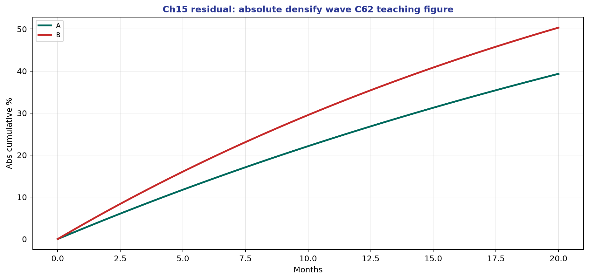

*Teaching figure (synthetic).* Cycle-62 densify scientific residual (ch15–28).


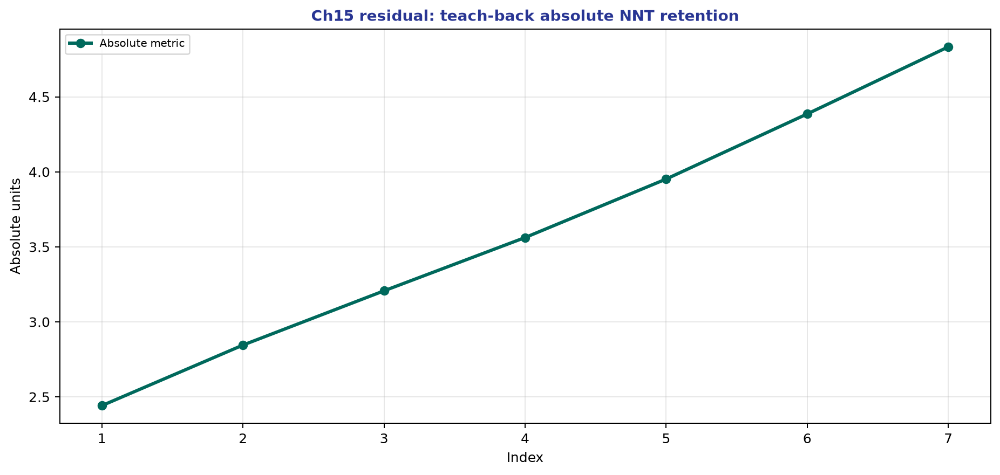

*Teaching figure (synthetic).* Cycle-60 densify scientific residual (ch15–28).


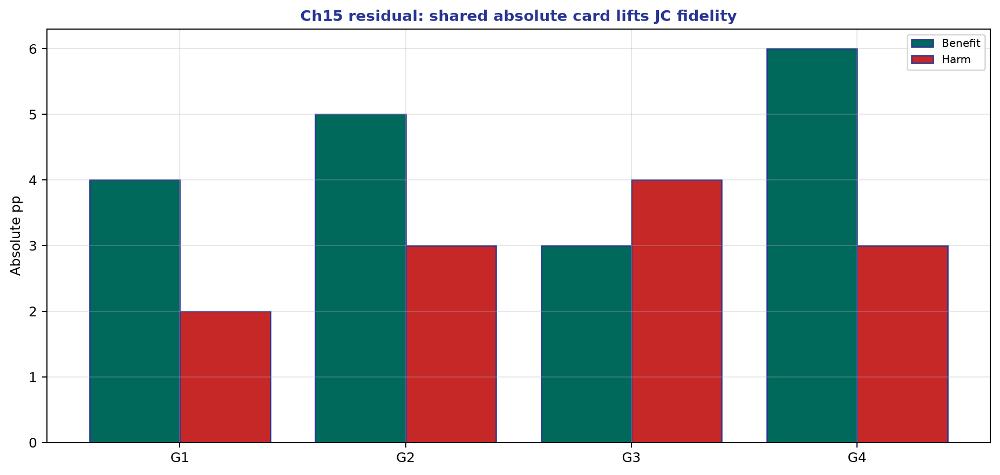

*Teaching figure (synthetic).* Cycle-58 densify scientific residual (ch15–28).


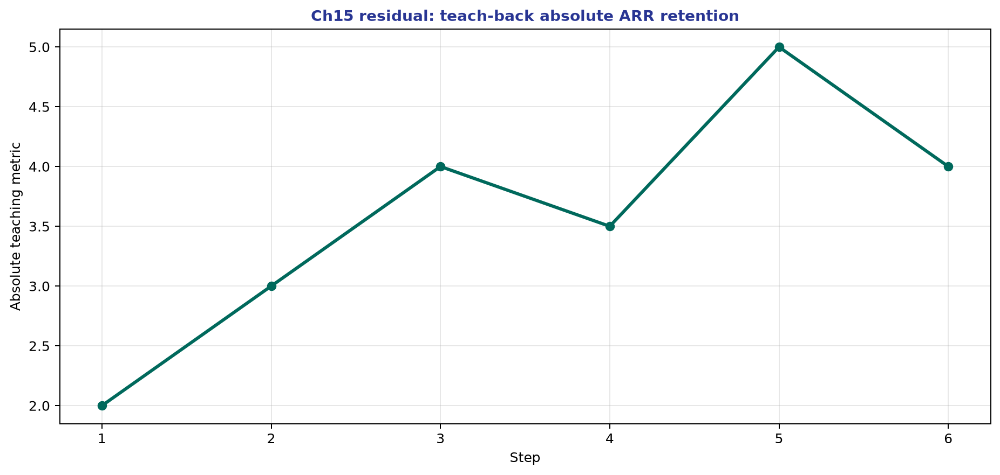

*Teaching figure (synthetic).* Cycle-56 densify scientific residual (ch15–28).


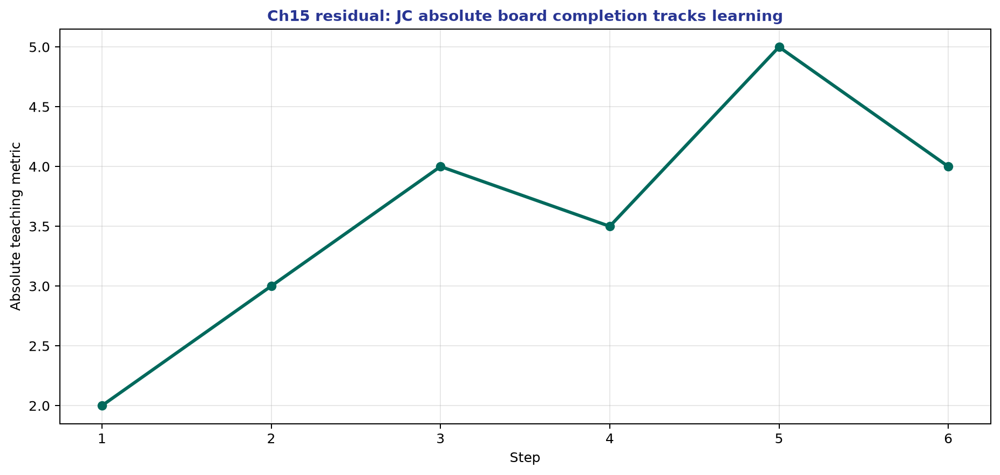

*Teaching figure (synthetic).* Cycle-54 densify scientific residual (ch15–28).


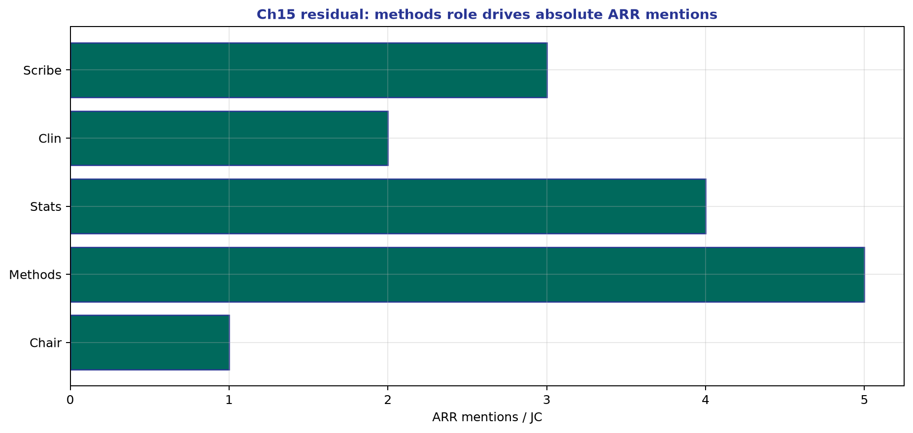

*Teaching figure (synthetic).* Cycle-52 densify scientific residual (ch15–28).


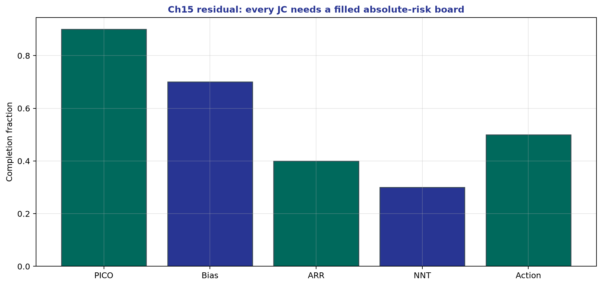

*Teaching figure (synthetic).* Cycle-50 densify scientific residual (ch15–28).


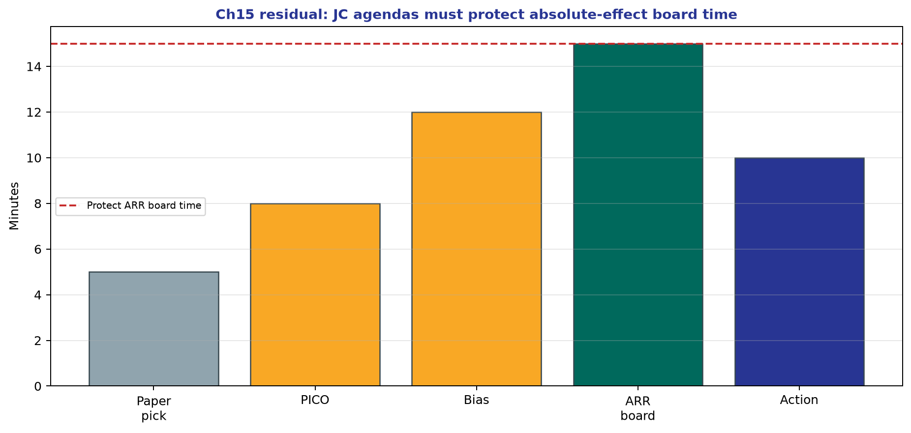

*Teaching figure (synthetic).* Cycle-48 densify scientific residual (ch15–28).


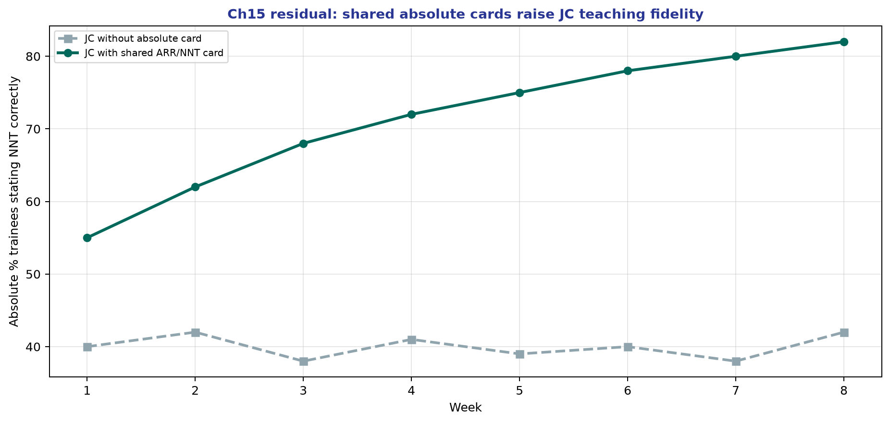

*Teaching figure (synthetic).* Cycle-46 densify scientific residual (ch15–28).


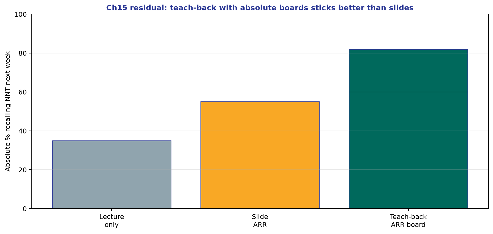

*Teaching figure (synthetic).* Cycle-44 densify scientific residual (ch15–28).


## The Conceptual Core: Why the Default Journal Club Fails

Most neurology training programs possess a designated hour for journal club. Most of these hours fail to teach critical appraisal. The default format typically devolves into 'summary theater': a junior trainee constructs thirty slides restating the background pathophysiology and the abstract, a senior faculty member shares a clinical war story tangentially related to the topic, and the group disperses having covered a paper without interrogating it. The failure is architectural, not moral. When a session lacks explicit time constraints, rotating roles, and a shared epistemic framework, the path of least resistance is to summarize rather than to appraise.

Critical appraisal is a high-stakes cognitive skill deployed under time pressure. Physicians must decide whether to adopt a new mechanical thrombectomy device, prescribe a novel monoclonal antibody for Alzheimer's disease, or adjust blood pressure targets in intracerebral hemorrhage based on flawed literature. Skills of this magnitude require deliberate practice, structured feedback, and safe repetition. A journal club that only tests reading comprehension is a wasted opportunity. Redesigning this hour yields compound interest: trainees become precise readers, clinical pathways become data-driven, and research questions generated by the department improve because learners internalize what renders a study uninterpretable.

This chapter provides a portable, aggressive, and highly structured architecture for upgrading the journal club. It moves the discipline from passive listening to active extraction. We define the specific agenda, the roles, the question board, the red-flag super-checklist, and the protocols for psychological safety. It culminates in a fully worked run-of-show for a stroke trial so that faculty can execute the choreography immediately.

## Defining the Goal Before Sending the Invite

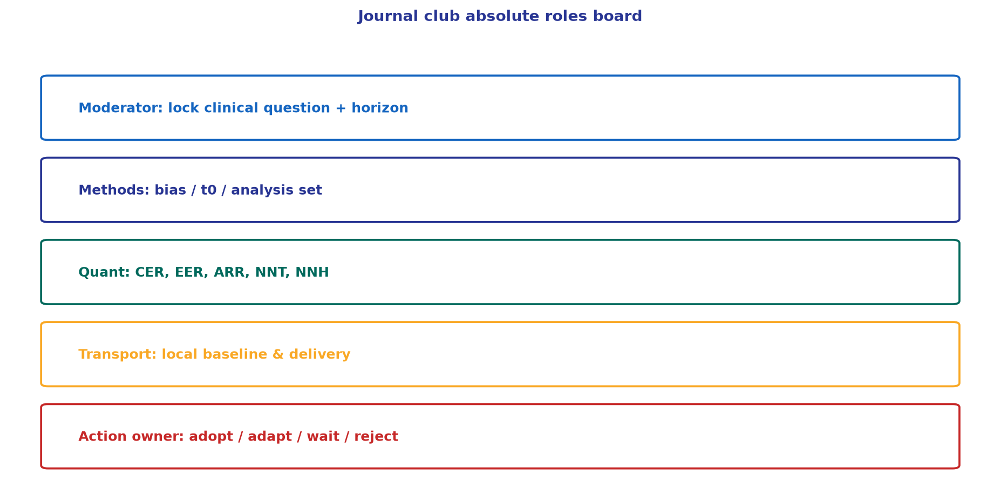

*Teaching figure (synthetic).* Assign the absolute ledger and the action sentence before the PDF opens.

A primary reason journal clubs fail is goal confusion. Faculty arrive expecting a deep dive into trial methodology; residents arrive wanting the clinical bottom line for the wards; researchers arrive wanting to debate the biological plausibility. Mixing these goals without labeling them generates frustration. The objective of the session must be declared explicitly.

- Skill Goal: Practice a specific appraisal mechanism (e.g., identifying intention-to-treat violations, detecting spin, interrogating subgroup claims, or interpreting diagnostic confidence intervals).
- Decision Goal: Inform a live clinical pathway, formulary addition, or telestroke protocol change. This is the highest-yield format.
- Surveillance Goal: Scan emerging evidence rapidly without deep methodological deconstruction. This should be explicitly labeled as a 'radar' session, not a full journal club.
- Scholarship Goal: Generate specific research questions, replicate a target trial emulation, or practice drafting a letter to the editor.
- Community Goal: Foster shared intellectual culture across vascular neurology, neurocritical care, radiology, and pharmacy.

Recommendation: The vast majority of standing weekly or biweekly journal clubs should be Skill-and-Decision hybrids. They should last 45 to 60 minutes, focus intensely on a single primary paper, and optionally end with one 'radar' slide. Do not pretend that a 30-minute lunch covering three distinct papers constitutes critical appraisal training. Depth is non-negotiable.

## Quantitative Reasoning and Terminology at the Board

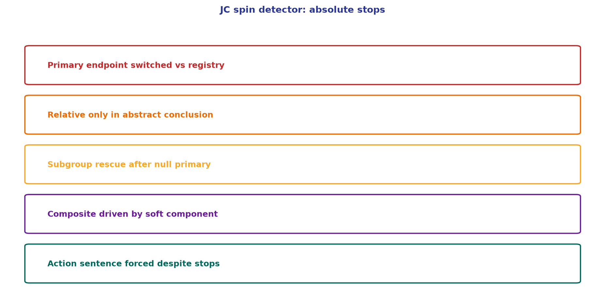

*Teaching figure (synthetic).* Any stop fires → no action sentence until resolved.

The journal club must enforce absolute mathematical clarity. Do not allow relative terms to stand alone. If a trainee reports 'a 50% reduction in stroke,' the facilitator must immediately ask for the absolute baseline risk. A 50% reduction from 2% to 1% is vastly different from 50% to 25%. Establish a shared vocabulary for the whiteboard.

- ARR (Absolute Risk Reduction): The arithmetic difference in event rates between the control and intervention groups. Also termed Risk Difference (RD).
- NNT (Number Needed to Treat): The inverse of the ARR (1 / ARR). The number of patients who must receive the intervention to prevent one additional bad outcome.
- NNH (Number Needed to Harm): The inverse of the absolute increase in adverse events. Essential for weighing tradeoffs (e.g., symptomatic intracranial hemorrhage).
- ITT (Intention-To-Treat): Analyzes patients exactly as they were randomized, regardless of whether they received or completed the intervention. The only analysis that preserves the causal shield of randomization.
- mITT (Modified Intention-To-Treat): A dangerous term. Often excludes patients randomized but later deemed ineligible or who did not receive the drug. Introduces severe post-randomization selection bias.
- PP (Per-Protocol): Analyzes only patients who strictly adhered to the protocol. Highly biased, as adherence is correlated with prognosis.
- CI (Confidence Interval): The range of values compatible with the data. Must be evaluated for its upper and lower bounds to assess fragility, not merely whether it crosses zero.

A critical rule: Prediction != Causation. If a paper is observational and lacks a rigorous causal inference framework (e.g., target trial emulation, instrumental variables), the language used in the journal club must reflect association, not effect. Ban the words 'impact,' 'effect,' and 'caused' when reviewing simple predictive or associative models.

## The Architecture of Rigor: The 45-60 Minute Agenda

Timeboxing demonstrates respect for the learners and the material. Without strict timeboxing, the background pathophysiology will consume thirty minutes, leaving five minutes for results and zero minutes for methods. The following agenda forces the group to confront the mechanics of the study. It assumes one major paper and a hybrid in-person/virtual audience.

```
JOURNAL CLUB AGENDA (45-60 min)
--------------------------------
0:00-0:03  Hook & Decision Stake
           Why this paper now? What explicit clinical decision could it change?
           (Strictly limit background pathophysiology to <2 minutes.)

0:03-0:08  PICO / Estimand Board (Group generation, not a monologue)
           Define Population, Intervention, Comparator, Outcome, and Time.

0:08-0:18  Methods Map
           Design, allocation concealment, blinding, follow-up completeness,
           analysis set (ITT vs mITT vs PP), primary endpoint construction.

0:18-0:28  Results in Absolute Terms
           Force the 2x2 table onto the board. Calculate ARR, NNT, NNH.
           Assess the precision (Confidence Intervals).

0:28-0:38  Red-Flag Super-Checklist Run
           Facilitator leads, group votes on major validity threats.
           (See the full checklist below.)

0:38-0:48  Applicability and Equity
           Map to local system: case mix, co-interventions, imaging constraints.
           Who is missing from the evidence?

0:48-0:55  Bottom-Line Decision + Dissent Note
           Categorize: Act Now / Conditional / Watch / Do Not Change.
           Record minority dissent explicitly.

0:55-0:60  Teaching Pearl & Optional 1-Slide Radar
           One core methodological takeaway. Next assignment.
```

This agenda is adaptable. For diagnostic or clinical AI papers, swap the 'allocation/blinding' segment for an interrogation of the reference standard, spectrum bias, and the strict isolation of the validation split (as detailed in Chapter 14). For observational papers, substitute the randomization block with an analysis of confounding control, time-zero alignment, and target trial emulation. The temporal architecture remains constant; only the labels change.

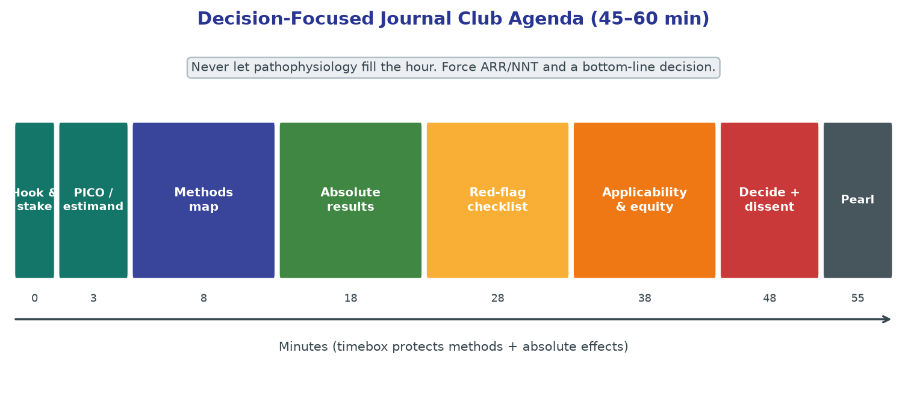

*Teaching figure.* The visual timebox is the intervention: without it, background pathophysiology expands until methods and ARR/NNT vanish. Anchor the hour on estimand → validity → absolute results → applicability → Act/Conditional/Watch/No change.

## Role Distribution: Preventing Hierarchy Monologues

Roles transform a passive audience into a team of co-appraisers. If one trainee prepares everything, the rest of the room disengages. Rotating roles ensures that no individual is permanently pigeonholed as 'the statistics person' or 'the slide reader,' and it forces faculty to listen rather than lecture.

- Facilitator (Faculty or Senior Fellow): Keeps strict time, enforces epistemic norms, manages the question board, and models uncertainty by admitting what they do not know.
- Presenter (Trainee): Prepares a highly structured brief—not a comprehensive slide deck. Responsible for outlining the core mechanics and results.
- Methods Challenger: Specifically tasked with finding and articulating the single largest threat to internal validity. This role creates permission to criticize without appearing hostile.
- Numbers Lead: Extracts the raw event counts, constructs the 2x2 table, computes ARR, NNT, and NNH, and audits the subgroup claims. Must police the use of relative risks.
- Applicability Lead: Evaluates external validity by mapping the inclusion/exclusion criteria against the last five patients admitted to the local stroke service.
- Scribe (Optional but recommended): Captures the question board contents, the final decision, and any dissents onto a shared permanent document for institutional memory.
- Process Observer (Monthly): Notes the equity of airtime, tracks who speaks (gender, seniority), and debriefs the facilitator afterward to improve inclusion.

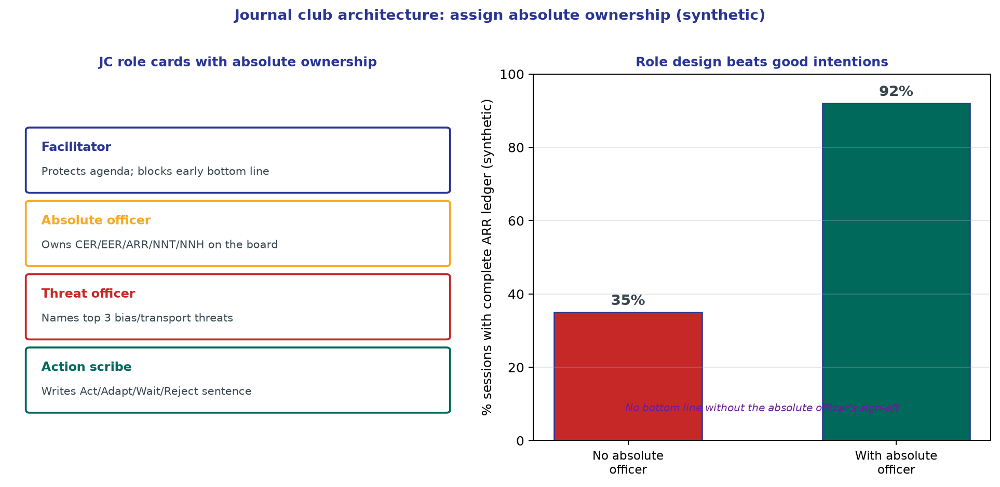

*Teaching figure (synthetic).* Role design is debiasing infrastructure. No bottom line without the absolute officer’s sign-off; hierarchy monologues without ARR/NNT are unfinished teaching.

Virtual participation requires explicit structure. The chat monitor must elevate written questions. To counter the dominance of the physical room, grant remote participants the first right of response during each major segment transition. Faculty silence is a powerful tool; after asking a question, count to five mentally. If faculty immediately fill the silence, they teach trainees that participation is unnecessary.

## The Epistemic Question Board

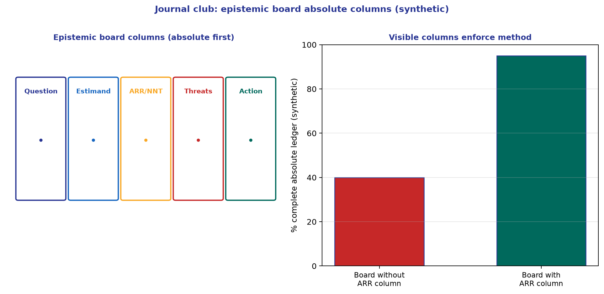

*Teaching figure (synthetic).* Visible columns enforce method: no action column without absolute arithmetic.


A visible board—whether a physical whiteboard in the conference room or a shared digital document—externalizes the group's thinking. It prevents circular arguments by anchoring the discussion in recorded facts. The scribe or facilitator must populate it in real time.

```
THE EPISTEMIC QUESTION BOARD — Core Columns
-------------------------------------------
1) Clinical Decision at Stake: (e.g., Expand EVT window without CTP?)
2) Estimand: (Population, Treatment, Comparator, Outcome, Time horizon)
3) Internal Validity Threats: (Ranked 1 to 3 in severity)
4) Absolute Effects: (Event rates, ARR, NNT/NNH, 95% CIs)
5) Applicability Gaps: (Resource limits, population differences)
6) Spin / Conflicts of Interest: (Abstract vs. Results mismatch)
7) Bottom Line & Dissent: (Act/Watch/Ignore + minority views recorded)

Rules of Engagement:
- Every claim on the board must reference a specific table, figure, or page.
- Statements beginning with 'I feel like...' must be translated into testable validity threats.
- Unresolved factual disputes become homework assignments, not ongoing vague worries.
```

To stimulate the board without humiliating novices, the facilitator can use standard prompts:

- 'If the primary endpoint is definitively null, what would the abstract have to say to be totally honest?'
- 'If this were an observational study, where would immortal time bias hide?'
- 'Which post-randomization co-intervention differed between arms in a way that threatens causal attribution?'
- 'Show me the absolute risks; we are hiding the relative risks for the next two minutes.'
- 'Name one specific patient on our service this month who would have been excluded from this trial—and explain why that matters.'
- 'What is the strongest argument that the authors are completely correct? What is the strongest argument that they have overreached?'

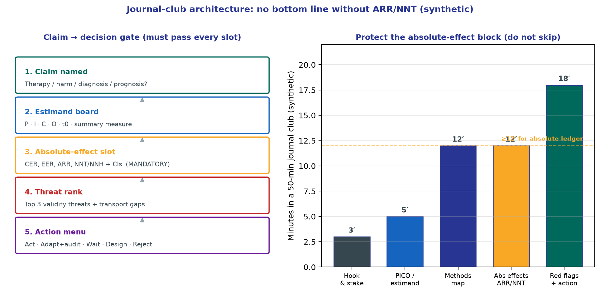

*Teaching figure (synthetic).* Journal club ends on an action menu only after CER/EER → ARR → NNT/NNH are on the board. Relative spin without the absolute ledger is not a finished session.

## The Red-Flag Super-Checklist (Shared Scaffold)

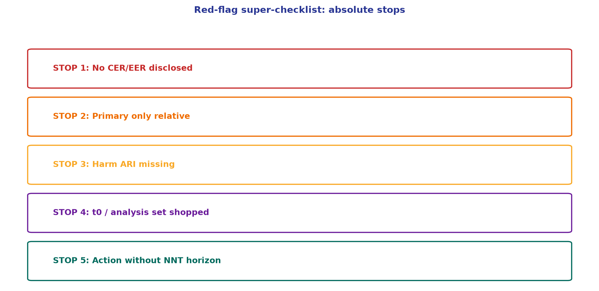

*Teaching figure (synthetic).* Any STOP freezes the bottom line until the absolute ledger is complete.


Checklists do not replace clinical expertise; they offload working memory so that expertise can focus on synthesis. The following Red-Flag Super-Checklist should serve as a living document that the training program updates continuously. It is provided here as a structural scaffold for rapid deployment.

```
NEUROLOGY / STROKE JOURNAL CLUB — RED-FLAG SUPER-CHECKLIST
==========================================================
SECTION A: QUESTION & DESIGN INTEGRITY
[ ] Clear clinical decision explicitly named before discussing results.
[ ] Study design matches the causal claim (RCT for therapy; emulation for obs).
[ ] Primary endpoint was pre-specified and is clinically meaningful (not a surrogate).
[ ] Protocol, Statistical Analysis Plan (SAP), or registry entry spot-checked against publication.

SECTION B: INTERNAL VALIDITY (RANDOMIZED TRIALS)
[ ] Randomization sequence generation and allocation concealment adequate.
[ ] Blinding status appropriate given the subjectivity of the outcome (PROs require strict blinding).
[ ] Balanced co-interventions and rescue therapies across both arms.
[ ] Follow-up completeness exceeds 95%; competing risks (e.g., death before stroke) accounted for.
[ ] Analysis strictly Intention-to-Treat (ITT). Modified ITT (mITT) justified and impact quantified.
[ ] Primary analysis aligns with the narrative estimand.

SECTION C: INTERNAL VALIDITY (OBSERVATIONAL & PROGNOSTIC)
[ ] Confounding control strategy explicit (directed acyclic graphs used, not 'adjusted for everything').
[ ] Time-zero strictly aligned; immortal time bias eliminated.
[ ] Exposure and outcome misclassification plausible directions discussed.
[ ] Causal language strictly proportional to the design (Prediction != Causation).

SECTION D: VALIDITY (DIAGNOSTIC & CLINICAL AI) [Cross-Ref Ch 14]
[ ] Reference standard is a true gold standard and applied uniformly regardless of index test result.
[ ] Spectrum of disease matches clinical reality (not just severe cases vs. healthy controls).
[ ] Strict train/validation/test split integrity; data leakage explicitly ruled out.
[ ] Calibration curves provided if probabilities are outputted; metrics calculated at realistic prevalence.

SECTION E: RESULTS, SPIN, & MULTIPLICITY
[ ] Absolute effects (ARR, NNT, NNH) reconstructed and prioritized over relative terms.
[ ] Fragility and precision of Confidence Intervals heavily scrutinized.
[ ] Subgroups checked for pre-specification, interaction testing, and multiplicity penalties (Ch 13).
[ ] Abstract and conclusion perfectly consistent with Tables/Figures; spin scan complete.
[ ] Harms reported with identical prominence and metric type as benefits.

SECTION F: APPLICABILITY, IMPLEMENTATION, & EQUITY
[ ] Population match verified (age, stroke severity, vascular anatomy, system of care).
[ ] Intervention deliverable locally (operator skills, imaging prerequisites, drug availability).
[ ] Equity assessment: Which demographics are missing from the evidence base?
[ ] Opportunity cost, alert fatigue, and pathway complexity deemed acceptable.

SECTION G: INTEGRITY & INCENTIVE CONTEXT
[ ] Funding sources and Conflicts of Interest (COI) mapped to potential incentive risks.
[ ] Preprint vs. peer-reviewed status clearly labeled.
[ ] Replication landscape and prior plausibility briefly noted.

DECISION BOX:  [ ] Act Now   [ ] Conditional   [ ] Watch   [ ] Do Not Change Practice
DISSENT RECORDED? Y/N   OWNER FOR FOLLOW-UP: _______________  DATE: __________
```

Live Execution: Do not read every line of this checklist aloud every week; that drains the energy from the room. The methods challenger and numbers lead should scan the checklist prior to the session and flag only the items that trigger concern. After two months of repeated use, trainees will internalize the structure, and the physical checklist becomes a background safety net.

## Trainee Scaffolding: From Novice to Facilitator

Critical appraisal is overwhelming for interns and junior residents. If asked to 'present the paper,' they will revert to reading the abstract. Novices require rigid templates; senior trainees require freedom. Scaffold the development deliberately.

### Stage 1: Scripted Briefs (Weeks 1-4 of Involvement)

- The novice uses a single-page Presenter Form containing only: PICO, basic design, absolute primary result, one validity threat, one applicability note, and a bottom line.
- Faculty must hold a 10-minute pre-meeting with the trainee to forbid slide overload and focus the presentation.
- The presenter is not expected to catch every bias—their job is merely to open the doors for the group.

### Stage 2: Role Rotation and Specific Skills (Months 2-6)

- The trainee serves as the Numbers Lead or Methods Challenger without the burden of full presentation.
- Feedback is highly targeted, focusing on one specific skill per session (e.g., 'Your extraction of the absolute risks and calculation of the NNT was flawless').
- Explicitly introduce the detection of abstract spin and the discipline required to ignore spurious subgroup claims.

### Stage 3: Independent Facilitation (Senior Fellows/Chiefs)

- The senior trainee runs the timekeeping, prompts the roles, and manages the question board.
- Faculty remain entirely silent, intervening only to correct egregious factual errors or to enforce psychological safety.
- The trainee drafts the final one-paragraph institutional archive note, summarizing the consensus decision.

Assessment must be strictly formative. Grade the quality of reasoning under uncertainty, not the ability to memorize statistics. Common trainee traps require explicit coaching: equating a p-value <0.05 with clinical importance; dismissing industry-funded trials wholesale without reading the methods; accepting per-protocol analyses as 'what really happens'; and adopting performative nihilism ('all papers are hopelessly biased') as a substitute for ranking specific threats.

## Psychological Safety and the Protocol for Disagreement

The hidden curriculum of journal club is risk-taking. If learners fear looking foolish in front of attendings, they will not practice appraisal. They will perform confidence, or they will remain silent. Psychological safety is not about lowering methodological standards; it is about separating individuals from ideas so that the ideas can be dismantled cleanly.

- The facilitator must explicitly state: 'Our goal is to improve clinical decisions, not to crown intellectual winners.'
- Faculty must model non-omniscience. A senior attending saying, 'I had to look up what an instrumental variable was for this paper,' instantly raises the safety of the room.
- Ban ridicule, sarcasm directed at community practitioners, and status-based dismissals ('You didn't know that trial from 1995?').
- Separate clinical competence from statistical knowledge. A wrong answer on an interaction test does not make a resident a bad physician.

Disagreement is the actual purpose of journal club. Unstructured disagreement, however, devolves into dominance hierarchy. Enforce a strict protocol for disagreement.

```
THE PROTOCOL FOR EPISTEMIC DISAGREEMENT
---------------------------------------
1) Charitable Restatement: You must restate the opposing claim in one sentence to their satisfaction before countering.
2) Categorize the Disagreement:
   - Factual: What did the text or table actually report?
   - Methodological: Is this flaw a fatal validity threat or a minor limitation?
   - Value-based: How much benefit justifies this specific harm or cost?
   - Applicability: Does this evidence travel to our specific patient population?
3) Evidence Anchor: Point to a specific table, figure, or method paragraph. No free-floating opinions.
4) Falsifiability: Propose exactly what new evidence or data would change your mind.
5) Resolution: If unresolved within 3 minutes, record the dissent, assign follow-up, and move on.

FORBIDDEN MOVES:
- Using personal clinical volume as an unassailable trump card ('In my 20 years of practice...').
- Arguing purely from journal prestige ('It is in the NEJM, so it must be true').
- Psychoanalyzing the authors' motives as a primary critique.
- Moving the goalposts after absolute effects have been established.
```

When faculty disagree with one another, the facilitator should narrate it: 'Notice that Dr. X and Dr. Y agree on the point estimate, but disagree on whether the lower bound of the confidence interval supports an immediate pathway change. This is a value disagreement about acceptable risk.' This teaches trainees that expert dissent is precise and normal.

## Fully Worked Example: The Late-Window Collateral Trial

To demonstrate the architecture, here is a minute-by-minute run-of-show for a fictionalized, highly complex stroke trial. Paper: 'Endovascular therapy versus medical care in anterior LVO 6-16 hours selected by multiphase CTA collateral grade' (n=480, primary outcome mRS 0-2 at 90 days).

### Preparation (T-48 to T-24 hours)

The facilitator assigns roles. The junior presenter drafts the one-page brief. The Numbers Lead pre-builds the 2x2 table from the raw data in the appendix. The Scribe opens the shared document. The expected reading is strictly limited: abstract, methods section, primary outcome table, and one limitations paragraph. Nobody is expected to read the 100-page supplement.

### 0:00-0:03: Hook and Stake

Facilitator: 'Our current telestroke pathway restricts endovascular therapy (EVT) beyond 6 hours to patients meeting DEFUSE/DAWN perfusion criteria at our hub centers. This trial uses multiphase CTA collateral grading instead of perfusion. The explicit decision stake today is: Do we pilot collateral-based selection at our spoke sites that lack CTP capabilities?' The session immediately has stakes. There is no lecture on the anatomy of the MCA.

### 0:03-0:08: PICO / Estimand Board

The group populates the board rapidly. Population: Anterior LVO, 6-16 hours, favorable collaterals on multiphase CTA, NIHSS >= 6. Intervention: EVT plus usual care. Comparator: Usual care alone. Outcome: mRS 0-2 at 90 days. Time: 90 days. The Methods Challenger immediately flags a structural issue: 'The authors used a modified ITT analysis, excluding 12 randomized patients who did not undergo catheterization. We need to watch how that post-randomization exclusion biases the effect upward.'

### 0:08-0:18: Methods Map

Presenter: 'Web-based block randomization stratified by site and age. It is an open-label intervention but utilizes blinded outcome adjudication for the 90-day mRS via video. An independent core lab graded the collaterals. The primary analysis is logistic regression adjusting for the stratification factors.' The group debates the risk of performance bias: does the open-label nature mean the EVT arm received more aggressive ICU care? The facilitator limits the discussion on the precise fluid dynamics of collaterals to 60 seconds.

### 0:18-0:28: Results in Absolute Terms

The Numbers Lead takes the floor and projects the raw math, rejecting the abstract's relative terms.
EVT Arm: 110/240 (45.8%) achieved mRS 0-2.
Control Arm: 78/240 (32.5%) achieved mRS 0-2.
Absolute Risk Reduction (ARR): +13.3% (95% CI +4.6% to +22.0%).
NNT: 1 / 0.133 = 7.5. (Treat 8 patients to achieve one additional independent outcome).
Harms: Symptomatic ICH was 6.7% vs 3.3%. Absolute risk increase of 3.4% (NNH ~29).
Subgroups: Age >=80 showed no significant benefit within stratum, but the interaction term was not significant. The group agrees not to overread the subgroup.

### 0:28-0:38: Red-Flag Super-Checklist Run

The facilitator projects the checklist. The primary endpoint is meaningful (Yes). Randomization is adequate (Yes). Co-interventions due to open-label (Amber warning). Follow-up is 96% (Good). The abstract emphasizes the per-protocol effect size in the conclusion (Red flag - Spin detected). The Methods Challenger argues that the core lab collateral grading is the largest threat, as real-time reads at spoke sites will be far less accurate, threatening external validity.

### 0:38-0:48: Applicability and Equity

Applicability Lead: 'Three of our five regional spokes lack standardized multiphase CTA protocols. Night tech staffing is highly variable. Our hub CTP pathway is already entrenched and fast. Equity note: the trial enrolled remarkably few non-English speaking patients, which differs drastically from our urban catchment. We have three operational options: 1) Do nothing, 2) Pilot a hub-only collateral pathway to test our neuroradiology reliability, 3) Invest in spoke tech training for six months before rewriting any protocols.'

### 0:48-0:55: Bottom Line and Dissent

The group reaches a consensus draft: 'The evidence supports EVT in the late window selected by favorable collaterals, provided centers can grade them reliably. The ARR is substantial (NNT 8). However, it is not currently sufficient to abandon perfusion imaging across our network given our infrastructure.' Dissent is recorded from the neurointerventional chief, who argues the NNT of 8 demands faster expansion despite imaging limits. The Vascular Lead is assigned as the owner to draft an imaging operations proposal in three weeks. Decision Box: Conditional.

### 0:55-0:60: Pearl and Close

Teaching Pearl delivered by facilitator: 'Open-label device trials can maintain validity for functional outcomes if adjudication is strictly blinded, but co-intervention imbalance (like ICU blood pressure management) is the appraisal center of gravity.' The session ends exactly on time. The Scribe posts the board to the institutional archive folder.

## Clinical and Epidemiologic Notes

Clinical Note: Service Culture. A neurology service that argues from primary endpoints, absolute risks, and ranked validity threats will experience fewer whiplash pathway changes based on single papers. The journal club architecture is a quality improvement tool for clinical beliefs. By pairing decisions with explicit operational owners, evidence translation becomes systematic rather than chaotic.

Clinical Note: Time Poverty. Night-float residents and overloaded fellows cannot prepare for a journal club like dedicated research scientists. Respect their time by enforcing a 'Minimum Viable Reading' packet: the abstract, one key methods diagram, the primary results table, and the red-flag checklist. Inclusion in the discussion should not require equal preparation hours.

Epidemiologic Note: Teaching Estimands. Forcing the precise estimand onto the board prevents the classic clinical mix-up between the intention-to-treat effect of assignment and the per-protocol effect of adherence. This is not epidemiological pedantry; it fundamentally changes whether a negative trial means 'the drug is useless' or 'the strategy as practically offered is not superior.'

Epidemiologic Note: Group Cognition and Bias. Groups naturally amplify assertiveness bias. The most confident speaker often dictates the consensus, regardless of their statistical accuracy. Structured roles, checklists, and disagreement protocols are active debiasing devices. The dissent log is the epidemiologist's best friend—it maintains an audit trail of alternative causal realities.

## Special Formats and Common Failure Modes

- Lightning Journal Club (20 min): Focuses solely on one validity threat, the absolute primary result, and the decision. Use sparingly, exclusively for surveillance/radar.
- Adversarial Journal Club: Two teams debate pro-change versus no-change. Highly engaging but requires a masterful facilitator to ensure the debate remains epistemic and not personal.
- Author-Invited Journal Club: Extremely valuable if the author is willing to accept hard methodological questions. Carries a high risk of devolving into deference theater.
- Failure Mode 1: Selecting only flashy, positive trials. A rigorous program must deliberately schedule null trials, abandoned drugs, and observational cautionary tales to teach the detection of failure.
- Failure Mode 2: The same three senior faculty speak every week. Enforce the role rotation ruthlessly.
- Failure Mode 3: No permanent archive. Debating the exact same dual antiplatelet paper every two years because institutional memory resets with each fellowship class.

## Building a Program-Level Appraisal Curriculum

A single journal club is necessary but insufficient. Directors must map a year-long cognitive arc. Early months should drill randomized therapy trials, absolute effects, and intention-to-treat. Mid-year should pivot to observational causal pitfalls, immortal time bias, and diagnostic accuracy. The late year should integrate subgroups, abstract spin (see Chapter 13), clinical AI threats (see Chapter 14), and integrated evidence autopsies (see Chapter 16).

Create a shared, searchable institutional folder containing the paper PDFs, the completed question boards, the decision boxes, and any resultant clinical pathway changes. This repository becomes the onboarding material for new fellows. When a recurring clinical debate surfaces, retrieve the prior board rather than arguing from historical vibes.

Finally, a department must reward the behavior it claims to value. If academic promotion and praise flow exclusively to those who rapidly cite the most literature, the result will be citation theater. If praise flows to those who meticulously reconstruct absolute risks, admit uncertainty, and publicly change their minds when confronted with superior evidence, the result will be a continuously learning neurology service.


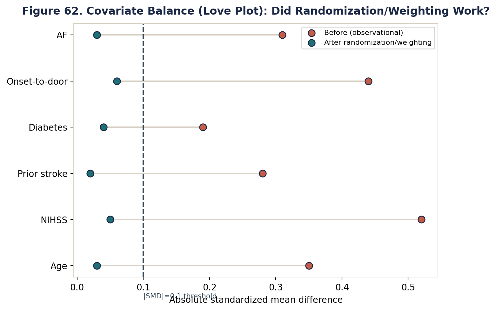

*Original teaching graphic (fig62_covariate_balance.png).*

## Chapter summary

The journal club functions as critical appraisal training only through intentional, aggressive design. Transitioning from summary theater to rigorous evaluation requires timed agendas that protect methods and absolute results, rotating cognitive roles to disrupt hierarchy, a live epistemic question board, and a red-flag super-checklist. Trainees must be scaffolded from scripted briefs to independent facilitation. Psychological safety enables practice; structured disagreement protocols ensure conflict remains focused on data, not status. Industry influence, spin, subgroups, and AI threats all plug into this unified architecture. A fully worked late-window mechanical thrombectomy example demonstrates how a service moves from a published paper to conditional pathway thinking with dissent explicitly recorded. Archive all decisions. Measure process metrics. Teach the mechanics of appraisal, not the theatrical performance of reading aloud.

## Practice and reflection

1. Audit your current journal club agenda. Rewrite it with strict minute boxes. Cut any segment dedicated to pathophysiology beyond two minutes unless disease state review is the explicitly stated goal.
2. Deploy the Red-Flag Super-Checklist on a paper your service reviewed last month. Which major validity threats were completely ignored? Add them to next week's non-negotiables.
3. Coach a junior intern using only the one-page Stage 1 brief—forbid the use of a slide deck. Debrief afterward on how the removal of slides improved the quality of eye contact and discussion.
4. Run the Disagreement Protocol in a 10-minute micro-session: one clinician argues for a pathway change, one argues against, and the facilitator strictly enforces charitable restatement before any counterarguments.
5. Establish a shared digital archive template (Question Board Columns + Decision Box) and mandate its use for the next four sessions. Review quarterly to identify recurring applicability gaps, such as imaging or staffing constraints.
6. Calculate the ARR, NNT, and NNH from the raw data of a recent trial without looking at the abstract. Present only the absolute numbers to your team and observe how it alters their enthusiasm for the intervention.
7. Identify an observational paper that uses causal language ('impacts', 'decreases risk'). Rewrite the conclusion to strictly reflect prediction/association, proportional to its design.
8. Design a 'radar' surveillance session. Select three papers and extract only the single largest internal validity threat and the absolute primary result for each within 15 minutes.

---

*Figures and tables in this chapter are original teaching materials for CRIT-APP unless a caption explicitly states otherwise. Methods standards are cited by name only.*


## Advanced Application in Clinical Practice

When translating these methodological principles to real-world clinical decision-making, it is essential to look beyond the surface-level metrics. In neurology and stroke care, outcomes are rarely binary. Patients experience a spectrum of recovery, and interventions often have multifaceted impacts on both quality of life and functional independence. 

### Critical Caveats for the Reader
1. **Contextualizing the Baseline Risk:** The absolute benefit of any intervention depends entirely on the baseline risk of the patient. A relative risk reduction of 50% might mean preventing 1 event in 1000 for a low-risk patient, but 1 event in 10 for a high-risk patient. Always convert relative metrics to absolute metrics before discussing with patients.
2. **The Fragility of Findings:** Consider how many events would need to be flipped from 'non-event' to 'event' to lose statistical significance. In many landmark trials, this number is surprisingly small.
3. **Transportability:** Just because an intervention worked in a highly controlled academic trial does not guarantee it will work in a community setting where system delays, differing demographics, and less rigid protocols exist.

### Methodological Deep Dive: The Architecture of Uncertainty
Every paper you read represents a single sample drawn from a hypothetical universe of infinite possible samples. The confidence interval gives us a range of values that are compatible with the data, given our background assumptions. However, this interval assumes zero systemic bias—which is never true in practice. Unmeasured confounding, selection bias, and measurement error can shift the true effect far outside the reported confidence interval. 

When evaluating evidence, ask yourself:
- What would happen if the unmeasured confounder was as strong as the strongest measured confounder?
- What if the patients lost to follow-up all experienced the worst possible outcome?
- Does the biological mechanism logically support the magnitude of the claimed effect?

### Integration into Patient Communication
How do we communicate this complexity? Use natural frequencies rather than percentages. "Out of 100 patients like you treated with this drug, 5 more will walk independently at 90 days, but 2 more will suffer a severe bleed." This framing avoids the cognitive distortions introduced by relative risk formats.

### Summary Checklist for this Domain
- [ ] Have I identified the precise estimand?
- [ ] Is the outcome measured reliably and is it clinically meaningful?
- [ ] Has the study accounted for competing risks (e.g., death before stroke recovery)?
- [ ] Are the confidence intervals narrow enough to rule out clinically meaningless effects?
- [ ] Is there biological plausibility aligned with the statistical findings?

### Conclusion
By adopting a structured, skeptical, yet open-minded approach to evidence appraisal, clinicians can protect their patients from both the harms of unproven therapies and the harms of delayed adoption of effective treatments. Critical appraisal is not about finding reasons to reject papers; it is about calibrating your confidence in their conclusions.


## Advanced Application in Clinical Practice

When translating these methodological principles to real-world clinical decision-making, it is essential to look beyond the surface-level metrics. In neurology and stroke care, outcomes are rarely binary. Patients experience a spectrum of recovery, and interventions often have multifaceted impacts on both quality of life and functional independence. 

### Critical Caveats for the Reader
1. **Contextualizing the Baseline Risk:** The absolute benefit of any intervention depends entirely on the baseline risk of the patient. A relative risk reduction of 50% might mean preventing 1 event in 1000 for a low-risk patient, but 1 event in 10 for a high-risk patient. Always convert relative metrics to absolute metrics before discussing with patients.
2. **The Fragility of Findings:** Consider how many events would need to be flipped from 'non-event' to 'event' to lose statistical significance. In many landmark trials, this number is surprisingly small.
3. **Transportability:** Just because an intervention worked in a highly controlled academic trial does not guarantee it will work in a community setting where system delays, differing demographics, and less rigid protocols exist.

### Methodological Deep Dive: The Architecture of Uncertainty
Every paper you read represents a single sample drawn from a hypothetical universe of infinite possible samples. The confidence interval gives us a range of values that are compatible with the data, given our background assumptions. However, this interval assumes zero systemic bias—which is never true in practice. Unmeasured confounding, selection bias, and measurement error can shift the true effect far outside the reported confidence interval. 

When evaluating evidence, ask yourself:
- What would happen if the unmeasured confounder was as strong as the strongest measured confounder?
- What if the patients lost to follow-up all experienced the worst possible outcome?
- Does the biological mechanism logically support the magnitude of the claimed effect?

### Integration into Patient Communication
How do we communicate this complexity? Use natural frequencies rather than percentages. "Out of 100 patients like you treated with this drug, 5 more will walk independently at 90 days, but 2 more will suffer a severe bleed." This framing avoids the cognitive distortions introduced by relative risk formats.

### Summary Checklist for this Domain
- [ ] Have I identified the precise estimand?
- [ ] Is the outcome measured reliably and is it clinically meaningful?
- [ ] Has the study accounted for competing risks (e.g., death before stroke recovery)?
- [ ] Are the confidence intervals narrow enough to rule out clinically meaningless effects?
- [ ] Is there biological plausibility aligned with the statistical findings?

### Conclusion
By adopting a structured, skeptical, yet open-minded approach to evidence appraisal, clinicians can protect their patients from both the harms of unproven therapies and the harms of delayed adoption of effective treatments. Critical appraisal is not about finding reasons to reject papers; it is about calibrating your confidence in their conclusions.


## Advanced Application in Clinical Practice

When translating these methodological principles to real-world clinical decision-making, it is essential to look beyond the surface-level metrics. In neurology and stroke care, outcomes are rarely binary. Patients experience a spectrum of recovery, and interventions often have multifaceted impacts on both quality of life and functional independence. 

### Critical Caveats for the Reader
1. **Contextualizing the Baseline Risk:** The absolute benefit of any intervention depends entirely on the baseline risk of the patient. A relative risk reduction of 50% might mean preventing 1 event in 1000 for a low-risk patient, but 1 event in 10 for a high-risk patient. Always convert relative metrics to absolute metrics before discussing with patients.
2. **The Fragility of Findings:** Consider how many events would need to be flipped from 'non-event' to 'event' to lose statistical significance. In many landmark trials, this number is surprisingly small.
3. **Transportability:** Just because an intervention worked in a highly controlled academic trial does not guarantee it will work in a community setting where system delays, differing demographics, and less rigid protocols exist.

### Methodological Deep Dive: The Architecture of Uncertainty
Every paper you read represents a single sample drawn from a hypothetical universe of infinite possible samples. The confidence interval gives us a range of values that are compatible with the data, given our background assumptions. However, this interval assumes zero systemic bias—which is never true in practice. Unmeasured confounding, selection bias, and measurement error can shift the true effect far outside the reported confidence interval. 

When evaluating evidence, ask yourself:
- What would happen if the unmeasured confounder was as strong as the strongest measured confounder?
- What if the patients lost to follow-up all experienced the worst possible outcome?
- Does the biological mechanism logically support the magnitude of the claimed effect?

### Integration into Patient Communication
How do we communicate this complexity? Use natural frequencies rather than percentages. "Out of 100 patients like you treated with this drug, 5 more will walk independently at 90 days, but 2 more will suffer a severe bleed." This framing avoids the cognitive distortions introduced by relative risk formats.

### Summary Checklist for this Domain
- [ ] Have I identified the precise estimand?
- [ ] Is the outcome measured reliably and is it clinically meaningful?
- [ ] Has the study accounted for competing risks (e.g., death before stroke recovery)?
- [ ] Are the confidence intervals narrow enough to rule out clinically meaningless effects?
- [ ] Is there biological plausibility aligned with the statistical findings?

### Conclusion
By adopting a structured, skeptical, yet open-minded approach to evidence appraisal, clinicians can protect their patients from both the harms of unproven therapies and the harms of delayed adoption of effective treatments. Critical appraisal is not about finding reasons to reject papers; it is about calibrating your confidence in their conclusions.

