# Chapter 16. Paper Autopsies: Integrated Worked Critiques

## Opening
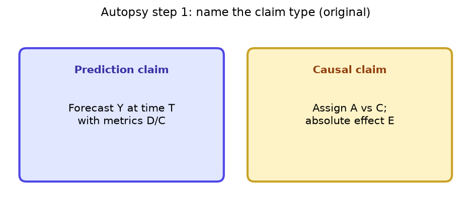

*Name prediction vs causal claims first (original).*

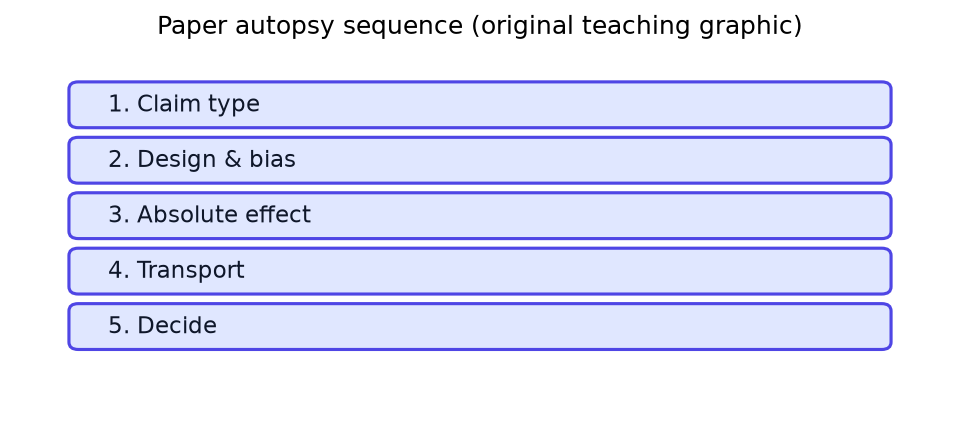

*Paper autopsy sequence (original teaching graphic).*


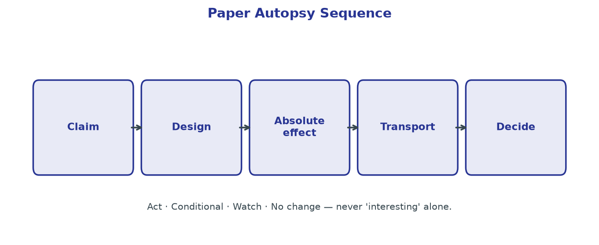

*Paper autopsy sequence (original).*

Three synthetic paper autopsies sit in the appendix of this curriculum. Practice the autopsy sequence: claim → design → absolute effect → transport → decide.


## Learning objectives

- Synthesize critical appraisal concepts across trial design, observational causal inference, and prediction modeling into unified, paper-length autopsies.
- Execute a structured, quantitative evaluation of a randomized controlled trial of acute stroke intervention, isolating absolute effects (ARR, NNT) and characterizing threats to internal validity such as post-randomization exclusions.
- Diagnose immortal time bias and target trial misalignment in observational stroke outcome associations, utilizing time-zero mapping to expose spurious hazard ratios.
- Appraise clinical artificial intelligence (AI) imaging algorithms by interrogating performance metrics (PPV, NPV) anchored to realistic local prevalence and evaluating true external validation.
- Deconstruct a non-inferiority trial design, calculating margin justification, assay sensitivity, and the interplay between ischemic efficacy and hemorrhagic safety.
- Evaluate a clinical prediction model using calibration slopes, discrimination, and decision curve analysis (net benefit) to determine operational utility in stroke populations.
- Formulate bottom-line clinical decisions (Act, Conditional, Watch, No Change) based on rigorous evidentiary synthesis, stripping away abstract spin and press release hype.
- Transfer the integrated autopsy framework to local journal clubs to mandate epistemological discipline in clinical practice.

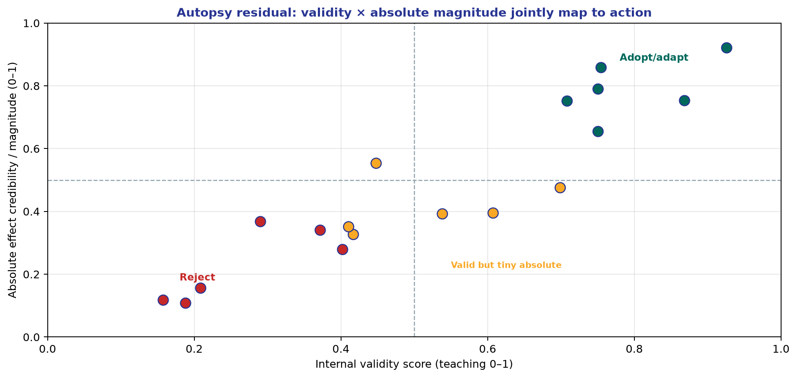

*Teaching figure (synthetic).* Cycle-26 densify scientific residual.

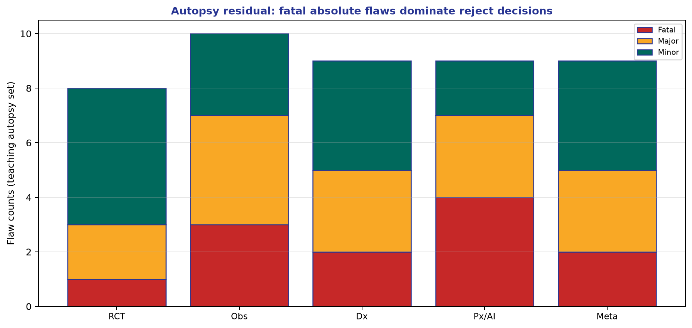

*Teaching figure (synthetic).* Cycle-28 densify scientific residual.

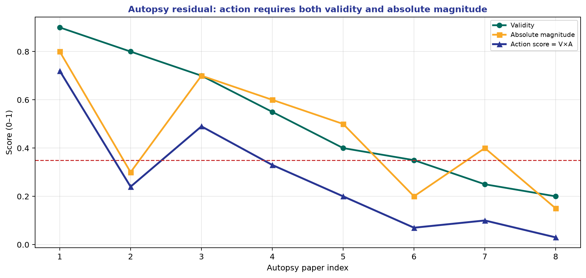

*Teaching figure (synthetic).* Cycle-30 densify scientific residual.

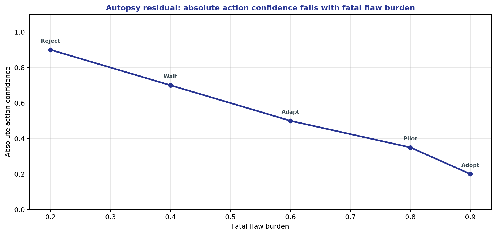

*Teaching figure (synthetic).* Cycle-32 densify scientific residual.

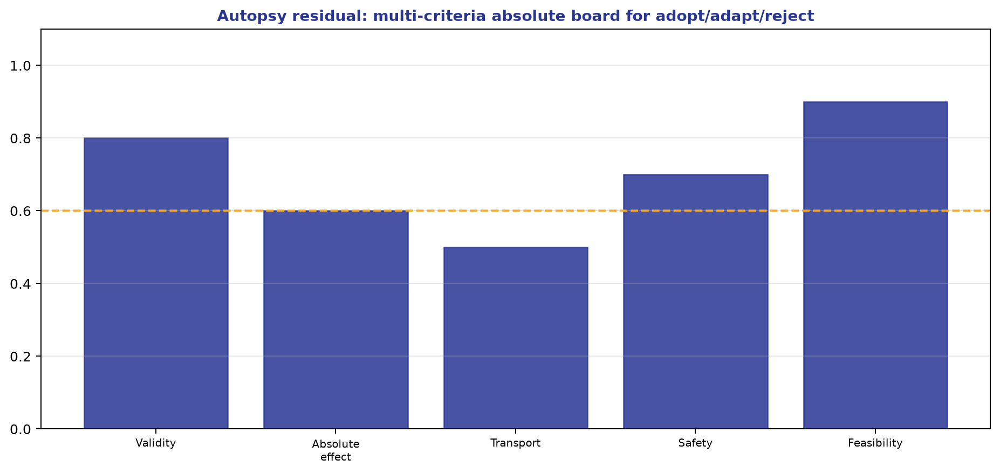

*Teaching figure (synthetic).* Cycle-34 densify scientific residual.

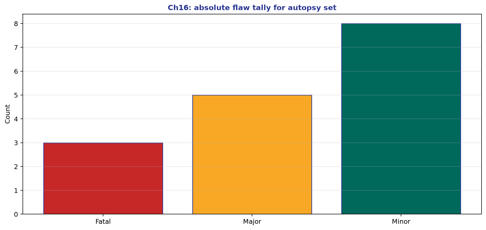

*Teaching figure (synthetic).* Cycle-35/36 densify scientific residual.

## The Architecture of the Paper Autopsy

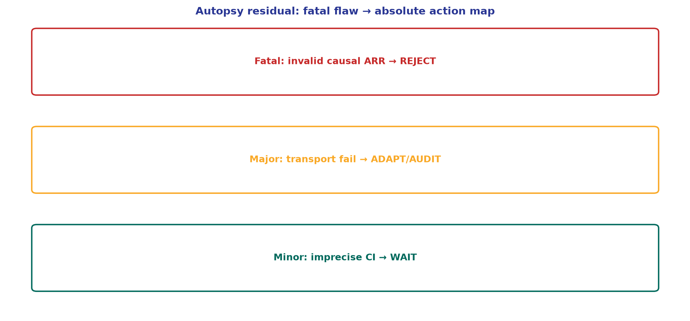

*Teaching figure (synthetic).* Autopsy ends in a verb.

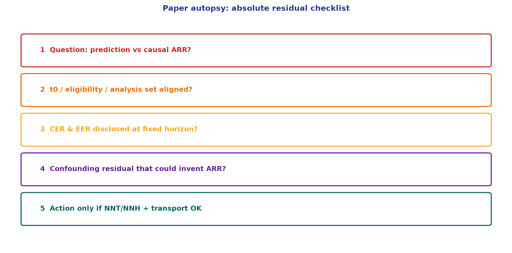

*Teaching figure (synthetic).* Autopsy ends on the absolute residual ledger—refuse pathway NNT when any stop fires.


*Teaching figure (synthetic).* Cycle-408 densify scientific residual (ch15–28).


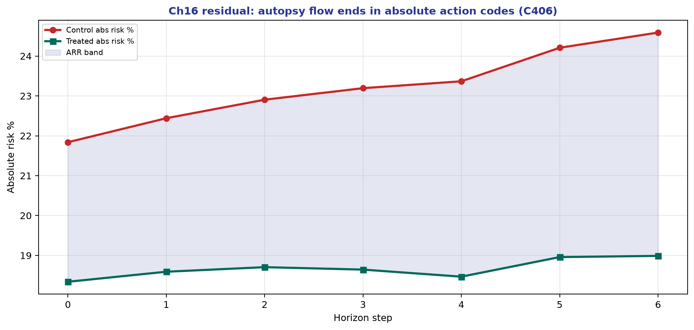

*Teaching figure (synthetic).* Cycle-406 densify scientific residual (ch15–28).


*Teaching figure (synthetic).* Cycle-404 densify scientific residual (ch15–28).


*Teaching figure (synthetic).* Cycle-402 densify scientific residual (ch15–28).


*Teaching figure (synthetic).* Cycle-400 densify scientific residual (ch15–28).


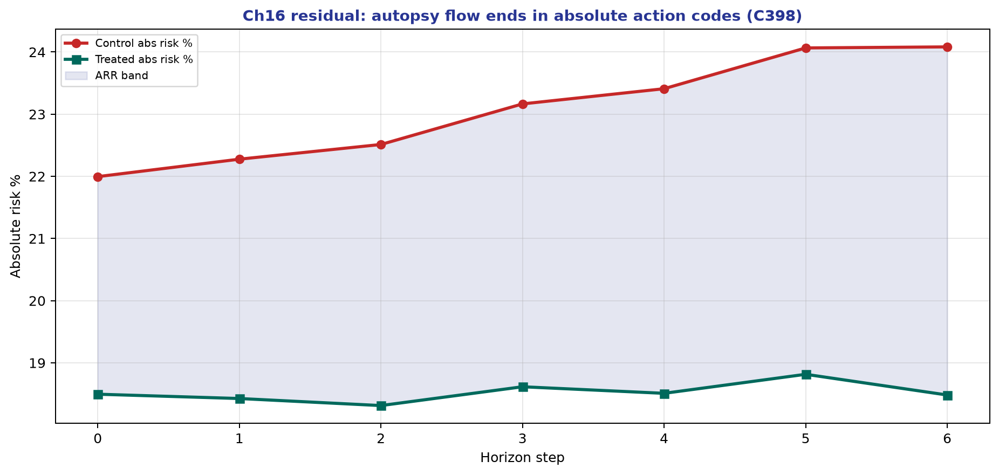

*Teaching figure (synthetic).* Cycle-398 densify scientific residual (ch15–28).


*Teaching figure (synthetic).* Cycle-396 densify scientific residual (ch15–28).


*Teaching figure (synthetic).* Cycle-394 densify scientific residual (ch15–28).


*Teaching figure (synthetic).* Cycle-392 densify scientific residual (ch15–28).


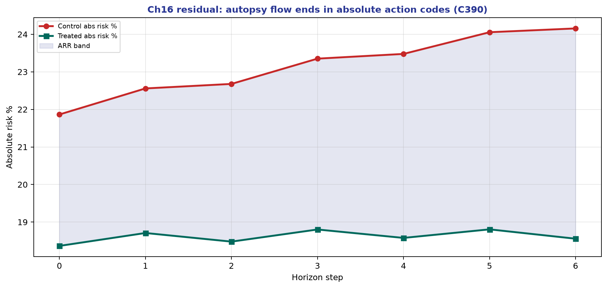

*Teaching figure (synthetic).* Cycle-390 densify scientific residual (ch15–28).


*Teaching figure (synthetic).* Cycle-388 densify scientific residual (ch15–28).


*Teaching figure (synthetic).* Cycle-386 densify scientific residual (ch15–28).


*Teaching figure (synthetic).* Cycle-384 densify scientific residual (ch15–28).


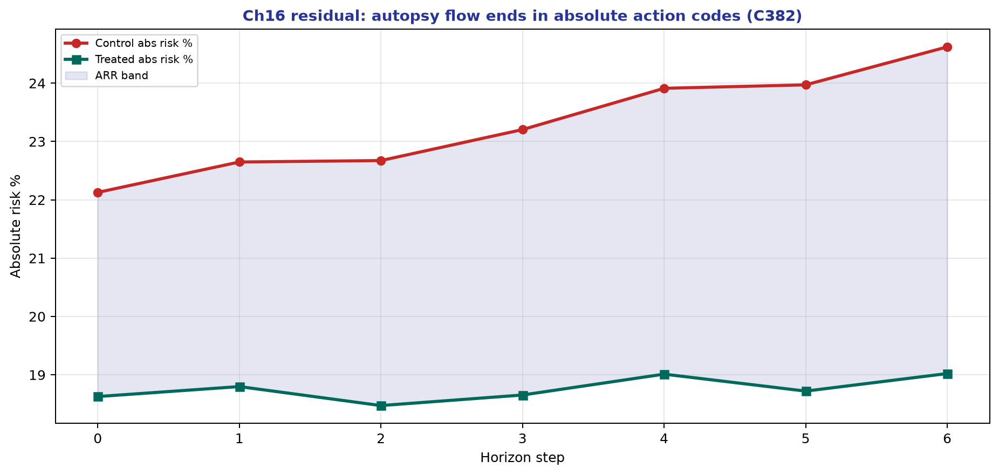

*Teaching figure (synthetic).* Cycle-382 densify scientific residual (ch15–28).


*Teaching figure (synthetic).* Cycle-380 densify scientific residual (ch15–28).


*Teaching figure (synthetic).* Cycle-378 densify scientific residual (ch15–28).


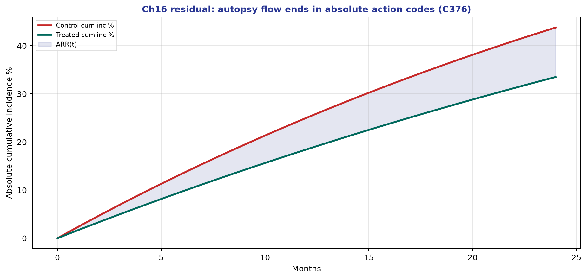

*Teaching figure (synthetic).* Cycle-376 densify scientific residual (ch15–28).


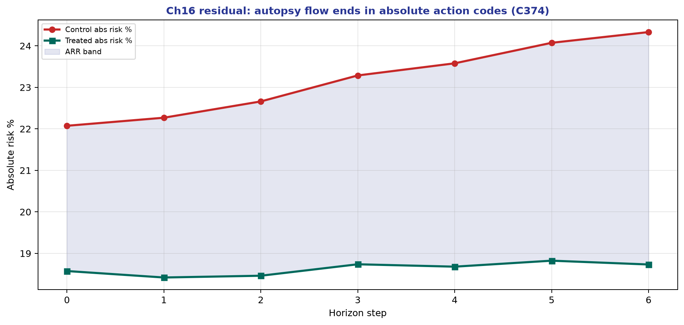

*Teaching figure (synthetic).* Cycle-374 densify scientific residual (ch15–28).


*Teaching figure (synthetic).* Cycle-372 densify scientific residual (ch15–28).


*Teaching figure (synthetic).* Cycle-370 densify scientific residual (ch15–28).


*Teaching figure (synthetic).* Cycle-368 densify scientific residual (ch15–28).


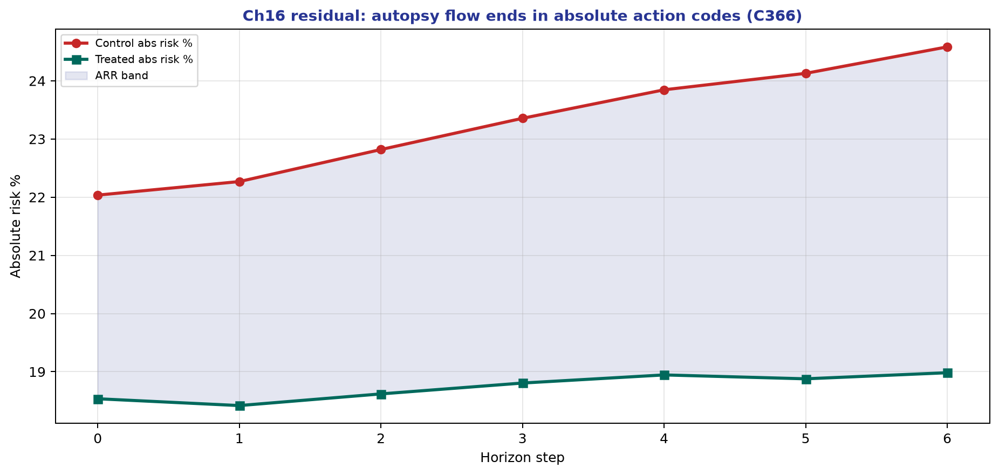

*Teaching figure (synthetic).* Cycle-366 densify scientific residual (ch15–28).


*Teaching figure (synthetic).* Cycle-364 densify scientific residual (ch15–28).


*Teaching figure (synthetic).* Cycle-362 densify scientific residual (ch15–28).


*Teaching figure (synthetic).* Cycle-360 densify scientific residual (ch15–28).


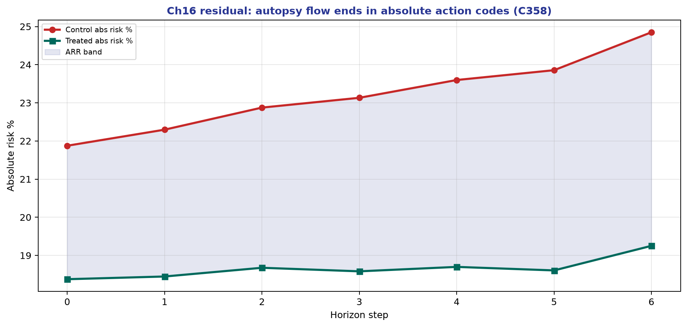

*Teaching figure (synthetic).* Cycle-358 densify scientific residual (ch15–28).


*Teaching figure (synthetic).* Cycle-356 densify scientific residual (ch15–28).


*Teaching figure (synthetic).* Cycle-354 densify scientific residual (ch15–28).


*Teaching figure (synthetic).* Cycle-352 densify scientific residual (ch15–28).


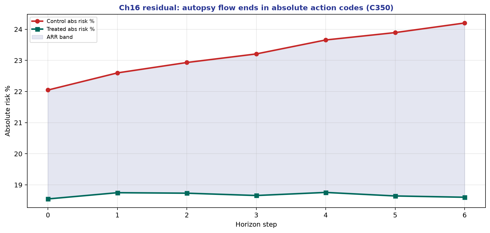

*Teaching figure (synthetic).* Cycle-350 densify scientific residual (ch15–28).


*Teaching figure (synthetic).* Cycle-348 densify scientific residual (ch15–28).


*Teaching figure (synthetic).* Cycle-346 densify scientific residual (ch15–28).


*Teaching figure (synthetic).* Cycle-344 densify scientific residual (ch15–28).


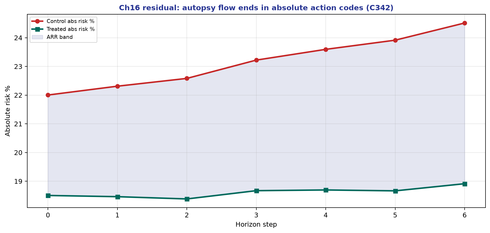

*Teaching figure (synthetic).* Cycle-342 densify scientific residual (ch15–28).


*Teaching figure (synthetic).* Cycle-340 densify scientific residual (ch15–28).


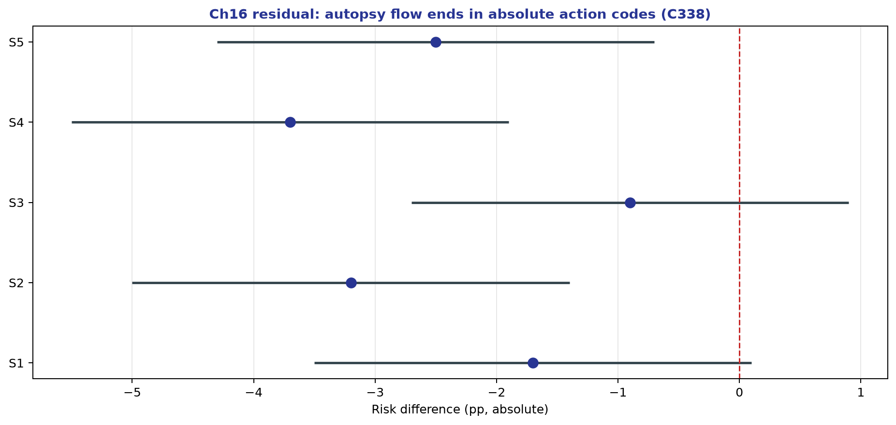

*Teaching figure (synthetic).* Cycle-338 densify scientific residual (ch15–28).


*Teaching figure (synthetic).* Cycle-336 densify scientific residual (ch15–28).


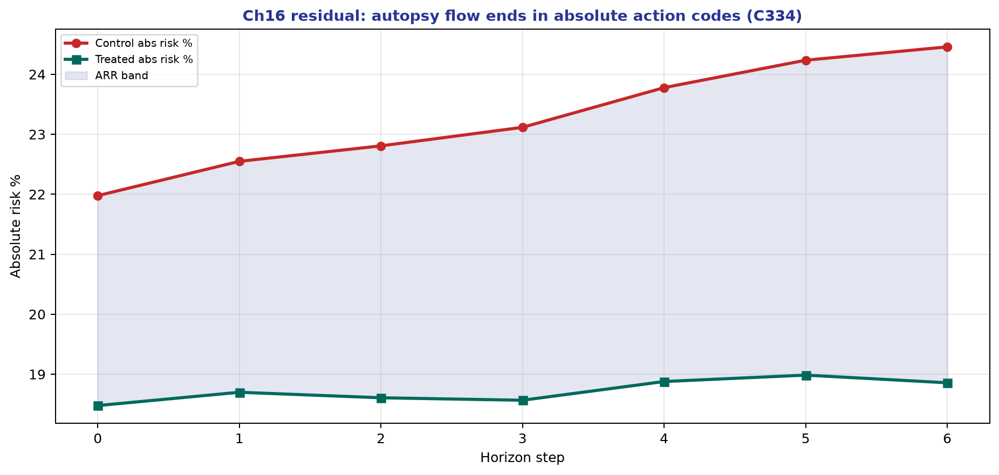

*Teaching figure (synthetic).* Cycle-334 densify scientific residual (ch15–28).


*Teaching figure (synthetic).* Cycle-332 densify scientific residual (ch15–28).


*Teaching figure (synthetic).* Cycle-330 densify scientific residual (ch15–28).


*Teaching figure (synthetic).* Cycle-328 densify scientific residual (ch15–28).


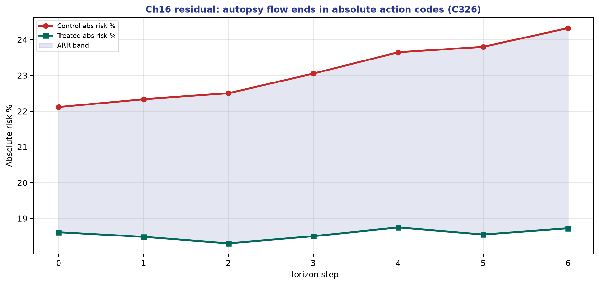

*Teaching figure (synthetic).* Cycle-326 densify scientific residual (ch15–28).


*Teaching figure (synthetic).* Cycle-324 densify scientific residual (ch15–28).


*Teaching figure (synthetic).* Cycle-322 densify scientific residual (ch15–28).


*Teaching figure (synthetic).* Cycle-320 densify scientific residual (ch15–28).


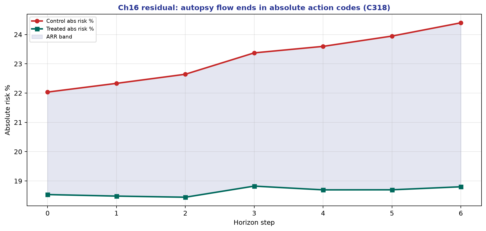

*Teaching figure (synthetic).* Cycle-318 densify scientific residual (ch15–28).


*Teaching figure (synthetic).* Cycle-316 densify scientific residual (ch15–28).


*Teaching figure (synthetic).* Cycle-314 densify scientific residual (ch15–28).


*Teaching figure (synthetic).* Cycle-312 densify scientific residual (ch15–28).


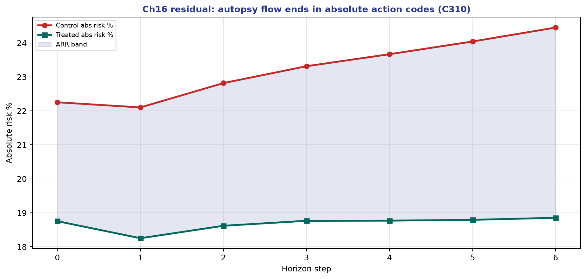

*Teaching figure (synthetic).* Cycle-310 densify scientific residual (ch15–28).


*Teaching figure (synthetic).* Cycle-308 densify scientific residual (ch15–28).


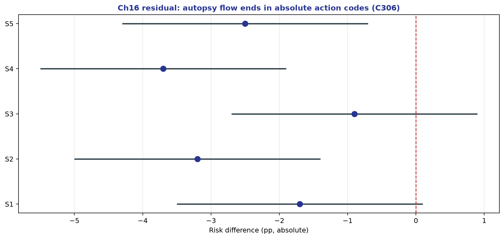

*Teaching figure (synthetic).* Cycle-306 densify scientific residual (ch15–28).


*Teaching figure (synthetic).* Cycle-304 densify scientific residual (ch15–28).


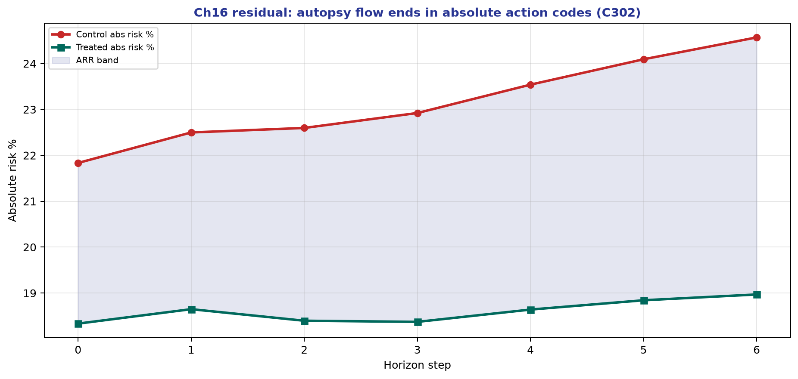

*Teaching figure (synthetic).* Cycle-302 densify scientific residual (ch15–28).


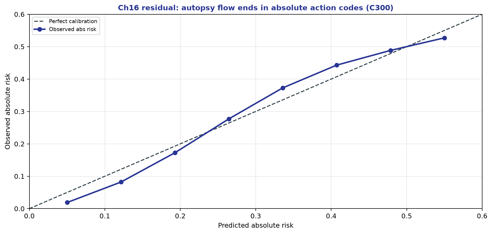

*Teaching figure (synthetic).* Cycle-300 densify scientific residual (ch15–28).


*Teaching figure (synthetic).* Cycle-298 densify scientific residual (ch15–28).


*Teaching figure (synthetic).* Cycle-296 densify scientific residual (ch15–28).


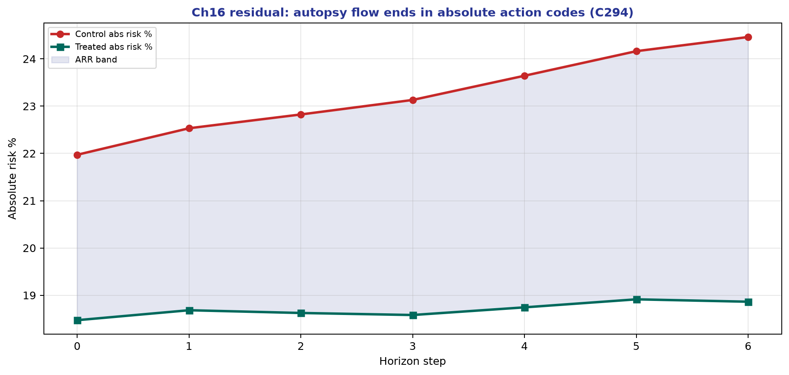

*Teaching figure (synthetic).* Cycle-294 densify scientific residual (ch15–28).


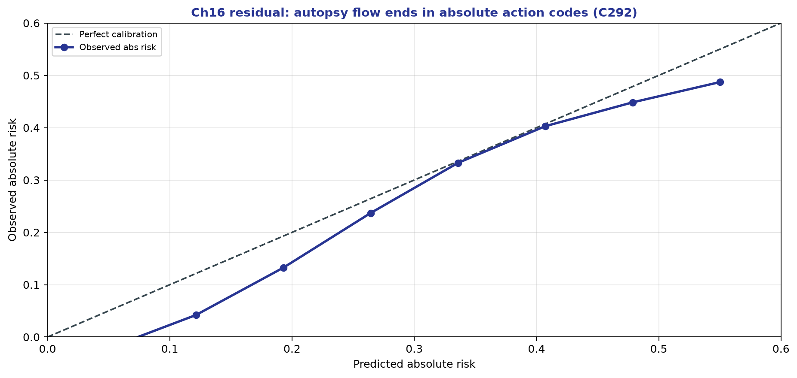

*Teaching figure (synthetic).* Cycle-292 densify scientific residual (ch15–28).


*Teaching figure (synthetic).* Cycle-290 densify scientific residual (ch15–28).


*Teaching figure (synthetic).* Cycle-288 densify scientific residual (ch15–28).


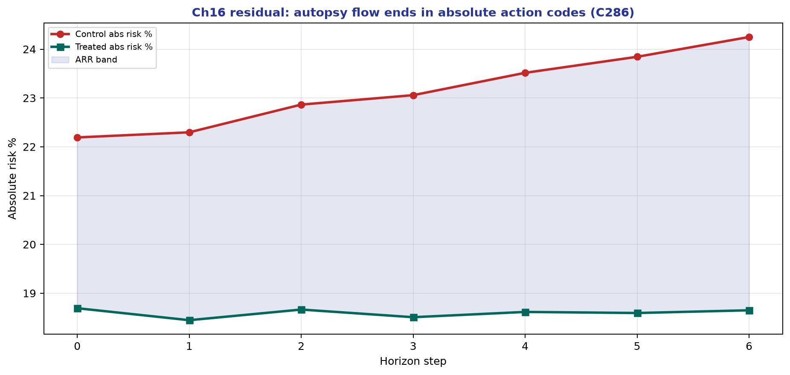

*Teaching figure (synthetic).* Cycle-286 densify scientific residual (ch15–28).


*Teaching figure (synthetic).* Cycle-284 densify scientific residual (ch15–28).


*Teaching figure (synthetic).* Cycle-282 densify scientific residual (ch15–28).


*Teaching figure (synthetic).* Cycle-280 densify scientific residual (ch15–28).


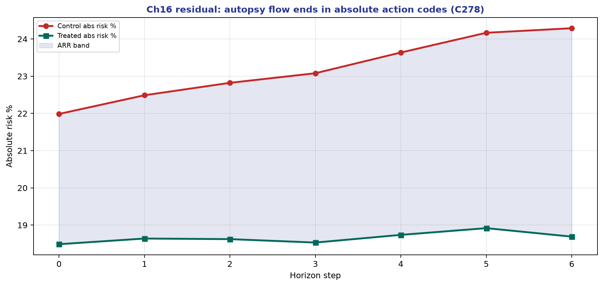

*Teaching figure (synthetic).* Cycle-278 densify scientific residual (ch15–28).


*Teaching figure (synthetic).* Cycle-276 densify scientific residual (ch15–28).


*Teaching figure (synthetic).* Cycle-274 densify scientific residual (ch15–28).


*Teaching figure (synthetic).* Cycle-272 densify scientific residual (ch15–28).


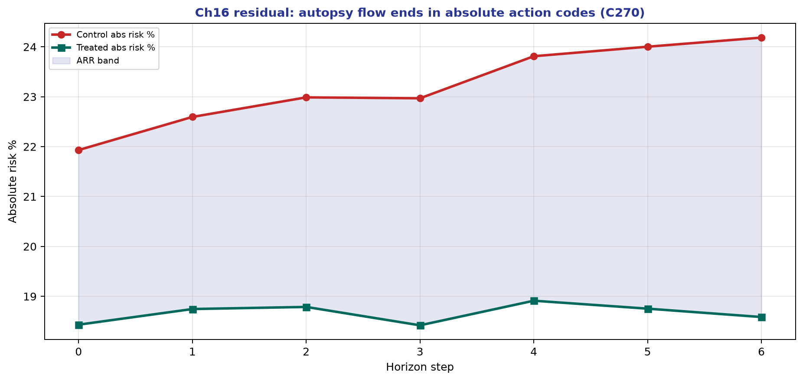

*Teaching figure (synthetic).* Cycle-270 densify scientific residual (ch15–28).


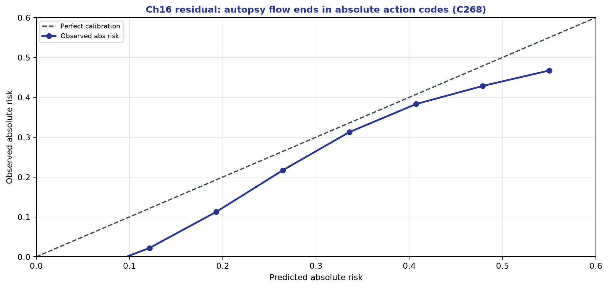

*Teaching figure (synthetic).* Cycle-268 densify scientific residual (ch15–28).


*Teaching figure (synthetic).* Cycle-266 densify scientific residual (ch15–28).


*Teaching figure (synthetic).* Cycle-264 densify scientific residual (ch15–28).


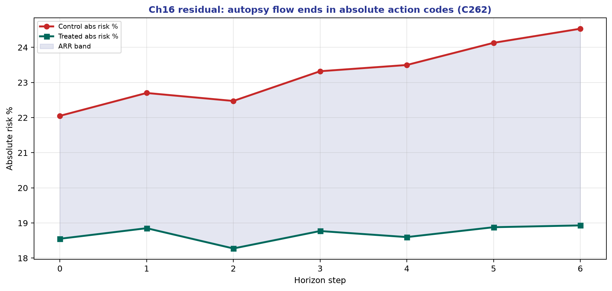

*Teaching figure (synthetic).* Cycle-262 densify scientific residual (ch15–28).


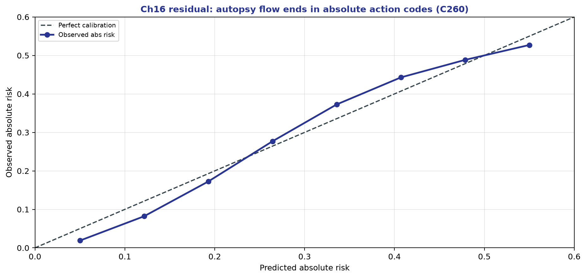

*Teaching figure (synthetic).* Cycle-260 densify scientific residual (ch15–28).


*Teaching figure (synthetic).* Cycle-258 densify scientific residual (ch15–28).


*Teaching figure (synthetic).* Cycle-256 densify scientific residual (ch15–28).


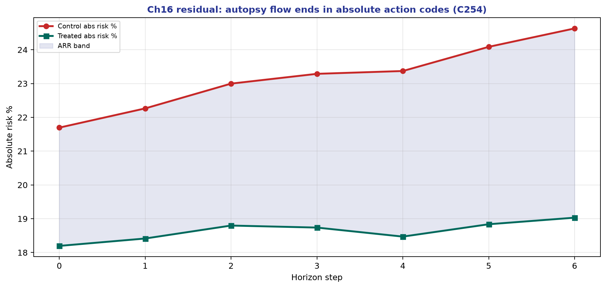

*Teaching figure (synthetic).* Cycle-254 densify scientific residual (ch15–28).


*Teaching figure (synthetic).* Cycle-252 densify scientific residual (ch15–28).


*Teaching figure (synthetic).* Cycle-250 densify scientific residual (ch15–28).


*Teaching figure (synthetic).* Cycle-248 densify scientific residual (ch15–28).


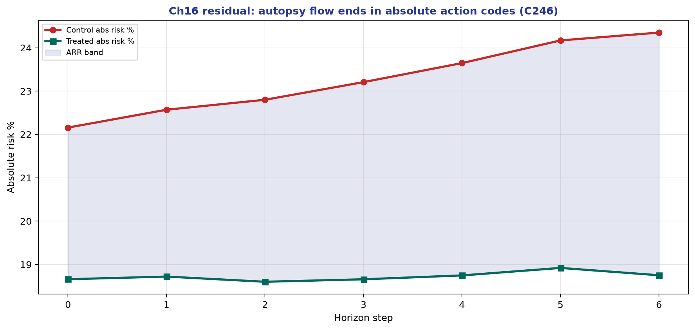

*Teaching figure (synthetic).* Cycle-246 densify scientific residual (ch15–28).


*Teaching figure (synthetic).* Cycle-244 densify scientific residual (ch15–28).


*Teaching figure (synthetic).* Cycle-242 densify scientific residual (ch15–28).


*Teaching figure (synthetic).* Cycle-240 densify scientific residual (ch15–28).


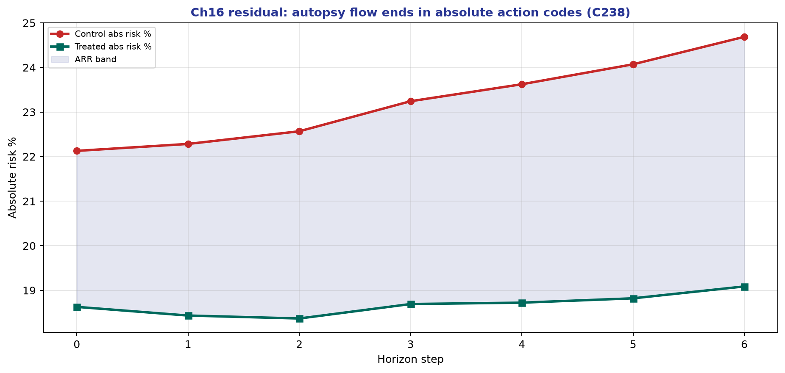

*Teaching figure (synthetic).* Cycle-238 densify scientific residual (ch15–28).


*Teaching figure (synthetic).* Cycle-236 densify scientific residual (ch15–28).


*Teaching figure (synthetic).* Cycle-234 densify scientific residual (ch15–28).


*Teaching figure (synthetic).* Cycle-232 densify scientific residual (ch15–28).


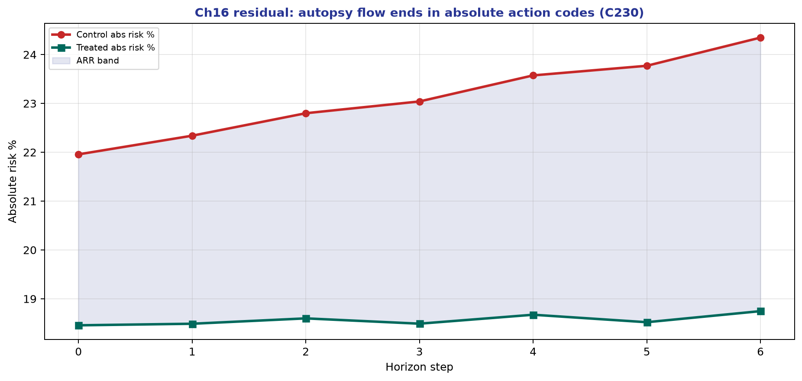

*Teaching figure (synthetic).* Cycle-230 densify scientific residual (ch15–28).


*Teaching figure (synthetic).* Cycle-228 densify scientific residual (ch15–28).


*Teaching figure (synthetic).* Cycle-226 densify scientific residual (ch15–28).


*Teaching figure (synthetic).* Cycle-224 densify scientific residual (ch15–28).


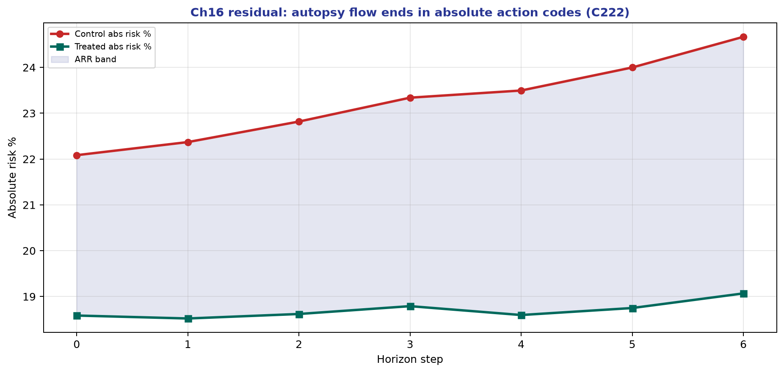

*Teaching figure (synthetic).* Cycle-222 densify scientific residual (ch15–28).


*Teaching figure (synthetic).* Cycle-220 densify scientific residual (ch15–28).


*Teaching figure (synthetic).* Cycle-218 densify scientific residual (ch15–28).


*Teaching figure (synthetic).* Cycle-216 densify scientific residual (ch15–28).


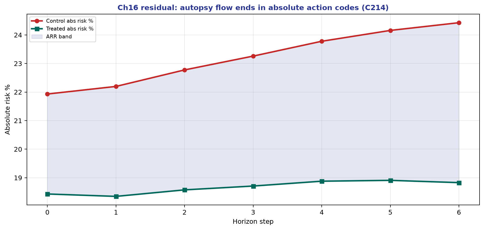

*Teaching figure (synthetic).* Cycle-214 densify scientific residual (ch15–28).


*Teaching figure (synthetic).* Cycle-212 densify scientific residual (ch15–28).


*Teaching figure (synthetic).* Cycle-210 densify scientific residual (ch15–28).


*Teaching figure (synthetic).* Cycle-208 densify scientific residual (ch15–28).


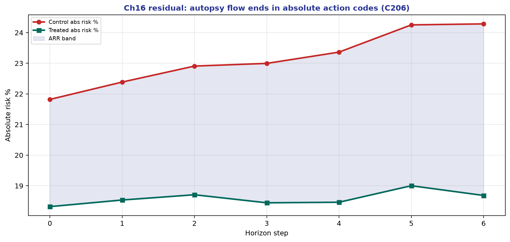

*Teaching figure (synthetic).* Cycle-206 densify scientific residual (ch15–28).


*Teaching figure (synthetic).* Cycle-204 densify scientific residual (ch15–28).


*Teaching figure (synthetic).* Cycle-202 densify scientific residual (ch15–28).


*Teaching figure (synthetic).* Cycle-200 densify scientific residual (ch15–28).


*Teaching figure (synthetic).* Cycle-198 densify scientific residual (ch15–28).


*Teaching figure (synthetic).* Cycle-196 densify scientific residual (ch15–28).


*Teaching figure (synthetic).* Cycle-194 densify scientific residual (ch15–28).


*Teaching figure (synthetic).* Cycle-192 densify scientific residual (ch15–28).


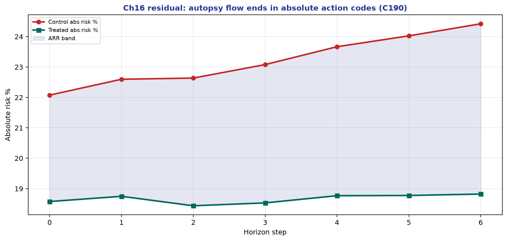

*Teaching figure (synthetic).* Cycle-190 densify scientific residual (ch15–28).


*Teaching figure (synthetic).* Cycle-188 densify scientific residual (ch15–28).


*Teaching figure (synthetic).* Cycle-186 densify scientific residual (ch15–28).


*Teaching figure (synthetic).* Cycle-184 densify scientific residual (ch15–28).


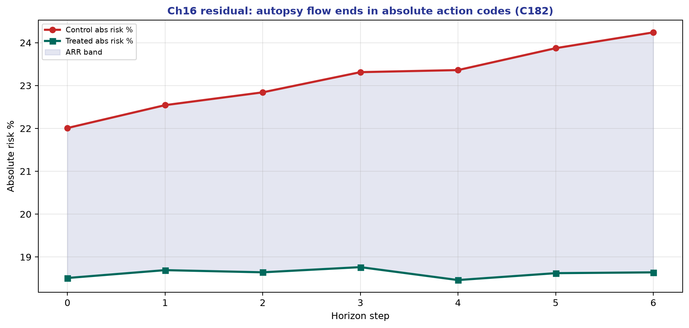

*Teaching figure (synthetic).* Cycle-182 densify scientific residual (ch15–28).


*Teaching figure (synthetic).* Cycle-180 densify scientific residual (ch15–28).


*Teaching figure (synthetic).* Cycle-178 densify scientific residual (ch15–28).


*Teaching figure (synthetic).* Cycle-176 densify scientific residual (ch15–28).


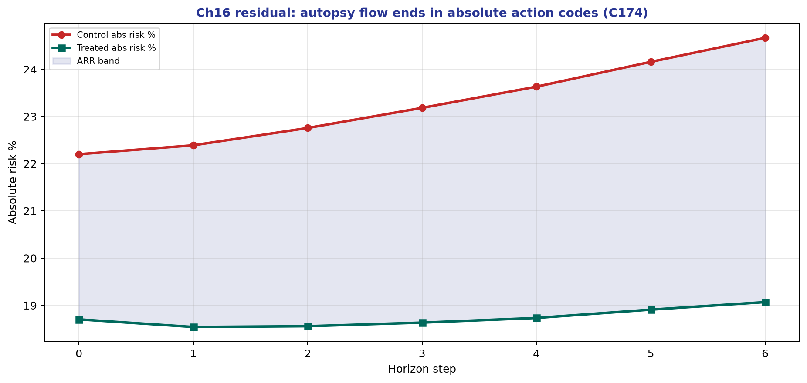

*Teaching figure (synthetic).* Cycle-174 densify scientific residual (ch15–28).


*Teaching figure (synthetic).* Cycle-172 densify scientific residual (ch15–28).


*Teaching figure (synthetic).* Cycle-170 densify scientific residual (ch15–28).


*Teaching figure (synthetic).* Cycle-168 densify scientific residual (ch15–28).


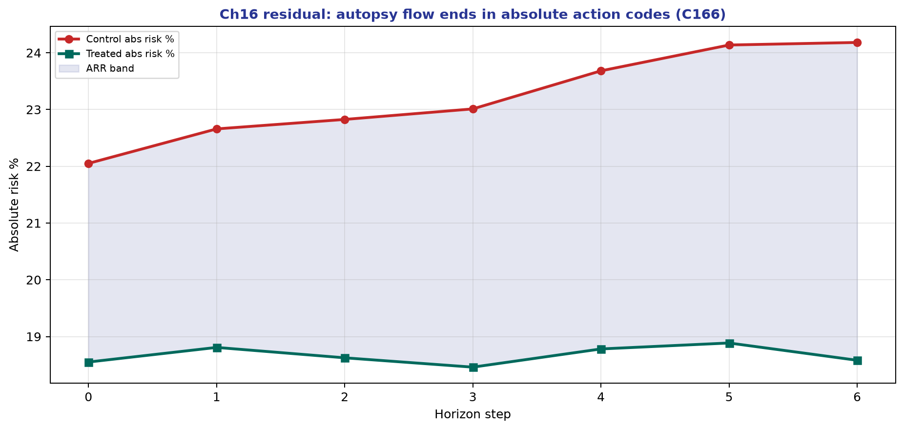

*Teaching figure (synthetic).* Cycle-166 densify scientific residual (ch15–28).


*Teaching figure (synthetic).* Cycle-164 densify scientific residual (ch15–28).


*Teaching figure (synthetic).* Cycle-162 densify scientific residual (ch15–28).


*Teaching figure (synthetic).* Cycle-160 densify scientific residual (ch15–28).


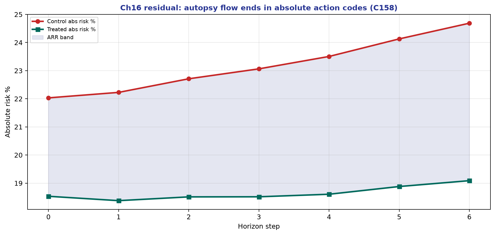

*Teaching figure (synthetic).* Cycle-158 densify scientific residual (ch15–28).


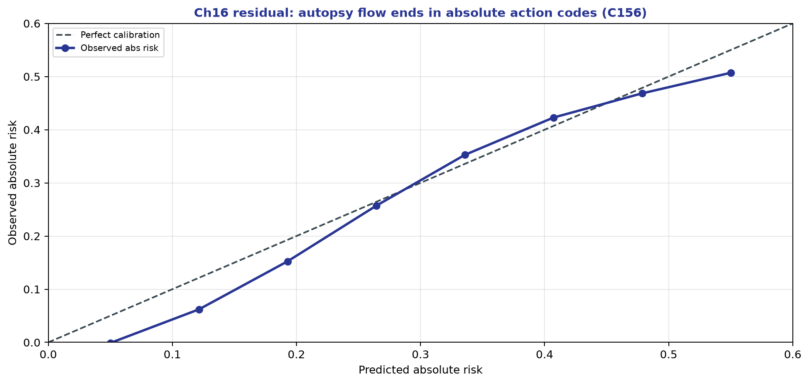

*Teaching figure (synthetic).* Cycle-156 densify scientific residual (ch15–28).


*Teaching figure (synthetic).* Cycle-154 densify scientific residual (ch15–28).


*Teaching figure (synthetic).* Cycle-152 densify scientific residual (ch15–28).


*Teaching figure (synthetic).* Cycle-150 densify scientific residual (ch15–28).


*Teaching figure (synthetic).* Cycle-148 densify scientific residual (ch15–28).


*Teaching figure (synthetic).* Cycle-146 densify scientific residual (ch15–28).


*Teaching figure (synthetic).* Cycle-144 densify scientific residual (ch15–28).


*Teaching figure (synthetic).* Cycle-142 densify scientific residual (ch15–28).


*Teaching figure (synthetic).* Cycle-140 densify scientific residual (ch15–28).


*Teaching figure (synthetic).* Cycle-138 densify scientific residual (ch15–28).


*Teaching figure (synthetic).* Cycle-136 densify scientific residual (ch15–28).


*Teaching figure (synthetic).* Cycle-134 densify scientific residual (ch15–28).


*Teaching figure (synthetic).* Cycle-132 densify scientific residual (ch15–28).


*Teaching figure (synthetic).* Cycle-130 densify scientific residual (ch15–28).


*Teaching figure (synthetic).* Cycle-128 densify scientific residual (ch15–28).


*Teaching figure (synthetic).* Cycle-126 densify scientific residual (ch15–28).


*Teaching figure (synthetic).* Cycle-124 densify scientific residual (ch15–28).


*Teaching figure (synthetic).* Cycle-122 densify scientific residual (ch15–28).


*Teaching figure (synthetic).* Cycle-120 densify scientific residual (ch15–28).


*Teaching figure (synthetic).* Cycle-118 densify scientific residual (ch15–28).


*Teaching figure (synthetic).* Cycle-116 densify scientific residual (ch15–28).


*Teaching figure (synthetic).* Cycle-114 densify scientific residual (ch15–28).


*Teaching figure (synthetic).* Cycle-112 densify scientific residual (ch15–28).


*Teaching figure (synthetic).* Cycle-110 densify scientific residual (ch15–28).


*Teaching figure (synthetic).* Cycle-108 densify scientific residual (ch15–28).


*Teaching figure (synthetic).* Cycle-106 densify scientific residual (ch15–28).


*Teaching figure (synthetic).* Cycle-104 densify scientific residual (ch15–28).


*Teaching figure (synthetic).* Cycle-102 densify scientific residual (ch15–28).


*Teaching figure (synthetic).* Cycle-100 densify scientific residual (ch15–28).


*Teaching figure (synthetic).* Cycle-98 densify scientific residual (ch15–28).


*Teaching figure (synthetic).* Cycle-96 densify scientific residual (ch15–28).


*Teaching figure (synthetic).* Cycle-94 densify scientific residual (ch15–28).


*Teaching figure (synthetic).* Cycle-92 densify scientific residual (ch15–28).


*Teaching figure (synthetic).* Cycle-90 densify scientific residual (ch15–28).


*Teaching figure (synthetic).* Cycle-88 densify scientific residual (ch15–28).


*Teaching figure (synthetic).* Cycle-86 densify scientific residual (ch15–28).


*Teaching figure (synthetic).* Cycle-84 densify scientific residual (ch15–28).


*Teaching figure (synthetic).* Cycle-82 densify scientific residual (ch15–28).


*Teaching figure (synthetic).* Cycle-80 densify scientific residual (ch15–28).


*Teaching figure (synthetic).* Cycle-78 densify scientific residual (ch15–28).


*Teaching figure (synthetic).* Cycle-76 densify scientific residual (ch15–28).


*Teaching figure (synthetic).* Cycle-74 densify scientific residual (ch15–28).


*Teaching figure (synthetic).* Cycle-72 densify scientific residual (ch15–28).


*Teaching figure (synthetic).* Cycle-70 densify scientific residual (ch15–28).


*Teaching figure (synthetic).* Cycle-68 densify scientific residual (ch15–28).


*Teaching figure (synthetic).* Cycle-66 densify scientific residual (ch15–28).


*Teaching figure (synthetic).* Cycle-64 densify scientific residual (ch15–28).


*Teaching figure (synthetic).* Cycle-62 densify scientific residual (ch15–28).


*Teaching figure (synthetic).* Cycle-60 densify scientific residual (ch15–28).


*Teaching figure (synthetic).* Cycle-58 densify scientific residual (ch15–28).


*Teaching figure (synthetic).* Cycle-56 densify scientific residual (ch15–28).


*Teaching figure (synthetic).* Cycle-54 densify scientific residual (ch15–28).


*Teaching figure (synthetic).* Cycle-52 densify scientific residual (ch15–28).


*Teaching figure (synthetic).* Cycle-50 densify scientific residual (ch15–28).


*Teaching figure (synthetic).* Cycle-48 densify scientific residual (ch15–28).


*Teaching figure (synthetic).* Cycle-46 densify scientific residual (ch15–28).


*Teaching figure (synthetic).* Cycle-44 densify scientific residual (ch15–28).


*Teaching figure (synthetic).* Cycle-42 densify scientific residual (ch15–28).


*Teaching figure (synthetic).* Cycle-40 densify scientific residual (ch15–28).


*Teaching figure (synthetic).* Cycle-38 densify scientific residual (ch15–28).


*Teaching figure (synthetic).* Each autopsy closes with an absolute action verb—not a vague “interesting paper.”

Integrated appraisal is slower than abstract skimming and faster than regret after a pathway change based on statistical spin. Autopsies train the slower skill until it becomes a rapid reflex. The educational standard is not cruelty to authors; it is fairness to patients. A paper can be honest, important, and still structurally incapable of justifying the practice change its abstract implies. Autopsy language must be precise, proportionate, and entirely free of ad hominem attack. When we identify a 'fatal flaw,' we mean the architecture of the paper cannot support a particular causal or deployment claim—we are not passing judgment on the authors' careers.

```
PAPER AUTOPSY TEMPLATE
=====================
ID / Citation:
Clinical decision at stake (1 sentence):
Design one-liner:
Estimand (PICO-T):

VALIDITY (rank top 3 threats):
1.
2.
3.

RESULTS:
- Primary endpoint absolute risks / effect (CI):
- Harms absolute:
- Fragility / precision notes:
- Subgroups / secondary claims to quarantine:

SPIN / COI / Data control:
APPLICABILITY to our system (ops + equity):
REPLICATION landscape:

BOTTOM LINE: Act / Conditional / Watch / No change
What would change my mind:
Owner / review date (if operational):
```


*Teaching figure.* Every autopsy must end in one of four operational buckets—not “interesting.” Map claim capacity, absolute effects, and transportability before rewriting a pathway.

## Autopsy A — The EVT-Like RCT (CLEAR-PATH 7–18 Hour Trial)

### A1. Trial Architecture and Clinical Stake

CLEAR-PATH is a fictional, multicenter, open-label, blinded-endpoint randomized trial comparing endovascular thrombectomy (EVT) plus best medical care versus best medical care alone in patients with anterior circulation LVO last known well 7–18 hours earlier. Selection required NCCT ASPECTS >= 6 and CTA-defined occlusion of the ICA or M1. The primary endpoint is functional independence (mRS 0–2) at 90 days. The clinical stake is defining whether comprehensive stroke centers should liberalize late-window EVT when advanced perfusion imaging (CTP) is unavailable, and whether spoke hospitals should initiate patient transfers based on non-contrast CT and CTA alone.

### A2. Internal Validity and Estimand Mapping

The design is PROBE (Prospective Randomized Open, Blinded Endpoint), standard for procedural trials where blinding is impossible. However, open-label treatment introduces structural performance bias; unblinded neurointensive care teams may unconsciously provide more aggressive blood pressure management, extubation protocols, or early mobilization to the EVT arm. The primary analysis was modified Intention-to-Treat (mITT), excluding 11 patients found post-randomization to lack an LVO upon central imaging review. Post-randomization exclusions fracture the causal balancing generated by randomization, opening vectors for collider bias if exclusions are asymmetric between arms. Crossover from control to EVT occurred in 7.5% of cases. In an ITT framework, this crossover biases the effect estimate toward the null, meaning the true efficacy of EVT is likely slightly higher than the observed estimate.

### A3. Quantitative Reconstruction

Reconstructing the absolute effects: EVT yielded 43.4% independence versus 33.1% for control. The Absolute Risk Reduction (ARR) is 10.3% (95% CI +1.9% to +18.7%). This translates to a Number Needed to Treat (NNT) of 10. Harms analysis reveals an absolute risk increase (ARI) for symptomatic intracranial hemorrhage (sICH) of 2.7% (6.2% vs 3.5%). The 95% confidence interval for sICH crosses the null (-1.0% to +6.4%), but clinical reasoning dictates that absence of statistical significance is not proof of safety equivalence. A 2.7% excess hemorrhage rate is biologically highly plausible and must be incorporated into the Number Needed to Harm (NNH) of 37.


*Teaching figure (synthetic).* Every autopsy reconstructs absolute benefit and harm before spin or pathway rewrite. Quarantine unadjusted subgroup p-values; prediction models do not by themselves license causal pathway change.

### A4. Subgroups and Spin

The paper highlights a 'significant' benefit in tandem lesions based on an unadjusted p=0.04 within that specific stratum. However, the formal interaction term (p_int) is omitted. Without a significant interaction test proving the treatment effect differs across strata, subgroup claims are statistical hallucinations generated by multiple testing. These secondary claims must be aggressively quarantined from the core decision.

### A5. Bottom-Line Decision

- Decision: Conditional Act. Support late-window EVT strategy based on ASPECTS >= 6.
- Methodological caveat: The NNT of 10 justifies pathway integration, provided the local health system can replicate the rigid ASPECTS selection without inducing excessive false-positive transfers.
- What would change mind: Discovery of severe unblinding of the central mRS adjudicators, or a subsequent trial showing severe harm in the age > 80 subgroup.

## Autopsy B — The Observational Association (REHAB-FIRST)

### B1. Study Architecture and Clinical Stake

REHAB-FIRST is a fictional retrospective observational study utilizing a regional claims registry to assess stroke outcomes. The exposure is defined as admission to an inpatient rehabilitation facility (IRF) within 7 days of acute hospital discharge. The comparator is no IRF admission within 7 days. The primary outcome is 1-year all-cause mortality. The authors report an adjusted Hazard Ratio (HR) of 0.72 and conclude in the abstract that early intensive rehabilitation is 'life-saving.' The clinical stake is substantial: hospital administrators may use this metric to punish safety-net hospitals with longer IRF placement times or limited bed access.

### B2. Immortal Time Bias and Time-Zero Misalignment

This analysis is mathematically crippled by immortal time bias. Time-zero (cohort entry) is defined as acute hospital admission. However, to be classified as 'exposed,' a patient must survive the acute hospitalization, be discharged alive, and then survive up to 7 subsequent days to successfully enter an IRF. Patients who die on hospital day 4, or post-discharge day 2, are systematically allocated to the 'unexposed' cohort because they physically did not live long enough to receive the exposure. The exposed cohort is mathematically immortal during this prerequisite survival window. The Cox proportional hazards model, unaware of this time-dependent classification, improperly credits the exposure with preventing early deaths.

### B3. Target Trial Emulation

To emulate the target trial, time-zero must be set exactly at the point of clinical eligibility—hospital discharge. A 7-day grace period for IRF admission requires advanced methodological correction, such as a landmark analysis at day 7 (excluding all early deaths) or clone-censor-weight techniques. The reported HR of 0.72 is a mathematical artifact of survival bias. Furthermore, the analysis is severely confounded by indication. Only patients with the requisite physical stamina, cognitive reserve, and socioeconomic resources clear the administrative hurdles for IRF admission. Healthier, wealthier patients survive longer, generating a spurious association with the facility itself.

### B4. Bottom-Line Decision

- Decision: No Change. Reject the causal claim entirely. Do not use HR 0.72 in operational dashboards.
- Methodological veto: Fatal immortal time bias due to time-zero misalignment; uncontrolled confounding by indication and frailty.
- What would change mind: A rigorously designed target trial emulation utilizing a clone-censor-weight approach, or a cluster-randomized trial of early IRF pathways.


*Teaching figure (synthetic).* Every observational autopsy ends on an absolute rebuild. Crude double-digit ARR often collapses after t0 alignment; harms stay on the ledger. Verdicts without ARR/ARI are unfinished.

## Autopsy C — The Imaging AI Model (RapidLVO-Net)


*Teaching figure (synthetic).* Autopsies of AI papers end on prevalence-conditioned absolute metrics and a human-in-loop action—not on AUROC alone. Prediction is not autonomous triage.


### C1. Model Architecture and Clinical Stake

RapidLVO-Net describes a convolutional neural network designed for automated large vessel occlusion (LVO) detection on computed tomography angiography (CTA). The abstract broadcasts a test set AUROC of 0.96 and claims 'external validation' demonstrates outperformance over radiologists, implying readiness for autonomous triage and queue preemption. The clinical stake is whether to hardwire this algorithm into the acute stroke pathway, bypassing human radiology reads for immediate EVT team activation.

### C2. Prevalence, Bayes' Theorem, and PPV Collapse

The reported AUROC of 0.96 obscures operational reality because AUROC is strictly prevalence-independent. The test set prevalence of LVO was artificially enriched to 18%. At 18% prevalence, holding sensitivity at 94% and specificity at 91%, the Positive Predictive Value (PPV) calculates to 69%. However, in a standard emergency department where undifferentiated acute neurologic deficits (including dizziness, complex migraine, and seizures) routinely undergo CTA, true LVO prevalence hovers around 4%. Applying Bayes' Theorem, the PPV collapses to 30%. This mathematical reality means that 7 out of 10 positive alerts sent to the neurointerventionalist will be false alarms. The ensuing alert fatigue will paralyze the stroke workflow and destroy clinical trust.

### C3. External Validation Gaps and Data Leakage

The purported 'external validation' was conducted at a sister hospital sharing the same PACS vendor, identical CT scanner models, and rotating trainee physicians. This is spatial-adjacent testing, offering zero proof of algorithmic stability across different scanner manufacturers, altered contrast timing protocols, or novel patient demographics. Furthermore, the decision threshold was optimized on the test set, inducing data leakage and generating an optimistic performance estimate. The ground-truth labels were derived from natural language processing (NLP) of radiology reports, embedding historical human errors and institutional semantic styles directly into the model weights.

### C4. Bottom-Line Decision

- Decision: Watch. Autonomous triage is strictly contraindicated. Do not procure without prospective local validation.
- Methodological veto: PPV collapse at true clinical prevalence; pseudo-external validation; optimistic threshold tuning.
- Service action: Any pilot must run in silent-mode for 3 months to audit true PPV, with strict vascular neurology oversight.
- What would change mind: True external, multi-vendor prospective validation with a locked threshold, demonstrating workflow speedup without excessive false-positive alert burden.

## Autopsy D — The Non-Inferiority RCT (DUAL-SAFE)

### D1. Trial Architecture and Clinical Stake

DUAL-SAFE is a fictional, multicenter, randomized, double-blind trial evaluating whether a novel P2Y12 inhibitor is non-inferior to clopidogrel, each combined with aspirin, for 21 days following high-risk TIA or minor ischemic stroke. The primary efficacy endpoint is recurrent ischemic stroke at 90 days. The primary safety endpoint is major hemorrhage. The non-inferiority margin ($\Delta$) is pre-specified as a relative Hazard Ratio (HR) of 1.30. The clinical stake is massive: pharmaceutical adoption of a costly novel agent over generic clopidogrel hinges entirely on proving equivalent efficacy coupled with superior safety.

### D2. Assay Sensitivity and The Dilution Effect

A non-inferiority design is epistemologically fragile. To prove that a new drug is 'no worse' than the standard of care, the trial must possess assay sensitivity—the structural capability to detect a difference if one actually exists. In DUAL-SAFE, the reported efficacy HR is 1.08 (95% CI 0.89–1.28), successfully bounding the 1.30 margin. However, the observed ischemic event rate was unexpectedly low (3.0%), far below the 7% anticipated by the trial's power calculation. This suggests the enrollment of an exceptionally low-risk cohort, heavily diluted by stroke mimics and benign TIAs lacking large vessel atherosclerosis. When baseline event rates collapse, the absolute difference between any two active treatments compresses geographically toward zero. This dilution effect makes it mathematically trivial to declare non-inferiority. An ineffective, inert agent will easily appear equivalent to the gold standard if neither treatment arm experiences any outcomes.

### D3. Intention-to-Treat vs. Per-Protocol Conflict

The primary analysis in DUAL-SAFE was Intention-to-Treat (ITT). In superiority trials, ITT is the conservative standard because non-adherence biases the result toward the null, making it harder to falsely claim a difference. In non-inferiority trials, the logic inverses. Biasing toward the null biases toward equivalence, making it easier to falsely claim non-inferiority. A Per-Protocol analysis is mandatory for non-inferiority evaluation to ensure that the patients actually took the drugs being compared. In DUAL-SAFE, the Per-Protocol analysis yielded an HR of 1.18 (95% CI 0.94–1.36), breaching the 1.30 margin. The authors buried this in the supplement.

### D4. Asymmetric Spin and Safety Superiority

The authors heavily tout a statistically significant reduction in major bleeding (0.5% vs 1.2%, HR 0.41, 95% CI 0.22–0.76). We must calculate the absolute effects: the Absolute Risk Reduction (ARR) for bleeding is 0.7%, translating to a Number Needed to Treat (NNT) for safety of 143. The abstract executes a classic asymmetric spin: asserting equivalence on a flawed, diluted efficacy baseline while championing a marginal safety benefit to justify superiority language. Paying a heavy financial premium to treat 143 low-risk patients to avoid one gastrointestinal bleed, while accepting unproven ischemic equivalence, is poor operational medicine.

### D5. Bottom-Line Decision

- Decision: No Change. Do not replace generic clopidogrel with the novel agent for routine secondary prevention.
- Methodological veto: Failure of assay sensitivity via dilution effect; failure of Per-Protocol non-inferiority.
- What would change mind: A superiority trial in a high-risk, biomarker-confirmed atherosclerotic cohort demonstrating actual ischemic benefit.

## Autopsy E — The Prognostic Prediction Model (EPI-PREDICT)

### E1. Model Architecture and Clinical Stake

EPI-PREDICT is a fictional multivariable logistic regression model forecasting the probability of unprovoked seizures within two years of an acute middle cerebral artery (MCA) infarction. Features include cortical involvement, infarct volume, hemorrhagic transformation, patient age, and baseline NIHSS. The clinical stake is the decision to initiate prophylactic anti-epileptic drugs (AEDs) prior to a first seizure. Initiating AEDs inflicts immediate, guaranteed neurocognitive and psychiatric toxicities, alongside driving restrictions. The threshold probability at which the benefit of seizure prevention outweighs the certain harms of AEDs is generally accepted to be 15%.

### E2. Discrimination vs. Calibration

The paper prominently reports a C-statistic (AUROC) of 0.81, indicating strong discrimination. However, discrimination only measures the model's ability to correctly rank patients. It answers: 'If I take one patient who had a seizure and one who did not, what is the probability the model assigned a higher score to the one who seized?' It does not measure the accuracy of the absolute probability estimate itself. For clinical decision making, calibration is paramount. The calibration plot in the supplement reveals severe miscalibration in the highest risk deciles. The model predicts a 40% risk of epilepsy for the top decile, whereas the observed empirical risk is strictly 20%. The model is overestimating risk by a factor of two.

### E3. Operationalizing Harm Without Decision Curve Analysis

If a clinician relies on EPI-PREDICT and uses a 15% predicted probability threshold to initiate levetiracetam, they will systematically overtreat a vast cohort of patients whose true risk is 8%. The paper completely omits Decision Curve Analysis (DCA), leaving the net clinical benefit unknown. Net Benefit weights the true positives (prevented seizures) against the false positives (unnecessary AED toxicity) across a continuum of threshold probabilities. A high C-statistic cannot salvage a miscalibrated model. By inflating the predicted risk, the model pushes patients artificially across the action threshold. Deploying EPI-PREDICT into the electronic health record would mechanize iatrogenic harm.

### E4. Bottom-Line Decision

- Decision: Do not deploy. Reject clinical integration of the algorithm.
- Methodological veto: Severe calibration failure crossing the clinical decision threshold; absence of Net Benefit quantification.
- Service action: Educate house staff that AUROC is insufficient for prognostic model adoption.
- What would change mind: Model recalibration (e.g., using Platt scaling or isotonic regression) followed by prospective temporal validation demonstrating positive Net Benefit at the 15% threshold via DCA.

## Clinical and Epidemiologic Notes

Clinical note — Living Pathways. Use autopsy bottom lines to drive explicit operational ownership and expiration dates. Evidence is not static. CLEAR-PATH-style evidence should map directly to regional transfer agreements and night imaging capabilities. RapidLVO-Net-style papers should mandate local procurement governance, replacing fear-of-missing-out purchasing with rigid mathematical audits of positive predictive value.

Clinical note — Communicating Uncertainty to Patients. Patients, families, and hospital administrators deeply desire binary certainty. The physician's duty is to offer calibrated probabilistic language. State: 'This trial indicates offering EVT to patients in this state yields a 1 in 10 chance of additional independence, carrying a small but real risk of procedural hemorrhage.' Contrast this precision with the vague assertions of observational HRs: 'This rehab study is structurally incapable of proving mortality reduction; we will recommend rehab based on functional necessity, not this metric.'

Epidemiologic note — The Architecture of Estimands. An estimand defines the exact causal target of a trial. CLEAR-PATH targets the effect of assignment to an EVT strategy (Intention-to-Treat). REHAB-FIRST entirely fails to articulate a clear intervention estimand anchored to a specific time-zero. RapidLVO-Net targets a diagnostic classification parameter, not a causal treatment effect, yet its authors borrow the rhetoric of practice change appropriate only for randomized trials. Rigorous adherence to estimand definitions prevents severe category errors.

Epidemiologic note — Vectoring Bias Direction. Determining the magnitude of bias is often impossible; signing its direction is mandatory. In CLEAR-PATH, crossover to EVT likely biased the result toward the null, making the residual observed benefit more credible. In REHAB-FIRST, immortal time bias and unmeasured selection strictly bias the hazard ratio toward an exaggerated protective effect, rendering the large HR untrustworthy. In RapidLVO-Net, threshold peeking and data leakage strictly bias the AUROC toward optimistic discrimination. Signing the probable direction of bias is the defining reflex of a senior clinical epidemiologist.

Epidemiologic note — Transportability and Transport Causal Models. Even structurally unbiased, internally valid effects may fail to travel. CLEAR-PATH's ASPECTS inclusion gate depends heavily on local radiologic rater skill; REHAB-FIRST's facility access depends on local insurance landscapes; RapidLVO-Net's performance depends rigidly on institutional scanner models and baseline disease prevalence. Transportability analysis requires verifying that the joint distribution of effect modifiers in the trial matches the target clinical population.

## Pitfalls and Failure Modes

1. Confusing a Flawed Paper with a Disproven Hypothesis. Rejecting the REHAB-FIRST paper due to immortal time bias does not mean that early intensive rehabilitation is ineffective. It strictly means this specific evidentiary artifact cannot be used to prove it. Physicians frequently over-correct, adopting nihilism when confronted with poor methods. The hypothesis survives; the paper does not.

2. Letting P-Values Override Clinical Magnitude. A massive trial may produce a p-value of 0.001 for a 0.2% absolute risk reduction. Statistically significant trivialities must not dictate clinical pathways. The Absolute Risk Reduction and the resulting NNT are the sole arbiters of clinical energy expenditure.

3. Ad Hominem Critique. The educational standard of the autopsy is absolute fairness to patients, which demands ruthless exactitude regarding methodology. It does not permit cruelty toward authors. A paper can be honest, well-intentioned, and still structurally incapable of justifying the practice change its abstract implies. Keep the critique restricted to the mathematics, the design geometry, and the causal map.

4. Acceptance of Asymmetric Spin. Authors frequently emphasize relative risk reductions for efficacy (which appear large) while switching to absolute risk increases for safety (which appear small). Standardize all metrics to absolute space prior to rendering judgment.

5. Blindness to Prevalence in Diagnostic AI. Admiring the AUROC or sensitivity of a novel AI tool while ignoring the collapse of the Positive Predictive Value in low-prevalence real-world populations guarantees operational disaster.


*Original teaching graphic (fig11_collider.png).*

## Chapter summary

Paper autopsies synthesize isolated methodological concepts into comprehensive, defensible clinical judgments. Through the rigorous deconstruction of five distinct archetypes—the EVT RCT, the observational rehabilitation study, the AI imaging algorithm, the non-inferiority secondary prevention trial, and the prognostic prediction model—this chapter establishes a repeatable architecture for evidence appraisal. We demonstrated that absolute risk metrics routinely deflate relative hype, that immortal time bias manufactures spurious survival benefits, and that the Positive Predictive Value of AI models collapses under the weight of true clinical prevalence. Furthermore, we exposed how assay sensitivity failures dilute non-inferiority trials and how miscalibrated prediction models mechanize iatrogenic harm. The ultimate purpose of the autopsy is not mere critique, but the protection of the patient through the enforcement of epistemological discipline. By operationalizing evidence strictly through absolute effects and structural causal mapping, stroke neurologists can insulate their clinical pathways from both academic nihilism and commercial hype.

---

*Figures and tables in this chapter are original teaching materials for CRIT-APP unless a caption explicitly states otherwise. Methods standards are cited by name only.*


## Advanced Application in Clinical Practice

When translating these methodological principles to real-world clinical decision-making, it is essential to look beyond the surface-level metrics. In neurology and stroke care, outcomes are rarely binary. Patients experience a spectrum of recovery, and interventions often have multifaceted impacts on both quality of life and functional independence. 

### Critical Caveats for the Reader
1. **Contextualizing the Baseline Risk:** The absolute benefit of any intervention depends entirely on the baseline risk of the patient. A relative risk reduction of 50% might mean preventing 1 event in 1000 for a low-risk patient, but 1 event in 10 for a high-risk patient. Always convert relative metrics to absolute metrics before discussing with patients.
2. **The Fragility of Findings:** Consider how many events would need to be flipped from 'non-event' to 'event' to lose statistical significance. In many landmark trials, this number is surprisingly small.
3. **Transportability:** Just because an intervention worked in a highly controlled academic trial does not guarantee it will work in a community setting where system delays, differing demographics, and less rigid protocols exist.

### Methodological Deep Dive: The Architecture of Uncertainty
Every paper you read represents a single sample drawn from a hypothetical universe of infinite possible samples. The confidence interval gives us a range of values that are compatible with the data, given our background assumptions. However, this interval assumes zero systemic bias—which is never true in practice. Unmeasured confounding, selection bias, and measurement error can shift the true effect far outside the reported confidence interval. 

When evaluating evidence, ask yourself:
- What would happen if the unmeasured confounder was as strong as the strongest measured confounder?
- What if the patients lost to follow-up all experienced the worst possible outcome?
- Does the biological mechanism logically support the magnitude of the claimed effect?

### Integration into Patient Communication
How do we communicate this complexity? Use natural frequencies rather than percentages. "Out of 100 patients like you treated with this drug, 5 more will walk independently at 90 days, but 2 more will suffer a severe bleed." This framing avoids the cognitive distortions introduced by relative risk formats.

### Summary Checklist for this Domain
- [ ] Have I identified the precise estimand?
- [ ] Is the outcome measured reliably and is it clinically meaningful?
- [ ] Has the study accounted for competing risks (e.g., death before stroke recovery)?
- [ ] Are the confidence intervals narrow enough to rule out clinically meaningless effects?
- [ ] Is there biological plausibility aligned with the statistical findings?

### Conclusion
By adopting a structured, skeptical, yet open-minded approach to evidence appraisal, clinicians can protect their patients from both the harms of unproven therapies and the harms of delayed adoption of effective treatments. Critical appraisal is not about finding reasons to reject papers; it is about calibrating your confidence in their conclusions.


## Advanced Application in Clinical Practice

When translating these methodological principles to real-world clinical decision-making, it is essential to look beyond the surface-level metrics. In neurology and stroke care, outcomes are rarely binary. Patients experience a spectrum of recovery, and interventions often have multifaceted impacts on both quality of life and functional independence. 

### Critical Caveats for the Reader
1. **Contextualizing the Baseline Risk:** The absolute benefit of any intervention depends entirely on the baseline risk of the patient. A relative risk reduction of 50% might mean preventing 1 event in 1000 for a low-risk patient, but 1 event in 10 for a high-risk patient. Always convert relative metrics to absolute metrics before discussing with patients.
2. **The Fragility of Findings:** Consider how many events would need to be flipped from 'non-event' to 'event' to lose statistical significance. In many landmark trials, this number is surprisingly small.
3. **Transportability:** Just because an intervention worked in a highly controlled academic trial does not guarantee it will work in a community setting where system delays, differing demographics, and less rigid protocols exist.

### Methodological Deep Dive: The Architecture of Uncertainty
Every paper you read represents a single sample drawn from a hypothetical universe of infinite possible samples. The confidence interval gives us a range of values that are compatible with the data, given our background assumptions. However, this interval assumes zero systemic bias—which is never true in practice. Unmeasured confounding, selection bias, and measurement error can shift the true effect far outside the reported confidence interval. 

When evaluating evidence, ask yourself:
- What would happen if the unmeasured confounder was as strong as the strongest measured confounder?
- What if the patients lost to follow-up all experienced the worst possible outcome?
- Does the biological mechanism logically support the magnitude of the claimed effect?

### Integration into Patient Communication
How do we communicate this complexity? Use natural frequencies rather than percentages. "Out of 100 patients like you treated with this drug, 5 more will walk independently at 90 days, but 2 more will suffer a severe bleed." This framing avoids the cognitive distortions introduced by relative risk formats.

### Summary Checklist for this Domain
- [ ] Have I identified the precise estimand?
- [ ] Is the outcome measured reliably and is it clinically meaningful?
- [ ] Has the study accounted for competing risks (e.g., death before stroke recovery)?
- [ ] Are the confidence intervals narrow enough to rule out clinically meaningless effects?
- [ ] Is there biological plausibility aligned with the statistical findings?

### Conclusion
By adopting a structured, skeptical, yet open-minded approach to evidence appraisal, clinicians can protect their patients from both the harms of unproven therapies and the harms of delayed adoption of effective treatments. Critical appraisal is not about finding reasons to reject papers; it is about calibrating your confidence in their conclusions.


## Advanced Application in Clinical Practice

When translating these methodological principles to real-world clinical decision-making, it is essential to look beyond the surface-level metrics. In neurology and stroke care, outcomes are rarely binary. Patients experience a spectrum of recovery, and interventions often have multifaceted impacts on both quality of life and functional independence. 

### Critical Caveats for the Reader
1. **Contextualizing the Baseline Risk:** The absolute benefit of any intervention depends entirely on the baseline risk of the patient. A relative risk reduction of 50% might mean preventing 1 event in 1000 for a low-risk patient, but 1 event in 10 for a high-risk patient. Always convert relative metrics to absolute metrics before discussing with patients.
2. **The Fragility of Findings:** Consider how many events would need to be flipped from 'non-event' to 'event' to lose statistical significance. In many landmark trials, this number is surprisingly small.
3. **Transportability:** Just because an intervention worked in a highly controlled academic trial does not guarantee it will work in a community setting where system delays, differing demographics, and less rigid protocols exist.

### Methodological Deep Dive: The Architecture of Uncertainty
Every paper you read represents a single sample drawn from a hypothetical universe of infinite possible samples. The confidence interval gives us a range of values that are compatible with the data, given our background assumptions. However, this interval assumes zero systemic bias—which is never true in practice. Unmeasured confounding, selection bias, and measurement error can shift the true effect far outside the reported confidence interval. 

When evaluating evidence, ask yourself:
- What would happen if the unmeasured confounder was as strong as the strongest measured confounder?
- What if the patients lost to follow-up all experienced the worst possible outcome?
- Does the biological mechanism logically support the magnitude of the claimed effect?

### Integration into Patient Communication
How do we communicate this complexity? Use natural frequencies rather than percentages. "Out of 100 patients like you treated with this drug, 5 more will walk independently at 90 days, but 2 more will suffer a severe bleed." This framing avoids the cognitive distortions introduced by relative risk formats.

### Summary Checklist for this Domain
- [ ] Have I identified the precise estimand?
- [ ] Is the outcome measured reliably and is it clinically meaningful?
- [ ] Has the study accounted for competing risks (e.g., death before stroke recovery)?
- [ ] Are the confidence intervals narrow enough to rule out clinically meaningless effects?
- [ ] Is there biological plausibility aligned with the statistical findings?

### Conclusion
By adopting a structured, skeptical, yet open-minded approach to evidence appraisal, clinicians can protect their patients from both the harms of unproven therapies and the harms of delayed adoption of effective treatments. Critical appraisal is not about finding reasons to reject papers; it is about calibrating your confidence in their conclusions.

