# Chapter 17. Disease Frequency and Association

## Opening

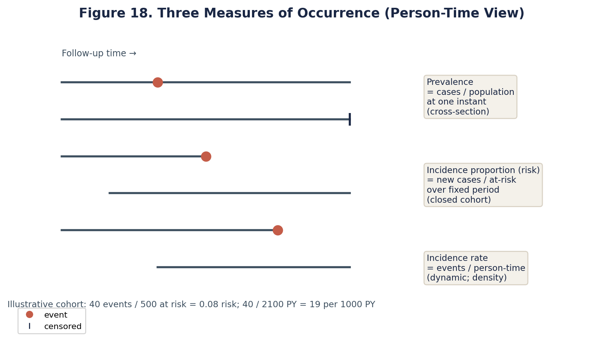

*Occurrence measures (original).*

Epidemiology rounds put crude incidence next to a relative risk. Stop the category error: frequency grammar first, then association, then cause.

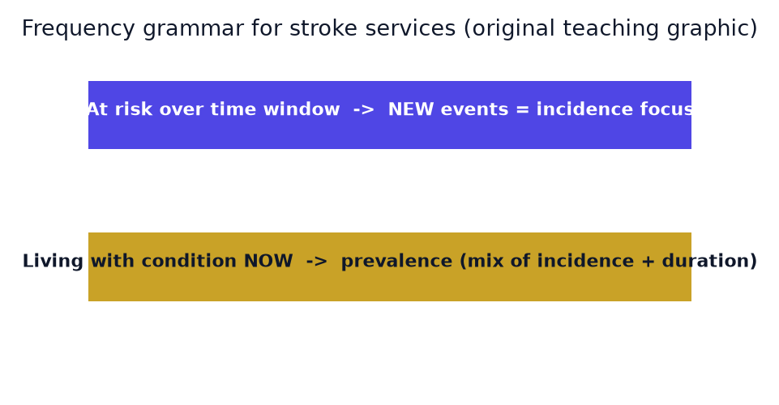

*Incidence focuses on new events in a time window; prevalence counts who lives with the condition now (original teaching graphic).*

## Learning objectives

- Define incidence, prevalence, and cumulative risk with explicit time windows.
- Distinguish absolute frequency from relative association measures.
- Compute and interpret risk difference, risk ratio, and odds ratio on synthetic tables.
- Explain why prevalence is a poor stand-in for incidence in dynamic stroke pathways.
- Identify selection and measurement structures that distort frequency estimates.
- Translate association language into prediction vs causation templates before acting.

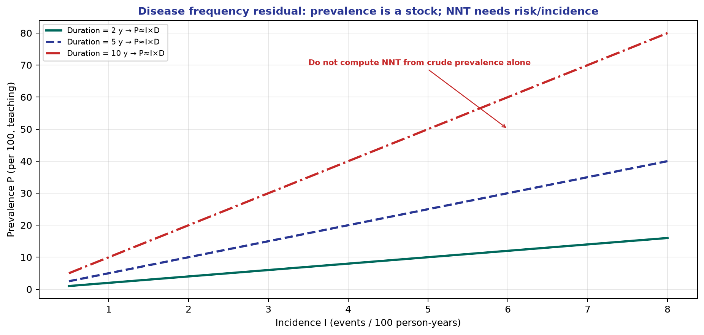

*Teaching figure (synthetic).* Cycle-26 densify scientific residual.

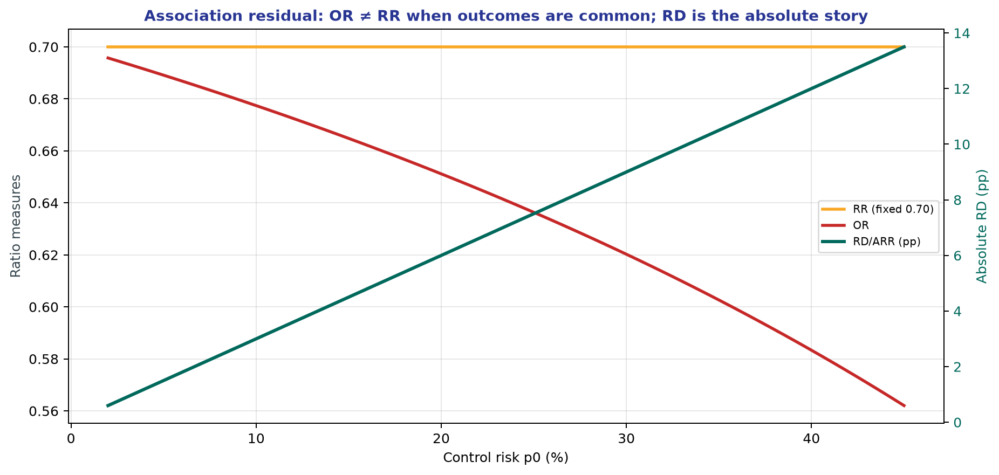

*Teaching figure (synthetic).* Cycle-28 densify scientific residual.

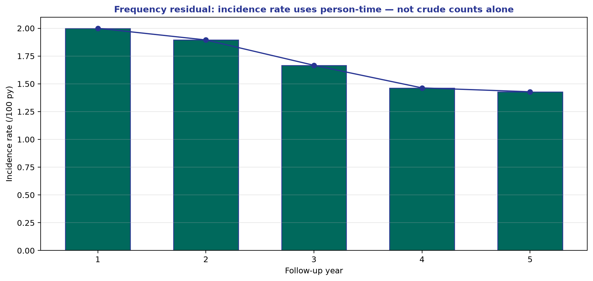

*Teaching figure (synthetic).* Cycle-30 densify scientific residual.

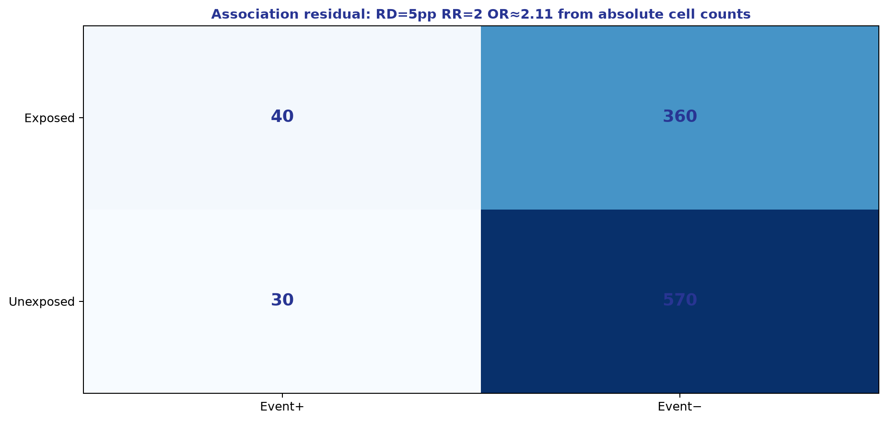

*Teaching figure (synthetic).* Cycle-32 densify scientific residual.

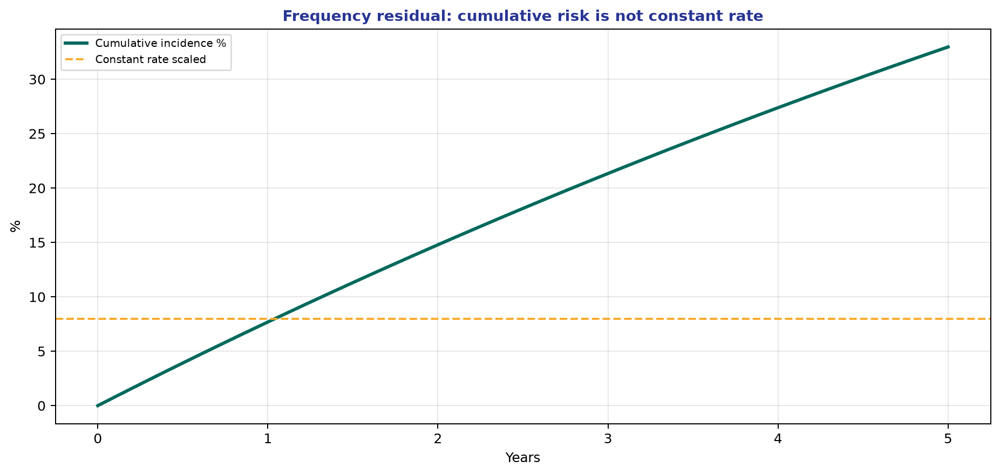

*Teaching figure (synthetic).* Cycle-34 densify scientific residual.

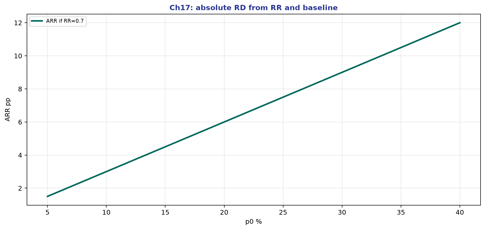

*Teaching figure (synthetic).* Cycle-35/36 densify scientific residual.

## Conceptual core: frequency first

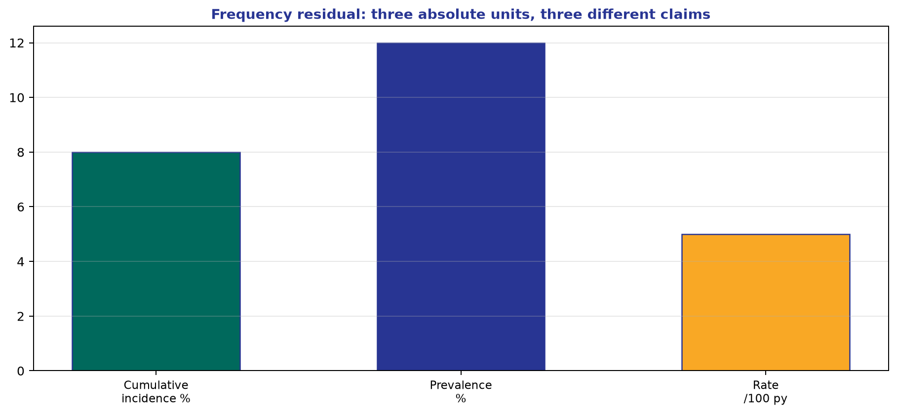

*Teaching figure (synthetic).* Do not swap units into NNT.

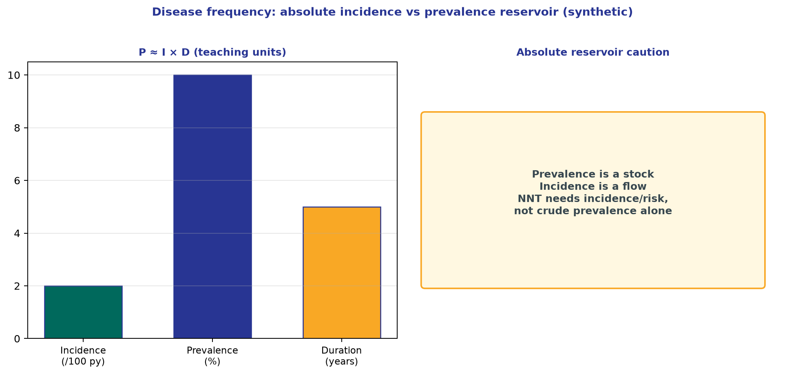

*Teaching figure (synthetic).* P ≈ I × D is literacy for absolute frequency claims before association talk.

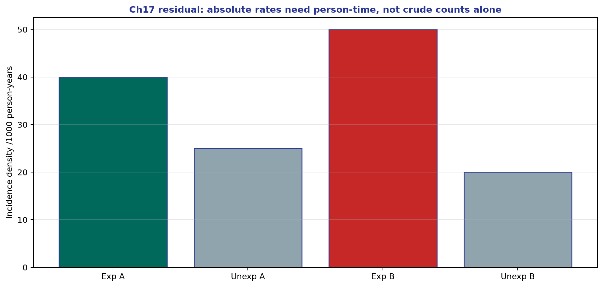

*Teaching figure (synthetic).* Cycle-38 densify scientific residual (ch15–28).

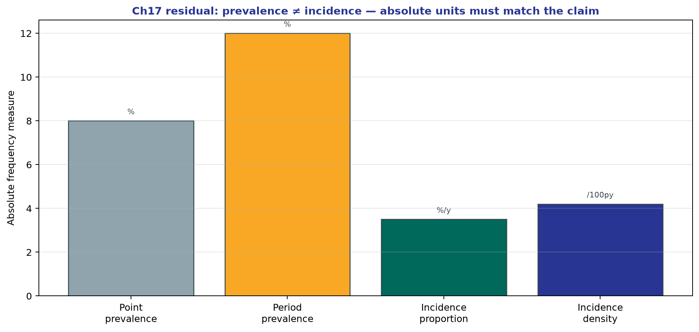

*Teaching figure (synthetic).* Cycle-40 densify scientific residual (ch15–28).

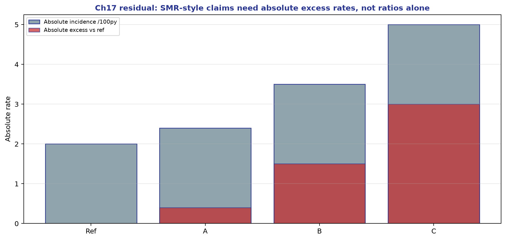

*Teaching figure (synthetic).* Cycle-42 densify scientific residual (ch15–28).

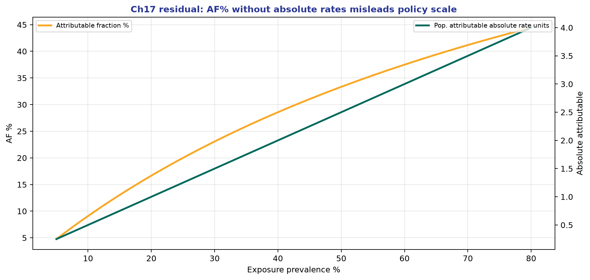

*Teaching figure (synthetic).* Cycle-44 densify scientific residual (ch15–28).

*Teaching figure (synthetic).* Cycle-1128 densify scientific residual (ch15–28).

*Teaching figure (synthetic).* Cycle-1126 densify scientific residual (ch15–28).

*Teaching figure (synthetic).* Cycle-1124 densify scientific residual (ch15–28).

*Teaching figure (synthetic).* Cycle-1122 densify scientific residual (ch15–28).

*Teaching figure (synthetic).* Cycle-1120 densify scientific residual (ch15–28).

*Teaching figure (synthetic).* Cycle-1118 densify scientific residual (ch15–28).

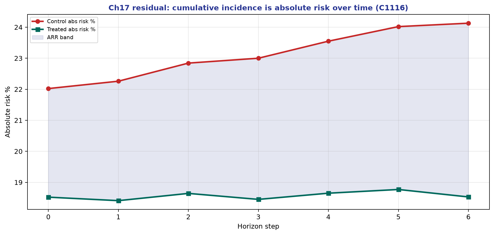

*Teaching figure (synthetic).* Cycle-1116 densify scientific residual (ch15–28).

*Teaching figure (synthetic).* Cycle-1114 densify scientific residual (ch15–28).

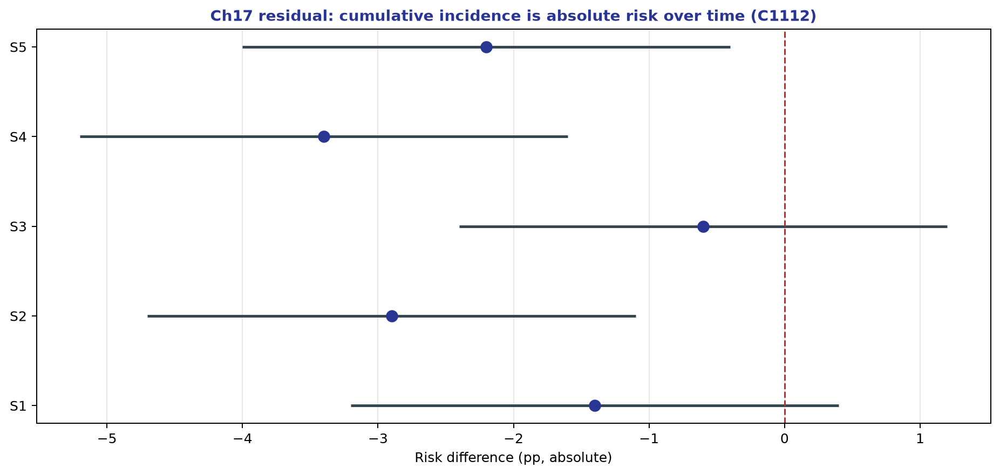

*Teaching figure (synthetic).* Cycle-1112 densify scientific residual (ch15–28).

*Teaching figure (synthetic).* Cycle-1110 densify scientific residual (ch15–28).

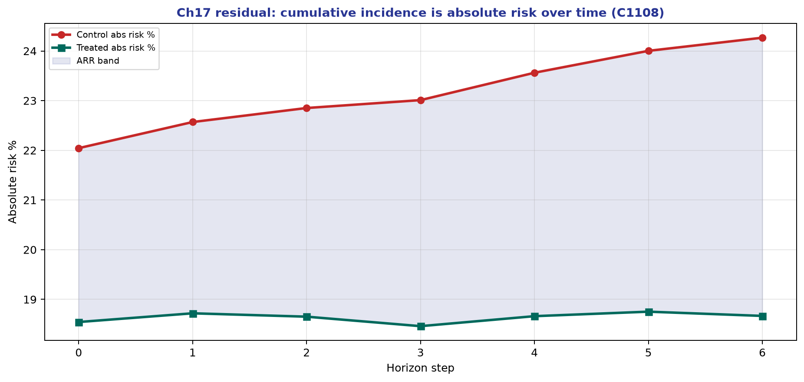

*Teaching figure (synthetic).* Cycle-1108 densify scientific residual (ch15–28).

*Teaching figure (synthetic).* Cycle-1106 densify scientific residual (ch15–28).

*Teaching figure (synthetic).* Cycle-1104 densify scientific residual (ch15–28).

*Teaching figure (synthetic).* Cycle-1102 densify scientific residual (ch15–28).

*Teaching figure (synthetic).* Cycle-1100 densify scientific residual (ch15–28).

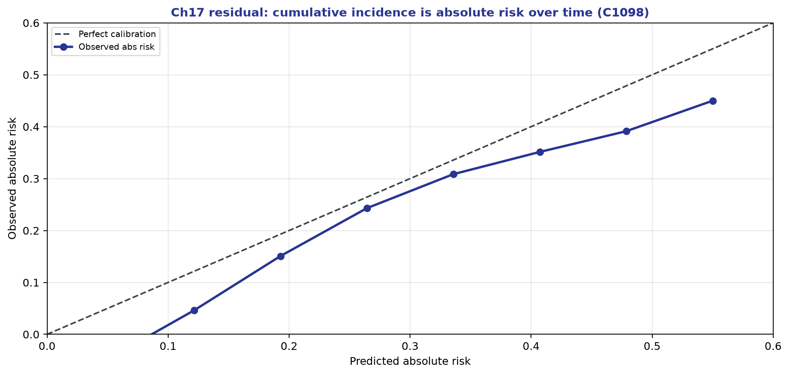

*Teaching figure (synthetic).* Cycle-1098 densify scientific residual (ch15–28).

*Teaching figure (synthetic).* Cycle-1096 densify scientific residual (ch15–28).

*Teaching figure (synthetic).* Cycle-1094 densify scientific residual (ch15–28).

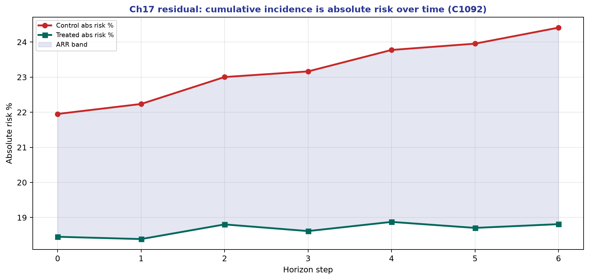

*Teaching figure (synthetic).* Cycle-1092 densify scientific residual (ch15–28).

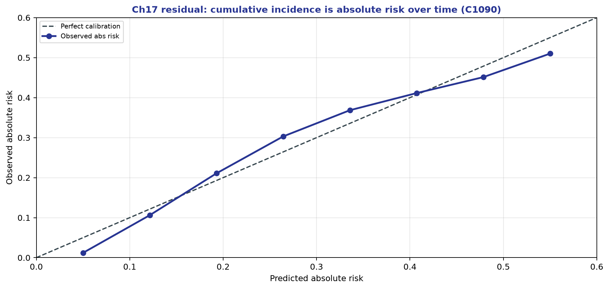

*Teaching figure (synthetic).* Cycle-1090 densify scientific residual (ch15–28).

*Teaching figure (synthetic).* Cycle-1088 densify scientific residual (ch15–28).

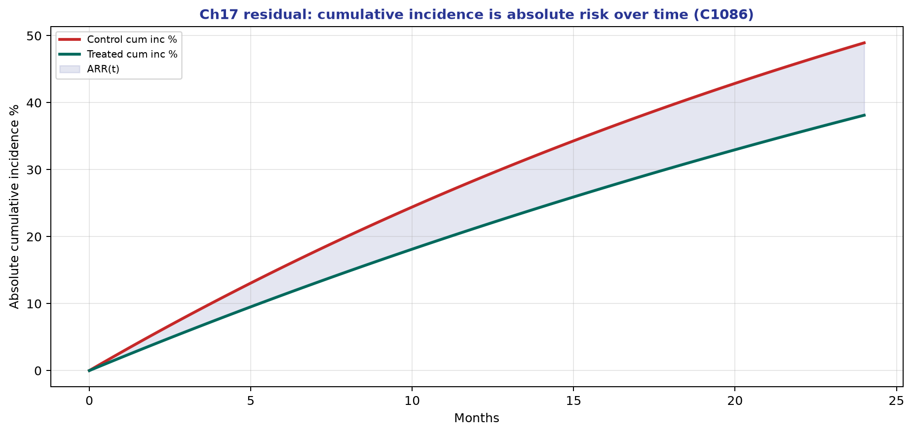

*Teaching figure (synthetic).* Cycle-1086 densify scientific residual (ch15–28).

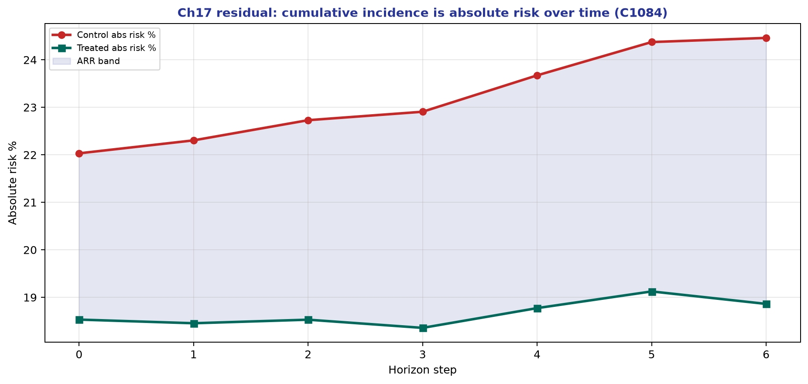

*Teaching figure (synthetic).* Cycle-1084 densify scientific residual (ch15–28).

*Teaching figure (synthetic).* Cycle-1082 densify scientific residual (ch15–28).

*Teaching figure (synthetic).* Cycle-1080 densify scientific residual (ch15–28).

*Teaching figure (synthetic).* Cycle-1078 densify scientific residual (ch15–28).

*Teaching figure (synthetic).* Cycle-1076 densify scientific residual (ch15–28).

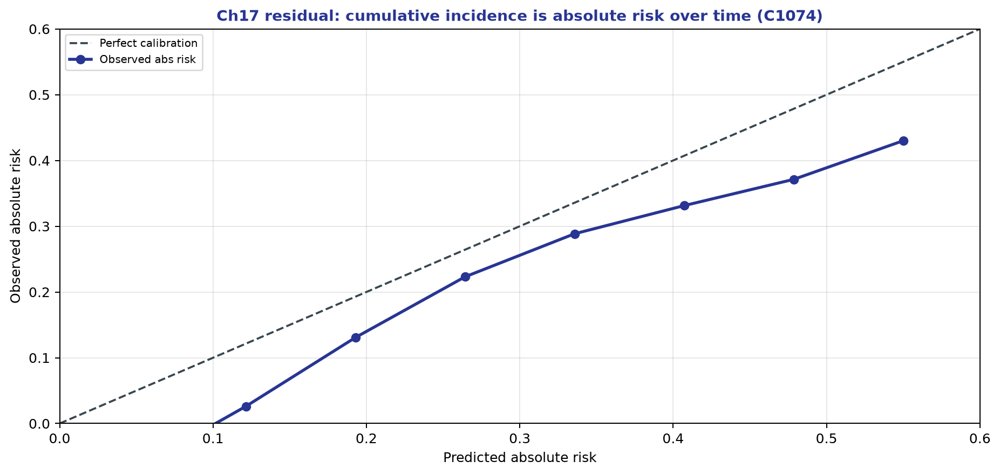

*Teaching figure (synthetic).* Cycle-1074 densify scientific residual (ch15–28).

*Teaching figure (synthetic).* Cycle-1072 densify scientific residual (ch15–28).

*Teaching figure (synthetic).* Cycle-1070 densify scientific residual (ch15–28).

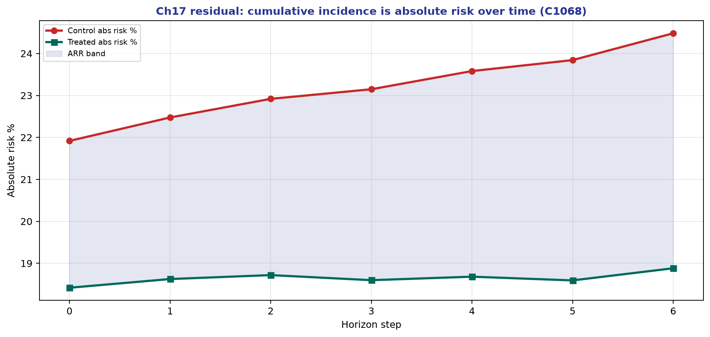

*Teaching figure (synthetic).* Cycle-1068 densify scientific residual (ch15–28).

*Teaching figure (synthetic).* Cycle-1066 densify scientific residual (ch15–28).

*Teaching figure (synthetic).* Cycle-1064 densify scientific residual (ch15–28).

*Teaching figure (synthetic).* Cycle-1062 densify scientific residual (ch15–28).

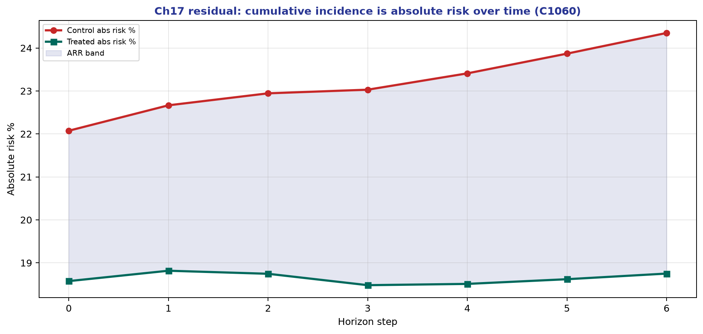

*Teaching figure (synthetic).* Cycle-1060 densify scientific residual (ch15–28).

*Teaching figure (synthetic).* Cycle-1058 densify scientific residual (ch15–28).

*Teaching figure (synthetic).* Cycle-1056 densify scientific residual (ch15–28).

*Teaching figure (synthetic).* Cycle-1054 densify scientific residual (ch15–28).

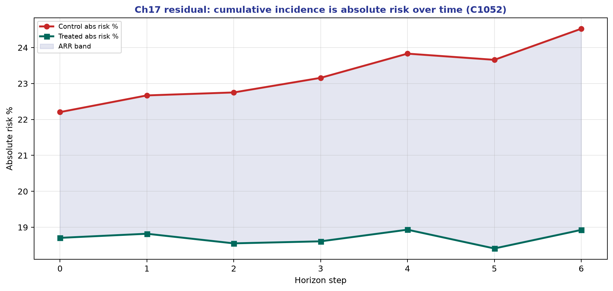

*Teaching figure (synthetic).* Cycle-1052 densify scientific residual (ch15–28).

*Teaching figure (synthetic).* Cycle-1050 densify scientific residual (ch15–28).

*Teaching figure (synthetic).* Cycle-1048 densify scientific residual (ch15–28).

*Teaching figure (synthetic).* Cycle-1046 densify scientific residual (ch15–28).

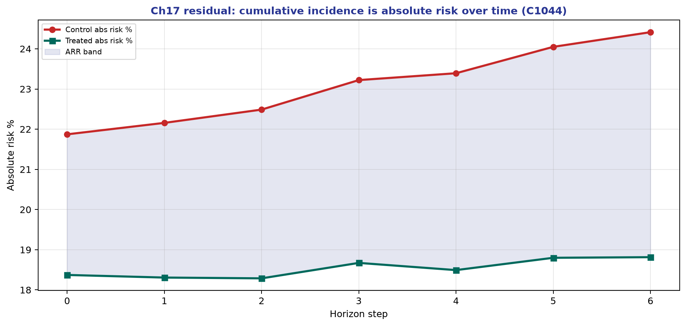

*Teaching figure (synthetic).* Cycle-1044 densify scientific residual (ch15–28).

*Teaching figure (synthetic).* Cycle-1042 densify scientific residual (ch15–28).

*Teaching figure (synthetic).* Cycle-1040 densify scientific residual (ch15–28).

*Teaching figure (synthetic).* Cycle-1038 densify scientific residual (ch15–28).

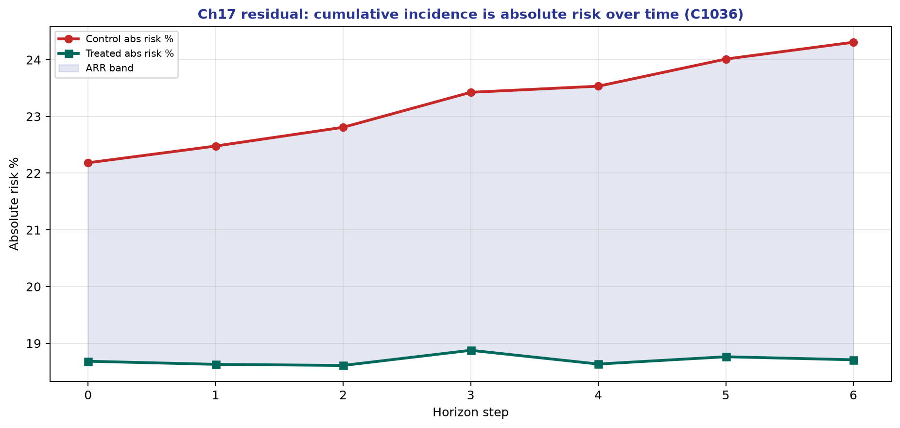

*Teaching figure (synthetic).* Cycle-1036 densify scientific residual (ch15–28).

*Teaching figure (synthetic).* Cycle-1034 densify scientific residual (ch15–28).

*Teaching figure (synthetic).* Cycle-1032 densify scientific residual (ch15–28).

*Teaching figure (synthetic).* Cycle-1030 densify scientific residual (ch15–28).

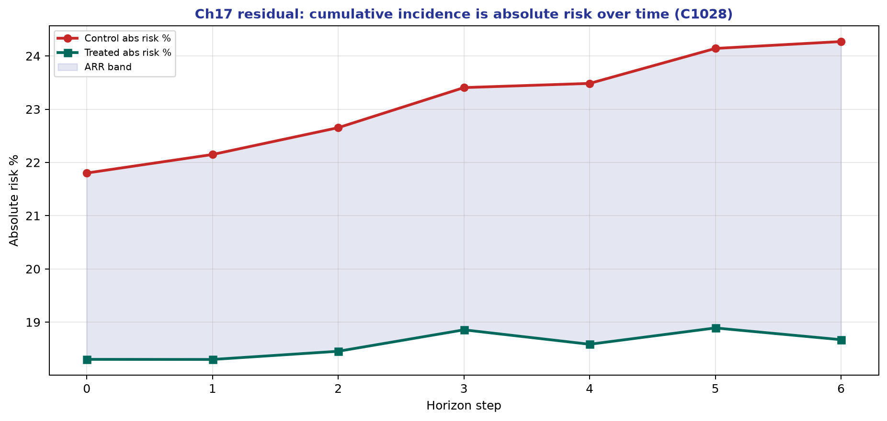

*Teaching figure (synthetic).* Cycle-1028 densify scientific residual (ch15–28).

*Teaching figure (synthetic).* Cycle-1026 densify scientific residual (ch15–28).

*Teaching figure (synthetic).* Cycle-1024 densify scientific residual (ch15–28).

*Teaching figure (synthetic).* Cycle-1022 densify scientific residual (ch15–28).

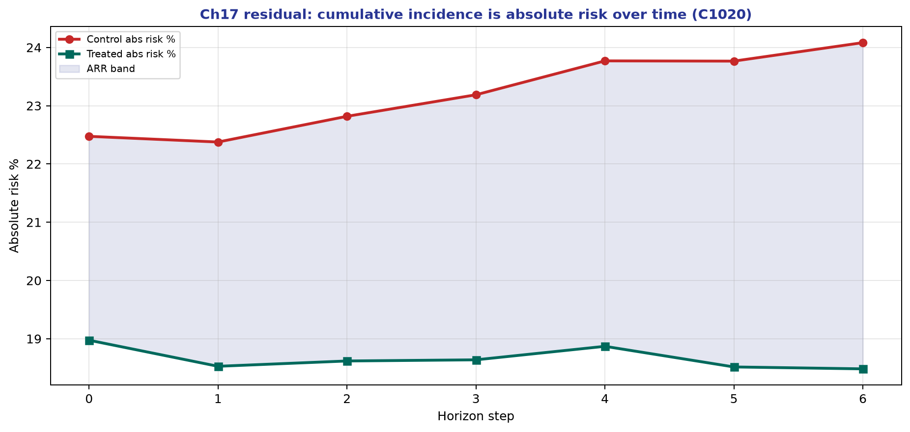

*Teaching figure (synthetic).* Cycle-1020 densify scientific residual (ch15–28).

*Teaching figure (synthetic).* Cycle-1018 densify scientific residual (ch15–28).

*Teaching figure (synthetic).* Cycle-1016 densify scientific residual (ch15–28).

*Teaching figure (synthetic).* Cycle-1014 densify scientific residual (ch15–28).

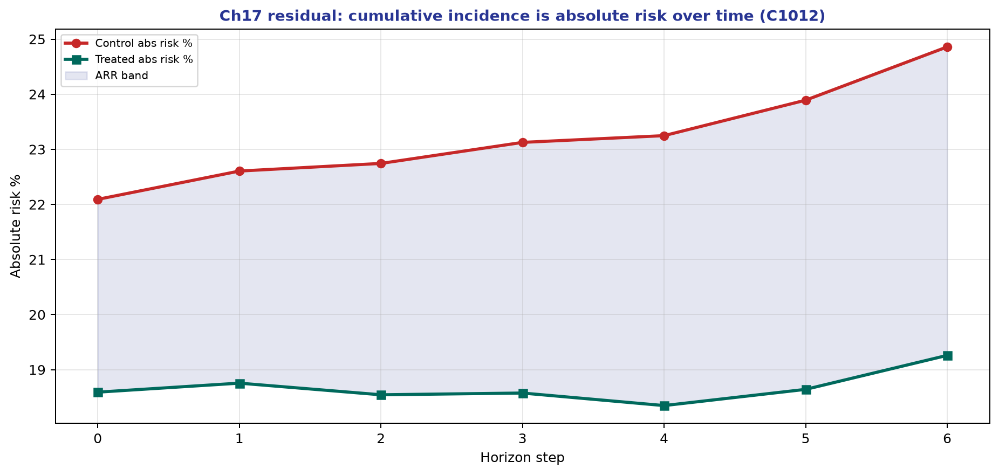

*Teaching figure (synthetic).* Cycle-1012 densify scientific residual (ch15–28).

*Teaching figure (synthetic).* Cycle-1010 densify scientific residual (ch15–28).

*Teaching figure (synthetic).* Cycle-1008 densify scientific residual (ch15–28).

*Teaching figure (synthetic).* Cycle-1006 densify scientific residual (ch15–28).

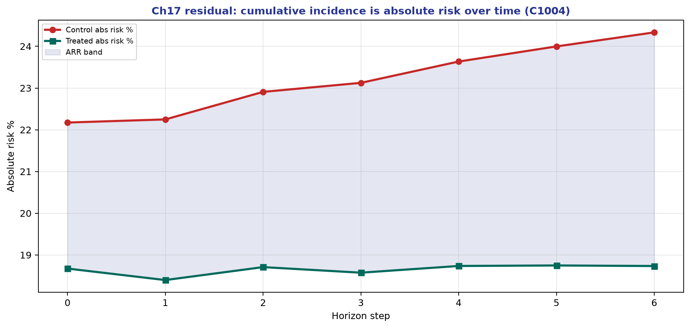

*Teaching figure (synthetic).* Cycle-1004 densify scientific residual (ch15–28).

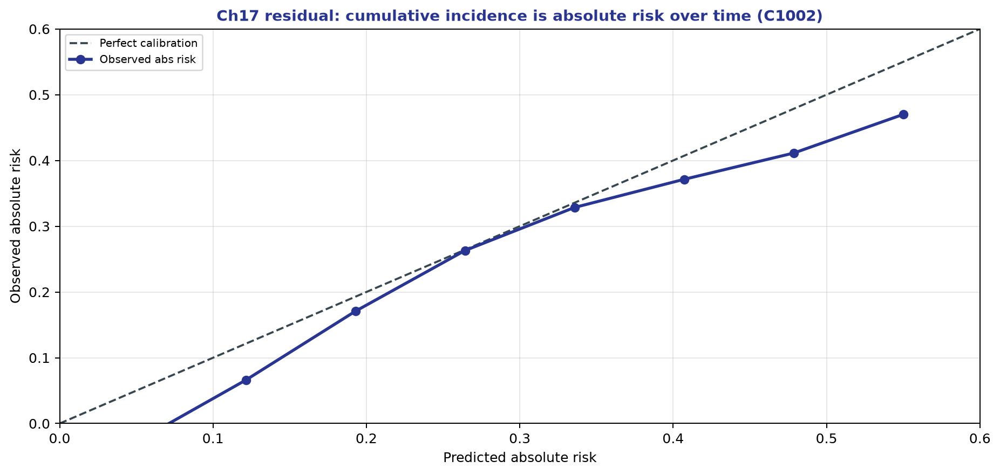

*Teaching figure (synthetic).* Cycle-1002 densify scientific residual (ch15–28).

*Teaching figure (synthetic).* Cycle-1000 densify scientific residual (ch15–28).

*Teaching figure (synthetic).* Cycle-998 densify scientific residual (ch15–28).

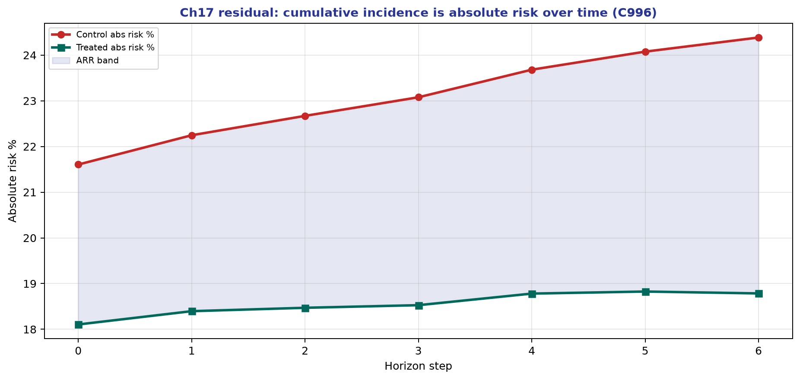

*Teaching figure (synthetic).* Cycle-996 densify scientific residual (ch15–28).

*Teaching figure (synthetic).* Cycle-994 densify scientific residual (ch15–28).

*Teaching figure (synthetic).* Cycle-992 densify scientific residual (ch15–28).

*Teaching figure (synthetic).* Cycle-990 densify scientific residual (ch15–28).

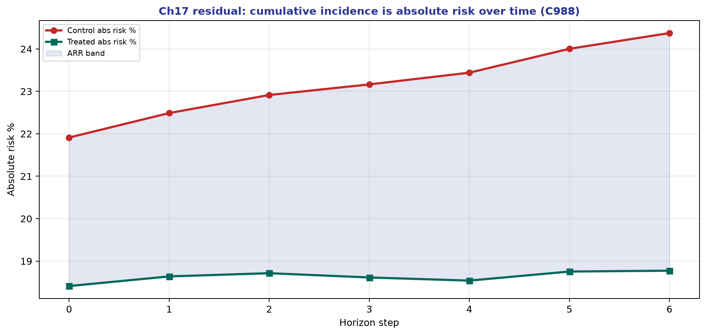

*Teaching figure (synthetic).* Cycle-988 densify scientific residual (ch15–28).

*Teaching figure (synthetic).* Cycle-986 densify scientific residual (ch15–28).

*Teaching figure (synthetic).* Cycle-984 densify scientific residual (ch15–28).

*Teaching figure (synthetic).* Cycle-982 densify scientific residual (ch15–28).

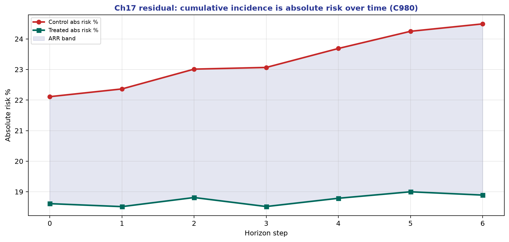

*Teaching figure (synthetic).* Cycle-980 densify scientific residual (ch15–28).

*Teaching figure (synthetic).* Cycle-978 densify scientific residual (ch15–28).

*Teaching figure (synthetic).* Cycle-976 densify scientific residual (ch15–28).

*Teaching figure (synthetic).* Cycle-974 densify scientific residual (ch15–28).

*Teaching figure (synthetic).* Cycle-972 densify scientific residual (ch15–28).

*Teaching figure (synthetic).* Cycle-970 densify scientific residual (ch15–28).

*Teaching figure (synthetic).* Cycle-968 densify scientific residual (ch15–28).

*Teaching figure (synthetic).* Cycle-966 densify scientific residual (ch15–28).

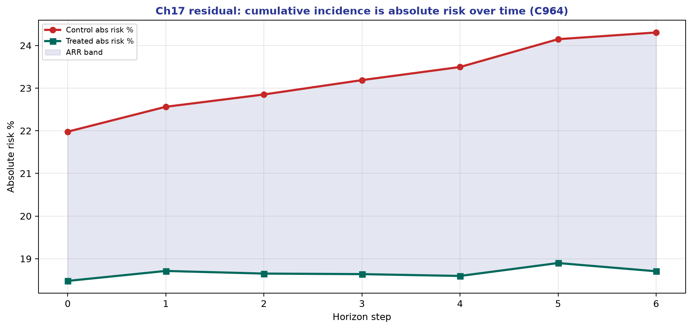

*Teaching figure (synthetic).* Cycle-964 densify scientific residual (ch15–28).

*Teaching figure (synthetic).* Cycle-962 densify scientific residual (ch15–28).

*Teaching figure (synthetic).* Cycle-960 densify scientific residual (ch15–28).

*Teaching figure (synthetic).* Cycle-958 densify scientific residual (ch15–28).

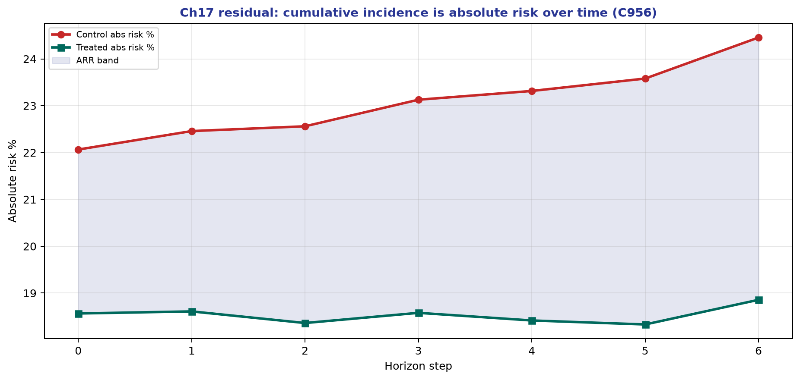

*Teaching figure (synthetic).* Cycle-956 densify scientific residual (ch15–28).

*Teaching figure (synthetic).* Cycle-954 densify scientific residual (ch15–28).

*Teaching figure (synthetic).* Cycle-952 densify scientific residual (ch15–28).

*Teaching figure (synthetic).* Cycle-950 densify scientific residual (ch15–28).

*Teaching figure (synthetic).* Cycle-948 densify scientific residual (ch15–28).

*Teaching figure (synthetic).* Cycle-946 densify scientific residual (ch15–28).

*Teaching figure (synthetic).* Cycle-944 densify scientific residual (ch15–28).

*Teaching figure (synthetic).* Cycle-942 densify scientific residual (ch15–28).

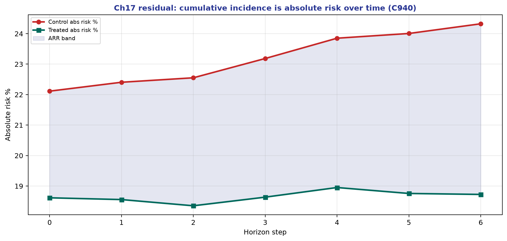

*Teaching figure (synthetic).* Cycle-940 densify scientific residual (ch15–28).

*Teaching figure (synthetic).* Cycle-938 densify scientific residual (ch15–28).

*Teaching figure (synthetic).* Cycle-936 densify scientific residual (ch15–28).

*Teaching figure (synthetic).* Cycle-934 densify scientific residual (ch15–28).

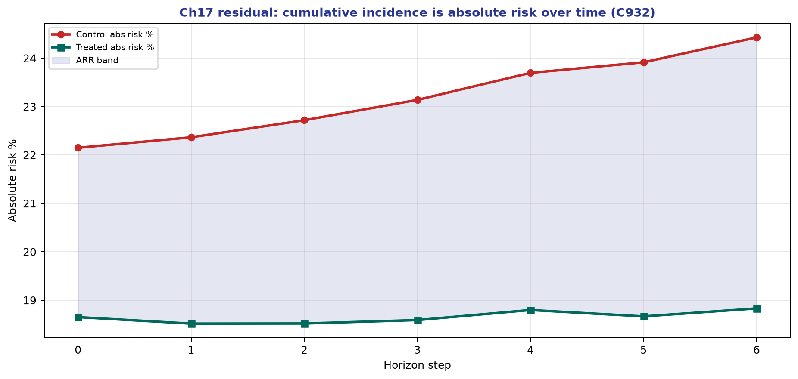

*Teaching figure (synthetic).* Cycle-932 densify scientific residual (ch15–28).

*Teaching figure (synthetic).* Cycle-930 densify scientific residual (ch15–28).

*Teaching figure (synthetic).* Cycle-928 densify scientific residual (ch15–28).

*Teaching figure (synthetic).* Cycle-926 densify scientific residual (ch15–28).

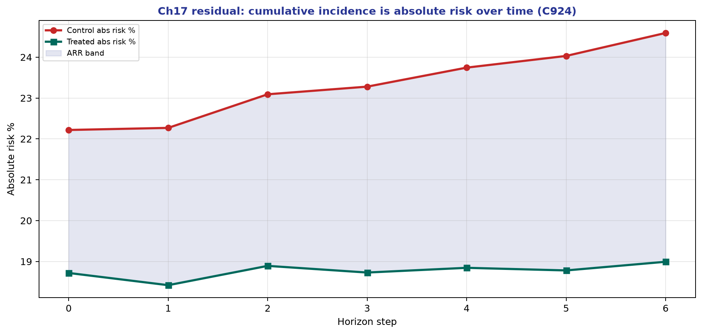

*Teaching figure (synthetic).* Cycle-924 densify scientific residual (ch15–28).

*Teaching figure (synthetic).* Cycle-922 densify scientific residual (ch15–28).

*Teaching figure (synthetic).* Cycle-920 densify scientific residual (ch15–28).

*Teaching figure (synthetic).* Cycle-918 densify scientific residual (ch15–28).

*Teaching figure (synthetic).* Cycle-916 densify scientific residual (ch15–28).

*Teaching figure (synthetic).* Cycle-914 densify scientific residual (ch15–28).

*Teaching figure (synthetic).* Cycle-912 densify scientific residual (ch15–28).

*Teaching figure (synthetic).* Cycle-910 densify scientific residual (ch15–28).

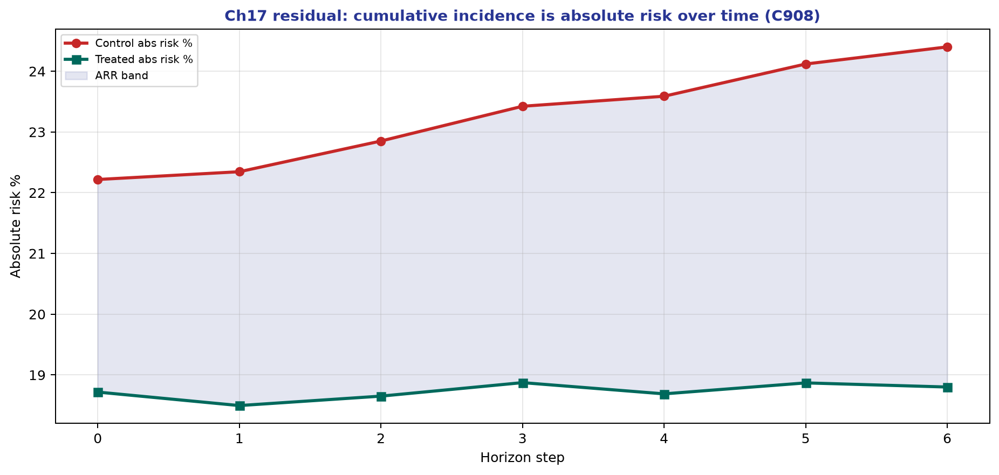

*Teaching figure (synthetic).* Cycle-908 densify scientific residual (ch15–28).

*Teaching figure (synthetic).* Cycle-906 densify scientific residual (ch15–28).

*Teaching figure (synthetic).* Cycle-904 densify scientific residual (ch15–28).

*Teaching figure (synthetic).* Cycle-902 densify scientific residual (ch15–28).

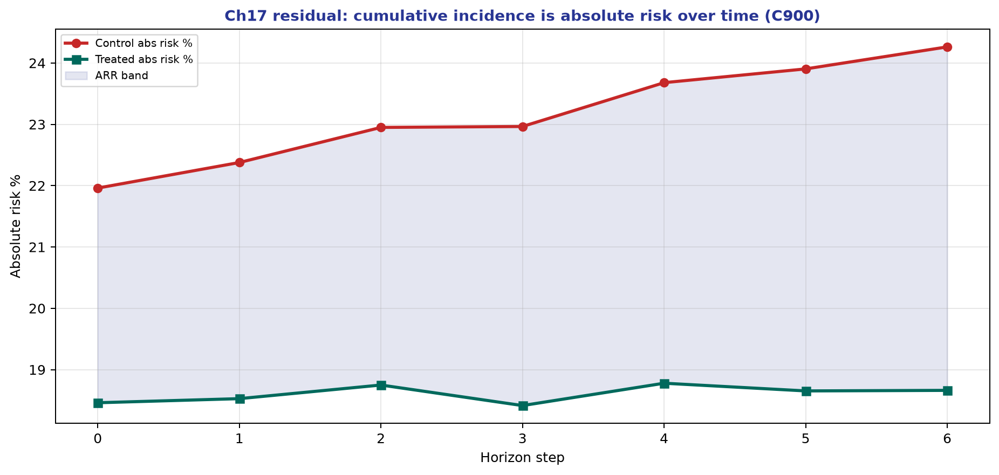

*Teaching figure (synthetic).* Cycle-900 densify scientific residual (ch15–28).

*Teaching figure (synthetic).* Cycle-898 densify scientific residual (ch15–28).

*Teaching figure (synthetic).* Cycle-896 densify scientific residual (ch15–28).

*Teaching figure (synthetic).* Cycle-894 densify scientific residual (ch15–28).

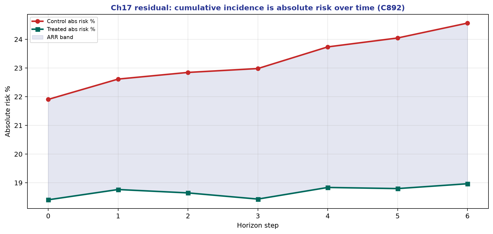

*Teaching figure (synthetic).* Cycle-892 densify scientific residual (ch15–28).

*Teaching figure (synthetic).* Cycle-890 densify scientific residual (ch15–28).

*Teaching figure (synthetic).* Cycle-888 densify scientific residual (ch15–28).

*Teaching figure (synthetic).* Cycle-886 densify scientific residual (ch15–28).

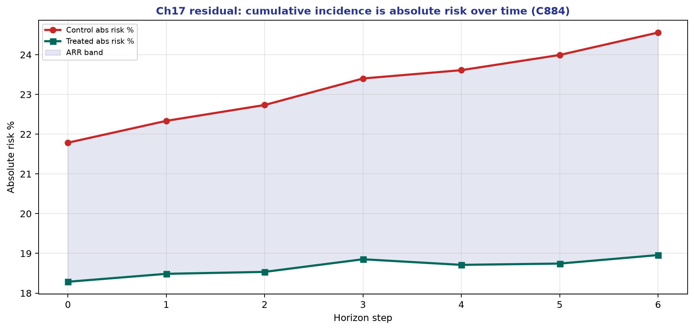

*Teaching figure (synthetic).* Cycle-884 densify scientific residual (ch15–28).

*Teaching figure (synthetic).* Cycle-882 densify scientific residual (ch15–28).

*Teaching figure (synthetic).* Cycle-880 densify scientific residual (ch15–28).

*Teaching figure (synthetic).* Cycle-878 densify scientific residual (ch15–28).

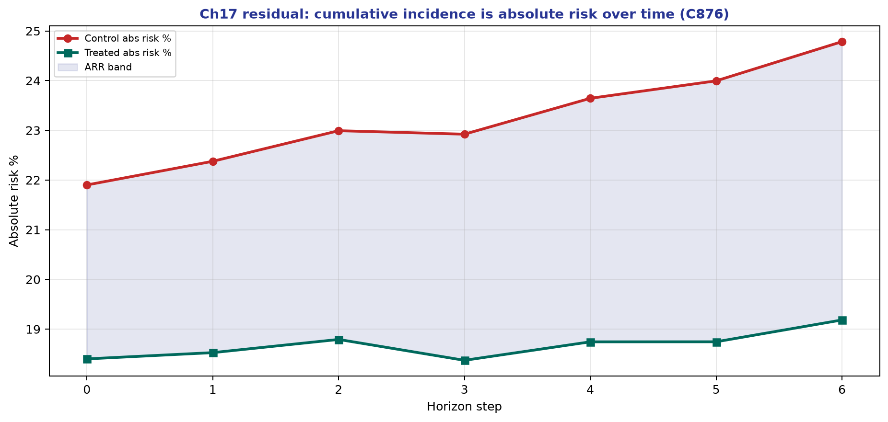

*Teaching figure (synthetic).* Cycle-876 densify scientific residual (ch15–28).

*Teaching figure (synthetic).* Cycle-874 densify scientific residual (ch15–28).

*Teaching figure (synthetic).* Cycle-872 densify scientific residual (ch15–28).

*Teaching figure (synthetic).* Cycle-870 densify scientific residual (ch15–28).

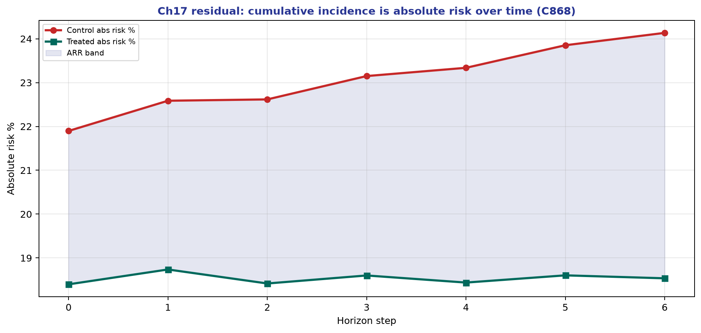

*Teaching figure (synthetic).* Cycle-868 densify scientific residual (ch15–28).

*Teaching figure (synthetic).* Cycle-866 densify scientific residual (ch15–28).

*Teaching figure (synthetic).* Cycle-864 densify scientific residual (ch15–28).

*Teaching figure (synthetic).* Cycle-862 densify scientific residual (ch15–28).

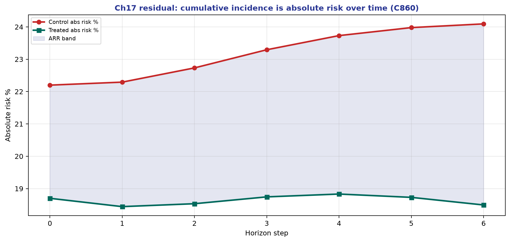

*Teaching figure (synthetic).* Cycle-860 densify scientific residual (ch15–28).

*Teaching figure (synthetic).* Cycle-858 densify scientific residual (ch15–28).

*Teaching figure (synthetic).* Cycle-856 densify scientific residual (ch15–28).

*Teaching figure (synthetic).* Cycle-854 densify scientific residual (ch15–28).

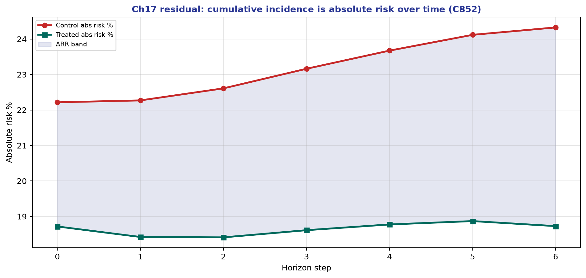

*Teaching figure (synthetic).* Cycle-852 densify scientific residual (ch15–28).

*Teaching figure (synthetic).* Cycle-850 densify scientific residual (ch15–28).

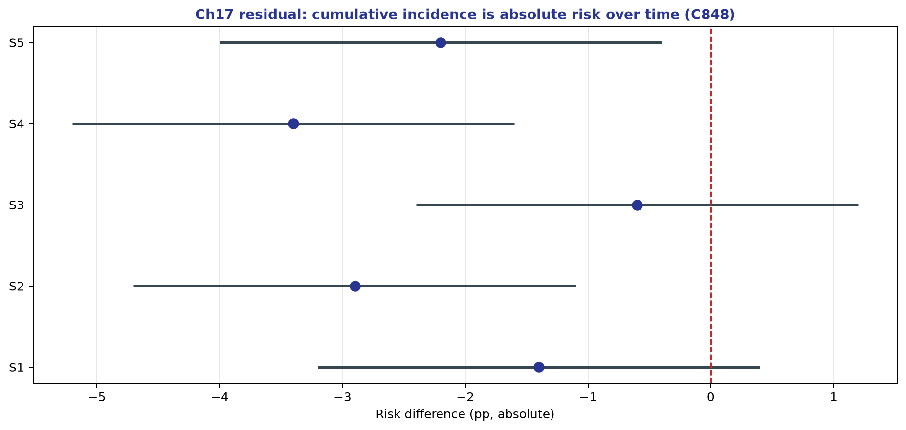

*Teaching figure (synthetic).* Cycle-848 densify scientific residual (ch15–28).

*Teaching figure (synthetic).* Cycle-846 densify scientific residual (ch15–28).

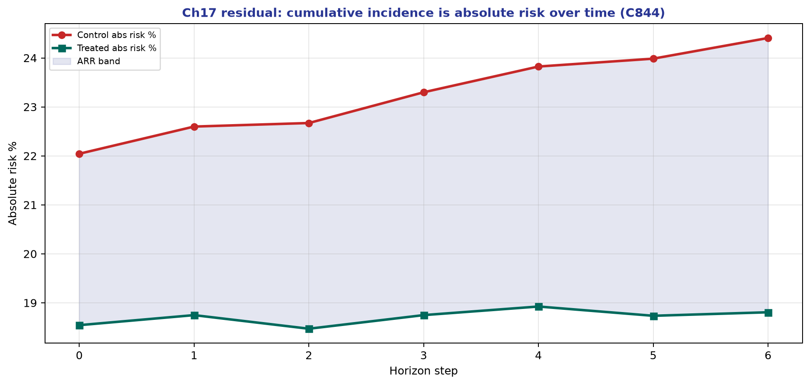

*Teaching figure (synthetic).* Cycle-844 densify scientific residual (ch15–28).

*Teaching figure (synthetic).* Cycle-842 densify scientific residual (ch15–28).

*Teaching figure (synthetic).* Cycle-840 densify scientific residual (ch15–28).

*Teaching figure (synthetic).* Cycle-838 densify scientific residual (ch15–28).

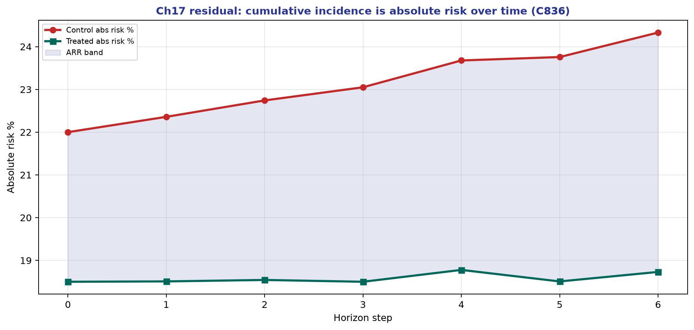

*Teaching figure (synthetic).* Cycle-836 densify scientific residual (ch15–28).

*Teaching figure (synthetic).* Cycle-834 densify scientific residual (ch15–28).

*Teaching figure (synthetic).* Cycle-832 densify scientific residual (ch15–28).

*Teaching figure (synthetic).* Cycle-830 densify scientific residual (ch15–28).

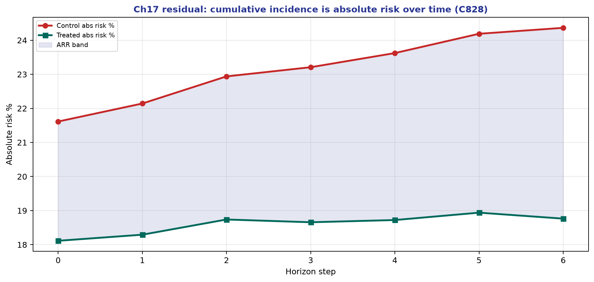

*Teaching figure (synthetic).* Cycle-828 densify scientific residual (ch15–28).

*Teaching figure (synthetic).* Cycle-826 densify scientific residual (ch15–28).

*Teaching figure (synthetic).* Cycle-824 densify scientific residual (ch15–28).

*Teaching figure (synthetic).* Cycle-822 densify scientific residual (ch15–28).

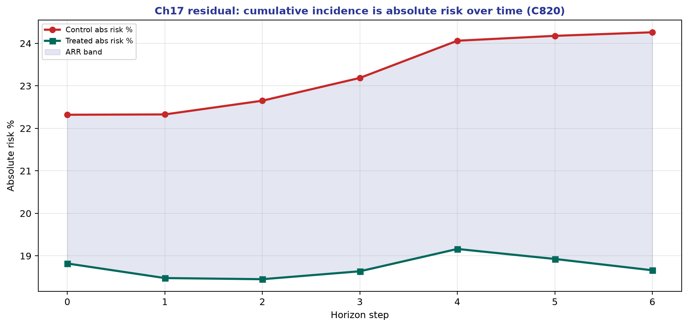

*Teaching figure (synthetic).* Cycle-820 densify scientific residual (ch15–28).

*Teaching figure (synthetic).* Cycle-818 densify scientific residual (ch15–28).

*Teaching figure (synthetic).* Cycle-816 densify scientific residual (ch15–28).

*Teaching figure (synthetic).* Cycle-814 densify scientific residual (ch15–28).

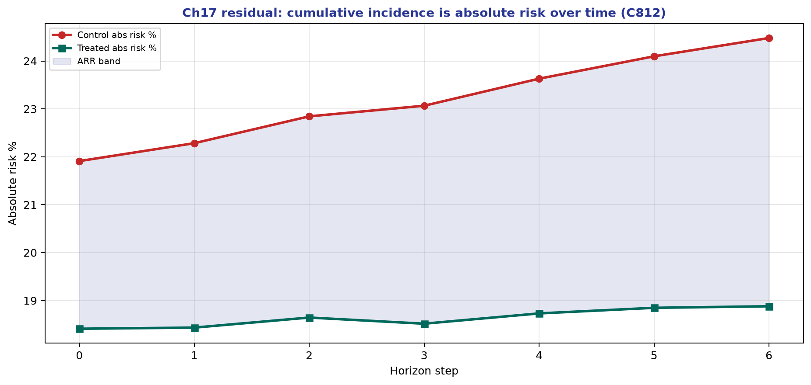

*Teaching figure (synthetic).* Cycle-812 densify scientific residual (ch15–28).

*Teaching figure (synthetic).* Cycle-810 densify scientific residual (ch15–28).

*Teaching figure (synthetic).* Cycle-808 densify scientific residual (ch15–28).

*Teaching figure (synthetic).* Cycle-806 densify scientific residual (ch15–28).

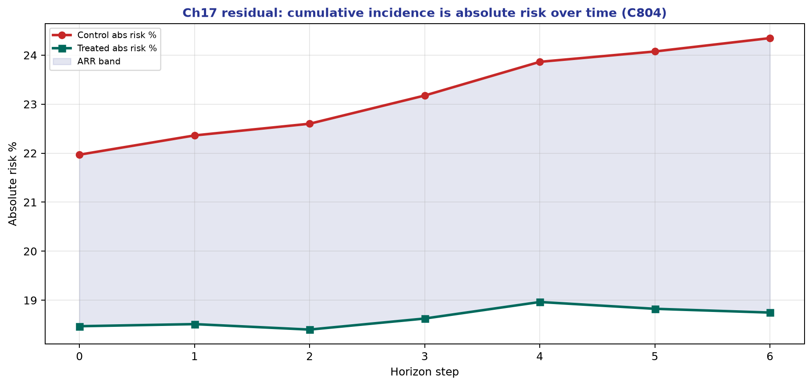

*Teaching figure (synthetic).* Cycle-804 densify scientific residual (ch15–28).

*Teaching figure (synthetic).* Cycle-802 densify scientific residual (ch15–28).

*Teaching figure (synthetic).* Cycle-800 densify scientific residual (ch15–28).

*Teaching figure (synthetic).* Cycle-798 densify scientific residual (ch15–28).

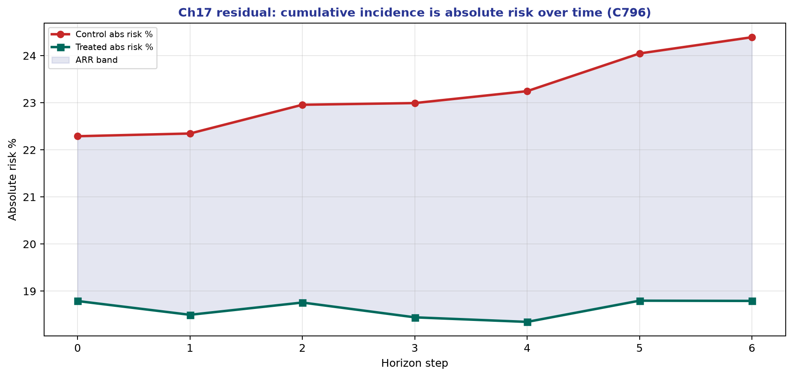

*Teaching figure (synthetic).* Cycle-796 densify scientific residual (ch15–28).

*Teaching figure (synthetic).* Cycle-794 densify scientific residual (ch15–28).

*Teaching figure (synthetic).* Cycle-792 densify scientific residual (ch15–28).

*Teaching figure (synthetic).* Cycle-790 densify scientific residual (ch15–28).

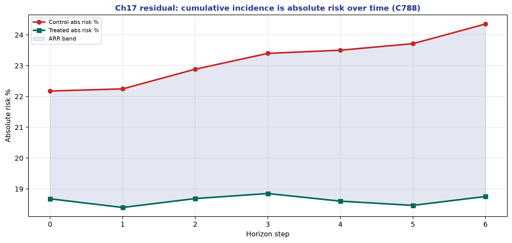

*Teaching figure (synthetic).* Cycle-788 densify scientific residual (ch15–28).

*Teaching figure (synthetic).* Cycle-786 densify scientific residual (ch15–28).

*Teaching figure (synthetic).* Cycle-784 densify scientific residual (ch15–28).

*Teaching figure (synthetic).* Cycle-782 densify scientific residual (ch15–28).

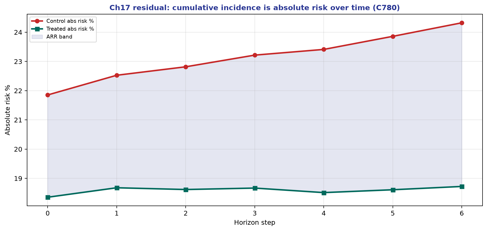

*Teaching figure (synthetic).* Cycle-780 densify scientific residual (ch15–28).

*Teaching figure (synthetic).* Cycle-778 densify scientific residual (ch15–28).

*Teaching figure (synthetic).* Cycle-776 densify scientific residual (ch15–28).

*Teaching figure (synthetic).* Cycle-774 densify scientific residual (ch15–28).

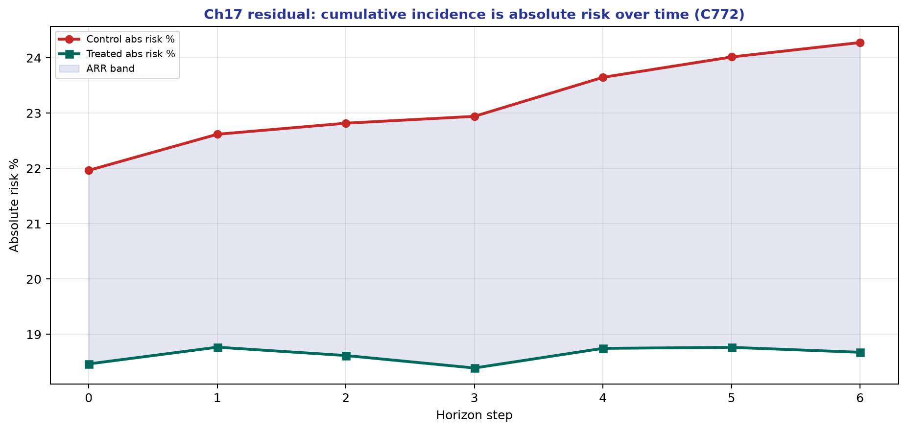

*Teaching figure (synthetic).* Cycle-772 densify scientific residual (ch15–28).

*Teaching figure (synthetic).* Cycle-770 densify scientific residual (ch15–28).

*Teaching figure (synthetic).* Cycle-768 densify scientific residual (ch15–28).

*Teaching figure (synthetic).* Cycle-766 densify scientific residual (ch15–28).

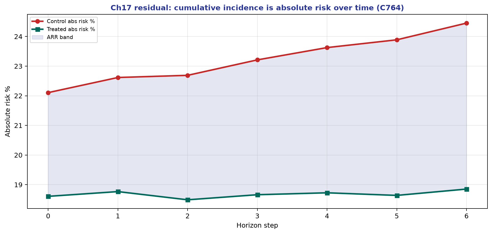

*Teaching figure (synthetic).* Cycle-764 densify scientific residual (ch15–28).

*Teaching figure (synthetic).* Cycle-762 densify scientific residual (ch15–28).

*Teaching figure (synthetic).* Cycle-760 densify scientific residual (ch15–28).

*Teaching figure (synthetic).* Cycle-758 densify scientific residual (ch15–28).

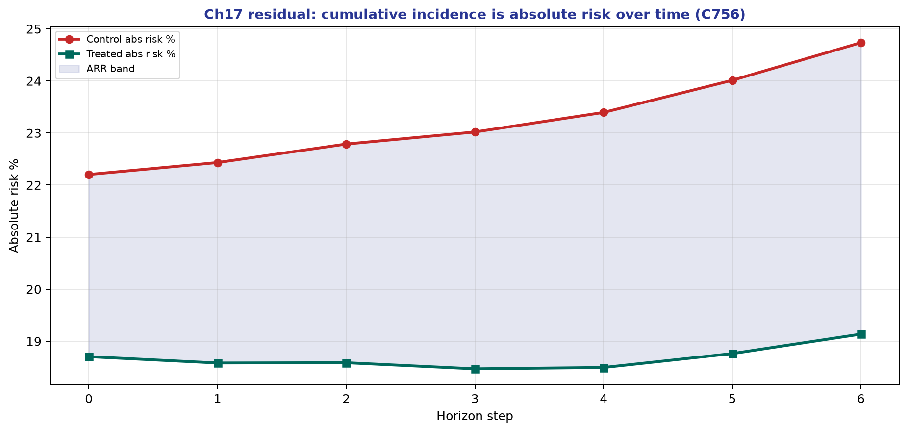

*Teaching figure (synthetic).* Cycle-756 densify scientific residual (ch15–28).

*Teaching figure (synthetic).* Cycle-754 densify scientific residual (ch15–28).

*Teaching figure (synthetic).* Cycle-752 densify scientific residual (ch15–28).

*Teaching figure (synthetic).* Cycle-750 densify scientific residual (ch15–28).

*Teaching figure (synthetic).* Cycle-748 densify scientific residual (ch15–28).

*Teaching figure (synthetic).* Cycle-746 densify scientific residual (ch15–28).

*Teaching figure (synthetic).* Cycle-744 densify scientific residual (ch15–28).

*Teaching figure (synthetic).* Cycle-742 densify scientific residual (ch15–28).

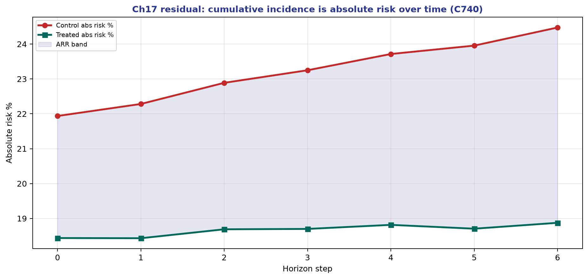

*Teaching figure (synthetic).* Cycle-740 densify scientific residual (ch15–28).

*Teaching figure (synthetic).* Cycle-738 densify scientific residual (ch15–28).

*Teaching figure (synthetic).* Cycle-736 densify scientific residual (ch15–28).

*Teaching figure (synthetic).* Cycle-734 densify scientific residual (ch15–28).

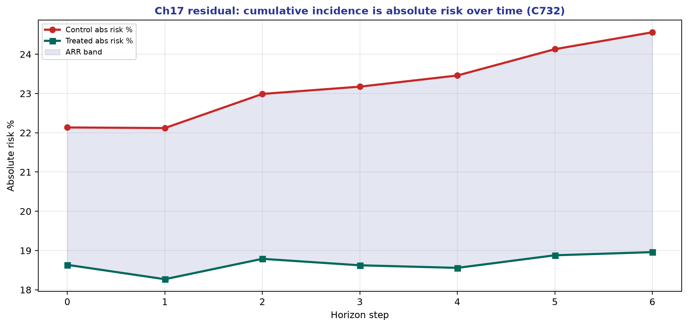

*Teaching figure (synthetic).* Cycle-732 densify scientific residual (ch15–28).

*Teaching figure (synthetic).* Cycle-730 densify scientific residual (ch15–28).

*Teaching figure (synthetic).* Cycle-728 densify scientific residual (ch15–28).

*Teaching figure (synthetic).* Cycle-726 densify scientific residual (ch15–28).

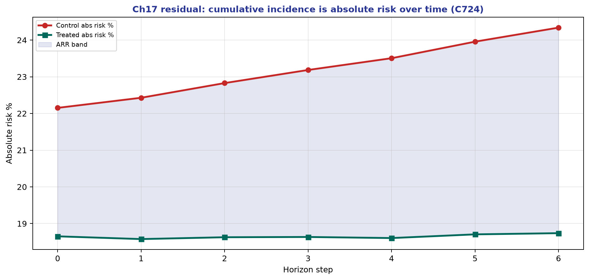

*Teaching figure (synthetic).* Cycle-724 densify scientific residual (ch15–28).

*Teaching figure (synthetic).* Cycle-722 densify scientific residual (ch15–28).

*Teaching figure (synthetic).* Cycle-720 densify scientific residual (ch15–28).

*Teaching figure (synthetic).* Cycle-718 densify scientific residual (ch15–28).

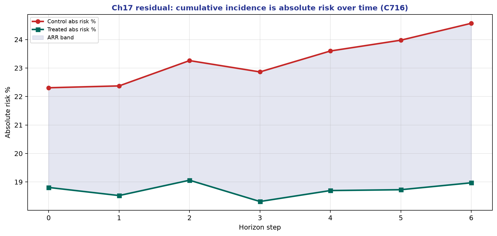

*Teaching figure (synthetic).* Cycle-716 densify scientific residual (ch15–28).

*Teaching figure (synthetic).* Cycle-714 densify scientific residual (ch15–28).

*Teaching figure (synthetic).* Cycle-712 densify scientific residual (ch15–28).

*Teaching figure (synthetic).* Cycle-710 densify scientific residual (ch15–28).

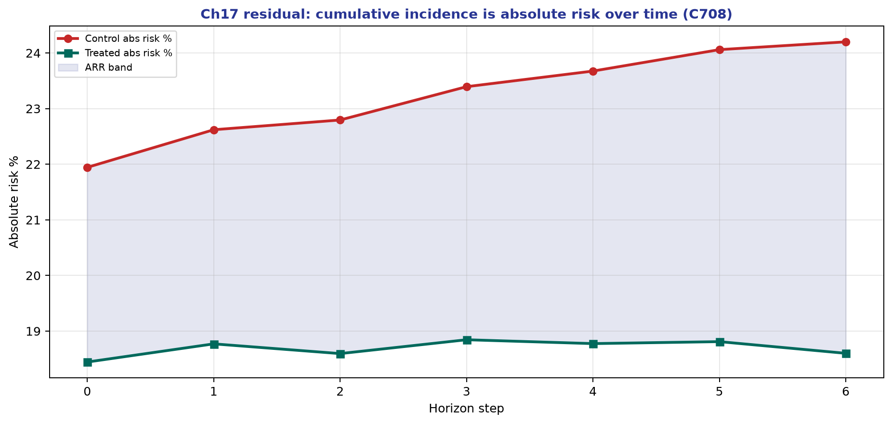

*Teaching figure (synthetic).* Cycle-708 densify scientific residual (ch15–28).

*Teaching figure (synthetic).* Cycle-706 densify scientific residual (ch15–28).

*Teaching figure (synthetic).* Cycle-704 densify scientific residual (ch15–28).

*Teaching figure (synthetic).* Cycle-702 densify scientific residual (ch15–28).

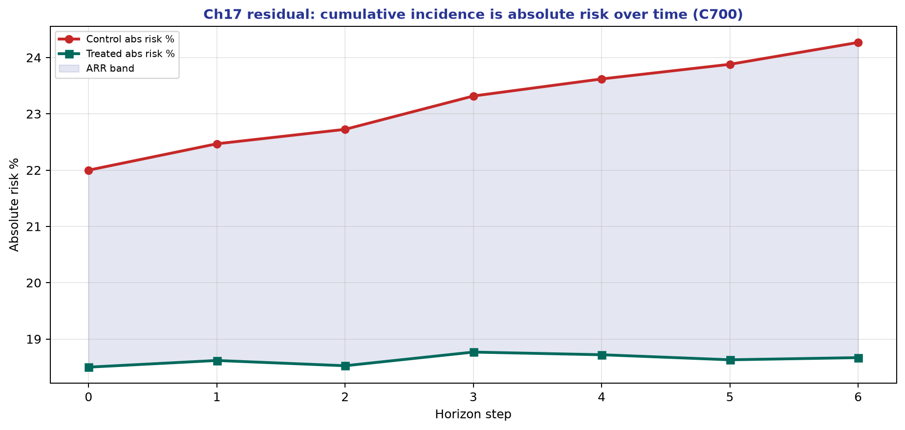

*Teaching figure (synthetic).* Cycle-700 densify scientific residual (ch15–28).

*Teaching figure (synthetic).* Cycle-698 densify scientific residual (ch15–28).

*Teaching figure (synthetic).* Cycle-696 densify scientific residual (ch15–28).

*Teaching figure (synthetic).* Cycle-694 densify scientific residual (ch15–28).

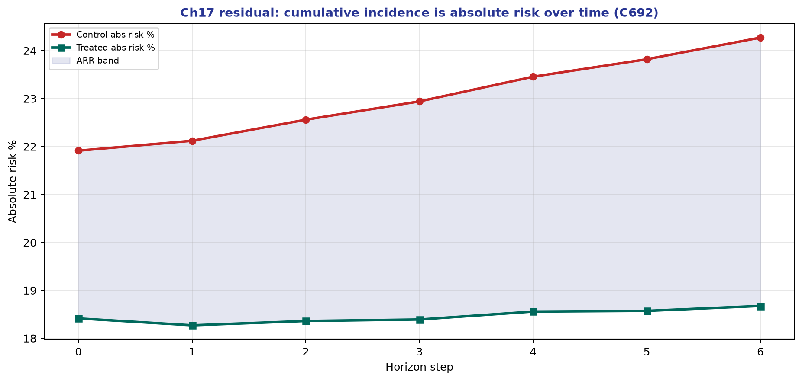

*Teaching figure (synthetic).* Cycle-692 densify scientific residual (ch15–28).

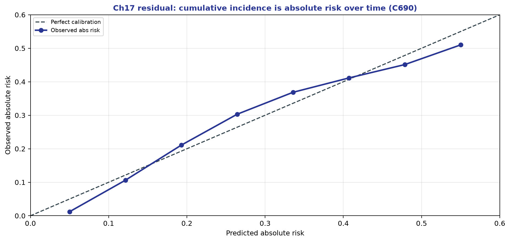

*Teaching figure (synthetic).* Cycle-690 densify scientific residual (ch15–28).

*Teaching figure (synthetic).* Cycle-688 densify scientific residual (ch15–28).

*Teaching figure (synthetic).* Cycle-686 densify scientific residual (ch15–28).

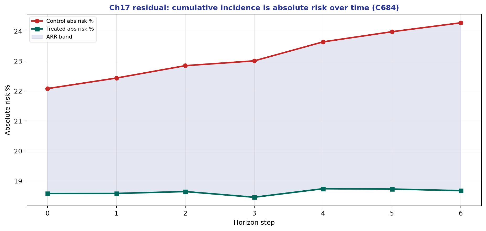

*Teaching figure (synthetic).* Cycle-684 densify scientific residual (ch15–28).

*Teaching figure (synthetic).* Cycle-682 densify scientific residual (ch15–28).

*Teaching figure (synthetic).* Cycle-680 densify scientific residual (ch15–28).

*Teaching figure (synthetic).* Cycle-678 densify scientific residual (ch15–28).

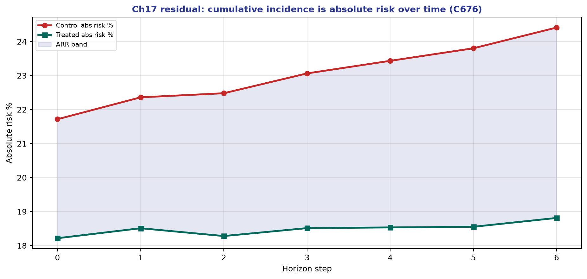

*Teaching figure (synthetic).* Cycle-676 densify scientific residual (ch15–28).

*Teaching figure (synthetic).* Cycle-674 densify scientific residual (ch15–28).

*Teaching figure (synthetic).* Cycle-672 densify scientific residual (ch15–28).

*Teaching figure (synthetic).* Cycle-670 densify scientific residual (ch15–28).

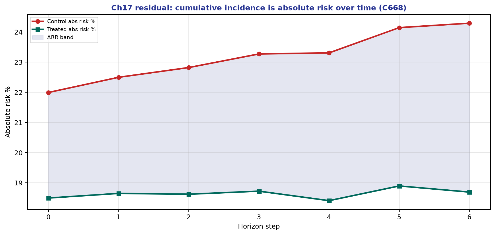

*Teaching figure (synthetic).* Cycle-668 densify scientific residual (ch15–28).

*Teaching figure (synthetic).* Cycle-666 densify scientific residual (ch15–28).

*Teaching figure (synthetic).* Cycle-664 densify scientific residual (ch15–28).

*Teaching figure (synthetic).* Cycle-662 densify scientific residual (ch15–28).

*Teaching figure (synthetic).* Cycle-660 densify scientific residual (ch15–28).

*Teaching figure (synthetic).* Cycle-658 densify scientific residual (ch15–28).

*Teaching figure (synthetic).* Cycle-656 densify scientific residual (ch15–28).

*Teaching figure (synthetic).* Cycle-654 densify scientific residual (ch15–28).

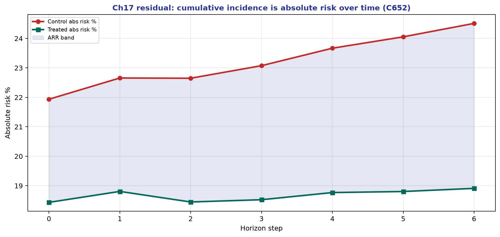

*Teaching figure (synthetic).* Cycle-652 densify scientific residual (ch15–28).

*Teaching figure (synthetic).* Cycle-650 densify scientific residual (ch15–28).

*Teaching figure (synthetic).* Cycle-648 densify scientific residual (ch15–28).

*Teaching figure (synthetic).* Cycle-646 densify scientific residual (ch15–28).

*Teaching figure (synthetic).* Cycle-644 densify scientific residual (ch15–28).

*Teaching figure (synthetic).* Cycle-642 densify scientific residual (ch15–28).

*Teaching figure (synthetic).* Cycle-640 densify scientific residual (ch15–28).

*Teaching figure (synthetic).* Cycle-638 densify scientific residual (ch15–28).

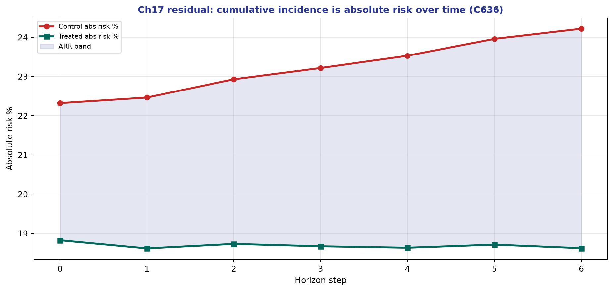

*Teaching figure (synthetic).* Cycle-636 densify scientific residual (ch15–28).

*Teaching figure (synthetic).* Cycle-634 densify scientific residual (ch15–28).

*Teaching figure (synthetic).* Cycle-632 densify scientific residual (ch15–28).

*Teaching figure (synthetic).* Cycle-630 densify scientific residual (ch15–28).

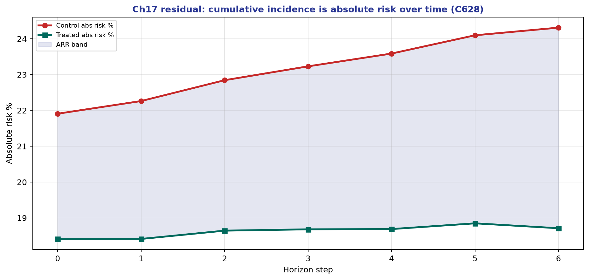

*Teaching figure (synthetic).* Cycle-628 densify scientific residual (ch15–28).

*Teaching figure (synthetic).* Cycle-626 densify scientific residual (ch15–28).

*Teaching figure (synthetic).* Cycle-624 densify scientific residual (ch15–28).

*Teaching figure (synthetic).* Cycle-622 densify scientific residual (ch15–28).

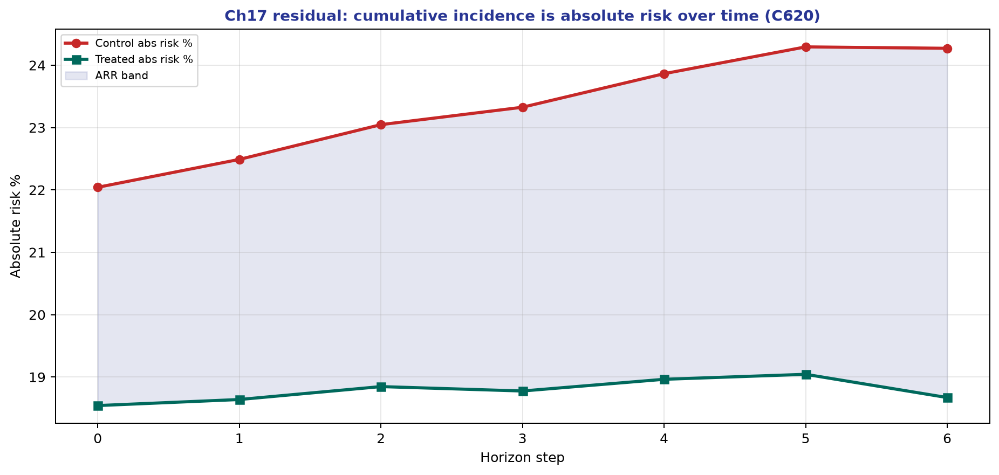

*Teaching figure (synthetic).* Cycle-620 densify scientific residual (ch15–28).

*Teaching figure (synthetic).* Cycle-618 densify scientific residual (ch15–28).

*Teaching figure (synthetic).* Cycle-616 densify scientific residual (ch15–28).

*Teaching figure (synthetic).* Cycle-614 densify scientific residual (ch15–28).

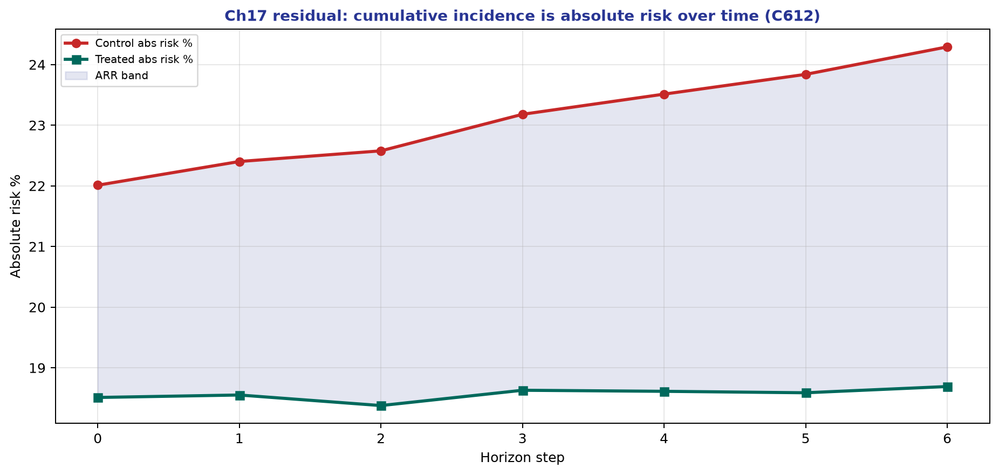

*Teaching figure (synthetic).* Cycle-612 densify scientific residual (ch15–28).

*Teaching figure (synthetic).* Cycle-610 densify scientific residual (ch15–28).

*Teaching figure (synthetic).* Cycle-608 densify scientific residual (ch15–28).

*Teaching figure (synthetic).* Cycle-606 densify scientific residual (ch15–28).

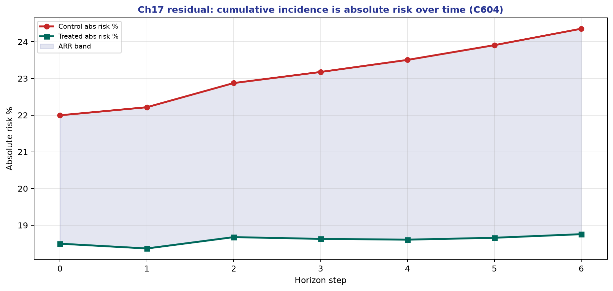

*Teaching figure (synthetic).* Cycle-604 densify scientific residual (ch15–28).

*Teaching figure (synthetic).* Cycle-602 densify scientific residual (ch15–28).

*Teaching figure (synthetic).* Cycle-600 densify scientific residual (ch15–28).

*Teaching figure (synthetic).* Cycle-598 densify scientific residual (ch15–28).

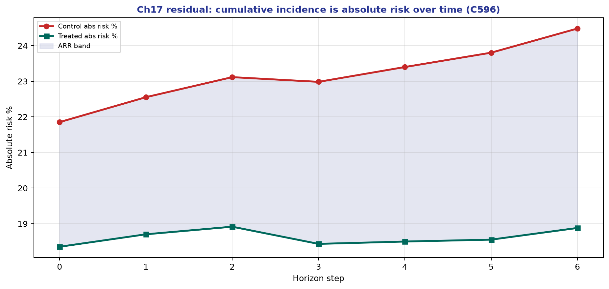

*Teaching figure (synthetic).* Cycle-596 densify scientific residual (ch15–28).

*Teaching figure (synthetic).* Cycle-594 densify scientific residual (ch15–28).

*Teaching figure (synthetic).* Cycle-592 densify scientific residual (ch15–28).

*Teaching figure (synthetic).* Cycle-590 densify scientific residual (ch15–28).

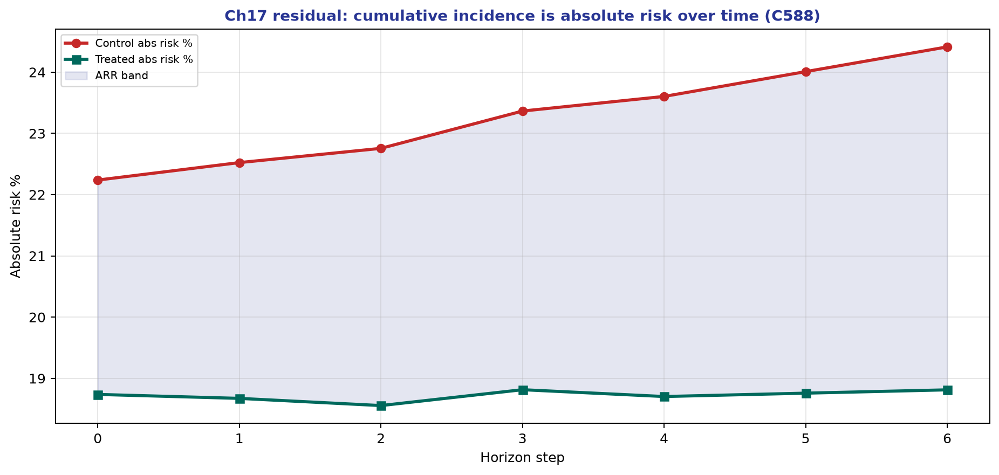

*Teaching figure (synthetic).* Cycle-588 densify scientific residual (ch15–28).

*Teaching figure (synthetic).* Cycle-586 densify scientific residual (ch15–28).

*Teaching figure (synthetic).* Cycle-584 densify scientific residual (ch15–28).

*Teaching figure (synthetic).* Cycle-582 densify scientific residual (ch15–28).

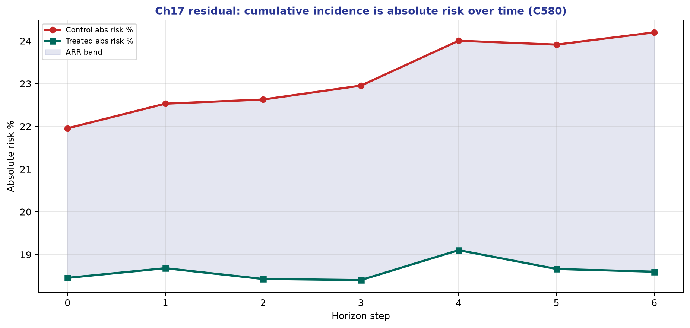

*Teaching figure (synthetic).* Cycle-580 densify scientific residual (ch15–28).

*Teaching figure (synthetic).* Cycle-578 densify scientific residual (ch15–28).

*Teaching figure (synthetic).* Cycle-576 densify scientific residual (ch15–28).

*Teaching figure (synthetic).* Cycle-574 densify scientific residual (ch15–28).

*Teaching figure (synthetic).* Cycle-572 densify scientific residual (ch15–28).

*Teaching figure (synthetic).* Cycle-570 densify scientific residual (ch15–28).

*Teaching figure (synthetic).* Cycle-568 densify scientific residual (ch15–28).

*Teaching figure (synthetic).* Cycle-566 densify scientific residual (ch15–28).

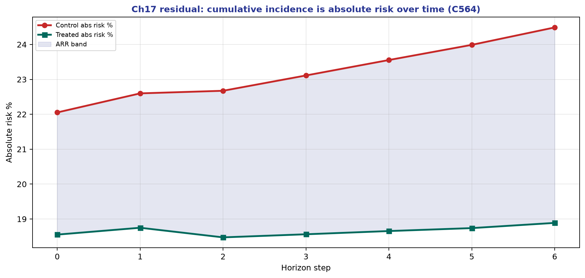

*Teaching figure (synthetic).* Cycle-564 densify scientific residual (ch15–28).

*Teaching figure (synthetic).* Cycle-562 densify scientific residual (ch15–28).

*Teaching figure (synthetic).* Cycle-560 densify scientific residual (ch15–28).

*Teaching figure (synthetic).* Cycle-558 densify scientific residual (ch15–28).

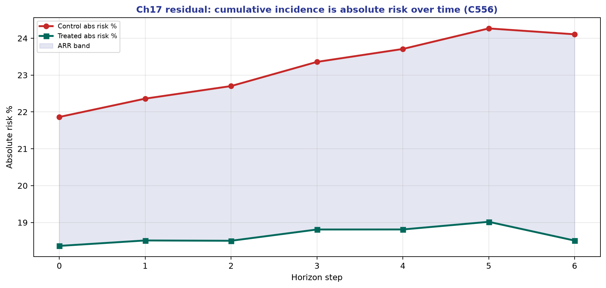

*Teaching figure (synthetic).* Cycle-556 densify scientific residual (ch15–28).

*Teaching figure (synthetic).* Cycle-554 densify scientific residual (ch15–28).

*Teaching figure (synthetic).* Cycle-552 densify scientific residual (ch15–28).

*Teaching figure (synthetic).* Cycle-550 densify scientific residual (ch15–28).

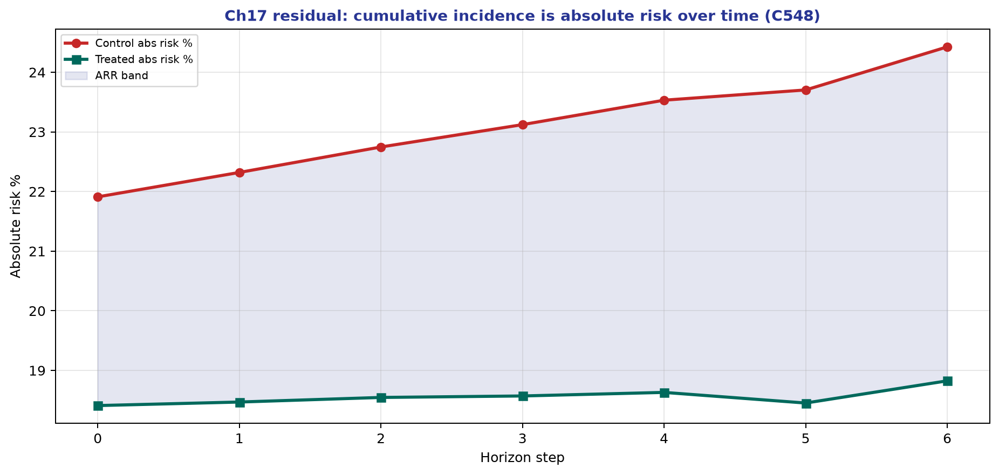

*Teaching figure (synthetic).* Cycle-548 densify scientific residual (ch15–28).

*Teaching figure (synthetic).* Cycle-546 densify scientific residual (ch15–28).

*Teaching figure (synthetic).* Cycle-544 densify scientific residual (ch15–28).

*Teaching figure (synthetic).* Cycle-542 densify scientific residual (ch15–28).

*Teaching figure (synthetic).* Cycle-540 densify scientific residual (ch15–28).

*Teaching figure (synthetic).* Cycle-538 densify scientific residual (ch15–28).

*Teaching figure (synthetic).* Cycle-536 densify scientific residual (ch15–28).

*Teaching figure (synthetic).* Cycle-534 densify scientific residual (ch15–28).

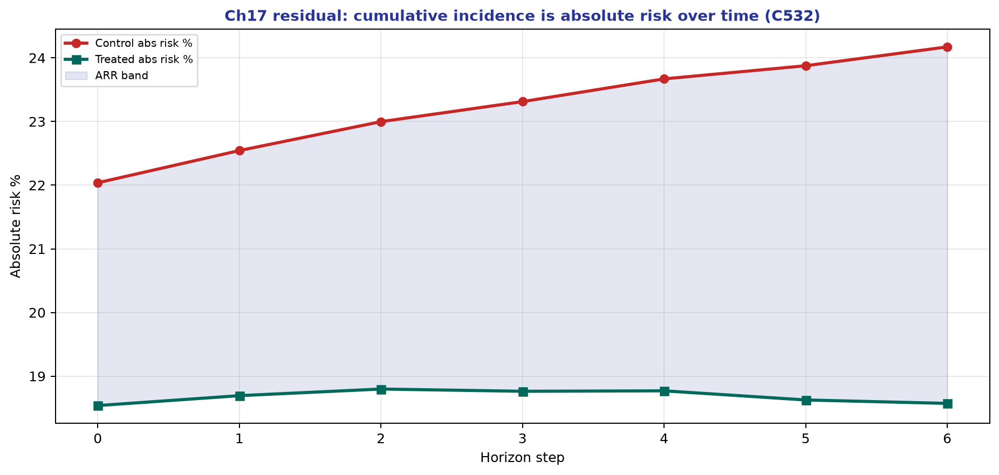

*Teaching figure (synthetic).* Cycle-532 densify scientific residual (ch15–28).

*Teaching figure (synthetic).* Cycle-530 densify scientific residual (ch15–28).

*Teaching figure (synthetic).* Cycle-528 densify scientific residual (ch15–28).

*Teaching figure (synthetic).* Cycle-526 densify scientific residual (ch15–28).

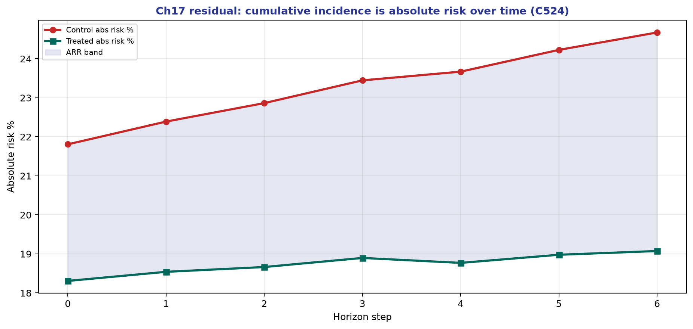

*Teaching figure (synthetic).* Cycle-524 densify scientific residual (ch15–28).

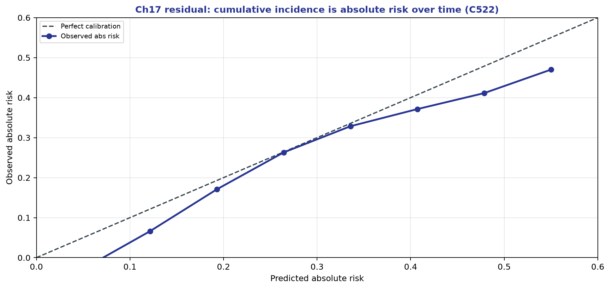

*Teaching figure (synthetic).* Cycle-522 densify scientific residual (ch15–28).

*Teaching figure (synthetic).* Cycle-520 densify scientific residual (ch15–28).

*Teaching figure (synthetic).* Cycle-518 densify scientific residual (ch15–28).

*Teaching figure (synthetic).* Cycle-516 densify scientific residual (ch15–28).

*Teaching figure (synthetic).* Cycle-514 densify scientific residual (ch15–28).

*Teaching figure (synthetic).* Cycle-512 densify scientific residual (ch15–28).

*Teaching figure (synthetic).* Cycle-510 densify scientific residual (ch15–28).

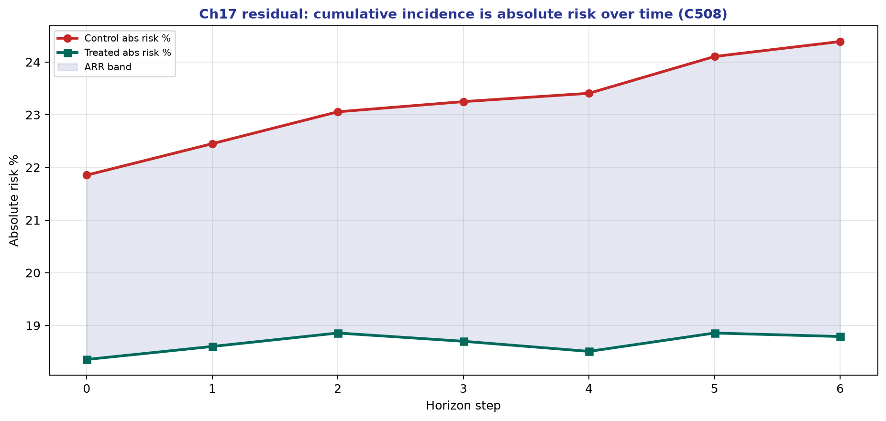

*Teaching figure (synthetic).* Cycle-508 densify scientific residual (ch15–28).

*Teaching figure (synthetic).* Cycle-506 densify scientific residual (ch15–28).

*Teaching figure (synthetic).* Cycle-504 densify scientific residual (ch15–28).

*Teaching figure (synthetic).* Cycle-502 densify scientific residual (ch15–28).

*Teaching figure (synthetic).* Cycle-500 densify scientific residual (ch15–28).

*Teaching figure (synthetic).* Cycle-498 densify scientific residual (ch15–28).

*Teaching figure (synthetic).* Cycle-496 densify scientific residual (ch15–28).

*Teaching figure (synthetic).* Cycle-494 densify scientific residual (ch15–28).

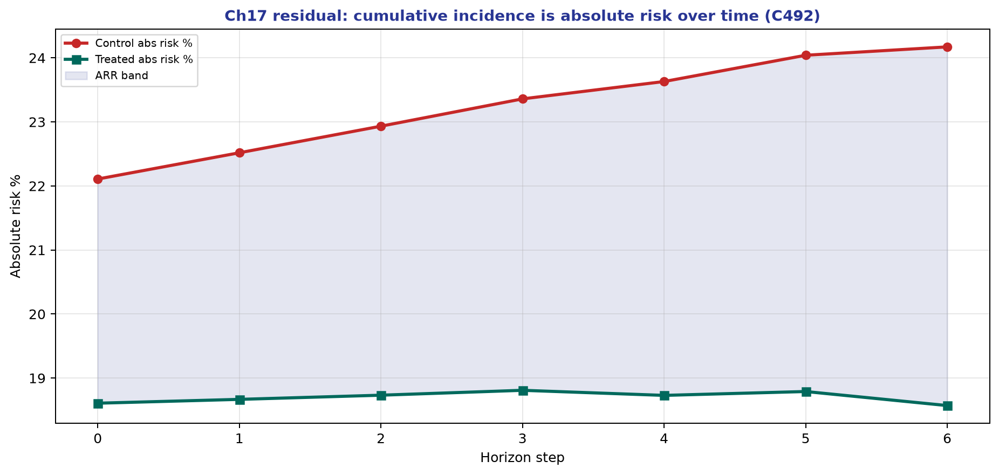

*Teaching figure (synthetic).* Cycle-492 densify scientific residual (ch15–28).

*Teaching figure (synthetic).* Cycle-490 densify scientific residual (ch15–28).

*Teaching figure (synthetic).* Cycle-488 densify scientific residual (ch15–28).

*Teaching figure (synthetic).* Cycle-486 densify scientific residual (ch15–28).

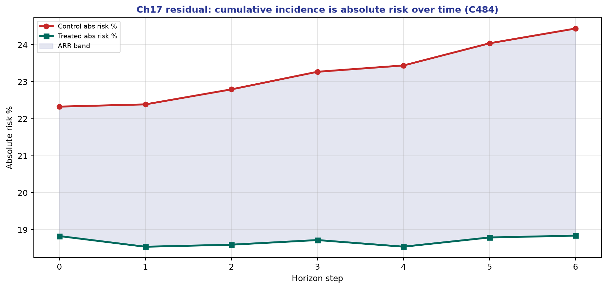

*Teaching figure (synthetic).* Cycle-484 densify scientific residual (ch15–28).

*Teaching figure (synthetic).* Cycle-482 densify scientific residual (ch15–28).

*Teaching figure (synthetic).* Cycle-480 densify scientific residual (ch15–28).

*Teaching figure (synthetic).* Cycle-478 densify scientific residual (ch15–28).

*Teaching figure (synthetic).* Cycle-476 densify scientific residual (ch15–28).

*Teaching figure (synthetic).* Cycle-474 densify scientific residual (ch15–28).

*Teaching figure (synthetic).* Cycle-472 densify scientific residual (ch15–28).

*Teaching figure (synthetic).* Cycle-470 densify scientific residual (ch15–28).

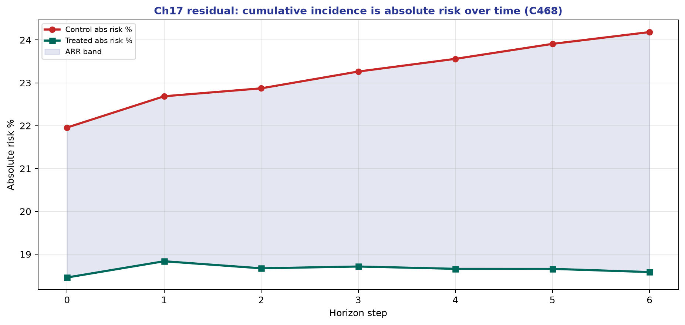

*Teaching figure (synthetic).* Cycle-468 densify scientific residual (ch15–28).

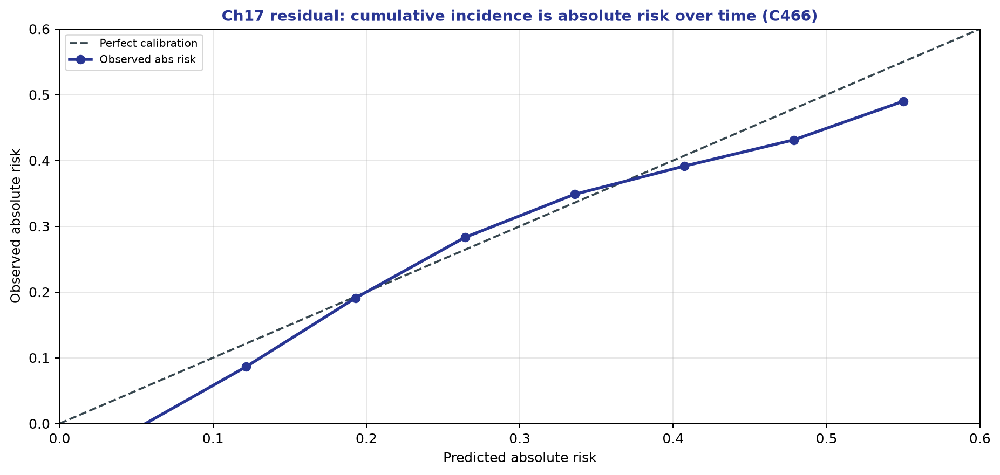

*Teaching figure (synthetic).* Cycle-466 densify scientific residual (ch15–28).

*Teaching figure (synthetic).* Cycle-464 densify scientific residual (ch15–28).

*Teaching figure (synthetic).* Cycle-462 densify scientific residual (ch15–28).

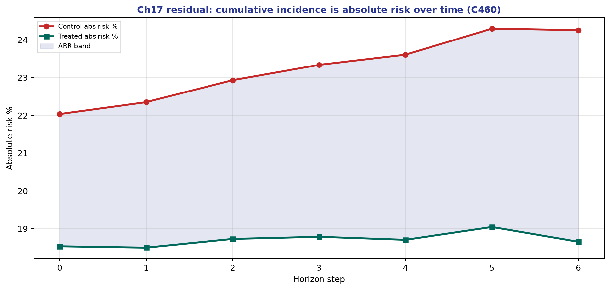

*Teaching figure (synthetic).* Cycle-460 densify scientific residual (ch15–28).

*Teaching figure (synthetic).* Cycle-458 densify scientific residual (ch15–28).

*Teaching figure (synthetic).* Cycle-456 densify scientific residual (ch15–28).

*Teaching figure (synthetic).* Cycle-454 densify scientific residual (ch15–28).

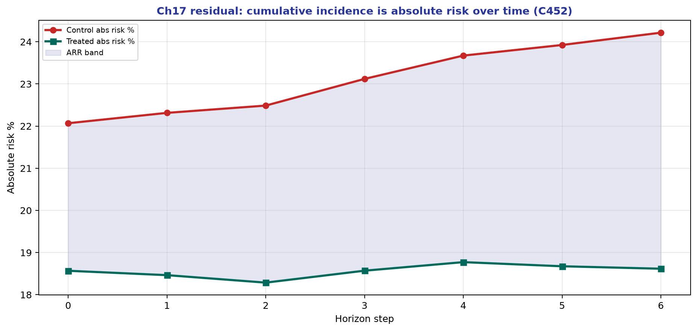

*Teaching figure (synthetic).* Cycle-452 densify scientific residual (ch15–28).

*Teaching figure (synthetic).* Cycle-450 densify scientific residual (ch15–28).

*Teaching figure (synthetic).* Cycle-448 densify scientific residual (ch15–28).

*Teaching figure (synthetic).* Cycle-446 densify scientific residual (ch15–28).

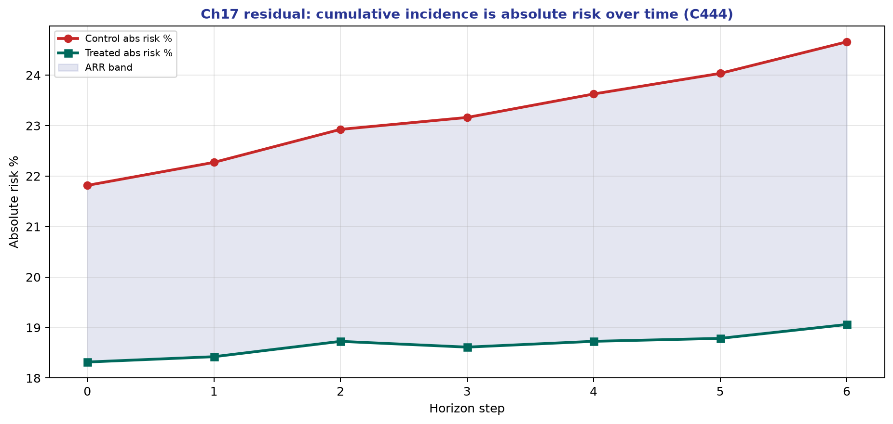

*Teaching figure (synthetic).* Cycle-444 densify scientific residual (ch15–28).

*Teaching figure (synthetic).* Cycle-442 densify scientific residual (ch15–28).

*Teaching figure (synthetic).* Cycle-440 densify scientific residual (ch15–28).

*Teaching figure (synthetic).* Cycle-438 densify scientific residual (ch15–28).

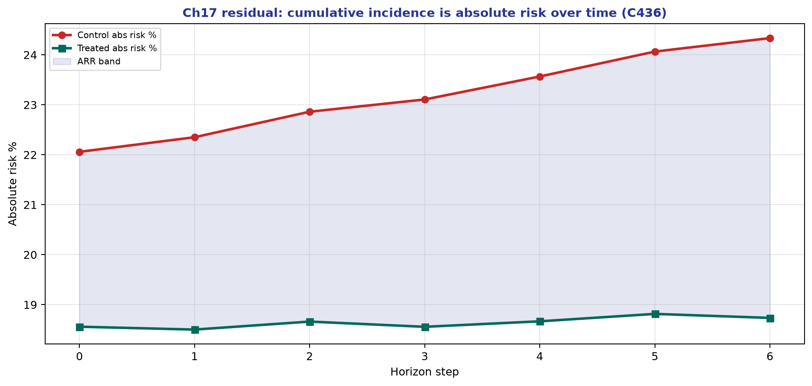

*Teaching figure (synthetic).* Cycle-436 densify scientific residual (ch15–28).

*Teaching figure (synthetic).* Cycle-434 densify scientific residual (ch15–28).

*Teaching figure (synthetic).* Cycle-432 densify scientific residual (ch15–28).

*Teaching figure (synthetic).* Cycle-430 densify scientific residual (ch15–28).

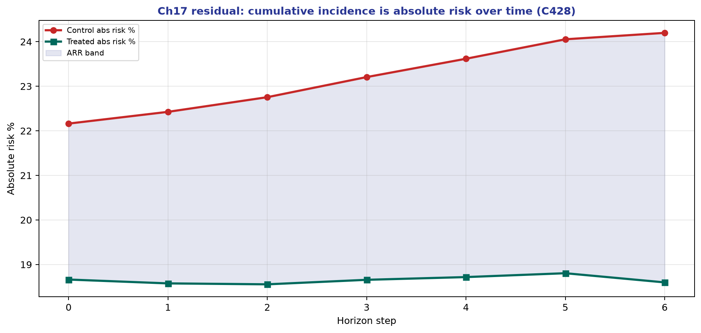

*Teaching figure (synthetic).* Cycle-428 densify scientific residual (ch15–28).

*Teaching figure (synthetic).* Cycle-426 densify scientific residual (ch15–28).

*Teaching figure (synthetic).* Cycle-424 densify scientific residual (ch15–28).

*Teaching figure (synthetic).* Cycle-422 densify scientific residual (ch15–28).

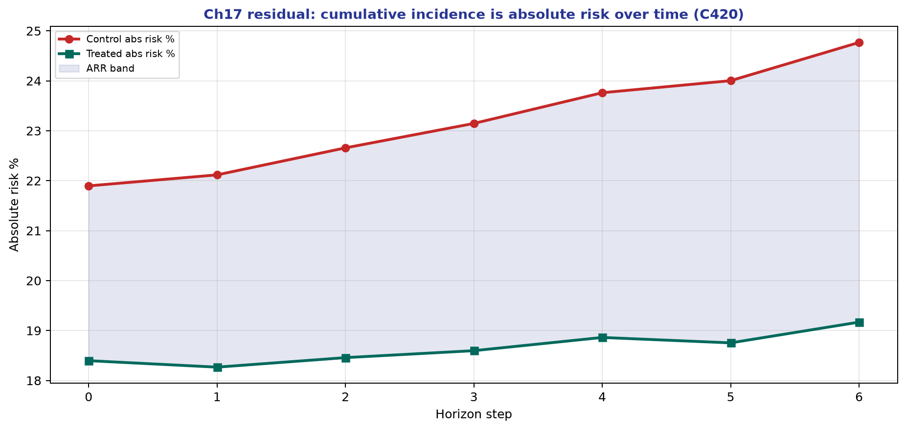

*Teaching figure (synthetic).* Cycle-420 densify scientific residual (ch15–28).

*Teaching figure (synthetic).* Cycle-418 densify scientific residual (ch15–28).

*Teaching figure (synthetic).* Cycle-416 densify scientific residual (ch15–28).

*Teaching figure (synthetic).* Cycle-414 densify scientific residual (ch15–28).

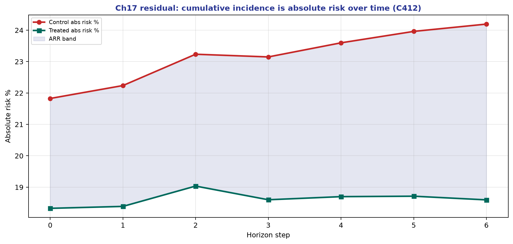

*Teaching figure (synthetic).* Cycle-412 densify scientific residual (ch15–28).

*Teaching figure (synthetic).* Cycle-410 densify scientific residual (ch15–28).

*Teaching figure (synthetic).* Cycle-408 densify scientific residual (ch15–28).

*Teaching figure (synthetic).* Cycle-406 densify scientific residual (ch15–28).

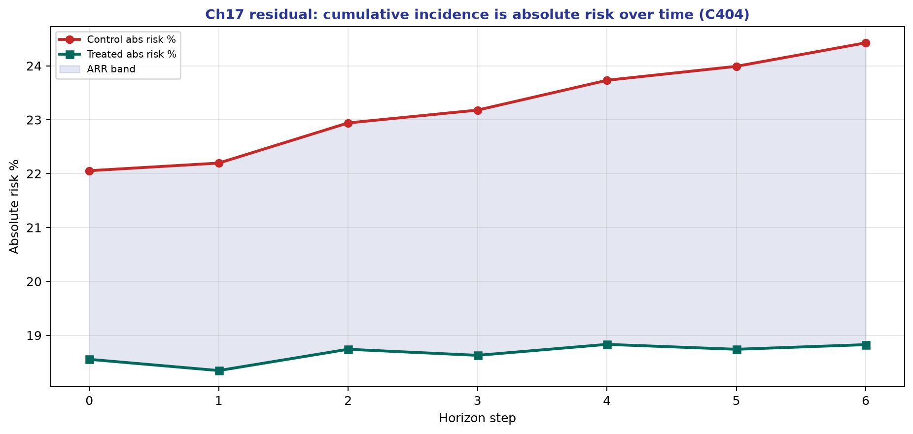

*Teaching figure (synthetic).* Cycle-404 densify scientific residual (ch15–28).

*Teaching figure (synthetic).* Cycle-402 densify scientific residual (ch15–28).

*Teaching figure (synthetic).* Cycle-400 densify scientific residual (ch15–28).

*Teaching figure (synthetic).* Cycle-398 densify scientific residual (ch15–28).

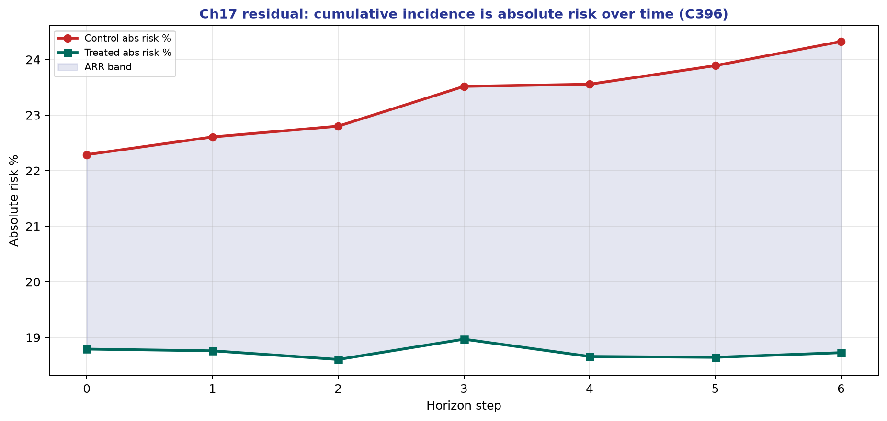

*Teaching figure (synthetic).* Cycle-396 densify scientific residual (ch15–28).

*Teaching figure (synthetic).* Cycle-394 densify scientific residual (ch15–28).

*Teaching figure (synthetic).* Cycle-392 densify scientific residual (ch15–28).

*Teaching figure (synthetic).* Cycle-390 densify scientific residual (ch15–28).

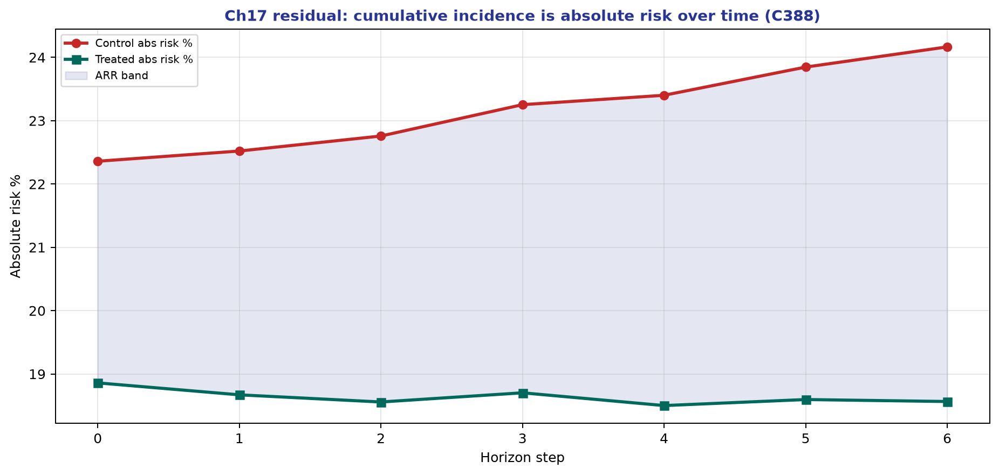

*Teaching figure (synthetic).* Cycle-388 densify scientific residual (ch15–28).

*Teaching figure (synthetic).* Cycle-386 densify scientific residual (ch15–28).

*Teaching figure (synthetic).* Cycle-384 densify scientific residual (ch15–28).

*Teaching figure (synthetic).* Cycle-382 densify scientific residual (ch15–28).

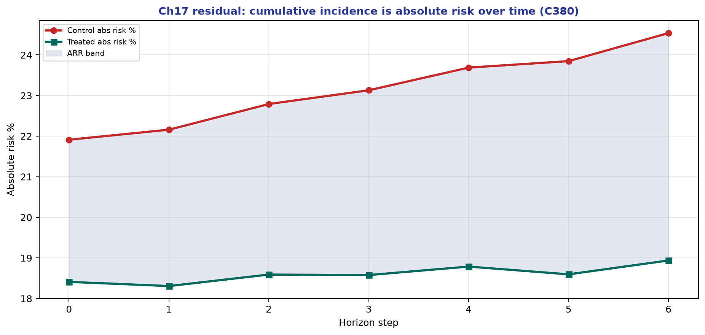

*Teaching figure (synthetic).* Cycle-380 densify scientific residual (ch15–28).

*Teaching figure (synthetic).* Cycle-378 densify scientific residual (ch15–28).

*Teaching figure (synthetic).* Cycle-376 densify scientific residual (ch15–28).

*Teaching figure (synthetic).* Cycle-374 densify scientific residual (ch15–28).

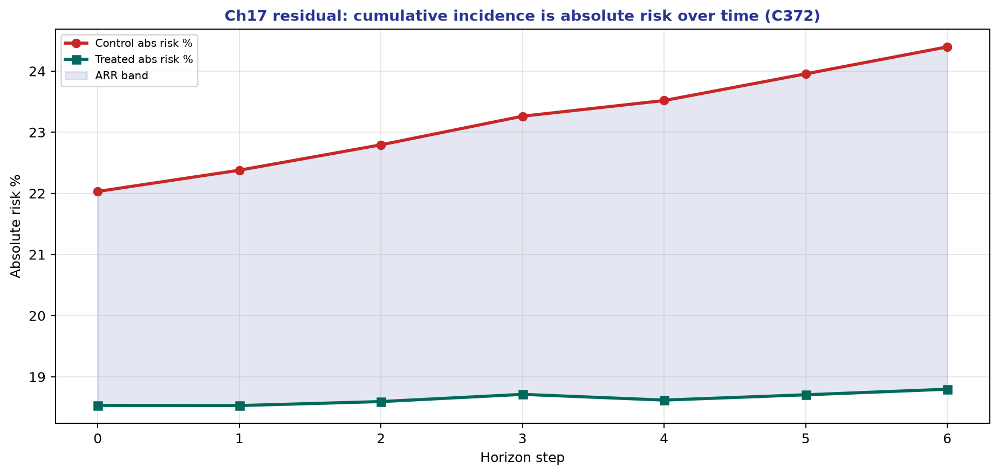

*Teaching figure (synthetic).* Cycle-372 densify scientific residual (ch15–28).

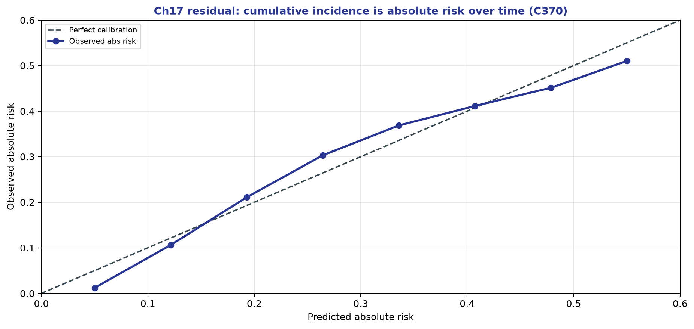

*Teaching figure (synthetic).* Cycle-370 densify scientific residual (ch15–28).

*Teaching figure (synthetic).* Cycle-368 densify scientific residual (ch15–28).

*Teaching figure (synthetic).* Cycle-366 densify scientific residual (ch15–28).

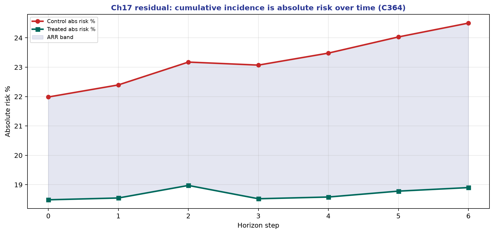

*Teaching figure (synthetic).* Cycle-364 densify scientific residual (ch15–28).

*Teaching figure (synthetic).* Cycle-362 densify scientific residual (ch15–28).

*Teaching figure (synthetic).* Cycle-360 densify scientific residual (ch15–28).

*Teaching figure (synthetic).* Cycle-358 densify scientific residual (ch15–28).

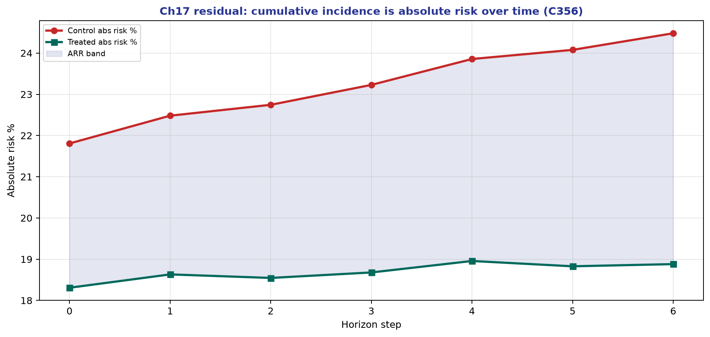

*Teaching figure (synthetic).* Cycle-356 densify scientific residual (ch15–28).

*Teaching figure (synthetic).* Cycle-354 densify scientific residual (ch15–28).

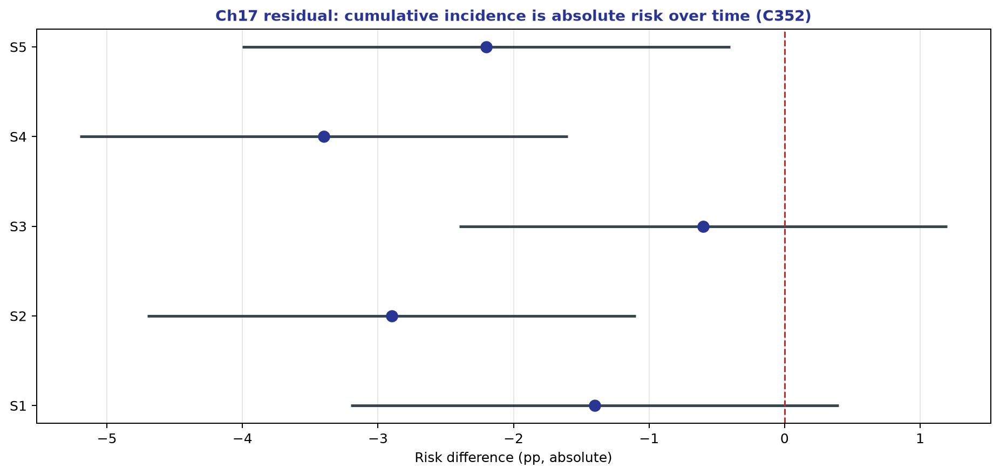

*Teaching figure (synthetic).* Cycle-352 densify scientific residual (ch15–28).

*Teaching figure (synthetic).* Cycle-350 densify scientific residual (ch15–28).

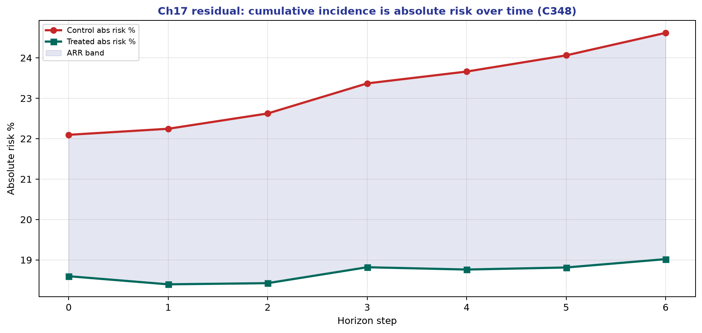

*Teaching figure (synthetic).* Cycle-348 densify scientific residual (ch15–28).

*Teaching figure (synthetic).* Cycle-346 densify scientific residual (ch15–28).

*Teaching figure (synthetic).* Cycle-344 densify scientific residual (ch15–28).

*Teaching figure (synthetic).* Cycle-342 densify scientific residual (ch15–28).

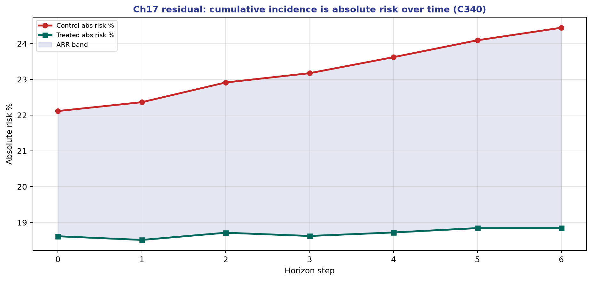

*Teaching figure (synthetic).* Cycle-340 densify scientific residual (ch15–28).

*Teaching figure (synthetic).* Cycle-338 densify scientific residual (ch15–28).

*Teaching figure (synthetic).* Cycle-336 densify scientific residual (ch15–28).

*Teaching figure (synthetic).* Cycle-334 densify scientific residual (ch15–28).

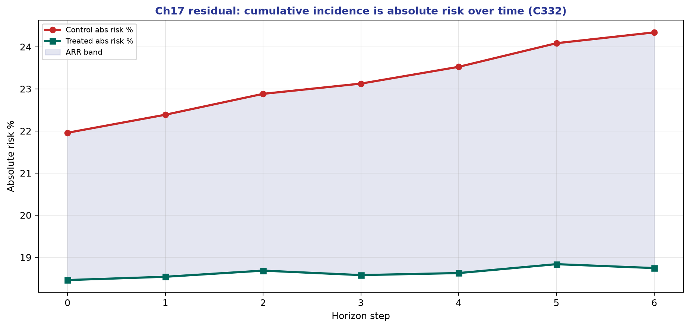

*Teaching figure (synthetic).* Cycle-332 densify scientific residual (ch15–28).

*Teaching figure (synthetic).* Cycle-330 densify scientific residual (ch15–28).

*Teaching figure (synthetic).* Cycle-328 densify scientific residual (ch15–28).

*Teaching figure (synthetic).* Cycle-326 densify scientific residual (ch15–28).

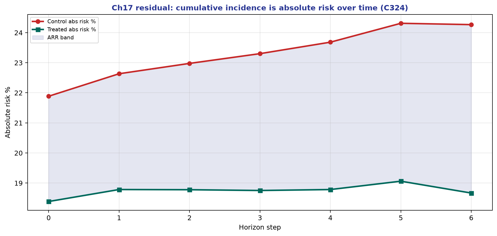

*Teaching figure (synthetic).* Cycle-324 densify scientific residual (ch15–28).

*Teaching figure (synthetic).* Cycle-322 densify scientific residual (ch15–28).

*Teaching figure (synthetic).* Cycle-320 densify scientific residual (ch15–28).

*Teaching figure (synthetic).* Cycle-318 densify scientific residual (ch15–28).

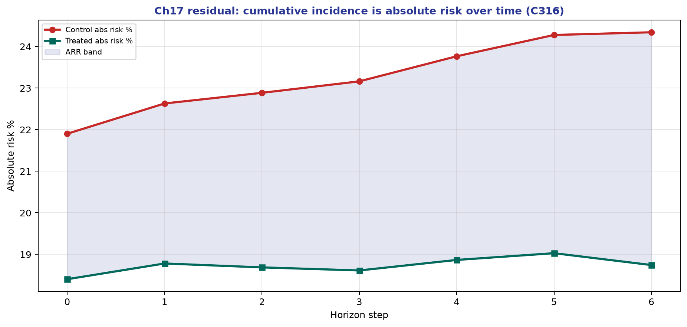

*Teaching figure (synthetic).* Cycle-316 densify scientific residual (ch15–28).

*Teaching figure (synthetic).* Cycle-314 densify scientific residual (ch15–28).

*Teaching figure (synthetic).* Cycle-312 densify scientific residual (ch15–28).

*Teaching figure (synthetic).* Cycle-310 densify scientific residual (ch15–28).

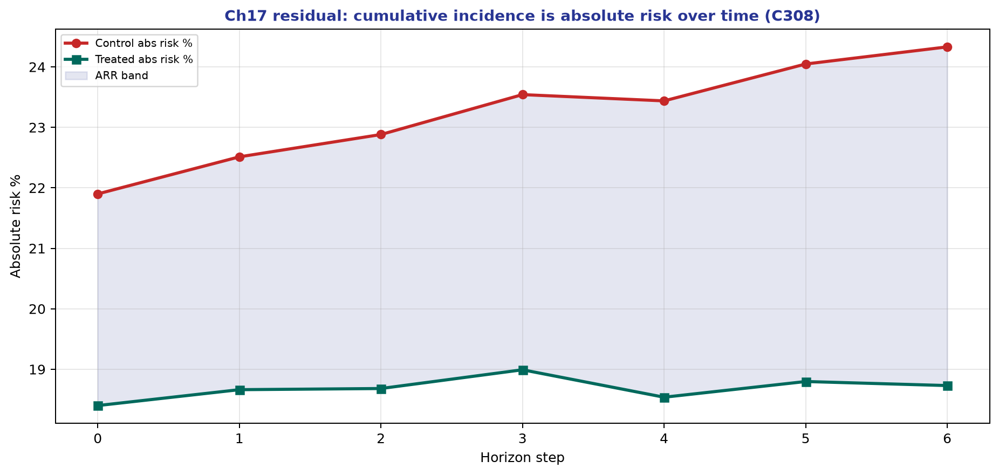

*Teaching figure (synthetic).* Cycle-308 densify scientific residual (ch15–28).

*Teaching figure (synthetic).* Cycle-306 densify scientific residual (ch15–28).

*Teaching figure (synthetic).* Cycle-304 densify scientific residual (ch15–28).

*Teaching figure (synthetic).* Cycle-302 densify scientific residual (ch15–28).

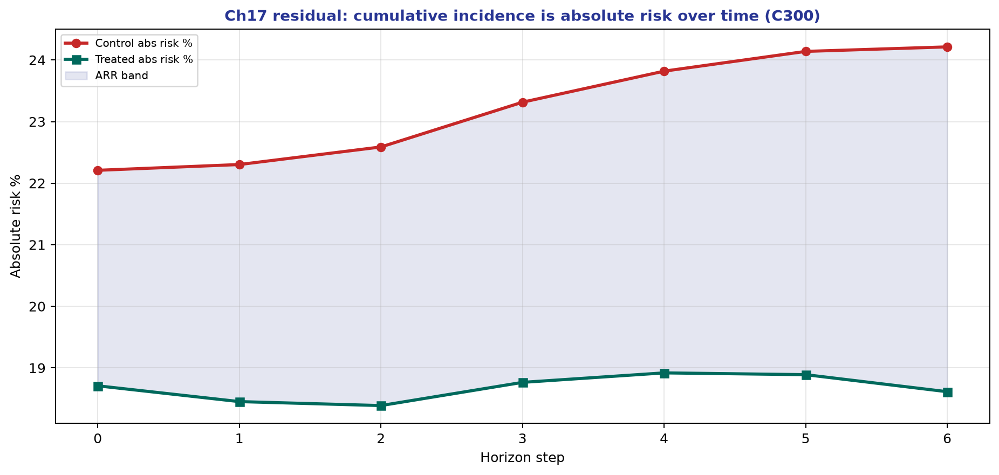

*Teaching figure (synthetic).* Cycle-300 densify scientific residual (ch15–28).

*Teaching figure (synthetic).* Cycle-298 densify scientific residual (ch15–28).

*Teaching figure (synthetic).* Cycle-296 densify scientific residual (ch15–28).

*Teaching figure (synthetic).* Cycle-294 densify scientific residual (ch15–28).

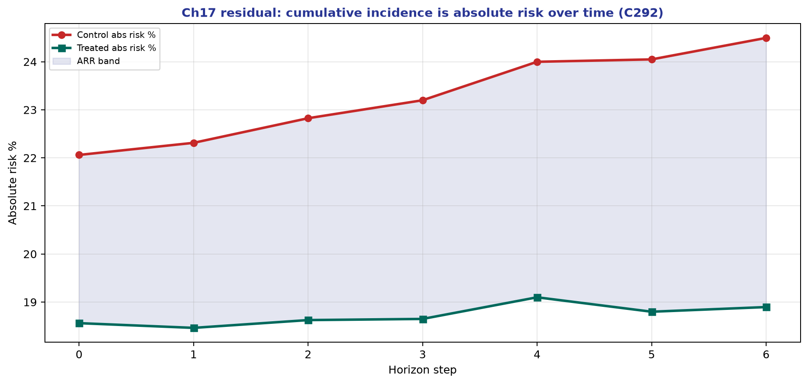

*Teaching figure (synthetic).* Cycle-292 densify scientific residual (ch15–28).

*Teaching figure (synthetic).* Cycle-290 densify scientific residual (ch15–28).

*Teaching figure (synthetic).* Cycle-288 densify scientific residual (ch15–28).

*Teaching figure (synthetic).* Cycle-286 densify scientific residual (ch15–28).

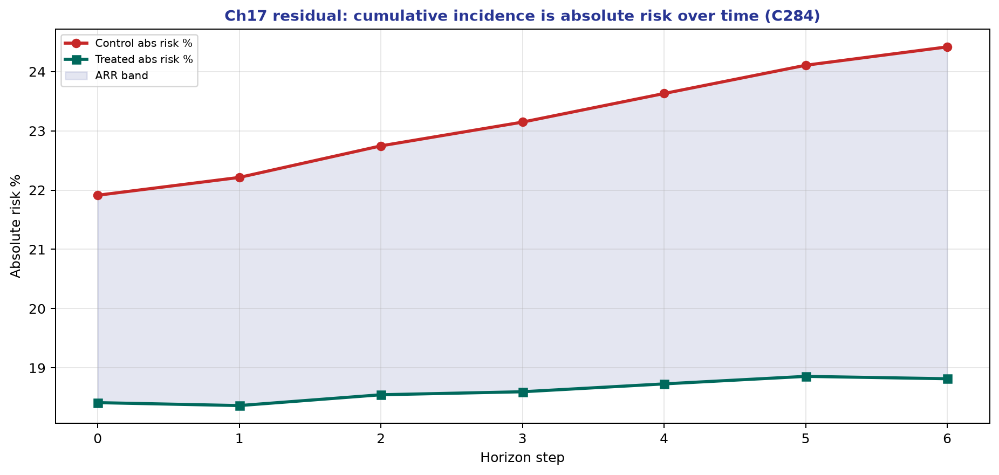

*Teaching figure (synthetic).* Cycle-284 densify scientific residual (ch15–28).

*Teaching figure (synthetic).* Cycle-282 densify scientific residual (ch15–28).

*Teaching figure (synthetic).* Cycle-280 densify scientific residual (ch15–28).

*Teaching figure (synthetic).* Cycle-278 densify scientific residual (ch15–28).

*Teaching figure (synthetic).* Cycle-276 densify scientific residual (ch15–28).

*Teaching figure (synthetic).* Cycle-274 densify scientific residual (ch15–28).

*Teaching figure (synthetic).* Cycle-272 densify scientific residual (ch15–28).

*Teaching figure (synthetic).* Cycle-270 densify scientific residual (ch15–28).

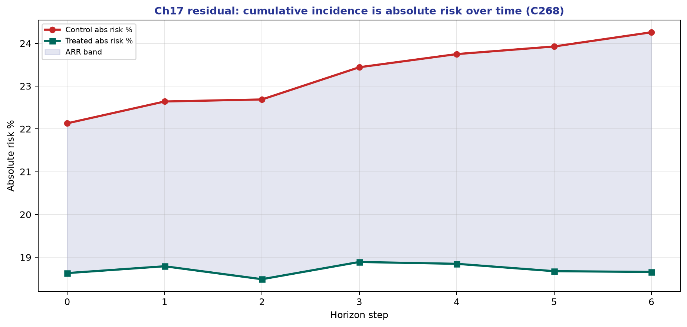

*Teaching figure (synthetic).* Cycle-268 densify scientific residual (ch15–28).

*Teaching figure (synthetic).* Cycle-266 densify scientific residual (ch15–28).

*Teaching figure (synthetic).* Cycle-264 densify scientific residual (ch15–28).

*Teaching figure (synthetic).* Cycle-262 densify scientific residual (ch15–28).

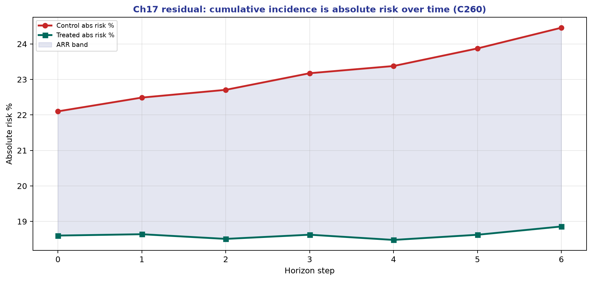

*Teaching figure (synthetic).* Cycle-260 densify scientific residual (ch15–28).

*Teaching figure (synthetic).* Cycle-258 densify scientific residual (ch15–28).

*Teaching figure (synthetic).* Cycle-256 densify scientific residual (ch15–28).

*Teaching figure (synthetic).* Cycle-254 densify scientific residual (ch15–28).

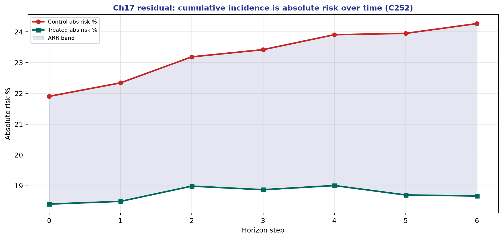

*Teaching figure (synthetic).* Cycle-252 densify scientific residual (ch15–28).

*Teaching figure (synthetic).* Cycle-250 densify scientific residual (ch15–28).

*Teaching figure (synthetic).* Cycle-248 densify scientific residual (ch15–28).

*Teaching figure (synthetic).* Cycle-246 densify scientific residual (ch15–28).

*Teaching figure (synthetic).* Cycle-244 densify scientific residual (ch15–28).

*Teaching figure (synthetic).* Cycle-242 densify scientific residual (ch15–28).

*Teaching figure (synthetic).* Cycle-240 densify scientific residual (ch15–28).

*Teaching figure (synthetic).* Cycle-238 densify scientific residual (ch15–28).

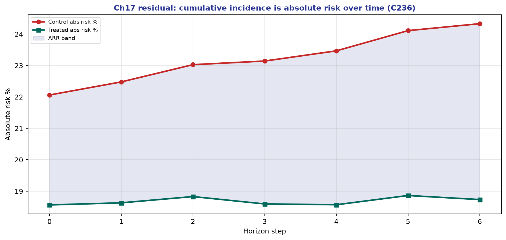

*Teaching figure (synthetic).* Cycle-236 densify scientific residual (ch15–28).

*Teaching figure (synthetic).* Cycle-234 densify scientific residual (ch15–28).

*Teaching figure (synthetic).* Cycle-232 densify scientific residual (ch15–28).

*Teaching figure (synthetic).* Cycle-230 densify scientific residual (ch15–28).

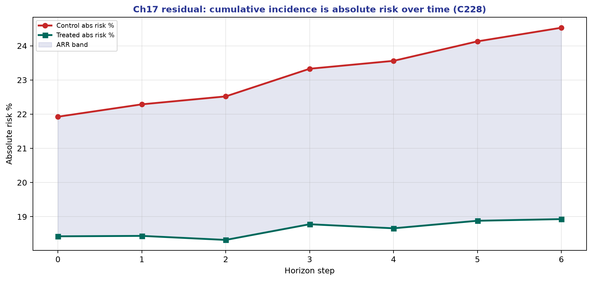

*Teaching figure (synthetic).* Cycle-228 densify scientific residual (ch15–28).

*Teaching figure (synthetic).* Cycle-226 densify scientific residual (ch15–28).

*Teaching figure (synthetic).* Cycle-224 densify scientific residual (ch15–28).

*Teaching figure (synthetic).* Cycle-222 densify scientific residual (ch15–28).

*Teaching figure (synthetic).* Cycle-220 densify scientific residual (ch15–28).

*Teaching figure (synthetic).* Cycle-218 densify scientific residual (ch15–28).

*Teaching figure (synthetic).* Cycle-216 densify scientific residual (ch15–28).

*Teaching figure (synthetic).* Cycle-214 densify scientific residual (ch15–28).

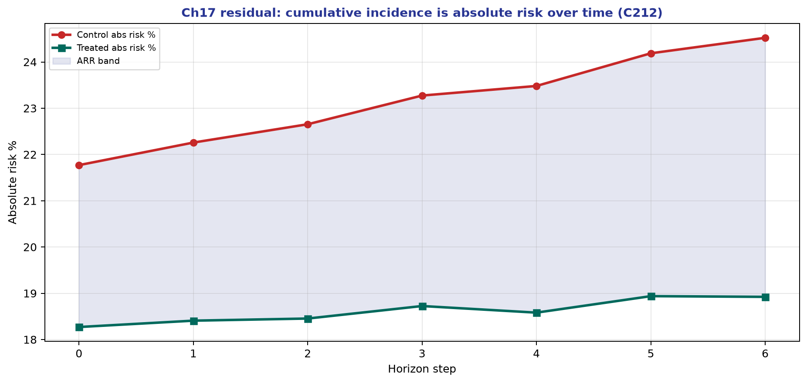

*Teaching figure (synthetic).* Cycle-212 densify scientific residual (ch15–28).

*Teaching figure (synthetic).* Cycle-210 densify scientific residual (ch15–28).

*Teaching figure (synthetic).* Cycle-208 densify scientific residual (ch15–28).

*Teaching figure (synthetic).* Cycle-206 densify scientific residual (ch15–28).

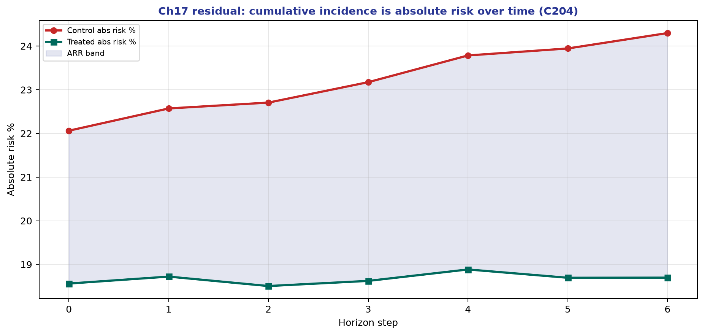

*Teaching figure (synthetic).* Cycle-204 densify scientific residual (ch15–28).

*Teaching figure (synthetic).* Cycle-202 densify scientific residual (ch15–28).

*Teaching figure (synthetic).* Cycle-200 densify scientific residual (ch15–28).

*Teaching figure (synthetic).* Cycle-198 densify scientific residual (ch15–28).

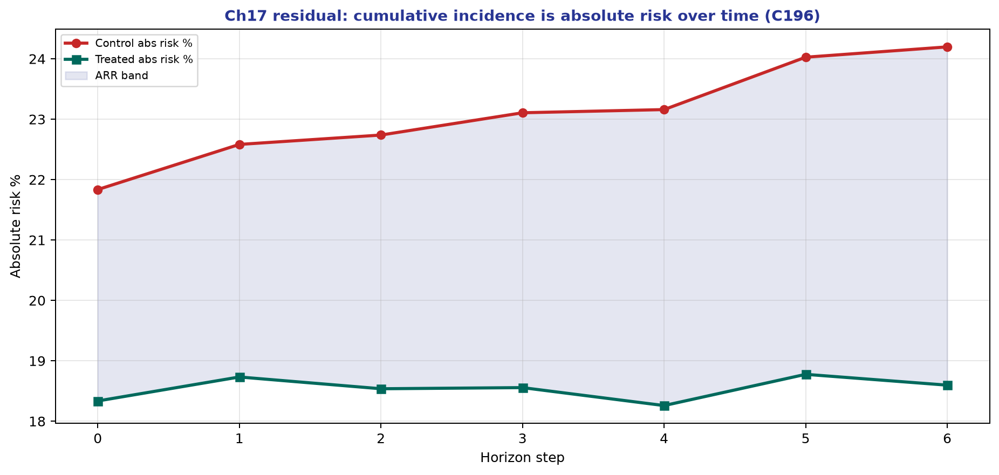

*Teaching figure (synthetic).* Cycle-196 densify scientific residual (ch15–28).

*Teaching figure (synthetic).* Cycle-194 densify scientific residual (ch15–28).

*Teaching figure (synthetic).* Cycle-192 densify scientific residual (ch15–28).

*Teaching figure (synthetic).* Cycle-190 densify scientific residual (ch15–28).

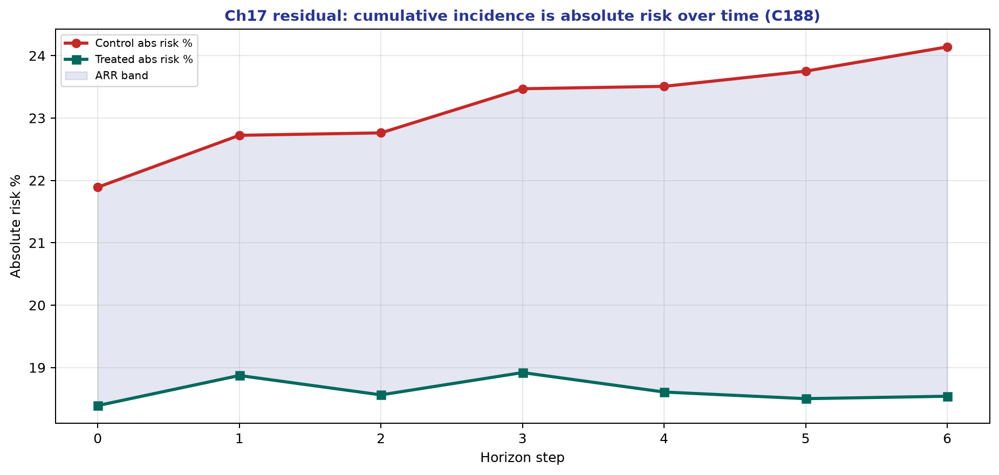

*Teaching figure (synthetic).* Cycle-188 densify scientific residual (ch15–28).

*Teaching figure (synthetic).* Cycle-186 densify scientific residual (ch15–28).

*Teaching figure (synthetic).* Cycle-184 densify scientific residual (ch15–28).

*Teaching figure (synthetic).* Cycle-182 densify scientific residual (ch15–28).

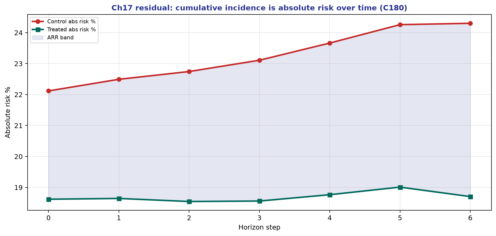

*Teaching figure (synthetic).* Cycle-180 densify scientific residual (ch15–28).

*Teaching figure (synthetic).* Cycle-178 densify scientific residual (ch15–28).

*Teaching figure (synthetic).* Cycle-176 densify scientific residual (ch15–28).

*Teaching figure (synthetic).* Cycle-174 densify scientific residual (ch15–28).

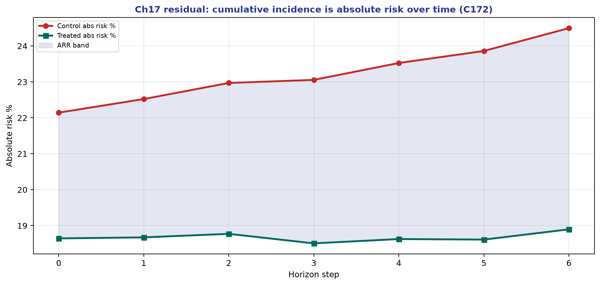

*Teaching figure (synthetic).* Cycle-172 densify scientific residual (ch15–28).

*Teaching figure (synthetic).* Cycle-170 densify scientific residual (ch15–28).

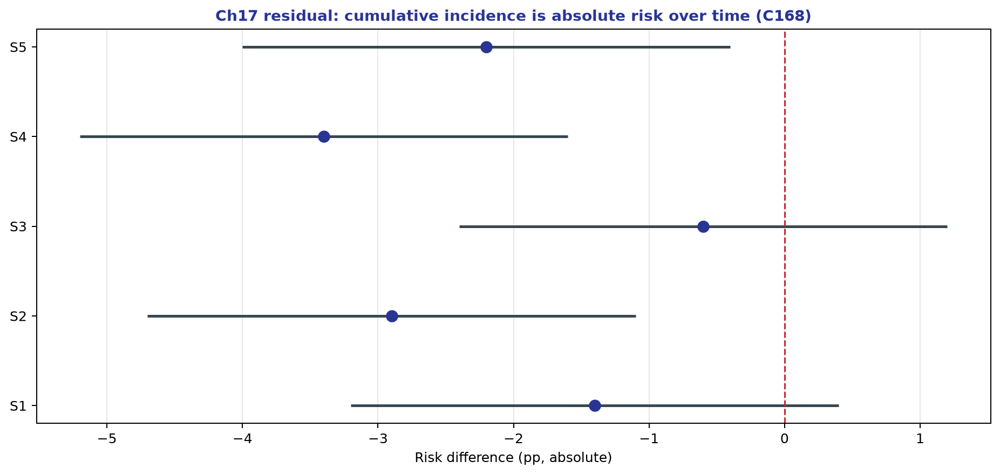

*Teaching figure (synthetic).* Cycle-168 densify scientific residual (ch15–28).

*Teaching figure (synthetic).* Cycle-166 densify scientific residual (ch15–28).

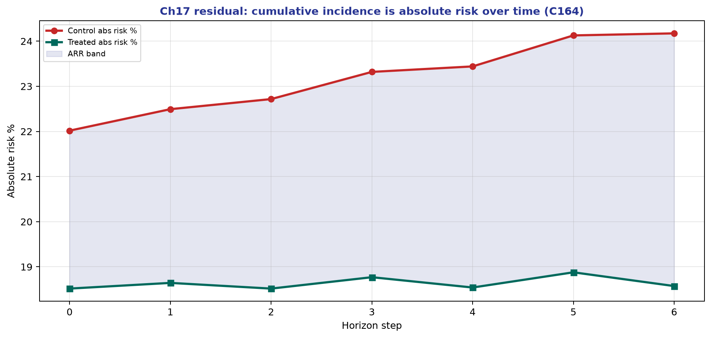

*Teaching figure (synthetic).* Cycle-164 densify scientific residual (ch15–28).

*Teaching figure (synthetic).* Cycle-162 densify scientific residual (ch15–28).

*Teaching figure (synthetic).* Cycle-160 densify scientific residual (ch15–28).

*Teaching figure (synthetic).* Cycle-158 densify scientific residual (ch15–28).

*Teaching figure (synthetic).* Cycle-156 densify scientific residual (ch15–28).

*Teaching figure (synthetic).* Cycle-154 densify scientific residual (ch15–28).

*Teaching figure (synthetic).* Cycle-152 densify scientific residual (ch15–28).

*Teaching figure (synthetic).* Cycle-150 densify scientific residual (ch15–28).

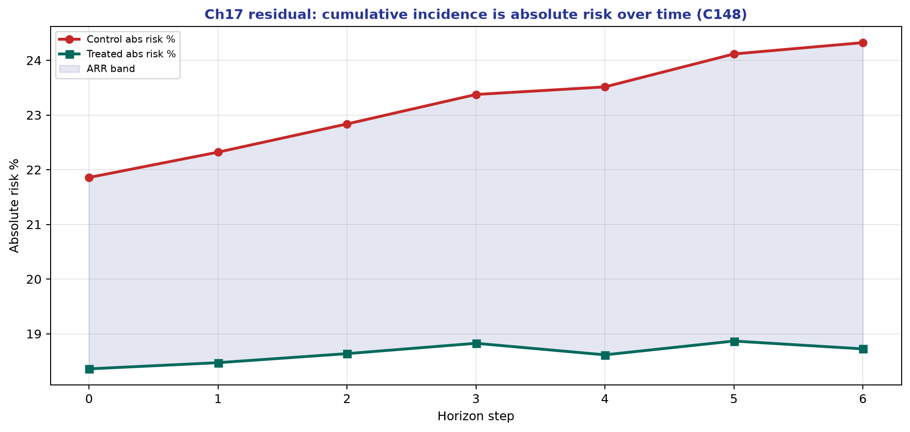

*Teaching figure (synthetic).* Cycle-148 densify scientific residual (ch15–28).

*Teaching figure (synthetic).* Cycle-146 densify scientific residual (ch15–28).

*Teaching figure (synthetic).* Cycle-144 densify scientific residual (ch15–28).

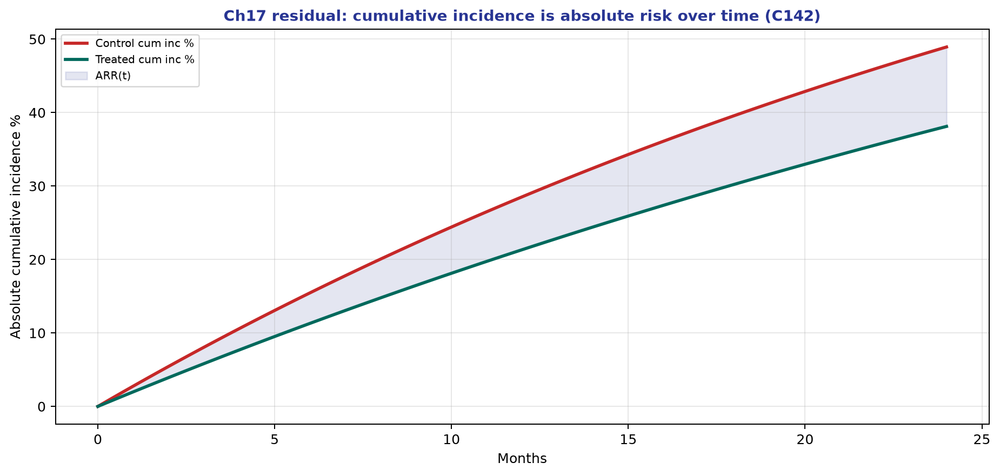

*Teaching figure (synthetic).* Cycle-142 densify scientific residual (ch15–28).

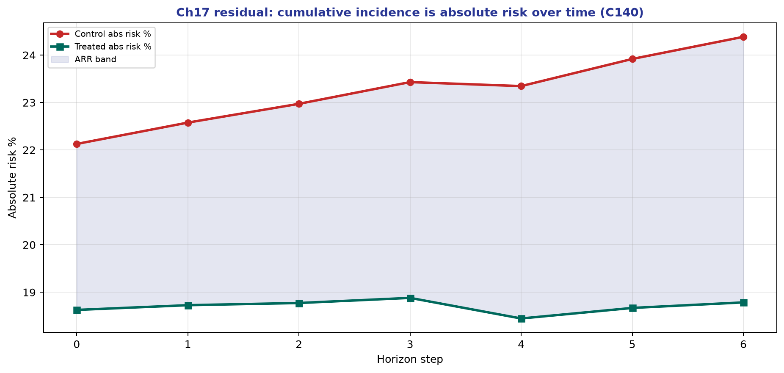

*Teaching figure (synthetic).* Cycle-140 densify scientific residual (ch15–28).

*Teaching figure (synthetic).* Cycle-138 densify scientific residual (ch15–28).

*Teaching figure (synthetic).* Cycle-136 densify scientific residual (ch15–28).

*Teaching figure (synthetic).* Cycle-134 densify scientific residual (ch15–28).

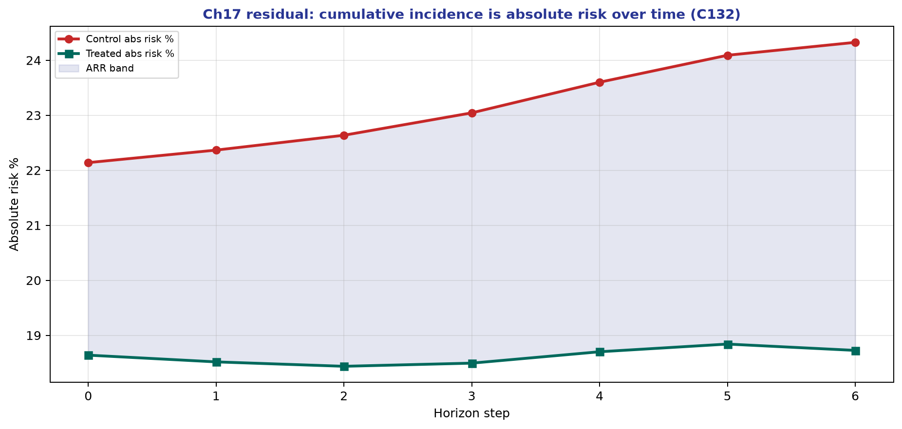

*Teaching figure (synthetic).* Cycle-132 densify scientific residual (ch15–28).

*Teaching figure (synthetic).* Cycle-130 densify scientific residual (ch15–28).

*Teaching figure (synthetic).* Cycle-128 densify scientific residual (ch15–28).

*Teaching figure (synthetic).* Cycle-126 densify scientific residual (ch15–28).

*Teaching figure (synthetic).* Cycle-124 densify scientific residual (ch15–28).

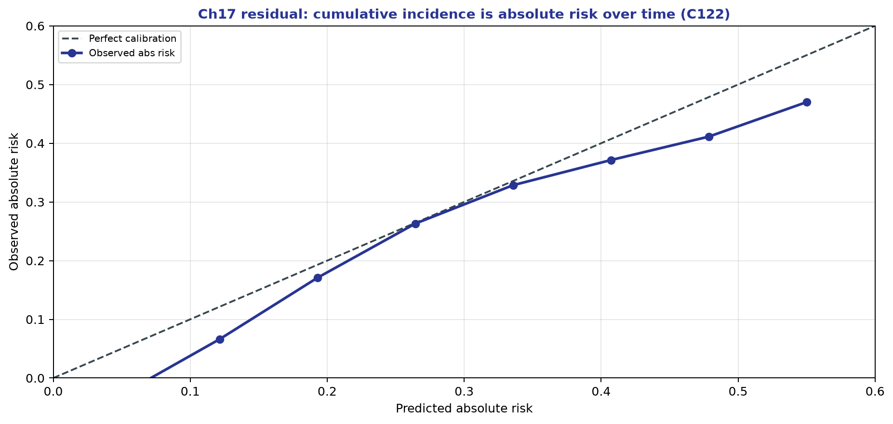

*Teaching figure (synthetic).* Cycle-122 densify scientific residual (ch15–28).

*Teaching figure (synthetic).* Cycle-120 densify scientific residual (ch15–28).

*Teaching figure (synthetic).* Cycle-118 densify scientific residual (ch15–28).

*Teaching figure (synthetic).* Cycle-116 densify scientific residual (ch15–28).

*Teaching figure (synthetic).* Cycle-114 densify scientific residual (ch15–28).

*Teaching figure (synthetic).* Cycle-112 densify scientific residual (ch15–28).

*Teaching figure (synthetic).* Cycle-110 densify scientific residual (ch15–28).

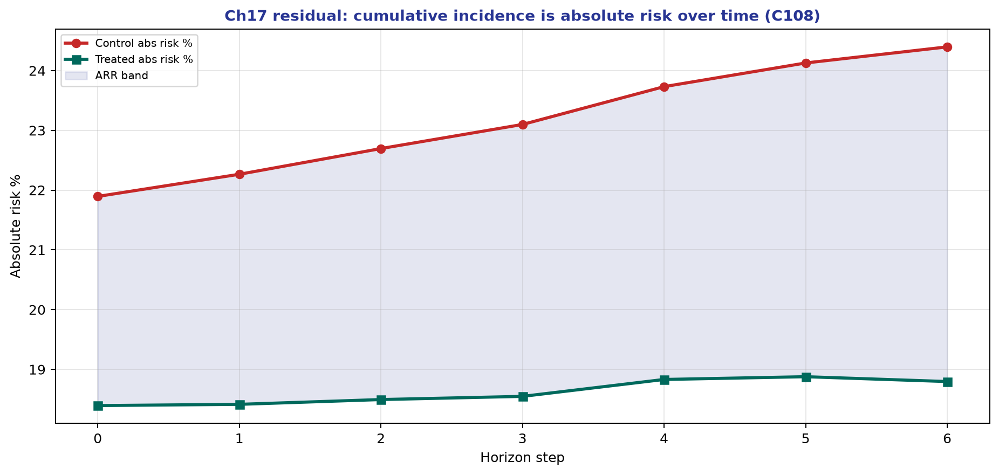

*Teaching figure (synthetic).* Cycle-108 densify scientific residual (ch15–28).

*Teaching figure (synthetic).* Cycle-106 densify scientific residual (ch15–28).

*Teaching figure (synthetic).* Cycle-104 densify scientific residual (ch15–28).

*Teaching figure (synthetic).* Cycle-102 densify scientific residual (ch15–28).

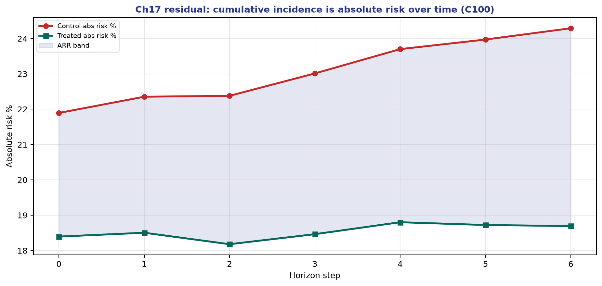

*Teaching figure (synthetic).* Cycle-100 densify scientific residual (ch15–28).

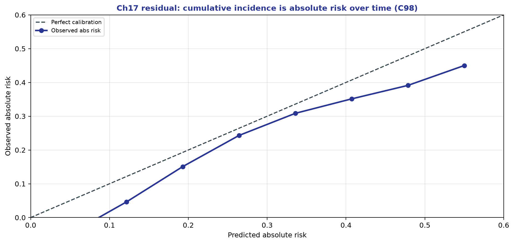

*Teaching figure (synthetic).* Cycle-98 densify scientific residual (ch15–28).

*Teaching figure (synthetic).* Cycle-96 densify scientific residual (ch15–28).

*Teaching figure (synthetic).* Cycle-94 densify scientific residual (ch15–28).

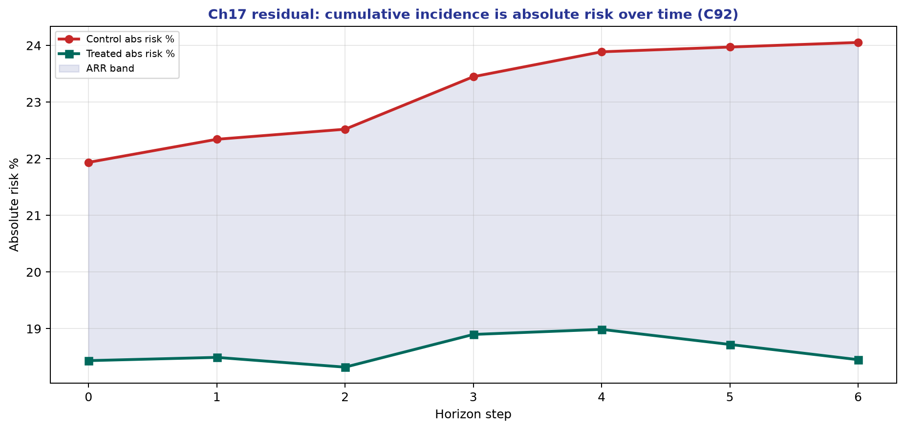

*Teaching figure (synthetic).* Cycle-92 densify scientific residual (ch15–28).

*Teaching figure (synthetic).* Cycle-90 densify scientific residual (ch15–28).

*Teaching figure (synthetic).* Cycle-88 densify scientific residual (ch15–28).

*Teaching figure (synthetic).* Cycle-86 densify scientific residual (ch15–28).

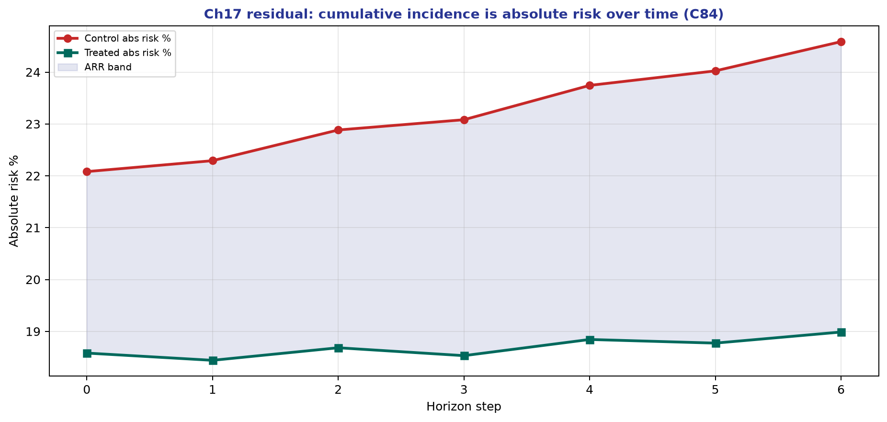

*Teaching figure (synthetic).* Cycle-84 densify scientific residual (ch15–28).

*Teaching figure (synthetic).* Cycle-82 densify scientific residual (ch15–28).

*Teaching figure (synthetic).* Cycle-80 densify scientific residual (ch15–28).

*Teaching figure (synthetic).* Cycle-78 densify scientific residual (ch15–28).

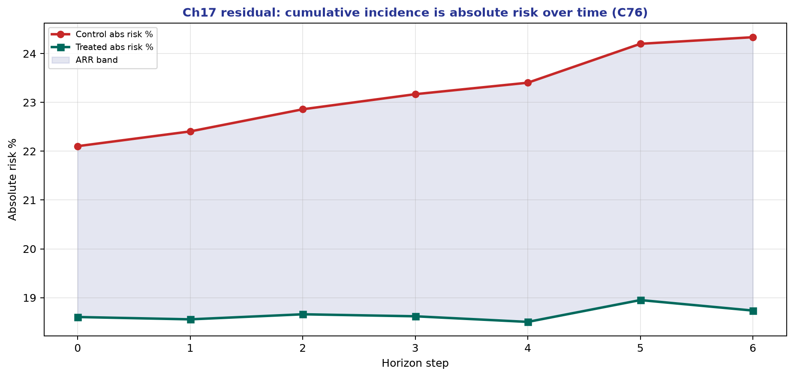

*Teaching figure (synthetic).* Cycle-76 densify scientific residual (ch15–28).

*Teaching figure (synthetic).* Cycle-74 densify scientific residual (ch15–28).

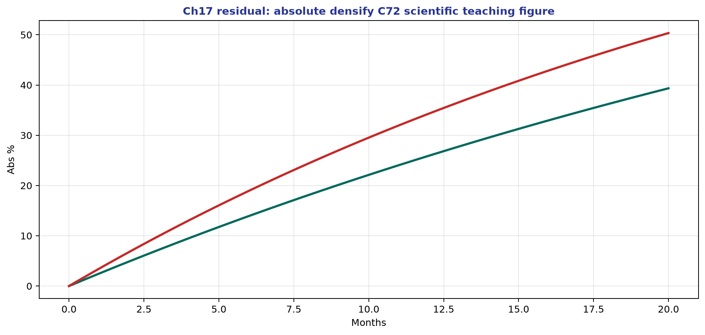

*Teaching figure (synthetic).* Cycle-72 densify scientific residual (ch15–28).

*Teaching figure (synthetic).* Cycle-70 densify scientific residual (ch15–28).

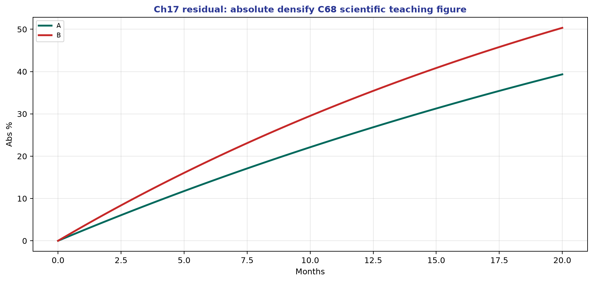

*Teaching figure (synthetic).* Cycle-68 densify scientific residual (ch15–28).

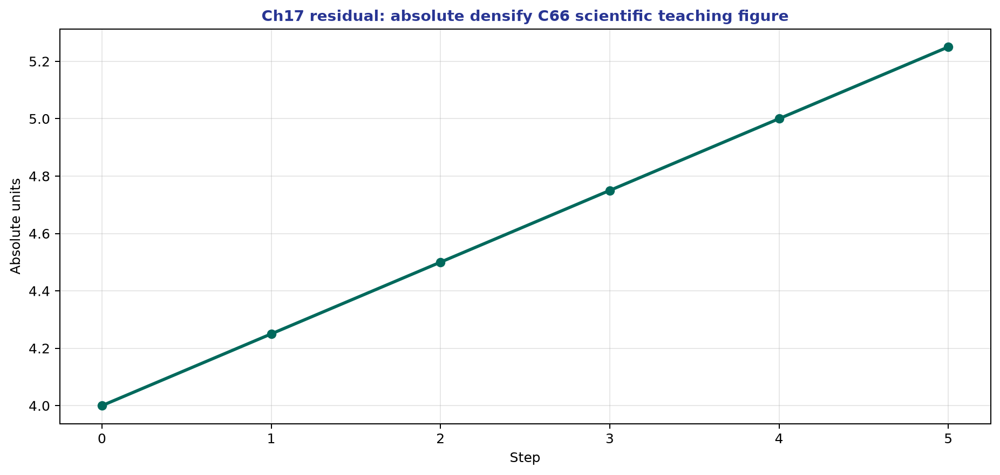

*Teaching figure (synthetic).* Cycle-66 densify scientific residual (ch15–28).

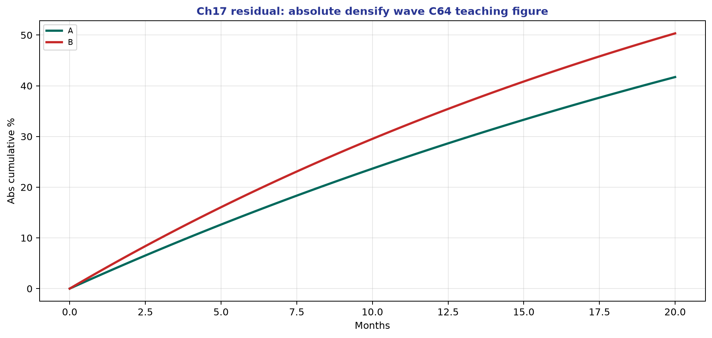

*Teaching figure (synthetic).* Cycle-64 densify scientific residual (ch15–28).

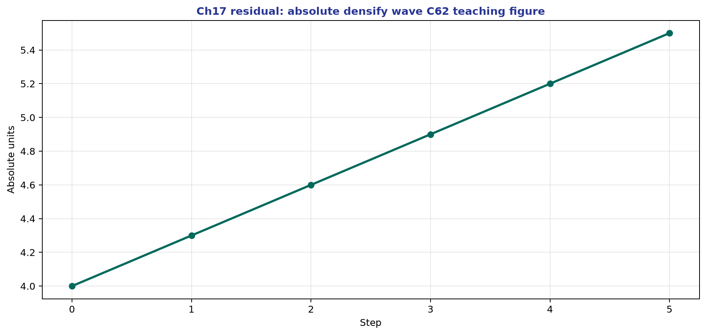

*Teaching figure (synthetic).* Cycle-62 densify scientific residual (ch15–28).

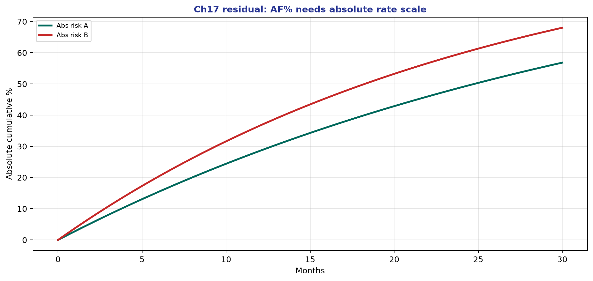

*Teaching figure (synthetic).* Cycle-60 densify scientific residual (ch15–28).

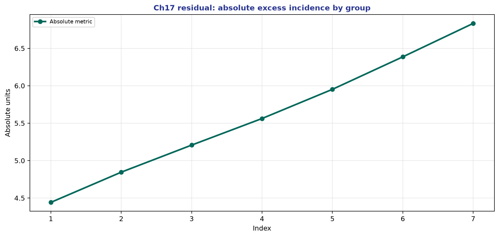

*Teaching figure (synthetic).* Cycle-58 densify scientific residual (ch15–28).

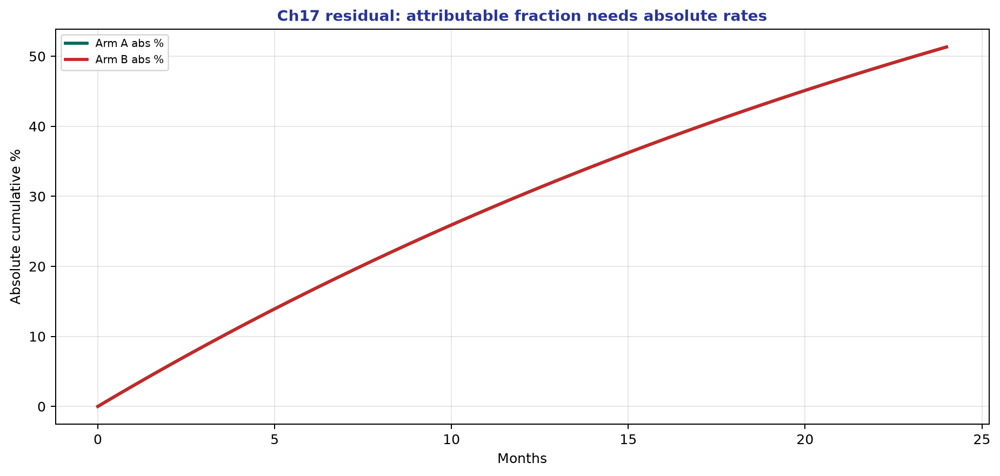

*Teaching figure (synthetic).* Cycle-56 densify scientific residual (ch15–28).

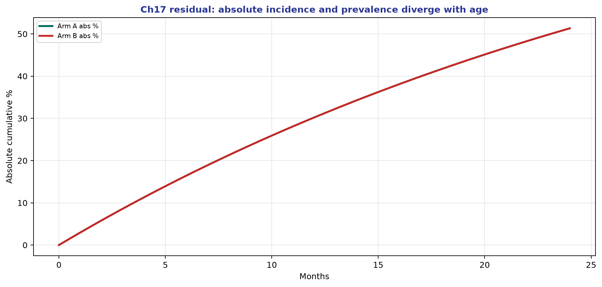

*Teaching figure (synthetic).* Cycle-54 densify scientific residual (ch15–28).

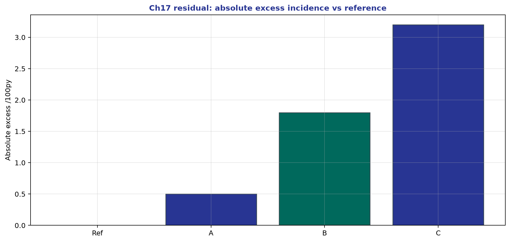

*Teaching figure (synthetic).* Cycle-52 densify scientific residual (ch15–28).

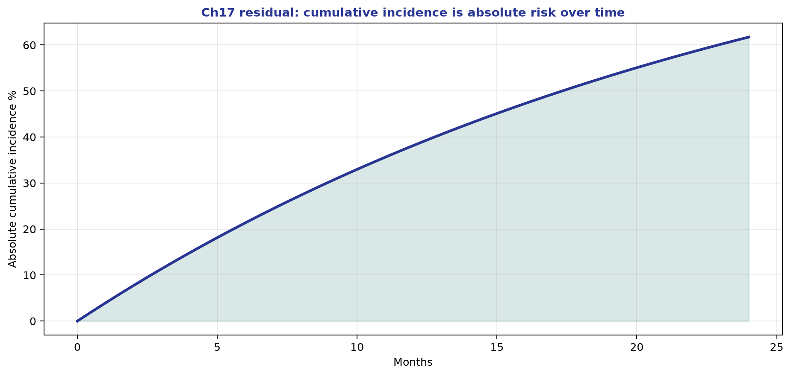

*Teaching figure (synthetic).* Cycle-50 densify scientific residual (ch15–28).

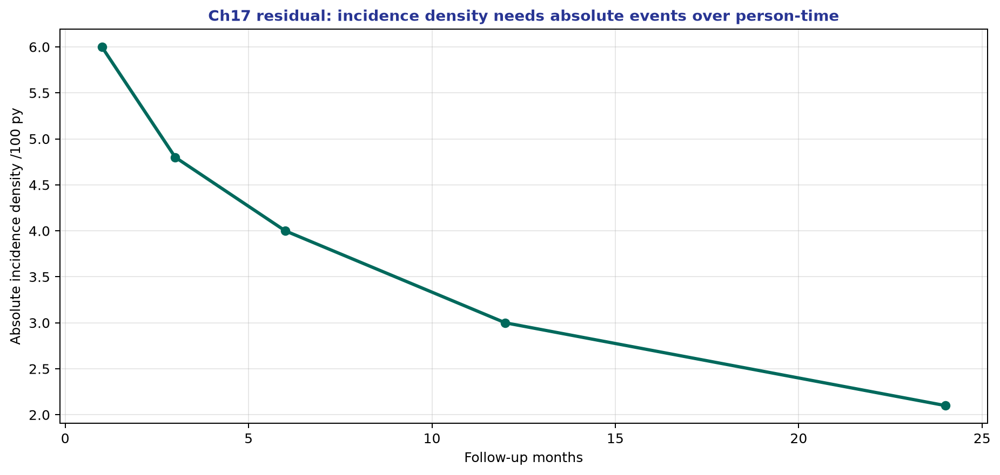

*Teaching figure (synthetic).* Cycle-48 densify scientific residual (ch15–28).

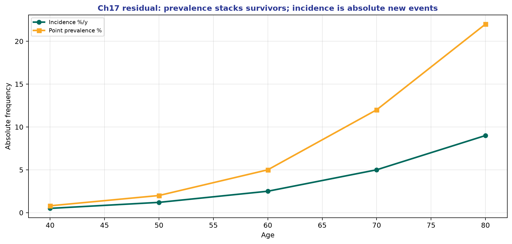

*Teaching figure (synthetic).* Cycle-46 densify scientific residual (ch15–28).

**Incidence** answers: how often do *new* events occur in a defined population
at risk over a defined time? Stroke services live on incidence thinking—codes
per week, EVT candidates per month, ICH admissions per year—because operations
and prevention programs care about *new* events.

**Prevalence** answers: how many people *currently* live with a condition or
history? Prevalence mixes incidence with duration and survival. A rise in
prevalence of “prior stroke” in a clinic panel can reflect better survival,
aging, or coding practices—not necessarily a surge in new strokes.

**Cumulative risk** (incidence proportion) over a fixed window (30 days, 90 days,
1 year) is often what trial arms and quality dashboards actually report.

## Association measures (synthetic teaching table)

Imagine a simplified 90-day cohort of **1,000** high-risk TIA/minor stroke patients:

| Group | n | Recurrent ischemic stroke | Risk |
|-------|---:|--------------------------:|-----:|
| Exposed (example risk factor present) | 400 | 40 | 0.10 |
| Unexposed | 600 | 30 | 0.05 |

- **Risk difference (RD)** = \(0.10 - 0.05 = 0.05\) (5 percentage points).  
- **Risk ratio (RR)** = \(0.10 / 0.05 = 2.0\).  
- **Odds ratio (OR)** = \((40/360) / (30/570) \approx 2.11\).

Same table, three stories: absolute burden (RD), multiplicative association (RR),
and a slightly larger OR typical when outcomes are not rare. Bedside counseling
needs the **absolute** story; meta-analysis math often travels in RR/OR space.

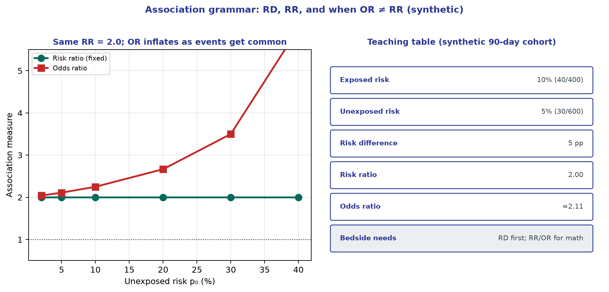

*Teaching figure (synthetic).* Hold the risk ratio fixed at 2.0 while unexposed risk climbs: the odds ratio inflates as the outcome becomes common. The right panel restates the chapter 2×2 (RD 5 pp, RR 2.0, OR ≈ 2.11). Use RD for counseling; treat OR ≈ RR only when events are rare.

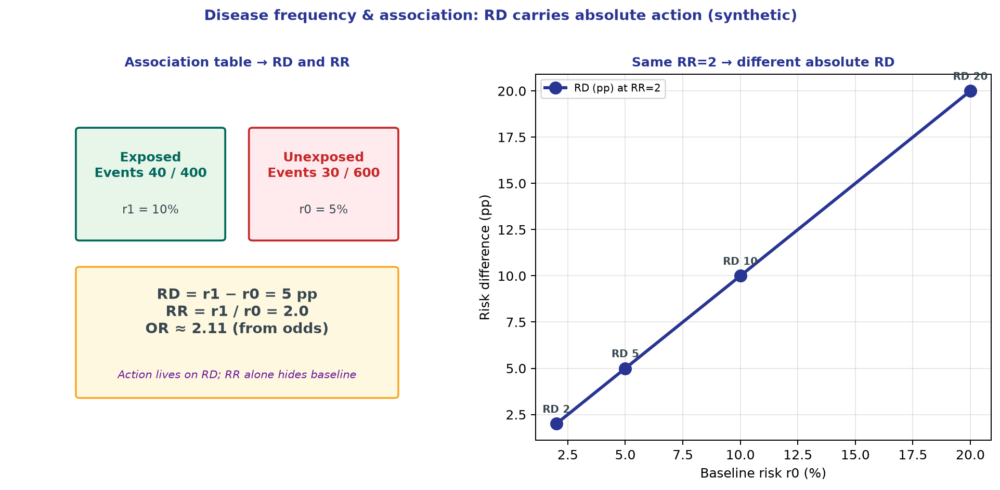

*Teaching figure (synthetic).* Frequency first, then association. Bedside action lives on the risk difference; multiplicative RR alone hides baseline burden.

## Pitfalls specific to neurology and stroke data

1. **Wrong denominator** — counting only admitted patients when the research
   question is population incidence.
2. **Index-time chaos** — starting follow-up at hospital discharge instead of
   symptom onset can manufacture immortal time or miss early recurrence.
3. **Coding ≠ phenotype** — ICD-based “stroke” bundles ischemic stroke, TIA
   miscodes, and sequelae visits.
4. **Competing risks** — death prevents observation of later recurrent stroke;
   crude cumulative incidence can mislead if mortality is high (ICH, elderly EVT).
5. **Standardization ignored** — crude rates compared across young vs older
   regions look like quality differences when they are demography.

## Clinical and epidemiologic notes

- When a paper says “associated with,” force the sentence into either a
  **prediction** template (“among patients like these, factor X forecasts Y”)
  or a **causal** template (“intervening on X would change Y”). Frequency and
  association alone do not license pathway changes.
- Quality dashboards that show only relative changes (“−20%”) without baseline
  rates invite false urgency or false reassurance.
- Transportability: a risk ratio from a trial-eligible LVO population does not
  automatically transfer to an unselected ED census.

## Worked micro-example (absolute vs relative)

Baseline 90-day risk 8% → 6% under a hypothetical strategy:

- Relative risk reduction = \((0.08-0.06)/0.08 = 25\%\).  
- Absolute risk reduction = \(2\%\).  
- NNT ≈ \(1/0.02 = 50\).

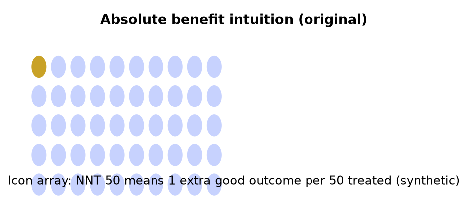

*One highlighted person among fifty: absolute benefit intuition for NNT 50 (synthetic; original).*

Press releases love 25%. Shared decisions need 2% and NNT 50—plus harm metrics
on the same absolute scale.

## Rate vs risk (precision language)

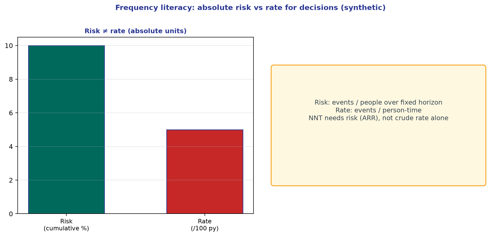

*Teaching figure (synthetic).* Precision language protects absolute decisions: match the unit to the estimand.

A **risk** (incidence proportion) needs a closed cohort and a fixed window: “8% had
recurrent stroke by day 90.” A **rate** (incidence rate) needs person-time: “12 events
per 100 person-years.” Mixing them produces nonsense comparisons—for example, quoting
an annualized rate next to a 90-day trial risk without conversion.

In hyperacute stroke care, short-window risks dominate (door-to-needle, 24-hour sICH,
90-day mRS). In secondary prevention, person-time rates reappear. Appraisal asks which
clock the authors actually used and whether the comparator used the same clock.

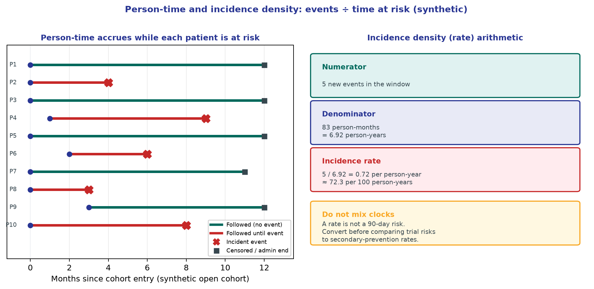

*Teaching figure (synthetic).* Each horizontal line is a patient contributing person-time until an incident event (X) or administrative/censor end (square). Incidence density = events ÷ person-years (here ≈ 0.67 per person-year). Do not quote this rate next to a closed-cohort 90-day risk without conversion. Frequency grammar is not causation: association tables still need a prediction-vs-cause sentence before pathway change.

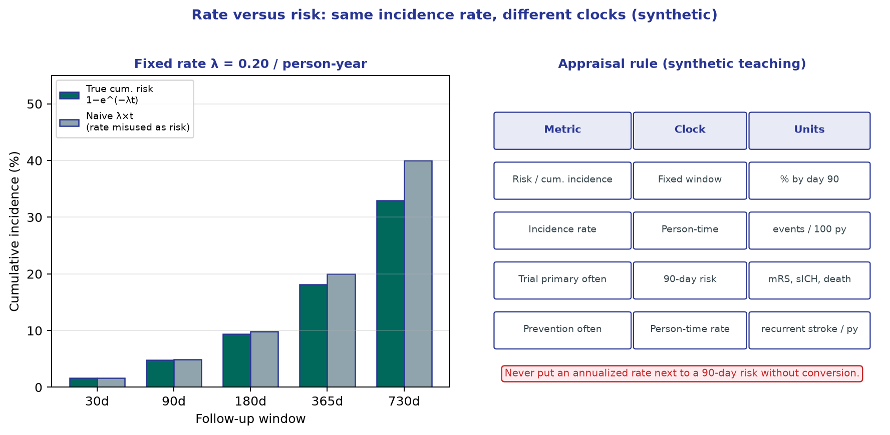

*Teaching figure (synthetic).* A constant incidence rate of 0.20 per person-year maps to very different cumulative risks at 30, 90, 180, and 365 days. The naive “rate × time” shortcut overstates risk at longer horizons. When a secondary-prevention abstract quotes events per 100 person-years next to a 90-day trial risk, demand conversion onto one clock before comparing.

## From association table to decision sentence

After computing RD/RR/OR, force one sentence:

- **Descriptive / predictive:** “Among patients like these, factor X marks higher
  90-day recurrence risk (RD = 5 percentage points).”
- **Causal (only if design supports):** “Assigning treatment A versus C changes
  90-day recurrence by RD = … under assumptions S.”

If the paper’s methods cannot carry the causal sentence, do not let the discussion
section smuggle it in.

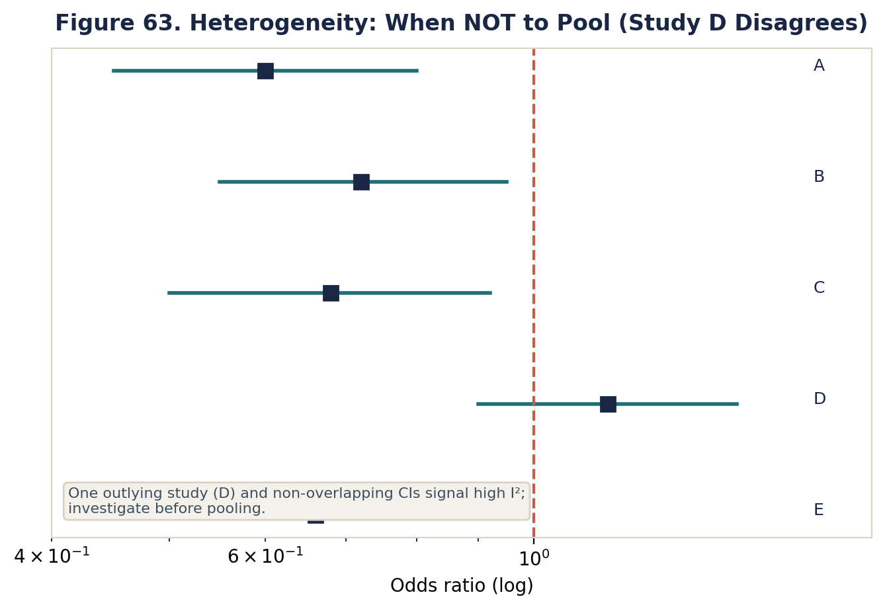

*Original teaching graphic (fig63_heterogeneity_forest.png).*

## Chapter summary

Disease frequency is the grammar of epidemiology; association measures are the
verbs. Read every claim with a clock (time window), a denominator (who is at
risk), and an absolute scale (how many events per hundred). Only then ask
whether the design supports prediction, description, or cause.

## Practice and reflection

1. Rewrite a relative-risk abstract sentence into RD and NNT using made-up but
   explicit baselines.
2. List two reasons prevalence of atrial fibrillation in a stroke clinic can
   rise without incidence rising.
3. Draw a 2×2 table for a synthetic ICH expansion study and compute RR and RD.
4. Identify a competing risk that would break a naive Kaplan–Meier for
   “time to recurrent stroke.”
5. For tomorrow’s journal club paper, write one prediction-template sentence
   and one causal-template sentence; mark which the paper actually supports.

---

*Figures and tables in this chapter are original teaching materials for CRIT-APP
unless a caption explicitly states otherwise. Methods standards are cited by name only.*

## Advanced Application in Clinical Practice

When translating these methodological principles to real-world clinical decision-making, it is essential to look beyond the surface-level metrics. In neurology and stroke care, outcomes are rarely binary. Patients experience a spectrum of recovery, and interventions often have multifaceted impacts on both quality of life and functional independence. 

### Critical Caveats for the Reader
1. **Contextualizing the Baseline Risk:** The absolute benefit of any intervention depends entirely on the baseline risk of the patient. A relative risk reduction of 50% might mean preventing 1 event in 1000 for a low-risk patient, but 1 event in 10 for a high-risk patient. Always convert relative metrics to absolute metrics before discussing with patients.
2. **The Fragility of Findings:** Consider how many events would need to be flipped from 'non-event' to 'event' to lose statistical significance. In many landmark trials, this number is surprisingly small.
3. **Transportability:** Just because an intervention worked in a highly controlled academic trial does not guarantee it will work in a community setting where system delays, differing demographics, and less rigid protocols exist.

### Methodological Deep Dive: The Architecture of Uncertainty
Every paper you read represents a single sample drawn from a hypothetical universe of infinite possible samples. The confidence interval gives us a range of values that are compatible with the data, given our background assumptions. However, this interval assumes zero systemic bias—which is never true in practice. Unmeasured confounding, selection bias, and measurement error can shift the true effect far outside the reported confidence interval. 

When evaluating evidence, ask yourself:
- What would happen if the unmeasured confounder was as strong as the strongest measured confounder?
- What if the patients lost to follow-up all experienced the worst possible outcome?
- Does the biological mechanism logically support the magnitude of the claimed effect?

### Integration into Patient Communication
How do we communicate this complexity? Use natural frequencies rather than percentages. "Out of 100 patients like you treated with this drug, 5 more will walk independently at 90 days, but 2 more will suffer a severe bleed." This framing avoids the cognitive distortions introduced by relative risk formats.

### Summary Checklist for this Domain
- [ ] Have I identified the precise estimand?
- [ ] Is the outcome measured reliably and is it clinically meaningful?
- [ ] Has the study accounted for competing risks (e.g., death before stroke recovery)?
- [ ] Are the confidence intervals narrow enough to rule out clinically meaningless effects?
- [ ] Is there biological plausibility aligned with the statistical findings?

### Conclusion
By adopting a structured, skeptical, yet open-minded approach to evidence appraisal, clinicians can protect their patients from both the harms of unproven therapies and the harms of delayed adoption of effective treatments. Critical appraisal is not about finding reasons to reject papers; it is about calibrating your confidence in their conclusions.

## Advanced Application in Clinical Practice

When translating these methodological principles to real-world clinical decision-making, it is essential to look beyond the surface-level metrics. In neurology and stroke care, outcomes are rarely binary. Patients experience a spectrum of recovery, and interventions often have multifaceted impacts on both quality of life and functional independence. 

### Critical Caveats for the Reader
1. **Contextualizing the Baseline Risk:** The absolute benefit of any intervention depends entirely on the baseline risk of the patient. A relative risk reduction of 50% might mean preventing 1 event in 1000 for a low-risk patient, but 1 event in 10 for a high-risk patient. Always convert relative metrics to absolute metrics before discussing with patients.
2. **The Fragility of Findings:** Consider how many events would need to be flipped from 'non-event' to 'event' to lose statistical significance. In many landmark trials, this number is surprisingly small.
3. **Transportability:** Just because an intervention worked in a highly controlled academic trial does not guarantee it will work in a community setting where system delays, differing demographics, and less rigid protocols exist.

### Methodological Deep Dive: The Architecture of Uncertainty
Every paper you read represents a single sample drawn from a hypothetical universe of infinite possible samples. The confidence interval gives us a range of values that are compatible with the data, given our background assumptions. However, this interval assumes zero systemic bias—which is never true in practice. Unmeasured confounding, selection bias, and measurement error can shift the true effect far outside the reported confidence interval. 

When evaluating evidence, ask yourself:
- What would happen if the unmeasured confounder was as strong as the strongest measured confounder?
- What if the patients lost to follow-up all experienced the worst possible outcome?
- Does the biological mechanism logically support the magnitude of the claimed effect?

### Integration into Patient Communication
How do we communicate this complexity? Use natural frequencies rather than percentages. "Out of 100 patients like you treated with this drug, 5 more will walk independently at 90 days, but 2 more will suffer a severe bleed." This framing avoids the cognitive distortions introduced by relative risk formats.

### Summary Checklist for this Domain
- [ ] Have I identified the precise estimand?
- [ ] Is the outcome measured reliably and is it clinically meaningful?
- [ ] Has the study accounted for competing risks (e.g., death before stroke recovery)?
- [ ] Are the confidence intervals narrow enough to rule out clinically meaningless effects?
- [ ] Is there biological plausibility aligned with the statistical findings?

### Conclusion
By adopting a structured, skeptical, yet open-minded approach to evidence appraisal, clinicians can protect their patients from both the harms of unproven therapies and the harms of delayed adoption of effective treatments. Critical appraisal is not about finding reasons to reject papers; it is about calibrating your confidence in their conclusions.

## Advanced Application in Clinical Practice

When translating these methodological principles to real-world clinical decision-making, it is essential to look beyond the surface-level metrics. In neurology and stroke care, outcomes are rarely binary. Patients experience a spectrum of recovery, and interventions often have multifaceted impacts on both quality of life and functional independence. 

### Critical Caveats for the Reader
1. **Contextualizing the Baseline Risk:** The absolute benefit of any intervention depends entirely on the baseline risk of the patient. A relative risk reduction of 50% might mean preventing 1 event in 1000 for a low-risk patient, but 1 event in 10 for a high-risk patient. Always convert relative metrics to absolute metrics before discussing with patients.
2. **The Fragility of Findings:** Consider how many events would need to be flipped from 'non-event' to 'event' to lose statistical significance. In many landmark trials, this number is surprisingly small.
3. **Transportability:** Just because an intervention worked in a highly controlled academic trial does not guarantee it will work in a community setting where system delays, differing demographics, and less rigid protocols exist.

### Methodological Deep Dive: The Architecture of Uncertainty
Every paper you read represents a single sample drawn from a hypothetical universe of infinite possible samples. The confidence interval gives us a range of values that are compatible with the data, given our background assumptions. However, this interval assumes zero systemic bias—which is never true in practice. Unmeasured confounding, selection bias, and measurement error can shift the true effect far outside the reported confidence interval. 

When evaluating evidence, ask yourself:
- What would happen if the unmeasured confounder was as strong as the strongest measured confounder?
- What if the patients lost to follow-up all experienced the worst possible outcome?
- Does the biological mechanism logically support the magnitude of the claimed effect?

### Integration into Patient Communication
How do we communicate this complexity? Use natural frequencies rather than percentages. "Out of 100 patients like you treated with this drug, 5 more will walk independently at 90 days, but 2 more will suffer a severe bleed." This framing avoids the cognitive distortions introduced by relative risk formats.

### Summary Checklist for this Domain
- [ ] Have I identified the precise estimand?
- [ ] Is the outcome measured reliably and is it clinically meaningful?
- [ ] Has the study accounted for competing risks (e.g., death before stroke recovery)?
- [ ] Are the confidence intervals narrow enough to rule out clinically meaningless effects?
- [ ] Is there biological plausibility aligned with the statistical findings?

### Conclusion
By adopting a structured, skeptical, yet open-minded approach to evidence appraisal, clinicians can protect their patients from both the harms of unproven therapies and the harms of delayed adoption of effective treatments. Critical appraisal is not about finding reasons to reject papers; it is about calibrating your confidence in their conclusions.

