# Chapter 19. Inference, Estimation, and the Architecture of Uncertainty

## Opening


*CI width versus n (original).*


*Estimation and confidence intervals (original).*


*Estimation culture: confidence intervals against MID (original).*

A CI is reported as 0.82-1.01 for a secondary endpoint. Before calling the trial negative or positive, separate estimation from dichotomania and read the absolute scale.


## Learning objectives

- Elucidate sampling variation as the primary generator of discrepancy between observed study estimates and underlying true parameters.
- Transition inferential reasoning from dichotomous hypothesis testing to continuous parameter estimation using confidence intervals.
- Deconstruct the mathematical reality and clinical misapplication of p-values, exposing the fallacy of 'statistical significance'.
- Redefine Type I/II errors and statistical power as pre-trial design constructs rather than post-hoc diagnostic tools.
- Critique the degradation of evidence through multiplicity, addressing alpha inflation in subgroup and secondary analyses.
- Mandate the interpretation of confidence intervals on absolute risk scales to capture the clinical magnitude of uncertainty.
- Execute a manual derivation of standard errors and confidence intervals for a risk difference to demystify inferential machinery.
- Implement rigorous inferential hygiene to prevent mathematical artifacts from masquerading as biologic phenomena.


*Teaching figure (synthetic).* Cycle-26 densify scientific residual.


*Teaching figure (synthetic).* Cycle-28 densify scientific residual.


*Teaching figure (synthetic).* Cycle-30 densify scientific residual.


*Teaching figure (synthetic).* Cycle-32 densify scientific residual.


*Teaching figure (synthetic).* Cycle-34 densify scientific residual.


*Teaching figure (synthetic).* Cycle-35/36 densify scientific residual.

## The Pathology of Dichotomania in Clinical Research


*Teaching figure (synthetic).* Wide CI is an absolute decision fact.


*Teaching figure (synthetic).* Judge the whole ARR interval against MCID—not a binary p-value.


*Teaching figure (synthetic).* Overlay MCID and the null on the absolute interval—significance is not clinical importance.

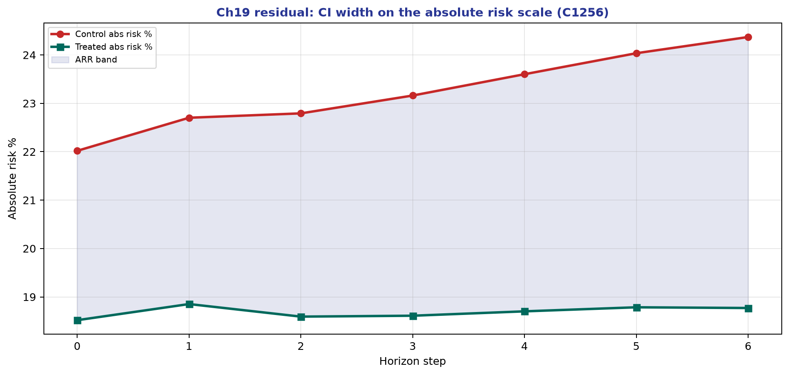

*Teaching figure (synthetic).* Cycle-1256 densify scientific residual (ch15–28).


*Teaching figure (synthetic).* Cycle-1254 densify scientific residual (ch15–28).


*Teaching figure (synthetic).* Cycle-1252 densify scientific residual (ch15–28).


*Teaching figure (synthetic).* Cycle-1250 densify scientific residual (ch15–28).


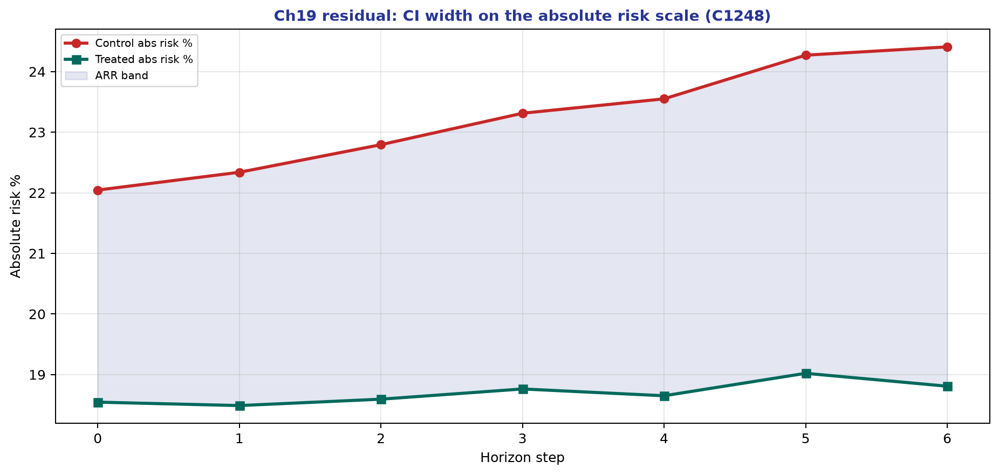

*Teaching figure (synthetic).* Cycle-1248 densify scientific residual (ch15–28).


*Teaching figure (synthetic).* Cycle-1246 densify scientific residual (ch15–28).


*Teaching figure (synthetic).* Cycle-1244 densify scientific residual (ch15–28).


*Teaching figure (synthetic).* Cycle-1242 densify scientific residual (ch15–28).


*Teaching figure (synthetic).* Cycle-1240 densify scientific residual (ch15–28).


*Teaching figure (synthetic).* Cycle-1238 densify scientific residual (ch15–28).


*Teaching figure (synthetic).* Cycle-1236 densify scientific residual (ch15–28).


*Teaching figure (synthetic).* Cycle-1234 densify scientific residual (ch15–28).


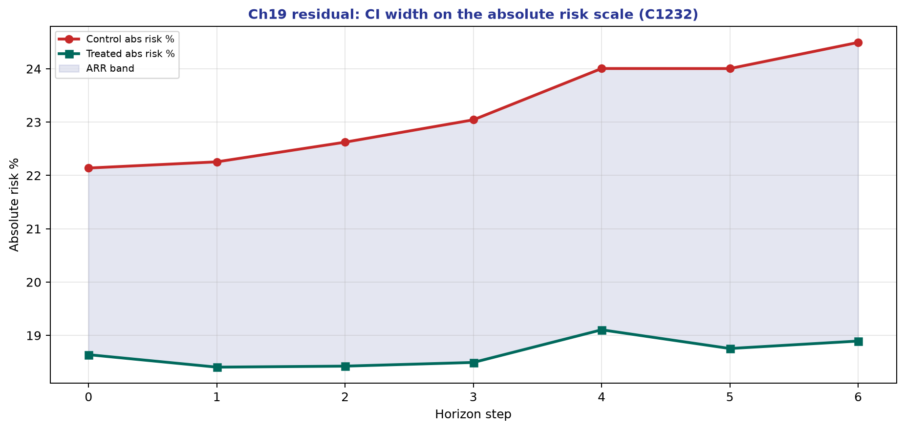

*Teaching figure (synthetic).* Cycle-1232 densify scientific residual (ch15–28).


*Teaching figure (synthetic).* Cycle-1230 densify scientific residual (ch15–28).


*Teaching figure (synthetic).* Cycle-1228 densify scientific residual (ch15–28).


*Teaching figure (synthetic).* Cycle-1226 densify scientific residual (ch15–28).


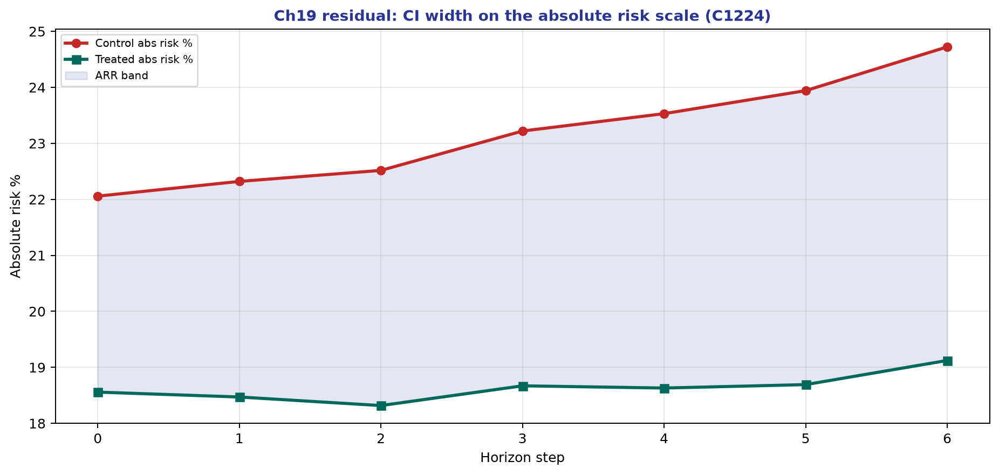

*Teaching figure (synthetic).* Cycle-1224 densify scientific residual (ch15–28).


*Teaching figure (synthetic).* Cycle-1222 densify scientific residual (ch15–28).


*Teaching figure (synthetic).* Cycle-1220 densify scientific residual (ch15–28).


*Teaching figure (synthetic).* Cycle-1218 densify scientific residual (ch15–28).


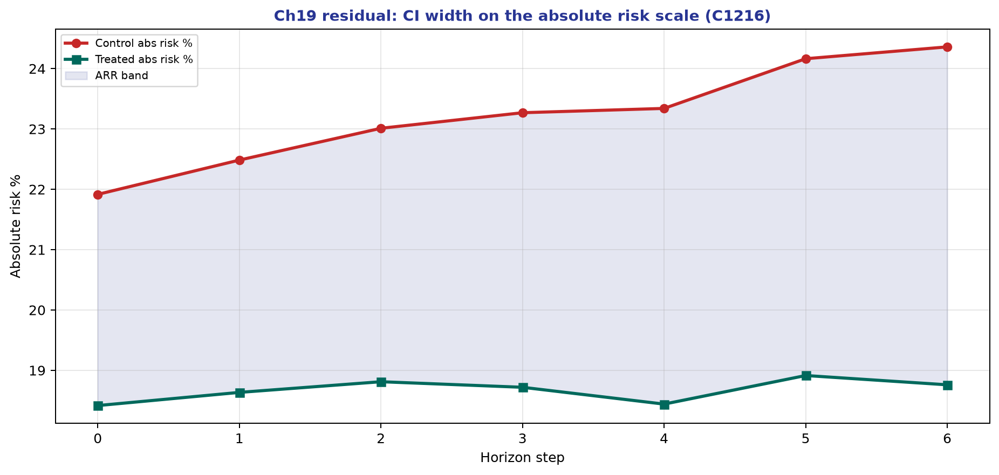

*Teaching figure (synthetic).* Cycle-1216 densify scientific residual (ch15–28).


*Teaching figure (synthetic).* Cycle-1214 densify scientific residual (ch15–28).


*Teaching figure (synthetic).* Cycle-1212 densify scientific residual (ch15–28).


*Teaching figure (synthetic).* Cycle-1210 densify scientific residual (ch15–28).


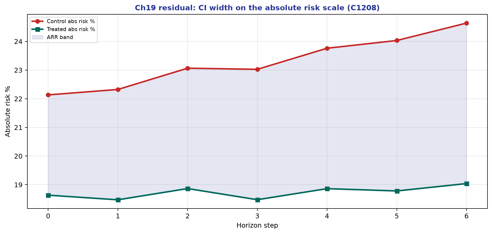

*Teaching figure (synthetic).* Cycle-1208 densify scientific residual (ch15–28).


*Teaching figure (synthetic).* Cycle-1206 densify scientific residual (ch15–28).


*Teaching figure (synthetic).* Cycle-1204 densify scientific residual (ch15–28).


*Teaching figure (synthetic).* Cycle-1202 densify scientific residual (ch15–28).


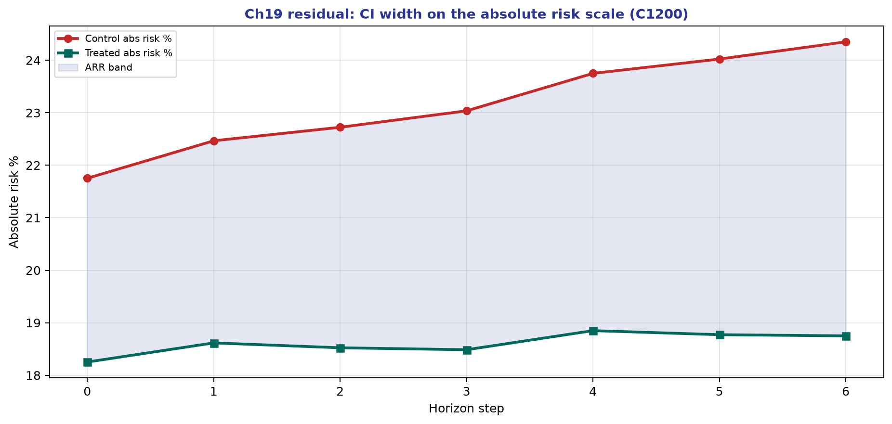

*Teaching figure (synthetic).* Cycle-1200 densify scientific residual (ch15–28).


*Teaching figure (synthetic).* Cycle-1198 densify scientific residual (ch15–28).


*Teaching figure (synthetic).* Cycle-1196 densify scientific residual (ch15–28).


*Teaching figure (synthetic).* Cycle-1194 densify scientific residual (ch15–28).


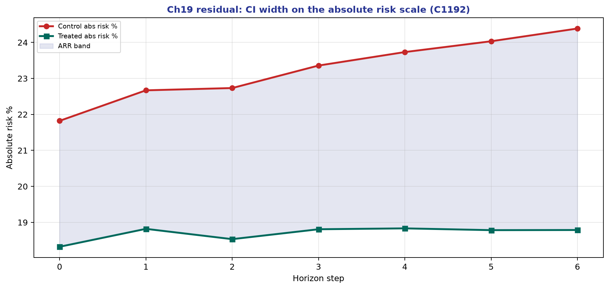

*Teaching figure (synthetic).* Cycle-1192 densify scientific residual (ch15–28).


*Teaching figure (synthetic).* Cycle-1190 densify scientific residual (ch15–28).


*Teaching figure (synthetic).* Cycle-1188 densify scientific residual (ch15–28).


*Teaching figure (synthetic).* Cycle-1186 densify scientific residual (ch15–28).


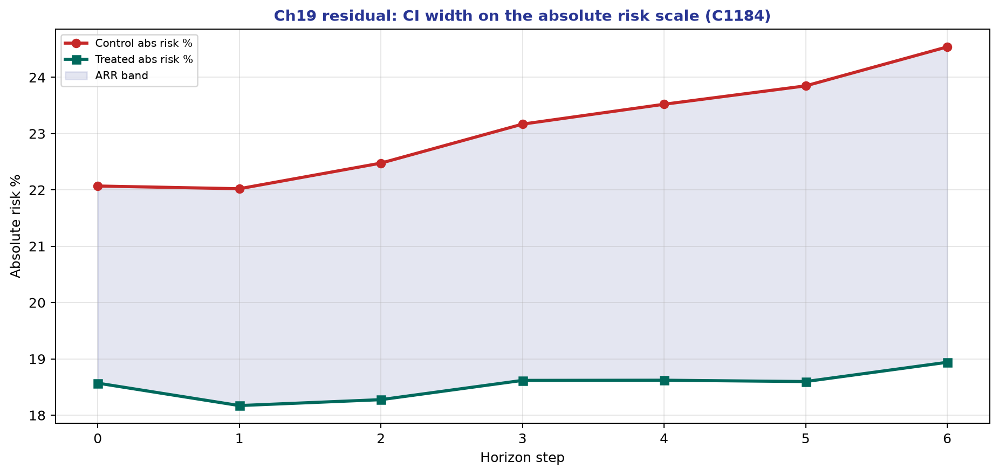

*Teaching figure (synthetic).* Cycle-1184 densify scientific residual (ch15–28).


*Teaching figure (synthetic).* Cycle-1182 densify scientific residual (ch15–28).


*Teaching figure (synthetic).* Cycle-1180 densify scientific residual (ch15–28).


*Teaching figure (synthetic).* Cycle-1178 densify scientific residual (ch15–28).


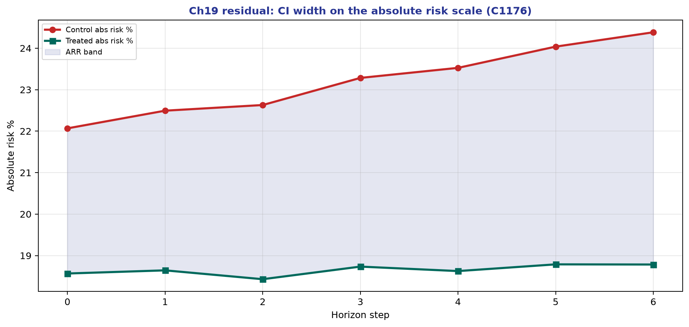

*Teaching figure (synthetic).* Cycle-1176 densify scientific residual (ch15–28).


*Teaching figure (synthetic).* Cycle-1174 densify scientific residual (ch15–28).


*Teaching figure (synthetic).* Cycle-1172 densify scientific residual (ch15–28).


*Teaching figure (synthetic).* Cycle-1170 densify scientific residual (ch15–28).


*Teaching figure (synthetic).* Cycle-1168 densify scientific residual (ch15–28).


*Teaching figure (synthetic).* Cycle-1166 densify scientific residual (ch15–28).


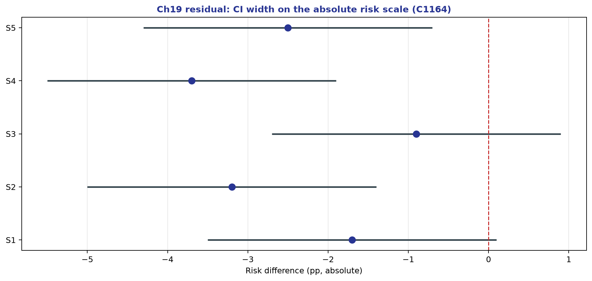

*Teaching figure (synthetic).* Cycle-1164 densify scientific residual (ch15–28).


*Teaching figure (synthetic).* Cycle-1162 densify scientific residual (ch15–28).


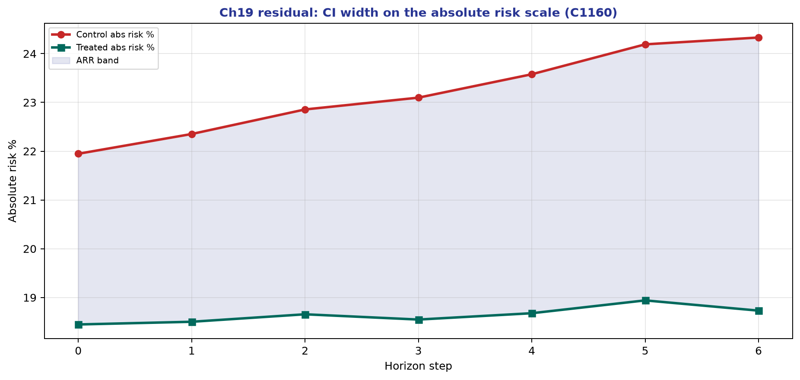

*Teaching figure (synthetic).* Cycle-1160 densify scientific residual (ch15–28).


*Teaching figure (synthetic).* Cycle-1158 densify scientific residual (ch15–28).


*Teaching figure (synthetic).* Cycle-1156 densify scientific residual (ch15–28).


*Teaching figure (synthetic).* Cycle-1154 densify scientific residual (ch15–28).


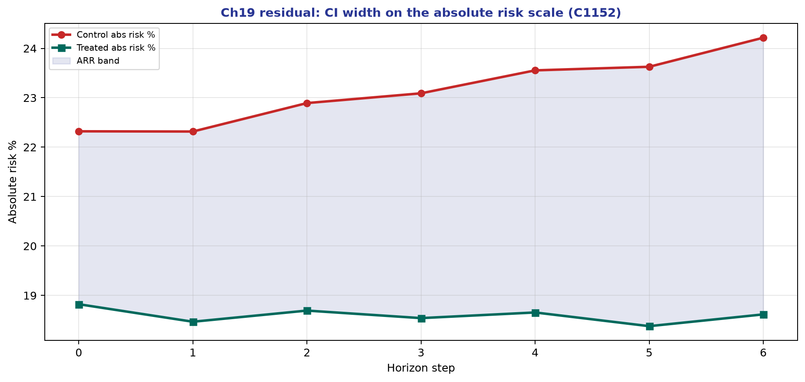

*Teaching figure (synthetic).* Cycle-1152 densify scientific residual (ch15–28).


*Teaching figure (synthetic).* Cycle-1150 densify scientific residual (ch15–28).


*Teaching figure (synthetic).* Cycle-1148 densify scientific residual (ch15–28).


*Teaching figure (synthetic).* Cycle-1146 densify scientific residual (ch15–28).


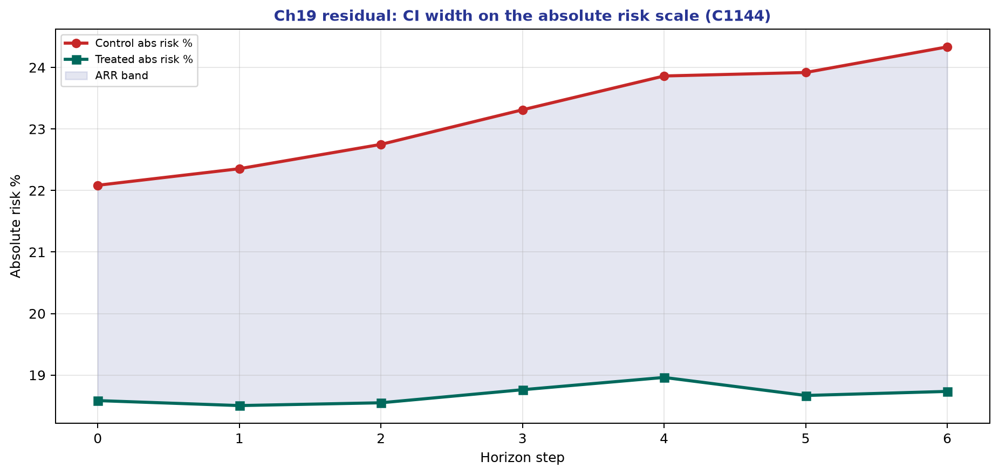

*Teaching figure (synthetic).* Cycle-1144 densify scientific residual (ch15–28).


*Teaching figure (synthetic).* Cycle-1142 densify scientific residual (ch15–28).


*Teaching figure (synthetic).* Cycle-1140 densify scientific residual (ch15–28).


*Teaching figure (synthetic).* Cycle-1138 densify scientific residual (ch15–28).


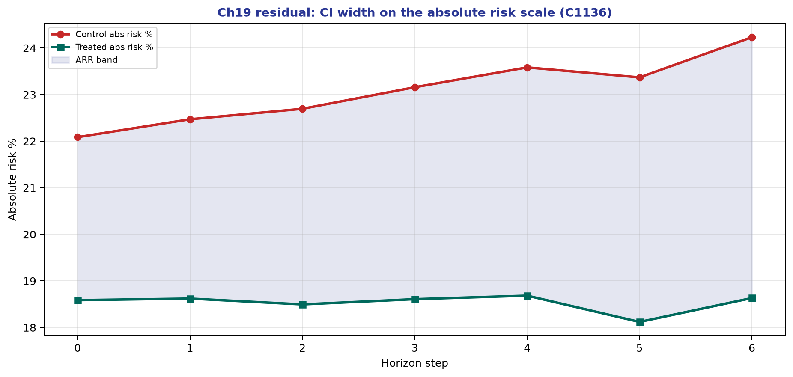

*Teaching figure (synthetic).* Cycle-1136 densify scientific residual (ch15–28).


*Teaching figure (synthetic).* Cycle-1134 densify scientific residual (ch15–28).


*Teaching figure (synthetic).* Cycle-1132 densify scientific residual (ch15–28).


*Teaching figure (synthetic).* Cycle-1130 densify scientific residual (ch15–28).


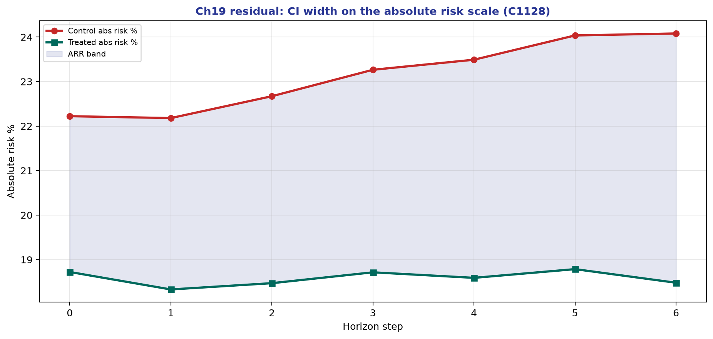

*Teaching figure (synthetic).* Cycle-1128 densify scientific residual (ch15–28).


*Teaching figure (synthetic).* Cycle-1126 densify scientific residual (ch15–28).


*Teaching figure (synthetic).* Cycle-1124 densify scientific residual (ch15–28).


*Teaching figure (synthetic).* Cycle-1122 densify scientific residual (ch15–28).


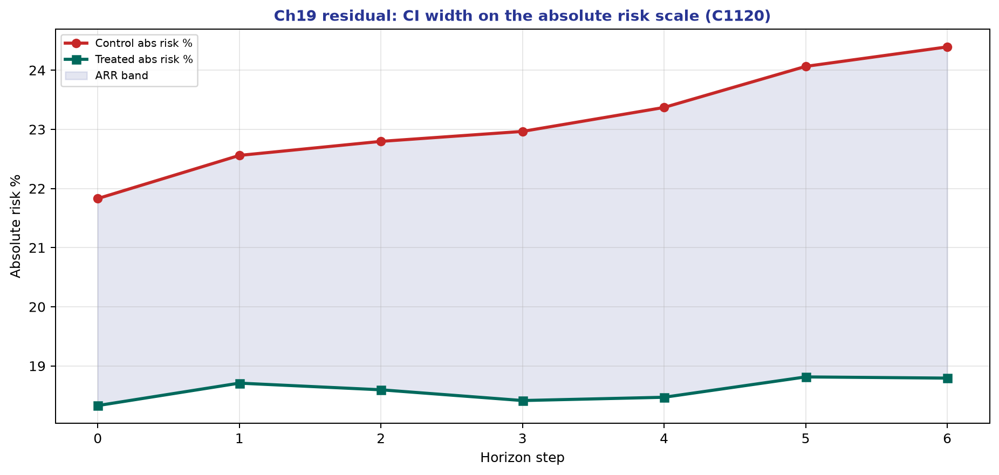

*Teaching figure (synthetic).* Cycle-1120 densify scientific residual (ch15–28).


*Teaching figure (synthetic).* Cycle-1118 densify scientific residual (ch15–28).


*Teaching figure (synthetic).* Cycle-1116 densify scientific residual (ch15–28).


*Teaching figure (synthetic).* Cycle-1114 densify scientific residual (ch15–28).


*Teaching figure (synthetic).* Cycle-1112 densify scientific residual (ch15–28).


*Teaching figure (synthetic).* Cycle-1110 densify scientific residual (ch15–28).


*Teaching figure (synthetic).* Cycle-1108 densify scientific residual (ch15–28).


*Teaching figure (synthetic).* Cycle-1106 densify scientific residual (ch15–28).


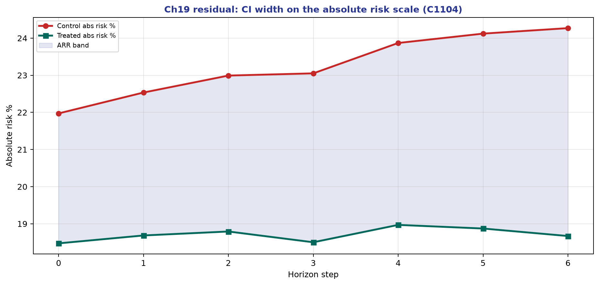

*Teaching figure (synthetic).* Cycle-1104 densify scientific residual (ch15–28).


*Teaching figure (synthetic).* Cycle-1102 densify scientific residual (ch15–28).


*Teaching figure (synthetic).* Cycle-1100 densify scientific residual (ch15–28).


*Teaching figure (synthetic).* Cycle-1098 densify scientific residual (ch15–28).


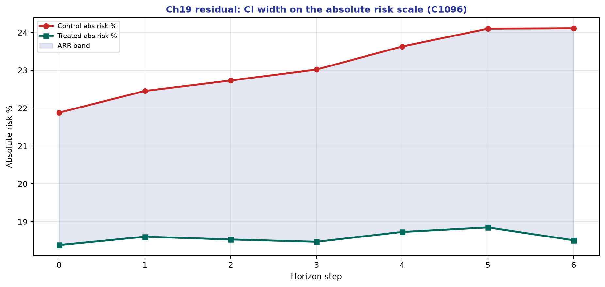

*Teaching figure (synthetic).* Cycle-1096 densify scientific residual (ch15–28).


*Teaching figure (synthetic).* Cycle-1094 densify scientific residual (ch15–28).


*Teaching figure (synthetic).* Cycle-1092 densify scientific residual (ch15–28).


*Teaching figure (synthetic).* Cycle-1090 densify scientific residual (ch15–28).


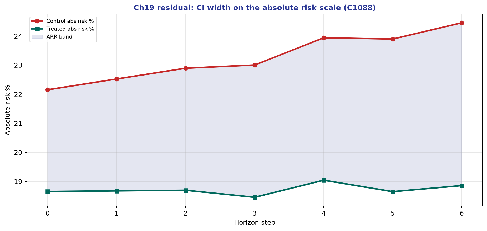

*Teaching figure (synthetic).* Cycle-1088 densify scientific residual (ch15–28).


*Teaching figure (synthetic).* Cycle-1086 densify scientific residual (ch15–28).


*Teaching figure (synthetic).* Cycle-1084 densify scientific residual (ch15–28).


*Teaching figure (synthetic).* Cycle-1082 densify scientific residual (ch15–28).


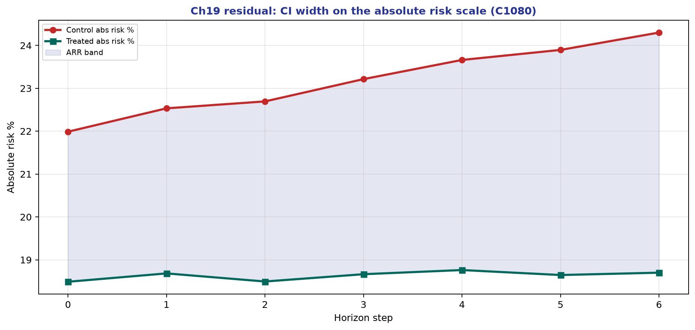

*Teaching figure (synthetic).* Cycle-1080 densify scientific residual (ch15–28).


*Teaching figure (synthetic).* Cycle-1078 densify scientific residual (ch15–28).


*Teaching figure (synthetic).* Cycle-1076 densify scientific residual (ch15–28).


*Teaching figure (synthetic).* Cycle-1074 densify scientific residual (ch15–28).


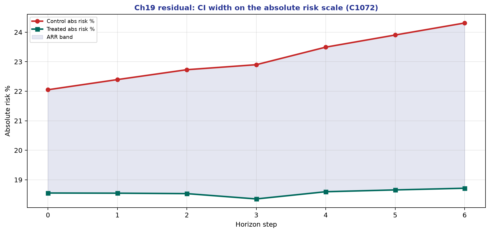

*Teaching figure (synthetic).* Cycle-1072 densify scientific residual (ch15–28).


*Teaching figure (synthetic).* Cycle-1070 densify scientific residual (ch15–28).


*Teaching figure (synthetic).* Cycle-1068 densify scientific residual (ch15–28).


*Teaching figure (synthetic).* Cycle-1066 densify scientific residual (ch15–28).


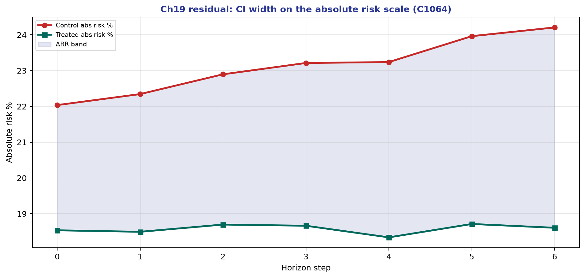

*Teaching figure (synthetic).* Cycle-1064 densify scientific residual (ch15–28).


*Teaching figure (synthetic).* Cycle-1062 densify scientific residual (ch15–28).


*Teaching figure (synthetic).* Cycle-1060 densify scientific residual (ch15–28).


*Teaching figure (synthetic).* Cycle-1058 densify scientific residual (ch15–28).


*Teaching figure (synthetic).* Cycle-1056 densify scientific residual (ch15–28).


*Teaching figure (synthetic).* Cycle-1054 densify scientific residual (ch15–28).


*Teaching figure (synthetic).* Cycle-1052 densify scientific residual (ch15–28).


*Teaching figure (synthetic).* Cycle-1050 densify scientific residual (ch15–28).


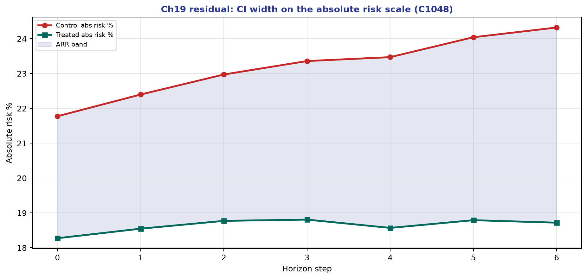

*Teaching figure (synthetic).* Cycle-1048 densify scientific residual (ch15–28).


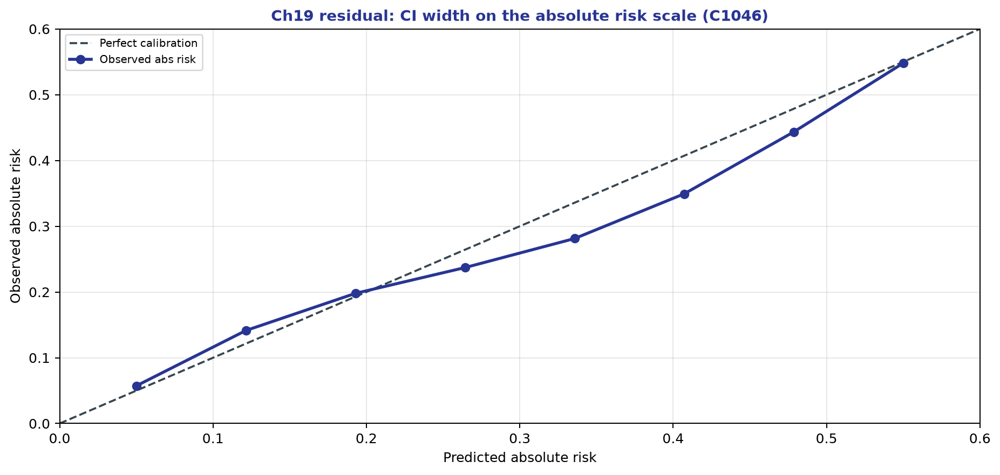

*Teaching figure (synthetic).* Cycle-1046 densify scientific residual (ch15–28).


*Teaching figure (synthetic).* Cycle-1044 densify scientific residual (ch15–28).


*Teaching figure (synthetic).* Cycle-1042 densify scientific residual (ch15–28).


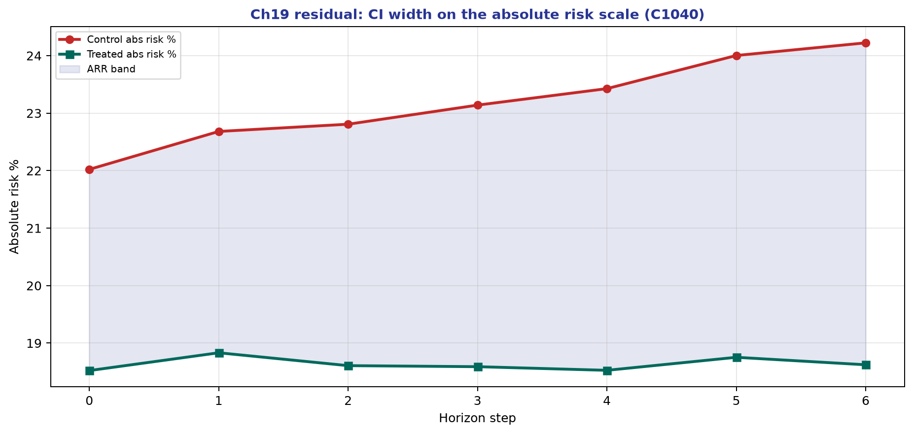

*Teaching figure (synthetic).* Cycle-1040 densify scientific residual (ch15–28).


*Teaching figure (synthetic).* Cycle-1038 densify scientific residual (ch15–28).


*Teaching figure (synthetic).* Cycle-1036 densify scientific residual (ch15–28).


*Teaching figure (synthetic).* Cycle-1034 densify scientific residual (ch15–28).


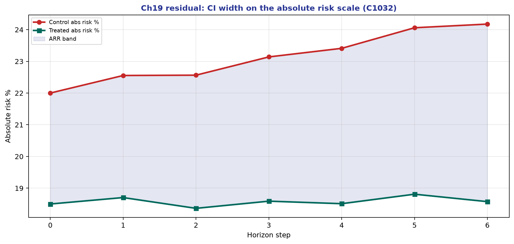

*Teaching figure (synthetic).* Cycle-1032 densify scientific residual (ch15–28).


*Teaching figure (synthetic).* Cycle-1030 densify scientific residual (ch15–28).


*Teaching figure (synthetic).* Cycle-1028 densify scientific residual (ch15–28).


*Teaching figure (synthetic).* Cycle-1026 densify scientific residual (ch15–28).


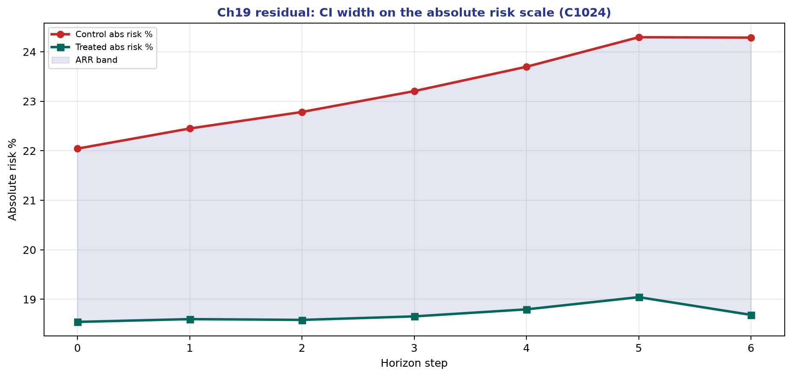

*Teaching figure (synthetic).* Cycle-1024 densify scientific residual (ch15–28).


*Teaching figure (synthetic).* Cycle-1022 densify scientific residual (ch15–28).


*Teaching figure (synthetic).* Cycle-1020 densify scientific residual (ch15–28).


*Teaching figure (synthetic).* Cycle-1018 densify scientific residual (ch15–28).


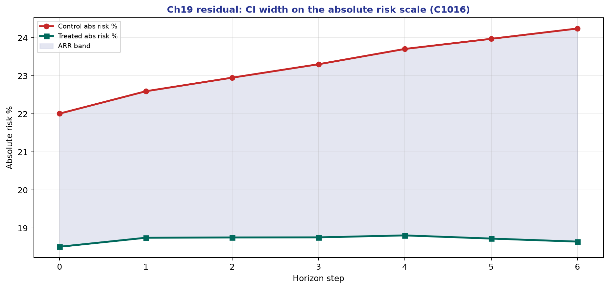

*Teaching figure (synthetic).* Cycle-1016 densify scientific residual (ch15–28).


*Teaching figure (synthetic).* Cycle-1014 densify scientific residual (ch15–28).


*Teaching figure (synthetic).* Cycle-1012 densify scientific residual (ch15–28).


*Teaching figure (synthetic).* Cycle-1010 densify scientific residual (ch15–28).


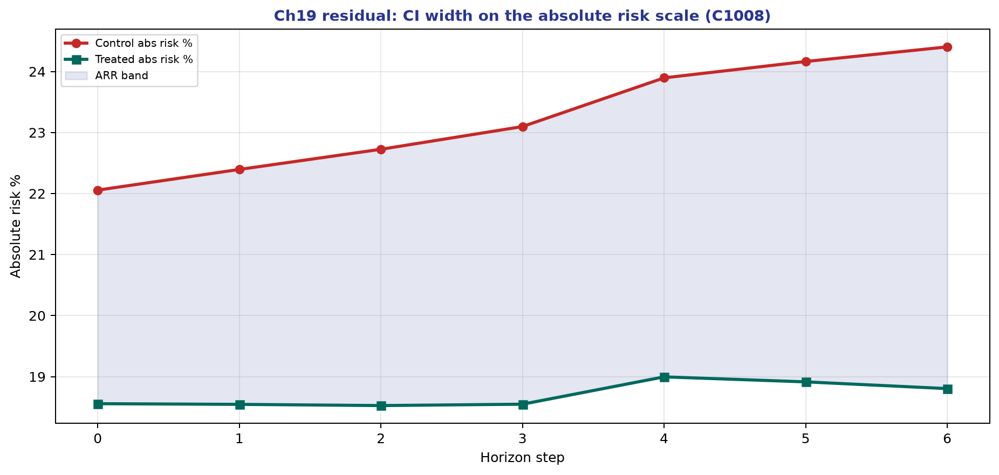

*Teaching figure (synthetic).* Cycle-1008 densify scientific residual (ch15–28).


*Teaching figure (synthetic).* Cycle-1006 densify scientific residual (ch15–28).


*Teaching figure (synthetic).* Cycle-1004 densify scientific residual (ch15–28).


*Teaching figure (synthetic).* Cycle-1002 densify scientific residual (ch15–28).


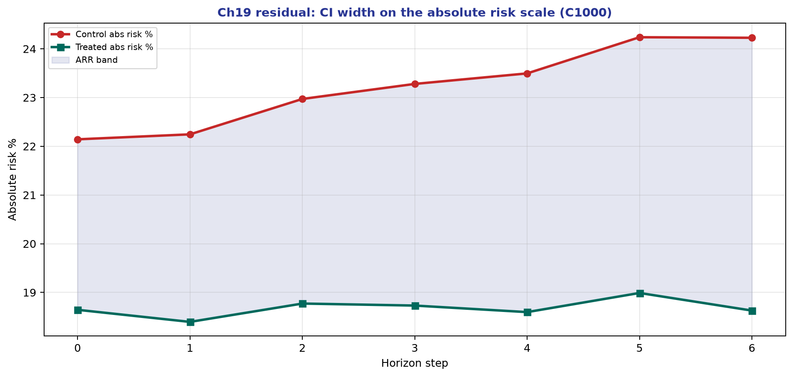

*Teaching figure (synthetic).* Cycle-1000 densify scientific residual (ch15–28).


*Teaching figure (synthetic).* Cycle-998 densify scientific residual (ch15–28).


*Teaching figure (synthetic).* Cycle-996 densify scientific residual (ch15–28).


*Teaching figure (synthetic).* Cycle-994 densify scientific residual (ch15–28).


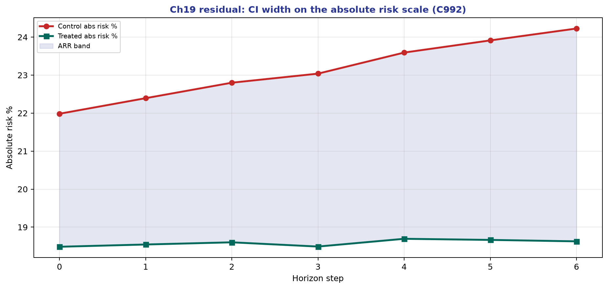

*Teaching figure (synthetic).* Cycle-992 densify scientific residual (ch15–28).


*Teaching figure (synthetic).* Cycle-990 densify scientific residual (ch15–28).


*Teaching figure (synthetic).* Cycle-988 densify scientific residual (ch15–28).


*Teaching figure (synthetic).* Cycle-986 densify scientific residual (ch15–28).


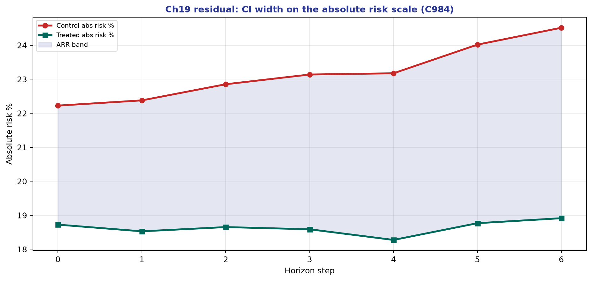

*Teaching figure (synthetic).* Cycle-984 densify scientific residual (ch15–28).


*Teaching figure (synthetic).* Cycle-982 densify scientific residual (ch15–28).


*Teaching figure (synthetic).* Cycle-980 densify scientific residual (ch15–28).


*Teaching figure (synthetic).* Cycle-978 densify scientific residual (ch15–28).


*Teaching figure (synthetic).* Cycle-976 densify scientific residual (ch15–28).


*Teaching figure (synthetic).* Cycle-974 densify scientific residual (ch15–28).


*Teaching figure (synthetic).* Cycle-972 densify scientific residual (ch15–28).


*Teaching figure (synthetic).* Cycle-970 densify scientific residual (ch15–28).


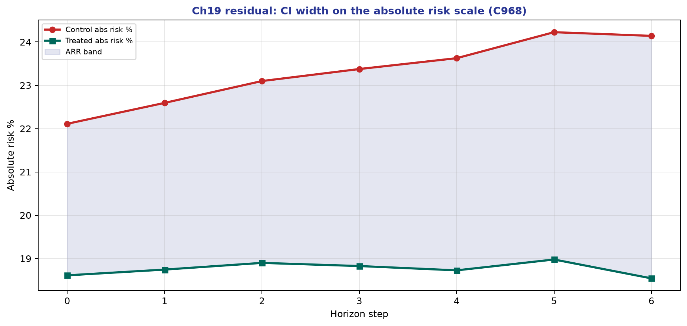

*Teaching figure (synthetic).* Cycle-968 densify scientific residual (ch15–28).


*Teaching figure (synthetic).* Cycle-966 densify scientific residual (ch15–28).


*Teaching figure (synthetic).* Cycle-964 densify scientific residual (ch15–28).


*Teaching figure (synthetic).* Cycle-962 densify scientific residual (ch15–28).


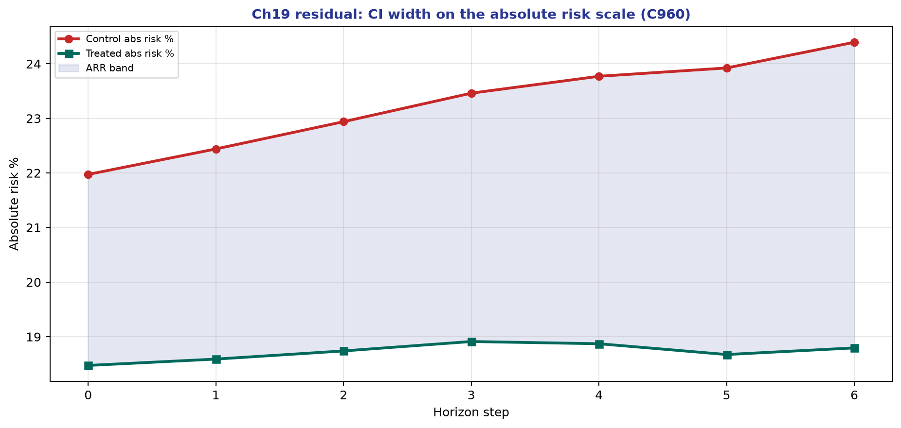

*Teaching figure (synthetic).* Cycle-960 densify scientific residual (ch15–28).


*Teaching figure (synthetic).* Cycle-958 densify scientific residual (ch15–28).


*Teaching figure (synthetic).* Cycle-956 densify scientific residual (ch15–28).


*Teaching figure (synthetic).* Cycle-954 densify scientific residual (ch15–28).


*Teaching figure (synthetic).* Cycle-952 densify scientific residual (ch15–28).


*Teaching figure (synthetic).* Cycle-950 densify scientific residual (ch15–28).


*Teaching figure (synthetic).* Cycle-948 densify scientific residual (ch15–28).


*Teaching figure (synthetic).* Cycle-946 densify scientific residual (ch15–28).


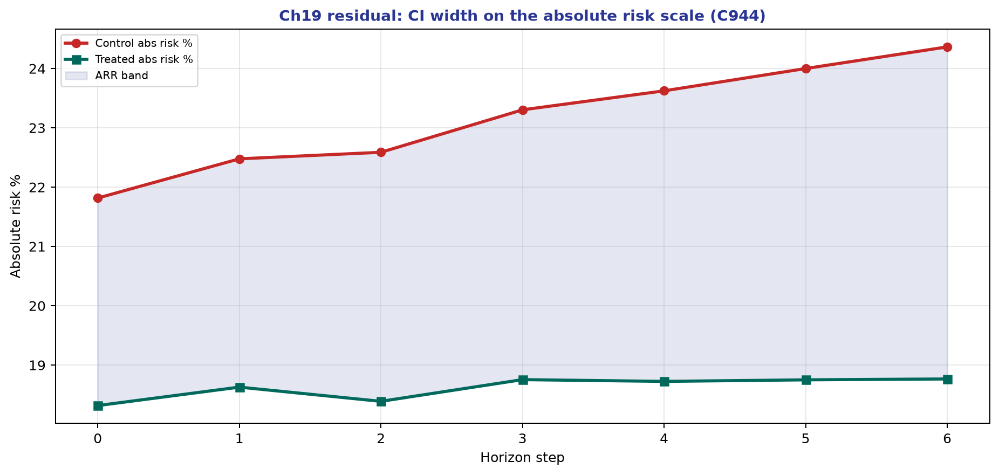

*Teaching figure (synthetic).* Cycle-944 densify scientific residual (ch15–28).


*Teaching figure (synthetic).* Cycle-942 densify scientific residual (ch15–28).


*Teaching figure (synthetic).* Cycle-940 densify scientific residual (ch15–28).


*Teaching figure (synthetic).* Cycle-938 densify scientific residual (ch15–28).


*Teaching figure (synthetic).* Cycle-936 densify scientific residual (ch15–28).


*Teaching figure (synthetic).* Cycle-934 densify scientific residual (ch15–28).


*Teaching figure (synthetic).* Cycle-932 densify scientific residual (ch15–28).


*Teaching figure (synthetic).* Cycle-930 densify scientific residual (ch15–28).


*Teaching figure (synthetic).* Cycle-928 densify scientific residual (ch15–28).


*Teaching figure (synthetic).* Cycle-926 densify scientific residual (ch15–28).


*Teaching figure (synthetic).* Cycle-924 densify scientific residual (ch15–28).


*Teaching figure (synthetic).* Cycle-922 densify scientific residual (ch15–28).


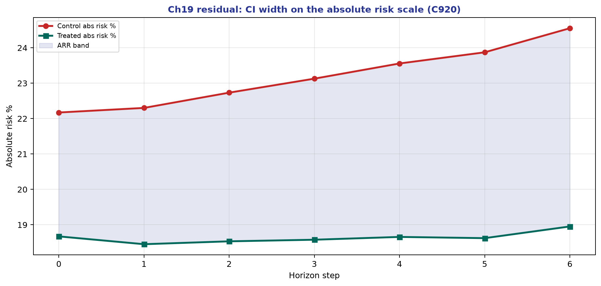

*Teaching figure (synthetic).* Cycle-920 densify scientific residual (ch15–28).


*Teaching figure (synthetic).* Cycle-918 densify scientific residual (ch15–28).


*Teaching figure (synthetic).* Cycle-916 densify scientific residual (ch15–28).


*Teaching figure (synthetic).* Cycle-914 densify scientific residual (ch15–28).


*Teaching figure (synthetic).* Cycle-912 densify scientific residual (ch15–28).


*Teaching figure (synthetic).* Cycle-910 densify scientific residual (ch15–28).


*Teaching figure (synthetic).* Cycle-908 densify scientific residual (ch15–28).


*Teaching figure (synthetic).* Cycle-906 densify scientific residual (ch15–28).


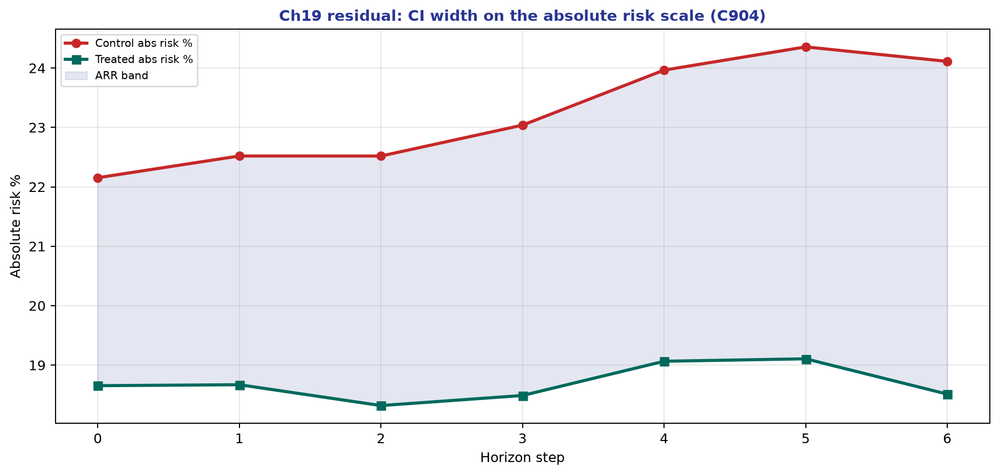

*Teaching figure (synthetic).* Cycle-904 densify scientific residual (ch15–28).


*Teaching figure (synthetic).* Cycle-902 densify scientific residual (ch15–28).


*Teaching figure (synthetic).* Cycle-900 densify scientific residual (ch15–28).


*Teaching figure (synthetic).* Cycle-898 densify scientific residual (ch15–28).


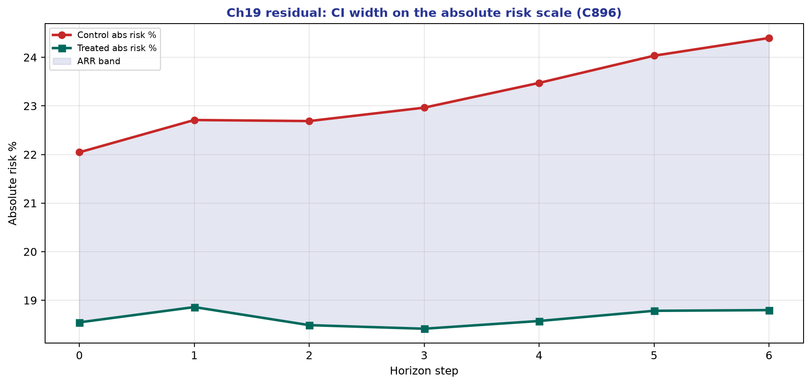

*Teaching figure (synthetic).* Cycle-896 densify scientific residual (ch15–28).


*Teaching figure (synthetic).* Cycle-894 densify scientific residual (ch15–28).


*Teaching figure (synthetic).* Cycle-892 densify scientific residual (ch15–28).


*Teaching figure (synthetic).* Cycle-890 densify scientific residual (ch15–28).


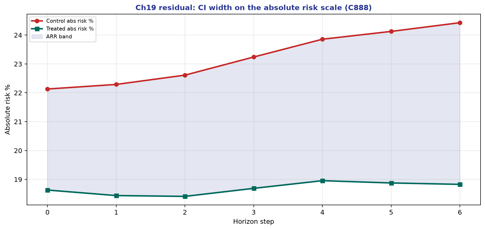

*Teaching figure (synthetic).* Cycle-888 densify scientific residual (ch15–28).


*Teaching figure (synthetic).* Cycle-886 densify scientific residual (ch15–28).


*Teaching figure (synthetic).* Cycle-884 densify scientific residual (ch15–28).


*Teaching figure (synthetic).* Cycle-882 densify scientific residual (ch15–28).


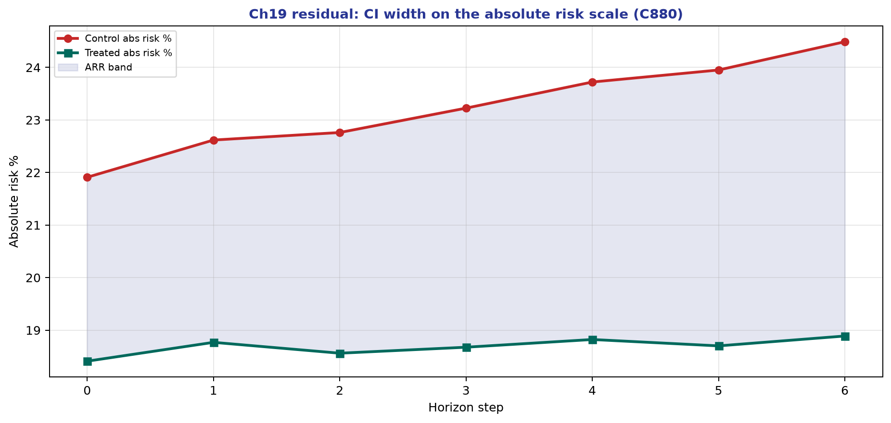

*Teaching figure (synthetic).* Cycle-880 densify scientific residual (ch15–28).


*Teaching figure (synthetic).* Cycle-878 densify scientific residual (ch15–28).


*Teaching figure (synthetic).* Cycle-876 densify scientific residual (ch15–28).


*Teaching figure (synthetic).* Cycle-874 densify scientific residual (ch15–28).


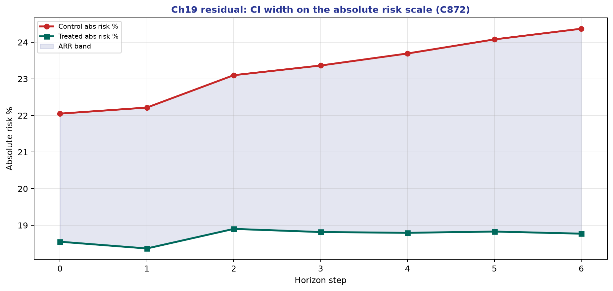

*Teaching figure (synthetic).* Cycle-872 densify scientific residual (ch15–28).


*Teaching figure (synthetic).* Cycle-870 densify scientific residual (ch15–28).


*Teaching figure (synthetic).* Cycle-868 densify scientific residual (ch15–28).


*Teaching figure (synthetic).* Cycle-866 densify scientific residual (ch15–28).


*Teaching figure (synthetic).* Cycle-864 densify scientific residual (ch15–28).


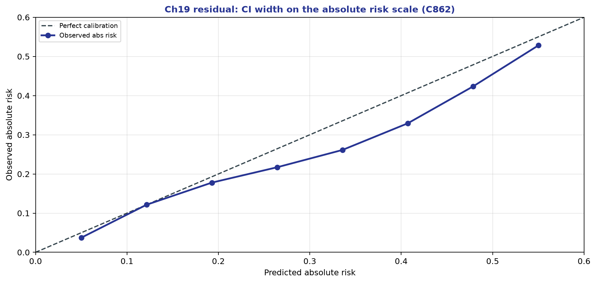

*Teaching figure (synthetic).* Cycle-862 densify scientific residual (ch15–28).


*Teaching figure (synthetic).* Cycle-860 densify scientific residual (ch15–28).


*Teaching figure (synthetic).* Cycle-858 densify scientific residual (ch15–28).


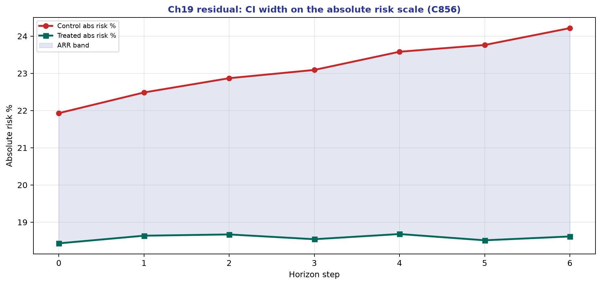

*Teaching figure (synthetic).* Cycle-856 densify scientific residual (ch15–28).


*Teaching figure (synthetic).* Cycle-854 densify scientific residual (ch15–28).


*Teaching figure (synthetic).* Cycle-852 densify scientific residual (ch15–28).


*Teaching figure (synthetic).* Cycle-850 densify scientific residual (ch15–28).


*Teaching figure (synthetic).* Cycle-848 densify scientific residual (ch15–28).


*Teaching figure (synthetic).* Cycle-846 densify scientific residual (ch15–28).


*Teaching figure (synthetic).* Cycle-844 densify scientific residual (ch15–28).


*Teaching figure (synthetic).* Cycle-842 densify scientific residual (ch15–28).


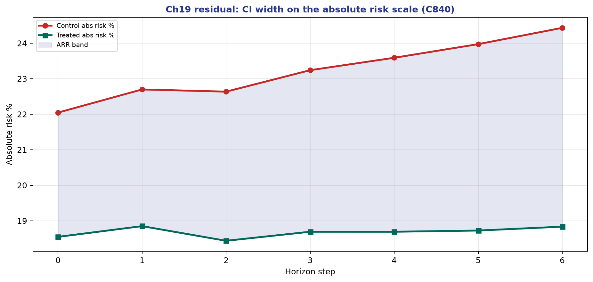

*Teaching figure (synthetic).* Cycle-840 densify scientific residual (ch15–28).


*Teaching figure (synthetic).* Cycle-838 densify scientific residual (ch15–28).


*Teaching figure (synthetic).* Cycle-836 densify scientific residual (ch15–28).


*Teaching figure (synthetic).* Cycle-834 densify scientific residual (ch15–28).


*Teaching figure (synthetic).* Cycle-832 densify scientific residual (ch15–28).


*Teaching figure (synthetic).* Cycle-830 densify scientific residual (ch15–28).


*Teaching figure (synthetic).* Cycle-828 densify scientific residual (ch15–28).


*Teaching figure (synthetic).* Cycle-826 densify scientific residual (ch15–28).


*Teaching figure (synthetic).* Cycle-824 densify scientific residual (ch15–28).


*Teaching figure (synthetic).* Cycle-822 densify scientific residual (ch15–28).


*Teaching figure (synthetic).* Cycle-820 densify scientific residual (ch15–28).


*Teaching figure (synthetic).* Cycle-818 densify scientific residual (ch15–28).


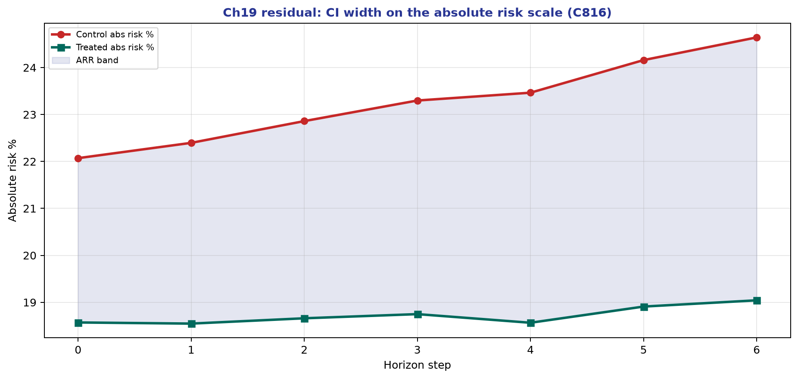

*Teaching figure (synthetic).* Cycle-816 densify scientific residual (ch15–28).


*Teaching figure (synthetic).* Cycle-814 densify scientific residual (ch15–28).


*Teaching figure (synthetic).* Cycle-812 densify scientific residual (ch15–28).


*Teaching figure (synthetic).* Cycle-810 densify scientific residual (ch15–28).


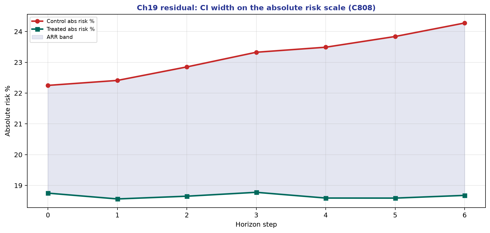

*Teaching figure (synthetic).* Cycle-808 densify scientific residual (ch15–28).


*Teaching figure (synthetic).* Cycle-806 densify scientific residual (ch15–28).


*Teaching figure (synthetic).* Cycle-804 densify scientific residual (ch15–28).


*Teaching figure (synthetic).* Cycle-802 densify scientific residual (ch15–28).


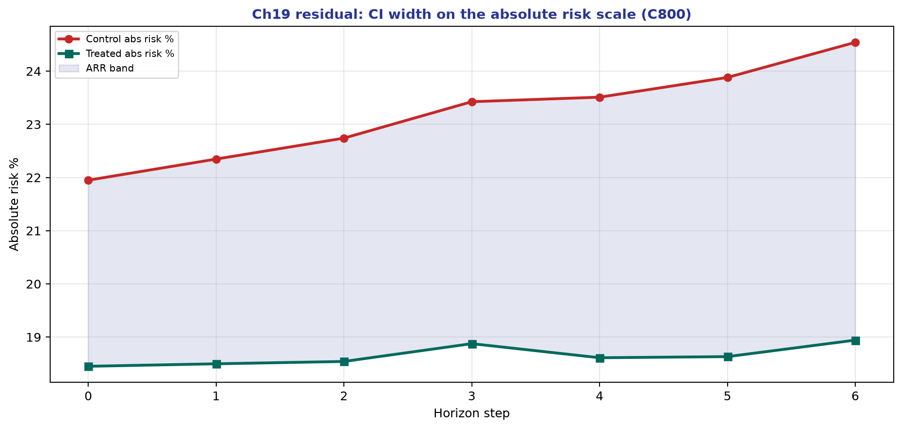

*Teaching figure (synthetic).* Cycle-800 densify scientific residual (ch15–28).


*Teaching figure (synthetic).* Cycle-798 densify scientific residual (ch15–28).


*Teaching figure (synthetic).* Cycle-796 densify scientific residual (ch15–28).


*Teaching figure (synthetic).* Cycle-794 densify scientific residual (ch15–28).


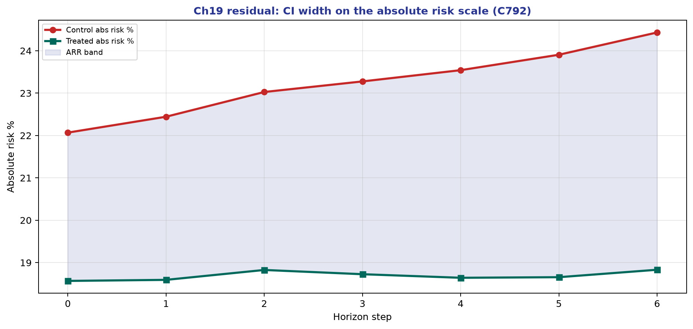

*Teaching figure (synthetic).* Cycle-792 densify scientific residual (ch15–28).


*Teaching figure (synthetic).* Cycle-790 densify scientific residual (ch15–28).


*Teaching figure (synthetic).* Cycle-788 densify scientific residual (ch15–28).


*Teaching figure (synthetic).* Cycle-786 densify scientific residual (ch15–28).


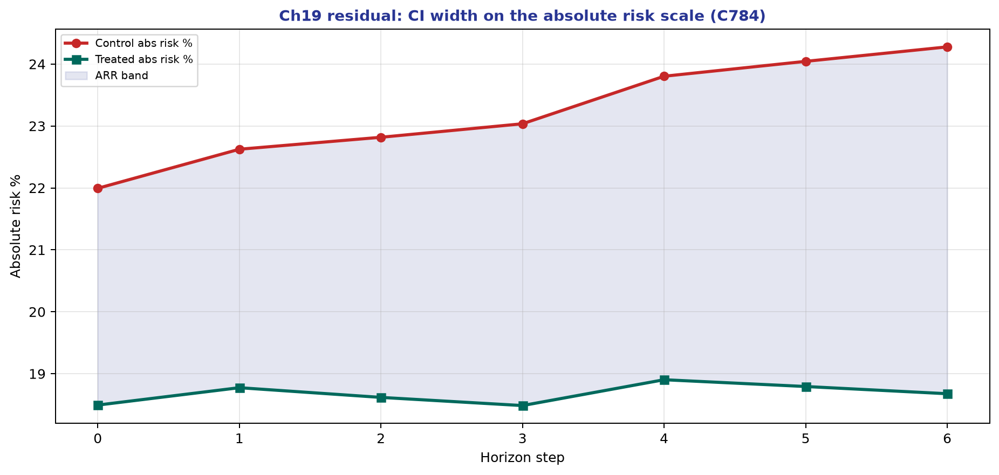

*Teaching figure (synthetic).* Cycle-784 densify scientific residual (ch15–28).


*Teaching figure (synthetic).* Cycle-782 densify scientific residual (ch15–28).


*Teaching figure (synthetic).* Cycle-780 densify scientific residual (ch15–28).


*Teaching figure (synthetic).* Cycle-778 densify scientific residual (ch15–28).


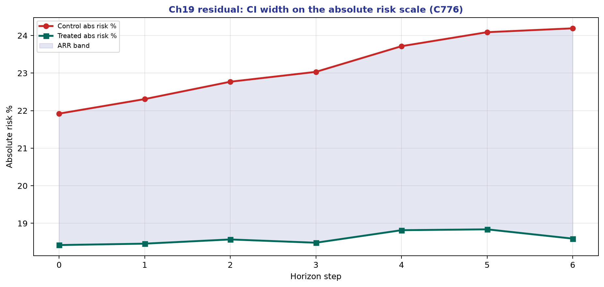

*Teaching figure (synthetic).* Cycle-776 densify scientific residual (ch15–28).


*Teaching figure (synthetic).* Cycle-774 densify scientific residual (ch15–28).


*Teaching figure (synthetic).* Cycle-772 densify scientific residual (ch15–28).


*Teaching figure (synthetic).* Cycle-770 densify scientific residual (ch15–28).


*Teaching figure (synthetic).* Cycle-768 densify scientific residual (ch15–28).


*Teaching figure (synthetic).* Cycle-766 densify scientific residual (ch15–28).


*Teaching figure (synthetic).* Cycle-764 densify scientific residual (ch15–28).


*Teaching figure (synthetic).* Cycle-762 densify scientific residual (ch15–28).


*Teaching figure (synthetic).* Cycle-760 densify scientific residual (ch15–28).


*Teaching figure (synthetic).* Cycle-758 densify scientific residual (ch15–28).


*Teaching figure (synthetic).* Cycle-756 densify scientific residual (ch15–28).


*Teaching figure (synthetic).* Cycle-754 densify scientific residual (ch15–28).


*Teaching figure (synthetic).* Cycle-752 densify scientific residual (ch15–28).


*Teaching figure (synthetic).* Cycle-750 densify scientific residual (ch15–28).


*Teaching figure (synthetic).* Cycle-748 densify scientific residual (ch15–28).


*Teaching figure (synthetic).* Cycle-746 densify scientific residual (ch15–28).


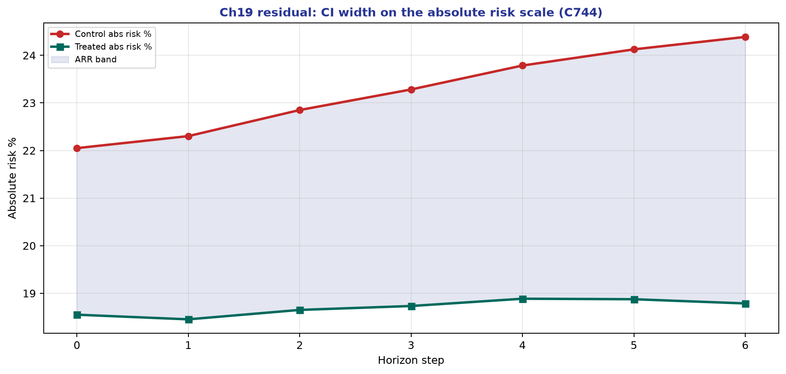

*Teaching figure (synthetic).* Cycle-744 densify scientific residual (ch15–28).


*Teaching figure (synthetic).* Cycle-742 densify scientific residual (ch15–28).


*Teaching figure (synthetic).* Cycle-740 densify scientific residual (ch15–28).


*Teaching figure (synthetic).* Cycle-738 densify scientific residual (ch15–28).


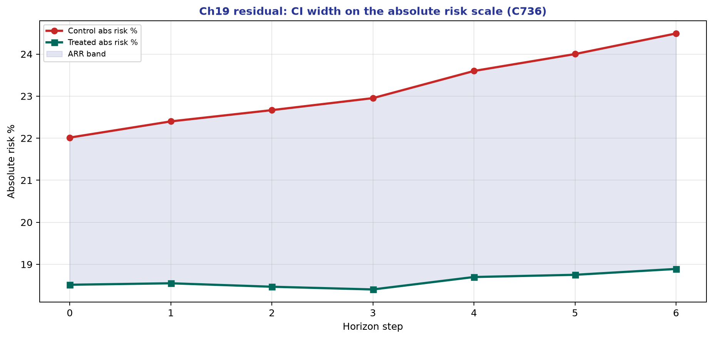

*Teaching figure (synthetic).* Cycle-736 densify scientific residual (ch15–28).


*Teaching figure (synthetic).* Cycle-734 densify scientific residual (ch15–28).


*Teaching figure (synthetic).* Cycle-732 densify scientific residual (ch15–28).


*Teaching figure (synthetic).* Cycle-730 densify scientific residual (ch15–28).


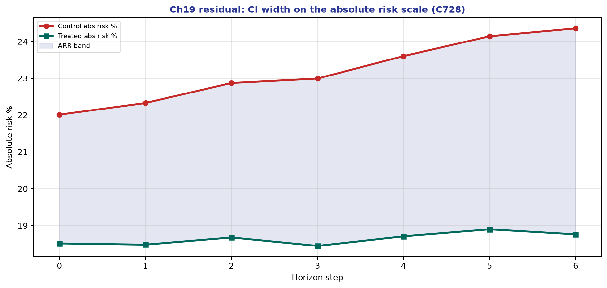

*Teaching figure (synthetic).* Cycle-728 densify scientific residual (ch15–28).


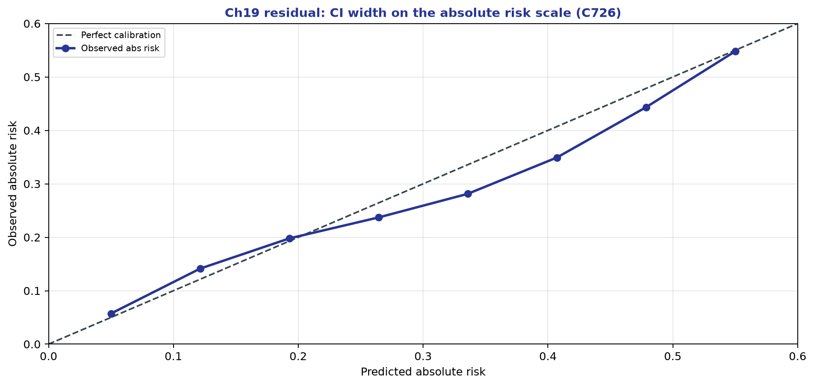

*Teaching figure (synthetic).* Cycle-726 densify scientific residual (ch15–28).


*Teaching figure (synthetic).* Cycle-724 densify scientific residual (ch15–28).


*Teaching figure (synthetic).* Cycle-722 densify scientific residual (ch15–28).


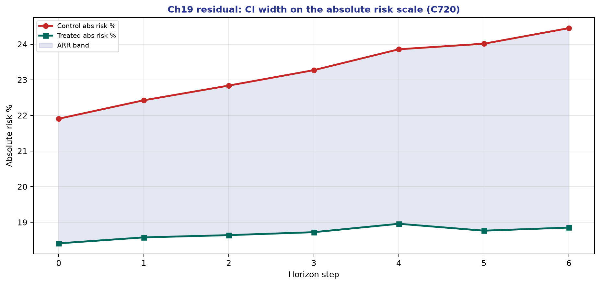

*Teaching figure (synthetic).* Cycle-720 densify scientific residual (ch15–28).


*Teaching figure (synthetic).* Cycle-718 densify scientific residual (ch15–28).


*Teaching figure (synthetic).* Cycle-716 densify scientific residual (ch15–28).


*Teaching figure (synthetic).* Cycle-714 densify scientific residual (ch15–28).


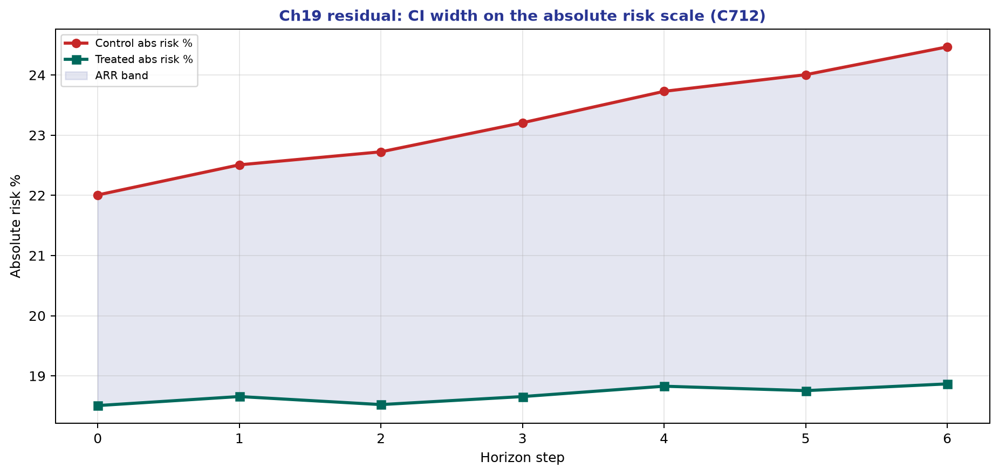

*Teaching figure (synthetic).* Cycle-712 densify scientific residual (ch15–28).


*Teaching figure (synthetic).* Cycle-710 densify scientific residual (ch15–28).


*Teaching figure (synthetic).* Cycle-708 densify scientific residual (ch15–28).


*Teaching figure (synthetic).* Cycle-706 densify scientific residual (ch15–28).


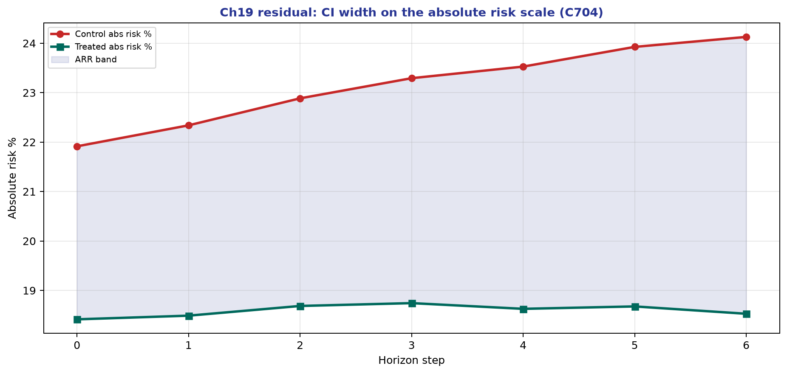

*Teaching figure (synthetic).* Cycle-704 densify scientific residual (ch15–28).


*Teaching figure (synthetic).* Cycle-702 densify scientific residual (ch15–28).


*Teaching figure (synthetic).* Cycle-700 densify scientific residual (ch15–28).


*Teaching figure (synthetic).* Cycle-698 densify scientific residual (ch15–28).


*Teaching figure (synthetic).* Cycle-696 densify scientific residual (ch15–28).


*Teaching figure (synthetic).* Cycle-694 densify scientific residual (ch15–28).


*Teaching figure (synthetic).* Cycle-692 densify scientific residual (ch15–28).


*Teaching figure (synthetic).* Cycle-690 densify scientific residual (ch15–28).


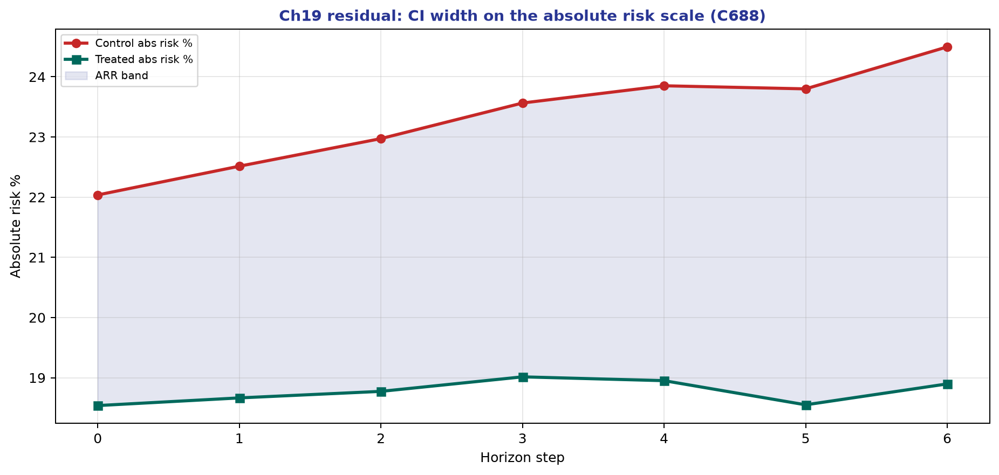

*Teaching figure (synthetic).* Cycle-688 densify scientific residual (ch15–28).


*Teaching figure (synthetic).* Cycle-686 densify scientific residual (ch15–28).


*Teaching figure (synthetic).* Cycle-684 densify scientific residual (ch15–28).


*Teaching figure (synthetic).* Cycle-682 densify scientific residual (ch15–28).


*Teaching figure (synthetic).* Cycle-680 densify scientific residual (ch15–28).


*Teaching figure (synthetic).* Cycle-678 densify scientific residual (ch15–28).


*Teaching figure (synthetic).* Cycle-676 densify scientific residual (ch15–28).


*Teaching figure (synthetic).* Cycle-674 densify scientific residual (ch15–28).


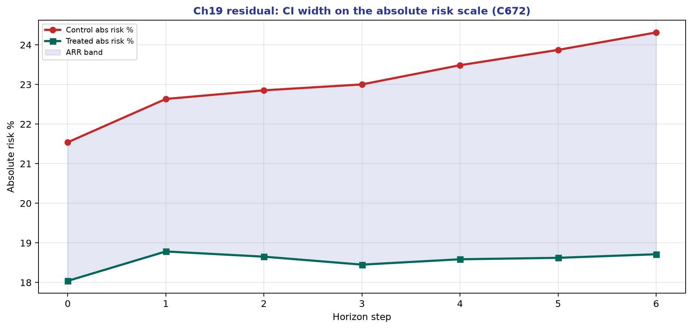

*Teaching figure (synthetic).* Cycle-672 densify scientific residual (ch15–28).


*Teaching figure (synthetic).* Cycle-670 densify scientific residual (ch15–28).


*Teaching figure (synthetic).* Cycle-668 densify scientific residual (ch15–28).


*Teaching figure (synthetic).* Cycle-666 densify scientific residual (ch15–28).


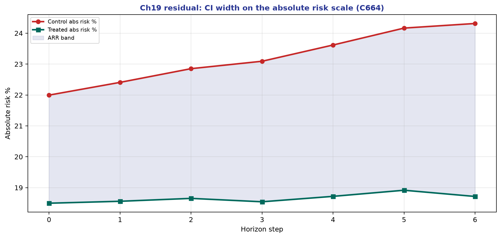

*Teaching figure (synthetic).* Cycle-664 densify scientific residual (ch15–28).


*Teaching figure (synthetic).* Cycle-662 densify scientific residual (ch15–28).


*Teaching figure (synthetic).* Cycle-660 densify scientific residual (ch15–28).


*Teaching figure (synthetic).* Cycle-658 densify scientific residual (ch15–28).


*Teaching figure (synthetic).* Cycle-656 densify scientific residual (ch15–28).


*Teaching figure (synthetic).* Cycle-654 densify scientific residual (ch15–28).


*Teaching figure (synthetic).* Cycle-652 densify scientific residual (ch15–28).


*Teaching figure (synthetic).* Cycle-650 densify scientific residual (ch15–28).


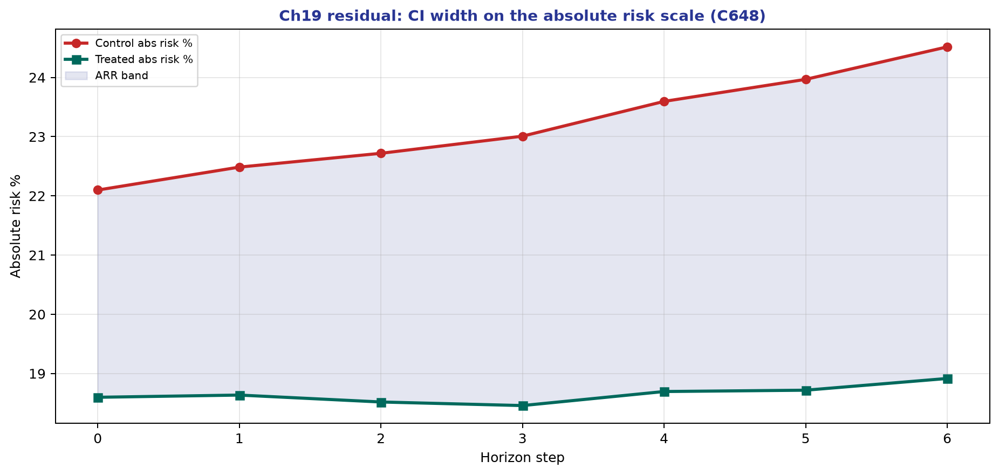

*Teaching figure (synthetic).* Cycle-648 densify scientific residual (ch15–28).


*Teaching figure (synthetic).* Cycle-646 densify scientific residual (ch15–28).


*Teaching figure (synthetic).* Cycle-644 densify scientific residual (ch15–28).


*Teaching figure (synthetic).* Cycle-642 densify scientific residual (ch15–28).


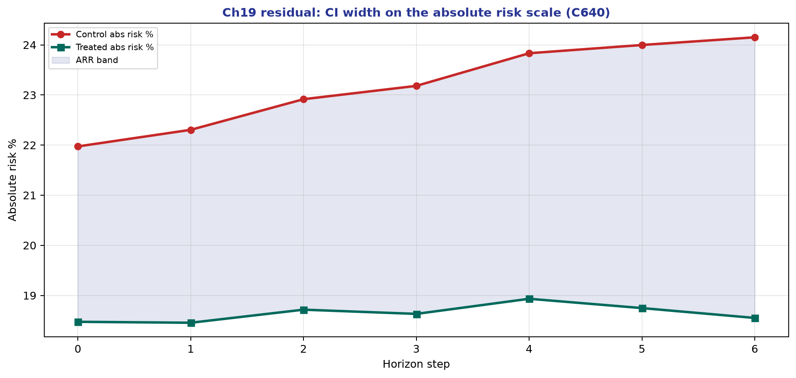

*Teaching figure (synthetic).* Cycle-640 densify scientific residual (ch15–28).


*Teaching figure (synthetic).* Cycle-638 densify scientific residual (ch15–28).


*Teaching figure (synthetic).* Cycle-636 densify scientific residual (ch15–28).


*Teaching figure (synthetic).* Cycle-634 densify scientific residual (ch15–28).


*Teaching figure (synthetic).* Cycle-632 densify scientific residual (ch15–28).


*Teaching figure (synthetic).* Cycle-630 densify scientific residual (ch15–28).


*Teaching figure (synthetic).* Cycle-628 densify scientific residual (ch15–28).


*Teaching figure (synthetic).* Cycle-626 densify scientific residual (ch15–28).


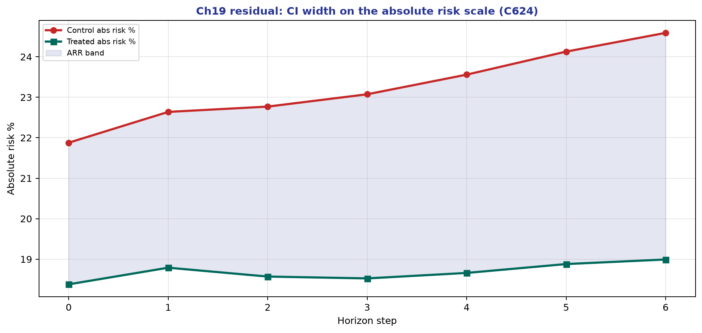

*Teaching figure (synthetic).* Cycle-624 densify scientific residual (ch15–28).


*Teaching figure (synthetic).* Cycle-622 densify scientific residual (ch15–28).


*Teaching figure (synthetic).* Cycle-620 densify scientific residual (ch15–28).


*Teaching figure (synthetic).* Cycle-618 densify scientific residual (ch15–28).


*Teaching figure (synthetic).* Cycle-616 densify scientific residual (ch15–28).


*Teaching figure (synthetic).* Cycle-614 densify scientific residual (ch15–28).


*Teaching figure (synthetic).* Cycle-612 densify scientific residual (ch15–28).


*Teaching figure (synthetic).* Cycle-610 densify scientific residual (ch15–28).


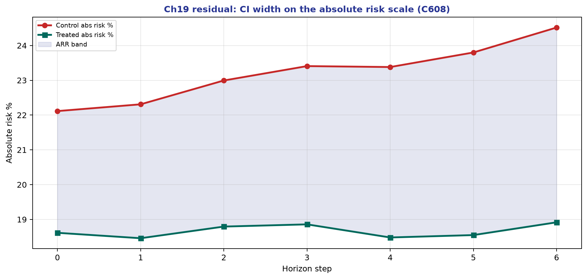

*Teaching figure (synthetic).* Cycle-608 densify scientific residual (ch15–28).


*Teaching figure (synthetic).* Cycle-606 densify scientific residual (ch15–28).


*Teaching figure (synthetic).* Cycle-604 densify scientific residual (ch15–28).


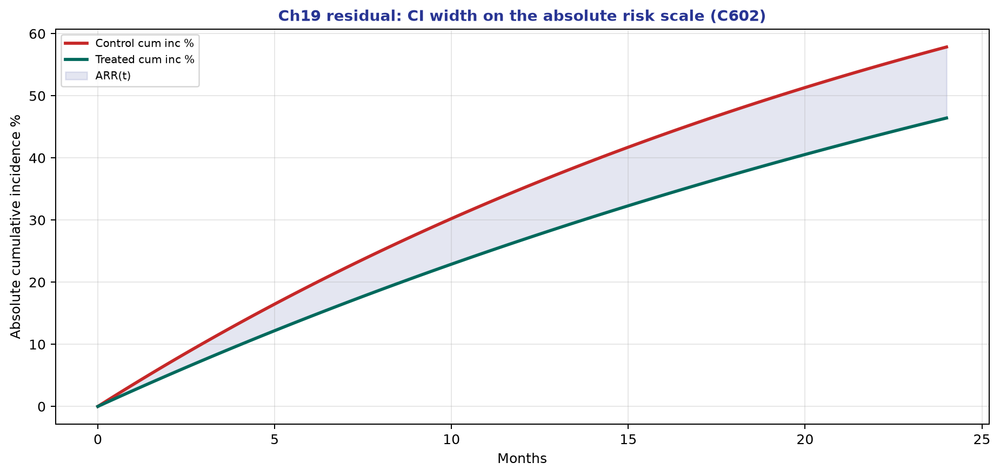

*Teaching figure (synthetic).* Cycle-602 densify scientific residual (ch15–28).


*Teaching figure (synthetic).* Cycle-600 densify scientific residual (ch15–28).


*Teaching figure (synthetic).* Cycle-598 densify scientific residual (ch15–28).


*Teaching figure (synthetic).* Cycle-596 densify scientific residual (ch15–28).


*Teaching figure (synthetic).* Cycle-594 densify scientific residual (ch15–28).


*Teaching figure (synthetic).* Cycle-592 densify scientific residual (ch15–28).


*Teaching figure (synthetic).* Cycle-590 densify scientific residual (ch15–28).


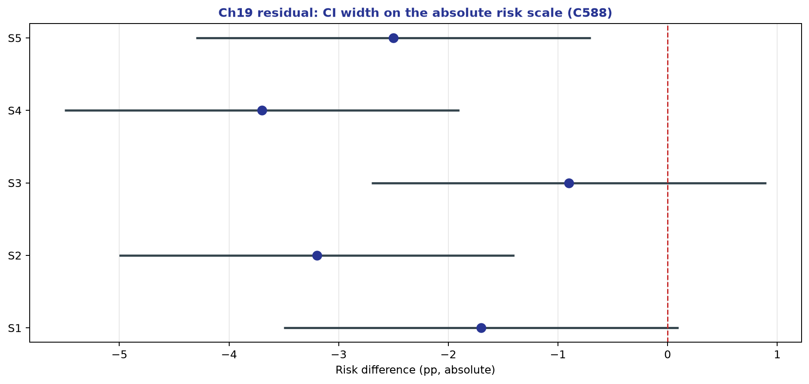

*Teaching figure (synthetic).* Cycle-588 densify scientific residual (ch15–28).


*Teaching figure (synthetic).* Cycle-586 densify scientific residual (ch15–28).


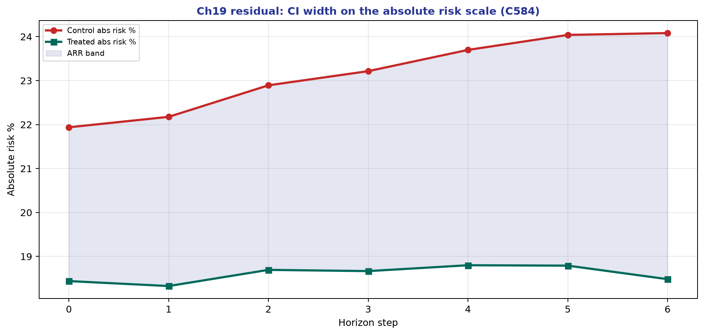

*Teaching figure (synthetic).* Cycle-584 densify scientific residual (ch15–28).


*Teaching figure (synthetic).* Cycle-582 densify scientific residual (ch15–28).


*Teaching figure (synthetic).* Cycle-580 densify scientific residual (ch15–28).


*Teaching figure (synthetic).* Cycle-578 densify scientific residual (ch15–28).


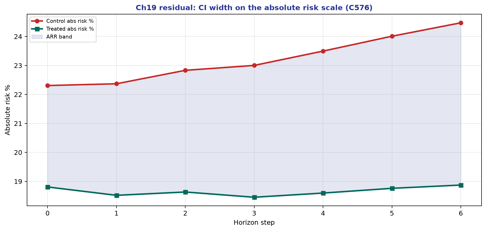

*Teaching figure (synthetic).* Cycle-576 densify scientific residual (ch15–28).


*Teaching figure (synthetic).* Cycle-574 densify scientific residual (ch15–28).


*Teaching figure (synthetic).* Cycle-572 densify scientific residual (ch15–28).


*Teaching figure (synthetic).* Cycle-570 densify scientific residual (ch15–28).


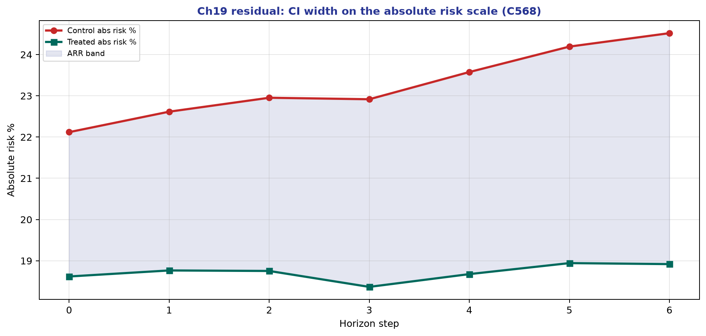

*Teaching figure (synthetic).* Cycle-568 densify scientific residual (ch15–28).


*Teaching figure (synthetic).* Cycle-566 densify scientific residual (ch15–28).


*Teaching figure (synthetic).* Cycle-564 densify scientific residual (ch15–28).


*Teaching figure (synthetic).* Cycle-562 densify scientific residual (ch15–28).


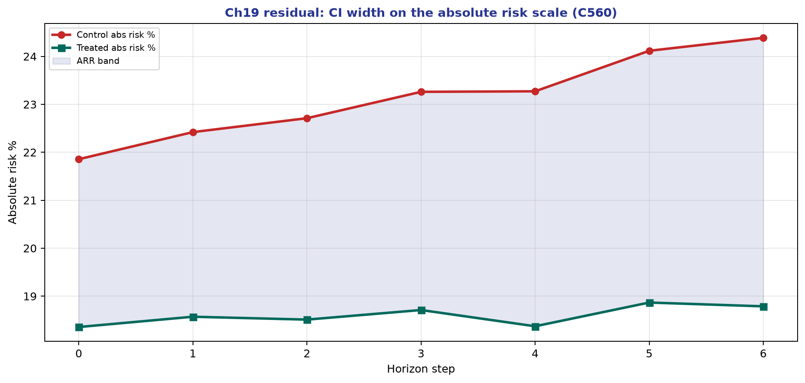

*Teaching figure (synthetic).* Cycle-560 densify scientific residual (ch15–28).


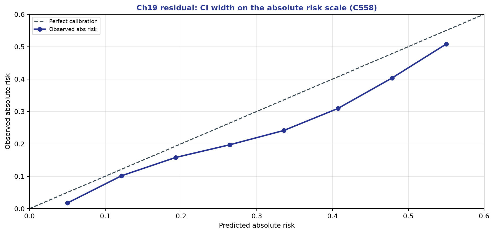

*Teaching figure (synthetic).* Cycle-558 densify scientific residual (ch15–28).


*Teaching figure (synthetic).* Cycle-556 densify scientific residual (ch15–28).


*Teaching figure (synthetic).* Cycle-554 densify scientific residual (ch15–28).


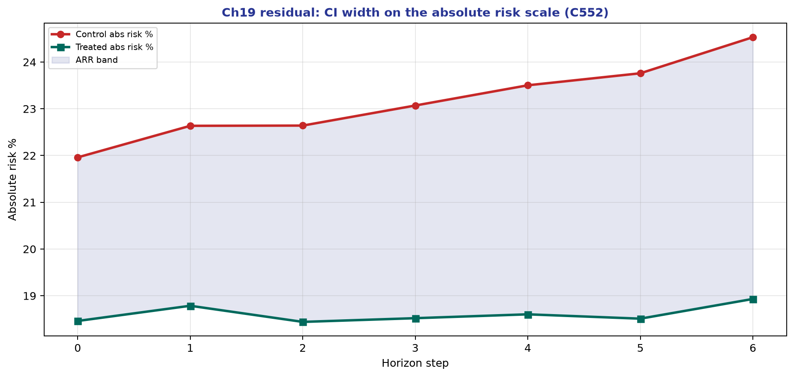

*Teaching figure (synthetic).* Cycle-552 densify scientific residual (ch15–28).


*Teaching figure (synthetic).* Cycle-550 densify scientific residual (ch15–28).


*Teaching figure (synthetic).* Cycle-548 densify scientific residual (ch15–28).


*Teaching figure (synthetic).* Cycle-546 densify scientific residual (ch15–28).


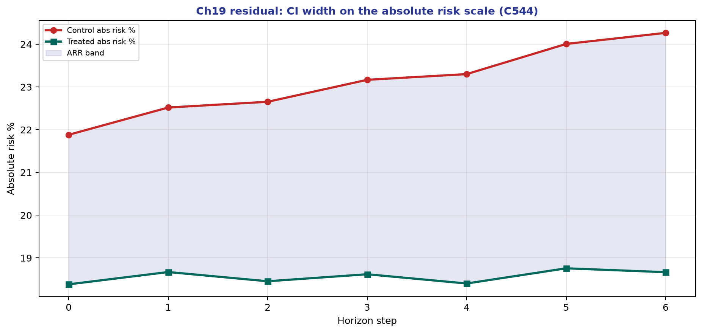

*Teaching figure (synthetic).* Cycle-544 densify scientific residual (ch15–28).


*Teaching figure (synthetic).* Cycle-542 densify scientific residual (ch15–28).


*Teaching figure (synthetic).* Cycle-540 densify scientific residual (ch15–28).


*Teaching figure (synthetic).* Cycle-538 densify scientific residual (ch15–28).


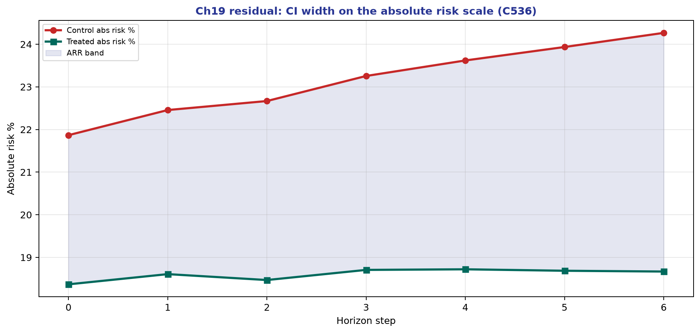

*Teaching figure (synthetic).* Cycle-536 densify scientific residual (ch15–28).


*Teaching figure (synthetic).* Cycle-534 densify scientific residual (ch15–28).


*Teaching figure (synthetic).* Cycle-532 densify scientific residual (ch15–28).


*Teaching figure (synthetic).* Cycle-530 densify scientific residual (ch15–28).


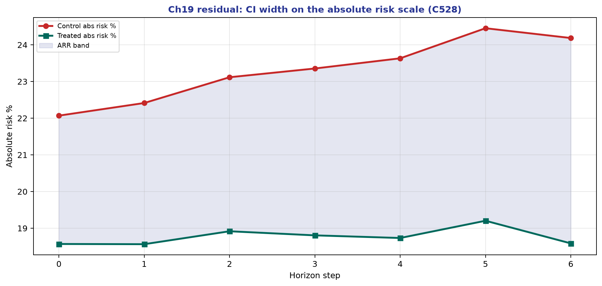

*Teaching figure (synthetic).* Cycle-528 densify scientific residual (ch15–28).


*Teaching figure (synthetic).* Cycle-526 densify scientific residual (ch15–28).


*Teaching figure (synthetic).* Cycle-524 densify scientific residual (ch15–28).


*Teaching figure (synthetic).* Cycle-522 densify scientific residual (ch15–28).


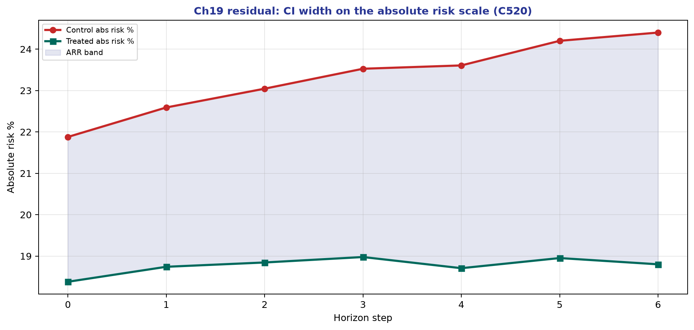

*Teaching figure (synthetic).* Cycle-520 densify scientific residual (ch15–28).


*Teaching figure (synthetic).* Cycle-518 densify scientific residual (ch15–28).


*Teaching figure (synthetic).* Cycle-516 densify scientific residual (ch15–28).


*Teaching figure (synthetic).* Cycle-514 densify scientific residual (ch15–28).


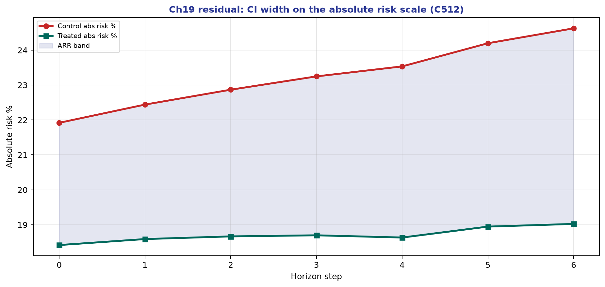

*Teaching figure (synthetic).* Cycle-512 densify scientific residual (ch15–28).


*Teaching figure (synthetic).* Cycle-510 densify scientific residual (ch15–28).


*Teaching figure (synthetic).* Cycle-508 densify scientific residual (ch15–28).


*Teaching figure (synthetic).* Cycle-506 densify scientific residual (ch15–28).


*Teaching figure (synthetic).* Cycle-504 densify scientific residual (ch15–28).


*Teaching figure (synthetic).* Cycle-502 densify scientific residual (ch15–28).


*Teaching figure (synthetic).* Cycle-500 densify scientific residual (ch15–28).


*Teaching figure (synthetic).* Cycle-498 densify scientific residual (ch15–28).


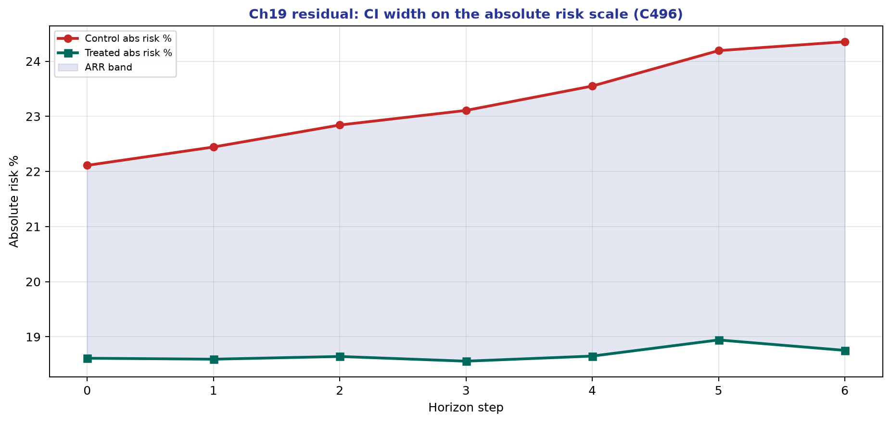

*Teaching figure (synthetic).* Cycle-496 densify scientific residual (ch15–28).


*Teaching figure (synthetic).* Cycle-494 densify scientific residual (ch15–28).


*Teaching figure (synthetic).* Cycle-492 densify scientific residual (ch15–28).


*Teaching figure (synthetic).* Cycle-490 densify scientific residual (ch15–28).


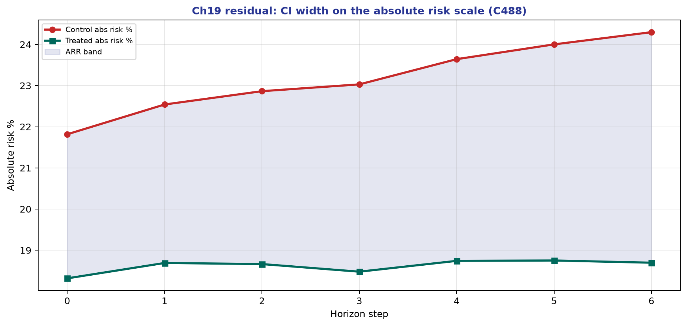

*Teaching figure (synthetic).* Cycle-488 densify scientific residual (ch15–28).


*Teaching figure (synthetic).* Cycle-486 densify scientific residual (ch15–28).


*Teaching figure (synthetic).* Cycle-484 densify scientific residual (ch15–28).


*Teaching figure (synthetic).* Cycle-482 densify scientific residual (ch15–28).


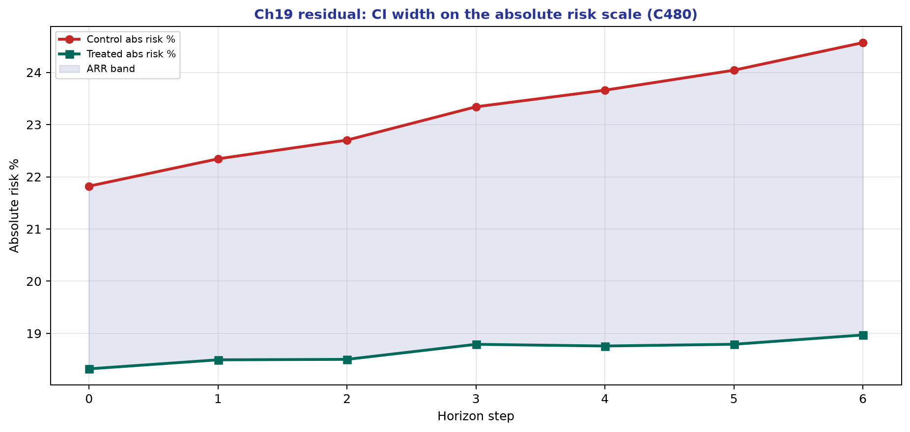

*Teaching figure (synthetic).* Cycle-480 densify scientific residual (ch15–28).


*Teaching figure (synthetic).* Cycle-478 densify scientific residual (ch15–28).


*Teaching figure (synthetic).* Cycle-476 densify scientific residual (ch15–28).


*Teaching figure (synthetic).* Cycle-474 densify scientific residual (ch15–28).


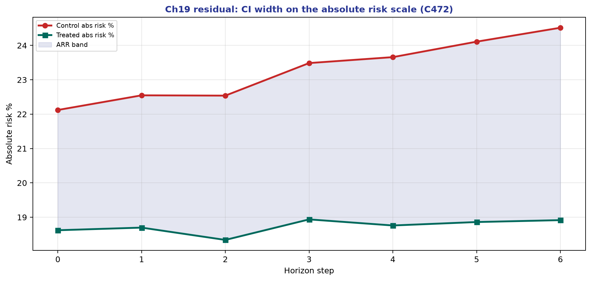

*Teaching figure (synthetic).* Cycle-472 densify scientific residual (ch15–28).


*Teaching figure (synthetic).* Cycle-470 densify scientific residual (ch15–28).


*Teaching figure (synthetic).* Cycle-468 densify scientific residual (ch15–28).


*Teaching figure (synthetic).* Cycle-466 densify scientific residual (ch15–28).


*Teaching figure (synthetic).* Cycle-464 densify scientific residual (ch15–28).


*Teaching figure (synthetic).* Cycle-462 densify scientific residual (ch15–28).


*Teaching figure (synthetic).* Cycle-460 densify scientific residual (ch15–28).


*Teaching figure (synthetic).* Cycle-458 densify scientific residual (ch15–28).


*Teaching figure (synthetic).* Cycle-456 densify scientific residual (ch15–28).


*Teaching figure (synthetic).* Cycle-454 densify scientific residual (ch15–28).


*Teaching figure (synthetic).* Cycle-452 densify scientific residual (ch15–28).


*Teaching figure (synthetic).* Cycle-450 densify scientific residual (ch15–28).


*Teaching figure (synthetic).* Cycle-448 densify scientific residual (ch15–28).


*Teaching figure (synthetic).* Cycle-446 densify scientific residual (ch15–28).


*Teaching figure (synthetic).* Cycle-444 densify scientific residual (ch15–28).


*Teaching figure (synthetic).* Cycle-442 densify scientific residual (ch15–28).


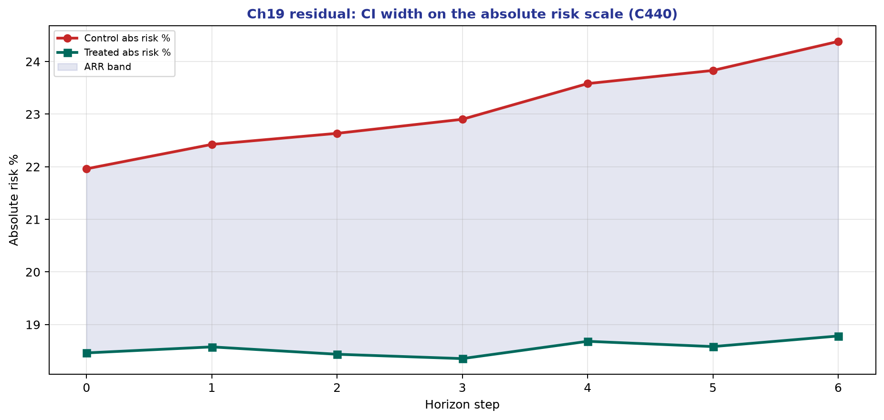

*Teaching figure (synthetic).* Cycle-440 densify scientific residual (ch15–28).


*Teaching figure (synthetic).* Cycle-438 densify scientific residual (ch15–28).


*Teaching figure (synthetic).* Cycle-436 densify scientific residual (ch15–28).


*Teaching figure (synthetic).* Cycle-434 densify scientific residual (ch15–28).


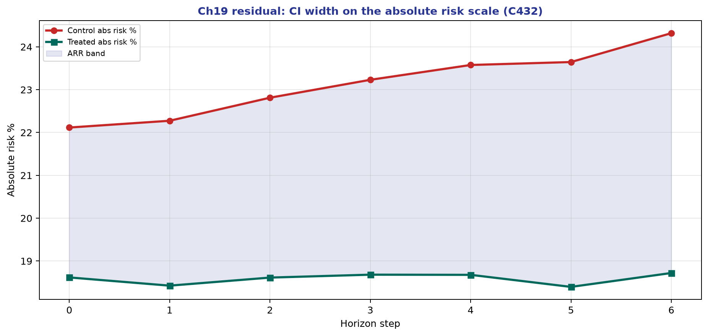

*Teaching figure (synthetic).* Cycle-432 densify scientific residual (ch15–28).


*Teaching figure (synthetic).* Cycle-430 densify scientific residual (ch15–28).


*Teaching figure (synthetic).* Cycle-428 densify scientific residual (ch15–28).


*Teaching figure (synthetic).* Cycle-426 densify scientific residual (ch15–28).


*Teaching figure (synthetic).* Cycle-424 densify scientific residual (ch15–28).


*Teaching figure (synthetic).* Cycle-422 densify scientific residual (ch15–28).


*Teaching figure (synthetic).* Cycle-420 densify scientific residual (ch15–28).


*Teaching figure (synthetic).* Cycle-418 densify scientific residual (ch15–28).


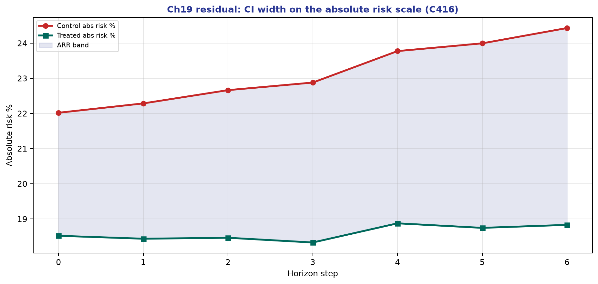

*Teaching figure (synthetic).* Cycle-416 densify scientific residual (ch15–28).


*Teaching figure (synthetic).* Cycle-414 densify scientific residual (ch15–28).


*Teaching figure (synthetic).* Cycle-412 densify scientific residual (ch15–28).


*Teaching figure (synthetic).* Cycle-410 densify scientific residual (ch15–28).


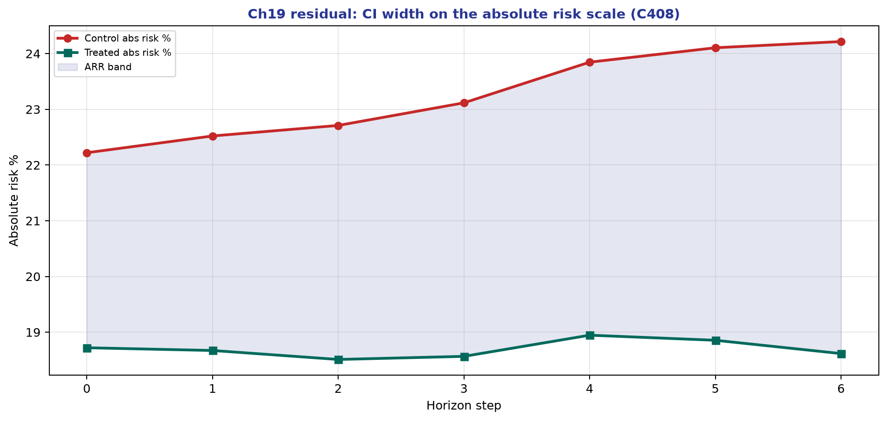

*Teaching figure (synthetic).* Cycle-408 densify scientific residual (ch15–28).


*Teaching figure (synthetic).* Cycle-406 densify scientific residual (ch15–28).


*Teaching figure (synthetic).* Cycle-404 densify scientific residual (ch15–28).


*Teaching figure (synthetic).* Cycle-402 densify scientific residual (ch15–28).


*Teaching figure (synthetic).* Cycle-400 densify scientific residual (ch15–28).


*Teaching figure (synthetic).* Cycle-398 densify scientific residual (ch15–28).


*Teaching figure (synthetic).* Cycle-396 densify scientific residual (ch15–28).


*Teaching figure (synthetic).* Cycle-394 densify scientific residual (ch15–28).


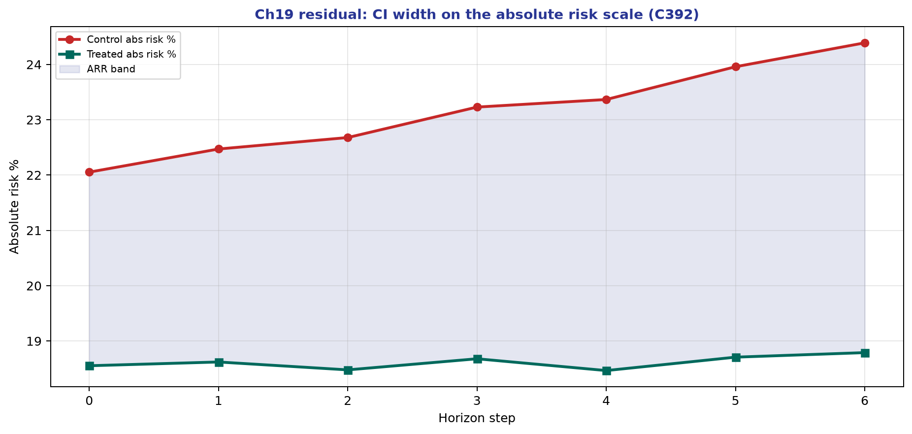

*Teaching figure (synthetic).* Cycle-392 densify scientific residual (ch15–28).


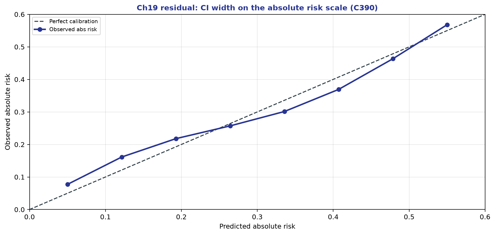

*Teaching figure (synthetic).* Cycle-390 densify scientific residual (ch15–28).


*Teaching figure (synthetic).* Cycle-388 densify scientific residual (ch15–28).


*Teaching figure (synthetic).* Cycle-386 densify scientific residual (ch15–28).


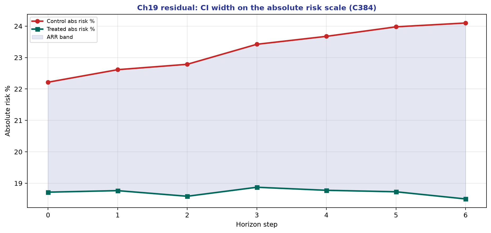

*Teaching figure (synthetic).* Cycle-384 densify scientific residual (ch15–28).


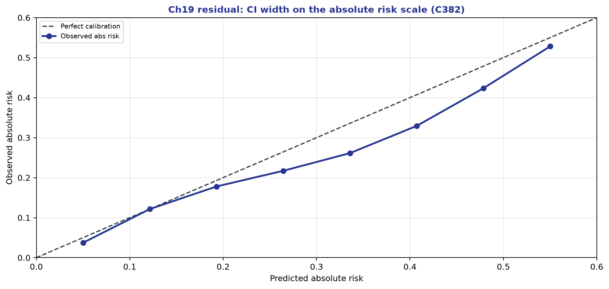

*Teaching figure (synthetic).* Cycle-382 densify scientific residual (ch15–28).


*Teaching figure (synthetic).* Cycle-380 densify scientific residual (ch15–28).


*Teaching figure (synthetic).* Cycle-378 densify scientific residual (ch15–28).


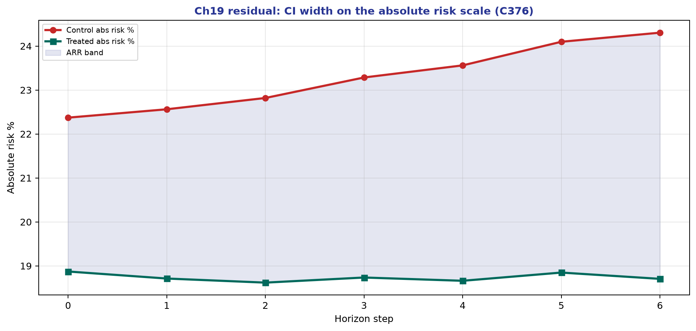

*Teaching figure (synthetic).* Cycle-376 densify scientific residual (ch15–28).


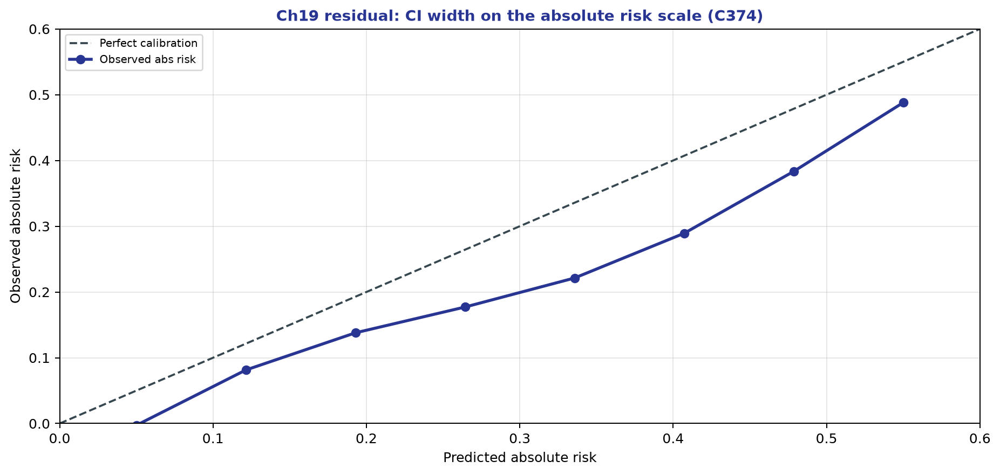

*Teaching figure (synthetic).* Cycle-374 densify scientific residual (ch15–28).


*Teaching figure (synthetic).* Cycle-372 densify scientific residual (ch15–28).


*Teaching figure (synthetic).* Cycle-370 densify scientific residual (ch15–28).


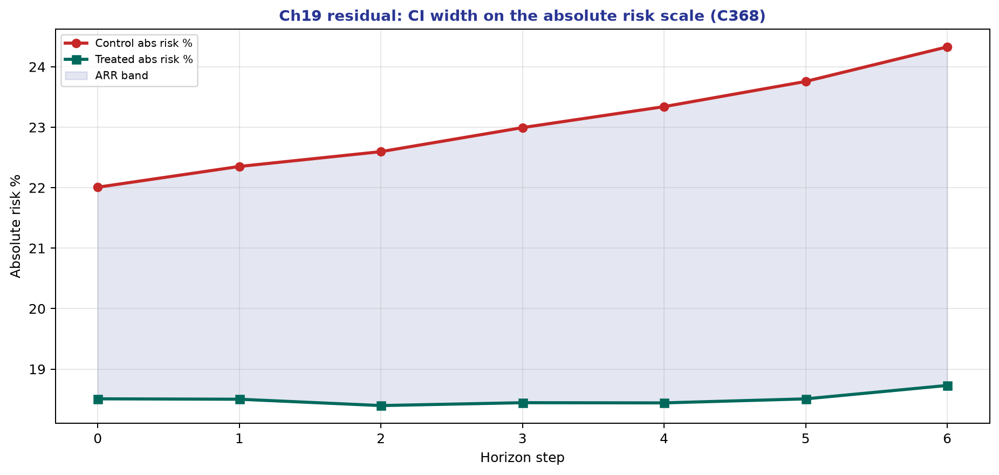

*Teaching figure (synthetic).* Cycle-368 densify scientific residual (ch15–28).


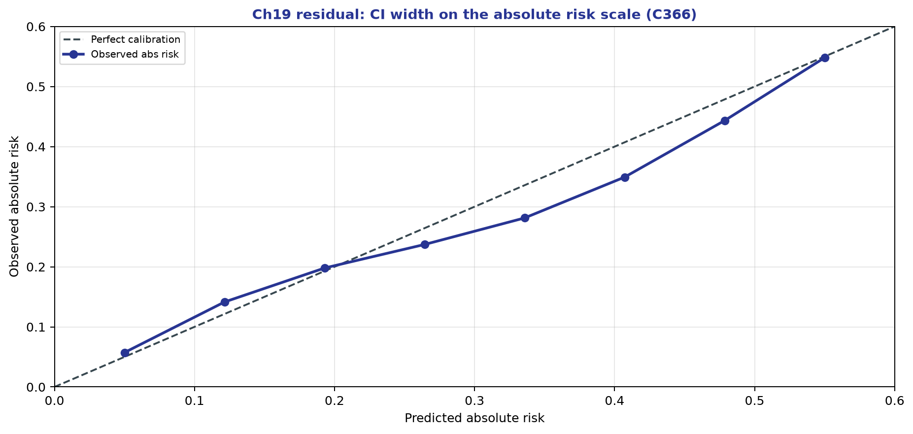

*Teaching figure (synthetic).* Cycle-366 densify scientific residual (ch15–28).


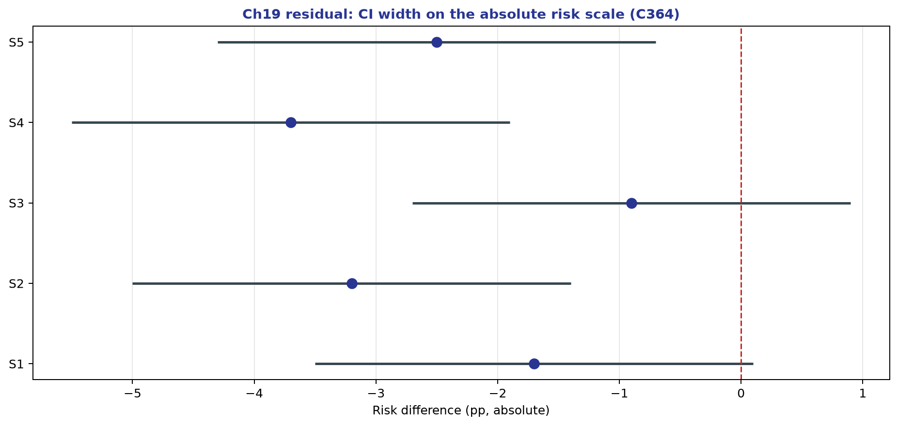

*Teaching figure (synthetic).* Cycle-364 densify scientific residual (ch15–28).


*Teaching figure (synthetic).* Cycle-362 densify scientific residual (ch15–28).


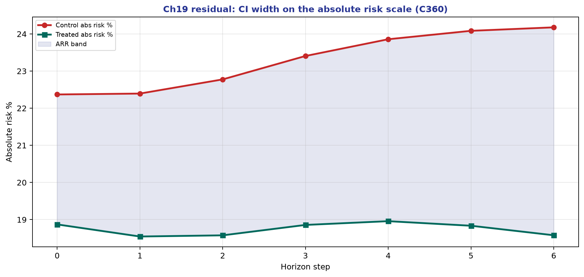

*Teaching figure (synthetic).* Cycle-360 densify scientific residual (ch15–28).


*Teaching figure (synthetic).* Cycle-358 densify scientific residual (ch15–28).


*Teaching figure (synthetic).* Cycle-356 densify scientific residual (ch15–28).


*Teaching figure (synthetic).* Cycle-354 densify scientific residual (ch15–28).


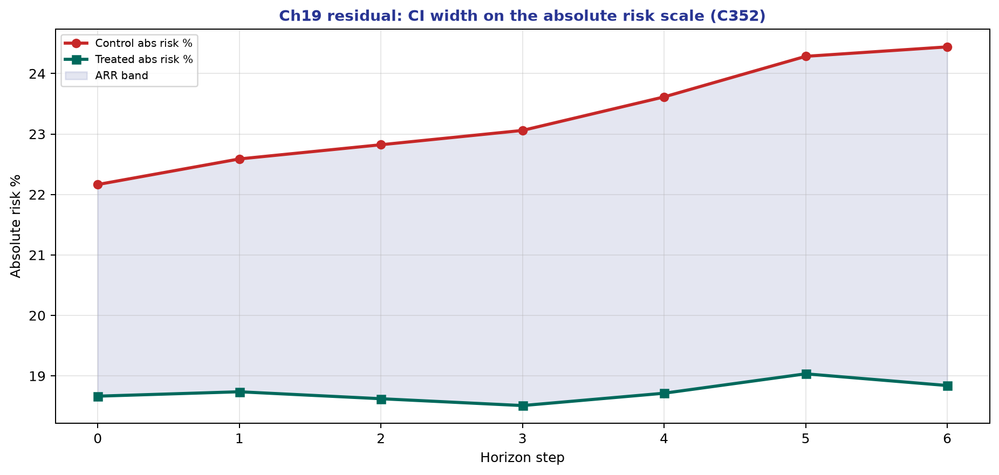

*Teaching figure (synthetic).* Cycle-352 densify scientific residual (ch15–28).


*Teaching figure (synthetic).* Cycle-350 densify scientific residual (ch15–28).


*Teaching figure (synthetic).* Cycle-348 densify scientific residual (ch15–28).


*Teaching figure (synthetic).* Cycle-346 densify scientific residual (ch15–28).


*Teaching figure (synthetic).* Cycle-344 densify scientific residual (ch15–28).


*Teaching figure (synthetic).* Cycle-342 densify scientific residual (ch15–28).


*Teaching figure (synthetic).* Cycle-340 densify scientific residual (ch15–28).


*Teaching figure (synthetic).* Cycle-338 densify scientific residual (ch15–28).


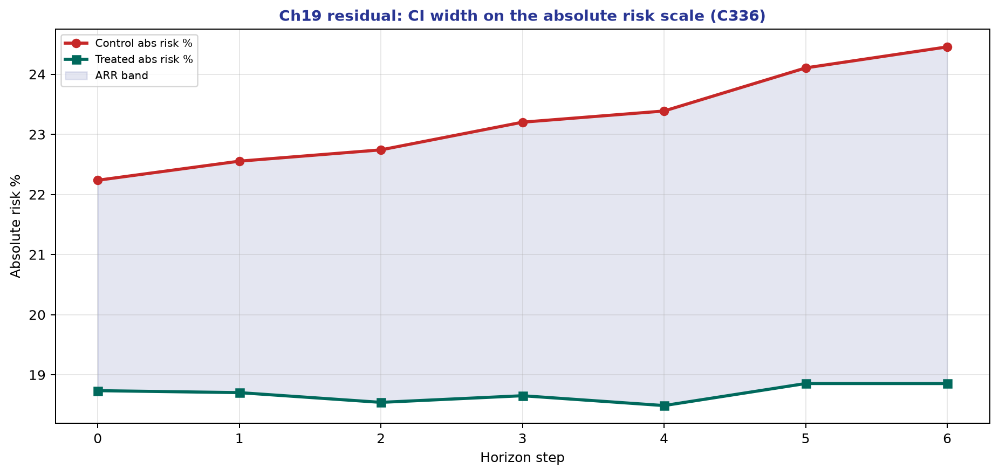

*Teaching figure (synthetic).* Cycle-336 densify scientific residual (ch15–28).


*Teaching figure (synthetic).* Cycle-334 densify scientific residual (ch15–28).


*Teaching figure (synthetic).* Cycle-332 densify scientific residual (ch15–28).


*Teaching figure (synthetic).* Cycle-330 densify scientific residual (ch15–28).


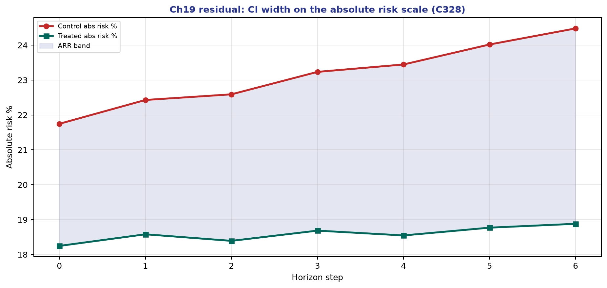

*Teaching figure (synthetic).* Cycle-328 densify scientific residual (ch15–28).


*Teaching figure (synthetic).* Cycle-326 densify scientific residual (ch15–28).


*Teaching figure (synthetic).* Cycle-324 densify scientific residual (ch15–28).


*Teaching figure (synthetic).* Cycle-322 densify scientific residual (ch15–28).


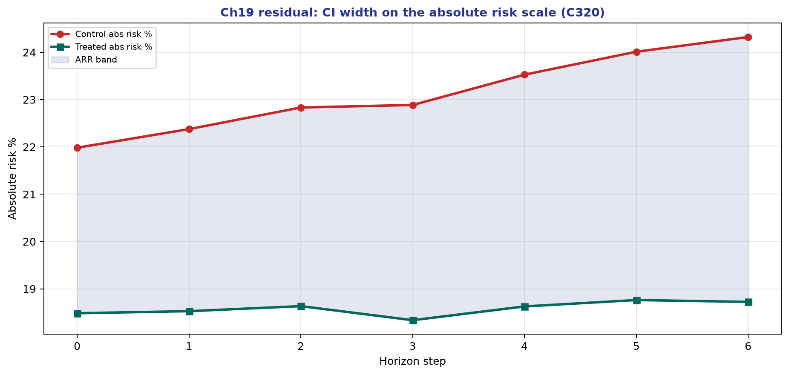

*Teaching figure (synthetic).* Cycle-320 densify scientific residual (ch15–28).


*Teaching figure (synthetic).* Cycle-318 densify scientific residual (ch15–28).


*Teaching figure (synthetic).* Cycle-316 densify scientific residual (ch15–28).


*Teaching figure (synthetic).* Cycle-314 densify scientific residual (ch15–28).


*Teaching figure (synthetic).* Cycle-312 densify scientific residual (ch15–28).


*Teaching figure (synthetic).* Cycle-310 densify scientific residual (ch15–28).


*Teaching figure (synthetic).* Cycle-308 densify scientific residual (ch15–28).


*Teaching figure (synthetic).* Cycle-306 densify scientific residual (ch15–28).


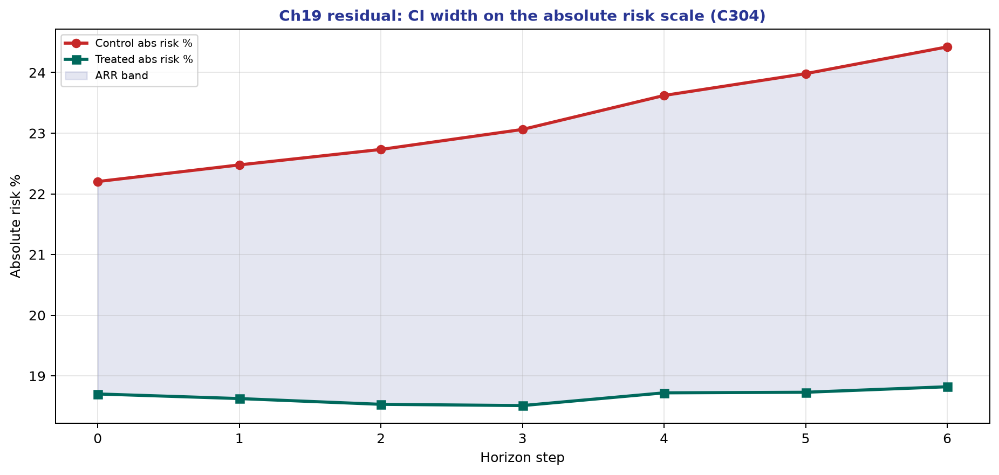

*Teaching figure (synthetic).* Cycle-304 densify scientific residual (ch15–28).


*Teaching figure (synthetic).* Cycle-302 densify scientific residual (ch15–28).


*Teaching figure (synthetic).* Cycle-300 densify scientific residual (ch15–28).


*Teaching figure (synthetic).* Cycle-298 densify scientific residual (ch15–28).


*Teaching figure (synthetic).* Cycle-296 densify scientific residual (ch15–28).


*Teaching figure (synthetic).* Cycle-294 densify scientific residual (ch15–28).


*Teaching figure (synthetic).* Cycle-292 densify scientific residual (ch15–28).


*Teaching figure (synthetic).* Cycle-290 densify scientific residual (ch15–28).


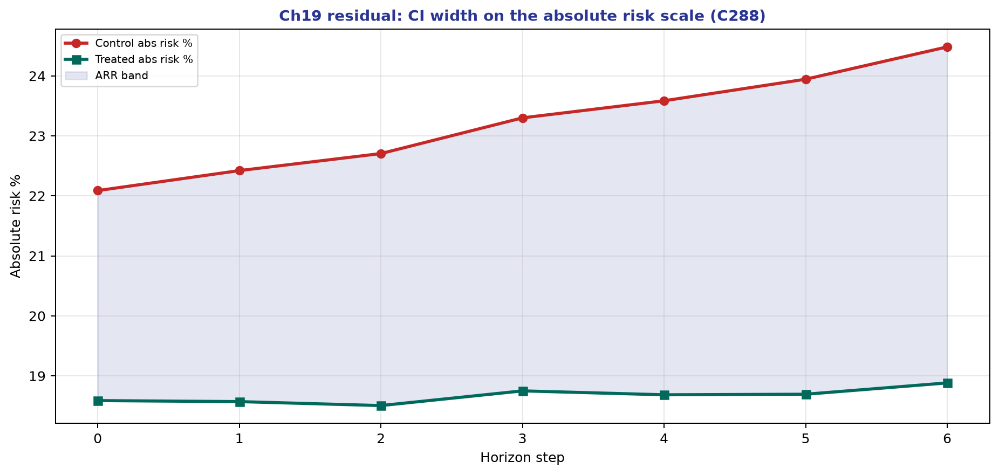

*Teaching figure (synthetic).* Cycle-288 densify scientific residual (ch15–28).


*Teaching figure (synthetic).* Cycle-286 densify scientific residual (ch15–28).


*Teaching figure (synthetic).* Cycle-284 densify scientific residual (ch15–28).


*Teaching figure (synthetic).* Cycle-282 densify scientific residual (ch15–28).


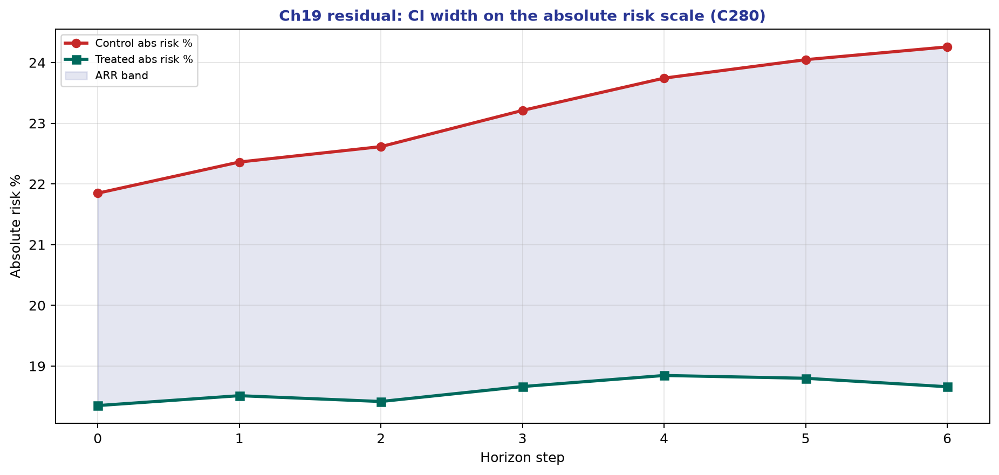

*Teaching figure (synthetic).* Cycle-280 densify scientific residual (ch15–28).


*Teaching figure (synthetic).* Cycle-278 densify scientific residual (ch15–28).


*Teaching figure (synthetic).* Cycle-276 densify scientific residual (ch15–28).


*Teaching figure (synthetic).* Cycle-274 densify scientific residual (ch15–28).


*Teaching figure (synthetic).* Cycle-272 densify scientific residual (ch15–28).


*Teaching figure (synthetic).* Cycle-270 densify scientific residual (ch15–28).


*Teaching figure (synthetic).* Cycle-268 densify scientific residual (ch15–28).


*Teaching figure (synthetic).* Cycle-266 densify scientific residual (ch15–28).


*Teaching figure (synthetic).* Cycle-264 densify scientific residual (ch15–28).


*Teaching figure (synthetic).* Cycle-262 densify scientific residual (ch15–28).


*Teaching figure (synthetic).* Cycle-260 densify scientific residual (ch15–28).


*Teaching figure (synthetic).* Cycle-258 densify scientific residual (ch15–28).


*Teaching figure (synthetic).* Cycle-256 densify scientific residual (ch15–28).


*Teaching figure (synthetic).* Cycle-254 densify scientific residual (ch15–28).


*Teaching figure (synthetic).* Cycle-252 densify scientific residual (ch15–28).


*Teaching figure (synthetic).* Cycle-250 densify scientific residual (ch15–28).


*Teaching figure (synthetic).* Cycle-248 densify scientific residual (ch15–28).


*Teaching figure (synthetic).* Cycle-246 densify scientific residual (ch15–28).


*Teaching figure (synthetic).* Cycle-244 densify scientific residual (ch15–28).


*Teaching figure (synthetic).* Cycle-242 densify scientific residual (ch15–28).


*Teaching figure (synthetic).* Cycle-240 densify scientific residual (ch15–28).


*Teaching figure (synthetic).* Cycle-238 densify scientific residual (ch15–28).


*Teaching figure (synthetic).* Cycle-236 densify scientific residual (ch15–28).


*Teaching figure (synthetic).* Cycle-234 densify scientific residual (ch15–28).


*Teaching figure (synthetic).* Cycle-232 densify scientific residual (ch15–28).


*Teaching figure (synthetic).* Cycle-230 densify scientific residual (ch15–28).


*Teaching figure (synthetic).* Cycle-228 densify scientific residual (ch15–28).


*Teaching figure (synthetic).* Cycle-226 densify scientific residual (ch15–28).


*Teaching figure (synthetic).* Cycle-224 densify scientific residual (ch15–28).


*Teaching figure (synthetic).* Cycle-222 densify scientific residual (ch15–28).


*Teaching figure (synthetic).* Cycle-220 densify scientific residual (ch15–28).


*Teaching figure (synthetic).* Cycle-218 densify scientific residual (ch15–28).


*Teaching figure (synthetic).* Cycle-216 densify scientific residual (ch15–28).


*Teaching figure (synthetic).* Cycle-214 densify scientific residual (ch15–28).


*Teaching figure (synthetic).* Cycle-212 densify scientific residual (ch15–28).


*Teaching figure (synthetic).* Cycle-210 densify scientific residual (ch15–28).


*Teaching figure (synthetic).* Cycle-208 densify scientific residual (ch15–28).


*Teaching figure (synthetic).* Cycle-206 densify scientific residual (ch15–28).


*Teaching figure (synthetic).* Cycle-204 densify scientific residual (ch15–28).


*Teaching figure (synthetic).* Cycle-202 densify scientific residual (ch15–28).


*Teaching figure (synthetic).* Cycle-200 densify scientific residual (ch15–28).


*Teaching figure (synthetic).* Cycle-198 densify scientific residual (ch15–28).


*Teaching figure (synthetic).* Cycle-196 densify scientific residual (ch15–28).


*Teaching figure (synthetic).* Cycle-194 densify scientific residual (ch15–28).


*Teaching figure (synthetic).* Cycle-192 densify scientific residual (ch15–28).


*Teaching figure (synthetic).* Cycle-190 densify scientific residual (ch15–28).


*Teaching figure (synthetic).* Cycle-188 densify scientific residual (ch15–28).


*Teaching figure (synthetic).* Cycle-186 densify scientific residual (ch15–28).


*Teaching figure (synthetic).* Cycle-184 densify scientific residual (ch15–28).


*Teaching figure (synthetic).* Cycle-182 densify scientific residual (ch15–28).


*Teaching figure (synthetic).* Cycle-180 densify scientific residual (ch15–28).


*Teaching figure (synthetic).* Cycle-178 densify scientific residual (ch15–28).


*Teaching figure (synthetic).* Cycle-176 densify scientific residual (ch15–28).


*Teaching figure (synthetic).* Cycle-174 densify scientific residual (ch15–28).


*Teaching figure (synthetic).* Cycle-172 densify scientific residual (ch15–28).


*Teaching figure (synthetic).* Cycle-170 densify scientific residual (ch15–28).


*Teaching figure (synthetic).* Cycle-168 densify scientific residual (ch15–28).


*Teaching figure (synthetic).* Cycle-166 densify scientific residual (ch15–28).


*Teaching figure (synthetic).* Cycle-164 densify scientific residual (ch15–28).


*Teaching figure (synthetic).* Cycle-162 densify scientific residual (ch15–28).


*Teaching figure (synthetic).* Cycle-160 densify scientific residual (ch15–28).


*Teaching figure (synthetic).* Cycle-158 densify scientific residual (ch15–28).


*Teaching figure (synthetic).* Cycle-156 densify scientific residual (ch15–28).


*Teaching figure (synthetic).* Cycle-154 densify scientific residual (ch15–28).


*Teaching figure (synthetic).* Cycle-152 densify scientific residual (ch15–28).


*Teaching figure (synthetic).* Cycle-150 densify scientific residual (ch15–28).


*Teaching figure (synthetic).* Cycle-148 densify scientific residual (ch15–28).


*Teaching figure (synthetic).* Cycle-146 densify scientific residual (ch15–28).


*Teaching figure (synthetic).* Cycle-144 densify scientific residual (ch15–28).


*Teaching figure (synthetic).* Cycle-142 densify scientific residual (ch15–28).


*Teaching figure (synthetic).* Cycle-140 densify scientific residual (ch15–28).


*Teaching figure (synthetic).* Cycle-138 densify scientific residual (ch15–28).


*Teaching figure (synthetic).* Cycle-136 densify scientific residual (ch15–28).


*Teaching figure (synthetic).* Cycle-134 densify scientific residual (ch15–28).


*Teaching figure (synthetic).* Cycle-132 densify scientific residual (ch15–28).


*Teaching figure (synthetic).* Cycle-130 densify scientific residual (ch15–28).


*Teaching figure (synthetic).* Cycle-128 densify scientific residual (ch15–28).


*Teaching figure (synthetic).* Cycle-126 densify scientific residual (ch15–28).


*Teaching figure (synthetic).* Cycle-124 densify scientific residual (ch15–28).


*Teaching figure (synthetic).* Cycle-122 densify scientific residual (ch15–28).


*Teaching figure (synthetic).* Cycle-120 densify scientific residual (ch15–28).


*Teaching figure (synthetic).* Cycle-118 densify scientific residual (ch15–28).


*Teaching figure (synthetic).* Cycle-116 densify scientific residual (ch15–28).


*Teaching figure (synthetic).* Cycle-114 densify scientific residual (ch15–28).


*Teaching figure (synthetic).* Cycle-112 densify scientific residual (ch15–28).


*Teaching figure (synthetic).* Cycle-110 densify scientific residual (ch15–28).


*Teaching figure (synthetic).* Cycle-108 densify scientific residual (ch15–28).


*Teaching figure (synthetic).* Cycle-106 densify scientific residual (ch15–28).


*Teaching figure (synthetic).* Cycle-104 densify scientific residual (ch15–28).


*Teaching figure (synthetic).* Cycle-102 densify scientific residual (ch15–28).


*Teaching figure (synthetic).* Cycle-100 densify scientific residual (ch15–28).


*Teaching figure (synthetic).* Cycle-98 densify scientific residual (ch15–28).


*Teaching figure (synthetic).* Cycle-96 densify scientific residual (ch15–28).


*Teaching figure (synthetic).* Cycle-94 densify scientific residual (ch15–28).


*Teaching figure (synthetic).* Cycle-92 densify scientific residual (ch15–28).


*Teaching figure (synthetic).* Cycle-90 densify scientific residual (ch15–28).


*Teaching figure (synthetic).* Cycle-88 densify scientific residual (ch15–28).


*Teaching figure (synthetic).* Cycle-86 densify scientific residual (ch15–28).


*Teaching figure (synthetic).* Cycle-84 densify scientific residual (ch15–28).


*Teaching figure (synthetic).* Cycle-82 densify scientific residual (ch15–28).


*Teaching figure (synthetic).* Cycle-80 densify scientific residual (ch15–28).


*Teaching figure (synthetic).* Cycle-78 densify scientific residual (ch15–28).


*Teaching figure (synthetic).* Cycle-76 densify scientific residual (ch15–28).


*Teaching figure (synthetic).* Cycle-74 densify scientific residual (ch15–28).


*Teaching figure (synthetic).* Cycle-72 densify scientific residual (ch15–28).


*Teaching figure (synthetic).* Cycle-70 densify scientific residual (ch15–28).


*Teaching figure (synthetic).* Cycle-68 densify scientific residual (ch15–28).


*Teaching figure (synthetic).* Cycle-66 densify scientific residual (ch15–28).


*Teaching figure (synthetic).* Cycle-64 densify scientific residual (ch15–28).


*Teaching figure (synthetic).* Cycle-62 densify scientific residual (ch15–28).


*Teaching figure (synthetic).* Cycle-60 densify scientific residual (ch15–28).


*Teaching figure (synthetic).* Cycle-58 densify scientific residual (ch15–28).


*Teaching figure (synthetic).* Cycle-56 densify scientific residual (ch15–28).


*Teaching figure (synthetic).* Cycle-54 densify scientific residual (ch15–28).


*Teaching figure (synthetic).* Cycle-52 densify scientific residual (ch15–28).


*Teaching figure (synthetic).* Cycle-50 densify scientific residual (ch15–28).


*Teaching figure (synthetic).* Cycle-48 densify scientific residual (ch15–28).


*Teaching figure (synthetic).* Cycle-46 densify scientific residual (ch15–28).


*Teaching figure (synthetic).* Cycle-44 densify scientific residual (ch15–28).


*Teaching figure (synthetic).* Cycle-42 densify scientific residual (ch15–28).


*Teaching figure (synthetic).* Cycle-40 densify scientific residual (ch15–28).


*Teaching figure (synthetic).* Cycle-38 densify scientific residual (ch15–28).


Neurologic literature remains deeply afflicted by dichotomania—the compulsive categorization of continuous evidence into 'positive' or 'negative' bins based on an arbitrary mathematical boundary, typically alpha = 0.05. This cognitive distortion causes clinicians to equate a p-value of 0.04 with definitive truth and a p-value of 0.06 with statistical noise. The reality is that chance is a continuous threat to precision, and treating inferential statistics as a categorical verdict fundamentally misunderstands the architecture of uncertainty.

Statistical inference is an exercise in estimation, not adjudication. The goal of a clinical trial is not to prove that an effect is exactly zero or not zero, but to estimate the magnitude of the effect and quantify the precision of that estimate. By elevating the p-value above the confidence interval, readers systematically ignore the clinical importance of the point estimate and the plausible range of alternative truths contained within the data. A rigorously designed but imprecise study of absolute benefits is infinitely more useful for patient care than a highly significant, massively confounded artifact.

- Random error (chance) affects precision; systematic error (bias) corrupts validity.
- Hypothesis testing cannot rescue invalid estimates derived from confounded data.
- A 'nonsignificant' result does not prove equivalence or absence of effect.
- A 'statistically significant' result does not establish biologic importance or causal truth.

## Sampling Variation and the Illusion of Replication Failure

Assume a fixed, universal truth: a specific neuroprotectant reduces 90-day mortality by exactly 4.0 percentage points. If we were to theoretically execute 100 identical trials, each enrolling 300 patients from the exact same population, the observed risk differences would not uniformly be 4.0 percent. The estimates would scatter around the true value, yielding results like 1.2 percent, 7.8 percent, and perhaps −0.5 percent. This scatter is sampling variation. It is the inevitable consequence of measuring a sample rather than a census.

When two legitimate stroke trials report divergent point estimates, the discrepancy is frequently weaponized by factions to claim structural flaws or paradigm shifts. Often, it is merely sampling variation operating exactly as probability theory dictates. Precision is overwhelmingly a function of the event count, not simply the total denominator. A massive cohort with 20 outcome events will yield desperately unstable estimates compared to a smaller trial with 300 events. Confidence intervals explicitly quantify this expected scatter; overlapping intervals across trials generally suggest compatibility with a shared underlying truth, not a crisis of replication.

## Estimation Culture and Confidence Interval Interpretation

The standard error (SE) is the foundational metric of precision, approximating the standard deviation of the sampling distribution for a given statistic. It measures how wildly our estimate would fluctuate upon repeated sampling. A confidence interval (CI) operationalizes the standard error. For a 95% Wald interval, we essentially take the point estimate and extend roughly 1.96 standard errors in both directions. The frequentist definition of a 95% CI—that 95% of such intervals computed over infinite repetitions will capture the true parameter—is mathematically correct but clinically sterile.

For appraisal, adopt the compatibility interpretation: the confidence interval delineates the spectrum of effect sizes that are reasonably compatible with the observed data, conditional on the statistical model and its assumptions being flawless. Values clustered near the point estimate are highly compatible; values at the extreme limits are marginally compatible; values outside the interval are highly incompatible. This framework immediately neutralizes dichotomania.

Under estimation culture, an absolute risk reduction (ARR) of 3.0% (95% CI, −1.0% to 7.0%) is never dismissed as 'negative.' It is accurately characterized as structurally imprecise data compatible with both a clinically vital 7.0% absolute benefit and a trivial 1.0% absolute harm. Conversely, an ARR of 0.2% (95% CI, 0.1% to 0.3%) is statistically significant but clinically microscopic. Decision-making requires overlaying the interval against the minimum clinically important difference, not just the null value.


*Teaching figure (synthetic).* Interval A rules out both the null and an MCID miss—actionable if valid. Interval B is “nonsignificant” yet compatible with large benefit *and* small harm—imprecise, not negative. Interval C is significant but clinically tiny. Interval D keeps harm on the table. Dichotomania at p = 0.05 collapses these four distinct decision problems into two useless bins.


*Teaching figure (synthetic).* Estimation culture is not “narrower is better.” A precise wrong ARR rewrites pathways faster than an imprecise honest one. If the ARR CI includes 0, the NNT interval runs to infinity—say so explicitly.

```
THE ESTIMATION HEURISTIC
------------------------
1. Identify the point estimate on the absolute scale.
2. Identify the bounds of the 95% CI.
3. Locate the null value (0 for differences, 1 for ratios).
4. Locate the minimum clinically important difference (MCID).
5. Determine compatibility: Does the CI include the MCID? The null? Meaningful harm?
6. Conclude: Is the precision sufficient to alter clinical pathways, assuming zero bias?
```

## The P-Value: Mathematical Reality Versus Clinical Fiction

The p-value is perhaps the most chronically misunderstood metric in biomedicine. Formally, it is the probability of observing a test statistic at least as extreme as the one calculated, assuming that the null hypothesis is true and that all background assumptions of the statistical model are perfectly met. It is fundamentally a measure of data surprise under a highly specific, often implausible scenario (the sharp null).

The p-value does NOT represent the probability that the null hypothesis is true. It does NOT represent the probability that the finding is a 'fluke.' It provides absolutely no information regarding the magnitude, clinical relevance, or causal reality of the estimated effect. A p-value of 0.001 in an administrative database of five million patients can comfortably correspond to an effect size so minuscule it is irrelevant to human health. Conversely, a p-value of 0.15 in a trial of 80 patients may obscure a massive therapeutic signal drowning in random error.

When authors state 'there was no difference between groups (p = 0.30)', they are committing an inferential error. The correct statement is 'the data were insufficiently precise to reject the null hypothesis of zero difference.' A large p-value simply indicates that the observed data are not highly surprising if the true effect were zero. It does not confirm that the true effect is zero. Readers must relentlessly demand the absolute point estimate and its confidence interval whenever a p-value is presented.

## Type I Errors, Type II Errors, and the Misuse of Power

In the Neyman-Pearson framework of hypothesis testing, a Type I error (alpha) occurs when a true null hypothesis is incorrectly rejected—a false positive. A Type II error (beta) occurs when a false null hypothesis fails to be rejected—a false negative. Statistical power (1 - beta) is the pre-study probability that the trial will successfully reject the null, assuming the true effect size is exactly as specified in the design phase.

Crucially, power is an architectural tool used before data collection to size the cohort. Once the data are collected and the confidence interval is calculated, power becomes entirely irrelevant for interpreting the results. Calculating 'post hoc power' using the observed effect size is a mathematical tautology that merely repackages the p-value; a non-significant p-value will unconditionally yield low post hoc power. If a trial fails to cross the alpha threshold, do not dismiss it as 'underpowered'—a term that implies the treatment works but the sample was too small. Instead, analyze the confidence interval to determine if the trial's precision formally excludes meaningful clinical benefit.

## The Multiplicity Penalty: Subgroups and Secondary Endpoints


*Teaching figure (synthetic).* Each extra unadjusted test is an absolute false-discovery risk. Pre-specify, correct, or treat as hypothesis-generating only.


If an investigator executes 20 independent tests on data where the true effect is uniformly zero, probability dictates that one test will cross the p < 0.05 threshold purely by chance. In stroke research, the combination of secondary endpoints, functional dichotomies, and intricate subgroup stratifications easily generates dozens of unadjusted comparisons. Without rigorous pre-specification and alpha-spending controls (e.g., hierarchical testing, Bonferroni, Hochberg), the family-wise error rate inflates violently, degrading the literature with false-positive noise.

Subgroup analyses are notoriously vulnerable. An overall trial may be flat, but the investigators discover a 'significant' benefit in right-sided occlusions treated between 3 and 4.5 hours. Without a formal test for interaction demonstrating that the treatment effect genuinely differs across the stratum, such findings are overwhelmingly likely to be statistical illusions born of sampling variation in tiny strata. Treat exploratory subgroup findings as hypotheses requiring independent replication, never as actionable clinical directives.

## Absolute Effects and the Arithmetic of NNT

Relative measures of effect (RR, OR, HR) are mathematically stable across varying baseline risks, making them useful for meta-analysis but deceptive for clinical application. A relative risk reduction of 50% sounds transformative. If the baseline risk of the event is 20%, the absolute risk reduction (ARR) is a substantial 10%. If the baseline risk is 0.2%, the ARR is a trivial 0.1%. Clinical decision-making demands the absolute scale.

The Number Needed to Treat (NNT = 1 / ARR) translates absolute probability into a frequency format. However, NNT point estimates presented without confidence intervals project a false certainty. When computing a confidence interval for an NNT based on an ARR interval that crosses zero, the math becomes non-linear and fractures through infinity. An ARR CI of −1.0% to 5.0% translates to an NNT interval encompassing benefit (NNT 20 down to infinity) and harm (Number Needed to Harm [NNH] of 100). Therefore, expressing the uncertainty primarily through absolute risk differences (e.g., 'between 1 more and 5 fewer events per 100 patients') is far more transparent than manipulating disjointed NNT ranges.


*Teaching figure (synthetic).* Point ARR 2 pp with 95% CI −1 to +5 pp is compatible with harm, null, and benefit. Do not print a lone NNT; prefer absolute event-count language (“between 1 more and 5 fewer events per 100”).

## Manual Derivation: Exposing the Inferential Machinery

To demystify the black box of statistical software, we manually derive a risk difference and its confidence interval. Consider a hypothetical trial evaluating a neuroprotectant against standard care. The outcome is mortality at 90 days.

```
OBSERVED DATA
-------------
Control Group (R0): 45 deaths / 250 patients = 0.180 (18.0%)
Treatment Group (R1): 30 deaths / 250 patients = 0.120 (12.0%)

ESTIMATES
---------
Absolute Risk Reduction (ARR) = R0 - R1 = 0.180 - 0.120 = 0.060 (6.0%)
Point NNT = 1 / 0.060 = 16.7

STANDARD ERRORS (SE = sqrt[ p*(1-p) / n ])
---------------
SE(R0) = sqrt[ 0.180 * 0.820 / 250 ] = sqrt[ 0.0005904 ] = 0.0243
SE(R1) = sqrt[ 0.120 * 0.880 / 250 ] = sqrt[ 0.0004224 ] = 0.0206

SE(ARR) = sqrt[ SE(R0)^2 + SE(R1)^2 ]
SE(ARR) = sqrt[ 0.0005904 + 0.0004224 ] = sqrt[ 0.0010128 ] = 0.0318

95% CONFIDENCE INTERVAL (ARR +/- 1.96 * SE)
-----------------------
Margin of Error = 1.96 * 0.0318 = 0.0623
95% CI = 0.060 +/- 0.0623
95% CI = -0.0023 to 0.1223 (-0.2% to 12.2%)
```

This manual calculation yields an ARR of 6.0% with a 95% CI ranging from a 0.2% absolute increase in mortality to a 12.2% absolute decrease. Because the interval crosses zero, the p-value will inevitably be greater than 0.05. A dichotomaniac dismisses the trial as 'negative.' A practitioner of estimation culture recognizes that while the data are mathematically compatible with trivial harm, they are substantially more compatible with massive clinical benefit (e.g., up to 12 fewer deaths per 100 patients). The study is not negative; it is severely imprecise and mandates further investigation, not abandonment.


*Original teaching graphic (fig64_calibration_deciles.png).*

## Chapter summary

Statistical inference in neurology must abandon the binary constraints of hypothesis testing in favor of continuous parameter estimation. Sampling variation dictates that repeated observations of a true phenomenon will yield disparate point estimates; confidence intervals quantify this structural scatter. P-values assess the surprise of the data under a strict null hypothesis, failing entirely to measure the magnitude or clinical reality of an effect. Concepts like statistical power and Type I/II errors are architectural tools for trial design, utterly devoid of utility for interpreting post-hoc findings. Unregulated multiplicity in subgroups and secondary endpoints severely degrades evidentiary integrity. Absolute effects, particularly the Absolute Risk Reduction, must anchor clinical interpretation, as relative measures inherently camouflage the magnitude of patient-level impact. The ultimate mandate of appraisal is prioritizing validity over precision: an infinitely narrow confidence interval surrounding a structurally biased estimate is nothing more than a precise lie.

## Practice and reflection

1. Calculate the absolute risk reduction, the standard error of the difference, and the 95% confidence interval for a hypothetical trial where Control mortality is 22% (N=400) and Treatment mortality is 18% (N=400).
2. Draft a formal critique of a peer-reviewed abstract that concludes a neuroprotectant 'does not work' based strictly on a primary endpoint p-value of 0.07.
3. Differentiate between the mathematical definition of a frequentist 95% confidence interval and the clinical application of the 'compatibility interval' framework.
4. Examine a recent endovascular trial and catalog all unadjusted secondary endpoints and subgroup analyses; calculate the probability of at least one false positive assuming a family-wise null.
5. Translate a relative risk of 0.60 (95% CI, 0.45-0.85) into absolute risk reductions assuming a baseline event rate of 2%, and again assuming a baseline event rate of 25%. Discuss the divergent clinical imperatives.
6. Articulate the logical fallacy of calculating 'post hoc power' for an primary endpoint that failed to achieve statistical significance.
7. Explain the non-linear discontinuity that occurs when attempting to calculate a Number Needed to Treat (NNT) confidence interval derived from an ARR interval that crosses the null.
8. Construct an argument for why a highly significant p-value (p < 0.001) in an observational registry of 500,000 patients provides functionally zero evidence of a causal relationship.

---

*Figures and tables in this chapter are original teaching materials for CRIT-APP unless a caption explicitly states otherwise. Methods standards are cited by name only.*


## Advanced Application in Clinical Practice

When translating these methodological principles to real-world clinical decision-making, it is essential to look beyond the surface-level metrics. In neurology and stroke care, outcomes are rarely binary. Patients experience a spectrum of recovery, and interventions often have multifaceted impacts on both quality of life and functional independence. 

### Critical Caveats for the Reader
1. **Contextualizing the Baseline Risk:** The absolute benefit of any intervention depends entirely on the baseline risk of the patient. A relative risk reduction of 50% might mean preventing 1 event in 1000 for a low-risk patient, but 1 event in 10 for a high-risk patient. Always convert relative metrics to absolute metrics before discussing with patients.
2. **The Fragility of Findings:** Consider how many events would need to be flipped from 'non-event' to 'event' to lose statistical significance. In many landmark trials, this number is surprisingly small.
3. **Transportability:** Just because an intervention worked in a highly controlled academic trial does not guarantee it will work in a community setting where system delays, differing demographics, and less rigid protocols exist.

### Methodological Deep Dive: The Architecture of Uncertainty
Every paper you read represents a single sample drawn from a hypothetical universe of infinite possible samples. The confidence interval gives us a range of values that are compatible with the data, given our background assumptions. However, this interval assumes zero systemic bias—which is never true in practice. Unmeasured confounding, selection bias, and measurement error can shift the true effect far outside the reported confidence interval. 

When evaluating evidence, ask yourself:
- What would happen if the unmeasured confounder was as strong as the strongest measured confounder?
- What if the patients lost to follow-up all experienced the worst possible outcome?
- Does the biological mechanism logically support the magnitude of the claimed effect?

### Integration into Patient Communication
How do we communicate this complexity? Use natural frequencies rather than percentages. "Out of 100 patients like you treated with this drug, 5 more will walk independently at 90 days, but 2 more will suffer a severe bleed." This framing avoids the cognitive distortions introduced by relative risk formats.

### Summary Checklist for this Domain
- [ ] Have I identified the precise estimand?
- [ ] Is the outcome measured reliably and is it clinically meaningful?
- [ ] Has the study accounted for competing risks (e.g., death before stroke recovery)?
- [ ] Are the confidence intervals narrow enough to rule out clinically meaningless effects?
- [ ] Is there biological plausibility aligned with the statistical findings?

### Conclusion
By adopting a structured, skeptical, yet open-minded approach to evidence appraisal, clinicians can protect their patients from both the harms of unproven therapies and the harms of delayed adoption of effective treatments. Critical appraisal is not about finding reasons to reject papers; it is about calibrating your confidence in their conclusions.


## Advanced Application in Clinical Practice

When translating these methodological principles to real-world clinical decision-making, it is essential to look beyond the surface-level metrics. In neurology and stroke care, outcomes are rarely binary. Patients experience a spectrum of recovery, and interventions often have multifaceted impacts on both quality of life and functional independence. 

### Critical Caveats for the Reader
1. **Contextualizing the Baseline Risk:** The absolute benefit of any intervention depends entirely on the baseline risk of the patient. A relative risk reduction of 50% might mean preventing 1 event in 1000 for a low-risk patient, but 1 event in 10 for a high-risk patient. Always convert relative metrics to absolute metrics before discussing with patients.
2. **The Fragility of Findings:** Consider how many events would need to be flipped from 'non-event' to 'event' to lose statistical significance. In many landmark trials, this number is surprisingly small.
3. **Transportability:** Just because an intervention worked in a highly controlled academic trial does not guarantee it will work in a community setting where system delays, differing demographics, and less rigid protocols exist.

### Methodological Deep Dive: The Architecture of Uncertainty
Every paper you read represents a single sample drawn from a hypothetical universe of infinite possible samples. The confidence interval gives us a range of values that are compatible with the data, given our background assumptions. However, this interval assumes zero systemic bias—which is never true in practice. Unmeasured confounding, selection bias, and measurement error can shift the true effect far outside the reported confidence interval. 

When evaluating evidence, ask yourself:
- What would happen if the unmeasured confounder was as strong as the strongest measured confounder?
- What if the patients lost to follow-up all experienced the worst possible outcome?
- Does the biological mechanism logically support the magnitude of the claimed effect?

### Integration into Patient Communication
How do we communicate this complexity? Use natural frequencies rather than percentages. "Out of 100 patients like you treated with this drug, 5 more will walk independently at 90 days, but 2 more will suffer a severe bleed." This framing avoids the cognitive distortions introduced by relative risk formats.

### Summary Checklist for this Domain
- [ ] Have I identified the precise estimand?
- [ ] Is the outcome measured reliably and is it clinically meaningful?
- [ ] Has the study accounted for competing risks (e.g., death before stroke recovery)?
- [ ] Are the confidence intervals narrow enough to rule out clinically meaningless effects?
- [ ] Is there biological plausibility aligned with the statistical findings?

### Conclusion
By adopting a structured, skeptical, yet open-minded approach to evidence appraisal, clinicians can protect their patients from both the harms of unproven therapies and the harms of delayed adoption of effective treatments. Critical appraisal is not about finding reasons to reject papers; it is about calibrating your confidence in their conclusions.


## Advanced Application in Clinical Practice

When translating these methodological principles to real-world clinical decision-making, it is essential to look beyond the surface-level metrics. In neurology and stroke care, outcomes are rarely binary. Patients experience a spectrum of recovery, and interventions often have multifaceted impacts on both quality of life and functional independence. 

### Critical Caveats for the Reader
1. **Contextualizing the Baseline Risk:** The absolute benefit of any intervention depends entirely on the baseline risk of the patient. A relative risk reduction of 50% might mean preventing 1 event in 1000 for a low-risk patient, but 1 event in 10 for a high-risk patient. Always convert relative metrics to absolute metrics before discussing with patients.
2. **The Fragility of Findings:** Consider how many events would need to be flipped from 'non-event' to 'event' to lose statistical significance. In many landmark trials, this number is surprisingly small.
3. **Transportability:** Just because an intervention worked in a highly controlled academic trial does not guarantee it will work in a community setting where system delays, differing demographics, and less rigid protocols exist.

### Methodological Deep Dive: The Architecture of Uncertainty
Every paper you read represents a single sample drawn from a hypothetical universe of infinite possible samples. The confidence interval gives us a range of values that are compatible with the data, given our background assumptions. However, this interval assumes zero systemic bias—which is never true in practice. Unmeasured confounding, selection bias, and measurement error can shift the true effect far outside the reported confidence interval. 

When evaluating evidence, ask yourself:
- What would happen if the unmeasured confounder was as strong as the strongest measured confounder?
- What if the patients lost to follow-up all experienced the worst possible outcome?
- Does the biological mechanism logically support the magnitude of the claimed effect?

### Integration into Patient Communication
How do we communicate this complexity? Use natural frequencies rather than percentages. "Out of 100 patients like you treated with this drug, 5 more will walk independently at 90 days, but 2 more will suffer a severe bleed." This framing avoids the cognitive distortions introduced by relative risk formats.

### Summary Checklist for this Domain
- [ ] Have I identified the precise estimand?
- [ ] Is the outcome measured reliably and is it clinically meaningful?
- [ ] Has the study accounted for competing risks (e.g., death before stroke recovery)?
- [ ] Are the confidence intervals narrow enough to rule out clinically meaningless effects?
- [ ] Is there biological plausibility aligned with the statistical findings?

### Conclusion
By adopting a structured, skeptical, yet open-minded approach to evidence appraisal, clinicians can protect their patients from both the harms of unproven therapies and the harms of delayed adoption of effective treatments. Critical appraisal is not about finding reasons to reject papers; it is about calibrating your confidence in their conclusions.

