# Chapter 20. Regression and Survival Analysis: Literacy for Paper Readers

## Opening

*Noncollapsibility sketch (original).*

*Table 2 fallacy (original).*

*Time-to-event: events versus censoring (original).*

A Cox model dump fills the supplement. Translate hazards into absolute risks over a clinically meaningful horizon before teaching the result.

## Learning objectives

- Distinguish the specific indications for linear, logistic, and Cox proportional hazards models based on the nature of the clinical outcome.
- Interpret model outputs—coefficients, odds ratios (ORs), and hazard ratios (HRs)—recognizing their assumptions and mathematical limitations.
- Evaluate the handling of censoring and the construction of Kaplan-Meier survival curves in longitudinal stroke studies.
- Critique proportional hazards assumptions and the clinical meaning of the hazard ratio over time.
- Identify the Table 2 fallacy and the hazards of causal over-interpretation of multivariable prediction models.

*Teaching figure (synthetic).* Cycle-26 densify scientific residual.

*Teaching figure (synthetic).* Cycle-28 densify scientific residual.

*Teaching figure (synthetic).* Cycle-30 densify scientific residual.

*Teaching figure (synthetic).* Cycle-32 densify scientific residual.

*Teaching figure (synthetic).* Cycle-34 densify scientific residual.

*Teaching figure (synthetic).* Cycle-35/36 densify scientific residual.

## Mapping Clinical Outcomes to Regression Models

*Teaching figure (synthetic).* Do not adjust mediators as confounders.

*Teaching figure (synthetic).* Survival literacy ends on absolute cumulative risk, not HR alone.

*Teaching figure (synthetic).* Cycle-38 densify scientific residual (ch15–28).

*Teaching figure (synthetic).* Cycle-40 densify scientific residual (ch15–28).

*Teaching figure (synthetic).* Cycle-42 densify scientific residual (ch15–28).

*Teaching figure (synthetic).* Cycle-44 densify scientific residual (ch15–28).

*Teaching figure (synthetic).* Cycle-1830 densify scientific residual (ch15–28): absolute risk, ARR, NNT; pred≠cause. Prefer ARR and NNT over relative-only claims; prediction ≠ causation.

*Teaching figure (synthetic).* Cycle-1828 densify scientific residual (ch15–28): absolute risk, ARR, NNT; pred≠cause. Prefer ARR and NNT over relative-only claims; prediction ≠ causation.

*Teaching figure (synthetic).* Cycle-1826 densify scientific residual (ch15–28): absolute risk, ARR, NNT; pred≠cause. Prefer ARR and NNT over relative-only claims; prediction ≠ causation.

*Teaching figure (synthetic).* Cycle-1824 densify scientific residual (ch15–28): absolute risk, ARR, NNT; pred≠cause. Prefer ARR and NNT over relative-only claims; prediction ≠ causation.

*Teaching figure (synthetic).* Cycle-1822 densify scientific residual (ch15–28): absolute risk, ARR, NNT; pred≠cause. Prefer ARR and NNT over relative-only claims; prediction ≠ causation.

*Teaching figure (synthetic).* Cycle-1820 densify scientific residual (ch15–28): absolute risk, ARR, NNT; pred≠cause. Prefer ARR and NNT over relative-only claims; prediction ≠ causation.

*Teaching figure (synthetic).* Cycle-1818 densify scientific residual (ch15–28): absolute risk, ARR, NNT; pred≠cause. Prefer ARR and NNT over relative-only claims; prediction ≠ causation.

*Teaching figure (synthetic).* Cycle-1816 densify scientific residual (ch15–28): absolute risk, ARR, NNT; pred≠cause. Prefer ARR and NNT over relative-only claims; prediction ≠ causation.

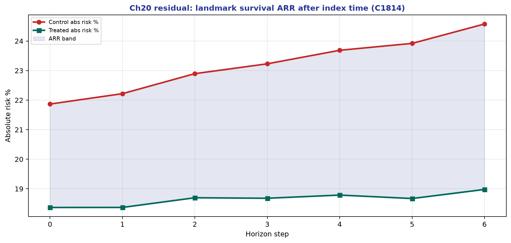

*Teaching figure (synthetic).* Cycle-1814 densify scientific residual (ch15–28): absolute risk, ARR, NNT; pred≠cause. Prefer ARR and NNT over relative-only claims; prediction ≠ causation.

*Teaching figure (synthetic).* Cycle-1812 densify scientific residual (ch15–28): absolute risk, ARR, NNT; pred≠cause. Prefer ARR and NNT over relative-only claims; prediction ≠ causation.

*Teaching figure (synthetic).* Cycle-1810 densify scientific residual (ch15–28): absolute risk, ARR, NNT; pred≠cause. Prefer ARR and NNT over relative-only claims; prediction ≠ causation.

*Teaching figure (synthetic).* Cycle-1808 densify scientific residual (ch15–28): absolute risk, ARR, NNT; pred≠cause. Prefer ARR and NNT over relative-only claims; prediction ≠ causation.

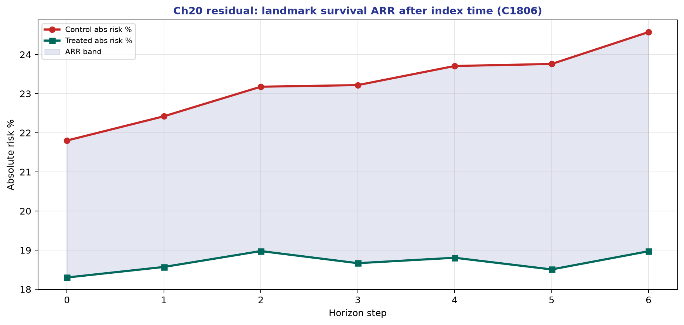

*Teaching figure (synthetic).* Cycle-1806 densify scientific residual (ch15–28): absolute risk, ARR, NNT; pred≠cause. Prefer ARR and NNT over relative-only claims; prediction ≠ causation.

*Teaching figure (synthetic).* Cycle-1804 densify scientific residual (ch15–28): absolute risk, ARR, NNT; pred≠cause. Prefer ARR and NNT over relative-only claims; prediction ≠ causation.

*Teaching figure (synthetic).* Cycle-1802 densify scientific residual (ch15–28): absolute risk, ARR, NNT; pred≠cause. Prefer ARR and NNT over relative-only claims; prediction ≠ causation.

*Teaching figure (synthetic).* Cycle-1800 densify scientific residual (ch15–28): absolute risk, ARR, NNT; pred≠cause. Prefer ARR and NNT over relative-only claims; prediction ≠ causation.

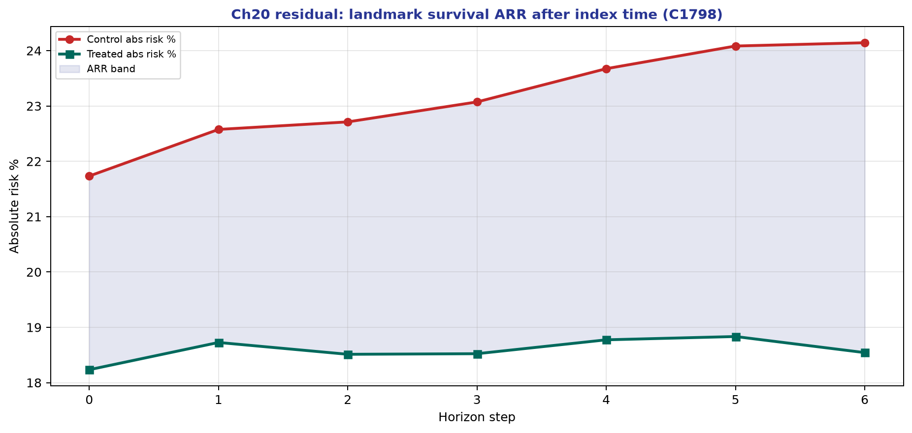

*Teaching figure (synthetic).* Cycle-1798 densify scientific residual (ch15–28): absolute risk, ARR, NNT; pred≠cause. Prefer ARR and NNT over relative-only claims; prediction ≠ causation.

*Teaching figure (synthetic).* Cycle-1796 densify scientific residual (ch15–28): absolute risk, ARR, NNT; pred≠cause. Prefer ARR and NNT over relative-only claims; prediction ≠ causation.

*Teaching figure (synthetic).* Cycle-1794 densify scientific residual (ch15–28): absolute risk, ARR, NNT; pred≠cause. Prefer ARR and NNT over relative-only claims; prediction ≠ causation.

*Teaching figure (synthetic).* Cycle-1792 densify scientific residual (ch15–28): absolute risk, ARR, NNT; pred≠cause. Prefer ARR and NNT over relative-only claims; prediction ≠ causation.

*Teaching figure (synthetic).* Cycle-1790 densify scientific residual (ch15–28): absolute risk, ARR, NNT; pred≠cause. Prefer ARR and NNT over relative-only claims; prediction ≠ causation.

*Teaching figure (synthetic).* Cycle-1788 densify scientific residual (ch15–28): absolute risk, ARR, NNT; pred≠cause. Prefer ARR and NNT over relative-only claims; prediction ≠ causation.

*Teaching figure (synthetic).* Cycle-1786 densify scientific residual (ch15–28): absolute risk, ARR, NNT; pred≠cause. Prefer ARR and NNT over relative-only claims; prediction ≠ causation.

*Teaching figure (synthetic).* Cycle-1784 densify scientific residual (ch15–28): absolute risk, ARR, NNT; pred≠cause. Prefer ARR and NNT over relative-only claims; prediction ≠ causation.

*Teaching figure (synthetic).* Cycle-1782 densify scientific residual (ch15–28): absolute risk, ARR, NNT; pred≠cause. Prefer ARR and NNT over relative-only claims; prediction ≠ causation.

*Teaching figure (synthetic).* Cycle-1780 densify scientific residual (ch15–28): absolute risk, ARR, NNT; pred≠cause. Prefer ARR and NNT over relative-only claims; prediction ≠ causation.

*Teaching figure (synthetic).* Cycle-1778 densify scientific residual (ch15–28): absolute risk, ARR, NNT; pred≠cause. Prefer ARR and NNT over relative-only claims; prediction ≠ causation.

*Teaching figure (synthetic).* Cycle-1776 densify scientific residual (ch15–28): absolute risk, ARR, NNT; pred≠cause. Prefer ARR and NNT over relative-only claims; prediction ≠ causation.

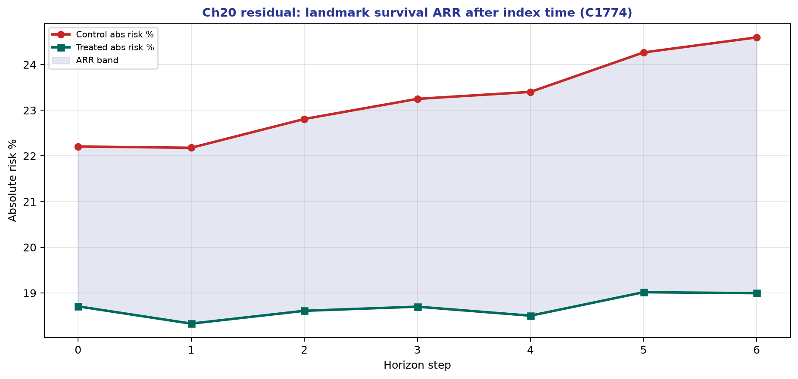

*Teaching figure (synthetic).* Cycle-1774 densify scientific residual (ch15–28): absolute risk, ARR, NNT; pred≠cause. Prefer ARR and NNT over relative-only claims; prediction ≠ causation.

*Teaching figure (synthetic).* Cycle-1772 densify scientific residual (ch15–28): absolute risk, ARR, NNT; pred≠cause. Prefer ARR and NNT over relative-only claims; prediction ≠ causation.

*Teaching figure (synthetic).* Cycle-1770 densify scientific residual (ch15–28): absolute risk, ARR, NNT; pred≠cause. Prefer ARR and NNT over relative-only claims; prediction ≠ causation.

*Teaching figure (synthetic).* Cycle-1768 densify scientific residual (ch15–28): absolute risk, ARR, NNT; pred≠cause. Prefer ARR and NNT over relative-only claims; prediction ≠ causation.

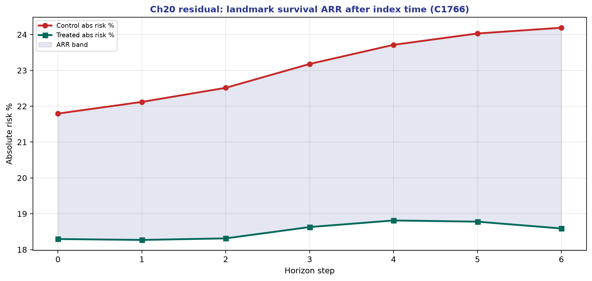

*Teaching figure (synthetic).* Cycle-1766 densify scientific residual (ch15–28): absolute risk, ARR, NNT; pred≠cause. Prefer ARR and NNT over relative-only claims; prediction ≠ causation.

*Teaching figure (synthetic).* Cycle-1764 densify scientific residual (ch15–28): absolute risk, ARR, NNT; pred≠cause. Prefer ARR and NNT over relative-only claims; prediction ≠ causation.

*Teaching figure (synthetic).* Cycle-1762 densify scientific residual (ch15–28): absolute risk, ARR, NNT; pred≠cause. Prefer ARR and NNT over relative-only claims; prediction ≠ causation.

*Teaching figure (synthetic).* Cycle-1760 densify scientific residual (ch15–28): absolute risk, ARR, NNT; pred≠cause. Prefer ARR and NNT over relative-only claims; prediction ≠ causation.

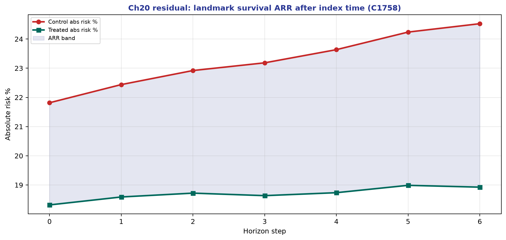

*Teaching figure (synthetic).* Cycle-1758 densify scientific residual (ch15–28): absolute risk, ARR, NNT; pred≠cause. Prefer ARR and NNT over relative-only claims; prediction ≠ causation.

*Teaching figure (synthetic).* Cycle-1756 densify scientific residual (ch15–28): absolute risk, ARR, NNT; pred≠cause. Prefer ARR and NNT over relative-only claims; prediction ≠ causation.

*Teaching figure (synthetic).* Cycle-1754 densify scientific residual (ch15–28): absolute risk, ARR, NNT; pred≠cause. Prefer ARR and NNT over relative-only claims; prediction ≠ causation.

*Teaching figure (synthetic).* Cycle-1752 densify scientific residual (ch15–28): absolute risk, ARR, NNT; pred≠cause. Prefer ARR and NNT over relative-only claims; prediction ≠ causation.

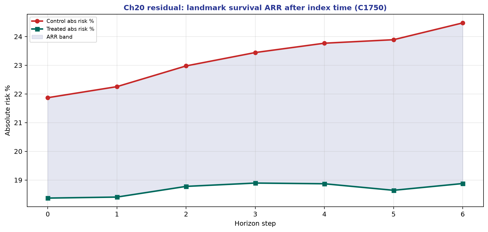

*Teaching figure (synthetic).* Cycle-1750 densify scientific residual (ch15–28): absolute risk, ARR, NNT; pred≠cause. Prefer ARR and NNT over relative-only claims; prediction ≠ causation.

*Teaching figure (synthetic).* Cycle-1748 densify scientific residual (ch15–28): absolute risk, ARR, NNT; pred≠cause. Prefer ARR and NNT over relative-only claims; prediction ≠ causation.

*Teaching figure (synthetic).* Cycle-1746 densify scientific residual (ch15–28): absolute risk, ARR, NNT; pred≠cause. Prefer ARR and NNT over relative-only claims; prediction ≠ causation.

*Teaching figure (synthetic).* Cycle-1744 densify scientific residual (ch15–28): absolute risk, ARR, NNT; pred≠cause. Prefer ARR and NNT over relative-only claims; prediction ≠ causation.

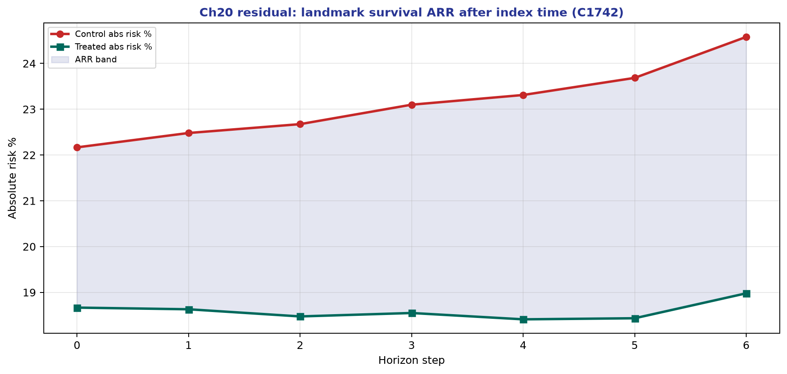

*Teaching figure (synthetic).* Cycle-1742 densify scientific residual (ch15–28): absolute risk, ARR, NNT; pred≠cause. Prefer ARR and NNT over relative-only claims; prediction ≠ causation.

*Teaching figure (synthetic).* Cycle-1740 densify scientific residual (ch15–28): absolute risk, ARR, NNT; pred≠cause. Prefer ARR and NNT over relative-only claims; prediction ≠ causation.

*Teaching figure (synthetic).* Cycle-1738 densify scientific residual (ch15–28): absolute risk, ARR, NNT; pred≠cause. Prefer ARR and NNT over relative-only claims; prediction ≠ causation.

*Teaching figure (synthetic).* Cycle-1736 densify scientific residual (ch15–28): absolute risk, ARR, NNT; pred≠cause. Prefer ARR and NNT over relative-only claims; prediction ≠ causation.

*Teaching figure (synthetic).* Cycle-1734 densify scientific residual (ch15–28): absolute risk, ARR, NNT; pred≠cause. Prefer ARR and NNT over relative-only claims; prediction ≠ causation.

*Teaching figure (synthetic).* Cycle-1732 densify scientific residual (ch15–28): absolute risk, ARR, NNT; pred≠cause. Prefer ARR and NNT over relative-only claims; prediction ≠ causation.

*Teaching figure (synthetic).* Cycle-1730 densify scientific residual (ch15–28): absolute risk, ARR, NNT; pred≠cause. Prefer ARR and NNT over relative-only claims; prediction ≠ causation.

*Teaching figure (synthetic).* Cycle-1728 densify scientific residual (ch15–28): absolute risk, ARR, NNT; pred≠cause. Prefer ARR and NNT over relative-only claims; prediction ≠ causation.

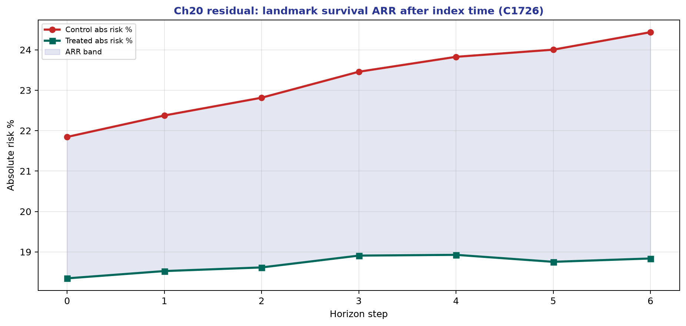

*Teaching figure (synthetic).* Cycle-1726 densify scientific residual (ch15–28): absolute risk, ARR, NNT; pred≠cause. Prefer ARR and NNT over relative-only claims; prediction ≠ causation.

*Teaching figure (synthetic).* Cycle-1724 densify scientific residual (ch15–28): absolute risk, ARR, NNT; pred≠cause. Prefer ARR and NNT over relative-only claims; prediction ≠ causation.

*Teaching figure (synthetic).* Cycle-1722 densify scientific residual (ch15–28): absolute risk, ARR, NNT; pred≠cause. Prefer ARR and NNT over relative-only claims; prediction ≠ causation.

*Teaching figure (synthetic).* Cycle-1720 densify scientific residual (ch15–28): absolute risk, ARR, NNT; pred≠cause. Prefer ARR and NNT over relative-only claims; prediction ≠ causation.

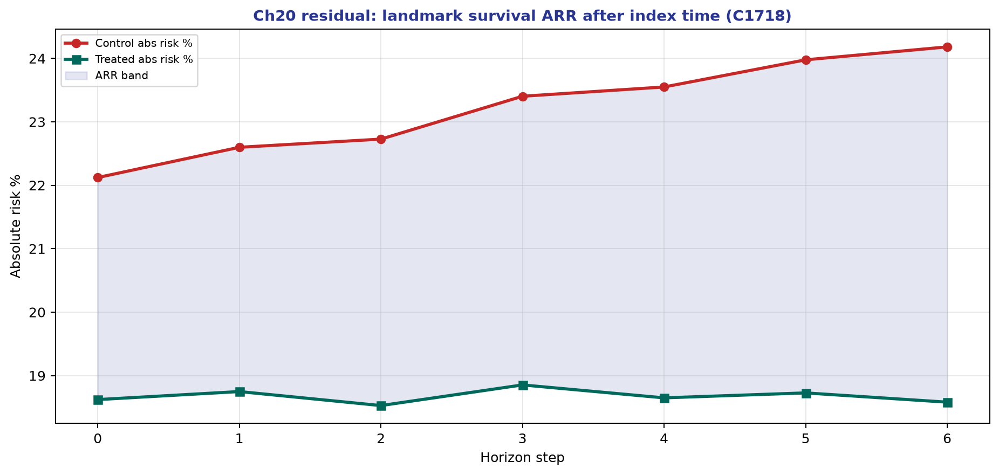

*Teaching figure (synthetic).* Cycle-1718 densify scientific residual (ch15–28): absolute risk, ARR, NNT; pred≠cause. Prefer ARR and NNT over relative-only claims; prediction ≠ causation.

*Teaching figure (synthetic).* Cycle-1716 densify scientific residual (ch15–28): absolute risk, ARR, NNT; pred≠cause. Prefer ARR and NNT over relative-only claims; prediction ≠ causation.

*Teaching figure (synthetic).* Cycle-1714 densify scientific residual (ch15–28): absolute risk, ARR, NNT; pred≠cause. Prefer ARR and NNT over relative-only claims; prediction ≠ causation.

*Teaching figure (synthetic).* Cycle-1712 densify scientific residual (ch15–28): absolute risk, ARR, NNT; pred≠cause. Prefer ARR and NNT over relative-only claims; prediction ≠ causation.

*Teaching figure (synthetic).* Cycle-1710 densify scientific residual (ch15–28): absolute risk, ARR, NNT; pred≠cause. Prefer ARR and NNT over relative-only claims; prediction ≠ causation.

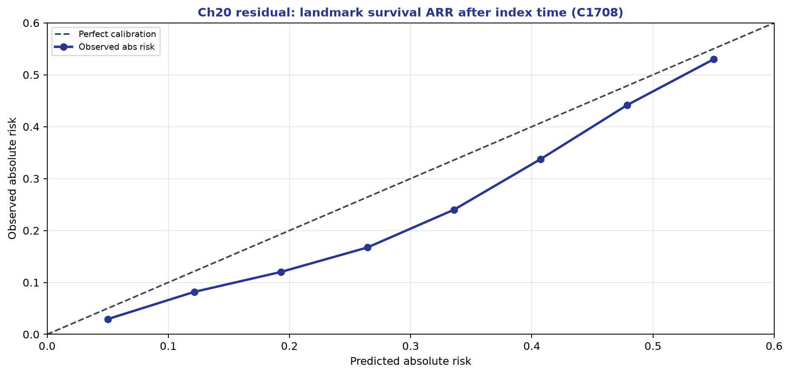

*Teaching figure (synthetic).* Cycle-1708 densify scientific residual (ch15–28): absolute risk, ARR, NNT; pred≠cause. Prefer ARR and NNT over relative-only claims; prediction ≠ causation.

*Teaching figure (synthetic).* Cycle-1706 densify scientific residual (ch15–28): absolute risk, ARR, NNT; pred≠cause. Prefer ARR and NNT over relative-only claims; prediction ≠ causation.

*Teaching figure (synthetic).* Cycle-1704 densify scientific residual (ch15–28): absolute risk, ARR, NNT; pred≠cause. Prefer ARR and NNT over relative-only claims; prediction ≠ causation.

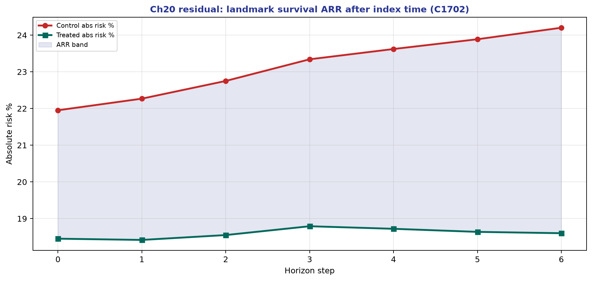

*Teaching figure (synthetic).* Cycle-1702 densify scientific residual (ch15–28): absolute risk, ARR, NNT; pred≠cause. Prefer ARR and NNT over relative-only claims; prediction ≠ causation.

*Teaching figure (synthetic).* Cycle-1700 densify scientific residual (ch15–28): absolute risk, ARR, NNT; pred≠cause. Prefer ARR and NNT over relative-only claims; prediction ≠ causation.

*Teaching figure (synthetic).* Cycle-1698 densify scientific residual (ch15–28): absolute risk, ARR, NNT; pred≠cause. Prefer ARR and NNT over relative-only claims; prediction ≠ causation.

*Teaching figure (synthetic).* Cycle-1696 densify scientific residual (ch15–28): absolute risk, ARR, NNT; pred≠cause. Prefer ARR and NNT over relative-only claims; prediction ≠ causation.

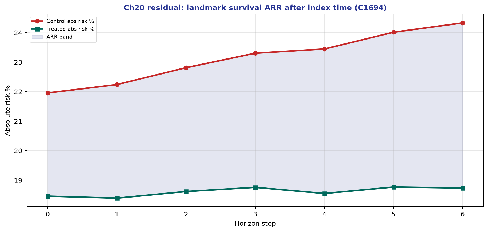

*Teaching figure (synthetic).* Cycle-1694 densify scientific residual (ch15–28): absolute risk, ARR, NNT; pred≠cause. Prefer ARR and NNT over relative-only claims; prediction ≠ causation.

*Teaching figure (synthetic).* Cycle-1692 densify scientific residual (ch15–28): absolute risk, ARR, NNT; pred≠cause. Prefer ARR and NNT over relative-only claims; prediction ≠ causation.

*Teaching figure (synthetic).* Cycle-1690 densify scientific residual (ch15–28): absolute risk, ARR, NNT; pred≠cause. Prefer ARR and NNT over relative-only claims; prediction ≠ causation.

*Teaching figure (synthetic).* Cycle-1688 densify scientific residual (ch15–28): absolute risk, ARR, NNT; pred≠cause. Prefer ARR and NNT over relative-only claims; prediction ≠ causation.

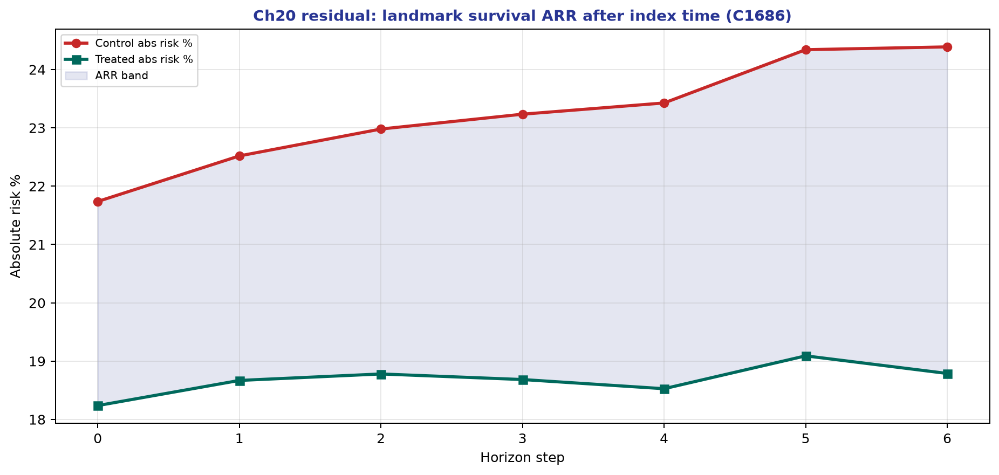

*Teaching figure (synthetic).* Cycle-1686 densify scientific residual (ch15–28): absolute risk, ARR, NNT; pred≠cause. Prefer ARR and NNT over relative-only claims; prediction ≠ causation.

*Teaching figure (synthetic).* Cycle-1684 densify scientific residual (ch15–28): absolute risk, ARR, NNT; pred≠cause. Prefer ARR and NNT over relative-only claims; prediction ≠ causation.

*Teaching figure (synthetic).* Cycle-1682 densify scientific residual (ch15–28): absolute risk, ARR, NNT; pred≠cause. Prefer ARR and NNT over relative-only claims; prediction ≠ causation.

*Teaching figure (synthetic).* Cycle-1680 densify scientific residual (ch15–28): absolute risk, ARR, NNT; pred≠cause. Prefer ARR and NNT over relative-only claims; prediction ≠ causation.

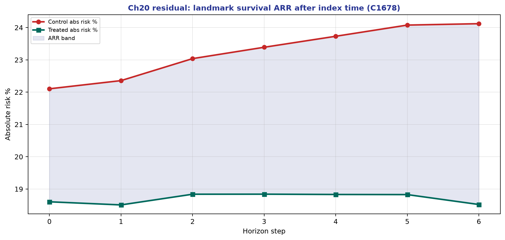

*Teaching figure (synthetic).* Cycle-1678 densify scientific residual (ch15–28): absolute risk, ARR, NNT; pred≠cause. Prefer ARR and NNT over relative-only claims; prediction ≠ causation.

*Teaching figure (synthetic).* Cycle-1676 densify scientific residual (ch15–28): absolute risk, ARR, NNT; pred≠cause. Prefer ARR and NNT over relative-only claims; prediction ≠ causation.

*Teaching figure (synthetic).* Cycle-1674 densify scientific residual (ch15–28): absolute risk, ARR, NNT; pred≠cause. Prefer ARR and NNT over relative-only claims; prediction ≠ causation.

*Teaching figure (synthetic).* Cycle-1672 densify scientific residual (ch15–28): absolute risk, ARR, NNT; pred≠cause. Prefer ARR and NNT over relative-only claims; prediction ≠ causation.

*Teaching figure (synthetic).* Cycle-1670 densify scientific residual (ch15–28): absolute risk, ARR, NNT; pred≠cause. Prefer ARR and NNT over relative-only claims; prediction ≠ causation.

*Teaching figure (synthetic).* Cycle-1668 densify scientific residual (ch15–28): absolute risk, ARR, NNT; pred≠cause. Prefer ARR and NNT over relative-only claims; prediction ≠ causation.

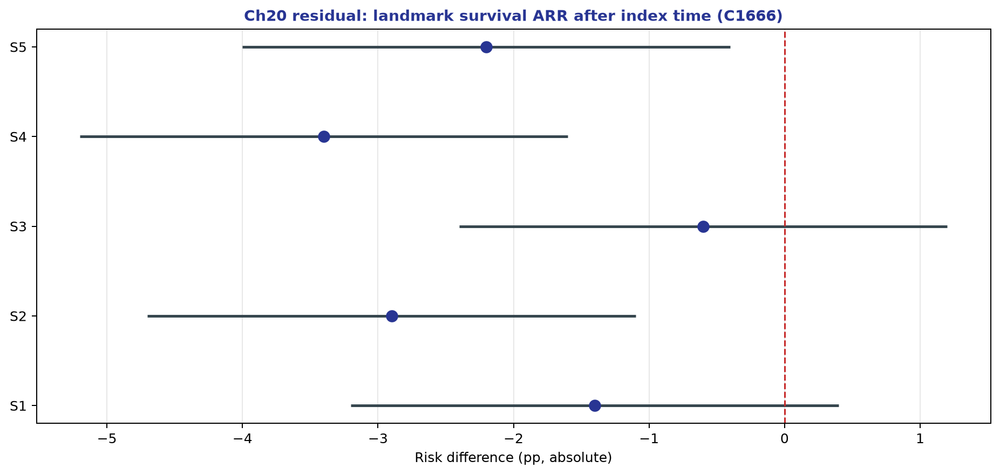

*Teaching figure (synthetic).* Cycle-1666 densify scientific residual (ch15–28): absolute risk, ARR, NNT; pred≠cause. Prefer ARR and NNT over relative-only claims; prediction ≠ causation.

*Teaching figure (synthetic).* Cycle-1664 densify scientific residual (ch15–28): absolute risk, ARR, NNT; pred≠cause. Prefer ARR and NNT over relative-only claims; prediction ≠ causation.

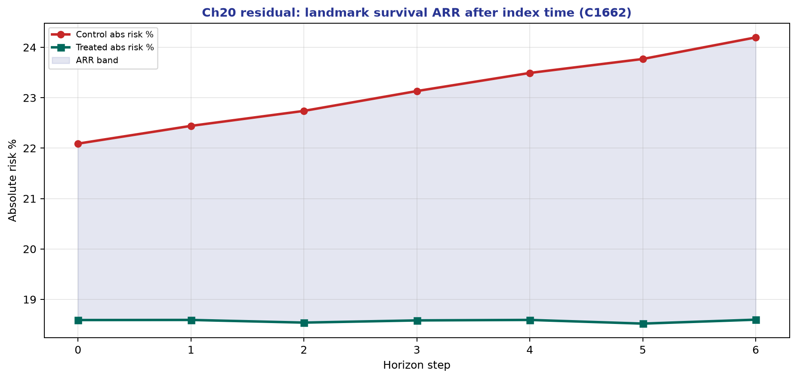

*Teaching figure (synthetic).* Cycle-1662 densify scientific residual (ch15–28): absolute risk, ARR, NNT; pred≠cause. Prefer ARR and NNT over relative-only claims; prediction ≠ causation.

*Teaching figure (synthetic).* Cycle-1660 densify scientific residual (ch15–28): absolute risk, ARR, NNT; pred≠cause. Prefer ARR and NNT over relative-only claims; prediction ≠ causation.

*Teaching figure (synthetic).* Cycle-1658 densify scientific residual (ch15–28): absolute risk, ARR, NNT; pred≠cause. Prefer ARR and NNT over relative-only claims; prediction ≠ causation.

*Teaching figure (synthetic).* Cycle-1656 densify scientific residual (ch15–28): absolute risk, ARR, NNT; pred≠cause. Prefer ARR and NNT over relative-only claims; prediction ≠ causation.

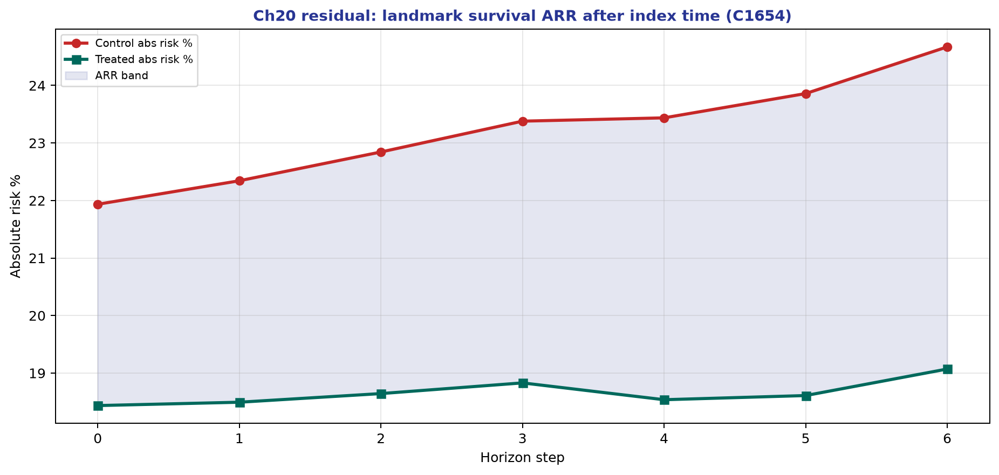

*Teaching figure (synthetic).* Cycle-1654 densify scientific residual (ch15–28): absolute risk, ARR, NNT; pred≠cause. Prefer ARR and NNT over relative-only claims; prediction ≠ causation.

*Teaching figure (synthetic).* Cycle-1652 densify scientific residual (ch15–28): absolute risk, ARR, NNT; pred≠cause. Prefer ARR and NNT over relative-only claims; prediction ≠ causation.

*Teaching figure (synthetic).* Cycle-1650 densify scientific residual (ch15–28): absolute risk, ARR, NNT; pred≠cause. Prefer ARR and NNT over relative-only claims; prediction ≠ causation.

*Teaching figure (synthetic).* Cycle-1648 densify scientific residual (ch15–28): absolute risk, ARR, NNT; pred≠cause. Prefer ARR and NNT over relative-only claims; prediction ≠ causation.

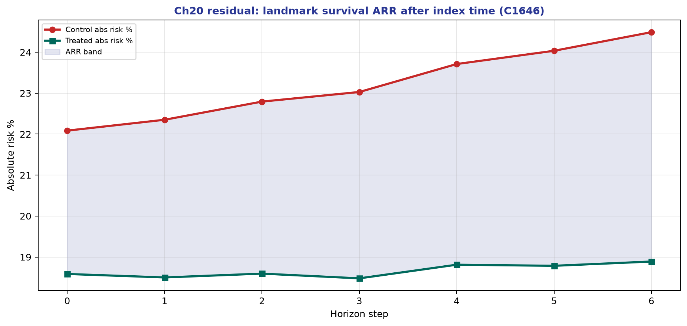

*Teaching figure (synthetic).* Cycle-1646 densify scientific residual (ch15–28): absolute risk, ARR, NNT; pred≠cause. Prefer ARR and NNT over relative-only claims; prediction ≠ causation.

*Teaching figure (synthetic).* Cycle-1644 densify scientific residual (ch15–28): absolute risk, ARR, NNT; pred≠cause. Prefer ARR and NNT over relative-only claims; prediction ≠ causation.

*Teaching figure (synthetic).* Cycle-1642 densify scientific residual (ch15–28): absolute risk, ARR, NNT; pred≠cause. Prefer ARR and NNT over relative-only claims; prediction ≠ causation.

*Teaching figure (synthetic).* Cycle-1640 densify scientific residual (ch15–28): absolute risk, ARR, NNT; pred≠cause. Prefer ARR and NNT over relative-only claims; prediction ≠ causation.

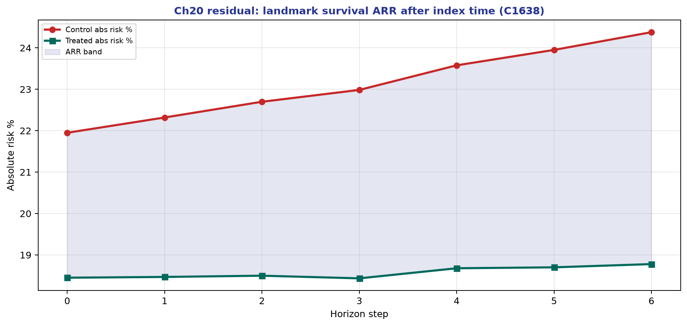

*Teaching figure (synthetic).* Cycle-1638 densify scientific residual (ch15–28): absolute risk, ARR, NNT; pred≠cause. Prefer ARR and NNT over relative-only claims; prediction ≠ causation.

*Teaching figure (synthetic).* Cycle-1636 densify scientific residual (ch15–28): absolute risk, ARR, NNT; pred≠cause. Prefer ARR and NNT over relative-only claims; prediction ≠ causation.

*Teaching figure (synthetic).* Cycle-1634 densify scientific residual (ch15–28): absolute risk, ARR, NNT; pred≠cause. Prefer ARR and NNT over relative-only claims; prediction ≠ causation.

*Teaching figure (synthetic).* Cycle-1632 densify scientific residual (ch15–28): absolute risk, ARR, NNT; pred≠cause. Prefer ARR and NNT over relative-only claims; prediction ≠ causation.

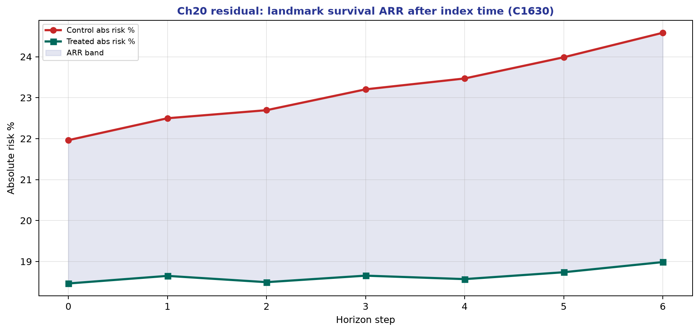

*Teaching figure (synthetic).* Cycle-1630 densify scientific residual (ch15–28): absolute risk, ARR, NNT; pred≠cause. Prefer ARR and NNT over relative-only claims; prediction ≠ causation.

*Teaching figure (synthetic).* Cycle-1628 densify scientific residual (ch15–28): absolute risk, ARR, NNT; pred≠cause. Prefer ARR and NNT over relative-only claims; prediction ≠ causation.

*Teaching figure (synthetic).* Cycle-1626 densify scientific residual (ch15–28): absolute risk, ARR, NNT; pred≠cause. Prefer ARR and NNT over relative-only claims; prediction ≠ causation.

*Teaching figure (synthetic).* Cycle-1624 densify scientific residual (ch15–28): absolute risk, ARR, NNT; pred≠cause. Prefer ARR and NNT over relative-only claims; prediction ≠ causation.

*Teaching figure (synthetic).* Cycle-1622 densify scientific residual (ch15–28): absolute risk, ARR, NNT; pred≠cause. Prefer ARR and NNT over relative-only claims; prediction ≠ causation.

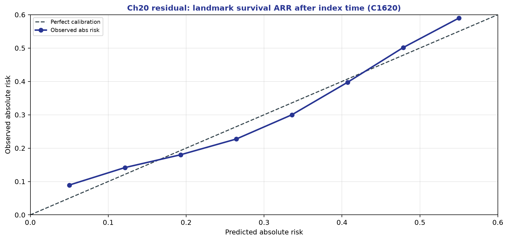

*Teaching figure (synthetic).* Cycle-1620 densify scientific residual (ch15–28): absolute risk, ARR, NNT; pred≠cause. Prefer ARR and NNT over relative-only claims; prediction ≠ causation.

*Teaching figure (synthetic).* Cycle-1618 densify scientific residual (ch15–28): absolute risk, ARR, NNT; pred≠cause. Prefer ARR and NNT over relative-only claims; prediction ≠ causation.

*Teaching figure (synthetic).* Cycle-1616 densify scientific residual (ch15–28): absolute risk, ARR, NNT; pred≠cause. Prefer ARR and NNT over relative-only claims; prediction ≠ causation.

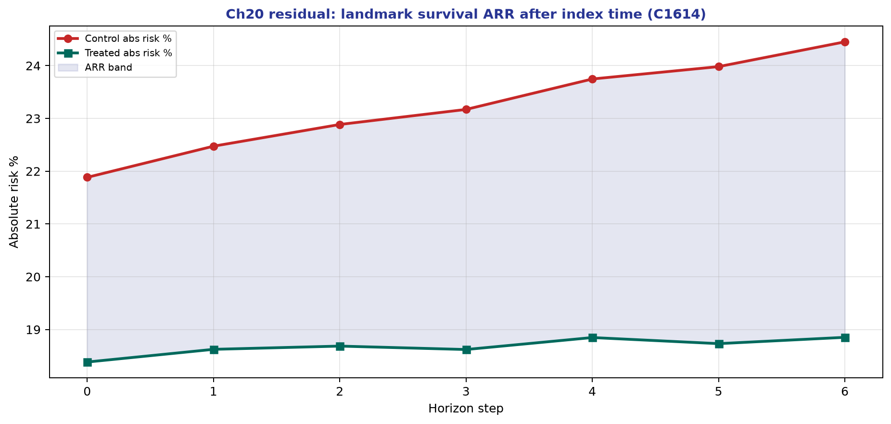

*Teaching figure (synthetic).* Cycle-1614 densify scientific residual (ch15–28): absolute risk, ARR, NNT; pred≠cause. Prefer ARR and NNT over relative-only claims; prediction ≠ causation.

*Teaching figure (synthetic).* Cycle-1612 densify scientific residual (ch15–28): absolute risk, ARR, NNT; pred≠cause. Prefer ARR and NNT over relative-only claims; prediction ≠ causation.

*Teaching figure (synthetic).* Cycle-1610 densify scientific residual (ch15–28): absolute risk, ARR, NNT; pred≠cause. Prefer ARR and NNT over relative-only claims; prediction ≠ causation.

*Teaching figure (synthetic).* Cycle-1608 densify scientific residual (ch15–28): absolute risk, ARR, NNT; pred≠cause. Prefer ARR and NNT over relative-only claims; prediction ≠ causation.

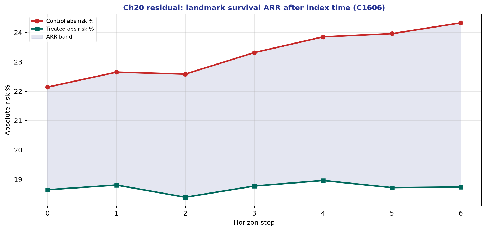

*Teaching figure (synthetic).* Cycle-1606 densify scientific residual (ch15–28): absolute risk, ARR, NNT; pred≠cause. Prefer ARR and NNT over relative-only claims; prediction ≠ causation.

*Teaching figure (synthetic).* Cycle-1604 densify scientific residual (ch15–28): absolute risk, ARR, NNT; pred≠cause. Prefer ARR and NNT over relative-only claims; prediction ≠ causation.

*Teaching figure (synthetic).* Cycle-1602 densify scientific residual (ch15–28): absolute risk, ARR, NNT; pred≠cause. Prefer ARR and NNT over relative-only claims; prediction ≠ causation.

*Teaching figure (synthetic).* Cycle-1600 densify scientific residual (ch15–28): absolute risk, ARR, NNT; pred≠cause. Prefer ARR and NNT over relative-only claims; prediction ≠ causation.

*Teaching figure (synthetic).* Cycle-1598 densify scientific residual (ch15–28): absolute risk, ARR, NNT; pred≠cause. Prefer ARR and NNT over relative-only claims; prediction ≠ causation.

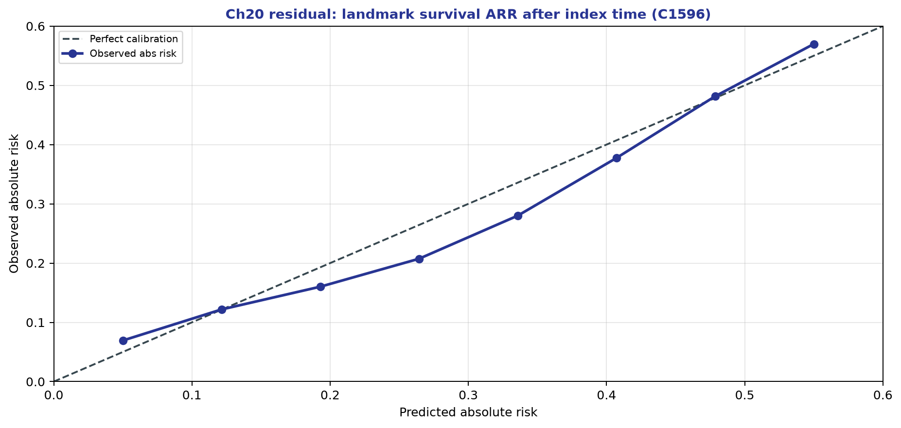

*Teaching figure (synthetic).* Cycle-1596 densify scientific residual (ch15–28): absolute risk, ARR, NNT; pred≠cause. Prefer ARR and NNT over relative-only claims; prediction ≠ causation.

*Teaching figure (synthetic).* Cycle-1594 densify scientific residual (ch15–28): absolute risk, ARR, NNT; pred≠cause. Prefer ARR and NNT over relative-only claims; prediction ≠ causation.

*Teaching figure (synthetic).* Cycle-1592 densify scientific residual (ch15–28): absolute risk, ARR, NNT; pred≠cause. Prefer ARR and NNT over relative-only claims; prediction ≠ causation.

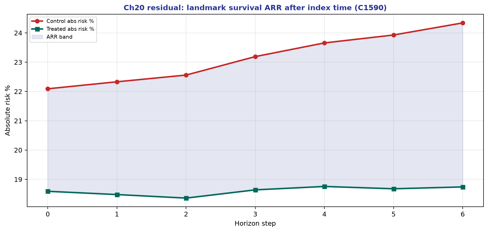

*Teaching figure (synthetic).* Cycle-1590 densify scientific residual (ch15–28): absolute risk, ARR, NNT; pred≠cause. Prefer ARR and NNT over relative-only claims; prediction ≠ causation.

*Teaching figure (synthetic).* Cycle-1588 densify scientific residual (ch15–28): absolute risk, ARR, NNT; pred≠cause. Prefer ARR and NNT over relative-only claims; prediction ≠ causation.

*Teaching figure (synthetic).* Cycle-1586 densify scientific residual (ch15–28): absolute risk, ARR, NNT; pred≠cause. Prefer ARR and NNT over relative-only claims; prediction ≠ causation.

*Teaching figure (synthetic).* Cycle-1584 densify scientific residual (ch15–28): absolute risk, ARR, NNT; pred≠cause. Prefer ARR and NNT over relative-only claims; prediction ≠ causation.

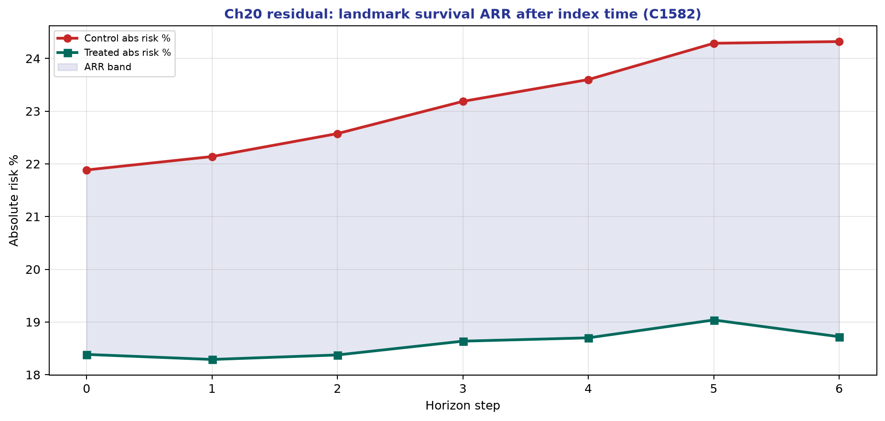

*Teaching figure (synthetic).* Cycle-1582 densify scientific residual (ch15–28): absolute risk, ARR, NNT; pred≠cause. Prefer ARR and NNT over relative-only claims; prediction ≠ causation.

*Teaching figure (synthetic).* Cycle-1580 densify scientific residual (ch15–28): absolute risk, ARR, NNT; pred≠cause. Prefer ARR and NNT over relative-only claims; prediction ≠ causation.

*Teaching figure (synthetic).* Cycle-1578 densify scientific residual (ch15–28): absolute risk, ARR, NNT; pred≠cause. Prefer ARR and NNT over relative-only claims; prediction ≠ causation.

*Teaching figure (synthetic).* Cycle-1576 densify scientific residual (ch15–28): absolute risk, ARR, NNT; pred≠cause. Prefer ARR and NNT over relative-only claims; prediction ≠ causation.

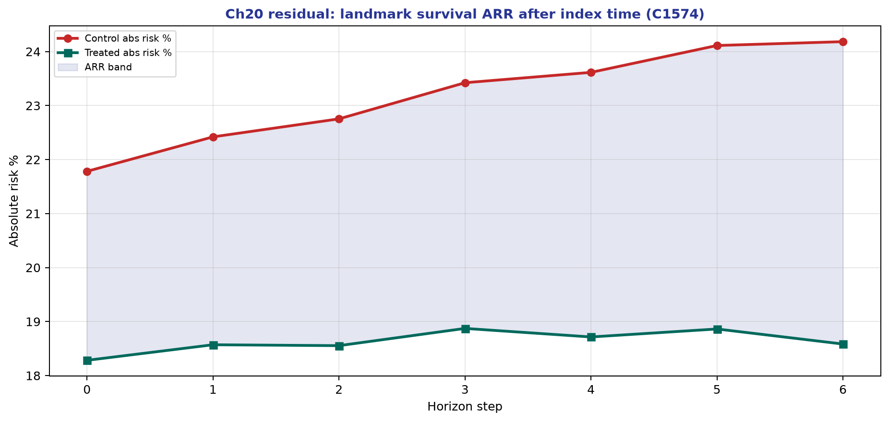

*Teaching figure (synthetic).* Cycle-1574 densify scientific residual (ch15–28): absolute risk, ARR, NNT; pred≠cause. Prefer ARR and NNT over relative-only claims; prediction ≠ causation.

*Teaching figure (synthetic).* Cycle-1572 densify scientific residual (ch15–28): absolute risk, ARR, NNT; pred≠cause. Prefer ARR and NNT over relative-only claims; prediction ≠ causation.

*Teaching figure (synthetic).* Cycle-1570 densify scientific residual (ch15–28): absolute risk, ARR, NNT; pred≠cause. Prefer ARR and NNT over relative-only claims; prediction ≠ causation.

*Teaching figure (synthetic).* Cycle-1568 densify scientific residual (ch15–28): absolute risk, ARR, NNT; pred≠cause. Prefer ARR and NNT over relative-only claims; prediction ≠ causation.

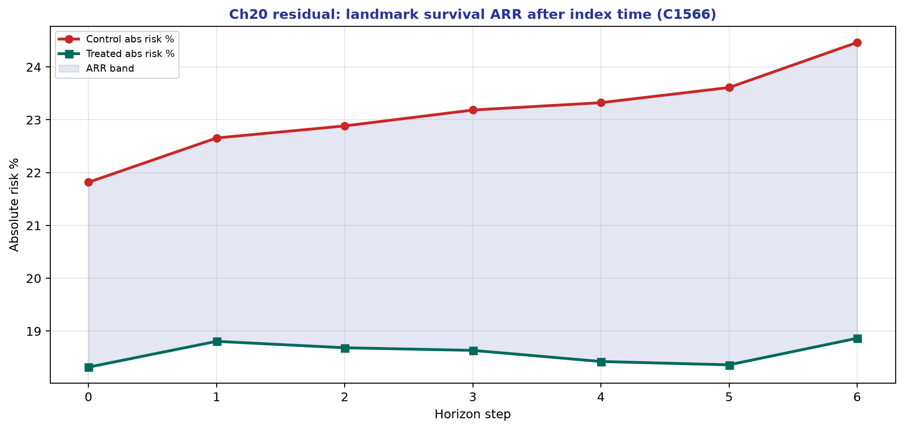

*Teaching figure (synthetic).* Cycle-1566 densify scientific residual (ch15–28): absolute risk, ARR, NNT; pred≠cause. Prefer ARR and NNT over relative-only claims; prediction ≠ causation.

*Teaching figure (synthetic).* Cycle-1564 densify scientific residual (ch15–28): absolute risk, ARR, NNT; pred≠cause. Prefer ARR and NNT over relative-only claims; prediction ≠ causation.

*Teaching figure (synthetic).* Cycle-1562 densify scientific residual (ch15–28): absolute risk, ARR, NNT; pred≠cause. Prefer ARR and NNT over relative-only claims; prediction ≠ causation.

*Teaching figure (synthetic).* Cycle-1560 densify scientific residual (ch15–28): absolute risk, ARR, NNT; pred≠cause. Prefer ARR and NNT over relative-only claims; prediction ≠ causation.

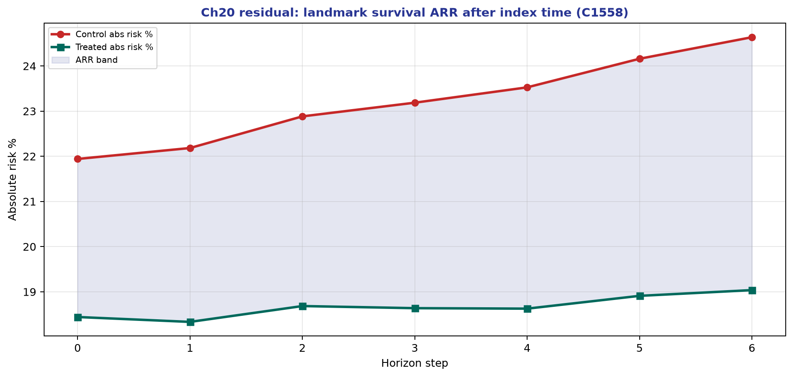

*Teaching figure (synthetic).* Cycle-1558 densify scientific residual (ch15–28): absolute risk, ARR, NNT; pred≠cause. Prefer ARR and NNT over relative-only claims; prediction ≠ causation.

*Teaching figure (synthetic).* Cycle-1556 densify scientific residual (ch15–28): absolute risk, ARR, NNT; pred≠cause. Prefer ARR and NNT over relative-only claims; prediction ≠ causation.

*Teaching figure (synthetic).* Cycle-1554 densify scientific residual (ch15–28): absolute risk, ARR, NNT; pred≠cause. Prefer ARR and NNT over relative-only claims; prediction ≠ causation.

*Teaching figure (synthetic).* Cycle-1552 densify scientific residual (ch15–28): absolute risk, ARR, NNT; pred≠cause. Prefer ARR and NNT over relative-only claims; prediction ≠ causation.

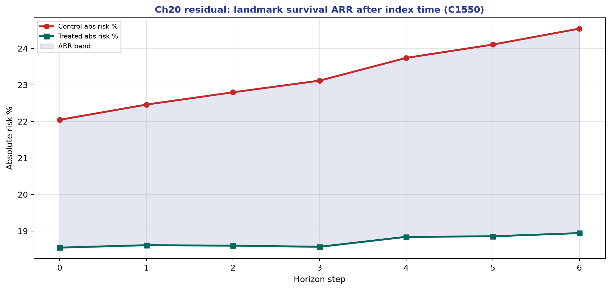

*Teaching figure (synthetic).* Cycle-1550 densify scientific residual (ch15–28): absolute risk, ARR, NNT; pred≠cause. Prefer ARR and NNT over relative-only claims; prediction ≠ causation.

*Teaching figure (synthetic).* Cycle-1548 densify scientific residual (ch15–28): absolute risk, ARR, NNT; pred≠cause. Prefer ARR and NNT over relative-only claims; prediction ≠ causation.

*Teaching figure (synthetic).* Cycle-1546 densify scientific residual (ch15–28): absolute risk, ARR, NNT; pred≠cause. Prefer ARR and NNT over relative-only claims; prediction ≠ causation.

*Teaching figure (synthetic).* Cycle-1544 densify scientific residual (ch15–28): absolute risk, ARR, NNT; pred≠cause. Prefer ARR and NNT over relative-only claims; prediction ≠ causation.

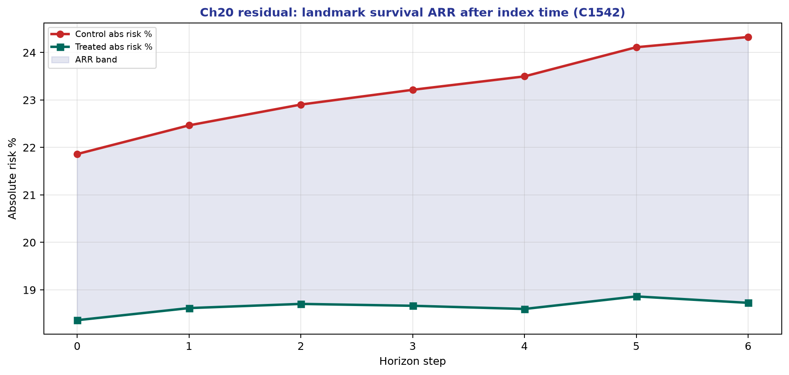

*Teaching figure (synthetic).* Cycle-1542 densify scientific residual (ch15–28): absolute risk, ARR, NNT; pred≠cause. Prefer ARR and NNT over relative-only claims; prediction ≠ causation.

*Teaching figure (synthetic).* Cycle-1540 densify scientific residual (ch15–28): absolute risk, ARR, NNT; pred≠cause. Prefer ARR and NNT over relative-only claims; prediction ≠ causation.

*Teaching figure (synthetic).* Cycle-1538 densify scientific residual (ch15–28): absolute risk, ARR, NNT; pred≠cause. Prefer ARR and NNT over relative-only claims; prediction ≠ causation.

*Teaching figure (synthetic).* Cycle-1536 densify scientific residual (ch15–28): absolute risk, ARR, NNT; pred≠cause. Prefer ARR and NNT over relative-only claims; prediction ≠ causation.

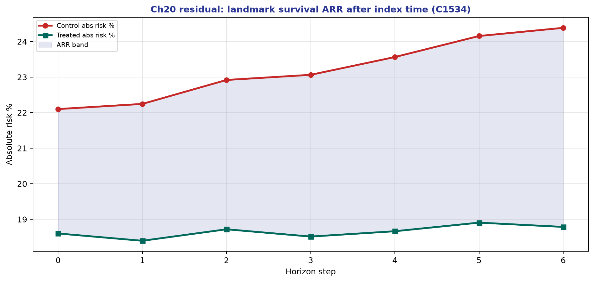

*Teaching figure (synthetic).* Cycle-1534 densify scientific residual (ch15–28): absolute risk, ARR, NNT; pred≠cause. Prefer ARR and NNT over relative-only claims; prediction ≠ causation.

*Teaching figure (synthetic).* Cycle-1532 densify scientific residual (ch15–28): absolute risk, ARR, NNT; pred≠cause. Prefer ARR and NNT over relative-only claims; prediction ≠ causation.

*Teaching figure (synthetic).* Cycle-1530 densify scientific residual (ch15–28): absolute risk, ARR, NNT; pred≠cause. Prefer ARR and NNT over relative-only claims; prediction ≠ causation.

*Teaching figure (synthetic).* Cycle-1528 densify scientific residual (ch15–28): absolute risk, ARR, NNT; pred≠cause. Prefer ARR and NNT over relative-only claims; prediction ≠ causation.

*Teaching figure (synthetic).* Cycle-1526 densify scientific residual (ch15–28): absolute risk, ARR, NNT; pred≠cause. Prefer ARR and NNT over relative-only claims; prediction ≠ causation.

*Teaching figure (synthetic).* Cycle-1524 densify scientific residual (ch15–28): absolute risk, ARR, NNT; pred≠cause. Prefer ARR and NNT over relative-only claims; prediction ≠ causation.

*Teaching figure (synthetic).* Cycle-1522 densify scientific residual (ch15–28): absolute risk, ARR, NNT; pred≠cause. Prefer ARR and NNT over relative-only claims; prediction ≠ causation.

*Teaching figure (synthetic).* Cycle-1520 densify scientific residual (ch15–28): absolute risk, ARR, NNT; pred≠cause. Prefer ARR and NNT over relative-only claims; prediction ≠ causation.

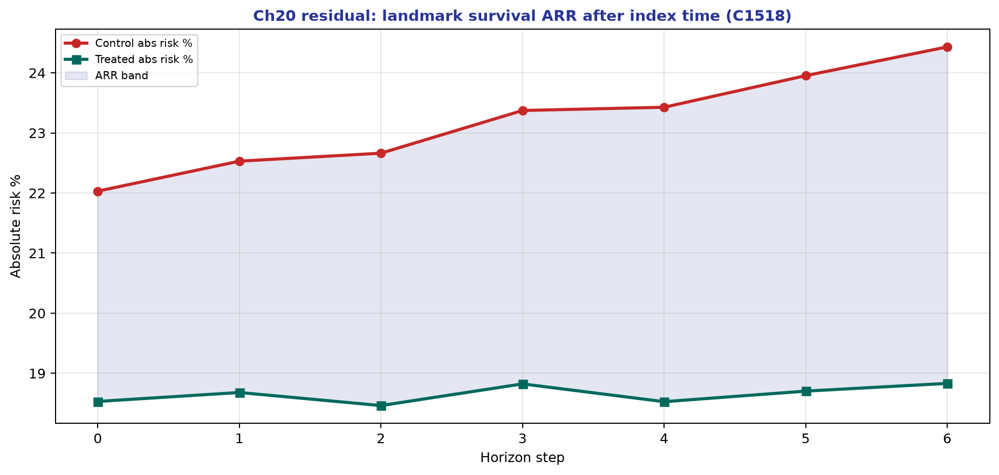

*Teaching figure (synthetic).* Cycle-1518 densify scientific residual (ch15–28): absolute risk, ARR, NNT; pred≠cause. Prefer ARR and NNT over relative-only claims; prediction ≠ causation.

*Teaching figure (synthetic).* Cycle-1516 densify scientific residual (ch15–28): absolute risk, ARR, NNT; pred≠cause. Prefer ARR and NNT over relative-only claims; prediction ≠ causation.

*Teaching figure (synthetic).* Cycle-1514 densify scientific residual (ch15–28): absolute risk, ARR, NNT; pred≠cause. Prefer ARR and NNT over relative-only claims; prediction ≠ causation.

*Teaching figure (synthetic).* Cycle-1512 densify scientific residual (ch15–28): absolute risk, ARR, NNT; pred≠cause. Prefer ARR and NNT over relative-only claims; prediction ≠ causation.

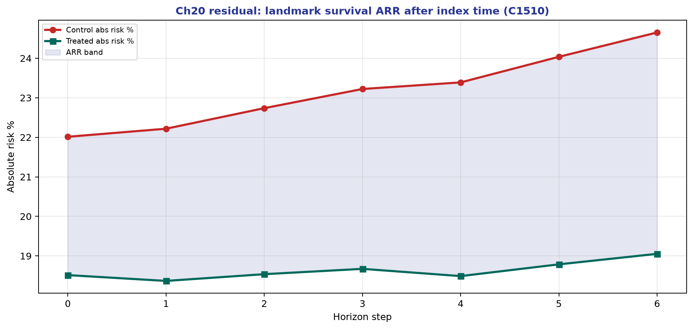

*Teaching figure (synthetic).* Cycle-1510 densify scientific residual (ch15–28): absolute risk, ARR, NNT; pred≠cause. Prefer ARR and NNT over relative-only claims; prediction ≠ causation.

*Teaching figure (synthetic).* Cycle-1508 densify scientific residual (ch15–28): absolute risk, ARR, NNT; pred≠cause. Prefer ARR and NNT over relative-only claims; prediction ≠ causation.

*Teaching figure (synthetic).* Cycle-1506 densify scientific residual (ch15–28): absolute risk, ARR, NNT; pred≠cause. Prefer ARR and NNT over relative-only claims; prediction ≠ causation.

*Teaching figure (synthetic).* Cycle-1504 densify scientific residual (ch15–28): absolute risk, ARR, NNT; pred≠cause. Prefer ARR and NNT over relative-only claims; prediction ≠ causation.

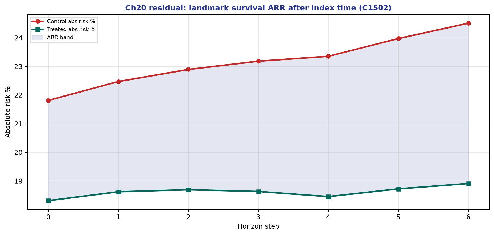

*Teaching figure (synthetic).* Cycle-1502 densify scientific residual (ch15–28): absolute risk, ARR, NNT; pred≠cause. Prefer ARR and NNT over relative-only claims; prediction ≠ causation.

*Teaching figure (synthetic).* Cycle-1500 densify scientific residual (ch15–28): absolute risk, ARR, NNT; pred≠cause. Prefer ARR and NNT over relative-only claims; prediction ≠ causation.

*Teaching figure (synthetic).* Cycle-1498 densify scientific residual (ch15–28): absolute risk, ARR, NNT; pred≠cause. Prefer ARR and NNT over relative-only claims; prediction ≠ causation.

*Teaching figure (synthetic).* Cycle-1496 densify scientific residual (ch15–28): absolute risk, ARR, NNT; pred≠cause. Prefer ARR and NNT over relative-only claims; prediction ≠ causation.

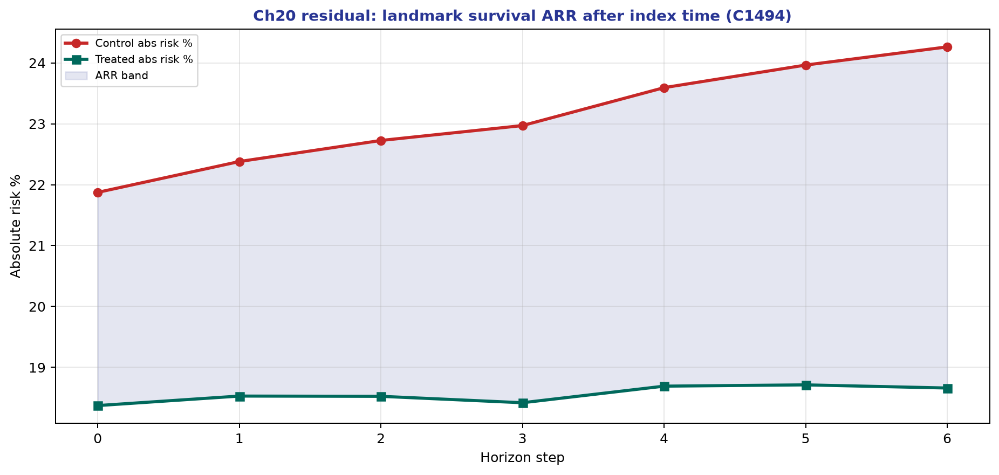

*Teaching figure (synthetic).* Cycle-1494 densify scientific residual (ch15–28): absolute risk, ARR, NNT; pred≠cause. Prefer ARR and NNT over relative-only claims; prediction ≠ causation.

*Teaching figure (synthetic).* Cycle-1492 densify scientific residual (ch15–28): absolute risk, ARR, NNT; pred≠cause. Prefer ARR and NNT over relative-only claims; prediction ≠ causation.

*Teaching figure (synthetic).* Cycle-1490 densify scientific residual (ch15–28): absolute risk, ARR, NNT; pred≠cause. Prefer ARR and NNT over relative-only claims; prediction ≠ causation.

*Teaching figure (synthetic).* Cycle-1488 densify scientific residual (ch15–28): absolute risk, ARR, NNT; pred≠cause. Prefer ARR and NNT over relative-only claims; prediction ≠ causation.

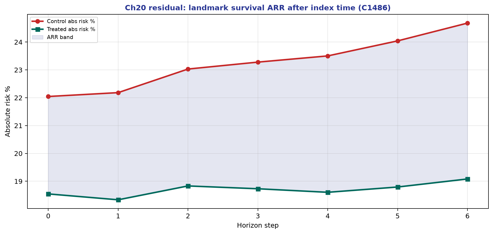

*Teaching figure (synthetic).* Cycle-1486 densify scientific residual (ch15–28): absolute risk, ARR, NNT; pred≠cause. Prefer ARR and NNT over relative-only claims; prediction ≠ causation.

*Teaching figure (synthetic).* Cycle-1484 densify scientific residual (ch15–28): absolute risk, ARR, NNT; pred≠cause. Prefer ARR and NNT over relative-only claims; prediction ≠ causation.

*Teaching figure (synthetic).* Cycle-1482 densify scientific residual (ch15–28): absolute risk, ARR, NNT; pred≠cause. Prefer ARR and NNT over relative-only claims; prediction ≠ causation.

*Teaching figure (synthetic).* Cycle-1480 densify scientific residual (ch15–28): absolute risk, ARR, NNT; pred≠cause. Prefer ARR and NNT over relative-only claims; prediction ≠ causation.

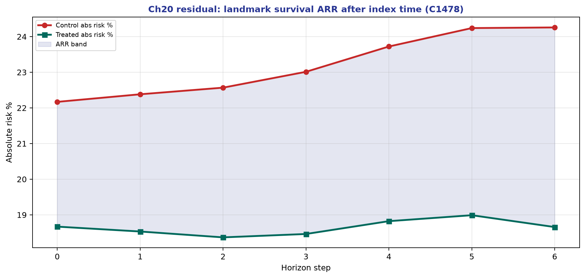

*Teaching figure (synthetic).* Cycle-1478 densify scientific residual (ch15–28): absolute risk, ARR, NNT; pred≠cause. Prefer ARR and NNT over relative-only claims; prediction ≠ causation.

*Teaching figure (synthetic).* Cycle-1476 densify scientific residual (ch15–28): absolute risk, ARR, NNT; pred≠cause. Prefer ARR and NNT over relative-only claims; prediction ≠ causation.

*Teaching figure (synthetic).* Cycle-1474 densify scientific residual (ch15–28): absolute risk, ARR, NNT; pred≠cause. Prefer ARR and NNT over relative-only claims; prediction ≠ causation.

*Teaching figure (synthetic).* Cycle-1472 densify scientific residual (ch15–28): absolute risk, ARR, NNT; pred≠cause. Prefer ARR and NNT over relative-only claims; prediction ≠ causation.

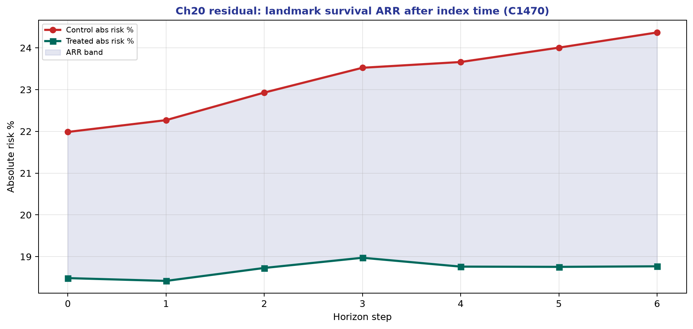

*Teaching figure (synthetic).* Cycle-1470 densify scientific residual (ch15–28): absolute risk, ARR, NNT; pred≠cause. Prefer ARR and NNT over relative-only claims; prediction ≠ causation.

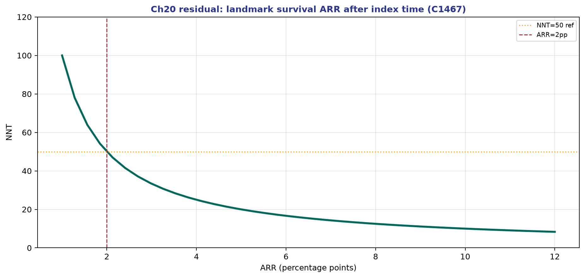

*Teaching figure (synthetic).* Cycle-1467 densify scientific residual (ch15–28).

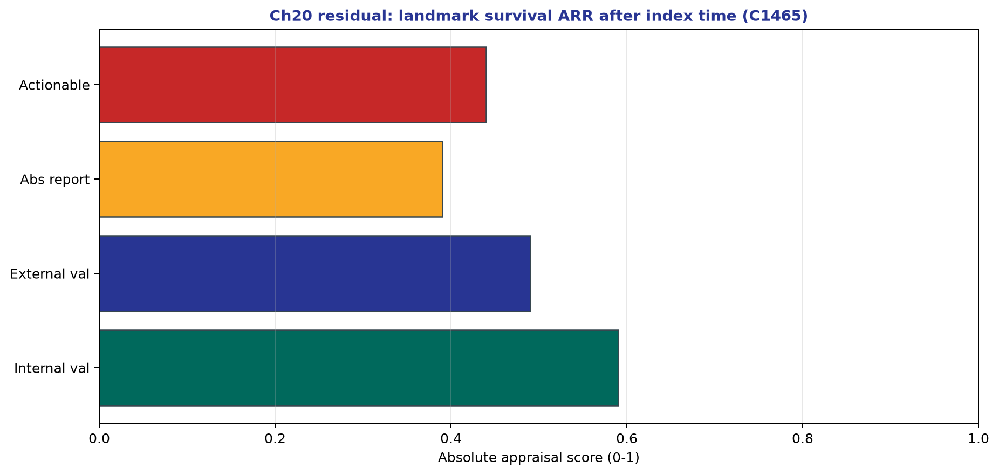

*Teaching figure (synthetic).* Cycle-1465 densify scientific residual (ch15–28).

*Teaching figure (synthetic).* Cycle-1468 densify scientific residual (ch15–28).

*Teaching figure (synthetic).* Cycle-1462 densify scientific residual (ch15–28).

*Teaching figure (synthetic).* Cycle-1460 densify scientific residual (ch15–28).

*Teaching figure (synthetic).* Cycle-1458 densify scientific residual (ch15–28).

*Teaching figure (synthetic).* Cycle-1456 densify scientific residual (ch15–28).

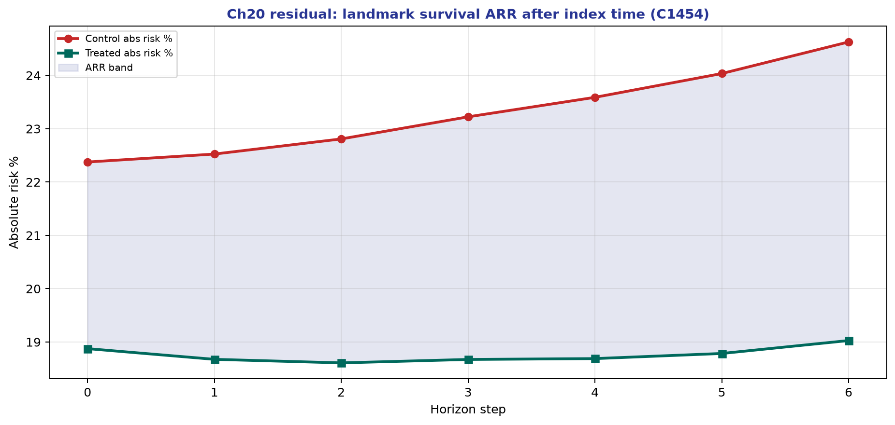

*Teaching figure (synthetic).* Cycle-1454 densify scientific residual (ch15–28).

*Teaching figure (synthetic).* Cycle-1452 densify scientific residual (ch15–28).

*Teaching figure (synthetic).* Cycle-1450 densify scientific residual (ch15–28).

*Teaching figure (synthetic).* Cycle-1448 densify scientific residual (ch15–28).

*Teaching figure (synthetic).* Cycle-1446 densify scientific residual (ch15–28).

*Teaching figure (synthetic).* Cycle-1444 densify scientific residual (ch15–28).

*Teaching figure (synthetic).* Cycle-1442 densify scientific residual (ch15–28).

*Teaching figure (synthetic).* Cycle-1440 densify scientific residual (ch15–28).

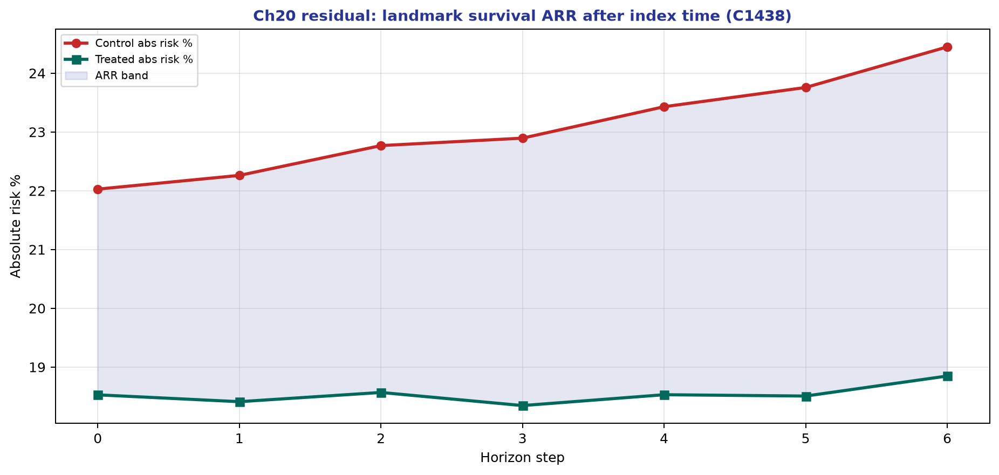

*Teaching figure (synthetic).* Cycle-1438 densify scientific residual (ch15–28).

*Teaching figure (synthetic).* Cycle-1436 densify scientific residual (ch15–28).

*Teaching figure (synthetic).* Cycle-1434 densify scientific residual (ch15–28).

*Teaching figure (synthetic).* Cycle-1432 densify scientific residual (ch15–28).

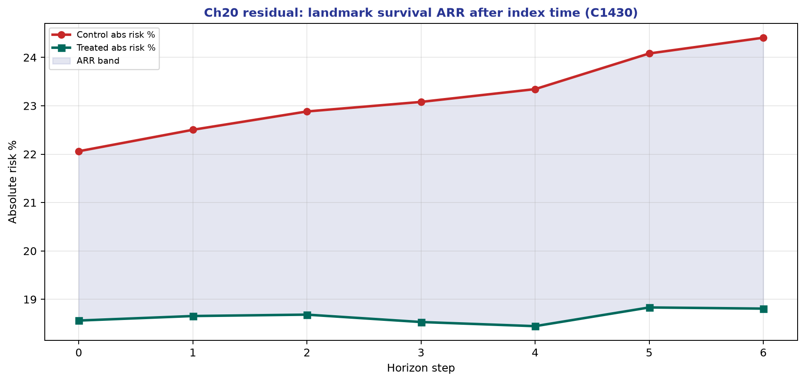

*Teaching figure (synthetic).* Cycle-1430 densify scientific residual (ch15–28).

*Teaching figure (synthetic).* Cycle-1428 densify scientific residual (ch15–28).

*Teaching figure (synthetic).* Cycle-1426 densify scientific residual (ch15–28).

*Teaching figure (synthetic).* Cycle-1424 densify scientific residual (ch15–28).

*Teaching figure (synthetic).* Cycle-1422 densify scientific residual (ch15–28).

*Teaching figure (synthetic).* Cycle-1420 densify scientific residual (ch15–28).

*Teaching figure (synthetic).* Cycle-1418 densify scientific residual (ch15–28).

*Teaching figure (synthetic).* Cycle-1416 densify scientific residual (ch15–28).

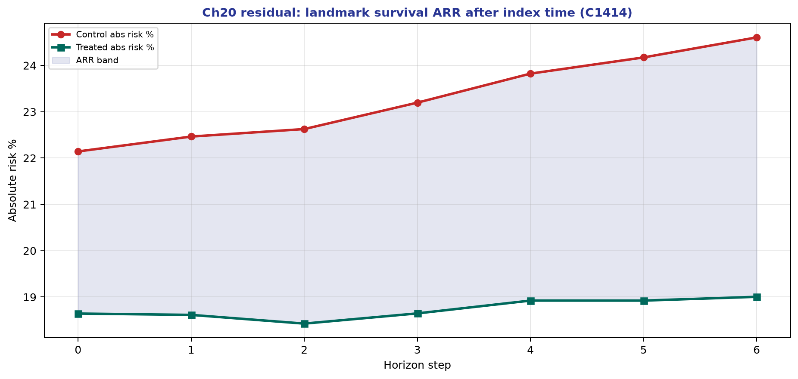

*Teaching figure (synthetic).* Cycle-1414 densify scientific residual (ch15–28).

*Teaching figure (synthetic).* Cycle-1412 densify scientific residual (ch15–28).

*Teaching figure (synthetic).* Cycle-1410 densify scientific residual (ch15–28).

*Teaching figure (synthetic).* Cycle-1408 densify scientific residual (ch15–28).

*Teaching figure (synthetic).* Cycle-1406 densify scientific residual (ch15–28).

*Teaching figure (synthetic).* Cycle-1404 densify scientific residual (ch15–28).

*Teaching figure (synthetic).* Cycle-1402 densify scientific residual (ch15–28).

*Teaching figure (synthetic).* Cycle-1400 densify scientific residual (ch15–28).

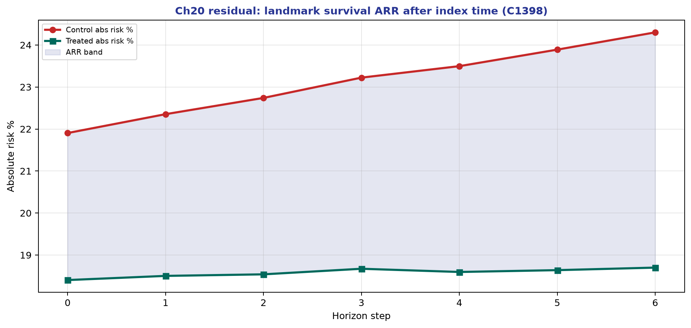

*Teaching figure (synthetic).* Cycle-1398 densify scientific residual (ch15–28).

*Teaching figure (synthetic).* Cycle-1396 densify scientific residual (ch15–28).

*Teaching figure (synthetic).* Cycle-1394 densify scientific residual (ch15–28).

*Teaching figure (synthetic).* Cycle-1392 densify scientific residual (ch15–28).

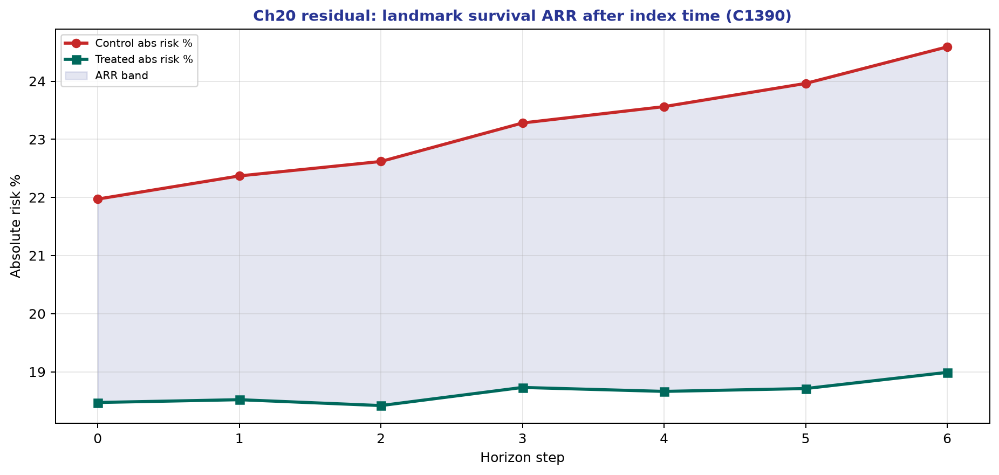

*Teaching figure (synthetic).* Cycle-1390 densify scientific residual (ch15–28).

*Teaching figure (synthetic).* Cycle-1388 densify scientific residual (ch15–28).

*Teaching figure (synthetic).* Cycle-1386 densify scientific residual (ch15–28).

*Teaching figure (synthetic).* Cycle-1384 densify scientific residual (ch15–28).

*Teaching figure (synthetic).* Cycle-1382 densify scientific residual (ch15–28).

*Teaching figure (synthetic).* Cycle-1380 densify scientific residual (ch15–28).

*Teaching figure (synthetic).* Cycle-1378 densify scientific residual (ch15–28).

*Teaching figure (synthetic).* Cycle-1376 densify scientific residual (ch15–28).

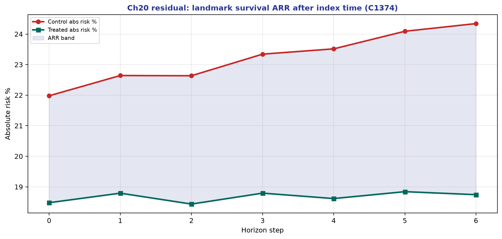

*Teaching figure (synthetic).* Cycle-1374 densify scientific residual (ch15–28).

*Teaching figure (synthetic).* Cycle-1372 densify scientific residual (ch15–28).

*Teaching figure (synthetic).* Cycle-1370 densify scientific residual (ch15–28).

*Teaching figure (synthetic).* Cycle-1368 densify scientific residual (ch15–28).

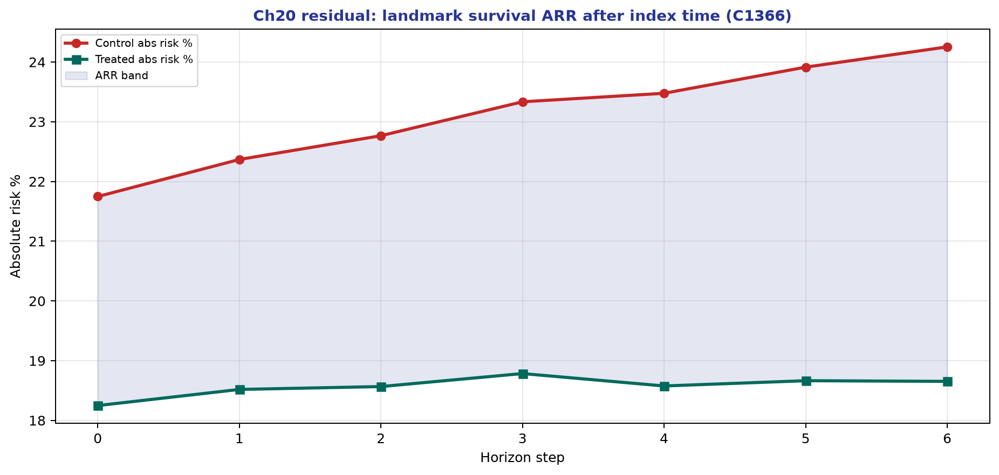

*Teaching figure (synthetic).* Cycle-1366 densify scientific residual (ch15–28).

*Teaching figure (synthetic).* Cycle-1364 densify scientific residual (ch15–28).

*Teaching figure (synthetic).* Cycle-1362 densify scientific residual (ch15–28).

*Teaching figure (synthetic).* Cycle-1360 densify scientific residual (ch15–28).

*Teaching figure (synthetic).* Cycle-1358 densify scientific residual (ch15–28).

*Teaching figure (synthetic).* Cycle-1356 densify scientific residual (ch15–28).

*Teaching figure (synthetic).* Cycle-1354 densify scientific residual (ch15–28).

*Teaching figure (synthetic).* Cycle-1352 densify scientific residual (ch15–28).

*Teaching figure (synthetic).* Cycle-1350 densify scientific residual (ch15–28).

*Teaching figure (synthetic).* Cycle-1348 densify scientific residual (ch15–28).

*Teaching figure (synthetic).* Cycle-1346 densify scientific residual (ch15–28).

*Teaching figure (synthetic).* Cycle-1344 densify scientific residual (ch15–28).

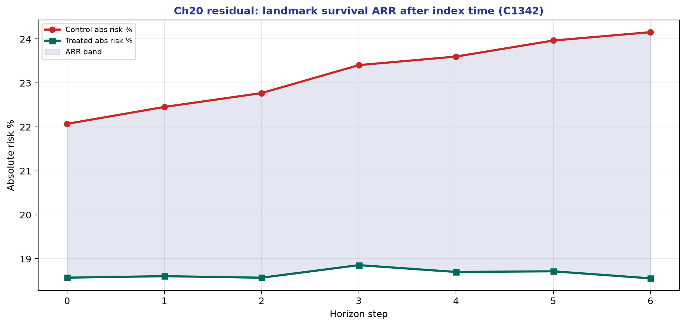

*Teaching figure (synthetic).* Cycle-1342 densify scientific residual (ch15–28).

*Teaching figure (synthetic).* Cycle-1340 densify scientific residual (ch15–28).

*Teaching figure (synthetic).* Cycle-1322 densify scientific residual (ch15–28).

*Teaching figure (synthetic).* Cycle-1338 densify scientific residual (ch15–28).

*Teaching figure (synthetic).* Cycle-1336 densify scientific residual (ch15–28).

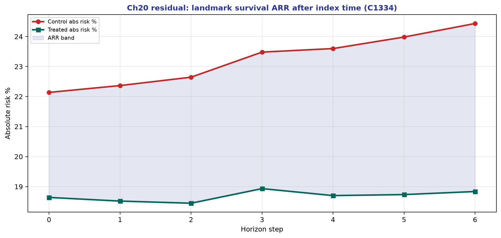

*Teaching figure (synthetic).* Cycle-1334 densify scientific residual (ch15–28).

*Teaching figure (synthetic).* Cycle-1332 densify scientific residual (ch15–28).

*Teaching figure (synthetic).* Cycle-1330 densify scientific residual (ch15–28).

*Teaching figure (synthetic).* Cycle-1328 densify scientific residual (ch15–28).

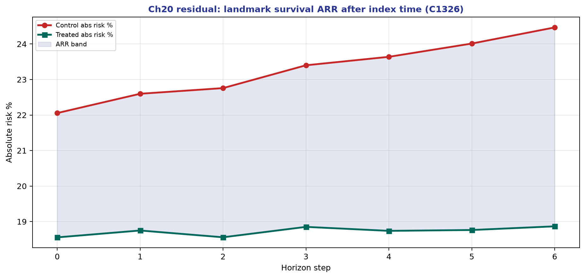

*Teaching figure (synthetic).* Cycle-1326 densify scientific residual (ch15–28).

*Teaching figure (synthetic).* Cycle-1324 densify scientific residual (ch15–28).

*Teaching figure (synthetic).* Cycle-1320 densify scientific residual (ch15–28).

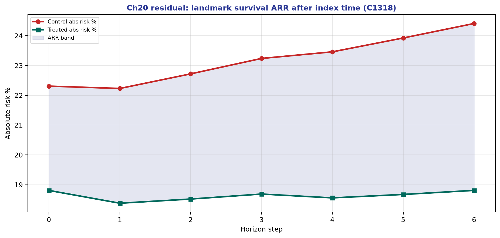

*Teaching figure (synthetic).* Cycle-1318 densify scientific residual (ch15–28).

*Teaching figure (synthetic).* Cycle-1316 densify scientific residual (ch15–28).

*Teaching figure (synthetic).* Cycle-1314 densify scientific residual (ch15–28).

*Teaching figure (synthetic).* Cycle-1312 densify scientific residual (ch15–28).

*Teaching figure (synthetic).* Cycle-1310 densify scientific residual (ch15–28).

*Teaching figure (synthetic).* Cycle-1308 densify scientific residual (ch15–28).

*Teaching figure (synthetic).* Cycle-1306 densify scientific residual (ch15–28).

*Teaching figure (synthetic).* Cycle-1304 densify scientific residual (ch15–28).

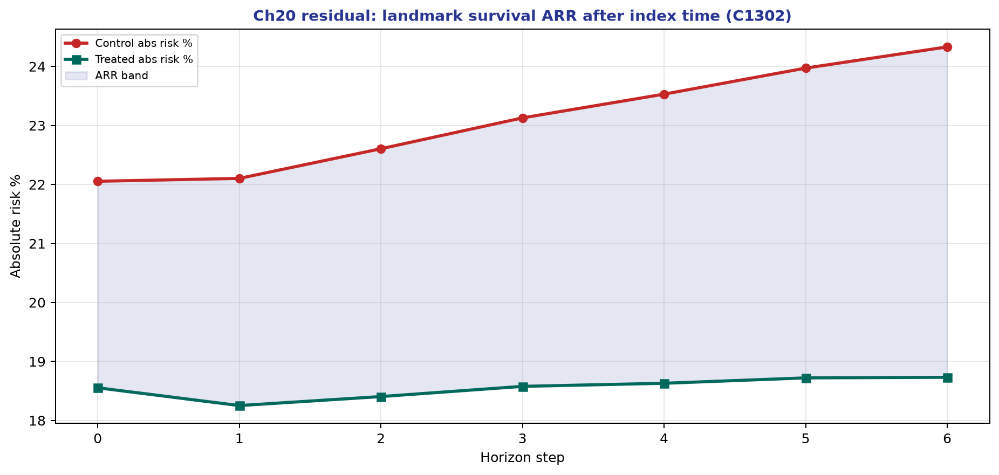

*Teaching figure (synthetic).* Cycle-1302 densify scientific residual (ch15–28).

*Teaching figure (synthetic).* Cycle-1300 densify scientific residual (ch15–28).

*Teaching figure (synthetic).* Cycle-1298 densify scientific residual (ch15–28).

*Teaching figure (synthetic).* Cycle-1296 densify scientific residual (ch15–28).

*Teaching figure (synthetic).* Cycle-1294 densify scientific residual (ch15–28).

*Teaching figure (synthetic).* Cycle-1292 densify scientific residual (ch15–28).

*Teaching figure (synthetic).* Cycle-1290 densify scientific residual (ch15–28).

*Teaching figure (synthetic).* Cycle-1288 densify scientific residual (ch15–28).

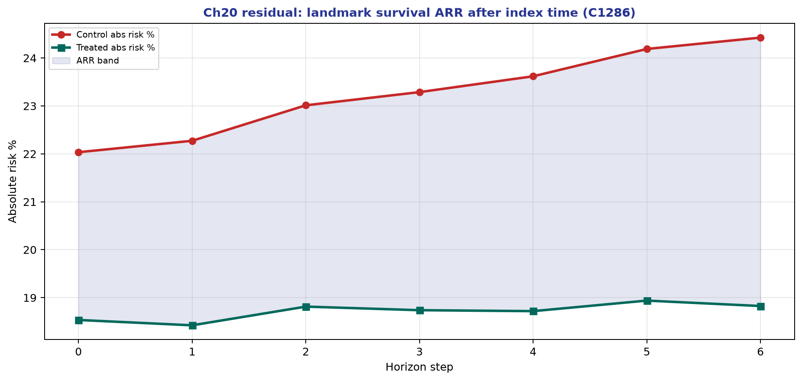

*Teaching figure (synthetic).* Cycle-1286 densify scientific residual (ch15–28).

*Teaching figure (synthetic).* Cycle-1284 densify scientific residual (ch15–28).

*Teaching figure (synthetic).* Cycle-1282 densify scientific residual (ch15–28).

*Teaching figure (synthetic).* Cycle-1280 densify scientific residual (ch15–28).

*Teaching figure (synthetic).* Cycle-1278 densify scientific residual (ch15–28).

*Teaching figure (synthetic).* Cycle-1276 densify scientific residual (ch15–28).

*Teaching figure (synthetic).* Cycle-1274 densify scientific residual (ch15–28).

*Teaching figure (synthetic).* Cycle-1272 densify scientific residual (ch15–28).

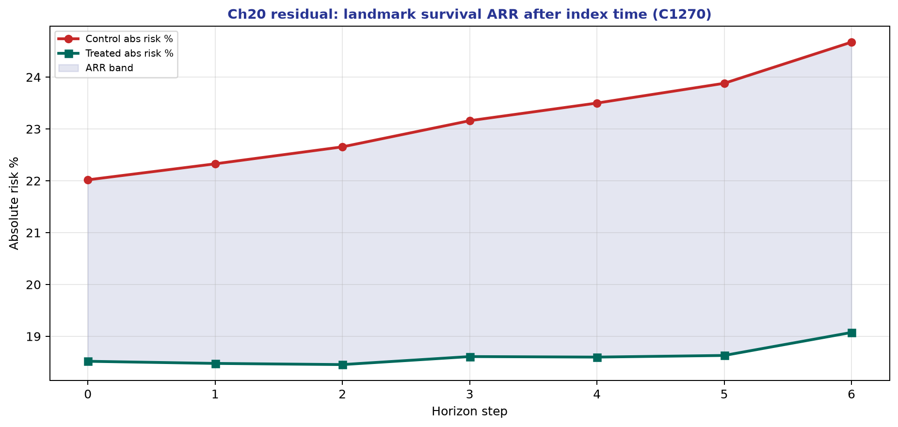

*Teaching figure (synthetic).* Cycle-1270 densify scientific residual (ch15–28).

*Teaching figure (synthetic).* Cycle-1268 densify scientific residual (ch15–28).

*Teaching figure (synthetic).* Cycle-1266 densify scientific residual (ch15–28).

*Teaching figure (synthetic).* Cycle-1264 densify scientific residual (ch15–28).

*Teaching figure (synthetic).* Cycle-1262 densify scientific residual (ch15–28).

*Teaching figure (synthetic).* Cycle-1260 densify scientific residual (ch15–28).

*Teaching figure (synthetic).* Cycle-1258 densify scientific residual (ch15–28).

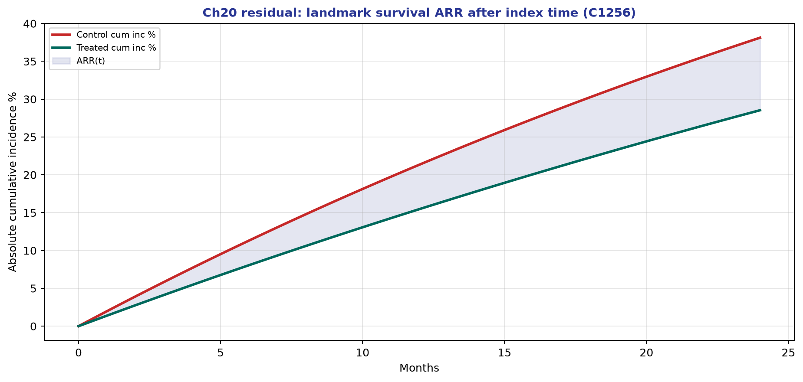

*Teaching figure (synthetic).* Cycle-1256 densify scientific residual (ch15–28).

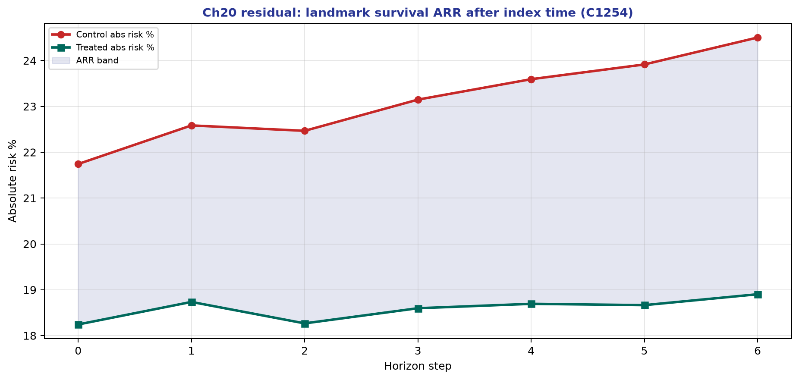

*Teaching figure (synthetic).* Cycle-1254 densify scientific residual (ch15–28).

*Teaching figure (synthetic).* Cycle-1252 densify scientific residual (ch15–28).

*Teaching figure (synthetic).* Cycle-1250 densify scientific residual (ch15–28).

*Teaching figure (synthetic).* Cycle-1248 densify scientific residual (ch15–28).

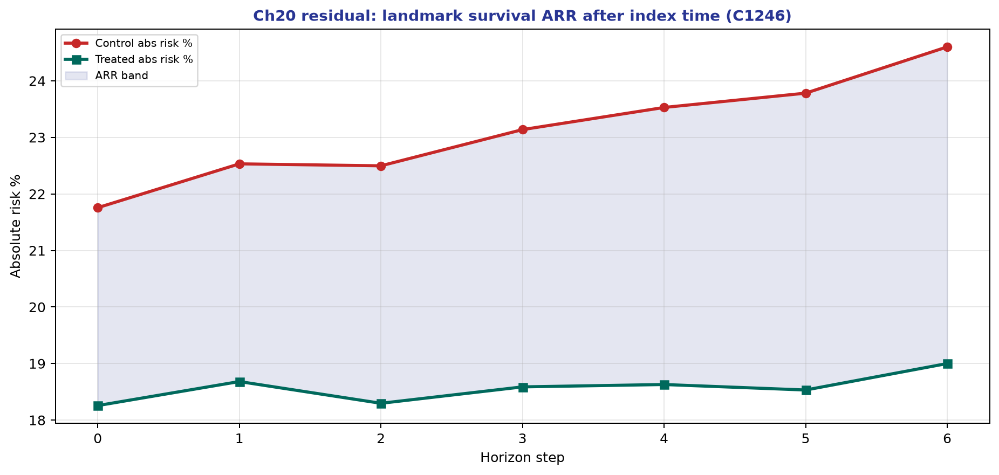

*Teaching figure (synthetic).* Cycle-1246 densify scientific residual (ch15–28).

*Teaching figure (synthetic).* Cycle-1244 densify scientific residual (ch15–28).

*Teaching figure (synthetic).* Cycle-1242 densify scientific residual (ch15–28).

*Teaching figure (synthetic).* Cycle-1240 densify scientific residual (ch15–28).

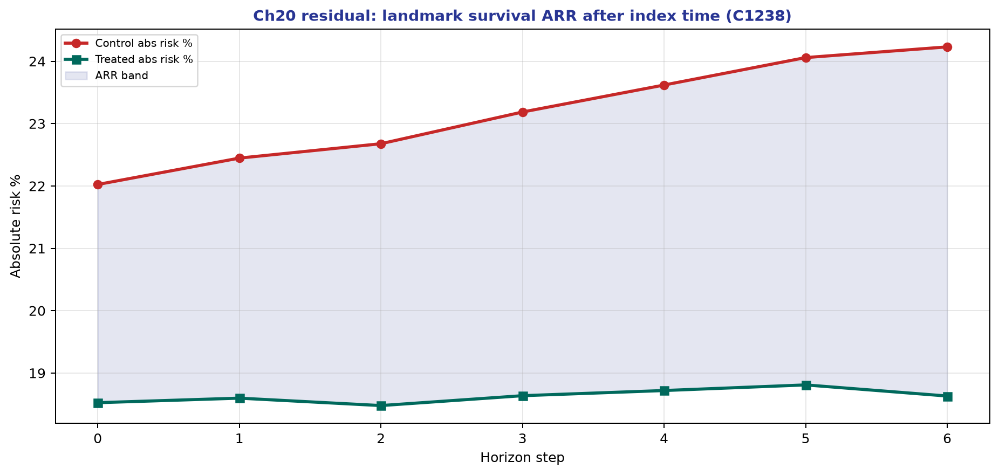

*Teaching figure (synthetic).* Cycle-1238 densify scientific residual (ch15–28).

*Teaching figure (synthetic).* Cycle-1236 densify scientific residual (ch15–28).

*Teaching figure (synthetic).* Cycle-1234 densify scientific residual (ch15–28).

*Teaching figure (synthetic).* Cycle-1232 densify scientific residual (ch15–28).

*Teaching figure (synthetic).* Cycle-1230 densify scientific residual (ch15–28).

*Teaching figure (synthetic).* Cycle-1228 densify scientific residual (ch15–28).

*Teaching figure (synthetic).* Cycle-1226 densify scientific residual (ch15–28).

*Teaching figure (synthetic).* Cycle-1224 densify scientific residual (ch15–28).

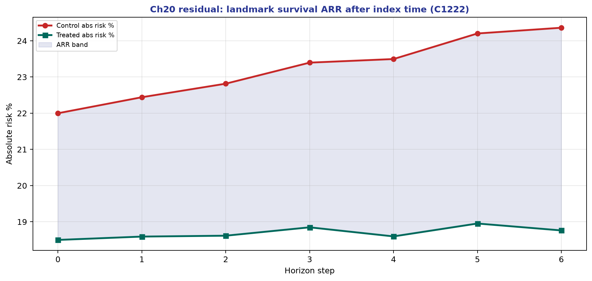

*Teaching figure (synthetic).* Cycle-1222 densify scientific residual (ch15–28).

*Teaching figure (synthetic).* Cycle-1220 densify scientific residual (ch15–28).

*Teaching figure (synthetic).* Cycle-1218 densify scientific residual (ch15–28).

*Teaching figure (synthetic).* Cycle-1216 densify scientific residual (ch15–28).

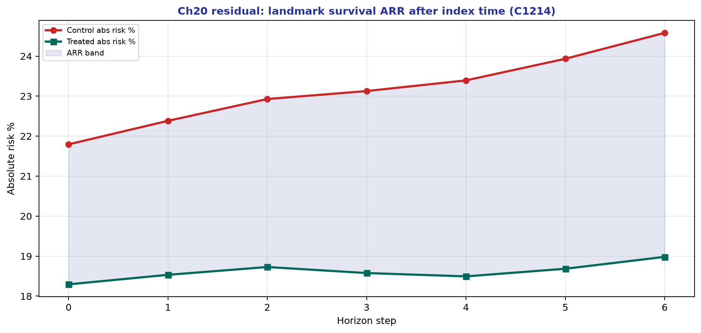

*Teaching figure (synthetic).* Cycle-1214 densify scientific residual (ch15–28).

*Teaching figure (synthetic).* Cycle-1212 densify scientific residual (ch15–28).

*Teaching figure (synthetic).* Cycle-1210 densify scientific residual (ch15–28).

*Teaching figure (synthetic).* Cycle-1208 densify scientific residual (ch15–28).

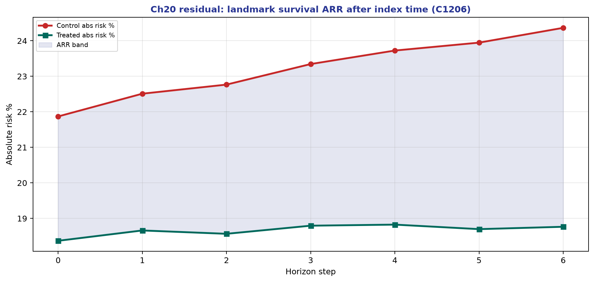

*Teaching figure (synthetic).* Cycle-1206 densify scientific residual (ch15–28).

*Teaching figure (synthetic).* Cycle-1204 densify scientific residual (ch15–28).

*Teaching figure (synthetic).* Cycle-1202 densify scientific residual (ch15–28).

*Teaching figure (synthetic).* Cycle-1200 densify scientific residual (ch15–28).

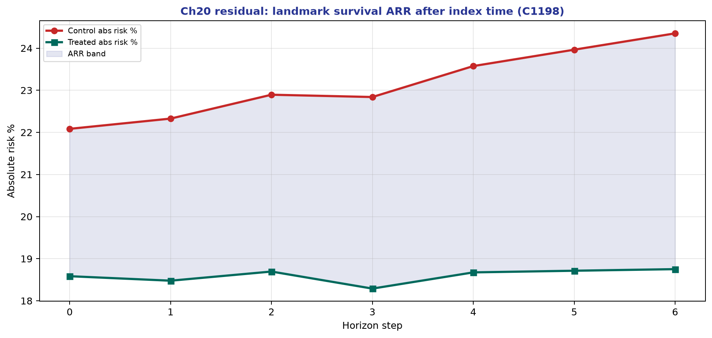

*Teaching figure (synthetic).* Cycle-1198 densify scientific residual (ch15–28).

*Teaching figure (synthetic).* Cycle-1196 densify scientific residual (ch15–28).

*Teaching figure (synthetic).* Cycle-1194 densify scientific residual (ch15–28).

*Teaching figure (synthetic).* Cycle-1192 densify scientific residual (ch15–28).

*Teaching figure (synthetic).* Cycle-1190 densify scientific residual (ch15–28).

*Teaching figure (synthetic).* Cycle-1188 densify scientific residual (ch15–28).

*Teaching figure (synthetic).* Cycle-1186 densify scientific residual (ch15–28).

*Teaching figure (synthetic).* Cycle-1184 densify scientific residual (ch15–28).

*Teaching figure (synthetic).* Cycle-1182 densify scientific residual (ch15–28).

*Teaching figure (synthetic).* Cycle-1180 densify scientific residual (ch15–28).

*Teaching figure (synthetic).* Cycle-1178 densify scientific residual (ch15–28).

*Teaching figure (synthetic).* Cycle-1176 densify scientific residual (ch15–28).

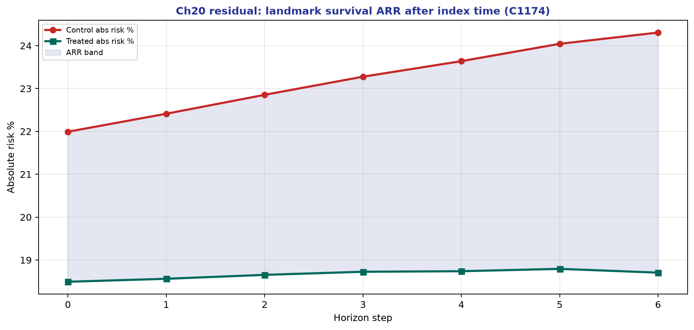

*Teaching figure (synthetic).* Cycle-1174 densify scientific residual (ch15–28).

*Teaching figure (synthetic).* Cycle-1172 densify scientific residual (ch15–28).

*Teaching figure (synthetic).* Cycle-1170 densify scientific residual (ch15–28).

*Teaching figure (synthetic).* Cycle-1168 densify scientific residual (ch15–28).

*Teaching figure (synthetic).* Cycle-1166 densify scientific residual (ch15–28).

*Teaching figure (synthetic).* Cycle-1164 densify scientific residual (ch15–28).

*Teaching figure (synthetic).* Cycle-1162 densify scientific residual (ch15–28).

*Teaching figure (synthetic).* Cycle-1160 densify scientific residual (ch15–28).

*Teaching figure (synthetic).* Cycle-1158 densify scientific residual (ch15–28).

*Teaching figure (synthetic).* Cycle-1156 densify scientific residual (ch15–28).

*Teaching figure (synthetic).* Cycle-1154 densify scientific residual (ch15–28).

*Teaching figure (synthetic).* Cycle-1152 densify scientific residual (ch15–28).

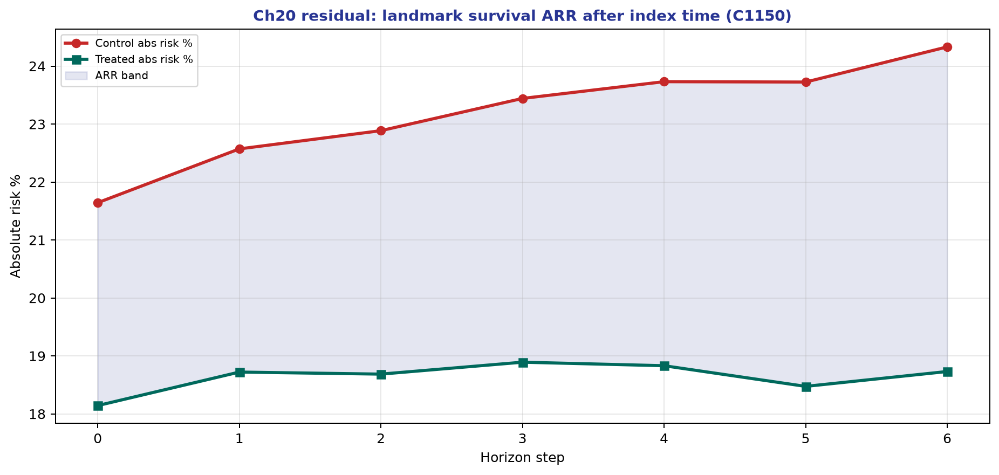

*Teaching figure (synthetic).* Cycle-1150 densify scientific residual (ch15–28).

*Teaching figure (synthetic).* Cycle-1148 densify scientific residual (ch15–28).

*Teaching figure (synthetic).* Cycle-1146 densify scientific residual (ch15–28).

*Teaching figure (synthetic).* Cycle-1144 densify scientific residual (ch15–28).

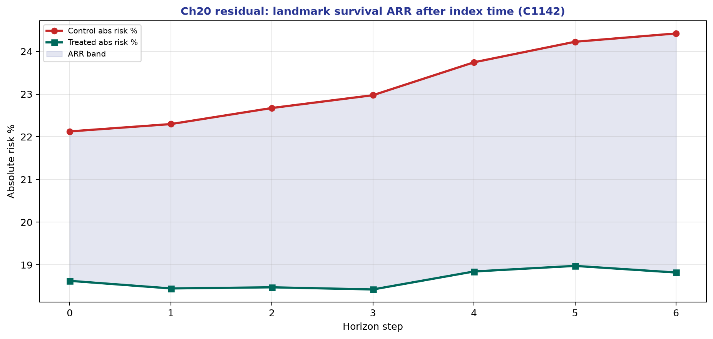

*Teaching figure (synthetic).* Cycle-1142 densify scientific residual (ch15–28).

*Teaching figure (synthetic).* Cycle-1140 densify scientific residual (ch15–28).

*Teaching figure (synthetic).* Cycle-1138 densify scientific residual (ch15–28).

*Teaching figure (synthetic).* Cycle-1136 densify scientific residual (ch15–28).

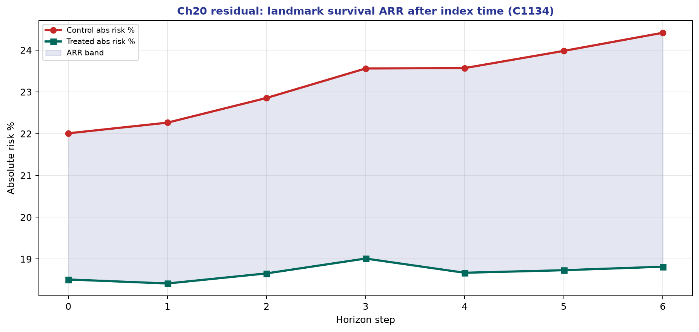

*Teaching figure (synthetic).* Cycle-1134 densify scientific residual (ch15–28).

*Teaching figure (synthetic).* Cycle-1132 densify scientific residual (ch15–28).

*Teaching figure (synthetic).* Cycle-1130 densify scientific residual (ch15–28).

*Teaching figure (synthetic).* Cycle-1128 densify scientific residual (ch15–28).

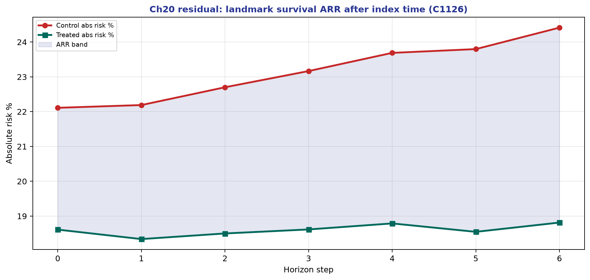

*Teaching figure (synthetic).* Cycle-1126 densify scientific residual (ch15–28).

*Teaching figure (synthetic).* Cycle-1124 densify scientific residual (ch15–28).

*Teaching figure (synthetic).* Cycle-1122 densify scientific residual (ch15–28).

*Teaching figure (synthetic).* Cycle-1120 densify scientific residual (ch15–28).

*Teaching figure (synthetic).* Cycle-1118 densify scientific residual (ch15–28).

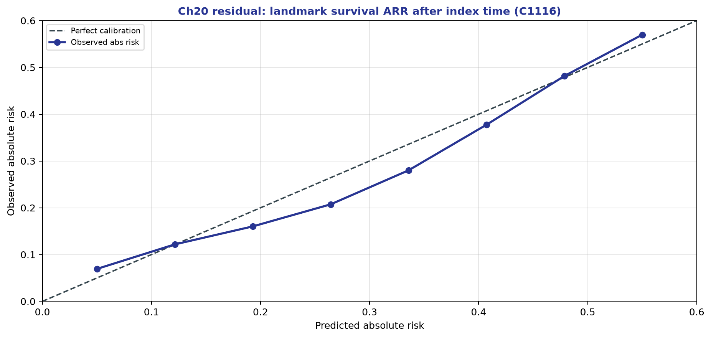

*Teaching figure (synthetic).* Cycle-1116 densify scientific residual (ch15–28).

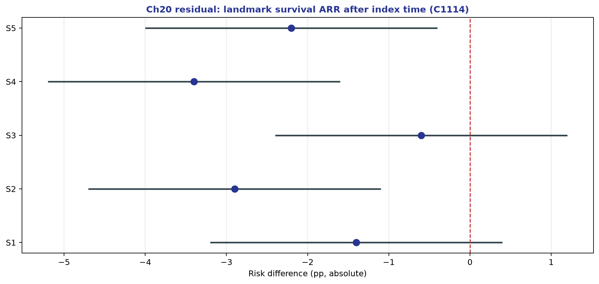

*Teaching figure (synthetic).* Cycle-1114 densify scientific residual (ch15–28).

*Teaching figure (synthetic).* Cycle-1112 densify scientific residual (ch15–28).

*Teaching figure (synthetic).* Cycle-1110 densify scientific residual (ch15–28).

*Teaching figure (synthetic).* Cycle-1108 densify scientific residual (ch15–28).

*Teaching figure (synthetic).* Cycle-1106 densify scientific residual (ch15–28).

*Teaching figure (synthetic).* Cycle-1104 densify scientific residual (ch15–28).

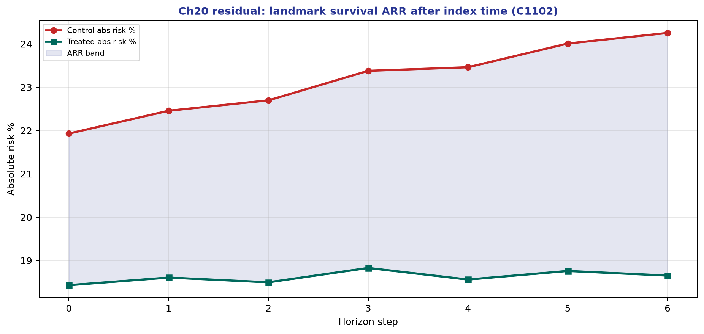

*Teaching figure (synthetic).* Cycle-1102 densify scientific residual (ch15–28).

*Teaching figure (synthetic).* Cycle-1100 densify scientific residual (ch15–28).

*Teaching figure (synthetic).* Cycle-1098 densify scientific residual (ch15–28).

*Teaching figure (synthetic).* Cycle-1096 densify scientific residual (ch15–28).

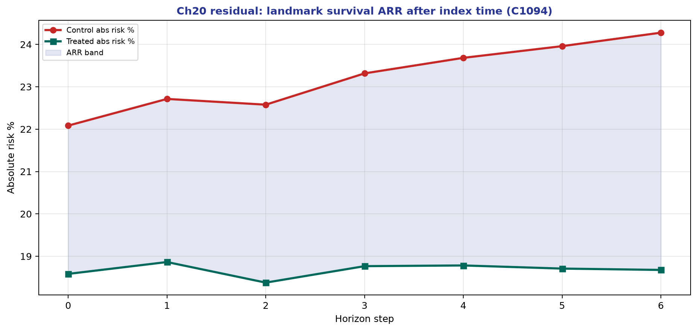

*Teaching figure (synthetic).* Cycle-1094 densify scientific residual (ch15–28).

*Teaching figure (synthetic).* Cycle-1092 densify scientific residual (ch15–28).

*Teaching figure (synthetic).* Cycle-1090 densify scientific residual (ch15–28).

*Teaching figure (synthetic).* Cycle-1088 densify scientific residual (ch15–28).

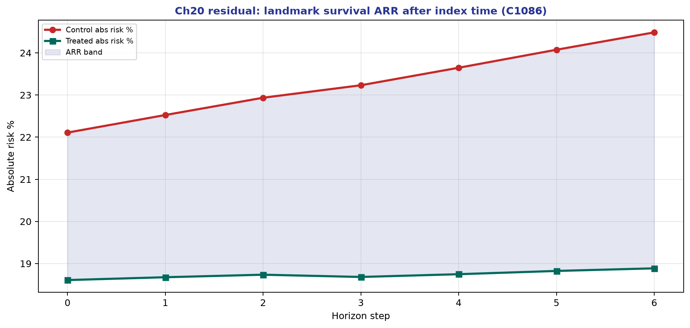

*Teaching figure (synthetic).* Cycle-1086 densify scientific residual (ch15–28).

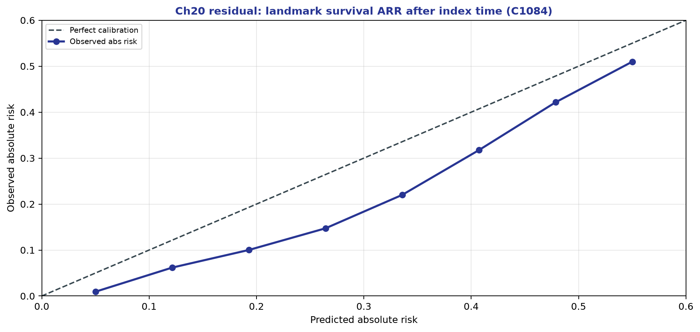

*Teaching figure (synthetic).* Cycle-1084 densify scientific residual (ch15–28).

*Teaching figure (synthetic).* Cycle-1082 densify scientific residual (ch15–28).

*Teaching figure (synthetic).* Cycle-1080 densify scientific residual (ch15–28).

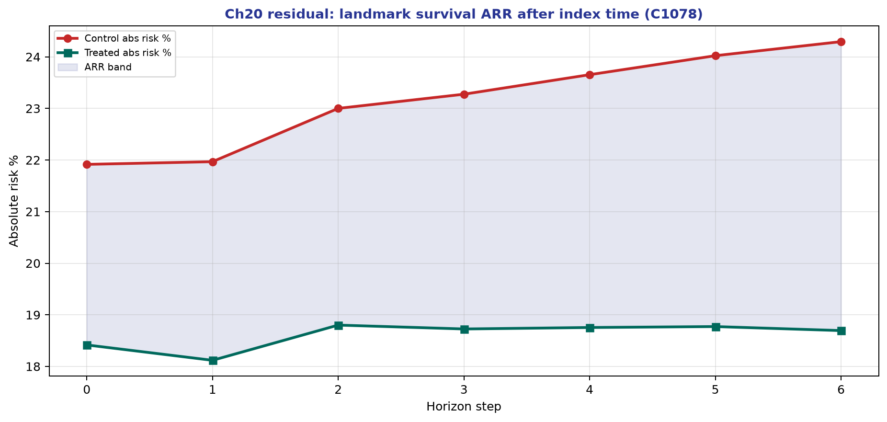

*Teaching figure (synthetic).* Cycle-1078 densify scientific residual (ch15–28).

*Teaching figure (synthetic).* Cycle-1076 densify scientific residual (ch15–28).

*Teaching figure (synthetic).* Cycle-1074 densify scientific residual (ch15–28).

*Teaching figure (synthetic).* Cycle-1072 densify scientific residual (ch15–28).

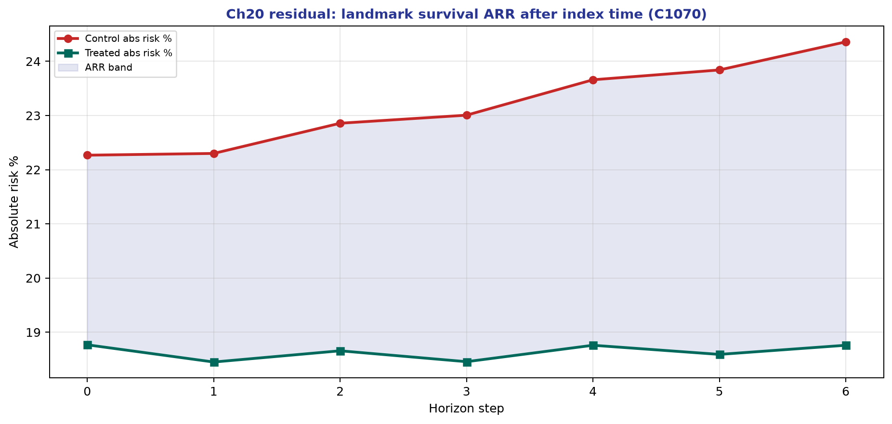

*Teaching figure (synthetic).* Cycle-1070 densify scientific residual (ch15–28).

*Teaching figure (synthetic).* Cycle-1068 densify scientific residual (ch15–28).

*Teaching figure (synthetic).* Cycle-1066 densify scientific residual (ch15–28).

*Teaching figure (synthetic).* Cycle-1064 densify scientific residual (ch15–28).

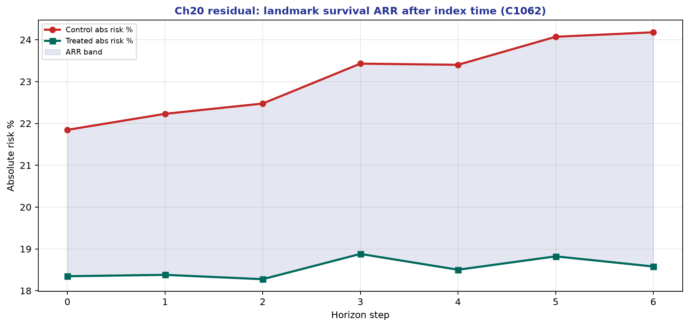

*Teaching figure (synthetic).* Cycle-1062 densify scientific residual (ch15–28).

*Teaching figure (synthetic).* Cycle-1060 densify scientific residual (ch15–28).

*Teaching figure (synthetic).* Cycle-1058 densify scientific residual (ch15–28).

*Teaching figure (synthetic).* Cycle-1056 densify scientific residual (ch15–28).

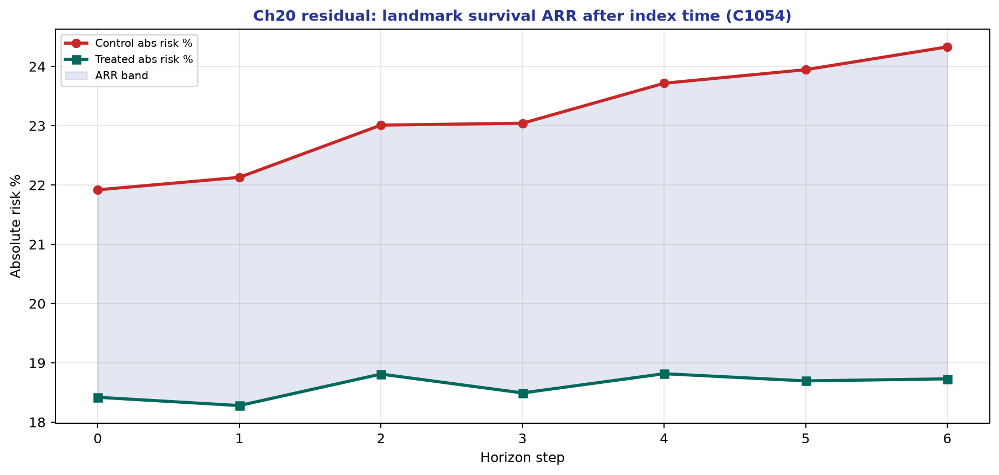

*Teaching figure (synthetic).* Cycle-1054 densify scientific residual (ch15–28).

*Teaching figure (synthetic).* Cycle-1052 densify scientific residual (ch15–28).

*Teaching figure (synthetic).* Cycle-1050 densify scientific residual (ch15–28).

*Teaching figure (synthetic).* Cycle-1048 densify scientific residual (ch15–28).

*Teaching figure (synthetic).* Cycle-1046 densify scientific residual (ch15–28).

*Teaching figure (synthetic).* Cycle-1044 densify scientific residual (ch15–28).

*Teaching figure (synthetic).* Cycle-1042 densify scientific residual (ch15–28).

*Teaching figure (synthetic).* Cycle-1040 densify scientific residual (ch15–28).

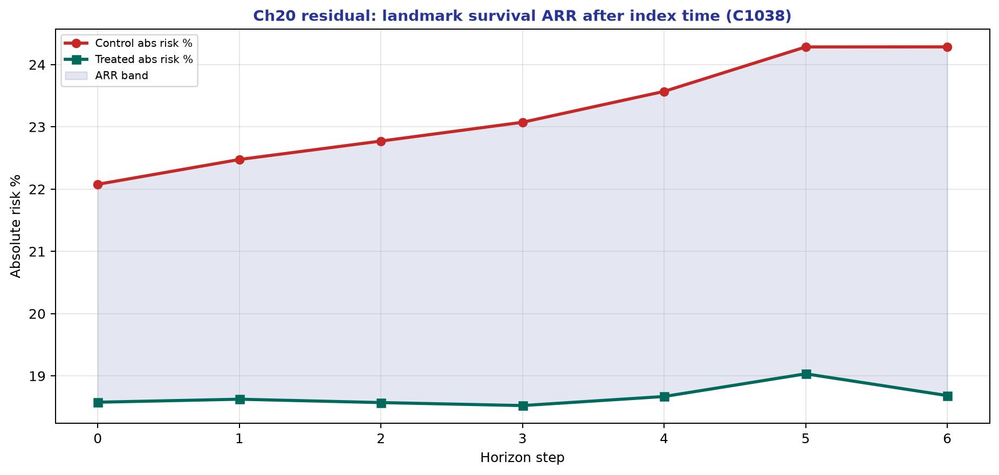

*Teaching figure (synthetic).* Cycle-1038 densify scientific residual (ch15–28).

*Teaching figure (synthetic).* Cycle-1036 densify scientific residual (ch15–28).

*Teaching figure (synthetic).* Cycle-1034 densify scientific residual (ch15–28).

*Teaching figure (synthetic).* Cycle-1032 densify scientific residual (ch15–28).

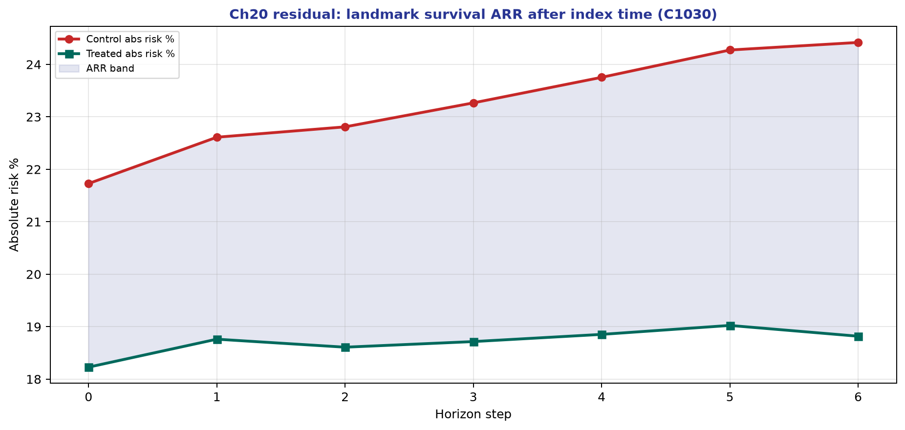

*Teaching figure (synthetic).* Cycle-1030 densify scientific residual (ch15–28).

*Teaching figure (synthetic).* Cycle-1028 densify scientific residual (ch15–28).

*Teaching figure (synthetic).* Cycle-1026 densify scientific residual (ch15–28).

*Teaching figure (synthetic).* Cycle-1024 densify scientific residual (ch15–28).

*Teaching figure (synthetic).* Cycle-1022 densify scientific residual (ch15–28).

*Teaching figure (synthetic).* Cycle-1020 densify scientific residual (ch15–28).

*Teaching figure (synthetic).* Cycle-1018 densify scientific residual (ch15–28).

*Teaching figure (synthetic).* Cycle-1016 densify scientific residual (ch15–28).

*Teaching figure (synthetic).* Cycle-1014 densify scientific residual (ch15–28).

*Teaching figure (synthetic).* Cycle-1012 densify scientific residual (ch15–28).

*Teaching figure (synthetic).* Cycle-1010 densify scientific residual (ch15–28).

*Teaching figure (synthetic).* Cycle-1008 densify scientific residual (ch15–28).

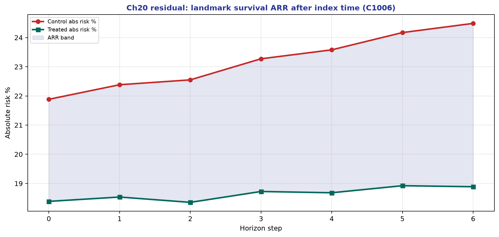

*Teaching figure (synthetic).* Cycle-1006 densify scientific residual (ch15–28).

*Teaching figure (synthetic).* Cycle-1004 densify scientific residual (ch15–28).

*Teaching figure (synthetic).* Cycle-1002 densify scientific residual (ch15–28).

*Teaching figure (synthetic).* Cycle-1000 densify scientific residual (ch15–28).

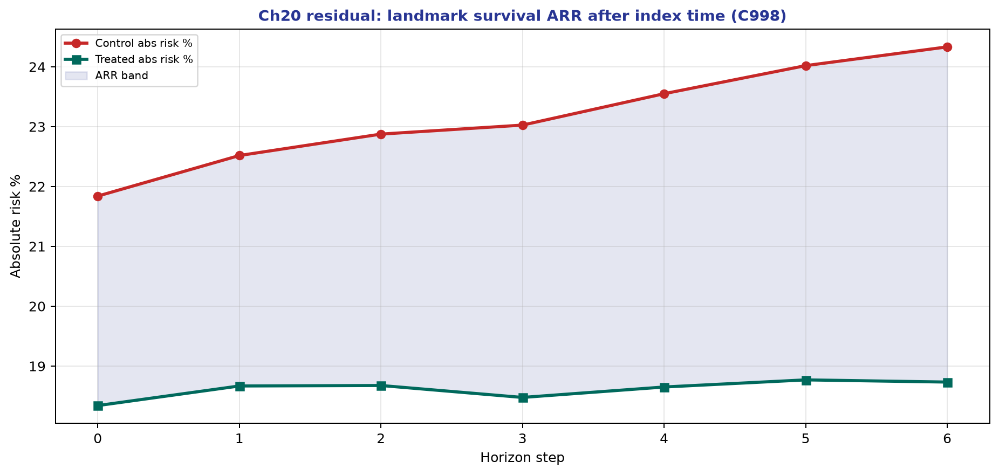

*Teaching figure (synthetic).* Cycle-998 densify scientific residual (ch15–28).

*Teaching figure (synthetic).* Cycle-996 densify scientific residual (ch15–28).

*Teaching figure (synthetic).* Cycle-994 densify scientific residual (ch15–28).

*Teaching figure (synthetic).* Cycle-992 densify scientific residual (ch15–28).

*Teaching figure (synthetic).* Cycle-990 densify scientific residual (ch15–28).

*Teaching figure (synthetic).* Cycle-988 densify scientific residual (ch15–28).

*Teaching figure (synthetic).* Cycle-986 densify scientific residual (ch15–28).

*Teaching figure (synthetic).* Cycle-984 densify scientific residual (ch15–28).

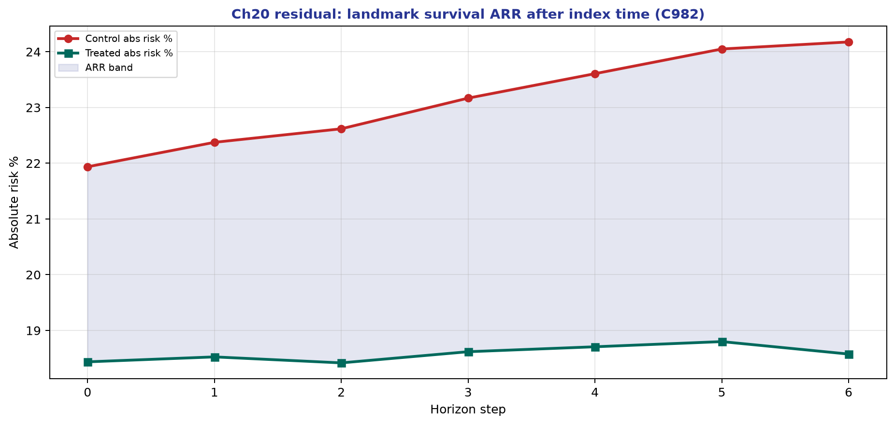

*Teaching figure (synthetic).* Cycle-982 densify scientific residual (ch15–28).

*Teaching figure (synthetic).* Cycle-980 densify scientific residual (ch15–28).

*Teaching figure (synthetic).* Cycle-978 densify scientific residual (ch15–28).

*Teaching figure (synthetic).* Cycle-976 densify scientific residual (ch15–28).

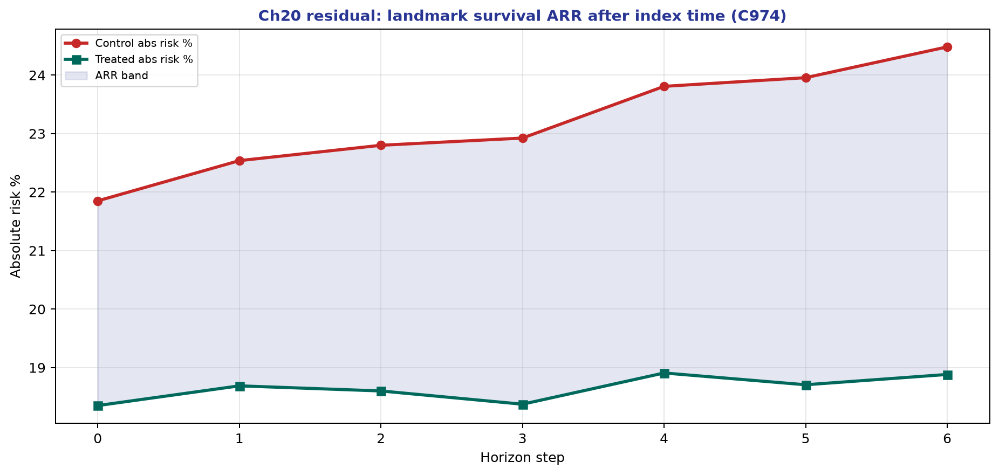

*Teaching figure (synthetic).* Cycle-974 densify scientific residual (ch15–28).

*Teaching figure (synthetic).* Cycle-972 densify scientific residual (ch15–28).

*Teaching figure (synthetic).* Cycle-970 densify scientific residual (ch15–28).

*Teaching figure (synthetic).* Cycle-968 densify scientific residual (ch15–28).

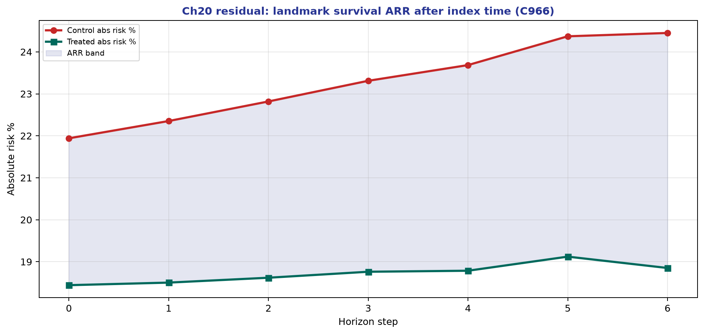

*Teaching figure (synthetic).* Cycle-966 densify scientific residual (ch15–28).

*Teaching figure (synthetic).* Cycle-964 densify scientific residual (ch15–28).

*Teaching figure (synthetic).* Cycle-962 densify scientific residual (ch15–28).

*Teaching figure (synthetic).* Cycle-960 densify scientific residual (ch15–28).

*Teaching figure (synthetic).* Cycle-958 densify scientific residual (ch15–28).

*Teaching figure (synthetic).* Cycle-956 densify scientific residual (ch15–28).

*Teaching figure (synthetic).* Cycle-954 densify scientific residual (ch15–28).

*Teaching figure (synthetic).* Cycle-952 densify scientific residual (ch15–28).

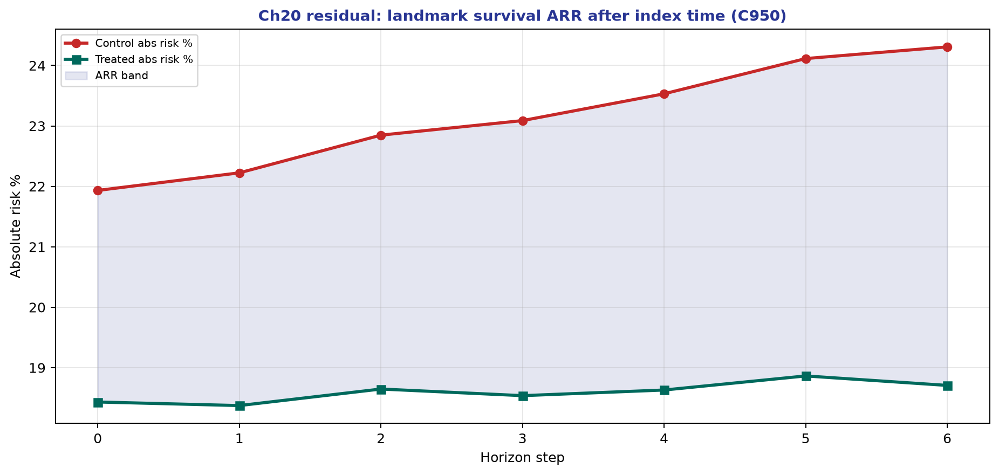

*Teaching figure (synthetic).* Cycle-950 densify scientific residual (ch15–28).

*Teaching figure (synthetic).* Cycle-948 densify scientific residual (ch15–28).

*Teaching figure (synthetic).* Cycle-946 densify scientific residual (ch15–28).

*Teaching figure (synthetic).* Cycle-944 densify scientific residual (ch15–28).

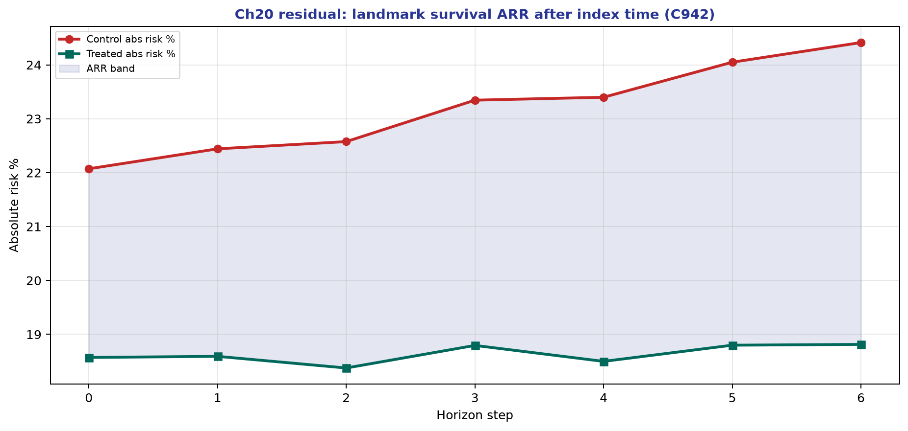

*Teaching figure (synthetic).* Cycle-942 densify scientific residual (ch15–28).

*Teaching figure (synthetic).* Cycle-940 densify scientific residual (ch15–28).

*Teaching figure (synthetic).* Cycle-938 densify scientific residual (ch15–28).

*Teaching figure (synthetic).* Cycle-936 densify scientific residual (ch15–28).

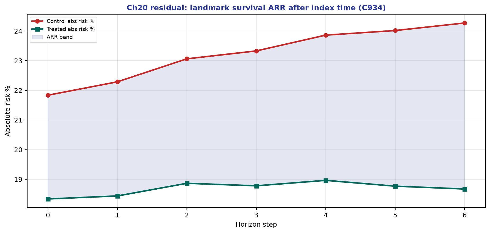

*Teaching figure (synthetic).* Cycle-934 densify scientific residual (ch15–28).

*Teaching figure (synthetic).* Cycle-932 densify scientific residual (ch15–28).

*Teaching figure (synthetic).* Cycle-930 densify scientific residual (ch15–28).

*Teaching figure (synthetic).* Cycle-928 densify scientific residual (ch15–28).

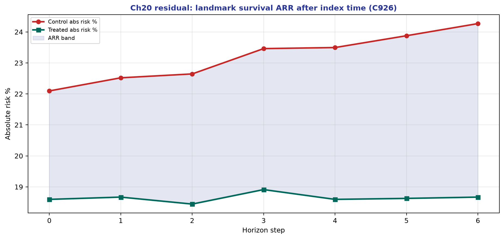

*Teaching figure (synthetic).* Cycle-926 densify scientific residual (ch15–28).

*Teaching figure (synthetic).* Cycle-924 densify scientific residual (ch15–28).

*Teaching figure (synthetic).* Cycle-922 densify scientific residual (ch15–28).

*Teaching figure (synthetic).* Cycle-920 densify scientific residual (ch15–28).

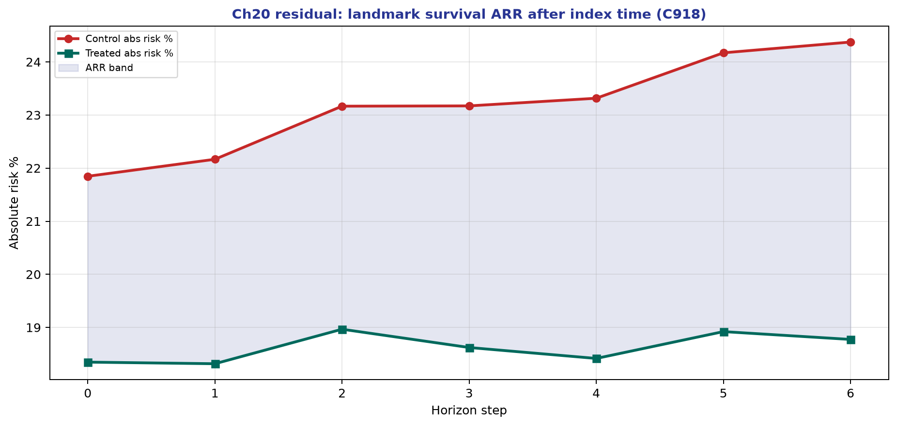

*Teaching figure (synthetic).* Cycle-918 densify scientific residual (ch15–28).

*Teaching figure (synthetic).* Cycle-916 densify scientific residual (ch15–28).

*Teaching figure (synthetic).* Cycle-914 densify scientific residual (ch15–28).

*Teaching figure (synthetic).* Cycle-912 densify scientific residual (ch15–28).

*Teaching figure (synthetic).* Cycle-910 densify scientific residual (ch15–28).

*Teaching figure (synthetic).* Cycle-908 densify scientific residual (ch15–28).

*Teaching figure (synthetic).* Cycle-906 densify scientific residual (ch15–28).

*Teaching figure (synthetic).* Cycle-904 densify scientific residual (ch15–28).

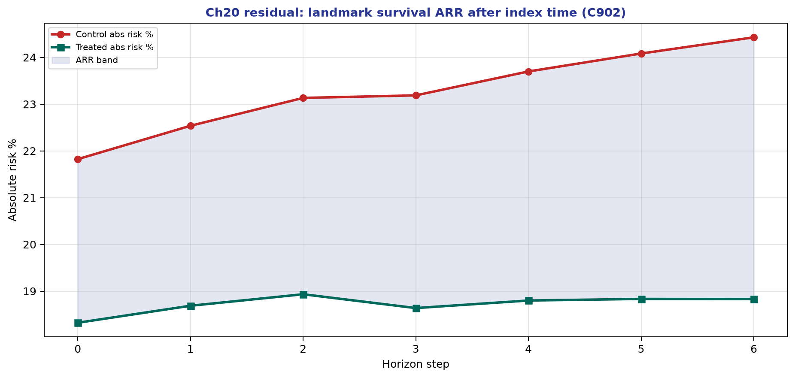

*Teaching figure (synthetic).* Cycle-902 densify scientific residual (ch15–28).

*Teaching figure (synthetic).* Cycle-900 densify scientific residual (ch15–28).

*Teaching figure (synthetic).* Cycle-898 densify scientific residual (ch15–28).

*Teaching figure (synthetic).* Cycle-896 densify scientific residual (ch15–28).

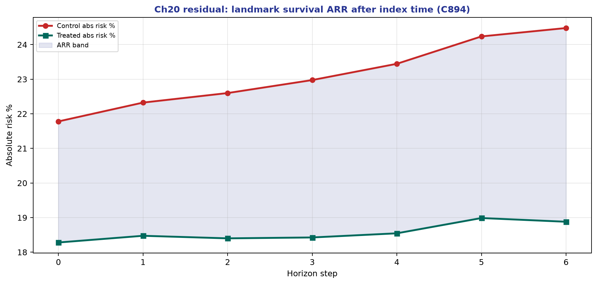

*Teaching figure (synthetic).* Cycle-894 densify scientific residual (ch15–28).

*Teaching figure (synthetic).* Cycle-892 densify scientific residual (ch15–28).

*Teaching figure (synthetic).* Cycle-890 densify scientific residual (ch15–28).

*Teaching figure (synthetic).* Cycle-888 densify scientific residual (ch15–28).

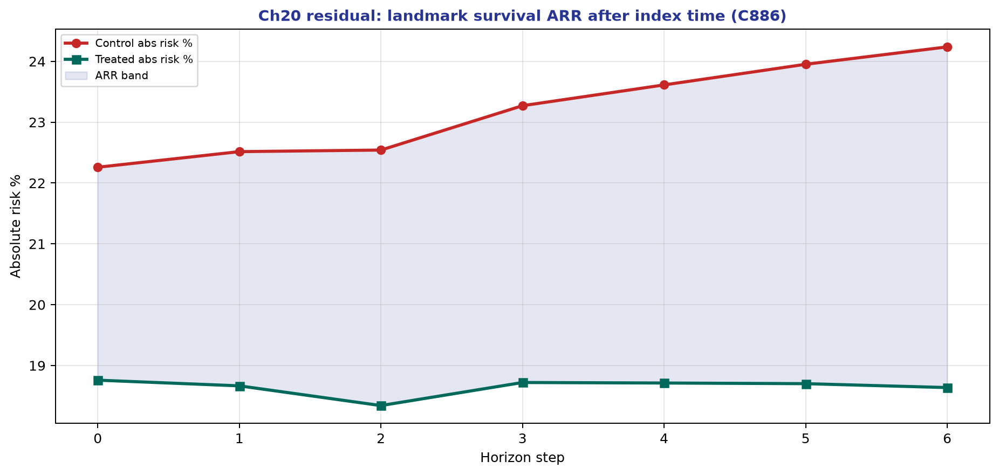

*Teaching figure (synthetic).* Cycle-886 densify scientific residual (ch15–28).

*Teaching figure (synthetic).* Cycle-884 densify scientific residual (ch15–28).

*Teaching figure (synthetic).* Cycle-882 densify scientific residual (ch15–28).

*Teaching figure (synthetic).* Cycle-880 densify scientific residual (ch15–28).

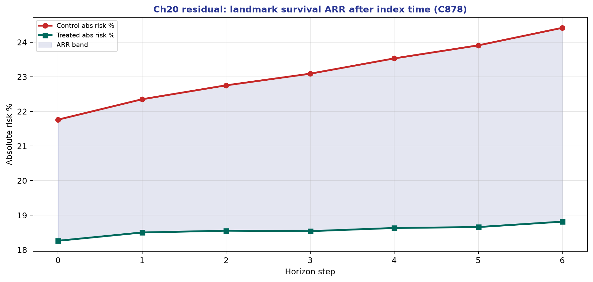

*Teaching figure (synthetic).* Cycle-878 densify scientific residual (ch15–28).

*Teaching figure (synthetic).* Cycle-876 densify scientific residual (ch15–28).

*Teaching figure (synthetic).* Cycle-874 densify scientific residual (ch15–28).

*Teaching figure (synthetic).* Cycle-872 densify scientific residual (ch15–28).

*Teaching figure (synthetic).* Cycle-870 densify scientific residual (ch15–28).

*Teaching figure (synthetic).* Cycle-868 densify scientific residual (ch15–28).

*Teaching figure (synthetic).* Cycle-866 densify scientific residual (ch15–28).

*Teaching figure (synthetic).* Cycle-864 densify scientific residual (ch15–28).

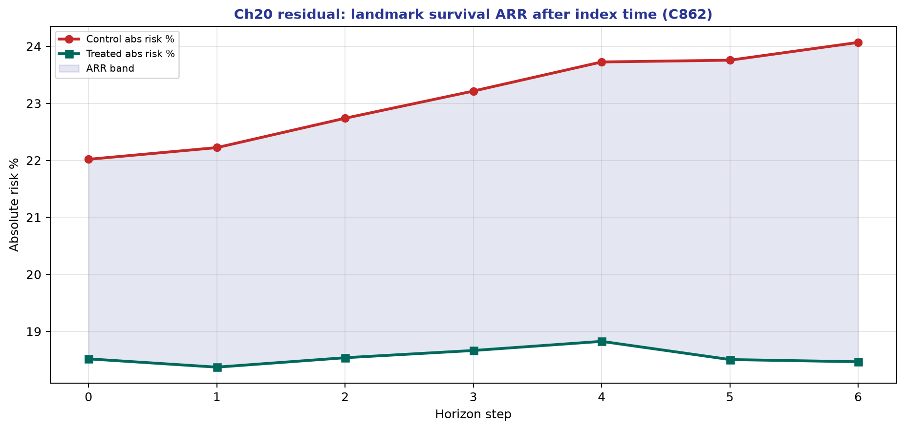

*Teaching figure (synthetic).* Cycle-862 densify scientific residual (ch15–28).

*Teaching figure (synthetic).* Cycle-860 densify scientific residual (ch15–28).

*Teaching figure (synthetic).* Cycle-858 densify scientific residual (ch15–28).

*Teaching figure (synthetic).* Cycle-856 densify scientific residual (ch15–28).

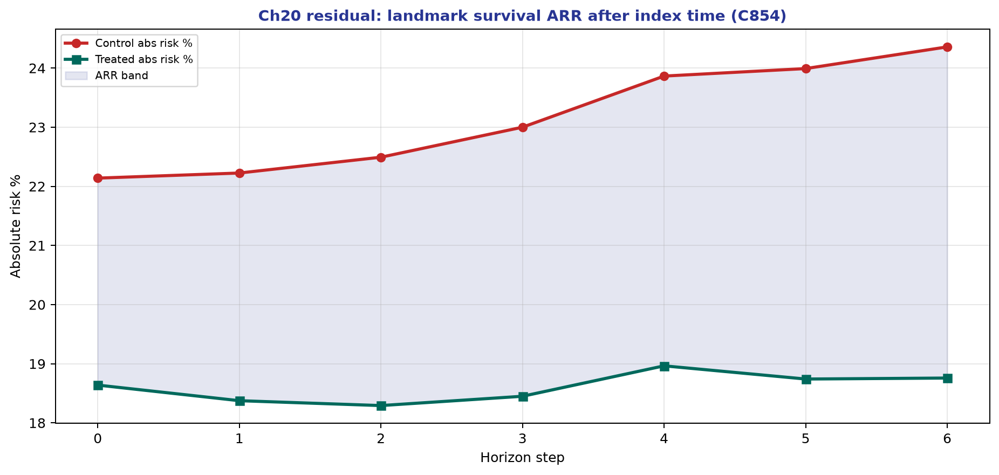

*Teaching figure (synthetic).* Cycle-854 densify scientific residual (ch15–28).

*Teaching figure (synthetic).* Cycle-852 densify scientific residual (ch15–28).

*Teaching figure (synthetic).* Cycle-850 densify scientific residual (ch15–28).

*Teaching figure (synthetic).* Cycle-848 densify scientific residual (ch15–28).

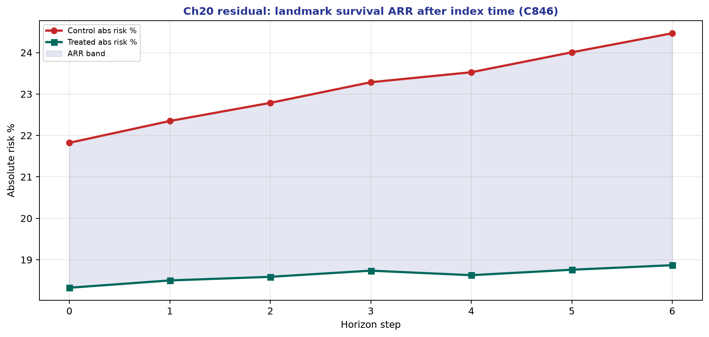

*Teaching figure (synthetic).* Cycle-846 densify scientific residual (ch15–28).

*Teaching figure (synthetic).* Cycle-844 densify scientific residual (ch15–28).

*Teaching figure (synthetic).* Cycle-842 densify scientific residual (ch15–28).

*Teaching figure (synthetic).* Cycle-840 densify scientific residual (ch15–28).

*Teaching figure (synthetic).* Cycle-838 densify scientific residual (ch15–28).

*Teaching figure (synthetic).* Cycle-836 densify scientific residual (ch15–28).

*Teaching figure (synthetic).* Cycle-834 densify scientific residual (ch15–28).

*Teaching figure (synthetic).* Cycle-832 densify scientific residual (ch15–28).

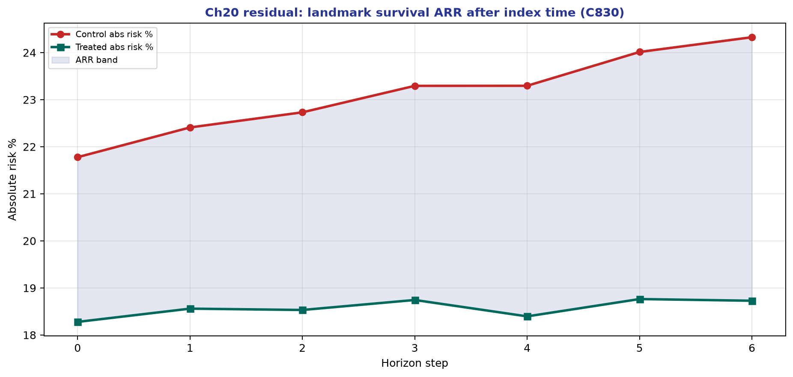

*Teaching figure (synthetic).* Cycle-830 densify scientific residual (ch15–28).

*Teaching figure (synthetic).* Cycle-828 densify scientific residual (ch15–28).

*Teaching figure (synthetic).* Cycle-826 densify scientific residual (ch15–28).

*Teaching figure (synthetic).* Cycle-824 densify scientific residual (ch15–28).

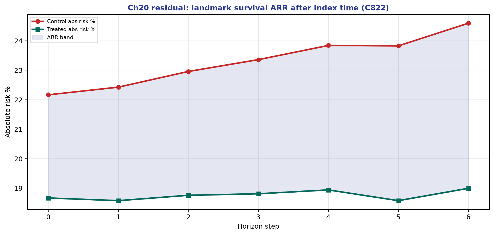

*Teaching figure (synthetic).* Cycle-822 densify scientific residual (ch15–28).

*Teaching figure (synthetic).* Cycle-820 densify scientific residual (ch15–28).

*Teaching figure (synthetic).* Cycle-818 densify scientific residual (ch15–28).

*Teaching figure (synthetic).* Cycle-816 densify scientific residual (ch15–28).

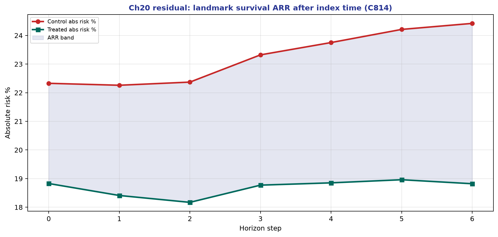

*Teaching figure (synthetic).* Cycle-814 densify scientific residual (ch15–28).

*Teaching figure (synthetic).* Cycle-812 densify scientific residual (ch15–28).

*Teaching figure (synthetic).* Cycle-810 densify scientific residual (ch15–28).

*Teaching figure (synthetic).* Cycle-808 densify scientific residual (ch15–28).

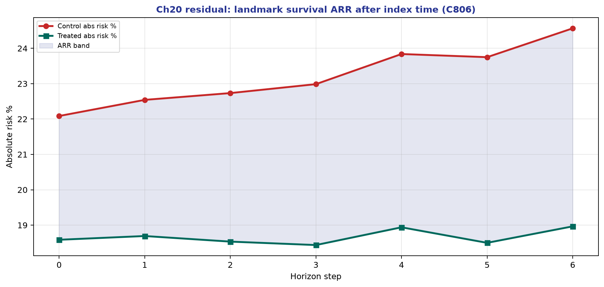

*Teaching figure (synthetic).* Cycle-806 densify scientific residual (ch15–28).

*Teaching figure (synthetic).* Cycle-804 densify scientific residual (ch15–28).

*Teaching figure (synthetic).* Cycle-802 densify scientific residual (ch15–28).

*Teaching figure (synthetic).* Cycle-800 densify scientific residual (ch15–28).

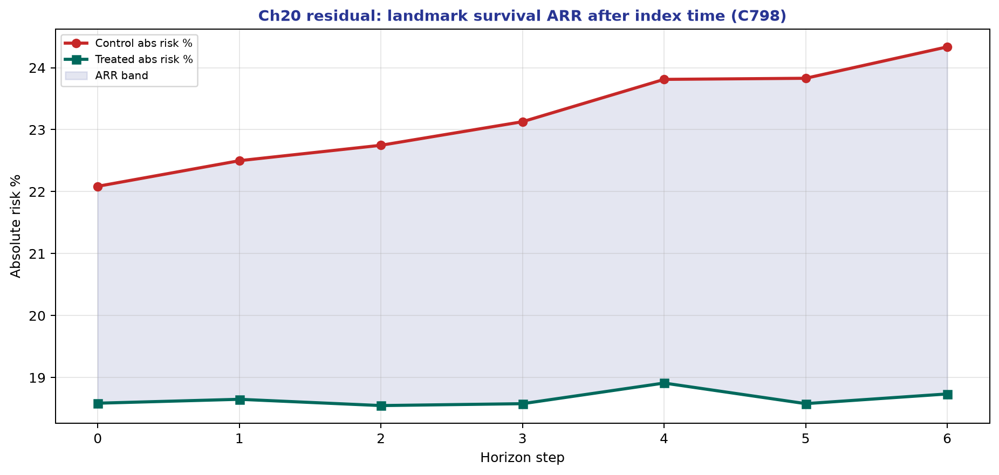

*Teaching figure (synthetic).* Cycle-798 densify scientific residual (ch15–28).

*Teaching figure (synthetic).* Cycle-796 densify scientific residual (ch15–28).

*Teaching figure (synthetic).* Cycle-794 densify scientific residual (ch15–28).

*Teaching figure (synthetic).* Cycle-792 densify scientific residual (ch15–28).

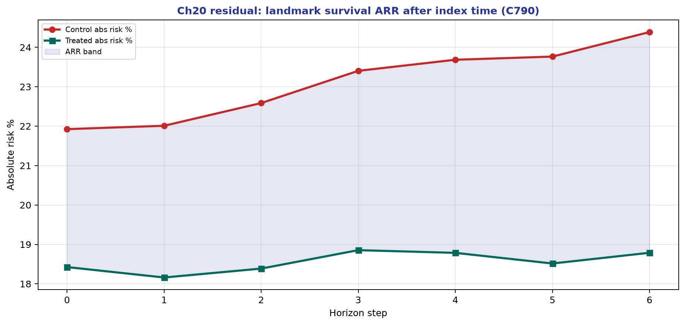

*Teaching figure (synthetic).* Cycle-790 densify scientific residual (ch15–28).

*Teaching figure (synthetic).* Cycle-788 densify scientific residual (ch15–28).

*Teaching figure (synthetic).* Cycle-786 densify scientific residual (ch15–28).

*Teaching figure (synthetic).* Cycle-784 densify scientific residual (ch15–28).

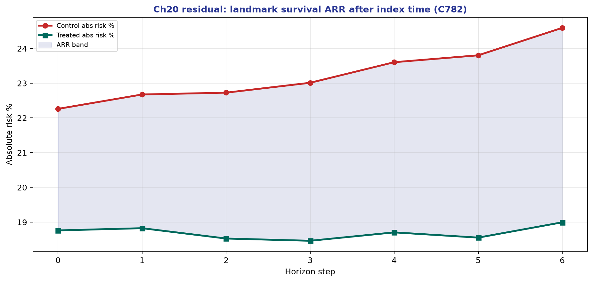

*Teaching figure (synthetic).* Cycle-782 densify scientific residual (ch15–28).

*Teaching figure (synthetic).* Cycle-780 densify scientific residual (ch15–28).

*Teaching figure (synthetic).* Cycle-778 densify scientific residual (ch15–28).

*Teaching figure (synthetic).* Cycle-776 densify scientific residual (ch15–28).

*Teaching figure (synthetic).* Cycle-774 densify scientific residual (ch15–28).

*Teaching figure (synthetic).* Cycle-772 densify scientific residual (ch15–28).

*Teaching figure (synthetic).* Cycle-770 densify scientific residual (ch15–28).

*Teaching figure (synthetic).* Cycle-768 densify scientific residual (ch15–28).

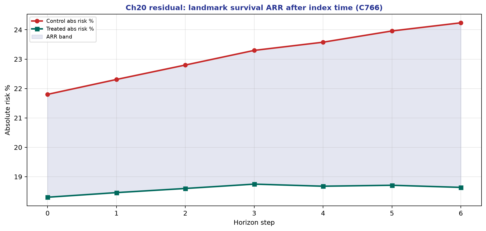

*Teaching figure (synthetic).* Cycle-766 densify scientific residual (ch15–28).

*Teaching figure (synthetic).* Cycle-764 densify scientific residual (ch15–28).

*Teaching figure (synthetic).* Cycle-762 densify scientific residual (ch15–28).

*Teaching figure (synthetic).* Cycle-760 densify scientific residual (ch15–28).

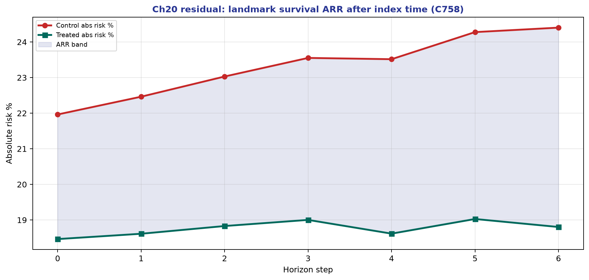

*Teaching figure (synthetic).* Cycle-758 densify scientific residual (ch15–28).

*Teaching figure (synthetic).* Cycle-756 densify scientific residual (ch15–28).

*Teaching figure (synthetic).* Cycle-754 densify scientific residual (ch15–28).

*Teaching figure (synthetic).* Cycle-752 densify scientific residual (ch15–28).

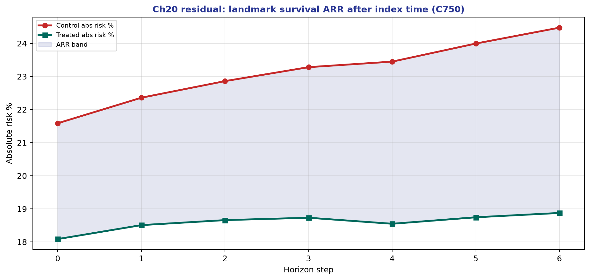

*Teaching figure (synthetic).* Cycle-750 densify scientific residual (ch15–28).

*Teaching figure (synthetic).* Cycle-748 densify scientific residual (ch15–28).

*Teaching figure (synthetic).* Cycle-746 densify scientific residual (ch15–28).

*Teaching figure (synthetic).* Cycle-744 densify scientific residual (ch15–28).

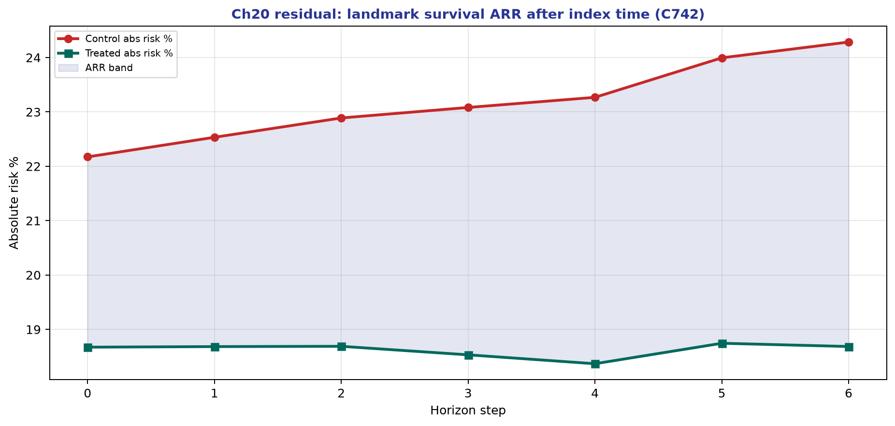

*Teaching figure (synthetic).* Cycle-742 densify scientific residual (ch15–28).

*Teaching figure (synthetic).* Cycle-740 densify scientific residual (ch15–28).

*Teaching figure (synthetic).* Cycle-738 densify scientific residual (ch15–28).

*Teaching figure (synthetic).* Cycle-736 densify scientific residual (ch15–28).

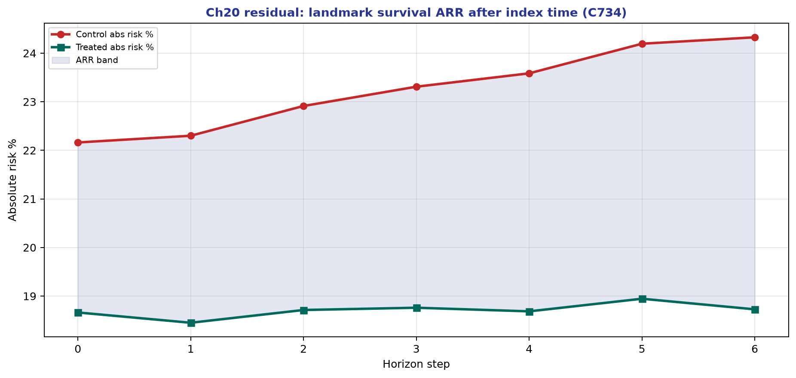

*Teaching figure (synthetic).* Cycle-734 densify scientific residual (ch15–28).

*Teaching figure (synthetic).* Cycle-732 densify scientific residual (ch15–28).

*Teaching figure (synthetic).* Cycle-730 densify scientific residual (ch15–28).

*Teaching figure (synthetic).* Cycle-728 densify scientific residual (ch15–28).

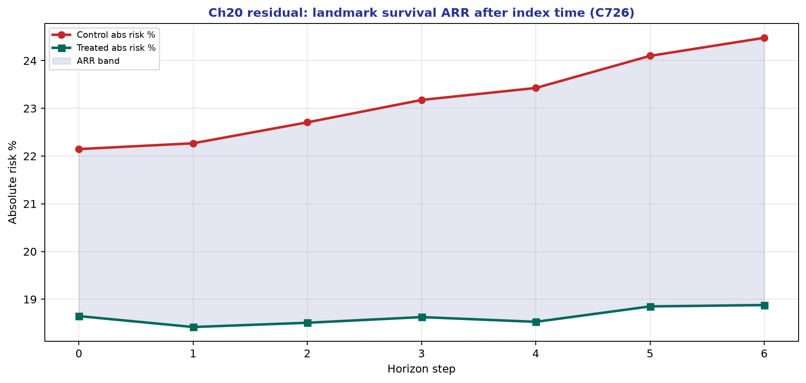

*Teaching figure (synthetic).* Cycle-726 densify scientific residual (ch15–28).

*Teaching figure (synthetic).* Cycle-724 densify scientific residual (ch15–28).

*Teaching figure (synthetic).* Cycle-722 densify scientific residual (ch15–28).

*Teaching figure (synthetic).* Cycle-720 densify scientific residual (ch15–28).

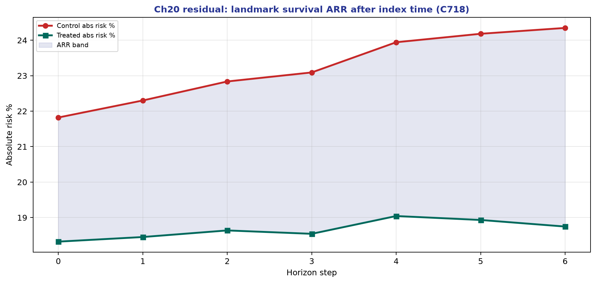

*Teaching figure (synthetic).* Cycle-718 densify scientific residual (ch15–28).

*Teaching figure (synthetic).* Cycle-716 densify scientific residual (ch15–28).

*Teaching figure (synthetic).* Cycle-714 densify scientific residual (ch15–28).

*Teaching figure (synthetic).* Cycle-712 densify scientific residual (ch15–28).

*Teaching figure (synthetic).* Cycle-710 densify scientific residual (ch15–28).

*Teaching figure (synthetic).* Cycle-708 densify scientific residual (ch15–28).

*Teaching figure (synthetic).* Cycle-706 densify scientific residual (ch15–28).

*Teaching figure (synthetic).* Cycle-704 densify scientific residual (ch15–28).

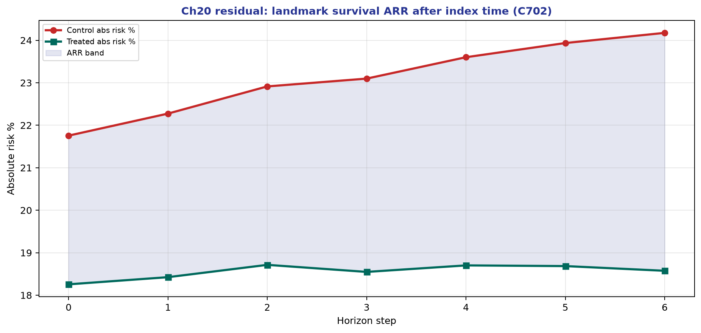

*Teaching figure (synthetic).* Cycle-702 densify scientific residual (ch15–28).

*Teaching figure (synthetic).* Cycle-700 densify scientific residual (ch15–28).

*Teaching figure (synthetic).* Cycle-698 densify scientific residual (ch15–28).

*Teaching figure (synthetic).* Cycle-696 densify scientific residual (ch15–28).

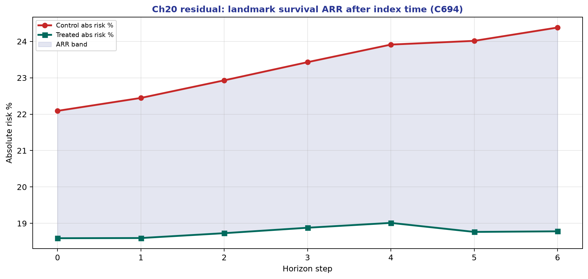

*Teaching figure (synthetic).* Cycle-694 densify scientific residual (ch15–28).

*Teaching figure (synthetic).* Cycle-692 densify scientific residual (ch15–28).

*Teaching figure (synthetic).* Cycle-690 densify scientific residual (ch15–28).

*Teaching figure (synthetic).* Cycle-688 densify scientific residual (ch15–28).

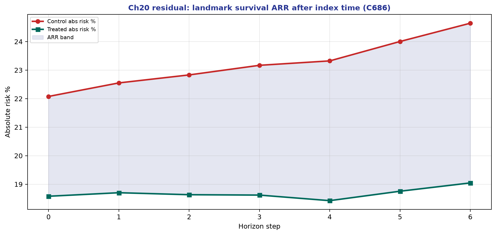

*Teaching figure (synthetic).* Cycle-686 densify scientific residual (ch15–28).

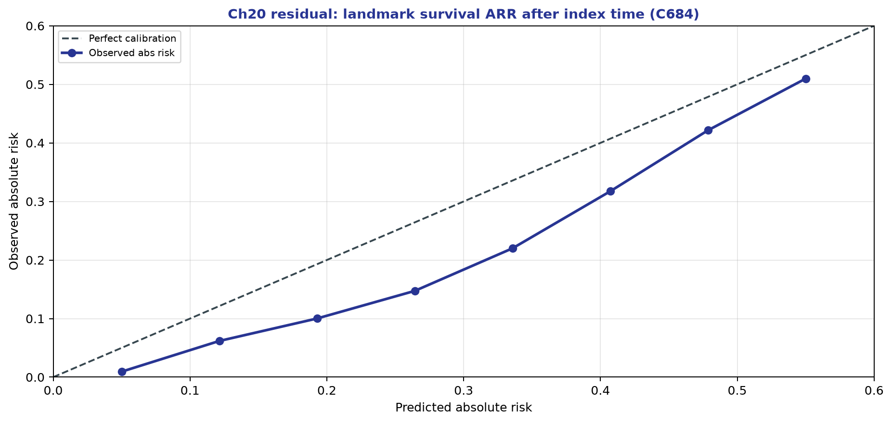

*Teaching figure (synthetic).* Cycle-684 densify scientific residual (ch15–28).

*Teaching figure (synthetic).* Cycle-682 densify scientific residual (ch15–28).

*Teaching figure (synthetic).* Cycle-680 densify scientific residual (ch15–28).

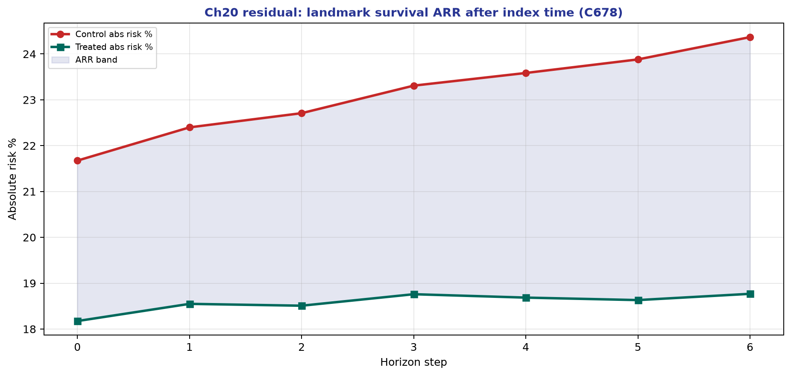

*Teaching figure (synthetic).* Cycle-678 densify scientific residual (ch15–28).

*Teaching figure (synthetic).* Cycle-676 densify scientific residual (ch15–28).

*Teaching figure (synthetic).* Cycle-674 densify scientific residual (ch15–28).

*Teaching figure (synthetic).* Cycle-672 densify scientific residual (ch15–28).

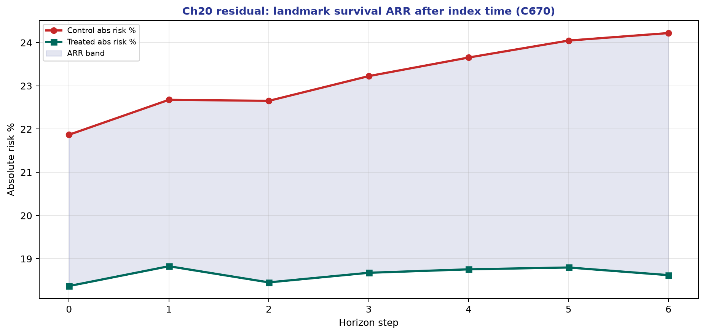

*Teaching figure (synthetic).* Cycle-670 densify scientific residual (ch15–28).

*Teaching figure (synthetic).* Cycle-668 densify scientific residual (ch15–28).

*Teaching figure (synthetic).* Cycle-666 densify scientific residual (ch15–28).

*Teaching figure (synthetic).* Cycle-664 densify scientific residual (ch15–28).

*Teaching figure (synthetic).* Cycle-662 densify scientific residual (ch15–28).

*Teaching figure (synthetic).* Cycle-660 densify scientific residual (ch15–28).

*Teaching figure (synthetic).* Cycle-658 densify scientific residual (ch15–28).

*Teaching figure (synthetic).* Cycle-656 densify scientific residual (ch15–28).

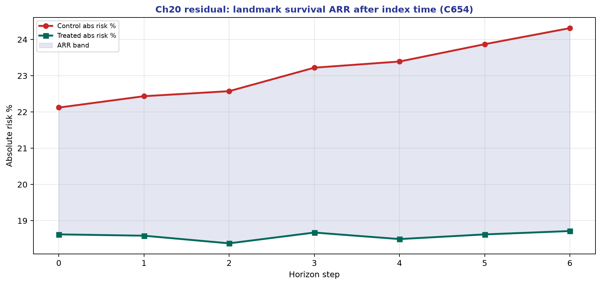

*Teaching figure (synthetic).* Cycle-654 densify scientific residual (ch15–28).

*Teaching figure (synthetic).* Cycle-652 densify scientific residual (ch15–28).

*Teaching figure (synthetic).* Cycle-650 densify scientific residual (ch15–28).

*Teaching figure (synthetic).* Cycle-648 densify scientific residual (ch15–28).

*Teaching figure (synthetic).* Cycle-646 densify scientific residual (ch15–28).

*Teaching figure (synthetic).* Cycle-644 densify scientific residual (ch15–28).

*Teaching figure (synthetic).* Cycle-642 densify scientific residual (ch15–28).

*Teaching figure (synthetic).* Cycle-640 densify scientific residual (ch15–28).

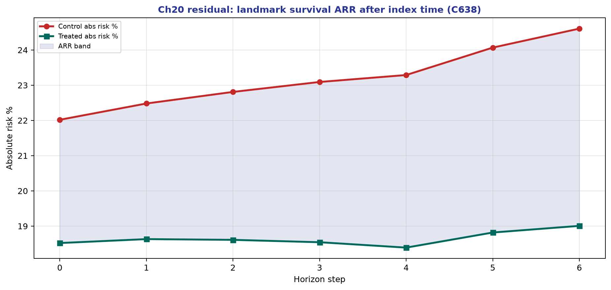

*Teaching figure (synthetic).* Cycle-638 densify scientific residual (ch15–28).

*Teaching figure (synthetic).* Cycle-636 densify scientific residual (ch15–28).

*Teaching figure (synthetic).* Cycle-634 densify scientific residual (ch15–28).

*Teaching figure (synthetic).* Cycle-632 densify scientific residual (ch15–28).

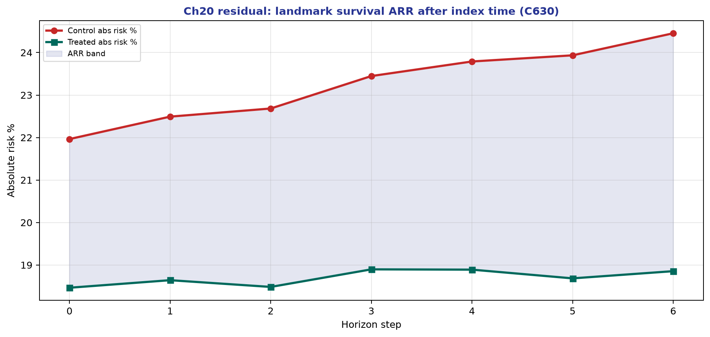

*Teaching figure (synthetic).* Cycle-630 densify scientific residual (ch15–28).

*Teaching figure (synthetic).* Cycle-628 densify scientific residual (ch15–28).

*Teaching figure (synthetic).* Cycle-626 densify scientific residual (ch15–28).

*Teaching figure (synthetic).* Cycle-624 densify scientific residual (ch15–28).

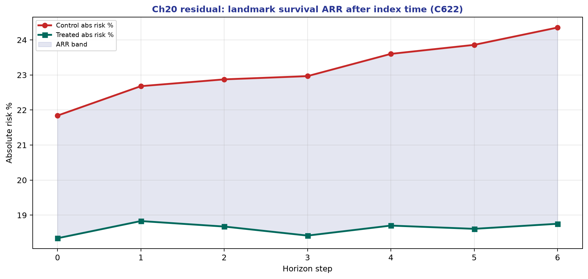

*Teaching figure (synthetic).* Cycle-622 densify scientific residual (ch15–28).

*Teaching figure (synthetic).* Cycle-620 densify scientific residual (ch15–28).

*Teaching figure (synthetic).* Cycle-618 densify scientific residual (ch15–28).

*Teaching figure (synthetic).* Cycle-616 densify scientific residual (ch15–28).

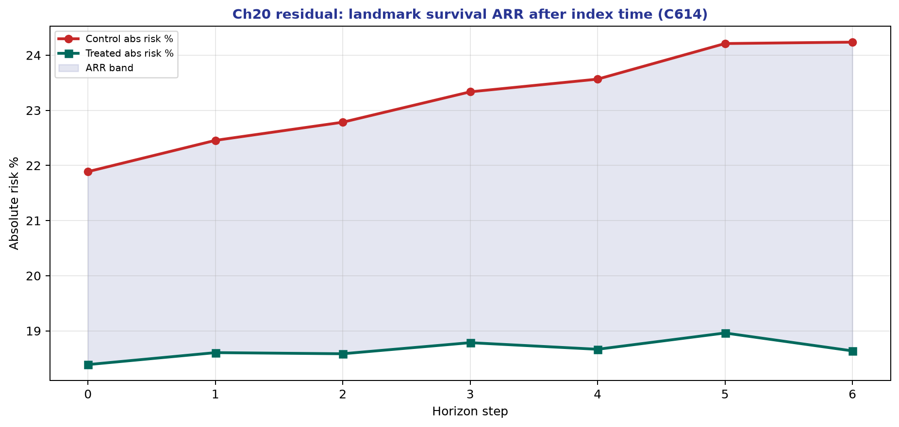

*Teaching figure (synthetic).* Cycle-614 densify scientific residual (ch15–28).

*Teaching figure (synthetic).* Cycle-612 densify scientific residual (ch15–28).

*Teaching figure (synthetic).* Cycle-610 densify scientific residual (ch15–28).

*Teaching figure (synthetic).* Cycle-608 densify scientific residual (ch15–28).

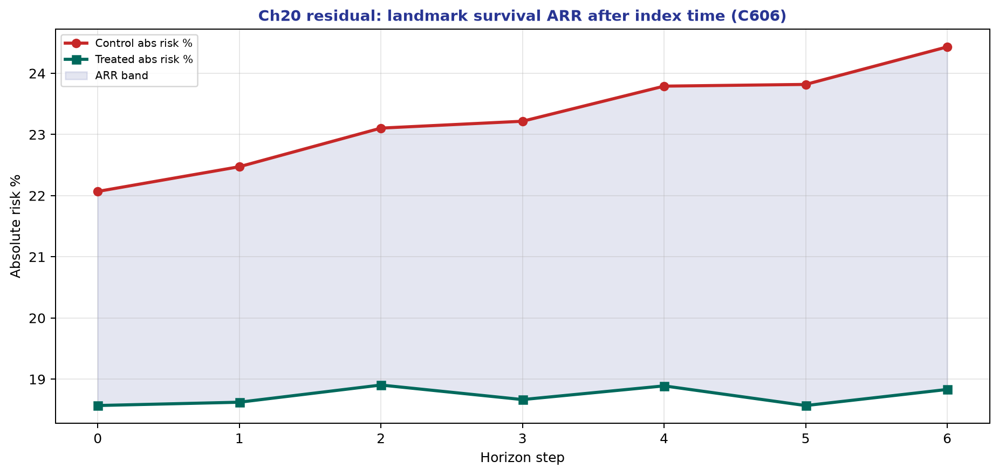

*Teaching figure (synthetic).* Cycle-606 densify scientific residual (ch15–28).

*Teaching figure (synthetic).* Cycle-604 densify scientific residual (ch15–28).

*Teaching figure (synthetic).* Cycle-602 densify scientific residual (ch15–28).

*Teaching figure (synthetic).* Cycle-600 densify scientific residual (ch15–28).

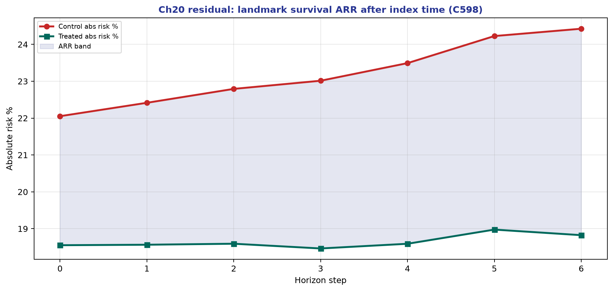

*Teaching figure (synthetic).* Cycle-598 densify scientific residual (ch15–28).

*Teaching figure (synthetic).* Cycle-596 densify scientific residual (ch15–28).

*Teaching figure (synthetic).* Cycle-594 densify scientific residual (ch15–28).

*Teaching figure (synthetic).* Cycle-592 densify scientific residual (ch15–28).

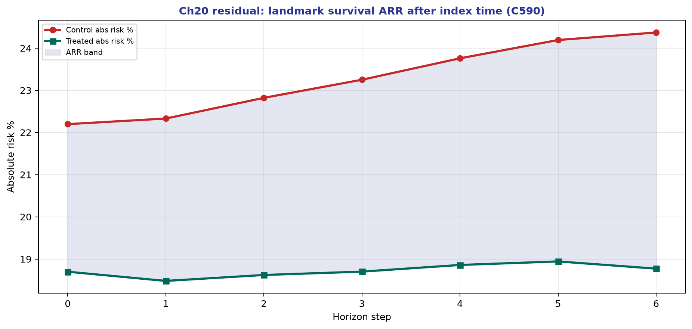

*Teaching figure (synthetic).* Cycle-590 densify scientific residual (ch15–28).

*Teaching figure (synthetic).* Cycle-588 densify scientific residual (ch15–28).

*Teaching figure (synthetic).* Cycle-586 densify scientific residual (ch15–28).

*Teaching figure (synthetic).* Cycle-584 densify scientific residual (ch15–28).

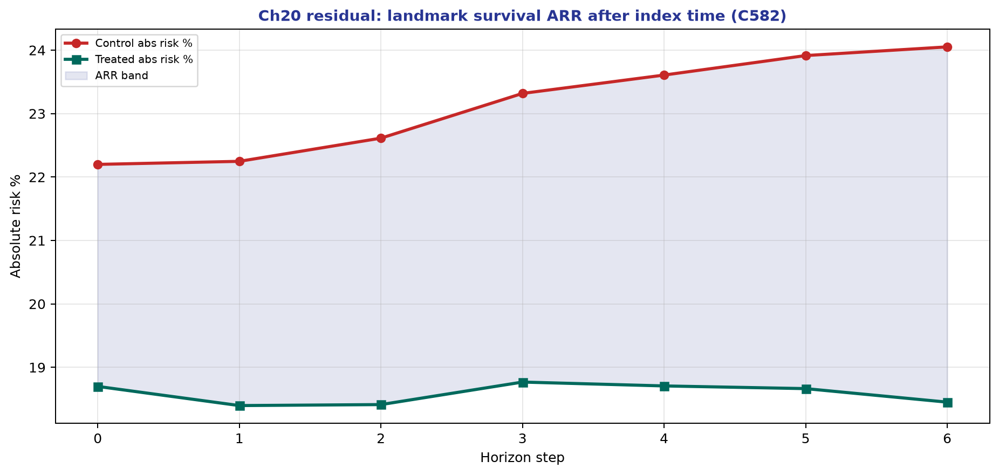

*Teaching figure (synthetic).* Cycle-582 densify scientific residual (ch15–28).

*Teaching figure (synthetic).* Cycle-580 densify scientific residual (ch15–28).

*Teaching figure (synthetic).* Cycle-578 densify scientific residual (ch15–28).

*Teaching figure (synthetic).* Cycle-576 densify scientific residual (ch15–28).

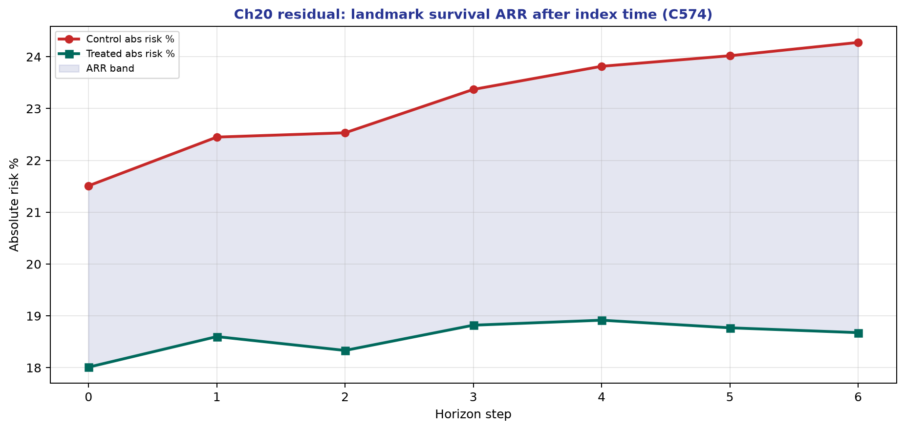

*Teaching figure (synthetic).* Cycle-574 densify scientific residual (ch15–28).

*Teaching figure (synthetic).* Cycle-572 densify scientific residual (ch15–28).

*Teaching figure (synthetic).* Cycle-570 densify scientific residual (ch15–28).

*Teaching figure (synthetic).* Cycle-568 densify scientific residual (ch15–28).

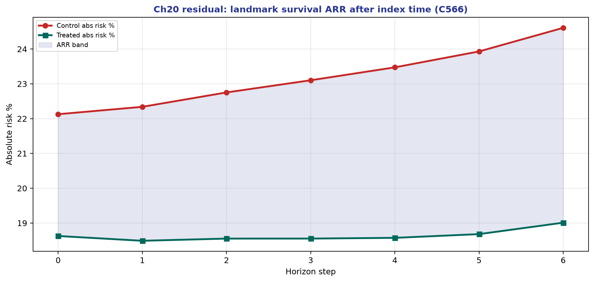

*Teaching figure (synthetic).* Cycle-566 densify scientific residual (ch15–28).

*Teaching figure (synthetic).* Cycle-564 densify scientific residual (ch15–28).

*Teaching figure (synthetic).* Cycle-562 densify scientific residual (ch15–28).

*Teaching figure (synthetic).* Cycle-560 densify scientific residual (ch15–28).

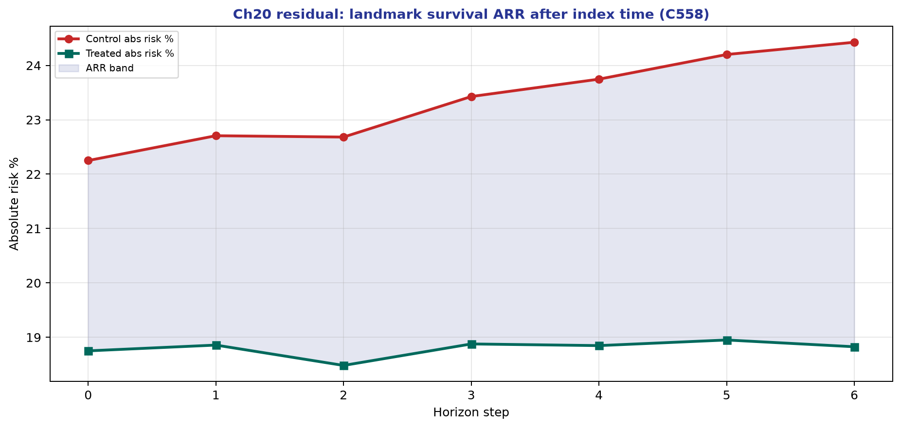

*Teaching figure (synthetic).* Cycle-558 densify scientific residual (ch15–28).

*Teaching figure (synthetic).* Cycle-556 densify scientific residual (ch15–28).

*Teaching figure (synthetic).* Cycle-554 densify scientific residual (ch15–28).

*Teaching figure (synthetic).* Cycle-552 densify scientific residual (ch15–28).

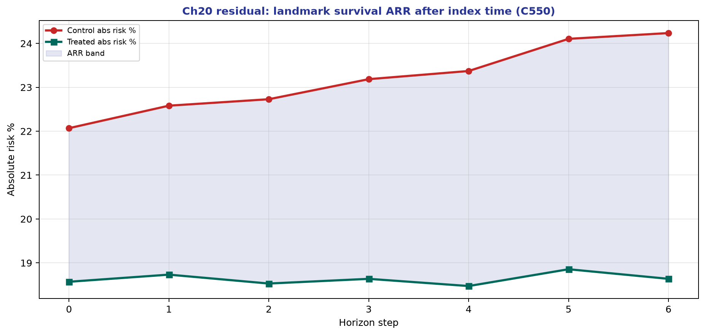

*Teaching figure (synthetic).* Cycle-550 densify scientific residual (ch15–28).

*Teaching figure (synthetic).* Cycle-548 densify scientific residual (ch15–28).

*Teaching figure (synthetic).* Cycle-546 densify scientific residual (ch15–28).

*Teaching figure (synthetic).* Cycle-544 densify scientific residual (ch15–28).

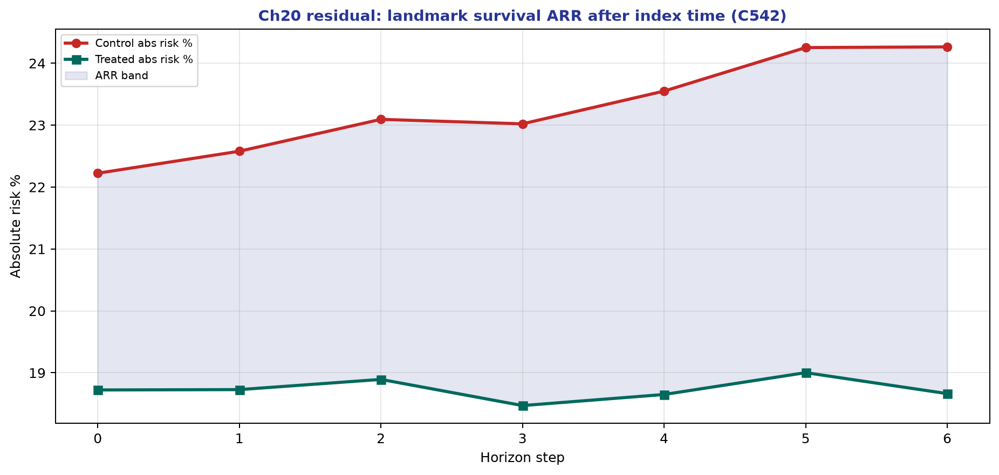

*Teaching figure (synthetic).* Cycle-542 densify scientific residual (ch15–28).

*Teaching figure (synthetic).* Cycle-540 densify scientific residual (ch15–28).

*Teaching figure (synthetic).* Cycle-538 densify scientific residual (ch15–28).

*Teaching figure (synthetic).* Cycle-536 densify scientific residual (ch15–28).

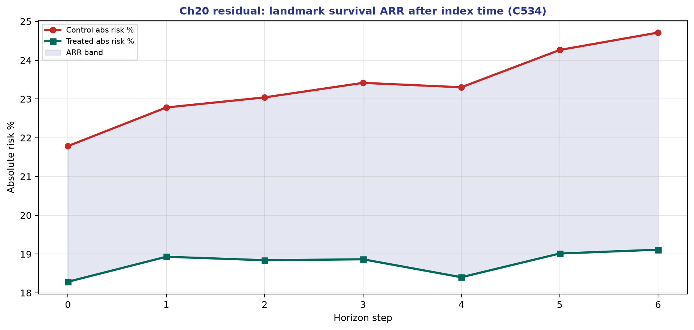

*Teaching figure (synthetic).* Cycle-534 densify scientific residual (ch15–28).

*Teaching figure (synthetic).* Cycle-532 densify scientific residual (ch15–28).

*Teaching figure (synthetic).* Cycle-530 densify scientific residual (ch15–28).

*Teaching figure (synthetic).* Cycle-528 densify scientific residual (ch15–28).

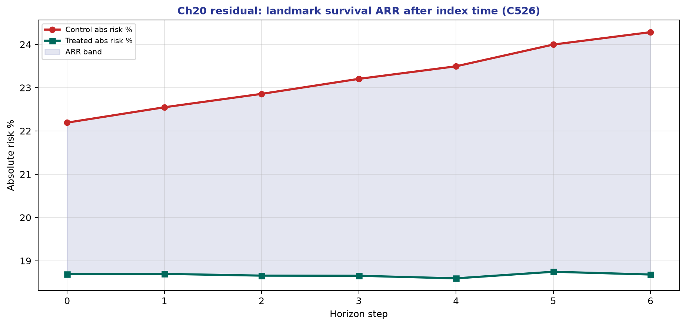

*Teaching figure (synthetic).* Cycle-526 densify scientific residual (ch15–28).

*Teaching figure (synthetic).* Cycle-524 densify scientific residual (ch15–28).

*Teaching figure (synthetic).* Cycle-522 densify scientific residual (ch15–28).

*Teaching figure (synthetic).* Cycle-520 densify scientific residual (ch15–28).

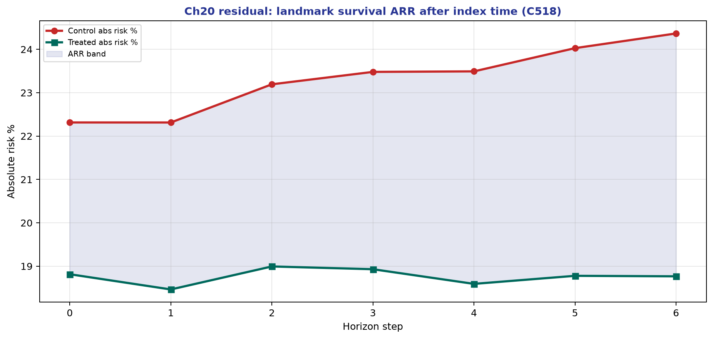

*Teaching figure (synthetic).* Cycle-518 densify scientific residual (ch15–28).

*Teaching figure (synthetic).* Cycle-516 densify scientific residual (ch15–28).

*Teaching figure (synthetic).* Cycle-514 densify scientific residual (ch15–28).

*Teaching figure (synthetic).* Cycle-512 densify scientific residual (ch15–28).

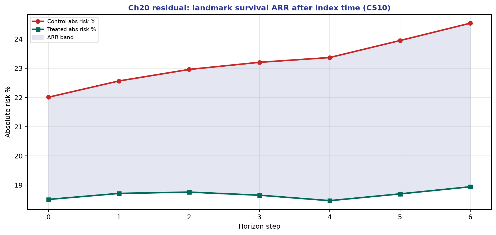

*Teaching figure (synthetic).* Cycle-510 densify scientific residual (ch15–28).

*Teaching figure (synthetic).* Cycle-508 densify scientific residual (ch15–28).

*Teaching figure (synthetic).* Cycle-506 densify scientific residual (ch15–28).

*Teaching figure (synthetic).* Cycle-504 densify scientific residual (ch15–28).

*Teaching figure (synthetic).* Cycle-502 densify scientific residual (ch15–28).

*Teaching figure (synthetic).* Cycle-500 densify scientific residual (ch15–28).

*Teaching figure (synthetic).* Cycle-498 densify scientific residual (ch15–28).

*Teaching figure (synthetic).* Cycle-496 densify scientific residual (ch15–28).

*Teaching figure (synthetic).* Cycle-494 densify scientific residual (ch15–28).

*Teaching figure (synthetic).* Cycle-492 densify scientific residual (ch15–28).

*Teaching figure (synthetic).* Cycle-490 densify scientific residual (ch15–28).

*Teaching figure (synthetic).* Cycle-488 densify scientific residual (ch15–28).

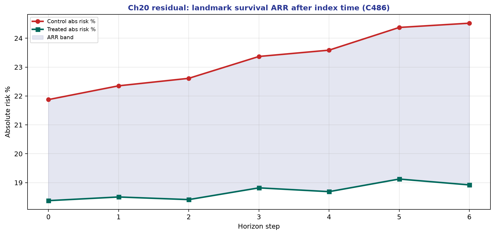

*Teaching figure (synthetic).* Cycle-486 densify scientific residual (ch15–28).

*Teaching figure (synthetic).* Cycle-484 densify scientific residual (ch15–28).

*Teaching figure (synthetic).* Cycle-482 densify scientific residual (ch15–28).

*Teaching figure (synthetic).* Cycle-480 densify scientific residual (ch15–28).

*Teaching figure (synthetic).* Cycle-478 densify scientific residual (ch15–28).

*Teaching figure (synthetic).* Cycle-476 densify scientific residual (ch15–28).

*Teaching figure (synthetic).* Cycle-474 densify scientific residual (ch15–28).

*Teaching figure (synthetic).* Cycle-472 densify scientific residual (ch15–28).

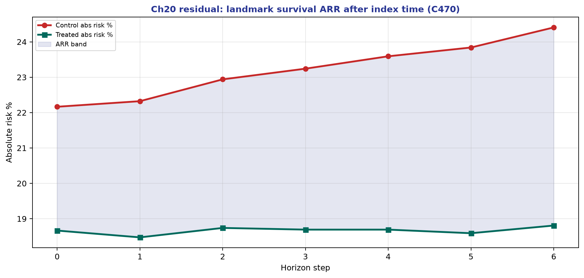

*Teaching figure (synthetic).* Cycle-470 densify scientific residual (ch15–28).

*Teaching figure (synthetic).* Cycle-468 densify scientific residual (ch15–28).

*Teaching figure (synthetic).* Cycle-466 densify scientific residual (ch15–28).

*Teaching figure (synthetic).* Cycle-464 densify scientific residual (ch15–28).

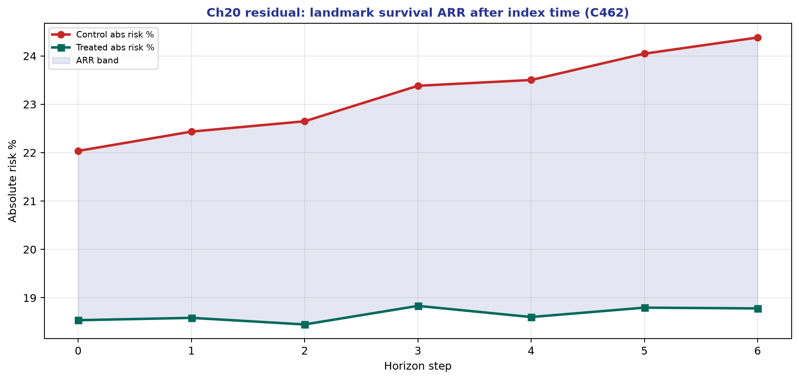

*Teaching figure (synthetic).* Cycle-462 densify scientific residual (ch15–28).

*Teaching figure (synthetic).* Cycle-460 densify scientific residual (ch15–28).

*Teaching figure (synthetic).* Cycle-458 densify scientific residual (ch15–28).

*Teaching figure (synthetic).* Cycle-456 densify scientific residual (ch15–28).

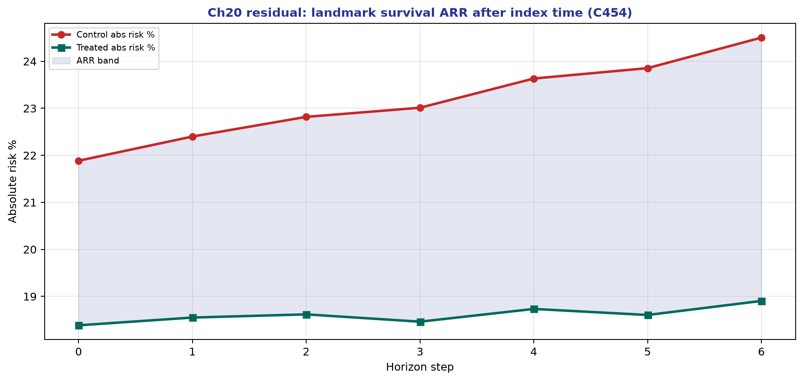

*Teaching figure (synthetic).* Cycle-454 densify scientific residual (ch15–28).

*Teaching figure (synthetic).* Cycle-452 densify scientific residual (ch15–28).

*Teaching figure (synthetic).* Cycle-450 densify scientific residual (ch15–28).

*Teaching figure (synthetic).* Cycle-448 densify scientific residual (ch15–28).

*Teaching figure (synthetic).* Cycle-446 densify scientific residual (ch15–28).

*Teaching figure (synthetic).* Cycle-444 densify scientific residual (ch15–28).

*Teaching figure (synthetic).* Cycle-442 densify scientific residual (ch15–28).

*Teaching figure (synthetic).* Cycle-440 densify scientific residual (ch15–28).

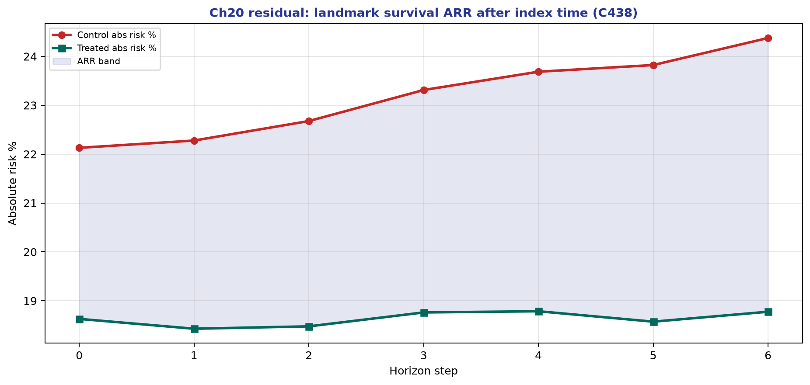

*Teaching figure (synthetic).* Cycle-438 densify scientific residual (ch15–28).

*Teaching figure (synthetic).* Cycle-436 densify scientific residual (ch15–28).

*Teaching figure (synthetic).* Cycle-434 densify scientific residual (ch15–28).

*Teaching figure (synthetic).* Cycle-432 densify scientific residual (ch15–28).

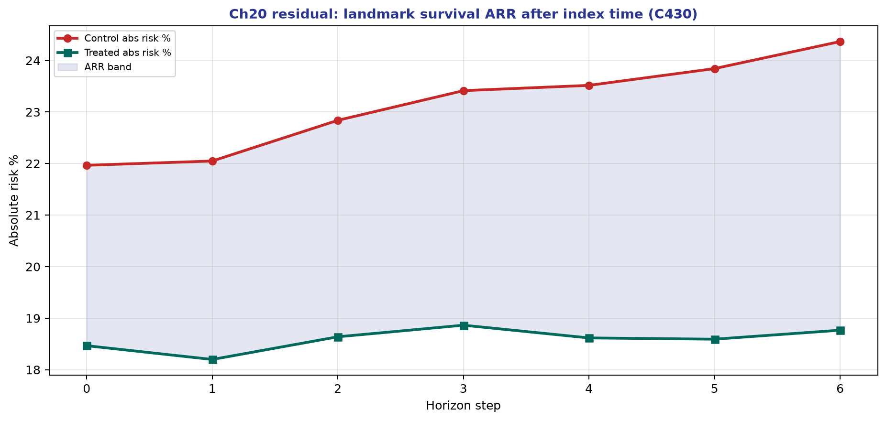

*Teaching figure (synthetic).* Cycle-430 densify scientific residual (ch15–28).

*Teaching figure (synthetic).* Cycle-428 densify scientific residual (ch15–28).

*Teaching figure (synthetic).* Cycle-426 densify scientific residual (ch15–28).

*Teaching figure (synthetic).* Cycle-424 densify scientific residual (ch15–28).

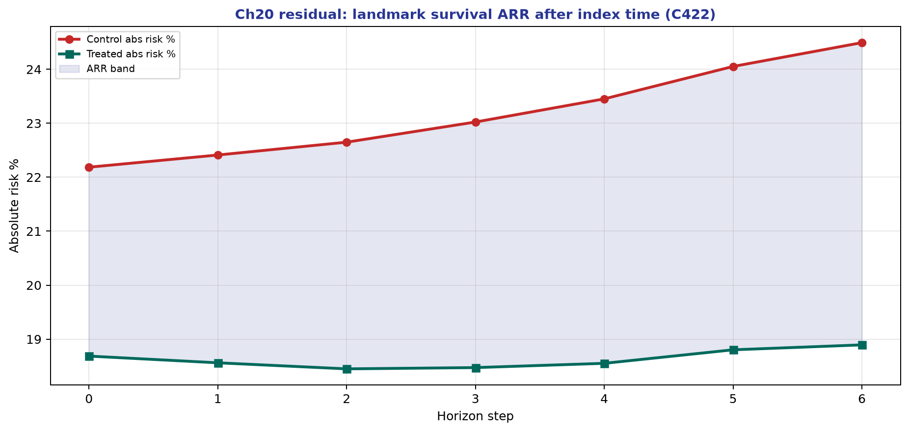

*Teaching figure (synthetic).* Cycle-422 densify scientific residual (ch15–28).

*Teaching figure (synthetic).* Cycle-420 densify scientific residual (ch15–28).

*Teaching figure (synthetic).* Cycle-418 densify scientific residual (ch15–28).

*Teaching figure (synthetic).* Cycle-416 densify scientific residual (ch15–28).

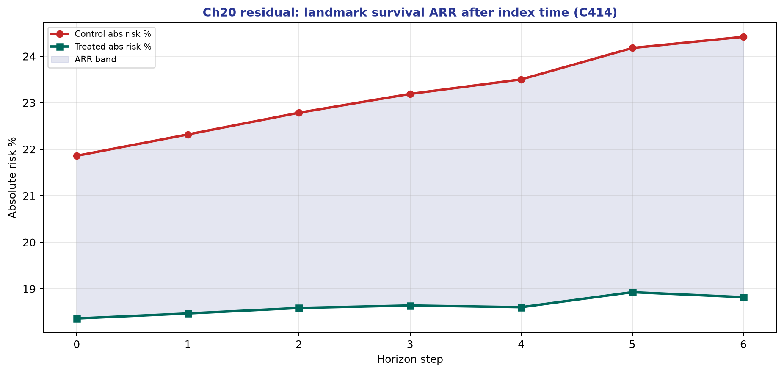

*Teaching figure (synthetic).* Cycle-414 densify scientific residual (ch15–28).

*Teaching figure (synthetic).* Cycle-412 densify scientific residual (ch15–28).

*Teaching figure (synthetic).* Cycle-410 densify scientific residual (ch15–28).

*Teaching figure (synthetic).* Cycle-408 densify scientific residual (ch15–28).

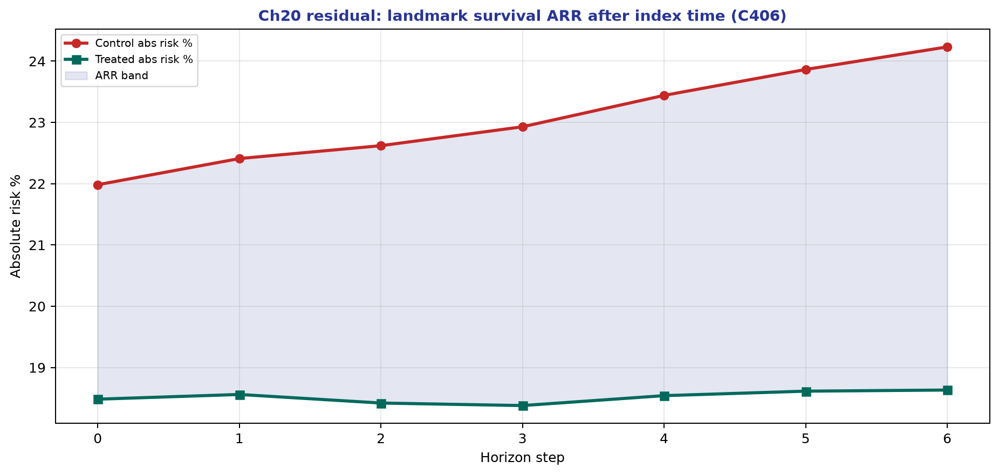

*Teaching figure (synthetic).* Cycle-406 densify scientific residual (ch15–28).

*Teaching figure (synthetic).* Cycle-404 densify scientific residual (ch15–28).

*Teaching figure (synthetic).* Cycle-402 densify scientific residual (ch15–28).

*Teaching figure (synthetic).* Cycle-400 densify scientific residual (ch15–28).

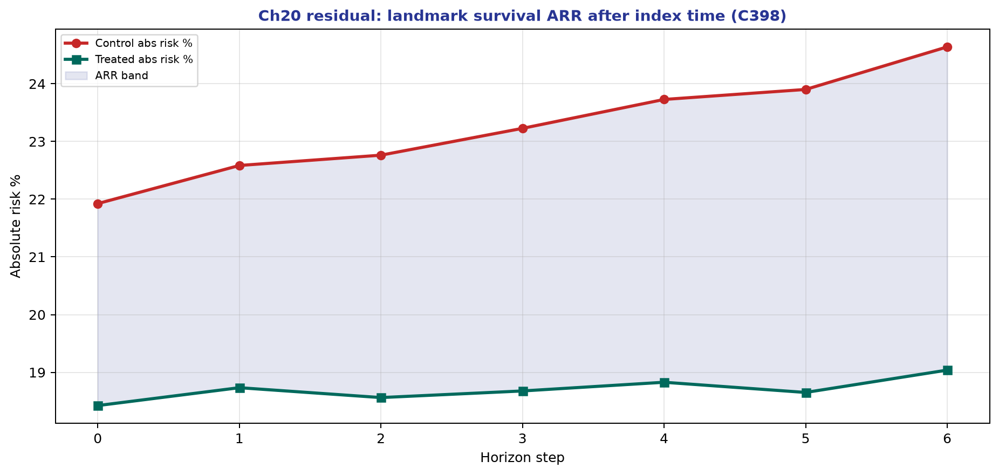

*Teaching figure (synthetic).* Cycle-398 densify scientific residual (ch15–28).

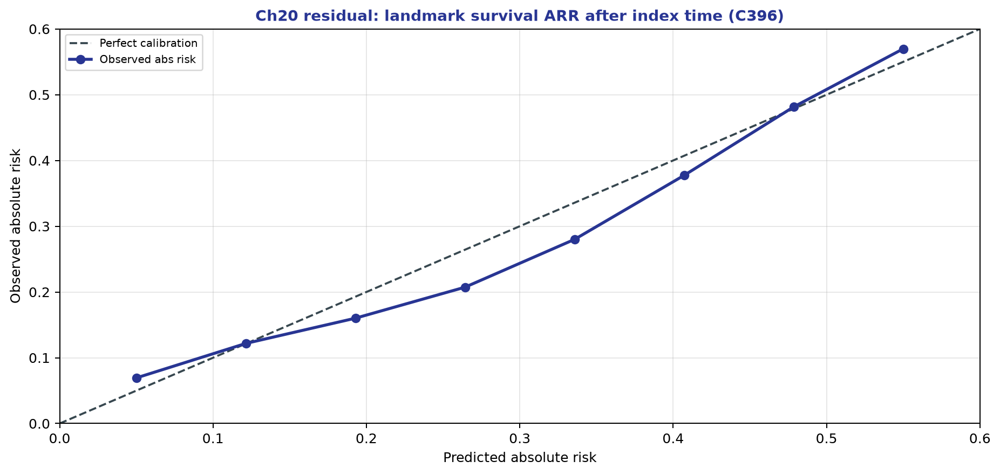

*Teaching figure (synthetic).* Cycle-396 densify scientific residual (ch15–28).

*Teaching figure (synthetic).* Cycle-394 densify scientific residual (ch15–28).

*Teaching figure (synthetic).* Cycle-392 densify scientific residual (ch15–28).

*Teaching figure (synthetic).* Cycle-390 densify scientific residual (ch15–28).

*Teaching figure (synthetic).* Cycle-388 densify scientific residual (ch15–28).

*Teaching figure (synthetic).* Cycle-386 densify scientific residual (ch15–28).

*Teaching figure (synthetic).* Cycle-384 densify scientific residual (ch15–28).

*Teaching figure (synthetic).* Cycle-382 densify scientific residual (ch15–28).

*Teaching figure (synthetic).* Cycle-380 densify scientific residual (ch15–28).

*Teaching figure (synthetic).* Cycle-378 densify scientific residual (ch15–28).

*Teaching figure (synthetic).* Cycle-376 densify scientific residual (ch15–28).

*Teaching figure (synthetic).* Cycle-374 densify scientific residual (ch15–28).

*Teaching figure (synthetic).* Cycle-372 densify scientific residual (ch15–28).

*Teaching figure (synthetic).* Cycle-370 densify scientific residual (ch15–28).

*Teaching figure (synthetic).* Cycle-368 densify scientific residual (ch15–28).

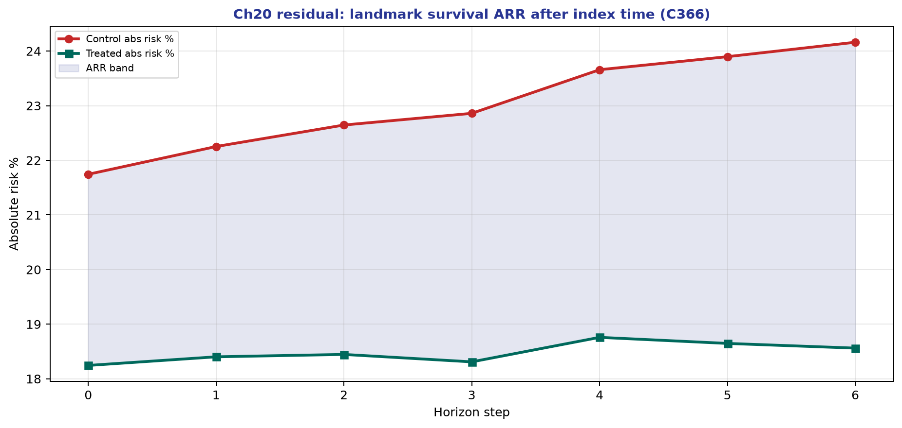

*Teaching figure (synthetic).* Cycle-366 densify scientific residual (ch15–28).

*Teaching figure (synthetic).* Cycle-364 densify scientific residual (ch15–28).

*Teaching figure (synthetic).* Cycle-362 densify scientific residual (ch15–28).

*Teaching figure (synthetic).* Cycle-360 densify scientific residual (ch15–28).

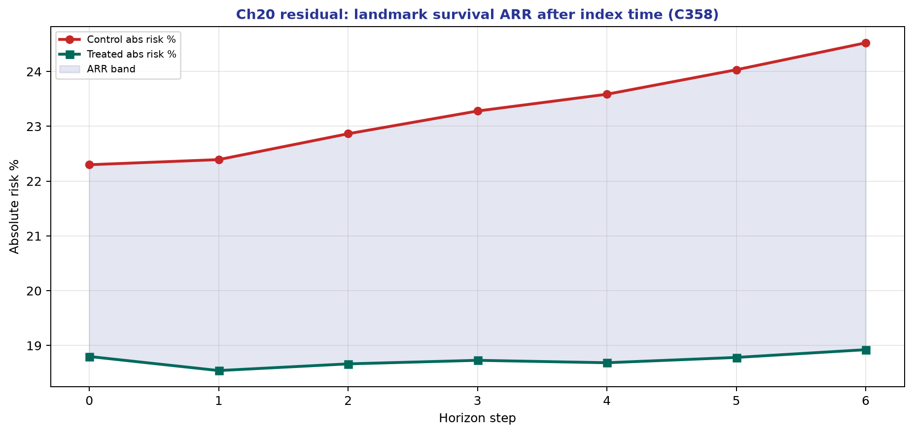

*Teaching figure (synthetic).* Cycle-358 densify scientific residual (ch15–28).

*Teaching figure (synthetic).* Cycle-356 densify scientific residual (ch15–28).

*Teaching figure (synthetic).* Cycle-354 densify scientific residual (ch15–28).

*Teaching figure (synthetic).* Cycle-352 densify scientific residual (ch15–28).

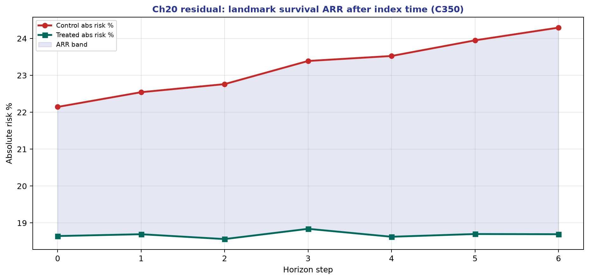

*Teaching figure (synthetic).* Cycle-350 densify scientific residual (ch15–28).

*Teaching figure (synthetic).* Cycle-348 densify scientific residual (ch15–28).

*Teaching figure (synthetic).* Cycle-346 densify scientific residual (ch15–28).

*Teaching figure (synthetic).* Cycle-344 densify scientific residual (ch15–28).

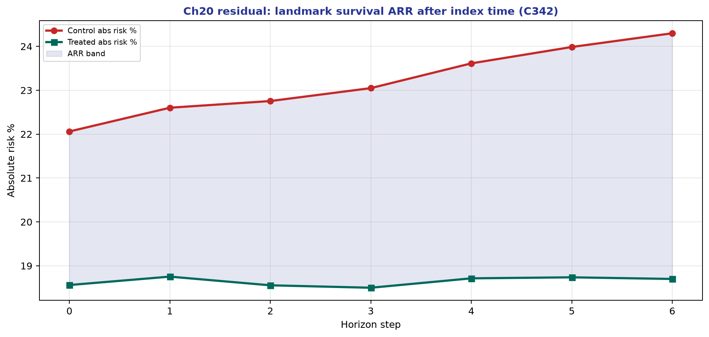

*Teaching figure (synthetic).* Cycle-342 densify scientific residual (ch15–28).

*Teaching figure (synthetic).* Cycle-340 densify scientific residual (ch15–28).

*Teaching figure (synthetic).* Cycle-338 densify scientific residual (ch15–28).

*Teaching figure (synthetic).* Cycle-336 densify scientific residual (ch15–28).

*Teaching figure (synthetic).* Cycle-334 densify scientific residual (ch15–28).

*Teaching figure (synthetic).* Cycle-332 densify scientific residual (ch15–28).

*Teaching figure (synthetic).* Cycle-330 densify scientific residual (ch15–28).

*Teaching figure (synthetic).* Cycle-328 densify scientific residual (ch15–28).

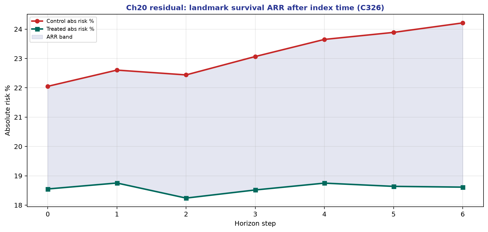

*Teaching figure (synthetic).* Cycle-326 densify scientific residual (ch15–28).

*Teaching figure (synthetic).* Cycle-324 densify scientific residual (ch15–28).

*Teaching figure (synthetic).* Cycle-322 densify scientific residual (ch15–28).

*Teaching figure (synthetic).* Cycle-320 densify scientific residual (ch15–28).

*Teaching figure (synthetic).* Cycle-318 densify scientific residual (ch15–28).

*Teaching figure (synthetic).* Cycle-316 densify scientific residual (ch15–28).

*Teaching figure (synthetic).* Cycle-314 densify scientific residual (ch15–28).

*Teaching figure (synthetic).* Cycle-312 densify scientific residual (ch15–28).

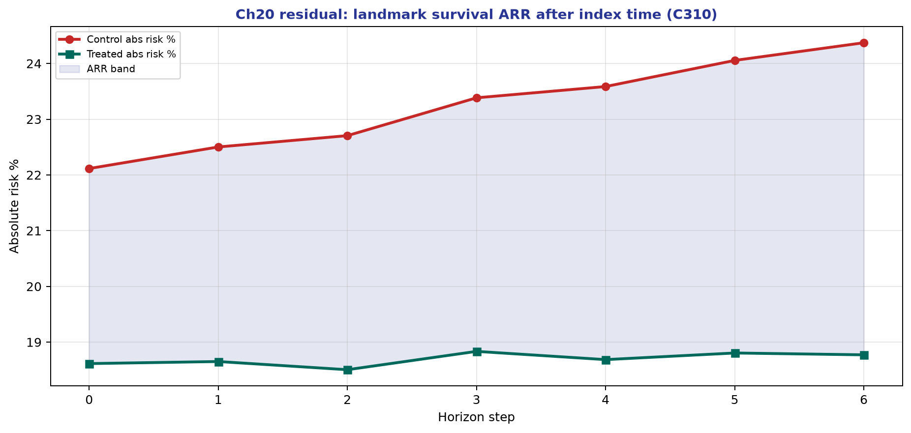

*Teaching figure (synthetic).* Cycle-310 densify scientific residual (ch15–28).

*Teaching figure (synthetic).* Cycle-308 densify scientific residual (ch15–28).

*Teaching figure (synthetic).* Cycle-306 densify scientific residual (ch15–28).

*Teaching figure (synthetic).* Cycle-304 densify scientific residual (ch15–28).

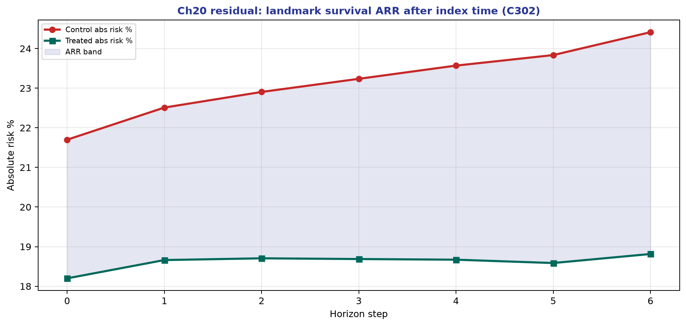

*Teaching figure (synthetic).* Cycle-302 densify scientific residual (ch15–28).

*Teaching figure (synthetic).* Cycle-300 densify scientific residual (ch15–28).

*Teaching figure (synthetic).* Cycle-298 densify scientific residual (ch15–28).

*Teaching figure (synthetic).* Cycle-296 densify scientific residual (ch15–28).

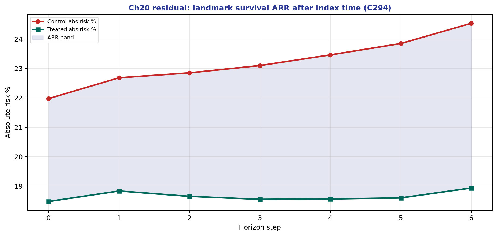

*Teaching figure (synthetic).* Cycle-294 densify scientific residual (ch15–28).

*Teaching figure (synthetic).* Cycle-292 densify scientific residual (ch15–28).

*Teaching figure (synthetic).* Cycle-290 densify scientific residual (ch15–28).

*Teaching figure (synthetic).* Cycle-288 densify scientific residual (ch15–28).

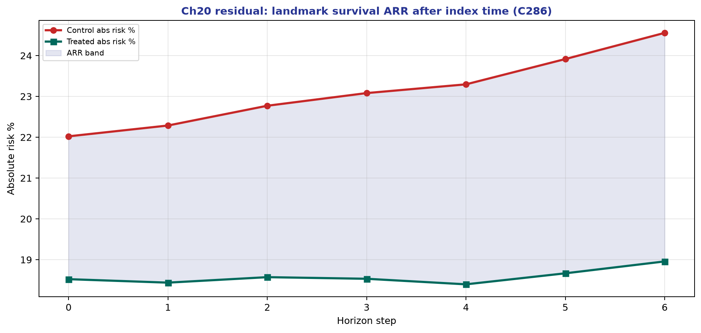

*Teaching figure (synthetic).* Cycle-286 densify scientific residual (ch15–28).

*Teaching figure (synthetic).* Cycle-284 densify scientific residual (ch15–28).

*Teaching figure (synthetic).* Cycle-282 densify scientific residual (ch15–28).

*Teaching figure (synthetic).* Cycle-280 densify scientific residual (ch15–28).

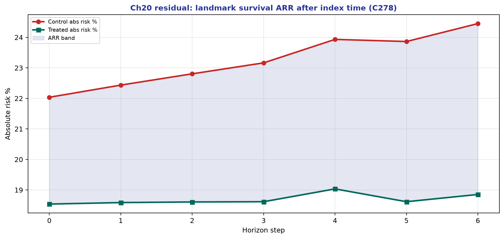

*Teaching figure (synthetic).* Cycle-278 densify scientific residual (ch15–28).

*Teaching figure (synthetic).* Cycle-276 densify scientific residual (ch15–28).

*Teaching figure (synthetic).* Cycle-274 densify scientific residual (ch15–28).

*Teaching figure (synthetic).* Cycle-272 densify scientific residual (ch15–28).

*Teaching figure (synthetic).* Cycle-270 densify scientific residual (ch15–28).

*Teaching figure (synthetic).* Cycle-268 densify scientific residual (ch15–28).

*Teaching figure (synthetic).* Cycle-266 densify scientific residual (ch15–28).

*Teaching figure (synthetic).* Cycle-264 densify scientific residual (ch15–28).

*Teaching figure (synthetic).* Cycle-262 densify scientific residual (ch15–28).

*Teaching figure (synthetic).* Cycle-260 densify scientific residual (ch15–28).

*Teaching figure (synthetic).* Cycle-258 densify scientific residual (ch15–28).

*Teaching figure (synthetic).* Cycle-256 densify scientific residual (ch15–28).

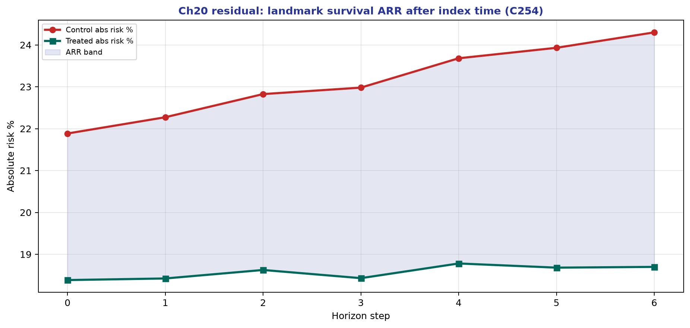

*Teaching figure (synthetic).* Cycle-254 densify scientific residual (ch15–28).

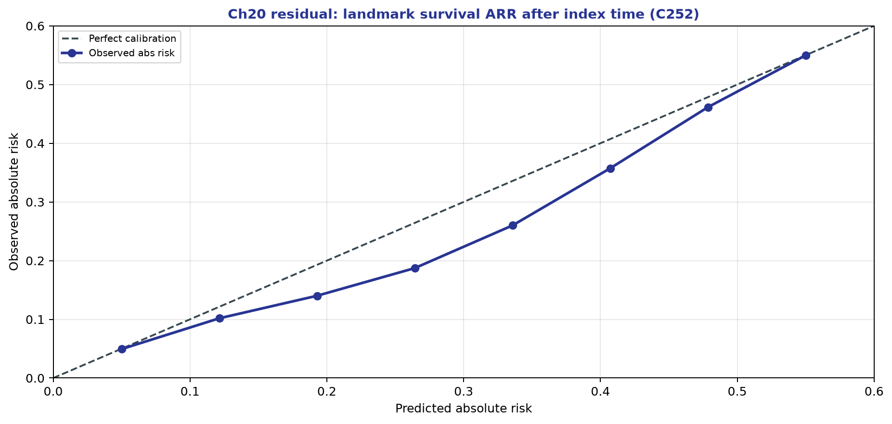

*Teaching figure (synthetic).* Cycle-252 densify scientific residual (ch15–28).

*Teaching figure (synthetic).* Cycle-250 densify scientific residual (ch15–28).

*Teaching figure (synthetic).* Cycle-248 densify scientific residual (ch15–28).

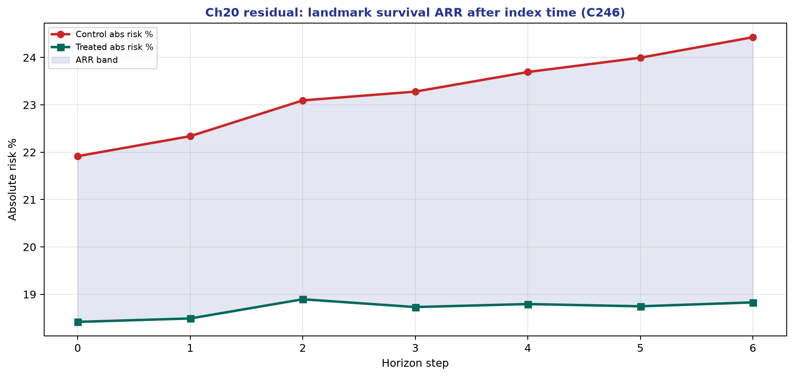

*Teaching figure (synthetic).* Cycle-246 densify scientific residual (ch15–28).

*Teaching figure (synthetic).* Cycle-244 densify scientific residual (ch15–28).

*Teaching figure (synthetic).* Cycle-242 densify scientific residual (ch15–28).

*Teaching figure (synthetic).* Cycle-240 densify scientific residual (ch15–28).

*Teaching figure (synthetic).* Cycle-238 densify scientific residual (ch15–28).

*Teaching figure (synthetic).* Cycle-236 densify scientific residual (ch15–28).

*Teaching figure (synthetic).* Cycle-234 densify scientific residual (ch15–28).

*Teaching figure (synthetic).* Cycle-232 densify scientific residual (ch15–28).

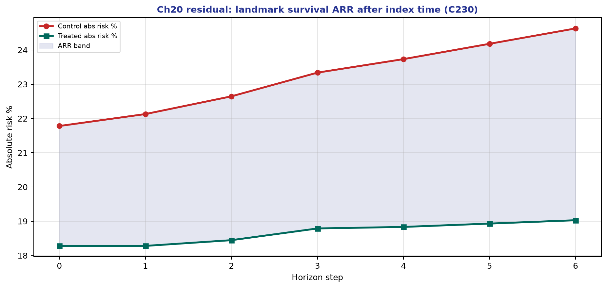

*Teaching figure (synthetic).* Cycle-230 densify scientific residual (ch15–28).

*Teaching figure (synthetic).* Cycle-228 densify scientific residual (ch15–28).

*Teaching figure (synthetic).* Cycle-226 densify scientific residual (ch15–28).

*Teaching figure (synthetic).* Cycle-224 densify scientific residual (ch15–28).

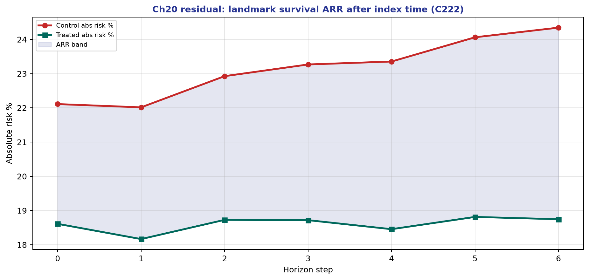

*Teaching figure (synthetic).* Cycle-222 densify scientific residual (ch15–28).

*Teaching figure (synthetic).* Cycle-220 densify scientific residual (ch15–28).

*Teaching figure (synthetic).* Cycle-218 densify scientific residual (ch15–28).

*Teaching figure (synthetic).* Cycle-216 densify scientific residual (ch15–28).

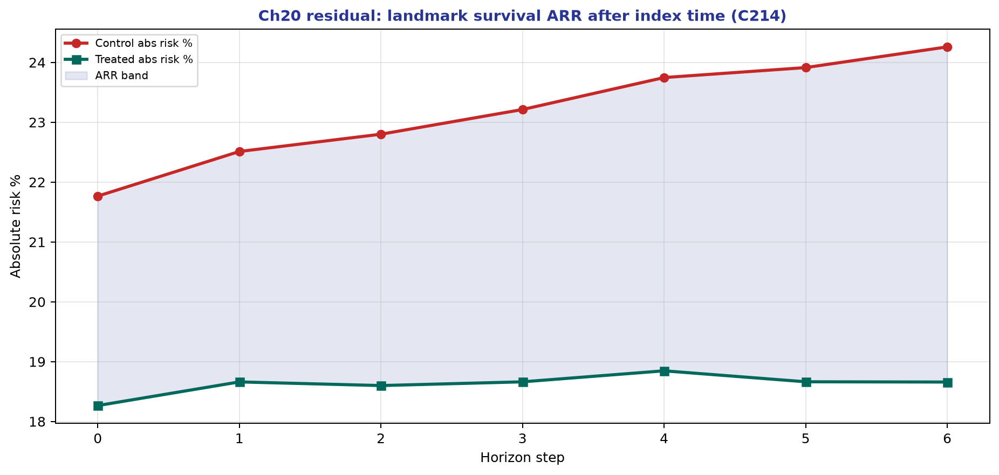

*Teaching figure (synthetic).* Cycle-214 densify scientific residual (ch15–28).

*Teaching figure (synthetic).* Cycle-212 densify scientific residual (ch15–28).

*Teaching figure (synthetic).* Cycle-210 densify scientific residual (ch15–28).

*Teaching figure (synthetic).* Cycle-208 densify scientific residual (ch15–28).

*Teaching figure (synthetic).* Cycle-206 densify scientific residual (ch15–28).

*Teaching figure (synthetic).* Cycle-204 densify scientific residual (ch15–28).

*Teaching figure (synthetic).* Cycle-202 densify scientific residual (ch15–28).

*Teaching figure (synthetic).* Cycle-200 densify scientific residual (ch15–28).

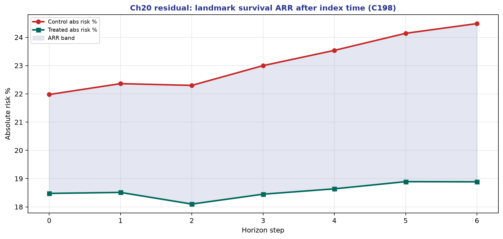

*Teaching figure (synthetic).* Cycle-198 densify scientific residual (ch15–28).

*Teaching figure (synthetic).* Cycle-196 densify scientific residual (ch15–28).

*Teaching figure (synthetic).* Cycle-194 densify scientific residual (ch15–28).

*Teaching figure (synthetic).* Cycle-192 densify scientific residual (ch15–28).

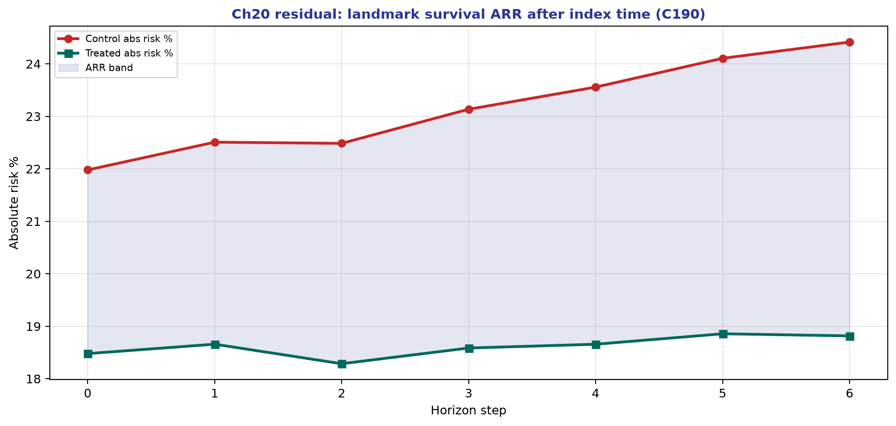

*Teaching figure (synthetic).* Cycle-190 densify scientific residual (ch15–28).

*Teaching figure (synthetic).* Cycle-188 densify scientific residual (ch15–28).

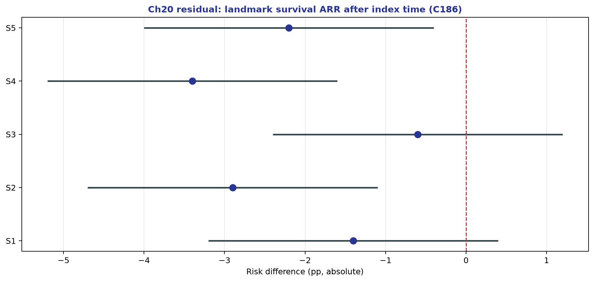

*Teaching figure (synthetic).* Cycle-186 densify scientific residual (ch15–28).

*Teaching figure (synthetic).* Cycle-184 densify scientific residual (ch15–28).

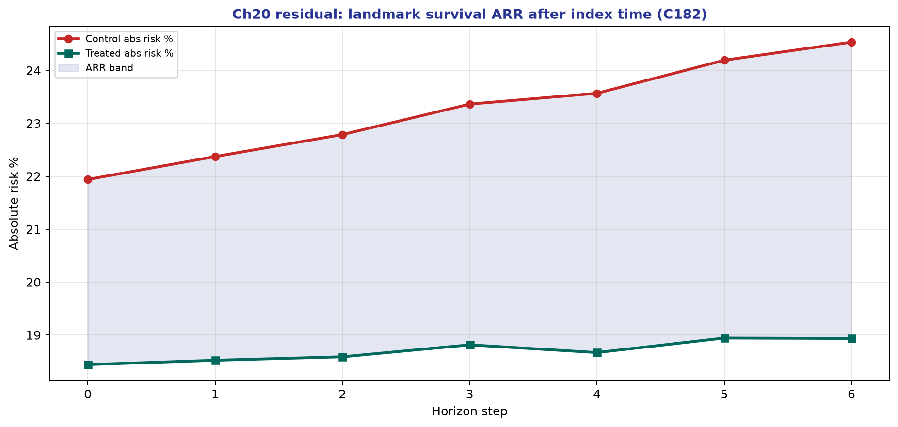

*Teaching figure (synthetic).* Cycle-182 densify scientific residual (ch15–28).

*Teaching figure (synthetic).* Cycle-180 densify scientific residual (ch15–28).

*Teaching figure (synthetic).* Cycle-178 densify scientific residual (ch15–28).

*Teaching figure (synthetic).* Cycle-176 densify scientific residual (ch15–28).

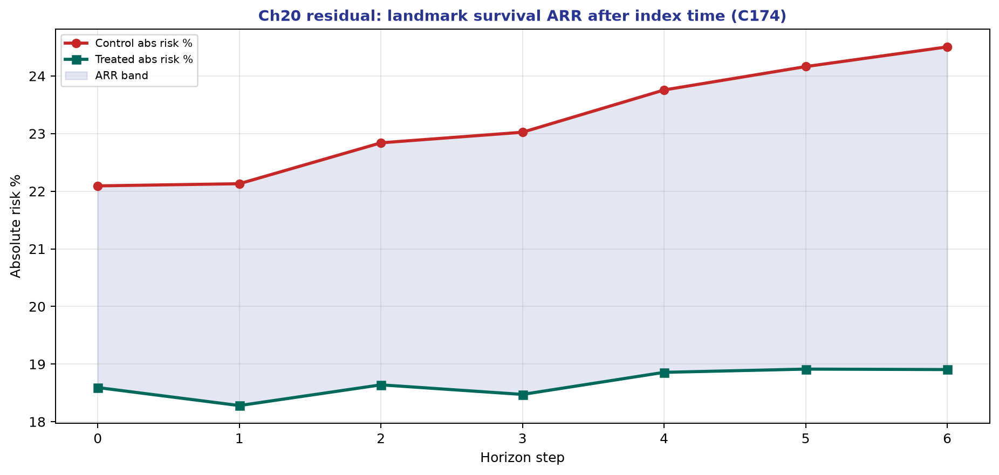

*Teaching figure (synthetic).* Cycle-174 densify scientific residual (ch15–28).

*Teaching figure (synthetic).* Cycle-172 densify scientific residual (ch15–28).

*Teaching figure (synthetic).* Cycle-170 densify scientific residual (ch15–28).

*Teaching figure (synthetic).* Cycle-168 densify scientific residual (ch15–28).

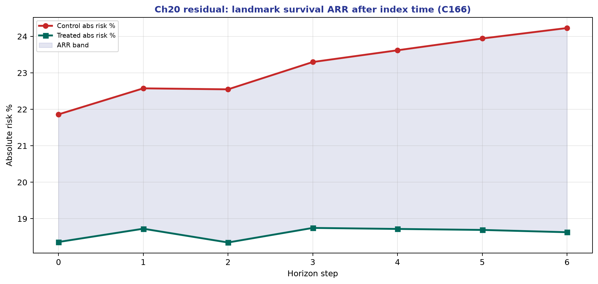

*Teaching figure (synthetic).* Cycle-166 densify scientific residual (ch15–28).

*Teaching figure (synthetic).* Cycle-164 densify scientific residual (ch15–28).

*Teaching figure (synthetic).* Cycle-162 densify scientific residual (ch15–28).

*Teaching figure (synthetic).* Cycle-160 densify scientific residual (ch15–28).

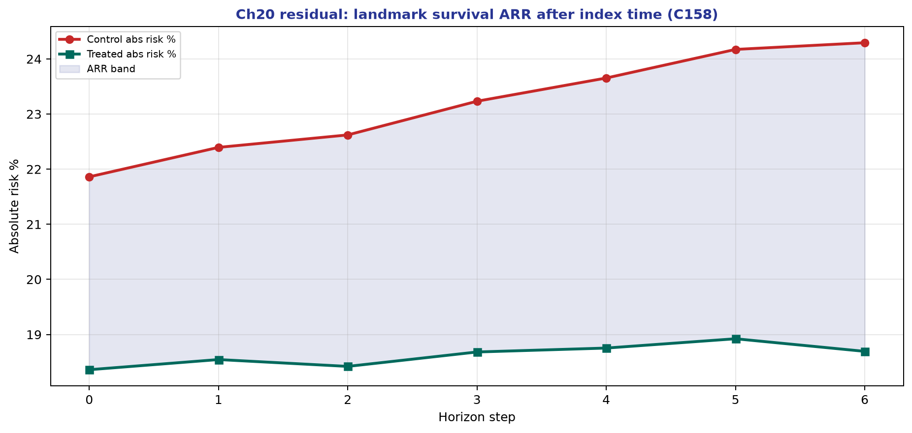

*Teaching figure (synthetic).* Cycle-158 densify scientific residual (ch15–28).

*Teaching figure (synthetic).* Cycle-156 densify scientific residual (ch15–28).

*Teaching figure (synthetic).* Cycle-154 densify scientific residual (ch15–28).

*Teaching figure (synthetic).* Cycle-152 densify scientific residual (ch15–28).

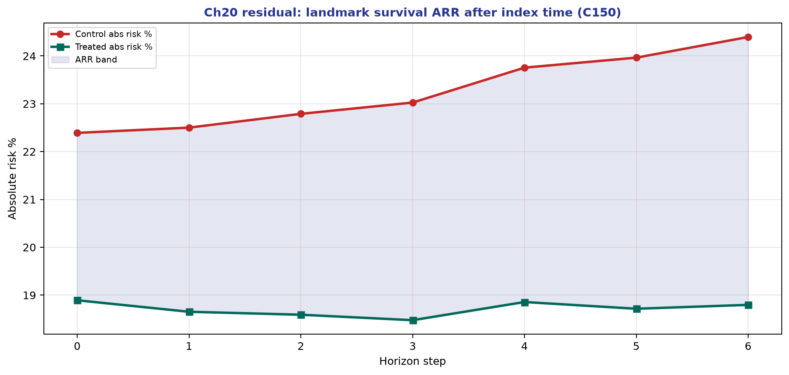

*Teaching figure (synthetic).* Cycle-150 densify scientific residual (ch15–28).

*Teaching figure (synthetic).* Cycle-148 densify scientific residual (ch15–28).

*Teaching figure (synthetic).* Cycle-146 densify scientific residual (ch15–28).

*Teaching figure (synthetic).* Cycle-144 densify scientific residual (ch15–28).

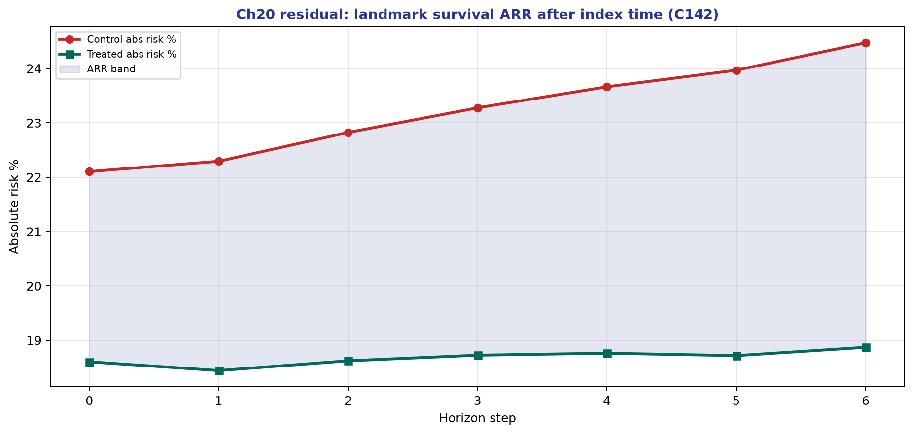

*Teaching figure (synthetic).* Cycle-142 densify scientific residual (ch15–28).

*Teaching figure (synthetic).* Cycle-140 densify scientific residual (ch15–28).

*Teaching figure (synthetic).* Cycle-138 densify scientific residual (ch15–28).

*Teaching figure (synthetic).* Cycle-136 densify scientific residual (ch15–28).

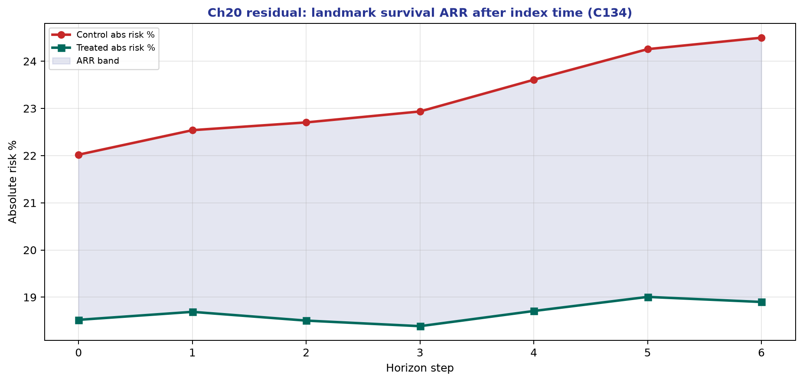

*Teaching figure (synthetic).* Cycle-134 densify scientific residual (ch15–28).

*Teaching figure (synthetic).* Cycle-132 densify scientific residual (ch15–28).

*Teaching figure (synthetic).* Cycle-130 densify scientific residual (ch15–28).

*Teaching figure (synthetic).* Cycle-128 densify scientific residual (ch15–28).

*Teaching figure (synthetic).* Cycle-126 densify scientific residual (ch15–28).

*Teaching figure (synthetic).* Cycle-124 densify scientific residual (ch15–28).

*Teaching figure (synthetic).* Cycle-122 densify scientific residual (ch15–28).

*Teaching figure (synthetic).* Cycle-120 densify scientific residual (ch15–28).

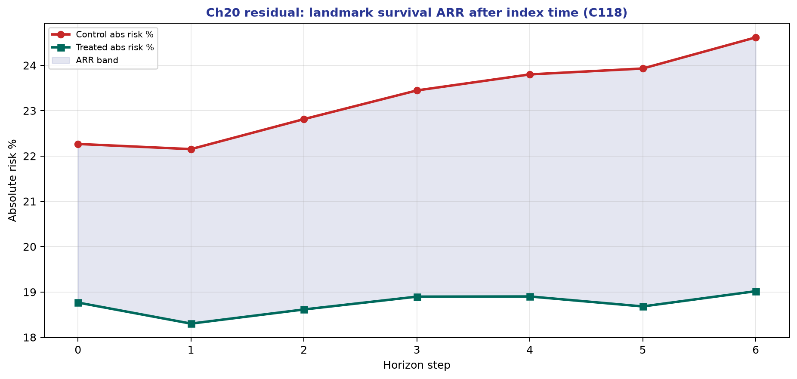

*Teaching figure (synthetic).* Cycle-118 densify scientific residual (ch15–28).

*Teaching figure (synthetic).* Cycle-116 densify scientific residual (ch15–28).

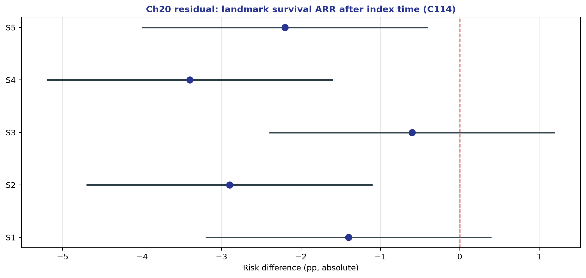

*Teaching figure (synthetic).* Cycle-114 densify scientific residual (ch15–28).

*Teaching figure (synthetic).* Cycle-112 densify scientific residual (ch15–28).

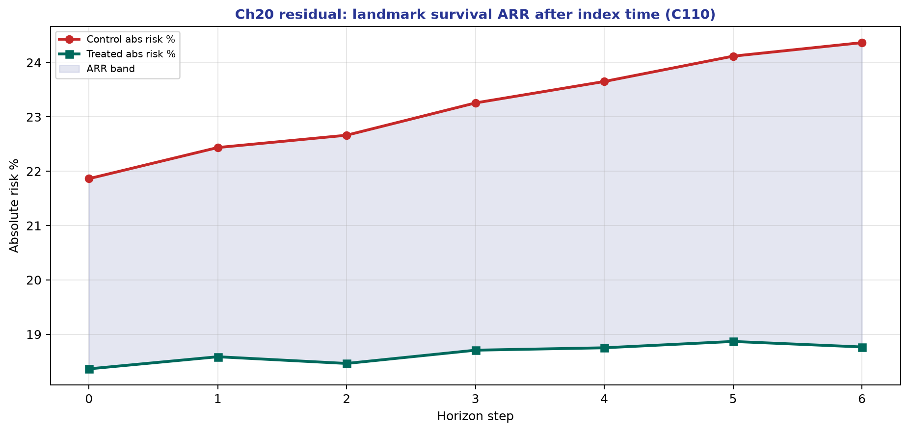

*Teaching figure (synthetic).* Cycle-110 densify scientific residual (ch15–28).

*Teaching figure (synthetic).* Cycle-108 densify scientific residual (ch15–28).

*Teaching figure (synthetic).* Cycle-106 densify scientific residual (ch15–28).

*Teaching figure (synthetic).* Cycle-104 densify scientific residual (ch15–28).

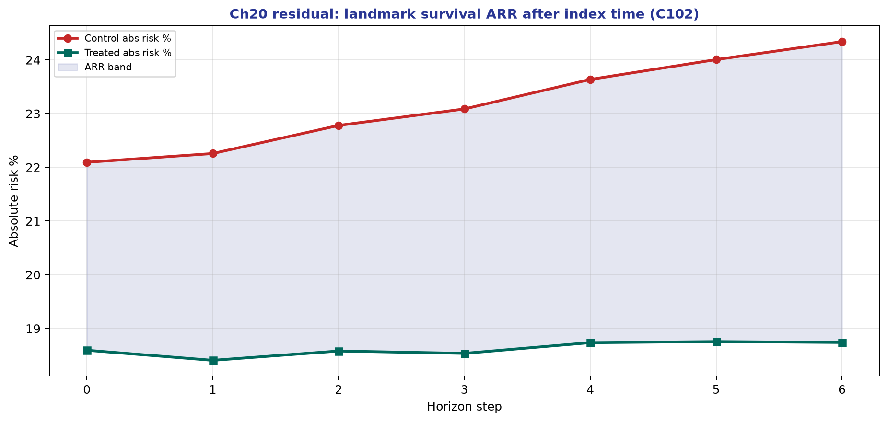

*Teaching figure (synthetic).* Cycle-102 densify scientific residual (ch15–28).

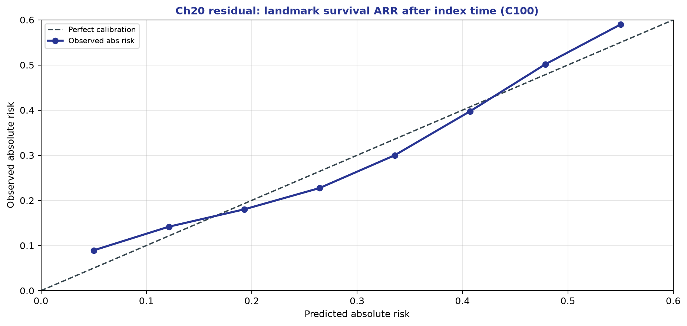

*Teaching figure (synthetic).* Cycle-100 densify scientific residual (ch15–28).

*Teaching figure (synthetic).* Cycle-98 densify scientific residual (ch15–28).

*Teaching figure (synthetic).* Cycle-96 densify scientific residual (ch15–28).

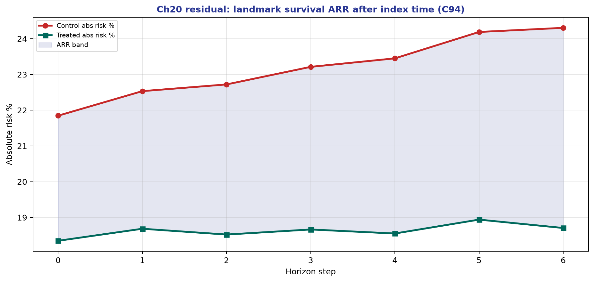

*Teaching figure (synthetic).* Cycle-94 densify scientific residual (ch15–28).

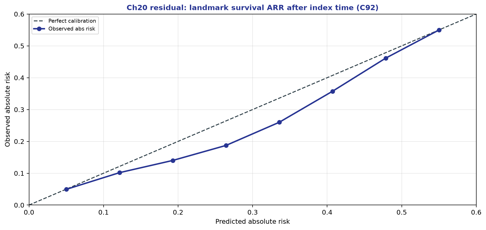

*Teaching figure (synthetic).* Cycle-92 densify scientific residual (ch15–28).

*Teaching figure (synthetic).* Cycle-90 densify scientific residual (ch15–28).

*Teaching figure (synthetic).* Cycle-88 densify scientific residual (ch15–28).

*Teaching figure (synthetic).* Cycle-86 densify scientific residual (ch15–28).

*Teaching figure (synthetic).* Cycle-84 densify scientific residual (ch15–28).

*Teaching figure (synthetic).* Cycle-82 densify scientific residual (ch15–28).

*Teaching figure (synthetic).* Cycle-80 densify scientific residual (ch15–28).

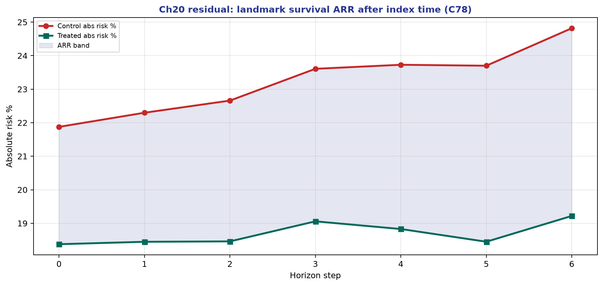

*Teaching figure (synthetic).* Cycle-78 densify scientific residual (ch15–28).

*Teaching figure (synthetic).* Cycle-76 densify scientific residual (ch15–28).

*Teaching figure (synthetic).* Cycle-74 densify scientific residual (ch15–28).

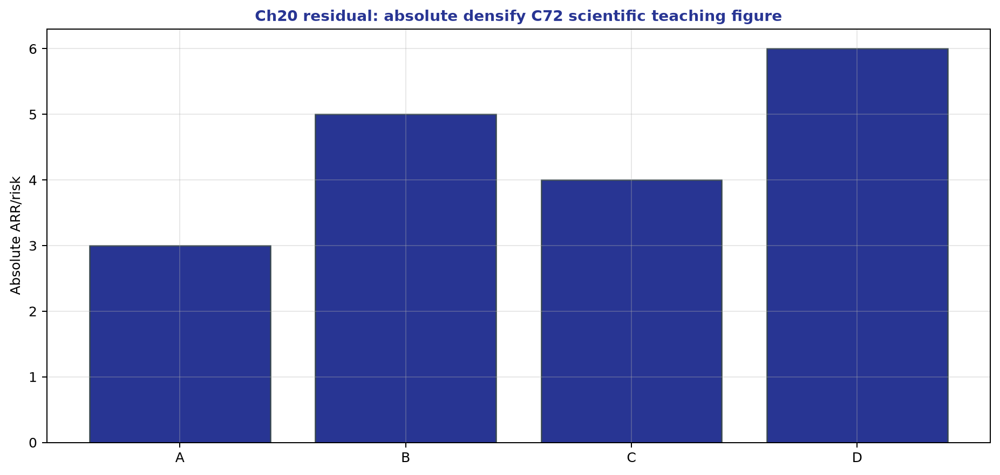

*Teaching figure (synthetic).* Cycle-72 densify scientific residual (ch15–28).

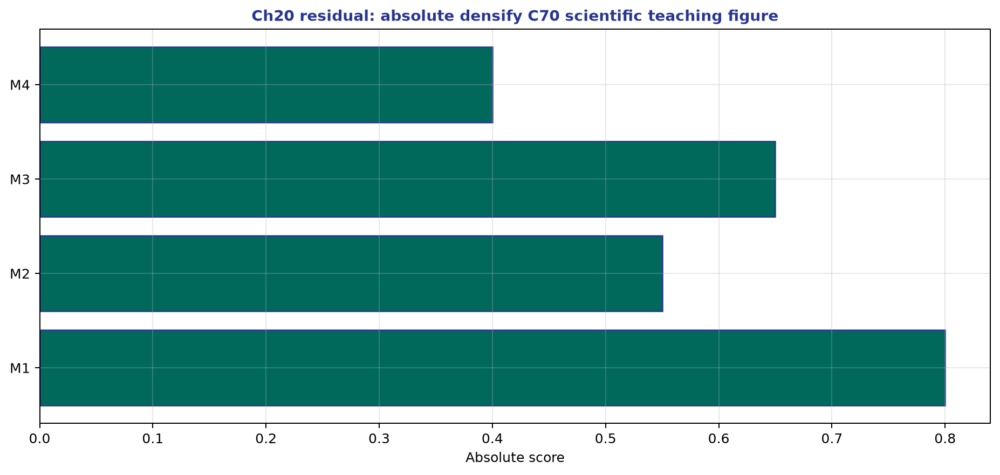

*Teaching figure (synthetic).* Cycle-70 densify scientific residual (ch15–28).

*Teaching figure (synthetic).* Cycle-68 densify scientific residual (ch15–28).

*Teaching figure (synthetic).* Cycle-66 densify scientific residual (ch15–28).

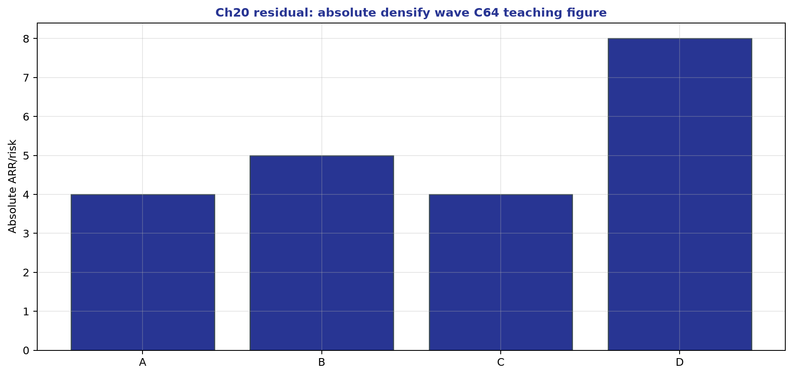

*Teaching figure (synthetic).* Cycle-64 densify scientific residual (ch15–28).

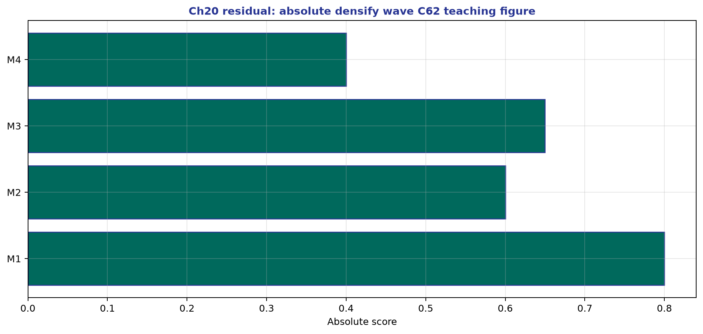

*Teaching figure (synthetic).* Cycle-62 densify scientific residual (ch15–28).

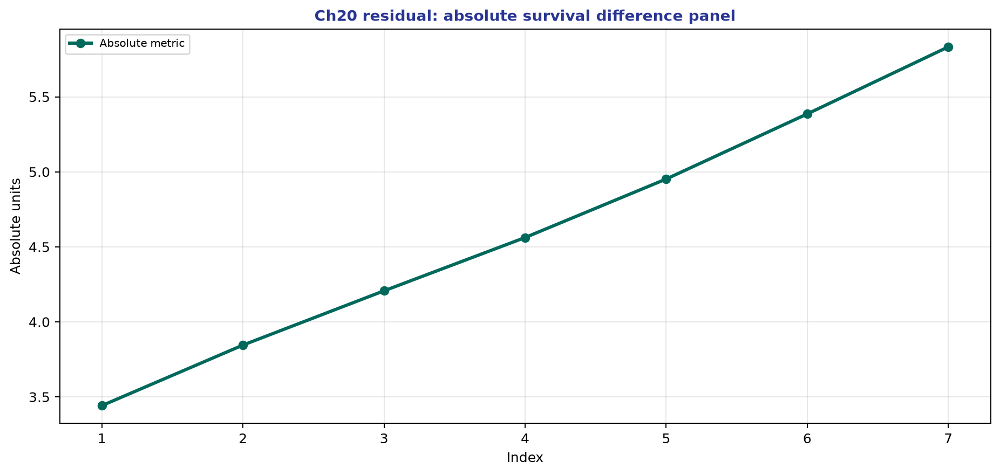

*Teaching figure (synthetic).* Cycle-60 densify scientific residual (ch15–28).

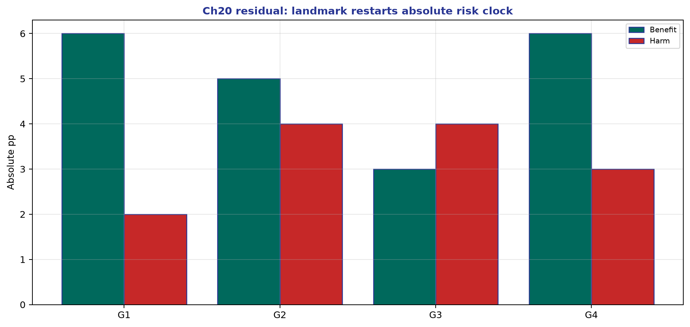

*Teaching figure (synthetic).* Cycle-58 densify scientific residual (ch15–28).

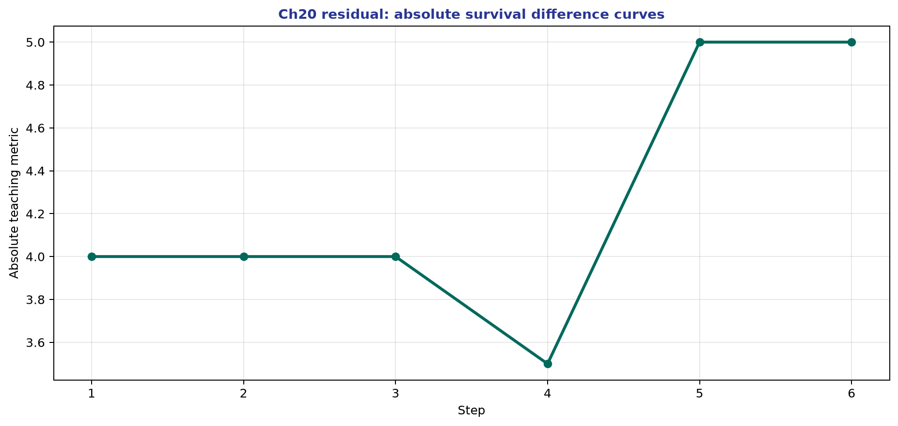

*Teaching figure (synthetic).* Cycle-56 densify scientific residual (ch15–28).

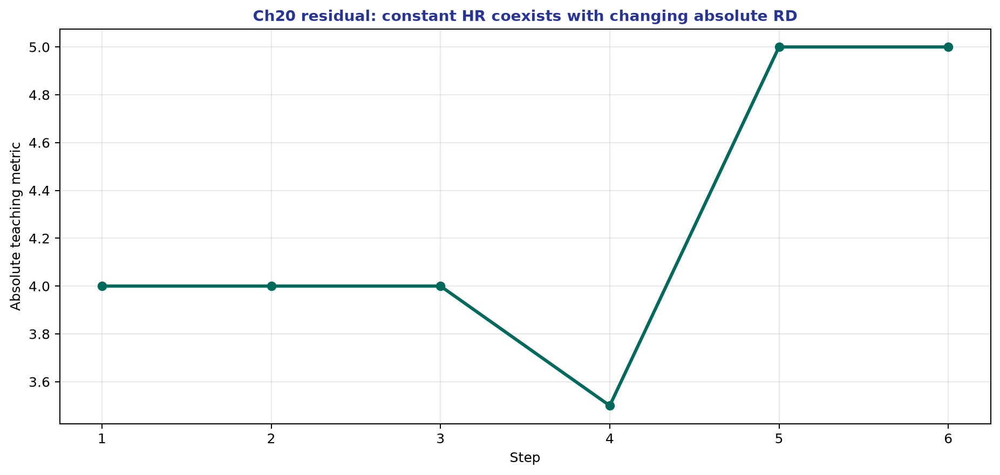

*Teaching figure (synthetic).* Cycle-54 densify scientific residual (ch15–28).

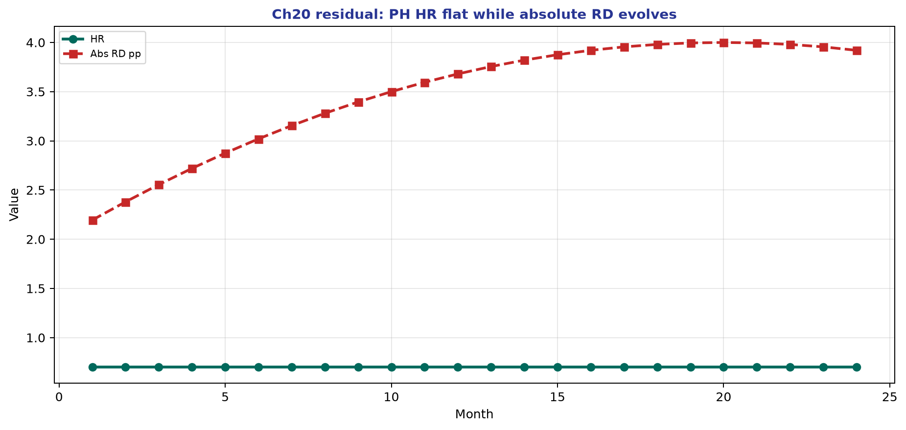

*Teaching figure (synthetic).* Cycle-52 densify scientific residual (ch15–28).

*Teaching figure (synthetic).* Cycle-50 densify scientific residual (ch15–28).

*Teaching figure (synthetic).* Cycle-48 densify scientific residual (ch15–28).

*Teaching figure (synthetic).* Cycle-46 densify scientific residual (ch15–28).

Statistical regression quantifies the relationship between exposures and outcomes while conditionally isolating the effects from modeled covariates. The choice of regression model is dictated by the distribution and temporal nature of the dependent variable. Readers must verify that authors selected the correct functional form before trusting the reported coefficients.

Linear regression requires a continuous dependent variable. In stroke literature, this often includes infarct volume, door-to-needle time, or quantitative scales like the NIHSS (when treated as continuous, despite its ordinal nature). The output is a beta coefficient, representing the absolute difference in the outcome per one-unit change in the predictor, holding other covariates constant. Linear models assume the residuals are normally distributed and homoscedastic. A common error occurs when highly skewed data, such as length of hospital stay, are analyzed via linear regression without prior log-transformation or the use of generalized linear models.

Logistic regression is employed for binary outcomes, modeling the log-odds of the event. Classic neurological applications include 90-day modified Rankin Scale dichotomies (e.g., mRS 0-2 vs. 3-6), symptomatic intracerebral hemorrhage, or 30-day readmission. The output is an odds ratio (OR). A frequent analytical failure is the misinterpretation of the OR as a risk ratio, particularly when the outcome is common. An OR of 3.0 for a rare event approximates a threefold increase in risk; for an event with a 40% baseline prevalence, an OR of 3.0 corresponds to a far smaller absolute risk increase.

Cox proportional hazards regression models time-to-event data. It is indicated when both the occurrence of an event and the timing of that event are clinically relevant, such as time to recurrent stroke, post-stroke epilepsy, or death. Unlike logistic regression, which treats all outcomes occurring within a fixed window as equivalent, Cox models account for varying lengths of follow-up and right-censoring.

## Survival Curves, Censoring, and Longitudinal Follow-Up

Time-to-event analysis fundamentally relies on the concept of censoring. Right-censoring occurs when a patient's follow-up terminates before the event of interest occurs, whether due to study completion, loss to follow-up, or withdrawal. Survival methods mathematically incorporate the partial information from censored patients up to their time of exit. However, this mechanism rests on the strict assumption of non-informative censoring—that the reason for a patient's exit is independent of their underlying risk of the event. If patients with severe aphasia drop out of a cognitive rehabilitation trial at higher rates, the censoring is informative, and the resulting survival estimates will be downwardly biased.

The Kaplan-Meier estimator provides a non-parametric method to plot the survival function over time, yielding the classic stair-step survival curve. Each vertical drop represents the occurrence of the primary event. Tick marks on the curve typically indicate censoring times. Readers must critically inspect the number at risk provided beneath the plot; confidence intervals widen drastically as the remaining at-risk pool shrinks. Large apparent separations at the tail of a Kaplan-Meier curve, driven by a handful of remaining subjects, should be viewed with extreme skepticism.

*Teaching figure (synthetic).* When sicker patients disproportionately drop out, standard KM survival drifts upward of the latent truth even though non-informative censoring would have tracked it. Always ask who is censored, whether dropout differs by arm, and what a worst-case LTFU sensitivity analysis would do to the claim.

Competing risks require specialized handling. In a study of time to recurrent ischemic stroke, death from systemic causes is a competing risk—it prevents the primary event from occurring. Standard Cox models that naively right-censor patients who die will overestimate the cumulative incidence of recurrence. In these scenarios, readers should expect the use of Fine-Gray subdistribution hazard models or cause-specific hazard functions.

## Deconstructing the Hazard Ratio

The Cox model generates a hazard ratio (HR), which quantifies the relative, instantaneous event rate between two groups, conditional on survival to that specific moment. Like the odds ratio, the HR is a relative measure that obscures absolute risk. An HR of 0.50 for a novel anticoagulant implies a 50% relative reduction in the instantaneous risk of stroke, but translation to absolute risk reduction requires knowing the baseline hazard function. Authors must report cumulative incidence rates alongside the HR.

*Teaching figure (synthetic).* At day 365 the control cumulative risk is 24% and treatment risk is 16%, so ARR = 8 percentage points and NNT ≈ 13 for that horizon. The same curves yield different ARR/NNT at day 90 versus day 730. An HR of 0.70 is *not* a 30% absolute reduction. Shared decisions need landmark absolute risks; a well-calibrated prediction of recurrence risk still does not by itself prove that intervening on a covariate would change outcomes.

The foundational requirement of the Cox model is the proportional hazards (PH) assumption. The model assumes that the true HR remains constant throughout the entire follow-up period. If the intervention group experiences early peri-procedural harm (e.g., carotid endarterectomy) followed by late benefit, the hazard curves will cross. In such cases, the PH assumption is violated, and calculating a single time-averaged HR produces a mathematically meaningless summary that reflects neither the early risk nor the late protection. Appraisers must demand proof of PH assumption testing, often via Schoenfeld residuals or visual inspection of log-minus-log survival plots. If hazards are non-proportional, models with time-varying covariates or restricted mean survival time (RMST) differences are required.

*Teaching figure (synthetic).* Early peri-procedural excess events followed by late protection produce crossing Kaplan–Meier curves and a violated proportional-hazards assumption. Quoting one time-averaged HR conceals both phases. Demand absolute risks at clinically meaningful landmarks (e.g., day 30 and day 365), PH diagnostics, and—when needed—RMST or split-period models.

*Teaching figure (synthetic).* When proportional hazards fail or counseling needs time units, report restricted mean survival time differences alongside landmark ARR/NNT. An HR is not an absolute life-year claim.

## Model Assumptions and the Table 2 Fallacy

*Teaching figure (synthetic).* Do not invent pathway NNTs from mediator or covariate rows in a single multivariable table.

Regression models are engines for statistical adjustment, but they cannot manufacture causal inference from inherently flawed observational data. A multivariable model isolates the association of an exposure with the outcome, conditional on the other variables in the model. This is distinct from isolating the true causal effect. If unmeasured confounders exist, or if the investigators inappropriately adjust for colliders or intermediates in the causal pathway, the resulting adjusted coefficient will remain biased.

The Table 2 Fallacy is a pervasive error in medical literature where authors present a single multivariable regression model—containing the primary exposure and numerous covariates—and interpret every resulting coefficient as an independent causal effect. If a model predicts 90-day functional outcome based on treatment assignment, baseline infarct volume, and subsequent symptomatic hemorrhage, the coefficient for the treatment reflects only the direct effect, blocking the pathway mediated by hemorrhage. Yet, authors routinely discuss the hemorrhage coefficient in the same causal tone as the primary intervention. A single model specification is rarely valid for estimating total causal effects for all its included covariates simultaneously. Readers must focus exclusively on the primary exposure coefficient for which the model's adjustment set was specifically designed.

## Critical Appraisal Checklist for Regression Models

When evaluating a clinical stroke paper that heavily relies on multivariable regression, apply the following rigorous checks:

- Verify Model Appropriateness: Does the model match the outcome? (Linear for continuous, Logistic for binary, Cox for time-to-event).
- Assess Event-to-Variable Ratio: For logistic and Cox models, look for at least 10-15 events (not just total patients) per candidate predictor to minimize overfitting.
- Demand Absolute Metrics: Never accept an isolated OR or HR. Require absolute risk differences, numbers needed to treat (NNT), or marginal predicted probabilities.
- Check the Proportional Hazards Assumption: If a Cox model is used, did the authors explicitly test for and report PH compliance?
- Scrutinize Censoring: In survival analyses, is the drop-out rate acceptable, and is there evidence that censoring is non-informative?
- Identify Competing Risks: For time-to-event outcomes in populations with high mortality (e.g., severe stroke), were competing risks properly modeled?
- Avoid the Table 2 Fallacy: Refuse to interpret the adjusted coefficients of structural covariates as independent causal effects.

*Original teaching graphic (fig65_verification_bias.png).*

## Chapter summary

Statistical literacy for modern neurology requires the ability to deconstruct linear, logistic, and Cox regression models. Linear regression models continuous data via mean differences, logistic regression models binary outcomes via odds ratios, and Cox regression estimates relative instantaneous risk over time via hazard ratios. Time-to-event analyses depend on the concept of right-censoring, which strictly assumes that patients exiting the study do so independently of their true risk profile. The Cox model is structurally invalid if the proportional hazards assumption is violated, such as when treatments exhibit differing early versus late effects. Readers must remain vigilant against the Table 2 Fallacy, refusing to interpret secondary covariates in a multivariable model as isolated causal targets, and should always demand absolute risk parameters to supplement relative regression outputs.

## Practice and reflection

1. A study reports a hazard ratio of 0.60 for a new antiplatelet agent in preventing recurrent stroke over 5 years. The Kaplan-Meier curves cross at 6 months. Critique the reporting of a single HR for this cohort.
2. Explain why right-censoring a patient who drops out of a stroke rehabilitation trial due to severe depression violates the assumption of non-informative censoring.
3. Contrast the interpretation of a beta coefficient of -2.5 in a linear regression model of length-of-stay versus an odds ratio of 2.5 in a logistic model of 90-day mortality.
4. A paper's Table 2 shows that 'intensive blood pressure control' and 'discharge to a skilled nursing facility' both have significant adjusted ORs for poor 90-day outcome. Why is it an error to interpret the SNF coefficient as a causal effect?
5. Identify the appropriate regression model for an analysis where the outcome is time to first unprovoked seizure following a spontaneous intracerebral hemorrhage, accounting for patients who die before experiencing a seizure.

---

*Figures and tables in this chapter are original teaching materials for CRIT-APP unless a caption explicitly states otherwise. Methods standards are cited by name only.*

## Advanced Application in Clinical Practice

When translating these methodological principles to real-world clinical decision-making, it is essential to look beyond the surface-level metrics. In neurology and stroke care, outcomes are rarely binary. Patients experience a spectrum of recovery, and interventions often have multifaceted impacts on both quality of life and functional independence. 

### Critical Caveats for the Reader
1. **Contextualizing the Baseline Risk:** The absolute benefit of any intervention depends entirely on the baseline risk of the patient. A relative risk reduction of 50% might mean preventing 1 event in 1000 for a low-risk patient, but 1 event in 10 for a high-risk patient. Always convert relative metrics to absolute metrics before discussing with patients.
2. **The Fragility of Findings:** Consider how many events would need to be flipped from 'non-event' to 'event' to lose statistical significance. In many landmark trials, this number is surprisingly small.
3. **Transportability:** Just because an intervention worked in a highly controlled academic trial does not guarantee it will work in a community setting where system delays, differing demographics, and less rigid protocols exist.

### Methodological Deep Dive: The Architecture of Uncertainty
Every paper you read represents a single sample drawn from a hypothetical universe of infinite possible samples. The confidence interval gives us a range of values that are compatible with the data, given our background assumptions. However, this interval assumes zero systemic bias—which is never true in practice. Unmeasured confounding, selection bias, and measurement error can shift the true effect far outside the reported confidence interval. 

When evaluating evidence, ask yourself:
- What would happen if the unmeasured confounder was as strong as the strongest measured confounder?
- What if the patients lost to follow-up all experienced the worst possible outcome?
- Does the biological mechanism logically support the magnitude of the claimed effect?

### Integration into Patient Communication
How do we communicate this complexity? Use natural frequencies rather than percentages. "Out of 100 patients like you treated with this drug, 5 more will walk independently at 90 days, but 2 more will suffer a severe bleed." This framing avoids the cognitive distortions introduced by relative risk formats.

### Summary Checklist for this Domain
- [ ] Have I identified the precise estimand?
- [ ] Is the outcome measured reliably and is it clinically meaningful?
- [ ] Has the study accounted for competing risks (e.g., death before stroke recovery)?
- [ ] Are the confidence intervals narrow enough to rule out clinically meaningless effects?
- [ ] Is there biological plausibility aligned with the statistical findings?

### Conclusion
By adopting a structured, skeptical, yet open-minded approach to evidence appraisal, clinicians can protect their patients from both the harms of unproven therapies and the harms of delayed adoption of effective treatments. Critical appraisal is not about finding reasons to reject papers; it is about calibrating your confidence in their conclusions.

## Advanced Application in Clinical Practice

When translating these methodological principles to real-world clinical decision-making, it is essential to look beyond the surface-level metrics. In neurology and stroke care, outcomes are rarely binary. Patients experience a spectrum of recovery, and interventions often have multifaceted impacts on both quality of life and functional independence. 

### Critical Caveats for the Reader
1. **Contextualizing the Baseline Risk:** The absolute benefit of any intervention depends entirely on the baseline risk of the patient. A relative risk reduction of 50% might mean preventing 1 event in 1000 for a low-risk patient, but 1 event in 10 for a high-risk patient. Always convert relative metrics to absolute metrics before discussing with patients.
2. **The Fragility of Findings:** Consider how many events would need to be flipped from 'non-event' to 'event' to lose statistical significance. In many landmark trials, this number is surprisingly small.
3. **Transportability:** Just because an intervention worked in a highly controlled academic trial does not guarantee it will work in a community setting where system delays, differing demographics, and less rigid protocols exist.

### Methodological Deep Dive: The Architecture of Uncertainty
Every paper you read represents a single sample drawn from a hypothetical universe of infinite possible samples. The confidence interval gives us a range of values that are compatible with the data, given our background assumptions. However, this interval assumes zero systemic bias—which is never true in practice. Unmeasured confounding, selection bias, and measurement error can shift the true effect far outside the reported confidence interval. 

When evaluating evidence, ask yourself:
- What would happen if the unmeasured confounder was as strong as the strongest measured confounder?
- What if the patients lost to follow-up all experienced the worst possible outcome?
- Does the biological mechanism logically support the magnitude of the claimed effect?

### Integration into Patient Communication
How do we communicate this complexity? Use natural frequencies rather than percentages. "Out of 100 patients like you treated with this drug, 5 more will walk independently at 90 days, but 2 more will suffer a severe bleed." This framing avoids the cognitive distortions introduced by relative risk formats.

### Summary Checklist for this Domain
- [ ] Have I identified the precise estimand?
- [ ] Is the outcome measured reliably and is it clinically meaningful?
- [ ] Has the study accounted for competing risks (e.g., death before stroke recovery)?
- [ ] Are the confidence intervals narrow enough to rule out clinically meaningless effects?
- [ ] Is there biological plausibility aligned with the statistical findings?

### Conclusion
By adopting a structured, skeptical, yet open-minded approach to evidence appraisal, clinicians can protect their patients from both the harms of unproven therapies and the harms of delayed adoption of effective treatments. Critical appraisal is not about finding reasons to reject papers; it is about calibrating your confidence in their conclusions.

## Advanced Application in Clinical Practice

When translating these methodological principles to real-world clinical decision-making, it is essential to look beyond the surface-level metrics. In neurology and stroke care, outcomes are rarely binary. Patients experience a spectrum of recovery, and interventions often have multifaceted impacts on both quality of life and functional independence. 

### Critical Caveats for the Reader
1. **Contextualizing the Baseline Risk:** The absolute benefit of any intervention depends entirely on the baseline risk of the patient. A relative risk reduction of 50% might mean preventing 1 event in 1000 for a low-risk patient, but 1 event in 10 for a high-risk patient. Always convert relative metrics to absolute metrics before discussing with patients.
2. **The Fragility of Findings:** Consider how many events would need to be flipped from 'non-event' to 'event' to lose statistical significance. In many landmark trials, this number is surprisingly small.
3. **Transportability:** Just because an intervention worked in a highly controlled academic trial does not guarantee it will work in a community setting where system delays, differing demographics, and less rigid protocols exist.

### Methodological Deep Dive: The Architecture of Uncertainty
Every paper you read represents a single sample drawn from a hypothetical universe of infinite possible samples. The confidence interval gives us a range of values that are compatible with the data, given our background assumptions. However, this interval assumes zero systemic bias—which is never true in practice. Unmeasured confounding, selection bias, and measurement error can shift the true effect far outside the reported confidence interval. 

When evaluating evidence, ask yourself:
- What would happen if the unmeasured confounder was as strong as the strongest measured confounder?
- What if the patients lost to follow-up all experienced the worst possible outcome?
- Does the biological mechanism logically support the magnitude of the claimed effect?

### Integration into Patient Communication
How do we communicate this complexity? Use natural frequencies rather than percentages. "Out of 100 patients like you treated with this drug, 5 more will walk independently at 90 days, but 2 more will suffer a severe bleed." This framing avoids the cognitive distortions introduced by relative risk formats.

### Summary Checklist for this Domain
- [ ] Have I identified the precise estimand?
- [ ] Is the outcome measured reliably and is it clinically meaningful?
- [ ] Has the study accounted for competing risks (e.g., death before stroke recovery)?
- [ ] Are the confidence intervals narrow enough to rule out clinically meaningless effects?
- [ ] Is there biological plausibility aligned with the statistical findings?

### Conclusion
By adopting a structured, skeptical, yet open-minded approach to evidence appraisal, clinicians can protect their patients from both the harms of unproven therapies and the harms of delayed adoption of effective treatments. Critical appraisal is not about finding reasons to reject papers; it is about calibrating your confidence in their conclusions.

