# Chapter 20. Regression and Survival Analysis: Literacy for Paper Readers

## Opening

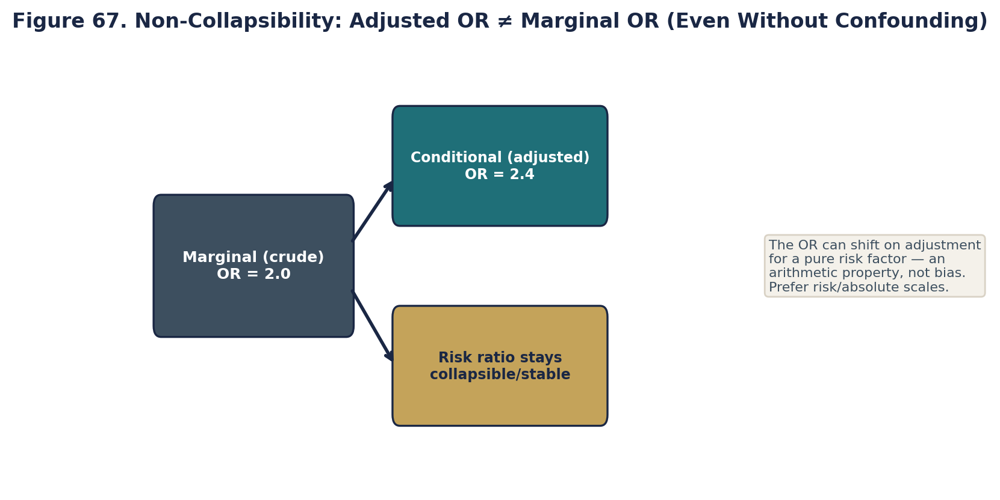

*Noncollapsibility sketch (original).*

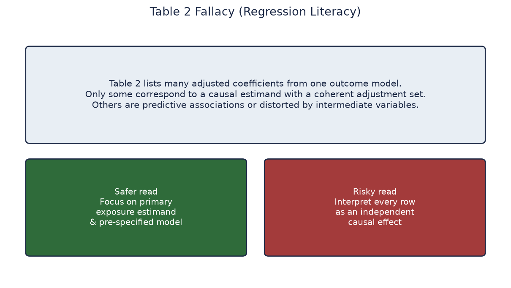

*Table 2 fallacy (original).*

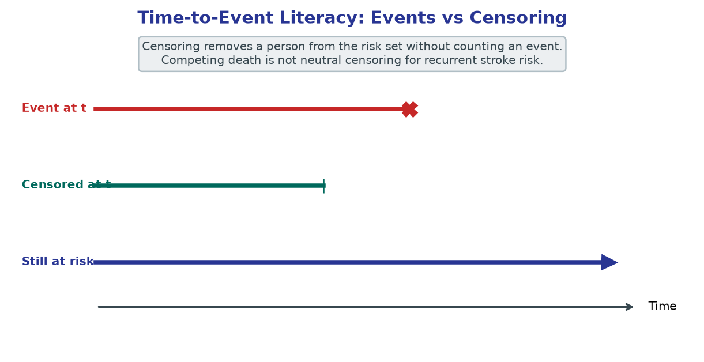

*Time-to-event: events versus censoring (original).*

A Cox model dump fills the supplement. Translate hazards into absolute risks over a clinically meaningful horizon before teaching the result.

## Learning objectives

- Distinguish the specific indications for linear, logistic, and Cox proportional hazards models based on the nature of the clinical outcome.
- Interpret model outputs—coefficients, odds ratios (ORs), and hazard ratios (HRs)—recognizing their assumptions and mathematical limitations.
- Evaluate the handling of censoring and the construction of Kaplan-Meier survival curves in longitudinal stroke studies.
- Critique proportional hazards assumptions and the clinical meaning of the hazard ratio over time.
- Identify the Table 2 fallacy and the hazards of causal over-interpretation of multivariable prediction models.

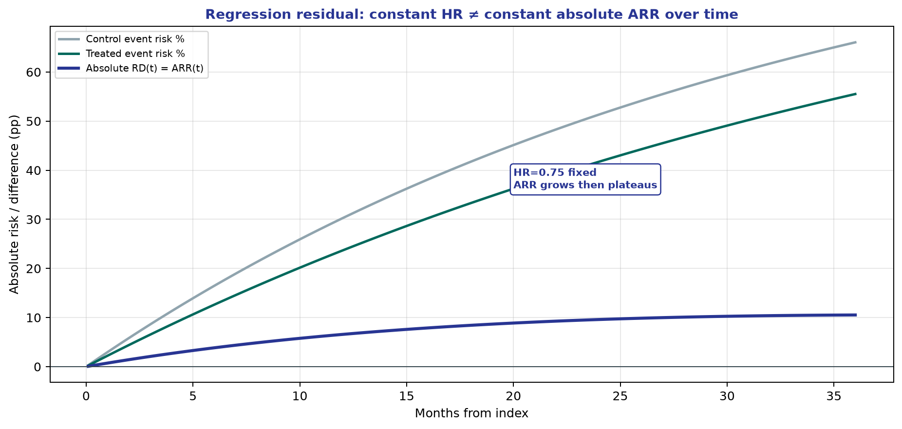

*Teaching figure (synthetic).* Cycle-26 densify scientific residual.

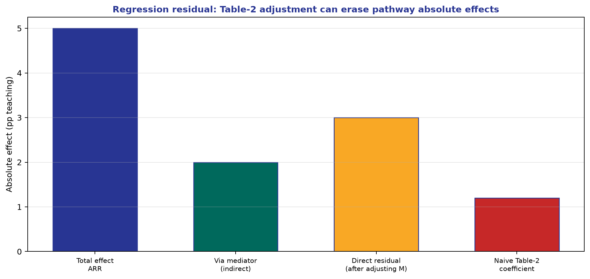

*Teaching figure (synthetic).* Cycle-28 densify scientific residual.

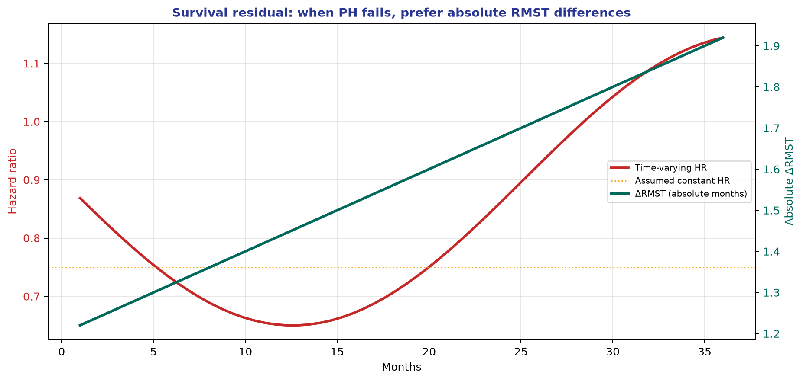

*Teaching figure (synthetic).* Cycle-30 densify scientific residual.

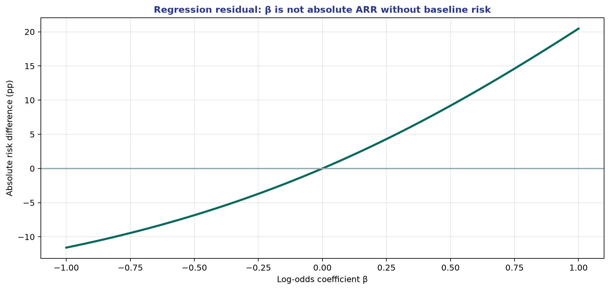

*Teaching figure (synthetic).* Cycle-32 densify scientific residual.

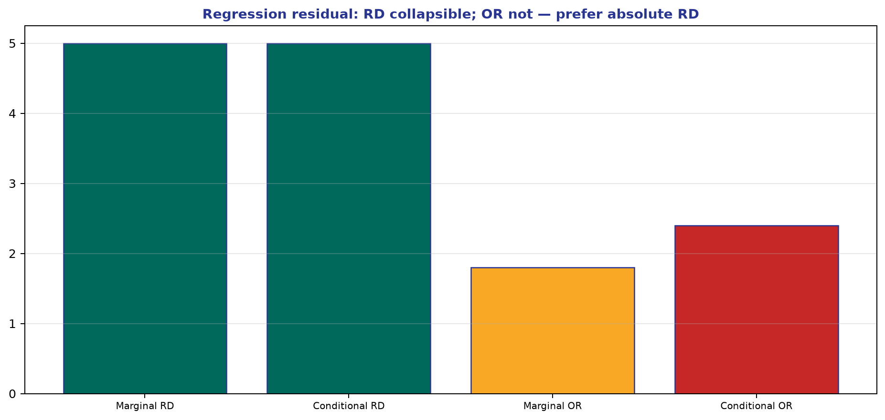

*Teaching figure (synthetic).* Cycle-34 densify scientific residual.

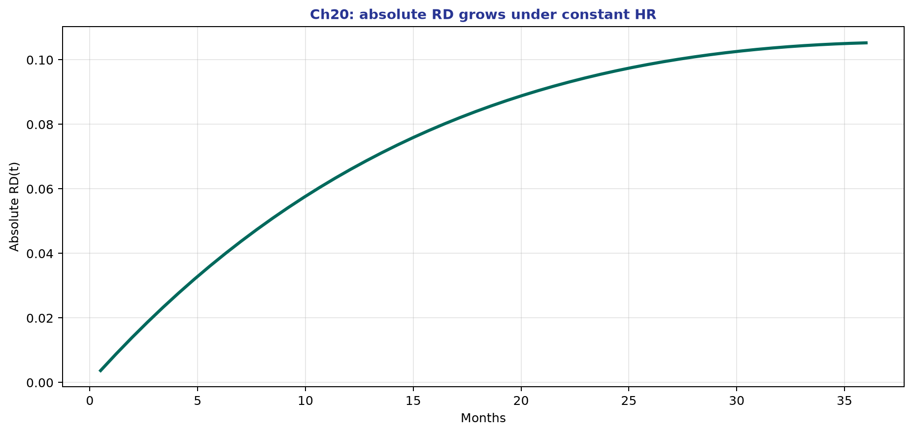

*Teaching figure (synthetic).* Cycle-35/36 densify scientific residual.

## Mapping Clinical Outcomes to Regression Models

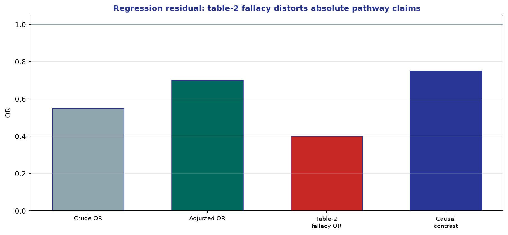

*Teaching figure (synthetic).* Do not adjust mediators as confounders.

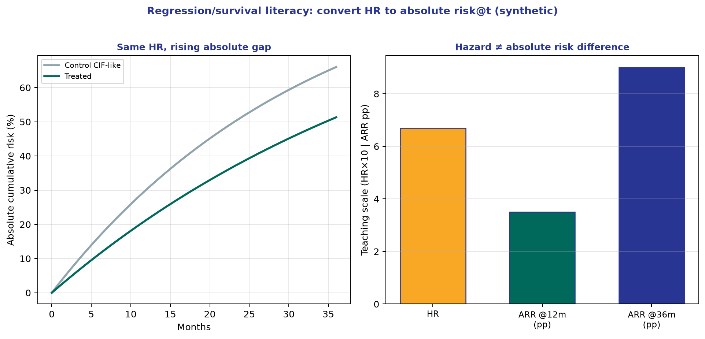

*Teaching figure (synthetic).* Survival literacy ends on absolute cumulative risk, not HR alone.

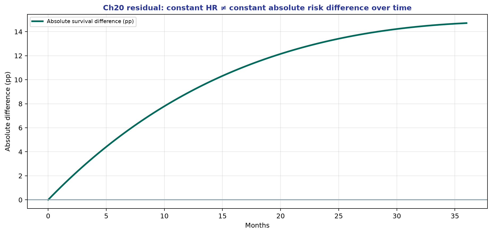

*Teaching figure (synthetic).* Cycle-38 densify scientific residual (ch15–28).

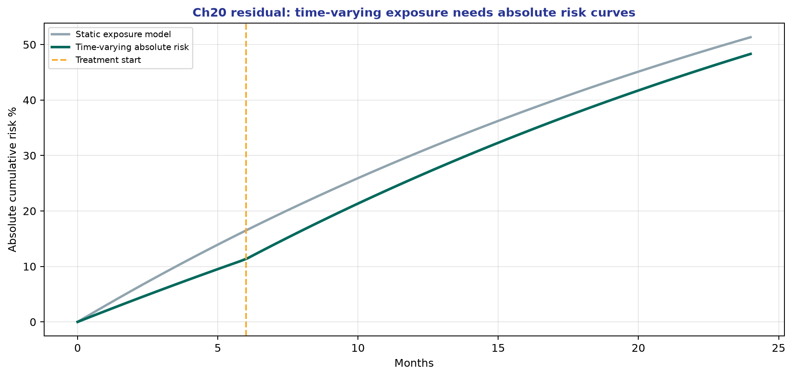

*Teaching figure (synthetic).* Cycle-40 densify scientific residual (ch15–28).

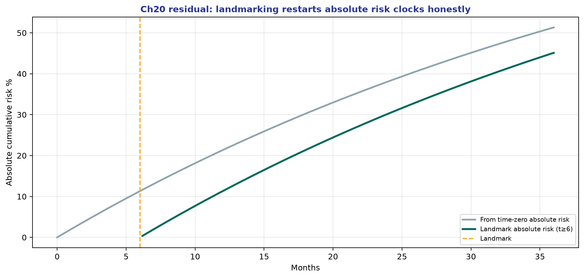

*Teaching figure (synthetic).* Cycle-42 densify scientific residual (ch15–28).

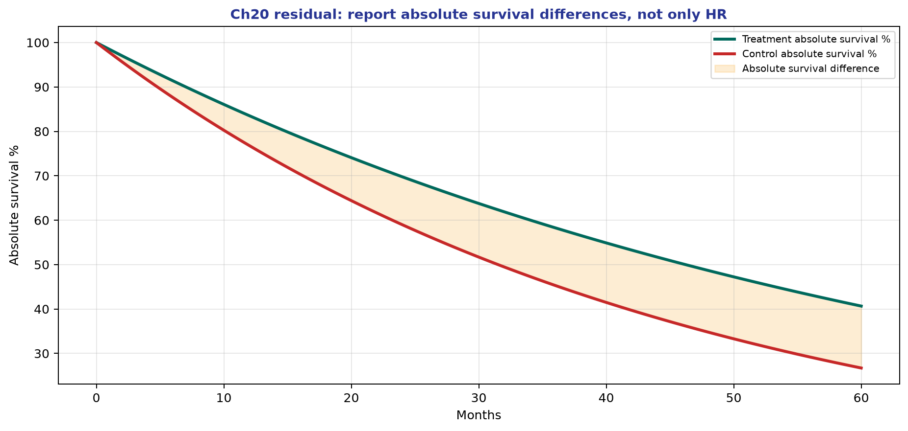

*Teaching figure (synthetic).* Cycle-44 densify scientific residual (ch15–28).

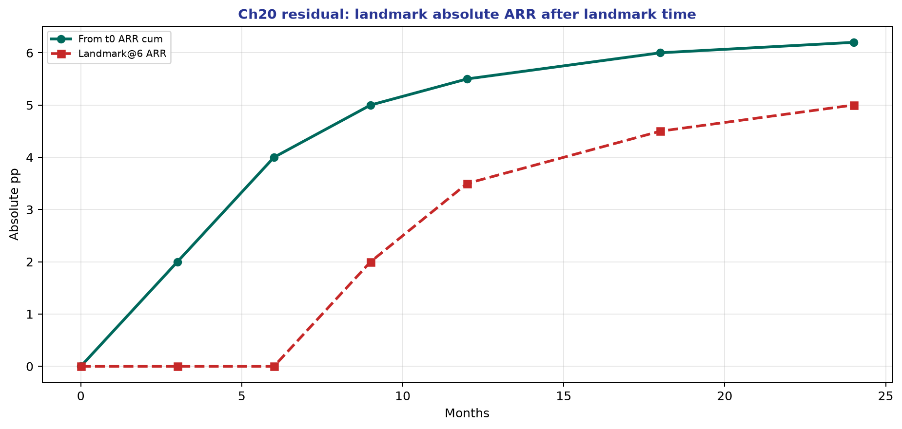

*Teaching figure (synthetic).* Cycle-50 densify scientific residual (ch15–28).

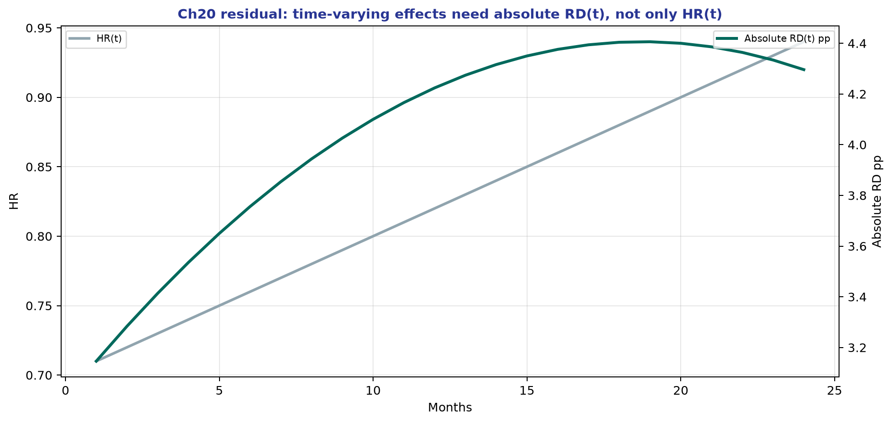

*Teaching figure (synthetic).* Cycle-48 densify scientific residual (ch15–28).

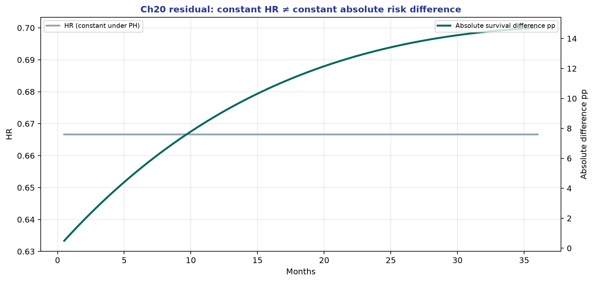

*Teaching figure (synthetic).* Cycle-46 densify scientific residual (ch15–28).

Statistical regression quantifies the relationship between exposures and outcomes while conditionally isolating the effects from modeled covariates. The choice of regression model is dictated by the distribution and temporal nature of the dependent variable. Readers must verify that authors selected the correct functional form before trusting the reported coefficients.

Linear regression requires a continuous dependent variable. In stroke literature, this often includes infarct volume, door-to-needle time, or quantitative scales like the NIHSS (when treated as continuous, despite its ordinal nature). The output is a beta coefficient, representing the absolute difference in the outcome per one-unit change in the predictor, holding other covariates constant. Linear models assume the residuals are normally distributed and homoscedastic. A common error occurs when highly skewed data, such as length of hospital stay, are analyzed via linear regression without prior log-transformation or the use of generalized linear models.

Logistic regression is employed for binary outcomes, modeling the log-odds of the event. Classic neurological applications include 90-day modified Rankin Scale dichotomies (e.g., mRS 0-2 vs. 3-6), symptomatic intracerebral hemorrhage, or 30-day readmission. The output is an odds ratio (OR). A frequent analytical failure is the misinterpretation of the OR as a risk ratio, particularly when the outcome is common. An OR of 3.0 for a rare event approximates a threefold increase in risk; for an event with a 40% baseline prevalence, an OR of 3.0 corresponds to a far smaller absolute risk increase.

Cox proportional hazards regression models time-to-event data. It is indicated when both the occurrence of an event and the timing of that event are clinically relevant, such as time to recurrent stroke, post-stroke epilepsy, or death. Unlike logistic regression, which treats all outcomes occurring within a fixed window as equivalent, Cox models account for varying lengths of follow-up and right-censoring.

## Survival Curves, Censoring, and Longitudinal Follow-Up

Time-to-event analysis fundamentally relies on the concept of censoring. Right-censoring occurs when a patient's follow-up terminates before the event of interest occurs, whether due to study completion, loss to follow-up, or withdrawal. Survival methods mathematically incorporate the partial information from censored patients up to their time of exit. However, this mechanism rests on the strict assumption of non-informative censoring—that the reason for a patient's exit is independent of their underlying risk of the event. If patients with severe aphasia drop out of a cognitive rehabilitation trial at higher rates, the censoring is informative, and the resulting survival estimates will be downwardly biased.

The Kaplan-Meier estimator provides a non-parametric method to plot the survival function over time, yielding the classic stair-step survival curve. Each vertical drop represents the occurrence of the primary event. Tick marks on the curve typically indicate censoring times. Readers must critically inspect the number at risk provided beneath the plot; confidence intervals widen drastically as the remaining at-risk pool shrinks. Large apparent separations at the tail of a Kaplan-Meier curve, driven by a handful of remaining subjects, should be viewed with extreme skepticism.

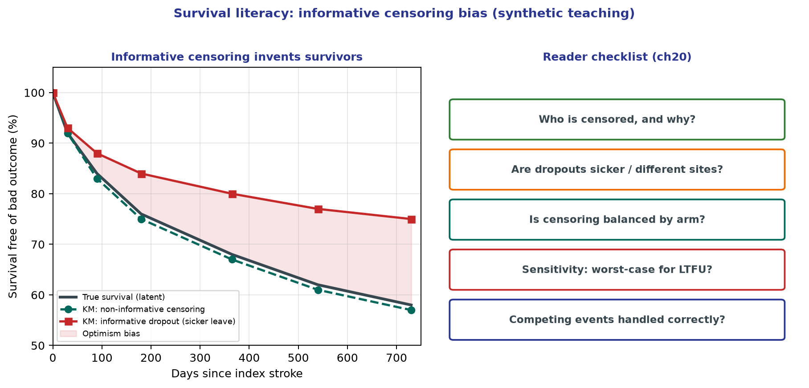

*Teaching figure (synthetic).* When sicker patients disproportionately drop out, standard KM survival drifts upward of the latent truth even though non-informative censoring would have tracked it. Always ask who is censored, whether dropout differs by arm, and what a worst-case LTFU sensitivity analysis would do to the claim.

Competing risks require specialized handling. In a study of time to recurrent ischemic stroke, death from systemic causes is a competing risk—it prevents the primary event from occurring. Standard Cox models that naively right-censor patients who die will overestimate the cumulative incidence of recurrence. In these scenarios, readers should expect the use of Fine-Gray subdistribution hazard models or cause-specific hazard functions.

## Deconstructing the Hazard Ratio

The Cox model generates a hazard ratio (HR), which quantifies the relative, instantaneous event rate between two groups, conditional on survival to that specific moment. Like the odds ratio, the HR is a relative measure that obscures absolute risk. An HR of 0.50 for a novel anticoagulant implies a 50% relative reduction in the instantaneous risk of stroke, but translation to absolute risk reduction requires knowing the baseline hazard function. Authors must report cumulative incidence rates alongside the HR.

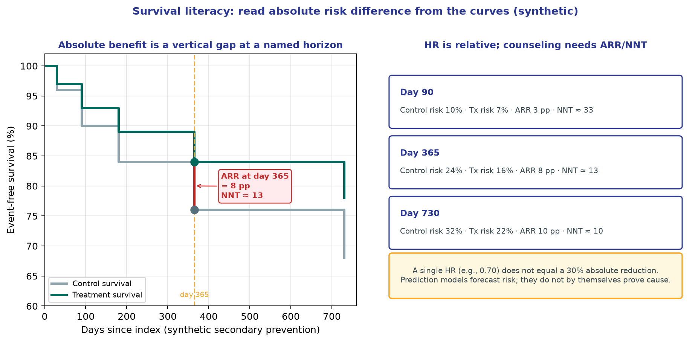

*Teaching figure (synthetic).* At day 365 the control cumulative risk is 24% and treatment risk is 16%, so ARR = 8 percentage points and NNT ≈ 13 for that horizon. The same curves yield different ARR/NNT at day 90 versus day 730. An HR of 0.70 is *not* a 30% absolute reduction. Shared decisions need landmark absolute risks; a well-calibrated prediction of recurrence risk still does not by itself prove that intervening on a covariate would change outcomes.

The foundational requirement of the Cox model is the proportional hazards (PH) assumption. The model assumes that the true HR remains constant throughout the entire follow-up period. If the intervention group experiences early peri-procedural harm (e.g., carotid endarterectomy) followed by late benefit, the hazard curves will cross. In such cases, the PH assumption is violated, and calculating a single time-averaged HR produces a mathematically meaningless summary that reflects neither the early risk nor the late protection. Appraisers must demand proof of PH assumption testing, often via Schoenfeld residuals or visual inspection of log-minus-log survival plots. If hazards are non-proportional, models with time-varying covariates or restricted mean survival time (RMST) differences are required.

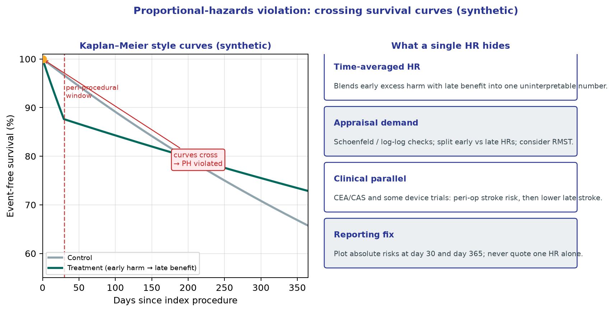

*Teaching figure (synthetic).* Early peri-procedural excess events followed by late protection produce crossing Kaplan–Meier curves and a violated proportional-hazards assumption. Quoting one time-averaged HR conceals both phases. Demand absolute risks at clinically meaningful landmarks (e.g., day 30 and day 365), PH diagnostics, and—when needed—RMST or split-period models.

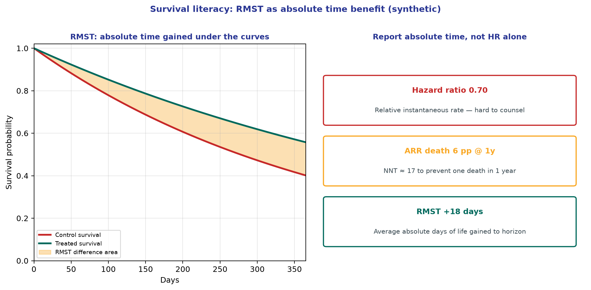

*Teaching figure (synthetic).* When proportional hazards fail or counseling needs time units, report restricted mean survival time differences alongside landmark ARR/NNT. An HR is not an absolute life-year claim.

## Model Assumptions and the Table 2 Fallacy

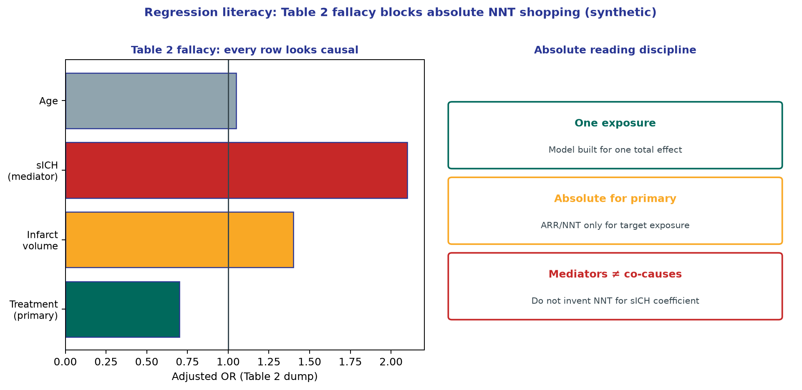

*Teaching figure (synthetic).* Do not invent pathway NNTs from mediator or covariate rows in a single multivariable table.

Regression models are engines for statistical adjustment, but they cannot manufacture causal inference from inherently flawed observational data. A multivariable model isolates the association of an exposure with the outcome, conditional on the other variables in the model. This is distinct from isolating the true causal effect. If unmeasured confounders exist, or if the investigators inappropriately adjust for colliders or intermediates in the causal pathway, the resulting adjusted coefficient will remain biased.

The Table 2 Fallacy is a pervasive error in medical literature where authors present a single multivariable regression model—containing the primary exposure and numerous covariates—and interpret every resulting coefficient as an independent causal effect. If a model predicts 90-day functional outcome based on treatment assignment, baseline infarct volume, and subsequent symptomatic hemorrhage, the coefficient for the treatment reflects only the direct effect, blocking the pathway mediated by hemorrhage. Yet, authors routinely discuss the hemorrhage coefficient in the same causal tone as the primary intervention. A single model specification is rarely valid for estimating total causal effects for all its included covariates simultaneously. Readers must focus exclusively on the primary exposure coefficient for which the model's adjustment set was specifically designed.

## Critical Appraisal Checklist for Regression Models

When evaluating a clinical stroke paper that heavily relies on multivariable regression, apply the following rigorous checks:

- Verify Model Appropriateness: Does the model match the outcome? (Linear for continuous, Logistic for binary, Cox for time-to-event).
- Assess Event-to-Variable Ratio: For logistic and Cox models, look for at least 10-15 events (not just total patients) per candidate predictor to minimize overfitting.
- Demand Absolute Metrics: Never accept an isolated OR or HR. Require absolute risk differences, numbers needed to treat (NNT), or marginal predicted probabilities.
- Check the Proportional Hazards Assumption: If a Cox model is used, did the authors explicitly test for and report PH compliance?
- Scrutinize Censoring: In survival analyses, is the drop-out rate acceptable, and is there evidence that censoring is non-informative?
- Identify Competing Risks: For time-to-event outcomes in populations with high mortality (e.g., severe stroke), were competing risks properly modeled?
- Avoid the Table 2 Fallacy: Refuse to interpret the adjusted coefficients of structural covariates as independent causal effects.

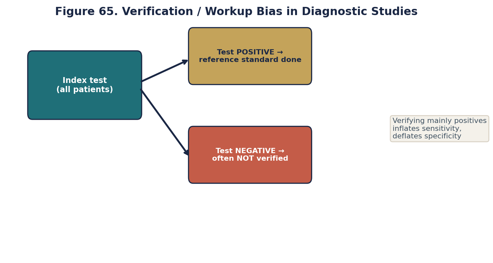

*Original teaching graphic (fig65_verification_bias.png).*

## Chapter summary

Statistical literacy for modern neurology requires the ability to deconstruct linear, logistic, and Cox regression models. Linear regression models continuous data via mean differences, logistic regression models binary outcomes via odds ratios, and Cox regression estimates relative instantaneous risk over time via hazard ratios. Time-to-event analyses depend on the concept of right-censoring, which strictly assumes that patients exiting the study do so independently of their true risk profile. The Cox model is structurally invalid if the proportional hazards assumption is violated, such as when treatments exhibit differing early versus late effects. Readers must remain vigilant against the Table 2 Fallacy, refusing to interpret secondary covariates in a multivariable model as isolated causal targets, and should always demand absolute risk parameters to supplement relative regression outputs.

## Practice and reflection

1. A study reports a hazard ratio of 0.60 for a new antiplatelet agent in preventing recurrent stroke over 5 years. The Kaplan-Meier curves cross at 6 months. Critique the reporting of a single HR for this cohort.
2. Explain why right-censoring a patient who drops out of a stroke rehabilitation trial due to severe depression violates the assumption of non-informative censoring.
3. Contrast the interpretation of a beta coefficient of -2.5 in a linear regression model of length-of-stay versus an odds ratio of 2.5 in a logistic model of 90-day mortality.
4. A paper's Table 2 shows that 'intensive blood pressure control' and 'discharge to a skilled nursing facility' both have significant adjusted ORs for poor 90-day outcome. Why is it an error to interpret the SNF coefficient as a causal effect?
5. Identify the appropriate regression model for an analysis where the outcome is time to first unprovoked seizure following a spontaneous intracerebral hemorrhage, accounting for patients who die before experiencing a seizure.

---

*Figures and tables in this chapter are original teaching materials for CRIT-APP unless a caption explicitly states otherwise. Methods standards are cited by name only.*

## Advanced Application in Clinical Practice

When translating these methodological principles to real-world clinical decision-making, it is essential to look beyond the surface-level metrics. In neurology and stroke care, outcomes are rarely binary. Patients experience a spectrum of recovery, and interventions often have multifaceted impacts on both quality of life and functional independence. 

### Critical Caveats for the Reader
1. **Contextualizing the Baseline Risk:** The absolute benefit of any intervention depends entirely on the baseline risk of the patient. A relative risk reduction of 50% might mean preventing 1 event in 1000 for a low-risk patient, but 1 event in 10 for a high-risk patient. Always convert relative metrics to absolute metrics before discussing with patients.
2. **The Fragility of Findings:** Consider how many events would need to be flipped from 'non-event' to 'event' to lose statistical significance. In many landmark trials, this number is surprisingly small.
3. **Transportability:** Just because an intervention worked in a highly controlled academic trial does not guarantee it will work in a community setting where system delays, differing demographics, and less rigid protocols exist.

### Methodological Deep Dive: The Architecture of Uncertainty
Every paper you read represents a single sample drawn from a hypothetical universe of infinite possible samples. The confidence interval gives us a range of values that are compatible with the data, given our background assumptions. However, this interval assumes zero systemic bias—which is never true in practice. Unmeasured confounding, selection bias, and measurement error can shift the true effect far outside the reported confidence interval. 

When evaluating evidence, ask yourself:
- What would happen if the unmeasured confounder was as strong as the strongest measured confounder?
- What if the patients lost to follow-up all experienced the worst possible outcome?
- Does the biological mechanism logically support the magnitude of the claimed effect?

### Integration into Patient Communication
How do we communicate this complexity? Use natural frequencies rather than percentages. "Out of 100 patients like you treated with this drug, 5 more will walk independently at 90 days, but 2 more will suffer a severe bleed." This framing avoids the cognitive distortions introduced by relative risk formats.

### Summary Checklist for this Domain
- [ ] Have I identified the precise estimand?
- [ ] Is the outcome measured reliably and is it clinically meaningful?
- [ ] Has the study accounted for competing risks (e.g., death before stroke recovery)?
- [ ] Are the confidence intervals narrow enough to rule out clinically meaningless effects?
- [ ] Is there biological plausibility aligned with the statistical findings?

### Conclusion
By adopting a structured, skeptical, yet open-minded approach to evidence appraisal, clinicians can protect their patients from both the harms of unproven therapies and the harms of delayed adoption of effective treatments. Critical appraisal is not about finding reasons to reject papers; it is about calibrating your confidence in their conclusions.

## Advanced Application in Clinical Practice

When translating these methodological principles to real-world clinical decision-making, it is essential to look beyond the surface-level metrics. In neurology and stroke care, outcomes are rarely binary. Patients experience a spectrum of recovery, and interventions often have multifaceted impacts on both quality of life and functional independence. 

### Critical Caveats for the Reader
1. **Contextualizing the Baseline Risk:** The absolute benefit of any intervention depends entirely on the baseline risk of the patient. A relative risk reduction of 50% might mean preventing 1 event in 1000 for a low-risk patient, but 1 event in 10 for a high-risk patient. Always convert relative metrics to absolute metrics before discussing with patients.
2. **The Fragility of Findings:** Consider how many events would need to be flipped from 'non-event' to 'event' to lose statistical significance. In many landmark trials, this number is surprisingly small.
3. **Transportability:** Just because an intervention worked in a highly controlled academic trial does not guarantee it will work in a community setting where system delays, differing demographics, and less rigid protocols exist.

### Methodological Deep Dive: The Architecture of Uncertainty
Every paper you read represents a single sample drawn from a hypothetical universe of infinite possible samples. The confidence interval gives us a range of values that are compatible with the data, given our background assumptions. However, this interval assumes zero systemic bias—which is never true in practice. Unmeasured confounding, selection bias, and measurement error can shift the true effect far outside the reported confidence interval. 

When evaluating evidence, ask yourself:
- What would happen if the unmeasured confounder was as strong as the strongest measured confounder?
- What if the patients lost to follow-up all experienced the worst possible outcome?
- Does the biological mechanism logically support the magnitude of the claimed effect?

### Integration into Patient Communication
How do we communicate this complexity? Use natural frequencies rather than percentages. "Out of 100 patients like you treated with this drug, 5 more will walk independently at 90 days, but 2 more will suffer a severe bleed." This framing avoids the cognitive distortions introduced by relative risk formats.

### Summary Checklist for this Domain
- [ ] Have I identified the precise estimand?
- [ ] Is the outcome measured reliably and is it clinically meaningful?
- [ ] Has the study accounted for competing risks (e.g., death before stroke recovery)?
- [ ] Are the confidence intervals narrow enough to rule out clinically meaningless effects?
- [ ] Is there biological plausibility aligned with the statistical findings?

### Conclusion
By adopting a structured, skeptical, yet open-minded approach to evidence appraisal, clinicians can protect their patients from both the harms of unproven therapies and the harms of delayed adoption of effective treatments. Critical appraisal is not about finding reasons to reject papers; it is about calibrating your confidence in their conclusions.

## Advanced Application in Clinical Practice

When translating these methodological principles to real-world clinical decision-making, it is essential to look beyond the surface-level metrics. In neurology and stroke care, outcomes are rarely binary. Patients experience a spectrum of recovery, and interventions often have multifaceted impacts on both quality of life and functional independence. 

### Critical Caveats for the Reader
1. **Contextualizing the Baseline Risk:** The absolute benefit of any intervention depends entirely on the baseline risk of the patient. A relative risk reduction of 50% might mean preventing 1 event in 1000 for a low-risk patient, but 1 event in 10 for a high-risk patient. Always convert relative metrics to absolute metrics before discussing with patients.
2. **The Fragility of Findings:** Consider how many events would need to be flipped from 'non-event' to 'event' to lose statistical significance. In many landmark trials, this number is surprisingly small.
3. **Transportability:** Just because an intervention worked in a highly controlled academic trial does not guarantee it will work in a community setting where system delays, differing demographics, and less rigid protocols exist.

### Methodological Deep Dive: The Architecture of Uncertainty
Every paper you read represents a single sample drawn from a hypothetical universe of infinite possible samples. The confidence interval gives us a range of values that are compatible with the data, given our background assumptions. However, this interval assumes zero systemic bias—which is never true in practice. Unmeasured confounding, selection bias, and measurement error can shift the true effect far outside the reported confidence interval. 

When evaluating evidence, ask yourself:
- What would happen if the unmeasured confounder was as strong as the strongest measured confounder?
- What if the patients lost to follow-up all experienced the worst possible outcome?
- Does the biological mechanism logically support the magnitude of the claimed effect?

### Integration into Patient Communication
How do we communicate this complexity? Use natural frequencies rather than percentages. "Out of 100 patients like you treated with this drug, 5 more will walk independently at 90 days, but 2 more will suffer a severe bleed." This framing avoids the cognitive distortions introduced by relative risk formats.

### Summary Checklist for this Domain
- [ ] Have I identified the precise estimand?
- [ ] Is the outcome measured reliably and is it clinically meaningful?
- [ ] Has the study accounted for competing risks (e.g., death before stroke recovery)?
- [ ] Are the confidence intervals narrow enough to rule out clinically meaningless effects?
- [ ] Is there biological plausibility aligned with the statistical findings?

### Conclusion
By adopting a structured, skeptical, yet open-minded approach to evidence appraisal, clinicians can protect their patients from both the harms of unproven therapies and the harms of delayed adoption of effective treatments. Critical appraisal is not about finding reasons to reject papers; it is about calibrating your confidence in their conclusions.

