# Chapter 21. Interaction, Effect Modification, and Standardization

## Opening


*Additive vs multiplicative interaction (original).*


*Standardization (original).*


*Interaction on different scales (original).*


*Interaction on additive versus multiplicative scales (original).*

An interaction claim says the drug works only on one scale. Demand which scale, pre-specification, and absolute stratum effects.


## Learning objectives

- Define effect modification and statistical interaction, distinguishing them structurally and analytically from confounding.
- Contrast additive and multiplicative scales of interaction, identifying why the scale chosen dictates the clinical interpretation of subgroup analyses.
- Translate relative outcome measures from neurovascular trials into stratum-specific absolute risks to evaluate net clinical benefit.
- Explain direct and indirect standardization of stroke incidence and mortality rates, applying these techniques to comparative epidemiology.
- Appraise subgroup claims in stroke literature by evaluating pre-specification, scale dependence, interaction testing, and measurement error.


*Teaching figure (synthetic).* Cycle-26 densify scientific residual.


*Teaching figure (synthetic).* Cycle-28 densify scientific residual.


*Teaching figure (synthetic).* Cycle-30 densify scientific residual.


*Teaching figure (synthetic).* Cycle-32 densify scientific residual.


*Teaching figure (synthetic).* Cycle-34 densify scientific residual.


*Teaching figure (synthetic).* Cycle-35/36 densify scientific residual.

## Interaction Versus Confounding: Structural Distinctions


*Teaching figure (synthetic).* Decisions live on additive absolute scale.


*Teaching figure (synthetic).* Cycle-38 densify scientific residual (ch15–28).


*Teaching figure (synthetic).* Cycle-40 densify scientific residual (ch15–28).


*Teaching figure (synthetic).* Cycle-42 densify scientific residual (ch15–28).


*Teaching figure (synthetic).* Cycle-44 densify scientific residual (ch15–28).


*Teaching figure (synthetic).* Cycle-504 densify scientific residual (ch15–28).


*Teaching figure (synthetic).* Cycle-502 densify scientific residual (ch15–28).


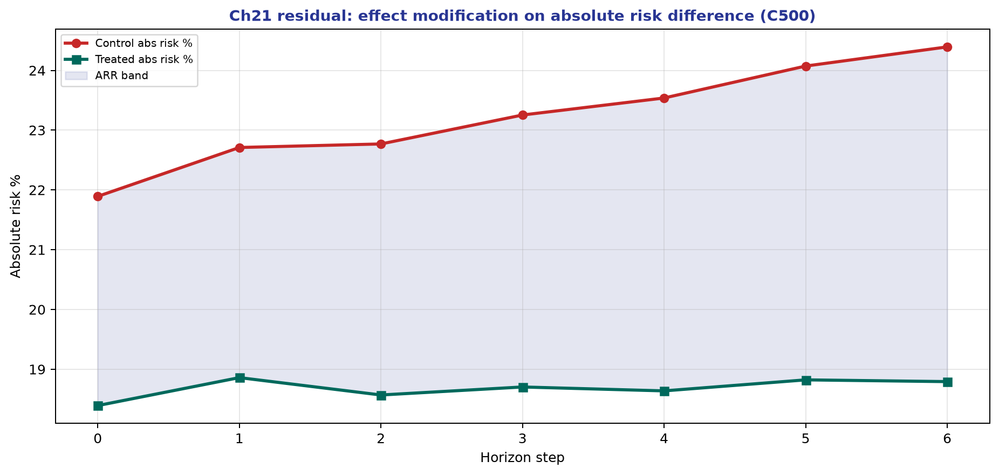

*Teaching figure (synthetic).* Cycle-500 densify scientific residual (ch15–28).


*Teaching figure (synthetic).* Cycle-498 densify scientific residual (ch15–28).


*Teaching figure (synthetic).* Cycle-496 densify scientific residual (ch15–28).


*Teaching figure (synthetic).* Cycle-494 densify scientific residual (ch15–28).


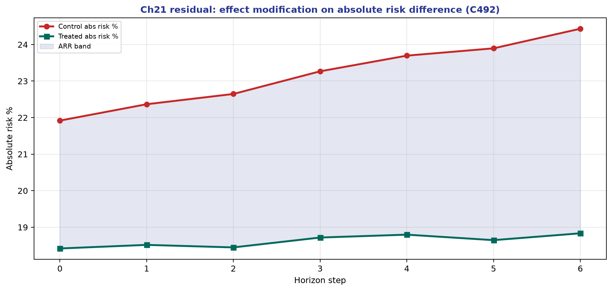

*Teaching figure (synthetic).* Cycle-492 densify scientific residual (ch15–28).


*Teaching figure (synthetic).* Cycle-490 densify scientific residual (ch15–28).


*Teaching figure (synthetic).* Cycle-488 densify scientific residual (ch15–28).


*Teaching figure (synthetic).* Cycle-486 densify scientific residual (ch15–28).


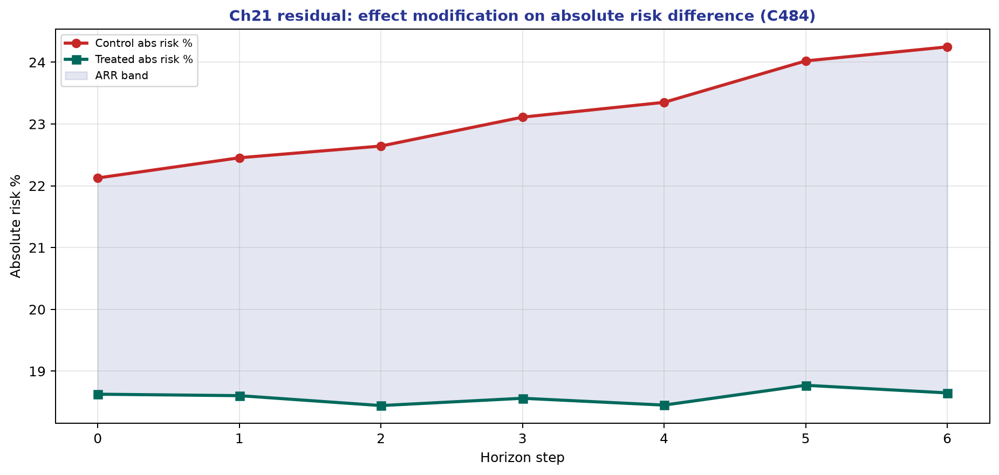

*Teaching figure (synthetic).* Cycle-484 densify scientific residual (ch15–28).


*Teaching figure (synthetic).* Cycle-482 densify scientific residual (ch15–28).


*Teaching figure (synthetic).* Cycle-480 densify scientific residual (ch15–28).


*Teaching figure (synthetic).* Cycle-478 densify scientific residual (ch15–28).


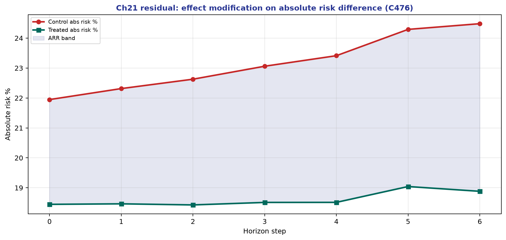

*Teaching figure (synthetic).* Cycle-476 densify scientific residual (ch15–28).


*Teaching figure (synthetic).* Cycle-474 densify scientific residual (ch15–28).


*Teaching figure (synthetic).* Cycle-472 densify scientific residual (ch15–28).


*Teaching figure (synthetic).* Cycle-470 densify scientific residual (ch15–28).


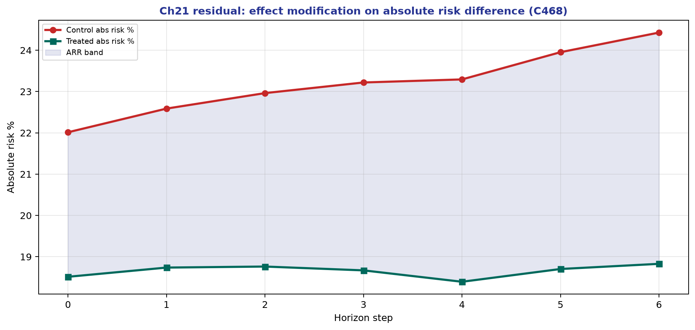

*Teaching figure (synthetic).* Cycle-468 densify scientific residual (ch15–28).


*Teaching figure (synthetic).* Cycle-466 densify scientific residual (ch15–28).


*Teaching figure (synthetic).* Cycle-464 densify scientific residual (ch15–28).


*Teaching figure (synthetic).* Cycle-462 densify scientific residual (ch15–28).


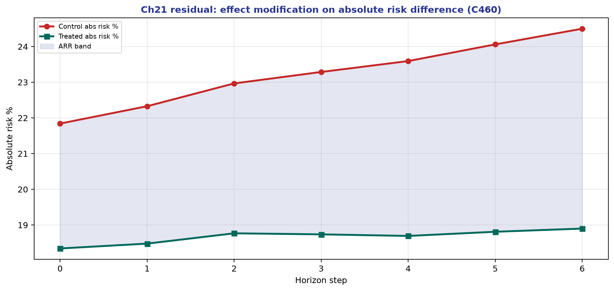

*Teaching figure (synthetic).* Cycle-460 densify scientific residual (ch15–28).


*Teaching figure (synthetic).* Cycle-458 densify scientific residual (ch15–28).


*Teaching figure (synthetic).* Cycle-456 densify scientific residual (ch15–28).


*Teaching figure (synthetic).* Cycle-454 densify scientific residual (ch15–28).


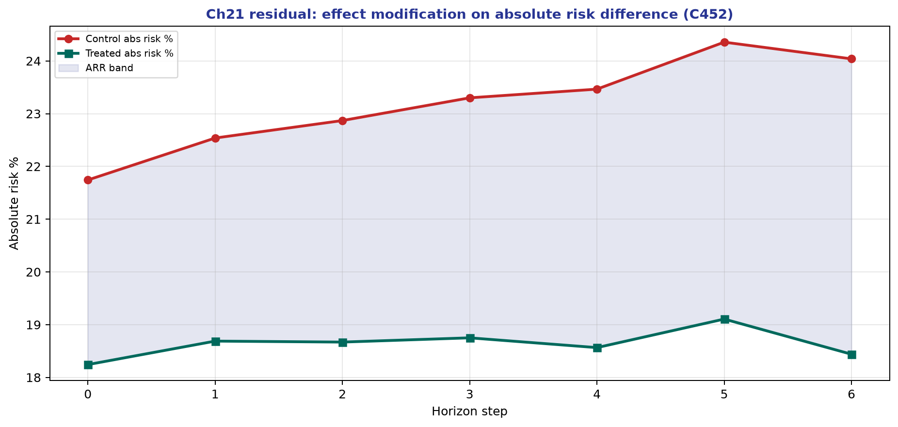

*Teaching figure (synthetic).* Cycle-452 densify scientific residual (ch15–28).


*Teaching figure (synthetic).* Cycle-450 densify scientific residual (ch15–28).


*Teaching figure (synthetic).* Cycle-448 densify scientific residual (ch15–28).


*Teaching figure (synthetic).* Cycle-446 densify scientific residual (ch15–28).


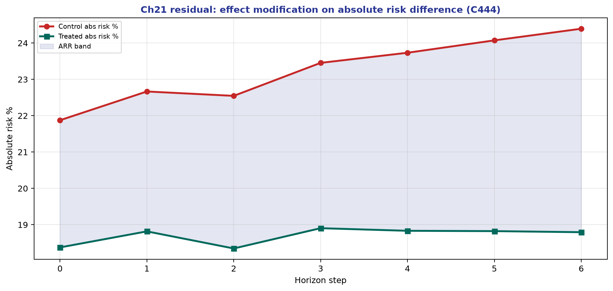

*Teaching figure (synthetic).* Cycle-444 densify scientific residual (ch15–28).


*Teaching figure (synthetic).* Cycle-442 densify scientific residual (ch15–28).


*Teaching figure (synthetic).* Cycle-440 densify scientific residual (ch15–28).


*Teaching figure (synthetic).* Cycle-438 densify scientific residual (ch15–28).


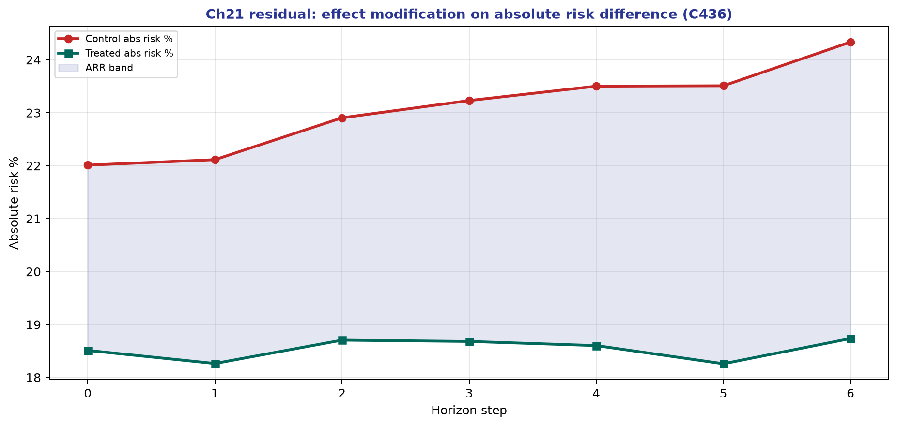

*Teaching figure (synthetic).* Cycle-436 densify scientific residual (ch15–28).


*Teaching figure (synthetic).* Cycle-434 densify scientific residual (ch15–28).


*Teaching figure (synthetic).* Cycle-432 densify scientific residual (ch15–28).


*Teaching figure (synthetic).* Cycle-430 densify scientific residual (ch15–28).


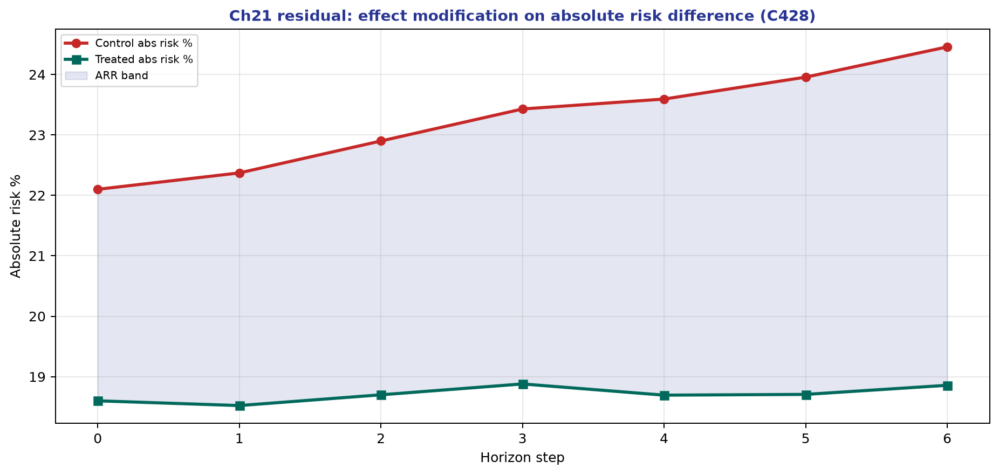

*Teaching figure (synthetic).* Cycle-428 densify scientific residual (ch15–28).


*Teaching figure (synthetic).* Cycle-426 densify scientific residual (ch15–28).


*Teaching figure (synthetic).* Cycle-424 densify scientific residual (ch15–28).


*Teaching figure (synthetic).* Cycle-422 densify scientific residual (ch15–28).


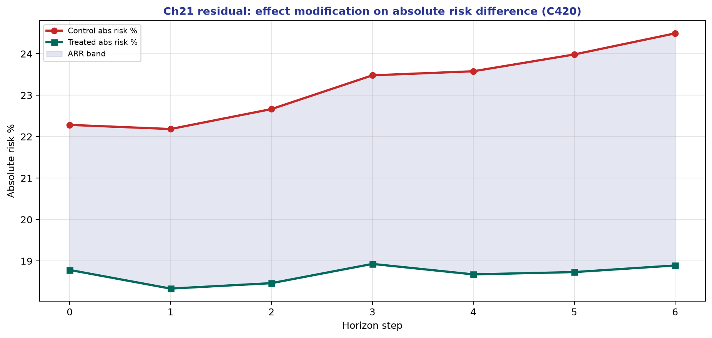

*Teaching figure (synthetic).* Cycle-420 densify scientific residual (ch15–28).


*Teaching figure (synthetic).* Cycle-418 densify scientific residual (ch15–28).


*Teaching figure (synthetic).* Cycle-416 densify scientific residual (ch15–28).


*Teaching figure (synthetic).* Cycle-414 densify scientific residual (ch15–28).


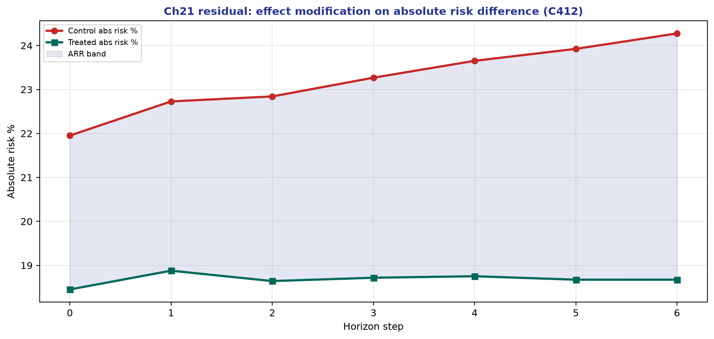

*Teaching figure (synthetic).* Cycle-412 densify scientific residual (ch15–28).


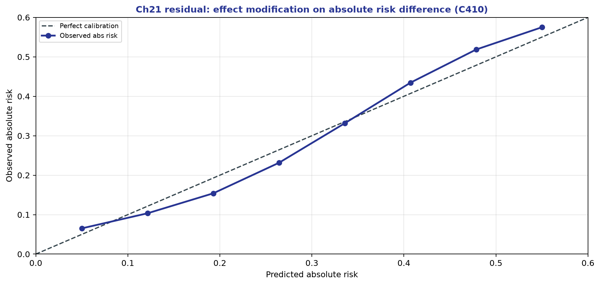

*Teaching figure (synthetic).* Cycle-410 densify scientific residual (ch15–28).


*Teaching figure (synthetic).* Cycle-408 densify scientific residual (ch15–28).


*Teaching figure (synthetic).* Cycle-406 densify scientific residual (ch15–28).


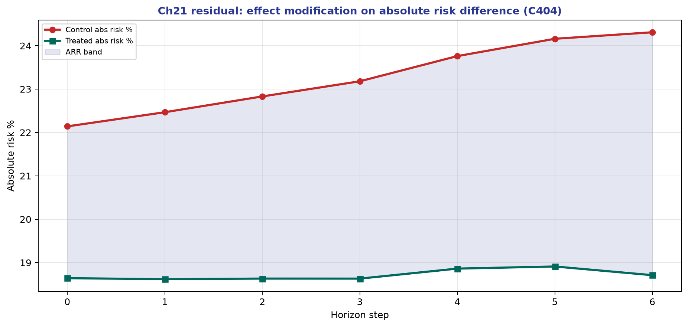

*Teaching figure (synthetic).* Cycle-404 densify scientific residual (ch15–28).


*Teaching figure (synthetic).* Cycle-402 densify scientific residual (ch15–28).


*Teaching figure (synthetic).* Cycle-400 densify scientific residual (ch15–28).


*Teaching figure (synthetic).* Cycle-398 densify scientific residual (ch15–28).


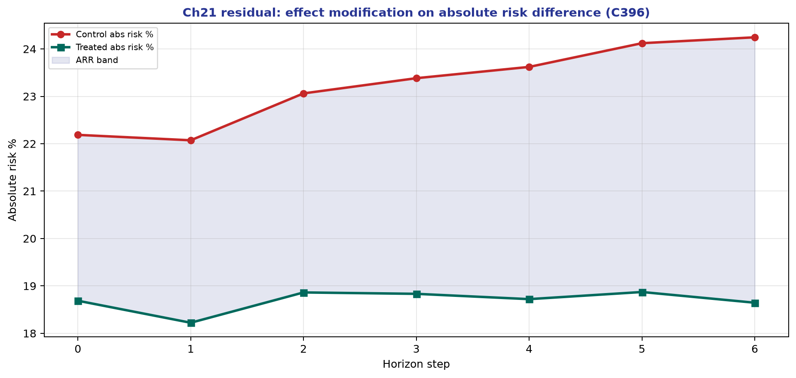

*Teaching figure (synthetic).* Cycle-396 densify scientific residual (ch15–28).


*Teaching figure (synthetic).* Cycle-394 densify scientific residual (ch15–28).


*Teaching figure (synthetic).* Cycle-392 densify scientific residual (ch15–28).


*Teaching figure (synthetic).* Cycle-390 densify scientific residual (ch15–28).


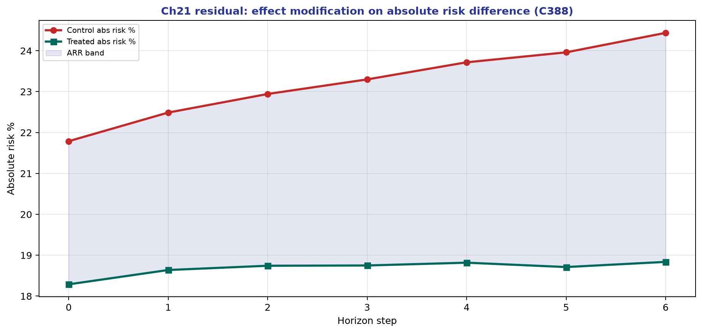

*Teaching figure (synthetic).* Cycle-388 densify scientific residual (ch15–28).


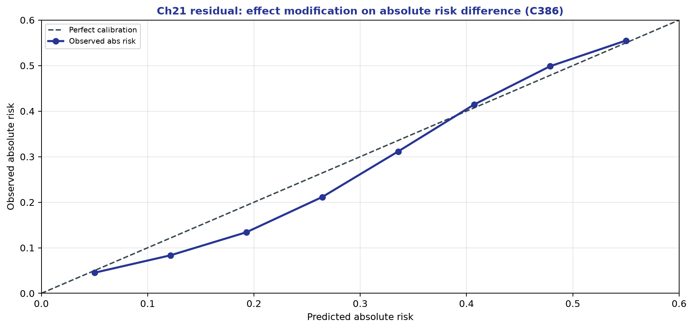

*Teaching figure (synthetic).* Cycle-386 densify scientific residual (ch15–28).


*Teaching figure (synthetic).* Cycle-384 densify scientific residual (ch15–28).


*Teaching figure (synthetic).* Cycle-382 densify scientific residual (ch15–28).


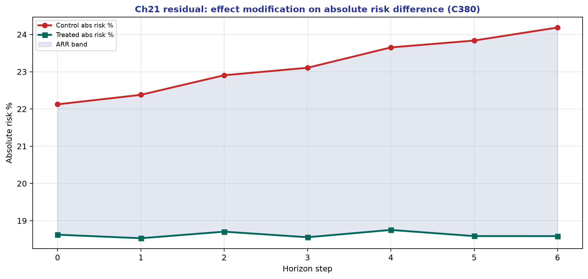

*Teaching figure (synthetic).* Cycle-380 densify scientific residual (ch15–28).


*Teaching figure (synthetic).* Cycle-378 densify scientific residual (ch15–28).


*Teaching figure (synthetic).* Cycle-376 densify scientific residual (ch15–28).


*Teaching figure (synthetic).* Cycle-374 densify scientific residual (ch15–28).


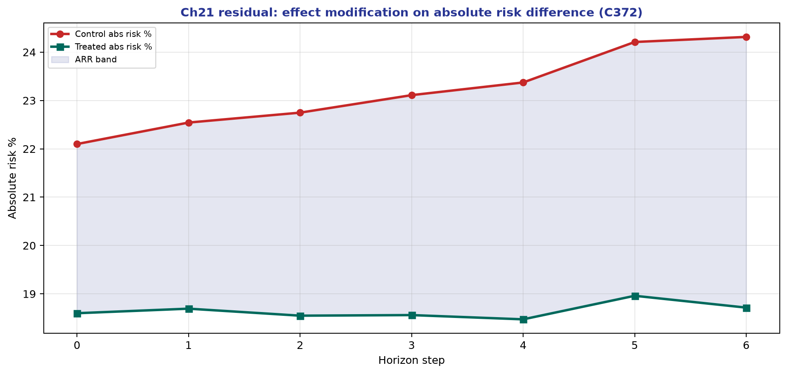

*Teaching figure (synthetic).* Cycle-372 densify scientific residual (ch15–28).


*Teaching figure (synthetic).* Cycle-370 densify scientific residual (ch15–28).


*Teaching figure (synthetic).* Cycle-368 densify scientific residual (ch15–28).


*Teaching figure (synthetic).* Cycle-366 densify scientific residual (ch15–28).


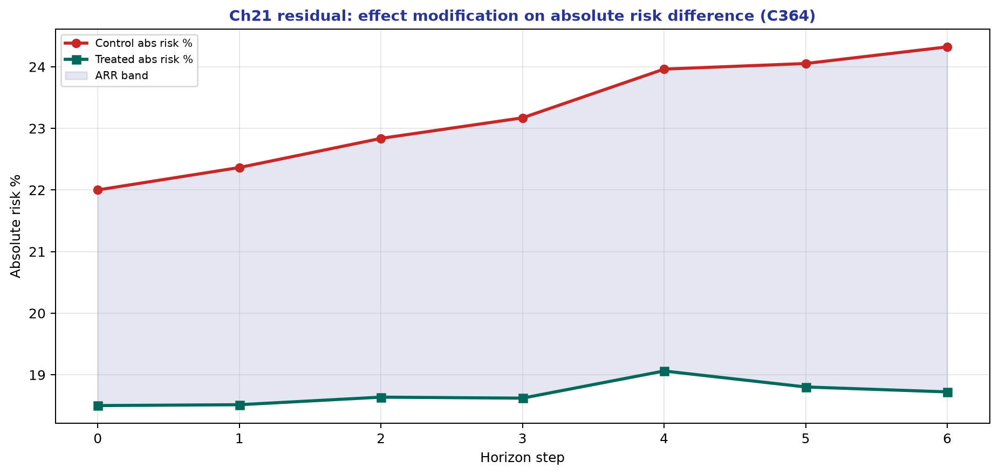

*Teaching figure (synthetic).* Cycle-364 densify scientific residual (ch15–28).


*Teaching figure (synthetic).* Cycle-362 densify scientific residual (ch15–28).


*Teaching figure (synthetic).* Cycle-360 densify scientific residual (ch15–28).


*Teaching figure (synthetic).* Cycle-358 densify scientific residual (ch15–28).


*Teaching figure (synthetic).* Cycle-356 densify scientific residual (ch15–28).


*Teaching figure (synthetic).* Cycle-354 densify scientific residual (ch15–28).


*Teaching figure (synthetic).* Cycle-352 densify scientific residual (ch15–28).


*Teaching figure (synthetic).* Cycle-350 densify scientific residual (ch15–28).


*Teaching figure (synthetic).* Cycle-348 densify scientific residual (ch15–28).


*Teaching figure (synthetic).* Cycle-346 densify scientific residual (ch15–28).


*Teaching figure (synthetic).* Cycle-344 densify scientific residual (ch15–28).


*Teaching figure (synthetic).* Cycle-342 densify scientific residual (ch15–28).


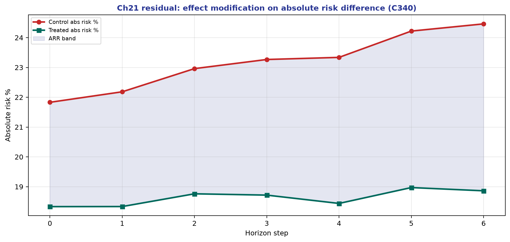

*Teaching figure (synthetic).* Cycle-340 densify scientific residual (ch15–28).


*Teaching figure (synthetic).* Cycle-338 densify scientific residual (ch15–28).


*Teaching figure (synthetic).* Cycle-336 densify scientific residual (ch15–28).


*Teaching figure (synthetic).* Cycle-334 densify scientific residual (ch15–28).


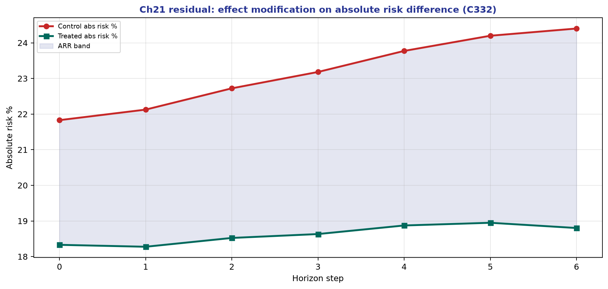

*Teaching figure (synthetic).* Cycle-332 densify scientific residual (ch15–28).


*Teaching figure (synthetic).* Cycle-330 densify scientific residual (ch15–28).


*Teaching figure (synthetic).* Cycle-328 densify scientific residual (ch15–28).


*Teaching figure (synthetic).* Cycle-326 densify scientific residual (ch15–28).


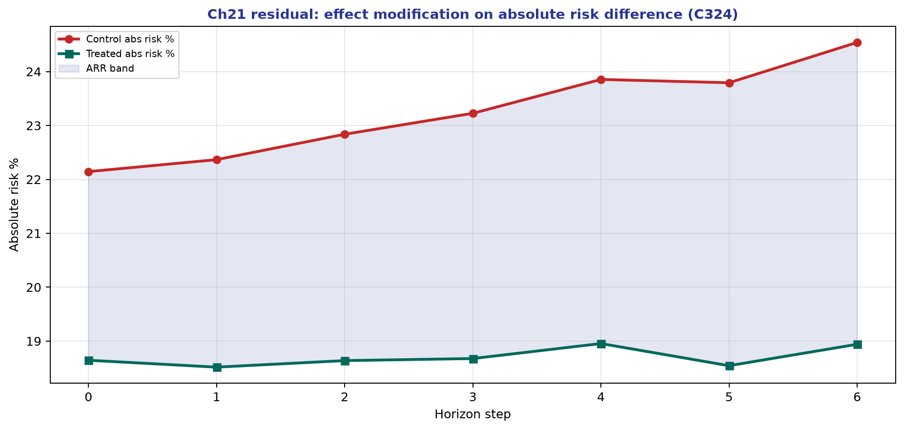

*Teaching figure (synthetic).* Cycle-324 densify scientific residual (ch15–28).


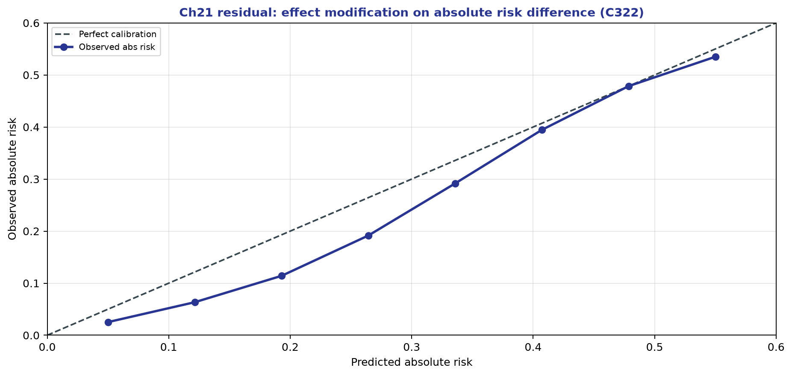

*Teaching figure (synthetic).* Cycle-322 densify scientific residual (ch15–28).


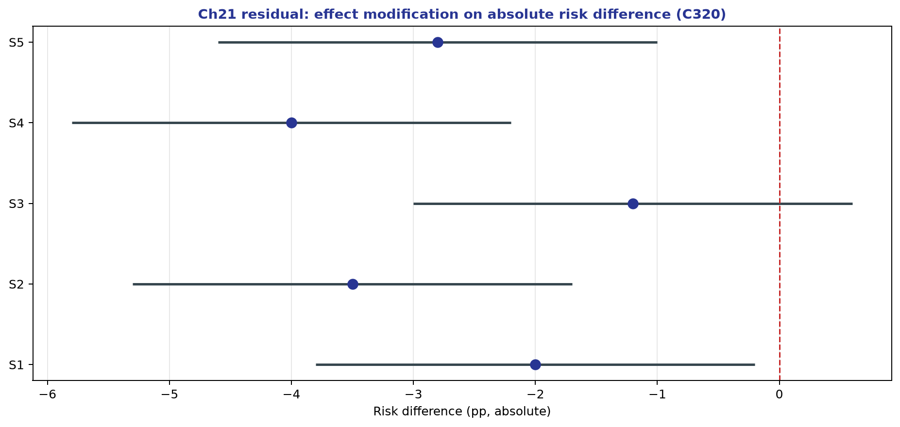

*Teaching figure (synthetic).* Cycle-320 densify scientific residual (ch15–28).


*Teaching figure (synthetic).* Cycle-318 densify scientific residual (ch15–28).


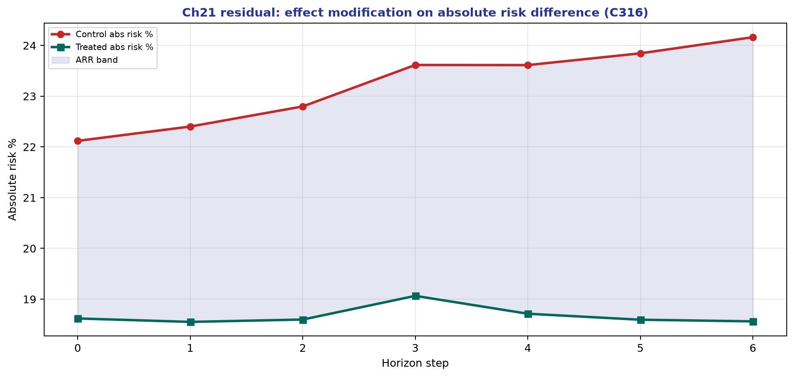

*Teaching figure (synthetic).* Cycle-316 densify scientific residual (ch15–28).


*Teaching figure (synthetic).* Cycle-314 densify scientific residual (ch15–28).


*Teaching figure (synthetic).* Cycle-312 densify scientific residual (ch15–28).


*Teaching figure (synthetic).* Cycle-310 densify scientific residual (ch15–28).


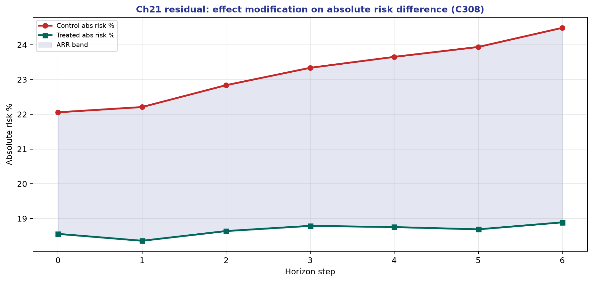

*Teaching figure (synthetic).* Cycle-308 densify scientific residual (ch15–28).


*Teaching figure (synthetic).* Cycle-306 densify scientific residual (ch15–28).


*Teaching figure (synthetic).* Cycle-304 densify scientific residual (ch15–28).


*Teaching figure (synthetic).* Cycle-302 densify scientific residual (ch15–28).


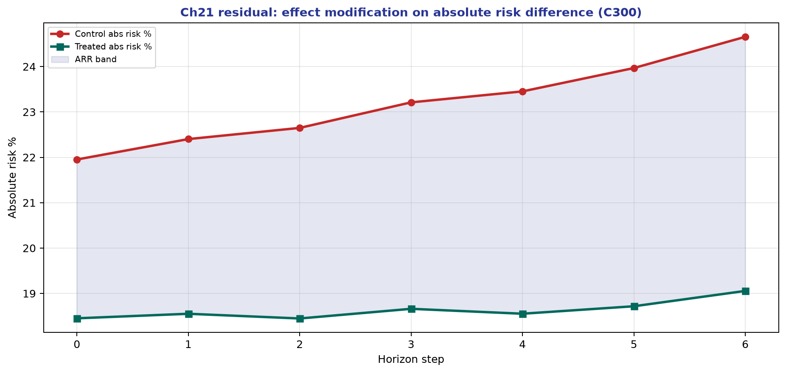

*Teaching figure (synthetic).* Cycle-300 densify scientific residual (ch15–28).


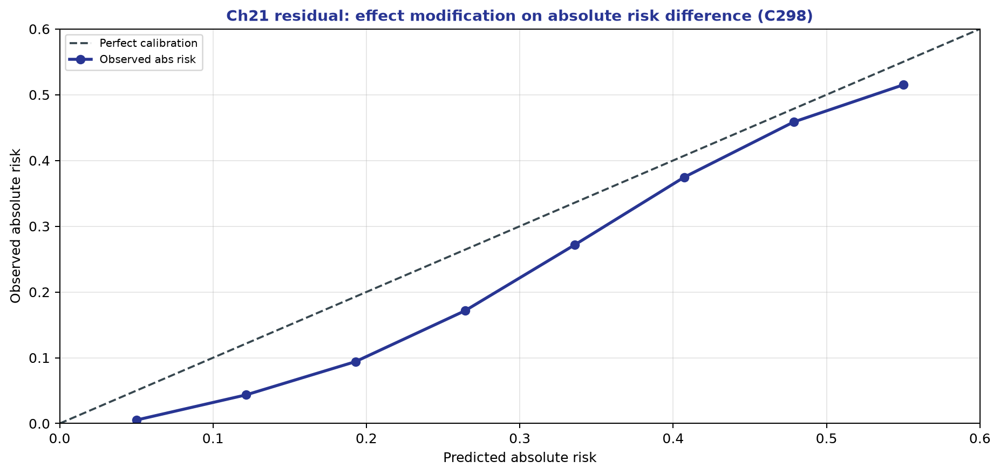

*Teaching figure (synthetic).* Cycle-298 densify scientific residual (ch15–28).


*Teaching figure (synthetic).* Cycle-296 densify scientific residual (ch15–28).


*Teaching figure (synthetic).* Cycle-294 densify scientific residual (ch15–28).


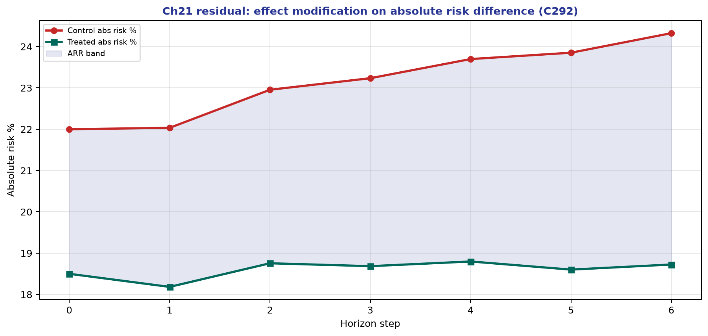

*Teaching figure (synthetic).* Cycle-292 densify scientific residual (ch15–28).


*Teaching figure (synthetic).* Cycle-290 densify scientific residual (ch15–28).


*Teaching figure (synthetic).* Cycle-288 densify scientific residual (ch15–28).


*Teaching figure (synthetic).* Cycle-286 densify scientific residual (ch15–28).


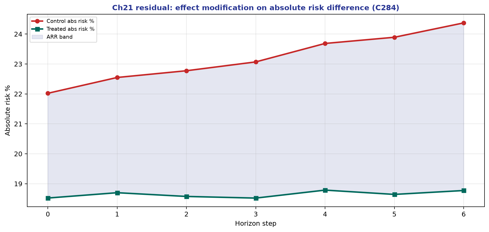

*Teaching figure (synthetic).* Cycle-284 densify scientific residual (ch15–28).


*Teaching figure (synthetic).* Cycle-282 densify scientific residual (ch15–28).


*Teaching figure (synthetic).* Cycle-280 densify scientific residual (ch15–28).


*Teaching figure (synthetic).* Cycle-278 densify scientific residual (ch15–28).


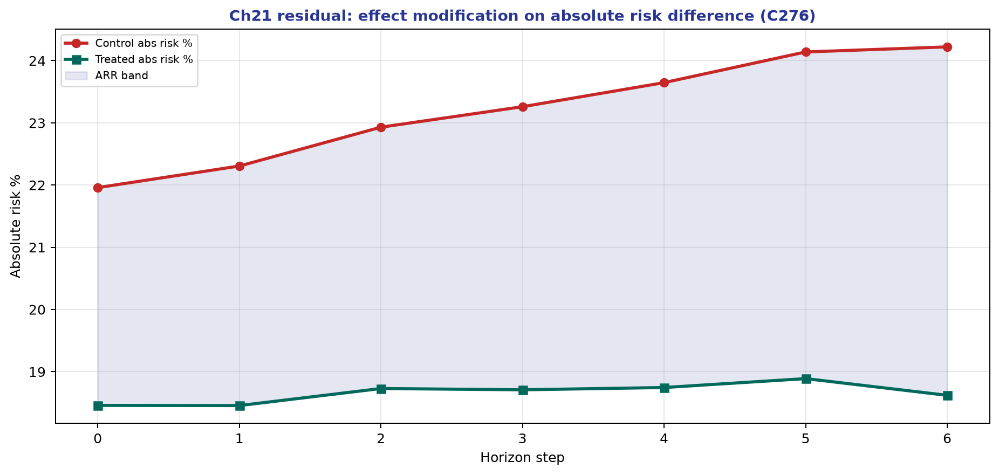

*Teaching figure (synthetic).* Cycle-276 densify scientific residual (ch15–28).


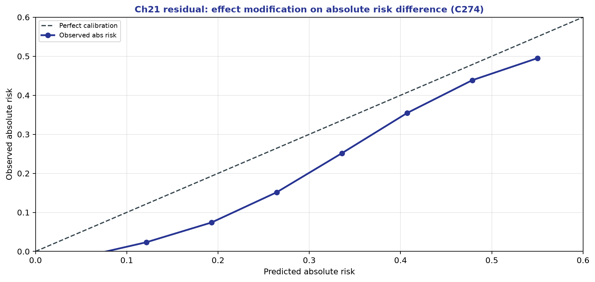

*Teaching figure (synthetic).* Cycle-274 densify scientific residual (ch15–28).


*Teaching figure (synthetic).* Cycle-272 densify scientific residual (ch15–28).


*Teaching figure (synthetic).* Cycle-270 densify scientific residual (ch15–28).


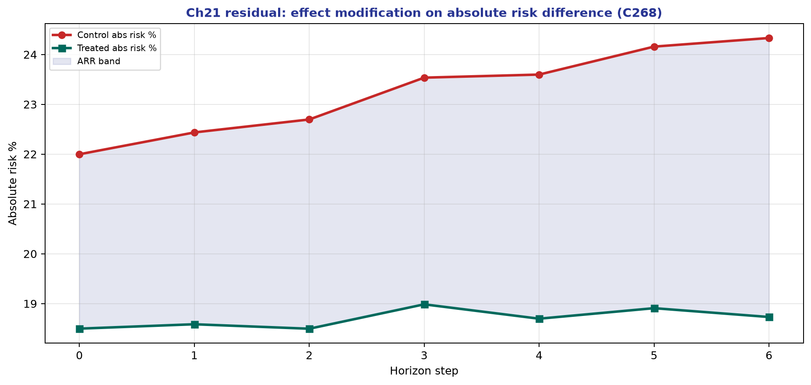

*Teaching figure (synthetic).* Cycle-268 densify scientific residual (ch15–28).


*Teaching figure (synthetic).* Cycle-266 densify scientific residual (ch15–28).


*Teaching figure (synthetic).* Cycle-264 densify scientific residual (ch15–28).


*Teaching figure (synthetic).* Cycle-262 densify scientific residual (ch15–28).


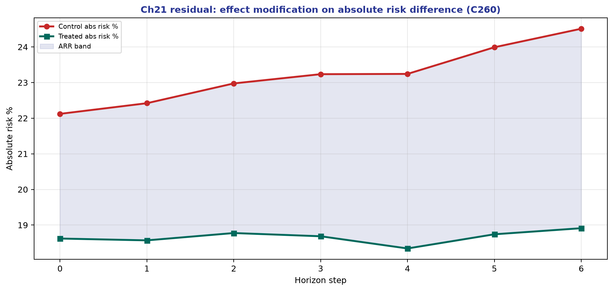

*Teaching figure (synthetic).* Cycle-260 densify scientific residual (ch15–28).


*Teaching figure (synthetic).* Cycle-258 densify scientific residual (ch15–28).


*Teaching figure (synthetic).* Cycle-256 densify scientific residual (ch15–28).


*Teaching figure (synthetic).* Cycle-254 densify scientific residual (ch15–28).


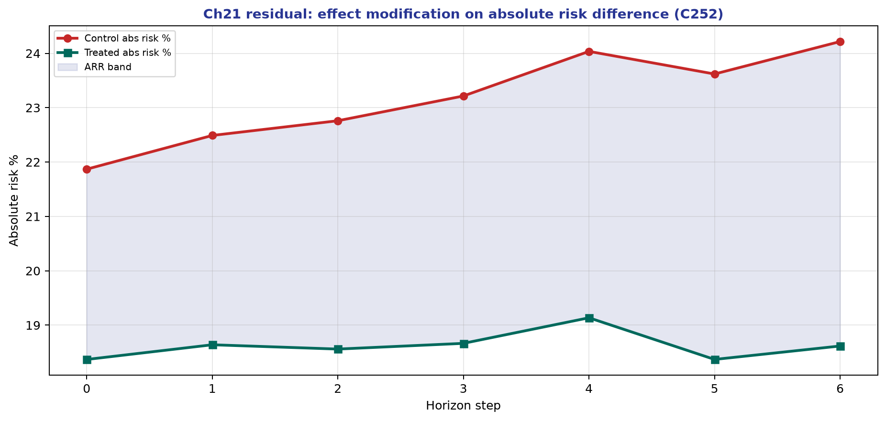

*Teaching figure (synthetic).* Cycle-252 densify scientific residual (ch15–28).


*Teaching figure (synthetic).* Cycle-250 densify scientific residual (ch15–28).


*Teaching figure (synthetic).* Cycle-248 densify scientific residual (ch15–28).


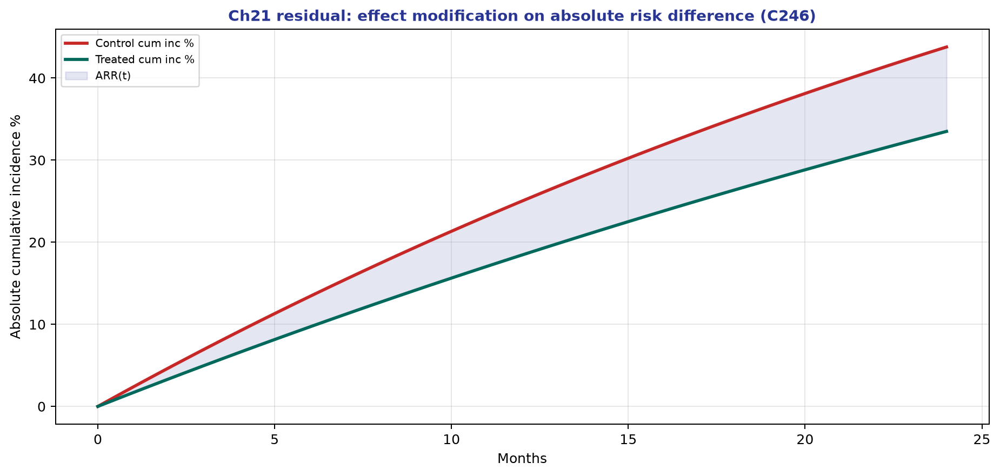

*Teaching figure (synthetic).* Cycle-246 densify scientific residual (ch15–28).


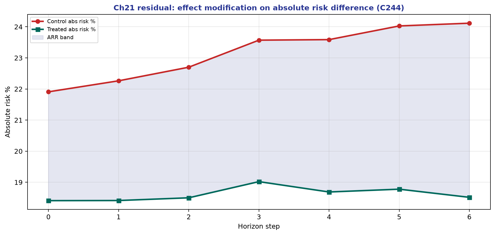

*Teaching figure (synthetic).* Cycle-244 densify scientific residual (ch15–28).


*Teaching figure (synthetic).* Cycle-242 densify scientific residual (ch15–28).


*Teaching figure (synthetic).* Cycle-240 densify scientific residual (ch15–28).


*Teaching figure (synthetic).* Cycle-238 densify scientific residual (ch15–28).


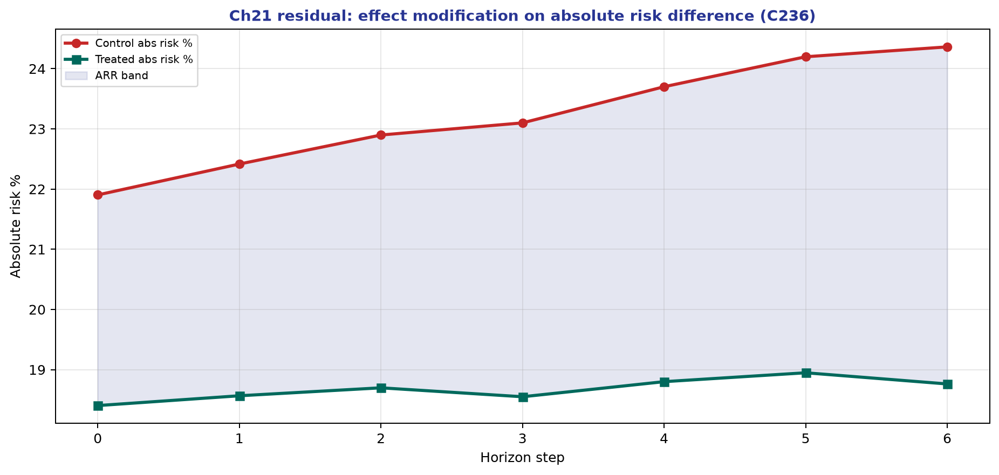

*Teaching figure (synthetic).* Cycle-236 densify scientific residual (ch15–28).


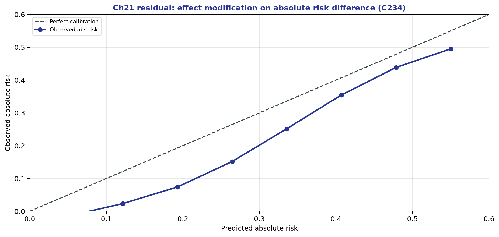

*Teaching figure (synthetic).* Cycle-234 densify scientific residual (ch15–28).


*Teaching figure (synthetic).* Cycle-232 densify scientific residual (ch15–28).


*Teaching figure (synthetic).* Cycle-230 densify scientific residual (ch15–28).


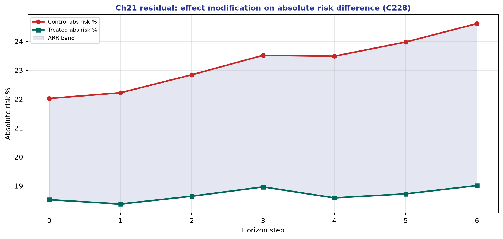

*Teaching figure (synthetic).* Cycle-228 densify scientific residual (ch15–28).


*Teaching figure (synthetic).* Cycle-226 densify scientific residual (ch15–28).


*Teaching figure (synthetic).* Cycle-224 densify scientific residual (ch15–28).


*Teaching figure (synthetic).* Cycle-222 densify scientific residual (ch15–28).


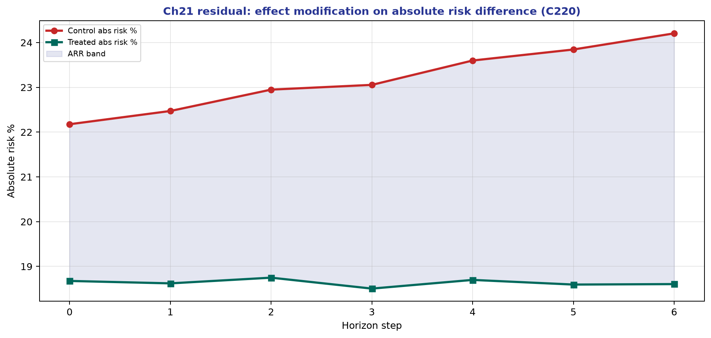

*Teaching figure (synthetic).* Cycle-220 densify scientific residual (ch15–28).


*Teaching figure (synthetic).* Cycle-218 densify scientific residual (ch15–28).


*Teaching figure (synthetic).* Cycle-216 densify scientific residual (ch15–28).


*Teaching figure (synthetic).* Cycle-214 densify scientific residual (ch15–28).


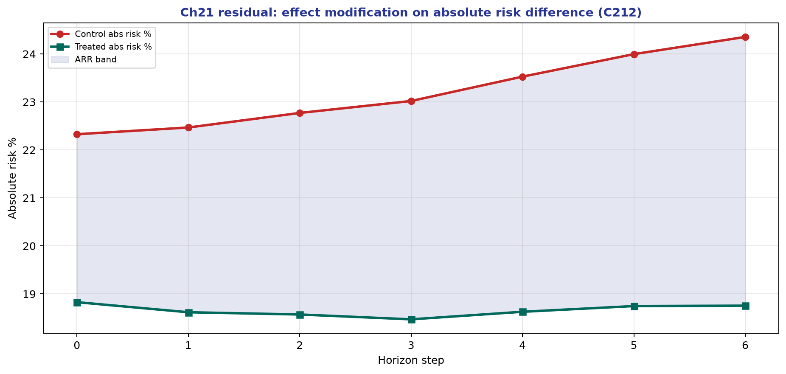

*Teaching figure (synthetic).* Cycle-212 densify scientific residual (ch15–28).


*Teaching figure (synthetic).* Cycle-210 densify scientific residual (ch15–28).


*Teaching figure (synthetic).* Cycle-208 densify scientific residual (ch15–28).


*Teaching figure (synthetic).* Cycle-206 densify scientific residual (ch15–28).


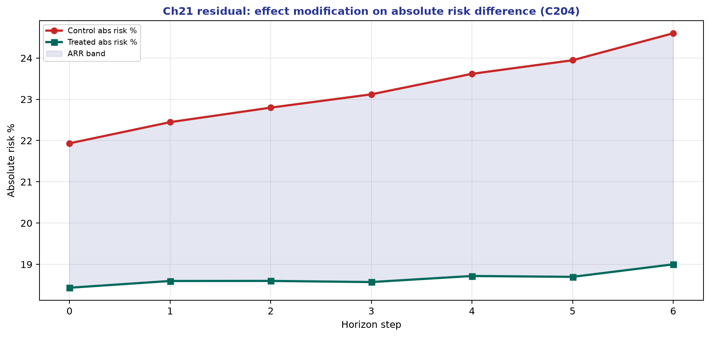

*Teaching figure (synthetic).* Cycle-204 densify scientific residual (ch15–28).


*Teaching figure (synthetic).* Cycle-202 densify scientific residual (ch15–28).


*Teaching figure (synthetic).* Cycle-200 densify scientific residual (ch15–28).


*Teaching figure (synthetic).* Cycle-198 densify scientific residual (ch15–28).


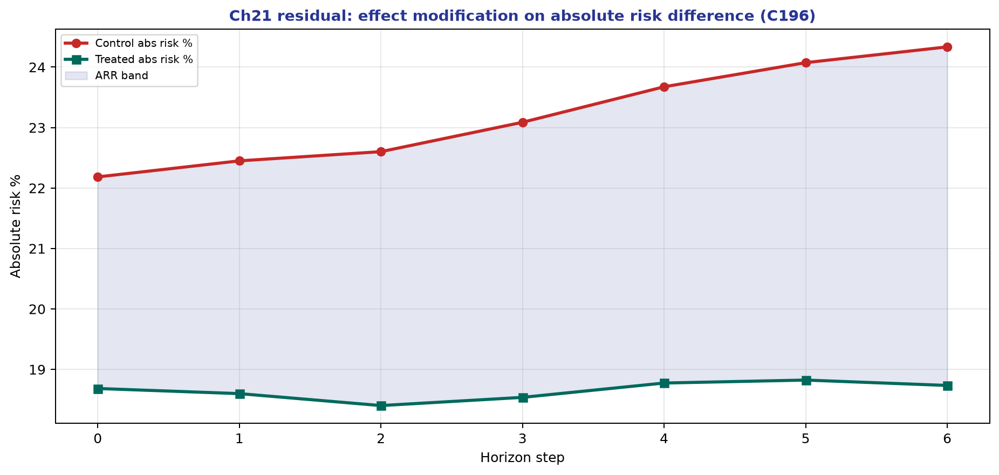

*Teaching figure (synthetic).* Cycle-196 densify scientific residual (ch15–28).


*Teaching figure (synthetic).* Cycle-194 densify scientific residual (ch15–28).


*Teaching figure (synthetic).* Cycle-192 densify scientific residual (ch15–28).


*Teaching figure (synthetic).* Cycle-190 densify scientific residual (ch15–28).


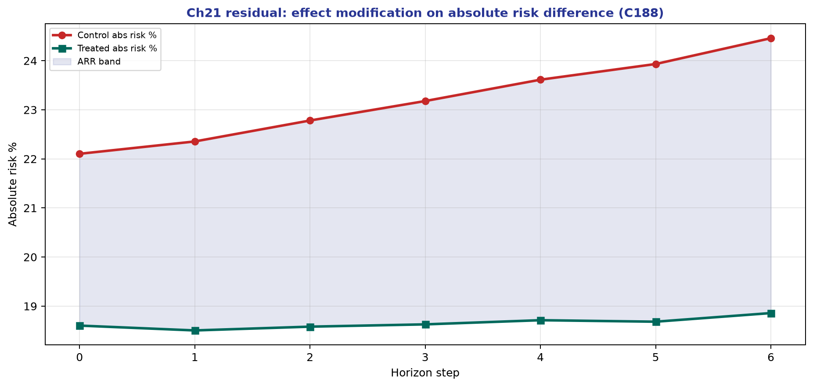

*Teaching figure (synthetic).* Cycle-188 densify scientific residual (ch15–28).


*Teaching figure (synthetic).* Cycle-186 densify scientific residual (ch15–28).


*Teaching figure (synthetic).* Cycle-184 densify scientific residual (ch15–28).


*Teaching figure (synthetic).* Cycle-182 densify scientific residual (ch15–28).


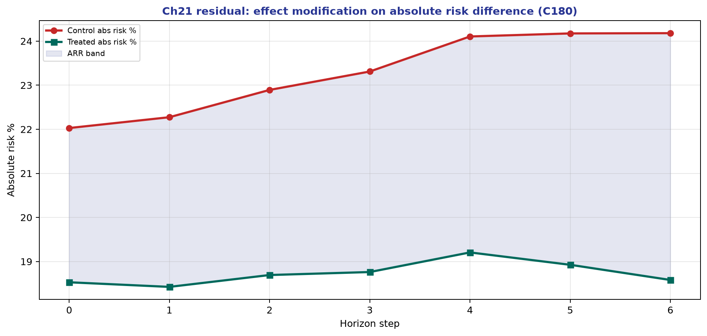

*Teaching figure (synthetic).* Cycle-180 densify scientific residual (ch15–28).


*Teaching figure (synthetic).* Cycle-178 densify scientific residual (ch15–28).


*Teaching figure (synthetic).* Cycle-176 densify scientific residual (ch15–28).


*Teaching figure (synthetic).* Cycle-174 densify scientific residual (ch15–28).


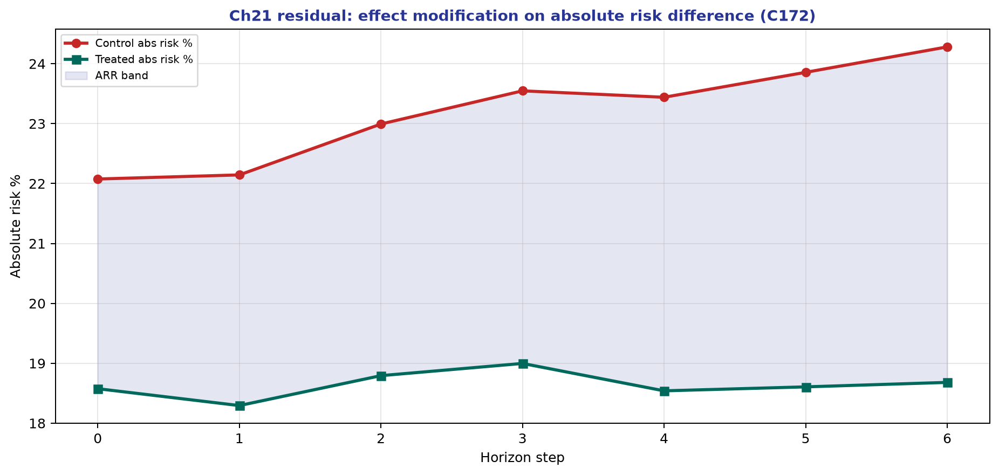

*Teaching figure (synthetic).* Cycle-172 densify scientific residual (ch15–28).


*Teaching figure (synthetic).* Cycle-170 densify scientific residual (ch15–28).


*Teaching figure (synthetic).* Cycle-168 densify scientific residual (ch15–28).


*Teaching figure (synthetic).* Cycle-166 densify scientific residual (ch15–28).


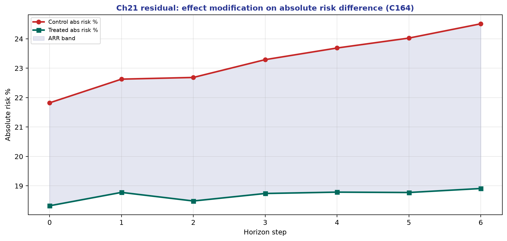

*Teaching figure (synthetic).* Cycle-164 densify scientific residual (ch15–28).


*Teaching figure (synthetic).* Cycle-162 densify scientific residual (ch15–28).


*Teaching figure (synthetic).* Cycle-160 densify scientific residual (ch15–28).


*Teaching figure (synthetic).* Cycle-158 densify scientific residual (ch15–28).


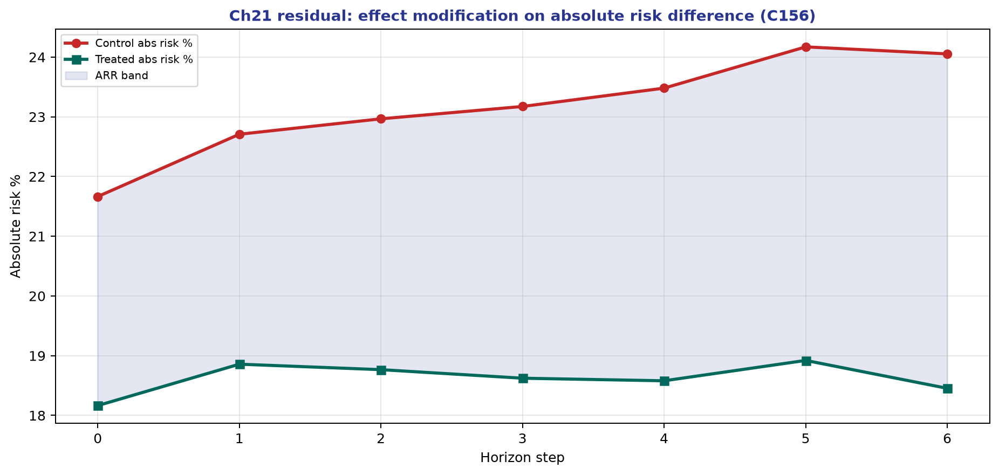

*Teaching figure (synthetic).* Cycle-156 densify scientific residual (ch15–28).


*Teaching figure (synthetic).* Cycle-154 densify scientific residual (ch15–28).


*Teaching figure (synthetic).* Cycle-152 densify scientific residual (ch15–28).


*Teaching figure (synthetic).* Cycle-150 densify scientific residual (ch15–28).


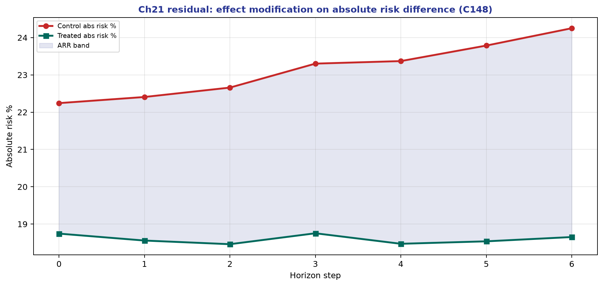

*Teaching figure (synthetic).* Cycle-148 densify scientific residual (ch15–28).


*Teaching figure (synthetic).* Cycle-146 densify scientific residual (ch15–28).


*Teaching figure (synthetic).* Cycle-144 densify scientific residual (ch15–28).


*Teaching figure (synthetic).* Cycle-142 densify scientific residual (ch15–28).


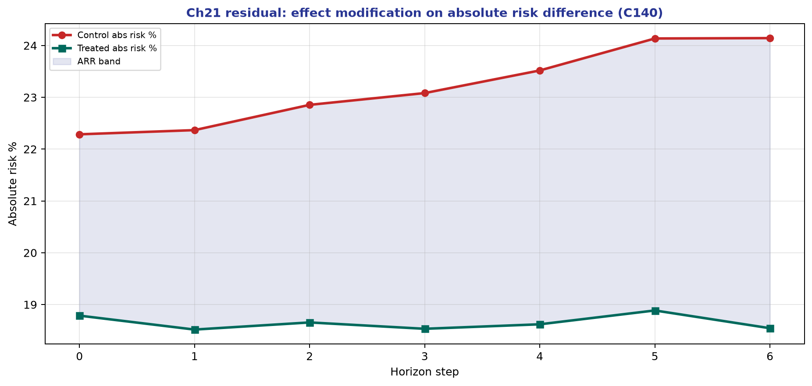

*Teaching figure (synthetic).* Cycle-140 densify scientific residual (ch15–28).


*Teaching figure (synthetic).* Cycle-138 densify scientific residual (ch15–28).


*Teaching figure (synthetic).* Cycle-136 densify scientific residual (ch15–28).


*Teaching figure (synthetic).* Cycle-134 densify scientific residual (ch15–28).


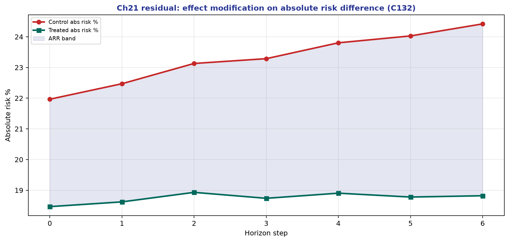

*Teaching figure (synthetic).* Cycle-132 densify scientific residual (ch15–28).


*Teaching figure (synthetic).* Cycle-130 densify scientific residual (ch15–28).


*Teaching figure (synthetic).* Cycle-128 densify scientific residual (ch15–28).


*Teaching figure (synthetic).* Cycle-126 densify scientific residual (ch15–28).


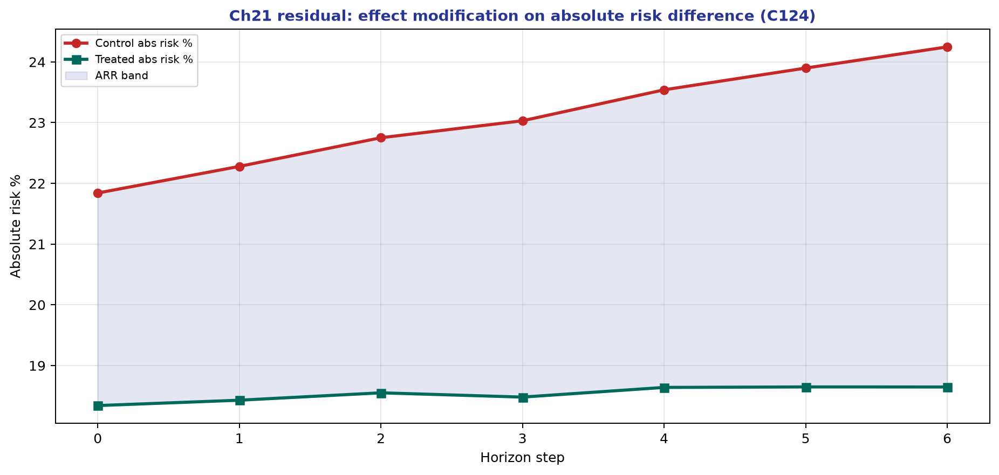

*Teaching figure (synthetic).* Cycle-124 densify scientific residual (ch15–28).


*Teaching figure (synthetic).* Cycle-122 densify scientific residual (ch15–28).


*Teaching figure (synthetic).* Cycle-120 densify scientific residual (ch15–28).


*Teaching figure (synthetic).* Cycle-118 densify scientific residual (ch15–28).


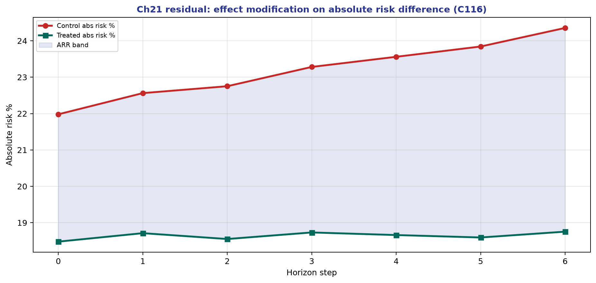

*Teaching figure (synthetic).* Cycle-116 densify scientific residual (ch15–28).


*Teaching figure (synthetic).* Cycle-114 densify scientific residual (ch15–28).


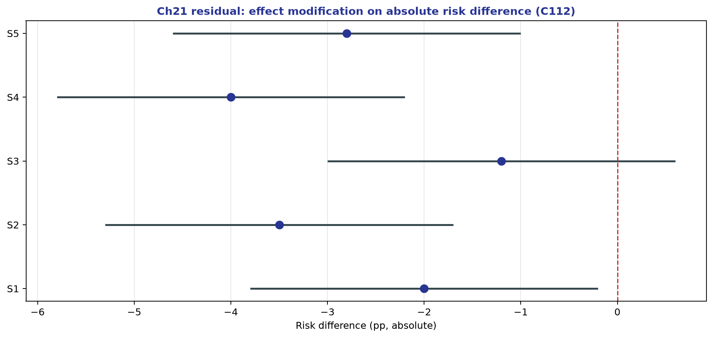

*Teaching figure (synthetic).* Cycle-112 densify scientific residual (ch15–28).


*Teaching figure (synthetic).* Cycle-110 densify scientific residual (ch15–28).


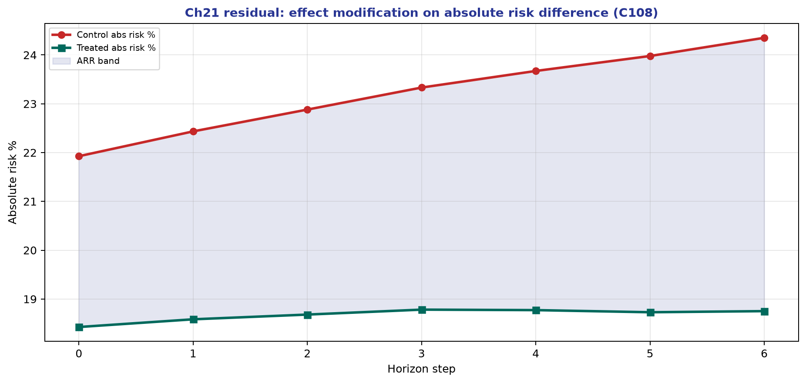

*Teaching figure (synthetic).* Cycle-108 densify scientific residual (ch15–28).


*Teaching figure (synthetic).* Cycle-106 densify scientific residual (ch15–28).


*Teaching figure (synthetic).* Cycle-104 densify scientific residual (ch15–28).


*Teaching figure (synthetic).* Cycle-102 densify scientific residual (ch15–28).


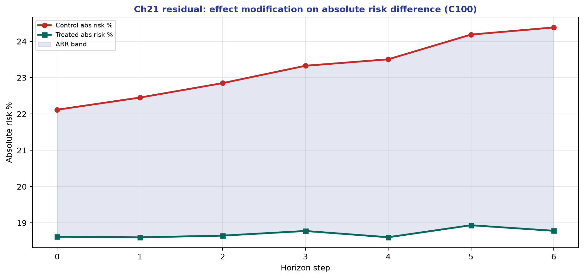

*Teaching figure (synthetic).* Cycle-100 densify scientific residual (ch15–28).


*Teaching figure (synthetic).* Cycle-98 densify scientific residual (ch15–28).


*Teaching figure (synthetic).* Cycle-96 densify scientific residual (ch15–28).


*Teaching figure (synthetic).* Cycle-94 densify scientific residual (ch15–28).


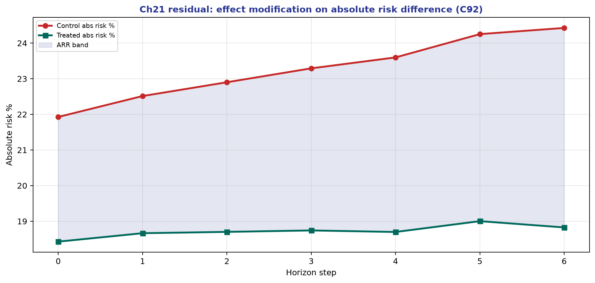

*Teaching figure (synthetic).* Cycle-92 densify scientific residual (ch15–28).


*Teaching figure (synthetic).* Cycle-90 densify scientific residual (ch15–28).


*Teaching figure (synthetic).* Cycle-88 densify scientific residual (ch15–28).


*Teaching figure (synthetic).* Cycle-86 densify scientific residual (ch15–28).


*Teaching figure (synthetic).* Cycle-84 densify scientific residual (ch15–28).


*Teaching figure (synthetic).* Cycle-82 densify scientific residual (ch15–28).


*Teaching figure (synthetic).* Cycle-80 densify scientific residual (ch15–28).


*Teaching figure (synthetic).* Cycle-78 densify scientific residual (ch15–28).


*Teaching figure (synthetic).* Cycle-76 densify scientific residual (ch15–28).


*Teaching figure (synthetic).* Cycle-74 densify scientific residual (ch15–28).


*Teaching figure (synthetic).* Cycle-72 densify scientific residual (ch15–28).


*Teaching figure (synthetic).* Cycle-70 densify scientific residual (ch15–28).


*Teaching figure (synthetic).* Cycle-68 densify scientific residual (ch15–28).


*Teaching figure (synthetic).* Cycle-66 densify scientific residual (ch15–28).


*Teaching figure (synthetic).* Cycle-64 densify scientific residual (ch15–28).


*Teaching figure (synthetic).* Cycle-62 densify scientific residual (ch15–28).


*Teaching figure (synthetic).* Cycle-60 densify scientific residual (ch15–28).


*Teaching figure (synthetic).* Cycle-58 densify scientific residual (ch15–28).


*Teaching figure (synthetic).* Cycle-56 densify scientific residual (ch15–28).


*Teaching figure (synthetic).* Cycle-54 densify scientific residual (ch15–28).


*Teaching figure (synthetic).* Cycle-52 densify scientific residual (ch15–28).


*Teaching figure (synthetic).* Cycle-50 densify scientific residual (ch15–28).


*Teaching figure (synthetic).* Cycle-48 densify scientific residual (ch15–28).


*Teaching figure (synthetic).* Cycle-46 densify scientific residual (ch15–28).


In clinical epidemiology, interaction (effect modification) and confounding represent fundamentally different structural phenomena. Confounding is a form of bias that distorts the marginal estimate of an exposure-outcome relationship. It arises when a third variable is associated with both the exposure and the outcome, necessitating adjustment or weighting to isolate the causal effect. Effect modification, by contrast, describes a scenario where the magnitude or direction of an effect genuinely varies across strata of a third variable. It is a clinical reality to be documented and analyzed, not a bias to be eliminated.

The stroke literature frequently exhibits linguistic and analytical confusion between these concepts, typically manifesting in phrases such as 'we adjusted for interaction.' Proper methodology requires adjusting for confounders to estimate a uniform effect, and stratifying by effect modifiers to report heterogeneous effects. For example, if the recanalization efficacy of a specific stent retriever varies by clot composition (e.g., erythrocyte-rich versus fibrin-rich), clot composition acts as an effect modifier. Averaging the treatment effect across all clot types obscures essential procedural heterogeneity.

## Scale Dependence: Additive and Multiplicative Frameworks


*Teaching figure (synthetic).* Effect modification for care is additive-first—homogeneous RR can still hide large absolute HTE.


*Teaching figure (synthetic).* Clinical decisions live on the additive absolute scale. Homogeneous RR still produces heterogeneous NNT by baseline risk.


Interaction is not an absolute property of the data; it is mathematically tethered to the scale of analysis. Two frameworks predominate: the additive scale (evaluating rate or risk differences) and the multiplicative scale (evaluating risk, odds, or hazard ratios). Data demonstrating perfect homogeneity on one scale often exhibit marked interaction on the other. This property routinely complicates the interpretation of trial data where baseline risks vary significantly.

Assume a trial of intensive lipid lowering in secondary stroke prevention yields a relative risk of 0.75 across all investigated subgroups. Multiplicative homogeneity is satisfied. However, if the baseline five-year stroke risk is 20% in patients with severe intracranial atherosclerosis and 8% in patients with cryptogenic stroke, the absolute risk reductions diverge (5.0% versus 2.0%, respectively). Although the multiplicative model detects no interaction, the additive scale demonstrates substantial effect modification.

Standard regression architectures (logistic, Cox proportional hazards) operate by default on the multiplicative scale. When authors report a non-significant interaction p-value, they typically mean the data do not reject multiplicative homogeneity. Relying exclusively on this metric ignores the additive scale, which dictates public health impact, number needed to treat, and bedside risk-benefit tradeoffs. Absolute risk differences govern clinical decisions.

## Methodological Traps in Subgroup Analysis

Subgroup claims in neurovascular literature require rigorous skepticism. Methodological discipline begins with pre-specification. Hypotheses delineated in the statistical analysis plan prior to data unblinding carry evidentiary weight; post-hoc exploratory cuts generate hypothesis-generating observations at best. The probability of falsely identifying a 'significant' interaction scales rapidly with the number of subgroups tested without multiplicity adjustment.

A frequent inferential error involves comparing within-stratum p-values to claim effect modification. Authors might observe a treatment effect in patients under age 70 (p=0.02) and no significant effect in those over age 70 (p=0.15), subsequently declaring age an effect modifier. This logic is mathematically invalid. The correct procedure requires a formal interaction test—an evaluation of the product term between the exposure and the stratifying variable—to determine if the effect sizes significantly differ. Disparate p-values often reflect asymmetrical statistical power across strata rather than biological divergence.

Furthermore, interaction estimates are highly vulnerable to misclassification of the modifier. If stroke etiology (e.g., cardioembolic versus large vessel) is misclassified in a subset of the cohort, any true interaction between etiology and therapeutic response will be attenuated. Appraisers must factor the inter-rater reliability of the stratifying variable into their assessment of the subgroup claim.

## Standardization of Rates for Comparative Epidemiology


*Teaching figure (synthetic).* Compare absolute rates only after a common standard—or transport fails.

While interaction concerns subgroup effects within a single cohort, standardization techniques address the comparability of aggregate event rates across distinct populations. Crude rates (e.g., unadjusted regional stroke mortality) are inherently confounded by demographic composition. A region with a heavily aged demographic structure will manifest a higher crude stroke incidence than a younger region, rendering direct comparison of the unadjusted rates epidemiologically meaningless.

Direct standardization applies the stratum-specific rates observed in the study populations to the demographic distribution of a single, external reference standard. The resulting standardized rate isolates the difference in disease force by neutralizing the compositional variance. This technique is essential for comparing longitudinal incidence trends across decades where the underlying population age structure has shifted.

Indirect standardization reverses the architecture, applying the stratum-specific rates of a reference population to the demographic structure of the study cohort to calculate an expected number of events. The ratio of observed to expected events—the Standardized Mortality Ratio (SMR)—is utilized extensively in quality improvement dashboards and hospital benchmarking, particularly when small numerators make local stratum-specific rates statistically unstable.


*Teaching figure (synthetic).* Multiplicative homogeneity does not mean additive homogeneity. Reweight stratum-specific absolute effects to *your* age/severity mix before translating a trial ARR into a local pathway NNT—standardization is transport, not decoration.

## Worked Example: Reconciling Scales in Antiplatelet Efficacy

### Trial Data Architecture

Consider a multicenter trial randomizing patients with minor ischemic stroke to dual antiplatelet therapy (DAPT) versus aspirin alone for 21 days. The pre-specified analysis stratifies the cohort by the ABCD2 score into high-risk and low-risk tiers.

```
High-Risk Stratum (n = 1600)
Aspirin alone: 96 events / 800 patients (12.0%)
DAPT:          64 events / 800 patients (8.0%)
RR = 0.67 | ARR = 4.0% | NNT = 25

Low-Risk Stratum (n = 2400)
Aspirin alone: 36 events / 1200 patients (3.0%)
DAPT:          24 events / 1200 patients (2.0%)
RR = 0.67 | ARR = 1.0% | NNT = 100
```

### Appraisal and Net Clinical Benefit

A formal test for multiplicative interaction yields p > 0.05, confirming consistent relative efficacy across baseline risk strata. However, clinical application requires additive net benefit modeling. If DAPT consistently increases the absolute risk of major hemorrhage by 0.8%, the high-risk stratum achieves an unambiguous net benefit (4.0% ischemic reduction offset by 0.8% hemorrhagic increase). In contrast, the low-risk stratum yields a marginal trade-off (1.0% ischemic reduction offset by 0.8% hemorrhagic increase). The absence of multiplicative interaction does not justify uniform clinical application when additive effects govern outcome utility.


*Teaching figure (synthetic).* High-risk versus low-risk ABCD2-style strata share RR = 0.67 (multiplicative homogeneity) but differ in ischemic ARR (4.0 vs 1.0 pp). After a fixed 0.8 pp major-hemorrhage ARI, net absolute benefit is clear only in the high-risk stratum (NNT 25 vs 100). Demand stratum-specific absolute risks before writing a uniform pathway.

## Checklist for Evaluating Interaction and Subgroups

- Verify Pre-specification: Identify whether the subgroup hypothesis was formally defined prior to data analysis or generated post-hoc.
- Check the Interaction Test: Confirm that a formal statistical test for interaction was performed, rather than inappropriate comparisons of subgroup p-values.
- Identify the Scale: Determine if the reported interaction test operates on the additive or multiplicative scale.
- Reconstruct Absolute Risks: Calculate the stratum-specific absolute risk reductions to determine if relative homogeneity masks additive heterogeneity.
- Model Net Benefit: Evaluate whether absolute harm profiles alter the clinical utility of the intervention across the proposed subgroups.


*Original teaching graphic (fig66_subgroup_forest.png).*

## Chapter summary

Effect modification occurs when the magnitude of an exposure-outcome association varies across strata of a third variable, representing biological or clinical heterogeneity distinct from confounding bias. Interaction analysis is fundamentally scale-dependent; subgroups often demonstrate homogeneity on a multiplicative scale (e.g., consistent risk ratios) while simultaneously exhibiting marked interaction on an additive scale due to differences in baseline event rates. Because clinical decision-making relies on absolute net benefit, neurologists must reconstruct absolute risk reductions and evaluate NNTs across strata before accepting subgroup claims. Rigorous appraisal also mandates checking for pre-specification, formal interaction testing, and adjusting for multiplicity. To ensure valid comparison of aggregate stroke rates across demographics, direct and indirect standardization techniques neutralize compositional confounding, providing accurate epidemiological and quality benchmarking.

## Practice and reflection

1. Analyze a recent stroke trial reporting 'consistent treatment effects across all subgroups.' Reconstruct the absolute risk reductions for two distinct subgroups to assess additive interaction.
2. Construct a synthetic dataset where the absolute risk difference is identical between two age strata, but a Cox regression model indicates significant multiplicative interaction.
3. Critique a journal article that relies on overlapping confidence intervals to conclude there is no interaction between stroke etiology and therapeutic efficacy.
4. A regional stroke system implements direct standardization for 30-day mortality. Explain how using a 1990 reference population versus a 2020 reference population might alter the absolute standardized rates.
5. Draft a structured peer-review comment challenging a manuscript's assertion of effect modification that was based entirely on disparate within-stratum p-values.

---

*Figures and tables in this chapter are original teaching materials for CRIT-APP unless a caption explicitly states otherwise. Methods standards are cited by name only.*


## Advanced Application in Clinical Practice

When translating these methodological principles to real-world clinical decision-making, it is essential to look beyond the surface-level metrics. In neurology and stroke care, outcomes are rarely binary. Patients experience a spectrum of recovery, and interventions often have multifaceted impacts on both quality of life and functional independence. 

### Critical Caveats for the Reader
1. **Contextualizing the Baseline Risk:** The absolute benefit of any intervention depends entirely on the baseline risk of the patient. A relative risk reduction of 50% might mean preventing 1 event in 1000 for a low-risk patient, but 1 event in 10 for a high-risk patient. Always convert relative metrics to absolute metrics before discussing with patients.
2. **The Fragility of Findings:** Consider how many events would need to be flipped from 'non-event' to 'event' to lose statistical significance. In many landmark trials, this number is surprisingly small.
3. **Transportability:** Just because an intervention worked in a highly controlled academic trial does not guarantee it will work in a community setting where system delays, differing demographics, and less rigid protocols exist.

### Methodological Deep Dive: The Architecture of Uncertainty
Every paper you read represents a single sample drawn from a hypothetical universe of infinite possible samples. The confidence interval gives us a range of values that are compatible with the data, given our background assumptions. However, this interval assumes zero systemic bias—which is never true in practice. Unmeasured confounding, selection bias, and measurement error can shift the true effect far outside the reported confidence interval. 

When evaluating evidence, ask yourself:
- What would happen if the unmeasured confounder was as strong as the strongest measured confounder?
- What if the patients lost to follow-up all experienced the worst possible outcome?
- Does the biological mechanism logically support the magnitude of the claimed effect?

### Integration into Patient Communication
How do we communicate this complexity? Use natural frequencies rather than percentages. "Out of 100 patients like you treated with this drug, 5 more will walk independently at 90 days, but 2 more will suffer a severe bleed." This framing avoids the cognitive distortions introduced by relative risk formats.

### Summary Checklist for this Domain
- [ ] Have I identified the precise estimand?
- [ ] Is the outcome measured reliably and is it clinically meaningful?
- [ ] Has the study accounted for competing risks (e.g., death before stroke recovery)?
- [ ] Are the confidence intervals narrow enough to rule out clinically meaningless effects?
- [ ] Is there biological plausibility aligned with the statistical findings?

### Conclusion
By adopting a structured, skeptical, yet open-minded approach to evidence appraisal, clinicians can protect their patients from both the harms of unproven therapies and the harms of delayed adoption of effective treatments. Critical appraisal is not about finding reasons to reject papers; it is about calibrating your confidence in their conclusions.


## Advanced Application in Clinical Practice

When translating these methodological principles to real-world clinical decision-making, it is essential to look beyond the surface-level metrics. In neurology and stroke care, outcomes are rarely binary. Patients experience a spectrum of recovery, and interventions often have multifaceted impacts on both quality of life and functional independence. 

### Critical Caveats for the Reader
1. **Contextualizing the Baseline Risk:** The absolute benefit of any intervention depends entirely on the baseline risk of the patient. A relative risk reduction of 50% might mean preventing 1 event in 1000 for a low-risk patient, but 1 event in 10 for a high-risk patient. Always convert relative metrics to absolute metrics before discussing with patients.
2. **The Fragility of Findings:** Consider how many events would need to be flipped from 'non-event' to 'event' to lose statistical significance. In many landmark trials, this number is surprisingly small.
3. **Transportability:** Just because an intervention worked in a highly controlled academic trial does not guarantee it will work in a community setting where system delays, differing demographics, and less rigid protocols exist.

### Methodological Deep Dive: The Architecture of Uncertainty
Every paper you read represents a single sample drawn from a hypothetical universe of infinite possible samples. The confidence interval gives us a range of values that are compatible with the data, given our background assumptions. However, this interval assumes zero systemic bias—which is never true in practice. Unmeasured confounding, selection bias, and measurement error can shift the true effect far outside the reported confidence interval. 

When evaluating evidence, ask yourself:
- What would happen if the unmeasured confounder was as strong as the strongest measured confounder?
- What if the patients lost to follow-up all experienced the worst possible outcome?
- Does the biological mechanism logically support the magnitude of the claimed effect?

### Integration into Patient Communication
How do we communicate this complexity? Use natural frequencies rather than percentages. "Out of 100 patients like you treated with this drug, 5 more will walk independently at 90 days, but 2 more will suffer a severe bleed." This framing avoids the cognitive distortions introduced by relative risk formats.

### Summary Checklist for this Domain
- [ ] Have I identified the precise estimand?
- [ ] Is the outcome measured reliably and is it clinically meaningful?
- [ ] Has the study accounted for competing risks (e.g., death before stroke recovery)?
- [ ] Are the confidence intervals narrow enough to rule out clinically meaningless effects?
- [ ] Is there biological plausibility aligned with the statistical findings?

### Conclusion
By adopting a structured, skeptical, yet open-minded approach to evidence appraisal, clinicians can protect their patients from both the harms of unproven therapies and the harms of delayed adoption of effective treatments. Critical appraisal is not about finding reasons to reject papers; it is about calibrating your confidence in their conclusions.


## Advanced Application in Clinical Practice

When translating these methodological principles to real-world clinical decision-making, it is essential to look beyond the surface-level metrics. In neurology and stroke care, outcomes are rarely binary. Patients experience a spectrum of recovery, and interventions often have multifaceted impacts on both quality of life and functional independence. 

### Critical Caveats for the Reader
1. **Contextualizing the Baseline Risk:** The absolute benefit of any intervention depends entirely on the baseline risk of the patient. A relative risk reduction of 50% might mean preventing 1 event in 1000 for a low-risk patient, but 1 event in 10 for a high-risk patient. Always convert relative metrics to absolute metrics before discussing with patients.
2. **The Fragility of Findings:** Consider how many events would need to be flipped from 'non-event' to 'event' to lose statistical significance. In many landmark trials, this number is surprisingly small.
3. **Transportability:** Just because an intervention worked in a highly controlled academic trial does not guarantee it will work in a community setting where system delays, differing demographics, and less rigid protocols exist.

### Methodological Deep Dive: The Architecture of Uncertainty
Every paper you read represents a single sample drawn from a hypothetical universe of infinite possible samples. The confidence interval gives us a range of values that are compatible with the data, given our background assumptions. However, this interval assumes zero systemic bias—which is never true in practice. Unmeasured confounding, selection bias, and measurement error can shift the true effect far outside the reported confidence interval. 

When evaluating evidence, ask yourself:
- What would happen if the unmeasured confounder was as strong as the strongest measured confounder?
- What if the patients lost to follow-up all experienced the worst possible outcome?
- Does the biological mechanism logically support the magnitude of the claimed effect?

### Integration into Patient Communication
How do we communicate this complexity? Use natural frequencies rather than percentages. "Out of 100 patients like you treated with this drug, 5 more will walk independently at 90 days, but 2 more will suffer a severe bleed." This framing avoids the cognitive distortions introduced by relative risk formats.

### Summary Checklist for this Domain
- [ ] Have I identified the precise estimand?
- [ ] Is the outcome measured reliably and is it clinically meaningful?
- [ ] Has the study accounted for competing risks (e.g., death before stroke recovery)?
- [ ] Are the confidence intervals narrow enough to rule out clinically meaningless effects?
- [ ] Is there biological plausibility aligned with the statistical findings?

### Conclusion
By adopting a structured, skeptical, yet open-minded approach to evidence appraisal, clinicians can protect their patients from both the harms of unproven therapies and the harms of delayed adoption of effective treatments. Critical appraisal is not about finding reasons to reject papers; it is about calibrating your confidence in their conclusions.

