# Chapter 22. Screening, Early Detection, and Overdiagnosis

## Opening

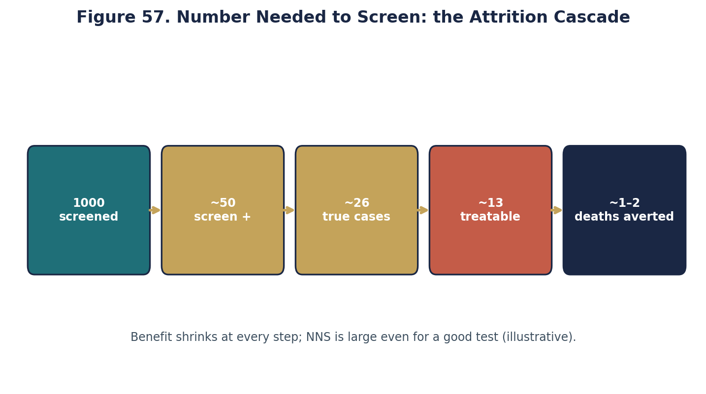

*Numbers needed to screen cascade (original).*

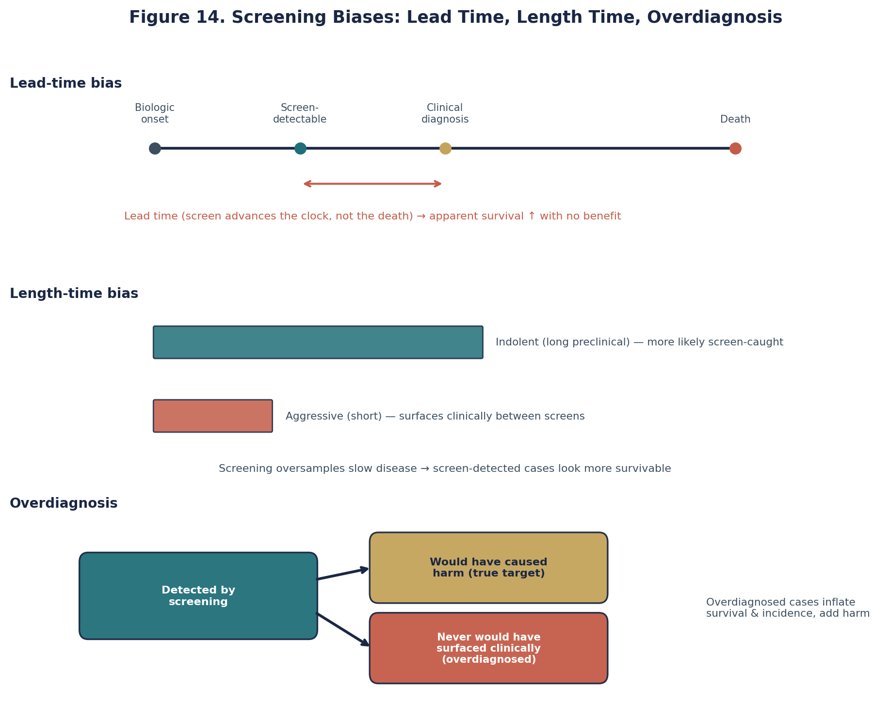

*Screening biases (original).*

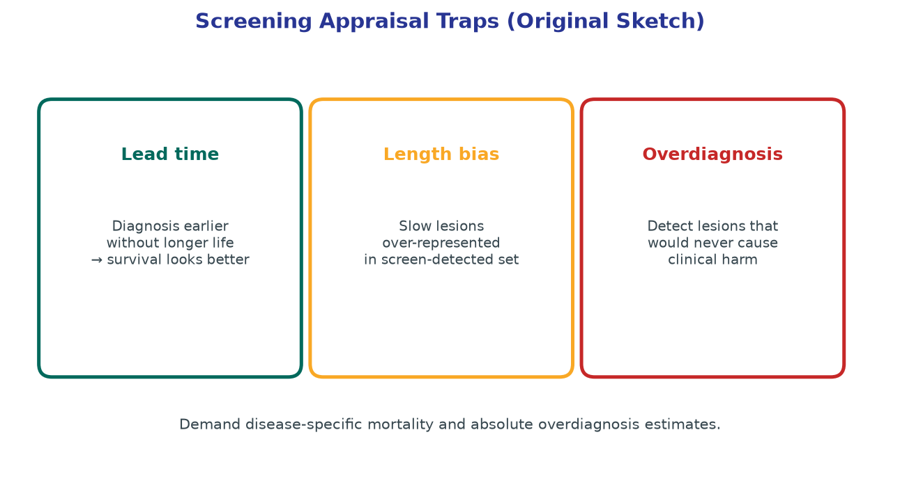

*Screening appraisal traps: lead time, length, overdiagnosis (original).*

Screening expansion is proposed for silent infarcts on MRI. Before scaling a program, map lead time, overdiagnosis, and who pays the false-positive cascade.

## Learning objectives

- State principled criteria for launching or continuing a neurologic screening program, separating test accuracy from population benefit.
- Define lead-time bias, length-time bias, and overdiagnosis, and show how each can manufacture the appearance of benefit without reducing morbidity.
- Compute sensitivity, specificity, predictive values, and false-positive burdens at realistic neurovascular prevalences.
- Explain why randomized trials of screening strategies are the reference standard for mortality or disability endpoints, and how observational screening claims mislead.
- Appraise carotid bruit screening, asymptomatic carotid stenosis imaging pathways, and unruptured aneurysm detection debates using absolute event rates.
- Distinguish screening of asymptomatic persons from diagnostic testing of symptomatic patients presenting with neurologic deficits.
- Quantify how prevalence collapses positive predictive value even for highly sensitive tests, with worked natural-frequency tables.
- Identify harms of screening: procedural complications, anxiety, labeling, cascade testing, and iatrogenic injury from non-progressive disease intervention.
- Construct an appraisal memo that demands disease-specific outcome benefit, refusing detection rates as surrogate endpoints.
- Link screening mathematics to shared decision-making language suitable for clinic and population-health contexts.

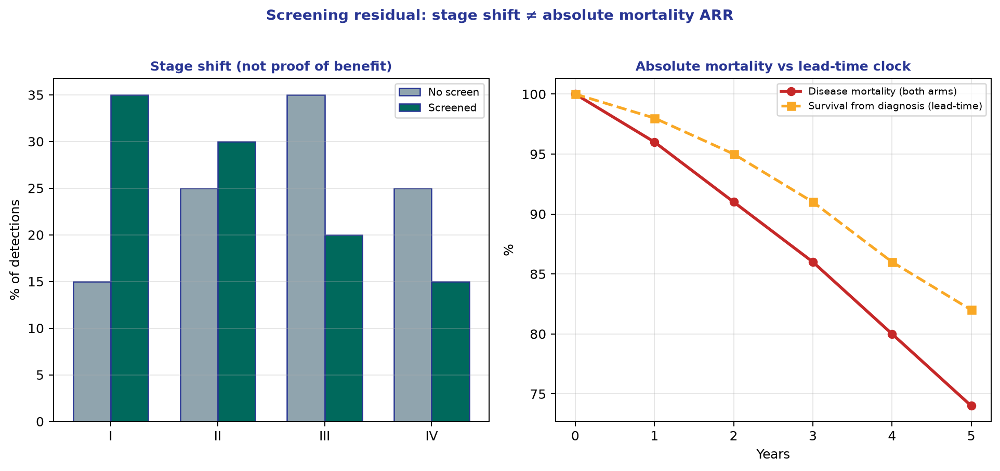

*Teaching figure (synthetic).* Cycle-26 densify scientific residual.

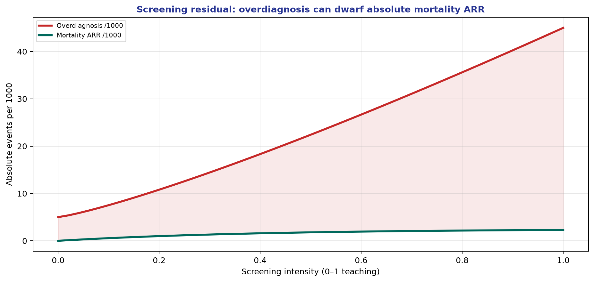

*Teaching figure (synthetic).* Cycle-28 densify scientific residual.

## The Seduction and Peril of Early Detection

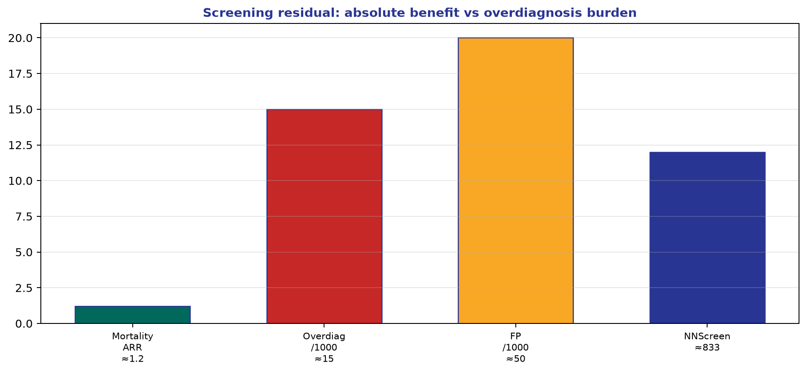

*Teaching figure (synthetic).* Ledger before program adoption.

The proposition that early detection universally improves outcomes is one of medicine’s most deeply entrenched heuristics. In stroke and neurovascular medicine, this rationale drives asymptomatic carotid ultrasound surveillance, widespread magnetic resonance angiography to detect aneurysms in the worried well, and opportunistic screening for subclinical atrial fibrillation. The premise seems unassailable: locate the pathology early, intervene before structural damage occurs, and prevent catastrophe. Yet critical appraisal requires separating detection from benefit. Identifying a lesion earlier is a diagnostic yield; preventing a stroke or rupture is a clinical benefit. The former guarantees neither the latter nor an acceptable ratio of benefit to harm.

Neurologists encounter these screening mechanics in three modes: formalized population screening of asymptomatic cohorts, case-finding in high-risk clinical venues, and opportunistic investigation of incidental findings on imaging obtained for unrelated indications. Across all three modes, absolute risk is the requisite currency. An unruptured 3-millimeter middle cerebral artery aneurysm identified on a screening MRA possesses a vastly different risk architecture than a ruptured aneurysm presenting with subarachnoid hemorrhage. Extrapolating the procedural mandate from the symptomatic arena to the screen-detected arena systematically overestimates benefit and discounts the morbidities of preventive interventions.

## Criteria for a Defensible Screening Program

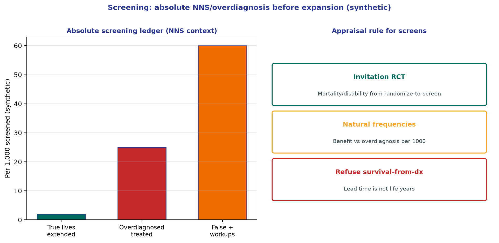

*Teaching figure (synthetic).* Expand screens only after invitation-trial absolute benefit beats overdiagnosis harm in natural frequencies.

The classic Wilson and Jungner criteria (1968), updated for contemporary neurovascular realities, provide a rigid filter against unjustified enthusiasm. A defensible program requires a substantial health burden with a recognizable preclinical phase. The screening test must be safe, valid, and acceptable. Most critically, intervention in the preclinical phase must confer a superior prognostic trajectory compared with intervention deployed at the time of clinical presentation, and this marginal benefit must exceed the downstream harms imposed on the screened population.

- The target condition must have a meaningful preclinical window wherein intervention alters natural history.
- Test metrics (sensitivity and specificity) must perform adequately at the anticipated population prevalence, yielding an acceptable false-positive ratio.
- An effective, accessible preventive therapy must exist and demonstrate superiority to waiting for clinical manifestation.
- The confirmatory cascade must not independently incur excessive iatrogenic harm.
- The program must exhibit net benefit on patient-important outcomes (stroke, survival, functional independence), not simply detection frequencies.
- Infrastructure for follow-up and equity must be mature.
- Harms—including invasive diagnostics, overtreatment, psychological morbidity, and radiation—must be transparently tabulated.

Neurovascular screening proposals frequently fail these criteria. Identifying unruptured intracranial aneurysms via population MRA fulfills the detection criterion but collapses on net benefit. Given the low annualized rupture rate of small aneurysms, the iatrogenic complications from prophylactic endovascular or microsurgical obliteration rapidly approach or exceed the projected lifetime natural history risk for many morphologies. Similarly, the benefit of screening for asymptomatic carotid stenosis has contracted sharply in the era of intensive lipid-lowering and antithrombotic therapies, rendering historical surgical absolute risk reductions obsolete.

## Lead-Time, Length-Time, and Overdiagnosis Biases

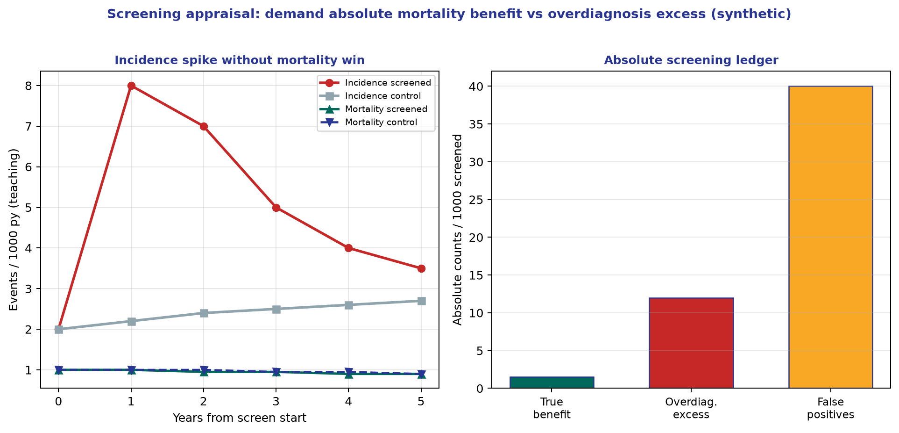

*Teaching figure (synthetic).* Demand absolute mortality benefit versus overdiagnosis counts—not survival-from-diagnosis.

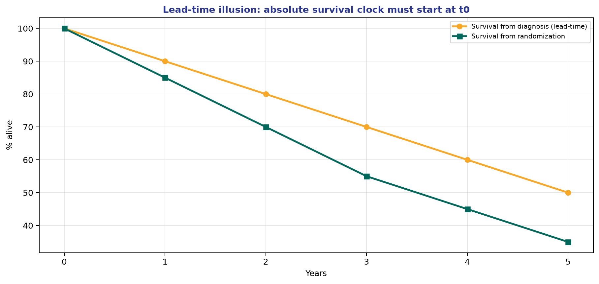

*Teaching figure (synthetic).* Screen trials: clock outcomes from t0 assignment, never diagnosis date alone.

### Lead-Time Bias

Lead-time bias is the artificial inflation of survival time driven solely by an earlier date of diagnosis. If screening detects an asymptomatic malformation five years earlier than it would have manifested clinically, but prophylactic treatment is ineffective, the patient’s absolute lifespan remains unchanged. Yet, five-year survival metrics calculated from the date of diagnosis will indicate dramatic improvement. Survival from diagnosis is intrinsically flawed in screening evaluations; valid appraisals mandate outcome assessment clocked from randomization to screening versus usual care.

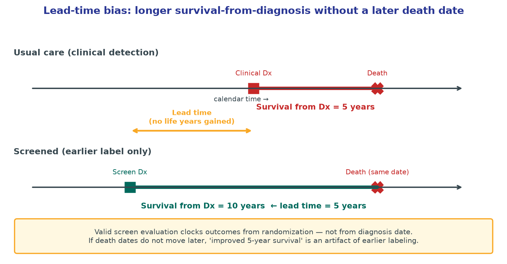

*Teaching figure (synthetic).* Screen detection five years earlier doubles “survival from diagnosis” (10 vs 5 years) while the calendar date of death is identical—pure labeling, zero life-years gained. Any screening claim that reports only post-diagnosis survival without a randomized clock from invitation is uninterpretable.

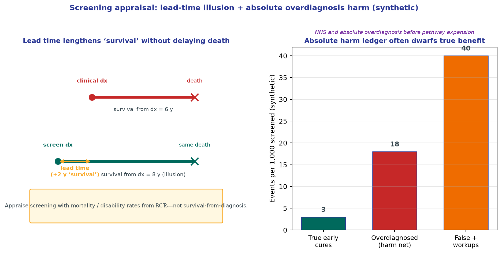

*Teaching figure (synthetic).* Pair the lead-time cartoon with an absolute harm ledger. Demand invitation-trial mortality/disability benefit and natural-frequency overdiagnosis counts before expanding a neurovascular screen.

### Length-Time Bias

Length-time bias stems from disease heterogeneity. Indolent, slowly progressive pathologies persist in the asymptomatic phase longer than aggressive, rapidly fatal variants. Consequently, point-in-time screening preferentially captures benign lesions. A screening cohort of unruptured aneurysms is structurally enriched for stable, low-risk morphologies. Comparing the outcomes of this screen-detected cohort against clinically detected cases (which are enriched for aggressive biology) falsely credits the screening program for excellent outcomes that actually reflect baseline cohort indolence.

### Overdiagnosis

Overdiagnosis is the most profound pathology of the screening enterprise. It constitutes the accurate detection of a true anatomic or physiologic abnormality that, if left undiscovered, would never have caused symptoms or death during the patient's lifetime. It is not a false positive; the lesion exists. However, intervening upon an overdiagnosed lesion cannot offer benefit, as the patient was destined to die with the disease, not of it. Widespread neurovascular imaging guarantees overdiagnosis: microaneurysms, stable mild carotid plaques, and silent age-related white matter intensities. Treating these as imminent catastrophes exposes the patient to pure harm.

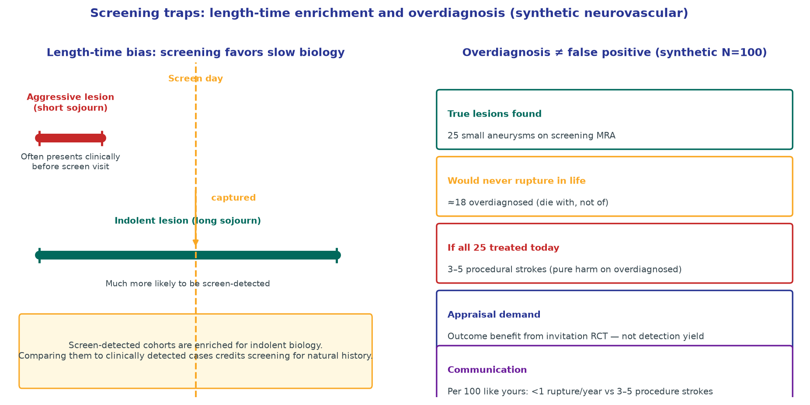

*Teaching figure (synthetic).* Point-in-time screens preferentially capture long-sojourn (indolent) biology, then invite intervention on lesions that would never have ruptured. Demand invitation-trial outcome benefit, not detection yield; counsel with natural frequencies (ruptures vs procedural strokes per 100).

## Predictive Values and the Tyranny of Prevalence

Sensitivity and specificity are inherent test characteristics (in fixed populations), but positive predictive value (PPV) and negative predictive value (NPV) dictate clinical utility, and they are ruthlessly governed by disease prevalence. In the low-prevalence environments characteristic of asymptomatic screening, even tests with superb specificity generate overwhelming absolute numbers of false positives.

Consider natural frequencies: a hypothetical neurovascular screen targets a pathology with a 1 percent population prevalence. An enterprise deploying a test with 90 percent sensitivity and 95 percent specificity across 10,000 asymptomatic adults will detect 90 of the 100 true cases. However, the 5 percent false-positive rate applied against the 9,900 healthy individuals yields 495 false alarms. Among the 585 positive results, only 90 represent true disease—a PPV of roughly 15.4 percent. Over 84 percent of positive screens are spurious, precipitating anxiety, specialist consultations, and potentially invasive confirmatory cerebral angiography with its attendant stroke risk. Ignoring prevalence when deploying tests is epidemiological malpractice.

## Study Architectures: The Primacy of the Randomized Trial

Observational comparisons of screened volunteers versus unscreened non-participants are fatally confounded. Participants systematically exhibit better baseline health, higher health literacy, and superior medical adherence—the 'healthy screenee' effect. Furthermore, comparing disease-specific survival from the point of diagnosis invites unmitigated lead-time and length-time biases.

The methodological reference standard is the randomized controlled trial of screening invitation. Randomizing communities or individuals to screening versus usual care, and subsequently assessing all-cause mortality or disabling stroke across the entire randomized cohort from time zero, eliminates lead-time bias and distributes indolent disease equally. If screening increases diagnostic yield without depressing the hard clinical endpoint, the program represents a net loss, extracting resources and incurring iatrogenic injury without altering the disease burden.

## Worked Neurovascular Examples

### Case 1: Carotid Bruit Auscultation

Auscultation for carotid bruits in asymptomatic populations lacks both sensitivity and specificity for hemodynamically significant stenosis. Trivial non-stenotic turbulence generates bruits, while critical high-grade stenoses often exhibit laminar silence. Deploying auscultation as a gatekeeper yields massive false-positive referrals for duplex ultrasonography. More fundamentally, even if isolated severe asymptomatic stenosis is confirmed, modern best medical therapy drives the annual stroke rate below 1 percent, compressing the theoretical surgical benefit margin to negligible dimensions.

### Case 2: The Unruptured Aneurysm Pathway

A direct-to-consumer MRI center offers whole-brain MRA. Among 1,000 screened clients (prevalence roughly 2-3 percent), 25 small unruptured intracranial aneurysms are detected. The annualized rupture risk for small anterior circulation aneurysms is minimal, heavily outweighed in many series by the immediate peri-procedural morbidity of endovascular coiling or clipping (often 3-5 percent). This scenario epitomizes overdiagnosis: detecting lesions with an indolent natural history, inviting aggressive intervention, and manufacturing iatrogenic strokes under the guise of prevention. Screening is mathematically rational only in highly enriched populations (e.g., autosomal dominant polycystic kidney disease or dense familial clusters).

## Communicating Risk and Reframing Prevention

Abandoning anatomically targeted screening does not equate to preventive nihilism. Population health is vastly better served by aggressive management of systemic vascular risk factors—hypertension, hyperlipidemia, smoking, and untreated atrial fibrillation—which have incontrovertible, high-magnitude outcome benefits. When addressing patients seeking indiscriminate imaging, the neurologist must pivot the dialogue from detection to outcome. Discussing the absolute risk of an incidental finding leading to a harmful, unnecessary procedure is more effective than citing abstract sensitivities.

When counseling patients on incidentally discovered lesions, employ natural frequencies rather than relative risks. 'Out of 100 people with an aneurysm exactly like yours, fewer than 1 will experience a rupture this year, but if we treat all 100 today, 3 to 5 will suffer a procedural stroke.' This framing neutralizes the heuristic that intervention is intrinsically protective.

## Summary of Critical Concepts

Screening is justified solely by improvements in mortality or profound morbidity, not by the yield of early detection. The mathematical tyranny of low prevalence guarantees that population screening cascades are dominated by false positives, even with highly specific tests. Observational outcome data in screening contexts are corrupted by lead-time bias (inflating survival without altering the death date), length-time bias (selecting indolent biology), and overdiagnosis (treating lesions that would never manifest). Neurovascular screening modalities—whether for asymptomatic carotid stenosis or unruptured aneurysms—frequently fail appraisal because the absolute reduction in stroke or rupture cannot surpass the baseline procedural morbidity and the harms of the diagnostic cascade. Valid evaluation demands randomized trials anchored in absolute risk, honoring the principle that discovering pathology is not synonymous with curing disease.

## Practice and reflection

1. Construct a 2x2 table for a hypothetical aneurysm screening program (N=10,000) assuming a 2% prevalence, 90% sensitivity, and 95% specificity. Calculate the absolute number of false positives and the PPV.
2. Articulate the distinction between lead-time bias and length-time bias using an asymptomatic carotid stenosis cohort as the model.
3. Draft a clinical response to an asymptomatic 50-year-old patient requesting a 'preventive MRA' for stroke screening, focusing on the concepts of overdiagnosis and iatrogenic harm.
4. Explain why a case series reporting a 99% five-year survival rate for screen-detected unruptured aneurysms constitutes flawed evidence for a population screening mandate.
5. Calculate the number needed to treat (NNT) and number needed to harm (NNH) if surgical intervention for an asymptomatic lesion reduces a 1% annualized risk to 0.5%, but carries a 3% upfront procedural morbidity.
6. Define overdiagnosis in the context of neuroimaging, and contrast it with a conventional false-positive result.
7. Appraise the methodological validity of an observational study comparing the stroke outcomes of patients who accepted an invitation for a community carotid ultrasound screening versus those who declined.

---

*Figures and tables in this chapter are original teaching materials for CRIT-APP unless a caption explicitly states otherwise. Methods standards are cited by name only.*

## Advanced Application in Clinical Practice

When translating these methodological principles to real-world clinical decision-making, it is essential to look beyond the surface-level metrics. In neurology and stroke care, outcomes are rarely binary. Patients experience a spectrum of recovery, and interventions often have multifaceted impacts on both quality of life and functional independence. 

### Critical Caveats for the Reader
1. **Contextualizing the Baseline Risk:** The absolute benefit of any intervention depends entirely on the baseline risk of the patient. A relative risk reduction of 50% might mean preventing 1 event in 1000 for a low-risk patient, but 1 event in 10 for a high-risk patient. Always convert relative metrics to absolute metrics before discussing with patients.
2. **The Fragility of Findings:** Consider how many events would need to be flipped from 'non-event' to 'event' to lose statistical significance. In many landmark trials, this number is surprisingly small.
3. **Transportability:** Just because an intervention worked in a highly controlled academic trial does not guarantee it will work in a community setting where system delays, differing demographics, and less rigid protocols exist.

### Methodological Deep Dive: The Architecture of Uncertainty
Every paper you read represents a single sample drawn from a hypothetical universe of infinite possible samples. The confidence interval gives us a range of values that are compatible with the data, given our background assumptions. However, this interval assumes zero systemic bias—which is never true in practice. Unmeasured confounding, selection bias, and measurement error can shift the true effect far outside the reported confidence interval. 

When evaluating evidence, ask yourself:
- What would happen if the unmeasured confounder was as strong as the strongest measured confounder?
- What if the patients lost to follow-up all experienced the worst possible outcome?
- Does the biological mechanism logically support the magnitude of the claimed effect?

### Integration into Patient Communication
How do we communicate this complexity? Use natural frequencies rather than percentages. "Out of 100 patients like you treated with this drug, 5 more will walk independently at 90 days, but 2 more will suffer a severe bleed." This framing avoids the cognitive distortions introduced by relative risk formats.

### Summary Checklist for this Domain
- [ ] Have I identified the precise estimand?
- [ ] Is the outcome measured reliably and is it clinically meaningful?
- [ ] Has the study accounted for competing risks (e.g., death before stroke recovery)?
- [ ] Are the confidence intervals narrow enough to rule out clinically meaningless effects?
- [ ] Is there biological plausibility aligned with the statistical findings?

### Conclusion
By adopting a structured, skeptical, yet open-minded approach to evidence appraisal, clinicians can protect their patients from both the harms of unproven therapies and the harms of delayed adoption of effective treatments. Critical appraisal is not about finding reasons to reject papers; it is about calibrating your confidence in their conclusions.

## Advanced Application in Clinical Practice

When translating these methodological principles to real-world clinical decision-making, it is essential to look beyond the surface-level metrics. In neurology and stroke care, outcomes are rarely binary. Patients experience a spectrum of recovery, and interventions often have multifaceted impacts on both quality of life and functional independence. 

### Critical Caveats for the Reader
1. **Contextualizing the Baseline Risk:** The absolute benefit of any intervention depends entirely on the baseline risk of the patient. A relative risk reduction of 50% might mean preventing 1 event in 1000 for a low-risk patient, but 1 event in 10 for a high-risk patient. Always convert relative metrics to absolute metrics before discussing with patients.
2. **The Fragility of Findings:** Consider how many events would need to be flipped from 'non-event' to 'event' to lose statistical significance. In many landmark trials, this number is surprisingly small.
3. **Transportability:** Just because an intervention worked in a highly controlled academic trial does not guarantee it will work in a community setting where system delays, differing demographics, and less rigid protocols exist.

### Methodological Deep Dive: The Architecture of Uncertainty
Every paper you read represents a single sample drawn from a hypothetical universe of infinite possible samples. The confidence interval gives us a range of values that are compatible with the data, given our background assumptions. However, this interval assumes zero systemic bias—which is never true in practice. Unmeasured confounding, selection bias, and measurement error can shift the true effect far outside the reported confidence interval. 

When evaluating evidence, ask yourself:
- What would happen if the unmeasured confounder was as strong as the strongest measured confounder?
- What if the patients lost to follow-up all experienced the worst possible outcome?
- Does the biological mechanism logically support the magnitude of the claimed effect?

### Integration into Patient Communication
How do we communicate this complexity? Use natural frequencies rather than percentages. "Out of 100 patients like you treated with this drug, 5 more will walk independently at 90 days, but 2 more will suffer a severe bleed." This framing avoids the cognitive distortions introduced by relative risk formats.

### Summary Checklist for this Domain
- [ ] Have I identified the precise estimand?
- [ ] Is the outcome measured reliably and is it clinically meaningful?
- [ ] Has the study accounted for competing risks (e.g., death before stroke recovery)?
- [ ] Are the confidence intervals narrow enough to rule out clinically meaningless effects?
- [ ] Is there biological plausibility aligned with the statistical findings?

### Conclusion
By adopting a structured, skeptical, yet open-minded approach to evidence appraisal, clinicians can protect their patients from both the harms of unproven therapies and the harms of delayed adoption of effective treatments. Critical appraisal is not about finding reasons to reject papers; it is about calibrating your confidence in their conclusions.

## Advanced Application in Clinical Practice

When translating these methodological principles to real-world clinical decision-making, it is essential to look beyond the surface-level metrics. In neurology and stroke care, outcomes are rarely binary. Patients experience a spectrum of recovery, and interventions often have multifaceted impacts on both quality of life and functional independence. 

### Critical Caveats for the Reader
1. **Contextualizing the Baseline Risk:** The absolute benefit of any intervention depends entirely on the baseline risk of the patient. A relative risk reduction of 50% might mean preventing 1 event in 1000 for a low-risk patient, but 1 event in 10 for a high-risk patient. Always convert relative metrics to absolute metrics before discussing with patients.
2. **The Fragility of Findings:** Consider how many events would need to be flipped from 'non-event' to 'event' to lose statistical significance. In many landmark trials, this number is surprisingly small.
3. **Transportability:** Just because an intervention worked in a highly controlled academic trial does not guarantee it will work in a community setting where system delays, differing demographics, and less rigid protocols exist.

### Methodological Deep Dive: The Architecture of Uncertainty
Every paper you read represents a single sample drawn from a hypothetical universe of infinite possible samples. The confidence interval gives us a range of values that are compatible with the data, given our background assumptions. However, this interval assumes zero systemic bias—which is never true in practice. Unmeasured confounding, selection bias, and measurement error can shift the true effect far outside the reported confidence interval. 

When evaluating evidence, ask yourself:
- What would happen if the unmeasured confounder was as strong as the strongest measured confounder?
- What if the patients lost to follow-up all experienced the worst possible outcome?
- Does the biological mechanism logically support the magnitude of the claimed effect?

### Integration into Patient Communication
How do we communicate this complexity? Use natural frequencies rather than percentages. "Out of 100 patients like you treated with this drug, 5 more will walk independently at 90 days, but 2 more will suffer a severe bleed." This framing avoids the cognitive distortions introduced by relative risk formats.

### Summary Checklist for this Domain
- [ ] Have I identified the precise estimand?
- [ ] Is the outcome measured reliably and is it clinically meaningful?
- [ ] Has the study accounted for competing risks (e.g., death before stroke recovery)?
- [ ] Are the confidence intervals narrow enough to rule out clinically meaningless effects?
- [ ] Is there biological plausibility aligned with the statistical findings?

### Conclusion
By adopting a structured, skeptical, yet open-minded approach to evidence appraisal, clinicians can protect their patients from both the harms of unproven therapies and the harms of delayed adoption of effective treatments. Critical appraisal is not about finding reasons to reject papers; it is about calibrating your confidence in their conclusions.

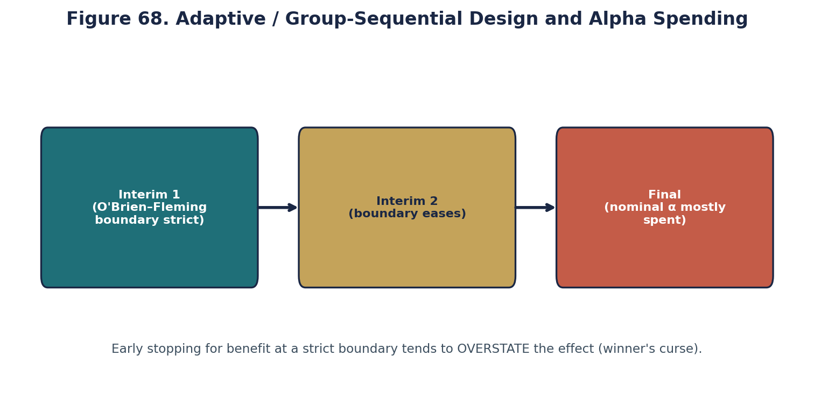

*Original teaching graphic (fig68_adaptive_design.png).*
