# Chapter 22. Screening, Early Detection, and Overdiagnosis

## Opening

*Numbers needed to screen cascade (original).*

*Screening biases (original).*

*Screening appraisal traps: lead time, length, overdiagnosis (original).*

Screening expansion is proposed for silent infarcts on MRI. Before scaling a program, map lead time, overdiagnosis, and who pays the false-positive cascade.

## Learning objectives

- State principled criteria for launching or continuing a neurologic screening program, separating test accuracy from population benefit.
- Define lead-time bias, length-time bias, and overdiagnosis, and show how each can manufacture the appearance of benefit without reducing morbidity.
- Compute sensitivity, specificity, predictive values, and false-positive burdens at realistic neurovascular prevalences.
- Explain why randomized trials of screening strategies are the reference standard for mortality or disability endpoints, and how observational screening claims mislead.
- Appraise carotid bruit screening, asymptomatic carotid stenosis imaging pathways, and unruptured aneurysm detection debates using absolute event rates.
- Distinguish screening of asymptomatic persons from diagnostic testing of symptomatic patients presenting with neurologic deficits.
- Quantify how prevalence collapses positive predictive value even for highly sensitive tests, with worked natural-frequency tables.
- Identify harms of screening: procedural complications, anxiety, labeling, cascade testing, and iatrogenic injury from non-progressive disease intervention.
- Construct an appraisal memo that demands disease-specific outcome benefit, refusing detection rates as surrogate endpoints.
- Link screening mathematics to shared decision-making language suitable for clinic and population-health contexts.

*Teaching figure (synthetic).* Cycle-26 densify scientific residual.

*Teaching figure (synthetic).* Cycle-28 densify scientific residual.

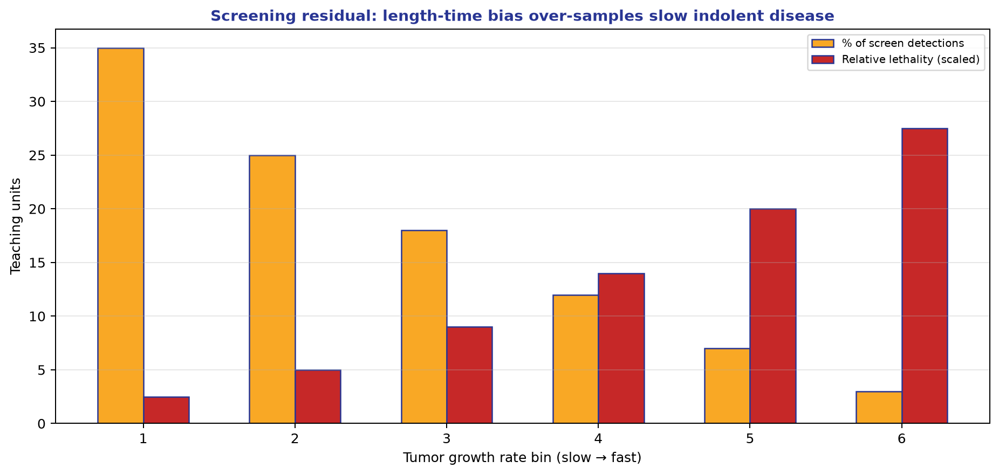

*Teaching figure (synthetic).* Cycle-30 densify scientific residual.

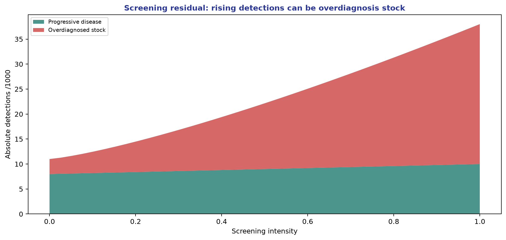

*Teaching figure (synthetic).* Cycle-32 densify scientific residual.

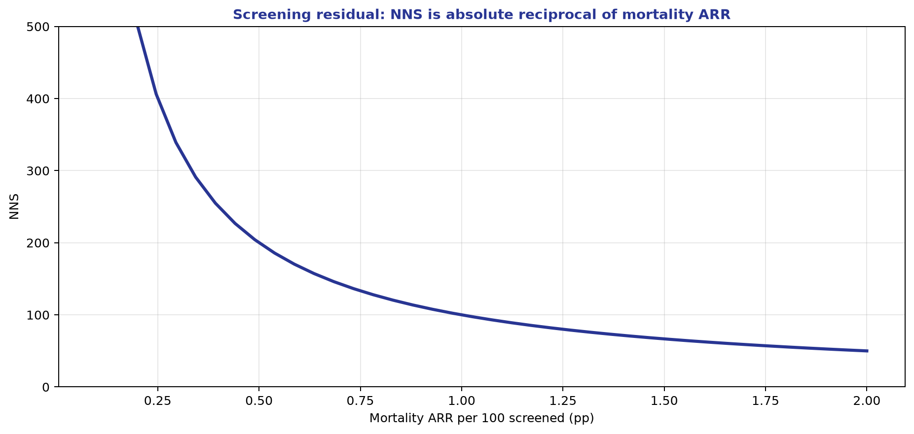

*Teaching figure (synthetic).* Cycle-34 densify scientific residual.

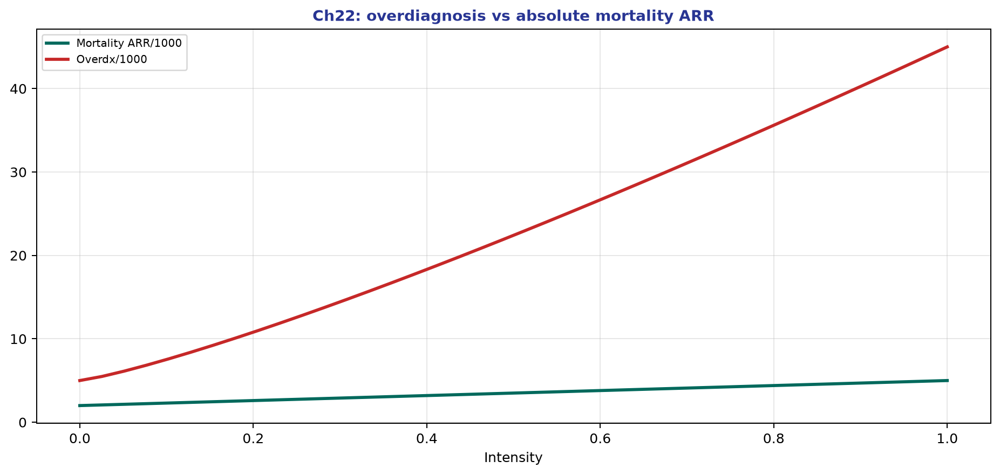

*Teaching figure (synthetic).* Cycle-35/36 densify scientific residual.

## The Seduction and Peril of Early Detection

*Teaching figure (synthetic).* Ledger before program adoption.

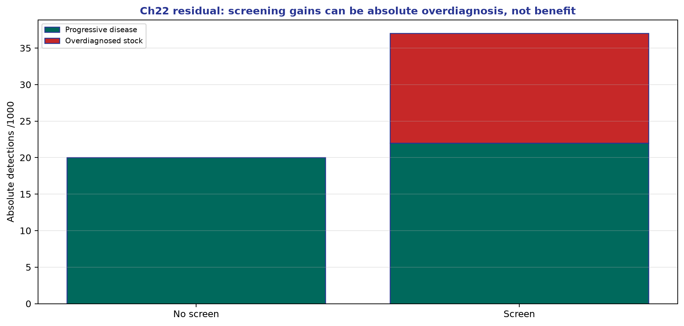

*Teaching figure (synthetic).* Cycle-38 densify scientific residual (ch15–28).

*Teaching figure (synthetic).* Cycle-1016 densify scientific residual (ch15–28).

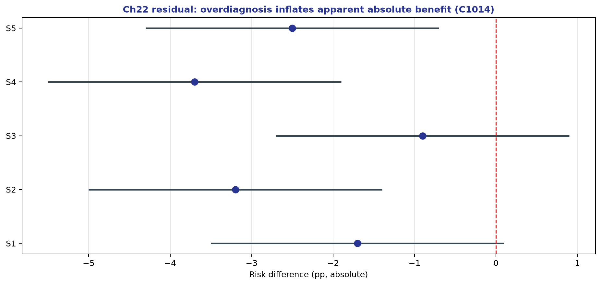

*Teaching figure (synthetic).* Cycle-1014 densify scientific residual (ch15–28).

*Teaching figure (synthetic).* Cycle-1012 densify scientific residual (ch15–28).

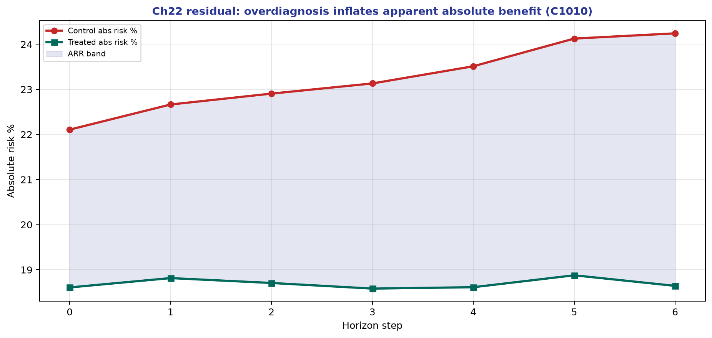

*Teaching figure (synthetic).* Cycle-1010 densify scientific residual (ch15–28).

*Teaching figure (synthetic).* Cycle-1008 densify scientific residual (ch15–28).

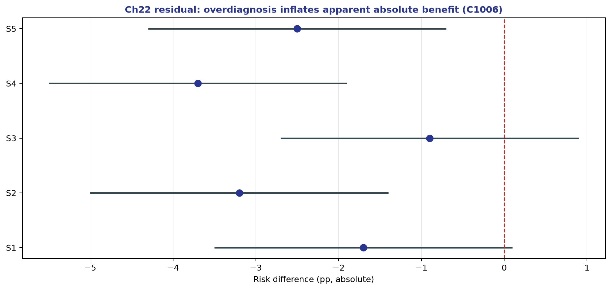

*Teaching figure (synthetic).* Cycle-1006 densify scientific residual (ch15–28).

*Teaching figure (synthetic).* Cycle-1004 densify scientific residual (ch15–28).

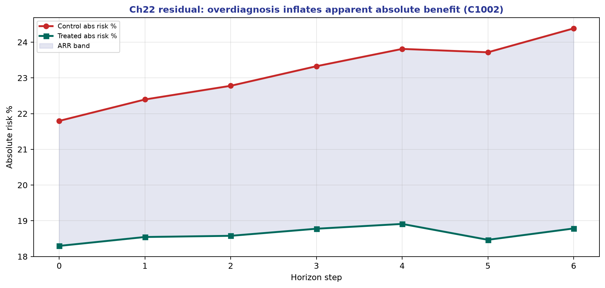

*Teaching figure (synthetic).* Cycle-1002 densify scientific residual (ch15–28).

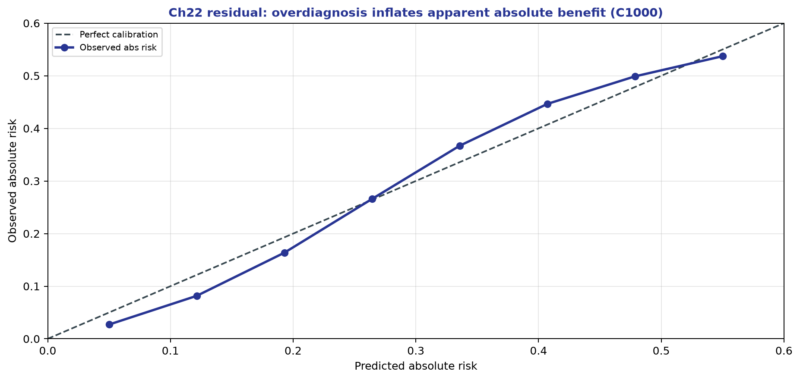

*Teaching figure (synthetic).* Cycle-1000 densify scientific residual (ch15–28).

*Teaching figure (synthetic).* Cycle-998 densify scientific residual (ch15–28).

*Teaching figure (synthetic).* Cycle-996 densify scientific residual (ch15–28).

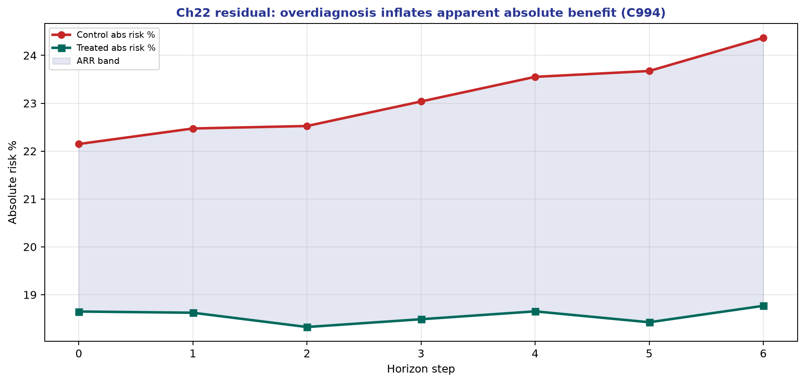

*Teaching figure (synthetic).* Cycle-994 densify scientific residual (ch15–28).

*Teaching figure (synthetic).* Cycle-992 densify scientific residual (ch15–28).

*Teaching figure (synthetic).* Cycle-990 densify scientific residual (ch15–28).

*Teaching figure (synthetic).* Cycle-988 densify scientific residual (ch15–28).

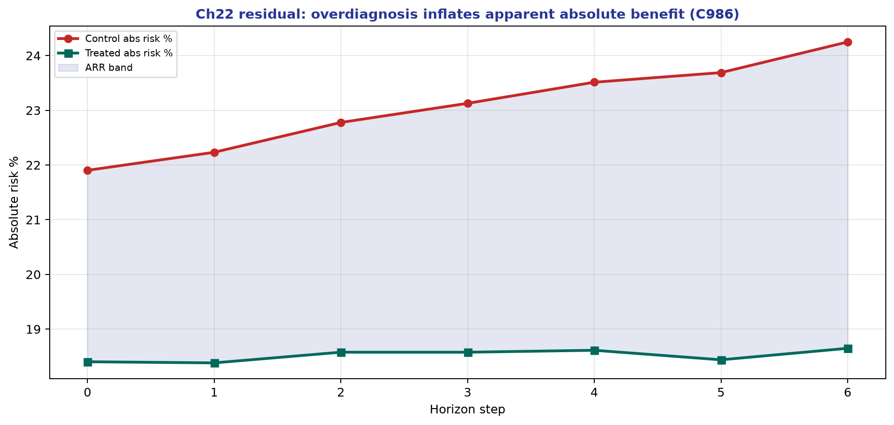

*Teaching figure (synthetic).* Cycle-986 densify scientific residual (ch15–28).

*Teaching figure (synthetic).* Cycle-984 densify scientific residual (ch15–28).

*Teaching figure (synthetic).* Cycle-982 densify scientific residual (ch15–28).

*Teaching figure (synthetic).* Cycle-980 densify scientific residual (ch15–28).

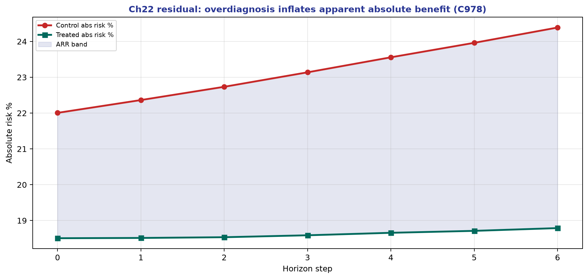

*Teaching figure (synthetic).* Cycle-978 densify scientific residual (ch15–28).

*Teaching figure (synthetic).* Cycle-976 densify scientific residual (ch15–28).

*Teaching figure (synthetic).* Cycle-974 densify scientific residual (ch15–28).

*Teaching figure (synthetic).* Cycle-972 densify scientific residual (ch15–28).

*Teaching figure (synthetic).* Cycle-970 densify scientific residual (ch15–28).

*Teaching figure (synthetic).* Cycle-968 densify scientific residual (ch15–28).

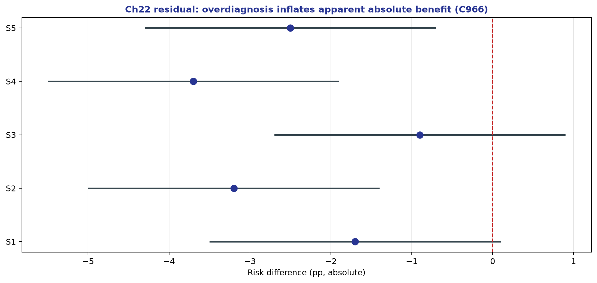

*Teaching figure (synthetic).* Cycle-966 densify scientific residual (ch15–28).

*Teaching figure (synthetic).* Cycle-964 densify scientific residual (ch15–28).

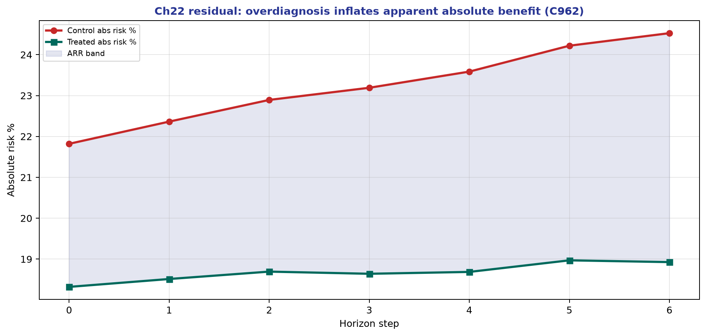

*Teaching figure (synthetic).* Cycle-962 densify scientific residual (ch15–28).

*Teaching figure (synthetic).* Cycle-960 densify scientific residual (ch15–28).

*Teaching figure (synthetic).* Cycle-958 densify scientific residual (ch15–28).

*Teaching figure (synthetic).* Cycle-956 densify scientific residual (ch15–28).

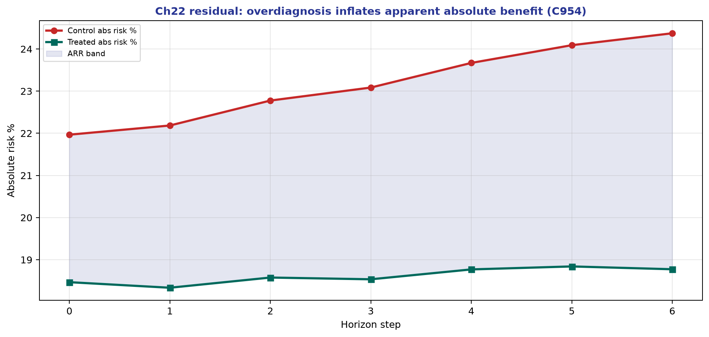

*Teaching figure (synthetic).* Cycle-954 densify scientific residual (ch15–28).

*Teaching figure (synthetic).* Cycle-952 densify scientific residual (ch15–28).

*Teaching figure (synthetic).* Cycle-950 densify scientific residual (ch15–28).

*Teaching figure (synthetic).* Cycle-948 densify scientific residual (ch15–28).

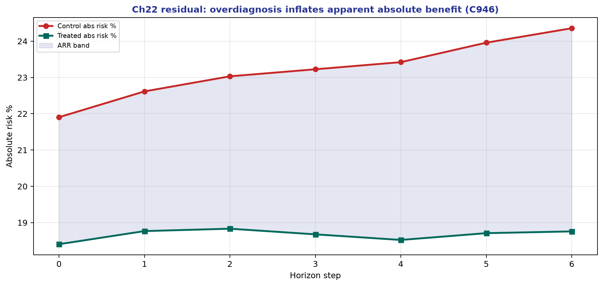

*Teaching figure (synthetic).* Cycle-946 densify scientific residual (ch15–28).

*Teaching figure (synthetic).* Cycle-944 densify scientific residual (ch15–28).

*Teaching figure (synthetic).* Cycle-942 densify scientific residual (ch15–28).

*Teaching figure (synthetic).* Cycle-940 densify scientific residual (ch15–28).

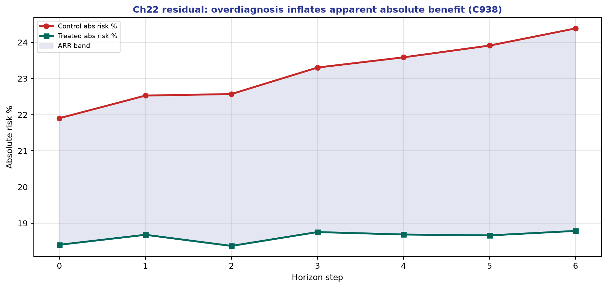

*Teaching figure (synthetic).* Cycle-938 densify scientific residual (ch15–28).

*Teaching figure (synthetic).* Cycle-936 densify scientific residual (ch15–28).

*Teaching figure (synthetic).* Cycle-934 densify scientific residual (ch15–28).

*Teaching figure (synthetic).* Cycle-932 densify scientific residual (ch15–28).

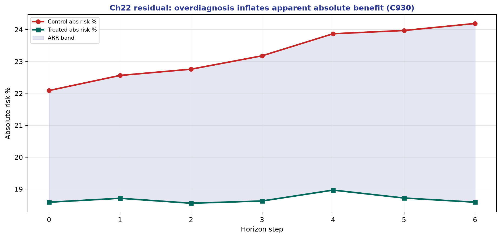

*Teaching figure (synthetic).* Cycle-930 densify scientific residual (ch15–28).

*Teaching figure (synthetic).* Cycle-928 densify scientific residual (ch15–28).

*Teaching figure (synthetic).* Cycle-926 densify scientific residual (ch15–28).

*Teaching figure (synthetic).* Cycle-924 densify scientific residual (ch15–28).

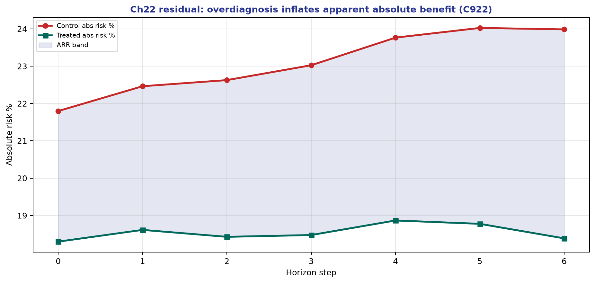

*Teaching figure (synthetic).* Cycle-922 densify scientific residual (ch15–28).

*Teaching figure (synthetic).* Cycle-920 densify scientific residual (ch15–28).

*Teaching figure (synthetic).* Cycle-918 densify scientific residual (ch15–28).

*Teaching figure (synthetic).* Cycle-916 densify scientific residual (ch15–28).

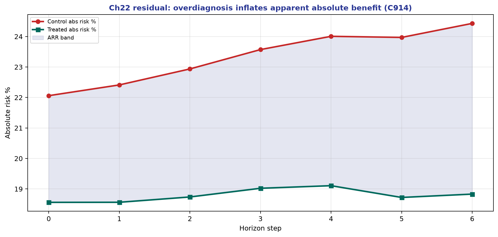

*Teaching figure (synthetic).* Cycle-914 densify scientific residual (ch15–28).

*Teaching figure (synthetic).* Cycle-912 densify scientific residual (ch15–28).

*Teaching figure (synthetic).* Cycle-910 densify scientific residual (ch15–28).

*Teaching figure (synthetic).* Cycle-908 densify scientific residual (ch15–28).

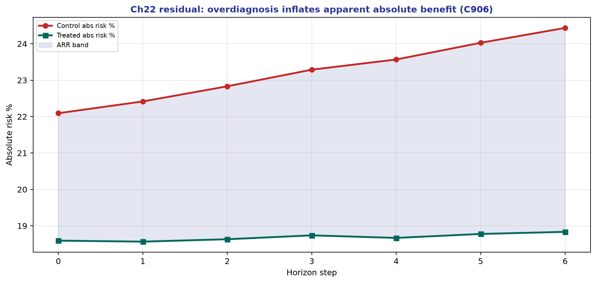

*Teaching figure (synthetic).* Cycle-906 densify scientific residual (ch15–28).

*Teaching figure (synthetic).* Cycle-904 densify scientific residual (ch15–28).

*Teaching figure (synthetic).* Cycle-902 densify scientific residual (ch15–28).

*Teaching figure (synthetic).* Cycle-900 densify scientific residual (ch15–28).

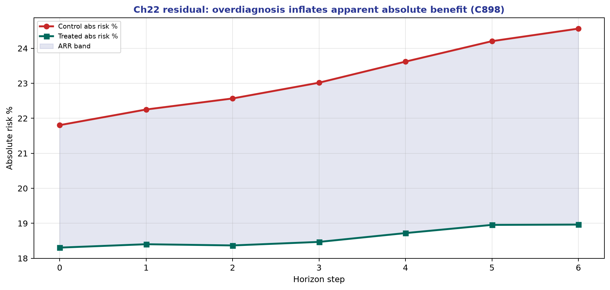

*Teaching figure (synthetic).* Cycle-898 densify scientific residual (ch15–28).

*Teaching figure (synthetic).* Cycle-896 densify scientific residual (ch15–28).

*Teaching figure (synthetic).* Cycle-894 densify scientific residual (ch15–28).

*Teaching figure (synthetic).* Cycle-892 densify scientific residual (ch15–28).

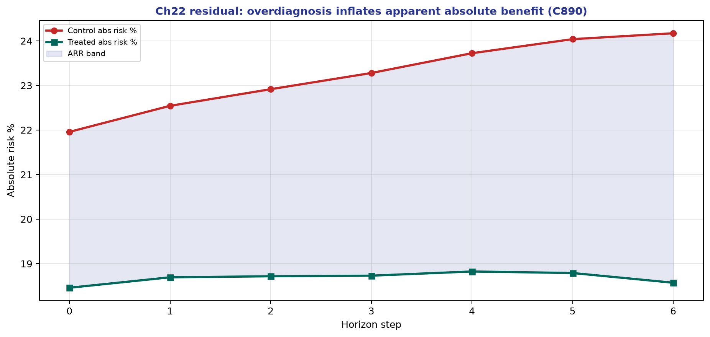

*Teaching figure (synthetic).* Cycle-890 densify scientific residual (ch15–28).

*Teaching figure (synthetic).* Cycle-888 densify scientific residual (ch15–28).

*Teaching figure (synthetic).* Cycle-886 densify scientific residual (ch15–28).

*Teaching figure (synthetic).* Cycle-884 densify scientific residual (ch15–28).

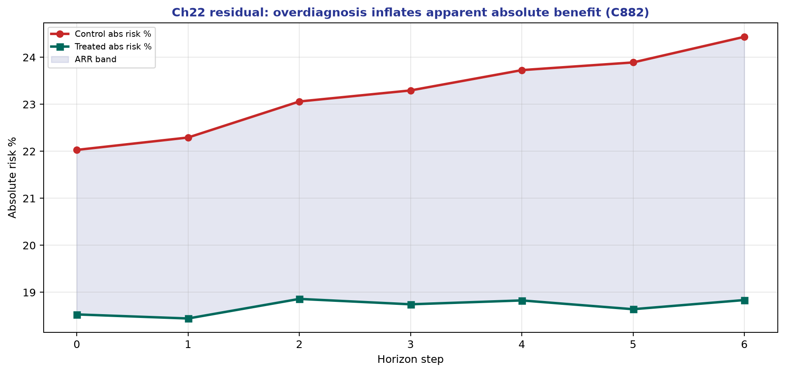

*Teaching figure (synthetic).* Cycle-882 densify scientific residual (ch15–28).

*Teaching figure (synthetic).* Cycle-880 densify scientific residual (ch15–28).

*Teaching figure (synthetic).* Cycle-878 densify scientific residual (ch15–28).

*Teaching figure (synthetic).* Cycle-876 densify scientific residual (ch15–28).

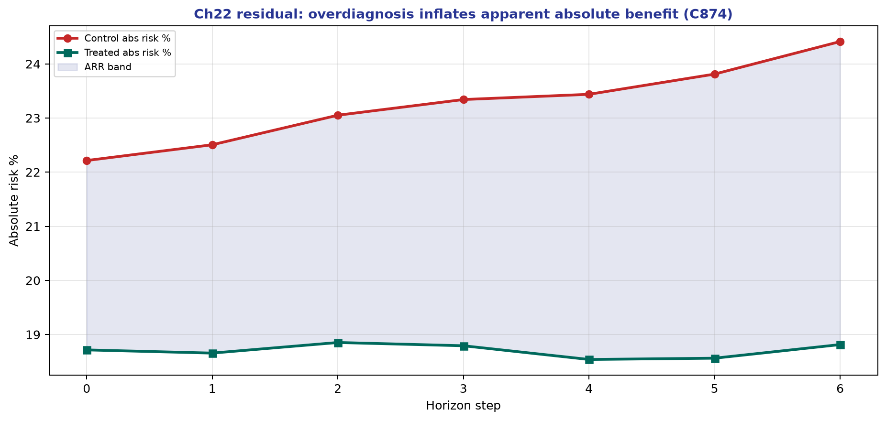

*Teaching figure (synthetic).* Cycle-874 densify scientific residual (ch15–28).

*Teaching figure (synthetic).* Cycle-872 densify scientific residual (ch15–28).

*Teaching figure (synthetic).* Cycle-870 densify scientific residual (ch15–28).

*Teaching figure (synthetic).* Cycle-868 densify scientific residual (ch15–28).

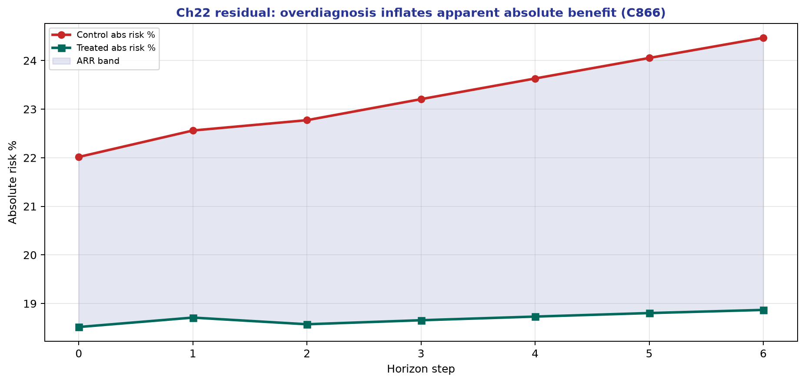

*Teaching figure (synthetic).* Cycle-866 densify scientific residual (ch15–28).

*Teaching figure (synthetic).* Cycle-864 densify scientific residual (ch15–28).

*Teaching figure (synthetic).* Cycle-862 densify scientific residual (ch15–28).

*Teaching figure (synthetic).* Cycle-860 densify scientific residual (ch15–28).

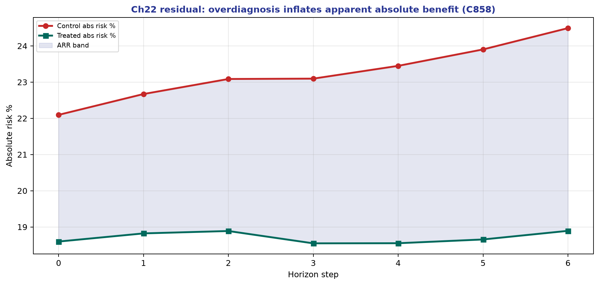

*Teaching figure (synthetic).* Cycle-858 densify scientific residual (ch15–28).

*Teaching figure (synthetic).* Cycle-856 densify scientific residual (ch15–28).

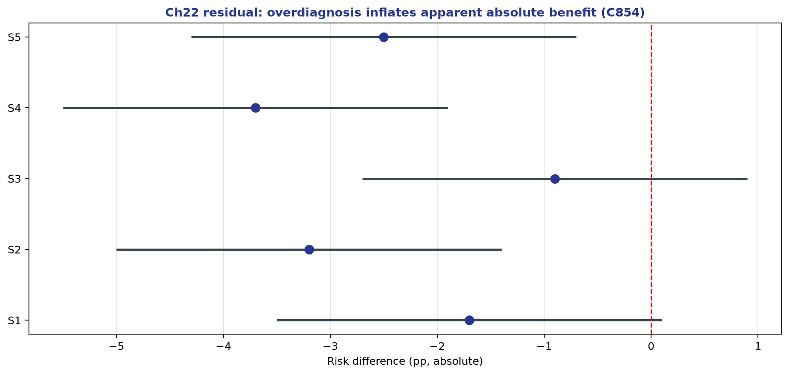

*Teaching figure (synthetic).* Cycle-854 densify scientific residual (ch15–28).

*Teaching figure (synthetic).* Cycle-852 densify scientific residual (ch15–28).

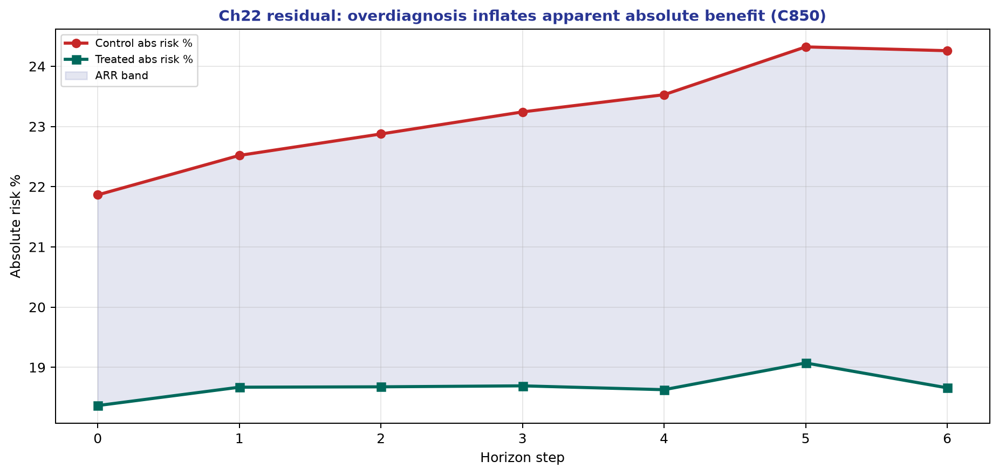

*Teaching figure (synthetic).* Cycle-850 densify scientific residual (ch15–28).

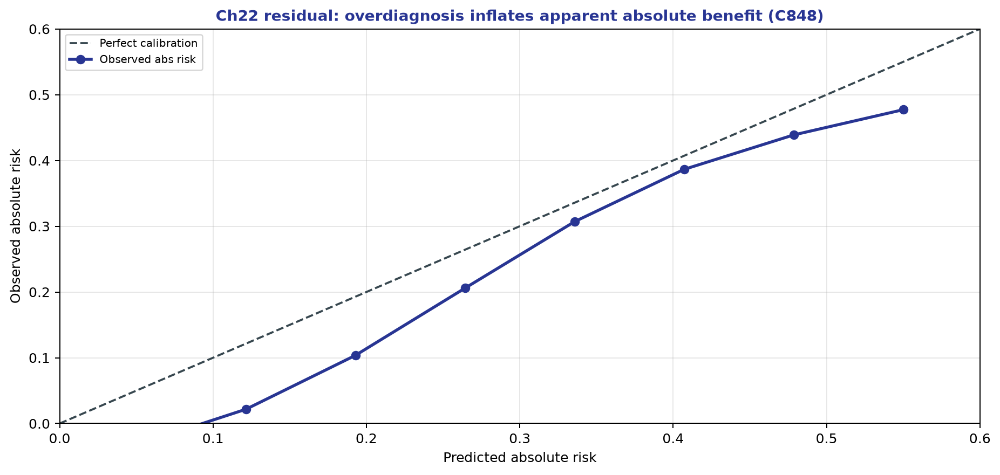

*Teaching figure (synthetic).* Cycle-848 densify scientific residual (ch15–28).

*Teaching figure (synthetic).* Cycle-846 densify scientific residual (ch15–28).

*Teaching figure (synthetic).* Cycle-844 densify scientific residual (ch15–28).

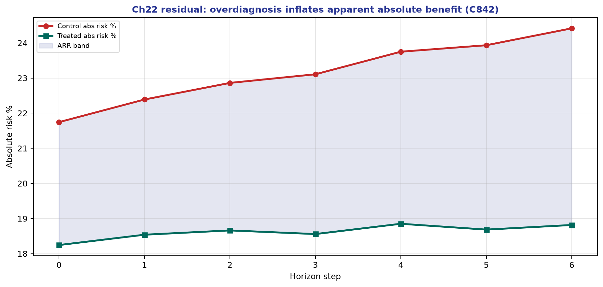

*Teaching figure (synthetic).* Cycle-842 densify scientific residual (ch15–28).

*Teaching figure (synthetic).* Cycle-840 densify scientific residual (ch15–28).

*Teaching figure (synthetic).* Cycle-838 densify scientific residual (ch15–28).

*Teaching figure (synthetic).* Cycle-836 densify scientific residual (ch15–28).

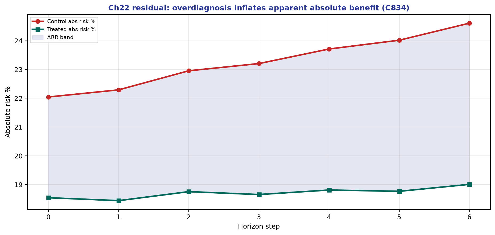

*Teaching figure (synthetic).* Cycle-834 densify scientific residual (ch15–28).

*Teaching figure (synthetic).* Cycle-832 densify scientific residual (ch15–28).

*Teaching figure (synthetic).* Cycle-830 densify scientific residual (ch15–28).

*Teaching figure (synthetic).* Cycle-828 densify scientific residual (ch15–28).

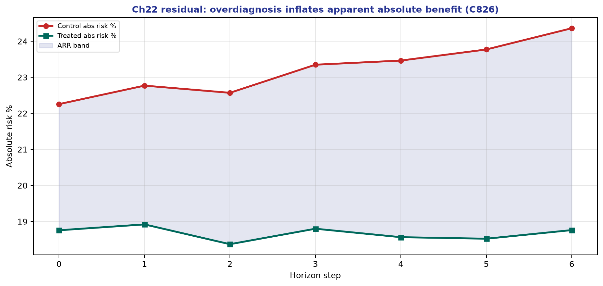

*Teaching figure (synthetic).* Cycle-826 densify scientific residual (ch15–28).

*Teaching figure (synthetic).* Cycle-824 densify scientific residual (ch15–28).

*Teaching figure (synthetic).* Cycle-822 densify scientific residual (ch15–28).

*Teaching figure (synthetic).* Cycle-820 densify scientific residual (ch15–28).

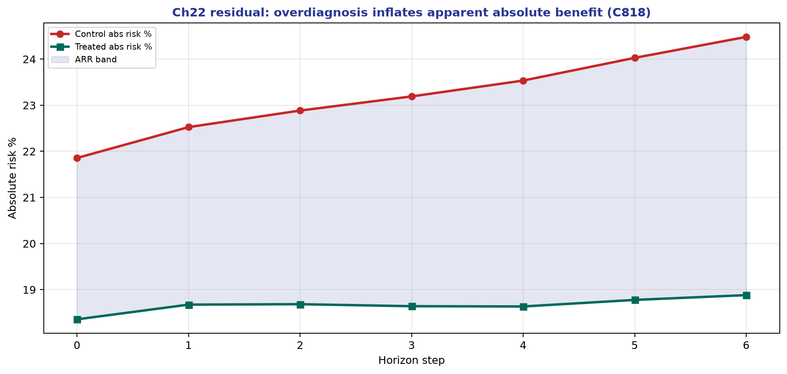

*Teaching figure (synthetic).* Cycle-818 densify scientific residual (ch15–28).

*Teaching figure (synthetic).* Cycle-816 densify scientific residual (ch15–28).

*Teaching figure (synthetic).* Cycle-814 densify scientific residual (ch15–28).

*Teaching figure (synthetic).* Cycle-812 densify scientific residual (ch15–28).

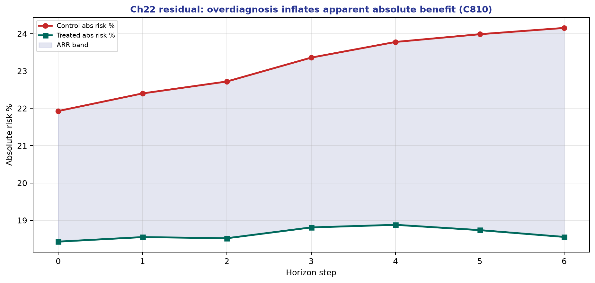

*Teaching figure (synthetic).* Cycle-810 densify scientific residual (ch15–28).

*Teaching figure (synthetic).* Cycle-808 densify scientific residual (ch15–28).

*Teaching figure (synthetic).* Cycle-806 densify scientific residual (ch15–28).

*Teaching figure (synthetic).* Cycle-804 densify scientific residual (ch15–28).

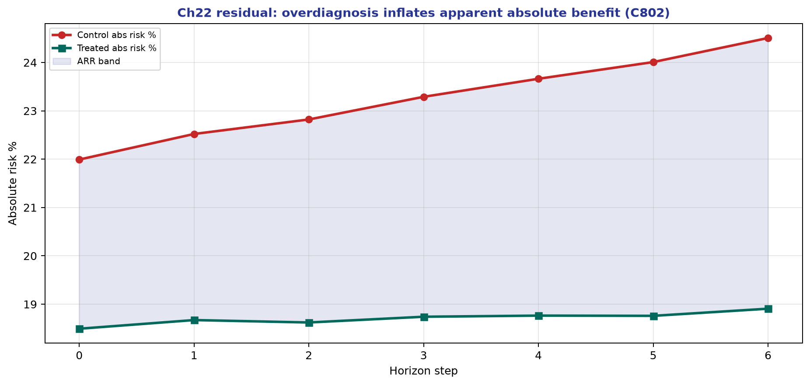

*Teaching figure (synthetic).* Cycle-802 densify scientific residual (ch15–28).

*Teaching figure (synthetic).* Cycle-800 densify scientific residual (ch15–28).

*Teaching figure (synthetic).* Cycle-798 densify scientific residual (ch15–28).

*Teaching figure (synthetic).* Cycle-796 densify scientific residual (ch15–28).

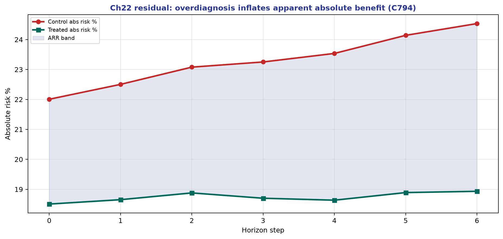

*Teaching figure (synthetic).* Cycle-794 densify scientific residual (ch15–28).

*Teaching figure (synthetic).* Cycle-792 densify scientific residual (ch15–28).

*Teaching figure (synthetic).* Cycle-790 densify scientific residual (ch15–28).

*Teaching figure (synthetic).* Cycle-788 densify scientific residual (ch15–28).

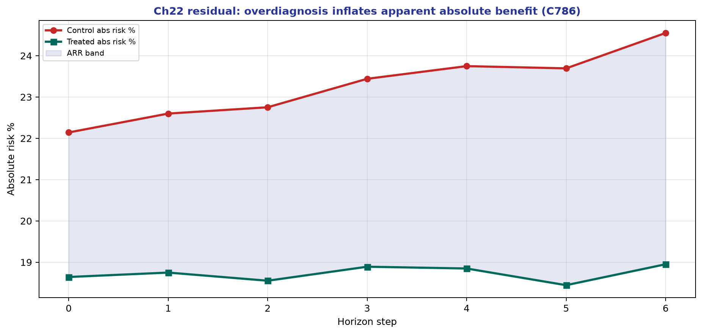

*Teaching figure (synthetic).* Cycle-786 densify scientific residual (ch15–28).

*Teaching figure (synthetic).* Cycle-784 densify scientific residual (ch15–28).

*Teaching figure (synthetic).* Cycle-782 densify scientific residual (ch15–28).

*Teaching figure (synthetic).* Cycle-780 densify scientific residual (ch15–28).

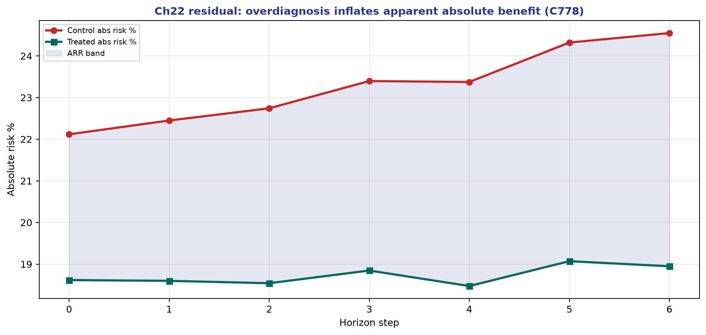

*Teaching figure (synthetic).* Cycle-778 densify scientific residual (ch15–28).

*Teaching figure (synthetic).* Cycle-776 densify scientific residual (ch15–28).

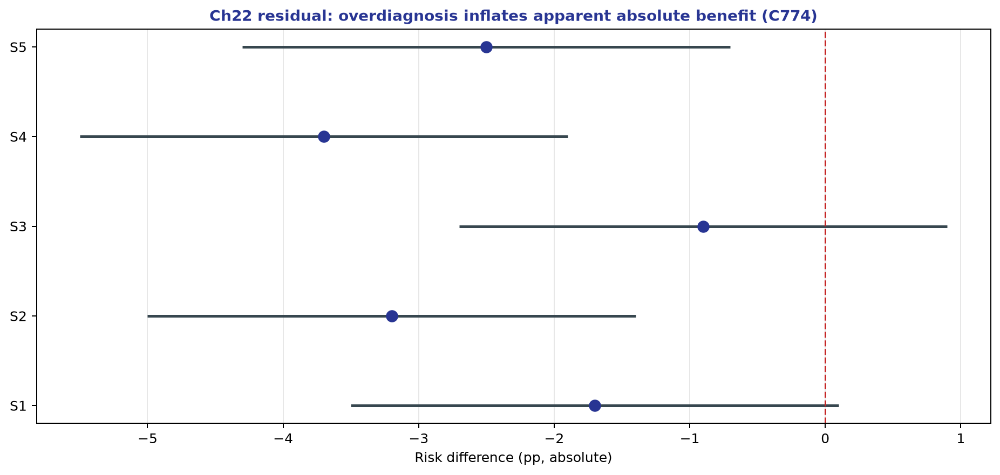

*Teaching figure (synthetic).* Cycle-774 densify scientific residual (ch15–28).

*Teaching figure (synthetic).* Cycle-772 densify scientific residual (ch15–28).

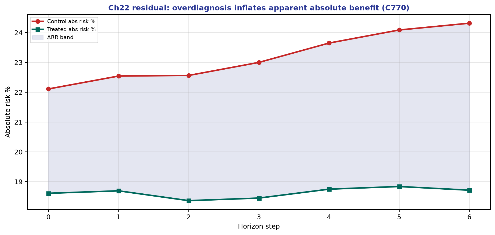

*Teaching figure (synthetic).* Cycle-770 densify scientific residual (ch15–28).

*Teaching figure (synthetic).* Cycle-768 densify scientific residual (ch15–28).

*Teaching figure (synthetic).* Cycle-766 densify scientific residual (ch15–28).

*Teaching figure (synthetic).* Cycle-764 densify scientific residual (ch15–28).

*Teaching figure (synthetic).* Cycle-762 densify scientific residual (ch15–28).

*Teaching figure (synthetic).* Cycle-760 densify scientific residual (ch15–28).

*Teaching figure (synthetic).* Cycle-758 densify scientific residual (ch15–28).

*Teaching figure (synthetic).* Cycle-756 densify scientific residual (ch15–28).

*Teaching figure (synthetic).* Cycle-754 densify scientific residual (ch15–28).

*Teaching figure (synthetic).* Cycle-752 densify scientific residual (ch15–28).

*Teaching figure (synthetic).* Cycle-750 densify scientific residual (ch15–28).

*Teaching figure (synthetic).* Cycle-748 densify scientific residual (ch15–28).

*Teaching figure (synthetic).* Cycle-746 densify scientific residual (ch15–28).

*Teaching figure (synthetic).* Cycle-744 densify scientific residual (ch15–28).

*Teaching figure (synthetic).* Cycle-742 densify scientific residual (ch15–28).

*Teaching figure (synthetic).* Cycle-740 densify scientific residual (ch15–28).

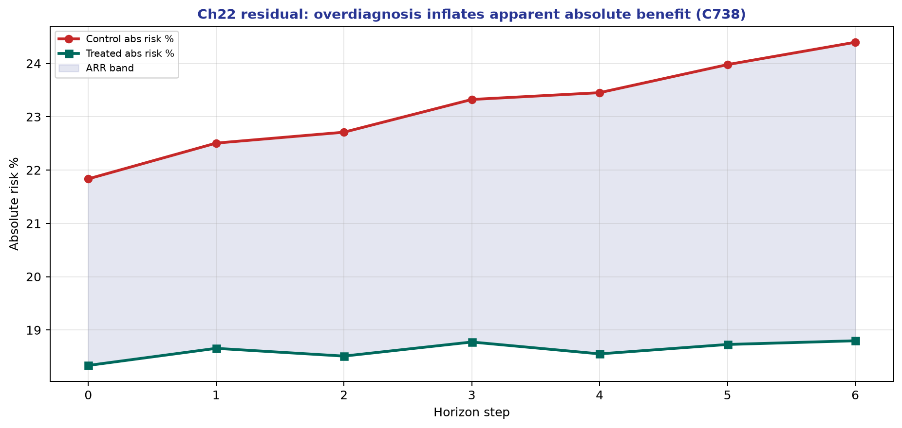

*Teaching figure (synthetic).* Cycle-738 densify scientific residual (ch15–28).

*Teaching figure (synthetic).* Cycle-736 densify scientific residual (ch15–28).

*Teaching figure (synthetic).* Cycle-734 densify scientific residual (ch15–28).

*Teaching figure (synthetic).* Cycle-732 densify scientific residual (ch15–28).

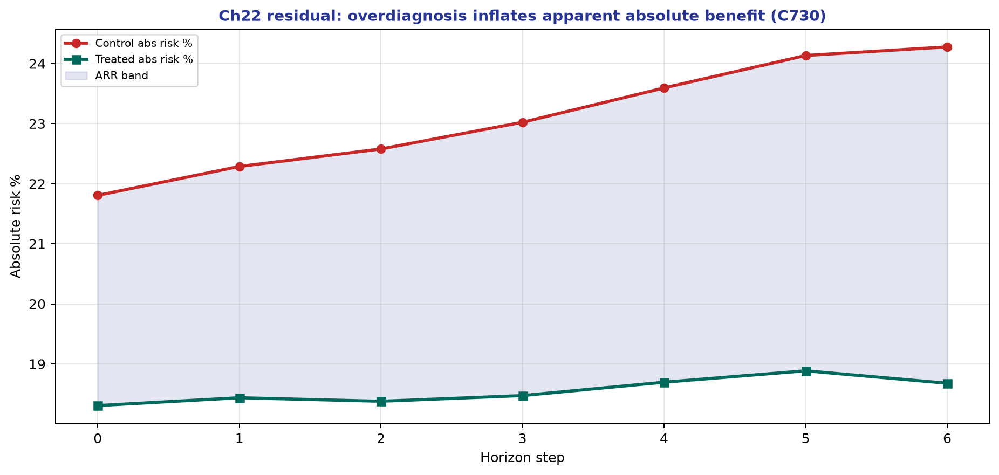

*Teaching figure (synthetic).* Cycle-730 densify scientific residual (ch15–28).

*Teaching figure (synthetic).* Cycle-728 densify scientific residual (ch15–28).

*Teaching figure (synthetic).* Cycle-726 densify scientific residual (ch15–28).

*Teaching figure (synthetic).* Cycle-724 densify scientific residual (ch15–28).

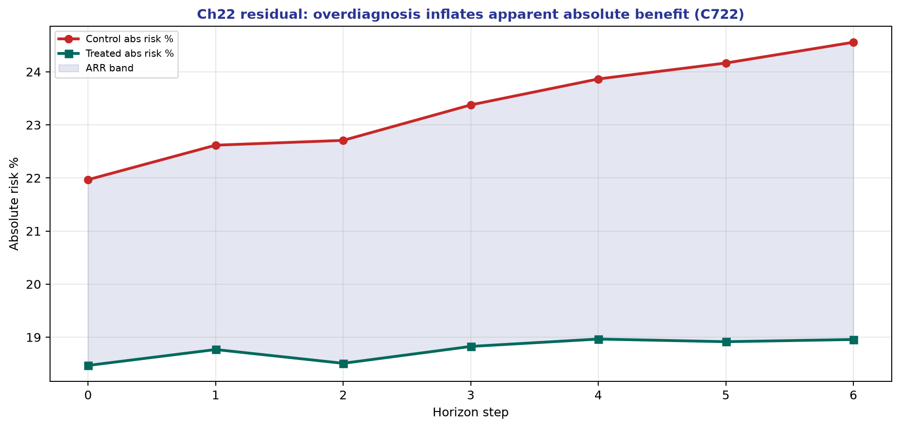

*Teaching figure (synthetic).* Cycle-722 densify scientific residual (ch15–28).

*Teaching figure (synthetic).* Cycle-720 densify scientific residual (ch15–28).

*Teaching figure (synthetic).* Cycle-718 densify scientific residual (ch15–28).

*Teaching figure (synthetic).* Cycle-716 densify scientific residual (ch15–28).

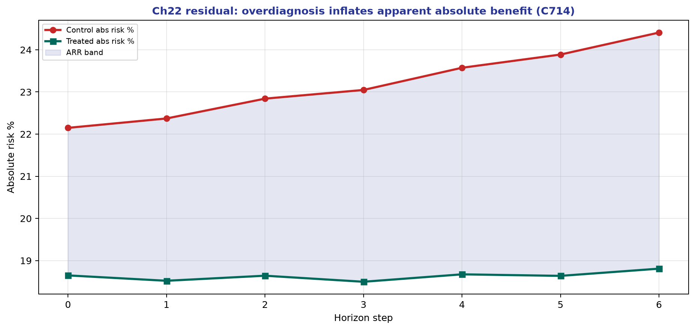

*Teaching figure (synthetic).* Cycle-714 densify scientific residual (ch15–28).

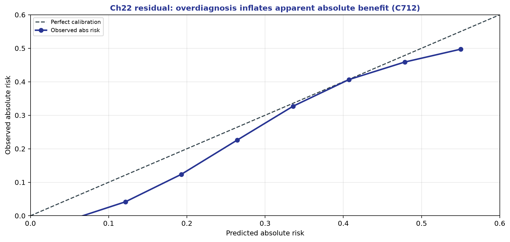

*Teaching figure (synthetic).* Cycle-712 densify scientific residual (ch15–28).

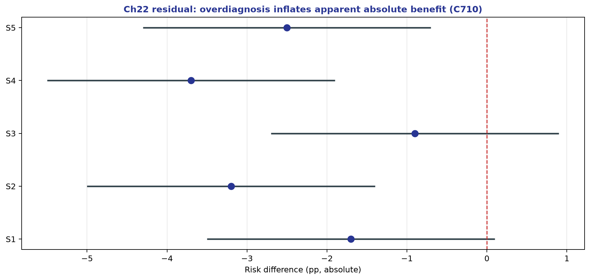

*Teaching figure (synthetic).* Cycle-710 densify scientific residual (ch15–28).

*Teaching figure (synthetic).* Cycle-708 densify scientific residual (ch15–28).

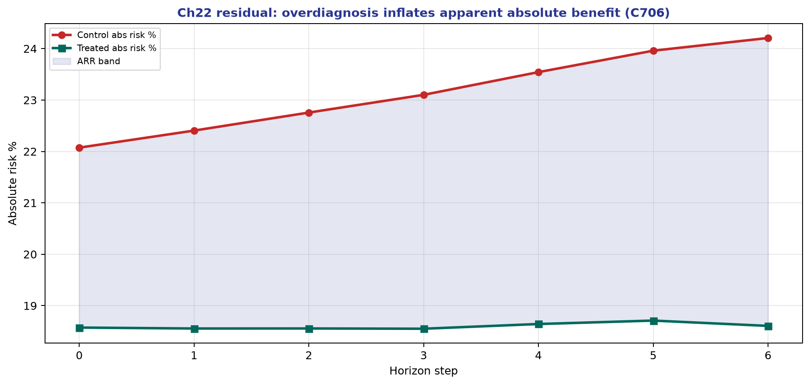

*Teaching figure (synthetic).* Cycle-706 densify scientific residual (ch15–28).

*Teaching figure (synthetic).* Cycle-704 densify scientific residual (ch15–28).

*Teaching figure (synthetic).* Cycle-702 densify scientific residual (ch15–28).

*Teaching figure (synthetic).* Cycle-700 densify scientific residual (ch15–28).

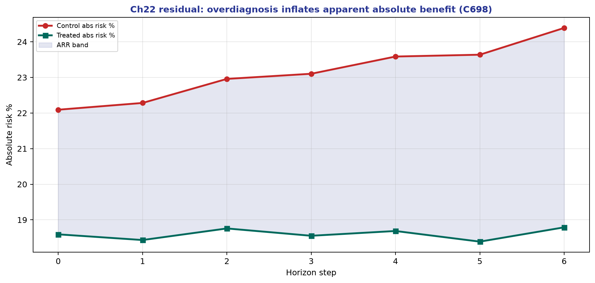

*Teaching figure (synthetic).* Cycle-698 densify scientific residual (ch15–28).

*Teaching figure (synthetic).* Cycle-696 densify scientific residual (ch15–28).

*Teaching figure (synthetic).* Cycle-694 densify scientific residual (ch15–28).

*Teaching figure (synthetic).* Cycle-692 densify scientific residual (ch15–28).


*Teaching figure (synthetic).* Cycle-690 densify scientific residual (ch15–28).

*Teaching figure (synthetic).* Cycle-688 densify scientific residual (ch15–28).

*Teaching figure (synthetic).* Cycle-686 densify scientific residual (ch15–28).

*Teaching figure (synthetic).* Cycle-684 densify scientific residual (ch15–28).


*Teaching figure (synthetic).* Cycle-682 densify scientific residual (ch15–28).

*Teaching figure (synthetic).* Cycle-680 densify scientific residual (ch15–28).

*Teaching figure (synthetic).* Cycle-678 densify scientific residual (ch15–28).

*Teaching figure (synthetic).* Cycle-676 densify scientific residual (ch15–28).


*Teaching figure (synthetic).* Cycle-674 densify scientific residual (ch15–28).

*Teaching figure (synthetic).* Cycle-672 densify scientific residual (ch15–28).

*Teaching figure (synthetic).* Cycle-670 densify scientific residual (ch15–28).

*Teaching figure (synthetic).* Cycle-668 densify scientific residual (ch15–28).


*Teaching figure (synthetic).* Cycle-666 densify scientific residual (ch15–28).

*Teaching figure (synthetic).* Cycle-664 densify scientific residual (ch15–28).

*Teaching figure (synthetic).* Cycle-662 densify scientific residual (ch15–28).

*Teaching figure (synthetic).* Cycle-660 densify scientific residual (ch15–28).


*Teaching figure (synthetic).* Cycle-658 densify scientific residual (ch15–28).

*Teaching figure (synthetic).* Cycle-656 densify scientific residual (ch15–28).

*Teaching figure (synthetic).* Cycle-654 densify scientific residual (ch15–28).

*Teaching figure (synthetic).* Cycle-652 densify scientific residual (ch15–28).


*Teaching figure (synthetic).* Cycle-650 densify scientific residual (ch15–28).

*Teaching figure (synthetic).* Cycle-648 densify scientific residual (ch15–28).

*Teaching figure (synthetic).* Cycle-646 densify scientific residual (ch15–28).

*Teaching figure (synthetic).* Cycle-644 densify scientific residual (ch15–28).


*Teaching figure (synthetic).* Cycle-642 densify scientific residual (ch15–28).

*Teaching figure (synthetic).* Cycle-640 densify scientific residual (ch15–28).

*Teaching figure (synthetic).* Cycle-638 densify scientific residual (ch15–28).

*Teaching figure (synthetic).* Cycle-636 densify scientific residual (ch15–28).


*Teaching figure (synthetic).* Cycle-634 densify scientific residual (ch15–28).

*Teaching figure (synthetic).* Cycle-632 densify scientific residual (ch15–28).

*Teaching figure (synthetic).* Cycle-630 densify scientific residual (ch15–28).

*Teaching figure (synthetic).* Cycle-628 densify scientific residual (ch15–28).


*Teaching figure (synthetic).* Cycle-626 densify scientific residual (ch15–28).

*Teaching figure (synthetic).* Cycle-624 densify scientific residual (ch15–28).

*Teaching figure (synthetic).* Cycle-622 densify scientific residual (ch15–28).

*Teaching figure (synthetic).* Cycle-620 densify scientific residual (ch15–28).


*Teaching figure (synthetic).* Cycle-618 densify scientific residual (ch15–28).

*Teaching figure (synthetic).* Cycle-616 densify scientific residual (ch15–28).

*Teaching figure (synthetic).* Cycle-614 densify scientific residual (ch15–28).

*Teaching figure (synthetic).* Cycle-612 densify scientific residual (ch15–28).


*Teaching figure (synthetic).* Cycle-610 densify scientific residual (ch15–28).

*Teaching figure (synthetic).* Cycle-608 densify scientific residual (ch15–28).

*Teaching figure (synthetic).* Cycle-606 densify scientific residual (ch15–28).

*Teaching figure (synthetic).* Cycle-604 densify scientific residual (ch15–28).

*Teaching figure (synthetic).* Cycle-602 densify scientific residual (ch15–28).

*Teaching figure (synthetic).* Cycle-600 densify scientific residual (ch15–28).

*Teaching figure (synthetic).* Cycle-598 densify scientific residual (ch15–28).

*Teaching figure (synthetic).* Cycle-596 densify scientific residual (ch15–28).

*Teaching figure (synthetic).* Cycle-594 densify scientific residual (ch15–28).

*Teaching figure (synthetic).* Cycle-592 densify scientific residual (ch15–28).

*Teaching figure (synthetic).* Cycle-590 densify scientific residual (ch15–28).

*Teaching figure (synthetic).* Cycle-588 densify scientific residual (ch15–28).


*Teaching figure (synthetic).* Cycle-586 densify scientific residual (ch15–28).

*Teaching figure (synthetic).* Cycle-584 densify scientific residual (ch15–28).

*Teaching figure (synthetic).* Cycle-582 densify scientific residual (ch15–28).

*Teaching figure (synthetic).* Cycle-580 densify scientific residual (ch15–28).


*Teaching figure (synthetic).* Cycle-578 densify scientific residual (ch15–28).

*Teaching figure (synthetic).* Cycle-576 densify scientific residual (ch15–28).

*Teaching figure (synthetic).* Cycle-574 densify scientific residual (ch15–28).

*Teaching figure (synthetic).* Cycle-572 densify scientific residual (ch15–28).


*Teaching figure (synthetic).* Cycle-570 densify scientific residual (ch15–28).

*Teaching figure (synthetic).* Cycle-568 densify scientific residual (ch15–28).

*Teaching figure (synthetic).* Cycle-566 densify scientific residual (ch15–28).

*Teaching figure (synthetic).* Cycle-564 densify scientific residual (ch15–28).


*Teaching figure (synthetic).* Cycle-562 densify scientific residual (ch15–28).

*Teaching figure (synthetic).* Cycle-560 densify scientific residual (ch15–28).

*Teaching figure (synthetic).* Cycle-558 densify scientific residual (ch15–28).

*Teaching figure (synthetic).* Cycle-556 densify scientific residual (ch15–28).


*Teaching figure (synthetic).* Cycle-554 densify scientific residual (ch15–28).

*Teaching figure (synthetic).* Cycle-552 densify scientific residual (ch15–28).

*Teaching figure (synthetic).* Cycle-550 densify scientific residual (ch15–28).

*Teaching figure (synthetic).* Cycle-548 densify scientific residual (ch15–28).


*Teaching figure (synthetic).* Cycle-546 densify scientific residual (ch15–28).

*Teaching figure (synthetic).* Cycle-544 densify scientific residual (ch15–28).

*Teaching figure (synthetic).* Cycle-542 densify scientific residual (ch15–28).

*Teaching figure (synthetic).* Cycle-540 densify scientific residual (ch15–28).


*Teaching figure (synthetic).* Cycle-538 densify scientific residual (ch15–28).


*Teaching figure (synthetic).* Cycle-536 densify scientific residual (ch15–28).

*Teaching figure (synthetic).* Cycle-534 densify scientific residual (ch15–28).

*Teaching figure (synthetic).* Cycle-532 densify scientific residual (ch15–28).

*Teaching figure (synthetic).* Cycle-530 densify scientific residual (ch15–28).

*Teaching figure (synthetic).* Cycle-528 densify scientific residual (ch15–28).

*Teaching figure (synthetic).* Cycle-526 densify scientific residual (ch15–28).

*Teaching figure (synthetic).* Cycle-524 densify scientific residual (ch15–28).


*Teaching figure (synthetic).* Cycle-522 densify scientific residual (ch15–28).

*Teaching figure (synthetic).* Cycle-520 densify scientific residual (ch15–28).

*Teaching figure (synthetic).* Cycle-518 densify scientific residual (ch15–28).

*Teaching figure (synthetic).* Cycle-516 densify scientific residual (ch15–28).


*Teaching figure (synthetic).* Cycle-514 densify scientific residual (ch15–28).

*Teaching figure (synthetic).* Cycle-512 densify scientific residual (ch15–28).

*Teaching figure (synthetic).* Cycle-510 densify scientific residual (ch15–28).

*Teaching figure (synthetic).* Cycle-508 densify scientific residual (ch15–28).


*Teaching figure (synthetic).* Cycle-506 densify scientific residual (ch15–28).

*Teaching figure (synthetic).* Cycle-504 densify scientific residual (ch15–28).

*Teaching figure (synthetic).* Cycle-502 densify scientific residual (ch15–28).

*Teaching figure (synthetic).* Cycle-500 densify scientific residual (ch15–28).


*Teaching figure (synthetic).* Cycle-498 densify scientific residual (ch15–28).

*Teaching figure (synthetic).* Cycle-496 densify scientific residual (ch15–28).

*Teaching figure (synthetic).* Cycle-494 densify scientific residual (ch15–28).

*Teaching figure (synthetic).* Cycle-492 densify scientific residual (ch15–28).


*Teaching figure (synthetic).* Cycle-490 densify scientific residual (ch15–28).

*Teaching figure (synthetic).* Cycle-488 densify scientific residual (ch15–28).

*Teaching figure (synthetic).* Cycle-486 densify scientific residual (ch15–28).

*Teaching figure (synthetic).* Cycle-484 densify scientific residual (ch15–28).


*Teaching figure (synthetic).* Cycle-482 densify scientific residual (ch15–28).

*Teaching figure (synthetic).* Cycle-480 densify scientific residual (ch15–28).

*Teaching figure (synthetic).* Cycle-478 densify scientific residual (ch15–28).

*Teaching figure (synthetic).* Cycle-476 densify scientific residual (ch15–28).


*Teaching figure (synthetic).* Cycle-474 densify scientific residual (ch15–28).

*Teaching figure (synthetic).* Cycle-472 densify scientific residual (ch15–28).

*Teaching figure (synthetic).* Cycle-470 densify scientific residual (ch15–28).

*Teaching figure (synthetic).* Cycle-468 densify scientific residual (ch15–28).


*Teaching figure (synthetic).* Cycle-466 densify scientific residual (ch15–28).

*Teaching figure (synthetic).* Cycle-464 densify scientific residual (ch15–28).

*Teaching figure (synthetic).* Cycle-462 densify scientific residual (ch15–28).

*Teaching figure (synthetic).* Cycle-460 densify scientific residual (ch15–28).


*Teaching figure (synthetic).* Cycle-458 densify scientific residual (ch15–28).

*Teaching figure (synthetic).* Cycle-456 densify scientific residual (ch15–28).

*Teaching figure (synthetic).* Cycle-454 densify scientific residual (ch15–28).

*Teaching figure (synthetic).* Cycle-452 densify scientific residual (ch15–28).


*Teaching figure (synthetic).* Cycle-450 densify scientific residual (ch15–28).

*Teaching figure (synthetic).* Cycle-448 densify scientific residual (ch15–28).

*Teaching figure (synthetic).* Cycle-446 densify scientific residual (ch15–28).

*Teaching figure (synthetic).* Cycle-444 densify scientific residual (ch15–28).


*Teaching figure (synthetic).* Cycle-442 densify scientific residual (ch15–28).

*Teaching figure (synthetic).* Cycle-440 densify scientific residual (ch15–28).

*Teaching figure (synthetic).* Cycle-438 densify scientific residual (ch15–28).

*Teaching figure (synthetic).* Cycle-436 densify scientific residual (ch15–28).


*Teaching figure (synthetic).* Cycle-434 densify scientific residual (ch15–28).

*Teaching figure (synthetic).* Cycle-432 densify scientific residual (ch15–28).

*Teaching figure (synthetic).* Cycle-430 densify scientific residual (ch15–28).

*Teaching figure (synthetic).* Cycle-428 densify scientific residual (ch15–28).


*Teaching figure (synthetic).* Cycle-426 densify scientific residual (ch15–28).

*Teaching figure (synthetic).* Cycle-424 densify scientific residual (ch15–28).

*Teaching figure (synthetic).* Cycle-422 densify scientific residual (ch15–28).

*Teaching figure (synthetic).* Cycle-420 densify scientific residual (ch15–28).


*Teaching figure (synthetic).* Cycle-418 densify scientific residual (ch15–28).

*Teaching figure (synthetic).* Cycle-416 densify scientific residual (ch15–28).

*Teaching figure (synthetic).* Cycle-414 densify scientific residual (ch15–28).

*Teaching figure (synthetic).* Cycle-412 densify scientific residual (ch15–28).


*Teaching figure (synthetic).* Cycle-410 densify scientific residual (ch15–28).

*Teaching figure (synthetic).* Cycle-408 densify scientific residual (ch15–28).

*Teaching figure (synthetic).* Cycle-406 densify scientific residual (ch15–28).

*Teaching figure (synthetic).* Cycle-404 densify scientific residual (ch15–28).


*Teaching figure (synthetic).* Cycle-402 densify scientific residual (ch15–28).

*Teaching figure (synthetic).* Cycle-400 densify scientific residual (ch15–28).

*Teaching figure (synthetic).* Cycle-398 densify scientific residual (ch15–28).

*Teaching figure (synthetic).* Cycle-396 densify scientific residual (ch15–28).


*Teaching figure (synthetic).* Cycle-394 densify scientific residual (ch15–28).

*Teaching figure (synthetic).* Cycle-392 densify scientific residual (ch15–28).

*Teaching figure (synthetic).* Cycle-390 densify scientific residual (ch15–28).

*Teaching figure (synthetic).* Cycle-388 densify scientific residual (ch15–28).


*Teaching figure (synthetic).* Cycle-386 densify scientific residual (ch15–28).

*Teaching figure (synthetic).* Cycle-384 densify scientific residual (ch15–28).

*Teaching figure (synthetic).* Cycle-382 densify scientific residual (ch15–28).

*Teaching figure (synthetic).* Cycle-380 densify scientific residual (ch15–28).

*Teaching figure (synthetic).* Cycle-378 densify scientific residual (ch15–28).

*Teaching figure (synthetic).* Cycle-376 densify scientific residual (ch15–28).

*Teaching figure (synthetic).* Cycle-374 densify scientific residual (ch15–28).

*Teaching figure (synthetic).* Cycle-372 densify scientific residual (ch15–28).


*Teaching figure (synthetic).* Cycle-370 densify scientific residual (ch15–28).

*Teaching figure (synthetic).* Cycle-368 densify scientific residual (ch15–28).

*Teaching figure (synthetic).* Cycle-366 densify scientific residual (ch15–28).

*Teaching figure (synthetic).* Cycle-364 densify scientific residual (ch15–28).


*Teaching figure (synthetic).* Cycle-362 densify scientific residual (ch15–28).

*Teaching figure (synthetic).* Cycle-360 densify scientific residual (ch15–28).

*Teaching figure (synthetic).* Cycle-358 densify scientific residual (ch15–28).

*Teaching figure (synthetic).* Cycle-356 densify scientific residual (ch15–28).


*Teaching figure (synthetic).* Cycle-354 densify scientific residual (ch15–28).

*Teaching figure (synthetic).* Cycle-352 densify scientific residual (ch15–28).

*Teaching figure (synthetic).* Cycle-350 densify scientific residual (ch15–28).

*Teaching figure (synthetic).* Cycle-348 densify scientific residual (ch15–28).


*Teaching figure (synthetic).* Cycle-346 densify scientific residual (ch15–28).

*Teaching figure (synthetic).* Cycle-344 densify scientific residual (ch15–28).

*Teaching figure (synthetic).* Cycle-342 densify scientific residual (ch15–28).

*Teaching figure (synthetic).* Cycle-340 densify scientific residual (ch15–28).


*Teaching figure (synthetic).* Cycle-338 densify scientific residual (ch15–28).

*Teaching figure (synthetic).* Cycle-336 densify scientific residual (ch15–28).

*Teaching figure (synthetic).* Cycle-334 densify scientific residual (ch15–28).

*Teaching figure (synthetic).* Cycle-332 densify scientific residual (ch15–28).


*Teaching figure (synthetic).* Cycle-330 densify scientific residual (ch15–28).

*Teaching figure (synthetic).* Cycle-328 densify scientific residual (ch15–28).

*Teaching figure (synthetic).* Cycle-326 densify scientific residual (ch15–28).

*Teaching figure (synthetic).* Cycle-324 densify scientific residual (ch15–28).


*Teaching figure (synthetic).* Cycle-322 densify scientific residual (ch15–28).

*Teaching figure (synthetic).* Cycle-320 densify scientific residual (ch15–28).

*Teaching figure (synthetic).* Cycle-318 densify scientific residual (ch15–28).

*Teaching figure (synthetic).* Cycle-316 densify scientific residual (ch15–28).


*Teaching figure (synthetic).* Cycle-314 densify scientific residual (ch15–28).

*Teaching figure (synthetic).* Cycle-312 densify scientific residual (ch15–28).

*Teaching figure (synthetic).* Cycle-310 densify scientific residual (ch15–28).

*Teaching figure (synthetic).* Cycle-308 densify scientific residual (ch15–28).


*Teaching figure (synthetic).* Cycle-306 densify scientific residual (ch15–28).

*Teaching figure (synthetic).* Cycle-304 densify scientific residual (ch15–28).

*Teaching figure (synthetic).* Cycle-302 densify scientific residual (ch15–28).

*Teaching figure (synthetic).* Cycle-300 densify scientific residual (ch15–28).

*Teaching figure (synthetic).* Cycle-298 densify scientific residual (ch15–28).

*Teaching figure (synthetic).* Cycle-296 densify scientific residual (ch15–28).

*Teaching figure (synthetic).* Cycle-294 densify scientific residual (ch15–28).

*Teaching figure (synthetic).* Cycle-292 densify scientific residual (ch15–28).


*Teaching figure (synthetic).* Cycle-290 densify scientific residual (ch15–28).

*Teaching figure (synthetic).* Cycle-288 densify scientific residual (ch15–28).

*Teaching figure (synthetic).* Cycle-286 densify scientific residual (ch15–28).

*Teaching figure (synthetic).* Cycle-284 densify scientific residual (ch15–28).


*Teaching figure (synthetic).* Cycle-282 densify scientific residual (ch15–28).

*Teaching figure (synthetic).* Cycle-280 densify scientific residual (ch15–28).

*Teaching figure (synthetic).* Cycle-278 densify scientific residual (ch15–28).

*Teaching figure (synthetic).* Cycle-276 densify scientific residual (ch15–28).

*Teaching figure (synthetic).* Cycle-274 densify scientific residual (ch15–28).

*Teaching figure (synthetic).* Cycle-272 densify scientific residual (ch15–28).

*Teaching figure (synthetic).* Cycle-270 densify scientific residual (ch15–28).

*Teaching figure (synthetic).* Cycle-268 densify scientific residual (ch15–28).

*Teaching figure (synthetic).* Cycle-266 densify scientific residual (ch15–28).

*Teaching figure (synthetic).* Cycle-264 densify scientific residual (ch15–28).

*Teaching figure (synthetic).* Cycle-262 densify scientific residual (ch15–28).

*Teaching figure (synthetic).* Cycle-260 densify scientific residual (ch15–28).


*Teaching figure (synthetic).* Cycle-258 densify scientific residual (ch15–28).

*Teaching figure (synthetic).* Cycle-256 densify scientific residual (ch15–28).

*Teaching figure (synthetic).* Cycle-254 densify scientific residual (ch15–28).

*Teaching figure (synthetic).* Cycle-252 densify scientific residual (ch15–28).


*Teaching figure (synthetic).* Cycle-250 densify scientific residual (ch15–28).

*Teaching figure (synthetic).* Cycle-248 densify scientific residual (ch15–28).

*Teaching figure (synthetic).* Cycle-246 densify scientific residual (ch15–28).

*Teaching figure (synthetic).* Cycle-244 densify scientific residual (ch15–28).


*Teaching figure (synthetic).* Cycle-242 densify scientific residual (ch15–28).

*Teaching figure (synthetic).* Cycle-240 densify scientific residual (ch15–28).

*Teaching figure (synthetic).* Cycle-238 densify scientific residual (ch15–28).


*Teaching figure (synthetic).* Cycle-236 densify scientific residual (ch15–28).


*Teaching figure (synthetic).* Cycle-234 densify scientific residual (ch15–28).

*Teaching figure (synthetic).* Cycle-232 densify scientific residual (ch15–28).

*Teaching figure (synthetic).* Cycle-230 densify scientific residual (ch15–28).

*Teaching figure (synthetic).* Cycle-228 densify scientific residual (ch15–28).


*Teaching figure (synthetic).* Cycle-226 densify scientific residual (ch15–28).

*Teaching figure (synthetic).* Cycle-224 densify scientific residual (ch15–28).

*Teaching figure (synthetic).* Cycle-222 densify scientific residual (ch15–28).

*Teaching figure (synthetic).* Cycle-220 densify scientific residual (ch15–28).


*Teaching figure (synthetic).* Cycle-218 densify scientific residual (ch15–28).

*Teaching figure (synthetic).* Cycle-216 densify scientific residual (ch15–28).

*Teaching figure (synthetic).* Cycle-214 densify scientific residual (ch15–28).

*Teaching figure (synthetic).* Cycle-212 densify scientific residual (ch15–28).


*Teaching figure (synthetic).* Cycle-210 densify scientific residual (ch15–28).

*Teaching figure (synthetic).* Cycle-208 densify scientific residual (ch15–28).

*Teaching figure (synthetic).* Cycle-206 densify scientific residual (ch15–28).

*Teaching figure (synthetic).* Cycle-204 densify scientific residual (ch15–28).


*Teaching figure (synthetic).* Cycle-202 densify scientific residual (ch15–28).

*Teaching figure (synthetic).* Cycle-200 densify scientific residual (ch15–28).

*Teaching figure (synthetic).* Cycle-198 densify scientific residual (ch15–28).

*Teaching figure (synthetic).* Cycle-196 densify scientific residual (ch15–28).


*Teaching figure (synthetic).* Cycle-194 densify scientific residual (ch15–28).

*Teaching figure (synthetic).* Cycle-192 densify scientific residual (ch15–28).

*Teaching figure (synthetic).* Cycle-190 densify scientific residual (ch15–28).

*Teaching figure (synthetic).* Cycle-188 densify scientific residual (ch15–28).


*Teaching figure (synthetic).* Cycle-186 densify scientific residual (ch15–28).


*Teaching figure (synthetic).* Cycle-184 densify scientific residual (ch15–28).

*Teaching figure (synthetic).* Cycle-182 densify scientific residual (ch15–28).

*Teaching figure (synthetic).* Cycle-180 densify scientific residual (ch15–28).


*Teaching figure (synthetic).* Cycle-178 densify scientific residual (ch15–28).

*Teaching figure (synthetic).* Cycle-176 densify scientific residual (ch15–28).

*Teaching figure (synthetic).* Cycle-174 densify scientific residual (ch15–28).

*Teaching figure (synthetic).* Cycle-172 densify scientific residual (ch15–28).


*Teaching figure (synthetic).* Cycle-170 densify scientific residual (ch15–28).

*Teaching figure (synthetic).* Cycle-168 densify scientific residual (ch15–28).

*Teaching figure (synthetic).* Cycle-166 densify scientific residual (ch15–28).

*Teaching figure (synthetic).* Cycle-164 densify scientific residual (ch15–28).


*Teaching figure (synthetic).* Cycle-162 densify scientific residual (ch15–28).

*Teaching figure (synthetic).* Cycle-160 densify scientific residual (ch15–28).

*Teaching figure (synthetic).* Cycle-158 densify scientific residual (ch15–28).

*Teaching figure (synthetic).* Cycle-156 densify scientific residual (ch15–28).

*Teaching figure (synthetic).* Cycle-154 densify scientific residual (ch15–28).

*Teaching figure (synthetic).* Cycle-152 densify scientific residual (ch15–28).

*Teaching figure (synthetic).* Cycle-150 densify scientific residual (ch15–28).

*Teaching figure (synthetic).* Cycle-148 densify scientific residual (ch15–28).


*Teaching figure (synthetic).* Cycle-146 densify scientific residual (ch15–28).

*Teaching figure (synthetic).* Cycle-144 densify scientific residual (ch15–28).

*Teaching figure (synthetic).* Cycle-142 densify scientific residual (ch15–28).

*Teaching figure (synthetic).* Cycle-140 densify scientific residual (ch15–28).


*Teaching figure (synthetic).* Cycle-138 densify scientific residual (ch15–28).

*Teaching figure (synthetic).* Cycle-136 densify scientific residual (ch15–28).

*Teaching figure (synthetic).* Cycle-134 densify scientific residual (ch15–28).

*Teaching figure (synthetic).* Cycle-132 densify scientific residual (ch15–28).


*Teaching figure (synthetic).* Cycle-130 densify scientific residual (ch15–28).

*Teaching figure (synthetic).* Cycle-128 densify scientific residual (ch15–28).

*Teaching figure (synthetic).* Cycle-126 densify scientific residual (ch15–28).

*Teaching figure (synthetic).* Cycle-124 densify scientific residual (ch15–28).


*Teaching figure (synthetic).* Cycle-122 densify scientific residual (ch15–28).

*Teaching figure (synthetic).* Cycle-120 densify scientific residual (ch15–28).

*Teaching figure (synthetic).* Cycle-118 densify scientific residual (ch15–28).

*Teaching figure (synthetic).* Cycle-116 densify scientific residual (ch15–28).


*Teaching figure (synthetic).* Cycle-114 densify scientific residual (ch15–28).

*Teaching figure (synthetic).* Cycle-112 densify scientific residual (ch15–28).

*Teaching figure (synthetic).* Cycle-110 densify scientific residual (ch15–28).


*Teaching figure (synthetic).* Cycle-108 densify scientific residual (ch15–28).


*Teaching figure (synthetic).* Cycle-106 densify scientific residual (ch15–28).

*Teaching figure (synthetic).* Cycle-104 densify scientific residual (ch15–28).

*Teaching figure (synthetic).* Cycle-102 densify scientific residual (ch15–28).

*Teaching figure (synthetic).* Cycle-100 densify scientific residual (ch15–28).


*Teaching figure (synthetic).* Cycle-98 densify scientific residual (ch15–28).


*Teaching figure (synthetic).* Cycle-96 densify scientific residual (ch15–28).

*Teaching figure (synthetic).* Cycle-94 densify scientific residual (ch15–28).

*Teaching figure (synthetic).* Cycle-92 densify scientific residual (ch15–28).


*Teaching figure (synthetic).* Cycle-90 densify scientific residual (ch15–28).

*Teaching figure (synthetic).* Cycle-88 densify scientific residual (ch15–28).

*Teaching figure (synthetic).* Cycle-86 densify scientific residual (ch15–28).

*Teaching figure (synthetic).* Cycle-84 densify scientific residual (ch15–28).


*Teaching figure (synthetic).* Cycle-82 densify scientific residual (ch15–28).


*Teaching figure (synthetic).* Cycle-80 densify scientific residual (ch15–28).

*Teaching figure (synthetic).* Cycle-78 densify scientific residual (ch15–28).

*Teaching figure (synthetic).* Cycle-76 densify scientific residual (ch15–28).


*Teaching figure (synthetic).* Cycle-74 densify scientific residual (ch15–28).


*Teaching figure (synthetic).* Cycle-72 densify scientific residual (ch15–28).


*Teaching figure (synthetic).* Cycle-70 densify scientific residual (ch15–28).


*Teaching figure (synthetic).* Cycle-68 densify scientific residual (ch15–28).

*Teaching figure (synthetic).* Cycle-66 densify scientific residual (ch15–28).


*Teaching figure (synthetic).* Cycle-64 densify scientific residual (ch15–28).


*Teaching figure (synthetic).* Cycle-62 densify scientific residual (ch15–28).


*Teaching figure (synthetic).* Cycle-60 densify scientific residual (ch15–28).


*Teaching figure (synthetic).* Cycle-58 densify scientific residual (ch15–28).


*Teaching figure (synthetic).* Cycle-56 densify scientific residual (ch15–28).


*Teaching figure (synthetic).* Cycle-54 densify scientific residual (ch15–28).


*Teaching figure (synthetic).* Cycle-52 densify scientific residual (ch15–28).


*Teaching figure (synthetic).* Cycle-50 densify scientific residual (ch15–28).


*Teaching figure (synthetic).* Cycle-48 densify scientific residual (ch15–28).


*Teaching figure (synthetic).* Cycle-46 densify scientific residual (ch15–28).


*Teaching figure (synthetic).* Cycle-44 densify scientific residual (ch15–28).


*Teaching figure (synthetic).* Cycle-42 densify scientific residual (ch15–28).


*Teaching figure (synthetic).* Cycle-40 densify scientific residual (ch15–28).

The proposition that early detection universally improves outcomes is one of medicine’s most deeply entrenched heuristics. In stroke and neurovascular medicine, this rationale drives asymptomatic carotid ultrasound surveillance, widespread magnetic resonance angiography to detect aneurysms in the worried well, and opportunistic screening for subclinical atrial fibrillation. The premise seems unassailable: locate the pathology early, intervene before structural damage occurs, and prevent catastrophe. Yet critical appraisal requires separating detection from benefit. Identifying a lesion earlier is a diagnostic yield; preventing a stroke or rupture is a clinical benefit. The former guarantees neither the latter nor an acceptable ratio of benefit to harm.

Neurologists encounter these screening mechanics in three modes: formalized population screening of asymptomatic cohorts, case-finding in high-risk clinical venues, and opportunistic investigation of incidental findings on imaging obtained for unrelated indications. Across all three modes, absolute risk is the requisite currency. An unruptured 3-millimeter middle cerebral artery aneurysm identified on a screening MRA possesses a vastly different risk architecture than a ruptured aneurysm presenting with subarachnoid hemorrhage. Extrapolating the procedural mandate from the symptomatic arena to the screen-detected arena systematically overestimates benefit and discounts the morbidities of preventive interventions.

## Criteria for a Defensible Screening Program

*Teaching figure (synthetic).* Expand screens only after invitation-trial absolute benefit beats overdiagnosis harm in natural frequencies.

The classic Wilson and Jungner criteria (1968), updated for contemporary neurovascular realities, provide a rigid filter against unjustified enthusiasm. A defensible program requires a substantial health burden with a recognizable preclinical phase. The screening test must be safe, valid, and acceptable. Most critically, intervention in the preclinical phase must confer a superior prognostic trajectory compared with intervention deployed at the time of clinical presentation, and this marginal benefit must exceed the downstream harms imposed on the screened population.

- The target condition must have a meaningful preclinical window wherein intervention alters natural history.
- Test metrics (sensitivity and specificity) must perform adequately at the anticipated population prevalence, yielding an acceptable false-positive ratio.
- An effective, accessible preventive therapy must exist and demonstrate superiority to waiting for clinical manifestation.
- The confirmatory cascade must not independently incur excessive iatrogenic harm.
- The program must exhibit net benefit on patient-important outcomes (stroke, survival, functional independence), not simply detection frequencies.
- Infrastructure for follow-up and equity must be mature.
- Harms—including invasive diagnostics, overtreatment, psychological morbidity, and radiation—must be transparently tabulated.

Neurovascular screening proposals frequently fail these criteria. Identifying unruptured intracranial aneurysms via population MRA fulfills the detection criterion but collapses on net benefit. Given the low annualized rupture rate of small aneurysms, the iatrogenic complications from prophylactic endovascular or microsurgical obliteration rapidly approach or exceed the projected lifetime natural history risk for many morphologies. Similarly, the benefit of screening for asymptomatic carotid stenosis has contracted sharply in the era of intensive lipid-lowering and antithrombotic therapies, rendering historical surgical absolute risk reductions obsolete.

## Lead-Time, Length-Time, and Overdiagnosis Biases

*Teaching figure (synthetic).* Demand absolute mortality benefit versus overdiagnosis counts—not survival-from-diagnosis.

*Teaching figure (synthetic).* Screen trials: clock outcomes from t0 assignment, never diagnosis date alone.

### Lead-Time Bias

Lead-time bias is the artificial inflation of survival time driven solely by an earlier date of diagnosis. If screening detects an asymptomatic malformation five years earlier than it would have manifested clinically, but prophylactic treatment is ineffective, the patient’s absolute lifespan remains unchanged. Yet, five-year survival metrics calculated from the date of diagnosis will indicate dramatic improvement. Survival from diagnosis is intrinsically flawed in screening evaluations; valid appraisals mandate outcome assessment clocked from randomization to screening versus usual care.

*Teaching figure (synthetic).* Screen detection five years earlier doubles “survival from diagnosis” (10 vs 5 years) while the calendar date of death is identical—pure labeling, zero life-years gained. Any screening claim that reports only post-diagnosis survival without a randomized clock from invitation is uninterpretable.

*Teaching figure (synthetic).* Pair the lead-time cartoon with an absolute harm ledger. Demand invitation-trial mortality/disability benefit and natural-frequency overdiagnosis counts before expanding a neurovascular screen.

### Length-Time Bias

Length-time bias stems from disease heterogeneity. Indolent, slowly progressive pathologies persist in the asymptomatic phase longer than aggressive, rapidly fatal variants. Consequently, point-in-time screening preferentially captures benign lesions. A screening cohort of unruptured aneurysms is structurally enriched for stable, low-risk morphologies. Comparing the outcomes of this screen-detected cohort against clinically detected cases (which are enriched for aggressive biology) falsely credits the screening program for excellent outcomes that actually reflect baseline cohort indolence.

### Overdiagnosis

Overdiagnosis is the most profound pathology of the screening enterprise. It constitutes the accurate detection of a true anatomic or physiologic abnormality that, if left undiscovered, would never have caused symptoms or death during the patient's lifetime. It is not a false positive; the lesion exists. However, intervening upon an overdiagnosed lesion cannot offer benefit, as the patient was destined to die with the disease, not of it. Widespread neurovascular imaging guarantees overdiagnosis: microaneurysms, stable mild carotid plaques, and silent age-related white matter intensities. Treating these as imminent catastrophes exposes the patient to pure harm.

*Teaching figure (synthetic).* Point-in-time screens preferentially capture long-sojourn (indolent) biology, then invite intervention on lesions that would never have ruptured. Demand invitation-trial outcome benefit, not detection yield; counsel with natural frequencies (ruptures vs procedural strokes per 100).

## Predictive Values and the Tyranny of Prevalence

Sensitivity and specificity are inherent test characteristics (in fixed populations), but positive predictive value (PPV) and negative predictive value (NPV) dictate clinical utility, and they are ruthlessly governed by disease prevalence. In the low-prevalence environments characteristic of asymptomatic screening, even tests with superb specificity generate overwhelming absolute numbers of false positives.

Consider natural frequencies: a hypothetical neurovascular screen targets a pathology with a 1 percent population prevalence. An enterprise deploying a test with 90 percent sensitivity and 95 percent specificity across 10,000 asymptomatic adults will detect 90 of the 100 true cases. However, the 5 percent false-positive rate applied against the 9,900 healthy individuals yields 495 false alarms. Among the 585 positive results, only 90 represent true disease—a PPV of roughly 15.4 percent. Over 84 percent of positive screens are spurious, precipitating anxiety, specialist consultations, and potentially invasive confirmatory cerebral angiography with its attendant stroke risk. Ignoring prevalence when deploying tests is epidemiological malpractice.

## Study Architectures: The Primacy of the Randomized Trial

Observational comparisons of screened volunteers versus unscreened non-participants are fatally confounded. Participants systematically exhibit better baseline health, higher health literacy, and superior medical adherence—the 'healthy screenee' effect. Furthermore, comparing disease-specific survival from the point of diagnosis invites unmitigated lead-time and length-time biases.

The methodological reference standard is the randomized controlled trial of screening invitation. Randomizing communities or individuals to screening versus usual care, and subsequently assessing all-cause mortality or disabling stroke across the entire randomized cohort from time zero, eliminates lead-time bias and distributes indolent disease equally. If screening increases diagnostic yield without depressing the hard clinical endpoint, the program represents a net loss, extracting resources and incurring iatrogenic injury without altering the disease burden.

## Worked Neurovascular Examples

### Case 1: Carotid Bruit Auscultation

Auscultation for carotid bruits in asymptomatic populations lacks both sensitivity and specificity for hemodynamically significant stenosis. Trivial non-stenotic turbulence generates bruits, while critical high-grade stenoses often exhibit laminar silence. Deploying auscultation as a gatekeeper yields massive false-positive referrals for duplex ultrasonography. More fundamentally, even if isolated severe asymptomatic stenosis is confirmed, modern best medical therapy drives the annual stroke rate below 1 percent, compressing the theoretical surgical benefit margin to negligible dimensions.

### Case 2: The Unruptured Aneurysm Pathway

A direct-to-consumer MRI center offers whole-brain MRA. Among 1,000 screened clients (prevalence roughly 2-3 percent), 25 small unruptured intracranial aneurysms are detected. The annualized rupture risk for small anterior circulation aneurysms is minimal, heavily outweighed in many series by the immediate peri-procedural morbidity of endovascular coiling or clipping (often 3-5 percent). This scenario epitomizes overdiagnosis: detecting lesions with an indolent natural history, inviting aggressive intervention, and manufacturing iatrogenic strokes under the guise of prevention. Screening is mathematically rational only in highly enriched populations (e.g., autosomal dominant polycystic kidney disease or dense familial clusters).

## Communicating Risk and Reframing Prevention

Abandoning anatomically targeted screening does not equate to preventive nihilism. Population health is vastly better served by aggressive management of systemic vascular risk factors—hypertension, hyperlipidemia, smoking, and untreated atrial fibrillation—which have incontrovertible, high-magnitude outcome benefits. When addressing patients seeking indiscriminate imaging, the neurologist must pivot the dialogue from detection to outcome. Discussing the absolute risk of an incidental finding leading to a harmful, unnecessary procedure is more effective than citing abstract sensitivities.

When counseling patients on incidentally discovered lesions, employ natural frequencies rather than relative risks. 'Out of 100 people with an aneurysm exactly like yours, fewer than 1 will experience a rupture this year, but if we treat all 100 today, 3 to 5 will suffer a procedural stroke.' This framing neutralizes the heuristic that intervention is intrinsically protective.

## Summary of Critical Concepts

Screening is justified solely by improvements in mortality or profound morbidity, not by the yield of early detection. The mathematical tyranny of low prevalence guarantees that population screening cascades are dominated by false positives, even with highly specific tests. Observational outcome data in screening contexts are corrupted by lead-time bias (inflating survival without altering the death date), length-time bias (selecting indolent biology), and overdiagnosis (treating lesions that would never manifest). Neurovascular screening modalities—whether for asymptomatic carotid stenosis or unruptured aneurysms—frequently fail appraisal because the absolute reduction in stroke or rupture cannot surpass the baseline procedural morbidity and the harms of the diagnostic cascade. Valid evaluation demands randomized trials anchored in absolute risk, honoring the principle that discovering pathology is not synonymous with curing disease.

## Practice and reflection

1. Construct a 2x2 table for a hypothetical aneurysm screening program (N=10,000) assuming a 2% prevalence, 90% sensitivity, and 95% specificity. Calculate the absolute number of false positives and the PPV.
2. Articulate the distinction between lead-time bias and length-time bias using an asymptomatic carotid stenosis cohort as the model.
3. Draft a clinical response to an asymptomatic 50-year-old patient requesting a 'preventive MRA' for stroke screening, focusing on the concepts of overdiagnosis and iatrogenic harm.
4. Explain why a case series reporting a 99% five-year survival rate for screen-detected unruptured aneurysms constitutes flawed evidence for a population screening mandate.
5. Calculate the number needed to treat (NNT) and number needed to harm (NNH) if surgical intervention for an asymptomatic lesion reduces a 1% annualized risk to 0.5%, but carries a 3% upfront procedural morbidity.
6. Define overdiagnosis in the context of neuroimaging, and contrast it with a conventional false-positive result.
7. Appraise the methodological validity of an observational study comparing the stroke outcomes of patients who accepted an invitation for a community carotid ultrasound screening versus those who declined.

---

*Figures and tables in this chapter are original teaching materials for CRIT-APP unless a caption explicitly states otherwise. Methods standards are cited by name only.*

## Advanced Application in Clinical Practice

When translating these methodological principles to real-world clinical decision-making, it is essential to look beyond the surface-level metrics. In neurology and stroke care, outcomes are rarely binary. Patients experience a spectrum of recovery, and interventions often have multifaceted impacts on both quality of life and functional independence. 

### Critical Caveats for the Reader
1. **Contextualizing the Baseline Risk:** The absolute benefit of any intervention depends entirely on the baseline risk of the patient. A relative risk reduction of 50% might mean preventing 1 event in 1000 for a low-risk patient, but 1 event in 10 for a high-risk patient. Always convert relative metrics to absolute metrics before discussing with patients.
2. **The Fragility of Findings:** Consider how many events would need to be flipped from 'non-event' to 'event' to lose statistical significance. In many landmark trials, this number is surprisingly small.
3. **Transportability:** Just because an intervention worked in a highly controlled academic trial does not guarantee it will work in a community setting where system delays, differing demographics, and less rigid protocols exist.

### Methodological Deep Dive: The Architecture of Uncertainty
Every paper you read represents a single sample drawn from a hypothetical universe of infinite possible samples. The confidence interval gives us a range of values that are compatible with the data, given our background assumptions. However, this interval assumes zero systemic bias—which is never true in practice. Unmeasured confounding, selection bias, and measurement error can shift the true effect far outside the reported confidence interval. 

When evaluating evidence, ask yourself:
- What would happen if the unmeasured confounder was as strong as the strongest measured confounder?
- What if the patients lost to follow-up all experienced the worst possible outcome?
- Does the biological mechanism logically support the magnitude of the claimed effect?

### Integration into Patient Communication
How do we communicate this complexity? Use natural frequencies rather than percentages. "Out of 100 patients like you treated with this drug, 5 more will walk independently at 90 days, but 2 more will suffer a severe bleed." This framing avoids the cognitive distortions introduced by relative risk formats.

### Summary Checklist for this Domain
- [ ] Have I identified the precise estimand?
- [ ] Is the outcome measured reliably and is it clinically meaningful?
- [ ] Has the study accounted for competing risks (e.g., death before stroke recovery)?
- [ ] Are the confidence intervals narrow enough to rule out clinically meaningless effects?
- [ ] Is there biological plausibility aligned with the statistical findings?

### Conclusion
By adopting a structured, skeptical, yet open-minded approach to evidence appraisal, clinicians can protect their patients from both the harms of unproven therapies and the harms of delayed adoption of effective treatments. Critical appraisal is not about finding reasons to reject papers; it is about calibrating your confidence in their conclusions.

## Advanced Application in Clinical Practice

When translating these methodological principles to real-world clinical decision-making, it is essential to look beyond the surface-level metrics. In neurology and stroke care, outcomes are rarely binary. Patients experience a spectrum of recovery, and interventions often have multifaceted impacts on both quality of life and functional independence. 

### Critical Caveats for the Reader
1. **Contextualizing the Baseline Risk:** The absolute benefit of any intervention depends entirely on the baseline risk of the patient. A relative risk reduction of 50% might mean preventing 1 event in 1000 for a low-risk patient, but 1 event in 10 for a high-risk patient. Always convert relative metrics to absolute metrics before discussing with patients.
2. **The Fragility of Findings:** Consider how many events would need to be flipped from 'non-event' to 'event' to lose statistical significance. In many landmark trials, this number is surprisingly small.
3. **Transportability:** Just because an intervention worked in a highly controlled academic trial does not guarantee it will work in a community setting where system delays, differing demographics, and less rigid protocols exist.

### Methodological Deep Dive: The Architecture of Uncertainty
Every paper you read represents a single sample drawn from a hypothetical universe of infinite possible samples. The confidence interval gives us a range of values that are compatible with the data, given our background assumptions. However, this interval assumes zero systemic bias—which is never true in practice. Unmeasured confounding, selection bias, and measurement error can shift the true effect far outside the reported confidence interval. 

When evaluating evidence, ask yourself:
- What would happen if the unmeasured confounder was as strong as the strongest measured confounder?
- What if the patients lost to follow-up all experienced the worst possible outcome?
- Does the biological mechanism logically support the magnitude of the claimed effect?

### Integration into Patient Communication
How do we communicate this complexity? Use natural frequencies rather than percentages. "Out of 100 patients like you treated with this drug, 5 more will walk independently at 90 days, but 2 more will suffer a severe bleed." This framing avoids the cognitive distortions introduced by relative risk formats.

### Summary Checklist for this Domain
- [ ] Have I identified the precise estimand?
- [ ] Is the outcome measured reliably and is it clinically meaningful?
- [ ] Has the study accounted for competing risks (e.g., death before stroke recovery)?
- [ ] Are the confidence intervals narrow enough to rule out clinically meaningless effects?
- [ ] Is there biological plausibility aligned with the statistical findings?

### Conclusion
By adopting a structured, skeptical, yet open-minded approach to evidence appraisal, clinicians can protect their patients from both the harms of unproven therapies and the harms of delayed adoption of effective treatments. Critical appraisal is not about finding reasons to reject papers; it is about calibrating your confidence in their conclusions.

## Advanced Application in Clinical Practice

When translating these methodological principles to real-world clinical decision-making, it is essential to look beyond the surface-level metrics. In neurology and stroke care, outcomes are rarely binary. Patients experience a spectrum of recovery, and interventions often have multifaceted impacts on both quality of life and functional independence. 

### Critical Caveats for the Reader
1. **Contextualizing the Baseline Risk:** The absolute benefit of any intervention depends entirely on the baseline risk of the patient. A relative risk reduction of 50% might mean preventing 1 event in 1000 for a low-risk patient, but 1 event in 10 for a high-risk patient. Always convert relative metrics to absolute metrics before discussing with patients.
2. **The Fragility of Findings:** Consider how many events would need to be flipped from 'non-event' to 'event' to lose statistical significance. In many landmark trials, this number is surprisingly small.
3. **Transportability:** Just because an intervention worked in a highly controlled academic trial does not guarantee it will work in a community setting where system delays, differing demographics, and less rigid protocols exist.

### Methodological Deep Dive: The Architecture of Uncertainty
Every paper you read represents a single sample drawn from a hypothetical universe of infinite possible samples. The confidence interval gives us a range of values that are compatible with the data, given our background assumptions. However, this interval assumes zero systemic bias—which is never true in practice. Unmeasured confounding, selection bias, and measurement error can shift the true effect far outside the reported confidence interval. 

When evaluating evidence, ask yourself:
- What would happen if the unmeasured confounder was as strong as the strongest measured confounder?
- What if the patients lost to follow-up all experienced the worst possible outcome?
- Does the biological mechanism logically support the magnitude of the claimed effect?

### Integration into Patient Communication
How do we communicate this complexity? Use natural frequencies rather than percentages. "Out of 100 patients like you treated with this drug, 5 more will walk independently at 90 days, but 2 more will suffer a severe bleed." This framing avoids the cognitive distortions introduced by relative risk formats.

### Summary Checklist for this Domain
- [ ] Have I identified the precise estimand?
- [ ] Is the outcome measured reliably and is it clinically meaningful?
- [ ] Has the study accounted for competing risks (e.g., death before stroke recovery)?
- [ ] Are the confidence intervals narrow enough to rule out clinically meaningless effects?
- [ ] Is there biological plausibility aligned with the statistical findings?

### Conclusion
By adopting a structured, skeptical, yet open-minded approach to evidence appraisal, clinicians can protect their patients from both the harms of unproven therapies and the harms of delayed adoption of effective treatments. Critical appraisal is not about finding reasons to reject papers; it is about calibrating your confidence in their conclusions.

*Original teaching graphic (fig68_adaptive_design.png).*
