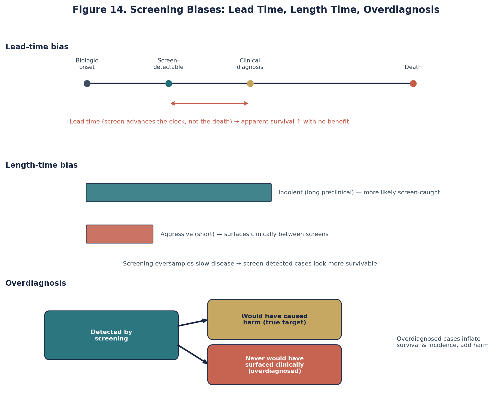
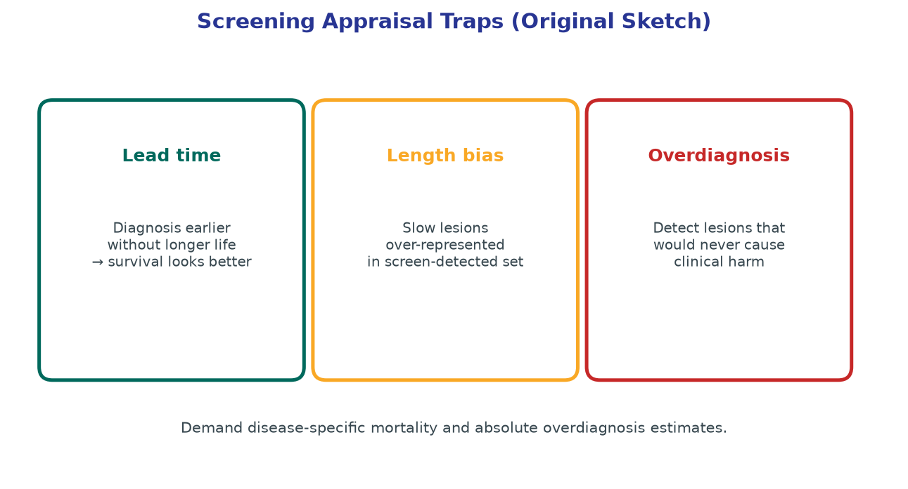

# Chapter 22. Screening, Early Detection, and Overdiagnosis

## Opening

*Lead-time, length, and overdiagnosis biases can make a screening test look beneficial even when it changes no outcome.*

*Earlier detection lengthens known-disease time without moving the death; benefit must be shown on hard outcomes, not diagnostic yield.*

Screening expansion is proposed for silent infarcts on MRI. Before scaling a program, map lead time, overdiagnosis, and who pays the false-positive cascade.

## The Seduction and Peril of Early Detection

The proposition that earlier detection necessarily improves outcomes is a persistent medical heuristic. In stroke and neurovascular medicine, it can motivate asymptomatic carotid ultrasound, magnetic resonance angiography for aneurysm detection, and case-finding for subclinical atrial fibrillation. The intuitive chain—find pathology early, intervene before damage, prevent catastrophe—still has to be tested. Identifying a lesion earlier is diagnostic yield; preventing stroke, disability, or death is clinical benefit. The first establishes neither the second nor an acceptable balance of benefit, burden, and harm.

Neurologists encounter these screening mechanics in three modes: formal population screening of asymptomatic cohorts, case-finding in higher-risk clinical settings, and evaluation of incidental findings on imaging obtained for another reason. Across all three modes, absolute risk, time horizon, and downstream consequences matter. An unruptured 3-millimeter middle cerebral artery aneurysm identified on a screening MRA has a different risk profile from a ruptured aneurysm presenting with subarachnoid hemorrhage. Carrying a treatment conclusion from symptomatic disease into a screen-detected population can overestimate benefit and undercount preventive-treatment harms.

## Criteria for a Defensible Screening Program

The classic Wilson and Jungner criteria (1968), together with later screening frameworks, organize the questions that should precede implementation. A defensible program addresses an important health burden with a detectable preclinical phase, uses an acceptable test, and offers an effective pathway after a positive result. Most critically, offering the program should improve patient-important outcomes enough to outweigh false positives, overdiagnosis, treatment complications, inequity, opportunity cost, and other downstream burdens.

- The target condition must have a meaningful preclinical window wherein intervention alters natural history.
- Test performance should be validated in the intended population spectrum and workflow; predictive values and false-positive burden should be estimated at the anticipated prevalence.
- An effective, accessible preventive therapy must exist and demonstrate superiority to waiting for clinical manifestation.
- The confirmatory cascade must not independently incur excessive iatrogenic harm.
- The program must exhibit net benefit on patient-important outcomes (stroke, survival, functional independence), not simply detection frequencies.
- Infrastructure for follow-up and equity must be mature.
- Harms—including invasive diagnostics, overtreatment, psychological morbidity, and radiation—must be transparently tabulated.

Neurovascular screening proposals can fail these criteria even when they detect real lesions. Population MRA for unruptured intracranial aneurysm, for example, must account for the often-low short-term rupture risk of some small lesions, heterogeneity by morphology and patient factors, and the immediate risks of confirmatory and preventive procedures. Population screening for asymptomatic carotid stenosis is a separate question from treatment after high-grade stenosis is already known. The [USPSTF recommends against screening asymptomatic adults](https://www.uspreventiveservicestaskforce.org/uspstf/recommendation/carotid-artery-stenosis-screening), while contemporary treatment decisions require current randomized evidence, procedural risk, and individual clinical context rather than historical surgical effect estimates alone.

## Lead-Time, Length-Time, and Overdiagnosis Biases

### Lead-Time Bias

Lead-time bias is the apparent inflation of survival time driven solely by an earlier date of diagnosis. If screening detects an asymptomatic malformation five years before it would have presented clinically, but treatment changes no outcome, the patient’s lifespan is unchanged even though measured survival from diagnosis increases. Screening evaluations should therefore anchor outcomes at invitation or another common time zero and, when feasible, compare randomized screening strategies rather than relying on post-diagnosis survival.

*Teaching figure (synthetic).* Screen detection five years earlier doubles “survival from diagnosis” (10 vs 5 years) while the calendar date of death is identical—pure labeling, zero life-years gained. Any screening claim that reports only post-diagnosis survival without a randomized clock from invitation is uninterpretable.

### Length-Time Bias

Length-time bias stems from disease heterogeneity. Indolent, slowly progressive pathologies remain detectable in the asymptomatic phase longer than aggressive variants, so point-in-time screening tends to sample them disproportionately. A screen-detected cohort may therefore be enriched for lower-risk lesions. Comparing that cohort with clinically detected cases can credit screening for outcome differences that partly reflect different underlying biology.

### Overdiagnosis

Overdiagnosis is the detection of a true abnormality that would not have caused symptoms or death during the person’s lifetime. It is not a false-positive test result; the finding is real, but its future clinical consequence is counterfactual and usually unknowable for an individual. More intensive neurovascular imaging can increase detection of small aneurysms, mild carotid plaque, and age-related white-matter changes, some of which may represent overdiagnosis. Treating every such finding as imminent catastrophe can add harm without commensurate benefit.

## Predictive Values and the Tyranny of Prevalence

Sensitivity and specificity describe test performance in a specified population, spectrum, threshold, and verification process; they are not immutable properties. Positive and negative predictive values additionally depend on prevalence. In low-prevalence screening settings, even apparently high specificity can still yield more false-positive than true-positive results.

Consider natural frequencies: a hypothetical neurovascular screen targets a pathology with a 1 percent population prevalence. A test with 90 percent sensitivity and 95 percent specificity applied to 10,000 asymptomatic adults would detect 90 of 100 affected people and generate 495 false-positive results among 9,900 unaffected people. Among 585 positive results, 90 would be true positives—a PPV of roughly 15.4 percent. About 85 percent of positive results would therefore be false positives in this example, with possible anxiety, consultations, and confirmatory procedures. Omitting prevalence and downstream consequences from a screening decision is a serious appraisal error.

## Study Architectures: The Primacy of the Randomized Trial

Observational comparisons of screened volunteers with people who decline screening are highly vulnerable to selection and healthy-screenee bias. Participants may differ in baseline health, health literacy, access, and adherence. Comparing disease-specific survival from diagnosis also invites lead-time and length-time bias.

When feasible, a randomized trial of invitation to screening provides the strongest design for estimating the effect of offering a program. Analyzing patient-important outcomes from a common time zero in the assigned groups avoids using survival from diagnosis as the effect measure and tends to balance baseline disease biology, although nonadherence, crossover, missing outcomes, contamination, and limited power can remain. If screening increases detection without a compatible improvement in patient-important outcomes, the trial has not demonstrated net benefit; harms, burden, uncertainty, and costs still need explicit assessment.

## Worked Neurovascular Examples

### Case 1: Carotid Bruit Auscultation

Carotid-bruit auscultation in asymptomatic populations has limited accuracy for hemodynamically significant stenosis. Non-stenotic turbulence can generate a bruit, while some high-grade stenoses produce none. Using auscultation as a population-screening gatekeeper can therefore generate both missed disease and false-positive referrals without itself demonstrating net screening benefit.

Do not carry that screening conclusion forward as a treatment rule for known high-grade disease. In [CREST-2](https://www.nejm.org/doi/full/10.1056/NEJMoa2508800), patients with at least 70 percent asymptomatic stenosis were enrolled in two parallel trials. At four years, the primary outcome occurred in 6.0 percent with intensive medical management and 2.8 percent with stenting plus intensive medical management; the corresponding endarterectomy trial estimates were 5.3 percent and 3.7 percent, without a statistically significant difference. These results neither establish population screening nor mandate revascularization. They instead require endpoint-specific discussion of medical therapy, procedure type, peri-procedural risk, anatomy, center experience, and patient preferences.

### Case 2: The Unruptured Aneurysm Pathway

A direct-to-consumer MRA program will detect incidental aneurysms, many of which have a low short-term rupture risk. Neither rupture risk nor treatment harm is a single number: size, site, morphology, growth, age, comorbidity, procedure, center experience, and horizon all matter. Screening or surveillance should follow current guideline criteria and individualized multidisciplinary assessment rather than the assumption that finding and treating every lesion improves outcomes.

## Communicating Risk and Reframing Prevention

Questioning an unproven imaging program does not mean abandoning prevention. Evidence-based identification and management of vascular risk factors—including hypertension, hyperlipidemia, smoking, and atrial fibrillation when present—can reduce vascular events, with the appropriate intervention depending on the person and current guidance. When a patient requests broad imaging, reframe the discussion from detection alone to expected outcomes, false positives, incidental findings, and downstream choices.

When counseling about an incidental lesion, use natural frequencies only after estimating risks for a clearly matched population, procedure, and horizon: 'Out of 100 people with these measured features, about A may rupture over T years without intervention; with procedure P, about B may have complication C.' Present intervals, competing mortality, surveillance alternatives, and the uncertainty in how closely the evidence matches the individual patient.

## Summary of Critical Concepts

Screening is justified by improvements in patient-important outcomes, not by the yield of early detection alone. At low prevalence, false positives can greatly outnumber true positives unless specificity is sufficiently high. Positive predictive value is determined jointly by prevalence, sensitivity, and specificity, so each proposed screening setting requires its own natural-frequency calculation. Observational outcome data in screening contexts are vulnerable to lead-time bias, length-time bias, and overdiagnosis. Neurovascular screening modalities—whether for asymptomatic carotid stenosis or unruptured aneurysms—must be judged by whether the absolute reduction in stroke or rupture outweighs procedural morbidity and the harms of the diagnostic cascade. Valid evaluation favors randomized evidence anchored in absolute risk and patient-important outcomes: discovering pathology is not synonymous with improving health.

## Practice and reflection

1. Construct a 2x2 table for a hypothetical aneurysm screening program (N=10,000) assuming a 2% prevalence, 90% sensitivity, and 95% specificity. Calculate the absolute number of false positives and the PPV.
2. Articulate the distinction between lead-time bias and length-time bias using an asymptomatic carotid stenosis cohort as the model.
3. Draft a clinical response to an asymptomatic 50-year-old patient requesting a 'preventive MRA' for stroke screening, focusing on the concepts of overdiagnosis and iatrogenic harm.
4. Explain why a case series reporting a 99% five-year survival rate for screen-detected unruptured aneurysms constitutes flawed evidence for a population screening mandate.
5. In a synthetic five-year model, assume an intervention reduces cumulative disease risk from 5% to 2.5% and carries 3% procedural morbidity within 30 days. Calculate the five-year NNT and 30-day NNH separately, then explain why different endpoints and horizons cannot be collapsed into a single net-benefit number without severity or utility weights.
6. Define overdiagnosis in the context of neuroimaging, and contrast it with a conventional false-positive result.
7. Appraise the methodological validity of an observational study comparing the stroke outcomes of patients who accepted an invitation for a community carotid ultrasound screening versus those who declined.

---

*Figures and tables in this chapter are Teaching materials for CRIT-APP unless a caption explicitly states otherwise. Methods standards are cited by name only.*
