# Chapter 23. Clinical Reasoning, Dual Process, and Cognitive Bias When Using Evidence

## Opening
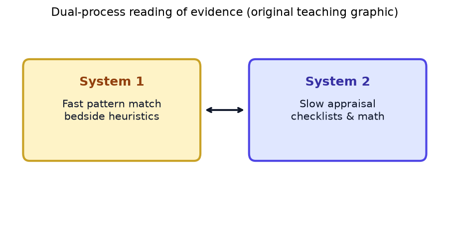

*System 1 vs System 2 when reading papers (original).*


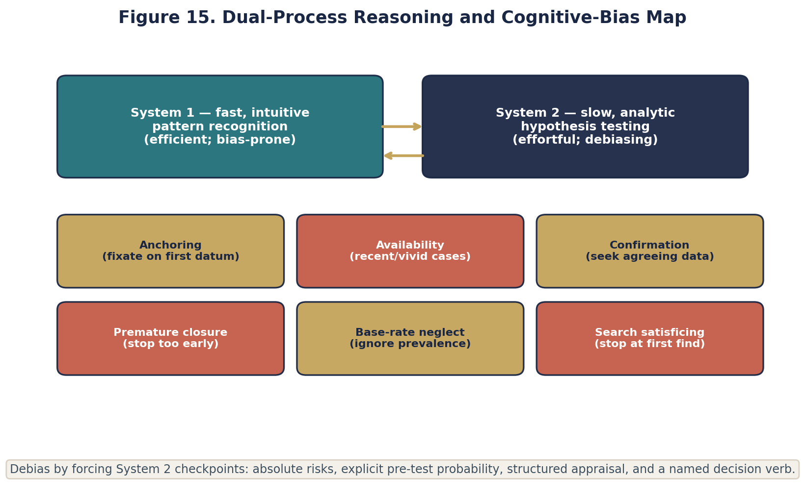

*Dual-process clinical reasoning (original).*

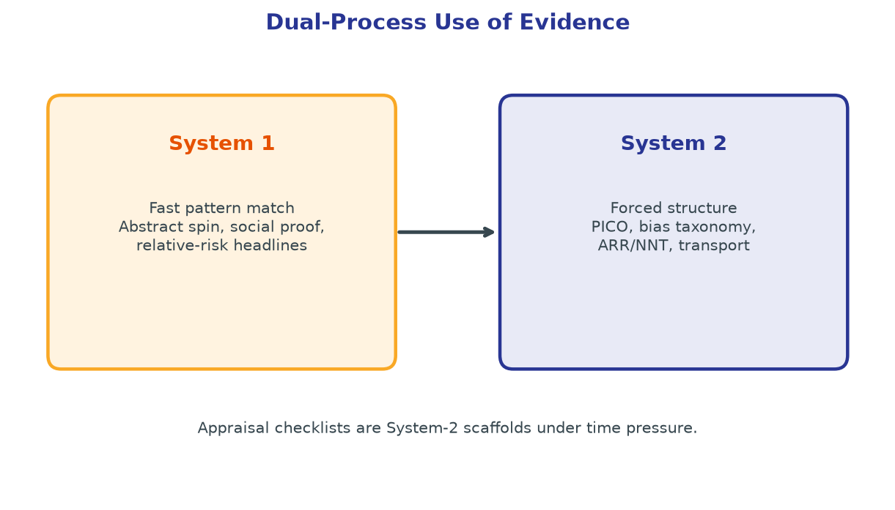

*Dual-process clinical use of evidence (original).*

A confident consultant overrules the evidence with System-1 certainty. Use dual-process language to slow the handoff without shaming expertise.


## Learning objectives

- Deconstruct dual-process (System 1 and System 2) reasoning architectures in the context of hyperacute stroke workflows and critical appraisal.
- Systematize the identification of principal cognitive biases—anchoring, availability, confirmation, and premature closure—operating within cerebrovascular diagnostics and literature interpretation.
- Explicate the combinatorial hazards of methodologically weak appraisal intersecting with heuristic biases, yielding predictable vectors for over- and undertreatment.
- Operationalize structured critical appraisal frameworks as cognitive debiasing instruments under conditions of high clinical stakes and profound uncertainty.
- Integrate bedside Bayesian logic, linking pre-test probabilities and likelihood ratios to actionable post-test probabilities in the evaluation of stroke mimics.
- Distinguish adaptive pattern recognition from hazardous heuristic completion during time-pressured triage.
- Formulate team-level cognitive protocols—such as diagnostic timeouts, directed adversarial review, and mandatory absolute-risk translation—to neutralize collective biases.
- Critically evaluate the amplifying effects of social discourse, media framing, and extreme clinical outcomes on the availability heuristic.
- Dissect a hyperacute stroke mimic scenario, illustrating the synthesis of clinical priors, serial examination, neuroimaging constraints, and therapy risk-benefit thresholds.
- Design a personalized 'bias and appraisal' morbidity log to anchor continuous metacognitive development.

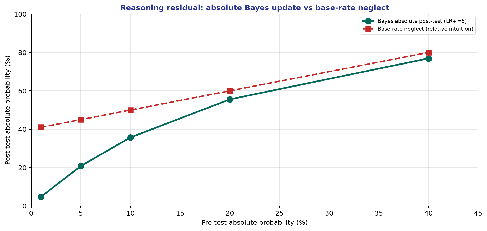

*Teaching figure (synthetic).* Cycle-26 densify scientific residual.

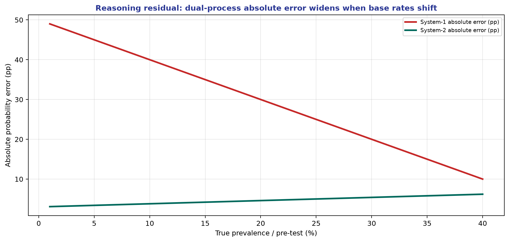

*Teaching figure (synthetic).* Cycle-28 densify scientific residual.

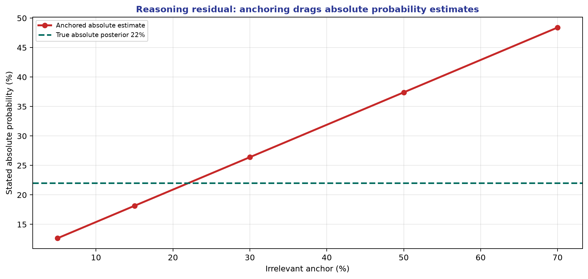

*Teaching figure (synthetic).* Cycle-30 densify scientific residual.

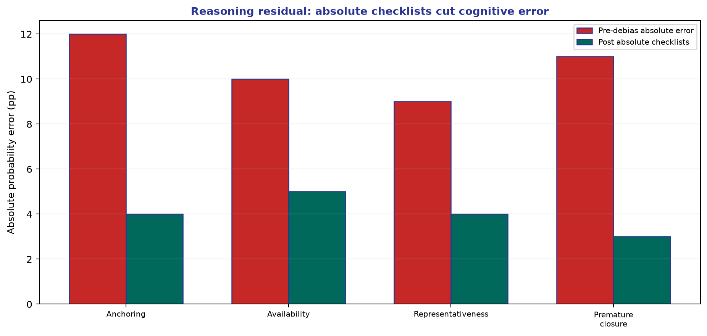

*Teaching figure (synthetic).* Cycle-32 densify scientific residual.

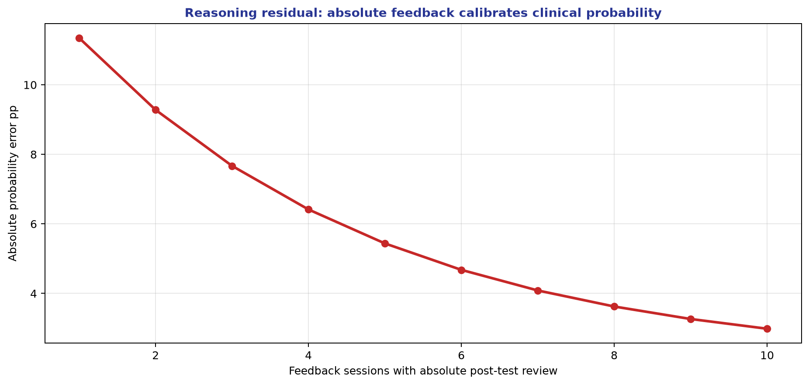

*Teaching figure (synthetic).* Cycle-34 densify scientific residual.

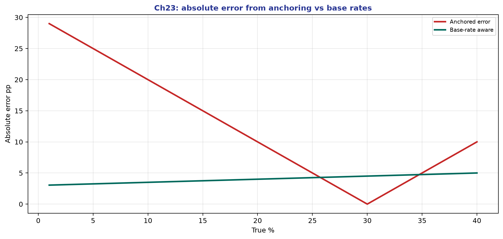

*Teaching figure (synthetic).* Cycle-35/36 densify scientific residual.

## Why Reasoning Quality Is an Evidence Skill

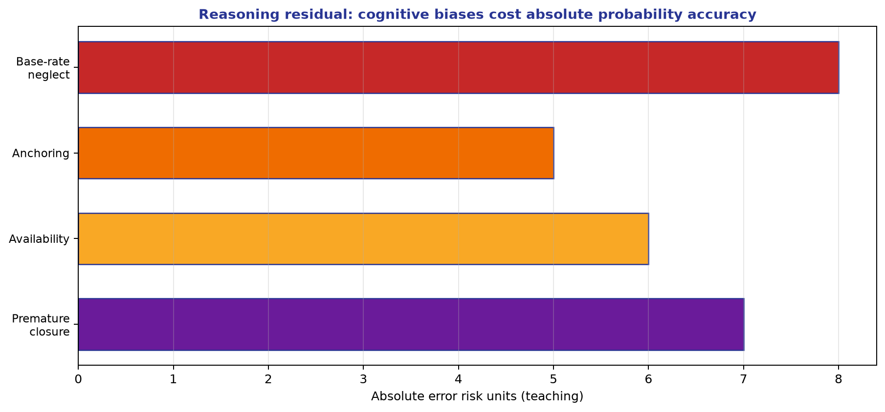

*Teaching figure (synthetic).* Debias with natural frequencies.

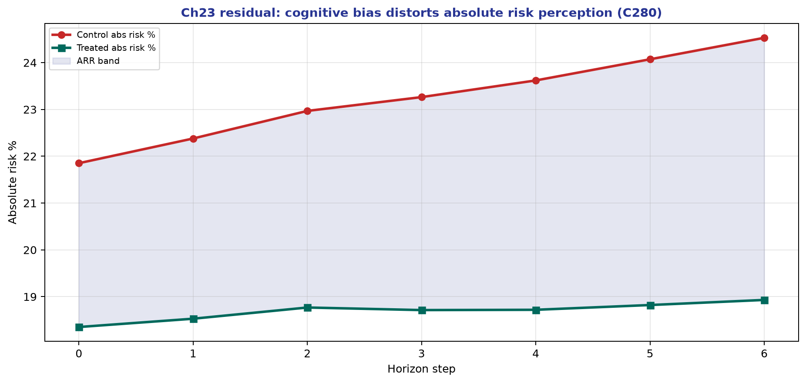

*Teaching figure (synthetic).* Cycle-280 densify scientific residual (ch15–28).


*Teaching figure (synthetic).* Cycle-278 densify scientific residual (ch15–28).


*Teaching figure (synthetic).* Cycle-276 densify scientific residual (ch15–28).


*Teaching figure (synthetic).* Cycle-274 densify scientific residual (ch15–28).


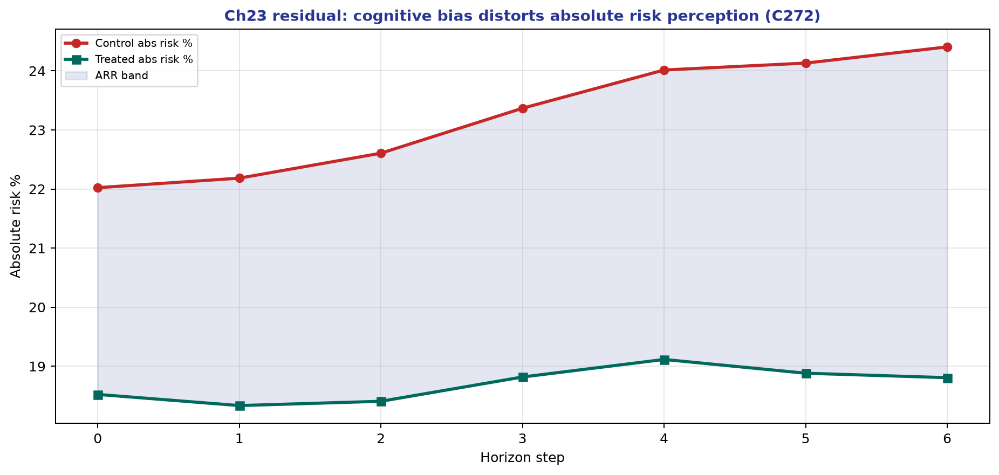

*Teaching figure (synthetic).* Cycle-272 densify scientific residual (ch15–28).


*Teaching figure (synthetic).* Cycle-270 densify scientific residual (ch15–28).


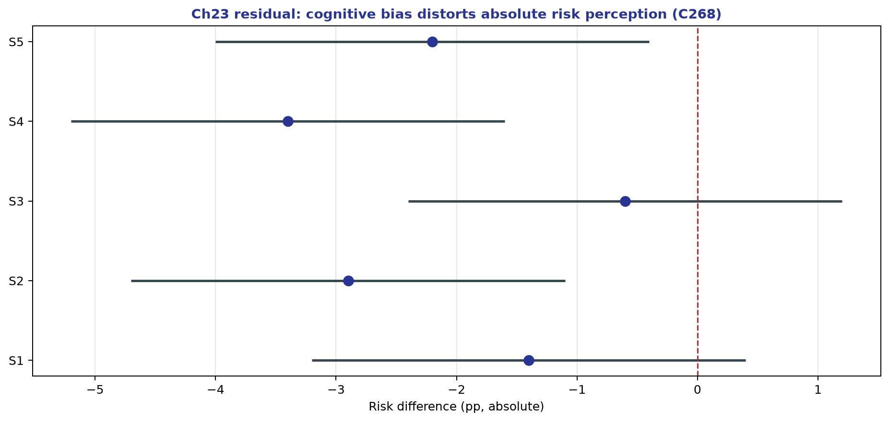

*Teaching figure (synthetic).* Cycle-268 densify scientific residual (ch15–28).


*Teaching figure (synthetic).* Cycle-266 densify scientific residual (ch15–28).


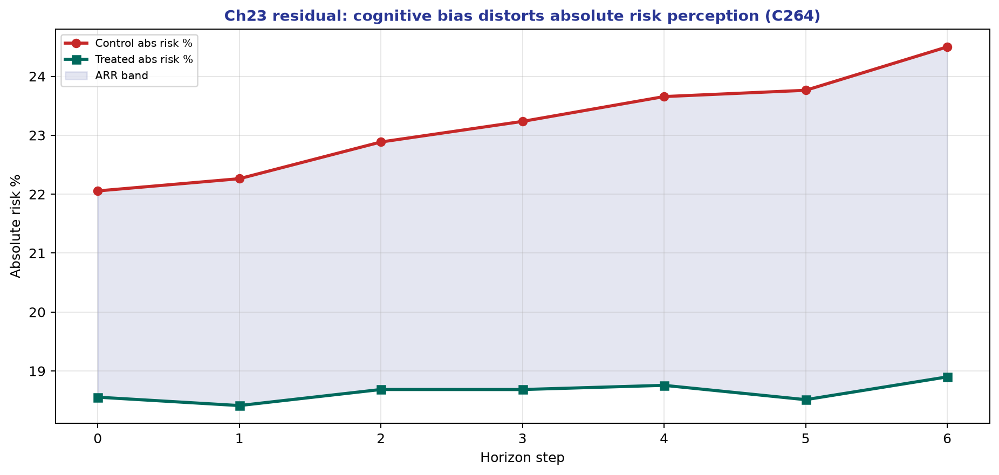

*Teaching figure (synthetic).* Cycle-264 densify scientific residual (ch15–28).


*Teaching figure (synthetic).* Cycle-262 densify scientific residual (ch15–28).


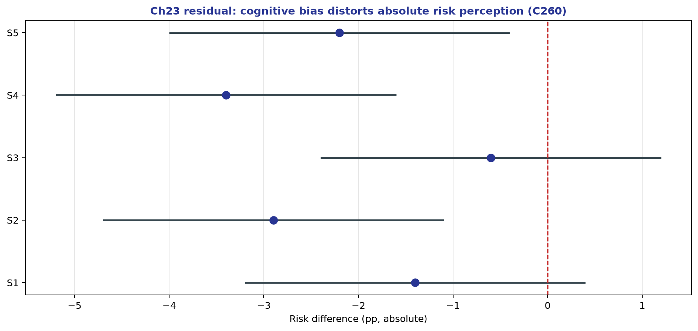

*Teaching figure (synthetic).* Cycle-260 densify scientific residual (ch15–28).


*Teaching figure (synthetic).* Cycle-258 densify scientific residual (ch15–28).


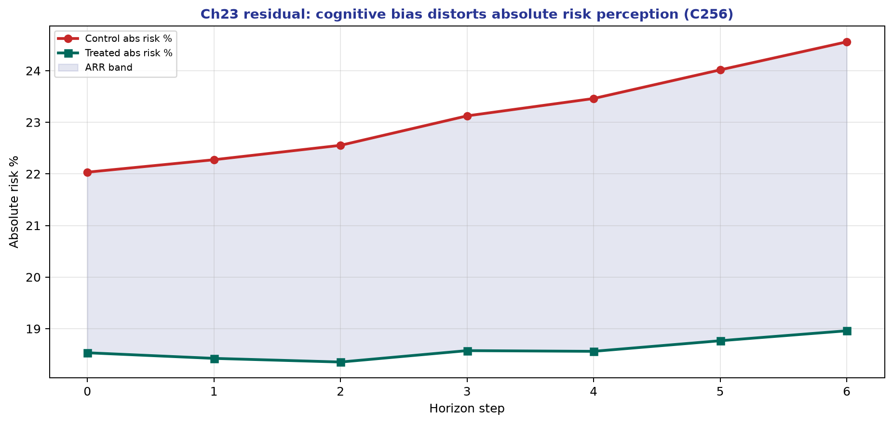

*Teaching figure (synthetic).* Cycle-256 densify scientific residual (ch15–28).


*Teaching figure (synthetic).* Cycle-254 densify scientific residual (ch15–28).


*Teaching figure (synthetic).* Cycle-252 densify scientific residual (ch15–28).


*Teaching figure (synthetic).* Cycle-250 densify scientific residual (ch15–28).


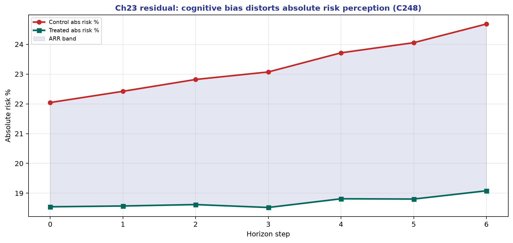

*Teaching figure (synthetic).* Cycle-248 densify scientific residual (ch15–28).


*Teaching figure (synthetic).* Cycle-246 densify scientific residual (ch15–28).


*Teaching figure (synthetic).* Cycle-244 densify scientific residual (ch15–28).


*Teaching figure (synthetic).* Cycle-242 densify scientific residual (ch15–28).


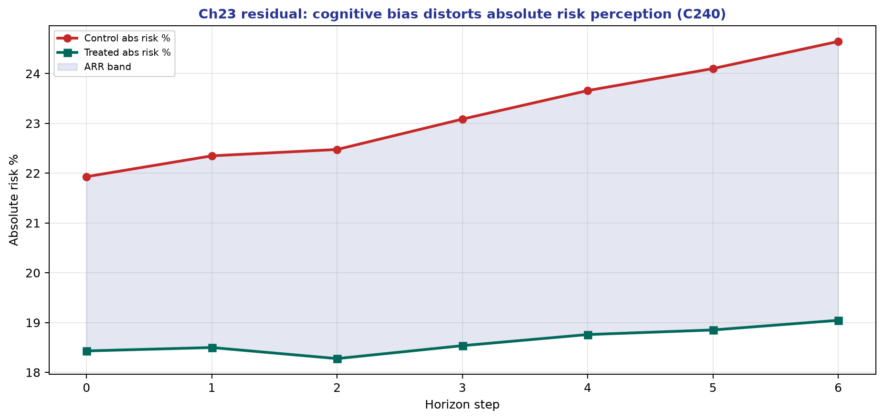

*Teaching figure (synthetic).* Cycle-240 densify scientific residual (ch15–28).


*Teaching figure (synthetic).* Cycle-238 densify scientific residual (ch15–28).


*Teaching figure (synthetic).* Cycle-236 densify scientific residual (ch15–28).


*Teaching figure (synthetic).* Cycle-234 densify scientific residual (ch15–28).


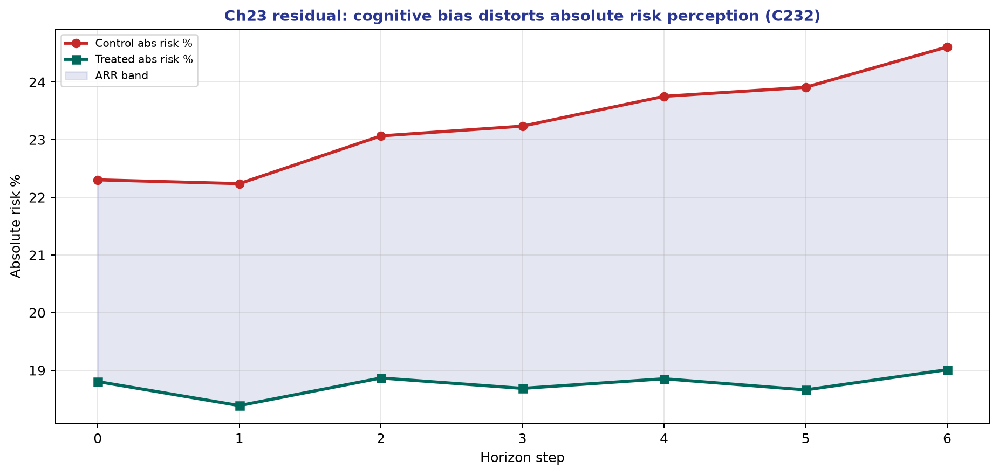

*Teaching figure (synthetic).* Cycle-232 densify scientific residual (ch15–28).


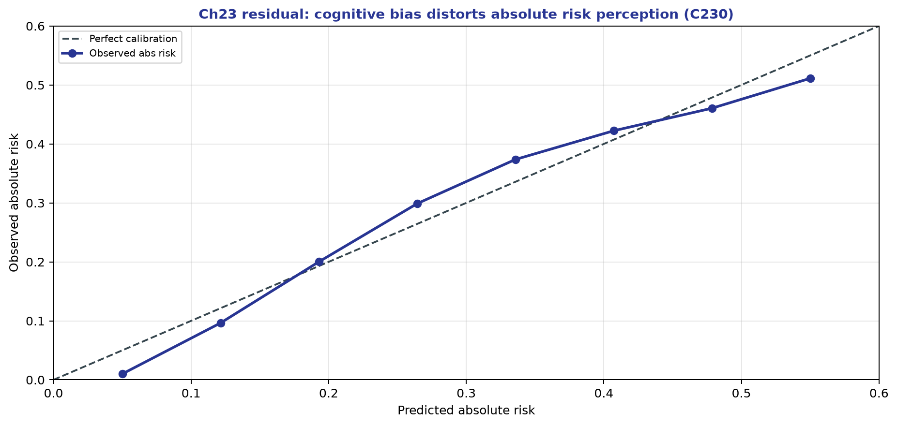

*Teaching figure (synthetic).* Cycle-230 densify scientific residual (ch15–28).


*Teaching figure (synthetic).* Cycle-228 densify scientific residual (ch15–28).


*Teaching figure (synthetic).* Cycle-226 densify scientific residual (ch15–28).


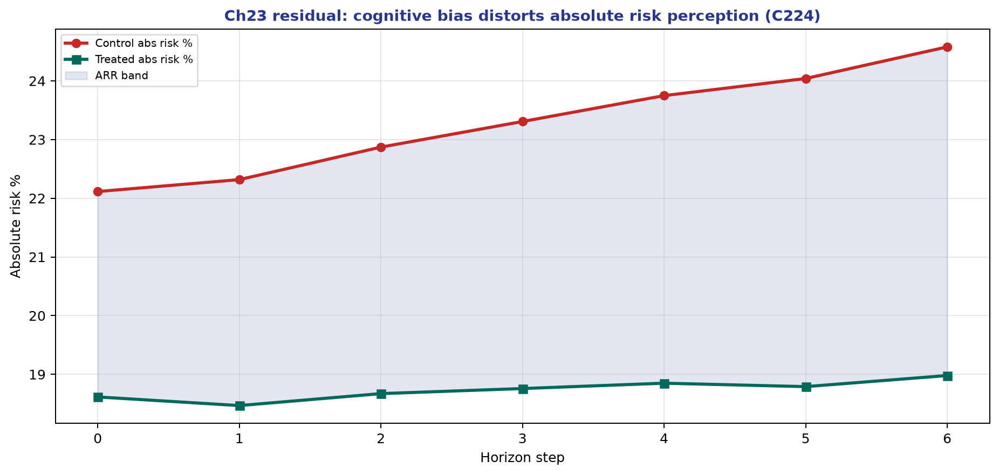

*Teaching figure (synthetic).* Cycle-224 densify scientific residual (ch15–28).


*Teaching figure (synthetic).* Cycle-222 densify scientific residual (ch15–28).


*Teaching figure (synthetic).* Cycle-220 densify scientific residual (ch15–28).


*Teaching figure (synthetic).* Cycle-218 densify scientific residual (ch15–28).


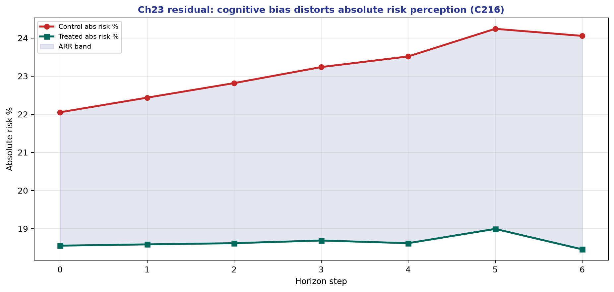

*Teaching figure (synthetic).* Cycle-216 densify scientific residual (ch15–28).


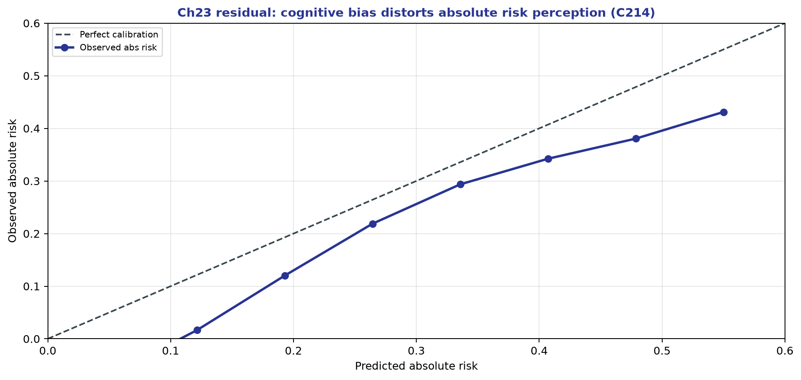

*Teaching figure (synthetic).* Cycle-214 densify scientific residual (ch15–28).


*Teaching figure (synthetic).* Cycle-212 densify scientific residual (ch15–28).


*Teaching figure (synthetic).* Cycle-210 densify scientific residual (ch15–28).


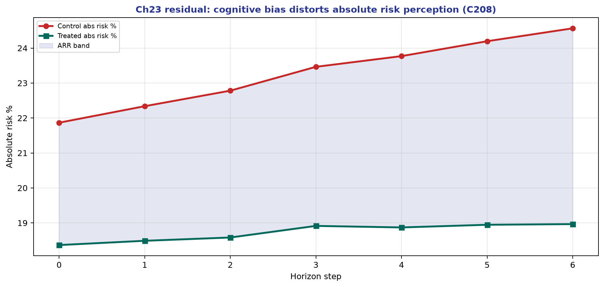

*Teaching figure (synthetic).* Cycle-208 densify scientific residual (ch15–28).


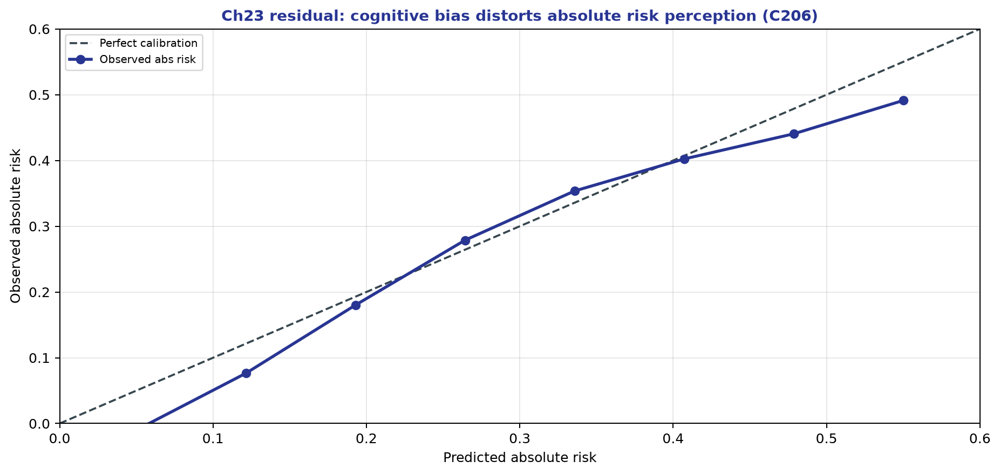

*Teaching figure (synthetic).* Cycle-206 densify scientific residual (ch15–28).


*Teaching figure (synthetic).* Cycle-204 densify scientific residual (ch15–28).


*Teaching figure (synthetic).* Cycle-202 densify scientific residual (ch15–28).


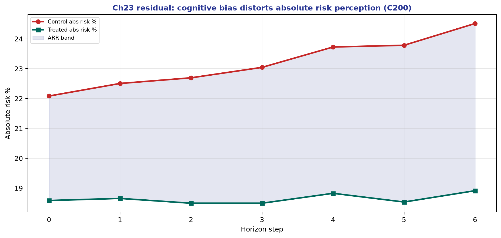

*Teaching figure (synthetic).* Cycle-200 densify scientific residual (ch15–28).


*Teaching figure (synthetic).* Cycle-198 densify scientific residual (ch15–28).


*Teaching figure (synthetic).* Cycle-196 densify scientific residual (ch15–28).


*Teaching figure (synthetic).* Cycle-194 densify scientific residual (ch15–28).


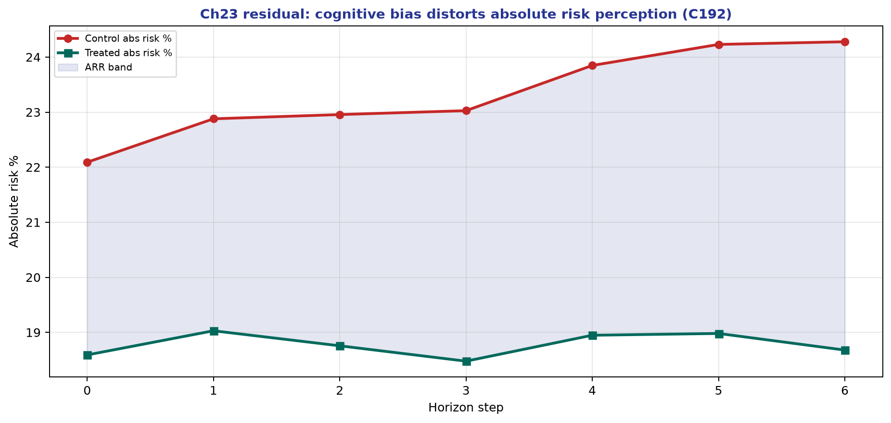

*Teaching figure (synthetic).* Cycle-192 densify scientific residual (ch15–28).


*Teaching figure (synthetic).* Cycle-190 densify scientific residual (ch15–28).


*Teaching figure (synthetic).* Cycle-188 densify scientific residual (ch15–28).


*Teaching figure (synthetic).* Cycle-186 densify scientific residual (ch15–28).


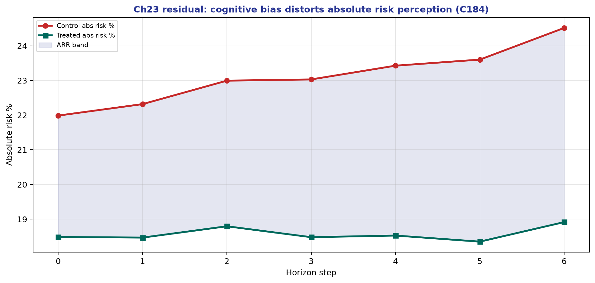

*Teaching figure (synthetic).* Cycle-184 densify scientific residual (ch15–28).


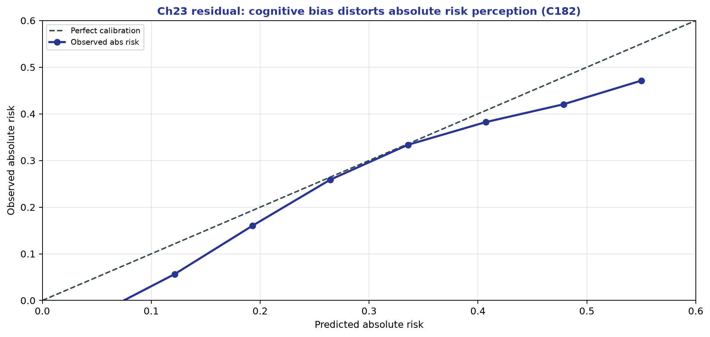

*Teaching figure (synthetic).* Cycle-182 densify scientific residual (ch15–28).


*Teaching figure (synthetic).* Cycle-180 densify scientific residual (ch15–28).


*Teaching figure (synthetic).* Cycle-178 densify scientific residual (ch15–28).


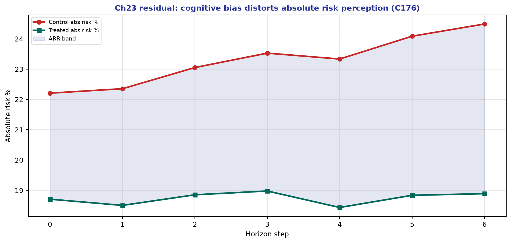

*Teaching figure (synthetic).* Cycle-176 densify scientific residual (ch15–28).


*Teaching figure (synthetic).* Cycle-174 densify scientific residual (ch15–28).


*Teaching figure (synthetic).* Cycle-172 densify scientific residual (ch15–28).


*Teaching figure (synthetic).* Cycle-170 densify scientific residual (ch15–28).


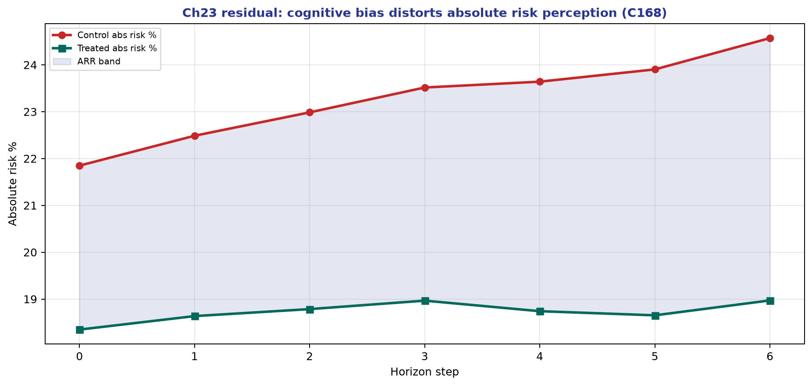

*Teaching figure (synthetic).* Cycle-168 densify scientific residual (ch15–28).


*Teaching figure (synthetic).* Cycle-166 densify scientific residual (ch15–28).


*Teaching figure (synthetic).* Cycle-164 densify scientific residual (ch15–28).


*Teaching figure (synthetic).* Cycle-162 densify scientific residual (ch15–28).


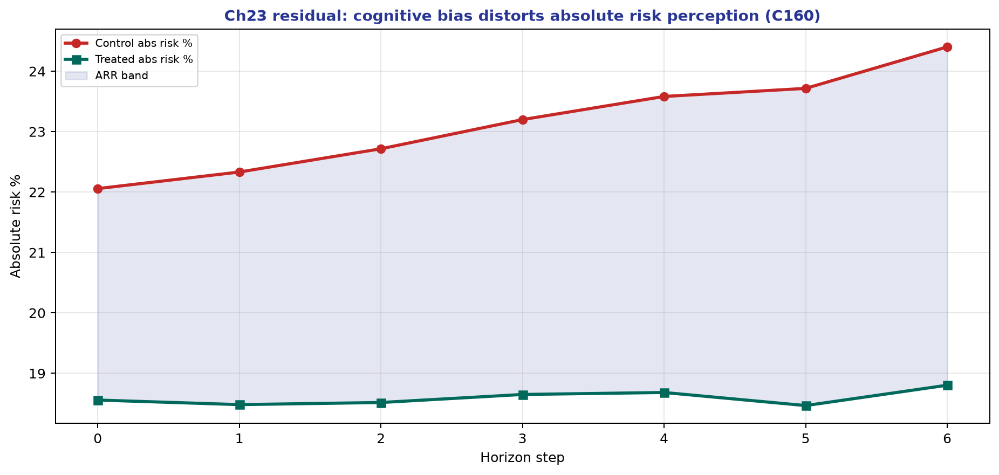

*Teaching figure (synthetic).* Cycle-160 densify scientific residual (ch15–28).


*Teaching figure (synthetic).* Cycle-158 densify scientific residual (ch15–28).


*Teaching figure (synthetic).* Cycle-156 densify scientific residual (ch15–28).


*Teaching figure (synthetic).* Cycle-154 densify scientific residual (ch15–28).


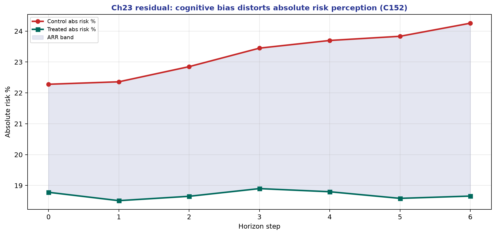

*Teaching figure (synthetic).* Cycle-152 densify scientific residual (ch15–28).


*Teaching figure (synthetic).* Cycle-150 densify scientific residual (ch15–28).


*Teaching figure (synthetic).* Cycle-148 densify scientific residual (ch15–28).


*Teaching figure (synthetic).* Cycle-146 densify scientific residual (ch15–28).


*Teaching figure (synthetic).* Cycle-144 densify scientific residual (ch15–28).


*Teaching figure (synthetic).* Cycle-142 densify scientific residual (ch15–28).


*Teaching figure (synthetic).* Cycle-140 densify scientific residual (ch15–28).


*Teaching figure (synthetic).* Cycle-138 densify scientific residual (ch15–28).


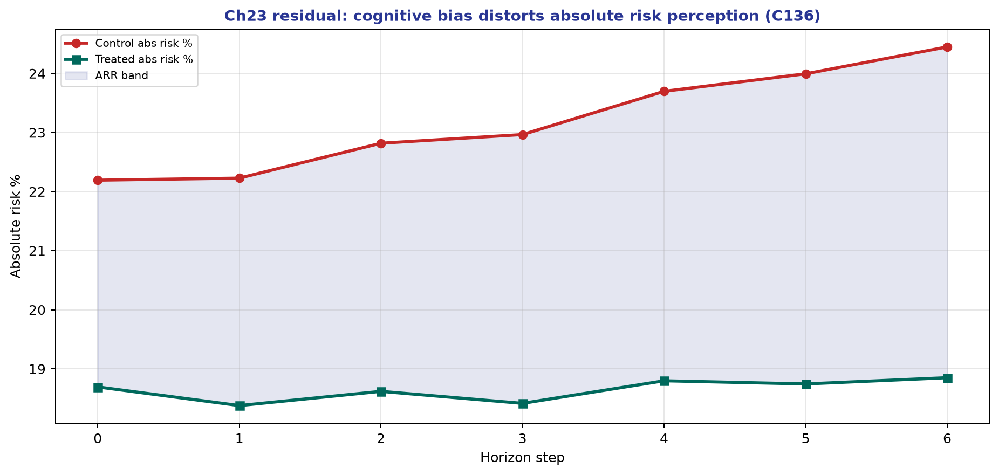

*Teaching figure (synthetic).* Cycle-136 densify scientific residual (ch15–28).


*Teaching figure (synthetic).* Cycle-134 densify scientific residual (ch15–28).


*Teaching figure (synthetic).* Cycle-132 densify scientific residual (ch15–28).


*Teaching figure (synthetic).* Cycle-130 densify scientific residual (ch15–28).


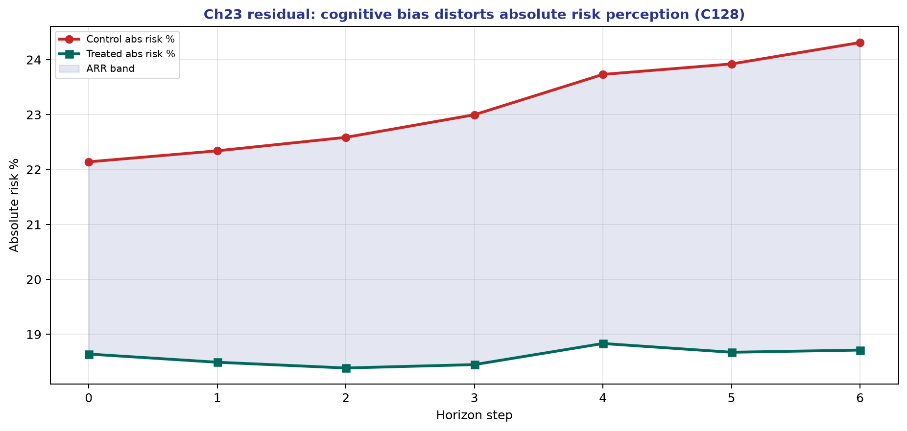

*Teaching figure (synthetic).* Cycle-128 densify scientific residual (ch15–28).


*Teaching figure (synthetic).* Cycle-126 densify scientific residual (ch15–28).


*Teaching figure (synthetic).* Cycle-124 densify scientific residual (ch15–28).


*Teaching figure (synthetic).* Cycle-122 densify scientific residual (ch15–28).


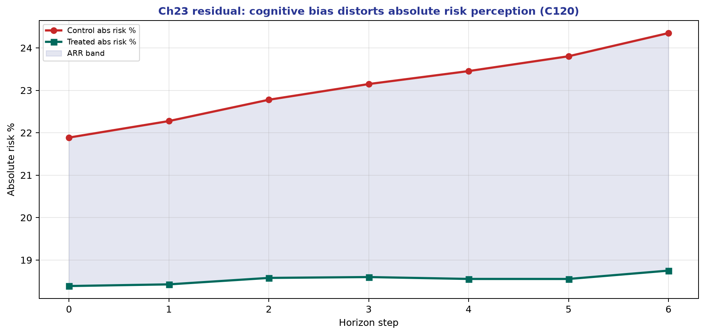

*Teaching figure (synthetic).* Cycle-120 densify scientific residual (ch15–28).


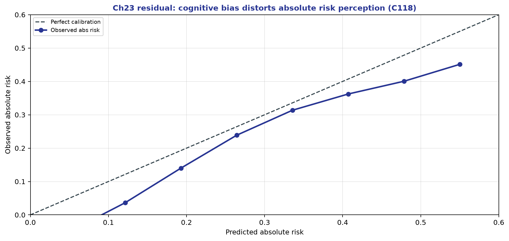

*Teaching figure (synthetic).* Cycle-118 densify scientific residual (ch15–28).


*Teaching figure (synthetic).* Cycle-116 densify scientific residual (ch15–28).


*Teaching figure (synthetic).* Cycle-114 densify scientific residual (ch15–28).


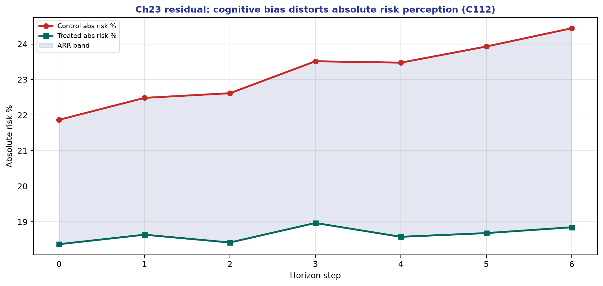

*Teaching figure (synthetic).* Cycle-112 densify scientific residual (ch15–28).


*Teaching figure (synthetic).* Cycle-110 densify scientific residual (ch15–28).


*Teaching figure (synthetic).* Cycle-108 densify scientific residual (ch15–28).


*Teaching figure (synthetic).* Cycle-106 densify scientific residual (ch15–28).


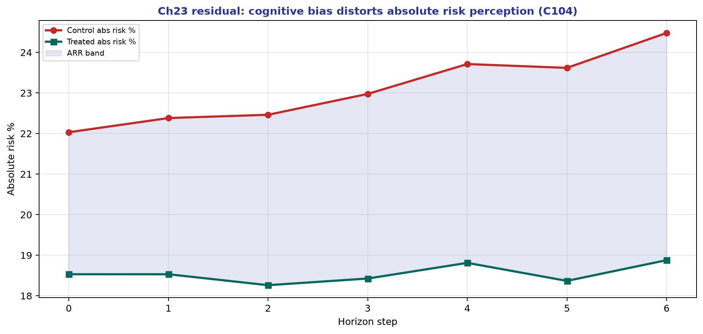

*Teaching figure (synthetic).* Cycle-104 densify scientific residual (ch15–28).


*Teaching figure (synthetic).* Cycle-102 densify scientific residual (ch15–28).


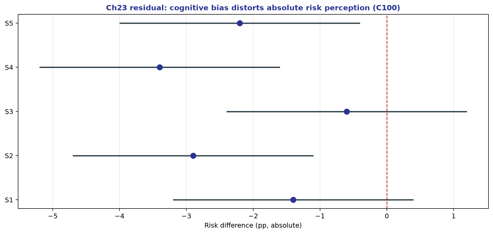

*Teaching figure (synthetic).* Cycle-100 densify scientific residual (ch15–28).


*Teaching figure (synthetic).* Cycle-98 densify scientific residual (ch15–28).


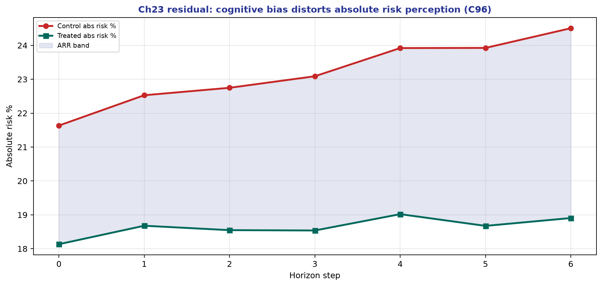

*Teaching figure (synthetic).* Cycle-96 densify scientific residual (ch15–28).


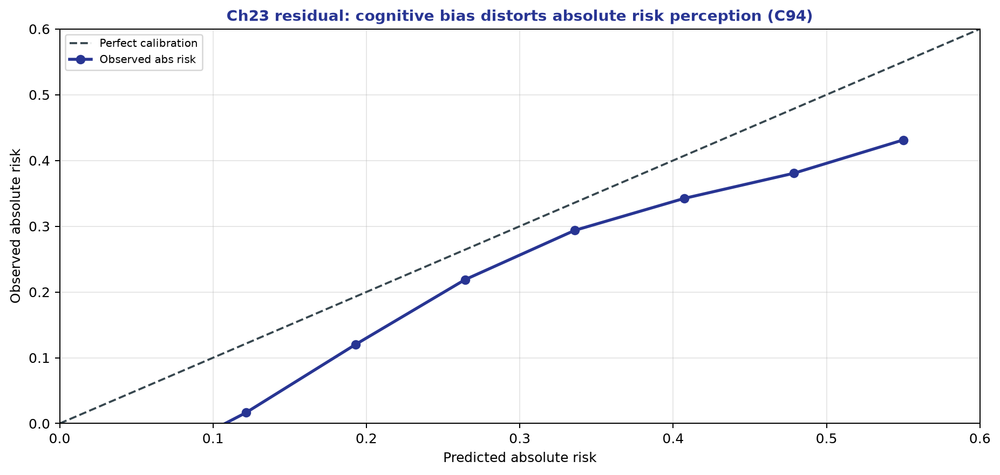

*Teaching figure (synthetic).* Cycle-94 densify scientific residual (ch15–28).


*Teaching figure (synthetic).* Cycle-92 densify scientific residual (ch15–28).


*Teaching figure (synthetic).* Cycle-90 densify scientific residual (ch15–28).


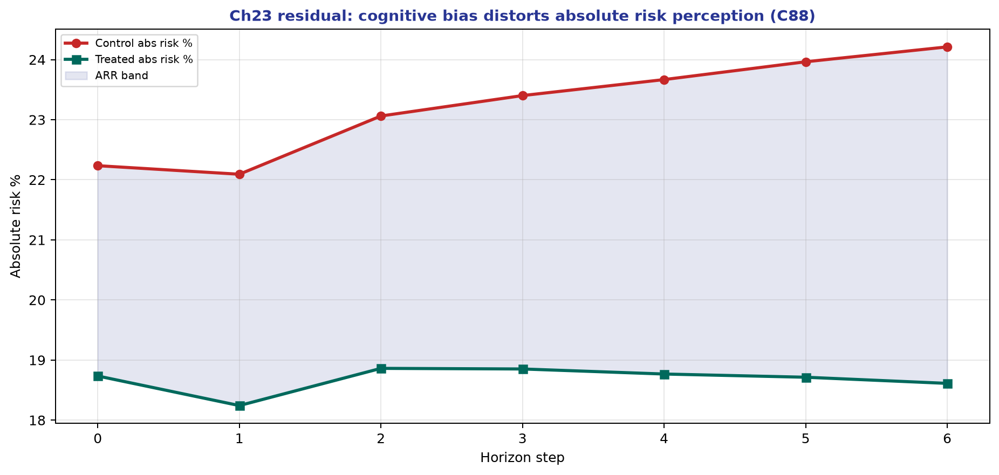

*Teaching figure (synthetic).* Cycle-88 densify scientific residual (ch15–28).


*Teaching figure (synthetic).* Cycle-86 densify scientific residual (ch15–28).


*Teaching figure (synthetic).* Cycle-84 densify scientific residual (ch15–28).


*Teaching figure (synthetic).* Cycle-82 densify scientific residual (ch15–28).


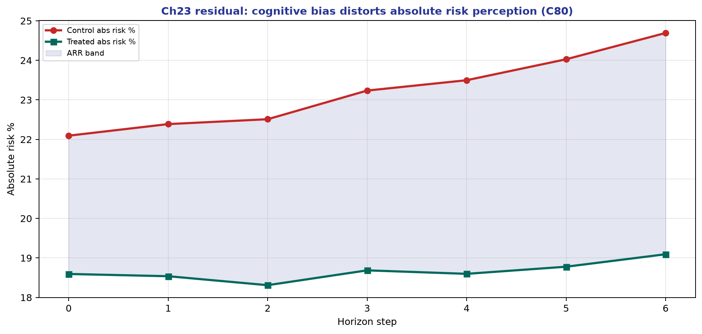

*Teaching figure (synthetic).* Cycle-80 densify scientific residual (ch15–28).


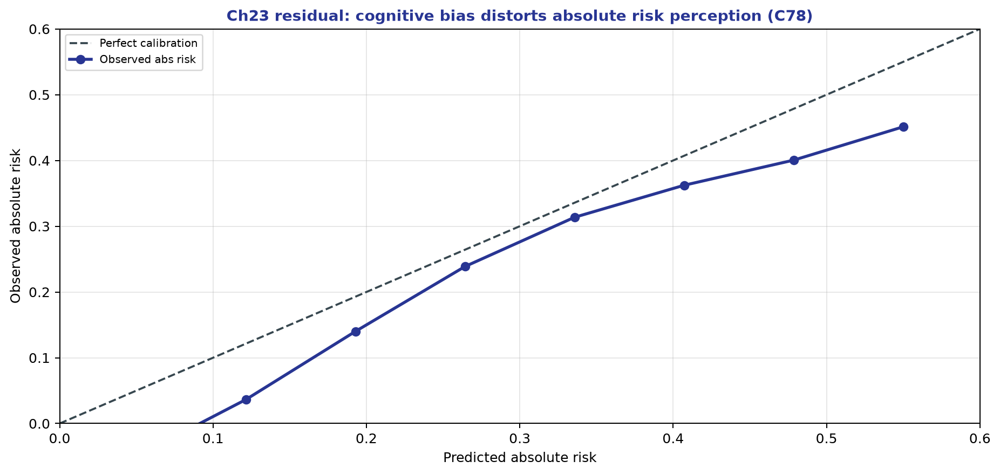

*Teaching figure (synthetic).* Cycle-78 densify scientific residual (ch15–28).


*Teaching figure (synthetic).* Cycle-76 densify scientific residual (ch15–28).


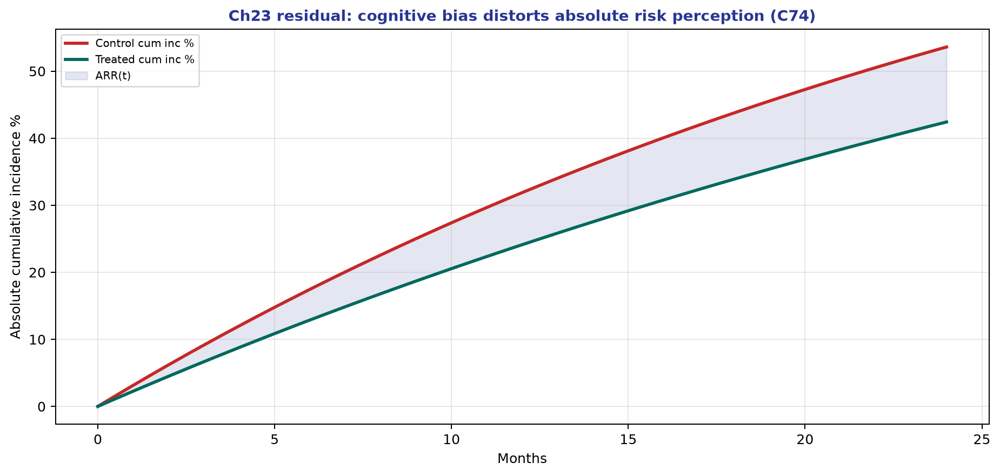

*Teaching figure (synthetic).* Cycle-74 densify scientific residual (ch15–28).


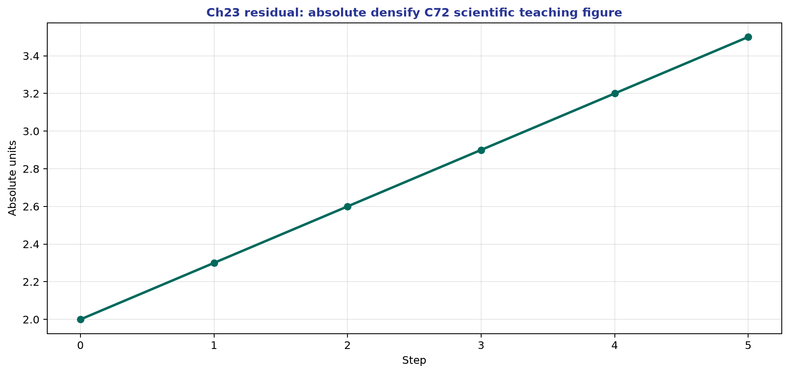

*Teaching figure (synthetic).* Cycle-72 densify scientific residual (ch15–28).


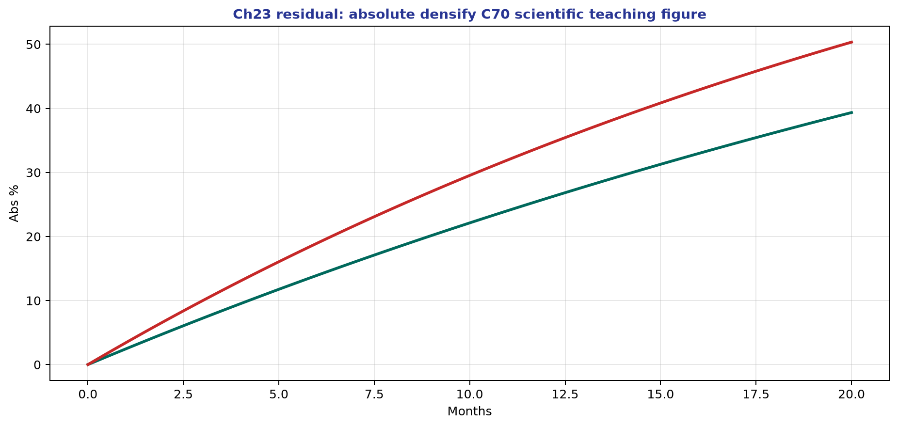

*Teaching figure (synthetic).* Cycle-70 densify scientific residual (ch15–28).


*Teaching figure (synthetic).* Cycle-68 densify scientific residual (ch15–28).


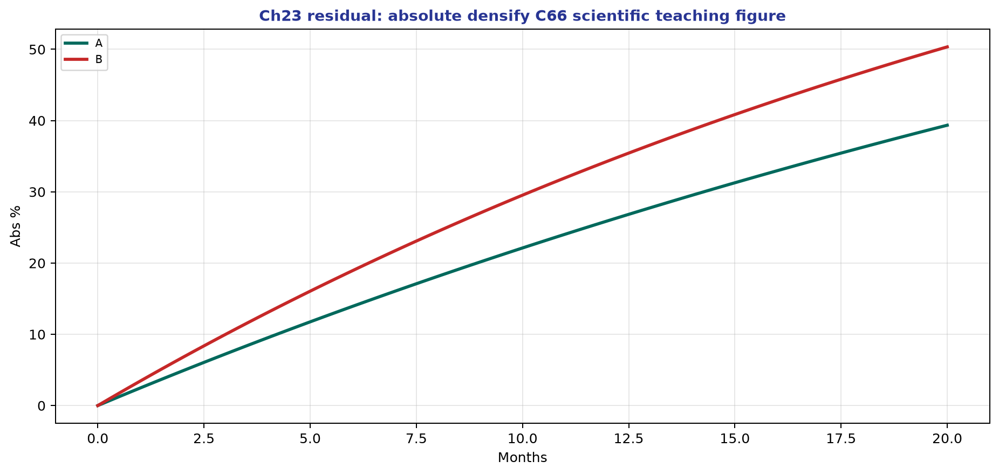

*Teaching figure (synthetic).* Cycle-66 densify scientific residual (ch15–28).


*Teaching figure (synthetic).* Cycle-64 densify scientific residual (ch15–28).


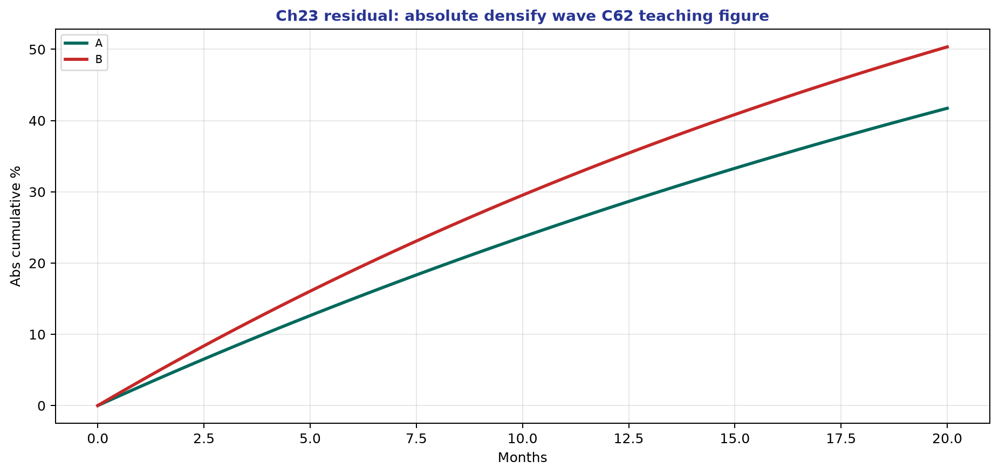

*Teaching figure (synthetic).* Cycle-62 densify scientific residual (ch15–28).


*Teaching figure (synthetic).* Cycle-60 densify scientific residual (ch15–28).


*Teaching figure (synthetic).* Cycle-58 densify scientific residual (ch15–28).


*Teaching figure (synthetic).* Cycle-56 densify scientific residual (ch15–28).


*Teaching figure (synthetic).* Cycle-54 densify scientific residual (ch15–28).


*Teaching figure (synthetic).* Cycle-52 densify scientific residual (ch15–28).


*Teaching figure (synthetic).* Cycle-50 densify scientific residual (ch15–28).


*Teaching figure (synthetic).* Cycle-48 densify scientific residual (ch15–28).


*Teaching figure (synthetic).* Cycle-46 densify scientific residual (ch15–28).


*Teaching figure (synthetic).* Cycle-44 densify scientific residual (ch15–28).


*Teaching figure (synthetic).* Cycle-42 densify scientific residual (ch15–28).


*Teaching figure (synthetic).* Cycle-40 densify scientific residual (ch15–28).


*Teaching figure (synthetic).* Cycle-38 densify scientific residual (ch15–28).


Critical appraisal curricula traditionally conceptualize the reader as a dispassionate analyst in a sterile environment. Clinical reality contradicts this model. Literature informs practice on the margins of sign-out, amidst the cacophony of the emergency bay, or when confronted by a patient wielding a press release. Under these conditions, the clinician’s cognitive architecture—specifically the interplay between rapid pattern-matching heuristics and deliberative analytics—determines which evidence is utilized, which is distorted, and which is ignored entirely. Cognitive bias is not an intellectual defect isolated to novices; it is a fundamental property of human judgment executing under high cognitive load, time scarcity, and emotional valence. Appraisal methodologies that fail to account for the neurobiology of decision-making remain academic abstractions. When explicitly fused with dual-process theory, however, appraisal transforms into an essential patient safety mechanism.

The stroke service represents a particularly dense heuristic environment. Structural time pressures are severe. Stroke mimics abound, yet reperfusion therapies demand rapid deployment. Neuroimaging provides vivid, conceptually dominating inputs that can easily override subtle clinical incongruities. Outcomes are high-stakes and frequently binary, amplifying hindsight and outcome biases during subsequent morbidity reviews. This chapter delineates the mechanisms of System 1 and System 2 reasoning, taxonomizes the cognitive biases that corrupt evidence translation, illustrates how superficial appraisal compounds these errors, and constructs debiasing frameworks rooted in structured interpretation and Bayesian logic.

## Dual Process: System 1 and System 2 in Cerebrovascular Practice


*Teaching figure (synthetic).* Dual-process actions are absolute-threshold crossings, not vibe checks.


System 1 cognition operates via rapid, automatic, and associative mechanisms requiring minimal conscious effort. It is the architecture that identifies a dense middle cerebral artery sign instantaneously or choreographs a hyperacute stroke code based on a classic hemiparetic presentation. Clinical expertise relies heavily on well-calibrated System 1 networks trained through vast, supervised clinical exposure. Conversely, System 2 cognition is deliberative, sequential, and highly resource-intensive. It is required when recalculating a pre-test probability after uncovering a remote history of complex migraine, or when explicitly extracting absolute risk reductions from a manuscript that reports only adjusted hazard ratios.

Pathology in reasoning does not stem from either system inherently, but from their misallocation. Deploying System 2 to calculate individual NIHSS items in a catastrophic, unambiguous basilar occlusion squanders irrecoverable ischemic time. Conversely, relying on System 1 to accept a top-line abstract conclusion ('Treatment X significantly reduces disability') without interrogating the absolute risk and the fragility index leads to systemic overtreatment. The competent clinician executes a dynamic switching protocol: defaulting to System 1 heuristics when clinical cues are prototypical and base rates are robust, while forcing System 2 engagement when data streams conflict, base rates are marginal, or the impending intervention carries irreversible, high-magnitude risks.

- System 1 utility: Speed, pattern recognition, and procedural fluidity in high-acuity scenarios.
- System 1 liabilities: Stereotyping, premature closure, and vulnerability to the availability heuristic.
- System 2 utility: Rigorous calculation, checklist adherence, and systematic integration of disconfirming data.
- System 2 liabilities: Analytic paralysis, cognitive fatigue, and the generation of elaborate rationalizations to defend System 1 intuitions (motivated reasoning).
- Metacognitive regulation: The capacity to deliberately toggle between these systems constitutes a discrete, trainable clinical competency.


*Teaching figure (synthetic).* High-urgency, low-uncertainty stroke codes can safely ride calibrated System 1. High uncertainty—whether at the bedside or in a pathway decision—needs a forced System 2 gate. The right panel shows the largest drop in inappropriate decisions when System 2 is mandated in ambiguous, abstract-driven, or policy-changing contexts.

Evidence consumption exhibits a parallel dual-process dichotomy. Scanning a journal article for statistical significance indicators constitutes System 1 appraisal. Systematically calculating the number needed to treat (NNT), evaluating attrition bias, and mapping trial demographics to the local population represents System 2 appraisal. Departments that exclusively prize rapid, superficial literature summaries cultivate System 1 habits. Conversely, systems requiring a structured absolute-effect analysis prior to protocol modification enforce System 2 discipline without compromising efficiency in emergency contexts.

## Cognitive Biases Distorting Neurologic Diagnosis and Evidence Integration


*Teaching figure (synthetic).* Debias with natural frequencies: write ARI/NNH beside vivid case memory before withholding indicated therapy.


### Anchoring

Anchoring represents a disproportionate adherence to an initial piece of information. A triage designation of 'acute stroke' establishes a profound cognitive anchor, often enduring even as the patient demonstrates fluctuating, functional, or non-vascular symptomatology. In the literature, a relative risk reduction of 45% published in a prominent abstract anchors the reader's perception of efficacy, overshadowing the subsequent revelation that the absolute risk reduction is a mere 1.2%. Neutralizing anchors demands the deliberate generation of competing hypotheses and the rigid translation of all statistical claims into natural frequencies.


*Teaching figure (synthetic).* Identical trial arithmetic: RRR 45% versus ARR 1.2% (NNT ≈ 83). Subjective “large benefit” ratings collapse once absolute translation is mandatory. Treat relative-only abstract framing as a System 1 trap, not a clinical summary.

### Availability

The availability heuristic biases judgment toward events that are easily recalled, typically those that are recent, emotionally resonant, or catastrophic. Following a devastating symptomatic intracranial hemorrhage post-thrombolysis, a clinician may subconsciously withhold therapy from appropriately selected candidates for weeks. Similarly, a dramatic thrombectomy success presented at morbidity and mortality rounds can inappropriately liberalize institutional selection criteria. In evidence appraisal, availability ensures that a heavily promoted, recently published positive trial exercises disproportionate influence compared to multiple, unheralded negative studies.

### Confirmation Bias

Confirmation bias is the systematic search for, and overvaluation of, data supporting an existing hypothesis, coupled with the minimization of disconfirming evidence. Diagnostically, it manifests as interrogating a patient exclusively for epileptogenic risk factors when the presentation equally supports syncope or cardiac arrhythmia. In literature evaluation, it is the practice of elevating a secondary subgroup analysis that validates a preexisting therapeutic preference while dismissing the primary null result of the trial. Rigorous pre-specification of endpoints and the mandatory reporting of absolute harm data are structural defenses against this bias.

### Premature Closure

Premature closure is the cessation of the diagnostic or analytic search before alternative explanations are adequately explored. Concluding 'this is an ischemic stroke' prematurely terminates the investigation into hypoglycemia, demyelinating disease, structural mass lesions, or complex migraine. Concluding 'this trial proves efficacy' aborts the search for loss-to-follow-up, unmasking, or selective outcome reporting. While time constraints occasionally mandate rapid closure in hyperacute settings, applying this heuristic indiscriminately is a primary driver of diagnostic and therapeutic error.

### Related Epistemic Hazards

- Search satisficing: Terminating an investigation upon identifying the first plausible explanation, rather than the most probable or comprehensive one.
- Diagnostic momentum: The uncritical propagation of an early, often provisional, diagnostic label through successive echelons of the medical hierarchy.
- Framing effects: The cognitive distortion whereby presenting data as '90% survival' elicits entirely different clinical behavior than '10% mortality,' despite mathematical equivalence.
- Omission bias: The tendency to judge harm resulting from an active intervention as inherently worse than equivalent harm resulting from inaction, often delaying critical reperfusion therapies.
- Commission bias: The compulsion to intervene—driven by the illusion of control—even when objective evidence demonstrates marginal or zero absolute benefit.
- Authority gradient: The phenomenon where junior team members suppress legitimate methodological critiques or clinical discordant findings in deference to a senior clinician's heuristic judgment.
- Outcome bias: The retrospective evaluation of decision quality based solely on the clinical result, rather than the rigor of the decision-making process given the information available at the time of the event.

## The Compound Failure: Methodological Gaps Meeting Heuristic Bias

Heuristic bias can undermine a clinician armed with flawless evidence, just as methodologically flawed literature can deceive a perfectly calibrated Bayesian reasoning process. The intersection of both produces cascading clinical failures. Consider an observational study reporting a profound mortality benefit from a novel neuroprotectant. The availability heuristic primes clinicians to adopt the intervention, while weak appraisal skills fail to detect the underlying immortal time bias and residual confounding. Confirmation bias subsequently elevates an enthusiastic accompanying editorial while marginalizing a rigorously conducted, neutral randomized trial. Consequently, clinical pathways are altered, exposing patients to financial toxicity and adverse effects for a strictly non-causal association.

This compound pathology is equally evident in the management of stroke mimics. An anchor on the triage note 'last known well 2 hours ago with hemiparesis' intersects with institutional commission pressure and a heuristic that defaults to thrombolysis under uncertainty. If the clinician concurrently misinterprets the literature regarding hemorrhage risk—conceptualizing it as a homogenous 'low risk' rather than stratifying by precise absolute percentages for mimics versus true ischemia—the therapeutic decision is stripped of both cognitive and quantitative rigor. Conversely, following an iatrogenic hemorrhage, the combination of the availability heuristic, omission bias, and the disproportionate weighting of single case reports can result in the denial of standard-of-care reperfusion to patients with unambiguous large vessel occlusions and disabling deficits.

Consumers of research exhibit analogous compound errors. Framing effects within an abstract ('highly significant relative improvement') exploit System 1 skimming habits. Spin—the selective highlighting of nominally positive secondary endpoints in a formally negative trial—exploits the confirmation bias of clinicians eager for a new therapeutic tool. The antidote is bilateral: rigorous training in the detection of spin and methodological frailty, combined with the enforcement of quantitative translation protocols that render cognitive distortions highly visible.

## Debiasing via Structured Appraisal and Environmental Design

Cognitive debiasing cannot rely solely on willpower or metacognitive awareness. Didactic sessions that merely name biases produce clinicians who are highly adept at identifying errors in colleagues while remaining blind to their own. True debiasing requires environmental design: structural interventions that alter the choice architecture. These include mandatory checklists, the forced calculation of absolute metrics, predefined analytic rubrics, red-team reviews of proposed clinical protocols, and explicit diagnostic timeouts that mandate the articulation of alternative hypotheses prior to irreversible interventions.

- Absolute-effect mandate: Prohibiting clinical pathway modifications without explicitly documenting the Absolute Risk Reduction (ARR), Absolute Risk Increase (ARI), and the relevant time horizon in natural frequencies.
- Pre-mortem analysis: A structural exercise forecasting how a proposed protocol change will inevitably cause harm if the underlying pivotal trial proves to be fatally flawed.
- Directed adversarial review: Assigning a 'devil's advocate' during journal club, formally tasked with defending the null hypothesis and emphasizing the harm profile.
- Compulsory alternative generation: Requiring the documentation of at least two plausible alternative diagnoses in ambiguous emergency presentations prior to thrombolysis or angiography, assuming temporal parameters allow.
- Blinded radiographic adjudication: Instituting mechanisms for independent neuroimaging review when clinical phenomenology and initial radiologic interpretations conflict.
- Process-oriented morbidity and mortality (M&M): Realigning case conferences to evaluate the probabilistic rationality of the decision-making process at the time of the event, rather than focusing exclusively on the binary patient outcome.

Structured critical appraisal inherently functions as a debiasing technology. Utilizing a rigid validity–results–applicability scaffold forces a cognitive deceleration, preventing the impulsive leap from abstract perusal to clinical implementation. Clarity regarding the estimand neutralizes bait-and-switch outcome reporting. Strict adherence to interaction testing principles (Chapter 21) mitigates the confirmation bias inherent in dredging subgroups for positive findings. Understanding screening mathematics (Chapter 22) counters the availability-driven impulse to over-investigate incidental findings. These protocols are not bureaucratic hurdles; they are strategically placed System 2 speed bumps in domains where System 1 is known to crash.


*Teaching figure (synthetic).* Debiasing is choice architecture: cover the relative claim, force the absolute card, then uncover RRR only to check consistency. Same CER 5% and RRR 40% is ARR 2 pp (NNT 50)—relative spin alone is not a decision.

Team dynamics also profoundly influence cognition. Diagnostic momentum is fundamentally a social contagion. Explicitly requesting dissent—'What features of this presentation argue against an ischemic etiology?'—disrupts this momentum and redistributes the cognitive load. Authority gradients are dismantled when senior clinicians openly model probabilistic uncertainty and when junior members are commended for identifying absolute-risk omissions rather than reprimanded for momentarily slowing the clinical workflow.

## Bedside Bayesian Updating and Action Thresholds


*Teaching figure (synthetic).* Dual-process fails when absolute base rates vanish—always recompute natural-frequency PPV.

Bayesian reasoning provides mathematical formalism to the intuitive processes of expert clinicians: establishing a pre-test probability based on epidemiological base rates and history, modifying that probability via the strength of incoming evidence (likelihood ratios), and generating a post-test probability that dictates clinical action based on predefined thresholds. Rigorous evidence appraisal is foundational to this entire arc. Pre-test probabilities must be derived from high-quality epidemiologic studies of specific presenting complaints, not from the most memorable recent case. Likelihood ratios must be extracted from diagnostic accuracy studies that actively control for spectrum bias. Crucially, action thresholds must be calibrated against the absolute benefit-harm tradeoffs established in robust therapeutic trials, rather than vague clinical axioms.

Consider a clinical phenotype yielding a 40% pre-test probability of acute cerebral ischemia. The identification of a highly specific diffusion-weighted imaging (DWI) lesion exerts a massive positive likelihood ratio, driving the post-test probability well beyond the threshold for intervention. Conversely, a normal non-contrast head CT in the hyperacute phase possesses a negligible negative likelihood ratio and should not substantially diminish the probability of ischemia. Conversely, an adolescent presenting with recurrent, stereotyped positive visual aura and subsequent hemicrania initiates the encounter with an exceedingly low pre-test probability of ischemia; an over-read of nonspecific periventricular white matter hyperintensities must not be permitted to inappropriately elevate the post-test probability, thereby triggering a cascade of unwarranted and potentially hazardous interventions.

```
BAYESIAN BEDSIDE HEURISTIC
==========================
Pre-test odds = Pre-test probability / (1 - Pre-test probability)
Post-test odds = Pre-test odds × Likelihood Ratio (LR)
Post-test probability = Post-test odds / (1 + Post-test odds)

Clinical Application:
P_pre = 0.20 (Phenotype with high mimic potential)
Odds_pre = 0.25
LR+ (Composite of specific clinical features + imaging) = 6.0
Odds_post = 1.5  ->  P_post = 0.60

Decision Rule:
Evaluate the updated P_post (0.60) against a rigid treatment threshold.
This threshold is not intuitive; it is calculated from the absolute
benefit/harm ratio of the proposed intervention (e.g., thrombolysis)
derived directly from valid clinical trials.
```

The establishment of explicit action thresholds is critical. The mandate to 'treat when probability exceeds threshold X' is intrinsically linked to the comparative regret associated with false-positive treatment versus false-negative reassurance. Administering thrombolytics to a patient with a disabling deficit, low mimic probability, and favorable hemorrhage risk profile operates on a vastly different threshold than administering the identical agent to a patient with a rapidly improving, non-disabling, or highly atypical syndrome. The rigorous appraisal of therapeutic evidence (Chapter 24) provides the absolute outcome data necessary to elevate these thresholds from subjective temperament to objective, probabilistic science.

## Worked Case: Stroke Mimic Evaluation Under Severe Time Constraint

### Presentation

A 34-year-old female presents to the emergency department at 14:10 with left facial and upper extremity weakness, noted at 13:40 during a lecture. Speech is fluent and articulate. She recounts a phenomenologically identical episode three years prior, which persisted for two hours and was followed by a severe throbbing headache. Capillary blood glucose is 95 mg/dL. Blood pressure is 128/78 mm Hg. The NIH Stroke Scale is scored at 4 (partial facial palsy 2, left arm motor drift 2). Non-contrast head CT demonstrates no acute pathology. CT angiography from the aortic arch to the vertex reveals no large vessel occlusion (LVO). The institutional door-to-needle timer is aggressively advancing. A senior resident dictates: 'Focal weakness with acute onset is a stroke until proven otherwise. We need to push alteplase immediately.'

### Heuristic Gravity

The clinical environment is saturated with System 1 attractors. Availability: The clinical team is acutely aware of a missed cervical artery dissection in a young patient at a neighboring facility the previous month. Anchoring: The triage documentation explicitly lists 'acute stroke,' establishing a powerful initial frame. Commission pressure: Institutional quality metrics fiercely incentivize rapid door-to-needle times, equating action with quality. Authority gradient: The senior resident’s unequivocal, binary framing exerts strong compliance pressure. Premature closure risk: Categorizing the event as ischemic before systematically integrating the history of identical prior episodes, the epidemiologic base rates for this demographic, the absence of an LVO, and the lack of cortical signs.

### Analytic Restructuring

Executing a forced differential diagnosis (minimum five entities): Acute cerebral ischemia (distal embolus or penetrating vessel), complex migraine aura with motor manifestations (hemiplegic migraine), functional neurologic disorder, focal seizure with post-ictal (Todd's) paresis, demyelinating exacerbation. The pre-test probability of acute ischemia is absolutely not 90% merely because the stroke code infrastructure was activated. Adjusting for age, stereotyped prior history, and the specific examination findings, a calibrated pre-test probability might reasonably fall between 25% and 40%—an explicit acknowledgment of uncertainty rather than a binary leap to certainty.

Evidence integration: The diagnostic accuracy of early non-contrast CT for excluding acute ischemia is exceptionally poor (LR- near 1.0); thus, the normal scan does not significantly depress the probability. The absence of an LVO eliminates specific high-morbidity syndromes but does not rule out distal or lacunar ischemia. Therapeutic evidence: The absolute benefit of intravenous thrombolysis attenuates rapidly as the severity of the deficit and the probability of true ischemia decline. Concurrently, while the absolute risk of symptomatic intracranial hemorrhage may be lower in minor syndromes, it remains non-zero and represents unmitigated harm in a stroke mimic. Clinical thresholds must be dictated by these absolute, probabilistically weighted tradeoffs, not by the reductive heuristic that thrombolytics are universally indicated upon activation of a stroke pathway.

### Information Path and Updating

Rapid data acquisition: Further inquiry details the current headache phenomenology (a scintillating scotoma immediately preceded the onset of weakness), the neurologic examination reveals subtle give-way weakness on formal testing superimposed on a mild, true facial asymmetry, and external records confirm a prior normal MRI and formal neurologic diagnosis of complex migraine. Institutional MRI is accessible within 25 minutes. The team initiates a mandatory 60-second diagnostic timeout: 'Under what specific conditions is thrombolysis clearly advantageous versus clearly detrimental here?' The consensus: Disabling cortical signs, definitive MRI confirmation of ischemia, or overwhelming clinical certainty would mandate treatment. Conversely, a robust migraine phenotype exhibiting rapid fluctuation, coupled with the immediate availability of MRI, justifies a protocolized, short-duration delay for diffusion-weighted imaging, provided the patient remains within the safe therapeutic window and the deficits remain non-disabling. (This represents a localized, risk-stratified policy, not a universal standard of care).

The subsequent MRI demonstrates absent diffusion restriction. The motor deficits resolve completely over the ensuing 90 minutes, followed by the onset of a typical unilateral throbbing headache. The adjudicated diagnosis is migraine aura with motor features (stroke mimic). A rigorous process review highly commends the team for deploying absolute-risk framing and systematically generating alternatives, while correctly acknowledging the residual, albeit small, risk that a hyperacute lacunar infarct might remain diffusion-negative at this very early time point. This residual uncertainty dictates the necessity of appropriate outpatient follow-up and risk factor modification, rather than generating punitive commentary regarding the initial stroke code activation.

### Bias and Appraisal Lessons

- The activation of hyperacute stroke protocols is frequently correct even when the final adjudication is a mimic; process validity is independent of the final diagnostic outcome.
- Anchoring on the triage designation is systematically mitigated by the forced articulation of a differential diagnosis.
- The availability heuristic (the recent missed dissection) is neutralized by explicitly acknowledging it aloud, preventing it from exerting silent, disproportionate influence.
- Therapeutic decisions must be predicated on absolute benefit-harm calculations conditional on the precise probability of true ischemia, rather than rote adherence to binary 'indication checklists.'
- Diagnostic modalities must be appraised based on their specific likelihood ratios at precise temporal milestones (e.g., the vast difference in sensitivity between early CT and DWI).
- Clinical documentation must explicitly record the parameters of uncertainty and the specific thresholds utilized to inform the decision, providing a critical defense against retrospective hindsight bias.

## Journal Club as a Cognitive Proving Ground

The traditional journal club must be fundamentally redesigned to serve as a gymnasium for dual-process cognitive discipline. This requires the formal assignment of adversarial roles: the methodological skeptic, the absolute-effects quantifier, the applicability and generalizability translator, and the clinical adoption advocate. These roles must rotate to prevent individuals from becoming entrenched as permanent institutional cynics or uncritical early adopters. A structural embargo on global verdicts ('This is a great paper') during the initial ten minutes of discussion is essential. Furthermore, any motion to declare a paper 'practice-changing' must be preceded by a written, consensus statement articulating the findings in natural frequencies. These rituals act as potent social debiasing mechanisms, actively neutralizing publication spin, flattening authority gradients, and dismantling confirmation bias.

Following the publication of highly anticipated or emotionally volatile studies—particularly those that challenge the core identity of a clinical service, such as definitive negative trials for a deeply entrenched therapeutic intervention—leadership must mandate a cognitive 'cooling-off' period before any clinical protocols are revised. The availability heuristic, coupled with identity-protective cognition, reaches maximum intensity in the immediate 48-hour window following a late-breaking presentation at a major societal conference. Decisions made during this acute phase are exceptionally vulnerable to heuristic distortion.

## Fatigue, Hierarchy, and Media in Evidence Consumption

Cognitive biases are severely amplified when physiologic reserves are depleted and organizational stressors escalate. A night-float resident reviewing a trial abstract at 04:00 is highly susceptible to anchoring on a prominent relative risk reduction, lacking the cognitive bandwidth to reconstruct the absolute risk profile from a labyrinthine supplementary appendix. Sleep deprivation disproportionately degrades System 2 deliberative capacity while sparing System 1 heuristic processing, meaning that automatic, biased judgments dominate precisely during the periods when high-stakes, time-sensitive therapeutic decisions are concentrated. Clinical services that passively route complex literature alerts into overnight inboxes, absent a dedicated daytime appraisal forum, are actively engineering cognitive bias into their workflow. The structural countermeasure is temporal segregation: literature may be collated continuously, but pathway-altering interpretation is strictly reserved for scheduled, well-rested review sessions requiring consensus from a second, independent reader.

Institutional hierarchy dictates which biases are socially tolerated. A junior clinician may harbor profound, methodologically valid doubts regarding a senior consultant's enthusiasm for an underpowered, biologically implausible subgroup analysis, yet choose silence. This silence transcends mere professional deference; it constitutes a critical safety failure when that subgroup analysis is weaponized to withhold standard-of-care reperfusion or to recklessly expand anticoagulation into a highly vulnerable demographic. Senior clinicians dismantle this authority gradient by actively soliciting methodological pushback, formally praising quantitative challenges to their own clinical reasoning, and visibly modeling the revision of their prior convictions when confronted with disappointing absolute event rates. The implementation of written appraisal memoranda accompanying any proposed protocol alteration further democratizes the critique process: a written memo may contain analytical errors, but it cannot be silenced or talked over in a chaotic clinical environment.

Social media platforms and mass media systematically weaponize the availability heuristic. A single viral video of a catastrophic post-thrombolytic hemorrhage, a celebrity's highly publicized stroke recovery narrative, or a polarized debate thread surrounding a conference late-breaker can radically reweight perceived epidemiological probabilities for months, influencing both clinical staff and the patient population. Academic critical appraisal units must respond to viral medical narratives with the same urgency and structured rigor that infection control teams apply to epidemiological outbreaks. This requires the rapid, institutional dissemination of localized base rates, precise absolute effect sizes, and a definitive articulation of the boundaries of current evidence. Permitting viral narratives to propagate unchallenged effectively surrenders the cognitive environment to whichever heuristic frame achieves the highest velocity of distribution.

Electronic health records (EHR) introduce an insidious, structural bias: default order sets crystallize the evidence interpretations of the past. If a methodologically fragile, marginally positive trial was historically hard-wired into an admission order panel, commission bias ceases to be an individual cognitive error and becomes an infrastructural mandate. Therefore, comprehensive critical appraisal necessitates the cyclical, systematic review of existing EHR order sets utilizing the identical validity–results–applicability framework applied to novel literature, combined with strict expiration dates for any default parameters driven by initial, unconfirmed therapeutic enthusiasm.

## Synthesizing Cognitive Debiasing with Quantitative Rigor

The sustainable integration of cognitive discipline and critical appraisal is achieved through the architectural design of clinical habits, not through transient inspirational lectures. Three foundational habits inoculate stroke services against the majority of decision failures. First, the natural-frequency translation mandate: every relative statistical claim must be reflexively converted into the format 'X events per 100 patients treated versus Y events per 100 patients control, over time horizon T.' Second, the alternative-hypothesis imperative: during any diagnostic or therapeutic inflection point, at least one credible alternative diagnosis or one methodologically rigorous alternative interpretation of a pivotal paper must be articulated aloud. Third, the explicit threshold habit: clinicians must pre-define the specific probability of disease or the exact absolute effect size that would alter their clinical management, and subsequently compare the incoming data exclusively against that pre-established threshold, rather than yielding to a subjective impression of the data's 'impressiveness.'

These habits align flawlessly with Bayesian formalisms. Natural frequencies dramatically reduce calculation errors in pre- and post-test probability assessments. The mandatory generation of alternatives prevents the premature closure of the hypothesis space across which Bayesian updating operates. Explicit thresholds translate post-test probabilities into actionable clinical decisions calibrated by explicit regret weighting (the comparative harm of false-positive versus false-negative interventions). Didactic programs that merely catalog the nomenclature of cognitive biases without embedding these rigorous quantitative habits yield clinicians who possess a fluent vocabulary for critiquing others, yet exhibit no measurable reduction in their own diagnostic or interpretive error rates.

Systematic measurement is required to close the feedback loop. Clinical services must rigorously track local mimic rates among patients receiving reperfusion therapies, post-thrombolytic symptomatic hemorrhage rates stratified by stroke severity, the frequency of clinical pathway modifications executed with versus without mandatory absolute-effect documentation, and the diagnostic calibration accuracy of trainees. While any metric is theoretically susceptible to gaming, phenomena that remain unmeasured remain fundamentally unimprovable. Crucially, these metrics must be coupled with an environment of profound psychological safety, ensuring that the reporting of a near-miss premature closure event is institutionally rewarded as a system improvement rather than penalized as an individual failure.

## Epistemic Pitfalls and Common Failure Modes

Pitfall 1: The metacognitive illusion—the erroneous belief that knowing the nomenclature of cognitive biases provides immunity against them. Awareness is sterile unless coupled with rigorous environmental redesign.

Pitfall 2: Engaging in 'System 2 theater'—conducting protracted, seemingly analytical clinical discussions that ultimately fail to calculate or integrate absolute risk parameters.

Pitfall 3: The institutional humiliation of stroke mimics during morbidity and mortality conferences. This toxic practice actively incentivizes the concealment of uncertainty and systematically suppresses the future generation of broad differential diagnoses.

Pitfall 4: The pendulum effect—drastically over-correcting clinical protocols following a single adverse outcome, thereby institutionalizing the opposing bias for an extended duration without reference to objective epidemiological base rates.

Pitfall 5: The uncritical outsourcing of clinical reasoning to algorithmic pathway software, willfully ignoring the reality that the algorithm itself was programmed based upon a potentially biased interpretation of fragile literature.

Pitfall 6: Shrouding Bayesian logic in mystical complexity. Bayesian reasoning is merely disciplined common sense quantified; however, if the inputs (priors and likelihood ratios) are fundamentally flawed, the resulting post-test probabilities are mathematically precise illusions.

## Clinical and Epidemiologic Corollaries

Clinical corollary: Acute time pressure does not justify the abandonment of all System 2 cognitive checkpoints; rather, it dictates that these checkpoints must be pre-committed and structurally embedded. The most effective debiasing for hyperacute emergency department workflows is architected during mid-day multidisciplinary committee meetings, not improvised during a 03:00 stroke code.

Clinical corollary: Patients and their families frequently introduce profound availability and framing effects via internet printouts and highly curated social media videos. The professional response requires the patient deployment of natural frequencies and the transparent discussion of shared clinical thresholds, avoiding both dismissive paternalism and uncritical capitulation.

Epidemiologic corollary: Base rates are the fundamental currency of epidemiology. A clinical service operating without precise knowledge of its institutional mimic rate, the prevalence of large vessel occlusions among stroke code activations, or its localized post-thrombolysis hemorrhage rate is attempting to navigate a complex Bayesian environment while entirely blind to its foundational probabilities. Robust, localized clinical registries are non-negotiable cognitive infrastructure.

Epidemiologic corollary: The calibration of clinical judgment is a directly measurable metric. Services should routinely plot clinicians' predicted probability of 'true ischemia' against the final, adjudicated diagnostic outcomes. A persistent pattern of overprediction is not a mark of appropriate caution; it is a signal of systematic cognitive bias necessitating targeted structural intervention.

Pedagogical corollary: Theoretical instruction on cognitive bias must be inextricably linked to quantitative execution. When teaching the anchoring heuristic, force the immediate recalculation of an abstract’s absolute risk reduction. When teaching the availability heuristic, visually plot the true, localized incidence rates against the perceived incidence rates derived from a survey of the clinical staff.

Systems engineering corollary: Institutional quality metrics possess the inherent capacity to induce profound commission bias (e.g., aggressively prioritizing door-to-needle times above all else) or to incentivize systemic gaming. These velocity-based incentives must be aggressively counterbalanced with rigorous, mandatory audits of mimic treatment rates and iatrogenic harm, ensuring that the overarching metric ecosystem does not structurally mandate a singular, predictable cognitive error.

## Instruments for Personal and Team Practice

```
BIAS AND EVIDENCE INTEGRATION: RAPID DEBRIEFING INSTRUMENT (5 Minutes)
======================================================================
Index Decision/Intervention:
Initial Cognitive Anchor / Triage Label:
Alternative Hypotheses Explicitly Articulated:
Epidemiological Base Rate Utilized (and Source):
Determinative Absolute Benefit/Harm Metrics:
Principal Heuristic Vulnerabilities Active in this Encounter:
Identified Parameters for Recalculation in Future Analogous Cases:
Team Dynamics: Was Dissent Actively Solicited and Entertained? [Y/N]
```

Maintain a rigorous, private metacognitive log analyzing five complex cases per month. Predictable patterns will invariably emerge: a recurrent vulnerability to a specific initial anchor, an over-reliance on a particular imaging modality's negative predictive value, or a consistent habit of uncritically accepting abstract conclusions. Continuous, measurable improvement in clinical reasoning is phenomenologically closer to the deliberate, repetitive practice required for elite musical performance than it is to the sudden, transformative epiphanies occasionally experienced during grand rounds.


*Original teaching graphic (fig38_noninferiority.png).*

## Chapter summary

Clinical reasoning within the crucible of a hyperacute stroke service demands the mastery of dual-process cognition. System 1 provides the indispensable speed and rapid pattern recognition essential for triage; System 2 supplies the rigorous calculation, the systematic expansion of differential diagnoses, and the disciplined translation of clinical evidence. Pervasive cognitive biases—including anchoring, availability, confirmation, premature closure, framing effects, omission/commission imbalances, and hierarchical authority gradients—systematically distort both bedside diagnostics and the consumption of medical research. Deficient critical appraisal amplifies these biases, permitting statistical spin, relative-risk exaggeration, and fundamentally confounded epidemiological associations to masquerade as definitive, actionable truths. Effective debiasing transcends mere awareness; it requires robust environmental design incorporating absolute-effect mandates, explicit diagnostic timeouts, assigned adversarial review teams, mandated cognitive cooling-off periods, and strictly process-oriented morbidity analyses. The application of Bayesian bedside updating seamlessly integrates clinical epidemiology (base rates), diagnostic accuracy (likelihood ratios), and therapeutic appraisal (action thresholds derived from absolute benefit-harm tradeoffs) into a coherent operational framework. As demonstrated in the stroke mimic evaluation, the synthesis of stroke code activation parameters, historical migraine phenotypes, vascular imaging constraints, and precise temporal windows can be achieved without resorting to diagnostic humiliation or capitulating to reductive clinical slogans. Neurologists who systematically integrate critical appraisal with cognitive debiasing architectures construct a formidable defense, protecting patients equally from the hazards of reflexive, unwarranted intervention and the perils of unjustified therapeutic nihilism.

## Practice and reflection

1. Following your next acute stroke code activation, complete the Bias and Evidence Integration Rapid Debriefing Instrument within six hours, and formally discuss one identified cognitive vulnerability with a peer.
2. Select a recently published abstract that foregrounds a relative risk reduction. Systematically translate the findings into a natural frequency array prior to reading the full manuscript or discussion section.
3. Catalog three discrete triggers of the availability heuristic that have permeated your clinical service over the past month (e.g., catastrophic cases, viral media reports, localized litigation), and critically estimate their magnitude of impact on current prescribing patterns.
4. Draft and role-play a standardized diagnostic timeout script designed specifically for a patient presenting with minor, fluctuating neurologic deficits and a strong migraine history, who is currently within the standard thrombolysis time window.
5. Execute a calibration exercise: For twenty consecutive stroke code evaluations, formally record your precise pre-imaging probability of true cerebral ischemia, and subsequently plot these predictions against the final, adjudicated diagnoses to assess your personal diagnostic calibration.
6. Identify a textbook example of confirmation bias within a published, secondary subgroup analysis that conveniently supports a therapy you personally favor. Rigorously restate the trial's primary endpoint results while entirely excluding the subgroup data.
7. Systematically map the authority gradient dynamics observed during a recent, complex clinical handoff. Propose one specific, standardized phrase that senior attending physicians could implement to explicitly solicit dissenting opinions from junior staff.
8. Perform a rapid Bayesian calculation: Given a pre-test probability of 0.30 and a diagnostic test yielding a positive likelihood ratio of 4.0, calculate the exact post-test probability. Define the specific clinical action threshold you would apply to this result.
9. Architect a novel journal-club operating procedure for your department that mandates the assignment of four rotating roles: the Methodological Skeptic, the Absolute-Effects Quantifier, the Applicability Translator, and the Clinical Implementation Advocate.
10. Compose a concise, two-minute didactic presentation explicitly linking the heuristic of premature closure in bedside clinical diagnosis to the analogous error of premature closure when uncritically accepting a trial's 'positive' top-line result.

---

*Figures and tables in this chapter are original teaching materials for CRIT-APP unless a caption explicitly states otherwise. Methods standards are cited by name only.*


## Advanced Application in Clinical Practice

When translating these methodological principles to real-world clinical decision-making, it is essential to look beyond the surface-level metrics. In neurology and stroke care, outcomes are rarely binary. Patients experience a spectrum of recovery, and interventions often have multifaceted impacts on both quality of life and functional independence. 

### Critical Caveats for the Reader
1. **Contextualizing the Baseline Risk:** The absolute benefit of any intervention depends entirely on the baseline risk of the patient. A relative risk reduction of 50% might mean preventing 1 event in 1000 for a low-risk patient, but 1 event in 10 for a high-risk patient. Always convert relative metrics to absolute metrics before discussing with patients.
2. **The Fragility of Findings:** Consider how many events would need to be flipped from 'non-event' to 'event' to lose statistical significance. In many landmark trials, this number is surprisingly small.
3. **Transportability:** Just because an intervention worked in a highly controlled academic trial does not guarantee it will work in a community setting where system delays, differing demographics, and less rigid protocols exist.

### Methodological Deep Dive: The Architecture of Uncertainty
Every paper you read represents a single sample drawn from a hypothetical universe of infinite possible samples. The confidence interval gives us a range of values that are compatible with the data, given our background assumptions. However, this interval assumes zero systemic bias—which is never true in practice. Unmeasured confounding, selection bias, and measurement error can shift the true effect far outside the reported confidence interval. 

When evaluating evidence, ask yourself:
- What would happen if the unmeasured confounder was as strong as the strongest measured confounder?
- What if the patients lost to follow-up all experienced the worst possible outcome?
- Does the biological mechanism logically support the magnitude of the claimed effect?

### Integration into Patient Communication
How do we communicate this complexity? Use natural frequencies rather than percentages. "Out of 100 patients like you treated with this drug, 5 more will walk independently at 90 days, but 2 more will suffer a severe bleed." This framing avoids the cognitive distortions introduced by relative risk formats.

### Summary Checklist for this Domain
- [ ] Have I identified the precise estimand?
- [ ] Is the outcome measured reliably and is it clinically meaningful?
- [ ] Has the study accounted for competing risks (e.g., death before stroke recovery)?
- [ ] Are the confidence intervals narrow enough to rule out clinically meaningless effects?
- [ ] Is there biological plausibility aligned with the statistical findings?

### Conclusion
By adopting a structured, skeptical, yet open-minded approach to evidence appraisal, clinicians can protect their patients from both the harms of unproven therapies and the harms of delayed adoption of effective treatments. Critical appraisal is not about finding reasons to reject papers; it is about calibrating your confidence in their conclusions.


## Advanced Application in Clinical Practice

When translating these methodological principles to real-world clinical decision-making, it is essential to look beyond the surface-level metrics. In neurology and stroke care, outcomes are rarely binary. Patients experience a spectrum of recovery, and interventions often have multifaceted impacts on both quality of life and functional independence. 

### Critical Caveats for the Reader
1. **Contextualizing the Baseline Risk:** The absolute benefit of any intervention depends entirely on the baseline risk of the patient. A relative risk reduction of 50% might mean preventing 1 event in 1000 for a low-risk patient, but 1 event in 10 for a high-risk patient. Always convert relative metrics to absolute metrics before discussing with patients.
2. **The Fragility of Findings:** Consider how many events would need to be flipped from 'non-event' to 'event' to lose statistical significance. In many landmark trials, this number is surprisingly small.
3. **Transportability:** Just because an intervention worked in a highly controlled academic trial does not guarantee it will work in a community setting where system delays, differing demographics, and less rigid protocols exist.

### Methodological Deep Dive: The Architecture of Uncertainty
Every paper you read represents a single sample drawn from a hypothetical universe of infinite possible samples. The confidence interval gives us a range of values that are compatible with the data, given our background assumptions. However, this interval assumes zero systemic bias—which is never true in practice. Unmeasured confounding, selection bias, and measurement error can shift the true effect far outside the reported confidence interval. 

When evaluating evidence, ask yourself:
- What would happen if the unmeasured confounder was as strong as the strongest measured confounder?
- What if the patients lost to follow-up all experienced the worst possible outcome?
- Does the biological mechanism logically support the magnitude of the claimed effect?

### Integration into Patient Communication
How do we communicate this complexity? Use natural frequencies rather than percentages. "Out of 100 patients like you treated with this drug, 5 more will walk independently at 90 days, but 2 more will suffer a severe bleed." This framing avoids the cognitive distortions introduced by relative risk formats.

### Summary Checklist for this Domain
- [ ] Have I identified the precise estimand?
- [ ] Is the outcome measured reliably and is it clinically meaningful?
- [ ] Has the study accounted for competing risks (e.g., death before stroke recovery)?
- [ ] Are the confidence intervals narrow enough to rule out clinically meaningless effects?
- [ ] Is there biological plausibility aligned with the statistical findings?

### Conclusion
By adopting a structured, skeptical, yet open-minded approach to evidence appraisal, clinicians can protect their patients from both the harms of unproven therapies and the harms of delayed adoption of effective treatments. Critical appraisal is not about finding reasons to reject papers; it is about calibrating your confidence in their conclusions.


## Advanced Application in Clinical Practice

When translating these methodological principles to real-world clinical decision-making, it is essential to look beyond the surface-level metrics. In neurology and stroke care, outcomes are rarely binary. Patients experience a spectrum of recovery, and interventions often have multifaceted impacts on both quality of life and functional independence. 

### Critical Caveats for the Reader
1. **Contextualizing the Baseline Risk:** The absolute benefit of any intervention depends entirely on the baseline risk of the patient. A relative risk reduction of 50% might mean preventing 1 event in 1000 for a low-risk patient, but 1 event in 10 for a high-risk patient. Always convert relative metrics to absolute metrics before discussing with patients.
2. **The Fragility of Findings:** Consider how many events would need to be flipped from 'non-event' to 'event' to lose statistical significance. In many landmark trials, this number is surprisingly small.
3. **Transportability:** Just because an intervention worked in a highly controlled academic trial does not guarantee it will work in a community setting where system delays, differing demographics, and less rigid protocols exist.

### Methodological Deep Dive: The Architecture of Uncertainty
Every paper you read represents a single sample drawn from a hypothetical universe of infinite possible samples. The confidence interval gives us a range of values that are compatible with the data, given our background assumptions. However, this interval assumes zero systemic bias—which is never true in practice. Unmeasured confounding, selection bias, and measurement error can shift the true effect far outside the reported confidence interval. 

When evaluating evidence, ask yourself:
- What would happen if the unmeasured confounder was as strong as the strongest measured confounder?
- What if the patients lost to follow-up all experienced the worst possible outcome?
- Does the biological mechanism logically support the magnitude of the claimed effect?

### Integration into Patient Communication
How do we communicate this complexity? Use natural frequencies rather than percentages. "Out of 100 patients like you treated with this drug, 5 more will walk independently at 90 days, but 2 more will suffer a severe bleed." This framing avoids the cognitive distortions introduced by relative risk formats.

### Summary Checklist for this Domain
- [ ] Have I identified the precise estimand?
- [ ] Is the outcome measured reliably and is it clinically meaningful?
- [ ] Has the study accounted for competing risks (e.g., death before stroke recovery)?
- [ ] Are the confidence intervals narrow enough to rule out clinically meaningless effects?
- [ ] Is there biological plausibility aligned with the statistical findings?

### Conclusion
By adopting a structured, skeptical, yet open-minded approach to evidence appraisal, clinicians can protect their patients from both the harms of unproven therapies and the harms of delayed adoption of effective treatments. Critical appraisal is not about finding reasons to reject papers; it is about calibrating your confidence in their conclusions.

