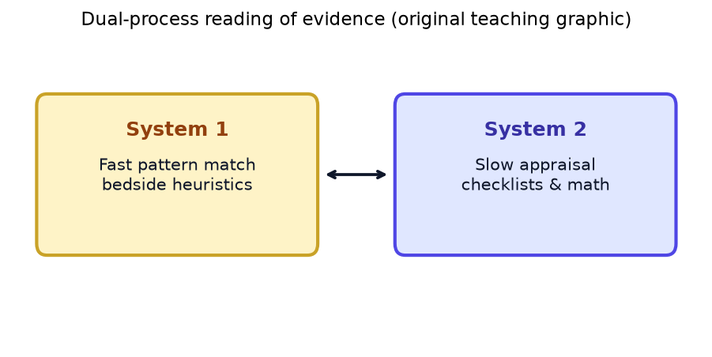
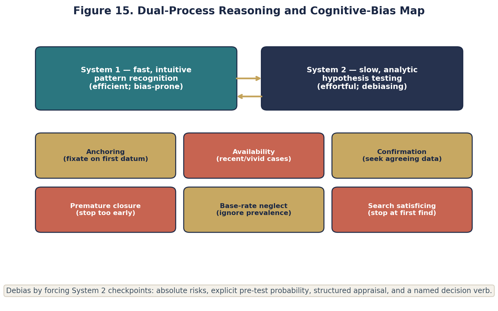
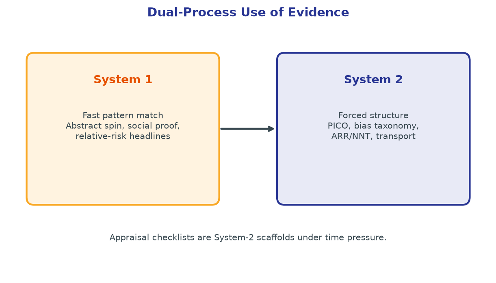

# Chapter 23. Clinical Reasoning, Dual Process, and Cognitive Bias When Using Evidence

## Opening


*System 1 pattern-matches an abstract in seconds; System 2 works the methods and the numbers — appraisal means knowing when to switch.*




*Fast, intuitive reasoning and slow, deliberate reasoning both operate at the bedside, and each has predictable failure modes.*



*Debiasing is a forcing function that hands the decision to System 2 before evidence is accepted or overruled.*

A confident consultant overrules the evidence with System-1 certainty. Use dual-process language to slow the handoff without shaming expertise.


## Why Reasoning Quality Is an Evidence Skill

Critical appraisal curricula traditionally conceptualize the reader as a dispassionate analyst in a sterile environment. Clinical reality contradicts this model. Literature informs practice on the margins of sign-out, amidst the cacophony of the emergency bay, or when confronted by a patient wielding a press release. Under these conditions, the clinician’s cognitive architecture—specifically the interplay between rapid pattern-matching heuristics and deliberative analytics—determines which evidence is utilized, which is distorted, and which is ignored entirely. Cognitive bias is not an intellectual defect isolated to novices; it is a fundamental property of human judgment executing under high cognitive load, time scarcity, and emotional valence. Appraisal methodologies that fail to account for the neurobiology of decision-making remain academic abstractions. When explicitly fused with dual-process theory, however, appraisal transforms into an essential patient safety mechanism.

The stroke service represents a particularly dense heuristic environment. Structural time pressures are severe. Stroke mimics abound, yet reperfusion therapies demand rapid deployment. Neuroimaging provides vivid, conceptually dominating inputs that can easily override subtle clinical incongruities. Outcomes are high-stakes and frequently binary, amplifying hindsight and outcome biases during subsequent morbidity reviews. Dual-process theory names the mechanisms at work — fast System 1, deliberate System 2 — and turns debiasing into a patient-safety mechanism rather than an academic aside.

## Dual Process: System 1 and System 2 in Cerebrovascular Practice

System 1 cognition operates via rapid, automatic, and associative mechanisms requiring minimal conscious effort. It is the architecture that identifies a dense middle cerebral artery sign instantaneously or choreographs a hyperacute stroke code based on a classic hemiparetic presentation. Clinical expertise relies heavily on well-calibrated System 1 networks trained through vast, supervised clinical exposure. Conversely, System 2 cognition is deliberative, sequential, and highly resource-intensive. It is required when recalculating a pre-test probability after uncovering a remote history of complex migraine, or when explicitly extracting absolute risk reductions from a manuscript that reports only adjusted hazard ratios.

Neither fast nor deliberative reasoning is inherently safe. In a suspected posterior-circulation stroke, teams should follow the current acute-stroke guideline and local pathway; the NIHSS has posterior-circulation limitations and should not be converted into a stand-alone treatment exclusion. In evidence appraisal, a top-line significance claim should be paired with absolute effects, uncertainty, validity, and applicability. Deliberative checkpoints are especially useful when data conflict or an action is difficult to reverse, but their design must preserve time-sensitive care.

- System 1 utility: Speed, pattern recognition, and procedural fluidity in high-acuity scenarios.
- System 1 liabilities: Stereotyping, premature closure, and vulnerability to the availability heuristic.
- System 2 utility: Rigorous calculation, checklist adherence, and systematic integration of disconfirming data.
- System 2 liabilities: Analytic paralysis, cognitive fatigue, and the generation of elaborate rationalizations to defend System 1 intuitions (motivated reasoning).
- Metacognitive regulation: The capacity to deliberately toggle between these systems constitutes a discrete, trainable clinical competency.

Evidence consumption exhibits a parallel dual-process dichotomy. Scanning a journal article for statistical significance indicators constitutes System 1 appraisal. Systematically calculating the number needed to treat (NNT), evaluating attrition bias, and mapping trial demographics to the local population represents System 2 appraisal. Departments that exclusively prize rapid, superficial literature summaries cultivate System 1 habits. Conversely, systems requiring a structured absolute-effect analysis prior to protocol modification enforce System 2 discipline without compromising efficiency in emergency contexts.

## Cognitive Biases Distorting Neurologic Diagnosis and Evidence Integration

### Anchoring

Anchoring represents a disproportionate adherence to an initial piece of information. A triage designation of 'acute stroke' establishes a profound cognitive anchor, often enduring even as the patient demonstrates fluctuating, functional, or non-vascular symptomatology. In the literature, a relative risk reduction of 45% published in a prominent abstract anchors the reader's perception of efficacy, overshadowing the subsequent revelation that the absolute risk reduction is a mere 1.2%. Neutralizing anchors demands the deliberate generation of competing hypotheses and the rigid translation of all statistical claims into natural frequencies.

### Availability

The availability heuristic biases judgment toward events that are easily recalled, typically those that are recent, emotionally resonant, or catastrophic. Following a devastating symptomatic intracranial hemorrhage post-thrombolysis, a clinician may subconsciously withhold therapy from appropriately selected candidates for weeks. Similarly, a dramatic thrombectomy success presented at morbidity and mortality rounds can inappropriately liberalize institutional selection criteria. In evidence appraisal, availability ensures that a heavily promoted, recently published positive trial exercises disproportionate influence compared to multiple, unheralded negative studies.

### Confirmation Bias

Confirmation bias is the systematic search for, and overvaluation of, data supporting an existing hypothesis, coupled with the minimization of disconfirming evidence. Diagnostically, it manifests as interrogating a patient exclusively for epileptogenic risk factors when the presentation equally supports syncope or cardiac arrhythmia. In literature evaluation, it is the practice of elevating a secondary subgroup analysis that validates a preexisting therapeutic preference while dismissing the primary null result of the trial. Rigorous pre-specification of endpoints and the mandatory reporting of absolute harm data are structural defenses against this bias.

### Premature Closure

Premature closure is the cessation of the diagnostic or analytic search before alternative explanations are adequately explored. Concluding 'this is an ischemic stroke' prematurely terminates the investigation into hypoglycemia, demyelinating disease, structural mass lesions, or complex migraine. Concluding 'this trial proves efficacy' aborts the search for loss-to-follow-up, unmasking, or selective outcome reporting. While time constraints occasionally mandate rapid closure in hyperacute settings, applying this heuristic indiscriminately is a primary driver of diagnostic and therapeutic error.

### Related Epistemic Hazards

- Search satisficing: Terminating an investigation upon identifying the first plausible explanation, rather than the most probable or comprehensive one.
- Diagnostic momentum: The uncritical propagation of an early, often provisional, diagnostic label through successive echelons of the medical hierarchy.
- Framing effects: The cognitive distortion whereby presenting data as '90% survival' elicits entirely different clinical behavior than '10% mortality,' despite mathematical equivalence.
- Omission bias: The tendency to judge harm resulting from an active intervention as inherently worse than equivalent harm resulting from inaction, often delaying critical reperfusion therapies.
- Commission bias: The compulsion to intervene—driven by the illusion of control—even when objective evidence demonstrates marginal or zero absolute benefit.
- Authority gradient: The phenomenon where junior team members suppress legitimate methodological critiques or clinical discordant findings in deference to a senior clinician's heuristic judgment.
- Outcome bias: The retrospective evaluation of decision quality based solely on the clinical result, rather than the rigor of the decision-making process given the information available at the time of the event.

## The Compound Failure: Methodological Gaps Meeting Heuristic Bias

Heuristic bias can undermine a clinician armed with flawless evidence, just as methodologically flawed literature can deceive a perfectly calibrated Bayesian reasoning process. The intersection of both produces cascading clinical failures. Consider an observational study reporting a profound mortality benefit from a novel neuroprotectant. The availability heuristic primes clinicians to adopt the intervention, while weak appraisal skills fail to detect the underlying immortal time bias and residual confounding. Confirmation bias subsequently elevates an enthusiastic accompanying editorial while marginalizing a rigorously conducted, neutral randomized trial. Consequently, clinical pathways are altered, exposing patients to financial toxicity and adverse effects for a strictly non-causal association.

This compound pathology is equally evident in the management of stroke mimics. An anchor on the triage note 'last known well 2 hours ago with hemiparesis' intersects with institutional commission pressure and a heuristic that defaults to thrombolysis under uncertainty. If the clinician concurrently misinterprets the literature regarding hemorrhage risk—conceptualizing it as a homogenous 'low risk' rather than stratifying by precise absolute percentages for mimics versus true ischemia—the therapeutic decision is stripped of both cognitive and quantitative rigor. Conversely, following an iatrogenic hemorrhage, the combination of the availability heuristic, omission bias, and the disproportionate weighting of single case reports can result in the denial of standard-of-care reperfusion to patients with unambiguous large vessel occlusions and disabling deficits.

Consumers of research exhibit analogous compound errors. Framing effects within an abstract ('highly significant relative improvement') exploit System 1 skimming habits. Spin—the selective highlighting of nominally positive secondary endpoints in a formally negative trial—exploits the confirmation bias of clinicians eager for a new therapeutic tool. The antidote is bilateral: rigorous training in the detection of spin and methodological frailty, combined with the enforcement of quantitative translation protocols that render cognitive distortions highly visible.

## Debiasing via Structured Appraisal and Environmental Design

Cognitive debiasing cannot rely solely on willpower or metacognitive awareness. Didactic sessions that merely name biases produce clinicians who are highly adept at identifying errors in colleagues while remaining blind to their own. True debiasing requires environmental design: structural interventions that alter the choice architecture. These include mandatory checklists, the forced calculation of absolute metrics, predefined analytic rubrics, red-team reviews of proposed clinical protocols, and explicit diagnostic timeouts that mandate the articulation of alternative hypotheses prior to irreversible interventions.

- Absolute-effect mandate: Prohibiting clinical pathway modifications without explicitly documenting the Absolute Risk Reduction (ARR), Absolute Risk Increase (ARI), and the relevant time horizon in natural frequencies.
- Pre-mortem analysis: A structured exercise identifying plausible ways a proposed protocol could fail or cause harm if key evidence or implementation assumptions are wrong.
- Directed adversarial review: Assigning a 'devil's advocate' during journal club, formally tasked with defending the null hypothesis and emphasizing the harm profile.
- Compulsory alternative generation: Requiring the documentation of at least two plausible alternative diagnoses in ambiguous emergency presentations prior to thrombolysis or angiography, assuming temporal parameters allow.
- Blinded radiographic adjudication: Instituting mechanisms for independent neuroimaging review when clinical phenomenology and initial radiologic interpretations conflict.
- Process-oriented morbidity and mortality (M&M): Realigning case conferences to evaluate the probabilistic rationality of the decision-making process at the time of the event, rather than focusing exclusively on the binary patient outcome.

Structured critical appraisal inherently functions as a debiasing technology. Utilizing a rigid validity–results–applicability scaffold forces a cognitive deceleration, preventing the impulsive leap from abstract perusal to clinical implementation. Clarity regarding the estimand neutralizes bait-and-switch outcome reporting. Strict adherence to interaction testing principles (Chapter 21) mitigates the confirmation bias inherent in dredging subgroups for positive findings. Understanding screening mathematics (Chapter 22) counters the availability-driven impulse to over-investigate incidental findings. These protocols are not bureaucratic hurdles; they are strategically placed System 2 speed bumps in domains where System 1 is known to crash.

Team dynamics also profoundly influence cognition. Diagnostic momentum is fundamentally a social contagion. Explicitly requesting dissent—'What features of this presentation argue against an ischemic etiology?'—disrupts this momentum and redistributes the cognitive load. Authority gradients are dismantled when senior clinicians openly model probabilistic uncertainty and when junior members are commended for identifying absolute-risk omissions rather than reprimanded for momentarily slowing the clinical workflow.

## Bedside Bayesian Updating and Action Thresholds

Bayesian reasoning links a pre-test probability with likelihood ratios to produce a post-test probability. That probability informs rather than mechanically dictates action: thresholds depend on test and treatment consequences, alternatives, uncertainty, patient values, current guidance, and system constraints. Base rates and likelihood ratios should come from populations and workflows relevant to the case, with spectrum, verification, and measurement limitations assessed.

As a synthetic reasoning exercise, start with a stated 40% pre-test probability and update it using a validated likelihood ratio for a defined DWI finding. A normal early non-contrast CT should not be assigned a strong negative likelihood ratio for ischemia without evidence for that intended use. In a different population with recurrent positive visual symptoms and headache, the starting probability and relevant alternatives differ. The example illustrates conditional updating; it does not diagnose a real patient or authorize treatment, and nonspecific imaging findings require clinical interpretation under current guidance.

```
BAYESIAN BEDSIDE HEURISTIC
==========================
Pre-test odds = Pre-test probability / (1 - Pre-test probability)
Post-test odds = Pre-test odds × Likelihood Ratio (LR)
Post-test probability = Post-test odds / (1 + Post-test odds)

Clinical Application:
P_pre = 0.20 (Phenotype with high mimic potential)
Odds_pre = 0.25
LR+ (Composite of specific clinical features + imaging) = 6.0
Odds_post = 1.5  ->  P_post = 0.60

Decision Rule:
Evaluate the updated P_post (0.60) against a rigid treatment threshold.
This threshold is not intuitive; it is calculated from the absolute
benefit/harm ratio of the proposed intervention (e.g., thrombolysis)
derived directly from valid clinical trials.
```

The establishment of explicit action thresholds is critical. The mandate to 'treat when probability exceeds threshold X' is intrinsically linked to the comparative regret associated with false-positive treatment versus false-negative reassurance. Administering thrombolytics to a patient with a disabling deficit, low mimic probability, and favorable hemorrhage risk profile operates on a vastly different threshold than administering the identical agent to a patient with a rapidly improving, non-disabling, or highly atypical syndrome. The rigorous appraisal of therapeutic evidence (Chapter 24) provides the absolute outcome data necessary to elevate these thresholds from subjective temperament to objective, probabilistic science.

## Worked Case: Stroke Mimic Evaluation Under Severe Time Constraint

### Presentation

A 34-year-old female presents to the emergency department at 14:10 with left facial and upper extremity weakness, noted at 13:40 during a lecture. Speech is fluent and articulate. She recounts a phenomenologically identical episode three years prior, which persisted for two hours and was followed by a severe throbbing headache. Capillary blood glucose is 95 mg/dL. Blood pressure is 128/78 mm Hg. The NIH Stroke Scale is scored at 4 (partial facial palsy 2, left arm motor drift 2). Non-contrast head CT demonstrates no acute pathology. CT angiography from the aortic arch to the vertex reveals no large vessel occlusion (LVO). The institutional door-to-needle timer is aggressively advancing. A senior resident dictates: 'Focal weakness with acute onset is a stroke until proven otherwise. We need to push alteplase immediately.'

### Heuristic Gravity

The clinical environment is saturated with System 1 attractors. Availability: The clinical team is acutely aware of a missed cervical artery dissection in a young patient at a neighboring facility the previous month. Anchoring: The triage documentation explicitly lists 'acute stroke,' establishing a powerful initial frame. Commission pressure: Institutional quality metrics fiercely incentivize rapid door-to-needle times, equating action with quality. Authority gradient: The senior resident’s unequivocal, binary framing exerts strong compliance pressure. Premature closure risk: Categorizing the event as ischemic before systematically integrating the history of identical prior episodes, the epidemiologic base rates for this demographic, the absence of an LVO, and the lack of cortical signs.

### Analytic Restructuring

The team forces a differential diagnosis: acute cerebral ischemia, migraine aura with motor manifestations, functional neurologic disorder, focal seizure with post-ictal paresis, and demyelinating exacerbation. The additional history lowers the team’s subjective probability of ischemia, but no validated bedside model supports a precise percentage in this case; record the uncertainty rather than inventing calibration.

Evidence integration: Early non-contrast CT is primarily used to identify hemorrhage and other major contraindicating findings; a normal scan does not exclude early ischemic stroke. CTA without a proximal large-vessel occlusion makes that particular target less likely on the acquired study but does not exclude distal, small-vessel, transient, or otherwise occult ischemia. Intravenous thrombolysis benefit depends on a credible ischemic-stroke diagnosis, time, eligibility, and whether the current deficit is disabling—not on the stroke-code label alone. A stroke mimic has no expected ischemic treatment benefit but is still exposed to treatment burdens and a nonzero hemorrhage risk. The decision therefore follows current guidance and the local pathway while integrating the material diagnostic uncertainty; this fictional vignette does not supply a patient-specific treatment threshold.

### Information Path and Updating

Rapid data acquisition identifies a scintillating scotoma before weakness, subtle give-way weakness superimposed on mild facial asymmetry, and records documenting prior migraine evaluation. The team first classifies whether the current deficit is disabling and checks thrombolysis eligibility under the current guideline and local pathway. Eligible patients with disabling deficits should receive intravenous thrombolysis promptly without delaying for additional multimodal imaging. For an otherwise eligible patient with suspected non-cardioembolic minor ischemic stroke whose deficits are judged non-disabling, current guidance generally favors short-course dual antiplatelet therapy rather than thrombolysis; diagnosis, mechanism, contraindications, bleeding risk, timing, and local protocol still govern. In this fictional case, the team judges the migraine phenotype strong; MRI may refine the diagnosis only if it does not delay an indicated time-critical treatment. DWI positivity would support ischemia but would not by itself mandate thrombolysis, and an early negative study would not exclude stroke.

In this fictional vignette, subsequent MRI shows no diffusion restriction; the deficits resolve over 90 minutes and are followed by a typical unilateral throbbing headache. The adjudicated diagnosis is migraine aura with motor features. A process review can commend explicit alternatives and calibrated uncertainty without retrospectively shaming the initial stroke-code activation. Any follow-up, further testing, or prevention plan must depend on the complete clinical evaluation, current guidance, and the responsible treating team—not on the vignette alone.

### Bias and Appraisal Lessons

- The activation of hyperacute stroke protocols is frequently correct even when the final adjudication is a mimic; process validity is independent of the final diagnostic outcome.
- Anchoring on the triage designation is systematically mitigated by the forced articulation of a differential diagnosis.
- Naming the availability heuristic makes it inspectable but does not neutralize it; the team still needs alternative hypotheses, base rates, and a structured evidence check.
- Therapeutic decisions should integrate guideline eligibility, whether the deficit is disabling, and absolute benefit-harm estimates using a calibrated probability or defensible range when one is available; otherwise, document uncertainty rather than inventing precision.
- Diagnostic modalities must be appraised based on their specific likelihood ratios at precise temporal milestones (e.g., the vast difference in sensitivity between early CT and DWI).
- Clinical documentation should record the material uncertainty, decision factors, and any defensible threshold or range that informed the decision, without implying that an unvalidated probability was measured precisely.

## Journal Club as a Cognitive Proving Ground

The traditional journal club must be fundamentally redesigned to serve as a gymnasium for dual-process cognitive discipline. This requires the formal assignment of adversarial roles: the methodological skeptic, the absolute-effects quantifier, the applicability and generalizability translator, and the clinical adoption advocate. These roles must rotate to prevent individuals from becoming entrenched as permanent institutional cynics or uncritical early adopters. A structural embargo on global verdicts ('This is a great paper') during the initial ten minutes of discussion is essential. Furthermore, any motion to declare a paper 'practice-changing' must be preceded by a written, consensus statement articulating the findings in natural frequencies. These rituals act as potent social debiasing mechanisms, actively neutralizing publication spin, flattening authority gradients, and dismantling confirmation bias.

For non-emergent protocol adoption after a highly anticipated or emotionally volatile study, a brief cooling-off period can allow independent extraction, protocol review, and reconciliation with the total evidence. This default must not delay urgent safety actions when credible evidence identifies immediate harm. The duration should be operationally chosen rather than treated as a universal 48-hour biological rule.

## Fatigue, Hierarchy, and Media in Evidence Consumption

Cognitive biases are severely amplified when physiologic reserves are depleted and organizational stressors escalate. A night-float resident reviewing a trial abstract at 04:00 is highly susceptible to anchoring on a prominent relative risk reduction, lacking the cognitive bandwidth to reconstruct the absolute risk profile from a labyrinthine supplementary appendix. Sleep deprivation disproportionately degrades System 2 deliberative capacity while sparing System 1 heuristic processing, meaning that automatic, biased judgments dominate precisely during the periods when high-stakes, time-sensitive therapeutic decisions are concentrated. Clinical services that passively route complex literature alerts into overnight inboxes, absent a dedicated daytime appraisal forum, are actively engineering cognitive bias into their workflow. The structural countermeasure is temporal segregation: literature may be collated continuously, but pathway-altering interpretation is strictly reserved for scheduled, well-rested review sessions requiring consensus from a second, independent reader.

Institutional hierarchy dictates which biases are socially tolerated. A junior clinician may harbor profound, methodologically valid doubts regarding a senior consultant's enthusiasm for an underpowered, biologically implausible subgroup analysis, yet choose silence. This silence transcends mere professional deference; it constitutes a critical safety failure when that subgroup analysis is weaponized to withhold standard-of-care reperfusion or to recklessly expand anticoagulation into a highly vulnerable demographic. Senior clinicians dismantle this authority gradient by actively soliciting methodological pushback, formally praising quantitative challenges to their own clinical reasoning, and visibly modeling the revision of their prior convictions when confronted with disappointing absolute event rates. The implementation of written appraisal memoranda accompanying any proposed protocol alteration further democratizes the critique process: a written memo may contain analytical errors, but it cannot be silenced or talked over in a chaotic clinical environment.

Social and mass media can amplify vivid cases and availability bias. A viral adverse-event story, celebrity recovery narrative, or polarized debate thread may change perceived probabilities without changing the underlying evidence. Institutions can respond proportionately with source-linked summaries, relevant base rates, absolute effects, uncertainty, and clear evidence boundaries. The aim is not to police discussion but to make accurate context accessible before a vivid anecdote becomes a de facto estimate.

Electronic health records (EHR) introduce an insidious, structural bias: default order sets crystallize the evidence interpretations of the past. If a methodologically fragile, marginally positive trial was historically hard-wired into an admission order panel, commission bias ceases to be an individual cognitive error and becomes an infrastructural mandate. Therefore, comprehensive critical appraisal necessitates the cyclical, systematic review of existing EHR order sets utilizing the identical validity–results–applicability framework applied to novel literature, combined with strict expiration dates for any default parameters driven by initial, unconfirmed therapeutic enthusiasm.

## Synthesizing Cognitive Debiasing with Quantitative Rigor

The sustainable integration of cognitive discipline and critical appraisal depends on clinical habits. First, translate relative claims into natural frequencies with an endpoint and horizon. Second, articulate at least one credible alternative diagnosis or interpretation at important inflection points. Third, define the action threshold—or a defensible range—when calibrated probabilities and utilities permit; when they do not, document the uncertainty and decision factors rather than inventing an exact number.

These habits are compatible with Bayesian reasoning. Natural frequencies can make pre- and post-test probability calculations easier to inspect. Deliberately generating credible alternatives can counter premature closure, while explicit thresholds connect estimated probabilities with the comparative consequences of false-positive and false-negative actions. Teaching the names of biases alone should not be assumed to change diagnostic performance; debiasing strategies need outcome-based evaluation in the setting where they will be used.

Systematic measurement can close the feedback loop. A clinical service might track local mimic rates among patients receiving reperfusion therapies, post-thrombolytic symptomatic hemorrhage rates stratified by stroke severity, the frequency of pathway modifications accompanied by absolute-effect documentation, and trainee calibration. Any such activity should use an institutionally approved quality-improvement or educational workflow, the minimum necessary data, and an approved secure system. Use de-identified or coded data where feasible; do not place patient identifiers in personal notes or devices. Local privacy and QI offices should determine the appropriate oversight, and activities designed to produce generalizable knowledge may require a research determination. The relevant boundaries are summarized in [HHS guidance on health-care operations](https://www.hhs.gov/hipaa/for-professionals/privacy/guidance/disclosures-treatment-payment-health-care-operations/index.html) and [OHRP guidance on quality improvement](https://www.hhs.gov/ohrp/regulations-and-policy/guidance/faq/quality-improvement-activities/index.html). Metrics should also be coupled with psychological safety so that reporting a near-miss supports system improvement rather than individual punishment.

## Epistemic Pitfalls and Common Failure Modes

Pitfall 1: The metacognitive illusion—the erroneous belief that knowing the nomenclature of cognitive biases provides immunity against them. Awareness is sterile unless coupled with rigorous environmental redesign.

Pitfall 2: Engaging in 'System 2 theater'—conducting protracted, seemingly analytical clinical discussions that ultimately fail to calculate or integrate absolute risk parameters.

Pitfall 3: The institutional humiliation of stroke mimics during morbidity and mortality conferences. This toxic practice actively incentivizes the concealment of uncertainty and systematically suppresses the future generation of broad differential diagnoses.

Pitfall 4: The pendulum effect—drastically over-correcting clinical protocols following a single adverse outcome, thereby institutionalizing the opposing bias for an extended duration without reference to objective epidemiological base rates.

Pitfall 5: The uncritical outsourcing of clinical reasoning to algorithmic pathway software, willfully ignoring the reality that the algorithm itself was programmed based upon a potentially biased interpretation of fragile literature.

Pitfall 6: Shrouding Bayesian logic in mystical complexity. Bayesian reasoning is merely disciplined common sense quantified; however, if the inputs (priors and likelihood ratios) are fundamentally flawed, the resulting post-test probabilities are mathematically precise illusions.

## Clinical and Epidemiologic Corollaries

Clinical corollary: Acute time pressure does not justify the abandonment of all System 2 cognitive checkpoints; rather, it dictates that these checkpoints must be pre-committed and structurally embedded. The most effective debiasing for hyperacute emergency department workflows is architected during mid-day multidisciplinary committee meetings, not improvised during a 03:00 stroke code.

Clinical corollary: Patients and their families frequently introduce profound availability and framing effects via internet printouts and highly curated social media videos. The professional response requires the patient deployment of natural frequencies and the transparent discussion of shared clinical thresholds, avoiding both dismissive paternalism and uncritical capitulation.

Epidemiologic corollary: Base rates are the fundamental currency of epidemiology. A clinical service operating without precise knowledge of its institutional mimic rate, the prevalence of large vessel occlusions among stroke code activations, or its localized post-thrombolysis hemorrhage rate is attempting to navigate a complex Bayesian environment while entirely blind to its foundational probabilities. Robust, localized clinical registries are non-negotiable cognitive infrastructure.

Epidemiologic corollary: The calibration of clinical judgment is a directly measurable metric. Services should routinely plot clinicians' predicted probability of 'true ischemia' against the final, adjudicated diagnostic outcomes. A persistent pattern of overprediction is not a mark of appropriate caution; it is a signal of systematic cognitive bias necessitating targeted structural intervention.

Pedagogical corollary: Theoretical instruction on cognitive bias must be inextricably linked to quantitative execution. When teaching the anchoring heuristic, force the immediate recalculation of an abstract’s absolute risk reduction. When teaching the availability heuristic, visually plot the true, localized incidence rates against the perceived incidence rates derived from a survey of the clinical staff.

Systems engineering corollary: Quality metrics can create commission bias, selection pressure, or gaming if speed is rewarded without appropriateness and safety context. Pair velocity measures with governance-approved balancing measures, case review, and harm surveillance whose definitions and use are tested for fairness, privacy, and unintended delay. No single audit metric is universally mandatory or sufficient.

## Instruments for Personal and Team Practice

```
BIAS AND EVIDENCE INTEGRATION: RAPID DEBRIEFING INSTRUMENT (5 Minutes)
======================================================================
Index Decision/Intervention:
Initial Cognitive Anchor / Triage Label:
Alternative Hypotheses Explicitly Articulated:
Epidemiological Base Rate Utilized (and Source):
Determinative Absolute Benefit/Harm Metrics:
Principal Heuristic Vulnerabilities Active in this Encounter:
Identified Parameters for Recalculation in Future Analogous Cases:
Team Dynamics: Was Dissent Actively Solicited and Entertained? [Y/N]
```

This instrument is a teaching template, not authorization to create a patient-level dataset. Use simulated cases or an institutionally approved, minimum-necessary, de-identified workflow in an approved secure system. Do not include names, medical-record numbers, exact dates, or other patient identifiers in a personal log.

When those safeguards are in place, periodic review may reveal a recurrent anchor, over-reliance on an imaging modality's negative predictive value, or a habit of accepting abstract conclusions without checking the underlying evidence. The goal is structured reflection, not a shadow clinical record.


## Chapter summary

Hyperacute stroke care combines fast pattern recognition with deliberate checking when time and uncertainty permit. Anchoring, availability, confirmation, premature closure, framing, omission/commission concerns, and authority gradients can affect both diagnosis and evidence use. Debiasing interventions may include absolute-effect displays, diagnostic pauses at defined decision points, independent review for high-impact policy changes, checklists, and process-oriented case review, but each intervention should be tested for delay, burden, equity, and unintended effects. Bayesian updating links base rates, likelihood ratios, and decision consequences; it does not replace current pathways, specialist judgment, or time-sensitive action.

## Practice and reflection

1. Using a simulated case—or an institutionally approved, de-identified educational or QI workflow—complete the Bias and Evidence Integration Rapid Debriefing Instrument and discuss one identified cognitive vulnerability with a peer.
2. Select a recently published abstract that foregrounds a relative risk reduction. Systematically translate the findings into a natural frequency array prior to reading the full manuscript or discussion section.
3. Catalog three discrete triggers of the availability heuristic that have permeated your clinical service over the past month (e.g., catastrophic cases, viral media reports, localized litigation), and critically estimate their magnitude of impact on current prescribing patterns.
4. Draft and role-play a standardized diagnostic timeout script designed specifically for a patient presenting with minor, fluctuating neurologic deficits and a strong migraine history, who is currently within the standard thrombolysis time window.
5. Design a calibration exercise using simulated cases or an institutionally approved, de-identified dataset. Prespecify probability bins or ranges, the adjudication method, and how uncertainty will be handled; do not create a personal patient-level log.
6. Identify a textbook example of confirmation bias within a published, secondary subgroup analysis that conveniently supports a therapy you personally favor. Rigorously restate the trial's primary endpoint results while entirely excluding the subgroup data.
7. Systematically map the authority gradient dynamics observed during a recent, complex clinical handoff. Propose one specific, standardized phrase that senior attending physicians could implement to explicitly solicit dissenting opinions from junior staff.
8. Perform a rapid Bayesian calculation: Given a pre-test probability of 0.30 and a diagnostic test yielding a positive likelihood ratio of 4.0, calculate the exact post-test probability. Define the specific clinical action threshold you would apply to this result.
9. Architect a novel journal-club operating procedure for your department that mandates the assignment of four rotating roles: the Methodological Skeptic, the Absolute-Effects Quantifier, the Applicability Translator, and the Clinical Implementation Advocate.
10. Compose a concise, two-minute didactic presentation explicitly linking the heuristic of premature closure in bedside clinical diagnosis to the analogous error of premature closure when uncritically accepting a trial's 'positive' top-line result.

---

*Figures and tables in this chapter are Teaching materials for CRIT-APP unless a caption explicitly states otherwise. Methods standards are cited by name only.*
