# Chapter 24. Appraising Therapy and Harm Questions

## Opening

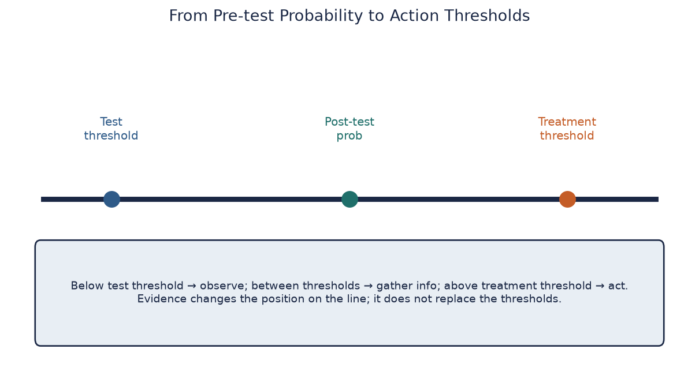

*Action thresholds (original).*

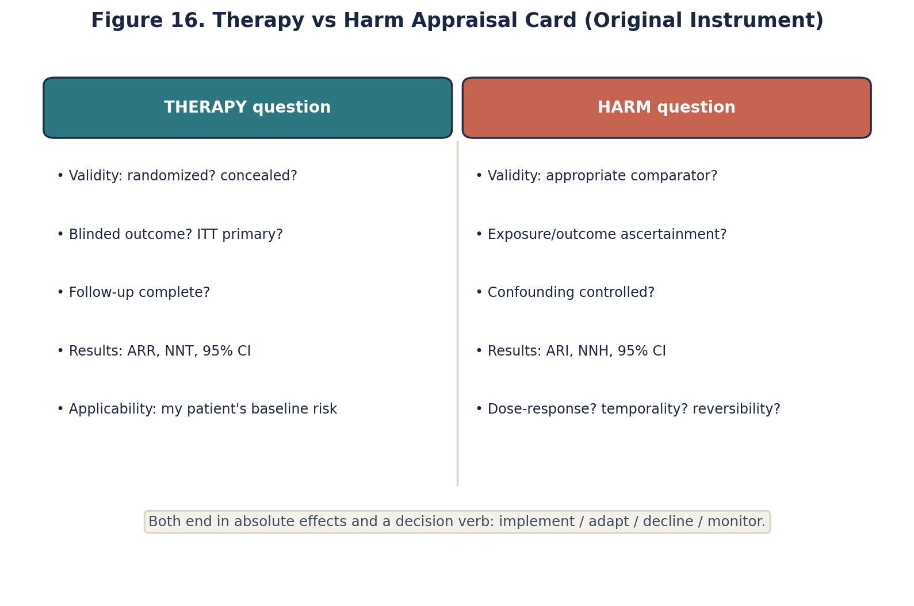

*Therapy and harm card (original).*

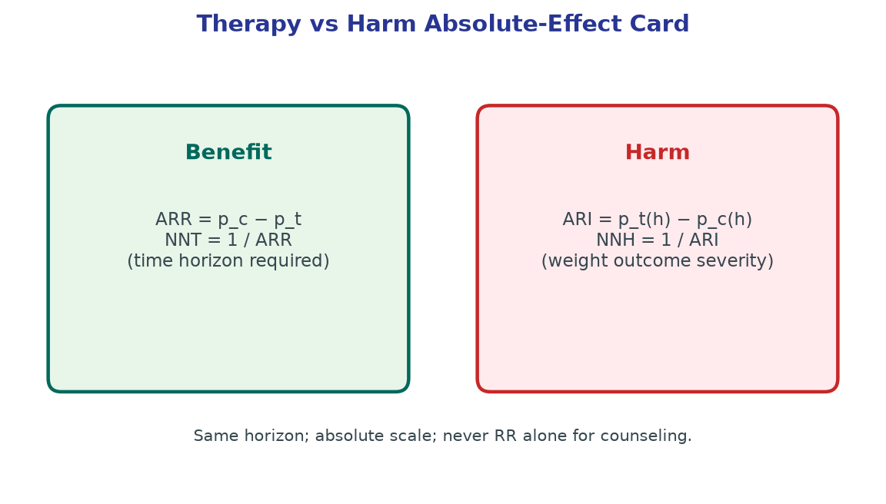

*Therapy versus harm absolute-effect card (original).*

Therapy and harm are presented on mismatched scales. Force both benefit and bleeding onto absolute risks in the same time window.

## Learning objectives

- Evaluate the internal validity of therapeutic trials and harm studies using structured criteria.
- Calculate and interpret absolute risk reductions, absolute risk increases, NNT, and NNH.
- Assess the applicability of clinical trial data to local patient populations and healthcare systems.
- Deconstruct composite endpoints and evaluate the limitations of surrogate markers in neurology.
- Identify biases inherent in observational harm studies and open-label trials.
- Synthesize appraisal findings into actionable, structured formats for clinical pathways.

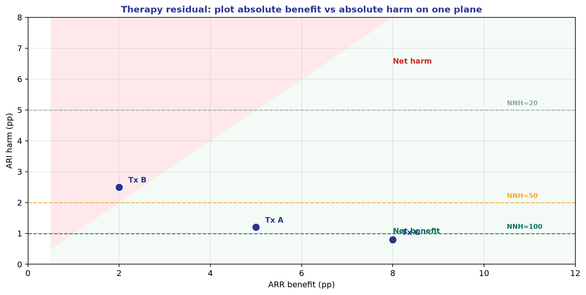

*Teaching figure (synthetic).* Cycle-26 densify scientific residual.

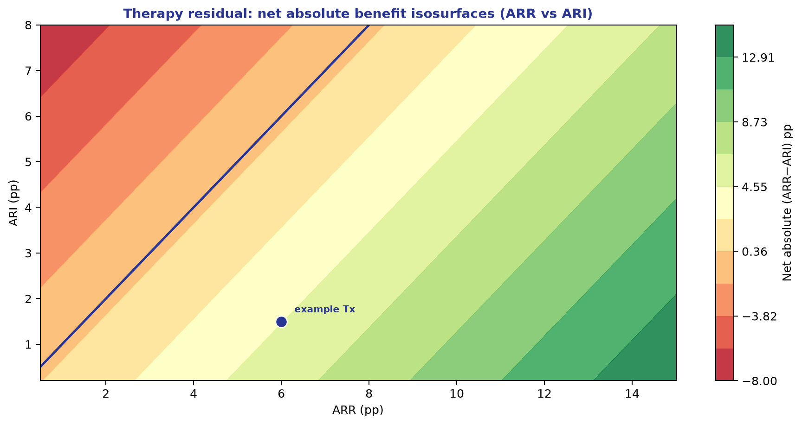

*Teaching figure (synthetic).* Cycle-28 densify scientific residual.

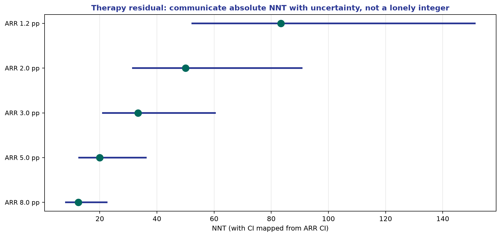

*Teaching figure (synthetic).* Cycle-30 densify scientific residual.

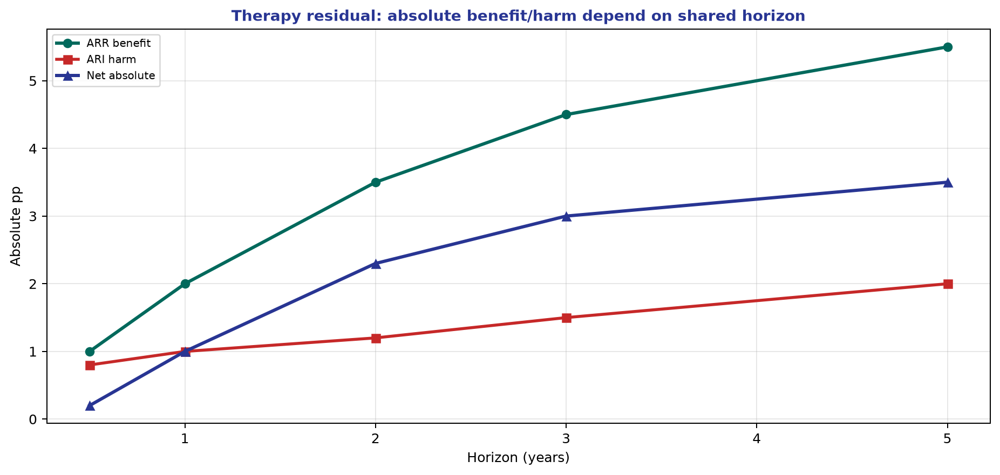

*Teaching figure (synthetic).* Cycle-32 densify scientific residual.

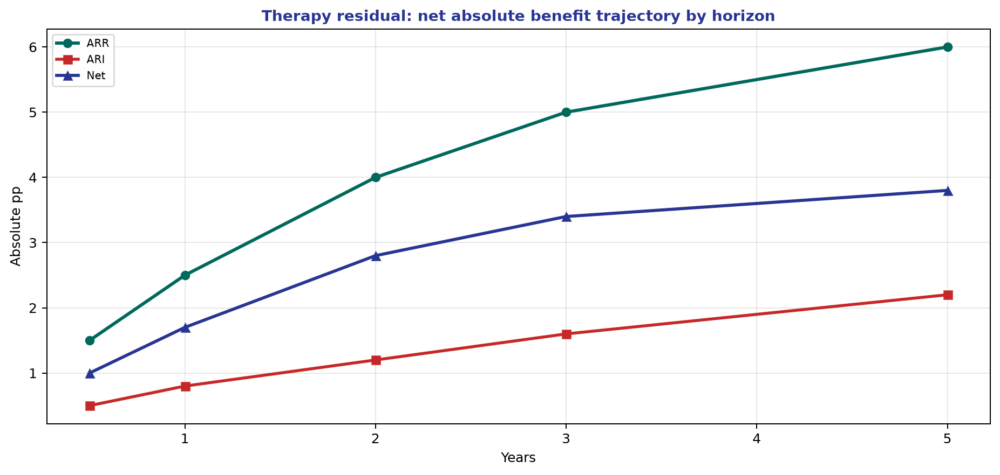

*Teaching figure (synthetic).* Cycle-34 densify scientific residual.

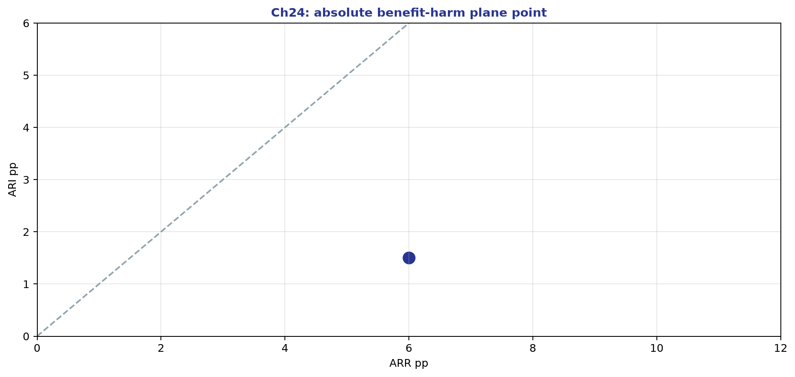

*Teaching figure (synthetic).* Cycle-35/36 densify scientific residual.

## Three gates for therapy and harm papers

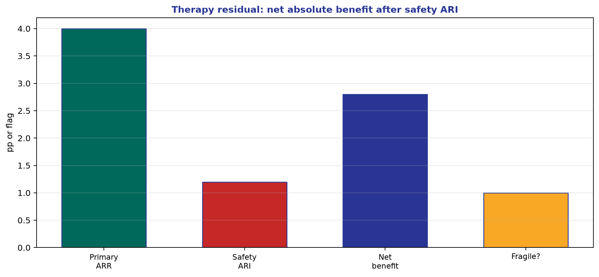

*Teaching figure (synthetic).* Pair ARR with ARI.

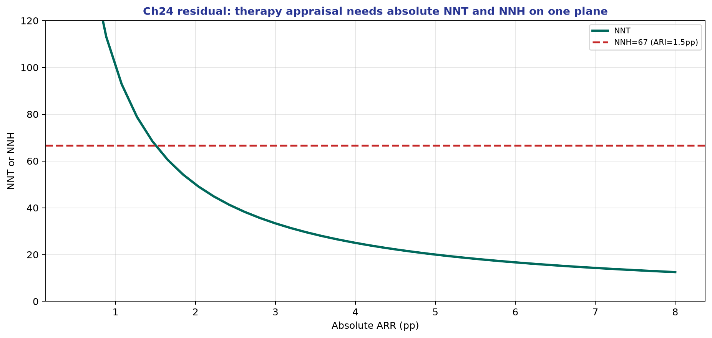

*Teaching figure (synthetic).* Cycle-38 densify scientific residual (ch15–28).

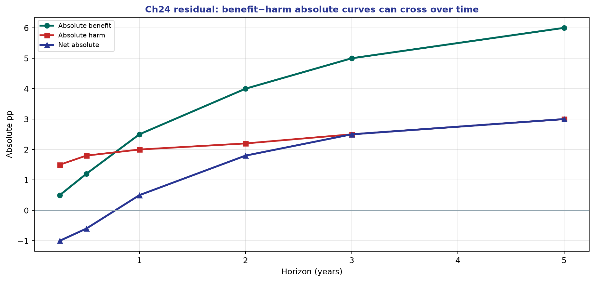

*Teaching figure (synthetic).* Cycle-40 densify scientific residual (ch15–28).

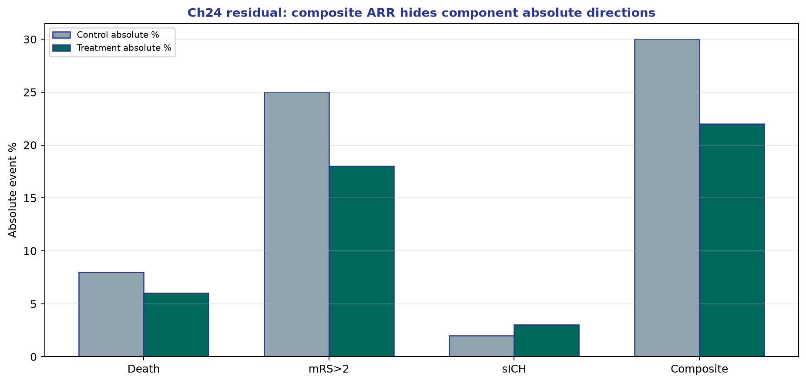

*Teaching figure (synthetic).* Cycle-42 densify scientific residual (ch15–28).

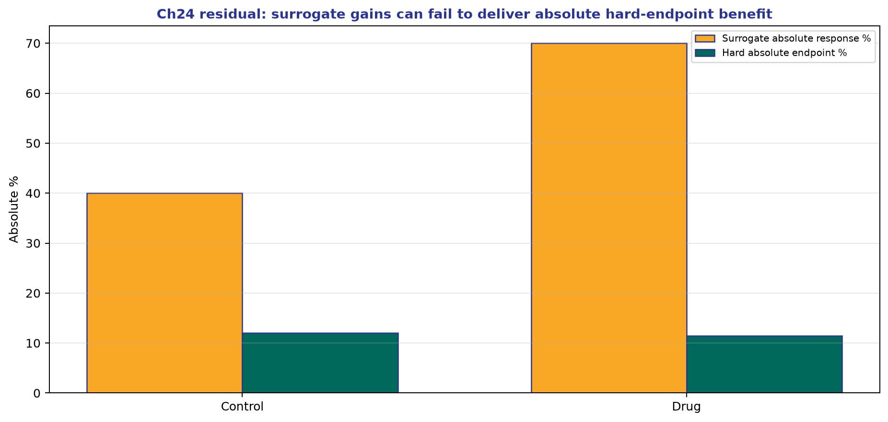

*Teaching figure (synthetic).* Cycle-44 densify scientific residual (ch15–28).

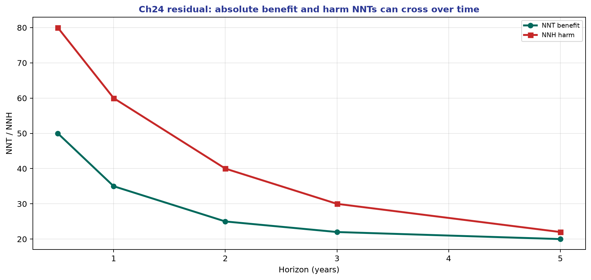

*Teaching figure (synthetic).* Cycle-46 densify scientific residual (ch15–28).

*Teaching figure (synthetic).* Cycle-280 densify scientific residual (ch15–28).

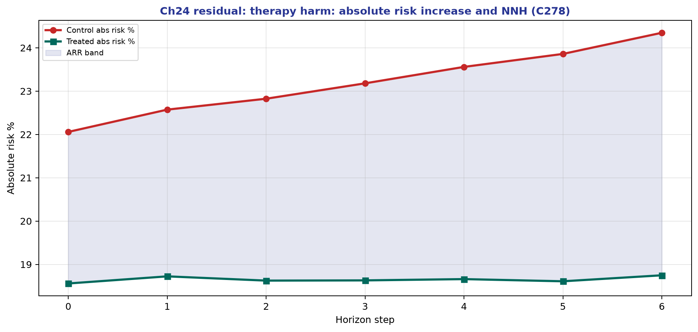

*Teaching figure (synthetic).* Cycle-278 densify scientific residual (ch15–28).

*Teaching figure (synthetic).* Cycle-276 densify scientific residual (ch15–28).

*Teaching figure (synthetic).* Cycle-274 densify scientific residual (ch15–28).

*Teaching figure (synthetic).* Cycle-272 densify scientific residual (ch15–28).

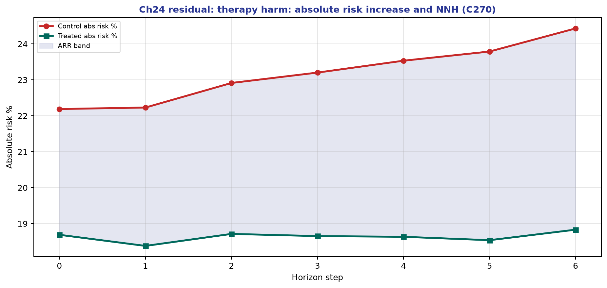

*Teaching figure (synthetic).* Cycle-270 densify scientific residual (ch15–28).

*Teaching figure (synthetic).* Cycle-268 densify scientific residual (ch15–28).

*Teaching figure (synthetic).* Cycle-266 densify scientific residual (ch15–28).

*Teaching figure (synthetic).* Cycle-264 densify scientific residual (ch15–28).

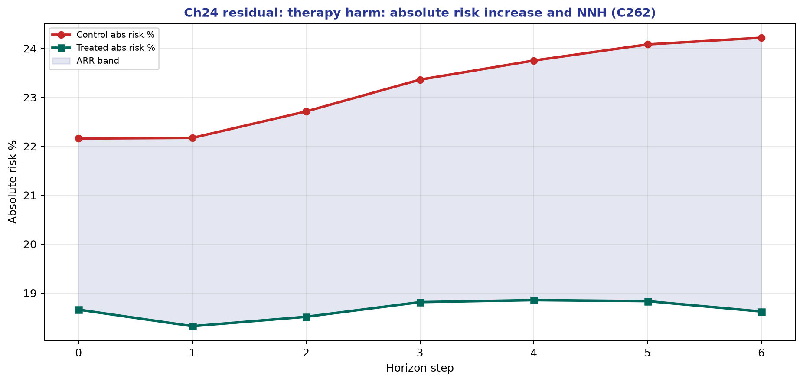

*Teaching figure (synthetic).* Cycle-262 densify scientific residual (ch15–28).

*Teaching figure (synthetic).* Cycle-260 densify scientific residual (ch15–28).

*Teaching figure (synthetic).* Cycle-258 densify scientific residual (ch15–28).

*Teaching figure (synthetic).* Cycle-256 densify scientific residual (ch15–28).

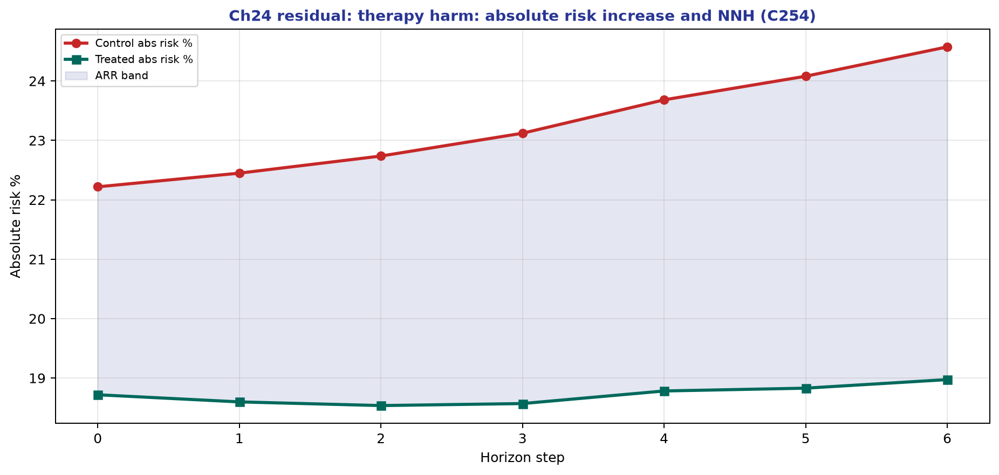

*Teaching figure (synthetic).* Cycle-254 densify scientific residual (ch15–28).

*Teaching figure (synthetic).* Cycle-252 densify scientific residual (ch15–28).

*Teaching figure (synthetic).* Cycle-250 densify scientific residual (ch15–28).

*Teaching figure (synthetic).* Cycle-248 densify scientific residual (ch15–28).

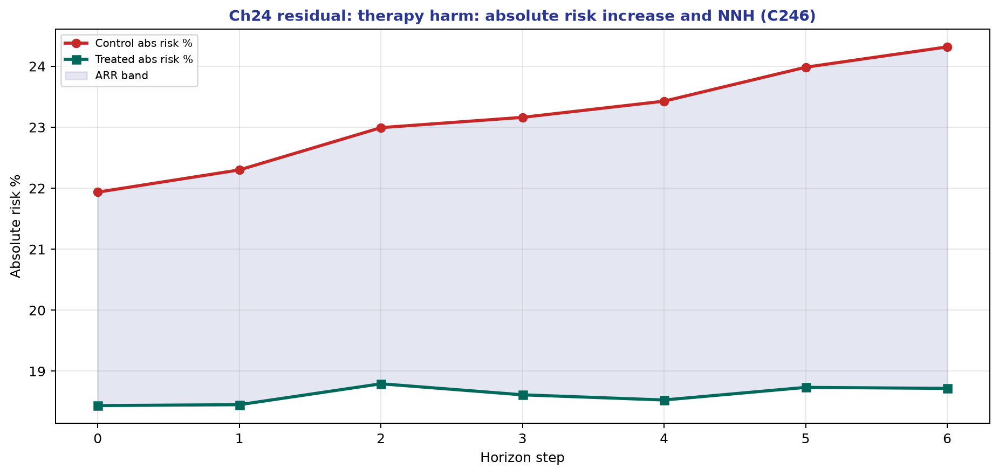

*Teaching figure (synthetic).* Cycle-246 densify scientific residual (ch15–28).

*Teaching figure (synthetic).* Cycle-244 densify scientific residual (ch15–28).

*Teaching figure (synthetic).* Cycle-242 densify scientific residual (ch15–28).

*Teaching figure (synthetic).* Cycle-240 densify scientific residual (ch15–28).

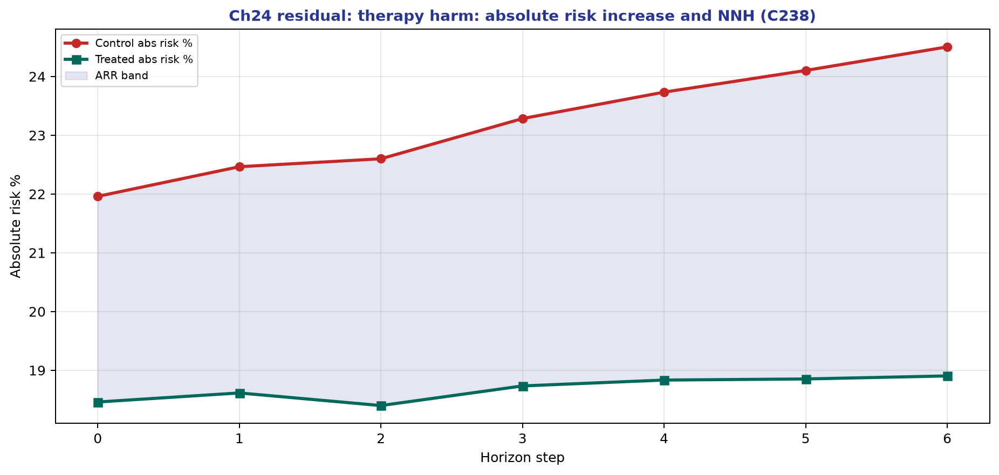

*Teaching figure (synthetic).* Cycle-238 densify scientific residual (ch15–28).

*Teaching figure (synthetic).* Cycle-236 densify scientific residual (ch15–28).

*Teaching figure (synthetic).* Cycle-234 densify scientific residual (ch15–28).

*Teaching figure (synthetic).* Cycle-232 densify scientific residual (ch15–28).

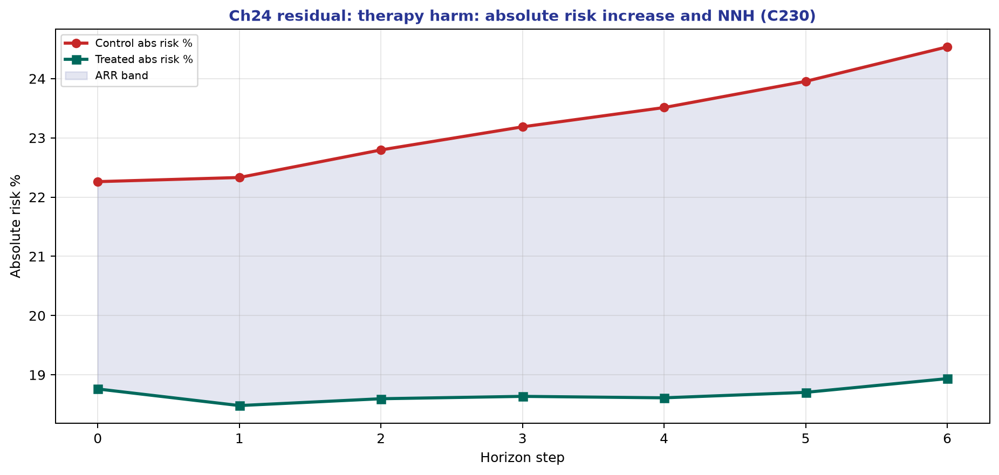

*Teaching figure (synthetic).* Cycle-230 densify scientific residual (ch15–28).

*Teaching figure (synthetic).* Cycle-228 densify scientific residual (ch15–28).

*Teaching figure (synthetic).* Cycle-226 densify scientific residual (ch15–28).

*Teaching figure (synthetic).* Cycle-224 densify scientific residual (ch15–28).

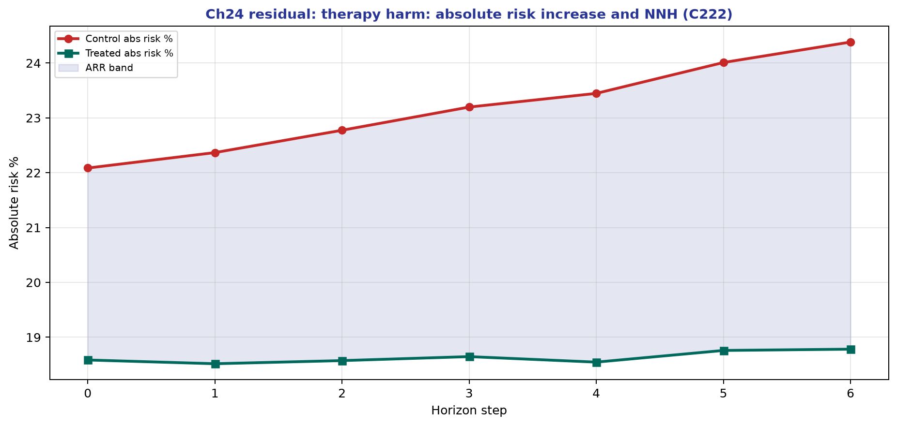

*Teaching figure (synthetic).* Cycle-222 densify scientific residual (ch15–28).

*Teaching figure (synthetic).* Cycle-220 densify scientific residual (ch15–28).

*Teaching figure (synthetic).* Cycle-218 densify scientific residual (ch15–28).

*Teaching figure (synthetic).* Cycle-216 densify scientific residual (ch15–28).

*Teaching figure (synthetic).* Cycle-214 densify scientific residual (ch15–28).

*Teaching figure (synthetic).* Cycle-212 densify scientific residual (ch15–28).

*Teaching figure (synthetic).* Cycle-210 densify scientific residual (ch15–28).

*Teaching figure (synthetic).* Cycle-208 densify scientific residual (ch15–28).

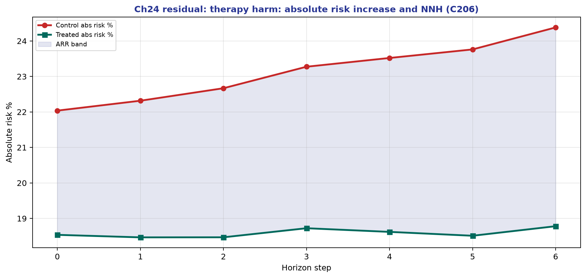

*Teaching figure (synthetic).* Cycle-206 densify scientific residual (ch15–28).

*Teaching figure (synthetic).* Cycle-204 densify scientific residual (ch15–28).

*Teaching figure (synthetic).* Cycle-202 densify scientific residual (ch15–28).

*Teaching figure (synthetic).* Cycle-200 densify scientific residual (ch15–28).

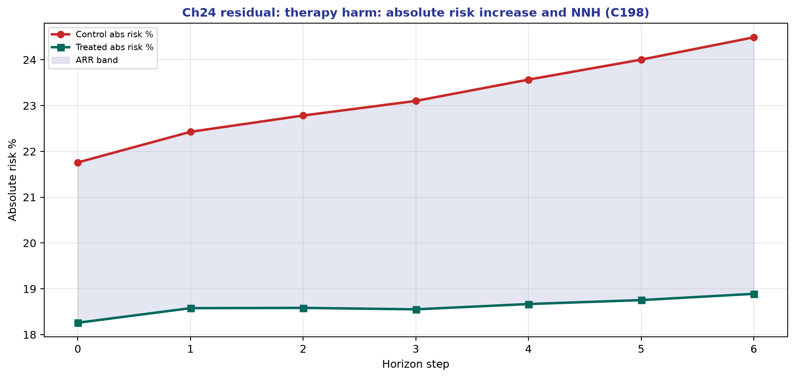

*Teaching figure (synthetic).* Cycle-198 densify scientific residual (ch15–28).

*Teaching figure (synthetic).* Cycle-196 densify scientific residual (ch15–28).

*Teaching figure (synthetic).* Cycle-194 densify scientific residual (ch15–28).

*Teaching figure (synthetic).* Cycle-192 densify scientific residual (ch15–28).

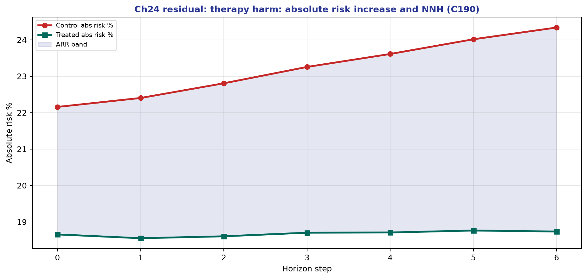

*Teaching figure (synthetic).* Cycle-190 densify scientific residual (ch15–28).

*Teaching figure (synthetic).* Cycle-188 densify scientific residual (ch15–28).

*Teaching figure (synthetic).* Cycle-186 densify scientific residual (ch15–28).

*Teaching figure (synthetic).* Cycle-184 densify scientific residual (ch15–28).

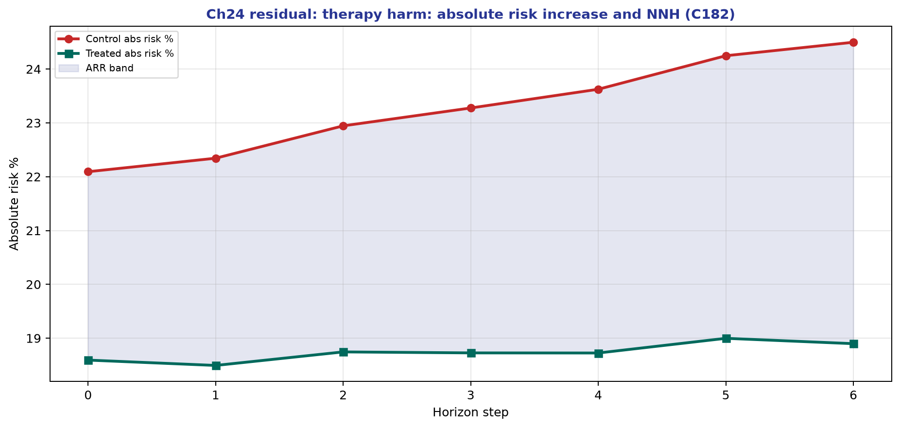

*Teaching figure (synthetic).* Cycle-182 densify scientific residual (ch15–28).

*Teaching figure (synthetic).* Cycle-180 densify scientific residual (ch15–28).

*Teaching figure (synthetic).* Cycle-178 densify scientific residual (ch15–28).

*Teaching figure (synthetic).* Cycle-176 densify scientific residual (ch15–28).

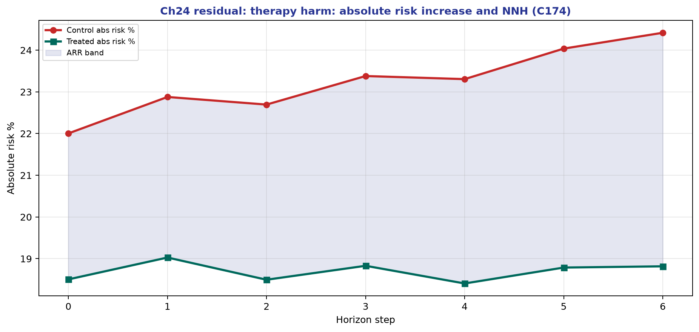

*Teaching figure (synthetic).* Cycle-174 densify scientific residual (ch15–28).

*Teaching figure (synthetic).* Cycle-172 densify scientific residual (ch15–28).

*Teaching figure (synthetic).* Cycle-170 densify scientific residual (ch15–28).

*Teaching figure (synthetic).* Cycle-168 densify scientific residual (ch15–28).

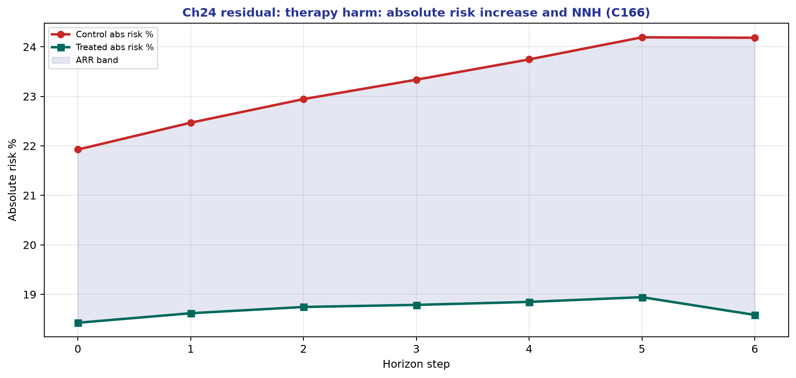

*Teaching figure (synthetic).* Cycle-166 densify scientific residual (ch15–28).

*Teaching figure (synthetic).* Cycle-164 densify scientific residual (ch15–28).

*Teaching figure (synthetic).* Cycle-162 densify scientific residual (ch15–28).

*Teaching figure (synthetic).* Cycle-160 densify scientific residual (ch15–28).

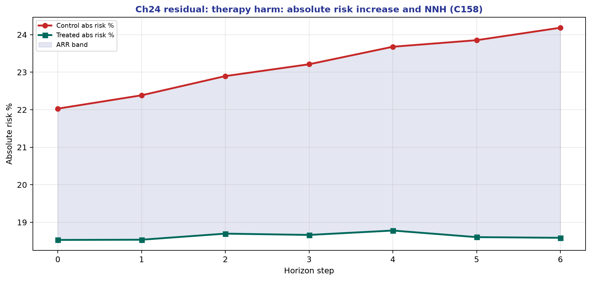

*Teaching figure (synthetic).* Cycle-158 densify scientific residual (ch15–28).

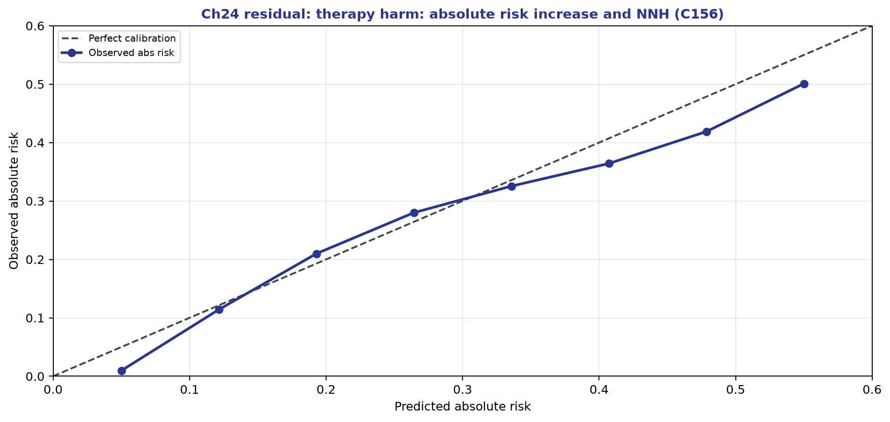

*Teaching figure (synthetic).* Cycle-156 densify scientific residual (ch15–28).

*Teaching figure (synthetic).* Cycle-154 densify scientific residual (ch15–28).

*Teaching figure (synthetic).* Cycle-152 densify scientific residual (ch15–28).

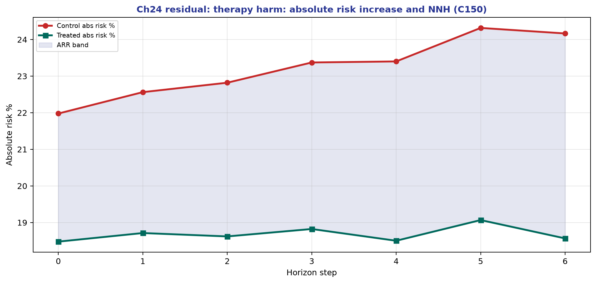

*Teaching figure (synthetic).* Cycle-150 densify scientific residual (ch15–28).

*Teaching figure (synthetic).* Cycle-148 densify scientific residual (ch15–28).

*Teaching figure (synthetic).* Cycle-146 densify scientific residual (ch15–28).

*Teaching figure (synthetic).* Cycle-144 densify scientific residual (ch15–28).

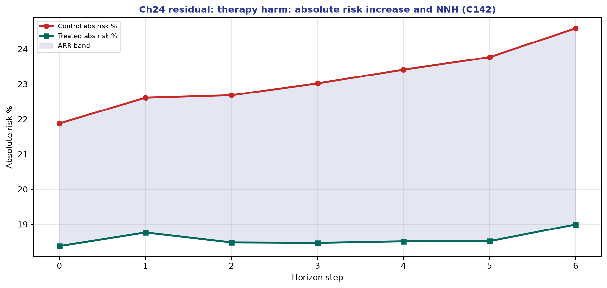

*Teaching figure (synthetic).* Cycle-142 densify scientific residual (ch15–28).

*Teaching figure (synthetic).* Cycle-140 densify scientific residual (ch15–28).

*Teaching figure (synthetic).* Cycle-138 densify scientific residual (ch15–28).

*Teaching figure (synthetic).* Cycle-136 densify scientific residual (ch15–28).

*Teaching figure (synthetic).* Cycle-134 densify scientific residual (ch15–28).

*Teaching figure (synthetic).* Cycle-132 densify scientific residual (ch15–28).

*Teaching figure (synthetic).* Cycle-130 densify scientific residual (ch15–28).

*Teaching figure (synthetic).* Cycle-128 densify scientific residual (ch15–28).

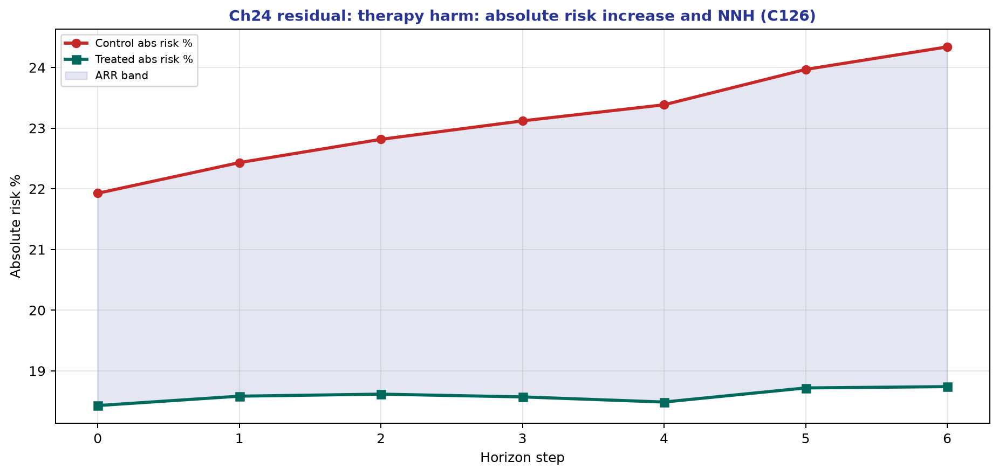

*Teaching figure (synthetic).* Cycle-126 densify scientific residual (ch15–28).

*Teaching figure (synthetic).* Cycle-124 densify scientific residual (ch15–28).

*Teaching figure (synthetic).* Cycle-122 densify scientific residual (ch15–28).

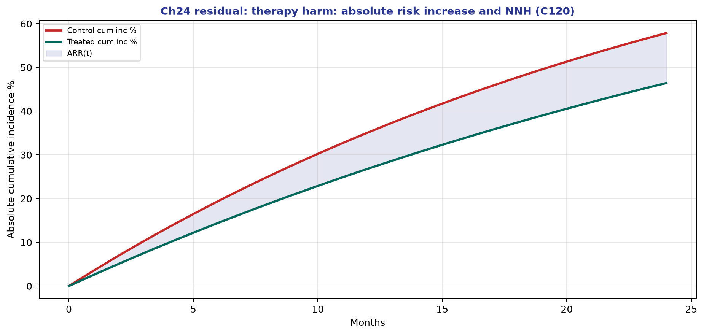

*Teaching figure (synthetic).* Cycle-120 densify scientific residual (ch15–28).

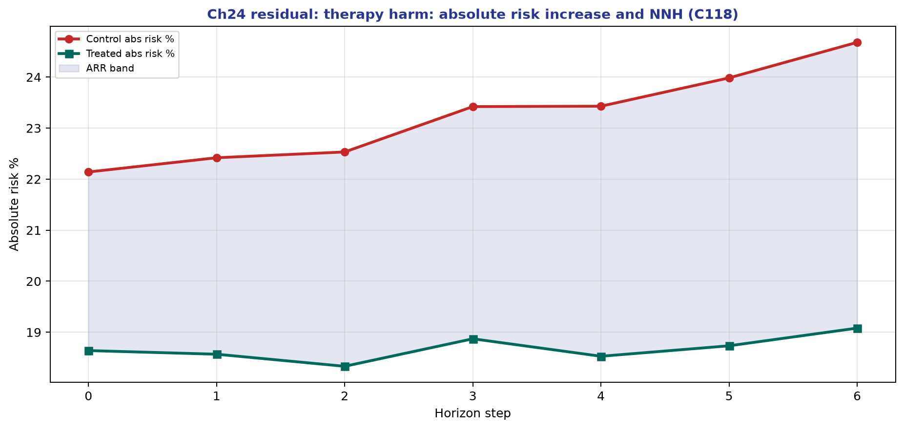

*Teaching figure (synthetic).* Cycle-118 densify scientific residual (ch15–28).

*Teaching figure (synthetic).* Cycle-116 densify scientific residual (ch15–28).

*Teaching figure (synthetic).* Cycle-114 densify scientific residual (ch15–28).

*Teaching figure (synthetic).* Cycle-112 densify scientific residual (ch15–28).

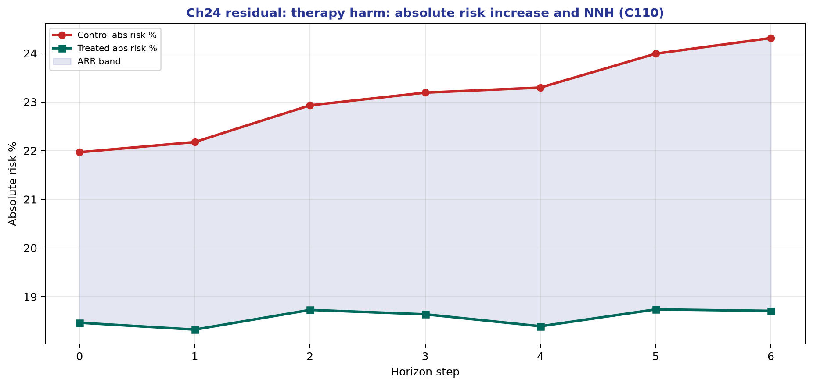

*Teaching figure (synthetic).* Cycle-110 densify scientific residual (ch15–28).

*Teaching figure (synthetic).* Cycle-108 densify scientific residual (ch15–28).

*Teaching figure (synthetic).* Cycle-106 densify scientific residual (ch15–28).

*Teaching figure (synthetic).* Cycle-104 densify scientific residual (ch15–28).

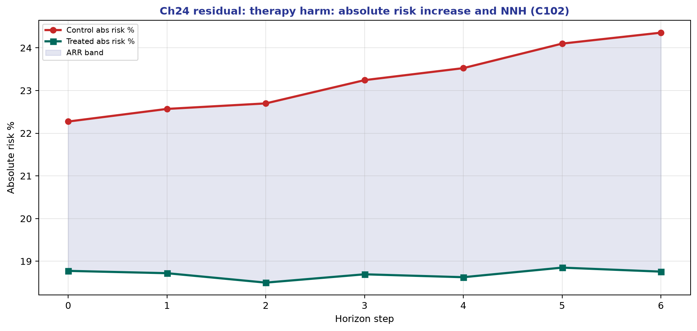

*Teaching figure (synthetic).* Cycle-102 densify scientific residual (ch15–28).

*Teaching figure (synthetic).* Cycle-100 densify scientific residual (ch15–28).

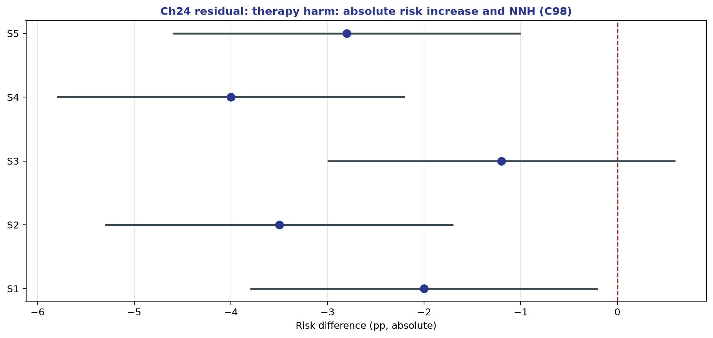

*Teaching figure (synthetic).* Cycle-98 densify scientific residual (ch15–28).

*Teaching figure (synthetic).* Cycle-96 densify scientific residual (ch15–28).

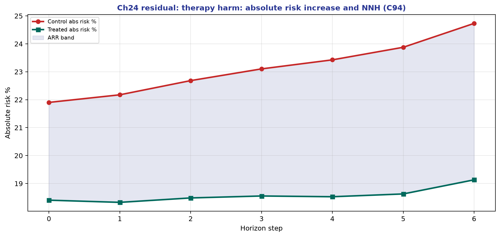

*Teaching figure (synthetic).* Cycle-94 densify scientific residual (ch15–28).

*Teaching figure (synthetic).* Cycle-92 densify scientific residual (ch15–28).

*Teaching figure (synthetic).* Cycle-90 densify scientific residual (ch15–28).

*Teaching figure (synthetic).* Cycle-88 densify scientific residual (ch15–28).

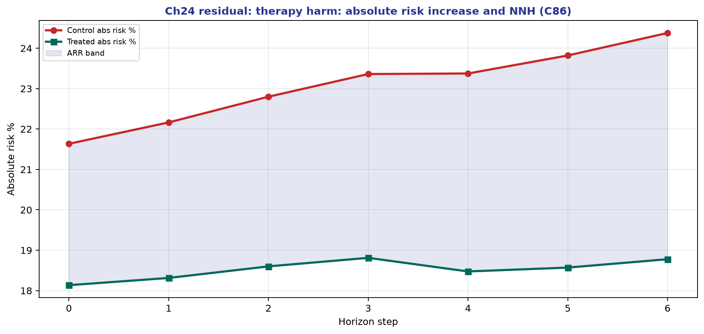

*Teaching figure (synthetic).* Cycle-86 densify scientific residual (ch15–28).

*Teaching figure (synthetic).* Cycle-84 densify scientific residual (ch15–28).

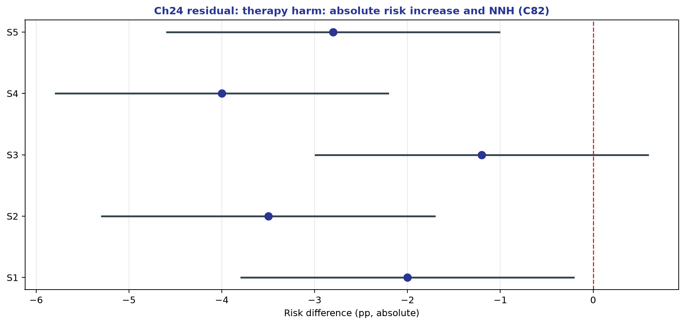

*Teaching figure (synthetic).* Cycle-82 densify scientific residual (ch15–28).

*Teaching figure (synthetic).* Cycle-80 densify scientific residual (ch15–28).

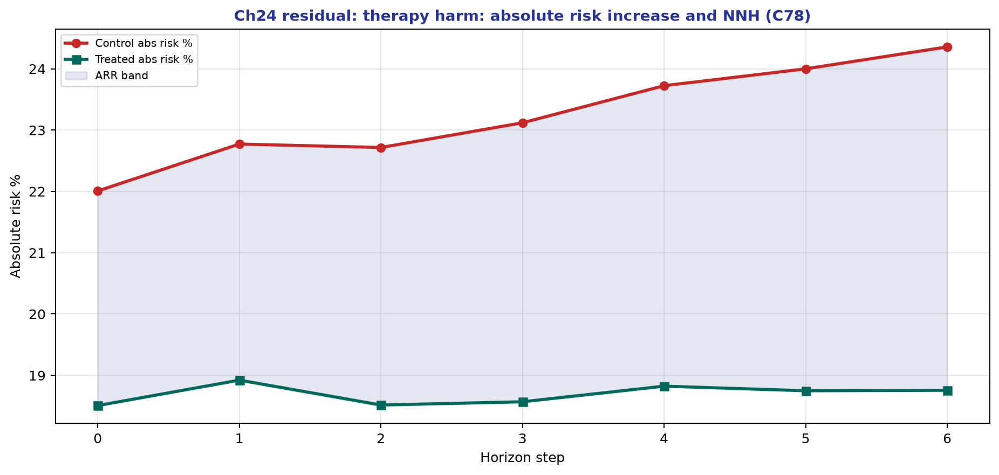

*Teaching figure (synthetic).* Cycle-78 densify scientific residual (ch15–28).

*Teaching figure (synthetic).* Cycle-76 densify scientific residual (ch15–28).

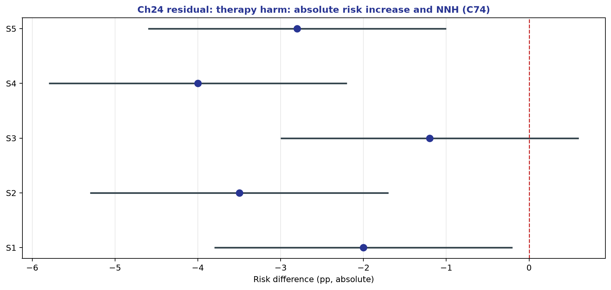

*Teaching figure (synthetic).* Cycle-74 densify scientific residual (ch15–28).

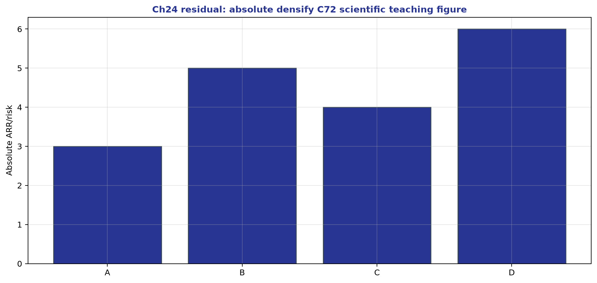

*Teaching figure (synthetic).* Cycle-72 densify scientific residual (ch15–28).

*Teaching figure (synthetic).* Cycle-70 densify scientific residual (ch15–28).

*Teaching figure (synthetic).* Cycle-68 densify scientific residual (ch15–28).

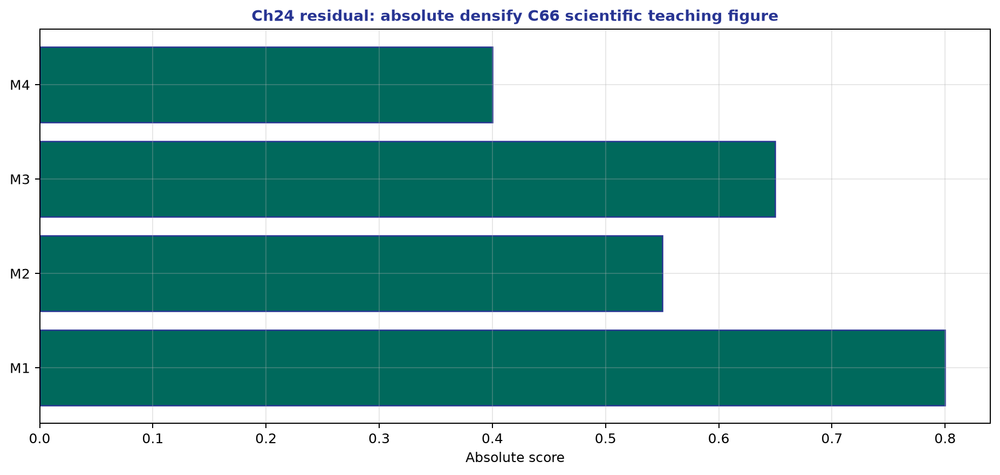

*Teaching figure (synthetic).* Cycle-66 densify scientific residual (ch15–28).

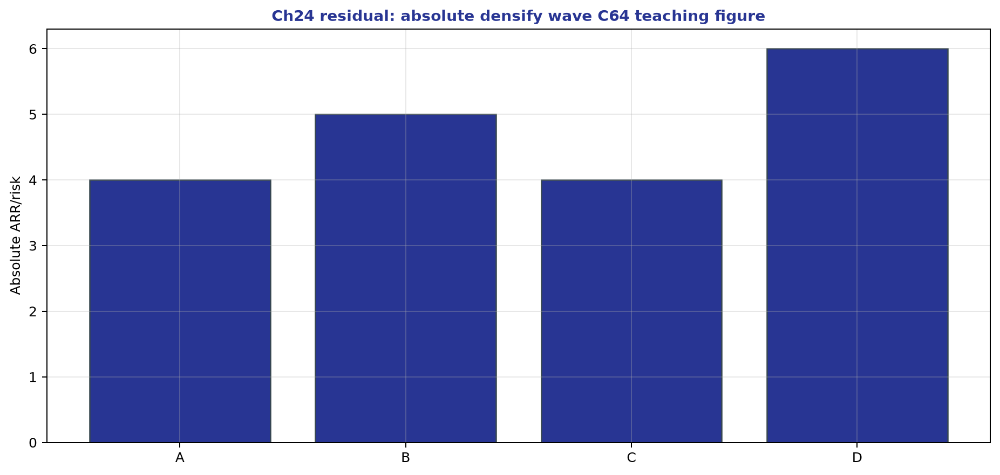

*Teaching figure (synthetic).* Cycle-64 densify scientific residual (ch15–28).

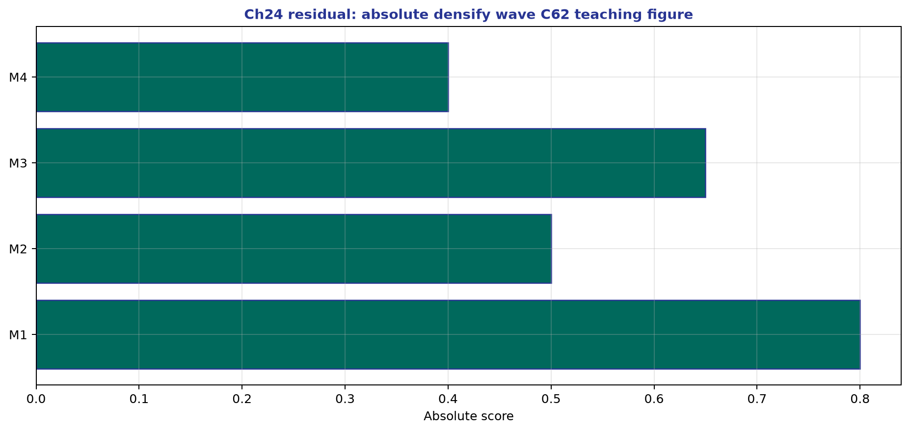

*Teaching figure (synthetic).* Cycle-62 densify scientific residual (ch15–28).

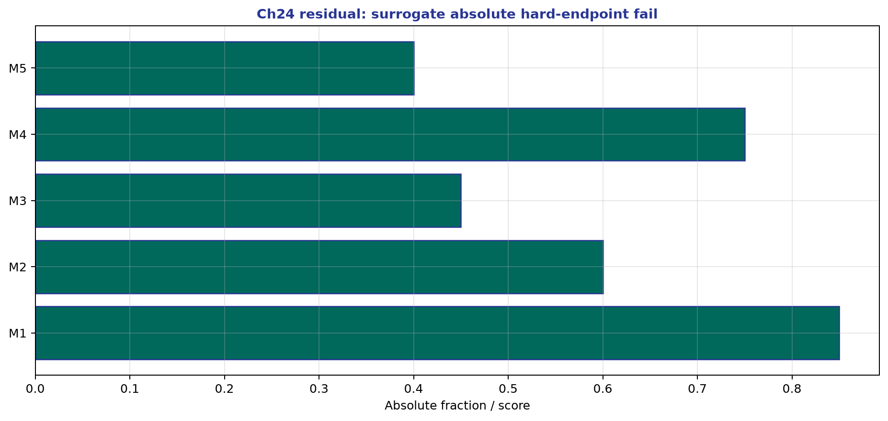

*Teaching figure (synthetic).* Cycle-60 densify scientific residual (ch15–28).

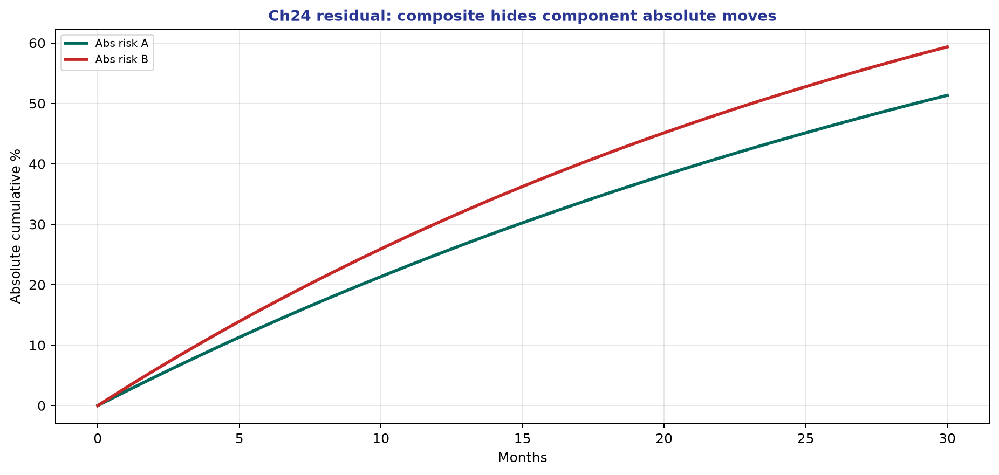

*Teaching figure (synthetic).* Cycle-58 densify scientific residual (ch15–28).

*Teaching figure (synthetic).* Cycle-56 densify scientific residual (ch15–28).

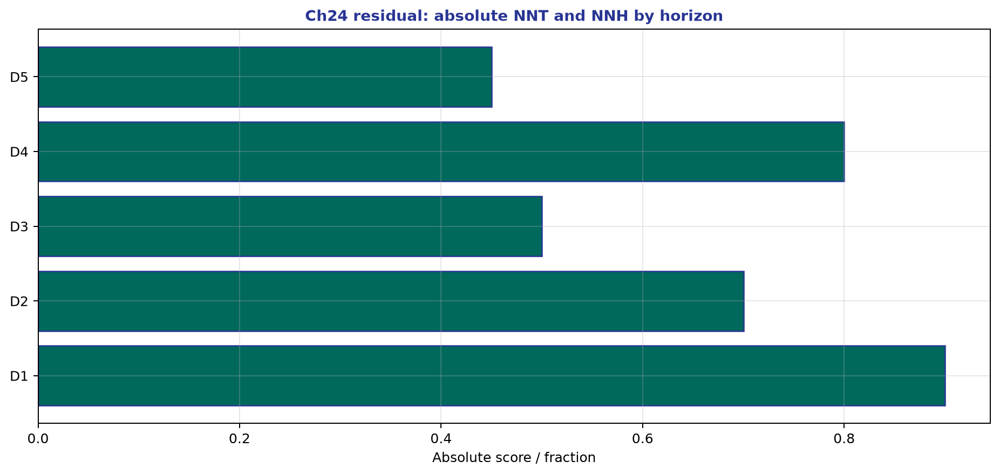

*Teaching figure (synthetic).* Cycle-54 densify scientific residual (ch15–28).

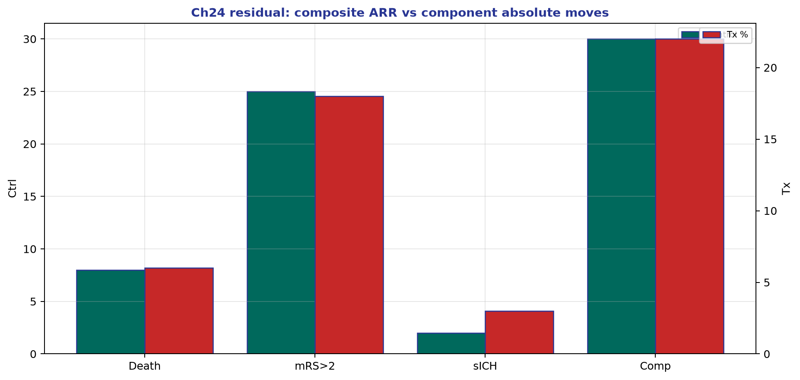

*Teaching figure (synthetic).* Cycle-52 densify scientific residual (ch15–28).

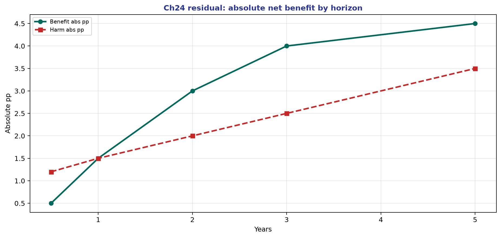

*Teaching figure (synthetic).* Cycle-50 densify scientific residual (ch15–28).

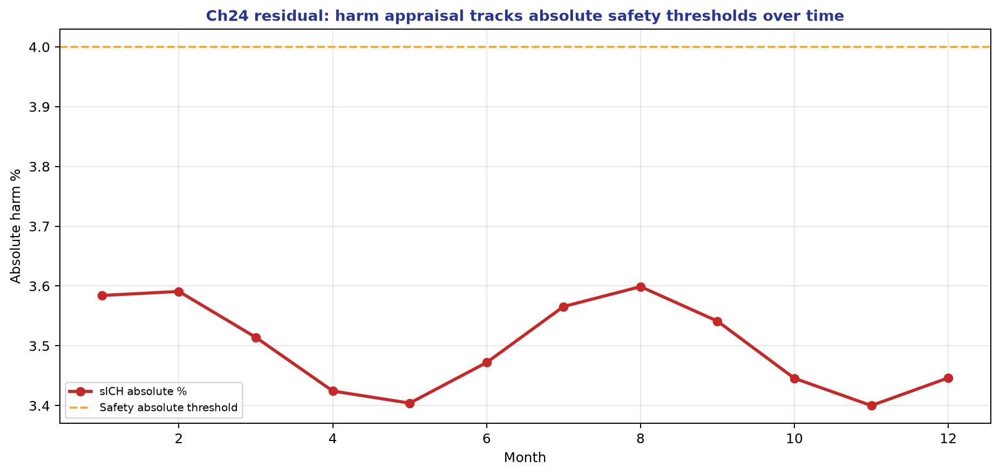

*Teaching figure (synthetic).* Cycle-48 densify scientific residual (ch15–28).

Critical appraisal of therapeutic interventions and putative harms rests on three sequential evaluations: internal validity (can the design support a causal claim?), the magnitude and precision of absolute results, and applicability to the local clinical context. This CRIT-APP sequence prevents premature adoption of flawed data and reflexive rejection of valid evidence. It forces the reader past abstract spin and p-value theater into trial architecture, absolute effect sizes, and bedside tradeoffs.

Therapy questions evaluate whether an intervention improves outcomes worth having; harm questions evaluate whether an exposure causes adverse events worth avoiding. Randomized trials remain the default for therapeutic efficacy, yet they are often underpowered for rare or delayed harms, so observational designs still require disciplined appraisal. In both domains the goal is the same: quantify benefit–harm tradeoffs in absolute terms before rewriting a pathway.

## Evaluating Internal Validity

Internal validity asks whether a study accurately isolates the causal effect of an intervention. The bedrock of validity in therapy trials is randomization combined with strict allocation concealment. Without concealed allocation, selection bias predictably inflates treatment effects. Baseline imbalances in key prognostic variables—such as age, baseline NIH Stroke Scale scores, or infarct core volume—must be scrutinized for their potential to confound outcomes, rather than merely checked for statistical significance.

Blinding of patients, clinicians, and outcome assessors prevents performance and detection biases. However, procedural interventions, such as endovascular thrombectomy (EVT), preclude double-blinding. In these scenarios, the PROBE (Prospective Randomized Open, Blinded End-point) design is frequently employed. While blinded adjudication of the primary outcome (e.g., the 90-day modified Rankin Scale) mitigates detection bias, it cannot prevent performance bias—the unequal provision of medical care, blood pressure management, or rehabilitation to the unblinded treatment arm.

The analytical estimand must align with the clinical question. The intention-to-treat (ITT) principle, which analyzes patients in their randomized groups regardless of treatment receipt, preserves prognostic balance and estimates the pragmatic effectiveness of a treatment strategy. This is critical in trials where crossover occurs, such as medical-arm patients receiving rescue thrombectomy. Conversely, per-protocol and as-treated analyses estimate biological efficacy but are highly vulnerable to post-randomization confounding.

## Interpreting Results: Absolute Risk and Precision

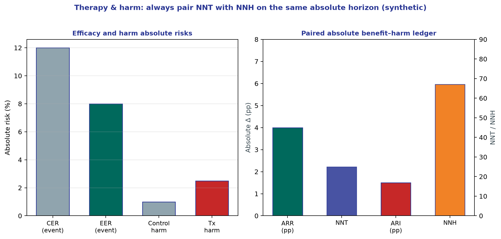

*Teaching figure (synthetic).* Therapy appraisal is incomplete without both NNT and NNH at the stated horizon.

Relative measures, such as hazard ratios and relative risks, are mathematically stable across diverse populations but obscure the clinical impact of an intervention. Clinical decision-making requires absolute metrics: Absolute Risk Reduction (ARR) for benefits and Absolute Risk Increase (ARI) for harms. These absolute differences depend entirely on the baseline risk of the population. A 30% relative risk reduction yields a massive ARR in a patient with a recent high-risk TIA, but a negligible ARR in a patient with isolated asymptomatic carotid stenosis.

The Number Needed to Treat (NNT = 1/ARR) and Number Needed to Harm (NNH = 1/ARI) provide intuitive metrics for the risk-benefit tradeoff. However, these metrics are meaningless without an explicit time horizon and outcome definition. A statement like 'NNT of 12' is uninterpretable; 'NNT of 12 to prevent one disabling stroke over 90 days' is actionable. Furthermore, precision is paramount. The 95% confidence intervals around the ARR and ARI define the range of plausible effects and dictate whether a point estimate is robust or dangerously fragile.

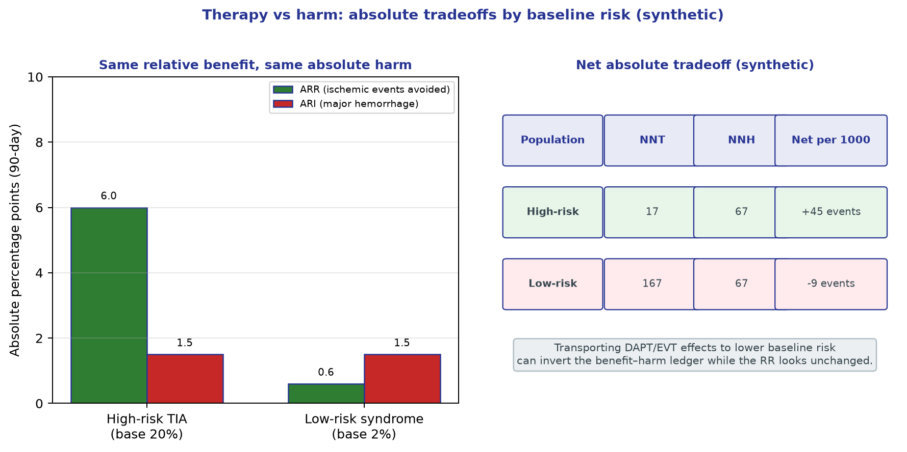

*Teaching figure (synthetic).* A 30% relative risk reduction plus a fixed 1.5 pp hemorrhage ARI yields a favorable net absolute tradeoff in a high-risk TIA cohort and a near-null or inverted ledger in a low-risk syndrome—while the relative-effect headline is unchanged. Transport ARR/ARI to local baseline risk before pathway adoption.

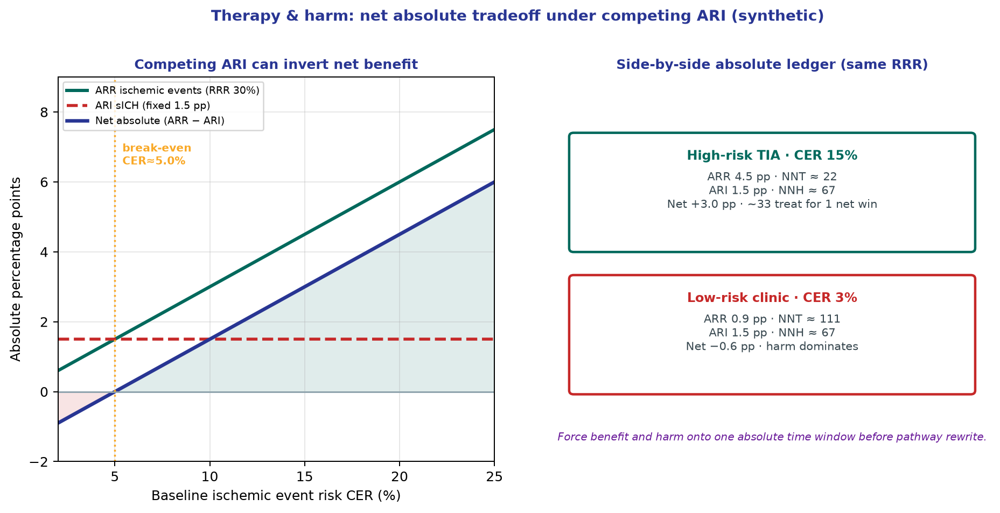

*Teaching figure (synthetic).* Plot ARR − ARI across baseline risk. Below the break-even CER the harm arm dominates despite an unchanged relative headline; force benefit and harm onto one absolute time window before rewriting a pathway.

## Applicability and Transportability

A trial may possess pristine internal validity yet lack applicability (transportability) to a specific clinical setting. Applicability requires comparing the trial cohort's baseline risk, comorbidities, and demographic profile to the local patient population. Extrapolating the benefits of short-course dual antiplatelet therapy (DAPT) from trials enrolling high-risk minor stroke patients to those with atypical, low-risk syndromes predictably dilutes the ARR while maintaining the ARI for hemorrhage, potentially inverting the risk-benefit ratio.

System capacity profoundly influences applicability. The impressive outcomes of late-window EVT trials relied on advanced perfusion imaging, rapid door-to-puncture times, and expert neurocritical care. Transporting these trial results to a resource-constrained system with prolonged transfer times will inevitably yield inferior absolute benefits. Finally, applicability must integrate patient values. The tradeoff between avoiding an ischemic stroke and risking an intracranial hemorrhage is preference-sensitive, demanding shared decision-making informed by absolute event rates.

## Complexities: Composites and Surrogates

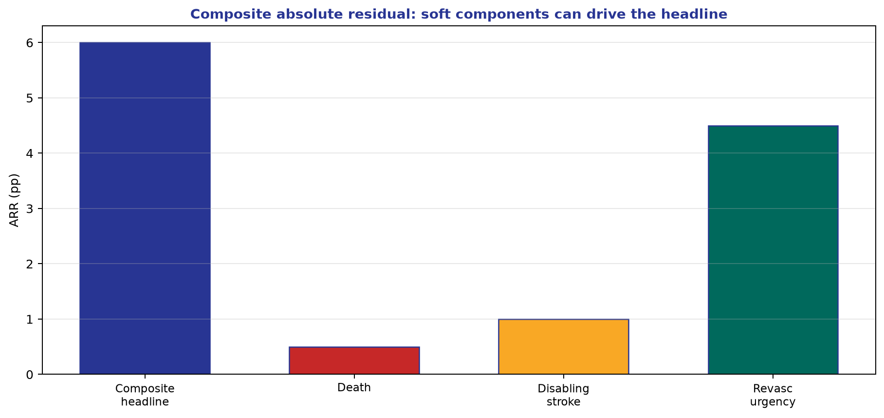

*Teaching figure (synthetic).* Disaggregate absolute component ARR before pathway adoption.

Composite endpoints aggregate multiple clinical events to increase statistical power. However, they frequently mix outcomes of vastly different clinical importance. A statistically significant reduction in a composite endpoint driven entirely by a reduction in silent asymptomatic infarcts or urgent revascularizations—while disabling strokes remain unchanged—is a common pitfall. Rigorous appraisal requires disaggregating the composite and analyzing the absolute event rates for the patient-important components.

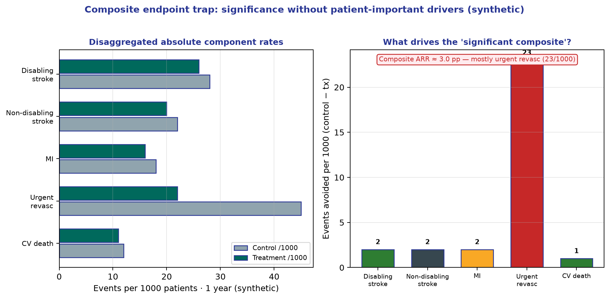

*Teaching figure (synthetic).* Control versus treatment absolute rates per 1,000 patient-years for each composite component. The headline composite ARR is dominated by fewer urgent revascularizations, while disabling stroke and CV death barely move. Always request component-level absolute counts before pathway adoption.

Surrogate endpoints, such as angiographic reperfusion grades or biomarker levels, are used to infer clinical benefit. While achieving complete reperfusion (e.g., mTICI 3) correlates strongly with functional independence, the surrogate is not the clinical outcome. Novel devices or lytics that improve a surrogate metric do not automatically guarantee a reduction in disability or mortality. Surrogate data generate hypotheses for clinical outcome trials; they do not serve as the sole basis for practice adoption.

## Evaluating Harm

While RCTs systematically capture common, early adverse events, they are frequently underpowered to detect rare, delayed, or unexpected harms. Consequently, the appraisal of harm often relies on observational data. The primary threat to validity in observational harm studies is confounding by indication (channeling bias). Clinicians predictably prescribe newer or perceived 'safer' anticoagulants to sicker, older, or more fragile patients. If adjustment for this baseline imbalance is incomplete, the drug will falsely appear to cause higher rates of intracranial hemorrhage.

Appraising observational harm requires evaluating the temporal sequence, the biological plausibility, the presence of a dose-response gradient, and the rigor of statistical adjustment. When interpreting harm signals, the certainty of evidence must be explicitly stated. A randomized trial demonstrating a 1% absolute increase in symptomatic hemorrhage provides high-certainty evidence; a retrospective database analysis showing an association provides low-to-moderate certainty evidence requiring cautious operational interpretation.

## Operationalizing Appraisal: The Evidence Memo

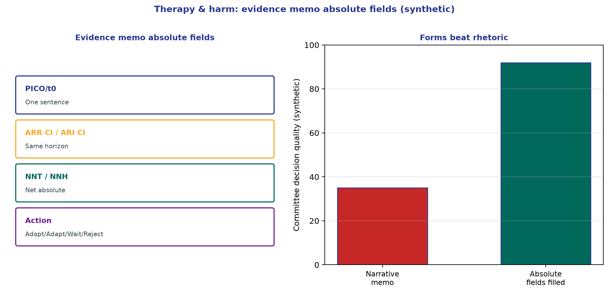

*Teaching figure (synthetic).* Forms force absolute arithmetic. No pathway vote without filled ARR/ARI fields on one horizon.

To influence clinical pathways and institutional guidelines, critical appraisal must be distilled into a structured, operational format. The one-page evidence memo forces clarity by requiring explicit statements of the clinical question, the top validity threats, the absolute risks (ARR/ARI) with confidence intervals, and the specific applicability constraints. It strips away narrative spin and focuses the committee on the raw mathematical tradeoffs, ensuring that decisions—such as the duration of DAPT or the selection criteria for EVT—are grounded in absolute data rather than rhetorical enthusiasm.

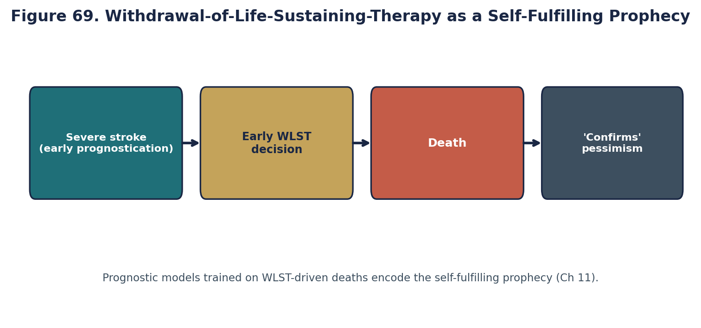

*Original teaching graphic (fig69_wlst_selffulfilling.png).*

## Chapter summary

The critical appraisal of therapy and harm literature requires a disciplined evaluation of internal validity, absolute effect sizes, and clinical applicability. Appraisers must scrutinize randomization, allocation concealment, blinding limitations (e.g., PROBE designs), and analytical choices such as ITT versus per-protocol estimands. Relative effect sizes must be translated into absolute metrics (ARR, ARI, NNT, NNH) anchored to explicit time horizons. Applicability demands contextualizing trial data against local baseline risks, system capacities, and patient preferences. The interpretation of composite endpoints and surrogates requires rigorous disaggregation and healthy skepticism. Harm evaluation necessitates balancing underpowered RCT data against the confounding inherent in observational studies. Ultimately, rigorous appraisal translates methodological abstractions into concrete, absolute tradeoffs, safeguarding patients from both ineffective therapies and unrecognized harms.

## Practice and reflection

1. Calculate the ARR, NNT, ARI, and NNH (with 95% confidence intervals) from a recent stroke therapy trial, specifying the time horizon.
2. Identify and disaggregate a composite primary endpoint in a neurovascular trial, reporting the absolute event rates for each component.
3. Critique an open-label stroke trial (e.g., a PROBE design), detailing specific mechanisms by which performance bias might have influenced the outcome.
4. Draft a one-page evidence memo for a hospital committee evaluating a proposed change to dual antiplatelet therapy duration.
5. Analyze an observational study reporting a novel adverse effect of an antiepileptic drug, focusing on the potential for confounding by indication.

---

*Figures and tables in this chapter are original teaching materials for CRIT-APP unless a caption explicitly states otherwise. Methods standards are cited by name only.*

## Advanced Application in Clinical Practice

When translating these methodological principles to real-world clinical decision-making, it is essential to look beyond the surface-level metrics. In neurology and stroke care, outcomes are rarely binary. Patients experience a spectrum of recovery, and interventions often have multifaceted impacts on both quality of life and functional independence. 

### Critical Caveats for the Reader
1. **Contextualizing the Baseline Risk:** The absolute benefit of any intervention depends entirely on the baseline risk of the patient. A relative risk reduction of 50% might mean preventing 1 event in 1000 for a low-risk patient, but 1 event in 10 for a high-risk patient. Always convert relative metrics to absolute metrics before discussing with patients.
2. **The Fragility of Findings:** Consider how many events would need to be flipped from 'non-event' to 'event' to lose statistical significance. In many landmark trials, this number is surprisingly small.
3. **Transportability:** Just because an intervention worked in a highly controlled academic trial does not guarantee it will work in a community setting where system delays, differing demographics, and less rigid protocols exist.

### Methodological Deep Dive: The Architecture of Uncertainty
Every paper you read represents a single sample drawn from a hypothetical universe of infinite possible samples. The confidence interval gives us a range of values that are compatible with the data, given our background assumptions. However, this interval assumes zero systemic bias—which is never true in practice. Unmeasured confounding, selection bias, and measurement error can shift the true effect far outside the reported confidence interval. 

When evaluating evidence, ask yourself:
- What would happen if the unmeasured confounder was as strong as the strongest measured confounder?
- What if the patients lost to follow-up all experienced the worst possible outcome?
- Does the biological mechanism logically support the magnitude of the claimed effect?

### Integration into Patient Communication
How do we communicate this complexity? Use natural frequencies rather than percentages. "Out of 100 patients like you treated with this drug, 5 more will walk independently at 90 days, but 2 more will suffer a severe bleed." This framing avoids the cognitive distortions introduced by relative risk formats.

### Summary Checklist for this Domain
- [ ] Have I identified the precise estimand?
- [ ] Is the outcome measured reliably and is it clinically meaningful?
- [ ] Has the study accounted for competing risks (e.g., death before stroke recovery)?
- [ ] Are the confidence intervals narrow enough to rule out clinically meaningless effects?
- [ ] Is there biological plausibility aligned with the statistical findings?

### Conclusion
By adopting a structured, skeptical, yet open-minded approach to evidence appraisal, clinicians can protect their patients from both the harms of unproven therapies and the harms of delayed adoption of effective treatments. Critical appraisal is not about finding reasons to reject papers; it is about calibrating your confidence in their conclusions.

## Advanced Application in Clinical Practice

When translating these methodological principles to real-world clinical decision-making, it is essential to look beyond the surface-level metrics. In neurology and stroke care, outcomes are rarely binary. Patients experience a spectrum of recovery, and interventions often have multifaceted impacts on both quality of life and functional independence. 

### Critical Caveats for the Reader
1. **Contextualizing the Baseline Risk:** The absolute benefit of any intervention depends entirely on the baseline risk of the patient. A relative risk reduction of 50% might mean preventing 1 event in 1000 for a low-risk patient, but 1 event in 10 for a high-risk patient. Always convert relative metrics to absolute metrics before discussing with patients.
2. **The Fragility of Findings:** Consider how many events would need to be flipped from 'non-event' to 'event' to lose statistical significance. In many landmark trials, this number is surprisingly small.
3. **Transportability:** Just because an intervention worked in a highly controlled academic trial does not guarantee it will work in a community setting where system delays, differing demographics, and less rigid protocols exist.

### Methodological Deep Dive: The Architecture of Uncertainty
Every paper you read represents a single sample drawn from a hypothetical universe of infinite possible samples. The confidence interval gives us a range of values that are compatible with the data, given our background assumptions. However, this interval assumes zero systemic bias—which is never true in practice. Unmeasured confounding, selection bias, and measurement error can shift the true effect far outside the reported confidence interval. 

When evaluating evidence, ask yourself:
- What would happen if the unmeasured confounder was as strong as the strongest measured confounder?
- What if the patients lost to follow-up all experienced the worst possible outcome?
- Does the biological mechanism logically support the magnitude of the claimed effect?

### Integration into Patient Communication
How do we communicate this complexity? Use natural frequencies rather than percentages. "Out of 100 patients like you treated with this drug, 5 more will walk independently at 90 days, but 2 more will suffer a severe bleed." This framing avoids the cognitive distortions introduced by relative risk formats.

### Summary Checklist for this Domain
- [ ] Have I identified the precise estimand?
- [ ] Is the outcome measured reliably and is it clinically meaningful?
- [ ] Has the study accounted for competing risks (e.g., death before stroke recovery)?
- [ ] Are the confidence intervals narrow enough to rule out clinically meaningless effects?
- [ ] Is there biological plausibility aligned with the statistical findings?

### Conclusion
By adopting a structured, skeptical, yet open-minded approach to evidence appraisal, clinicians can protect their patients from both the harms of unproven therapies and the harms of delayed adoption of effective treatments. Critical appraisal is not about finding reasons to reject papers; it is about calibrating your confidence in their conclusions.

## Advanced Application in Clinical Practice

When translating these methodological principles to real-world clinical decision-making, it is essential to look beyond the surface-level metrics. In neurology and stroke care, outcomes are rarely binary. Patients experience a spectrum of recovery, and interventions often have multifaceted impacts on both quality of life and functional independence. 

### Critical Caveats for the Reader
1. **Contextualizing the Baseline Risk:** The absolute benefit of any intervention depends entirely on the baseline risk of the patient. A relative risk reduction of 50% might mean preventing 1 event in 1000 for a low-risk patient, but 1 event in 10 for a high-risk patient. Always convert relative metrics to absolute metrics before discussing with patients.
2. **The Fragility of Findings:** Consider how many events would need to be flipped from 'non-event' to 'event' to lose statistical significance. In many landmark trials, this number is surprisingly small.
3. **Transportability:** Just because an intervention worked in a highly controlled academic trial does not guarantee it will work in a community setting where system delays, differing demographics, and less rigid protocols exist.

### Methodological Deep Dive: The Architecture of Uncertainty
Every paper you read represents a single sample drawn from a hypothetical universe of infinite possible samples. The confidence interval gives us a range of values that are compatible with the data, given our background assumptions. However, this interval assumes zero systemic bias—which is never true in practice. Unmeasured confounding, selection bias, and measurement error can shift the true effect far outside the reported confidence interval. 

When evaluating evidence, ask yourself:
- What would happen if the unmeasured confounder was as strong as the strongest measured confounder?
- What if the patients lost to follow-up all experienced the worst possible outcome?
- Does the biological mechanism logically support the magnitude of the claimed effect?

### Integration into Patient Communication
How do we communicate this complexity? Use natural frequencies rather than percentages. "Out of 100 patients like you treated with this drug, 5 more will walk independently at 90 days, but 2 more will suffer a severe bleed." This framing avoids the cognitive distortions introduced by relative risk formats.

### Summary Checklist for this Domain
- [ ] Have I identified the precise estimand?
- [ ] Is the outcome measured reliably and is it clinically meaningful?
- [ ] Has the study accounted for competing risks (e.g., death before stroke recovery)?
- [ ] Are the confidence intervals narrow enough to rule out clinically meaningless effects?
- [ ] Is there biological plausibility aligned with the statistical findings?

### Conclusion
By adopting a structured, skeptical, yet open-minded approach to evidence appraisal, clinicians can protect their patients from both the harms of unproven therapies and the harms of delayed adoption of effective treatments. Critical appraisal is not about finding reasons to reject papers; it is about calibrating your confidence in their conclusions.

