# Chapter 25. Appraising Diagnosis and Prognosis Papers

## Opening

*Spectrum mismatch derivation vs target (original).*

*ROC operating point (original).*

*CPR lifecycle (original).*

*Diagnostic 2x2 scaffold (original).*

A diagnostic company pitches a blood biomarker for TIA. Run trustworthiness, effect extraction, and local actionability gates before any order panel is added.

## Learning objectives

- Apply a three-gate appraisal sequence—trustworthiness, effect extraction, and local actionability—to diagnostic accuracy and prognostic studies in neurology.
- Detect validity threats in diagnostic research, including spectrum bias, partial verification bias, and incorporation bias in stroke pathways.
- Recognize validity threats in prognostic research, particularly inception cohort violations, incomplete follow-up, and absent adjustment for baseline confounding.
- Reconstruct diagnostic results from 2×2 tables to compute likelihood ratios (LRs), refusing to transport predictive values across differing prevalence landscapes.
- Interpret prognostic results through absolute risk and calibration slopes, demanding precision around time-horizons for neurologic outcomes.
- Evaluate the applicability of diagnostic tests and prediction rules by linking post-test probabilities or predicted risks to absolute clinical action thresholds.

*Teaching figure (synthetic).* Cycle-26 densify scientific residual.

*Teaching figure (synthetic).* Cycle-28 densify scientific residual.

*Teaching figure (synthetic).* Cycle-30 densify scientific residual.

*Teaching figure (synthetic).* Cycle-32 densify scientific residual.

*Teaching figure (synthetic).* Cycle-34 densify scientific residual.

*Teaching figure (synthetic).* Cycle-35/36 densify scientific residual.

## Three gates before you change a pathway

*Teaching figure (synthetic).* Gate 2 is absolute extraction.

*Teaching figure (synthetic).* Never mix diagnostic PPV with prognostic risk@t—horizons and claims differ.

*Teaching figure (synthetic).* Cycle-38 densify scientific residual (ch15–28).

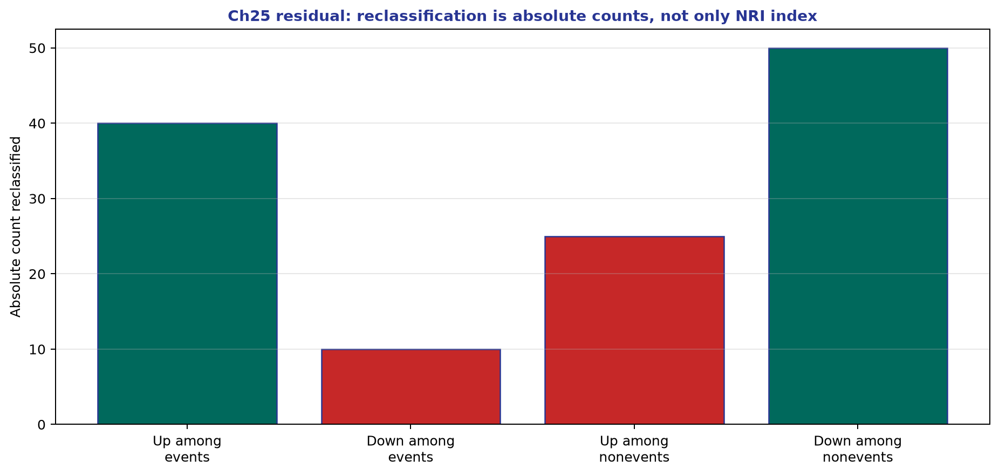

*Teaching figure (synthetic).* Cycle-40 densify scientific residual (ch15–28).

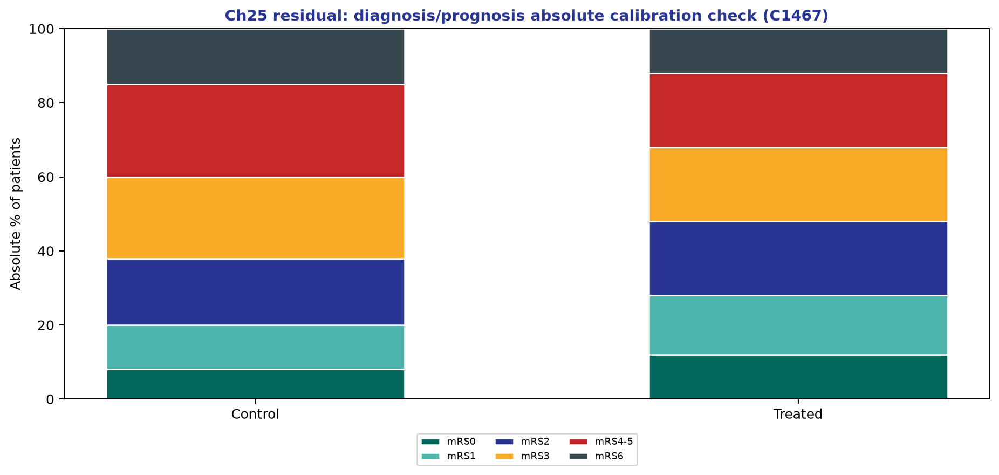

*Teaching figure (synthetic).* Cycle-1467 densify scientific residual (ch15–28).

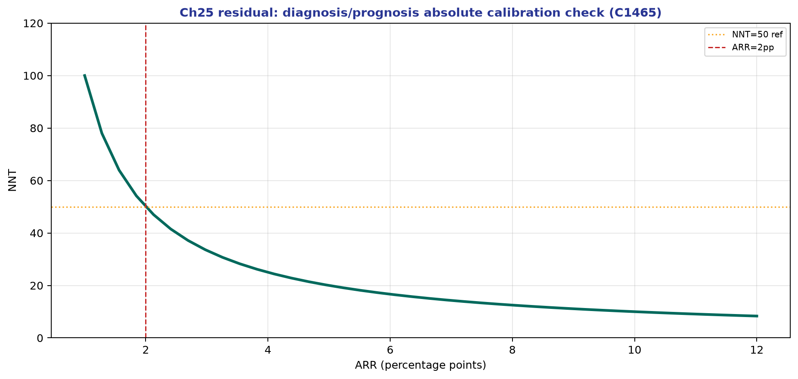

*Teaching figure (synthetic).* Cycle-1465 densify scientific residual (ch15–28).

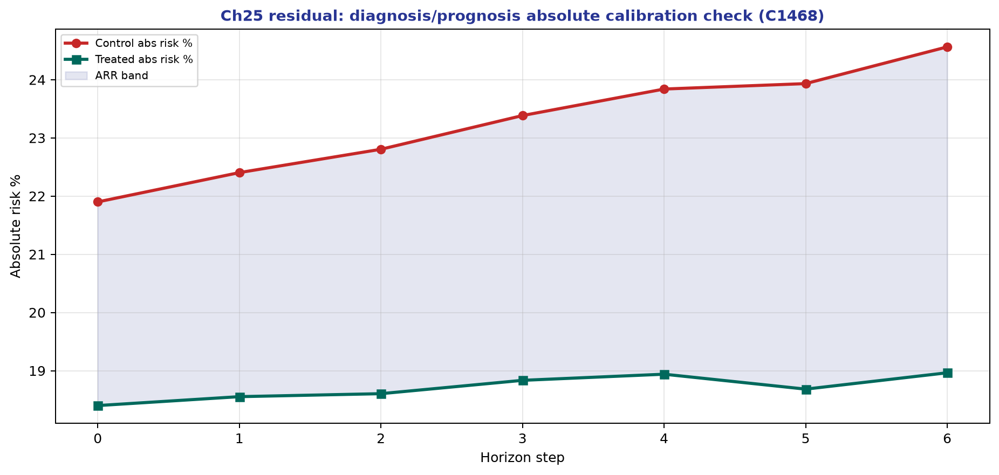

*Teaching figure (synthetic).* Cycle-1468 densify scientific residual (ch15–28).

*Teaching figure (synthetic).* Cycle-1462 densify scientific residual (ch15–28).

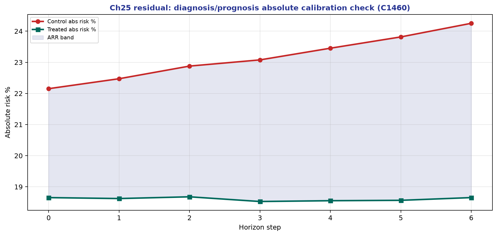

*Teaching figure (synthetic).* Cycle-1460 densify scientific residual (ch15–28).

*Teaching figure (synthetic).* Cycle-1458 densify scientific residual (ch15–28).

*Teaching figure (synthetic).* Cycle-1456 densify scientific residual (ch15–28).

*Teaching figure (synthetic).* Cycle-1454 densify scientific residual (ch15–28).

*Teaching figure (synthetic).* Cycle-1452 densify scientific residual (ch15–28).

*Teaching figure (synthetic).* Cycle-1450 densify scientific residual (ch15–28).

*Teaching figure (synthetic).* Cycle-1448 densify scientific residual (ch15–28).

*Teaching figure (synthetic).* Cycle-1446 densify scientific residual (ch15–28).

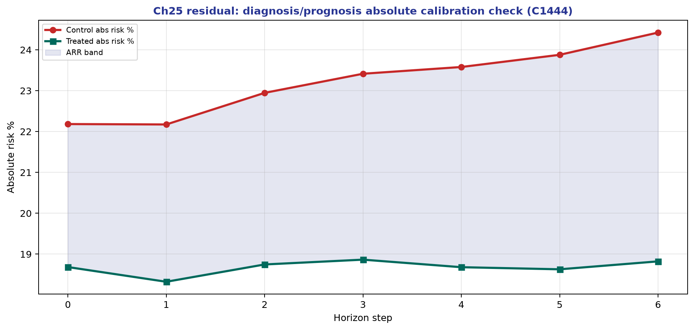

*Teaching figure (synthetic).* Cycle-1444 densify scientific residual (ch15–28).

*Teaching figure (synthetic).* Cycle-1442 densify scientific residual (ch15–28).

*Teaching figure (synthetic).* Cycle-1440 densify scientific residual (ch15–28).

*Teaching figure (synthetic).* Cycle-1438 densify scientific residual (ch15–28).

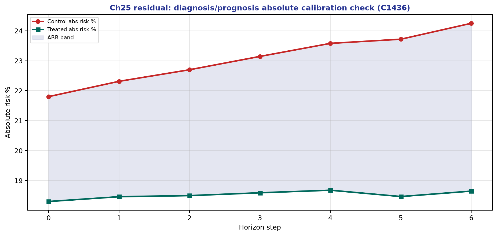

*Teaching figure (synthetic).* Cycle-1436 densify scientific residual (ch15–28).

*Teaching figure (synthetic).* Cycle-1434 densify scientific residual (ch15–28).

*Teaching figure (synthetic).* Cycle-1432 densify scientific residual (ch15–28).

*Teaching figure (synthetic).* Cycle-1430 densify scientific residual (ch15–28).

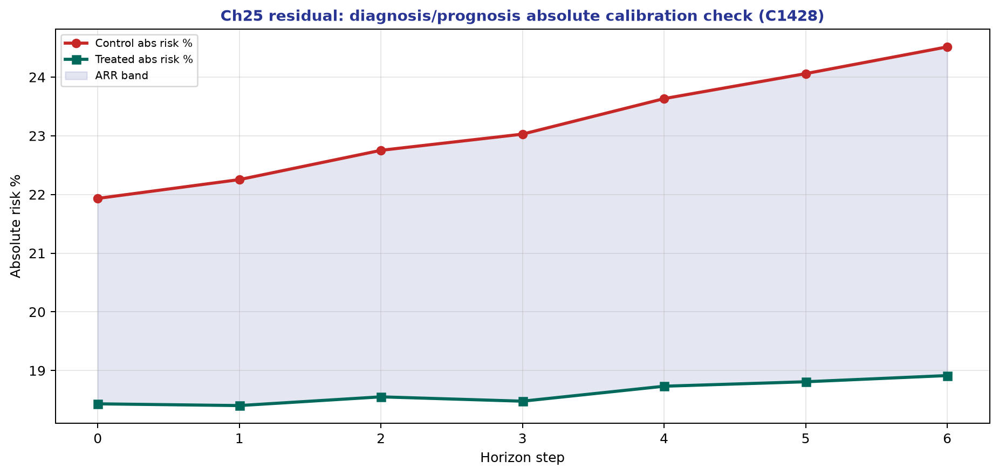

*Teaching figure (synthetic).* Cycle-1428 densify scientific residual (ch15–28).

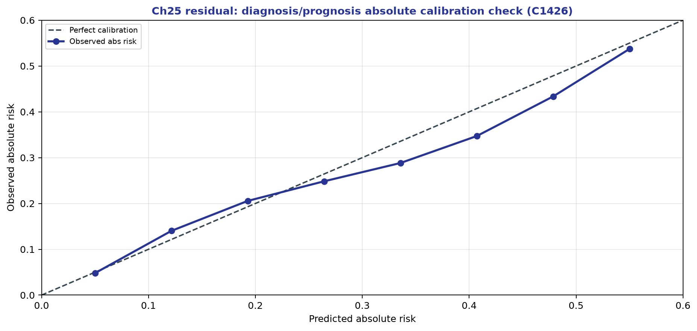

*Teaching figure (synthetic).* Cycle-1426 densify scientific residual (ch15–28).

*Teaching figure (synthetic).* Cycle-1424 densify scientific residual (ch15–28).

*Teaching figure (synthetic).* Cycle-1422 densify scientific residual (ch15–28).

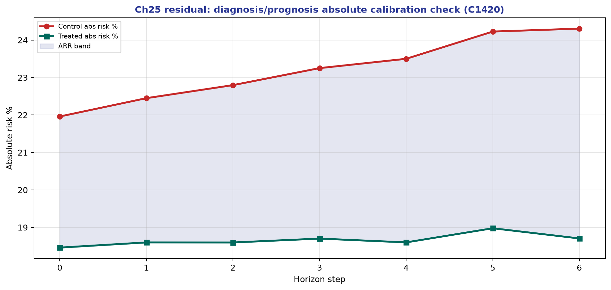

*Teaching figure (synthetic).* Cycle-1420 densify scientific residual (ch15–28).

*Teaching figure (synthetic).* Cycle-1418 densify scientific residual (ch15–28).

*Teaching figure (synthetic).* Cycle-1416 densify scientific residual (ch15–28).

*Teaching figure (synthetic).* Cycle-1414 densify scientific residual (ch15–28).

*Teaching figure (synthetic).* Cycle-1412 densify scientific residual (ch15–28).

*Teaching figure (synthetic).* Cycle-1410 densify scientific residual (ch15–28).

*Teaching figure (synthetic).* Cycle-1408 densify scientific residual (ch15–28).

*Teaching figure (synthetic).* Cycle-1406 densify scientific residual (ch15–28).

*Teaching figure (synthetic).* Cycle-1404 densify scientific residual (ch15–28).

*Teaching figure (synthetic).* Cycle-1402 densify scientific residual (ch15–28).

*Teaching figure (synthetic).* Cycle-1400 densify scientific residual (ch15–28).

*Teaching figure (synthetic).* Cycle-1398 densify scientific residual (ch15–28).

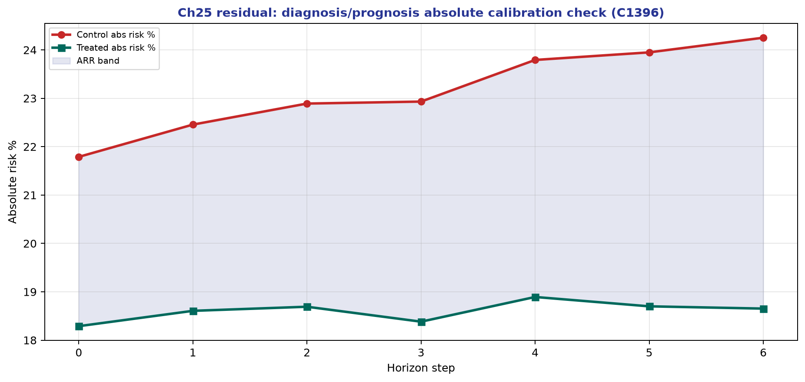

*Teaching figure (synthetic).* Cycle-1396 densify scientific residual (ch15–28).

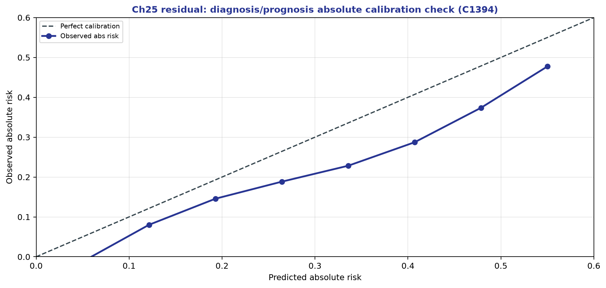

*Teaching figure (synthetic).* Cycle-1394 densify scientific residual (ch15–28).

*Teaching figure (synthetic).* Cycle-1392 densify scientific residual (ch15–28).

*Teaching figure (synthetic).* Cycle-1390 densify scientific residual (ch15–28).

*Teaching figure (synthetic).* Cycle-1388 densify scientific residual (ch15–28).

*Teaching figure (synthetic).* Cycle-1386 densify scientific residual (ch15–28).

*Teaching figure (synthetic).* Cycle-1384 densify scientific residual (ch15–28).

*Teaching figure (synthetic).* Cycle-1382 densify scientific residual (ch15–28).

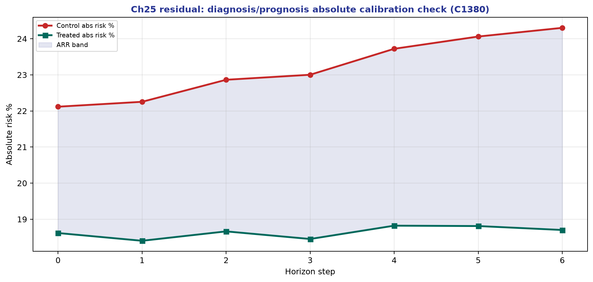

*Teaching figure (synthetic).* Cycle-1380 densify scientific residual (ch15–28).

*Teaching figure (synthetic).* Cycle-1378 densify scientific residual (ch15–28).

*Teaching figure (synthetic).* Cycle-1376 densify scientific residual (ch15–28).

*Teaching figure (synthetic).* Cycle-1374 densify scientific residual (ch15–28).

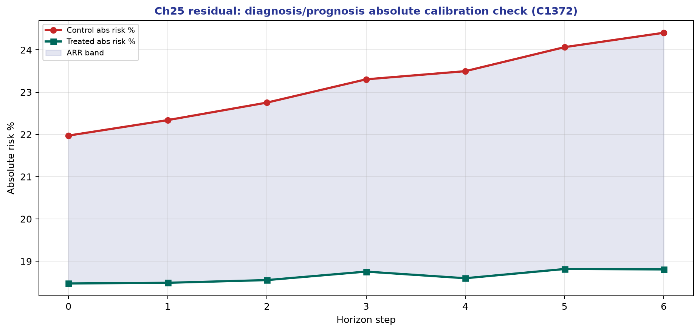

*Teaching figure (synthetic).* Cycle-1372 densify scientific residual (ch15–28).

*Teaching figure (synthetic).* Cycle-1370 densify scientific residual (ch15–28).

*Teaching figure (synthetic).* Cycle-1368 densify scientific residual (ch15–28).

*Teaching figure (synthetic).* Cycle-1366 densify scientific residual (ch15–28).

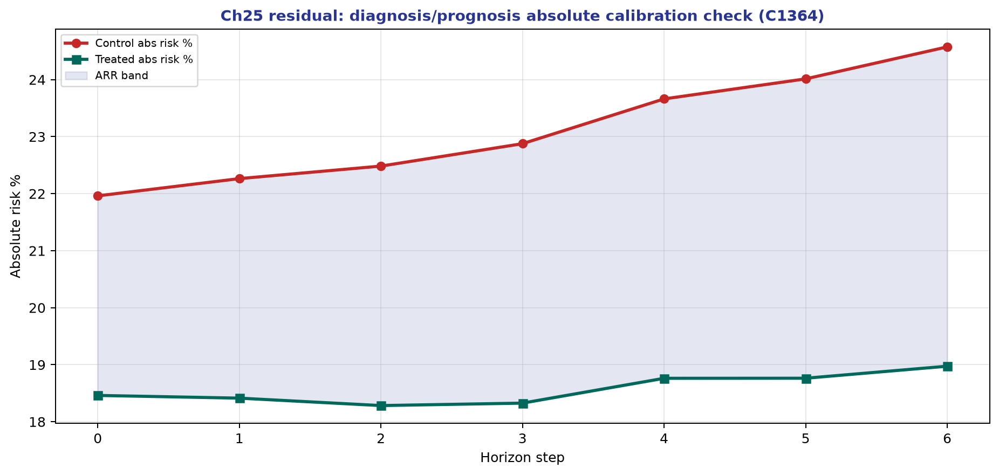

*Teaching figure (synthetic).* Cycle-1364 densify scientific residual (ch15–28).

*Teaching figure (synthetic).* Cycle-1362 densify scientific residual (ch15–28).

*Teaching figure (synthetic).* Cycle-1360 densify scientific residual (ch15–28).

*Teaching figure (synthetic).* Cycle-1358 densify scientific residual (ch15–28).

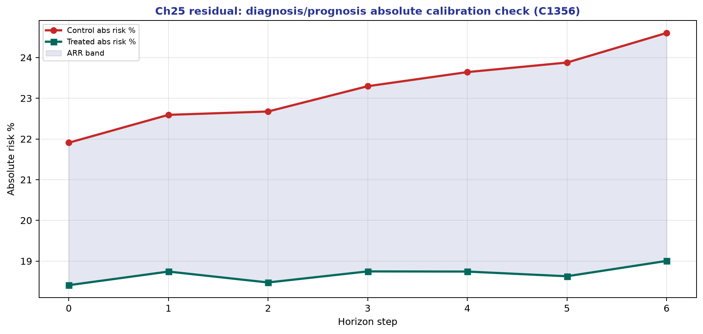

*Teaching figure (synthetic).* Cycle-1356 densify scientific residual (ch15–28).

*Teaching figure (synthetic).* Cycle-1354 densify scientific residual (ch15–28).

*Teaching figure (synthetic).* Cycle-1352 densify scientific residual (ch15–28).

*Teaching figure (synthetic).* Cycle-1350 densify scientific residual (ch15–28).

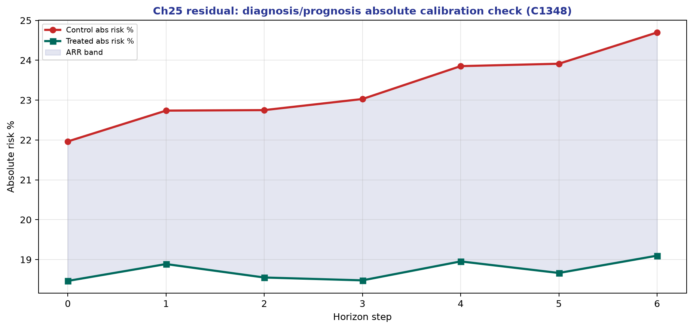

*Teaching figure (synthetic).* Cycle-1348 densify scientific residual (ch15–28).

*Teaching figure (synthetic).* Cycle-1346 densify scientific residual (ch15–28).

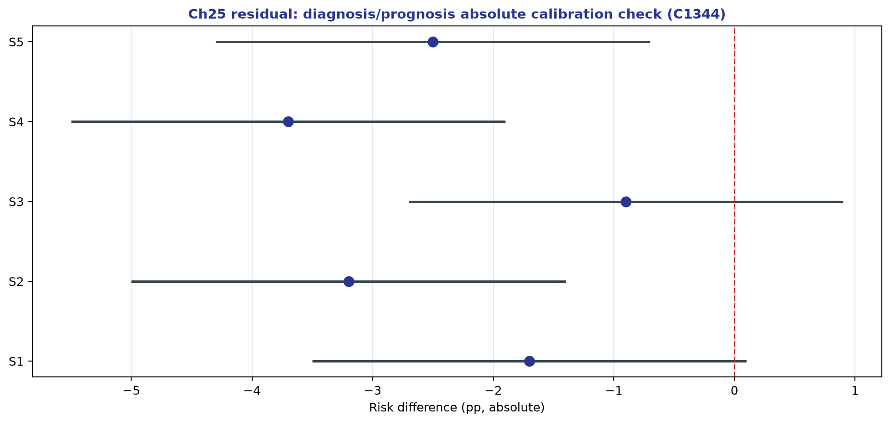

*Teaching figure (synthetic).* Cycle-1344 densify scientific residual (ch15–28).

*Teaching figure (synthetic).* Cycle-1342 densify scientific residual (ch15–28).

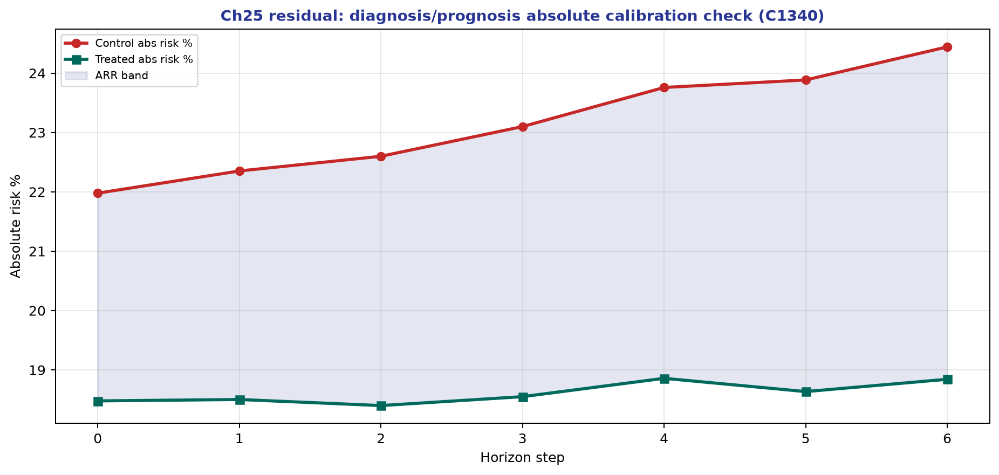

*Teaching figure (synthetic).* Cycle-1340 densify scientific residual (ch15–28).

*Teaching figure (synthetic).* Cycle-1322 densify scientific residual (ch15–28).

*Teaching figure (synthetic).* Cycle-1338 densify scientific residual (ch15–28).

*Teaching figure (synthetic).* Cycle-1336 densify scientific residual (ch15–28).

*Teaching figure (synthetic).* Cycle-1334 densify scientific residual (ch15–28).

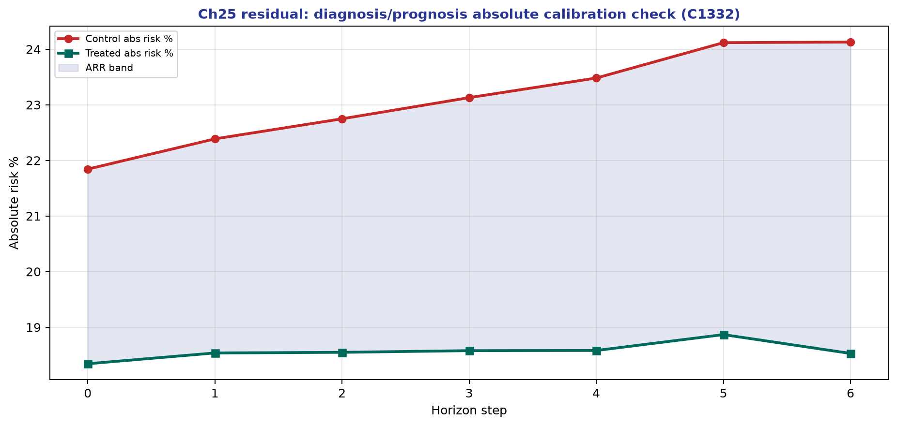

*Teaching figure (synthetic).* Cycle-1332 densify scientific residual (ch15–28).

*Teaching figure (synthetic).* Cycle-1330 densify scientific residual (ch15–28).

*Teaching figure (synthetic).* Cycle-1328 densify scientific residual (ch15–28).

*Teaching figure (synthetic).* Cycle-1326 densify scientific residual (ch15–28).

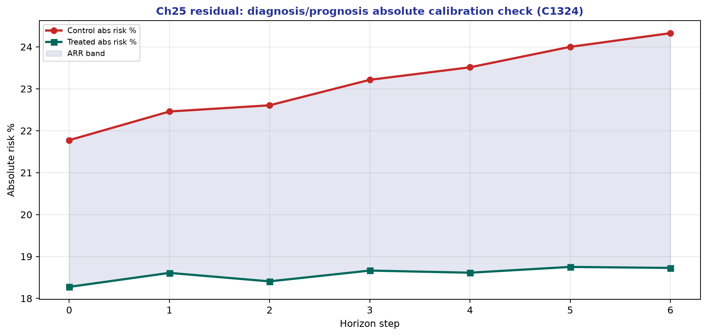

*Teaching figure (synthetic).* Cycle-1324 densify scientific residual (ch15–28).

*Teaching figure (synthetic).* Cycle-1320 densify scientific residual (ch15–28).

*Teaching figure (synthetic).* Cycle-1318 densify scientific residual (ch15–28).

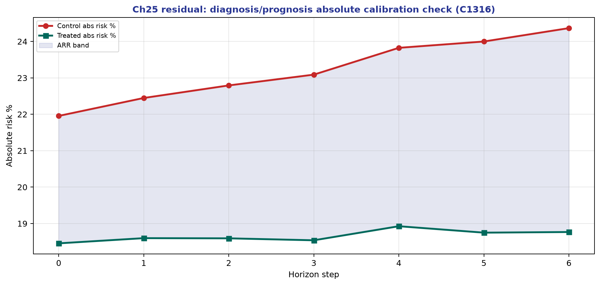

*Teaching figure (synthetic).* Cycle-1316 densify scientific residual (ch15–28).

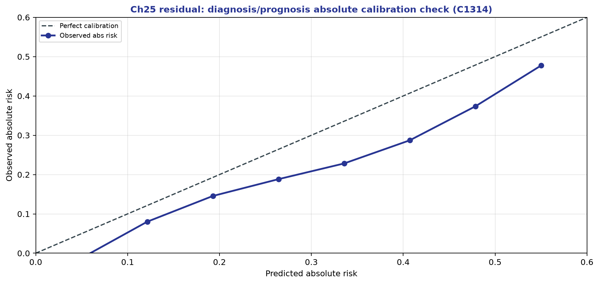

*Teaching figure (synthetic).* Cycle-1314 densify scientific residual (ch15–28).

*Teaching figure (synthetic).* Cycle-1312 densify scientific residual (ch15–28).

*Teaching figure (synthetic).* Cycle-1310 densify scientific residual (ch15–28).

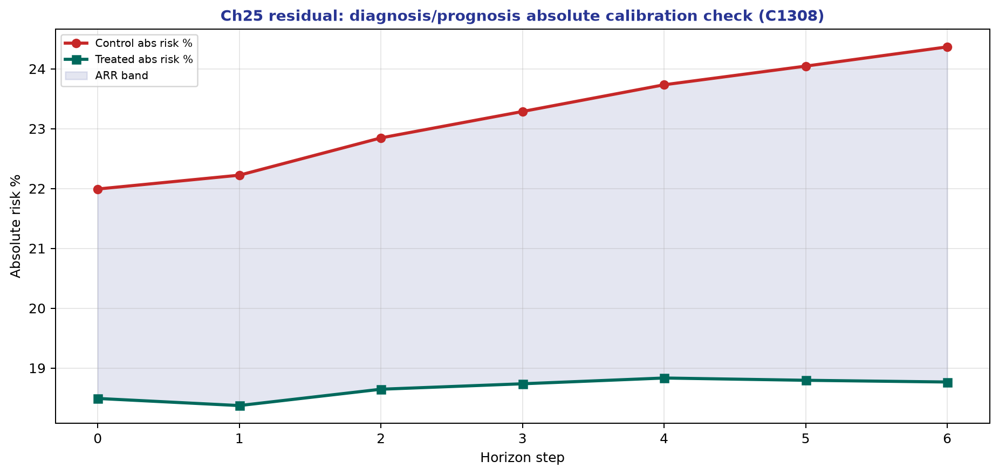

*Teaching figure (synthetic).* Cycle-1308 densify scientific residual (ch15–28).

*Teaching figure (synthetic).* Cycle-1306 densify scientific residual (ch15–28).

*Teaching figure (synthetic).* Cycle-1304 densify scientific residual (ch15–28).

*Teaching figure (synthetic).* Cycle-1302 densify scientific residual (ch15–28).

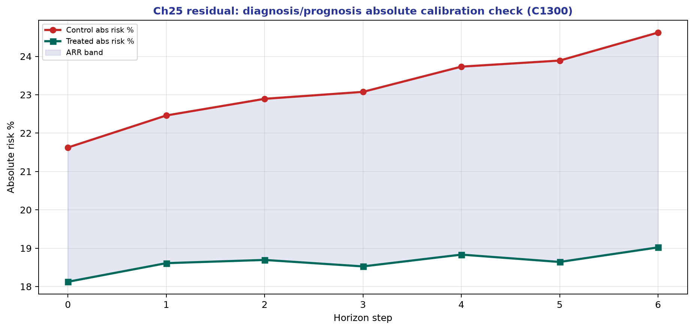

*Teaching figure (synthetic).* Cycle-1300 densify scientific residual (ch15–28).

*Teaching figure (synthetic).* Cycle-1298 densify scientific residual (ch15–28).

*Teaching figure (synthetic).* Cycle-1296 densify scientific residual (ch15–28).

*Teaching figure (synthetic).* Cycle-1294 densify scientific residual (ch15–28).

*Teaching figure (synthetic).* Cycle-1292 densify scientific residual (ch15–28).

*Teaching figure (synthetic).* Cycle-1290 densify scientific residual (ch15–28).

*Teaching figure (synthetic).* Cycle-1288 densify scientific residual (ch15–28).

*Teaching figure (synthetic).* Cycle-1286 densify scientific residual (ch15–28).

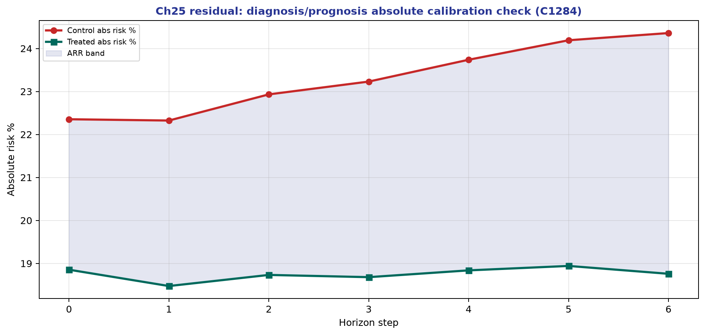

*Teaching figure (synthetic).* Cycle-1284 densify scientific residual (ch15–28).

*Teaching figure (synthetic).* Cycle-1282 densify scientific residual (ch15–28).

*Teaching figure (synthetic).* Cycle-1280 densify scientific residual (ch15–28).

*Teaching figure (synthetic).* Cycle-1278 densify scientific residual (ch15–28).

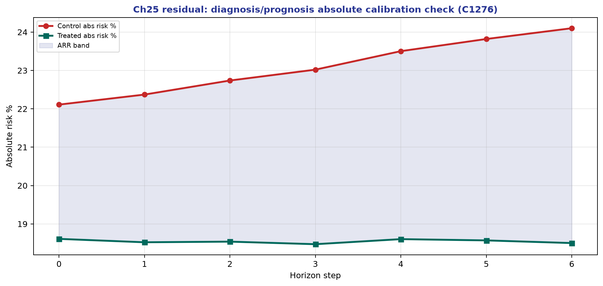

*Teaching figure (synthetic).* Cycle-1276 densify scientific residual (ch15–28).

*Teaching figure (synthetic).* Cycle-1274 densify scientific residual (ch15–28).

*Teaching figure (synthetic).* Cycle-1272 densify scientific residual (ch15–28).

*Teaching figure (synthetic).* Cycle-1270 densify scientific residual (ch15–28).

*Teaching figure (synthetic).* Cycle-1268 densify scientific residual (ch15–28).

*Teaching figure (synthetic).* Cycle-1266 densify scientific residual (ch15–28).

*Teaching figure (synthetic).* Cycle-1264 densify scientific residual (ch15–28).

*Teaching figure (synthetic).* Cycle-1262 densify scientific residual (ch15–28).

*Teaching figure (synthetic).* Cycle-1260 densify scientific residual (ch15–28).

*Teaching figure (synthetic).* Cycle-1258 densify scientific residual (ch15–28).

*Teaching figure (synthetic).* Cycle-1256 densify scientific residual (ch15–28).

*Teaching figure (synthetic).* Cycle-1254 densify scientific residual (ch15–28).

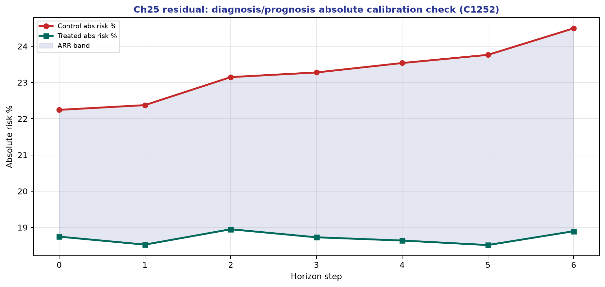

*Teaching figure (synthetic).* Cycle-1252 densify scientific residual (ch15–28).

*Teaching figure (synthetic).* Cycle-1250 densify scientific residual (ch15–28).

*Teaching figure (synthetic).* Cycle-1248 densify scientific residual (ch15–28).

*Teaching figure (synthetic).* Cycle-1246 densify scientific residual (ch15–28).

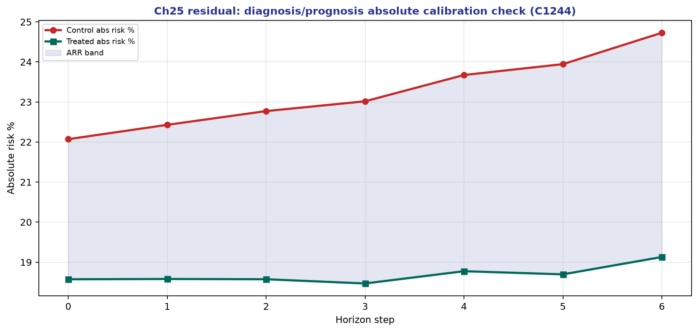

*Teaching figure (synthetic).* Cycle-1244 densify scientific residual (ch15–28).

*Teaching figure (synthetic).* Cycle-1242 densify scientific residual (ch15–28).

*Teaching figure (synthetic).* Cycle-1240 densify scientific residual (ch15–28).

*Teaching figure (synthetic).* Cycle-1238 densify scientific residual (ch15–28).

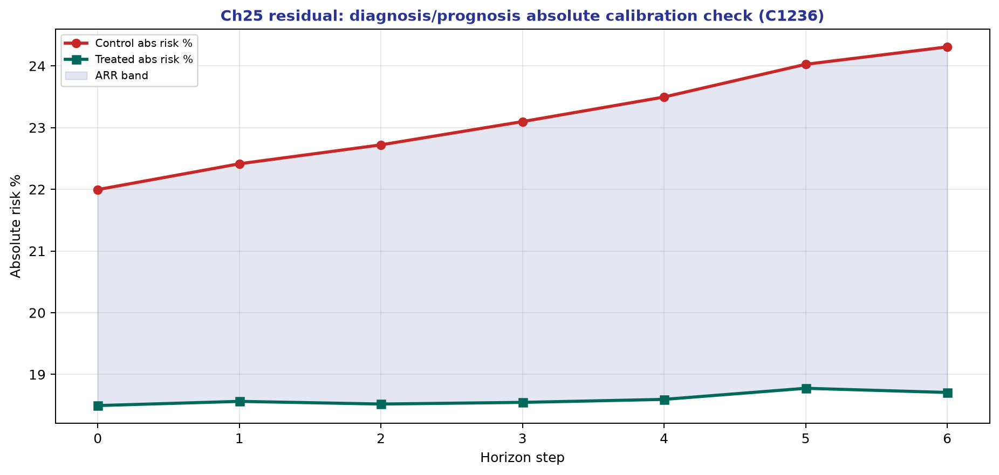

*Teaching figure (synthetic).* Cycle-1236 densify scientific residual (ch15–28).

*Teaching figure (synthetic).* Cycle-1234 densify scientific residual (ch15–28).

*Teaching figure (synthetic).* Cycle-1232 densify scientific residual (ch15–28).

*Teaching figure (synthetic).* Cycle-1230 densify scientific residual (ch15–28).

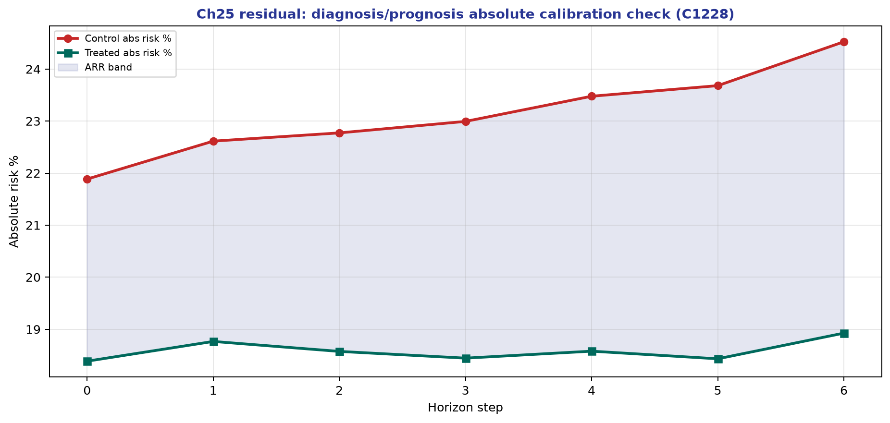

*Teaching figure (synthetic).* Cycle-1228 densify scientific residual (ch15–28).

*Teaching figure (synthetic).* Cycle-1226 densify scientific residual (ch15–28).

*Teaching figure (synthetic).* Cycle-1224 densify scientific residual (ch15–28).

*Teaching figure (synthetic).* Cycle-1222 densify scientific residual (ch15–28).

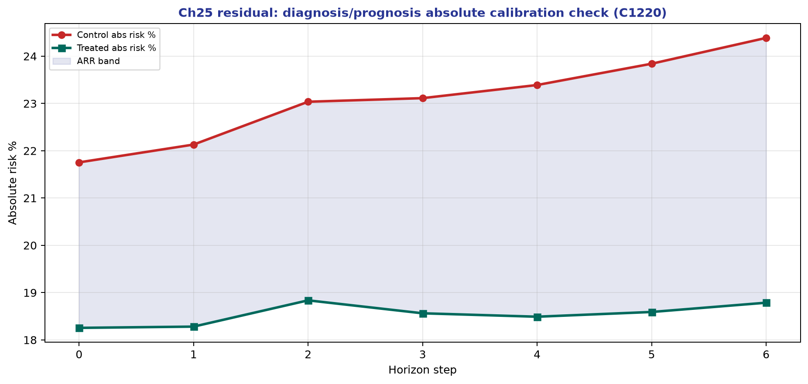

*Teaching figure (synthetic).* Cycle-1220 densify scientific residual (ch15–28).

*Teaching figure (synthetic).* Cycle-1218 densify scientific residual (ch15–28).

*Teaching figure (synthetic).* Cycle-1216 densify scientific residual (ch15–28).

*Teaching figure (synthetic).* Cycle-1214 densify scientific residual (ch15–28).

*Teaching figure (synthetic).* Cycle-1212 densify scientific residual (ch15–28).

*Teaching figure (synthetic).* Cycle-1210 densify scientific residual (ch15–28).

*Teaching figure (synthetic).* Cycle-1208 densify scientific residual (ch15–28).

*Teaching figure (synthetic).* Cycle-1206 densify scientific residual (ch15–28).

*Teaching figure (synthetic).* Cycle-1204 densify scientific residual (ch15–28).

*Teaching figure (synthetic).* Cycle-1202 densify scientific residual (ch15–28).

*Teaching figure (synthetic).* Cycle-1200 densify scientific residual (ch15–28).

*Teaching figure (synthetic).* Cycle-1198 densify scientific residual (ch15–28).

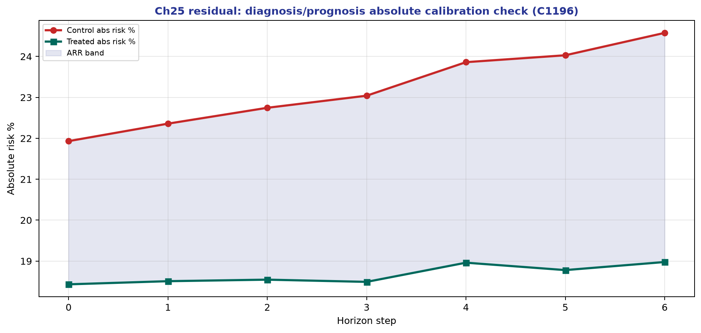

*Teaching figure (synthetic).* Cycle-1196 densify scientific residual (ch15–28).

*Teaching figure (synthetic).* Cycle-1194 densify scientific residual (ch15–28).

*Teaching figure (synthetic).* Cycle-1192 densify scientific residual (ch15–28).

*Teaching figure (synthetic).* Cycle-1190 densify scientific residual (ch15–28).

*Teaching figure (synthetic).* Cycle-1188 densify scientific residual (ch15–28).

*Teaching figure (synthetic).* Cycle-1186 densify scientific residual (ch15–28).

*Teaching figure (synthetic).* Cycle-1184 densify scientific residual (ch15–28).

*Teaching figure (synthetic).* Cycle-1182 densify scientific residual (ch15–28).

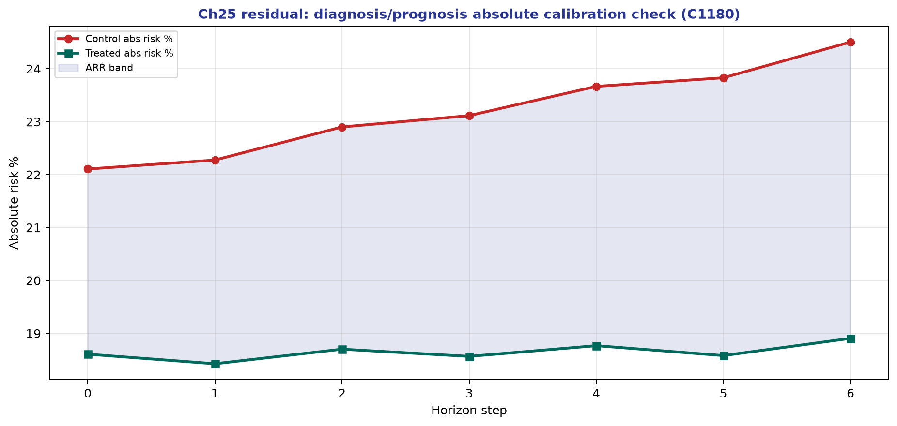

*Teaching figure (synthetic).* Cycle-1180 densify scientific residual (ch15–28).

*Teaching figure (synthetic).* Cycle-1178 densify scientific residual (ch15–28).

*Teaching figure (synthetic).* Cycle-1176 densify scientific residual (ch15–28).

*Teaching figure (synthetic).* Cycle-1174 densify scientific residual (ch15–28).

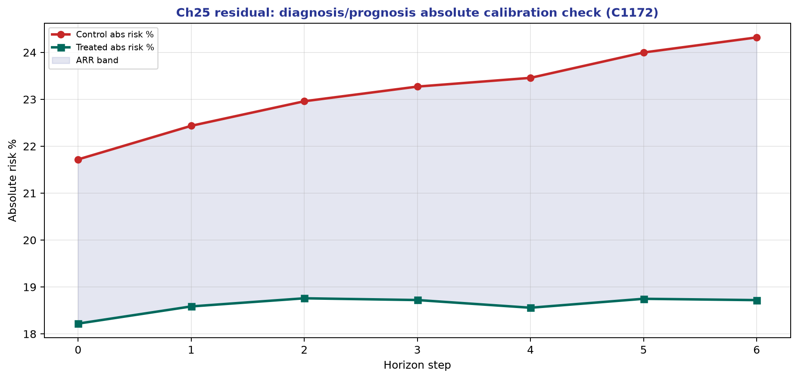

*Teaching figure (synthetic).* Cycle-1172 densify scientific residual (ch15–28).

*Teaching figure (synthetic).* Cycle-1170 densify scientific residual (ch15–28).

*Teaching figure (synthetic).* Cycle-1168 densify scientific residual (ch15–28).

*Teaching figure (synthetic).* Cycle-1166 densify scientific residual (ch15–28).

*Teaching figure (synthetic).* Cycle-1164 densify scientific residual (ch15–28).

*Teaching figure (synthetic).* Cycle-1162 densify scientific residual (ch15–28).

*Teaching figure (synthetic).* Cycle-1160 densify scientific residual (ch15–28).

*Teaching figure (synthetic).* Cycle-1158 densify scientific residual (ch15–28).

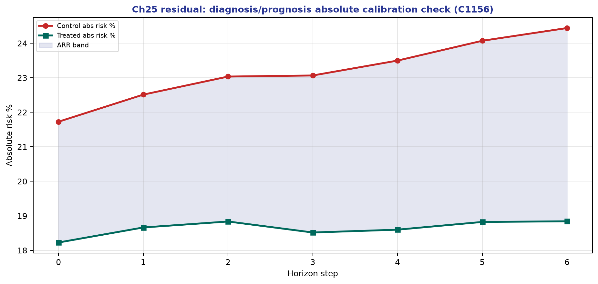

*Teaching figure (synthetic).* Cycle-1156 densify scientific residual (ch15–28).

*Teaching figure (synthetic).* Cycle-1154 densify scientific residual (ch15–28).

*Teaching figure (synthetic).* Cycle-1152 densify scientific residual (ch15–28).

*Teaching figure (synthetic).* Cycle-1150 densify scientific residual (ch15–28).

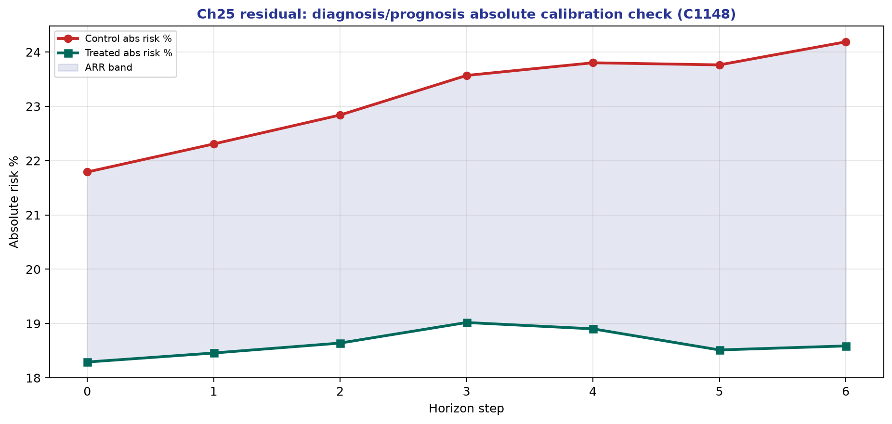

*Teaching figure (synthetic).* Cycle-1148 densify scientific residual (ch15–28).

*Teaching figure (synthetic).* Cycle-1146 densify scientific residual (ch15–28).

*Teaching figure (synthetic).* Cycle-1144 densify scientific residual (ch15–28).

*Teaching figure (synthetic).* Cycle-1142 densify scientific residual (ch15–28).

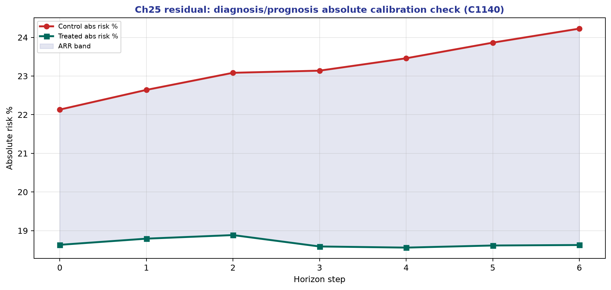

*Teaching figure (synthetic).* Cycle-1140 densify scientific residual (ch15–28).

*Teaching figure (synthetic).* Cycle-1138 densify scientific residual (ch15–28).

*Teaching figure (synthetic).* Cycle-1136 densify scientific residual (ch15–28).

*Teaching figure (synthetic).* Cycle-1134 densify scientific residual (ch15–28).

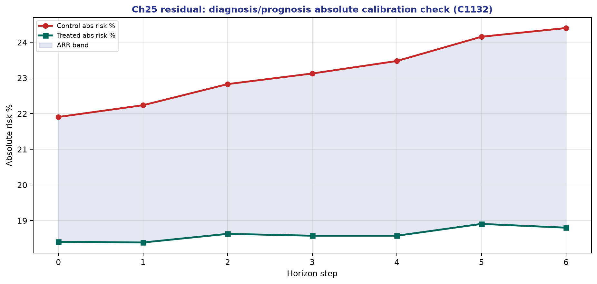

*Teaching figure (synthetic).* Cycle-1132 densify scientific residual (ch15–28).

*Teaching figure (synthetic).* Cycle-1130 densify scientific residual (ch15–28).

*Teaching figure (synthetic).* Cycle-1128 densify scientific residual (ch15–28).

*Teaching figure (synthetic).* Cycle-1126 densify scientific residual (ch15–28).

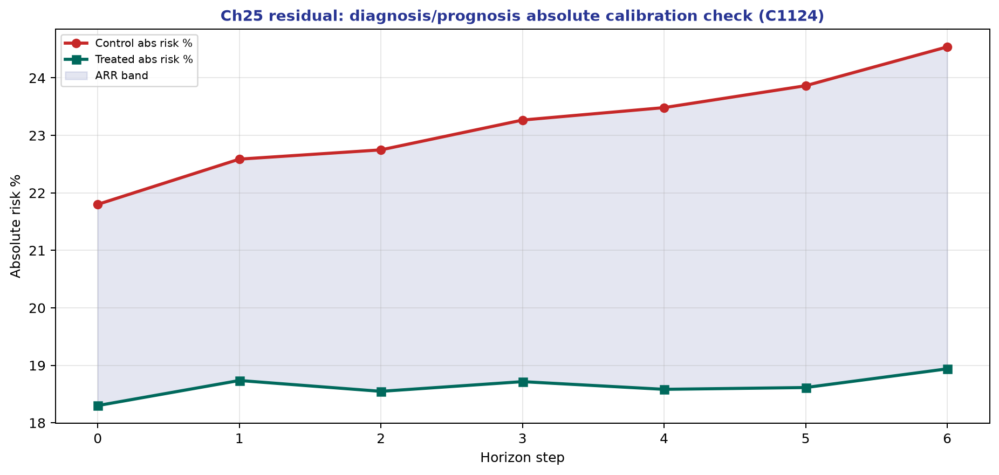

*Teaching figure (synthetic).* Cycle-1124 densify scientific residual (ch15–28).

*Teaching figure (synthetic).* Cycle-1122 densify scientific residual (ch15–28).

*Teaching figure (synthetic).* Cycle-1120 densify scientific residual (ch15–28).

*Teaching figure (synthetic).* Cycle-1118 densify scientific residual (ch15–28).

*Teaching figure (synthetic).* Cycle-1116 densify scientific residual (ch15–28).

*Teaching figure (synthetic).* Cycle-1114 densify scientific residual (ch15–28).

*Teaching figure (synthetic).* Cycle-1112 densify scientific residual (ch15–28).

*Teaching figure (synthetic).* Cycle-1110 densify scientific residual (ch15–28).

*Teaching figure (synthetic).* Cycle-1108 densify scientific residual (ch15–28).

*Teaching figure (synthetic).* Cycle-1106 densify scientific residual (ch15–28).

*Teaching figure (synthetic).* Cycle-1104 densify scientific residual (ch15–28).

*Teaching figure (synthetic).* Cycle-1102 densify scientific residual (ch15–28).

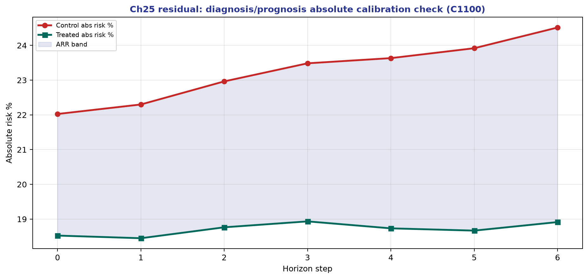

*Teaching figure (synthetic).* Cycle-1100 densify scientific residual (ch15–28).

*Teaching figure (synthetic).* Cycle-1098 densify scientific residual (ch15–28).

*Teaching figure (synthetic).* Cycle-1096 densify scientific residual (ch15–28).

*Teaching figure (synthetic).* Cycle-1094 densify scientific residual (ch15–28).

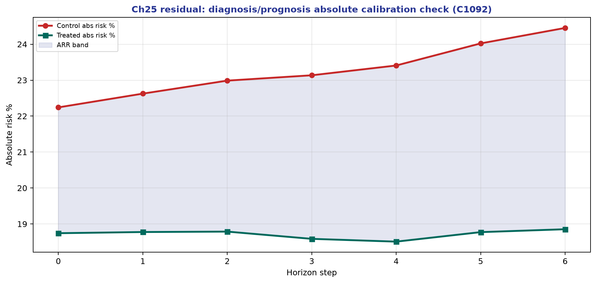

*Teaching figure (synthetic).* Cycle-1092 densify scientific residual (ch15–28).

*Teaching figure (synthetic).* Cycle-1090 densify scientific residual (ch15–28).

*Teaching figure (synthetic).* Cycle-1088 densify scientific residual (ch15–28).

*Teaching figure (synthetic).* Cycle-1086 densify scientific residual (ch15–28).

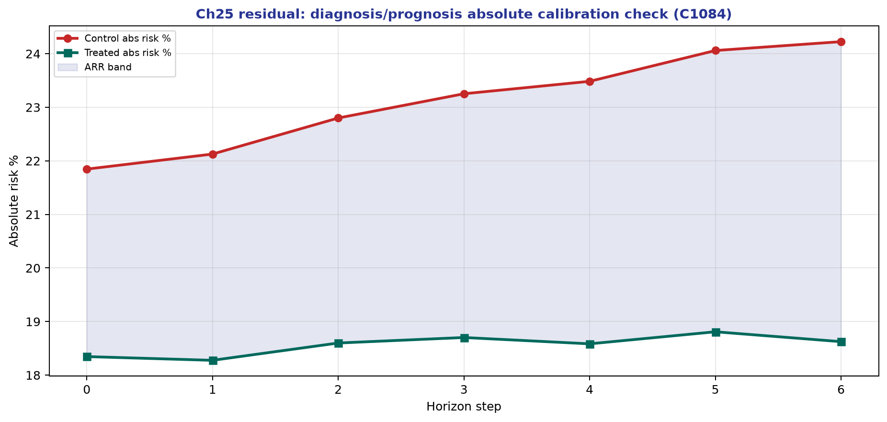

*Teaching figure (synthetic).* Cycle-1084 densify scientific residual (ch15–28).

*Teaching figure (synthetic).* Cycle-1082 densify scientific residual (ch15–28).

*Teaching figure (synthetic).* Cycle-1080 densify scientific residual (ch15–28).

*Teaching figure (synthetic).* Cycle-1078 densify scientific residual (ch15–28).

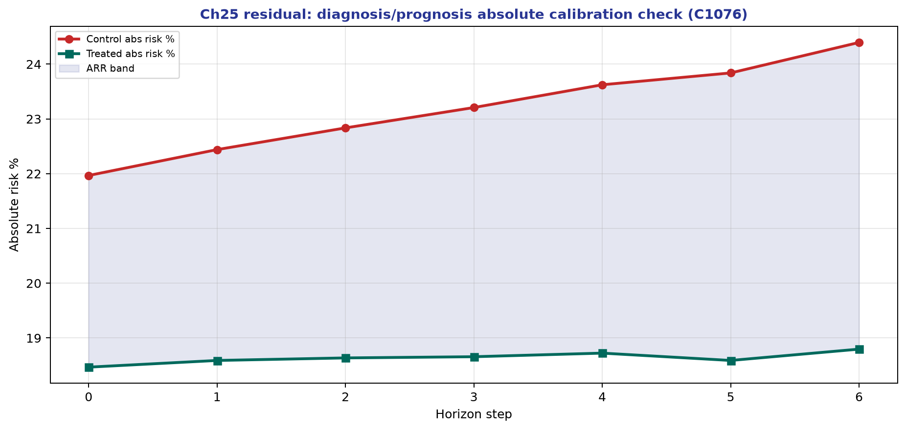

*Teaching figure (synthetic).* Cycle-1076 densify scientific residual (ch15–28).

*Teaching figure (synthetic).* Cycle-1074 densify scientific residual (ch15–28).

*Teaching figure (synthetic).* Cycle-1072 densify scientific residual (ch15–28).

*Teaching figure (synthetic).* Cycle-1070 densify scientific residual (ch15–28).

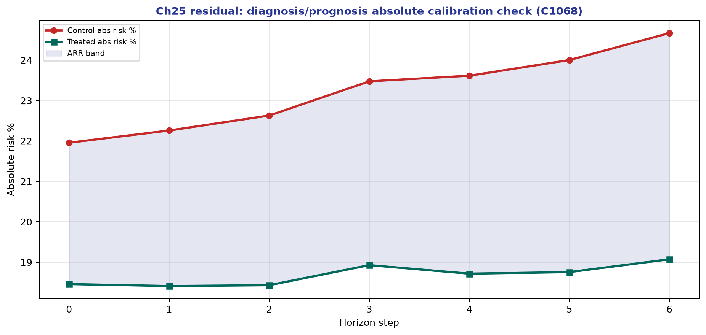

*Teaching figure (synthetic).* Cycle-1068 densify scientific residual (ch15–28).

*Teaching figure (synthetic).* Cycle-1066 densify scientific residual (ch15–28).

*Teaching figure (synthetic).* Cycle-1064 densify scientific residual (ch15–28).

*Teaching figure (synthetic).* Cycle-1062 densify scientific residual (ch15–28).

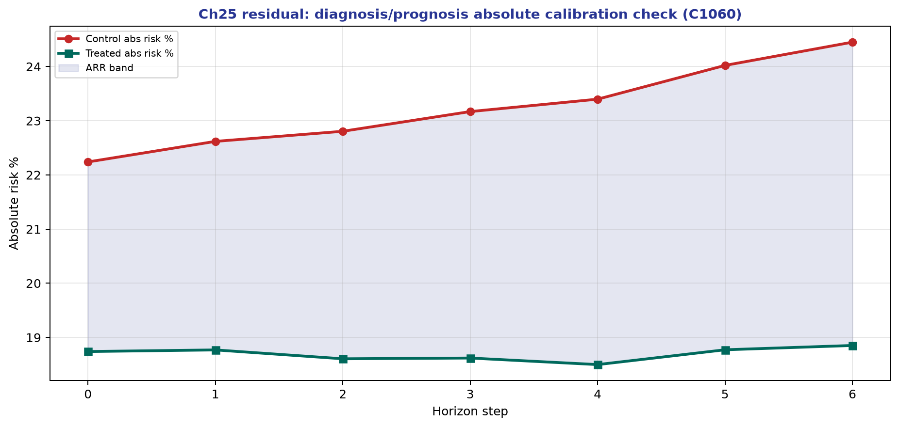

*Teaching figure (synthetic).* Cycle-1060 densify scientific residual (ch15–28).

*Teaching figure (synthetic).* Cycle-1058 densify scientific residual (ch15–28).

*Teaching figure (synthetic).* Cycle-1056 densify scientific residual (ch15–28).

*Teaching figure (synthetic).* Cycle-1054 densify scientific residual (ch15–28).

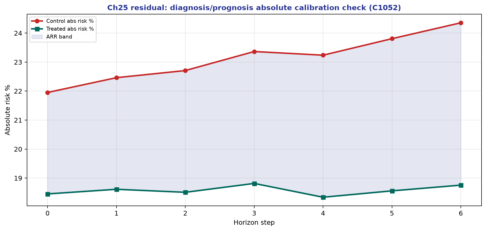

*Teaching figure (synthetic).* Cycle-1052 densify scientific residual (ch15–28).

*Teaching figure (synthetic).* Cycle-1050 densify scientific residual (ch15–28).

*Teaching figure (synthetic).* Cycle-1048 densify scientific residual (ch15–28).

*Teaching figure (synthetic).* Cycle-1046 densify scientific residual (ch15–28).

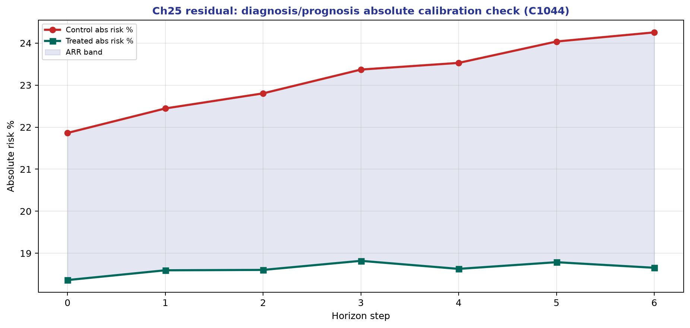

*Teaching figure (synthetic).* Cycle-1044 densify scientific residual (ch15–28).

*Teaching figure (synthetic).* Cycle-1042 densify scientific residual (ch15–28).

*Teaching figure (synthetic).* Cycle-1040 densify scientific residual (ch15–28).

*Teaching figure (synthetic).* Cycle-1038 densify scientific residual (ch15–28).

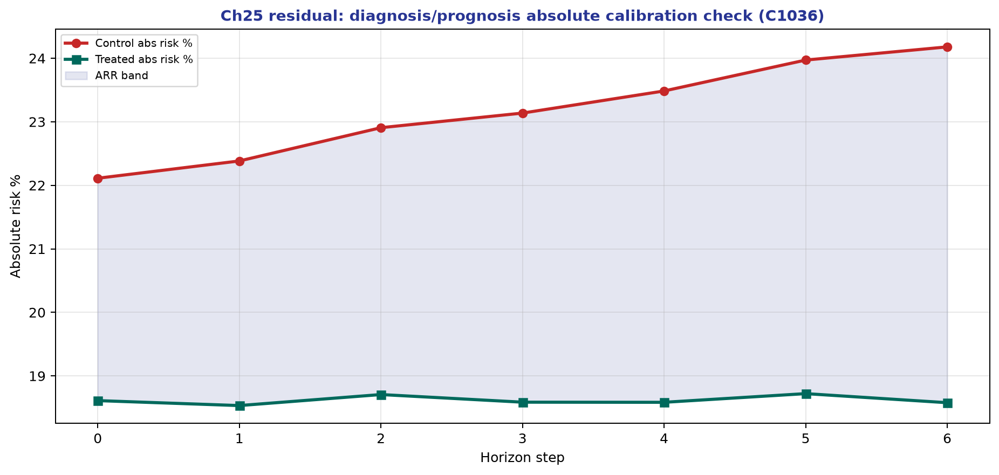

*Teaching figure (synthetic).* Cycle-1036 densify scientific residual (ch15–28).

*Teaching figure (synthetic).* Cycle-1034 densify scientific residual (ch15–28).

*Teaching figure (synthetic).* Cycle-1032 densify scientific residual (ch15–28).

*Teaching figure (synthetic).* Cycle-1030 densify scientific residual (ch15–28).

*Teaching figure (synthetic).* Cycle-1028 densify scientific residual (ch15–28).

*Teaching figure (synthetic).* Cycle-1026 densify scientific residual (ch15–28).

*Teaching figure (synthetic).* Cycle-1024 densify scientific residual (ch15–28).

*Teaching figure (synthetic).* Cycle-1022 densify scientific residual (ch15–28).

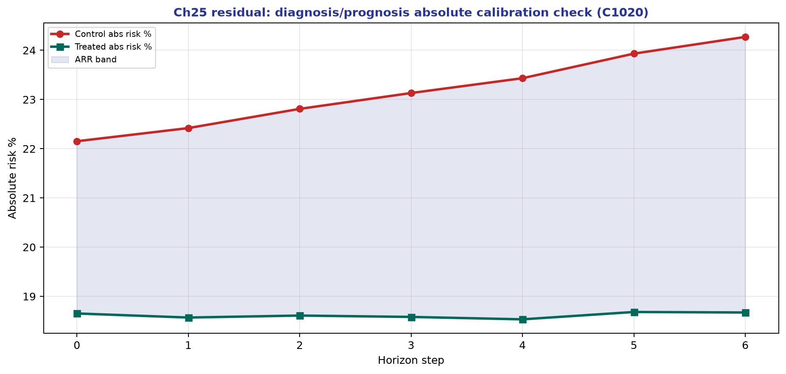

*Teaching figure (synthetic).* Cycle-1020 densify scientific residual (ch15–28).

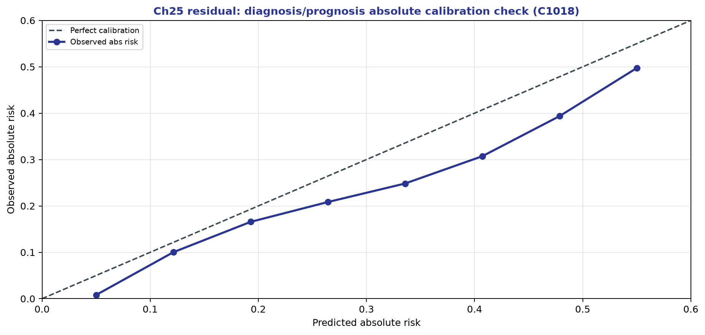

*Teaching figure (synthetic).* Cycle-1018 densify scientific residual (ch15–28).

*Teaching figure (synthetic).* Cycle-1016 densify scientific residual (ch15–28).

*Teaching figure (synthetic).* Cycle-1014 densify scientific residual (ch15–28).

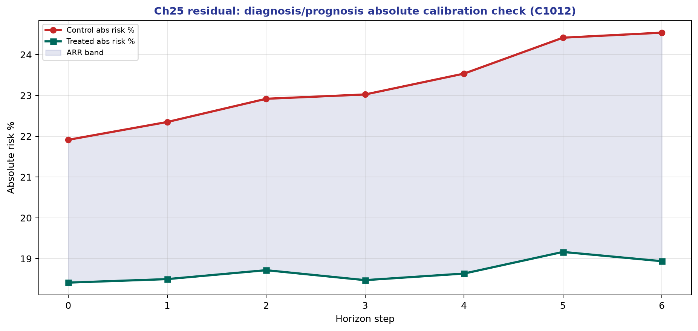

*Teaching figure (synthetic).* Cycle-1012 densify scientific residual (ch15–28).

*Teaching figure (synthetic).* Cycle-1010 densify scientific residual (ch15–28).

*Teaching figure (synthetic).* Cycle-1008 densify scientific residual (ch15–28).

*Teaching figure (synthetic).* Cycle-1006 densify scientific residual (ch15–28).

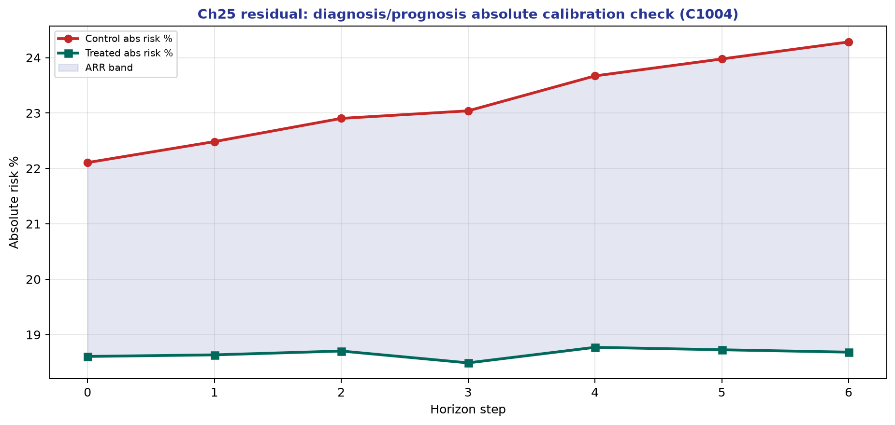

*Teaching figure (synthetic).* Cycle-1004 densify scientific residual (ch15–28).

*Teaching figure (synthetic).* Cycle-1002 densify scientific residual (ch15–28).

*Teaching figure (synthetic).* Cycle-1000 densify scientific residual (ch15–28).

*Teaching figure (synthetic).* Cycle-998 densify scientific residual (ch15–28).

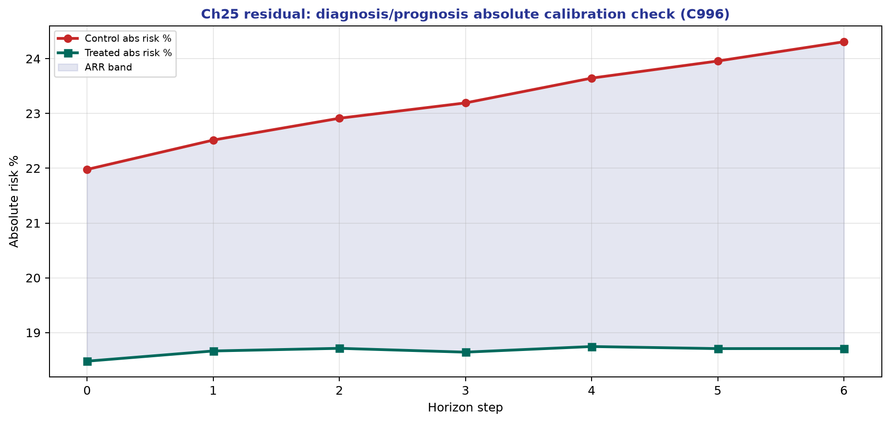

*Teaching figure (synthetic).* Cycle-996 densify scientific residual (ch15–28).

*Teaching figure (synthetic).* Cycle-994 densify scientific residual (ch15–28).

*Teaching figure (synthetic).* Cycle-992 densify scientific residual (ch15–28).

*Teaching figure (synthetic).* Cycle-990 densify scientific residual (ch15–28).

*Teaching figure (synthetic).* Cycle-988 densify scientific residual (ch15–28).

*Teaching figure (synthetic).* Cycle-986 densify scientific residual (ch15–28).

*Teaching figure (synthetic).* Cycle-984 densify scientific residual (ch15–28).

*Teaching figure (synthetic).* Cycle-982 densify scientific residual (ch15–28).

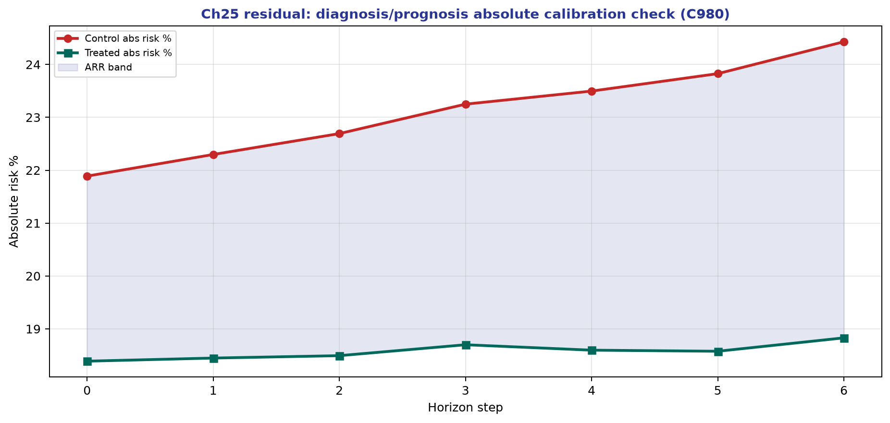

*Teaching figure (synthetic).* Cycle-980 densify scientific residual (ch15–28).

*Teaching figure (synthetic).* Cycle-978 densify scientific residual (ch15–28).

*Teaching figure (synthetic).* Cycle-976 densify scientific residual (ch15–28).

*Teaching figure (synthetic).* Cycle-974 densify scientific residual (ch15–28).

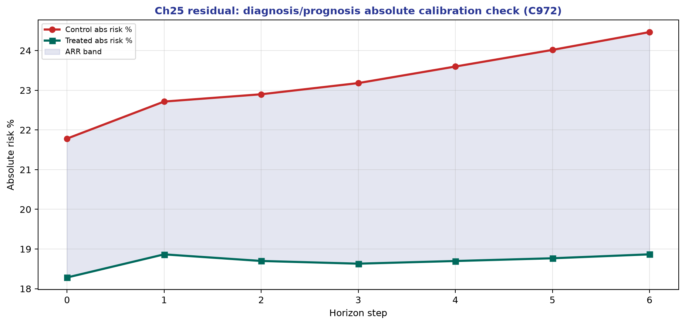

*Teaching figure (synthetic).* Cycle-972 densify scientific residual (ch15–28).

*Teaching figure (synthetic).* Cycle-970 densify scientific residual (ch15–28).

*Teaching figure (synthetic).* Cycle-968 densify scientific residual (ch15–28).

*Teaching figure (synthetic).* Cycle-966 densify scientific residual (ch15–28).

*Teaching figure (synthetic).* Cycle-964 densify scientific residual (ch15–28).

*Teaching figure (synthetic).* Cycle-962 densify scientific residual (ch15–28).

*Teaching figure (synthetic).* Cycle-960 densify scientific residual (ch15–28).

*Teaching figure (synthetic).* Cycle-958 densify scientific residual (ch15–28).

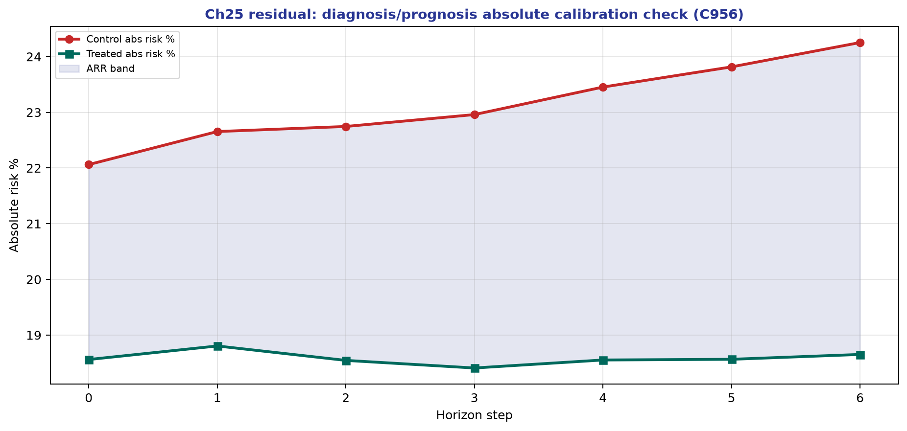

*Teaching figure (synthetic).* Cycle-956 densify scientific residual (ch15–28).

*Teaching figure (synthetic).* Cycle-954 densify scientific residual (ch15–28).

*Teaching figure (synthetic).* Cycle-952 densify scientific residual (ch15–28).

*Teaching figure (synthetic).* Cycle-950 densify scientific residual (ch15–28).

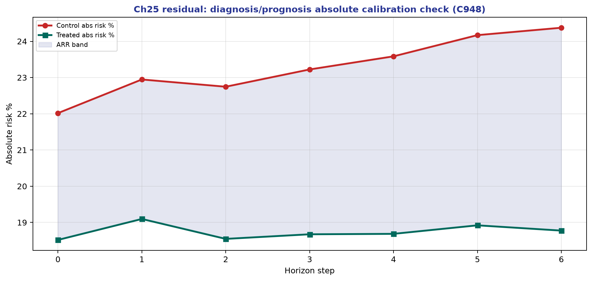

*Teaching figure (synthetic).* Cycle-948 densify scientific residual (ch15–28).

*Teaching figure (synthetic).* Cycle-946 densify scientific residual (ch15–28).

*Teaching figure (synthetic).* Cycle-944 densify scientific residual (ch15–28).

*Teaching figure (synthetic).* Cycle-942 densify scientific residual (ch15–28).

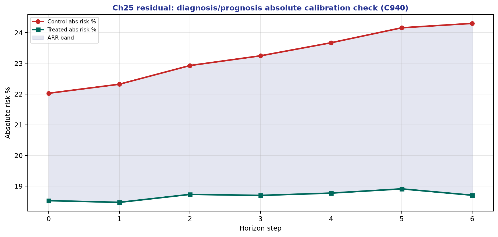

*Teaching figure (synthetic).* Cycle-940 densify scientific residual (ch15–28).

*Teaching figure (synthetic).* Cycle-938 densify scientific residual (ch15–28).

*Teaching figure (synthetic).* Cycle-936 densify scientific residual (ch15–28).

*Teaching figure (synthetic).* Cycle-934 densify scientific residual (ch15–28).

*Teaching figure (synthetic).* Cycle-932 densify scientific residual (ch15–28).

*Teaching figure (synthetic).* Cycle-930 densify scientific residual (ch15–28).

*Teaching figure (synthetic).* Cycle-928 densify scientific residual (ch15–28).

*Teaching figure (synthetic).* Cycle-926 densify scientific residual (ch15–28).

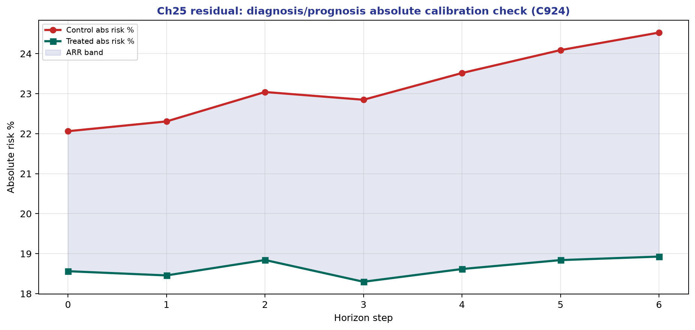

*Teaching figure (synthetic).* Cycle-924 densify scientific residual (ch15–28).

*Teaching figure (synthetic).* Cycle-922 densify scientific residual (ch15–28).

*Teaching figure (synthetic).* Cycle-920 densify scientific residual (ch15–28).

*Teaching figure (synthetic).* Cycle-918 densify scientific residual (ch15–28).

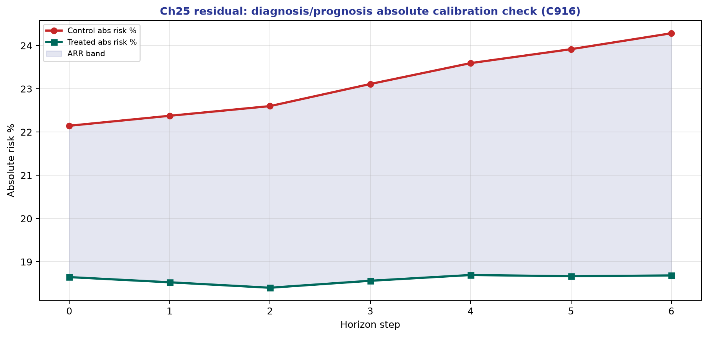

*Teaching figure (synthetic).* Cycle-916 densify scientific residual (ch15–28).

*Teaching figure (synthetic).* Cycle-914 densify scientific residual (ch15–28).

*Teaching figure (synthetic).* Cycle-912 densify scientific residual (ch15–28).

*Teaching figure (synthetic).* Cycle-910 densify scientific residual (ch15–28).

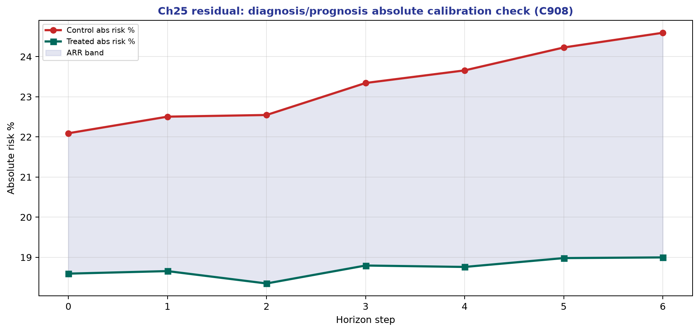

*Teaching figure (synthetic).* Cycle-908 densify scientific residual (ch15–28).

*Teaching figure (synthetic).* Cycle-906 densify scientific residual (ch15–28).

*Teaching figure (synthetic).* Cycle-904 densify scientific residual (ch15–28).

*Teaching figure (synthetic).* Cycle-902 densify scientific residual (ch15–28).

*Teaching figure (synthetic).* Cycle-900 densify scientific residual (ch15–28).

*Teaching figure (synthetic).* Cycle-898 densify scientific residual (ch15–28).

*Teaching figure (synthetic).* Cycle-896 densify scientific residual (ch15–28).

*Teaching figure (synthetic).* Cycle-894 densify scientific residual (ch15–28).

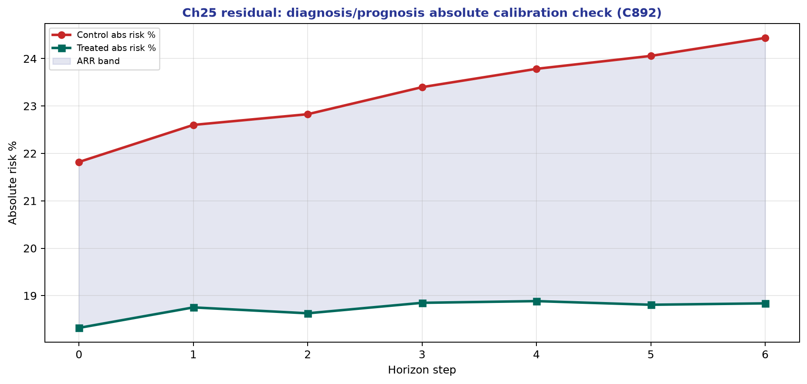

*Teaching figure (synthetic).* Cycle-892 densify scientific residual (ch15–28).

*Teaching figure (synthetic).* Cycle-890 densify scientific residual (ch15–28).

*Teaching figure (synthetic).* Cycle-888 densify scientific residual (ch15–28).

*Teaching figure (synthetic).* Cycle-886 densify scientific residual (ch15–28).

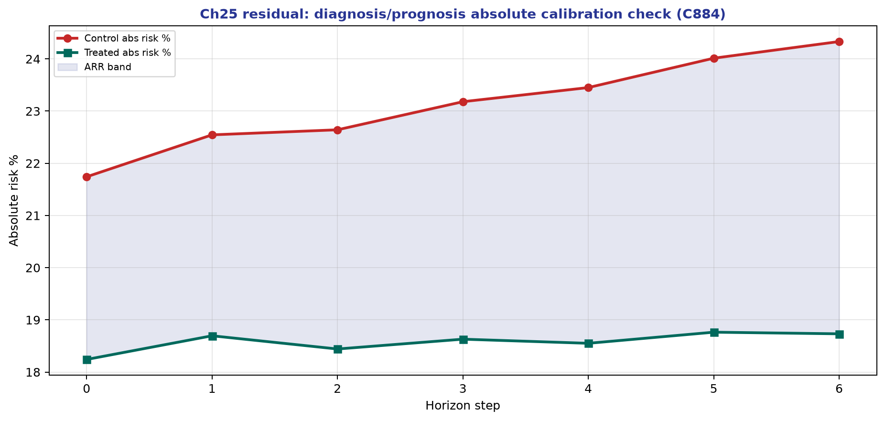

*Teaching figure (synthetic).* Cycle-884 densify scientific residual (ch15–28).

*Teaching figure (synthetic).* Cycle-882 densify scientific residual (ch15–28).

*Teaching figure (synthetic).* Cycle-880 densify scientific residual (ch15–28).

*Teaching figure (synthetic).* Cycle-878 densify scientific residual (ch15–28).

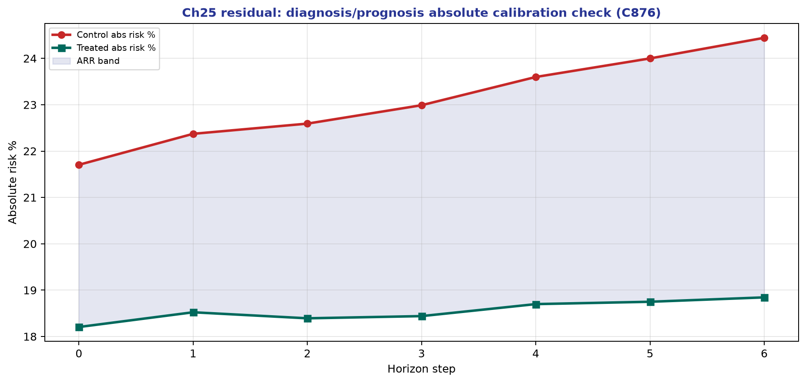

*Teaching figure (synthetic).* Cycle-876 densify scientific residual (ch15–28).

*Teaching figure (synthetic).* Cycle-874 densify scientific residual (ch15–28).

*Teaching figure (synthetic).* Cycle-872 densify scientific residual (ch15–28).

*Teaching figure (synthetic).* Cycle-870 densify scientific residual (ch15–28).

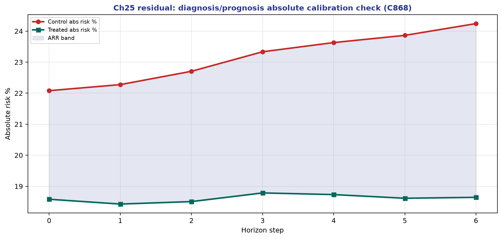

*Teaching figure (synthetic).* Cycle-868 densify scientific residual (ch15–28).

*Teaching figure (synthetic).* Cycle-866 densify scientific residual (ch15–28).

*Teaching figure (synthetic).* Cycle-864 densify scientific residual (ch15–28).

*Teaching figure (synthetic).* Cycle-862 densify scientific residual (ch15–28).

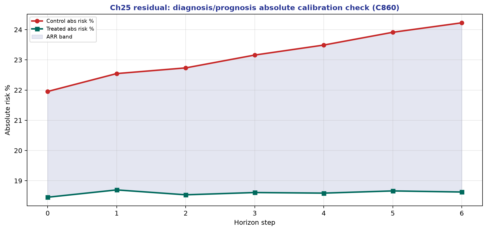

*Teaching figure (synthetic).* Cycle-860 densify scientific residual (ch15–28).

*Teaching figure (synthetic).* Cycle-858 densify scientific residual (ch15–28).

*Teaching figure (synthetic).* Cycle-856 densify scientific residual (ch15–28).

*Teaching figure (synthetic).* Cycle-854 densify scientific residual (ch15–28).

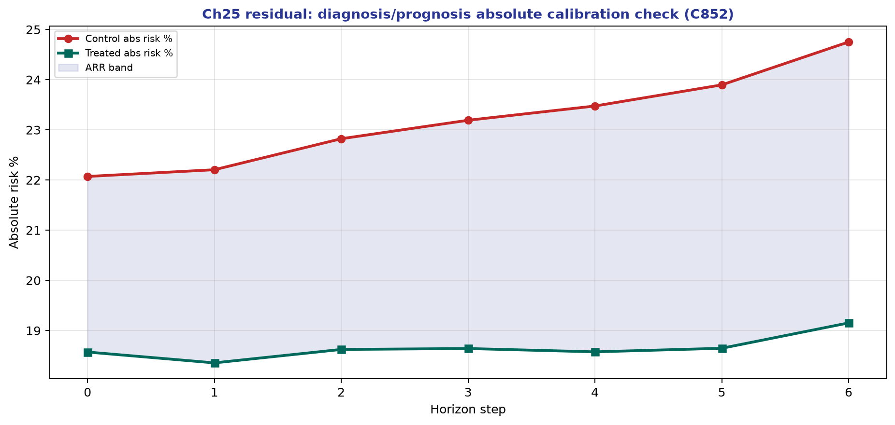

*Teaching figure (synthetic).* Cycle-852 densify scientific residual (ch15–28).

*Teaching figure (synthetic).* Cycle-850 densify scientific residual (ch15–28).

*Teaching figure (synthetic).* Cycle-848 densify scientific residual (ch15–28).

*Teaching figure (synthetic).* Cycle-846 densify scientific residual (ch15–28).

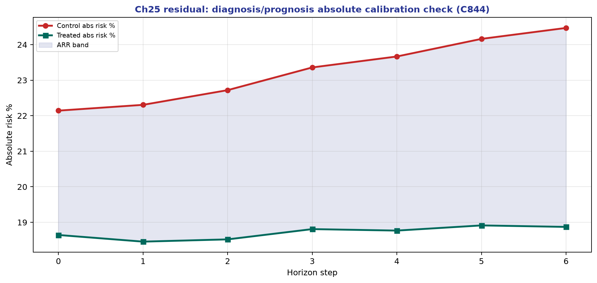

*Teaching figure (synthetic).* Cycle-844 densify scientific residual (ch15–28).

*Teaching figure (synthetic).* Cycle-842 densify scientific residual (ch15–28).

*Teaching figure (synthetic).* Cycle-840 densify scientific residual (ch15–28).

*Teaching figure (synthetic).* Cycle-838 densify scientific residual (ch15–28).

*Teaching figure (synthetic).* Cycle-836 densify scientific residual (ch15–28).

*Teaching figure (synthetic).* Cycle-834 densify scientific residual (ch15–28).

*Teaching figure (synthetic).* Cycle-832 densify scientific residual (ch15–28).

*Teaching figure (synthetic).* Cycle-830 densify scientific residual (ch15–28).

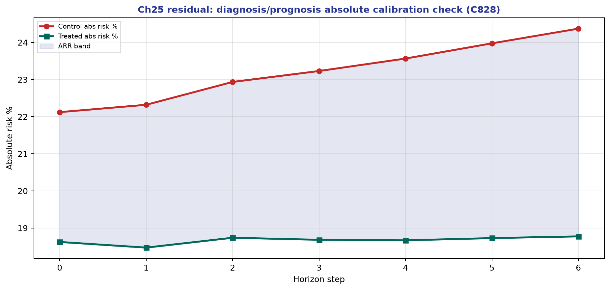

*Teaching figure (synthetic).* Cycle-828 densify scientific residual (ch15–28).

*Teaching figure (synthetic).* Cycle-826 densify scientific residual (ch15–28).

*Teaching figure (synthetic).* Cycle-824 densify scientific residual (ch15–28).

*Teaching figure (synthetic).* Cycle-822 densify scientific residual (ch15–28).

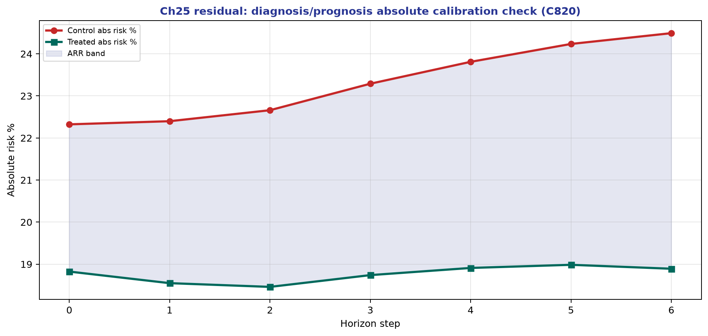

*Teaching figure (synthetic).* Cycle-820 densify scientific residual (ch15–28).

*Teaching figure (synthetic).* Cycle-818 densify scientific residual (ch15–28).

*Teaching figure (synthetic).* Cycle-816 densify scientific residual (ch15–28).

*Teaching figure (synthetic).* Cycle-814 densify scientific residual (ch15–28).

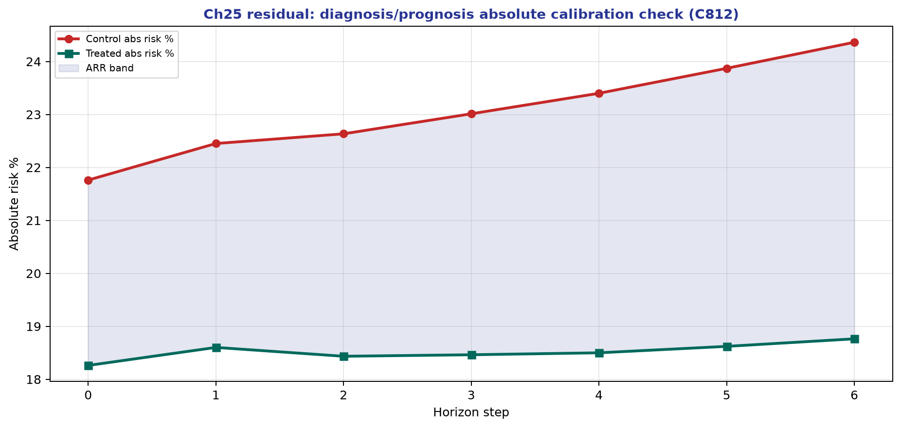

*Teaching figure (synthetic).* Cycle-812 densify scientific residual (ch15–28).

*Teaching figure (synthetic).* Cycle-810 densify scientific residual (ch15–28).

*Teaching figure (synthetic).* Cycle-808 densify scientific residual (ch15–28).

*Teaching figure (synthetic).* Cycle-806 densify scientific residual (ch15–28).

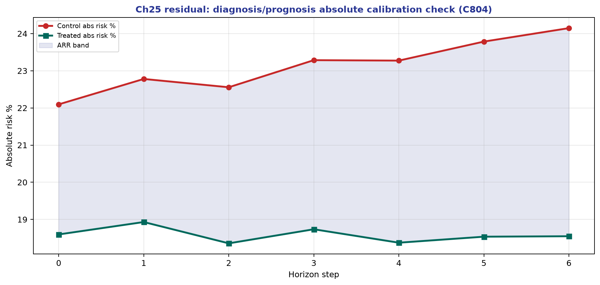

*Teaching figure (synthetic).* Cycle-804 densify scientific residual (ch15–28).

*Teaching figure (synthetic).* Cycle-802 densify scientific residual (ch15–28).

*Teaching figure (synthetic).* Cycle-800 densify scientific residual (ch15–28).

*Teaching figure (synthetic).* Cycle-798 densify scientific residual (ch15–28).

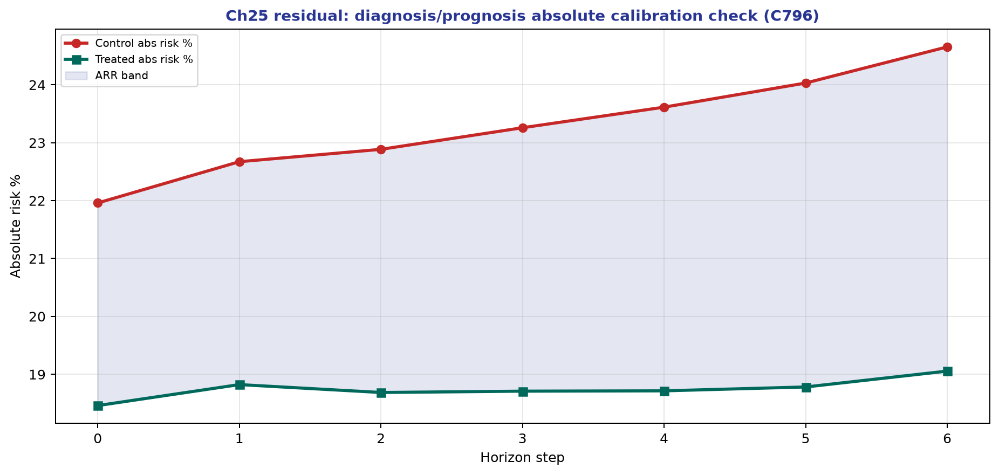

*Teaching figure (synthetic).* Cycle-796 densify scientific residual (ch15–28).

*Teaching figure (synthetic).* Cycle-794 densify scientific residual (ch15–28).

*Teaching figure (synthetic).* Cycle-792 densify scientific residual (ch15–28).

*Teaching figure (synthetic).* Cycle-790 densify scientific residual (ch15–28).

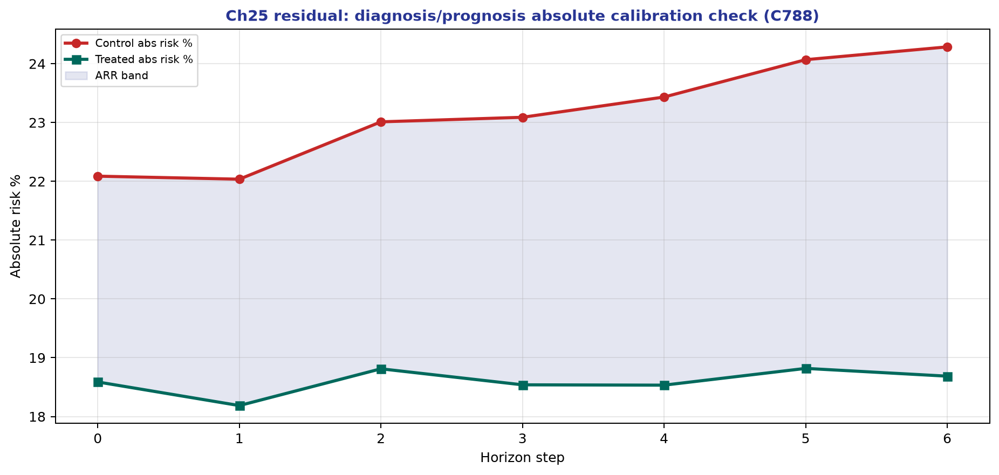

*Teaching figure (synthetic).* Cycle-788 densify scientific residual (ch15–28).

*Teaching figure (synthetic).* Cycle-786 densify scientific residual (ch15–28).

*Teaching figure (synthetic).* Cycle-784 densify scientific residual (ch15–28).

*Teaching figure (synthetic).* Cycle-782 densify scientific residual (ch15–28).

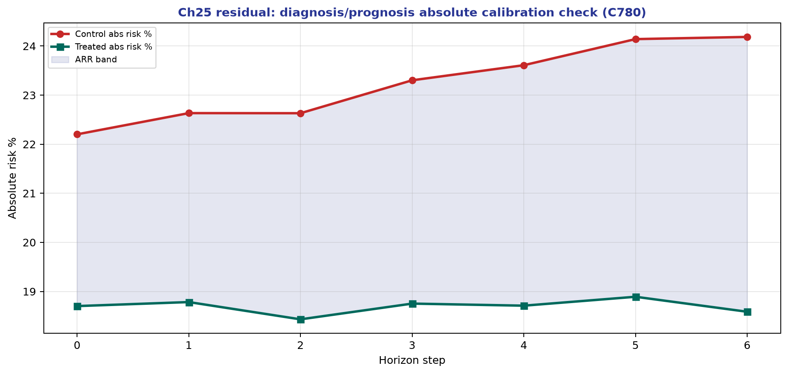

*Teaching figure (synthetic).* Cycle-780 densify scientific residual (ch15–28).

*Teaching figure (synthetic).* Cycle-778 densify scientific residual (ch15–28).

*Teaching figure (synthetic).* Cycle-776 densify scientific residual (ch15–28).

*Teaching figure (synthetic).* Cycle-774 densify scientific residual (ch15–28).

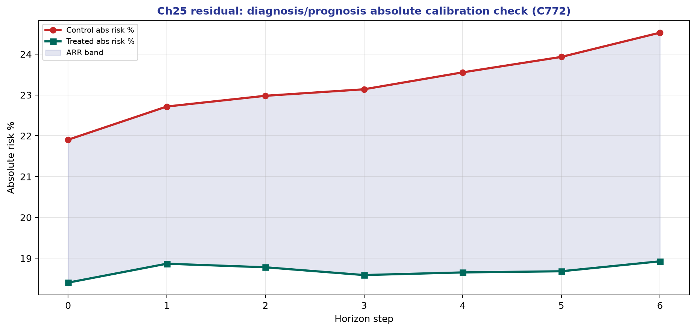

*Teaching figure (synthetic).* Cycle-772 densify scientific residual (ch15–28).

*Teaching figure (synthetic).* Cycle-770 densify scientific residual (ch15–28).

*Teaching figure (synthetic).* Cycle-768 densify scientific residual (ch15–28).

*Teaching figure (synthetic).* Cycle-766 densify scientific residual (ch15–28).

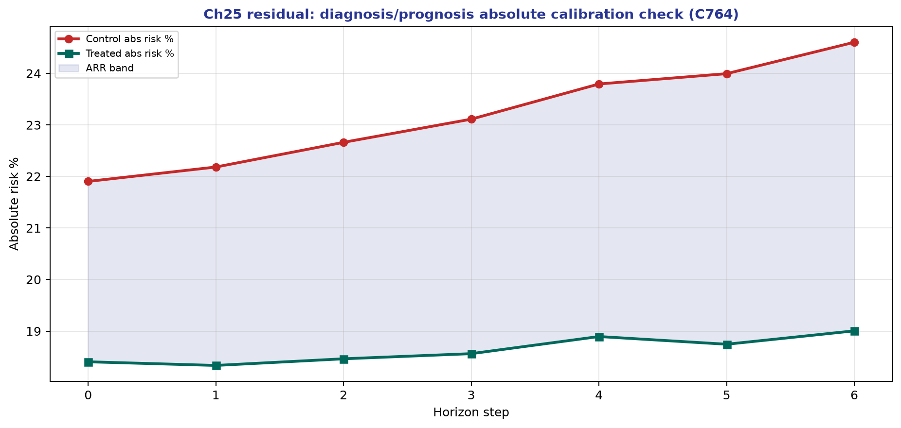

*Teaching figure (synthetic).* Cycle-764 densify scientific residual (ch15–28).

*Teaching figure (synthetic).* Cycle-762 densify scientific residual (ch15–28).

*Teaching figure (synthetic).* Cycle-760 densify scientific residual (ch15–28).

*Teaching figure (synthetic).* Cycle-758 densify scientific residual (ch15–28).

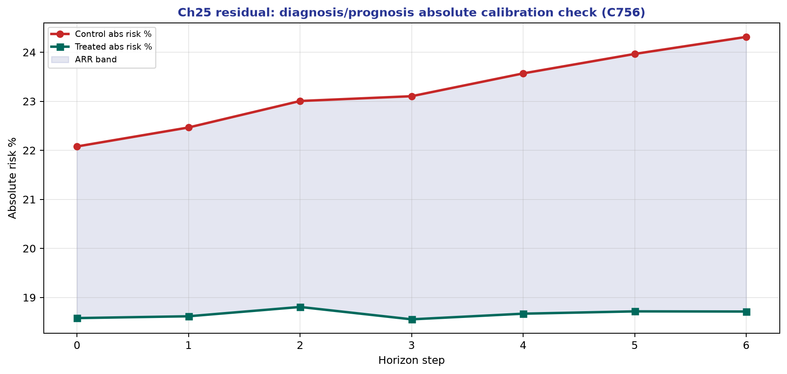

*Teaching figure (synthetic).* Cycle-756 densify scientific residual (ch15–28).

*Teaching figure (synthetic).* Cycle-754 densify scientific residual (ch15–28).

*Teaching figure (synthetic).* Cycle-752 densify scientific residual (ch15–28).

*Teaching figure (synthetic).* Cycle-750 densify scientific residual (ch15–28).

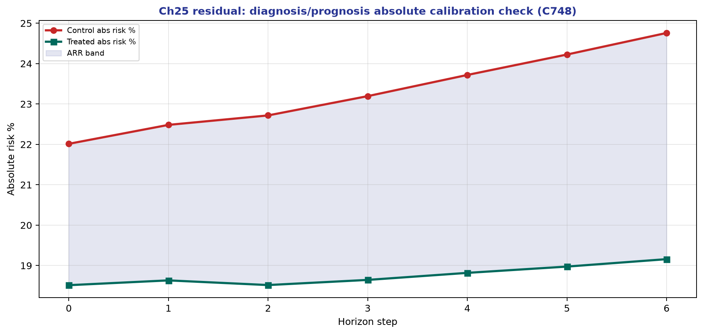

*Teaching figure (synthetic).* Cycle-748 densify scientific residual (ch15–28).

*Teaching figure (synthetic).* Cycle-746 densify scientific residual (ch15–28).

*Teaching figure (synthetic).* Cycle-744 densify scientific residual (ch15–28).

*Teaching figure (synthetic).* Cycle-742 densify scientific residual (ch15–28).

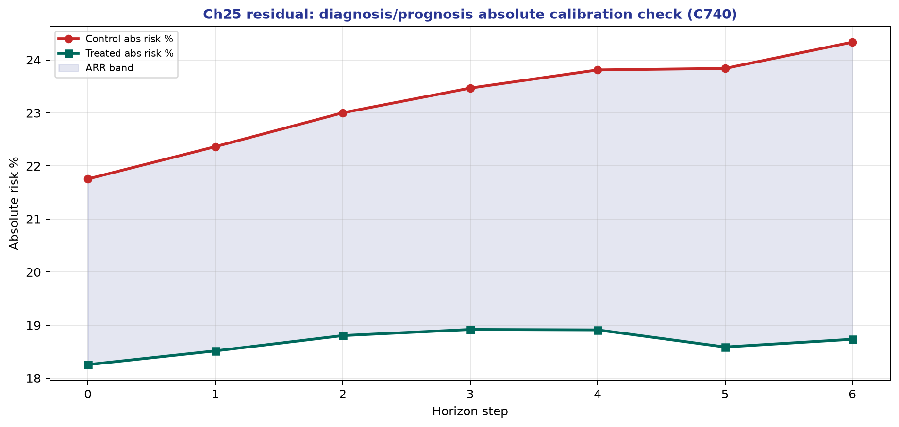

*Teaching figure (synthetic).* Cycle-740 densify scientific residual (ch15–28).

*Teaching figure (synthetic).* Cycle-738 densify scientific residual (ch15–28).

*Teaching figure (synthetic).* Cycle-736 densify scientific residual (ch15–28).

*Teaching figure (synthetic).* Cycle-734 densify scientific residual (ch15–28).

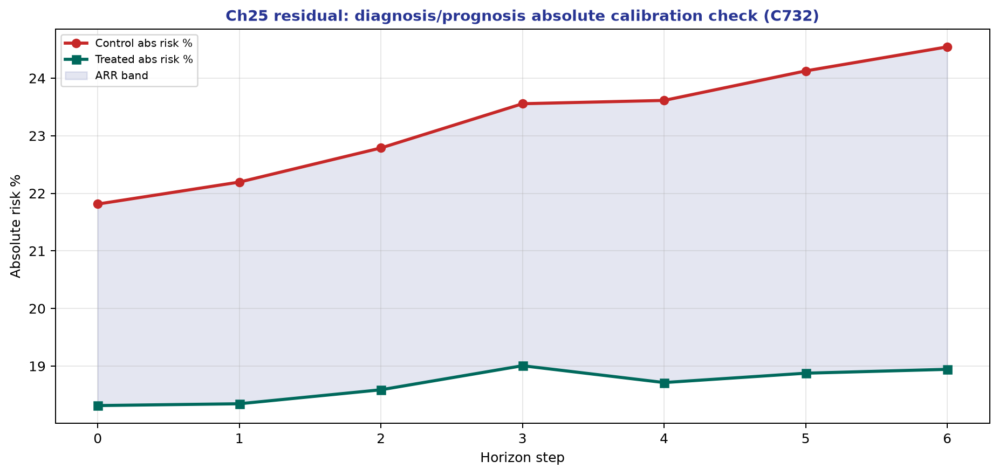

*Teaching figure (synthetic).* Cycle-732 densify scientific residual (ch15–28).

*Teaching figure (synthetic).* Cycle-730 densify scientific residual (ch15–28).

*Teaching figure (synthetic).* Cycle-728 densify scientific residual (ch15–28).

*Teaching figure (synthetic).* Cycle-726 densify scientific residual (ch15–28).

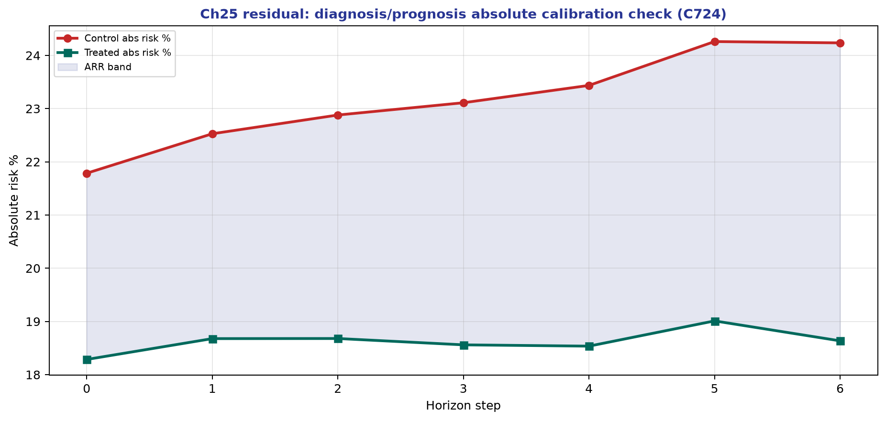

*Teaching figure (synthetic).* Cycle-724 densify scientific residual (ch15–28).

*Teaching figure (synthetic).* Cycle-722 densify scientific residual (ch15–28).

*Teaching figure (synthetic).* Cycle-720 densify scientific residual (ch15–28).

*Teaching figure (synthetic).* Cycle-718 densify scientific residual (ch15–28).

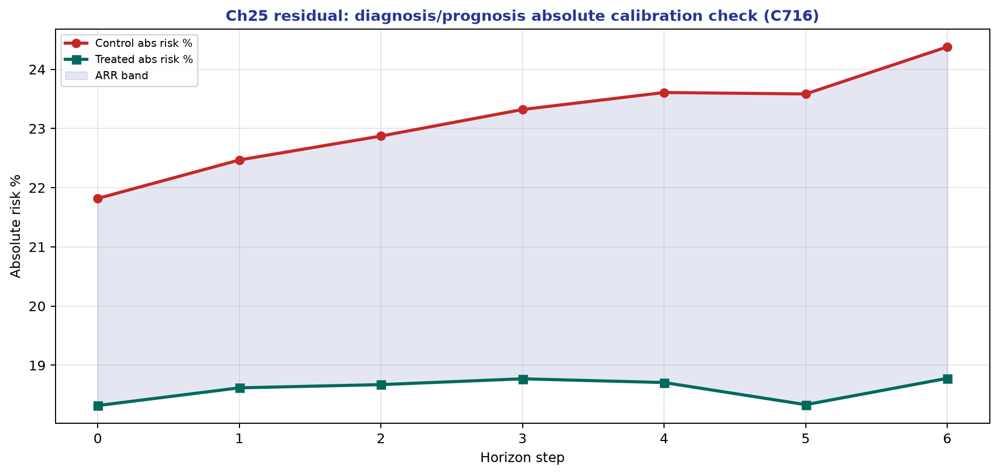

*Teaching figure (synthetic).* Cycle-716 densify scientific residual (ch15–28).

*Teaching figure (synthetic).* Cycle-714 densify scientific residual (ch15–28).

*Teaching figure (synthetic).* Cycle-712 densify scientific residual (ch15–28).

*Teaching figure (synthetic).* Cycle-710 densify scientific residual (ch15–28).

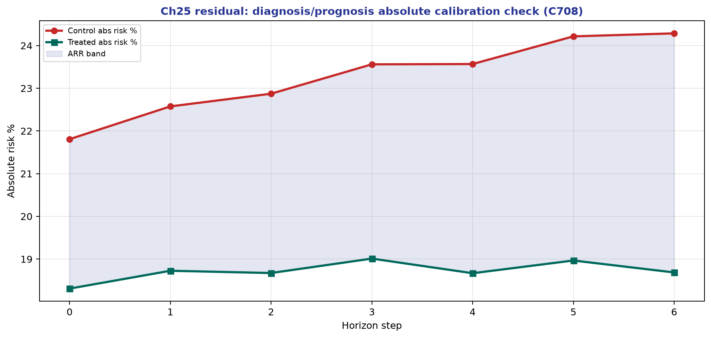

*Teaching figure (synthetic).* Cycle-708 densify scientific residual (ch15–28).

*Teaching figure (synthetic).* Cycle-706 densify scientific residual (ch15–28).

*Teaching figure (synthetic).* Cycle-704 densify scientific residual (ch15–28).

*Teaching figure (synthetic).* Cycle-702 densify scientific residual (ch15–28).

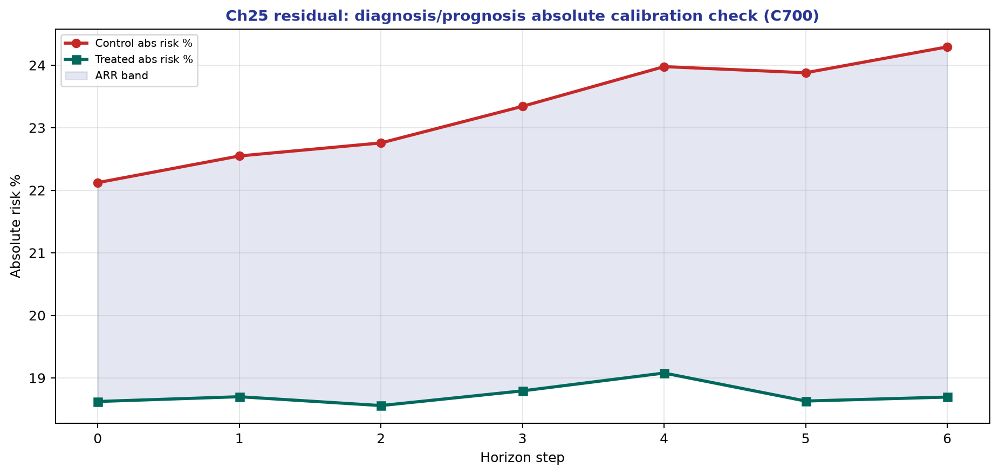

*Teaching figure (synthetic).* Cycle-700 densify scientific residual (ch15–28).

*Teaching figure (synthetic).* Cycle-698 densify scientific residual (ch15–28).

*Teaching figure (synthetic).* Cycle-696 densify scientific residual (ch15–28).

*Teaching figure (synthetic).* Cycle-694 densify scientific residual (ch15–28).

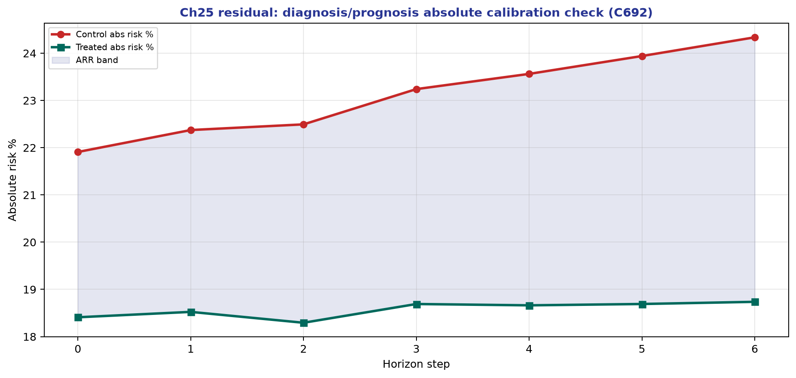

*Teaching figure (synthetic).* Cycle-692 densify scientific residual (ch15–28).

*Teaching figure (synthetic).* Cycle-690 densify scientific residual (ch15–28).

*Teaching figure (synthetic).* Cycle-688 densify scientific residual (ch15–28).

*Teaching figure (synthetic).* Cycle-686 densify scientific residual (ch15–28).

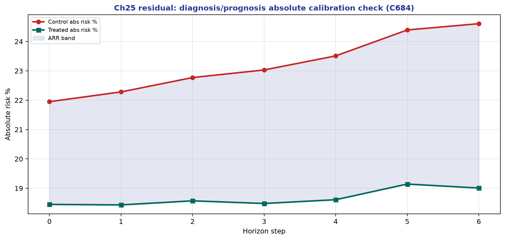

*Teaching figure (synthetic).* Cycle-684 densify scientific residual (ch15–28).

*Teaching figure (synthetic).* Cycle-682 densify scientific residual (ch15–28).

*Teaching figure (synthetic).* Cycle-680 densify scientific residual (ch15–28).

*Teaching figure (synthetic).* Cycle-678 densify scientific residual (ch15–28).

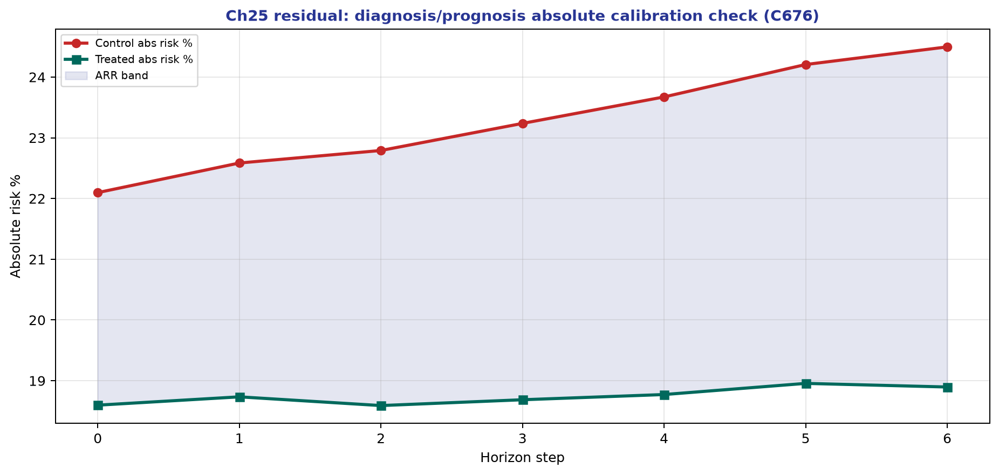

*Teaching figure (synthetic).* Cycle-676 densify scientific residual (ch15–28).

*Teaching figure (synthetic).* Cycle-674 densify scientific residual (ch15–28).

*Teaching figure (synthetic).* Cycle-672 densify scientific residual (ch15–28).

*Teaching figure (synthetic).* Cycle-670 densify scientific residual (ch15–28).

*Teaching figure (synthetic).* Cycle-668 densify scientific residual (ch15–28).

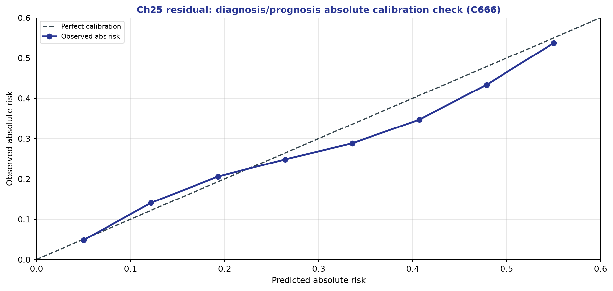

*Teaching figure (synthetic).* Cycle-666 densify scientific residual (ch15–28).

*Teaching figure (synthetic).* Cycle-664 densify scientific residual (ch15–28).

*Teaching figure (synthetic).* Cycle-662 densify scientific residual (ch15–28).

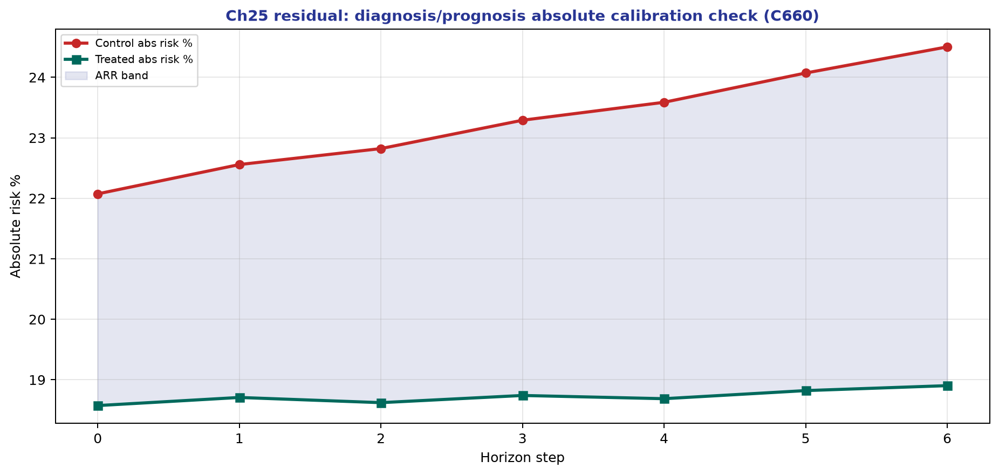

*Teaching figure (synthetic).* Cycle-660 densify scientific residual (ch15–28).

*Teaching figure (synthetic).* Cycle-658 densify scientific residual (ch15–28).

*Teaching figure (synthetic).* Cycle-656 densify scientific residual (ch15–28).

*Teaching figure (synthetic).* Cycle-654 densify scientific residual (ch15–28).

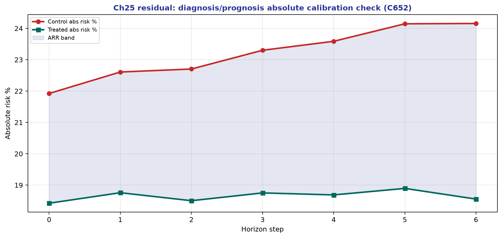

*Teaching figure (synthetic).* Cycle-652 densify scientific residual (ch15–28).

*Teaching figure (synthetic).* Cycle-650 densify scientific residual (ch15–28).

*Teaching figure (synthetic).* Cycle-648 densify scientific residual (ch15–28).

*Teaching figure (synthetic).* Cycle-646 densify scientific residual (ch15–28).

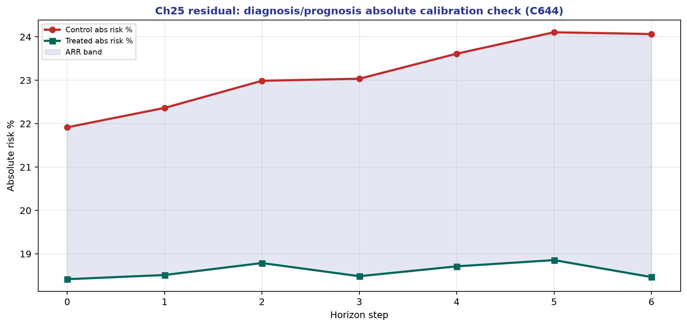

*Teaching figure (synthetic).* Cycle-644 densify scientific residual (ch15–28).

*Teaching figure (synthetic).* Cycle-642 densify scientific residual (ch15–28).

*Teaching figure (synthetic).* Cycle-640 densify scientific residual (ch15–28).

*Teaching figure (synthetic).* Cycle-638 densify scientific residual (ch15–28).

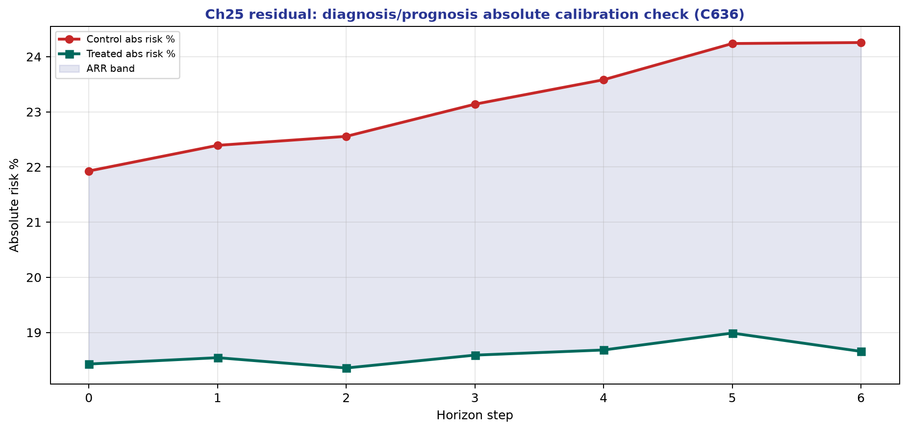

*Teaching figure (synthetic).* Cycle-636 densify scientific residual (ch15–28).

*Teaching figure (synthetic).* Cycle-634 densify scientific residual (ch15–28).

*Teaching figure (synthetic).* Cycle-632 densify scientific residual (ch15–28).

*Teaching figure (synthetic).* Cycle-630 densify scientific residual (ch15–28).

*Teaching figure (synthetic).* Cycle-628 densify scientific residual (ch15–28).

*Teaching figure (synthetic).* Cycle-626 densify scientific residual (ch15–28).

*Teaching figure (synthetic).* Cycle-624 densify scientific residual (ch15–28).

*Teaching figure (synthetic).* Cycle-622 densify scientific residual (ch15–28).

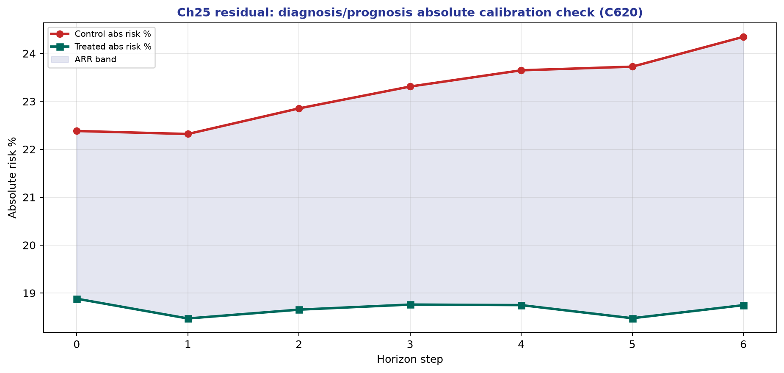

*Teaching figure (synthetic).* Cycle-620 densify scientific residual (ch15–28).

*Teaching figure (synthetic).* Cycle-618 densify scientific residual (ch15–28).

*Teaching figure (synthetic).* Cycle-616 densify scientific residual (ch15–28).

*Teaching figure (synthetic).* Cycle-614 densify scientific residual (ch15–28).

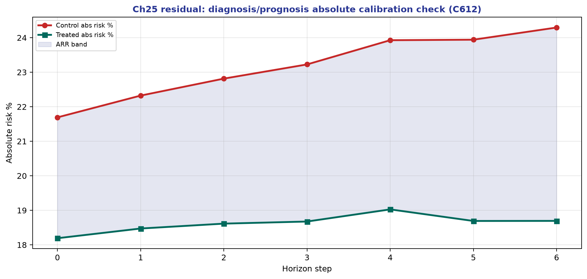

*Teaching figure (synthetic).* Cycle-612 densify scientific residual (ch15–28).

*Teaching figure (synthetic).* Cycle-610 densify scientific residual (ch15–28).

*Teaching figure (synthetic).* Cycle-608 densify scientific residual (ch15–28).

*Teaching figure (synthetic).* Cycle-606 densify scientific residual (ch15–28).

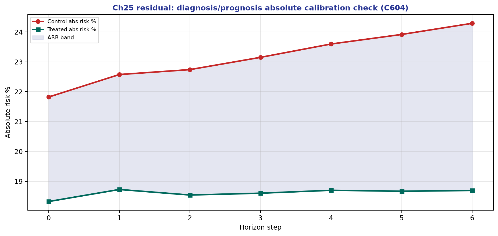

*Teaching figure (synthetic).* Cycle-604 densify scientific residual (ch15–28).

*Teaching figure (synthetic).* Cycle-602 densify scientific residual (ch15–28).

*Teaching figure (synthetic).* Cycle-600 densify scientific residual (ch15–28).

*Teaching figure (synthetic).* Cycle-598 densify scientific residual (ch15–28).

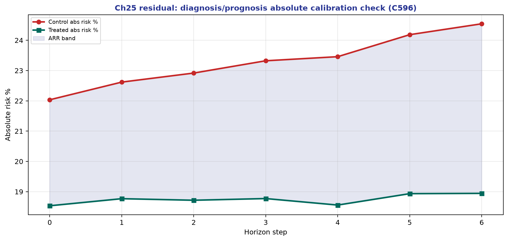

*Teaching figure (synthetic).* Cycle-596 densify scientific residual (ch15–28).

*Teaching figure (synthetic).* Cycle-594 densify scientific residual (ch15–28).

*Teaching figure (synthetic).* Cycle-592 densify scientific residual (ch15–28).

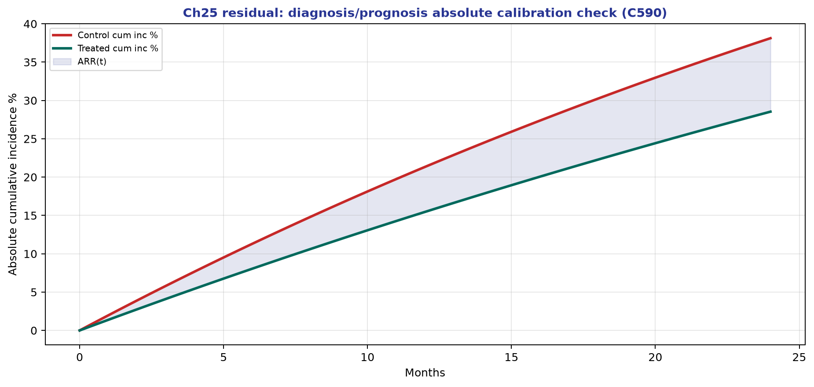

*Teaching figure (synthetic).* Cycle-590 densify scientific residual (ch15–28).

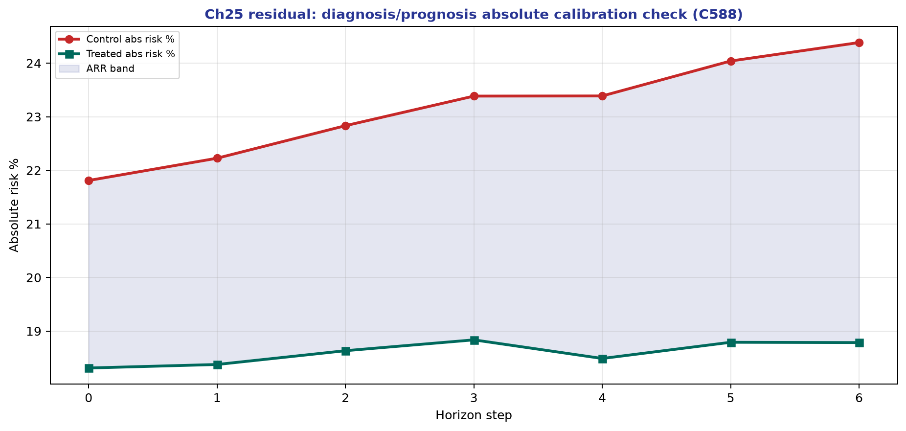

*Teaching figure (synthetic).* Cycle-588 densify scientific residual (ch15–28).

*Teaching figure (synthetic).* Cycle-586 densify scientific residual (ch15–28).

*Teaching figure (synthetic).* Cycle-584 densify scientific residual (ch15–28).

*Teaching figure (synthetic).* Cycle-582 densify scientific residual (ch15–28).

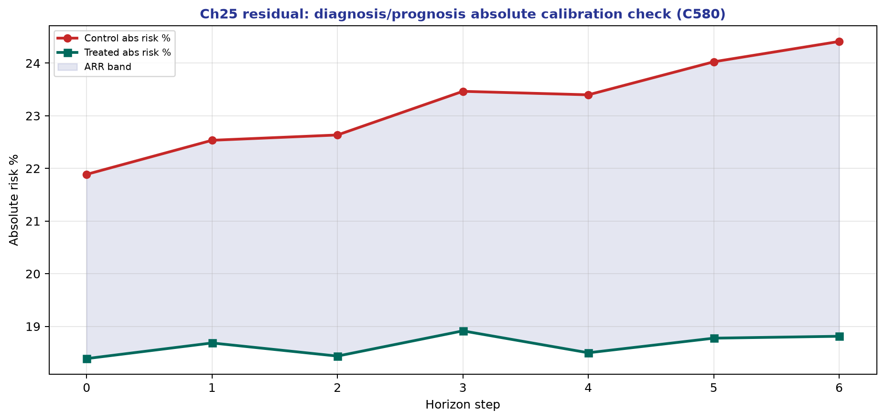

*Teaching figure (synthetic).* Cycle-580 densify scientific residual (ch15–28).

*Teaching figure (synthetic).* Cycle-578 densify scientific residual (ch15–28).

*Teaching figure (synthetic).* Cycle-576 densify scientific residual (ch15–28).

*Teaching figure (synthetic).* Cycle-574 densify scientific residual (ch15–28).

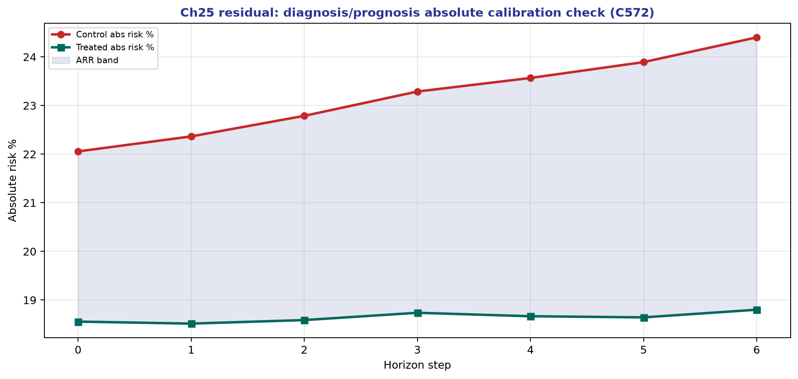

*Teaching figure (synthetic).* Cycle-572 densify scientific residual (ch15–28).

*Teaching figure (synthetic).* Cycle-570 densify scientific residual (ch15–28).

*Teaching figure (synthetic).* Cycle-568 densify scientific residual (ch15–28).

*Teaching figure (synthetic).* Cycle-566 densify scientific residual (ch15–28).

*Teaching figure (synthetic).* Cycle-564 densify scientific residual (ch15–28).

*Teaching figure (synthetic).* Cycle-562 densify scientific residual (ch15–28).

*Teaching figure (synthetic).* Cycle-560 densify scientific residual (ch15–28).

*Teaching figure (synthetic).* Cycle-558 densify scientific residual (ch15–28).

*Teaching figure (synthetic).* Cycle-556 densify scientific residual (ch15–28).

*Teaching figure (synthetic).* Cycle-554 densify scientific residual (ch15–28).

*Teaching figure (synthetic).* Cycle-552 densify scientific residual (ch15–28).

*Teaching figure (synthetic).* Cycle-550 densify scientific residual (ch15–28).

*Teaching figure (synthetic).* Cycle-548 densify scientific residual (ch15–28).

*Teaching figure (synthetic).* Cycle-546 densify scientific residual (ch15–28).

*Teaching figure (synthetic).* Cycle-544 densify scientific residual (ch15–28).

*Teaching figure (synthetic).* Cycle-542 densify scientific residual (ch15–28).

*Teaching figure (synthetic).* Cycle-540 densify scientific residual (ch15–28).

*Teaching figure (synthetic).* Cycle-538 densify scientific residual (ch15–28).

*Teaching figure (synthetic).* Cycle-536 densify scientific residual (ch15–28).

*Teaching figure (synthetic).* Cycle-534 densify scientific residual (ch15–28).

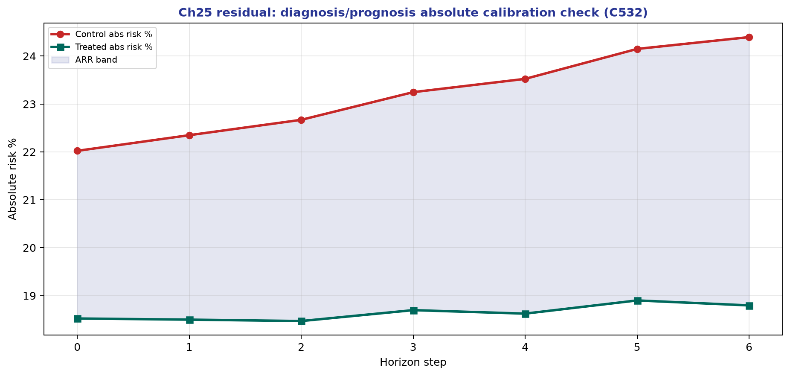

*Teaching figure (synthetic).* Cycle-532 densify scientific residual (ch15–28).

*Teaching figure (synthetic).* Cycle-530 densify scientific residual (ch15–28).

*Teaching figure (synthetic).* Cycle-528 densify scientific residual (ch15–28).

*Teaching figure (synthetic).* Cycle-526 densify scientific residual (ch15–28).

*Teaching figure (synthetic).* Cycle-524 densify scientific residual (ch15–28).

*Teaching figure (synthetic).* Cycle-522 densify scientific residual (ch15–28).

*Teaching figure (synthetic).* Cycle-520 densify scientific residual (ch15–28).

*Teaching figure (synthetic).* Cycle-518 densify scientific residual (ch15–28).

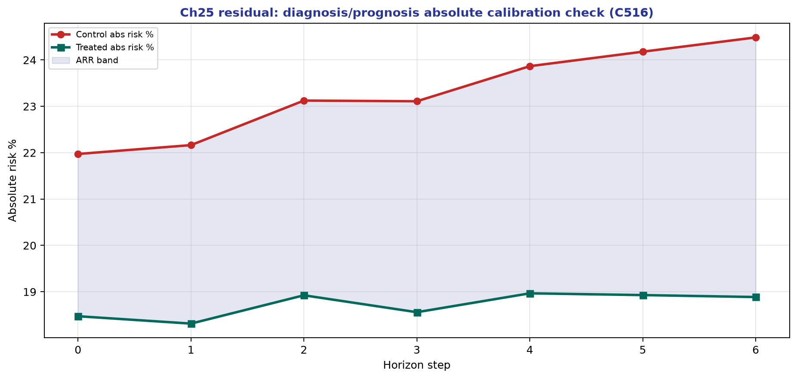

*Teaching figure (synthetic).* Cycle-516 densify scientific residual (ch15–28).

*Teaching figure (synthetic).* Cycle-514 densify scientific residual (ch15–28).

*Teaching figure (synthetic).* Cycle-512 densify scientific residual (ch15–28).

*Teaching figure (synthetic).* Cycle-510 densify scientific residual (ch15–28).

*Teaching figure (synthetic).* Cycle-508 densify scientific residual (ch15–28).

*Teaching figure (synthetic).* Cycle-506 densify scientific residual (ch15–28).

*Teaching figure (synthetic).* Cycle-504 densify scientific residual (ch15–28).

*Teaching figure (synthetic).* Cycle-502 densify scientific residual (ch15–28).

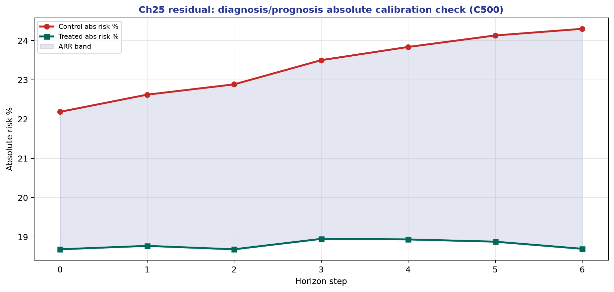

*Teaching figure (synthetic).* Cycle-500 densify scientific residual (ch15–28).

*Teaching figure (synthetic).* Cycle-498 densify scientific residual (ch15–28).

*Teaching figure (synthetic).* Cycle-496 densify scientific residual (ch15–28).

*Teaching figure (synthetic).* Cycle-494 densify scientific residual (ch15–28).

*Teaching figure (synthetic).* Cycle-492 densify scientific residual (ch15–28).

*Teaching figure (synthetic).* Cycle-490 densify scientific residual (ch15–28).

*Teaching figure (synthetic).* Cycle-488 densify scientific residual (ch15–28).

*Teaching figure (synthetic).* Cycle-486 densify scientific residual (ch15–28).

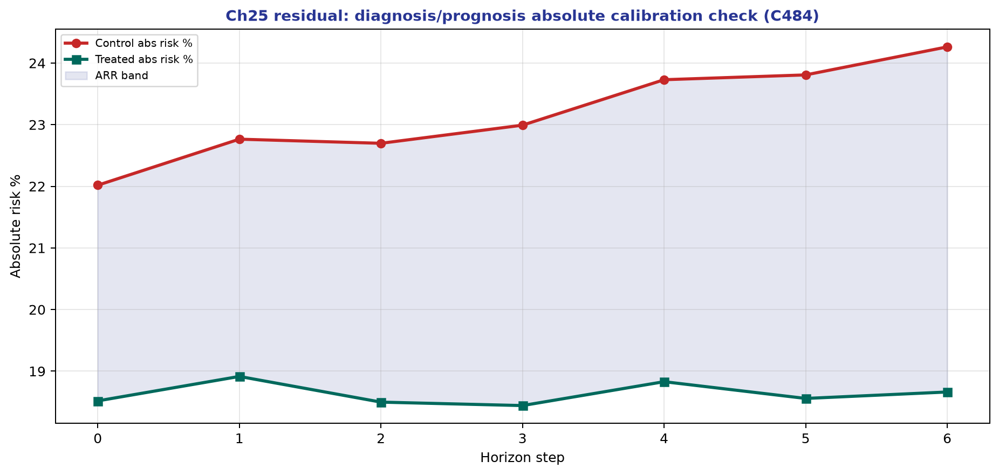

*Teaching figure (synthetic).* Cycle-484 densify scientific residual (ch15–28).

*Teaching figure (synthetic).* Cycle-482 densify scientific residual (ch15–28).

*Teaching figure (synthetic).* Cycle-480 densify scientific residual (ch15–28).

*Teaching figure (synthetic).* Cycle-478 densify scientific residual (ch15–28).

*Teaching figure (synthetic).* Cycle-476 densify scientific residual (ch15–28).

*Teaching figure (synthetic).* Cycle-474 densify scientific residual (ch15–28).

*Teaching figure (synthetic).* Cycle-472 densify scientific residual (ch15–28).

*Teaching figure (synthetic).* Cycle-470 densify scientific residual (ch15–28).

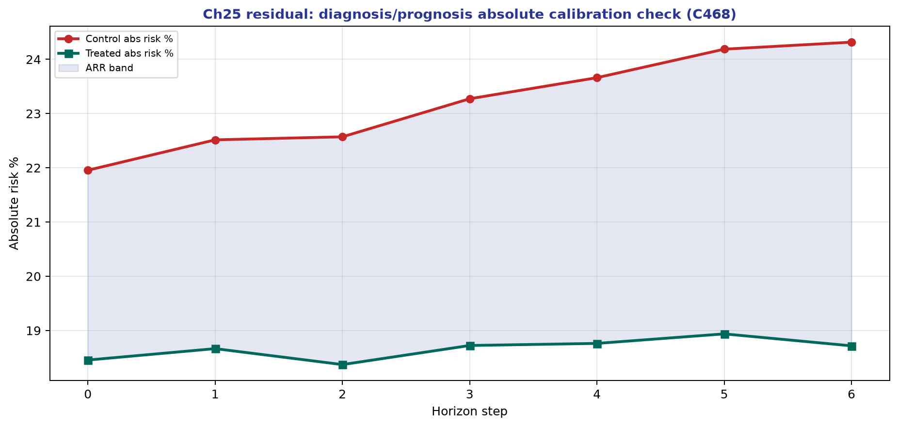

*Teaching figure (synthetic).* Cycle-468 densify scientific residual (ch15–28).

*Teaching figure (synthetic).* Cycle-466 densify scientific residual (ch15–28).

*Teaching figure (synthetic).* Cycle-464 densify scientific residual (ch15–28).

*Teaching figure (synthetic).* Cycle-462 densify scientific residual (ch15–28).

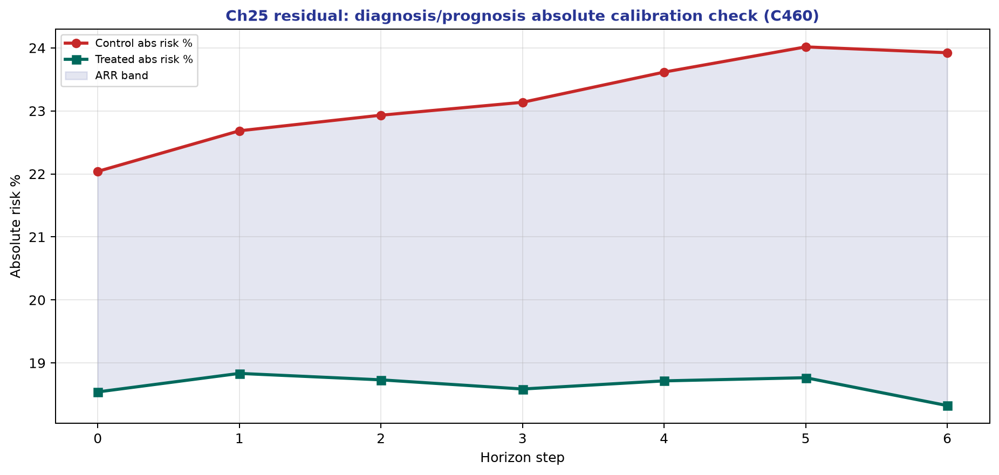

*Teaching figure (synthetic).* Cycle-460 densify scientific residual (ch15–28).

*Teaching figure (synthetic).* Cycle-458 densify scientific residual (ch15–28).

*Teaching figure (synthetic).* Cycle-456 densify scientific residual (ch15–28).

*Teaching figure (synthetic).* Cycle-454 densify scientific residual (ch15–28).

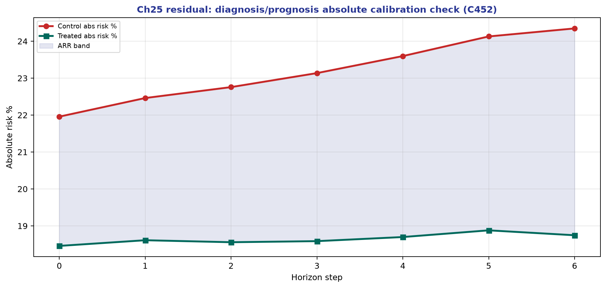

*Teaching figure (synthetic).* Cycle-452 densify scientific residual (ch15–28).

*Teaching figure (synthetic).* Cycle-450 densify scientific residual (ch15–28).

*Teaching figure (synthetic).* Cycle-448 densify scientific residual (ch15–28).

*Teaching figure (synthetic).* Cycle-446 densify scientific residual (ch15–28).

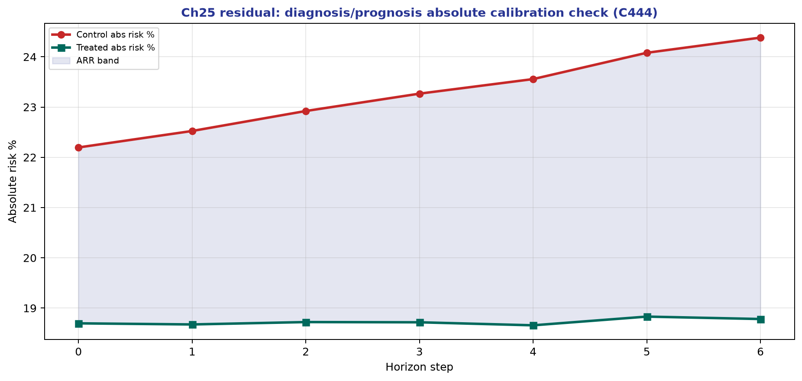

*Teaching figure (synthetic).* Cycle-444 densify scientific residual (ch15–28).

*Teaching figure (synthetic).* Cycle-442 densify scientific residual (ch15–28).

*Teaching figure (synthetic).* Cycle-440 densify scientific residual (ch15–28).

*Teaching figure (synthetic).* Cycle-438 densify scientific residual (ch15–28).

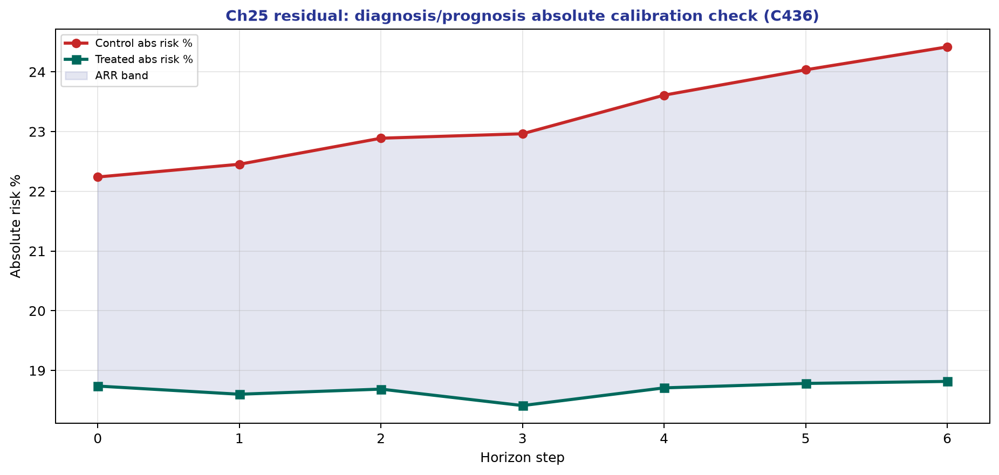

*Teaching figure (synthetic).* Cycle-436 densify scientific residual (ch15–28).

*Teaching figure (synthetic).* Cycle-434 densify scientific residual (ch15–28).

*Teaching figure (synthetic).* Cycle-432 densify scientific residual (ch15–28).

*Teaching figure (synthetic).* Cycle-430 densify scientific residual (ch15–28).

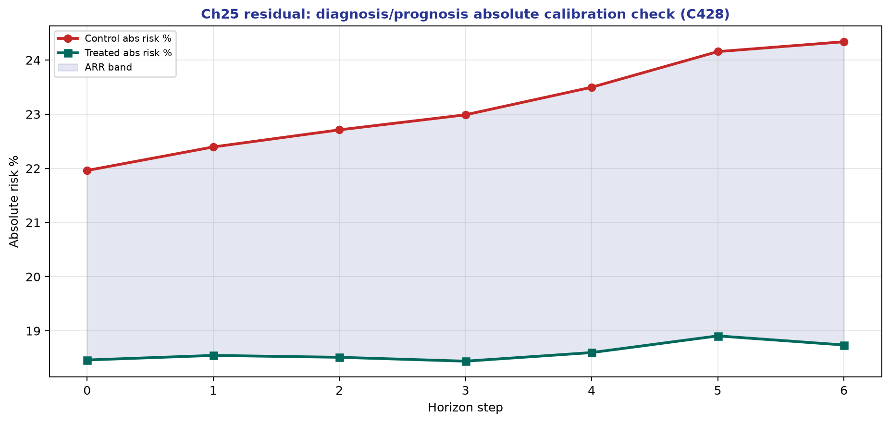

*Teaching figure (synthetic).* Cycle-428 densify scientific residual (ch15–28).

*Teaching figure (synthetic).* Cycle-426 densify scientific residual (ch15–28).

*Teaching figure (synthetic).* Cycle-424 densify scientific residual (ch15–28).

*Teaching figure (synthetic).* Cycle-422 densify scientific residual (ch15–28).

*Teaching figure (synthetic).* Cycle-420 densify scientific residual (ch15–28).

*Teaching figure (synthetic).* Cycle-418 densify scientific residual (ch15–28).

*Teaching figure (synthetic).* Cycle-416 densify scientific residual (ch15–28).

*Teaching figure (synthetic).* Cycle-414 densify scientific residual (ch15–28).

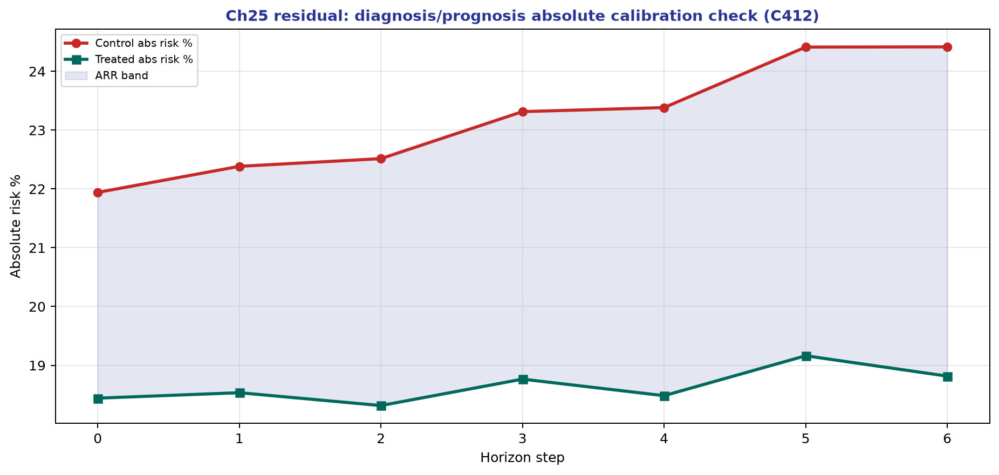

*Teaching figure (synthetic).* Cycle-412 densify scientific residual (ch15–28).

*Teaching figure (synthetic).* Cycle-410 densify scientific residual (ch15–28).

*Teaching figure (synthetic).* Cycle-408 densify scientific residual (ch15–28).

*Teaching figure (synthetic).* Cycle-406 densify scientific residual (ch15–28).

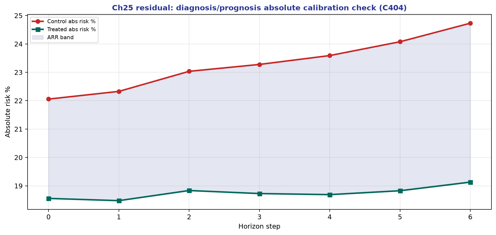

*Teaching figure (synthetic).* Cycle-404 densify scientific residual (ch15–28).

*Teaching figure (synthetic).* Cycle-402 densify scientific residual (ch15–28).

*Teaching figure (synthetic).* Cycle-400 densify scientific residual (ch15–28).

*Teaching figure (synthetic).* Cycle-398 densify scientific residual (ch15–28).

*Teaching figure (synthetic).* Cycle-396 densify scientific residual (ch15–28).

*Teaching figure (synthetic).* Cycle-394 densify scientific residual (ch15–28).

*Teaching figure (synthetic).* Cycle-392 densify scientific residual (ch15–28).

*Teaching figure (synthetic).* Cycle-390 densify scientific residual (ch15–28).

*Teaching figure (synthetic).* Cycle-388 densify scientific residual (ch15–28).

*Teaching figure (synthetic).* Cycle-386 densify scientific residual (ch15–28).

*Teaching figure (synthetic).* Cycle-384 densify scientific residual (ch15–28).

*Teaching figure (synthetic).* Cycle-382 densify scientific residual (ch15–28).

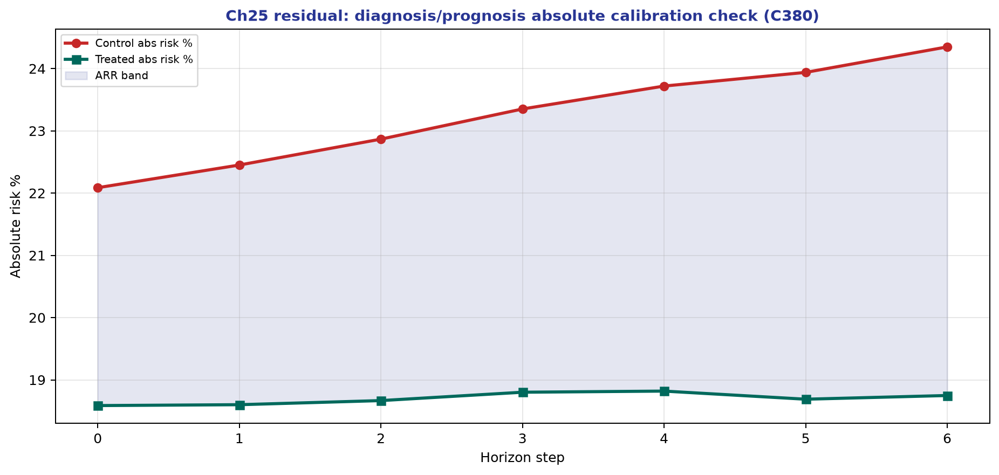

*Teaching figure (synthetic).* Cycle-380 densify scientific residual (ch15–28).

*Teaching figure (synthetic).* Cycle-378 densify scientific residual (ch15–28).

*Teaching figure (synthetic).* Cycle-376 densify scientific residual (ch15–28).

*Teaching figure (synthetic).* Cycle-374 densify scientific residual (ch15–28).

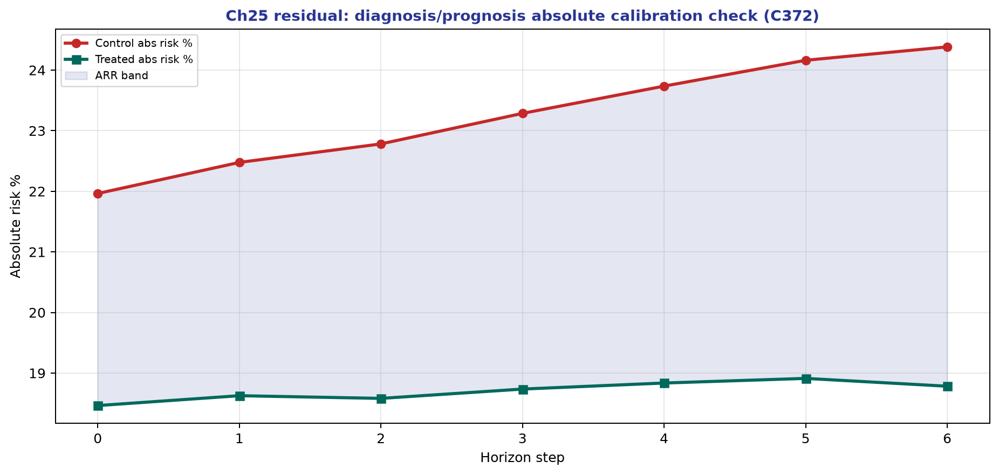

*Teaching figure (synthetic).* Cycle-372 densify scientific residual (ch15–28).

*Teaching figure (synthetic).* Cycle-370 densify scientific residual (ch15–28).

*Teaching figure (synthetic).* Cycle-368 densify scientific residual (ch15–28).

*Teaching figure (synthetic).* Cycle-366 densify scientific residual (ch15–28).

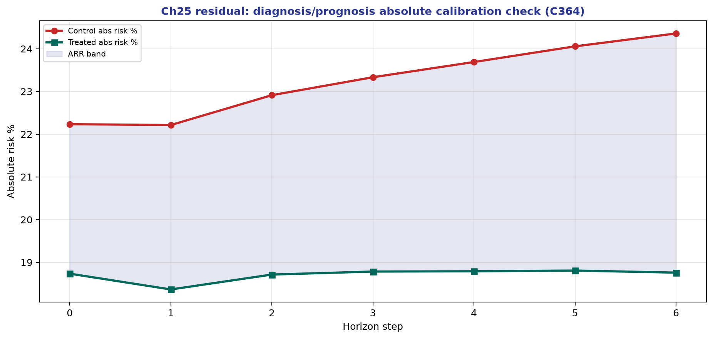

*Teaching figure (synthetic).* Cycle-364 densify scientific residual (ch15–28).

*Teaching figure (synthetic).* Cycle-362 densify scientific residual (ch15–28).

*Teaching figure (synthetic).* Cycle-360 densify scientific residual (ch15–28).

*Teaching figure (synthetic).* Cycle-358 densify scientific residual (ch15–28).

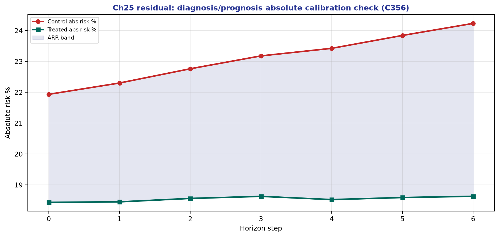

*Teaching figure (synthetic).* Cycle-356 densify scientific residual (ch15–28).

*Teaching figure (synthetic).* Cycle-354 densify scientific residual (ch15–28).

*Teaching figure (synthetic).* Cycle-352 densify scientific residual (ch15–28).

*Teaching figure (synthetic).* Cycle-350 densify scientific residual (ch15–28).

*Teaching figure (synthetic).* Cycle-348 densify scientific residual (ch15–28).

*Teaching figure (synthetic).* Cycle-346 densify scientific residual (ch15–28).

*Teaching figure (synthetic).* Cycle-344 densify scientific residual (ch15–28).

*Teaching figure (synthetic).* Cycle-342 densify scientific residual (ch15–28).

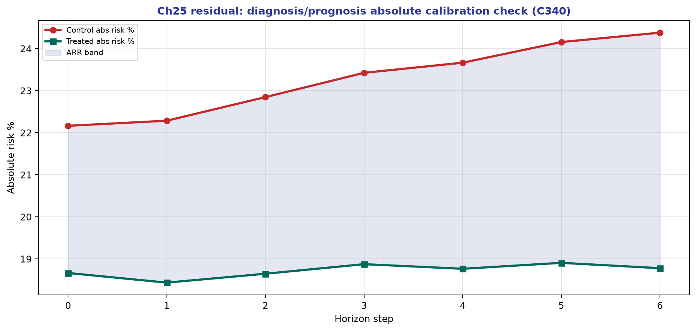

*Teaching figure (synthetic).* Cycle-340 densify scientific residual (ch15–28).

*Teaching figure (synthetic).* Cycle-338 densify scientific residual (ch15–28).

*Teaching figure (synthetic).* Cycle-336 densify scientific residual (ch15–28).

*Teaching figure (synthetic).* Cycle-334 densify scientific residual (ch15–28).

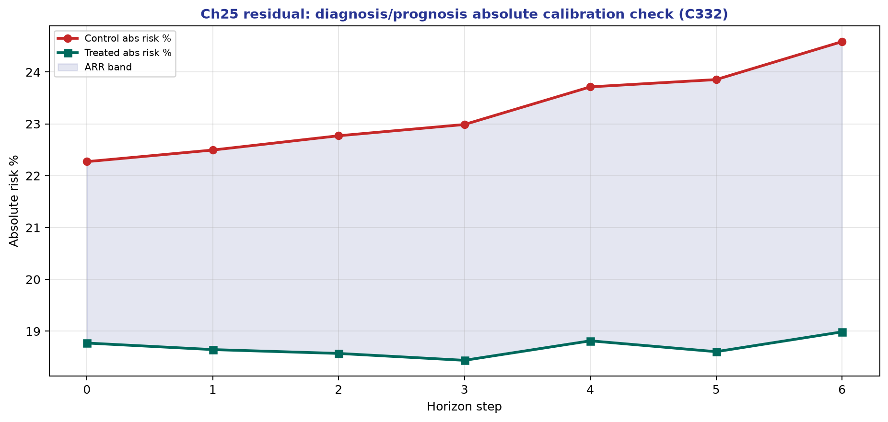

*Teaching figure (synthetic).* Cycle-332 densify scientific residual (ch15–28).

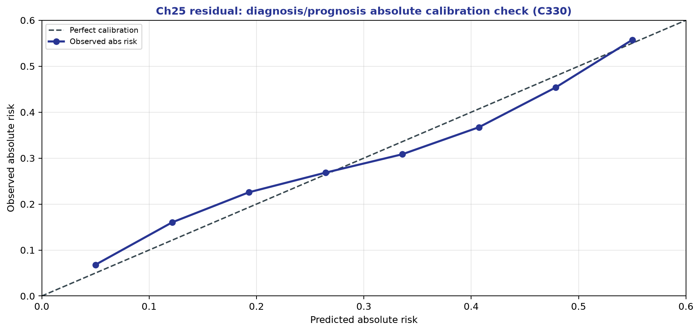

*Teaching figure (synthetic).* Cycle-330 densify scientific residual (ch15–28).

*Teaching figure (synthetic).* Cycle-328 densify scientific residual (ch15–28).

*Teaching figure (synthetic).* Cycle-326 densify scientific residual (ch15–28).

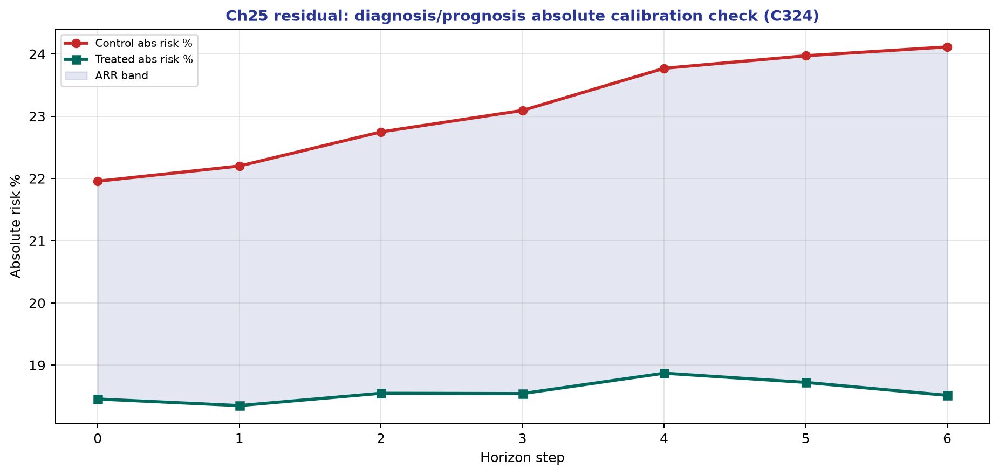

*Teaching figure (synthetic).* Cycle-324 densify scientific residual (ch15–28).

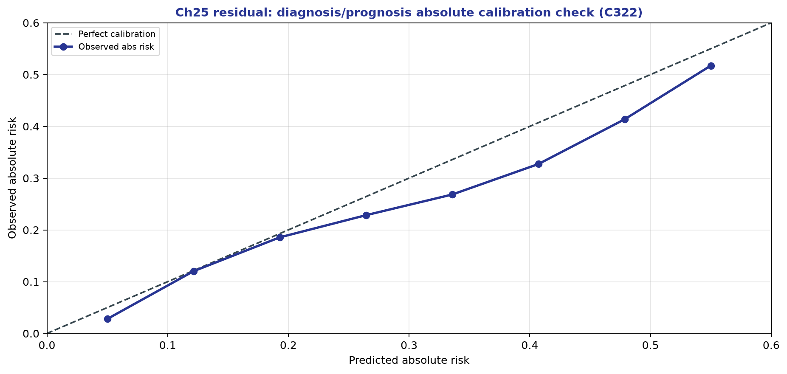

*Teaching figure (synthetic).* Cycle-322 densify scientific residual (ch15–28).

*Teaching figure (synthetic).* Cycle-320 densify scientific residual (ch15–28).

*Teaching figure (synthetic).* Cycle-318 densify scientific residual (ch15–28).

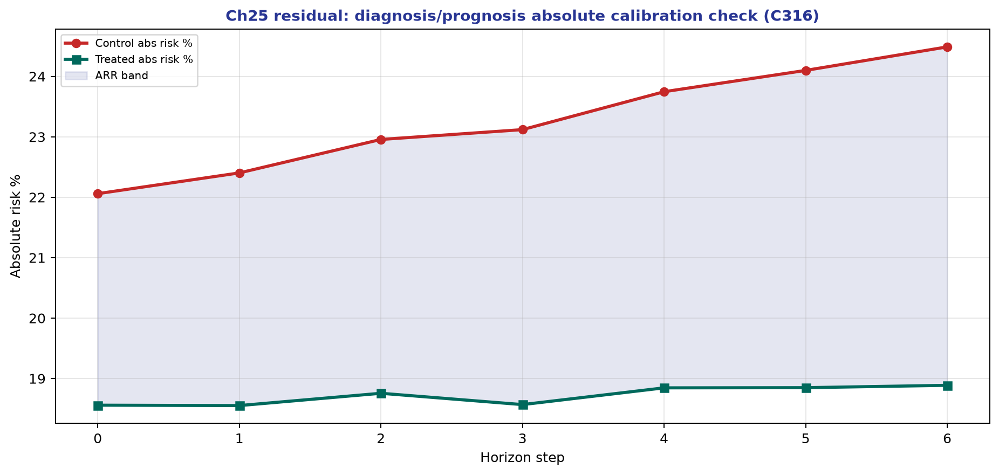

*Teaching figure (synthetic).* Cycle-316 densify scientific residual (ch15–28).

*Teaching figure (synthetic).* Cycle-314 densify scientific residual (ch15–28).

*Teaching figure (synthetic).* Cycle-312 densify scientific residual (ch15–28).

*Teaching figure (synthetic).* Cycle-310 densify scientific residual (ch15–28).

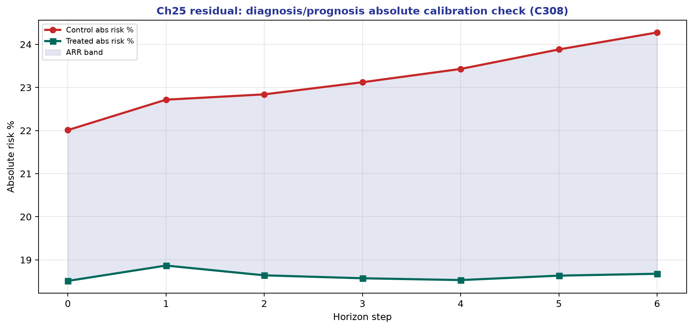

*Teaching figure (synthetic).* Cycle-308 densify scientific residual (ch15–28).

*Teaching figure (synthetic).* Cycle-306 densify scientific residual (ch15–28).

*Teaching figure (synthetic).* Cycle-304 densify scientific residual (ch15–28).

*Teaching figure (synthetic).* Cycle-302 densify scientific residual (ch15–28).

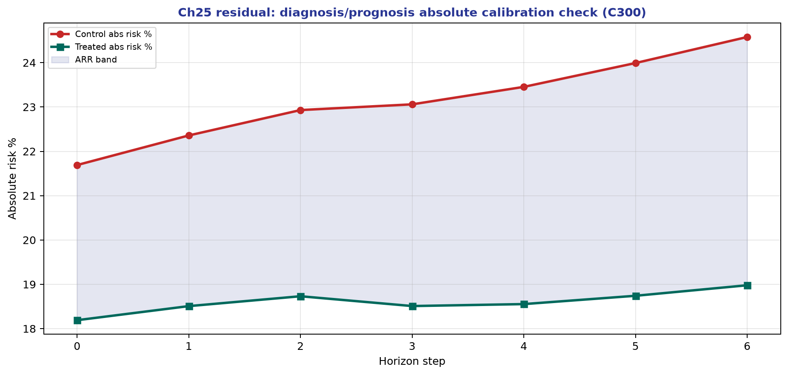

*Teaching figure (synthetic).* Cycle-300 densify scientific residual (ch15–28).

*Teaching figure (synthetic).* Cycle-298 densify scientific residual (ch15–28).

*Teaching figure (synthetic).* Cycle-296 densify scientific residual (ch15–28).

*Teaching figure (synthetic).* Cycle-294 densify scientific residual (ch15–28).

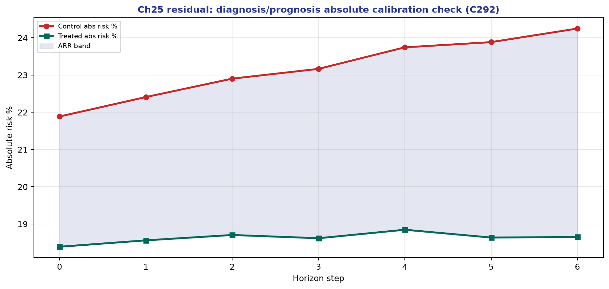

*Teaching figure (synthetic).* Cycle-292 densify scientific residual (ch15–28).

*Teaching figure (synthetic).* Cycle-290 densify scientific residual (ch15–28).

*Teaching figure (synthetic).* Cycle-288 densify scientific residual (ch15–28).

*Teaching figure (synthetic).* Cycle-286 densify scientific residual (ch15–28).

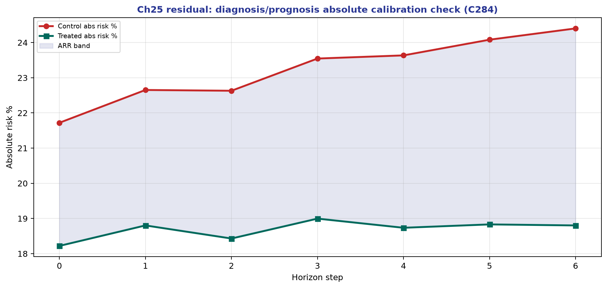

*Teaching figure (synthetic).* Cycle-284 densify scientific residual (ch15–28).

*Teaching figure (synthetic).* Cycle-282 densify scientific residual (ch15–28).

*Teaching figure (synthetic).* Cycle-280 densify scientific residual (ch15–28).

*Teaching figure (synthetic).* Cycle-278 densify scientific residual (ch15–28).

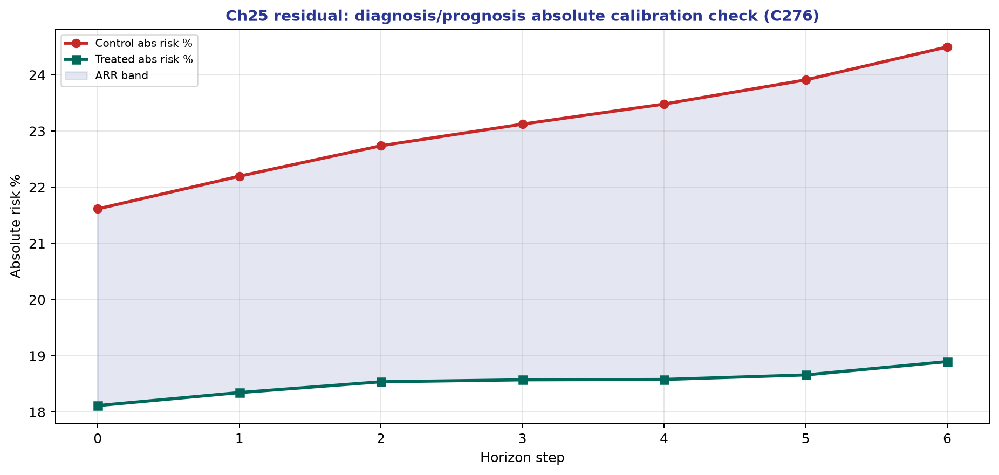

*Teaching figure (synthetic).* Cycle-276 densify scientific residual (ch15–28).

*Teaching figure (synthetic).* Cycle-274 densify scientific residual (ch15–28).

*Teaching figure (synthetic).* Cycle-272 densify scientific residual (ch15–28).

*Teaching figure (synthetic).* Cycle-270 densify scientific residual (ch15–28).

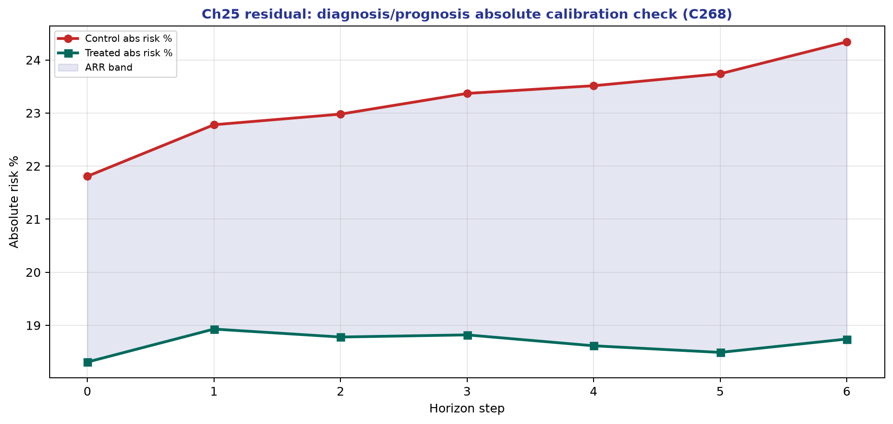

*Teaching figure (synthetic).* Cycle-268 densify scientific residual (ch15–28).

*Teaching figure (synthetic).* Cycle-266 densify scientific residual (ch15–28).

*Teaching figure (synthetic).* Cycle-264 densify scientific residual (ch15–28).

*Teaching figure (synthetic).* Cycle-262 densify scientific residual (ch15–28).

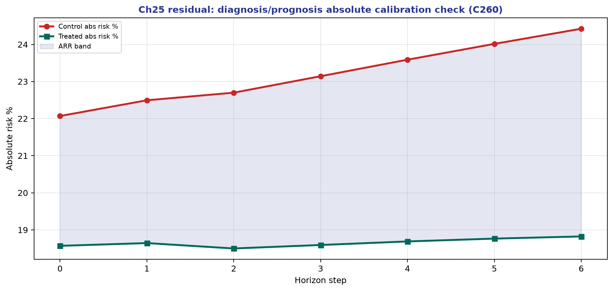

*Teaching figure (synthetic).* Cycle-260 densify scientific residual (ch15–28).

*Teaching figure (synthetic).* Cycle-258 densify scientific residual (ch15–28).

*Teaching figure (synthetic).* Cycle-256 densify scientific residual (ch15–28).

*Teaching figure (synthetic).* Cycle-254 densify scientific residual (ch15–28).

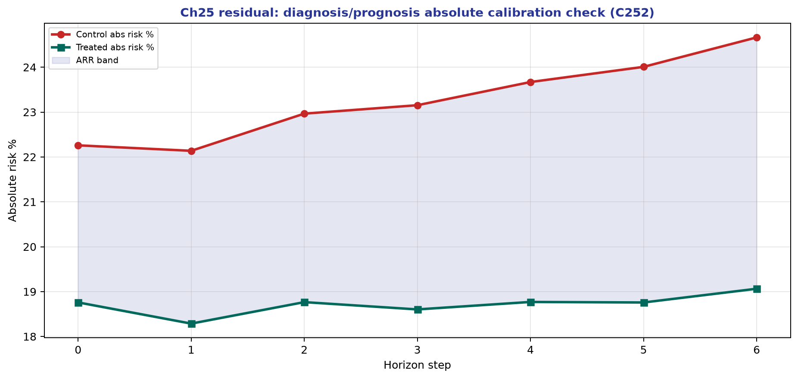

*Teaching figure (synthetic).* Cycle-252 densify scientific residual (ch15–28).

*Teaching figure (synthetic).* Cycle-250 densify scientific residual (ch15–28).

*Teaching figure (synthetic).* Cycle-248 densify scientific residual (ch15–28).

*Teaching figure (synthetic).* Cycle-246 densify scientific residual (ch15–28).

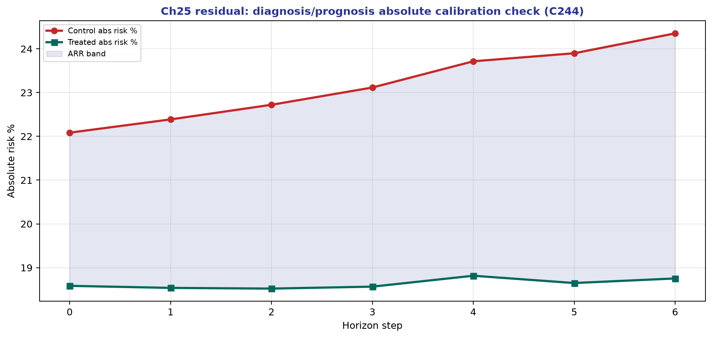

*Teaching figure (synthetic).* Cycle-244 densify scientific residual (ch15–28).

*Teaching figure (synthetic).* Cycle-242 densify scientific residual (ch15–28).

*Teaching figure (synthetic).* Cycle-240 densify scientific residual (ch15–28).

*Teaching figure (synthetic).* Cycle-238 densify scientific residual (ch15–28).

*Teaching figure (synthetic).* Cycle-236 densify scientific residual (ch15–28).

*Teaching figure (synthetic).* Cycle-234 densify scientific residual (ch15–28).

*Teaching figure (synthetic).* Cycle-232 densify scientific residual (ch15–28).

*Teaching figure (synthetic).* Cycle-230 densify scientific residual (ch15–28).

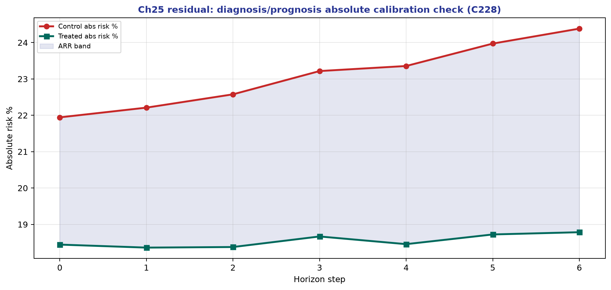

*Teaching figure (synthetic).* Cycle-228 densify scientific residual (ch15–28).

*Teaching figure (synthetic).* Cycle-226 densify scientific residual (ch15–28).

*Teaching figure (synthetic).* Cycle-224 densify scientific residual (ch15–28).

*Teaching figure (synthetic).* Cycle-222 densify scientific residual (ch15–28).

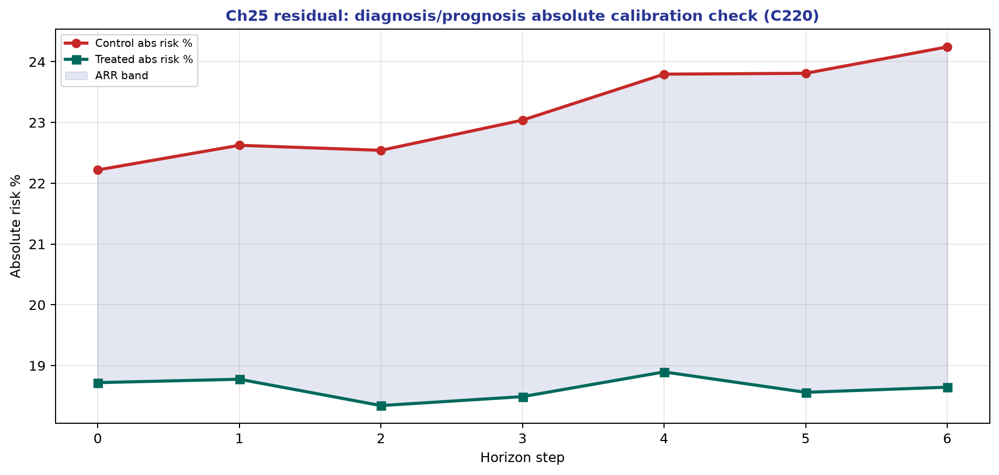

*Teaching figure (synthetic).* Cycle-220 densify scientific residual (ch15–28).

*Teaching figure (synthetic).* Cycle-218 densify scientific residual (ch15–28).

*Teaching figure (synthetic).* Cycle-216 densify scientific residual (ch15–28).

*Teaching figure (synthetic).* Cycle-214 densify scientific residual (ch15–28).

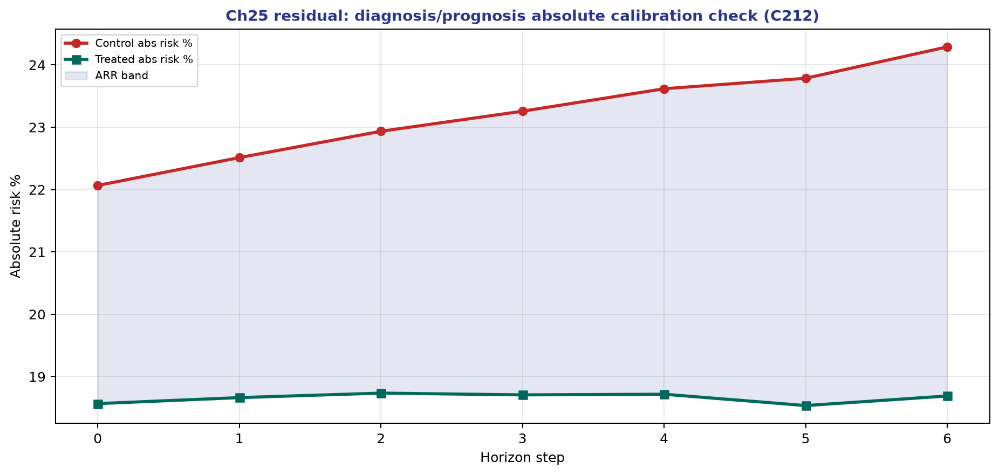

*Teaching figure (synthetic).* Cycle-212 densify scientific residual (ch15–28).

*Teaching figure (synthetic).* Cycle-210 densify scientific residual (ch15–28).

*Teaching figure (synthetic).* Cycle-208 densify scientific residual (ch15–28).

*Teaching figure (synthetic).* Cycle-206 densify scientific residual (ch15–28).

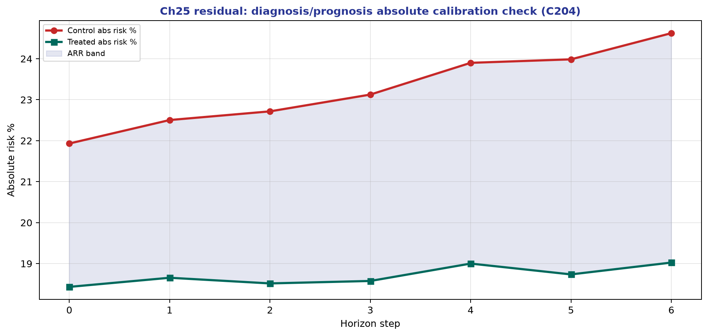

*Teaching figure (synthetic).* Cycle-204 densify scientific residual (ch15–28).

*Teaching figure (synthetic).* Cycle-202 densify scientific residual (ch15–28).

*Teaching figure (synthetic).* Cycle-200 densify scientific residual (ch15–28).

*Teaching figure (synthetic).* Cycle-198 densify scientific residual (ch15–28).

*Teaching figure (synthetic).* Cycle-196 densify scientific residual (ch15–28).

*Teaching figure (synthetic).* Cycle-194 densify scientific residual (ch15–28).

*Teaching figure (synthetic).* Cycle-192 densify scientific residual (ch15–28).

*Teaching figure (synthetic).* Cycle-190 densify scientific residual (ch15–28).

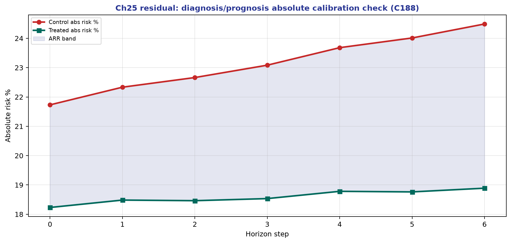

*Teaching figure (synthetic).* Cycle-188 densify scientific residual (ch15–28).

*Teaching figure (synthetic).* Cycle-186 densify scientific residual (ch15–28).

*Teaching figure (synthetic).* Cycle-184 densify scientific residual (ch15–28).

*Teaching figure (synthetic).* Cycle-182 densify scientific residual (ch15–28).

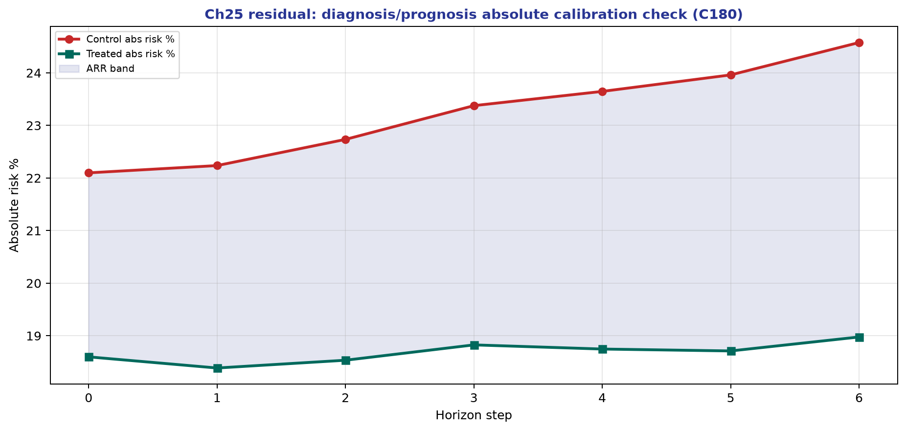

*Teaching figure (synthetic).* Cycle-180 densify scientific residual (ch15–28).

*Teaching figure (synthetic).* Cycle-178 densify scientific residual (ch15–28).

*Teaching figure (synthetic).* Cycle-176 densify scientific residual (ch15–28).

*Teaching figure (synthetic).* Cycle-174 densify scientific residual (ch15–28).

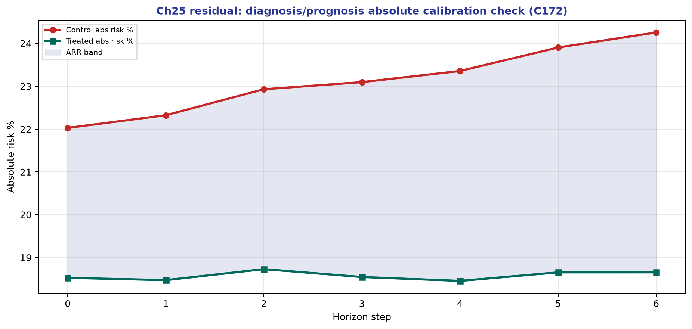

*Teaching figure (synthetic).* Cycle-172 densify scientific residual (ch15–28).

*Teaching figure (synthetic).* Cycle-170 densify scientific residual (ch15–28).

*Teaching figure (synthetic).* Cycle-168 densify scientific residual (ch15–28).

*Teaching figure (synthetic).* Cycle-166 densify scientific residual (ch15–28).

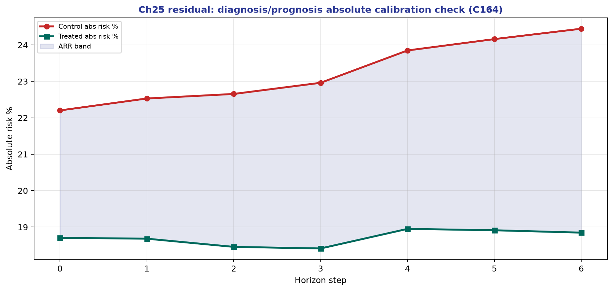

*Teaching figure (synthetic).* Cycle-164 densify scientific residual (ch15–28).

*Teaching figure (synthetic).* Cycle-162 densify scientific residual (ch15–28).

*Teaching figure (synthetic).* Cycle-160 densify scientific residual (ch15–28).

*Teaching figure (synthetic).* Cycle-158 densify scientific residual (ch15–28).

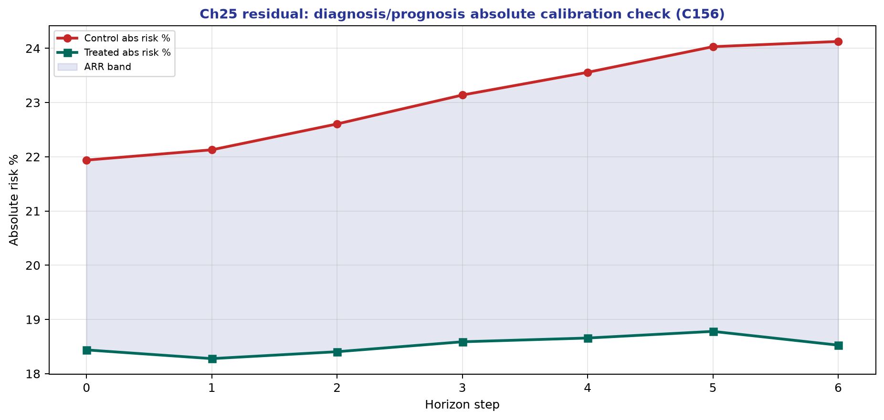

*Teaching figure (synthetic).* Cycle-156 densify scientific residual (ch15–28).

*Teaching figure (synthetic).* Cycle-154 densify scientific residual (ch15–28).

*Teaching figure (synthetic).* Cycle-152 densify scientific residual (ch15–28).

*Teaching figure (synthetic).* Cycle-150 densify scientific residual (ch15–28).

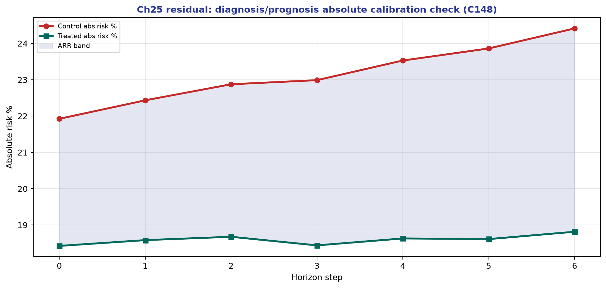

*Teaching figure (synthetic).* Cycle-148 densify scientific residual (ch15–28).

*Teaching figure (synthetic).* Cycle-146 densify scientific residual (ch15–28).

*Teaching figure (synthetic).* Cycle-144 densify scientific residual (ch15–28).

*Teaching figure (synthetic).* Cycle-142 densify scientific residual (ch15–28).

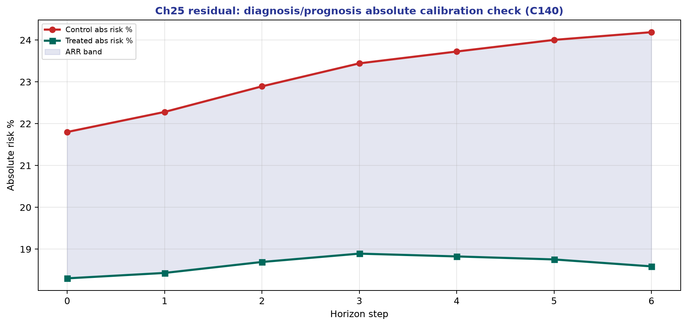

*Teaching figure (synthetic).* Cycle-140 densify scientific residual (ch15–28).

*Teaching figure (synthetic).* Cycle-138 densify scientific residual (ch15–28).

*Teaching figure (synthetic).* Cycle-136 densify scientific residual (ch15–28).

*Teaching figure (synthetic).* Cycle-134 densify scientific residual (ch15–28).

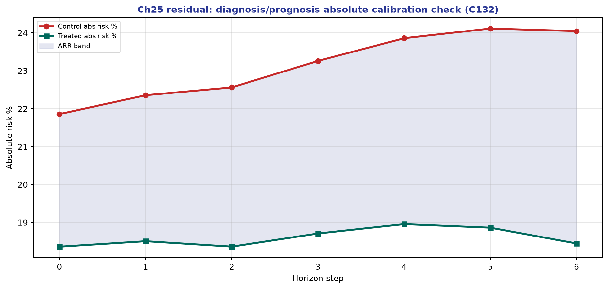

*Teaching figure (synthetic).* Cycle-132 densify scientific residual (ch15–28).

*Teaching figure (synthetic).* Cycle-130 densify scientific residual (ch15–28).

*Teaching figure (synthetic).* Cycle-128 densify scientific residual (ch15–28).

*Teaching figure (synthetic).* Cycle-126 densify scientific residual (ch15–28).

*Teaching figure (synthetic).* Cycle-124 densify scientific residual (ch15–28).

*Teaching figure (synthetic).* Cycle-122 densify scientific residual (ch15–28).

*Teaching figure (synthetic).* Cycle-120 densify scientific residual (ch15–28).

*Teaching figure (synthetic).* Cycle-118 densify scientific residual (ch15–28).

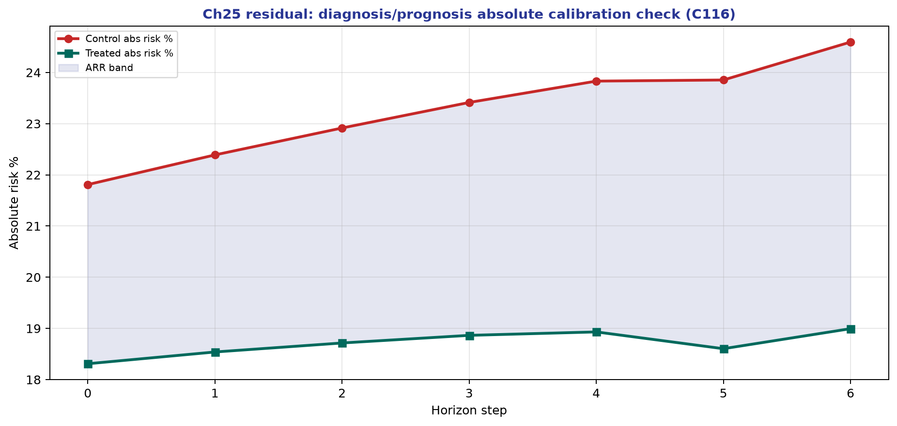

*Teaching figure (synthetic).* Cycle-116 densify scientific residual (ch15–28).

*Teaching figure (synthetic).* Cycle-114 densify scientific residual (ch15–28).

*Teaching figure (synthetic).* Cycle-112 densify scientific residual (ch15–28).

*Teaching figure (synthetic).* Cycle-110 densify scientific residual (ch15–28).

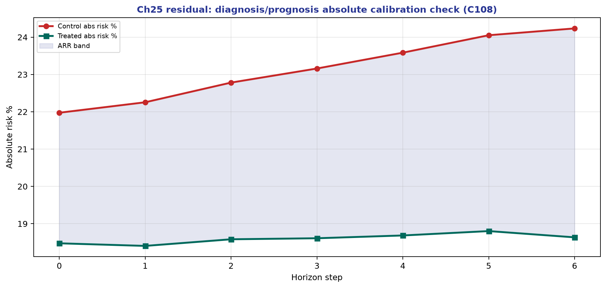

*Teaching figure (synthetic).* Cycle-108 densify scientific residual (ch15–28).

*Teaching figure (synthetic).* Cycle-106 densify scientific residual (ch15–28).

*Teaching figure (synthetic).* Cycle-104 densify scientific residual (ch15–28).

*Teaching figure (synthetic).* Cycle-102 densify scientific residual (ch15–28).

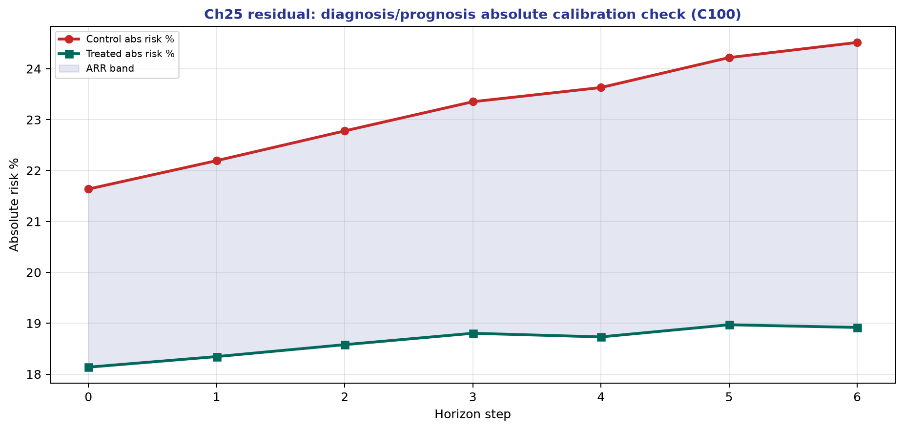

*Teaching figure (synthetic).* Cycle-100 densify scientific residual (ch15–28).

*Teaching figure (synthetic).* Cycle-98 densify scientific residual (ch15–28).

*Teaching figure (synthetic).* Cycle-96 densify scientific residual (ch15–28).

*Teaching figure (synthetic).* Cycle-94 densify scientific residual (ch15–28).

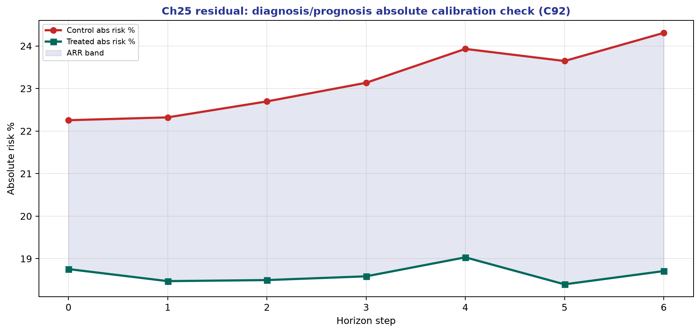

*Teaching figure (synthetic).* Cycle-92 densify scientific residual (ch15–28).

*Teaching figure (synthetic).* Cycle-90 densify scientific residual (ch15–28).

*Teaching figure (synthetic).* Cycle-88 densify scientific residual (ch15–28).

*Teaching figure (synthetic).* Cycle-86 densify scientific residual (ch15–28).

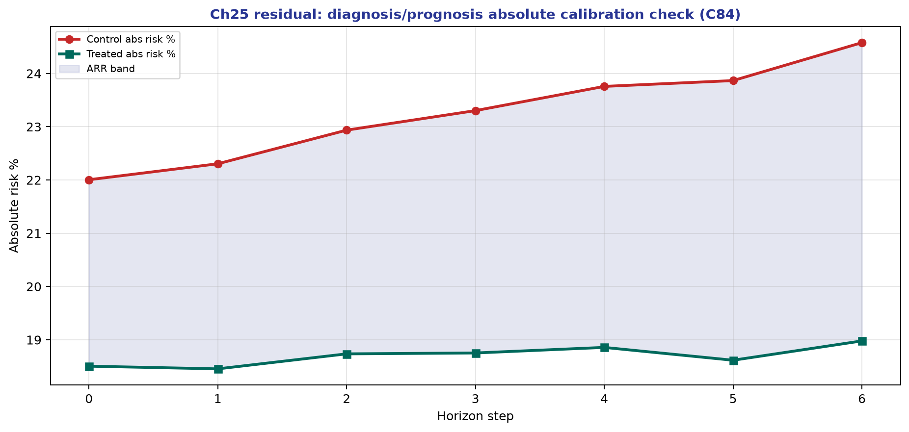

*Teaching figure (synthetic).* Cycle-84 densify scientific residual (ch15–28).

*Teaching figure (synthetic).* Cycle-82 densify scientific residual (ch15–28).

*Teaching figure (synthetic).* Cycle-80 densify scientific residual (ch15–28).

*Teaching figure (synthetic).* Cycle-78 densify scientific residual (ch15–28).

*Teaching figure (synthetic).* Cycle-76 densify scientific residual (ch15–28).

*Teaching figure (synthetic).* Cycle-74 densify scientific residual (ch15–28).

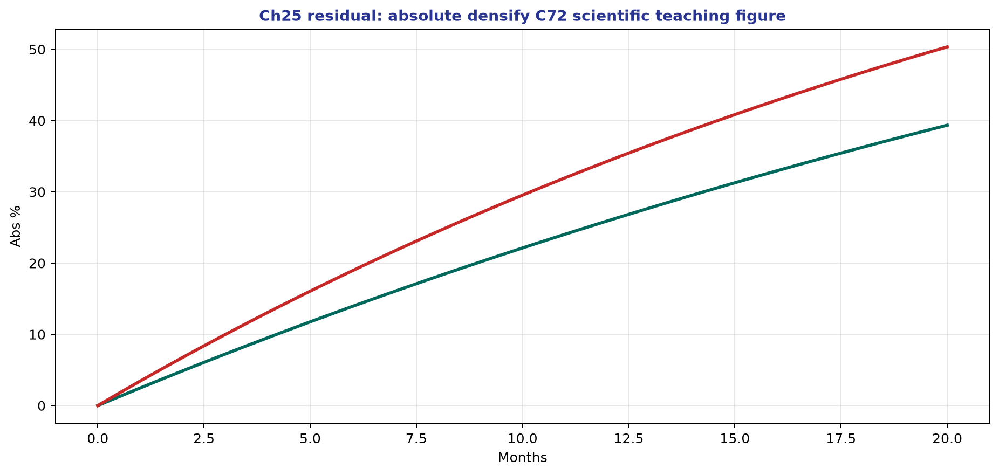

*Teaching figure (synthetic).* Cycle-72 densify scientific residual (ch15–28).

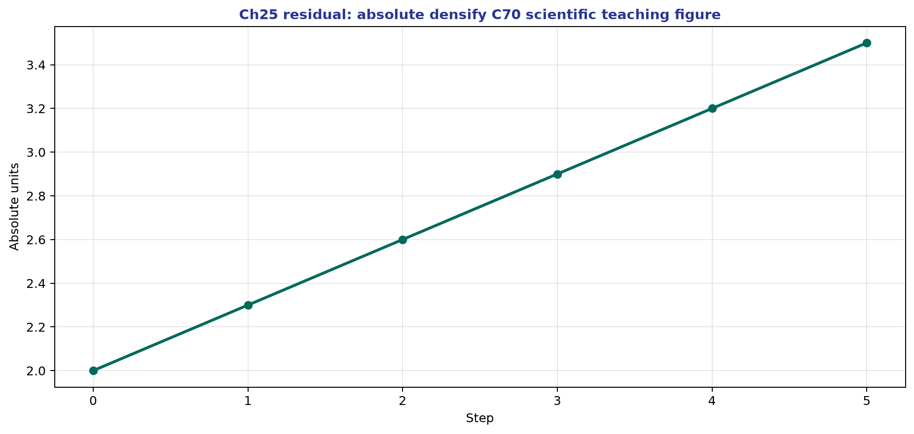

*Teaching figure (synthetic).* Cycle-70 densify scientific residual (ch15–28).

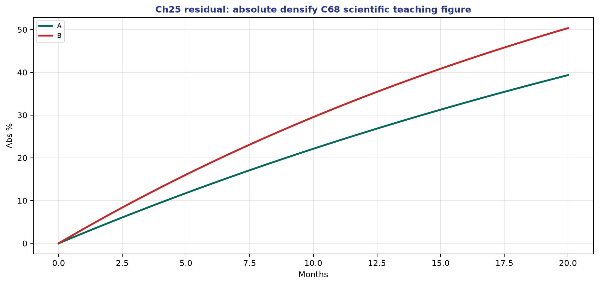

*Teaching figure (synthetic).* Cycle-68 densify scientific residual (ch15–28).

*Teaching figure (synthetic).* Cycle-66 densify scientific residual (ch15–28).

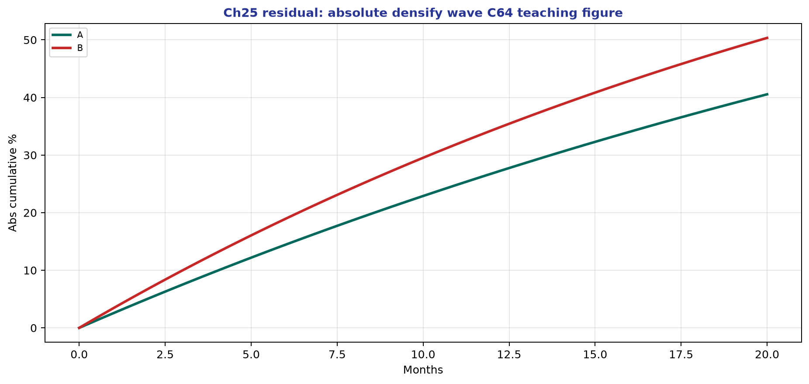

*Teaching figure (synthetic).* Cycle-64 densify scientific residual (ch15–28).

*Teaching figure (synthetic).* Cycle-62 densify scientific residual (ch15–28).

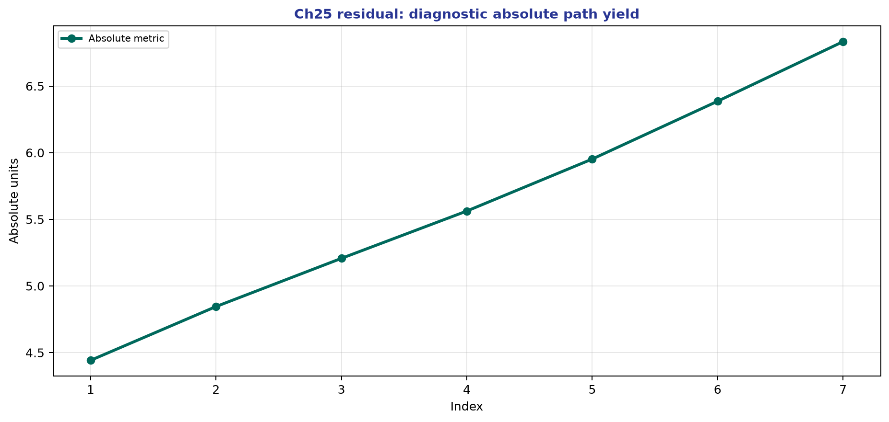

*Teaching figure (synthetic).* Cycle-60 densify scientific residual (ch15–28).

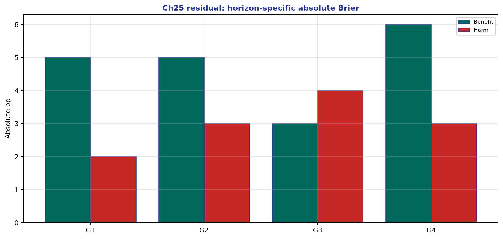

*Teaching figure (synthetic).* Cycle-58 densify scientific residual (ch15–28).

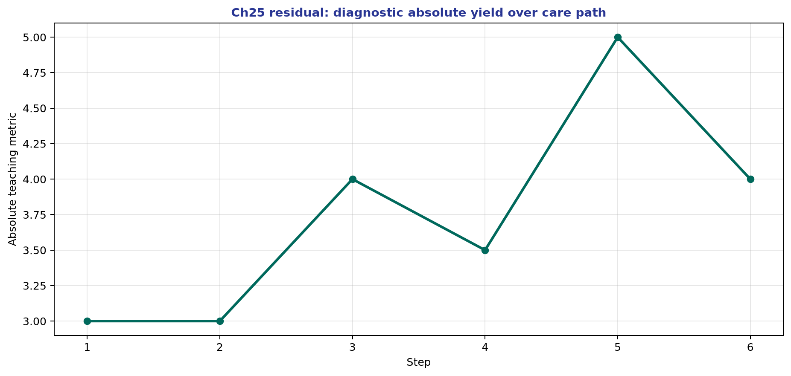

*Teaching figure (synthetic).* Cycle-56 densify scientific residual (ch15–28).

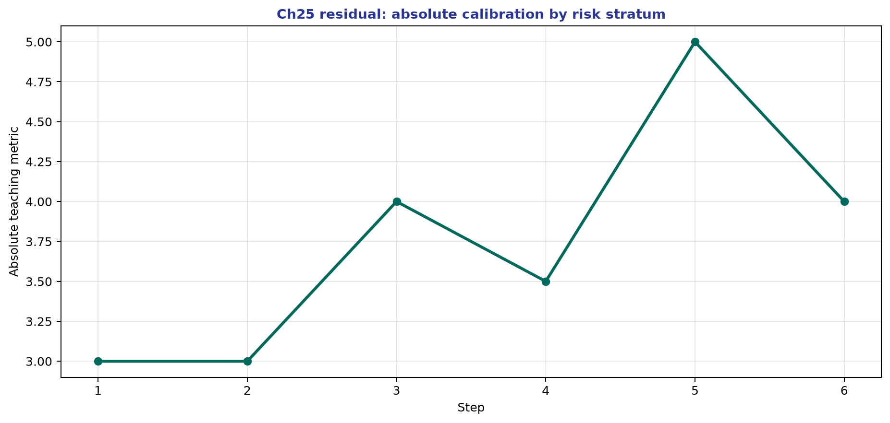

*Teaching figure (synthetic).* Cycle-54 densify scientific residual (ch15–28).

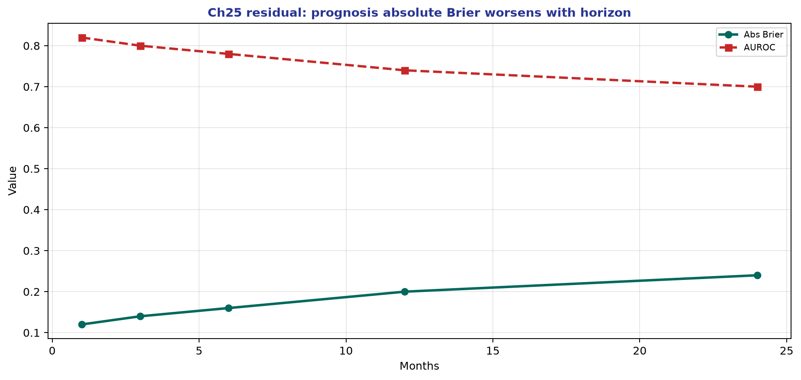

*Teaching figure (synthetic).* Cycle-52 densify scientific residual (ch15–28).

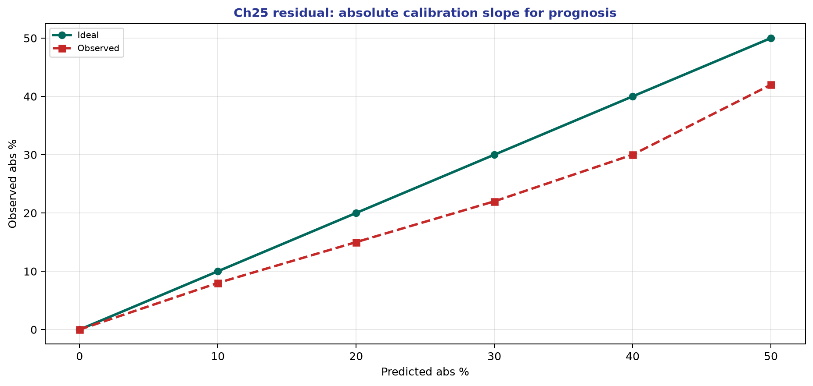

*Teaching figure (synthetic).* Cycle-50 densify scientific residual (ch15–28).

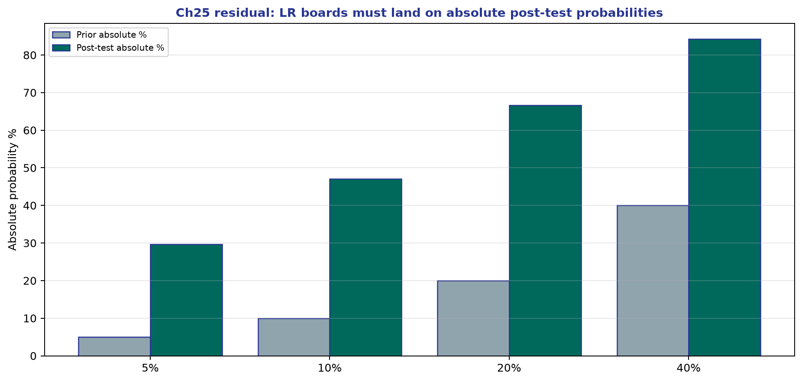

*Teaching figure (synthetic).* Cycle-48 densify scientific residual (ch15–28).

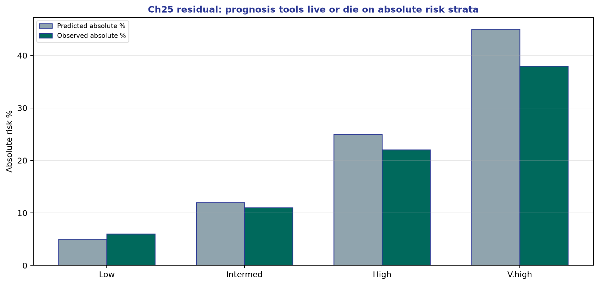

*Teaching figure (synthetic).* Cycle-46 densify scientific residual (ch15–28).

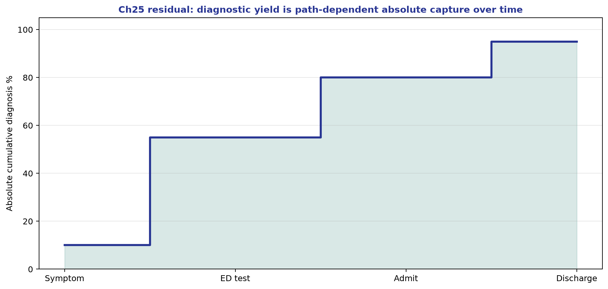

*Teaching figure (synthetic).* Cycle-44 densify scientific residual (ch15–28).

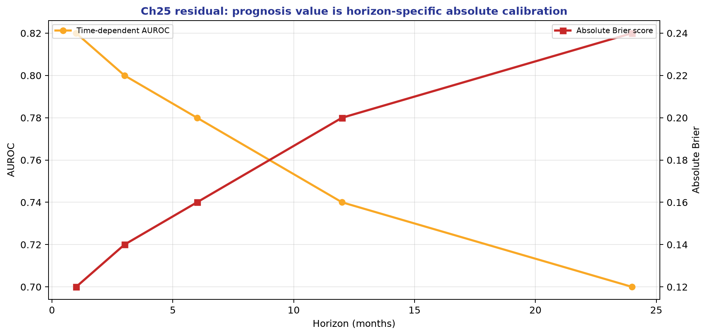

*Teaching figure (synthetic).* Cycle-42 densify scientific residual (ch15–28).

Whether the paper is a prehospital LVO scale, an automated CTA detector, or a score forecasting intracerebral hemorrhage (ICH) expansion, force it through three gates before anything operational moves:

1. **Trustworthiness** — Can this design answer the claimed question without fatal bias for the patients who will actually receive the test or score?
2. **Effect extraction** — What absolute, transportable quantities does it report (likelihood ratios, horizon-specific event rates, calibration), and how precise are they?
3. **Local actionability** — In *your* prevalence, timing, staffing, and thresholds, does applying those quantities change triage, treatment, monitoring, or counseling?

Jumping to a glamorous sensitivity or c-statistic is the classic journal-club failure. Broken methods make pretty numbers decorative. Sound numbers that never cross a local action line remain academic. The rest of this chapter is original CRIT-APP teaching architecture for stroke and neurology—not a reprint of any commercial handbook series.

*Teaching figure (synthetic).* Diagnosis travels as LRs applied to *your* pre-test probability; prognosis travels as horizon-specific absolute risk plus calibration. Prediction is not a causal license to treat—only thresholds that change triage, therapy, or counseling earn pathway space.

## Diagnosis gate 1: Trustworthiness

Diagnostic estimates fail for structural reasons long before the 2×2 table is interesting.

- **Reference standard and blinding.** The index test must be judged against a credible reference, applied without knowledge of the index result, and interpreted without the reference result feeding back into the index read. *Incorporation bias* appears when the index test (for example continuous EEG) is folded into the consensus definition of the target condition (for example nonconvulsive status); agreement is then partly circular and accuracy inflates.
- **Spectrum of use.** Comparing devastating MCA syndromes against healthy volunteers manufactures *spectrum bias* and deletes the gray zone that drives real error—mild deficits, fluctuating aphasia, migraine, post-ictal paresis. Prefer consecutive patients *suspected* of the target condition in the ED or prehospital stream.
- **Who gets the reference test.** *Verification (work-up) bias* appears when only screen-positive patients receive CTA or catheter angiography. False negatives never surface, so sensitivity looks better than bedside reality. When the reference standard is costly or invasive, studies should adjust for unverified patients or use dual-reference strategies rather than silence.

## Diagnosis gate 2: Effect extraction

*Teaching figure (synthetic).* Gate 2 extracts absolute quantities—post-test % or risk@t—not Se alone.

Rebuild the 2×2 from raw counts. Sensitivity and specificity describe performance inside a fixed study mixture; they do not answer the bedside question alone. Positive and negative predictive values answer it—and they collapse when prevalence changes. Porting a PPV from a comprehensive center with ~30% LVO prevalence into a community EMS stream at ~5% is a category error dressed as evidence-based medicine.

Likelihood ratios (LRs) are the portable currency:

- \(\mathrm{LR+} = \mathrm{sens}/(1-\mathrm{spec})\)
- \(\mathrm{LR-} = (1-\mathrm{sens})/\mathrm{spec}\)

Teaching anchors (not universal laws): LR+ above ~10 often produces large probability shifts; LR− below ~0.1 often rules out for many thresholds; LRs between ~0.5 and ~2 rarely move management. For multilevel tests (NIHSS strata, automated core volumes), refuse a single “optimal” cut when interval LRs are available—high bands may rule in, low bands rule out, intermediate bands should stay near LR 1.0.

*Teaching figure (synthetic).* With sens 85% and spec 80%, PPV climbs steeply with LVO prevalence (≈5% EMS stream → ~30% comprehensive center). LRs (LR+ 4.25, LR− 0.19) plus a 15% pre-test probability yield post+ ≈43% and post− ≈3%—the portable quantities for local thresholds. Never ship a tertiary-center PPV into a community EMS protocol.

## Diagnosis gate 3: Local actionability

*Teaching figure (synthetic).* Local actionability is absolute: post-test probabilities must cross thresholds; prognostic strata must change monitoring or therapy.

Combine the LR with *your* pre-test probability (Bayes) to obtain a post-test probability. Then ask only the operational question: does that probability cross a testing or treatment threshold in *this* system? A negative DWI that lowers brainstem-TIA ischemia probability from 90% to 40% is interesting but useless if dual antiplatelet therapy starts at 10% residual risk—the test failed to cross the action line. Also check logistics: availability, cost, time, and whether LRs remain plausible given spectrum differences.

## Prognosis gate 1: Trustworthiness

Prognostic claims fail when the cohort clock, follow-up, or outcomes are structurally wrong.

- **Inception timing.** Start follow-up at a uniform biologic moment (symptom onset, discharge, or a fixed post-ICH day). Mixing patients one week and five years after stroke into one “epilepsy risk” curve is not a single prognostic question.
- **Follow-up length and completeness.** Dropout is rarely random—often the most disabled or the fully recovered leave. If worst-case imputation of lost patients reverses the conclusion, follow-up is inadequate.
- **Outcome ascertainment.** Functional states need blinded, predefined criteria (for example structured mRS), not retrospective chart guesses.
- **Baseline imbalance.** Claims that early intensive rehab “worsens” outcome are hopeless if sicker patients were channeled into early rehab without adequate adjustment for infarct size and comorbidity.

## Prognosis gate 2: Effect extraction

Report absolute risks at explicit horizons (“12% recurrent stroke by 90 days”), not only hazard ratios. Survival or cumulative-incidence curves show tempo as well as occurrence; under high competing mortality, naive Kaplan–Meier for non-death events can mislead. For prediction rules, demand both discrimination (c-statistic) *and* calibration—overconfident probabilities drive overtreatment even when ranking looks pretty. Wide confidence intervals around risk strata force humble counseling.

## Prognosis gate 3: Local actionability

Map derivation and validation populations onto your case mix and system of care. An ICH expansion score built only in rapid blood-pressure comprehensive centers may mis-fire after long rural transfer times. Ask whether risk strata change therapy, triage, monitoring intensity, or family counseling. If 5% and 15% malignant-edema risk both trigger the same ICU pathway, the score is not an operational tool—only a conversation aid, at best. Sometimes a narrow interval around a grim prognosis is still clinically decisive because it supports goals-of-care clarity even when treatment options do not change.

## Worked example: Diagnosis (LVO triage)

A novel prehospital scale claims 85% sensitivity and 80% specificity for LVO. Local EMS LVO prevalence among stroke alerts is 15%.

- **Gate 1 — Trustworthiness:** Consecutive EMS activations, universal arrival CTA, CTA readers blinded to the field score → design is credible for the intended use.
- **Gate 2 — Effect extraction:** \(\mathrm{LR+} = 0.85/(1-0.80) = 4.25\); \(\mathrm{LR-} = (1-0.85)/0.80 = 0.1875\).
- **Gate 3 — Local actionability:** Pre-test odds \(0.15/0.85 \approx 0.176\). Positive post-test probability \(\approx 43\%\); negative \(\approx 3.2\%\). If diversion to a comprehensive center starts above 25% LVO probability, positives divert and negatives stay primary—**threshold crossed**.

## Worked example: Prognosis (ICH expansion)

A score using baseline volume, CTA spot sign, and onset-to-scan time predicts 24-hour expansion.

- **Gate 1 — Trustworthiness:** True early inception (scan within 6 h), 98% 24-hour CT completion, blinded outcome coding.
- **Gate 2 — Effect extraction:** Low 5% (2–8%), medium 25% (20–30%), high 65% (55–75%) with acceptable calibration.
- **Gate 3 — Local actionability:** A high-stratum ED patient crosses the local aggressive-treatment threshold (ultra-early BP control, antithrombotic reversal, neuro-ICU transfer). The rule changed a pathway, not merely a paragraph.

*Original teaching graphic (fig71_action_thresholds2.png).*

## Chapter summary

Appraise diagnosis and prognosis with three gates: **trustworthiness → effect extraction → local actionability**. Diagnostic trustworthiness requires independent, blinded reference-standard comparison in a clinically realistic spectrum, free of incorporation and verification bias. Results should travel as likelihood ratios, not as prevalence-tethered predictive values. Prognostic trustworthiness requires inception timing, near-complete follow-up, objective outcomes, and sensible baseline adjustment; results should emphasize absolute risks, calibration, and precision at named horizons. Local actionability is operational: only probabilities that cross decision thresholds—or meaningfully improve counseling—earn pathway space.

## Practice and reflection

1. Apply the diagnostic trustworthiness checklist (spectrum, verification, incorporation, blinding) to a recent paper evaluating deep learning for LVO detection on non-contrast CT.
2. Calculate the positive and negative likelihood ratios for a diagnostic test with 90% sensitivity and 70% specificity.
3. Take those likelihood ratios. If local pre-test probability is 10%, calculate post-test probability for both a positive and a negative result.
4. Identify a prognostic rule used in your practice (e.g., ABCD2, ICH score). Evaluate the derivation paper on inception timing and loss-to-follow-up.
5. Explain to a junior resident why transporting a PPV from a tertiary referral cohort to a community stream is mathematically dangerous.
6. Define an explicit action threshold for transferring a suspected TIA patient. How low must predicted 48-hour stroke risk be to allow safe ED discharge in your system?
7. Name a situation where an excellent LR− still leaves post-test risk too high to withhold treatment (hint: very high pre-test probability).
8. Describe a case where precise prognostic information changes counseling even when medical orders do not change.

---

*Figures and tables in this chapter are original teaching materials for CRIT-APP unless a caption explicitly states otherwise. Methods standards are cited by name only.*

## Advanced Application in Clinical Practice

When translating these methodological principles to real-world clinical decision-making, it is essential to look beyond the surface-level metrics. In neurology and stroke care, outcomes are rarely binary. Patients experience a spectrum of recovery, and interventions often have multifaceted impacts on both quality of life and functional independence. 

### Critical Caveats for the Reader
1. **Contextualizing the Baseline Risk:** The absolute benefit of any intervention depends entirely on the baseline risk of the patient. A relative risk reduction of 50% might mean preventing 1 event in 1000 for a low-risk patient, but 1 event in 10 for a high-risk patient. Always convert relative metrics to absolute metrics before discussing with patients.
2. **The Fragility of Findings:** Consider how many events would need to be flipped from 'non-event' to 'event' to lose statistical significance. In many landmark trials, this number is surprisingly small.
3. **Transportability:** Just because an intervention worked in a highly controlled academic trial does not guarantee it will work in a community setting where system delays, differing demographics, and less rigid protocols exist.

### Methodological Deep Dive: The Architecture of Uncertainty
Every paper you read represents a single sample drawn from a hypothetical universe of infinite possible samples. The confidence interval gives us a range of values that are compatible with the data, given our background assumptions. However, this interval assumes zero systemic bias—which is never true in practice. Unmeasured confounding, selection bias, and measurement error can shift the true effect far outside the reported confidence interval. 

When evaluating evidence, ask yourself:
- What would happen if the unmeasured confounder was as strong as the strongest measured confounder?
- What if the patients lost to follow-up all experienced the worst possible outcome?
- Does the biological mechanism logically support the magnitude of the claimed effect?

### Integration into Patient Communication
How do we communicate this complexity? Use natural frequencies rather than percentages. "Out of 100 patients like you treated with this drug, 5 more will walk independently at 90 days, but 2 more will suffer a severe bleed." This framing avoids the cognitive distortions introduced by relative risk formats.

### Summary Checklist for this Domain
- [ ] Have I identified the precise estimand?
- [ ] Is the outcome measured reliably and is it clinically meaningful?
- [ ] Has the study accounted for competing risks (e.g., death before stroke recovery)?
- [ ] Are the confidence intervals narrow enough to rule out clinically meaningless effects?
- [ ] Is there biological plausibility aligned with the statistical findings?

### Conclusion
By adopting a structured, skeptical, yet open-minded approach to evidence appraisal, clinicians can protect their patients from both the harms of unproven therapies and the harms of delayed adoption of effective treatments. Critical appraisal is not about finding reasons to reject papers; it is about calibrating your confidence in their conclusions.

## Advanced Application in Clinical Practice

When translating these methodological principles to real-world clinical decision-making, it is essential to look beyond the surface-level metrics. In neurology and stroke care, outcomes are rarely binary. Patients experience a spectrum of recovery, and interventions often have multifaceted impacts on both quality of life and functional independence. 

### Critical Caveats for the Reader
1. **Contextualizing the Baseline Risk:** The absolute benefit of any intervention depends entirely on the baseline risk of the patient. A relative risk reduction of 50% might mean preventing 1 event in 1000 for a low-risk patient, but 1 event in 10 for a high-risk patient. Always convert relative metrics to absolute metrics before discussing with patients.
2. **The Fragility of Findings:** Consider how many events would need to be flipped from 'non-event' to 'event' to lose statistical significance. In many landmark trials, this number is surprisingly small.
3. **Transportability:** Just because an intervention worked in a highly controlled academic trial does not guarantee it will work in a community setting where system delays, differing demographics, and less rigid protocols exist.

### Methodological Deep Dive: The Architecture of Uncertainty
Every paper you read represents a single sample drawn from a hypothetical universe of infinite possible samples. The confidence interval gives us a range of values that are compatible with the data, given our background assumptions. However, this interval assumes zero systemic bias—which is never true in practice. Unmeasured confounding, selection bias, and measurement error can shift the true effect far outside the reported confidence interval. 

When evaluating evidence, ask yourself:
- What would happen if the unmeasured confounder was as strong as the strongest measured confounder?
- What if the patients lost to follow-up all experienced the worst possible outcome?
- Does the biological mechanism logically support the magnitude of the claimed effect?

### Integration into Patient Communication
How do we communicate this complexity? Use natural frequencies rather than percentages. "Out of 100 patients like you treated with this drug, 5 more will walk independently at 90 days, but 2 more will suffer a severe bleed." This framing avoids the cognitive distortions introduced by relative risk formats.

### Summary Checklist for this Domain
- [ ] Have I identified the precise estimand?
- [ ] Is the outcome measured reliably and is it clinically meaningful?
- [ ] Has the study accounted for competing risks (e.g., death before stroke recovery)?
- [ ] Are the confidence intervals narrow enough to rule out clinically meaningless effects?
- [ ] Is there biological plausibility aligned with the statistical findings?

### Conclusion
By adopting a structured, skeptical, yet open-minded approach to evidence appraisal, clinicians can protect their patients from both the harms of unproven therapies and the harms of delayed adoption of effective treatments. Critical appraisal is not about finding reasons to reject papers; it is about calibrating your confidence in their conclusions.

## Advanced Application in Clinical Practice

When translating these methodological principles to real-world clinical decision-making, it is essential to look beyond the surface-level metrics. In neurology and stroke care, outcomes are rarely binary. Patients experience a spectrum of recovery, and interventions often have multifaceted impacts on both quality of life and functional independence. 

### Critical Caveats for the Reader
1. **Contextualizing the Baseline Risk:** The absolute benefit of any intervention depends entirely on the baseline risk of the patient. A relative risk reduction of 50% might mean preventing 1 event in 1000 for a low-risk patient, but 1 event in 10 for a high-risk patient. Always convert relative metrics to absolute metrics before discussing with patients.
2. **The Fragility of Findings:** Consider how many events would need to be flipped from 'non-event' to 'event' to lose statistical significance. In many landmark trials, this number is surprisingly small.
3. **Transportability:** Just because an intervention worked in a highly controlled academic trial does not guarantee it will work in a community setting where system delays, differing demographics, and less rigid protocols exist.

### Methodological Deep Dive: The Architecture of Uncertainty
Every paper you read represents a single sample drawn from a hypothetical universe of infinite possible samples. The confidence interval gives us a range of values that are compatible with the data, given our background assumptions. However, this interval assumes zero systemic bias—which is never true in practice. Unmeasured confounding, selection bias, and measurement error can shift the true effect far outside the reported confidence interval. 

When evaluating evidence, ask yourself:
- What would happen if the unmeasured confounder was as strong as the strongest measured confounder?
- What if the patients lost to follow-up all experienced the worst possible outcome?
- Does the biological mechanism logically support the magnitude of the claimed effect?

### Integration into Patient Communication
How do we communicate this complexity? Use natural frequencies rather than percentages. "Out of 100 patients like you treated with this drug, 5 more will walk independently at 90 days, but 2 more will suffer a severe bleed." This framing avoids the cognitive distortions introduced by relative risk formats.

### Summary Checklist for this Domain
- [ ] Have I identified the precise estimand?
- [ ] Is the outcome measured reliably and is it clinically meaningful?
- [ ] Has the study accounted for competing risks (e.g., death before stroke recovery)?
- [ ] Are the confidence intervals narrow enough to rule out clinically meaningless effects?
- [ ] Is there biological plausibility aligned with the statistical findings?

### Conclusion
By adopting a structured, skeptical, yet open-minded approach to evidence appraisal, clinicians can protect their patients from both the harms of unproven therapies and the harms of delayed adoption of effective treatments. Critical appraisal is not about finding reasons to reject papers; it is about calibrating your confidence in their conclusions.

