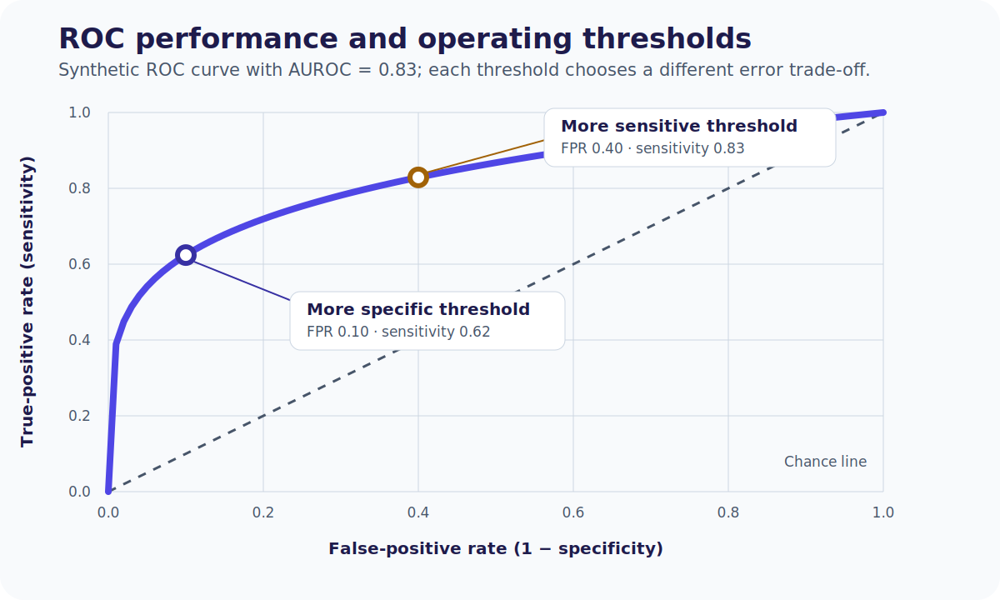

# Chapter 25. Appraising Diagnosis and Prognosis Papers

## Opening

*Spectrum mismatch derivation vs target.*

A diagnostic company pitches a blood biomarker for TIA. Run trustworthiness, effect extraction, and local actionability gates before any order panel is added.

## Three gates before you change a pathway

Whether the paper is a prehospital LVO scale, an automated CTA detector, or a score forecasting intracerebral hemorrhage (ICH) expansion, force it through three gates before anything operational moves:

1. **Trustworthiness** — Can this design answer the claimed question without fatal bias for the patients who will actually receive the test or score?
2. **Effect extraction** — What absolute, transportable quantities does it report (likelihood ratios, horizon-specific event rates, calibration), and how precise are they?
3. **Local actionability** — In *your* prevalence, timing, staffing, and thresholds, does applying those quantities change triage, treatment, monitoring, or counseling?

Jumping to a glamorous sensitivity or c-statistic is the classic journal-club failure. Broken methods make pretty numbers decorative. Sound numbers that never cross a local action line remain academic. The rest of this chapter is original CRIT-APP teaching architecture for stroke and neurology—not a reprint of any commercial handbook series.

## Diagnosis gate 1: Trustworthiness

Diagnostic estimates fail for structural reasons long before the 2×2 table is interesting.

- **Reference standard and blinding.** The index test must be judged against a credible reference, applied without knowledge of the index result, and interpreted without the reference result feeding back into the index read. *Incorporation bias* appears when the index test (for example continuous EEG) is folded into the consensus definition of the target condition (for example nonconvulsive status); agreement is then partly circular and accuracy inflates.
- **Spectrum of use.** Comparing devastating MCA syndromes against healthy volunteers manufactures *spectrum bias* and deletes the gray zone that drives real error—mild deficits, fluctuating aphasia, migraine, post-ictal paresis. Prefer consecutive patients *suspected* of the target condition in the ED or prehospital stream.
- **Who gets the reference test.** *Verification (work-up) bias* appears when only screen-positive patients receive CTA or catheter angiography. False negatives never surface, so sensitivity looks better than bedside reality. When the reference standard is costly or invasive, studies should adjust for unverified patients or use dual-reference strategies rather than silence.

## Diagnosis gate 2: Effect extraction

*An AUROC does not choose a clinical threshold; the operating point determines the error trade-off.*

*Reconstruct the four cells before accepting summary accuracy claims.*

Rebuild the 2×2 from raw counts. Sensitivity and specificity describe performance in a specified spectrum; predictive values additionally depend on prevalence. Do not port a PPV from a comprehensive-center cohort into a lower-prevalence EMS stream without recalculation, and do not assume sensitivity, specificity, or likelihood ratios remain fixed if the spectrum or workflow changes.

Likelihood ratios (LRs) are the portable currency:

- \(\mathrm{LR+} = \mathrm{sens}/(1-\mathrm{spec})\)
- \(\mathrm{LR-} = (1-\mathrm{sens})/\mathrm{spec}\)

Teaching anchors (not universal laws): LR+ above ~10 often produces large probability shifts; LR− below ~0.1 often rules out for many thresholds; LRs between ~0.5 and ~2 rarely move management. For multilevel tests (NIHSS strata, automated core volumes), refuse a single “optimal” cut when interval LRs are available—high bands may rule in, low bands rule out, intermediate bands should stay near LR 1.0.

## Diagnosis gate 3: Local actionability

Combine the LR with *your* pre-test probability (Bayes) to obtain a post-test probability. Then ask only the operational question: does that probability cross a testing or treatment threshold in *this* system? A negative DWI that lowers brainstem-TIA ischemia probability from 90% to 40% is interesting but useless if dual antiplatelet therapy starts at 10% residual risk—the test failed to cross the action line. Also check logistics: availability, cost, time, and whether LRs remain plausible given spectrum differences.

*Testing is useful only in the intermediate probability range where a result can cross the no-test, test, or treatment threshold and change the action.*

## Prognosis gate 1: Trustworthiness

*A score is not ready for practice after derivation alone.*

Prognostic claims fail when the cohort clock, follow-up, or outcomes are structurally wrong.

- **Inception timing.** Start follow-up at a uniform biologic moment (symptom onset, discharge, or a fixed post-ICH day). Mixing patients one week and five years after stroke into one “epilepsy risk” curve is not a single prognostic question.
- **Follow-up length and completeness.** Dropout is rarely random—often the most disabled or the fully recovered leave. If worst-case imputation of lost patients reverses the conclusion, follow-up is inadequate.
- **Outcome ascertainment.** Functional states need blinded, predefined criteria (for example structured mRS), not retrospective chart guesses.
- **Baseline imbalance.** Claims that early intensive rehab “worsens” outcome are hopeless if sicker patients were channeled into early rehab without adequate adjustment for infarct size and comorbidity.

## Prognosis gate 2: Effect extraction

Report absolute risks at explicit horizons (“12% recurrent stroke by 90 days”), not only hazard ratios. Survival or cumulative-incidence curves show tempo as well as occurrence; under high competing mortality, naive Kaplan–Meier for non-death events can mislead. For prediction rules, demand both discrimination (c-statistic) *and* calibration—overconfident probabilities drive overtreatment even when ranking looks pretty. Wide confidence intervals around risk strata force humble counseling.

## Prognosis gate 3: Local actionability

Map derivation and validation populations onto your case mix and system of care. Ask whether risk strata change an evidence-supported choice, triage, monitoring, or counseling. Prognostic models trained where treatment limitation affects outcomes can encode a self-fulfilling WLST pathway; they must not independently justify withdrawal of life-sustaining treatment. Use repeated clinical assessment, uncertainty, reversibility, and the patient's values and prior wishes rather than converting one score into a futility verdict.

*A model can learn a self-fulfilling treatment-limitation loop; validate outcomes and WLST practices before using prognosis for counseling.*

## Worked example: Diagnosis (LVO triage)

A novel prehospital scale claims 85% sensitivity and 80% specificity for LVO. Local EMS LVO prevalence among stroke alerts is 15%.

- **Gate 1 — Trustworthiness:** Consecutive EMS activations, universal arrival CTA, CTA readers blinded to the field score → design is credible for the intended use.
- **Gate 2 — Effect extraction:** \(\mathrm{LR+} = 0.85/(1-0.80) = 4.25\); \(\mathrm{LR-} = (1-0.85)/0.80 = 0.1875\).
- **Gate 3 — Local actionability:** Pre-test odds \(0.15/0.85 \approx 0.176\). Positive post-test probability \(\approx 43\%\); negative \(\approx 3.2\%\). If diversion to a comprehensive center starts above 25% LVO probability, positives divert and negatives stay primary—**threshold crossed**.

## Worked example: Prognosis (ICH expansion)

A score using baseline volume, CTA spot sign, and onset-to-scan time predicts 24-hour expansion.

- **Gate 1 — Trustworthiness:** True early inception (scan within 6 h), 98% 24-hour CT completion, blinded outcome coding.
- **Gate 2 — Effect extraction:** Low 5% (2–8%), medium 25% (20–30%), high 65% (55–75%) with acceptable calibration.
- **Gate 3 — Local actionability:** Indication-driven acute blood-pressure management and antithrombotic reversal should not be withheld because a score is low. A validated high-risk stratum might add monitoring intensity, repeat imaging, specialist escalation, or trial eligibility only if a prespecified impact study shows benefit beyond standard care.

## Chapter summary

Appraise diagnosis and prognosis with three gates: **trustworthiness → effect extraction → local actionability**. Diagnostic trustworthiness requires independent, blinded reference-standard comparison in a clinically realistic spectrum, free of incorporation and verification bias. Results should travel as likelihood ratios, not as prevalence-tethered predictive values. Prognostic trustworthiness requires inception timing, near-complete follow-up, objective outcomes, and sensible baseline adjustment; results should emphasize absolute risks, calibration, and precision at named horizons. Local actionability is operational: only probabilities that cross decision thresholds—or meaningfully improve counseling—earn pathway space.

## Practice and reflection

1. Apply the diagnostic trustworthiness checklist (spectrum, verification, incorporation, blinding) to a recent paper evaluating deep learning for LVO detection on non-contrast CT.
2. Calculate the positive and negative likelihood ratios for a diagnostic test with 90% sensitivity and 70% specificity.
3. Take those likelihood ratios. If local pre-test probability is 10%, calculate post-test probability for both a positive and a negative result.
4. Identify a prognostic rule used in your practice (e.g., ABCD2, ICH score). Evaluate the derivation paper on inception timing and loss-to-follow-up.
5. Explain to a junior resident why transporting a PPV from a tertiary referral cohort to a community stream is mathematically dangerous.
6. Define an explicit action threshold for transferring a suspected TIA patient. How low must predicted 48-hour stroke risk be to allow safe ED discharge in your system?
7. Name a situation where an excellent LR− still leaves post-test risk too high to withhold treatment (hint: very high pre-test probability).
8. Describe a case where precise prognostic information changes counseling even when medical orders do not change.

---

*Figures and tables in this chapter are Teaching materials for CRIT-APP unless a caption explicitly states otherwise. Methods standards are cited by name only.*
