# Chapter 25. Appraising Diagnosis and Prognosis Papers

## Opening
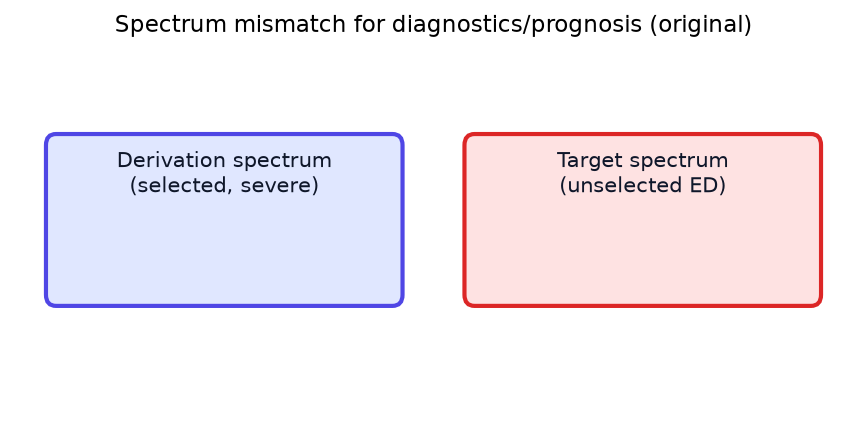

*Spectrum mismatch derivation vs target (original).*

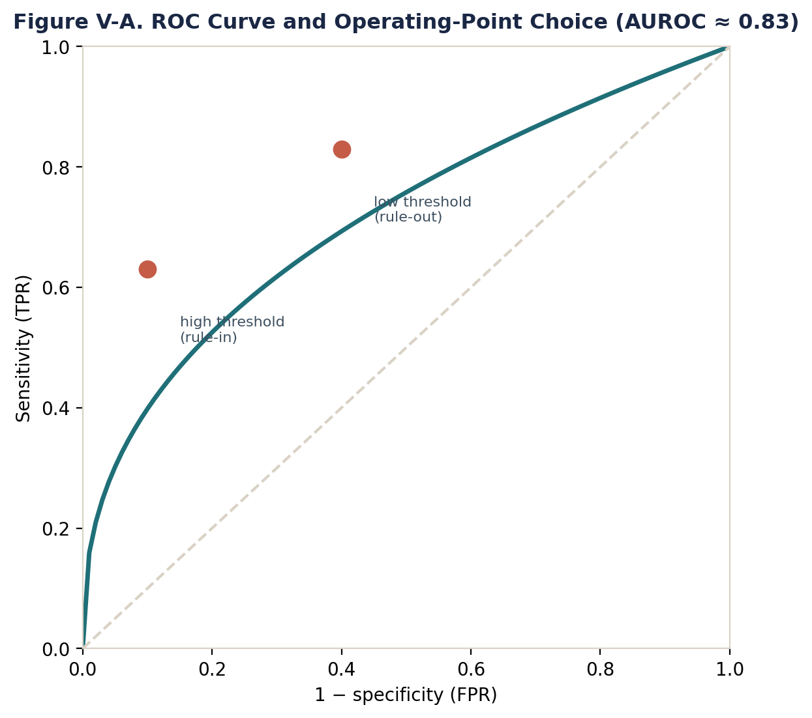

*ROC operating point (original).*

*CPR lifecycle (original).*

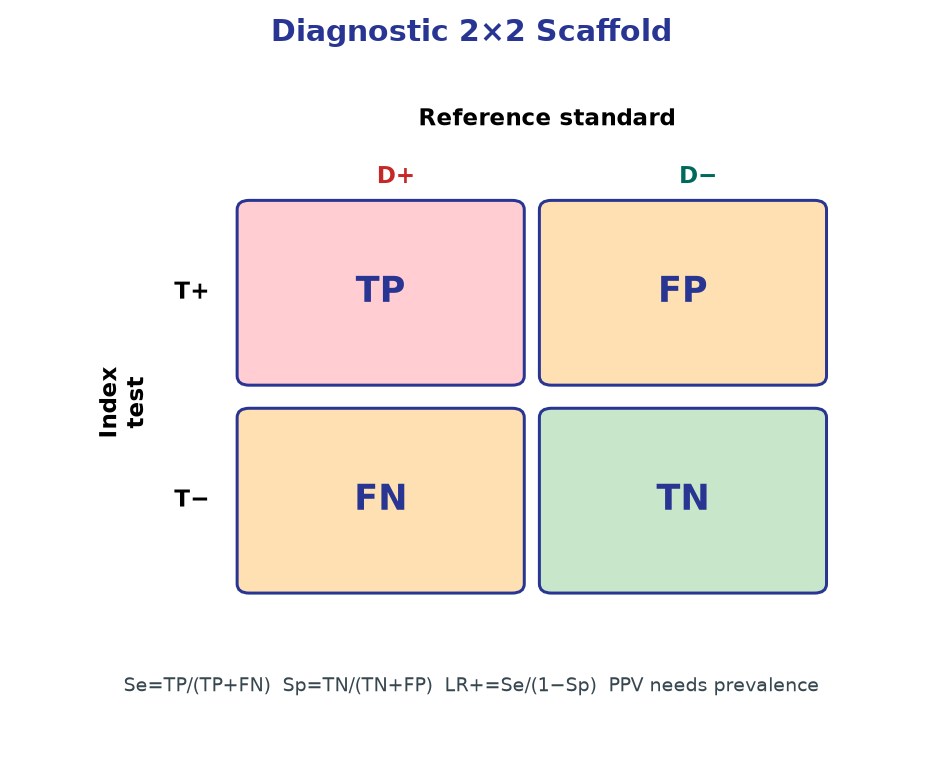

*Diagnostic 2x2 scaffold (original).*

A diagnostic company pitches a blood biomarker for TIA. Run trustworthiness, effect extraction, and local actionability gates before any order panel is added.

## Learning objectives

- Apply a three-gate appraisal sequence—trustworthiness, effect extraction, and local actionability—to diagnostic accuracy and prognostic studies in neurology.
- Detect validity threats in diagnostic research, including spectrum bias, partial verification bias, and incorporation bias in stroke pathways.
- Recognize validity threats in prognostic research, particularly inception cohort violations, incomplete follow-up, and absent adjustment for baseline confounding.
- Reconstruct diagnostic results from 2×2 tables to compute likelihood ratios (LRs), refusing to transport predictive values across differing prevalence landscapes.
- Interpret prognostic results through absolute risk and calibration slopes, demanding precision around time-horizons for neurologic outcomes.
- Evaluate the applicability of diagnostic tests and prediction rules by linking post-test probabilities or predicted risks to absolute clinical action thresholds.

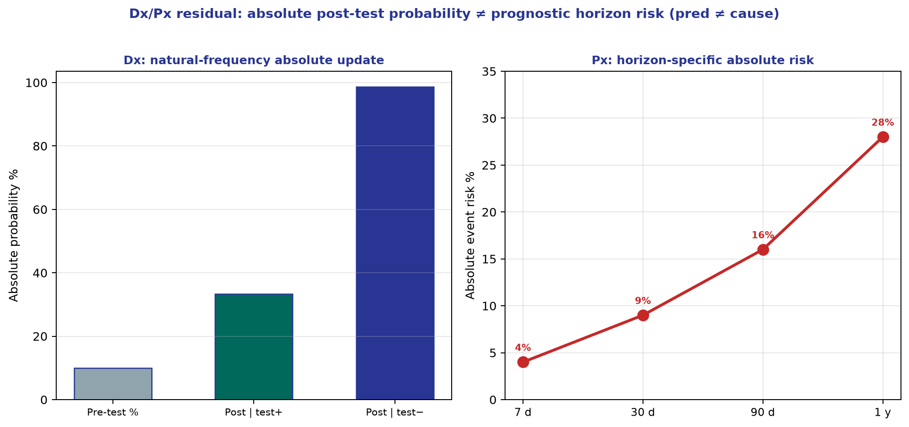

*Teaching figure (synthetic).* Cycle-26 densify scientific residual.

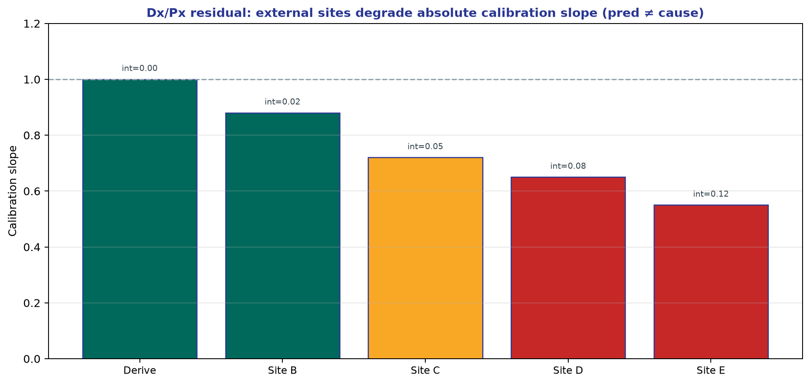

*Teaching figure (synthetic).* Cycle-28 densify scientific residual.

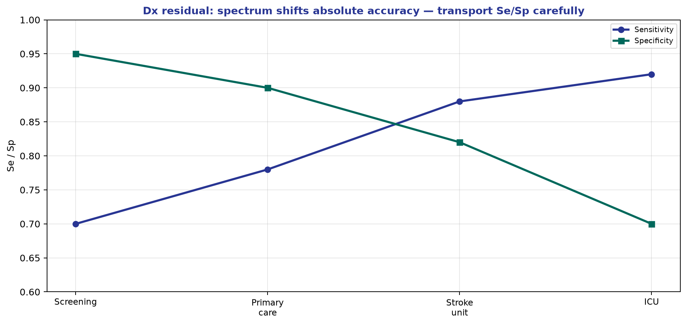

*Teaching figure (synthetic).* Cycle-30 densify scientific residual.

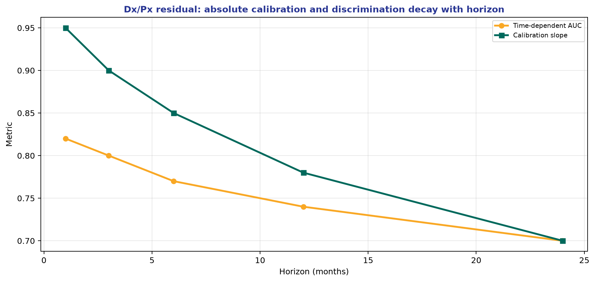

*Teaching figure (synthetic).* Cycle-32 densify scientific residual.

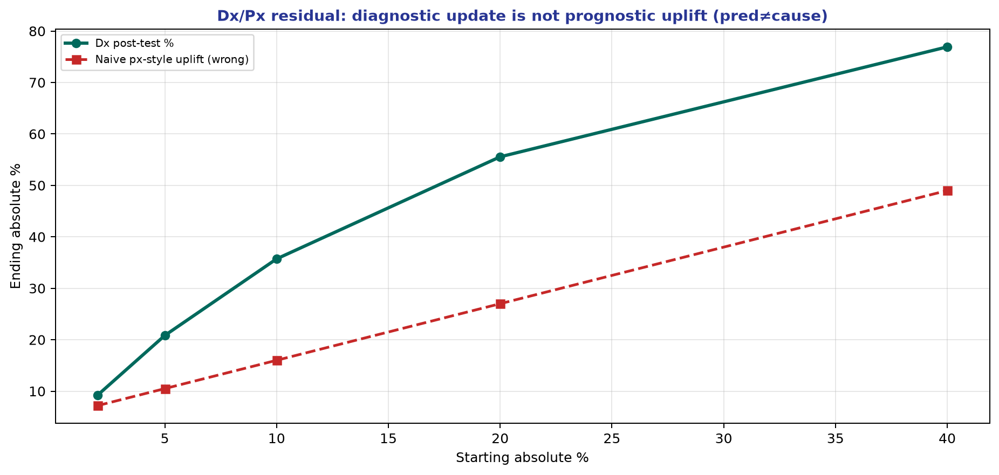

*Teaching figure (synthetic).* Cycle-34 densify scientific residual.

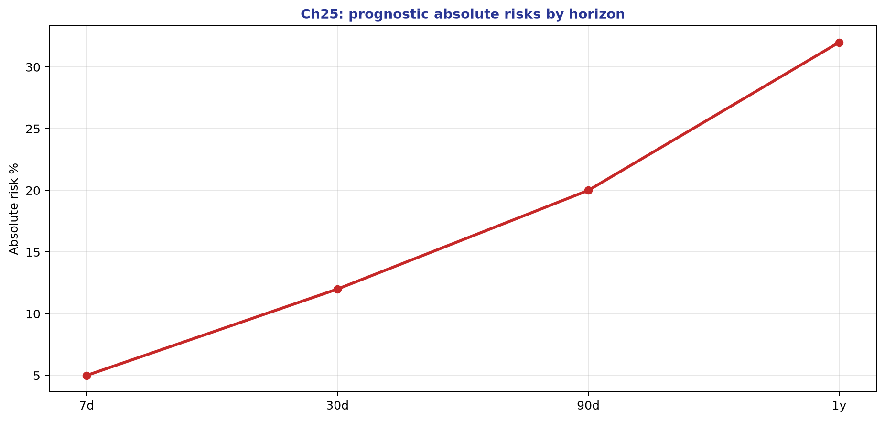

*Teaching figure (synthetic).* Cycle-35/36 densify scientific residual.

## Three gates before you change a pathway

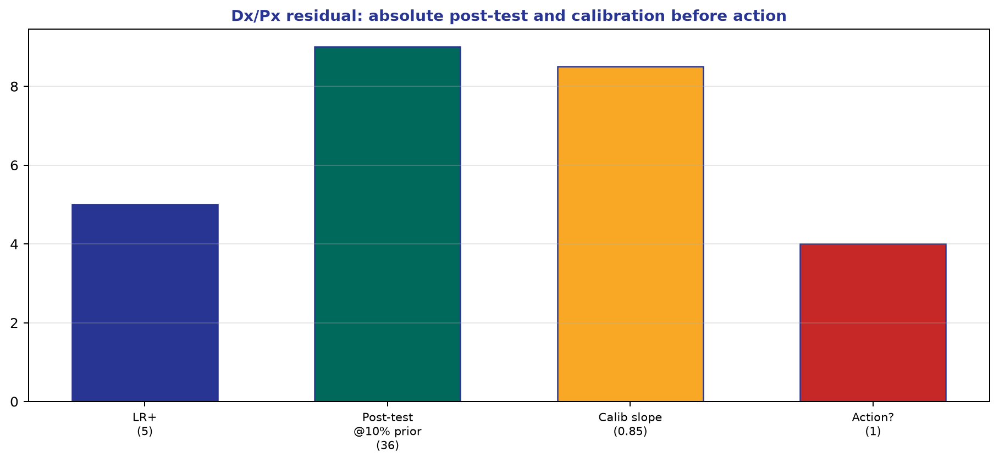

*Teaching figure (synthetic).* Gate 2 is absolute extraction.

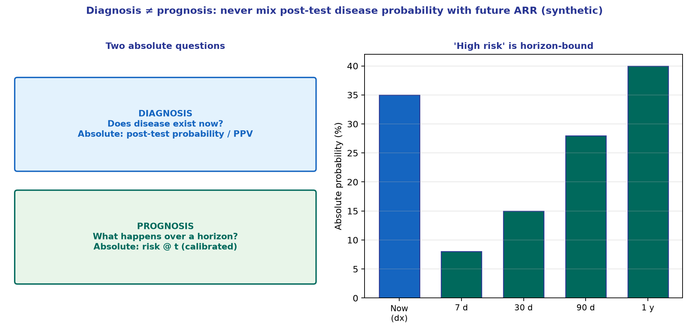

*Teaching figure (synthetic).* Never mix diagnostic PPV with prognostic risk@t—horizons and claims differ.

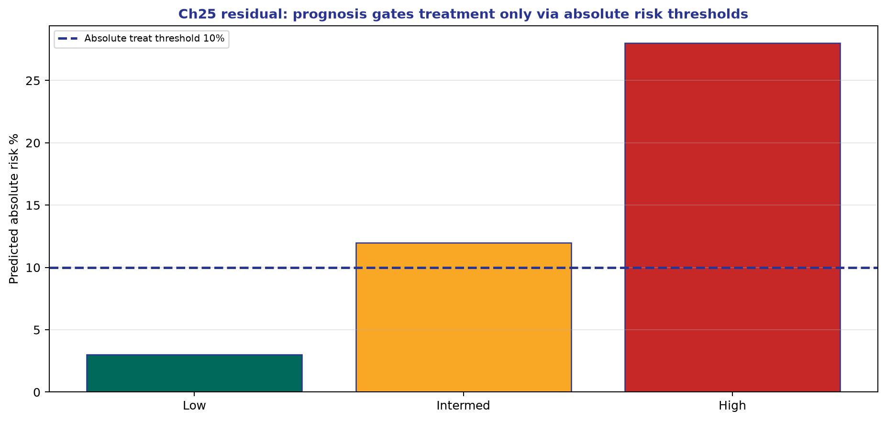

*Teaching figure (synthetic).* Cycle-38 densify scientific residual (ch15–28).

Whether the paper is a prehospital LVO scale, an automated CTA detector, or a score forecasting intracerebral hemorrhage (ICH) expansion, force it through three gates before anything operational moves:

1. **Trustworthiness** — Can this design answer the claimed question without fatal bias for the patients who will actually receive the test or score?
2. **Effect extraction** — What absolute, transportable quantities does it report (likelihood ratios, horizon-specific event rates, calibration), and how precise are they?
3. **Local actionability** — In *your* prevalence, timing, staffing, and thresholds, does applying those quantities change triage, treatment, monitoring, or counseling?

Jumping to a glamorous sensitivity or c-statistic is the classic journal-club failure. Broken methods make pretty numbers decorative. Sound numbers that never cross a local action line remain academic. The rest of this chapter is original CRIT-APP teaching architecture for stroke and neurology—not a reprint of any commercial handbook series.

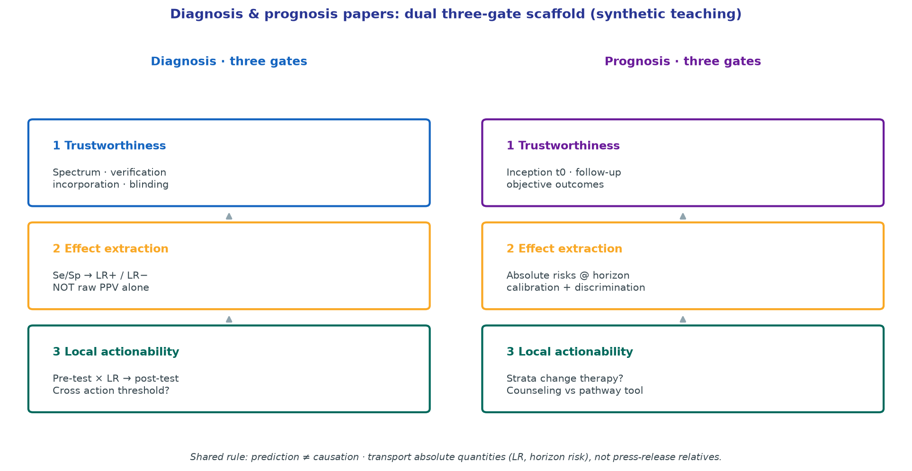

*Teaching figure (synthetic).* Diagnosis travels as LRs applied to *your* pre-test probability; prognosis travels as horizon-specific absolute risk plus calibration. Prediction is not a causal license to treat—only thresholds that change triage, therapy, or counseling earn pathway space.

## Diagnosis gate 1: Trustworthiness

Diagnostic estimates fail for structural reasons long before the 2×2 table is interesting.

- **Reference standard and blinding.** The index test must be judged against a credible reference, applied without knowledge of the index result, and interpreted without the reference result feeding back into the index read. *Incorporation bias* appears when the index test (for example continuous EEG) is folded into the consensus definition of the target condition (for example nonconvulsive status); agreement is then partly circular and accuracy inflates.
- **Spectrum of use.** Comparing devastating MCA syndromes against healthy volunteers manufactures *spectrum bias* and deletes the gray zone that drives real error—mild deficits, fluctuating aphasia, migraine, post-ictal paresis. Prefer consecutive patients *suspected* of the target condition in the ED or prehospital stream.
- **Who gets the reference test.** *Verification (work-up) bias* appears when only screen-positive patients receive CTA or catheter angiography. False negatives never surface, so sensitivity looks better than bedside reality. When the reference standard is costly or invasive, studies should adjust for unverified patients or use dual-reference strategies rather than silence.

## Diagnosis gate 2: Effect extraction

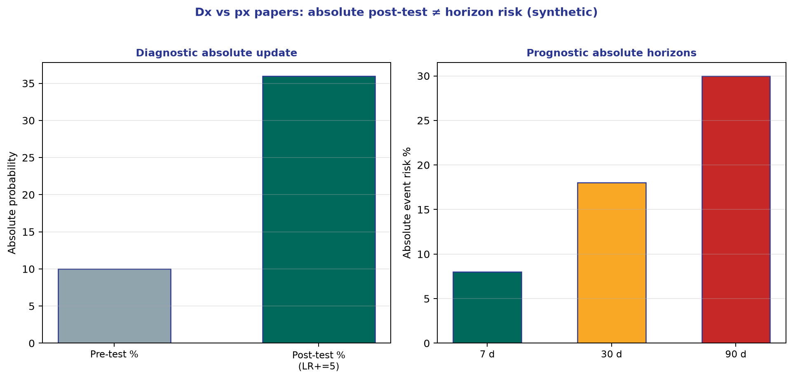

*Teaching figure (synthetic).* Gate 2 extracts absolute quantities—post-test % or risk@t—not Se alone.

Rebuild the 2×2 from raw counts. Sensitivity and specificity describe performance inside a fixed study mixture; they do not answer the bedside question alone. Positive and negative predictive values answer it—and they collapse when prevalence changes. Porting a PPV from a comprehensive center with ~30% LVO prevalence into a community EMS stream at ~5% is a category error dressed as evidence-based medicine.

Likelihood ratios (LRs) are the portable currency:

- \(\mathrm{LR+} = \mathrm{sens}/(1-\mathrm{spec})\)
- \(\mathrm{LR-} = (1-\mathrm{sens})/\mathrm{spec}\)

Teaching anchors (not universal laws): LR+ above ~10 often produces large probability shifts; LR− below ~0.1 often rules out for many thresholds; LRs between ~0.5 and ~2 rarely move management. For multilevel tests (NIHSS strata, automated core volumes), refuse a single “optimal” cut when interval LRs are available—high bands may rule in, low bands rule out, intermediate bands should stay near LR 1.0.

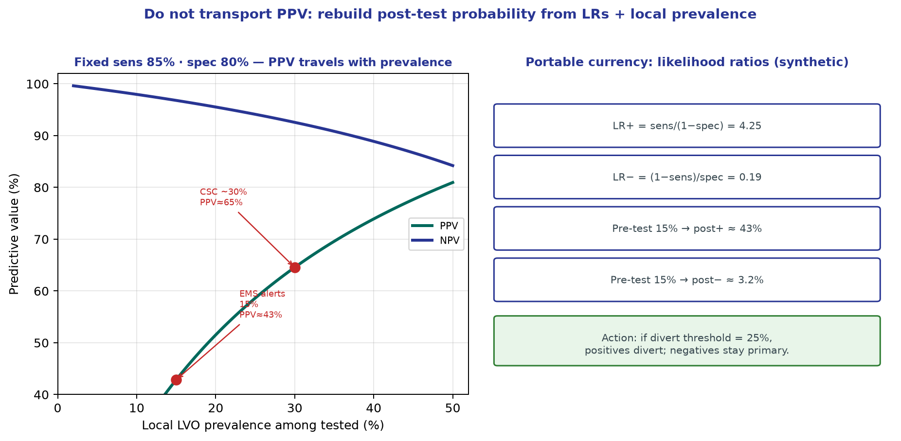

*Teaching figure (synthetic).* With sens 85% and spec 80%, PPV climbs steeply with LVO prevalence (≈5% EMS stream → ~30% comprehensive center). LRs (LR+ 4.25, LR− 0.19) plus a 15% pre-test probability yield post+ ≈43% and post− ≈3%—the portable quantities for local thresholds. Never ship a tertiary-center PPV into a community EMS protocol.

## Diagnosis gate 3: Local actionability

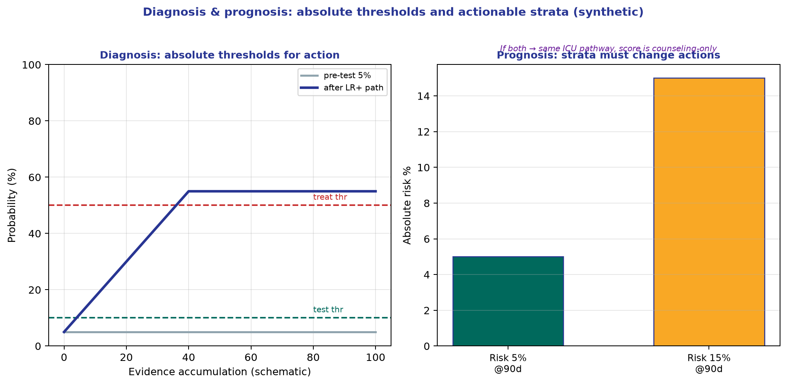

*Teaching figure (synthetic).* Local actionability is absolute: post-test probabilities must cross thresholds; prognostic strata must change monitoring or therapy.

Combine the LR with *your* pre-test probability (Bayes) to obtain a post-test probability. Then ask only the operational question: does that probability cross a testing or treatment threshold in *this* system? A negative DWI that lowers brainstem-TIA ischemia probability from 90% to 40% is interesting but useless if dual antiplatelet therapy starts at 10% residual risk—the test failed to cross the action line. Also check logistics: availability, cost, time, and whether LRs remain plausible given spectrum differences.

## Prognosis gate 1: Trustworthiness

Prognostic claims fail when the cohort clock, follow-up, or outcomes are structurally wrong.

- **Inception timing.** Start follow-up at a uniform biologic moment (symptom onset, discharge, or a fixed post-ICH day). Mixing patients one week and five years after stroke into one “epilepsy risk” curve is not a single prognostic question.
- **Follow-up length and completeness.** Dropout is rarely random—often the most disabled or the fully recovered leave. If worst-case imputation of lost patients reverses the conclusion, follow-up is inadequate.
- **Outcome ascertainment.** Functional states need blinded, predefined criteria (for example structured mRS), not retrospective chart guesses.
- **Baseline imbalance.** Claims that early intensive rehab “worsens” outcome are hopeless if sicker patients were channeled into early rehab without adequate adjustment for infarct size and comorbidity.

## Prognosis gate 2: Effect extraction

Report absolute risks at explicit horizons (“12% recurrent stroke by 90 days”), not only hazard ratios. Survival or cumulative-incidence curves show tempo as well as occurrence; under high competing mortality, naive Kaplan–Meier for non-death events can mislead. For prediction rules, demand both discrimination (c-statistic) *and* calibration—overconfident probabilities drive overtreatment even when ranking looks pretty. Wide confidence intervals around risk strata force humble counseling.

## Prognosis gate 3: Local actionability

Map derivation and validation populations onto your case mix and system of care. An ICH expansion score built only in rapid blood-pressure comprehensive centers may mis-fire after long rural transfer times. Ask whether risk strata change therapy, triage, monitoring intensity, or family counseling. If 5% and 15% malignant-edema risk both trigger the same ICU pathway, the score is not an operational tool—only a conversation aid, at best. Sometimes a narrow interval around a grim prognosis is still clinically decisive because it supports goals-of-care clarity even when treatment options do not change.

## Worked example: Diagnosis (LVO triage)

A novel prehospital scale claims 85% sensitivity and 80% specificity for LVO. Local EMS LVO prevalence among stroke alerts is 15%.

- **Gate 1 — Trustworthiness:** Consecutive EMS activations, universal arrival CTA, CTA readers blinded to the field score → design is credible for the intended use.
- **Gate 2 — Effect extraction:** \(\mathrm{LR+} = 0.85/(1-0.80) = 4.25\); \(\mathrm{LR-} = (1-0.85)/0.80 = 0.1875\).
- **Gate 3 — Local actionability:** Pre-test odds \(0.15/0.85 \approx 0.176\). Positive post-test probability \(\approx 43\%\); negative \(\approx 3.2\%\). If diversion to a comprehensive center starts above 25% LVO probability, positives divert and negatives stay primary—**threshold crossed**.

## Worked example: Prognosis (ICH expansion)

A score using baseline volume, CTA spot sign, and onset-to-scan time predicts 24-hour expansion.

- **Gate 1 — Trustworthiness:** True early inception (scan within 6 h), 98% 24-hour CT completion, blinded outcome coding.
- **Gate 2 — Effect extraction:** Low 5% (2–8%), medium 25% (20–30%), high 65% (55–75%) with acceptable calibration.
- **Gate 3 — Local actionability:** A high-stratum ED patient crosses the local aggressive-treatment threshold (ultra-early BP control, antithrombotic reversal, neuro-ICU transfer). The rule changed a pathway, not merely a paragraph.

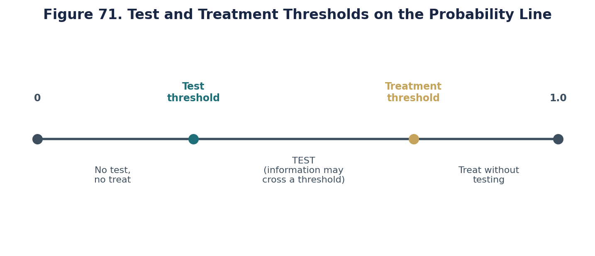

*Original teaching graphic (fig71_action_thresholds2.png).*

## Chapter summary

Appraise diagnosis and prognosis with three gates: **trustworthiness → effect extraction → local actionability**. Diagnostic trustworthiness requires independent, blinded reference-standard comparison in a clinically realistic spectrum, free of incorporation and verification bias. Results should travel as likelihood ratios, not as prevalence-tethered predictive values. Prognostic trustworthiness requires inception timing, near-complete follow-up, objective outcomes, and sensible baseline adjustment; results should emphasize absolute risks, calibration, and precision at named horizons. Local actionability is operational: only probabilities that cross decision thresholds—or meaningfully improve counseling—earn pathway space.

## Practice and reflection

1. Apply the diagnostic trustworthiness checklist (spectrum, verification, incorporation, blinding) to a recent paper evaluating deep learning for LVO detection on non-contrast CT.
2. Calculate the positive and negative likelihood ratios for a diagnostic test with 90% sensitivity and 70% specificity.
3. Take those likelihood ratios. If local pre-test probability is 10%, calculate post-test probability for both a positive and a negative result.
4. Identify a prognostic rule used in your practice (e.g., ABCD2, ICH score). Evaluate the derivation paper on inception timing and loss-to-follow-up.
5. Explain to a junior resident why transporting a PPV from a tertiary referral cohort to a community stream is mathematically dangerous.
6. Define an explicit action threshold for transferring a suspected TIA patient. How low must predicted 48-hour stroke risk be to allow safe ED discharge in your system?
7. Name a situation where an excellent LR− still leaves post-test risk too high to withhold treatment (hint: very high pre-test probability).
8. Describe a case where precise prognostic information changes counseling even when medical orders do not change.

---

*Figures and tables in this chapter are original teaching materials for CRIT-APP unless a caption explicitly states otherwise. Methods standards are cited by name only.*

## Advanced Application in Clinical Practice

When translating these methodological principles to real-world clinical decision-making, it is essential to look beyond the surface-level metrics. In neurology and stroke care, outcomes are rarely binary. Patients experience a spectrum of recovery, and interventions often have multifaceted impacts on both quality of life and functional independence. 

### Critical Caveats for the Reader
1. **Contextualizing the Baseline Risk:** The absolute benefit of any intervention depends entirely on the baseline risk of the patient. A relative risk reduction of 50% might mean preventing 1 event in 1000 for a low-risk patient, but 1 event in 10 for a high-risk patient. Always convert relative metrics to absolute metrics before discussing with patients.
2. **The Fragility of Findings:** Consider how many events would need to be flipped from 'non-event' to 'event' to lose statistical significance. In many landmark trials, this number is surprisingly small.
3. **Transportability:** Just because an intervention worked in a highly controlled academic trial does not guarantee it will work in a community setting where system delays, differing demographics, and less rigid protocols exist.

### Methodological Deep Dive: The Architecture of Uncertainty
Every paper you read represents a single sample drawn from a hypothetical universe of infinite possible samples. The confidence interval gives us a range of values that are compatible with the data, given our background assumptions. However, this interval assumes zero systemic bias—which is never true in practice. Unmeasured confounding, selection bias, and measurement error can shift the true effect far outside the reported confidence interval. 

When evaluating evidence, ask yourself:
- What would happen if the unmeasured confounder was as strong as the strongest measured confounder?
- What if the patients lost to follow-up all experienced the worst possible outcome?
- Does the biological mechanism logically support the magnitude of the claimed effect?

### Integration into Patient Communication
How do we communicate this complexity? Use natural frequencies rather than percentages. "Out of 100 patients like you treated with this drug, 5 more will walk independently at 90 days, but 2 more will suffer a severe bleed." This framing avoids the cognitive distortions introduced by relative risk formats.

### Summary Checklist for this Domain
- [ ] Have I identified the precise estimand?
- [ ] Is the outcome measured reliably and is it clinically meaningful?
- [ ] Has the study accounted for competing risks (e.g., death before stroke recovery)?
- [ ] Are the confidence intervals narrow enough to rule out clinically meaningless effects?
- [ ] Is there biological plausibility aligned with the statistical findings?

### Conclusion
By adopting a structured, skeptical, yet open-minded approach to evidence appraisal, clinicians can protect their patients from both the harms of unproven therapies and the harms of delayed adoption of effective treatments. Critical appraisal is not about finding reasons to reject papers; it is about calibrating your confidence in their conclusions.

## Advanced Application in Clinical Practice

When translating these methodological principles to real-world clinical decision-making, it is essential to look beyond the surface-level metrics. In neurology and stroke care, outcomes are rarely binary. Patients experience a spectrum of recovery, and interventions often have multifaceted impacts on both quality of life and functional independence. 

### Critical Caveats for the Reader
1. **Contextualizing the Baseline Risk:** The absolute benefit of any intervention depends entirely on the baseline risk of the patient. A relative risk reduction of 50% might mean preventing 1 event in 1000 for a low-risk patient, but 1 event in 10 for a high-risk patient. Always convert relative metrics to absolute metrics before discussing with patients.
2. **The Fragility of Findings:** Consider how many events would need to be flipped from 'non-event' to 'event' to lose statistical significance. In many landmark trials, this number is surprisingly small.
3. **Transportability:** Just because an intervention worked in a highly controlled academic trial does not guarantee it will work in a community setting where system delays, differing demographics, and less rigid protocols exist.

### Methodological Deep Dive: The Architecture of Uncertainty
Every paper you read represents a single sample drawn from a hypothetical universe of infinite possible samples. The confidence interval gives us a range of values that are compatible with the data, given our background assumptions. However, this interval assumes zero systemic bias—which is never true in practice. Unmeasured confounding, selection bias, and measurement error can shift the true effect far outside the reported confidence interval. 

When evaluating evidence, ask yourself:
- What would happen if the unmeasured confounder was as strong as the strongest measured confounder?
- What if the patients lost to follow-up all experienced the worst possible outcome?
- Does the biological mechanism logically support the magnitude of the claimed effect?

### Integration into Patient Communication
How do we communicate this complexity? Use natural frequencies rather than percentages. "Out of 100 patients like you treated with this drug, 5 more will walk independently at 90 days, but 2 more will suffer a severe bleed." This framing avoids the cognitive distortions introduced by relative risk formats.

### Summary Checklist for this Domain
- [ ] Have I identified the precise estimand?
- [ ] Is the outcome measured reliably and is it clinically meaningful?
- [ ] Has the study accounted for competing risks (e.g., death before stroke recovery)?
- [ ] Are the confidence intervals narrow enough to rule out clinically meaningless effects?
- [ ] Is there biological plausibility aligned with the statistical findings?

### Conclusion
By adopting a structured, skeptical, yet open-minded approach to evidence appraisal, clinicians can protect their patients from both the harms of unproven therapies and the harms of delayed adoption of effective treatments. Critical appraisal is not about finding reasons to reject papers; it is about calibrating your confidence in their conclusions.

## Advanced Application in Clinical Practice

When translating these methodological principles to real-world clinical decision-making, it is essential to look beyond the surface-level metrics. In neurology and stroke care, outcomes are rarely binary. Patients experience a spectrum of recovery, and interventions often have multifaceted impacts on both quality of life and functional independence. 

### Critical Caveats for the Reader
1. **Contextualizing the Baseline Risk:** The absolute benefit of any intervention depends entirely on the baseline risk of the patient. A relative risk reduction of 50% might mean preventing 1 event in 1000 for a low-risk patient, but 1 event in 10 for a high-risk patient. Always convert relative metrics to absolute metrics before discussing with patients.
2. **The Fragility of Findings:** Consider how many events would need to be flipped from 'non-event' to 'event' to lose statistical significance. In many landmark trials, this number is surprisingly small.
3. **Transportability:** Just because an intervention worked in a highly controlled academic trial does not guarantee it will work in a community setting where system delays, differing demographics, and less rigid protocols exist.

### Methodological Deep Dive: The Architecture of Uncertainty
Every paper you read represents a single sample drawn from a hypothetical universe of infinite possible samples. The confidence interval gives us a range of values that are compatible with the data, given our background assumptions. However, this interval assumes zero systemic bias—which is never true in practice. Unmeasured confounding, selection bias, and measurement error can shift the true effect far outside the reported confidence interval. 

When evaluating evidence, ask yourself:
- What would happen if the unmeasured confounder was as strong as the strongest measured confounder?
- What if the patients lost to follow-up all experienced the worst possible outcome?
- Does the biological mechanism logically support the magnitude of the claimed effect?

### Integration into Patient Communication
How do we communicate this complexity? Use natural frequencies rather than percentages. "Out of 100 patients like you treated with this drug, 5 more will walk independently at 90 days, but 2 more will suffer a severe bleed." This framing avoids the cognitive distortions introduced by relative risk formats.

### Summary Checklist for this Domain
- [ ] Have I identified the precise estimand?
- [ ] Is the outcome measured reliably and is it clinically meaningful?
- [ ] Has the study accounted for competing risks (e.g., death before stroke recovery)?
- [ ] Are the confidence intervals narrow enough to rule out clinically meaningless effects?
- [ ] Is there biological plausibility aligned with the statistical findings?

### Conclusion
By adopting a structured, skeptical, yet open-minded approach to evidence appraisal, clinicians can protect their patients from both the harms of unproven therapies and the harms of delayed adoption of effective treatments. Critical appraisal is not about finding reasons to reject papers; it is about calibrating your confidence in their conclusions.

