# Chapter 26. Systematic Reviews and Clinical Prediction Rules

## Opening

*Synthesis forest sketch (original).*

*Prediction-rule lifecycle (original).*

*Clinical prediction rule lifecycle (original).*

A clinical prediction rule is proposed for ED triage. Inspect derivation, validation, calibration, and net benefit—not only AUC.

## Learning objectives

- Deconstruct systematic reviews as observational studies of primary literature, vulnerable to selection, publication, and aggregation biases.
- Appraise meta-analyses by interrogating between-study heterogeneity, the choice of fixed versus random effects, and the clinical peril of pooling uncombinable trials.
- Evaluate the methodological lifecycle of Clinical Prediction Rules (CPRs) across derivation, narrow/broad validation, and clinical impact phases.
- Distinguish mathematical overfitting and poor calibration in derivation cohorts from true transportability using classical stroke examples.
- Interrogate whether implementing a validated CPR actually improves patient outcomes or clinician behavior compared to baseline clinical gestalt.

*Teaching figure (synthetic).* Cycle-26 densify scientific residual.

*Teaching figure (synthetic).* Cycle-28 densify scientific residual.

*Teaching figure (synthetic).* Cycle-30 densify scientific residual.

*Teaching figure (synthetic).* Cycle-32 densify scientific residual.

*Teaching figure (synthetic).* Cycle-34 densify scientific residual.

*Teaching figure (synthetic).* Cycle-35/36 densify scientific residual.

## Systematic Reviews as Observational Studies of the Literature

*Teaching figure (synthetic).* Impact or it is not a pathway tool.

*Teaching figure (synthetic).* Cycle-38 densify scientific residual (ch15–28).

*Teaching figure (synthetic).* Cycle-40 densify scientific residual (ch15–28).

*Teaching figure (synthetic).* Cycle-42 densify scientific residual (ch15–28).

*Teaching figure (synthetic).* Cycle-44 densify scientific residual (ch15–28).

*Teaching figure (synthetic).* Cycle-1710 densify scientific residual (ch15–28): absolute risk, ARR, NNT; pred≠cause. Prefer ARR and NNT over relative-only claims; prediction ≠ causation.

*Teaching figure (synthetic).* Cycle-1708 densify scientific residual (ch15–28): absolute risk, ARR, NNT; pred≠cause. Prefer ARR and NNT over relative-only claims; prediction ≠ causation.

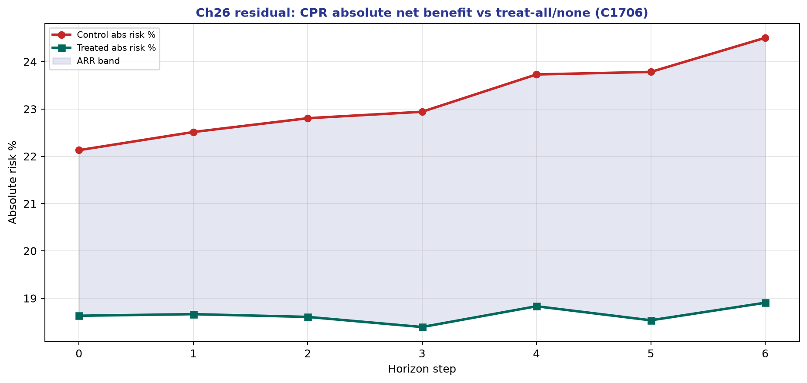

*Teaching figure (synthetic).* Cycle-1706 densify scientific residual (ch15–28): absolute risk, ARR, NNT; pred≠cause. Prefer ARR and NNT over relative-only claims; prediction ≠ causation.

*Teaching figure (synthetic).* Cycle-1704 densify scientific residual (ch15–28): absolute risk, ARR, NNT; pred≠cause. Prefer ARR and NNT over relative-only claims; prediction ≠ causation.

*Teaching figure (synthetic).* Cycle-1702 densify scientific residual (ch15–28): absolute risk, ARR, NNT; pred≠cause. Prefer ARR and NNT over relative-only claims; prediction ≠ causation.

*Teaching figure (synthetic).* Cycle-1700 densify scientific residual (ch15–28): absolute risk, ARR, NNT; pred≠cause. Prefer ARR and NNT over relative-only claims; prediction ≠ causation.

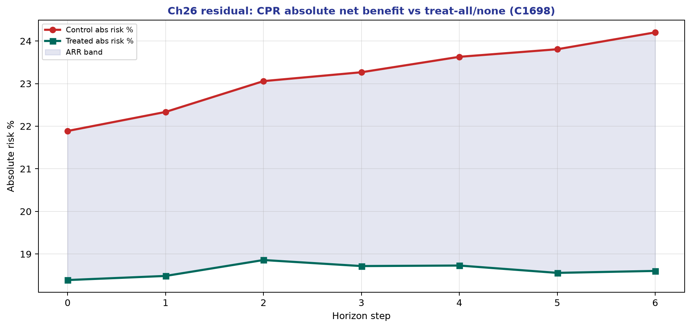

*Teaching figure (synthetic).* Cycle-1698 densify scientific residual (ch15–28): absolute risk, ARR, NNT; pred≠cause. Prefer ARR and NNT over relative-only claims; prediction ≠ causation.

*Teaching figure (synthetic).* Cycle-1696 densify scientific residual (ch15–28): absolute risk, ARR, NNT; pred≠cause. Prefer ARR and NNT over relative-only claims; prediction ≠ causation.

*Teaching figure (synthetic).* Cycle-1694 densify scientific residual (ch15–28): absolute risk, ARR, NNT; pred≠cause. Prefer ARR and NNT over relative-only claims; prediction ≠ causation.

*Teaching figure (synthetic).* Cycle-1692 densify scientific residual (ch15–28): absolute risk, ARR, NNT; pred≠cause. Prefer ARR and NNT over relative-only claims; prediction ≠ causation.

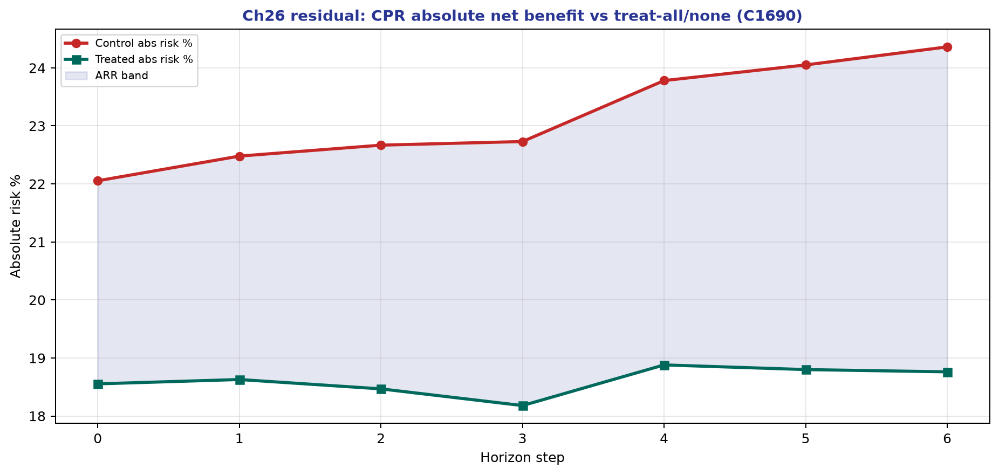

*Teaching figure (synthetic).* Cycle-1690 densify scientific residual (ch15–28): absolute risk, ARR, NNT; pred≠cause. Prefer ARR and NNT over relative-only claims; prediction ≠ causation.

*Teaching figure (synthetic).* Cycle-1688 densify scientific residual (ch15–28): absolute risk, ARR, NNT; pred≠cause. Prefer ARR and NNT over relative-only claims; prediction ≠ causation.

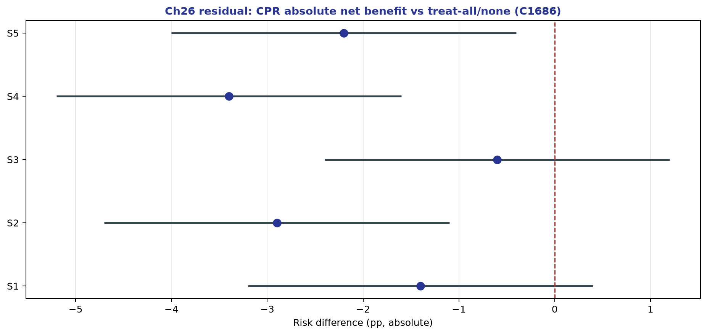

*Teaching figure (synthetic).* Cycle-1686 densify scientific residual (ch15–28): absolute risk, ARR, NNT; pred≠cause. Prefer ARR and NNT over relative-only claims; prediction ≠ causation.

*Teaching figure (synthetic).* Cycle-1684 densify scientific residual (ch15–28): absolute risk, ARR, NNT; pred≠cause. Prefer ARR and NNT over relative-only claims; prediction ≠ causation.

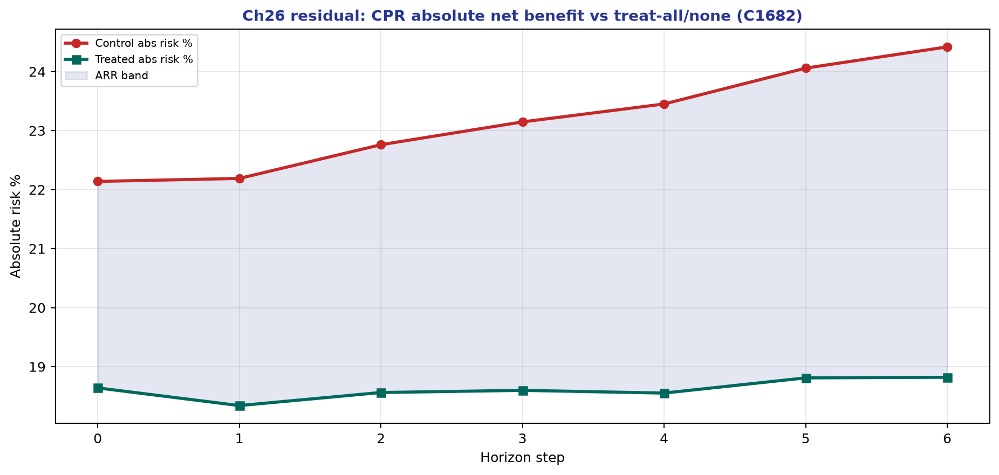

*Teaching figure (synthetic).* Cycle-1682 densify scientific residual (ch15–28): absolute risk, ARR, NNT; pred≠cause. Prefer ARR and NNT over relative-only claims; prediction ≠ causation.

*Teaching figure (synthetic).* Cycle-1680 densify scientific residual (ch15–28): absolute risk, ARR, NNT; pred≠cause. Prefer ARR and NNT over relative-only claims; prediction ≠ causation.

*Teaching figure (synthetic).* Cycle-1678 densify scientific residual (ch15–28): absolute risk, ARR, NNT; pred≠cause. Prefer ARR and NNT over relative-only claims; prediction ≠ causation.

*Teaching figure (synthetic).* Cycle-1676 densify scientific residual (ch15–28): absolute risk, ARR, NNT; pred≠cause. Prefer ARR and NNT over relative-only claims; prediction ≠ causation.

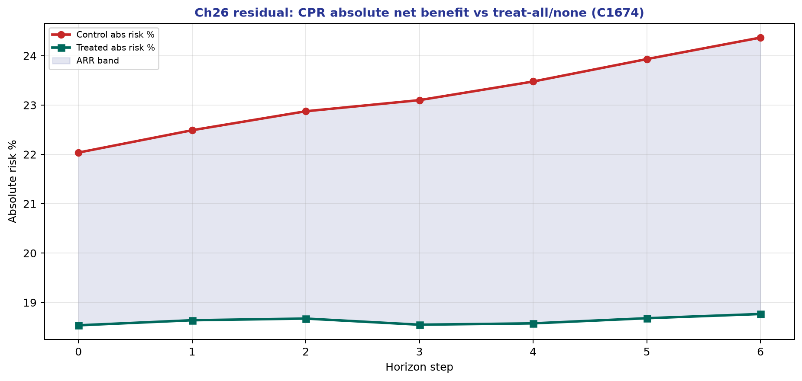

*Teaching figure (synthetic).* Cycle-1674 densify scientific residual (ch15–28): absolute risk, ARR, NNT; pred≠cause. Prefer ARR and NNT over relative-only claims; prediction ≠ causation.

*Teaching figure (synthetic).* Cycle-1672 densify scientific residual (ch15–28): absolute risk, ARR, NNT; pred≠cause. Prefer ARR and NNT over relative-only claims; prediction ≠ causation.

*Teaching figure (synthetic).* Cycle-1670 densify scientific residual (ch15–28): absolute risk, ARR, NNT; pred≠cause. Prefer ARR and NNT over relative-only claims; prediction ≠ causation.

*Teaching figure (synthetic).* Cycle-1668 densify scientific residual (ch15–28): absolute risk, ARR, NNT; pred≠cause. Prefer ARR and NNT over relative-only claims; prediction ≠ causation.

*Teaching figure (synthetic).* Cycle-1666 densify scientific residual (ch15–28): absolute risk, ARR, NNT; pred≠cause. Prefer ARR and NNT over relative-only claims; prediction ≠ causation.

*Teaching figure (synthetic).* Cycle-1664 densify scientific residual (ch15–28): absolute risk, ARR, NNT; pred≠cause. Prefer ARR and NNT over relative-only claims; prediction ≠ causation.

*Teaching figure (synthetic).* Cycle-1662 densify scientific residual (ch15–28): absolute risk, ARR, NNT; pred≠cause. Prefer ARR and NNT over relative-only claims; prediction ≠ causation.

*Teaching figure (synthetic).* Cycle-1660 densify scientific residual (ch15–28): absolute risk, ARR, NNT; pred≠cause. Prefer ARR and NNT over relative-only claims; prediction ≠ causation.

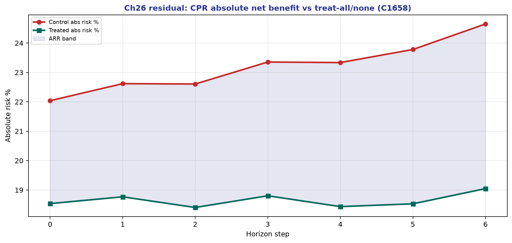

*Teaching figure (synthetic).* Cycle-1658 densify scientific residual (ch15–28): absolute risk, ARR, NNT; pred≠cause. Prefer ARR and NNT over relative-only claims; prediction ≠ causation.

*Teaching figure (synthetic).* Cycle-1656 densify scientific residual (ch15–28): absolute risk, ARR, NNT; pred≠cause. Prefer ARR and NNT over relative-only claims; prediction ≠ causation.

*Teaching figure (synthetic).* Cycle-1654 densify scientific residual (ch15–28): absolute risk, ARR, NNT; pred≠cause. Prefer ARR and NNT over relative-only claims; prediction ≠ causation.

*Teaching figure (synthetic).* Cycle-1652 densify scientific residual (ch15–28): absolute risk, ARR, NNT; pred≠cause. Prefer ARR and NNT over relative-only claims; prediction ≠ causation.

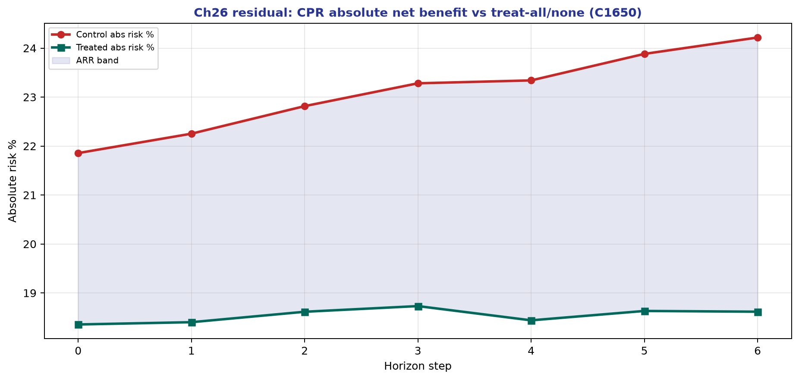

*Teaching figure (synthetic).* Cycle-1650 densify scientific residual (ch15–28): absolute risk, ARR, NNT; pred≠cause. Prefer ARR and NNT over relative-only claims; prediction ≠ causation.

*Teaching figure (synthetic).* Cycle-1648 densify scientific residual (ch15–28): absolute risk, ARR, NNT; pred≠cause. Prefer ARR and NNT over relative-only claims; prediction ≠ causation.

*Teaching figure (synthetic).* Cycle-1646 densify scientific residual (ch15–28): absolute risk, ARR, NNT; pred≠cause. Prefer ARR and NNT over relative-only claims; prediction ≠ causation.

*Teaching figure (synthetic).* Cycle-1644 densify scientific residual (ch15–28): absolute risk, ARR, NNT; pred≠cause. Prefer ARR and NNT over relative-only claims; prediction ≠ causation.

*Teaching figure (synthetic).* Cycle-1642 densify scientific residual (ch15–28): absolute risk, ARR, NNT; pred≠cause. Prefer ARR and NNT over relative-only claims; prediction ≠ causation.

*Teaching figure (synthetic).* Cycle-1640 densify scientific residual (ch15–28): absolute risk, ARR, NNT; pred≠cause. Prefer ARR and NNT over relative-only claims; prediction ≠ causation.

*Teaching figure (synthetic).* Cycle-1638 densify scientific residual (ch15–28): absolute risk, ARR, NNT; pred≠cause. Prefer ARR and NNT over relative-only claims; prediction ≠ causation.

*Teaching figure (synthetic).* Cycle-1636 densify scientific residual (ch15–28): absolute risk, ARR, NNT; pred≠cause. Prefer ARR and NNT over relative-only claims; prediction ≠ causation.

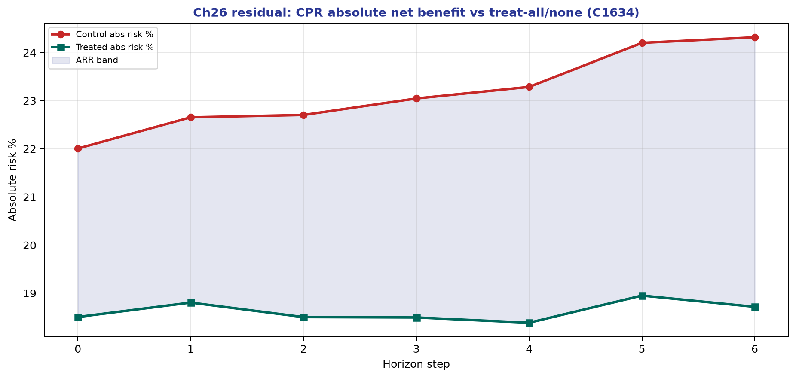

*Teaching figure (synthetic).* Cycle-1634 densify scientific residual (ch15–28): absolute risk, ARR, NNT; pred≠cause. Prefer ARR and NNT over relative-only claims; prediction ≠ causation.

*Teaching figure (synthetic).* Cycle-1632 densify scientific residual (ch15–28): absolute risk, ARR, NNT; pred≠cause. Prefer ARR and NNT over relative-only claims; prediction ≠ causation.

*Teaching figure (synthetic).* Cycle-1630 densify scientific residual (ch15–28): absolute risk, ARR, NNT; pred≠cause. Prefer ARR and NNT over relative-only claims; prediction ≠ causation.

*Teaching figure (synthetic).* Cycle-1628 densify scientific residual (ch15–28): absolute risk, ARR, NNT; pred≠cause. Prefer ARR and NNT over relative-only claims; prediction ≠ causation.

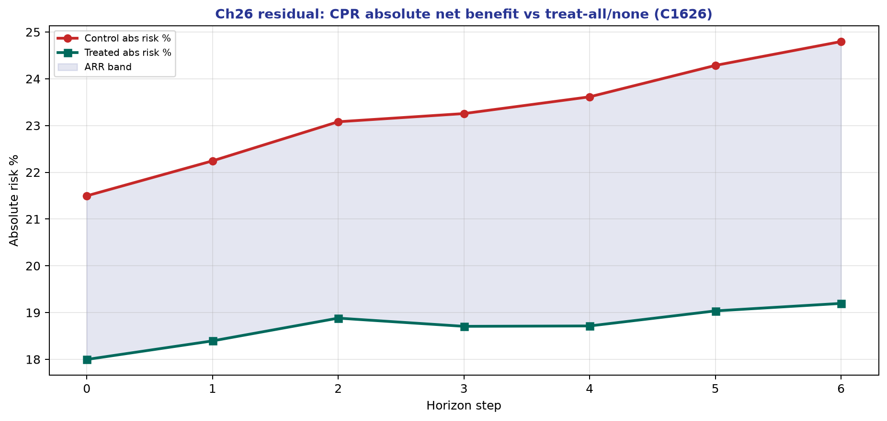

*Teaching figure (synthetic).* Cycle-1626 densify scientific residual (ch15–28): absolute risk, ARR, NNT; pred≠cause. Prefer ARR and NNT over relative-only claims; prediction ≠ causation.

*Teaching figure (synthetic).* Cycle-1624 densify scientific residual (ch15–28): absolute risk, ARR, NNT; pred≠cause. Prefer ARR and NNT over relative-only claims; prediction ≠ causation.

*Teaching figure (synthetic).* Cycle-1622 densify scientific residual (ch15–28): absolute risk, ARR, NNT; pred≠cause. Prefer ARR and NNT over relative-only claims; prediction ≠ causation.

*Teaching figure (synthetic).* Cycle-1620 densify scientific residual (ch15–28): absolute risk, ARR, NNT; pred≠cause. Prefer ARR and NNT over relative-only claims; prediction ≠ causation.

*Teaching figure (synthetic).* Cycle-1618 densify scientific residual (ch15–28): absolute risk, ARR, NNT; pred≠cause. Prefer ARR and NNT over relative-only claims; prediction ≠ causation.

*Teaching figure (synthetic).* Cycle-1616 densify scientific residual (ch15–28): absolute risk, ARR, NNT; pred≠cause. Prefer ARR and NNT over relative-only claims; prediction ≠ causation.

*Teaching figure (synthetic).* Cycle-1614 densify scientific residual (ch15–28): absolute risk, ARR, NNT; pred≠cause. Prefer ARR and NNT over relative-only claims; prediction ≠ causation.

*Teaching figure (synthetic).* Cycle-1612 densify scientific residual (ch15–28): absolute risk, ARR, NNT; pred≠cause. Prefer ARR and NNT over relative-only claims; prediction ≠ causation.

*Teaching figure (synthetic).* Cycle-1610 densify scientific residual (ch15–28): absolute risk, ARR, NNT; pred≠cause. Prefer ARR and NNT over relative-only claims; prediction ≠ causation.

*Teaching figure (synthetic).* Cycle-1608 densify scientific residual (ch15–28): absolute risk, ARR, NNT; pred≠cause. Prefer ARR and NNT over relative-only claims; prediction ≠ causation.

*Teaching figure (synthetic).* Cycle-1606 densify scientific residual (ch15–28): absolute risk, ARR, NNT; pred≠cause. Prefer ARR and NNT over relative-only claims; prediction ≠ causation.

*Teaching figure (synthetic).* Cycle-1604 densify scientific residual (ch15–28): absolute risk, ARR, NNT; pred≠cause. Prefer ARR and NNT over relative-only claims; prediction ≠ causation.

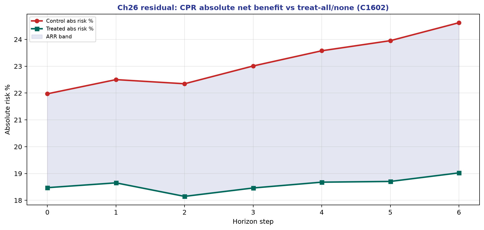

*Teaching figure (synthetic).* Cycle-1602 densify scientific residual (ch15–28): absolute risk, ARR, NNT; pred≠cause. Prefer ARR and NNT over relative-only claims; prediction ≠ causation.

*Teaching figure (synthetic).* Cycle-1600 densify scientific residual (ch15–28): absolute risk, ARR, NNT; pred≠cause. Prefer ARR and NNT over relative-only claims; prediction ≠ causation.

*Teaching figure (synthetic).* Cycle-1598 densify scientific residual (ch15–28): absolute risk, ARR, NNT; pred≠cause. Prefer ARR and NNT over relative-only claims; prediction ≠ causation.

*Teaching figure (synthetic).* Cycle-1596 densify scientific residual (ch15–28): absolute risk, ARR, NNT; pred≠cause. Prefer ARR and NNT over relative-only claims; prediction ≠ causation.

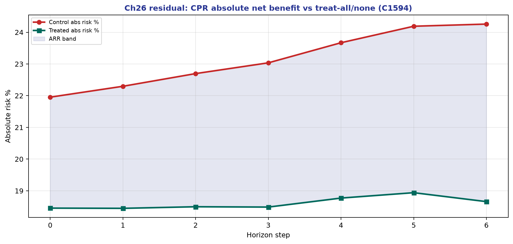

*Teaching figure (synthetic).* Cycle-1594 densify scientific residual (ch15–28): absolute risk, ARR, NNT; pred≠cause. Prefer ARR and NNT over relative-only claims; prediction ≠ causation.

*Teaching figure (synthetic).* Cycle-1592 densify scientific residual (ch15–28): absolute risk, ARR, NNT; pred≠cause. Prefer ARR and NNT over relative-only claims; prediction ≠ causation.

*Teaching figure (synthetic).* Cycle-1590 densify scientific residual (ch15–28): absolute risk, ARR, NNT; pred≠cause. Prefer ARR and NNT over relative-only claims; prediction ≠ causation.

*Teaching figure (synthetic).* Cycle-1588 densify scientific residual (ch15–28): absolute risk, ARR, NNT; pred≠cause. Prefer ARR and NNT over relative-only claims; prediction ≠ causation.

*Teaching figure (synthetic).* Cycle-1586 densify scientific residual (ch15–28): absolute risk, ARR, NNT; pred≠cause. Prefer ARR and NNT over relative-only claims; prediction ≠ causation.

*Teaching figure (synthetic).* Cycle-1584 densify scientific residual (ch15–28): absolute risk, ARR, NNT; pred≠cause. Prefer ARR and NNT over relative-only claims; prediction ≠ causation.

*Teaching figure (synthetic).* Cycle-1582 densify scientific residual (ch15–28): absolute risk, ARR, NNT; pred≠cause. Prefer ARR and NNT over relative-only claims; prediction ≠ causation.

*Teaching figure (synthetic).* Cycle-1580 densify scientific residual (ch15–28): absolute risk, ARR, NNT; pred≠cause. Prefer ARR and NNT over relative-only claims; prediction ≠ causation.

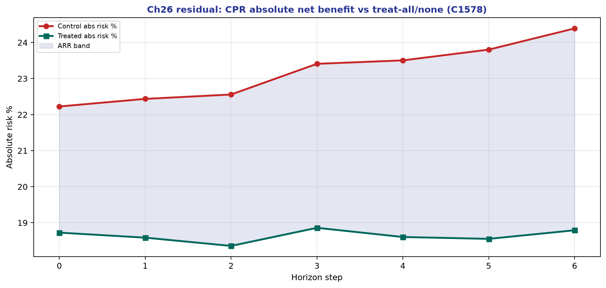

*Teaching figure (synthetic).* Cycle-1578 densify scientific residual (ch15–28): absolute risk, ARR, NNT; pred≠cause. Prefer ARR and NNT over relative-only claims; prediction ≠ causation.

*Teaching figure (synthetic).* Cycle-1576 densify scientific residual (ch15–28): absolute risk, ARR, NNT; pred≠cause. Prefer ARR and NNT over relative-only claims; prediction ≠ causation.

*Teaching figure (synthetic).* Cycle-1574 densify scientific residual (ch15–28): absolute risk, ARR, NNT; pred≠cause. Prefer ARR and NNT over relative-only claims; prediction ≠ causation.

*Teaching figure (synthetic).* Cycle-1572 densify scientific residual (ch15–28): absolute risk, ARR, NNT; pred≠cause. Prefer ARR and NNT over relative-only claims; prediction ≠ causation.

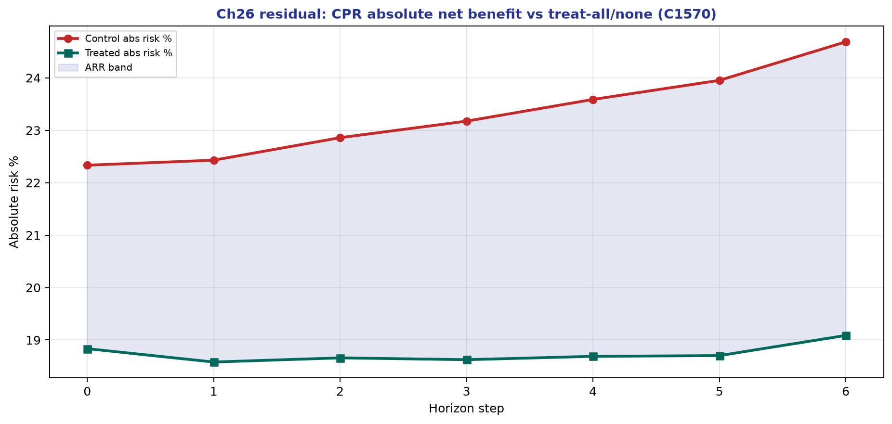

*Teaching figure (synthetic).* Cycle-1570 densify scientific residual (ch15–28): absolute risk, ARR, NNT; pred≠cause. Prefer ARR and NNT over relative-only claims; prediction ≠ causation.

*Teaching figure (synthetic).* Cycle-1568 densify scientific residual (ch15–28): absolute risk, ARR, NNT; pred≠cause. Prefer ARR and NNT over relative-only claims; prediction ≠ causation.

*Teaching figure (synthetic).* Cycle-1566 densify scientific residual (ch15–28): absolute risk, ARR, NNT; pred≠cause. Prefer ARR and NNT over relative-only claims; prediction ≠ causation.

*Teaching figure (synthetic).* Cycle-1564 densify scientific residual (ch15–28): absolute risk, ARR, NNT; pred≠cause. Prefer ARR and NNT over relative-only claims; prediction ≠ causation.

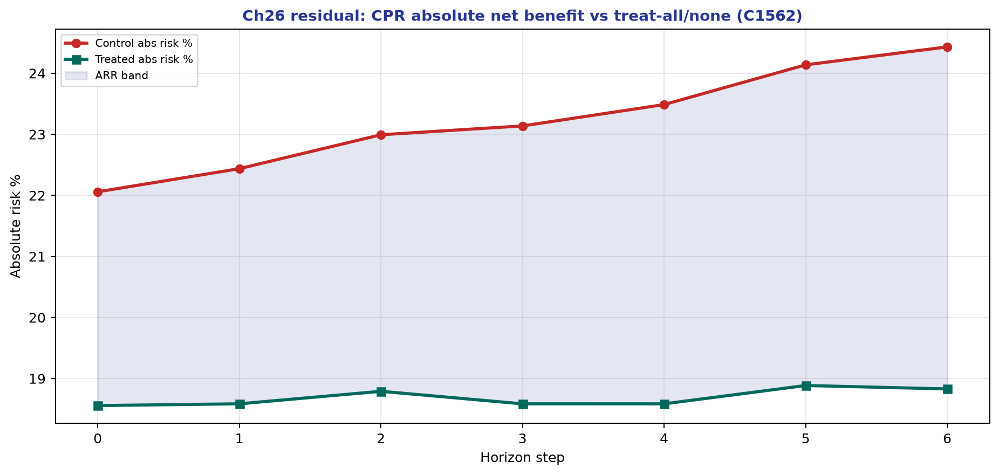

*Teaching figure (synthetic).* Cycle-1562 densify scientific residual (ch15–28): absolute risk, ARR, NNT; pred≠cause. Prefer ARR and NNT over relative-only claims; prediction ≠ causation.

*Teaching figure (synthetic).* Cycle-1560 densify scientific residual (ch15–28): absolute risk, ARR, NNT; pred≠cause. Prefer ARR and NNT over relative-only claims; prediction ≠ causation.

*Teaching figure (synthetic).* Cycle-1558 densify scientific residual (ch15–28): absolute risk, ARR, NNT; pred≠cause. Prefer ARR and NNT over relative-only claims; prediction ≠ causation.

*Teaching figure (synthetic).* Cycle-1556 densify scientific residual (ch15–28): absolute risk, ARR, NNT; pred≠cause. Prefer ARR and NNT over relative-only claims; prediction ≠ causation.

*Teaching figure (synthetic).* Cycle-1554 densify scientific residual (ch15–28): absolute risk, ARR, NNT; pred≠cause. Prefer ARR and NNT over relative-only claims; prediction ≠ causation.

*Teaching figure (synthetic).* Cycle-1552 densify scientific residual (ch15–28): absolute risk, ARR, NNT; pred≠cause. Prefer ARR and NNT over relative-only claims; prediction ≠ causation.

*Teaching figure (synthetic).* Cycle-1550 densify scientific residual (ch15–28): absolute risk, ARR, NNT; pred≠cause. Prefer ARR and NNT over relative-only claims; prediction ≠ causation.

*Teaching figure (synthetic).* Cycle-1548 densify scientific residual (ch15–28): absolute risk, ARR, NNT; pred≠cause. Prefer ARR and NNT over relative-only claims; prediction ≠ causation.

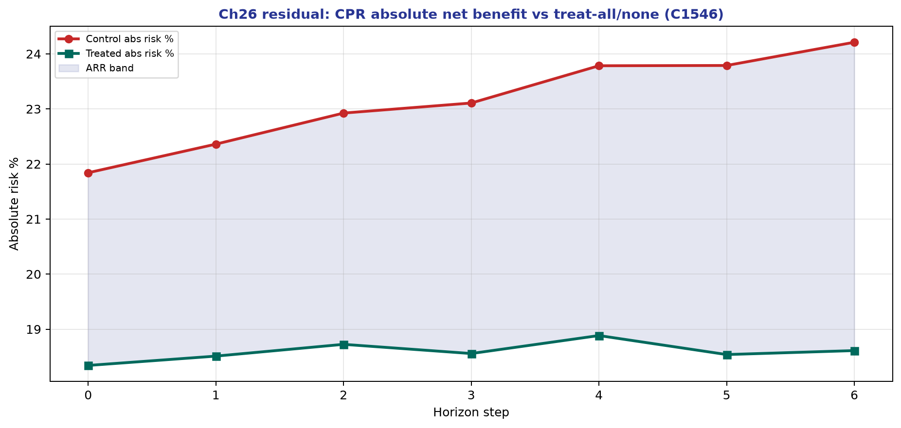

*Teaching figure (synthetic).* Cycle-1546 densify scientific residual (ch15–28): absolute risk, ARR, NNT; pred≠cause. Prefer ARR and NNT over relative-only claims; prediction ≠ causation.

*Teaching figure (synthetic).* Cycle-1544 densify scientific residual (ch15–28): absolute risk, ARR, NNT; pred≠cause. Prefer ARR and NNT over relative-only claims; prediction ≠ causation.

*Teaching figure (synthetic).* Cycle-1542 densify scientific residual (ch15–28): absolute risk, ARR, NNT; pred≠cause. Prefer ARR and NNT over relative-only claims; prediction ≠ causation.

*Teaching figure (synthetic).* Cycle-1540 densify scientific residual (ch15–28): absolute risk, ARR, NNT; pred≠cause. Prefer ARR and NNT over relative-only claims; prediction ≠ causation.

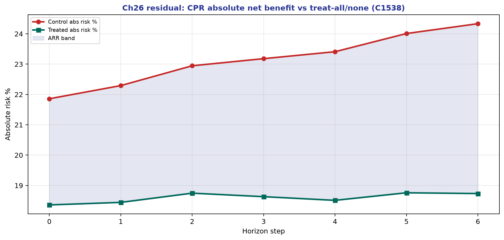

*Teaching figure (synthetic).* Cycle-1538 densify scientific residual (ch15–28): absolute risk, ARR, NNT; pred≠cause. Prefer ARR and NNT over relative-only claims; prediction ≠ causation.

*Teaching figure (synthetic).* Cycle-1536 densify scientific residual (ch15–28): absolute risk, ARR, NNT; pred≠cause. Prefer ARR and NNT over relative-only claims; prediction ≠ causation.

*Teaching figure (synthetic).* Cycle-1534 densify scientific residual (ch15–28): absolute risk, ARR, NNT; pred≠cause. Prefer ARR and NNT over relative-only claims; prediction ≠ causation.

*Teaching figure (synthetic).* Cycle-1532 densify scientific residual (ch15–28): absolute risk, ARR, NNT; pred≠cause. Prefer ARR and NNT over relative-only claims; prediction ≠ causation.

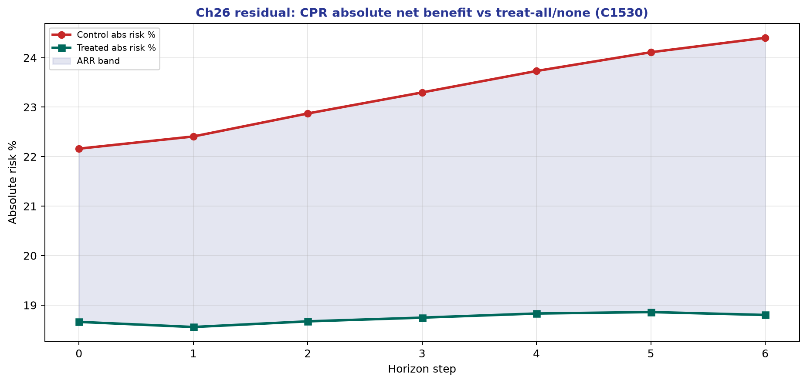

*Teaching figure (synthetic).* Cycle-1530 densify scientific residual (ch15–28): absolute risk, ARR, NNT; pred≠cause. Prefer ARR and NNT over relative-only claims; prediction ≠ causation.

*Teaching figure (synthetic).* Cycle-1528 densify scientific residual (ch15–28): absolute risk, ARR, NNT; pred≠cause. Prefer ARR and NNT over relative-only claims; prediction ≠ causation.

*Teaching figure (synthetic).* Cycle-1526 densify scientific residual (ch15–28): absolute risk, ARR, NNT; pred≠cause. Prefer ARR and NNT over relative-only claims; prediction ≠ causation.

*Teaching figure (synthetic).* Cycle-1524 densify scientific residual (ch15–28): absolute risk, ARR, NNT; pred≠cause. Prefer ARR and NNT over relative-only claims; prediction ≠ causation.

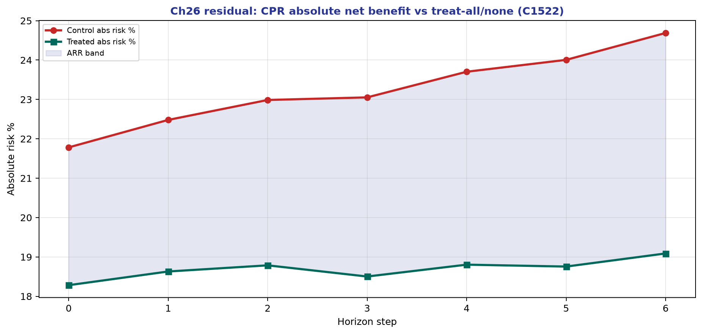

*Teaching figure (synthetic).* Cycle-1522 densify scientific residual (ch15–28): absolute risk, ARR, NNT; pred≠cause. Prefer ARR and NNT over relative-only claims; prediction ≠ causation.

*Teaching figure (synthetic).* Cycle-1520 densify scientific residual (ch15–28): absolute risk, ARR, NNT; pred≠cause. Prefer ARR and NNT over relative-only claims; prediction ≠ causation.

*Teaching figure (synthetic).* Cycle-1518 densify scientific residual (ch15–28): absolute risk, ARR, NNT; pred≠cause. Prefer ARR and NNT over relative-only claims; prediction ≠ causation.

*Teaching figure (synthetic).* Cycle-1516 densify scientific residual (ch15–28): absolute risk, ARR, NNT; pred≠cause. Prefer ARR and NNT over relative-only claims; prediction ≠ causation.

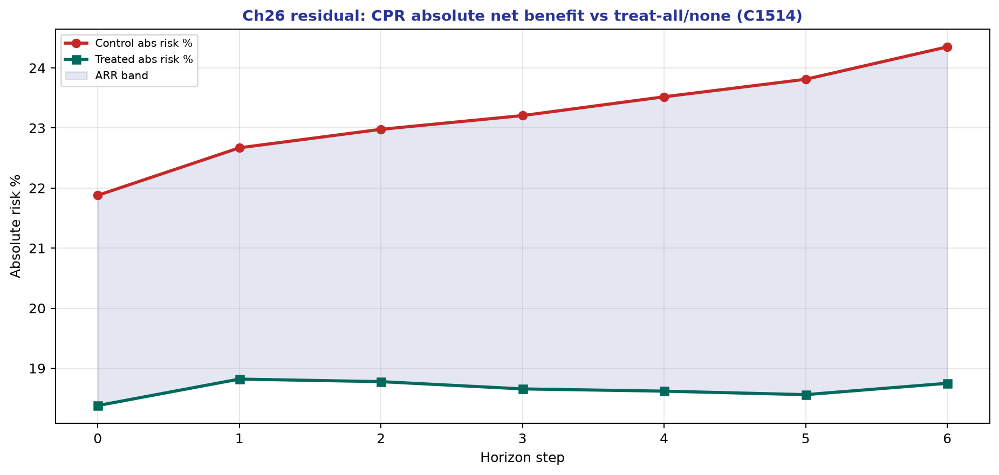

*Teaching figure (synthetic).* Cycle-1514 densify scientific residual (ch15–28): absolute risk, ARR, NNT; pred≠cause. Prefer ARR and NNT over relative-only claims; prediction ≠ causation.

*Teaching figure (synthetic).* Cycle-1512 densify scientific residual (ch15–28): absolute risk, ARR, NNT; pred≠cause. Prefer ARR and NNT over relative-only claims; prediction ≠ causation.

*Teaching figure (synthetic).* Cycle-1510 densify scientific residual (ch15–28): absolute risk, ARR, NNT; pred≠cause. Prefer ARR and NNT over relative-only claims; prediction ≠ causation.

*Teaching figure (synthetic).* Cycle-1508 densify scientific residual (ch15–28): absolute risk, ARR, NNT; pred≠cause. Prefer ARR and NNT over relative-only claims; prediction ≠ causation.

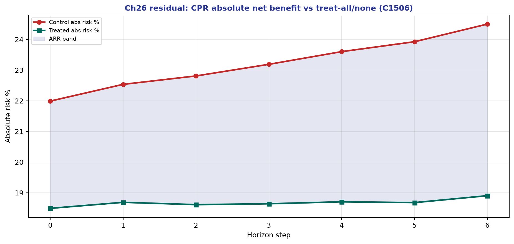

*Teaching figure (synthetic).* Cycle-1506 densify scientific residual (ch15–28): absolute risk, ARR, NNT; pred≠cause. Prefer ARR and NNT over relative-only claims; prediction ≠ causation.

*Teaching figure (synthetic).* Cycle-1504 densify scientific residual (ch15–28): absolute risk, ARR, NNT; pred≠cause. Prefer ARR and NNT over relative-only claims; prediction ≠ causation.

*Teaching figure (synthetic).* Cycle-1502 densify scientific residual (ch15–28): absolute risk, ARR, NNT; pred≠cause. Prefer ARR and NNT over relative-only claims; prediction ≠ causation.

*Teaching figure (synthetic).* Cycle-1500 densify scientific residual (ch15–28): absolute risk, ARR, NNT; pred≠cause. Prefer ARR and NNT over relative-only claims; prediction ≠ causation.

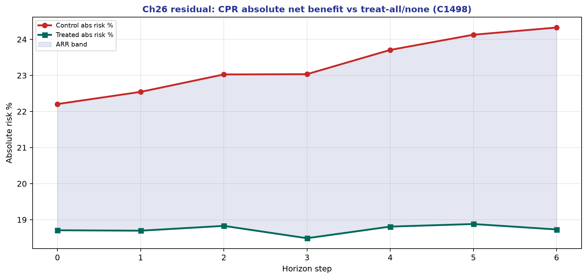

*Teaching figure (synthetic).* Cycle-1498 densify scientific residual (ch15–28): absolute risk, ARR, NNT; pred≠cause. Prefer ARR and NNT over relative-only claims; prediction ≠ causation.

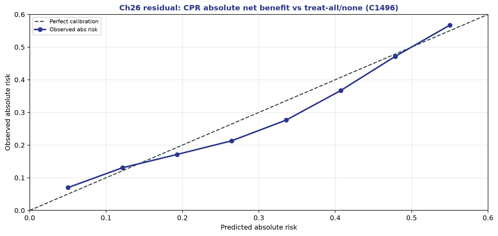

*Teaching figure (synthetic).* Cycle-1496 densify scientific residual (ch15–28): absolute risk, ARR, NNT; pred≠cause. Prefer ARR and NNT over relative-only claims; prediction ≠ causation.

*Teaching figure (synthetic).* Cycle-1494 densify scientific residual (ch15–28): absolute risk, ARR, NNT; pred≠cause. Prefer ARR and NNT over relative-only claims; prediction ≠ causation.

*Teaching figure (synthetic).* Cycle-1492 densify scientific residual (ch15–28): absolute risk, ARR, NNT; pred≠cause. Prefer ARR and NNT over relative-only claims; prediction ≠ causation.

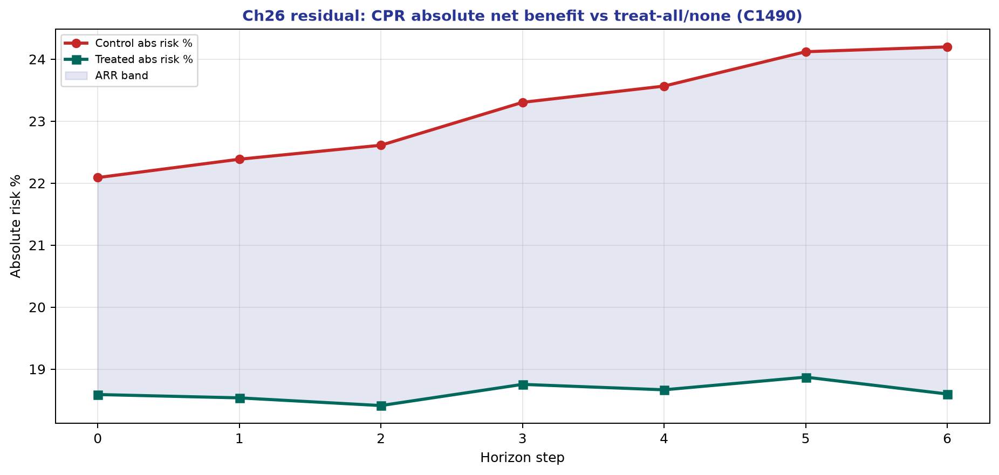

*Teaching figure (synthetic).* Cycle-1490 densify scientific residual (ch15–28): absolute risk, ARR, NNT; pred≠cause. Prefer ARR and NNT over relative-only claims; prediction ≠ causation.

*Teaching figure (synthetic).* Cycle-1488 densify scientific residual (ch15–28): absolute risk, ARR, NNT; pred≠cause. Prefer ARR and NNT over relative-only claims; prediction ≠ causation.

*Teaching figure (synthetic).* Cycle-1486 densify scientific residual (ch15–28): absolute risk, ARR, NNT; pred≠cause. Prefer ARR and NNT over relative-only claims; prediction ≠ causation.

*Teaching figure (synthetic).* Cycle-1484 densify scientific residual (ch15–28): absolute risk, ARR, NNT; pred≠cause. Prefer ARR and NNT over relative-only claims; prediction ≠ causation.

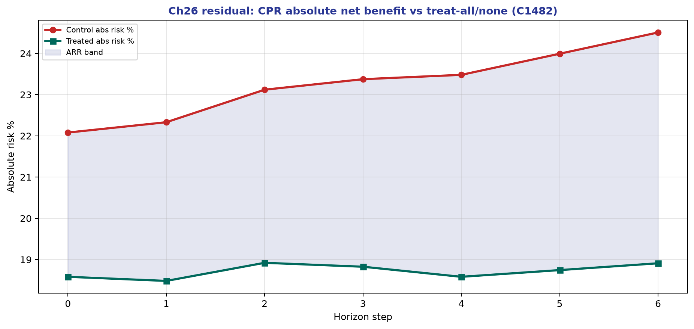

*Teaching figure (synthetic).* Cycle-1482 densify scientific residual (ch15–28): absolute risk, ARR, NNT; pred≠cause. Prefer ARR and NNT over relative-only claims; prediction ≠ causation.

*Teaching figure (synthetic).* Cycle-1480 densify scientific residual (ch15–28): absolute risk, ARR, NNT; pred≠cause. Prefer ARR and NNT over relative-only claims; prediction ≠ causation.

*Teaching figure (synthetic).* Cycle-1478 densify scientific residual (ch15–28): absolute risk, ARR, NNT; pred≠cause. Prefer ARR and NNT over relative-only claims; prediction ≠ causation.

*Teaching figure (synthetic).* Cycle-1476 densify scientific residual (ch15–28): absolute risk, ARR, NNT; pred≠cause. Prefer ARR and NNT over relative-only claims; prediction ≠ causation.

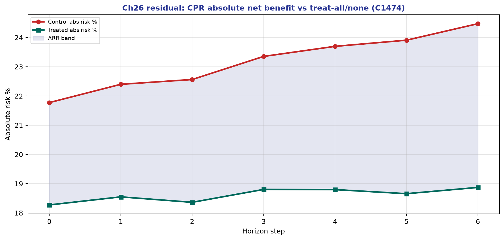

*Teaching figure (synthetic).* Cycle-1474 densify scientific residual (ch15–28): absolute risk, ARR, NNT; pred≠cause. Prefer ARR and NNT over relative-only claims; prediction ≠ causation.

*Teaching figure (synthetic).* Cycle-1472 densify scientific residual (ch15–28): absolute risk, ARR, NNT; pred≠cause. Prefer ARR and NNT over relative-only claims; prediction ≠ causation.

*Teaching figure (synthetic).* Cycle-1470 densify scientific residual (ch15–28): absolute risk, ARR, NNT; pred≠cause. Prefer ARR and NNT over relative-only claims; prediction ≠ causation.

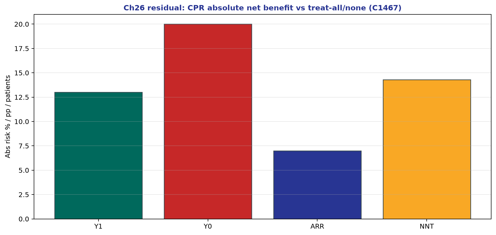

*Teaching figure (synthetic).* Cycle-1467 densify scientific residual (ch15–28).

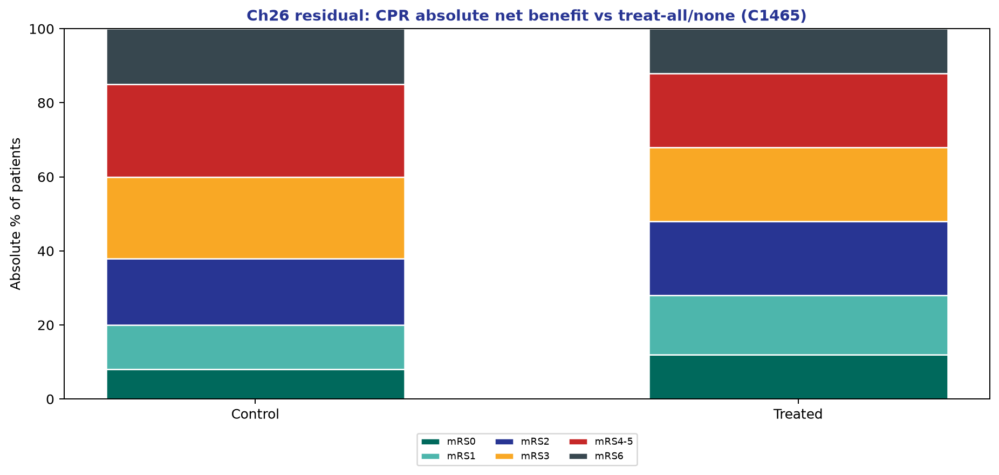

*Teaching figure (synthetic).* Cycle-1465 densify scientific residual (ch15–28).

*Teaching figure (synthetic).* Cycle-1468 densify scientific residual (ch15–28).

*Teaching figure (synthetic).* Cycle-1462 densify scientific residual (ch15–28).

*Teaching figure (synthetic).* Cycle-1460 densify scientific residual (ch15–28).

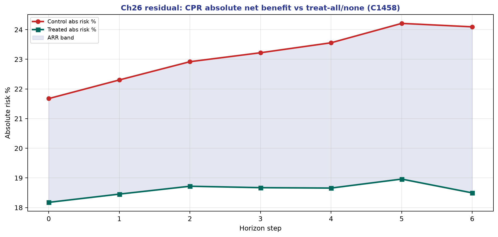

*Teaching figure (synthetic).* Cycle-1458 densify scientific residual (ch15–28).

*Teaching figure (synthetic).* Cycle-1456 densify scientific residual (ch15–28).

*Teaching figure (synthetic).* Cycle-1454 densify scientific residual (ch15–28).

*Teaching figure (synthetic).* Cycle-1452 densify scientific residual (ch15–28).

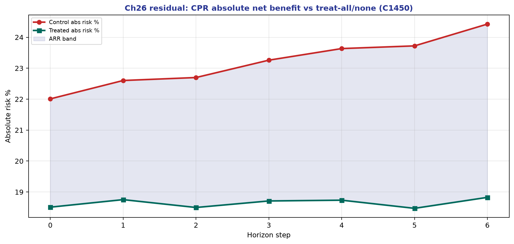

*Teaching figure (synthetic).* Cycle-1450 densify scientific residual (ch15–28).

*Teaching figure (synthetic).* Cycle-1448 densify scientific residual (ch15–28).

*Teaching figure (synthetic).* Cycle-1446 densify scientific residual (ch15–28).

*Teaching figure (synthetic).* Cycle-1444 densify scientific residual (ch15–28).

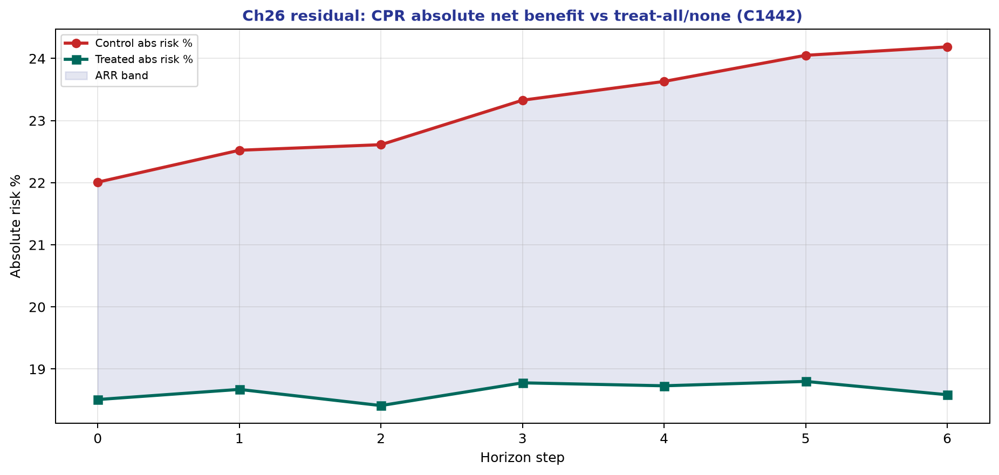

*Teaching figure (synthetic).* Cycle-1442 densify scientific residual (ch15–28).

*Teaching figure (synthetic).* Cycle-1440 densify scientific residual (ch15–28).

*Teaching figure (synthetic).* Cycle-1438 densify scientific residual (ch15–28).

*Teaching figure (synthetic).* Cycle-1436 densify scientific residual (ch15–28).

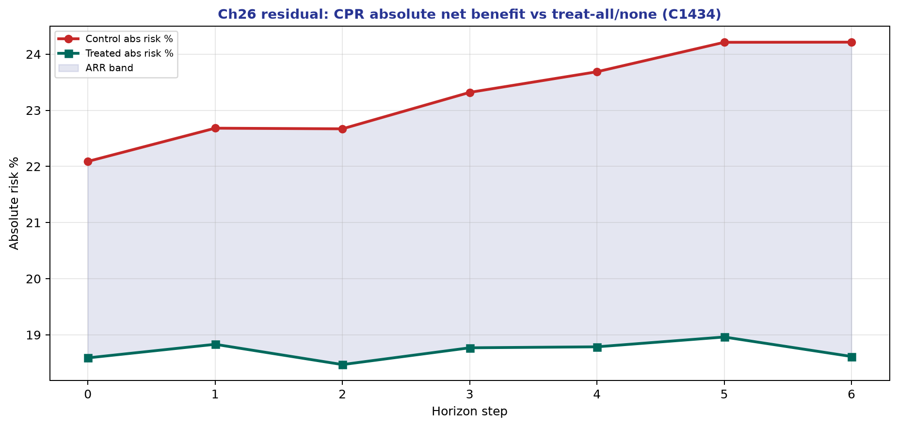

*Teaching figure (synthetic).* Cycle-1434 densify scientific residual (ch15–28).

*Teaching figure (synthetic).* Cycle-1432 densify scientific residual (ch15–28).

*Teaching figure (synthetic).* Cycle-1430 densify scientific residual (ch15–28).

*Teaching figure (synthetic).* Cycle-1428 densify scientific residual (ch15–28).

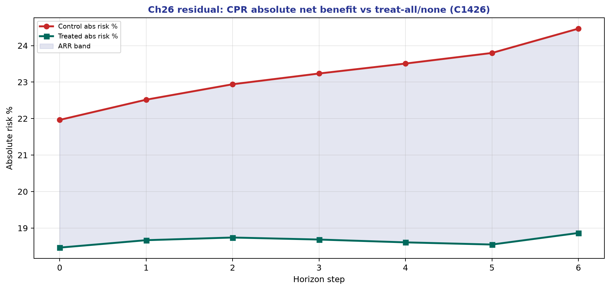

*Teaching figure (synthetic).* Cycle-1426 densify scientific residual (ch15–28).

*Teaching figure (synthetic).* Cycle-1424 densify scientific residual (ch15–28).

*Teaching figure (synthetic).* Cycle-1422 densify scientific residual (ch15–28).

*Teaching figure (synthetic).* Cycle-1420 densify scientific residual (ch15–28).

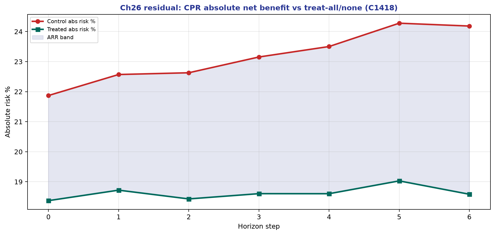

*Teaching figure (synthetic).* Cycle-1418 densify scientific residual (ch15–28).

*Teaching figure (synthetic).* Cycle-1416 densify scientific residual (ch15–28).

*Teaching figure (synthetic).* Cycle-1414 densify scientific residual (ch15–28).

*Teaching figure (synthetic).* Cycle-1412 densify scientific residual (ch15–28).

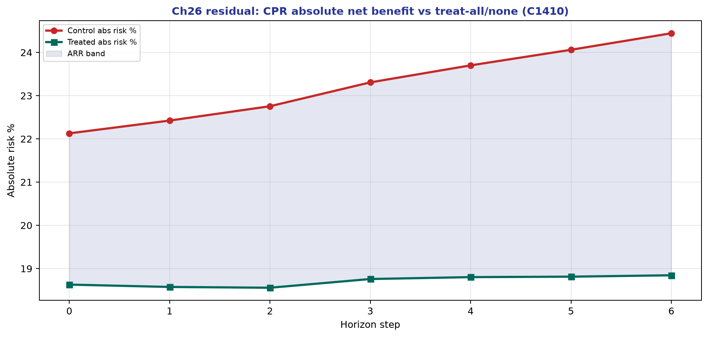

*Teaching figure (synthetic).* Cycle-1410 densify scientific residual (ch15–28).

*Teaching figure (synthetic).* Cycle-1408 densify scientific residual (ch15–28).

*Teaching figure (synthetic).* Cycle-1406 densify scientific residual (ch15–28).

*Teaching figure (synthetic).* Cycle-1404 densify scientific residual (ch15–28).

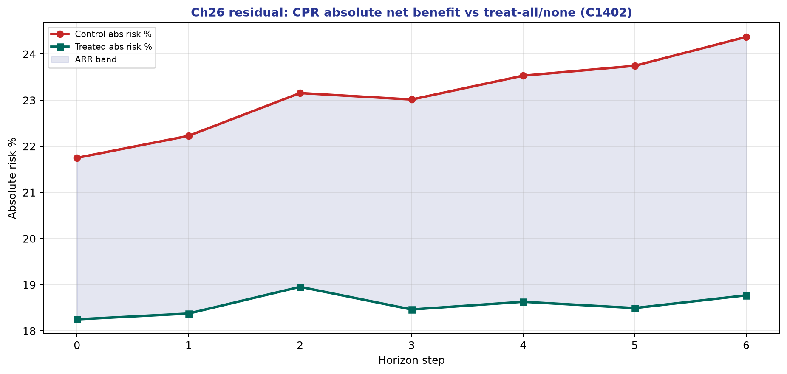

*Teaching figure (synthetic).* Cycle-1402 densify scientific residual (ch15–28).

*Teaching figure (synthetic).* Cycle-1400 densify scientific residual (ch15–28).

*Teaching figure (synthetic).* Cycle-1398 densify scientific residual (ch15–28).

*Teaching figure (synthetic).* Cycle-1396 densify scientific residual (ch15–28).

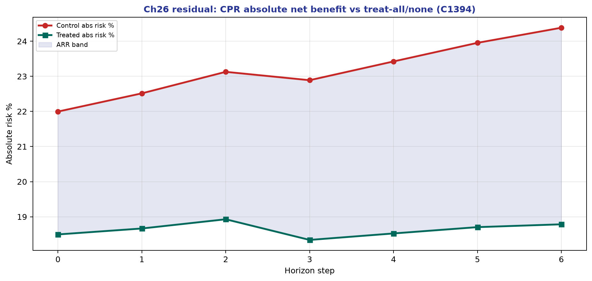

*Teaching figure (synthetic).* Cycle-1394 densify scientific residual (ch15–28).

*Teaching figure (synthetic).* Cycle-1392 densify scientific residual (ch15–28).

*Teaching figure (synthetic).* Cycle-1390 densify scientific residual (ch15–28).

*Teaching figure (synthetic).* Cycle-1388 densify scientific residual (ch15–28).

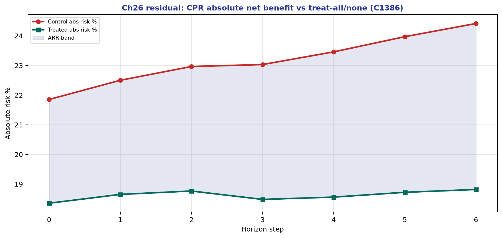

*Teaching figure (synthetic).* Cycle-1386 densify scientific residual (ch15–28).

*Teaching figure (synthetic).* Cycle-1384 densify scientific residual (ch15–28).

*Teaching figure (synthetic).* Cycle-1382 densify scientific residual (ch15–28).

*Teaching figure (synthetic).* Cycle-1380 densify scientific residual (ch15–28).

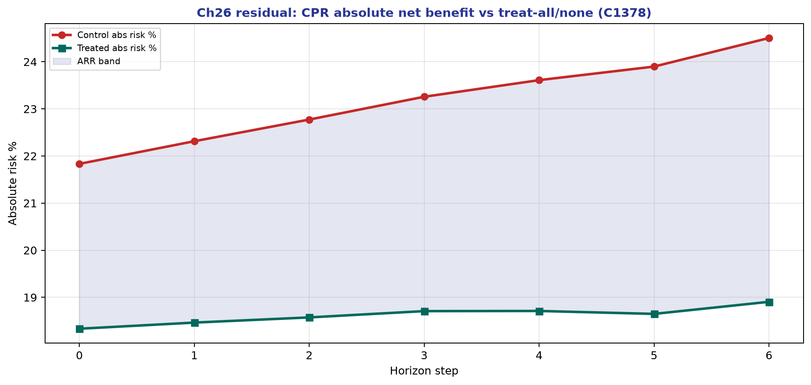

*Teaching figure (synthetic).* Cycle-1378 densify scientific residual (ch15–28).

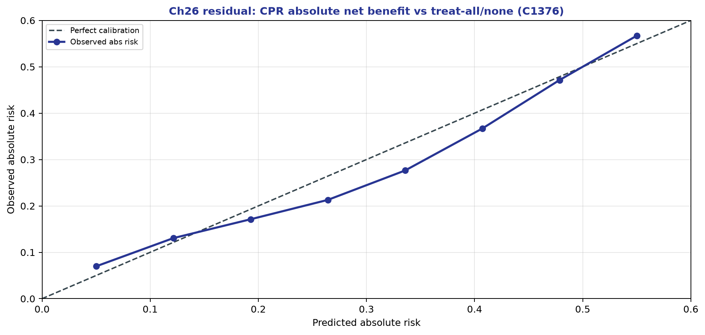

*Teaching figure (synthetic).* Cycle-1376 densify scientific residual (ch15–28).

*Teaching figure (synthetic).* Cycle-1374 densify scientific residual (ch15–28).

*Teaching figure (synthetic).* Cycle-1372 densify scientific residual (ch15–28).

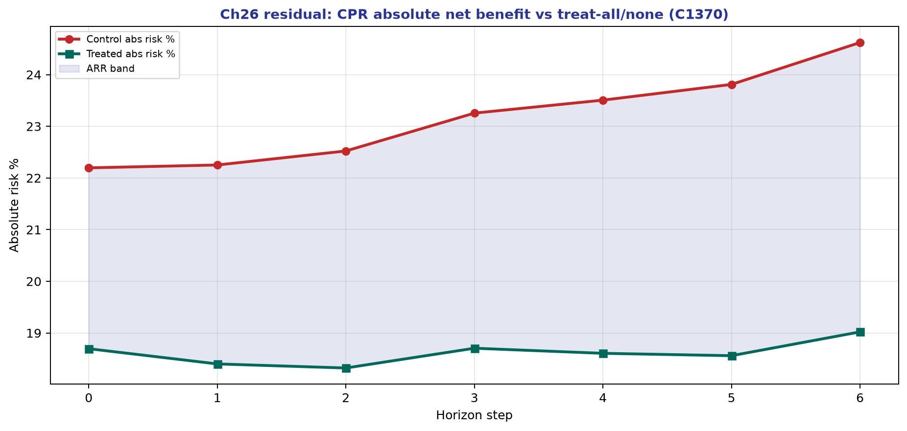

*Teaching figure (synthetic).* Cycle-1370 densify scientific residual (ch15–28).

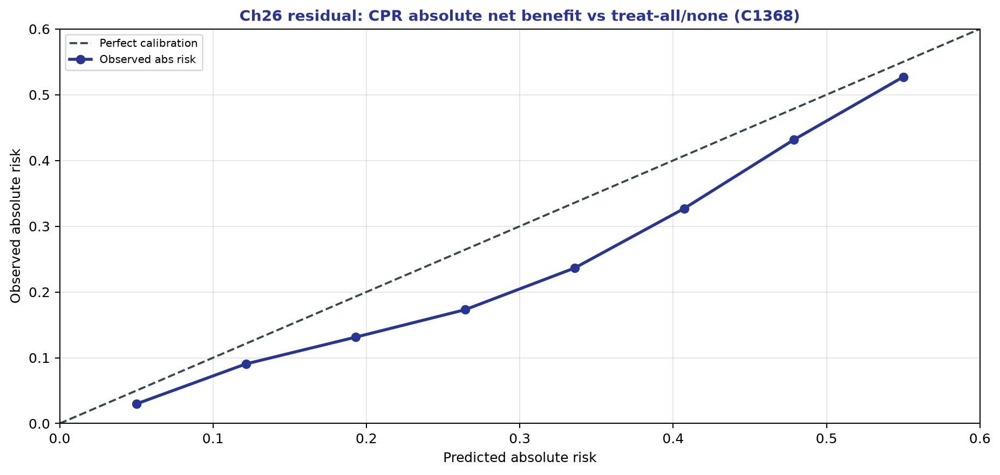

*Teaching figure (synthetic).* Cycle-1368 densify scientific residual (ch15–28).

*Teaching figure (synthetic).* Cycle-1366 densify scientific residual (ch15–28).

*Teaching figure (synthetic).* Cycle-1364 densify scientific residual (ch15–28).

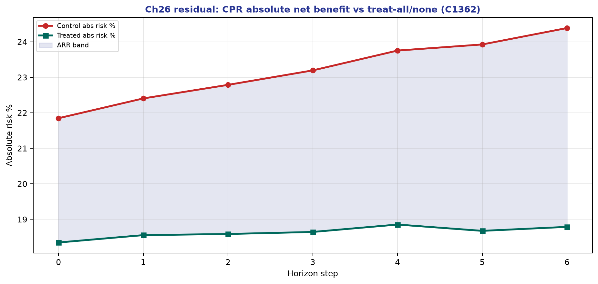

*Teaching figure (synthetic).* Cycle-1362 densify scientific residual (ch15–28).

*Teaching figure (synthetic).* Cycle-1360 densify scientific residual (ch15–28).

*Teaching figure (synthetic).* Cycle-1358 densify scientific residual (ch15–28).

*Teaching figure (synthetic).* Cycle-1356 densify scientific residual (ch15–28).

*Teaching figure (synthetic).* Cycle-1354 densify scientific residual (ch15–28).

*Teaching figure (synthetic).* Cycle-1352 densify scientific residual (ch15–28).

*Teaching figure (synthetic).* Cycle-1350 densify scientific residual (ch15–28).

*Teaching figure (synthetic).* Cycle-1348 densify scientific residual (ch15–28).

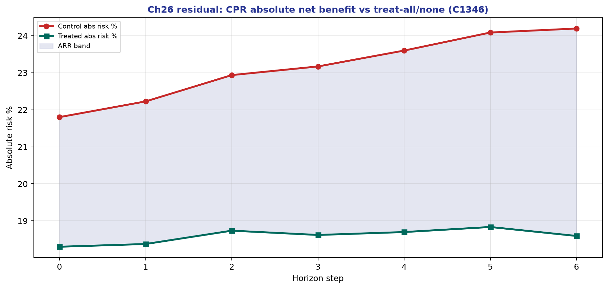

*Teaching figure (synthetic).* Cycle-1346 densify scientific residual (ch15–28).

*Teaching figure (synthetic).* Cycle-1344 densify scientific residual (ch15–28).

*Teaching figure (synthetic).* Cycle-1342 densify scientific residual (ch15–28).

*Teaching figure (synthetic).* Cycle-1340 densify scientific residual (ch15–28).

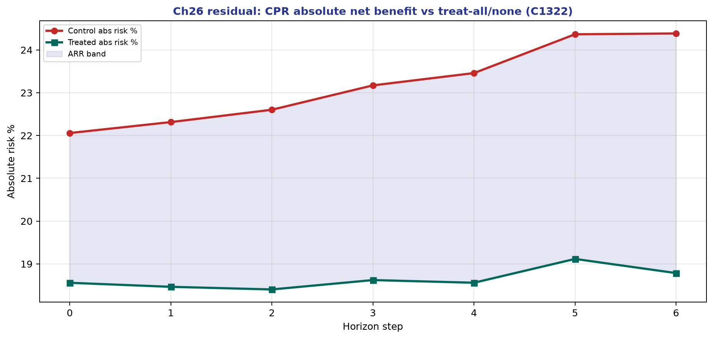

*Teaching figure (synthetic).* Cycle-1322 densify scientific residual (ch15–28).

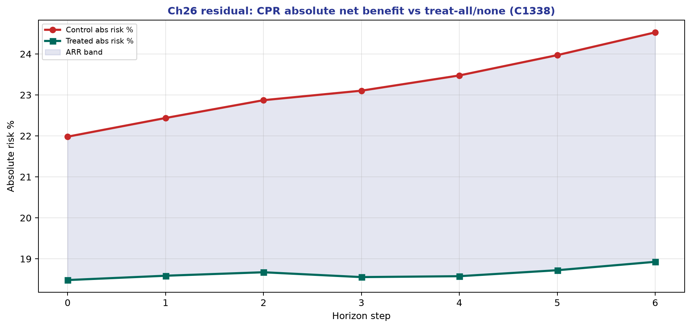

*Teaching figure (synthetic).* Cycle-1338 densify scientific residual (ch15–28).

*Teaching figure (synthetic).* Cycle-1336 densify scientific residual (ch15–28).

*Teaching figure (synthetic).* Cycle-1334 densify scientific residual (ch15–28).

*Teaching figure (synthetic).* Cycle-1332 densify scientific residual (ch15–28).

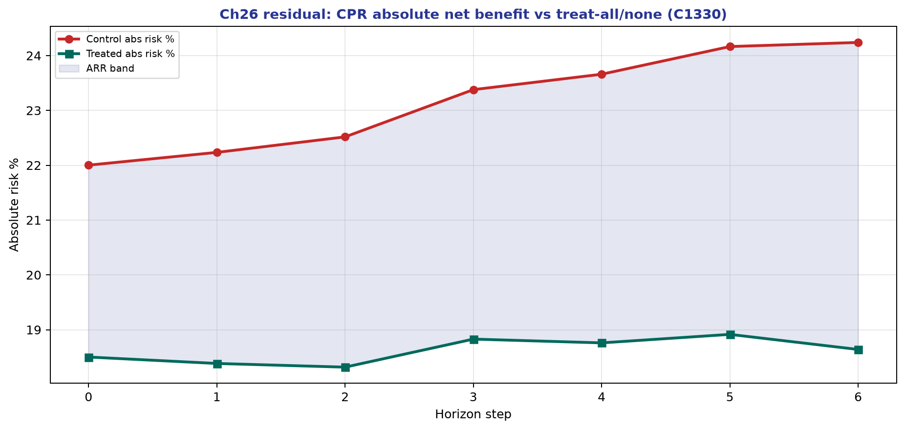

*Teaching figure (synthetic).* Cycle-1330 densify scientific residual (ch15–28).

*Teaching figure (synthetic).* Cycle-1328 densify scientific residual (ch15–28).

*Teaching figure (synthetic).* Cycle-1326 densify scientific residual (ch15–28).

*Teaching figure (synthetic).* Cycle-1324 densify scientific residual (ch15–28).

*Teaching figure (synthetic).* Cycle-1320 densify scientific residual (ch15–28).

*Teaching figure (synthetic).* Cycle-1318 densify scientific residual (ch15–28).

*Teaching figure (synthetic).* Cycle-1316 densify scientific residual (ch15–28).

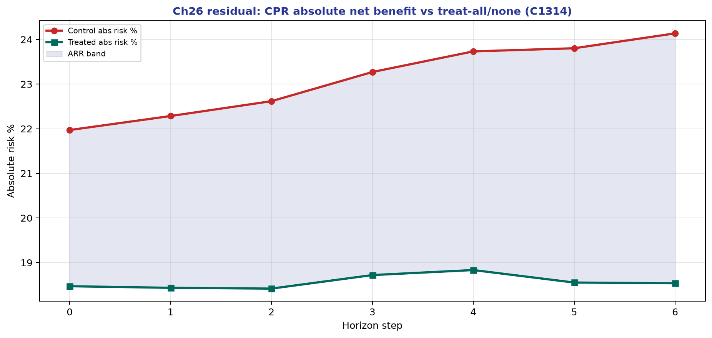

*Teaching figure (synthetic).* Cycle-1314 densify scientific residual (ch15–28).

*Teaching figure (synthetic).* Cycle-1312 densify scientific residual (ch15–28).

*Teaching figure (synthetic).* Cycle-1310 densify scientific residual (ch15–28).

*Teaching figure (synthetic).* Cycle-1308 densify scientific residual (ch15–28).

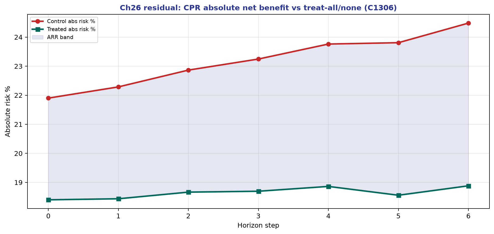

*Teaching figure (synthetic).* Cycle-1306 densify scientific residual (ch15–28).

*Teaching figure (synthetic).* Cycle-1304 densify scientific residual (ch15–28).

*Teaching figure (synthetic).* Cycle-1302 densify scientific residual (ch15–28).

*Teaching figure (synthetic).* Cycle-1300 densify scientific residual (ch15–28).

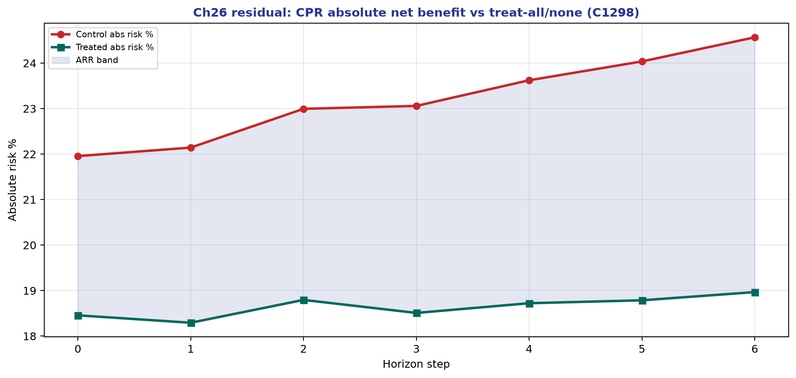

*Teaching figure (synthetic).* Cycle-1298 densify scientific residual (ch15–28).

*Teaching figure (synthetic).* Cycle-1296 densify scientific residual (ch15–28).

*Teaching figure (synthetic).* Cycle-1294 densify scientific residual (ch15–28).

*Teaching figure (synthetic).* Cycle-1292 densify scientific residual (ch15–28).

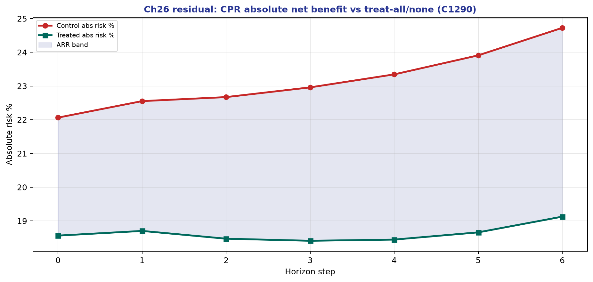

*Teaching figure (synthetic).* Cycle-1290 densify scientific residual (ch15–28).

*Teaching figure (synthetic).* Cycle-1288 densify scientific residual (ch15–28).

*Teaching figure (synthetic).* Cycle-1286 densify scientific residual (ch15–28).

*Teaching figure (synthetic).* Cycle-1284 densify scientific residual (ch15–28).

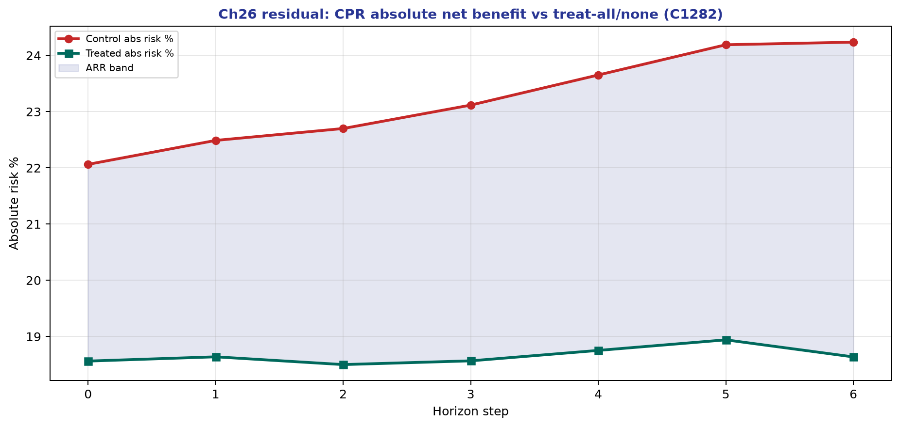

*Teaching figure (synthetic).* Cycle-1282 densify scientific residual (ch15–28).

*Teaching figure (synthetic).* Cycle-1280 densify scientific residual (ch15–28).

*Teaching figure (synthetic).* Cycle-1278 densify scientific residual (ch15–28).

*Teaching figure (synthetic).* Cycle-1276 densify scientific residual (ch15–28).

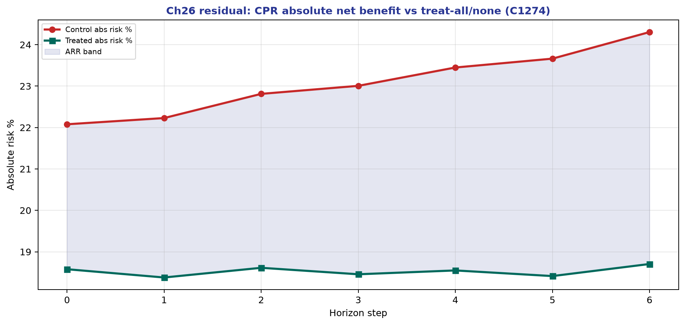

*Teaching figure (synthetic).* Cycle-1274 densify scientific residual (ch15–28).

*Teaching figure (synthetic).* Cycle-1272 densify scientific residual (ch15–28).

*Teaching figure (synthetic).* Cycle-1270 densify scientific residual (ch15–28).

*Teaching figure (synthetic).* Cycle-1268 densify scientific residual (ch15–28).

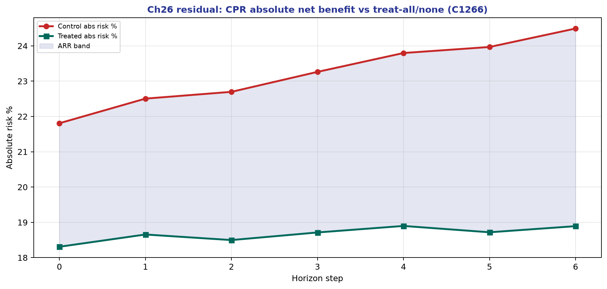

*Teaching figure (synthetic).* Cycle-1266 densify scientific residual (ch15–28).

*Teaching figure (synthetic).* Cycle-1264 densify scientific residual (ch15–28).

*Teaching figure (synthetic).* Cycle-1262 densify scientific residual (ch15–28).

*Teaching figure (synthetic).* Cycle-1260 densify scientific residual (ch15–28).

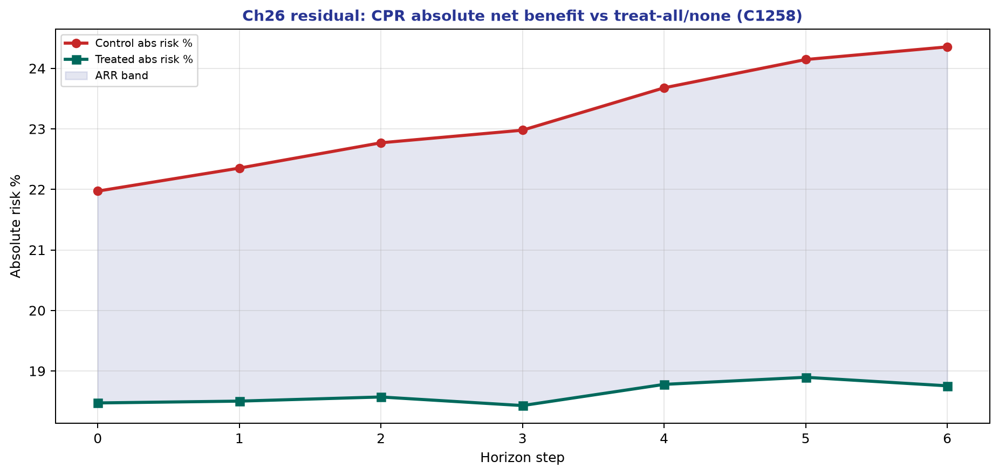

*Teaching figure (synthetic).* Cycle-1258 densify scientific residual (ch15–28).

*Teaching figure (synthetic).* Cycle-1256 densify scientific residual (ch15–28).

*Teaching figure (synthetic).* Cycle-1254 densify scientific residual (ch15–28).

*Teaching figure (synthetic).* Cycle-1252 densify scientific residual (ch15–28).

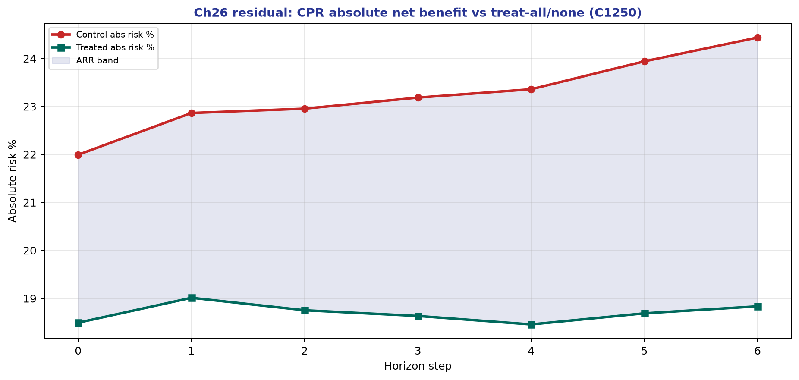

*Teaching figure (synthetic).* Cycle-1250 densify scientific residual (ch15–28).

*Teaching figure (synthetic).* Cycle-1248 densify scientific residual (ch15–28).

*Teaching figure (synthetic).* Cycle-1246 densify scientific residual (ch15–28).

*Teaching figure (synthetic).* Cycle-1244 densify scientific residual (ch15–28).

*Teaching figure (synthetic).* Cycle-1242 densify scientific residual (ch15–28).

*Teaching figure (synthetic).* Cycle-1240 densify scientific residual (ch15–28).

*Teaching figure (synthetic).* Cycle-1238 densify scientific residual (ch15–28).

*Teaching figure (synthetic).* Cycle-1236 densify scientific residual (ch15–28).

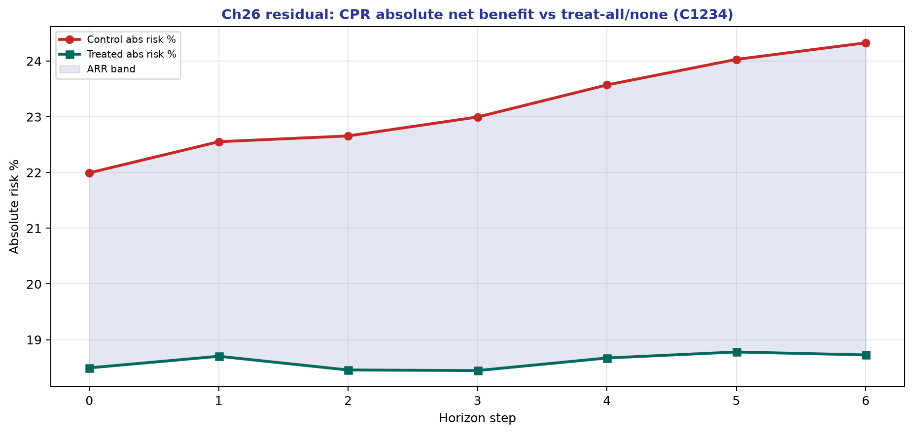

*Teaching figure (synthetic).* Cycle-1234 densify scientific residual (ch15–28).

*Teaching figure (synthetic).* Cycle-1232 densify scientific residual (ch15–28).

*Teaching figure (synthetic).* Cycle-1230 densify scientific residual (ch15–28).

*Teaching figure (synthetic).* Cycle-1228 densify scientific residual (ch15–28).

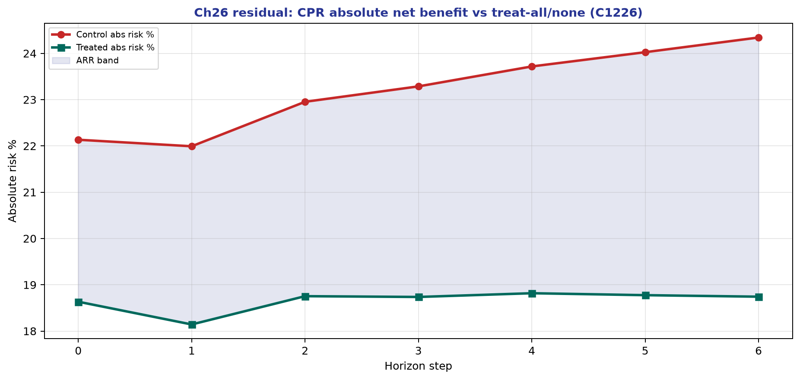

*Teaching figure (synthetic).* Cycle-1226 densify scientific residual (ch15–28).

*Teaching figure (synthetic).* Cycle-1224 densify scientific residual (ch15–28).

*Teaching figure (synthetic).* Cycle-1222 densify scientific residual (ch15–28).

*Teaching figure (synthetic).* Cycle-1220 densify scientific residual (ch15–28).

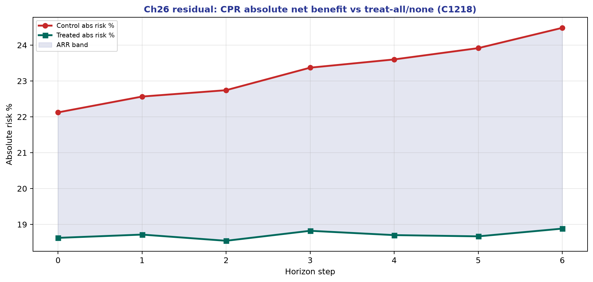

*Teaching figure (synthetic).* Cycle-1218 densify scientific residual (ch15–28).

*Teaching figure (synthetic).* Cycle-1216 densify scientific residual (ch15–28).

*Teaching figure (synthetic).* Cycle-1214 densify scientific residual (ch15–28).

*Teaching figure (synthetic).* Cycle-1212 densify scientific residual (ch15–28).

*Teaching figure (synthetic).* Cycle-1210 densify scientific residual (ch15–28).

*Teaching figure (synthetic).* Cycle-1208 densify scientific residual (ch15–28).

*Teaching figure (synthetic).* Cycle-1206 densify scientific residual (ch15–28).

*Teaching figure (synthetic).* Cycle-1204 densify scientific residual (ch15–28).

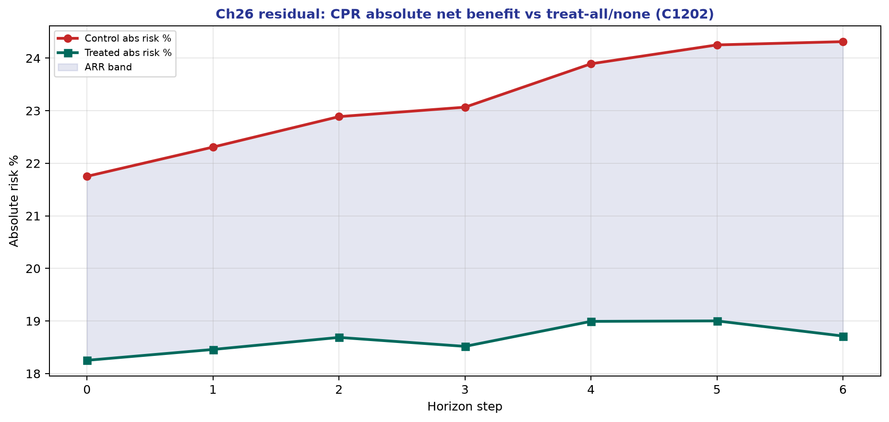

*Teaching figure (synthetic).* Cycle-1202 densify scientific residual (ch15–28).

*Teaching figure (synthetic).* Cycle-1200 densify scientific residual (ch15–28).

*Teaching figure (synthetic).* Cycle-1198 densify scientific residual (ch15–28).

*Teaching figure (synthetic).* Cycle-1196 densify scientific residual (ch15–28).

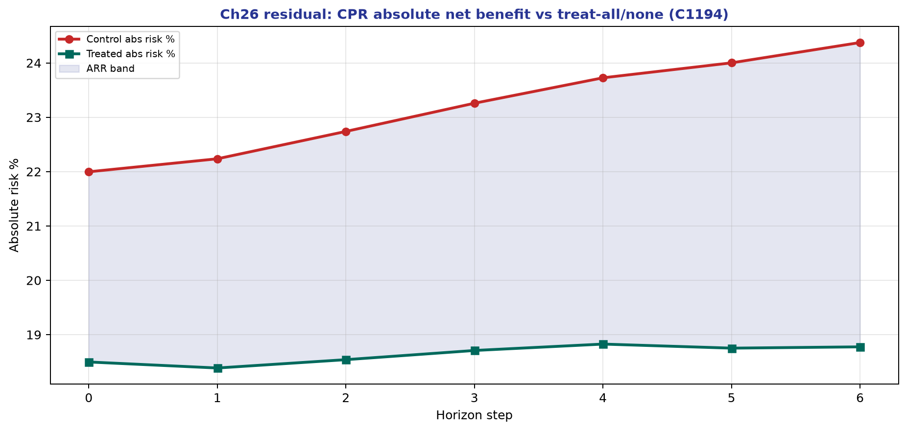

*Teaching figure (synthetic).* Cycle-1194 densify scientific residual (ch15–28).

*Teaching figure (synthetic).* Cycle-1192 densify scientific residual (ch15–28).

*Teaching figure (synthetic).* Cycle-1190 densify scientific residual (ch15–28).

*Teaching figure (synthetic).* Cycle-1188 densify scientific residual (ch15–28).

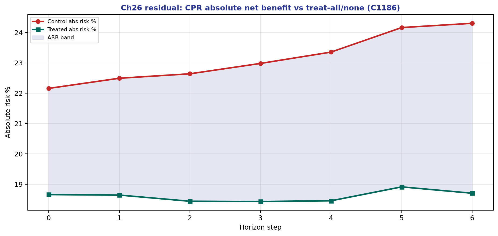

*Teaching figure (synthetic).* Cycle-1186 densify scientific residual (ch15–28).

*Teaching figure (synthetic).* Cycle-1184 densify scientific residual (ch15–28).

*Teaching figure (synthetic).* Cycle-1182 densify scientific residual (ch15–28).

*Teaching figure (synthetic).* Cycle-1180 densify scientific residual (ch15–28).

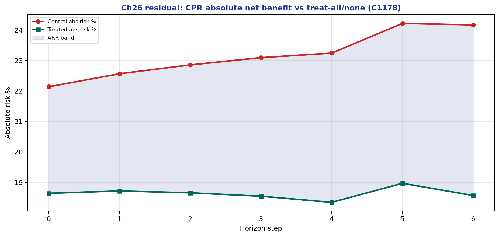

*Teaching figure (synthetic).* Cycle-1178 densify scientific residual (ch15–28).

*Teaching figure (synthetic).* Cycle-1176 densify scientific residual (ch15–28).

*Teaching figure (synthetic).* Cycle-1174 densify scientific residual (ch15–28).

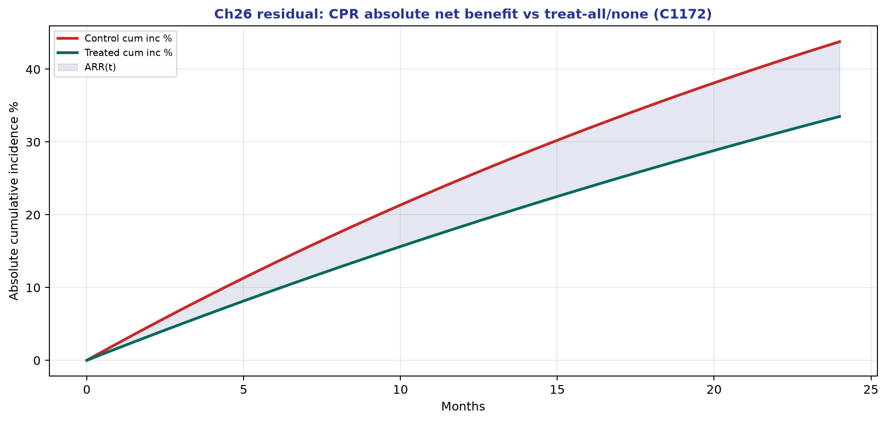

*Teaching figure (synthetic).* Cycle-1172 densify scientific residual (ch15–28).

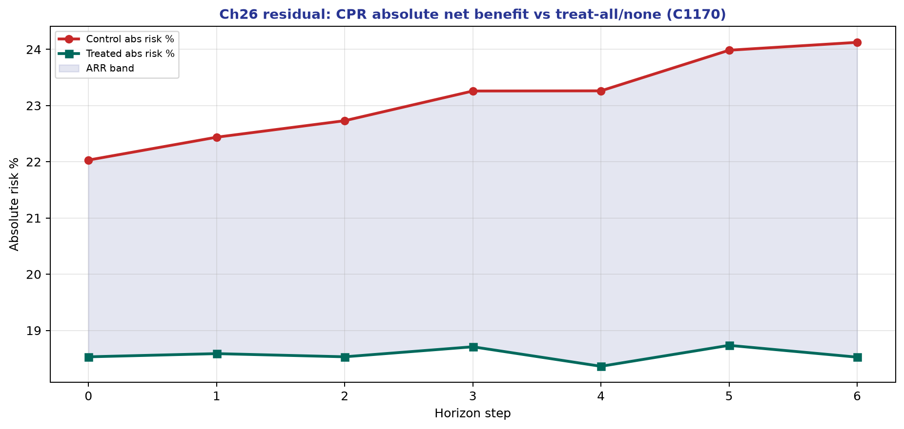

*Teaching figure (synthetic).* Cycle-1170 densify scientific residual (ch15–28).

*Teaching figure (synthetic).* Cycle-1168 densify scientific residual (ch15–28).

*Teaching figure (synthetic).* Cycle-1166 densify scientific residual (ch15–28).

*Teaching figure (synthetic).* Cycle-1164 densify scientific residual (ch15–28).

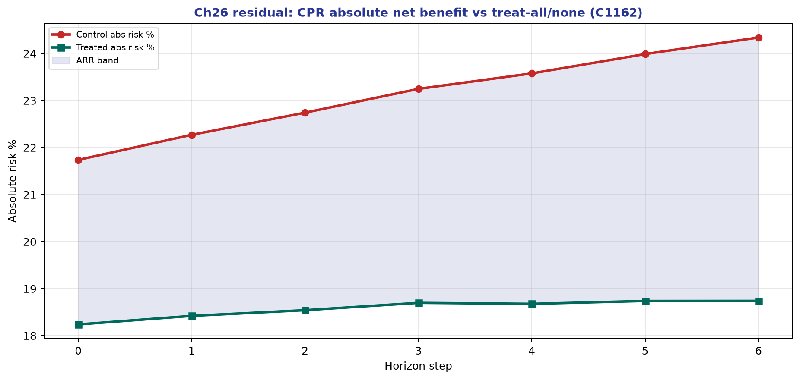

*Teaching figure (synthetic).* Cycle-1162 densify scientific residual (ch15–28).

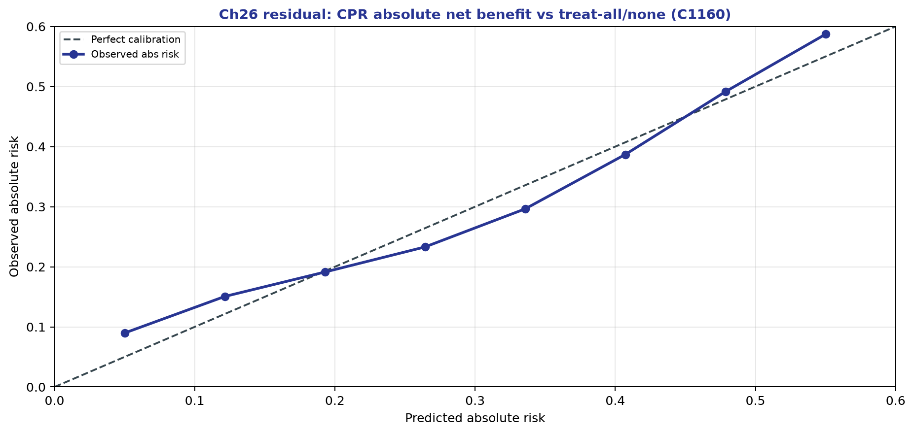

*Teaching figure (synthetic).* Cycle-1160 densify scientific residual (ch15–28).

*Teaching figure (synthetic).* Cycle-1158 densify scientific residual (ch15–28).

*Teaching figure (synthetic).* Cycle-1156 densify scientific residual (ch15–28).

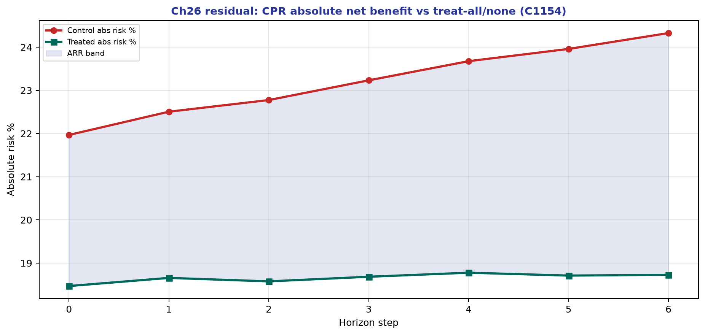

*Teaching figure (synthetic).* Cycle-1154 densify scientific residual (ch15–28).

*Teaching figure (synthetic).* Cycle-1152 densify scientific residual (ch15–28).

*Teaching figure (synthetic).* Cycle-1150 densify scientific residual (ch15–28).

*Teaching figure (synthetic).* Cycle-1148 densify scientific residual (ch15–28).

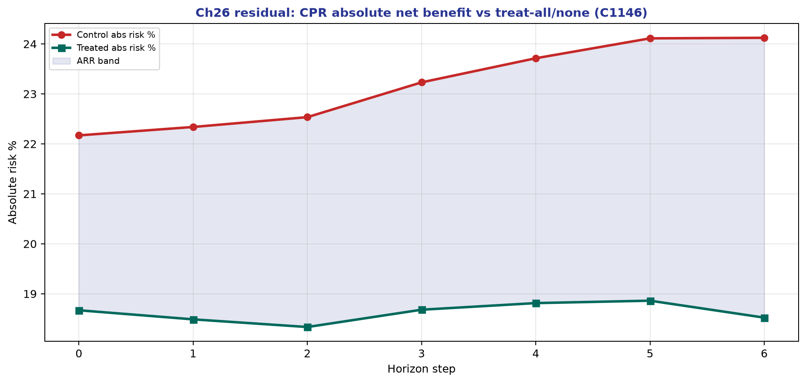

*Teaching figure (synthetic).* Cycle-1146 densify scientific residual (ch15–28).

*Teaching figure (synthetic).* Cycle-1144 densify scientific residual (ch15–28).

*Teaching figure (synthetic).* Cycle-1142 densify scientific residual (ch15–28).

*Teaching figure (synthetic).* Cycle-1140 densify scientific residual (ch15–28).

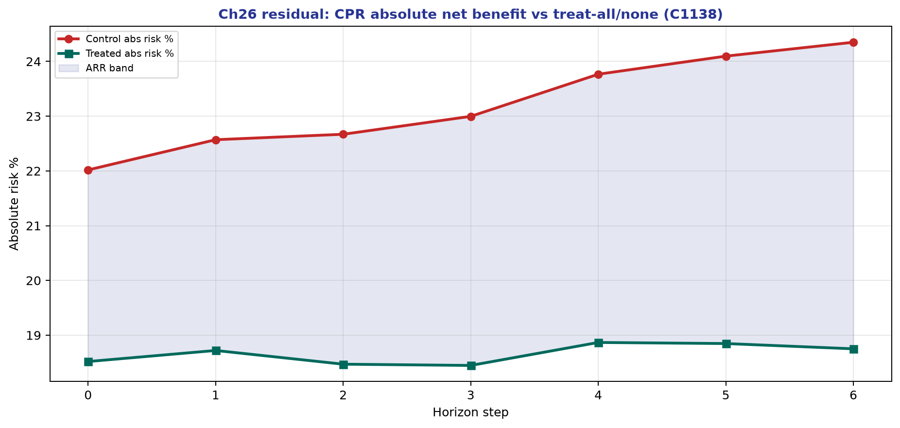

*Teaching figure (synthetic).* Cycle-1138 densify scientific residual (ch15–28).

*Teaching figure (synthetic).* Cycle-1136 densify scientific residual (ch15–28).

*Teaching figure (synthetic).* Cycle-1134 densify scientific residual (ch15–28).

*Teaching figure (synthetic).* Cycle-1132 densify scientific residual (ch15–28).

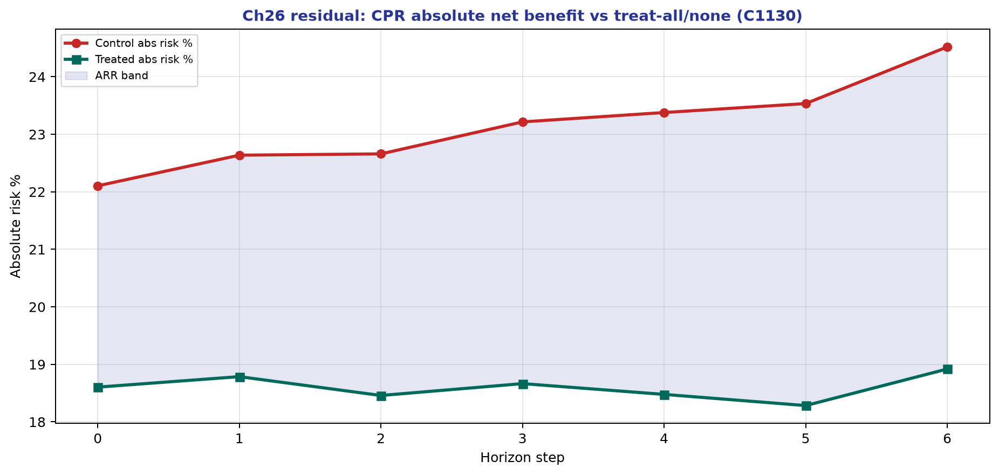

*Teaching figure (synthetic).* Cycle-1130 densify scientific residual (ch15–28).

*Teaching figure (synthetic).* Cycle-1128 densify scientific residual (ch15–28).

*Teaching figure (synthetic).* Cycle-1126 densify scientific residual (ch15–28).

*Teaching figure (synthetic).* Cycle-1124 densify scientific residual (ch15–28).

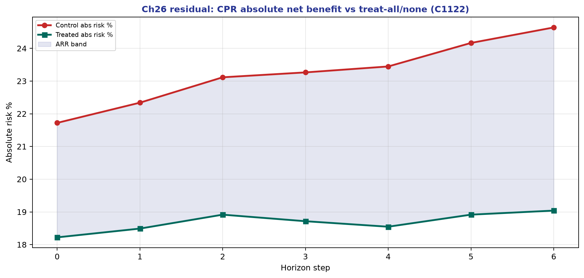

*Teaching figure (synthetic).* Cycle-1122 densify scientific residual (ch15–28).

*Teaching figure (synthetic).* Cycle-1120 densify scientific residual (ch15–28).

*Teaching figure (synthetic).* Cycle-1118 densify scientific residual (ch15–28).

*Teaching figure (synthetic).* Cycle-1116 densify scientific residual (ch15–28).

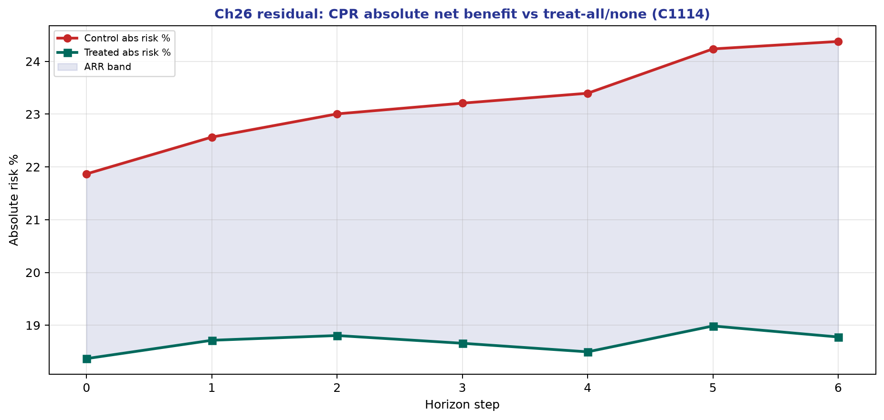

*Teaching figure (synthetic).* Cycle-1114 densify scientific residual (ch15–28).

*Teaching figure (synthetic).* Cycle-1112 densify scientific residual (ch15–28).

*Teaching figure (synthetic).* Cycle-1110 densify scientific residual (ch15–28).

*Teaching figure (synthetic).* Cycle-1108 densify scientific residual (ch15–28).

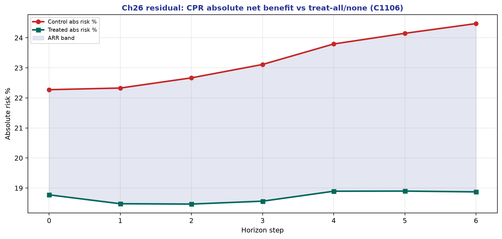

*Teaching figure (synthetic).* Cycle-1106 densify scientific residual (ch15–28).

*Teaching figure (synthetic).* Cycle-1104 densify scientific residual (ch15–28).

*Teaching figure (synthetic).* Cycle-1102 densify scientific residual (ch15–28).

*Teaching figure (synthetic).* Cycle-1100 densify scientific residual (ch15–28).

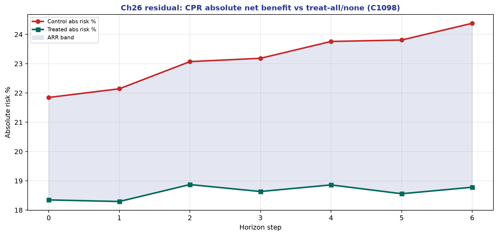

*Teaching figure (synthetic).* Cycle-1098 densify scientific residual (ch15–28).

*Teaching figure (synthetic).* Cycle-1096 densify scientific residual (ch15–28).

*Teaching figure (synthetic).* Cycle-1094 densify scientific residual (ch15–28).

*Teaching figure (synthetic).* Cycle-1092 densify scientific residual (ch15–28).

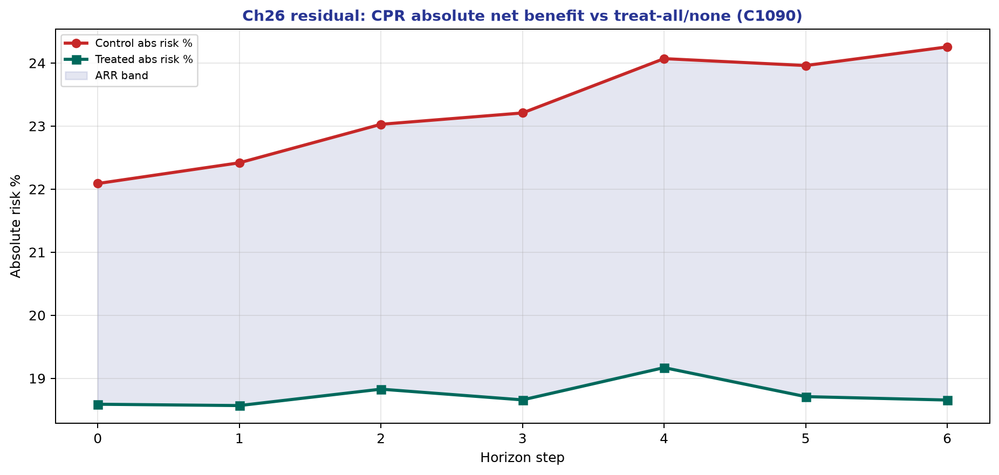

*Teaching figure (synthetic).* Cycle-1090 densify scientific residual (ch15–28).

*Teaching figure (synthetic).* Cycle-1088 densify scientific residual (ch15–28).

*Teaching figure (synthetic).* Cycle-1086 densify scientific residual (ch15–28).

*Teaching figure (synthetic).* Cycle-1084 densify scientific residual (ch15–28).

*Teaching figure (synthetic).* Cycle-1082 densify scientific residual (ch15–28).

*Teaching figure (synthetic).* Cycle-1080 densify scientific residual (ch15–28).

*Teaching figure (synthetic).* Cycle-1078 densify scientific residual (ch15–28).

*Teaching figure (synthetic).* Cycle-1076 densify scientific residual (ch15–28).

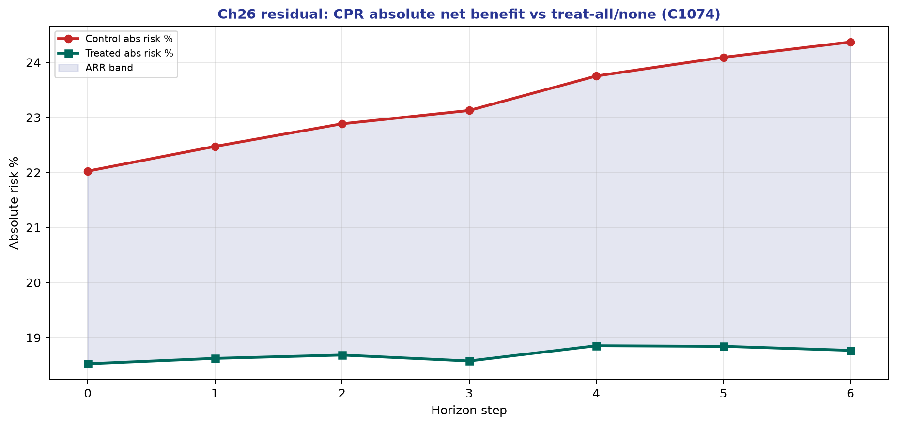

*Teaching figure (synthetic).* Cycle-1074 densify scientific residual (ch15–28).

*Teaching figure (synthetic).* Cycle-1072 densify scientific residual (ch15–28).

*Teaching figure (synthetic).* Cycle-1070 densify scientific residual (ch15–28).

*Teaching figure (synthetic).* Cycle-1068 densify scientific residual (ch15–28).

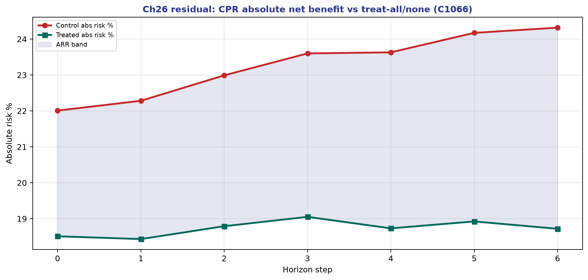

*Teaching figure (synthetic).* Cycle-1066 densify scientific residual (ch15–28).

*Teaching figure (synthetic).* Cycle-1064 densify scientific residual (ch15–28).

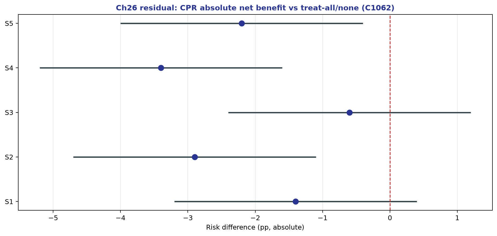

*Teaching figure (synthetic).* Cycle-1062 densify scientific residual (ch15–28).

*Teaching figure (synthetic).* Cycle-1060 densify scientific residual (ch15–28).

*Teaching figure (synthetic).* Cycle-1058 densify scientific residual (ch15–28).

*Teaching figure (synthetic).* Cycle-1056 densify scientific residual (ch15–28).

*Teaching figure (synthetic).* Cycle-1054 densify scientific residual (ch15–28).

*Teaching figure (synthetic).* Cycle-1052 densify scientific residual (ch15–28).

*Teaching figure (synthetic).* Cycle-1050 densify scientific residual (ch15–28).

*Teaching figure (synthetic).* Cycle-1048 densify scientific residual (ch15–28).

*Teaching figure (synthetic).* Cycle-1046 densify scientific residual (ch15–28).

*Teaching figure (synthetic).* Cycle-1044 densify scientific residual (ch15–28).

*Teaching figure (synthetic).* Cycle-1042 densify scientific residual (ch15–28).

*Teaching figure (synthetic).* Cycle-1040 densify scientific residual (ch15–28).

*Teaching figure (synthetic).* Cycle-1038 densify scientific residual (ch15–28).

*Teaching figure (synthetic).* Cycle-1036 densify scientific residual (ch15–28).

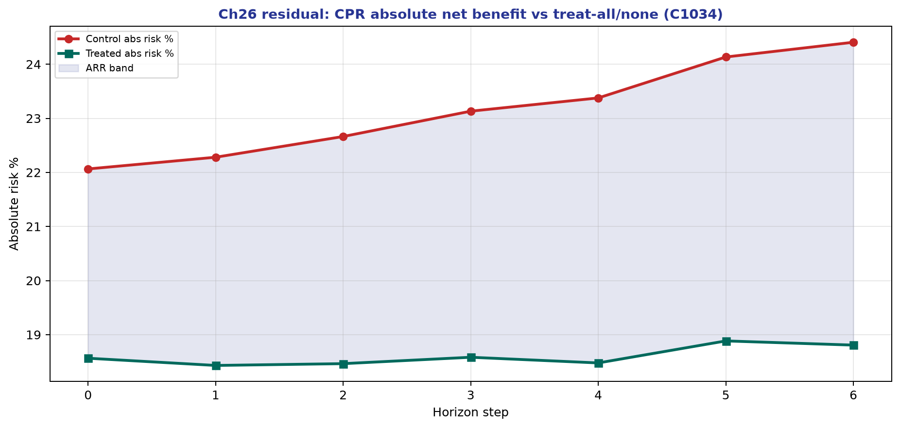

*Teaching figure (synthetic).* Cycle-1034 densify scientific residual (ch15–28).

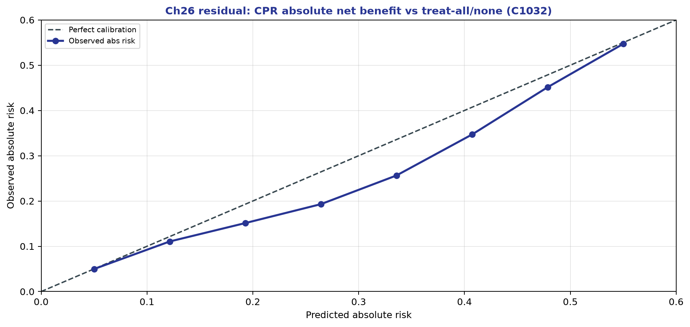

*Teaching figure (synthetic).* Cycle-1032 densify scientific residual (ch15–28).

*Teaching figure (synthetic).* Cycle-1030 densify scientific residual (ch15–28).

*Teaching figure (synthetic).* Cycle-1028 densify scientific residual (ch15–28).

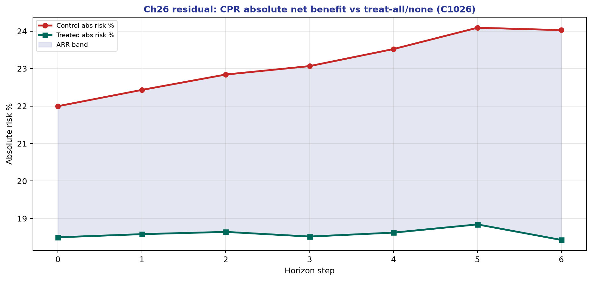

*Teaching figure (synthetic).* Cycle-1026 densify scientific residual (ch15–28).

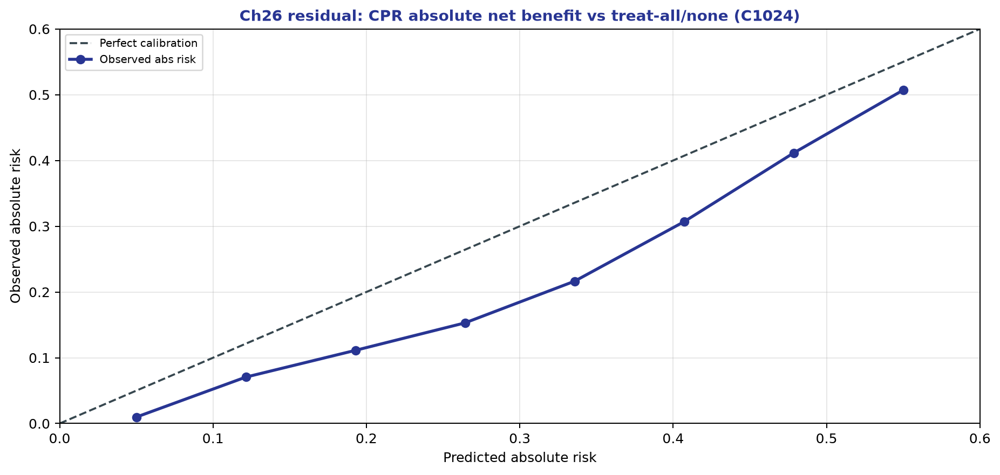

*Teaching figure (synthetic).* Cycle-1024 densify scientific residual (ch15–28).

*Teaching figure (synthetic).* Cycle-1022 densify scientific residual (ch15–28).

*Teaching figure (synthetic).* Cycle-1020 densify scientific residual (ch15–28).

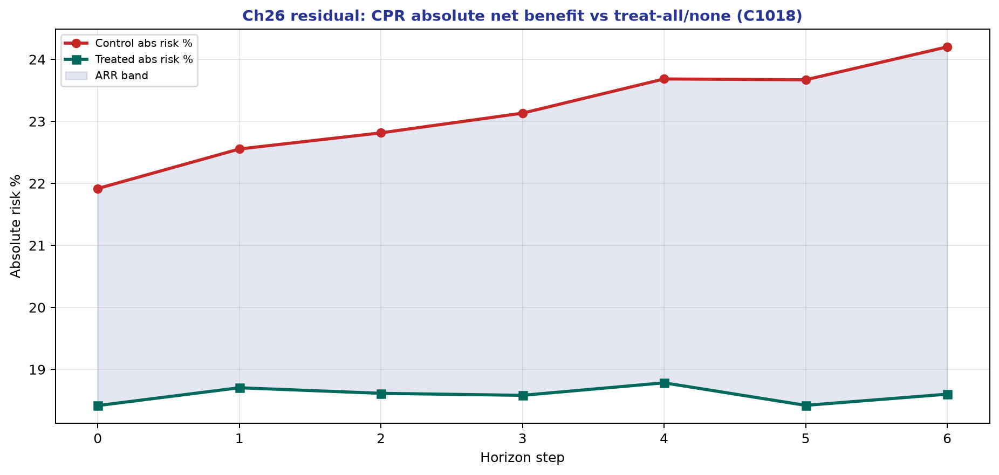

*Teaching figure (synthetic).* Cycle-1018 densify scientific residual (ch15–28).

*Teaching figure (synthetic).* Cycle-1016 densify scientific residual (ch15–28).

*Teaching figure (synthetic).* Cycle-1014 densify scientific residual (ch15–28).

*Teaching figure (synthetic).* Cycle-1012 densify scientific residual (ch15–28).

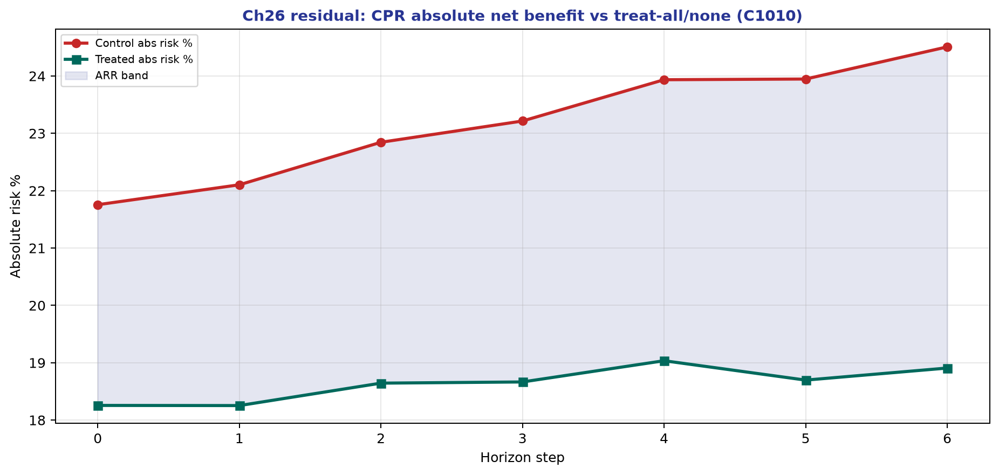

*Teaching figure (synthetic).* Cycle-1010 densify scientific residual (ch15–28).

*Teaching figure (synthetic).* Cycle-1008 densify scientific residual (ch15–28).

*Teaching figure (synthetic).* Cycle-1006 densify scientific residual (ch15–28).

*Teaching figure (synthetic).* Cycle-1004 densify scientific residual (ch15–28).

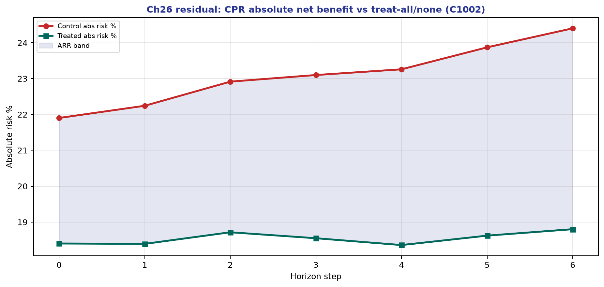

*Teaching figure (synthetic).* Cycle-1002 densify scientific residual (ch15–28).

*Teaching figure (synthetic).* Cycle-1000 densify scientific residual (ch15–28).

*Teaching figure (synthetic).* Cycle-998 densify scientific residual (ch15–28).

*Teaching figure (synthetic).* Cycle-996 densify scientific residual (ch15–28).

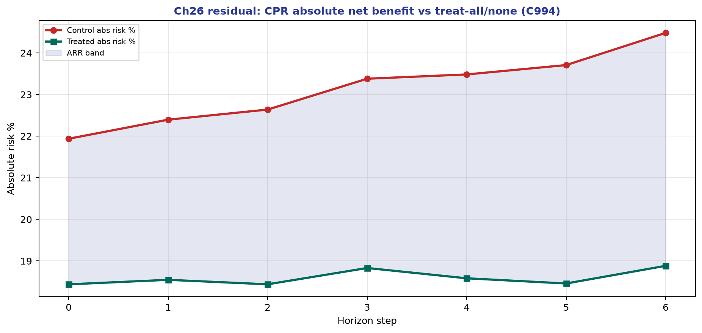

*Teaching figure (synthetic).* Cycle-994 densify scientific residual (ch15–28).

*Teaching figure (synthetic).* Cycle-992 densify scientific residual (ch15–28).

*Teaching figure (synthetic).* Cycle-990 densify scientific residual (ch15–28).

*Teaching figure (synthetic).* Cycle-988 densify scientific residual (ch15–28).

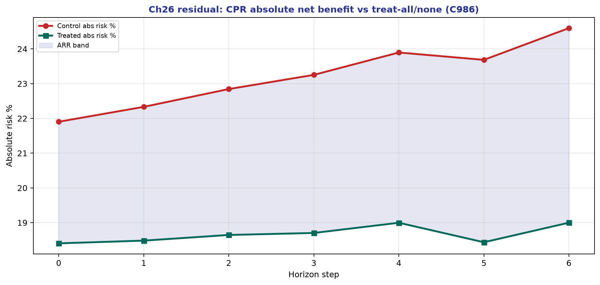

*Teaching figure (synthetic).* Cycle-986 densify scientific residual (ch15–28).

*Teaching figure (synthetic).* Cycle-984 densify scientific residual (ch15–28).

*Teaching figure (synthetic).* Cycle-982 densify scientific residual (ch15–28).

*Teaching figure (synthetic).* Cycle-980 densify scientific residual (ch15–28).

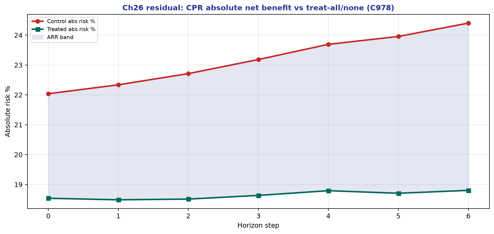

*Teaching figure (synthetic).* Cycle-978 densify scientific residual (ch15–28).

*Teaching figure (synthetic).* Cycle-976 densify scientific residual (ch15–28).

*Teaching figure (synthetic).* Cycle-974 densify scientific residual (ch15–28).

*Teaching figure (synthetic).* Cycle-972 densify scientific residual (ch15–28).

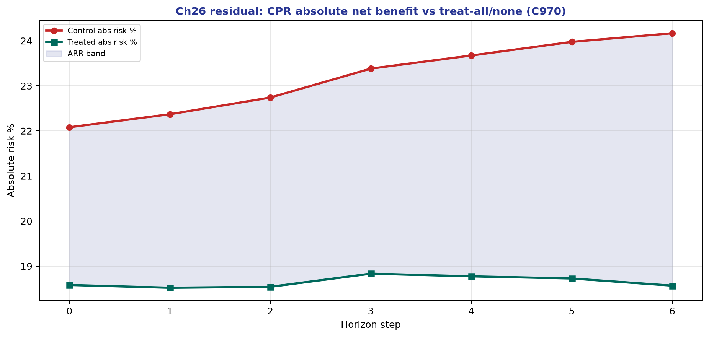

*Teaching figure (synthetic).* Cycle-970 densify scientific residual (ch15–28).

*Teaching figure (synthetic).* Cycle-968 densify scientific residual (ch15–28).

*Teaching figure (synthetic).* Cycle-966 densify scientific residual (ch15–28).

*Teaching figure (synthetic).* Cycle-964 densify scientific residual (ch15–28).

*Teaching figure (synthetic).* Cycle-962 densify scientific residual (ch15–28).

*Teaching figure (synthetic).* Cycle-960 densify scientific residual (ch15–28).

*Teaching figure (synthetic).* Cycle-958 densify scientific residual (ch15–28).

*Teaching figure (synthetic).* Cycle-956 densify scientific residual (ch15–28).

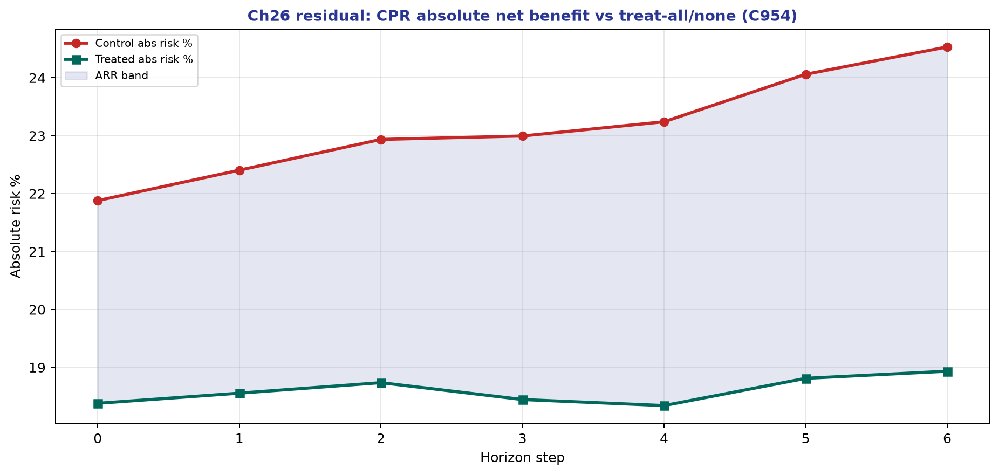

*Teaching figure (synthetic).* Cycle-954 densify scientific residual (ch15–28).

*Teaching figure (synthetic).* Cycle-952 densify scientific residual (ch15–28).

*Teaching figure (synthetic).* Cycle-950 densify scientific residual (ch15–28).

*Teaching figure (synthetic).* Cycle-948 densify scientific residual (ch15–28).

*Teaching figure (synthetic).* Cycle-946 densify scientific residual (ch15–28).

*Teaching figure (synthetic).* Cycle-944 densify scientific residual (ch15–28).

*Teaching figure (synthetic).* Cycle-942 densify scientific residual (ch15–28).

*Teaching figure (synthetic).* Cycle-940 densify scientific residual (ch15–28).

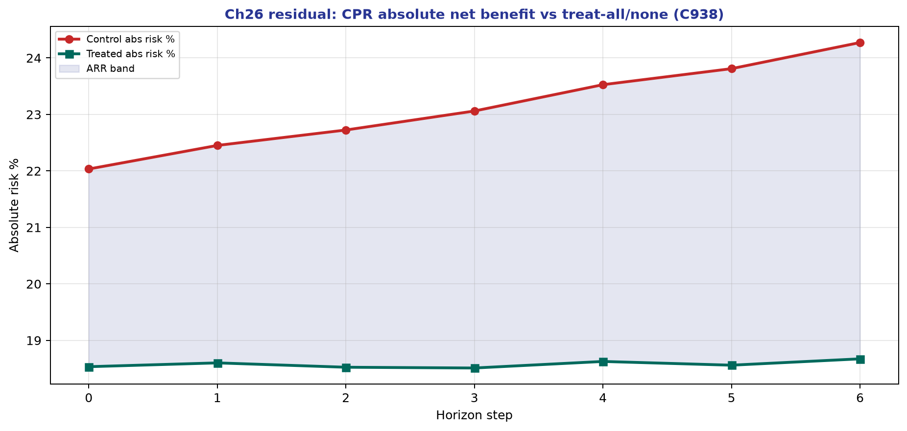

*Teaching figure (synthetic).* Cycle-938 densify scientific residual (ch15–28).

*Teaching figure (synthetic).* Cycle-936 densify scientific residual (ch15–28).

*Teaching figure (synthetic).* Cycle-934 densify scientific residual (ch15–28).

*Teaching figure (synthetic).* Cycle-932 densify scientific residual (ch15–28).

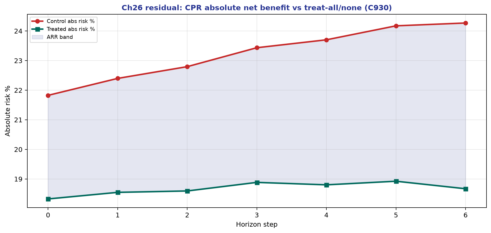

*Teaching figure (synthetic).* Cycle-930 densify scientific residual (ch15–28).

*Teaching figure (synthetic).* Cycle-928 densify scientific residual (ch15–28).

*Teaching figure (synthetic).* Cycle-926 densify scientific residual (ch15–28).

*Teaching figure (synthetic).* Cycle-924 densify scientific residual (ch15–28).

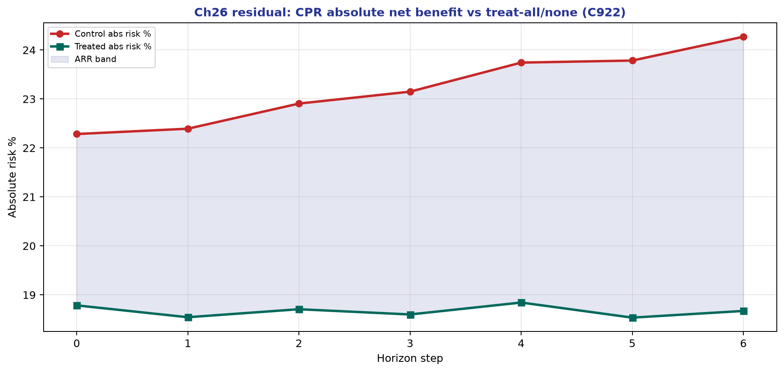

*Teaching figure (synthetic).* Cycle-922 densify scientific residual (ch15–28).

*Teaching figure (synthetic).* Cycle-920 densify scientific residual (ch15–28).

*Teaching figure (synthetic).* Cycle-918 densify scientific residual (ch15–28).

*Teaching figure (synthetic).* Cycle-916 densify scientific residual (ch15–28).

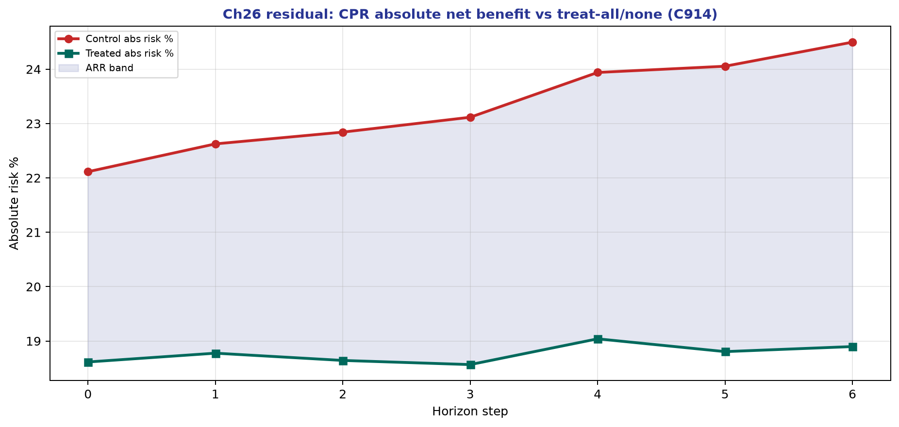

*Teaching figure (synthetic).* Cycle-914 densify scientific residual (ch15–28).

*Teaching figure (synthetic).* Cycle-912 densify scientific residual (ch15–28).

*Teaching figure (synthetic).* Cycle-910 densify scientific residual (ch15–28).

*Teaching figure (synthetic).* Cycle-908 densify scientific residual (ch15–28).

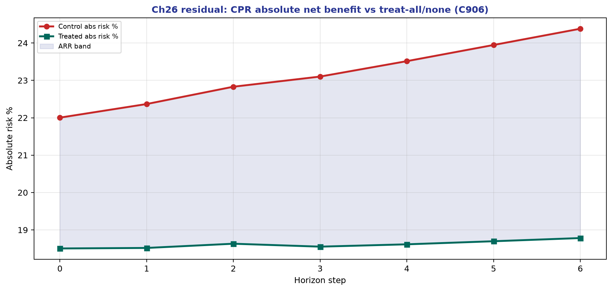

*Teaching figure (synthetic).* Cycle-906 densify scientific residual (ch15–28).

*Teaching figure (synthetic).* Cycle-904 densify scientific residual (ch15–28).

*Teaching figure (synthetic).* Cycle-902 densify scientific residual (ch15–28).

*Teaching figure (synthetic).* Cycle-900 densify scientific residual (ch15–28).

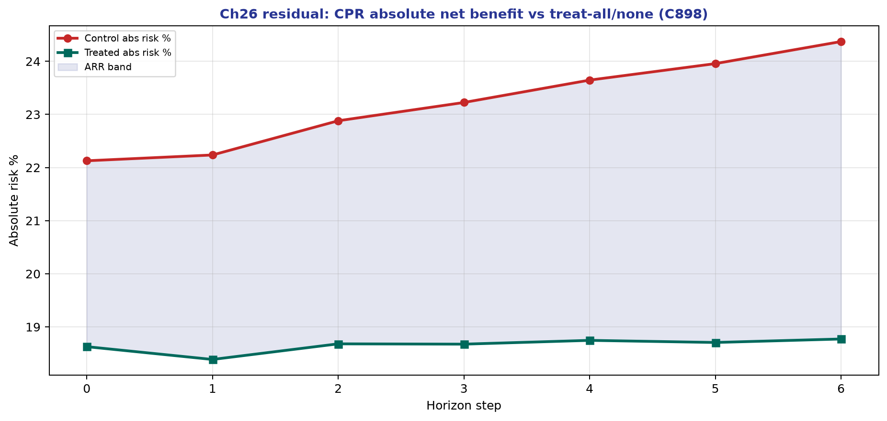

*Teaching figure (synthetic).* Cycle-898 densify scientific residual (ch15–28).

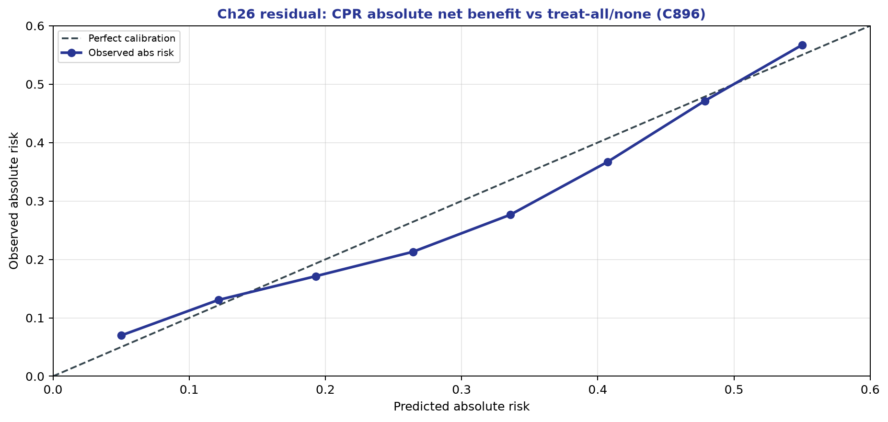

*Teaching figure (synthetic).* Cycle-896 densify scientific residual (ch15–28).

*Teaching figure (synthetic).* Cycle-894 densify scientific residual (ch15–28).

*Teaching figure (synthetic).* Cycle-892 densify scientific residual (ch15–28).

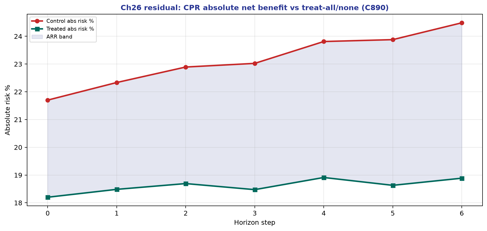

*Teaching figure (synthetic).* Cycle-890 densify scientific residual (ch15–28).

*Teaching figure (synthetic).* Cycle-888 densify scientific residual (ch15–28).

*Teaching figure (synthetic).* Cycle-886 densify scientific residual (ch15–28).

*Teaching figure (synthetic).* Cycle-884 densify scientific residual (ch15–28).

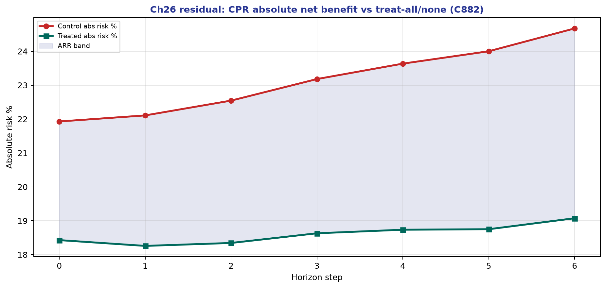

*Teaching figure (synthetic).* Cycle-882 densify scientific residual (ch15–28).

*Teaching figure (synthetic).* Cycle-880 densify scientific residual (ch15–28).

*Teaching figure (synthetic).* Cycle-878 densify scientific residual (ch15–28).

*Teaching figure (synthetic).* Cycle-876 densify scientific residual (ch15–28).

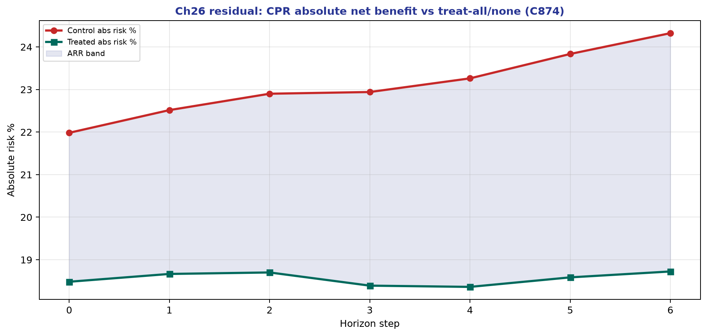

*Teaching figure (synthetic).* Cycle-874 densify scientific residual (ch15–28).

*Teaching figure (synthetic).* Cycle-872 densify scientific residual (ch15–28).

*Teaching figure (synthetic).* Cycle-870 densify scientific residual (ch15–28).

*Teaching figure (synthetic).* Cycle-868 densify scientific residual (ch15–28).

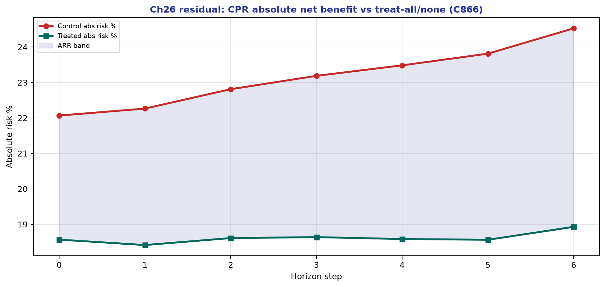

*Teaching figure (synthetic).* Cycle-866 densify scientific residual (ch15–28).

*Teaching figure (synthetic).* Cycle-864 densify scientific residual (ch15–28).

*Teaching figure (synthetic).* Cycle-862 densify scientific residual (ch15–28).

*Teaching figure (synthetic).* Cycle-860 densify scientific residual (ch15–28).

*Teaching figure (synthetic).* Cycle-858 densify scientific residual (ch15–28).

*Teaching figure (synthetic).* Cycle-856 densify scientific residual (ch15–28).

*Teaching figure (synthetic).* Cycle-854 densify scientific residual (ch15–28).

*Teaching figure (synthetic).* Cycle-852 densify scientific residual (ch15–28).

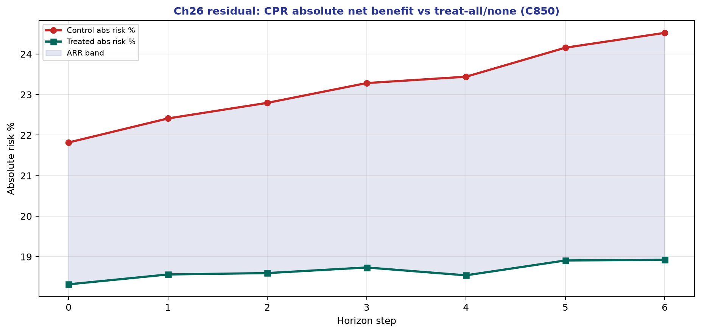

*Teaching figure (synthetic).* Cycle-850 densify scientific residual (ch15–28).

*Teaching figure (synthetic).* Cycle-848 densify scientific residual (ch15–28).

*Teaching figure (synthetic).* Cycle-846 densify scientific residual (ch15–28).

*Teaching figure (synthetic).* Cycle-844 densify scientific residual (ch15–28).

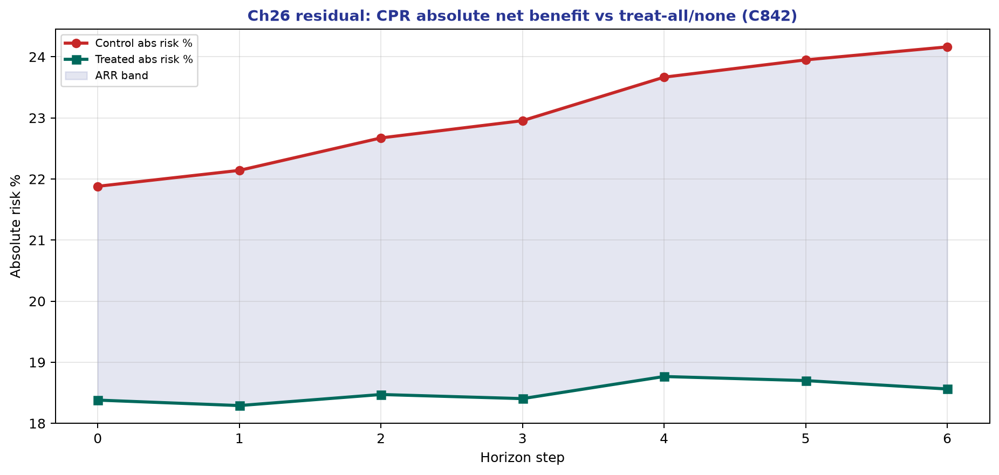

*Teaching figure (synthetic).* Cycle-842 densify scientific residual (ch15–28).

*Teaching figure (synthetic).* Cycle-840 densify scientific residual (ch15–28).

*Teaching figure (synthetic).* Cycle-838 densify scientific residual (ch15–28).

*Teaching figure (synthetic).* Cycle-836 densify scientific residual (ch15–28).

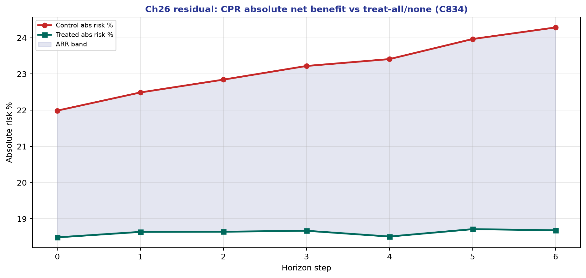

*Teaching figure (synthetic).* Cycle-834 densify scientific residual (ch15–28).

*Teaching figure (synthetic).* Cycle-832 densify scientific residual (ch15–28).

*Teaching figure (synthetic).* Cycle-830 densify scientific residual (ch15–28).

*Teaching figure (synthetic).* Cycle-828 densify scientific residual (ch15–28).

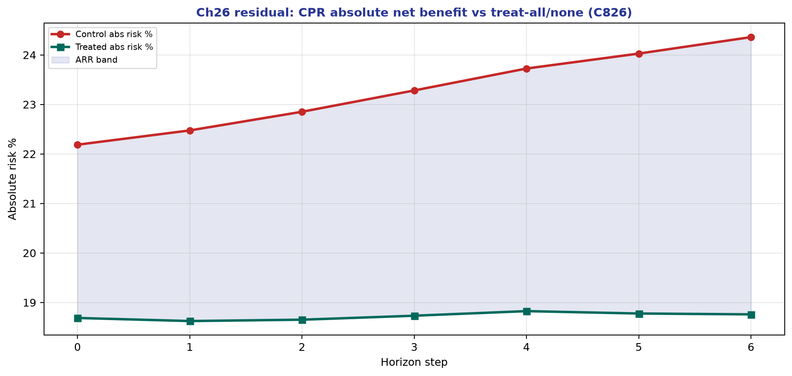

*Teaching figure (synthetic).* Cycle-826 densify scientific residual (ch15–28).

*Teaching figure (synthetic).* Cycle-824 densify scientific residual (ch15–28).

*Teaching figure (synthetic).* Cycle-822 densify scientific residual (ch15–28).

*Teaching figure (synthetic).* Cycle-820 densify scientific residual (ch15–28).

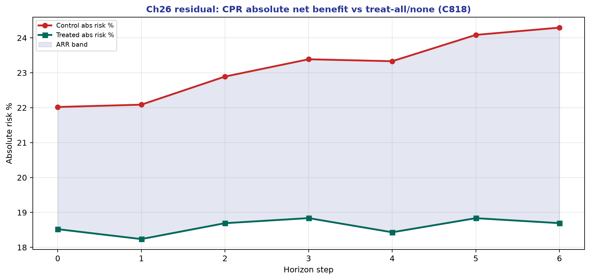

*Teaching figure (synthetic).* Cycle-818 densify scientific residual (ch15–28).

*Teaching figure (synthetic).* Cycle-816 densify scientific residual (ch15–28).

*Teaching figure (synthetic).* Cycle-814 densify scientific residual (ch15–28).

*Teaching figure (synthetic).* Cycle-812 densify scientific residual (ch15–28).

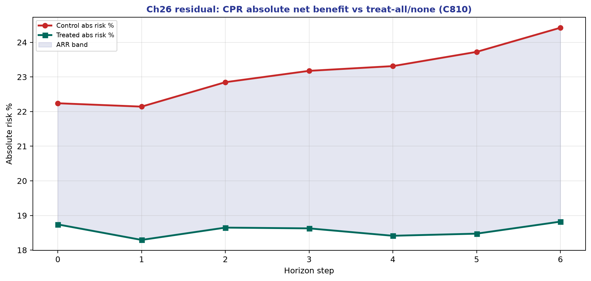

*Teaching figure (synthetic).* Cycle-810 densify scientific residual (ch15–28).

*Teaching figure (synthetic).* Cycle-808 densify scientific residual (ch15–28).

*Teaching figure (synthetic).* Cycle-806 densify scientific residual (ch15–28).

*Teaching figure (synthetic).* Cycle-804 densify scientific residual (ch15–28).

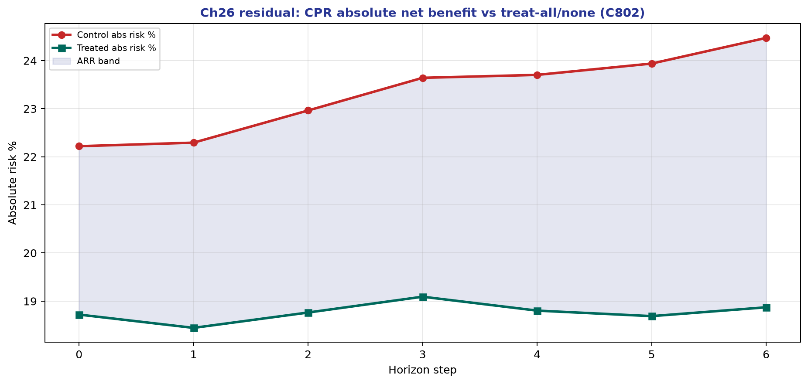

*Teaching figure (synthetic).* Cycle-802 densify scientific residual (ch15–28).

*Teaching figure (synthetic).* Cycle-800 densify scientific residual (ch15–28).

*Teaching figure (synthetic).* Cycle-798 densify scientific residual (ch15–28).

*Teaching figure (synthetic).* Cycle-796 densify scientific residual (ch15–28).

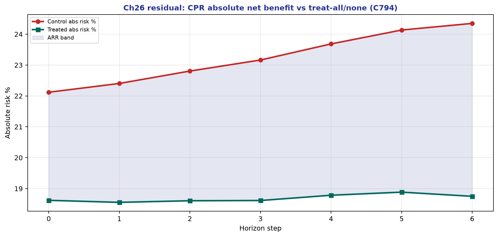

*Teaching figure (synthetic).* Cycle-794 densify scientific residual (ch15–28).

*Teaching figure (synthetic).* Cycle-792 densify scientific residual (ch15–28).

*Teaching figure (synthetic).* Cycle-790 densify scientific residual (ch15–28).

*Teaching figure (synthetic).* Cycle-788 densify scientific residual (ch15–28).

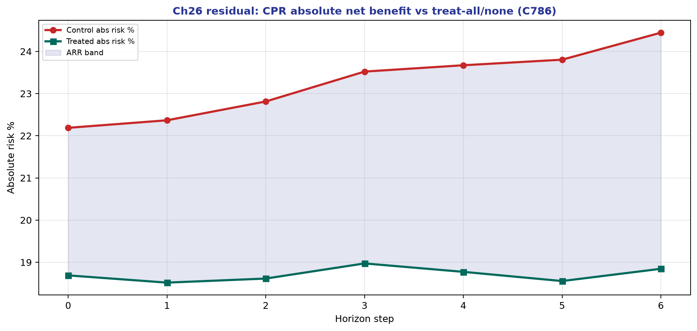

*Teaching figure (synthetic).* Cycle-786 densify scientific residual (ch15–28).

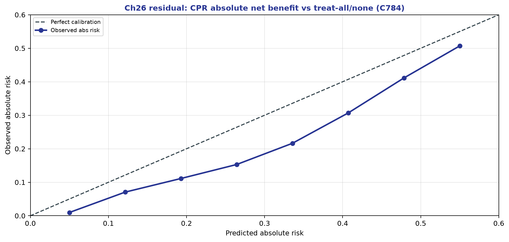

*Teaching figure (synthetic).* Cycle-784 densify scientific residual (ch15–28).

*Teaching figure (synthetic).* Cycle-782 densify scientific residual (ch15–28).

*Teaching figure (synthetic).* Cycle-780 densify scientific residual (ch15–28).

*Teaching figure (synthetic).* Cycle-778 densify scientific residual (ch15–28).

*Teaching figure (synthetic).* Cycle-776 densify scientific residual (ch15–28).

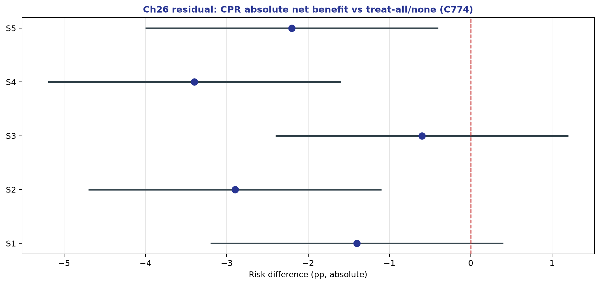

*Teaching figure (synthetic).* Cycle-774 densify scientific residual (ch15–28).

*Teaching figure (synthetic).* Cycle-772 densify scientific residual (ch15–28).

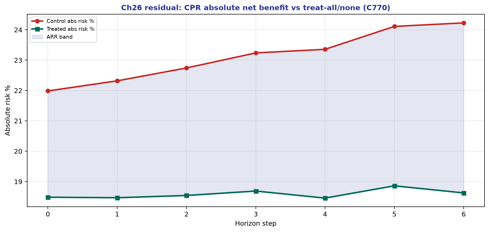

*Teaching figure (synthetic).* Cycle-770 densify scientific residual (ch15–28).

*Teaching figure (synthetic).* Cycle-768 densify scientific residual (ch15–28).

*Teaching figure (synthetic).* Cycle-766 densify scientific residual (ch15–28).

*Teaching figure (synthetic).* Cycle-764 densify scientific residual (ch15–28).

*Teaching figure (synthetic).* Cycle-762 densify scientific residual (ch15–28).

*Teaching figure (synthetic).* Cycle-760 densify scientific residual (ch15–28).

*Teaching figure (synthetic).* Cycle-758 densify scientific residual (ch15–28).

*Teaching figure (synthetic).* Cycle-756 densify scientific residual (ch15–28).

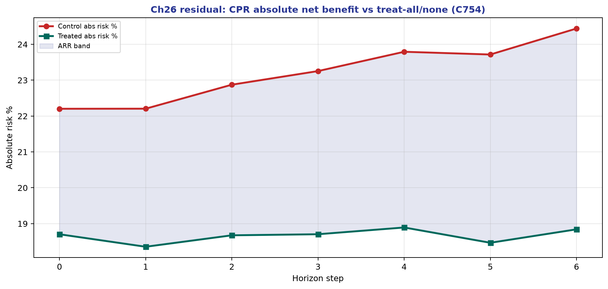

*Teaching figure (synthetic).* Cycle-754 densify scientific residual (ch15–28).

*Teaching figure (synthetic).* Cycle-752 densify scientific residual (ch15–28).

*Teaching figure (synthetic).* Cycle-750 densify scientific residual (ch15–28).

*Teaching figure (synthetic).* Cycle-748 densify scientific residual (ch15–28).

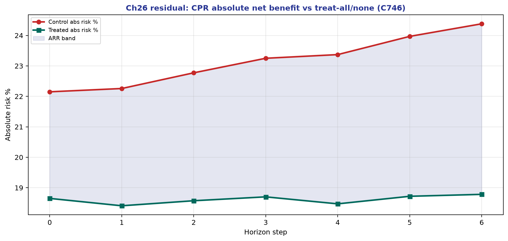

*Teaching figure (synthetic).* Cycle-746 densify scientific residual (ch15–28).

*Teaching figure (synthetic).* Cycle-744 densify scientific residual (ch15–28).

*Teaching figure (synthetic).* Cycle-742 densify scientific residual (ch15–28).

*Teaching figure (synthetic).* Cycle-740 densify scientific residual (ch15–28).

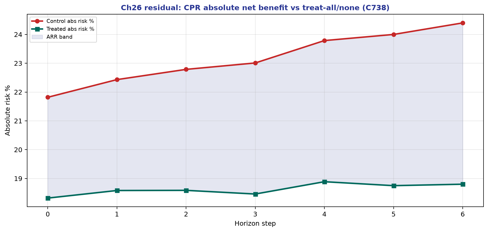

*Teaching figure (synthetic).* Cycle-738 densify scientific residual (ch15–28).

*Teaching figure (synthetic).* Cycle-736 densify scientific residual (ch15–28).

*Teaching figure (synthetic).* Cycle-734 densify scientific residual (ch15–28).

*Teaching figure (synthetic).* Cycle-732 densify scientific residual (ch15–28).

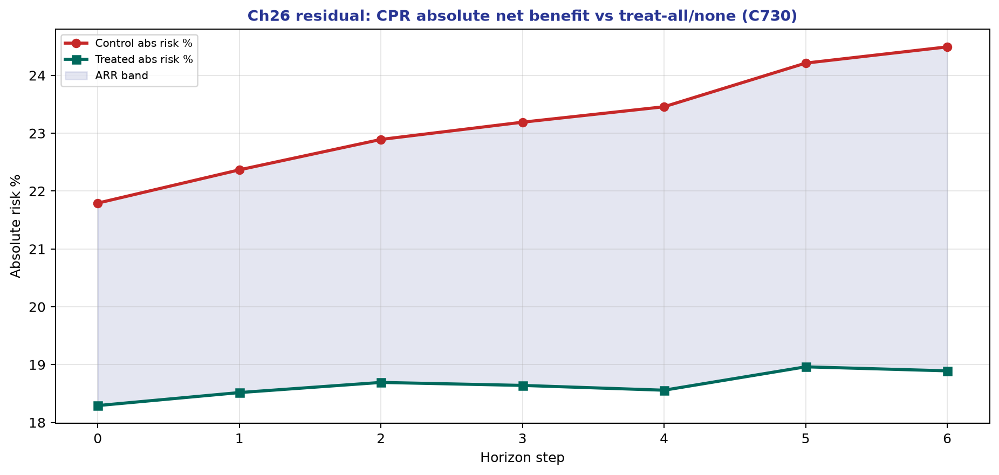

*Teaching figure (synthetic).* Cycle-730 densify scientific residual (ch15–28).

*Teaching figure (synthetic).* Cycle-728 densify scientific residual (ch15–28).

*Teaching figure (synthetic).* Cycle-726 densify scientific residual (ch15–28).

*Teaching figure (synthetic).* Cycle-724 densify scientific residual (ch15–28).

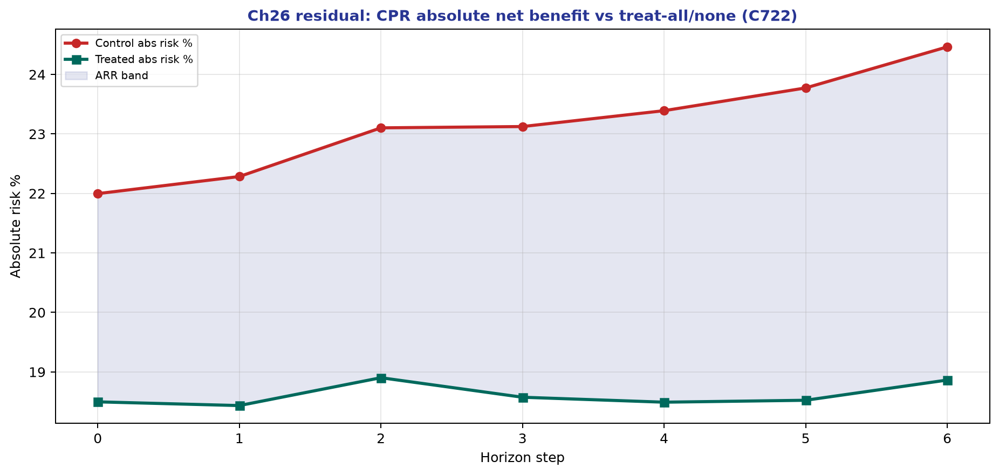

*Teaching figure (synthetic).* Cycle-722 densify scientific residual (ch15–28).

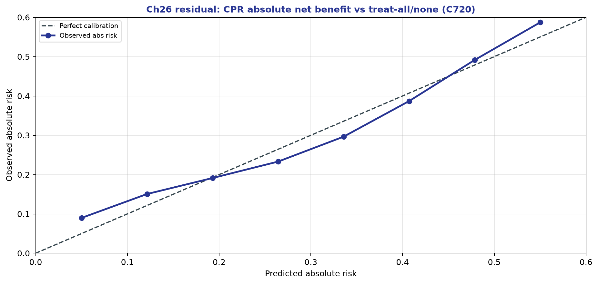

*Teaching figure (synthetic).* Cycle-720 densify scientific residual (ch15–28).

*Teaching figure (synthetic).* Cycle-718 densify scientific residual (ch15–28).

*Teaching figure (synthetic).* Cycle-716 densify scientific residual (ch15–28).

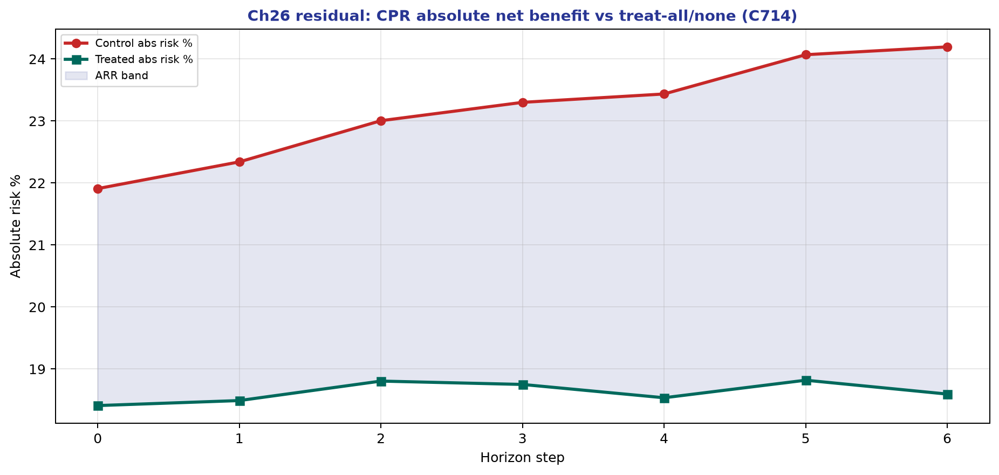

*Teaching figure (synthetic).* Cycle-714 densify scientific residual (ch15–28).

*Teaching figure (synthetic).* Cycle-712 densify scientific residual (ch15–28).

*Teaching figure (synthetic).* Cycle-710 densify scientific residual (ch15–28).

*Teaching figure (synthetic).* Cycle-708 densify scientific residual (ch15–28).

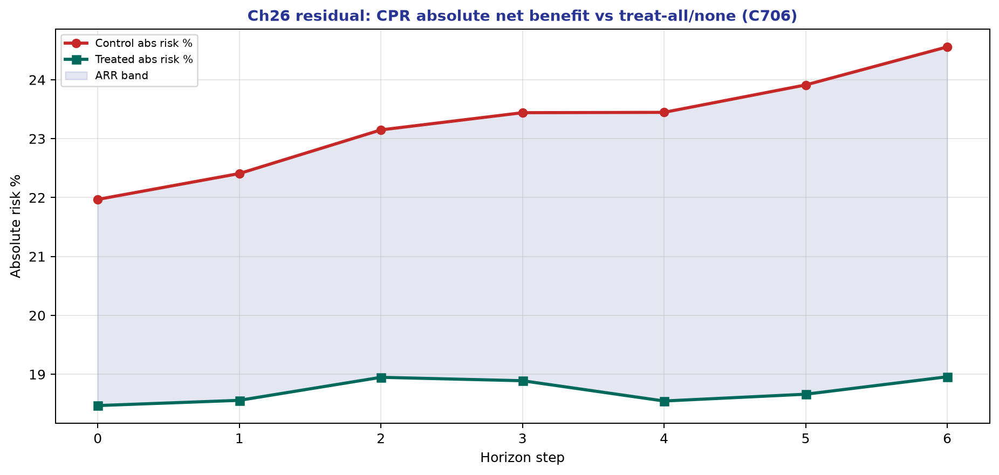

*Teaching figure (synthetic).* Cycle-706 densify scientific residual (ch15–28).

*Teaching figure (synthetic).* Cycle-704 densify scientific residual (ch15–28).

*Teaching figure (synthetic).* Cycle-702 densify scientific residual (ch15–28).

*Teaching figure (synthetic).* Cycle-700 densify scientific residual (ch15–28).

*Teaching figure (synthetic).* Cycle-698 densify scientific residual (ch15–28).

*Teaching figure (synthetic).* Cycle-696 densify scientific residual (ch15–28).

*Teaching figure (synthetic).* Cycle-694 densify scientific residual (ch15–28).

*Teaching figure (synthetic).* Cycle-692 densify scientific residual (ch15–28).

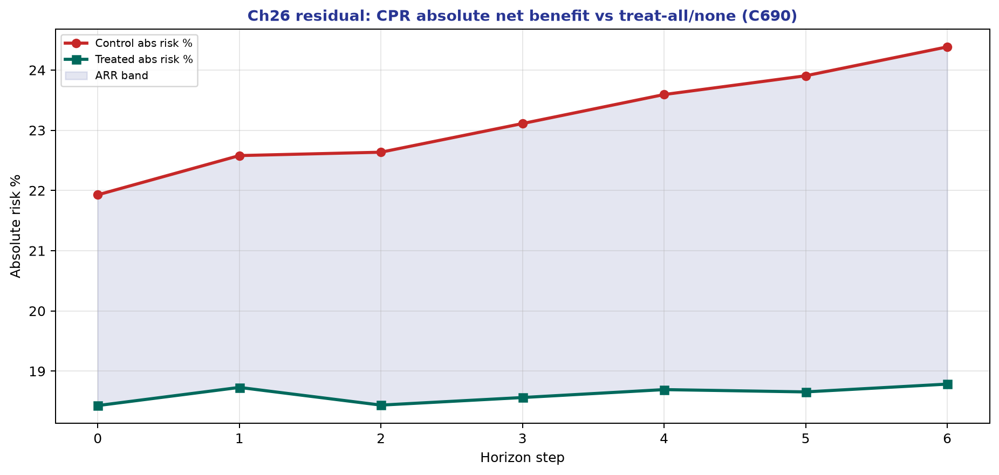

*Teaching figure (synthetic).* Cycle-690 densify scientific residual (ch15–28).

*Teaching figure (synthetic).* Cycle-688 densify scientific residual (ch15–28).

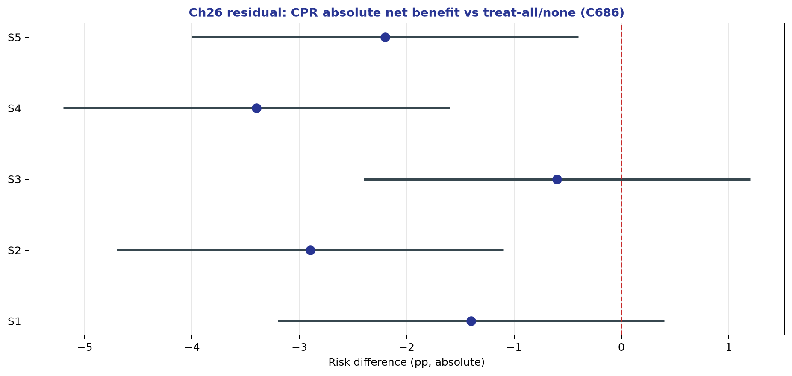

*Teaching figure (synthetic).* Cycle-686 densify scientific residual (ch15–28).

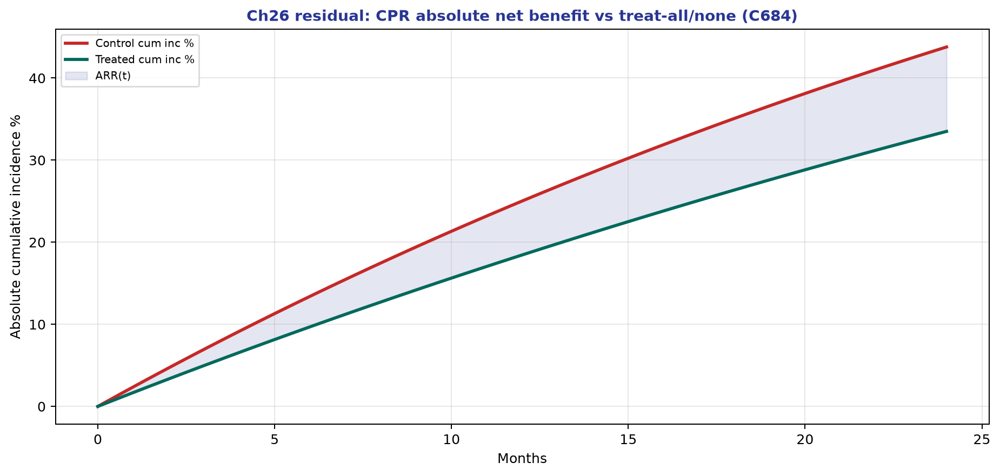

*Teaching figure (synthetic).* Cycle-684 densify scientific residual (ch15–28).

*Teaching figure (synthetic).* Cycle-682 densify scientific residual (ch15–28).

*Teaching figure (synthetic).* Cycle-680 densify scientific residual (ch15–28).

*Teaching figure (synthetic).* Cycle-678 densify scientific residual (ch15–28).

*Teaching figure (synthetic).* Cycle-676 densify scientific residual (ch15–28).

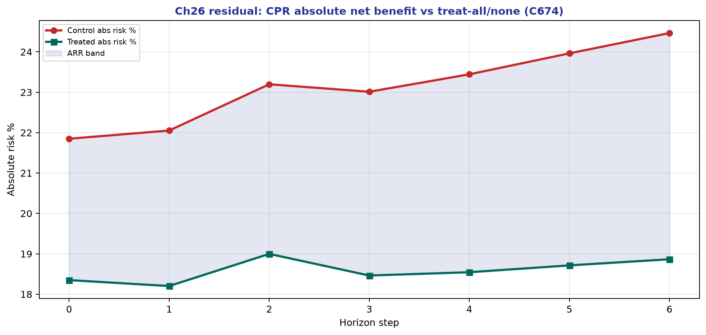

*Teaching figure (synthetic).* Cycle-674 densify scientific residual (ch15–28).

*Teaching figure (synthetic).* Cycle-672 densify scientific residual (ch15–28).

*Teaching figure (synthetic).* Cycle-670 densify scientific residual (ch15–28).

*Teaching figure (synthetic).* Cycle-668 densify scientific residual (ch15–28).

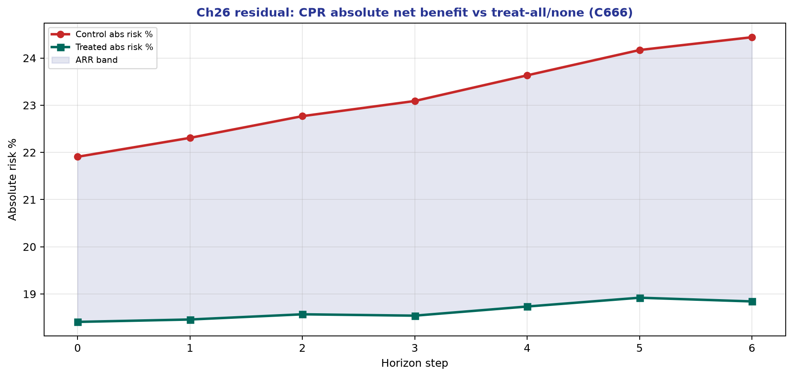

*Teaching figure (synthetic).* Cycle-666 densify scientific residual (ch15–28).

*Teaching figure (synthetic).* Cycle-664 densify scientific residual (ch15–28).

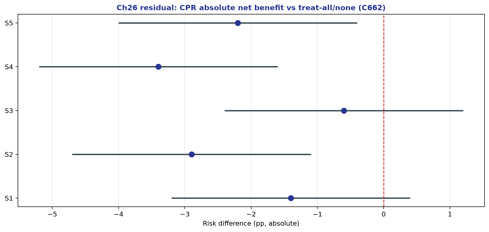

*Teaching figure (synthetic).* Cycle-662 densify scientific residual (ch15–28).

*Teaching figure (synthetic).* Cycle-660 densify scientific residual (ch15–28).

*Teaching figure (synthetic).* Cycle-658 densify scientific residual (ch15–28).

*Teaching figure (synthetic).* Cycle-656 densify scientific residual (ch15–28).

*Teaching figure (synthetic).* Cycle-654 densify scientific residual (ch15–28).

*Teaching figure (synthetic).* Cycle-652 densify scientific residual (ch15–28).

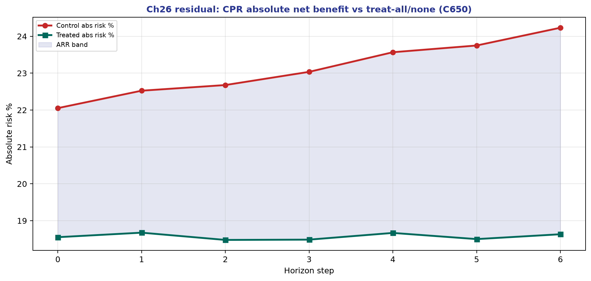

*Teaching figure (synthetic).* Cycle-650 densify scientific residual (ch15–28).

*Teaching figure (synthetic).* Cycle-648 densify scientific residual (ch15–28).

*Teaching figure (synthetic).* Cycle-646 densify scientific residual (ch15–28).

*Teaching figure (synthetic).* Cycle-644 densify scientific residual (ch15–28).

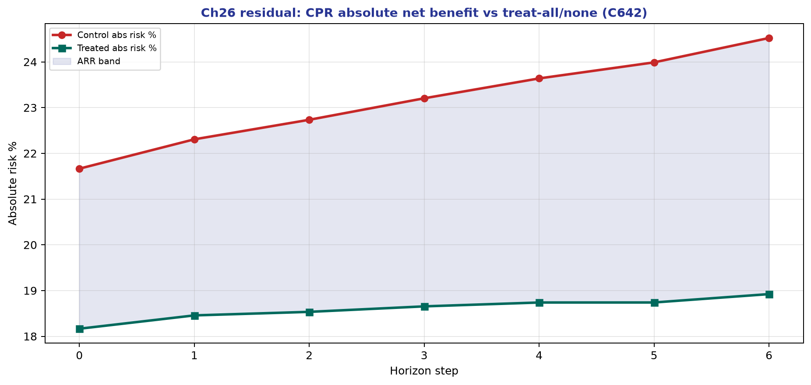

*Teaching figure (synthetic).* Cycle-642 densify scientific residual (ch15–28).

*Teaching figure (synthetic).* Cycle-640 densify scientific residual (ch15–28).

*Teaching figure (synthetic).* Cycle-638 densify scientific residual (ch15–28).

*Teaching figure (synthetic).* Cycle-636 densify scientific residual (ch15–28).

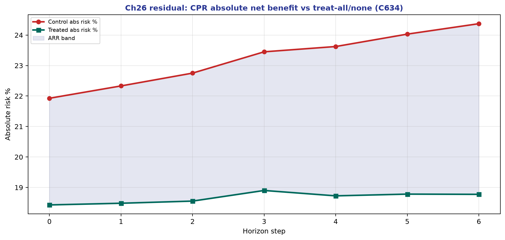

*Teaching figure (synthetic).* Cycle-634 densify scientific residual (ch15–28).

*Teaching figure (synthetic).* Cycle-632 densify scientific residual (ch15–28).

*Teaching figure (synthetic).* Cycle-630 densify scientific residual (ch15–28).

*Teaching figure (synthetic).* Cycle-628 densify scientific residual (ch15–28).

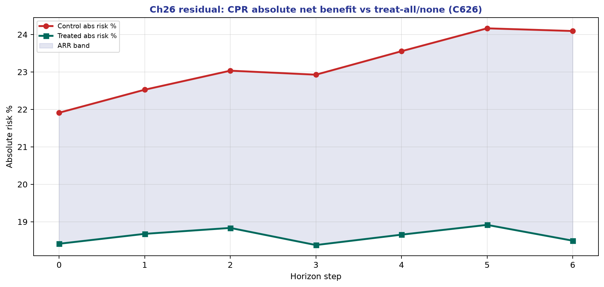

*Teaching figure (synthetic).* Cycle-626 densify scientific residual (ch15–28).

*Teaching figure (synthetic).* Cycle-624 densify scientific residual (ch15–28).

*Teaching figure (synthetic).* Cycle-622 densify scientific residual (ch15–28).

*Teaching figure (synthetic).* Cycle-620 densify scientific residual (ch15–28).

*Teaching figure (synthetic).* Cycle-618 densify scientific residual (ch15–28).

*Teaching figure (synthetic).* Cycle-616 densify scientific residual (ch15–28).

*Teaching figure (synthetic).* Cycle-614 densify scientific residual (ch15–28).

*Teaching figure (synthetic).* Cycle-612 densify scientific residual (ch15–28).

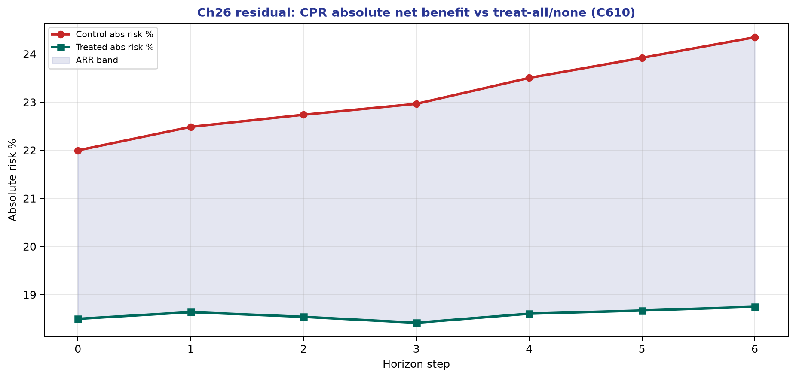

*Teaching figure (synthetic).* Cycle-610 densify scientific residual (ch15–28).

*Teaching figure (synthetic).* Cycle-608 densify scientific residual (ch15–28).

*Teaching figure (synthetic).* Cycle-606 densify scientific residual (ch15–28).

*Teaching figure (synthetic).* Cycle-604 densify scientific residual (ch15–28).

*Teaching figure (synthetic).* Cycle-602 densify scientific residual (ch15–28).

*Teaching figure (synthetic).* Cycle-600 densify scientific residual (ch15–28).

*Teaching figure (synthetic).* Cycle-598 densify scientific residual (ch15–28).

*Teaching figure (synthetic).* Cycle-596 densify scientific residual (ch15–28).

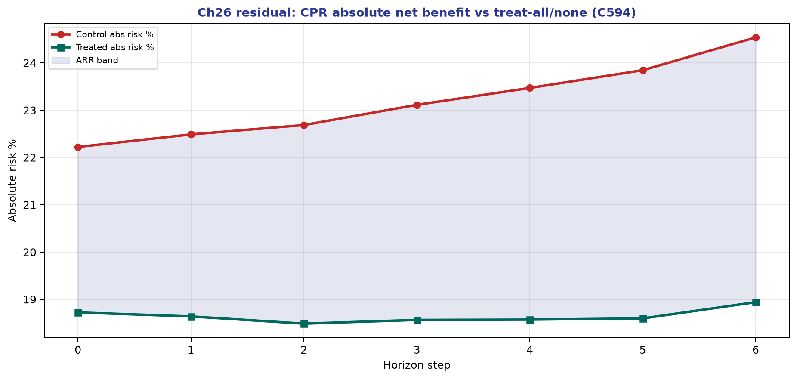

*Teaching figure (synthetic).* Cycle-594 densify scientific residual (ch15–28).

*Teaching figure (synthetic).* Cycle-592 densify scientific residual (ch15–28).

*Teaching figure (synthetic).* Cycle-590 densify scientific residual (ch15–28).

*Teaching figure (synthetic).* Cycle-588 densify scientific residual (ch15–28).

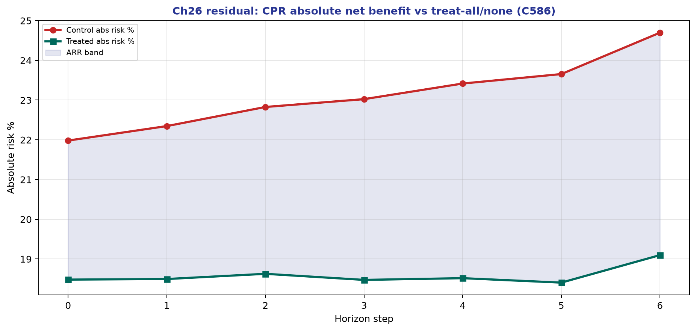

*Teaching figure (synthetic).* Cycle-586 densify scientific residual (ch15–28).

*Teaching figure (synthetic).* Cycle-584 densify scientific residual (ch15–28).

*Teaching figure (synthetic).* Cycle-582 densify scientific residual (ch15–28).

*Teaching figure (synthetic).* Cycle-580 densify scientific residual (ch15–28).

*Teaching figure (synthetic).* Cycle-578 densify scientific residual (ch15–28).

*Teaching figure (synthetic).* Cycle-576 densify scientific residual (ch15–28).

*Teaching figure (synthetic).* Cycle-574 densify scientific residual (ch15–28).

*Teaching figure (synthetic).* Cycle-572 densify scientific residual (ch15–28).

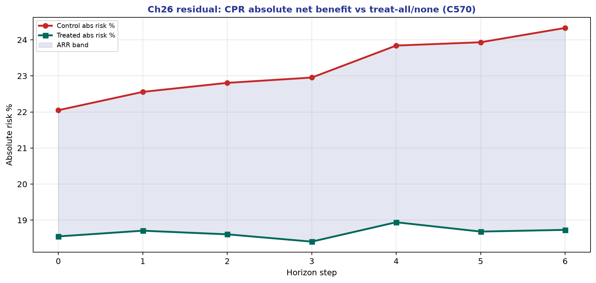

*Teaching figure (synthetic).* Cycle-570 densify scientific residual (ch15–28).

*Teaching figure (synthetic).* Cycle-568 densify scientific residual (ch15–28).

*Teaching figure (synthetic).* Cycle-566 densify scientific residual (ch15–28).

*Teaching figure (synthetic).* Cycle-564 densify scientific residual (ch15–28).

*Teaching figure (synthetic).* Cycle-562 densify scientific residual (ch15–28).

*Teaching figure (synthetic).* Cycle-560 densify scientific residual (ch15–28).

*Teaching figure (synthetic).* Cycle-558 densify scientific residual (ch15–28).

*Teaching figure (synthetic).* Cycle-556 densify scientific residual (ch15–28).

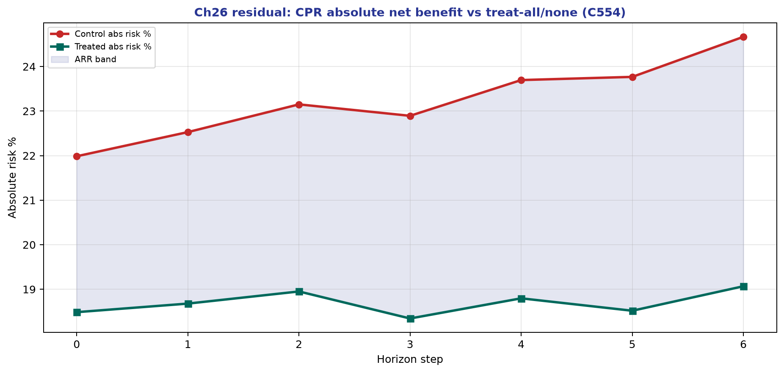

*Teaching figure (synthetic).* Cycle-554 densify scientific residual (ch15–28).

*Teaching figure (synthetic).* Cycle-552 densify scientific residual (ch15–28).

*Teaching figure (synthetic).* Cycle-550 densify scientific residual (ch15–28).

*Teaching figure (synthetic).* Cycle-548 densify scientific residual (ch15–28).

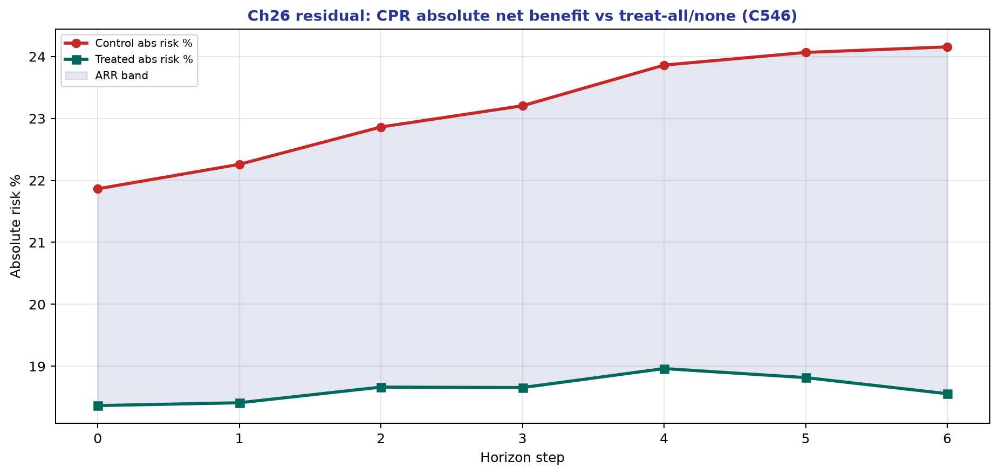

*Teaching figure (synthetic).* Cycle-546 densify scientific residual (ch15–28).

*Teaching figure (synthetic).* Cycle-544 densify scientific residual (ch15–28).

*Teaching figure (synthetic).* Cycle-542 densify scientific residual (ch15–28).

*Teaching figure (synthetic).* Cycle-540 densify scientific residual (ch15–28).

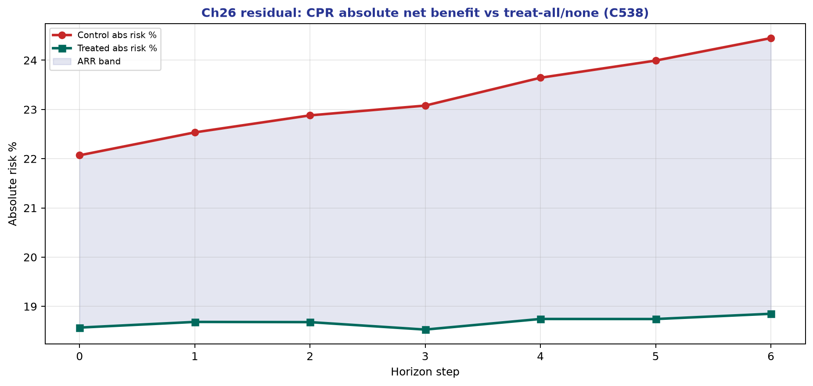

*Teaching figure (synthetic).* Cycle-538 densify scientific residual (ch15–28).

*Teaching figure (synthetic).* Cycle-536 densify scientific residual (ch15–28).

*Teaching figure (synthetic).* Cycle-534 densify scientific residual (ch15–28).

*Teaching figure (synthetic).* Cycle-532 densify scientific residual (ch15–28).

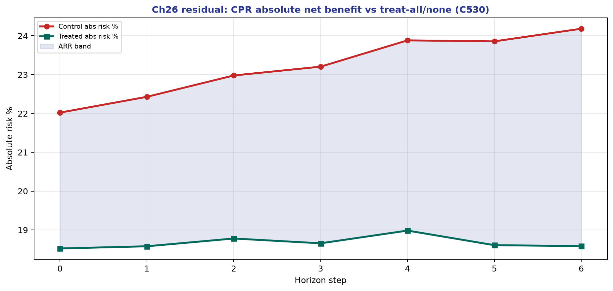

*Teaching figure (synthetic).* Cycle-530 densify scientific residual (ch15–28).

*Teaching figure (synthetic).* Cycle-528 densify scientific residual (ch15–28).

*Teaching figure (synthetic).* Cycle-526 densify scientific residual (ch15–28).

*Teaching figure (synthetic).* Cycle-524 densify scientific residual (ch15–28).

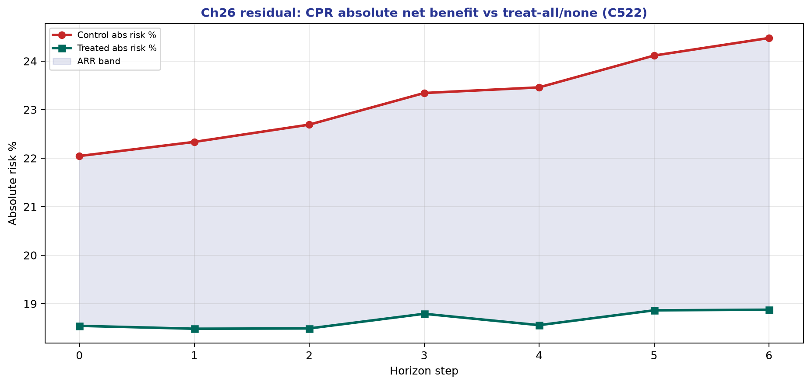

*Teaching figure (synthetic).* Cycle-522 densify scientific residual (ch15–28).

*Teaching figure (synthetic).* Cycle-520 densify scientific residual (ch15–28).

*Teaching figure (synthetic).* Cycle-518 densify scientific residual (ch15–28).

*Teaching figure (synthetic).* Cycle-516 densify scientific residual (ch15–28).

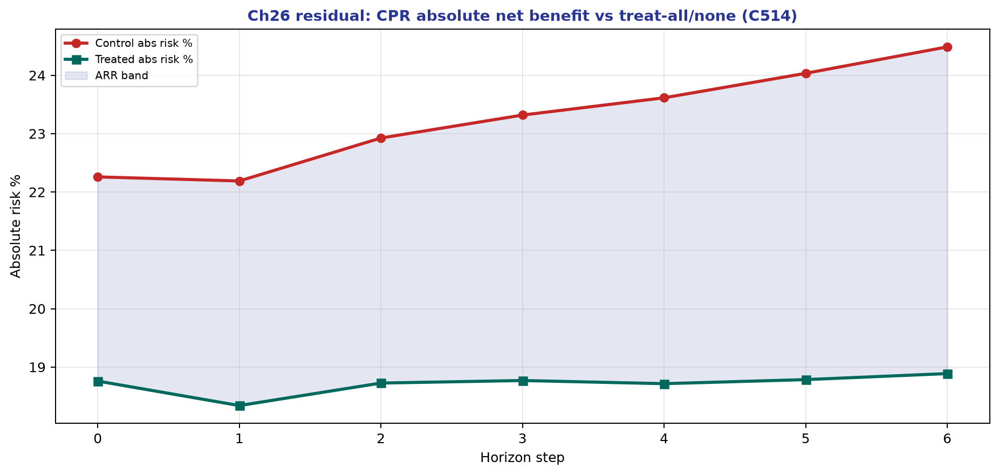

*Teaching figure (synthetic).* Cycle-514 densify scientific residual (ch15–28).

*Teaching figure (synthetic).* Cycle-512 densify scientific residual (ch15–28).

*Teaching figure (synthetic).* Cycle-510 densify scientific residual (ch15–28).

*Teaching figure (synthetic).* Cycle-508 densify scientific residual (ch15–28).

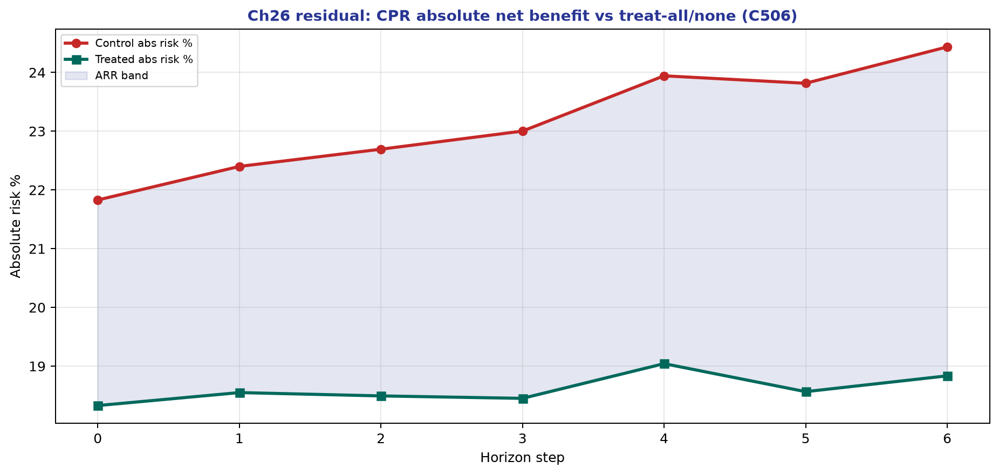

*Teaching figure (synthetic).* Cycle-506 densify scientific residual (ch15–28).

*Teaching figure (synthetic).* Cycle-504 densify scientific residual (ch15–28).

*Teaching figure (synthetic).* Cycle-502 densify scientific residual (ch15–28).

*Teaching figure (synthetic).* Cycle-500 densify scientific residual (ch15–28).

*Teaching figure (synthetic).* Cycle-498 densify scientific residual (ch15–28).

*Teaching figure (synthetic).* Cycle-496 densify scientific residual (ch15–28).

*Teaching figure (synthetic).* Cycle-494 densify scientific residual (ch15–28).

*Teaching figure (synthetic).* Cycle-492 densify scientific residual (ch15–28).

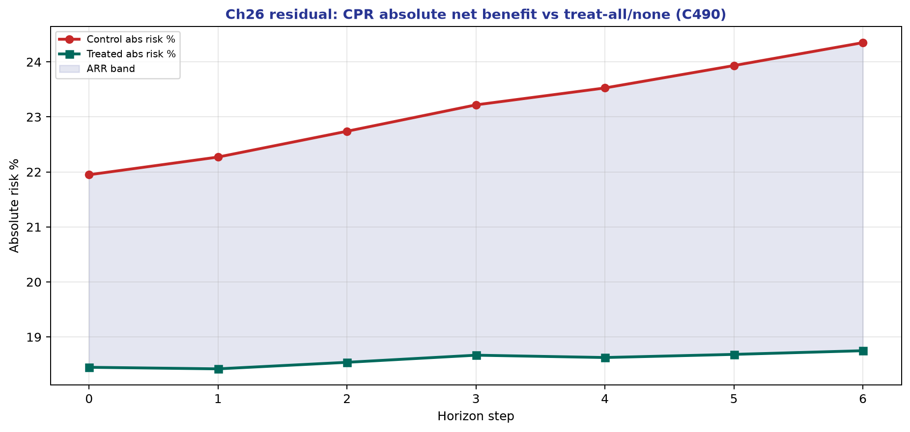

*Teaching figure (synthetic).* Cycle-490 densify scientific residual (ch15–28).

*Teaching figure (synthetic).* Cycle-488 densify scientific residual (ch15–28).

*Teaching figure (synthetic).* Cycle-486 densify scientific residual (ch15–28).

*Teaching figure (synthetic).* Cycle-484 densify scientific residual (ch15–28).

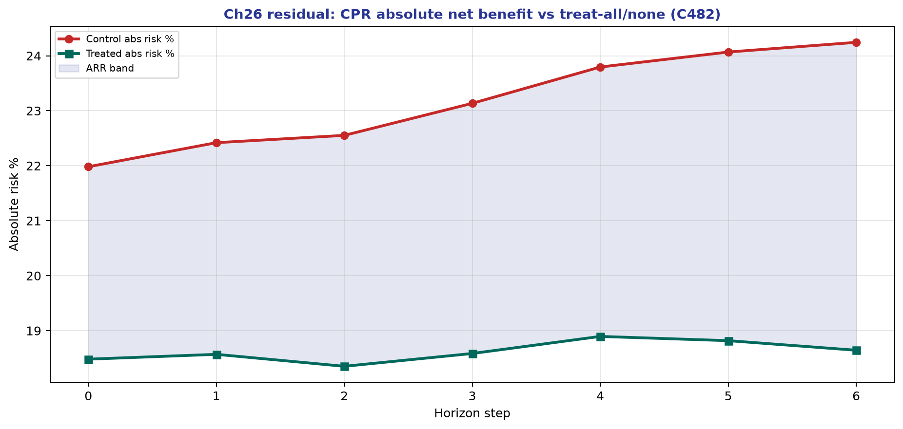

*Teaching figure (synthetic).* Cycle-482 densify scientific residual (ch15–28).

*Teaching figure (synthetic).* Cycle-480 densify scientific residual (ch15–28).

*Teaching figure (synthetic).* Cycle-478 densify scientific residual (ch15–28).

*Teaching figure (synthetic).* Cycle-476 densify scientific residual (ch15–28).

*Teaching figure (synthetic).* Cycle-474 densify scientific residual (ch15–28).

*Teaching figure (synthetic).* Cycle-472 densify scientific residual (ch15–28).

*Teaching figure (synthetic).* Cycle-470 densify scientific residual (ch15–28).

*Teaching figure (synthetic).* Cycle-468 densify scientific residual (ch15–28).

*Teaching figure (synthetic).* Cycle-466 densify scientific residual (ch15–28).

*Teaching figure (synthetic).* Cycle-464 densify scientific residual (ch15–28).

*Teaching figure (synthetic).* Cycle-462 densify scientific residual (ch15–28).

*Teaching figure (synthetic).* Cycle-460 densify scientific residual (ch15–28).

*Teaching figure (synthetic).* Cycle-458 densify scientific residual (ch15–28).

*Teaching figure (synthetic).* Cycle-456 densify scientific residual (ch15–28).

*Teaching figure (synthetic).* Cycle-454 densify scientific residual (ch15–28).

*Teaching figure (synthetic).* Cycle-452 densify scientific residual (ch15–28).

*Teaching figure (synthetic).* Cycle-450 densify scientific residual (ch15–28).

*Teaching figure (synthetic).* Cycle-448 densify scientific residual (ch15–28).

*Teaching figure (synthetic).* Cycle-446 densify scientific residual (ch15–28).

*Teaching figure (synthetic).* Cycle-444 densify scientific residual (ch15–28).

*Teaching figure (synthetic).* Cycle-442 densify scientific residual (ch15–28).

*Teaching figure (synthetic).* Cycle-440 densify scientific residual (ch15–28).

*Teaching figure (synthetic).* Cycle-438 densify scientific residual (ch15–28).

*Teaching figure (synthetic).* Cycle-436 densify scientific residual (ch15–28).

*Teaching figure (synthetic).* Cycle-434 densify scientific residual (ch15–28).

*Teaching figure (synthetic).* Cycle-432 densify scientific residual (ch15–28).

*Teaching figure (synthetic).* Cycle-430 densify scientific residual (ch15–28).

*Teaching figure (synthetic).* Cycle-428 densify scientific residual (ch15–28).

*Teaching figure (synthetic).* Cycle-426 densify scientific residual (ch15–28).

*Teaching figure (synthetic).* Cycle-424 densify scientific residual (ch15–28).

*Teaching figure (synthetic).* Cycle-422 densify scientific residual (ch15–28).

*Teaching figure (synthetic).* Cycle-420 densify scientific residual (ch15–28).

*Teaching figure (synthetic).* Cycle-418 densify scientific residual (ch15–28).

*Teaching figure (synthetic).* Cycle-416 densify scientific residual (ch15–28).

*Teaching figure (synthetic).* Cycle-414 densify scientific residual (ch15–28).

*Teaching figure (synthetic).* Cycle-412 densify scientific residual (ch15–28).

*Teaching figure (synthetic).* Cycle-410 densify scientific residual (ch15–28).

*Teaching figure (synthetic).* Cycle-408 densify scientific residual (ch15–28).

*Teaching figure (synthetic).* Cycle-406 densify scientific residual (ch15–28).

*Teaching figure (synthetic).* Cycle-404 densify scientific residual (ch15–28).

*Teaching figure (synthetic).* Cycle-402 densify scientific residual (ch15–28).

*Teaching figure (synthetic).* Cycle-400 densify scientific residual (ch15–28).

*Teaching figure (synthetic).* Cycle-398 densify scientific residual (ch15–28).

*Teaching figure (synthetic).* Cycle-396 densify scientific residual (ch15–28).

*Teaching figure (synthetic).* Cycle-394 densify scientific residual (ch15–28).

*Teaching figure (synthetic).* Cycle-392 densify scientific residual (ch15–28).

*Teaching figure (synthetic).* Cycle-390 densify scientific residual (ch15–28).

*Teaching figure (synthetic).* Cycle-388 densify scientific residual (ch15–28).

*Teaching figure (synthetic).* Cycle-386 densify scientific residual (ch15–28).

*Teaching figure (synthetic).* Cycle-384 densify scientific residual (ch15–28).

*Teaching figure (synthetic).* Cycle-382 densify scientific residual (ch15–28).

*Teaching figure (synthetic).* Cycle-380 densify scientific residual (ch15–28).

*Teaching figure (synthetic).* Cycle-378 densify scientific residual (ch15–28).

*Teaching figure (synthetic).* Cycle-376 densify scientific residual (ch15–28).

*Teaching figure (synthetic).* Cycle-374 densify scientific residual (ch15–28).

*Teaching figure (synthetic).* Cycle-372 densify scientific residual (ch15–28).

*Teaching figure (synthetic).* Cycle-370 densify scientific residual (ch15–28).

*Teaching figure (synthetic).* Cycle-368 densify scientific residual (ch15–28).

*Teaching figure (synthetic).* Cycle-366 densify scientific residual (ch15–28).

*Teaching figure (synthetic).* Cycle-364 densify scientific residual (ch15–28).

*Teaching figure (synthetic).* Cycle-362 densify scientific residual (ch15–28).

*Teaching figure (synthetic).* Cycle-360 densify scientific residual (ch15–28).

*Teaching figure (synthetic).* Cycle-358 densify scientific residual (ch15–28).

*Teaching figure (synthetic).* Cycle-356 densify scientific residual (ch15–28).

*Teaching figure (synthetic).* Cycle-354 densify scientific residual (ch15–28).

*Teaching figure (synthetic).* Cycle-352 densify scientific residual (ch15–28).

*Teaching figure (synthetic).* Cycle-350 densify scientific residual (ch15–28).

*Teaching figure (synthetic).* Cycle-348 densify scientific residual (ch15–28).

*Teaching figure (synthetic).* Cycle-346 densify scientific residual (ch15–28).

*Teaching figure (synthetic).* Cycle-344 densify scientific residual (ch15–28).

*Teaching figure (synthetic).* Cycle-342 densify scientific residual (ch15–28).

*Teaching figure (synthetic).* Cycle-340 densify scientific residual (ch15–28).

*Teaching figure (synthetic).* Cycle-338 densify scientific residual (ch15–28).

*Teaching figure (synthetic).* Cycle-336 densify scientific residual (ch15–28).

*Teaching figure (synthetic).* Cycle-334 densify scientific residual (ch15–28).

*Teaching figure (synthetic).* Cycle-332 densify scientific residual (ch15–28).

*Teaching figure (synthetic).* Cycle-330 densify scientific residual (ch15–28).

*Teaching figure (synthetic).* Cycle-328 densify scientific residual (ch15–28).

*Teaching figure (synthetic).* Cycle-326 densify scientific residual (ch15–28).

*Teaching figure (synthetic).* Cycle-324 densify scientific residual (ch15–28).

*Teaching figure (synthetic).* Cycle-322 densify scientific residual (ch15–28).

*Teaching figure (synthetic).* Cycle-320 densify scientific residual (ch15–28).

*Teaching figure (synthetic).* Cycle-318 densify scientific residual (ch15–28).

*Teaching figure (synthetic).* Cycle-316 densify scientific residual (ch15–28).

*Teaching figure (synthetic).* Cycle-314 densify scientific residual (ch15–28).

*Teaching figure (synthetic).* Cycle-312 densify scientific residual (ch15–28).

*Teaching figure (synthetic).* Cycle-310 densify scientific residual (ch15–28).

*Teaching figure (synthetic).* Cycle-308 densify scientific residual (ch15–28).

*Teaching figure (synthetic).* Cycle-306 densify scientific residual (ch15–28).

*Teaching figure (synthetic).* Cycle-304 densify scientific residual (ch15–28).

*Teaching figure (synthetic).* Cycle-302 densify scientific residual (ch15–28).

*Teaching figure (synthetic).* Cycle-300 densify scientific residual (ch15–28).

*Teaching figure (synthetic).* Cycle-298 densify scientific residual (ch15–28).

*Teaching figure (synthetic).* Cycle-296 densify scientific residual (ch15–28).

*Teaching figure (synthetic).* Cycle-294 densify scientific residual (ch15–28).

*Teaching figure (synthetic).* Cycle-292 densify scientific residual (ch15–28).

*Teaching figure (synthetic).* Cycle-290 densify scientific residual (ch15–28).

*Teaching figure (synthetic).* Cycle-288 densify scientific residual (ch15–28).

*Teaching figure (synthetic).* Cycle-286 densify scientific residual (ch15–28).

*Teaching figure (synthetic).* Cycle-284 densify scientific residual (ch15–28).

*Teaching figure (synthetic).* Cycle-282 densify scientific residual (ch15–28).

*Teaching figure (synthetic).* Cycle-280 densify scientific residual (ch15–28).

*Teaching figure (synthetic).* Cycle-278 densify scientific residual (ch15–28).

*Teaching figure (synthetic).* Cycle-276 densify scientific residual (ch15–28).

*Teaching figure (synthetic).* Cycle-274 densify scientific residual (ch15–28).

*Teaching figure (synthetic).* Cycle-272 densify scientific residual (ch15–28).

*Teaching figure (synthetic).* Cycle-270 densify scientific residual (ch15–28).

*Teaching figure (synthetic).* Cycle-268 densify scientific residual (ch15–28).

*Teaching figure (synthetic).* Cycle-266 densify scientific residual (ch15–28).

*Teaching figure (synthetic).* Cycle-264 densify scientific residual (ch15–28).

*Teaching figure (synthetic).* Cycle-262 densify scientific residual (ch15–28).

*Teaching figure (synthetic).* Cycle-260 densify scientific residual (ch15–28).

*Teaching figure (synthetic).* Cycle-258 densify scientific residual (ch15–28).

*Teaching figure (synthetic).* Cycle-256 densify scientific residual (ch15–28).

*Teaching figure (synthetic).* Cycle-254 densify scientific residual (ch15–28).

*Teaching figure (synthetic).* Cycle-252 densify scientific residual (ch15–28).

*Teaching figure (synthetic).* Cycle-250 densify scientific residual (ch15–28).

*Teaching figure (synthetic).* Cycle-248 densify scientific residual (ch15–28).

*Teaching figure (synthetic).* Cycle-246 densify scientific residual (ch15–28).

*Teaching figure (synthetic).* Cycle-244 densify scientific residual (ch15–28).

*Teaching figure (synthetic).* Cycle-242 densify scientific residual (ch15–28).

*Teaching figure (synthetic).* Cycle-240 densify scientific residual (ch15–28).

*Teaching figure (synthetic).* Cycle-238 densify scientific residual (ch15–28).

*Teaching figure (synthetic).* Cycle-236 densify scientific residual (ch15–28).

*Teaching figure (synthetic).* Cycle-234 densify scientific residual (ch15–28).

*Teaching figure (synthetic).* Cycle-232 densify scientific residual (ch15–28).

*Teaching figure (synthetic).* Cycle-230 densify scientific residual (ch15–28).

*Teaching figure (synthetic).* Cycle-228 densify scientific residual (ch15–28).

*Teaching figure (synthetic).* Cycle-226 densify scientific residual (ch15–28).

*Teaching figure (synthetic).* Cycle-224 densify scientific residual (ch15–28).

*Teaching figure (synthetic).* Cycle-222 densify scientific residual (ch15–28).

*Teaching figure (synthetic).* Cycle-220 densify scientific residual (ch15–28).

*Teaching figure (synthetic).* Cycle-218 densify scientific residual (ch15–28).

*Teaching figure (synthetic).* Cycle-216 densify scientific residual (ch15–28).

*Teaching figure (synthetic).* Cycle-214 densify scientific residual (ch15–28).

*Teaching figure (synthetic).* Cycle-212 densify scientific residual (ch15–28).

*Teaching figure (synthetic).* Cycle-210 densify scientific residual (ch15–28).

*Teaching figure (synthetic).* Cycle-208 densify scientific residual (ch15–28).

*Teaching figure (synthetic).* Cycle-206 densify scientific residual (ch15–28).

*Teaching figure (synthetic).* Cycle-204 densify scientific residual (ch15–28).

*Teaching figure (synthetic).* Cycle-202 densify scientific residual (ch15–28).

*Teaching figure (synthetic).* Cycle-200 densify scientific residual (ch15–28).

*Teaching figure (synthetic).* Cycle-198 densify scientific residual (ch15–28).

*Teaching figure (synthetic).* Cycle-196 densify scientific residual (ch15–28).

*Teaching figure (synthetic).* Cycle-194 densify scientific residual (ch15–28).

*Teaching figure (synthetic).* Cycle-192 densify scientific residual (ch15–28).

*Teaching figure (synthetic).* Cycle-190 densify scientific residual (ch15–28).

*Teaching figure (synthetic).* Cycle-188 densify scientific residual (ch15–28).

*Teaching figure (synthetic).* Cycle-186 densify scientific residual (ch15–28).

*Teaching figure (synthetic).* Cycle-184 densify scientific residual (ch15–28).

*Teaching figure (synthetic).* Cycle-182 densify scientific residual (ch15–28).

*Teaching figure (synthetic).* Cycle-180 densify scientific residual (ch15–28).

*Teaching figure (synthetic).* Cycle-178 densify scientific residual (ch15–28).

*Teaching figure (synthetic).* Cycle-176 densify scientific residual (ch15–28).

*Teaching figure (synthetic).* Cycle-174 densify scientific residual (ch15–28).

*Teaching figure (synthetic).* Cycle-172 densify scientific residual (ch15–28).

*Teaching figure (synthetic).* Cycle-170 densify scientific residual (ch15–28).

*Teaching figure (synthetic).* Cycle-168 densify scientific residual (ch15–28).

*Teaching figure (synthetic).* Cycle-166 densify scientific residual (ch15–28).

*Teaching figure (synthetic).* Cycle-164 densify scientific residual (ch15–28).

*Teaching figure (synthetic).* Cycle-162 densify scientific residual (ch15–28).

*Teaching figure (synthetic).* Cycle-160 densify scientific residual (ch15–28).

*Teaching figure (synthetic).* Cycle-158 densify scientific residual (ch15–28).

*Teaching figure (synthetic).* Cycle-156 densify scientific residual (ch15–28).

*Teaching figure (synthetic).* Cycle-154 densify scientific residual (ch15–28).

*Teaching figure (synthetic).* Cycle-152 densify scientific residual (ch15–28).

*Teaching figure (synthetic).* Cycle-150 densify scientific residual (ch15–28).

*Teaching figure (synthetic).* Cycle-148 densify scientific residual (ch15–28).

*Teaching figure (synthetic).* Cycle-146 densify scientific residual (ch15–28).

*Teaching figure (synthetic).* Cycle-144 densify scientific residual (ch15–28).

*Teaching figure (synthetic).* Cycle-142 densify scientific residual (ch15–28).

*Teaching figure (synthetic).* Cycle-140 densify scientific residual (ch15–28).

*Teaching figure (synthetic).* Cycle-138 densify scientific residual (ch15–28).

*Teaching figure (synthetic).* Cycle-136 densify scientific residual (ch15–28).

*Teaching figure (synthetic).* Cycle-134 densify scientific residual (ch15–28).

*Teaching figure (synthetic).* Cycle-132 densify scientific residual (ch15–28).

*Teaching figure (synthetic).* Cycle-130 densify scientific residual (ch15–28).

*Teaching figure (synthetic).* Cycle-128 densify scientific residual (ch15–28).

*Teaching figure (synthetic).* Cycle-126 densify scientific residual (ch15–28).

*Teaching figure (synthetic).* Cycle-124 densify scientific residual (ch15–28).

*Teaching figure (synthetic).* Cycle-122 densify scientific residual (ch15–28).

*Teaching figure (synthetic).* Cycle-120 densify scientific residual (ch15–28).

*Teaching figure (synthetic).* Cycle-118 densify scientific residual (ch15–28).

*Teaching figure (synthetic).* Cycle-116 densify scientific residual (ch15–28).

*Teaching figure (synthetic).* Cycle-114 densify scientific residual (ch15–28).

*Teaching figure (synthetic).* Cycle-112 densify scientific residual (ch15–28).

*Teaching figure (synthetic).* Cycle-110 densify scientific residual (ch15–28).

*Teaching figure (synthetic).* Cycle-108 densify scientific residual (ch15–28).

*Teaching figure (synthetic).* Cycle-106 densify scientific residual (ch15–28).

*Teaching figure (synthetic).* Cycle-104 densify scientific residual (ch15–28).

*Teaching figure (synthetic).* Cycle-102 densify scientific residual (ch15–28).

*Teaching figure (synthetic).* Cycle-100 densify scientific residual (ch15–28).

*Teaching figure (synthetic).* Cycle-98 densify scientific residual (ch15–28).

*Teaching figure (synthetic).* Cycle-96 densify scientific residual (ch15–28).

*Teaching figure (synthetic).* Cycle-94 densify scientific residual (ch15–28).

*Teaching figure (synthetic).* Cycle-92 densify scientific residual (ch15–28).

*Teaching figure (synthetic).* Cycle-90 densify scientific residual (ch15–28).

*Teaching figure (synthetic).* Cycle-88 densify scientific residual (ch15–28).

*Teaching figure (synthetic).* Cycle-86 densify scientific residual (ch15–28).

*Teaching figure (synthetic).* Cycle-84 densify scientific residual (ch15–28).

*Teaching figure (synthetic).* Cycle-82 densify scientific residual (ch15–28).

*Teaching figure (synthetic).* Cycle-80 densify scientific residual (ch15–28).

*Teaching figure (synthetic).* Cycle-78 densify scientific residual (ch15–28).

*Teaching figure (synthetic).* Cycle-76 densify scientific residual (ch15–28).

*Teaching figure (synthetic).* Cycle-74 densify scientific residual (ch15–28).

*Teaching figure (synthetic).* Cycle-72 densify scientific residual (ch15–28).

*Teaching figure (synthetic).* Cycle-70 densify scientific residual (ch15–28).

*Teaching figure (synthetic).* Cycle-68 densify scientific residual (ch15–28).

*Teaching figure (synthetic).* Cycle-66 densify scientific residual (ch15–28).

*Teaching figure (synthetic).* Cycle-64 densify scientific residual (ch15–28).

*Teaching figure (synthetic).* Cycle-62 densify scientific residual (ch15–28).

*Teaching figure (synthetic).* Cycle-60 densify scientific residual (ch15–28).

*Teaching figure (synthetic).* Cycle-58 densify scientific residual (ch15–28).

*Teaching figure (synthetic).* Cycle-56 densify scientific residual (ch15–28).

*Teaching figure (synthetic).* Cycle-54 densify scientific residual (ch15–28).

*Teaching figure (synthetic).* Cycle-52 densify scientific residual (ch15–28).

*Teaching figure (synthetic).* Cycle-50 densify scientific residual (ch15–28).

*Teaching figure (synthetic).* Cycle-48 densify scientific residual (ch15–28).

*Teaching figure (synthetic).* Cycle-46 densify scientific residual (ch15–28).

A systematic review is not a magical truth-generating machine; it is an observational study where the subjects are primary research papers. Just as a clinical cohort is vulnerable to selection bias, a systematic review is vulnerable to retrieval and publication bias. If a search strategy restricts by language, skips grey literature, or relies entirely on a single database, the resulting 'cohort' of studies is compromised. Appraising a systematic review requires reading its methods section with the same skepticism applied to a retrospective chart review: Who was included, who was missed, and how did the investigators prevent their own priors from dictating the search string?

Publication bias—the file-drawer problem—is the foundational threat to any literature synthesis. Positive trials are submitted rapidly, published in high-impact journals, and cited frequently. Negative or inconclusive trials languish in file drawers or appear years later in obscure venues. When a systematic review aggregates only the published, accessible literature, it risks inflating the true effect of an intervention. Tools like funnel plots and formal asymmetry testing attempt to detect this, but they are underpowered when the number of studies is small. In neuroprotection literature, where dozens of small, positive animal and early-phase human trials evaporated in large Phase III testing, uncorrected systematic reviews of the early phases were spectacularly misleading.

## Meta-Analysis: The Arithmetic of Pooling and the Threat of Heterogeneity

*Teaching figure (synthetic).* Transport absolute effects with PI honesty—not only the pooled point.

Systematic review is the method of assembling the evidence; meta-analysis is the statistical arithmetic of pooling it. They are not synonymous. Many systematic reviews should conclude without a meta-analysis if the underlying studies are too disparate. Pooling uncombinable trials—giving thrombolytics at 3 hours versus 6 hours, or using different dosing regimens—creates an arithmetic mean of apples and oranges that represents no clinically real patient. Clinical heterogeneity (differences in patients, interventions, or outcomes) must dictate statistical choices.

When meta-analysis is justified, the choice of model matters. A fixed-effect model assumes a single true effect size across all studies, with variance arising only from sample size. This is almost never true in stroke neurology. A random-effects model assumes a distribution of true effects, accounting for between-study variance. While more conservative, a random-effects model does not fix the underlying sin of pooling garbage. A tight confidence interval around a pooled estimate derived from flawed primary trials is a dangerous illusion of certainty. Precision is not validity. Garbage in, precise garbage out.

Statistical heterogeneity (e.g., I-squared statistic) quantifies the proportion of variation across studies due to true differences rather than chance. A high I-squared (e.g., >50%) should halt reflex pooling and prompt subgroup analysis or meta-regression to explain the variance. If five trials show massive benefit and five show harm, the meta-analytic average of 'no effect' obscures the vital truth that the intervention's effect depends entirely on a yet-unidentified covariate.

*Teaching figure (synthetic).* Early-window trials favor treatment; late-window trials harm; mixed-dosing trials scatter. A random-effects diamond near RR = 1 with I² ≈ 78% is arithmetic, not a patient. Stratify, explain, or refuse the pool—do not treat precise garbage as certainty.

## Clinical Prediction Rules: Derivation and the Trap of Overfitting

A Clinical Prediction Rule (CPR) quantifies the contributions of multiple variables to estimate diagnosis or prognosis. The CPR lifecycle demands three distinct phases: derivation, validation, and impact analysis. The derivation phase identifies predictors and fits a statistical model. The cardinal sin of derivation is overfitting—building a mathematical model that perfectly contours to the random noise of the local dataset but fails utterly when exposed to new patients. Overfitting occurs when investigators force too many variables into a model with too few outcome events. A classic rule of thumb requires at least 10 (and preferably more) outcome events per candidate predictor.

Stroke neurology is plagued by a surplus of derived, overfitted prediction models. A prognostic score for ICH expansion derived on 150 patients with 30 expansion events, which churned 20 variables through automated stepwise regression to find 4 'significant' predictors, is mathematical fiction. It has captured the idiosyncrasies of that specific cohort in that specific hospital in that specific year, not generalizable neurovascular biology.

*Teaching figure (synthetic).* As events per candidate predictor (EPV) fall, derivation c-statistics inflate while external discrimination and calibration slope collapse. Demand EPV, external validation, and calibration plots—not only a hometown AUC—before adopting a stroke CPR.

## Validation: Narrow, Broad, and the Limits of Transportability

Internal validation (e.g., bootstrapping, split-sample testing) is mathematically necessary but clinically insufficient. True transportability requires external validation: testing the derived CPR in a different patient population, at a different institution, or in a different era. Narrow validation tests the rule in a similar setting (e.g., another academic stroke center in the same region). Broad validation tests it in disparate settings (e.g., community EDs, different countries) to define its generalizability.

Validation must assess both discrimination and calibration. Discrimination (measured by the c-statistic or AUROC) asks if the rule correctly ranks patients: does the patient who died have a higher score than the patient who lived? Calibration asks if the predicted absolute risks match the observed absolute risks across deciles. A mortality score derived in 1995 might discriminate perfectly today (higher scores still mean higher risk), but its calibration will be terrible because overall stroke mortality has plummeted. Miscalibrated scores lead to erroneous shared decision-making, counseling families with outdated absolute risk profiles.

## Impact Analysis: Does the Rule Actually Change Care for the Better?

*Teaching figure (synthetic).* Impact = hard absolute outcome Δ, not NRI theater alone.

*Teaching figure (synthetic).* Impact means absolute patient outcomes move—not only that the score was used. Derivation-only CPRs are not pathway tools.

Impact analysis is the final, most neglected phase of CPR methodology. Even if a rule is perfectly derived and broadly validated, does deploying it in the clinic improve patient outcomes or resource allocation compared to standard clinical gestalt? Impact analyses require randomized trials or rigorous quasi-experimental designs where clinicians, not just patients, are assigned to use the rule or rely on intuition.

Consider the ABCD2 score for TIA triage. Derived and validated to predict short-term stroke risk, it became ubiquitous. But impact analyses and subsequent prospective cohorts revealed its operational flaws: it often misclassified patients with critical carotid stenosis or atrial fibrillation as 'low risk' because those etiologies don't neatly align with age or blood pressure points. When a CPR replaces a senior clinician's physiologic reasoning with an oversimplified arithmetic checklist, the impact on care can be negative. A rule that predicts well on paper is useless if it falsely reassures the clinician or fails to alter management trajectories.

## Appraising the Intersection: When Systematic Reviews Evaluate CPRs

The modern literature is saturated with systematic reviews of prediction models. A systematic review evaluating prognostic models for functional outcome after ischemic stroke will typically find dozens of competing scores. The appraisal conclusion is almost universally identical: most models are derived, few are externally validated, almost none have undergone impact analysis, and methodology is highly biased by missing data and overfitting.

When reading these reviews, the critical takeaway is rarely to adopt the 'winning' score. The takeaway is to recognize that we do not need more derivation studies. The field requires head-to-head external validation of existing scores on large, independent, modern datasets, followed by rigorous trials of their clinical impact. Until then, use CPRs to augment, not replace, clinical judgment, and always verify if the absolute risks predicted by the score match the current era of care.

*Teaching figure (synthetic).* Climb risk-of-bias and protocol rungs before trusting a pooled absolute effect. For CPRs, demand external calibration—not only AUROC—before inventing pathway NNTs from derivation strata.

*Original teaching graphic (fig74_ps_overlap.png).*

## Chapter summary

Systematic reviews are rigorous observational studies of the literature that require strict search methodologies to avoid selection and publication biases. Meta-analyses provide the statistical arithmetic to pool these studies, but demand careful navigation of clinical and statistical heterogeneity; pooling uncombinable, biased trials produces falsely precise, misleading estimates. Clinical Prediction Rules evolve through derivation, external validation, and impact analysis. Derivation is highly susceptible to statistical overfitting when variables outnumber events. External validation must prove not only discrimination but also calibration, ensuring predicted absolute risks match current clinical reality. Ultimately, an impact analysis is required to demonstrate that implementing the CPR improves patient outcomes compared to clinical gestalt. In neurovascular practice, we must resist the proliferation of unvalidated prognostic scores and demand evidence of true clinical impact.

## Practice and reflection

1. Find a meta-analysis in stroke neurology. Identify whether fixed or random effects were used and critique this choice based on the clinical heterogeneity of the included trials.
2. Locate the original derivation paper for a Clinical Prediction Rule you use frequently (e.g., ABCD2, ICH Score). Calculate the events-per-variable ratio to assess the risk of overfitting.
3. Review an external validation study of a neurologic prediction score. Did the authors report both calibration (e.g., Hosmer-Lemeshow or calibration plot) and discrimination (c-statistic)?
4. Explain to a junior resident why a meta-analysis pooling three small, highly biased RCTs with a narrow confidence interval provides less trustworthy evidence than a single large, rigorous RCT.
5. Propose a clinical impact analysis trial design for a widely used stroke scale (e.g., a pre-hospital LVO screening tool). Define the intervention, the control arm, and the patient-centered outcome.
6. Identify a clinical scenario where a well-validated prediction score (e.g., a TIA risk score) might lead a clinician to an incorrect management decision if they ignore the underlying pathophysiology.
7. Examine the funnel plot in a systematic review of a neuroprotectant or neurointervention. Discuss what asymmetry in the plot might suggest about the underlying evidence base.

---

*Figures and tables in this chapter are original teaching materials for CRIT-APP unless a caption explicitly states otherwise. Methods standards are cited by name only.*

## Advanced Application in Clinical Practice

When translating these methodological principles to real-world clinical decision-making, it is essential to look beyond the surface-level metrics. In neurology and stroke care, outcomes are rarely binary. Patients experience a spectrum of recovery, and interventions often have multifaceted impacts on both quality of life and functional independence. 

### Critical Caveats for the Reader
1. **Contextualizing the Baseline Risk:** The absolute benefit of any intervention depends entirely on the baseline risk of the patient. A relative risk reduction of 50% might mean preventing 1 event in 1000 for a low-risk patient, but 1 event in 10 for a high-risk patient. Always convert relative metrics to absolute metrics before discussing with patients.
2. **The Fragility of Findings:** Consider how many events would need to be flipped from 'non-event' to 'event' to lose statistical significance. In many landmark trials, this number is surprisingly small.
3. **Transportability:** Just because an intervention worked in a highly controlled academic trial does not guarantee it will work in a community setting where system delays, differing demographics, and less rigid protocols exist.

### Methodological Deep Dive: The Architecture of Uncertainty
Every paper you read represents a single sample drawn from a hypothetical universe of infinite possible samples. The confidence interval gives us a range of values that are compatible with the data, given our background assumptions. However, this interval assumes zero systemic bias—which is never true in practice. Unmeasured confounding, selection bias, and measurement error can shift the true effect far outside the reported confidence interval. 

When evaluating evidence, ask yourself:
- What would happen if the unmeasured confounder was as strong as the strongest measured confounder?
- What if the patients lost to follow-up all experienced the worst possible outcome?
- Does the biological mechanism logically support the magnitude of the claimed effect?

### Integration into Patient Communication
How do we communicate this complexity? Use natural frequencies rather than percentages. "Out of 100 patients like you treated with this drug, 5 more will walk independently at 90 days, but 2 more will suffer a severe bleed." This framing avoids the cognitive distortions introduced by relative risk formats.

### Summary Checklist for this Domain
- [ ] Have I identified the precise estimand?
- [ ] Is the outcome measured reliably and is it clinically meaningful?
- [ ] Has the study accounted for competing risks (e.g., death before stroke recovery)?
- [ ] Are the confidence intervals narrow enough to rule out clinically meaningless effects?
- [ ] Is there biological plausibility aligned with the statistical findings?

### Conclusion
By adopting a structured, skeptical, yet open-minded approach to evidence appraisal, clinicians can protect their patients from both the harms of unproven therapies and the harms of delayed adoption of effective treatments. Critical appraisal is not about finding reasons to reject papers; it is about calibrating your confidence in their conclusions.

## Advanced Application in Clinical Practice

When translating these methodological principles to real-world clinical decision-making, it is essential to look beyond the surface-level metrics. In neurology and stroke care, outcomes are rarely binary. Patients experience a spectrum of recovery, and interventions often have multifaceted impacts on both quality of life and functional independence. 

### Critical Caveats for the Reader
1. **Contextualizing the Baseline Risk:** The absolute benefit of any intervention depends entirely on the baseline risk of the patient. A relative risk reduction of 50% might mean preventing 1 event in 1000 for a low-risk patient, but 1 event in 10 for a high-risk patient. Always convert relative metrics to absolute metrics before discussing with patients.
2. **The Fragility of Findings:** Consider how many events would need to be flipped from 'non-event' to 'event' to lose statistical significance. In many landmark trials, this number is surprisingly small.
3. **Transportability:** Just because an intervention worked in a highly controlled academic trial does not guarantee it will work in a community setting where system delays, differing demographics, and less rigid protocols exist.

### Methodological Deep Dive: The Architecture of Uncertainty
Every paper you read represents a single sample drawn from a hypothetical universe of infinite possible samples. The confidence interval gives us a range of values that are compatible with the data, given our background assumptions. However, this interval assumes zero systemic bias—which is never true in practice. Unmeasured confounding, selection bias, and measurement error can shift the true effect far outside the reported confidence interval. 

When evaluating evidence, ask yourself:
- What would happen if the unmeasured confounder was as strong as the strongest measured confounder?
- What if the patients lost to follow-up all experienced the worst possible outcome?
- Does the biological mechanism logically support the magnitude of the claimed effect?

### Integration into Patient Communication
How do we communicate this complexity? Use natural frequencies rather than percentages. "Out of 100 patients like you treated with this drug, 5 more will walk independently at 90 days, but 2 more will suffer a severe bleed." This framing avoids the cognitive distortions introduced by relative risk formats.

### Summary Checklist for this Domain
- [ ] Have I identified the precise estimand?
- [ ] Is the outcome measured reliably and is it clinically meaningful?
- [ ] Has the study accounted for competing risks (e.g., death before stroke recovery)?
- [ ] Are the confidence intervals narrow enough to rule out clinically meaningless effects?
- [ ] Is there biological plausibility aligned with the statistical findings?

### Conclusion
By adopting a structured, skeptical, yet open-minded approach to evidence appraisal, clinicians can protect their patients from both the harms of unproven therapies and the harms of delayed adoption of effective treatments. Critical appraisal is not about finding reasons to reject papers; it is about calibrating your confidence in their conclusions.

## Advanced Application in Clinical Practice

When translating these methodological principles to real-world clinical decision-making, it is essential to look beyond the surface-level metrics. In neurology and stroke care, outcomes are rarely binary. Patients experience a spectrum of recovery, and interventions often have multifaceted impacts on both quality of life and functional independence. 

### Critical Caveats for the Reader
1. **Contextualizing the Baseline Risk:** The absolute benefit of any intervention depends entirely on the baseline risk of the patient. A relative risk reduction of 50% might mean preventing 1 event in 1000 for a low-risk patient, but 1 event in 10 for a high-risk patient. Always convert relative metrics to absolute metrics before discussing with patients.
2. **The Fragility of Findings:** Consider how many events would need to be flipped from 'non-event' to 'event' to lose statistical significance. In many landmark trials, this number is surprisingly small.
3. **Transportability:** Just because an intervention worked in a highly controlled academic trial does not guarantee it will work in a community setting where system delays, differing demographics, and less rigid protocols exist.

### Methodological Deep Dive: The Architecture of Uncertainty
Every paper you read represents a single sample drawn from a hypothetical universe of infinite possible samples. The confidence interval gives us a range of values that are compatible with the data, given our background assumptions. However, this interval assumes zero systemic bias—which is never true in practice. Unmeasured confounding, selection bias, and measurement error can shift the true effect far outside the reported confidence interval. 

When evaluating evidence, ask yourself:
- What would happen if the unmeasured confounder was as strong as the strongest measured confounder?
- What if the patients lost to follow-up all experienced the worst possible outcome?
- Does the biological mechanism logically support the magnitude of the claimed effect?

### Integration into Patient Communication
How do we communicate this complexity? Use natural frequencies rather than percentages. "Out of 100 patients like you treated with this drug, 5 more will walk independently at 90 days, but 2 more will suffer a severe bleed." This framing avoids the cognitive distortions introduced by relative risk formats.

### Summary Checklist for this Domain
- [ ] Have I identified the precise estimand?
- [ ] Is the outcome measured reliably and is it clinically meaningful?
- [ ] Has the study accounted for competing risks (e.g., death before stroke recovery)?
- [ ] Are the confidence intervals narrow enough to rule out clinically meaningless effects?
- [ ] Is there biological plausibility aligned with the statistical findings?

### Conclusion
By adopting a structured, skeptical, yet open-minded approach to evidence appraisal, clinicians can protect their patients from both the harms of unproven therapies and the harms of delayed adoption of effective treatments. Critical appraisal is not about finding reasons to reject papers; it is about calibrating your confidence in their conclusions.

