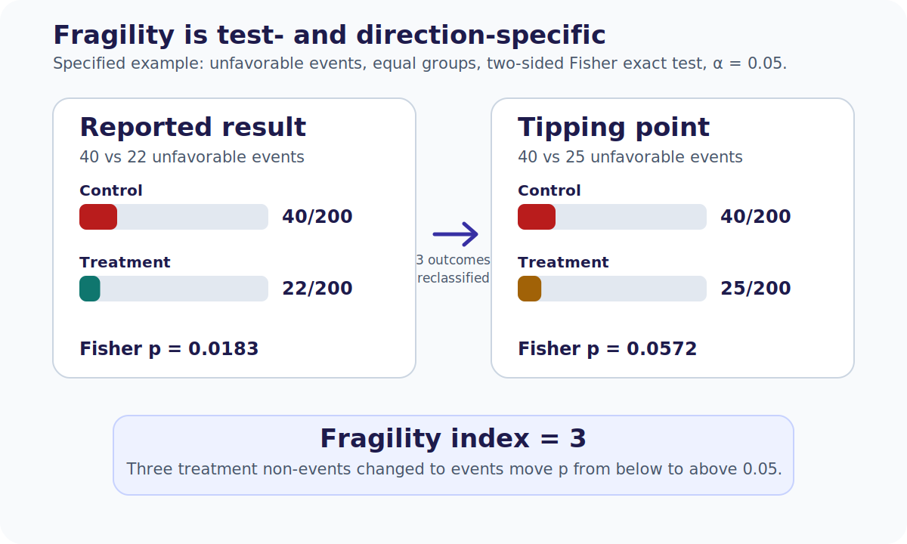

# Chapter 27. Missing Data, Multiplicity, Interim Analyses, and Fragility

## Opening

*Missingness mechanisms.*

*Fragility depends on the specified outcome direction and statistical test; here the two-sided Fisher exact fragility index is 3.*

Interim looks early and the primary endpoint is fragile. Ask missingness, multiplicity, and what would reverse the conclusion with a few events.

## The Plumbing of Trial Analysis: Why Significance Often Crumbles

Physicians are conditioned to inspect randomization, blinding, and primary endpoint definitions with extreme care, yet often ignore the analytic plumbing that underwrites the reported p-value. A trial claiming a revolutionary endovascular therapy benefit may harbor missing 90-day modified Rankin Scale (mRS) data on 10% of the cohort, undocumented alpha spending across multiple interim peeks, and a dozen unadjusted secondary endpoints mined for significance. This is not mere statistical pedantry. These methodological choices determine whether a reported hazard ratio reflects a stable biological truth or a fragile statistical mirage.

Stroke research is uniquely vulnerable to these specific analytic threats. Delayed functional outcomes (e.g., 90- or 180-day mRS) suffer structural missingness as patients disperse to skilled nursing facilities or home care. Radiographic endpoints produce highly correlated, multiple comparisons (infarct core, penumbra, collateral grade). Acute interventions often test modest effect sizes where a handful of outcome reclassifications can obliterate statistical significance. The appraiser's job is to deconstruct this plumbing. If a trial's conclusions cannot survive plausible missing-data assumptions, multiplicity penalties, and minor event-count perturbations, those conclusions should not dictate regional stroke protocols.

## Missingness Mechanisms: MCAR, MAR, and MNAR

Missing data are rarely just missing; they carry structural information. Missing Completely at Random (MCAR) implies that the probability of missingness is entirely independent of any patient characteristic or outcome. True MCAR is exceptional in clinical neuroscience—perhaps a corrupted MR angiogram file or a lost case report form. Under MCAR, a complete-case analysis is unbiased but inefficient.

Missing at Random (MAR) assumes that missingness can be fully explained by observed baseline covariates, and that conditional on these observed data, missingness does not depend on the unobserved outcome itself. For instance, if 90-day mRS is more often missing in patients with severe admission NIHSS and older age, but within those specific strata the missingness is random, the data are MAR. This assumption licenses techniques like multiple imputation or inverse probability weighting. However, MAR is a strong, unverifiable assumption, not a mathematical certainty.

Missing Not at Random (MNAR) means that, after conditioning on observed information, missingness still depends on an unobserved value. If follow-up participation depends on unrecorded disability itself, a standard MAR analysis may be biased. The mechanism is not identifiable from observed data alone. MNAR is often clinically plausible in stroke follow-up and should be explored with transparent, clinically grounded sensitivity analyses such as pattern-mixture, selection-model, or tipping-point approaches.

## The Fallacy of LOCF and Complete-Case Analysis

Historically, neurologists relied on Last Observation Carried Forward (LOCF) to patch missing data. If a day-30 mRS is available but day-90 is missing, LOCF simply pastes the day-30 value into the day-90 slot. This assumes stroke recovery is a flat line, freezing early disability and aggressively ignoring the realities of late rehabilitation or subsequent complications. LOCF is not a conservative strategy; it can bias effect estimates in either direction depending on the timing and differential rates of dropout between treatment arms. It is a scientifically indefensible practice in modern stroke trials.

Complete-case analysis discards participants with missing analysis variables. It is unbiased under MCAR and under some restricted MAR structures for particular regression estimands, but it loses information and can be biased when completeness remains related to the outcome or residual after conditioning. Authors should justify the assumed mechanism, preserve randomized assignment in the target analysis set, compare principled alternatives such as multiple imputation or likelihood-based models when appropriate, and stress-test unverifiable assumptions.

## Multiplicity: The Garden of Forking Paths

Multiplicity increases the chance of at least one false positive when several hypotheses are tested without an appropriate error-control strategy. Under 20 independent null tests at α = 0.05, the family-wise error rate is about 64%. In stroke reports, a null primary endpoint followed by emphasis on an unadjusted secondary endpoint should be treated as exploratory unless the analysis was prespecified and protected by the trial’s testing hierarchy.

This behavior capitalizes on analytic flexibility. The 'garden of forking paths' describes choices made after seeing data, such as selecting covariate adjustments, subgroup cut points, or time windows. Defenses include a prespecified analysis plan, hierarchical or gatekeeping tests, and family-wise procedures such as Bonferroni or Hochberg for a defined family. Repeated interim looks instead require group-sequential boundaries or alpha-spending functions. Unprotected secondary and subgroup findings should be labeled exploratory.

## Interim Analyses and Early Stopping

Some trials use prespecified interim analyses overseen by an independent monitoring committee to consider efficacy, futility, or harm. Stopping for benefit can select a favorable interim fluctuation and upwardly bias the conventional point estimate on average, especially with few events. It does not mean every early-stopped estimate is exaggerated. Appraise the boundary, information fraction, event count, and sequentially adjusted estimates or intervals where available.

Appraisers should distinguish conservative early efficacy boundaries such as O'Brien–Fleming-type rules from more permissive designs and verify how repeated looks were incorporated. A futility stop means a prespecified conditional- or predictive-probability criterion was crossed under its assumptions; it does not prove equivalence or exclude clinically important effects. Undisclosed interim looks can invalidate the nominal p-value unless the analysis accounts for them.

## The Fragility Index: Stress-Testing Statistical Significance

For a statistically significant dichotomous result, the fragility index is the minimum number of participant outcome-status changes needed to make the result non-significant under a specified test. The required direction and study arm depend on outcome coding and the observed table. The index is test-dependent and does not replace effect estimates or confidence intervals.

Consider a synthetic two-arm table with 40 events among 200 control participants and 22 among 200 treatment participants. A two-sided Fisher exact test gives p = 0.0183. Reclassifying three treatment-arm nonevents as events gives 25 of 200 and p = 0.0572, so the fragility index is 3 for that specified direction and test. This describes sensitivity of a dichotomous significance label, not validity of the design or magnitude of benefit. Compare the risk difference and interval, missing-outcome mechanisms, and tipping-point analyses before drawing a clinical conclusion.

## Analytic Flexibility and the Architecture of Spin

Analytic flexibility can enable p-hacking, while spin concerns selective reporting or interpretation. They can co-occur but are distinct. Examples of spin include emphasizing relative effects while obscuring small absolute differences, elevating unprotected secondary findings, or framing an inconclusive primary estimate as established benefit.

Compare the registered protocol and analysis plan with the reported endpoints, reconstruct absolute effects, examine missingness, and identify the testing hierarchy. If your interpretation differs from the authors', locate the exact endpoint, metric, assumption, or value judgment causing the difference before labeling it spin.

## Clinical and Epidemiologic Notes

Clinical Note: A low fragility index warns that the conventional significance classification is sensitive to a few outcome changes; it does not invalidate a trial. Protocol decisions should be anchored in effect magnitude, confidence intervals, missing-data sensitivity, design quality, corroborating evidence, and feasibility.

Methodologic Note: Do not conflate statistical significance with evidentiary robustness. A nominal p-value of 0.04 in an underpowered subgroup with 12% missing data may be highly sensitive to multiplicity and missing-outcome assumptions; report the estimate and uncertainty rather than dismissing or accepting it from the threshold alone.

Epidemiologic Note: Anticipate missing data in trial design rather than attempting to rescue it with post hoc statistical gymnastics. Rigorous follow-up infrastructure is vastly superior to complex imputation models.

## Chapter summary

Missing-data assumptions, multiplicity control, and interim-monitoring rules determine how an estimate should be interpreted. LOCF is generally indefensible; complete-case validity depends on the estimand and missingness structure. Prespecified testing families and sequential methods protect defined error rates without repairing other biases. Early benefit stopping can exaggerate conventional estimates on average. The fragility index is a limited, test-dependent description of a significance threshold and should remain secondary to effect estimates, intervals, missing-data sensitivity, and design validity.

## Practice and reflection

1. Select a recent endovascular trial stopped early for efficacy. Calculate its fragility index and compare it to the number of patients lost to follow-up.
2. Identify a stroke trial where a secondary endpoint is emphasized in the abstract. Trace the alpha-spending protocol to determine if the finding is statistically valid.
3. Explain why a complete-case analysis of 90-day mRS outcomes is likely biased under an MNAR assumption, focusing on stroke severity and mortality.
4. Critique the use of LOCF in a hypothetical secondary prevention trial tracking recurrent TIA over 12 months.
5. Draft a brief policy for your stroke center defining the required evidentiary robustness (fragility, missing data limits) before a new protocol is adopted.

---

*Figures and tables in this chapter are Teaching materials for CRIT-APP unless a caption explicitly states otherwise. Methods standards are cited by name only.*
