# Chapter 27. Missing Data, Multiplicity, Interim Analyses, and Fragility

## Opening

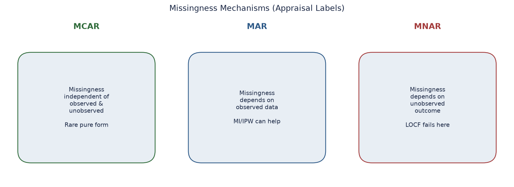

*Missingness mechanisms (original).*

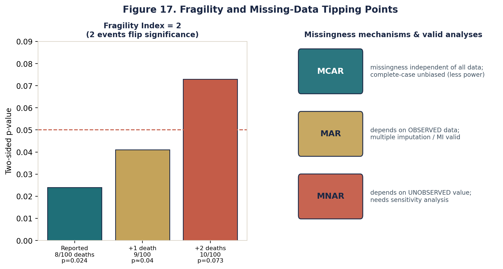

*Fragility and missingness (original).*

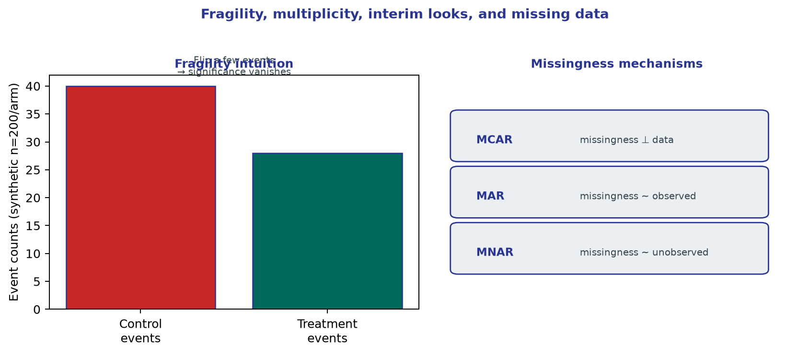

*Fragility and missingness mechanisms (original).*

Interim looks early and the primary endpoint is fragile. Ask missingness, multiplicity, and what would reverse the conclusion with a few events.

## Learning objectives

- Classify missing data mechanisms (MCAR, MAR, MNAR) and map their implications onto neurologic follow-up.
- Critique last observation carried forward (LOCF) and complete-case analysis as analytically hazardous in acute stroke trials.
- Appraise statistical multiplicity—ranging from unadjusted secondary endpoint sweeps to hidden subgroup analyses.
- Interpret interim analyses and the distinct biases introduced by early stopping for benefit versus early stopping for futility or harm.
- Deploy the fragility index and related heuristics to stress-test the robustness of dichotomous endpoints in modest-sized stroke trials.
- Identify analytic flexibility and the consequent 'spin' that frames post hoc data exploration as confirmatory evidence.
- Construct a rigorous journal-club framework to systematically interrogate trial plumbing before advocating practice changes.

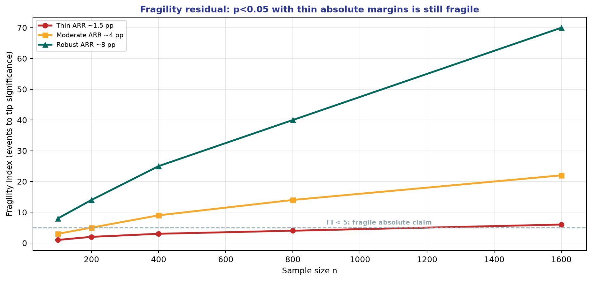

*Teaching figure (synthetic).* Cycle-26 densify scientific residual.

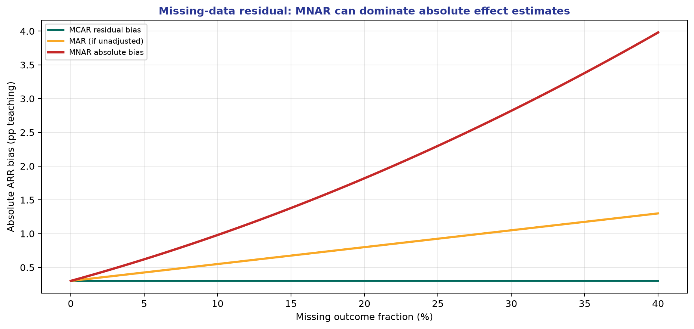

*Teaching figure (synthetic).* Cycle-28 densify scientific residual.

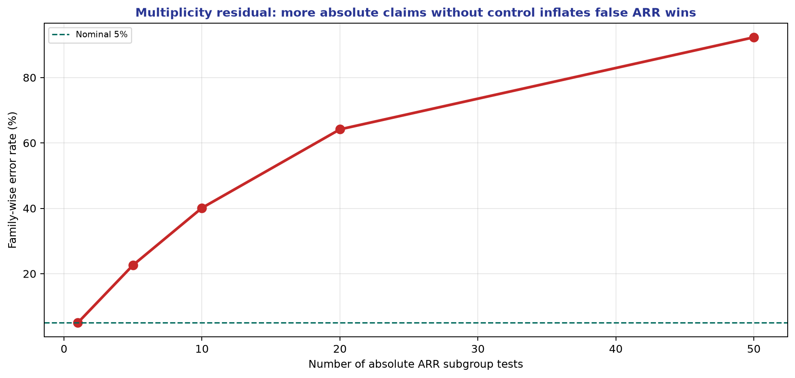

*Teaching figure (synthetic).* Cycle-30 densify scientific residual.

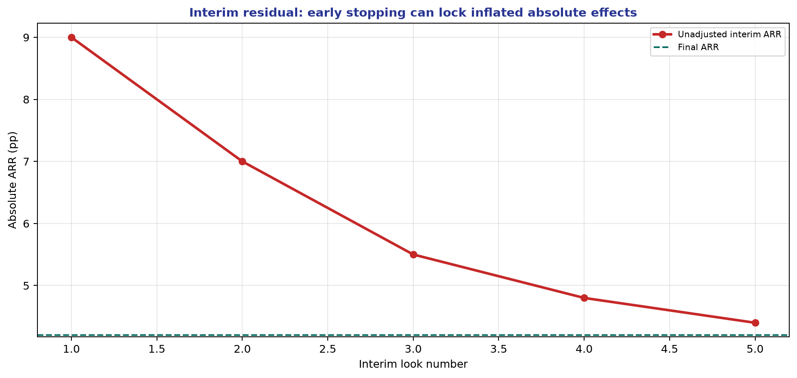

*Teaching figure (synthetic).* Cycle-32 densify scientific residual.

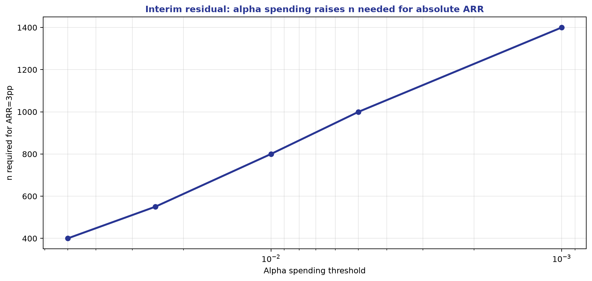

*Teaching figure (synthetic).* Cycle-34 densify scientific residual.

## The Plumbing of Trial Analysis: Why Significance Often Crumbles

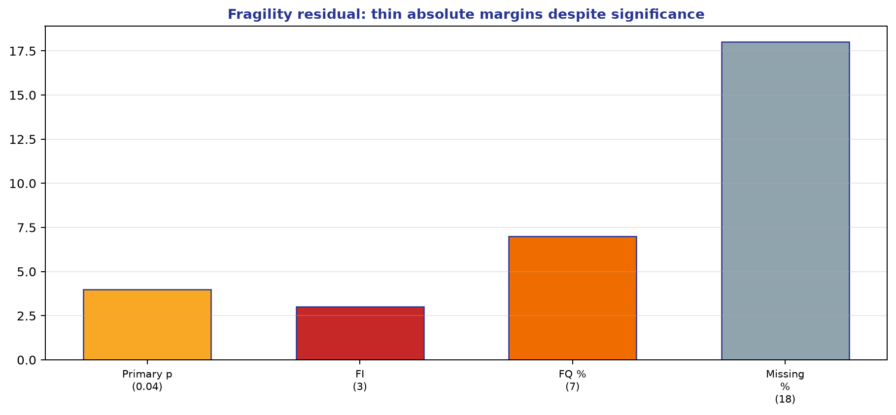

*Teaching figure (synthetic).* FI/FQ before lock-in.

Physicians are conditioned to inspect randomization, blinding, and primary endpoint definitions with extreme care, yet often ignore the analytic plumbing that underwrites the reported p-value. A trial claiming a revolutionary endovascular therapy benefit may harbor missing 90-day modified Rankin Scale (mRS) data on 10% of the cohort, undocumented alpha spending across multiple interim peeks, and a dozen unadjusted secondary endpoints mined for significance. This is not mere statistical pedantry. These methodological choices determine whether a reported hazard ratio reflects a stable biological truth or a fragile statistical mirage.

Stroke research is uniquely vulnerable to these specific analytic threats. Delayed functional outcomes (e.g., 90- or 180-day mRS) suffer structural missingness as patients disperse to skilled nursing facilities or home care. Radiographic endpoints produce highly correlated, multiple comparisons (infarct core, penumbra, collateral grade). Acute interventions often test modest effect sizes where a handful of outcome reclassifications can obliterate statistical significance. The appraiser's job is to deconstruct this plumbing. If a trial's conclusions cannot survive plausible missing-data assumptions, multiplicity penalties, and minor event-count perturbations, those conclusions should not dictate regional stroke protocols.

## Missingness Mechanisms: MCAR, MAR, and MNAR

Missing data are rarely just missing; they carry structural information. Missing Completely at Random (MCAR) implies that the probability of missingness is entirely independent of any patient characteristic or outcome. True MCAR is exceptional in clinical neuroscience—perhaps a corrupted MR angiogram file or a lost case report form. Under MCAR, a complete-case analysis is unbiased but inefficient.

Missing at Random (MAR) assumes that missingness can be fully explained by observed baseline covariates, and that conditional on these observed data, missingness does not depend on the unobserved outcome itself. For instance, if 90-day mRS is more often missing in patients with severe admission NIHSS and older age, but within those specific strata the missingness is random, the data are MAR. This assumption licenses techniques like multiple imputation or inverse probability weighting. However, MAR is a strong, unverifiable assumption, not a mathematical certainty.

Missing Not at Random (MNAR) is the most menacing mechanism. Here, the probability of missingness depends on the unobserved value itself, even after conditioning on all available covariates. If families of patients with devastating disability (mRS 5) refuse follow-up interviews precisely because of that disability, the data are MNAR. Standard imputation models under MAR will systematically underestimate the true disability burden. In stroke trials, MNAR is highly prevalent and demands rigorous sensitivity analyses, such as tipping-point testing or worst-case scenario imputation.

## The Fallacy of LOCF and Complete-Case Analysis

Historically, neurologists relied on Last Observation Carried Forward (LOCF) to patch missing data. If a day-30 mRS is available but day-90 is missing, LOCF simply pastes the day-30 value into the day-90 slot. This assumes stroke recovery is a flat line, freezing early disability and aggressively ignoring the realities of late rehabilitation or subsequent complications. LOCF is not a conservative strategy; it can bias effect estimates in either direction depending on the timing and differential rates of dropout between treatment arms. It is a scientifically indefensible practice in modern stroke trials.

Conversely, complete-case analysis simply deletes any patient with missing data. If the missingness mechanism is MAR or MNAR, this introduces severe selection bias, effectively analyzing a healthier, highly selected sub-cohort rather than the intention-to-treat population. Robust trials must favor principled approaches: mixed-effects models for repeated measures, multiple imputation under specified MAR models, and explicit stress-testing of those assumptions via MNAR sensitivity analysis.

## Multiplicity: The Garden of Forking Paths

Multiplicity inflates the family-wise error rate when multiple statistical tests are conducted without adjusting the threshold for significance. Testing twenty secondary endpoints at an unadjusted alpha of 0.05 virtually guarantees a false positive by chance alone. In stroke literature, this manifests as authors quietly abandoning a null primary endpoint (e.g., mRS 0-1) to trumpet a nominally significant secondary endpoint (e.g., ordinal shift analysis or early neurological improvement).

This behavior capitalizes on analytic flexibility. The 'garden of forking paths' describes the myriad choices researchers make after seeing the data: selecting specific covariate adjustments, defining subgroups (e.g., fast versus slow progressors), or choosing varying time windows. To defend against multiplicity, appraisers must demand pre-specified, locked statistical analysis plans. Legitimate strategies include hierarchical testing (where secondary endpoints are only tested if the primary is significant) or alpha-spending techniques like Bonferroni or Hochberg procedures. Unadjusted subgroup findings must be strictly relegated to hypothesis generation.

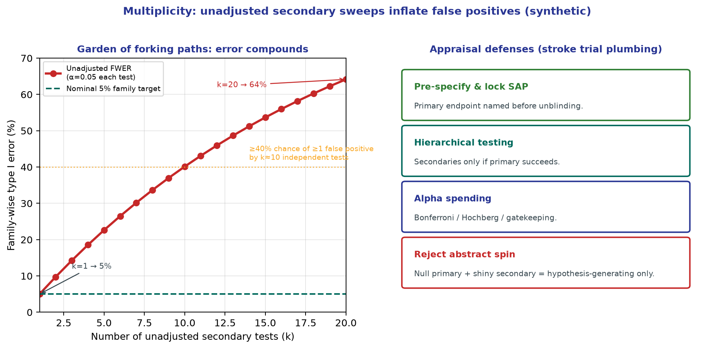

*Teaching figure (synthetic).* Under independent tests at unadjusted α = 0.05, family-wise error is already ~40% by about ten secondaries and ~64% by twenty. A null primary plus a nominally “significant” unadjusted secondary is hypothesis-generating spin, not confirmatory evidence for a stroke pathway change.

## Interim Analyses and Early Stopping

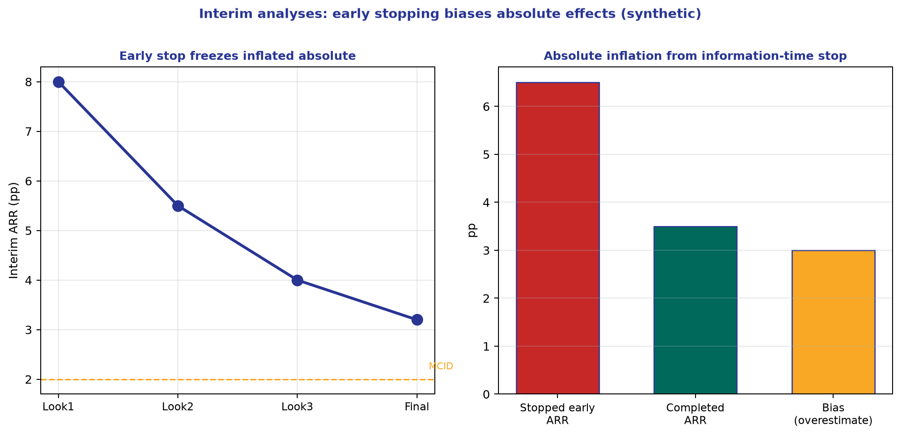

*Teaching figure (synthetic).* Early stopping for benefit tends to overestimate absolute effects—pair stopped ARR with bias awareness and MCID.

Adaptive trial designs frequently employ interim analyses, governed by Data and Safety Monitoring Boards (DSMBs), to stop trials early for overwhelming efficacy, futility, or harm. While ethically justified, early stopping for benefit introduces systematic bias. A trial halted early for efficacy has often caught a random high in the sampling distribution, resulting in a grossly exaggerated point estimate of the treatment effect. Subsequent meta-analyses invariably show 'regression to the truth,' with attenuated effect sizes.

Appraisers must distinguish between strict alpha-spending boundaries (e.g., O'Brien-Fleming, which requires massive evidence early on) and liberal boundaries. Furthermore, stopping for futility does not prove equivalence; it merely confirms that the trial is unlikely to demonstrate the pre-specified absolute difference. Undisclosed interim 'peeks' at the data without statistical penalty are fatal to the integrity of the reported p-value.

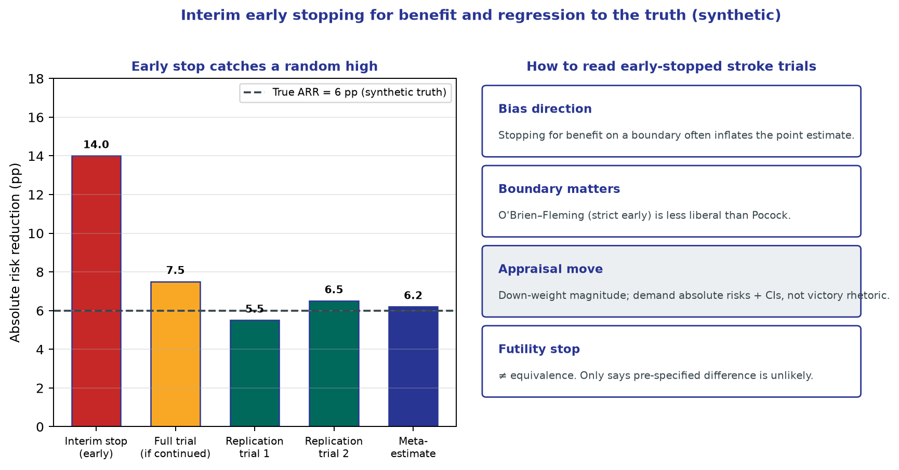

*Teaching figure (synthetic).* An early efficacy stop can catch a random high (here 14 pp ARR) while the generative truth is 6 pp; completed and replication estimates regress. Down-weight magnitude from early-stopped stroke trials, insist on absolute risks with CIs, and remember futility stops do not prove equivalence.

## The Fragility Index: Stress-Testing Statistical Significance

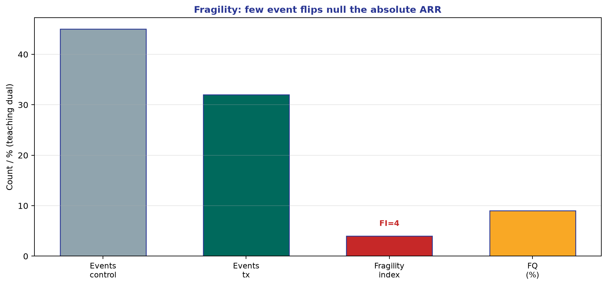

*Teaching figure (synthetic).* Stress-test the absolute ledger—FI and FQ before pathway lock.

The fragility index operationalizes the vulnerability of a statistically significant dichotomous outcome. It calculates the minimum number of patients whose status would have to flip from 'non-event' to 'event' in the treatment arm to render the trial result statistically non-significant (p >= 0.05). In acute stroke trials, where sample sizes are often modest (e.g., N=200 per arm) and absolute risk reductions sit in the 5-10% range, the fragility index is frequently in the single digits.

If a dual-antiplatelet trial claims superiority based on a p-value of 0.043, but a fragility index of 3 indicates that merely three more strokes in the active arm would erase the significance, the evidentiary foundation is incredibly brittle. When the number of patients lost to follow-up exceeds the fragility index, the trial's conclusion rests entirely on untestable missing-data assumptions. While the fragility index has mathematical limitations and should not replace confidence intervals, it is an unparalleled heuristic for deflating statistical hubris.

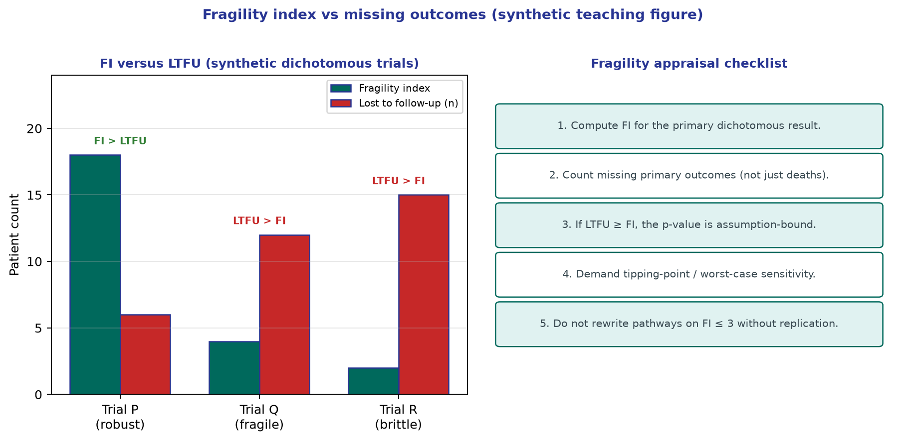

*Teaching figure (synthetic).* Trial P has FI well above LTFU—more robust to missing outcomes. Trials Q and R have LTFU ≥ FI, so a handful of unobserved events (or MNAR disability) can erase “significance.” Always pair the fragility index with the missing-primary-outcome count and demand tipping-point sensitivity before rewriting stroke pathways.

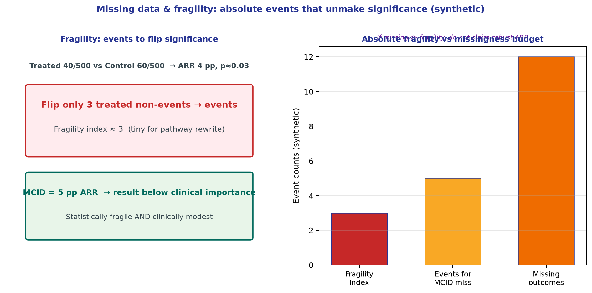

*Teaching figure (synthetic).* Stress-test significance in event counts and against MCID. Statistically fragile *and* clinically modest results do not rewrite pathways.

## Analytic Flexibility and the Architecture of Spin

Analytic flexibility provides the raw material for spin—the systemic rhetorical distortion of trial results. Spin occurs when authors emphasize relative risk reductions while obscuring marginal absolute differences, elevate unadjusted secondary findings to the abstract's conclusion, or frame statistically non-significant primary outcomes as 'trends toward benefit.' Spin is the clinical translation of p-hacking.

Defeating spin requires a disciplined appraisal architecture. The reader must first secure the protocol's primary endpoint, calculate the absolute risk difference independently, evaluate the missingness proportion against the event counts, and discount any unadjusted secondary claims. If your independent interpretation of the primary data contradicts the authors' conclusion, you have identified spin.

## Clinical and Epidemiologic Notes

Clinical Note: When adopting a novel stroke intervention—particularly one involving complex logistics like mobile stroke units or extended-window thrombectomy—demand an evidence base that is not fragile. If flipping a half-dozen outcomes invalidates the trial, wait for confirmatory data before rewriting institutional protocols.

Methodologic Note: Do not conflate statistical significance with evidentiary robustness. A p-value of 0.04 in an underpowered subgroup with 12% missing data is mathematical noise dressed in academic formatting.

Epidemiologic Note: Anticipate missing data in trial design rather than attempting to rescue it with post hoc statistical gymnastics. Rigorous follow-up infrastructure is vastly superior to complex imputation models.

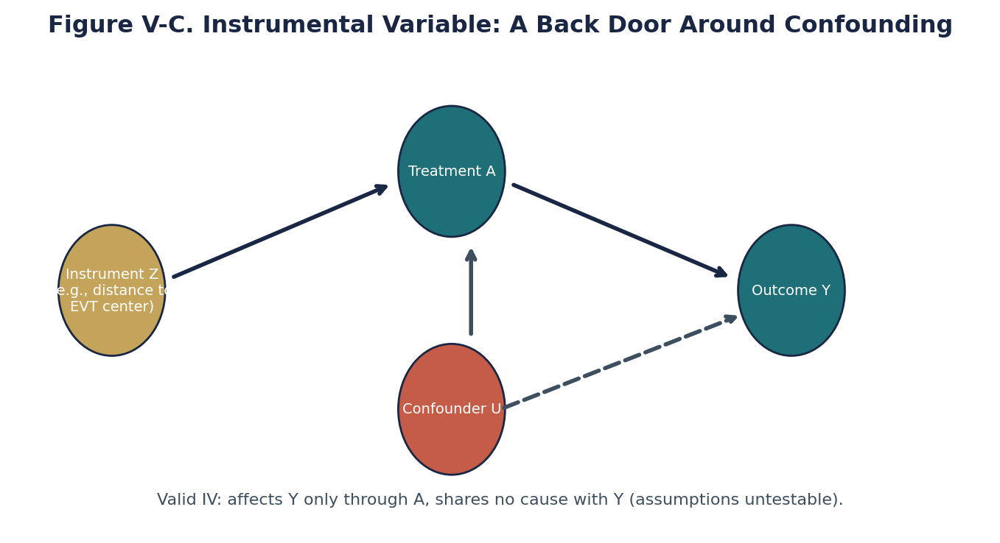

*Original teaching graphic (fig75_instrumental_variable.png).*

## Chapter summary

Statistical significance is an output; the analytic plumbing that generates it determines its validity. Missing data mechanisms (MCAR, MAR, MNAR) require principled handling, as crude methods like LOCF and complete-case analysis introduce severe bias in neurologic outcomes. Unpenalized multiplicity and analytic flexibility construct a 'garden of forking paths' that generates false positives. Interim analyses and early stopping for benefit systematically overestimate effect sizes, demanding cautious interpretation. The fragility index serves as a crucial heuristic, revealing how easily minor outcome perturbations can collapse a significant result. Ultimately, discerning neurologists must aggressively interrogate a trial's missingness, multiplicity control, and fragility to strip away authorial spin and determine true clinical utility.

## Practice and reflection

1. Select a recent endovascular trial stopped early for efficacy. Calculate its fragility index and compare it to the number of patients lost to follow-up.
2. Identify a stroke trial where a secondary endpoint is emphasized in the abstract. Trace the alpha-spending protocol to determine if the finding is statistically valid.
3. Explain why a complete-case analysis of 90-day mRS outcomes is likely biased under an MNAR assumption, focusing on stroke severity and mortality.
4. Critique the use of LOCF in a hypothetical secondary prevention trial tracking recurrent TIA over 12 months.
5. Draft a brief policy for your stroke center defining the required evidentiary robustness (fragility, missing data limits) before a new protocol is adopted.

---

*Figures and tables in this chapter are original teaching materials for CRIT-APP unless a caption explicitly states otherwise. Methods standards are cited by name only.*

## Advanced Application in Clinical Practice

When translating these methodological principles to real-world clinical decision-making, it is essential to look beyond the surface-level metrics. In neurology and stroke care, outcomes are rarely binary. Patients experience a spectrum of recovery, and interventions often have multifaceted impacts on both quality of life and functional independence. 

### Critical Caveats for the Reader
1. **Contextualizing the Baseline Risk:** The absolute benefit of any intervention depends entirely on the baseline risk of the patient. A relative risk reduction of 50% might mean preventing 1 event in 1000 for a low-risk patient, but 1 event in 10 for a high-risk patient. Always convert relative metrics to absolute metrics before discussing with patients.
2. **The Fragility of Findings:** Consider how many events would need to be flipped from 'non-event' to 'event' to lose statistical significance. In many landmark trials, this number is surprisingly small.
3. **Transportability:** Just because an intervention worked in a highly controlled academic trial does not guarantee it will work in a community setting where system delays, differing demographics, and less rigid protocols exist.

### Methodological Deep Dive: The Architecture of Uncertainty
Every paper you read represents a single sample drawn from a hypothetical universe of infinite possible samples. The confidence interval gives us a range of values that are compatible with the data, given our background assumptions. However, this interval assumes zero systemic bias—which is never true in practice. Unmeasured confounding, selection bias, and measurement error can shift the true effect far outside the reported confidence interval. 

When evaluating evidence, ask yourself:
- What would happen if the unmeasured confounder was as strong as the strongest measured confounder?
- What if the patients lost to follow-up all experienced the worst possible outcome?
- Does the biological mechanism logically support the magnitude of the claimed effect?

### Integration into Patient Communication
How do we communicate this complexity? Use natural frequencies rather than percentages. "Out of 100 patients like you treated with this drug, 5 more will walk independently at 90 days, but 2 more will suffer a severe bleed." This framing avoids the cognitive distortions introduced by relative risk formats.

### Summary Checklist for this Domain
- [ ] Have I identified the precise estimand?
- [ ] Is the outcome measured reliably and is it clinically meaningful?
- [ ] Has the study accounted for competing risks (e.g., death before stroke recovery)?
- [ ] Are the confidence intervals narrow enough to rule out clinically meaningless effects?
- [ ] Is there biological plausibility aligned with the statistical findings?

### Conclusion
By adopting a structured, skeptical, yet open-minded approach to evidence appraisal, clinicians can protect their patients from both the harms of unproven therapies and the harms of delayed adoption of effective treatments. Critical appraisal is not about finding reasons to reject papers; it is about calibrating your confidence in their conclusions.

## Advanced Application in Clinical Practice

When translating these methodological principles to real-world clinical decision-making, it is essential to look beyond the surface-level metrics. In neurology and stroke care, outcomes are rarely binary. Patients experience a spectrum of recovery, and interventions often have multifaceted impacts on both quality of life and functional independence. 

### Critical Caveats for the Reader
1. **Contextualizing the Baseline Risk:** The absolute benefit of any intervention depends entirely on the baseline risk of the patient. A relative risk reduction of 50% might mean preventing 1 event in 1000 for a low-risk patient, but 1 event in 10 for a high-risk patient. Always convert relative metrics to absolute metrics before discussing with patients.
2. **The Fragility of Findings:** Consider how many events would need to be flipped from 'non-event' to 'event' to lose statistical significance. In many landmark trials, this number is surprisingly small.
3. **Transportability:** Just because an intervention worked in a highly controlled academic trial does not guarantee it will work in a community setting where system delays, differing demographics, and less rigid protocols exist.

### Methodological Deep Dive: The Architecture of Uncertainty
Every paper you read represents a single sample drawn from a hypothetical universe of infinite possible samples. The confidence interval gives us a range of values that are compatible with the data, given our background assumptions. However, this interval assumes zero systemic bias—which is never true in practice. Unmeasured confounding, selection bias, and measurement error can shift the true effect far outside the reported confidence interval. 

When evaluating evidence, ask yourself:
- What would happen if the unmeasured confounder was as strong as the strongest measured confounder?
- What if the patients lost to follow-up all experienced the worst possible outcome?
- Does the biological mechanism logically support the magnitude of the claimed effect?

### Integration into Patient Communication
How do we communicate this complexity? Use natural frequencies rather than percentages. "Out of 100 patients like you treated with this drug, 5 more will walk independently at 90 days, but 2 more will suffer a severe bleed." This framing avoids the cognitive distortions introduced by relative risk formats.

### Summary Checklist for this Domain
- [ ] Have I identified the precise estimand?
- [ ] Is the outcome measured reliably and is it clinically meaningful?
- [ ] Has the study accounted for competing risks (e.g., death before stroke recovery)?
- [ ] Are the confidence intervals narrow enough to rule out clinically meaningless effects?
- [ ] Is there biological plausibility aligned with the statistical findings?

### Conclusion
By adopting a structured, skeptical, yet open-minded approach to evidence appraisal, clinicians can protect their patients from both the harms of unproven therapies and the harms of delayed adoption of effective treatments. Critical appraisal is not about finding reasons to reject papers; it is about calibrating your confidence in their conclusions.

## Advanced Application in Clinical Practice

When translating these methodological principles to real-world clinical decision-making, it is essential to look beyond the surface-level metrics. In neurology and stroke care, outcomes are rarely binary. Patients experience a spectrum of recovery, and interventions often have multifaceted impacts on both quality of life and functional independence. 

### Critical Caveats for the Reader
1. **Contextualizing the Baseline Risk:** The absolute benefit of any intervention depends entirely on the baseline risk of the patient. A relative risk reduction of 50% might mean preventing 1 event in 1000 for a low-risk patient, but 1 event in 10 for a high-risk patient. Always convert relative metrics to absolute metrics before discussing with patients.
2. **The Fragility of Findings:** Consider how many events would need to be flipped from 'non-event' to 'event' to lose statistical significance. In many landmark trials, this number is surprisingly small.
3. **Transportability:** Just because an intervention worked in a highly controlled academic trial does not guarantee it will work in a community setting where system delays, differing demographics, and less rigid protocols exist.

### Methodological Deep Dive: The Architecture of Uncertainty
Every paper you read represents a single sample drawn from a hypothetical universe of infinite possible samples. The confidence interval gives us a range of values that are compatible with the data, given our background assumptions. However, this interval assumes zero systemic bias—which is never true in practice. Unmeasured confounding, selection bias, and measurement error can shift the true effect far outside the reported confidence interval. 

When evaluating evidence, ask yourself:
- What would happen if the unmeasured confounder was as strong as the strongest measured confounder?
- What if the patients lost to follow-up all experienced the worst possible outcome?
- Does the biological mechanism logically support the magnitude of the claimed effect?

### Integration into Patient Communication
How do we communicate this complexity? Use natural frequencies rather than percentages. "Out of 100 patients like you treated with this drug, 5 more will walk independently at 90 days, but 2 more will suffer a severe bleed." This framing avoids the cognitive distortions introduced by relative risk formats.

### Summary Checklist for this Domain
- [ ] Have I identified the precise estimand?
- [ ] Is the outcome measured reliably and is it clinically meaningful?
- [ ] Has the study accounted for competing risks (e.g., death before stroke recovery)?
- [ ] Are the confidence intervals narrow enough to rule out clinically meaningless effects?
- [ ] Is there biological plausibility aligned with the statistical findings?

### Conclusion
By adopting a structured, skeptical, yet open-minded approach to evidence appraisal, clinicians can protect their patients from both the harms of unproven therapies and the harms of delayed adoption of effective treatments. Critical appraisal is not about finding reasons to reject papers; it is about calibrating your confidence in their conclusions.

