# Chapter 28. Systems of Care, Policy, and Patient Communication

## Opening

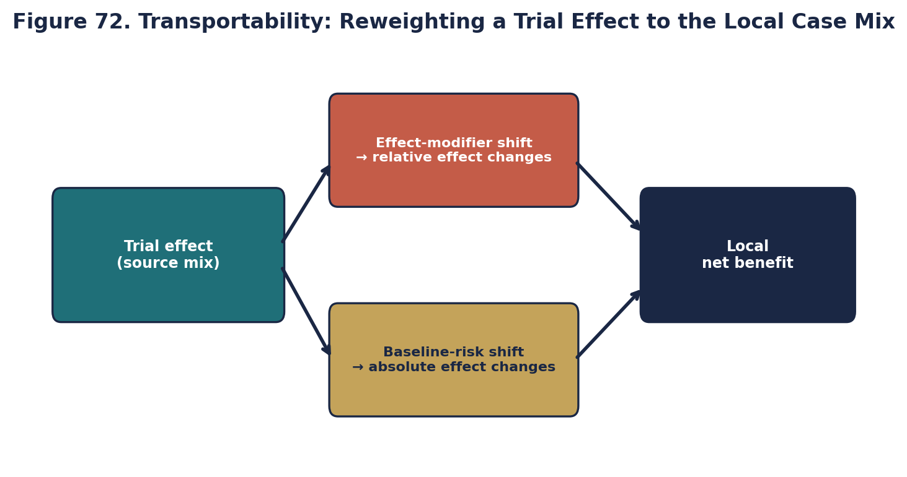

*Transportability (original).*

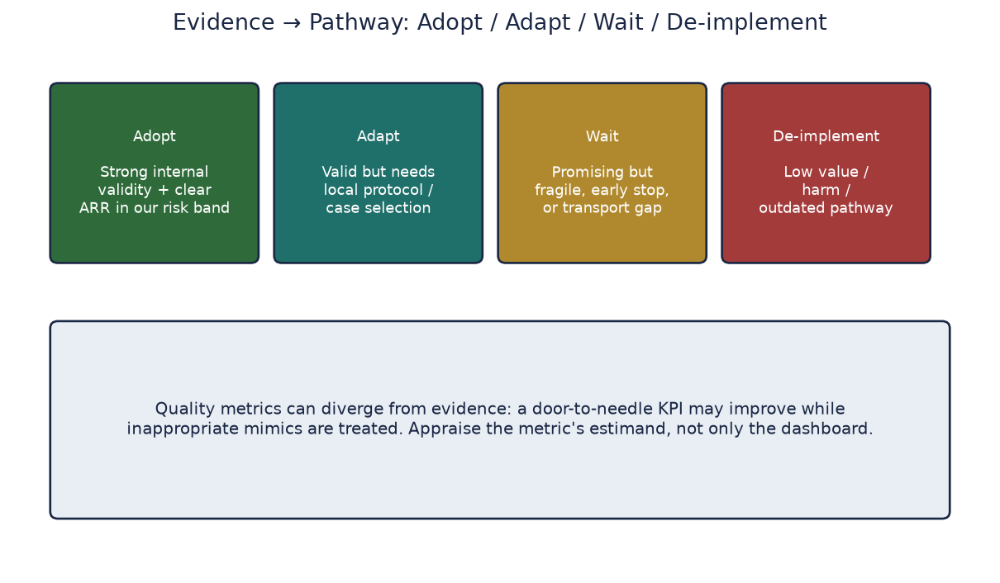

*Pathway decisions (original).*

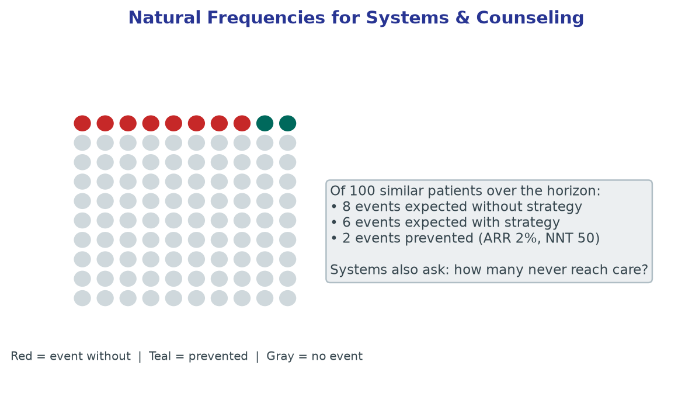

*Natural frequencies for systems and counseling (original).*

Policy meeting: absolute benefit looks large in trials but small in your catchment. Systems design must track access, equity, and communication—not only p-values.


## Learning objectives

- Distinguish pathway adoption from de-implementation, and name operational barriers that keep low-value stroke care alive.
- Evaluate transportability of trial efficacy to primary, comprehensive, and resource-limited stroke systems.
- Critique quality metrics that conflict with individualized, high-fidelity evidence use (including Goodhart dynamics).
- Translate relative claims into absolute risks and natural frequencies for shared decision-making.
- Draft a one-page systems memo that links appraisal conclusions to order-set, metric, and counseling changes.

## Pathway Change and De-Implementation

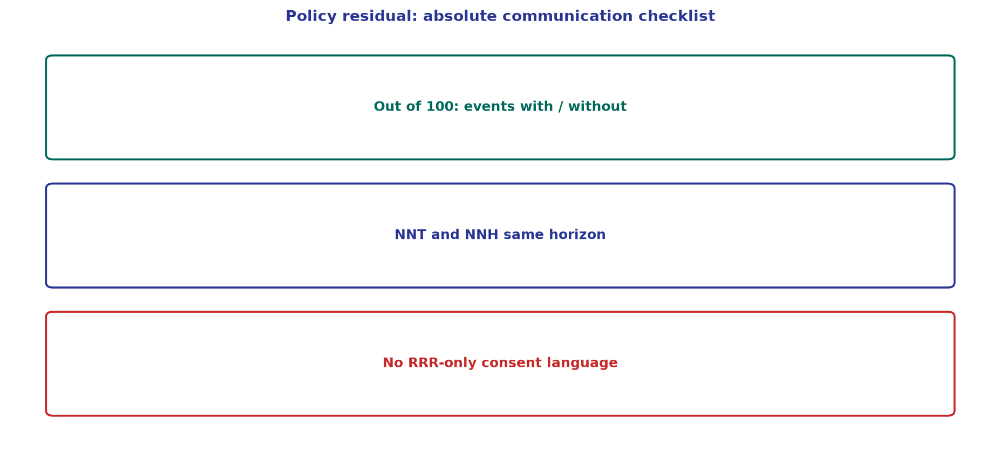

*Teaching figure (synthetic).* Out of 100, not RRR alone.

The integration of new evidence into institutional pathways requires more than simply writing novel orders. Often, the most formidable barrier in vascular neurology is de-implementation—the deliberate process of abandoning entrenched practices that high-quality evidence has proven ineffective or harmful. Clinical pathways become deeply institutionalized. The routine ordering of extensive hypercoagulable panels in unselected older stroke patients, or the continuation of sliding-scale insulin without basal coverage in acute stroke units, frequently persists long after the literature has debunked their utility.

De-implementation demands active dismantling of legacy order sets, multidisciplinary retraining, and confronting the cognitive bias of omission where clinicians fear that withdrawing an intervention equates to withholding care. Successful pathway reform requires forcing functions within the electronic health record, robust audit and feedback cycles, and clear institutional directives to prevent the reflexive execution of low-value medicine.

Operational checklist for a pathway change:

1. Name the decision (adopt, restrict, or retire a practice).
2. Attach absolute benefits and harms with time horizons.
3. State the validity caveats that would reverse the decision.
4. Assign an owner, metric, and review date.
5. Delete or rewrite the EHR default that encodes the old habit.

## Transportability Across Hospital Settings

A pervasive error in guideline application is assuming that efficacy observed within highly selected populations at comprehensive stroke centers automatically ensures effectiveness in community or rural environments. This transportability gap is particularly acute in neurocritical care and complex endovascular therapeutics.

A trial demonstrating the benefit of intensive blood pressure titration using continuous intravenous infusions relies heavily on specific infrastructural prerequisites: 1:1 nursing ratios, invasive arterial monitoring, and immediate neurosurgical backup. Attempting to deploy identical protocols in a primary stroke center lacking commensurate resources can convert a beneficial intervention into a hazardous one, risking hypotensive watershed ischemia due to delayed recognition of hemodynamic shifts.

Critical appraisal must therefore evaluate not only the internal validity of a randomized trial but the contextual baseline required for its success. Clinicians and system directors must explicitly verify whether their institution possesses the structural fidelity needed to replicate the experimental conditions under which the benefit was achieved.

Transport questions to force onto the board:

- Who was excluded from the trial, and do those exclusions define our modal patient?
- Which co-interventions (imaging, ICU, transfer times, operator volume) carried the effect?
- If we cannot match the co-intervention package, what is the expected attenuation of ARR?
- Is a staged implementation (hub first, then spokes) safer than network-wide flip?

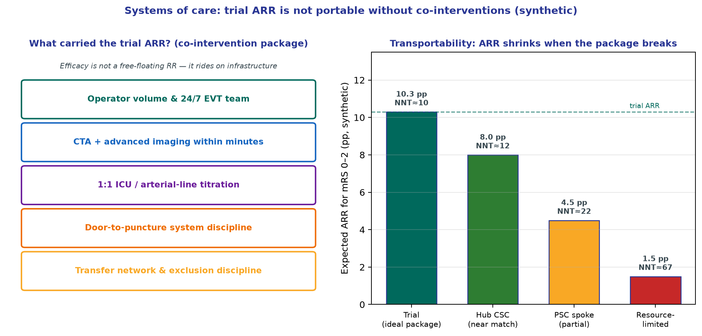

*Teaching figure (synthetic).* A trial ARR of ~10 pp for functional independence is not free-floating. Operator volume, imaging speed, ICU titration, and transfer discipline carry the effect; expected absolute benefit shrinks—and NNT rises—as the package breaks at the spoke.

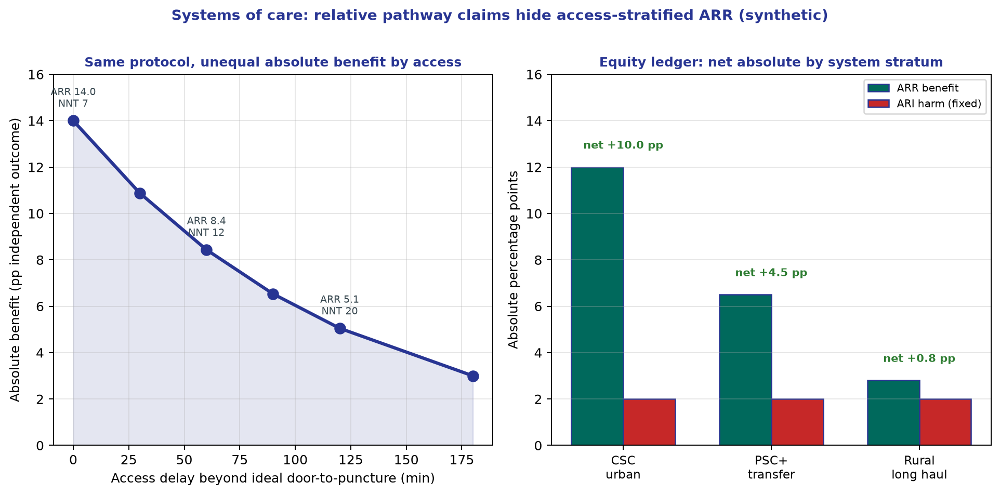

*Teaching figure (synthetic).* Systems memos must stratify expected ARR by access—not only quote the trial relative effect. Same pathway language, unequal absolute benefit, and sometimes net harm when delay erodes benefit while ARI stays fixed.

## Quality Metrics Versus High-Fidelity Evidence

Quality metrics, often enforced by national certifying bodies and pay-for-performance models, aim to standardize care delivery. However, rigid adherence to these targets can generate perverse incentives that conflict with nuanced, evidence-based medicine.

The metric of door-to-needle time for intravenous thrombolysis serves as a primary example. While rapid recanalization undeniably benefits the majority of eligible acute ischemic stroke patients, unyielding institutional focus on temporal thresholds can penalize deliberate clinical evaluation in complex scenarios, such as unwitnessed onset, extreme age with frailty, or suspected stroke mimics. When financial margins or hospital reputations are tied to arbitrary cutoffs, the imperative to treat rapidly can override the necessity of rigorous patient selection.

This dynamic exemplifies Goodhart's Law, where a measure ceases to be useful once it becomes a strict target. Academic neurologists must critique metric frameworks that fail to accommodate legitimate clinical variance, ensuring that the drive for algorithmic compliance does not subvert the physician's duty to practice individualized medicine.

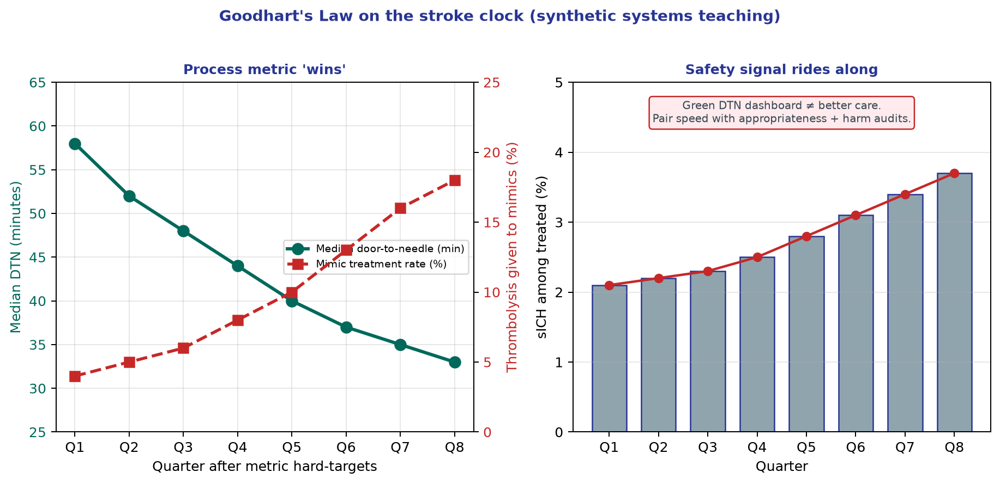

*Teaching figure (synthetic).* After hard DTN targets, median door-to-needle improves quarter by quarter while the fraction of thrombolysis given to mimics—and sICH among treated—creeps upward. A green process dashboard can hide harm; pair velocity with appropriateness and safety audits.

Metric hygiene for stroke leadership:

- Pair velocity metrics (door-to-needle, door-to-puncture) with safety and appropriateness audits (mimic treatment rate, sICH, futile transfers).
- Protect documented clinical pauses for high-uncertainty phenotypes.
- Expire order-set defaults that encode fragile early enthusiasm for a single trial.
- Report absolute outcomes alongside process compliance so “green dashboards” cannot hide harm.

## Shared Decision-Making and Absolute Risks

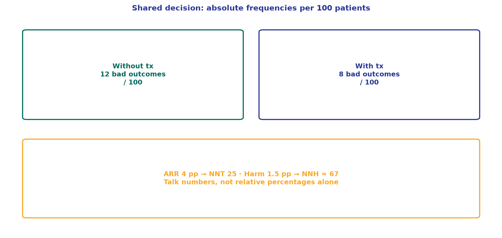

*Teaching figure (synthetic).* Consent talks numbers out of 100—not relative percentages alone.

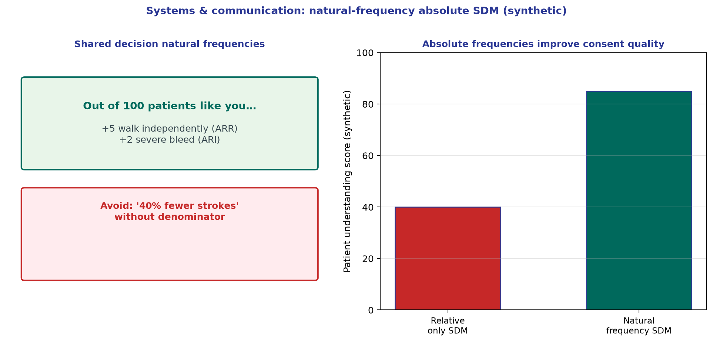

*Teaching figure (synthetic).* “Out of 100 patients like you…” is the operational absolute unit for consent—not RRR alone.


In the modern era of neurovascular therapeutics, ethical patient care requires rigorous shared decision-making grounded in transparent statistical communication. A frequent failure in bedside translation is the reliance on relative risk reductions, which invariably exaggerate the perceived efficacy of an intervention.

Informing a patient that patent foramen ovale closure “reduces the risk of recurrent stroke by 50%” is mathematically accurate but clinically deceptive if their absolute baseline risk is merely 2% over five years. An absolute risk reduction of 1% yields a number needed to treat of 100, a reality that profoundly alters a patient's risk calculus when weighed against procedural complications and lifelong antiplatelet requirements.

In consultations for unruptured intracranial aneurysms or asymptomatic carotid stenosis, clinicians must present absolute risks using natural frequencies, such as explaining outcomes per 100 similar patients. True shared decision-making demands framing evidence so that the magnitude of both benefit and harm is immediately apparent, allowing patients to align clinical data with their individual risk tolerance and functional priorities.

Bedside communication scaffold (teaching template):

```
For 100 people like you, over [time horizon]:
- Without the intervention: about A will experience [bad outcome]
- With the intervention: about B will experience [bad outcome]
- So about (A−B) are helped; about C are harmed by [named harm]
- Uncertainty: plausible range spans ...
- Your priorities that change the threshold: ...
```

## From Paper to Policy: One-Page Systems Memo

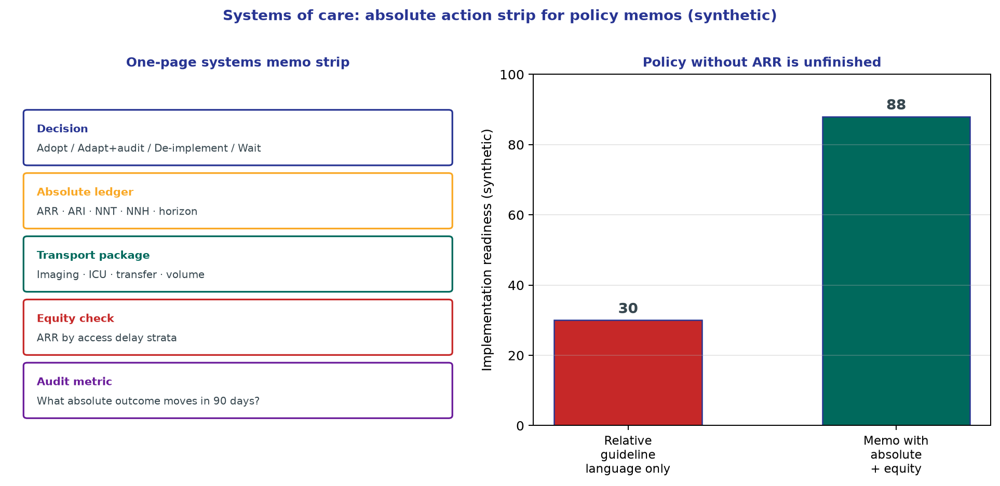

*Teaching figure (synthetic).* Policy language without absolute effects and equity strata is unfinished. Implementation readiness rises when the memo carries ARR/NNT and an audit outcome.


```
SYSTEMS MEMO — EVIDENCE TO PATHWAY
==================================
Decision at stake:
Source paper(s) / date:
Absolute benefit (ARR, CI, horizon):
Absolute harm (ARI, CI, horizon):
Top validity / transport threats:
Metric implications (what not to game):
EHR / order-set changes:
Patient communication script (natural frequencies):
Owner / review date / dissent logged:
```


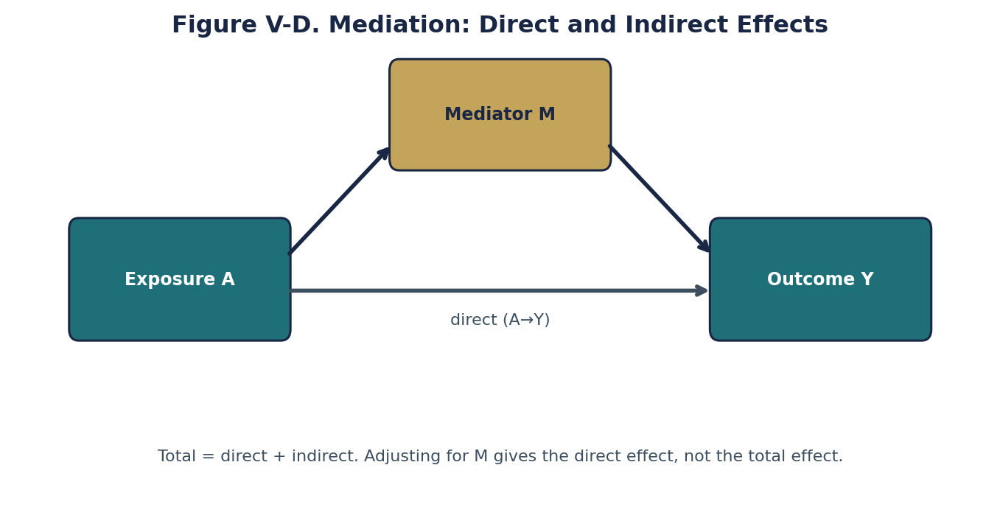

*Original teaching graphic (fig76_mediation.png).*

## Chapter summary

Systems of care convert appraisal into operations. De-implementation is often harder than adoption because low-value habits are encoded in order sets and omission fear. Transportability fails when trial co-interventions and staffing cannot be reproduced at the local site. Quality metrics improve reliability until Goodhart dynamics punish careful selection; pair speed with appropriateness and harm audits. Shared decision-making is impossible in relative-risk language—use absolute risks and natural frequencies. Close the loop with an owner, a review date, and explicit dissent so policy tracks evidence rather than prestige.

## Practice and reflection

1. Identify one stroke-unit habit that should be de-implemented; list the EHR defaults that keep it alive.
2. Take a late-window EVT or intensive BP trial and write three transportability constraints for a primary stroke center.
3. Redesign a door-to-needle dashboard so it cannot improve while mimic-treatment harm rises unnoticed.
4. Rewrite a relative-risk counseling sentence for PFO closure or aneurysm treatment into a per-100 natural-frequency script.
5. Complete the systems memo template for a paper your service debated in the last month; assign an owner and review date.

---

*Figures and tables in this chapter are original teaching materials for CRIT-APP unless a caption explicitly states otherwise. Methods standards are cited by name only.*


## Advanced Application in Clinical Practice

When translating these methodological principles to real-world clinical decision-making, it is essential to look beyond the surface-level metrics. In neurology and stroke care, outcomes are rarely binary. Patients experience a spectrum of recovery, and interventions often have multifaceted impacts on both quality of life and functional independence. 

### Critical Caveats for the Reader
1. **Contextualizing the Baseline Risk:** The absolute benefit of any intervention depends entirely on the baseline risk of the patient. A relative risk reduction of 50% might mean preventing 1 event in 1000 for a low-risk patient, but 1 event in 10 for a high-risk patient. Always convert relative metrics to absolute metrics before discussing with patients.
2. **The Fragility of Findings:** Consider how many events would need to be flipped from 'non-event' to 'event' to lose statistical significance. In many landmark trials, this number is surprisingly small.
3. **Transportability:** Just because an intervention worked in a highly controlled academic trial does not guarantee it will work in a community setting where system delays, differing demographics, and less rigid protocols exist.

### Methodological Deep Dive: The Architecture of Uncertainty
Every paper you read represents a single sample drawn from a hypothetical universe of infinite possible samples. The confidence interval gives us a range of values that are compatible with the data, given our background assumptions. However, this interval assumes zero systemic bias—which is never true in practice. Unmeasured confounding, selection bias, and measurement error can shift the true effect far outside the reported confidence interval. 

When evaluating evidence, ask yourself:
- What would happen if the unmeasured confounder was as strong as the strongest measured confounder?
- What if the patients lost to follow-up all experienced the worst possible outcome?
- Does the biological mechanism logically support the magnitude of the claimed effect?

### Integration into Patient Communication
How do we communicate this complexity? Use natural frequencies rather than percentages. "Out of 100 patients like you treated with this drug, 5 more will walk independently at 90 days, but 2 more will suffer a severe bleed." This framing avoids the cognitive distortions introduced by relative risk formats.

### Summary Checklist for this Domain
- [ ] Have I identified the precise estimand?
- [ ] Is the outcome measured reliably and is it clinically meaningful?
- [ ] Has the study accounted for competing risks (e.g., death before stroke recovery)?
- [ ] Are the confidence intervals narrow enough to rule out clinically meaningless effects?
- [ ] Is there biological plausibility aligned with the statistical findings?

### Conclusion
By adopting a structured, skeptical, yet open-minded approach to evidence appraisal, clinicians can protect their patients from both the harms of unproven therapies and the harms of delayed adoption of effective treatments. Critical appraisal is not about finding reasons to reject papers; it is about calibrating your confidence in their conclusions.


## Advanced Application in Clinical Practice

When translating these methodological principles to real-world clinical decision-making, it is essential to look beyond the surface-level metrics. In neurology and stroke care, outcomes are rarely binary. Patients experience a spectrum of recovery, and interventions often have multifaceted impacts on both quality of life and functional independence. 

### Critical Caveats for the Reader
1. **Contextualizing the Baseline Risk:** The absolute benefit of any intervention depends entirely on the baseline risk of the patient. A relative risk reduction of 50% might mean preventing 1 event in 1000 for a low-risk patient, but 1 event in 10 for a high-risk patient. Always convert relative metrics to absolute metrics before discussing with patients.
2. **The Fragility of Findings:** Consider how many events would need to be flipped from 'non-event' to 'event' to lose statistical significance. In many landmark trials, this number is surprisingly small.
3. **Transportability:** Just because an intervention worked in a highly controlled academic trial does not guarantee it will work in a community setting where system delays, differing demographics, and less rigid protocols exist.

### Methodological Deep Dive: The Architecture of Uncertainty
Every paper you read represents a single sample drawn from a hypothetical universe of infinite possible samples. The confidence interval gives us a range of values that are compatible with the data, given our background assumptions. However, this interval assumes zero systemic bias—which is never true in practice. Unmeasured confounding, selection bias, and measurement error can shift the true effect far outside the reported confidence interval. 

When evaluating evidence, ask yourself:
- What would happen if the unmeasured confounder was as strong as the strongest measured confounder?
- What if the patients lost to follow-up all experienced the worst possible outcome?
- Does the biological mechanism logically support the magnitude of the claimed effect?

### Integration into Patient Communication
How do we communicate this complexity? Use natural frequencies rather than percentages. "Out of 100 patients like you treated with this drug, 5 more will walk independently at 90 days, but 2 more will suffer a severe bleed." This framing avoids the cognitive distortions introduced by relative risk formats.

### Summary Checklist for this Domain
- [ ] Have I identified the precise estimand?
- [ ] Is the outcome measured reliably and is it clinically meaningful?
- [ ] Has the study accounted for competing risks (e.g., death before stroke recovery)?
- [ ] Are the confidence intervals narrow enough to rule out clinically meaningless effects?
- [ ] Is there biological plausibility aligned with the statistical findings?

### Conclusion
By adopting a structured, skeptical, yet open-minded approach to evidence appraisal, clinicians can protect their patients from both the harms of unproven therapies and the harms of delayed adoption of effective treatments. Critical appraisal is not about finding reasons to reject papers; it is about calibrating your confidence in their conclusions.


## Advanced Application in Clinical Practice

When translating these methodological principles to real-world clinical decision-making, it is essential to look beyond the surface-level metrics. In neurology and stroke care, outcomes are rarely binary. Patients experience a spectrum of recovery, and interventions often have multifaceted impacts on both quality of life and functional independence. 

### Critical Caveats for the Reader
1. **Contextualizing the Baseline Risk:** The absolute benefit of any intervention depends entirely on the baseline risk of the patient. A relative risk reduction of 50% might mean preventing 1 event in 1000 for a low-risk patient, but 1 event in 10 for a high-risk patient. Always convert relative metrics to absolute metrics before discussing with patients.
2. **The Fragility of Findings:** Consider how many events would need to be flipped from 'non-event' to 'event' to lose statistical significance. In many landmark trials, this number is surprisingly small.
3. **Transportability:** Just because an intervention worked in a highly controlled academic trial does not guarantee it will work in a community setting where system delays, differing demographics, and less rigid protocols exist.

### Methodological Deep Dive: The Architecture of Uncertainty
Every paper you read represents a single sample drawn from a hypothetical universe of infinite possible samples. The confidence interval gives us a range of values that are compatible with the data, given our background assumptions. However, this interval assumes zero systemic bias—which is never true in practice. Unmeasured confounding, selection bias, and measurement error can shift the true effect far outside the reported confidence interval. 

When evaluating evidence, ask yourself:
- What would happen if the unmeasured confounder was as strong as the strongest measured confounder?
- What if the patients lost to follow-up all experienced the worst possible outcome?
- Does the biological mechanism logically support the magnitude of the claimed effect?

### Integration into Patient Communication
How do we communicate this complexity? Use natural frequencies rather than percentages. "Out of 100 patients like you treated with this drug, 5 more will walk independently at 90 days, but 2 more will suffer a severe bleed." This framing avoids the cognitive distortions introduced by relative risk formats.

### Summary Checklist for this Domain
- [ ] Have I identified the precise estimand?
- [ ] Is the outcome measured reliably and is it clinically meaningful?
- [ ] Has the study accounted for competing risks (e.g., death before stroke recovery)?
- [ ] Are the confidence intervals narrow enough to rule out clinically meaningless effects?
- [ ] Is there biological plausibility aligned with the statistical findings?

### Conclusion
By adopting a structured, skeptical, yet open-minded approach to evidence appraisal, clinicians can protect their patients from both the harms of unproven therapies and the harms of delayed adoption of effective treatments. Critical appraisal is not about finding reasons to reject papers; it is about calibrating your confidence in their conclusions.


## Access vs efficacy (teaching table)

| Claim type | Example framing | Systems question |
|------------|-----------------|------------------|
| Relative efficacy | "20% RRR in eligible LVO" | Who is eligible in our catchment? |
| Absolute benefit | ARR 15% in trial population | What is local baseline risk? |
| Access | Door-in-door-out delays | How many never reach the therapy? |
| Equity | Same relative benefit, different access | Who fails to receive the absolute gain? |

Synthetic principle: a large trial ARR does not automatically become a population ARR if access is incomplete.

