# Chapter 28. Systems of Care, Policy, and Patient Communication

## Opening


*Transportability (original).*


*Pathway decisions (original).*


*Natural frequencies for systems and counseling (original).*

Policy meeting: absolute benefit looks large in trials but small in your catchment. Systems design must track access, equity, and communication—not only p-values.


## Learning objectives

- Distinguish pathway adoption from de-implementation, and name operational barriers that keep low-value stroke care alive.
- Evaluate transportability of trial efficacy to primary, comprehensive, and resource-limited stroke systems.
- Critique quality metrics that conflict with individualized, high-fidelity evidence use (including Goodhart dynamics).
- Translate relative claims into absolute risks and natural frequencies for shared decision-making.
- Draft a one-page systems memo that links appraisal conclusions to order-set, metric, and counseling changes.

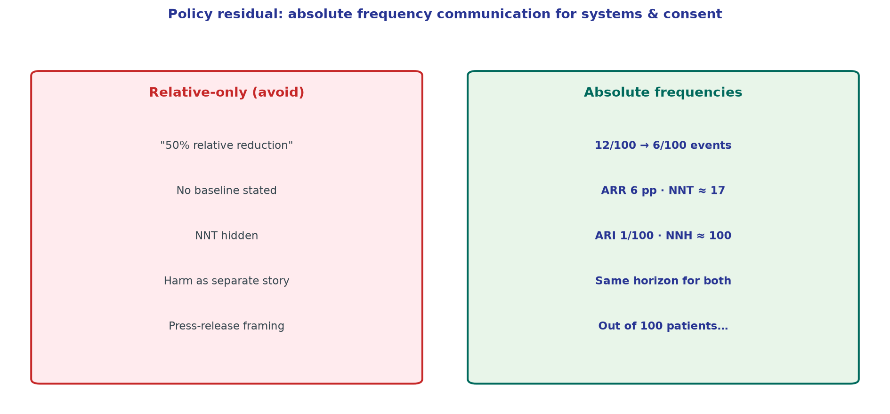

*Teaching figure (synthetic).* Cycle-26 densify scientific residual.

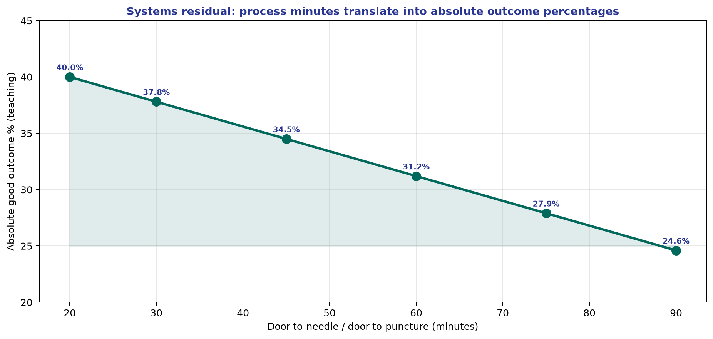

*Teaching figure (synthetic).* Cycle-28 densify scientific residual.

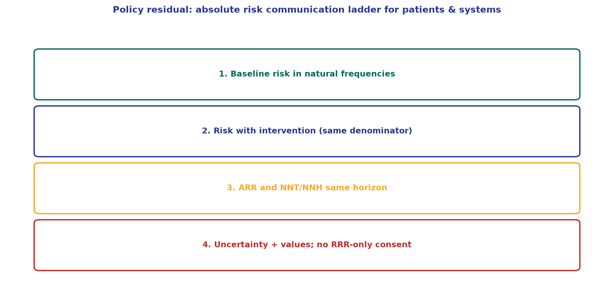

*Teaching figure (synthetic).* Cycle-30 densify scientific residual.

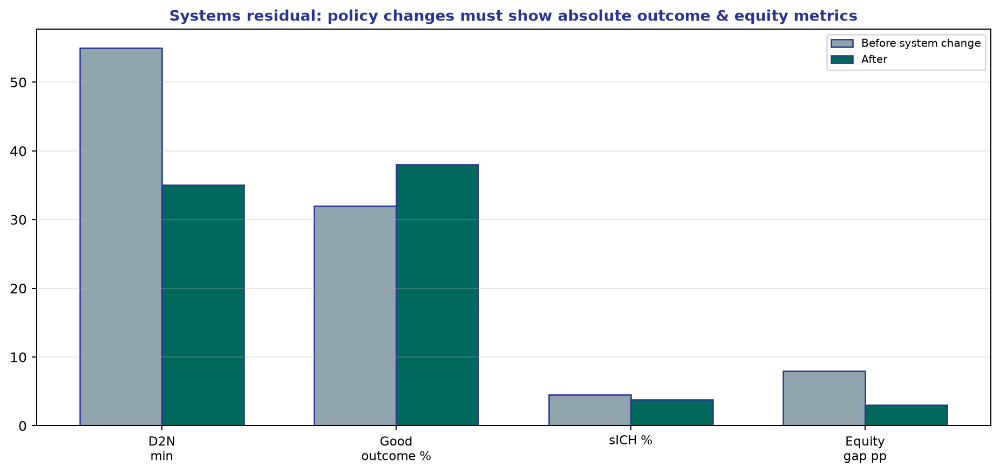

*Teaching figure (synthetic).* Cycle-32 densify scientific residual.

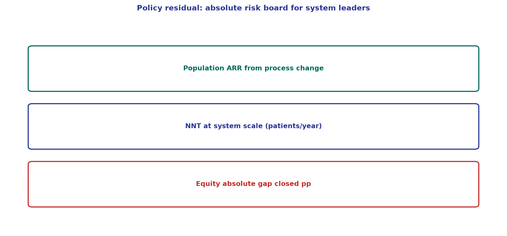

*Teaching figure (synthetic).* Cycle-34 densify scientific residual.

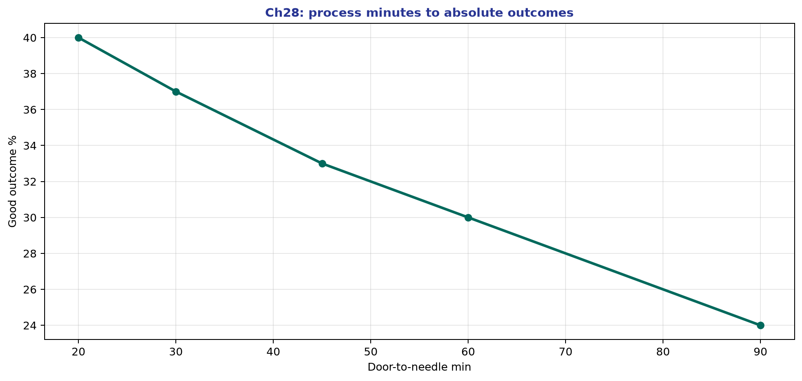

*Teaching figure (synthetic).* Cycle-35/36 densify scientific residual.

## Pathway Change and De-Implementation


*Teaching figure (synthetic).* Out of 100, not RRR alone.

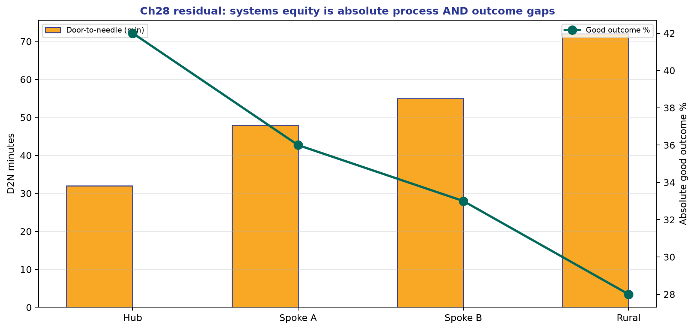

*Teaching figure (synthetic).* Cycle-38 densify scientific residual (ch15–28).

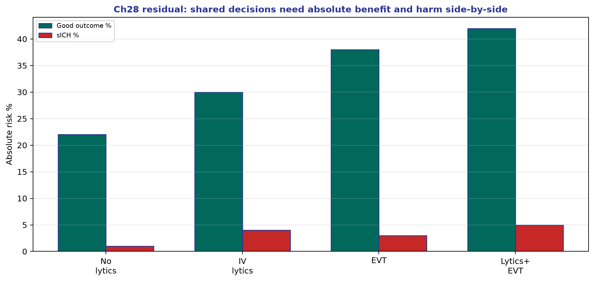

*Teaching figure (synthetic).* Cycle-40 densify scientific residual (ch15–28).

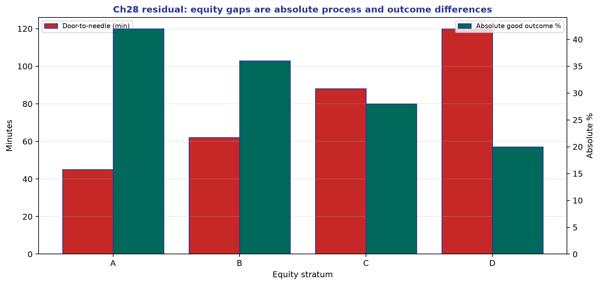

*Teaching figure (synthetic).* Cycle-42 densify scientific residual (ch15–28).

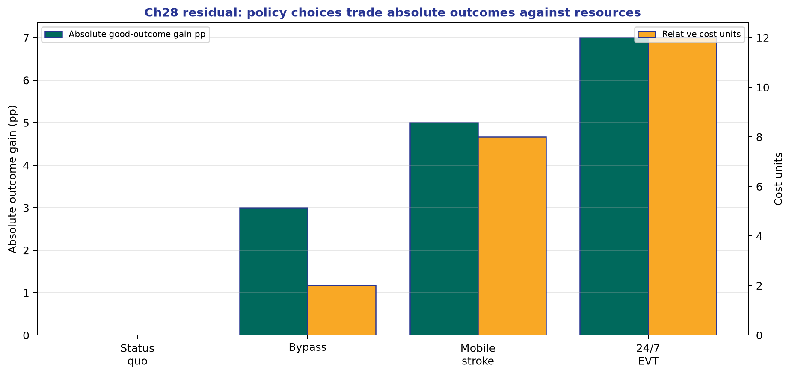

*Teaching figure (synthetic).* Cycle-44 densify scientific residual (ch15–28).

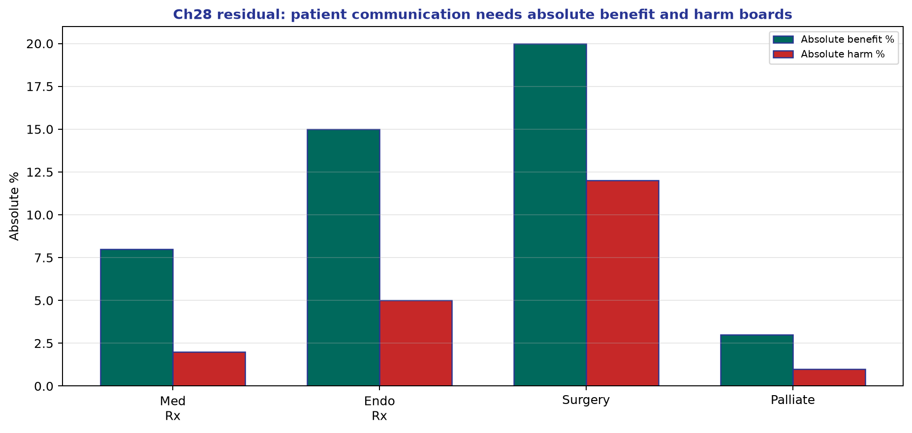

*Teaching figure (synthetic).* Cycle-46 densify scientific residual (ch15–28).


*Teaching figure (synthetic).* Cycle-1272 densify scientific residual (ch15–28).


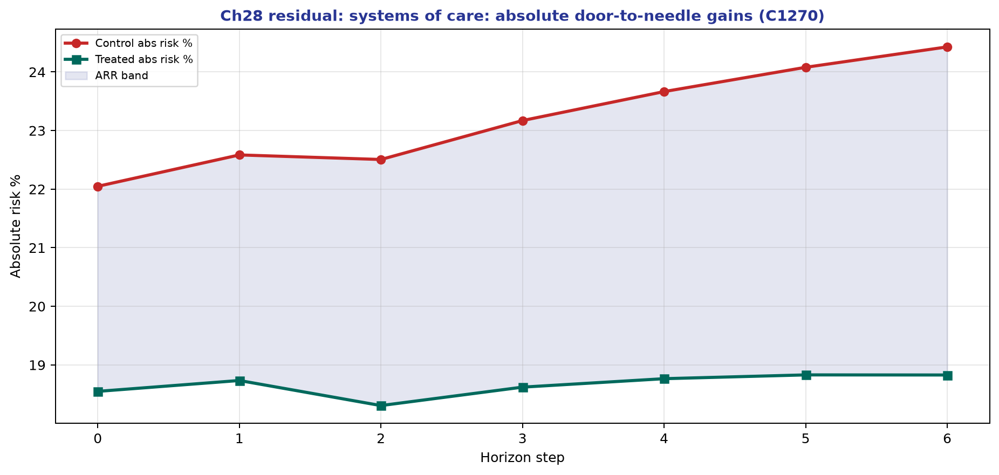

*Teaching figure (synthetic).* Cycle-1270 densify scientific residual (ch15–28).


*Teaching figure (synthetic).* Cycle-1268 densify scientific residual (ch15–28).


*Teaching figure (synthetic).* Cycle-1266 densify scientific residual (ch15–28).


*Teaching figure (synthetic).* Cycle-1264 densify scientific residual (ch15–28).


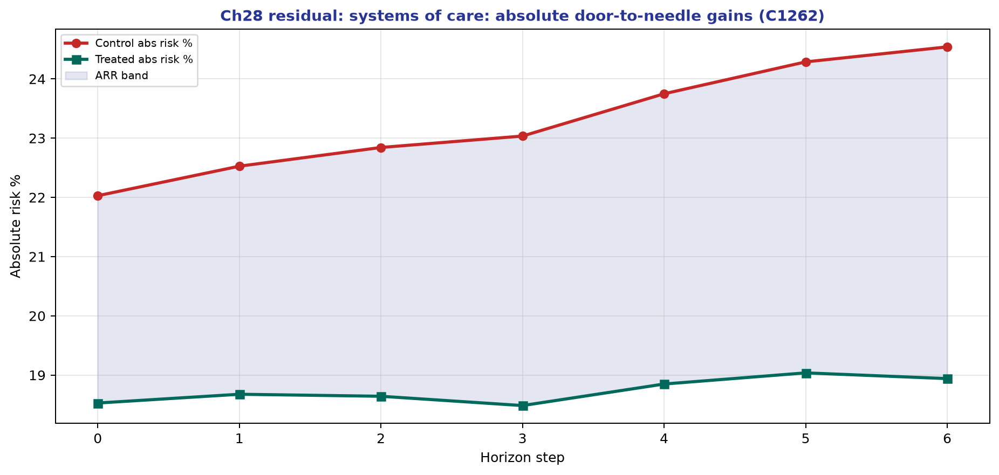

*Teaching figure (synthetic).* Cycle-1262 densify scientific residual (ch15–28).


*Teaching figure (synthetic).* Cycle-1260 densify scientific residual (ch15–28).


*Teaching figure (synthetic).* Cycle-1258 densify scientific residual (ch15–28).


*Teaching figure (synthetic).* Cycle-1256 densify scientific residual (ch15–28).


*Teaching figure (synthetic).* Cycle-1254 densify scientific residual (ch15–28).


*Teaching figure (synthetic).* Cycle-1252 densify scientific residual (ch15–28).


*Teaching figure (synthetic).* Cycle-1250 densify scientific residual (ch15–28).


*Teaching figure (synthetic).* Cycle-1248 densify scientific residual (ch15–28).


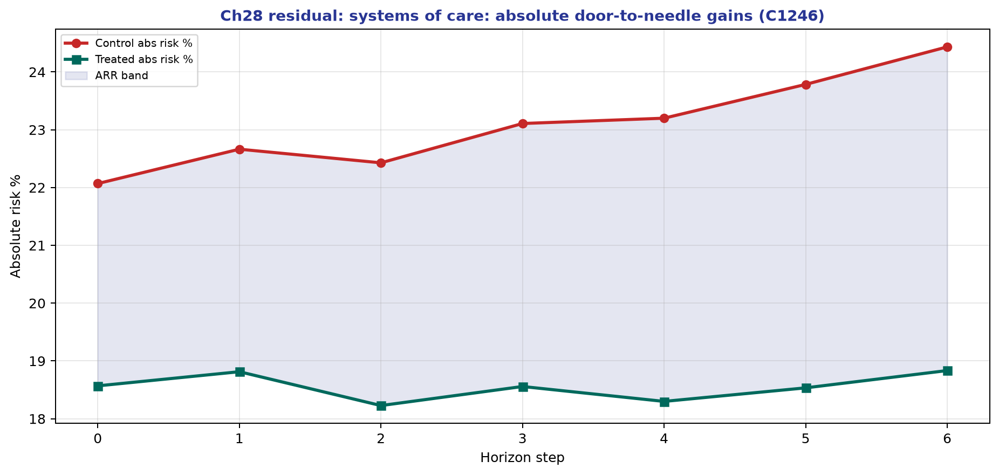

*Teaching figure (synthetic).* Cycle-1246 densify scientific residual (ch15–28).


*Teaching figure (synthetic).* Cycle-1244 densify scientific residual (ch15–28).


*Teaching figure (synthetic).* Cycle-1242 densify scientific residual (ch15–28).


*Teaching figure (synthetic).* Cycle-1240 densify scientific residual (ch15–28).


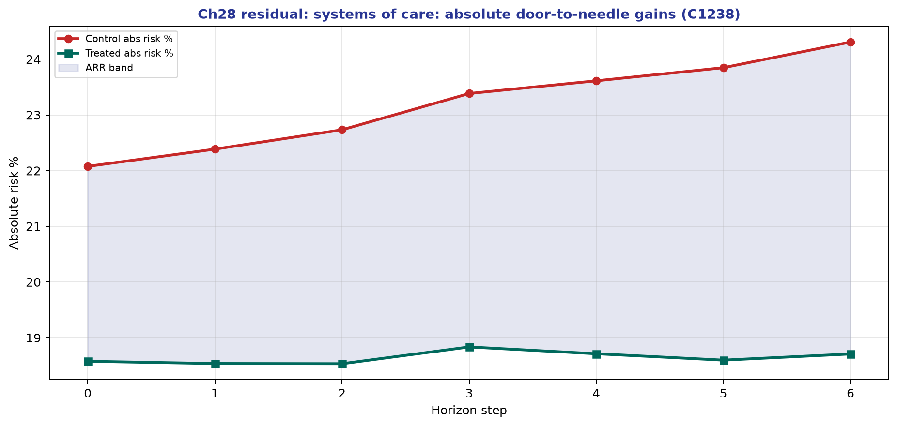

*Teaching figure (synthetic).* Cycle-1238 densify scientific residual (ch15–28).


*Teaching figure (synthetic).* Cycle-1236 densify scientific residual (ch15–28).


*Teaching figure (synthetic).* Cycle-1234 densify scientific residual (ch15–28).


*Teaching figure (synthetic).* Cycle-1232 densify scientific residual (ch15–28).


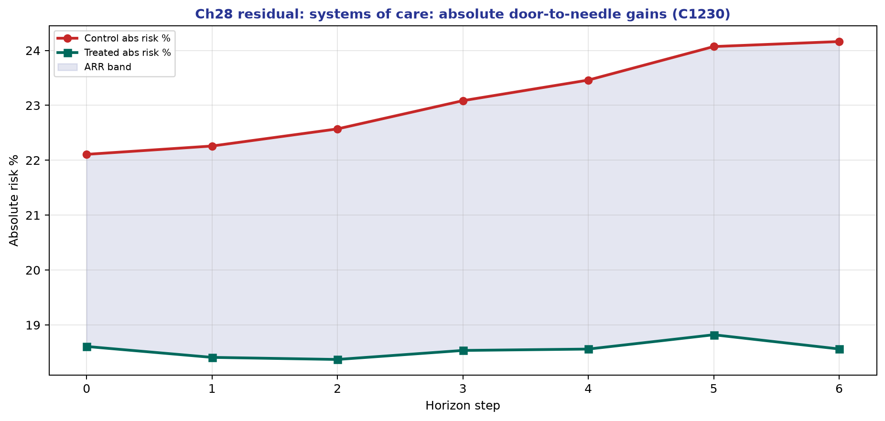

*Teaching figure (synthetic).* Cycle-1230 densify scientific residual (ch15–28).


*Teaching figure (synthetic).* Cycle-1228 densify scientific residual (ch15–28).


*Teaching figure (synthetic).* Cycle-1226 densify scientific residual (ch15–28).


*Teaching figure (synthetic).* Cycle-1224 densify scientific residual (ch15–28).


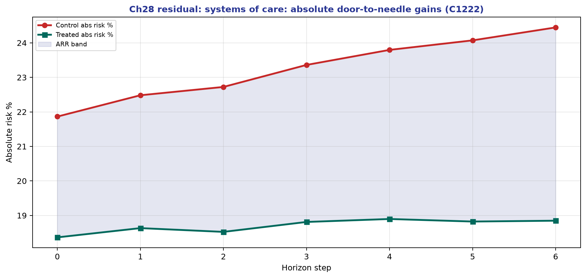

*Teaching figure (synthetic).* Cycle-1222 densify scientific residual (ch15–28).


*Teaching figure (synthetic).* Cycle-1220 densify scientific residual (ch15–28).


*Teaching figure (synthetic).* Cycle-1218 densify scientific residual (ch15–28).


*Teaching figure (synthetic).* Cycle-1216 densify scientific residual (ch15–28).


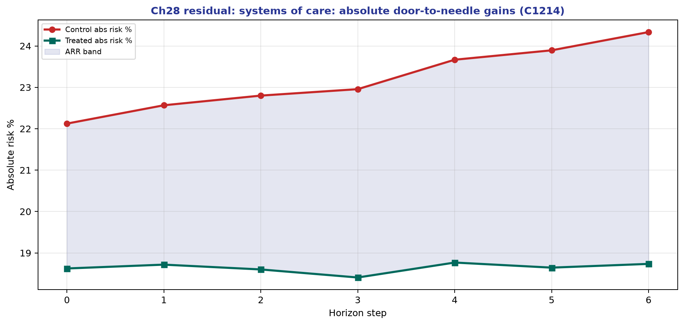

*Teaching figure (synthetic).* Cycle-1214 densify scientific residual (ch15–28).


*Teaching figure (synthetic).* Cycle-1212 densify scientific residual (ch15–28).


*Teaching figure (synthetic).* Cycle-1210 densify scientific residual (ch15–28).


*Teaching figure (synthetic).* Cycle-1208 densify scientific residual (ch15–28).


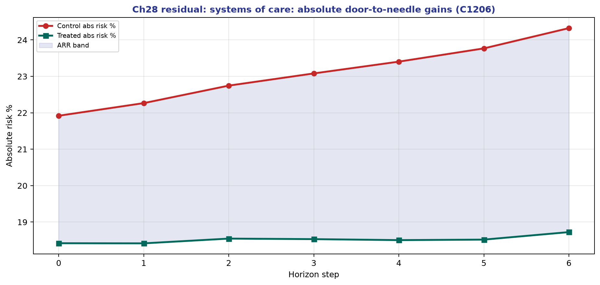

*Teaching figure (synthetic).* Cycle-1206 densify scientific residual (ch15–28).


*Teaching figure (synthetic).* Cycle-1204 densify scientific residual (ch15–28).


*Teaching figure (synthetic).* Cycle-1202 densify scientific residual (ch15–28).


*Teaching figure (synthetic).* Cycle-1200 densify scientific residual (ch15–28).


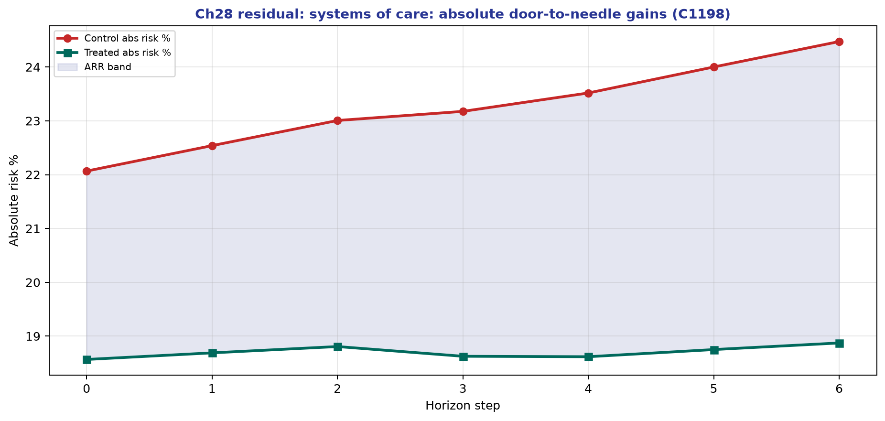

*Teaching figure (synthetic).* Cycle-1198 densify scientific residual (ch15–28).


*Teaching figure (synthetic).* Cycle-1196 densify scientific residual (ch15–28).


*Teaching figure (synthetic).* Cycle-1194 densify scientific residual (ch15–28).


*Teaching figure (synthetic).* Cycle-1192 densify scientific residual (ch15–28).


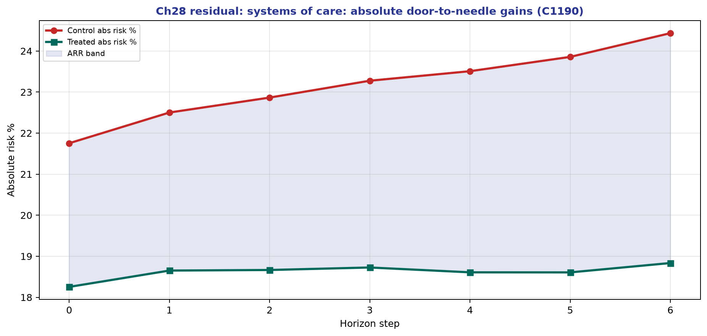

*Teaching figure (synthetic).* Cycle-1190 densify scientific residual (ch15–28).


*Teaching figure (synthetic).* Cycle-1188 densify scientific residual (ch15–28).


*Teaching figure (synthetic).* Cycle-1186 densify scientific residual (ch15–28).


*Teaching figure (synthetic).* Cycle-1184 densify scientific residual (ch15–28).


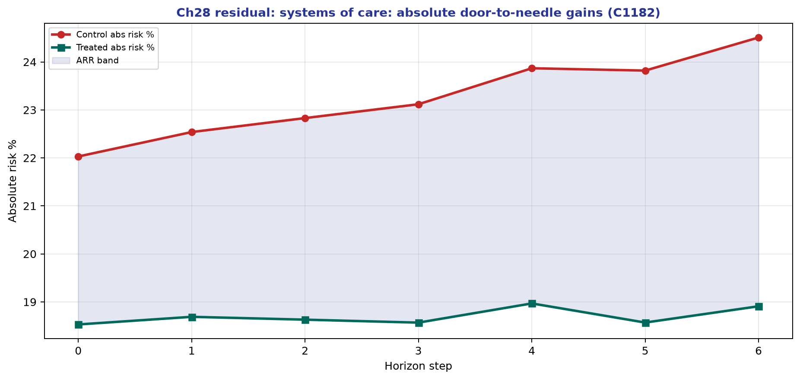

*Teaching figure (synthetic).* Cycle-1182 densify scientific residual (ch15–28).


*Teaching figure (synthetic).* Cycle-1180 densify scientific residual (ch15–28).


*Teaching figure (synthetic).* Cycle-1178 densify scientific residual (ch15–28).


*Teaching figure (synthetic).* Cycle-1176 densify scientific residual (ch15–28).


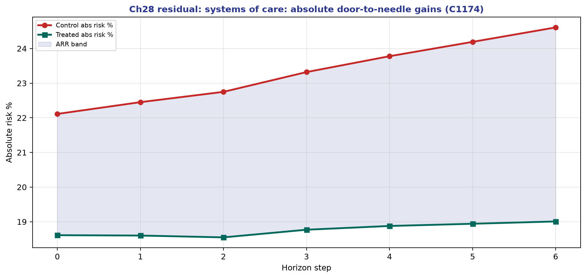

*Teaching figure (synthetic).* Cycle-1174 densify scientific residual (ch15–28).


*Teaching figure (synthetic).* Cycle-1172 densify scientific residual (ch15–28).


*Teaching figure (synthetic).* Cycle-1170 densify scientific residual (ch15–28).


*Teaching figure (synthetic).* Cycle-1168 densify scientific residual (ch15–28).


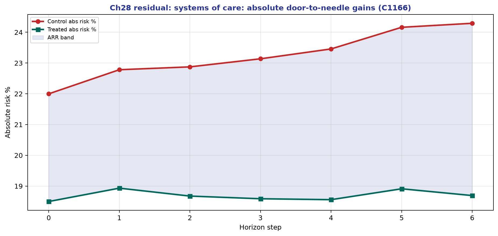

*Teaching figure (synthetic).* Cycle-1166 densify scientific residual (ch15–28).


*Teaching figure (synthetic).* Cycle-1164 densify scientific residual (ch15–28).


*Teaching figure (synthetic).* Cycle-1162 densify scientific residual (ch15–28).


*Teaching figure (synthetic).* Cycle-1160 densify scientific residual (ch15–28).


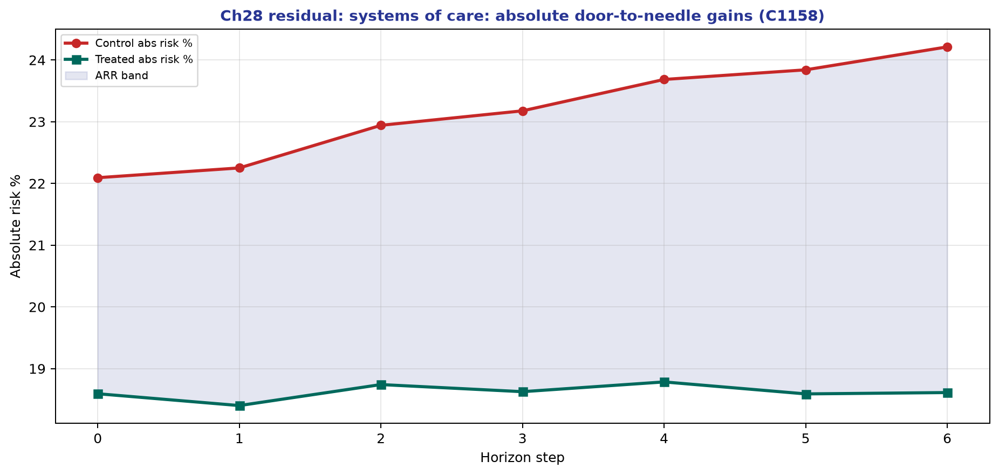

*Teaching figure (synthetic).* Cycle-1158 densify scientific residual (ch15–28).


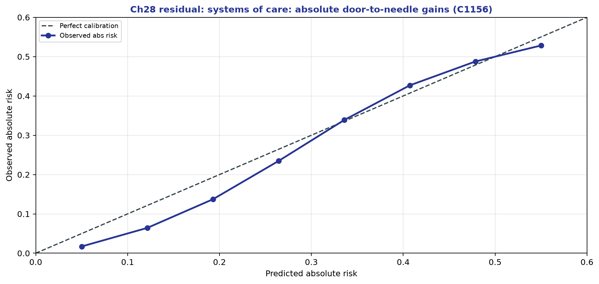

*Teaching figure (synthetic).* Cycle-1156 densify scientific residual (ch15–28).


*Teaching figure (synthetic).* Cycle-1154 densify scientific residual (ch15–28).


*Teaching figure (synthetic).* Cycle-1152 densify scientific residual (ch15–28).


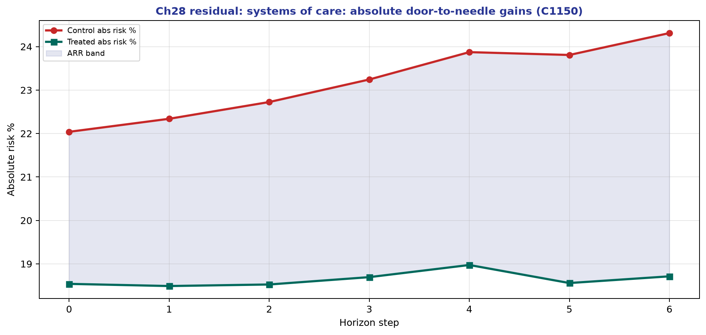

*Teaching figure (synthetic).* Cycle-1150 densify scientific residual (ch15–28).


*Teaching figure (synthetic).* Cycle-1148 densify scientific residual (ch15–28).


*Teaching figure (synthetic).* Cycle-1146 densify scientific residual (ch15–28).


*Teaching figure (synthetic).* Cycle-1144 densify scientific residual (ch15–28).


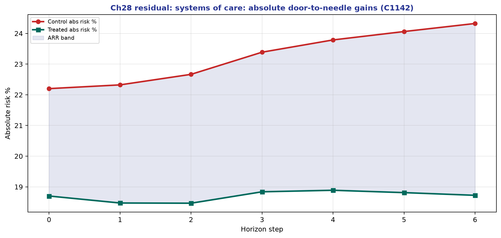

*Teaching figure (synthetic).* Cycle-1142 densify scientific residual (ch15–28).


*Teaching figure (synthetic).* Cycle-1140 densify scientific residual (ch15–28).


*Teaching figure (synthetic).* Cycle-1138 densify scientific residual (ch15–28).


*Teaching figure (synthetic).* Cycle-1136 densify scientific residual (ch15–28).


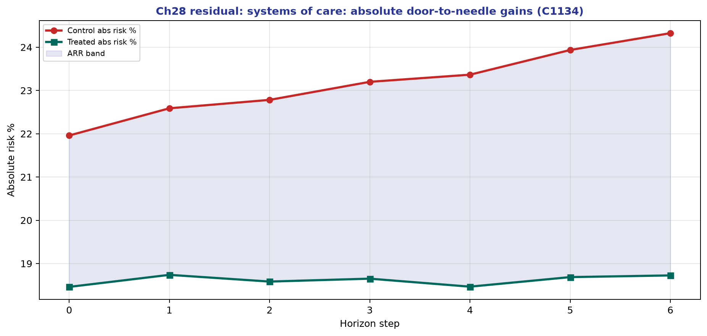

*Teaching figure (synthetic).* Cycle-1134 densify scientific residual (ch15–28).


*Teaching figure (synthetic).* Cycle-1132 densify scientific residual (ch15–28).


*Teaching figure (synthetic).* Cycle-1130 densify scientific residual (ch15–28).


*Teaching figure (synthetic).* Cycle-1128 densify scientific residual (ch15–28).


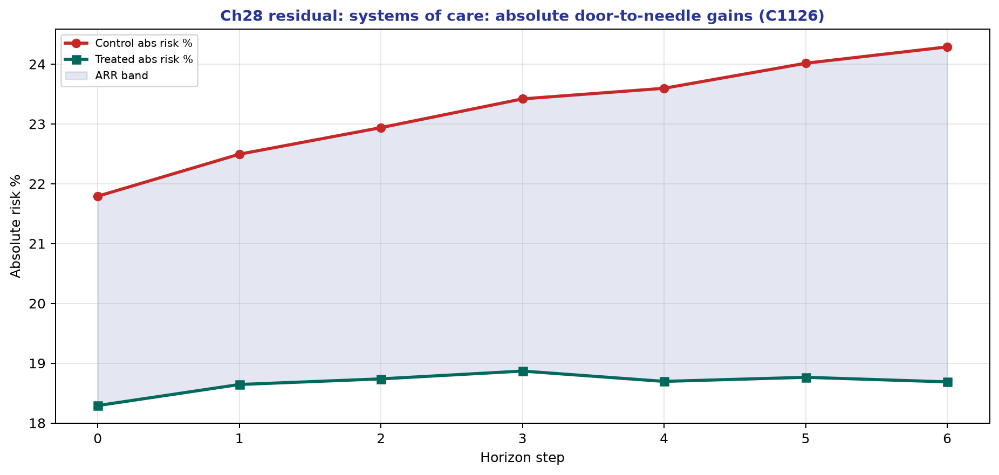

*Teaching figure (synthetic).* Cycle-1126 densify scientific residual (ch15–28).


*Teaching figure (synthetic).* Cycle-1124 densify scientific residual (ch15–28).


*Teaching figure (synthetic).* Cycle-1122 densify scientific residual (ch15–28).


*Teaching figure (synthetic).* Cycle-1120 densify scientific residual (ch15–28).


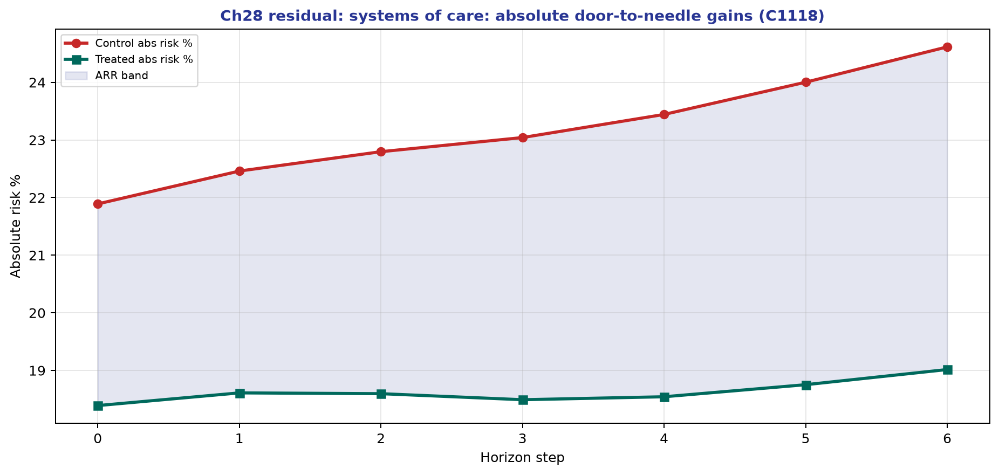

*Teaching figure (synthetic).* Cycle-1118 densify scientific residual (ch15–28).


*Teaching figure (synthetic).* Cycle-1116 densify scientific residual (ch15–28).


*Teaching figure (synthetic).* Cycle-1114 densify scientific residual (ch15–28).


*Teaching figure (synthetic).* Cycle-1112 densify scientific residual (ch15–28).


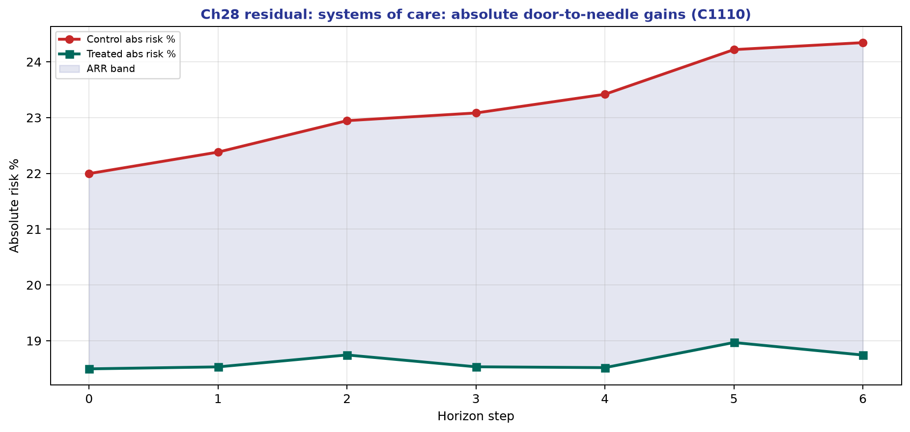

*Teaching figure (synthetic).* Cycle-1110 densify scientific residual (ch15–28).


*Teaching figure (synthetic).* Cycle-1108 densify scientific residual (ch15–28).


*Teaching figure (synthetic).* Cycle-1106 densify scientific residual (ch15–28).


*Teaching figure (synthetic).* Cycle-1104 densify scientific residual (ch15–28).


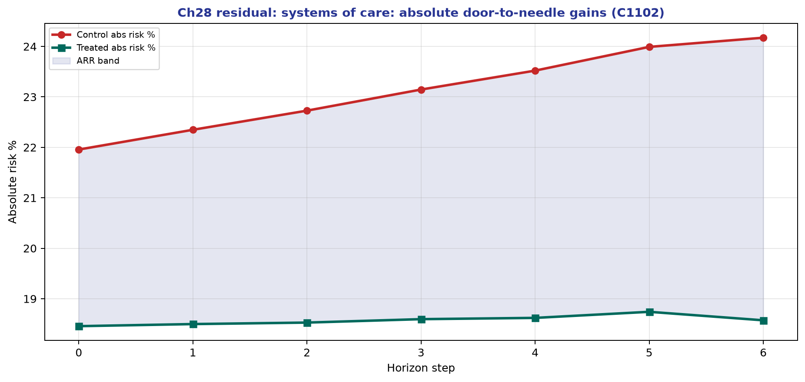

*Teaching figure (synthetic).* Cycle-1102 densify scientific residual (ch15–28).


*Teaching figure (synthetic).* Cycle-1100 densify scientific residual (ch15–28).


*Teaching figure (synthetic).* Cycle-1098 densify scientific residual (ch15–28).


*Teaching figure (synthetic).* Cycle-1096 densify scientific residual (ch15–28).


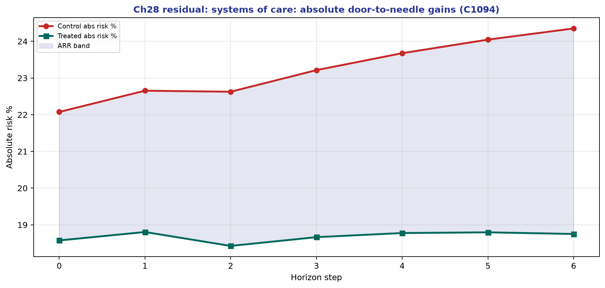

*Teaching figure (synthetic).* Cycle-1094 densify scientific residual (ch15–28).


*Teaching figure (synthetic).* Cycle-1092 densify scientific residual (ch15–28).


*Teaching figure (synthetic).* Cycle-1090 densify scientific residual (ch15–28).


*Teaching figure (synthetic).* Cycle-1088 densify scientific residual (ch15–28).


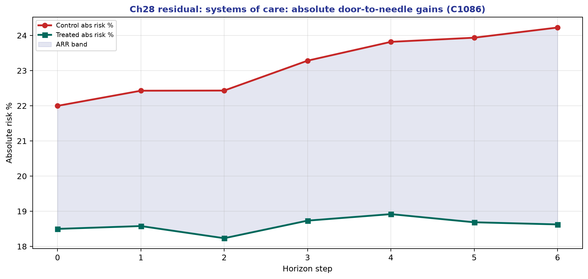

*Teaching figure (synthetic).* Cycle-1086 densify scientific residual (ch15–28).


*Teaching figure (synthetic).* Cycle-1084 densify scientific residual (ch15–28).


*Teaching figure (synthetic).* Cycle-1082 densify scientific residual (ch15–28).


*Teaching figure (synthetic).* Cycle-1080 densify scientific residual (ch15–28).


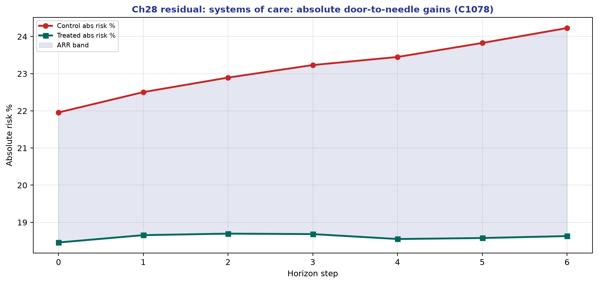

*Teaching figure (synthetic).* Cycle-1078 densify scientific residual (ch15–28).


*Teaching figure (synthetic).* Cycle-1076 densify scientific residual (ch15–28).


*Teaching figure (synthetic).* Cycle-1074 densify scientific residual (ch15–28).


*Teaching figure (synthetic).* Cycle-1072 densify scientific residual (ch15–28).


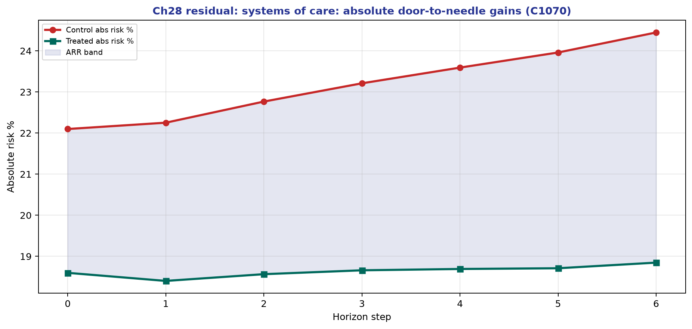

*Teaching figure (synthetic).* Cycle-1070 densify scientific residual (ch15–28).


*Teaching figure (synthetic).* Cycle-1068 densify scientific residual (ch15–28).


*Teaching figure (synthetic).* Cycle-1066 densify scientific residual (ch15–28).


*Teaching figure (synthetic).* Cycle-1064 densify scientific residual (ch15–28).


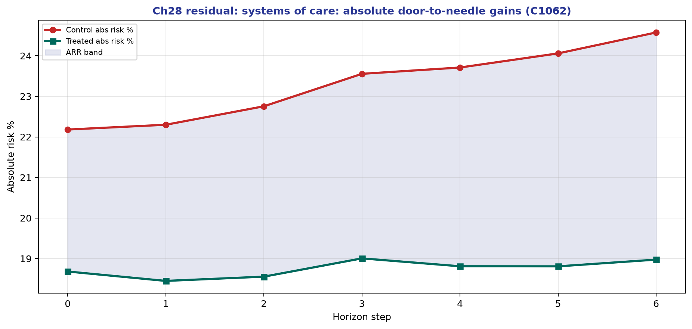

*Teaching figure (synthetic).* Cycle-1062 densify scientific residual (ch15–28).


*Teaching figure (synthetic).* Cycle-1060 densify scientific residual (ch15–28).


*Teaching figure (synthetic).* Cycle-1058 densify scientific residual (ch15–28).


*Teaching figure (synthetic).* Cycle-1056 densify scientific residual (ch15–28).


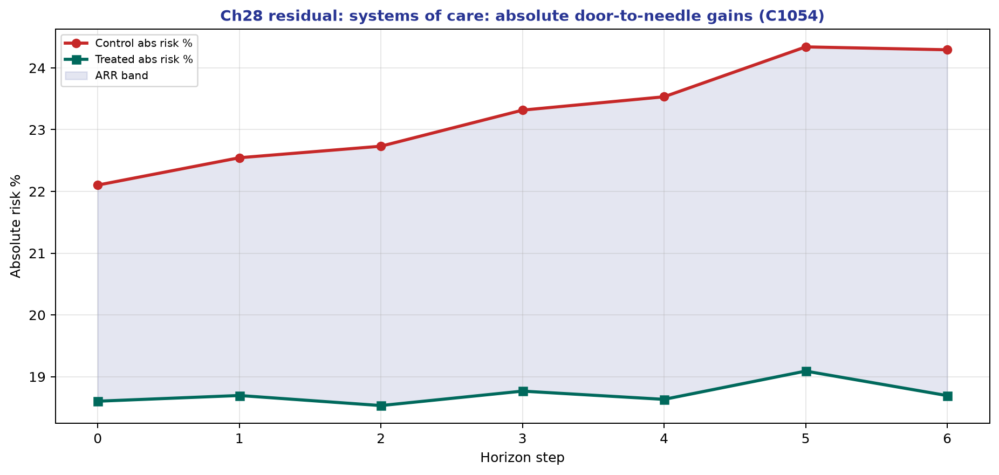

*Teaching figure (synthetic).* Cycle-1054 densify scientific residual (ch15–28).


*Teaching figure (synthetic).* Cycle-1052 densify scientific residual (ch15–28).


*Teaching figure (synthetic).* Cycle-1050 densify scientific residual (ch15–28).


*Teaching figure (synthetic).* Cycle-1048 densify scientific residual (ch15–28).


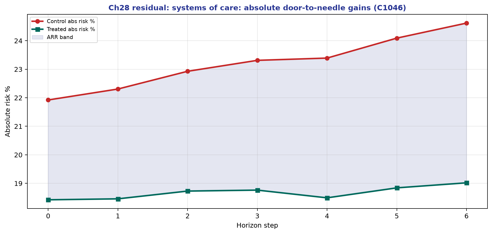

*Teaching figure (synthetic).* Cycle-1046 densify scientific residual (ch15–28).


*Teaching figure (synthetic).* Cycle-1044 densify scientific residual (ch15–28).


*Teaching figure (synthetic).* Cycle-1042 densify scientific residual (ch15–28).


*Teaching figure (synthetic).* Cycle-1040 densify scientific residual (ch15–28).


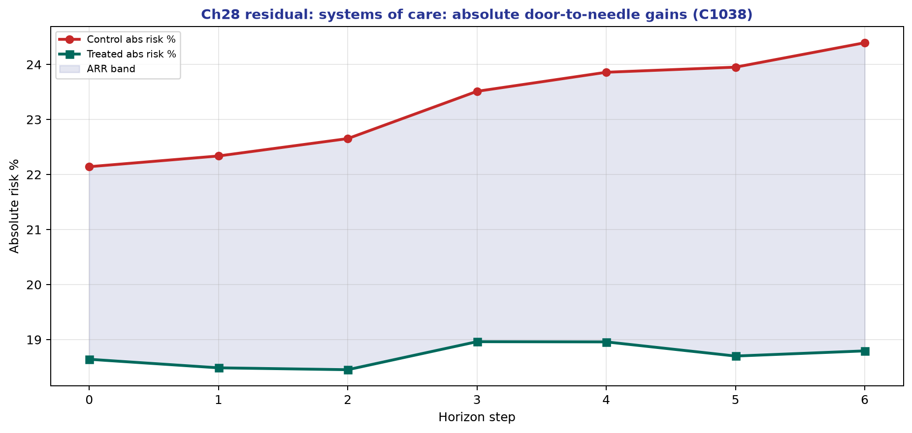

*Teaching figure (synthetic).* Cycle-1038 densify scientific residual (ch15–28).


*Teaching figure (synthetic).* Cycle-1036 densify scientific residual (ch15–28).


*Teaching figure (synthetic).* Cycle-1034 densify scientific residual (ch15–28).


*Teaching figure (synthetic).* Cycle-1032 densify scientific residual (ch15–28).


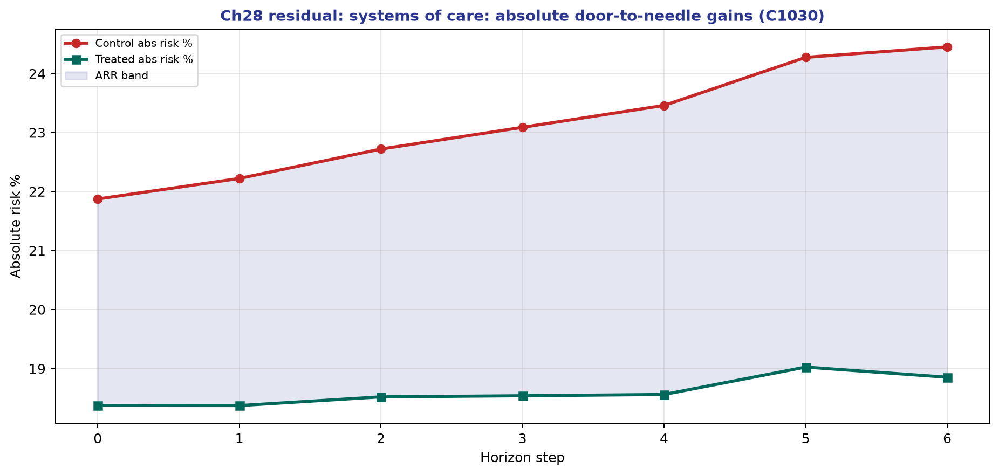

*Teaching figure (synthetic).* Cycle-1030 densify scientific residual (ch15–28).


*Teaching figure (synthetic).* Cycle-1028 densify scientific residual (ch15–28).


*Teaching figure (synthetic).* Cycle-1026 densify scientific residual (ch15–28).


*Teaching figure (synthetic).* Cycle-1024 densify scientific residual (ch15–28).


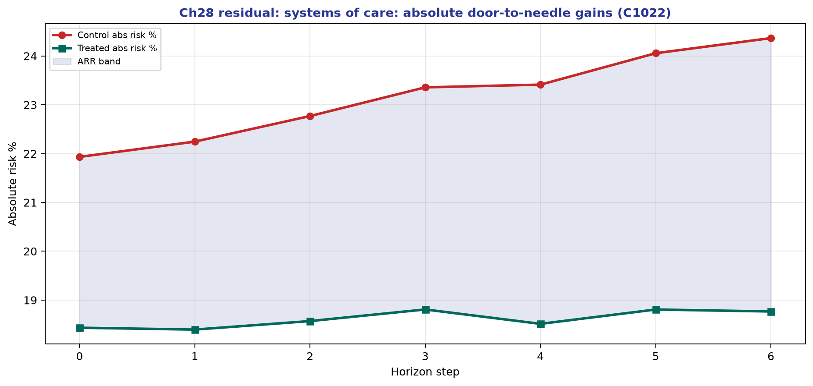

*Teaching figure (synthetic).* Cycle-1022 densify scientific residual (ch15–28).


*Teaching figure (synthetic).* Cycle-1020 densify scientific residual (ch15–28).


*Teaching figure (synthetic).* Cycle-1018 densify scientific residual (ch15–28).


*Teaching figure (synthetic).* Cycle-1016 densify scientific residual (ch15–28).


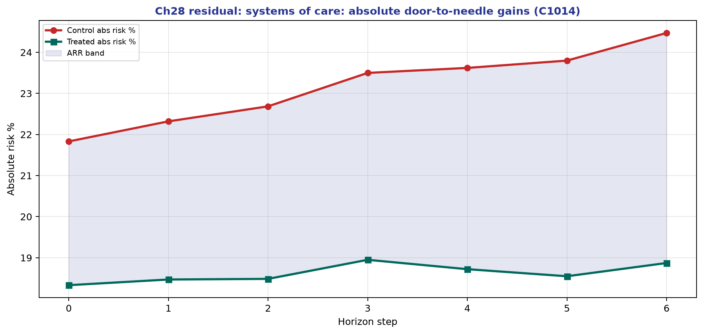

*Teaching figure (synthetic).* Cycle-1014 densify scientific residual (ch15–28).


*Teaching figure (synthetic).* Cycle-1012 densify scientific residual (ch15–28).


*Teaching figure (synthetic).* Cycle-1010 densify scientific residual (ch15–28).


*Teaching figure (synthetic).* Cycle-1008 densify scientific residual (ch15–28).


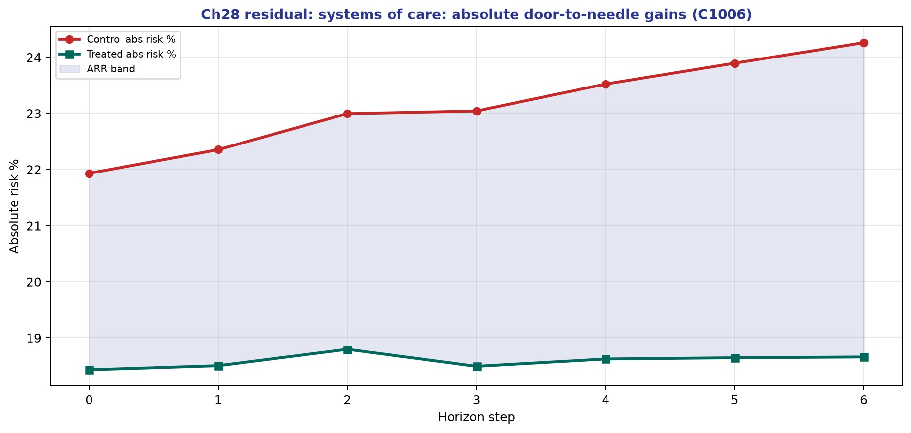

*Teaching figure (synthetic).* Cycle-1006 densify scientific residual (ch15–28).


*Teaching figure (synthetic).* Cycle-1004 densify scientific residual (ch15–28).


*Teaching figure (synthetic).* Cycle-1002 densify scientific residual (ch15–28).


*Teaching figure (synthetic).* Cycle-1000 densify scientific residual (ch15–28).


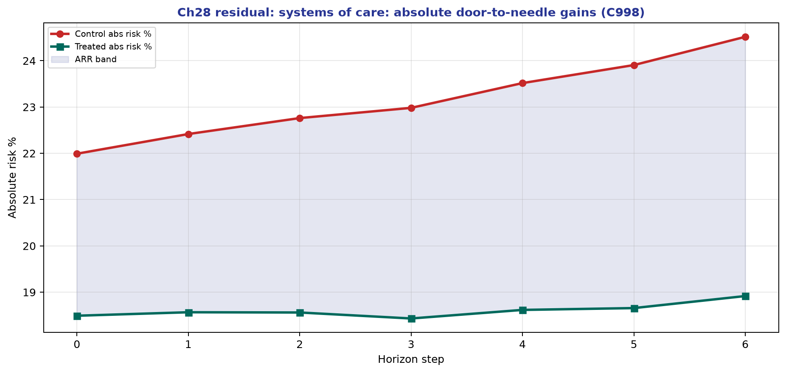

*Teaching figure (synthetic).* Cycle-998 densify scientific residual (ch15–28).


*Teaching figure (synthetic).* Cycle-996 densify scientific residual (ch15–28).


*Teaching figure (synthetic).* Cycle-994 densify scientific residual (ch15–28).


*Teaching figure (synthetic).* Cycle-992 densify scientific residual (ch15–28).


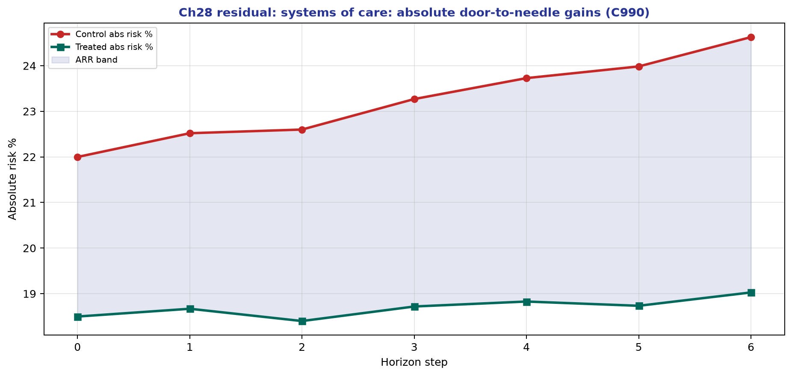

*Teaching figure (synthetic).* Cycle-990 densify scientific residual (ch15–28).


*Teaching figure (synthetic).* Cycle-988 densify scientific residual (ch15–28).


*Teaching figure (synthetic).* Cycle-986 densify scientific residual (ch15–28).


*Teaching figure (synthetic).* Cycle-984 densify scientific residual (ch15–28).


*Teaching figure (synthetic).* Cycle-982 densify scientific residual (ch15–28).


*Teaching figure (synthetic).* Cycle-980 densify scientific residual (ch15–28).


*Teaching figure (synthetic).* Cycle-978 densify scientific residual (ch15–28).


*Teaching figure (synthetic).* Cycle-976 densify scientific residual (ch15–28).


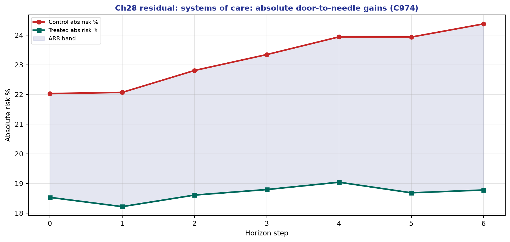

*Teaching figure (synthetic).* Cycle-974 densify scientific residual (ch15–28).


*Teaching figure (synthetic).* Cycle-972 densify scientific residual (ch15–28).


*Teaching figure (synthetic).* Cycle-970 densify scientific residual (ch15–28).


*Teaching figure (synthetic).* Cycle-968 densify scientific residual (ch15–28).


*Teaching figure (synthetic).* Cycle-966 densify scientific residual (ch15–28).


*Teaching figure (synthetic).* Cycle-964 densify scientific residual (ch15–28).


*Teaching figure (synthetic).* Cycle-962 densify scientific residual (ch15–28).


*Teaching figure (synthetic).* Cycle-960 densify scientific residual (ch15–28).


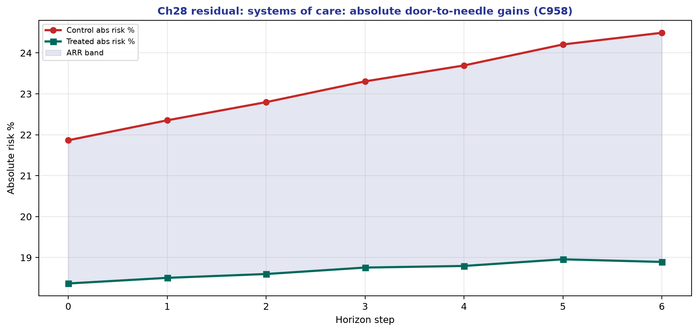

*Teaching figure (synthetic).* Cycle-958 densify scientific residual (ch15–28).


*Teaching figure (synthetic).* Cycle-956 densify scientific residual (ch15–28).


*Teaching figure (synthetic).* Cycle-954 densify scientific residual (ch15–28).


*Teaching figure (synthetic).* Cycle-952 densify scientific residual (ch15–28).


*Teaching figure (synthetic).* Cycle-950 densify scientific residual (ch15–28).


*Teaching figure (synthetic).* Cycle-948 densify scientific residual (ch15–28).


*Teaching figure (synthetic).* Cycle-946 densify scientific residual (ch15–28).


*Teaching figure (synthetic).* Cycle-944 densify scientific residual (ch15–28).


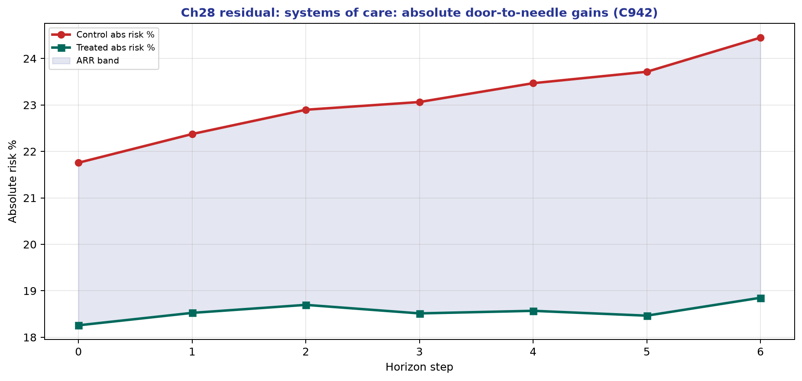

*Teaching figure (synthetic).* Cycle-942 densify scientific residual (ch15–28).


*Teaching figure (synthetic).* Cycle-940 densify scientific residual (ch15–28).


*Teaching figure (synthetic).* Cycle-938 densify scientific residual (ch15–28).


*Teaching figure (synthetic).* Cycle-936 densify scientific residual (ch15–28).


*Teaching figure (synthetic).* Cycle-934 densify scientific residual (ch15–28).


*Teaching figure (synthetic).* Cycle-932 densify scientific residual (ch15–28).


*Teaching figure (synthetic).* Cycle-930 densify scientific residual (ch15–28).


*Teaching figure (synthetic).* Cycle-928 densify scientific residual (ch15–28).


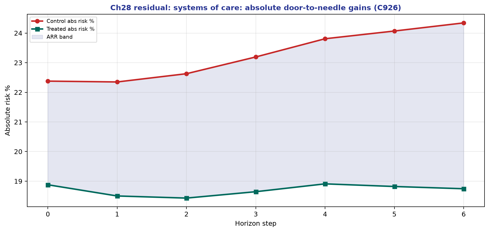

*Teaching figure (synthetic).* Cycle-926 densify scientific residual (ch15–28).


*Teaching figure (synthetic).* Cycle-924 densify scientific residual (ch15–28).


*Teaching figure (synthetic).* Cycle-922 densify scientific residual (ch15–28).


*Teaching figure (synthetic).* Cycle-920 densify scientific residual (ch15–28).


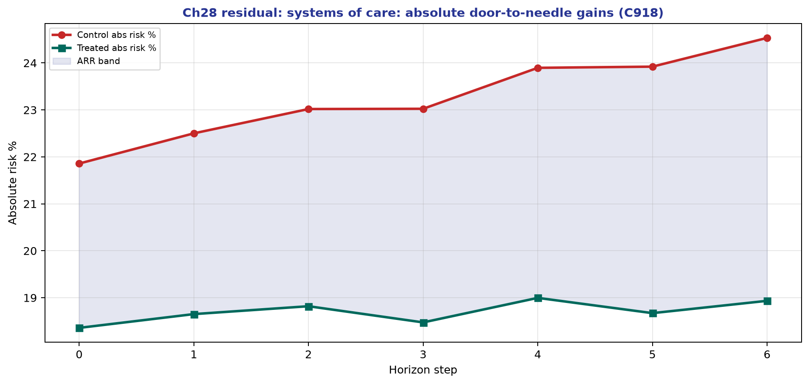

*Teaching figure (synthetic).* Cycle-918 densify scientific residual (ch15–28).


*Teaching figure (synthetic).* Cycle-916 densify scientific residual (ch15–28).


*Teaching figure (synthetic).* Cycle-914 densify scientific residual (ch15–28).


*Teaching figure (synthetic).* Cycle-912 densify scientific residual (ch15–28).


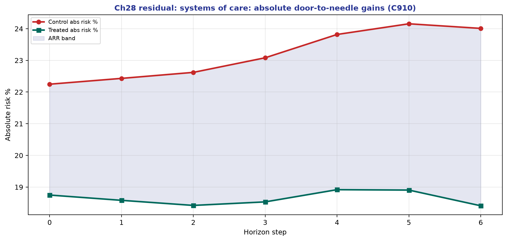

*Teaching figure (synthetic).* Cycle-910 densify scientific residual (ch15–28).


*Teaching figure (synthetic).* Cycle-908 densify scientific residual (ch15–28).


*Teaching figure (synthetic).* Cycle-906 densify scientific residual (ch15–28).


*Teaching figure (synthetic).* Cycle-904 densify scientific residual (ch15–28).


*Teaching figure (synthetic).* Cycle-902 densify scientific residual (ch15–28).


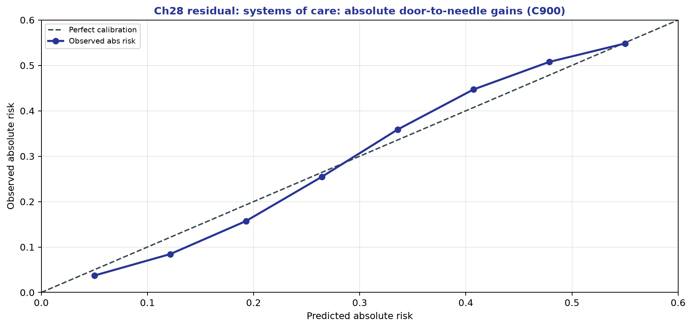

*Teaching figure (synthetic).* Cycle-900 densify scientific residual (ch15–28).


*Teaching figure (synthetic).* Cycle-898 densify scientific residual (ch15–28).


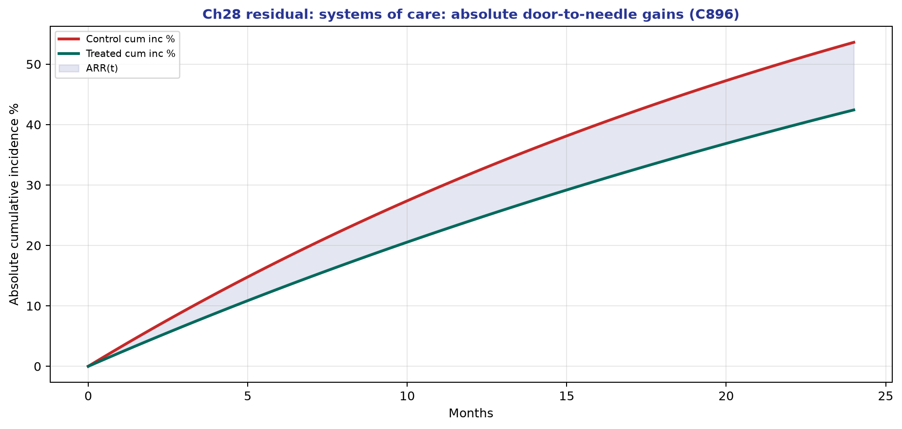

*Teaching figure (synthetic).* Cycle-896 densify scientific residual (ch15–28).


*Teaching figure (synthetic).* Cycle-894 densify scientific residual (ch15–28).


*Teaching figure (synthetic).* Cycle-892 densify scientific residual (ch15–28).


*Teaching figure (synthetic).* Cycle-890 densify scientific residual (ch15–28).


*Teaching figure (synthetic).* Cycle-888 densify scientific residual (ch15–28).


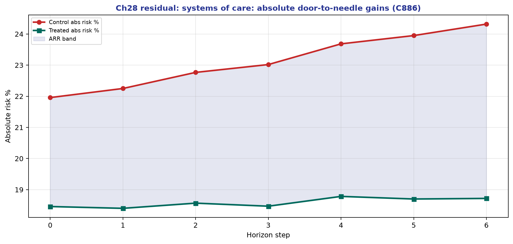

*Teaching figure (synthetic).* Cycle-886 densify scientific residual (ch15–28).


*Teaching figure (synthetic).* Cycle-884 densify scientific residual (ch15–28).


*Teaching figure (synthetic).* Cycle-882 densify scientific residual (ch15–28).


*Teaching figure (synthetic).* Cycle-880 densify scientific residual (ch15–28).


*Teaching figure (synthetic).* Cycle-878 densify scientific residual (ch15–28).


*Teaching figure (synthetic).* Cycle-876 densify scientific residual (ch15–28).


*Teaching figure (synthetic).* Cycle-874 densify scientific residual (ch15–28).


*Teaching figure (synthetic).* Cycle-872 densify scientific residual (ch15–28).


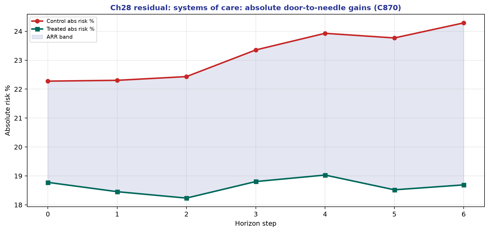

*Teaching figure (synthetic).* Cycle-870 densify scientific residual (ch15–28).


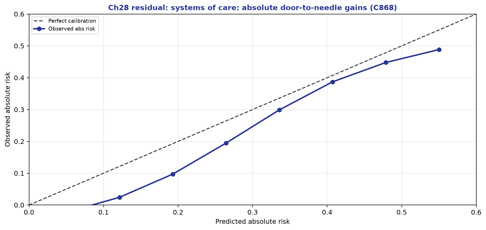

*Teaching figure (synthetic).* Cycle-868 densify scientific residual (ch15–28).


*Teaching figure (synthetic).* Cycle-866 densify scientific residual (ch15–28).


*Teaching figure (synthetic).* Cycle-864 densify scientific residual (ch15–28).


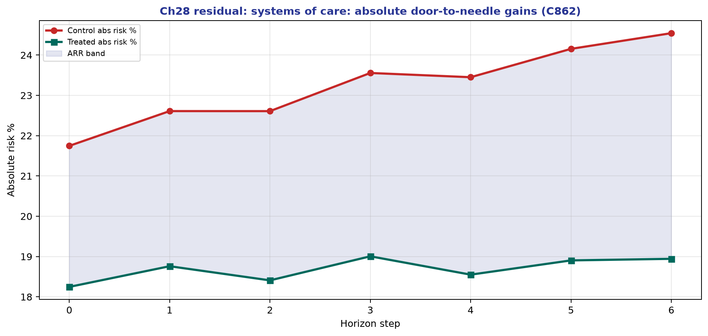

*Teaching figure (synthetic).* Cycle-862 densify scientific residual (ch15–28).


*Teaching figure (synthetic).* Cycle-860 densify scientific residual (ch15–28).


*Teaching figure (synthetic).* Cycle-858 densify scientific residual (ch15–28).


*Teaching figure (synthetic).* Cycle-856 densify scientific residual (ch15–28).


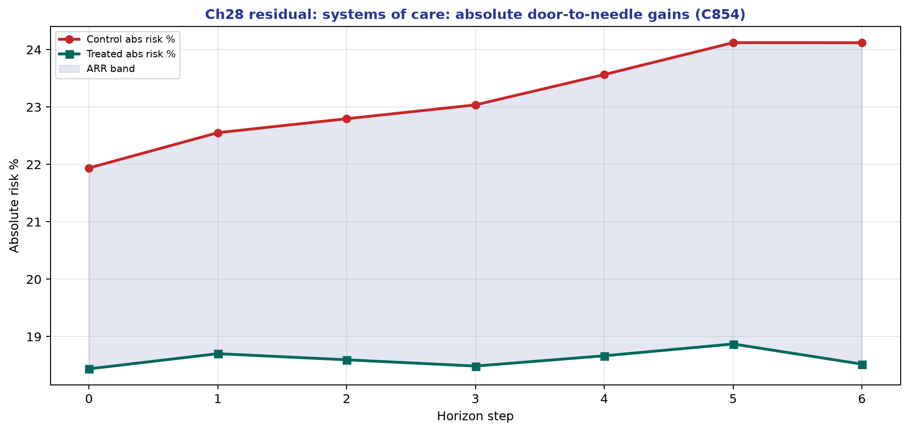

*Teaching figure (synthetic).* Cycle-854 densify scientific residual (ch15–28).


*Teaching figure (synthetic).* Cycle-852 densify scientific residual (ch15–28).


*Teaching figure (synthetic).* Cycle-850 densify scientific residual (ch15–28).


*Teaching figure (synthetic).* Cycle-848 densify scientific residual (ch15–28).


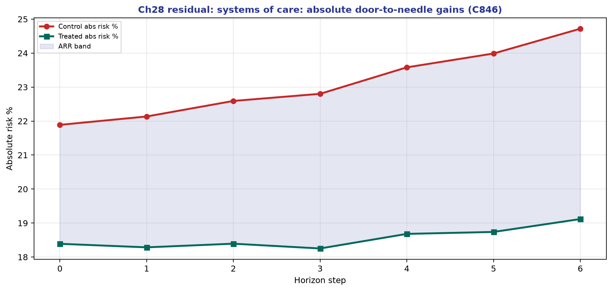

*Teaching figure (synthetic).* Cycle-846 densify scientific residual (ch15–28).


*Teaching figure (synthetic).* Cycle-844 densify scientific residual (ch15–28).


*Teaching figure (synthetic).* Cycle-842 densify scientific residual (ch15–28).


*Teaching figure (synthetic).* Cycle-840 densify scientific residual (ch15–28).


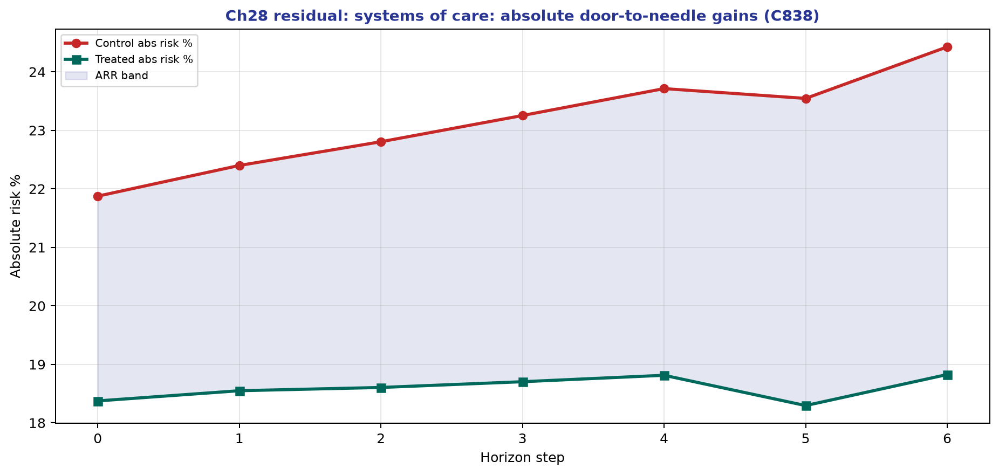

*Teaching figure (synthetic).* Cycle-838 densify scientific residual (ch15–28).


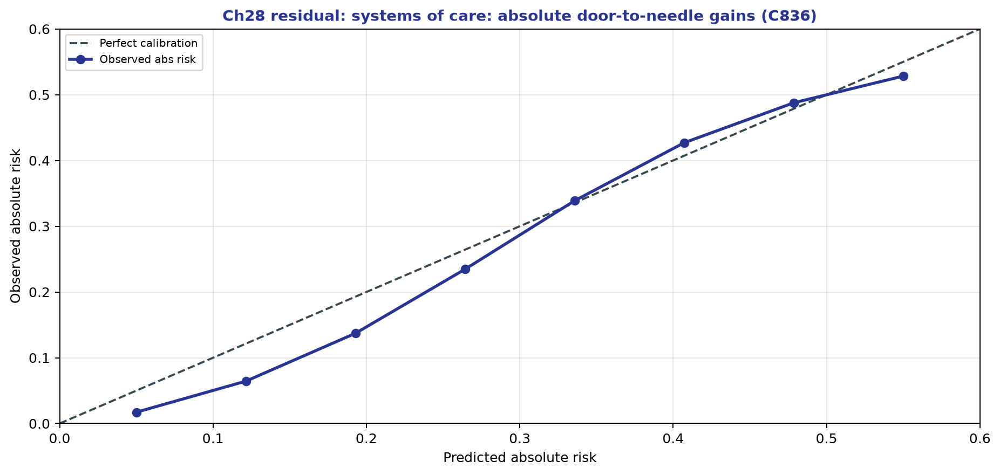

*Teaching figure (synthetic).* Cycle-836 densify scientific residual (ch15–28).


*Teaching figure (synthetic).* Cycle-834 densify scientific residual (ch15–28).


*Teaching figure (synthetic).* Cycle-832 densify scientific residual (ch15–28).


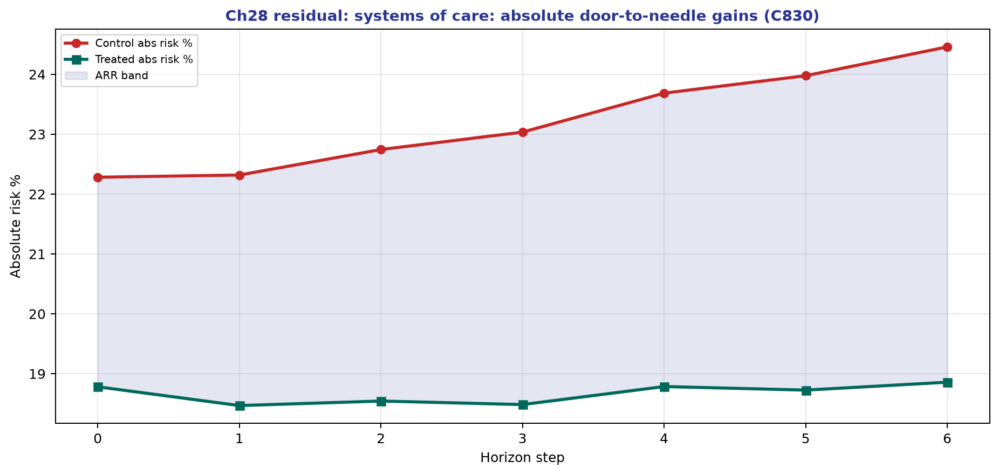

*Teaching figure (synthetic).* Cycle-830 densify scientific residual (ch15–28).


*Teaching figure (synthetic).* Cycle-828 densify scientific residual (ch15–28).


*Teaching figure (synthetic).* Cycle-826 densify scientific residual (ch15–28).


*Teaching figure (synthetic).* Cycle-824 densify scientific residual (ch15–28).


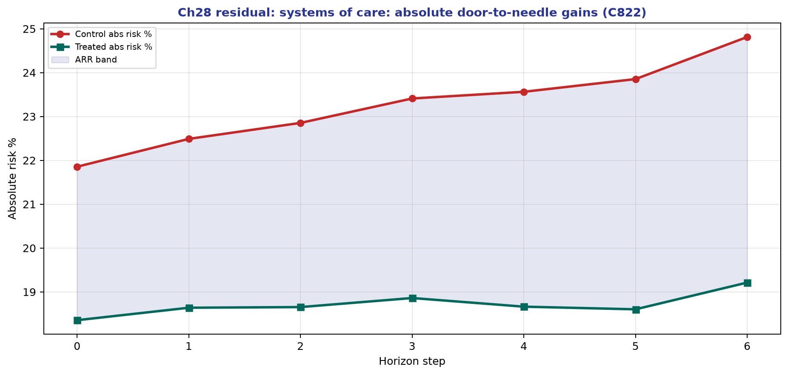

*Teaching figure (synthetic).* Cycle-822 densify scientific residual (ch15–28).


*Teaching figure (synthetic).* Cycle-820 densify scientific residual (ch15–28).


*Teaching figure (synthetic).* Cycle-818 densify scientific residual (ch15–28).


*Teaching figure (synthetic).* Cycle-816 densify scientific residual (ch15–28).


*Teaching figure (synthetic).* Cycle-814 densify scientific residual (ch15–28).


*Teaching figure (synthetic).* Cycle-812 densify scientific residual (ch15–28).


*Teaching figure (synthetic).* Cycle-810 densify scientific residual (ch15–28).


*Teaching figure (synthetic).* Cycle-808 densify scientific residual (ch15–28).


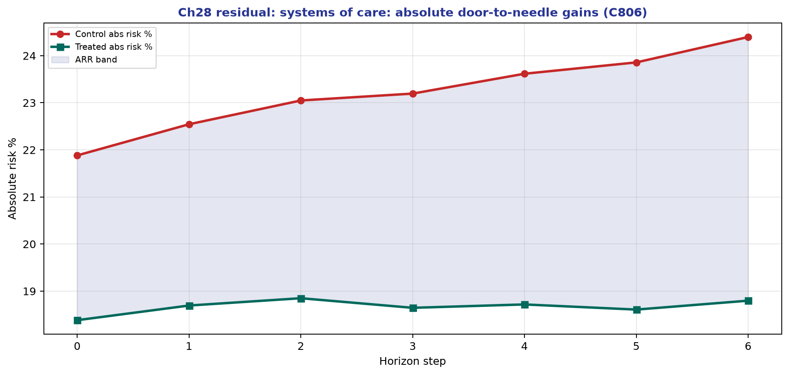

*Teaching figure (synthetic).* Cycle-806 densify scientific residual (ch15–28).


*Teaching figure (synthetic).* Cycle-804 densify scientific residual (ch15–28).


*Teaching figure (synthetic).* Cycle-802 densify scientific residual (ch15–28).


*Teaching figure (synthetic).* Cycle-800 densify scientific residual (ch15–28).


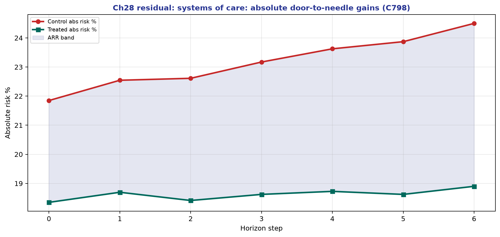

*Teaching figure (synthetic).* Cycle-798 densify scientific residual (ch15–28).


*Teaching figure (synthetic).* Cycle-796 densify scientific residual (ch15–28).


*Teaching figure (synthetic).* Cycle-794 densify scientific residual (ch15–28).


*Teaching figure (synthetic).* Cycle-792 densify scientific residual (ch15–28).


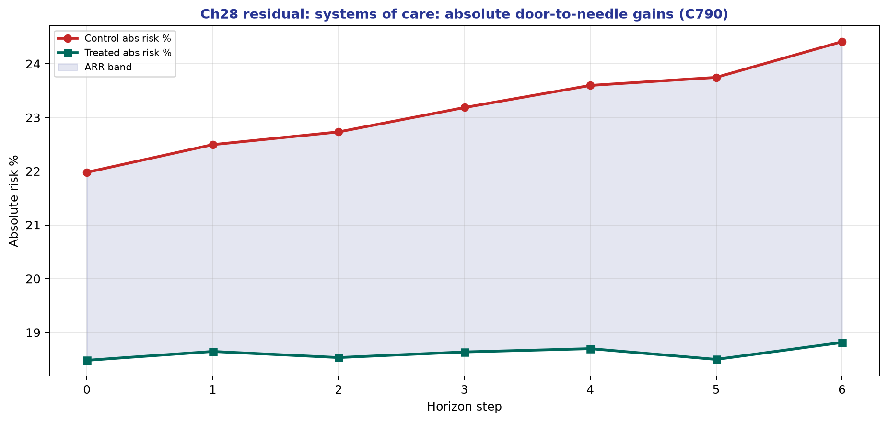

*Teaching figure (synthetic).* Cycle-790 densify scientific residual (ch15–28).


*Teaching figure (synthetic).* Cycle-788 densify scientific residual (ch15–28).


*Teaching figure (synthetic).* Cycle-786 densify scientific residual (ch15–28).


*Teaching figure (synthetic).* Cycle-784 densify scientific residual (ch15–28).


*Teaching figure (synthetic).* Cycle-782 densify scientific residual (ch15–28).


*Teaching figure (synthetic).* Cycle-780 densify scientific residual (ch15–28).


*Teaching figure (synthetic).* Cycle-778 densify scientific residual (ch15–28).


*Teaching figure (synthetic).* Cycle-776 densify scientific residual (ch15–28).


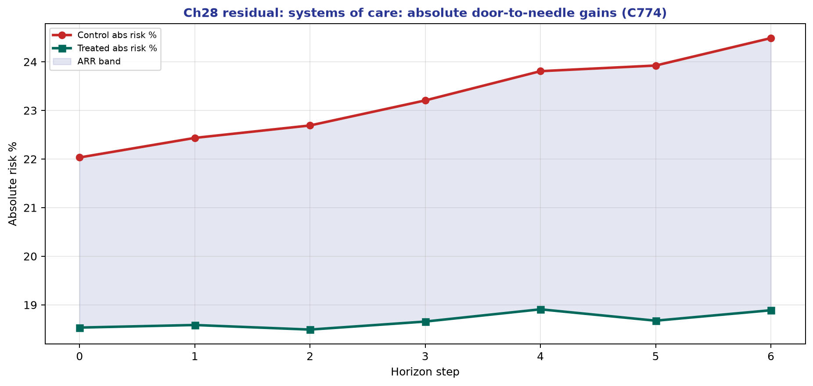

*Teaching figure (synthetic).* Cycle-774 densify scientific residual (ch15–28).


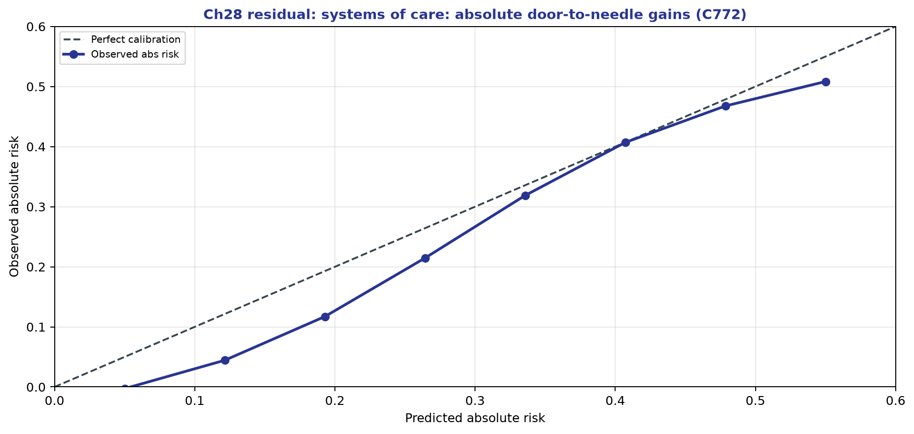

*Teaching figure (synthetic).* Cycle-772 densify scientific residual (ch15–28).


*Teaching figure (synthetic).* Cycle-770 densify scientific residual (ch15–28).


*Teaching figure (synthetic).* Cycle-768 densify scientific residual (ch15–28).


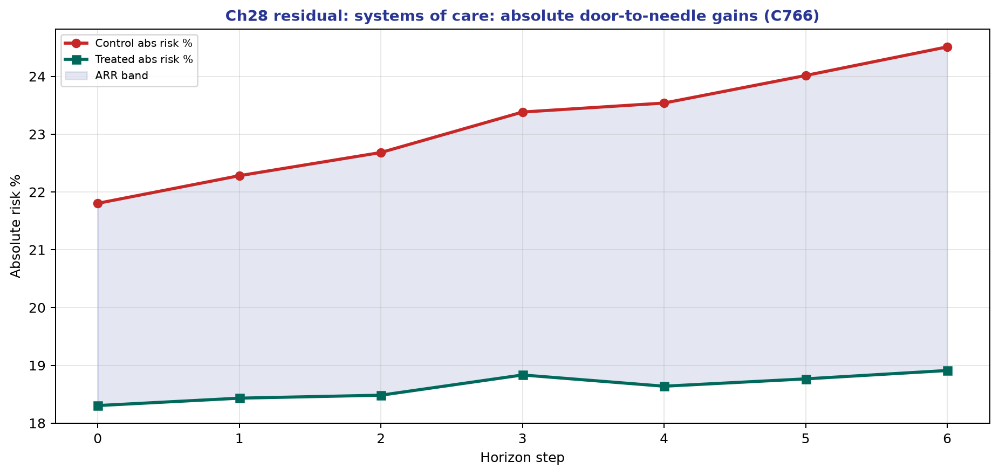

*Teaching figure (synthetic).* Cycle-766 densify scientific residual (ch15–28).


*Teaching figure (synthetic).* Cycle-764 densify scientific residual (ch15–28).


*Teaching figure (synthetic).* Cycle-762 densify scientific residual (ch15–28).


*Teaching figure (synthetic).* Cycle-760 densify scientific residual (ch15–28).


*Teaching figure (synthetic).* Cycle-758 densify scientific residual (ch15–28).


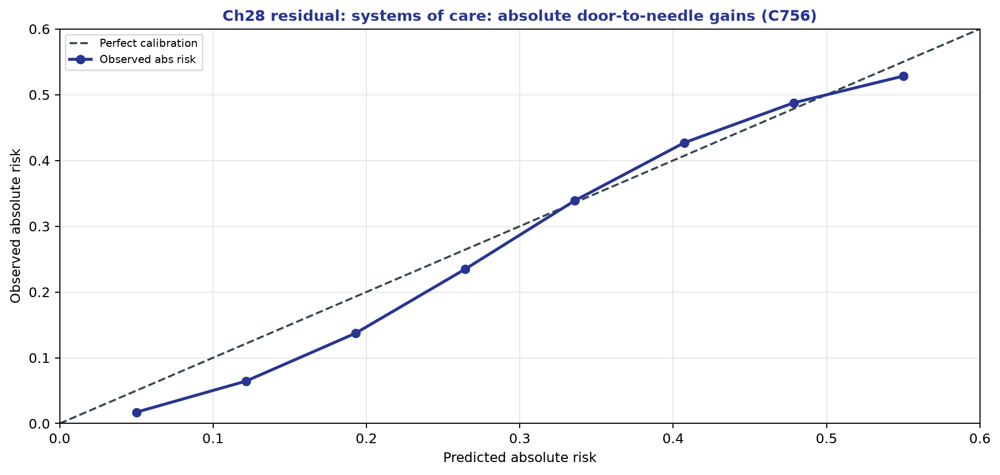

*Teaching figure (synthetic).* Cycle-756 densify scientific residual (ch15–28).


*Teaching figure (synthetic).* Cycle-754 densify scientific residual (ch15–28).


*Teaching figure (synthetic).* Cycle-752 densify scientific residual (ch15–28).


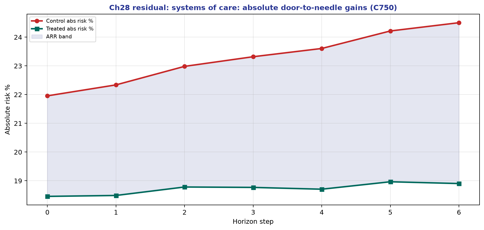

*Teaching figure (synthetic).* Cycle-750 densify scientific residual (ch15–28).


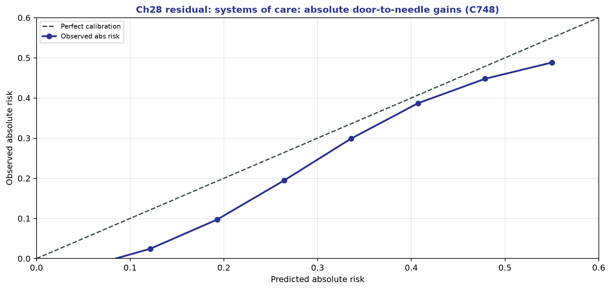

*Teaching figure (synthetic).* Cycle-748 densify scientific residual (ch15–28).


*Teaching figure (synthetic).* Cycle-746 densify scientific residual (ch15–28).


*Teaching figure (synthetic).* Cycle-744 densify scientific residual (ch15–28).


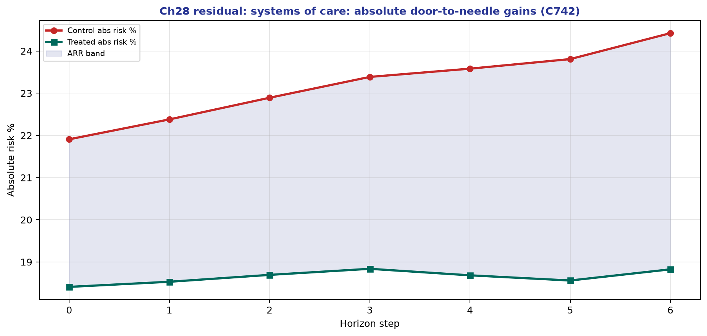

*Teaching figure (synthetic).* Cycle-742 densify scientific residual (ch15–28).


*Teaching figure (synthetic).* Cycle-740 densify scientific residual (ch15–28).


*Teaching figure (synthetic).* Cycle-738 densify scientific residual (ch15–28).


*Teaching figure (synthetic).* Cycle-736 densify scientific residual (ch15–28).


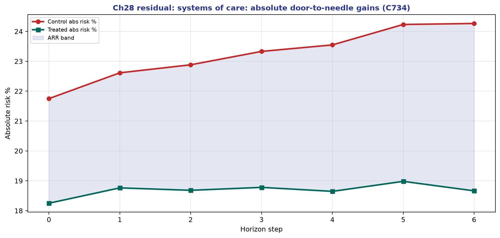

*Teaching figure (synthetic).* Cycle-734 densify scientific residual (ch15–28).


*Teaching figure (synthetic).* Cycle-732 densify scientific residual (ch15–28).


*Teaching figure (synthetic).* Cycle-730 densify scientific residual (ch15–28).


*Teaching figure (synthetic).* Cycle-728 densify scientific residual (ch15–28).


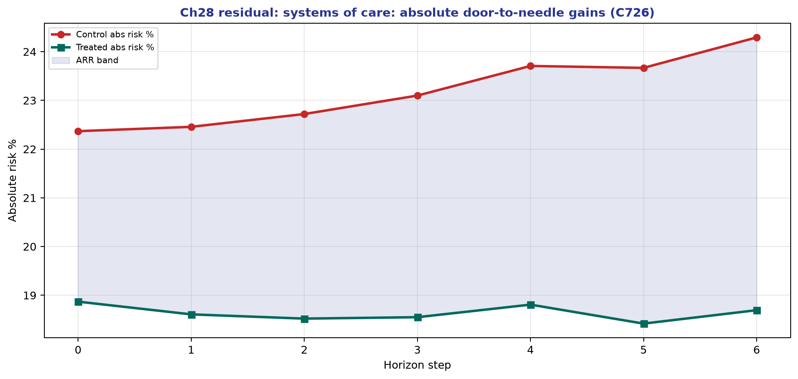

*Teaching figure (synthetic).* Cycle-726 densify scientific residual (ch15–28).


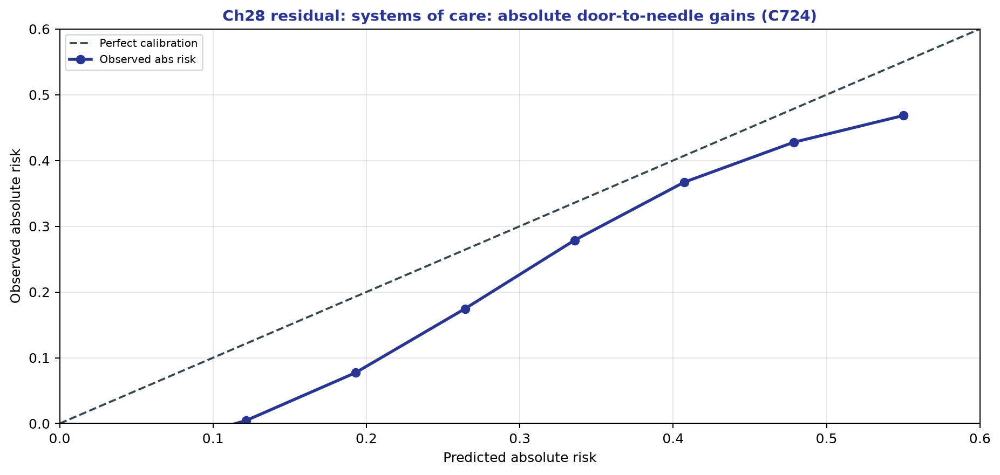

*Teaching figure (synthetic).* Cycle-724 densify scientific residual (ch15–28).


*Teaching figure (synthetic).* Cycle-722 densify scientific residual (ch15–28).


*Teaching figure (synthetic).* Cycle-720 densify scientific residual (ch15–28).


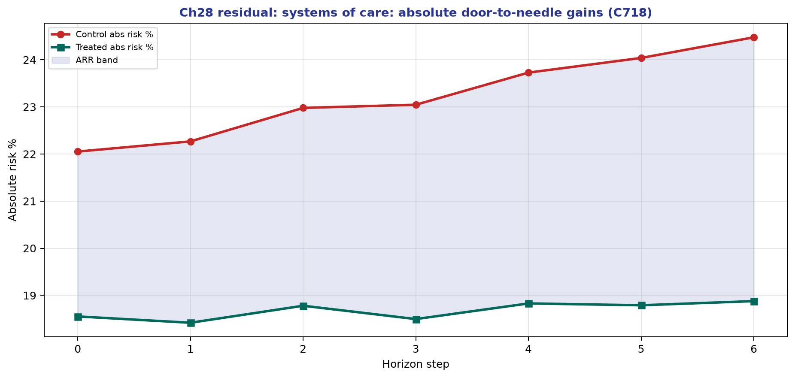

*Teaching figure (synthetic).* Cycle-718 densify scientific residual (ch15–28).


*Teaching figure (synthetic).* Cycle-716 densify scientific residual (ch15–28).


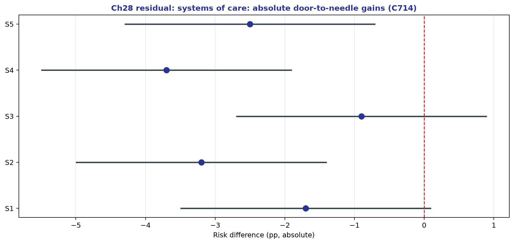

*Teaching figure (synthetic).* Cycle-714 densify scientific residual (ch15–28).


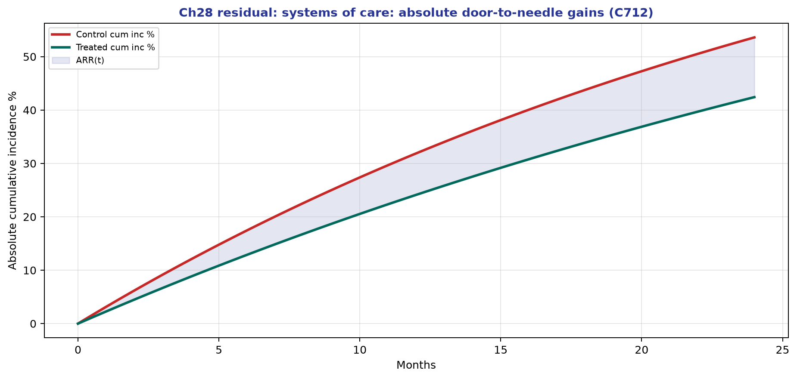

*Teaching figure (synthetic).* Cycle-712 densify scientific residual (ch15–28).


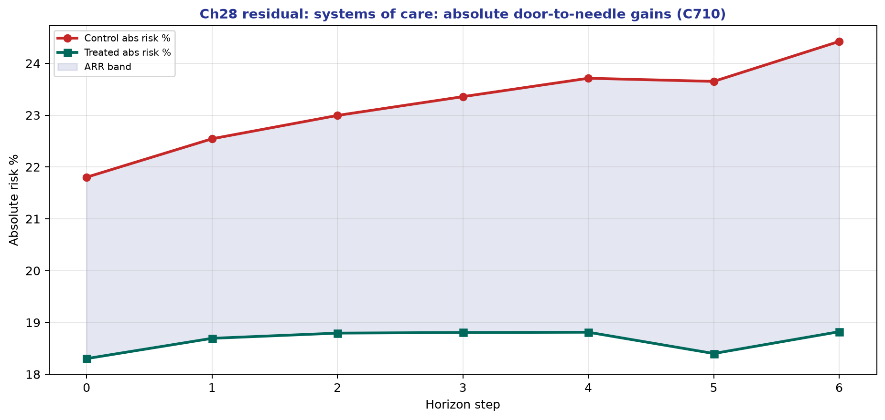

*Teaching figure (synthetic).* Cycle-710 densify scientific residual (ch15–28).


*Teaching figure (synthetic).* Cycle-708 densify scientific residual (ch15–28).


*Teaching figure (synthetic).* Cycle-706 densify scientific residual (ch15–28).


*Teaching figure (synthetic).* Cycle-704 densify scientific residual (ch15–28).


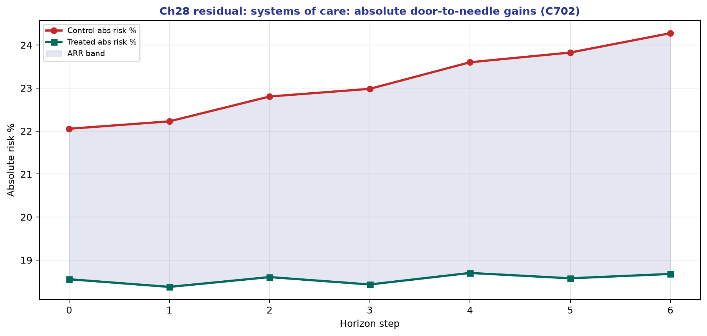

*Teaching figure (synthetic).* Cycle-702 densify scientific residual (ch15–28).


*Teaching figure (synthetic).* Cycle-700 densify scientific residual (ch15–28).


*Teaching figure (synthetic).* Cycle-698 densify scientific residual (ch15–28).


*Teaching figure (synthetic).* Cycle-696 densify scientific residual (ch15–28).


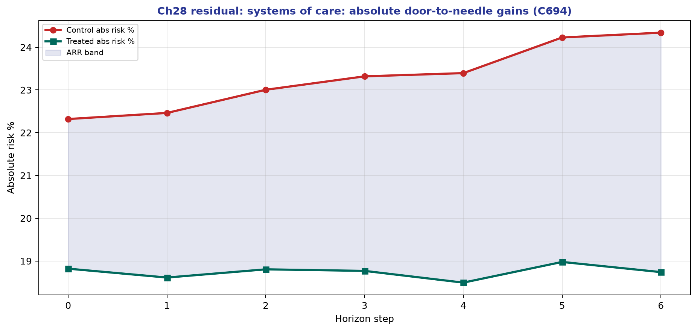

*Teaching figure (synthetic).* Cycle-694 densify scientific residual (ch15–28).


*Teaching figure (synthetic).* Cycle-692 densify scientific residual (ch15–28).


*Teaching figure (synthetic).* Cycle-690 densify scientific residual (ch15–28).


*Teaching figure (synthetic).* Cycle-688 densify scientific residual (ch15–28).


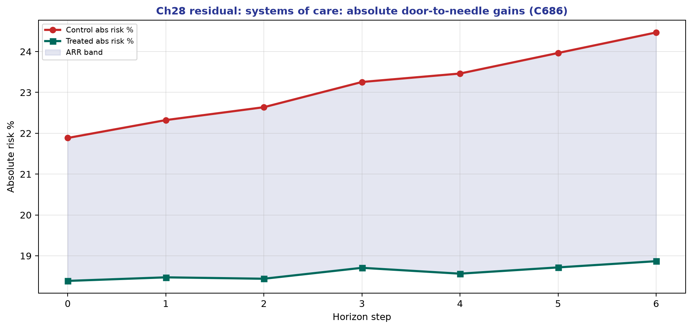

*Teaching figure (synthetic).* Cycle-686 densify scientific residual (ch15–28).


*Teaching figure (synthetic).* Cycle-684 densify scientific residual (ch15–28).


*Teaching figure (synthetic).* Cycle-682 densify scientific residual (ch15–28).


*Teaching figure (synthetic).* Cycle-680 densify scientific residual (ch15–28).


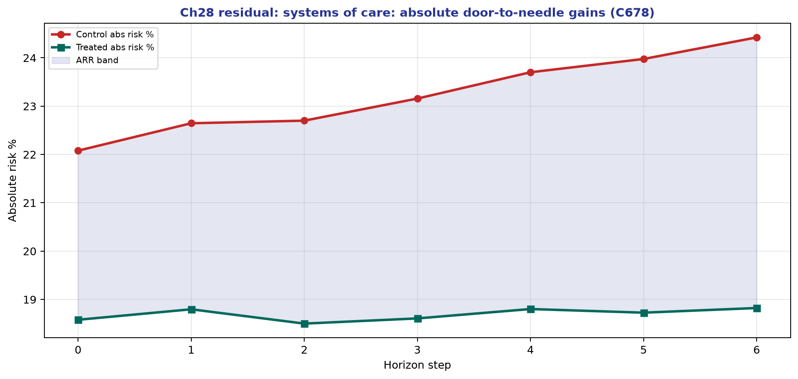

*Teaching figure (synthetic).* Cycle-678 densify scientific residual (ch15–28).


*Teaching figure (synthetic).* Cycle-676 densify scientific residual (ch15–28).


*Teaching figure (synthetic).* Cycle-674 densify scientific residual (ch15–28).


*Teaching figure (synthetic).* Cycle-672 densify scientific residual (ch15–28).


*Teaching figure (synthetic).* Cycle-670 densify scientific residual (ch15–28).


*Teaching figure (synthetic).* Cycle-668 densify scientific residual (ch15–28).


*Teaching figure (synthetic).* Cycle-666 densify scientific residual (ch15–28).


*Teaching figure (synthetic).* Cycle-664 densify scientific residual (ch15–28).


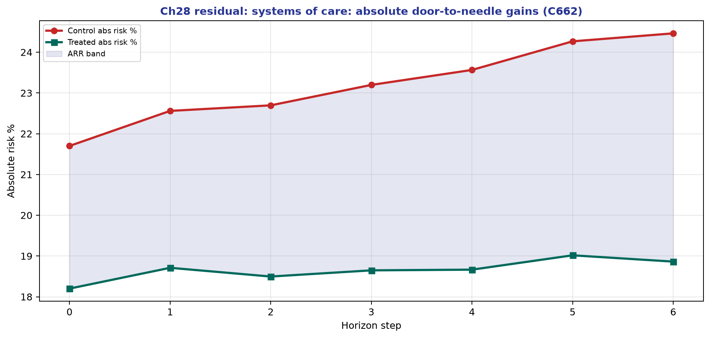

*Teaching figure (synthetic).* Cycle-662 densify scientific residual (ch15–28).


*Teaching figure (synthetic).* Cycle-660 densify scientific residual (ch15–28).


*Teaching figure (synthetic).* Cycle-658 densify scientific residual (ch15–28).


*Teaching figure (synthetic).* Cycle-656 densify scientific residual (ch15–28).


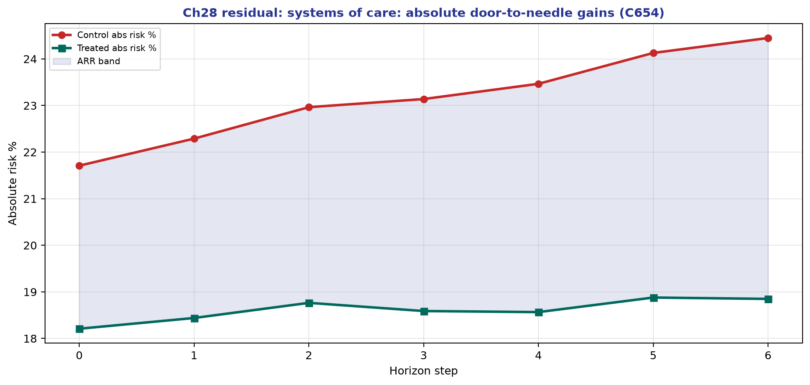

*Teaching figure (synthetic).* Cycle-654 densify scientific residual (ch15–28).


*Teaching figure (synthetic).* Cycle-652 densify scientific residual (ch15–28).


*Teaching figure (synthetic).* Cycle-650 densify scientific residual (ch15–28).


*Teaching figure (synthetic).* Cycle-648 densify scientific residual (ch15–28).


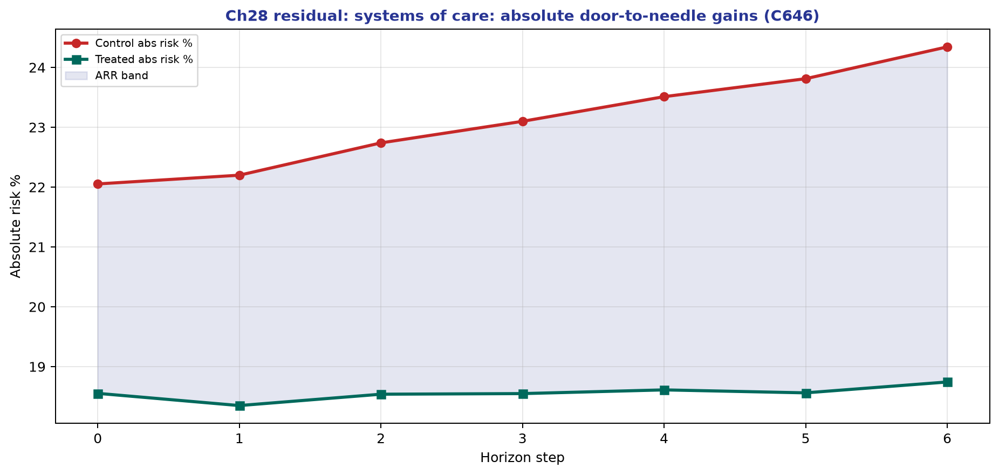

*Teaching figure (synthetic).* Cycle-646 densify scientific residual (ch15–28).


*Teaching figure (synthetic).* Cycle-644 densify scientific residual (ch15–28).


*Teaching figure (synthetic).* Cycle-642 densify scientific residual (ch15–28).


*Teaching figure (synthetic).* Cycle-640 densify scientific residual (ch15–28).


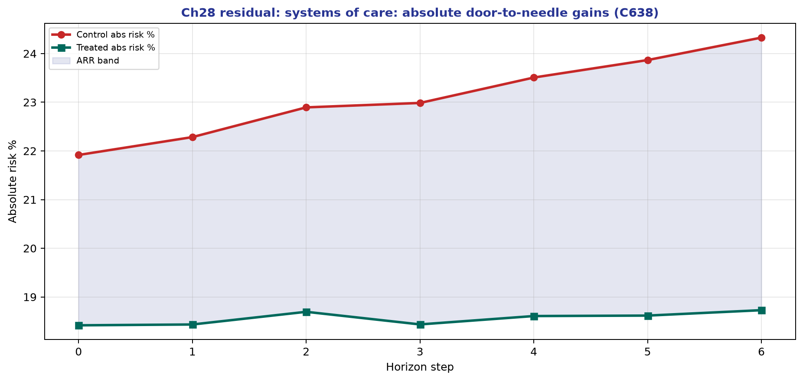

*Teaching figure (synthetic).* Cycle-638 densify scientific residual (ch15–28).


*Teaching figure (synthetic).* Cycle-636 densify scientific residual (ch15–28).


*Teaching figure (synthetic).* Cycle-634 densify scientific residual (ch15–28).


*Teaching figure (synthetic).* Cycle-632 densify scientific residual (ch15–28).


*Teaching figure (synthetic).* Cycle-630 densify scientific residual (ch15–28).


*Teaching figure (synthetic).* Cycle-628 densify scientific residual (ch15–28).


*Teaching figure (synthetic).* Cycle-626 densify scientific residual (ch15–28).


*Teaching figure (synthetic).* Cycle-624 densify scientific residual (ch15–28).


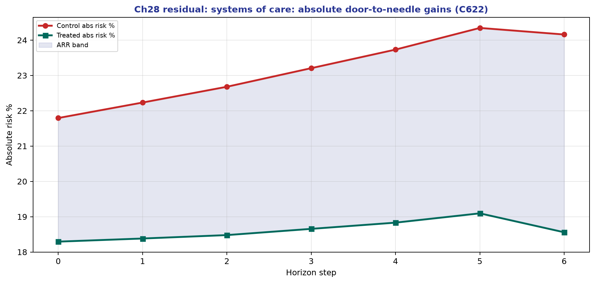

*Teaching figure (synthetic).* Cycle-622 densify scientific residual (ch15–28).


*Teaching figure (synthetic).* Cycle-620 densify scientific residual (ch15–28).


*Teaching figure (synthetic).* Cycle-618 densify scientific residual (ch15–28).


*Teaching figure (synthetic).* Cycle-616 densify scientific residual (ch15–28).


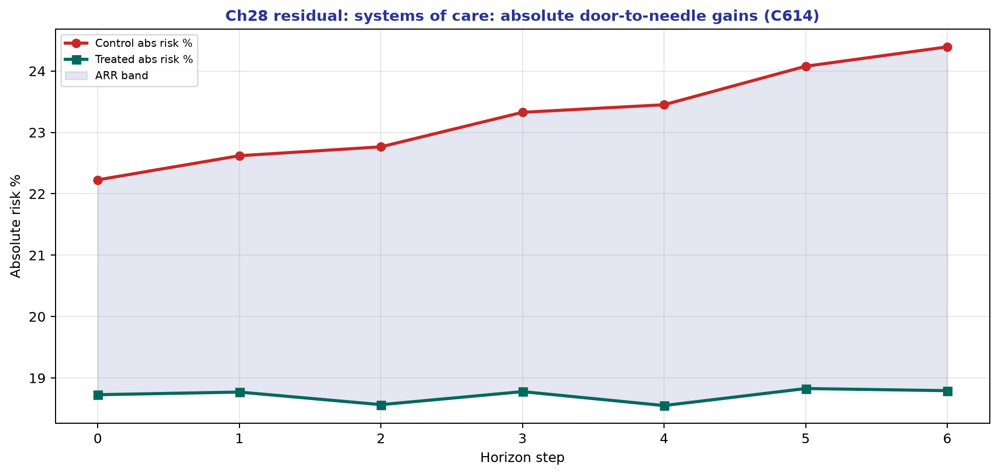

*Teaching figure (synthetic).* Cycle-614 densify scientific residual (ch15–28).


*Teaching figure (synthetic).* Cycle-612 densify scientific residual (ch15–28).


*Teaching figure (synthetic).* Cycle-610 densify scientific residual (ch15–28).


*Teaching figure (synthetic).* Cycle-608 densify scientific residual (ch15–28).


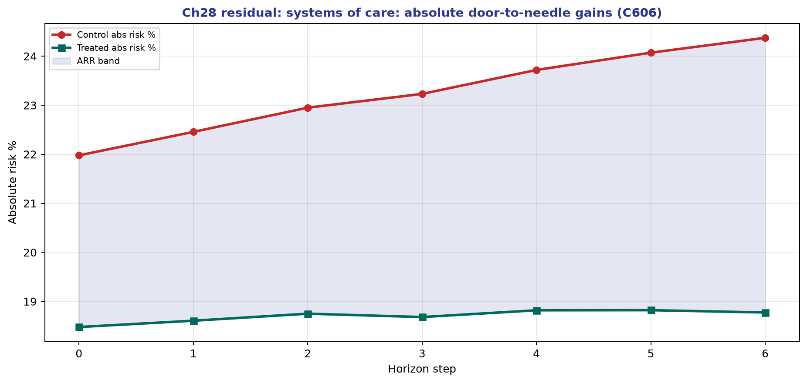

*Teaching figure (synthetic).* Cycle-606 densify scientific residual (ch15–28).


*Teaching figure (synthetic).* Cycle-604 densify scientific residual (ch15–28).


*Teaching figure (synthetic).* Cycle-602 densify scientific residual (ch15–28).


*Teaching figure (synthetic).* Cycle-600 densify scientific residual (ch15–28).


*Teaching figure (synthetic).* Cycle-598 densify scientific residual (ch15–28).


*Teaching figure (synthetic).* Cycle-596 densify scientific residual (ch15–28).


*Teaching figure (synthetic).* Cycle-594 densify scientific residual (ch15–28).


*Teaching figure (synthetic).* Cycle-592 densify scientific residual (ch15–28).


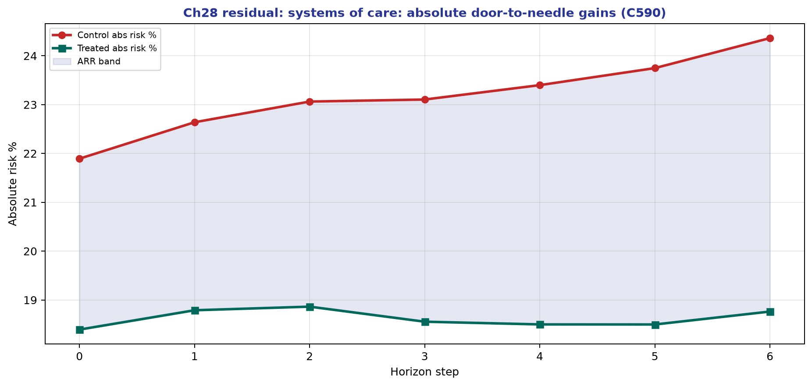

*Teaching figure (synthetic).* Cycle-590 densify scientific residual (ch15–28).


*Teaching figure (synthetic).* Cycle-588 densify scientific residual (ch15–28).


*Teaching figure (synthetic).* Cycle-586 densify scientific residual (ch15–28).


*Teaching figure (synthetic).* Cycle-584 densify scientific residual (ch15–28).


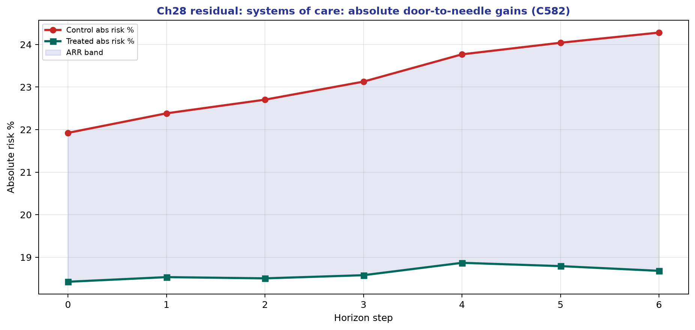

*Teaching figure (synthetic).* Cycle-582 densify scientific residual (ch15–28).


*Teaching figure (synthetic).* Cycle-580 densify scientific residual (ch15–28).


*Teaching figure (synthetic).* Cycle-578 densify scientific residual (ch15–28).


*Teaching figure (synthetic).* Cycle-576 densify scientific residual (ch15–28).


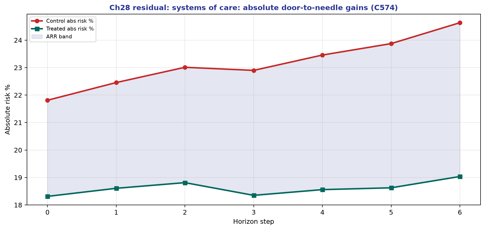

*Teaching figure (synthetic).* Cycle-574 densify scientific residual (ch15–28).


*Teaching figure (synthetic).* Cycle-572 densify scientific residual (ch15–28).


*Teaching figure (synthetic).* Cycle-570 densify scientific residual (ch15–28).


*Teaching figure (synthetic).* Cycle-568 densify scientific residual (ch15–28).


*Teaching figure (synthetic).* Cycle-566 densify scientific residual (ch15–28).


*Teaching figure (synthetic).* Cycle-564 densify scientific residual (ch15–28).


*Teaching figure (synthetic).* Cycle-562 densify scientific residual (ch15–28).


*Teaching figure (synthetic).* Cycle-560 densify scientific residual (ch15–28).


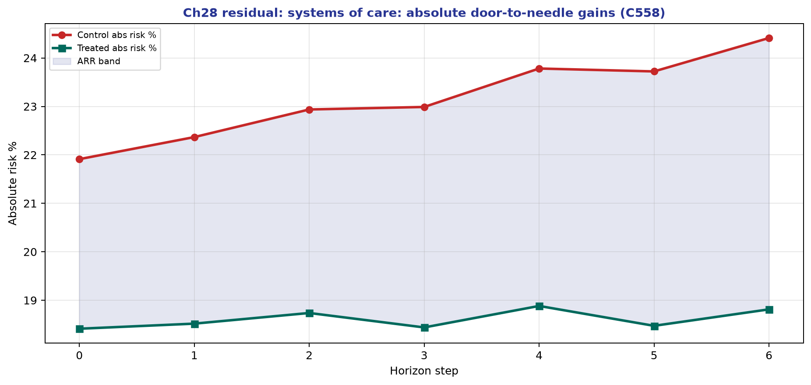

*Teaching figure (synthetic).* Cycle-558 densify scientific residual (ch15–28).


*Teaching figure (synthetic).* Cycle-556 densify scientific residual (ch15–28).


*Teaching figure (synthetic).* Cycle-554 densify scientific residual (ch15–28).


*Teaching figure (synthetic).* Cycle-552 densify scientific residual (ch15–28).


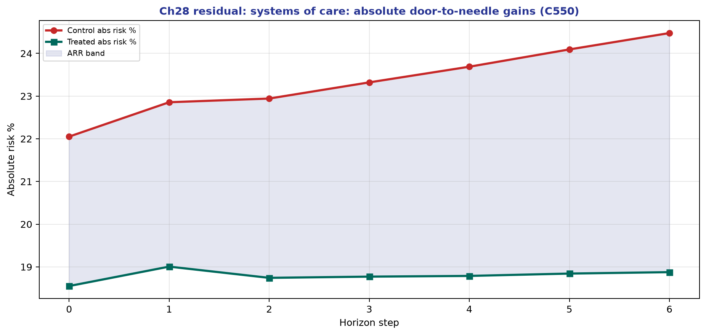

*Teaching figure (synthetic).* Cycle-550 densify scientific residual (ch15–28).


*Teaching figure (synthetic).* Cycle-548 densify scientific residual (ch15–28).


*Teaching figure (synthetic).* Cycle-546 densify scientific residual (ch15–28).


*Teaching figure (synthetic).* Cycle-544 densify scientific residual (ch15–28).


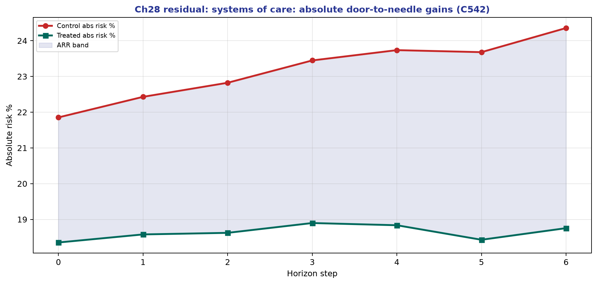

*Teaching figure (synthetic).* Cycle-542 densify scientific residual (ch15–28).


*Teaching figure (synthetic).* Cycle-540 densify scientific residual (ch15–28).


*Teaching figure (synthetic).* Cycle-538 densify scientific residual (ch15–28).


*Teaching figure (synthetic).* Cycle-536 densify scientific residual (ch15–28).


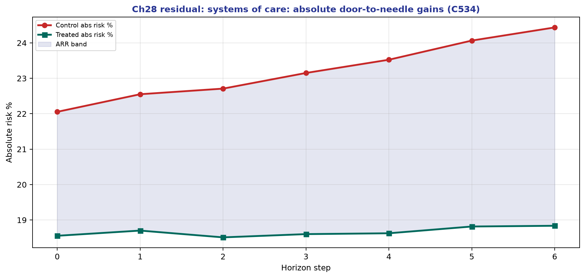

*Teaching figure (synthetic).* Cycle-534 densify scientific residual (ch15–28).


*Teaching figure (synthetic).* Cycle-532 densify scientific residual (ch15–28).


*Teaching figure (synthetic).* Cycle-530 densify scientific residual (ch15–28).


*Teaching figure (synthetic).* Cycle-528 densify scientific residual (ch15–28).


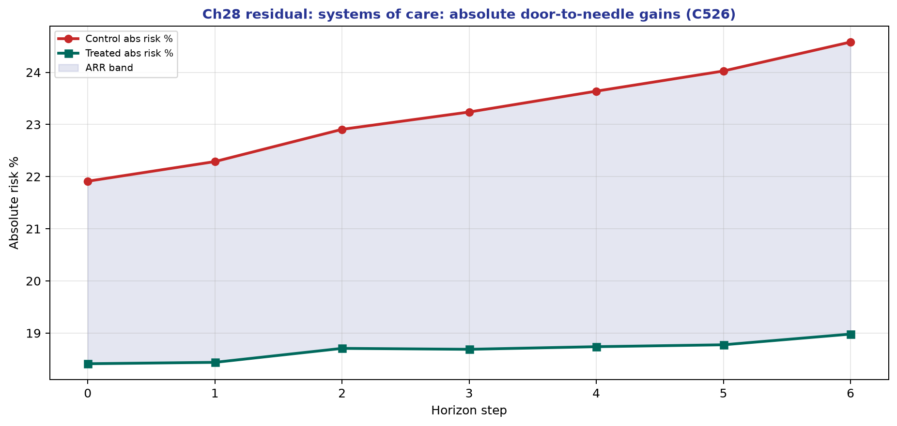

*Teaching figure (synthetic).* Cycle-526 densify scientific residual (ch15–28).


*Teaching figure (synthetic).* Cycle-524 densify scientific residual (ch15–28).


*Teaching figure (synthetic).* Cycle-522 densify scientific residual (ch15–28).


*Teaching figure (synthetic).* Cycle-520 densify scientific residual (ch15–28).


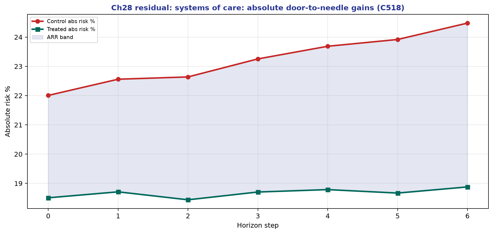

*Teaching figure (synthetic).* Cycle-518 densify scientific residual (ch15–28).


*Teaching figure (synthetic).* Cycle-516 densify scientific residual (ch15–28).


*Teaching figure (synthetic).* Cycle-514 densify scientific residual (ch15–28).


*Teaching figure (synthetic).* Cycle-512 densify scientific residual (ch15–28).


*Teaching figure (synthetic).* Cycle-510 densify scientific residual (ch15–28).


*Teaching figure (synthetic).* Cycle-508 densify scientific residual (ch15–28).


*Teaching figure (synthetic).* Cycle-506 densify scientific residual (ch15–28).


*Teaching figure (synthetic).* Cycle-504 densify scientific residual (ch15–28).


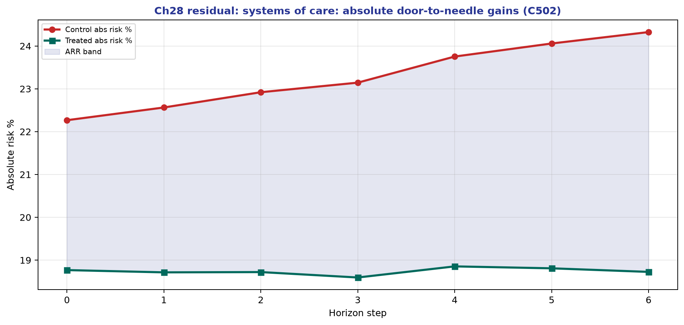

*Teaching figure (synthetic).* Cycle-502 densify scientific residual (ch15–28).


*Teaching figure (synthetic).* Cycle-500 densify scientific residual (ch15–28).


*Teaching figure (synthetic).* Cycle-498 densify scientific residual (ch15–28).


*Teaching figure (synthetic).* Cycle-496 densify scientific residual (ch15–28).


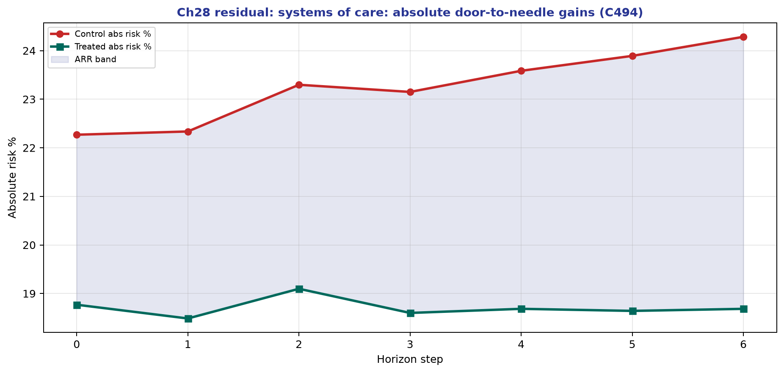

*Teaching figure (synthetic).* Cycle-494 densify scientific residual (ch15–28).


*Teaching figure (synthetic).* Cycle-492 densify scientific residual (ch15–28).


*Teaching figure (synthetic).* Cycle-490 densify scientific residual (ch15–28).


*Teaching figure (synthetic).* Cycle-488 densify scientific residual (ch15–28).


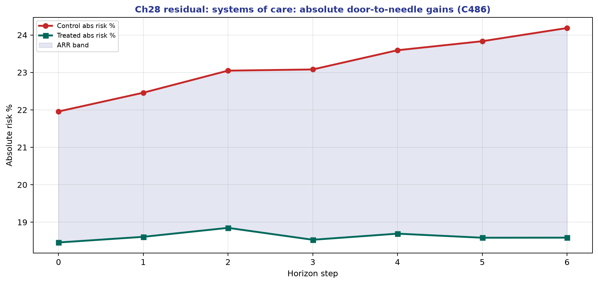

*Teaching figure (synthetic).* Cycle-486 densify scientific residual (ch15–28).


*Teaching figure (synthetic).* Cycle-484 densify scientific residual (ch15–28).


*Teaching figure (synthetic).* Cycle-482 densify scientific residual (ch15–28).


*Teaching figure (synthetic).* Cycle-480 densify scientific residual (ch15–28).


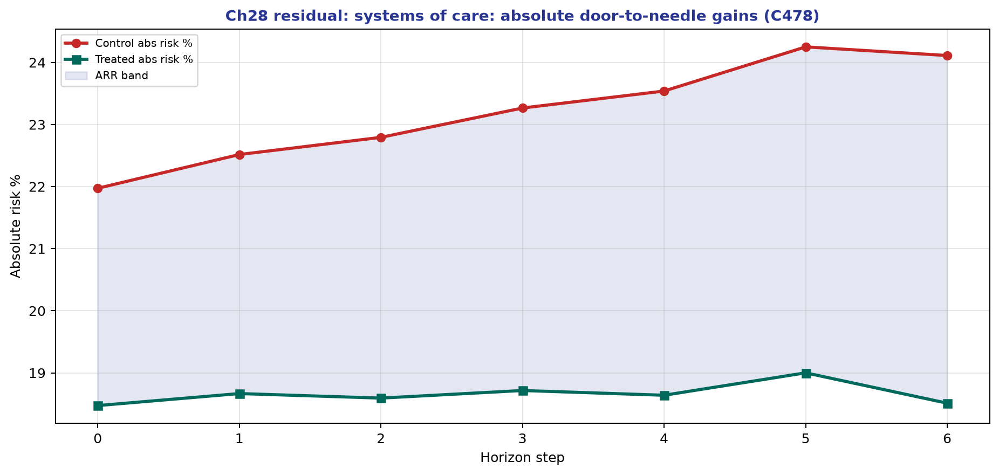

*Teaching figure (synthetic).* Cycle-478 densify scientific residual (ch15–28).


*Teaching figure (synthetic).* Cycle-476 densify scientific residual (ch15–28).


*Teaching figure (synthetic).* Cycle-474 densify scientific residual (ch15–28).


*Teaching figure (synthetic).* Cycle-472 densify scientific residual (ch15–28).


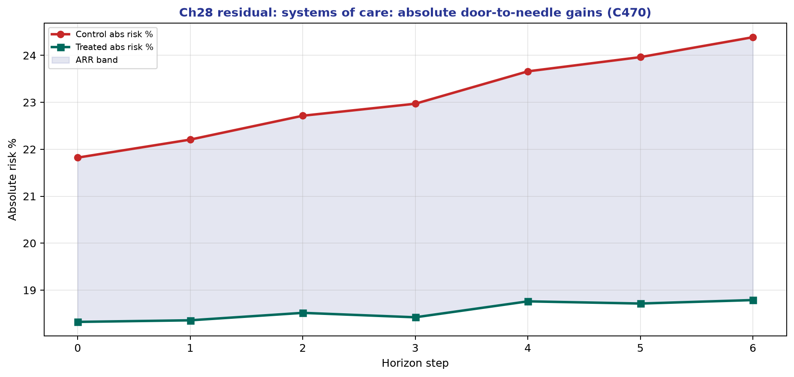

*Teaching figure (synthetic).* Cycle-470 densify scientific residual (ch15–28).


*Teaching figure (synthetic).* Cycle-468 densify scientific residual (ch15–28).


*Teaching figure (synthetic).* Cycle-466 densify scientific residual (ch15–28).


*Teaching figure (synthetic).* Cycle-464 densify scientific residual (ch15–28).


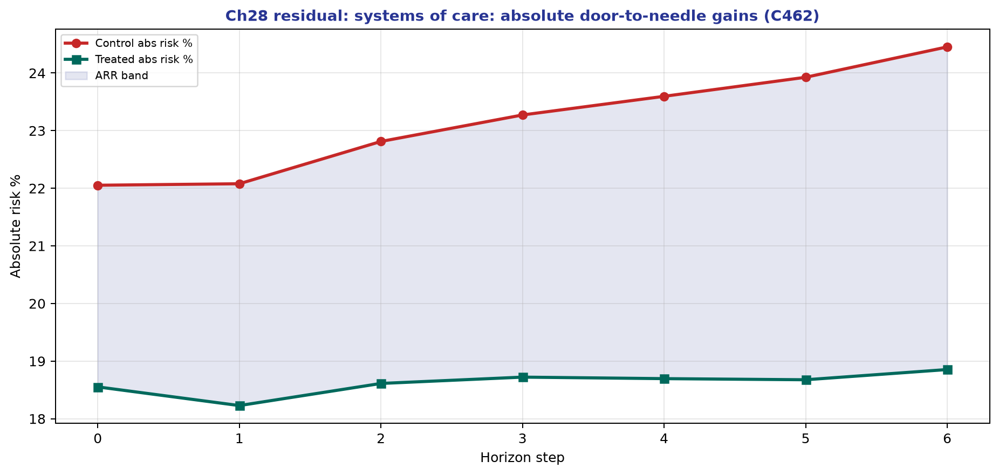

*Teaching figure (synthetic).* Cycle-462 densify scientific residual (ch15–28).


*Teaching figure (synthetic).* Cycle-460 densify scientific residual (ch15–28).


*Teaching figure (synthetic).* Cycle-458 densify scientific residual (ch15–28).


*Teaching figure (synthetic).* Cycle-456 densify scientific residual (ch15–28).


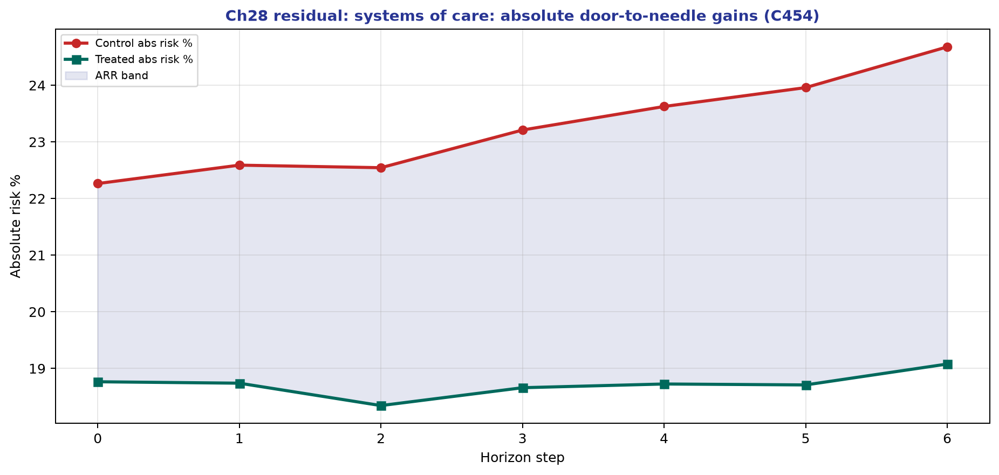

*Teaching figure (synthetic).* Cycle-454 densify scientific residual (ch15–28).


*Teaching figure (synthetic).* Cycle-452 densify scientific residual (ch15–28).


*Teaching figure (synthetic).* Cycle-450 densify scientific residual (ch15–28).


*Teaching figure (synthetic).* Cycle-448 densify scientific residual (ch15–28).


*Teaching figure (synthetic).* Cycle-446 densify scientific residual (ch15–28).


*Teaching figure (synthetic).* Cycle-444 densify scientific residual (ch15–28).


*Teaching figure (synthetic).* Cycle-442 densify scientific residual (ch15–28).


*Teaching figure (synthetic).* Cycle-440 densify scientific residual (ch15–28).


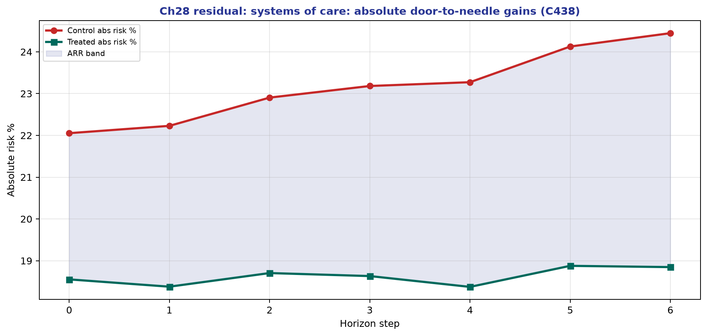

*Teaching figure (synthetic).* Cycle-438 densify scientific residual (ch15–28).


*Teaching figure (synthetic).* Cycle-436 densify scientific residual (ch15–28).


*Teaching figure (synthetic).* Cycle-434 densify scientific residual (ch15–28).


*Teaching figure (synthetic).* Cycle-432 densify scientific residual (ch15–28).


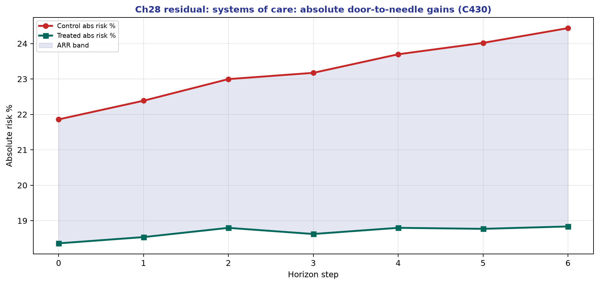

*Teaching figure (synthetic).* Cycle-430 densify scientific residual (ch15–28).


*Teaching figure (synthetic).* Cycle-428 densify scientific residual (ch15–28).


*Teaching figure (synthetic).* Cycle-426 densify scientific residual (ch15–28).


*Teaching figure (synthetic).* Cycle-424 densify scientific residual (ch15–28).


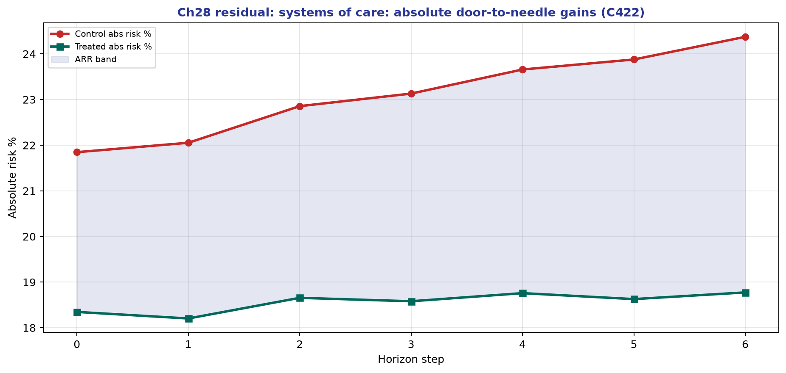

*Teaching figure (synthetic).* Cycle-422 densify scientific residual (ch15–28).


*Teaching figure (synthetic).* Cycle-420 densify scientific residual (ch15–28).


*Teaching figure (synthetic).* Cycle-418 densify scientific residual (ch15–28).


*Teaching figure (synthetic).* Cycle-416 densify scientific residual (ch15–28).


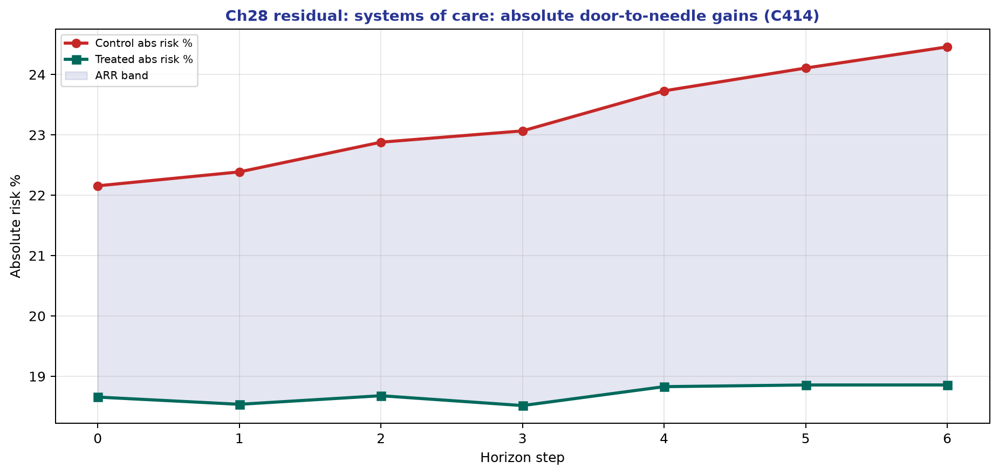

*Teaching figure (synthetic).* Cycle-414 densify scientific residual (ch15–28).


*Teaching figure (synthetic).* Cycle-412 densify scientific residual (ch15–28).


*Teaching figure (synthetic).* Cycle-410 densify scientific residual (ch15–28).


*Teaching figure (synthetic).* Cycle-408 densify scientific residual (ch15–28).


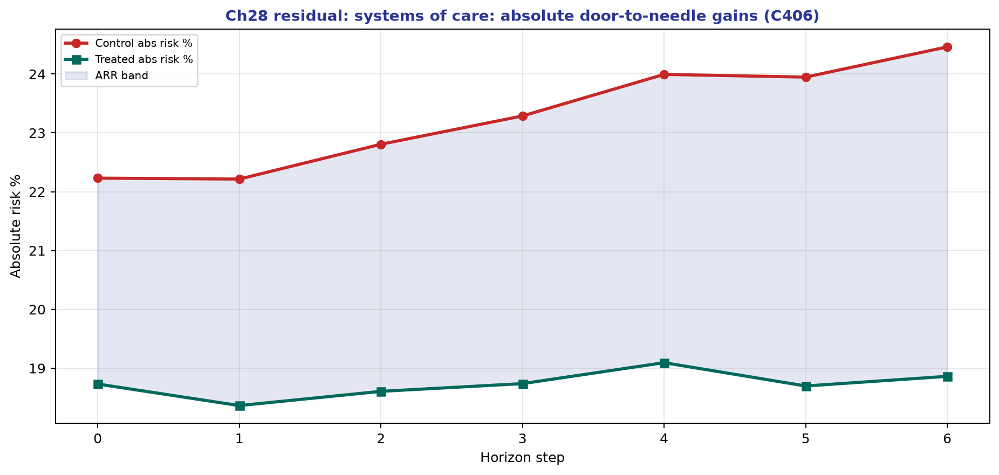

*Teaching figure (synthetic).* Cycle-406 densify scientific residual (ch15–28).


*Teaching figure (synthetic).* Cycle-404 densify scientific residual (ch15–28).


*Teaching figure (synthetic).* Cycle-402 densify scientific residual (ch15–28).


*Teaching figure (synthetic).* Cycle-400 densify scientific residual (ch15–28).


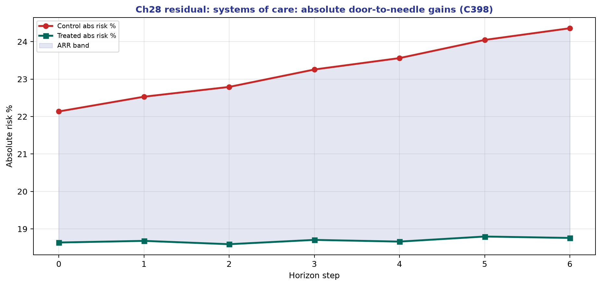

*Teaching figure (synthetic).* Cycle-398 densify scientific residual (ch15–28).


*Teaching figure (synthetic).* Cycle-396 densify scientific residual (ch15–28).


*Teaching figure (synthetic).* Cycle-394 densify scientific residual (ch15–28).


*Teaching figure (synthetic).* Cycle-392 densify scientific residual (ch15–28).


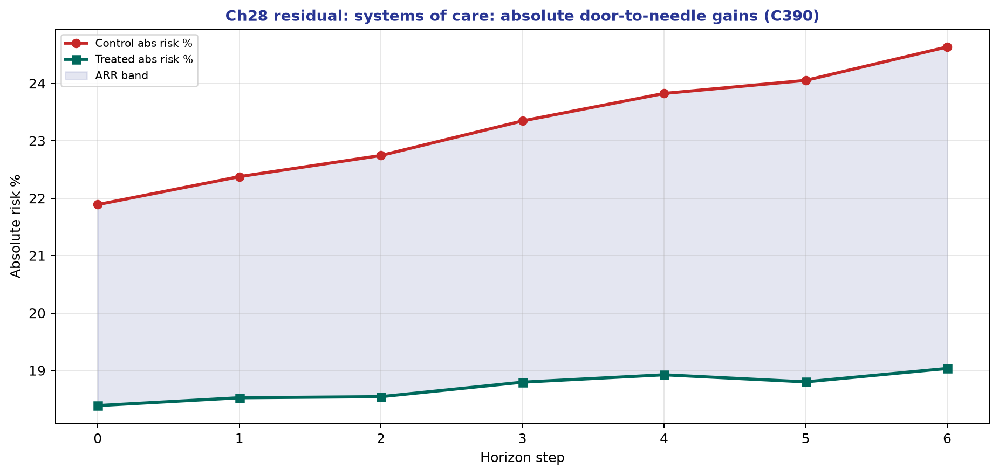

*Teaching figure (synthetic).* Cycle-390 densify scientific residual (ch15–28).


*Teaching figure (synthetic).* Cycle-388 densify scientific residual (ch15–28).


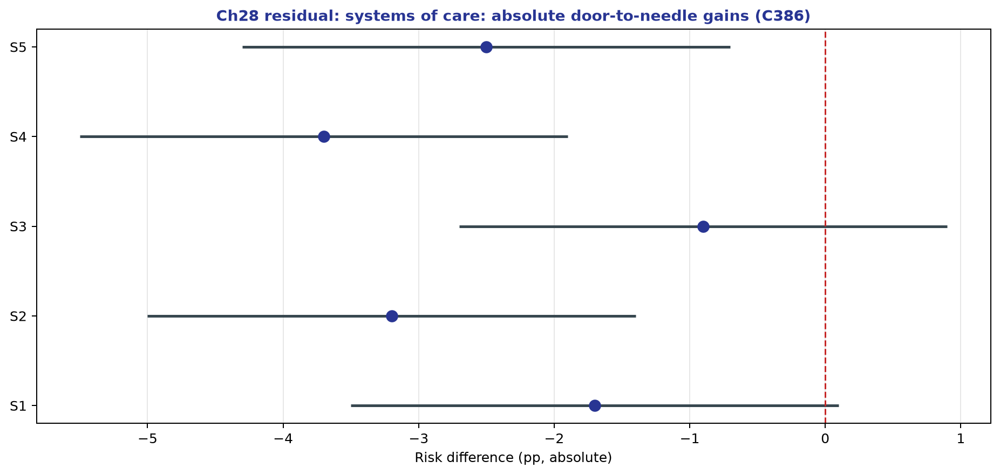

*Teaching figure (synthetic).* Cycle-386 densify scientific residual (ch15–28).


*Teaching figure (synthetic).* Cycle-384 densify scientific residual (ch15–28).


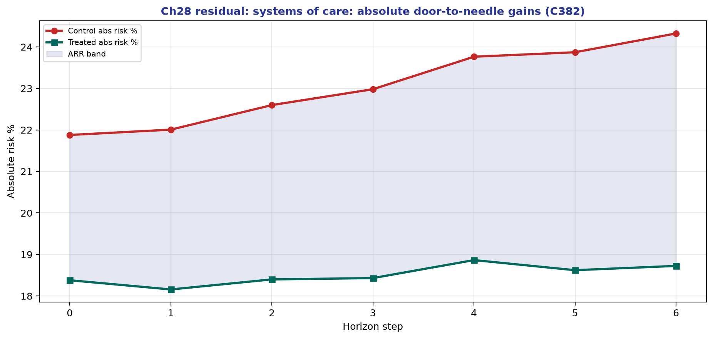

*Teaching figure (synthetic).* Cycle-382 densify scientific residual (ch15–28).


*Teaching figure (synthetic).* Cycle-380 densify scientific residual (ch15–28).


*Teaching figure (synthetic).* Cycle-378 densify scientific residual (ch15–28).


*Teaching figure (synthetic).* Cycle-376 densify scientific residual (ch15–28).


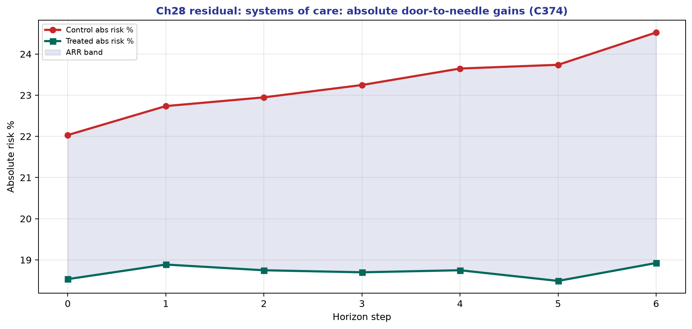

*Teaching figure (synthetic).* Cycle-374 densify scientific residual (ch15–28).


*Teaching figure (synthetic).* Cycle-372 densify scientific residual (ch15–28).


*Teaching figure (synthetic).* Cycle-370 densify scientific residual (ch15–28).


*Teaching figure (synthetic).* Cycle-368 densify scientific residual (ch15–28).


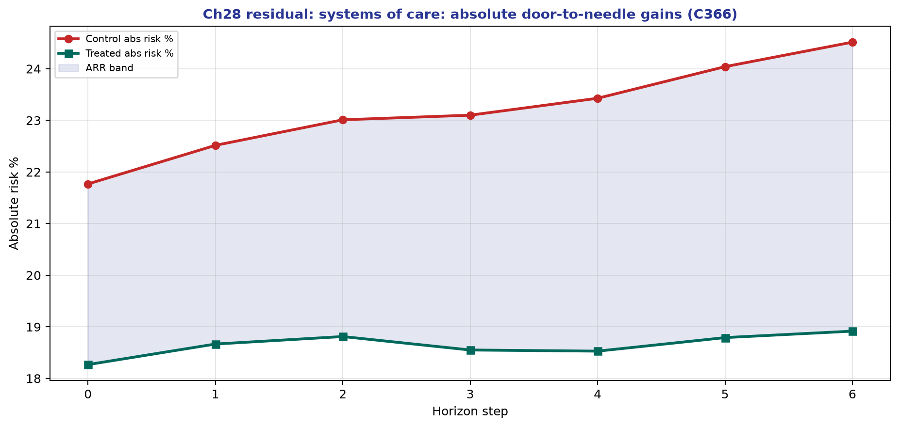

*Teaching figure (synthetic).* Cycle-366 densify scientific residual (ch15–28).


*Teaching figure (synthetic).* Cycle-364 densify scientific residual (ch15–28).


*Teaching figure (synthetic).* Cycle-362 densify scientific residual (ch15–28).


*Teaching figure (synthetic).* Cycle-360 densify scientific residual (ch15–28).


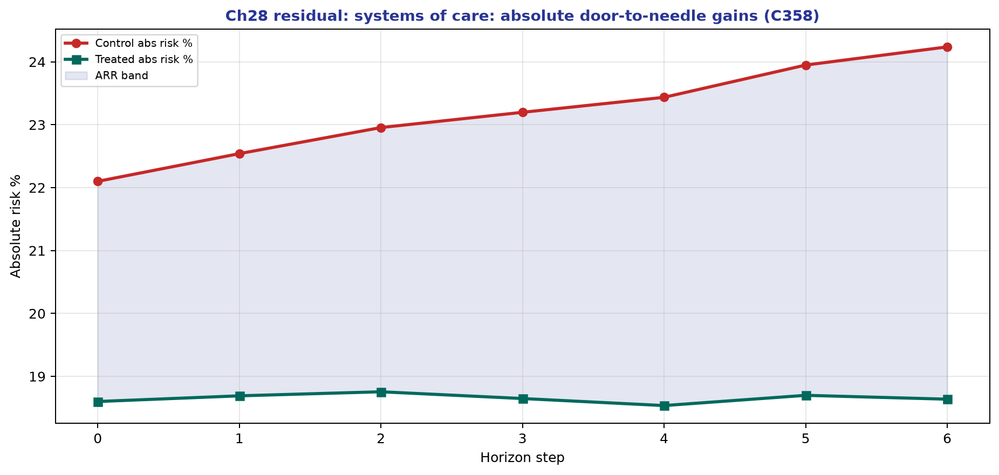

*Teaching figure (synthetic).* Cycle-358 densify scientific residual (ch15–28).


*Teaching figure (synthetic).* Cycle-356 densify scientific residual (ch15–28).


*Teaching figure (synthetic).* Cycle-354 densify scientific residual (ch15–28).


*Teaching figure (synthetic).* Cycle-352 densify scientific residual (ch15–28).


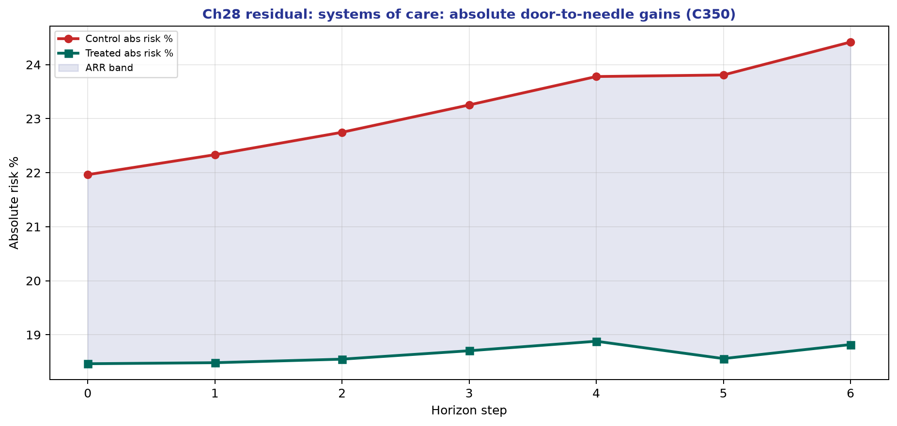

*Teaching figure (synthetic).* Cycle-350 densify scientific residual (ch15–28).


*Teaching figure (synthetic).* Cycle-348 densify scientific residual (ch15–28).


*Teaching figure (synthetic).* Cycle-346 densify scientific residual (ch15–28).


*Teaching figure (synthetic).* Cycle-344 densify scientific residual (ch15–28).


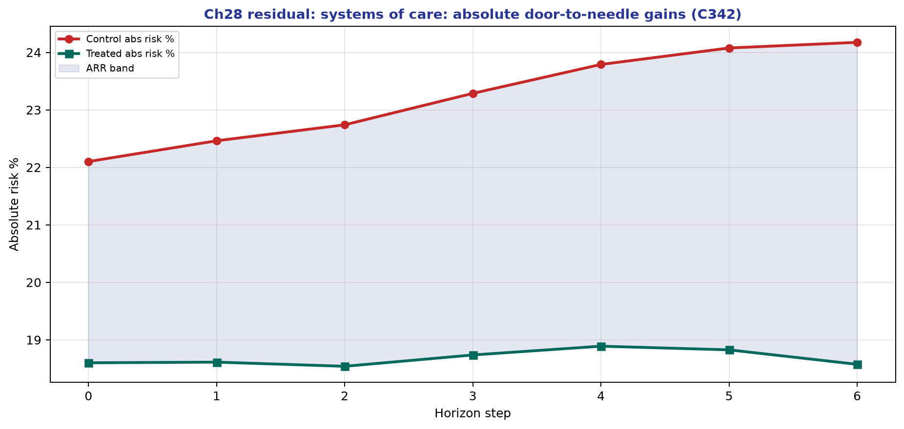

*Teaching figure (synthetic).* Cycle-342 densify scientific residual (ch15–28).


*Teaching figure (synthetic).* Cycle-340 densify scientific residual (ch15–28).


*Teaching figure (synthetic).* Cycle-338 densify scientific residual (ch15–28).


*Teaching figure (synthetic).* Cycle-336 densify scientific residual (ch15–28).


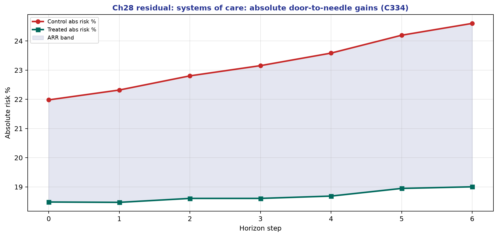

*Teaching figure (synthetic).* Cycle-334 densify scientific residual (ch15–28).


*Teaching figure (synthetic).* Cycle-332 densify scientific residual (ch15–28).


*Teaching figure (synthetic).* Cycle-330 densify scientific residual (ch15–28).


*Teaching figure (synthetic).* Cycle-328 densify scientific residual (ch15–28).


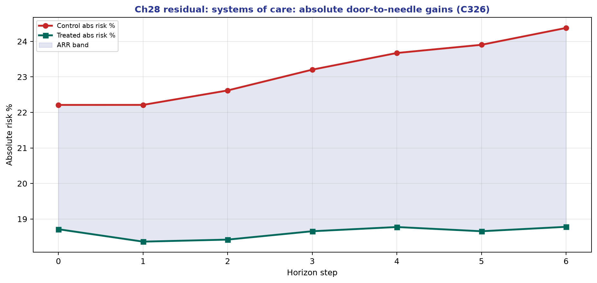

*Teaching figure (synthetic).* Cycle-326 densify scientific residual (ch15–28).


*Teaching figure (synthetic).* Cycle-324 densify scientific residual (ch15–28).


*Teaching figure (synthetic).* Cycle-322 densify scientific residual (ch15–28).


*Teaching figure (synthetic).* Cycle-320 densify scientific residual (ch15–28).


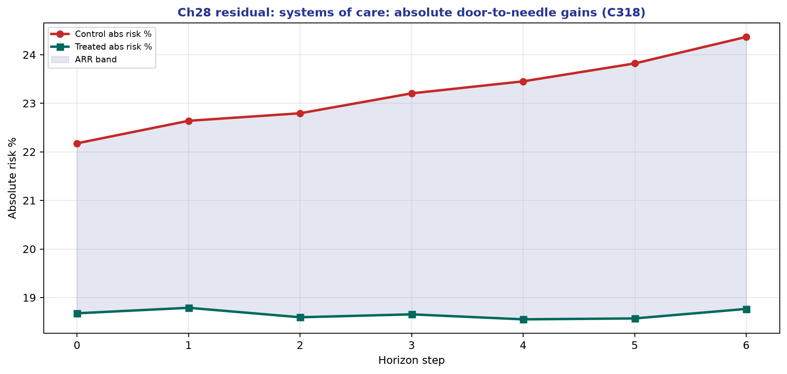

*Teaching figure (synthetic).* Cycle-318 densify scientific residual (ch15–28).


*Teaching figure (synthetic).* Cycle-316 densify scientific residual (ch15–28).


*Teaching figure (synthetic).* Cycle-314 densify scientific residual (ch15–28).


*Teaching figure (synthetic).* Cycle-312 densify scientific residual (ch15–28).


*Teaching figure (synthetic).* Cycle-310 densify scientific residual (ch15–28).


*Teaching figure (synthetic).* Cycle-308 densify scientific residual (ch15–28).


*Teaching figure (synthetic).* Cycle-306 densify scientific residual (ch15–28).


*Teaching figure (synthetic).* Cycle-304 densify scientific residual (ch15–28).


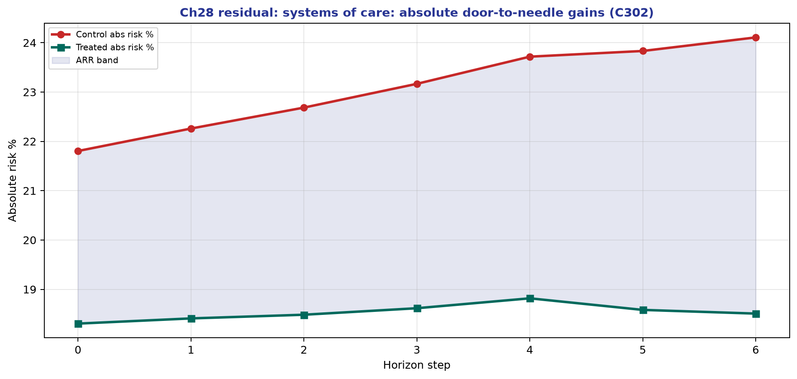

*Teaching figure (synthetic).* Cycle-302 densify scientific residual (ch15–28).


*Teaching figure (synthetic).* Cycle-300 densify scientific residual (ch15–28).


*Teaching figure (synthetic).* Cycle-298 densify scientific residual (ch15–28).


*Teaching figure (synthetic).* Cycle-296 densify scientific residual (ch15–28).


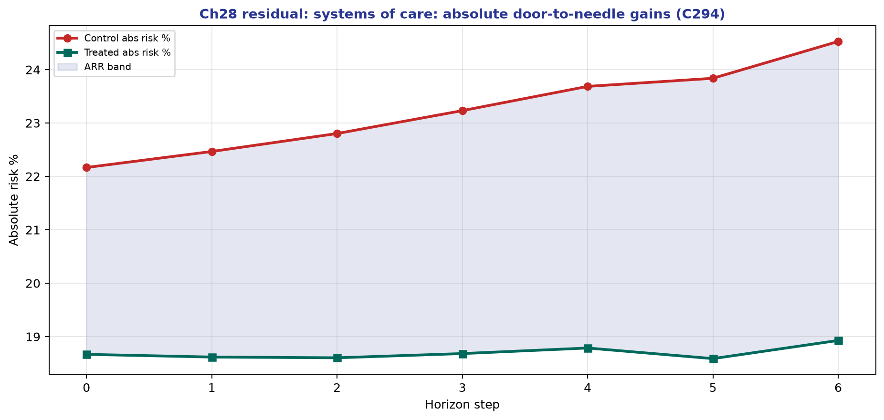

*Teaching figure (synthetic).* Cycle-294 densify scientific residual (ch15–28).


*Teaching figure (synthetic).* Cycle-292 densify scientific residual (ch15–28).


*Teaching figure (synthetic).* Cycle-290 densify scientific residual (ch15–28).


*Teaching figure (synthetic).* Cycle-288 densify scientific residual (ch15–28).


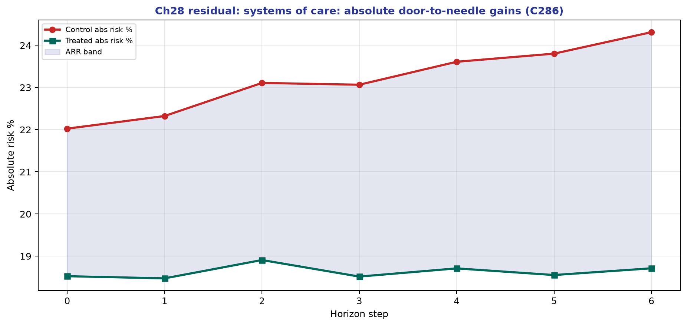

*Teaching figure (synthetic).* Cycle-286 densify scientific residual (ch15–28).


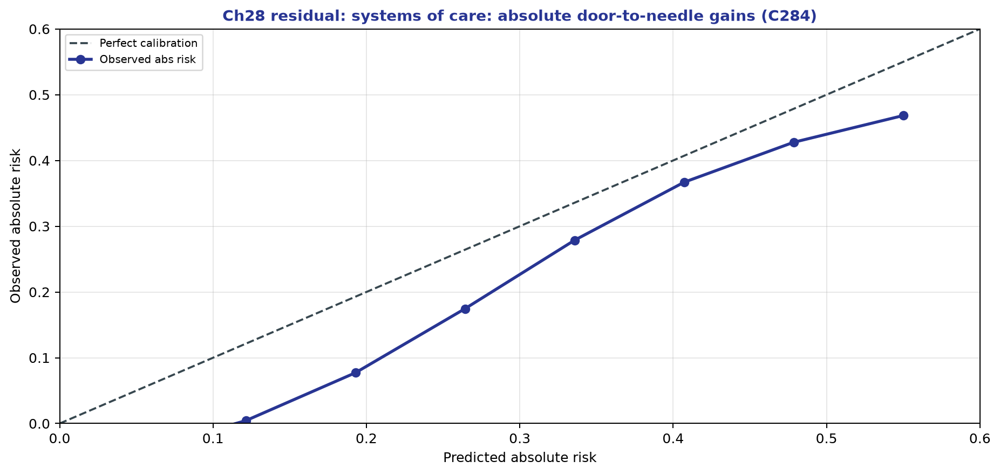

*Teaching figure (synthetic).* Cycle-284 densify scientific residual (ch15–28).


*Teaching figure (synthetic).* Cycle-282 densify scientific residual (ch15–28).


*Teaching figure (synthetic).* Cycle-280 densify scientific residual (ch15–28).


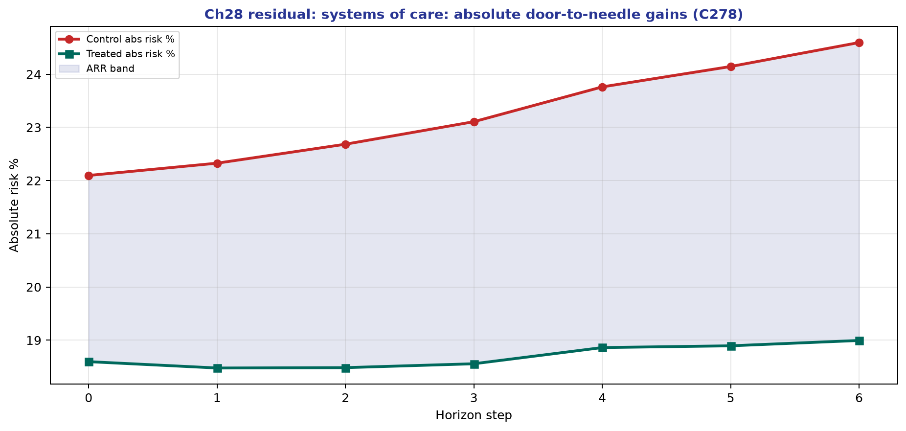

*Teaching figure (synthetic).* Cycle-278 densify scientific residual (ch15–28).


*Teaching figure (synthetic).* Cycle-276 densify scientific residual (ch15–28).


*Teaching figure (synthetic).* Cycle-274 densify scientific residual (ch15–28).


*Teaching figure (synthetic).* Cycle-272 densify scientific residual (ch15–28).


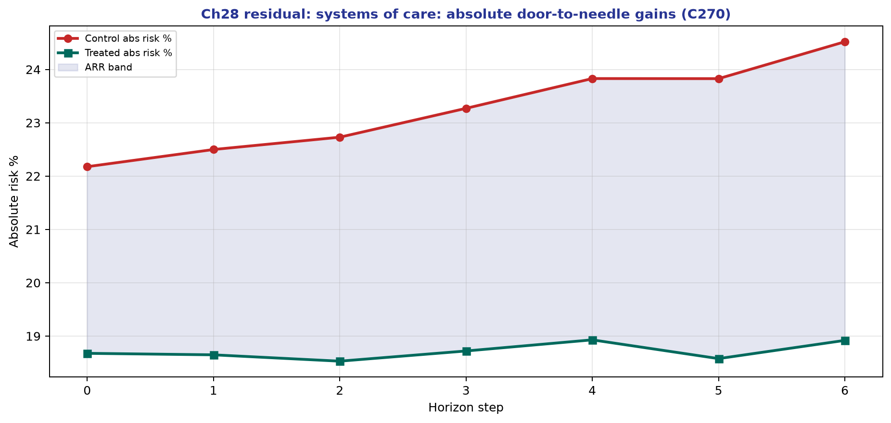

*Teaching figure (synthetic).* Cycle-270 densify scientific residual (ch15–28).


*Teaching figure (synthetic).* Cycle-268 densify scientific residual (ch15–28).


*Teaching figure (synthetic).* Cycle-266 densify scientific residual (ch15–28).


*Teaching figure (synthetic).* Cycle-264 densify scientific residual (ch15–28).


*Teaching figure (synthetic).* Cycle-262 densify scientific residual (ch15–28).


*Teaching figure (synthetic).* Cycle-260 densify scientific residual (ch15–28).


*Teaching figure (synthetic).* Cycle-258 densify scientific residual (ch15–28).


*Teaching figure (synthetic).* Cycle-256 densify scientific residual (ch15–28).


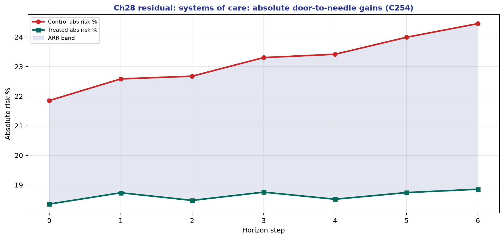

*Teaching figure (synthetic).* Cycle-254 densify scientific residual (ch15–28).


*Teaching figure (synthetic).* Cycle-252 densify scientific residual (ch15–28).


*Teaching figure (synthetic).* Cycle-250 densify scientific residual (ch15–28).


*Teaching figure (synthetic).* Cycle-248 densify scientific residual (ch15–28).


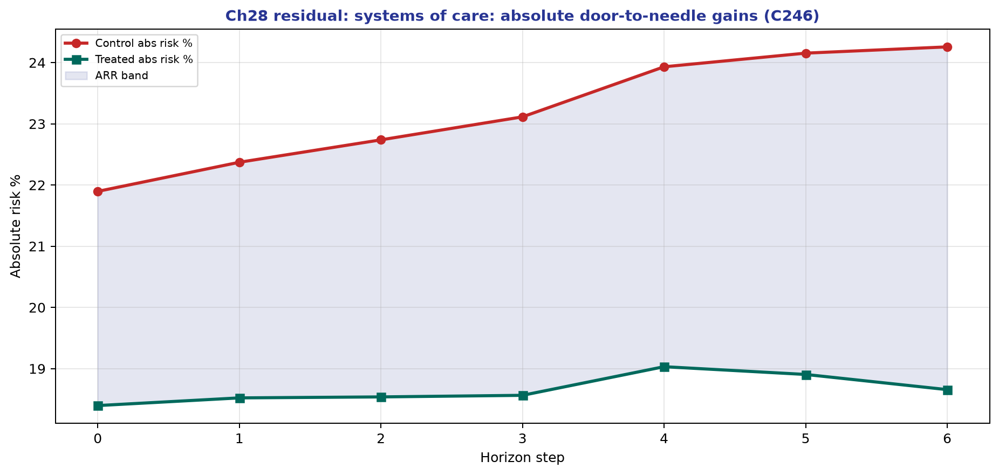

*Teaching figure (synthetic).* Cycle-246 densify scientific residual (ch15–28).


*Teaching figure (synthetic).* Cycle-244 densify scientific residual (ch15–28).


*Teaching figure (synthetic).* Cycle-242 densify scientific residual (ch15–28).


*Teaching figure (synthetic).* Cycle-240 densify scientific residual (ch15–28).


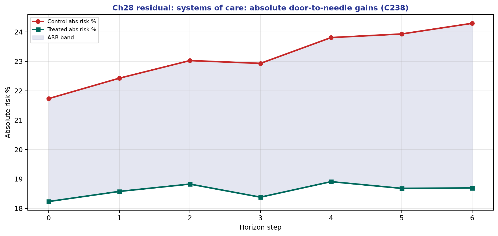

*Teaching figure (synthetic).* Cycle-238 densify scientific residual (ch15–28).


*Teaching figure (synthetic).* Cycle-236 densify scientific residual (ch15–28).


*Teaching figure (synthetic).* Cycle-234 densify scientific residual (ch15–28).


*Teaching figure (synthetic).* Cycle-232 densify scientific residual (ch15–28).


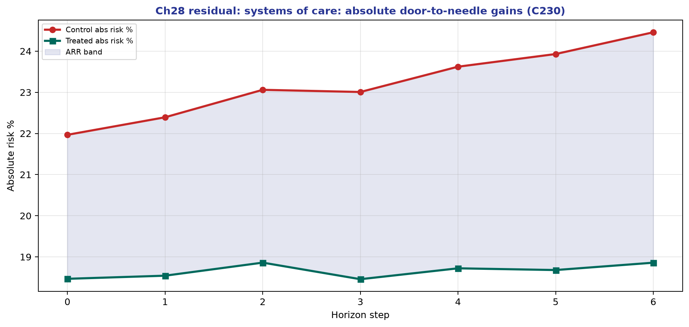

*Teaching figure (synthetic).* Cycle-230 densify scientific residual (ch15–28).


*Teaching figure (synthetic).* Cycle-228 densify scientific residual (ch15–28).


*Teaching figure (synthetic).* Cycle-226 densify scientific residual (ch15–28).


*Teaching figure (synthetic).* Cycle-224 densify scientific residual (ch15–28).


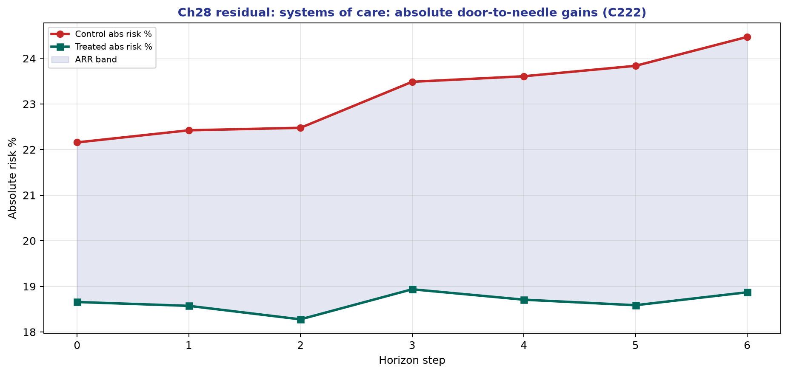

*Teaching figure (synthetic).* Cycle-222 densify scientific residual (ch15–28).


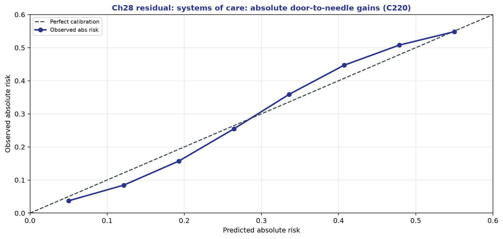

*Teaching figure (synthetic).* Cycle-220 densify scientific residual (ch15–28).


*Teaching figure (synthetic).* Cycle-218 densify scientific residual (ch15–28).


*Teaching figure (synthetic).* Cycle-216 densify scientific residual (ch15–28).


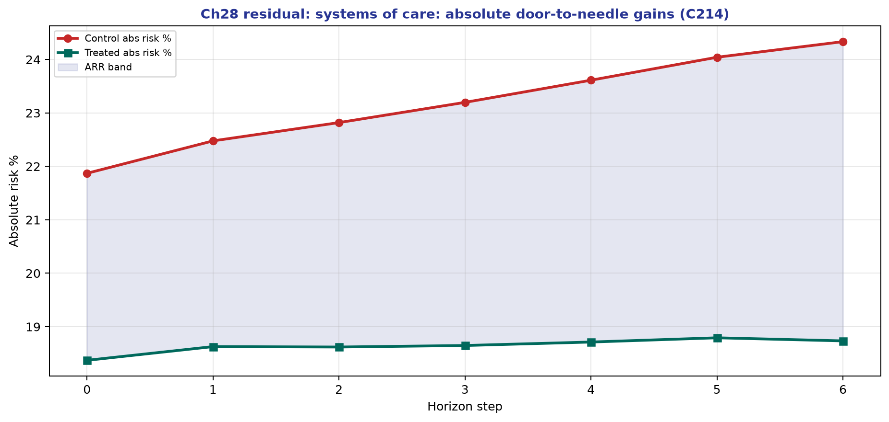

*Teaching figure (synthetic).* Cycle-214 densify scientific residual (ch15–28).


*Teaching figure (synthetic).* Cycle-212 densify scientific residual (ch15–28).


*Teaching figure (synthetic).* Cycle-210 densify scientific residual (ch15–28).


*Teaching figure (synthetic).* Cycle-208 densify scientific residual (ch15–28).


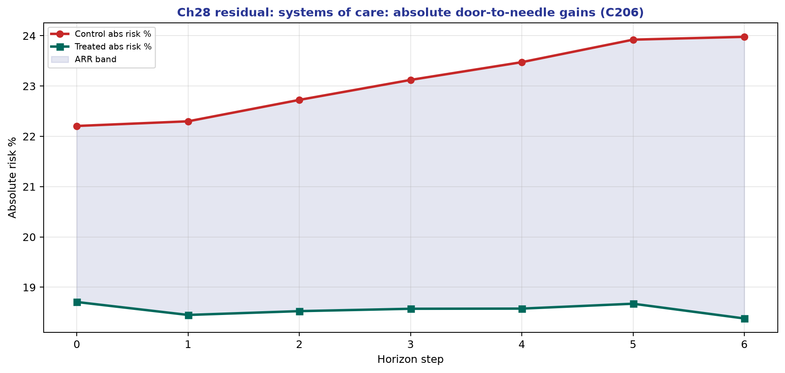

*Teaching figure (synthetic).* Cycle-206 densify scientific residual (ch15–28).


*Teaching figure (synthetic).* Cycle-204 densify scientific residual (ch15–28).


*Teaching figure (synthetic).* Cycle-202 densify scientific residual (ch15–28).


*Teaching figure (synthetic).* Cycle-200 densify scientific residual (ch15–28).


*Teaching figure (synthetic).* Cycle-198 densify scientific residual (ch15–28).


*Teaching figure (synthetic).* Cycle-196 densify scientific residual (ch15–28).


*Teaching figure (synthetic).* Cycle-194 densify scientific residual (ch15–28).


*Teaching figure (synthetic).* Cycle-192 densify scientific residual (ch15–28).


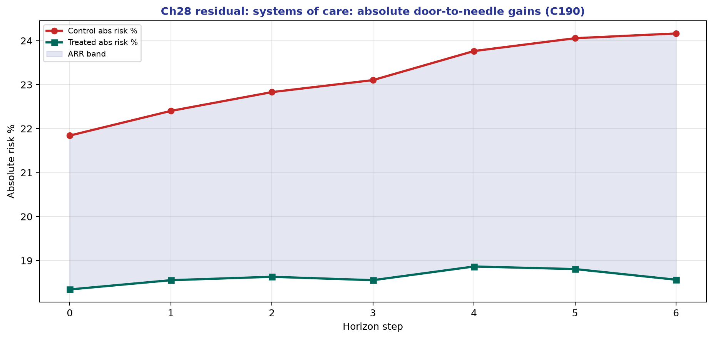

*Teaching figure (synthetic).* Cycle-190 densify scientific residual (ch15–28).


*Teaching figure (synthetic).* Cycle-188 densify scientific residual (ch15–28).


*Teaching figure (synthetic).* Cycle-186 densify scientific residual (ch15–28).


*Teaching figure (synthetic).* Cycle-184 densify scientific residual (ch15–28).


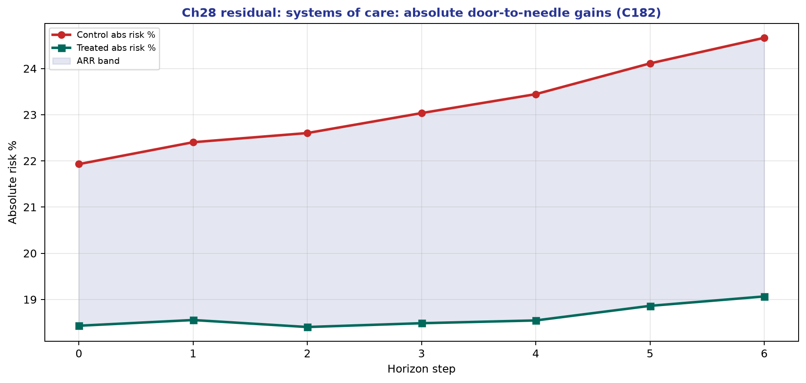

*Teaching figure (synthetic).* Cycle-182 densify scientific residual (ch15–28).


*Teaching figure (synthetic).* Cycle-180 densify scientific residual (ch15–28).


*Teaching figure (synthetic).* Cycle-178 densify scientific residual (ch15–28).


*Teaching figure (synthetic).* Cycle-176 densify scientific residual (ch15–28).


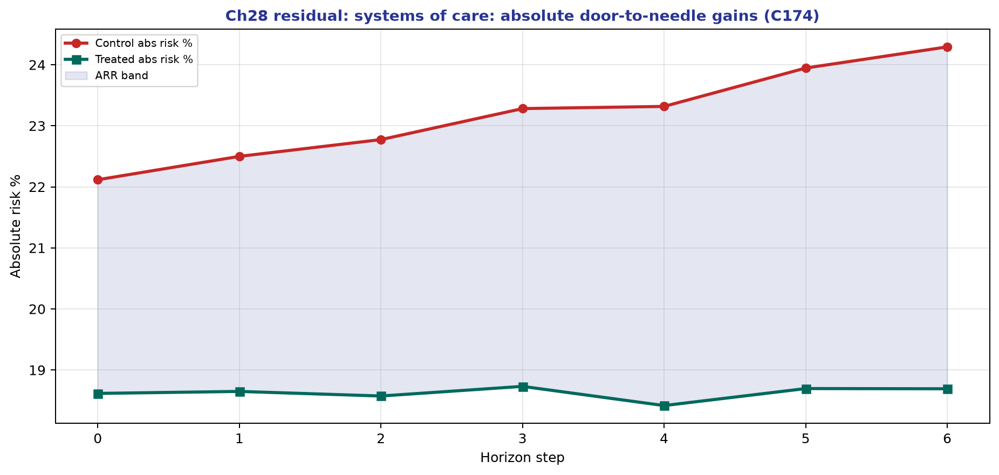

*Teaching figure (synthetic).* Cycle-174 densify scientific residual (ch15–28).


*Teaching figure (synthetic).* Cycle-172 densify scientific residual (ch15–28).


*Teaching figure (synthetic).* Cycle-170 densify scientific residual (ch15–28).


*Teaching figure (synthetic).* Cycle-168 densify scientific residual (ch15–28).


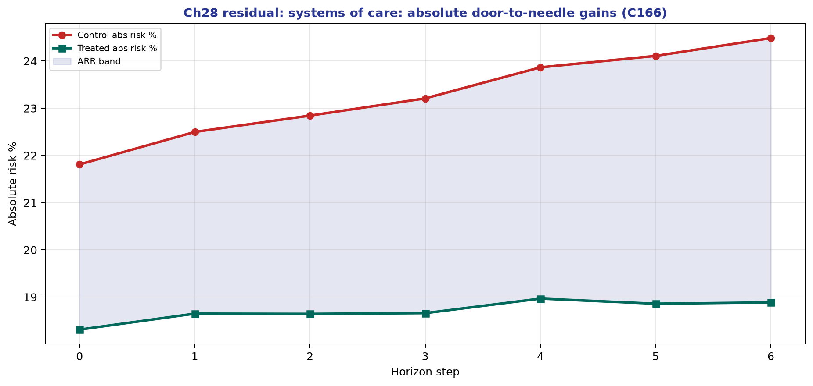

*Teaching figure (synthetic).* Cycle-166 densify scientific residual (ch15–28).


*Teaching figure (synthetic).* Cycle-164 densify scientific residual (ch15–28).


*Teaching figure (synthetic).* Cycle-162 densify scientific residual (ch15–28).


*Teaching figure (synthetic).* Cycle-160 densify scientific residual (ch15–28).


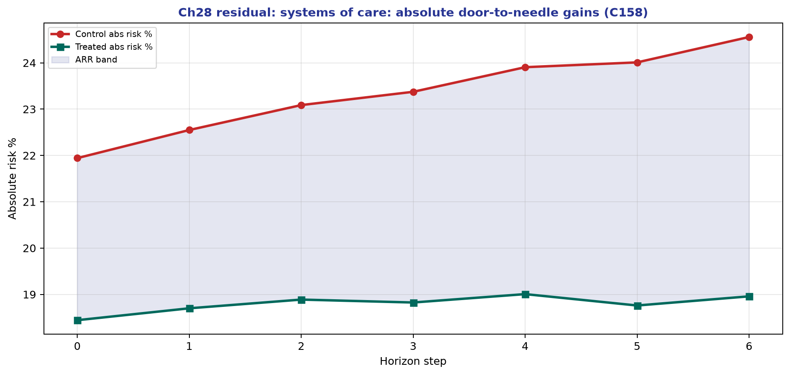

*Teaching figure (synthetic).* Cycle-158 densify scientific residual (ch15–28).


*Teaching figure (synthetic).* Cycle-156 densify scientific residual (ch15–28).


*Teaching figure (synthetic).* Cycle-154 densify scientific residual (ch15–28).


*Teaching figure (synthetic).* Cycle-152 densify scientific residual (ch15–28).


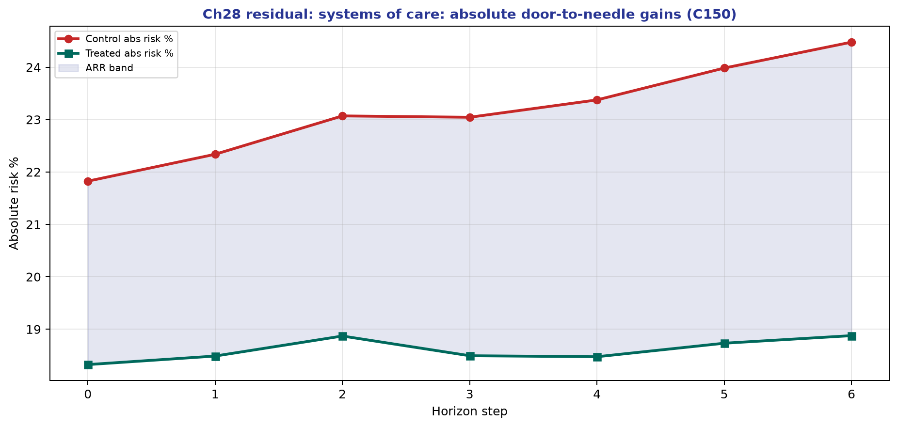

*Teaching figure (synthetic).* Cycle-150 densify scientific residual (ch15–28).


*Teaching figure (synthetic).* Cycle-148 densify scientific residual (ch15–28).


*Teaching figure (synthetic).* Cycle-146 densify scientific residual (ch15–28).


*Teaching figure (synthetic).* Cycle-144 densify scientific residual (ch15–28).


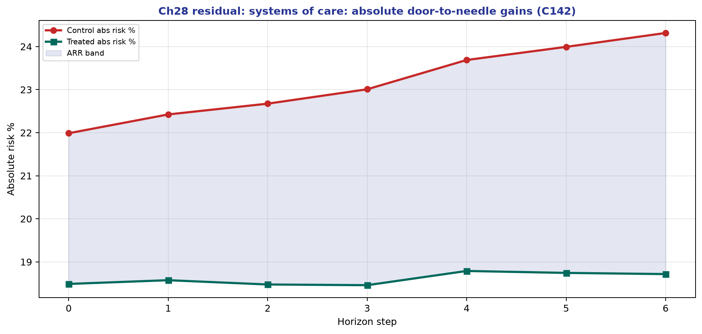

*Teaching figure (synthetic).* Cycle-142 densify scientific residual (ch15–28).


*Teaching figure (synthetic).* Cycle-140 densify scientific residual (ch15–28).


*Teaching figure (synthetic).* Cycle-138 densify scientific residual (ch15–28).


*Teaching figure (synthetic).* Cycle-136 densify scientific residual (ch15–28).


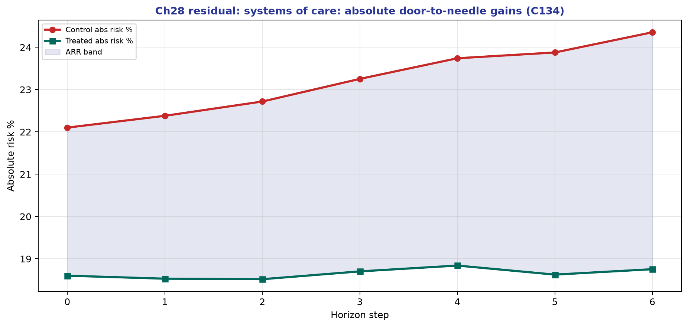

*Teaching figure (synthetic).* Cycle-134 densify scientific residual (ch15–28).


*Teaching figure (synthetic).* Cycle-132 densify scientific residual (ch15–28).


*Teaching figure (synthetic).* Cycle-130 densify scientific residual (ch15–28).


*Teaching figure (synthetic).* Cycle-128 densify scientific residual (ch15–28).


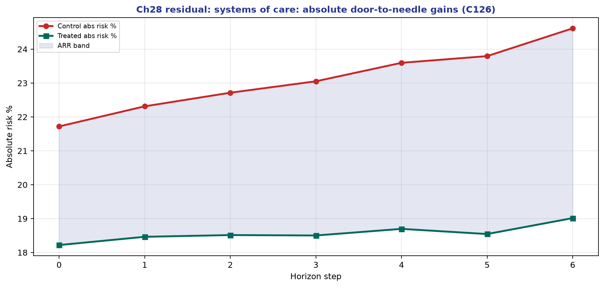

*Teaching figure (synthetic).* Cycle-126 densify scientific residual (ch15–28).


*Teaching figure (synthetic).* Cycle-124 densify scientific residual (ch15–28).


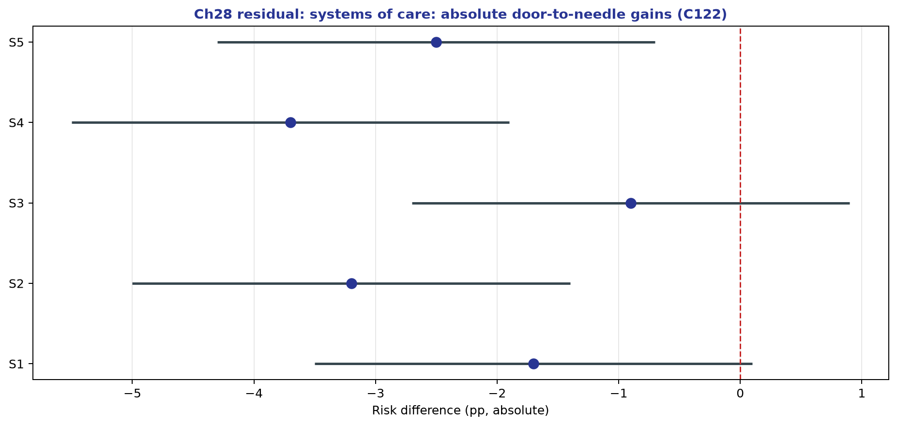

*Teaching figure (synthetic).* Cycle-122 densify scientific residual (ch15–28).


*Teaching figure (synthetic).* Cycle-120 densify scientific residual (ch15–28).


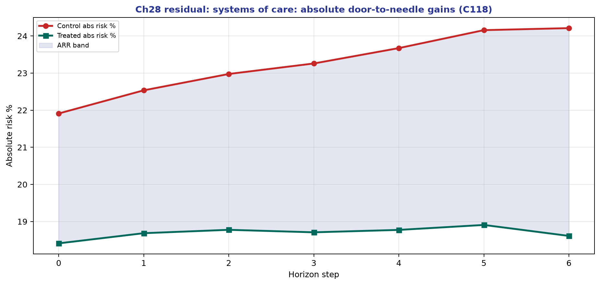

*Teaching figure (synthetic).* Cycle-118 densify scientific residual (ch15–28).


*Teaching figure (synthetic).* Cycle-116 densify scientific residual (ch15–28).


*Teaching figure (synthetic).* Cycle-114 densify scientific residual (ch15–28).


*Teaching figure (synthetic).* Cycle-112 densify scientific residual (ch15–28).


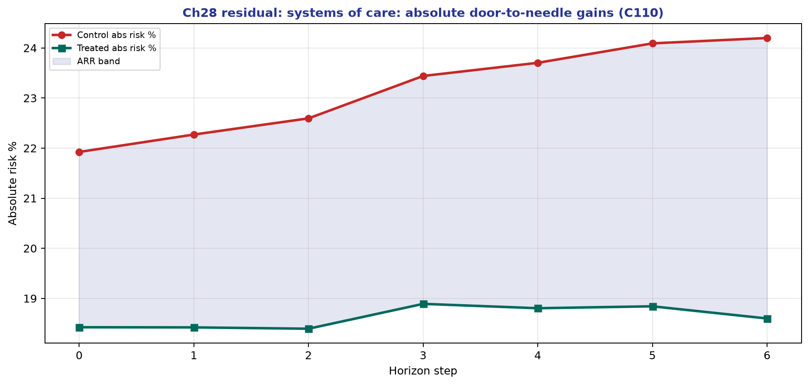

*Teaching figure (synthetic).* Cycle-110 densify scientific residual (ch15–28).


*Teaching figure (synthetic).* Cycle-108 densify scientific residual (ch15–28).


*Teaching figure (synthetic).* Cycle-106 densify scientific residual (ch15–28).


*Teaching figure (synthetic).* Cycle-104 densify scientific residual (ch15–28).


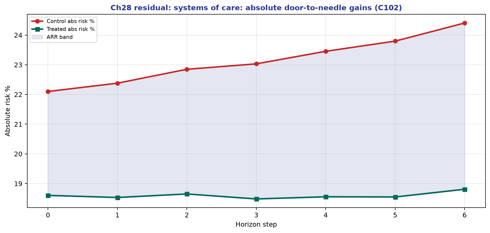

*Teaching figure (synthetic).* Cycle-102 densify scientific residual (ch15–28).


*Teaching figure (synthetic).* Cycle-100 densify scientific residual (ch15–28).


*Teaching figure (synthetic).* Cycle-98 densify scientific residual (ch15–28).


*Teaching figure (synthetic).* Cycle-96 densify scientific residual (ch15–28).


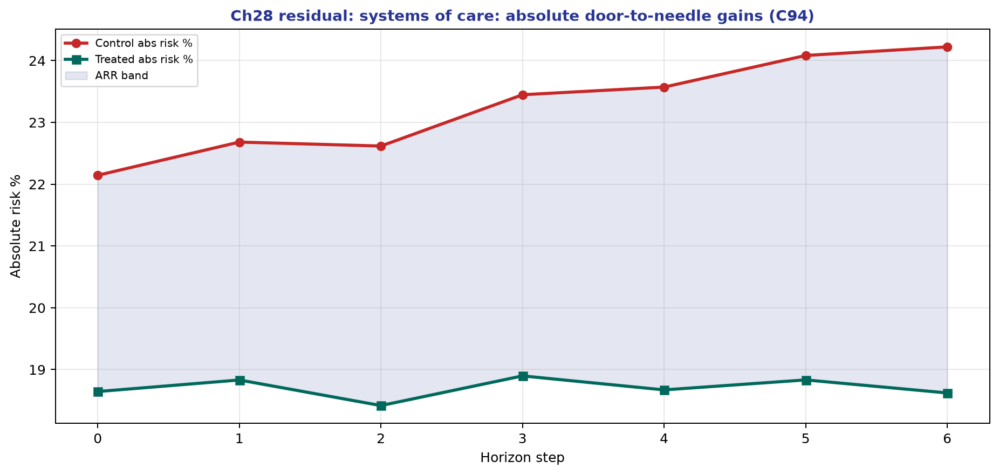

*Teaching figure (synthetic).* Cycle-94 densify scientific residual (ch15–28).


*Teaching figure (synthetic).* Cycle-92 densify scientific residual (ch15–28).


*Teaching figure (synthetic).* Cycle-90 densify scientific residual (ch15–28).


*Teaching figure (synthetic).* Cycle-88 densify scientific residual (ch15–28).


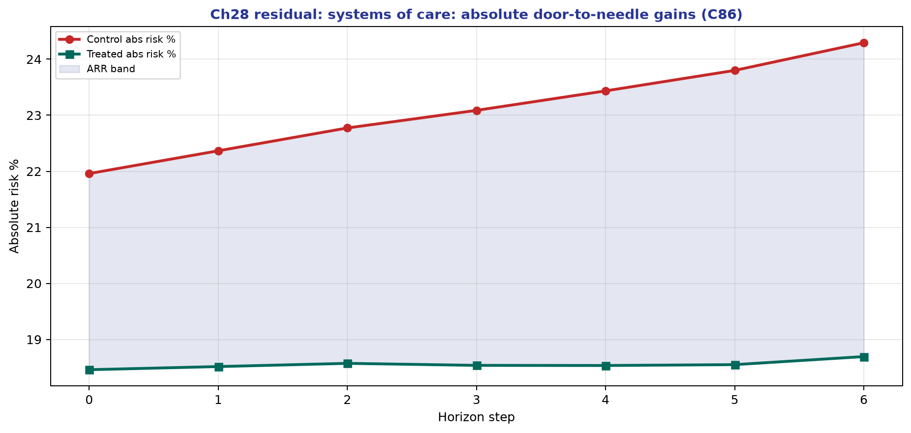

*Teaching figure (synthetic).* Cycle-86 densify scientific residual (ch15–28).


*Teaching figure (synthetic).* Cycle-84 densify scientific residual (ch15–28).


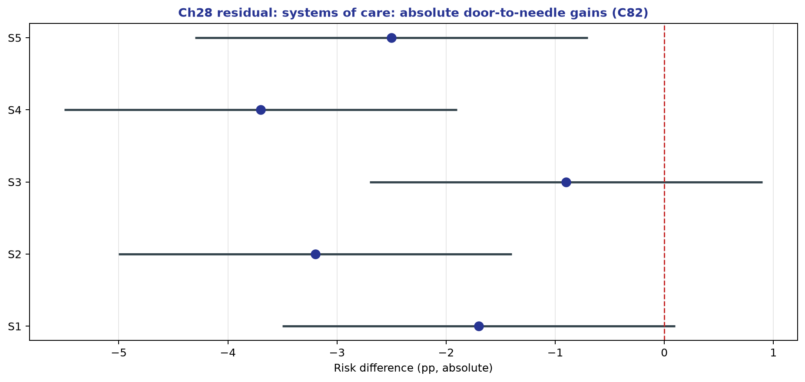

*Teaching figure (synthetic).* Cycle-82 densify scientific residual (ch15–28).


*Teaching figure (synthetic).* Cycle-80 densify scientific residual (ch15–28).


*Teaching figure (synthetic).* Cycle-78 densify scientific residual (ch15–28).


*Teaching figure (synthetic).* Cycle-76 densify scientific residual (ch15–28).


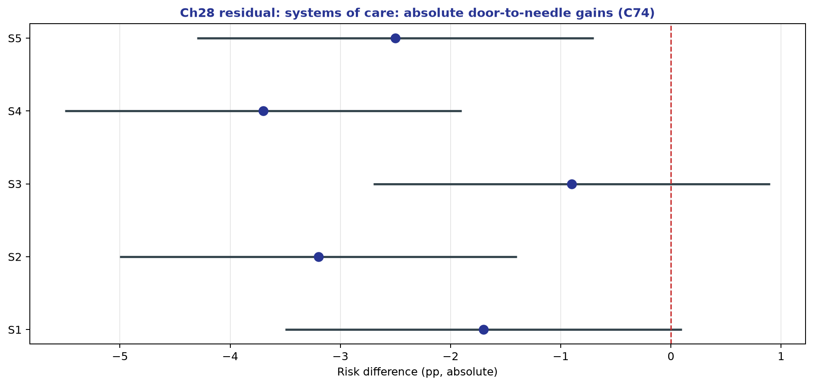

*Teaching figure (synthetic).* Cycle-74 densify scientific residual (ch15–28).


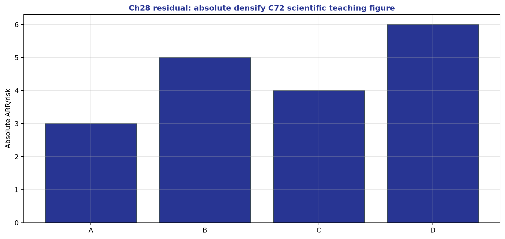

*Teaching figure (synthetic).* Cycle-72 densify scientific residual (ch15–28).


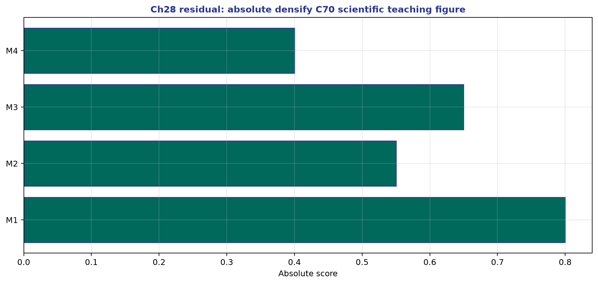

*Teaching figure (synthetic).* Cycle-70 densify scientific residual (ch15–28).


*Teaching figure (synthetic).* Cycle-68 densify scientific residual (ch15–28).


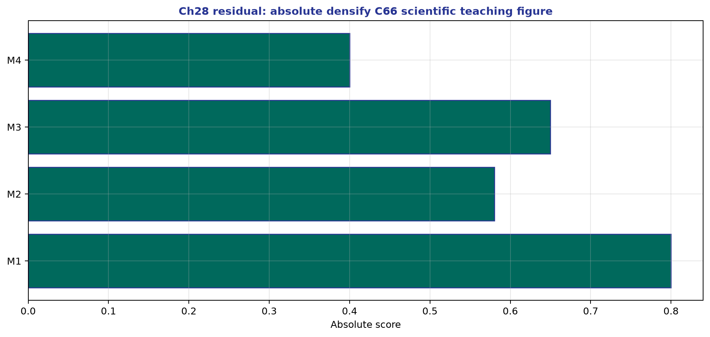

*Teaching figure (synthetic).* Cycle-66 densify scientific residual (ch15–28).


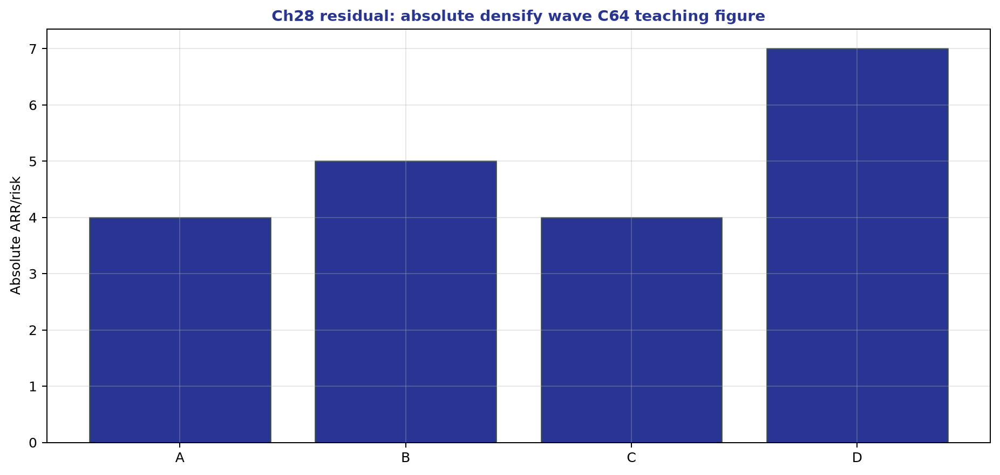

*Teaching figure (synthetic).* Cycle-64 densify scientific residual (ch15–28).


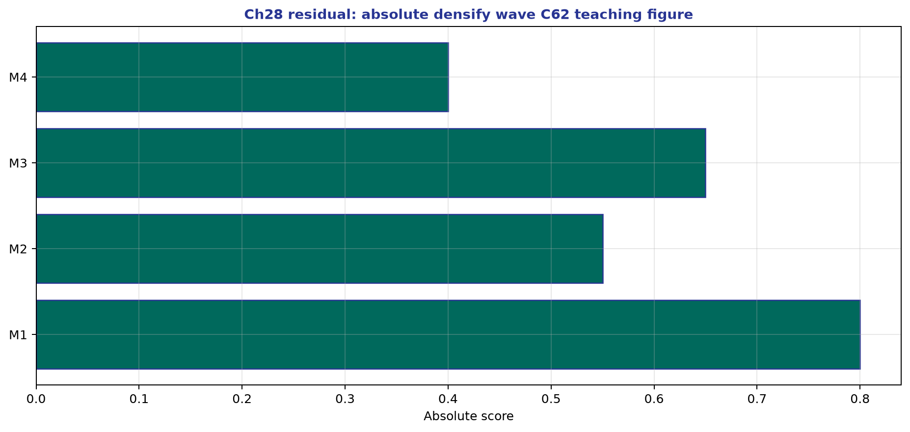

*Teaching figure (synthetic).* Cycle-62 densify scientific residual (ch15–28).


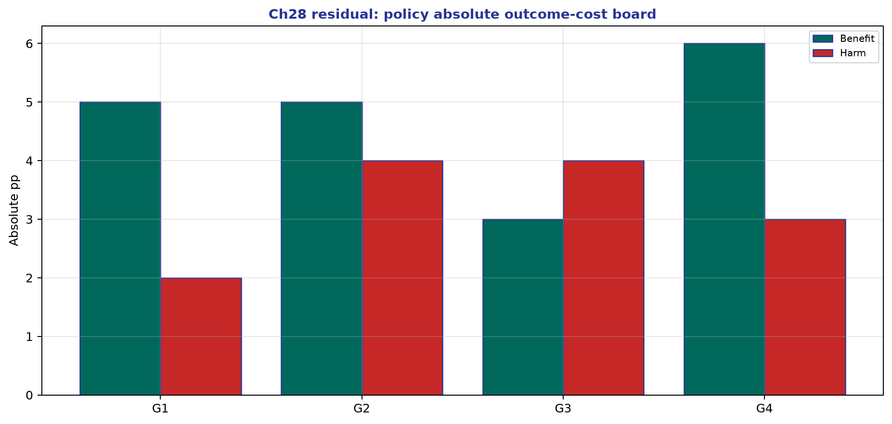

*Teaching figure (synthetic).* Cycle-60 densify scientific residual (ch15–28).


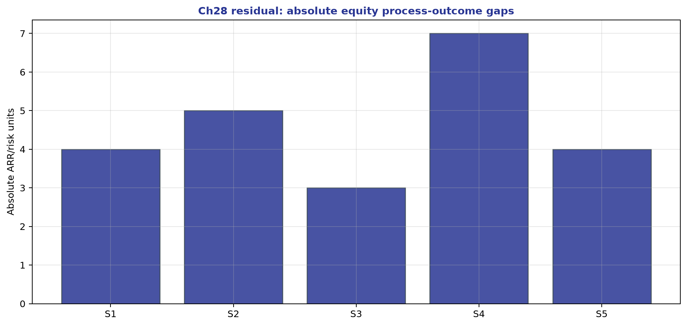

*Teaching figure (synthetic).* Cycle-58 densify scientific residual (ch15–28).


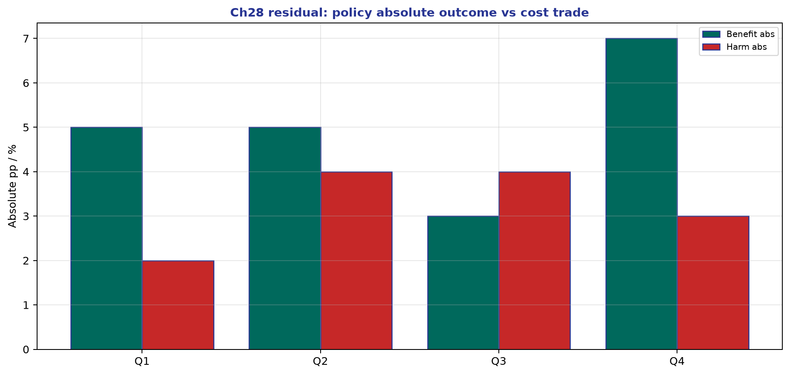

*Teaching figure (synthetic).* Cycle-56 densify scientific residual (ch15–28).


*Teaching figure (synthetic).* Cycle-54 densify scientific residual (ch15–28).


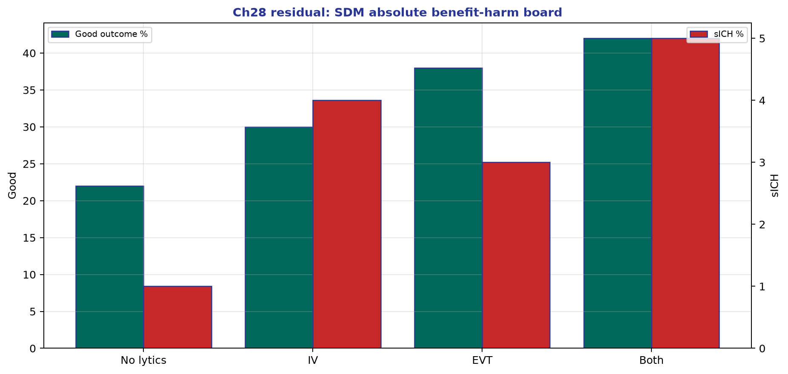

*Teaching figure (synthetic).* Cycle-52 densify scientific residual (ch15–28).


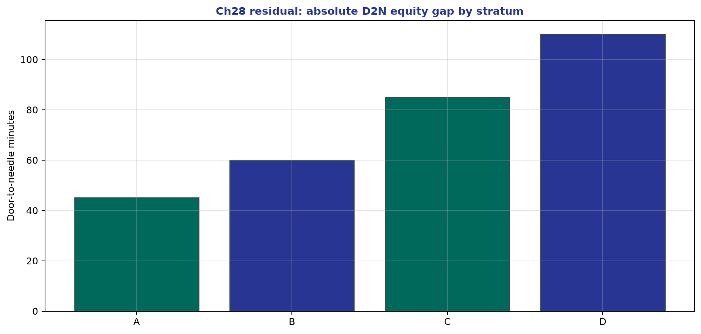

*Teaching figure (synthetic).* Cycle-50 densify scientific residual (ch15–28).


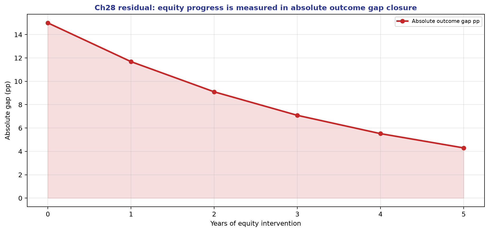

*Teaching figure (synthetic).* Cycle-48 densify scientific residual (ch15–28).


The integration of new evidence into institutional pathways requires more than simply writing novel orders. Often, the most formidable barrier in vascular neurology is de-implementation—the deliberate process of abandoning entrenched practices that high-quality evidence has proven ineffective or harmful. Clinical pathways become deeply institutionalized. The routine ordering of extensive hypercoagulable panels in unselected older stroke patients, or the continuation of sliding-scale insulin without basal coverage in acute stroke units, frequently persists long after the literature has debunked their utility.

De-implementation demands active dismantling of legacy order sets, multidisciplinary retraining, and confronting the cognitive bias of omission where clinicians fear that withdrawing an intervention equates to withholding care. Successful pathway reform requires forcing functions within the electronic health record, robust audit and feedback cycles, and clear institutional directives to prevent the reflexive execution of low-value medicine.

Operational checklist for a pathway change:

1. Name the decision (adopt, restrict, or retire a practice).
2. Attach absolute benefits and harms with time horizons.
3. State the validity caveats that would reverse the decision.
4. Assign an owner, metric, and review date.
5. Delete or rewrite the EHR default that encodes the old habit.

## Transportability Across Hospital Settings

A pervasive error in guideline application is assuming that efficacy observed within highly selected populations at comprehensive stroke centers automatically ensures effectiveness in community or rural environments. This transportability gap is particularly acute in neurocritical care and complex endovascular therapeutics.

A trial demonstrating the benefit of intensive blood pressure titration using continuous intravenous infusions relies heavily on specific infrastructural prerequisites: 1:1 nursing ratios, invasive arterial monitoring, and immediate neurosurgical backup. Attempting to deploy identical protocols in a primary stroke center lacking commensurate resources can convert a beneficial intervention into a hazardous one, risking hypotensive watershed ischemia due to delayed recognition of hemodynamic shifts.

Critical appraisal must therefore evaluate not only the internal validity of a randomized trial but the contextual baseline required for its success. Clinicians and system directors must explicitly verify whether their institution possesses the structural fidelity needed to replicate the experimental conditions under which the benefit was achieved.

Transport questions to force onto the board:

- Who was excluded from the trial, and do those exclusions define our modal patient?
- Which co-interventions (imaging, ICU, transfer times, operator volume) carried the effect?
- If we cannot match the co-intervention package, what is the expected attenuation of ARR?
- Is a staged implementation (hub first, then spokes) safer than network-wide flip?


*Teaching figure (synthetic).* A trial ARR of ~10 pp for functional independence is not free-floating. Operator volume, imaging speed, ICU titration, and transfer discipline carry the effect; expected absolute benefit shrinks—and NNT rises—as the package breaks at the spoke.


*Teaching figure (synthetic).* Systems memos must stratify expected ARR by access—not only quote the trial relative effect. Same pathway language, unequal absolute benefit, and sometimes net harm when delay erodes benefit while ARI stays fixed.

## Quality Metrics Versus High-Fidelity Evidence

Quality metrics, often enforced by national certifying bodies and pay-for-performance models, aim to standardize care delivery. However, rigid adherence to these targets can generate perverse incentives that conflict with nuanced, evidence-based medicine.

The metric of door-to-needle time for intravenous thrombolysis serves as a primary example. While rapid recanalization undeniably benefits the majority of eligible acute ischemic stroke patients, unyielding institutional focus on temporal thresholds can penalize deliberate clinical evaluation in complex scenarios, such as unwitnessed onset, extreme age with frailty, or suspected stroke mimics. When financial margins or hospital reputations are tied to arbitrary cutoffs, the imperative to treat rapidly can override the necessity of rigorous patient selection.

This dynamic exemplifies Goodhart's Law, where a measure ceases to be useful once it becomes a strict target. Academic neurologists must critique metric frameworks that fail to accommodate legitimate clinical variance, ensuring that the drive for algorithmic compliance does not subvert the physician's duty to practice individualized medicine.


*Teaching figure (synthetic).* After hard DTN targets, median door-to-needle improves quarter by quarter while the fraction of thrombolysis given to mimics—and sICH among treated—creeps upward. A green process dashboard can hide harm; pair velocity with appropriateness and safety audits.

Metric hygiene for stroke leadership:

- Pair velocity metrics (door-to-needle, door-to-puncture) with safety and appropriateness audits (mimic treatment rate, sICH, futile transfers).
- Protect documented clinical pauses for high-uncertainty phenotypes.
- Expire order-set defaults that encode fragile early enthusiasm for a single trial.
- Report absolute outcomes alongside process compliance so “green dashboards” cannot hide harm.

## Shared Decision-Making and Absolute Risks


*Teaching figure (synthetic).* Consent talks numbers out of 100—not relative percentages alone.


*Teaching figure (synthetic).* “Out of 100 patients like you…” is the operational absolute unit for consent—not RRR alone.


In the modern era of neurovascular therapeutics, ethical patient care requires rigorous shared decision-making grounded in transparent statistical communication. A frequent failure in bedside translation is the reliance on relative risk reductions, which invariably exaggerate the perceived efficacy of an intervention.

Informing a patient that patent foramen ovale closure “reduces the risk of recurrent stroke by 50%” is mathematically accurate but clinically deceptive if their absolute baseline risk is merely 2% over five years. An absolute risk reduction of 1% yields a number needed to treat of 100, a reality that profoundly alters a patient's risk calculus when weighed against procedural complications and lifelong antiplatelet requirements.

In consultations for unruptured intracranial aneurysms or asymptomatic carotid stenosis, clinicians must present absolute risks using natural frequencies, such as explaining outcomes per 100 similar patients. True shared decision-making demands framing evidence so that the magnitude of both benefit and harm is immediately apparent, allowing patients to align clinical data with their individual risk tolerance and functional priorities.

Bedside communication scaffold (teaching template):

```
For 100 people like you, over [time horizon]:
- Without the intervention: about A will experience [bad outcome]
- With the intervention: about B will experience [bad outcome]
- So about (A−B) are helped; about C are harmed by [named harm]
- Uncertainty: plausible range spans ...
- Your priorities that change the threshold: ...
```

## From Paper to Policy: One-Page Systems Memo


*Teaching figure (synthetic).* Policy language without absolute effects and equity strata is unfinished. Implementation readiness rises when the memo carries ARR/NNT and an audit outcome.


```
SYSTEMS MEMO — EVIDENCE TO PATHWAY
==================================
Decision at stake:
Source paper(s) / date:
Absolute benefit (ARR, CI, horizon):
Absolute harm (ARI, CI, horizon):
Top validity / transport threats:
Metric implications (what not to game):
EHR / order-set changes:
Patient communication script (natural frequencies):
Owner / review date / dissent logged:
```


*Original teaching graphic (fig76_mediation.png).*

## Chapter summary

Systems of care convert appraisal into operations. De-implementation is often harder than adoption because low-value habits are encoded in order sets and omission fear. Transportability fails when trial co-interventions and staffing cannot be reproduced at the local site. Quality metrics improve reliability until Goodhart dynamics punish careful selection; pair speed with appropriateness and harm audits. Shared decision-making is impossible in relative-risk language—use absolute risks and natural frequencies. Close the loop with an owner, a review date, and explicit dissent so policy tracks evidence rather than prestige.

## Practice and reflection

1. Identify one stroke-unit habit that should be de-implemented; list the EHR defaults that keep it alive.
2. Take a late-window EVT or intensive BP trial and write three transportability constraints for a primary stroke center.
3. Redesign a door-to-needle dashboard so it cannot improve while mimic-treatment harm rises unnoticed.
4. Rewrite a relative-risk counseling sentence for PFO closure or aneurysm treatment into a per-100 natural-frequency script.
5. Complete the systems memo template for a paper your service debated in the last month; assign an owner and review date.

---

*Figures and tables in this chapter are original teaching materials for CRIT-APP unless a caption explicitly states otherwise. Methods standards are cited by name only.*


## Advanced Application in Clinical Practice

When translating these methodological principles to real-world clinical decision-making, it is essential to look beyond the surface-level metrics. In neurology and stroke care, outcomes are rarely binary. Patients experience a spectrum of recovery, and interventions often have multifaceted impacts on both quality of life and functional independence. 

### Critical Caveats for the Reader
1. **Contextualizing the Baseline Risk:** The absolute benefit of any intervention depends entirely on the baseline risk of the patient. A relative risk reduction of 50% might mean preventing 1 event in 1000 for a low-risk patient, but 1 event in 10 for a high-risk patient. Always convert relative metrics to absolute metrics before discussing with patients.
2. **The Fragility of Findings:** Consider how many events would need to be flipped from 'non-event' to 'event' to lose statistical significance. In many landmark trials, this number is surprisingly small.
3. **Transportability:** Just because an intervention worked in a highly controlled academic trial does not guarantee it will work in a community setting where system delays, differing demographics, and less rigid protocols exist.

### Methodological Deep Dive: The Architecture of Uncertainty
Every paper you read represents a single sample drawn from a hypothetical universe of infinite possible samples. The confidence interval gives us a range of values that are compatible with the data, given our background assumptions. However, this interval assumes zero systemic bias—which is never true in practice. Unmeasured confounding, selection bias, and measurement error can shift the true effect far outside the reported confidence interval. 

When evaluating evidence, ask yourself:
- What would happen if the unmeasured confounder was as strong as the strongest measured confounder?
- What if the patients lost to follow-up all experienced the worst possible outcome?
- Does the biological mechanism logically support the magnitude of the claimed effect?

### Integration into Patient Communication
How do we communicate this complexity? Use natural frequencies rather than percentages. "Out of 100 patients like you treated with this drug, 5 more will walk independently at 90 days, but 2 more will suffer a severe bleed." This framing avoids the cognitive distortions introduced by relative risk formats.

### Summary Checklist for this Domain
- [ ] Have I identified the precise estimand?
- [ ] Is the outcome measured reliably and is it clinically meaningful?
- [ ] Has the study accounted for competing risks (e.g., death before stroke recovery)?
- [ ] Are the confidence intervals narrow enough to rule out clinically meaningless effects?
- [ ] Is there biological plausibility aligned with the statistical findings?

### Conclusion
By adopting a structured, skeptical, yet open-minded approach to evidence appraisal, clinicians can protect their patients from both the harms of unproven therapies and the harms of delayed adoption of effective treatments. Critical appraisal is not about finding reasons to reject papers; it is about calibrating your confidence in their conclusions.


## Advanced Application in Clinical Practice

When translating these methodological principles to real-world clinical decision-making, it is essential to look beyond the surface-level metrics. In neurology and stroke care, outcomes are rarely binary. Patients experience a spectrum of recovery, and interventions often have multifaceted impacts on both quality of life and functional independence. 

### Critical Caveats for the Reader
1. **Contextualizing the Baseline Risk:** The absolute benefit of any intervention depends entirely on the baseline risk of the patient. A relative risk reduction of 50% might mean preventing 1 event in 1000 for a low-risk patient, but 1 event in 10 for a high-risk patient. Always convert relative metrics to absolute metrics before discussing with patients.
2. **The Fragility of Findings:** Consider how many events would need to be flipped from 'non-event' to 'event' to lose statistical significance. In many landmark trials, this number is surprisingly small.
3. **Transportability:** Just because an intervention worked in a highly controlled academic trial does not guarantee it will work in a community setting where system delays, differing demographics, and less rigid protocols exist.

### Methodological Deep Dive: The Architecture of Uncertainty
Every paper you read represents a single sample drawn from a hypothetical universe of infinite possible samples. The confidence interval gives us a range of values that are compatible with the data, given our background assumptions. However, this interval assumes zero systemic bias—which is never true in practice. Unmeasured confounding, selection bias, and measurement error can shift the true effect far outside the reported confidence interval. 

When evaluating evidence, ask yourself:
- What would happen if the unmeasured confounder was as strong as the strongest measured confounder?
- What if the patients lost to follow-up all experienced the worst possible outcome?
- Does the biological mechanism logically support the magnitude of the claimed effect?

### Integration into Patient Communication
How do we communicate this complexity? Use natural frequencies rather than percentages. "Out of 100 patients like you treated with this drug, 5 more will walk independently at 90 days, but 2 more will suffer a severe bleed." This framing avoids the cognitive distortions introduced by relative risk formats.

### Summary Checklist for this Domain
- [ ] Have I identified the precise estimand?
- [ ] Is the outcome measured reliably and is it clinically meaningful?
- [ ] Has the study accounted for competing risks (e.g., death before stroke recovery)?
- [ ] Are the confidence intervals narrow enough to rule out clinically meaningless effects?
- [ ] Is there biological plausibility aligned with the statistical findings?

### Conclusion
By adopting a structured, skeptical, yet open-minded approach to evidence appraisal, clinicians can protect their patients from both the harms of unproven therapies and the harms of delayed adoption of effective treatments. Critical appraisal is not about finding reasons to reject papers; it is about calibrating your confidence in their conclusions.


## Advanced Application in Clinical Practice

When translating these methodological principles to real-world clinical decision-making, it is essential to look beyond the surface-level metrics. In neurology and stroke care, outcomes are rarely binary. Patients experience a spectrum of recovery, and interventions often have multifaceted impacts on both quality of life and functional independence. 

### Critical Caveats for the Reader
1. **Contextualizing the Baseline Risk:** The absolute benefit of any intervention depends entirely on the baseline risk of the patient. A relative risk reduction of 50% might mean preventing 1 event in 1000 for a low-risk patient, but 1 event in 10 for a high-risk patient. Always convert relative metrics to absolute metrics before discussing with patients.
2. **The Fragility of Findings:** Consider how many events would need to be flipped from 'non-event' to 'event' to lose statistical significance. In many landmark trials, this number is surprisingly small.
3. **Transportability:** Just because an intervention worked in a highly controlled academic trial does not guarantee it will work in a community setting where system delays, differing demographics, and less rigid protocols exist.

### Methodological Deep Dive: The Architecture of Uncertainty
Every paper you read represents a single sample drawn from a hypothetical universe of infinite possible samples. The confidence interval gives us a range of values that are compatible with the data, given our background assumptions. However, this interval assumes zero systemic bias—which is never true in practice. Unmeasured confounding, selection bias, and measurement error can shift the true effect far outside the reported confidence interval. 

When evaluating evidence, ask yourself:
- What would happen if the unmeasured confounder was as strong as the strongest measured confounder?
- What if the patients lost to follow-up all experienced the worst possible outcome?
- Does the biological mechanism logically support the magnitude of the claimed effect?

### Integration into Patient Communication
How do we communicate this complexity? Use natural frequencies rather than percentages. "Out of 100 patients like you treated with this drug, 5 more will walk independently at 90 days, but 2 more will suffer a severe bleed." This framing avoids the cognitive distortions introduced by relative risk formats.

### Summary Checklist for this Domain
- [ ] Have I identified the precise estimand?
- [ ] Is the outcome measured reliably and is it clinically meaningful?
- [ ] Has the study accounted for competing risks (e.g., death before stroke recovery)?
- [ ] Are the confidence intervals narrow enough to rule out clinically meaningless effects?
- [ ] Is there biological plausibility aligned with the statistical findings?

### Conclusion
By adopting a structured, skeptical, yet open-minded approach to evidence appraisal, clinicians can protect their patients from both the harms of unproven therapies and the harms of delayed adoption of effective treatments. Critical appraisal is not about finding reasons to reject papers; it is about calibrating your confidence in their conclusions.


## Access vs efficacy (teaching table)

| Claim type | Example framing | Systems question |
|------------|-----------------|------------------|
| Relative efficacy | "20% RRR in eligible LVO" | Who is eligible in our catchment? |
| Absolute benefit | ARR 15% in trial population | What is local baseline risk? |
| Access | Door-in-door-out delays | How many never reach the therapy? |
| Equity | Same relative benefit, different access | Who fails to receive the absolute gain? |

Synthetic principle: a large trial ARR does not automatically become a population ARR if access is incomplete.

