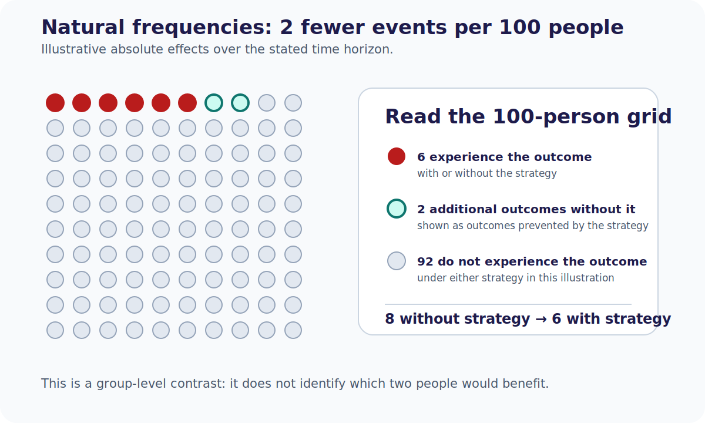

# Chapter 28. Systems of Care, Policy, and Patient Communication

## Opening


*A trial's absolute benefit can shrink in your catchment when baseline risk, access, and case mix differ from the enrolled population.*


*Turning evidence into a pathway means deciding what to adopt, what to de-implement, and how to track access and equity.*



*Natural frequencies for systems and counseling.*

Policy meeting: absolute benefit looks large in trials but small in your catchment. Systems design must track access, equity, and communication—not only p-values.


## Pathway Change and De-Implementation

The integration of new evidence into institutional pathways requires more than simply writing novel orders. Often, the most formidable barrier in vascular neurology is de-implementation—the deliberate process of abandoning entrenched practices that high-quality evidence has proven ineffective or harmful. Clinical pathways become deeply institutionalized. The routine ordering of extensive hypercoagulable panels in unselected older stroke patients, or the continuation of sliding-scale insulin without basal coverage in acute stroke units, frequently persists long after the literature has debunked their utility.

De-implementation demands active dismantling of legacy order sets, multidisciplinary retraining, and confronting the cognitive bias of omission where clinicians fear that withdrawing an intervention equates to withholding care. Successful pathway reform requires forcing functions within the electronic health record, robust audit and feedback cycles, and clear institutional directives to prevent the reflexive execution of low-value medicine.

Operational checklist for a pathway change:

1. Name the decision (adopt, restrict, or retire a practice).
2. Attach absolute benefits and harms with time horizons.
3. State the validity caveats that would reverse the decision.
4. Assign an owner, metric, and review date.
5. Delete or rewrite the EHR default that encodes the old habit.

## Transportability Across Hospital Settings

A pervasive error in guideline application is assuming that efficacy observed within highly selected populations at comprehensive stroke centers automatically ensures effectiveness in community or rural environments. This transportability gap is particularly acute in neurocritical care and complex endovascular therapeutics.

Transportability depends on the actual intervention protocol and co-interventions. An intensive blood-pressure strategy may require a specified monitoring frequency, trained nursing, rapid medication titration, and escalation capacity, but requirements such as 1:1 staffing or invasive monitoring are not universal across trials. Compare the protocol's delivery conditions with local capacity and measure fidelity and adverse events during implementation.

Critical appraisal must therefore evaluate not only the internal validity of a randomized trial but the contextual baseline required for its success. Clinicians and system directors must explicitly verify whether their institution possesses the structural fidelity needed to replicate the experimental conditions under which the benefit was achieved.

Transport questions to force onto the board:

- Who was excluded from the trial, and do those exclusions define our modal patient?
- Which co-interventions (imaging, ICU, transfer times, operator volume) carried the effect?
- If we cannot match the co-intervention package, what is the expected attenuation of ARR?
- Is a staged implementation (hub first, then spokes) safer than network-wide flip?

## Quality Metrics Versus High-Fidelity Evidence

Quality metrics, often enforced by national certifying bodies and pay-for-performance models, aim to standardize care delivery. However, rigid adherence to these targets can generate perverse incentives that conflict with nuanced, evidence-based medicine.

The metric of door-to-needle time for intravenous thrombolysis serves as a primary example. While rapid recanalization undeniably benefits the majority of eligible acute ischemic stroke patients, unyielding institutional focus on temporal thresholds can penalize deliberate clinical evaluation in complex scenarios, such as unwitnessed onset, extreme age with frailty, or suspected stroke mimics. When financial margins or hospital reputations are tied to arbitrary cutoffs, the imperative to treat rapidly can override the necessity of rigorous patient selection.

This dynamic exemplifies Goodhart's Law, where a measure ceases to be useful once it becomes a strict target. Academic neurologists must critique metric frameworks that fail to accommodate legitimate clinical variance, ensuring that the drive for algorithmic compliance does not subvert the physician's duty to practice individualized medicine.

Metric hygiene for stroke leadership:

- Pair velocity metrics with balanced safety and access measures: sICH, missed eligible treatment, treatment delay by subgroup, diagnostic revisions such as mimics, and transfer outcomes. A mimic-treatment rate alone can incentivize undertreatment.
- Protect documented clinical pauses for high-uncertainty phenotypes.
- Expire order-set defaults that encode fragile early enthusiasm for a single trial.
- Report absolute outcomes alongside process compliance so “green dashboards” cannot hide harm.

## Shared Decision-Making and Absolute Risks

In the modern era of neurovascular therapeutics, ethical patient care requires shared decision-making grounded in transparent statistical communication. Presenting a relative risk reduction without the corresponding absolute risks can make benefit appear larger when baseline risk is low.

Use a named population, endpoint, and horizon. In [REDUCE](https://www.nejm.org/doi/full/10.1056/NEJMoa1707404), selected patients with cryptogenic stroke and PFO had recurrent ischemic stroke in 1.4% of the closure group versus 5.4% of the antiplatelet-only group over a median 3.2 years (crude ARR 4.0 percentage points; NNT 25). Atrial fibrillation or flutter occurred in 6.6% versus 0.4%, and serious device-related adverse events in 1.4% of closure recipients. Antithrombotic regimens after closure are trial-, device-, and guideline-specific; “lifelong antiplatelet therapy” is not a universal device requirement. Counseling should present these absolute outcomes and test whether the patient matches the enrolled population.

In consultations for unruptured intracranial aneurysms or asymptomatic carotid stenosis, clinicians must present absolute risks using natural frequencies, such as explaining outcomes per 100 similar patients. True shared decision-making demands framing evidence so that the magnitude of both benefit and harm is immediately apparent, allowing patients to align clinical data with their individual risk tolerance and functional priorities.

Bedside communication scaffold (teaching template):

```
For 100 people like you, over [time horizon]:
- Without the intervention: about A will experience [bad outcome]
- With the intervention: about B will experience [bad outcome]
- So about (A−B) fewer people experience [bad outcome]; about C experience [named harm]
- Uncertainty: plausible range spans ...
- Your priorities that change the threshold: ...
```

## From Paper to Policy: One-Page Systems Memo

```
SYSTEMS MEMO — EVIDENCE TO PATHWAY
==================================
Decision at stake:
Source paper(s) / date:
Absolute benefit (ARR, CI, horizon):
Absolute harm (ARI, CI, horizon):
Top validity / transport threats:
Metric implications (what not to game):
EHR / order-set changes:
Patient communication script (natural frequencies):
Owner / review date / dissent logged:
```


## Chapter summary

Systems of care convert appraisal into operations. De-implementation is often harder than adoption because low-value habits are encoded in order sets and omission fear. Transportability fails when trial co-interventions and staffing cannot be reproduced at the local site. Quality metrics improve reliability until Goodhart dynamics punish careful selection; pair speed with appropriateness and harm audits. Shared decision-making is impossible in relative-risk language—use absolute risks and natural frequencies. Close the loop with an owner, a review date, and explicit dissent so policy tracks evidence rather than prestige.

## Practice and reflection

1. Identify one stroke-unit habit that should be de-implemented; list the EHR defaults that keep it alive.
2. Take a late-window EVT or intensive BP trial and write three transportability constraints for a primary stroke center.
3. Redesign a door-to-needle dashboard so it cannot improve while mimic-treatment harm rises unnoticed.
4. Rewrite a relative-risk counseling sentence for PFO closure or aneurysm treatment into a per-100 natural-frequency script.
5. Complete the systems memo template for a paper your service debated in the last month; assign an owner and review date.

---

*Figures and tables in this chapter are Teaching materials for CRIT-APP unless a caption explicitly states otherwise. Methods standards are cited by name only.*
