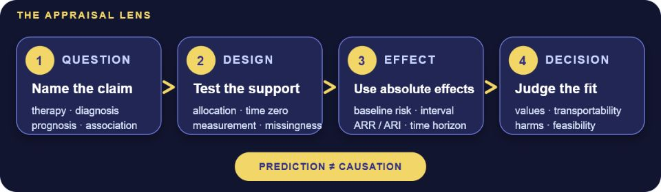
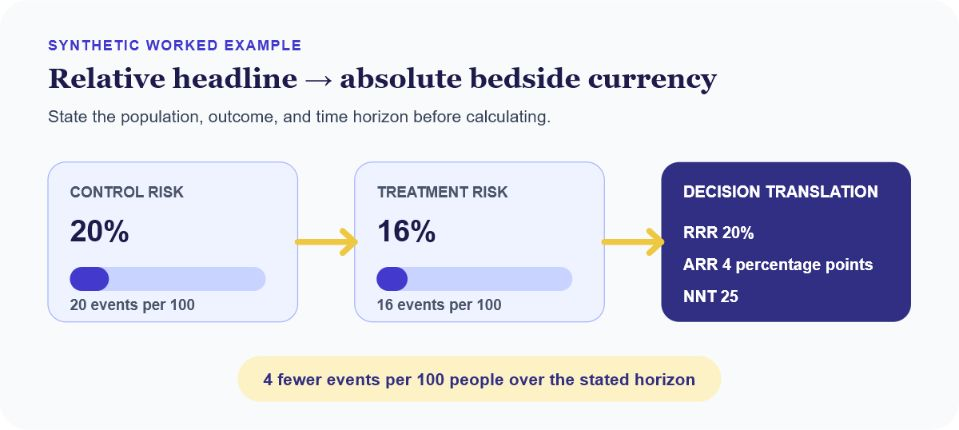

Open-source clinical methods field guide

# Critical Appraisal for Neurologists

Turn a published claim into a defensible bedside decision—by matching the question to the design, translating effects into absolute terms, and carrying uncertainty all the way to action.

CC BY 4.0 · Educational only — not medical advice · <a href="https://github.com/rkalani1/CRIT-APP">Source on GitHub</a>

<picture>
  <source media="(max-width: 600px)" srcset="assets/figures/crit_evidence_lens_mobile.png" width="600" height="760">
  
</picture>

[Begin with the 20-minute read](curriculum/02-how-to-read-a-paper-under-time-pressure.md)
<a class="secondary" href="evidence-register.html">Evidence register</a>
<a class="secondary" href="https://rkalani1.github.io/ML/">ML &amp; AI companion</a>

## Choose a route

<a href="curriculum/02-how-to-read-a-paper-under-time-pressure.html">On call<strong>Read a paper in 20 minutes</strong>Find the decision, validity threat, absolute effect, and stop rule.</a>
<a href="curriculum/24-appraising-therapy-and-harm-questions.html">Treatment<strong>Balance benefit and harm</strong>Move from relative headlines to ARR, ARI, NNT, NNH, and fit.</a>
<a href="curriculum/25-appraising-diagnosis-and-prognosis-papers.html">Testing<strong>Appraise diagnosis and prognosis</strong>Separate discrimination, calibration, prevalence, and clinical consequences.</a>
<a href="curriculum/14-appraising-artificial-intelligence-and-machine-learning-papers.html">AI evidence<strong>Interrogate a model paper</strong>Check leakage, external validation, calibration, utility, and causal overreach.</a>

## Translate the headline

<figure class="feature-figure">

<figcaption>A relative effect becomes clinically useful only after baseline risk and a time horizon are explicit. Values shown are synthetic.</figcaption>
</figure>

| Claim you are reading | Minimum validity check | Decision-ready result |
| --- | --- | --- |
| Treatment or harm | Allocation, adherence, co-interventions, outcome ascertainment | Baseline risk, ARR/ARI, interval, time horizon |
| Diagnostic accuracy | Representative spectrum, blinded reference standard, missing results | Sensitivity, specificity, likelihood ratios, prevalence-aware predictive values |
| Prognosis or prediction | Time zero, leakage-free validation, calibration, transportability | Absolute risk by horizon, calibration, discrimination, decision consequence |
| Causal observational | Target-trial alignment, confounding control, selection and time-related bias | Adjusted absolute contrast plus sensitivity analyses |

## Contents

<ul class="chapter-list">
<li class="part">I · Foundations</li>
<li><a href="curriculum/01-why-critical-appraisal-matters-in-neurology-and-stroke.html">01Why Critical Appraisal Matters in Neurology and Stroke</a></li>
<li><a href="curriculum/02-how-to-read-a-paper-under-time-pressure.html">02How to Read a Paper Under Time Pressure</a></li>
<li><a href="curriculum/03-questions-pico-estimands-and-index-time.html">03Questions, PICO, Estimands, and Index Time</a></li>
<li><a href="curriculum/04-internal-validity-external-validity-and-bias-taxonomy.html">04Internal Validity, External Validity, and Bias Taxonomy</a></li>
<li><a href="curriculum/05-confounding-dags-and-target-trial-thinking.html">05Confounding, DAGs, and Target-Trial Thinking</a></li>
<li class="part">II · Study designs</li>
<li><a href="curriculum/06-appraising-randomized-trials-in-stroke-and-neurology.html">06Appraising Randomized Trials in Stroke and Neurology</a></li>
<li><a href="curriculum/07-appraising-observational-studies-without-naivete.html">07Appraising Observational Studies Without Naivete</a></li>
<li><a href="curriculum/08-diagnostic-accuracy-studies-from-sensitivity-to-decisions.html">08Diagnostic Accuracy Studies: From Sensitivity to Decisions</a></li>
<li><a href="curriculum/09-prognosis-risk-scores-and-prediction-models.html">09Prognosis, Risk Scores, and Prediction Models</a></li>
<li><a href="curriculum/10-systematic-reviews-meta-analysis-and-guidelines-evidence-synthesis-and-trustwort.html">10Systematic Reviews, Meta-Analysis, and Guidelines: Evidence Synthesis and Trustworthiness</a></li>
<li class="part">III · Stroke practice &amp; teaching</li>
<li><a href="curriculum/11-stroke-outcomes-mrs-time-to-event-and-competing-risks.html">11Stroke Outcomes: mRS, Time-to-Event, and Competing Risks</a></li>
<li><a href="curriculum/12-effect-sizes-absolute-benefit-nnt-and-clinical-importance.html">12Effect Sizes, Absolute Benefit, NNT, and Clinical Importance</a></li>
<li><a href="curriculum/13-subgroups-heterogeneity-of-treatment-effect-and-spin.html">13Subgroups, Heterogeneity of Treatment Effect, and Spin</a></li>
<li><a href="curriculum/14-appraising-artificial-intelligence-and-machine-learning-papers.html">14Appraising Artificial Intelligence and Machine Learning Papers</a></li>
<li><a href="curriculum/15-journal-club-architecture-and-teaching-critical-appraisal.html">15Journal Club Architecture and Teaching Critical Appraisal</a></li>
<li><a href="curriculum/16-paper-autopsies-integrated-worked-critiques.html">16Paper Autopsies: Integrated Worked Critiques</a></li>
<li class="part">IV · Quantitative literacy &amp; reasoning</li>
<li><a href="curriculum/17-chapter-17-disease-frequency-association.html">17Disease Frequency and Association</a></li>
<li><a href="curriculum/18-causation-frameworks-bias-and-inference.html">18Causation Frameworks, Bias, and Inference</a></li>
<li><a href="curriculum/19-inference-estimation-and-the-architecture-of-uncertainty.html">19Inference, Estimation, and the Architecture of Uncertainty</a></li>
<li><a href="curriculum/20-regression-and-survival-analysis-literacy-for-paper-readers.html">20Regression and Survival Analysis: Literacy for Paper Readers</a></li>
<li><a href="curriculum/21-interaction-effect-modification-and-standardization.html">21Interaction, Effect Modification, and Standardization</a></li>
<li><a href="curriculum/22-screening-early-detection-and-overdiagnosis.html">22Screening, Early Detection, and Overdiagnosis</a></li>
<li><a href="curriculum/23-clinical-reasoning-dual-process-and-cognitive-bias-when-using-evidence.html">23Clinical Reasoning, Dual Process, and Cognitive Bias When Using Evidence</a></li>
<li class="part">V · Applied appraisal &amp; systems</li>
<li><a href="curriculum/24-appraising-therapy-and-harm-questions.html">24Appraising Therapy and Harm Questions</a></li>
<li><a href="curriculum/25-appraising-diagnosis-and-prognosis-papers.html">25Appraising Diagnosis and Prognosis Papers</a></li>
<li><a href="curriculum/26-systematic-reviews-and-clinical-prediction-rules.html">26Systematic Reviews and Clinical Prediction Rules</a></li>
<li><a href="curriculum/27-missing-data-multiplicity-interim-analyses-and-fragility.html">27Missing Data, Multiplicity, Interim Analyses, and Fragility</a></li>
<li><a href="curriculum/28-chapter-28-systems-of-care-policy-and-patient-communication.html">28Systems of Care, Policy, and Patient Communication</a></li>
</ul>
